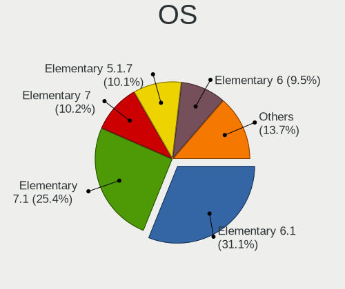
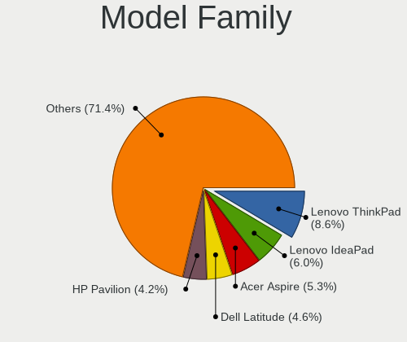
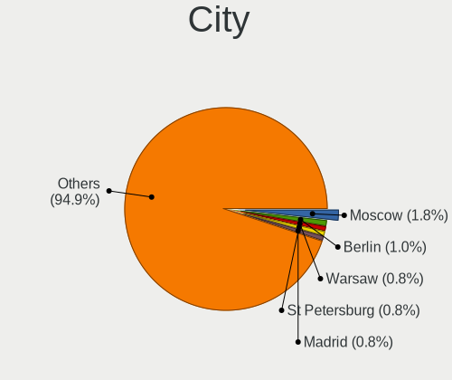
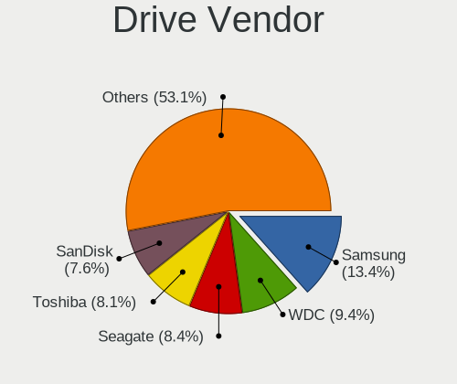
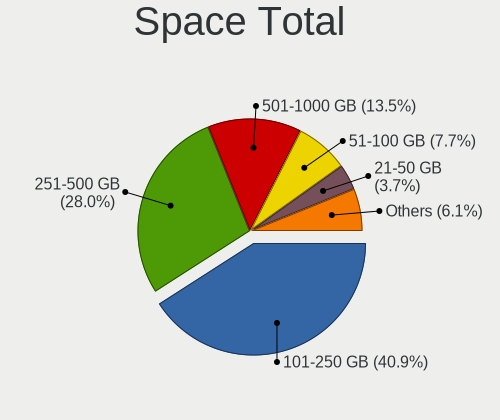
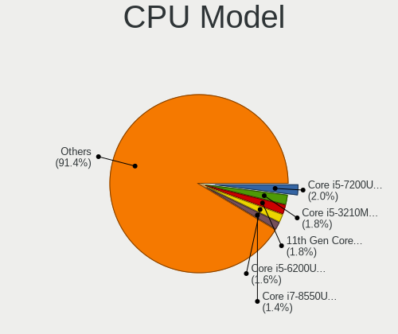
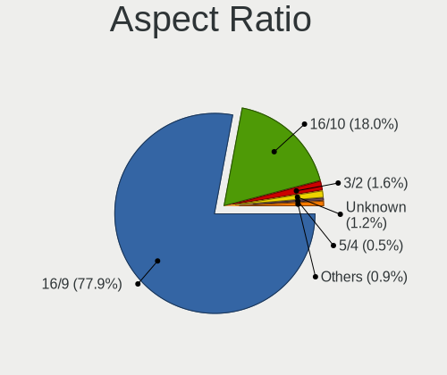

Elementary - Tested Hardware & Statistics (Notebooks)
-----------------------------------------------------

A project to collect tested hardware configurations for Elementary.

Anyone can contribute to this report by the [hw-probe](https://github.com/linuxhw/hw-probe) tool:

    sudo -E hw-probe -all -upload

Please contribute! Especially if your hardware is rare.

Contents
--------

* [ Test Cases ](#test-cases)

* [ System ](#system)
  - [ OS                       ](#os)
  - [ OS Family                ](#os-family)
  - [ Kernel                   ](#kernel)
  - [ Kernel Family            ](#kernel-family)
  - [ Kernel Major Ver.        ](#kernel-major-ver)
  - [ Arch                     ](#arch)
  - [ DE                       ](#de)
  - [ Display Server           ](#display-server)
  - [ Display Manager          ](#display-manager)
  - [ OS Lang                  ](#os-lang)
  - [ Boot Mode                ](#boot-mode)
  - [ Filesystem               ](#filesystem)
  - [ Part. scheme             ](#part-scheme)
  - [ Dual Boot with Linux/BSD ](#dual-boot-with-linuxbsd)
  - [ Dual Boot (Win)          ](#dual-boot-win)

* [ Board ](#board)
  - [ Vendor                   ](#vendor)
  - [ Model                    ](#model)
  - [ Model Family             ](#model-family)
  - [ MFG Year                 ](#mfg-year)
  - [ Form Factor              ](#form-factor)
  - [ Secure Boot              ](#secure-boot)
  - [ Coreboot                 ](#coreboot)
  - [ RAM Size                 ](#ram-size)
  - [ RAM Used                 ](#ram-used)
  - [ Total Drives             ](#total-drives)
  - [ Has CD-ROM               ](#has-cd-rom)
  - [ Has Ethernet             ](#has-ethernet)
  - [ Has WiFi                 ](#has-wifi)
  - [ Has Bluetooth            ](#has-bluetooth)

* [ Location ](#location)
  - [ Country                  ](#country)
  - [ City                     ](#city)

* [ Drives ](#drives)
  - [ Drive Vendor             ](#drive-vendor)
  - [ Drive Model              ](#drive-model)
  - [ HDD Vendor               ](#hdd-vendor)
  - [ SSD Vendor               ](#ssd-vendor)
  - [ Drive Kind               ](#drive-kind)
  - [ Drive Connector          ](#drive-connector)
  - [ Drive Size               ](#drive-size)
  - [ Space Total              ](#space-total)
  - [ Space Used               ](#space-used)
  - [ Malfunc. Drives          ](#malfunc-drives)
  - [ Malfunc. Drive Vendor    ](#malfunc-drive-vendor)
  - [ Malfunc. HDD Vendor      ](#malfunc-hdd-vendor)
  - [ Malfunc. Drive Kind      ](#malfunc-drive-kind)
  - [ Failed Drives            ](#failed-drives)
  - [ Failed Drive Vendor      ](#failed-drive-vendor)
  - [ Drive Status             ](#drive-status)

* [ Storage controller ](#storage-controller)
  - [ Storage Vendor           ](#storage-vendor)
  - [ Storage Model            ](#storage-model)
  - [ Storage Kind             ](#storage-kind)

* [ Processor ](#processor)
  - [ CPU Vendor               ](#cpu-vendor)
  - [ CPU Model                ](#cpu-model)
  - [ CPU Model Family         ](#cpu-model-family)
  - [ CPU Cores                ](#cpu-cores)
  - [ CPU Sockets              ](#cpu-sockets)
  - [ CPU Threads              ](#cpu-threads)
  - [ CPU Op-Modes             ](#cpu-op-modes)
  - [ CPU Microcode            ](#cpu-microcode)
  - [ CPU Microarch            ](#cpu-microarch)

* [ Graphics ](#graphics)
  - [ GPU Vendor               ](#gpu-vendor)
  - [ GPU Model                ](#gpu-model)
  - [ GPU Combo                ](#gpu-combo)
  - [ GPU Driver               ](#gpu-driver)
  - [ GPU Memory               ](#gpu-memory)

* [ Monitor ](#monitor)
  - [ Monitor Vendor           ](#monitor-vendor)
  - [ Monitor Model            ](#monitor-model)
  - [ Monitor Resolution       ](#monitor-resolution)
  - [ Monitor Diagonal         ](#monitor-diagonal)
  - [ Monitor Width            ](#monitor-width)
  - [ Aspect Ratio             ](#aspect-ratio)
  - [ Monitor Area             ](#monitor-area)
  - [ Pixel Density            ](#pixel-density)
  - [ Multiple Monitors        ](#multiple-monitors)

* [ Network ](#network)
  - [ Net Controller Vendor    ](#net-controller-vendor)
  - [ Net Controller Model     ](#net-controller-model)
  - [ Wireless Vendor          ](#wireless-vendor)
  - [ Wireless Model           ](#wireless-model)
  - [ Ethernet Vendor          ](#ethernet-vendor)
  - [ Ethernet Model           ](#ethernet-model)
  - [ Net Controller Kind      ](#net-controller-kind)
  - [ Used Controller          ](#used-controller)
  - [ NICs                     ](#nics)
  - [ IPv6                     ](#ipv6)

* [ Bluetooth ](#bluetooth)
  - [ Bluetooth Vendor         ](#bluetooth-vendor)
  - [ Bluetooth Model          ](#bluetooth-model)

* [ Sound ](#sound)
  - [ Sound Vendor             ](#sound-vendor)
  - [ Sound Model              ](#sound-model)

* [ Memory ](#memory)
  - [ Memory Vendor            ](#memory-vendor)
  - [ Memory Model             ](#memory-model)
  - [ Memory Kind              ](#memory-kind)
  - [ Memory Form Factor       ](#memory-form-factor)
  - [ Memory Size              ](#memory-size)
  - [ Memory Speed             ](#memory-speed)

* [ Printers & scanners ](#printers--scanners)
  - [ Printer Vendor           ](#printer-vendor)
  - [ Printer Model            ](#printer-model)
  - [ Scanner Vendor           ](#scanner-vendor)
  - [ Scanner Model            ](#scanner-model)

* [ Camera ](#camera)
  - [ Camera Vendor            ](#camera-vendor)
  - [ Camera Model             ](#camera-model)

* [ Security ](#security)
  - [ Fingerprint Vendor       ](#fingerprint-vendor)
  - [ Fingerprint Model        ](#fingerprint-model)
  - [ Chipcard Vendor          ](#chipcard-vendor)
  - [ Chipcard Model           ](#chipcard-model)

* [ Unsupported ](#unsupported)
  - [ Unsupported Devices      ](#unsupported-devices)
  - [ Unsupported Device Types ](#unsupported-device-types)

Test Cases
----------

Total: 1192

| Vendor        | Model                       | Probe                                                      | Date         |
|---------------|-----------------------------|------------------------------------------------------------|--------------|
| Apple         | MacBookAir6,2               | [2261a77abb](https://linux-hardware.org/?probe=2261a77abb) | Feb 01, 2023 |
| Dell          | XPS 13 9360                 | [9037e30b54](https://linux-hardware.org/?probe=9037e30b54) | Jan 30, 2023 |
| Apple         | MacBookPro11,3              | [b7cec06bcb](https://linux-hardware.org/?probe=b7cec06bcb) | Jan 30, 2023 |
| Sony          | VPCSB11FX                   | [7659c1ba93](https://linux-hardware.org/?probe=7659c1ba93) | Jan 29, 2023 |
| HUAWEI        | MACHD-WXX9                  | [cac5b8faa5](https://linux-hardware.org/?probe=cac5b8faa5) | Jan 29, 2023 |
| Lenovo        | ThinkPad T14 Gen 1 20S1S... | [c5168e6b33](https://linux-hardware.org/?probe=c5168e6b33) | Jan 27, 2023 |
| Sony          | SVE1711C5E                  | [73977968f5](https://linux-hardware.org/?probe=73977968f5) | Jan 27, 2023 |
| Sony          | SVE1711C5E                  | [d526ae42aa](https://linux-hardware.org/?probe=d526ae42aa) | Jan 27, 2023 |
| HP            | EliteBook 2560p             | [d5eae98224](https://linux-hardware.org/?probe=d5eae98224) | Jan 25, 2023 |
| Dell          | G3 3500                     | [e81b4d5e46](https://linux-hardware.org/?probe=e81b4d5e46) | Jan 22, 2023 |
| ASUSTek       | X540UA                      | [dda62597f7](https://linux-hardware.org/?probe=dda62597f7) | Jan 21, 2023 |
| Acer          | TravelMate 5735Z            | [712fdb1fa7](https://linux-hardware.org/?probe=712fdb1fa7) | Jan 20, 2023 |
| Acer          | TravelMate 5735Z            | [5b1b812b6e](https://linux-hardware.org/?probe=5b1b812b6e) | Jan 20, 2023 |
| Lenovo        | IdeaPad 330-15IKB 81FE      | [032ac1d52e](https://linux-hardware.org/?probe=032ac1d52e) | Jan 18, 2023 |
| Apple         | MacBookPro8,2               | [271f6a7e85](https://linux-hardware.org/?probe=271f6a7e85) | Jan 17, 2023 |
| HP            | ProBook 455R G6             | [6ca9f4f6c0](https://linux-hardware.org/?probe=6ca9f4f6c0) | Jan 15, 2023 |
| Apple         | MacBookAir6,2               | [2931eab7f7](https://linux-hardware.org/?probe=2931eab7f7) | Jan 15, 2023 |
| Star Labs     | StarBook                    | [784ae24356](https://linux-hardware.org/?probe=784ae24356) | Jan 15, 2023 |
| Chuwi         | AeroBook Pro                | [13da35b0f7](https://linux-hardware.org/?probe=13da35b0f7) | Jan 15, 2023 |
| Lenovo        | Y50-70 20378                | [64ec4b6816](https://linux-hardware.org/?probe=64ec4b6816) | Jan 12, 2023 |
| Lenovo        | Y50-70 20378                | [9cd68b4513](https://linux-hardware.org/?probe=9cd68b4513) | Jan 11, 2023 |
| HP            | ProBook 650 G1              | [1dba72668b](https://linux-hardware.org/?probe=1dba72668b) | Jan 10, 2023 |
| HP            | ProBook 650 G1              | [e6d3982bc0](https://linux-hardware.org/?probe=e6d3982bc0) | Jan 10, 2023 |
| Avell High... | B.ON                        | [23b5b8565e](https://linux-hardware.org/?probe=23b5b8565e) | Jan 10, 2023 |
| Notebook      | NLx0MU                      | [69b46423cb](https://linux-hardware.org/?probe=69b46423cb) | Jan 08, 2023 |
| Notebook      | NLx0MU                      | [e43de3e94e](https://linux-hardware.org/?probe=e43de3e94e) | Jan 08, 2023 |
| HUAWEI        | MACHD-WXX9                  | [3e870855db](https://linux-hardware.org/?probe=3e870855db) | Jan 08, 2023 |
| Lenovo        | IdeaPad S145-14AST 81ST     | [b8e1b2ec8e](https://linux-hardware.org/?probe=b8e1b2ec8e) | Jan 07, 2023 |
| Dell          | XPS 15 9510                 | [1893fb2388](https://linux-hardware.org/?probe=1893fb2388) | Jan 06, 2023 |
| Dell          | XPS 15 9510                 | [c3fbbaf7de](https://linux-hardware.org/?probe=c3fbbaf7de) | Jan 06, 2023 |
| Apple         | MacBookPro8,1               | [4641833cab](https://linux-hardware.org/?probe=4641833cab) | Jan 06, 2023 |
| Lenovo        | ThinkPad T480 20L5000YUS    | [4c735329b6](https://linux-hardware.org/?probe=4c735329b6) | Jan 05, 2023 |
| Lenovo        | IdeaPad 110-15ACL 80TJ      | [3a3164f63f](https://linux-hardware.org/?probe=3a3164f63f) | Jan 04, 2023 |
| Lenovo        | ThinkPad E14 Gen 2 20TA0... | [2c6b6c2558](https://linux-hardware.org/?probe=2c6b6c2558) | Jan 04, 2023 |
| Lenovo        | V14 G2 ALC 82KC             | [c7d37a7616](https://linux-hardware.org/?probe=c7d37a7616) | Jan 04, 2023 |
| Acer          | TravelMate 5735Z            | [9fa5978af4](https://linux-hardware.org/?probe=9fa5978af4) | Jan 01, 2023 |
| Dell          | System XPS L702X            | [7030c340cc](https://linux-hardware.org/?probe=7030c340cc) | Dec 31, 2022 |
| Chuwi         | HeroBook                    | [1664994b07](https://linux-hardware.org/?probe=1664994b07) | Dec 30, 2022 |
| HP            | ProBook 455R G6             | [71c9651ee2](https://linux-hardware.org/?probe=71c9651ee2) | Dec 30, 2022 |
| AMI           | F3C2                        | [ed7d4a2a13](https://linux-hardware.org/?probe=ed7d4a2a13) | Dec 30, 2022 |
| Lenovo        | V17 G2 ITL 82NX             | [5e094b34a5](https://linux-hardware.org/?probe=5e094b34a5) | Dec 29, 2022 |
| Acer          | Aspire A315-53              | [9c28036440](https://linux-hardware.org/?probe=9c28036440) | Dec 29, 2022 |
| Apple         | MacBookPro8,1               | [7b03f438db](https://linux-hardware.org/?probe=7b03f438db) | Dec 28, 2022 |
| Lenovo        | ThinkBook 13s G3 ACN 20Y... | [f5c5147826](https://linux-hardware.org/?probe=f5c5147826) | Dec 28, 2022 |
| Lenovo        | ThinkBook 13s G3 ACN 20Y... | [8dfcf5860f](https://linux-hardware.org/?probe=8dfcf5860f) | Dec 28, 2022 |
| Lenovo        | ThinkPad T430 23448AG       | [00ba06cfd1](https://linux-hardware.org/?probe=00ba06cfd1) | Dec 28, 2022 |
| Lenovo        | IdeaPad 3 14ITL6 82H7       | [b6413f9cf2](https://linux-hardware.org/?probe=b6413f9cf2) | Dec 28, 2022 |
| Lenovo        | IdeaPad 3 14ITL6 82H7       | [4ddf1fecb8](https://linux-hardware.org/?probe=4ddf1fecb8) | Dec 28, 2022 |
| Lenovo        | ThinkPad T430 23448AG       | [a570034bbc](https://linux-hardware.org/?probe=a570034bbc) | Dec 27, 2022 |
| Lenovo        | V310-14ISK 80SX             | [a1e4dd02b2](https://linux-hardware.org/?probe=a1e4dd02b2) | Dec 27, 2022 |
| Lenovo        | V310-14ISK 80SX             | [cedf39754e](https://linux-hardware.org/?probe=cedf39754e) | Dec 27, 2022 |
| Acer          | Aspire 7741                 | [5ef8e01957](https://linux-hardware.org/?probe=5ef8e01957) | Dec 27, 2022 |
| Lenovo        | ThinkPad T495 20NKS01W02    | [cc7b02033a](https://linux-hardware.org/?probe=cc7b02033a) | Dec 24, 2022 |
| Lenovo        | IdeaPad 5 14ALC05 82LM      | [6de981f1fc](https://linux-hardware.org/?probe=6de981f1fc) | Dec 24, 2022 |
| Avell High... | B.ON                        | [ea8a4babbf](https://linux-hardware.org/?probe=ea8a4babbf) | Dec 24, 2022 |
| Lenovo        | ThinkPad X201 3680HB1       | [41e1719d61](https://linux-hardware.org/?probe=41e1719d61) | Dec 22, 2022 |
| Lenovo        | ThinkPad X201 3680HB1       | [01e9dfa8b8](https://linux-hardware.org/?probe=01e9dfa8b8) | Dec 22, 2022 |
| Positivo      | S14SL01                     | [476e8a784c](https://linux-hardware.org/?probe=476e8a784c) | Dec 21, 2022 |
| Positivo      | S14SL01                     | [08e3a4d7f2](https://linux-hardware.org/?probe=08e3a4d7f2) | Dec 21, 2022 |
| HP            | EliteBook Folio 1040 G3     | [3d89cf5c71](https://linux-hardware.org/?probe=3d89cf5c71) | Dec 21, 2022 |
| Lenovo        | V17 G2 ITL 82NX             | [a285792280](https://linux-hardware.org/?probe=a285792280) | Dec 20, 2022 |
| Lenovo        | V17 G2 ITL 82NX             | [f777de4f53](https://linux-hardware.org/?probe=f777de4f53) | Dec 17, 2022 |
| HP            | Pavilion g6                 | [d1bfb26644](https://linux-hardware.org/?probe=d1bfb26644) | Dec 16, 2022 |
| HUAWEI        | NBM-WXX9                    | [a9f5b0866f](https://linux-hardware.org/?probe=a9f5b0866f) | Dec 16, 2022 |
| Lenovo        | V17 G2 ITL 82NX             | [4f1aa7401d](https://linux-hardware.org/?probe=4f1aa7401d) | Dec 15, 2022 |
| ASUSTek       | TUF Gaming FX505DT_FX505... | [35d2e25287](https://linux-hardware.org/?probe=35d2e25287) | Dec 15, 2022 |
| ASUSTek       | ASUS TUF Gaming A15 FA50... | [615d3e1599](https://linux-hardware.org/?probe=615d3e1599) | Dec 14, 2022 |
| MSI           | GF63 Thin 10SC              | [ed86ad34cf](https://linux-hardware.org/?probe=ed86ad34cf) | Dec 13, 2022 |
| MSI           | GF63 Thin 10SC              | [18c3d0d050](https://linux-hardware.org/?probe=18c3d0d050) | Dec 13, 2022 |
| HP            | Laptop 17-ca0xxx            | [0a7b9bd226](https://linux-hardware.org/?probe=0a7b9bd226) | Dec 12, 2022 |
| HP            | Laptop 17-ca0xxx            | [e2d976c5f4](https://linux-hardware.org/?probe=e2d976c5f4) | Dec 11, 2022 |
| Lenovo        | ThinkPad X390 20Q0CTO1WW    | [52546b1dd0](https://linux-hardware.org/?probe=52546b1dd0) | Dec 10, 2022 |
| HP            | ProBook 650 G1              | [46d77ce0b4](https://linux-hardware.org/?probe=46d77ce0b4) | Dec 09, 2022 |
| Lenovo        | IdeaPad 330-15IGM 81D1      | [1a1f2b375d](https://linux-hardware.org/?probe=1a1f2b375d) | Dec 05, 2022 |
| Lenovo        | ThinkPad T470p 20J60018M... | [994d8e4b1d](https://linux-hardware.org/?probe=994d8e4b1d) | Dec 01, 2022 |
| HP            | 250 G7 Notebook PC          | [1002df8858](https://linux-hardware.org/?probe=1002df8858) | Dec 01, 2022 |
| Samsung       | 530U3C/530U4C/532U3C        | [d95adc01a7](https://linux-hardware.org/?probe=d95adc01a7) | Nov 30, 2022 |
| Lenovo        | ThinkPad T470p 20J60018M... | [c5f7049b04](https://linux-hardware.org/?probe=c5f7049b04) | Nov 28, 2022 |
| Lenovo        | ThinkPad T430 2349IF8       | [4d8bd1760a](https://linux-hardware.org/?probe=4d8bd1760a) | Nov 25, 2022 |
| Apple         | MacBook3,1                  | [404821c7d6](https://linux-hardware.org/?probe=404821c7d6) | Nov 25, 2022 |
| HUAWEI        | KLVL-WXX9                   | [408158ed97](https://linux-hardware.org/?probe=408158ed97) | Nov 24, 2022 |
| HUAWEI        | KLVL-WXX9                   | [dce27f6d43](https://linux-hardware.org/?probe=dce27f6d43) | Nov 24, 2022 |
| ASUSTek       | 1001PX                      | [9626b2b4c5](https://linux-hardware.org/?probe=9626b2b4c5) | Nov 24, 2022 |
| Apple         | MacBookPro11,3              | [476415b4e4](https://linux-hardware.org/?probe=476415b4e4) | Nov 22, 2022 |
| Dell          | Latitude E6520              | [1801edca03](https://linux-hardware.org/?probe=1801edca03) | Nov 22, 2022 |
| Acer          | Aspire A315-51              | [3d8ef86616](https://linux-hardware.org/?probe=3d8ef86616) | Nov 21, 2022 |
| Lenovo        | G50-45 80E3                 | [680aac00bd](https://linux-hardware.org/?probe=680aac00bd) | Nov 21, 2022 |
| Apple         | MacBookPro12,1              | [9e16721568](https://linux-hardware.org/?probe=9e16721568) | Nov 17, 2022 |
| Dell          | Inspiron 5584               | [f11ce2dd6c](https://linux-hardware.org/?probe=f11ce2dd6c) | Nov 16, 2022 |
| Lenovo        | ThinkPad T14 Gen 1 20S1S... | [d07cacacde](https://linux-hardware.org/?probe=d07cacacde) | Nov 15, 2022 |
| Lenovo        | ThinkPad T430 2349IF8       | [b6e353af2b](https://linux-hardware.org/?probe=b6e353af2b) | Nov 14, 2022 |
| Lenovo        | ThinkPad T430 2349IF8       | [c642a76e3e](https://linux-hardware.org/?probe=c642a76e3e) | Nov 14, 2022 |
| ASUSTek       | ZenBook S UX391UA           | [32e8c529f0](https://linux-hardware.org/?probe=32e8c529f0) | Nov 14, 2022 |
| Medion        | E7220                       | [7d3df30772](https://linux-hardware.org/?probe=7d3df30772) | Nov 13, 2022 |
| ASUSTek       | ROG Strix G512LV_G512LV     | [fef97563a0](https://linux-hardware.org/?probe=fef97563a0) | Nov 13, 2022 |
| Apple         | MacBook3,1                  | [3bafc2796b](https://linux-hardware.org/?probe=3bafc2796b) | Nov 11, 2022 |
| Apple         | MacBookPro6,2               | [3c63d3fb1e](https://linux-hardware.org/?probe=3c63d3fb1e) | Nov 11, 2022 |
| Alienware     | m15 R6                      | [63b53e81ed](https://linux-hardware.org/?probe=63b53e81ed) | Nov 08, 2022 |
| Alienware     | m15 R6                      | [22b8b36df5](https://linux-hardware.org/?probe=22b8b36df5) | Nov 08, 2022 |
| Alienware     | m15 R6                      | [3e808157a3](https://linux-hardware.org/?probe=3e808157a3) | Nov 08, 2022 |
| Apple         | MacBookPro9,2               | [e9389bc87e](https://linux-hardware.org/?probe=e9389bc87e) | Nov 08, 2022 |
| Dell          | Studio 1558                 | [8be31a4335](https://linux-hardware.org/?probe=8be31a4335) | Nov 07, 2022 |
| Dell          | Inspiron 15-3567            | [390f51010e](https://linux-hardware.org/?probe=390f51010e) | Nov 06, 2022 |
| Packard Be... | EasyNote LS44HR             | [375b78c3f3](https://linux-hardware.org/?probe=375b78c3f3) | Nov 06, 2022 |
| Wortmann      | 1220624_1470150             | [2782ad2c3e](https://linux-hardware.org/?probe=2782ad2c3e) | Nov 05, 2022 |
| Lenovo        | IdeaPad 330S-15ARR 81FB     | [505b2c2b5d](https://linux-hardware.org/?probe=505b2c2b5d) | Nov 04, 2022 |
| Sony          | VPCEA1S1R                   | [9dfb83587b](https://linux-hardware.org/?probe=9dfb83587b) | Nov 04, 2022 |
| Lenovo        | IdeaPad 330S-15ARR 81FB     | [f8685beefa](https://linux-hardware.org/?probe=f8685beefa) | Nov 04, 2022 |
| Lenovo        | IdeaPad 5 15ALC05 82LN      | [7d6d6c3c3a](https://linux-hardware.org/?probe=7d6d6c3c3a) | Nov 04, 2022 |
| Lenovo        | ThinkPad T495 20NKS01W02    | [e4d29df724](https://linux-hardware.org/?probe=e4d29df724) | Nov 02, 2022 |
| HP            | Pavilion dv5                | [fb23cec1a6](https://linux-hardware.org/?probe=fb23cec1a6) | Nov 01, 2022 |
| Lenovo        | IdeaPad 5 Pro 14ACN6 82L... | [f5060f0a8d](https://linux-hardware.org/?probe=f5060f0a8d) | Nov 01, 2022 |
| HP            | Laptop 17-ca3xxx            | [2c42913712](https://linux-hardware.org/?probe=2c42913712) | Oct 31, 2022 |
| MSI           | Modern 14 B10MW             | [cf2b620a60](https://linux-hardware.org/?probe=cf2b620a60) | Oct 31, 2022 |
| Toshiba       | TECRA A11                   | [10d2346f7c](https://linux-hardware.org/?probe=10d2346f7c) | Oct 30, 2022 |
| ASUSTek       | ZenBook S UX391UA           | [f4c2d5224b](https://linux-hardware.org/?probe=f4c2d5224b) | Oct 30, 2022 |
| Lenovo        | ThinkPad X1 Carbon 2nd 2... | [512acddb70](https://linux-hardware.org/?probe=512acddb70) | Oct 30, 2022 |
| Toshiba       | TECRA A11                   | [1af8ca0ac9](https://linux-hardware.org/?probe=1af8ca0ac9) | Oct 27, 2022 |
| Lenovo        | ThinkPad E14 Gen 3 20YDC... | [9b90ea1d4d](https://linux-hardware.org/?probe=9b90ea1d4d) | Oct 27, 2022 |
| ASUSTek       | ZenBook S UX391UA           | [13873c81b2](https://linux-hardware.org/?probe=13873c81b2) | Oct 24, 2022 |
| HP            | Laptop 15-bw0xx             | [cdd4d21000](https://linux-hardware.org/?probe=cdd4d21000) | Oct 24, 2022 |
| ASUSTek       | UX31A                       | [4b7e610e25](https://linux-hardware.org/?probe=4b7e610e25) | Oct 24, 2022 |
| Toshiba       | TECRA A11                   | [de0b3e96fa](https://linux-hardware.org/?probe=de0b3e96fa) | Oct 23, 2022 |
| Toshiba       | TECRA A11                   | [b91eedb26a](https://linux-hardware.org/?probe=b91eedb26a) | Oct 23, 2022 |
| ASUSTek       | ZenBook S UX391UA           | [4a6e283158](https://linux-hardware.org/?probe=4a6e283158) | Oct 22, 2022 |
| Apple         | MacBookPro10,1              | [6354f13944](https://linux-hardware.org/?probe=6354f13944) | Oct 21, 2022 |
| ASUSTek       | VivoBook_ASUSLaptop X512... | [484cb84d6b](https://linux-hardware.org/?probe=484cb84d6b) | Oct 18, 2022 |
| Lenovo        | IdeaPad S340-15IIL 81VW     | [2dd84a41e8](https://linux-hardware.org/?probe=2dd84a41e8) | Oct 17, 2022 |
| Lenovo        | IdeaPad 3 15ITL05 81X8      | [c5b6ba786e](https://linux-hardware.org/?probe=c5b6ba786e) | Oct 16, 2022 |
| Lenovo        | ThinkPad E14 20RA004VPH     | [23adba19e0](https://linux-hardware.org/?probe=23adba19e0) | Oct 15, 2022 |
| Dell          | Inspiron 15-3567            | [2b00bd7a92](https://linux-hardware.org/?probe=2b00bd7a92) | Oct 15, 2022 |
| HP            | Pavilion dv7                | [44ae8ac465](https://linux-hardware.org/?probe=44ae8ac465) | Oct 14, 2022 |
| Lenovo        | ThinkPad T420 4236JY2       | [fd260f87a9](https://linux-hardware.org/?probe=fd260f87a9) | Oct 14, 2022 |
| ASUSTek       | ZenBook S UX391UA           | [64cbdc6e2a](https://linux-hardware.org/?probe=64cbdc6e2a) | Oct 13, 2022 |
| MSI           | GE70 2QE                    | [2825343a52](https://linux-hardware.org/?probe=2825343a52) | Oct 13, 2022 |
| Lenovo        | ThinkPad T470 20JNS08H00    | [8926251d64](https://linux-hardware.org/?probe=8926251d64) | Oct 11, 2022 |
| Lenovo        | IdeaPad 510-15IKB 80SV      | [db3419c5de](https://linux-hardware.org/?probe=db3419c5de) | Oct 09, 2022 |
| Lenovo        | Legion 5 15IMH05H 81Y6      | [f06f54475b](https://linux-hardware.org/?probe=f06f54475b) | Oct 08, 2022 |
| HUAWEI        | NBLK-WAX9X                  | [84aa1dcbb2](https://linux-hardware.org/?probe=84aa1dcbb2) | Oct 07, 2022 |
| Lenovo        | ThinkPad E14 Gen 3 20YDC... | [20ea012e04](https://linux-hardware.org/?probe=20ea012e04) | Oct 06, 2022 |
| Toshiba       | Satellite C855-1WX          | [78c5bb7120](https://linux-hardware.org/?probe=78c5bb7120) | Oct 06, 2022 |
| Lenovo        | V130-15IKB 81HN             | [823a068620](https://linux-hardware.org/?probe=823a068620) | Oct 03, 2022 |
| ASUSTek       | ROG Zephyrus M16 GU603HE... | [c086a688f1](https://linux-hardware.org/?probe=c086a688f1) | Oct 02, 2022 |
| HUAWEI        | HVY-WXX9                    | [4ce296ba38](https://linux-hardware.org/?probe=4ce296ba38) | Sep 30, 2022 |
| Dell          | Vostro 5402                 | [57995ec944](https://linux-hardware.org/?probe=57995ec944) | Sep 30, 2022 |
| Google        | Blooglet                    | [44a9c6559f](https://linux-hardware.org/?probe=44a9c6559f) | Sep 29, 2022 |
| Medion        | Akoya E6422 MD99680         | [52c1708200](https://linux-hardware.org/?probe=52c1708200) | Sep 28, 2022 |
| Lenovo        | IdeaPad 510-15IKB 80SV      | [18ee2cafd6](https://linux-hardware.org/?probe=18ee2cafd6) | Sep 27, 2022 |
| Lenovo        | IdeaPad 510-15IKB 80SV      | [ffc2811bfe](https://linux-hardware.org/?probe=ffc2811bfe) | Sep 27, 2022 |
| Dell          | Latitude E6540              | [b2abaca929](https://linux-hardware.org/?probe=b2abaca929) | Sep 26, 2022 |
| Dell          | Latitude E5450              | [8738ac7280](https://linux-hardware.org/?probe=8738ac7280) | Sep 26, 2022 |
| Apple         | MacBookAir6,2               | [8ee663c695](https://linux-hardware.org/?probe=8ee663c695) | Sep 26, 2022 |
| Dell          | Inspiron 3493               | [b1f8d22e3e](https://linux-hardware.org/?probe=b1f8d22e3e) | Sep 25, 2022 |
| Apple         | MacBookAir6,2               | [36a7fc8903](https://linux-hardware.org/?probe=36a7fc8903) | Sep 24, 2022 |
| Lenovo        | ThinkPad X270 W10DG 20K5... | [36c369745a](https://linux-hardware.org/?probe=36c369745a) | Sep 23, 2022 |
| ASUSTek       | VivoBook_ASUSLaptop X512... | [6a0c80f635](https://linux-hardware.org/?probe=6a0c80f635) | Sep 22, 2022 |
| Acer          | Nitro AN515-54              | [7cf2d6a810](https://linux-hardware.org/?probe=7cf2d6a810) | Sep 20, 2022 |
| ASUSTek       | X555LAB                     | [71339e0cfb](https://linux-hardware.org/?probe=71339e0cfb) | Sep 19, 2022 |
| ASUSTek       | X555LAB                     | [a0acb674df](https://linux-hardware.org/?probe=a0acb674df) | Sep 19, 2022 |
| HP            | Laptop 15-bw0xx             | [94baca564e](https://linux-hardware.org/?probe=94baca564e) | Sep 19, 2022 |
| ASUSTek       | X555DG                      | [c46c229dfb](https://linux-hardware.org/?probe=c46c229dfb) | Sep 16, 2022 |
| ASUSTek       | X555DG                      | [e39d4a8247](https://linux-hardware.org/?probe=e39d4a8247) | Sep 16, 2022 |
| Clevo         | W54xEU                      | [bd0c5962bd](https://linux-hardware.org/?probe=bd0c5962bd) | Sep 15, 2022 |
| Lenovo        | Legion Y540-15IRH 81SX      | [7861fa17bf](https://linux-hardware.org/?probe=7861fa17bf) | Sep 14, 2022 |
| MSI           | PS63 Modern 8RD             | [8fa2ea42ed](https://linux-hardware.org/?probe=8fa2ea42ed) | Sep 14, 2022 |
| Lenovo        | ThinkPad E15 Gen 2 20TDS... | [2b12cc11f2](https://linux-hardware.org/?probe=2b12cc11f2) | Sep 13, 2022 |
| Dell          | Inspiron 5458               | [bd26475724](https://linux-hardware.org/?probe=bd26475724) | Sep 12, 2022 |
| Toshiba       | PORTEGE Z30-B               | [6b1829aad1](https://linux-hardware.org/?probe=6b1829aad1) | Sep 12, 2022 |
| Toshiba       | PORTEGE Z30-B               | [9ef29f2258](https://linux-hardware.org/?probe=9ef29f2258) | Sep 12, 2022 |
| HP            | ENVY m6                     | [b9de3b6e35](https://linux-hardware.org/?probe=b9de3b6e35) | Sep 11, 2022 |
| Lenovo        | ThinkPad T460 20FMS271BR    | [f2f2786b99](https://linux-hardware.org/?probe=f2f2786b99) | Sep 10, 2022 |
| Apple         | MacBookPro11,2              | [47708e7772](https://linux-hardware.org/?probe=47708e7772) | Sep 09, 2022 |
| Apple         | MacBookPro11,4              | [c5d5b88740](https://linux-hardware.org/?probe=c5d5b88740) | Sep 09, 2022 |
| ASUSTek       | GL702VSK                    | [5001a76a0e](https://linux-hardware.org/?probe=5001a76a0e) | Sep 09, 2022 |
| Lenovo        | IdeaPad 3 15ITL05 81X8      | [3932661b8e](https://linux-hardware.org/?probe=3932661b8e) | Sep 07, 2022 |
| Acer          | Aspire V5-552               | [031439a681](https://linux-hardware.org/?probe=031439a681) | Sep 04, 2022 |
| Apple         | MacBookPro8,2               | [b37d844ab3](https://linux-hardware.org/?probe=b37d844ab3) | Sep 04, 2022 |
| TUXEDO        | Book XP14 Gen12             | [cfb0fb9451](https://linux-hardware.org/?probe=cfb0fb9451) | Sep 04, 2022 |
| Timi          | TM1701                      | [f23c551375](https://linux-hardware.org/?probe=f23c551375) | Sep 03, 2022 |
| Notebook      | NLx0MU                      | [90c9b01136](https://linux-hardware.org/?probe=90c9b01136) | Aug 31, 2022 |
| Notebook      | NLx0MU                      | [77d4b4ff99](https://linux-hardware.org/?probe=77d4b4ff99) | Aug 31, 2022 |
| Apple         | MacBookPro8,1               | [f65d685d05](https://linux-hardware.org/?probe=f65d685d05) | Aug 30, 2022 |
| Apple         | MacBookPro5,2               | [7f66ca2cc7](https://linux-hardware.org/?probe=7f66ca2cc7) | Aug 29, 2022 |
| Standard      | Unknown                     | [62e0164e5b](https://linux-hardware.org/?probe=62e0164e5b) | Aug 29, 2022 |
| HP            | Laptop 15-db0xxx            | [d67f262815](https://linux-hardware.org/?probe=d67f262815) | Aug 28, 2022 |
| ASUSTek       | X542UA                      | [0bf776cdc1](https://linux-hardware.org/?probe=0bf776cdc1) | Aug 28, 2022 |
| HP            | 240 G7 Notebook PC          | [af418375d3](https://linux-hardware.org/?probe=af418375d3) | Aug 27, 2022 |
| Complet       | MY8312                      | [4db1527bde](https://linux-hardware.org/?probe=4db1527bde) | Aug 26, 2022 |
| Dell          | Inspiron 5537               | [d05888c5bc](https://linux-hardware.org/?probe=d05888c5bc) | Aug 25, 2022 |
| Dell          | Latitude E7250              | [98f4886ef7](https://linux-hardware.org/?probe=98f4886ef7) | Aug 25, 2022 |
| Lenovo        | ThinkPad T480 20L6S9WY00    | [dfb0ad63df](https://linux-hardware.org/?probe=dfb0ad63df) | Aug 25, 2022 |
| Apple         | MacBookAir7,1               | [079a951d65](https://linux-hardware.org/?probe=079a951d65) | Aug 23, 2022 |
| Apple         | MacBookAir6,2               | [b3fcba32bd](https://linux-hardware.org/?probe=b3fcba32bd) | Aug 22, 2022 |
| Lenovo        | IdeaPad 5 14ALC05 82LM      | [7169cd34ab](https://linux-hardware.org/?probe=7169cd34ab) | Aug 22, 2022 |
| ASUSTek       | K52F                        | [cafd25a659](https://linux-hardware.org/?probe=cafd25a659) | Aug 21, 2022 |
| Lenovo        | Legion Y540-15IRH 81SX      | [08d6e2e6e8](https://linux-hardware.org/?probe=08d6e2e6e8) | Aug 21, 2022 |
| Apple         | MacBookPro8,2               | [b01d72c341](https://linux-hardware.org/?probe=b01d72c341) | Aug 20, 2022 |
| HP            | 240 G7 Notebook PC          | [ffa5707dc9](https://linux-hardware.org/?probe=ffa5707dc9) | Aug 17, 2022 |
| Lenovo        | ThinkPad T460 20FMS271BR    | [a2c5089e9a](https://linux-hardware.org/?probe=a2c5089e9a) | Aug 16, 2022 |
| Acer          | Aspire V5-552G              | [f51f3093d9](https://linux-hardware.org/?probe=f51f3093d9) | Aug 12, 2022 |
| ASUSTek       | K43E                        | [fc2d9e330c](https://linux-hardware.org/?probe=fc2d9e330c) | Aug 11, 2022 |
| Dell          | Inspiron 5570               | [b94818059a](https://linux-hardware.org/?probe=b94818059a) | Aug 10, 2022 |
| Toshiba       | Satellite L875-11M          | [5a01928c94](https://linux-hardware.org/?probe=5a01928c94) | Aug 10, 2022 |
| Lenovo        | IdeaPad Gaming 3 15IMH05... | [72cfcef1a6](https://linux-hardware.org/?probe=72cfcef1a6) | Aug 10, 2022 |
| Dell          | Latitude D630               | [5f682c6798](https://linux-hardware.org/?probe=5f682c6798) | Aug 09, 2022 |
| Toshiba       | Satellite L875-11M          | [1b423f639e](https://linux-hardware.org/?probe=1b423f639e) | Aug 09, 2022 |
| Lenovo        | ThinkBook 14-IML 20RV       | [b719fff96d](https://linux-hardware.org/?probe=b719fff96d) | Aug 08, 2022 |
| HP            | Pavilion 17                 | [f06bb8d9ab](https://linux-hardware.org/?probe=f06bb8d9ab) | Aug 07, 2022 |
| HP            | Pavilion 17                 | [9c47c2e4f4](https://linux-hardware.org/?probe=9c47c2e4f4) | Aug 07, 2022 |
| TrekStor      | Notebook Slim S130          | [ba73d094e7](https://linux-hardware.org/?probe=ba73d094e7) | Aug 06, 2022 |
| Sony          | VPCEB16FG                   | [6baf989163](https://linux-hardware.org/?probe=6baf989163) | Aug 06, 2022 |
| Sony          | SVS15117FLB                 | [2729210175](https://linux-hardware.org/?probe=2729210175) | Aug 06, 2022 |
| Lenovo        | ThinkPad E470 20H2A02NBR    | [6e4a76904c](https://linux-hardware.org/?probe=6e4a76904c) | Aug 06, 2022 |
| Lenovo        | ThinkPad X230 Tablet 343... | [7594659719](https://linux-hardware.org/?probe=7594659719) | Aug 05, 2022 |
| MSI           | Creator 15 A10SET           | [45d9d06fb8](https://linux-hardware.org/?probe=45d9d06fb8) | Aug 05, 2022 |
| Medion        | Akoya E6422 MD99680         | [86cd2f6a0a](https://linux-hardware.org/?probe=86cd2f6a0a) | Aug 05, 2022 |
| Sony          | SVS15117FLB                 | [1f64d30f2f](https://linux-hardware.org/?probe=1f64d30f2f) | Aug 05, 2022 |
| Dell          | Latitude 3190               | [7a0956e5f8](https://linux-hardware.org/?probe=7a0956e5f8) | Aug 04, 2022 |
| ASUSTek       | K43E                        | [373d77aec0](https://linux-hardware.org/?probe=373d77aec0) | Aug 04, 2022 |
| ASUSTek       | ZenBook Pro Duo UX581LV_... | [764d4ebd1b](https://linux-hardware.org/?probe=764d4ebd1b) | Aug 04, 2022 |
| ASUSTek       | ZenBook Pro Duo UX581LV_... | [5dab148c3e](https://linux-hardware.org/?probe=5dab148c3e) | Aug 04, 2022 |
| Dell          | Latitude E6400              | [54db9ae43d](https://linux-hardware.org/?probe=54db9ae43d) | Aug 04, 2022 |
| HP            | Pavilion dv6                | [b921b586f6](https://linux-hardware.org/?probe=b921b586f6) | Aug 02, 2022 |
| HP            | 431                         | [2f6caa3d47](https://linux-hardware.org/?probe=2f6caa3d47) | Aug 02, 2022 |
| HP            | 431                         | [68fa0d3ebc](https://linux-hardware.org/?probe=68fa0d3ebc) | Aug 02, 2022 |
| Dell          | Latitude E6320              | [34270898c6](https://linux-hardware.org/?probe=34270898c6) | Jul 30, 2022 |
| Apple         | MacBookPro11,5              | [04487d99ff](https://linux-hardware.org/?probe=04487d99ff) | Jul 30, 2022 |
| Casper        | NIRVANA NOTEBOOK            | [c291b32941](https://linux-hardware.org/?probe=c291b32941) | Jul 29, 2022 |
| Lenovo        | ThinkPad T480 20L6S9WY00    | [af8fd9ae70](https://linux-hardware.org/?probe=af8fd9ae70) | Jul 29, 2022 |
| ASUSTek       | K43E                        | [f6d8225dd6](https://linux-hardware.org/?probe=f6d8225dd6) | Jul 28, 2022 |
| Dell          | Latitude D630               | [a14838d1ef](https://linux-hardware.org/?probe=a14838d1ef) | Jul 28, 2022 |
| Dell          | Latitude E6320              | [a5b77aa0e9](https://linux-hardware.org/?probe=a5b77aa0e9) | Jul 28, 2022 |
| Dell          | Latitude 3190               | [36027c80d2](https://linux-hardware.org/?probe=36027c80d2) | Jul 28, 2022 |
| Apple         | MacBook4,1                  | [b72463cb79](https://linux-hardware.org/?probe=b72463cb79) | Jul 28, 2022 |
| Lenovo        | IdeaPad Yoga 13 20175       | [d9a5e0b7e6](https://linux-hardware.org/?probe=d9a5e0b7e6) | Jul 27, 2022 |
| HP            | Pavilion g4                 | [c9aa5e235c](https://linux-hardware.org/?probe=c9aa5e235c) | Jul 27, 2022 |
| HP            | 255 G7 Notebook PC          | [8173942fbb](https://linux-hardware.org/?probe=8173942fbb) | Jul 25, 2022 |
| Dell          | XPS 13 9360                 | [f4026901c2](https://linux-hardware.org/?probe=f4026901c2) | Jul 25, 2022 |
| HP            | Pavilion g6                 | [73061b2ed5](https://linux-hardware.org/?probe=73061b2ed5) | Jul 23, 2022 |
| Lenovo        | IdeaPad S540-14API 81NH     | [810b379dac](https://linux-hardware.org/?probe=810b379dac) | Jul 19, 2022 |
| HUAWEI        | HLYL-WXX9                   | [3831dd717e](https://linux-hardware.org/?probe=3831dd717e) | Jul 19, 2022 |
| Apple         | MacBookPro8,1               | [d5b50db42e](https://linux-hardware.org/?probe=d5b50db42e) | Jul 19, 2022 |
| Sony          | VPCYB20AL                   | [17169107a8](https://linux-hardware.org/?probe=17169107a8) | Jul 19, 2022 |
| Acer          | Aspire A315-32              | [ec022ec507](https://linux-hardware.org/?probe=ec022ec507) | Jul 18, 2022 |
| HP            | EliteBook 845 G8 Noteboo... | [54152fdf16](https://linux-hardware.org/?probe=54152fdf16) | Jul 18, 2022 |
| Sony          | SVF1521F6EW                 | [3f359d9763](https://linux-hardware.org/?probe=3f359d9763) | Jul 17, 2022 |
| Apple         | MacBookPro8,1               | [21c49763f5](https://linux-hardware.org/?probe=21c49763f5) | Jul 17, 2022 |
| HP            | ProBook 430 G2              | [0be149d703](https://linux-hardware.org/?probe=0be149d703) | Jul 16, 2022 |
| HP            | EliteBook 8460p             | [b1c5cb2096](https://linux-hardware.org/?probe=b1c5cb2096) | Jul 12, 2022 |
| HP            | Notebook                    | [afaaed48c7](https://linux-hardware.org/?probe=afaaed48c7) | Jul 10, 2022 |
| Acer          | Aspire 1830T                | [d2ff08ade8](https://linux-hardware.org/?probe=d2ff08ade8) | Jul 10, 2022 |
| Acer          | Aspire AV15-51              | [1a880a89af](https://linux-hardware.org/?probe=1a880a89af) | Jul 09, 2022 |
| Acer          | Aspire V3-771               | [e8488fb0e2](https://linux-hardware.org/?probe=e8488fb0e2) | Jul 07, 2022 |
| HP            | Notebook                    | [2bf65688ab](https://linux-hardware.org/?probe=2bf65688ab) | Jul 05, 2022 |
| Dell          | Inspiron 3593               | [d34d56c473](https://linux-hardware.org/?probe=d34d56c473) | Jul 05, 2022 |
| HP            | Laptop 15-dy1xxx            | [3fcdd6c039](https://linux-hardware.org/?probe=3fcdd6c039) | Jul 03, 2022 |
| Dell          | XPS 15 9500                 | [7df8533350](https://linux-hardware.org/?probe=7df8533350) | Jul 03, 2022 |
| ASUSTek       | N56VB                       | [88d34c06f3](https://linux-hardware.org/?probe=88d34c06f3) | Jul 02, 2022 |
| ASUSTek       | VivoBook_ASUSLaptop X509... | [1a03301817](https://linux-hardware.org/?probe=1a03301817) | Jul 02, 2022 |
| ASUSTek       | VivoBook_ASUSLaptop X509... | [859145be97](https://linux-hardware.org/?probe=859145be97) | Jul 02, 2022 |
| Lenovo        | IdeaPad Gaming 3 15IHU6 ... | [e13cada6ae](https://linux-hardware.org/?probe=e13cada6ae) | Jul 02, 2022 |
| ASUSTek       | X553MA                      | [804bbd8147](https://linux-hardware.org/?probe=804bbd8147) | Jun 30, 2022 |
| ASUSTek       | X553MA                      | [9fe936cec8](https://linux-hardware.org/?probe=9fe936cec8) | Jun 30, 2022 |
| Dell          | Inspiron 5537               | [9758b4dcff](https://linux-hardware.org/?probe=9758b4dcff) | Jun 30, 2022 |
| Lenovo        | ThinkPad E14 Gen 3 20YDS... | [579410b791](https://linux-hardware.org/?probe=579410b791) | Jun 28, 2022 |
| Lenovo        | V15-IIL 82C5                | [1023ca742e](https://linux-hardware.org/?probe=1023ca742e) | Jun 27, 2022 |
| Toshiba       | Satellite C870-1H2          | [edc5098a6f](https://linux-hardware.org/?probe=edc5098a6f) | Jun 27, 2022 |
| HP            | Pavilion dv5                | [4d0e23962a](https://linux-hardware.org/?probe=4d0e23962a) | Jun 27, 2022 |
| Apple         | MacBookPro14,2              | [7fe621e5a7](https://linux-hardware.org/?probe=7fe621e5a7) | Jun 27, 2022 |
| Compaq        | Presario CQ-23              | [f55fd14f61](https://linux-hardware.org/?probe=f55fd14f61) | Jun 26, 2022 |
| ASUSTek       | UX303LAB                    | [ae3becae01](https://linux-hardware.org/?probe=ae3becae01) | Jun 24, 2022 |
| HP            | Pavilion g4                 | [d0c8c06219](https://linux-hardware.org/?probe=d0c8c06219) | Jun 24, 2022 |
| Alienware     | m17 R3                      | [ea3305a8af](https://linux-hardware.org/?probe=ea3305a8af) | Jun 20, 2022 |
| Dell          | Latitude E5510              | [1f6cc92f98](https://linux-hardware.org/?probe=1f6cc92f98) | Jun 18, 2022 |
| HP            | EliteBook 2170p             | [6c7391f201](https://linux-hardware.org/?probe=6c7391f201) | Jun 17, 2022 |
| HP            | ProBook 455R G6             | [31b94c71c7](https://linux-hardware.org/?probe=31b94c71c7) | Jun 16, 2022 |
| HP            | ProBook 455R G6             | [39d04d1188](https://linux-hardware.org/?probe=39d04d1188) | Jun 16, 2022 |
| Samsung       | Lumpy                       | [50dad22fb3](https://linux-hardware.org/?probe=50dad22fb3) | Jun 15, 2022 |
| ASUSTek       | GR8                         | [3cdc341eda](https://linux-hardware.org/?probe=3cdc341eda) | Jun 15, 2022 |
| Lenovo        | V15-IIL 82C5                | [47f52294bb](https://linux-hardware.org/?probe=47f52294bb) | Jun 14, 2022 |
| Samsung       | Lumpy                       | [4137bf9757](https://linux-hardware.org/?probe=4137bf9757) | Jun 14, 2022 |
| Acer          | TravelMate 5760             | [90e189c067](https://linux-hardware.org/?probe=90e189c067) | Jun 13, 2022 |
| Apple         | MacBook4,1                  | [83cac56441](https://linux-hardware.org/?probe=83cac56441) | Jun 13, 2022 |
| HP            | ProBook 4540s               | [6688afd4f5](https://linux-hardware.org/?probe=6688afd4f5) | Jun 11, 2022 |
| Acer          | Aspire A315-21              | [9840a70112](https://linux-hardware.org/?probe=9840a70112) | Jun 11, 2022 |
| ASUSTek       | ROG Zephyrus G14 GA401IH... | [0ec841e188](https://linux-hardware.org/?probe=0ec841e188) | Jun 11, 2022 |
| ASUSTek       | ROG Zephyrus G14 GA401IH... | [5768dfe23f](https://linux-hardware.org/?probe=5768dfe23f) | Jun 11, 2022 |
| HP            | Stream Laptop 14-cb1xxx     | [c76f63fb68](https://linux-hardware.org/?probe=c76f63fb68) | Jun 10, 2022 |
| HP            | ProBook 4540s               | [d0a6dcaa92](https://linux-hardware.org/?probe=d0a6dcaa92) | Jun 09, 2022 |
| Acer          | Aspire A315-21              | [224023dfd2](https://linux-hardware.org/?probe=224023dfd2) | Jun 08, 2022 |
| HP            | Notebook                    | [f07183fab5](https://linux-hardware.org/?probe=f07183fab5) | Jun 06, 2022 |
| Toshiba       | Satellite T130              | [b5ba2dac2a](https://linux-hardware.org/?probe=b5ba2dac2a) | Jun 06, 2022 |
| Toshiba       | Satellite T130              | [3fe154a2ce](https://linux-hardware.org/?probe=3fe154a2ce) | Jun 06, 2022 |
| HP            | ProBook 4540s               | [b74c4304e9](https://linux-hardware.org/?probe=b74c4304e9) | Jun 05, 2022 |
| Apple         | MacBookAir7,2               | [9de74ba486](https://linux-hardware.org/?probe=9de74ba486) | Jun 04, 2022 |
| Apple         | MacBookAir7,2               | [eb704f99ee](https://linux-hardware.org/?probe=eb704f99ee) | Jun 04, 2022 |
| Apple         | MacBookAir4,2               | [86902cb11f](https://linux-hardware.org/?probe=86902cb11f) | Jun 02, 2022 |
| HP            | ProBook 4540s               | [da53c77e1a](https://linux-hardware.org/?probe=da53c77e1a) | Jun 02, 2022 |
| Samsung       | 300E5M/300E5L               | [baa12d722c](https://linux-hardware.org/?probe=baa12d722c) | Jun 01, 2022 |
| Dell          | XPS 13 9343                 | [5881b6ea1b](https://linux-hardware.org/?probe=5881b6ea1b) | May 28, 2022 |
| Lenovo        | ThinkPad T400 6474ES3       | [cf8b67714d](https://linux-hardware.org/?probe=cf8b67714d) | May 27, 2022 |
| HUAWEI        | MACHD-WXX9                  | [6cc36ec0ae](https://linux-hardware.org/?probe=6cc36ec0ae) | May 27, 2022 |
| HP            | Stream Laptop 14-cb1xxx     | [50f70bc9af](https://linux-hardware.org/?probe=50f70bc9af) | May 27, 2022 |
| ASUSTek       | X550CA                      | [6789d8dad5](https://linux-hardware.org/?probe=6789d8dad5) | May 26, 2022 |
| AMI           | Intel                       | [ee3b1abf63](https://linux-hardware.org/?probe=ee3b1abf63) | May 25, 2022 |
| Acer          | Swift SF114-32              | [601f82b2dd](https://linux-hardware.org/?probe=601f82b2dd) | May 23, 2022 |
| Apple         | MacBook4,1                  | [27f751618e](https://linux-hardware.org/?probe=27f751618e) | May 22, 2022 |
| HP            | ProBook 6550b               | [5a80f0ac5d](https://linux-hardware.org/?probe=5a80f0ac5d) | May 21, 2022 |
| Toshiba       | PORTEGE Z830                | [9a4ebfe8cf](https://linux-hardware.org/?probe=9a4ebfe8cf) | May 21, 2022 |
| AMI           | Intel                       | [6c571e79d0](https://linux-hardware.org/?probe=6c571e79d0) | May 21, 2022 |
| eMachines     | E525                        | [ca296b06c9](https://linux-hardware.org/?probe=ca296b06c9) | May 21, 2022 |
| Toshiba       | PORTEGE Z830                | [8d4eb653b6](https://linux-hardware.org/?probe=8d4eb653b6) | May 19, 2022 |
| Sony          | VPCEB23FM                   | [4d73e73cf8](https://linux-hardware.org/?probe=4d73e73cf8) | May 17, 2022 |
| Sony          | VPCEB23FM                   | [07d2cadefb](https://linux-hardware.org/?probe=07d2cadefb) | May 17, 2022 |
| Samsung       | Lumpy                       | [84a78226dd](https://linux-hardware.org/?probe=84a78226dd) | May 16, 2022 |
| HP            | ENVY 14                     | [9fe635b800](https://linux-hardware.org/?probe=9fe635b800) | May 15, 2022 |
| ASUSTek       | K55A                        | [3391d004a7](https://linux-hardware.org/?probe=3391d004a7) | May 15, 2022 |
| HP            | Stream Laptop 14-cb1xxx     | [c0e150d349](https://linux-hardware.org/?probe=c0e150d349) | May 13, 2022 |
| HP            | Stream Laptop 14-cb1xxx     | [919200b122](https://linux-hardware.org/?probe=919200b122) | May 13, 2022 |
| ASUSTek       | UX310UQK                    | [1af1efeb46](https://linux-hardware.org/?probe=1af1efeb46) | May 11, 2022 |
| HUAWEI        | NBLK-WAX9X                  | [d5df500fa3](https://linux-hardware.org/?probe=d5df500fa3) | May 10, 2022 |
| HP            | EliteBook 840 G7 Noteboo... | [1b52e22774](https://linux-hardware.org/?probe=1b52e22774) | May 10, 2022 |
| HP            | ProBook 4510s               | [1464ea43d3](https://linux-hardware.org/?probe=1464ea43d3) | May 09, 2022 |
| ASUSTek       | VivoBook 15 ASUS Laptop ... | [b726ded078](https://linux-hardware.org/?probe=b726ded078) | May 08, 2022 |
| HP            | ZBook 15                    | [bd8e2ed626](https://linux-hardware.org/?probe=bd8e2ed626) | May 07, 2022 |
| Apple         | MacBookPro8,2               | [2eb968b190](https://linux-hardware.org/?probe=2eb968b190) | May 07, 2022 |
| HP            | EliteBook 8470p             | [d7223d4b03](https://linux-hardware.org/?probe=d7223d4b03) | May 05, 2022 |
| eMachines     | E525                        | [dfc36c2ea0](https://linux-hardware.org/?probe=dfc36c2ea0) | May 04, 2022 |
| HP            | EliteBook 840 G7 Noteboo... | [0295d9e820](https://linux-hardware.org/?probe=0295d9e820) | May 04, 2022 |
| Dell          | Inspiron 7720               | [a2d8358964](https://linux-hardware.org/?probe=a2d8358964) | May 02, 2022 |
| HP            | Pavilion 17                 | [3958b61eff](https://linux-hardware.org/?probe=3958b61eff) | May 02, 2022 |
| ASUSTek       | X202E                       | [37ad2923f5](https://linux-hardware.org/?probe=37ad2923f5) | May 01, 2022 |
| Acer          | Aspire E5-411G              | [0629e76746](https://linux-hardware.org/?probe=0629e76746) | Apr 30, 2022 |
| Avell High... | B.ON                        | [eb3d4d0f78](https://linux-hardware.org/?probe=eb3d4d0f78) | Apr 29, 2022 |
| HP            | Pavilion 17                 | [6de5e5677f](https://linux-hardware.org/?probe=6de5e5677f) | Apr 29, 2022 |
| Lenovo        | IdeaPad 3 15IGL05 81WQ      | [c12f5ae663](https://linux-hardware.org/?probe=c12f5ae663) | Apr 28, 2022 |
| HP            | EliteBook 840 G1            | [74c6e22c86](https://linux-hardware.org/?probe=74c6e22c86) | Apr 27, 2022 |
| Lenovo        | ThinkPad X270 W10DG 20K5... | [06a00cfce7](https://linux-hardware.org/?probe=06a00cfce7) | Apr 25, 2022 |
| Lenovo        | ThinkPad T420 41786VU       | [e2b4c2327b](https://linux-hardware.org/?probe=e2b4c2327b) | Apr 25, 2022 |
| ASUSTek       | ZenBook UX425EA_UX425EA     | [6162231453](https://linux-hardware.org/?probe=6162231453) | Apr 23, 2022 |
| Dell          | Latitude 3120               | [78f0703e75](https://linux-hardware.org/?probe=78f0703e75) | Apr 23, 2022 |
| ASUSTek       | ZenBook UX425EA_UX425EA     | [9146df4426](https://linux-hardware.org/?probe=9146df4426) | Apr 23, 2022 |
| Lenovo        | IdeaPad 3 15IGL05 81WQ      | [2f497982cd](https://linux-hardware.org/?probe=2f497982cd) | Apr 22, 2022 |
| HP            | 250 G7 Notebook PC          | [e7f7e1188e](https://linux-hardware.org/?probe=e7f7e1188e) | Apr 21, 2022 |
| HP            | Pavilion g6                 | [63f6b73d50](https://linux-hardware.org/?probe=63f6b73d50) | Apr 21, 2022 |
| Samsung       | 950XDB/951XDB/950XDY        | [336a67fbee](https://linux-hardware.org/?probe=336a67fbee) | Apr 19, 2022 |
| ASUSTek       | ZenBook UX325SA_UM325SA     | [d3d2e2fe8a](https://linux-hardware.org/?probe=d3d2e2fe8a) | Apr 18, 2022 |
| HP            | ProBook 6440b               | [54a85fc99d](https://linux-hardware.org/?probe=54a85fc99d) | Apr 18, 2022 |
| Lenovo        | ThinkPad X201 Tablet 311... | [e3ab162648](https://linux-hardware.org/?probe=e3ab162648) | Apr 15, 2022 |
| Apple         | MacBookPro10,1              | [0d7edf2aa9](https://linux-hardware.org/?probe=0d7edf2aa9) | Apr 15, 2022 |
| Lenovo        | ThinkPad W541 20EGS0UB03    | [f566cb7f4c](https://linux-hardware.org/?probe=f566cb7f4c) | Apr 14, 2022 |
| Dell          | Latitude 3550               | [6947850074](https://linux-hardware.org/?probe=6947850074) | Apr 14, 2022 |
| HP            | ProBook 440 G7              | [7c6efad935](https://linux-hardware.org/?probe=7c6efad935) | Apr 13, 2022 |
| Panasonic     | CF-31SBLJGDM                | [60a1068658](https://linux-hardware.org/?probe=60a1068658) | Apr 13, 2022 |
| Acer          | Aspire E5-575G              | [07bdcd6978](https://linux-hardware.org/?probe=07bdcd6978) | Apr 12, 2022 |
| MSI           | Prestige 15 A11UC           | [20517e7efc](https://linux-hardware.org/?probe=20517e7efc) | Apr 11, 2022 |
| MSI           | Prestige 15 A11UC           | [3f8b7b11a5](https://linux-hardware.org/?probe=3f8b7b11a5) | Apr 11, 2022 |
| ASUSTek       | ZenBook UX425EA_UX425EA     | [379db407c7](https://linux-hardware.org/?probe=379db407c7) | Apr 10, 2022 |
| HP            | Pavilion 13 x360 PC         | [3abf9847e4](https://linux-hardware.org/?probe=3abf9847e4) | Apr 10, 2022 |
| ASUSTek       | N56DY                       | [aff377f6ed](https://linux-hardware.org/?probe=aff377f6ed) | Apr 09, 2022 |
| Lenovo        | IdeaPad-510-15IKB 80SV      | [840239190e](https://linux-hardware.org/?probe=840239190e) | Apr 09, 2022 |
| Apple         | MacBookAir6,2               | [84c694e881](https://linux-hardware.org/?probe=84c694e881) | Apr 08, 2022 |
| Lenovo        | ThinkPad E15 Gen 2 20TDS... | [0626d13541](https://linux-hardware.org/?probe=0626d13541) | Apr 07, 2022 |
| Samsung       | RV411/RV511/E3511/S3511/... | [fd62bf7f91](https://linux-hardware.org/?probe=fd62bf7f91) | Apr 05, 2022 |
| Dell          | Latitude 5410               | [9d03bb6cad](https://linux-hardware.org/?probe=9d03bb6cad) | Apr 05, 2022 |
| HP            | Stream Laptop 14-ax1xxx     | [a25b973df6](https://linux-hardware.org/?probe=a25b973df6) | Apr 05, 2022 |
| HP            | Stream Laptop 14-ax1xxx     | [4228c17983](https://linux-hardware.org/?probe=4228c17983) | Apr 05, 2022 |
| Apple         | MacBookAir6,2               | [656e7d1b73](https://linux-hardware.org/?probe=656e7d1b73) | Apr 04, 2022 |
| Lenovo        | ThinkPad X260 20F5S84400    | [69e1c25b4c](https://linux-hardware.org/?probe=69e1c25b4c) | Apr 03, 2022 |
| Apple         | MacBookPro10,1              | [d1c62a1f93](https://linux-hardware.org/?probe=d1c62a1f93) | Apr 03, 2022 |
| HP            | Notebook                    | [f46a05a044](https://linux-hardware.org/?probe=f46a05a044) | Apr 02, 2022 |
| Lenovo        | ThinkPad X201 Tablet 311... | [7f48dd5612](https://linux-hardware.org/?probe=7f48dd5612) | Apr 02, 2022 |
| Lenovo        | ThinkPad T410s 2912BR7      | [04098ae404](https://linux-hardware.org/?probe=04098ae404) | Apr 02, 2022 |
| Apple         | MacBookAir4,2               | [7fc2cd808d](https://linux-hardware.org/?probe=7fc2cd808d) | Apr 02, 2022 |
| Dell          | Vostro A860                 | [15ce9e1f63](https://linux-hardware.org/?probe=15ce9e1f63) | Apr 01, 2022 |
| HP            | Pavilion Notebook           | [9375dd090a](https://linux-hardware.org/?probe=9375dd090a) | Apr 01, 2022 |
| HP            | Pavilion Notebook           | [ab016f94d5](https://linux-hardware.org/?probe=ab016f94d5) | Apr 01, 2022 |
| HP            | EliteBook 8730w             | [caade8e7ff](https://linux-hardware.org/?probe=caade8e7ff) | Mar 31, 2022 |
| ASUSTek       | UL80VT                      | [bd7c5c01e6](https://linux-hardware.org/?probe=bd7c5c01e6) | Mar 31, 2022 |
| Lenovo        | IdeaPad S145-15IWL 81MV     | [513f01a83f](https://linux-hardware.org/?probe=513f01a83f) | Mar 30, 2022 |
| Acer          | Aspire ES1-531              | [e617f1e49b](https://linux-hardware.org/?probe=e617f1e49b) | Mar 30, 2022 |
| HUAWEI        | NBLB-WAX9N                  | [5eb56f360e](https://linux-hardware.org/?probe=5eb56f360e) | Mar 29, 2022 |
| Acer          | Aspire ES1-520              | [95df1e3190](https://linux-hardware.org/?probe=95df1e3190) | Mar 28, 2022 |
| Lenovo        | ThinkBook 16p Gen 2 20YM    | [677a8dfae3](https://linux-hardware.org/?probe=677a8dfae3) | Mar 28, 2022 |
| Lenovo        | ThinkBook 16p Gen 2 20YM    | [2f7a9a8ab0](https://linux-hardware.org/?probe=2f7a9a8ab0) | Mar 28, 2022 |
| LG Electro... | 17Z95P-K.AAE8U1             | [0a3f06a9e5](https://linux-hardware.org/?probe=0a3f06a9e5) | Mar 28, 2022 |
| Dell          | Latitude 5520               | [ca6e0db25d](https://linux-hardware.org/?probe=ca6e0db25d) | Mar 27, 2022 |
| LG Electro... | P1-JSUVT                    | [b0e2f9e53c](https://linux-hardware.org/?probe=b0e2f9e53c) | Mar 27, 2022 |
| Lenovo        | ThinkBook 16p Gen 2 20YM    | [ac055e5e8a](https://linux-hardware.org/?probe=ac055e5e8a) | Mar 27, 2022 |
| Dell          | Inspiron 1545               | [0521ab3bd7](https://linux-hardware.org/?probe=0521ab3bd7) | Mar 27, 2022 |
| Sony          | VPCCA4E1E                   | [95fc0956c8](https://linux-hardware.org/?probe=95fc0956c8) | Mar 27, 2022 |
| Lenovo        | IdeaPad S145-14AST 81ST     | [9e39c749a1](https://linux-hardware.org/?probe=9e39c749a1) | Mar 27, 2022 |
| Samsung       | 530U3C/530U4C/532U3C        | [1c30077d94](https://linux-hardware.org/?probe=1c30077d94) | Mar 26, 2022 |
| Toshiba       | Satellite C70D-A            | [c8b872d005](https://linux-hardware.org/?probe=c8b872d005) | Mar 26, 2022 |
| Acer          | Nitro AN515-55              | [7ca2f5d5cb](https://linux-hardware.org/?probe=7ca2f5d5cb) | Mar 26, 2022 |
| Toshiba       | Satellite L50D-C            | [2782b13510](https://linux-hardware.org/?probe=2782b13510) | Mar 25, 2022 |
| Toshiba       | Satellite L50D-C            | [a0c9b5a952](https://linux-hardware.org/?probe=a0c9b5a952) | Mar 25, 2022 |
| MSI           | Modern 14 B4MW              | [744a69ec7d](https://linux-hardware.org/?probe=744a69ec7d) | Mar 25, 2022 |
| Dell          | Inspiron MM061              | [1535349482](https://linux-hardware.org/?probe=1535349482) | Mar 24, 2022 |
| HP            | 250 G7 Notebook PC          | [552f06718c](https://linux-hardware.org/?probe=552f06718c) | Mar 23, 2022 |
| Dell          | Inspiron MM061              | [dd34f9d506](https://linux-hardware.org/?probe=dd34f9d506) | Mar 23, 2022 |
| Sony          | SVP1321B4E                  | [b539c23011](https://linux-hardware.org/?probe=b539c23011) | Mar 21, 2022 |
| Acer          | Swift SF314-52              | [2d8ab46eed](https://linux-hardware.org/?probe=2d8ab46eed) | Mar 21, 2022 |
| Acer          | Swift SF314-52              | [b1bdc8c7d4](https://linux-hardware.org/?probe=b1bdc8c7d4) | Mar 21, 2022 |
| LG Electro... | A410-G.BC51P1               | [9054ee5a3d](https://linux-hardware.org/?probe=9054ee5a3d) | Mar 20, 2022 |
| Dell          | Vostro 15 3515              | [6806f47a62](https://linux-hardware.org/?probe=6806f47a62) | Mar 19, 2022 |
| Apple         | MacBookAir7,1               | [7b2fa4b8e8](https://linux-hardware.org/?probe=7b2fa4b8e8) | Mar 16, 2022 |
| Dell          | Inspiron 5593               | [f4d49b97ec](https://linux-hardware.org/?probe=f4d49b97ec) | Mar 15, 2022 |
| Dell          | Latitude E6220              | [e2c9477eb3](https://linux-hardware.org/?probe=e2c9477eb3) | Mar 15, 2022 |
| ASUSTek       | VivoBook_ASUS Laptop E41... | [a10cf12536](https://linux-hardware.org/?probe=a10cf12536) | Mar 15, 2022 |
| Lenovo        | IdeaPad S145-15IIL 82DJ     | [c95c5598af](https://linux-hardware.org/?probe=c95c5598af) | Mar 15, 2022 |
| Dell          | Latitude 3550               | [947e147577](https://linux-hardware.org/?probe=947e147577) | Mar 13, 2022 |
| Dell          | Latitude 3550               | [afffe18667](https://linux-hardware.org/?probe=afffe18667) | Mar 13, 2022 |
| Acer          | Aspire A315-21G             | [4e85fcd677](https://linux-hardware.org/?probe=4e85fcd677) | Mar 13, 2022 |
| Samsung       | RV411/RV511/E3511/S3511/... | [7f9721781e](https://linux-hardware.org/?probe=7f9721781e) | Mar 12, 2022 |
| Lenovo        | ThinkPad T420 4236JY2       | [bc5d95b759](https://linux-hardware.org/?probe=bc5d95b759) | Mar 12, 2022 |
| Teclast       | F15S                        | [a92a5510ef](https://linux-hardware.org/?probe=a92a5510ef) | Mar 11, 2022 |
| ASUSTek       | X200CA                      | [85c103c654](https://linux-hardware.org/?probe=85c103c654) | Mar 10, 2022 |
| ASUSTek       | X200CA                      | [25518274da](https://linux-hardware.org/?probe=25518274da) | Mar 10, 2022 |
| Lenovo        | IdeaPad 330S-15ARR 81FB     | [b950d195ce](https://linux-hardware.org/?probe=b950d195ce) | Mar 10, 2022 |
| HP            | Laptop 15-db0xxx            | [1064e67665](https://linux-hardware.org/?probe=1064e67665) | Mar 10, 2022 |
| Lenovo        | IdeaPad S340-15API 81NC     | [83dc415e28](https://linux-hardware.org/?probe=83dc415e28) | Mar 09, 2022 |
| Lenovo        | IdeaPad 310-15IKB 80TV      | [e6a6f71bb5](https://linux-hardware.org/?probe=e6a6f71bb5) | Mar 09, 2022 |
| Lenovo        | ThinkPad P14s Gen 1 20S4... | [ee3693d6a7](https://linux-hardware.org/?probe=ee3693d6a7) | Mar 09, 2022 |
| Dell          | Inspiron 15-3567            | [fc064cce68](https://linux-hardware.org/?probe=fc064cce68) | Mar 09, 2022 |
| MSI           | Modern 14 B10MW             | [661d068b83](https://linux-hardware.org/?probe=661d068b83) | Mar 08, 2022 |
| Lenovo        | ThinkPad L470 20J4002FMX    | [c3e1baf45a](https://linux-hardware.org/?probe=c3e1baf45a) | Mar 06, 2022 |
| Lenovo        | ThinkPad T420 4236JY2       | [caa5c3eef1](https://linux-hardware.org/?probe=caa5c3eef1) | Mar 06, 2022 |
| Lenovo        | ThinkPad X230 2325ND9       | [02818352e0](https://linux-hardware.org/?probe=02818352e0) | Mar 06, 2022 |
| iOTA          | IOTA2320                    | [6cf7733a53](https://linux-hardware.org/?probe=6cf7733a53) | Mar 06, 2022 |
| Lenovo        | ThinkPad X230 2325ND9       | [24a601d3aa](https://linux-hardware.org/?probe=24a601d3aa) | Mar 06, 2022 |
| Lenovo        | IdeaPad Y580                | [26ea7d1cff](https://linux-hardware.org/?probe=26ea7d1cff) | Mar 06, 2022 |
| Acer          | Nitro AN515-55              | [7e967f4daa](https://linux-hardware.org/?probe=7e967f4daa) | Mar 06, 2022 |
| Acer          | Nitro AN515-55              | [db5f524190](https://linux-hardware.org/?probe=db5f524190) | Mar 06, 2022 |
| Acer          | Nitro AN517-52              | [4576110ce4](https://linux-hardware.org/?probe=4576110ce4) | Mar 05, 2022 |
| Apple         | MacBookPro6,2               | [a2f1d82d9c](https://linux-hardware.org/?probe=a2f1d82d9c) | Mar 05, 2022 |
| Acer          | Aspire A315-42G             | [d08f8cbc35](https://linux-hardware.org/?probe=d08f8cbc35) | Mar 05, 2022 |
| Lenovo        | IdeaPad S340-15API 81NC     | [4fc1001606](https://linux-hardware.org/?probe=4fc1001606) | Mar 02, 2022 |
| Lenovo        | ThinkPad T400s 2808D9G      | [6a5d0584bd](https://linux-hardware.org/?probe=6a5d0584bd) | Mar 02, 2022 |
| HP            | ProBook 450 G7              | [a73f7ae919](https://linux-hardware.org/?probe=a73f7ae919) | Feb 28, 2022 |
| ASUSTek       | VivoBook_ASUSLaptop X510... | [d7b815d3d6](https://linux-hardware.org/?probe=d7b815d3d6) | Feb 27, 2022 |
| Samsung       | 870Z5E/880Z5E/680Z5E        | [d04715f0dc](https://linux-hardware.org/?probe=d04715f0dc) | Feb 26, 2022 |
| HP            | Laptop 17-by0xxx            | [745fa98d2e](https://linux-hardware.org/?probe=745fa98d2e) | Feb 26, 2022 |
| Acer          | Aspire A315-42G             | [75830af7ff](https://linux-hardware.org/?probe=75830af7ff) | Feb 25, 2022 |
| ASUSTek       | K50IJ                       | [97284dc322](https://linux-hardware.org/?probe=97284dc322) | Feb 25, 2022 |
| HP            | EliteBook 840 G1            | [a8b2cacac9](https://linux-hardware.org/?probe=a8b2cacac9) | Feb 25, 2022 |
| HP            | Pavilion Laptop 15-cd0xx    | [eeaed94df7](https://linux-hardware.org/?probe=eeaed94df7) | Feb 23, 2022 |
| Dell          | Inspiron N5050              | [88c13620a2](https://linux-hardware.org/?probe=88c13620a2) | Feb 23, 2022 |
| ASUSTek       | ZenBook UX325EA_UX325EA     | [7a8aaaa5a6](https://linux-hardware.org/?probe=7a8aaaa5a6) | Feb 23, 2022 |
| ASUSTek       | ZenBook UX325EA_UX325EA     | [849ceb3653](https://linux-hardware.org/?probe=849ceb3653) | Feb 23, 2022 |
| MSI           | Modern 14 B4MW              | [1527f67c84](https://linux-hardware.org/?probe=1527f67c84) | Feb 23, 2022 |
| Samsung       | 500R4K/500R5H/5400RK/501... | [1391579931](https://linux-hardware.org/?probe=1391579931) | Feb 21, 2022 |
| ASUSTek       | GL753VE                     | [25f1ab36fc](https://linux-hardware.org/?probe=25f1ab36fc) | Feb 20, 2022 |
| Apple         | MacBookAir3,1               | [48dcaa8622](https://linux-hardware.org/?probe=48dcaa8622) | Feb 20, 2022 |
| ASUSTek       | E402SA                      | [b9796e46de](https://linux-hardware.org/?probe=b9796e46de) | Feb 20, 2022 |
| ASUSTek       | K75VJ                       | [e0c07cf9d2](https://linux-hardware.org/?probe=e0c07cf9d2) | Feb 20, 2022 |
| Apple         | MacBook5,1                  | [3503d61993](https://linux-hardware.org/?probe=3503d61993) | Feb 19, 2022 |
| HP            | Pavilion Laptop 14-ce0xx... | [44210b95fe](https://linux-hardware.org/?probe=44210b95fe) | Feb 19, 2022 |
| Lenovo        | IdeaPad 5 15ARE05 81YQ      | [da54df3fd4](https://linux-hardware.org/?probe=da54df3fd4) | Feb 19, 2022 |
| Lenovo        | IdeaPad 5 15ARE05 81YQ      | [05cb921db2](https://linux-hardware.org/?probe=05cb921db2) | Feb 19, 2022 |
| MSI           | Modern 14 B10MW             | [beb5ff195a](https://linux-hardware.org/?probe=beb5ff195a) | Feb 18, 2022 |
| Packard Be... | EasyNote LS11HR             | [d8b9f8edb0](https://linux-hardware.org/?probe=d8b9f8edb0) | Feb 17, 2022 |
| HP            | EliteBook 8460p             | [03dfc41744](https://linux-hardware.org/?probe=03dfc41744) | Feb 16, 2022 |
| Lenovo        | ThinkPad T470 20JNS08H00    | [f97643f94c](https://linux-hardware.org/?probe=f97643f94c) | Feb 16, 2022 |
| Acer          | Aspire A315-35              | [9986615814](https://linux-hardware.org/?probe=9986615814) | Feb 15, 2022 |
| Acer          | Swift SF314-56              | [a6c7102b14](https://linux-hardware.org/?probe=a6c7102b14) | Feb 14, 2022 |
| ASUSTek       | X540SA                      | [eba09c169c](https://linux-hardware.org/?probe=eba09c169c) | Feb 13, 2022 |
| HUAWEI        | MACHD-WXX9                  | [45c9189643](https://linux-hardware.org/?probe=45c9189643) | Feb 13, 2022 |
| ASUSTek       | E402NA                      | [ec217b7bd1](https://linux-hardware.org/?probe=ec217b7bd1) | Feb 13, 2022 |
| Dell          | Precision 7720              | [e5c37c787f](https://linux-hardware.org/?probe=e5c37c787f) | Feb 13, 2022 |
| Google        | Lulu                        | [5b81b703ea](https://linux-hardware.org/?probe=5b81b703ea) | Feb 13, 2022 |
| Sony          | SVE15115EN                  | [facd08033e](https://linux-hardware.org/?probe=facd08033e) | Feb 12, 2022 |
| ASUSTek       | X550CA                      | [4fc3af48e2](https://linux-hardware.org/?probe=4fc3af48e2) | Feb 12, 2022 |
| HP            | ProBook 640 G1              | [1aeb3957c5](https://linux-hardware.org/?probe=1aeb3957c5) | Feb 12, 2022 |
| HP            | 255 G8 Notebook PC          | [aac284c4db](https://linux-hardware.org/?probe=aac284c4db) | Feb 12, 2022 |
| Dell          | Inspiron 1764               | [3b22e2edbb](https://linux-hardware.org/?probe=3b22e2edbb) | Feb 11, 2022 |
| Apple         | MacBookAir7,1               | [39d4765770](https://linux-hardware.org/?probe=39d4765770) | Feb 11, 2022 |
| Apple         | MacBookAir4,2               | [113add3cba](https://linux-hardware.org/?probe=113add3cba) | Feb 10, 2022 |
| Apple         | MacBookAir4,2               | [accb1d4232](https://linux-hardware.org/?probe=accb1d4232) | Feb 09, 2022 |
| Timi          | TM1613                      | [737c2fcb2f](https://linux-hardware.org/?probe=737c2fcb2f) | Feb 09, 2022 |
| Lenovo        | ThinkPad T440p 20AN006NU... | [d4fccf53c8](https://linux-hardware.org/?probe=d4fccf53c8) | Feb 07, 2022 |
| ASUSTek       | VivoBook_ASUSLaptop X409... | [87954474ed](https://linux-hardware.org/?probe=87954474ed) | Feb 07, 2022 |
| Apple         | MacBook5,1                  | [baa251b3db](https://linux-hardware.org/?probe=baa251b3db) | Feb 07, 2022 |
| Lenovo        | ThinkPad E550 20DF0040US    | [ca4c420e00](https://linux-hardware.org/?probe=ca4c420e00) | Feb 07, 2022 |
| Apple         | MacBookPro6,2               | [b298d77ce8](https://linux-hardware.org/?probe=b298d77ce8) | Feb 06, 2022 |
| Timi          | TM1613                      | [8d16a0555c](https://linux-hardware.org/?probe=8d16a0555c) | Feb 06, 2022 |
| Acer          | Aspire V5-573PG             | [0edb115ff8](https://linux-hardware.org/?probe=0edb115ff8) | Feb 05, 2022 |
| Acer          | Aspire V5-573PG             | [68595aad84](https://linux-hardware.org/?probe=68595aad84) | Feb 05, 2022 |
| Lenovo        | G550 2958                   | [e23451d062](https://linux-hardware.org/?probe=e23451d062) | Feb 05, 2022 |
| HUAWEI        | HVY-WXX9                    | [7b1b45a8ed](https://linux-hardware.org/?probe=7b1b45a8ed) | Feb 05, 2022 |
| HP            | 240 G4                      | [9e7ffa0cf2](https://linux-hardware.org/?probe=9e7ffa0cf2) | Feb 04, 2022 |
| Panasonic     | CF-31SBLJGDM                | [488b80a942](https://linux-hardware.org/?probe=488b80a942) | Feb 03, 2022 |
| Dell          | Inspiron 15-3567            | [7e21d67fa5](https://linux-hardware.org/?probe=7e21d67fa5) | Feb 03, 2022 |
| Lenovo        | ThinkPad P14s Gen 1 20Y1... | [1837325ca2](https://linux-hardware.org/?probe=1837325ca2) | Feb 03, 2022 |
| ASUSTek       | K95VJ                       | [ebff9950e3](https://linux-hardware.org/?probe=ebff9950e3) | Feb 02, 2022 |
| Apple         | MacBookAir6,2               | [7b7a2f85e0](https://linux-hardware.org/?probe=7b7a2f85e0) | Feb 02, 2022 |
| Acer          | Aspire S3-391               | [87788239d2](https://linux-hardware.org/?probe=87788239d2) | Feb 02, 2022 |
| Lenovo        | ThinkPad X1 Carbon 6th 2... | [2a4563231b](https://linux-hardware.org/?probe=2a4563231b) | Feb 02, 2022 |
| Toshiba       | Satellite L850D-BJS         | [d3897cf605](https://linux-hardware.org/?probe=d3897cf605) | Feb 02, 2022 |
| HP            | Pavilion 13 x360 PC         | [d2bcb368c1](https://linux-hardware.org/?probe=d2bcb368c1) | Feb 02, 2022 |
| PIPO          | Cherry Trail CR             | [eb92e7ef7f](https://linux-hardware.org/?probe=eb92e7ef7f) | Feb 01, 2022 |
| Acer          | Swift SF114-32              | [1a0b7da0df](https://linux-hardware.org/?probe=1a0b7da0df) | Feb 01, 2022 |
| Acer          | Swift SF114-32              | [ce9e5f5d44](https://linux-hardware.org/?probe=ce9e5f5d44) | Feb 01, 2022 |
| Lenovo        | IdeaPad 330-15ARR 81D2      | [b86eb71aa1](https://linux-hardware.org/?probe=b86eb71aa1) | Jan 31, 2022 |
| Lenovo        | ThinkPad X270 W10DG 20K5... | [1f2faf4487](https://linux-hardware.org/?probe=1f2faf4487) | Jan 31, 2022 |
| Lenovo        | ThinkPad X270 W10DG 20K5... | [03cb9013e4](https://linux-hardware.org/?probe=03cb9013e4) | Jan 31, 2022 |
| Apple         | MacBookPro5,5               | [34a7deb292](https://linux-hardware.org/?probe=34a7deb292) | Jan 30, 2022 |
| Apple         | MacBookPro5,5               | [add488b5fe](https://linux-hardware.org/?probe=add488b5fe) | Jan 30, 2022 |
| HP            | Elite x2 1012 G1            | [13b478195a](https://linux-hardware.org/?probe=13b478195a) | Jan 30, 2022 |
| Dell          | XPS 15 9500                 | [ac78806c22](https://linux-hardware.org/?probe=ac78806c22) | Jan 30, 2022 |
| Dell          | XPS 15 9500                 | [657fbc0f6d](https://linux-hardware.org/?probe=657fbc0f6d) | Jan 30, 2022 |
| Lenovo        | IdeaPad Gaming 3 15IMH05... | [479381fba6](https://linux-hardware.org/?probe=479381fba6) | Jan 29, 2022 |
| Acer          | Swift SF314-59              | [697f73bc7c](https://linux-hardware.org/?probe=697f73bc7c) | Jan 29, 2022 |
| Lenovo        | IdeaPad 130-15AST 81H5      | [7ab82cc23a](https://linux-hardware.org/?probe=7ab82cc23a) | Jan 29, 2022 |
| Lenovo        | IdeaPad 130-15AST 81H5      | [a015de4156](https://linux-hardware.org/?probe=a015de4156) | Jan 29, 2022 |
| Apple         | MacBookPro9,1               | [857a74feaa](https://linux-hardware.org/?probe=857a74feaa) | Jan 28, 2022 |
| ASUSTek       | X550CA                      | [81cfc7fba7](https://linux-hardware.org/?probe=81cfc7fba7) | Jan 28, 2022 |
| HUAWEI        | NBLK-WAX9X                  | [61d5b0014e](https://linux-hardware.org/?probe=61d5b0014e) | Jan 28, 2022 |
| Acer          | Aspire E5-571G              | [a29ec0cc55](https://linux-hardware.org/?probe=a29ec0cc55) | Jan 28, 2022 |
| Razer         | Blade Stealth               | [6a4fbb1374](https://linux-hardware.org/?probe=6a4fbb1374) | Jan 27, 2022 |
| HP            | Pavilion dv5                | [62a18fa26b](https://linux-hardware.org/?probe=62a18fa26b) | Jan 26, 2022 |
| ASUSTek       | X555LN                      | [8c1e438e47](https://linux-hardware.org/?probe=8c1e438e47) | Jan 26, 2022 |
| Apple         | MacBookAir1,1               | [dfbdc8f20b](https://linux-hardware.org/?probe=dfbdc8f20b) | Jan 25, 2022 |
| HP            | Laptop 15-ef2xxx            | [8394958e0e](https://linux-hardware.org/?probe=8394958e0e) | Jan 25, 2022 |
| Dell          | Latitude 5420               | [3aad8f46c6](https://linux-hardware.org/?probe=3aad8f46c6) | Jan 24, 2022 |
| Lenovo        | G550 20023                  | [9432cdb859](https://linux-hardware.org/?probe=9432cdb859) | Jan 24, 2022 |
| Apple         | MacBook5,1                  | [79cf3b66a3](https://linux-hardware.org/?probe=79cf3b66a3) | Jan 24, 2022 |
| Lenovo        | G550 2958                   | [fd2872d2d8](https://linux-hardware.org/?probe=fd2872d2d8) | Jan 24, 2022 |
| Apple         | MacBookPro8,2               | [d1e0923b7a](https://linux-hardware.org/?probe=d1e0923b7a) | Jan 24, 2022 |
| HP            | EliteBook Folio 1040 G2     | [4e3ef7a5a7](https://linux-hardware.org/?probe=4e3ef7a5a7) | Jan 23, 2022 |
| HP            | EliteBook 840 G1            | [37e7b98af1](https://linux-hardware.org/?probe=37e7b98af1) | Jan 23, 2022 |
| Apple         | MacBookPro9,2               | [a5a4652304](https://linux-hardware.org/?probe=a5a4652304) | Jan 23, 2022 |
| ASUSTek       | ZenBook UX425UG_Q408UG      | [92991c028e](https://linux-hardware.org/?probe=92991c028e) | Jan 22, 2022 |
| Apple         | MacBookPro8,3               | [fb5a640b14](https://linux-hardware.org/?probe=fb5a640b14) | Jan 22, 2022 |
| Lenovo        | ThinkPad T470 20JNS08H00    | [5007cce576](https://linux-hardware.org/?probe=5007cce576) | Jan 21, 2022 |
| HP            | Pavilion Laptop 15-eh0xx... | [db0cc3978c](https://linux-hardware.org/?probe=db0cc3978c) | Jan 21, 2022 |
| ASUSTek       | VivoBook_ASUSLaptop X512... | [7fd85b85b8](https://linux-hardware.org/?probe=7fd85b85b8) | Jan 21, 2022 |
| ASUSTek       | VivoBook_ASUSLaptop X512... | [2c01bf53cb](https://linux-hardware.org/?probe=2c01bf53cb) | Jan 21, 2022 |
| Dell          | Vostro 3500                 | [3bf6b408ee](https://linux-hardware.org/?probe=3bf6b408ee) | Jan 21, 2022 |
| Fujitsu       | LIFEBOOK S760               | [f2de9fb609](https://linux-hardware.org/?probe=f2de9fb609) | Jan 20, 2022 |
| Fujitsu       | LIFEBOOK S760               | [0fdf944115](https://linux-hardware.org/?probe=0fdf944115) | Jan 20, 2022 |
| Apple         | MacBookPro11,5              | [0a8fb964eb](https://linux-hardware.org/?probe=0a8fb964eb) | Jan 20, 2022 |
| HP            | ProBook 4540s               | [16794fee23](https://linux-hardware.org/?probe=16794fee23) | Jan 20, 2022 |
| ASUSTek       | VivoBook_ASUSLaptop X513... | [3dd4035494](https://linux-hardware.org/?probe=3dd4035494) | Jan 19, 2022 |
| HUAWEI        | MACHD-WXX9                  | [df4c38dba6](https://linux-hardware.org/?probe=df4c38dba6) | Jan 19, 2022 |
| Lenovo        | IdeaPad 5 14ARE05 81YM      | [3088724103](https://linux-hardware.org/?probe=3088724103) | Jan 19, 2022 |
| ASUSTek       | VivoBook_ASUSLaptop X513... | [377afa98c8](https://linux-hardware.org/?probe=377afa98c8) | Jan 19, 2022 |
| Apple         | MacBookPro8,2               | [744cfeb340](https://linux-hardware.org/?probe=744cfeb340) | Jan 17, 2022 |
| ASUSTek       | X555LN                      | [6fba3bb5aa](https://linux-hardware.org/?probe=6fba3bb5aa) | Jan 17, 2022 |
| Dell          | Latitude E5400              | [1303d72d3b](https://linux-hardware.org/?probe=1303d72d3b) | Jan 17, 2022 |
| Acer          | Swift SF315-52              | [1a6e0815fc](https://linux-hardware.org/?probe=1a6e0815fc) | Jan 16, 2022 |
| Lenovo        | ThinkPad T430 2347JC2       | [cac66153bc](https://linux-hardware.org/?probe=cac66153bc) | Jan 16, 2022 |
| ASUSTek       | X541NA                      | [89459685e9](https://linux-hardware.org/?probe=89459685e9) | Jan 16, 2022 |
| ASUSTek       | VivoBook_ASUSLaptop X513... | [5248d37c26](https://linux-hardware.org/?probe=5248d37c26) | Jan 15, 2022 |
| ASUSTek       | ZenBook UX425EA_UX425EA     | [ff75719a4e](https://linux-hardware.org/?probe=ff75719a4e) | Jan 15, 2022 |
| HP            | ProBook 4430s               | [e2103ef2d8](https://linux-hardware.org/?probe=e2103ef2d8) | Jan 14, 2022 |
| HUAWEI        | MACHD-WXX9                  | [ebdb392f57](https://linux-hardware.org/?probe=ebdb392f57) | Jan 14, 2022 |
| MSI           | GE60 2PE                    | [d74dcddae6](https://linux-hardware.org/?probe=d74dcddae6) | Jan 13, 2022 |
| Lenovo        | IdeaPad 310-15IKB 80TV      | [d8c919f740](https://linux-hardware.org/?probe=d8c919f740) | Jan 12, 2022 |
| ASUSTek       | GL502VS                     | [feb64c0933](https://linux-hardware.org/?probe=feb64c0933) | Jan 12, 2022 |
| Apple         | MacBook3,1                  | [c670d007f3](https://linux-hardware.org/?probe=c670d007f3) | Jan 11, 2022 |
| HP            | Pavilion Laptop 15-eh0xx... | [66d12682ac](https://linux-hardware.org/?probe=66d12682ac) | Jan 10, 2022 |
| ASUSTek       | UX31A                       | [afe25bb395](https://linux-hardware.org/?probe=afe25bb395) | Jan 10, 2022 |
| Apple         | MacBook5,1                  | [6a8c354065](https://linux-hardware.org/?probe=6a8c354065) | Jan 10, 2022 |
| Lenovo        | ThinkPad E14 20RAS0EQ00     | [ea22270511](https://linux-hardware.org/?probe=ea22270511) | Jan 09, 2022 |
| Lenovo        | G50-80 80E5                 | [9d29b20f2d](https://linux-hardware.org/?probe=9d29b20f2d) | Jan 08, 2022 |
| HUAWEI        | MACHD-WXX9                  | [72b280602e](https://linux-hardware.org/?probe=72b280602e) | Jan 07, 2022 |
| Lenovo        | ThinkPad T460s 20F9CTO1W... | [7ba01d7327](https://linux-hardware.org/?probe=7ba01d7327) | Jan 07, 2022 |
| Sony          | VPCEA3S1E                   | [670b7a5d31](https://linux-hardware.org/?probe=670b7a5d31) | Jan 07, 2022 |
| Dell          | Inspiron N5110              | [172b005a76](https://linux-hardware.org/?probe=172b005a76) | Jan 07, 2022 |
| Dell          | Latitude 5420               | [ab3973e74b](https://linux-hardware.org/?probe=ab3973e74b) | Jan 07, 2022 |
| Dell          | Latitude 5420               | [517adf10a8](https://linux-hardware.org/?probe=517adf10a8) | Jan 06, 2022 |
| Star Labs     | StarBook                    | [bd2b8ba939](https://linux-hardware.org/?probe=bd2b8ba939) | Jan 06, 2022 |
| Apple         | MacBookPro16,1              | [864ecfe029](https://linux-hardware.org/?probe=864ecfe029) | Jan 06, 2022 |
| Notebook      | W65_67SJ                    | [606e2587dd](https://linux-hardware.org/?probe=606e2587dd) | Jan 06, 2022 |
| Lenovo        | ThinkPad X1 Carbon Gen 9... | [590907f437](https://linux-hardware.org/?probe=590907f437) | Jan 06, 2022 |
| Dell          | Inspiron N5110              | [a0a13869ab](https://linux-hardware.org/?probe=a0a13869ab) | Jan 05, 2022 |
| MSI           | GF63 Thin 9SCSR             | [21f2a5e1b9](https://linux-hardware.org/?probe=21f2a5e1b9) | Jan 05, 2022 |
| Apple         | MacBookPro5,5               | [a03baba93d](https://linux-hardware.org/?probe=a03baba93d) | Jan 05, 2022 |
| Lenovo        | ThinkPad T470 W10DG 20JN... | [fbb0e6d1d5](https://linux-hardware.org/?probe=fbb0e6d1d5) | Jan 05, 2022 |
| Lenovo        | Legion Y530-15ICH 81FV      | [6eab59bbbf](https://linux-hardware.org/?probe=6eab59bbbf) | Jan 05, 2022 |
| Lenovo        | ThinkPad X1 Carbon 6th 2... | [5496b24a51](https://linux-hardware.org/?probe=5496b24a51) | Jan 05, 2022 |
| Samsung       | 900X3C/900X3D/900X3E/900... | [520ced18c4](https://linux-hardware.org/?probe=520ced18c4) | Jan 05, 2022 |
| HP            | Laptop 15s-eq1xxx           | [ae2f1bc63c](https://linux-hardware.org/?probe=ae2f1bc63c) | Jan 05, 2022 |
| HUAWEI        | MACHC-WAX9                  | [b0df1464a1](https://linux-hardware.org/?probe=b0df1464a1) | Jan 05, 2022 |
| Sony          | SVE14A390X                  | [3b11d123cf](https://linux-hardware.org/?probe=3b11d123cf) | Jan 04, 2022 |
| HP            | ProBook 4430s               | [aafb807fc2](https://linux-hardware.org/?probe=aafb807fc2) | Jan 04, 2022 |
| HP            | ProBook 4430s               | [f534b0dd91](https://linux-hardware.org/?probe=f534b0dd91) | Jan 04, 2022 |
| Lenovo        | ThinkPad W541 20EGS1VV00    | [5d88eb323c](https://linux-hardware.org/?probe=5d88eb323c) | Jan 04, 2022 |
| Apple         | MacBookPro9,2               | [a1c3f24aab](https://linux-hardware.org/?probe=a1c3f24aab) | Jan 04, 2022 |
| Lenovo        | ThinkPad P14s Gen 1 20Y1... | [71e992725f](https://linux-hardware.org/?probe=71e992725f) | Jan 04, 2022 |
| Lenovo        | ThinkPad P14s Gen 1 20Y1... | [8087320623](https://linux-hardware.org/?probe=8087320623) | Jan 04, 2022 |
| Acer          | Aspire XXXX                 | [d52d9dc2bd](https://linux-hardware.org/?probe=d52d9dc2bd) | Jan 04, 2022 |
| Lenovo        | Yoga 300-11IBR 80M1         | [b18501f890](https://linux-hardware.org/?probe=b18501f890) | Jan 04, 2022 |
| Star Labs     | LabTop                      | [043cd26c60](https://linux-hardware.org/?probe=043cd26c60) | Jan 04, 2022 |
| HUAWEI        | KPL-W0X                     | [9d633f7bdb](https://linux-hardware.org/?probe=9d633f7bdb) | Jan 04, 2022 |
| Lenovo        | ThinkPad E495 20NE001RTX    | [79e95e3cb6](https://linux-hardware.org/?probe=79e95e3cb6) | Jan 04, 2022 |
| Dell          | Precision 5530              | [b385c0a16e](https://linux-hardware.org/?probe=b385c0a16e) | Jan 04, 2022 |
| Lenovo        | IdeaPad 310-15ISK 80SM      | [023df04f60](https://linux-hardware.org/?probe=023df04f60) | Jan 04, 2022 |
| Monster       | ABRA A5 V13.2               | [6d8d622050](https://linux-hardware.org/?probe=6d8d622050) | Jan 04, 2022 |
| Acer          | Aspire XXXX                 | [b5d8962bbc](https://linux-hardware.org/?probe=b5d8962bbc) | Jan 04, 2022 |
| MSI           | PS63 Modern 8RD             | [1cd435c54f](https://linux-hardware.org/?probe=1cd435c54f) | Jan 04, 2022 |
| Lenovo        | Legion Y530-15ICH 81GT      | [c694c358f9](https://linux-hardware.org/?probe=c694c358f9) | Jan 04, 2022 |
| Lenovo        | ThinkPad X13 Gen 1 20UFS... | [c61ed9ea15](https://linux-hardware.org/?probe=c61ed9ea15) | Jan 04, 2022 |
| HUAWEI        | KPL-W0X                     | [1015862a37](https://linux-hardware.org/?probe=1015862a37) | Jan 04, 2022 |
| Timi          | TM1613                      | [6761bd1e12](https://linux-hardware.org/?probe=6761bd1e12) | Jan 04, 2022 |
| ASUSTek       | E202SA                      | [d721e131f4](https://linux-hardware.org/?probe=d721e131f4) | Jan 02, 2022 |
| Lenovo        | ThinkPad T470 W10DG 20JN... | [440d6a1b59](https://linux-hardware.org/?probe=440d6a1b59) | Jan 02, 2022 |
| Apple         | MacBookPro5,1               | [6c7a3affdb](https://linux-hardware.org/?probe=6c7a3affdb) | Jan 02, 2022 |
| Dell          | Vostro 15 3515              | [45b6bf0410](https://linux-hardware.org/?probe=45b6bf0410) | Jan 01, 2022 |
| HP            | Pavilion Laptop 15-cs0xx... | [fb332a2529](https://linux-hardware.org/?probe=fb332a2529) | Jan 01, 2022 |
| Acer          | Aspire A315-42              | [d44b06ec61](https://linux-hardware.org/?probe=d44b06ec61) | Jan 01, 2022 |
| HP            | EliteBook 8460p             | [f215102713](https://linux-hardware.org/?probe=f215102713) | Dec 31, 2021 |
| Notebook      | P65xHP                      | [37db5af302](https://linux-hardware.org/?probe=37db5af302) | Dec 31, 2021 |
| HP            | EliteBook 8460p             | [e060f00ff8](https://linux-hardware.org/?probe=e060f00ff8) | Dec 31, 2021 |
| Notebook      | P65xHP                      | [fc81fedcf3](https://linux-hardware.org/?probe=fc81fedcf3) | Dec 31, 2021 |
| Teclast       | F7                          | [44bba02dee](https://linux-hardware.org/?probe=44bba02dee) | Dec 31, 2021 |
| Wortmann      | 1220729_1470271             | [018071ac3e](https://linux-hardware.org/?probe=018071ac3e) | Dec 30, 2021 |
| Acer          | Aspire 7750G                | [3a24dba335](https://linux-hardware.org/?probe=3a24dba335) | Dec 28, 2021 |
| Acer          | Aspire 7750G                | [516cb4e250](https://linux-hardware.org/?probe=516cb4e250) | Dec 28, 2021 |
| ASUSTek       | X555UB                      | [e0844450ac](https://linux-hardware.org/?probe=e0844450ac) | Dec 28, 2021 |
| Lenovo        | IdeaPad 330-15IKB 81DE      | [fa46d4f41a](https://linux-hardware.org/?probe=fa46d4f41a) | Dec 28, 2021 |
| Lenovo        | IdeaPad 330-15IKB 81DE      | [22fb358e03](https://linux-hardware.org/?probe=22fb358e03) | Dec 28, 2021 |
| Dell          | Latitude 3580               | [f243f4c09e](https://linux-hardware.org/?probe=f243f4c09e) | Dec 27, 2021 |
| Lenovo        | ThinkPad T430 23501M2       | [2645817d64](https://linux-hardware.org/?probe=2645817d64) | Dec 26, 2021 |
| HP            | EliteBook 850 G2            | [a71c970cbf](https://linux-hardware.org/?probe=a71c970cbf) | Dec 25, 2021 |
| Apple         | MacBookAir7,2               | [99bea5df6c](https://linux-hardware.org/?probe=99bea5df6c) | Dec 25, 2021 |
| Lenovo        | IdeaPad 320-14AST 80XU      | [80c8feb8bf](https://linux-hardware.org/?probe=80c8feb8bf) | Dec 25, 2021 |
| Dell          | Inspiron N5050              | [211b723554](https://linux-hardware.org/?probe=211b723554) | Dec 24, 2021 |
| LG Electro... | A410-G.BC51P1               | [b231405a63](https://linux-hardware.org/?probe=b231405a63) | Dec 24, 2021 |
| Acer          | TravelMate 5760             | [71526c7767](https://linux-hardware.org/?probe=71526c7767) | Dec 23, 2021 |
| Lenovo        | Flex 2-14D 20376            | [d950a63316](https://linux-hardware.org/?probe=d950a63316) | Dec 23, 2021 |
| Dell          | Inspiron 3542               | [277f97ef07](https://linux-hardware.org/?probe=277f97ef07) | Dec 23, 2021 |
| Dell          | XPS 13 9343                 | [dfbdb618f1](https://linux-hardware.org/?probe=dfbdb618f1) | Dec 23, 2021 |
| ASUSTek       | VivoBook_ASUSLaptop X512... | [f74c2da103](https://linux-hardware.org/?probe=f74c2da103) | Dec 22, 2021 |
| Dell          | Precision M3800             | [ed44d9ac8c](https://linux-hardware.org/?probe=ed44d9ac8c) | Dec 21, 2021 |
| Apple         | MacBook2,1                  | [82483b42e2](https://linux-hardware.org/?probe=82483b42e2) | Dec 21, 2021 |
| Apple         | MacBook2,1                  | [197a4e0280](https://linux-hardware.org/?probe=197a4e0280) | Dec 21, 2021 |
| Apple         | MacBookAir6,1               | [b2e3490378](https://linux-hardware.org/?probe=b2e3490378) | Dec 21, 2021 |
| Dell          | Precision M6500             | [931f365c60](https://linux-hardware.org/?probe=931f365c60) | Dec 20, 2021 |
| Dell          | Inspiron 5555               | [09d45f017d](https://linux-hardware.org/?probe=09d45f017d) | Dec 18, 2021 |
| Lenovo        | V14-ADA 82C6                | [a45f76da28](https://linux-hardware.org/?probe=a45f76da28) | Dec 17, 2021 |
| Lenovo        | IdeaPad 5 Pro 16ACH6 82L... | [5627f53d66](https://linux-hardware.org/?probe=5627f53d66) | Dec 17, 2021 |
| ASUSTek       | UX410UAK                    | [39dcbe0f57](https://linux-hardware.org/?probe=39dcbe0f57) | Dec 17, 2021 |
| Monster       | MARKUT M7 V1.x              | [2d2ed2143e](https://linux-hardware.org/?probe=2d2ed2143e) | Dec 17, 2021 |
| Monster       | MARKUT M7 V1.x              | [2390550c49](https://linux-hardware.org/?probe=2390550c49) | Dec 15, 2021 |
| Apple         | MacBook4,1                  | [661e7dae0c](https://linux-hardware.org/?probe=661e7dae0c) | Dec 15, 2021 |
| Apple         | MacBook4,1                  | [b682cee818](https://linux-hardware.org/?probe=b682cee818) | Dec 15, 2021 |
| Apple         | MacBook5,2                  | [5dcbdab7ca](https://linux-hardware.org/?probe=5dcbdab7ca) | Dec 15, 2021 |
| Dell          | Inspiron 1764               | [a8abf45979](https://linux-hardware.org/?probe=a8abf45979) | Dec 13, 2021 |
| Lenovo        | IdeaPad 120S-14IAP 81A5     | [8280287583](https://linux-hardware.org/?probe=8280287583) | Dec 12, 2021 |
| Lenovo        | IdeaPad 120S-14IAP 81A5     | [6f114c2528](https://linux-hardware.org/?probe=6f114c2528) | Dec 12, 2021 |
| Dell          | XPS 15 9510                 | [da1818e0c5](https://linux-hardware.org/?probe=da1818e0c5) | Dec 12, 2021 |
| Dell          | XPS 15 9570                 | [40b1d83a44](https://linux-hardware.org/?probe=40b1d83a44) | Dec 11, 2021 |
| Star Labs     | StarBook                    | [e9414e6bc4](https://linux-hardware.org/?probe=e9414e6bc4) | Dec 09, 2021 |
| Lenovo        | ThinkPad X201 Tablet 311... | [31e281d91b](https://linux-hardware.org/?probe=31e281d91b) | Dec 09, 2021 |
| Lenovo        | IdeaPad 320S-14IKB 81BN     | [d6be9fac19](https://linux-hardware.org/?probe=d6be9fac19) | Dec 09, 2021 |
| Lenovo        | ThinkPad SL400 2743A37      | [d32c954439](https://linux-hardware.org/?probe=d32c954439) | Dec 09, 2021 |
| Google        | Cyan                        | [f49c895086](https://linux-hardware.org/?probe=f49c895086) | Dec 08, 2021 |
| Dell          | Latitude E5420              | [e9fdf365b6](https://linux-hardware.org/?probe=e9fdf365b6) | Dec 07, 2021 |
| Lenovo        | ThinkPad T14 Gen 1 20UES... | [ed493cd76f](https://linux-hardware.org/?probe=ed493cd76f) | Dec 05, 2021 |
| HUAWEI        | MACHD-WXX9                  | [970669192e](https://linux-hardware.org/?probe=970669192e) | Dec 05, 2021 |
| HP            | G62                         | [6e055d5b6b](https://linux-hardware.org/?probe=6e055d5b6b) | Dec 05, 2021 |
| ASUSTek       | ASUS TUF Dash F15 FX516P... | [9143857ca7](https://linux-hardware.org/?probe=9143857ca7) | Dec 05, 2021 |
| ASUSTek       | FX503VD                     | [6b5bd7a6d3](https://linux-hardware.org/?probe=6b5bd7a6d3) | Dec 05, 2021 |
| Acer          | Aspire R3-131T              | [3fd499b264](https://linux-hardware.org/?probe=3fd499b264) | Dec 04, 2021 |
| Packard Be... | EasyNote LS11HR             | [d58c199fda](https://linux-hardware.org/?probe=d58c199fda) | Dec 04, 2021 |
| HP            | ZBook 15 G5                 | [b42c2359f4](https://linux-hardware.org/?probe=b42c2359f4) | Dec 03, 2021 |
| Lenovo        | ThinkPad T410s 292494G      | [f43363fde0](https://linux-hardware.org/?probe=f43363fde0) | Dec 03, 2021 |
| HP            | EliteBook 820 G2            | [03bb5ecc6a](https://linux-hardware.org/?probe=03bb5ecc6a) | Dec 03, 2021 |
| Lenovo        | ThinkPad E14 Gen 3 20Y70... | [68fffd46cf](https://linux-hardware.org/?probe=68fffd46cf) | Dec 01, 2021 |
| Acer          | Aspire 5750G                | [0131556200](https://linux-hardware.org/?probe=0131556200) | Dec 01, 2021 |
| Samsung       | 550XDA                      | [30c24b17f4](https://linux-hardware.org/?probe=30c24b17f4) | Dec 01, 2021 |
| HP            | EliteBook 2760p             | [d13f27ae75](https://linux-hardware.org/?probe=d13f27ae75) | Nov 30, 2021 |
| ASUSTek       | ASUS TUF Dash F15 FX516P... | [5052f33272](https://linux-hardware.org/?probe=5052f33272) | Nov 30, 2021 |
| Lenovo        | ThinkPad T440p 20AWS1HK0... | [416712d76f](https://linux-hardware.org/?probe=416712d76f) | Nov 30, 2021 |
| Lenovo        | ThinkPad T440p 20AWS1HK0... | [c4e34dbb1c](https://linux-hardware.org/?probe=c4e34dbb1c) | Nov 30, 2021 |
| Google        | Kip                         | [958c198a17](https://linux-hardware.org/?probe=958c198a17) | Nov 29, 2021 |
| Lenovo        | ThinkPad SL400 2743A37      | [26cba9b931](https://linux-hardware.org/?probe=26cba9b931) | Nov 29, 2021 |
| Toshiba       | Satellite L750              | [0a4f8ff5f1](https://linux-hardware.org/?probe=0a4f8ff5f1) | Nov 28, 2021 |
| HP            | Laptop 15s-fq0xxx           | [8b1d090289](https://linux-hardware.org/?probe=8b1d090289) | Nov 28, 2021 |
| HP            | Pavilion dm4                | [e2c582f687](https://linux-hardware.org/?probe=e2c582f687) | Nov 28, 2021 |
| HP            | ProBook 4540s               | [b6762448da](https://linux-hardware.org/?probe=b6762448da) | Nov 28, 2021 |
| Notebook      | L140CU                      | [59021b2a31](https://linux-hardware.org/?probe=59021b2a31) | Nov 27, 2021 |
| Toshiba       | Satellite L840              | [6c29b0fc8d](https://linux-hardware.org/?probe=6c29b0fc8d) | Nov 27, 2021 |
| TUXEDO        | Pulse 15 Gen1               | [c8a72fc7e2](https://linux-hardware.org/?probe=c8a72fc7e2) | Nov 26, 2021 |
| HP            | EliteBook Folio 1040 G3     | [0004bab911](https://linux-hardware.org/?probe=0004bab911) | Nov 26, 2021 |
| HP            | EliteBook Folio 1040 G3     | [2ef4f4f273](https://linux-hardware.org/?probe=2ef4f4f273) | Nov 26, 2021 |
| Dell          | Inspiron 15-3573            | [04dc1956ff](https://linux-hardware.org/?probe=04dc1956ff) | Nov 26, 2021 |
| Lenovo        | ThinkPad SL400 2743A37      | [cd408c48d0](https://linux-hardware.org/?probe=cd408c48d0) | Nov 25, 2021 |
| HP            | Pavilion dv7                | [073367afb1](https://linux-hardware.org/?probe=073367afb1) | Nov 25, 2021 |
| Lenovo        | ThinkPad X140e 20BLS0040... | [94b3c73b50](https://linux-hardware.org/?probe=94b3c73b50) | Nov 25, 2021 |
| Apple         | MacBookPro11,2              | [07931c8e7b](https://linux-hardware.org/?probe=07931c8e7b) | Nov 24, 2021 |
| Dell          | System Inspiron N7110       | [fe6a145b19](https://linux-hardware.org/?probe=fe6a145b19) | Nov 24, 2021 |
| Medion        | E7218                       | [e4a790a38d](https://linux-hardware.org/?probe=e4a790a38d) | Nov 23, 2021 |
| Lenovo        | Yoga 300-11IBR 80M1         | [1bfd5fb612](https://linux-hardware.org/?probe=1bfd5fb612) | Nov 23, 2021 |
| HP            | Laptop 15s-du1xxx           | [d4cf81aaa5](https://linux-hardware.org/?probe=d4cf81aaa5) | Nov 23, 2021 |
| HP            | Laptop 15s-du1xxx           | [0368cfb8e2](https://linux-hardware.org/?probe=0368cfb8e2) | Nov 23, 2021 |
| Apple         | MacBookPro12,1              | [4f694a8ba3](https://linux-hardware.org/?probe=4f694a8ba3) | Nov 23, 2021 |
| HUAWEI        | BOHK-WAX9X                  | [945f4c9b1d](https://linux-hardware.org/?probe=945f4c9b1d) | Nov 22, 2021 |
| MSI           | GF72 7RE                    | [8e48a382b9](https://linux-hardware.org/?probe=8e48a382b9) | Nov 21, 2021 |
| Alienware     | 17                          | [d3460bdfd1](https://linux-hardware.org/?probe=d3460bdfd1) | Nov 20, 2021 |
| Dell          | Vostro 3300                 | [04fc886be3](https://linux-hardware.org/?probe=04fc886be3) | Nov 20, 2021 |
| HP            | ProBook 4730s               | [ffaa64e329](https://linux-hardware.org/?probe=ffaa64e329) | Nov 19, 2021 |
| Schenker      | X170KM-G                    | [79bb8af2a1](https://linux-hardware.org/?probe=79bb8af2a1) | Nov 19, 2021 |
| HP            | Laptop 15-dy2xxx            | [e49d63158f](https://linux-hardware.org/?probe=e49d63158f) | Nov 19, 2021 |
| ASUSTek       | ZenBook UX425EA_UX425EA     | [38d8d7827f](https://linux-hardware.org/?probe=38d8d7827f) | Nov 18, 2021 |
| HP            | Compaq 6710b (GB893EA#AB... | [47a6a7a44f](https://linux-hardware.org/?probe=47a6a7a44f) | Nov 17, 2021 |
| Unknown       | Unknown                     | [7027abd4e6](https://linux-hardware.org/?probe=7027abd4e6) | Nov 17, 2021 |
| Acer          | Aspire 5733Z                | [324f0d898e](https://linux-hardware.org/?probe=324f0d898e) | Nov 16, 2021 |
| Acer          | Aspire ES1-571              | [60fef7922d](https://linux-hardware.org/?probe=60fef7922d) | Nov 16, 2021 |
| Dell          | XPS 15 9570                 | [74e99a032e](https://linux-hardware.org/?probe=74e99a032e) | Nov 15, 2021 |
| Lenovo        | IdeaPad 5 14ARE05 81YM      | [58edd5c8e6](https://linux-hardware.org/?probe=58edd5c8e6) | Nov 14, 2021 |
| Lenovo        | ThinkPad T460s 20F90042M... | [76ba8c7144](https://linux-hardware.org/?probe=76ba8c7144) | Nov 13, 2021 |
| Sony          | SVE15115EN                  | [03cbf5ac5a](https://linux-hardware.org/?probe=03cbf5ac5a) | Nov 11, 2021 |
| HP            | Laptop 17-by3xxx            | [beba4da01c](https://linux-hardware.org/?probe=beba4da01c) | Nov 09, 2021 |
| ASUSTek       | ROG Strix G512LI_G512LI     | [e43a236a2c](https://linux-hardware.org/?probe=e43a236a2c) | Nov 06, 2021 |
| Quanta        | TW9/SW9                     | [86643edf2a](https://linux-hardware.org/?probe=86643edf2a) | Nov 06, 2021 |
| ASUSTek       | E502SA                      | [28d4f5e427](https://linux-hardware.org/?probe=28d4f5e427) | Nov 04, 2021 |
| ASUSTek       | K75VJ                       | [9c0bccf601](https://linux-hardware.org/?probe=9c0bccf601) | Nov 01, 2021 |
| HCL Infosy... | HCL ME LAPTOP               | [0db069b4f1](https://linux-hardware.org/?probe=0db069b4f1) | Nov 01, 2021 |
| Fujitsu       | LIFEBOOK U747               | [2b68c16c68](https://linux-hardware.org/?probe=2b68c16c68) | Nov 01, 2021 |
| Dell          | Latitude E6410              | [ba51fc9216](https://linux-hardware.org/?probe=ba51fc9216) | Oct 30, 2021 |
| Lenovo        | ThinkPad X230 23259L3       | [801c1d8af3](https://linux-hardware.org/?probe=801c1d8af3) | Oct 27, 2021 |
| MSI           | Modern 14 B4MW              | [a904daf48d](https://linux-hardware.org/?probe=a904daf48d) | Oct 26, 2021 |
| HP            | ProBook 6460b               | [18f27d1f5c](https://linux-hardware.org/?probe=18f27d1f5c) | Oct 25, 2021 |
| Lenovo        | ThinkPad T470 20HD004AUS    | [80fb4514c5](https://linux-hardware.org/?probe=80fb4514c5) | Oct 23, 2021 |
| ASUSTek       | VivoBook 15_ASUS Laptop ... | [5c95c74b6c](https://linux-hardware.org/?probe=5c95c74b6c) | Oct 21, 2021 |
| ASUSTek       | VivoBook 15_ASUS Laptop ... | [f48a449c7a](https://linux-hardware.org/?probe=f48a449c7a) | Oct 21, 2021 |
| Apple         | MacBookAir7,2               | [4ce4f8ba78](https://linux-hardware.org/?probe=4ce4f8ba78) | Oct 20, 2021 |
| Google        | Setzer                      | [e9536ccbfb](https://linux-hardware.org/?probe=e9536ccbfb) | Oct 19, 2021 |
| Google        | Setzer                      | [3ba49636ef](https://linux-hardware.org/?probe=3ba49636ef) | Oct 19, 2021 |
| Apple         | MacBookAir7,2               | [370b129f3f](https://linux-hardware.org/?probe=370b129f3f) | Oct 16, 2021 |
| Lenovo        | ThinkPad E470 20H10052IG    | [1342d4ce00](https://linux-hardware.org/?probe=1342d4ce00) | Oct 15, 2021 |
| HP            | Pavilion dv6500             | [dd3c7ef3e7](https://linux-hardware.org/?probe=dd3c7ef3e7) | Oct 14, 2021 |
| HP            | Pavilion dv6500             | [c1c77cf91a](https://linux-hardware.org/?probe=c1c77cf91a) | Oct 14, 2021 |
| Acer          | Aspire ES1-311              | [8f1dd3ce3a](https://linux-hardware.org/?probe=8f1dd3ce3a) | Oct 12, 2021 |
| Acer          | Aspire ES1-311              | [df266accf1](https://linux-hardware.org/?probe=df266accf1) | Oct 12, 2021 |
| Apple         | MacBookAir6,1               | [66f91918dc](https://linux-hardware.org/?probe=66f91918dc) | Oct 12, 2021 |
| Apple         | MacBookAir6,1               | [87403edfc9](https://linux-hardware.org/?probe=87403edfc9) | Oct 11, 2021 |
| ASUSTek       | 1215B                       | [7b3bf2ca14](https://linux-hardware.org/?probe=7b3bf2ca14) | Oct 11, 2021 |
| HP            | EliteBook 8440p             | [e5071e6c43](https://linux-hardware.org/?probe=e5071e6c43) | Oct 10, 2021 |
| HP            | ProBook 4530s               | [0a725a0b81](https://linux-hardware.org/?probe=0a725a0b81) | Oct 07, 2021 |
| Apple         | MacBookPro7,1               | [644b3b5b60](https://linux-hardware.org/?probe=644b3b5b60) | Oct 04, 2021 |
| Lenovo        | ThinkPad T430 2342A19       | [32c58fa2f6](https://linux-hardware.org/?probe=32c58fa2f6) | Sep 30, 2021 |
| Dell          | XPS 13 9350                 | [c1dc59d33f](https://linux-hardware.org/?probe=c1dc59d33f) | Sep 29, 2021 |
| Lenovo        | IdeaPad 5 15ARE05 81YQ      | [c28700cfda](https://linux-hardware.org/?probe=c28700cfda) | Sep 26, 2021 |
| Lenovo        | Yoga 300-11IBR 80M1         | [fbcf277174](https://linux-hardware.org/?probe=fbcf277174) | Sep 26, 2021 |
| Lenovo        | G50-45 80E3                 | [59224ec754](https://linux-hardware.org/?probe=59224ec754) | Sep 26, 2021 |
| Apple         | MacBookPro10,2              | [25c8a26c00](https://linux-hardware.org/?probe=25c8a26c00) | Sep 24, 2021 |
| Toshiba       | Satellite C870-1H2          | [73615204f8](https://linux-hardware.org/?probe=73615204f8) | Sep 23, 2021 |
| Lenovo        | IdeaPad S145-15AST 81N3     | [c1b8f22fa6](https://linux-hardware.org/?probe=c1b8f22fa6) | Sep 22, 2021 |
| Dell          | Precision M4800             | [736b482dc3](https://linux-hardware.org/?probe=736b482dc3) | Sep 22, 2021 |
| eMachines     | G525                        | [8e8d037369](https://linux-hardware.org/?probe=8e8d037369) | Sep 21, 2021 |
| HUAWEI        | NBLB-WAX9N                  | [9d25d0c5c7](https://linux-hardware.org/?probe=9d25d0c5c7) | Sep 21, 2021 |
| Lenovo        | ThinkPad W700 2758MVG       | [66c8ecbaa1](https://linux-hardware.org/?probe=66c8ecbaa1) | Sep 20, 2021 |
| Dell          | XPS 13 9350                 | [b01438543e](https://linux-hardware.org/?probe=b01438543e) | Sep 20, 2021 |
| Apple         | MacBookPro10,2              | [0e44f5011a](https://linux-hardware.org/?probe=0e44f5011a) | Sep 20, 2021 |
| Lenovo        | ThinkPad X1 Carbon 3448B... | [2bec640695](https://linux-hardware.org/?probe=2bec640695) | Sep 20, 2021 |
| Lenovo        | IdeaPad 5 15ARE05 81YQ      | [d2511347b4](https://linux-hardware.org/?probe=d2511347b4) | Sep 19, 2021 |
| HP            | ENVY 15                     | [ba9a8e1d7a](https://linux-hardware.org/?probe=ba9a8e1d7a) | Sep 19, 2021 |
| Lenovo        | V330-15IKB 81AX             | [9d10bffde2](https://linux-hardware.org/?probe=9d10bffde2) | Sep 18, 2021 |
| Lenovo        | ThinkPad X250 20CLS32H00    | [15981e12f3](https://linux-hardware.org/?probe=15981e12f3) | Sep 18, 2021 |
| Lenovo        | ThinkPad X250 20CLS32H00    | [bcdb4d552d](https://linux-hardware.org/?probe=bcdb4d552d) | Sep 18, 2021 |
| HP            | ENVY 15                     | [d2d607895f](https://linux-hardware.org/?probe=d2d607895f) | Sep 18, 2021 |
| Alienware     | 17                          | [c97b201719](https://linux-hardware.org/?probe=c97b201719) | Sep 17, 2021 |
| Acer          | Aspire V3-572G              | [addf12cb05](https://linux-hardware.org/?probe=addf12cb05) | Sep 16, 2021 |
| TUXEDO        | InfinityBook S 14 Gen6      | [0c206818b9](https://linux-hardware.org/?probe=0c206818b9) | Sep 15, 2021 |
| Acer          | Aspire VX5-591G             | [c7d5407b29](https://linux-hardware.org/?probe=c7d5407b29) | Sep 15, 2021 |
| Dell          | Latitude E7440              | [fc9f25eecb](https://linux-hardware.org/?probe=fc9f25eecb) | Sep 14, 2021 |
| Toshiba       | Satellite P100              | [bc5b605920](https://linux-hardware.org/?probe=bc5b605920) | Sep 13, 2021 |
| HP            | Pavilion Notebook           | [591ba7a77c](https://linux-hardware.org/?probe=591ba7a77c) | Sep 12, 2021 |
| Dell          | Inspiron 3583               | [49b4db94c6](https://linux-hardware.org/?probe=49b4db94c6) | Sep 12, 2021 |
| Acer          | Aspire R3-131T              | [e872ba288e](https://linux-hardware.org/?probe=e872ba288e) | Sep 12, 2021 |
| ASUSTek       | UX303LA                     | [1a67d956de](https://linux-hardware.org/?probe=1a67d956de) | Sep 11, 2021 |
| HP            | Pavilion Notebook           | [f373a049e2](https://linux-hardware.org/?probe=f373a049e2) | Sep 10, 2021 |
| HP            | Pavilion Notebook           | [6e97abfd44](https://linux-hardware.org/?probe=6e97abfd44) | Sep 09, 2021 |
| Lenovo        | ThinkPad X201 3249CTO       | [7b3432fcf6](https://linux-hardware.org/?probe=7b3432fcf6) | Sep 08, 2021 |
| HP            | Laptop 14-dq1xxx            | [0614925ee7](https://linux-hardware.org/?probe=0614925ee7) | Sep 08, 2021 |
| Gateway       | NV54 Series                 | [fcf57528ed](https://linux-hardware.org/?probe=fcf57528ed) | Sep 08, 2021 |
| Sony          | Serie VJC14                 | [27828e1dfb](https://linux-hardware.org/?probe=27828e1dfb) | Sep 07, 2021 |
| Sony          | Serie VJC14                 | [4c1200e7cf](https://linux-hardware.org/?probe=4c1200e7cf) | Sep 07, 2021 |
| Lenovo        | V330-15IKB 81AX             | [797db05baf](https://linux-hardware.org/?probe=797db05baf) | Sep 06, 2021 |
| HP            | Laptop 15-bs1xx             | [91ecd39f66](https://linux-hardware.org/?probe=91ecd39f66) | Sep 05, 2021 |
| Medion        | Akoya THE TOUCH 10          | [d49d62a2f5](https://linux-hardware.org/?probe=d49d62a2f5) | Sep 04, 2021 |
| Dell          | Vostro 15-3568              | [9460412d4d](https://linux-hardware.org/?probe=9460412d4d) | Sep 04, 2021 |
| Apple         | MacBookPro8,1               | [da332ba09e](https://linux-hardware.org/?probe=da332ba09e) | Sep 01, 2021 |
| HP            | EliteBook Folio 9470m       | [adbb6a690a](https://linux-hardware.org/?probe=adbb6a690a) | Sep 01, 2021 |
| Dell          | Latitude 3580               | [2befbbba9e](https://linux-hardware.org/?probe=2befbbba9e) | Aug 31, 2021 |
| HP            | Pavilion g6                 | [7dba3c201c](https://linux-hardware.org/?probe=7dba3c201c) | Aug 31, 2021 |
| HP            | Pavilion Laptop 15-cw0xx... | [cf69bd4423](https://linux-hardware.org/?probe=cf69bd4423) | Aug 31, 2021 |
| HP            | Pavilion Aero Laptop 13-... | [48c720456a](https://linux-hardware.org/?probe=48c720456a) | Aug 30, 2021 |
| Acer          | Aspire E5-573G              | [8c61841633](https://linux-hardware.org/?probe=8c61841633) | Aug 30, 2021 |
| HP            | ProBook 4320s               | [94f189cea1](https://linux-hardware.org/?probe=94f189cea1) | Aug 29, 2021 |
| eMachines     | G525                        | [d64e29475f](https://linux-hardware.org/?probe=d64e29475f) | Aug 29, 2021 |
| Lenovo        | ThinkPad X201 3249CTO       | [0a9bdb4827](https://linux-hardware.org/?probe=0a9bdb4827) | Aug 27, 2021 |
| Acer          | Aspire A515-51G             | [df0d3e8ac4](https://linux-hardware.org/?probe=df0d3e8ac4) | Aug 26, 2021 |
| HP            | Laptop 17-by3xxx            | [84aa134848](https://linux-hardware.org/?probe=84aa134848) | Aug 25, 2021 |
| Lenovo        | G500 20236                  | [a23cf0d12d](https://linux-hardware.org/?probe=a23cf0d12d) | Aug 22, 2021 |
| HP            | Laptop 15-bs0xx             | [fae546f5cb](https://linux-hardware.org/?probe=fae546f5cb) | Aug 20, 2021 |
| HP            | Laptop 17-by3xxx            | [674068cb21](https://linux-hardware.org/?probe=674068cb21) | Aug 19, 2021 |
| Apple         | MacBookPro9,1               | [e9bec90506](https://linux-hardware.org/?probe=e9bec90506) | Aug 19, 2021 |
| Acer          | Aspire F5-573G              | [9d7628068c](https://linux-hardware.org/?probe=9d7628068c) | Aug 19, 2021 |
| Dell          | System XPS L321X            | [34d7fb6cbb](https://linux-hardware.org/?probe=34d7fb6cbb) | Aug 18, 2021 |
| HP            | ProBook 450 G8 Notebook ... | [f30480d463](https://linux-hardware.org/?probe=f30480d463) | Aug 17, 2021 |
| HP            | Notebook                    | [a3058005e3](https://linux-hardware.org/?probe=a3058005e3) | Aug 16, 2021 |
| HP            | Notebook                    | [7800ef9623](https://linux-hardware.org/?probe=7800ef9623) | Aug 16, 2021 |
| Lenovo        | IdeaPad 330-15IKB 81FE      | [fa6c69671f](https://linux-hardware.org/?probe=fa6c69671f) | Aug 16, 2021 |
| Lenovo        | IdeaPadFlex 14 20308        | [54f7c9deec](https://linux-hardware.org/?probe=54f7c9deec) | Aug 14, 2021 |
| Apple         | MacBookPro9,1               | [a6b2c12401](https://linux-hardware.org/?probe=a6b2c12401) | Aug 14, 2021 |
| Dell          | Precision 5760              | [824e5e7dad](https://linux-hardware.org/?probe=824e5e7dad) | Aug 14, 2021 |
| Acer          | Aspire A514-54              | [dcfc87a32f](https://linux-hardware.org/?probe=dcfc87a32f) | Aug 14, 2021 |
| Acer          | Aspire A514-54              | [e354646c04](https://linux-hardware.org/?probe=e354646c04) | Aug 13, 2021 |
| Acer          | Aspire 3810TZ               | [6b7176e5ed](https://linux-hardware.org/?probe=6b7176e5ed) | Aug 10, 2021 |
| HP            | Pavilion Gaming Laptop 1... | [4e6f050b43](https://linux-hardware.org/?probe=4e6f050b43) | Aug 10, 2021 |
| Lenovo        | ThinkPad X201 3249CTO       | [9b9cd9a995](https://linux-hardware.org/?probe=9b9cd9a995) | Aug 10, 2021 |
| Acer          | Aspire E5-573G              | [caa41076f3](https://linux-hardware.org/?probe=caa41076f3) | Aug 07, 2021 |
| HP            | EliteBook 2570p             | [53c721a204](https://linux-hardware.org/?probe=53c721a204) | Aug 01, 2021 |
| Lenovo        | ThinkPad P50 20ENA00PLM     | [3b6f4346e5](https://linux-hardware.org/?probe=3b6f4346e5) | Jul 29, 2021 |
| Toshiba       | Satellite C850D-119         | [bb3f1b4afa](https://linux-hardware.org/?probe=bb3f1b4afa) | Jul 29, 2021 |
| Toshiba       | Satellite L500              | [76a8d2c20a](https://linux-hardware.org/?probe=76a8d2c20a) | Jul 29, 2021 |
| TUXEDO        | InfinityBook S 14 Gen6      | [75ff3dac2c](https://linux-hardware.org/?probe=75ff3dac2c) | Jul 28, 2021 |
| Dell          | Latitude E5470              | [f26e3c7b39](https://linux-hardware.org/?probe=f26e3c7b39) | Jul 26, 2021 |
| Google        | Cave                        | [e2617f0c2d](https://linux-hardware.org/?probe=e2617f0c2d) | Jul 25, 2021 |
| Dell          | Vostro 3446                 | [566fe43065](https://linux-hardware.org/?probe=566fe43065) | Jul 25, 2021 |
| Dell          | Vostro 3446                 | [9a984d5856](https://linux-hardware.org/?probe=9a984d5856) | Jul 25, 2021 |
| Dell          | Vostro 15-3568              | [9951dfaa86](https://linux-hardware.org/?probe=9951dfaa86) | Jul 24, 2021 |
| Toshiba       | Satellite L500              | [7124417642](https://linux-hardware.org/?probe=7124417642) | Jul 22, 2021 |
| Acer          | Aspire E5-573G              | [a01b8bbea0](https://linux-hardware.org/?probe=a01b8bbea0) | Jul 07, 2021 |
| Google        | Banjo                       | [d451dcd617](https://linux-hardware.org/?probe=d451dcd617) | Jul 02, 2021 |
| HP            | Stream Laptop 14-cb1xxx     | [0447155931](https://linux-hardware.org/?probe=0447155931) | Jul 02, 2021 |
| Acer          | Swift SF314-55G             | [c371b46cbe](https://linux-hardware.org/?probe=c371b46cbe) | Jun 30, 2021 |
| HP            | Pavilion 14                 | [01491528b1](https://linux-hardware.org/?probe=01491528b1) | Jun 28, 2021 |
| Acer          | Aspire E1-570G              | [e72de97e18](https://linux-hardware.org/?probe=e72de97e18) | Jun 25, 2021 |
| ASUSTek       | ZenBook UX481FA_UX481FA     | [675397a7db](https://linux-hardware.org/?probe=675397a7db) | Jun 19, 2021 |
| Acer          | Swift SF315-41              | [8df5e13fc0](https://linux-hardware.org/?probe=8df5e13fc0) | Jun 18, 2021 |
| Acer          | Swift SF314-55G             | [4e5cf8aa1e](https://linux-hardware.org/?probe=4e5cf8aa1e) | Jun 13, 2021 |
| Clevo         | W240EU/W250EUQ/W270EUQ      | [82e660e88d](https://linux-hardware.org/?probe=82e660e88d) | Jun 12, 2021 |
| Toshiba       | Satellite L500              | [e8589abc23](https://linux-hardware.org/?probe=e8589abc23) | Jun 10, 2021 |
| Toshiba       | Satellite L500              | [b65c50aaf8](https://linux-hardware.org/?probe=b65c50aaf8) | Jun 09, 2021 |
| Toshiba       | Satellite L500              | [6b941d232d](https://linux-hardware.org/?probe=6b941d232d) | Jun 04, 2021 |
| ASUSTek       | VivoBook_ASUSLaptop X421... | [3f8470a641](https://linux-hardware.org/?probe=3f8470a641) | Jun 02, 2021 |
| Lenovo        | ThinkPad X240 20AMA0XK00    | [8b7ecca1b8](https://linux-hardware.org/?probe=8b7ecca1b8) | Jun 02, 2021 |
| HP            | Presario CQ56               | [70a720b401](https://linux-hardware.org/?probe=70a720b401) | May 31, 2021 |
| HP            | Pavilion g7                 | [6607d7bfd4](https://linux-hardware.org/?probe=6607d7bfd4) | May 28, 2021 |
| HP            | Laptop 17-by3xxx            | [94e12db274](https://linux-hardware.org/?probe=94e12db274) | May 28, 2021 |
| Toshiba       | Satellite L500              | [7bcdcd125f](https://linux-hardware.org/?probe=7bcdcd125f) | May 24, 2021 |
| Toshiba       | Satellite L500              | [c812470c98](https://linux-hardware.org/?probe=c812470c98) | May 22, 2021 |
| Acer          | ConceptD CN315-71P          | [5ecea84320](https://linux-hardware.org/?probe=5ecea84320) | May 15, 2021 |
| HUAWEI        | HLY-WX9XX                   | [96c74bb052](https://linux-hardware.org/?probe=96c74bb052) | May 14, 2021 |
| Dell          | Latitude E6400              | [28c0f73a83](https://linux-hardware.org/?probe=28c0f73a83) | May 12, 2021 |
| LG Electro... | A410-K.BE43P1               | [dd6a1734a8](https://linux-hardware.org/?probe=dd6a1734a8) | May 09, 2021 |
| Lenovo        | ThinkPad T440 20B7S0JF0L    | [dc9c7088dd](https://linux-hardware.org/?probe=dc9c7088dd) | May 08, 2021 |
| Lenovo        | ThinkPad T440 20B7S0JF0L    | [9cf4893825](https://linux-hardware.org/?probe=9cf4893825) | May 08, 2021 |
| ASUSTek       | K45VD                       | [67e6985b08](https://linux-hardware.org/?probe=67e6985b08) | May 02, 2021 |
| ASUSTek       | K45VD                       | [8624f1c148](https://linux-hardware.org/?probe=8624f1c148) | Apr 30, 2021 |
| Acer          | Aspire F5-573G              | [fdabc1d291](https://linux-hardware.org/?probe=fdabc1d291) | Apr 28, 2021 |
| Acer          | Aspire F5-573G              | [2e2cc93814](https://linux-hardware.org/?probe=2e2cc93814) | Apr 28, 2021 |
| ASUSTek       | X205TAW                     | [91e8c10d9e](https://linux-hardware.org/?probe=91e8c10d9e) | Apr 25, 2021 |
| Acer          | Aspire R3-131T              | [1d52101f3a](https://linux-hardware.org/?probe=1d52101f3a) | Apr 23, 2021 |
| Positivo      | S14SL01                     | [f1cc01bb29](https://linux-hardware.org/?probe=f1cc01bb29) | Apr 22, 2021 |
| Lenovo        | ThinkPad T460 20FMS6C200    | [7f900f8923](https://linux-hardware.org/?probe=7f900f8923) | Apr 20, 2021 |
| Lenovo        | V15-ADA 82C7                | [9065c52996](https://linux-hardware.org/?probe=9065c52996) | Apr 17, 2021 |
| Lenovo        | ThinkPad R61e/R61i 76508... | [e3b2bd3e3a](https://linux-hardware.org/?probe=e3b2bd3e3a) | Apr 14, 2021 |
| HP            | Elite x2 1012 G1            | [09240a2a3f](https://linux-hardware.org/?probe=09240a2a3f) | Apr 13, 2021 |
| Lenovo        | IdeaPad 330-15AST 81D6      | [9749184629](https://linux-hardware.org/?probe=9749184629) | Apr 12, 2021 |
| ASUSTek       | K53SC                       | [7cd834c7b9](https://linux-hardware.org/?probe=7cd834c7b9) | Apr 11, 2021 |
| Positivo      | C14CR21                     | [b4ed03e23e](https://linux-hardware.org/?probe=b4ed03e23e) | Apr 11, 2021 |
| Dell          | Inspiron 5458               | [90eb8e7cc2](https://linux-hardware.org/?probe=90eb8e7cc2) | Apr 08, 2021 |
| Lenovo        | ThinkPad W540 20BHS1MX00    | [47cc5eb719](https://linux-hardware.org/?probe=47cc5eb719) | Apr 07, 2021 |
| HP            | Pavilion 15                 | [e2bbdc0f8a](https://linux-hardware.org/?probe=e2bbdc0f8a) | Mar 26, 2021 |
| Fujitsu       | LIFEBOOK AH544              | [60600f6f0c](https://linux-hardware.org/?probe=60600f6f0c) | Mar 26, 2021 |
| Lenovo        | ThinkPad T530 2429JB5       | [b3eee9be3e](https://linux-hardware.org/?probe=b3eee9be3e) | Mar 23, 2021 |
| Lenovo        | ThinkPad T530 2429JB5       | [e04914d4de](https://linux-hardware.org/?probe=e04914d4de) | Mar 23, 2021 |
| Toshiba       | QOSMIO G55                  | [be88551910](https://linux-hardware.org/?probe=be88551910) | Mar 22, 2021 |
| HP            | ProBook 430 G6              | [29ef42ccfc](https://linux-hardware.org/?probe=29ef42ccfc) | Mar 20, 2021 |
| Toshiba       | QOSMIO G55                  | [35fcfae27e](https://linux-hardware.org/?probe=35fcfae27e) | Mar 19, 2021 |
| Apple         | MacBookPro8,2               | [e87a073ae8](https://linux-hardware.org/?probe=e87a073ae8) | Mar 18, 2021 |
| HP            | EliteBook 840 G3            | [1e31858e51](https://linux-hardware.org/?probe=1e31858e51) | Mar 09, 2021 |
| HP            | 250 G6 Notebook PC          | [0fadf2dbc1](https://linux-hardware.org/?probe=0fadf2dbc1) | Mar 08, 2021 |
| Apple         | MacBookPro5,5               | [9e67aa8a54](https://linux-hardware.org/?probe=9e67aa8a54) | Mar 02, 2021 |
| HP            | Notebook                    | [201023370e](https://linux-hardware.org/?probe=201023370e) | Feb 28, 2021 |
| HP            | Notebook                    | [a1f9deaebe](https://linux-hardware.org/?probe=a1f9deaebe) | Feb 28, 2021 |
| Lenovo        | G50-45 80E3                 | [686e15d925](https://linux-hardware.org/?probe=686e15d925) | Feb 27, 2021 |
| HP            | ProBook 430 G7              | [b4b70424b9](https://linux-hardware.org/?probe=b4b70424b9) | Feb 27, 2021 |
| Lenovo        | ThinkPad E14 20RBS6MD00     | [32fced07f8](https://linux-hardware.org/?probe=32fced07f8) | Feb 25, 2021 |
| Dell          | Vostro 14 5401              | [e6e3289d55](https://linux-hardware.org/?probe=e6e3289d55) | Feb 25, 2021 |
| HP            | ProBook 5330m               | [4a66a57a41](https://linux-hardware.org/?probe=4a66a57a41) | Feb 23, 2021 |
| Compaq        | Presario CQ-23              | [2266878950](https://linux-hardware.org/?probe=2266878950) | Feb 21, 2021 |
| Acer          | V5-131                      | [fb508c9cd9](https://linux-hardware.org/?probe=fb508c9cd9) | Feb 14, 2021 |
| Toshiba       | Satellite P750              | [65db006d0a](https://linux-hardware.org/?probe=65db006d0a) | Feb 12, 2021 |
| Compaq        | Presario CQ-23              | [0303913f3a](https://linux-hardware.org/?probe=0303913f3a) | Feb 10, 2021 |
| Acer          | Aspire A515-54              | [878b85cbc6](https://linux-hardware.org/?probe=878b85cbc6) | Feb 06, 2021 |
| Lenovo        | 3000 G530 4151/200          | [9bccdfbc03](https://linux-hardware.org/?probe=9bccdfbc03) | Feb 05, 2021 |
| Apple         | MacBook7,1                  | [8b201eef4f](https://linux-hardware.org/?probe=8b201eef4f) | Feb 05, 2021 |
| Dell          | XPS 13 7390                 | [69d8376e50](https://linux-hardware.org/?probe=69d8376e50) | Feb 03, 2021 |
| Sony          | VPCF23JFX                   | [6fffecad4a](https://linux-hardware.org/?probe=6fffecad4a) | Feb 02, 2021 |
| HP            | EliteBook 840 G3            | [2ee3bd8ca9](https://linux-hardware.org/?probe=2ee3bd8ca9) | Jan 30, 2021 |
| Lenovo        | IdeaPad S145-15IKB 81XM     | [4ce7ac1cce](https://linux-hardware.org/?probe=4ce7ac1cce) | Jan 30, 2021 |
| Acer          | AOD255E                     | [b346230927](https://linux-hardware.org/?probe=b346230927) | Jan 27, 2021 |
| Lenovo        | ThinkPad X13 Gen 1 20UF0... | [c259d42e53](https://linux-hardware.org/?probe=c259d42e53) | Jan 16, 2021 |
| Dell          | G3 3579                     | [888385f26b](https://linux-hardware.org/?probe=888385f26b) | Jan 13, 2021 |
| Dell          | Latitude E6500              | [81ffedd992](https://linux-hardware.org/?probe=81ffedd992) | Jan 13, 2021 |
| Acer          | Swift SF314-54              | [b4bd0c4eec](https://linux-hardware.org/?probe=b4bd0c4eec) | Jan 12, 2021 |
| Dell          | XPS 13 9300                 | [4a241f61c6](https://linux-hardware.org/?probe=4a241f61c6) | Jan 05, 2021 |
| HP            | Laptop 17-by3xxx            | [84272dcaa9](https://linux-hardware.org/?probe=84272dcaa9) | Jan 05, 2021 |
| Lenovo        | ThinkPad E580 20KSCTO1WW    | [21c0963f18](https://linux-hardware.org/?probe=21c0963f18) | Jan 03, 2021 |
| Star Labs     | Lite                        | [02fa9d26a2](https://linux-hardware.org/?probe=02fa9d26a2) | Jan 03, 2021 |
| Lenovo        | ThinkPad X240 20AMS0XP0S    | [7f209f6d03](https://linux-hardware.org/?probe=7f209f6d03) | Dec 31, 2020 |
| Acer          | Aspire R3-131T              | [934454c9c1](https://linux-hardware.org/?probe=934454c9c1) | Dec 29, 2020 |
| Lenovo        | ThinkPad T420 4236M37       | [da2b217109](https://linux-hardware.org/?probe=da2b217109) | Dec 27, 2020 |
| HP            | EliteBook Folio 9470m       | [013db2cd8e](https://linux-hardware.org/?probe=013db2cd8e) | Dec 25, 2020 |
| Apple         | MacBook7,1                  | [8f63e2a0d9](https://linux-hardware.org/?probe=8f63e2a0d9) | Dec 25, 2020 |
| HP            | G42                         | [c2046377dc](https://linux-hardware.org/?probe=c2046377dc) | Dec 25, 2020 |
| Dell          | Latitude E6520              | [01048967fe](https://linux-hardware.org/?probe=01048967fe) | Dec 24, 2020 |
| Apple         | MacBook7,1                  | [5e92b317ef](https://linux-hardware.org/?probe=5e92b317ef) | Dec 24, 2020 |
| Apple         | MacBook2,1                  | [1bae958a19](https://linux-hardware.org/?probe=1bae958a19) | Dec 17, 2020 |
| LG Electro... | R490-G.ARL5RE2              | [58f0c96534](https://linux-hardware.org/?probe=58f0c96534) | Dec 16, 2020 |
| Fujitsu Si... | LIFEBOOK S6410              | [ec54395d4b](https://linux-hardware.org/?probe=ec54395d4b) | Dec 15, 2020 |
| Fujitsu Si... | LIFEBOOK S6410              | [344504a10b](https://linux-hardware.org/?probe=344504a10b) | Dec 15, 2020 |
| Chuwi         | LapBook Pro                 | [602060bbe9](https://linux-hardware.org/?probe=602060bbe9) | Dec 13, 2020 |
| HP            | Pavilion dv7                | [fee310f330](https://linux-hardware.org/?probe=fee310f330) | Dec 13, 2020 |
| Toshiba       | Satellite R630              | [816b966aa8](https://linux-hardware.org/?probe=816b966aa8) | Dec 11, 2020 |
| HP            | 250 G7 Notebook PC          | [0e95ec9f75](https://linux-hardware.org/?probe=0e95ec9f75) | Dec 08, 2020 |
| Unknown       | 1.0                         | [05b0ad54c9](https://linux-hardware.org/?probe=05b0ad54c9) | Dec 07, 2020 |
| HP            | Pavilion dv7                | [332576610a](https://linux-hardware.org/?probe=332576610a) | Dec 06, 2020 |
| Acer          | Aspire E5-411               | [2513d28117](https://linux-hardware.org/?probe=2513d28117) | Dec 02, 2020 |
| HP            | Pavilion Notebook 15-bc5... | [0ef0b89d48](https://linux-hardware.org/?probe=0ef0b89d48) | Dec 01, 2020 |
| ASUSTek       | ZenBook UX431DA_UM431DA     | [177a2353e0](https://linux-hardware.org/?probe=177a2353e0) | Nov 26, 2020 |
| Apple         | MacBookAir7,2               | [04def4b8c8](https://linux-hardware.org/?probe=04def4b8c8) | Nov 25, 2020 |
| Dell          | Inspiron 3542               | [d7a6b8524d](https://linux-hardware.org/?probe=d7a6b8524d) | Nov 23, 2020 |
| ASUSTek       | X200CA                      | [73a317dd32](https://linux-hardware.org/?probe=73a317dd32) | Nov 21, 2020 |
| ASUSTek       | X200CA                      | [2a86994bf7](https://linux-hardware.org/?probe=2a86994bf7) | Nov 21, 2020 |
| HP            | EliteBook 840 G3            | [b0504dfd39](https://linux-hardware.org/?probe=b0504dfd39) | Nov 21, 2020 |
| ASUSTek       | U31SD                       | [0454faa58e](https://linux-hardware.org/?probe=0454faa58e) | Nov 20, 2020 |
| Lenovo        | IdeaPad 320-14AST 80XU      | [25abf7a587](https://linux-hardware.org/?probe=25abf7a587) | Nov 19, 2020 |
| Samsung       | 350V5C/351V5C/3540VC/344... | [7132bcc66d](https://linux-hardware.org/?probe=7132bcc66d) | Nov 15, 2020 |
| HP            | Laptop 17-by3xxx            | [4b3fbfd552](https://linux-hardware.org/?probe=4b3fbfd552) | Nov 12, 2020 |
| Lenovo        | ThinkPad T480 20L50007RT    | [284c6ccc22](https://linux-hardware.org/?probe=284c6ccc22) | Nov 10, 2020 |
| Acer          | Aspire E5-475G              | [1d195bfc21](https://linux-hardware.org/?probe=1d195bfc21) | Nov 10, 2020 |
| Apple         | MacBookPro11,2              | [aaa025e278](https://linux-hardware.org/?probe=aaa025e278) | Nov 09, 2020 |
| Acer          | Aspire F5-573G              | [dec186ab5a](https://linux-hardware.org/?probe=dec186ab5a) | Nov 08, 2020 |
| Apple         | MacBookPro11,2              | [c9674438eb](https://linux-hardware.org/?probe=c9674438eb) | Nov 04, 2020 |
| Acer          | AOD255E                     | [b64297fa62](https://linux-hardware.org/?probe=b64297fa62) | Nov 04, 2020 |
| Acer          | AOD255E                     | [3ef6628882](https://linux-hardware.org/?probe=3ef6628882) | Nov 04, 2020 |
| Dell          | Inspiron N5110              | [1a5aef928b](https://linux-hardware.org/?probe=1a5aef928b) | Nov 01, 2020 |
| Toshiba       | Satellite L855              | [4b4e294b37](https://linux-hardware.org/?probe=4b4e294b37) | Oct 28, 2020 |
| Lenovo        | ThinkPad L480 20LSS0GL00    | [7401cec82c](https://linux-hardware.org/?probe=7401cec82c) | Oct 28, 2020 |
| Lenovo        | ThinkPad L480 20LSS0GL00    | [70d33d80bb](https://linux-hardware.org/?probe=70d33d80bb) | Oct 27, 2020 |
| Dell          | MXG061                      | [d3495d4c8b](https://linux-hardware.org/?probe=d3495d4c8b) | Oct 24, 2020 |
| Lenovo        | IdeaPad 330-14AST 81D5      | [3b60701957](https://linux-hardware.org/?probe=3b60701957) | Oct 23, 2020 |
| Dell          | XPS 13 9370                 | [565653d844](https://linux-hardware.org/?probe=565653d844) | Oct 21, 2020 |
| HP            | Laptop 17-by3xxx            | [2c0288dadd](https://linux-hardware.org/?probe=2c0288dadd) | Oct 20, 2020 |
| HP            | Laptop 17-by3xxx            | [72d9d5cf88](https://linux-hardware.org/?probe=72d9d5cf88) | Oct 20, 2020 |
| Apple         | MacBook5,2                  | [743c634d73](https://linux-hardware.org/?probe=743c634d73) | Oct 10, 2020 |
| Apple         | MacBookPro8,1               | [bdcba0b93e](https://linux-hardware.org/?probe=bdcba0b93e) | Oct 08, 2020 |
| Samsung       | 300E5EV/300E4EV/270E5EV/... | [ba00de031e](https://linux-hardware.org/?probe=ba00de031e) | Oct 05, 2020 |
| HP            | Pavilion x2 Detachable      | [d4078124eb](https://linux-hardware.org/?probe=d4078124eb) | Sep 30, 2020 |
| Lenovo        | IdeaPad 3 14IML05 81WA      | [ab392f30cb](https://linux-hardware.org/?probe=ab392f30cb) | Sep 30, 2020 |
| Samsung       | 850XBD                      | [0f37b12bcf](https://linux-hardware.org/?probe=0f37b12bcf) | Sep 25, 2020 |
| Samsung       | 850XBD                      | [6d3aecebe1](https://linux-hardware.org/?probe=6d3aecebe1) | Sep 25, 2020 |
| Dell          | Latitude E5440              | [ce030d4ddf](https://linux-hardware.org/?probe=ce030d4ddf) | Sep 21, 2020 |
| Toshiba       | Satellite C55t-A            | [74cf1c0699](https://linux-hardware.org/?probe=74cf1c0699) | Sep 16, 2020 |
| ASUSTek       | X550JX                      | [73576f6c41](https://linux-hardware.org/?probe=73576f6c41) | Sep 09, 2020 |
| HP            | ProBook 6460b               | [dd1da16f74](https://linux-hardware.org/?probe=dd1da16f74) | Sep 06, 2020 |
| Dell          | Inspiron 5565               | [61e0f4dfb2](https://linux-hardware.org/?probe=61e0f4dfb2) | Sep 05, 2020 |
| Lenovo        | ThinkPad X1 Carbon 5th 2... | [e5e4260a64](https://linux-hardware.org/?probe=e5e4260a64) | Sep 04, 2020 |
| Lenovo        | ThinkPad T480 20L50018US    | [3e3f5cb909](https://linux-hardware.org/?probe=3e3f5cb909) | Sep 04, 2020 |
| Dell          | Latitude E5540              | [7f237410a4](https://linux-hardware.org/?probe=7f237410a4) | Sep 03, 2020 |
| ASUSTek       | X441BA                      | [e244d30598](https://linux-hardware.org/?probe=e244d30598) | Sep 03, 2020 |
| ASUSTek       | VivoBook_ASUSLaptop X512... | [51aa00a8f0](https://linux-hardware.org/?probe=51aa00a8f0) | Sep 03, 2020 |
| Acer          | Swift SF313-52              | [c03f9b4cc4](https://linux-hardware.org/?probe=c03f9b4cc4) | Aug 30, 2020 |
| Dell          | Inspiron 3585               | [4c1c8da34d](https://linux-hardware.org/?probe=4c1c8da34d) | Aug 28, 2020 |
| HP            | Pavilion Laptop 15-cs0xx... | [776a4390b7](https://linux-hardware.org/?probe=776a4390b7) | Aug 26, 2020 |
| HP            | ProBook 650 G2              | [ad27d76a1a](https://linux-hardware.org/?probe=ad27d76a1a) | Aug 25, 2020 |
| Dell          | Latitude E6400              | [097649e115](https://linux-hardware.org/?probe=097649e115) | Aug 25, 2020 |
| Hampoo        | Cherry Trail CR             | [adcbc1af5f](https://linux-hardware.org/?probe=adcbc1af5f) | Aug 25, 2020 |
| Hampoo        | Cherry Trail CR             | [b2a99bdee8](https://linux-hardware.org/?probe=b2a99bdee8) | Aug 25, 2020 |
| ASUSTek       | X501U                       | [11b77977b4](https://linux-hardware.org/?probe=11b77977b4) | Aug 23, 2020 |
| Lenovo        | ThinkPad X1 Carbon 7th 2... | [4dc08dfc6f](https://linux-hardware.org/?probe=4dc08dfc6f) | Aug 22, 2020 |
| HP            | ProBook 450 G7              | [caa355d2ed](https://linux-hardware.org/?probe=caa355d2ed) | Aug 21, 2020 |
| HP            | 250 G4                      | [24615bedce](https://linux-hardware.org/?probe=24615bedce) | Aug 19, 2020 |
| HP            | 250 G4                      | [bdadaddd2d](https://linux-hardware.org/?probe=bdadaddd2d) | Aug 18, 2020 |
| Apple         | MacBook2,1                  | [86447b8ed9](https://linux-hardware.org/?probe=86447b8ed9) | Aug 17, 2020 |
| Apple         | MacBook2,1                  | [e623d56bad](https://linux-hardware.org/?probe=e623d56bad) | Aug 17, 2020 |
| Gigabyte      | AERO 15-WA                  | [1843d38083](https://linux-hardware.org/?probe=1843d38083) | Aug 10, 2020 |
| Apple         | MacBook6,1                  | [8ae138eceb](https://linux-hardware.org/?probe=8ae138eceb) | Aug 10, 2020 |
| Samsung       | 550XBE/350XBE               | [966babe773](https://linux-hardware.org/?probe=966babe773) | Aug 09, 2020 |
| Multilaser    | Legacy                      | [6b7b785276](https://linux-hardware.org/?probe=6b7b785276) | Aug 07, 2020 |
| Lenovo        | ThinkPad L480 20LSS0GL00    | [46ce32a2fc](https://linux-hardware.org/?probe=46ce32a2fc) | Aug 07, 2020 |
| HP            | Laptop 14-cm1xxx            | [95f6d41901](https://linux-hardware.org/?probe=95f6d41901) | Aug 07, 2020 |
| HP            | Laptop 15-bw0xx             | [2b5e91485d](https://linux-hardware.org/?probe=2b5e91485d) | Aug 06, 2020 |
| Compaq        | Presario CQ-17              | [ac398d9c97](https://linux-hardware.org/?probe=ac398d9c97) | Aug 03, 2020 |
| SLIMBOOK      | PROX14                      | [0044fa027b](https://linux-hardware.org/?probe=0044fa027b) | Jul 30, 2020 |
| SLIMBOOK      | PROX14                      | [397ee22840](https://linux-hardware.org/?probe=397ee22840) | Jul 30, 2020 |
| HP            | Pavilion dv4                | [d766e1beec](https://linux-hardware.org/?probe=d766e1beec) | Jul 29, 2020 |
| Samsung       | 300E5M/300E5L               | [a0e2021c07](https://linux-hardware.org/?probe=a0e2021c07) | Jul 28, 2020 |
| Samsung       | RV415                       | [caa13c3be0](https://linux-hardware.org/?probe=caa13c3be0) | Jul 28, 2020 |
| Samsung       | 550P5C/550P7C               | [3a0c368ada](https://linux-hardware.org/?probe=3a0c368ada) | Jul 28, 2020 |
| Samsung       | 550P5C/550P7C               | [edae61756b](https://linux-hardware.org/?probe=edae61756b) | Jul 28, 2020 |
| Samsung       | 550XBE/350XBE               | [9c88ea6dd3](https://linux-hardware.org/?probe=9c88ea6dd3) | Jul 26, 2020 |

...

See full list of test cases in the file [Test_Cases.md](</Dist/Elementary/Notebook/Test_Cases.md>).

System
------

OS
--

Installed operating systems

| Name             | Notebooks | Percent |
|------------------|-----------|---------|
| Elementary 6.1   | 440       | 49.33%  |
| Elementary 5.1.7 | 148       | 16.59%  |
| Elementary 6     | 143       | 16.03%  |
| Elementary 5.0   | 34        | 3.81%   |
| Elementary 5.1.6 | 29        | 3.25%   |
| Elementary 5.1   | 25        | 2.8%    |
| Elementary 5.1.4 | 23        | 2.58%   |
| Elementary 5.1.2 | 16        | 1.79%   |
| Elementary 5.1.3 | 12        | 1.35%   |
| Elementary 5.1.5 | 8         | 0.9%    |
| Elementary 0.4.1 | 8         | 0.9%    |
| Elementary 6.0   | 4         | 0.45%   |
| Elementary 7     | 2         | 0.22%   |

OS Family
---------

OS without a version

| Name       | Notebooks | Percent |
|------------|-----------|---------|
| Elementary | 867       | 100%    |

Kernel
------

Version of the Linux kernel

| Version           | Notebooks | Percent |
|-------------------|-----------|---------|
| 5.11.0-43-generic | 84        | 8.89%   |
| 5.13.0-28-generic | 32        | 3.39%   |
| 5.11.0-40-generic | 32        | 3.39%   |
| 5.15.0-46-generic | 30        | 3.17%   |
| 5.13.0-30-generic | 27        | 2.86%   |
| 5.11.0-41-generic | 27        | 2.86%   |
| 5.11.0-27-generic | 27        | 2.86%   |
| 5.15.0-56-generic | 24        | 2.54%   |
| 5.13.0-27-generic | 24        | 2.54%   |
| 5.4.0-42-generic  | 21        | 2.22%   |
| 5.15.0-41-generic | 20        | 2.12%   |
| 5.3.0-62-generic  | 19        | 2.01%   |
| 5.15.0-48-generic | 19        | 2.01%   |
| 5.11.0-38-generic | 19        | 2.01%   |
| 5.15.0-52-generic | 18        | 1.9%    |
| 5.13.0-40-generic | 16        | 1.69%   |
| 5.13.0-39-generic | 16        | 1.69%   |
| 5.11.0-37-generic | 16        | 1.69%   |
| 5.11.0-44-generic | 14        | 1.48%   |
| 5.13.0-35-generic | 13        | 1.38%   |
| 5.3.0-51-generic  | 12        | 1.27%   |
| 5.15.0-43-generic | 12        | 1.27%   |
| 5.13.0-37-generic | 12        | 1.27%   |
| 5.0.0-37-generic  | 12        | 1.27%   |
| 5.3.0-53-generic  | 11        | 1.16%   |
| 5.15.0-53-generic | 11        | 1.16%   |
| 5.11.0-34-generic | 11        | 1.16%   |
| 5.11.0-25-generic | 11        | 1.16%   |
| 5.4.0-65-generic  | 10        | 1.06%   |
| 5.13.0-52-generic | 10        | 1.06%   |
| 5.13.0-41-generic | 10        | 1.06%   |
| 5.11.0-46-generic | 10        | 1.06%   |
| 5.4.0-58-generic  | 9         | 0.95%   |
| 5.4.0-52-generic  | 9         | 0.95%   |
| 5.15.0-58-generic | 9         | 0.95%   |
| 5.13.0-51-generic | 8         | 0.85%   |
| 5.4.0-73-generic  | 7         | 0.74%   |
| 5.4.0-56-generic  | 7         | 0.74%   |
| 5.15.0-57-generic | 7         | 0.74%   |
| 5.15.0-50-generic | 7         | 0.74%   |

Kernel Family
-------------

Linux kernel without a distro release

| Version | Notebooks | Percent |
|---------|-----------|---------|
| 5.11.0  | 246       | 27.36%  |
| 5.13.0  | 173       | 19.24%  |
| 5.15.0  | 146       | 16.24%  |
| 5.4.0   | 136       | 15.13%  |
| 5.3.0   | 77        | 8.57%   |
| 4.15.0  | 57        | 6.34%   |
| 5.0.0   | 15        | 1.67%   |
| 5.8.0   | 8         | 0.89%   |
| 5.10.0  | 3         | 0.33%   |
| 4.13.0  | 3         | 0.33%   |
| 5.14.0  | 2         | 0.22%   |
| 6.1.6   | 1         | 0.11%   |
| 6.0.0   | 1         | 0.11%   |
| 5.9.1   | 1         | 0.11%   |
| 5.8.5   | 1         | 0.11%   |
| 5.8.13  | 1         | 0.11%   |
| 5.6.2   | 1         | 0.11%   |
| 5.6.19  | 1         | 0.11%   |
| 5.6.14  | 1         | 0.11%   |
| 5.5.8   | 1         | 0.11%   |
| 5.5.6   | 1         | 0.11%   |
| 5.4.1   | 1         | 0.11%   |
| 5.3.6   | 1         | 0.11%   |
| 5.3.11  | 1         | 0.11%   |
| 5.19.3  | 1         | 0.11%   |
| 5.19.12 | 1         | 0.11%   |
| 5.19.11 | 1         | 0.11%   |
| 5.19.0  | 1         | 0.11%   |
| 5.18.3  | 1         | 0.11%   |
| 5.16.16 | 1         | 0.11%   |
| 5.16.10 | 1         | 0.11%   |
| 5.16.0  | 1         | 0.11%   |
| 5.15.5  | 1         | 0.11%   |
| 5.15.36 | 1         | 0.11%   |
| 5.15.3  | 1         | 0.11%   |
| 5.15.21 | 1         | 0.11%   |
| 5.15.13 | 1         | 0.11%   |
| 5.15.12 | 1         | 0.11%   |
| 5.15.11 | 1         | 0.11%   |
| 5.14.9  | 1         | 0.11%   |

Kernel Major Ver.
-----------------

Linux kernel major version

| Version | Notebooks | Percent |
|---------|-----------|---------|
| 5.11    | 246       | 27.46%  |
| 5.13    | 173       | 19.31%  |
| 5.15    | 153       | 17.08%  |
| 5.4     | 137       | 15.29%  |
| 5.3     | 79        | 8.82%   |
| 4.15    | 57        | 6.36%   |
| 5.0     | 15        | 1.67%   |
| 5.8     | 10        | 1.12%   |
| 5.14    | 5         | 0.56%   |
| 5.19    | 4         | 0.45%   |
| 5.10    | 4         | 0.45%   |
| 4.13    | 3         | 0.33%   |
| 5.5     | 2         | 0.22%   |
| 5.16    | 2         | 0.22%   |
| 6.1     | 1         | 0.11%   |
| 6.0     | 1         | 0.11%   |
| 5.9     | 1         | 0.11%   |
| 5.6     | 1         | 0.11%   |
| 5.18    | 1         | 0.11%   |
| 4.10    | 1         | 0.11%   |

Arch
----

OS architecture (x86_64, i586, etc.)

| Name   | Notebooks | Percent |
|--------|-----------|---------|
| x86_64 | 867       | 100%    |

DE
--

Desktop Environment

| Name          | Notebooks | Percent |
|---------------|-----------|---------|
| Pantheon      | 799       | 91.21%  |
| Unknown       | 61        | 6.96%   |
| GNOME         | 8         | 0.91%   |
| X-Cinnamon    | 4         | 0.46%   |
| XFCE          | 1         | 0.11%   |
| Unity         | 1         | 0.11%   |
| GNOME Classic | 1         | 0.11%   |
| Budgie        | 1         | 0.11%   |

Display Server
--------------

X11 or Wayland

| Name    | Notebooks | Percent |
|---------|-----------|---------|
| X11     | 866       | 99.88%  |
| Unknown | 1         | 0.12%   |

Display Manager
---------------

SDDM, LightDM, etc.

| Name    | Notebooks | Percent |
|---------|-----------|---------|
| Unknown | 675       | 77.23%  |
| LightDM | 146       | 16.7%   |
| TDM     | 49        | 5.61%   |
| GDM     | 4         | 0.46%   |

OS Lang
-------

Language

| Lang    | Notebooks | Percent |
|---------|-----------|---------|
| en_US   | 371       | 42.5%   |
| de_DE   | 81        | 9.28%   |
| es_ES   | 54        | 6.19%   |
| pt_BR   | 45        | 5.15%   |
| ru_RU   | 43        | 4.93%   |
| en_GB   | 43        | 4.93%   |
| Unknown | 33        | 3.78%   |
| fr_FR   | 30        | 3.44%   |
| it_IT   | 28        | 3.21%   |
| en_AU   | 16        | 1.83%   |
| pl_PL   | 15        | 1.72%   |
| pt_PT   | 10        | 1.15%   |
| nl_NL   | 10        | 1.15%   |
| en_CA   | 10        | 1.15%   |
| tr_TR   | 9         | 1.03%   |
| en_IN   | 9         | 1.03%   |
| hu_HU   | 6         | 0.69%   |
| es_MX   | 5         | 0.57%   |
| cs_CZ   | 5         | 0.57%   |
| zh_CN   | 4         | 0.46%   |
| nb_NO   | 3         | 0.34%   |
| id_ID   | 3         | 0.34%   |
| es_EC   | 3         | 0.34%   |
| en_ZA   | 3         | 0.34%   |
| de_CH   | 3         | 0.34%   |
| uk_UA   | 2         | 0.23%   |
| sv_SE   | 2         | 0.23%   |
| es_CL   | 2         | 0.23%   |
| es_AR   | 2         | 0.23%   |
| el_GR   | 2         | 0.23%   |
| ca_ES   | 2         | 0.23%   |
| zh_TW   | 1         | 0.11%   |
| vi_VN   | 1         | 0.11%   |
| ru_UA   | 1         | 0.11%   |
| ro_RO   | 1         | 0.11%   |
| hr_HR   | 1         | 0.11%   |
| gl_ES   | 1         | 0.11%   |
| fr_CH   | 1         | 0.11%   |
| fr_CA   | 1         | 0.11%   |
| fi_FI   | 1         | 0.11%   |

Boot Mode
---------

EFI or BIOS

| Mode | Notebooks | Percent |
|------|-----------|---------|
| EFI  | 555       | 63.28%  |
| BIOS | 322       | 36.72%  |

Filesystem
----------

Type of filesystem

| Type    | Notebooks | Percent |
|---------|-----------|---------|
| Ext4    | 824       | 94.93%  |
| Overlay | 18        | 2.07%   |
| Btrfs   | 12        | 1.38%   |
| Unknown | 12        | 1.38%   |
| Xfs     | 1         | 0.12%   |
| Ext3    | 1         | 0.12%   |

Part. scheme
------------

Scheme of partitioning

| Type    | Notebooks | Percent |
|---------|-----------|---------|
| Unknown | 706       | 80.87%  |
| GPT     | 136       | 15.58%  |
| MBR     | 31        | 3.55%   |

Dual Boot with Linux/BSD
------------------------

Hosting more than one Linux/BSD

| Dual boot | Notebooks | Percent |
|-----------|-----------|---------|
| No        | 834       | 96.19%  |
| Yes       | 33        | 3.81%   |

Dual Boot (Win)
---------------

Hosting Linux and Windows

| Dual boot | Notebooks | Percent |
|-----------|-----------|---------|
| No        | 767       | 88.06%  |
| Yes       | 104       | 11.94%  |

Board
-----

Vendor
------

Motherboard manufacturer

| Name                   | Notebooks | Percent |
|------------------------|-----------|---------|
| Lenovo                 | 182       | 20.99%  |
| Hewlett-Packard        | 153       | 17.65%  |
| Dell                   | 107       | 12.34%  |
| ASUSTek Computer       | 89        | 10.27%  |
| Apple                  | 81        | 9.34%   |
| Acer                   | 73        | 8.42%   |
| Toshiba                | 28        | 3.23%   |
| HUAWEI                 | 19        | 2.19%   |
| Samsung Electronics    | 18        | 2.08%   |
| Sony                   | 16        | 1.85%   |
| MSI                    | 12        | 1.38%   |
| Google                 | 6         | 0.69%   |
| Star Labs              | 5         | 0.58%   |
| Notebook               | 5         | 0.58%   |
| Packard Bell           | 4         | 0.46%   |
| Medion                 | 4         | 0.46%   |
| LG Electronics         | 4         | 0.46%   |
| Fujitsu                | 4         | 0.46%   |
| TUXEDO                 | 3         | 0.35%   |
| Timi                   | 3         | 0.35%   |
| Compaq                 | 3         | 0.35%   |
| Chuwi                  | 3         | 0.35%   |
| Alienware              | 3         | 0.35%   |
| Wortmann AG            | 2         | 0.23%   |
| TrekStor               | 2         | 0.23%   |
| Teclast                | 2         | 0.23%   |
| Razer                  | 2         | 0.23%   |
| Positivo               | 2         | 0.23%   |
| Monster                | 2         | 0.23%   |
| eMachines              | 2         | 0.23%   |
| Clevo                  | 2         | 0.23%   |
| Avell High Performance | 2         | 0.23%   |
| AMI                    | 2         | 0.23%   |
| Unknown                | 2         | 0.23%   |
| System76               | 1         | 0.12%   |
| Standard               | 1         | 0.12%   |
| SNS Network (M)        | 1         | 0.12%   |
| SLIMBOOK               | 1         | 0.12%   |
| Schenker               | 1         | 0.12%   |
| Quanta                 | 1         | 0.12%   |

Model
-----

Motherboard model

| Name                          | Notebooks | Percent |
|-------------------------------|-----------|---------|
| HP Notebook                   | 6         | 0.69%   |
| Apple MacBookPro8,2           | 6         | 0.69%   |
| Lenovo G50-45 80E3            | 5         | 0.58%   |
| HUAWEI MACHD-WXX9             | 5         | 0.58%   |
| Apple MacBookPro8,1           | 5         | 0.58%   |
| Apple MacBookAir7,2           | 5         | 0.58%   |
| Apple MacBookAir6,2           | 5         | 0.58%   |
| HP Pavilion g6                | 4         | 0.46%   |
| HP Laptop 15-bs0xx            | 4         | 0.46%   |
| Dell Inspiron 15-3567         | 4         | 0.46%   |
| ASUS ZenBook UX425EA_UX425EA  | 4         | 0.46%   |
| Apple MacBookPro9,2           | 4         | 0.46%   |
| Apple MacBookAir4,2           | 4         | 0.46%   |
| Apple MacBook5,1              | 4         | 0.46%   |
| Unknown                       | 4         | 0.46%   |
| Star Labs StarBook            | 3         | 0.35%   |
| Samsung 530U3C/530U4C/532U3C  | 3         | 0.35%   |
| Lenovo IdeaPad 330-15IKB 81FE | 3         | 0.35%   |
| HUAWEI NBLK-WAX9X             | 3         | 0.35%   |
| HP ProBook 4540s              | 3         | 0.35%   |
| HP Pavilion Notebook          | 3         | 0.35%   |
| HP Pavilion dv7               | 3         | 0.35%   |
| HP Laptop 15-db0xxx           | 3         | 0.35%   |
| HP Laptop 15-bw0xx            | 3         | 0.35%   |
| HP EliteBook 840 G3           | 3         | 0.35%   |
| HP 250 G7 Notebook PC         | 3         | 0.35%   |
| HP 15                         | 3         | 0.35%   |
| Dell Latitude E6400           | 3         | 0.35%   |
| Dell Inspiron N5110           | 3         | 0.35%   |
| Dell Inspiron 1545            | 3         | 0.35%   |
| ASUS X550CA                   | 3         | 0.35%   |
| Apple MacBookPro9,1           | 3         | 0.35%   |
| Apple MacBookPro6,2           | 3         | 0.35%   |
| Apple MacBookPro5,5           | 3         | 0.35%   |
| Apple MacBookPro11,2          | 3         | 0.35%   |
| Apple MacBook4,1              | 3         | 0.35%   |
| Apple MacBook2,1              | 3         | 0.35%   |
| Timi TM1613                   | 2         | 0.23%   |
| Samsung 300E5M/300E5L         | 2         | 0.23%   |
| MSI Prestige 15 A11UC         | 2         | 0.23%   |

Model Family
------------

Motherboard model prefix

| Name                  | Notebooks | Percent |
|-----------------------|-----------|---------|
| Lenovo ThinkPad       | 88        | 10.15%  |
| Lenovo IdeaPad        | 57        | 6.57%   |
| Acer Aspire           | 52        | 6%      |
| Dell Inspiron         | 35        | 4.04%   |
| HP Pavilion           | 34        | 3.92%   |
| Dell Latitude         | 34        | 3.92%   |
| HP ProBook            | 29        | 3.34%   |
| HP Laptop             | 27        | 3.11%   |
| HP EliteBook          | 23        | 2.65%   |
| Toshiba Satellite     | 22        | 2.54%   |
| Dell XPS              | 15        | 1.73%   |
| ASUS VivoBook         | 13        | 1.5%    |
| Apple MacBookPro8     | 12        | 1.38%   |
| ASUS ZenBook          | 11        | 1.27%   |
| Acer Swift            | 11        | 1.27%   |
| Dell Vostro           | 9         | 1.04%   |
| Apple MacBookPro11    | 8         | 0.92%   |
| Apple MacBookPro9     | 7         | 0.81%   |
| Apple MacBookAir7     | 7         | 0.81%   |
| Apple MacBookAir6     | 7         | 0.81%   |
| HP Notebook           | 6         | 0.69%   |
| Dell Precision        | 6         | 0.69%   |
| Apple MacBook5        | 6         | 0.69%   |
| Lenovo Legion         | 5         | 0.58%   |
| Lenovo G50-45         | 5         | 0.58%   |
| HUAWEI MACHD-WXX9     | 5         | 0.58%   |
| HP 250                | 5         | 0.58%   |
| Apple MacBookPro5     | 5         | 0.58%   |
| Packard Bell EasyNote | 4         | 0.46%   |
| HP ENVY               | 4         | 0.46%   |
| Fujitsu LIFEBOOK      | 4         | 0.46%   |
| ASUS ROG              | 4         | 0.46%   |
| Apple MacBookPro10    | 4         | 0.46%   |
| Apple MacBookAir4     | 4         | 0.46%   |
| Unknown               | 4         | 0.46%   |
| Toshiba PORTEGE       | 3         | 0.35%   |
| Star Labs StarBook    | 3         | 0.35%   |
| Samsung 530U3C        | 3         | 0.35%   |
| MSI Modern            | 3         | 0.35%   |
| Lenovo Yoga           | 3         | 0.35%   |

MFG Year
--------

Motherboard manufacture year

| Year    | Notebooks | Percent |
|---------|-----------|---------|
| 2020    | 81        | 9.34%   |
| 2018    | 81        | 9.34%   |
| 2012    | 76        | 8.77%   |
| 2013    | 72        | 8.3%    |
| 2019    | 71        | 8.19%   |
| 2011    | 66        | 7.61%   |
| 2017    | 63        | 7.27%   |
| 2016    | 62        | 7.15%   |
| 2015    | 59        | 6.81%   |
| 2021    | 55        | 6.34%   |
| 2014    | 52        | 6%      |
| 2010    | 51        | 5.88%   |
| 2009    | 29        | 3.34%   |
| 2008    | 29        | 3.34%   |
| 2007    | 10        | 1.15%   |
| 2022    | 5         | 0.58%   |
| 2006    | 3         | 0.35%   |
| 2023    | 1         | 0.12%   |
| Unknown | 1         | 0.12%   |

Form Factor
-----------

Physical design of the computer

| Name     | Notebooks | Percent |
|----------|-----------|---------|
| Notebook | 867       | 100%    |

Secure Boot
-----------

Enabled or disabled

| State    | Notebooks | Percent |
|----------|-----------|---------|
| Disabled | 748       | 85.68%  |
| Enabled  | 125       | 14.32%  |

Coreboot
--------

Have coreboot on board

| Used | Notebooks | Percent |
|------|-----------|---------|
| No   | 855       | 98.62%  |
| Yes  | 12        | 1.38%   |

RAM Size
--------

Total RAM memory

| Size in GB  | Notebooks | Percent |
|-------------|-----------|---------|
| 4.01-8.0    | 294       | 33.64%  |
| 3.01-4.0    | 203       | 23.23%  |
| 8.01-16.0   | 149       | 17.05%  |
| 16.01-24.0  | 142       | 16.25%  |
| 1.01-2.0    | 33        | 3.78%   |
| 32.01-64.0  | 32        | 3.66%   |
| 2.01-3.0    | 9         | 1.03%   |
| 24.01-32.0  | 5         | 0.57%   |
| 64.01-256.0 | 5         | 0.57%   |
| 0.51-1.0    | 2         | 0.23%   |

RAM Used
--------

Used RAM memory

| Used GB    | Notebooks | Percent |
|------------|-----------|---------|
| 1.01-2.0   | 360       | 38.96%  |
| 2.01-3.0   | 276       | 29.87%  |
| 3.01-4.0   | 138       | 14.94%  |
| 4.01-8.0   | 99        | 10.71%  |
| 0.51-1.0   | 29        | 3.14%   |
| 8.01-16.0  | 20        | 2.16%   |
| 24.01-32.0 | 1         | 0.11%   |
| 16.01-24.0 | 1         | 0.11%   |

Total Drives
------------

Number of drives on board

| Drives | Notebooks | Percent |
|--------|-----------|---------|
| 1      | 654       | 74.74%  |
| 2      | 199       | 22.74%  |
| 3      | 11        | 1.26%   |
| 4      | 4         | 0.46%   |
| 0      | 4         | 0.46%   |
| 5      | 3         | 0.34%   |

Has CD-ROM
----------

Has CD-ROM on board

| Presented | Notebooks | Percent |
|-----------|-----------|---------|
| No        | 567       | 65.1%   |
| Yes       | 304       | 34.9%   |

Has Ethernet
------------

Has Ethernet on board

| Presented | Notebooks | Percent |
|-----------|-----------|---------|
| Yes       | 672       | 77.51%  |
| No        | 195       | 22.49%  |

Has WiFi
--------

Has WiFi module

| Presented | Notebooks | Percent |
|-----------|-----------|---------|
| Yes       | 855       | 98.5%   |
| No        | 13        | 1.5%    |

Has Bluetooth
-------------

Has Bluetooth module

| Presented | Notebooks | Percent |
|-----------|-----------|---------|
| Yes       | 737       | 84.32%  |
| No        | 137       | 15.68%  |

Location
--------

Country
-------

Geographic location (country)

| Country      | Notebooks | Percent |
|--------------|-----------|---------|
| USA          | 113       | 13.02%  |
| Germany      | 81        | 9.33%   |
| Brazil       | 62        | 7.14%   |
| Russia       | 51        | 5.88%   |
| India        | 43        | 4.95%   |
| UK           | 40        | 4.61%   |
| Italy        | 39        | 4.49%   |
| Spain        | 27        | 3.11%   |
| France       | 26        | 3%      |
| Indonesia    | 25        | 2.88%   |
| Mexico       | 22        | 2.53%   |
| Australia    | 21        | 2.42%   |
| Turkey       | 20        | 2.3%    |
| Poland       | 20        | 2.3%    |
| Canada       | 19        | 2.19%   |
| Netherlands  | 16        | 1.84%   |
| Portugal     | 13        | 1.5%    |
| Argentina    | 13        | 1.5%    |
| Belgium      | 11        | 1.27%   |
| Ukraine      | 10        | 1.15%   |
| Chile        | 10        | 1.15%   |
| Austria      | 10        | 1.15%   |
| Romania      | 8         | 0.92%   |
| Czechia      | 8         | 0.92%   |
| Norway       | 7         | 0.81%   |
| Hungary      | 7         | 0.81%   |
| Switzerland  | 6         | 0.69%   |
| Sweden       | 6         | 0.69%   |
| South Africa | 6         | 0.69%   |
| New Zealand  | 5         | 0.58%   |
| Colombia     | 5         | 0.58%   |
| Philippines  | 4         | 0.46%   |
| Peru         | 4         | 0.46%   |
| Malaysia     | 4         | 0.46%   |
| Ireland      | 4         | 0.46%   |
| Greece       | 4         | 0.46%   |
| Denmark      | 4         | 0.46%   |
| China        | 4         | 0.46%   |
| Singapore    | 3         | 0.35%   |
| Serbia       | 3         | 0.35%   |

City
----

Geographic location (city)

| City           | Notebooks | Percent |
|----------------|-----------|---------|
| Moscow         | 15        | 1.66%   |
| Milan          | 9         | 1%      |
| Sydney         | 8         | 0.89%   |
| St Petersburg  | 8         | 0.89%   |
| Berlin         | 8         | 0.89%   |
| Sao Paulo      | 7         | 0.78%   |
| Madrid         | 7         | 0.78%   |
| Warsaw         | 6         | 0.67%   |
| Vienna         | 6         | 0.67%   |
| Perth          | 6         | 0.67%   |
| Istanbul       | 6         | 0.67%   |
| The Hague      | 5         | 0.55%   |
| Rome           | 5         | 0.55%   |
| Paris          | 5         | 0.55%   |
| Munich         | 5         | 0.55%   |
| Jakarta        | 5         | 0.55%   |
| Hamburg        | 5         | 0.55%   |
| Surabaya       | 4         | 0.44%   |
| Santo Andr   | 4         | 0.44%   |
| Rio de Janeiro | 4         | 0.44%   |
| Mexico City    | 4         | 0.44%   |
| Kolkata        | 4         | 0.44%   |
| Fortaleza      | 4         | 0.44%   |
| Delhi          | 4         | 0.44%   |
| Vernon         | 3         | 0.33%   |
| Valencia       | 3         | 0.33%   |
| Stuttgart      | 3         | 0.33%   |
| Queretaro      | 3         | 0.33%   |
| Prague         | 3         | 0.33%   |
| Porto          | 3         | 0.33%   |
| Mumbai         | 3         | 0.33%   |
| Montreal       | 3         | 0.33%   |
| Minsk          | 3         | 0.33%   |
| Managua        | 3         | 0.33%   |
| Landing        | 3         | 0.33%   |
| Kyiv           | 3         | 0.33%   |
| Krakow         | 3         | 0.33%   |
| Khimki         | 3         | 0.33%   |
| Jaipur         | 3         | 0.33%   |
| Essen          | 3         | 0.33%   |

Drives
------

Drive Vendor
------------

Hard drive vendors

| Vendor                      | Notebooks | Drives | Percent |
|-----------------------------|-----------|--------|---------|
| Samsung Electronics         | 137       | 161    | 12.89%  |
| WDC                         | 115       | 135    | 10.82%  |
| Seagate                     | 101       | 113    | 9.5%    |
| Toshiba                     | 99        | 107    | 9.31%   |
| SanDisk                     | 81        | 91     | 7.62%   |
| Unknown                     | 68        | 77     | 6.4%    |
| Kingston                    | 60        | 67     | 5.64%   |
| Crucial                     | 40        | 48     | 3.76%   |
| HGST                        | 38        | 45     | 3.57%   |
| Apple                       | 35        | 38     | 3.29%   |
| Hitachi                     | 33        | 34     | 3.1%    |
| SK hynix                    | 29        | 34     | 2.73%   |
| Intel                       | 29        | 37     | 2.73%   |
| Micron Technology           | 19        | 21     | 1.79%   |
| A-DATA Technology           | 19        | 22     | 1.79%   |
| KIOXIA                      | 10        | 16     | 0.94%   |
| Phison                      | 9         | 10     | 0.85%   |
| Fujitsu                     | 9         | 10     | 0.85%   |
| China                       | 9         | 9      | 0.85%   |
| Silicon Motion              | 5         | 6      | 0.47%   |
| LITEON                      | 5         | 5      | 0.47%   |
| SPCC                        | 4         | 4      | 0.38%   |
| PNY                         | 4         | 5      | 0.38%   |
| JMicron Technology          | 4         | 4      | 0.38%   |
| Union Memory                | 3         | 3      | 0.28%   |
| TO Exter                    | 3         | 3      | 0.28%   |
| Star Drive                  | 3         | 3      | 0.28%   |
| Patriot                     | 3         | 5      | 0.28%   |
| OCZ                         | 3         | 4      | 0.28%   |
| Micron/Crucial Technology   | 3         | 3      | 0.28%   |
| Lite-On                     | 3         | 3      | 0.28%   |
| KingDian                    | 3         | 4      | 0.28%   |
| Hewlett-Packard             | 3         | 3      | 0.28%   |
| Gigabyte Technology         | 3         | 3      | 0.28%   |
| Unknown                     | 3         | 3      | 0.28%   |
| Yangtze Memory Technologies | 2         | 2      | 0.19%   |
| V-GeN                       | 2         | 2      | 0.19%   |
| UMIS                        | 2         | 2      | 0.19%   |
| Transcend                   | 2         | 2      | 0.19%   |
| Star                        | 2         | 2      | 0.19%   |

Drive Model
-----------

Hard drive models

| Model                                  | Notebooks | Percent |
|----------------------------------------|-----------|---------|
| Toshiba MQ01ABD100 1TB                 | 23        | 2.11%   |
| Unknown MMC Card  32GB                 | 18        | 1.65%   |
| Seagate ST1000LM035-1RK172 1TB         | 17        | 1.56%   |
| Samsung NVMe SSD Drive 512GB           | 17        | 1.56%   |
| Kingston SA400S37240G 240GB SSD        | 17        | 1.56%   |
| SanDisk NVMe SSD Drive 512GB           | 15        | 1.38%   |
| Toshiba MQ04ABF100 1TB                 | 14        | 1.28%   |
| Samsung SM963 2.5" NVMe PCIe SSD 256GB | 14        | 1.28%   |
| Unknown MMC Card  64GB                 | 12        | 1.1%    |
| Seagate ST500LT012-1DG142 500GB        | 12        | 1.1%    |
| Seagate ST1000LM024 HN-M101MBB 1TB     | 12        | 1.1%    |
| WDC WDS240G2G0A-00JH30 240GB SSD       | 10        | 0.92%   |
| Unknown MMC Card  128GB                | 10        | 0.92%   |
| Toshiba MQ01ABF050 500GB               | 9         | 0.83%   |
| HGST HTS721010A9E630 1TB               | 9         | 0.83%   |
| Kingston SA400S37120G 120GB SSD        | 8         | 0.73%   |
| HGST HTS545050A7E680 500GB             | 8         | 0.73%   |
| Unknown MMC Card  16GB                 | 7         | 0.64%   |
| SK hynix NVMe SSD Drive 512GB          | 7         | 0.64%   |
| SanDisk NVMe SSD Drive 256GB           | 7         | 0.64%   |
| Samsung SSD 860 EVO 250GB              | 7         | 0.64%   |
| Samsung SSD 850 EVO 250GB              | 7         | 0.64%   |
| Intel NVMe SSD Drive 512GB             | 7         | 0.64%   |
| WDC WD5000LPVX-22V0TT0 500GB           | 6         | 0.55%   |
| WDC WD10JPVX-22JC3T0 1TB               | 6         | 0.55%   |
| Samsung SSD 860 EVO 500GB              | 6         | 0.55%   |
| HGST HTS541010A9E680 1TB               | 6         | 0.55%   |
| WDC WDS500G2B0A-00SM50 500GB SSD       | 5         | 0.46%   |
| WDC WD10JPCX-24UE4T0 1TB               | 5         | 0.46%   |
| Toshiba NVMe SSD Drive 512GB           | 5         | 0.46%   |
| Toshiba NVMe SSD Drive 256GB           | 5         | 0.46%   |
| HGST HTS725050A7E630 500GB             | 5         | 0.46%   |
| HGST HTS541010B7E610 1TB               | 5         | 0.46%   |
| A-DATA SU650 120GB SSD                 | 5         | 0.46%   |
| WDC WD10SPZX-24Z10 1TB                 | 4         | 0.37%   |
| SK hynix NVMe SSD Drive 256GB          | 4         | 0.37%   |
| Seagate ST9500325AS 500GB              | 4         | 0.37%   |
| SanDisk SD8SN8U-256G-1006 256GB SSD    | 4         | 0.37%   |
| SanDisk NVMe SSD Drive 1024GB          | 4         | 0.37%   |
| Samsung SSD 850 EVO 500GB              | 4         | 0.37%   |

HDD Vendor
----------

Hard disk drive vendors

| Vendor              | Notebooks | Drives | Percent |
|---------------------|-----------|--------|---------|
| Seagate             | 101       | 112    | 29.11%  |
| WDC                 | 78        | 92     | 22.48%  |
| Toshiba             | 76        | 82     | 21.9%   |
| HGST                | 38        | 45     | 10.95%  |
| Hitachi             | 33        | 34     | 9.51%   |
| Fujitsu             | 9         | 10     | 2.59%   |
| Samsung Electronics | 5         | 7      | 1.44%   |
| Unknown             | 2         | 2      | 0.58%   |
| Apple               | 2         | 2      | 0.58%   |
| StoreJet            | 1         | 1      | 0.29%   |
| SABRENT             | 1         | 1      | 0.29%   |
| Generic-            | 1         | 1      | 0.29%   |

SSD Vendor
----------

Solid state drive vendors

| Vendor              | Notebooks | Drives | Percent |
|---------------------|-----------|--------|---------|
| Samsung Electronics | 72        | 82     | 18.05%  |
| Kingston            | 48        | 51     | 12.03%  |
| SanDisk             | 44        | 52     | 11.03%  |
| Crucial             | 40        | 48     | 10.03%  |
| Apple               | 31        | 33     | 7.77%   |
| WDC                 | 27        | 29     | 6.77%   |
| A-DATA Technology   | 16        | 18     | 4.01%   |
| Intel               | 13        | 13     | 3.26%   |
| Micron Technology   | 11        | 13     | 2.76%   |
| Toshiba             | 10        | 10     | 2.51%   |
| China               | 9         | 9      | 2.26%   |
| SK hynix            | 5         | 5      | 1.25%   |
| LITEON              | 5         | 5      | 1.25%   |
| SPCC                | 4         | 4      | 1%      |
| PNY                 | 4         | 5      | 1%      |
| TO Exter            | 3         | 3      | 0.75%   |
| Patriot             | 3         | 5      | 0.75%   |
| OCZ                 | 3         | 4      | 0.75%   |
| Hewlett-Packard     | 3         | 3      | 0.75%   |
| Transcend           | 2         | 2      | 0.5%    |
| Star                | 2         | 2      | 0.5%    |
| NGFF                | 2         | 2      | 0.5%    |
| Netac               | 2         | 2      | 0.5%    |
| LITEONIT            | 2         | 2      | 0.5%    |
| KingDian            | 2         | 3      | 0.5%    |
| JMicron Technology  | 2         | 2      | 0.5%    |
| Intenso             | 2         | 2      | 0.5%    |
| Gigabyte Technology | 2         | 2      | 0.5%    |
| FORESEE             | 2         | 2      | 0.5%    |
| Apacer              | 2         | 4      | 0.5%    |
| VT                  | 1         | 1      | 0.25%   |
| V-GeN               | 1         | 1      | 0.25%   |
| TSA                 | 1         | 1      | 0.25%   |
| TrekStor            | 1         | 1      | 0.25%   |
| Teclast             | 1         | 1      | 0.25%   |
| Team                | 1         | 1      | 0.25%   |
| Super Talent        | 1         | 1      | 0.25%   |
| Smartbuy            | 1         | 1      | 0.25%   |
| Plextor             | 1         | 1      | 0.25%   |
| Pioneer             | 1         | 1      | 0.25%   |

Drive Kind
----------

HDD or SSD

| Kind    | Notebooks | Drives | Percent |
|---------|-----------|--------|---------|
| SSD     | 378       | 444    | 36.81%  |
| HDD     | 342       | 389    | 33.3%   |
| NVMe    | 220       | 280    | 21.42%  |
| MMC     | 65        | 72     | 6.33%   |
| Unknown | 22        | 23     | 2.14%   |

Drive Connector
---------------

SATA, SAS, NVMe, etc.

| Type | Notebooks | Drives | Percent |
|------|-----------|--------|---------|
| SATA | 656       | 822    | 67.56%  |
| NVMe | 220       | 279    | 22.66%  |
| MMC  | 65        | 72     | 6.69%   |
| SAS  | 30        | 35     | 3.09%   |

Drive Size
----------

Size of hard drive

| Size in TB | Notebooks | Drives | Percent |
|------------|-----------|--------|---------|
| 0.01-0.5   | 493       | 597    | 70.03%  |
| 0.51-1.0   | 192       | 213    | 27.27%  |
| 1.01-2.0   | 17        | 21     | 2.41%   |
| 3.01-4.0   | 1         | 1      | 0.14%   |
| 4.01-10.0  | 1         | 1      | 0.14%   |

Space Total
-----------

Amount of disk space available on the file system

| Size in GB     | Notebooks | Percent |
|----------------|-----------|---------|
| 101-250        | 347       | 39.34%  |
| 251-500        | 240       | 27.21%  |
| 501-1000       | 119       | 13.49%  |
| 51-100         | 72        | 8.16%   |
| 21-50          | 41        | 4.65%   |
| 1001-2000      | 34        | 3.85%   |
| 1-20           | 14        | 1.59%   |
| 2001-3000      | 7         | 0.79%   |
| More than 3000 | 5         | 0.57%   |
| Unknown        | 3         | 0.34%   |

Space Used
----------

Amount of used disk space

| Used GB   | Notebooks | Percent |
|-----------|-----------|---------|
| 1-20      | 398       | 43.59%  |
| 21-50     | 234       | 25.63%  |
| 51-100    | 113       | 12.38%  |
| 101-250   | 90        | 9.86%   |
| 251-500   | 41        | 4.49%   |
| 501-1000  | 24        | 2.63%   |
| 1001-2000 | 7         | 0.77%   |
| 2001-3000 | 3         | 0.33%   |
| Unknown   | 3         | 0.33%   |

Malfunc. Drives
---------------

Drive models with a malfunction

| Model                                 | Notebooks | Drives | Percent |
|---------------------------------------|-----------|--------|---------|
| WDC WDS240G2G0B-00EPW0 240GB SSD      | 1         | 1      | 5%      |
| WDC WD5000BPKT-75PK4T0 500GB          | 1         | 1      | 5%      |
| WDC WD10SPZX-24Z10 1TB                | 1         | 1      | 5%      |
| Toshiba MQ01ABD100 1TB                | 1         | 1      | 5%      |
| Toshiba MK3259GSXP 320GB              | 1         | 1      | 5%      |
| Seagate ST500LM030-2E717D 500GB       | 1         | 1      | 5%      |
| Seagate ST320LT020-9YG142 320GB       | 1         | 1      | 5%      |
| Seagate ST1000LM024 HN-M101MBB 1TB    | 1         | 1      | 5%      |
| SanDisk SD9SN8W-128G-1006 128GB SSD   | 1         | 1      | 5%      |
| SanDisk SD7SB3Q256G1002 256GB SSD     | 1         | 1      | 5%      |
| Kingston SV300S37A240G 240GB SSD      | 1         | 1      | 5%      |
| Kingston SUV400S37480G 480GB SSD      | 1         | 1      | 5%      |
| HGST HTS725050A7E630 500GB            | 1         | 1      | 5%      |
| HGST HTS545050A7E680 500GB            | 1         | 1      | 5%      |
| HGST HTS541010A9E680 1TB              | 1         | 1      | 5%      |
| Fujitsu MHZ2160BH G2 160GB            | 1         | 2      | 5%      |
| Crucial CT512M550SSD3 512GB           | 1         | 1      | 5%      |
| China SSD 256GB                       | 1         | 1      | 5%      |
| Apple SSD SM256C 256GB                | 1         | 1      | 5%      |
| A-DATA Technology SP900NS38 128GB SSD | 1         | 1      | 5%      |

Malfunc. Drive Vendor
---------------------

Vendors of faulty drives

| Vendor            | Notebooks | Drives | Percent |
|-------------------|-----------|--------|---------|
| WDC               | 3         | 3      | 15%     |
| Seagate           | 3         | 3      | 15%     |
| HGST              | 3         | 3      | 15%     |
| Toshiba           | 2         | 2      | 10%     |
| SanDisk           | 2         | 2      | 10%     |
| Kingston          | 2         | 2      | 10%     |
| Fujitsu           | 1         | 2      | 5%      |
| Crucial           | 1         | 1      | 5%      |
| China             | 1         | 1      | 5%      |
| Apple             | 1         | 1      | 5%      |
| A-DATA Technology | 1         | 1      | 5%      |

Malfunc. HDD Vendor
-------------------

Vendors of faulty HDD drives

| Vendor  | Notebooks | Drives | Percent |
|---------|-----------|--------|---------|
| Seagate | 3         | 3      | 27.27%  |
| HGST    | 3         | 3      | 27.27%  |
| WDC     | 2         | 2      | 18.18%  |
| Toshiba | 2         | 2      | 18.18%  |
| Fujitsu | 1         | 2      | 9.09%   |

Malfunc. Drive Kind
-------------------

Kinds of faulty drives

| Kind | Notebooks | Drives | Percent |
|------|-----------|--------|---------|
| HDD  | 11        | 12     | 55%     |
| SSD  | 9         | 9      | 45%     |

Failed Drives
-------------

Failed drive models

| Model                    | Notebooks | Drives | Percent |
|--------------------------|-----------|--------|---------|
| WDC WD10SPZX-75Z10T1 1TB | 1         | 1      | 100%    |

Failed Drive Vendor
-------------------

Failed drive vendors

| Vendor | Notebooks | Drives | Percent |
|--------|-----------|--------|---------|
| WDC    | 1         | 1      | 100%    |

Drive Status
------------

Number of failed and malfunc. drives

| Status   | Notebooks | Drives | Percent |
|----------|-----------|--------|---------|
| Detected | 733       | 1006   | 81.54%  |
| Works    | 145       | 180    | 16.13%  |
| Malfunc  | 20        | 21     | 2.22%   |
| Failed   | 1         | 1      | 0.11%   |

Storage controller
------------------

Storage Vendor
--------------

Storage controller vendors

| Vendor                         | Notebooks | Percent |
|--------------------------------|-----------|---------|
| Intel                          | 624       | 64.13%  |
| AMD                            | 92        | 9.46%   |
| Samsung Electronics            | 78        | 8.02%   |
| SanDisk                        | 48        | 4.93%   |
| SK hynix                       | 23        | 2.36%   |
| Nvidia                         | 17        | 1.75%   |
| Toshiba America Info Systems   | 14        | 1.44%   |
| Kingston Technology Company    | 13        | 1.34%   |
| Phison Electronics             | 12        | 1.23%   |
| KIOXIA                         | 9         | 0.92%   |
| Micron Technology              | 8         | 0.82%   |
| Union Memory (Shenzhen)        | 5         | 0.51%   |
| Silicon Motion                 | 5         | 0.51%   |
| Marvell Technology Group       | 5         | 0.51%   |
| ADATA Technology               | 5         | 0.51%   |
| Micron/Crucial Technology      | 3         | 0.31%   |
| Lite-On Technology             | 3         | 0.31%   |
| Yangtze Memory Technologies    | 2         | 0.21%   |
| Realtek Semiconductor          | 2         | 0.21%   |
| Apple                          | 2         | 0.21%   |
| Solid State Storage Technology | 1         | 0.1%    |
| Biwin Storage Technology       | 1         | 0.1%    |
| ASMedia Technology             | 1         | 0.1%    |

Storage Model
-------------

Storage controller models

| Model                                                                                  | Notebooks | Percent |
|----------------------------------------------------------------------------------------|-----------|---------|
| Intel Sunrise Point-LP SATA Controller [AHCI mode]                                     | 94        | 9.2%    |
| Intel 7 Series Chipset Family 6-port SATA Controller [AHCI mode]                       | 85        | 8.32%   |
| AMD FCH SATA Controller [AHCI mode]                                                    | 85        | 8.32%   |
| Intel 6 Series/C200 Series Chipset Family 6 port Mobile SATA AHCI Controller           | 62        | 6.07%   |
| Intel 82801 Mobile SATA Controller [RAID mode]                                         | 48        | 4.7%    |
| Intel 8 Series SATA Controller 1 [AHCI mode]                                           | 39        | 3.82%   |
| Intel 82801IBM/IEM (ICH9M/ICH9M-E) 4 port SATA Controller [AHCI mode]                  | 30        | 2.94%   |
| Samsung NVMe SSD Controller SM981/PM981/PM983                                          | 25        | 2.45%   |
| Intel Wildcat Point-LP SATA Controller [AHCI Mode]                                     | 24        | 2.35%   |
| Intel 8 Series/C220 Series Chipset Family 6-port SATA Controller 1 [AHCI mode]         | 23        | 2.25%   |
| Intel 5 Series/3400 Series Chipset 4 port SATA AHCI Controller                         | 22        | 2.15%   |
| Samsung NVMe SSD Controller 980                                                        | 20        | 1.96%   |
| Intel Comet Lake SATA AHCI Controller                                                  | 19        | 1.86%   |
| Intel Volume Management Device NVMe RAID Controller                                    | 18        | 1.76%   |
| Intel Celeron/Pentium Silver Processor SATA Controller                                 | 18        | 1.76%   |
| Intel Cannon Lake Mobile PCH SATA AHCI Controller                                      | 17        | 1.66%   |
| Intel Atom/Celeron/Pentium Processor x5-E8000/J3xxx/N3xxx Series SATA Controller       | 14        | 1.37%   |
| Intel 5 Series/3400 Series Chipset 6 port SATA AHCI Controller                         | 14        | 1.37%   |
| SanDisk WD Blue SN550 NVMe SSD                                                         | 13        | 1.27%   |
| SanDisk WD Black SN750 / PC SN730 NVMe SSD                                             | 11        | 1.08%   |
| Samsung Electronics SATA controller                                                    | 11        | 1.08%   |
| Nvidia MCP79 AHCI Controller                                                           | 11        | 1.08%   |
| Intel Celeron N3350/Pentium N4200/Atom E3900 Series SATA AHCI Controller               | 10        | 0.98%   |
| SK hynix Gold P31/PC711 NVMe Solid State Drive                                         | 9         | 0.88%   |
| Intel HM170/QM170 Chipset SATA Controller [AHCI Mode]                                  | 9         | 0.88%   |
| Intel Atom Processor E3800 Series SATA AHCI Controller                                 | 9         | 0.88%   |
| Intel 82801HM/HEM (ICH8M/ICH8M-E) SATA Controller [AHCI mode]                          | 9         | 0.88%   |
| Intel 82801HM/HEM (ICH8M/ICH8M-E) IDE Controller                                       | 9         | 0.88%   |
| SanDisk Non-Volatile memory controller                                                 | 8         | 0.78%   |
| Micron Non-Volatile memory controller                                                  | 8         | 0.78%   |
| KIOXIA NVMe SSD Controller BG4                                                         | 8         | 0.78%   |
| Intel Tiger Lake-LP SATA Controller                                                    | 8         | 0.78%   |
| Intel SSD 660P Series                                                                  | 8         | 0.78%   |
| SanDisk WD Blue SN500 / PC SN520 NVMe SSD                                              | 7         | 0.68%   |
| Samsung NVMe SSD Controller SM951/PM951                                                | 7         | 0.68%   |
| Intel 6 Series/C200 Series Chipset Family Mobile SATA Controller (IDE mode, ports 0-3) | 7         | 0.68%   |
| AMD SB7x0/SB8x0/SB9x0 SATA Controller [AHCI mode]                                      | 7         | 0.68%   |
| SK hynix BC501 NVMe Solid State Drive                                                  | 6         | 0.59%   |
| Samsung NVMe SSD Controller SM961/PM961/SM963                                          | 6         | 0.59%   |
| Intel Cannon Point-LP SATA Controller [AHCI Mode]                                      | 6         | 0.59%   |

Storage Kind
------------

Kind of storage controller (IDE, SATA, NVMe, SAS, ...)

| Kind | Notebooks | Percent |
|------|-----------|---------|
| SATA | 660       | 66.6%   |
| NVMe | 218       | 22%     |
| RAID | 67        | 6.76%   |
| IDE  | 46        | 4.64%   |

Processor
---------

CPU Vendor
----------

Processor vendors

| Vendor | Notebooks | Percent |
|--------|-----------|---------|
| Intel  | 740       | 85.35%  |
| AMD    | 127       | 14.65%  |

CPU Model
---------

Processor models

| Model                                         | Notebooks | Percent |
|-----------------------------------------------|-----------|---------|
| Intel Core i5-7200U CPU @ 2.50GHz             | 20        | 2.31%   |
| Intel Core i7-8550U CPU @ 1.80GHz             | 17        | 1.96%   |
| Intel 11th Gen Core i7-1165G7 @ 2.80GHz       | 17        | 1.96%   |
| Intel Core i5-6200U CPU @ 2.30GHz             | 13        | 1.5%    |
| Intel Core i5-2520M CPU @ 2.50GHz             | 13        | 1.5%    |
| Intel Core i5-10210U CPU @ 1.60GHz            | 13        | 1.5%    |
| Intel Core i7-7500U CPU @ 2.70GHz             | 12        | 1.38%   |
| Intel Core i5-3210M CPU @ 2.50GHz             | 12        | 1.38%   |
| Intel Core i5-8250U CPU @ 1.60GHz             | 10        | 1.15%   |
| Intel Core i5-6300U CPU @ 2.40GHz             | 10        | 1.15%   |
| Intel Core i5-4300U CPU @ 1.90GHz             | 10        | 1.15%   |
| Intel Core i5 CPU M 520 @ 2.40GHz             | 10        | 1.15%   |
| Intel 11th Gen Core i5-1135G7 @ 2.40GHz       | 10        | 1.15%   |
| Intel Core i7-8565U CPU @ 1.80GHz             | 9         | 1.04%   |
| Intel Core i7-7700HQ CPU @ 2.80GHz            | 9         | 1.04%   |
| Intel Core i3-2310M CPU @ 2.10GHz             | 9         | 1.04%   |
| Intel Core 2 Duo CPU P8600 @ 2.40GHz          | 9         | 1.04%   |
| Intel Core i5-4210U CPU @ 1.70GHz             | 8         | 0.92%   |
| Intel Core i3-6006U CPU @ 2.00GHz             | 8         | 0.92%   |
| AMD Ryzen 5 5500U with Radeon Graphics        | 8         | 0.92%   |
| AMD Ryzen 5 3500U with Radeon Vega Mobile Gfx | 8         | 0.92%   |
| AMD Ryzen 5 2500U with Radeon Vega Mobile Gfx | 8         | 0.92%   |
| Intel Core i7-9750H CPU @ 2.60GHz             | 7         | 0.81%   |
| Intel Core i7-3520M CPU @ 2.90GHz             | 7         | 0.81%   |
| Intel Core i7-10510U CPU @ 1.80GHz            | 7         | 0.81%   |
| Intel Core i5-5200U CPU @ 2.20GHz             | 7         | 0.81%   |
| Intel Core i5-2450M CPU @ 2.50GHz             | 7         | 0.81%   |
| Intel Core i7-4510U CPU @ 2.00GHz             | 6         | 0.69%   |
| Intel Core i7-2670QM CPU @ 2.20GHz            | 6         | 0.69%   |
| Intel Core i7-10750H CPU @ 2.60GHz            | 6         | 0.69%   |
| Intel Core i5-8265U CPU @ 1.60GHz             | 6         | 0.69%   |
| Intel Core i5-3320M CPU @ 2.60GHz             | 6         | 0.69%   |
| Intel Core i5-1035G1 CPU @ 1.00GHz            | 6         | 0.69%   |
| Intel Core i3-3217U CPU @ 1.80GHz             | 6         | 0.69%   |
| Intel Celeron N4020 CPU @ 1.10GHz             | 6         | 0.69%   |
| Intel Celeron CPU N3050 @ 1.60GHz             | 6         | 0.69%   |
| Intel Pentium Silver N5000 CPU @ 1.10GHz      | 5         | 0.58%   |
| Intel Core i7-8750H CPU @ 2.20GHz             | 5         | 0.58%   |
| Intel Core i7-5500U CPU @ 2.40GHz             | 5         | 0.58%   |
| Intel Core i5-5300U CPU @ 2.30GHz             | 5         | 0.58%   |

CPU Model Family
----------------

Processor model prefix

| Model                                | Notebooks | Percent |
|--------------------------------------|-----------|---------|
| Intel Core i5                        | 232       | 26.76%  |
| Intel Core i7                        | 198       | 22.84%  |
| Intel Core i3                        | 93        | 10.73%  |
| Other                                | 53        | 6.11%   |
| Intel Celeron                        | 53        | 6.11%   |
| Intel Core 2 Duo                     | 45        | 5.19%   |
| AMD Ryzen 5                          | 37        | 4.27%   |
| Intel Pentium                        | 21        | 2.42%   |
| Intel Atom                           | 14        | 1.61%   |
| AMD Ryzen 7                          | 14        | 1.61%   |
| Intel Pentium Dual-Core              | 10        | 1.15%   |
| AMD A6                               | 10        | 1.15%   |
| AMD A8                               | 9         | 1.04%   |
| AMD A10                              | 8         | 0.92%   |
| Intel Pentium Silver                 | 7         | 0.81%   |
| Intel Core 2                         | 7         | 0.81%   |
| AMD Ryzen 3                          | 7         | 0.81%   |
| AMD A4                               | 5         | 0.58%   |
| AMD Ryzen 7 PRO                      | 4         | 0.46%   |
| AMD Ryzen 5 PRO                      | 4         | 0.46%   |
| AMD A12                              | 4         | 0.46%   |
| Intel Genuine                        | 3         | 0.35%   |
| Intel Core m3                        | 3         | 0.35%   |
| Intel Celeron Dual-Core              | 3         | 0.35%   |
| AMD E1                               | 3         | 0.35%   |
| Intel Core m5                        | 2         | 0.23%   |
| AMD Ryzen 9                          | 2         | 0.23%   |
| AMD Phenom II                        | 2         | 0.23%   |
| AMD E                                | 2         | 0.23%   |
| AMD C-60                             | 2         | 0.23%   |
| Intel Xeon                           | 1         | 0.12%   |
| Intel Pentium Dual                   | 1         | 0.12%   |
| Intel Core i9                        | 1         | 0.12%   |
| Intel Core 2 Quad                    | 1         | 0.12%   |
| Intel Celeron M                      | 1         | 0.12%   |
| AMD Turion X2 Ultra Dual-Core Mobile | 1         | 0.12%   |
| AMD E2                               | 1         | 0.12%   |
| AMD Athlon II Neo                    | 1         | 0.12%   |
| AMD Athlon 64 X2                     | 1         | 0.12%   |
| AMD Athlon                           | 1         | 0.12%   |

CPU Cores
---------

Number of processor cores

| Number | Notebooks | Percent |
|--------|-----------|---------|
| 2      | 519       | 59.86%  |
| 4      | 270       | 31.14%  |
| 6      | 45        | 5.19%   |
| 8      | 24        | 2.77%   |
| 1      | 8         | 0.92%   |
| 12     | 1         | 0.12%   |

CPU Sockets
-----------

Number of sockets

| Number | Notebooks | Percent |
|--------|-----------|---------|
| 1      | 867       | 100%    |

CPU Threads
-----------

Threads per core (Hyper-Threading)

| Number | Notebooks | Percent |
|--------|-----------|---------|
| 2      | 650       | 74.88%  |
| 1      | 218       | 25.12%  |

CPU Op-Modes
------------

CPU Operation Modes (32-bit, 64-bit)

| Op mode        | Notebooks | Percent |
|----------------|-----------|---------|
| 32-bit, 64-bit | 863       | 99.54%  |
| Unknown        | 4         | 0.46%   |

CPU Microcode
-------------

Microcode number

| Number     | Notebooks | Percent |
|------------|-----------|---------|
| 0x206a7    | 82        | 9.32%   |
| Unknown    | 78        | 8.86%   |
| 0x306a9    | 72        | 8.18%   |
| 0x40651    | 46        | 5.23%   |
| 0x1067a    | 40        | 4.55%   |
| 0x806e9    | 35        | 3.98%   |
| 0x406e3    | 35        | 3.98%   |
| 0x806ea    | 34        | 3.86%   |
| 0x806c1    | 34        | 3.86%   |
| 0x306d4    | 33        | 3.75%   |
| 0x806ec    | 28        | 3.18%   |
| 0x20655    | 26        | 2.95%   |
| 0x306c3    | 23        | 2.61%   |
| 0x20652    | 17        | 1.93%   |
| 0x906ea    | 14        | 1.59%   |
| 0x30678    | 14        | 1.59%   |
| 0x706e5    | 13        | 1.48%   |
| 0x406c3    | 13        | 1.48%   |
| 0x06006705 | 13        | 1.48%   |
| 0xa0652    | 12        | 1.36%   |
| 0x806eb    | 12        | 1.36%   |
| 0x706a1    | 12        | 1.36%   |
| 0x08108109 | 12        | 1.36%   |
| 0x906e9    | 10        | 1.14%   |
| 0x506c9    | 10        | 1.14%   |
| 0x08600106 | 10        | 1.14%   |
| 0x706a8    | 9         | 1.02%   |
| 0x10676    | 9         | 1.02%   |
| 0x08608103 | 9         | 1.02%   |
| 0x40661    | 8         | 0.91%   |
| 0x08108102 | 8         | 0.91%   |
| 0x07030105 | 8         | 0.91%   |
| 0x6fd      | 7         | 0.8%    |
| 0x506e3    | 6         | 0.68%   |
| 0x406c4    | 6         | 0.68%   |
| 0x0a50000c | 6         | 0.68%   |
| 0x06001119 | 6         | 0.68%   |
| 0x6fb      | 5         | 0.57%   |
| 0x6f6      | 5         | 0.57%   |
| 0x0810100b | 4         | 0.45%   |

CPU Microarch
-------------

Microarchitecture

| Name             | Notebooks | Percent |
|------------------|-----------|---------|
| KabyLake         | 153       | 17.65%  |
| SandyBridge      | 85        | 9.8%    |
| Haswell          | 81        | 9.34%   |
| IvyBridge        | 76        | 8.77%   |
| Penryn           | 51        | 5.88%   |
| Skylake          | 47        | 5.42%   |
| Westmere         | 43        | 4.96%   |
| TigerLake        | 38        | 4.38%   |
| Silvermont       | 38        | 4.38%   |
| Broadwell        | 34        | 3.92%   |
| Excavator        | 26        | 3%      |
| Zen+             | 22        | 2.54%   |
| Goldmont plus    | 22        | 2.54%   |
| Core             | 21        | 2.42%   |
| IceLake          | 20        | 2.31%   |
| Zen 2            | 19        | 2.19%   |
| CometLake        | 13        | 1.5%    |
| Unknown          | 13        | 1.5%    |
| Zen              | 10        | 1.15%   |
| Puma             | 10        | 1.15%   |
| Goldmont         | 10        | 1.15%   |
| Zen 3            | 7         | 0.81%   |
| Piledriver       | 7         | 0.81%   |
| Bobcat           | 5         | 0.58%   |
| Jaguar           | 4         | 0.46%   |
| K10              | 3         | 0.35%   |
| Bonnell          | 3         | 0.35%   |
| Tremont          | 1         | 0.12%   |
| Nehalem          | 1         | 0.12%   |
| K8 Hammer        | 1         | 0.12%   |
| K8 & K10 hybrid  | 1         | 0.12%   |
| K10 Llano        | 1         | 0.12%   |
| Alderlake Hybrid | 1         | 0.12%   |

Graphics
--------

GPU Vendor
----------

Vendors of graphics cards

| Vendor | Notebooks | Percent |
|--------|-----------|---------|
| Intel  | 676       | 63.65%  |
| Nvidia | 198       | 18.64%  |
| AMD    | 188       | 17.7%   |

GPU Model
---------

Graphics card models

| Model                                                                                    | Notebooks | Percent |
|------------------------------------------------------------------------------------------|-----------|---------|
| Intel 2nd Generation Core Processor Family Integrated Graphics Controller                | 76        | 6.91%   |
| Intel 3rd Gen Core processor Graphics Controller                                         | 71        | 6.45%   |
| Intel Haswell-ULT Integrated Graphics Controller                                         | 48        | 4.36%   |
| Intel HD Graphics 620                                                                    | 40        | 3.64%   |
| Intel Core Processor Integrated Graphics Controller                                      | 36        | 3.27%   |
| Intel UHD Graphics 620                                                                   | 35        | 3.18%   |
| Intel Skylake GT2 [HD Graphics 520]                                                      | 35        | 3.18%   |
| Intel TigerLake-LP GT2 [Iris Xe Graphics]                                                | 34        | 3.09%   |
| Intel Mobile 4 Series Chipset Integrated Graphics Controller                             | 31        | 2.82%   |
| Intel CometLake-U GT2 [UHD Graphics]                                                     | 26        | 2.36%   |
| Intel HD Graphics 5500                                                                   | 25        | 2.27%   |
| Intel Atom/Celeron/Pentium Processor x5-E8000/J3xxx/N3xxx Integrated Graphics Controller | 23        | 2.09%   |
| Intel 4th Gen Core Processor Integrated Graphics Controller                              | 22        | 2%      |
| AMD Picasso/Raven 2 [Radeon Vega Series / Radeon Vega Mobile Series]                     | 22        | 2%      |
| AMD Renoir                                                                               | 19        | 1.73%   |
| AMD Stoney [Radeon R2/R3/R4/R5 Graphics]                                                 | 18        | 1.64%   |
| Intel WhiskeyLake-U GT2 [UHD Graphics 620]                                               | 17        | 1.55%   |
| Intel CoffeeLake-H GT2 [UHD Graphics 630]                                                | 16        | 1.45%   |
| Intel GeminiLake [UHD Graphics 600]                                                      | 15        | 1.36%   |
| Intel Atom Processor Z36xxx/Z37xxx Series Graphics & Display                             | 15        | 1.36%   |
| AMD Sun XT [Radeon HD 8670A/8670M/8690M / R5 M330 / M430 / Radeon 520 Mobile]            | 13        | 1.18%   |
| Intel Mobile GM965/GL960 Integrated Graphics Controller (secondary)                      | 12        | 1.09%   |
| Intel Mobile GM965/GL960 Integrated Graphics Controller (primary)                        | 12        | 1.09%   |
| AMD Seymour [Radeon HD 6400M/7400M Series]                                               | 12        | 1.09%   |
| Intel CometLake-H GT2 [UHD Graphics]                                                     | 11        | 1%      |
| AMD Lucienne                                                                             | 11        | 1%      |
| Nvidia C79 [GeForce 9400M]                                                               | 10        | 0.91%   |
| AMD Raven Ridge [Radeon Vega Series / Radeon Vega Mobile Series]                         | 10        | 0.91%   |
| AMD Mullins [Radeon R4/R5 Graphics]                                                      | 10        | 0.91%   |
| Nvidia GP108M [GeForce MX150]                                                            | 9         | 0.82%   |
| Nvidia GM108M [GeForce 940MX]                                                            | 9         | 0.82%   |
| Intel Iris Plus Graphics G1 (Ice Lake)                                                   | 9         | 0.82%   |
| Intel HD Graphics 630                                                                    | 9         | 0.82%   |
| Nvidia TU106M [GeForce RTX 2060 Mobile]                                                  | 8         | 0.73%   |
| Nvidia GP107M [GeForce GTX 1050 Mobile]                                                  | 8         | 0.73%   |
| AMD Wani [Radeon R5/R6/R7 Graphics]                                                      | 8         | 0.73%   |
| AMD Topaz XT [Radeon R7 M260/M265 / M340/M360 / M440/M445 / 530/535 / 620/625 Mobile]    | 8         | 0.73%   |
| Nvidia GF117M [GeForce 610M/710M/810M/820M / GT 620M/625M/630M/720M]                     | 7         | 0.64%   |
| Intel HD Graphics 6000                                                                   | 7         | 0.64%   |
| Intel GeminiLake [UHD Graphics 605]                                                      | 7         | 0.64%   |

GPU Combo
---------

Combinations of graphics cards

| Name           | Notebooks | Percent |
|----------------|-----------|---------|
| 1 x Intel      | 487       | 56.17%  |
| Intel + Nvidia | 147       | 16.96%  |
| 1 x AMD        | 120       | 13.84%  |
| 1 x Nvidia     | 42        | 4.84%   |
| Intel + AMD    | 41        | 4.73%   |
| 2 x AMD        | 21        | 2.42%   |
| AMD + Nvidia   | 6         | 0.69%   |
| 2 x Nvidia     | 2         | 0.23%   |
| Other          | 1         | 0.12%   |

GPU Driver
----------

Free vs proprietary

| Driver      | Notebooks | Percent |
|-------------|-----------|---------|
| Free        | 763       | 87.5%   |
| Proprietary | 97        | 11.12%  |
| Unknown     | 12        | 1.38%   |

GPU Memory
----------

Total video memory

| Size in GB | Notebooks | Percent |
|------------|-----------|---------|
| Unknown    | 531       | 60.69%  |
| 1.01-2.0   | 130       | 14.86%  |
| 0.01-0.5   | 99        | 11.31%  |
| 0.51-1.0   | 62        | 7.09%   |
| 3.01-4.0   | 38        | 4.34%   |
| 5.01-6.0   | 10        | 1.14%   |
| 7.01-8.0   | 3         | 0.34%   |
| 2.01-3.0   | 2         | 0.23%   |

Monitor
-------

Monitor Vendor
--------------

Monitor vendors

| Vendor                  | Notebooks | Percent |
|-------------------------|-----------|---------|
| AU Optronics            | 178       | 18.6%   |
| LG Display              | 134       | 14%     |
| Chimei Innolux          | 134       | 14%     |
| BOE                     | 129       | 13.48%  |
| Samsung Electronics     | 86        | 8.99%   |
| Apple                   | 80        | 8.36%   |
| Sharp                   | 27        | 2.82%   |
| Lenovo                  | 21        | 2.19%   |
| Chi Mei Optoelectronics | 21        | 2.19%   |
| Dell                    | 20        | 2.09%   |
| PANDA                   | 14        | 1.46%   |
| Hewlett-Packard         | 11        | 1.15%   |
| Goldstar                | 8         | 0.84%   |
| CSO                     | 7         | 0.73%   |
| AOC                     | 7         | 0.73%   |
| Acer                    | 6         | 0.63%   |
| ViewSonic               | 5         | 0.52%   |
| Sony                    | 5         | 0.52%   |
| BenQ                    | 5         | 0.52%   |
| Toshiba                 | 4         | 0.42%   |
| Philips                 | 4         | 0.42%   |
| Panasonic               | 4         | 0.42%   |
| CPT                     | 4         | 0.42%   |
| Unknown                 | 3         | 0.31%   |
| LG Philips              | 3         | 0.31%   |
| InfoVision              | 3         | 0.31%   |
| Ancor Communications    | 3         | 0.31%   |
| LGD                     | 2         | 0.21%   |
| JDI                     | 2         | 0.21%   |
| HannStar                | 2         | 0.21%   |
| ___                     | 1         | 0.1%    |
| Vizio                   | 1         | 0.1%    |
| Vestel Elektronik       | 1         | 0.1%    |
| TopView                 | 1         | 0.1%    |
| TMX                     | 1         | 0.1%    |
| Tianma XM               | 1         | 0.1%    |
| Tech Concepts           | 1         | 0.1%    |
| SKG                     | 1         | 0.1%    |
| Seiko/Epson             | 1         | 0.1%    |
| SANYO                   | 1         | 0.1%    |

Monitor Model
-------------

Monitor models

| Model                                                                    | Notebooks | Percent |
|--------------------------------------------------------------------------|-----------|---------|
| Chimei Innolux LCD Monitor CMN14D4 1920x1080 309x173mm 13.9-inch         | 9         | 0.93%   |
| AU Optronics LCD Monitor AUO38ED 1920x1080 344x193mm 15.5-inch           | 9         | 0.93%   |
| LG Display LCD Monitor LGD02DC 1366x768 344x194mm 15.5-inch              | 8         | 0.83%   |
| Chimei Innolux LCD Monitor CMN15DB 1366x768 344x193mm 15.5-inch          | 8         | 0.83%   |
| Apple Color LCD APP9CDF 1440x900 286x179mm 13.3-inch                     | 8         | 0.83%   |
| AU Optronics LCD Monitor AUO403D 1920x1080 309x173mm 13.9-inch           | 7         | 0.72%   |
| AU Optronics LCD Monitor AUO22EC 1366x768 344x193mm 15.5-inch            | 7         | 0.72%   |
| AU Optronics LCD Monitor AUO21ED 1920x1080 344x194mm 15.5-inch           | 7         | 0.72%   |
| Samsung Electronics LCD Monitor SEC5441 1366x768 344x194mm 15.5-inch     | 6         | 0.62%   |
| Chimei Innolux LCD Monitor CMN15E6 1366x768 344x193mm 15.5-inch          | 6         | 0.62%   |
| Chimei Innolux LCD Monitor CMN14D5 1920x1080 309x173mm 13.9-inch         | 6         | 0.62%   |
| BOE LCD Monitor BOE0687 1920x1080 344x193mm 15.5-inch                    | 6         | 0.62%   |
| Apple Color LCD APP9CF0 1440x900 290x180mm 13.4-inch                     | 6         | 0.62%   |
| LG Display LCD Monitor LGD05E5 1920x1080 344x194mm 15.5-inch             | 5         | 0.52%   |
| LG Display LCD Monitor LGD0456 1366x768 344x194mm 15.5-inch              | 5         | 0.52%   |
| LG Display LCD Monitor LGD033A 1366x768 344x194mm 15.5-inch              | 5         | 0.52%   |
| Chimei Innolux LCD Monitor CMN15F5 1920x1080 344x193mm 15.5-inch         | 5         | 0.52%   |
| Chimei Innolux LCD Monitor CMN15D5 1920x1080 344x193mm 15.5-inch         | 5         | 0.52%   |
| Chimei Innolux LCD Monitor CMN15B7 1366x768 344x193mm 15.5-inch          | 5         | 0.52%   |
| Chimei Innolux LCD Monitor CMN14C3 1366x768 309x173mm 13.9-inch          | 5         | 0.52%   |
| BOE LCD Monitor BOE0877 1920x1080 309x173mm 13.9-inch                    | 5         | 0.52%   |
| BOE LCD Monitor BOE06A5 1366x768 344x194mm 15.5-inch                     | 5         | 0.52%   |
| AU Optronics LCD Monitor AUO235C 1366x768 256x144mm 11.6-inch            | 5         | 0.52%   |
| Apple LCD Monitor APP9C5F 1280x800 286x179mm 13.3-inch                   | 5         | 0.52%   |
| Apple Color LCD APP9CC7 1280x800 286x179mm 13.3-inch                     | 5         | 0.52%   |
| Apple Color LCD APP9CA4 1440x900 331x207mm 15.4-inch                     | 5         | 0.52%   |
| LG Display LCD Monitor LGD0521 1920x1080 309x174mm 14.0-inch             | 4         | 0.41%   |
| Lenovo LCD Monitor LEN4036 1440x900 303x189mm 14.1-inch                  | 4         | 0.41%   |
| Lenovo LCD Monitor LEN4011 1280x800 261x163mm 12.1-inch                  | 4         | 0.41%   |
| CSO LCD Monitor CSO1309 3000x2000 293x195mm 13.9-inch                    | 4         | 0.41%   |
| Chimei Innolux LCD Monitor CMN15DC 1366x768 344x193mm 15.5-inch          | 4         | 0.41%   |
| Chimei Innolux LCD Monitor CMN14F2 1920x1080 309x173mm 13.9-inch         | 4         | 0.41%   |
| Chimei Innolux LCD Monitor CMN14C4 1366x768 309x173mm 13.9-inch          | 4         | 0.41%   |
| Chi Mei Optoelectronics LCD Monitor CMO15A1 1366x768 344x193mm 15.5-inch | 4         | 0.41%   |
| BOE LCD Monitor BOE0812 1920x1080 344x194mm 15.5-inch                    | 4         | 0.41%   |
| BOE LCD Monitor BOE07C9 1920x1080 309x173mm 13.9-inch                    | 4         | 0.41%   |
| BOE LCD Monitor BOE0696 1366x768 309x173mm 13.9-inch                     | 4         | 0.41%   |
| BOE LCD Monitor BOE0672 1366x768 344x194mm 15.5-inch                     | 4         | 0.41%   |
| AU Optronics LCD Monitor AUO23EC 1366x768 344x193mm 15.5-inch            | 4         | 0.41%   |
| AU Optronics LCD Monitor AUO139E 1600x900 380x210mm 17.1-inch            | 4         | 0.41%   |

Monitor Resolution
------------------

Monitor screen resolution

| Resolution         | Notebooks | Percent |
|--------------------|-----------|---------|
| 1920x1080 (FHD)    | 343       | 37.53%  |
| 1366x768 (WXGA)    | 310       | 33.92%  |
| 1280x800 (WXGA)    | 51        | 5.58%   |
| 1600x900 (HD+)     | 49        | 5.36%   |
| 1440x900 (WXGA+)   | 34        | 3.72%   |
| 3840x2160 (4K)     | 30        | 3.28%   |
| 2560x1440 (QHD)    | 16        | 1.75%   |
| 2880x1800          | 12        | 1.31%   |
| 1920x1200 (WUXGA)  | 12        | 1.31%   |
| 2560x1600          | 9         | 0.98%   |
| 3000x2000          | 7         | 0.77%   |
| 1680x1050 (WSXGA+) | 7         | 0.77%   |
| 1280x1024 (SXGA)   | 4         | 0.44%   |
| 1024x600           | 4         | 0.44%   |
| 3840x2400          | 3         | 0.33%   |
| 3200x1800 (QHD+)   | 3         | 0.33%   |
| 2560x1080          | 2         | 0.22%   |
| 1920x540           | 2         | 0.22%   |
| 1920x1280          | 2         | 0.22%   |
| 1360x768           | 2         | 0.22%   |
| Unknown            | 2         | 0.22%   |
| 4240x1080          | 1         | 0.11%   |
| 3840x1100          | 1         | 0.11%   |
| 3840x1080          | 1         | 0.11%   |
| 3072x1920          | 1         | 0.11%   |
| 2256x1504          | 1         | 0.11%   |
| 2160x1440          | 1         | 0.11%   |
| 1920x515           | 1         | 0.11%   |
| 1680x945           | 1         | 0.11%   |
| 1600x1200          | 1         | 0.11%   |
| 1400x1050          | 1         | 0.11%   |

Monitor Diagonal
----------------

Diagonal size in inches

| Inches  | Notebooks | Percent |
|---------|-----------|---------|
| 15      | 359       | 37.43%  |
| 13      | 203       | 21.17%  |
| 14      | 126       | 13.14%  |
| 17      | 59        | 6.15%   |
| 11      | 29        | 3.02%   |
| 27      | 27        | 2.82%   |
| 12      | 22        | 2.29%   |
| 24      | 20        | 2.09%   |
| 23      | 18        | 1.88%   |
| Unknown | 18        | 1.88%   |
| 21      | 14        | 1.46%   |
| 31      | 8         | 0.83%   |
| 18      | 7         | 0.73%   |
| 16      | 7         | 0.73%   |
| 84      | 6         | 0.63%   |
| 19      | 6         | 0.63%   |
| 10      | 6         | 0.63%   |
| 72      | 4         | 0.42%   |
| 25      | 3         | 0.31%   |
| 22      | 3         | 0.31%   |
| 52      | 2         | 0.21%   |
| 34      | 2         | 0.21%   |
| 74      | 1         | 0.1%    |
| 69      | 1         | 0.1%    |
| 48      | 1         | 0.1%    |
| 47      | 1         | 0.1%    |
| 43      | 1         | 0.1%    |
| 40      | 1         | 0.1%    |
| 37      | 1         | 0.1%    |
| 33      | 1         | 0.1%    |
| 26      | 1         | 0.1%    |
| 20      | 1         | 0.1%    |

Monitor Width
-------------

Physical width

| Width in mm | Notebooks | Percent |
|-------------|-----------|---------|
| 301-350     | 567       | 59.68%  |
| 201-300     | 170       | 17.89%  |
| 351-400     | 72        | 7.58%   |
| 501-600     | 61        | 6.42%   |
| 401-500     | 28        | 2.95%   |
| Unknown     | 18        | 1.89%   |
| 601-700     | 12        | 1.26%   |
| 1501-2000   | 12        | 1.26%   |
| 1001-1500   | 4         | 0.42%   |
| 701-800     | 3         | 0.32%   |
| 801-900     | 2         | 0.21%   |
| 901-1000    | 1         | 0.11%   |

Aspect Ratio
------------

Proportional relationship between the width and the height

| Ratio   | Notebooks | Percent |
|---------|-----------|---------|
| 16/9    | 695       | 80.72%  |
| 16/10   | 124       | 14.4%   |
| 3/2     | 16        | 1.86%   |
| Unknown | 15        | 1.74%   |
| 5/4     | 4         | 0.46%   |
| 4/3     | 2         | 0.23%   |
| 21/9    | 2         | 0.23%   |
| 3.73    | 1         | 0.12%   |
| 3.40    | 1         | 0.12%   |
| 1.96    | 1         | 0.12%   |

Monitor Area
------------

Area in inch

| Area in inch | Notebooks | Percent |
|----------------|-----------|---------|
| 101-110        | 360       | 37.62%  |
| 81-90          | 254       | 26.54%  |
| 71-80          | 74        | 7.73%   |
| 121-130        | 48        | 5.02%   |
| 201-250        | 45        | 4.7%    |
| 51-60          | 30        | 3.13%   |
| 301-350        | 27        | 2.82%   |
| 61-70          | 22        | 2.3%    |
| Unknown        | 18        | 1.88%   |
| More than 1000 | 14        | 1.46%   |
| 351-500        | 11        | 1.15%   |
| 151-200        | 11        | 1.15%   |
| 141-150        | 9         | 0.94%   |
| 131-140        | 9         | 0.94%   |
| 251-300        | 8         | 0.84%   |
| 41-50          | 6         | 0.63%   |
| 111-120        | 5         | 0.52%   |
| 501-1000       | 5         | 0.52%   |
| 91-100         | 1         | 0.1%    |

Pixel Density
-------------

Pixels per inch

| Density       | Notebooks | Percent |
|---------------|-----------|---------|
| 121-160       | 357       | 38.1%   |
| 101-120       | 354       | 37.78%  |
| 51-100        | 105       | 11.21%  |
| 161-240       | 65        | 6.94%   |
| More than 240 | 27        | 2.88%   |
| Unknown       | 18        | 1.92%   |
| 1-50          | 11        | 1.17%   |

Multiple Monitors
-----------------

Total monitors connected

| Total | Notebooks | Percent |
|-------|-----------|---------|
| 1     | 748       | 84.81%  |
| 2     | 111       | 12.59%  |
| 3     | 11        | 1.25%   |
| 0     | 11        | 1.25%   |
| 4     | 1         | 0.11%   |

Network
-------

Net Controller Vendor
---------------------

Controller vendors

| Vendor                            | Notebooks | Percent |
|-----------------------------------|-----------|---------|
| Realtek Semiconductor             | 430       | 31.73%  |
| Intel                             | 404       | 29.82%  |
| Qualcomm Atheros                  | 210       | 15.5%   |
| Broadcom                          | 135       | 9.96%   |
| Broadcom Limited                  | 30        | 2.21%   |
| Marvell Technology Group          | 18        | 1.33%   |
| Nvidia                            | 15        | 1.11%   |
| Ralink                            | 13        | 0.96%   |
| TP-Link                           | 10        | 0.74%   |
| MediaTek                          | 9         | 0.66%   |
| Sierra Wireless                   | 7         | 0.52%   |
| Huawei Technologies               | 7         | 0.52%   |
| Ralink Technology                 | 6         | 0.44%   |
| ASIX Electronics                  | 6         | 0.44%   |
| Xiaomi                            | 5         | 0.37%   |
| Qualcomm                          | 4         | 0.3%    |
| Hewlett-Packard                   | 4         | 0.3%    |
| Ericsson Business Mobile Networks | 4         | 0.3%    |
| D-Link                            | 4         | 0.3%    |
| Samsung Electronics               | 3         | 0.22%   |
| Lenovo                            | 3         | 0.22%   |
| Google                            | 3         | 0.22%   |
| OPPO Electronics                  | 2         | 0.15%   |
| JMicron Technology                | 2         | 0.15%   |
| Apple                             | 2         | 0.15%   |
| ZTE WCDMA Technologies MSM        | 1         | 0.07%   |
| TRENDnet                          | 1         | 0.07%   |
| Toshiba                           | 1         | 0.07%   |
| Sitecom Europe                    | 1         | 0.07%   |
| OnePlus Technology (Shenzhen)     | 1         | 0.07%   |
| NEC Computers                     | 1         | 0.07%   |
| LSI                               | 1         | 0.07%   |
| Linksys                           | 1         | 0.07%   |
| LG Electronics                    | 1         | 0.07%   |
| ICS Advent                        | 1         | 0.07%   |
| HMD Global                        | 1         | 0.07%   |
| Fibocom                           | 1         | 0.07%   |
| Edimax Technology                 | 1         | 0.07%   |
| DisplayLink                       | 1         | 0.07%   |
| D-Link System                     | 1         | 0.07%   |

Net Controller Model
--------------------

Controller models

| Model                                                             | Notebooks | Percent |
|-------------------------------------------------------------------|-----------|---------|
| Realtek RTL8111/8168/8411 PCI Express Gigabit Ethernet Controller | 261       | 16.08%  |
| Realtek RTL810xE PCI Express Fast Ethernet controller             | 89        | 5.48%   |
| Qualcomm Atheros QCA9377 802.11ac Wireless Network Adapter        | 47        | 2.9%    |
| Qualcomm Atheros QCA9565 / AR9565 Wireless Network Adapter        | 37        | 2.28%   |
| Intel Wireless 8260                                               | 34        | 2.09%   |
| Qualcomm Atheros AR9485 Wireless Network Adapter                  | 33        | 2.03%   |
| Intel 82579LM Gigabit Network Connection (Lewisville)             | 30        | 1.85%   |
| Intel Wi-Fi 6 AX201                                               | 29        | 1.79%   |
| Realtek RTL8821CE 802.11ac PCIe Wireless Network Adapter          | 28        | 1.73%   |
| Intel Wireless 7260                                               | 27        | 1.66%   |
| Qualcomm Atheros AR9285 Wireless Network Adapter (PCI-Express)    | 26        | 1.6%    |
| Intel Wireless 8265 / 8275                                        | 26        | 1.6%    |
| Intel Wi-Fi 6 AX200                                               | 26        | 1.6%    |
| Intel Wireless 7265                                               | 25        | 1.54%   |
| Intel Comet Lake PCH-LP CNVi WiFi                                 | 24        | 1.48%   |
| Intel Centrino Advanced-N 6205 [Taylor Peak]                      | 23        | 1.42%   |
| Broadcom BCM4331 802.11a/b/g/n                                    | 22        | 1.36%   |
| Realtek RTL8822CE 802.11ac PCIe Wireless Network Adapter          | 20        | 1.23%   |
| Broadcom NetXtreme BCM57765 Gigabit Ethernet PCIe                 | 19        | 1.17%   |
| Realtek RTL8723BE PCIe Wireless Network Adapter                   | 17        | 1.05%   |
| Intel Wireless 3165                                               | 16        | 0.99%   |
| Realtek RTL8153 Gigabit Ethernet Adapter                          | 15        | 0.92%   |
| Broadcom BCM4313 802.11bgn Wireless Network Adapter               | 15        | 0.92%   |
| Qualcomm Atheros QCA6174 802.11ac Wireless Network Adapter        | 14        | 0.86%   |
| Qualcomm Atheros AR8151 v2.0 Gigabit Ethernet                     | 14        | 0.86%   |
| Broadcom Limited BCM4360 802.11ac Wireless Network Adapter        | 14        | 0.86%   |
| Broadcom BCM43224 802.11a/b/g/n                                   | 14        | 0.86%   |
| Intel Cannon Lake PCH CNVi WiFi                                   | 13        | 0.8%    |
| Intel 82577LM Gigabit Network Connection                          | 13        | 0.8%    |
| Broadcom BCM4322 802.11a/b/g/n Wireless LAN Controller            | 13        | 0.8%    |
| Nvidia MCP79 Ethernet                                             | 12        | 0.74%   |
| Intel Dual Band Wireless-AC 3165 Plus Bluetooth                   | 12        | 0.74%   |
| Intel Centrino Advanced-N 6235                                    | 12        | 0.74%   |
| Broadcom BCM43142 802.11b/g/n                                     | 12        | 0.74%   |
| Realtek RTL8723DE Wireless Network Adapter                        | 11        | 0.68%   |
| Intel Wireless 3160                                               | 11        | 0.68%   |
| Intel Ethernet Connection I219-LM                                 | 11        | 0.68%   |
| Intel Ethernet Connection I218-LM                                 | 11        | 0.68%   |
| Intel Comet Lake PCH CNVi WiFi                                    | 11        | 0.68%   |
| Broadcom BCM4312 802.11b/g LP-PHY                                 | 11        | 0.68%   |

Wireless Vendor
---------------

Wireless vendors

| Vendor                            | Notebooks | Percent |
|-----------------------------------|-----------|---------|
| Intel                             | 383       | 42.41%  |
| Qualcomm Atheros                  | 185       | 20.49%  |
| Realtek Semiconductor             | 139       | 15.39%  |
| Broadcom                          | 118       | 13.07%  |
| Broadcom Limited                  | 25        | 2.77%   |
| Ralink                            | 13        | 1.44%   |
| TP-Link                           | 10        | 1.11%   |
| Sierra Wireless                   | 7         | 0.78%   |
| Ralink Technology                 | 6         | 0.66%   |
| MediaTek                          | 5         | 0.55%   |
| Ericsson Business Mobile Networks | 3         | 0.33%   |
| D-Link                            | 2         | 0.22%   |
| TRENDnet                          | 1         | 0.11%   |
| Sitecom Europe                    | 1         | 0.11%   |
| Qualcomm                          | 1         | 0.11%   |
| Fibocom                           | 1         | 0.11%   |
| Edimax Technology                 | 1         | 0.11%   |
| D-Link System                     | 1         | 0.11%   |
| ASUSTek Computer                  | 1         | 0.11%   |

Wireless Model
--------------

Wireless models

| Model                                                          | Notebooks | Percent |
|----------------------------------------------------------------|-----------|---------|
| Qualcomm Atheros QCA9377 802.11ac Wireless Network Adapter     | 47        | 5.18%   |
| Qualcomm Atheros QCA9565 / AR9565 Wireless Network Adapter     | 37        | 4.07%   |
| Intel Wireless 8260                                            | 34        | 3.74%   |
| Qualcomm Atheros AR9485 Wireless Network Adapter               | 33        | 3.63%   |
| Intel Wi-Fi 6 AX201                                            | 29        | 3.19%   |
| Realtek RTL8821CE 802.11ac PCIe Wireless Network Adapter       | 28        | 3.08%   |
| Intel Wireless 7260                                            | 27        | 2.97%   |
| Qualcomm Atheros AR9285 Wireless Network Adapter (PCI-Express) | 26        | 2.86%   |
| Intel Wireless 8265 / 8275                                     | 26        | 2.86%   |
| Intel Wi-Fi 6 AX200                                            | 26        | 2.86%   |
| Intel Wireless 7265                                            | 25        | 2.75%   |
| Intel Comet Lake PCH-LP CNVi WiFi                              | 24        | 2.64%   |
| Intel Centrino Advanced-N 6205 [Taylor Peak]                   | 23        | 2.53%   |
| Broadcom BCM4331 802.11a/b/g/n                                 | 22        | 2.42%   |
| Realtek RTL8822CE 802.11ac PCIe Wireless Network Adapter       | 20        | 2.2%    |
| Realtek RTL8723BE PCIe Wireless Network Adapter                | 17        | 1.87%   |
| Intel Wireless 3165                                            | 16        | 1.76%   |
| Broadcom BCM4313 802.11bgn Wireless Network Adapter            | 15        | 1.65%   |
| Qualcomm Atheros QCA6174 802.11ac Wireless Network Adapter     | 14        | 1.54%   |
| Broadcom Limited BCM4360 802.11ac Wireless Network Adapter     | 14        | 1.54%   |
| Broadcom BCM43224 802.11a/b/g/n                                | 14        | 1.54%   |
| Intel Cannon Lake PCH CNVi WiFi                                | 13        | 1.43%   |
| Broadcom BCM4322 802.11a/b/g/n Wireless LAN Controller         | 13        | 1.43%   |
| Intel Dual Band Wireless-AC 3165 Plus Bluetooth                | 12        | 1.32%   |
| Intel Centrino Advanced-N 6235                                 | 12        | 1.32%   |
| Broadcom BCM43142 802.11b/g/n                                  | 12        | 1.32%   |
| Realtek RTL8723DE Wireless Network Adapter                     | 11        | 1.21%   |
| Intel Wireless 3160                                            | 11        | 1.21%   |
| Intel Comet Lake PCH CNVi WiFi                                 | 11        | 1.21%   |
| Broadcom BCM4312 802.11b/g LP-PHY                              | 11        | 1.21%   |
| Intel Centrino Advanced-N 6200                                 | 10        | 1.1%    |
| Intel Cannon Point-LP CNVi [Wireless-AC]                       | 10        | 1.1%    |
| Realtek RTL8822BE 802.11a/b/g/n/ac WiFi adapter                | 9         | 0.99%   |
| Ralink RT3290 Wireless 802.11n 1T/1R PCIe                      | 9         | 0.99%   |
| Qualcomm Atheros AR9462 Wireless Network Adapter               | 8         | 0.88%   |
| Intel Gemini Lake PCH CNVi WiFi                                | 8         | 0.88%   |
| Intel Dual Band Wireless-AC 3168NGW [Stone Peak]               | 8         | 0.88%   |
| Realtek RTL8821AE 802.11ac PCIe Wireless Network Adapter       | 7         | 0.77%   |
| Intel Ice Lake-LP PCH CNVi WiFi                                | 7         | 0.77%   |
| Broadcom BCM4321 802.11a/b/g/n                                 | 7         | 0.77%   |

Ethernet Vendor
---------------

Ethernet vendors

| Vendor                     | Notebooks | Percent |
|----------------------------|-----------|---------|
| Realtek Semiconductor      | 372       | 53.3%   |
| Intel                      | 138       | 19.77%  |
| Broadcom                   | 51        | 7.31%   |
| Qualcomm Atheros           | 48        | 6.88%   |
| Marvell Technology Group   | 18        | 2.58%   |
| Nvidia                     | 15        | 2.15%   |
| Broadcom Limited           | 6         | 0.86%   |
| ASIX Electronics           | 6         | 0.86%   |
| Xiaomi                     | 5         | 0.72%   |
| MediaTek                   | 4         | 0.57%   |
| Huawei Technologies        | 4         | 0.57%   |
| Samsung Electronics        | 3         | 0.43%   |
| Qualcomm                   | 3         | 0.43%   |
| Lenovo                     | 3         | 0.43%   |
| Google                     | 3         | 0.43%   |
| OPPO Electronics           | 2         | 0.29%   |
| JMicron Technology         | 2         | 0.29%   |
| Hewlett-Packard            | 2         | 0.29%   |
| D-Link                     | 2         | 0.29%   |
| Apple                      | 2         | 0.29%   |
| ZTE WCDMA Technologies MSM | 1         | 0.14%   |
| LSI                        | 1         | 0.14%   |
| Linksys                    | 1         | 0.14%   |
| LG Electronics             | 1         | 0.14%   |
| ICS Advent                 | 1         | 0.14%   |
| HMD Global                 | 1         | 0.14%   |
| DisplayLink                | 1         | 0.14%   |
| Attansic Technology        | 1         | 0.14%   |
| ADMtek                     | 1         | 0.14%   |

Ethernet Model
--------------

Ethernet models

| Model                                                                          | Notebooks | Percent |
|--------------------------------------------------------------------------------|-----------|---------|
| Realtek RTL8111/8168/8411 PCI Express Gigabit Ethernet Controller              | 261       | 37.02%  |
| Realtek RTL810xE PCI Express Fast Ethernet controller                          | 89        | 12.62%  |
| Intel 82579LM Gigabit Network Connection (Lewisville)                          | 30        | 4.26%   |
| Broadcom NetXtreme BCM57765 Gigabit Ethernet PCIe                              | 19        | 2.7%    |
| Realtek RTL8153 Gigabit Ethernet Adapter                                       | 15        | 2.13%   |
| Qualcomm Atheros AR8151 v2.0 Gigabit Ethernet                                  | 14        | 1.99%   |
| Intel 82577LM Gigabit Network Connection                                       | 13        | 1.84%   |
| Nvidia MCP79 Ethernet                                                          | 12        | 1.7%    |
| Intel Ethernet Connection I219-LM                                              | 11        | 1.56%   |
| Intel Ethernet Connection I218-LM                                              | 11        | 1.56%   |
| Intel Ethernet Connection (4) I219-V                                           | 8         | 1.13%   |
| Intel Ethernet Connection (3) I218-LM                                          | 8         | 1.13%   |
| Intel 82567LM Gigabit Network Connection                                       | 8         | 1.13%   |
| Intel Ethernet Connection I217-LM                                              | 7         | 0.99%   |
| Realtek RTL8152 Fast Ethernet Adapter                                          | 6         | 0.85%   |
| Broadcom NetXtreme BCM57786 Gigabit Ethernet PCIe                              | 6         | 0.85%   |
| Broadcom NetLink BCM57785 Gigabit Ethernet PCIe                                | 6         | 0.85%   |
| Qualcomm Atheros QCA8172 Fast Ethernet                                         | 5         | 0.71%   |
| Qualcomm Atheros AR8131 Gigabit Ethernet                                       | 5         | 0.71%   |
| Marvell Group 88E8058 PCI-E Gigabit Ethernet Controller                        | 5         | 0.71%   |
| Intel Ethernet Connection I219-V                                               | 5         | 0.71%   |
| Intel Ethernet Connection (4) I219-LM                                          | 5         | 0.71%   |
| ASIX AX88179 Gigabit Ethernet                                                  | 5         | 0.71%   |
| Xiaomi Mi/Redmi series (RNDIS)                                                 | 4         | 0.57%   |
| Realtek Killer E2600 Gigabit Ethernet Controller                               | 4         | 0.57%   |
| Qualcomm Atheros AR8161 Gigabit Ethernet                                       | 4         | 0.57%   |
| Qualcomm Atheros AR8132 Fast Ethernet                                          | 4         | 0.57%   |
| MediaTek File-CD Gadget                                                        | 4         | 0.57%   |
| Marvell Group Yukon Optima 88E8059 [PCIe Gigabit Ethernet Controller with AVB] | 4         | 0.57%   |
| Intel Ethernet Connection I217-V                                               | 4         | 0.57%   |
| Broadcom NetXtreme BCM5764M Gigabit Ethernet PCIe                              | 4         | 0.57%   |
| Samsung GT-I9070 (network tethering, USB debugging enabled)                    | 3         | 0.43%   |
| Qualcomm Atheros Killer E2400 Gigabit Ethernet Controller                      | 3         | 0.43%   |
| Qualcomm Atheros Killer E220x Gigabit Ethernet Controller                      | 3         | 0.43%   |
| Qualcomm Atheros AR8152 v2.0 Fast Ethernet                                     | 3         | 0.43%   |
| Marvell Group 88E8053 PCI-E Gigabit Ethernet Controller                        | 3         | 0.43%   |
| Marvell Group 88E8040 PCI-E Fast Ethernet Controller                           | 3         | 0.43%   |
| Lenovo ThinkPad Lan                                                            | 3         | 0.43%   |
| Intel Ethernet Connection I218-V                                               | 3         | 0.43%   |
| Intel Ethernet Connection (10) I219-V                                          | 3         | 0.43%   |

Net Controller Kind
-------------------

Ethernet, WiFi or modem

| Kind     | Notebooks | Percent |
|----------|-----------|---------|
| WiFi     | 857       | 55.76%  |
| Ethernet | 670       | 43.59%  |
| Modem    | 8         | 0.52%   |
| Unknown  | 2         | 0.13%   |

Used Controller
---------------

Currently used network controller

| Kind     | Notebooks | Percent |
|----------|-----------|---------|
| WiFi     | 741       | 84.98%  |
| Ethernet | 131       | 15.02%  |

NICs
----

Total network controllers on board

| Total | Notebooks | Percent |
|-------|-----------|---------|
| 2     | 625       | 71.92%  |
| 1     | 223       | 25.66%  |
| 0     | 16        | 1.84%   |
| 3     | 5         | 0.58%   |

IPv6
----

IPv6 vs IPv4

| Used    | Notebooks | Percent |
|---------|-----------|---------|
| No      | 683       | 77.88%  |
| Yes     | 193       | 22.01%  |
| Unknown | 1         | 0.11%   |

Bluetooth
---------

Bluetooth Vendor
----------------

Controller vendors

| Vendor                          | Notebooks | Percent |
|---------------------------------|-----------|---------|
| Intel                           | 307       | 41.15%  |
| Apple                           | 80        | 10.72%  |
| Realtek Semiconductor           | 78        | 10.46%  |
| Qualcomm Atheros Communications | 76        | 10.19%  |
| Broadcom                        | 42        | 5.63%   |
| Lite-On Technology              | 40        | 5.36%   |
| Foxconn / Hon Hai               | 30        | 4.02%   |
| IMC Networks                    | 21        | 2.82%   |
| Toshiba                         | 13        | 1.74%   |
| Cambridge Silicon Radio         | 12        | 1.61%   |
| Hewlett-Packard                 | 11        | 1.47%   |
| Dell                            | 11        | 1.47%   |
| Ralink                          | 9         | 1.21%   |
| Realtek                         | 8         | 1.07%   |
| Qcom                            | 2         | 0.27%   |
| ASUSTek Computer                | 2         | 0.27%   |
| Taiyo Yuden                     | 1         | 0.13%   |
| Logitech                        | 1         | 0.13%   |
| Fujitsu                         | 1         | 0.13%   |
| Foxconn International           | 1         | 0.13%   |

Bluetooth Model
---------------

Controller models

| Model                                                                               | Notebooks | Percent |
|-------------------------------------------------------------------------------------|-----------|---------|
| Intel Bluetooth wireless interface                                                  | 140       | 18.77%  |
| Intel Bluetooth Device                                                              | 56        | 7.51%   |
| Intel Bluetooth 9460/9560 Jefferson Peak (JfP)                                      | 49        | 6.57%   |
| Qualcomm Atheros  Bluetooth Device                                                  | 43        | 5.76%   |
| Apple Bluetooth Host Controller                                                     | 41        | 5.5%    |
| Realtek Bluetooth Radio                                                             | 37        | 4.96%   |
| Realtek  Bluetooth 4.2 Adapter                                                      | 27        | 3.62%   |
| Intel AX200 Bluetooth                                                               | 26        | 3.49%   |
| Apple Bluetooth USB Host Controller                                                 | 24        | 3.22%   |
| Lite-On Bluetooth Device                                                            | 23        | 3.08%   |
| Qualcomm Atheros AR3011 Bluetooth                                                   | 16        | 2.14%   |
| Intel Centrino Bluetooth Wireless Transceiver                                       | 16        | 2.14%   |
| Cambridge Silicon Radio Bluetooth Dongle (HCI mode)                                 | 12        | 1.61%   |
| Foxconn / Hon Hai Bluetooth Device                                                  | 11        | 1.47%   |
| HP Broadcom 2070 Bluetooth Combo                                                    | 10        | 1.34%   |
| Broadcom BCM20702 Bluetooth 4.0 [ThinkPad]                                          | 10        | 1.34%   |
| Broadcom BCM2045B (BDC-2.1)                                                         | 10        | 1.34%   |
| Ralink RT3290 Bluetooth                                                             | 9         | 1.21%   |
| Lite-On Atheros AR3012 Bluetooth                                                    | 9         | 1.21%   |
| Apple Bluetooth HCI                                                                 | 9         | 1.21%   |
| Realtek Bluetooth Radio                                                             | 8         | 1.07%   |
| Intel Wireless-AC 3168 Bluetooth                                                    | 8         | 1.07%   |
| Qualcomm Atheros AR3012 Bluetooth 4.0                                               | 7         | 0.94%   |
| IMC Networks Bluetooth Radio                                                        | 7         | 0.94%   |
| Realtek RTL8821A Bluetooth                                                          | 6         | 0.8%    |
| Qualcomm Atheros QCA61x4 Bluetooth 4.0                                              | 6         | 0.8%    |
| Dell DW375 Bluetooth Module                                                         | 6         | 0.8%    |
| Broadcom BCM43142A0 Bluetooth 4.0                                                   | 6         | 0.8%    |
| Apple Built-in Bluetooth 2.0+EDR HCI                                                | 6         | 0.8%    |
| Intel Centrino Advanced-N 6230 Bluetooth adapter                                    | 5         | 0.67%   |
| IMC Networks Bluetooth Device                                                       | 5         | 0.67%   |
| Foxconn / Hon Hai Foxconn T77H114 BCM2070 [Single-Chip Bluetooth 2.1 + EDR Adapter] | 5         | 0.67%   |
| Foxconn / Hon Hai Bluetooth USB Host Controller                                     | 5         | 0.67%   |
| Toshiba RT Bluetooth Radio                                                          | 4         | 0.54%   |
| Realtek RTL8822BE Bluetooth 4.2 Adapter                                             | 4         | 0.54%   |
| Realtek RTL8723B Bluetooth                                                          | 4         | 0.54%   |
| Lite-On Atheros Bluetooth                                                           | 4         | 0.54%   |
| Intel AX210 Bluetooth                                                               | 4         | 0.54%   |
| IMC Networks Atheros AR3012 Bluetooth 4.0 Adapter                                   | 4         | 0.54%   |
| Broadcom BCM2045B (BDC-2.1) [Bluetooth Controller]                                  | 4         | 0.54%   |

Sound
-----

Sound Vendor
------------

Sound card vendors

| Vendor                     | Notebooks | Percent |
|----------------------------|-----------|---------|
| Intel                      | 713       | 71.3%   |
| AMD                        | 153       | 15.3%   |
| Nvidia                     | 100       | 10%     |
| Logitech                   | 5         | 0.5%    |
| C-Media Electronics        | 4         | 0.4%    |
| Generalplus Technology     | 3         | 0.3%    |
| Texas Instruments          | 2         | 0.2%    |
| Realtek Semiconductor      | 2         | 0.2%    |
| GN Netcom                  | 2         | 0.2%    |
| ESS Technology             | 2         | 0.2%    |
| BEHRINGER International    | 2         | 0.2%    |
| YUAN High-Tech Development | 1         | 0.1%    |
| TEAC                       | 1         | 0.1%    |
| SteelSeries ApS            | 1         | 0.1%    |
| No brand                   | 1         | 0.1%    |
| Native Instruments         | 1         | 0.1%    |
| Midiplus                   | 1         | 0.1%    |
| JMTek                      | 1         | 0.1%    |
| Huawei Technologies        | 1         | 0.1%    |
| Goldvish                   | 1         | 0.1%    |
| Dell                       | 1         | 0.1%    |
| Corsair                    | 1         | 0.1%    |
| Apple                      | 1         | 0.1%    |

Sound Model
-----------

Sound card models

| Model                                                                                             | Notebooks | Percent |
|---------------------------------------------------------------------------------------------------|-----------|---------|
| Intel Sunrise Point-LP HD Audio                                                                   | 119       | 9.67%   |
| Intel 7 Series/C216 Chipset Family High Definition Audio Controller                               | 88        | 7.15%   |
| Intel 6 Series/C200 Series Chipset Family High Definition Audio Controller                        | 73        | 5.93%   |
| AMD Family 17h/19h HD Audio Controller                                                            | 66        | 5.36%   |
| Intel Haswell-ULT HD Audio Controller                                                             | 49        | 3.98%   |
| Intel 8 Series HD Audio Controller                                                                | 49        | 3.98%   |
| Intel 5 Series/3400 Series Chipset High Definition Audio                                          | 44        | 3.57%   |
| Intel Tiger Lake-LP Smart Sound Technology Audio Controller                                       | 38        | 3.09%   |
| Intel 82801I (ICH9 Family) HD Audio Controller                                                    | 36        | 2.92%   |
| AMD Renoir Radeon High Definition Audio Controller                                                | 36        | 2.92%   |
| Intel Wildcat Point-LP High Definition Audio Controller                                           | 34        | 2.76%   |
| Intel Broadwell-U Audio Controller                                                                | 34        | 2.76%   |
| Intel 8 Series/C220 Series Chipset High Definition Audio Controller                               | 32        | 2.6%    |
| AMD Raven/Raven2/Fenghuang HDMI/DP Audio Controller                                               | 30        | 2.44%   |
| Intel Comet Lake PCH-LP cAVS                                                                      | 28        | 2.27%   |
| AMD Family 15h (Models 60h-6fh) Audio Controller                                                  | 26        | 2.11%   |
| AMD FCH Azalia Controller                                                                         | 24        | 1.95%   |
| Intel Xeon E3-1200 v3/4th Gen Core Processor HD Audio Controller                                  | 22        | 1.79%   |
| Intel Celeron/Pentium Silver Processor High Definition Audio                                      | 22        | 1.79%   |
| AMD Kabini HDMI/DP Audio                                                                          | 22        | 1.79%   |
| Intel Cannon Lake PCH cAVS                                                                        | 20        | 1.62%   |
| AMD High Definition Audio Controller                                                              | 18        | 1.46%   |
| Intel Cannon Point-LP High Definition Audio Controller                                            | 17        | 1.38%   |
| Intel Atom/Celeron/Pentium Processor x5-E8000/J3xxx/N3xxx Series High Definition Audio Controller | 17        | 1.38%   |
| Intel Ice Lake-LP Smart Sound Technology Audio Controller                                         | 16        | 1.3%    |
| Intel 82801H (ICH8 Family) HD Audio Controller                                                    | 13        | 1.06%   |
| Nvidia MCP79 High Definition Audio                                                                | 12        | 0.97%   |
| Intel Comet Lake PCH cAVS                                                                         | 12        | 0.97%   |
| Intel CM238 HD Audio Controller                                                                   | 11        | 0.89%   |
| Intel Atom Processor Z36xxx/Z37xxx Series High Definition Audio Controller                        | 11        | 0.89%   |
| AMD Turks HDMI Audio [Radeon HD 6500/6600 / 6700M Series]                                         | 11        | 0.89%   |
| Nvidia GP107GL High Definition Audio Controller                                                   | 10        | 0.81%   |
| Nvidia GK107 HDMI Audio Controller                                                                | 10        | 0.81%   |
| Intel NM10/ICH7 Family High Definition Audio Controller                                           | 10        | 0.81%   |
| Intel Celeron N3350/Pentium N4200/Atom E3900 Series Audio Cluster                                 | 10        | 0.81%   |
| Nvidia TU106 High Definition Audio Controller                                                     | 9         | 0.73%   |
| Nvidia TU107 GeForce GTX 1650 High Definition Audio Controller                                    | 8         | 0.65%   |
| Nvidia GM107 High Definition Audio Controller [GeForce 940MX]                                     | 7         | 0.57%   |
| Nvidia GF108 High Definition Audio Controller                                                     | 7         | 0.57%   |
| AMD Trinity HDMI Audio Controller                                                                 | 7         | 0.57%   |

Memory
------

Memory Vendor
-------------

Memory module vendors

| Vendor              | Notebooks | Percent |
|---------------------|-----------|---------|
| Samsung Electronics | 96        | 29.18%  |
| SK hynix            | 66        | 20.06%  |
| Micron Technology   | 44        | 13.37%  |
| Kingston            | 28        | 8.51%   |
| Unknown             | 21        | 6.38%   |
| Elpida              | 12        | 3.65%   |
| Crucial             | 11        | 3.34%   |
| A-DATA Technology   | 7         | 2.13%   |
| Unknown (ABCD)      | 6         | 1.82%   |
| Ramaxel Technology  | 5         | 1.52%   |
| Smart               | 3         | 0.91%   |
| GSkill              | 3         | 0.91%   |
| G.Skill             | 3         | 0.91%   |
| Transcend           | 2         | 0.61%   |
| Nanya Technology    | 2         | 0.61%   |
| Multilaser          | 2         | 0.61%   |
| Corsair             | 2         | 0.61%   |
| Toshiba             | 1         | 0.3%    |
| Timetec             | 1         | 0.3%    |
| Team                | 1         | 0.3%    |
| Smart Brazil        | 1         | 0.3%    |
| SHARETRONIC         | 1         | 0.3%    |
| Qimonda             | 1         | 0.3%    |
| PNY                 | 1         | 0.3%    |
| Patriot             | 1         | 0.3%    |
| Melco               | 1         | 0.3%    |
| Magnum Tech         | 1         | 0.3%    |
| Kllisre             | 1         | 0.3%    |
| Avant               | 1         | 0.3%    |
| AMD                 | 1         | 0.3%    |
| Aeneon              | 1         | 0.3%    |
| A Force             | 1         | 0.3%    |
| Unknown             | 1         | 0.3%    |

Memory Model
------------

Memory module models

| Model                                                            | Notebooks | Percent |
|------------------------------------------------------------------|-----------|---------|
| Samsung RAM M471B5173DB0-YK0 4GB SODIMM DDR3 1600MT/s            | 7         | 1.99%   |
| Samsung RAM M471B1G73DB0-YK0 8GB SODIMM DDR3 1600MT/s            | 7         | 1.99%   |
| Samsung RAM M471A5244CB0-CRC 4GB SODIMM DDR4 2667MT/s            | 6         | 1.71%   |
| Unknown (ABCD) RAM 123456789012345678 2GB SODIMM LPDDR4 2400MT/s | 5         | 1.42%   |
| SK hynix RAM Module 8192MB SODIMM DDR3 1600MT/s                  | 4         | 1.14%   |
| Samsung RAM Module 8192MB SODIMM DDR4 2133MT/s                   | 4         | 1.14%   |
| Samsung RAM M471B5273DH0-CH9 4GB SODIMM DDR3 1334MT/s            | 4         | 1.14%   |
| Unknown RAM Module 2048MB SODIMM DDR3 1066MT/s                   | 3         | 0.85%   |
| SK hynix RAM HMT451S6BFR8A-PB 4096MB SODIMM DDR3 1600MT/s        | 3         | 0.85%   |
| SK hynix RAM HMT41GS6BFR8A-PB 8GB SODIMM DDR3 1600MT/s           | 3         | 0.85%   |
| SK hynix RAM HMA851S6CJR6N-VK 8GB SODIMM DDR4 2667MT/s           | 3         | 0.85%   |
| SK hynix RAM HMA81GS6AFR8N-UH 8192MB SODIMM DDR4 2667MT/s        | 3         | 0.85%   |
| Samsung RAM M471B5673FH0-CF8 2GB SODIMM 1067MT/s                 | 3         | 0.85%   |
| Samsung RAM M471B5273CH0-CH9 4GB SODIMM DDR3 1334MT/s            | 3         | 0.85%   |
| Samsung RAM M471B5173QH0-YK0 4GB SODIMM DDR3 1600MT/s            | 3         | 0.85%   |
| Samsung RAM M471B1G73QH0-YK0 8GB SODIMM DDR3 1867MT/s            | 3         | 0.85%   |
| Samsung RAM M471A5244CB0-CTD 4GB SODIMM DDR4 3266MT/s            | 3         | 0.85%   |
| Samsung RAM M471A5143EB0-CPB 4GB SODIMM DDR4 2133MT/s            | 3         | 0.85%   |
| Samsung RAM M471A2K43CB1-CTD 16384MB SODIMM DDR4 8400MT/s        | 3         | 0.85%   |
| Samsung RAM M471A1K43CB1-CRC 8GB SODIMM DDR4 2667MT/s            | 3         | 0.85%   |
| Samsung RAM M471A1G44AB0-CWE 8GB SODIMM DDR4 3200MT/s            | 3         | 0.85%   |
| Micron RAM MT52L1G32D4PG-093 8GB Row Of Chips LPDDR3 2133MT/s    | 3         | 0.85%   |
| Micron RAM 8KTF51264HZ-1G6N1 4GB SODIMM DDR3 1600MT/s            | 3         | 0.85%   |
| Micron RAM 8KTF51264HZ-1G6E1 4GB SODIMM DDR3 1600MT/s            | 3         | 0.85%   |
| Micron RAM 4ATF51264HZ-2G6E1 4GB SODIMM DDR4 2667MT/s            | 3         | 0.85%   |
| Micron RAM 4ATF51264HZ-2G3AZ 4GB SODIMM DDR4 2133MT/s            | 3         | 0.85%   |
| Smart RAM SG564568FG8NWKF-Z1 2GB SODIMM DDR2 800MT/s             | 2         | 0.57%   |
| Smart RAM SG564283FG8NWKF-Z1 1024MB SODIMM DDR2 800MT/s          | 2         | 0.57%   |
| SK hynix RAM Module 2048MB SODIMM DDR3 1333MT/s                  | 2         | 0.57%   |
| SK hynix RAM HMT351S6BFR8C-H9 4GB SODIMM DDR3 1333MT/s           | 2         | 0.57%   |
| SK hynix RAM HMAB2GS6AMR6N-XN 16384MB SODIMM DDR4 3200MT/s       | 2         | 0.57%   |
| SK hynix RAM HMAA1GS6CJR6N-XN 8GB SODIMM DDR4 3200MT/s           | 2         | 0.57%   |
| SK hynix RAM HMA851S6AFR6N-UH 4GB SODIMM DDR4 2667MT/s           | 2         | 0.57%   |
| SK hynix RAM HMA81GS6JJR8N-VK 8GB SODIMM DDR4 2667MT/s           | 2         | 0.57%   |
| SK hynix RAM HMA81GS6DJR8N-XN 8GB SODIMM DDR4 3200MT/s           | 2         | 0.57%   |
| SK hynix RAM HMA81GS6CJR8N-VK 8GB SODIMM DDR4 2667MT/s           | 2         | 0.57%   |
| Samsung RAM UBE3D4AA-MGCR 2048MB Row Of Chips LPDDR4 4267MT/s    | 2         | 0.57%   |
| Samsung RAM Module 16384MB SODIMM DDR4 2667MT/s                  | 2         | 0.57%   |
| Samsung RAM M471B5773CHS-CH9 2GB SODIMM DDR3 4199MT/s            | 2         | 0.57%   |
| Samsung RAM M471B5673FH0-CH9 2GB SODIMM DDR3 1334MT/s            | 2         | 0.57%   |

Memory Kind
-----------

Memory module kinds

| Kind   | Notebooks | Percent |
|--------|-----------|---------|
| DDR3   | 114       | 41.91%  |
| DDR4   | 109       | 40.07%  |
| LPDDR4 | 20        | 7.35%   |
| DDR2   | 15        | 5.51%   |
| LPDDR3 | 10        | 3.68%   |
| SDRAM  | 4         | 1.47%   |

Memory Form Factor
------------------

Physical design of the memory module

| Name         | Notebooks | Percent |
|--------------|-----------|---------|
| SODIMM       | 244       | 88.73%  |
| Row Of Chips | 23        | 8.36%   |
| Chip         | 4         | 1.45%   |
| DIMM         | 3         | 1.09%   |
| Unknown      | 1         | 0.36%   |

Memory Size
-----------

Memory module size

| Size  | Notebooks | Percent |
|-------|-----------|---------|
| 8192  | 121       | 38.54%  |
| 4096  | 100       | 31.85%  |
| 2048  | 52        | 16.56%  |
| 16384 | 27        | 8.6%    |
| 1024  | 10        | 3.18%   |
| 32768 | 4         | 1.27%   |

Memory Speed
------------

Memory module speed

| Speed   | Notebooks | Percent |
|---------|-----------|---------|
| 1600    | 80        | 26.49%  |
| 2667    | 57        | 18.87%  |
| 3200    | 32        | 10.6%   |
| 2133    | 25        | 8.28%   |
| 2400    | 23        | 7.62%   |
| 1334    | 17        | 5.63%   |
| 1333    | 14        | 4.64%   |
| 4267    | 8         | 2.65%   |
| 667     | 8         | 2.65%   |
| 1067    | 7         | 2.32%   |
| 800     | 7         | 2.32%   |
| 1066    | 5         | 1.66%   |
| 1867    | 4         | 1.32%   |
| 8400    | 3         | 0.99%   |
| 4199    | 3         | 0.99%   |
| 3266    | 3         | 0.99%   |
| 4266    | 2         | 0.66%   |
| 3733    | 1         | 0.33%   |
| 2048    | 1         | 0.33%   |
| 975     | 1         | 0.33%   |
| Unknown | 1         | 0.33%   |

Printers & scanners
-------------------

Printer Vendor
--------------

Printer device vendors

| Vendor                          | Notebooks | Percent |
|---------------------------------|-----------|---------|
| Xerox                           | 2         | 18.18%  |
| Seiko Epson                     | 2         | 18.18%  |
| Canon                           | 2         | 18.18%  |
| Samsung Electronics             | 1         | 9.09%   |
| Prolific Technology             | 1         | 9.09%   |
| Hewlett-Packard                 | 1         | 9.09%   |
| cab Produkttechnik GmbH & Co KG | 1         | 9.09%   |
| Brother Industries              | 1         | 9.09%   |

Printer Model
-------------

Printer device models

| Model                                    | Notebooks | Percent |
|------------------------------------------|-----------|---------|
| Xerox Phaser 3610                        | 1         | 9.09%   |
| Xerox Phaser 3040                        | 1         | 9.09%   |
| Seiko Epson XP-200 Series                | 1         | 9.09%   |
| Seiko Epson L355 Series                  | 1         | 9.09%   |
| Samsung M2020 Series                     | 1         | 9.09%   |
| Prolific PL2305 Parallel Port            | 1         | 9.09%   |
| HP Deskjet F4500 series                  | 1         | 9.09%   |
| Canon PIXMA MG2500 Series                | 1         | 9.09%   |
| Canon G3000 series                       | 1         | 9.09%   |
| cab Produkttechnik GmbH & Co KG EOS2/300 | 1         | 9.09%   |
| Brother MFC-T800W                        | 1         | 9.09%   |

Scanner Vendor
--------------

Scanner device vendors

| Vendor      | Notebooks | Percent |
|-------------|-----------|---------|
| Seiko Epson | 1         | 50%     |
| Canon       | 1         | 50%     |

Scanner Model
-------------

Scanner device models

| Model                                                   | Notebooks | Percent |
|---------------------------------------------------------|-----------|---------|
| Seiko Epson GT-F720 [GT-S620/Perfection V30/V300 Photo] | 1         | 50%     |
| Canon CanoScan LiDE 110                                 | 1         | 50%     |

Camera
------

Camera Vendor
-------------

Camera device vendors

| Vendor                                 | Notebooks | Percent |
|----------------------------------------|-----------|---------|
| Chicony Electronics                    | 188       | 23.95%  |
| Realtek Semiconductor                  | 75        | 9.55%   |
| IMC Networks                           | 69        | 8.79%   |
| Apple                                  | 59        | 7.52%   |
| Acer                                   | 57        | 7.26%   |
| Microdia                               | 51        | 6.5%    |
| Sunplus Innovation Technology          | 46        | 5.86%   |
| Quanta                                 | 41        | 5.22%   |
| Cheng Uei Precision Industry (Foxlink) | 39        | 4.97%   |
| Suyin                                  | 29        | 3.69%   |
| Syntek                                 | 25        | 3.18%   |
| Silicon Motion                         | 18        | 2.29%   |
| Alcor Micro                            | 16        | 2.04%   |
| Lite-On Technology                     | 15        | 1.91%   |
| Lenovo                                 | 10        | 1.27%   |
| Luxvisions Innotech Limited            | 7         | 0.89%   |
| Ricoh                                  | 6         | 0.76%   |
| Importek                               | 5         | 0.64%   |
| Logitech                               | 4         | 0.51%   |
| ALi                                    | 4         | 0.51%   |
| Primax Electronics                     | 3         | 0.38%   |
| LG Electronics                         | 3         | 0.38%   |
| Samsung Electronics                    | 2         | 0.25%   |
| KYE Systems (Mouse Systems)            | 2         | 0.25%   |
| Foxconn / Hon Hai                      | 2         | 0.25%   |
| Z-Star Microelectronics                | 1         | 0.13%   |
| Y Media                                | 1         | 0.13%   |
| Unknown                                | 1         | 0.13%   |
| Sony                                   | 1         | 0.13%   |
| kingcome                               | 1         | 0.13%   |
| Jieli Technology                       | 1         | 0.13%   |
| icSpring                               | 1         | 0.13%   |
| Google                                 | 1         | 0.13%   |
| 2M UVC CAMERA                          | 1         | 0.13%   |

Camera Model
------------

Camera device models

| Model                                            | Notebooks | Percent |
|--------------------------------------------------|-----------|---------|
| Chicony Integrated Camera                        | 41        | 5.21%   |
| Chicony HD Webcam                                | 24        | 3.05%   |
| IMC Networks USB2.0 HD UVC WebCam                | 22        | 2.8%    |
| Realtek Integrated_Webcam_HD                     | 20        | 2.54%   |
| Apple FaceTime HD Camera                         | 19        | 2.41%   |
| IMC Networks Integrated Camera                   | 17        | 2.16%   |
| Apple Built-in iSight                            | 17        | 2.16%   |
| Microdia Integrated_Webcam_HD                    | 15        | 1.91%   |
| Syntek Integrated Camera                         | 13        | 1.65%   |
| Sunplus Integrated_Webcam_HD                     | 12        | 1.52%   |
| Realtek USB Camera                               | 10        | 1.27%   |
| Apple iPhone 5/5C/5S/6/SE                        | 10        | 1.27%   |
| Realtek USB2.0 HD UVC WebCam                     | 9         | 1.14%   |
| Lite-On Integrated Camera                        | 9         | 1.14%   |
| Chicony HP HD Webcam [Fixed]                     | 9         | 1.14%   |
| Acer Lenovo EasyCamera                           | 9         | 1.14%   |
| Acer Integrated Camera                           | 9         | 1.14%   |
| Quanta HP Webcam                                 | 8         | 1.02%   |
| Quanta HP TrueVision HD Camera                   | 8         | 1.02%   |
| IMC Networks USB2.0 VGA UVC WebCam               | 8         | 1.02%   |
| Chicony EasyCamera                               | 8         | 1.02%   |
| Sunplus HD WebCam                                | 7         | 0.89%   |
| Realtek Integrated Webcam                        | 7         | 0.89%   |
| Chicony VGA WebCam                               | 7         | 0.89%   |
| Chicony USB 2.0 Camera                           | 7         | 0.89%   |
| Chicony HP HD Webcam                             | 7         | 0.89%   |
| Chicony HP HD Camera                             | 7         | 0.89%   |
| Syntek Lenovo EasyCamera                         | 6         | 0.76%   |
| Syntek EasyCamera                                | 6         | 0.76%   |
| Sunplus Laptop_Integrated_Webcam_HD              | 6         | 0.76%   |
| Realtek HD WebCam                                | 6         | 0.76%   |
| Microdia Integrated Webcam                       | 6         | 0.76%   |
| Chicony TOSHIBA Web Camera - HD                  | 6         | 0.76%   |
| Chicony HP Truevision HD                         | 6         | 0.76%   |
| Cheng Uei Precision Industry (Foxlink) HD Camera | 6         | 0.76%   |
| Acer EasyCamera                                  | 6         | 0.76%   |
| Silicon Motion Web Camera                        | 5         | 0.64%   |
| Quanta VGA WebCam                                | 5         | 0.64%   |
| Quanta HD User Facing                            | 5         | 0.64%   |
| Microdia USB 2.0 Camera                          | 5         | 0.64%   |

Security
--------

Fingerprint Vendor
------------------

Fingerprint sensor vendors

| Vendor                     | Notebooks | Percent |
|----------------------------|-----------|---------|
| Validity Sensors           | 55        | 37.16%  |
| Synaptics                  | 33        | 22.3%   |
| Shenzhen Goodix Technology | 21        | 14.19%  |
| LighTuning Technology      | 13        | 8.78%   |
| Upek                       | 10        | 6.76%   |
| Elan Microelectronics      | 7         | 4.73%   |
| AuthenTec                  | 6         | 4.05%   |
| STMicroelectronics         | 2         | 1.35%   |
| Focal-systems.Corp         | 1         | 0.68%   |

Fingerprint Model
-----------------

Fingerprint sensor models

| Model                                                                      | Notebooks | Percent |
|----------------------------------------------------------------------------|-----------|---------|
| Shenzhen Goodix  Fingerprint Device                                        | 15        | 10.14%  |
| Validity Sensors VFS495 Fingerprint Reader                                 | 13        | 8.78%   |
| LighTuning EgisTec Touch Fingerprint Sensor                                | 11        | 7.43%   |
| Upek Biometric Touchchip/Touchstrip Fingerprint Sensor                     | 10        | 6.76%   |
| Synaptics Prometheus MIS Touch Fingerprint Reader                          | 10        | 6.76%   |
| Synaptics Metallica MIS Touch Fingerprint Reader                           | 8         | 5.41%   |
| Validity Sensors VFS491                                                    | 6         | 4.05%   |
| Validity Sensors VFS471 Fingerprint Reader                                 | 6         | 4.05%   |
| Validity Sensors VFS 5011 fingerprint sensor                               | 6         | 4.05%   |
| Unknown                                                                    | 6         | 4.05%   |
| Validity Sensors VFS5011 Fingerprint Reader                                | 5         | 3.38%   |
| Elan ELAN:Fingerprint                                                      | 5         | 3.38%   |
| Validity Sensors VFS7500 Touch Fingerprint Sensor                          | 4         | 2.7%    |
| Synaptics  FS7604 Touch Fingerprint Sensor with PurePrint                  | 4         | 2.7%    |
| Validity Sensors Synaptics VFS7552 Touch Fingerprint Sensor with PurePrint | 3         | 2.03%   |
| Validity Sensors Fingerprint scanner                                       | 3         | 2.03%   |
| Shenzhen Goodix Fingerprint Reader                                         | 3         | 2.03%   |
| Shenzhen Goodix FingerPrint                                                | 3         | 2.03%   |
| AuthenTec Fingerprint Sensor                                               | 3         | 2.03%   |
| Validity Sensors VFS451 Fingerprint Reader                                 | 2         | 1.35%   |
| Validity Sensors Synaptics WBDI                                            | 2         | 1.35%   |
| Validity Sensors Swipe Fingerprint Sensor                                  | 2         | 1.35%   |
| Synaptics  WBDI                                                            | 2         | 1.35%   |
| STMicroelectronics Fingerprint Reader                                      | 2         | 1.35%   |
| LighTuning ES603 Swipe Fingerprint Sensor                                  | 2         | 1.35%   |
| Elan ELAN:ARM-M4                                                           | 2         | 1.35%   |
| Validity Sensors VFS301 Fingerprint Reader                                 | 1         | 0.68%   |
| Validity Sensors VFS101 Fingerprint Reader                                 | 1         | 0.68%   |
| Validity Sensors VFS Fingerprint sensor                                    | 1         | 0.68%   |
| Synaptics  WBDI Fingerprint Reader - USB 052                               | 1         | 0.68%   |
| Synaptics  VFS7552 Touch Fingerprint Sensor with PurePrint                 | 1         | 0.68%   |
| Synaptics Metallica MOH Touch Fingerprint Reader                           | 1         | 0.68%   |
| Focal-systems.Corp FT9201Fingerprint.                                      | 1         | 0.68%   |
| AuthenTec AES2810                                                          | 1         | 0.68%   |
| AuthenTec AES2501 Fingerprint Sensor                                       | 1         | 0.68%   |
| AuthenTec AES1600                                                          | 1         | 0.68%   |

Chipcard Vendor
---------------

Chipcard module vendors

| Vendor                | Notebooks | Percent |
|-----------------------|-----------|---------|
| Broadcom              | 23        | 43.4%   |
| Alcor Micro           | 16        | 30.19%  |
| O2 Micro              | 5         | 9.43%   |
| Lenovo                | 5         | 9.43%   |
| Upek                  | 3         | 5.66%   |
| Gemalto (was Gemplus) | 1         | 1.89%   |

Chipcard Model
--------------

Chipcard module models

| Model                                                                        | Notebooks | Percent |
|------------------------------------------------------------------------------|-----------|---------|
| Alcor Micro AU9540 Smartcard Reader                                          | 16        | 30.19%  |
| Broadcom BCM5880 Secure Applications Processor                               | 11        | 20.75%  |
| Broadcom BCM5880 Secure Applications Processor with fingerprint swipe sensor | 6         | 11.32%  |
| Lenovo Integrated Smart Card Reader                                          | 5         | 9.43%   |
| O2 Micro OZ776 CCID Smartcard Reader                                         | 4         | 7.55%   |
| Upek TouchChip Fingerprint Coprocessor (WBF advanced mode)                   | 3         | 5.66%   |
| Broadcom 5880                                                                | 3         | 5.66%   |
| Broadcom 58200                                                               | 3         | 5.66%   |
| O2 Micro Oz776 SmartCard Reader                                              | 1         | 1.89%   |
| Gemalto (was Gemplus) Compact Smart Card Reader Writer                       | 1         | 1.89%   |

Unsupported
-----------

Unsupported Devices
-------------------

Total unsupported devices on board

| Total | Notebooks | Percent |
|-------|-----------|---------|
| 0     | 575       | 65.64%  |
| 1     | 235       | 26.83%  |
| 2     | 58        | 6.62%   |
| 3     | 7         | 0.8%    |
| 7     | 1         | 0.11%   |

Unsupported Device Types
------------------------

Types of unsupported devices

| Type                     | Notebooks | Percent |
|--------------------------|-----------|---------|
| Fingerprint reader       | 146       | 38.73%  |
| Graphics card            | 54        | 14.32%  |
| Chipcard                 | 51        | 13.53%  |
| Net/wireless             | 48        | 12.73%  |
| Multimedia controller    | 40        | 10.61%  |
| Camera                   | 9         | 2.39%   |
| Bluetooth                | 9         | 2.39%   |
| Storage                  | 6         | 1.59%   |
| Net/ethernet             | 6         | 1.59%   |
| Card reader              | 4         | 1.06%   |
| Sound                    | 3         | 0.8%    |
| Communication controller | 1         | 0.27%   |

