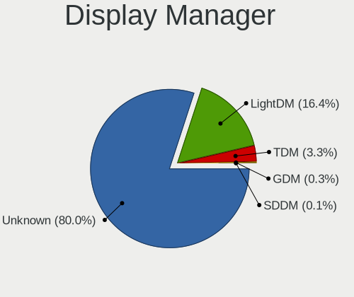
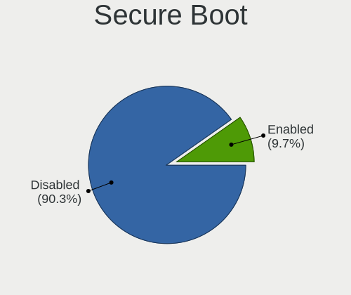
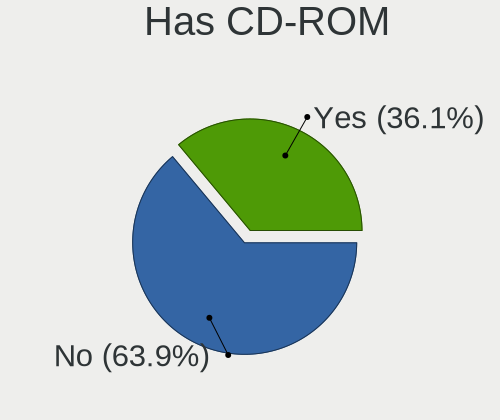
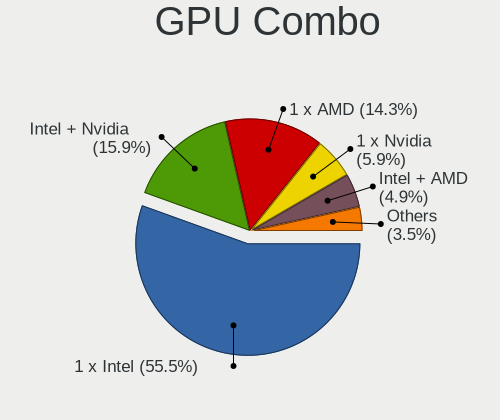
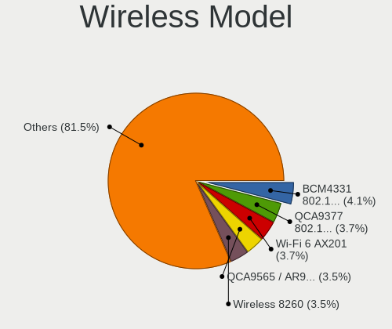
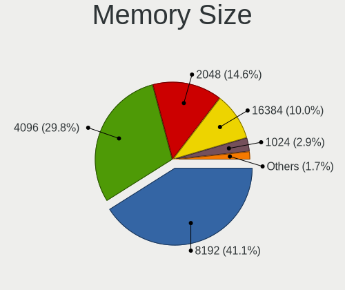
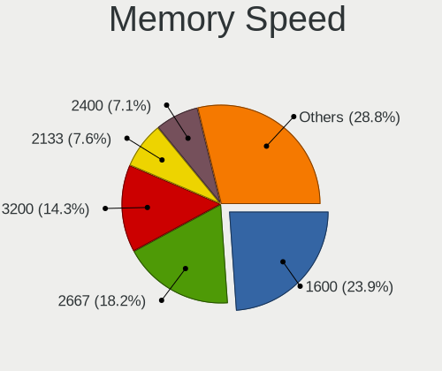
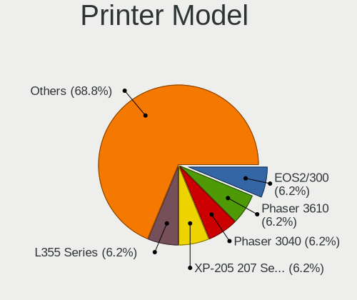
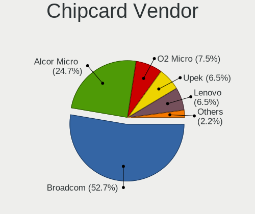
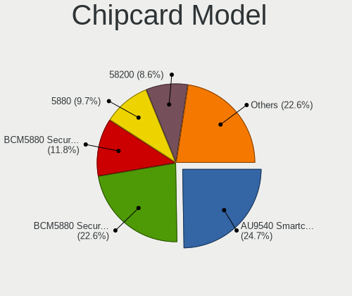

Elementary - Tested Hardware & Statistics (Notebooks)
-----------------------------------------------------

A project to collect tested hardware configurations for Elementary.

Anyone can contribute to this report by the [hw-probe](https://github.com/linuxhw/hw-probe) tool:

    sudo -E hw-probe -all -upload

Please contribute! Especially if your hardware is rare.

Contents
--------

* [ Test Cases ](#test-cases)

* [ System ](#system)
  - [ OS                       ](#os)
  - [ OS Family                ](#os-family)
  - [ Kernel                   ](#kernel)
  - [ Kernel Family            ](#kernel-family)
  - [ Kernel Major Ver.        ](#kernel-major-ver)
  - [ Arch                     ](#arch)
  - [ DE                       ](#de)
  - [ Display Server           ](#display-server)
  - [ Display Manager          ](#display-manager)
  - [ OS Lang                  ](#os-lang)
  - [ Boot Mode                ](#boot-mode)
  - [ Filesystem               ](#filesystem)
  - [ Part. scheme             ](#part-scheme)
  - [ Dual Boot with Linux/BSD ](#dual-boot-with-linuxbsd)
  - [ Dual Boot (Win)          ](#dual-boot-win)

* [ Board ](#board)
  - [ Vendor                   ](#vendor)
  - [ Model                    ](#model)
  - [ Model Family             ](#model-family)
  - [ MFG Year                 ](#mfg-year)
  - [ Form Factor              ](#form-factor)
  - [ Secure Boot              ](#secure-boot)
  - [ Coreboot                 ](#coreboot)
  - [ RAM Size                 ](#ram-size)
  - [ RAM Used                 ](#ram-used)
  - [ Total Drives             ](#total-drives)
  - [ Has CD-ROM               ](#has-cd-rom)
  - [ Has Ethernet             ](#has-ethernet)
  - [ Has WiFi                 ](#has-wifi)
  - [ Has Bluetooth            ](#has-bluetooth)

* [ Location ](#location)
  - [ Country                  ](#country)
  - [ City                     ](#city)

* [ Drives ](#drives)
  - [ Drive Vendor             ](#drive-vendor)
  - [ Drive Model              ](#drive-model)
  - [ HDD Vendor               ](#hdd-vendor)
  - [ SSD Vendor               ](#ssd-vendor)
  - [ Drive Kind               ](#drive-kind)
  - [ Drive Connector          ](#drive-connector)
  - [ Drive Size               ](#drive-size)
  - [ Space Total              ](#space-total)
  - [ Space Used               ](#space-used)
  - [ Malfunc. Drives          ](#malfunc-drives)
  - [ Malfunc. Drive Vendor    ](#malfunc-drive-vendor)
  - [ Malfunc. HDD Vendor      ](#malfunc-hdd-vendor)
  - [ Malfunc. Drive Kind      ](#malfunc-drive-kind)
  - [ Failed Drives            ](#failed-drives)
  - [ Failed Drive Vendor      ](#failed-drive-vendor)
  - [ Drive Status             ](#drive-status)

* [ Storage controller ](#storage-controller)
  - [ Storage Vendor           ](#storage-vendor)
  - [ Storage Model            ](#storage-model)
  - [ Storage Kind             ](#storage-kind)

* [ Processor ](#processor)
  - [ CPU Vendor               ](#cpu-vendor)
  - [ CPU Model                ](#cpu-model)
  - [ CPU Model Family         ](#cpu-model-family)
  - [ CPU Cores                ](#cpu-cores)
  - [ CPU Sockets              ](#cpu-sockets)
  - [ CPU Threads              ](#cpu-threads)
  - [ CPU Op-Modes             ](#cpu-op-modes)
  - [ CPU Microcode            ](#cpu-microcode)
  - [ CPU Microarch            ](#cpu-microarch)

* [ Graphics ](#graphics)
  - [ GPU Vendor               ](#gpu-vendor)
  - [ GPU Model                ](#gpu-model)
  - [ GPU Combo                ](#gpu-combo)
  - [ GPU Driver               ](#gpu-driver)
  - [ GPU Memory               ](#gpu-memory)

* [ Monitor ](#monitor)
  - [ Monitor Vendor           ](#monitor-vendor)
  - [ Monitor Model            ](#monitor-model)
  - [ Monitor Resolution       ](#monitor-resolution)
  - [ Monitor Diagonal         ](#monitor-diagonal)
  - [ Monitor Width            ](#monitor-width)
  - [ Aspect Ratio             ](#aspect-ratio)
  - [ Monitor Area             ](#monitor-area)
  - [ Pixel Density            ](#pixel-density)
  - [ Multiple Monitors        ](#multiple-monitors)

* [ Network ](#network)
  - [ Net Controller Vendor    ](#net-controller-vendor)
  - [ Net Controller Model     ](#net-controller-model)
  - [ Wireless Vendor          ](#wireless-vendor)
  - [ Wireless Model           ](#wireless-model)
  - [ Ethernet Vendor          ](#ethernet-vendor)
  - [ Ethernet Model           ](#ethernet-model)
  - [ Net Controller Kind      ](#net-controller-kind)
  - [ Used Controller          ](#used-controller)
  - [ NICs                     ](#nics)
  - [ IPv6                     ](#ipv6)

* [ Bluetooth ](#bluetooth)
  - [ Bluetooth Vendor         ](#bluetooth-vendor)
  - [ Bluetooth Model          ](#bluetooth-model)

* [ Sound ](#sound)
  - [ Sound Vendor             ](#sound-vendor)
  - [ Sound Model              ](#sound-model)

* [ Memory ](#memory)
  - [ Memory Vendor            ](#memory-vendor)
  - [ Memory Model             ](#memory-model)
  - [ Memory Kind              ](#memory-kind)
  - [ Memory Form Factor       ](#memory-form-factor)
  - [ Memory Size              ](#memory-size)
  - [ Memory Speed             ](#memory-speed)

* [ Printers & scanners ](#printers--scanners)
  - [ Printer Vendor           ](#printer-vendor)
  - [ Printer Model            ](#printer-model)
  - [ Scanner Vendor           ](#scanner-vendor)
  - [ Scanner Model            ](#scanner-model)

* [ Camera ](#camera)
  - [ Camera Vendor            ](#camera-vendor)
  - [ Camera Model             ](#camera-model)

* [ Security ](#security)
  - [ Fingerprint Vendor       ](#fingerprint-vendor)
  - [ Fingerprint Model        ](#fingerprint-model)
  - [ Chipcard Vendor          ](#chipcard-vendor)
  - [ Chipcard Model           ](#chipcard-model)

* [ Unsupported ](#unsupported)
  - [ Unsupported Devices      ](#unsupported-devices)
  - [ Unsupported Device Types ](#unsupported-device-types)

Test Cases
----------

Total: 2099

| Vendor        | Model                       | Probe                                                      | Date         |
|---------------|-----------------------------|------------------------------------------------------------|--------------|
| HUAWEI        | MACHD-WXX9                  | [f10a2b06fd](https://linux-hardware.org/?probe=f10a2b06fd) | Jan 06, 2025 |
| Samsung       | 900X3C/900X4C/900X4D        | [cbe6ed9631](https://linux-hardware.org/?probe=cbe6ed9631) | Jan 05, 2025 |
| Dell          | Inspiron 1545               | [6d5ccbb5f9](https://linux-hardware.org/?probe=6d5ccbb5f9) | Jan 05, 2025 |
| Dell          | XPS L412Z                   | [d8b969a9e6](https://linux-hardware.org/?probe=d8b969a9e6) | Jan 05, 2025 |
| Dell          | XPS L412Z                   | [f4cfef6dcc](https://linux-hardware.org/?probe=f4cfef6dcc) | Jan 05, 2025 |
| Apple         | MacBook3,1                  | [be78213991](https://linux-hardware.org/?probe=be78213991) | Jan 05, 2025 |
| HUAWEI        | BoDE-WXX9                   | [d5f19c64ad](https://linux-hardware.org/?probe=d5f19c64ad) | Jan 04, 2025 |
| Apple         | MacBookPro7,1               | [7961299452](https://linux-hardware.org/?probe=7961299452) | Jan 04, 2025 |
| Dell          | Latitude E5430 non-vPro     | [bbf6d05761](https://linux-hardware.org/?probe=bbf6d05761) | Jan 03, 2025 |
| Apple         | MacBookPro8,1               | [c208215b7f](https://linux-hardware.org/?probe=c208215b7f) | Jan 03, 2025 |
| Dell          | Latitude E5430 non-vPro     | [7b1adcdde1](https://linux-hardware.org/?probe=7b1adcdde1) | Jan 03, 2025 |
| HUAWEI        | BoDE-WXX9                   | [cacf1ad26f](https://linux-hardware.org/?probe=cacf1ad26f) | Jan 02, 2025 |
| Lenovo        | G585 20137                  | [f7dac7bbad](https://linux-hardware.org/?probe=f7dac7bbad) | Jan 02, 2025 |
| Medion        | Akoya E6240T                | [dc4b306a46](https://linux-hardware.org/?probe=dc4b306a46) | Jan 02, 2025 |
| Dell          | Latitude 5400               | [7a418a2cca](https://linux-hardware.org/?probe=7a418a2cca) | Jan 01, 2025 |
| HUAWEI        | MACHD-WXX9                  | [f7cc7cc8d1](https://linux-hardware.org/?probe=f7cc7cc8d1) | Jan 01, 2025 |
| HP            | Laptop 15s-fq1xxx           | [1de7d2e8fb](https://linux-hardware.org/?probe=1de7d2e8fb) | Dec 30, 2024 |
| ASUSTek       | X555LDB                     | [f11b5b7320](https://linux-hardware.org/?probe=f11b5b7320) | Dec 29, 2024 |
| Lenovo        | IdeaPad Y560                | [e36139662d](https://linux-hardware.org/?probe=e36139662d) | Dec 28, 2024 |
| HP            | EliteBook 830 G5            | [3dd541f1a9](https://linux-hardware.org/?probe=3dd541f1a9) | Dec 28, 2024 |
| HP            | ProBook 645 G2              | [b57a3a877b](https://linux-hardware.org/?probe=b57a3a877b) | Dec 27, 2024 |
| NEC Comput... | PC-LL750MSW                 | [55d20a7230](https://linux-hardware.org/?probe=55d20a7230) | Dec 27, 2024 |
| Dell          | Inspiron 15-3552            | [1d01677080](https://linux-hardware.org/?probe=1d01677080) | Dec 27, 2024 |
| Packard Be... | EasyNote TJ75               | [7a5bc8251a](https://linux-hardware.org/?probe=7a5bc8251a) | Dec 27, 2024 |
| Packard Be... | EasyNote TJ75               | [b46109e7f3](https://linux-hardware.org/?probe=b46109e7f3) | Dec 27, 2024 |
| Sony          | SVF14213CLB                 | [dbcabf3c36](https://linux-hardware.org/?probe=dbcabf3c36) | Dec 27, 2024 |
| Pegatron      | A15                         | [2649401416](https://linux-hardware.org/?probe=2649401416) | Dec 26, 2024 |
| Apple         | MacBookPro10,1              | [4225950551](https://linux-hardware.org/?probe=4225950551) | Dec 25, 2024 |
| Lenovo        | IdeaPad Slim 5 14AHP9 83... | [d1227bd0de](https://linux-hardware.org/?probe=d1227bd0de) | Dec 25, 2024 |
| HP            | Laptop 15-dy5xxx            | [2729b6a19c](https://linux-hardware.org/?probe=2729b6a19c) | Dec 25, 2024 |
| Acer          | Aspire 5755G                | [d824794995](https://linux-hardware.org/?probe=d824794995) | Dec 23, 2024 |
| Samsung       | SR58P                       | [70e6a978b7](https://linux-hardware.org/?probe=70e6a978b7) | Dec 23, 2024 |
| Dell          | Latitude E6520              | [2bae6e63bb](https://linux-hardware.org/?probe=2bae6e63bb) | Dec 23, 2024 |
| Dell          | XPS 15 9550                 | [f1502af093](https://linux-hardware.org/?probe=f1502af093) | Dec 23, 2024 |
| Acer          | Aspire ES1-571              | [cb4b9da83f](https://linux-hardware.org/?probe=cb4b9da83f) | Dec 22, 2024 |
| Acer          | Aspire ES1-571              | [48537b040b](https://linux-hardware.org/?probe=48537b040b) | Dec 22, 2024 |
| Apple         | MacBookAir7,2               | [762ab31569](https://linux-hardware.org/?probe=762ab31569) | Dec 22, 2024 |
| ASUSTek       | X555LDB                     | [783e6ed502](https://linux-hardware.org/?probe=783e6ed502) | Dec 20, 2024 |
| ASUSTek       | UX30                        | [d75f3afdf6](https://linux-hardware.org/?probe=d75f3afdf6) | Dec 18, 2024 |
| Dell          | Precision 5530              | [3292cf1103](https://linux-hardware.org/?probe=3292cf1103) | Dec 18, 2024 |
| ASUSTek       | X751MA                      | [016d948a0c](https://linux-hardware.org/?probe=016d948a0c) | Dec 17, 2024 |
| HP            | Pavilion dv6                | [89ec19d64a](https://linux-hardware.org/?probe=89ec19d64a) | Dec 17, 2024 |
| HP            | Laptop 17-by3xxx            | [cb8341eaca](https://linux-hardware.org/?probe=cb8341eaca) | Dec 17, 2024 |
| Pegatron      | A15                         | [266dd27eba](https://linux-hardware.org/?probe=266dd27eba) | Dec 16, 2024 |
| Lenovo        | ThinkPad X1 Carbon Gen 8... | [abfa48ae27](https://linux-hardware.org/?probe=abfa48ae27) | Dec 15, 2024 |
| Lenovo        | ThinkPad X1 Carbon Gen 8... | [256e4c3f4a](https://linux-hardware.org/?probe=256e4c3f4a) | Dec 15, 2024 |
| HP            | ProBook 6570b               | [70dbe6620b](https://linux-hardware.org/?probe=70dbe6620b) | Dec 14, 2024 |
| Dell          | Inspiron 5547               | [4427bcded0](https://linux-hardware.org/?probe=4427bcded0) | Dec 14, 2024 |
| Dell          | Inspiron 5547               | [5641fb7941](https://linux-hardware.org/?probe=5641fb7941) | Dec 14, 2024 |
| Acer          | Aspire 8730                 | [8c0f6ed012](https://linux-hardware.org/?probe=8c0f6ed012) | Dec 14, 2024 |
| Acer          | Aspire A515-48M             | [1bd13cf77f](https://linux-hardware.org/?probe=1bd13cf77f) | Dec 14, 2024 |
| Acer          | Aspire 8730                 | [1ab4a28fcf](https://linux-hardware.org/?probe=1ab4a28fcf) | Dec 13, 2024 |
| Samsung       | 950XCJ/951XCJ/950XCR        | [37664cf5d9](https://linux-hardware.org/?probe=37664cf5d9) | Dec 13, 2024 |
| Sony          | SVS1313V9RB                 | [52421e92ce](https://linux-hardware.org/?probe=52421e92ce) | Dec 12, 2024 |
| Sony          | SVS1313V9RB                 | [53c77f8751](https://linux-hardware.org/?probe=53c77f8751) | Dec 12, 2024 |
| Unknown       | Unknown                     | [2e17fa2c66](https://linux-hardware.org/?probe=2e17fa2c66) | Dec 12, 2024 |
| Chuwi         | UBook                       | [08e88467cb](https://linux-hardware.org/?probe=08e88467cb) | Dec 12, 2024 |
| ASUSTek       | X550CL                      | [e471757e1c](https://linux-hardware.org/?probe=e471757e1c) | Dec 11, 2024 |
| ASUSTek       | VivoBook_ASUSLaptop X150... | [8444dbbcc1](https://linux-hardware.org/?probe=8444dbbcc1) | Dec 10, 2024 |
| Microtech     | ebookPro                    | [4e6f89ca56](https://linux-hardware.org/?probe=4e6f89ca56) | Dec 10, 2024 |
| Acer          | Swift SF314-56G             | [64815f9248](https://linux-hardware.org/?probe=64815f9248) | Dec 09, 2024 |
| Lenovo        | ThinkPad L380 20M6S11800    | [fc797d558c](https://linux-hardware.org/?probe=fc797d558c) | Dec 08, 2024 |
| Unknown       | Unknown                     | [bd30f7f45d](https://linux-hardware.org/?probe=bd30f7f45d) | Dec 08, 2024 |
| Dell          | Latitude 3340               | [07c627667a](https://linux-hardware.org/?probe=07c627667a) | Dec 07, 2024 |
| HP            | Laptop 17z-ca100            | [e6144203c6](https://linux-hardware.org/?probe=e6144203c6) | Dec 07, 2024 |
| eMachines     | eME732Z                     | [1c64772130](https://linux-hardware.org/?probe=1c64772130) | Dec 06, 2024 |
| Panasonic     | CF-52PFP54QL                | [bcafd21454](https://linux-hardware.org/?probe=bcafd21454) | Dec 06, 2024 |
| Apple         | MacBookAir3,1               | [477a7b324b](https://linux-hardware.org/?probe=477a7b324b) | Dec 06, 2024 |
| Lenovo        | IdeaPad S205 1038D8G        | [78b460173f](https://linux-hardware.org/?probe=78b460173f) | Dec 05, 2024 |
| Chuwi         | UBook                       | [ddba94874a](https://linux-hardware.org/?probe=ddba94874a) | Dec 04, 2024 |
| HP            | Pavilion dv7                | [8d22c82b8d](https://linux-hardware.org/?probe=8d22c82b8d) | Dec 04, 2024 |
| Apple         | MacBook4,1                  | [915a1dbb22](https://linux-hardware.org/?probe=915a1dbb22) | Dec 04, 2024 |
| HP            | EliteBook 2170p             | [39de9fd95f](https://linux-hardware.org/?probe=39de9fd95f) | Dec 04, 2024 |
| Apple         | MacBookAir3,1               | [8517a48127](https://linux-hardware.org/?probe=8517a48127) | Dec 03, 2024 |
| Dell          | Inspiron 5567               | [085d5938c0](https://linux-hardware.org/?probe=085d5938c0) | Dec 03, 2024 |
| Dell          | Inspiron 5567               | [99cb99a15c](https://linux-hardware.org/?probe=99cb99a15c) | Dec 03, 2024 |
| Toshiba       | Satellite L50-B             | [f0195c6929](https://linux-hardware.org/?probe=f0195c6929) | Dec 02, 2024 |
| Apple         | MacBookPro8,1               | [424834b527](https://linux-hardware.org/?probe=424834b527) | Dec 01, 2024 |
| Apple         | MacBookPro12,1              | [deda79f6f5](https://linux-hardware.org/?probe=deda79f6f5) | Dec 01, 2024 |
| ASUSTek       | K93SV                       | [53af6a8e17](https://linux-hardware.org/?probe=53af6a8e17) | Nov 30, 2024 |
| Toshiba       | Satellite L50-B             | [344eaec320](https://linux-hardware.org/?probe=344eaec320) | Nov 29, 2024 |
| Dell          | Inspiron N5010              | [f7578fb476](https://linux-hardware.org/?probe=f7578fb476) | Nov 29, 2024 |
| Apple         | MacBookPro8,1               | [a817c04b09](https://linux-hardware.org/?probe=a817c04b09) | Nov 29, 2024 |
| HP            | Pavilion dv7                | [1ae9d9a604](https://linux-hardware.org/?probe=1ae9d9a604) | Nov 29, 2024 |
| Dell          | Latitude 5420               | [9e6c2d1825](https://linux-hardware.org/?probe=9e6c2d1825) | Nov 28, 2024 |
| MicroByte     | ezbook                      | [167d9d082a](https://linux-hardware.org/?probe=167d9d082a) | Nov 28, 2024 |
| Google        | Delbin                      | [e4f8dab394](https://linux-hardware.org/?probe=e4f8dab394) | Nov 27, 2024 |
| Lenovo        | ThinkPad P15 Gen 2i 20YQ... | [7e022f0097](https://linux-hardware.org/?probe=7e022f0097) | Nov 27, 2024 |
| Acer          | Aspire E3-111               | [f90ddc6433](https://linux-hardware.org/?probe=f90ddc6433) | Nov 26, 2024 |
| Apple         | MacBookAir6,1               | [a42587525c](https://linux-hardware.org/?probe=a42587525c) | Nov 25, 2024 |
| Apple         | MacBookAir6,1               | [1d464cc8ce](https://linux-hardware.org/?probe=1d464cc8ce) | Nov 25, 2024 |
| Lenovo        | IdeaPad Slim 3 15IAH8 83... | [d24fd529d4](https://linux-hardware.org/?probe=d24fd529d4) | Nov 25, 2024 |
| Lenovo        | ThinkPad L380 20M6S11800    | [d7914ef50d](https://linux-hardware.org/?probe=d7914ef50d) | Nov 22, 2024 |
| ASUSTek       | ASUS TUF Gaming F17 FX70... | [8ecfb38136](https://linux-hardware.org/?probe=8ecfb38136) | Nov 22, 2024 |
| HP            | Pavilion Sleekbook 15 PC    | [c785c1f7dd](https://linux-hardware.org/?probe=c785c1f7dd) | Nov 21, 2024 |
| HP            | ProBook 6560b               | [72ddcb1cf2](https://linux-hardware.org/?probe=72ddcb1cf2) | Nov 20, 2024 |
| HP            | Laptop 17-cn0xxx            | [058f6bf1ac](https://linux-hardware.org/?probe=058f6bf1ac) | Nov 20, 2024 |
| HP            | Laptop 17-cn0xxx            | [541dd7b9fb](https://linux-hardware.org/?probe=541dd7b9fb) | Nov 19, 2024 |
| Apple         | MacBookPro5,5               | [3f2eff0083](https://linux-hardware.org/?probe=3f2eff0083) | Nov 18, 2024 |
| Lenovo        | ThinkPad X260 20F5A2FXTH    | [8609525ceb](https://linux-hardware.org/?probe=8609525ceb) | Nov 18, 2024 |
| Apple         | MacBookPro7,1               | [7d86d39596](https://linux-hardware.org/?probe=7d86d39596) | Nov 17, 2024 |
| Apple         | MacBookPro5,5               | [001f8b1280](https://linux-hardware.org/?probe=001f8b1280) | Nov 17, 2024 |
| Lenovo        | ThinkPad L470 W10DG 20JU... | [8715440da3](https://linux-hardware.org/?probe=8715440da3) | Nov 17, 2024 |
| Dell          | Inspiron N5030              | [acf692231b](https://linux-hardware.org/?probe=acf692231b) | Nov 17, 2024 |
| ASUSTek       | ASUS TUF Gaming F17 FX70... | [0d4cb9a88f](https://linux-hardware.org/?probe=0d4cb9a88f) | Nov 16, 2024 |
| Lenovo        | G50-80 80L0                 | [d31664cad1](https://linux-hardware.org/?probe=d31664cad1) | Nov 15, 2024 |
| Apple         | MacBookPro8,2               | [0259216292](https://linux-hardware.org/?probe=0259216292) | Nov 15, 2024 |
| Apple         | MacBookPro9,2               | [7029186fa5](https://linux-hardware.org/?probe=7029186fa5) | Nov 14, 2024 |
| Apple         | MacBookPro8,1               | [2f0fa7a4fa](https://linux-hardware.org/?probe=2f0fa7a4fa) | Nov 11, 2024 |
| Apple         | MacBookPro5,2               | [a0db5bcf03](https://linux-hardware.org/?probe=a0db5bcf03) | Nov 08, 2024 |
| Acer          | Aspire E5-771               | [9b889ed10a](https://linux-hardware.org/?probe=9b889ed10a) | Nov 08, 2024 |
| Apple         | MacBookPro8,1               | [0b5989c295](https://linux-hardware.org/?probe=0b5989c295) | Nov 06, 2024 |
| Lenovo        | G580 20150                  | [71249fccac](https://linux-hardware.org/?probe=71249fccac) | Nov 06, 2024 |
| Lenovo        | G580 20150                  | [ebcff700e9](https://linux-hardware.org/?probe=ebcff700e9) | Nov 06, 2024 |
| LTD Delovo... | 15Y                         | [5553e46796](https://linux-hardware.org/?probe=5553e46796) | Nov 04, 2024 |
| LTD Delovo... | 15Y                         | [0187f0b5ab](https://linux-hardware.org/?probe=0187f0b5ab) | Nov 04, 2024 |
| Samsung       | 940XFG                      | [8d09e8db06](https://linux-hardware.org/?probe=8d09e8db06) | Nov 04, 2024 |
| HUAWEI        | BOM-WXX9                    | [f0b28bde30](https://linux-hardware.org/?probe=f0b28bde30) | Nov 03, 2024 |
| Dell          | Latitude 7420               | [2454ee0dbb](https://linux-hardware.org/?probe=2454ee0dbb) | Nov 03, 2024 |
| Lenovo        | G700 20251                  | [3af4ad6599](https://linux-hardware.org/?probe=3af4ad6599) | Nov 01, 2024 |
| Acer          | Aspire V3-772               | [9d4e69ab29](https://linux-hardware.org/?probe=9d4e69ab29) | Nov 01, 2024 |
| Acer          | Aspire V3-772               | [a48e5acfb4](https://linux-hardware.org/?probe=a48e5acfb4) | Nov 01, 2024 |
| HP            | Laptop 14-fq0xxx            | [a8d14fa552](https://linux-hardware.org/?probe=a8d14fa552) | Nov 01, 2024 |
| HP            | Laptop 15-bw0xx             | [55ef342a18](https://linux-hardware.org/?probe=55ef342a18) | Oct 31, 2024 |
| HP            | ProBook 4535s               | [f66c124f3a](https://linux-hardware.org/?probe=f66c124f3a) | Oct 31, 2024 |
| Apple         | MacBookPro8,1               | [3fe4d1a80a](https://linux-hardware.org/?probe=3fe4d1a80a) | Oct 31, 2024 |
| ASUSTek       | K46CB                       | [e081c9ab8c](https://linux-hardware.org/?probe=e081c9ab8c) | Oct 30, 2024 |
| Apple         | MacBookPro9,2               | [91eb0db216](https://linux-hardware.org/?probe=91eb0db216) | Oct 30, 2024 |
| HP            | Laptop 15s-eq2xxx           | [1755d407c9](https://linux-hardware.org/?probe=1755d407c9) | Oct 29, 2024 |
| HP            | Compaq 15                   | [fd2b849a08](https://linux-hardware.org/?probe=fd2b849a08) | Oct 28, 2024 |
| Apple         | MacBookPro9,2               | [59f6758081](https://linux-hardware.org/?probe=59f6758081) | Oct 25, 2024 |
| Apple         | MacBookAir7,2               | [73fb34d315](https://linux-hardware.org/?probe=73fb34d315) | Oct 25, 2024 |
| HUAWEI        | BOD-WXX9                    | [c4829d7d0c](https://linux-hardware.org/?probe=c4829d7d0c) | Oct 25, 2024 |
| HUAWEI        | BOHB-WAX9                   | [e114c5afe5](https://linux-hardware.org/?probe=e114c5afe5) | Oct 24, 2024 |
| Dell          | Latitude 7370               | [355bbe7ecc](https://linux-hardware.org/?probe=355bbe7ecc) | Oct 24, 2024 |
| Apple         | MacBookAir7,2               | [92672f3d2c](https://linux-hardware.org/?probe=92672f3d2c) | Oct 23, 2024 |
| Apple         | MacBookAir7,2               | [8bbb5c5a53](https://linux-hardware.org/?probe=8bbb5c5a53) | Oct 23, 2024 |
| HP            | ProBook 6465b               | [3afb9ebed6](https://linux-hardware.org/?probe=3afb9ebed6) | Oct 23, 2024 |
| Lenovo        | ThinkPad T470s 20HFCTO1W... | [18058066d2](https://linux-hardware.org/?probe=18058066d2) | Oct 22, 2024 |
| Apple         | MacBookAir4,1               | [a899fd963a](https://linux-hardware.org/?probe=a899fd963a) | Oct 22, 2024 |
| Apple         | MacBookAir4,1               | [6c25a578b8](https://linux-hardware.org/?probe=6c25a578b8) | Oct 22, 2024 |
| Sony          | VPCEJ1Z1E                   | [d1da65abb4](https://linux-hardware.org/?probe=d1da65abb4) | Oct 22, 2024 |
| Lenovo        | V15-ADA 82C7                | [76d8c86d01](https://linux-hardware.org/?probe=76d8c86d01) | Oct 22, 2024 |
| HUAWEI        | KLVL-WXX9                   | [faeb5479f8](https://linux-hardware.org/?probe=faeb5479f8) | Oct 21, 2024 |
| HUAWEI        | NBLB-WAX9N                  | [e188597923](https://linux-hardware.org/?probe=e188597923) | Oct 19, 2024 |
| Apple         | MacBookAir7,2               | [f63adab3c7](https://linux-hardware.org/?probe=f63adab3c7) | Oct 19, 2024 |
| Fujitsu       | LIFEBOOK A530               | [afb324991b](https://linux-hardware.org/?probe=afb324991b) | Oct 18, 2024 |
| Fujitsu       | LIFEBOOK A530               | [3337802835](https://linux-hardware.org/?probe=3337802835) | Oct 18, 2024 |
| Apple         | MacBookPro8,1               | [83508d3840](https://linux-hardware.org/?probe=83508d3840) | Oct 17, 2024 |
| Samsung       | 940XFG                      | [741f7a6544](https://linux-hardware.org/?probe=741f7a6544) | Oct 17, 2024 |
| Apple         | MacBook6,1                  | [d3b5f5da93](https://linux-hardware.org/?probe=d3b5f5da93) | Oct 17, 2024 |
| HP            | Laptop 15s-eq2xxx           | [d0ac53c68a](https://linux-hardware.org/?probe=d0ac53c68a) | Oct 16, 2024 |
| Acer          | Aspire 7736                 | [be7f2e237f](https://linux-hardware.org/?probe=be7f2e237f) | Oct 15, 2024 |
| ASUSTek       | X555LPB                     | [2f3f2073da](https://linux-hardware.org/?probe=2f3f2073da) | Oct 14, 2024 |
| Acer          | Aspire 7736                 | [96c83e0281](https://linux-hardware.org/?probe=96c83e0281) | Oct 14, 2024 |
| Apple         | MacBookPro8,1               | [d2d644c166](https://linux-hardware.org/?probe=d2d644c166) | Oct 13, 2024 |
| Lenovo        | ThinkPad L380 20M6S11800    | [cee555c4f8](https://linux-hardware.org/?probe=cee555c4f8) | Oct 13, 2024 |
| Apple         | MacBookPro8,3               | [030dbaca80](https://linux-hardware.org/?probe=030dbaca80) | Oct 13, 2024 |
| Positivo      | VJF154                      | [dbd1be19a4](https://linux-hardware.org/?probe=dbd1be19a4) | Oct 12, 2024 |
| Positivo      | VJF154                      | [11a95affa0](https://linux-hardware.org/?probe=11a95affa0) | Oct 12, 2024 |
| Sony          | VPCEJ1Z1E                   | [627da18a5d](https://linux-hardware.org/?probe=627da18a5d) | Oct 12, 2024 |
| Apple         | MacBookPro8,3               | [8a25a02400](https://linux-hardware.org/?probe=8a25a02400) | Oct 12, 2024 |
| HP            | Compaq 6530b (GW688AV)      | [2db6bf65e8](https://linux-hardware.org/?probe=2db6bf65e8) | Oct 12, 2024 |
| HP            | Compaq 6530b (GW688AV)      | [a9cb352415](https://linux-hardware.org/?probe=a9cb352415) | Oct 12, 2024 |
| Apple         | MacBookPro8,3               | [ca109e5057](https://linux-hardware.org/?probe=ca109e5057) | Oct 12, 2024 |
| Lenovo        | ThinkPad X270 W10DG 20K5... | [08d25ef16b](https://linux-hardware.org/?probe=08d25ef16b) | Oct 12, 2024 |
| Lenovo        | ThinkPad X270 W10DG 20K5... | [6c5d0a8a4b](https://linux-hardware.org/?probe=6c5d0a8a4b) | Oct 12, 2024 |
| HP            | 15                          | [812b65f0fe](https://linux-hardware.org/?probe=812b65f0fe) | Oct 11, 2024 |
| Apple         | MacBook6,1                  | [3623e327b2](https://linux-hardware.org/?probe=3623e327b2) | Oct 11, 2024 |
| HP            | EliteBook 830 G5            | [64cebe30ad](https://linux-hardware.org/?probe=64cebe30ad) | Oct 10, 2024 |
| Lenovo        | V15 G3 ABA 82TV             | [bf025aaa26](https://linux-hardware.org/?probe=bf025aaa26) | Oct 08, 2024 |
| Lenovo        | ThinkPad L380 20M6S11800    | [ecf4696b37](https://linux-hardware.org/?probe=ecf4696b37) | Oct 07, 2024 |
| Apple         | MacBookAir3,1               | [01cd6549a5](https://linux-hardware.org/?probe=01cd6549a5) | Oct 06, 2024 |
| Apple         | MacBookPro9,2               | [0f138dcac0](https://linux-hardware.org/?probe=0f138dcac0) | Oct 06, 2024 |
| HP            | EliteBook 830 G5            | [c8c6a6269b](https://linux-hardware.org/?probe=c8c6a6269b) | Oct 06, 2024 |
| ARCELIK       | 1M7-GNB1595B6I7             | [cbf522f76a](https://linux-hardware.org/?probe=cbf522f76a) | Oct 05, 2024 |
| Sony          | VPCEC3L1E                   | [748694aa38](https://linux-hardware.org/?probe=748694aa38) | Oct 05, 2024 |
| Positivo      | VJF154                      | [70bb906734](https://linux-hardware.org/?probe=70bb906734) | Oct 04, 2024 |
| Dell          | Latitude E6520              | [5af0de6a9c](https://linux-hardware.org/?probe=5af0de6a9c) | Oct 04, 2024 |
| Dell          | Precision 5530              | [7d736763e8](https://linux-hardware.org/?probe=7d736763e8) | Oct 04, 2024 |
| Alienware     | 17 R3                       | [b22f85d157](https://linux-hardware.org/?probe=b22f85d157) | Oct 03, 2024 |
| Samsung       | 900X3F                      | [12e6b46207](https://linux-hardware.org/?probe=12e6b46207) | Oct 03, 2024 |
| Samsung       | 900X3F                      | [5b7f51059a](https://linux-hardware.org/?probe=5b7f51059a) | Oct 03, 2024 |
| HP            | G60                         | [b2cbfa9c26](https://linux-hardware.org/?probe=b2cbfa9c26) | Oct 02, 2024 |
| HP            | Laptop 15-bw0xx             | [1046a844db](https://linux-hardware.org/?probe=1046a844db) | Sep 30, 2024 |
| ASUSTek       | VivoBook_ASUSLaptop X140... | [bfd414e273](https://linux-hardware.org/?probe=bfd414e273) | Sep 30, 2024 |
| Dell          | Inspiron N5110              | [39053cddd2](https://linux-hardware.org/?probe=39053cddd2) | Sep 29, 2024 |
| Apple         | MacBookPro5,1               | [ea1547836b](https://linux-hardware.org/?probe=ea1547836b) | Sep 27, 2024 |
| Apple         | MacBookAir3,1               | [ce465db6d8](https://linux-hardware.org/?probe=ce465db6d8) | Sep 26, 2024 |
| realme        | RMNBXXXX                    | [a56e71a36d](https://linux-hardware.org/?probe=a56e71a36d) | Sep 25, 2024 |
| Lenovo        | IdeaPad 5 14ARE05 81YM      | [eb1144d5d0](https://linux-hardware.org/?probe=eb1144d5d0) | Sep 23, 2024 |
| Apple         | MacBookPro9,2               | [d02c3ea8d2](https://linux-hardware.org/?probe=d02c3ea8d2) | Sep 22, 2024 |
| Apple         | MacBookPro9,2               | [de3ad3dcb2](https://linux-hardware.org/?probe=de3ad3dcb2) | Sep 22, 2024 |
| Acer          | Aspire E5-511G              | [eb212c1295](https://linux-hardware.org/?probe=eb212c1295) | Sep 21, 2024 |
| Samsung       | 900X3J                      | [84b81dc973](https://linux-hardware.org/?probe=84b81dc973) | Sep 19, 2024 |
| Apple         | MacBook6,1                  | [754a9d1a14](https://linux-hardware.org/?probe=754a9d1a14) | Sep 19, 2024 |
| Acer          | Nitro AN515-52              | [0bc35e551d](https://linux-hardware.org/?probe=0bc35e551d) | Sep 18, 2024 |
| Apple         | MacBookPro9,2               | [e386b9f60a](https://linux-hardware.org/?probe=e386b9f60a) | Sep 18, 2024 |
| Lenovo        | ThinkPad L380 20M6S11800    | [22c790176f](https://linux-hardware.org/?probe=22c790176f) | Sep 18, 2024 |
| Lenovo        | G400 20235                  | [96ebcfea10](https://linux-hardware.org/?probe=96ebcfea10) | Sep 18, 2024 |
| Acer          | Aspire E5-511G              | [0b1a846a69](https://linux-hardware.org/?probe=0b1a846a69) | Sep 17, 2024 |
| HP            | EliteBook 840 G1            | [a2f78f9d5a](https://linux-hardware.org/?probe=a2f78f9d5a) | Sep 17, 2024 |
| HP            | Pavilion 17                 | [fb7884d776](https://linux-hardware.org/?probe=fb7884d776) | Sep 16, 2024 |
| HP            | Pavilion dv6700             | [79316bc8bf](https://linux-hardware.org/?probe=79316bc8bf) | Sep 16, 2024 |
| Acer          | Aspire 5750                 | [d030037b8b](https://linux-hardware.org/?probe=d030037b8b) | Sep 14, 2024 |
| Acer          | Aspire 7745G                | [76a55f9bb1](https://linux-hardware.org/?probe=76a55f9bb1) | Sep 14, 2024 |
| Dell          | Inspiron 3721               | [dd0fd36c69](https://linux-hardware.org/?probe=dd0fd36c69) | Sep 14, 2024 |
| Lenovo        | V14 G2 ITL 82KA             | [156f5f004e](https://linux-hardware.org/?probe=156f5f004e) | Sep 13, 2024 |
| Apple         | MacBookPro11,3              | [ce91008479](https://linux-hardware.org/?probe=ce91008479) | Sep 13, 2024 |
| Dell          | XPS 13 9343                 | [ca52ff1c29](https://linux-hardware.org/?probe=ca52ff1c29) | Sep 13, 2024 |
| Alienware     | 17 R3                       | [d95edb94cd](https://linux-hardware.org/?probe=d95edb94cd) | Sep 13, 2024 |
| Toshiba       | Satellite L50-B             | [bb130f4634](https://linux-hardware.org/?probe=bb130f4634) | Sep 11, 2024 |
| Acer          | Aspire 5750                 | [0c7144d06b](https://linux-hardware.org/?probe=0c7144d06b) | Sep 10, 2024 |
| Lenovo        | IdeaPad 110-15ACL 80TJ      | [cd6caa40b8](https://linux-hardware.org/?probe=cd6caa40b8) | Sep 10, 2024 |
| Lenovo        | B590 20206                  | [38ef54ca0c](https://linux-hardware.org/?probe=38ef54ca0c) | Sep 09, 2024 |
| Lenovo        | B590 20206                  | [3e57e1486e](https://linux-hardware.org/?probe=3e57e1486e) | Sep 09, 2024 |
| Sony          | SVF15A1B4E                  | [08c43f2d50](https://linux-hardware.org/?probe=08c43f2d50) | Sep 09, 2024 |
| Dell          | Inspiron 3721               | [8c75a1af97](https://linux-hardware.org/?probe=8c75a1af97) | Sep 05, 2024 |
| Dell          | Inspiron 3721               | [8a051dce97](https://linux-hardware.org/?probe=8a051dce97) | Sep 03, 2024 |
| Acer          | TravelMate 5735Z            | [b59bdd3310](https://linux-hardware.org/?probe=b59bdd3310) | Sep 02, 2024 |
| Dell          | Latitude 5510               | [634228ff35](https://linux-hardware.org/?probe=634228ff35) | Sep 02, 2024 |
| Apple         | MacBookPro9,1               | [41e0375932](https://linux-hardware.org/?probe=41e0375932) | Sep 02, 2024 |
| Apple         | MacBookPro8,1               | [c1c6557769](https://linux-hardware.org/?probe=c1c6557769) | Sep 01, 2024 |
| Apple         | MacBookPro6,2               | [7a30d49834](https://linux-hardware.org/?probe=7a30d49834) | Sep 01, 2024 |
| Lenovo        | G50-70 20351                | [8175aeac94](https://linux-hardware.org/?probe=8175aeac94) | Aug 31, 2024 |
| Apple         | MacBookPro9,2               | [60e3c48bbc](https://linux-hardware.org/?probe=60e3c48bbc) | Aug 30, 2024 |
| ASUSTek       | TP300LA                     | [55fb687fea](https://linux-hardware.org/?probe=55fb687fea) | Aug 30, 2024 |
| Dell          | Latitude E5420              | [1aa4784afb](https://linux-hardware.org/?probe=1aa4784afb) | Aug 29, 2024 |
| ASUSTek       | 1015PX                      | [b83d98a551](https://linux-hardware.org/?probe=b83d98a551) | Aug 29, 2024 |
| ASUSTek       | TUF Gaming FX505GT_FX505... | [9f47f2b01b](https://linux-hardware.org/?probe=9f47f2b01b) | Aug 29, 2024 |
| Gigabyte      | G5 GD                       | [2840fa5a43](https://linux-hardware.org/?probe=2840fa5a43) | Aug 27, 2024 |
| Lenovo        | IdeaPad 3 17ITL6 82H9       | [2aa427ea2b](https://linux-hardware.org/?probe=2aa427ea2b) | Aug 27, 2024 |
| Lenovo        | IdeaPad 330-15AST 81D6      | [a0dc16409e](https://linux-hardware.org/?probe=a0dc16409e) | Aug 26, 2024 |
| Apple         | MacBookPro5,1               | [5add020da3](https://linux-hardware.org/?probe=5add020da3) | Aug 25, 2024 |
| Toshiba       | Satellite C660D             | [fb51658e06](https://linux-hardware.org/?probe=fb51658e06) | Aug 23, 2024 |
| MSI           | GF63 8RC                    | [ea6d76ec59](https://linux-hardware.org/?probe=ea6d76ec59) | Aug 23, 2024 |
| Apple         | MacBook4,1                  | [b366ec9d80](https://linux-hardware.org/?probe=b366ec9d80) | Aug 23, 2024 |
| Apple         | MacBookPro8,1               | [a8f4d7f114](https://linux-hardware.org/?probe=a8f4d7f114) | Aug 22, 2024 |
| Apple         | MacBookPro8,1               | [de194919c2](https://linux-hardware.org/?probe=de194919c2) | Aug 21, 2024 |
| Dell          | XPS 13 9343                 | [e9a7ac7834](https://linux-hardware.org/?probe=e9a7ac7834) | Aug 21, 2024 |
| Apple         | MacBookPro11,5              | [b31f952991](https://linux-hardware.org/?probe=b31f952991) | Aug 19, 2024 |
| Dell          | Inspiron 15-3567            | [5040de05ac](https://linux-hardware.org/?probe=5040de05ac) | Aug 18, 2024 |
| Apple         | MacBookPro8,1               | [b7eb460f7e](https://linux-hardware.org/?probe=b7eb460f7e) | Aug 17, 2024 |
| Apple         | MacBookPro8,1               | [dc84101f95](https://linux-hardware.org/?probe=dc84101f95) | Aug 17, 2024 |
| Lenovo        | Legion Y530-15ICH 81FV      | [2ffa4f7ffc](https://linux-hardware.org/?probe=2ffa4f7ffc) | Aug 15, 2024 |
| Dell          | G15 5510                    | [bd868cf551](https://linux-hardware.org/?probe=bd868cf551) | Aug 15, 2024 |
| Apple         | MacBookAir1,1               | [46b20c4ffe](https://linux-hardware.org/?probe=46b20c4ffe) | Aug 10, 2024 |
| Apple         | MacBookAir4,2               | [463b931271](https://linux-hardware.org/?probe=463b931271) | Aug 08, 2024 |
| HP            | G56                         | [28f40c35e9](https://linux-hardware.org/?probe=28f40c35e9) | Aug 07, 2024 |
| HP            | Compaq 6730b (KE717AV)      | [c6ce1872c3](https://linux-hardware.org/?probe=c6ce1872c3) | Aug 07, 2024 |
| Lenovo        | ThinkPad P1 Gen 6 21FV00... | [9359d579a1](https://linux-hardware.org/?probe=9359d579a1) | Aug 07, 2024 |
| HP            | Laptop 17-ca3xxx            | [917cec826a](https://linux-hardware.org/?probe=917cec826a) | Aug 04, 2024 |
| Lenovo        | Unknown                     | [f228fbc5ba](https://linux-hardware.org/?probe=f228fbc5ba) | Aug 04, 2024 |
| HP            | ProBook 440 G8 Notebook ... | [bb3e675ece](https://linux-hardware.org/?probe=bb3e675ece) | Aug 04, 2024 |
| Lenovo        | G400 20235                  | [ffa298e6de](https://linux-hardware.org/?probe=ffa298e6de) | Aug 03, 2024 |
| Lenovo        | B50-80 80EW                 | [39cd7e2e3c](https://linux-hardware.org/?probe=39cd7e2e3c) | Aug 03, 2024 |
| Lenovo        | ThinkPad T480 20L6S0HG00    | [641f0fa927](https://linux-hardware.org/?probe=641f0fa927) | Aug 03, 2024 |
| Lenovo        | IdeaPad 1 14ADA7 82R0       | [6332bb4a7c](https://linux-hardware.org/?probe=6332bb4a7c) | Jul 29, 2024 |
| HUAWEI        | BOM-WXX9                    | [00af61adcc](https://linux-hardware.org/?probe=00af61adcc) | Jul 29, 2024 |
| Google        | Dratini                     | [8bb5dafec1](https://linux-hardware.org/?probe=8bb5dafec1) | Jul 28, 2024 |
| MSI           | GP63 Leopard 8RE            | [fd419bc9ef](https://linux-hardware.org/?probe=fd419bc9ef) | Jul 27, 2024 |
| Unknown       | Unknown                     | [350031c0ed](https://linux-hardware.org/?probe=350031c0ed) | Jul 27, 2024 |
| Apple         | MacBookAir4,2               | [9d37505b50](https://linux-hardware.org/?probe=9d37505b50) | Jul 26, 2024 |
| Lenovo        | G460 20041                  | [67670a0f4a](https://linux-hardware.org/?probe=67670a0f4a) | Jul 25, 2024 |
| Lenovo        | ThinkPad T490s 20NYS12E0... | [1e7a4734ce](https://linux-hardware.org/?probe=1e7a4734ce) | Jul 25, 2024 |
| Lenovo        | ThinkPad T490s 20NYS12E0... | [c80f2e729d](https://linux-hardware.org/?probe=c80f2e729d) | Jul 23, 2024 |
| Lenovo        | B50-80 80EW                 | [1896ed136c](https://linux-hardware.org/?probe=1896ed136c) | Jul 23, 2024 |
| Apple         | MacBookPro6,2               | [72c27fa1c1](https://linux-hardware.org/?probe=72c27fa1c1) | Jul 23, 2024 |
| HP            | ENVY 17                     | [8d586d3909](https://linux-hardware.org/?probe=8d586d3909) | Jul 22, 2024 |
| HP            | ENVY 17                     | [f97fdd96f8](https://linux-hardware.org/?probe=f97fdd96f8) | Jul 22, 2024 |
| HP            | Pavilion 17                 | [ea65b65978](https://linux-hardware.org/?probe=ea65b65978) | Jul 22, 2024 |
| Sony          | VPCEB2H4E                   | [144fb934d0](https://linux-hardware.org/?probe=144fb934d0) | Jul 22, 2024 |
| Apple         | MacBookPro6,2               | [298b035882](https://linux-hardware.org/?probe=298b035882) | Jul 22, 2024 |
| HP            | ProBook 450 G3              | [2bac99deff](https://linux-hardware.org/?probe=2bac99deff) | Jul 21, 2024 |
| Lenovo        | G460 20041                  | [2baabb5540](https://linux-hardware.org/?probe=2baabb5540) | Jul 20, 2024 |
| HP            | 250 G5 Notebook PC          | [687e56399a](https://linux-hardware.org/?probe=687e56399a) | Jul 20, 2024 |
| Lenovo        | ThinkPad E480 20KN009QGE    | [96b86c74c8](https://linux-hardware.org/?probe=96b86c74c8) | Jul 19, 2024 |
| Dell          | Inspiron 3580               | [8ef4654d8c](https://linux-hardware.org/?probe=8ef4654d8c) | Jul 18, 2024 |
| Dell          | Inspiron 3583               | [dccbf42cb3](https://linux-hardware.org/?probe=dccbf42cb3) | Jul 16, 2024 |
| Apple         | MacBookPro9,2               | [4f3c1e544b](https://linux-hardware.org/?probe=4f3c1e544b) | Jul 15, 2024 |
| Apple         | MacBookPro8,1               | [e673ae4869](https://linux-hardware.org/?probe=e673ae4869) | Jul 14, 2024 |
| Apple         | MacBookPro8,1               | [20850127a9](https://linux-hardware.org/?probe=20850127a9) | Jul 14, 2024 |
| Lenovo        | IdeaPad 1 14ADA7 82R0       | [4da9ebe6b5](https://linux-hardware.org/?probe=4da9ebe6b5) | Jul 13, 2024 |
| Dell          | Inspiron 3580               | [7a2073b0b4](https://linux-hardware.org/?probe=7a2073b0b4) | Jul 13, 2024 |
| Apple         | MacBook6,1                  | [54ed747270](https://linux-hardware.org/?probe=54ed747270) | Jul 13, 2024 |
| HP            | G42                         | [1ab8c40d0d](https://linux-hardware.org/?probe=1ab8c40d0d) | Jul 11, 2024 |
| Apple         | MacBookPro9,1               | [5e25885998](https://linux-hardware.org/?probe=5e25885998) | Jul 09, 2024 |
| Lenovo        | LOQ 16APH8 82XU             | [fdb5740619](https://linux-hardware.org/?probe=fdb5740619) | Jul 08, 2024 |
| Lenovo        | LOQ 16APH8 82XU             | [344a3a1381](https://linux-hardware.org/?probe=344a3a1381) | Jul 08, 2024 |
| Lenovo        | ThinkPad E480 20KN003TUS    | [389c663679](https://linux-hardware.org/?probe=389c663679) | Jul 08, 2024 |
| Lenovo        | ThinkPad E480 20KN003TUS    | [72dc55770d](https://linux-hardware.org/?probe=72dc55770d) | Jul 08, 2024 |
| Apple         | MacBookPro8,3               | [7f3622744d](https://linux-hardware.org/?probe=7f3622744d) | Jul 07, 2024 |
| Apple         | MacBookPro8,3               | [bb167dd1e3](https://linux-hardware.org/?probe=bb167dd1e3) | Jul 07, 2024 |
| Compaq        | Presario CQ-17              | [ac298b1a45](https://linux-hardware.org/?probe=ac298b1a45) | Jul 04, 2024 |
| Dell          | Precision 7720              | [26f2413f41](https://linux-hardware.org/?probe=26f2413f41) | Jul 04, 2024 |
| Lenovo        | Y520-15IKBA 80WY            | [e3fc209866](https://linux-hardware.org/?probe=e3fc209866) | Jul 03, 2024 |
| Apple         | MacBookPro7,1               | [22f634f998](https://linux-hardware.org/?probe=22f634f998) | Jul 02, 2024 |
| Lenovo        | IdeaPad Slim 3 15IAH8 83... | [e09d0fb605](https://linux-hardware.org/?probe=e09d0fb605) | Jul 01, 2024 |
| Lenovo        | IdeaPad Slim 3 15IAH8 83... | [f91526c63f](https://linux-hardware.org/?probe=f91526c63f) | Jul 01, 2024 |
| HP            | Pavilion dv6                | [25259c90d4](https://linux-hardware.org/?probe=25259c90d4) | Jun 27, 2024 |
| ASUSTek       | ROG Zephyrus G14 GA401QM... | [bed62e6b3c](https://linux-hardware.org/?probe=bed62e6b3c) | Jun 26, 2024 |
| Lenovo        | IdeaPad 1 14ADA7 82R0       | [c8bce44bed](https://linux-hardware.org/?probe=c8bce44bed) | Jun 26, 2024 |
| Samsung       | 305V4A/305V5A               | [e4f376bd36](https://linux-hardware.org/?probe=e4f376bd36) | Jun 26, 2024 |
| Apple         | MacBookPro5,5               | [85c379a6a8](https://linux-hardware.org/?probe=85c379a6a8) | Jun 25, 2024 |
| Dell          | Latitude E4310              | [c2303e5967](https://linux-hardware.org/?probe=c2303e5967) | Jun 25, 2024 |
| Dell          | Latitude E4310              | [f985372e98](https://linux-hardware.org/?probe=f985372e98) | Jun 25, 2024 |
| HP            | Pavilion dv2000 (GM691LA... | [de1b028bbb](https://linux-hardware.org/?probe=de1b028bbb) | Jun 24, 2024 |
| ASUSTek       | K42F                        | [384052ea34](https://linux-hardware.org/?probe=384052ea34) | Jun 24, 2024 |
| ASUSTek       | K42F                        | [7978cdf8b4](https://linux-hardware.org/?probe=7978cdf8b4) | Jun 24, 2024 |
| HP            | Pavilion Gaming Laptop 1... | [6e291c60fd](https://linux-hardware.org/?probe=6e291c60fd) | Jun 22, 2024 |
| Acer          | Aspire A515-54              | [14565c27bf](https://linux-hardware.org/?probe=14565c27bf) | Jun 22, 2024 |
| Lenovo        | ThinkPad T530 2392CTO       | [e7921f65ce](https://linux-hardware.org/?probe=e7921f65ce) | Jun 20, 2024 |
| Dell          | Latitude E7440              | [5fc427cc24](https://linux-hardware.org/?probe=5fc427cc24) | Jun 20, 2024 |
| Dell          | Inspiron N4010              | [dad60b8122](https://linux-hardware.org/?probe=dad60b8122) | Jun 20, 2024 |
| Apple         | MacBookPro9,2               | [59ab2f562b](https://linux-hardware.org/?probe=59ab2f562b) | Jun 19, 2024 |
| Apple         | MacBookPro9,2               | [c2e291249c](https://linux-hardware.org/?probe=c2e291249c) | Jun 19, 2024 |
| Apple         | MacBookAir7,2               | [e381ac4c82](https://linux-hardware.org/?probe=e381ac4c82) | Jun 19, 2024 |
| Lenovo        | ThinkPad T440p 20AN00DEU... | [f476dc9a4c](https://linux-hardware.org/?probe=f476dc9a4c) | Jun 18, 2024 |
| Dell          | System XPS L502X            | [58023857ae](https://linux-hardware.org/?probe=58023857ae) | Jun 17, 2024 |
| ASUSTek       | ROG Zephyrus G14 GA401QM... | [14aecfba4d](https://linux-hardware.org/?probe=14aecfba4d) | Jun 16, 2024 |
| Dell          | Latitude 5424 Rugged        | [8ce01f0186](https://linux-hardware.org/?probe=8ce01f0186) | Jun 16, 2024 |
| Dell          | XPS 15 9500                 | [36b06bd4db](https://linux-hardware.org/?probe=36b06bd4db) | Jun 15, 2024 |
| HP            | Pavilion Gaming Laptop 1... | [e2f4b2305a](https://linux-hardware.org/?probe=e2f4b2305a) | Jun 15, 2024 |
| ASUSTek       | G750JS                      | [1be0b00e6a](https://linux-hardware.org/?probe=1be0b00e6a) | Jun 15, 2024 |
| Dell          | Latitude 5424 Rugged        | [2286699120](https://linux-hardware.org/?probe=2286699120) | Jun 14, 2024 |
| Chuwi         | UBook XPro                  | [1a9ca58ced](https://linux-hardware.org/?probe=1a9ca58ced) | Jun 13, 2024 |
| ASUSTek       | K501UX                      | [ccf68ea2d8](https://linux-hardware.org/?probe=ccf68ea2d8) | Jun 13, 2024 |
| Myway         | U1306i                      | [a029a374de](https://linux-hardware.org/?probe=a029a374de) | Jun 12, 2024 |
| HP            | EliteBook 8460p             | [ef3581ab2b](https://linux-hardware.org/?probe=ef3581ab2b) | Jun 12, 2024 |
| Google        | Nospike                     | [da6fe22637](https://linux-hardware.org/?probe=da6fe22637) | Jun 12, 2024 |
| Google        | Nospike                     | [86096b4ac8](https://linux-hardware.org/?probe=86096b4ac8) | Jun 11, 2024 |
| Apple         | MacBookPro7,1               | [cbccdbbf42](https://linux-hardware.org/?probe=cbccdbbf42) | Jun 10, 2024 |
| HP            | Compaq Presario CQ61        | [ab0cc4ab6b](https://linux-hardware.org/?probe=ab0cc4ab6b) | Jun 09, 2024 |
| Lenovo        | IdeaPad Gaming 3 15IHU6 ... | [f30cff4982](https://linux-hardware.org/?probe=f30cff4982) | Jun 09, 2024 |
| Lenovo        | IdeaPad 710S-13ISK 80SW     | [2bde6824fc](https://linux-hardware.org/?probe=2bde6824fc) | Jun 09, 2024 |
| ASUSTek       | X45U                        | [21e364e5a7](https://linux-hardware.org/?probe=21e364e5a7) | Jun 07, 2024 |
| Dell          | Latitude E6440              | [74814a37e4](https://linux-hardware.org/?probe=74814a37e4) | Jun 05, 2024 |
| ASUSTek       | X553MA                      | [d20ab5f5be](https://linux-hardware.org/?probe=d20ab5f5be) | Jun 03, 2024 |
| HP            | ProBook 450 G3              | [14d13ac22c](https://linux-hardware.org/?probe=14d13ac22c) | Jun 03, 2024 |
| Lenovo        | V580c 20160                 | [7895c2caac](https://linux-hardware.org/?probe=7895c2caac) | Jun 03, 2024 |
| ASUSTek       | X555LAB                     | [93f930012f](https://linux-hardware.org/?probe=93f930012f) | Jun 02, 2024 |
| HP            | ProBook 445 G8 Notebook ... | [a627db0998](https://linux-hardware.org/?probe=a627db0998) | Jun 02, 2024 |
| Apple         | MacBookAir5,2               | [11cbeead14](https://linux-hardware.org/?probe=11cbeead14) | May 31, 2024 |
| Dell          | Latitude E6320              | [356970f66c](https://linux-hardware.org/?probe=356970f66c) | May 30, 2024 |
| Apple         | MacBookPro8,1               | [b545c96334](https://linux-hardware.org/?probe=b545c96334) | May 28, 2024 |
| Dell          | Latitude E4310              | [28638e3182](https://linux-hardware.org/?probe=28638e3182) | May 27, 2024 |
| HP            | 15 Notebook PC              | [640586659d](https://linux-hardware.org/?probe=640586659d) | May 24, 2024 |
| HP            | 15 Notebook PC              | [174405df46](https://linux-hardware.org/?probe=174405df46) | May 24, 2024 |
| Apple         | MacBookPro8,2               | [2919242003](https://linux-hardware.org/?probe=2919242003) | May 23, 2024 |
| HP            | ProBook 450 G3              | [5a3bf3b0e5](https://linux-hardware.org/?probe=5a3bf3b0e5) | May 23, 2024 |
| Apple         | MacBookPro5,3               | [67d2c0a830](https://linux-hardware.org/?probe=67d2c0a830) | May 23, 2024 |
| Apple         | MacBookPro5,3               | [8789f1352d](https://linux-hardware.org/?probe=8789f1352d) | May 23, 2024 |
| Dell          | Inspiron 3442               | [3fa98588d7](https://linux-hardware.org/?probe=3fa98588d7) | May 20, 2024 |
| HP            | ProBook 440 G8 Notebook ... | [e010a46aaa](https://linux-hardware.org/?probe=e010a46aaa) | May 20, 2024 |
| Apple         | MacBookPro9,1               | [81ca91875c](https://linux-hardware.org/?probe=81ca91875c) | May 19, 2024 |
| Apple         | MacBookPro9,1               | [9af9e45749](https://linux-hardware.org/?probe=9af9e45749) | May 19, 2024 |
| Lenovo        | IdeaPad 310-15IKB 80TV      | [ef53a24225](https://linux-hardware.org/?probe=ef53a24225) | May 19, 2024 |
| Lenovo        | U41-70 80JV                 | [5570ce9cbf](https://linux-hardware.org/?probe=5570ce9cbf) | May 18, 2024 |
| HP            | Compaq 6730b (KE717AV)      | [3832c9ecea](https://linux-hardware.org/?probe=3832c9ecea) | May 14, 2024 |
| HP            | Victus by Gaming Laptop ... | [2b749bf5c4](https://linux-hardware.org/?probe=2b749bf5c4) | May 14, 2024 |
| HP            | Pavilion 17                 | [1a80d822d4](https://linux-hardware.org/?probe=1a80d822d4) | May 14, 2024 |
| HP            | Pavilion g4                 | [e4d725eba3](https://linux-hardware.org/?probe=e4d725eba3) | May 11, 2024 |
| Apple         | MacBookPro9,2               | [5b949515c2](https://linux-hardware.org/?probe=5b949515c2) | May 11, 2024 |
| Dell          | Latitude E6320              | [3d34ee9056](https://linux-hardware.org/?probe=3d34ee9056) | May 10, 2024 |
| Dell          | Inspiron 3481               | [78cf24846f](https://linux-hardware.org/?probe=78cf24846f) | May 09, 2024 |
| Packard Be... | EasyNote LM81               | [0ea4d18648](https://linux-hardware.org/?probe=0ea4d18648) | May 06, 2024 |
| Samsung       | 550XDA                      | [1ea7dfb8ae](https://linux-hardware.org/?probe=1ea7dfb8ae) | May 06, 2024 |
| Apple         | MacBookPro11,4              | [3c0f7c8c00](https://linux-hardware.org/?probe=3c0f7c8c00) | May 06, 2024 |
| HP            | EliteBook 830 G5            | [7ad59bc402](https://linux-hardware.org/?probe=7ad59bc402) | May 05, 2024 |
| HP            | EliteBook 830 G5            | [a88155be11](https://linux-hardware.org/?probe=a88155be11) | May 05, 2024 |
| Lenovo        | IdeaPad S340-14API 81NB     | [80f71c25c1](https://linux-hardware.org/?probe=80f71c25c1) | May 05, 2024 |
| Apple         | MacBookAir4,1               | [2e67b6ba22](https://linux-hardware.org/?probe=2e67b6ba22) | May 04, 2024 |
| Lenovo        | ThinkPad T530 2429HR5       | [c5640e6fae](https://linux-hardware.org/?probe=c5640e6fae) | May 04, 2024 |
| Dell          | Latitude 5490               | [b31473028c](https://linux-hardware.org/?probe=b31473028c) | May 04, 2024 |
| Packard Be... | EasyNote LM81               | [44ead9f439](https://linux-hardware.org/?probe=44ead9f439) | May 03, 2024 |
| Google        | Nospike                     | [549d690ae1](https://linux-hardware.org/?probe=549d690ae1) | May 02, 2024 |
| Dell          | Latitude 5490               | [c83e9f5562](https://linux-hardware.org/?probe=c83e9f5562) | May 01, 2024 |
| Lenovo        | IdeaPad P400 Touch 20211    | [cacd80cba3](https://linux-hardware.org/?probe=cacd80cba3) | May 01, 2024 |
| HP            | ProBook 470 G5              | [8ba873e85d](https://linux-hardware.org/?probe=8ba873e85d) | Apr 30, 2024 |
| MSI           | GT62VR 6RE                  | [b7768b7ee9](https://linux-hardware.org/?probe=b7768b7ee9) | Apr 28, 2024 |
| HP            | EliteBook 8440p             | [0dbed15c85](https://linux-hardware.org/?probe=0dbed15c85) | Apr 27, 2024 |
| HUAWEI        | KPL-W0X                     | [0ce65136da](https://linux-hardware.org/?probe=0ce65136da) | Apr 27, 2024 |
| Apple         | MacBook5,1                  | [8da3b01d13](https://linux-hardware.org/?probe=8da3b01d13) | Apr 26, 2024 |
| HP            | EliteBook 745 G4            | [f38a6451f0](https://linux-hardware.org/?probe=f38a6451f0) | Apr 24, 2024 |
| HP            | Pavilion dv6                | [c8d73c3a23](https://linux-hardware.org/?probe=c8d73c3a23) | Apr 24, 2024 |
| HP            | Pavilion dv6                | [08f01fc7ed](https://linux-hardware.org/?probe=08f01fc7ed) | Apr 24, 2024 |
| Acer          | Aspire A515-43              | [ff74a6262e](https://linux-hardware.org/?probe=ff74a6262e) | Apr 23, 2024 |
| Apple         | MacBookAir7,2               | [674850b624](https://linux-hardware.org/?probe=674850b624) | Apr 23, 2024 |
| Unknown       | Unknown                     | [def20611a4](https://linux-hardware.org/?probe=def20611a4) | Apr 23, 2024 |
| Apple         | MacBookAir7,2               | [c7cbc009ef](https://linux-hardware.org/?probe=c7cbc009ef) | Apr 23, 2024 |
| Acer          | Aspire 5750G                | [39ed7553a3](https://linux-hardware.org/?probe=39ed7553a3) | Apr 23, 2024 |
| TECNO         | MEGABOOK T1                 | [01fc56cf5b](https://linux-hardware.org/?probe=01fc56cf5b) | Apr 22, 2024 |
| Apple         | MacBookPro11,1              | [3f4e9ae066](https://linux-hardware.org/?probe=3f4e9ae066) | Apr 21, 2024 |
| Apple         | MacBookPro11,1              | [e70b7338c2](https://linux-hardware.org/?probe=e70b7338c2) | Apr 21, 2024 |
| Acer          | Aspire 5750                 | [9e2621b213](https://linux-hardware.org/?probe=9e2621b213) | Apr 21, 2024 |
| ASUSTek       | VivoBook_ASUSLaptop X580... | [8740fd113c](https://linux-hardware.org/?probe=8740fd113c) | Apr 19, 2024 |
| HP            | Pavilion Notebook           | [8b925ca8f0](https://linux-hardware.org/?probe=8b925ca8f0) | Apr 19, 2024 |
| ASUSTek       | K42F                        | [d127923f98](https://linux-hardware.org/?probe=d127923f98) | Apr 17, 2024 |
| HP            | Pavilion x2 Detachable      | [9e5556a266](https://linux-hardware.org/?probe=9e5556a266) | Apr 17, 2024 |
| Apple         | MacBookPro16,1              | [40fd2c63cb](https://linux-hardware.org/?probe=40fd2c63cb) | Apr 16, 2024 |
| DEPO Compu... | W25CEW                      | [6653a2975d](https://linux-hardware.org/?probe=6653a2975d) | Apr 15, 2024 |
| Apple         | MacBookAir7,1               | [c1be5d2dd6](https://linux-hardware.org/?probe=c1be5d2dd6) | Apr 14, 2024 |
| Apple         | MacBookPro9,2               | [5a62c14a1f](https://linux-hardware.org/?probe=5a62c14a1f) | Apr 14, 2024 |
| Apple         | MacBookPro9,2               | [97f0209510](https://linux-hardware.org/?probe=97f0209510) | Apr 14, 2024 |
| Acer          | Aspire 6935                 | [d26ee0494f](https://linux-hardware.org/?probe=d26ee0494f) | Apr 13, 2024 |
| Apple         | MacBookPro8,2               | [e57c02860c](https://linux-hardware.org/?probe=e57c02860c) | Apr 13, 2024 |
| Acer          | Aspire 5750                 | [f64263bd19](https://linux-hardware.org/?probe=f64263bd19) | Apr 12, 2024 |
| Apple         | MacBookAir7,2               | [569f9614a5](https://linux-hardware.org/?probe=569f9614a5) | Apr 12, 2024 |
| HP            | ProBook 6360b               | [81b9d0706b](https://linux-hardware.org/?probe=81b9d0706b) | Apr 11, 2024 |
| Apple         | MacBookPro8,2               | [461d5dfd8d](https://linux-hardware.org/?probe=461d5dfd8d) | Apr 11, 2024 |
| Lenovo        | ThinkPad E480 20KN003TUS    | [35b206d8f8](https://linux-hardware.org/?probe=35b206d8f8) | Apr 10, 2024 |
| HP            | EliteBook 745 G4            | [0d92302707](https://linux-hardware.org/?probe=0d92302707) | Apr 09, 2024 |
| Apple         | MacBookPro8,1               | [ac137b7cb7](https://linux-hardware.org/?probe=ac137b7cb7) | Apr 09, 2024 |
| Apple         | MacBookPro8,1               | [e964beb301](https://linux-hardware.org/?probe=e964beb301) | Apr 09, 2024 |
| Apple         | MacBookPro5,4               | [3ab1d66e10](https://linux-hardware.org/?probe=3ab1d66e10) | Apr 08, 2024 |
| Lenovo        | Yoga 900S-12ISK 80ML        | [9099f440bc](https://linux-hardware.org/?probe=9099f440bc) | Apr 08, 2024 |
| Apple         | MacBookPro8,1               | [7efef6a0ae](https://linux-hardware.org/?probe=7efef6a0ae) | Apr 07, 2024 |
| Apple         | MacBookPro8,1               | [d28398beb7](https://linux-hardware.org/?probe=d28398beb7) | Apr 07, 2024 |
| Dell          | XPS 15 9570                 | [ccdb5dcad9](https://linux-hardware.org/?probe=ccdb5dcad9) | Apr 07, 2024 |
| Apple         | MacBookPro9,2               | [a90b694613](https://linux-hardware.org/?probe=a90b694613) | Apr 06, 2024 |
| Acer          | Aspire 5750                 | [27d64e5b3c](https://linux-hardware.org/?probe=27d64e5b3c) | Apr 05, 2024 |
| Apple         | MacBookPro8,1               | [733d6c6e2b](https://linux-hardware.org/?probe=733d6c6e2b) | Apr 05, 2024 |
| Lenovo        | ThinkPad E480 20KN003TUS    | [3d64dfc3a9](https://linux-hardware.org/?probe=3d64dfc3a9) | Apr 04, 2024 |
| Acer          | Aspire 5750                 | [e2cef27ef8](https://linux-hardware.org/?probe=e2cef27ef8) | Apr 03, 2024 |
| ASUSTek       | ZenBook UX425EA_UX425EA     | [9bc584b914](https://linux-hardware.org/?probe=9bc584b914) | Apr 03, 2024 |
| Toshiba       | Satellite L10W-B-101        | [eaa5927086](https://linux-hardware.org/?probe=eaa5927086) | Apr 03, 2024 |
| HP            | Pavilion dv7                | [483e1957a4](https://linux-hardware.org/?probe=483e1957a4) | Apr 02, 2024 |
| Lenovo        | Yoga Pro 7 14APH8 82Y8      | [fe5490324f](https://linux-hardware.org/?probe=fe5490324f) | Apr 01, 2024 |
| Medion        | E6217                       | [c2ca377a05](https://linux-hardware.org/?probe=c2ca377a05) | Mar 31, 2024 |
| HP            | Pavilion dv7                | [a86e8cccf5](https://linux-hardware.org/?probe=a86e8cccf5) | Mar 31, 2024 |
| ASUSTek       | ASUS TUF Gaming F15 FX50... | [b68181d354](https://linux-hardware.org/?probe=b68181d354) | Mar 29, 2024 |
| ASUSTek       | ZenBook UX425EA_UX425EA     | [5b4456a2d6](https://linux-hardware.org/?probe=5b4456a2d6) | Mar 29, 2024 |
| Dell          | Inspiron 5423               | [0c6c4c6a58](https://linux-hardware.org/?probe=0c6c4c6a58) | Mar 29, 2024 |
| Lenovo        | ThinkPad W500 40623CG       | [71c868292f](https://linux-hardware.org/?probe=71c868292f) | Mar 27, 2024 |
| Lenovo        | ThinkPad W500 40623CG       | [01d1ef9c31](https://linux-hardware.org/?probe=01d1ef9c31) | Mar 26, 2024 |
| Lenovo        | ThinkPad T410 2537CQ7       | [8b91ec68dd](https://linux-hardware.org/?probe=8b91ec68dd) | Mar 26, 2024 |
| Lenovo        | ThinkPad T450s 20BX0011G... | [3e86099c28](https://linux-hardware.org/?probe=3e86099c28) | Mar 26, 2024 |
| Lenovo        | ThinkPad T450s 20BX0011G... | [598015ca49](https://linux-hardware.org/?probe=598015ca49) | Mar 24, 2024 |
| Samsung       | 535U3C                      | [6b29450ac6](https://linux-hardware.org/?probe=6b29450ac6) | Mar 23, 2024 |
| HUAWEI        | BOM-WXX9                    | [20d2290d1c](https://linux-hardware.org/?probe=20d2290d1c) | Mar 23, 2024 |
| HUAWEI        | NBLB-WAX9N                  | [e5c5d49216](https://linux-hardware.org/?probe=e5c5d49216) | Mar 22, 2024 |
| HP            | ProBook 450 G3              | [a32e851ddd](https://linux-hardware.org/?probe=a32e851ddd) | Mar 21, 2024 |
| HP            | ENVY 17                     | [0ee4da384d](https://linux-hardware.org/?probe=0ee4da384d) | Mar 20, 2024 |
| MSI           | GE70 2QE                    | [31b45c6de7](https://linux-hardware.org/?probe=31b45c6de7) | Mar 17, 2024 |
| HP            | Laptop 17-by3xxx            | [430290e97d](https://linux-hardware.org/?probe=430290e97d) | Mar 17, 2024 |
| Dell          | Latitude E6420              | [dc953135d3](https://linux-hardware.org/?probe=dc953135d3) | Mar 16, 2024 |
| Dell          | Latitude E7240              | [d159f296d4](https://linux-hardware.org/?probe=d159f296d4) | Mar 16, 2024 |
| ASUSTek       | X541UAK                     | [4b33512569](https://linux-hardware.org/?probe=4b33512569) | Mar 16, 2024 |
| Dell          | Latitude E7470              | [4addfb5619](https://linux-hardware.org/?probe=4addfb5619) | Mar 14, 2024 |
| Dell          | Latitude E7470              | [fbf1fe3963](https://linux-hardware.org/?probe=fbf1fe3963) | Mar 14, 2024 |
| Acer          | Aspire E5-573G              | [36653be57c](https://linux-hardware.org/?probe=36653be57c) | Mar 13, 2024 |
| ASUSTek       | X555LAB                     | [8b2310099c](https://linux-hardware.org/?probe=8b2310099c) | Mar 13, 2024 |
| Lenovo        | V15 G2 ITL 82KB             | [cfb2591a20](https://linux-hardware.org/?probe=cfb2591a20) | Mar 12, 2024 |
| Lenovo        | V15 G2 ITL 82KB             | [9160e106f1](https://linux-hardware.org/?probe=9160e106f1) | Mar 12, 2024 |
| Apple         | MacBookAir7,2               | [89b268f1f8](https://linux-hardware.org/?probe=89b268f1f8) | Mar 11, 2024 |
| HP            | Pavilion Laptop 15-cs0xx... | [22f1633f40](https://linux-hardware.org/?probe=22f1633f40) | Mar 09, 2024 |
| ASUSTek       | X541UAK                     | [8b527dc9c9](https://linux-hardware.org/?probe=8b527dc9c9) | Mar 09, 2024 |
| HP            | ENVY Notebook               | [6ab7868737](https://linux-hardware.org/?probe=6ab7868737) | Mar 08, 2024 |
| Apple         | MacBookPro11,2              | [486387c7ef](https://linux-hardware.org/?probe=486387c7ef) | Mar 08, 2024 |
| Apple         | MacBookAir7,2               | [f701ce67f5](https://linux-hardware.org/?probe=f701ce67f5) | Mar 07, 2024 |
| Apple         | MacBookAir7,2               | [4c046066f7](https://linux-hardware.org/?probe=4c046066f7) | Mar 05, 2024 |
| Lenovo        | ThinkPad X250 20CLS3NA00    | [ecea244114](https://linux-hardware.org/?probe=ecea244114) | Mar 03, 2024 |
| Unknown       | Unknown                     | [2ca2d631cc](https://linux-hardware.org/?probe=2ca2d631cc) | Mar 02, 2024 |
| HP            | ENVY Laptop 13-ad1xx        | [d7d8cc5cc7](https://linux-hardware.org/?probe=d7d8cc5cc7) | Mar 02, 2024 |
| HP            | ProBook 4540s               | [46cdfe37d6](https://linux-hardware.org/?probe=46cdfe37d6) | Mar 02, 2024 |
| HP            | ProBook 4540s               | [ec5752452f](https://linux-hardware.org/?probe=ec5752452f) | Mar 02, 2024 |
| HP            | 250 G8 Notebook PC          | [bcac46fe58](https://linux-hardware.org/?probe=bcac46fe58) | Mar 01, 2024 |
| Apple         | MacBookPro5,4               | [681e76d909](https://linux-hardware.org/?probe=681e76d909) | Feb 29, 2024 |
| Apple         | MacBookPro5,4               | [ca45519759](https://linux-hardware.org/?probe=ca45519759) | Feb 29, 2024 |
| UNOWHY        | Y13G011S4EI                 | [f785899192](https://linux-hardware.org/?probe=f785899192) | Feb 29, 2024 |
| Lenovo        | IdeaPad 1 15ALC7 82R4       | [11a760c545](https://linux-hardware.org/?probe=11a760c545) | Feb 28, 2024 |
| HP            | 15                          | [6fb113d856](https://linux-hardware.org/?probe=6fb113d856) | Feb 28, 2024 |
| Dell          | Inspiron 5567               | [9a57de6e15](https://linux-hardware.org/?probe=9a57de6e15) | Feb 27, 2024 |
| Lenovo        | ThinkPad X1 Carbon 2nd 2... | [49ac7f8a77](https://linux-hardware.org/?probe=49ac7f8a77) | Feb 27, 2024 |
| Apple         | MacBookPro9,2               | [7167de20ce](https://linux-hardware.org/?probe=7167de20ce) | Feb 27, 2024 |
| Lenovo        | V15 G1 IML 82NB             | [b51e9d56f2](https://linux-hardware.org/?probe=b51e9d56f2) | Feb 27, 2024 |
| HUAWEI        | KLVL-WXX9                   | [b1c31d32ab](https://linux-hardware.org/?probe=b1c31d32ab) | Feb 27, 2024 |
| ASUSTek       | X441UA                      | [1185900ace](https://linux-hardware.org/?probe=1185900ace) | Feb 26, 2024 |
| Lenovo        | IdeaPad S400 Touch VIUS3    | [61e571e08f](https://linux-hardware.org/?probe=61e571e08f) | Feb 26, 2024 |
| Acer          | TravelMate P256-MG          | [abcfd5362f](https://linux-hardware.org/?probe=abcfd5362f) | Feb 25, 2024 |
| Lenovo        | IdeaPad 3 14ADA05 81W0      | [ca33f4c1c6](https://linux-hardware.org/?probe=ca33f4c1c6) | Feb 25, 2024 |
| HP            | Pavilion Laptop 15-cd0xx    | [6d31b35e19](https://linux-hardware.org/?probe=6d31b35e19) | Feb 25, 2024 |
| Apple         | MacBook5,1                  | [be026cabc8](https://linux-hardware.org/?probe=be026cabc8) | Feb 24, 2024 |
| Acer          | Swift SF314-43              | [56b060901d](https://linux-hardware.org/?probe=56b060901d) | Feb 23, 2024 |
| HP            | Pavilion Laptop 15-cd0xx    | [83bf2661f0](https://linux-hardware.org/?probe=83bf2661f0) | Feb 23, 2024 |
| Apple         | MacBookAir7,2               | [627c4721b6](https://linux-hardware.org/?probe=627c4721b6) | Feb 21, 2024 |
| Lenovo        | IdeaPad 1 15AMN7 82X5       | [96fb9606bf](https://linux-hardware.org/?probe=96fb9606bf) | Feb 20, 2024 |
| Lenovo        | IdeaPad 1 15AMN7 82X5       | [520188b3c6](https://linux-hardware.org/?probe=520188b3c6) | Feb 20, 2024 |
| HP            | ProBook 450 G1              | [ba02f5d2ae](https://linux-hardware.org/?probe=ba02f5d2ae) | Feb 18, 2024 |
| Slimbook      | Essential 14                | [05c319f707](https://linux-hardware.org/?probe=05c319f707) | Feb 18, 2024 |
| Apple         | MacBookAir6,1               | [f11ff820e7](https://linux-hardware.org/?probe=f11ff820e7) | Feb 18, 2024 |
| HP            | ProBook 430 G2              | [a4b236fd41](https://linux-hardware.org/?probe=a4b236fd41) | Feb 17, 2024 |
| Lenovo        | IdeaPad 3 15IGL05 81WQ      | [b5bad706ef](https://linux-hardware.org/?probe=b5bad706ef) | Feb 15, 2024 |
| HP            | 245 G8                      | [c66563da68](https://linux-hardware.org/?probe=c66563da68) | Feb 14, 2024 |
| Dell          | Vostro 1540                 | [ed9ed14ad8](https://linux-hardware.org/?probe=ed9ed14ad8) | Feb 14, 2024 |
| HP            | ZBook 15                    | [bcb41f3b4c](https://linux-hardware.org/?probe=bcb41f3b4c) | Feb 14, 2024 |
| MSI           | GF72VR 7RF                  | [8fb108b426](https://linux-hardware.org/?probe=8fb108b426) | Feb 13, 2024 |
| Lenovo        | IdeaPad 320-15ABR 80XS      | [d1856c355f](https://linux-hardware.org/?probe=d1856c355f) | Feb 08, 2024 |
| ASUSTek       | VivoBook_ASUSLaptop X170... | [498af1a9a2](https://linux-hardware.org/?probe=498af1a9a2) | Feb 06, 2024 |
| Teclast       | F7                          | [04b33deb97](https://linux-hardware.org/?probe=04b33deb97) | Feb 04, 2024 |
| Lenovo        | ThinkPad T14s Gen 2i 20W... | [fdc21a05c2](https://linux-hardware.org/?probe=fdc21a05c2) | Feb 02, 2024 |
| Acer          | AOD255                      | [43304c651c](https://linux-hardware.org/?probe=43304c651c) | Feb 01, 2024 |
| HUAWEI        | BOD-WXX9                    | [d1a7f0cddb](https://linux-hardware.org/?probe=d1a7f0cddb) | Jan 31, 2024 |
| HP            | Pavilion g6                 | [acd0ae9c04](https://linux-hardware.org/?probe=acd0ae9c04) | Jan 31, 2024 |
| Apple         | MacBookPro7,1               | [973c263365](https://linux-hardware.org/?probe=973c263365) | Jan 30, 2024 |
| Fujitsu       | LIFEBOOK E734               | [7b3a60ae2d](https://linux-hardware.org/?probe=7b3a60ae2d) | Jan 30, 2024 |
| Acer          | Aspire E5-571               | [6ebe6ae5be](https://linux-hardware.org/?probe=6ebe6ae5be) | Jan 28, 2024 |
| Lenovo        | ThinkPad L440 20AT0030MD    | [1c0f2e8a2f](https://linux-hardware.org/?probe=1c0f2e8a2f) | Jan 26, 2024 |
| Dell          | Latitude E7240              | [d8e5d4a8da](https://linux-hardware.org/?probe=d8e5d4a8da) | Jan 25, 2024 |
| ASUSTek       | VivoBook_ASUSLaptop X150... | [81338699ce](https://linux-hardware.org/?probe=81338699ce) | Jan 25, 2024 |
| ASUSTek       | VivoBook_ASUSLaptop X150... | [9f021a2102](https://linux-hardware.org/?probe=9f021a2102) | Jan 25, 2024 |
| Samsung       | RC410/RC510/RC710           | [34369cc7eb](https://linux-hardware.org/?probe=34369cc7eb) | Jan 25, 2024 |
| Samsung       | RC410/RC510/RC710           | [d48bdbaec0](https://linux-hardware.org/?probe=d48bdbaec0) | Jan 24, 2024 |
| Acer          | Aspire E5-573G              | [14eec10d5e](https://linux-hardware.org/?probe=14eec10d5e) | Jan 24, 2024 |
| Lenovo        | IdeaPad 330S-15IKB 81F5     | [3361cf9ae9](https://linux-hardware.org/?probe=3361cf9ae9) | Jan 23, 2024 |
| Lenovo        | V17 G2 ITL 82NX             | [40f906871e](https://linux-hardware.org/?probe=40f906871e) | Jan 22, 2024 |
| Lenovo        | ThinkPad T480 20L6S3ED18    | [63d8796a60](https://linux-hardware.org/?probe=63d8796a60) | Jan 20, 2024 |
| Lenovo        | ThinkPad X1 Carbon 2nd 2... | [86d22c9b40](https://linux-hardware.org/?probe=86d22c9b40) | Jan 17, 2024 |
| Apple         | MacBook6,1                  | [641df770ba](https://linux-hardware.org/?probe=641df770ba) | Jan 17, 2024 |
| Packard Be... | EasyNote TS11HR             | [41076ef28d](https://linux-hardware.org/?probe=41076ef28d) | Jan 14, 2024 |
| Apple         | MacBookPro9,2               | [7cf8b59aee](https://linux-hardware.org/?probe=7cf8b59aee) | Jan 10, 2024 |
| Apple         | MacBook5,1                  | [75835b3764](https://linux-hardware.org/?probe=75835b3764) | Jan 09, 2024 |
| Lenovo        | ThinkPad T470 20JNS08H00    | [c3a6a2da37](https://linux-hardware.org/?probe=c3a6a2da37) | Jan 09, 2024 |
| Apple         | MacBook5,1                  | [3a4a960ff8](https://linux-hardware.org/?probe=3a4a960ff8) | Jan 06, 2024 |
| Apple         | MacBookPro7,1               | [75fc0fa74a](https://linux-hardware.org/?probe=75fc0fa74a) | Jan 06, 2024 |
| TECNO Mobi... | MEGABOOK T14TA              | [deadd2cf3d](https://linux-hardware.org/?probe=deadd2cf3d) | Jan 05, 2024 |
| HP            | Laptop 17-by3xxx            | [32486bf070](https://linux-hardware.org/?probe=32486bf070) | Jan 04, 2024 |
| Dell          | Latitude E7440              | [75ba78537c](https://linux-hardware.org/?probe=75ba78537c) | Jan 03, 2024 |
| Positivo      | C4128A-15                   | [52bd86685b](https://linux-hardware.org/?probe=52bd86685b) | Jan 03, 2024 |
| Medion        | E11202                      | [cb45690620](https://linux-hardware.org/?probe=cb45690620) | Jan 01, 2024 |
| HP            | EliteBook 840 G1            | [9ab6343dd7](https://linux-hardware.org/?probe=9ab6343dd7) | Jan 01, 2024 |
| Lenovo        | ThinkPad T470 20JNS08H00    | [0120368c3a](https://linux-hardware.org/?probe=0120368c3a) | Jan 01, 2024 |
| Positivo      | C4128A-15                   | [6416d967b8](https://linux-hardware.org/?probe=6416d967b8) | Dec 30, 2023 |
| Positivo      | C4128A-15                   | [bd9afc6d73](https://linux-hardware.org/?probe=bd9afc6d73) | Dec 30, 2023 |
| Lenovo        | IdeaPad 110-14ISK 80UC      | [a55f917cf6](https://linux-hardware.org/?probe=a55f917cf6) | Dec 29, 2023 |
| Medion        | E11202                      | [9db140d63c](https://linux-hardware.org/?probe=9db140d63c) | Dec 28, 2023 |
| HP            | Laptop 15-dw3xxx            | [76305a2c98](https://linux-hardware.org/?probe=76305a2c98) | Dec 28, 2023 |
| Acer          | Swift SFX14-41G             | [d39de69e1b](https://linux-hardware.org/?probe=d39de69e1b) | Dec 27, 2023 |
| THTF          | WUJIE 14                    | [c402523a2c](https://linux-hardware.org/?probe=c402523a2c) | Dec 25, 2023 |
| THTF          | WUJIE 14                    | [39ee354a27](https://linux-hardware.org/?probe=39ee354a27) | Dec 25, 2023 |
| Medion        | E11202                      | [af0c7baf03](https://linux-hardware.org/?probe=af0c7baf03) | Dec 22, 2023 |
| ASUSTek       | X555LAB                     | [8a8a35c616](https://linux-hardware.org/?probe=8a8a35c616) | Dec 21, 2023 |
| Apple         | MacBook5,1                  | [9839cacb3a](https://linux-hardware.org/?probe=9839cacb3a) | Dec 19, 2023 |
| Apple         | MacBook5,1                  | [8268b72759](https://linux-hardware.org/?probe=8268b72759) | Dec 19, 2023 |
| Acer          | Aspire 4736Z                | [38866fae79](https://linux-hardware.org/?probe=38866fae79) | Dec 17, 2023 |
| Dell          | Precision 7560              | [0f83098df3](https://linux-hardware.org/?probe=0f83098df3) | Dec 15, 2023 |
| ASUSTek       | VivoBook_ASUSLaptop M160... | [abc0a9283d](https://linux-hardware.org/?probe=abc0a9283d) | Dec 14, 2023 |
| ASUSTek       | X75A1                       | [e7d274ca96](https://linux-hardware.org/?probe=e7d274ca96) | Dec 13, 2023 |
| Lenovo        | ThinkPad T470 20JNS08H00    | [4d416a35fa](https://linux-hardware.org/?probe=4d416a35fa) | Dec 12, 2023 |
| Sony          | SVE11115ELW                 | [68fa8c6081](https://linux-hardware.org/?probe=68fa8c6081) | Dec 10, 2023 |
| Sony          | SVE11115ELW                 | [567787c7d3](https://linux-hardware.org/?probe=567787c7d3) | Dec 10, 2023 |
| Lenovo        | IdeaPad 330S-15IKB 81F5     | [5a75d4827a](https://linux-hardware.org/?probe=5a75d4827a) | Dec 10, 2023 |
| Lenovo        | ThinkPad P51s 20HBCTO1WW    | [4c18329d9d](https://linux-hardware.org/?probe=4c18329d9d) | Dec 09, 2023 |
| HP            | Laptop 15-dw3xxx            | [8167f60069](https://linux-hardware.org/?probe=8167f60069) | Dec 05, 2023 |
| Dell          | Inspiron 15-3552            | [8ca2d01e7c](https://linux-hardware.org/?probe=8ca2d01e7c) | Dec 05, 2023 |
| Acer          | Aspire 4736Z                | [844b16d408](https://linux-hardware.org/?probe=844b16d408) | Dec 03, 2023 |
| HP            | EliteBook 840 G3            | [fa8d37e46b](https://linux-hardware.org/?probe=fa8d37e46b) | Nov 30, 2023 |
| UMAX          | VisionBook 14Wr Plus        | [a0d4963838](https://linux-hardware.org/?probe=a0d4963838) | Nov 28, 2023 |
| HP            | Pavilion dv7                | [c617d0a2d4](https://linux-hardware.org/?probe=c617d0a2d4) | Nov 26, 2023 |
| HP            | EliteBook 845 G7 Noteboo... | [cf1e883f11](https://linux-hardware.org/?probe=cf1e883f11) | Nov 25, 2023 |
| Samsung       | RF510/RF410/RF710           | [a642075264](https://linux-hardware.org/?probe=a642075264) | Nov 25, 2023 |
| Dell          | Inspiron N5040              | [3b51468cdf](https://linux-hardware.org/?probe=3b51468cdf) | Nov 24, 2023 |
| Apple         | MacBookPro5,5               | [a2d556bc01](https://linux-hardware.org/?probe=a2d556bc01) | Nov 20, 2023 |
| Apple         | MacBookPro5,5               | [cdc6379993](https://linux-hardware.org/?probe=cdc6379993) | Nov 19, 2023 |
| Apple         | MacBookPro5,5               | [840adf8528](https://linux-hardware.org/?probe=840adf8528) | Nov 19, 2023 |
| HP            | OMEN by Laptop              | [886c5bc9a6](https://linux-hardware.org/?probe=886c5bc9a6) | Nov 19, 2023 |
| HP            | OMEN by Laptop              | [bcd7007cde](https://linux-hardware.org/?probe=bcd7007cde) | Nov 19, 2023 |
| iOTA          | IOTA2320                    | [5c4d630f23](https://linux-hardware.org/?probe=5c4d630f23) | Nov 19, 2023 |
| HP            | Pavilion dv7                | [4c482baa30](https://linux-hardware.org/?probe=4c482baa30) | Nov 18, 2023 |
| HP            | Pavilion dv7                | [e05cf328e2](https://linux-hardware.org/?probe=e05cf328e2) | Nov 18, 2023 |
| Fujitsu       | LIFEBOOK E780               | [d3a64f5368](https://linux-hardware.org/?probe=d3a64f5368) | Nov 16, 2023 |
| Unknown       | Unknown                     | [66296a4edd](https://linux-hardware.org/?probe=66296a4edd) | Nov 12, 2023 |
| Alienware     | 15 R3                       | [c920563c0b](https://linux-hardware.org/?probe=c920563c0b) | Nov 12, 2023 |
| Apple         | MacBookAir6,2               | [3595c8f9d1](https://linux-hardware.org/?probe=3595c8f9d1) | Nov 12, 2023 |
| HP            | 245 G8                      | [0b471d312a](https://linux-hardware.org/?probe=0b471d312a) | Nov 11, 2023 |
| HP            | 245 G8                      | [b29efc88ec](https://linux-hardware.org/?probe=b29efc88ec) | Nov 11, 2023 |
| HP            | Pavilion Sleekbook 15 PC    | [9b881d355c](https://linux-hardware.org/?probe=9b881d355c) | Nov 09, 2023 |
| Dell          | Vostro 3500                 | [860fc63d0d](https://linux-hardware.org/?probe=860fc63d0d) | Nov 09, 2023 |
| Lenovo        | IdeaPad 320-15AST 80XV      | [5c39f44ed5](https://linux-hardware.org/?probe=5c39f44ed5) | Nov 08, 2023 |
| Dell          | G7 7500                     | [91adca1093](https://linux-hardware.org/?probe=91adca1093) | Nov 07, 2023 |
| Timi          | Redmi G 2022                | [f8cecbac55](https://linux-hardware.org/?probe=f8cecbac55) | Nov 07, 2023 |
| ASUSTek       | X555LAB                     | [2d3d09097d](https://linux-hardware.org/?probe=2d3d09097d) | Nov 06, 2023 |
| Dell          | G7 7500                     | [3678c5437b](https://linux-hardware.org/?probe=3678c5437b) | Nov 06, 2023 |
| Apple         | MacBookPro11,1              | [2d84377719](https://linux-hardware.org/?probe=2d84377719) | Nov 06, 2023 |
| HP            | 245 G8                      | [e9c1cc78b8](https://linux-hardware.org/?probe=e9c1cc78b8) | Nov 06, 2023 |
| HP            | Spectre Pro G1              | [78bce56071](https://linux-hardware.org/?probe=78bce56071) | Nov 05, 2023 |
| HP            | ProBook 6545b               | [a81427fffa](https://linux-hardware.org/?probe=a81427fffa) | Nov 05, 2023 |
| Acer          | Aspire E5-551G              | [f8e737dbde](https://linux-hardware.org/?probe=f8e737dbde) | Nov 03, 2023 |
| HONOR         | NMH-WDX9                    | [11e32e2482](https://linux-hardware.org/?probe=11e32e2482) | Nov 03, 2023 |
| Alienware     | 14                          | [3d3be9ce75](https://linux-hardware.org/?probe=3d3be9ce75) | Nov 01, 2023 |
| ASUSTek       | Zenbook UM3402YA_UM3402Y... | [e25974d32d](https://linux-hardware.org/?probe=e25974d32d) | Oct 31, 2023 |
| Dell          | Inspiron 1545               | [5a1d90c1a7](https://linux-hardware.org/?probe=5a1d90c1a7) | Oct 30, 2023 |
| ASUSTek       | Zenbook UX3402VA_UX3402V... | [300d56f39e](https://linux-hardware.org/?probe=300d56f39e) | Oct 29, 2023 |
| ASUSTek       | Zenbook UX3402VA_UX3402V... | [29a362f501](https://linux-hardware.org/?probe=29a362f501) | Oct 29, 2023 |
| Apple         | MacBook7,1                  | [61b133ac1e](https://linux-hardware.org/?probe=61b133ac1e) | Oct 27, 2023 |
| Dell          | Latitude E6520              | [dbbca588de](https://linux-hardware.org/?probe=dbbca588de) | Oct 26, 2023 |
| ASUSTek       | X555LAB                     | [a8b1ad0f53](https://linux-hardware.org/?probe=a8b1ad0f53) | Oct 25, 2023 |
| Dell          | Vostro 15 3515              | [5713b2f30e](https://linux-hardware.org/?probe=5713b2f30e) | Oct 24, 2023 |
| Dell          | Latitude E6400              | [250c9ddcfe](https://linux-hardware.org/?probe=250c9ddcfe) | Oct 24, 2023 |
| Apple         | MacBookPro6,2               | [89f29afb19](https://linux-hardware.org/?probe=89f29afb19) | Oct 24, 2023 |
| Dell          | Latitude E6400              | [6a3537c763](https://linux-hardware.org/?probe=6a3537c763) | Oct 23, 2023 |
| Dell          | Latitude E6520              | [c2fd0014ab](https://linux-hardware.org/?probe=c2fd0014ab) | Oct 23, 2023 |
| ASUSTek       | VivoBook_ASUSLaptop X512... | [3431e88cbe](https://linux-hardware.org/?probe=3431e88cbe) | Oct 22, 2023 |
| Google        | Cave                        | [287887d308](https://linux-hardware.org/?probe=287887d308) | Oct 20, 2023 |
| Lenovo        | IdeaPad 5 14ITL05 82FE      | [b11aafb048](https://linux-hardware.org/?probe=b11aafb048) | Oct 20, 2023 |
| HP            | Pavilion 17                 | [855c6109eb](https://linux-hardware.org/?probe=855c6109eb) | Oct 20, 2023 |
| HP            | Pavilion dv7                | [13b6b396e9](https://linux-hardware.org/?probe=13b6b396e9) | Oct 18, 2023 |
| Apple         | MacBookPro6,2               | [036b6067b8](https://linux-hardware.org/?probe=036b6067b8) | Oct 18, 2023 |
| Apple         | MacBookPro5,3               | [1e3660c797](https://linux-hardware.org/?probe=1e3660c797) | Oct 17, 2023 |
| Apple         | MacBookPro5,3               | [3dde86d447](https://linux-hardware.org/?probe=3dde86d447) | Oct 17, 2023 |
| Dell          | Inspiron 1545               | [87edaec977](https://linux-hardware.org/?probe=87edaec977) | Oct 17, 2023 |
| Acer          | Nitro AN517-54              | [2f6c2f44d3](https://linux-hardware.org/?probe=2f6c2f44d3) | Oct 15, 2023 |
| Lenovo        | IdeaPad 330S-15IKB 81F5     | [de2f74b12a](https://linux-hardware.org/?probe=de2f74b12a) | Oct 13, 2023 |
| Lenovo        | B570 1068FRG                | [e912de748b](https://linux-hardware.org/?probe=e912de748b) | Oct 11, 2023 |
| Dell          | Vostro 1510                 | [6324053514](https://linux-hardware.org/?probe=6324053514) | Oct 10, 2023 |
| HP            | EliteBook 2570p             | [c41bac6f71](https://linux-hardware.org/?probe=c41bac6f71) | Oct 09, 2023 |
| HP            | Pavilion 15                 | [0c8f955052](https://linux-hardware.org/?probe=0c8f955052) | Oct 08, 2023 |
| Apple         | MacBookPro11,5              | [61890a8e2e](https://linux-hardware.org/?probe=61890a8e2e) | Oct 08, 2023 |
| Lenovo        | ThinkPad T440p 20AN0069U... | [ccc23328e5](https://linux-hardware.org/?probe=ccc23328e5) | Oct 07, 2023 |
| Dell          | Vostro 1510                 | [39ee83fbf5](https://linux-hardware.org/?probe=39ee83fbf5) | Oct 06, 2023 |
| HUAWEI        | NBLK-WAX9X                  | [a49cef1179](https://linux-hardware.org/?probe=a49cef1179) | Oct 04, 2023 |
| Apple         | MacBookPro7,1               | [d88817f79c](https://linux-hardware.org/?probe=d88817f79c) | Oct 02, 2023 |
| Lenovo        | IdeaPad 330S-15IKB 81F5     | [d91dd7bed6](https://linux-hardware.org/?probe=d91dd7bed6) | Oct 02, 2023 |
| Dell          | Latitude E7270              | [bf1def4fc3](https://linux-hardware.org/?probe=bf1def4fc3) | Oct 01, 2023 |
| Apple         | MacBookAir7,2               | [0a667d66b7](https://linux-hardware.org/?probe=0a667d66b7) | Sep 26, 2023 |
| Apple         | MacBookAir7,2               | [15f8d0107f](https://linux-hardware.org/?probe=15f8d0107f) | Sep 26, 2023 |
| Acer          | Aspire R3-131T              | [c643f10970](https://linux-hardware.org/?probe=c643f10970) | Sep 24, 2023 |
| Apple         | MacBookPro11,1              | [e9478deeae](https://linux-hardware.org/?probe=e9478deeae) | Sep 23, 2023 |
| Dell          | Latitude E7270              | [874b8a2ad5](https://linux-hardware.org/?probe=874b8a2ad5) | Sep 23, 2023 |
| HP            | EliteBook 8570p             | [ca346761d3](https://linux-hardware.org/?probe=ca346761d3) | Sep 23, 2023 |
| HP            | Laptop 17-by4xxx            | [dd1d978c67](https://linux-hardware.org/?probe=dd1d978c67) | Sep 22, 2023 |
| ASUSTek       | TUF Gaming FX505GT_FX505... | [c8bbae1068](https://linux-hardware.org/?probe=c8bbae1068) | Sep 20, 2023 |
| Dell          | Latitude E6410              | [3a9273fd3e](https://linux-hardware.org/?probe=3a9273fd3e) | Sep 17, 2023 |
| Apple         | MacBookAir7,2               | [3941e3e259](https://linux-hardware.org/?probe=3941e3e259) | Sep 16, 2023 |
| Apple         | MacBookAir7,2               | [1ea319e72e](https://linux-hardware.org/?probe=1ea319e72e) | Sep 15, 2023 |
| Apple         | MacBook6,1                  | [8db6f2c947](https://linux-hardware.org/?probe=8db6f2c947) | Sep 14, 2023 |
| Apple         | MacBookPro11,2              | [d3996a81e2](https://linux-hardware.org/?probe=d3996a81e2) | Sep 07, 2023 |
| Dell          | Latitude E5570              | [10d8ad7a3d](https://linux-hardware.org/?probe=10d8ad7a3d) | Sep 05, 2023 |
| Lenovo        | IdeaPad Pro 5 14APH8 83A... | [7a27c6dd8d](https://linux-hardware.org/?probe=7a27c6dd8d) | Sep 03, 2023 |
| Timi          | TM1613                      | [6acee9a858](https://linux-hardware.org/?probe=6acee9a858) | Sep 03, 2023 |
| Dell          | Latitude E6410              | [bd6242d5b8](https://linux-hardware.org/?probe=bd6242d5b8) | Sep 02, 2023 |
| Dell          | Latitude E6410              | [9e2aa5e0e5](https://linux-hardware.org/?probe=9e2aa5e0e5) | Sep 02, 2023 |
| Apple         | MacBookAir6,2               | [783d0f51f5](https://linux-hardware.org/?probe=783d0f51f5) | Aug 31, 2023 |
| Medion        | E15301                      | [7f6c4eb814](https://linux-hardware.org/?probe=7f6c4eb814) | Aug 31, 2023 |
| Lenovo        | IdeaPad 3 14ALC6 82KT       | [24ad5e2b06](https://linux-hardware.org/?probe=24ad5e2b06) | Aug 31, 2023 |
| HP            | EliteBook 840 G3            | [b8492993cf](https://linux-hardware.org/?probe=b8492993cf) | Aug 30, 2023 |
| HP            | 350 G1                      | [1e317e5a51](https://linux-hardware.org/?probe=1e317e5a51) | Aug 30, 2023 |
| Digma         | EVE 11 C421Y ES1067EW       | [22e88dc9a5](https://linux-hardware.org/?probe=22e88dc9a5) | Aug 29, 2023 |
| Apple         | MacBookAir6,2               | [7c208705e5](https://linux-hardware.org/?probe=7c208705e5) | Aug 29, 2023 |
| Lenovo        | G570 20079                  | [8741a9bb96](https://linux-hardware.org/?probe=8741a9bb96) | Aug 29, 2023 |
| Lenovo        | G570 20079                  | [7efcdba9ef](https://linux-hardware.org/?probe=7efcdba9ef) | Aug 29, 2023 |
| HP            | 350 G1                      | [d800790bce](https://linux-hardware.org/?probe=d800790bce) | Aug 28, 2023 |
| Lenovo        | Legion Y530-15ICH 81FV      | [627068909d](https://linux-hardware.org/?probe=627068909d) | Aug 25, 2023 |
| Lenovo        | ThinkPad T470 20JNS08H00    | [5c956051fb](https://linux-hardware.org/?probe=5c956051fb) | Aug 24, 2023 |
| Dell          | Inspiron 15 3511            | [744be89da4](https://linux-hardware.org/?probe=744be89da4) | Aug 24, 2023 |
| Google        | Eldrid                      | [e451d840cf](https://linux-hardware.org/?probe=e451d840cf) | Aug 24, 2023 |
| HUAWEI        | KLVD-WXX9                   | [8d8d50eabc](https://linux-hardware.org/?probe=8d8d50eabc) | Aug 20, 2023 |
| Lenovo        | ThinkPad T470 20JNS08H00    | [01a44fbb3b](https://linux-hardware.org/?probe=01a44fbb3b) | Aug 20, 2023 |
| Apple         | MacBookPro9,2               | [551dc38c00](https://linux-hardware.org/?probe=551dc38c00) | Aug 19, 2023 |
| Apple         | MacBookPro9,2               | [0bbf9ab6c2](https://linux-hardware.org/?probe=0bbf9ab6c2) | Aug 19, 2023 |
| Lenovo        | ThinkPad T540p 20BFS02S0... | [2f59ec7141](https://linux-hardware.org/?probe=2f59ec7141) | Aug 18, 2023 |
| HP            | Pavilion Laptop 15-eg0xx... | [8298417da7](https://linux-hardware.org/?probe=8298417da7) | Aug 16, 2023 |
| HP            | ZBook 15                    | [97923a8762](https://linux-hardware.org/?probe=97923a8762) | Aug 15, 2023 |
| Apple         | MacBookPro5,5               | [dc696b572c](https://linux-hardware.org/?probe=dc696b572c) | Aug 14, 2023 |
| Apple         | MacBookPro5,5               | [5d7e68e3ae](https://linux-hardware.org/?probe=5d7e68e3ae) | Aug 14, 2023 |
| Acer          | Swift SF515-51T             | [9271029425](https://linux-hardware.org/?probe=9271029425) | Aug 13, 2023 |
| Apple         | MacBookPro6,2               | [7c62a05800](https://linux-hardware.org/?probe=7c62a05800) | Aug 12, 2023 |
| Acer          | TravelMate B113             | [5d3d27c8bb](https://linux-hardware.org/?probe=5d3d27c8bb) | Aug 12, 2023 |
| HP            | EliteBook 2560p             | [0b5cf409d8](https://linux-hardware.org/?probe=0b5cf409d8) | Aug 11, 2023 |
| ASUSTek       | VivoBook_ASUSLaptop M150... | [80f2f711d8](https://linux-hardware.org/?probe=80f2f711d8) | Aug 10, 2023 |
| HP            | ProBook 4310s               | [ac0c1be078](https://linux-hardware.org/?probe=ac0c1be078) | Aug 09, 2023 |
| HP            | EliteBook 850 G3            | [04a319c904](https://linux-hardware.org/?probe=04a319c904) | Aug 09, 2023 |
| Apple         | MacBookPro8,1               | [6165a2d50e](https://linux-hardware.org/?probe=6165a2d50e) | Aug 08, 2023 |
| HP            | G60                         | [7f3b9aec85](https://linux-hardware.org/?probe=7f3b9aec85) | Aug 07, 2023 |
| Lenovo        | ThinkPad X201 Tablet 298... | [7132bbeb85](https://linux-hardware.org/?probe=7132bbeb85) | Aug 06, 2023 |
| ASUSTek       | VivoBook_ASUSLaptop X515... | [2b8f90f79d](https://linux-hardware.org/?probe=2b8f90f79d) | Aug 03, 2023 |
| Packard Be... | EasyNote LS11HR             | [6e79cf1bf0](https://linux-hardware.org/?probe=6e79cf1bf0) | Aug 03, 2023 |
| Acer          | Predator G3-571             | [fc950e8651](https://linux-hardware.org/?probe=fc950e8651) | Aug 02, 2023 |
| Lenovo        | ThinkPad Edge E330 33542... | [73e1dd94b2](https://linux-hardware.org/?probe=73e1dd94b2) | Aug 02, 2023 |
| ASUSTek       | VivoBook_ASUSLaptop X515... | [2f4ed3cb1f](https://linux-hardware.org/?probe=2f4ed3cb1f) | Aug 02, 2023 |
| Lenovo        | ThinkPad Edge E330 33542... | [a13fd4044e](https://linux-hardware.org/?probe=a13fd4044e) | Aug 01, 2023 |
| SHENZHEN Y... | A8S PRO                     | [829a4178a5](https://linux-hardware.org/?probe=829a4178a5) | Jul 30, 2023 |
| Apple         | MacBookPro11,3              | [c7572ce663](https://linux-hardware.org/?probe=c7572ce663) | Jul 30, 2023 |
| Apple         | MacBookPro11,3              | [8ac9af1db8](https://linux-hardware.org/?probe=8ac9af1db8) | Jul 29, 2023 |
| Wortmann      | 1220624_1470150             | [b68bd8a80c](https://linux-hardware.org/?probe=b68bd8a80c) | Jul 29, 2023 |
| SHENZHEN Y... | A8S PRO                     | [08a6feda0e](https://linux-hardware.org/?probe=08a6feda0e) | Jul 28, 2023 |
| HP            | 255 G8 Notebook PC          | [c2e02d1490](https://linux-hardware.org/?probe=c2e02d1490) | Jul 24, 2023 |
| HP            | Pavilion dv7                | [a74719eac2](https://linux-hardware.org/?probe=a74719eac2) | Jul 21, 2023 |
| ASUSTek       | VivoBook_ASUSLaptop X515... | [a5359c62e0](https://linux-hardware.org/?probe=a5359c62e0) | Jul 20, 2023 |
| Alienware     | m15 R6                      | [93d5e98358](https://linux-hardware.org/?probe=93d5e98358) | Jul 20, 2023 |
| HP            | Notebook                    | [2ccf016245](https://linux-hardware.org/?probe=2ccf016245) | Jul 19, 2023 |
| Apple         | MacBookPro8,1               | [7dd13cea49](https://linux-hardware.org/?probe=7dd13cea49) | Jul 17, 2023 |
| Acer          | Aspire 7750G                | [c7d69d227a](https://linux-hardware.org/?probe=c7d69d227a) | Jul 17, 2023 |
| Google        | Phaser360                   | [1e66458514](https://linux-hardware.org/?probe=1e66458514) | Jul 17, 2023 |
| HP            | ENVY 15                     | [a173db4ea1](https://linux-hardware.org/?probe=a173db4ea1) | Jul 17, 2023 |
| Lenovo        | ThinkPad T420 4180AQ3       | [2c05f1a964](https://linux-hardware.org/?probe=2c05f1a964) | Jul 16, 2023 |
| Acer          | Aspire A315-32              | [7044de848c](https://linux-hardware.org/?probe=7044de848c) | Jul 15, 2023 |
| Apple         | MacBookPro8,1               | [74420b09b7](https://linux-hardware.org/?probe=74420b09b7) | Jul 12, 2023 |
| ASUSTek       | VivoBook_ASUSLaptop X515... | [1a0add8887](https://linux-hardware.org/?probe=1a0add8887) | Jul 11, 2023 |
| HP            | ENVY 15                     | [3ccdaf4d4e](https://linux-hardware.org/?probe=3ccdaf4d4e) | Jul 10, 2023 |
| Apple         | MacBookPro12,1              | [8877b51b89](https://linux-hardware.org/?probe=8877b51b89) | Jul 08, 2023 |
| HP            | Laptop 14-dq0xxx            | [bb065938a5](https://linux-hardware.org/?probe=bb065938a5) | Jul 07, 2023 |
| Apple         | MacBookPro8,1               | [ee299280f8](https://linux-hardware.org/?probe=ee299280f8) | Jul 07, 2023 |
| Dell          | Latitude E7270              | [406e4a918b](https://linux-hardware.org/?probe=406e4a918b) | Jul 06, 2023 |
| Intel Clie... | LAPBC710                    | [fd97a27365](https://linux-hardware.org/?probe=fd97a27365) | Jul 06, 2023 |
| HUAWEI        | BOHB-WAX9                   | [2e4a653435](https://linux-hardware.org/?probe=2e4a653435) | Jul 04, 2023 |
| HP            | Pavilion dv7                | [09627980f5](https://linux-hardware.org/?probe=09627980f5) | Jul 04, 2023 |
| Apple         | MacBookPro9,2               | [f7a7db0702](https://linux-hardware.org/?probe=f7a7db0702) | Jul 04, 2023 |
| GPD           | MicroPC                     | [f666f4c574](https://linux-hardware.org/?probe=f666f4c574) | Jul 03, 2023 |
| Lenovo        | ThinkPad X230 23254W5       | [5842896b76](https://linux-hardware.org/?probe=5842896b76) | Jul 03, 2023 |
| Acer          | Aspire 7750G                | [ec3012e08e](https://linux-hardware.org/?probe=ec3012e08e) | Jul 01, 2023 |
| HP            | Laptop 17-by3xxx            | [8bfe14749f](https://linux-hardware.org/?probe=8bfe14749f) | Jun 30, 2023 |
| Lenovo        | ThinkPad T430 2349OB6       | [f2f66bb9d0](https://linux-hardware.org/?probe=f2f66bb9d0) | Jun 29, 2023 |
| Dell          | Inspiron 3501               | [afc9f56d8d](https://linux-hardware.org/?probe=afc9f56d8d) | Jun 28, 2023 |
| Dell          | Precision M6600             | [bcc4817c8b](https://linux-hardware.org/?probe=bcc4817c8b) | Jun 27, 2023 |
| Dell          | Inspiron 15-3567            | [614687bba4](https://linux-hardware.org/?probe=614687bba4) | Jun 25, 2023 |
| Dell          | Latitude E5470              | [e10153b4c9](https://linux-hardware.org/?probe=e10153b4c9) | Jun 23, 2023 |
| Toshiba       | TECRA R850                  | [a75e6d35da](https://linux-hardware.org/?probe=a75e6d35da) | Jun 21, 2023 |
| Lenovo        | IdeaPad 3 15IGL05 81WQ      | [293b8783a3](https://linux-hardware.org/?probe=293b8783a3) | Jun 20, 2023 |
| Lenovo        | IdeaPad 3 15IGL05 81WQ      | [2f452cfce0](https://linux-hardware.org/?probe=2f452cfce0) | Jun 20, 2023 |
| Lenovo        | ThinkPad Edge E330 3354A... | [f49534dfa4](https://linux-hardware.org/?probe=f49534dfa4) | Jun 19, 2023 |
| ASUSTek       | X555LA                      | [a57885e16c](https://linux-hardware.org/?probe=a57885e16c) | Jun 18, 2023 |
| ASUSTek       | X555LA                      | [782fa74afe](https://linux-hardware.org/?probe=782fa74afe) | Jun 14, 2023 |
| Razer         | Blade Stealth               | [f218e04a1c](https://linux-hardware.org/?probe=f218e04a1c) | Jun 14, 2023 |
| Dell          | Latitude 5590               | [56f8f9bbaf](https://linux-hardware.org/?probe=56f8f9bbaf) | Jun 14, 2023 |
| Dell          | Latitude 5590               | [f6347f5d6b](https://linux-hardware.org/?probe=f6347f5d6b) | Jun 11, 2023 |
| Apple         | MacBookPro8,1               | [d487214e2a](https://linux-hardware.org/?probe=d487214e2a) | Jun 08, 2023 |
| Apple         | MacBookPro11,1              | [6c62565787](https://linux-hardware.org/?probe=6c62565787) | Jun 07, 2023 |
| ASUSTek       | G750JM                      | [b2281ad2cb](https://linux-hardware.org/?probe=b2281ad2cb) | Jun 06, 2023 |
| Toshiba       | TECRA Z40-C                 | [1ebf23281e](https://linux-hardware.org/?probe=1ebf23281e) | Jun 04, 2023 |
| Apple         | MacBookAir7,2               | [274b78cda3](https://linux-hardware.org/?probe=274b78cda3) | Jun 03, 2023 |
| Apple         | MacBookAir7,2               | [119fd5249f](https://linux-hardware.org/?probe=119fd5249f) | Jun 03, 2023 |
| HUAWEI        | BOD-WXX9                    | [532dea434a](https://linux-hardware.org/?probe=532dea434a) | Jun 02, 2023 |
| HP            | G62                         | [f2600c2f4b](https://linux-hardware.org/?probe=f2600c2f4b) | Jun 01, 2023 |
| Lenovo        | ThinkPad T460 20FMS08H00    | [71208c2344](https://linux-hardware.org/?probe=71208c2344) | Jun 01, 2023 |
| Dell          | Latitude E5540              | [83d7c0065d](https://linux-hardware.org/?probe=83d7c0065d) | Jun 01, 2023 |
| Lenovo        | ThinkBook 13s G3 ACN 20Y... | [827e0203ac](https://linux-hardware.org/?probe=827e0203ac) | May 31, 2023 |
| ASUSTek       | X550WA                      | [864236b0c9](https://linux-hardware.org/?probe=864236b0c9) | May 29, 2023 |
| HP            | Pavilion Laptop 14-ce3xx... | [62764248cb](https://linux-hardware.org/?probe=62764248cb) | May 29, 2023 |
| PCBOX         | Kant                        | [1e2f772d05](https://linux-hardware.org/?probe=1e2f772d05) | May 29, 2023 |
| HP            | ProBook 440 G6              | [35d14ed328](https://linux-hardware.org/?probe=35d14ed328) | May 29, 2023 |
| HP            | ProBook 440 G6              | [36a3563566](https://linux-hardware.org/?probe=36a3563566) | May 29, 2023 |
| Lenovo        | G580 20150                  | [146383f227](https://linux-hardware.org/?probe=146383f227) | May 27, 2023 |
| HP            | ProBook 4540s               | [124c8183a8](https://linux-hardware.org/?probe=124c8183a8) | May 26, 2023 |
| Acer          | Aspire 7750G                | [1ddb5fe9a0](https://linux-hardware.org/?probe=1ddb5fe9a0) | May 26, 2023 |
| Dell          | Precision 5530              | [702b4d7914](https://linux-hardware.org/?probe=702b4d7914) | May 26, 2023 |
| Dell          | Latitude E5470              | [6054d2ee2b](https://linux-hardware.org/?probe=6054d2ee2b) | May 25, 2023 |
| Acer          | Aspire 7750G                | [4ddad1d733](https://linux-hardware.org/?probe=4ddad1d733) | May 24, 2023 |
| HP            | ProBook 4310s               | [1a32d434c0](https://linux-hardware.org/?probe=1a32d434c0) | May 21, 2023 |
| Acer          | Aspire 7750G                | [61ebf173dc](https://linux-hardware.org/?probe=61ebf173dc) | May 21, 2023 |
| HP            | Laptop 17-by3xxx            | [7f15c1b9e3](https://linux-hardware.org/?probe=7f15c1b9e3) | May 21, 2023 |
| ASUSTek       | ZenBook UX325EA_UX325EA     | [ff730fcbf6](https://linux-hardware.org/?probe=ff730fcbf6) | May 20, 2023 |
| HP            | Pavilion Notebook           | [73d62695e4](https://linux-hardware.org/?probe=73d62695e4) | May 18, 2023 |
| HP            | Pavilion Notebook           | [56aa17165e](https://linux-hardware.org/?probe=56aa17165e) | May 18, 2023 |
| HP            | ProBook 4310s               | [dfcb51e697](https://linux-hardware.org/?probe=dfcb51e697) | May 17, 2023 |
| HP            | EliteBook 840 14 inch G9... | [004f548439](https://linux-hardware.org/?probe=004f548439) | May 17, 2023 |
| Lenovo        | IdeaPad 3 15ALC6 82KU       | [8fb1a89166](https://linux-hardware.org/?probe=8fb1a89166) | May 17, 2023 |
| Samsung       | 300E4A/300E5A/300E7A/343... | [155b921e10](https://linux-hardware.org/?probe=155b921e10) | May 13, 2023 |
| Multilaser    | PC150                       | [0a59946a8f](https://linux-hardware.org/?probe=0a59946a8f) | May 12, 2023 |
| Alienware     | m15 R6                      | [bfa28cc7bd](https://linux-hardware.org/?probe=bfa28cc7bd) | May 11, 2023 |
| HUAWEI        | KLVL-WXX9                   | [68720e9d6b](https://linux-hardware.org/?probe=68720e9d6b) | May 10, 2023 |
| Acer          | Aspire E3-111               | [1060697095](https://linux-hardware.org/?probe=1060697095) | May 10, 2023 |
| Dell          | Inspiron 15 5510            | [174505e46f](https://linux-hardware.org/?probe=174505e46f) | May 10, 2023 |
| HP            | Laptop 15s-eq0xxx           | [58000b3a57](https://linux-hardware.org/?probe=58000b3a57) | May 09, 2023 |
| HUAWEI        | NBLB-WAX9N                  | [1b0786ec5e](https://linux-hardware.org/?probe=1b0786ec5e) | May 07, 2023 |
| HONOR         | BMH-WCX9                    | [ea0b55ed61](https://linux-hardware.org/?probe=ea0b55ed61) | May 07, 2023 |
| HONOR         | BMH-WCX9                    | [df06b3c5b3](https://linux-hardware.org/?probe=df06b3c5b3) | May 07, 2023 |
| MSI           | GE62VR 6RF                  | [bac71eb24d](https://linux-hardware.org/?probe=bac71eb24d) | May 06, 2023 |
| Lenovo        | ThinkPad P51s 20HB001TUS    | [eac4ebdef0](https://linux-hardware.org/?probe=eac4ebdef0) | May 06, 2023 |
| Lenovo        | IdeaPad 320-15IKB 80XL      | [834d2304aa](https://linux-hardware.org/?probe=834d2304aa) | May 06, 2023 |
| Clevo         | NL41MU2                     | [6a80029392](https://linux-hardware.org/?probe=6a80029392) | May 05, 2023 |
| ASUSTek       | VivoBook_ASUSLaptop X510... | [fe61386871](https://linux-hardware.org/?probe=fe61386871) | May 05, 2023 |
| ASUSTek       | VivoBook_ASUSLaptop X510... | [764f38bb65](https://linux-hardware.org/?probe=764f38bb65) | May 05, 2023 |
| HP            | ProBook 450 G6              | [c5927045a3](https://linux-hardware.org/?probe=c5927045a3) | May 04, 2023 |
| MSI           | GE62VR 6RF                  | [97acececd3](https://linux-hardware.org/?probe=97acececd3) | Apr 28, 2023 |
| HP            | Pavilion dv7                | [346cbe0e48](https://linux-hardware.org/?probe=346cbe0e48) | Apr 28, 2023 |
| HP            | Pavilion dv7                | [afafdbce36](https://linux-hardware.org/?probe=afafdbce36) | Apr 28, 2023 |
| Apple         | MacBookPro5,2               | [c188ae4d7d](https://linux-hardware.org/?probe=c188ae4d7d) | Apr 28, 2023 |
| HP            | Pavilion Laptop 15-cw1xx... | [7aa3832621](https://linux-hardware.org/?probe=7aa3832621) | Apr 28, 2023 |
| MSI           | GE62VR 6RF                  | [2a9fcae8c3](https://linux-hardware.org/?probe=2a9fcae8c3) | Apr 28, 2023 |
| HUAWEI        | BOD-WXX9                    | [0f8543fc85](https://linux-hardware.org/?probe=0f8543fc85) | Apr 27, 2023 |
| HP            | EliteBook 2560p             | [ce35b62e32](https://linux-hardware.org/?probe=ce35b62e32) | Apr 27, 2023 |
| ASUSTek       | ASUS TUF Gaming A15 FA50... | [6704ecd3d3](https://linux-hardware.org/?probe=6704ecd3d3) | Apr 27, 2023 |
| ASUSTek       | ASUS TUF Gaming A15 FA50... | [4e8b00c534](https://linux-hardware.org/?probe=4e8b00c534) | Apr 27, 2023 |
| MSI           | PE70 6QE                    | [87c8761eff](https://linux-hardware.org/?probe=87c8761eff) | Apr 27, 2023 |
| HP            | 250 G8 Notebook PC          | [b03cd2f2d2](https://linux-hardware.org/?probe=b03cd2f2d2) | Apr 26, 2023 |
| MSI           | PE70 6QE                    | [53dd8334ac](https://linux-hardware.org/?probe=53dd8334ac) | Apr 26, 2023 |
| Lenovo        | G580 20150                  | [5d8b07dbbd](https://linux-hardware.org/?probe=5d8b07dbbd) | Apr 25, 2023 |
| HP            | Pavilion dv7                | [e8318168c4](https://linux-hardware.org/?probe=e8318168c4) | Apr 25, 2023 |
| HP            | Pavilion dv7                | [8b90982317](https://linux-hardware.org/?probe=8b90982317) | Apr 23, 2023 |
| Lenovo        | V17 G2 ITL 82NX             | [241411df47](https://linux-hardware.org/?probe=241411df47) | Apr 23, 2023 |
| Dell          | Latitude E4300              | [f58f44d242](https://linux-hardware.org/?probe=f58f44d242) | Apr 22, 2023 |
| Lenovo        | V14 G2 ITL 82KA             | [763953fb60](https://linux-hardware.org/?probe=763953fb60) | Apr 22, 2023 |
| HP            | Pavilion g6                 | [4d60e2b7da](https://linux-hardware.org/?probe=4d60e2b7da) | Apr 17, 2023 |
| Dell          | XPS 15 9510                 | [94bf014457](https://linux-hardware.org/?probe=94bf014457) | Apr 17, 2023 |
| Dell          | XPS 15 9510                 | [2ebc6a2f61](https://linux-hardware.org/?probe=2ebc6a2f61) | Apr 17, 2023 |
| Apple         | MacBookAir7,1               | [f4b3f86485](https://linux-hardware.org/?probe=f4b3f86485) | Apr 16, 2023 |
| Apple         | MacBookPro9,2               | [ff6dbdcc10](https://linux-hardware.org/?probe=ff6dbdcc10) | Apr 15, 2023 |
| MSI           | PE70 6QE                    | [936a7d1fe3](https://linux-hardware.org/?probe=936a7d1fe3) | Apr 15, 2023 |
| Dell          | Latitude 5420               | [4c6427b3fc](https://linux-hardware.org/?probe=4c6427b3fc) | Apr 14, 2023 |
| Apple         | MacBookAir3,2               | [c750ece414](https://linux-hardware.org/?probe=c750ece414) | Apr 12, 2023 |
| Notebook      | NLx0MU                      | [6d04c51285](https://linux-hardware.org/?probe=6d04c51285) | Apr 11, 2023 |
| Dell          | Latitude E5570              | [81eaf54f19](https://linux-hardware.org/?probe=81eaf54f19) | Apr 07, 2023 |
| Apple         | MacBookPro10,1              | [473a8c1d7b](https://linux-hardware.org/?probe=473a8c1d7b) | Apr 05, 2023 |
| Apple         | MacBookPro10,1              | [56079f49e3](https://linux-hardware.org/?probe=56079f49e3) | Apr 04, 2023 |
| HUAWEI        | BOD-WXX9                    | [3f9238067d](https://linux-hardware.org/?probe=3f9238067d) | Apr 04, 2023 |
| HP            | Pavilion 15                 | [1a3e968dff](https://linux-hardware.org/?probe=1a3e968dff) | Apr 03, 2023 |
| Lenovo        | ThinkPad X1 Carbon 3rd 2... | [f7f207f61c](https://linux-hardware.org/?probe=f7f207f61c) | Apr 02, 2023 |
| Multilaser    | PC150                       | [0bcb0ca7ba](https://linux-hardware.org/?probe=0bcb0ca7ba) | Apr 02, 2023 |
| HP            | 255 G7 Notebook PC          | [e06d57c27a](https://linux-hardware.org/?probe=e06d57c27a) | Apr 01, 2023 |
| HUAWEI        | NBD-WXX9                    | [d4c718bdab](https://linux-hardware.org/?probe=d4c718bdab) | Apr 01, 2023 |
| HP            | Pavilion Laptop 15-eh0xx... | [a967e73159](https://linux-hardware.org/?probe=a967e73159) | Mar 30, 2023 |
| Dell          | Latitude E7440              | [1159c854cd](https://linux-hardware.org/?probe=1159c854cd) | Mar 29, 2023 |
| HP            | 255 G7 Notebook PC          | [a9a8004509](https://linux-hardware.org/?probe=a9a8004509) | Mar 29, 2023 |
| HP            | 255 G7 Notebook PC          | [1dccfbe9f4](https://linux-hardware.org/?probe=1dccfbe9f4) | Mar 29, 2023 |
| Dell          | Latitude 5420               | [d714c46c4f](https://linux-hardware.org/?probe=d714c46c4f) | Mar 29, 2023 |
| HP            | Laptop 15-bs2xx             | [b6160f7688](https://linux-hardware.org/?probe=b6160f7688) | Mar 27, 2023 |
| HP            | Laptop 15-bs2xx             | [85966e5691](https://linux-hardware.org/?probe=85966e5691) | Mar 27, 2023 |
| Lenovo        | V510-15IKB 80WQ             | [8df3d7641e](https://linux-hardware.org/?probe=8df3d7641e) | Mar 26, 2023 |
| Toshiba       | TECRA Z40-C                 | [39995c1c00](https://linux-hardware.org/?probe=39995c1c00) | Mar 24, 2023 |
| Dell          | Latitude E7440              | [1a986dbeb8](https://linux-hardware.org/?probe=1a986dbeb8) | Mar 24, 2023 |
| Lenovo        | G580 20150                  | [489b8775b6](https://linux-hardware.org/?probe=489b8775b6) | Mar 22, 2023 |
| HONOR         | HYM-WXX                     | [df318ed208](https://linux-hardware.org/?probe=df318ed208) | Mar 21, 2023 |
| Lenovo        | V17 G2 ITL 82NX             | [0365bfc4ca](https://linux-hardware.org/?probe=0365bfc4ca) | Mar 20, 2023 |
| Fujitsu       | LIFEBOOK AH530              | [e40cf4f577](https://linux-hardware.org/?probe=e40cf4f577) | Mar 18, 2023 |
| Dell          | Latitude E5570              | [a15d1b43ca](https://linux-hardware.org/?probe=a15d1b43ca) | Mar 17, 2023 |
| Dell          | Latitude E5570              | [dd07b0c3b3](https://linux-hardware.org/?probe=dd07b0c3b3) | Mar 17, 2023 |
| ASUSTek       | ROG Zephyrus M16 GU603HE... | [421f6945e6](https://linux-hardware.org/?probe=421f6945e6) | Mar 16, 2023 |
| Dell          | G3 3590                     | [9ef42643d8](https://linux-hardware.org/?probe=9ef42643d8) | Mar 16, 2023 |
| Fujitsu       | LIFEBOOK E744               | [03e5d43f27](https://linux-hardware.org/?probe=03e5d43f27) | Mar 15, 2023 |
| Fujitsu       | LIFEBOOK E744               | [4c49d73583](https://linux-hardware.org/?probe=4c49d73583) | Mar 15, 2023 |
| Apple         | MacBookPro5,5               | [c6ff6d14a0](https://linux-hardware.org/?probe=c6ff6d14a0) | Mar 15, 2023 |
| Acer          | Aspire V3-771               | [28f8273eb5](https://linux-hardware.org/?probe=28f8273eb5) | Mar 15, 2023 |
| MSI           | GT72 2QE                    | [b3c4766473](https://linux-hardware.org/?probe=b3c4766473) | Mar 12, 2023 |
| Lenovo        | ThinkPad X240 20AMS0XP0S    | [a2ee9a2818](https://linux-hardware.org/?probe=a2ee9a2818) | Mar 12, 2023 |
| Fujitsu       | LIFEBOOK A359               | [0fa1ebbc11](https://linux-hardware.org/?probe=0fa1ebbc11) | Mar 11, 2023 |
| Fujitsu       | LIFEBOOK A359               | [f977012127](https://linux-hardware.org/?probe=f977012127) | Mar 11, 2023 |
| HUAWEI        | KLVL-WXX9                   | [44db3bc5ec](https://linux-hardware.org/?probe=44db3bc5ec) | Mar 11, 2023 |
| Apple         | MacBookPro11,2              | [fce6120754](https://linux-hardware.org/?probe=fce6120754) | Mar 11, 2023 |
| Acer          | Aspire A715-72G             | [32b2d1b194](https://linux-hardware.org/?probe=32b2d1b194) | Mar 11, 2023 |
| Lenovo        | Legion 5 15ARH05H 82B1      | [82b5297ab8](https://linux-hardware.org/?probe=82b5297ab8) | Mar 11, 2023 |
| Toshiba       | TECRA Z40-C                 | [a4ba2ff90e](https://linux-hardware.org/?probe=a4ba2ff90e) | Mar 10, 2023 |
| MSI           | CX61 2PC                    | [cb9f5fa992](https://linux-hardware.org/?probe=cb9f5fa992) | Mar 10, 2023 |
| Sony          | VPCEH2C5E                   | [adf4a69310](https://linux-hardware.org/?probe=adf4a69310) | Mar 07, 2023 |
| Sony          | VPCEH2C5E                   | [9e5b625dda](https://linux-hardware.org/?probe=9e5b625dda) | Mar 07, 2023 |
| ASUSTek       | K55A                        | [15899be9a8](https://linux-hardware.org/?probe=15899be9a8) | Mar 06, 2023 |
| GPU Compan... | GWTN156-11                  | [5afd8e3f42](https://linux-hardware.org/?probe=5afd8e3f42) | Mar 04, 2023 |
| Lenovo        | IdeaPad 330S-15ARR 81FB     | [fe903be37c](https://linux-hardware.org/?probe=fe903be37c) | Mar 04, 2023 |
| ASUSTek       | ZenBook UX425EA_UX425EA     | [817b72f78f](https://linux-hardware.org/?probe=817b72f78f) | Mar 02, 2023 |
| ASUSTek       | ZenBook S UX391UA           | [053c6d5368](https://linux-hardware.org/?probe=053c6d5368) | Mar 02, 2023 |
| Acer          | Aspire A315-32              | [5203ce8a41](https://linux-hardware.org/?probe=5203ce8a41) | Mar 02, 2023 |
| Lenovo        | ThinkPad X13 Gen 1 20T3S... | [fa757fb12a](https://linux-hardware.org/?probe=fa757fb12a) | Mar 01, 2023 |
| HP            | ProBook 450 15.6 inch G9... | [1025a9748f](https://linux-hardware.org/?probe=1025a9748f) | Mar 01, 2023 |
| GPU Compan... | GWTN156-11                  | [e189c60b09](https://linux-hardware.org/?probe=e189c60b09) | Mar 01, 2023 |
| GPU Compan... | GWTN156-11                  | [3883ba28c7](https://linux-hardware.org/?probe=3883ba28c7) | Mar 01, 2023 |
| Apple         | MacBookAir3,1               | [573644760d](https://linux-hardware.org/?probe=573644760d) | Feb 28, 2023 |
| Fujitsu       | LIFEBOOK E744               | [e331c5e257](https://linux-hardware.org/?probe=e331c5e257) | Feb 27, 2023 |
| Acer          | Aspire E5-771               | [73c974942f](https://linux-hardware.org/?probe=73c974942f) | Feb 26, 2023 |
| ASUSTek       | VivoBook_ASUSLaptop X513... | [a66f75c107](https://linux-hardware.org/?probe=a66f75c107) | Feb 26, 2023 |
| ASUSTek       | ZenBook UX425EA_UX425EA     | [50a16e7924](https://linux-hardware.org/?probe=50a16e7924) | Feb 25, 2023 |
| HP            | ProBook 430 G4              | [b815c24c07](https://linux-hardware.org/?probe=b815c24c07) | Feb 24, 2023 |
| HP            | ProBook 430 G4              | [e578b951f9](https://linux-hardware.org/?probe=e578b951f9) | Feb 24, 2023 |
| HP            | ProBook 430 G4              | [0dc5add67b](https://linux-hardware.org/?probe=0dc5add67b) | Feb 24, 2023 |
| Lenovo        | ThinkPad T400s 2808D9G      | [b101883e65](https://linux-hardware.org/?probe=b101883e65) | Feb 24, 2023 |
| Lenovo        | V14 G2 ITL 82KA             | [0a3d750f36](https://linux-hardware.org/?probe=0a3d750f36) | Feb 23, 2023 |
| ASUSTek       | ZenBook UX425EA_UX425EA     | [ddd8c34644](https://linux-hardware.org/?probe=ddd8c34644) | Feb 22, 2023 |
| Toshiba       | Satellite C50D-A            | [3e9201a0fe](https://linux-hardware.org/?probe=3e9201a0fe) | Feb 20, 2023 |
| Lenovo        | ThinkPad T440p 20AWS38H0... | [c79a8f48f9](https://linux-hardware.org/?probe=c79a8f48f9) | Feb 20, 2023 |
| Lenovo        | V14 G2 ITL 82KA             | [7ee9e59831](https://linux-hardware.org/?probe=7ee9e59831) | Feb 20, 2023 |
| HP            | OMEN by Laptop 17-ck0xxx    | [2751aac3e0](https://linux-hardware.org/?probe=2751aac3e0) | Feb 16, 2023 |
| Lenovo        | ThinkPad E560 20EV003DSP    | [535eda0feb](https://linux-hardware.org/?probe=535eda0feb) | Feb 16, 2023 |
| HP            | 550                         | [81b67f211d](https://linux-hardware.org/?probe=81b67f211d) | Feb 15, 2023 |
| Dell          | XPS 15 9560                 | [150c1de326](https://linux-hardware.org/?probe=150c1de326) | Feb 15, 2023 |
| Apple         | MacBook4,1                  | [e8a460c42c](https://linux-hardware.org/?probe=e8a460c42c) | Feb 15, 2023 |
| Apple         | MacBook4,1                  | [a92df0196e](https://linux-hardware.org/?probe=a92df0196e) | Feb 15, 2023 |
| HP            | EliteBook 8460p             | [92ab9b2e0d](https://linux-hardware.org/?probe=92ab9b2e0d) | Feb 14, 2023 |
| Acer          | Aspire V3-771               | [f22c83d683](https://linux-hardware.org/?probe=f22c83d683) | Feb 14, 2023 |
| HP            | EliteBook 8760w             | [456d7c61ce](https://linux-hardware.org/?probe=456d7c61ce) | Feb 14, 2023 |
| HP            | OMEN by Laptop 17-ck0xxx    | [12431d8083](https://linux-hardware.org/?probe=12431d8083) | Feb 14, 2023 |
| HP            | G62                         | [e32c4fdd93](https://linux-hardware.org/?probe=e32c4fdd93) | Feb 13, 2023 |
| Acer          | Extensa 5230                | [f27f478fa5](https://linux-hardware.org/?probe=f27f478fa5) | Feb 12, 2023 |
| Lenovo        | ThinkPad E560 20EV003DSP    | [97bf2aa6a5](https://linux-hardware.org/?probe=97bf2aa6a5) | Feb 12, 2023 |
| ASUSTek       | ZenBook UX434FAC_UX434FA... | [a1d85b3098](https://linux-hardware.org/?probe=a1d85b3098) | Feb 10, 2023 |
| Lenovo        | IdeaPad 320-15ABR 80XS      | [9de542dff7](https://linux-hardware.org/?probe=9de542dff7) | Feb 09, 2023 |
| ASUSTek       | ZenBook UX434FAC_UX434FA... | [6e8ed5d5d6](https://linux-hardware.org/?probe=6e8ed5d5d6) | Feb 09, 2023 |
| Lenovo        | ThinkPad E560 20EV003DSP    | [27731362e2](https://linux-hardware.org/?probe=27731362e2) | Feb 09, 2023 |
| HP            | Laptop 15-dy2xxx            | [b906f960a0](https://linux-hardware.org/?probe=b906f960a0) | Feb 08, 2023 |
| Unknown       | Unknown                     | [af50508abe](https://linux-hardware.org/?probe=af50508abe) | Feb 07, 2023 |
| HP            | Laptop 14-bs0xx             | [c3607bb4c2](https://linux-hardware.org/?probe=c3607bb4c2) | Feb 07, 2023 |
| HP            | Laptop 17-by3xxx            | [07ea9d3c2f](https://linux-hardware.org/?probe=07ea9d3c2f) | Feb 06, 2023 |
| Dell          | Latitude E6400              | [61e0a7ffe7](https://linux-hardware.org/?probe=61e0a7ffe7) | Feb 05, 2023 |
| Acer          | Aspire E5-575G              | [30e2a88930](https://linux-hardware.org/?probe=30e2a88930) | Feb 05, 2023 |
| Acer          | Aspire 8935G                | [10f8560601](https://linux-hardware.org/?probe=10f8560601) | Feb 05, 2023 |
| Acer          | Aspire 8935G                | [be37cc70f5](https://linux-hardware.org/?probe=be37cc70f5) | Feb 05, 2023 |
| Toshiba       | Satellite C660              | [8d67e1438d](https://linux-hardware.org/?probe=8d67e1438d) | Feb 05, 2023 |
| Apple         | MacBookPro11,3              | [8bdb86b164](https://linux-hardware.org/?probe=8bdb86b164) | Feb 04, 2023 |
| Apple         | MacBookPro8,3               | [9d397c2187](https://linux-hardware.org/?probe=9d397c2187) | Feb 04, 2023 |
| Apple         | MacBookPro8,3               | [7b676dec23](https://linux-hardware.org/?probe=7b676dec23) | Feb 04, 2023 |
| Dell          | Vostro 3460                 | [8aa57f1d6d](https://linux-hardware.org/?probe=8aa57f1d6d) | Feb 03, 2023 |
| Dell          | Vostro 3460                 | [78919f6127](https://linux-hardware.org/?probe=78919f6127) | Feb 03, 2023 |
| Alienware     | x17 R2                      | [474a70c148](https://linux-hardware.org/?probe=474a70c148) | Feb 03, 2023 |
| Sony          | SVF1521O4E                  | [e2d47879d4](https://linux-hardware.org/?probe=e2d47879d4) | Feb 02, 2023 |
| Acer          | Aspire one 1-132            | [d66a972aa9](https://linux-hardware.org/?probe=d66a972aa9) | Feb 02, 2023 |
| Lenovo        | ThinkPad X230 23259S9       | [3d9e74535f](https://linux-hardware.org/?probe=3d9e74535f) | Feb 01, 2023 |
| Apple         | MacBookAir6,2               | [2261a77abb](https://linux-hardware.org/?probe=2261a77abb) | Feb 01, 2023 |
| Dell          | XPS 13 9360                 | [9037e30b54](https://linux-hardware.org/?probe=9037e30b54) | Jan 30, 2023 |
| Apple         | MacBookPro11,3              | [b7cec06bcb](https://linux-hardware.org/?probe=b7cec06bcb) | Jan 30, 2023 |
| Sony          | VPCSB11FX                   | [7659c1ba93](https://linux-hardware.org/?probe=7659c1ba93) | Jan 29, 2023 |
| HUAWEI        | MACHD-WXX9                  | [cac5b8faa5](https://linux-hardware.org/?probe=cac5b8faa5) | Jan 29, 2023 |
| Lenovo        | ThinkPad T14 Gen 1 20S1S... | [c5168e6b33](https://linux-hardware.org/?probe=c5168e6b33) | Jan 27, 2023 |
| Sony          | SVE1711C5E                  | [73977968f5](https://linux-hardware.org/?probe=73977968f5) | Jan 27, 2023 |
| Sony          | SVE1711C5E                  | [d526ae42aa](https://linux-hardware.org/?probe=d526ae42aa) | Jan 27, 2023 |
| HP            | EliteBook 2560p             | [d5eae98224](https://linux-hardware.org/?probe=d5eae98224) | Jan 25, 2023 |
| Dell          | G3 3500                     | [e81b4d5e46](https://linux-hardware.org/?probe=e81b4d5e46) | Jan 22, 2023 |
| ASUSTek       | X540UA                      | [dda62597f7](https://linux-hardware.org/?probe=dda62597f7) | Jan 21, 2023 |
| Acer          | TravelMate 5735Z            | [712fdb1fa7](https://linux-hardware.org/?probe=712fdb1fa7) | Jan 20, 2023 |
| Acer          | TravelMate 5735Z            | [5b1b812b6e](https://linux-hardware.org/?probe=5b1b812b6e) | Jan 20, 2023 |
| Lenovo        | IdeaPad 330-15IKB 81FE      | [032ac1d52e](https://linux-hardware.org/?probe=032ac1d52e) | Jan 18, 2023 |
| Apple         | MacBookPro8,2               | [271f6a7e85](https://linux-hardware.org/?probe=271f6a7e85) | Jan 17, 2023 |
| HP            | ProBook 455R G6             | [6ca9f4f6c0](https://linux-hardware.org/?probe=6ca9f4f6c0) | Jan 15, 2023 |
| Apple         | MacBookAir6,2               | [2931eab7f7](https://linux-hardware.org/?probe=2931eab7f7) | Jan 15, 2023 |
| Star Labs     | StarBook                    | [784ae24356](https://linux-hardware.org/?probe=784ae24356) | Jan 15, 2023 |
| Chuwi         | AeroBook Pro                | [13da35b0f7](https://linux-hardware.org/?probe=13da35b0f7) | Jan 15, 2023 |
| Lenovo        | Y50-70 20378                | [64ec4b6816](https://linux-hardware.org/?probe=64ec4b6816) | Jan 12, 2023 |
| Lenovo        | Y50-70 20378                | [9cd68b4513](https://linux-hardware.org/?probe=9cd68b4513) | Jan 11, 2023 |
| HP            | ProBook 650 G1              | [1dba72668b](https://linux-hardware.org/?probe=1dba72668b) | Jan 10, 2023 |
| HP            | ProBook 650 G1              | [e6d3982bc0](https://linux-hardware.org/?probe=e6d3982bc0) | Jan 10, 2023 |
| Avell High... | B.ON                        | [23b5b8565e](https://linux-hardware.org/?probe=23b5b8565e) | Jan 10, 2023 |
| Notebook      | NLx0MU                      | [69b46423cb](https://linux-hardware.org/?probe=69b46423cb) | Jan 08, 2023 |
| Notebook      | NLx0MU                      | [e43de3e94e](https://linux-hardware.org/?probe=e43de3e94e) | Jan 08, 2023 |
| HUAWEI        | MACHD-WXX9                  | [3e870855db](https://linux-hardware.org/?probe=3e870855db) | Jan 08, 2023 |
| Lenovo        | IdeaPad S145-14AST 81ST     | [b8e1b2ec8e](https://linux-hardware.org/?probe=b8e1b2ec8e) | Jan 07, 2023 |
| Dell          | XPS 15 9510                 | [1893fb2388](https://linux-hardware.org/?probe=1893fb2388) | Jan 06, 2023 |
| Dell          | XPS 15 9510                 | [c3fbbaf7de](https://linux-hardware.org/?probe=c3fbbaf7de) | Jan 06, 2023 |
| Apple         | MacBookPro8,1               | [4641833cab](https://linux-hardware.org/?probe=4641833cab) | Jan 06, 2023 |
| Lenovo        | ThinkPad T480 20L5000YUS    | [4c735329b6](https://linux-hardware.org/?probe=4c735329b6) | Jan 05, 2023 |
| Lenovo        | IdeaPad 110-15ACL 80TJ      | [3a3164f63f](https://linux-hardware.org/?probe=3a3164f63f) | Jan 04, 2023 |
| Lenovo        | ThinkPad E14 Gen 2 20TA0... | [2c6b6c2558](https://linux-hardware.org/?probe=2c6b6c2558) | Jan 04, 2023 |
| Lenovo        | V14 G2 ALC 82KC             | [c7d37a7616](https://linux-hardware.org/?probe=c7d37a7616) | Jan 04, 2023 |
| Acer          | TravelMate 5735Z            | [9fa5978af4](https://linux-hardware.org/?probe=9fa5978af4) | Jan 01, 2023 |
| Dell          | System XPS L702X            | [7030c340cc](https://linux-hardware.org/?probe=7030c340cc) | Dec 31, 2022 |
| Chuwi         | HeroBook                    | [1664994b07](https://linux-hardware.org/?probe=1664994b07) | Dec 30, 2022 |
| HP            | ProBook 455R G6             | [71c9651ee2](https://linux-hardware.org/?probe=71c9651ee2) | Dec 30, 2022 |
| AMI           | F3C2                        | [ed7d4a2a13](https://linux-hardware.org/?probe=ed7d4a2a13) | Dec 30, 2022 |
| Lenovo        | V17 G2 ITL 82NX             | [5e094b34a5](https://linux-hardware.org/?probe=5e094b34a5) | Dec 29, 2022 |
| Acer          | Aspire A315-53              | [9c28036440](https://linux-hardware.org/?probe=9c28036440) | Dec 29, 2022 |
| Apple         | MacBookPro8,1               | [7b03f438db](https://linux-hardware.org/?probe=7b03f438db) | Dec 28, 2022 |
| Lenovo        | ThinkBook 13s G3 ACN 20Y... | [f5c5147826](https://linux-hardware.org/?probe=f5c5147826) | Dec 28, 2022 |
| Lenovo        | ThinkBook 13s G3 ACN 20Y... | [8dfcf5860f](https://linux-hardware.org/?probe=8dfcf5860f) | Dec 28, 2022 |
| Lenovo        | ThinkPad T430 23448AG       | [00ba06cfd1](https://linux-hardware.org/?probe=00ba06cfd1) | Dec 28, 2022 |
| Lenovo        | IdeaPad 3 14ITL6 82H7       | [b6413f9cf2](https://linux-hardware.org/?probe=b6413f9cf2) | Dec 28, 2022 |
| Lenovo        | IdeaPad 3 14ITL6 82H7       | [4ddf1fecb8](https://linux-hardware.org/?probe=4ddf1fecb8) | Dec 28, 2022 |
| Lenovo        | ThinkPad T430 23448AG       | [a570034bbc](https://linux-hardware.org/?probe=a570034bbc) | Dec 27, 2022 |
| Lenovo        | V310-14ISK 80SX             | [a1e4dd02b2](https://linux-hardware.org/?probe=a1e4dd02b2) | Dec 27, 2022 |
| Lenovo        | V310-14ISK 80SX             | [cedf39754e](https://linux-hardware.org/?probe=cedf39754e) | Dec 27, 2022 |
| Acer          | Aspire 7741                 | [5ef8e01957](https://linux-hardware.org/?probe=5ef8e01957) | Dec 27, 2022 |
| Lenovo        | ThinkPad T495 20NKS01W02    | [cc7b02033a](https://linux-hardware.org/?probe=cc7b02033a) | Dec 24, 2022 |
| Lenovo        | IdeaPad 5 14ALC05 82LM      | [6de981f1fc](https://linux-hardware.org/?probe=6de981f1fc) | Dec 24, 2022 |
| Avell High... | B.ON                        | [ea8a4babbf](https://linux-hardware.org/?probe=ea8a4babbf) | Dec 24, 2022 |
| Lenovo        | ThinkPad X201 3680HB1       | [41e1719d61](https://linux-hardware.org/?probe=41e1719d61) | Dec 22, 2022 |
| Lenovo        | ThinkPad X201 3680HB1       | [01e9dfa8b8](https://linux-hardware.org/?probe=01e9dfa8b8) | Dec 22, 2022 |
| Positivo      | S14SL01                     | [476e8a784c](https://linux-hardware.org/?probe=476e8a784c) | Dec 21, 2022 |
| Positivo      | S14SL01                     | [08e3a4d7f2](https://linux-hardware.org/?probe=08e3a4d7f2) | Dec 21, 2022 |
| HP            | EliteBook Folio 1040 G3     | [3d89cf5c71](https://linux-hardware.org/?probe=3d89cf5c71) | Dec 21, 2022 |
| Lenovo        | V17 G2 ITL 82NX             | [a285792280](https://linux-hardware.org/?probe=a285792280) | Dec 20, 2022 |
| Lenovo        | V17 G2 ITL 82NX             | [f777de4f53](https://linux-hardware.org/?probe=f777de4f53) | Dec 17, 2022 |
| HP            | Pavilion g6                 | [d1bfb26644](https://linux-hardware.org/?probe=d1bfb26644) | Dec 16, 2022 |
| HUAWEI        | NBM-WXX9                    | [a9f5b0866f](https://linux-hardware.org/?probe=a9f5b0866f) | Dec 16, 2022 |
| Lenovo        | V17 G2 ITL 82NX             | [4f1aa7401d](https://linux-hardware.org/?probe=4f1aa7401d) | Dec 15, 2022 |
| ASUSTek       | TUF Gaming FX505DT_FX505... | [35d2e25287](https://linux-hardware.org/?probe=35d2e25287) | Dec 15, 2022 |
| ASUSTek       | ASUS TUF Gaming A15 FA50... | [615d3e1599](https://linux-hardware.org/?probe=615d3e1599) | Dec 14, 2022 |
| MSI           | GF63 Thin 10SC              | [ed86ad34cf](https://linux-hardware.org/?probe=ed86ad34cf) | Dec 13, 2022 |
| MSI           | GF63 Thin 10SC              | [18c3d0d050](https://linux-hardware.org/?probe=18c3d0d050) | Dec 13, 2022 |
| HP            | Laptop 17-ca0xxx            | [0a7b9bd226](https://linux-hardware.org/?probe=0a7b9bd226) | Dec 12, 2022 |
| HP            | Laptop 17-ca0xxx            | [e2d976c5f4](https://linux-hardware.org/?probe=e2d976c5f4) | Dec 11, 2022 |
| Lenovo        | ThinkPad X390 20Q0CTO1WW    | [52546b1dd0](https://linux-hardware.org/?probe=52546b1dd0) | Dec 10, 2022 |
| HP            | ProBook 650 G1              | [46d77ce0b4](https://linux-hardware.org/?probe=46d77ce0b4) | Dec 09, 2022 |
| Lenovo        | IdeaPad 330-15IGM 81D1      | [1a1f2b375d](https://linux-hardware.org/?probe=1a1f2b375d) | Dec 05, 2022 |
| Lenovo        | ThinkPad T470p 20J60018M... | [994d8e4b1d](https://linux-hardware.org/?probe=994d8e4b1d) | Dec 01, 2022 |
| HP            | 250 G7 Notebook PC          | [1002df8858](https://linux-hardware.org/?probe=1002df8858) | Dec 01, 2022 |
| Samsung       | 530U3C/530U4C/532U3C        | [d95adc01a7](https://linux-hardware.org/?probe=d95adc01a7) | Nov 30, 2022 |
| Lenovo        | ThinkPad T470p 20J60018M... | [c5f7049b04](https://linux-hardware.org/?probe=c5f7049b04) | Nov 28, 2022 |
| Lenovo        | ThinkPad T430 2349IF8       | [4d8bd1760a](https://linux-hardware.org/?probe=4d8bd1760a) | Nov 25, 2022 |
| Apple         | MacBook3,1                  | [404821c7d6](https://linux-hardware.org/?probe=404821c7d6) | Nov 25, 2022 |
| HUAWEI        | KLVL-WXX9                   | [408158ed97](https://linux-hardware.org/?probe=408158ed97) | Nov 24, 2022 |
| HUAWEI        | KLVL-WXX9                   | [dce27f6d43](https://linux-hardware.org/?probe=dce27f6d43) | Nov 24, 2022 |
| ASUSTek       | 1001PX                      | [9626b2b4c5](https://linux-hardware.org/?probe=9626b2b4c5) | Nov 24, 2022 |
| Apple         | MacBookPro11,3              | [476415b4e4](https://linux-hardware.org/?probe=476415b4e4) | Nov 22, 2022 |
| Dell          | Latitude E6520              | [1801edca03](https://linux-hardware.org/?probe=1801edca03) | Nov 22, 2022 |
| Acer          | Aspire A315-51              | [3d8ef86616](https://linux-hardware.org/?probe=3d8ef86616) | Nov 21, 2022 |
| Lenovo        | G50-45 80E3                 | [680aac00bd](https://linux-hardware.org/?probe=680aac00bd) | Nov 21, 2022 |
| Apple         | MacBookPro12,1              | [9e16721568](https://linux-hardware.org/?probe=9e16721568) | Nov 17, 2022 |
| Dell          | Inspiron 5584               | [f11ce2dd6c](https://linux-hardware.org/?probe=f11ce2dd6c) | Nov 16, 2022 |
| Lenovo        | ThinkPad T14 Gen 1 20S1S... | [d07cacacde](https://linux-hardware.org/?probe=d07cacacde) | Nov 15, 2022 |
| Lenovo        | ThinkPad T430 2349IF8       | [b6e353af2b](https://linux-hardware.org/?probe=b6e353af2b) | Nov 14, 2022 |
| Lenovo        | ThinkPad T430 2349IF8       | [c642a76e3e](https://linux-hardware.org/?probe=c642a76e3e) | Nov 14, 2022 |
| ASUSTek       | ZenBook S UX391UA           | [32e8c529f0](https://linux-hardware.org/?probe=32e8c529f0) | Nov 14, 2022 |
| Medion        | E7220                       | [7d3df30772](https://linux-hardware.org/?probe=7d3df30772) | Nov 13, 2022 |
| ASUSTek       | ROG Strix G512LV_G512LV     | [fef97563a0](https://linux-hardware.org/?probe=fef97563a0) | Nov 13, 2022 |
| Apple         | MacBook3,1                  | [3bafc2796b](https://linux-hardware.org/?probe=3bafc2796b) | Nov 11, 2022 |
| Apple         | MacBookPro6,2               | [3c63d3fb1e](https://linux-hardware.org/?probe=3c63d3fb1e) | Nov 11, 2022 |

...

See full list of test cases in the file [Test_Cases.md](</Dist/Elementary/Notebook/Test_Cases.md>).

System
------

OS
--

Installed operating systems

| Name             | Notebooks | Percent |
|------------------|-----------|---------|
| Elementary 6.1   | 473       | 31.1%   |
| Elementary 7.1   | 387       | 25.44%  |
| Elementary 7     | 155       | 10.19%  |
| Elementary 5.1.7 | 154       | 10.12%  |
| Elementary 6     | 144       | 9.47%   |
| Elementary 8     | 49        | 3.22%   |
| Elementary 5.0   | 34        | 2.24%   |
| Elementary 5.1.6 | 29        | 1.91%   |
| Elementary 5.1   | 25        | 1.64%   |
| Elementary 5.1.4 | 23        | 1.51%   |
| Elementary 5.1.2 | 16        | 1.05%   |
| Elementary 5.1.3 | 12        | 0.79%   |
| Elementary 5.1.5 | 8         | 0.53%   |
| Elementary 0.4.1 | 8         | 0.53%   |
| Elementary 6.0   | 4         | 0.26%   |

OS Family
---------

OS without a version

| Name       | Notebooks | Percent |
|------------|-----------|---------|
| Elementary | 1470      | 100%    |

Kernel
------

Version of the Linux kernel

| Version           | Notebooks | Percent |
|-------------------|-----------|---------|
| 5.11.0-43-generic | 89        | 5.49%   |
| 6.2.0-33-generic  | 78        | 4.81%   |
| 5.15.0-58-generic | 54        | 3.33%   |
| 6.8.0-40-generic  | 36        | 2.22%   |
| 5.15.0-46-generic | 32        | 1.97%   |
| 5.13.0-28-generic | 32        | 1.97%   |
| 5.11.0-40-generic | 32        | 1.97%   |
| 6.8.0-49-generic  | 31        | 1.91%   |
| 6.8.0-51-generic  | 28        | 1.73%   |
| 5.11.0-41-generic | 28        | 1.73%   |
| 6.5.0-41-generic  | 27        | 1.66%   |
| 5.15.0-56-generic | 27        | 1.66%   |
| 5.13.0-30-generic | 27        | 1.66%   |
| 5.11.0-27-generic | 27        | 1.66%   |
| 6.5.0-35-generic  | 25        | 1.54%   |
| 6.5.0-28-generic  | 24        | 1.48%   |
| 5.13.0-27-generic | 24        | 1.48%   |
| 6.8.0-45-generic  | 21        | 1.29%   |
| 5.4.0-42-generic  | 21        | 1.29%   |
| 5.3.0-62-generic  | 19        | 1.17%   |
| 5.15.0-52-generic | 19        | 1.17%   |
| 5.15.0-48-generic | 19        | 1.17%   |
| 5.15.0-41-generic | 19        | 1.17%   |
| 5.11.0-38-generic | 19        | 1.17%   |
| 5.19.0-41-generic | 18        | 1.11%   |
| 6.8.0-48-generic  | 17        | 1.05%   |
| 6.8.0-47-generic  | 17        | 1.05%   |
| 5.13.0-40-generic | 17        | 1.05%   |
| 5.13.0-39-generic | 17        | 1.05%   |
| 6.2.0-26-generic  | 16        | 0.99%   |
| 5.19.0-35-generic | 16        | 0.99%   |
| 5.11.0-37-generic | 16        | 0.99%   |
| 5.19.0-46-generic | 15        | 0.92%   |
| 5.11.0-44-generic | 14        | 0.86%   |
| 6.5.0-27-generic  | 13        | 0.8%    |
| 6.5.0-26-generic  | 13        | 0.8%    |
| 5.13.0-35-generic | 13        | 0.8%    |
| 5.3.0-51-generic  | 12        | 0.74%   |
| 5.19.0-32-generic | 12        | 0.74%   |
| 5.15.0-43-generic | 12        | 0.74%   |

Kernel Family
-------------

Linux kernel without a distro release

| Version | Notebooks | Percent |
|---------|-----------|---------|
| 5.11.0  | 252       | 16.34%  |
| 5.15.0  | 223       | 14.46%  |
| 5.13.0  | 173       | 11.22%  |
| 6.5.0   | 162       | 10.51%  |
| 6.8.0   | 153       | 9.92%   |
| 6.2.0   | 144       | 9.34%   |
| 5.4.0   | 141       | 9.14%   |
| 5.19.0  | 89        | 5.77%   |
| 5.3.0   | 77        | 4.99%   |
| 4.15.0  | 58        | 3.76%   |
| 5.0.0   | 15        | 0.97%   |
| 5.8.0   | 8         | 0.52%   |
| 5.10.0  | 3         | 0.19%   |
| 4.13.0  | 3         | 0.19%   |
| 5.14.0  | 2         | 0.13%   |
| 6.7.3   | 1         | 0.06%   |
| 6.5.7   | 1         | 0.06%   |
| 6.5.5   | 1         | 0.06%   |
| 6.3.13  | 1         | 0.06%   |
| 6.2.7   | 1         | 0.06%   |
| 6.1.9   | 1         | 0.06%   |
| 6.1.6   | 1         | 0.06%   |
| 6.1.0   | 1         | 0.06%   |
| 6.0.0   | 1         | 0.06%   |
| 5.9.1   | 1         | 0.06%   |
| 5.8.5   | 1         | 0.06%   |
| 5.8.13  | 1         | 0.06%   |
| 5.6.2   | 1         | 0.06%   |
| 5.6.19  | 1         | 0.06%   |
| 5.6.14  | 1         | 0.06%   |
| 5.5.8   | 1         | 0.06%   |
| 5.5.6   | 1         | 0.06%   |
| 5.4.1   | 1         | 0.06%   |
| 5.3.6   | 1         | 0.06%   |
| 5.3.11  | 1         | 0.06%   |
| 5.19.3  | 1         | 0.06%   |
| 5.19.12 | 1         | 0.06%   |
| 5.19.11 | 1         | 0.06%   |
| 5.18.3  | 1         | 0.06%   |
| 5.16.16 | 1         | 0.06%   |

Kernel Major Ver.
-----------------

Linux kernel major version

| Version | Notebooks | Percent |
|---------|-----------|---------|
| 5.11    | 252       | 16.37%  |
| 5.15    | 230       | 14.94%  |
| 5.13    | 173       | 11.24%  |
| 6.5     | 164       | 10.66%  |
| 6.8     | 153       | 9.94%   |
| 6.2     | 145       | 9.42%   |
| 5.4     | 142       | 9.23%   |
| 5.19    | 92        | 5.98%   |
| 5.3     | 79        | 5.13%   |
| 4.15    | 58        | 3.77%   |
| 5.0     | 15        | 0.97%   |
| 5.8     | 10        | 0.65%   |
| 5.14    | 5         | 0.32%   |
| 5.10    | 4         | 0.26%   |
| 6.1     | 3         | 0.19%   |
| 4.13    | 3         | 0.19%   |
| 5.5     | 2         | 0.13%   |
| 5.16    | 2         | 0.13%   |
| 6.7     | 1         | 0.06%   |
| 6.3     | 1         | 0.06%   |
| 6.0     | 1         | 0.06%   |
| 5.9     | 1         | 0.06%   |
| 5.6     | 1         | 0.06%   |
| 5.18    | 1         | 0.06%   |
| 4.10    | 1         | 0.06%   |

Arch
----

OS architecture (x86_64, i586, etc.)

| Name   | Notebooks | Percent |
|--------|-----------|---------|
| x86_64 | 1470      | 100%    |

DE
--

Desktop Environment

| Name          | Notebooks | Percent |
|---------------|-----------|---------|
| Pantheon      | 1398      | 94.4%   |
| Unknown       | 65        | 4.39%   |
| GNOME         | 8         | 0.54%   |
| X-Cinnamon    | 4         | 0.27%   |
| KDE5          | 2         | 0.14%   |
| XFCE          | 1         | 0.07%   |
| Unity         | 1         | 0.07%   |
| GNOME Classic | 1         | 0.07%   |
| Budgie        | 1         | 0.07%   |

Display Server
--------------

X11 or Wayland

| Name    | Notebooks | Percent |
|---------|-----------|---------|
| X11     | 1467      | 99.73%  |
| Wayland | 3         | 0.2%    |
| Unknown | 1         | 0.07%   |

Display Manager
---------------

SDDM, LightDM, etc.

| Name    | Notebooks | Percent |
|---------|-----------|---------|
| Unknown | 1188      | 80%     |
| LightDM | 243       | 16.36%  |
| TDM     | 49        | 3.3%    |
| GDM     | 4         | 0.27%   |
| SDDM    | 1         | 0.07%   |

OS Lang
-------

Language

| Lang    | Notebooks | Percent |
|---------|-----------|---------|
| en_US   | 616       | 41.68%  |
| de_DE   | 162       | 10.96%  |
| es_ES   | 109       | 7.37%   |
| ru_RU   | 96        | 6.5%    |
| pt_BR   | 65        | 4.4%    |
| en_GB   | 60        | 4.06%   |
| fr_FR   | 55        | 3.72%   |
| it_IT   | 54        | 3.65%   |
| Unknown | 34        | 2.3%    |
| pl_PL   | 30        | 2.03%   |
| en_AU   | 20        | 1.35%   |
| nl_NL   | 16        | 1.08%   |
| tr_TR   | 15        | 1.01%   |
| en_CA   | 14        | 0.95%   |
| pt_PT   | 12        | 0.81%   |
| hu_HU   | 10        | 0.68%   |
| en_IN   | 9         | 0.61%   |
| cs_CZ   | 8         | 0.54%   |
| uk_UA   | 6         | 0.41%   |
| sv_SE   | 6         | 0.41%   |
| nb_NO   | 6         | 0.41%   |
| zh_CN   | 5         | 0.34%   |
| id_ID   | 5         | 0.34%   |
| es_MX   | 5         | 0.34%   |
| el_GR   | 5         | 0.34%   |
| de_CH   | 5         | 0.34%   |
| da_DK   | 5         | 0.34%   |
| bg_BG   | 4         | 0.27%   |
| fr_CA   | 3         | 0.2%    |
| fi_FI   | 3         | 0.2%    |
| es_EC   | 3         | 0.2%    |
| es_AR   | 3         | 0.2%    |
| en_ZA   | 3         | 0.2%    |
| zh_TW   | 2         | 0.14%   |
| hr_HR   | 2         | 0.14%   |
| et_EE   | 2         | 0.14%   |
| es_CL   | 2         | 0.14%   |
| ca_ES   | 2         | 0.14%   |
| C       | 2         | 0.14%   |
| vi_VN   | 1         | 0.07%   |

Boot Mode
---------

EFI or BIOS

| Mode | Notebooks | Percent |
|------|-----------|---------|
| BIOS | 851       | 57.08%  |
| EFI  | 640       | 42.92%  |

Filesystem
----------

Type of filesystem

| Type    | Notebooks | Percent |
|---------|-----------|---------|
| Ext4    | 1393      | 94.25%  |
| Tmpfs   | 26        | 1.76%   |
| Overlay | 21        | 1.42%   |
| Btrfs   | 19        | 1.29%   |
| Unknown | 12        | 0.81%   |
| Xfs     | 6         | 0.41%   |
| Ext3    | 1         | 0.07%   |

Part. scheme
------------

Scheme of partitioning

| Type    | Notebooks | Percent |
|---------|-----------|---------|
| Unknown | 1220      | 82.04%  |
| GPT     | 217       | 14.59%  |
| MBR     | 50        | 3.36%   |

Dual Boot with Linux/BSD
------------------------

Hosting more than one Linux/BSD

| Dual boot | Notebooks | Percent |
|-----------|-----------|---------|
| No        | 1430      | 97.28%  |
| Yes       | 40        | 2.72%   |

Dual Boot (Win)
---------------

Hosting Linux and Windows

| Dual boot | Notebooks | Percent |
|-----------|-----------|---------|
| No        | 1341      | 90.55%  |
| Yes       | 140       | 9.45%   |

Board
-----

Vendor
------

Motherboard manufacturer

| Name                   | Notebooks | Percent |
|------------------------|-----------|---------|
| Lenovo                 | 280       | 19.05%  |
| Hewlett-Packard        | 263       | 17.89%  |
| Apple                  | 201       | 13.67%  |
| Dell                   | 181       | 12.31%  |
| ASUSTek Computer       | 133       | 9.05%   |
| Acer                   | 109       | 7.41%   |
| HUAWEI                 | 38        | 2.59%   |
| Toshiba                | 36        | 2.45%   |
| Samsung Electronics    | 30        | 2.04%   |
| Sony                   | 24        | 1.63%   |
| MSI                    | 20        | 1.36%   |
| Google                 | 13        | 0.88%   |
| Fujitsu                | 10        | 0.68%   |
| Medion                 | 8         | 0.54%   |
| Unknown                | 8         | 0.54%   |
| Packard Bell           | 7         | 0.48%   |
| Alienware              | 7         | 0.48%   |
| Star Labs              | 5         | 0.34%   |
| Notebook               | 5         | 0.34%   |
| Chuwi                  | 5         | 0.34%   |
| Timi                   | 4         | 0.27%   |
| Positivo               | 4         | 0.27%   |
| LG Electronics         | 4         | 0.27%   |
| Compaq                 | 4         | 0.27%   |
| TUXEDO                 | 3         | 0.2%    |
| Razer                  | 3         | 0.2%    |
| HONOR                  | 3         | 0.2%    |
| Gigabyte Technology    | 3         | 0.2%    |
| eMachines              | 3         | 0.2%    |
| Clevo                  | 3         | 0.2%    |
| Wortmann AG            | 2         | 0.14%   |
| TrekStor               | 2         | 0.14%   |
| Teclast                | 2         | 0.14%   |
| Slimbook               | 2         | 0.14%   |
| Panasonic              | 2         | 0.14%   |
| Multilaser             | 2         | 0.14%   |
| Monster                | 2         | 0.14%   |
| Avell High Performance | 2         | 0.14%   |
| AMI                    | 2         | 0.14%   |
| UNOWHY                 | 1         | 0.07%   |

Model
-----

Motherboard model

| Name                         | Notebooks | Percent |
|------------------------------|-----------|---------|
| Apple MacBookPro8,1          | 22        | 1.5%    |
| Apple MacBookPro9,2          | 19        | 1.29%   |
| Apple MacBookAir7,2          | 19        | 1.29%   |
| Unknown                      | 11        | 0.75%   |
| Apple MacBookPro8,2          | 9         | 0.61%   |
| Apple MacBookPro7,1          | 8         | 0.54%   |
| Apple MacBookPro6,2          | 8         | 0.54%   |
| Apple MacBookPro5,5          | 8         | 0.54%   |
| HP Notebook                  | 7         | 0.48%   |
| Apple MacBookAir6,2          | 7         | 0.48%   |
| Apple MacBook5,1             | 7         | 0.48%   |
| HP Pavilion g6               | 6         | 0.41%   |
| HP Pavilion dv7              | 6         | 0.41%   |
| HP Pavilion 17               | 6         | 0.41%   |
| Dell Inspiron 15-3567        | 6         | 0.41%   |
| Apple MacBookPro9,1          | 6         | 0.41%   |
| Apple MacBookPro11,2         | 6         | 0.41%   |
| Apple MacBookAir3,1          | 6         | 0.41%   |
| Apple MacBook4,1             | 6         | 0.41%   |
| Lenovo G50-45 80E3           | 5         | 0.34%   |
| HUAWEI NBLB-WAX9N            | 5         | 0.34%   |
| HUAWEI MACHD-WXX9            | 5         | 0.34%   |
| HP Laptop 15-bw0xx           | 5         | 0.34%   |
| HP EliteBook 840 G3          | 5         | 0.34%   |
| HP 15                        | 5         | 0.34%   |
| Dell Latitude E6400          | 5         | 0.34%   |
| Dell Inspiron 1545           | 5         | 0.34%   |
| ASUS ZenBook UX425EA_UX425EA | 5         | 0.34%   |
| Apple MacBookAir4,2          | 5         | 0.34%   |
| HUAWEI NBLK-WAX9X            | 4         | 0.27%   |
| HUAWEI BOD-WXX9              | 4         | 0.27%   |
| HP ProBook 4540s             | 4         | 0.27%   |
| HP ProBook 450 G3            | 4         | 0.27%   |
| HP Pavilion Notebook         | 4         | 0.27%   |
| HP Pavilion dv6              | 4         | 0.27%   |
| HP Laptop 15-bs0xx           | 4         | 0.27%   |
| HP EliteBook 840 G1          | 4         | 0.27%   |
| Dell Latitude E6520          | 4         | 0.27%   |
| Dell Inspiron N5110          | 4         | 0.27%   |
| Apple MacBookPro8,3          | 4         | 0.27%   |

Model Family
------------

Motherboard model prefix

| Name                  | Notebooks | Percent |
|-----------------------|-----------|---------|
| Lenovo ThinkPad       | 126       | 8.57%   |
| Lenovo IdeaPad        | 88        | 5.99%   |
| Acer Aspire           | 78        | 5.31%   |
| Dell Latitude         | 67        | 4.56%   |
| HP Pavilion           | 62        | 4.22%   |
| Dell Inspiron         | 58        | 3.95%   |
| HP ProBook            | 49        | 3.33%   |
| HP Laptop             | 41        | 2.79%   |
| HP EliteBook          | 40        | 2.72%   |
| Apple MacBookPro8     | 35        | 2.38%   |
| Toshiba Satellite     | 28        | 1.9%    |
| ASUS VivoBook         | 25        | 1.7%    |
| Apple MacBookPro9     | 25        | 1.7%    |
| Dell XPS              | 21        | 1.43%   |
| Apple MacBookAir7     | 21        | 1.43%   |
| Apple MacBookPro11    | 19        | 1.29%   |
| Apple MacBookPro5     | 18        | 1.22%   |
| ASUS ZenBook          | 16        | 1.09%   |
| Acer Swift            | 15        | 1.02%   |
| Dell Vostro           | 13        | 0.88%   |
| Apple MacBookAir6     | 11        | 0.75%   |
| Unknown               | 11        | 0.75%   |
| Fujitsu LIFEBOOK      | 10        | 0.68%   |
| Dell Precision        | 10        | 0.68%   |
| HP ENVY               | 9         | 0.61%   |
| Apple MacBook5        | 9         | 0.61%   |
| Lenovo Legion         | 8         | 0.54%   |
| HP 250                | 8         | 0.54%   |
| Apple MacBookPro7     | 8         | 0.54%   |
| Apple MacBookPro6     | 8         | 0.54%   |
| Packard Bell EasyNote | 7         | 0.48%   |
| HP Notebook           | 7         | 0.48%   |
| Apple MacBookAir4     | 7         | 0.48%   |
| Apple MacBookAir3     | 7         | 0.48%   |
| HP 15                 | 6         | 0.41%   |
| Apple MacBookPro10    | 6         | 0.41%   |
| Apple MacBook4        | 6         | 0.41%   |
| Lenovo Yoga           | 5         | 0.34%   |
| Lenovo G50-45         | 5         | 0.34%   |
| HUAWEI NBLB-WAX9N     | 5         | 0.34%   |

MFG Year
--------

Motherboard manufacture year

| Year    | Notebooks | Percent |
|---------|-----------|---------|
| 2012    | 145       | 9.86%   |
| 2013    | 123       | 8.37%   |
| 2020    | 121       | 8.23%   |
| 2011    | 120       | 8.16%   |
| 2018    | 112       | 7.62%   |
| 2021    | 109       | 7.41%   |
| 2010    | 101       | 6.87%   |
| 2019    | 95        | 6.46%   |
| 2017    | 91        | 6.19%   |
| 2016    | 90        | 6.12%   |
| 2014    | 85        | 5.78%   |
| 2015    | 78        | 5.31%   |
| 2008    | 58        | 3.95%   |
| 2009    | 57        | 3.88%   |
| 2007    | 30        | 2.04%   |
| 2022    | 28        | 1.9%    |
| 2023    | 20        | 1.36%   |
| 2024    | 3         | 0.2%    |
| 2006    | 3         | 0.2%    |
| Unknown | 1         | 0.07%   |

Form Factor
-----------

Physical design of the computer

| Name     | Notebooks | Percent |
|----------|-----------|---------|
| Notebook | 1470      | 100%    |

Secure Boot
-----------

Enabled or disabled

| State    | Notebooks | Percent |
|----------|-----------|---------|
| Disabled | 1336      | 90.27%  |
| Enabled  | 144       | 9.73%   |

Coreboot
--------

Have coreboot on board

| Used | Notebooks | Percent |
|------|-----------|---------|
| No   | 1451      | 98.71%  |
| Yes  | 19        | 1.29%   |

RAM Size
--------

Total RAM memory

| Size in GB  | Notebooks | Percent |
|-------------|-----------|---------|
| 4.01-8.0    | 535       | 36.1%   |
| 3.01-4.0    | 321       | 21.66%  |
| 16.01-24.0  | 250       | 16.87%  |
| 8.01-16.0   | 233       | 15.72%  |
| 32.01-64.0  | 53        | 3.58%   |
| 1.01-2.0    | 49        | 3.31%   |
| 2.01-3.0    | 22        | 1.48%   |
| 24.01-32.0  | 9         | 0.61%   |
| 64.01-256.0 | 8         | 0.54%   |
| 0.51-1.0    | 2         | 0.13%   |

RAM Used
--------

Used RAM memory

| Used GB    | Notebooks | Percent |
|------------|-----------|---------|
| 1.01-2.0   | 538       | 34.07%  |
| 2.01-3.0   | 531       | 33.63%  |
| 3.01-4.0   | 251       | 15.9%   |
| 4.01-8.0   | 173       | 10.96%  |
| 0.51-1.0   | 48        | 3.04%   |
| 8.01-16.0  | 36        | 2.28%   |
| 24.01-32.0 | 1         | 0.06%   |
| 16.01-24.0 | 1         | 0.06%   |

Total Drives
------------

Number of drives on board

| Drives | Notebooks | Percent |
|--------|-----------|---------|
| 1      | 1124      | 75.54%  |
| 2      | 324       | 21.77%  |
| 3      | 23        | 1.55%   |
| 4      | 9         | 0.6%    |
| 0      | 5         | 0.34%   |
| 5      | 3         | 0.2%    |

Has CD-ROM
----------

Has CD-ROM on board

| Presented | Notebooks | Percent |
|-----------|-----------|---------|
| No        | 943       | 63.93%  |
| Yes       | 532       | 36.07%  |

Has Ethernet
------------

Has Ethernet on board

| Presented | Notebooks | Percent |
|-----------|-----------|---------|
| Yes       | 1140      | 77.5%   |
| No        | 331       | 22.5%   |

Has WiFi
--------

Has WiFi module

| Presented | Notebooks | Percent |
|-----------|-----------|---------|
| Yes       | 1451      | 98.64%  |
| No        | 20        | 1.36%   |

Has Bluetooth
-------------

Has Bluetooth module

| Presented | Notebooks | Percent |
|-----------|-----------|---------|
| Yes       | 1263      | 85.45%  |
| No        | 215       | 14.55%  |

Location
--------

Country
-------

Geographic location (country)

| Country      | Notebooks | Percent |
|--------------|-----------|---------|
| USA          | 219       | 14.87%  |
| Germany      | 163       | 11.07%  |
| Russia       | 94        | 6.38%   |
| Brazil       | 90        | 6.11%   |
| Italy        | 64        | 4.34%   |
| UK           | 57        | 3.87%   |
| India        | 55        | 3.73%   |
| Spain        | 48        | 3.26%   |
| France       | 47        | 3.19%   |
| Indonesia    | 39        | 2.65%   |
| Poland       | 37        | 2.51%   |
| Mexico       | 37        | 2.51%   |
| Canada       | 32        | 2.17%   |
| Australia    | 31        | 2.1%    |
| Netherlands  | 28        | 1.9%    |
| Turkey       | 27        | 1.83%   |
| Austria      | 19        | 1.29%   |
| Argentina    | 19        | 1.29%   |
| Portugal     | 18        | 1.22%   |
| Chile        | 17        | 1.15%   |
| Ukraine      | 15        | 1.02%   |
| Belgium      | 15        | 1.02%   |
| Sweden       | 13        | 0.88%   |
| Hungary      | 13        | 0.88%   |
| Switzerland  | 12        | 0.81%   |
| Romania      | 12        | 0.81%   |
| Norway       | 11        | 0.75%   |
| Czechia      | 11        | 0.75%   |
| Colombia     | 11        | 0.75%   |
| South Africa | 9         | 0.61%   |
| Greece       | 9         | 0.61%   |
| Bulgaria     | 8         | 0.54%   |
| New Zealand  | 7         | 0.48%   |
| Finland      | 7         | 0.48%   |
| Denmark      | 7         | 0.48%   |
| Thailand     | 6         | 0.41%   |
| Serbia       | 6         | 0.41%   |
| Morocco      | 6         | 0.41%   |
| Ireland      | 6         | 0.41%   |
| China        | 6         | 0.41%   |

City
----

Geographic location (city)

| City           | Notebooks | Percent |
|----------------|-----------|---------|
| Moscow         | 27        | 1.75%   |
| Berlin         | 15        | 0.97%   |
| Warsaw         | 12        | 0.78%   |
| St Petersburg  | 12        | 0.78%   |
| Madrid         | 12        | 0.78%   |
| Istanbul       | 12        | 0.78%   |
| Vienna         | 11        | 0.71%   |
| Milan          | 11        | 0.71%   |
| Munich         | 10        | 0.65%   |
| Hamburg        | 10        | 0.65%   |
| Sydney         | 9         | 0.58%   |
| Jakarta        | 9         | 0.58%   |
| Rome           | 8         | 0.52%   |
| Paris          | 8         | 0.52%   |
| Delhi          | 8         | 0.52%   |
| Budapest       | 8         | 0.52%   |
| Sao Paulo      | 7         | 0.45%   |
| Rio de Janeiro | 7         | 0.45%   |
| Perth          | 7         | 0.45%   |
| Melbourne      | 7         | 0.45%   |
| Los Angeles    | 7         | 0.45%   |
| The Hague      | 6         | 0.39%   |
| Stuttgart      | 6         | 0.39%   |
| Santiago       | 6         | 0.39%   |
| Novosibirsk    | 6         | 0.39%   |
| Mexico City    | 6         | 0.39%   |
| Crdoba       | 6         | 0.39%   |
| Surabaya       | 5         | 0.32%   |
| Prague         | 5         | 0.32%   |
| Fortaleza      | 5         | 0.32%   |
| Cologne        | 5         | 0.32%   |
| Buenos Aires   | 5         | 0.32%   |
| Yekaterinburg  | 4         | 0.26%   |
| Valencia       | 4         | 0.26%   |
| Stockholm      | 4         | 0.26%   |
| Santo Andr   | 4         | 0.26%   |
| San Jose       | 4         | 0.26%   |
| Riga           | 4         | 0.26%   |
| Porto          | 4         | 0.26%   |
| Naples         | 4         | 0.26%   |

Drives
------

Drive Vendor
------------

Hard drive vendors

| Vendor                      | Notebooks | Drives | Percent |
|-----------------------------|-----------|--------|---------|
| Samsung Electronics         | 241       | 288    | 13.4%   |
| WDC                         | 170       | 202    | 9.45%   |
| Seagate                     | 151       | 170    | 8.39%   |
| Toshiba                     | 145       | 164    | 8.06%   |
| SanDisk                     | 137       | 163    | 7.62%   |
| Unknown                     | 105       | 127    | 5.84%   |
| Kingston                    | 99        | 118    | 5.5%    |
| Apple                       | 84        | 92     | 4.67%   |
| Crucial                     | 74        | 87     | 4.11%   |
| Hitachi                     | 53        | 57     | 2.95%   |
| HGST                        | 52        | 61     | 2.89%   |
| Intel                       | 49        | 67     | 2.72%   |
| SK hynix                    | 47        | 58     | 2.61%   |
| Micron Technology           | 30        | 33     | 1.67%   |
| A-DATA Technology           | 29        | 33     | 1.61%   |
| KIOXIA                      | 21        | 33     | 1.17%   |
| China                       | 19        | 21     | 1.06%   |
| Fujitsu                     | 14        | 16     | 0.78%   |
| Phison                      | 13        | 14     | 0.72%   |
| Silicon Motion              | 12        | 13     | 0.67%   |
| LITEON                      | 12        | 12     | 0.67%   |
| Unknown                     | 11        | 12     | 0.61%   |
| SPCC                        | 9         | 9      | 0.5%    |
| Phison Electronics          | 9         | 9      | 0.5%    |
| Intenso                     | 9         | 10     | 0.5%    |
| PNY                         | 7         | 9      | 0.39%   |
| JMicron Technology          | 7         | 7      | 0.39%   |
| Patriot                     | 6         | 8      | 0.33%   |
| Kingston Technology Company | 6         | 6      | 0.33%   |
| Apacer                      | 6         | 8      | 0.33%   |
| Union Memory                | 5         | 8      | 0.28%   |
| Transcend                   | 5         | 6      | 0.28%   |
| Micron/Crucial Technology   | 5         | 5      | 0.28%   |
| KingDian                    | 5         | 7      | 0.28%   |
| Hewlett-Packard             | 5         | 7      | 0.28%   |
| Gigabyte Technology         | 5         | 5      | 0.28%   |
| Fanxiang                    | 5         | 5      | 0.28%   |
| BIWIN                       | 5         | 5      | 0.28%   |
| Yangtze Memory Technologies | 4         | 4      | 0.22%   |
| TO Exter                    | 4         | 4      | 0.22%   |

Drive Model
-----------

Hard drive models

| Model                                                | Notebooks | Percent |
|------------------------------------------------------|-----------|---------|
| Toshiba MQ01ABD100 1TB                               | 28        | 1.51%   |
| Kingston SA400S37240G 240GB SSD                      | 26        | 1.41%   |
| Unknown MMC Card  64GB                               | 24        | 1.3%    |
| Unknown MMC Card  32GB                               | 24        | 1.3%    |
| Seagate ST1000LM035-1RK172 1TB                       | 24        | 1.3%    |
| Seagate ST500LT012-1DG142 500GB                      | 18        | 0.97%   |
| Samsung NVMe SSD Drive 512GB                         | 17        | 0.92%   |
| Toshiba MQ04ABF100 1TB                               | 16        | 0.86%   |
| Seagate ST1000LM024 HN-M101MBB 1TB                   | 16        | 0.86%   |
| SanDisk NVMe SSD Drive 512GB                         | 15        | 0.81%   |
| HGST HTS721010A9E630 1TB                             | 15        | 0.81%   |
| WDC WDS240G2G0A-00JH30 240GB SSD                     | 14        | 0.76%   |
| Unknown MMC Card  128GB                              | 14        | 0.76%   |
| Toshiba MQ01ABF050 500GB                             | 14        | 0.76%   |
| Samsung NVMe SSD Drive 256GB                         | 14        | 0.76%   |
| Kingston SA400S37120G 120GB SSD                      | 13        | 0.7%    |
| Samsung SSD 860 EVO 500GB                            | 12        | 0.65%   |
| Apple SSD SM0128G 121GB                              | 12        | 0.65%   |
| Unknown MMC Card  16GB                               | 11        | 0.59%   |
| Sandisk WD Blue SN550 NVMe SSD 256GB                 | 11        | 0.59%   |
| Samsung NVMe SSD Controller SM981/PM981/PM983 512GB  | 11        | 0.59%   |
| HGST HTS545050A7E680 500GB                           | 11        | 0.59%   |
| Unknown                                              | 11        | 0.59%   |
| Samsung SSD 860 EVO 250GB                            | 10        | 0.54%   |
| Samsung SSD 850 EVO 250GB                            | 10        | 0.54%   |
| Crucial CT240BX500SSD1 240GB                         | 10        | 0.54%   |
| Samsung SSD 850 EVO 500GB                            | 9         | 0.49%   |
| HGST HTS541010A9E680 1TB                             | 9         | 0.49%   |
| Crucial CT500MX500SSD1 500GB                         | 9         | 0.49%   |
| Intel NVMe SSD Drive 512GB                           | 8         | 0.43%   |
| WDC WD5000LPVX-22V0TT0 500GB                         | 7         | 0.38%   |
| WDC WD10JPVX-22JC3T0 1TB                             | 7         | 0.38%   |
| SK hynix NVMe SSD Drive 512GB                        | 7         | 0.38%   |
| SK hynix BC501 NVMe Solid State Drive 512GB          | 7         | 0.38%   |
| SanDisk NVMe SSD Drive 256GB                         | 7         | 0.38%   |
| Crucial CT480BX500SSD1 480GB                         | 7         | 0.38%   |
| Apple SSD SM0256F 256GB                              | 7         | 0.38%   |
| WDC WDS500G2B0A-00SM50 500GB SSD                     | 6         | 0.32%   |
| Seagate ST9500325AS 500GB                            | 6         | 0.32%   |
| Samsung NVMe SSD Controller PM9A1/PM9A3/980PRO 512GB | 6         | 0.32%   |

HDD Vendor
----------

Hard disk drive vendors

| Vendor              | Notebooks | Drives | Percent |
|---------------------|-----------|--------|---------|
| Seagate             | 148       | 166    | 27.87%  |
| WDC                 | 115       | 135    | 21.66%  |
| Toshiba             | 114       | 126    | 21.47%  |
| Hitachi             | 53        | 57     | 9.98%   |
| HGST                | 52        | 61     | 9.79%   |
| Fujitsu             | 14        | 16     | 2.64%   |
| Apple               | 10        | 10     | 1.88%   |
| Samsung Electronics | 8         | 10     | 1.51%   |
| TO Exter            | 4         | 4      | 0.75%   |
| JMicron Technology  | 4         | 4      | 0.75%   |
| Unknown             | 3         | 3      | 0.56%   |
| SABRENT             | 2         | 2      | 0.38%   |
| StoreJet            | 1         | 1      | 0.19%   |
| Generic-            | 1         | 1      | 0.19%   |
| External            | 1         | 1      | 0.19%   |
| ASMT                | 1         | 1      | 0.19%   |

SSD Vendor
----------

Solid state drive vendors

| Vendor              | Notebooks | Drives | Percent |
|---------------------|-----------|--------|---------|
| Samsung Electronics | 127       | 146    | 17.79%  |
| Kingston            | 84        | 98     | 11.76%  |
| SanDisk             | 74        | 90     | 10.36%  |
| Crucial             | 73        | 86     | 10.22%  |
| Apple               | 71        | 78     | 9.94%   |
| WDC                 | 43        | 48     | 6.02%   |
| A-DATA Technology   | 24        | 27     | 3.36%   |
| Intel               | 21        | 25     | 2.94%   |
| China               | 19        | 21     | 2.66%   |
| Toshiba             | 14        | 18     | 1.96%   |
| Micron Technology   | 14        | 16     | 1.96%   |
| LITEON              | 11        | 11     | 1.54%   |
| SPCC                | 9         | 9      | 1.26%   |
| SK hynix            | 8         | 8      | 1.12%   |
| Intenso             | 8         | 9      | 1.12%   |
| PNY                 | 7         | 9      | 0.98%   |
| Patriot             | 6         | 8      | 0.84%   |
| Apacer              | 6         | 8      | 0.84%   |
| Transcend           | 5         | 6      | 0.7%    |
| Hewlett-Packard     | 5         | 7      | 0.7%    |
| OCZ                 | 4         | 5      | 0.56%   |
| LITEONIT            | 4         | 4      | 0.56%   |
| Lexar               | 4         | 4      | 0.56%   |
| KingDian            | 4         | 5      | 0.56%   |
| Unknown             | 4         | 4      | 0.56%   |
| OWC                 | 3         | 3      | 0.42%   |
| NGFF                | 3         | 4      | 0.42%   |
| Netac               | 3         | 3      | 0.42%   |
| GOODRAM             | 3         | 3      | 0.42%   |
| Gigabyte Technology | 3         | 3      | 0.42%   |
| BIWIN               | 3         | 3      | 0.42%   |
| VISIPRO             | 2         | 2      | 0.28%   |
| V-GeN               | 2         | 2      | 0.28%   |
| Star                | 2         | 2      | 0.28%   |
| Phison              | 2         | 3      | 0.28%   |
| LS                  | 2         | 2      | 0.28%   |
| KingSpec            | 2         | 3      | 0.28%   |
| FORESEE             | 2         | 2      | 0.28%   |
| Fanxiang            | 2         | 2      | 0.28%   |
| XrayDisk            | 1         | 2      | 0.14%   |

Drive Kind
----------

HDD or SSD

| Kind    | Notebooks | Drives | Percent |
|---------|-----------|--------|---------|
| SSD     | 674       | 822    | 39.12%  |
| HDD     | 511       | 598    | 29.66%  |
| NVMe    | 395       | 510    | 22.93%  |
| MMC     | 101       | 123    | 5.86%   |
| Unknown | 42        | 47     | 2.44%   |

Drive Connector
---------------

SATA, SAS, NVMe, etc.

| Type | Notebooks | Drives | Percent |
|------|-----------|--------|---------|
| SATA | 1098      | 1406   | 66.59%  |
| NVMe | 395       | 508    | 23.95%  |
| MMC  | 101       | 123    | 6.12%   |
| SAS  | 55        | 63     | 3.34%   |

Drive Size
----------

Size of hard drive

| Size in TB | Notebooks | Drives | Percent |
|------------|-----------|--------|---------|
| 0.01-0.5   | 850       | 1045   | 72.4%   |
| 0.51-1.0   | 285       | 331    | 24.28%  |
| 1.01-2.0   | 38        | 43     | 3.24%   |
| 4.01-10.0  | 1         | 1      | 0.09%   |

Space Total
-----------

Amount of disk space available on the file system

| Size in GB     | Notebooks | Percent |
|----------------|-----------|---------|
| 101-250        | 615       | 40.92%  |
| 251-500        | 421       | 28.01%  |
| 501-1000       | 203       | 13.51%  |
| 51-100         | 116       | 7.72%   |
| 21-50          | 56        | 3.73%   |
| 1001-2000      | 49        | 3.26%   |
| 1-20           | 19        | 1.26%   |
| 2001-3000      | 12        | 0.8%    |
| More than 3000 | 8         | 0.53%   |
| Unknown        | 4         | 0.27%   |

Space Used
----------

Amount of used disk space

| Used GB        | Notebooks | Percent |
|----------------|-----------|---------|
| 1-20           | 709       | 45.42%  |
| 21-50          | 419       | 26.84%  |
| 51-100         | 171       | 10.95%  |
| 101-250        | 146       | 9.35%   |
| 251-500        | 65        | 4.16%   |
| 501-1000       | 31        | 1.99%   |
| 1001-2000      | 11        | 0.7%    |
| 2001-3000      | 4         | 0.26%   |
| Unknown        | 4         | 0.26%   |
| More than 3000 | 1         | 0.06%   |

Malfunc. Drives
---------------

Drive models with a malfunction

| Model                                       | Notebooks | Drives | Percent |
|---------------------------------------------|-----------|--------|---------|
| WDC WDS240G2G0B-00EPW0 240GB SSD            | 1         | 1      | 3.7%    |
| WDC WD5000BPKT-75PK4T0 500GB                | 1         | 1      | 3.7%    |
| WDC WD10SPZX-24Z10 1TB                      | 1         | 1      | 3.7%    |
| Toshiba MQ01ABD100 1TB                      | 1         | 1      | 3.7%    |
| Toshiba MK3259GSXP 320GB                    | 1         | 1      | 3.7%    |
| Seagate ST500LM030-2E717D 500GB             | 1         | 1      | 3.7%    |
| Seagate ST320LT020-9YG142 320GB             | 1         | 1      | 3.7%    |
| Seagate ST1000LM035-1RK172 1TB              | 1         | 1      | 3.7%    |
| Seagate ST1000LM024 HN-M101MBB 1TB          | 1         | 1      | 3.7%    |
| SanDisk SD9SN8W-128G-1006 128GB SSD         | 1         | 1      | 3.7%    |
| SanDisk SD7SB3Q256G1002 256GB SSD           | 1         | 1      | 3.7%    |
| Samsung Electronics HM320II 320GB           | 1         | 1      | 3.7%    |
| LS 128GB M300                               | 1         | 1      | 3.7%    |
| Kingston SV300S37A240G 240GB SSD            | 1         | 1      | 3.7%    |
| Kingston SUV400S37480G 480GB SSD            | 1         | 1      | 3.7%    |
| Intel SSDPEKKF512G7H BTPY71141D7T512F 512GB | 1         | 1      | 3.7%    |
| Hitachi HTS547564A9E384 640GB               | 1         | 1      | 3.7%    |
| HGST HTS725050A7E630 500GB                  | 1         | 1      | 3.7%    |
| HGST HTS545050A7E680 500GB                  | 1         | 1      | 3.7%    |
| HGST HTS541010A9E680 1TB                    | 1         | 1      | 3.7%    |
| Fujitsu MHZ2160BH G2 160GB                  | 1         | 2      | 3.7%    |
| Crucial CT512M550SSD3 512GB                 | 1         | 1      | 3.7%    |
| Crucial CT240M500SSD3 240GB                 | 1         | 1      | 3.7%    |
| China SSD 256GB                             | 1         | 1      | 3.7%    |
| BIWIN SSD 64GB                              | 1         | 1      | 3.7%    |
| Apple SSD SM256C 256GB                      | 1         | 1      | 3.7%    |
| A-DATA Technology SP900NS38 128GB SSD       | 1         | 1      | 3.7%    |

Malfunc. Drive Vendor
---------------------

Vendors of faulty drives

| Vendor              | Notebooks | Drives | Percent |
|---------------------|-----------|--------|---------|
| Seagate             | 4         | 4      | 14.81%  |
| WDC                 | 3         | 3      | 11.11%  |
| HGST                | 3         | 3      | 11.11%  |
| Toshiba             | 2         | 2      | 7.41%   |
| SanDisk             | 2         | 2      | 7.41%   |
| Kingston            | 2         | 2      | 7.41%   |
| Crucial             | 2         | 2      | 7.41%   |
| Samsung Electronics | 1         | 1      | 3.7%    |
| LS                  | 1         | 1      | 3.7%    |
| Intel               | 1         | 1      | 3.7%    |
| Hitachi             | 1         | 1      | 3.7%    |
| Fujitsu             | 1         | 2      | 3.7%    |
| China               | 1         | 1      | 3.7%    |
| BIWIN               | 1         | 1      | 3.7%    |
| Apple               | 1         | 1      | 3.7%    |
| A-DATA Technology   | 1         | 1      | 3.7%    |

Malfunc. HDD Vendor
-------------------

Vendors of faulty HDD drives

| Vendor              | Notebooks | Drives | Percent |
|---------------------|-----------|--------|---------|
| Seagate             | 4         | 4      | 28.57%  |
| HGST                | 3         | 3      | 21.43%  |
| WDC                 | 2         | 2      | 14.29%  |
| Toshiba             | 2         | 2      | 14.29%  |
| Samsung Electronics | 1         | 1      | 7.14%   |
| Hitachi             | 1         | 1      | 7.14%   |
| Fujitsu             | 1         | 2      | 7.14%   |

Malfunc. Drive Kind
-------------------

Kinds of faulty drives

| Kind | Notebooks | Drives | Percent |
|------|-----------|--------|---------|
| HDD  | 14        | 15     | 51.85%  |
| SSD  | 12        | 12     | 44.44%  |
| NVMe | 1         | 1      | 3.7%    |

Failed Drives
-------------

Failed drive models

| Model                    | Notebooks | Drives | Percent |
|--------------------------|-----------|--------|---------|
| WDC WD10SPZX-75Z10T1 1TB | 1         | 1      | 100%    |

Failed Drive Vendor
-------------------

Failed drive vendors

| Vendor | Notebooks | Drives | Percent |
|--------|-----------|--------|---------|
| WDC    | 1         | 1      | 100%    |

Drive Status
------------

Number of failed and malfunc. drives

| Status   | Notebooks | Drives | Percent |
|----------|-----------|--------|---------|
| Detected | 1288      | 1819   | 84.9%   |
| Works    | 201       | 252    | 13.25%  |
| Malfunc  | 27        | 28     | 1.78%   |
| Failed   | 1         | 1      | 0.07%   |

Storage controller
------------------

Storage Vendor
--------------

Storage controller vendors

| Vendor                         | Notebooks | Percent |
|--------------------------------|-----------|---------|
| Intel                          | 1037      | 62.24%  |
| Samsung Electronics            | 144       | 8.64%   |
| AMD                            | 144       | 8.64%   |
| SanDisk                        | 78        | 4.68%   |
| Nvidia                         | 49        | 2.94%   |
| SK hynix                       | 38        | 2.28%   |
| Phison Electronics             | 24        | 1.44%   |
| Kingston Technology Company    | 22        | 1.32%   |
| Toshiba America Info Systems   | 20        | 1.2%    |
| KIOXIA                         | 20        | 1.2%    |
| Micron Technology              | 16        | 0.96%   |
| Silicon Motion                 | 13        | 0.78%   |
| Union Memory (Shenzhen)        | 9         | 0.54%   |
| Marvell Technology Group       | 9         | 0.54%   |
| ADATA Technology               | 7         | 0.42%   |
| Micron/Crucial Technology      | 6         | 0.36%   |
| Lite-On Technology             | 5         | 0.3%    |
| Yangtze Memory Technologies    | 4         | 0.24%   |
| Realtek Semiconductor          | 4         | 0.24%   |
| Solid State Storage Technology | 3         | 0.18%   |
| Shenzhen Longsys Electronics   | 3         | 0.18%   |
| Apple                          | 3         | 0.18%   |
| MAXIO Technology (Hangzhou)    | 2         | 0.12%   |
| Biwin Storage Technology       | 2         | 0.12%   |
| ASMedia Technology             | 2         | 0.12%   |
| Solidigm                       | 1         | 0.06%   |
| INNOGRIT                       | 1         | 0.06%   |

Storage Model
-------------

Storage controller models

| Model                                                                            | Notebooks | Percent |
|----------------------------------------------------------------------------------|-----------|---------|
| Intel Sunrise Point-LP SATA Controller [AHCI mode]                               | 141       | 8.03%   |
| Intel 7 Series Chipset Family 6-port SATA Controller [AHCI mode]                 | 141       | 8.03%   |
| AMD FCH SATA Controller [AHCI mode]                                              | 129       | 7.35%   |
| Intel 6 Series/C200 Series Chipset Family 6 port Mobile SATA AHCI Controller     | 112       | 6.38%   |
| Intel 82801 Mobile SATA Controller [RAID mode]                                   | 79        | 4.5%    |
| Intel 8 Series SATA Controller 1 [AHCI mode]                                     | 62        | 3.53%   |
| Intel 82801IBM/IEM (ICH9M/ICH9M-E) 4 port SATA Controller [AHCI mode]            | 49        | 2.79%   |
| Intel 5 Series/3400 Series Chipset 4 port SATA AHCI Controller                   | 43        | 2.45%   |
| Intel Volume Management Device NVMe RAID Controller                              | 39        | 2.22%   |
| Samsung NVMe SSD Controller 980 (DRAM-less)                                      | 38        | 2.17%   |
| Intel 8 Series/C220 Series Chipset Family 6-port SATA Controller 1 [AHCI mode]   | 37        | 2.11%   |
| Samsung NVMe SSD Controller SM981/PM981/PM983                                    | 35        | 1.99%   |
| Intel Wildcat Point-LP SATA Controller [AHCI Mode]                               | 35        | 1.99%   |
| Intel Celeron/Pentium Silver Processor SATA Controller                           | 35        | 1.99%   |
| Nvidia MCP79 AHCI Controller                                                     | 29        | 1.65%   |
| Intel Comet Lake SATA AHCI Controller                                            | 28        | 1.6%    |
| Intel Cannon Lake Mobile PCH SATA AHCI Controller                                | 26        | 1.48%   |
| Intel Tiger Lake-LP SATA Controller                                              | 25        | 1.42%   |
| Intel 5 Series/3400 Series Chipset 6 port SATA AHCI Controller                   | 24        | 1.37%   |
| Samsung S4LN058A01[SSUBX] AHCI SSD Controller (Apple slot)                       | 23        | 1.31%   |
| SanDisk Ultra 3D / WD PC SN530, IX SN530, Blue SN550 NVMe SSD (DRAM-less)        | 20        | 1.14%   |
| Intel HM170/QM170 Chipset SATA Controller [AHCI Mode]                            | 18        | 1.03%   |
| Intel Atom/Celeron/Pentium Processor x5-E8000/J3xxx/N3xxx Series SATA Controller | 18        | 1.03%   |
| Intel Atom Processor E3800 Series SATA AHCI Controller                           | 18        | 1.03%   |
| Intel 82801HM/HEM (ICH8M/ICH8M-E) IDE Controller                                 | 17        | 0.97%   |
| Intel 82801HM/HEM (ICH8M/ICH8M-E) SATA Controller [AHCI mode]                    | 16        | 0.91%   |
| SK hynix Gold P31/BC711/PC711 NVMe Solid State Drive                             | 15        | 0.85%   |
| Nvidia MCP89 SATA Controller (AHCI mode)                                         | 15        | 0.85%   |
| SanDisk Extreme Pro / WD Black SN750 / PC SN730 / Red SN700 NVMe SSD             | 14        | 0.8%    |
| Intel Celeron N3350/Pentium N4200/Atom E3900 Series SATA AHCI Controller         | 14        | 0.8%    |
| Intel SSD 660P Series                                                            | 13        | 0.74%   |
| Samsung S4LN053X01 AHCI SSD Controller(Apple slot)                               | 12        | 0.68%   |
| KIOXIA NVMe SSD Controller BG4 (DRAM-less)                                       | 12        | 0.68%   |
| AMD SB7x0/SB8x0/SB9x0 SATA Controller [AHCI mode]                                | 12        | 0.68%   |
| SK hynix BC501 NVMe Solid State Drive                                            | 11        | 0.63%   |
| Samsung NVMe SSD Controller SM961/PM961/SM963                                    | 11        | 0.63%   |
| Samsung NVMe SSD Controller PM9A1/PM9A3/980PRO                                   | 11        | 0.63%   |
| Phison PS5013-E13 PCIe3 NVMe Controller (DRAM-less)                              | 11        | 0.63%   |
| Intel Cannon Point-LP SATA Controller [AHCI Mode]                                | 11        | 0.63%   |
| Samsung NVMe SSD Controller SM951/PM951                                          | 10        | 0.57%   |

Storage Kind
------------

Kind of storage controller (IDE, SATA, NVMe, SAS, ...)

| Kind | Notebooks | Percent |
|------|-----------|---------|
| SATA | 1121      | 65.75%  |
| NVMe | 393       | 23.05%  |
| RAID | 122       | 7.16%   |
| IDE  | 69        | 4.05%   |

Processor
---------

CPU Vendor
----------

Processor vendors

| Vendor | Notebooks | Percent |
|--------|-----------|---------|
| Intel  | 1256      | 85.44%  |
| AMD    | 214       | 14.56%  |

CPU Model
---------

Processor models

| Model                                         | Notebooks | Percent |
|-----------------------------------------------|-----------|---------|
| Intel Core i5-7200U CPU @ 2.50GHz             | 29        | 1.97%   |
| Intel Core i5-3210M CPU @ 2.50GHz             | 27        | 1.84%   |
| Intel 11th Gen Core i5-1135G7 @ 2.40GHz       | 26        | 1.77%   |
| Intel Core i5-6200U CPU @ 2.30GHz             | 23        | 1.56%   |
| Intel Core i7-8550U CPU @ 1.80GHz             | 21        | 1.43%   |
| Intel Core 2 Duo CPU P8600 @ 2.40GHz          | 21        | 1.43%   |
| Intel 11th Gen Core i7-1165G7 @ 2.80GHz       | 20        | 1.36%   |
| Intel Core i5-2520M CPU @ 2.50GHz             | 19        | 1.29%   |
| Intel Core i5-10210U CPU @ 1.60GHz            | 17        | 1.16%   |
| Intel Core i7-7700HQ CPU @ 2.80GHz            | 15        | 1.02%   |
| Intel Core i7-7500U CPU @ 2.70GHz             | 15        | 1.02%   |
| Intel Core i5 CPU M 520 @ 2.40GHz             | 15        | 1.02%   |
| Intel Core i5-8250U CPU @ 1.60GHz             | 14        | 0.95%   |
| Intel Core i5-6300U CPU @ 2.40GHz             | 14        | 0.95%   |
| Intel Core i5-5250U CPU @ 1.60GHz             | 14        | 0.95%   |
| AMD Ryzen 5 3500U with Radeon Vega Mobile Gfx | 14        | 0.95%   |
| Intel Core i5-4210U CPU @ 1.70GHz             | 13        | 0.88%   |
| Intel Celeron N4020 CPU @ 1.10GHz             | 13        | 0.88%   |
| Intel Core i7-8565U CPU @ 1.80GHz             | 12        | 0.82%   |
| Intel Core i5-4300U CPU @ 1.90GHz             | 12        | 0.82%   |
| Intel 11th Gen Core i3-1115G4 @ 3.00GHz       | 12        | 0.82%   |
| AMD Ryzen 5 5500U with Radeon Graphics        | 12        | 0.82%   |
| Intel Core i5-3320M CPU @ 2.60GHz             | 11        | 0.75%   |
| Intel Core i5-2450M CPU @ 2.50GHz             | 11        | 0.75%   |
| Intel Core i5-2415M CPU @ 2.30GHz             | 11        | 0.75%   |
| Intel Core i3-6006U CPU @ 2.00GHz             | 11        | 0.75%   |
| Intel Core i3-2310M CPU @ 2.10GHz             | 11        | 0.75%   |
| Intel Core i5-8300H CPU @ 2.30GHz             | 10        | 0.68%   |
| Intel Core i5-8265U CPU @ 1.60GHz             | 10        | 0.68%   |
| Intel Core i3-10110U CPU @ 2.10GHz            | 10        | 0.68%   |
| Intel Core i7-9750H CPU @ 2.60GHz             | 9         | 0.61%   |
| Intel Core i7-4510U CPU @ 2.00GHz             | 9         | 0.61%   |
| Intel Core i7-2670QM CPU @ 2.20GHz            | 9         | 0.61%   |
| Intel Core i5-1035G1 CPU @ 1.00GHz            | 9         | 0.61%   |
| Intel Core 2 Duo CPU P8700 @ 2.53GHz          | 9         | 0.61%   |
| AMD Ryzen 7 5700U with Radeon Graphics        | 9         | 0.61%   |
| AMD Ryzen 5 2500U with Radeon Vega Mobile Gfx | 9         | 0.61%   |
| Intel Core i7-6500U CPU @ 2.50GHz             | 8         | 0.54%   |
| Intel Core i7-3520M CPU @ 2.90GHz             | 8         | 0.54%   |
| Intel Core i7-10510U CPU @ 1.80GHz            | 8         | 0.54%   |

CPU Model Family
----------------

Processor model prefix

| Model                                | Notebooks | Percent |
|--------------------------------------|-----------|---------|
| Intel Core i5                        | 404       | 27.48%  |
| Intel Core i7                        | 314       | 21.36%  |
| Intel Core i3                        | 138       | 9.39%   |
| Other                                | 110       | 7.48%   |
| Intel Core 2 Duo                     | 96        | 6.53%   |
| Intel Celeron                        | 90        | 6.12%   |
| AMD Ryzen 5                          | 57        | 3.88%   |
| Intel Pentium                        | 37        | 2.52%   |
| AMD Ryzen 7                          | 35        | 2.38%   |
| Intel Pentium Dual-Core              | 17        | 1.16%   |
| Intel Atom                           | 17        | 1.16%   |
| AMD A4                               | 15        | 1.02%   |
| AMD A6                               | 14        | 0.95%   |
| AMD Ryzen 3                          | 13        | 0.88%   |
| Intel Pentium Silver                 | 12        | 0.82%   |
| AMD A8                               | 11        | 0.75%   |
| Intel Core 2                         | 8         | 0.54%   |
| AMD A12                              | 8         | 0.54%   |
| AMD A10                              | 8         | 0.54%   |
| Intel Core m3                        | 5         | 0.34%   |
| AMD Ryzen 5 PRO                      | 5         | 0.34%   |
| Intel Genuine                        | 4         | 0.27%   |
| Intel Celeron Dual-Core              | 4         | 0.27%   |
| AMD Ryzen 7 PRO                      | 4         | 0.27%   |
| AMD E1                               | 4         | 0.27%   |
| AMD E                                | 4         | 0.27%   |
| AMD Athlon                           | 4         | 0.27%   |
| Intel Pentium Dual                   | 3         | 0.2%    |
| Intel Core m5                        | 3         | 0.2%    |
| AMD V140                             | 3         | 0.2%    |
| AMD Ryzen 9                          | 3         | 0.2%    |
| AMD E2                               | 3         | 0.2%    |
| Intel Xeon                           | 2         | 0.14%   |
| AMD Phenom II                        | 2         | 0.14%   |
| AMD C-60                             | 2         | 0.14%   |
| Intel Core m7                        | 1         | 0.07%   |
| Intel Core i9                        | 1         | 0.07%   |
| Intel Core 2 Quad                    | 1         | 0.07%   |
| Intel Celeron M                      | 1         | 0.07%   |
| AMD Turion X2 Ultra Dual-Core Mobile | 1         | 0.07%   |

CPU Cores
---------

Number of processor cores

| Number | Notebooks | Percent |
|--------|-----------|---------|
| 2      | 889       | 60.48%  |
| 4      | 436       | 29.66%  |
| 6      | 69        | 4.69%   |
| 8      | 51        | 3.47%   |
| 1      | 15        | 1.02%   |
| 12     | 4         | 0.27%   |
| 10     | 3         | 0.2%    |
| 14     | 2         | 0.14%   |
| 5      | 1         | 0.07%   |

CPU Sockets
-----------

Number of sockets

| Number | Notebooks | Percent |
|--------|-----------|---------|
| 1      | 1470      | 100%    |

CPU Threads
-----------

Threads per core (Hyper-Threading)

| Number | Notebooks | Percent |
|--------|-----------|---------|
| 2      | 1101      | 74.85%  |
| 1      | 370       | 25.15%  |

CPU Op-Modes
------------

CPU Operation Modes (32-bit, 64-bit)

| Op mode        | Notebooks | Percent |
|----------------|-----------|---------|
| 32-bit, 64-bit | 1466      | 99.73%  |
| Unknown        | 4         | 0.27%   |

CPU Microcode
-------------

Microcode number

| Number     | Notebooks | Percent |
|------------|-----------|---------|
| Unknown    | 626       | 41.73%  |
| 0x206a7    | 90        | 6%      |
| 0x306a9    | 72        | 4.8%    |
| 0x40651    | 48        | 3.2%    |
| 0x1067a    | 42        | 2.8%    |
| 0x806c1    | 39        | 2.6%    |
| 0x406e3    | 38        | 2.53%   |
| 0x806ea    | 36        | 2.4%    |
| 0x806e9    | 36        | 2.4%    |
| 0x306d4    | 33        | 2.2%    |
| 0x806ec    | 31        | 2.07%   |
| 0x20655    | 27        | 1.8%    |
| 0x306c3    | 24        | 1.6%    |
| 0x20652    | 17        | 1.13%   |
| 0x30678    | 16        | 1.07%   |
| 0x706e5    | 15        | 1%      |
| 0x08108109 | 15        | 1%      |
| 0x06006705 | 15        | 1%      |
| 0x906ea    | 14        | 0.93%   |
| 0x406c3    | 14        | 0.93%   |
| 0x806eb    | 13        | 0.87%   |
| 0x706a1    | 13        | 0.87%   |
| 0xa0652    | 12        | 0.8%    |
| 0x706a8    | 12        | 0.8%    |
| 0x08600106 | 12        | 0.8%    |
| 0x906e9    | 11        | 0.73%   |
| 0x506c9    | 11        | 0.73%   |
| 0x10676    | 11        | 0.73%   |
| 0x08608103 | 11        | 0.73%   |
| 0x40661    | 8         | 0.53%   |
| 0x0a50000c | 8         | 0.53%   |
| 0x08108102 | 8         | 0.53%   |
| 0x07030105 | 8         | 0.53%   |
| 0x6fd      | 7         | 0.47%   |
| 0x406c4    | 7         | 0.47%   |
| 0x06001119 | 7         | 0.47%   |
| 0x506e3    | 6         | 0.4%    |
| 0x05000119 | 6         | 0.4%    |
| 0x6fb      | 5         | 0.33%   |
| 0x6f6      | 5         | 0.33%   |

CPU Microarch
-------------

Microarchitecture

| Name             | Notebooks | Percent |
|------------------|-----------|---------|
| KabyLake         | 223       | 15.16%  |
| SandyBridge      | 149       | 10.13%  |
| Haswell          | 140       | 9.52%   |
| IvyBridge        | 129       | 8.77%   |
| Penryn           | 109       | 7.41%   |
| Skylake          | 84        | 5.71%   |
| Westmere         | 77        | 5.23%   |
| TigerLake        | 75        | 5.1%    |
| Broadwell        | 60        | 4.08%   |
| Silvermont       | 53        | 3.6%    |
| Unknown          | 44        | 2.99%   |
| Goldmont plus    | 42        | 2.86%   |
| Excavator        | 38        | 2.58%   |
| Zen+             | 36        | 2.45%   |
| Icelake          | 29        | 1.97%   |
| Core             | 27        | 1.84%   |
| Zen 2            | 26        | 1.77%   |
| CometLake        | 17        | 1.16%   |
| Zen 3            | 16        | 1.09%   |
| Puma             | 15        | 1.02%   |
| Zen              | 14        | 0.95%   |
| Goldmont         | 14        | 0.95%   |
| Bobcat           | 10        | 0.68%   |
| Piledriver       | 9         | 0.61%   |
| K10              | 7         | 0.48%   |
| Alderlake Hybrid | 7         | 0.48%   |
| Jaguar           | 6         | 0.41%   |
| Bonnell          | 5         | 0.34%   |
| K10 Llano        | 4         | 0.27%   |
| Nehalem          | 2         | 0.14%   |
| Tremont          | 1         | 0.07%   |
| Steamroller      | 1         | 0.07%   |
| K8 Hammer        | 1         | 0.07%   |
| K8 & K10 hybrid  | 1         | 0.07%   |

Graphics
--------

GPU Vendor
----------

Vendors of graphics cards

| Vendor | Notebooks | Percent |
|--------|-----------|---------|
| Intel  | 1127      | 62.89%  |
| Nvidia | 343       | 19.14%  |
| AMD    | 322       | 17.97%  |

GPU Model
---------

Graphics card models

| Model                                                                                    | Notebooks | Percent |
|------------------------------------------------------------------------------------------|-----------|---------|
| Intel 2nd Generation Core Processor Family Integrated Graphics Controller                | 134       | 7.25%   |
| Intel 3rd Gen Core processor Graphics Controller                                         | 122       | 6.6%    |
| Intel Haswell-ULT Integrated Graphics Controller                                         | 81        | 4.38%   |
| Intel Core Processor Integrated Graphics Controller                                      | 63        | 3.41%   |
| Intel TigerLake-LP GT2 [Iris Xe Graphics]                                                | 61        | 3.3%    |
| Intel Skylake GT2 [HD Graphics 520]                                                      | 60        | 3.24%   |
| Intel HD Graphics 620                                                                    | 56        | 3.03%   |
| Intel UHD Graphics 620                                                                   | 48        | 2.6%    |
| Intel Mobile 4 Series Chipset Integrated Graphics Controller                             | 44        | 2.38%   |
| Intel CometLake-U GT2 [UHD Graphics]                                                     | 39        | 2.11%   |
| Intel 4th Gen Core Processor Integrated Graphics Controller                              | 39        | 2.11%   |
| AMD Picasso/Raven 2 [Radeon Vega Series / Radeon Vega Mobile Series]                     | 36        | 1.95%   |
| Intel HD Graphics 5500                                                                   | 34        | 1.84%   |
| Intel GeminiLake [UHD Graphics 600]                                                      | 30        | 1.62%   |
| Intel Atom/Celeron/Pentium Processor x5-E8000/J3xxx/N3xxx Integrated Graphics Controller | 29        | 1.57%   |
| Nvidia C79 [GeForce 9400M]                                                               | 28        | 1.51%   |
| Intel WhiskeyLake-U GT2 [UHD Graphics 620]                                               | 26        | 1.41%   |
| Intel CoffeeLake-H GT2 [UHD Graphics 630]                                                | 26        | 1.41%   |
| AMD Renoir [Radeon Vega Series / Radeon Vega Mobile Series]                              | 26        | 1.41%   |
| Intel Atom Processor Z36xxx/Z37xxx Series Graphics & Display                             | 24        | 1.3%    |
| AMD Stoney [Radeon R2/R3/R4/R5 Graphics]                                                 | 24        | 1.3%    |
| AMD Lucienne                                                                             | 23        | 1.24%   |
| Intel HD Graphics 6000                                                                   | 22        | 1.19%   |
| Intel Mobile GM965/GL960 Integrated Graphics Controller (secondary)                      | 19        | 1.03%   |
| Intel Mobile GM965/GL960 Integrated Graphics Controller (primary)                        | 19        | 1.03%   |
| Nvidia MCP89 [GeForce 320M]                                                              | 18        | 0.97%   |
| AMD Sun XT [Radeon HD 8670A/8670M/8690M / R5 M330 / M430 / Radeon 520 Mobile]            | 18        | 0.97%   |
| Nvidia GF117M [GeForce 610M/710M/810M/820M / GT 620M/625M/630M/720M]                     | 17        | 0.92%   |
| Intel HD Graphics 630                                                                    | 16        | 0.87%   |
| Nvidia GP107M [GeForce GTX 1050 Mobile]                                                  | 15        | 0.81%   |
| Intel CometLake-H GT2 [UHD Graphics]                                                     | 15        | 0.81%   |
| Intel Tiger Lake-LP GT2 [UHD Graphics G4]                                                | 14        | 0.76%   |
| AMD Wani [Radeon R5/R6/R7 Graphics]                                                      | 14        | 0.76%   |
| AMD Seymour [Radeon HD 6400M/7400M Series]                                               | 14        | 0.76%   |
| Nvidia TU117M [GeForce GTX 1650 Mobile / Max-Q]                                          | 13        | 0.7%    |
| Intel Iris Plus Graphics G1 (Ice Lake)                                                   | 13        | 0.7%    |
| AMD Topaz XT [Radeon R7 M260/M265 / M340/M360 / M440/M445 / 530/535 / 620/625 Mobile]    | 13        | 0.7%    |
| AMD Cezanne [Radeon Vega Series / Radeon Vega Mobile Series]                             | 13        | 0.7%    |
| Nvidia GP108M [GeForce MX150]                                                            | 12        | 0.65%   |
| Intel GeminiLake [UHD Graphics 605]                                                      | 12        | 0.65%   |

GPU Combo
---------

Combinations of graphics cards

| Name           | Notebooks | Percent |
|----------------|-----------|---------|
| 1 x Intel      | 816       | 55.51%  |
| Intel + Nvidia | 234       | 15.92%  |
| 1 x AMD        | 210       | 14.29%  |
| 1 x Nvidia     | 87        | 5.92%   |
| Intel + AMD    | 72        | 4.9%    |
| 2 x AMD        | 26        | 1.77%   |
| AMD + Nvidia   | 13        | 0.88%   |
| 2 x Nvidia     | 8         | 0.54%   |
| Other          | 4         | 0.27%   |

GPU Driver
----------

Free vs proprietary

| Driver      | Notebooks | Percent |
|-------------|-----------|---------|
| Free        | 1337      | 90.46%  |
| Proprietary | 117       | 7.92%   |
| Unknown     | 24        | 1.62%   |

GPU Memory
----------

Total video memory

| Size in GB | Notebooks | Percent |
|------------|-----------|---------|
| Unknown    | 1095      | 73.69%  |
| 1.01-2.0   | 141       | 9.49%   |
| 0.01-0.5   | 120       | 8.08%   |
| 0.51-1.0   | 70        | 4.71%   |
| 3.01-4.0   | 43        | 2.89%   |
| 5.01-6.0   | 10        | 0.67%   |
| 7.01-8.0   | 5         | 0.34%   |
| 2.01-3.0   | 2         | 0.13%   |

Monitor
-------

Monitor Vendor
--------------

Monitor vendors

| Vendor                  | Notebooks | Percent |
|-------------------------|-----------|---------|
| AU Optronics            | 277       | 17.28%  |
| LG Display              | 219       | 13.66%  |
| BOE                     | 218       | 13.6%   |
| Chimei Innolux          | 207       | 12.91%  |
| Apple                   | 199       | 12.41%  |
| Samsung Electronics     | 141       | 8.8%    |
| Chi Mei Optoelectronics | 38        | 2.37%   |
| Sharp                   | 37        | 2.31%   |
| Lenovo                  | 31        | 1.93%   |
| Dell                    | 30        | 1.87%   |
| PANDA                   | 22        | 1.37%   |
| Goldstar                | 15        | 0.94%   |
| Hewlett-Packard         | 14        | 0.87%   |
| Acer                    | 10        | 0.62%   |
| BenQ                    | 9         | 0.56%   |
| InfoVision              | 8         | 0.5%    |
| CSO                     | 8         | 0.5%    |
| AOC                     | 8         | 0.5%    |
| Toshiba                 | 7         | 0.44%   |
| Sony                    | 7         | 0.44%   |
| ViewSonic               | 6         | 0.37%   |
| CPT                     | 6         | 0.37%   |
| Philips                 | 5         | 0.31%   |
| Panasonic               | 5         | 0.31%   |
| LG Philips              | 5         | 0.31%   |
| HannStar                | 4         | 0.25%   |
| Ancor Communications    | 4         | 0.25%   |
| Unknown                 | 3         | 0.19%   |
| Mi                      | 3         | 0.19%   |
| Fujitsu Siemens         | 3         | 0.19%   |
| Vestel Elektronik       | 2         | 0.12%   |
| Unknown (XXX)           | 2         | 0.12%   |
| TMX                     | 2         | 0.12%   |
| LGD                     | 2         | 0.12%   |
| JDI                     | 2         | 0.12%   |
| HKC                     | 2         | 0.12%   |
| ASUSTek Computer        | 2         | 0.12%   |
| ___                     | 1         | 0.06%   |
| XCX                     | 1         | 0.06%   |
| Westinghouse            | 1         | 0.06%   |

Monitor Model
-------------

Monitor models

| Model                                                                | Notebooks | Percent |
|----------------------------------------------------------------------|-----------|---------|
| Apple Color LCD APP9CC7 1280x800 286x179mm 13.3-inch                 | 17        | 1.05%   |
| Chimei Innolux LCD Monitor CMN14D4 1920x1080 309x173mm 13.9-inch     | 14        | 0.86%   |
| AU Optronics LCD Monitor AUO38ED 1920x1080 344x193mm 15.5-inch       | 14        | 0.86%   |
| Apple LCD Monitor APP9CC3 1280x800 286x179mm 13.3-inch               | 14        | 0.86%   |
| Apple Color LCD APP9CF0 1440x900 290x180mm 13.4-inch                 | 14        | 0.86%   |
| Apple Color LCD APP9CDF 1440x900 286x179mm 13.3-inch                 | 14        | 0.86%   |
| Chimei Innolux LCD Monitor CMN15DB 1366x768 344x193mm 15.5-inch      | 13        | 0.8%    |
| LG Display LCD Monitor LGD02DC 1366x768 344x194mm 15.5-inch          | 12        | 0.74%   |
| BOE LCD Monitor BOE0877 1920x1080 309x173mm 13.9-inch                | 10        | 0.62%   |
| AU Optronics LCD Monitor AUO21ED 1920x1080 344x193mm 15.5-inch       | 10        | 0.62%   |
| Apple Color LCD APP9CA4 1440x900 331x207mm 15.4-inch                 | 10        | 0.62%   |
| Samsung Electronics LCD Monitor SEC5441 1280x800 286x179mm 13.3-inch | 9         | 0.55%   |
| AU Optronics LCD Monitor AUO22EC 1366x768 344x193mm 15.5-inch        | 9         | 0.55%   |
| Apple LCD Monitor APP9CC5 1280x800 286x179mm 13.3-inch               | 9         | 0.55%   |
| Apple LCD Monitor APP9CA3 1440x900 331x207mm 15.4-inch               | 9         | 0.55%   |
| Chimei Innolux LCD Monitor CMN15F5 1920x1080 344x193mm 15.5-inch     | 8         | 0.49%   |
| Chimei Innolux LCD Monitor CMN15E6 1366x768 344x193mm 15.5-inch      | 8         | 0.49%   |
| BOE LCD Monitor BOE0872 1920x1080 344x194mm 15.5-inch                | 8         | 0.49%   |
| BOE LCD Monitor BOE06A5 1366x768 344x194mm 15.5-inch                 | 8         | 0.49%   |
| AU Optronics LCD Monitor AUO403D 1920x1080 309x174mm 14.0-inch       | 8         | 0.49%   |
| Apple Color LCD APP9CF2 1366x768 256x144mm 11.6-inch                 | 8         | 0.49%   |
| LG Display LCD Monitor LGD0456 1366x768 344x194mm 15.5-inch          | 7         | 0.43%   |
| LG Display LCD Monitor LGD033A 1366x768 340x190mm 15.3-inch          | 7         | 0.43%   |
| BOE LCD Monitor BOE0687 1920x1080 344x193mm 15.5-inch                | 7         | 0.43%   |
| Apple LCD Monitor APP9C5F 1280x800 286x179mm 13.3-inch               | 7         | 0.43%   |
| PANDA LCD Monitor NCP004D 1920x1080 344x194mm 15.5-inch              | 6         | 0.37%   |
| LG Display LCD Monitor LGD05E5 1920x1080 344x194mm 15.5-inch         | 6         | 0.37%   |
| Chimei Innolux LCD Monitor CMN15DC 1366x768 344x193mm 15.5-inch      | 6         | 0.37%   |
| Chimei Innolux LCD Monitor CMN14D5 1920x1080 309x173mm 13.9-inch     | 6         | 0.37%   |
| BOE LCD Monitor BOE0675 1366x768 344x194mm 15.5-inch                 | 6         | 0.37%   |
| AU Optronics LCD Monitor AUO23EC 1366x768 344x193mm 15.5-inch        | 6         | 0.37%   |
| Apple LCD Monitor APP9CCB 1280x800 286x179mm 13.3-inch               | 6         | 0.37%   |
| Apple LCD Monitor APP9C89 1280x800 286x179mm 13.3-inch               | 6         | 0.37%   |
| Apple Color LCD APPA02E 2880x1800 331x207mm 15.4-inch                | 6         | 0.37%   |
| Apple Color LCD APPA019 2880x1800 331x207mm 15.4-inch                | 6         | 0.37%   |
| LG Display LCD Monitor LGD0521 1920x1080 309x174mm 14.0-inch         | 5         | 0.31%   |
| LG Display LCD Monitor LGD04A7 1920x1080 344x194mm 15.5-inch         | 5         | 0.31%   |
| Lenovo LCD Monitor LEN4011 1280x800 261x163mm 12.1-inch              | 5         | 0.31%   |
| Chimei Innolux LCD Monitor CMN1735 1920x1080 382x215mm 17.3-inch     | 5         | 0.31%   |
| Chimei Innolux LCD Monitor CMN15D5 1920x1080 344x193mm 15.5-inch     | 5         | 0.31%   |

Monitor Resolution
------------------

Monitor screen resolution

| Resolution         | Notebooks | Percent |
|--------------------|-----------|---------|
| 1920x1080 (FHD)    | 558       | 36.38%  |
| 1366x768 (WXGA)    | 495       | 32.27%  |
| 1280x800 (WXGA)    | 114       | 7.43%   |
| 1600x900 (HD+)     | 81        | 5.28%   |
| 1440x900 (WXGA+)   | 69        | 4.5%    |
| 3840x2160 (4K)     | 45        | 2.93%   |
| 2560x1440 (QHD)    | 28        | 1.83%   |
| 2880x1800          | 27        | 1.76%   |
| 1920x1200 (WUXGA)  | 26        | 1.69%   |
| 2560x1600          | 17        | 1.11%   |
| 1680x1050 (WSXGA+) | 12        | 0.78%   |
| 3000x2000          | 7         | 0.46%   |
| 1280x1024 (SXGA)   | 7         | 0.46%   |
| 2160x1440          | 6         | 0.39%   |
| 1024x600           | 6         | 0.39%   |
| 3840x2400          | 4         | 0.26%   |
| 3200x1800 (QHD+)   | 4         | 0.26%   |
| 2560x1080          | 4         | 0.26%   |
| 3440x1440          | 3         | 0.2%    |
| 1920x540           | 3         | 0.2%    |
| 3072x1920          | 2         | 0.13%   |
| 1920x1280          | 2         | 0.13%   |
| 1680x945           | 2         | 0.13%   |
| 1400x1050          | 2         | 0.13%   |
| 1360x768           | 2         | 0.13%   |
| Unknown            | 2         | 0.13%   |
| 4240x1080          | 1         | 0.07%   |
| 3840x1100          | 1         | 0.07%   |
| 3840x1080          | 1         | 0.07%   |
| 2256x1504          | 1         | 0.07%   |
| 1920x515           | 1         | 0.07%   |
| 1600x1200          | 1         | 0.07%   |

Monitor Diagonal
----------------

Diagonal size in inches

| Inches  | Notebooks | Percent |
|---------|-----------|---------|
| 15      | 613       | 38.05%  |
| 13      | 357       | 22.16%  |
| 14      | 195       | 12.1%   |
| 17      | 103       | 6.39%   |
| 11      | 48        | 2.98%   |
| 27      | 44        | 2.73%   |
| 24      | 36        | 2.23%   |
| 12      | 35        | 2.17%   |
| 23      | 26        | 1.61%   |
| 21      | 24        | 1.49%   |
| Unknown | 20        | 1.24%   |
| 16      | 16        | 0.99%   |
| 31      | 14        | 0.87%   |
| 19      | 11        | 0.68%   |
| 18      | 11        | 0.68%   |
| 84      | 9         | 0.56%   |
| 10      | 8         | 0.5%    |
| 34      | 6         | 0.37%   |
| 72      | 5         | 0.31%   |
| 54      | 4         | 0.25%   |
| 25      | 4         | 0.25%   |
| 22      | 4         | 0.25%   |
| 52      | 2         | 0.12%   |
| 32      | 2         | 0.12%   |
| 20      | 2         | 0.12%   |
| 86      | 1         | 0.06%   |
| 74      | 1         | 0.06%   |
| 69      | 1         | 0.06%   |
| 65      | 1         | 0.06%   |
| 60      | 1         | 0.06%   |
| 48      | 1         | 0.06%   |
| 43      | 1         | 0.06%   |
| 40      | 1         | 0.06%   |
| 37      | 1         | 0.06%   |
| 35      | 1         | 0.06%   |
| 33      | 1         | 0.06%   |
| 26      | 1         | 0.06%   |

Monitor Width
-------------

Physical width

| Width in mm | Notebooks | Percent |
|-------------|-----------|---------|
| 301-350     | 936       | 58.61%  |
| 201-300     | 315       | 19.72%  |
| 351-400     | 125       | 7.83%   |
| 501-600     | 99        | 6.2%    |
| 401-500     | 45        | 2.82%   |
| Unknown     | 20        | 1.25%   |
| 601-700     | 18        | 1.13%   |
| 1501-2000   | 16        | 1%      |
| 1001-1500   | 10        | 0.63%   |
| 701-800     | 9         | 0.56%   |
| 801-900     | 3         | 0.19%   |
| 901-1000    | 1         | 0.06%   |

Aspect Ratio
------------

Proportional relationship between the width and the height

| Ratio   | Notebooks | Percent |
|---------|-----------|---------|
| 16/9    | 1140      | 77.92%  |
| 16/10   | 263       | 17.98%  |
| 3/2     | 23        | 1.57%   |
| Unknown | 17        | 1.16%   |
| 5/4     | 7         | 0.48%   |
| 21/9    | 7         | 0.48%   |
| 4/3     | 2         | 0.14%   |
| 3.73    | 1         | 0.07%   |
| 3.40    | 1         | 0.07%   |
| 1.96    | 1         | 0.07%   |
| 0.56    | 1         | 0.07%   |

Monitor Area
------------

Area in inch

| Area in inch | Notebooks | Percent |
|----------------|-----------|---------|
| 101-110        | 612       | 38.13%  |
| 81-90          | 426       | 26.54%  |
| 71-80          | 123       | 7.66%   |
| 121-130        | 80        | 4.98%   |
| 201-250        | 69        | 4.3%    |
| 51-60          | 49        | 3.05%   |
| 301-350        | 44        | 2.74%   |
| 61-70          | 35        | 2.18%   |
| More than 1000 | 25        | 1.56%   |
| 351-500        | 24        | 1.5%    |
| 131-140        | 22        | 1.37%   |
| Unknown        | 20        | 1.25%   |
| 151-200        | 19        | 1.18%   |
| 251-300        | 14        | 0.87%   |
| 111-120        | 14        | 0.87%   |
| 141-150        | 13        | 0.81%   |
| 41-50          | 8         | 0.5%    |
| 501-1000       | 4         | 0.25%   |
| 91-100         | 4         | 0.25%   |

Pixel Density
-------------

Pixels per inch

| Density       | Notebooks | Percent |
|---------------|-----------|---------|
| 101-120       | 614       | 38.89%  |
| 121-160       | 600       | 38%     |
| 51-100        | 180       | 11.4%   |
| 161-240       | 112       | 7.09%   |
| More than 240 | 35        | 2.22%   |
| Unknown       | 20        | 1.27%   |
| 1-50          | 18        | 1.14%   |

Multiple Monitors
-----------------

Total monitors connected

| Total | Notebooks | Percent |
|-------|-----------|---------|
| 1     | 1285      | 86.07%  |
| 2     | 172       | 11.52%  |
| 0     | 20        | 1.34%   |
| 3     | 15        | 1%      |
| 4     | 1         | 0.07%   |

Network
-------

Net Controller Vendor
---------------------

Controller vendors

| Vendor                            | Notebooks | Percent |
|-----------------------------------|-----------|---------|
| Realtek Semiconductor             | 694       | 30.12%  |
| Intel                             | 641       | 27.82%  |
| Qualcomm Atheros                  | 318       | 13.8%   |
| Broadcom                          | 291       | 12.63%  |
| Broadcom Limited                  | 76        | 3.3%    |
| Nvidia                            | 34        | 1.48%   |
| Marvell Technology Group          | 30        | 1.3%    |
| MediaTek                          | 27        | 1.17%   |
| Ralink                            | 20        | 0.87%   |
| TP-Link                           | 15        | 0.65%   |
| Ralink Technology                 | 15        | 0.65%   |
| Samsung Electronics               | 14        | 0.61%   |
| ASIX Electronics                  | 12        | 0.52%   |
| Sierra Wireless                   | 11        | 0.48%   |
| Xiaomi                            | 10        | 0.43%   |
| Huawei Technologies               | 9         | 0.39%   |
| Hewlett-Packard                   | 8         | 0.35%   |
| Ericsson Business Mobile Networks | 8         | 0.35%   |
| Qualcomm                          | 7         | 0.3%    |
| Dell                              | 6         | 0.26%   |
| D-Link                            | 6         | 0.26%   |
| Apple                             | 5         | 0.22%   |
| Lenovo                            | 4         | 0.17%   |
| Qualcomm Atheros Communications   | 3         | 0.13%   |
| OPPO Electronics                  | 3         | 0.13%   |
| JMicron Technology                | 3         | 0.13%   |
| Google                            | 3         | 0.13%   |
| D-Link System                     | 3         | 0.13%   |
| ZTE WCDMA Technologies MSM        | 2         | 0.09%   |
| NetGear                           | 2         | 0.09%   |
| Edimax Technology                 | 2         | 0.09%   |
| Attansic Technology               | 2         | 0.09%   |
| ASUSTek Computer                  | 2         | 0.09%   |
| ZyDAS                             | 1         | 0.04%   |
| U-Blox                            | 1         | 0.04%   |
| TRENDnet                          | 1         | 0.04%   |
| Toshiba                           | 1         | 0.04%   |
| Sitecom Europe                    | 1         | 0.04%   |
| OnePlus Technology (Shenzhen)     | 1         | 0.04%   |
| NEC Computers                     | 1         | 0.04%   |

Net Controller Model
--------------------

Controller models

| Model                                                                  | Notebooks | Percent |
|------------------------------------------------------------------------|-----------|---------|
| Realtek RTL8111/8168/8211/8411 PCI Express Gigabit Ethernet Controller | 394       | 14.27%  |
| Realtek RTL810xE PCI Express Fast Ethernet controller                  | 144       | 5.21%   |
| Broadcom BCM4331 802.11a/b/g/n                                         | 63        | 2.28%   |
| Broadcom NetXtreme BCM57765 Gigabit Ethernet PCIe                      | 60        | 2.17%   |
| Qualcomm Atheros QCA9377 802.11ac Wireless Network Adapter             | 58        | 2.1%    |
| Intel Wi-Fi 6 AX201                                                    | 58        | 2.1%    |
| Qualcomm Atheros QCA9565 / AR9565 Wireless Network Adapter             | 54        | 1.96%   |
| Intel Wireless 8260                                                    | 54        | 1.96%   |
| Realtek RTL8821CE 802.11ac PCIe Wireless Network Adapter               | 48        | 1.74%   |
| Intel 82579LM Gigabit Network Connection (Lewisville)                  | 47        | 1.7%    |
| Qualcomm Atheros AR9485 Wireless Network Adapter                       | 45        | 1.63%   |
| Qualcomm Atheros AR9285 Wireless Network Adapter (PCI-Express)         | 45        | 1.63%   |
| Intel Wireless 7260                                                    | 44        | 1.59%   |
| Intel Wireless 8265 / 8275                                             | 41        | 1.48%   |
| Realtek RTL8822CE 802.11ac PCIe Wireless Network Adapter               | 40        | 1.45%   |
| Intel Wireless 7265                                                    | 40        | 1.45%   |
| Intel Comet Lake PCH-LP CNVi WiFi                                      | 37        | 1.34%   |
| Broadcom BCM4322 802.11a/b/g/n Wireless LAN Controller                 | 37        | 1.34%   |
| Broadcom Limited BCM4360 802.11ac Dual Band Wireless Network Adapter   | 36        | 1.3%    |
| Intel Centrino Advanced-N 6205 [Taylor Peak]                           | 33        | 1.19%   |
| Broadcom BCM43224 802.11a/b/g/n                                        | 32        | 1.16%   |
| Intel Wi-Fi 6 AX200                                                    | 31        | 1.12%   |
| Nvidia MCP79 Ethernet                                                  | 30        | 1.09%   |
| Intel Wireless 3165                                                    | 30        | 1.09%   |
| Broadcom BCM4313 802.11bgn Wireless Network Adapter                    | 30        | 1.09%   |
| Broadcom BCM43142 802.11b/g/n                                          | 29        | 1.05%   |
| Realtek RTL8153 Gigabit Ethernet Adapter                               | 27        | 0.98%   |
| Realtek RTL8723BE PCIe Wireless Network Adapter                        | 25        | 0.91%   |
| Qualcomm Atheros QCA6174 802.11ac Wireless Network Adapter             | 24        | 0.87%   |
| Intel Ethernet Connection I218-LM                                      | 20        | 0.72%   |
| Intel 82577LM Gigabit Network Connection                               | 20        | 0.72%   |
| Broadcom BCM4312 802.11b/g LP-PHY                                      | 19        | 0.69%   |
| Qualcomm Atheros AR8151 v2.0 Gigabit Ethernet                          | 18        | 0.65%   |
| Intel Ethernet Connection I219-LM                                      | 18        | 0.65%   |
| Intel Cannon Point-LP CNVi [Wireless-AC]                               | 18        | 0.65%   |
| Intel Wireless 3160                                                    | 17        | 0.62%   |
| Intel Centrino Advanced-N 6235                                         | 17        | 0.62%   |
| Broadcom NetXtreme BCM5764M Gigabit Ethernet PCIe                      | 17        | 0.62%   |
| Qualcomm Atheros AR9462 Wireless Network Adapter                       | 16        | 0.58%   |
| Intel Cannon Lake PCH CNVi WiFi                                        | 16        | 0.58%   |

Wireless Vendor
---------------

Wireless vendors

| Vendor                          | Notebooks | Percent |
|---------------------------------|-----------|---------|
| Intel                           | 606       | 39.22%  |
| Qualcomm Atheros                | 272       | 17.61%  |
| Broadcom                        | 264       | 17.09%  |
| Realtek Semiconductor           | 233       | 15.08%  |
| Broadcom Limited                | 63        | 4.08%   |
| Ralink                          | 20        | 1.29%   |
| MediaTek                        | 19        | 1.23%   |
| TP-Link                         | 15        | 0.97%   |
| Ralink Technology               | 15        | 0.97%   |
| Sierra Wireless                 | 11        | 0.71%   |
| Qualcomm                        | 4         | 0.26%   |
| D-Link                          | 4         | 0.26%   |
| Qualcomm Atheros Communications | 3         | 0.19%   |
| Dell                            | 3         | 0.19%   |
| D-Link System                   | 3         | 0.19%   |
| Edimax Technology               | 2         | 0.13%   |
| ASUSTek Computer                | 2         | 0.13%   |
| ZyDAS                           | 1         | 0.06%   |
| TRENDnet                        | 1         | 0.06%   |
| Sitecom Europe                  | 1         | 0.06%   |
| NetGear                         | 1         | 0.06%   |
| Hewlett-Packard                 | 1         | 0.06%   |
| Fibocom                         | 1         | 0.06%   |

Wireless Model
--------------

Wireless models

| Model                                                                | Notebooks | Percent |
|----------------------------------------------------------------------|-----------|---------|
| Broadcom BCM4331 802.11a/b/g/n                                       | 63        | 4.06%   |
| Qualcomm Atheros QCA9377 802.11ac Wireless Network Adapter           | 58        | 3.73%   |
| Intel Wi-Fi 6 AX201                                                  | 58        | 3.73%   |
| Qualcomm Atheros QCA9565 / AR9565 Wireless Network Adapter           | 54        | 3.48%   |
| Intel Wireless 8260                                                  | 54        | 3.48%   |
| Realtek RTL8821CE 802.11ac PCIe Wireless Network Adapter             | 48        | 3.09%   |
| Qualcomm Atheros AR9485 Wireless Network Adapter                     | 45        | 2.9%    |
| Qualcomm Atheros AR9285 Wireless Network Adapter (PCI-Express)       | 45        | 2.9%    |
| Intel Wireless 7260                                                  | 44        | 2.83%   |
| Intel Wireless 8265 / 8275                                           | 41        | 2.64%   |
| Realtek RTL8822CE 802.11ac PCIe Wireless Network Adapter             | 40        | 2.58%   |
| Intel Wireless 7265                                                  | 40        | 2.58%   |
| Intel Comet Lake PCH-LP CNVi WiFi                                    | 37        | 2.38%   |
| Broadcom BCM4322 802.11a/b/g/n Wireless LAN Controller               | 37        | 2.38%   |
| Broadcom Limited BCM4360 802.11ac Dual Band Wireless Network Adapter | 36        | 2.32%   |
| Intel Centrino Advanced-N 6205 [Taylor Peak]                         | 33        | 2.12%   |
| Broadcom BCM43224 802.11a/b/g/n                                      | 32        | 2.06%   |
| Intel Wi-Fi 6 AX200                                                  | 31        | 2%      |
| Intel Wireless 3165                                                  | 30        | 1.93%   |
| Broadcom BCM4313 802.11bgn Wireless Network Adapter                  | 30        | 1.93%   |
| Broadcom BCM43142 802.11b/g/n                                        | 29        | 1.87%   |
| Realtek RTL8723BE PCIe Wireless Network Adapter                      | 25        | 1.61%   |
| Qualcomm Atheros QCA6174 802.11ac Wireless Network Adapter           | 24        | 1.55%   |
| Broadcom BCM4312 802.11b/g LP-PHY                                    | 19        | 1.22%   |
| Intel Cannon Point-LP CNVi [Wireless-AC]                             | 18        | 1.16%   |
| Intel Wireless 3160                                                  | 17        | 1.09%   |
| Intel Centrino Advanced-N 6235                                       | 17        | 1.09%   |
| Qualcomm Atheros AR9462 Wireless Network Adapter                     | 16        | 1.03%   |
| Intel Cannon Lake PCH CNVi WiFi                                      | 16        | 1.03%   |
| Intel Dual Band Wireless-AC 3165 Plus Bluetooth                      | 15        | 0.97%   |
| Intel Centrino Advanced-N 6200                                       | 15        | 0.97%   |
| Realtek RTL8822BE 802.11a/b/g/n/ac WiFi adapter                      | 14        | 0.9%    |
| Intel Gemini Lake PCH CNVi WiFi                                      | 14        | 0.9%    |
| Intel Comet Lake PCH CNVi WiFi                                       | 14        | 0.9%    |
| Realtek RTL8723DE Wireless Network Adapter                           | 13        | 0.84%   |
| Ralink RT3290 Wireless 802.11n 1T/1R PCIe                            | 13        | 0.84%   |
| Intel Dual Band Wireless-AC 3168NGW [Stone Peak]                     | 12        | 0.77%   |
| Broadcom BCM4321 802.11a/b/g/n                                       | 12        | 0.77%   |
| Realtek RTL8821AE 802.11ac PCIe Wireless Network Adapter             | 11        | 0.71%   |
| Qualcomm Atheros AR9287 Wireless Network Adapter (PCI-Express)       | 11        | 0.71%   |

Ethernet Vendor
---------------

Ethernet vendors

| Vendor                     | Notebooks | Percent |
|----------------------------|-----------|---------|
| Realtek Semiconductor      | 579       | 49.49%  |
| Intel                      | 231       | 19.74%  |
| Broadcom                   | 117       | 10%     |
| Qualcomm Atheros           | 83        | 7.09%   |
| Nvidia                     | 34        | 2.91%   |
| Marvell Technology Group   | 30        | 2.56%   |
| Broadcom Limited           | 14        | 1.2%    |
| ASIX Electronics           | 12        | 1.03%   |
| Xiaomi                     | 10        | 0.85%   |
| Samsung Electronics        | 9         | 0.77%   |
| MediaTek                   | 8         | 0.68%   |
| Huawei Technologies        | 6         | 0.51%   |
| Apple                      | 5         | 0.43%   |
| Lenovo                     | 4         | 0.34%   |
| Qualcomm                   | 3         | 0.26%   |
| OPPO Electronics           | 3         | 0.26%   |
| JMicron Technology         | 3         | 0.26%   |
| Google                     | 3         | 0.26%   |
| Hewlett-Packard            | 2         | 0.17%   |
| D-Link                     | 2         | 0.17%   |
| Attansic Technology        | 2         | 0.17%   |
| ZTE WCDMA Technologies MSM | 1         | 0.09%   |
| NetGear                    | 1         | 0.09%   |
| Motorola PCS               | 1         | 0.09%   |
| LSI                        | 1         | 0.09%   |
| Linksys                    | 1         | 0.09%   |
| LG Electronics             | 1         | 0.09%   |
| ICS Advent                 | 1         | 0.09%   |
| HMD Global                 | 1         | 0.09%   |
| DisplayLink                | 1         | 0.09%   |
| ADMtek                     | 1         | 0.09%   |

Ethernet Model
--------------

Ethernet models

| Model                                                                          | Notebooks | Percent |
|--------------------------------------------------------------------------------|-----------|---------|
| Realtek RTL8111/8168/8211/8411 PCI Express Gigabit Ethernet Controller         | 394       | 33.45%  |
| Realtek RTL810xE PCI Express Fast Ethernet controller                          | 144       | 12.22%  |
| Broadcom NetXtreme BCM57765 Gigabit Ethernet PCIe                              | 60        | 5.09%   |
| Intel 82579LM Gigabit Network Connection (Lewisville)                          | 47        | 3.99%   |
| Nvidia MCP79 Ethernet                                                          | 30        | 2.55%   |
| Realtek RTL8153 Gigabit Ethernet Adapter                                       | 27        | 2.29%   |
| Intel Ethernet Connection I218-LM                                              | 20        | 1.7%    |
| Intel 82577LM Gigabit Network Connection                                       | 20        | 1.7%    |
| Qualcomm Atheros AR8151 v2.0 Gigabit Ethernet                                  | 18        | 1.53%   |
| Intel Ethernet Connection I219-LM                                              | 18        | 1.53%   |
| Broadcom NetXtreme BCM5764M Gigabit Ethernet PCIe                              | 17        | 1.44%   |
| Intel Ethernet Connection I217-LM                                              | 13        | 1.1%    |
| Intel Ethernet Connection (4) I219-V                                           | 13        | 1.1%    |
| Intel Ethernet Connection I219-V                                               | 12        | 1.02%   |
| Intel 82567LM Gigabit Network Connection                                       | 12        | 1.02%   |
| Intel Ethernet Connection (4) I219-LM                                          | 11        | 0.93%   |
| Intel Ethernet Connection (3) I218-LM                                          | 11        | 0.93%   |
| Broadcom NetLink BCM57785 Gigabit Ethernet PCIe                                | 11        | 0.93%   |
| Samsung Galaxy series, misc. (tethering mode)                                  | 9         | 0.76%   |
| Realtek RTL8152 Fast Ethernet Adapter                                          | 9         | 0.76%   |
| Marvell Group 88E8058 PCI-E Gigabit Ethernet Controller                        | 9         | 0.76%   |
| ASIX AX88179 Gigabit Ethernet                                                  | 9         | 0.76%   |
| Qualcomm Atheros AR8161 Gigabit Ethernet                                       | 8         | 0.68%   |
| Broadcom NetXtreme BCM57786 Gigabit Ethernet PCIe                              | 8         | 0.68%   |
| Xiaomi Mi/Redmi series (RNDIS)                                                 | 7         | 0.59%   |
| Qualcomm Atheros QCA8172 Fast Ethernet                                         | 7         | 0.59%   |
| Qualcomm Atheros Killer E2400 Gigabit Ethernet Controller                      | 7         | 0.59%   |
| Qualcomm Atheros AR8131 Gigabit Ethernet                                       | 7         | 0.59%   |
| Marvell Group Yukon Optima 88E8059 [PCIe Gigabit Ethernet Controller with AVB] | 7         | 0.59%   |
| Qualcomm Atheros QCA8171 Gigabit Ethernet                                      | 6         | 0.51%   |
| Qualcomm Atheros Killer E220x Gigabit Ethernet Controller                      | 6         | 0.51%   |
| Qualcomm Atheros AR8162 Fast Ethernet                                          | 6         | 0.51%   |
| Intel Ethernet Connection I217-V                                               | 6         | 0.51%   |
| Intel 82579V Gigabit Network Connection                                        | 6         | 0.51%   |
| Realtek Killer E2600 GbE Controller                                            | 5         | 0.42%   |
| Qualcomm Atheros AR8152 v2.0 Fast Ethernet                                     | 5         | 0.42%   |
| MediaTek Infinix SMART 5                                                       | 5         | 0.42%   |
| Marvell Group 88E8040 PCI-E Fast Ethernet Controller                           | 5         | 0.42%   |
| Intel Ethernet Connection (13) I219-V                                          | 5         | 0.42%   |
| Qualcomm Atheros AR8152 v1.1 Fast Ethernet                                     | 4         | 0.34%   |

Net Controller Kind
-------------------

Ethernet, WiFi or modem

| Kind     | Notebooks | Percent |
|----------|-----------|---------|
| WiFi     | 1454      | 55.6%   |
| Ethernet | 1130      | 43.21%  |
| Modem    | 29        | 1.11%   |
| Unknown  | 2         | 0.08%   |

Used Controller
---------------

Currently used network controller

| Kind     | Notebooks | Percent |
|----------|-----------|---------|
| WiFi     | 1219      | 82.25%  |
| Ethernet | 263       | 17.75%  |

NICs
----

Total network controllers on board

| Total | Notebooks | Percent |
|-------|-----------|---------|
| 2     | 1045      | 70.99%  |
| 1     | 399       | 27.11%  |
| 0     | 22        | 1.49%   |
| 3     | 6         | 0.41%   |

IPv6
----

IPv6 vs IPv4

| Used    | Notebooks | Percent |
|---------|-----------|---------|
| No      | 1097      | 73.53%  |
| Yes     | 394       | 26.41%  |
| Unknown | 1         | 0.07%   |

Bluetooth
---------

Bluetooth Vendor
----------------

Controller vendors

| Vendor                          | Notebooks | Percent |
|---------------------------------|-----------|---------|
| Intel                           | 492       | 38.56%  |
| Apple                           | 198       | 15.52%  |
| Realtek Semiconductor           | 135       | 10.58%  |
| Qualcomm Atheros Communications | 113       | 8.86%   |
| Broadcom                        | 65        | 5.09%   |
| Lite-On Technology              | 54        | 4.23%   |
| Foxconn / Hon Hai               | 52        | 4.08%   |
| IMC Networks                    | 41        | 3.21%   |
| Hewlett-Packard                 | 24        | 1.88%   |
| Dell                            | 20        | 1.57%   |
| Cambridge Silicon Radio         | 19        | 1.49%   |
| Toshiba                         | 17        | 1.33%   |
| Realtek                         | 14        | 1.1%    |
| Ralink                          | 13        | 1.02%   |
| Foxconn International           | 4         | 0.31%   |
| ASUSTek Computer                | 3         | 0.24%   |
| Qcom                            | 2         | 0.16%   |
| Askey Computer                  | 2         | 0.16%   |
| Taiyo Yuden                     | 1         | 0.08%   |
| Ralink Technology               | 1         | 0.08%   |
| Opticis                         | 1         | 0.08%   |
| MediaTek                        | 1         | 0.08%   |
| Logitech                        | 1         | 0.08%   |
| Fujitsu                         | 1         | 0.08%   |
| Alps Electric                   | 1         | 0.08%   |
| Unknown                         | 1         | 0.08%   |

Bluetooth Model
---------------

Controller models

| Model                                                                               | Notebooks | Percent |
|-------------------------------------------------------------------------------------|-----------|---------|
| Intel Bluetooth wireless interface                                                  | 226       | 17.71%  |
| Apple Bluetooth Host Controller                                                     | 108       | 8.46%   |
| Intel AX201 Bluetooth                                                               | 95        | 7.45%   |
| Intel Bluetooth 9460/9560 Jefferson Peak (JfP)                                      | 80        | 6.27%   |
| Apple Bluetooth USB Host Controller                                                 | 68        | 5.33%   |
| Realtek Bluetooth Radio                                                             | 62        | 4.86%   |
| Qualcomm Atheros  Bluetooth Device                                                  | 61        | 4.78%   |
| Realtek  Bluetooth 4.2 Adapter                                                      | 40        | 3.13%   |
| Intel AX200 Bluetooth                                                               | 31        | 2.43%   |
| Intel Centrino Bluetooth Wireless Transceiver                                       | 23        | 1.8%    |
| Qualcomm Atheros AR3011 Bluetooth                                                   | 22        | 1.72%   |
| HP Broadcom 2070 Bluetooth Combo                                                    | 20        | 1.57%   |
| Cambridge Silicon Radio Bluetooth Dongle (HCI mode)                                 | 19        | 1.49%   |
| Foxconn / Hon Hai Bluetooth Device                                                  | 16        | 1.25%   |
| Lite-On Qualcomm Atheros QCA9377 Bluetooth                                          | 15        | 1.18%   |
| Realtek Bluetooth Radio                                                             | 14        | 1.1%    |
| Lite-On Bluetooth Device                                                            | 14        | 1.1%    |
| Broadcom BCM20702 Bluetooth 4.0 [ThinkPad]                                          | 14        | 1.1%    |
| Ralink RT3290 Bluetooth                                                             | 13        | 1.02%   |
| Qualcomm Atheros AR3012 Bluetooth 4.0                                               | 13        | 1.02%   |
| Realtek 802.11ac WLAN Adapter                                                       | 12        | 0.94%   |
| Intel Wireless-AC 3168 Bluetooth                                                    | 12        | 0.94%   |
| Dell DW375 Bluetooth Module                                                         | 12        | 0.94%   |
| Apple Bluetooth HCI                                                                 | 12        | 0.94%   |
| IMC Networks Wireless_Device                                                        | 11        | 0.86%   |
| IMC Networks Bluetooth Radio                                                        | 11        | 0.86%   |
| Broadcom BCM2045B (BDC-2.1)                                                         | 11        | 0.86%   |
| Realtek RTL8821A Bluetooth                                                          | 10        | 0.78%   |
| Qualcomm Atheros QCA61x4 Bluetooth 4.0                                              | 10        | 0.78%   |
| Lite-On Atheros AR3012 Bluetooth                                                    | 10        | 0.78%   |
| Apple Built-in Bluetooth 2.0+EDR HCI                                                | 10        | 0.78%   |
| Intel Centrino Advanced-N 6230 Bluetooth adapter                                    | 8         | 0.63%   |
| Intel AX210 Bluetooth                                                               | 8         | 0.63%   |
| Foxconn / Hon Hai Foxconn T77H114 BCM2070 [Single-Chip Bluetooth 2.1 + EDR Adapter] | 7         | 0.55%   |
| Broadcom BCM43142A0 Bluetooth Device                                                | 7         | 0.55%   |
| Realtek RTL8822BE Bluetooth 4.2 Adapter                                             | 6         | 0.47%   |
| IMC Networks Bluetooth Device                                                       | 6         | 0.47%   |
| Foxconn / Hon Hai Bluetooth USB Host Controller                                     | 6         | 0.47%   |
| Broadcom BCM43142A0 Bluetooth 4.0                                                   | 6         | 0.47%   |
| Broadcom BCM2070 Bluetooth 2.1 + EDR                                                | 6         | 0.47%   |

Sound
-----

Sound Vendor
------------

Sound card vendors

| Vendor                               | Notebooks | Percent |
|--------------------------------------|-----------|---------|
| Intel                                | 1195      | 69.4%   |
| AMD                                  | 268       | 15.56%  |
| Nvidia                               | 194       | 11.27%  |
| Logitech                             | 9         | 0.52%   |
| C-Media Electronics                  | 9         | 0.52%   |
| Generalplus Technology               | 6         | 0.35%   |
| Texas Instruments                    | 3         | 0.17%   |
| Realtek Semiconductor                | 3         | 0.17%   |
| GN Netcom                            | 3         | 0.17%   |
| JMTek                                | 2         | 0.12%   |
| Huawei Technologies                  | 2         | 0.12%   |
| ESS Technology                       | 2         | 0.12%   |
| Dell                                 | 2         | 0.12%   |
| BEHRINGER International              | 2         | 0.12%   |
| Apple                                | 2         | 0.12%   |
| YUAN High-Tech Development           | 1         | 0.06%   |
| Trust                                | 1         | 0.06%   |
| Thesycon Systemsoftware & Consulting | 1         | 0.06%   |
| TerraTec Electronic                  | 1         | 0.06%   |
| TEAC                                 | 1         | 0.06%   |
| SteelSeries ApS                      | 1         | 0.06%   |
| Sony                                 | 1         | 0.06%   |
| No brand                             | 1         | 0.06%   |
| Native Instruments                   | 1         | 0.06%   |
| Midiplus                             | 1         | 0.06%   |
| Microsoft                            | 1         | 0.06%   |
| Lenovo                               | 1         | 0.06%   |
| Kingston Technology                  | 1         | 0.06%   |
| JBL                                  | 1         | 0.06%   |
| Hewlett-Packard                      | 1         | 0.06%   |
| Guillemot                            | 1         | 0.06%   |
| Goldvish                             | 1         | 0.06%   |
| fifine Microphones                   | 1         | 0.06%   |
| Corsair                              | 1         | 0.06%   |
| BY EDIFIER                           | 1         | 0.06%   |

Sound Model
-----------

Sound card models

| Model                                                                                             | Notebooks | Percent |
|---------------------------------------------------------------------------------------------------|-----------|---------|
| Intel Sunrise Point-LP HD Audio                                                                   | 180       | 8.53%   |
| Intel 7 Series/C216 Chipset Family High Definition Audio Controller                               | 148       | 7.01%   |
| Intel 6 Series/C200 Series Chipset Family High Definition Audio Controller                        | 130       | 6.16%   |
| AMD Family 17h/19h/1ah HD Audio Controller                                                        | 112       | 5.31%   |
| Intel Haswell-ULT HD Audio Controller                                                             | 82        | 3.88%   |
| Intel 8 Series HD Audio Controller                                                                | 82        | 3.88%   |
| Intel 5 Series/3400 Series Chipset High Definition Audio                                          | 79        | 3.74%   |
| Intel Tiger Lake-LP Smart Sound Technology Audio Controller                                       | 75        | 3.55%   |
| AMD Renoir Radeon High Definition Audio Controller                                                | 63        | 2.98%   |
| Intel Wildcat Point-LP High Definition Audio Controller                                           | 60        | 2.84%   |
| Intel Broadwell-U Audio Controller                                                                | 60        | 2.84%   |
| Intel 8 Series/C220 Series Chipset High Definition Audio Controller                               | 59        | 2.79%   |
| Intel 82801I (ICH9 Family) HD Audio Controller                                                    | 58        | 2.75%   |
| AMD Raven/Raven2/Fenghuang HDMI/DP Audio Controller                                               | 46        | 2.18%   |
| Intel Celeron/Pentium Silver Processor High Definition Audio                                      | 42        | 1.99%   |
| Intel Comet Lake PCH-LP cAVS                                                                      | 41        | 1.94%   |
| AMD FCH Azalia Controller                                                                         | 41        | 1.94%   |
| Intel Xeon E3-1200 v3/4th Gen Core Processor HD Audio Controller                                  | 39        | 1.85%   |
| AMD Family 15h (Models 60h-6fh) Audio Controller                                                  | 38        | 1.8%    |
| AMD Kabini HDMI/DP Audio                                                                          | 35        | 1.66%   |
| Nvidia MCP79 High Definition Audio                                                                | 30        | 1.42%   |
| Intel Cannon Lake PCH cAVS                                                                        | 30        | 1.42%   |
| Intel Cannon Point-LP High Definition Audio Controller                                            | 26        | 1.23%   |
| AMD High Definition Audio Controller                                                              | 24        | 1.14%   |
| Intel Ice Lake-LP Smart Sound Technology Audio Controller                                         | 22        | 1.04%   |
| Intel Atom/Celeron/Pentium Processor x5-E8000/J3xxx/N3xxx Series High Definition Audio Controller | 22        | 1.04%   |
| Intel 82801H (ICH8 Family) HD Audio Controller                                                    | 21        | 0.99%   |
| Intel Atom Processor Z36xxx/Z37xxx Series High Definition Audio Controller                        | 20        | 0.95%   |
| Nvidia MCP89 High Definition Audio                                                                | 18        | 0.85%   |
| Nvidia GK107 HDMI Audio Controller                                                                | 18        | 0.85%   |
| Intel CM238 HD Audio Controller                                                                   | 18        | 0.85%   |
| AMD Turks HDMI Audio [Radeon HD 6500/6600 / 6700M Series]                                         | 17        | 0.81%   |
| Intel Comet Lake PCH cAVS                                                                         | 16        | 0.76%   |
| Nvidia GP107GL High Definition Audio Controller                                                   | 14        | 0.66%   |
| Intel Celeron N3350/Pentium N4200/Atom E3900 Series Audio Cluster                                 | 14        | 0.66%   |
| Nvidia TU107 GeForce GTX 1650 High Definition Audio Controller                                    | 13        | 0.62%   |
| Nvidia GF108 High Definition Audio Controller                                                     | 13        | 0.62%   |
| Intel NM10/ICH7 Family High Definition Audio Controller                                           | 13        | 0.62%   |
| AMD SBx00 Azalia (Intel HDA)                                                                      | 13        | 0.62%   |
| Intel Tiger Lake-H HD Audio Controller                                                            | 12        | 0.57%   |

Memory
------

Memory Vendor
-------------

Memory module vendors

| Vendor              | Notebooks | Percent |
|---------------------|-----------|---------|
| Samsung Electronics | 129       | 29.32%  |
| SK hynix            | 86        | 19.55%  |
| Micron Technology   | 63        | 14.32%  |
| Kingston            | 36        | 8.18%   |
| Unknown             | 24        | 5.45%   |
| Crucial             | 19        | 4.32%   |
| Elpida              | 17        | 3.86%   |
| Unknown (ABCD)      | 10        | 2.27%   |
| A-DATA Technology   | 9         | 2.05%   |
| Ramaxel Technology  | 7         | 1.59%   |
| Corsair             | 5         | 1.14%   |
| Smart               | 4         | 0.91%   |
| GSkill              | 3         | 0.68%   |
| G.Skill             | 3         | 0.68%   |
| Transcend           | 2         | 0.45%   |
| Timetec             | 2         | 0.45%   |
| Nanya Technology    | 2         | 0.45%   |
| Multilaser          | 2         | 0.45%   |
| Unknown             | 2         | 0.45%   |
| Toshiba             | 1         | 0.23%   |
| Team                | 1         | 0.23%   |
| Smart Brazil        | 1         | 0.23%   |
| SHARETRONIC         | 1         | 0.23%   |
| Qimonda             | 1         | 0.23%   |
| pqi                 | 1         | 0.23%   |
| PNY                 | 1         | 0.23%   |
| Patriot             | 1         | 0.23%   |
| Melco               | 1         | 0.23%   |
| Magnum Tech         | 1         | 0.23%   |
| Kllisre             | 1         | 0.23%   |
| Avant               | 1         | 0.23%   |
| AMD                 | 1         | 0.23%   |
| Aeneon              | 1         | 0.23%   |
| A Force             | 1         | 0.23%   |

Memory Model
------------

Memory module models

| Model                                                            | Notebooks | Percent |
|------------------------------------------------------------------|-----------|---------|
| Unknown (ABCD) RAM 123456789012345678 2GB SODIMM LPDDR3 2400MT/s | 9         | 1.92%   |
| Samsung RAM M471B1G73DB0-YK0 8GB SODIMM DDR3 1600MT/s            | 8         | 1.71%   |
| Samsung RAM M471B5173DB0-YK0 4GB SODIMM DDR3 1600MT/s            | 7         | 1.49%   |
| Samsung RAM M471A5244CB0-CRC 4GB SODIMM DDR4 2667MT/s            | 7         | 1.49%   |
| Samsung RAM M471B5273DH0-CH9 4GB SODIMM DDR3 1334MT/s            | 5         | 1.07%   |
| SK hynix RAM Module 8192MB SODIMM DDR3 1600MT/s                  | 4         | 0.85%   |
| SK hynix RAM HMA851S6CJR6N-VK 4GB SODIMM DDR4 2667MT/s           | 4         | 0.85%   |
| Samsung RAM Module 8192MB SODIMM DDR4 2133MT/s                   | 4         | 0.85%   |
| Samsung RAM M471B1G73QH0-YK0 8GB SODIMM DDR3 1600MT/s            | 4         | 0.85%   |
| Samsung RAM M471A5244CB0-CTD 4GB SODIMM DDR4 3266MT/s            | 4         | 0.85%   |
| Samsung RAM M471A1G44AB0-CWE 8GB SODIMM DDR4 3200MT/s            | 4         | 0.85%   |
| Samsung RAM M471A1G44AB0-CWE 8GB Row Of Chips DDR4 3200MT/s      | 4         | 0.85%   |
| Micron RAM 4ATF51264HZ-2G3AZ 4GB SODIMM DDR4 2133MT/s            | 4         | 0.85%   |
| Unknown RAM Module 2048MB SODIMM DDR3 1066MT/s                   | 3         | 0.64%   |
| SK hynix RAM Module 8GB SODIMM DDR3 1600MT/s                     | 3         | 0.64%   |
| SK hynix RAM HMT451S6BFR8A-PB 4096MB SODIMM DDR3 1600MT/s        | 3         | 0.64%   |
| SK hynix RAM HMT41GS6BFR8A-PB 8GB SODIMM DDR3 1600MT/s           | 3         | 0.64%   |
| SK hynix RAM HMT41GS6AFR8A-PB 8GB SODIMM DDR3 2667MT/s           | 3         | 0.64%   |
| SK hynix RAM HMT351S6CFR8C-PB 4GB SODIMM DDR3 1600MT/s           | 3         | 0.64%   |
| SK hynix RAM HMA851S6AFR6N-UH 4GB SODIMM DDR4 2667MT/s           | 3         | 0.64%   |
| SK hynix RAM HMA81GS6DJR8N-XN 8GB SODIMM DDR4 3200MT/s           | 3         | 0.64%   |
| SK hynix RAM HMA81GS6CJR8N-VK 8GB SODIMM DDR4 2667MT/s           | 3         | 0.64%   |
| SK hynix RAM HMA81GS6AFR8N-UH 8GB SODIMM DDR4 2667MT/s           | 3         | 0.64%   |
| Samsung RAM UBE3D4AA-MGCR 2GB Row Of Chips LPDDR4 4267MT/s       | 3         | 0.64%   |
| Samsung RAM M471B5673FH0-CF8 2GB SODIMM DDR3 1067MT/s            | 3         | 0.64%   |
| Samsung RAM M471B5273CH0-CH9 4GB SODIMM DDR3 1334MT/s            | 3         | 0.64%   |
| Samsung RAM M471B5173QH0-YK0 4GB SODIMM DDR3 1600MT/s            | 3         | 0.64%   |
| Samsung RAM M471A5143EB0-CPB 4GB SODIMM DDR4 2133MT/s            | 3         | 0.64%   |
| Samsung RAM M471A2K43CB1-CTD 16GB SODIMM DDR4 8400MT/s           | 3         | 0.64%   |
| Samsung RAM M471A1K43EB1-CWE 8GB SODIMM DDR4 3200MT/s            | 3         | 0.64%   |
| Samsung RAM M471A1K43CB1-CTD 8GB SODIMM DDR4 2667MT/s            | 3         | 0.64%   |
| Samsung RAM M471A1K43CB1-CRC 8GB SODIMM DDR4 2667MT/s            | 3         | 0.64%   |
| Micron RAM MT52L1G32D4PG-093 8GB Row Of Chips LPDDR3 2133MT/s    | 3         | 0.64%   |
| Micron RAM 8KTF51264HZ-1G6N1 4GB SODIMM DDR3 1600MT/s            | 3         | 0.64%   |
| Micron RAM 8KTF51264HZ-1G6E1 4GB SODIMM DDR3 1600MT/s            | 3         | 0.64%   |
| Micron RAM 8ATF1G64HZ-2G6E1 8GB SODIMM DDR4 2667MT/s             | 3         | 0.64%   |
| Micron RAM 4ATF51264HZ-2G6E1 4GB SODIMM DDR4 2667MT/s            | 3         | 0.64%   |
| Micron RAM 4ATF51264HZ-2G3B1 4GB SODIMM DDR4 3200MT/s            | 3         | 0.64%   |
| Smart RAM SG564568FG8NWKF-Z1 2GB SODIMM DDR2 800MT/s             | 2         | 0.43%   |
| Smart RAM SG564283FG8NWKF-Z1 1GB SODIMM DDR 800MT/s              | 2         | 0.43%   |

Memory Kind
-----------

Memory module kinds

| Kind   | Notebooks | Percent |
|--------|-----------|---------|
| DDR4   | 148       | 40.33%  |
| DDR3   | 146       | 39.78%  |
| LPDDR4 | 30        | 8.17%   |
| DDR2   | 18        | 4.9%    |
| LPDDR3 | 15        | 4.09%   |
| SDRAM  | 5         | 1.36%   |
| LPDDR5 | 3         | 0.82%   |
| DDR5   | 2         | 0.54%   |

Memory Form Factor
------------------

Physical design of the memory module

| Name         | Notebooks | Percent |
|--------------|-----------|---------|
| SODIMM       | 322       | 86.79%  |
| Row Of Chips | 41        | 11.05%  |
| Chip         | 4         | 1.08%   |
| DIMM         | 3         | 0.81%   |
| Unknown      | 1         | 0.27%   |

Memory Size
-----------

Memory module size

| Size  | Notebooks | Percent |
|-------|-----------|---------|
| 8192  | 172       | 41.05%  |
| 4096  | 125       | 29.83%  |
| 2048  | 61        | 14.56%  |
| 16384 | 42        | 10.02%  |
| 1024  | 12        | 2.86%   |
| 32768 | 7         | 1.67%   |

Memory Speed
------------

Memory module speed

| Speed   | Notebooks | Percent |
|---------|-----------|---------|
| 1600    | 97        | 23.89%  |
| 2667    | 74        | 18.23%  |
| 3200    | 58        | 14.29%  |
| 2133    | 31        | 7.64%   |
| 2400    | 29        | 7.14%   |
| 1334    | 20        | 4.93%   |
| 1333    | 20        | 4.93%   |
| 4267    | 12        | 2.96%   |
| 1067    | 10        | 2.46%   |
| 667     | 10        | 2.46%   |
| 800     | 9         | 2.22%   |
| 1867    | 6         | 1.48%   |
| 1066    | 5         | 1.23%   |
| 3266    | 4         | 0.99%   |
| 8400    | 3         | 0.74%   |
| 4266    | 3         | 0.74%   |
| 4199    | 3         | 0.74%   |
| 7500    | 2         | 0.49%   |
| 4800    | 2         | 0.49%   |
| 2048    | 2         | 0.49%   |
| 975     | 2         | 0.49%   |
| Unknown | 2         | 0.49%   |
| 6400    | 1         | 0.25%   |
| 3733    | 1         | 0.25%   |

Printers & scanners
-------------------

Printer Vendor
--------------

Printer device vendors

| Vendor                          | Notebooks | Percent |
|---------------------------------|-----------|---------|
| Canon                           | 3         | 18.75%  |
| Xerox                           | 2         | 12.5%   |
| Seiko Epson                     | 2         | 12.5%   |
| Samsung Electronics             | 2         | 12.5%   |
| Hewlett-Packard                 | 2         | 12.5%   |
| Brother Industries              | 2         | 12.5%   |
| Prolific Technology             | 1         | 6.25%   |
| Lexmark International           | 1         | 6.25%   |
| cab Produkttechnik GmbH & Co KG | 1         | 6.25%   |

Printer Model
-------------

Printer device models

| Model                                                 | Notebooks | Percent |
|-------------------------------------------------------|-----------|---------|
| Xerox Phaser 3610                                     | 1         | 6.25%   |
| Xerox Phaser 3040                                     | 1         | 6.25%   |
| Seiko Epson XP-205 207 Series                         | 1         | 6.25%   |
| Seiko Epson L355 Series                               | 1         | 6.25%   |
| Samsung M2020 Series                                  | 1         | 6.25%   |
| Samsung C48x Series Color Laser Multifunction Printer | 1         | 6.25%   |
| Prolific PL2305 Parallel Port                         | 1         | 6.25%   |
| Lexmark International f+ imaging M40adn               | 1         | 6.25%   |
| HP Deskjet F4500 series                               | 1         | 6.25%   |
| HP DeskJet 2620 All-in-One Printer                    | 1         | 6.25%   |
| Canon PIXMA MG2500 Series                             | 1         | 6.25%   |
| Canon LBP3360                                         | 1         | 6.25%   |
| Canon G3000 series                                    | 1         | 6.25%   |
| cab Produkttechnik GmbH & Co KG EOS2/300              | 1         | 6.25%   |
| Brother MFC-T800W                                     | 1         | 6.25%   |
| Brother HL-1110 series                                | 1         | 6.25%   |

Scanner Vendor
--------------

Scanner device vendors

| Vendor      | Notebooks | Percent |
|-------------|-----------|---------|
| Seiko Epson | 1         | 50%     |
| Canon       | 1         | 50%     |

Scanner Model
-------------

Scanner device models

| Model                                                   | Notebooks | Percent |
|---------------------------------------------------------|-----------|---------|
| Seiko Epson GT-F720 [GT-S620/Perfection V30/V300 Photo] | 1         | 50%     |
| Canon CanoScan LiDE 110                                 | 1         | 50%     |

Camera
------

Camera Vendor
-------------

Camera device vendors

| Vendor                                 | Notebooks | Percent |
|----------------------------------------|-----------|---------|
| Chicony Electronics                    | 274       | 20.66%  |
| Apple                                  | 155       | 11.69%  |
| Realtek Semiconductor                  | 110       | 8.3%    |
| IMC Networks                           | 107       | 8.07%   |
| Microdia                               | 94        | 7.09%   |
| Quanta                                 | 78        | 5.88%   |
| Sunplus Innovation Technology          | 77        | 5.81%   |
| Bison Electronics                      | 70        | 5.28%   |
| Cheng Uei Precision Industry (Foxlink) | 63        | 4.75%   |
| Suyin                                  | 47        | 3.54%   |
| Syntek                                 | 40        | 3.02%   |
| Silicon Motion                         | 28        | 2.11%   |
| Lite-On Technology                     | 28        | 2.11%   |
| Alcor Micro                            | 22        | 1.66%   |
| Acer                                   | 20        | 1.51%   |
| Luxvisions Innotech Limited            | 18        | 1.36%   |
| Ricoh                                  | 12        | 0.9%    |
| Lenovo                                 | 11        | 0.83%   |
| Samsung Electronics                    | 6         | 0.45%   |
| Logitech                               | 6         | 0.45%   |
| Importek                               | 6         | 0.45%   |
| SunplusIT                              | 5         | 0.38%   |
| Primax Electronics                     | 5         | 0.38%   |
| ALi                                    | 5         | 0.38%   |
| Sonix Technology                       | 4         | 0.3%    |
| LG Electronics                         | 4         | 0.3%    |
| Y Media                                | 3         | 0.23%   |
| Sunplus Technology                     | 2         | 0.15%   |
| ShineTech                              | 2         | 0.15%   |
| Shine-optics                           | 2         | 0.15%   |
| Shenzhen Kingcome Optoelectronic       | 2         | 0.15%   |
| KYE Systems (Mouse Systems)            | 2         | 0.15%   |
| GEMBIRD                                | 2         | 0.15%   |
| Foxconn / Hon Hai                      | 2         | 0.15%   |
| Z-Star Microelectronics                | 1         | 0.08%   |
| Sony                                   | 1         | 0.08%   |
| OYT Tech                               | 1         | 0.08%   |
| MacroSilicon                           | 1         | 0.08%   |
| kingcome                               | 1         | 0.08%   |
| Jieli Technology                       | 1         | 0.08%   |

Camera Model
------------

Camera device models

| Model                                            | Notebooks | Percent |
|--------------------------------------------------|-----------|---------|
| Apple FaceTime HD Camera                         | 60        | 4.5%    |
| Chicony Integrated Camera                        | 57        | 4.28%   |
| Apple Built-in iSight                            | 48        | 3.6%    |
| Microdia Integrated_Webcam_HD                    | 31        | 2.33%   |
| IMC Networks USB2.0 HD UVC WebCam                | 31        | 2.33%   |
| Realtek Integrated_Webcam_HD                     | 29        | 2.18%   |
| IMC Networks Integrated Camera                   | 27        | 2.03%   |
| Chicony HD WebCam                                | 27        | 2.03%   |
| Apple iPhone 5/5C/5S/6/SE/7/8/X/XR               | 26        | 1.95%   |
| Syntek Integrated Camera                         | 18        | 1.35%   |
| Sunplus Integrated_Webcam_HD                     | 18        | 1.35%   |
| Microdia Integrated Webcam                       | 14        | 1.05%   |
| Lite-On Integrated Camera                        | 14        | 1.05%   |
| Chicony HP Truevision HD                         | 14        | 1.05%   |
| Apple FaceTime Camera                            | 14        | 1.05%   |
| Realtek USB Camera                               | 13        | 0.98%   |
| Quanta HP Webcam                                 | 13        | 0.98%   |
| Syntek EasyCamera                                | 11        | 0.83%   |
| Chicony HP Truevision HD camera                  | 11        | 0.83%   |
| Chicony HP HD Webcam [Fixed]                     | 11        | 0.83%   |
| Chicony EasyCamera                               | 11        | 0.83%   |
| Realtek Integrated Webcam                        | 10        | 0.75%   |
| Quanta HP TrueVision HD Camera                   | 10        | 0.75%   |
| IMC Networks USB2.0 VGA UVC WebCam               | 10        | 0.75%   |
| Bison Lenovo EasyCamera                          | 10        | 0.75%   |
| Bison Integrated Camera                          | 10        | 0.75%   |
| Syntek Lenovo EasyCamera                         | 9         | 0.68%   |
| Sunplus HD WebCam                                | 9         | 0.68%   |
| Realtek USB2.0 HD UVC WebCam                     | 9         | 0.68%   |
| Quanta HD User Facing                            | 9         | 0.68%   |
| Chicony USB2.0 VGA UVC WebCam                    | 9         | 0.68%   |
| Alcor Micro USB 2.0 Camera                       | 9         | 0.68%   |
| Quanta HD Camera                                 | 8         | 0.6%    |
| Chicony VGA WebCam                               | 8         | 0.6%    |
| Chicony USB 2.0 Camera                           | 8         | 0.6%    |
| Cheng Uei Precision Industry (Foxlink) HD Camera | 8         | 0.6%    |
| Bison SunplusIT Integrated Camera                | 8         | 0.6%    |
| Apple FaceTime HD Camera (Built-in)              | 8         | 0.6%    |
| Sunplus Laptop_Integrated_Webcam_HD              | 7         | 0.53%   |
| Realtek HD WebCam                                | 7         | 0.53%   |

Security
--------

Fingerprint Vendor
------------------

Fingerprint sensor vendors

| Vendor                     | Notebooks | Percent |
|----------------------------|-----------|---------|
| Validity Sensors           | 95        | 40.77%  |
| Synaptics                  | 45        | 19.31%  |
| Shenzhen Goodix Technology | 38        | 16.31%  |
| LighTuning Technology      | 17        | 7.3%    |
| Upek                       | 12        | 5.15%   |
| Elan Microelectronics      | 11        | 4.72%   |
| AuthenTec                  | 10        | 4.29%   |
| STMicroelectronics         | 2         | 0.86%   |
| Focal-systems.Corp         | 2         | 0.86%   |
| Samsung Electronics        | 1         | 0.43%   |

Fingerprint Model
-----------------

Fingerprint sensor models

| Model                                                                      | Notebooks | Percent |
|----------------------------------------------------------------------------|-----------|---------|
| Shenzhen Goodix  Fingerprint Device                                        | 31        | 13.3%   |
| Validity Sensors VFS495 Fingerprint Reader                                 | 21        | 9.01%   |
| Validity Sensors VFS 5011 fingerprint sensor                               | 13        | 5.58%   |
| Synaptics Prometheus MIS Touch Fingerprint Reader                          | 13        | 5.58%   |
| LighTuning EgisTec Touch Fingerprint Sensor                                | 13        | 5.58%   |
| Upek Biometric Touchchip/Touchstrip Fingerprint Sensor                     | 12        | 5.15%   |
| Validity Sensors VFS471 Fingerprint Reader                                 | 11        | 4.72%   |
| Synaptics Metallica MIS Touch Fingerprint Reader                           | 10        | 4.29%   |
| Validity Sensors VFS5011 Fingerprint Reader                                | 8         | 3.43%   |
| Validity Sensors VFS491                                                    | 7         | 3%      |
| Validity Sensors Synaptics VFS7552 Touch Fingerprint Sensor with PurePrint | 6         | 2.58%   |
| Validity Sensors Swipe Fingerprint Sensor                                  | 6         | 2.58%   |
| Synaptics  FS7604 Touch Fingerprint Sensor with PurePrint                  | 5         | 2.15%   |
| Validity Sensors VFS7500 Touch Fingerprint Sensor                          | 4         | 1.72%   |
| Validity Sensors VFS451 Fingerprint Reader                                 | 4         | 1.72%   |
| Validity Sensors Synaptics WBDI                                            | 4         | 1.72%   |
| Synaptics WBDI Fingerprint Reader USB 086                                  | 4         | 1.72%   |
| Shenzhen Goodix FingerPrint                                                | 4         | 1.72%   |
| Elan ELAN:Fingerprint                                                      | 4         | 1.72%   |
| Elan ELAN:ARM-M4                                                           | 4         | 1.72%   |
| AuthenTec Fingerprint Sensor                                               | 4         | 1.72%   |
| Validity Sensors VFS101 Fingerprint Reader                                 | 3         | 1.29%   |
| Validity Sensors Fingerprint scanner                                       | 3         | 1.29%   |
| Synaptics Metallica MOH Touch Fingerprint Reader                           | 3         | 1.29%   |
| Shenzhen Goodix Fingerprint Reader                                         | 3         | 1.29%   |
| LighTuning ES603 Swipe Fingerprint Sensor                                  | 3         | 1.29%   |
| Elan WBF Fingerprint Sensor                                                | 3         | 1.29%   |
| AuthenTec AES2810                                                          | 3         | 1.29%   |
| Validity Sensors VFS301 Fingerprint Reader                                 | 2         | 0.86%   |
| Validity Sensors VFS Fingerprint sensor                                    | 2         | 0.86%   |
| Synaptics  WBDI                                                            | 2         | 0.86%   |
| Synaptics Fingerprint reader [HP G6]                                       | 2         | 0.86%   |
| STMicroelectronics Fingerprint Reader                                      | 2         | 0.86%   |
| Focal-systems.Corp FT9201Fingerprint.                                  | 2         | 0.86%   |
| AuthenTec AES2501 Fingerprint Sensor                                       | 2         | 0.86%   |
| Validity Sensors VFS7552 Touch Fingerprint Sensor                          | 1         | 0.43%   |
| Synaptics WBDI                                                             | 1         | 0.43%   |
| Synaptics UWP WBDI Device                                                  | 1         | 0.43%   |
| Synaptics  WBDI Fingerprint Reader - USB 052                               | 1         | 0.43%   |
| Synaptics Prometheus Fingerprint Reader                                    | 1         | 0.43%   |

Chipcard Vendor
---------------

Chipcard module vendors

| Vendor                | Notebooks | Percent |
|-----------------------|-----------|---------|
| Broadcom              | 49        | 52.69%  |
| Alcor Micro           | 23        | 24.73%  |
| O2 Micro              | 7         | 7.53%   |
| Upek                  | 6         | 6.45%   |
| Lenovo                | 6         | 6.45%   |
| SCM Microsystems      | 1         | 1.08%   |
| Gemalto (was Gemplus) | 1         | 1.08%   |

Chipcard Model
--------------

Chipcard module models

| Model                                                                        | Notebooks | Percent |
|------------------------------------------------------------------------------|-----------|---------|
| Alcor Micro AU9540 Smartcard Reader                                          | 23        | 24.73%  |
| Broadcom BCM5880 Secure Applications Processor                               | 21        | 22.58%  |
| Broadcom BCM5880 Secure Applications Processor with fingerprint swipe sensor | 11        | 11.83%  |
| Broadcom 5880                                                                | 9         | 9.68%   |
| Broadcom 58200                                                               | 8         | 8.6%    |
| Upek TouchChip Fingerprint Coprocessor (WBF advanced mode)                   | 6         | 6.45%   |
| O2 Micro OZ776 CCID Smartcard Reader                                         | 6         | 6.45%   |
| Lenovo Integrated Smart Card Reader                                          | 6         | 6.45%   |
| SCM Microsystems SCR3340 - ExpressCard54 Smart Card Reader                   | 1         | 1.08%   |
| O2 Micro Oz776 SmartCard Reader                                              | 1         | 1.08%   |
| Gemalto (was Gemplus) Compact Smart Card Reader Writer                       | 1         | 1.08%   |

Unsupported
-----------

Unsupported Devices
-------------------

Total unsupported devices on board

| Total | Notebooks | Percent |
|-------|-----------|---------|
| 0     | 926       | 62.31%  |
| 1     | 442       | 29.74%  |
| 2     | 104       | 7%      |
| 3     | 12        | 0.81%   |
| 9     | 1         | 0.07%   |
| 8     | 1         | 0.07%   |

Unsupported Device Types
------------------------

Types of unsupported devices

| Type                     | Notebooks | Percent |
|--------------------------|-----------|---------|
| Fingerprint reader       | 231       | 33.38%  |
| Net/wireless             | 125       | 18.06%  |
| Graphics card            | 98        | 14.16%  |
| Chipcard                 | 90        | 13.01%  |
| Multimedia controller    | 83        | 11.99%  |
| Bluetooth                | 15        | 2.17%   |
| Storage                  | 14        | 2.02%   |
| Camera                   | 13        | 1.88%   |
| Net/ethernet             | 9         | 1.3%    |
| Sound                    | 5         | 0.72%   |
| Card reader              | 4         | 0.58%   |
| Communication controller | 2         | 0.29%   |
| Storage/ata              | 1         | 0.14%   |
| Network                  | 1         | 0.14%   |
| Modem                    | 1         | 0.14%   |

