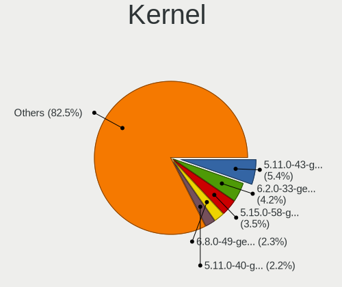
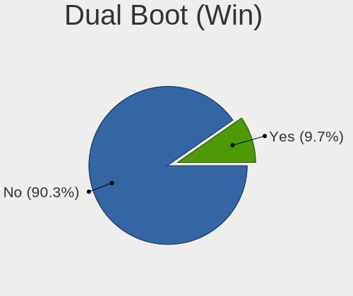
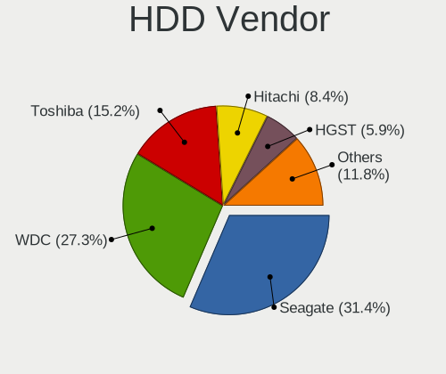
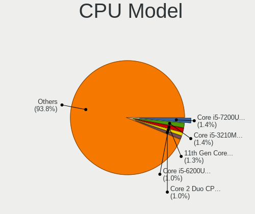
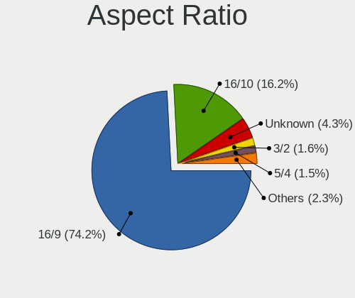
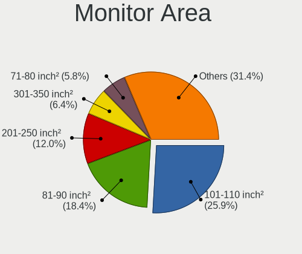
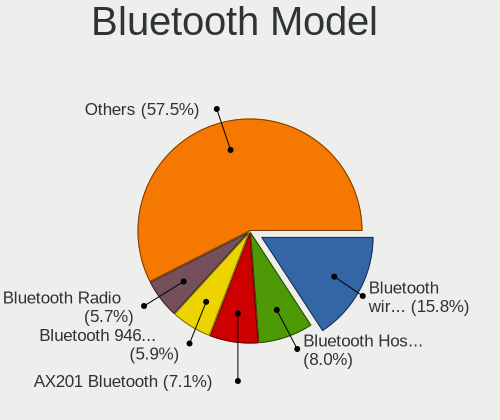
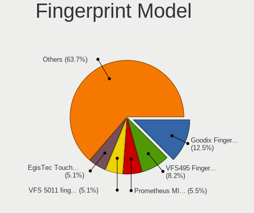
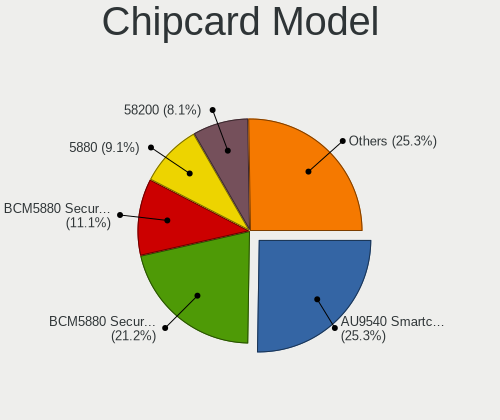

Elementary - Tested Hardware & Statistics
-----------------------------------------

A project to collect tested hardware configurations for Elementary.

Anyone can contribute to this report by the [hw-probe](https://github.com/linuxhw/hw-probe) tool:

    sudo -E hw-probe -all -upload

Please contribute! Especially if your hardware is rare.

This is a report for all computer types. See also reports for [desktops](/Dist/Elementary/Desktop/README.md) and [notebooks](/Dist/Elementary/Notebook/README.md).

Contents
--------

* [ Test Cases ](#test-cases)

* [ System ](#system)
  - [ OS                       ](#os)
  - [ OS Family                ](#os-family)
  - [ Kernel                   ](#kernel)
  - [ Kernel Family            ](#kernel-family)
  - [ Kernel Major Ver.        ](#kernel-major-ver)
  - [ Arch                     ](#arch)
  - [ DE                       ](#de)
  - [ Display Server           ](#display-server)
  - [ Display Manager          ](#display-manager)
  - [ OS Lang                  ](#os-lang)
  - [ Boot Mode                ](#boot-mode)
  - [ Filesystem               ](#filesystem)
  - [ Part. scheme             ](#part-scheme)
  - [ Dual Boot with Linux/BSD ](#dual-boot-with-linuxbsd)
  - [ Dual Boot (Win)          ](#dual-boot-win)

* [ Board ](#board)
  - [ Vendor                   ](#vendor)
  - [ Model                    ](#model)
  - [ Model Family             ](#model-family)
  - [ MFG Year                 ](#mfg-year)
  - [ Form Factor              ](#form-factor)
  - [ Secure Boot              ](#secure-boot)
  - [ Coreboot                 ](#coreboot)
  - [ RAM Size                 ](#ram-size)
  - [ RAM Used                 ](#ram-used)
  - [ Total Drives             ](#total-drives)
  - [ Has CD-ROM               ](#has-cd-rom)
  - [ Has Ethernet             ](#has-ethernet)
  - [ Has WiFi                 ](#has-wifi)
  - [ Has Bluetooth            ](#has-bluetooth)

* [ Location ](#location)
  - [ Country                  ](#country)
  - [ City                     ](#city)

* [ Drives ](#drives)
  - [ Drive Vendor             ](#drive-vendor)
  - [ Drive Model              ](#drive-model)
  - [ HDD Vendor               ](#hdd-vendor)
  - [ SSD Vendor               ](#ssd-vendor)
  - [ Drive Kind               ](#drive-kind)
  - [ Drive Connector          ](#drive-connector)
  - [ Drive Size               ](#drive-size)
  - [ Space Total              ](#space-total)
  - [ Space Used               ](#space-used)
  - [ Malfunc. Drives          ](#malfunc-drives)
  - [ Malfunc. Drive Vendor    ](#malfunc-drive-vendor)
  - [ Malfunc. HDD Vendor      ](#malfunc-hdd-vendor)
  - [ Malfunc. Drive Kind      ](#malfunc-drive-kind)
  - [ Failed Drives            ](#failed-drives)
  - [ Failed Drive Vendor      ](#failed-drive-vendor)
  - [ Drive Status             ](#drive-status)

* [ Storage controller ](#storage-controller)
  - [ Storage Vendor           ](#storage-vendor)
  - [ Storage Model            ](#storage-model)
  - [ Storage Kind             ](#storage-kind)

* [ Processor ](#processor)
  - [ CPU Vendor               ](#cpu-vendor)
  - [ CPU Model                ](#cpu-model)
  - [ CPU Model Family         ](#cpu-model-family)
  - [ CPU Cores                ](#cpu-cores)
  - [ CPU Sockets              ](#cpu-sockets)
  - [ CPU Threads              ](#cpu-threads)
  - [ CPU Op-Modes             ](#cpu-op-modes)
  - [ CPU Microcode            ](#cpu-microcode)
  - [ CPU Microarch            ](#cpu-microarch)

* [ Graphics ](#graphics)
  - [ GPU Vendor               ](#gpu-vendor)
  - [ GPU Model                ](#gpu-model)
  - [ GPU Combo                ](#gpu-combo)
  - [ GPU Driver               ](#gpu-driver)
  - [ GPU Memory               ](#gpu-memory)

* [ Monitor ](#monitor)
  - [ Monitor Vendor           ](#monitor-vendor)
  - [ Monitor Model            ](#monitor-model)
  - [ Monitor Resolution       ](#monitor-resolution)
  - [ Monitor Diagonal         ](#monitor-diagonal)
  - [ Monitor Width            ](#monitor-width)
  - [ Aspect Ratio             ](#aspect-ratio)
  - [ Monitor Area             ](#monitor-area)
  - [ Pixel Density            ](#pixel-density)
  - [ Multiple Monitors        ](#multiple-monitors)

* [ Network ](#network)
  - [ Net Controller Vendor    ](#net-controller-vendor)
  - [ Net Controller Model     ](#net-controller-model)
  - [ Wireless Vendor          ](#wireless-vendor)
  - [ Wireless Model           ](#wireless-model)
  - [ Ethernet Vendor          ](#ethernet-vendor)
  - [ Ethernet Model           ](#ethernet-model)
  - [ Net Controller Kind      ](#net-controller-kind)
  - [ Used Controller          ](#used-controller)
  - [ NICs                     ](#nics)
  - [ IPv6                     ](#ipv6)

* [ Bluetooth ](#bluetooth)
  - [ Bluetooth Vendor         ](#bluetooth-vendor)
  - [ Bluetooth Model          ](#bluetooth-model)

* [ Sound ](#sound)
  - [ Sound Vendor             ](#sound-vendor)
  - [ Sound Model              ](#sound-model)

* [ Memory ](#memory)
  - [ Memory Vendor            ](#memory-vendor)
  - [ Memory Model             ](#memory-model)
  - [ Memory Kind              ](#memory-kind)
  - [ Memory Form Factor       ](#memory-form-factor)
  - [ Memory Size              ](#memory-size)
  - [ Memory Speed             ](#memory-speed)

* [ Printers & scanners ](#printers--scanners)
  - [ Printer Vendor           ](#printer-vendor)
  - [ Printer Model            ](#printer-model)
  - [ Scanner Vendor           ](#scanner-vendor)
  - [ Scanner Model            ](#scanner-model)

* [ Camera ](#camera)
  - [ Camera Vendor            ](#camera-vendor)
  - [ Camera Model             ](#camera-model)

* [ Security ](#security)
  - [ Fingerprint Vendor       ](#fingerprint-vendor)
  - [ Fingerprint Model        ](#fingerprint-model)
  - [ Chipcard Vendor          ](#chipcard-vendor)
  - [ Chipcard Model           ](#chipcard-model)

* [ Unsupported ](#unsupported)
  - [ Unsupported Devices      ](#unsupported-devices)
  - [ Unsupported Device Types ](#unsupported-device-types)

Test Cases
----------

Total: 2798

| Vendor        | Model                       | Form-Factor | Probe                                                      | Date         |
|---------------|-----------------------------|-------------|------------------------------------------------------------|--------------|
| Dell          | Inspiron 3481               | Notebook    | [78cf24846f](https://linux-hardware.org/?probe=78cf24846f) | May 09, 2024 |
| ASUSTek       | PRIME B460M-K               | Desktop     | [fea6956058](https://linux-hardware.org/?probe=fea6956058) | May 08, 2024 |
| ASUSTek       | PRIME H510M-A               | Desktop     | [e475e36ab0](https://linux-hardware.org/?probe=e475e36ab0) | May 06, 2024 |
| Packard Be... | EasyNote LM81               | Notebook    | [0ea4d18648](https://linux-hardware.org/?probe=0ea4d18648) | May 06, 2024 |
| Samsung       | 550XDA                      | Notebook    | [1ea7dfb8ae](https://linux-hardware.org/?probe=1ea7dfb8ae) | May 06, 2024 |
| ASUSTek       | PRIME A320M-K               | Desktop     | [0f43840d58](https://linux-hardware.org/?probe=0f43840d58) | May 06, 2024 |
| Apple         | MacBookPro11,4              | Notebook    | [3c0f7c8c00](https://linux-hardware.org/?probe=3c0f7c8c00) | May 06, 2024 |
| HP            | EliteBook 830 G5            | Notebook    | [7ad59bc402](https://linux-hardware.org/?probe=7ad59bc402) | May 05, 2024 |
| HP            | EliteBook 830 G5            | Notebook    | [a88155be11](https://linux-hardware.org/?probe=a88155be11) | May 05, 2024 |
| Lenovo        | IdeaPad S340-14API 81NB     | Notebook    | [80f71c25c1](https://linux-hardware.org/?probe=80f71c25c1) | May 05, 2024 |
| Apple         | MacBookAir4,1               | Notebook    | [2e67b6ba22](https://linux-hardware.org/?probe=2e67b6ba22) | May 04, 2024 |
| Samsung       | DP700A7D-S04IT SEC_SW_RE... | All in one  | [7ddb4bb85e](https://linux-hardware.org/?probe=7ddb4bb85e) | May 04, 2024 |
| Lenovo        | ThinkPad T530 2429HR5       | Notebook    | [c5640e6fae](https://linux-hardware.org/?probe=c5640e6fae) | May 04, 2024 |
| Dell          | Latitude 5490               | Notebook    | [b31473028c](https://linux-hardware.org/?probe=b31473028c) | May 04, 2024 |
| Packard Be... | EasyNote LM81               | Notebook    | [44ead9f439](https://linux-hardware.org/?probe=44ead9f439) | May 03, 2024 |
| Google        | Nospike                     | Notebook    | [549d690ae1](https://linux-hardware.org/?probe=549d690ae1) | May 02, 2024 |
| Samsung       | DP700A7D-S04IT SEC_SW_RE... | All in one  | [3ba7fa0ef2](https://linux-hardware.org/?probe=3ba7fa0ef2) | May 01, 2024 |
| Dell          | Latitude 5490               | Notebook    | [c83e9f5562](https://linux-hardware.org/?probe=c83e9f5562) | May 01, 2024 |
| Lenovo        | IdeaPad P400 Touch 20211    | Notebook    | [cacd80cba3](https://linux-hardware.org/?probe=cacd80cba3) | May 01, 2024 |
| HP            | ProBook 470 G5              | Notebook    | [8ba873e85d](https://linux-hardware.org/?probe=8ba873e85d) | Apr 30, 2024 |
| HP            | 0B4Ch D                     | Desktop     | [29d73efd4a](https://linux-hardware.org/?probe=29d73efd4a) | Apr 30, 2024 |
| ASUSTek       | PRIME A320M-K               | Desktop     | [022ece0282](https://linux-hardware.org/?probe=022ece0282) | Apr 30, 2024 |
| MSI           | GT62VR 6RE                  | Notebook    | [b7768b7ee9](https://linux-hardware.org/?probe=b7768b7ee9) | Apr 28, 2024 |
| Medion        | MS-7797                     | Desktop     | [a72c95890e](https://linux-hardware.org/?probe=a72c95890e) | Apr 28, 2024 |
| HP            | EliteBook 8440p             | Notebook    | [0dbed15c85](https://linux-hardware.org/?probe=0dbed15c85) | Apr 27, 2024 |
| Gigabyte      | B250M-D2VX-SI-CF            | Desktop     | [5c277491cf](https://linux-hardware.org/?probe=5c277491cf) | Apr 27, 2024 |
| HUAWEI        | KPL-W0X                     | Notebook    | [0ce65136da](https://linux-hardware.org/?probe=0ce65136da) | Apr 27, 2024 |
| Apple         | Mac-942B59F58194171B iMa... | All in one  | [803b388305](https://linux-hardware.org/?probe=803b388305) | Apr 26, 2024 |
| Apple         | Mac-942B59F58194171B iMa... | All in one  | [3471ca7905](https://linux-hardware.org/?probe=3471ca7905) | Apr 26, 2024 |
| Apple         | MacBook5,1                  | Notebook    | [8da3b01d13](https://linux-hardware.org/?probe=8da3b01d13) | Apr 26, 2024 |
| ASUSTek       | TUF X470-PLUS GAMING        | Desktop     | [6609c77480](https://linux-hardware.org/?probe=6609c77480) | Apr 26, 2024 |
| MSI           | MS-B090                     | All in one  | [06780aaa5b](https://linux-hardware.org/?probe=06780aaa5b) | Apr 26, 2024 |
| ASUSTek       | P8H77-M PRO                 | Desktop     | [ee55351883](https://linux-hardware.org/?probe=ee55351883) | Apr 25, 2024 |
| HP            | EliteBook 745 G4            | Notebook    | [f38a6451f0](https://linux-hardware.org/?probe=f38a6451f0) | Apr 24, 2024 |
| ASUSTek       | PRIME H510M-A               | Desktop     | [c12789125b](https://linux-hardware.org/?probe=c12789125b) | Apr 24, 2024 |
| HP            | Pavilion dv6                | Notebook    | [c8d73c3a23](https://linux-hardware.org/?probe=c8d73c3a23) | Apr 24, 2024 |
| HP            | Pavilion dv6                | Notebook    | [08f01fc7ed](https://linux-hardware.org/?probe=08f01fc7ed) | Apr 24, 2024 |
| Acer          | Aspire A515-43              | Notebook    | [ff74a6262e](https://linux-hardware.org/?probe=ff74a6262e) | Apr 23, 2024 |
| Apple         | MacBookAir7,2               | Notebook    | [674850b624](https://linux-hardware.org/?probe=674850b624) | Apr 23, 2024 |
| Unknown       | Unknown                     | Notebook    | [def20611a4](https://linux-hardware.org/?probe=def20611a4) | Apr 23, 2024 |
| Apple         | MacBookAir7,2               | Notebook    | [c7cbc009ef](https://linux-hardware.org/?probe=c7cbc009ef) | Apr 23, 2024 |
| Acer          | Aspire 5750G                | Notebook    | [39ed7553a3](https://linux-hardware.org/?probe=39ed7553a3) | Apr 23, 2024 |
| TECNO         | MEGABOOK T1                 | Notebook    | [01fc56cf5b](https://linux-hardware.org/?probe=01fc56cf5b) | Apr 22, 2024 |
| Medion        | MS-7797                     | Desktop     | [810a7d7810](https://linux-hardware.org/?probe=810a7d7810) | Apr 22, 2024 |
| Apple         | MacBookPro11,1              | Notebook    | [3f4e9ae066](https://linux-hardware.org/?probe=3f4e9ae066) | Apr 21, 2024 |
| Apple         | MacBookPro11,1              | Notebook    | [e70b7338c2](https://linux-hardware.org/?probe=e70b7338c2) | Apr 21, 2024 |
| Acer          | Aspire 5750                 | Notebook    | [9e2621b213](https://linux-hardware.org/?probe=9e2621b213) | Apr 21, 2024 |
| ASUSTek       | VivoBook_ASUSLaptop X580... | Notebook    | [8740fd113c](https://linux-hardware.org/?probe=8740fd113c) | Apr 19, 2024 |
| HP            | Pavilion Notebook           | Notebook    | [8b925ca8f0](https://linux-hardware.org/?probe=8b925ca8f0) | Apr 19, 2024 |
| ECS           | H110M-C3D/C3V               | Desktop     | [7fffccead5](https://linux-hardware.org/?probe=7fffccead5) | Apr 17, 2024 |
| ASUSTek       | K42F                        | Notebook    | [d127923f98](https://linux-hardware.org/?probe=d127923f98) | Apr 17, 2024 |
| HP            | Pavilion x2 Detachable      | Notebook    | [9e5556a266](https://linux-hardware.org/?probe=9e5556a266) | Apr 17, 2024 |
| Apple         | Mac-031B6874CF7F642A iMa... | All in one  | [847e24305d](https://linux-hardware.org/?probe=847e24305d) | Apr 16, 2024 |
| Apple         | MacBookPro16,1              | Notebook    | [40fd2c63cb](https://linux-hardware.org/?probe=40fd2c63cb) | Apr 16, 2024 |
| Dell          | 0D24M8 A02                  | Desktop     | [96b0ae2f86](https://linux-hardware.org/?probe=96b0ae2f86) | Apr 16, 2024 |
| Gigabyte      | F2A68HM-S1                  | Desktop     | [32237e05f1](https://linux-hardware.org/?probe=32237e05f1) | Apr 15, 2024 |
| DEPO Compu... | W25CEW                      | Notebook    | [6653a2975d](https://linux-hardware.org/?probe=6653a2975d) | Apr 15, 2024 |
| Apple         | Mac-031B6874CF7F642A iMa... | All in one  | [0018ad80c4](https://linux-hardware.org/?probe=0018ad80c4) | Apr 14, 2024 |
| Apple         | MacBookAir7,1               | Notebook    | [c1be5d2dd6](https://linux-hardware.org/?probe=c1be5d2dd6) | Apr 14, 2024 |
| Apple         | MacBookPro9,2               | Notebook    | [5a62c14a1f](https://linux-hardware.org/?probe=5a62c14a1f) | Apr 14, 2024 |
| Apple         | MacBookPro9,2               | Notebook    | [97f0209510](https://linux-hardware.org/?probe=97f0209510) | Apr 14, 2024 |
| Medion        | Z370H4-EM                   | Desktop     | [39cb6c0afb](https://linux-hardware.org/?probe=39cb6c0afb) | Apr 13, 2024 |
| Acer          | Aspire 6935                 | Notebook    | [d26ee0494f](https://linux-hardware.org/?probe=d26ee0494f) | Apr 13, 2024 |
| Apple         | MacBookPro8,2               | Notebook    | [e57c02860c](https://linux-hardware.org/?probe=e57c02860c) | Apr 13, 2024 |
| Acer          | Aspire 5750                 | Notebook    | [f64263bd19](https://linux-hardware.org/?probe=f64263bd19) | Apr 12, 2024 |
| Apple         | MacBookAir7,2               | Notebook    | [569f9614a5](https://linux-hardware.org/?probe=569f9614a5) | Apr 12, 2024 |
| HP            | ProBook 6360b               | Notebook    | [81b9d0706b](https://linux-hardware.org/?probe=81b9d0706b) | Apr 11, 2024 |
| Apple         | MacBookPro8,2               | Notebook    | [461d5dfd8d](https://linux-hardware.org/?probe=461d5dfd8d) | Apr 11, 2024 |
| MSI           | MEG Z590 UNIFY              | Desktop     | [88f634c670](https://linux-hardware.org/?probe=88f634c670) | Apr 11, 2024 |
| MSI           | MEG Z590 UNIFY              | Desktop     | [2336b3cd38](https://linux-hardware.org/?probe=2336b3cd38) | Apr 11, 2024 |
| HP            | 2B13 A01                    | All in one  | [30160f86ab](https://linux-hardware.org/?probe=30160f86ab) | Apr 10, 2024 |
| Lenovo        | ThinkPad E480 20KN003TUS    | Notebook    | [35b206d8f8](https://linux-hardware.org/?probe=35b206d8f8) | Apr 10, 2024 |
| HP            | EliteBook 745 G4            | Notebook    | [0d92302707](https://linux-hardware.org/?probe=0d92302707) | Apr 09, 2024 |
| Apple         | MacBookPro8,1               | Notebook    | [ac137b7cb7](https://linux-hardware.org/?probe=ac137b7cb7) | Apr 09, 2024 |
| Apple         | MacBookPro8,1               | Notebook    | [e964beb301](https://linux-hardware.org/?probe=e964beb301) | Apr 09, 2024 |
| Apple         | MacBookPro5,4               | Notebook    | [3ab1d66e10](https://linux-hardware.org/?probe=3ab1d66e10) | Apr 08, 2024 |
| Lenovo        | Yoga 900S-12ISK 80ML        | Notebook    | [9099f440bc](https://linux-hardware.org/?probe=9099f440bc) | Apr 08, 2024 |
| Apple         | MacBookPro8,1               | Notebook    | [7efef6a0ae](https://linux-hardware.org/?probe=7efef6a0ae) | Apr 07, 2024 |
| Apple         | MacBookPro8,1               | Notebook    | [d28398beb7](https://linux-hardware.org/?probe=d28398beb7) | Apr 07, 2024 |
| Dell          | XPS 15 9570                 | Notebook    | [ccdb5dcad9](https://linux-hardware.org/?probe=ccdb5dcad9) | Apr 07, 2024 |
| HP            | 18E7                        | Desktop     | [467ac72efe](https://linux-hardware.org/?probe=467ac72efe) | Apr 07, 2024 |
| Apple         | MacBookPro9,2               | Notebook    | [a90b694613](https://linux-hardware.org/?probe=a90b694613) | Apr 06, 2024 |
| Gigabyte      | 945GME-DS2                  | Desktop     | [37085a5c3f](https://linux-hardware.org/?probe=37085a5c3f) | Apr 06, 2024 |
| Acer          | Aspire 5750                 | Notebook    | [27d64e5b3c](https://linux-hardware.org/?probe=27d64e5b3c) | Apr 05, 2024 |
| Apple         | MacBookPro8,1               | Notebook    | [733d6c6e2b](https://linux-hardware.org/?probe=733d6c6e2b) | Apr 05, 2024 |
| Lenovo        | MIIX 310-10ICR 80SG         | Tablet      | [8603f205ba](https://linux-hardware.org/?probe=8603f205ba) | Apr 05, 2024 |
| Lenovo        | ThinkPad E480 20KN003TUS    | Notebook    | [3d64dfc3a9](https://linux-hardware.org/?probe=3d64dfc3a9) | Apr 04, 2024 |
| Acer          | Aspire 5750                 | Notebook    | [e2cef27ef8](https://linux-hardware.org/?probe=e2cef27ef8) | Apr 03, 2024 |
| ASUSTek       | ZenBook UX425EA_UX425EA     | Notebook    | [9bc584b914](https://linux-hardware.org/?probe=9bc584b914) | Apr 03, 2024 |
| Toshiba       | Satellite L10W-B-101        | Notebook    | [eaa5927086](https://linux-hardware.org/?probe=eaa5927086) | Apr 03, 2024 |
| HP            | 18E7                        | Desktop     | [9dadc64d70](https://linux-hardware.org/?probe=9dadc64d70) | Apr 03, 2024 |
| HP            | Pavilion dv7                | Notebook    | [483e1957a4](https://linux-hardware.org/?probe=483e1957a4) | Apr 02, 2024 |
| Lenovo        | Yoga Pro 7 14APH8 82Y8      | Notebook    | [fe5490324f](https://linux-hardware.org/?probe=fe5490324f) | Apr 01, 2024 |
| ASUSTek       | EX-B150M-V3                 | Desktop     | [0c643b047e](https://linux-hardware.org/?probe=0c643b047e) | Apr 01, 2024 |
| ASUSTek       | EX-B150M-V3                 | Desktop     | [c6772f244f](https://linux-hardware.org/?probe=c6772f244f) | Apr 01, 2024 |
| Medion        | E6217                       | Notebook    | [c2ca377a05](https://linux-hardware.org/?probe=c2ca377a05) | Mar 31, 2024 |
| HP            | Pavilion dv7                | Notebook    | [a86e8cccf5](https://linux-hardware.org/?probe=a86e8cccf5) | Mar 31, 2024 |
| Apple         | Mac-81E3E92DD6088272 iMa... | All in one  | [6cec34e881](https://linux-hardware.org/?probe=6cec34e881) | Mar 30, 2024 |
| Apple         | Mac-942B59F58194171B iMa... | All in one  | [c010c5876b](https://linux-hardware.org/?probe=c010c5876b) | Mar 30, 2024 |
| ASUSTek       | P8H77-M PRO                 | Desktop     | [f30dd46998](https://linux-hardware.org/?probe=f30dd46998) | Mar 29, 2024 |
| ASUSTek       | ASUS TUF Gaming F15 FX50... | Notebook    | [b68181d354](https://linux-hardware.org/?probe=b68181d354) | Mar 29, 2024 |
| ASUSTek       | ZenBook UX425EA_UX425EA     | Notebook    | [5b4456a2d6](https://linux-hardware.org/?probe=5b4456a2d6) | Mar 29, 2024 |
| Dell          | Inspiron 5423               | Notebook    | [0c6c4c6a58](https://linux-hardware.org/?probe=0c6c4c6a58) | Mar 29, 2024 |
| MSI           | MAG B660M MORTAR WIFI DD... | Desktop     | [a87aa51bf9](https://linux-hardware.org/?probe=a87aa51bf9) | Mar 29, 2024 |
| MSI           | A68HM-E33 V2                | Desktop     | [22b44252e3](https://linux-hardware.org/?probe=22b44252e3) | Mar 28, 2024 |
| Lenovo        | ThinkPad W500 40623CG       | Notebook    | [71c868292f](https://linux-hardware.org/?probe=71c868292f) | Mar 27, 2024 |
| Lenovo        | ThinkPad W500 40623CG       | Notebook    | [01d1ef9c31](https://linux-hardware.org/?probe=01d1ef9c31) | Mar 26, 2024 |
| Lenovo        | ThinkPad T410 2537CQ7       | Notebook    | [8b91ec68dd](https://linux-hardware.org/?probe=8b91ec68dd) | Mar 26, 2024 |
| Lenovo        | ThinkPad T450s 20BX0011G... | Notebook    | [3e86099c28](https://linux-hardware.org/?probe=3e86099c28) | Mar 26, 2024 |
| Lenovo        | ThinkCentre Edge91 1895B... | Desktop     | [991944129e](https://linux-hardware.org/?probe=991944129e) | Mar 26, 2024 |
| Chuwi         | LarkBox Pro                 | Mini pc     | [e9afd87037](https://linux-hardware.org/?probe=e9afd87037) | Mar 25, 2024 |
| Gigabyte      | A320M-S2H-CF                | Desktop     | [30717fbd15](https://linux-hardware.org/?probe=30717fbd15) | Mar 25, 2024 |
| Chuwi         | LarkBox Pro                 | Mini pc     | [42ab03e71f](https://linux-hardware.org/?probe=42ab03e71f) | Mar 25, 2024 |
| ASUSTek       | M4A87TD/USB3                | Desktop     | [9a817cbe67](https://linux-hardware.org/?probe=9a817cbe67) | Mar 24, 2024 |
| Lenovo        | ThinkPad T450s 20BX0011G... | Notebook    | [598015ca49](https://linux-hardware.org/?probe=598015ca49) | Mar 24, 2024 |
| ASUSTek       | H81M-P PLUS                 | Desktop     | [92aa3b7c70](https://linux-hardware.org/?probe=92aa3b7c70) | Mar 24, 2024 |
| ASUSTek       | H81M-P PLUS                 | Desktop     | [57ee067ff2](https://linux-hardware.org/?probe=57ee067ff2) | Mar 24, 2024 |
| Samsung       | 535U3C                      | Notebook    | [6b29450ac6](https://linux-hardware.org/?probe=6b29450ac6) | Mar 23, 2024 |
| HUAWEI        | BOM-WXX9                    | Notebook    | [20d2290d1c](https://linux-hardware.org/?probe=20d2290d1c) | Mar 23, 2024 |
| HP            | 0B54h D                     | Desktop     | [7b38927e17](https://linux-hardware.org/?probe=7b38927e17) | Mar 23, 2024 |
| HUAWEI        | NBLB-WAX9N                  | Notebook    | [e5c5d49216](https://linux-hardware.org/?probe=e5c5d49216) | Mar 22, 2024 |
| Unknown       | Unknown                     | Desktop     | [5af36d3a4e](https://linux-hardware.org/?probe=5af36d3a4e) | Mar 22, 2024 |
| Apple         | Mac-942B59F58194171B iMa... | All in one  | [89e6d122a0](https://linux-hardware.org/?probe=89e6d122a0) | Mar 22, 2024 |
| HP            | 0B54h D                     | Desktop     | [0af537dbcd](https://linux-hardware.org/?probe=0af537dbcd) | Mar 22, 2024 |
| ASRock        | X570 Extreme4               | Desktop     | [f7bd9e9cce](https://linux-hardware.org/?probe=f7bd9e9cce) | Mar 21, 2024 |
| ASUSTek       | ROG Flow Z13 GZ301ZC_GZ3... | Tablet      | [4769499461](https://linux-hardware.org/?probe=4769499461) | Mar 21, 2024 |
| HP            | ProBook 450 G3              | Notebook    | [a32e851ddd](https://linux-hardware.org/?probe=a32e851ddd) | Mar 21, 2024 |
| Unknown       | AM02                        | Mini pc     | [ad3f00a84a](https://linux-hardware.org/?probe=ad3f00a84a) | Mar 20, 2024 |
| HP            | ENVY 17                     | Notebook    | [0ee4da384d](https://linux-hardware.org/?probe=0ee4da384d) | Mar 20, 2024 |
| ASUSTek       | ROG Flow Z13 GZ301ZC_GZ3... | Tablet      | [78bd592741](https://linux-hardware.org/?probe=78bd592741) | Mar 17, 2024 |
| MSI           | GE70 2QE                    | Notebook    | [31b45c6de7](https://linux-hardware.org/?probe=31b45c6de7) | Mar 17, 2024 |
| HP            | Laptop 17-by3xxx            | Notebook    | [430290e97d](https://linux-hardware.org/?probe=430290e97d) | Mar 17, 2024 |
| Dell          | Latitude E6420              | Notebook    | [dc953135d3](https://linux-hardware.org/?probe=dc953135d3) | Mar 16, 2024 |
| Dell          | Latitude E7240              | Notebook    | [d159f296d4](https://linux-hardware.org/?probe=d159f296d4) | Mar 16, 2024 |
| ASUSTek       | X541UAK                     | Notebook    | [4b33512569](https://linux-hardware.org/?probe=4b33512569) | Mar 16, 2024 |
| Apple         | Mac-F2268CC8                | All in one  | [d90e75a37d](https://linux-hardware.org/?probe=d90e75a37d) | Mar 15, 2024 |
| Dell          | Latitude E7470              | Notebook    | [4addfb5619](https://linux-hardware.org/?probe=4addfb5619) | Mar 14, 2024 |
| Dell          | Latitude E7470              | Notebook    | [fbf1fe3963](https://linux-hardware.org/?probe=fbf1fe3963) | Mar 14, 2024 |
| Acer          | Aspire E5-573G              | Notebook    | [36653be57c](https://linux-hardware.org/?probe=36653be57c) | Mar 13, 2024 |
| ASUSTek       | X555LAB                     | Notebook    | [8b2310099c](https://linux-hardware.org/?probe=8b2310099c) | Mar 13, 2024 |
| MSI           | A68HM-E33 V2                | Desktop     | [52b29bf885](https://linux-hardware.org/?probe=52b29bf885) | Mar 12, 2024 |
| Lenovo        | V15 G2 ITL 82KB             | Notebook    | [cfb2591a20](https://linux-hardware.org/?probe=cfb2591a20) | Mar 12, 2024 |
| ASRock        | H110M-HDS                   | Desktop     | [0b9ca9c2ca](https://linux-hardware.org/?probe=0b9ca9c2ca) | Mar 12, 2024 |
| ASRock        | H110M-HDS                   | Desktop     | [0d754901a3](https://linux-hardware.org/?probe=0d754901a3) | Mar 12, 2024 |
| Lenovo        | V15 G2 ITL 82KB             | Notebook    | [9160e106f1](https://linux-hardware.org/?probe=9160e106f1) | Mar 12, 2024 |
| Dell          | 0D24M8 A02                  | Desktop     | [70a8364913](https://linux-hardware.org/?probe=70a8364913) | Mar 11, 2024 |
| Apple         | MacBookAir7,2               | Notebook    | [89b268f1f8](https://linux-hardware.org/?probe=89b268f1f8) | Mar 11, 2024 |
| HP            | EliteBook x360 1030 G7 N... | Convertible | [0f0640b2bf](https://linux-hardware.org/?probe=0f0640b2bf) | Mar 10, 2024 |
| Dell          | 0M6C7G A00                  | Desktop     | [666c6ad495](https://linux-hardware.org/?probe=666c6ad495) | Mar 10, 2024 |
| HP            | Pavilion Laptop 15-cs0xx... | Notebook    | [22f1633f40](https://linux-hardware.org/?probe=22f1633f40) | Mar 09, 2024 |
| ASUSTek       | X541UAK                     | Notebook    | [8b527dc9c9](https://linux-hardware.org/?probe=8b527dc9c9) | Mar 09, 2024 |
| HP            | ENVY Notebook               | Notebook    | [6ab7868737](https://linux-hardware.org/?probe=6ab7868737) | Mar 08, 2024 |
| Biostar       | B350GT5                     | Desktop     | [61f8cce525](https://linux-hardware.org/?probe=61f8cce525) | Mar 08, 2024 |
| Apple         | MacBookPro11,2              | Notebook    | [486387c7ef](https://linux-hardware.org/?probe=486387c7ef) | Mar 08, 2024 |
| Unknown       | AM02                        | Mini pc     | [3a7ef0d16c](https://linux-hardware.org/?probe=3a7ef0d16c) | Mar 08, 2024 |
| Fujitsu       | D3233-A1 S26361-D3233-A1    | Desktop     | [16b3359307](https://linux-hardware.org/?probe=16b3359307) | Mar 07, 2024 |
| Fujitsu       | D3233-A1 S26361-D3233-A1    | Desktop     | [4d569e557d](https://linux-hardware.org/?probe=4d569e557d) | Mar 07, 2024 |
| Apple         | MacBookAir7,2               | Notebook    | [f701ce67f5](https://linux-hardware.org/?probe=f701ce67f5) | Mar 07, 2024 |
| Apple         | MacBookAir7,2               | Notebook    | [4c046066f7](https://linux-hardware.org/?probe=4c046066f7) | Mar 05, 2024 |
| Lenovo        | ThinkPad X250 20CLS3NA00    | Notebook    | [ecea244114](https://linux-hardware.org/?probe=ecea244114) | Mar 03, 2024 |
| Unknown       | Unknown                     | Notebook    | [2ca2d631cc](https://linux-hardware.org/?probe=2ca2d631cc) | Mar 02, 2024 |
| Acer          | FIH57                       | Desktop     | [4b9a9a43f3](https://linux-hardware.org/?probe=4b9a9a43f3) | Mar 02, 2024 |
| HP            | Pavilion x360 Convertibl... | Convertible | [54ddd297a5](https://linux-hardware.org/?probe=54ddd297a5) | Mar 02, 2024 |
| HP            | ENVY Laptop 13-ad1xx        | Notebook    | [d7d8cc5cc7](https://linux-hardware.org/?probe=d7d8cc5cc7) | Mar 02, 2024 |
| ASUSTek       | Zenbook UP6502ZD_Q539ZD     | Convertible | [23bb682fb2](https://linux-hardware.org/?probe=23bb682fb2) | Mar 02, 2024 |
| HP            | ProBook 4540s               | Notebook    | [46cdfe37d6](https://linux-hardware.org/?probe=46cdfe37d6) | Mar 02, 2024 |
| HP            | ProBook 4540s               | Notebook    | [ec5752452f](https://linux-hardware.org/?probe=ec5752452f) | Mar 02, 2024 |
| HP            | 8434 11                     | Desktop     | [aa98b6327d](https://linux-hardware.org/?probe=aa98b6327d) | Mar 02, 2024 |
| HP            | 250 G8 Notebook PC          | Notebook    | [bcac46fe58](https://linux-hardware.org/?probe=bcac46fe58) | Mar 01, 2024 |
| HP            | 8434 11                     | Desktop     | [5b25b65016](https://linux-hardware.org/?probe=5b25b65016) | Mar 01, 2024 |
| Apple         | Mac-F221BEC8                | Desktop     | [10c92b676a](https://linux-hardware.org/?probe=10c92b676a) | Feb 29, 2024 |
| Apple         | MacBookPro5,4               | Notebook    | [681e76d909](https://linux-hardware.org/?probe=681e76d909) | Feb 29, 2024 |
| Apple         | MacBookPro5,4               | Notebook    | [ca45519759](https://linux-hardware.org/?probe=ca45519759) | Feb 29, 2024 |
| UNOWHY        | Y13G011S4EI                 | Notebook    | [f785899192](https://linux-hardware.org/?probe=f785899192) | Feb 29, 2024 |
| Lenovo        | IdeaPad 1 15ALC7 82R4       | Notebook    | [11a760c545](https://linux-hardware.org/?probe=11a760c545) | Feb 28, 2024 |
| HP            | 15                          | Notebook    | [6fb113d856](https://linux-hardware.org/?probe=6fb113d856) | Feb 28, 2024 |
| Dell          | 0D24M8 A02                  | Desktop     | [d67f57356b](https://linux-hardware.org/?probe=d67f57356b) | Feb 28, 2024 |
| Dell          | Inspiron 5567               | Notebook    | [9a57de6e15](https://linux-hardware.org/?probe=9a57de6e15) | Feb 27, 2024 |
| Apple         | Mac-8ED6AF5B48C039E1 Mac... | Mini pc     | [55a45151a3](https://linux-hardware.org/?probe=55a45151a3) | Feb 27, 2024 |
| Apple         | Mac-8ED6AF5B48C039E1 Mac... | Mini pc     | [9b5af4edf6](https://linux-hardware.org/?probe=9b5af4edf6) | Feb 27, 2024 |
| Lenovo        | ThinkPad X1 Carbon 2nd 2... | Notebook    | [49ac7f8a77](https://linux-hardware.org/?probe=49ac7f8a77) | Feb 27, 2024 |
| Apple         | MacBookPro9,2               | Notebook    | [7167de20ce](https://linux-hardware.org/?probe=7167de20ce) | Feb 27, 2024 |
| Lenovo        | V15 G1 IML 82NB             | Notebook    | [b51e9d56f2](https://linux-hardware.org/?probe=b51e9d56f2) | Feb 27, 2024 |
| HUAWEI        | KLVL-WXX9                   | Notebook    | [b1c31d32ab](https://linux-hardware.org/?probe=b1c31d32ab) | Feb 27, 2024 |
| Intel         | X79Turbo V1.x               | Desktop     | [09f942e7f4](https://linux-hardware.org/?probe=09f942e7f4) | Feb 26, 2024 |
| ASUSTek       | X441UA                      | Notebook    | [1185900ace](https://linux-hardware.org/?probe=1185900ace) | Feb 26, 2024 |
| Lenovo        | IdeaPad S400 Touch VIUS3    | Notebook    | [61e571e08f](https://linux-hardware.org/?probe=61e571e08f) | Feb 26, 2024 |
| Acer          | TravelMate P256-MG          | Notebook    | [abcfd5362f](https://linux-hardware.org/?probe=abcfd5362f) | Feb 25, 2024 |
| Lenovo        | IdeaPad 3 14ADA05 81W0      | Notebook    | [ca33f4c1c6](https://linux-hardware.org/?probe=ca33f4c1c6) | Feb 25, 2024 |
| HP            | Pavilion Laptop 15-cd0xx    | Notebook    | [6d31b35e19](https://linux-hardware.org/?probe=6d31b35e19) | Feb 25, 2024 |
| ASUSTek       | Zenbook UP6502ZD_Q539ZD     | Convertible | [773d48d7bc](https://linux-hardware.org/?probe=773d48d7bc) | Feb 25, 2024 |
| Apple         | MacBook5,1                  | Notebook    | [be026cabc8](https://linux-hardware.org/?probe=be026cabc8) | Feb 24, 2024 |
| Gigabyte      | AB350-Gaming 3-CF           | Desktop     | [082b9f50ab](https://linux-hardware.org/?probe=082b9f50ab) | Feb 23, 2024 |
| Acer          | Swift SF314-43              | Notebook    | [56b060901d](https://linux-hardware.org/?probe=56b060901d) | Feb 23, 2024 |
| HP            | Pavilion Laptop 15-cd0xx    | Notebook    | [83bf2661f0](https://linux-hardware.org/?probe=83bf2661f0) | Feb 23, 2024 |
| Apple         | MacBookAir7,2               | Notebook    | [627c4721b6](https://linux-hardware.org/?probe=627c4721b6) | Feb 21, 2024 |
| Lenovo        | IdeaPad 1 15AMN7 82X5       | Notebook    | [96fb9606bf](https://linux-hardware.org/?probe=96fb9606bf) | Feb 20, 2024 |
| Lenovo        | IdeaPad 1 15AMN7 82X5       | Notebook    | [520188b3c6](https://linux-hardware.org/?probe=520188b3c6) | Feb 20, 2024 |
| HP            | ProBook 450 G1              | Notebook    | [ba02f5d2ae](https://linux-hardware.org/?probe=ba02f5d2ae) | Feb 18, 2024 |
| Slimbook      | Essential 14                | Notebook    | [05c319f707](https://linux-hardware.org/?probe=05c319f707) | Feb 18, 2024 |
| Apple         | MacBookAir6,1               | Notebook    | [f11ff820e7](https://linux-hardware.org/?probe=f11ff820e7) | Feb 18, 2024 |
| HP            | ProBook 430 G2              | Notebook    | [a4b236fd41](https://linux-hardware.org/?probe=a4b236fd41) | Feb 17, 2024 |
| Lenovo        | IdeaPad 3 15IGL05 81WQ      | Notebook    | [b5bad706ef](https://linux-hardware.org/?probe=b5bad706ef) | Feb 15, 2024 |
| HP            | 245 G8                      | Notebook    | [c66563da68](https://linux-hardware.org/?probe=c66563da68) | Feb 14, 2024 |
| Dell          | Vostro 1540                 | Notebook    | [ed9ed14ad8](https://linux-hardware.org/?probe=ed9ed14ad8) | Feb 14, 2024 |
| HP            | ZBook 15                    | Notebook    | [bcb41f3b4c](https://linux-hardware.org/?probe=bcb41f3b4c) | Feb 14, 2024 |
| MSI           | GF72VR 7RF                  | Notebook    | [8fb108b426](https://linux-hardware.org/?probe=8fb108b426) | Feb 13, 2024 |
| Gigabyte      | H110N-CF                    | Desktop     | [c6a69fce12](https://linux-hardware.org/?probe=c6a69fce12) | Feb 10, 2024 |
| ASUSTek       | P5G41T-M LX3                | Desktop     | [fd10cd8983](https://linux-hardware.org/?probe=fd10cd8983) | Feb 09, 2024 |
| ASUSTek       | P5G41T-M LX3                | Desktop     | [ae6f0a23e2](https://linux-hardware.org/?probe=ae6f0a23e2) | Feb 09, 2024 |
| Lenovo        | IdeaPad 320-15ABR 80XS      | Notebook    | [d1856c355f](https://linux-hardware.org/?probe=d1856c355f) | Feb 08, 2024 |
| ASUSTek       | P8Z68-V PRO GEN3            | Desktop     | [d099546e70](https://linux-hardware.org/?probe=d099546e70) | Feb 07, 2024 |
| Intel         | X79Turbo V1.x               | Desktop     | [35c4b20053](https://linux-hardware.org/?probe=35c4b20053) | Feb 07, 2024 |
| Shenzhen M... | F7BSD                       | Mini pc     | [80270fd106](https://linux-hardware.org/?probe=80270fd106) | Feb 07, 2024 |
| Shenzhen M... | F7BSD                       | Mini pc     | [5136f59a7b](https://linux-hardware.org/?probe=5136f59a7b) | Feb 07, 2024 |
| ASUSTek       | VivoBook_ASUSLaptop X170... | Notebook    | [498af1a9a2](https://linux-hardware.org/?probe=498af1a9a2) | Feb 06, 2024 |
| Apple         | Mac-F2208EC8                | Mini pc     | [ba8a28b37e](https://linux-hardware.org/?probe=ba8a28b37e) | Feb 06, 2024 |
| Microsoft     | Surface Book 2              | Tablet      | [0434a0132b](https://linux-hardware.org/?probe=0434a0132b) | Feb 06, 2024 |
| Teclast       | F7                          | Notebook    | [04b33deb97](https://linux-hardware.org/?probe=04b33deb97) | Feb 04, 2024 |
| Lenovo        | ThinkPad T14s Gen 2i 20W... | Notebook    | [fdc21a05c2](https://linux-hardware.org/?probe=fdc21a05c2) | Feb 02, 2024 |
| Dell          | 0GDG8Y A00                  | Desktop     | [2cca1daa38](https://linux-hardware.org/?probe=2cca1daa38) | Feb 01, 2024 |
| Acer          | AOD255                      | Notebook    | [43304c651c](https://linux-hardware.org/?probe=43304c651c) | Feb 01, 2024 |
| HUAWEI        | BOD-WXX9                    | Notebook    | [d1a7f0cddb](https://linux-hardware.org/?probe=d1a7f0cddb) | Jan 31, 2024 |
| HP            | Pavilion g6                 | Notebook    | [acd0ae9c04](https://linux-hardware.org/?probe=acd0ae9c04) | Jan 31, 2024 |
| Apple         | MacBookPro7,1               | Notebook    | [973c263365](https://linux-hardware.org/?probe=973c263365) | Jan 30, 2024 |
| Fujitsu       | LIFEBOOK E734               | Notebook    | [7b3a60ae2d](https://linux-hardware.org/?probe=7b3a60ae2d) | Jan 30, 2024 |
| Acer          | Aspire E5-571               | Notebook    | [6ebe6ae5be](https://linux-hardware.org/?probe=6ebe6ae5be) | Jan 28, 2024 |
| ASRock        | B75M-DGS R2.0               | Desktop     | [cff86cc0d9](https://linux-hardware.org/?probe=cff86cc0d9) | Jan 27, 2024 |
| Lenovo        | ThinkPad L440 20AT0030MD    | Notebook    | [1c0f2e8a2f](https://linux-hardware.org/?probe=1c0f2e8a2f) | Jan 26, 2024 |
| Dell          | Latitude E7240              | Notebook    | [d8e5d4a8da](https://linux-hardware.org/?probe=d8e5d4a8da) | Jan 25, 2024 |
| ASUSTek       | VivoBook_ASUSLaptop X150... | Notebook    | [81338699ce](https://linux-hardware.org/?probe=81338699ce) | Jan 25, 2024 |
| ASUSTek       | VivoBook_ASUSLaptop X150... | Notebook    | [9f021a2102](https://linux-hardware.org/?probe=9f021a2102) | Jan 25, 2024 |
| Samsung       | RC410/RC510/RC710           | Notebook    | [34369cc7eb](https://linux-hardware.org/?probe=34369cc7eb) | Jan 25, 2024 |
| Dell          | 00V62H A01                  | Desktop     | [83f7e8b344](https://linux-hardware.org/?probe=83f7e8b344) | Jan 24, 2024 |
| Samsung       | RC410/RC510/RC710           | Notebook    | [d48bdbaec0](https://linux-hardware.org/?probe=d48bdbaec0) | Jan 24, 2024 |
| Acer          | Aspire E5-573G              | Notebook    | [14eec10d5e](https://linux-hardware.org/?probe=14eec10d5e) | Jan 24, 2024 |
| Lenovo        | IdeaPad 330S-15IKB 81F5     | Notebook    | [3361cf9ae9](https://linux-hardware.org/?probe=3361cf9ae9) | Jan 23, 2024 |
| Lenovo        | V17 G2 ITL 82NX             | Notebook    | [40f906871e](https://linux-hardware.org/?probe=40f906871e) | Jan 22, 2024 |
| Gigabyte      | EP43-UD3L                   | Desktop     | [6a2153a6b9](https://linux-hardware.org/?probe=6a2153a6b9) | Jan 21, 2024 |
| Dell          | 00V62H A01                  | Desktop     | [7104f7e7cf](https://linux-hardware.org/?probe=7104f7e7cf) | Jan 21, 2024 |
| Lenovo        | ThinkPad T480 20L6S3ED18    | Notebook    | [63d8796a60](https://linux-hardware.org/?probe=63d8796a60) | Jan 20, 2024 |
| Gigabyte      | B560M DS3H                  | Desktop     | [8ffb8f68ca](https://linux-hardware.org/?probe=8ffb8f68ca) | Jan 19, 2024 |
| Lenovo        | ThinkPad X1 Carbon 2nd 2... | Notebook    | [86d22c9b40](https://linux-hardware.org/?probe=86d22c9b40) | Jan 17, 2024 |
| Apple         | MacBook6,1                  | Notebook    | [641df770ba](https://linux-hardware.org/?probe=641df770ba) | Jan 17, 2024 |
| Apple         | Mac-35C5E08120C7EEAF Mac... | Mini pc     | [5489e559cd](https://linux-hardware.org/?probe=5489e559cd) | Jan 14, 2024 |
| Packard Be... | EasyNote TS11HR             | Notebook    | [41076ef28d](https://linux-hardware.org/?probe=41076ef28d) | Jan 14, 2024 |
| Gigabyte      | EP43-UD3L                   | Desktop     | [8dc280e4fc](https://linux-hardware.org/?probe=8dc280e4fc) | Jan 13, 2024 |
| Apple         | Mac-942B59F58194171B iMa... | All in one  | [ab653ac7ff](https://linux-hardware.org/?probe=ab653ac7ff) | Jan 11, 2024 |
| ASRock        | Z390 Phantom Gaming-ITX/... | Desktop     | [62374d5cbd](https://linux-hardware.org/?probe=62374d5cbd) | Jan 11, 2024 |
| ASRock        | Z390 Phantom Gaming-ITX/... | Desktop     | [f24b7483b8](https://linux-hardware.org/?probe=f24b7483b8) | Jan 11, 2024 |
| Apple         | Mac-00BE6ED71E35EB86 iMa... | All in one  | [3b77d9a786](https://linux-hardware.org/?probe=3b77d9a786) | Jan 11, 2024 |
| Apple         | MacBookPro9,2               | Notebook    | [7cf8b59aee](https://linux-hardware.org/?probe=7cf8b59aee) | Jan 10, 2024 |
| Apple         | MacBook5,1                  | Notebook    | [75835b3764](https://linux-hardware.org/?probe=75835b3764) | Jan 09, 2024 |
| Lenovo        | ThinkPad T470 20JNS08H00    | Notebook    | [c3a6a2da37](https://linux-hardware.org/?probe=c3a6a2da37) | Jan 09, 2024 |
| Dell          | XPS 13 7390 2-in-1          | Convertible | [0f75efabe9](https://linux-hardware.org/?probe=0f75efabe9) | Jan 08, 2024 |
| Apple         | MacBook5,1                  | Notebook    | [3a4a960ff8](https://linux-hardware.org/?probe=3a4a960ff8) | Jan 06, 2024 |
| Apple         | MacBookPro7,1               | Notebook    | [75fc0fa74a](https://linux-hardware.org/?probe=75fc0fa74a) | Jan 06, 2024 |
| TECNO Mobi... | MEGABOOK T14TA              | Notebook    | [deadd2cf3d](https://linux-hardware.org/?probe=deadd2cf3d) | Jan 05, 2024 |
| HP            | Laptop 17-by3xxx            | Notebook    | [32486bf070](https://linux-hardware.org/?probe=32486bf070) | Jan 04, 2024 |
| Dell          | Latitude E7440              | Notebook    | [75ba78537c](https://linux-hardware.org/?probe=75ba78537c) | Jan 03, 2024 |
| Positivo      | C4128A-15                   | Notebook    | [52bd86685b](https://linux-hardware.org/?probe=52bd86685b) | Jan 03, 2024 |
| HP            | 3397                        | Desktop     | [3339eb00ce](https://linux-hardware.org/?probe=3339eb00ce) | Jan 03, 2024 |
| Medion        | E11202                      | Notebook    | [cb45690620](https://linux-hardware.org/?probe=cb45690620) | Jan 01, 2024 |
| HP            | EliteBook 840 G1            | Notebook    | [9ab6343dd7](https://linux-hardware.org/?probe=9ab6343dd7) | Jan 01, 2024 |
| Lenovo        | ThinkPad T470 20JNS08H00    | Notebook    | [0120368c3a](https://linux-hardware.org/?probe=0120368c3a) | Jan 01, 2024 |
| Apple         | Mac-F42386C8 PVT            | All in one  | [4e8ac17eb6](https://linux-hardware.org/?probe=4e8ac17eb6) | Dec 31, 2023 |
| Microsoft     | Surface Book 2              | Tablet      | [4351871367](https://linux-hardware.org/?probe=4351871367) | Dec 30, 2023 |
| Positivo      | C4128A-15                   | Notebook    | [6416d967b8](https://linux-hardware.org/?probe=6416d967b8) | Dec 30, 2023 |
| Positivo      | C4128A-15                   | Notebook    | [bd9afc6d73](https://linux-hardware.org/?probe=bd9afc6d73) | Dec 30, 2023 |
| Lenovo        | IdeaPad 110-14ISK 80UC      | Notebook    | [a55f917cf6](https://linux-hardware.org/?probe=a55f917cf6) | Dec 29, 2023 |
| Medion        | E11202                      | Notebook    | [9db140d63c](https://linux-hardware.org/?probe=9db140d63c) | Dec 28, 2023 |
| HP            | Laptop 15-dw3xxx            | Notebook    | [76305a2c98](https://linux-hardware.org/?probe=76305a2c98) | Dec 28, 2023 |
| Lenovo        | Yoga 910-13IKB 80VF         | Convertible | [de165da202](https://linux-hardware.org/?probe=de165da202) | Dec 27, 2023 |
| Acer          | Swift SFX14-41G             | Notebook    | [d39de69e1b](https://linux-hardware.org/?probe=d39de69e1b) | Dec 27, 2023 |
| THTF          | WUJIE 14                    | Notebook    | [c402523a2c](https://linux-hardware.org/?probe=c402523a2c) | Dec 25, 2023 |
| THTF          | WUJIE 14                    | Notebook    | [39ee354a27](https://linux-hardware.org/?probe=39ee354a27) | Dec 25, 2023 |
| Medion        | E11202                      | Notebook    | [af0c7baf03](https://linux-hardware.org/?probe=af0c7baf03) | Dec 22, 2023 |
| ASUSTek       | X555LAB                     | Notebook    | [8a8a35c616](https://linux-hardware.org/?probe=8a8a35c616) | Dec 21, 2023 |
| Apple         | MacBook5,1                  | Notebook    | [9839cacb3a](https://linux-hardware.org/?probe=9839cacb3a) | Dec 19, 2023 |
| Apple         | MacBook5,1                  | Notebook    | [8268b72759](https://linux-hardware.org/?probe=8268b72759) | Dec 19, 2023 |
| HP            | 0AA8h                       | Desktop     | [49435a98d1](https://linux-hardware.org/?probe=49435a98d1) | Dec 19, 2023 |
| Acer          | Aspire 4736Z                | Notebook    | [38866fae79](https://linux-hardware.org/?probe=38866fae79) | Dec 17, 2023 |
| HP            | 3397                        | Desktop     | [7b379848f1](https://linux-hardware.org/?probe=7b379848f1) | Dec 16, 2023 |
| HP            | 0AA8h                       | Desktop     | [5264c3d3e1](https://linux-hardware.org/?probe=5264c3d3e1) | Dec 16, 2023 |
| HP            | 0AA8h                       | Desktop     | [e20c0fc21b](https://linux-hardware.org/?probe=e20c0fc21b) | Dec 16, 2023 |
| Dell          | Precision 7560              | Notebook    | [0f83098df3](https://linux-hardware.org/?probe=0f83098df3) | Dec 15, 2023 |
| ASUSTek       | VivoBook_ASUSLaptop M160... | Notebook    | [abc0a9283d](https://linux-hardware.org/?probe=abc0a9283d) | Dec 14, 2023 |
| ECS           | G41T-M                      | Desktop     | [a0017f196c](https://linux-hardware.org/?probe=a0017f196c) | Dec 14, 2023 |
| ASUSTek       | X75A1                       | Notebook    | [e7d274ca96](https://linux-hardware.org/?probe=e7d274ca96) | Dec 13, 2023 |
| Lenovo        | ThinkPad T470 20JNS08H00    | Notebook    | [4d416a35fa](https://linux-hardware.org/?probe=4d416a35fa) | Dec 12, 2023 |
| Sony          | SVE11115ELW                 | Notebook    | [68fa8c6081](https://linux-hardware.org/?probe=68fa8c6081) | Dec 10, 2023 |
| Sony          | SVE11115ELW                 | Notebook    | [567787c7d3](https://linux-hardware.org/?probe=567787c7d3) | Dec 10, 2023 |
| Apple         | Mac-F65AE981FFA204ED Mac... | Mini pc     | [1b291de7ca](https://linux-hardware.org/?probe=1b291de7ca) | Dec 10, 2023 |
| Lenovo        | IdeaPad 330S-15IKB 81F5     | Notebook    | [5a75d4827a](https://linux-hardware.org/?probe=5a75d4827a) | Dec 10, 2023 |
| Lenovo        | ThinkPad P51s 20HBCTO1WW    | Notebook    | [4c18329d9d](https://linux-hardware.org/?probe=4c18329d9d) | Dec 09, 2023 |
| HP            | Laptop 15-dw3xxx            | Notebook    | [8167f60069](https://linux-hardware.org/?probe=8167f60069) | Dec 05, 2023 |
| Dell          | Inspiron 15-3552            | Notebook    | [8ca2d01e7c](https://linux-hardware.org/?probe=8ca2d01e7c) | Dec 05, 2023 |
| ASUSTek       | Z97-AR                      | Desktop     | [70936627e8](https://linux-hardware.org/?probe=70936627e8) | Dec 05, 2023 |
| Fujitsu       | D3221-A1 S26361-D3221-A1    | Desktop     | [cfc7698579](https://linux-hardware.org/?probe=cfc7698579) | Dec 04, 2023 |
| Acer          | Aspire 4736Z                | Notebook    | [844b16d408](https://linux-hardware.org/?probe=844b16d408) | Dec 03, 2023 |
| ASUSTek       | PRIME A320M-K               | Desktop     | [5bbcf82cf2](https://linux-hardware.org/?probe=5bbcf82cf2) | Nov 30, 2023 |
| HP            | EliteBook 840 G3            | Notebook    | [fa8d37e46b](https://linux-hardware.org/?probe=fa8d37e46b) | Nov 30, 2023 |
| UMAX          | VisionBook 14Wr Plus        | Notebook    | [a0d4963838](https://linux-hardware.org/?probe=a0d4963838) | Nov 28, 2023 |
| HP            | Pavilion dv7                | Notebook    | [c617d0a2d4](https://linux-hardware.org/?probe=c617d0a2d4) | Nov 26, 2023 |
| HP            | EliteBook 845 G7 Noteboo... | Notebook    | [cf1e883f11](https://linux-hardware.org/?probe=cf1e883f11) | Nov 25, 2023 |
| Samsung       | RF510/RF410/RF710           | Notebook    | [a642075264](https://linux-hardware.org/?probe=a642075264) | Nov 25, 2023 |
| Jetway        | TI61M5                      | Desktop     | [dff0fcc796](https://linux-hardware.org/?probe=dff0fcc796) | Nov 25, 2023 |
| Apple         | Mac-FFE5EF870D7BA81A iMa... | All in one  | [862134fc6e](https://linux-hardware.org/?probe=862134fc6e) | Nov 24, 2023 |
| Dell          | Inspiron N5040              | Notebook    | [3b51468cdf](https://linux-hardware.org/?probe=3b51468cdf) | Nov 24, 2023 |
| Fujitsu       | D3221-A1 S26361-D3221-A1    | Desktop     | [541efb8e16](https://linux-hardware.org/?probe=541efb8e16) | Nov 24, 2023 |
| Jetway        | TI61M5                      | Desktop     | [968d83ba14](https://linux-hardware.org/?probe=968d83ba14) | Nov 21, 2023 |
| Apple         | MacBookPro5,5               | Notebook    | [a2d556bc01](https://linux-hardware.org/?probe=a2d556bc01) | Nov 20, 2023 |
| Apple         | MacBookPro5,5               | Notebook    | [cdc6379993](https://linux-hardware.org/?probe=cdc6379993) | Nov 19, 2023 |
| Apple         | MacBookPro5,5               | Notebook    | [840adf8528](https://linux-hardware.org/?probe=840adf8528) | Nov 19, 2023 |
| HP            | OMEN by Laptop              | Notebook    | [886c5bc9a6](https://linux-hardware.org/?probe=886c5bc9a6) | Nov 19, 2023 |
| Dell          | 0XPDFK A01                  | Desktop     | [8b3abafe9b](https://linux-hardware.org/?probe=8b3abafe9b) | Nov 19, 2023 |
| HP            | OMEN by Laptop              | Notebook    | [bcd7007cde](https://linux-hardware.org/?probe=bcd7007cde) | Nov 19, 2023 |
| iOTA          | IOTA2320                    | Notebook    | [5c4d630f23](https://linux-hardware.org/?probe=5c4d630f23) | Nov 19, 2023 |
| Apple         | Mac-942B5BF58194151B        | All in one  | [5a27242e70](https://linux-hardware.org/?probe=5a27242e70) | Nov 18, 2023 |
| HP            | Pavilion dv7                | Notebook    | [4c482baa30](https://linux-hardware.org/?probe=4c482baa30) | Nov 18, 2023 |
| HP            | Pavilion dv7                | Notebook    | [e05cf328e2](https://linux-hardware.org/?probe=e05cf328e2) | Nov 18, 2023 |
| Gigabyte      | B550M DS3H                  | Desktop     | [8def310709](https://linux-hardware.org/?probe=8def310709) | Nov 16, 2023 |
| Fujitsu       | LIFEBOOK E780               | Notebook    | [d3a64f5368](https://linux-hardware.org/?probe=d3a64f5368) | Nov 16, 2023 |
| Dell          | 03KWTV A00                  | Desktop     | [794f73f426](https://linux-hardware.org/?probe=794f73f426) | Nov 16, 2023 |
| ASUSTek       | PRIME A320M-K               | Desktop     | [5ddcb0cf64](https://linux-hardware.org/?probe=5ddcb0cf64) | Nov 15, 2023 |
| Intel         | DH67BL AAG10189-206         | Desktop     | [334569cac2](https://linux-hardware.org/?probe=334569cac2) | Nov 15, 2023 |
| MSI           | H77MA-G43                   | Desktop     | [f191f17f2a](https://linux-hardware.org/?probe=f191f17f2a) | Nov 14, 2023 |
| HP            | Pavilion x360 Convertibl... | Convertible | [88c5f988d8](https://linux-hardware.org/?probe=88c5f988d8) | Nov 13, 2023 |
| Gigabyte      | B550M DS3H                  | Desktop     | [882de5a591](https://linux-hardware.org/?probe=882de5a591) | Nov 13, 2023 |
| Unknown       | Unknown                     | Notebook    | [66296a4edd](https://linux-hardware.org/?probe=66296a4edd) | Nov 12, 2023 |
| Alienware     | 15 R3                       | Notebook    | [c920563c0b](https://linux-hardware.org/?probe=c920563c0b) | Nov 12, 2023 |
| Apple         | MacBookAir6,2               | Notebook    | [3595c8f9d1](https://linux-hardware.org/?probe=3595c8f9d1) | Nov 12, 2023 |
| Apple         | Mac-031AEE4D24BFF0B1 Mac... | Mini pc     | [a49fe13ac0](https://linux-hardware.org/?probe=a49fe13ac0) | Nov 11, 2023 |
| HP            | 245 G8                      | Notebook    | [0b471d312a](https://linux-hardware.org/?probe=0b471d312a) | Nov 11, 2023 |
| HP            | 245 G8                      | Notebook    | [b29efc88ec](https://linux-hardware.org/?probe=b29efc88ec) | Nov 11, 2023 |
| HP            | Pavilion Sleekbook 15 PC    | Notebook    | [9b881d355c](https://linux-hardware.org/?probe=9b881d355c) | Nov 09, 2023 |
| Dell          | Vostro 3500                 | Notebook    | [860fc63d0d](https://linux-hardware.org/?probe=860fc63d0d) | Nov 09, 2023 |
| MSI           | H77MA-G43                   | Desktop     | [a814c93afe](https://linux-hardware.org/?probe=a814c93afe) | Nov 09, 2023 |
| Lenovo        | IdeaPad 320-15AST 80XV      | Notebook    | [5c39f44ed5](https://linux-hardware.org/?probe=5c39f44ed5) | Nov 08, 2023 |
| Dell          | G7 7500                     | Notebook    | [91adca1093](https://linux-hardware.org/?probe=91adca1093) | Nov 07, 2023 |
| Timi          | Redmi G 2022                | Notebook    | [f8cecbac55](https://linux-hardware.org/?probe=f8cecbac55) | Nov 07, 2023 |
| HC Technol... | HCAR5000-MI                 | Desktop     | [ab41e88ca3](https://linux-hardware.org/?probe=ab41e88ca3) | Nov 07, 2023 |
| Apple         | Mac-942B59F58194171B iMa... | All in one  | [d90141a70e](https://linux-hardware.org/?probe=d90141a70e) | Nov 06, 2023 |
| ASUSTek       | X555LAB                     | Notebook    | [2d3d09097d](https://linux-hardware.org/?probe=2d3d09097d) | Nov 06, 2023 |
| Dell          | G7 7500                     | Notebook    | [3678c5437b](https://linux-hardware.org/?probe=3678c5437b) | Nov 06, 2023 |
| ASUSTek       | PRIME A320M-K               | Desktop     | [99b0c9edcf](https://linux-hardware.org/?probe=99b0c9edcf) | Nov 06, 2023 |
| Apple         | MacBookPro11,1              | Notebook    | [2d84377719](https://linux-hardware.org/?probe=2d84377719) | Nov 06, 2023 |
| HP            | 245 G8                      | Notebook    | [e9c1cc78b8](https://linux-hardware.org/?probe=e9c1cc78b8) | Nov 06, 2023 |
| HP            | Spectre Pro G1              | Notebook    | [78bce56071](https://linux-hardware.org/?probe=78bce56071) | Nov 05, 2023 |
| HP            | ProBook 6545b               | Notebook    | [a81427fffa](https://linux-hardware.org/?probe=a81427fffa) | Nov 05, 2023 |
| ASUSTek       | H110M-A/M.2                 | Desktop     | [2cc662a279](https://linux-hardware.org/?probe=2cc662a279) | Nov 05, 2023 |
| Dell          | 0T7D40 A00                  | Desktop     | [2053de6443](https://linux-hardware.org/?probe=2053de6443) | Nov 05, 2023 |
| Acer          | Aspire E5-551G              | Notebook    | [f8e737dbde](https://linux-hardware.org/?probe=f8e737dbde) | Nov 03, 2023 |
| HONOR         | NMH-WDX9                    | Notebook    | [11e32e2482](https://linux-hardware.org/?probe=11e32e2482) | Nov 03, 2023 |
| Dell          | 0T7D40 A00                  | Desktop     | [a81d5bbd02](https://linux-hardware.org/?probe=a81d5bbd02) | Nov 03, 2023 |
| Apple         | Mac-942B59F58194171B iMa... | All in one  | [684c7d7bf7](https://linux-hardware.org/?probe=684c7d7bf7) | Nov 03, 2023 |
| HP            | 0B54h D                     | Desktop     | [4ec7776a76](https://linux-hardware.org/?probe=4ec7776a76) | Nov 02, 2023 |
| ASUSTek       | ROG STRIX B360-F GAMING     | Desktop     | [72a5b8f06a](https://linux-hardware.org/?probe=72a5b8f06a) | Nov 02, 2023 |
| Alienware     | 14                          | Notebook    | [3d3be9ce75](https://linux-hardware.org/?probe=3d3be9ce75) | Nov 01, 2023 |
| Dell          | 0J3C2F A00                  | Desktop     | [a9ed160c1c](https://linux-hardware.org/?probe=a9ed160c1c) | Nov 01, 2023 |
| Apple         | Mac-F2208EC8                | Mini pc     | [7efb8849d2](https://linux-hardware.org/?probe=7efb8849d2) | Nov 01, 2023 |
| ASUSTek       | Zenbook UM3402YA_UM3402Y... | Notebook    | [e25974d32d](https://linux-hardware.org/?probe=e25974d32d) | Oct 31, 2023 |
| Dell          | Inspiron 1545               | Notebook    | [5a1d90c1a7](https://linux-hardware.org/?probe=5a1d90c1a7) | Oct 30, 2023 |
| Apple         | Mac-942B59F58194171B iMa... | All in one  | [a115d38855](https://linux-hardware.org/?probe=a115d38855) | Oct 29, 2023 |
| ASUSTek       | Zenbook UX3402VA_UX3402V... | Notebook    | [300d56f39e](https://linux-hardware.org/?probe=300d56f39e) | Oct 29, 2023 |
| ASUSTek       | Zenbook UX3402VA_UX3402V... | Notebook    | [29a362f501](https://linux-hardware.org/?probe=29a362f501) | Oct 29, 2023 |
| Lenovo        | 36F7 SDK0J40700 WIN 3258... | Desktop     | [b5e0b9a020](https://linux-hardware.org/?probe=b5e0b9a020) | Oct 27, 2023 |
| Lenovo        | 36F7 SDK0J40700 WIN 3258... | Desktop     | [38ed4f25af](https://linux-hardware.org/?probe=38ed4f25af) | Oct 27, 2023 |
| Apple         | MacBook7,1                  | Notebook    | [61b133ac1e](https://linux-hardware.org/?probe=61b133ac1e) | Oct 27, 2023 |
| MACHINIST     | H81M-PRO S1 V2.0            | Desktop     | [b9ec438e43](https://linux-hardware.org/?probe=b9ec438e43) | Oct 27, 2023 |
| ASUSTek       | ROG STRIX X570-E GAMING ... | Desktop     | [3b82b142b1](https://linux-hardware.org/?probe=3b82b142b1) | Oct 26, 2023 |
| Dell          | Latitude E6520              | Notebook    | [dbbca588de](https://linux-hardware.org/?probe=dbbca588de) | Oct 26, 2023 |
| ASUSTek       | X555LAB                     | Notebook    | [a8b1ad0f53](https://linux-hardware.org/?probe=a8b1ad0f53) | Oct 25, 2023 |
| Dell          | Vostro 15 3515              | Notebook    | [5713b2f30e](https://linux-hardware.org/?probe=5713b2f30e) | Oct 24, 2023 |
| Dell          | Latitude E6400              | Notebook    | [250c9ddcfe](https://linux-hardware.org/?probe=250c9ddcfe) | Oct 24, 2023 |
| Apple         | MacBookPro6,2               | Notebook    | [89f29afb19](https://linux-hardware.org/?probe=89f29afb19) | Oct 24, 2023 |
| ASUSTek       | P5G41-M LX2/GB              | Desktop     | [ffc0782186](https://linux-hardware.org/?probe=ffc0782186) | Oct 23, 2023 |
| Gigabyte      | B560M DS3H                  | Desktop     | [2100dab18e](https://linux-hardware.org/?probe=2100dab18e) | Oct 23, 2023 |
| Dell          | Latitude E6400              | Notebook    | [6a3537c763](https://linux-hardware.org/?probe=6a3537c763) | Oct 23, 2023 |
| Dell          | Latitude E6520              | Notebook    | [c2fd0014ab](https://linux-hardware.org/?probe=c2fd0014ab) | Oct 23, 2023 |
| Acer          | G33T-AM                     | Desktop     | [7b42f4db1d](https://linux-hardware.org/?probe=7b42f4db1d) | Oct 23, 2023 |
| Acer          | G33T-AM                     | Desktop     | [70f67a6f11](https://linux-hardware.org/?probe=70f67a6f11) | Oct 22, 2023 |
| ASUSTek       | VivoBook_ASUSLaptop X512... | Notebook    | [3431e88cbe](https://linux-hardware.org/?probe=3431e88cbe) | Oct 22, 2023 |
| Google        | Cave                        | Notebook    | [287887d308](https://linux-hardware.org/?probe=287887d308) | Oct 20, 2023 |
| Lenovo        | IdeaPad 5 14ITL05 82FE      | Notebook    | [b11aafb048](https://linux-hardware.org/?probe=b11aafb048) | Oct 20, 2023 |
| HP            | Pavilion 17                 | Notebook    | [855c6109eb](https://linux-hardware.org/?probe=855c6109eb) | Oct 20, 2023 |
| Apple         | Mac-77F17D7DA9285301 iMa... | All in one  | [85eb0ffd0c](https://linux-hardware.org/?probe=85eb0ffd0c) | Oct 19, 2023 |
| MACHINIST     | X79 Z9-D7 V1.2              | Desktop     | [7ad6760006](https://linux-hardware.org/?probe=7ad6760006) | Oct 19, 2023 |
| HP            | Pavilion dv7                | Notebook    | [13b6b396e9](https://linux-hardware.org/?probe=13b6b396e9) | Oct 18, 2023 |
| Apple         | MacBookPro6,2               | Notebook    | [036b6067b8](https://linux-hardware.org/?probe=036b6067b8) | Oct 18, 2023 |
| Dell          | 0GDG8Y A00                  | Desktop     | [78164f9bcc](https://linux-hardware.org/?probe=78164f9bcc) | Oct 18, 2023 |
| MACHINIST     | X79 Z9-D7 V1.2              | Desktop     | [bc7e7d2817](https://linux-hardware.org/?probe=bc7e7d2817) | Oct 17, 2023 |
| Apple         | MacBookPro5,3               | Notebook    | [1e3660c797](https://linux-hardware.org/?probe=1e3660c797) | Oct 17, 2023 |
| Apple         | MacBookPro5,3               | Notebook    | [3dde86d447](https://linux-hardware.org/?probe=3dde86d447) | Oct 17, 2023 |
| Dell          | Inspiron 1545               | Notebook    | [87edaec977](https://linux-hardware.org/?probe=87edaec977) | Oct 17, 2023 |
| MSI           | Z270 GAMING PRO CARBON      | Desktop     | [47f6f3760d](https://linux-hardware.org/?probe=47f6f3760d) | Oct 17, 2023 |
| Dell          | 01Y1CJ A00                  | Mini pc     | [f01b625d01](https://linux-hardware.org/?probe=f01b625d01) | Oct 16, 2023 |
| Acer          | Nitro AN517-54              | Notebook    | [2f6c2f44d3](https://linux-hardware.org/?probe=2f6c2f44d3) | Oct 15, 2023 |
| MSI           | Z270 GAMING PRO CARBON      | Desktop     | [23c3f61285](https://linux-hardware.org/?probe=23c3f61285) | Oct 14, 2023 |
| ASUSTek       | P8H61-MX R2.0               | Desktop     | [a654820b23](https://linux-hardware.org/?probe=a654820b23) | Oct 13, 2023 |
| Lenovo        | IdeaPad 330S-15IKB 81F5     | Notebook    | [de2f74b12a](https://linux-hardware.org/?probe=de2f74b12a) | Oct 13, 2023 |
| Apple         | Mac-27ADBB7B4CEE8E61 iMa... | All in one  | [a5d87b55d9](https://linux-hardware.org/?probe=a5d87b55d9) | Oct 12, 2023 |
| ASUSTek       | P8H61-MX R2.0               | Desktop     | [b756b81d33](https://linux-hardware.org/?probe=b756b81d33) | Oct 12, 2023 |
| Lenovo        | B570 1068FRG                | Notebook    | [e912de748b](https://linux-hardware.org/?probe=e912de748b) | Oct 11, 2023 |
| Dell          | Vostro 1510                 | Notebook    | [6324053514](https://linux-hardware.org/?probe=6324053514) | Oct 10, 2023 |
| Apple         | Mac-AA95B1DDAB278B95 iMa... | All in one  | [7bbfda81b1](https://linux-hardware.org/?probe=7bbfda81b1) | Oct 10, 2023 |
| HP            | EliteBook 2570p             | Notebook    | [c41bac6f71](https://linux-hardware.org/?probe=c41bac6f71) | Oct 09, 2023 |
| HP            | Pavilion 15                 | Notebook    | [0c8f955052](https://linux-hardware.org/?probe=0c8f955052) | Oct 08, 2023 |
| Apple         | MacBookPro11,5              | Notebook    | [61890a8e2e](https://linux-hardware.org/?probe=61890a8e2e) | Oct 08, 2023 |
| Dell          | 0GTK4K A02                  | Desktop     | [05d87a2b59](https://linux-hardware.org/?probe=05d87a2b59) | Oct 08, 2023 |
| Dell          | 0GTK4K A02                  | Desktop     | [7480d29d9f](https://linux-hardware.org/?probe=7480d29d9f) | Oct 07, 2023 |
| Lenovo        | ThinkPad T440p 20AN0069U... | Notebook    | [ccc23328e5](https://linux-hardware.org/?probe=ccc23328e5) | Oct 07, 2023 |
| Dell          | Vostro 1510                 | Notebook    | [39ee83fbf5](https://linux-hardware.org/?probe=39ee83fbf5) | Oct 06, 2023 |
| ASUSTek       | P5G41T-M LX                 | Desktop     | [21ec0f4129](https://linux-hardware.org/?probe=21ec0f4129) | Oct 06, 2023 |
| HUAWEI        | NBLK-WAX9X                  | Notebook    | [a49cef1179](https://linux-hardware.org/?probe=a49cef1179) | Oct 04, 2023 |
| Apple         | MacBookPro7,1               | Notebook    | [d88817f79c](https://linux-hardware.org/?probe=d88817f79c) | Oct 02, 2023 |
| Lenovo        | IdeaPad 330S-15IKB 81F5     | Notebook    | [d91dd7bed6](https://linux-hardware.org/?probe=d91dd7bed6) | Oct 02, 2023 |
| Dell          | Latitude E7270              | Notebook    | [bf1def4fc3](https://linux-hardware.org/?probe=bf1def4fc3) | Oct 01, 2023 |
| Gigabyte      | H110M-S2H-CF                | Desktop     | [3513d5bcf3](https://linux-hardware.org/?probe=3513d5bcf3) | Sep 28, 2023 |
| Apple         | MacBookAir7,2               | Notebook    | [0a667d66b7](https://linux-hardware.org/?probe=0a667d66b7) | Sep 26, 2023 |
| Apple         | MacBookAir7,2               | Notebook    | [15f8d0107f](https://linux-hardware.org/?probe=15f8d0107f) | Sep 26, 2023 |
| Acer          | Aspire R3-131T              | Notebook    | [c643f10970](https://linux-hardware.org/?probe=c643f10970) | Sep 24, 2023 |
| Gigabyte      | GA-MA790XT-UD4P             | Desktop     | [945e2bc260](https://linux-hardware.org/?probe=945e2bc260) | Sep 24, 2023 |
| Apple         | MacBookPro11,1              | Notebook    | [e9478deeae](https://linux-hardware.org/?probe=e9478deeae) | Sep 23, 2023 |
| Dell          | Latitude E7270              | Notebook    | [874b8a2ad5](https://linux-hardware.org/?probe=874b8a2ad5) | Sep 23, 2023 |
| Apple         | Mac-AA95B1DDAB278B95 iMa... | All in one  | [9229686681](https://linux-hardware.org/?probe=9229686681) | Sep 23, 2023 |
| HP            | EliteBook 8570p             | Notebook    | [ca346761d3](https://linux-hardware.org/?probe=ca346761d3) | Sep 23, 2023 |
| HP            | Laptop 17-by4xxx            | Notebook    | [dd1d978c67](https://linux-hardware.org/?probe=dd1d978c67) | Sep 22, 2023 |
| HP            | 2ADC                        | Desktop     | [b4794f247b](https://linux-hardware.org/?probe=b4794f247b) | Sep 21, 2023 |
| HP            | 2ADC                        | Desktop     | [7e9eb06b31](https://linux-hardware.org/?probe=7e9eb06b31) | Sep 21, 2023 |
| ASUSTek       | TUF Gaming FX505GT_FX505... | Notebook    | [c8bbae1068](https://linux-hardware.org/?probe=c8bbae1068) | Sep 20, 2023 |
| ASUSTek       | PRIME X370-PRO              | Desktop     | [603ddfc4cf](https://linux-hardware.org/?probe=603ddfc4cf) | Sep 18, 2023 |
| ASUSTek       | VM42                        | Desktop     | [ca9a3b42d0](https://linux-hardware.org/?probe=ca9a3b42d0) | Sep 17, 2023 |
| Dell          | Latitude E6410              | Notebook    | [3a9273fd3e](https://linux-hardware.org/?probe=3a9273fd3e) | Sep 17, 2023 |
| Apple         | MacBookAir7,2               | Notebook    | [3941e3e259](https://linux-hardware.org/?probe=3941e3e259) | Sep 16, 2023 |
| ASUSTek       | PN50-E1                     | Mini pc     | [f76358580b](https://linux-hardware.org/?probe=f76358580b) | Sep 15, 2023 |
| ASUSTek       | M3A78-CM                    | Desktop     | [5a47ad5c25](https://linux-hardware.org/?probe=5a47ad5c25) | Sep 15, 2023 |
| ASUSTek       | M3A78-CM                    | Desktop     | [876175ae24](https://linux-hardware.org/?probe=876175ae24) | Sep 15, 2023 |
| Apple         | MacBookAir7,2               | Notebook    | [1ea319e72e](https://linux-hardware.org/?probe=1ea319e72e) | Sep 15, 2023 |
| Apple         | MacBook6,1                  | Notebook    | [8db6f2c947](https://linux-hardware.org/?probe=8db6f2c947) | Sep 14, 2023 |
| HP            | 339A                        | Desktop     | [a9eaaaeeb0](https://linux-hardware.org/?probe=a9eaaaeeb0) | Sep 12, 2023 |
| ASUSTek       | PRIME B660-PLUS D4          | Desktop     | [b4c93a8e2e](https://linux-hardware.org/?probe=b4c93a8e2e) | Sep 12, 2023 |
| Lenovo        | NO DPK                      | Desktop     | [0a25a3d2af](https://linux-hardware.org/?probe=0a25a3d2af) | Sep 12, 2023 |
| HP            | 339A                        | Desktop     | [18bb44efa6](https://linux-hardware.org/?probe=18bb44efa6) | Sep 10, 2023 |
| Gigabyte      | 970A-DS3P                   | Desktop     | [ef1d9bfdab](https://linux-hardware.org/?probe=ef1d9bfdab) | Sep 08, 2023 |
| Apple         | MacBookPro11,2              | Notebook    | [d3996a81e2](https://linux-hardware.org/?probe=d3996a81e2) | Sep 07, 2023 |
| Gigabyte      | 970A-DS3P                   | Desktop     | [2ce7b78a76](https://linux-hardware.org/?probe=2ce7b78a76) | Sep 06, 2023 |
| Dell          | Latitude E5570              | Notebook    | [10d8ad7a3d](https://linux-hardware.org/?probe=10d8ad7a3d) | Sep 05, 2023 |
| Lenovo        | IdeaPad Pro 5 14APH8 83A... | Notebook    | [7a27c6dd8d](https://linux-hardware.org/?probe=7a27c6dd8d) | Sep 03, 2023 |
| Timi          | TM1613                      | Notebook    | [6acee9a858](https://linux-hardware.org/?probe=6acee9a858) | Sep 03, 2023 |
| Dell          | Latitude E6410              | Notebook    | [bd6242d5b8](https://linux-hardware.org/?probe=bd6242d5b8) | Sep 02, 2023 |
| Dell          | Latitude E6410              | Notebook    | [9e2aa5e0e5](https://linux-hardware.org/?probe=9e2aa5e0e5) | Sep 02, 2023 |
| Apple         | MacBookAir6,2               | Notebook    | [783d0f51f5](https://linux-hardware.org/?probe=783d0f51f5) | Aug 31, 2023 |
| Medion        | E15301                      | Notebook    | [7f6c4eb814](https://linux-hardware.org/?probe=7f6c4eb814) | Aug 31, 2023 |
| Lenovo        | IdeaPad 3 14ALC6 82KT       | Notebook    | [24ad5e2b06](https://linux-hardware.org/?probe=24ad5e2b06) | Aug 31, 2023 |
| HP            | EliteBook 840 G3            | Notebook    | [b8492993cf](https://linux-hardware.org/?probe=b8492993cf) | Aug 30, 2023 |
| HP            | 350 G1                      | Notebook    | [1e317e5a51](https://linux-hardware.org/?probe=1e317e5a51) | Aug 30, 2023 |
| Dell          | 0J3C2F A00                  | Desktop     | [9374424bbd](https://linux-hardware.org/?probe=9374424bbd) | Aug 30, 2023 |
| MSI           | B450 TOMAHAWK MAX II        | Desktop     | [2a2adfdc2e](https://linux-hardware.org/?probe=2a2adfdc2e) | Aug 30, 2023 |
| Digma         | EVE 11 C421Y ES1067EW       | Notebook    | [22e88dc9a5](https://linux-hardware.org/?probe=22e88dc9a5) | Aug 29, 2023 |
| LG Electro... | V720                        | All in one  | [28f525b5a1](https://linux-hardware.org/?probe=28f525b5a1) | Aug 29, 2023 |
| LG Electro... | V720                        | All in one  | [7fdfb84d04](https://linux-hardware.org/?probe=7fdfb84d04) | Aug 29, 2023 |
| Apple         | MacBookAir6,2               | Notebook    | [7c208705e5](https://linux-hardware.org/?probe=7c208705e5) | Aug 29, 2023 |
| Lenovo        | G570 20079                  | Notebook    | [8741a9bb96](https://linux-hardware.org/?probe=8741a9bb96) | Aug 29, 2023 |
| Lenovo        | G570 20079                  | Notebook    | [7efcdba9ef](https://linux-hardware.org/?probe=7efcdba9ef) | Aug 29, 2023 |
| HP            | 350 G1                      | Notebook    | [d800790bce](https://linux-hardware.org/?probe=d800790bce) | Aug 28, 2023 |
| Unknown       | IPMSB-H61                   | Desktop     | [c104b6462e](https://linux-hardware.org/?probe=c104b6462e) | Aug 26, 2023 |
| Lenovo        | Legion Y530-15ICH 81FV      | Notebook    | [627068909d](https://linux-hardware.org/?probe=627068909d) | Aug 25, 2023 |
| Apple         | Mac-F2268CC8                | All in one  | [ac61c512ef](https://linux-hardware.org/?probe=ac61c512ef) | Aug 25, 2023 |
| Lenovo        | ThinkPad T470 20JNS08H00    | Notebook    | [5c956051fb](https://linux-hardware.org/?probe=5c956051fb) | Aug 24, 2023 |
| Dell          | Inspiron 15 3511            | Notebook    | [744be89da4](https://linux-hardware.org/?probe=744be89da4) | Aug 24, 2023 |
| Google        | Eldrid                      | Notebook    | [e451d840cf](https://linux-hardware.org/?probe=e451d840cf) | Aug 24, 2023 |
| ASRock        | X370 Pro4                   | Desktop     | [190a0f1eee](https://linux-hardware.org/?probe=190a0f1eee) | Aug 23, 2023 |
| Apple         | Mac-8ED6AF5B48C039E1 Mac... | Mini pc     | [0112053569](https://linux-hardware.org/?probe=0112053569) | Aug 23, 2023 |
| HP            | 18E7                        | Desktop     | [0bd07157fb](https://linux-hardware.org/?probe=0bd07157fb) | Aug 20, 2023 |
| HUAWEI        | KLVD-WXX9                   | Notebook    | [8d8d50eabc](https://linux-hardware.org/?probe=8d8d50eabc) | Aug 20, 2023 |
| Lenovo        | ThinkPad T470 20JNS08H00    | Notebook    | [01a44fbb3b](https://linux-hardware.org/?probe=01a44fbb3b) | Aug 20, 2023 |
| Apple         | MacBookPro9,2               | Notebook    | [551dc38c00](https://linux-hardware.org/?probe=551dc38c00) | Aug 19, 2023 |
| Apple         | MacBookPro9,2               | Notebook    | [0bbf9ab6c2](https://linux-hardware.org/?probe=0bbf9ab6c2) | Aug 19, 2023 |
| Lenovo        | Yoga 530-14ARR 81H9         | Convertible | [054a5a44ad](https://linux-hardware.org/?probe=054a5a44ad) | Aug 18, 2023 |
| Lenovo        | ThinkPad T540p 20BFS02S0... | Notebook    | [2f59ec7141](https://linux-hardware.org/?probe=2f59ec7141) | Aug 18, 2023 |
| ASUSTek       | P8Z68-V PRO GEN3            | Desktop     | [d05585906d](https://linux-hardware.org/?probe=d05585906d) | Aug 18, 2023 |
| Dell          | 0KP561                      | Desktop     | [2b6a6b6139](https://linux-hardware.org/?probe=2b6a6b6139) | Aug 17, 2023 |
| Gateway       | ZX4931                      | All in one  | [953740388e](https://linux-hardware.org/?probe=953740388e) | Aug 17, 2023 |
| HP            | Pavilion Laptop 15-eg0xx... | Notebook    | [8298417da7](https://linux-hardware.org/?probe=8298417da7) | Aug 16, 2023 |
| Apple         | Mac-942B5BF58194151B        | All in one  | [fafbb2dbc0](https://linux-hardware.org/?probe=fafbb2dbc0) | Aug 16, 2023 |
| Apple         | Mac-942B5BF58194151B        | All in one  | [9825a49641](https://linux-hardware.org/?probe=9825a49641) | Aug 15, 2023 |
| Apple         | Mac-F226BEC8 PVT            | All in one  | [25aaeea069](https://linux-hardware.org/?probe=25aaeea069) | Aug 15, 2023 |
| HP            | ZBook 15                    | Notebook    | [97923a8762](https://linux-hardware.org/?probe=97923a8762) | Aug 15, 2023 |
| Apple         | Mac-F4238CC8 PVT            | All in one  | [ce1ba9dce0](https://linux-hardware.org/?probe=ce1ba9dce0) | Aug 15, 2023 |
| Apple         | MacBookPro5,5               | Notebook    | [dc696b572c](https://linux-hardware.org/?probe=dc696b572c) | Aug 14, 2023 |
| Apple         | MacBookPro5,5               | Notebook    | [5d7e68e3ae](https://linux-hardware.org/?probe=5d7e68e3ae) | Aug 14, 2023 |
| Acer          | Swift SF515-51T             | Notebook    | [9271029425](https://linux-hardware.org/?probe=9271029425) | Aug 13, 2023 |
| Apple         | MacBookPro6,2               | Notebook    | [7c62a05800](https://linux-hardware.org/?probe=7c62a05800) | Aug 12, 2023 |
| Acer          | TravelMate B113             | Notebook    | [5d3d27c8bb](https://linux-hardware.org/?probe=5d3d27c8bb) | Aug 12, 2023 |
| HP            | EliteBook 2560p             | Notebook    | [0b5cf409d8](https://linux-hardware.org/?probe=0b5cf409d8) | Aug 11, 2023 |
| ASUSTek       | VivoBook_ASUSLaptop M150... | Notebook    | [80f2f711d8](https://linux-hardware.org/?probe=80f2f711d8) | Aug 10, 2023 |
| HP            | ProBook 4310s               | Notebook    | [ac0c1be078](https://linux-hardware.org/?probe=ac0c1be078) | Aug 09, 2023 |
| HP            | EliteBook 850 G3            | Notebook    | [04a319c904](https://linux-hardware.org/?probe=04a319c904) | Aug 09, 2023 |
| Apple         | MacBookPro8,1               | Notebook    | [6165a2d50e](https://linux-hardware.org/?probe=6165a2d50e) | Aug 08, 2023 |
| Gigabyte      | B560M H                     | Desktop     | [663f9e62db](https://linux-hardware.org/?probe=663f9e62db) | Aug 08, 2023 |
| Acer          | Aspire TC-710 V:1.1         | Desktop     | [f6af1382fd](https://linux-hardware.org/?probe=f6af1382fd) | Aug 08, 2023 |
| HP            | G60                         | Notebook    | [7f3b9aec85](https://linux-hardware.org/?probe=7f3b9aec85) | Aug 07, 2023 |
| Lenovo        | ThinkPad X201 Tablet 298... | Notebook    | [7132bbeb85](https://linux-hardware.org/?probe=7132bbeb85) | Aug 06, 2023 |
| Dell          | 0NKW6Y A02                  | Desktop     | [09ae57bb9a](https://linux-hardware.org/?probe=09ae57bb9a) | Aug 05, 2023 |
| Dell          | 0NKW6Y A02                  | Desktop     | [21460cac53](https://linux-hardware.org/?probe=21460cac53) | Aug 05, 2023 |
| Pegatron      | 2A94h                       | Desktop     | [9d5490fb82](https://linux-hardware.org/?probe=9d5490fb82) | Aug 04, 2023 |
| ASUSTek       | VivoBook_ASUSLaptop X515... | Notebook    | [2b8f90f79d](https://linux-hardware.org/?probe=2b8f90f79d) | Aug 03, 2023 |
| Packard Be... | EasyNote LS11HR             | Notebook    | [6e79cf1bf0](https://linux-hardware.org/?probe=6e79cf1bf0) | Aug 03, 2023 |
| Acer          | Predator G3-571             | Notebook    | [fc950e8651](https://linux-hardware.org/?probe=fc950e8651) | Aug 02, 2023 |
| Lenovo        | ThinkPad Edge E330 33542... | Notebook    | [73e1dd94b2](https://linux-hardware.org/?probe=73e1dd94b2) | Aug 02, 2023 |
| ASUSTek       | VivoBook_ASUSLaptop X515... | Notebook    | [2f4ed3cb1f](https://linux-hardware.org/?probe=2f4ed3cb1f) | Aug 02, 2023 |
| Lenovo        | ThinkPad Edge E330 33542... | Notebook    | [a13fd4044e](https://linux-hardware.org/?probe=a13fd4044e) | Aug 01, 2023 |
| SHENZHEN Y... | A8S PRO                     | Notebook    | [829a4178a5](https://linux-hardware.org/?probe=829a4178a5) | Jul 30, 2023 |
| Acer          | Spin SP314-53GN             | Convertible | [92acef890a](https://linux-hardware.org/?probe=92acef890a) | Jul 30, 2023 |
| Apple         | MacBookPro11,3              | Notebook    | [c7572ce663](https://linux-hardware.org/?probe=c7572ce663) | Jul 30, 2023 |
| Apple         | MacBookPro11,3              | Notebook    | [8ac9af1db8](https://linux-hardware.org/?probe=8ac9af1db8) | Jul 29, 2023 |
| Wortmann      | 1220624_1470150             | Notebook    | [b68bd8a80c](https://linux-hardware.org/?probe=b68bd8a80c) | Jul 29, 2023 |
| MSI           | A320M-A PRO MAX             | Desktop     | [36dda4bbfa](https://linux-hardware.org/?probe=36dda4bbfa) | Jul 28, 2023 |
| MSI           | A320M-A PRO MAX             | Desktop     | [10fa87c167](https://linux-hardware.org/?probe=10fa87c167) | Jul 28, 2023 |
| SHENZHEN Y... | A8S PRO                     | Notebook    | [08a6feda0e](https://linux-hardware.org/?probe=08a6feda0e) | Jul 28, 2023 |
| ASRock        | X570 Extreme4               | Desktop     | [5b1a74fc68](https://linux-hardware.org/?probe=5b1a74fc68) | Jul 27, 2023 |
| HP            | 255 G8 Notebook PC          | Notebook    | [c2e02d1490](https://linux-hardware.org/?probe=c2e02d1490) | Jul 24, 2023 |
| Apple         | Mac-F2238BAE iMac11,3       | All in one  | [67585d0d00](https://linux-hardware.org/?probe=67585d0d00) | Jul 24, 2023 |
| Apple         | Mac-F2238BAE iMac11,3       | All in one  | [684aa3a397](https://linux-hardware.org/?probe=684aa3a397) | Jul 23, 2023 |
| Apple         | Mac-031AEE4D24BFF0B1 Mac... | Mini pc     | [20ec4f50dc](https://linux-hardware.org/?probe=20ec4f50dc) | Jul 22, 2023 |
| HP            | Pavilion dv7                | Notebook    | [a74719eac2](https://linux-hardware.org/?probe=a74719eac2) | Jul 21, 2023 |
| ASUSTek       | VivoBook_ASUSLaptop X515... | Notebook    | [a5359c62e0](https://linux-hardware.org/?probe=a5359c62e0) | Jul 20, 2023 |
| HP            | ENVY x360 Convertible       | Convertible | [6c258335bb](https://linux-hardware.org/?probe=6c258335bb) | Jul 20, 2023 |
| Alienware     | m15 R6                      | Notebook    | [93d5e98358](https://linux-hardware.org/?probe=93d5e98358) | Jul 20, 2023 |
| HP            | Notebook                    | Notebook    | [2ccf016245](https://linux-hardware.org/?probe=2ccf016245) | Jul 19, 2023 |
| HP            | ENVY x360 Convertible       | Convertible | [a7dc2996b6](https://linux-hardware.org/?probe=a7dc2996b6) | Jul 18, 2023 |
| Apple         | MacBookPro8,1               | Notebook    | [7dd13cea49](https://linux-hardware.org/?probe=7dd13cea49) | Jul 17, 2023 |
| Acer          | Aspire 7750G                | Notebook    | [c7d69d227a](https://linux-hardware.org/?probe=c7d69d227a) | Jul 17, 2023 |
| Google        | Phaser360                   | Notebook    | [1e66458514](https://linux-hardware.org/?probe=1e66458514) | Jul 17, 2023 |
| HP            | ENVY 15                     | Notebook    | [a173db4ea1](https://linux-hardware.org/?probe=a173db4ea1) | Jul 17, 2023 |
| Lenovo        | ThinkPad T420 4180AQ3       | Notebook    | [2c05f1a964](https://linux-hardware.org/?probe=2c05f1a964) | Jul 16, 2023 |
| Acer          | Aspire A315-32              | Notebook    | [7044de848c](https://linux-hardware.org/?probe=7044de848c) | Jul 15, 2023 |
| Acer          | Aspire TC-380               | Desktop     | [94f5f10ff2](https://linux-hardware.org/?probe=94f5f10ff2) | Jul 14, 2023 |
| Lenovo        | Yoga 530-14ARR 81H9         | Convertible | [f0736c39fe](https://linux-hardware.org/?probe=f0736c39fe) | Jul 13, 2023 |
| Wortmann      | TERRA_PC                    | Desktop     | [60ece53188](https://linux-hardware.org/?probe=60ece53188) | Jul 13, 2023 |
| Apple         | MacBookPro8,1               | Notebook    | [74420b09b7](https://linux-hardware.org/?probe=74420b09b7) | Jul 12, 2023 |
| ASUSTek       | Zenbook UX3402ZA_UX3402Z... | Convertible | [3532802c06](https://linux-hardware.org/?probe=3532802c06) | Jul 12, 2023 |
| ASRock        | X370 Pro4                   | Desktop     | [4e8926a95b](https://linux-hardware.org/?probe=4e8926a95b) | Jul 11, 2023 |
| ASUSTek       | VivoBook_ASUSLaptop X515... | Notebook    | [1a0add8887](https://linux-hardware.org/?probe=1a0add8887) | Jul 11, 2023 |
| HP            | ENVY 15                     | Notebook    | [3ccdaf4d4e](https://linux-hardware.org/?probe=3ccdaf4d4e) | Jul 10, 2023 |
| Lenovo        | 3106 SDK0J40697 WIN 3305... | Desktop     | [784f886357](https://linux-hardware.org/?probe=784f886357) | Jul 10, 2023 |
| Apple         | Mac-F221BEC8                | Desktop     | [881754a433](https://linux-hardware.org/?probe=881754a433) | Jul 09, 2023 |
| Apple         | MacBookPro12,1              | Notebook    | [8877b51b89](https://linux-hardware.org/?probe=8877b51b89) | Jul 08, 2023 |
| HP            | Laptop 14-dq0xxx            | Notebook    | [bb065938a5](https://linux-hardware.org/?probe=bb065938a5) | Jul 07, 2023 |
| Apple         | MacBookPro8,1               | Notebook    | [ee299280f8](https://linux-hardware.org/?probe=ee299280f8) | Jul 07, 2023 |
| Dell          | Latitude E7270              | Notebook    | [406e4a918b](https://linux-hardware.org/?probe=406e4a918b) | Jul 06, 2023 |
| Intel Clie... | LAPBC710                    | Notebook    | [fd97a27365](https://linux-hardware.org/?probe=fd97a27365) | Jul 06, 2023 |
| Alienware     | 07HV66 A00                  | Desktop     | [41d4d9ae84](https://linux-hardware.org/?probe=41d4d9ae84) | Jul 05, 2023 |
| Alienware     | 07HV66 A00                  | Desktop     | [2712110727](https://linux-hardware.org/?probe=2712110727) | Jul 05, 2023 |
| Apple         | Mac-F2238AC8                | All in one  | [9c0f0d40b9](https://linux-hardware.org/?probe=9c0f0d40b9) | Jul 05, 2023 |
| HUAWEI        | BOHB-WAX9                   | Notebook    | [2e4a653435](https://linux-hardware.org/?probe=2e4a653435) | Jul 04, 2023 |
| HP            | Pavilion dv7                | Notebook    | [09627980f5](https://linux-hardware.org/?probe=09627980f5) | Jul 04, 2023 |
| Apple         | MacBookPro9,2               | Notebook    | [f7a7db0702](https://linux-hardware.org/?probe=f7a7db0702) | Jul 04, 2023 |
| GPD           | MicroPC                     | Notebook    | [f666f4c574](https://linux-hardware.org/?probe=f666f4c574) | Jul 03, 2023 |
| Lenovo        | ThinkPad X230 23254W5       | Notebook    | [5842896b76](https://linux-hardware.org/?probe=5842896b76) | Jul 03, 2023 |
| Lenovo        | Yoga 530-14ARR 81H9         | Convertible | [6e52890194](https://linux-hardware.org/?probe=6e52890194) | Jul 02, 2023 |
| Acer          | Aspire 7750G                | Notebook    | [ec3012e08e](https://linux-hardware.org/?probe=ec3012e08e) | Jul 01, 2023 |
| HP            | Laptop 17-by3xxx            | Notebook    | [8bfe14749f](https://linux-hardware.org/?probe=8bfe14749f) | Jun 30, 2023 |
| HP            | 0B54h D                     | Desktop     | [c13f21ea22](https://linux-hardware.org/?probe=c13f21ea22) | Jun 29, 2023 |
| Lenovo        | ThinkPad T430 2349OB6       | Notebook    | [f2f66bb9d0](https://linux-hardware.org/?probe=f2f66bb9d0) | Jun 29, 2023 |
| Apple         | Mac-F2238AC8                | All in one  | [d73388baab](https://linux-hardware.org/?probe=d73388baab) | Jun 28, 2023 |
| Dell          | Inspiron 3501               | Notebook    | [afc9f56d8d](https://linux-hardware.org/?probe=afc9f56d8d) | Jun 28, 2023 |
| Dell          | Precision M6600             | Notebook    | [bcc4817c8b](https://linux-hardware.org/?probe=bcc4817c8b) | Jun 27, 2023 |
| Dell          | Inspiron 15-3567            | Notebook    | [614687bba4](https://linux-hardware.org/?probe=614687bba4) | Jun 25, 2023 |
| Dell          | Latitude E5470              | Notebook    | [e10153b4c9](https://linux-hardware.org/?probe=e10153b4c9) | Jun 23, 2023 |
| Gigabyte      | H81M-S2V                    | Desktop     | [38ae545c1c](https://linux-hardware.org/?probe=38ae545c1c) | Jun 23, 2023 |
| Toshiba       | TECRA R850                  | Notebook    | [a75e6d35da](https://linux-hardware.org/?probe=a75e6d35da) | Jun 21, 2023 |
| MSI           | B450M PRO-M2 V2             | Desktop     | [4f5e2f9201](https://linux-hardware.org/?probe=4f5e2f9201) | Jun 21, 2023 |
| Lenovo        | IdeaPad 3 15IGL05 81WQ      | Notebook    | [293b8783a3](https://linux-hardware.org/?probe=293b8783a3) | Jun 20, 2023 |
| Lenovo        | IdeaPad 3 15IGL05 81WQ      | Notebook    | [2f452cfce0](https://linux-hardware.org/?probe=2f452cfce0) | Jun 20, 2023 |
| Lenovo        | ThinkPad Edge E330 3354A... | Notebook    | [f49534dfa4](https://linux-hardware.org/?probe=f49534dfa4) | Jun 19, 2023 |
| ASUSTek       | X555LA                      | Notebook    | [a57885e16c](https://linux-hardware.org/?probe=a57885e16c) | Jun 18, 2023 |
| Pegatron      | IPMIP-GS                    | Desktop     | [fb51893272](https://linux-hardware.org/?probe=fb51893272) | Jun 15, 2023 |
| ASUSTek       | X555LA                      | Notebook    | [782fa74afe](https://linux-hardware.org/?probe=782fa74afe) | Jun 14, 2023 |
| Razer         | Blade Stealth               | Notebook    | [f218e04a1c](https://linux-hardware.org/?probe=f218e04a1c) | Jun 14, 2023 |
| Dell          | Latitude 5590               | Notebook    | [56f8f9bbaf](https://linux-hardware.org/?probe=56f8f9bbaf) | Jun 14, 2023 |
| Dell          | Latitude 5590               | Notebook    | [f6347f5d6b](https://linux-hardware.org/?probe=f6347f5d6b) | Jun 11, 2023 |
| Apple         | Mac-F4238CC8 PVT            | All in one  | [d675395634](https://linux-hardware.org/?probe=d675395634) | Jun 11, 2023 |
| ECS           | G41T-M                      | Desktop     | [2c148573fc](https://linux-hardware.org/?probe=2c148573fc) | Jun 11, 2023 |
| Acer          | Veriton X2631G V:1.0        | Desktop     | [99f3070065](https://linux-hardware.org/?probe=99f3070065) | Jun 11, 2023 |
| ASUSTek       | ROG STRIX B350-F GAMING     | Desktop     | [08114e8a97](https://linux-hardware.org/?probe=08114e8a97) | Jun 10, 2023 |
| ASUSTek       | PRIME B450-PLUS             | Desktop     | [93555cfd25](https://linux-hardware.org/?probe=93555cfd25) | Jun 10, 2023 |
| ASUSTek       | PRIME B450-PLUS             | Desktop     | [2e6d82c14f](https://linux-hardware.org/?probe=2e6d82c14f) | Jun 10, 2023 |
| Apple         | Mac-F65AE981FFA204ED Mac... | Mini pc     | [604f40e700](https://linux-hardware.org/?probe=604f40e700) | Jun 09, 2023 |
| Apple         | Mac-F65AE981FFA204ED Mac... | Mini pc     | [d001c4cf1c](https://linux-hardware.org/?probe=d001c4cf1c) | Jun 09, 2023 |
| Gigabyte      | B450M GAMING                | Desktop     | [8ab2ec8df4](https://linux-hardware.org/?probe=8ab2ec8df4) | Jun 09, 2023 |
| Apple         | MacBookPro8,1               | Notebook    | [d487214e2a](https://linux-hardware.org/?probe=d487214e2a) | Jun 08, 2023 |
| MSI           | MPG Z390 GAMING PRO CARB... | Desktop     | [ddefeff960](https://linux-hardware.org/?probe=ddefeff960) | Jun 08, 2023 |
| Apple         | MacBookPro11,1              | Notebook    | [6c62565787](https://linux-hardware.org/?probe=6c62565787) | Jun 07, 2023 |
| ASUSTek       | G750JM                      | Notebook    | [b2281ad2cb](https://linux-hardware.org/?probe=b2281ad2cb) | Jun 06, 2023 |
| MSI           | MPG Z390 GAMING PRO CARB... | Desktop     | [77fe6db865](https://linux-hardware.org/?probe=77fe6db865) | Jun 06, 2023 |
| Toshiba       | TECRA Z40-C                 | Notebook    | [1ebf23281e](https://linux-hardware.org/?probe=1ebf23281e) | Jun 04, 2023 |
| Apple         | MacBookAir7,2               | Notebook    | [274b78cda3](https://linux-hardware.org/?probe=274b78cda3) | Jun 03, 2023 |
| Apple         | MacBookAir7,2               | Notebook    | [119fd5249f](https://linux-hardware.org/?probe=119fd5249f) | Jun 03, 2023 |
| HUAWEI        | BOD-WXX9                    | Notebook    | [532dea434a](https://linux-hardware.org/?probe=532dea434a) | Jun 02, 2023 |
| HP            | G62                         | Notebook    | [f2600c2f4b](https://linux-hardware.org/?probe=f2600c2f4b) | Jun 01, 2023 |
| Lenovo        | ThinkPad T460 20FMS08H00    | Notebook    | [71208c2344](https://linux-hardware.org/?probe=71208c2344) | Jun 01, 2023 |
| Dell          | Latitude E5540              | Notebook    | [83d7c0065d](https://linux-hardware.org/?probe=83d7c0065d) | Jun 01, 2023 |
| Lenovo        | ThinkBook 13s G3 ACN 20Y... | Notebook    | [827e0203ac](https://linux-hardware.org/?probe=827e0203ac) | May 31, 2023 |
| Gigabyte      | GA-E6010N                   | Desktop     | [563074319d](https://linux-hardware.org/?probe=563074319d) | May 31, 2023 |
| Lenovo        | 3106 SDK0J40697 WIN 3305... | Desktop     | [01076d8e8b](https://linux-hardware.org/?probe=01076d8e8b) | May 30, 2023 |
| ASUSTek       | X550WA                      | Notebook    | [864236b0c9](https://linux-hardware.org/?probe=864236b0c9) | May 29, 2023 |
| HP            | Pavilion Laptop 14-ce3xx... | Notebook    | [62764248cb](https://linux-hardware.org/?probe=62764248cb) | May 29, 2023 |
| PCBOX         | Kant                        | Notebook    | [1e2f772d05](https://linux-hardware.org/?probe=1e2f772d05) | May 29, 2023 |
| ASUSTek       | ROG STRIX B350-F GAMING     | Desktop     | [16b9dfbbe0](https://linux-hardware.org/?probe=16b9dfbbe0) | May 29, 2023 |
| HP            | ProBook 440 G6              | Notebook    | [35d14ed328](https://linux-hardware.org/?probe=35d14ed328) | May 29, 2023 |
| HP            | ProBook 440 G6              | Notebook    | [36a3563566](https://linux-hardware.org/?probe=36a3563566) | May 29, 2023 |
| Lenovo        | 3111 NOK                    | Mini pc     | [00e1812234](https://linux-hardware.org/?probe=00e1812234) | May 28, 2023 |
| Chuwi         | UBook Pro                   | Tablet      | [190fe84e14](https://linux-hardware.org/?probe=190fe84e14) | May 27, 2023 |
| Lenovo        | G580 20150                  | Notebook    | [146383f227](https://linux-hardware.org/?probe=146383f227) | May 27, 2023 |
| ASUSTek       | PRIME B450-PLUS             | Desktop     | [e29fb14e81](https://linux-hardware.org/?probe=e29fb14e81) | May 26, 2023 |
| ASUSTek       | PRIME B450-PLUS             | Desktop     | [84d0d9807f](https://linux-hardware.org/?probe=84d0d9807f) | May 26, 2023 |
| HP            | ProBook 4540s               | Notebook    | [124c8183a8](https://linux-hardware.org/?probe=124c8183a8) | May 26, 2023 |
| Acer          | Aspire 7750G                | Notebook    | [1ddb5fe9a0](https://linux-hardware.org/?probe=1ddb5fe9a0) | May 26, 2023 |
| Dell          | Precision 5530              | Notebook    | [702b4d7914](https://linux-hardware.org/?probe=702b4d7914) | May 26, 2023 |
| Dell          | Latitude E5470              | Notebook    | [6054d2ee2b](https://linux-hardware.org/?probe=6054d2ee2b) | May 25, 2023 |
| Unknown       | Unknown                     | Tablet      | [8a83b799d5](https://linux-hardware.org/?probe=8a83b799d5) | May 24, 2023 |
| Acer          | Aspire 7750G                | Notebook    | [4ddad1d733](https://linux-hardware.org/?probe=4ddad1d733) | May 24, 2023 |
| HP            | ProBook 4310s               | Notebook    | [1a32d434c0](https://linux-hardware.org/?probe=1a32d434c0) | May 21, 2023 |
| Acer          | Aspire 7750G                | Notebook    | [61ebf173dc](https://linux-hardware.org/?probe=61ebf173dc) | May 21, 2023 |
| HP            | Laptop 17-by3xxx            | Notebook    | [7f15c1b9e3](https://linux-hardware.org/?probe=7f15c1b9e3) | May 21, 2023 |
| ASUSTek       | ZenBook UX325EA_UX325EA     | Notebook    | [ff730fcbf6](https://linux-hardware.org/?probe=ff730fcbf6) | May 20, 2023 |
| HP            | Pavilion Notebook           | Notebook    | [73d62695e4](https://linux-hardware.org/?probe=73d62695e4) | May 18, 2023 |
| HP            | Pavilion Notebook           | Notebook    | [56aa17165e](https://linux-hardware.org/?probe=56aa17165e) | May 18, 2023 |
| HP            | ProBook 4310s               | Notebook    | [dfcb51e697](https://linux-hardware.org/?probe=dfcb51e697) | May 17, 2023 |
| HP            | EliteBook 840 14 inch G9... | Notebook    | [004f548439](https://linux-hardware.org/?probe=004f548439) | May 17, 2023 |
| Lenovo        | IdeaPad 3 15ALC6 82KU       | Notebook    | [8fb1a89166](https://linux-hardware.org/?probe=8fb1a89166) | May 17, 2023 |
| ASUSTek       | P8H61-MX R2.0               | Desktop     | [3776285fc1](https://linux-hardware.org/?probe=3776285fc1) | May 16, 2023 |
| Samsung       | 300E4A/300E5A/300E7A/343... | Notebook    | [155b921e10](https://linux-hardware.org/?probe=155b921e10) | May 13, 2023 |
| HP            | 1998                        | Desktop     | [b806151d9f](https://linux-hardware.org/?probe=b806151d9f) | May 12, 2023 |
| Multilaser    | PC150                       | Notebook    | [0a59946a8f](https://linux-hardware.org/?probe=0a59946a8f) | May 12, 2023 |
| Microsoft     | Surface Pro 7               | Tablet      | [81e3161a34](https://linux-hardware.org/?probe=81e3161a34) | May 11, 2023 |
| Alienware     | m15 R6                      | Notebook    | [bfa28cc7bd](https://linux-hardware.org/?probe=bfa28cc7bd) | May 11, 2023 |
| HUAWEI        | KLVL-WXX9                   | Notebook    | [68720e9d6b](https://linux-hardware.org/?probe=68720e9d6b) | May 10, 2023 |
| Acer          | Aspire E3-111               | Notebook    | [1060697095](https://linux-hardware.org/?probe=1060697095) | May 10, 2023 |
| HP            | 225E                        | Desktop     | [06c72d2ecd](https://linux-hardware.org/?probe=06c72d2ecd) | May 10, 2023 |
| Dell          | Inspiron 15 5510            | Notebook    | [174505e46f](https://linux-hardware.org/?probe=174505e46f) | May 10, 2023 |
| HP            | Laptop 15s-eq0xxx           | Notebook    | [58000b3a57](https://linux-hardware.org/?probe=58000b3a57) | May 09, 2023 |
| HUAWEI        | NBLB-WAX9N                  | Notebook    | [1b0786ec5e](https://linux-hardware.org/?probe=1b0786ec5e) | May 07, 2023 |
| HONOR         | BMH-WCX9                    | Notebook    | [ea0b55ed61](https://linux-hardware.org/?probe=ea0b55ed61) | May 07, 2023 |
| HONOR         | BMH-WCX9                    | Notebook    | [df06b3c5b3](https://linux-hardware.org/?probe=df06b3c5b3) | May 07, 2023 |
| MSI           | GE62VR 6RF                  | Notebook    | [bac71eb24d](https://linux-hardware.org/?probe=bac71eb24d) | May 06, 2023 |
| Lenovo        | ThinkPad P51s 20HB001TUS    | Notebook    | [eac4ebdef0](https://linux-hardware.org/?probe=eac4ebdef0) | May 06, 2023 |
| Lenovo        | IdeaPad 320-15IKB 80XL      | Notebook    | [834d2304aa](https://linux-hardware.org/?probe=834d2304aa) | May 06, 2023 |
| Intel         | JSL MRD                     | Desktop     | [76ff5c3bd7](https://linux-hardware.org/?probe=76ff5c3bd7) | May 05, 2023 |
| Clevo         | NL41MU2                     | Notebook    | [6a80029392](https://linux-hardware.org/?probe=6a80029392) | May 05, 2023 |
| ASUSTek       | VivoBook_ASUSLaptop X510... | Notebook    | [fe61386871](https://linux-hardware.org/?probe=fe61386871) | May 05, 2023 |
| ASUSTek       | VivoBook_ASUSLaptop X510... | Notebook    | [764f38bb65](https://linux-hardware.org/?probe=764f38bb65) | May 05, 2023 |
| Dell          | 02N3WF A02                  | Desktop     | [3f10b3ca43](https://linux-hardware.org/?probe=3f10b3ca43) | May 04, 2023 |
| HP            | ProBook 450 G6              | Notebook    | [c5927045a3](https://linux-hardware.org/?probe=c5927045a3) | May 04, 2023 |
| HP            | 1998                        | Desktop     | [6f816ac95a](https://linux-hardware.org/?probe=6f816ac95a) | Apr 29, 2023 |
| MSI           | GE62VR 6RF                  | Notebook    | [97acececd3](https://linux-hardware.org/?probe=97acececd3) | Apr 28, 2023 |
| HP            | Pavilion dv7                | Notebook    | [346cbe0e48](https://linux-hardware.org/?probe=346cbe0e48) | Apr 28, 2023 |
| HP            | Pavilion dv7                | Notebook    | [afafdbce36](https://linux-hardware.org/?probe=afafdbce36) | Apr 28, 2023 |
| Apple         | MacBookPro5,2               | Notebook    | [c188ae4d7d](https://linux-hardware.org/?probe=c188ae4d7d) | Apr 28, 2023 |
| HP            | Pavilion Laptop 15-cw1xx... | Notebook    | [7aa3832621](https://linux-hardware.org/?probe=7aa3832621) | Apr 28, 2023 |
| MSI           | GE62VR 6RF                  | Notebook    | [2a9fcae8c3](https://linux-hardware.org/?probe=2a9fcae8c3) | Apr 28, 2023 |
| HUAWEI        | BOD-WXX9                    | Notebook    | [0f8543fc85](https://linux-hardware.org/?probe=0f8543fc85) | Apr 27, 2023 |
| HP            | EliteBook 2560p             | Notebook    | [ce35b62e32](https://linux-hardware.org/?probe=ce35b62e32) | Apr 27, 2023 |
| ASUSTek       | ASUS TUF Gaming A15 FA50... | Notebook    | [6704ecd3d3](https://linux-hardware.org/?probe=6704ecd3d3) | Apr 27, 2023 |
| ASUSTek       | ASUS TUF Gaming A15 FA50... | Notebook    | [4e8b00c534](https://linux-hardware.org/?probe=4e8b00c534) | Apr 27, 2023 |
| MSI           | PE70 6QE                    | Notebook    | [87c8761eff](https://linux-hardware.org/?probe=87c8761eff) | Apr 27, 2023 |
| HP            | 250 G8 Notebook PC          | Notebook    | [b03cd2f2d2](https://linux-hardware.org/?probe=b03cd2f2d2) | Apr 26, 2023 |
| MSI           | PE70 6QE                    | Notebook    | [53dd8334ac](https://linux-hardware.org/?probe=53dd8334ac) | Apr 26, 2023 |
| HP            | 8055                        | Desktop     | [a897208085](https://linux-hardware.org/?probe=a897208085) | Apr 26, 2023 |
| Lenovo        | G580 20150                  | Notebook    | [5d8b07dbbd](https://linux-hardware.org/?probe=5d8b07dbbd) | Apr 25, 2023 |
| ASRock        | B660M-C                     | Desktop     | [849fc5d462](https://linux-hardware.org/?probe=849fc5d462) | Apr 25, 2023 |
| HP            | Pavilion dv7                | Notebook    | [e8318168c4](https://linux-hardware.org/?probe=e8318168c4) | Apr 25, 2023 |
| Gigabyte      | H410M H V3                  | Desktop     | [8fd18554d1](https://linux-hardware.org/?probe=8fd18554d1) | Apr 24, 2023 |
| MACHINIST     | E5-MR9A PRO V1.1            | Desktop     | [eebce73217](https://linux-hardware.org/?probe=eebce73217) | Apr 23, 2023 |
| HP            | Pavilion dv7                | Notebook    | [8b90982317](https://linux-hardware.org/?probe=8b90982317) | Apr 23, 2023 |
| Lenovo        | V17 G2 ITL 82NX             | Notebook    | [241411df47](https://linux-hardware.org/?probe=241411df47) | Apr 23, 2023 |
| Dell          | Latitude E4300              | Notebook    | [f58f44d242](https://linux-hardware.org/?probe=f58f44d242) | Apr 22, 2023 |
| Lenovo        | V14 G2 ITL 82KA             | Notebook    | [763953fb60](https://linux-hardware.org/?probe=763953fb60) | Apr 22, 2023 |
| ASUSTek       | PRIME Z390-A                | Desktop     | [50a18b5e94](https://linux-hardware.org/?probe=50a18b5e94) | Apr 19, 2023 |
| Foxconn       | A76GMV                      | Desktop     | [bafa62c759](https://linux-hardware.org/?probe=bafa62c759) | Apr 18, 2023 |
| Foxconn       | A76GMV                      | Desktop     | [f129cb2de1](https://linux-hardware.org/?probe=f129cb2de1) | Apr 18, 2023 |
| HP            | Pavilion g6                 | Notebook    | [4d60e2b7da](https://linux-hardware.org/?probe=4d60e2b7da) | Apr 17, 2023 |
| Dell          | XPS 15 9510                 | Notebook    | [94bf014457](https://linux-hardware.org/?probe=94bf014457) | Apr 17, 2023 |
| Dell          | XPS 15 9510                 | Notebook    | [2ebc6a2f61](https://linux-hardware.org/?probe=2ebc6a2f61) | Apr 17, 2023 |
| Apple         | MacBookAir7,1               | Notebook    | [f4b3f86485](https://linux-hardware.org/?probe=f4b3f86485) | Apr 16, 2023 |
| Apple         | MacBookPro9,2               | Notebook    | [ff6dbdcc10](https://linux-hardware.org/?probe=ff6dbdcc10) | Apr 15, 2023 |
| Apple         | Mac-942B5BF58194151B        | All in one  | [845e7bfdd1](https://linux-hardware.org/?probe=845e7bfdd1) | Apr 15, 2023 |
| MSI           | PE70 6QE                    | Notebook    | [936a7d1fe3](https://linux-hardware.org/?probe=936a7d1fe3) | Apr 15, 2023 |
| Dell          | Latitude 5420               | Notebook    | [4c6427b3fc](https://linux-hardware.org/?probe=4c6427b3fc) | Apr 14, 2023 |
| ASUSTek       | PRIME Z390-A                | Desktop     | [e311d21def](https://linux-hardware.org/?probe=e311d21def) | Apr 13, 2023 |
| Lenovo        | 36F7 SDK0J40700 WIN 3258... | Desktop     | [8e05a5e529](https://linux-hardware.org/?probe=8e05a5e529) | Apr 13, 2023 |
| Gigabyte      | Z270-Gaming K3              | Desktop     | [0c03014734](https://linux-hardware.org/?probe=0c03014734) | Apr 12, 2023 |
| Apple         | MacBookAir3,2               | Notebook    | [c750ece414](https://linux-hardware.org/?probe=c750ece414) | Apr 12, 2023 |
| Notebook      | NLx0MU                      | Notebook    | [6d04c51285](https://linux-hardware.org/?probe=6d04c51285) | Apr 11, 2023 |
| Dell          | Latitude E5570              | Notebook    | [81eaf54f19](https://linux-hardware.org/?probe=81eaf54f19) | Apr 07, 2023 |
| HP            | 0B54h D                     | Desktop     | [59e9cd0741](https://linux-hardware.org/?probe=59e9cd0741) | Apr 06, 2023 |
| Lenovo        | Aptio CRB SDK0F82993 WIN    | Mini pc     | [5c12ed53b7](https://linux-hardware.org/?probe=5c12ed53b7) | Apr 05, 2023 |
| Lenovo        | Aptio CRB SDK0F82993 WIN    | Mini pc     | [6896e5d9e2](https://linux-hardware.org/?probe=6896e5d9e2) | Apr 05, 2023 |
| Apple         | MacBookPro10,1              | Notebook    | [473a8c1d7b](https://linux-hardware.org/?probe=473a8c1d7b) | Apr 05, 2023 |
| Apple         | MacBookPro10,1              | Notebook    | [56079f49e3](https://linux-hardware.org/?probe=56079f49e3) | Apr 04, 2023 |
| HUAWEI        | BOD-WXX9                    | Notebook    | [3f9238067d](https://linux-hardware.org/?probe=3f9238067d) | Apr 04, 2023 |
| HP            | Pavilion 15                 | Notebook    | [1a3e968dff](https://linux-hardware.org/?probe=1a3e968dff) | Apr 03, 2023 |
| Apple         | Mac-F227BEC8 PVT            | All in one  | [d3bd81c4fd](https://linux-hardware.org/?probe=d3bd81c4fd) | Apr 02, 2023 |
| Lenovo        | ThinkPad X1 Carbon 3rd 2... | Notebook    | [f7f207f61c](https://linux-hardware.org/?probe=f7f207f61c) | Apr 02, 2023 |
| Multilaser    | PC150                       | Notebook    | [0bcb0ca7ba](https://linux-hardware.org/?probe=0bcb0ca7ba) | Apr 02, 2023 |
| HP            | 255 G7 Notebook PC          | Notebook    | [e06d57c27a](https://linux-hardware.org/?probe=e06d57c27a) | Apr 01, 2023 |
| HUAWEI        | NBD-WXX9                    | Notebook    | [d4c718bdab](https://linux-hardware.org/?probe=d4c718bdab) | Apr 01, 2023 |
| MSI           | B450M PRO-M2 MAX            | Desktop     | [5a83c18a3e](https://linux-hardware.org/?probe=5a83c18a3e) | Apr 01, 2023 |
| MSI           | B450M PRO-M2 MAX            | Desktop     | [94f75ee798](https://linux-hardware.org/?probe=94f75ee798) | Apr 01, 2023 |
| ASUSTek       | Zenbook UN5401QAB_UN5401... | Convertible | [448d1a491c](https://linux-hardware.org/?probe=448d1a491c) | Mar 31, 2023 |
| HP            | Pavilion Laptop 15-eh0xx... | Notebook    | [a967e73159](https://linux-hardware.org/?probe=a967e73159) | Mar 30, 2023 |
| Dell          | Latitude E7440              | Notebook    | [1159c854cd](https://linux-hardware.org/?probe=1159c854cd) | Mar 29, 2023 |
| HP            | 255 G7 Notebook PC          | Notebook    | [a9a8004509](https://linux-hardware.org/?probe=a9a8004509) | Mar 29, 2023 |
| HP            | 255 G7 Notebook PC          | Notebook    | [1dccfbe9f4](https://linux-hardware.org/?probe=1dccfbe9f4) | Mar 29, 2023 |
| Dell          | Latitude 5420               | Notebook    | [d714c46c4f](https://linux-hardware.org/?probe=d714c46c4f) | Mar 29, 2023 |
| Unknown       | Unknown                     | Desktop     | [fb22157f03](https://linux-hardware.org/?probe=fb22157f03) | Mar 28, 2023 |
| Apple         | Mac-F2218EA9                | All in one  | [5590ec1365](https://linux-hardware.org/?probe=5590ec1365) | Mar 28, 2023 |
| AZW           | U59                         | Desktop     | [7674bb8dc9](https://linux-hardware.org/?probe=7674bb8dc9) | Mar 27, 2023 |
| HP            | Laptop 15-bs2xx             | Notebook    | [b6160f7688](https://linux-hardware.org/?probe=b6160f7688) | Mar 27, 2023 |
| HP            | Laptop 15-bs2xx             | Notebook    | [85966e5691](https://linux-hardware.org/?probe=85966e5691) | Mar 27, 2023 |
| Lenovo        | V510-15IKB 80WQ             | Notebook    | [8df3d7641e](https://linux-hardware.org/?probe=8df3d7641e) | Mar 26, 2023 |
| Toshiba       | TECRA Z40-C                 | Notebook    | [39995c1c00](https://linux-hardware.org/?probe=39995c1c00) | Mar 24, 2023 |
| Dell          | Latitude E7440              | Notebook    | [1a986dbeb8](https://linux-hardware.org/?probe=1a986dbeb8) | Mar 24, 2023 |
| Lenovo        | G580 20150                  | Notebook    | [489b8775b6](https://linux-hardware.org/?probe=489b8775b6) | Mar 22, 2023 |
| HONOR         | HYM-WXX                     | Notebook    | [df318ed208](https://linux-hardware.org/?probe=df318ed208) | Mar 21, 2023 |
| Lenovo        | V17 G2 ITL 82NX             | Notebook    | [0365bfc4ca](https://linux-hardware.org/?probe=0365bfc4ca) | Mar 20, 2023 |
| Fujitsu       | LIFEBOOK AH530              | Notebook    | [e40cf4f577](https://linux-hardware.org/?probe=e40cf4f577) | Mar 18, 2023 |
| Dell          | Latitude E5570              | Notebook    | [a15d1b43ca](https://linux-hardware.org/?probe=a15d1b43ca) | Mar 17, 2023 |
| Dell          | Latitude E5570              | Notebook    | [dd07b0c3b3](https://linux-hardware.org/?probe=dd07b0c3b3) | Mar 17, 2023 |
| ASUSTek       | ROG Zephyrus M16 GU603HE... | Notebook    | [421f6945e6](https://linux-hardware.org/?probe=421f6945e6) | Mar 16, 2023 |
| Dell          | G3 3590                     | Notebook    | [9ef42643d8](https://linux-hardware.org/?probe=9ef42643d8) | Mar 16, 2023 |
| ASUSTek       | M4A785TD-V EVO              | Desktop     | [1674c37cf9](https://linux-hardware.org/?probe=1674c37cf9) | Mar 16, 2023 |
| Fujitsu       | LIFEBOOK E744               | Notebook    | [03e5d43f27](https://linux-hardware.org/?probe=03e5d43f27) | Mar 15, 2023 |
| Fujitsu       | LIFEBOOK E744               | Notebook    | [4c49d73583](https://linux-hardware.org/?probe=4c49d73583) | Mar 15, 2023 |
| Apple         | MacBookPro5,5               | Notebook    | [c6ff6d14a0](https://linux-hardware.org/?probe=c6ff6d14a0) | Mar 15, 2023 |
| Acer          | Aspire V3-771               | Notebook    | [28f8273eb5](https://linux-hardware.org/?probe=28f8273eb5) | Mar 15, 2023 |
| HP            | 805A                        | Desktop     | [5401e12606](https://linux-hardware.org/?probe=5401e12606) | Mar 14, 2023 |
| HP            | 3033h                       | Desktop     | [ab5e388ea9](https://linux-hardware.org/?probe=ab5e388ea9) | Mar 14, 2023 |
| HP            | 3033h                       | Desktop     | [38ac77726b](https://linux-hardware.org/?probe=38ac77726b) | Mar 13, 2023 |
| MSI           | B450 TOMAHAWK MAX           | Desktop     | [39d0e8595c](https://linux-hardware.org/?probe=39d0e8595c) | Mar 12, 2023 |
| MSI           | GT72 2QE                    | Notebook    | [b3c4766473](https://linux-hardware.org/?probe=b3c4766473) | Mar 12, 2023 |
| Dell          | 0T7D40 A01                  | Desktop     | [c2174a1837](https://linux-hardware.org/?probe=c2174a1837) | Mar 12, 2023 |
| Lenovo        | ThinkPad X240 20AMS0XP0S    | Notebook    | [a2ee9a2818](https://linux-hardware.org/?probe=a2ee9a2818) | Mar 12, 2023 |
| MSI           | B365M PRO-VH                | Desktop     | [023f42d6d1](https://linux-hardware.org/?probe=023f42d6d1) | Mar 12, 2023 |
| Fujitsu       | LIFEBOOK A359               | Notebook    | [0fa1ebbc11](https://linux-hardware.org/?probe=0fa1ebbc11) | Mar 11, 2023 |
| Fujitsu       | LIFEBOOK A359               | Notebook    | [f977012127](https://linux-hardware.org/?probe=f977012127) | Mar 11, 2023 |
| HUAWEI        | KLVL-WXX9                   | Notebook    | [44db3bc5ec](https://linux-hardware.org/?probe=44db3bc5ec) | Mar 11, 2023 |
| Apple         | MacBookPro11,2              | Notebook    | [fce6120754](https://linux-hardware.org/?probe=fce6120754) | Mar 11, 2023 |
| Acer          | Aspire A715-72G             | Notebook    | [32b2d1b194](https://linux-hardware.org/?probe=32b2d1b194) | Mar 11, 2023 |
| Lenovo        | Legion 5 15ARH05H 82B1      | Notebook    | [82b5297ab8](https://linux-hardware.org/?probe=82b5297ab8) | Mar 11, 2023 |
| Toshiba       | TECRA Z40-C                 | Notebook    | [a4ba2ff90e](https://linux-hardware.org/?probe=a4ba2ff90e) | Mar 10, 2023 |
| MSI           | CX61 2PC                    | Notebook    | [cb9f5fa992](https://linux-hardware.org/?probe=cb9f5fa992) | Mar 10, 2023 |
| Acer          | Aspire TC-380               | Desktop     | [563bd52487](https://linux-hardware.org/?probe=563bd52487) | Mar 10, 2023 |
| Sony          | VPCEH2C5E                   | Notebook    | [adf4a69310](https://linux-hardware.org/?probe=adf4a69310) | Mar 07, 2023 |
| Sony          | VPCEH2C5E                   | Notebook    | [9e5b625dda](https://linux-hardware.org/?probe=9e5b625dda) | Mar 07, 2023 |
| Microsoft     | Surface Pro 7               | Tablet      | [3547dd712b](https://linux-hardware.org/?probe=3547dd712b) | Mar 07, 2023 |
| Inventec      | Z CLASS A02                 | Desktop     | [c45e770987](https://linux-hardware.org/?probe=c45e770987) | Mar 06, 2023 |
| ASUSTek       | K55A                        | Notebook    | [15899be9a8](https://linux-hardware.org/?probe=15899be9a8) | Mar 06, 2023 |
| Microsoft     | Surface Pro 7               | Tablet      | [4ecfeecd31](https://linux-hardware.org/?probe=4ecfeecd31) | Mar 06, 2023 |
| GPU Compan... | GWTN156-11                  | Notebook    | [5afd8e3f42](https://linux-hardware.org/?probe=5afd8e3f42) | Mar 04, 2023 |
| Lenovo        | IdeaPad 330S-15ARR 81FB     | Notebook    | [fe903be37c](https://linux-hardware.org/?probe=fe903be37c) | Mar 04, 2023 |
| Microsoft     | Surface Book                | Tablet      | [cc3ad3e0d2](https://linux-hardware.org/?probe=cc3ad3e0d2) | Mar 02, 2023 |
| ASUSTek       | ZenBook UX425EA_UX425EA     | Notebook    | [817b72f78f](https://linux-hardware.org/?probe=817b72f78f) | Mar 02, 2023 |
| ASUSTek       | ZenBook S UX391UA           | Notebook    | [053c6d5368](https://linux-hardware.org/?probe=053c6d5368) | Mar 02, 2023 |
| Acer          | Aspire A315-32              | Notebook    | [5203ce8a41](https://linux-hardware.org/?probe=5203ce8a41) | Mar 02, 2023 |
| Microsoft     | Surface Book                | Tablet      | [d58385d1e6](https://linux-hardware.org/?probe=d58385d1e6) | Mar 01, 2023 |
| Lenovo        | ThinkPad X13 Gen 1 20T3S... | Notebook    | [fa757fb12a](https://linux-hardware.org/?probe=fa757fb12a) | Mar 01, 2023 |
| HP            | ProBook 450 15.6 inch G9... | Notebook    | [1025a9748f](https://linux-hardware.org/?probe=1025a9748f) | Mar 01, 2023 |
| ASUSTek       | BT6130                      | Desktop     | [dabd3e0232](https://linux-hardware.org/?probe=dabd3e0232) | Mar 01, 2023 |
| GPU Compan... | GWTN156-11                  | Notebook    | [e189c60b09](https://linux-hardware.org/?probe=e189c60b09) | Mar 01, 2023 |
| GPU Compan... | GWTN156-11                  | Notebook    | [3883ba28c7](https://linux-hardware.org/?probe=3883ba28c7) | Mar 01, 2023 |
| Unknown       | Unknown                     | Desktop     | [1c5f8fef49](https://linux-hardware.org/?probe=1c5f8fef49) | Feb 28, 2023 |
| ASUSTek       | ROG STRIX Z690-A GAMING ... | Desktop     | [216ad20179](https://linux-hardware.org/?probe=216ad20179) | Feb 28, 2023 |
| Apple         | MacBookAir3,1               | Notebook    | [573644760d](https://linux-hardware.org/?probe=573644760d) | Feb 28, 2023 |
| Apple         | Mac-942B5BF58194151B        | All in one  | [371a95fb3d](https://linux-hardware.org/?probe=371a95fb3d) | Feb 28, 2023 |
| Fujitsu       | LIFEBOOK E744               | Notebook    | [e331c5e257](https://linux-hardware.org/?probe=e331c5e257) | Feb 27, 2023 |
| Acer          | Predator G3620              | Desktop     | [72f3382b60](https://linux-hardware.org/?probe=72f3382b60) | Feb 27, 2023 |
| Gigabyte      | Z77X-UD5H                   | Desktop     | [2071bc50ce](https://linux-hardware.org/?probe=2071bc50ce) | Feb 27, 2023 |
| Gigabyte      | Z77X-UD5H                   | Desktop     | [472c035387](https://linux-hardware.org/?probe=472c035387) | Feb 27, 2023 |
| Dell          | 0J584C                      | Desktop     | [5f16a97f99](https://linux-hardware.org/?probe=5f16a97f99) | Feb 27, 2023 |
| Dell          | 07PR60 A01                  | Desktop     | [c071b7ef1c](https://linux-hardware.org/?probe=c071b7ef1c) | Feb 27, 2023 |
| Acer          | Aspire E5-771               | Notebook    | [73c974942f](https://linux-hardware.org/?probe=73c974942f) | Feb 26, 2023 |
| ASUSTek       | VivoBook_ASUSLaptop X513... | Notebook    | [a66f75c107](https://linux-hardware.org/?probe=a66f75c107) | Feb 26, 2023 |
| ASUSTek       | TUF X470-PLUS GAMING        | Desktop     | [ce9dda227f](https://linux-hardware.org/?probe=ce9dda227f) | Feb 25, 2023 |
| Gigabyte      | Z77MX-D3H                   | Desktop     | [bfd1042a82](https://linux-hardware.org/?probe=bfd1042a82) | Feb 25, 2023 |
| ASUSTek       | ZenBook UX425EA_UX425EA     | Notebook    | [50a16e7924](https://linux-hardware.org/?probe=50a16e7924) | Feb 25, 2023 |
| HP            | ProBook 430 G4              | Notebook    | [b815c24c07](https://linux-hardware.org/?probe=b815c24c07) | Feb 24, 2023 |
| HP            | ProBook 430 G4              | Notebook    | [e578b951f9](https://linux-hardware.org/?probe=e578b951f9) | Feb 24, 2023 |
| HP            | ProBook 430 G4              | Notebook    | [0dc5add67b](https://linux-hardware.org/?probe=0dc5add67b) | Feb 24, 2023 |
| Lenovo        | ThinkPad T400s 2808D9G      | Notebook    | [b101883e65](https://linux-hardware.org/?probe=b101883e65) | Feb 24, 2023 |
| Dell          | 0GDJXY A00                  | All in one  | [6db3a90234](https://linux-hardware.org/?probe=6db3a90234) | Feb 24, 2023 |
| Lenovo        | V14 G2 ITL 82KA             | Notebook    | [0a3d750f36](https://linux-hardware.org/?probe=0a3d750f36) | Feb 23, 2023 |
| Dell          | 0J584C                      | Desktop     | [f0c7703e3c](https://linux-hardware.org/?probe=f0c7703e3c) | Feb 23, 2023 |
| Dell          | 0J584C                      | Desktop     | [003da08b72](https://linux-hardware.org/?probe=003da08b72) | Feb 22, 2023 |
| ASUSTek       | ZenBook UX425EA_UX425EA     | Notebook    | [ddd8c34644](https://linux-hardware.org/?probe=ddd8c34644) | Feb 22, 2023 |
| Gigabyte      | GA-880GMA-UD2H              | Desktop     | [c1936488f5](https://linux-hardware.org/?probe=c1936488f5) | Feb 20, 2023 |
| Toshiba       | Satellite C50D-A            | Notebook    | [3e9201a0fe](https://linux-hardware.org/?probe=3e9201a0fe) | Feb 20, 2023 |
| Lenovo        | ThinkPad T440p 20AWS38H0... | Notebook    | [c79a8f48f9](https://linux-hardware.org/?probe=c79a8f48f9) | Feb 20, 2023 |
| Lenovo        | V14 G2 ITL 82KA             | Notebook    | [7ee9e59831](https://linux-hardware.org/?probe=7ee9e59831) | Feb 20, 2023 |
| Gigabyte      | B550 AORUS ELITE            | Desktop     | [13a132516b](https://linux-hardware.org/?probe=13a132516b) | Feb 18, 2023 |
| HP            | OMEN by Laptop 17-ck0xxx    | Notebook    | [2751aac3e0](https://linux-hardware.org/?probe=2751aac3e0) | Feb 16, 2023 |
| ASUSTek       | TUF X470-PLUS GAMING        | Desktop     | [76ab936a75](https://linux-hardware.org/?probe=76ab936a75) | Feb 16, 2023 |
| ASUSTek       | H110M-A/M.2                 | Desktop     | [68f0415788](https://linux-hardware.org/?probe=68f0415788) | Feb 16, 2023 |
| ASUSTek       | H110M-A/M.2                 | Desktop     | [2560ba7644](https://linux-hardware.org/?probe=2560ba7644) | Feb 16, 2023 |
| Foxconn       | 2ADA                        | Desktop     | [e0f89bbca1](https://linux-hardware.org/?probe=e0f89bbca1) | Feb 16, 2023 |
| Lenovo        | ThinkPad E560 20EV003DSP    | Notebook    | [535eda0feb](https://linux-hardware.org/?probe=535eda0feb) | Feb 16, 2023 |
| HP            | 550                         | Notebook    | [81b67f211d](https://linux-hardware.org/?probe=81b67f211d) | Feb 15, 2023 |
| Dell          | XPS 15 9560                 | Notebook    | [150c1de326](https://linux-hardware.org/?probe=150c1de326) | Feb 15, 2023 |
| Apple         | MacBook4,1                  | Notebook    | [e8a460c42c](https://linux-hardware.org/?probe=e8a460c42c) | Feb 15, 2023 |
| Apple         | MacBook4,1                  | Notebook    | [a92df0196e](https://linux-hardware.org/?probe=a92df0196e) | Feb 15, 2023 |
| HP            | EliteBook 8460p             | Notebook    | [92ab9b2e0d](https://linux-hardware.org/?probe=92ab9b2e0d) | Feb 14, 2023 |
| HP            | 805D                        | Desktop     | [217784712c](https://linux-hardware.org/?probe=217784712c) | Feb 14, 2023 |
| Acer          | Aspire V3-771               | Notebook    | [f22c83d683](https://linux-hardware.org/?probe=f22c83d683) | Feb 14, 2023 |
| HP            | EliteBook 8760w             | Notebook    | [456d7c61ce](https://linux-hardware.org/?probe=456d7c61ce) | Feb 14, 2023 |
| HP            | OMEN by Laptop 17-ck0xxx    | Notebook    | [12431d8083](https://linux-hardware.org/?probe=12431d8083) | Feb 14, 2023 |
| MSI           | B85-G43 GAMING              | Desktop     | [b2b66e40e1](https://linux-hardware.org/?probe=b2b66e40e1) | Feb 14, 2023 |
| ASUSTek       | TUF X470-PLUS GAMING        | Desktop     | [f0899499e5](https://linux-hardware.org/?probe=f0899499e5) | Feb 13, 2023 |
| HP            | G62                         | Notebook    | [e32c4fdd93](https://linux-hardware.org/?probe=e32c4fdd93) | Feb 13, 2023 |
| Lenovo        | Yoga 6 13ALC7 82UD          | Convertible | [537d29b0d5](https://linux-hardware.org/?probe=537d29b0d5) | Feb 12, 2023 |
| Acer          | Extensa 5230                | Notebook    | [f27f478fa5](https://linux-hardware.org/?probe=f27f478fa5) | Feb 12, 2023 |
| Lenovo        | ThinkPad E560 20EV003DSP    | Notebook    | [97bf2aa6a5](https://linux-hardware.org/?probe=97bf2aa6a5) | Feb 12, 2023 |
| ASUSTek       | ZenBook UX434FAC_UX434FA... | Notebook    | [a1d85b3098](https://linux-hardware.org/?probe=a1d85b3098) | Feb 10, 2023 |
| ASUSTek       | H110M-A/M.2                 | Desktop     | [76711a4e32](https://linux-hardware.org/?probe=76711a4e32) | Feb 10, 2023 |
| Lenovo        | IdeaPad 320-15ABR 80XS      | Notebook    | [9de542dff7](https://linux-hardware.org/?probe=9de542dff7) | Feb 09, 2023 |
| ASUSTek       | ZenBook UX434FAC_UX434FA... | Notebook    | [6e8ed5d5d6](https://linux-hardware.org/?probe=6e8ed5d5d6) | Feb 09, 2023 |
| Lenovo        | ThinkPad E560 20EV003DSP    | Notebook    | [27731362e2](https://linux-hardware.org/?probe=27731362e2) | Feb 09, 2023 |
| ASUSTek       | M4A785TD-V EVO              | Desktop     | [aaa509fed7](https://linux-hardware.org/?probe=aaa509fed7) | Feb 09, 2023 |
| HP            | Laptop 15-dy2xxx            | Notebook    | [b906f960a0](https://linux-hardware.org/?probe=b906f960a0) | Feb 08, 2023 |
| Unknown       | Unknown                     | Notebook    | [af50508abe](https://linux-hardware.org/?probe=af50508abe) | Feb 07, 2023 |
| Apple         | Mac-F42386C8 PVT            | All in one  | [1e6a345b00](https://linux-hardware.org/?probe=1e6a345b00) | Feb 07, 2023 |
| HP            | Laptop 14-bs0xx             | Notebook    | [c3607bb4c2](https://linux-hardware.org/?probe=c3607bb4c2) | Feb 07, 2023 |
| ASUSTek       | H110M-A/M.2                 | Desktop     | [73b3c1c661](https://linux-hardware.org/?probe=73b3c1c661) | Feb 06, 2023 |
| HP            | Laptop 17-by3xxx            | Notebook    | [07ea9d3c2f](https://linux-hardware.org/?probe=07ea9d3c2f) | Feb 06, 2023 |
| Dell          | Latitude E6400              | Notebook    | [61e0a7ffe7](https://linux-hardware.org/?probe=61e0a7ffe7) | Feb 05, 2023 |
| Gigabyte      | F2A88XM-DS2                 | Desktop     | [d9313ff1c1](https://linux-hardware.org/?probe=d9313ff1c1) | Feb 05, 2023 |
| Acer          | Aspire E5-575G              | Notebook    | [30e2a88930](https://linux-hardware.org/?probe=30e2a88930) | Feb 05, 2023 |
| Acer          | Aspire 8935G                | Notebook    | [10f8560601](https://linux-hardware.org/?probe=10f8560601) | Feb 05, 2023 |
| Acer          | Aspire 8935G                | Notebook    | [be37cc70f5](https://linux-hardware.org/?probe=be37cc70f5) | Feb 05, 2023 |
| Toshiba       | Satellite C660              | Notebook    | [8d67e1438d](https://linux-hardware.org/?probe=8d67e1438d) | Feb 05, 2023 |
| Apple         | MacBookPro11,3              | Notebook    | [8bdb86b164](https://linux-hardware.org/?probe=8bdb86b164) | Feb 04, 2023 |
| ASUSTek       | P7P55 LX                    | Desktop     | [3786e7a211](https://linux-hardware.org/?probe=3786e7a211) | Feb 04, 2023 |
| Apple         | MacBookPro8,3               | Notebook    | [9d397c2187](https://linux-hardware.org/?probe=9d397c2187) | Feb 04, 2023 |
| Apple         | MacBookPro8,3               | Notebook    | [7b676dec23](https://linux-hardware.org/?probe=7b676dec23) | Feb 04, 2023 |
| Dell          | Vostro 3460                 | Notebook    | [8aa57f1d6d](https://linux-hardware.org/?probe=8aa57f1d6d) | Feb 03, 2023 |
| Dell          | Vostro 3460                 | Notebook    | [78919f6127](https://linux-hardware.org/?probe=78919f6127) | Feb 03, 2023 |
| Alienware     | x17 R2                      | Notebook    | [474a70c148](https://linux-hardware.org/?probe=474a70c148) | Feb 03, 2023 |
| Unknown       | IPMSB-H61                   | Desktop     | [7e13c996bd](https://linux-hardware.org/?probe=7e13c996bd) | Feb 02, 2023 |
| Apple         | Mac-AA95B1DDAB278B95 iMa... | All in one  | [42c3899a37](https://linux-hardware.org/?probe=42c3899a37) | Feb 02, 2023 |
| Sony          | SVF1521O4E                  | Notebook    | [e2d47879d4](https://linux-hardware.org/?probe=e2d47879d4) | Feb 02, 2023 |
| Dell          | XPS 13 7390 2-in-1          | Convertible | [fdf7b5e80e](https://linux-hardware.org/?probe=fdf7b5e80e) | Feb 02, 2023 |
| Acer          | Aspire one 1-132            | Notebook    | [d66a972aa9](https://linux-hardware.org/?probe=d66a972aa9) | Feb 02, 2023 |
| Lenovo        | ThinkPad X230 23259S9       | Notebook    | [3d9e74535f](https://linux-hardware.org/?probe=3d9e74535f) | Feb 01, 2023 |
| Apple         | MacBookAir6,2               | Notebook    | [2261a77abb](https://linux-hardware.org/?probe=2261a77abb) | Feb 01, 2023 |
| Dell          | 0GDJXY A00                  | All in one  | [1ce7db78c1](https://linux-hardware.org/?probe=1ce7db78c1) | Feb 01, 2023 |
| BESSTAR Te... | UM350                       | Desktop     | [ee1ba0e588](https://linux-hardware.org/?probe=ee1ba0e588) | Jan 30, 2023 |
| Dell          | XPS 13 9360                 | Notebook    | [9037e30b54](https://linux-hardware.org/?probe=9037e30b54) | Jan 30, 2023 |
| Apple         | MacBookPro11,3              | Notebook    | [b7cec06bcb](https://linux-hardware.org/?probe=b7cec06bcb) | Jan 30, 2023 |
| ASUSTek       | Z170 PRO GAMING             | Desktop     | [c2a4529e33](https://linux-hardware.org/?probe=c2a4529e33) | Jan 30, 2023 |
| Gigabyte      | B450 AORUS ELITE            | Desktop     | [e5f6f546d4](https://linux-hardware.org/?probe=e5f6f546d4) | Jan 29, 2023 |
| Sony          | VPCSB11FX                   | Notebook    | [7659c1ba93](https://linux-hardware.org/?probe=7659c1ba93) | Jan 29, 2023 |
| EVGA          | E689 $                      | Desktop     | [9d4b1aeaa9](https://linux-hardware.org/?probe=9d4b1aeaa9) | Jan 29, 2023 |
| HUAWEI        | MACHD-WXX9                  | Notebook    | [cac5b8faa5](https://linux-hardware.org/?probe=cac5b8faa5) | Jan 29, 2023 |
| EVGA          | E689 $                      | Desktop     | [be99ae882b](https://linux-hardware.org/?probe=be99ae882b) | Jan 28, 2023 |
| Lenovo        | ThinkPad T14 Gen 1 20S1S... | Notebook    | [c5168e6b33](https://linux-hardware.org/?probe=c5168e6b33) | Jan 27, 2023 |
| Sony          | SVE1711C5E                  | Notebook    | [73977968f5](https://linux-hardware.org/?probe=73977968f5) | Jan 27, 2023 |
| Sony          | SVE1711C5E                  | Notebook    | [d526ae42aa](https://linux-hardware.org/?probe=d526ae42aa) | Jan 27, 2023 |
| Apple         | Mac-F2238BAE iMac11,3       | All in one  | [f83ff94df6](https://linux-hardware.org/?probe=f83ff94df6) | Jan 27, 2023 |
| Gigabyte      | GA-990FXA-UD3               | Desktop     | [6e5884ec0c](https://linux-hardware.org/?probe=6e5884ec0c) | Jan 26, 2023 |
| HP            | EliteBook 2560p             | Notebook    | [d5eae98224](https://linux-hardware.org/?probe=d5eae98224) | Jan 25, 2023 |
| ASUSTek       | Z87-A                       | Desktop     | [755bed02ff](https://linux-hardware.org/?probe=755bed02ff) | Jan 25, 2023 |
| ASUSTek       | Z87-A                       | Desktop     | [6ccfafe0d6](https://linux-hardware.org/?probe=6ccfafe0d6) | Jan 24, 2023 |
| Dell          | 0G261D A00                  | Desktop     | [ac4e94394e](https://linux-hardware.org/?probe=ac4e94394e) | Jan 24, 2023 |
| Unknown       | G41T-M7                     | Desktop     | [026810c423](https://linux-hardware.org/?probe=026810c423) | Jan 22, 2023 |
| Gigabyte      | Z77MX-D3H                   | Desktop     | [2142d5e771](https://linux-hardware.org/?probe=2142d5e771) | Jan 22, 2023 |
| Gigabyte      | Z77MX-D3H                   | Desktop     | [80d8c352b9](https://linux-hardware.org/?probe=80d8c352b9) | Jan 22, 2023 |
| Dell          | G3 3500                     | Notebook    | [e81b4d5e46](https://linux-hardware.org/?probe=e81b4d5e46) | Jan 22, 2023 |
| ASUSTek       | X540UA                      | Notebook    | [dda62597f7](https://linux-hardware.org/?probe=dda62597f7) | Jan 21, 2023 |
| Acer          | TravelMate 5735Z            | Notebook    | [712fdb1fa7](https://linux-hardware.org/?probe=712fdb1fa7) | Jan 20, 2023 |
| Acer          | TravelMate 5735Z            | Notebook    | [5b1b812b6e](https://linux-hardware.org/?probe=5b1b812b6e) | Jan 20, 2023 |
| Lenovo        | IdeaPad 330-15IKB 81FE      | Notebook    | [032ac1d52e](https://linux-hardware.org/?probe=032ac1d52e) | Jan 18, 2023 |
| Apple         | MacBookPro8,2               | Notebook    | [271f6a7e85](https://linux-hardware.org/?probe=271f6a7e85) | Jan 17, 2023 |
| Apple         | Mac-031B6874CF7F642A iMa... | All in one  | [0fe4db1f37](https://linux-hardware.org/?probe=0fe4db1f37) | Jan 16, 2023 |
| Apple         | Mac-031B6874CF7F642A iMa... | All in one  | [20e990e236](https://linux-hardware.org/?probe=20e990e236) | Jan 16, 2023 |
| HP            | ProBook 455R G6             | Notebook    | [6ca9f4f6c0](https://linux-hardware.org/?probe=6ca9f4f6c0) | Jan 15, 2023 |
| Apple         | MacBookAir6,2               | Notebook    | [2931eab7f7](https://linux-hardware.org/?probe=2931eab7f7) | Jan 15, 2023 |
| Star Labs     | StarBook                    | Notebook    | [784ae24356](https://linux-hardware.org/?probe=784ae24356) | Jan 15, 2023 |
| Chuwi         | AeroBook Pro                | Notebook    | [13da35b0f7](https://linux-hardware.org/?probe=13da35b0f7) | Jan 15, 2023 |
| Lenovo        | Y50-70 20378                | Notebook    | [64ec4b6816](https://linux-hardware.org/?probe=64ec4b6816) | Jan 12, 2023 |
| Gigabyte      | A320M-S2H V2-CF             | Desktop     | [b8df2d6479](https://linux-hardware.org/?probe=b8df2d6479) | Jan 11, 2023 |
| Intel         | JSL MRD                     | Desktop     | [d1b9dbaae0](https://linux-hardware.org/?probe=d1b9dbaae0) | Jan 11, 2023 |
| Lenovo        | Y50-70 20378                | Notebook    | [9cd68b4513](https://linux-hardware.org/?probe=9cd68b4513) | Jan 11, 2023 |
| HP            | ProBook 650 G1              | Notebook    | [1dba72668b](https://linux-hardware.org/?probe=1dba72668b) | Jan 10, 2023 |
| HP            | ProBook 650 G1              | Notebook    | [e6d3982bc0](https://linux-hardware.org/?probe=e6d3982bc0) | Jan 10, 2023 |
| Avell High... | B.ON                        | Notebook    | [23b5b8565e](https://linux-hardware.org/?probe=23b5b8565e) | Jan 10, 2023 |
| HP            | Spectre x360 Convertible... | Convertible | [9c799200b1](https://linux-hardware.org/?probe=9c799200b1) | Jan 09, 2023 |
| Notebook      | NLx0MU                      | Notebook    | [69b46423cb](https://linux-hardware.org/?probe=69b46423cb) | Jan 08, 2023 |
| Notebook      | NLx0MU                      | Notebook    | [e43de3e94e](https://linux-hardware.org/?probe=e43de3e94e) | Jan 08, 2023 |
| HUAWEI        | MACHD-WXX9                  | Notebook    | [3e870855db](https://linux-hardware.org/?probe=3e870855db) | Jan 08, 2023 |
| HP            | 8643 SMVB                   | Desktop     | [5187413460](https://linux-hardware.org/?probe=5187413460) | Jan 07, 2023 |
| Acer          | Veriton M2631G V:1.0        | Desktop     | [ebbcc0dda8](https://linux-hardware.org/?probe=ebbcc0dda8) | Jan 07, 2023 |
| Lenovo        | IdeaPad S145-14AST 81ST     | Notebook    | [b8e1b2ec8e](https://linux-hardware.org/?probe=b8e1b2ec8e) | Jan 07, 2023 |
| Dell          | XPS 15 9510                 | Notebook    | [1893fb2388](https://linux-hardware.org/?probe=1893fb2388) | Jan 06, 2023 |
| Dell          | XPS 15 9510                 | Notebook    | [c3fbbaf7de](https://linux-hardware.org/?probe=c3fbbaf7de) | Jan 06, 2023 |
| Apple         | MacBookPro8,1               | Notebook    | [4641833cab](https://linux-hardware.org/?probe=4641833cab) | Jan 06, 2023 |
| Unknown       | HX90                        | Desktop     | [af144f98b6](https://linux-hardware.org/?probe=af144f98b6) | Jan 05, 2023 |
| HP            | ProLiant DL380p Gen8        | Server      | [790f459294](https://linux-hardware.org/?probe=790f459294) | Jan 05, 2023 |
| Lenovo        | ThinkPad T480 20L5000YUS    | Notebook    | [4c735329b6](https://linux-hardware.org/?probe=4c735329b6) | Jan 05, 2023 |
| Lenovo        | IdeaPad 110-15ACL 80TJ      | Notebook    | [3a3164f63f](https://linux-hardware.org/?probe=3a3164f63f) | Jan 04, 2023 |
| Lenovo        | ThinkPad E14 Gen 2 20TA0... | Notebook    | [2c6b6c2558](https://linux-hardware.org/?probe=2c6b6c2558) | Jan 04, 2023 |
| Lenovo        | V14 G2 ALC 82KC             | Notebook    | [c7d37a7616](https://linux-hardware.org/?probe=c7d37a7616) | Jan 04, 2023 |
| Apple         | Mac-77EB7D7DAF985301 iMa... | All in one  | [a7563dd7b2](https://linux-hardware.org/?probe=a7563dd7b2) | Jan 04, 2023 |
| Apple         | Mac-77EB7D7DAF985301 iMa... | All in one  | [f01e4b79c2](https://linux-hardware.org/?probe=f01e4b79c2) | Jan 03, 2023 |
| Acer          | TravelMate 5735Z            | Notebook    | [9fa5978af4](https://linux-hardware.org/?probe=9fa5978af4) | Jan 01, 2023 |
| Dell          | System XPS L702X            | Notebook    | [7030c340cc](https://linux-hardware.org/?probe=7030c340cc) | Dec 31, 2022 |
| Apple         | Mac-F226BEC8 PVT            | All in one  | [e7ac43e8c3](https://linux-hardware.org/?probe=e7ac43e8c3) | Dec 31, 2022 |
| Apple         | Mac-F226BEC8 PVT            | All in one  | [4d613961a4](https://linux-hardware.org/?probe=4d613961a4) | Dec 31, 2022 |
| Chuwi         | HeroBook                    | Notebook    | [1664994b07](https://linux-hardware.org/?probe=1664994b07) | Dec 30, 2022 |
| HP            | ProBook 455R G6             | Notebook    | [71c9651ee2](https://linux-hardware.org/?probe=71c9651ee2) | Dec 30, 2022 |
| ASRock        | H110 Pro BTC+               | Desktop     | [a7ccef79ad](https://linux-hardware.org/?probe=a7ccef79ad) | Dec 30, 2022 |
| AMI           | F3C2                        | Notebook    | [ed7d4a2a13](https://linux-hardware.org/?probe=ed7d4a2a13) | Dec 30, 2022 |
| Apple         | Mac-F226BEC8 PVT            | All in one  | [1780cf9c13](https://linux-hardware.org/?probe=1780cf9c13) | Dec 29, 2022 |
| Lenovo        | V17 G2 ITL 82NX             | Notebook    | [5e094b34a5](https://linux-hardware.org/?probe=5e094b34a5) | Dec 29, 2022 |
| Acer          | Aspire A315-53              | Notebook    | [9c28036440](https://linux-hardware.org/?probe=9c28036440) | Dec 29, 2022 |
| Gigabyte      | H61M-S2V-B3                 | Desktop     | [b3970a8e5a](https://linux-hardware.org/?probe=b3970a8e5a) | Dec 29, 2022 |
| Apple         | Mac-F226BEC8 PVT            | All in one  | [c93684da4d](https://linux-hardware.org/?probe=c93684da4d) | Dec 29, 2022 |
| Apple         | MacBookPro8,1               | Notebook    | [7b03f438db](https://linux-hardware.org/?probe=7b03f438db) | Dec 28, 2022 |
| Apple         | Mac-F226BEC8 PVT            | All in one  | [5c9cadd190](https://linux-hardware.org/?probe=5c9cadd190) | Dec 28, 2022 |
| Lenovo        | ThinkBook 13s G3 ACN 20Y... | Notebook    | [f5c5147826](https://linux-hardware.org/?probe=f5c5147826) | Dec 28, 2022 |
| Lenovo        | ThinkBook 13s G3 ACN 20Y... | Notebook    | [8dfcf5860f](https://linux-hardware.org/?probe=8dfcf5860f) | Dec 28, 2022 |
| Lenovo        | ThinkPad T430 23448AG       | Notebook    | [00ba06cfd1](https://linux-hardware.org/?probe=00ba06cfd1) | Dec 28, 2022 |
| Lenovo        | IdeaPad 3 14ITL6 82H7       | Notebook    | [b6413f9cf2](https://linux-hardware.org/?probe=b6413f9cf2) | Dec 28, 2022 |
| Lenovo        | IdeaPad 3 14ITL6 82H7       | Notebook    | [4ddf1fecb8](https://linux-hardware.org/?probe=4ddf1fecb8) | Dec 28, 2022 |
| Lenovo        | ThinkPad T430 23448AG       | Notebook    | [a570034bbc](https://linux-hardware.org/?probe=a570034bbc) | Dec 27, 2022 |
| ASUSTek       | ROG STRIX B550-A GAMING     | Desktop     | [bc58be5546](https://linux-hardware.org/?probe=bc58be5546) | Dec 27, 2022 |
| ASUSTek       | ROG STRIX B550-A GAMING     | Desktop     | [f9bde62142](https://linux-hardware.org/?probe=f9bde62142) | Dec 27, 2022 |
| Lenovo        | V310-14ISK 80SX             | Notebook    | [a1e4dd02b2](https://linux-hardware.org/?probe=a1e4dd02b2) | Dec 27, 2022 |
| Lenovo        | V310-14ISK 80SX             | Notebook    | [cedf39754e](https://linux-hardware.org/?probe=cedf39754e) | Dec 27, 2022 |
| Acer          | Aspire 7741                 | Notebook    | [5ef8e01957](https://linux-hardware.org/?probe=5ef8e01957) | Dec 27, 2022 |
| HP            | Pavilion x360 Convertibl... | Convertible | [e979df032a](https://linux-hardware.org/?probe=e979df032a) | Dec 26, 2022 |
| Apple         | Mac-F226BEC8 PVT            | All in one  | [5ea84f62cb](https://linux-hardware.org/?probe=5ea84f62cb) | Dec 25, 2022 |
| Gigabyte      | AB350-Gaming 3-CF           | Desktop     | [c545cf1f08](https://linux-hardware.org/?probe=c545cf1f08) | Dec 25, 2022 |
| Apple         | Mac-F226BEC8 PVT            | All in one  | [3fc3ad1b46](https://linux-hardware.org/?probe=3fc3ad1b46) | Dec 25, 2022 |
| GMKtec        | NucBox8                     | Server      | [abc999a1a4](https://linux-hardware.org/?probe=abc999a1a4) | Dec 24, 2022 |
| Lenovo        | ThinkPad T495 20NKS01W02    | Notebook    | [cc7b02033a](https://linux-hardware.org/?probe=cc7b02033a) | Dec 24, 2022 |
| Lenovo        | IdeaPad 5 14ALC05 82LM      | Notebook    | [6de981f1fc](https://linux-hardware.org/?probe=6de981f1fc) | Dec 24, 2022 |
| Apple         | Mac-F226BEC8 PVT            | All in one  | [afb738446f](https://linux-hardware.org/?probe=afb738446f) | Dec 24, 2022 |
| Avell High... | B.ON                        | Notebook    | [ea8a4babbf](https://linux-hardware.org/?probe=ea8a4babbf) | Dec 24, 2022 |
| Apple         | Mac-F226BEC8 PVT            | All in one  | [d1e21fd9ca](https://linux-hardware.org/?probe=d1e21fd9ca) | Dec 23, 2022 |
| Lenovo        | ThinkCentre M71e 3129C3G    | Desktop     | [cb9f99f1cf](https://linux-hardware.org/?probe=cb9f99f1cf) | Dec 23, 2022 |
| Microsoft     | Surface Pro 2               | Tablet      | [3237ff6784](https://linux-hardware.org/?probe=3237ff6784) | Dec 22, 2022 |
| Apple         | Mac-F226BEC8 PVT            | All in one  | [91a9d07c9f](https://linux-hardware.org/?probe=91a9d07c9f) | Dec 22, 2022 |
| Lenovo        | ThinkPad X201 3680HB1       | Notebook    | [41e1719d61](https://linux-hardware.org/?probe=41e1719d61) | Dec 22, 2022 |
| Lenovo        | ThinkPad X201 3680HB1       | Notebook    | [01e9dfa8b8](https://linux-hardware.org/?probe=01e9dfa8b8) | Dec 22, 2022 |
| Positivo      | S14SL01                     | Notebook    | [476e8a784c](https://linux-hardware.org/?probe=476e8a784c) | Dec 21, 2022 |
| Positivo      | S14SL01                     | Notebook    | [08e3a4d7f2](https://linux-hardware.org/?probe=08e3a4d7f2) | Dec 21, 2022 |
| HP            | EliteBook Folio 1040 G3     | Notebook    | [3d89cf5c71](https://linux-hardware.org/?probe=3d89cf5c71) | Dec 21, 2022 |
| Acidanther... | Mac-CFF7D910A743CAAF iMa... | All in one  | [4efe19137d](https://linux-hardware.org/?probe=4efe19137d) | Dec 21, 2022 |
| Lenovo        | V17 G2 ITL 82NX             | Notebook    | [a285792280](https://linux-hardware.org/?probe=a285792280) | Dec 20, 2022 |
| Apple         | Mac-F226BEC8 PVT            | All in one  | [660c9e5023](https://linux-hardware.org/?probe=660c9e5023) | Dec 20, 2022 |
| Apple         | Mac-FFE5EF870D7BA81A iMa... | All in one  | [d854f4c5ad](https://linux-hardware.org/?probe=d854f4c5ad) | Dec 20, 2022 |
| Apple         | Mac-F226BEC8 PVT            | All in one  | [54fbda3732](https://linux-hardware.org/?probe=54fbda3732) | Dec 20, 2022 |
| Apple         | Mac-63001698E7A34814 iMa... | All in one  | [6fdcb5b8b4](https://linux-hardware.org/?probe=6fdcb5b8b4) | Dec 20, 2022 |
| Fujitsu       | D3041-A1 S26361-D3041-A1    | Desktop     | [2fa8510855](https://linux-hardware.org/?probe=2fa8510855) | Dec 19, 2022 |
| Apple         | Mac-F226BEC8 PVT            | All in one  | [da494e2be3](https://linux-hardware.org/?probe=da494e2be3) | Dec 19, 2022 |
| Foxconn       | 2ABF                        | Desktop     | [10e579b77e](https://linux-hardware.org/?probe=10e579b77e) | Dec 18, 2022 |
| Apple         | Mac-F226BEC8 PVT            | All in one  | [1bd00059e2](https://linux-hardware.org/?probe=1bd00059e2) | Dec 17, 2022 |
| Lenovo        | V17 G2 ITL 82NX             | Notebook    | [f777de4f53](https://linux-hardware.org/?probe=f777de4f53) | Dec 17, 2022 |
| Apple         | Mac-F226BEC8 PVT            | All in one  | [7236ad8a5d](https://linux-hardware.org/?probe=7236ad8a5d) | Dec 17, 2022 |
| Apple         | Mac-F226BEC8 PVT            | All in one  | [2991f8736b](https://linux-hardware.org/?probe=2991f8736b) | Dec 16, 2022 |
| Apple         | Mac-F226BEC8 PVT            | All in one  | [69776fdb13](https://linux-hardware.org/?probe=69776fdb13) | Dec 16, 2022 |
| HP            | Pavilion g6                 | Notebook    | [d1bfb26644](https://linux-hardware.org/?probe=d1bfb26644) | Dec 16, 2022 |
| HUAWEI        | NBM-WXX9                    | Notebook    | [a9f5b0866f](https://linux-hardware.org/?probe=a9f5b0866f) | Dec 16, 2022 |
| Lenovo        | V17 G2 ITL 82NX             | Notebook    | [4f1aa7401d](https://linux-hardware.org/?probe=4f1aa7401d) | Dec 15, 2022 |
| Apple         | Mac-F226BEC8 PVT            | All in one  | [09c89a9bef](https://linux-hardware.org/?probe=09c89a9bef) | Dec 15, 2022 |
| ASUSTek       | TUF Gaming FX505DT_FX505... | Notebook    | [35d2e25287](https://linux-hardware.org/?probe=35d2e25287) | Dec 15, 2022 |
| ASUSTek       | ASUS TUF Gaming A15 FA50... | Notebook    | [615d3e1599](https://linux-hardware.org/?probe=615d3e1599) | Dec 14, 2022 |
| Apple         | Mac-F226BEC8 PVT            | All in one  | [ed707b6698](https://linux-hardware.org/?probe=ed707b6698) | Dec 13, 2022 |
| Dell          | 08WKV3 A00                  | Desktop     | [f58a0ffbc3](https://linux-hardware.org/?probe=f58a0ffbc3) | Dec 13, 2022 |
| MSI           | GF63 Thin 10SC              | Notebook    | [ed86ad34cf](https://linux-hardware.org/?probe=ed86ad34cf) | Dec 13, 2022 |
| MSI           | GF63 Thin 10SC              | Notebook    | [18c3d0d050](https://linux-hardware.org/?probe=18c3d0d050) | Dec 13, 2022 |
| HP            | Laptop 17-ca0xxx            | Notebook    | [0a7b9bd226](https://linux-hardware.org/?probe=0a7b9bd226) | Dec 12, 2022 |
| HP            | Laptop 17-ca0xxx            | Notebook    | [e2d976c5f4](https://linux-hardware.org/?probe=e2d976c5f4) | Dec 11, 2022 |
| MSI           | B350 TOMAHAWK               | Desktop     | [0ce6563922](https://linux-hardware.org/?probe=0ce6563922) | Dec 11, 2022 |
| Apple         | Mac-F226BEC8 PVT            | All in one  | [c91212b8ed](https://linux-hardware.org/?probe=c91212b8ed) | Dec 11, 2022 |
| ASUSTek       | Zenbook UP5401EA_UP5401E... | Convertible | [6b999f972f](https://linux-hardware.org/?probe=6b999f972f) | Dec 10, 2022 |
| ASUSTek       | Zenbook UP5401EA_UP5401E... | Convertible | [c415ea37d7](https://linux-hardware.org/?probe=c415ea37d7) | Dec 10, 2022 |
| Lenovo        | ThinkPad X390 20Q0CTO1WW    | Notebook    | [52546b1dd0](https://linux-hardware.org/?probe=52546b1dd0) | Dec 10, 2022 |
| ASUSTek       | Z170-P                      | Desktop     | [5180b907e3](https://linux-hardware.org/?probe=5180b907e3) | Dec 10, 2022 |
| LORD ELECT... | LORD G4x 775 ICH7 8712 A... | Desktop     | [5ca8db90bb](https://linux-hardware.org/?probe=5ca8db90bb) | Dec 10, 2022 |
| HP            | ProBook 650 G1              | Notebook    | [46d77ce0b4](https://linux-hardware.org/?probe=46d77ce0b4) | Dec 09, 2022 |
| Apple         | Mac-942B5BF58194151B        | All in one  | [5d462a147a](https://linux-hardware.org/?probe=5d462a147a) | Dec 08, 2022 |
| Apple         | Mac-942B5BF58194151B        | All in one  | [30457468d5](https://linux-hardware.org/?probe=30457468d5) | Dec 08, 2022 |
| Jumper        | EZpad                       | Tablet      | [68b8181601](https://linux-hardware.org/?probe=68b8181601) | Dec 07, 2022 |
| Apple         | Mac-F226BEC8 PVT            | All in one  | [88196a712d](https://linux-hardware.org/?probe=88196a712d) | Dec 07, 2022 |
| ASUSTek       | PRIME H310M-E R2.0          | Desktop     | [906e4966a6](https://linux-hardware.org/?probe=906e4966a6) | Dec 07, 2022 |
| Lenovo        | IdeaPad 330-15IGM 81D1      | Notebook    | [1a1f2b375d](https://linux-hardware.org/?probe=1a1f2b375d) | Dec 05, 2022 |
| ASRock        | H55M-LE                     | Desktop     | [9d2066a479](https://linux-hardware.org/?probe=9d2066a479) | Dec 03, 2022 |
| Fujitsu       | D3602-A1 S26361-D3602-A1    | Desktop     | [6f57ed994c](https://linux-hardware.org/?probe=6f57ed994c) | Dec 03, 2022 |
| LORD ELECT... | LORD G4x 775 ICH7 8712 A... | Desktop     | [62b19626ce](https://linux-hardware.org/?probe=62b19626ce) | Dec 03, 2022 |

...

See full list of test cases in the file [Test_Cases.md](</Dist/Elementary/All/Test_Cases.md>).

System
------

OS
--

Installed operating systems

| Name             | Computers | Percent |
|------------------|-----------|---------|
| Elementary 6.1   | 739       | 37.06%  |
| Elementary 7.1   | 276       | 13.84%  |
| Elementary 7     | 252       | 12.64%  |
| Elementary 5.1.7 | 238       | 11.94%  |
| Elementary 6     | 233       | 11.69%  |
| Elementary 5.0   | 55        | 2.76%   |
| Elementary 5.1   | 46        | 2.31%   |
| Elementary 5.1.6 | 35        | 1.76%   |
| Elementary 5.1.4 | 33        | 1.65%   |
| Elementary 5.1.2 | 29        | 1.45%   |
| Elementary 5.1.3 | 23        | 1.15%   |
| Elementary 0.4.1 | 17        | 0.85%   |
| Elementary 5.1.5 | 11        | 0.55%   |
| Elementary 6.0   | 7         | 0.35%   |

OS Family
---------

OS without a version

| Name       | Computers | Percent |
|------------|-----------|---------|
| Elementary | 1908      | 100%    |

Kernel
------

Version of the Linux kernel

| Version           | Computers | Percent |
|-------------------|-----------|---------|
| 5.11.0-43-generic | 138       | 6.42%   |
| 5.15.0-58-generic | 89        | 4.14%   |
| 6.2.0-33-generic  | 58        | 2.7%    |
| 5.11.0-40-generic | 57        | 2.65%   |
| 5.15.0-46-generic | 55        | 2.56%   |
| 5.13.0-28-generic | 54        | 2.51%   |
| 5.11.0-41-generic | 52        | 2.42%   |
| 5.15.0-56-generic | 46        | 2.14%   |
| 5.11.0-27-generic | 40        | 1.86%   |
| 5.13.0-30-generic | 38        | 1.77%   |
| 5.13.0-27-generic | 36        | 1.68%   |
| 5.13.0-39-generic | 35        | 1.63%   |
| 5.4.0-42-generic  | 32        | 1.49%   |
| 6.5.0-26-generic  | 29        | 1.35%   |
| 5.15.0-52-generic | 28        | 1.3%    |
| 6.5.0-28-generic  | 27        | 1.26%   |
| 5.13.0-40-generic | 27        | 1.26%   |
| 5.11.0-38-generic | 27        | 1.26%   |
| 6.2.0-26-generic  | 25        | 1.16%   |
| 5.15.0-41-generic | 25        | 1.16%   |
| 5.11.0-37-generic | 25        | 1.16%   |
| 5.0.0-37-generic  | 25        | 1.16%   |
| 5.19.0-46-generic | 24        | 1.12%   |
| 5.19.0-41-generic | 23        | 1.07%   |
| 5.15.0-48-generic | 23        | 1.07%   |
| 5.13.0-35-generic | 23        | 1.07%   |
| 6.2.0-36-generic  | 22        | 1.02%   |
| 5.19.0-35-generic | 22        | 1.02%   |
| 5.19.0-32-generic | 22        | 1.02%   |
| 5.3.0-62-generic  | 21        | 0.98%   |
| 5.15.0-53-generic | 20        | 0.93%   |
| 5.13.0-37-generic | 20        | 0.93%   |
| 6.2.0-39-generic  | 18        | 0.84%   |
| 5.11.0-44-generic | 18        | 0.84%   |
| 5.11.0-25-generic | 18        | 0.84%   |
| 6.5.0-27-generic  | 17        | 0.79%   |
| 6.5.0-21-generic  | 17        | 0.79%   |
| 5.4.0-65-generic  | 17        | 0.79%   |
| 5.19.0-38-generic | 17        | 0.79%   |
| 6.2.0-34-generic  | 16        | 0.74%   |

Kernel Family
-------------

Linux kernel without a distro release

| Version | Computers | Percent |
|---------|-----------|---------|
| 5.11.0  | 391       | 19.44%  |
| 5.15.0  | 345       | 17.16%  |
| 5.13.0  | 284       | 14.12%  |
| 5.4.0   | 221       | 10.99%  |
| 6.2.0   | 173       | 8.6%    |
| 6.5.0   | 137       | 6.81%   |
| 5.19.0  | 135       | 6.71%   |
| 5.3.0   | 111       | 5.52%   |
| 4.15.0  | 86        | 4.28%   |
| 5.0.0   | 32        | 1.59%   |
| 5.8.0   | 14        | 0.7%    |
| 5.14.0  | 4         | 0.2%    |
| 4.18.0  | 4         | 0.2%    |
| 4.13.0  | 4         | 0.2%    |
| 5.10.0  | 3         | 0.15%   |
| 4.4.0   | 3         | 0.15%   |
| 6.5.5   | 2         | 0.1%    |
| 5.15.5  | 2         | 0.1%    |
| 5.15.36 | 2         | 0.1%    |
| 5.15.12 | 2         | 0.1%    |
| 4.10.0  | 2         | 0.1%    |
| 6.7.3   | 1         | 0.05%   |
| 6.7.10  | 1         | 0.05%   |
| 6.5.7   | 1         | 0.05%   |
| 6.4.5   | 1         | 0.05%   |
| 6.3.13  | 1         | 0.05%   |
| 6.2.8   | 1         | 0.05%   |
| 6.2.7   | 1         | 0.05%   |
| 6.2.2   | 1         | 0.05%   |
| 6.2.14  | 1         | 0.05%   |
| 6.1.9   | 1         | 0.05%   |
| 6.1.8   | 1         | 0.05%   |
| 6.1.6   | 1         | 0.05%   |
| 6.1.0   | 1         | 0.05%   |
| 6.0.8   | 1         | 0.05%   |
| 6.0.0   | 1         | 0.05%   |
| 5.9.1   | 1         | 0.05%   |
| 5.8.5   | 1         | 0.05%   |
| 5.8.13  | 1         | 0.05%   |
| 5.7.0   | 1         | 0.05%   |

Kernel Major Ver.
-----------------

Linux kernel major version

| Version | Computers | Percent |
|---------|-----------|---------|
| 5.11    | 391       | 19.48%  |
| 5.15    | 358       | 17.84%  |
| 5.13    | 284       | 14.15%  |
| 5.4     | 223       | 11.11%  |
| 6.2     | 176       | 8.77%   |
| 6.5     | 140       | 6.98%   |
| 5.19    | 139       | 6.93%   |
| 5.3     | 113       | 5.63%   |
| 4.15    | 86        | 4.29%   |
| 5.0     | 33        | 1.64%   |
| 5.8     | 16        | 0.8%    |
| 5.14    | 8         | 0.4%    |
| 6.1     | 4         | 0.2%    |
| 5.16    | 4         | 0.2%    |
| 5.10    | 4         | 0.2%    |
| 4.18    | 4         | 0.2%    |
| 4.13    | 4         | 0.2%    |
| 4.4     | 3         | 0.15%   |
| 6.7     | 2         | 0.1%    |
| 6.0     | 2         | 0.1%    |
| 5.5     | 2         | 0.1%    |
| 5.17    | 2         | 0.1%    |
| 4.10    | 2         | 0.1%    |
| 6.4     | 1         | 0.05%   |
| 6.3     | 1         | 0.05%   |
| 5.9     | 1         | 0.05%   |
| 5.7     | 1         | 0.05%   |
| 5.6     | 1         | 0.05%   |
| 5.2     | 1         | 0.05%   |
| 5.18    | 1         | 0.05%   |

Arch
----

OS architecture (x86_64, i586, etc.)

| Name    | Computers | Percent |
|---------|-----------|---------|
| x86_64  | 1907      | 99.95%  |
| aarch64 | 1         | 0.05%   |

DE
--

Desktop Environment

| Name          | Computers | Percent |
|---------------|-----------|---------|
| Pantheon      | 1797      | 93.21%  |
| Unknown       | 106       | 5.5%    |
| GNOME         | 14        | 0.73%   |
| X-Cinnamon    | 4         | 0.21%   |
| KDE5          | 2         | 0.1%    |
| XFCE          | 1         | 0.05%   |
| Unity         | 1         | 0.05%   |
| MATE          | 1         | 0.05%   |
| GNOME Classic | 1         | 0.05%   |
| Budgie        | 1         | 0.05%   |

Display Server
--------------

X11 or Wayland

| Name    | Computers | Percent |
|---------|-----------|---------|
| X11     | 1907      | 99.84%  |
| Unknown | 2         | 0.1%    |
| Tty     | 1         | 0.05%   |

Display Manager
---------------

SDDM, LightDM, etc.

| Name    | Computers | Percent |
|---------|-----------|---------|
| Unknown | 1530      | 79.11%  |
| LightDM | 326       | 16.86%  |
| TDM     | 69        | 3.57%   |
| GDM     | 5         | 0.26%   |
| SDDM    | 2         | 0.1%    |
| GDM3    | 2         | 0.1%    |

OS Lang
-------

Language

| Lang    | Computers | Percent |
|---------|-----------|---------|
| en_US   | 803       | 41.56%  |
| de_DE   | 202       | 10.46%  |
| es_ES   | 136       | 7.04%   |
| ru_RU   | 109       | 5.64%   |
| en_GB   | 81        | 4.19%   |
| pt_BR   | 77        | 3.99%   |
| fr_FR   | 74        | 3.83%   |
| it_IT   | 65        | 3.36%   |
| Unknown | 65        | 3.36%   |
| pl_PL   | 36        | 1.86%   |
| en_CA   | 29        | 1.5%    |
| en_AU   | 28        | 1.45%   |
| nl_NL   | 23        | 1.19%   |
| tr_TR   | 18        | 0.93%   |
| pt_PT   | 18        | 0.93%   |
| sv_SE   | 13        | 0.67%   |
| hu_HU   | 12        | 0.62%   |
| en_IN   | 11        | 0.57%   |
| de_CH   | 10        | 0.52%   |
| es_MX   | 9         | 0.47%   |
| cs_CZ   | 9         | 0.47%   |
| zh_CN   | 8         | 0.41%   |
| nb_NO   | 8         | 0.41%   |
| fi_FI   | 6         | 0.31%   |
| el_GR   | 6         | 0.31%   |
| id_ID   | 5         | 0.26%   |
| fr_CA   | 5         | 0.26%   |
| uk_UA   | 4         | 0.21%   |
| es_EC   | 4         | 0.21%   |
| en_ZA   | 4         | 0.21%   |
| da_DK   | 4         | 0.21%   |
| ca_ES   | 4         | 0.21%   |
| ja_JP   | 3         | 0.16%   |
| hr_HR   | 3         | 0.16%   |
| es_AR   | 3         | 0.16%   |
| C       | 3         | 0.16%   |
| zh_TW   | 2         | 0.1%    |
| gl_ES   | 2         | 0.1%    |
| fr_BE   | 2         | 0.1%    |
| es_CL   | 2         | 0.1%    |

Boot Mode
---------

EFI or BIOS

| Mode | Computers | Percent |
|------|-----------|---------|
| BIOS | 1009      | 51.98%  |
| EFI  | 932       | 48.02%  |

Filesystem
----------

Type of filesystem

| Type     | Computers | Percent |
|----------|-----------|---------|
| Ext4     | 1799      | 93.7%   |
| Btrfs    | 35        | 1.82%   |
| Tmpfs    | 29        | 1.51%   |
| Overlay  | 25        | 1.3%    |
| Unknown  | 21        | 1.09%   |
| Xfs      | 8         | 0.42%   |
| Reiserfs | 1         | 0.05%   |
| Ext3     | 1         | 0.05%   |
| Ext2     | 1         | 0.05%   |

Part. scheme
------------

Scheme of partitioning

| Type    | Computers | Percent |
|---------|-----------|---------|
| Unknown | 1577      | 81.63%  |
| GPT     | 282       | 14.6%   |
| MBR     | 73        | 3.78%   |

Dual Boot with Linux/BSD
------------------------

Hosting more than one Linux/BSD

| Dual boot | Computers | Percent |
|-----------|-----------|---------|
| No        | 1835      | 96.02%  |
| Yes       | 76        | 3.98%   |

Dual Boot (Win)
---------------

Hosting Linux and Windows

| Dual boot | Computers | Percent |
|-----------|-----------|---------|
| No        | 1709      | 88.96%  |
| Yes       | 212       | 11.04%  |

Board
-----

Vendor
------

Motherboard manufacturer

| Name                | Computers | Percent |
|---------------------|-----------|---------|
| Hewlett-Packard     | 289       | 15.15%  |
| Lenovo              | 270       | 14.15%  |
| ASUSTek Computer    | 250       | 13.1%   |
| Apple               | 223       | 11.69%  |
| Dell                | 200       | 10.48%  |
| Acer                | 114       | 5.97%   |
| Gigabyte Technology | 88        | 4.61%   |
| MSI                 | 74        | 3.88%   |
| ASRock              | 34        | 1.78%   |
| Toshiba             | 33        | 1.73%   |
| HUAWEI              | 31        | 1.62%   |
| Samsung Electronics | 24        | 1.26%   |
| Intel               | 20        | 1.05%   |
| Sony                | 19        | 1%      |
| Unknown             | 16        | 0.84%   |
| Fujitsu             | 15        | 0.79%   |
| Microsoft           | 13        | 0.68%   |
| Google              | 10        | 0.52%   |
| Biostar             | 10        | 0.52%   |
| Medion              | 9         | 0.47%   |
| Packard Bell        | 8         | 0.42%   |
| Pegatron            | 7         | 0.37%   |
| Foxconn             | 7         | 0.37%   |
| Alienware           | 7         | 0.37%   |
| LG Electronics      | 6         | 0.31%   |
| Chuwi               | 6         | 0.31%   |
| Star Labs           | 5         | 0.26%   |
| Notebook            | 5         | 0.26%   |
| ECS                 | 5         | 0.26%   |
| Timi                | 4         | 0.21%   |
| AMI                 | 4         | 0.21%   |
| Wortmann AG         | 3         | 0.16%   |
| TUXEDO              | 3         | 0.16%   |
| Teclast             | 3         | 0.16%   |
| Razer               | 3         | 0.16%   |
| Positivo            | 3         | 0.16%   |
| MACHINIST           | 3         | 0.16%   |
| HONOR               | 3         | 0.16%   |
| eMachines           | 3         | 0.16%   |
| Compaq              | 3         | 0.16%   |

Model
-----

Motherboard model

| Name                         | Computers | Percent |
|------------------------------|-----------|---------|
| Unknown                      | 18        | 0.94%   |
| Apple MacBookAir7,2          | 14        | 0.73%   |
| ASUS All Series              | 11        | 0.58%   |
| Apple MacBookPro9,2          | 11        | 0.58%   |
| Apple MacBookPro8,1          | 10        | 0.52%   |
| HP Notebook                  | 7         | 0.37%   |
| Apple MacBookPro8,2          | 7         | 0.37%   |
| Apple MacBookAir6,2          | 7         | 0.37%   |
| Apple MacBook5,1             | 7         | 0.37%   |
| Apple iMac8,1                | 7         | 0.37%   |
| Apple iMac7,1                | 7         | 0.37%   |
| Apple iMac12,1               | 7         | 0.37%   |
| HP Pavilion g6               | 6         | 0.31%   |
| ASUS PRIME A320M-K           | 6         | 0.31%   |
| Apple MacBookPro6,2          | 6         | 0.31%   |
| Apple MacBookPro5,5          | 6         | 0.31%   |
| Apple MacBookPro11,2         | 6         | 0.31%   |
| Apple iMac11,3               | 6         | 0.31%   |
| Lenovo G50-45 80E3           | 5         | 0.26%   |
| HUAWEI MACHD-WXX9            | 5         | 0.26%   |
| HP Pavilion dv7              | 5         | 0.26%   |
| HP EliteBook 840 G3          | 5         | 0.26%   |
| Dell Latitude E6400          | 5         | 0.26%   |
| Dell Inspiron 15-3567        | 5         | 0.26%   |
| ASUS ZenBook UX425EA_UX425EA | 5         | 0.26%   |
| Apple Macmini5,1             | 5         | 0.26%   |
| MSI MS-7C02                  | 4         | 0.21%   |
| HUAWEI NBLK-WAX9X            | 4         | 0.21%   |
| HUAWEI NBLB-WAX9N            | 4         | 0.21%   |
| HP ProDesk 600 G1 SFF        | 4         | 0.21%   |
| HP ProBook 4540s             | 4         | 0.21%   |
| HP Pavilion Notebook         | 4         | 0.21%   |
| HP Laptop 15-bs0xx           | 4         | 0.21%   |
| HP 15                        | 4         | 0.21%   |
| Dell OptiPlex 790            | 4         | 0.21%   |
| Dell Inspiron 1545           | 4         | 0.21%   |
| ASUS P8H61-M LX3 R2.0        | 4         | 0.21%   |
| Apple MacBookPro7,1          | 4         | 0.21%   |
| Apple MacBookPro11,1         | 4         | 0.21%   |
| Apple MacBookAir4,2          | 4         | 0.21%   |

Model Family
------------

Motherboard model prefix

| Name               | Computers | Percent |
|--------------------|-----------|---------|
| Lenovo ThinkPad    | 116       | 6.08%   |
| Lenovo IdeaPad     | 77        | 4.04%   |
| Acer Aspire        | 77        | 4.04%   |
| HP Pavilion        | 61        | 3.2%    |
| Dell Inspiron      | 54        | 2.83%   |
| Dell Latitude      | 53        | 2.78%   |
| HP ProBook         | 39        | 2.04%   |
| HP EliteBook       | 38        | 1.99%   |
| HP Laptop          | 32        | 1.68%   |
| ASUS PRIME         | 27        | 1.42%   |
| Toshiba Satellite  | 25        | 1.31%   |
| Dell OptiPlex      | 25        | 1.31%   |
| ASUS VivoBook      | 24        | 1.26%   |
| Dell XPS           | 23        | 1.21%   |
| ASUS ZenBook       | 22        | 1.15%   |
| ASUS ROG           | 22        | 1.15%   |
| Apple MacBookPro8  | 19        | 1%      |
| HP ENVY            | 18        | 0.94%   |
| Unknown            | 18        | 0.94%   |
| Apple MacBookPro11 | 17        | 0.89%   |
| Dell Precision     | 16        | 0.84%   |
| Apple MacBookAir7  | 16        | 0.84%   |
| Dell Vostro        | 15        | 0.79%   |
| ASUS TUF           | 14        | 0.73%   |
| Apple MacBookPro9  | 14        | 0.73%   |
| Acer Swift         | 14        | 0.73%   |
| Microsoft Surface  | 13        | 0.68%   |
| Lenovo ThinkCentre | 12        | 0.63%   |
| HP Compaq          | 12        | 0.63%   |
| Apple MacBookPro5  | 12        | 0.63%   |
| Lenovo Yoga        | 11        | 0.58%   |
| ASUS All           | 11        | 0.58%   |
| Apple MacBookAir6  | 10        | 0.52%   |
| Apple iMac12       | 10        | 0.52%   |
| Apple iMac11       | 10        | 0.52%   |
| Fujitsu LIFEBOOK   | 9         | 0.47%   |
| Apple MacBook5     | 9         | 0.47%   |
| Lenovo Legion      | 7         | 0.37%   |
| HP ProDesk         | 7         | 0.37%   |
| HP Notebook        | 7         | 0.37%   |

MFG Year
--------

Motherboard manufacture year

| Year    | Computers | Percent |
|---------|-----------|---------|
| 2018    | 182       | 9.54%   |
| 2012    | 177       | 9.28%   |
| 2020    | 152       | 7.97%   |
| 2013    | 152       | 7.97%   |
| 2019    | 143       | 7.49%   |
| 2011    | 143       | 7.49%   |
| 2021    | 125       | 6.55%   |
| 2010    | 125       | 6.55%   |
| 2017    | 118       | 6.18%   |
| 2014    | 116       | 6.08%   |
| 2016    | 114       | 5.97%   |
| 2015    | 108       | 5.66%   |
| 2009    | 81        | 4.25%   |
| 2008    | 72        | 3.77%   |
| 2022    | 40        | 2.1%    |
| 2007    | 37        | 1.94%   |
| 2023    | 15        | 0.79%   |
| 2006    | 5         | 0.26%   |
| Unknown | 2         | 0.1%    |
| 2005    | 1         | 0.05%   |

Form Factor
-----------

Physical design of the computer

| Name           | Computers | Percent |
|----------------|-----------|---------|
| Notebook       | 1211      | 63.47%  |
| Desktop        | 501       | 26.26%  |
| All in one     | 80        | 4.19%   |
| Convertible    | 47        | 2.46%   |
| Mini pc        | 35        | 1.83%   |
| Tablet         | 28        | 1.47%   |
| Server         | 5         | 0.26%   |
| System on chip | 1         | 0.05%   |

Secure Boot
-----------

Enabled or disabled

| State    | Computers | Percent |
|----------|-----------|---------|
| Disabled | 1745      | 90.98%  |
| Enabled  | 173       | 9.02%   |

Coreboot
--------

Have coreboot on board

| Used | Computers | Percent |
|------|-----------|---------|
| No   | 1892      | 99.16%  |
| Yes  | 16        | 0.84%   |

RAM Size
--------

Total RAM memory

| Size in GB  | Computers | Percent |
|-------------|-----------|---------|
| 4.01-8.0    | 574       | 29.8%   |
| 3.01-4.0    | 377       | 19.57%  |
| 16.01-24.0  | 367       | 19.06%  |
| 8.01-16.0   | 350       | 18.17%  |
| 32.01-64.0  | 135       | 7.01%   |
| 1.01-2.0    | 60        | 3.12%   |
| 2.01-3.0    | 21        | 1.09%   |
| 24.01-32.0  | 20        | 1.04%   |
| 64.01-256.0 | 20        | 1.04%   |
| 0.51-1.0    | 2         | 0.1%    |

RAM Used
--------

Used RAM memory

| Used GB    | Computers | Percent |
|------------|-----------|---------|
| 1.01-2.0   | 729       | 34.98%  |
| 2.01-3.0   | 643       | 30.85%  |
| 3.01-4.0   | 333       | 15.98%  |
| 4.01-8.0   | 262       | 12.57%  |
| 8.01-16.0  | 57        | 2.74%   |
| 0.51-1.0   | 56        | 2.69%   |
| 16.01-24.0 | 2         | 0.1%    |
| 32.01-64.0 | 1         | 0.05%   |
| 24.01-32.0 | 1         | 0.05%   |

Total Drives
------------

Number of drives on board

| Drives  | Computers | Percent |
|---------|-----------|---------|
| 1       | 1249      | 64.35%  |
| 2       | 509       | 26.22%  |
| 3       | 94        | 4.84%   |
| 4       | 41        | 2.11%   |
| 5       | 21        | 1.08%   |
| 0       | 12        | 0.62%   |
| 6       | 9         | 0.46%   |
| 7       | 4         | 0.21%   |
| 8       | 1         | 0.05%   |
| Unknown | 1         | 0.05%   |

Has CD-ROM
----------

Has CD-ROM on board

| Presented | Computers | Percent |
|-----------|-----------|---------|
| No        | 1219      | 63.36%  |
| Yes       | 705       | 36.64%  |

Has Ethernet
------------

Has Ethernet on board

| Presented | Computers | Percent |
|-----------|-----------|---------|
| Yes       | 1559      | 81.71%  |
| No        | 349       | 18.29%  |

Has WiFi
--------

Has WiFi module

| Presented | Computers | Percent |
|-----------|-----------|---------|
| Yes       | 1629      | 84.93%  |
| No        | 289       | 15.07%  |

Has Bluetooth
-------------

Has Bluetooth module

| Presented | Computers | Percent |
|-----------|-----------|---------|
| Yes       | 1393      | 72.4%   |
| No        | 531       | 27.6%   |

Location
--------

Country
-------

Geographic location (country)

| Country      | Computers | Percent |
|--------------|-----------|---------|
| USA          | 279       | 14.57%  |
| Germany      | 202       | 10.55%  |
| Brazil       | 116       | 6.06%   |
| Russia       | 115       | 6.01%   |
| UK           | 82        | 4.28%   |
| Italy        | 81        | 4.23%   |
| Spain        | 69        | 3.6%    |
| France       | 62        | 3.24%   |
| India        | 60        | 3.13%   |
| Canada       | 59        | 3.08%   |
| Mexico       | 48        | 2.51%   |
| Indonesia    | 46        | 2.4%    |
| Australia    | 43        | 2.25%   |
| Poland       | 42        | 2.19%   |
| Netherlands  | 39        | 2.04%   |
| Turkey       | 32        | 1.67%   |
| Austria      | 31        | 1.62%   |
| Argentina    | 31        | 1.62%   |
| Belgium      | 23        | 1.2%    |
| Switzerland  | 22        | 1.15%   |
| Sweden       | 22        | 1.15%   |
| Portugal     | 22        | 1.15%   |
| Czechia      | 17        | 0.89%   |
| Ukraine      | 16        | 0.84%   |
| Greece       | 16        | 0.84%   |
| Hungary      | 15        | 0.78%   |
| Chile        | 15        | 0.78%   |
| Norway       | 13        | 0.68%   |
| Malaysia     | 13        | 0.68%   |
| Romania      | 12        | 0.63%   |
| Colombia     | 12        | 0.63%   |
| Finland      | 11        | 0.57%   |
| South Africa | 10        | 0.52%   |
| New Zealand  | 10        | 0.52%   |
| Ireland      | 10        | 0.52%   |
| China        | 10        | 0.52%   |
| Denmark      | 9         | 0.47%   |
| Belarus      | 9         | 0.47%   |
| Philippines  | 7         | 0.37%   |
| Israel       | 7         | 0.37%   |

City
----

Geographic location (city)

| City           | Computers | Percent |
|----------------|-----------|---------|
| Moscow         | 37        | 1.84%   |
| Vienna         | 17        | 0.84%   |
| Berlin         | 17        | 0.84%   |
| Warsaw         | 16        | 0.79%   |
| Sydney         | 14        | 0.7%    |
| Munich         | 14        | 0.7%    |
| Hamburg        | 14        | 0.7%    |
| St Petersburg  | 13        | 0.65%   |
| Milan          | 13        | 0.65%   |
| Madrid         | 13        | 0.65%   |
| Istanbul       | 12        | 0.6%    |
| Sao Paulo      | 11        | 0.55%   |
| Paris          | 11        | 0.55%   |
| Rio de Janeiro | 9         | 0.45%   |
| Perth          | 9         | 0.45%   |
| Mexico City    | 9         | 0.45%   |
| Los Angeles    | 9         | 0.45%   |
| Jakarta        | 9         | 0.45%   |
| Fortaleza      | 9         | 0.45%   |
| Montreal       | 8         | 0.4%    |
| Stuttgart      | 7         | 0.35%   |
| Rome           | 7         | 0.35%   |
| Novosibirsk    | 7         | 0.35%   |
| Melbourne      | 7         | 0.35%   |
| Dublin         | 7         | 0.35%   |
| Delhi          | 7         | 0.35%   |
| Crdoba       | 7         | 0.35%   |
| The Hague      | 6         | 0.3%    |
| Surabaya       | 6         | 0.3%    |
| Prague         | 6         | 0.3%    |
| Mumbai         | 6         | 0.3%    |
| Dresden        | 6         | 0.3%    |
| Budapest       | 6         | 0.3%    |
| Brisbane       | 6         | 0.3%    |
| Athens         | 6         | 0.3%    |
| Valencia       | 5         | 0.25%   |
| Tucson         | 5         | 0.25%   |
| Toronto        | 5         | 0.25%   |
| Santiago       | 5         | 0.25%   |
| Nairobi        | 5         | 0.25%   |

Drives
------

Drive Vendor
------------

Hard drive vendors

| Vendor                      | Computers | Drives | Percent |
|-----------------------------|-----------|--------|---------|
| Samsung Electronics         | 349       | 482    | 13.32%  |
| WDC                         | 332       | 445    | 12.67%  |
| Seagate                     | 296       | 386    | 11.3%   |
| Toshiba                     | 182       | 230    | 6.95%   |
| Sandisk                     | 169       | 195    | 6.45%   |
| Kingston                    | 154       | 200    | 5.88%   |
| Unknown                     | 122       | 162    | 4.66%   |
| Crucial                     | 106       | 132    | 4.05%   |
| Apple                       | 83        | 96     | 3.17%   |
| Hitachi                     | 82        | 90     | 3.13%   |
| Intel                       | 66        | 86     | 2.52%   |
| HGST                        | 60        | 73     | 2.29%   |
| SK hynix                    | 57        | 68     | 2.18%   |
| A-DATA Technology           | 44        | 50     | 1.68%   |
| Micron Technology           | 34        | 37     | 1.3%    |
| China                       | 32        | 37     | 1.22%   |
| KIOXIA                      | 24        | 36     | 0.92%   |
| PNY                         | 20        | 28     | 0.76%   |
| Phison                      | 17        | 19     | 0.65%   |
| Transcend                   | 15        | 18     | 0.57%   |
| Unknown                     | 15        | 18     | 0.57%   |
| Micron/Crucial Technology   | 14        | 21     | 0.53%   |
| SPCC                        | 13        | 13     | 0.5%    |
| Intenso                     | 13        | 16     | 0.5%    |
| Fujitsu                     | 13        | 15     | 0.5%    |
| LITEON                      | 12        | 12     | 0.46%   |
| Silicon Motion              | 11        | 12     | 0.42%   |
| Patriot                     | 11        | 14     | 0.42%   |
| OCZ                         | 10        | 16     | 0.38%   |
| JMicron Technology          | 10        | 10     | 0.38%   |
| Hewlett-Packard             | 9         | 14     | 0.34%   |
| Gigabyte Technology         | 9         | 9      | 0.34%   |
| Phison Electronics          | 8         | 8      | 0.31%   |
| Apacer                      | 8         | 10     | 0.31%   |
| Team                        | 7         | 10     | 0.27%   |
| Netac                       | 7         | 8      | 0.27%   |
| Corsair                     | 7         | 7      | 0.27%   |
| Kingston Technology Company | 6         | 6      | 0.23%   |
| KingDian                    | 6         | 10     | 0.23%   |
| Realtek Semiconductor       | 5         | 8      | 0.19%   |

Drive Model
-----------

Hard drive models

| Model                                              | Computers | Percent |
|----------------------------------------------------|-----------|---------|
| Kingston SA400S37240G 240GB SSD                    | 49        | 1.75%   |
| Toshiba MQ01ABD100 1TB                             | 30        | 1.07%   |
| Unknown MMC Card  64GB                             | 27        | 0.96%   |
| Unknown MMC Card  32GB                             | 27        | 0.96%   |
| Samsung SSD 850 EVO 250GB                          | 22        | 0.79%   |
| Samsung NVMe SSD Drive 512GB                       | 22        | 0.79%   |
| Kingston SA400S37120G 120GB SSD                    | 22        | 0.79%   |
| Seagate ST1000LM035-1RK172 1TB                     | 21        | 0.75%   |
| Samsung PM963 2.5" NVMe PCIe SSD 256GB             | 21        | 0.75%   |
| Samsung NVMe SSD Controller SM981/PM981/PM983 1TB  | 20        | 0.71%   |
| HGST HTS721010A9E630 1TB                           | 18        | 0.64%   |
| Seagate ST500LT012-1DG142 500GB                    | 17        | 0.61%   |
| WDC WDS240G2G0A-00JH30 240GB SSD                   | 16        | 0.57%   |
| Unknown MMC Card  128GB                            | 16        | 0.57%   |
| SanDisk NVMe SSD Drive 512GB                       | 16        | 0.57%   |
| Samsung NVMe SSD Drive 500GB                       | 16        | 0.57%   |
| Crucial CT240BX500SSD1 240GB                       | 16        | 0.57%   |
| Toshiba MQ04ABF100 1TB                             | 15        | 0.54%   |
| Samsung SSD 860 EVO 500GB                          | 15        | 0.54%   |
| Unknown                                            | 15        | 0.54%   |
| WDC WD10EZEX-08WN4A0 1TB                           | 14        | 0.5%    |
| Seagate ST500DM002-1BD142 500GB                    | 14        | 0.5%    |
| Seagate ST1000LM024 HN-M101MBB 1TB                 | 14        | 0.5%    |
| Samsung SSD 860 EVO 250GB                          | 14        | 0.5%    |
| Crucial CT500MX500SSD1 500GB                       | 14        | 0.5%    |
| Toshiba MQ01ABF050 500GB                           | 13        | 0.46%   |
| Samsung SSD 850 EVO 500GB                          | 13        | 0.46%   |
| Samsung SSD 860 EVO 1TB                            | 12        | 0.43%   |
| Kingston SV300S37A120G 120GB SSD                   | 12        | 0.43%   |
| Intel NVMe SSD Drive 512GB                         | 12        | 0.43%   |
| HGST HTS545050A7E680 500GB                         | 12        | 0.43%   |
| Unknown MMC Card  16GB                             | 11        | 0.39%   |
| Sandisk WD Blue SN550 NVMe SSD 2TB                 | 11        | 0.39%   |
| Samsung NVMe SSD Drive 1TB                         | 11        | 0.39%   |
| Toshiba DT01ACA050 500GB                           | 10        | 0.36%   |
| SK hynix NVMe SSD Drive 512GB                      | 10        | 0.36%   |
| Samsung NVMe SSD Controller PM9A1/PM9A3/980PRO 1TB | 10        | 0.36%   |
| Crucial CT1000MX500SSD1 1TB                        | 10        | 0.36%   |
| Apple SSD SM0128G 121GB                            | 10        | 0.36%   |
| Toshiba NVMe SSD Drive 256GB                       | 9         | 0.32%   |

HDD Vendor
----------

Hard disk drive vendors

| Vendor              | Computers | Drives | Percent |
|---------------------|-----------|--------|---------|
| Seagate             | 289       | 371    | 31.28%  |
| WDC                 | 255       | 339    | 27.6%   |
| Toshiba             | 144       | 181    | 15.58%  |
| Hitachi             | 82        | 90     | 8.87%   |
| HGST                | 60        | 73     | 6.49%   |
| Samsung Electronics | 32        | 38     | 3.46%   |
| Apple               | 23        | 25     | 2.49%   |
| Fujitsu             | 13        | 15     | 1.41%   |
| Unknown             | 5         | 6      | 0.54%   |
| JMicron Technology  | 4         | 4      | 0.43%   |
| TO Exter            | 3         | 3      | 0.32%   |
| Maxtor              | 3         | 3      | 0.32%   |
| Hewlett-Packard     | 3         | 6      | 0.32%   |
| SABRENT             | 2         | 2      | 0.22%   |
| ASMT                | 2         | 2      | 0.22%   |
| StoreJet            | 1         | 1      | 0.11%   |
| Generic-            | 1         | 1      | 0.11%   |
| FC-1307             | 1         | 1      | 0.11%   |
| Ext Hard            | 1         | 1      | 0.11%   |

SSD Vendor
----------

Solid state drive vendors

| Vendor              | Computers | Drives | Percent |
|---------------------|-----------|--------|---------|
| Samsung Electronics | 179       | 241    | 17.6%   |
| Kingston            | 134       | 161    | 13.18%  |
| Crucial             | 105       | 130    | 10.32%  |
| SanDisk             | 98        | 114    | 9.64%   |
| WDC                 | 58        | 73     | 5.7%    |
| Apple               | 58        | 64     | 5.7%    |
| A-DATA Technology   | 39        | 44     | 3.83%   |
| China               | 32        | 37     | 3.15%   |
| Intel               | 27        | 31     | 2.65%   |
| PNY                 | 20        | 28     | 1.97%   |
| Micron Technology   | 17        | 19     | 1.67%   |
| Toshiba             | 16        | 20     | 1.57%   |
| Transcend           | 15        | 18     | 1.47%   |
| SPCC                | 13        | 13     | 1.28%   |
| Intenso             | 12        | 15     | 1.18%   |
| SK hynix            | 11        | 11     | 1.08%   |
| Patriot             | 11        | 14     | 1.08%   |
| LITEON              | 11        | 11     | 1.08%   |
| OCZ                 | 10        | 16     | 0.98%   |
| Apacer              | 8         | 10     | 0.79%   |
| Team                | 7         | 10     | 0.69%   |
| Corsair             | 7         | 7      | 0.69%   |
| Hewlett-Packard     | 6         | 8      | 0.59%   |
| Gigabyte Technology | 6         | 6      | 0.59%   |
| NGFF                | 5         | 6      | 0.49%   |
| Netac               | 5         | 5      | 0.49%   |
| KingDian            | 5         | 8      | 0.49%   |
| Unknown             | 5         | 5      | 0.49%   |
| Plextor             | 4         | 6      | 0.39%   |
| Lexar               | 4         | 4      | 0.39%   |
| Seagate             | 3         | 5      | 0.29%   |
| OWC                 | 3         | 3      | 0.29%   |
| LITEONIT            | 3         | 3      | 0.29%   |
| KingSpec            | 3         | 3      | 0.29%   |
| HUSKY               | 3         | 6      | 0.29%   |
| GOODRAM             | 3         | 6      | 0.29%   |
| FORESEE             | 3         | 3      | 0.29%   |
| XrayDisk            | 2         | 4      | 0.2%    |
| VISIPRO             | 2         | 2      | 0.2%    |
| V-GeN               | 2         | 2      | 0.2%    |

Drive Kind
----------

HDD or SSD

| Kind    | Computers | Drives | Percent |
|---------|-----------|--------|---------|
| SSD     | 919       | 1242   | 37.82%  |
| HDD     | 827       | 1162   | 34.03%  |
| NVMe    | 510       | 687    | 20.99%  |
| MMC     | 111       | 139    | 4.57%   |
| Unknown | 63        | 87     | 2.59%   |

Drive Connector
---------------

SATA, SAS, NVMe, etc.

| Type | Computers | Drives | Percent |
|------|-----------|--------|---------|
| SATA | 1485      | 2368   | 67.62%  |
| NVMe | 510       | 686    | 23.22%  |
| MMC  | 111       | 139    | 5.05%   |
| SAS  | 90        | 124    | 4.1%    |

Drive Size
----------

Size of hard drive

| Size in TB | Computers | Drives | Percent |
|------------|-----------|--------|---------|
| 0.01-0.5   | 1147      | 1621   | 65.96%  |
| 0.51-1.0   | 460       | 600    | 26.45%  |
| 1.01-2.0   | 83        | 111    | 4.77%   |
| 2.01-3.0   | 23        | 41     | 1.32%   |
| 3.01-4.0   | 16        | 18     | 0.92%   |
| 4.01-10.0  | 10        | 13     | 0.58%   |

Space Total
-----------

Amount of disk space available on the file system

| Size in GB     | Computers | Percent |
|----------------|-----------|---------|
| 101-250        | 751       | 38.1%   |
| 251-500        | 507       | 25.72%  |
| 501-1000       | 296       | 15.02%  |
| 51-100         | 142       | 7.2%    |
| 1001-2000      | 103       | 5.23%   |
| 21-50          | 79        | 4.01%   |
| More than 3000 | 31        | 1.57%   |
| 2001-3000      | 30        | 1.52%   |
| 1-20           | 26        | 1.32%   |
| Unknown        | 6         | 0.3%    |

Space Used
----------

Amount of used disk space

| Used GB        | Computers | Percent |
|----------------|-----------|---------|
| 1-20           | 870       | 42.15%  |
| 21-50          | 510       | 24.71%  |
| 51-100         | 240       | 11.63%  |
| 101-250        | 212       | 10.27%  |
| 251-500        | 107       | 5.18%   |
| 501-1000       | 66        | 3.2%    |
| 1001-2000      | 35        | 1.7%    |
| 2001-3000      | 10        | 0.48%   |
| More than 3000 | 8         | 0.39%   |
| Unknown        | 6         | 0.29%   |

Malfunc. Drives
---------------

Drive models with a malfunction

| Model                                       | Computers | Drives | Percent |
|---------------------------------------------|-----------|--------|---------|
| WDC WDS240G2G0B-00EPW0 240GB SSD            | 1         | 1      | 1.72%   |
| WDC WD5000BPKT-75PK4T0 500GB                | 1         | 1      | 1.72%   |
| WDC WD5000AAKX-22ERMA0 500GB                | 1         | 1      | 1.72%   |
| WDC WD5000AAKX-221CA1 500GB                 | 1         | 1      | 1.72%   |
| WDC WD5000AAKX-00ERMA0 500GB                | 1         | 1      | 1.72%   |
| WDC WD5000AAKS-00UU3A0 500GB                | 1         | 1      | 1.72%   |
| WDC WD3200AAJS-56B4A0 320GB                 | 1         | 1      | 1.72%   |
| WDC WD10SPZX-24Z10 1TB                      | 1         | 1      | 1.72%   |
| WDC WD10EZEX-00KUWA0 1TB                    | 1         | 1      | 1.72%   |
| WDC WD1003FZEX-00MK2A0 1TB                  | 1         | 1      | 1.72%   |
| Toshiba MQ01ABD100 1TB                      | 1         | 1      | 1.72%   |
| Toshiba MK3259GSXP 320GB                    | 1         | 1      | 1.72%   |
| Toshiba KBG30ZPZ128G 128GB                  | 1         | 1      | 1.72%   |
| Seagate ST500LT012-9WS142 500GB             | 1         | 1      | 1.72%   |
| Seagate ST500LM030-2E717D 500GB             | 1         | 1      | 1.72%   |
| Seagate ST500DM002-1BD142 500GB             | 1         | 1      | 1.72%   |
| Seagate ST3500414CS 500GB                   | 1         | 2      | 1.72%   |
| Seagate ST3500312CS 500GB                   | 1         | 1      | 1.72%   |
| Seagate ST3320613AS 320GB                   | 1         | 1      | 1.72%   |
| Seagate ST3250312AS 250GB                   | 1         | 1      | 1.72%   |
| Seagate ST320LT020-9YG142 320GB             | 1         | 1      | 1.72%   |
| Seagate ST3160813AS 160GB                   | 1         | 1      | 1.72%   |
| Seagate ST3160318AS 160GB                   | 1         | 1      | 1.72%   |
| Seagate ST2000DM006-2DM164 2TB              | 1         | 1      | 1.72%   |
| Seagate ST1000LX015-1U7172-SSHD 1TB         | 1         | 1      | 1.72%   |
| Seagate ST1000LM035-1RK172 1TB              | 1         | 1      | 1.72%   |
| Seagate ST1000LM024 HN-M101MBB 1TB          | 1         | 1      | 1.72%   |
| SanDisk SSD PLUS 240GB                      | 1         | 1      | 1.72%   |
| SanDisk SD9SN8W-128G-1006 128GB SSD         | 1         | 1      | 1.72%   |
| SanDisk SD7SB3Q256G1002 256GB SSD           | 1         | 1      | 1.72%   |
| Samsung Electronics HD322GJ 320GB           | 1         | 1      | 1.72%   |
| Samsung Electronics HD204UI 2TB             | 1         | 1      | 1.72%   |
| Samsung Electronics HD160JJ 160GB           | 1         | 1      | 1.72%   |
| OCZ VECTOR150 240GB SSD                     | 1         | 1      | 1.72%   |
| LS 128GB M300 SSD                           | 1         | 1      | 1.72%   |
| Kingston SV300S37A240G 240GB SSD            | 1         | 1      | 1.72%   |
| Kingston SUV400S37480G 480GB SSD            | 1         | 1      | 1.72%   |
| Kingston SA400S37120G 120GB SSD             | 1         | 1      | 1.72%   |
| Kingston RBU-SNS8350DES3128GP 128GB SSD     | 1         | 1      | 1.72%   |
| Intel SSDPEKKF512G7H BTPY71141D7T512F 512GB | 1         | 1      | 1.72%   |

Malfunc. Drive Vendor
---------------------

Vendors of faulty drives

| Vendor              | Computers | Drives | Percent |
|---------------------|-----------|--------|---------|
| Seagate             | 14        | 15     | 24.14%  |
| WDC                 | 10        | 10     | 17.24%  |
| Hitachi             | 5         | 5      | 8.62%   |
| HGST                | 5         | 5      | 8.62%   |
| Kingston            | 4         | 4      | 6.9%    |
| Toshiba             | 3         | 3      | 5.17%   |
| SanDisk             | 3         | 3      | 5.17%   |
| Samsung Electronics | 3         | 3      | 5.17%   |
| Crucial             | 3         | 3      | 5.17%   |
| Apple               | 2         | 2      | 3.45%   |
| OCZ                 | 1         | 1      | 1.72%   |
| LS                  | 1         | 1      | 1.72%   |
| Intel               | 1         | 1      | 1.72%   |
| Fujitsu             | 1         | 2      | 1.72%   |
| China               | 1         | 1      | 1.72%   |
| A-DATA Technology   | 1         | 1      | 1.72%   |

Malfunc. HDD Vendor
-------------------

Vendors of faulty HDD drives

| Vendor              | Computers | Drives | Percent |
|---------------------|-----------|--------|---------|
| Seagate             | 14        | 15     | 35%     |
| WDC                 | 9         | 9      | 22.5%   |
| Hitachi             | 5         | 5      | 12.5%   |
| HGST                | 5         | 5      | 12.5%   |
| Samsung Electronics | 3         | 3      | 7.5%    |
| Toshiba             | 2         | 2      | 5%      |
| Fujitsu             | 1         | 2      | 2.5%    |
| Apple               | 1         | 1      | 2.5%    |

Malfunc. Drive Kind
-------------------

Kinds of faulty drives

| Kind | Computers | Drives | Percent |
|------|-----------|--------|---------|
| HDD  | 37        | 42     | 67.27%  |
| SSD  | 16        | 16     | 29.09%  |
| NVMe | 2         | 2      | 3.64%   |

Failed Drives
-------------

Failed drive models

| Model                    | Computers | Drives | Percent |
|--------------------------|-----------|--------|---------|
| WDC WD10SPZX-75Z10T1 1TB | 1         | 1      | 100%    |

Failed Drive Vendor
-------------------

Failed drive vendors

| Vendor | Computers | Drives | Percent |
|--------|-----------|--------|---------|
| WDC    | 1         | 1      | 100%    |

Drive Status
------------

Number of failed and malfunc. drives

| Status   | Computers | Drives | Percent |
|----------|-----------|--------|---------|
| Detected | 1654      | 2865   | 83.58%  |
| Works    | 270       | 391    | 13.64%  |
| Malfunc  | 54        | 60     | 2.73%   |
| Failed   | 1         | 1      | 0.05%   |

Storage controller
------------------

Storage Vendor
--------------

Storage controller vendors

| Vendor                         | Computers | Percent |
|--------------------------------|-----------|---------|
| Intel                          | 1339      | 58.75%  |
| AMD                            | 274       | 12.02%  |
| Samsung Electronics            | 198       | 8.69%   |
| SanDisk                        | 92        | 4.04%   |
| Nvidia                         | 59        | 2.59%   |
| SK hynix                       | 45        | 1.97%   |
| Phison Electronics             | 28        | 1.23%   |
| Kingston Technology Company    | 28        | 1.23%   |
| Toshiba America Info Systems   | 26        | 1.14%   |
| Marvell Technology Group       | 25        | 1.1%    |
| KIOXIA                         | 23        | 1.01%   |
| ASMedia Technology             | 21        | 0.92%   |
| Micron Technology              | 17        | 0.75%   |
| Micron/Crucial Technology      | 15        | 0.66%   |
| JMicron Technology             | 14        | 0.61%   |
| Silicon Motion                 | 12        | 0.53%   |
| ADATA Technology               | 9         | 0.39%   |
| Union Memory (Shenzhen)        | 7         | 0.31%   |
| Realtek Semiconductor          | 7         | 0.31%   |
| Lite-On Technology             | 6         | 0.26%   |
| Yangtze Memory Technologies    | 4         | 0.18%   |
| Shenzhen Longsys Electronics   | 4         | 0.18%   |
| MAXIO Technology (Hangzhou)    | 4         | 0.18%   |
| Solid State Storage Technology | 3         | 0.13%   |
| Seagate Technology             | 3         | 0.13%   |
| LSI Logic / Symbios Logic      | 3         | 0.13%   |
| Apple                          | 3         | 0.13%   |
| Hewlett-Packard                | 2         | 0.09%   |
| Broadcom / LSI                 | 2         | 0.09%   |
| Biwin Storage Technology       | 2         | 0.09%   |
| VIA Technologies               | 1         | 0.04%   |
| Solidigm                       | 1         | 0.04%   |
| Silicon Image                  | 1         | 0.04%   |
| INNOGRIT                       | 1         | 0.04%   |

Storage Model
-------------

Storage controller models

| Model                                                                                   | Computers | Percent |
|-----------------------------------------------------------------------------------------|-----------|---------|
| AMD FCH SATA Controller [AHCI mode]                                                     | 214       | 8.4%    |
| Intel Sunrise Point-LP SATA Controller [AHCI mode]                                      | 129       | 5.06%   |
| Intel 7 Series Chipset Family 6-port SATA Controller [AHCI mode]                        | 123       | 4.83%   |
| Intel 6 Series/C200 Series Chipset Family 6 port Mobile SATA AHCI Controller            | 87        | 3.41%   |
| Intel 8 Series/C220 Series Chipset Family 6-port SATA Controller 1 [AHCI mode]          | 86        | 3.38%   |
| Samsung NVMe SSD Controller SM981/PM981/PM983                                           | 70        | 2.75%   |
| Intel 82801 Mobile SATA Controller [RAID mode]                                          | 68        | 2.67%   |
| Intel 8 Series SATA Controller 1 [AHCI mode]                                            | 57        | 2.24%   |
| Intel 6 Series/C200 Series Chipset Family 6 port Desktop SATA AHCI Controller           | 53        | 2.08%   |
| Intel Celeron/Pentium Silver Processor SATA Controller                                  | 46        | 1.81%   |
| Samsung NVMe SSD Controller 980 (DRAM-less)                                             | 39        | 1.53%   |
| Intel Volume Management Device NVMe RAID Controller                                     | 39        | 1.53%   |
| Intel 82801IBM/IEM (ICH9M/ICH9M-E) 4 port SATA Controller [AHCI mode]                   | 37        | 1.45%   |
| Intel 5 Series/3400 Series Chipset 6 port SATA AHCI Controller                          | 37        | 1.45%   |
| Intel Q170/Q150/B150/H170/H110/Z170/CM236 Chipset SATA Controller [AHCI Mode]           | 33        | 1.3%    |
| Intel Wildcat Point-LP SATA Controller [AHCI Mode]                                      | 32        | 1.26%   |
| Intel 5 Series/3400 Series Chipset 4 port SATA AHCI Controller                          | 32        | 1.26%   |
| AMD 400 Series Chipset SATA Controller                                                  | 32        | 1.26%   |
| Intel SATA Controller [RAID mode]                                                       | 30        | 1.18%   |
| Intel Cannon Lake PCH SATA AHCI Controller                                              | 30        | 1.18%   |
| Nvidia MCP79 AHCI Controller                                                            | 29        | 1.14%   |
| Intel Comet Lake SATA AHCI Controller                                                   | 27        | 1.06%   |
| Intel 7 Series/C210 Series Chipset Family 6-port SATA Controller [AHCI mode]            | 27        | 1.06%   |
| Intel 82801HM/HEM (ICH8M/ICH8M-E) SATA Controller [AHCI mode]                           | 26        | 1.02%   |
| Intel 82801HM/HEM (ICH8M/ICH8M-E) IDE Controller                                        | 26        | 1.02%   |
| Intel 200 Series PCH SATA controller [AHCI mode]                                        | 26        | 1.02%   |
| Intel Cannon Lake Mobile PCH SATA AHCI Controller                                       | 23        | 0.9%    |
| AMD SB7x0/SB8x0/SB9x0 SATA Controller [AHCI mode]                                       | 23        | 0.9%    |
| SanDisk Ultra 3D / WD Blue SN550 NVMe SSD                                               | 22        | 0.86%   |
| Intel Tiger Lake-LP SATA Controller                                                     | 21        | 0.82%   |
| Intel 6 Series/C200 Series Chipset Family Desktop SATA Controller (IDE mode, ports 4-5) | 21        | 0.82%   |
| Intel 6 Series/C200 Series Chipset Family Desktop SATA Controller (IDE mode, ports 0-3) | 21        | 0.82%   |
| ASMedia ASM1061/ASM1062 Serial ATA Controller                                           | 20        | 0.78%   |
| Samsung S4LN058A01[SSUBX] AHCI SSD Controller (Apple slot)                              | 19        | 0.75%   |
| Samsung NVMe SSD Controller PM9A1/PM9A3/980PRO                                          | 19        | 0.75%   |
| AMD SB7x0/SB8x0/SB9x0 IDE Controller                                                    | 19        | 0.75%   |
| KIOXIA NVMe SSD Controller BG4 (DRAM-less)                                              | 18        | 0.71%   |
| Intel SSD 660P Series                                                                   | 18        | 0.71%   |
| Intel NM10/ICH7 Family SATA Controller [IDE mode]                                       | 18        | 0.71%   |
| Intel Atom Processor E3800 Series SATA AHCI Controller                                  | 18        | 0.71%   |

Storage Kind
------------

Kind of storage controller (IDE, SATA, NVMe, SAS, ...)

| Kind | Computers | Percent |
|------|-----------|---------|
| SATA | 1449      | 62.7%   |
| NVMe | 509       | 22.03%  |
| IDE  | 195       | 8.44%   |
| RAID | 153       | 6.62%   |
| SAS  | 3         | 0.13%   |
| SCSI | 2         | 0.09%   |

Processor
---------

CPU Vendor
----------

Processor vendors

| Vendor | Computers | Percent |
|--------|-----------|---------|
| Intel  | 1557      | 81.6%   |
| AMD    | 350       | 18.34%  |
| ARM    | 1         | 0.05%   |

CPU Model
---------

Processor models

| Model                                         | Computers | Percent |
|-----------------------------------------------|-----------|---------|
| Intel Core i5-7200U CPU @ 2.50GHz             | 27        | 1.42%   |
| Intel 11th Gen Core i5-1135G7 @ 2.40GHz       | 25        | 1.31%   |
| Intel Core i5-3210M CPU @ 2.50GHz             | 22        | 1.15%   |
| Intel 11th Gen Core i7-1165G7 @ 2.80GHz       | 22        | 1.15%   |
| Intel Core i7-8550U CPU @ 1.80GHz             | 20        | 1.05%   |
| Intel Core i5-6200U CPU @ 2.30GHz             | 18        | 0.94%   |
| Intel Core i5-2520M CPU @ 2.50GHz             | 18        | 0.94%   |
| Intel Core 2 Duo CPU P8600 @ 2.40GHz          | 18        | 0.94%   |
| Intel Core i7-7500U CPU @ 2.70GHz             | 16        | 0.84%   |
| Intel Core i5-8250U CPU @ 1.60GHz             | 16        | 0.84%   |
| Intel Core i5-6300U CPU @ 2.40GHz             | 16        | 0.84%   |
| Intel Core i5-2400 CPU @ 3.10GHz              | 14        | 0.73%   |
| Intel Core i5-10210U CPU @ 1.60GHz            | 14        | 0.73%   |
| Intel Core i5 CPU M 520 @ 2.40GHz             | 14        | 0.73%   |
| Intel Core i7-7700HQ CPU @ 2.80GHz            | 13        | 0.68%   |
| Intel Core i5-4300U CPU @ 1.90GHz             | 13        | 0.68%   |
| AMD Ryzen 5 5500U with Radeon Graphics        | 13        | 0.68%   |
| AMD Ryzen 5 3500U with Radeon Vega Mobile Gfx | 13        | 0.68%   |
| Intel Core i7-8565U CPU @ 1.80GHz             | 12        | 0.63%   |
| Intel Core i5-8265U CPU @ 1.60GHz             | 12        | 0.63%   |
| Intel Core i5-4210U CPU @ 1.70GHz             | 12        | 0.63%   |
| Intel Celeron N4020 CPU @ 1.10GHz             | 12        | 0.63%   |
| Intel Core i7-10510U CPU @ 1.80GHz            | 11        | 0.58%   |
| Intel Core i3-6006U CPU @ 2.00GHz             | 11        | 0.58%   |
| AMD Ryzen 5 3600 6-Core Processor             | 11        | 0.58%   |
| AMD Ryzen 5 2500U with Radeon Vega Mobile Gfx | 11        | 0.58%   |
| Intel Core i5-5250U CPU @ 1.60GHz             | 10        | 0.52%   |
| Intel Core i5-3320M CPU @ 2.60GHz             | 10        | 0.52%   |
| Intel Core i3-2310M CPU @ 2.10GHz             | 10        | 0.52%   |
| Intel Core i3-10110U CPU @ 2.10GHz            | 10        | 0.52%   |
| Intel Core i7-9750H CPU @ 2.60GHz             | 9         | 0.47%   |
| Intel Core i5-2450M CPU @ 2.50GHz             | 9         | 0.47%   |
| Intel Core i5-2415M CPU @ 2.30GHz             | 9         | 0.47%   |
| Intel Core i5-1035G1 CPU @ 1.00GHz            | 9         | 0.47%   |
| Intel 11th Gen Core i3-1115G4 @ 3.00GHz       | 9         | 0.47%   |
| Intel Core i9-9900K CPU @ 3.60GHz             | 8         | 0.42%   |
| Intel Core i7-4510U CPU @ 2.00GHz             | 8         | 0.42%   |
| Intel Core i7-3520M CPU @ 2.90GHz             | 8         | 0.42%   |
| Intel Core i5-5200U CPU @ 2.20GHz             | 8         | 0.42%   |
| Intel Celeron J4125 CPU @ 2.00GHz             | 8         | 0.42%   |

CPU Model Family
----------------

Processor model prefix

| Model                   | Computers | Percent |
|-------------------------|-----------|---------|
| Intel Core i5           | 498       | 26.1%   |
| Intel Core i7           | 370       | 19.39%  |
| Intel Core i3           | 174       | 9.12%   |
| Intel Celeron           | 112       | 5.87%   |
| Other                   | 111       | 5.82%   |
| Intel Core 2 Duo        | 106       | 5.56%   |
| AMD Ryzen 5             | 98        | 5.14%   |
| AMD Ryzen 7             | 58        | 3.04%   |
| Intel Pentium           | 43        | 2.25%   |
| Intel Xeon              | 38        | 1.99%   |
| Intel Atom              | 24        | 1.26%   |
| AMD Ryzen 3             | 24        | 1.26%   |
| Intel Pentium Dual-Core | 23        | 1.21%   |
| AMD A8                  | 19        | 1%      |
| Intel Core 2 Quad       | 16        | 0.84%   |
| AMD A6                  | 16        | 0.84%   |
| AMD FX                  | 14        | 0.73%   |
| Intel Pentium Silver    | 13        | 0.68%   |
| AMD A4                  | 13        | 0.68%   |
| AMD Ryzen 9             | 12        | 0.63%   |
| AMD A10                 | 11        | 0.58%   |
| AMD Phenom II X4        | 10        | 0.52%   |
| Intel Core i9           | 9         | 0.47%   |
| Intel Core 2            | 8         | 0.42%   |
| AMD A12                 | 7         | 0.37%   |
| Intel Core m3           | 6         | 0.31%   |
| AMD Ryzen 5 PRO         | 6         | 0.31%   |
| AMD E1                  | 6         | 0.31%   |
| AMD Athlon              | 6         | 0.31%   |
| Intel Pentium Dual      | 4         | 0.21%   |
| Intel Celeron Dual-Core | 4         | 0.21%   |
| AMD Ryzen 7 PRO         | 4         | 0.21%   |
| AMD Athlon II X4        | 4         | 0.21%   |
| AMD Athlon II X2        | 4         | 0.21%   |
| Intel Genuine           | 3         | 0.16%   |
| Intel Core m5           | 2         | 0.1%    |
| AMD Phenom II           | 2         | 0.1%    |
| AMD Phenom              | 2         | 0.1%    |
| AMD G                   | 2         | 0.1%    |
| AMD E2                  | 2         | 0.1%    |

CPU Cores
---------

Number of processor cores

| Number | Computers | Percent |
|--------|-----------|---------|
| 2      | 912       | 47.72%  |
| 4      | 704       | 36.84%  |
| 6      | 130       | 6.8%    |
| 8      | 100       | 5.23%   |
| 1      | 24        | 1.26%   |
| 12     | 18        | 0.94%   |
| 3      | 8         | 0.42%   |
| 16     | 5         | 0.26%   |
| 10     | 5         | 0.26%   |
| 14     | 3         | 0.16%   |
| 5      | 2         | 0.1%    |

CPU Sockets
-----------

Number of sockets

| Number | Computers | Percent |
|--------|-----------|---------|
| 1      | 1897      | 99.42%  |
| 2      | 11        | 0.58%   |

CPU Threads
-----------

Threads per core (Hyper-Threading)

| Number | Computers | Percent |
|--------|-----------|---------|
| 2      | 1288      | 67.4%   |
| 1      | 623       | 32.6%   |

CPU Op-Modes
------------

CPU Operation Modes (32-bit, 64-bit)

| Op mode        | Computers | Percent |
|----------------|-----------|---------|
| 32-bit, 64-bit | 1897      | 99.37%  |
| Unknown        | 11        | 0.58%   |
| 64-bit         | 1         | 0.05%   |

CPU Microcode
-------------

Microcode number

| Number     | Computers | Percent |
|------------|-----------|---------|
| Unknown    | 593       | 30.3%   |
| 0x206a7    | 141       | 7.2%    |
| 0x306a9    | 106       | 5.42%   |
| 0x306c3    | 70        | 3.58%   |
| 0x1067a    | 63        | 3.22%   |
| 0x40651    | 52        | 2.66%   |
| 0x806c1    | 44        | 2.25%   |
| 0x806e9    | 43        | 2.2%    |
| 0x406e3    | 43        | 2.2%    |
| 0x806ea    | 40        | 2.04%   |
| 0x806ec    | 39        | 1.99%   |
| 0x306d4    | 34        | 1.74%   |
| 0x20655    | 30        | 1.53%   |
| 0x906ea    | 28        | 1.43%   |
| 0x906e9    | 28        | 1.43%   |
| 0x10676    | 23        | 1.18%   |
| 0x08108109 | 23        | 1.18%   |
| 0x20652    | 22        | 1.12%   |
| 0x30678    | 20        | 1.02%   |
| 0x706a1    | 19        | 0.97%   |
| 0x506e3    | 19        | 0.97%   |
| 0x706e5    | 18        | 0.92%   |
| 0x08701021 | 17        | 0.87%   |
| 0x806eb    | 15        | 0.77%   |
| 0x706a8    | 14        | 0.72%   |
| 0x406c3    | 14        | 0.72%   |
| 0x106e5    | 14        | 0.72%   |
| 0x06006705 | 14        | 0.72%   |
| 0x506c9    | 13        | 0.66%   |
| 0x08600106 | 13        | 0.66%   |
| 0xa0652    | 12        | 0.61%   |
| 0x6fb      | 12        | 0.61%   |
| 0x906ed    | 11        | 0.56%   |
| 0x406c4    | 11        | 0.56%   |
| 0x0800820d | 11        | 0.56%   |
| 0x06001119 | 11        | 0.56%   |
| 0x010000c8 | 11        | 0.56%   |
| 0x40661    | 10        | 0.51%   |
| 0x0a50000c | 10        | 0.51%   |
| 0x08608103 | 10        | 0.51%   |

CPU Microarch
-------------

Microarchitecture

| Name             | Computers | Percent |
|------------------|-----------|---------|
| KabyLake         | 292       | 15.3%   |
| Haswell          | 196       | 10.27%  |
| SandyBridge      | 191       | 10.01%  |
| IvyBridge        | 156       | 8.17%   |
| Penryn           | 125       | 6.55%   |
| Skylake          | 100       | 5.24%   |
| Westmere         | 79        | 4.14%   |
| TigerLake        | 70        | 3.67%   |
| Zen+             | 64        | 3.35%   |
| Silvermont       | 59        | 3.09%   |
| Zen 2            | 57        | 2.99%   |
| Broadwell        | 56        | 2.93%   |
| Goldmont plus    | 52        | 2.72%   |
| Core             | 45        | 2.36%   |
| Unknown          | 45        | 2.36%   |
| Excavator        | 40        | 2.1%    |
| Zen              | 35        | 1.83%   |
| IceLake          | 35        | 1.83%   |
| CometLake        | 29        | 1.52%   |
| K10              | 28        | 1.47%   |
| Zen 3            | 27        | 1.41%   |
| Piledriver       | 23        | 1.2%    |
| Nehalem          | 23        | 1.2%    |
| Puma             | 14        | 0.73%   |
| Goldmont         | 14        | 0.73%   |
| Bobcat           | 10        | 0.52%   |
| Steamroller      | 9         | 0.47%   |
| Jaguar           | 8         | 0.42%   |
| Alderlake Hybrid | 6         | 0.31%   |
| Tremont          | 5         | 0.26%   |
| Bonnell          | 5         | 0.26%   |
| Bulldozer        | 4         | 0.21%   |
| NetBurst         | 2         | 0.1%    |
| K8 Hammer        | 2         | 0.1%    |
| K10 Llano        | 2         | 0.1%    |
| K8 & K10 hybrid  | 1         | 0.05%   |

Graphics
--------

GPU Vendor
----------

Vendors of graphics cards

| Vendor                     | Computers | Percent |
|----------------------------|-----------|---------|
| Intel                      | 1217      | 54.65%  |
| Nvidia                     | 506       | 22.72%  |
| AMD                        | 499       | 22.41%  |
| Matrox Electronics Systems | 2         | 0.09%   |
| ATI Technologies           | 2         | 0.09%   |
| Conexant Systems           | 1         | 0.04%   |

GPU Model
---------

Graphics card models

| Model                                                                                    | Computers | Percent |
|------------------------------------------------------------------------------------------|-----------|---------|
| Intel 2nd Generation Core Processor Family Integrated Graphics Controller                | 145       | 6.33%   |
| Intel 3rd Gen Core processor Graphics Controller                                         | 104       | 4.54%   |
| Intel Haswell-ULT Integrated Graphics Controller                                         | 76        | 3.32%   |
| Intel TigerLake-LP GT2 [Iris Xe Graphics]                                                | 59        | 2.57%   |
| Intel HD Graphics 620                                                                    | 57        | 2.49%   |
| Intel Core Processor Integrated Graphics Controller                                      | 55        | 2.4%    |
| Intel Skylake GT2 [HD Graphics 520]                                                      | 54        | 2.36%   |
| Intel UHD Graphics 620                                                                   | 48        | 2.09%   |
| AMD Picasso/Raven 2 [Radeon Vega Series / Radeon Vega Mobile Series]                     | 45        | 1.96%   |
| Intel GeminiLake [UHD Graphics 600]                                                      | 40        | 1.75%   |
| Intel Mobile 4 Series Chipset Integrated Graphics Controller                             | 38        | 1.66%   |
| Intel CometLake-U GT2 [UHD Graphics]                                                     | 37        | 1.61%   |
| Intel 4th Gen Core Processor Integrated Graphics Controller                              | 35        | 1.53%   |
| AMD Ellesmere [Radeon RX 470/480/570/570X/580/580X/590]                                  | 34        | 1.48%   |
| Intel HD Graphics 5500                                                                   | 32        | 1.4%    |
| Intel Atom/Celeron/Pentium Processor x5-E8000/J3xxx/N3xxx Integrated Graphics Controller | 32        | 1.4%    |
| AMD Renoir [Radeon RX Vega 6 (Ryzen 4000/5000 Mobile Series)]                            | 31        | 1.35%   |
| Intel Xeon E3-1200 v3/4th Gen Core Processor Integrated Graphics Controller              | 29        | 1.27%   |
| Intel WhiskeyLake-U GT2 [UHD Graphics 620]                                               | 28        | 1.22%   |
| Intel Atom Processor Z36xxx/Z37xxx Series Graphics & Display                             | 26        | 1.13%   |
| Intel HD Graphics 630                                                                    | 24        | 1.05%   |
| Intel CoffeeLake-H GT2 [UHD Graphics 630]                                                | 23        | 1%      |
| AMD Stoney [Radeon R2/R3/R4/R5 Graphics]                                                 | 23        | 1%      |
| AMD Raven Ridge [Radeon Vega Series / Radeon Vega Mobile Series]                         | 22        | 0.96%   |
| Nvidia C79 [GeForce 9400M]                                                               | 21        | 0.92%   |
| AMD Lucienne                                                                             | 21        | 0.92%   |
| Intel HD Graphics 530                                                                    | 19        | 0.83%   |
| Intel CoffeeLake-S GT2 [UHD Graphics 630]                                                | 19        | 0.83%   |
| Intel HD Graphics 6000                                                                   | 17        | 0.74%   |
| AMD Cezanne [Radeon Vega Series / Radeon Vega Mobile Series]                             | 17        | 0.74%   |
| AMD Wani [Radeon R5/R6/R7 Graphics]                                                      | 16        | 0.7%    |
| Nvidia GP107M [GeForce GTX 1050 Mobile]                                                  | 14        | 0.61%   |
| Intel Mobile GM965/GL960 Integrated Graphics Controller (secondary)                      | 14        | 0.61%   |
| Intel Mobile GM965/GL960 Integrated Graphics Controller (primary)                        | 14        | 0.61%   |
| AMD Sun XT [Radeon HD 8670A/8670M/8690M / R5 M330 / M430 / Radeon 520 Mobile]            | 14        | 0.61%   |
| Nvidia MCP89 [GeForce 320M]                                                              | 13        | 0.57%   |
| Intel Iris Plus Graphics G1 (Ice Lake)                                                   | 13        | 0.57%   |
| Intel CometLake-H GT2 [UHD Graphics]                                                     | 13        | 0.57%   |
| Intel 4 Series Chipset Integrated Graphics Controller                                    | 13        | 0.57%   |
| AMD Seymour [Radeon HD 6400M/7400M Series]                                               | 13        | 0.57%   |

GPU Combo
---------

Combinations of graphics cards

| Name                           | Computers | Percent |
|--------------------------------|-----------|---------|
| 1 x Intel                      | 917       | 47.91%  |
| 1 x AMD                        | 392       | 20.48%  |
| 1 x Nvidia                     | 275       | 14.37%  |
| Intel + Nvidia                 | 209       | 10.92%  |
| Intel + AMD                    | 60        | 3.13%   |
| 2 x AMD                        | 32        | 1.67%   |
| AMD + Nvidia                   | 12        | 0.63%   |
| 2 x Nvidia                     | 8         | 0.42%   |
| Other                          | 4         | 0.21%   |
| 1 x Matrox                     | 2         | 0.1%    |
| Intel + 2 x AMD                | 2         | 0.1%    |
| 2 x AMD + 1 x Conexant Systems | 1         | 0.05%   |

GPU Driver
----------

Free vs proprietary

| Driver      | Computers | Percent |
|-------------|-----------|---------|
| Free        | 1669      | 86.88%  |
| Proprietary | 217       | 11.3%   |
| Unknown     | 35        | 1.82%   |

GPU Memory
----------

Total video memory

| Size in GB | Computers | Percent |
|------------|-----------|---------|
| Unknown    | 1215      | 62.56%  |
| 1.01-2.0   | 224       | 11.53%  |
| 0.01-0.5   | 177       | 9.11%   |
| 0.51-1.0   | 133       | 6.85%   |
| 3.01-4.0   | 96        | 4.94%   |
| 7.01-8.0   | 50        | 2.57%   |
| 5.01-6.0   | 29        | 1.49%   |
| 8.01-16.0  | 10        | 0.51%   |
| 2.01-3.0   | 8         | 0.41%   |

Monitor
-------

Monitor Vendor
--------------

Monitor vendors

| Vendor                  | Computers | Percent |
|-------------------------|-----------|---------|
| AU Optronics            | 256       | 12.42%  |
| Samsung Electronics     | 216       | 10.48%  |
| Apple                   | 202       | 9.8%    |
| LG Display              | 193       | 9.36%   |
| BOE                     | 193       | 9.36%   |
| Chimei Innolux          | 185       | 8.97%   |
| Dell                    | 91        | 4.41%   |
| Goldstar                | 83        | 4.03%   |
| Hewlett-Packard         | 71        | 3.44%   |
| Acer                    | 55        | 2.67%   |
| Sharp                   | 45        | 2.18%   |
| AOC                     | 41        | 1.99%   |
| Lenovo                  | 39        | 1.89%   |
| BenQ                    | 33        | 1.6%    |
| Philips                 | 31        | 1.5%    |
| Chi Mei Optoelectronics | 27        | 1.31%   |
| Ancor Communications    | 26        | 1.26%   |
| PANDA                   | 20        | 0.97%   |
| LG Electronics          | 17        | 0.82%   |
| ViewSonic               | 15        | 0.73%   |
| Vizio                   | 11        | 0.53%   |
| InfoVision              | 11        | 0.53%   |
| Unknown                 | 10        | 0.48%   |
| Sony                    | 9         | 0.44%   |
| Fujitsu Siemens         | 9         | 0.44%   |
| Panasonic               | 8         | 0.39%   |
| CSO                     | 8         | 0.39%   |
| Toshiba                 | 7         | 0.34%   |
| NEC Computers           | 7         | 0.34%   |
| HKC                     | 6         | 0.29%   |
| Eizo                    | 5         | 0.24%   |
| CPT                     | 5         | 0.24%   |
| ASUSTek Computer        | 5         | 0.24%   |
| ___                     | 4         | 0.19%   |
| MSI                     | 4         | 0.19%   |
| Mi                      | 4         | 0.19%   |
| LG Philips              | 4         | 0.19%   |
| Iiyama                  | 4         | 0.19%   |
| HannStar                | 4         | 0.19%   |
| Vestel Elektronik       | 3         | 0.15%   |

Monitor Model
-------------

Monitor models

| Model                                                                | Computers | Percent |
|----------------------------------------------------------------------|-----------|---------|
| Chimei Innolux LCD Monitor CMN14D4 1920x1080 309x173mm 13.9-inch     | 16        | 0.76%   |
| AU Optronics LCD Monitor AUO38ED 1920x1080 344x193mm 15.5-inch       | 13        | 0.61%   |
| Chimei Innolux LCD Monitor CMN15DB 1366x768 344x193mm 15.5-inch      | 12        | 0.57%   |
| Apple Color LCD APP9CF0 1440x900 290x180mm 13.4-inch                 | 12        | 0.57%   |
| Apple Color LCD APP9CDF 1440x900 286x179mm 13.3-inch                 | 12        | 0.57%   |
| LG Display LCD Monitor LGD02DC 1366x768 344x194mm 15.5-inch          | 10        | 0.47%   |
| BOE LCD Monitor BOE0877 1920x1080 309x173mm 13.9-inch                | 10        | 0.47%   |
| AU Optronics LCD Monitor AUO403D 1920x1080 309x174mm 14.0-inch       | 10        | 0.47%   |
| Apple Color LCD APP9CC7 1280x800 286x179mm 13.3-inch                 | 10        | 0.47%   |
| Samsung Electronics LCD Monitor SEC5441 1366x768 344x194mm 15.5-inch | 9         | 0.43%   |
| AU Optronics LCD Monitor AUO21ED 1920x1080 344x193mm 15.5-inch       | 9         | 0.43%   |
| Chimei Innolux LCD Monitor CMN15E6 1366x768 344x193mm 15.5-inch      | 8         | 0.38%   |
| AU Optronics LCD Monitor AUO22EC 1366x768 344x193mm 15.5-inch        | 8         | 0.38%   |
| Apple iMac APPA012 1920x1080 475x267mm 21.5-inch                     | 8         | 0.38%   |
| Chimei Innolux LCD Monitor CMN15F5 1920x1080 344x193mm 15.5-inch     | 7         | 0.33%   |
| Apple LCD Monitor APP9CC3 1280x800 286x179mm 13.3-inch               | 7         | 0.33%   |
| Apple iMac APPA00C 1920x1080 475x267mm 21.5-inch                     | 7         | 0.33%   |
| Apple Color LCD APP9CA4 1440x900 331x207mm 15.4-inch                 | 7         | 0.33%   |
| Apple Color LCD APP9C6B 1680x1050 433x270mm 20.1-inch                | 7         | 0.33%   |
| Panasonic VVX13F009G00 MEI96A2 1920x1080 344x193mm 15.5-inch         | 6         | 0.28%   |
| LG Display LCD Monitor LGD033A 1366x768 344x194mm 15.5-inch          | 6         | 0.28%   |
| Goldstar IPS FULLHD GSM5AB8 1920x1080 480x270mm 21.7-inch            | 6         | 0.28%   |
| Chimei Innolux LCD Monitor CMN14D5 1920x1080 309x173mm 13.9-inch     | 6         | 0.28%   |
| BOE LCD Monitor BOE06A5 1366x768 344x194mm 15.5-inch                 | 6         | 0.28%   |
| BOE LCD Monitor BOE0687 1920x1080 344x193mm 15.5-inch                | 6         | 0.28%   |
| BOE LCD Monitor BOE0675 1366x768 344x194mm 15.5-inch                 | 6         | 0.28%   |
| AU Optronics LCD Monitor AUO23EC 1366x768 344x193mm 15.5-inch        | 6         | 0.28%   |
| Apple LCD Monitor APP9CC5 1280x800 286x179mm 13.3-inch               | 6         | 0.28%   |
| Apple LCD Monitor APP9CA3 1440x900 331x207mm 15.4-inch               | 6         | 0.28%   |
| Apple LCD Monitor APP9C89 1280x800 286x179mm 13.3-inch               | 6         | 0.28%   |
| Apple LCD Monitor APP9C5F 1280x800 286x179mm 13.3-inch               | 6         | 0.28%   |
| Samsung Electronics C24F390 SAM0D2C 1920x1080 521x293mm 23.5-inch    | 5         | 0.24%   |
| PANDA LCD Monitor NCP004D 1920x1080 344x194mm 15.5-inch              | 5         | 0.24%   |
| LG Display LCD Monitor LGD05E5 1920x1080 344x194mm 15.5-inch         | 5         | 0.24%   |
| LG Display LCD Monitor LGD04A7 1920x1080 344x194mm 15.5-inch         | 5         | 0.24%   |
| LG Display LCD Monitor LGD0456 1366x768 344x194mm 15.5-inch          | 5         | 0.24%   |
| Lenovo LCD Monitor LEN4011 1280x800 261x163mm 12.1-inch              | 5         | 0.24%   |
| Goldstar FULL HD GSM5B55 1920x1080 480x270mm 21.7-inch               | 5         | 0.24%   |
| Chimei Innolux LCD Monitor CMN1735 1920x1080 382x215mm 17.3-inch     | 5         | 0.24%   |
| Chimei Innolux LCD Monitor CMN15D5 1920x1080 344x193mm 15.5-inch     | 5         | 0.24%   |

Monitor Resolution
------------------

Monitor screen resolution

| Resolution         | Computers | Percent |
|--------------------|-----------|---------|
| 1920x1080 (FHD)    | 802       | 40.28%  |
| 1366x768 (WXGA)    | 451       | 22.65%  |
| 3840x2160 (4K)     | 105       | 5.27%   |
| 1600x900 (HD+)     | 88        | 4.42%   |
| 2560x1440 (QHD)    | 87        | 4.37%   |
| 1280x800 (WXGA)    | 81        | 4.07%   |
| 1440x900 (WXGA+)   | 67        | 3.37%   |
| 1680x1050 (WSXGA+) | 57        | 2.86%   |
| 1920x1200 (WUXGA)  | 37        | 1.86%   |
| 1280x1024 (SXGA)   | 34        | 1.71%   |
| 2880x1800          | 25        | 1.26%   |
| 2560x1600          | 19        | 0.95%   |
| Unknown            | 18        | 0.9%    |
| 2560x1080          | 14        | 0.7%    |
| 1360x768           | 13        | 0.65%   |
| 3840x1080          | 10        | 0.5%    |
| 3440x1440          | 10        | 0.5%    |
| 3000x2000          | 7         | 0.35%   |
| 3840x2400          | 5         | 0.25%   |
| 1920x540           | 5         | 0.25%   |
| 1600x1200          | 5         | 0.25%   |
| 1024x600           | 5         | 0.25%   |
| 2736x1824          | 4         | 0.2%    |
| 2160x1440          | 4         | 0.2%    |
| 1920x1280          | 4         | 0.2%    |
| 5120x1440          | 3         | 0.15%   |
| 3200x1800 (QHD+)   | 3         | 0.15%   |
| 3072x1920          | 2         | 0.1%    |
| 2880x1920          | 2         | 0.1%    |
| 2048x1152          | 2         | 0.1%    |
| 7680x2160          | 1         | 0.05%   |
| 7680x1600          | 1         | 0.05%   |
| 5760x2160          | 1         | 0.05%   |
| 5760x1080          | 1         | 0.05%   |
| 4480x1440          | 1         | 0.05%   |
| 4240x1080          | 1         | 0.05%   |
| 3968x1280          | 1         | 0.05%   |
| 3840x1600          | 1         | 0.05%   |
| 3840x1200          | 1         | 0.05%   |
| 3840x1100          | 1         | 0.05%   |

Monitor Diagonal
----------------

Diagonal size in inches

| Inches  | Computers | Percent |
|---------|-----------|---------|
| 15      | 529       | 25.61%  |
| 13      | 308       | 14.91%  |
| 14      | 182       | 8.81%   |
| 27      | 126       | 6.1%    |
| 24      | 108       | 5.23%   |
| Unknown | 107       | 5.18%   |
| 21      | 105       | 5.08%   |
| 17      | 102       | 4.94%   |
| 23      | 85        | 4.11%   |
| 11      | 43        | 2.08%   |
| 12      | 41        | 1.98%   |
| 19      | 39        | 1.89%   |
| 20      | 37        | 1.79%   |
| 31      | 32        | 1.55%   |
| 22      | 31        | 1.5%    |
| 18      | 29        | 1.4%    |
| 34      | 18        | 0.87%   |
| 84      | 17        | 0.82%   |
| 16      | 12        | 0.58%   |
| 72      | 11        | 0.53%   |
| 32      | 11        | 0.53%   |
| 10      | 11        | 0.53%   |
| 54      | 9         | 0.44%   |
| 25      | 8         | 0.39%   |
| 26      | 7         | 0.34%   |
| 40      | 6         | 0.29%   |
| 36      | 5         | 0.24%   |
| 48      | 4         | 0.19%   |
| 42      | 4         | 0.19%   |
| 33      | 4         | 0.19%   |
| 29      | 4         | 0.19%   |
| 65      | 3         | 0.15%   |
| 60      | 3         | 0.15%   |
| 49      | 3         | 0.15%   |
| 43      | 3         | 0.15%   |
| 28      | 3         | 0.15%   |
| 55      | 2         | 0.1%    |
| 52      | 2         | 0.1%    |
| 39      | 2         | 0.1%    |
| 38      | 2         | 0.1%    |

Monitor Width
-------------

Physical width

| Width in mm | Computers | Percent |
|-------------|-----------|---------|
| 301-350     | 838       | 41.24%  |
| 501-600     | 304       | 14.96%  |
| 201-300     | 281       | 13.83%  |
| 401-500     | 217       | 10.68%  |
| 351-400     | 121       | 5.95%   |
| Unknown     | 107       | 5.27%   |
| 601-700     | 49        | 2.41%   |
| 701-800     | 37        | 1.82%   |
| 1501-2000   | 30        | 1.48%   |
| 1001-1500   | 28        | 1.38%   |
| 801-900     | 13        | 0.64%   |
| 901-1000    | 7         | 0.34%   |

Aspect Ratio
------------

Proportional relationship between the width and the height

| Ratio   | Computers | Percent |
|---------|-----------|---------|
| 16/9    | 1395      | 74.2%   |
| 16/10   | 287       | 15.27%  |
| Unknown | 96        | 5.11%   |
| 3/2     | 33        | 1.76%   |
| 5/4     | 29        | 1.54%   |
| 21/9    | 23        | 1.22%   |
| 4/3     | 8         | 0.43%   |
| 32/9    | 3         | 0.16%   |
| 6/5     | 2         | 0.11%   |
| 3.73    | 1         | 0.05%   |
| 3.40    | 1         | 0.05%   |
| 1.96    | 1         | 0.05%   |
| 0.56    | 1         | 0.05%   |

Monitor Area
------------

Area in inch

| Area in inch | Computers | Percent |
|----------------|-----------|---------|
| 101-110        | 528       | 25.79%  |
| 81-90          | 369       | 18.03%  |
| 201-250        | 253       | 12.36%  |
| 301-350        | 129       | 6.3%    |
| 71-80          | 120       | 5.86%   |
| Unknown        | 107       | 5.23%   |
| 151-200        | 101       | 4.93%   |
| 121-130        | 71        | 3.47%   |
| 351-500        | 69        | 3.37%   |
| More than 1000 | 53        | 2.59%   |
| 251-300        | 51        | 2.49%   |
| 51-60          | 44        | 2.15%   |
| 141-150        | 42        | 2.05%   |
| 61-70          | 38        | 1.86%   |
| 501-1000       | 29        | 1.42%   |
| 131-140        | 17        | 0.83%   |
| 41-50          | 11        | 0.54%   |
| 111-120        | 11        | 0.54%   |
| 91-100         | 4         | 0.2%    |

Pixel Density
-------------

Pixels per inch

| Density       | Computers | Percent |
|---------------|-----------|---------|
| 101-120       | 627       | 31.38%  |
| 121-160       | 551       | 27.58%  |
| 51-100        | 485       | 24.27%  |
| 161-240       | 133       | 6.66%   |
| Unknown       | 107       | 5.36%   |
| More than 240 | 50        | 2.5%    |
| 1-50          | 45        | 2.25%   |

Multiple Monitors
-----------------

Total monitors connected

| Total | Computers | Percent |
|-------|-----------|---------|
| 1     | 1638      | 84.39%  |
| 2     | 242       | 12.47%  |
| 0     | 33        | 1.7%    |
| 3     | 27        | 1.39%   |
| 4     | 1         | 0.05%   |

Network
-------

Net Controller Vendor
---------------------

Controller vendors

| Vendor                            | Computers | Percent |
|-----------------------------------|-----------|---------|
| Realtek Semiconductor             | 935       | 32.06%  |
| Intel                             | 804       | 27.57%  |
| Qualcomm Atheros                  | 347       | 11.9%   |
| Broadcom                          | 319       | 10.94%  |
| Broadcom Limited                  | 70        | 2.4%    |
| Marvell Technology Group          | 53        | 1.82%   |
| Nvidia                            | 46        | 1.58%   |
| TP-Link                           | 43        | 1.47%   |
| Ralink Technology                 | 36        | 1.23%   |
| MediaTek                          | 26        | 0.89%   |
| Samsung Electronics               | 23        | 0.79%   |
| Ralink                            | 23        | 0.79%   |
| Xiaomi                            | 17        | 0.58%   |
| ASIX Electronics                  | 17        | 0.58%   |
| Huawei Technologies               | 13        | 0.45%   |
| Sierra Wireless                   | 11        | 0.38%   |
| D-Link                            | 11        | 0.38%   |
| Qualcomm Atheros Communications   | 9         | 0.31%   |
| Qualcomm                          | 8         | 0.27%   |
| Ericsson Business Mobile Networks | 8         | 0.27%   |
| OPPO Electronics                  | 7         | 0.24%   |
| Hewlett-Packard                   | 7         | 0.24%   |
| D-Link System                     | 7         | 0.24%   |
| NetGear                           | 5         | 0.17%   |
| Microsoft                         | 5         | 0.17%   |
| Linksys                           | 5         | 0.17%   |
| Google                            | 5         | 0.17%   |
| Dell                              | 4         | 0.14%   |
| ASUSTek Computer                  | 4         | 0.14%   |
| Lenovo                            | 3         | 0.1%    |
| JMicron Technology                | 3         | 0.1%    |
| Apple                             | 3         | 0.1%    |
| ZTE WCDMA Technologies MSM        | 2         | 0.07%   |
| TRENDnet                          | 2         | 0.07%   |
| Motorola PCS                      | 2         | 0.07%   |
| Mercucys                          | 2         | 0.07%   |
| LG Electronics                    | 2         | 0.07%   |
| ICS Advent                        | 2         | 0.07%   |
| FIBOCOM                           | 2         | 0.07%   |
| Edimax Technology                 | 2         | 0.07%   |

Net Controller Model
--------------------

Controller models

| Model                                                                  | Computers | Percent |
|------------------------------------------------------------------------|-----------|---------|
| Realtek RTL8111/8168/8211/8411 PCI Express Gigabit Ethernet Controller | 607       | 17.65%  |
| Realtek RTL810xE PCI Express Fast Ethernet controller                  | 133       | 3.87%   |
| Intel 82579LM Gigabit Network Connection (Lewisville)                  | 66        | 1.92%   |
| Qualcomm Atheros QCA9377 802.11ac Wireless Network Adapter             | 59        | 1.72%   |
| Intel Wi-Fi 6 AX201                                                    | 54        | 1.57%   |
| Realtek RTL8821CE 802.11ac PCIe Wireless Network Adapter               | 53        | 1.54%   |
| Intel Wireless 8260                                                    | 53        | 1.54%   |
| Broadcom NetXtreme BCM57765 Gigabit Ethernet PCIe                      | 52        | 1.51%   |
| Intel Wi-Fi 6 AX200                                                    | 51        | 1.48%   |
| Qualcomm Atheros AR9485 Wireless Network Adapter                       | 49        | 1.42%   |
| Qualcomm Atheros QCA9565 / AR9565 Wireless Network Adapter             | 48        | 1.4%    |
| Intel Wireless 8265 / 8275                                             | 45        | 1.31%   |
| Intel Wireless 7265                                                    | 44        | 1.28%   |
| Broadcom BCM4331 802.11a/b/g/n                                         | 43        | 1.25%   |
| Intel Wireless 7260                                                    | 41        | 1.19%   |
| Realtek RTL8822CE 802.11ac PCIe Wireless Network Adapter               | 36        | 1.05%   |
| Qualcomm Atheros AR9285 Wireless Network Adapter (PCI-Express)         | 36        | 1.05%   |
| Intel Comet Lake PCH-LP CNVi WiFi                                      | 36        | 1.05%   |
| Broadcom Limited BCM4360 802.11ac Dual Band Wireless Network Adapter   | 34        | 0.99%   |
| Broadcom BCM4322 802.11a/b/g/n Wireless LAN Controller                 | 33        | 0.96%   |
| Qualcomm Atheros QCA6174 802.11ac Wireless Network Adapter             | 31        | 0.9%    |
| Nvidia MCP79 Ethernet                                                  | 30        | 0.87%   |
| Intel Wireless 3165                                                    | 30        | 0.87%   |
| Intel Centrino Advanced-N 6205 [Taylor Peak]                           | 30        | 0.87%   |
| Realtek RTL8153 Gigabit Ethernet Adapter                               | 25        | 0.73%   |
| Broadcom NetXtreme BCM57766 Gigabit Ethernet PCIe                      | 25        | 0.73%   |
| Broadcom BCM43224 802.11a/b/g/n                                        | 25        | 0.73%   |
| Realtek RTL8723BE PCIe Wireless Network Adapter                        | 24        | 0.7%    |
| Intel I211 Gigabit Network Connection                                  | 24        | 0.7%    |
| Intel Ethernet Connection I217-LM                                      | 24        | 0.7%    |
| Broadcom BCM4360 802.11ac Dual Band Wireless Network Adapter           | 24        | 0.7%    |
| Broadcom NetXtreme BCM5764M Gigabit Ethernet PCIe                      | 23        | 0.67%   |
| Broadcom BCM4321 802.11a/b/g/n                                         | 22        | 0.64%   |
| Broadcom BCM43142 802.11b/g/n                                          | 22        | 0.64%   |
| Ralink MT7601U Wireless Adapter                                        | 21        | 0.61%   |
| Broadcom BCM4313 802.11bgn Wireless Network Adapter                    | 21        | 0.61%   |
| Realtek RTL8822BE 802.11a/b/g/n/ac WiFi adapter                        | 20        | 0.58%   |
| Realtek RTL8125 2.5GbE Controller                                      | 20        | 0.58%   |
| Marvell Group 88E8058 PCI-E Gigabit Ethernet Controller                | 20        | 0.58%   |
| Intel Ethernet Connection (2) I219-V                                   | 20        | 0.58%   |

Wireless Vendor
---------------

Wireless vendors

| Vendor                          | Computers | Percent |
|---------------------------------|-----------|---------|
| Intel                           | 640       | 36.8%   |
| Qualcomm Atheros                | 290       | 16.68%  |
| Realtek Semiconductor           | 287       | 16.5%   |
| Broadcom                        | 254       | 14.61%  |
| Broadcom Limited                | 62        | 3.57%   |
| TP-Link                         | 42        | 2.42%   |
| Ralink Technology               | 36        | 2.07%   |
| Ralink                          | 23        | 1.32%   |
| MediaTek                        | 19        | 1.09%   |
| Sierra Wireless                 | 11        | 0.63%   |
| Marvell Technology Group        | 11        | 0.63%   |
| Qualcomm Atheros Communications | 9         | 0.52%   |
| D-Link                          | 9         | 0.52%   |
| D-Link System                   | 6         | 0.35%   |
| Qualcomm                        | 4         | 0.23%   |
| NetGear                         | 4         | 0.23%   |
| Microsoft                       | 4         | 0.23%   |
| Linksys                         | 4         | 0.23%   |
| ASUSTek Computer                | 4         | 0.23%   |
| TRENDnet                        | 2         | 0.12%   |
| Mercucys                        | 2         | 0.12%   |
| FIBOCOM                         | 2         | 0.12%   |
| Edimax Technology               | 2         | 0.12%   |
| Dell                            | 2         | 0.12%   |
| ZyXEL Communications            | 1         | 0.06%   |
| ZyDAS                           | 1         | 0.06%   |
| Sitecom Europe                  | 1         | 0.06%   |
| LG Electronics                  | 1         | 0.06%   |
| Hewlett-Packard                 | 1         | 0.06%   |
| BUFFALO                         | 1         | 0.06%   |
| AVM                             | 1         | 0.06%   |
| AirTies Wireless Networks       | 1         | 0.06%   |
| Accton Technology               | 1         | 0.06%   |
| AboCom Systems                  | 1         | 0.06%   |

Wireless Model
--------------

Wireless models

| Model                                                                | Computers | Percent |
|----------------------------------------------------------------------|-----------|---------|
| Qualcomm Atheros QCA9377 802.11ac Wireless Network Adapter           | 59        | 3.37%   |
| Intel Wi-Fi 6 AX201                                                  | 54        | 3.08%   |
| Realtek RTL8821CE 802.11ac PCIe Wireless Network Adapter             | 53        | 3.03%   |
| Intel Wireless 8260                                                  | 53        | 3.03%   |
| Intel Wi-Fi 6 AX200                                                  | 51        | 2.91%   |
| Qualcomm Atheros AR9485 Wireless Network Adapter                     | 49        | 2.8%    |
| Qualcomm Atheros QCA9565 / AR9565 Wireless Network Adapter           | 48        | 2.74%   |
| Intel Wireless 8265 / 8275                                           | 45        | 2.57%   |
| Intel Wireless 7265                                                  | 44        | 2.51%   |
| Broadcom BCM4331 802.11a/b/g/n                                       | 43        | 2.45%   |
| Intel Wireless 7260                                                  | 41        | 2.34%   |
| Realtek RTL8822CE 802.11ac PCIe Wireless Network Adapter             | 36        | 2.05%   |
| Qualcomm Atheros AR9285 Wireless Network Adapter (PCI-Express)       | 36        | 2.05%   |
| Intel Comet Lake PCH-LP CNVi WiFi                                    | 36        | 2.05%   |
| Broadcom Limited BCM4360 802.11ac Dual Band Wireless Network Adapter | 34        | 1.94%   |
| Broadcom BCM4322 802.11a/b/g/n Wireless LAN Controller               | 33        | 1.88%   |
| Qualcomm Atheros QCA6174 802.11ac Wireless Network Adapter           | 31        | 1.77%   |
| Intel Wireless 3165                                                  | 30        | 1.71%   |
| Intel Centrino Advanced-N 6205 [Taylor Peak]                         | 30        | 1.71%   |
| Broadcom BCM43224 802.11a/b/g/n                                      | 25        | 1.43%   |
| Realtek RTL8723BE PCIe Wireless Network Adapter                      | 24        | 1.37%   |
| Broadcom BCM4360 802.11ac Dual Band Wireless Network Adapter         | 24        | 1.37%   |
| Broadcom BCM4321 802.11a/b/g/n                                       | 22        | 1.26%   |
| Broadcom BCM43142 802.11b/g/n                                        | 22        | 1.26%   |
| Ralink MT7601U Wireless Adapter                                      | 21        | 1.2%    |
| Broadcom BCM4313 802.11bgn Wireless Network Adapter                  | 21        | 1.2%    |
| Realtek RTL8822BE 802.11a/b/g/n/ac WiFi adapter                      | 20        | 1.14%   |
| Intel Cannon Point-LP CNVi [Wireless-AC]                             | 20        | 1.14%   |
| Intel Cannon Lake PCH CNVi WiFi                                      | 20        | 1.14%   |
| Broadcom BCM43602 802.11ac Wireless LAN SoC                          | 18        | 1.03%   |
| Qualcomm Atheros AR928X Wireless Network Adapter (PCI-Express)       | 17        | 0.97%   |
| Intel Gemini Lake PCH CNVi WiFi                                      | 17        | 0.97%   |
| Realtek RTL8188EUS 802.11n Wireless Network Adapter                  | 16        | 0.91%   |
| Intel Wi-Fi 6E(802.11ax) AX210/AX1675* 2x2 [Typhoon Peak]            | 16        | 0.91%   |
| Intel Comet Lake PCH CNVi WiFi                                       | 16        | 0.91%   |
| Realtek 802.11ac NIC                                                 | 15        | 0.86%   |
| Qualcomm Atheros AR9462 Wireless Network Adapter                     | 15        | 0.86%   |
| Intel Wireless 3160                                                  | 15        | 0.86%   |
| Intel Ice Lake-LP PCH CNVi WiFi                                      | 15        | 0.86%   |
| Qualcomm Atheros AR93xx Wireless Network Adapter                     | 14        | 0.8%    |

Ethernet Vendor
---------------

Ethernet vendors

| Vendor                            | Computers | Percent |
|-----------------------------------|-----------|---------|
| Realtek Semiconductor             | 803       | 48.84%  |
| Intel                             | 380       | 23.11%  |
| Broadcom                          | 148       | 9%      |
| Qualcomm Atheros                  | 93        | 5.66%   |
| Nvidia                            | 46        | 2.8%    |
| Marvell Technology Group          | 42        | 2.55%   |
| Samsung Electronics               | 23        | 1.4%    |
| Xiaomi                            | 17        | 1.03%   |
| ASIX Electronics                  | 17        | 1.03%   |
| Huawei Technologies               | 10        | 0.61%   |
| Broadcom Limited                  | 9         | 0.55%   |
| OPPO Electronics                  | 7         | 0.43%   |
| MediaTek                          | 7         | 0.43%   |
| Google                            | 5         | 0.3%    |
| Qualcomm                          | 4         | 0.24%   |
| Lenovo                            | 3         | 0.18%   |
| JMicron Technology                | 3         | 0.18%   |
| Apple                             | 3         | 0.18%   |
| ZTE WCDMA Technologies MSM        | 2         | 0.12%   |
| ICS Advent                        | 2         | 0.12%   |
| Hewlett-Packard                   | 2         | 0.12%   |
| D-Link                            | 2         | 0.12%   |
| vivo                              | 1         | 0.06%   |
| VIA Technologies                  | 1         | 0.06%   |
| TP-Link                           | 1         | 0.06%   |
| Sundance Technology Inc / IC Plus | 1         | 0.06%   |
| NetGear                           | 1         | 0.06%   |
| Motorola PCS                      | 1         | 0.06%   |
| Microsoft                         | 1         | 0.06%   |
| LSI                               | 1         | 0.06%   |
| Linksys                           | 1         | 0.06%   |
| LG Electronics                    | 1         | 0.06%   |
| HMD Global                        | 1         | 0.06%   |
| DisplayLink                       | 1         | 0.06%   |
| D-Link System                     | 1         | 0.06%   |
| Attansic Technology               | 1         | 0.06%   |
| Aquantia                          | 1         | 0.06%   |
| ADMtek                            | 1         | 0.06%   |

Ethernet Model
--------------

Ethernet models

| Model                                                                  | Computers | Percent |
|------------------------------------------------------------------------|-----------|---------|
| Realtek RTL8111/8168/8211/8411 PCI Express Gigabit Ethernet Controller | 607       | 36.5%   |
| Realtek RTL810xE PCI Express Fast Ethernet controller                  | 133       | 8%      |
| Intel 82579LM Gigabit Network Connection (Lewisville)                  | 66        | 3.97%   |
| Broadcom NetXtreme BCM57765 Gigabit Ethernet PCIe                      | 52        | 3.13%   |
| Nvidia MCP79 Ethernet                                                  | 30        | 1.8%    |
| Realtek RTL8153 Gigabit Ethernet Adapter                               | 25        | 1.5%    |
| Broadcom NetXtreme BCM57766 Gigabit Ethernet PCIe                      | 25        | 1.5%    |
| Intel I211 Gigabit Network Connection                                  | 24        | 1.44%   |
| Intel Ethernet Connection I217-LM                                      | 24        | 1.44%   |
| Broadcom NetXtreme BCM5764M Gigabit Ethernet PCIe                      | 23        | 1.38%   |
| Realtek RTL8125 2.5GbE Controller                                      | 20        | 1.2%    |
| Marvell Group 88E8058 PCI-E Gigabit Ethernet Controller                | 20        | 1.2%    |
| Intel Ethernet Connection (2) I219-V                                   | 20        | 1.2%    |
| Qualcomm Atheros AR8151 v2.0 Gigabit Ethernet                          | 19        | 1.14%   |
| Intel Ethernet Connection I219-LM                                      | 18        | 1.08%   |
| Intel Ethernet Connection I218-LM                                      | 17        | 1.02%   |
| Intel 82579V Gigabit Network Connection                                | 17        | 1.02%   |
| Intel 82577LM Gigabit Network Connection                               | 17        | 1.02%   |
| Intel Ethernet Connection (7) I219-V                                   | 15        | 0.9%    |
| Xiaomi Mi/Redmi series (RNDIS)                                         | 13        | 0.78%   |
| Intel Ethernet Controller I225-V                                       | 13        | 0.78%   |
| Intel Ethernet Connection (4) I219-V                                   | 13        | 0.78%   |
| Samsung GT-I9070 (network tethering, USB debugging enabled)            | 12        | 0.72%   |
| Qualcomm Atheros AR8161 Gigabit Ethernet                               | 12        | 0.72%   |
| Intel Ethernet Connection I217-V                                       | 12        | 0.72%   |
| Intel 82567LM Gigabit Network Connection                               | 12        | 0.72%   |
| Samsung Galaxy series, misc. (tethering mode)                          | 11        | 0.66%   |
| Intel Ethernet Connection (3) I218-LM                                  | 11        | 0.66%   |
| ASIX AX88179 Gigabit Ethernet                                          | 11        | 0.66%   |
| Intel 82574L Gigabit Network Connection                                | 10        | 0.6%    |
| Broadcom NetLink BCM57785 Gigabit Ethernet PCIe                        | 10        | 0.6%    |
| Qualcomm Atheros Killer E220x Gigabit Ethernet Controller              | 9         | 0.54%   |
| Qualcomm Atheros AR8131 Gigabit Ethernet                               | 9         | 0.54%   |
| Intel Ethernet Connection I219-V                                       | 9         | 0.54%   |
| Intel Ethernet Connection (4) I219-LM                                  | 9         | 0.54%   |
| Realtek RTL8152 Fast Ethernet Adapter                                  | 8         | 0.48%   |
| Huawei VTR-L09                                                         | 8         | 0.48%   |
| Qualcomm Atheros Killer E2400 Gigabit Ethernet Controller              | 7         | 0.42%   |
| Nvidia MCP61 Ethernet                                                  | 7         | 0.42%   |
| MediaTek RMX3085                                                       | 7         | 0.42%   |

Net Controller Kind
-------------------

Ethernet, WiFi or modem

| Kind     | Computers | Percent |
|----------|-----------|---------|
| WiFi     | 1634      | 50.87%  |
| Ethernet | 1554      | 48.38%  |
| Modem    | 21        | 0.65%   |
| Unknown  | 3         | 0.09%   |

Used Controller
---------------

Currently used network controller

| Kind     | Computers | Percent |
|----------|-----------|---------|
| WiFi     | 1285      | 66.37%  |
| Ethernet | 651       | 33.63%  |

NICs
----

Total network controllers on board

| Total | Computers | Percent |
|-------|-----------|---------|
| 2     | 1108      | 57.92%  |
| 1     | 736       | 38.47%  |
| 0     | 35        | 1.83%   |
| 3     | 30        | 1.57%   |
| 4     | 3         | 0.16%   |
| 5     | 1         | 0.05%   |

IPv6
----

IPv6 vs IPv4

| Used    | Computers | Percent |
|---------|-----------|---------|
| No      | 1448      | 74.83%  |
| Yes     | 486       | 25.12%  |
| Unknown | 1         | 0.05%   |

Bluetooth
---------

Bluetooth Vendor
----------------

Controller vendors

| Vendor                          | Computers | Percent |
|---------------------------------|-----------|---------|
| Intel                           | 541       | 38.4%   |
| Apple                           | 221       | 15.68%  |
| Realtek Semiconductor           | 148       | 10.5%   |
| Qualcomm Atheros Communications | 111       | 7.88%   |
| Cambridge Silicon Radio         | 70        | 4.97%   |
| Broadcom                        | 68        | 4.83%   |
| Lite-On Technology              | 53        | 3.76%   |
| Foxconn / Hon Hai               | 43        | 3.05%   |
| IMC Networks                    | 36        | 2.56%   |
| Hewlett-Packard                 | 18        | 1.28%   |
| Toshiba                         | 17        | 1.21%   |
| Dell                            | 15        | 1.06%   |
| ASUSTek Computer                | 13        | 0.92%   |
| Ralink                          | 12        | 0.85%   |
| Realtek                         | 11        | 0.78%   |
| Marvell Semiconductor           | 10        | 0.71%   |
| TP-Link                         | 3         | 0.21%   |
| Qcom                            | 3         | 0.21%   |
| MediaTek                        | 2         | 0.14%   |
| Belkin Components               | 2         | 0.14%   |
| Taiyo Yuden                     | 1         | 0.07%   |
| Smart Modular Technologies      | 1         | 0.07%   |
| Ralink Technology               | 1         | 0.07%   |
| Opticis                         | 1         | 0.07%   |
| Logitech                        | 1         | 0.07%   |
| Fujitsu                         | 1         | 0.07%   |
| Foxconn International           | 1         | 0.07%   |
| Edimax Technology               | 1         | 0.07%   |
| Askey Computer                  | 1         | 0.07%   |
| Actions                         | 1         | 0.07%   |
| 3Com                            | 1         | 0.07%   |
| Unknown                         | 1         | 0.07%   |

Bluetooth Model
---------------

Controller models

| Model                                               | Computers | Percent |
|-----------------------------------------------------|-----------|---------|
| Intel Bluetooth wireless interface                  | 137       | 9.72%   |
| Intel AX201 Bluetooth                               | 100       | 7.1%    |
| Apple Bluetooth Host Controller                     | 100       | 7.1%    |
| Intel Bluetooth Device                              | 91        | 6.46%   |
| Intel Bluetooth 9460/9560 Jefferson Peak (JfP)      | 88        | 6.25%   |
| Realtek Bluetooth Radio                             | 77        | 5.46%   |
| Cambridge Silicon Radio Bluetooth Dongle (HCI mode) | 70        | 4.97%   |
| Qualcomm Atheros  Bluetooth Device                  | 60        | 4.26%   |
| Apple Bluetooth USB Host Controller                 | 60        | 4.26%   |
| Intel AX200 Bluetooth                               | 50        | 3.55%   |
| Realtek  Bluetooth 4.2 Adapter                      | 36        | 2.56%   |
| Apple Built-in Bluetooth 2.0+EDR HCI                | 36        | 2.56%   |
| Apple Bluetooth HCI                                 | 25        | 1.77%   |
| Intel Centrino Bluetooth Wireless Transceiver       | 22        | 1.56%   |
| Qualcomm Atheros AR3011 Bluetooth                   | 20        | 1.42%   |
| Intel AX210 Bluetooth                               | 17        | 1.21%   |
| HP Broadcom 2070 Bluetooth Combo                    | 17        | 1.21%   |
| Foxconn / Hon Hai Bluetooth Device                  | 16        | 1.14%   |
| Lite-On Qualcomm Atheros QCA9377 Bluetooth          | 15        | 1.06%   |
| Lite-On Bluetooth Device                            | 15        | 1.06%   |
| Intel Wireless-AC 3168 Bluetooth                    | 14        | 0.99%   |
| Broadcom BCM20702 Bluetooth 4.0 [ThinkPad]          | 13        | 0.92%   |
| Realtek 802.11ac WLAN Adapter                       | 12        | 0.85%   |
| Ralink RT3290 Bluetooth                             | 12        | 0.85%   |
| Qualcomm Atheros QCA61x4 Bluetooth 4.0              | 12        | 0.85%   |
| Realtek Bluetooth Radio                             | 11        | 0.78%   |
| Qualcomm Atheros AR3012 Bluetooth 4.0               | 11        | 0.78%   |
| Broadcom BCM2045B (BDC-2.1)                         | 11        | 0.78%   |
| Lite-On Atheros AR3012 Bluetooth                    | 10        | 0.71%   |
| IMC Networks Bluetooth Radio                        | 10        | 0.71%   |
| Realtek RTL8821A Bluetooth                          | 9         | 0.64%   |
| Dell DW375 Bluetooth Module                         | 9         | 0.64%   |
| Intel Wireless-AC 9260 Bluetooth Adapter            | 8         | 0.57%   |
| IMC Networks Wireless_Device                        | 8         | 0.57%   |
| Broadcom BCM43142A0 Bluetooth 4.0                   | 8         | 0.57%   |
| Realtek RTL8822BE Bluetooth 4.2 Adapter             | 7         | 0.5%    |
| Marvell Bluetooth and Wireless LAN Composite        | 7         | 0.5%    |
| Intel Centrino Advanced-N 6230 Bluetooth adapter    | 7         | 0.5%    |
| Intel AX211 Bluetooth                               | 7         | 0.5%    |
| Realtek RTL8723B Bluetooth                          | 6         | 0.43%   |

Sound
-----

Sound Vendor
------------

Sound card vendors

| Vendor                               | Computers | Percent |
|--------------------------------------|-----------|---------|
| Intel                                | 1478      | 58.53%  |
| AMD                                  | 483       | 19.13%  |
| Nvidia                               | 366       | 14.5%   |
| C-Media Electronics                  | 50        | 1.98%   |
| Logitech                             | 20        | 0.79%   |
| Creative Labs                        | 14        | 0.55%   |
| Generalplus Technology               | 10        | 0.4%    |
| JMTek                                | 8         | 0.32%   |
| GN Netcom                            | 7         | 0.28%   |
| Texas Instruments                    | 5         | 0.2%    |
| Realtek Semiconductor                | 5         | 0.2%    |
| Razer USA                            | 4         | 0.16%   |
| Dell                                 | 4         | 0.16%   |
| Creative Technology                  | 4         | 0.16%   |
| Corsair                              | 4         | 0.16%   |
| BEHRINGER International              | 4         | 0.16%   |
| ASUSTek Computer                     | 3         | 0.12%   |
| Thesycon Systemsoftware & Consulting | 2         | 0.08%   |
| Sony                                 | 2         | 0.08%   |
| Plantronics                          | 2         | 0.08%   |
| Native Instruments                   | 2         | 0.08%   |
| Microsoft                            | 2         | 0.08%   |
| Micro Star International             | 2         | 0.08%   |
| Huawei Technologies                  | 2         | 0.08%   |
| Hewlett-Packard                      | 2         | 0.08%   |
| Goldvish                             | 2         | 0.08%   |
| Focusrite-Novation                   | 2         | 0.08%   |
| ESS Technology                       | 2         | 0.08%   |
| Cambridge Silicon Radio              | 2         | 0.08%   |
| BR25                                 | 2         | 0.08%   |
| Apple                                | 2         | 0.08%   |
| YUAN High-Tech Development           | 1         | 0.04%   |
| Yealink Network Technology           | 1         | 0.04%   |
| VIA Technologies                     | 1         | 0.04%   |
| Unknown                              | 1         | 0.04%   |
| Trust                                | 1         | 0.04%   |
| Tenx Technology                      | 1         | 0.04%   |
| TEAC                                 | 1         | 0.04%   |
| SteelSeries ApS                      | 1         | 0.04%   |
| Samson Technologies                  | 1         | 0.04%   |

Sound Model
-----------

Sound card models

| Model                                                                                             | Computers | Percent |
|---------------------------------------------------------------------------------------------------|-----------|---------|
| Intel 6 Series/C200 Series Chipset Family High Definition Audio Controller                        | 178       | 5.88%   |
| Intel Sunrise Point-LP HD Audio                                                                   | 176       | 5.81%   |
| Intel 7 Series/C216 Chipset Family High Definition Audio Controller                               | 156       | 5.15%   |
| AMD Family 17h/19h HD Audio Controller                                                            | 142       | 4.69%   |
| Intel 8 Series/C220 Series Chipset High Definition Audio Controller                               | 107       | 3.53%   |
| Intel 5 Series/3400 Series Chipset High Definition Audio                                          | 90        | 2.97%   |
| Intel Haswell-ULT HD Audio Controller                                                             | 77        | 2.54%   |
| Intel 8 Series HD Audio Controller                                                                | 77        | 2.54%   |
| Intel Tiger Lake-LP Smart Sound Technology Audio Controller                                       | 70        | 2.31%   |
| AMD Renoir Radeon High Definition Audio Controller                                                | 70        | 2.31%   |
| Intel Xeon E3-1200 v3/4th Gen Core Processor HD Audio Controller                                  | 65        | 2.15%   |
| AMD Raven/Raven2/Fenghuang HDMI/DP Audio Controller                                               | 64        | 2.11%   |
| Intel Cannon Lake PCH cAVS                                                                        | 60        | 1.98%   |
| Intel Broadwell-U Audio Controller                                                                | 56        | 1.85%   |
| Intel 82801I (ICH9 Family) HD Audio Controller                                                    | 56        | 1.85%   |
| Intel Wildcat Point-LP High Definition Audio Controller                                           | 52        | 1.72%   |
| Intel Celeron/Pentium Silver Processor High Definition Audio                                      | 52        | 1.72%   |
| AMD FCH Azalia Controller                                                                         | 52        | 1.72%   |
| Intel Comet Lake PCH-LP cAVS                                                                      | 40        | 1.32%   |
| AMD Family 15h (Models 60h-6fh) Audio Controller                                                  | 39        | 1.29%   |
| Intel 100 Series/C230 Series Chipset Family HD Audio Controller                                   | 37        | 1.22%   |
| AMD Kabini HDMI/DP Audio                                                                          | 37        | 1.22%   |
| AMD SBx00 Azalia (Intel HDA)                                                                      | 36        | 1.19%   |
| AMD Ellesmere HDMI Audio [Radeon RX 470/480 / 570/580/590]                                        | 36        | 1.19%   |
| Intel 82801H (ICH8 Family) HD Audio Controller                                                    | 32        | 1.06%   |
| AMD Starship/Matisse HD Audio Controller                                                          | 31        | 1.02%   |
| Nvidia MCP79 High Definition Audio                                                                | 30        | 0.99%   |
| Intel NM10/ICH7 Family High Definition Audio Controller                                           | 30        | 0.99%   |
| Intel Cannon Point-LP High Definition Audio Controller                                            | 30        | 0.99%   |
| Nvidia GP107GL High Definition Audio Controller                                                   | 29        | 0.96%   |
| AMD Turks HDMI Audio [Radeon HD 6500/6600 / 6700M Series]                                         | 28        | 0.92%   |
| Intel 200 Series PCH HD Audio                                                                     | 27        | 0.89%   |
| Intel Ice Lake-LP Smart Sound Technology Audio Controller                                         | 26        | 0.86%   |
| AMD Family 17h (Models 00h-0fh) HD Audio Controller                                               | 26        | 0.86%   |
| AMD High Definition Audio Controller                                                              | 23        | 0.76%   |
| Nvidia GM107 High Definition Audio Controller [GeForce 940MX]                                     | 22        | 0.73%   |
| Nvidia GK107 HDMI Audio Controller                                                                | 21        | 0.69%   |
| Nvidia GF108 High Definition Audio Controller                                                     | 21        | 0.69%   |
| Intel Atom/Celeron/Pentium Processor x5-E8000/J3xxx/N3xxx Series High Definition Audio Controller | 21        | 0.69%   |
| Intel Atom Processor Z36xxx/Z37xxx Series High Definition Audio Controller                        | 21        | 0.69%   |

Memory
------

Memory Vendor
-------------

Memory module vendors

| Vendor              | Computers | Percent |
|---------------------|-----------|---------|
| Samsung Electronics | 145       | 24.29%  |
| SK hynix            | 105       | 17.59%  |
| Micron Technology   | 71        | 11.89%  |
| Kingston            | 69        | 11.56%  |
| Unknown             | 45        | 7.54%   |
| Crucial             | 29        | 4.86%   |
| Elpida              | 18        | 3.02%   |
| Corsair             | 15        | 2.51%   |
| Unknown (ABCD)      | 13        | 2.18%   |
| G.Skill             | 12        | 2.01%   |
| A-DATA Technology   | 12        | 2.01%   |
| Ramaxel Technology  | 10        | 1.68%   |
| Nanya Technology    | 6         | 1.01%   |
| Patriot             | 4         | 0.67%   |
| Unknown             | 4         | 0.67%   |
| Transcend           | 3         | 0.5%    |
| Smart               | 3         | 0.5%    |
| GSkill              | 3         | 0.5%    |
| Apacer              | 3         | 0.5%    |
| Timetec             | 2         | 0.34%   |
| Team                | 2         | 0.34%   |
| PNY                 | 2         | 0.34%   |
| Multilaser          | 2         | 0.34%   |
| Unknown (82B5)      | 1         | 0.17%   |
| Unknown (0x5846)    | 1         | 0.17%   |
| Unknown (0x198)     | 1         | 0.17%   |
| Unknown (0x038A)    | 1         | 0.17%   |
| Toshiba             | 1         | 0.17%   |
| Smart Brazil        | 1         | 0.17%   |
| SHARETRONIC         | 1         | 0.17%   |
| Qimonda             | 1         | 0.17%   |
| pqi                 | 1         | 0.17%   |
| Neo Forza           | 1         | 0.17%   |
| Melco               | 1         | 0.17%   |
| Magnum Tech         | 1         | 0.17%   |
| Kllisre             | 1         | 0.17%   |
| Hewlett-Packard     | 1         | 0.17%   |
| CSX                 | 1         | 0.17%   |
| Avant               | 1         | 0.17%   |
| AMD                 | 1         | 0.17%   |

Memory Model
------------

Memory module models

| Model                                                            | Computers | Percent |
|------------------------------------------------------------------|-----------|---------|
| Unknown (ABCD) RAM 123456789012345678 2GB SODIMM LPDDR4 2400MT/s | 11        | 1.75%   |
| Samsung RAM M471B5173DB0-YK0 4GB SODIMM DDR3 1600MT/s            | 9         | 1.43%   |
| Samsung RAM M471B1G73DB0-YK0 8GB SODIMM DDR3 1600MT/s            | 8         | 1.27%   |
| Samsung RAM M471A5244CB0-CRC 4GB SODIMM DDR4 2667MT/s            | 7         | 1.11%   |
| SK hynix RAM Module 8GB SODIMM DDR3 1600MT/s                     | 4         | 0.63%   |
| SK hynix RAM Module 8192MB SODIMM DDR3 1600MT/s                  | 4         | 0.63%   |
| SK hynix RAM HMT451S6BFR8A-PB 4GB SODIMM DDR3 1600MT/s           | 4         | 0.63%   |
| Samsung RAM Module 8192MB SODIMM DDR4 2133MT/s                   | 4         | 0.63%   |
| Samsung RAM M471B5273DH0-CH9 4GB SODIMM DDR3 1334MT/s            | 4         | 0.63%   |
| Samsung RAM M471B1G73QH0-YK0 8GB SODIMM DDR3 1600MT/s            | 4         | 0.63%   |
| Samsung RAM M471A5244CB0-CTD 4GB SODIMM DDR4 3266MT/s            | 4         | 0.63%   |
| Samsung RAM M471A1G44AB0-CWE 8192MB SODIMM DDR4 3200MT/s         | 4         | 0.63%   |
| Micron RAM 8KTF51264HZ-1G6E1 4GB SODIMM DDR3 1600MT/s            | 4         | 0.63%   |
| Micron RAM 4ATF51264HZ-2G3AZ 4GB SODIMM DDR4 2133MT/s            | 4         | 0.63%   |
| Unknown                                                          | 4         | 0.63%   |
| Unknown RAM Module 2048MB SODIMM DDR3 1066MT/s                   | 3         | 0.48%   |
| SK hynix RAM HMT41GS6BFR8A-PB 8GB SODIMM DDR3 1600MT/s           | 3         | 0.48%   |
| SK hynix RAM HMT351S6CFR8C-PB 4GB SODIMM DDR3 1600MT/s           | 3         | 0.48%   |
| SK hynix RAM HMA851S6CJR6N-VK 8GB SODIMM DDR4 2667MT/s           | 3         | 0.48%   |
| SK hynix RAM HMA851S6AFR6N-UH 4GB SODIMM DDR4 2667MT/s           | 3         | 0.48%   |
| SK hynix RAM HMA81GS6DJR8N-XN 8192MB SODIMM DDR4 3200MT/s        | 3         | 0.48%   |
| SK hynix RAM HMA81GS6CJR8N-VK 8GB SODIMM DDR4 2667MT/s           | 3         | 0.48%   |
| SK hynix RAM HMA81GS6AFR8N-UH 8GB SODIMM DDR4 2667MT/s           | 3         | 0.48%   |
| Samsung RAM UBE3D4AA-MGCR 2GB Row Of Chips LPDDR4 4267MT/s       | 3         | 0.48%   |
| Samsung RAM U6E3S4AA-MGCR 1GB Row Of Chips LPDDR4 4267MT/s       | 3         | 0.48%   |
| Samsung RAM M471B5673FH0-CF8 2GB SODIMM DDR3 1067MT/s            | 3         | 0.48%   |
| Samsung RAM M471B5273CH0-CH9 4GB SODIMM DDR3 1334MT/s            | 3         | 0.48%   |
| Samsung RAM M471B5173QH0-YK0 4GB SODIMM DDR3 1600MT/s            | 3         | 0.48%   |
| Samsung RAM M471B5173EB0-YK0 4GB SODIMM DDR3 1600MT/s            | 3         | 0.48%   |
| Samsung RAM M471A5143EB0-CPB 4GB SODIMM DDR4 2133MT/s            | 3         | 0.48%   |
| Samsung RAM M471A2K43CB1-CTD 16GB SODIMM DDR4 8400MT/s           | 3         | 0.48%   |
| Samsung RAM M471A1K43EB1-CWE 8GB SODIMM DDR4 3200MT/s            | 3         | 0.48%   |
| Samsung RAM M471A1K43CB1-CTD 8GB SODIMM DDR4 2667MT/s            | 3         | 0.48%   |
| Samsung RAM M471A1K43CB1-CRC 8GB SODIMM DDR4 2667MT/s            | 3         | 0.48%   |
| Samsung RAM M471A1K43BB1-CRC 8192MB SODIMM DDR4 2667MT/s         | 3         | 0.48%   |
| Samsung RAM M471A1G44AB0-CWE 8GB Row Of Chips DDR4 3200MT/s      | 3         | 0.48%   |
| Micron RAM MT52L1G32D4PG-093 8GB Row Of Chips LPDDR3 2133MT/s    | 3         | 0.48%   |
| Micron RAM 8KTF51264HZ-1G6N1 4096MB SODIMM DDR3 1600MT/s         | 3         | 0.48%   |
| Micron RAM 8ATF1G64HZ-2G6E1 8GB SODIMM DDR4 2667MT/s             | 3         | 0.48%   |
| Micron RAM 4ATF51264HZ-2G6E1 4GB SODIMM DDR4 2667MT/s            | 3         | 0.48%   |

Memory Kind
-----------

Memory module kinds

| Kind    | Computers | Percent |
|---------|-----------|---------|
| DDR3    | 204       | 41.21%  |
| DDR4    | 189       | 38.18%  |
| LPDDR4  | 37        | 7.47%   |
| DDR2    | 26        | 5.25%   |
| LPDDR3  | 15        | 3.03%   |
| SDRAM   | 11        | 2.22%   |
| Unknown | 8         | 1.62%   |
| LPDDR5  | 2         | 0.4%    |
| DDR5    | 2         | 0.4%    |
| DDR     | 1         | 0.2%    |

Memory Form Factor
------------------

Physical design of the memory module

| Name         | Computers | Percent |
|--------------|-----------|---------|
| SODIMM       | 349       | 70.08%  |
| DIMM         | 99        | 19.88%  |
| Row Of Chips | 44        | 8.84%   |
| Chip         | 4         | 0.8%    |
| FB-DIMM      | 1         | 0.2%    |
| Unknown      | 1         | 0.2%    |

Memory Size
-----------

Memory module size

| Size  | Computers | Percent |
|-------|-----------|---------|
| 8192  | 226       | 40.21%  |
| 4096  | 166       | 29.54%  |
| 2048  | 86        | 15.3%   |
| 16384 | 58        | 10.32%  |
| 1024  | 16        | 2.85%   |
| 32768 | 9         | 1.6%    |
| 512   | 1         | 0.18%   |

Memory Speed
------------

Memory module speed

| Speed   | Computers | Percent |
|---------|-----------|---------|
| 1600    | 126       | 22.95%  |
| 2667    | 84        | 15.3%   |
| 3200    | 61        | 11.11%  |
| 1333    | 46        | 8.38%   |
| 2400    | 41        | 7.47%   |
| 2133    | 34        | 6.19%   |
| 1334    | 18        | 3.28%   |
| 667     | 16        | 2.91%   |
| 4267    | 14        | 2.55%   |
| 1867    | 14        | 2.55%   |
| 800     | 13        | 2.37%   |
| 1067    | 11        | 2%      |
| 1066    | 9         | 1.64%   |
| 3600    | 5         | 0.91%   |
| 3266    | 5         | 0.91%   |
| 3733    | 4         | 0.73%   |
| 1800    | 4         | 0.73%   |
| 8400    | 3         | 0.55%   |
| 4800    | 3         | 0.55%   |
| 4266    | 3         | 0.55%   |
| 4199    | 3         | 0.55%   |
| Unknown | 3         | 0.55%   |
| 6400    | 2         | 0.36%   |
| 3466    | 2         | 0.36%   |
| 3066    | 2         | 0.36%   |
| 2933    | 2         | 0.36%   |
| 2048    | 2         | 0.36%   |
| 1866    | 2         | 0.36%   |
| 975     | 2         | 0.36%   |
| 4000    | 1         | 0.18%   |
| 3866    | 1         | 0.18%   |
| 3400    | 1         | 0.18%   |
| 3334    | 1         | 0.18%   |
| 3007    | 1         | 0.18%   |
| 3000    | 1         | 0.18%   |
| 2934    | 1         | 0.18%   |
| 2800    | 1         | 0.18%   |
| 2733    | 1         | 0.18%   |
| 2666    | 1         | 0.18%   |
| 2200    | 1         | 0.18%   |

Printers & scanners
-------------------

Printer Vendor
--------------

Printer device vendors

| Vendor                          | Computers | Percent |
|---------------------------------|-----------|---------|
| Hewlett-Packard                 | 13        | 30.95%  |
| Canon                           | 7         | 16.67%  |
| Brother Industries              | 7         | 16.67%  |
| Samsung Electronics             | 5         | 11.9%   |
| Seiko Epson                     | 3         | 7.14%   |
| Xerox                           | 2         | 4.76%   |
| Lexmark International           | 2         | 4.76%   |
| Prolific Technology             | 1         | 2.38%   |
| Dymo-CoStar                     | 1         | 2.38%   |
| cab Produkttechnik GmbH & Co KG | 1         | 2.38%   |

Printer Model
-------------

Printer device models

| Model                                                 | Computers | Percent |
|-------------------------------------------------------|-----------|---------|
| Samsung M2020 Series                                  | 3         | 7.14%   |
| Xerox Phaser 3610                                     | 1         | 2.38%   |
| Xerox Phaser 3040                                     | 1         | 2.38%   |
| Seiko Epson XP-205 207 Series                         | 1         | 2.38%   |
| Seiko Epson L395 Series                               | 1         | 2.38%   |
| Seiko Epson L355 Series                               | 1         | 2.38%   |
| Samsung M2070 Series                                  | 1         | 2.38%   |
| Samsung C48x Series Color Laser Multifunction Printer | 1         | 2.38%   |
| Prolific PL2305 Parallel Port                         | 1         | 2.38%   |
| Lexmark International Laser Printer E210              | 1         | 2.38%   |
| Lexmark International f+ imaging M40adn               | 1         | 2.38%   |
| HP Smart Tank 580-590 series                          | 1         | 2.38%   |
| HP Printing Support                                   | 1         | 2.38%   |
| HP OfficeJet 5200 series                              | 1         | 2.38%   |
| HP LaserJet Pro M201dw                                | 1         | 2.38%   |
| HP LaserJet M101-M106                                 | 1         | 2.38%   |
| HP LaserJet 1320                                      | 1         | 2.38%   |
| HP LaserJet 1300                                      | 1         | 2.38%   |
| HP Ink Tank 110 series                                | 1         | 2.38%   |
| HP Deskjet F4500 series                               | 1         | 2.38%   |
| HP Deskjet 3520 series                                | 1         | 2.38%   |
| HP DeskJet 2600 series                                | 1         | 2.38%   |
| HP Deskjet 2050 J510                                  | 1         | 2.38%   |
| HP Deskjet 1000 J110 series                           | 1         | 2.38%   |
| Dymo-CoStar LabelWriter 450                           | 1         | 2.38%   |
| Canon TR8500 series                                   | 1         | 2.38%   |
| Canon PIXMA MX390 Series                              | 1         | 2.38%   |
| Canon PIXMA MG3600 Series                             | 1         | 2.38%   |
| Canon PIXMA MG2500 Series                             | 1         | 2.38%   |
| Canon MF4320-4350                                     | 1         | 2.38%   |
| Canon LiDE 300                                        | 1         | 2.38%   |
| Canon G3000 series                                    | 1         | 2.38%   |
| cab Produkttechnik GmbH & Co KG EOS2/300              | 1         | 2.38%   |
| Brother MFC-T910DW                                    | 1         | 2.38%   |
| Brother MFC-T800W                                     | 1         | 2.38%   |
| Brother MFC-L2750DW series                            | 1         | 2.38%   |
| Brother MFC-J5335DW                                   | 1         | 2.38%   |
| Brother MFC-J5330DW                                   | 1         | 2.38%   |
| Brother HL-4140CN series                              | 1         | 2.38%   |
| Brother DCP-L2550DN series                            | 1         | 2.38%   |

Scanner Vendor
--------------

Scanner device vendors

| Vendor      | Computers | Percent |
|-------------|-----------|---------|
| Canon       | 3         | 60%     |
| Seiko Epson | 2         | 40%     |

Scanner Model
-------------

Scanner device models

| Model                                                   | Computers | Percent |
|---------------------------------------------------------|-----------|---------|
| Seiko Epson GT-F720 [GT-S620/Perfection V30/V300 Photo] | 1         | 20%     |
| Seiko Epson ES-H300 [GT-2500]                           | 1         | 20%     |
| Canon CanoScan LIDE 25                                  | 1         | 20%     |
| Canon CanoScan LiDE 110                                 | 1         | 20%     |
| Canon CanoScan LiDE 100                                 | 1         | 20%     |

Camera
------

Camera Vendor
-------------

Camera device vendors

| Vendor                                 | Computers | Percent |
|----------------------------------------|-----------|---------|
| Chicony Electronics                    | 260       | 19.65%  |
| Apple                                  | 166       | 12.55%  |
| Realtek Semiconductor                  | 107       | 8.09%   |
| IMC Networks                           | 105       | 7.94%   |
| Microdia                               | 87        | 6.58%   |
| Quanta                                 | 70        | 5.29%   |
| Sunplus Innovation Technology          | 63        | 4.76%   |
| Cheng Uei Precision Industry (Foxlink) | 57        | 4.31%   |
| Bison Electronics                      | 54        | 4.08%   |
| Suyin                                  | 38        | 2.87%   |
| Logitech                               | 37        | 2.8%    |
| Syntek                                 | 36        | 2.72%   |
| Lite-On Technology                     | 26        | 1.97%   |
| Silicon Motion                         | 24        | 1.81%   |
| Alcor Micro                            | 23        | 1.74%   |
| Acer                                   | 23        | 1.74%   |
| Microsoft                              | 13        | 0.98%   |
| Luxvisions Innotech Limited            | 13        | 0.98%   |
| Lenovo                                 | 11        | 0.83%   |
| Ricoh                                  | 10        | 0.76%   |
| Samsung Electronics                    | 8         | 0.6%    |
| Generalplus Technology                 | 7         | 0.53%   |
| Importek                               | 6         | 0.45%   |
| SunplusIT                              | 5         | 0.38%   |
| LG Electronics                         | 5         | 0.38%   |
| ALi                                    | 5         | 0.38%   |
| Z-Star Microelectronics                | 4         | 0.3%    |
| Sonix Technology                       | 4         | 0.3%    |
| Primax Electronics                     | 4         | 0.3%    |
| KYE Systems (Mouse Systems)            | 4         | 0.3%    |
| Cubeternet                             | 4         | 0.3%    |
| Y Media                                | 3         | 0.23%   |
| GEMBIRD                                | 3         | 0.23%   |
| Sunplus Technology                     | 2         | 0.15%   |
| ShineTech                              | 2         | 0.15%   |
| Razer USA                              | 2         | 0.15%   |
| MacroSilicon                           | 2         | 0.15%   |
| Jieli Technology                       | 2         | 0.15%   |
| icSpring                               | 2         | 0.15%   |
| Foxconn / Hon Hai                      | 2         | 0.15%   |

Camera Model
------------

Camera device models

| Model                                   | Computers | Percent |
|-----------------------------------------|-----------|---------|
| Apple Built-in iSight                   | 64        | 4.8%    |
| Chicony Integrated Camera               | 53        | 3.97%   |
| IMC Networks USB2.0 HD UVC WebCam       | 34        | 2.55%   |
| Apple FaceTime HD Camera (Built-in)     | 34        | 2.55%   |
| Apple FaceTime HD Camera                | 33        | 2.47%   |
| Realtek Integrated_Webcam_HD            | 32        | 2.4%    |
| Chicony HD WebCam                       | 31        | 2.32%   |
| IMC Networks Integrated Camera          | 27        | 2.02%   |
| Apple iPhone 5/5C/5S/6/SE/7/8/X         | 25        | 1.87%   |
| Microdia Integrated_Webcam_HD           | 24        | 1.8%    |
| Syntek Integrated Camera                | 19        | 1.42%   |
| Sunplus Integrated_Webcam_HD            | 15        | 1.12%   |
| Realtek USB Camera                      | 15        | 1.12%   |
| Microdia Integrated Webcam              | 12        | 0.9%    |
| Lite-On Integrated Camera               | 12        | 0.9%    |
| Quanta HP Webcam                        | 11        | 0.82%   |
| Chicony EasyCamera                      | 11        | 0.82%   |
| Realtek Integrated Webcam               | 10        | 0.75%   |
| Quanta HP TrueVision HD Camera          | 10        | 0.75%   |
| Microdia USB 2.0 Camera                 | 10        | 0.75%   |
| IMC Networks USB2.0 VGA UVC WebCam      | 10        | 0.75%   |
| Chicony HP Truevision HD camera         | 10        | 0.75%   |
| Chicony HP Truevision HD                | 10        | 0.75%   |
| Chicony HP HD Webcam [Fixed]            | 10        | 0.75%   |
| Acer Integrated Camera                  | 10        | 0.75%   |
| Syntek EasyCamera                       | 9         | 0.67%   |
| Sunplus HD WebCam                       | 9         | 0.67%   |
| Realtek USB2.0 HD UVC WebCam            | 9         | 0.67%   |
| Samsung Galaxy series, misc. (MTP mode) | 8         | 0.6%    |
| Quanta HD User Facing                   | 8         | 0.6%    |
| Logitech HD Pro Webcam C920             | 8         | 0.6%    |
| Bison Integrated Camera                 | 8         | 0.6%    |
| Apple FaceTime Camera                   | 8         | 0.6%    |
| Syntek Lenovo EasyCamera                | 7         | 0.52%   |
| Sunplus Laptop_Integrated_Webcam_HD     | 7         | 0.52%   |
| Quanta HD Camera                        | 7         | 0.52%   |
| Chicony VGA WebCam                      | 7         | 0.52%   |
| Chicony HP Wide Vision HD Camera        | 7         | 0.52%   |
| Chicony HP HD Webcam                    | 7         | 0.52%   |
| Chicony HP HD Camera                    | 7         | 0.52%   |

Security
--------

Fingerprint Vendor
------------------

Fingerprint sensor vendors

| Vendor                     | Computers | Percent |
|----------------------------|-----------|---------|
| Validity Sensors           | 89        | 38.86%  |
| Synaptics                  | 54        | 23.58%  |
| Shenzhen Goodix Technology | 35        | 15.28%  |
| LighTuning Technology      | 17        | 7.42%   |
| Upek                       | 11        | 4.8%    |
| Elan Microelectronics      | 11        | 4.8%    |
| AuthenTec                  | 8         | 3.49%   |
| STMicroelectronics         | 2         | 0.87%   |
| Focal-systems.Corp         | 2         | 0.87%   |

Fingerprint Model
-----------------

Fingerprint sensor models

| Model                                                                      | Computers | Percent |
|----------------------------------------------------------------------------|-----------|---------|
| Shenzhen Goodix  Fingerprint Device                                        | 27        | 11.79%  |
| Validity Sensors VFS495 Fingerprint Reader                                 | 19        | 8.3%    |
| Validity Sensors VFS 5011 fingerprint sensor                               | 12        | 5.24%   |
| LighTuning EgisTec Touch Fingerprint Sensor                                | 12        | 5.24%   |
| Upek Biometric Touchchip/Touchstrip Fingerprint Sensor                     | 11        | 4.8%    |
| Synaptics Prometheus MIS Touch Fingerprint Reader                          | 11        | 4.8%    |
| Synaptics Metallica MIS Touch Fingerprint Reader                           | 10        | 4.37%   |
| Validity Sensors VFS471 Fingerprint Reader                                 | 9         | 3.93%   |
| Validity Sensors VFS5011 Fingerprint Reader                                | 7         | 3.06%   |
| Validity Sensors VFS491                                                    | 7         | 3.06%   |
| Elan ELAN:Fingerprint                                                      | 7         | 3.06%   |
| Validity Sensors Synaptics WBDI                                            | 6         | 2.62%   |
| Validity Sensors Swipe Fingerprint Sensor                                  | 6         | 2.62%   |
| Synaptics UWP WBDI                                                         | 6         | 2.62%   |
| Synaptics  FS7604 Touch Fingerprint Sensor with PurePrint                  | 6         | 2.62%   |
| Validity Sensors Synaptics VFS7552 Touch Fingerprint Sensor with PurePrint | 5         | 2.18%   |
| Shenzhen Goodix Fingerprint Reader                                         | 5         | 2.18%   |
| Validity Sensors VFS7500 Touch Fingerprint Sensor                          | 4         | 1.75%   |
| Validity Sensors VFS451 Fingerprint Reader                                 | 4         | 1.75%   |
| Synaptics WBDI Fingerprint Reader USB 086                                  | 4         | 1.75%   |
| Elan ELAN:ARM-M4                                                           | 4         | 1.75%   |
| AuthenTec Fingerprint Sensor                                               | 4         | 1.75%   |
| Validity Sensors Fingerprint scanner                                       | 3         | 1.31%   |
| Synaptics WBDI                                                             | 3         | 1.31%   |
| Synaptics  WBDI                                                            | 3         | 1.31%   |
| Synaptics Metallica MOH Touch Fingerprint Reader                           | 3         | 1.31%   |
| Synaptics Fingerprint reader [HP G6]                                       | 3         | 1.31%   |
| Shenzhen Goodix FingerPrint                                                | 3         | 1.31%   |
| LighTuning ES603 Swipe Fingerprint Sensor                                  | 3         | 1.31%   |
| Validity Sensors VFS301 Fingerprint Reader                                 | 2         | 0.87%   |
| Validity Sensors VFS101 Fingerprint Reader                                 | 2         | 0.87%   |
| Validity Sensors VFS Fingerprint sensor                                    | 2         | 0.87%   |
| STMicroelectronics Fingerprint Reader                                      | 2         | 0.87%   |
| Focal-systems.Corp FT9201Fingerprint.                                      | 2         | 0.87%   |
| AuthenTec AES2810                                                          | 2         | 0.87%   |
| Validity Sensors VFS7552 Touch Fingerprint Sensor                          | 1         | 0.44%   |
| Synaptics UWP WBDI Device                                                  | 1         | 0.44%   |
| Synaptics  WBDI Fingerprint Reader - USB 052                               | 1         | 0.44%   |
| Synaptics FS7604 Touch Fingerprint Sensor with PurePrint                   | 1         | 0.44%   |
| Synaptics Fingerprint scanner                                              | 1         | 0.44%   |

Chipcard Vendor
---------------

Chipcard module vendors

| Vendor                            | Computers | Percent |
|-----------------------------------|-----------|---------|
| Broadcom                          | 36        | 45.57%  |
| Alcor Micro                       | 20        | 25.32%  |
| O2 Micro                          | 7         | 8.86%   |
| Upek                              | 6         | 7.59%   |
| Lenovo                            | 6         | 7.59%   |
| VASCO Data Security International | 1         | 1.27%   |
| OmniKey                           | 1         | 1.27%   |
| Gemalto (was Gemplus)             | 1         | 1.27%   |
| Chicony Electronics               | 1         | 1.27%   |

Chipcard Model
--------------

Chipcard module models

| Model                                                                        | Computers | Percent |
|------------------------------------------------------------------------------|-----------|---------|
| Alcor Micro AU9540 Smartcard Reader                                          | 20        | 25.32%  |
| Broadcom BCM5880 Secure Applications Processor                               | 17        | 21.52%  |
| Broadcom BCM5880 Secure Applications Processor with fingerprint swipe sensor | 9         | 11.39%  |
| Upek TouchChip Fingerprint Coprocessor (WBF advanced mode)                   | 6         | 7.59%   |
| O2 Micro OZ776 CCID Smartcard Reader                                         | 6         | 7.59%   |
| Lenovo Integrated Smart Card Reader                                          | 6         | 7.59%   |
| Broadcom 5880                                                                | 6         | 7.59%   |
| Broadcom 58200                                                               | 4         | 5.06%   |
| VASCO Data Security International Digipass 905 SmartCard Reader              | 1         | 1.27%   |
| OmniKey CardMan 3121 (HID Technologies)                                      | 1         | 1.27%   |
| O2 Micro Oz776 SmartCard Reader                                              | 1         | 1.27%   |
| Gemalto (was Gemplus) Compact Smart Card Reader Writer                       | 1         | 1.27%   |
| Chicony Electronics HP Skylab USB Smartcard Keyboard                         | 1         | 1.27%   |

Unsupported
-----------

Unsupported Devices
-------------------

Total unsupported devices on board

| Total | Computers | Percent |
|-------|-----------|---------|
| 0     | 1362      | 70.35%  |
| 1     | 458       | 23.66%  |
| 2     | 102       | 5.27%   |
| 3     | 11        | 0.57%   |
| 4     | 2         | 0.1%    |
| 8     | 1         | 0.05%   |

Unsupported Device Types
------------------------

Types of unsupported devices

| Type                     | Computers | Percent |
|--------------------------|-----------|---------|
| Fingerprint reader       | 227       | 32.71%  |
| Net/wireless             | 138       | 19.88%  |
| Graphics card            | 88        | 12.68%  |
| Multimedia controller    | 82        | 11.82%  |
| Chipcard                 | 74        | 10.66%  |
| Bluetooth                | 15        | 2.16%   |
| Camera                   | 14        | 2.02%   |
| Storage                  | 12        | 1.73%   |
| Sound                    | 11        | 1.59%   |
| Net/ethernet             | 8         | 1.15%   |
| Communication controller | 7         | 1.01%   |
| Card reader              | 7         | 1.01%   |
| Network                  | 4         | 0.58%   |
| Unassigned class         | 3         | 0.43%   |
| Storage/raid             | 2         | 0.29%   |
| Storage/ide              | 1         | 0.14%   |
| Modem                    | 1         | 0.14%   |

