Elementary 5.1.7 - Tested Hardware & Statistics (Desktops)
----------------------------------------------------------

A project to collect tested hardware configurations for Elementary 5.1.7.

Anyone can contribute to this report by the [hw-probe](https://github.com/linuxhw/hw-probe) tool:

    sudo -E hw-probe -all -upload

Please contribute! Especially if your hardware is rare.

Contents
--------

* [ Test Cases ](#test-cases)

* [ System ](#system)
  - [ Kernel                   ](#kernel)
  - [ Kernel Family            ](#kernel-family)
  - [ Kernel Major Ver.        ](#kernel-major-ver)
  - [ Arch                     ](#arch)
  - [ DE                       ](#de)
  - [ Display Server           ](#display-server)
  - [ Display Manager          ](#display-manager)
  - [ OS Lang                  ](#os-lang)
  - [ Boot Mode                ](#boot-mode)
  - [ Filesystem               ](#filesystem)
  - [ Part. scheme             ](#part-scheme)
  - [ Dual Boot with Linux/BSD ](#dual-boot-with-linuxbsd)
  - [ Dual Boot (Win)          ](#dual-boot-win)

* [ Board ](#board)
  - [ Vendor                   ](#vendor)
  - [ Model                    ](#model)
  - [ Model Family             ](#model-family)
  - [ MFG Year                 ](#mfg-year)
  - [ Form Factor              ](#form-factor)
  - [ Secure Boot              ](#secure-boot)
  - [ Coreboot                 ](#coreboot)
  - [ RAM Size                 ](#ram-size)
  - [ RAM Used                 ](#ram-used)
  - [ Total Drives             ](#total-drives)
  - [ Has CD-ROM               ](#has-cd-rom)
  - [ Has Ethernet             ](#has-ethernet)
  - [ Has WiFi                 ](#has-wifi)
  - [ Has Bluetooth            ](#has-bluetooth)

* [ Location ](#location)
  - [ Country                  ](#country)
  - [ City                     ](#city)

* [ Drives ](#drives)
  - [ Drive Vendor             ](#drive-vendor)
  - [ Drive Model              ](#drive-model)
  - [ HDD Vendor               ](#hdd-vendor)
  - [ SSD Vendor               ](#ssd-vendor)
  - [ Drive Kind               ](#drive-kind)
  - [ Drive Connector          ](#drive-connector)
  - [ Drive Size               ](#drive-size)
  - [ Space Total              ](#space-total)
  - [ Space Used               ](#space-used)
  - [ Malfunc. Drives          ](#malfunc-drives)
  - [ Malfunc. Drive Vendor    ](#malfunc-drive-vendor)
  - [ Malfunc. HDD Vendor      ](#malfunc-hdd-vendor)
  - [ Malfunc. Drive Kind      ](#malfunc-drive-kind)
  - [ Failed Drives            ](#failed-drives)
  - [ Failed Drive Vendor      ](#failed-drive-vendor)
  - [ Drive Status             ](#drive-status)

* [ Storage controller ](#storage-controller)
  - [ Storage Vendor           ](#storage-vendor)
  - [ Storage Model            ](#storage-model)
  - [ Storage Kind             ](#storage-kind)

* [ Processor ](#processor)
  - [ CPU Vendor               ](#cpu-vendor)
  - [ CPU Model                ](#cpu-model)
  - [ CPU Model Family         ](#cpu-model-family)
  - [ CPU Cores                ](#cpu-cores)
  - [ CPU Sockets              ](#cpu-sockets)
  - [ CPU Threads              ](#cpu-threads)
  - [ CPU Op-Modes             ](#cpu-op-modes)
  - [ CPU Microcode            ](#cpu-microcode)
  - [ CPU Microarch            ](#cpu-microarch)

* [ Graphics ](#graphics)
  - [ GPU Vendor               ](#gpu-vendor)
  - [ GPU Model                ](#gpu-model)
  - [ GPU Combo                ](#gpu-combo)
  - [ GPU Driver               ](#gpu-driver)
  - [ GPU Memory               ](#gpu-memory)

* [ Monitor ](#monitor)
  - [ Monitor Vendor           ](#monitor-vendor)
  - [ Monitor Model            ](#monitor-model)
  - [ Monitor Resolution       ](#monitor-resolution)
  - [ Monitor Diagonal         ](#monitor-diagonal)
  - [ Monitor Width            ](#monitor-width)
  - [ Aspect Ratio             ](#aspect-ratio)
  - [ Monitor Area             ](#monitor-area)
  - [ Pixel Density            ](#pixel-density)
  - [ Multiple Monitors        ](#multiple-monitors)

* [ Network ](#network)
  - [ Net Controller Vendor    ](#net-controller-vendor)
  - [ Net Controller Model     ](#net-controller-model)
  - [ Wireless Vendor          ](#wireless-vendor)
  - [ Wireless Model           ](#wireless-model)
  - [ Ethernet Vendor          ](#ethernet-vendor)
  - [ Ethernet Model           ](#ethernet-model)
  - [ Net Controller Kind      ](#net-controller-kind)
  - [ Used Controller          ](#used-controller)
  - [ NICs                     ](#nics)
  - [ IPv6                     ](#ipv6)

* [ Bluetooth ](#bluetooth)
  - [ Bluetooth Vendor         ](#bluetooth-vendor)
  - [ Bluetooth Model          ](#bluetooth-model)

* [ Sound ](#sound)
  - [ Sound Vendor             ](#sound-vendor)
  - [ Sound Model              ](#sound-model)

* [ Memory ](#memory)
  - [ Memory Vendor            ](#memory-vendor)
  - [ Memory Model             ](#memory-model)
  - [ Memory Kind              ](#memory-kind)
  - [ Memory Form Factor       ](#memory-form-factor)
  - [ Memory Size              ](#memory-size)
  - [ Memory Speed             ](#memory-speed)

* [ Printers & scanners ](#printers--scanners)
  - [ Printer Vendor           ](#printer-vendor)
  - [ Printer Model            ](#printer-model)
  - [ Scanner Vendor           ](#scanner-vendor)
  - [ Scanner Model            ](#scanner-model)

* [ Camera ](#camera)
  - [ Camera Vendor            ](#camera-vendor)
  - [ Camera Model             ](#camera-model)

* [ Security ](#security)
  - [ Fingerprint Vendor       ](#fingerprint-vendor)
  - [ Fingerprint Model        ](#fingerprint-model)
  - [ Chipcard Vendor          ](#chipcard-vendor)
  - [ Chipcard Model           ](#chipcard-model)

* [ Unsupported ](#unsupported)
  - [ Unsupported Devices      ](#unsupported-devices)
  - [ Unsupported Device Types ](#unsupported-device-types)

Test Cases
----------

Total: 95

| Vendor    | Model                       | Probe                                                      | Date         |
|-----------|-----------------------------|------------------------------------------------------------|--------------|
| Lenovo    | MAHOBAY NO DPK              | [9274f5e876](https://linux-hardware.org/?probe=9274f5e876) | Aug 29, 2022 |
| Gigabyte  | H81M-DS2                    | [e0abb12052](https://linux-hardware.org/?probe=e0abb12052) | Aug 16, 2022 |
| Gigabyte  | H81M-DS2                    | [5ae2bc3c12](https://linux-hardware.org/?probe=5ae2bc3c12) | Aug 14, 2022 |
| Dell      | 0GM819                      | [373772e538](https://linux-hardware.org/?probe=373772e538) | Jul 21, 2022 |
| ASUSTek   | P5KPL-VM/S                  | [66223d6ef0](https://linux-hardware.org/?probe=66223d6ef0) | May 25, 2022 |
| ASUSTek   | P5KPL-VM/S                  | [d44e9d6290](https://linux-hardware.org/?probe=d44e9d6290) | May 25, 2022 |
| Gigabyte  | GA-880GMA-UD2H              | [09d9f58ee7](https://linux-hardware.org/?probe=09d9f58ee7) | May 02, 2022 |
| ASUSTek   | P8H61-M LX3 R2.0            | [1c357065cb](https://linux-hardware.org/?probe=1c357065cb) | Apr 07, 2022 |
| HP        | 18E7                        | [ead4fcc358](https://linux-hardware.org/?probe=ead4fcc358) | Mar 29, 2022 |
| Dell      | 0HMX8D A01                  | [cfff92df80](https://linux-hardware.org/?probe=cfff92df80) | Mar 09, 2022 |
| ASUSTek   | H81-PLUS                    | [9c68dfb511](https://linux-hardware.org/?probe=9c68dfb511) | Feb 26, 2022 |
| ASUSTek   | P8H61-M LX3 R2.0            | [a76b9e67bb](https://linux-hardware.org/?probe=a76b9e67bb) | Jan 14, 2022 |
| ASRock    | H97M Pro4                   | [92a6f429b5](https://linux-hardware.org/?probe=92a6f429b5) | Jan 05, 2022 |
| ASRock    | Z370 Pro4                   | [4ada22b406](https://linux-hardware.org/?probe=4ada22b406) | Dec 04, 2021 |
| ASUSTek   | PRIME X470-PRO              | [2845eaa223](https://linux-hardware.org/?probe=2845eaa223) | Nov 27, 2021 |
| Foxconn   | 2AB1                        | [09a8a91f9e](https://linux-hardware.org/?probe=09a8a91f9e) | Nov 26, 2021 |
| Foxconn   | 2AB1                        | [f965bf0bd8](https://linux-hardware.org/?probe=f965bf0bd8) | Nov 18, 2021 |
| Apple     | Mac-F4208DC8 PVT            | [3369764322](https://linux-hardware.org/?probe=3369764322) | Nov 17, 2021 |
| Intel     | DG35EC AAE29266-205         | [89c665e43d](https://linux-hardware.org/?probe=89c665e43d) | Nov 02, 2021 |
| Intel     | DG35EC AAE29266-205         | [1046b28a41](https://linux-hardware.org/?probe=1046b28a41) | Nov 02, 2021 |
| Foxconn   | 2AB1                        | [49aef5b72e](https://linux-hardware.org/?probe=49aef5b72e) | Oct 26, 2021 |
| Gigabyte  | H67A-USB3-B3                | [9440c234ae](https://linux-hardware.org/?probe=9440c234ae) | Sep 28, 2021 |
| Gigabyte  | H67A-USB3-B3                | [0aab60dbc8](https://linux-hardware.org/?probe=0aab60dbc8) | Sep 24, 2021 |
| Gigabyte  | H67A-USB3-B3                | [772b49f342](https://linux-hardware.org/?probe=772b49f342) | Sep 21, 2021 |
| Gigabyte  | Z68P-DS3                    | [1ddd2fcf1d](https://linux-hardware.org/?probe=1ddd2fcf1d) | Sep 14, 2021 |
| Acer      | Aspire XC-603G              | [8a37f28ecc](https://linux-hardware.org/?probe=8a37f28ecc) | Jul 31, 2021 |
| Biostar   | H61MH                       | [adca68749a](https://linux-hardware.org/?probe=adca68749a) | Jul 23, 2021 |
| Biostar   | H61MH                       | [2c690e433f](https://linux-hardware.org/?probe=2c690e433f) | Jul 23, 2021 |
| ASUSTek   | ROG STRIX Z390-H GAMING     | [9e27318e84](https://linux-hardware.org/?probe=9e27318e84) | Jul 14, 2021 |
| ASUSTek   | PRIME A320M-K               | [5e0580b431](https://linux-hardware.org/?probe=5e0580b431) | Jun 08, 2021 |
| ASUSTek   | H81M-K                      | [52fa7c5a31](https://linux-hardware.org/?probe=52fa7c5a31) | May 30, 2021 |
| Gigabyte  | AB350M-DS3H V2-CF           | [98d6e8f2d2](https://linux-hardware.org/?probe=98d6e8f2d2) | Apr 15, 2021 |
| ASUSTek   | SABERTOOTH Z87              | [542d0b7163](https://linux-hardware.org/?probe=542d0b7163) | Apr 13, 2021 |
| Dell      | 06NWYK A01                  | [304541ce36](https://linux-hardware.org/?probe=304541ce36) | Apr 08, 2021 |
| Dell      | 06NWYK A01                  | [47766de8d9](https://linux-hardware.org/?probe=47766de8d9) | Apr 07, 2021 |
| MSI       | H61M-P31                    | [867b109a0b](https://linux-hardware.org/?probe=867b109a0b) | Apr 07, 2021 |
| HP        | 843F                        | [d5b68ba3fb](https://linux-hardware.org/?probe=d5b68ba3fb) | Apr 07, 2021 |
| MSI       | B450M PRO-VDH MAX           | [9a1463fd59](https://linux-hardware.org/?probe=9a1463fd59) | Mar 22, 2021 |
| Gigabyte  | H61M-S2PV                   | [bbe4962b33](https://linux-hardware.org/?probe=bbe4962b33) | Mar 22, 2021 |
| HP        | 843F                        | [a4fc49c430](https://linux-hardware.org/?probe=a4fc49c430) | Mar 09, 2021 |
| MSI       | B450M PRO-VDH MAX           | [65c7806bad](https://linux-hardware.org/?probe=65c7806bad) | Mar 09, 2021 |
| MSI       | B450M PRO-VDH MAX           | [e1289a40a1](https://linux-hardware.org/?probe=e1289a40a1) | Feb 28, 2021 |
| Lenovo    | MAHOBAY NOK                 | [e3c14a6397](https://linux-hardware.org/?probe=e3c14a6397) | Feb 25, 2021 |
| ASUSTek   | ROG STRIX B350-F GAMING     | [268b9f895a](https://linux-hardware.org/?probe=268b9f895a) | Feb 10, 2021 |
| Gigabyte  | Z77-DS3H                    | [a5a556b691](https://linux-hardware.org/?probe=a5a556b691) | Feb 09, 2021 |
| Gigabyte  | A320M-S2H V2-CF             | [ea93e4d3cd](https://linux-hardware.org/?probe=ea93e4d3cd) | Feb 09, 2021 |
| MSI       | B450M PRO-VDH MAX           | [895ec88c20](https://linux-hardware.org/?probe=895ec88c20) | Feb 08, 2021 |
| ASRock    | Z75 Pro3                    | [f2d919b5c5](https://linux-hardware.org/?probe=f2d919b5c5) | Feb 03, 2021 |
| Biostar   | Hi-Fi A70U3P                | [c2727e98b9](https://linux-hardware.org/?probe=c2727e98b9) | Feb 02, 2021 |
| Biostar   | Hi-Fi A70U3P                | [2c11d020c7](https://linux-hardware.org/?probe=2c11d020c7) | Feb 02, 2021 |
| MSI       | B450M PRO-VDH MAX           | [98cc7a4bca](https://linux-hardware.org/?probe=98cc7a4bca) | Jan 15, 2021 |
| Gigabyte  | GA-MA78GM-S2H               | [d40272076d](https://linux-hardware.org/?probe=d40272076d) | Jan 13, 2021 |
| Gigabyte  | GA-MA78GM-S2H               | [d31c109973](https://linux-hardware.org/?probe=d31c109973) | Jan 13, 2021 |
| EVGA      | 132-CK-NF79 2               | [44c54ae3df](https://linux-hardware.org/?probe=44c54ae3df) | Jan 09, 2021 |
| MSI       | P35 Platinum                | [105ebcfc8d](https://linux-hardware.org/?probe=105ebcfc8d) | Jan 08, 2021 |
| ASUSTek   | M5A97                       | [0f975cd5e6](https://linux-hardware.org/?probe=0f975cd5e6) | Jan 03, 2021 |
| ASUSTek   | CM6330_CM6630_CM6730_CM6... | [721dd0a694](https://linux-hardware.org/?probe=721dd0a694) | Jan 03, 2021 |
| MSI       | B450M PRO-VDH MAX           | [7197a45b8a](https://linux-hardware.org/?probe=7197a45b8a) | Dec 30, 2020 |
| Dell      | 0T656F A02                  | [1830ce642b](https://linux-hardware.org/?probe=1830ce642b) | Dec 29, 2020 |
| ASUSTek   | M5A97                       | [800aa16703](https://linux-hardware.org/?probe=800aa16703) | Dec 29, 2020 |
| HP        | 18EA                        | [67e2e927b6](https://linux-hardware.org/?probe=67e2e927b6) | Dec 27, 2020 |
| MSI       | B450M PRO-VDH MAX           | [803e6b6194](https://linux-hardware.org/?probe=803e6b6194) | Dec 25, 2020 |
| Biostar   | TA785G3 HD                  | [ed91ded9e9](https://linux-hardware.org/?probe=ed91ded9e9) | Dec 23, 2020 |
| ASRock    | Z87E-ITX                    | [861b40ea1d](https://linux-hardware.org/?probe=861b40ea1d) | Dec 21, 2020 |
| Dell      | 0GN723                      | [a952bf5fa6](https://linux-hardware.org/?probe=a952bf5fa6) | Dec 20, 2020 |
| ASUSTek   | PRIME H310M-E R2.0          | [3070faaf5e](https://linux-hardware.org/?probe=3070faaf5e) | Dec 03, 2020 |
| Gigabyte  | H61M-DS2                    | [49263df7ee](https://linux-hardware.org/?probe=49263df7ee) | Dec 02, 2020 |
| HP        | 304Bh                       | [d30d065810](https://linux-hardware.org/?probe=d30d065810) | Nov 30, 2020 |
| Gigabyte  | Z77M-D3H                    | [47c75561ac](https://linux-hardware.org/?probe=47c75561ac) | Nov 21, 2020 |
| ASUSTek   | TUF Gaming X570-PLUS        | [10e9d31bdb](https://linux-hardware.org/?probe=10e9d31bdb) | Nov 20, 2020 |
| ASUSTek   | PRIME Z270-A                | [d47493ecae](https://linux-hardware.org/?probe=d47493ecae) | Nov 16, 2020 |
| Gigabyte  | H81M-S2H                    | [54fd3c5678](https://linux-hardware.org/?probe=54fd3c5678) | Nov 15, 2020 |
| ASUSTek   | PRIME A320I-K               | [6bfc04099a](https://linux-hardware.org/?probe=6bfc04099a) | Nov 06, 2020 |
| eMachines | EL1358G                     | [9aabea4465](https://linux-hardware.org/?probe=9aabea4465) | Oct 28, 2020 |
| MSI       | P35 Platinum                | [232a14759f](https://linux-hardware.org/?probe=232a14759f) | Oct 14, 2020 |
| MSI       | MAG B550M MORTAR            | [653a4a9f6e](https://linux-hardware.org/?probe=653a4a9f6e) | Oct 11, 2020 |
| HP        | 304Ah                       | [5143880fd9](https://linux-hardware.org/?probe=5143880fd9) | Oct 09, 2020 |
| ASUSTek   | PRIME A320M-K               | [55e4fca971](https://linux-hardware.org/?probe=55e4fca971) | Oct 08, 2020 |
| ASUSTek   | TUF B360-PLUS GAMING        | [1779589a19](https://linux-hardware.org/?probe=1779589a19) | Oct 08, 2020 |
| Gigabyte  | Z390 DESIGNARE-CF           | [f304a2629f](https://linux-hardware.org/?probe=f304a2629f) | Oct 04, 2020 |
| Acer      | WMCP78M                     | [2510b2bc49](https://linux-hardware.org/?probe=2510b2bc49) | Oct 02, 2020 |
| Intel     | DG41RQ AAE54511-204         | [651cef3c94](https://linux-hardware.org/?probe=651cef3c94) | Sep 29, 2020 |
| MSI       | FM2-A55M-E33                | [50d8cc3e2d](https://linux-hardware.org/?probe=50d8cc3e2d) | Sep 28, 2020 |
| ASUSTek   | Z170-DELUXE                 | [8eef95cd00](https://linux-hardware.org/?probe=8eef95cd00) | Sep 12, 2020 |
| MSI       | B450 TOMAHAWK MAX           | [73d7e76e09](https://linux-hardware.org/?probe=73d7e76e09) | Sep 11, 2020 |
| Dell      | 0Y958C A00                  | [253e97e06c](https://linux-hardware.org/?probe=253e97e06c) | Sep 10, 2020 |
| Gigabyte  | F2A88XN-WIFI                | [3b51467541](https://linux-hardware.org/?probe=3b51467541) | Sep 06, 2020 |
| Lenovo    | MAHOBAY NOK                 | [d95b985658](https://linux-hardware.org/?probe=d95b985658) | Sep 01, 2020 |
| ASUSTek   | CM6330_CM6630_CM6730_CM6... | [78ec970ee1](https://linux-hardware.org/?probe=78ec970ee1) | Aug 29, 2020 |
| ASUSTek   | STRIX Z270H GAMING          | [ce54993f5d](https://linux-hardware.org/?probe=ce54993f5d) | Aug 29, 2020 |
| ASUSTek   | M5A78L-M PLUS/USB3          | [40f5f91c4e](https://linux-hardware.org/?probe=40f5f91c4e) | Aug 26, 2020 |
| HP        | 81B4                        | [6747078a67](https://linux-hardware.org/?probe=6747078a67) | Aug 24, 2020 |
| HP        | 81B4                        | [ff66e031e4](https://linux-hardware.org/?probe=ff66e031e4) | Aug 18, 2020 |
| ASUSTek   | SABERTOOTH Z87              | [86ff4005e2](https://linux-hardware.org/?probe=86ff4005e2) | Aug 15, 2020 |
| MSI       | B450M PRO-VDH MAX           | [ae51610784](https://linux-hardware.org/?probe=ae51610784) | Aug 09, 2020 |

System
------

Kernel
------

Version of the Linux kernel

| Version                | Desktops | Percent |
|------------------------|----------|---------|
| 5.4.0-48-generic       | 8        | 10.26%  |
| 5.4.0-65-generic       | 6        | 7.69%   |
| 5.4.0-58-generic       | 5        | 6.41%   |
| 5.4.0-54-generic       | 5        | 6.41%   |
| 5.4.0-42-generic       | 5        | 6.41%   |
| 5.4.0-47-generic       | 3        | 3.85%   |
| 5.4.0-90-generic       | 2        | 2.56%   |
| 5.4.0-80-generic       | 2        | 2.56%   |
| 5.4.0-71-generic       | 2        | 2.56%   |
| 5.4.0-70-generic       | 2        | 2.56%   |
| 5.4.0-60-generic       | 2        | 2.56%   |
| 5.4.0-56-generic       | 2        | 2.56%   |
| 5.4.0-53-generic       | 2        | 2.56%   |
| 5.4.0-52-generic       | 2        | 2.56%   |
| 5.4.0-124-generic      | 2        | 2.56%   |
| 4.15.0-161-generic     | 2        | 2.56%   |
| 4.15.0-128-generic     | 2        | 2.56%   |
| 4.15.0-112-generic     | 2        | 2.56%   |
| 5.4.0-94-generic       | 1        | 1.28%   |
| 5.4.0-91-generic       | 1        | 1.28%   |
| 5.4.0-84-generic       | 1        | 1.28%   |
| 5.4.0-77-generic       | 1        | 1.28%   |
| 5.4.0-74-generic       | 1        | 1.28%   |
| 5.4.0-73-generic       | 1        | 1.28%   |
| 5.4.0-67-generic       | 1        | 1.28%   |
| 5.4.0-66-generic       | 1        | 1.28%   |
| 5.4.0-62-generic       | 1        | 1.28%   |
| 5.4.0-49-generic       | 1        | 1.28%   |
| 5.4.0-45-generic       | 1        | 1.28%   |
| 5.4.0-113-generic      | 1        | 1.28%   |
| 5.4.0-109-generic      | 1        | 1.28%   |
| 5.4.0-107-generic      | 1        | 1.28%   |
| 5.4.0-100-generic      | 1        | 1.28%   |
| 5.17.0-051700-generic  | 1        | 1.28%   |
| 5.15.12-051512-generic | 1        | 1.28%   |
| 4.18.0-25-generic      | 1        | 1.28%   |
| 4.15.0-162-generic     | 1        | 1.28%   |
| 4.15.0-140-generic     | 1        | 1.28%   |
| 4.15.0-136-generic     | 1        | 1.28%   |
| 4.15.0-122-generic     | 1        | 1.28%   |

Kernel Family
-------------

Linux kernel without a distro release

| Version | Desktops | Percent |
|---------|----------|---------|
| 5.4.0   | 57       | 85.07%  |
| 4.15.0  | 7        | 10.45%  |
| 5.17.0  | 1        | 1.49%   |
| 5.15.12 | 1        | 1.49%   |
| 4.18.0  | 1        | 1.49%   |

Kernel Major Ver.
-----------------

Linux kernel major version

| Version | Desktops | Percent |
|---------|----------|---------|
| 5.4     | 57       | 85.07%  |
| 4.15    | 7        | 10.45%  |
| 5.17    | 1        | 1.49%   |
| 5.15    | 1        | 1.49%   |
| 4.18    | 1        | 1.49%   |

Arch
----

OS architecture (x86_64, i586, etc.)

| Name   | Desktops | Percent |
|--------|----------|---------|
| x86_64 | 67       | 100%    |

DE
--

Desktop Environment

| Name     | Desktops | Percent |
|----------|----------|---------|
| Pantheon | 64       | 94.12%  |
| Unknown  | 4        | 5.88%   |

Display Server
--------------

X11 or Wayland

| Name | Desktops | Percent |
|------|----------|---------|
| X11  | 67       | 100%    |

Display Manager
---------------

SDDM, LightDM, etc.

| Name    | Desktops | Percent |
|---------|----------|---------|
| Unknown | 52       | 77.61%  |
| LightDM | 7        | 10.45%  |
| TDM     | 6        | 8.96%   |
| SDDM    | 1        | 1.49%   |
| GDM     | 1        | 1.49%   |

OS Lang
-------

Language

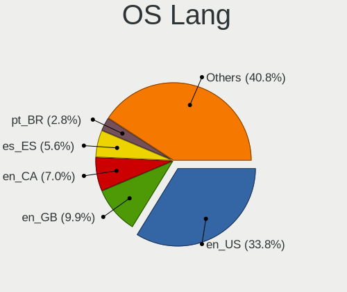

| Lang    | Desktops | Percent |
|---------|----------|---------|
| en_US   | 24       | 35.29%  |
| en_GB   | 7        | 10.29%  |
| es_ES   | 4        | 5.88%   |
| en_CA   | 4        | 5.88%   |
| pt_BR   | 2        | 2.94%   |
| pl_PL   | 2        | 2.94%   |
| es_MX   | 2        | 2.94%   |
| de_DE   | 2        | 2.94%   |
| zh_TW   | 1        | 1.47%   |
| uk_UA   | 1        | 1.47%   |
| sv_SE   | 1        | 1.47%   |
| hu_HU   | 1        | 1.47%   |
| hr_HR   | 1        | 1.47%   |
| gl_ES   | 1        | 1.47%   |
| fr_FR   | 1        | 1.47%   |
| fr_BE   | 1        | 1.47%   |
| es_SV   | 1        | 1.47%   |
| es_PA   | 1        | 1.47%   |
| es_EC   | 1        | 1.47%   |
| en_ZA   | 1        | 1.47%   |
| en_PH   | 1        | 1.47%   |
| en_IN   | 1        | 1.47%   |
| en_IE   | 1        | 1.47%   |
| en_HK   | 1        | 1.47%   |
| en_AU   | 1        | 1.47%   |
| el_GR   | 1        | 1.47%   |
| de_AT   | 1        | 1.47%   |
| cs_CZ   | 1        | 1.47%   |
| Unknown | 1        | 1.47%   |

Boot Mode
---------

EFI or BIOS

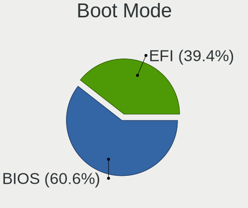

| Mode | Desktops | Percent |
|------|----------|---------|
| BIOS | 41       | 60.29%  |
| EFI  | 27       | 39.71%  |

Filesystem
----------

Type of filesystem

| Type  | Desktops | Percent |
|-------|----------|---------|
| Ext4  | 64       | 94.12%  |
| Btrfs | 3        | 4.41%   |
| Xfs   | 1        | 1.47%   |

Part. scheme
------------

Scheme of partitioning

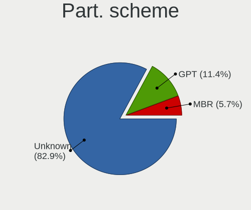

| Type    | Desktops | Percent |
|---------|----------|---------|
| Unknown | 57       | 85.07%  |
| GPT     | 6        | 8.96%   |
| MBR     | 4        | 5.97%   |

Dual Boot with Linux/BSD
------------------------

Hosting more than one Linux/BSD

| Dual boot | Desktops | Percent |
|-----------|----------|---------|
| No        | 64       | 95.52%  |
| Yes       | 3        | 4.48%   |

Dual Boot (Win)
---------------

Hosting Linux and Windows

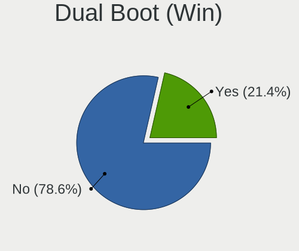

| Dual boot | Desktops | Percent |
|-----------|----------|---------|
| No        | 52       | 77.61%  |
| Yes       | 15       | 22.39%  |

Board
-----

Vendor
------

Motherboard manufacturer

| Name                | Desktops | Percent |
|---------------------|----------|---------|
| ASUSTek Computer    | 19       | 28.36%  |
| Gigabyte Technology | 14       | 20.9%   |
| MSI                 | 6        | 8.96%   |
| Hewlett-Packard     | 6        | 8.96%   |
| Dell                | 5        | 7.46%   |
| ASRock              | 4        | 5.97%   |
| Biostar             | 3        | 4.48%   |
| Lenovo              | 2        | 2.99%   |
| Intel               | 2        | 2.99%   |
| Acer                | 2        | 2.99%   |
| Foxconn             | 1        | 1.49%   |
| EVGA                | 1        | 1.49%   |
| eMachines           | 1        | 1.49%   |
| Apple               | 1        | 1.49%   |

Model
-----

Motherboard model

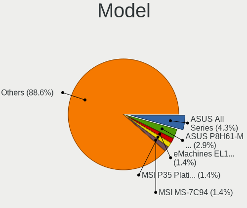

| Name                            | Desktops | Percent |
|---------------------------------|----------|---------|
| ASUS P8H61-M LX3 R2.0           | 2        | 2.99%   |
| ASUS All Series                 | 2        | 2.99%   |
| MSI P35 Platinum(MS-7345)       | 1        | 1.49%   |
| MSI MS-7C94                     | 1        | 1.49%   |
| MSI MS-7C02                     | 1        | 1.49%   |
| MSI MS-7A38                     | 1        | 1.49%   |
| MSI MS-7788                     | 1        | 1.49%   |
| MSI MS-7721                     | 1        | 1.49%   |
| Lenovo ThinkCentre M92p 3227D13 | 1        | 1.49%   |
| Lenovo ThinkCentre M92p 3212DF9 | 1        | 1.49%   |
| Intel DG41RQ AAE54511-204       | 1        | 1.49%   |
| Intel DG35EC AAE29266-205       | 1        | 1.49%   |
| HP Slim Desktop 290-p0xxx       | 1        | 1.49%   |
| HP ProOne 400 G1 AiO            | 1        | 1.49%   |
| HP ProDesk 600 G1 SFF           | 1        | 1.49%   |
| HP Compaq 8100 Elite SFF PC     | 1        | 1.49%   |
| HP Compaq 8100 Elite CMT PC     | 1        | 1.49%   |
| HP 260-p128ns                   | 1        | 1.49%   |
| Gigabyte Z77M-D3H               | 1        | 1.49%   |
| Gigabyte Z77-DS3H               | 1        | 1.49%   |
| Gigabyte Z68P-DS3               | 1        | 1.49%   |
| Gigabyte Z390 DESIGNARE         | 1        | 1.49%   |
| Gigabyte H81M-S2H               | 1        | 1.49%   |
| Gigabyte H81M-DS2               | 1        | 1.49%   |
| Gigabyte H67A-USB3-B3           | 1        | 1.49%   |
| Gigabyte H61M-S2PV              | 1        | 1.49%   |
| Gigabyte H61M-DS2               | 1        | 1.49%   |
| Gigabyte GA-MA78GM-S2H          | 1        | 1.49%   |
| Gigabyte GA-880GMA-UD2H         | 1        | 1.49%   |
| Gigabyte F2A88XN-WIFI           | 1        | 1.49%   |
| Gigabyte AB350M-DS3H V2         | 1        | 1.49%   |
| Gigabyte A320M-S2H V2           | 1        | 1.49%   |
| Foxconn p6610f                  | 1        | 1.49%   |
| EVGA 132-CK-NF79                | 1        | 1.49%   |
| eMachines EL1358G               | 1        | 1.49%   |
| Dell Vostro 400                 | 1        | 1.49%   |
| Dell Precision T1600            | 1        | 1.49%   |
| Dell OptiPlex 960               | 1        | 1.49%   |
| Dell OptiPlex 360               | 1        | 1.49%   |
| Dell OptiPlex 3070              | 1        | 1.49%   |

Model Family
------------

Motherboard model prefix

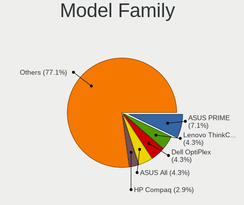

| Name                    | Desktops | Percent |
|-------------------------|----------|---------|
| ASUS PRIME              | 5        | 7.46%   |
| Dell OptiPlex           | 3        | 4.48%   |
| Lenovo ThinkCentre      | 2        | 2.99%   |
| HP Compaq               | 2        | 2.99%   |
| ASUS TUF                | 2        | 2.99%   |
| ASUS ROG                | 2        | 2.99%   |
| ASUS P8H61-M            | 2        | 2.99%   |
| ASUS All                | 2        | 2.99%   |
| Acer Aspire             | 2        | 2.99%   |
| MSI P35                 | 1        | 1.49%   |
| MSI MS-7C94             | 1        | 1.49%   |
| MSI MS-7C02             | 1        | 1.49%   |
| MSI MS-7A38             | 1        | 1.49%   |
| MSI MS-7788             | 1        | 1.49%   |
| MSI MS-7721             | 1        | 1.49%   |
| Intel DG41RQ            | 1        | 1.49%   |
| Intel DG35EC            | 1        | 1.49%   |
| HP Slim                 | 1        | 1.49%   |
| HP ProOne               | 1        | 1.49%   |
| HP ProDesk              | 1        | 1.49%   |
| HP 260-p128ns           | 1        | 1.49%   |
| Gigabyte Z77M-D3H       | 1        | 1.49%   |
| Gigabyte Z77-DS3H       | 1        | 1.49%   |
| Gigabyte Z68P-DS3       | 1        | 1.49%   |
| Gigabyte Z390           | 1        | 1.49%   |
| Gigabyte H81M-S2H       | 1        | 1.49%   |
| Gigabyte H81M-DS2       | 1        | 1.49%   |
| Gigabyte H67A-USB3-B3   | 1        | 1.49%   |
| Gigabyte H61M-S2PV      | 1        | 1.49%   |
| Gigabyte H61M-DS2       | 1        | 1.49%   |
| Gigabyte GA-MA78GM-S2H  | 1        | 1.49%   |
| Gigabyte GA-880GMA-UD2H | 1        | 1.49%   |
| Gigabyte F2A88XN-WIFI   | 1        | 1.49%   |
| Gigabyte AB350M-DS3H    | 1        | 1.49%   |
| Gigabyte A320M-S2H      | 1        | 1.49%   |
| Foxconn p6610f          | 1        | 1.49%   |
| EVGA 132-CK-NF79        | 1        | 1.49%   |
| eMachines EL1358G       | 1        | 1.49%   |
| Dell Vostro             | 1        | 1.49%   |
| Dell Precision          | 1        | 1.49%   |

MFG Year
--------

Motherboard manufacture year

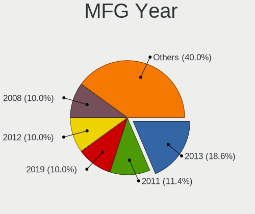

| Year | Desktops | Percent |
|------|----------|---------|
| 2013 | 12       | 17.91%  |
| 2019 | 7        | 10.45%  |
| 2012 | 7        | 10.45%  |
| 2011 | 7        | 10.45%  |
| 2008 | 7        | 10.45%  |
| 2018 | 6        | 8.96%   |
| 2009 | 5        | 7.46%   |
| 2017 | 4        | 5.97%   |
| 2016 | 4        | 5.97%   |
| 2010 | 3        | 4.48%   |
| 2014 | 2        | 2.99%   |
| 2020 | 1        | 1.49%   |
| 2015 | 1        | 1.49%   |
| 2007 | 1        | 1.49%   |

Form Factor
-----------

Physical design of the computer

| Name    | Desktops | Percent |
|---------|----------|---------|
| Desktop | 67       | 100%    |

Secure Boot
-----------

Enabled or disabled

| State    | Desktops | Percent |
|----------|----------|---------|
| Disabled | 67       | 100%    |

Coreboot
--------

Have coreboot on board

| Used | Desktops | Percent |
|------|----------|---------|
| No   | 67       | 100%    |

RAM Size
--------

Total RAM memory

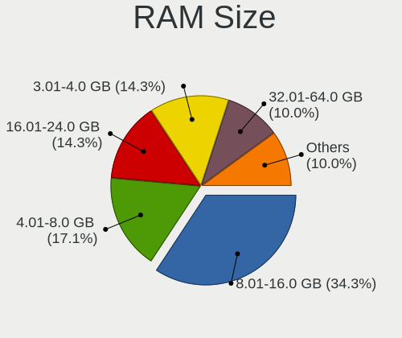

| Size in GB  | Desktops | Percent |
|-------------|----------|---------|
| 8.01-16.0   | 23       | 34.33%  |
| 4.01-8.0    | 12       | 17.91%  |
| 3.01-4.0    | 10       | 14.93%  |
| 16.01-24.0  | 9        | 13.43%  |
| 32.01-64.0  | 6        | 8.96%   |
| 2.01-3.0    | 3        | 4.48%   |
| 1.01-2.0    | 2        | 2.99%   |
| 24.01-32.0  | 1        | 1.49%   |
| 64.01-256.0 | 1        | 1.49%   |

RAM Used
--------

Used RAM memory

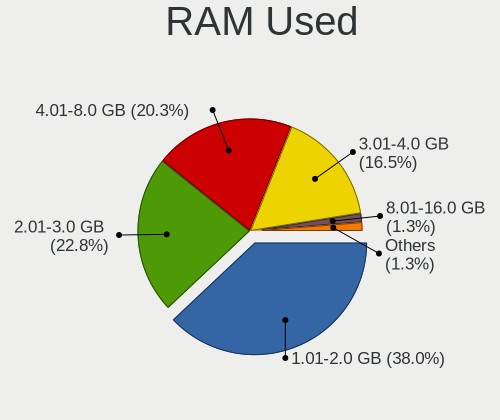

| Used GB   | Desktops | Percent |
|-----------|----------|---------|
| 1.01-2.0  | 28       | 37.33%  |
| 2.01-3.0  | 18       | 24%     |
| 4.01-8.0  | 15       | 20%     |
| 3.01-4.0  | 12       | 16%     |
| 8.01-16.0 | 1        | 1.33%   |
| 0.51-1.0  | 1        | 1.33%   |

Total Drives
------------

Number of drives on board

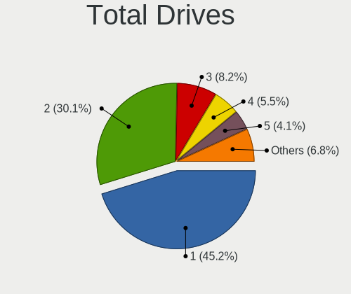

| Drives | Desktops | Percent |
|--------|----------|---------|
| 1      | 30       | 43.48%  |
| 2      | 22       | 31.88%  |
| 3      | 5        | 7.25%   |
| 4      | 4        | 5.8%    |
| 5      | 3        | 4.35%   |
| 7      | 2        | 2.9%    |
| 6      | 2        | 2.9%    |
| 0      | 1        | 1.45%   |

Has CD-ROM
----------

Has CD-ROM on board

| Presented | Desktops | Percent |
|-----------|----------|---------|
| No        | 37       | 52.86%  |
| Yes       | 33       | 47.14%  |

Has Ethernet
------------

Has Ethernet on board

| Presented | Desktops | Percent |
|-----------|----------|---------|
| Yes       | 65       | 97.01%  |
| No        | 2        | 2.99%   |

Has WiFi
--------

Has WiFi module

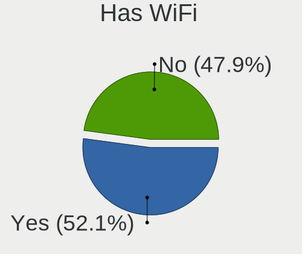

| Presented | Desktops | Percent |
|-----------|----------|---------|
| Yes       | 37       | 54.41%  |
| No        | 31       | 45.59%  |

Has Bluetooth
-------------

Has Bluetooth module

| Presented | Desktops | Percent |
|-----------|----------|---------|
| No        | 45       | 67.16%  |
| Yes       | 22       | 32.84%  |

Location
--------

Country
-------

Geographic location (country)

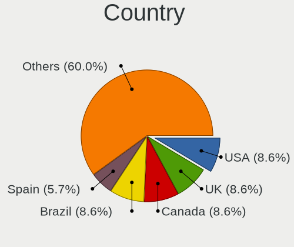

| Country      | Desktops | Percent |
|--------------|----------|---------|
| USA          | 6        | 8.96%   |
| UK           | 6        | 8.96%   |
| Brazil       | 6        | 8.96%   |
| Canada       | 5        | 7.46%   |
| Spain        | 4        | 5.97%   |
| Poland       | 4        | 5.97%   |
| Mexico       | 3        | 4.48%   |
| India        | 2        | 2.99%   |
| Hong Kong    | 2        | 2.99%   |
| Germany      | 2        | 2.99%   |
| Venezuela    | 1        | 1.49%   |
| Ukraine      | 1        | 1.49%   |
| Thailand     | 1        | 1.49%   |
| Sweden       | 1        | 1.49%   |
| Sint Maarten | 1        | 1.49%   |
| Russia       | 1        | 1.49%   |
| Philippines  | 1        | 1.49%   |
| Panama       | 1        | 1.49%   |
| Netherlands  | 1        | 1.49%   |
| Malaysia     | 1        | 1.49%   |
| Luxembourg   | 1        | 1.49%   |
| Kosovo       | 1        | 1.49%   |
| Ireland      | 1        | 1.49%   |
| Indonesia    | 1        | 1.49%   |
| Hungary      | 1        | 1.49%   |
| Greece       | 1        | 1.49%   |
| France       | 1        | 1.49%   |
| Eswatini     | 1        | 1.49%   |
| El Salvador  | 1        | 1.49%   |
| Ecuador      | 1        | 1.49%   |
| Czechia      | 1        | 1.49%   |
| Croatia      | 1        | 1.49%   |
| Costa Rica   | 1        | 1.49%   |
| Belgium      | 1        | 1.49%   |
| Austria      | 1        | 1.49%   |
| Australia    | 1        | 1.49%   |
| Argentina    | 1        | 1.49%   |

City
----

Geographic location (city)

| City                    | Desktops | Percent |
|-------------------------|----------|---------|
| Fortaleza               | 3        | 4.35%   |
| Warsaw                  | 2        | 2.9%    |
| Berlin                  | 2        | 2.9%    |
| Wroclaw                 | 1        | 1.45%   |
| Vigo                    | 1        | 1.45%   |
| Tseung Kwan O           | 1        | 1.45%   |
| Toronto                 | 1        | 1.45%   |
| Theodore                | 1        | 1.45%   |
| Talavera de la Reina    | 1        | 1.45%   |
| Sao José dos Campos    | 1        | 1.45%   |
| Santa Brigida           | 1        | 1.45%   |
| Sant Andreu de la Barca | 1        | 1.45%   |
| San Salvador            | 1        | 1.45%   |
| Samobor                 | 1        | 1.45%   |
| Rio de Janeiro          | 1        | 1.45%   |
| Quito                   | 1        | 1.45%   |
| Quezon City             | 1        | 1.45%   |
| Prizren                 | 1        | 1.45%   |
| Philipsburg             | 1        | 1.45%   |
| Pécs                   | 1        | 1.45%   |
| Panchkula               | 1        | 1.45%   |
| Panama City             | 1        | 1.45%   |
| Novosibirsk             | 1        | 1.45%   |
| Morelia                 | 1        | 1.45%   |
| Montreal                | 1        | 1.45%   |
| Mexico City             | 1        | 1.45%   |
| Mbabane                 | 1        | 1.45%   |
| Luxembourg              | 1        | 1.45%   |
| Lund                    | 1        | 1.45%   |
| Locust Grove            | 1        | 1.45%   |
| Lamia                   | 1        | 1.45%   |
| Kentville               | 1        | 1.45%   |
| Juazeiro                | 1        | 1.45%   |
| Jepara                  | 1        | 1.45%   |
| Isle of Arran           | 1        | 1.45%   |
| Innsbruck               | 1        | 1.45%   |
| Hua Hin                 | 1        | 1.45%   |
| Hook                    | 1        | 1.45%   |
| Highland Park           | 1        | 1.45%   |
| Heredia                 | 1        | 1.45%   |

Drives
------

Drive Vendor
------------

Hard drive vendors

| Vendor              | Desktops | Drives | Percent |
|---------------------|----------|--------|---------|
| Seagate             | 29       | 39     | 25.22%  |
| WDC                 | 19       | 28     | 16.52%  |
| Samsung Electronics | 15       | 25     | 13.04%  |
| Kingston            | 10       | 20     | 8.7%    |
| Crucial             | 9        | 11     | 7.83%   |
| SanDisk             | 6        | 6      | 5.22%   |
| Toshiba             | 5        | 14     | 4.35%   |
| Hitachi             | 3        | 3      | 2.61%   |
| HGST                | 3        | 4      | 2.61%   |
| Unknown             | 2        | 2      | 1.74%   |
| A-DATA Technology   | 2        | 3      | 1.74%   |
| WDC WDS             | 1        | 1      | 0.87%   |
| Transcend           | 1        | 1      | 0.87%   |
| PNY                 | 1        | 1      | 0.87%   |
| Patriot             | 1        | 1      | 0.87%   |
| OWC                 | 1        | 1      | 0.87%   |
| OCZ                 | 1        | 2      | 0.87%   |
| KingSpec            | 1        | 1      | 0.87%   |
| KingFast            | 1        | 1      | 0.87%   |
| Intel               | 1        | 1      | 0.87%   |
| GOODRAM             | 1        | 2      | 0.87%   |
| GeIL                | 1        | 1      | 0.87%   |
| China               | 1        | 1      | 0.87%   |

Drive Model
-----------

Hard drive models

| Model                             | Desktops | Percent |
|-----------------------------------|----------|---------|
| Seagate ST500DM002-1BD142 500GB   | 4        | 2.99%   |
| Kingston SA400S37240G 240GB SSD   | 4        | 2.99%   |
| Toshiba DT01ACA100 1TB            | 3        | 2.24%   |
| SanDisk SSD PLUS 480GB            | 3        | 2.24%   |
| Samsung SSD 850 EVO 250GB         | 3        | 2.24%   |
| Kingston SV300S37A120G 120GB SSD  | 3        | 2.24%   |
| Crucial CT120BX300SSD1 120GB      | 3        | 2.24%   |
| Seagate ST3500418AS 500GB         | 2        | 1.49%   |
| Seagate ST2000DM008-2FR102 2TB    | 2        | 1.49%   |
| Seagate ST1000DM003-1ER162 1TB    | 2        | 1.49%   |
| Samsung SSD 970 EVO 500GB         | 2        | 1.49%   |
| Samsung SSD 850 EVO 500GB         | 2        | 1.49%   |
| Samsung SSD 840 EVO 500GB         | 2        | 1.49%   |
| Kingston SA400S37120G 120GB SSD   | 2        | 1.49%   |
| Crucial CT120BX500SSD1 120GB      | 2        | 1.49%   |
| WDC WDS500G2B0A-00SM50 500GB SSD  | 1        | 0.75%   |
| WDC WDS250G2B0B-00YS70 250GB SSD  | 1        | 0.75%   |
| WDC WDS240G2G0B-00EPW0 240GB SSD  | 1        | 0.75%   |
| WDC WDS100T2B0A-00SM50 1TB SSD    | 1        | 0.75%   |
| WDC WDS100T1R0B-68A4Z0 1TB SSD    | 1        | 0.75%   |
| WDC WDS 500G2B0B-00YS70 500GB SSD | 1        | 0.75%   |
| WDC WD6003FZBX-00K5WB0 6TB        | 1        | 0.75%   |
| WDC WD5000AAKX-22ERMA0 500GB      | 1        | 0.75%   |
| WDC WD5000AAKX-221CA1 500GB       | 1        | 0.75%   |
| WDC WD5000AAKS-00UU3A0 500GB      | 1        | 0.75%   |
| WDC WD5000AAKS-00M9A0 500GB       | 1        | 0.75%   |
| WDC WD5000AAKS-00A7B2 500GB       | 1        | 0.75%   |
| WDC WD400BB-75DEA0 40GB           | 1        | 0.75%   |
| WDC WD3000GLFS-01F8U0 304GB       | 1        | 0.75%   |
| WDC WD20EZRX-22D8PB0 2TB          | 1        | 0.75%   |
| WDC WD20EZBX-00AYRA0 2TB          | 1        | 0.75%   |
| WDC WD20EARS-00MVWB0 2TB          | 1        | 0.75%   |
| WDC WD2003FZEX-00Z4SA0 2TB        | 1        | 0.75%   |
| WDC WD2003FZEX-00SRLA0 2TB        | 1        | 0.75%   |
| WDC WD10JPVT-22A1YT0 1TB          | 1        | 0.75%   |
| WDC WD10EZEX-75M2NA0 1TB          | 1        | 0.75%   |
| WDC WD10EZEX-08M2NA0 1TB          | 1        | 0.75%   |
| WDC WD10EURX-63UY4Y0 1TB          | 1        | 0.75%   |
| WDC WD10EALX-009BA0 1TB           | 1        | 0.75%   |
| Unknown SD/MMC/MS PRO 1TB         | 1        | 0.75%   |

HDD Vendor
----------

Hard disk drive vendors

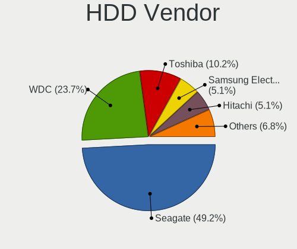

| Vendor              | Desktops | Drives | Percent |
|---------------------|----------|--------|---------|
| Seagate             | 29       | 39     | 50%     |
| WDC                 | 14       | 23     | 24.14%  |
| Toshiba             | 5        | 14     | 8.62%   |
| Samsung Electronics | 3        | 3      | 5.17%   |
| Hitachi             | 3        | 3      | 5.17%   |
| HGST                | 3        | 4      | 5.17%   |
| Unknown             | 1        | 1      | 1.72%   |

SSD Vendor
----------

Solid state drive vendors

| Vendor              | Desktops | Drives | Percent |
|---------------------|----------|--------|---------|
| Samsung Electronics | 12       | 16     | 21.82%  |
| Kingston            | 10       | 14     | 18.18%  |
| Crucial             | 9        | 11     | 16.36%  |
| SanDisk             | 6        | 6      | 10.91%  |
| WDC                 | 5        | 5      | 9.09%   |
| A-DATA Technology   | 2        | 3      | 3.64%   |
| WDC WDS             | 1        | 1      | 1.82%   |
| Transcend           | 1        | 1      | 1.82%   |
| PNY                 | 1        | 1      | 1.82%   |
| Patriot             | 1        | 1      | 1.82%   |
| OWC                 | 1        | 1      | 1.82%   |
| OCZ                 | 1        | 2      | 1.82%   |
| KingSpec            | 1        | 1      | 1.82%   |
| Intel               | 1        | 1      | 1.82%   |
| GOODRAM             | 1        | 2      | 1.82%   |
| GeIL                | 1        | 1      | 1.82%   |
| China               | 1        | 1      | 1.82%   |

Drive Kind
----------

HDD or SSD

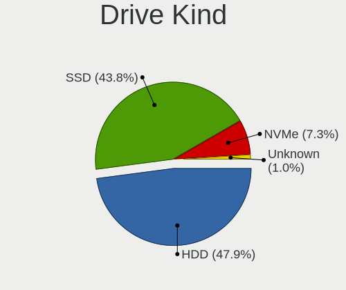

| Kind    | Desktops | Drives | Percent |
|---------|----------|--------|---------|
| HDD     | 45       | 87     | 48.39%  |
| SSD     | 40       | 68     | 43.01%  |
| NVMe    | 7        | 13     | 7.53%   |
| Unknown | 1        | 1      | 1.08%   |

Drive Connector
---------------

SATA, SAS, NVMe, etc.

| Type | Desktops | Drives | Percent |
|------|----------|--------|---------|
| SATA | 64       | 151    | 84.21%  |
| NVMe | 7        | 13     | 9.21%   |
| SAS  | 5        | 5      | 6.58%   |

Drive Size
----------

Size of hard drive

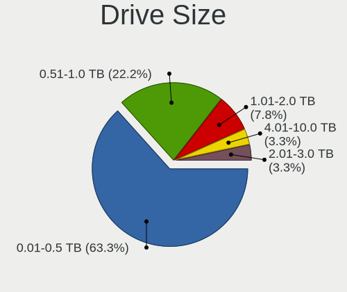

| Size in TB | Desktops | Drives | Percent |
|------------|----------|--------|---------|
| 0.01-0.5   | 55       | 99     | 61.8%   |
| 0.51-1.0   | 22       | 34     | 24.72%  |
| 1.01-2.0   | 7        | 13     | 7.87%   |
| 4.01-10.0  | 3        | 3      | 3.37%   |
| 2.01-3.0   | 2        | 6      | 2.25%   |

Space Total
-----------

Amount of disk space available on the file system

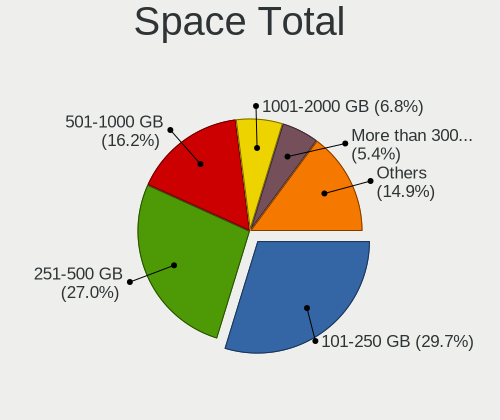

| Size in GB     | Desktops | Percent |
|----------------|----------|---------|
| 101-250        | 22       | 30.99%  |
| 251-500        | 19       | 26.76%  |
| 501-1000       | 12       | 16.9%   |
| 1001-2000      | 5        | 7.04%   |
| More than 3000 | 4        | 5.63%   |
| 21-50          | 3        | 4.23%   |
| 2001-3000      | 3        | 4.23%   |
| 51-100         | 3        | 4.23%   |

Space Used
----------

Amount of used disk space

| Used GB        | Desktops | Percent |
|----------------|----------|---------|
| 1-20           | 17       | 23.61%  |
| 51-100         | 15       | 20.83%  |
| 21-50          | 12       | 16.67%  |
| 101-250        | 11       | 15.28%  |
| 501-1000       | 6        | 8.33%   |
| 251-500        | 4        | 5.56%   |
| More than 3000 | 3        | 4.17%   |
| 1001-2000      | 3        | 4.17%   |
| 2001-3000      | 1        | 1.39%   |

Malfunc. Drives
---------------

Drive models with a malfunction

| Model                           | Desktops | Drives | Percent |
|---------------------------------|----------|--------|---------|
| WDC WD5000AAKX-22ERMA0 500GB    | 1        | 1      | 12.5%   |
| WDC WD5000AAKX-221CA1 500GB     | 1        | 1      | 12.5%   |
| Seagate ST500DM002-1BD142 500GB | 1        | 1      | 12.5%   |
| Seagate ST3320613AS 320GB       | 1        | 1      | 12.5%   |
| Seagate ST2000DM006-2DM164 2TB  | 1        | 1      | 12.5%   |
| Samsung Electronics HD204UI 2TB | 1        | 1      | 12.5%   |
| Kingston SA400S37120G 120GB SSD | 1        | 1      | 12.5%   |
| HGST HUS724030ALA640 3TB        | 1        | 1      | 12.5%   |

Malfunc. Drive Vendor
---------------------

Vendors of faulty drives

| Vendor              | Desktops | Drives | Percent |
|---------------------|----------|--------|---------|
| Seagate             | 3        | 3      | 37.5%   |
| WDC                 | 2        | 2      | 25%     |
| Samsung Electronics | 1        | 1      | 12.5%   |
| Kingston            | 1        | 1      | 12.5%   |
| HGST                | 1        | 1      | 12.5%   |

Malfunc. HDD Vendor
-------------------

Vendors of faulty HDD drives

| Vendor              | Desktops | Drives | Percent |
|---------------------|----------|--------|---------|
| Seagate             | 3        | 3      | 42.86%  |
| WDC                 | 2        | 2      | 28.57%  |
| Samsung Electronics | 1        | 1      | 14.29%  |
| HGST                | 1        | 1      | 14.29%  |

Malfunc. Drive Kind
-------------------

Kinds of faulty drives

| Kind | Desktops | Drives | Percent |
|------|----------|--------|---------|
| HDD  | 7        | 7      | 87.5%   |
| SSD  | 1        | 1      | 12.5%   |

Failed Drives
-------------

Failed drive models

Zero info for selected period =(

Failed Drive Vendor
-------------------

Failed drive vendors

Zero info for selected period =(

Drive Status
------------

Number of failed and malfunc. drives

| Status   | Desktops | Drives | Percent |
|----------|----------|--------|---------|
| Detected | 56       | 138    | 75.68%  |
| Works    | 10       | 23     | 13.51%  |
| Malfunc  | 8        | 8      | 10.81%  |

Storage controller
------------------

Storage Vendor
--------------

Storage controller vendors

| Vendor                      | Desktops | Percent |
|-----------------------------|----------|---------|
| Intel                       | 45       | 54.22%  |
| AMD                         | 19       | 22.89%  |
| Samsung Electronics         | 5        | 6.02%   |
| Nvidia                      | 3        | 3.61%   |
| JMicron Technology          | 3        | 3.61%   |
| ASMedia Technology          | 3        | 3.61%   |
| Kingston Technology Company | 2        | 2.41%   |
| Silicon Image               | 1        | 1.2%    |
| Marvell Technology Group    | 1        | 1.2%    |
| ADATA Technology            | 1        | 1.2%    |

Storage Model
-------------

Storage controller models

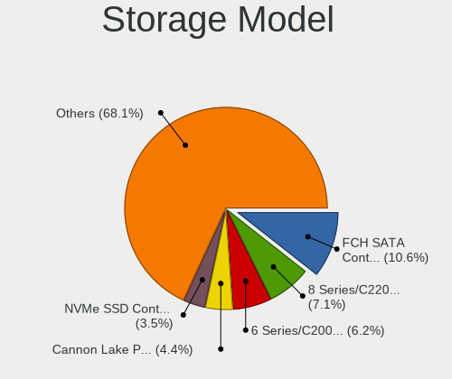

| Model                                                                                   | Desktops | Percent |
|-----------------------------------------------------------------------------------------|----------|---------|
| AMD FCH SATA Controller [AHCI mode]                                                     | 11       | 10.09%  |
| Intel 8 Series/C220 Series Chipset Family 6-port SATA Controller 1 [AHCI mode]          | 7        | 6.42%   |
| Intel 6 Series/C200 Series Chipset Family 6 port Desktop SATA AHCI Controller           | 6        | 5.5%    |
| Intel Cannon Lake PCH SATA AHCI Controller                                              | 5        | 4.59%   |
| Samsung NVMe SSD Controller SM981/PM981/PM983                                           | 4        | 3.67%   |
| Intel 7 Series/C210 Series Chipset Family 6-port SATA Controller [AHCI mode]            | 4        | 3.67%   |
| Intel 200 Series PCH SATA controller [AHCI mode]                                        | 4        | 3.67%   |
| AMD SB7x0/SB8x0/SB9x0 IDE Controller                                                    | 4        | 3.67%   |
| Intel NM10/ICH7 Family SATA Controller [IDE mode]                                       | 3        | 2.75%   |
| Intel 82801G (ICH7 Family) IDE Controller                                               | 3        | 2.75%   |
| Intel 6 Series/C200 Series Chipset Family Desktop SATA Controller (IDE mode, ports 4-5) | 3        | 2.75%   |
| Intel 6 Series/C200 Series Chipset Family Desktop SATA Controller (IDE mode, ports 0-3) | 3        | 2.75%   |
| AMD SB7x0/SB8x0/SB9x0 SATA Controller [IDE mode]                                        | 3        | 2.75%   |
| AMD SB7x0/SB8x0/SB9x0 SATA Controller [AHCI mode]                                       | 3        | 2.75%   |
| AMD 400 Series Chipset SATA Controller                                                  | 3        | 2.75%   |
| AMD 300 Series Chipset SATA Controller                                                  | 3        | 2.75%   |
| Kingston Company A2000 NVMe SSD                                                         | 2        | 1.83%   |
| JMicron JMB368 IDE controller                                                           | 2        | 1.83%   |
| Intel SATA Controller [RAID mode]                                                       | 2        | 1.83%   |
| Intel Q170/Q150/B150/H170/H110/Z170/CM236 Chipset SATA Controller [AHCI Mode]           | 2        | 1.83%   |
| Intel 82801IR/IO/IH (ICH9R/DO/DH) 4 port SATA Controller [IDE mode]                     | 2        | 1.83%   |
| Intel 82801I (ICH9 Family) 2 port SATA Controller [IDE mode]                            | 2        | 1.83%   |
| ASMedia ASM1062 Serial ATA Controller                                                   | 2        | 1.83%   |
| AMD FCH SATA Controller D                                                               | 2        | 1.83%   |
| Silicon Image SiI 3114 [SATALink/SATARaid] Serial ATA Controller                        | 1        | 0.92%   |
| Samsung NVMe SSD Controller SM951/PM951                                                 | 1        | 0.92%   |
| Nvidia MCP78S [GeForce 8200] IDE                                                        | 1        | 0.92%   |
| Nvidia MCP78S [GeForce 8200] AHCI Controller                                            | 1        | 0.92%   |
| Nvidia MCP61 SATA Controller                                                            | 1        | 0.92%   |
| Nvidia MCP55 SATA Controller                                                            | 1        | 0.92%   |
| Nvidia MCP55 IDE                                                                        | 1        | 0.92%   |
| Marvell Group 88SE6111/6121 SATA II / PATA Controller                                   | 1        | 0.92%   |
| JMicron JMB363 SATA/IDE Controller                                                      | 1        | 0.92%   |
| Intel Atom Processor E3800 Series SATA AHCI Controller                                  | 1        | 0.92%   |
| Intel 9 Series Chipset Family SATA Controller [AHCI Mode]                               | 1        | 0.92%   |
| Intel 82801JD/DO (ICH10 Family) SATA AHCI Controller                                    | 1        | 0.92%   |
| Intel 82801HR/HO/HH (ICH8R/DO/DH) 2 port SATA Controller [IDE mode]                     | 1        | 0.92%   |
| Intel 82801H (ICH8 Family) 4 port SATA Controller [IDE mode]                            | 1        | 0.92%   |
| Intel 7 Series/C210 Series Chipset Family 4-port SATA Controller [IDE mode]             | 1        | 0.92%   |
| Intel 7 Series/C210 Series Chipset Family 2-port SATA Controller [IDE mode]             | 1        | 0.92%   |

Storage Kind
------------

Kind of storage controller (IDE, SATA, NVMe, SAS, ...)

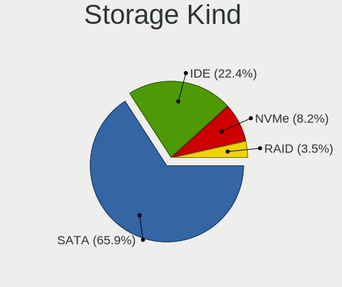

| Kind | Desktops | Percent |
|------|----------|---------|
| SATA | 53       | 64.63%  |
| IDE  | 19       | 23.17%  |
| NVMe | 7        | 8.54%   |
| RAID | 3        | 3.66%   |

Processor
---------

CPU Vendor
----------

Processor vendors

| Vendor | Desktops | Percent |
|--------|----------|---------|
| Intel  | 46       | 68.66%  |
| AMD    | 21       | 31.34%  |

CPU Model
---------

Processor models

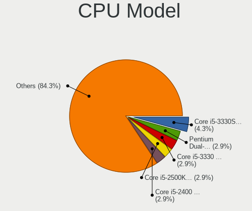

| Model                                       | Desktops | Percent |
|---------------------------------------------|----------|---------|
| Intel Core i5-3330S CPU @ 2.70GHz           | 3        | 4.48%   |
| Intel Pentium Dual-Core CPU E5300 @ 2.60GHz | 2        | 2.99%   |
| Intel Core i5-3330 CPU @ 3.00GHz            | 2        | 2.99%   |
| Intel Core i5-2500K CPU @ 3.30GHz           | 2        | 2.99%   |
| Intel Core i5-2400 CPU @ 3.10GHz            | 2        | 2.99%   |
| Intel Core i3-9100 CPU @ 3.60GHz            | 2        | 2.99%   |
| Intel Core 2 Quad CPU Q6600 @ 2.40GHz       | 2        | 2.99%   |
| AMD Ryzen 5 3600 6-Core Processor           | 2        | 2.99%   |
| AMD Ryzen 5 2400G with Radeon Vega Graphics | 2        | 2.99%   |
| AMD Ryzen 3 3200G with Radeon Vega Graphics | 2        | 2.99%   |
| AMD FX-6100 Six-Core Processor              | 2        | 2.99%   |
| Intel Xeon CPU E31230 @ 3.20GHz             | 1        | 1.49%   |
| Intel Xeon CPU E31225 @ 3.10GHz             | 1        | 1.49%   |
| Intel Xeon CPU 5160 @ 3.00GHz               | 1        | 1.49%   |
| Intel Pentium CPU G3258 @ 3.20GHz           | 1        | 1.49%   |
| Intel Core i7-9700KF CPU @ 3.60GHz          | 1        | 1.49%   |
| Intel Core i7-9700K CPU @ 3.60GHz           | 1        | 1.49%   |
| Intel Core i7-7700K CPU @ 4.20GHz           | 1        | 1.49%   |
| Intel Core i7-7700 CPU @ 3.60GHz            | 1        | 1.49%   |
| Intel Core i7-6700K CPU @ 4.00GHz           | 1        | 1.49%   |
| Intel Core i7-4790K CPU @ 4.00GHz           | 1        | 1.49%   |
| Intel Core i7-4720HQ CPU @ 2.60GHz          | 1        | 1.49%   |
| Intel Core i5-8400 CPU @ 2.80GHz            | 1        | 1.49%   |
| Intel Core i5-6400T CPU @ 2.20GHz           | 1        | 1.49%   |
| Intel Core i5-4570 CPU @ 3.20GHz            | 1        | 1.49%   |
| Intel Core i5-4460 CPU @ 3.20GHz            | 1        | 1.49%   |
| Intel Core i5-3570 CPU @ 3.40GHz            | 1        | 1.49%   |
| Intel Core i5-3470 CPU @ 3.20GHz            | 1        | 1.49%   |
| Intel Core i5-2500 CPU @ 3.30GHz            | 1        | 1.49%   |
| Intel Core i5-2320 CPU @ 3.00GHz            | 1        | 1.49%   |
| Intel Core i5 CPU 760 @ 2.80GHz             | 1        | 1.49%   |
| Intel Core i5 CPU 650 @ 3.20GHz             | 1        | 1.49%   |
| Intel Core i3-8100 CPU @ 3.60GHz            | 1        | 1.49%   |
| Intel Core i3-4160T CPU @ 3.10GHz           | 1        | 1.49%   |
| Intel Core i3-4150 CPU @ 3.50GHz            | 1        | 1.49%   |
| Intel Core i3-4130T CPU @ 2.90GHz           | 1        | 1.49%   |
| Intel Core 2 Quad CPU Q9550 @ 2.83GHz       | 1        | 1.49%   |
| Intel Core 2 Quad CPU Q8400 @ 2.66GHz       | 1        | 1.49%   |
| Intel Core 2 Duo CPU E8500 @ 3.16GHz        | 1        | 1.49%   |
| Intel Core 2 Duo CPU E7200 @ 2.53GHz        | 1        | 1.49%   |

CPU Model Family
----------------

Processor model prefix

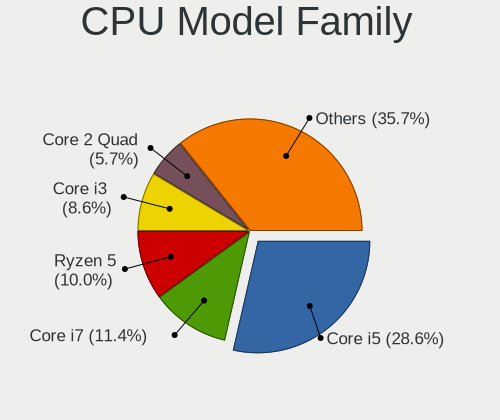

| Model                   | Desktops | Percent |
|-------------------------|----------|---------|
| Intel Core i5           | 19       | 28.36%  |
| Intel Core i7           | 7        | 10.45%  |
| AMD Ryzen 5             | 7        | 10.45%  |
| Intel Core i3           | 6        | 8.96%   |
| Intel Core 2 Quad       | 4        | 5.97%   |
| Intel Xeon              | 3        | 4.48%   |
| AMD Phenom II X4        | 3        | 4.48%   |
| Intel Pentium Dual-Core | 2        | 2.99%   |
| Intel Core 2 Duo        | 2        | 2.99%   |
| Intel Celeron           | 2        | 2.99%   |
| AMD Ryzen 3             | 2        | 2.99%   |
| AMD FX                  | 2        | 2.99%   |
| AMD A8                  | 2        | 2.99%   |
| Intel Pentium           | 1        | 1.49%   |
| AMD Ryzen 9             | 1        | 1.49%   |
| AMD Phenom              | 1        | 1.49%   |
| AMD Athlon II X4        | 1        | 1.49%   |
| AMD Athlon II X3        | 1        | 1.49%   |
| AMD A4                  | 1        | 1.49%   |

CPU Cores
---------

Number of processor cores

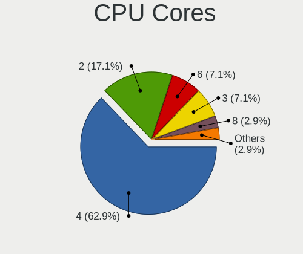

| Number | Desktops | Percent |
|--------|----------|---------|
| 4      | 41       | 61.19%  |
| 2      | 12       | 17.91%  |
| 6      | 5        | 7.46%   |
| 3      | 5        | 7.46%   |
| 8      | 2        | 2.99%   |
| 12     | 1        | 1.49%   |
| 1      | 1        | 1.49%   |

CPU Sockets
-----------

Number of sockets

| Number | Desktops | Percent |
|--------|----------|---------|
| 1      | 66       | 98.51%  |
| 2      | 1        | 1.49%   |

CPU Threads
-----------

Threads per core (Hyper-Threading)

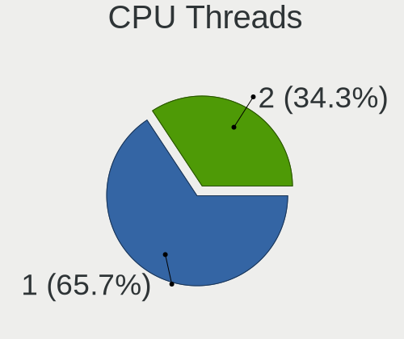

| Number | Desktops | Percent |
|--------|----------|---------|
| 1      | 44       | 65.67%  |
| 2      | 23       | 34.33%  |

CPU Op-Modes
------------

CPU Operation Modes (32-bit, 64-bit)

| Op mode        | Desktops | Percent |
|----------------|----------|---------|
| 32-bit, 64-bit | 67       | 100%    |

CPU Microcode
-------------

Microcode number

| Number     | Desktops | Percent |
|------------|----------|---------|
| 0x306c3    | 7        | 10.45%  |
| 0x306a9    | 7        | 10.45%  |
| 0x206a7    | 7        | 10.45%  |
| 0x906eb    | 4        | 5.97%   |
| 0x1067a    | 4        | 5.97%   |
| Unknown    | 4        | 5.97%   |
| 0x08108109 | 3        | 4.48%   |
| 0x906e9    | 2        | 2.99%   |
| 0x506e3    | 2        | 2.99%   |
| 0x10676    | 2        | 2.99%   |
| 0x08701021 | 2        | 2.99%   |
| 0x0600063e | 2        | 2.99%   |
| 0x010000db | 2        | 2.99%   |
| 0x010000c8 | 2        | 2.99%   |
| 0x906ed    | 1        | 1.49%   |
| 0x906ec    | 1        | 1.49%   |
| 0x906ea    | 1        | 1.49%   |
| 0x6fb      | 1        | 1.49%   |
| 0x6f6      | 1        | 1.49%   |
| 0x30673    | 1        | 1.49%   |
| 0x20652    | 1        | 1.49%   |
| 0x106e5    | 1        | 1.49%   |
| 0x08701013 | 1        | 1.49%   |
| 0x08101016 | 1        | 1.49%   |
| 0x0810100b | 1        | 1.49%   |
| 0x0800820d | 1        | 1.49%   |
| 0x08001129 | 1        | 1.49%   |
| 0x0600611a | 1        | 1.49%   |
| 0x06003106 | 1        | 1.49%   |
| 0x06001119 | 1        | 1.49%   |
| 0x01000083 | 1        | 1.49%   |

CPU Microarch
-------------

Microarchitecture

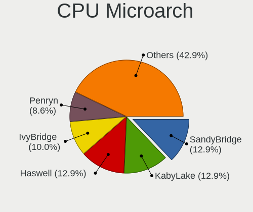

| Name        | Desktops | Percent |
|-------------|----------|---------|
| KabyLake    | 9        | 13.43%  |
| SandyBridge | 8        | 11.94%  |
| Haswell     | 8        | 11.94%  |
| IvyBridge   | 7        | 10.45%  |
| Penryn      | 6        | 8.96%   |
| K10         | 6        | 8.96%   |
| Zen+        | 4        | 5.97%   |
| Zen 2       | 3        | 4.48%   |
| Zen         | 3        | 4.48%   |
| Core        | 3        | 4.48%   |
| Skylake     | 2        | 2.99%   |
| Bulldozer   | 2        | 2.99%   |
| Westmere    | 1        | 1.49%   |
| Steamroller | 1        | 1.49%   |
| Silvermont  | 1        | 1.49%   |
| Piledriver  | 1        | 1.49%   |
| Nehalem     | 1        | 1.49%   |
| Excavator   | 1        | 1.49%   |

Graphics
--------

GPU Vendor
----------

Vendors of graphics cards

| Vendor | Desktops | Percent |
|--------|----------|---------|
| AMD    | 25       | 34.72%  |
| Nvidia | 24       | 33.33%  |
| Intel  | 23       | 31.94%  |

GPU Model
---------

Graphics card models

| Model                                                                       | Desktops | Percent |
|-----------------------------------------------------------------------------|----------|---------|
| Intel Xeon E3-1200 v2/3rd Gen Core processor Graphics Controller            | 5        | 6.67%   |
| AMD Ellesmere [Radeon RX 470/480/570/570X/580/580X/590]                     | 5        | 6.67%   |
| Nvidia GP107 [GeForce GTX 1050]                                             | 3        | 4%      |
| Nvidia GM107 [GeForce GTX 750]                                              | 3        | 4%      |
| Intel Xeon E3-1200 v3/4th Gen Core Processor Integrated Graphics Controller | 3        | 4%      |
| Intel 4th Generation Core Processor Family Integrated Graphics Controller   | 3        | 4%      |
| AMD Picasso/Raven 2 [Radeon Vega Series / Radeon Vega Mobile Series]        | 3        | 4%      |
| Intel CoffeeLake-S GT2 [UHD Graphics 630]                                   | 2        | 2.67%   |
| Intel 2nd Generation Core Processor Family Integrated Graphics Controller   | 2        | 2.67%   |
| AMD RS880 [Radeon HD 4200]                                                  | 2        | 2.67%   |
| AMD Raven Ridge [Radeon Vega Series / Radeon Vega Mobile Series]            | 2        | 2.67%   |
| Nvidia TU106 [GeForce RTX 2070 Rev. A]                                      | 1        | 1.33%   |
| Nvidia TU104 [GeForce RTX 2070 SUPER]                                       | 1        | 1.33%   |
| Nvidia GP107 [GeForce GTX 1050 Ti]                                          | 1        | 1.33%   |
| Nvidia GP106 [GeForce GTX 1060 6GB]                                         | 1        | 1.33%   |
| Nvidia GP104 [GeForce GTX 1080]                                             | 1        | 1.33%   |
| Nvidia GM204 [GeForce GTX 970]                                              | 1        | 1.33%   |
| Nvidia GM200 [GeForce GTX 980 Ti]                                           | 1        | 1.33%   |
| Nvidia GM107 [GeForce GTX 750 Ti]                                           | 1        | 1.33%   |
| Nvidia GK208B [GeForce GT 730]                                              | 1        | 1.33%   |
| Nvidia GK208B [GeForce GT 710]                                              | 1        | 1.33%   |
| Nvidia GK107 [GeForce GT 640]                                               | 1        | 1.33%   |
| Nvidia GK104 [GeForce GTX 760]                                              | 1        | 1.33%   |
| Nvidia GF116 [GeForce GTX 550 Ti]                                           | 1        | 1.33%   |
| Nvidia GF110 [GeForce GTX 580]                                              | 1        | 1.33%   |
| Nvidia GF108GL [Quadro 600]                                                 | 1        | 1.33%   |
| Nvidia G98 [GeForce 9300 GE]                                                | 1        | 1.33%   |
| Nvidia G96C [GeForce 9500 GT]                                               | 1        | 1.33%   |
| Nvidia G84GL [Quadro FX 570]                                                | 1        | 1.33%   |
| Nvidia C77 [GeForce 8200]                                                   | 1        | 1.33%   |
| Nvidia C61 [GeForce 6150SE nForce 430]                                      | 1        | 1.33%   |
| Intel HD Graphics 530                                                       | 1        | 1.33%   |
| Intel Core Processor Integrated Graphics Controller                         | 1        | 1.33%   |
| Intel CoffeeLake-S GT1 [UHD Graphics 610]                                   | 1        | 1.33%   |
| Intel Atom Processor Z36xxx/Z37xxx Series Graphics & Display                | 1        | 1.33%   |
| Intel 82G35 Express Integrated Graphics Controller                          | 1        | 1.33%   |
| Intel 82G33/G31 Express Integrated Graphics Controller                      | 1        | 1.33%   |
| Intel 4th Gen Core Processor Integrated Graphics Controller                 | 1        | 1.33%   |
| Intel 4 Series Chipset Integrated Graphics Controller                       | 1        | 1.33%   |
| AMD Wani [Radeon R5/R6/R7 Graphics]                                         | 1        | 1.33%   |

GPU Combo
---------

Combinations of graphics cards

| Name           | Desktops | Percent |
|----------------|----------|---------|
| 1 x AMD        | 24       | 35.82%  |
| 1 x Nvidia     | 21       | 31.34%  |
| 1 x Intel      | 18       | 26.87%  |
| Intel + Nvidia | 2        | 2.99%   |
| 2 x Nvidia     | 1        | 1.49%   |
| 2 x AMD        | 1        | 1.49%   |

GPU Driver
----------

Free vs proprietary

| Driver      | Desktops | Percent |
|-------------|----------|---------|
| Free        | 45       | 67.16%  |
| Proprietary | 20       | 29.85%  |
| Unknown     | 2        | 2.99%   |

GPU Memory
----------

Total video memory

| Size in GB | Desktops | Percent |
|------------|----------|---------|
| 1.01-2.0   | 19       | 28.36%  |
| Unknown    | 17       | 25.37%  |
| 0.01-0.5   | 10       | 14.93%  |
| 7.01-8.0   | 7        | 10.45%  |
| 3.01-4.0   | 6        | 8.96%   |
| 0.51-1.0   | 6        | 8.96%   |
| 5.01-6.0   | 2        | 2.99%   |

Monitor
-------

Monitor Vendor
--------------

Monitor vendors

| Vendor               | Desktops | Percent |
|----------------------|----------|---------|
| Dell                 | 11       | 15.71%  |
| Samsung Electronics  | 9        | 12.86%  |
| Goldstar             | 9        | 12.86%  |
| AOC                  | 5        | 7.14%   |
| Ancor Communications | 5        | 7.14%   |
| Acer                 | 5        | 7.14%   |
| ViewSonic            | 3        | 4.29%   |
| LG Electronics       | 3        | 4.29%   |
| Unknown              | 2        | 2.86%   |
| Hewlett-Packard      | 2        | 2.86%   |
| BenQ                 | 2        | 2.86%   |
| Apple                | 2        | 2.86%   |
| ___                  | 1        | 1.43%   |
| Vizio                | 1        | 1.43%   |
| SAC                  | 1        | 1.43%   |
| Ruijiang             | 1        | 1.43%   |
| Philips              | 1        | 1.43%   |
| PDA                  | 1        | 1.43%   |
| KIV                  | 1        | 1.43%   |
| Iiyama               | 1        | 1.43%   |
| HPN                  | 1        | 1.43%   |
| HKC                  | 1        | 1.43%   |
| Haier                | 1        | 1.43%   |
| Fujitsu Siemens      | 1        | 1.43%   |

Monitor Model
-------------

Monitor models

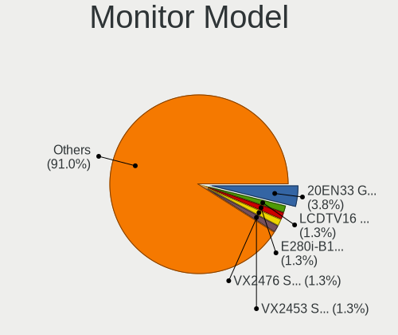

| Model                                                                 | Desktops | Percent |
|-----------------------------------------------------------------------|----------|---------|
| Goldstar 20EN33 GSM4EE1 1600x900 443x249mm 20.0-inch                  | 3        | 4.05%   |
| ___ LCD TV ___0101 1366x768                                           | 1        | 1.35%   |
| Vizio E280i-B1 VIZ1002 1360x768 607x345mm 27.5-inch                   | 1        | 1.35%   |
| ViewSonic VX2476 Series VSCD332 1920x1080 527x296mm 23.8-inch         | 1        | 1.35%   |
| ViewSonic VX2453 Series VSC0C28 1920x1080 520x290mm 23.4-inch         | 1        | 1.35%   |
| ViewSonic VA1931 Series VSCAC25 1366x768 410x230mm 18.5-inch          | 1        | 1.35%   |
| Unknown LCDTV16 0101 1920x1080 1600x900mm 72.3-inch                   | 1        | 1.35%   |
| Unknown LCD Monitor SAMSUNG 1920x1080                                 | 1        | 1.35%   |
| Samsung Electronics T27C370 SAM0ADE 1920x1080 598x336mm 27.0-inch     | 1        | 1.35%   |
| Samsung Electronics SyncMaster SAM0595 2048x1152 510x287mm 23.0-inch  | 1        | 1.35%   |
| Samsung Electronics SyncMaster SAM03E5 1680x1050 474x296mm 22.0-inch  | 1        | 1.35%   |
| Samsung Electronics SyncMaster SAM02AD 1440x900 410x257mm 19.1-inch   | 1        | 1.35%   |
| Samsung Electronics SyncMaster SAM01CE 1024x768 304x228mm 15.0-inch   | 1        | 1.35%   |
| Samsung Electronics SA300/SA350 SAM078B 1600x900 443x249mm 20.0-inch  | 1        | 1.35%   |
| Samsung Electronics LCD Monitor SAM0FEE 3840x2160 950x540mm 43.0-inch | 1        | 1.35%   |
| Samsung Electronics LCD Monitor SAM0F13 3840x2160 890x500mm 40.2-inch | 1        | 1.35%   |
| Samsung Electronics LCD Monitor S24F350 1920x1080                     | 1        | 1.35%   |
| SAC LED MONITOR SAC952D 1920x1080 480x270mm 21.7-inch                 | 1        | 1.35%   |
| Ruijiang HDMI RJT003A 1920x1080 800x480mm 36.7-inch                   | 1        | 1.35%   |
| Philips PHL 273V7 PHLC156 1920x1080 598x336mm 27.0-inch               | 1        | 1.35%   |
| PDA P24FA2 PDA2380 1920x1080 409x230mm 18.5-inch                      | 1        | 1.35%   |
| LG Electronics LCD Monitor W2252 3600x1080                            | 1        | 1.35%   |
| LG Electronics LCD Monitor M227WAP 1920x1080                          | 1        | 1.35%   |
| LG Electronics LCD Monitor LG ULTRAGEAR 2560x1440                     | 1        | 1.35%   |
| KIV Kivi TV KIV0030 1920x1080 708x398mm 32.0-inch                     | 1        | 1.35%   |
| Iiyama PL3270Q IVM7608 2560x1440 700x390mm 31.5-inch                  | 1        | 1.35%   |
| Iiyama PL2773H IVM660A 1920x1080 600x340mm 27.2-inch                  | 1        | 1.35%   |
| HPN LCD Monitor HP 27fh 1920x1080                                     | 1        | 1.35%   |
| HKC LCD Monitor TV 1920x1080                                          | 1        | 1.35%   |
| Hewlett-Packard 27es HWP3325 1920x1080 598x336mm 27.0-inch            | 1        | 1.35%   |
| Hewlett-Packard 24f HPN3545 1920x1080 527x296mm 23.8-inch             | 1        | 1.35%   |
| Haier AQUA TV HRE0030 1920x1080 708x398mm 32.0-inch                   | 1        | 1.35%   |
| Goldstar M228WA GSM563D 1680x1050 434x270mm 20.1-inch                 | 1        | 1.35%   |
| Goldstar L1750SQ GSM43E8 1280x1024 338x270mm 17.0-inch                | 1        | 1.35%   |
| Goldstar IPS FULLHD GSM5AB6 1920x1080 480x270mm 21.7-inch             | 1        | 1.35%   |
| Goldstar FULL HD GSM5B55 1920x1080 480x270mm 21.7-inch                | 1        | 1.35%   |
| Goldstar E2250 GSM578D 1920x1080 477x268mm 21.5-inch                  | 1        | 1.35%   |
| Goldstar E2241 GSM5818 1920x1080 480x270mm 21.7-inch                  | 1        | 1.35%   |
| Fujitsu Siemens P19-1 FUS0452 1280x1024 376x301mm 19.0-inch           | 1        | 1.35%   |
| Dell U3415W DELA0A7 3440x1440 798x335mm 34.1-inch                     | 1        | 1.35%   |

Monitor Resolution
------------------

Monitor screen resolution

| Resolution         | Desktops | Percent |
|--------------------|----------|---------|
| 1920x1080 (FHD)    | 29       | 42.65%  |
| 1600x900 (HD+)     | 7        | 10.29%  |
| 2560x1440 (QHD)    | 4        | 5.88%   |
| 1680x1050 (WSXGA+) | 4        | 5.88%   |
| 3840x2160 (4K)     | 3        | 4.41%   |
| 1366x768 (WXGA)    | 3        | 4.41%   |
| 1280x1024 (SXGA)   | 3        | 4.41%   |
| Unknown            | 3        | 4.41%   |
| 3440x1440          | 2        | 2.94%   |
| 2560x1600          | 2        | 2.94%   |
| 5120x1440          | 1        | 1.47%   |
| 3968x1280          | 1        | 1.47%   |
| 3600x1080          | 1        | 1.47%   |
| 2288x1287          | 1        | 1.47%   |
| 2048x1152          | 1        | 1.47%   |
| 1600x1200          | 1        | 1.47%   |
| 1440x900 (WXGA+)   | 1        | 1.47%   |
| 1024x768 (XGA)     | 1        | 1.47%   |

Monitor Diagonal
----------------

Diagonal size in inches

| Inches  | Desktops | Percent |
|---------|----------|---------|
| Unknown | 16       | 22.54%  |
| 21      | 7        | 9.86%   |
| 20      | 7        | 9.86%   |
| 27      | 6        | 8.45%   |
| 19      | 6        | 8.45%   |
| 24      | 5        | 7.04%   |
| 23      | 4        | 5.63%   |
| 18      | 3        | 4.23%   |
| 84      | 2        | 2.82%   |
| 32      | 2        | 2.82%   |
| 29      | 2        | 2.82%   |
| 22      | 2        | 2.82%   |
| 17      | 2        | 2.82%   |
| 72      | 1        | 1.41%   |
| 57      | 1        | 1.41%   |
| 38      | 1        | 1.41%   |
| 34      | 1        | 1.41%   |
| 33      | 1        | 1.41%   |
| 31      | 1        | 1.41%   |
| 15      | 1        | 1.41%   |

Monitor Width
-------------

Physical width

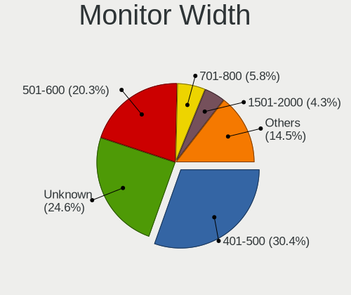

| Width in mm | Desktops | Percent |
|-------------|----------|---------|
| 401-500     | 21       | 31.34%  |
| Unknown     | 16       | 23.88%  |
| 501-600     | 13       | 19.4%   |
| 701-800     | 4        | 5.97%   |
| 601-700     | 3        | 4.48%   |
| 301-350     | 3        | 4.48%   |
| 1501-2000   | 3        | 4.48%   |
| 351-400     | 2        | 2.99%   |
| 801-900     | 1        | 1.49%   |
| 1001-1500   | 1        | 1.49%   |

Aspect Ratio
------------

Proportional relationship between the width and the height

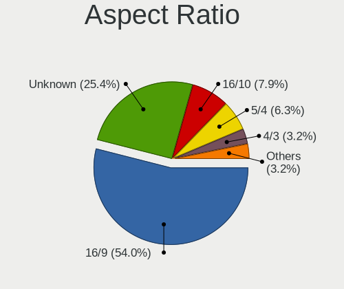

| Ratio   | Desktops | Percent |
|---------|----------|---------|
| 16/9    | 33       | 54.1%   |
| Unknown | 15       | 24.59%  |
| 16/10   | 5        | 8.2%    |
| 5/4     | 4        | 6.56%   |
| 4/3     | 2        | 3.28%   |
| 3/2     | 1        | 1.64%   |
| 21/9    | 1        | 1.64%   |

Monitor Area
------------

Area in inch²

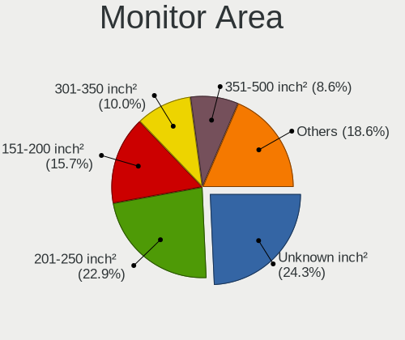

| Area in inch² | Desktops | Percent |
|----------------|----------|---------|
| Unknown        | 16       | 23.88%  |
| 201-250        | 15       | 22.39%  |
| 151-200        | 11       | 16.42%  |
| 351-500        | 7        | 10.45%  |
| 301-350        | 6        | 8.96%   |
| 141-150        | 5        | 7.46%   |
| More than 1000 | 4        | 5.97%   |
| 251-300        | 1        | 1.49%   |
| 101-110        | 1        | 1.49%   |
| 501-1000       | 1        | 1.49%   |

Pixel Density
-------------

Pixels per inch

| Density | Desktops | Percent |
|---------|----------|---------|
| 51-100  | 32       | 51.61%  |
| Unknown | 16       | 25.81%  |
| 101-120 | 12       | 19.35%  |
| 1-50    | 2        | 3.23%   |

Multiple Monitors
-----------------

Total monitors connected

| Total | Desktops | Percent |
|-------|----------|---------|
| 1     | 50       | 73.53%  |
| 2     | 11       | 16.18%  |
| 3     | 4        | 5.88%   |
| 0     | 3        | 4.41%   |

Network
-------

Net Controller Vendor
---------------------

Controller vendors

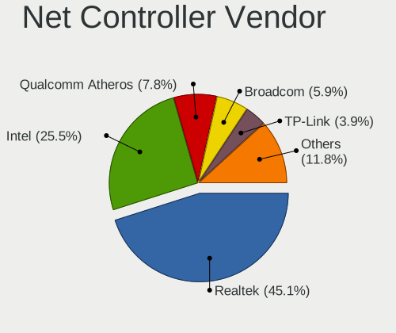

| Vendor                          | Desktops | Percent |
|---------------------------------|----------|---------|
| Realtek Semiconductor           | 43       | 43.43%  |
| Intel                           | 26       | 26.26%  |
| Qualcomm Atheros                | 8        | 8.08%   |
| Broadcom                        | 6        | 6.06%   |
| TP-Link                         | 4        | 4.04%   |
| Nvidia                          | 3        | 3.03%   |
| VIA Technologies                | 1        | 1.01%   |
| Samsung Electronics             | 1        | 1.01%   |
| Qualcomm Atheros Communications | 1        | 1.01%   |
| Microsoft                       | 1        | 1.01%   |
| Huawei Technologies             | 1        | 1.01%   |
| D-Link System                   | 1        | 1.01%   |
| D-Link                          | 1        | 1.01%   |
| BUFFALO                         | 1        | 1.01%   |
| Broadcom Limited                | 1        | 1.01%   |

Net Controller Model
--------------------

Controller models

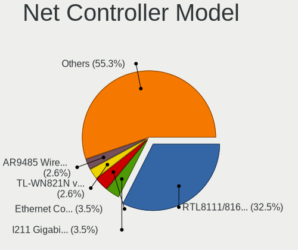

| Model                                                                  | Desktops | Percent |
|------------------------------------------------------------------------|----------|---------|
| Realtek RTL8111/8168/8411 PCI Express Gigabit Ethernet Controller      | 34       | 30.63%  |
| Intel I211 Gigabit Network Connection                                  | 4        | 3.6%    |
| Intel Ethernet Connection (2) I219-V                                   | 4        | 3.6%    |
| TP-Link TL-WN821N v5/v6 [RTL8192EU]                                    | 3        | 2.7%    |
| Qualcomm Atheros AR9485 Wireless Network Adapter                       | 3        | 2.7%    |
| Intel Ethernet Connection (7) I219-V                                   | 3        | 2.7%    |
| Intel 82579LM Gigabit Network Connection (Lewisville)                  | 3        | 2.7%    |
| Realtek RTL8188EUS 802.11n Wireless Network Adapter                    | 2        | 1.8%    |
| Realtek RTL-8100/8101L/8139 PCI Fast Ethernet Adapter                  | 2        | 1.8%    |
| Realtek 802.11ac NIC                                                   | 2        | 1.8%    |
| Qualcomm Atheros AR8161 Gigabit Ethernet                               | 2        | 1.8%    |
| Intel Wireless-AC 9260                                                 | 2        | 1.8%    |
| Intel Wi-Fi 6 AX200                                                    | 2        | 1.8%    |
| Intel 82578DM Gigabit Network Connection                               | 2        | 1.8%    |
| Broadcom BCM4360 802.11ac Wireless Network Adapter                     | 2        | 1.8%    |
| VIA VT6105/VT6106S [Rhine-III]                                         | 1        | 0.9%    |
| TP-Link TL-WN722N v2/v3 [Realtek RTL8188EUS]                           | 1        | 0.9%    |
| Samsung GT-I9070 (network tethering, USB debugging enabled)            | 1        | 0.9%    |
| Realtek RTL8821CE 802.11ac PCIe Wireless Network Adapter               | 1        | 0.9%    |
| Realtek RTL8812AU 802.11a/b/g/n/ac 2T2R DB WLAN Adapter                | 1        | 0.9%    |
| Realtek RTL8811AU 802.11a/b/g/n/ac WLAN Adapter                        | 1        | 0.9%    |
| Realtek RTL8723BE PCIe Wireless Network Adapter                        | 1        | 0.9%    |
| Realtek RTL8192EU 802.11b/g/n WLAN Adapter                             | 1        | 0.9%    |
| Realtek RTL8192EE PCIe Wireless Network Adapter                        | 1        | 0.9%    |
| Realtek RTL8192CU 802.11n WLAN Adapter                                 | 1        | 0.9%    |
| Realtek RTL8125 2.5GbE Controller                                      | 1        | 0.9%    |
| Realtek RTL810xE PCI Express Fast Ethernet controller                  | 1        | 0.9%    |
| Realtek RTL-8185 IEEE 802.11a/b/g Wireless LAN Controller              | 1        | 0.9%    |
| Qualcomm Atheros AR9271 802.11n                                        | 1        | 0.9%    |
| Qualcomm Atheros Attansic L1 Gigabit Ethernet                          | 1        | 0.9%    |
| Qualcomm Atheros AR9462 Wireless Network Adapter                       | 1        | 0.9%    |
| Qualcomm Atheros AR93xx Wireless Network Adapter                       | 1        | 0.9%    |
| Qualcomm Atheros AR5416 Wireless Network Adapter [AR5008 802.11(a)bgn] | 1        | 0.9%    |
| Nvidia MCP77 Ethernet                                                  | 1        | 0.9%    |
| Nvidia MCP61 Ethernet                                                  | 1        | 0.9%    |
| Nvidia MCP55 Ethernet                                                  | 1        | 0.9%    |
| Microsoft Xbox 360 Wireless Adapter                                    | 1        | 0.9%    |
| Intel Wireless 8260                                                    | 1        | 0.9%    |
| Intel Wireless 7260                                                    | 1        | 0.9%    |
| Intel Ethernet Connection I217-V                                       | 1        | 0.9%    |

Wireless Vendor
---------------

Wireless vendors

| Vendor                          | Desktops | Percent |
|---------------------------------|----------|---------|
| Realtek Semiconductor           | 11       | 28.21%  |
| Intel                           | 7        | 17.95%  |
| Qualcomm Atheros                | 6        | 15.38%  |
| Broadcom                        | 5        | 12.82%  |
| TP-Link                         | 4        | 10.26%  |
| Qualcomm Atheros Communications | 1        | 2.56%   |
| Microsoft                       | 1        | 2.56%   |
| D-Link System                   | 1        | 2.56%   |
| D-Link                          | 1        | 2.56%   |
| BUFFALO                         | 1        | 2.56%   |
| Broadcom Limited                | 1        | 2.56%   |

Wireless Model
--------------

Wireless models

| Model                                                                             | Desktops | Percent |
|-----------------------------------------------------------------------------------|----------|---------|
| TP-Link TL-WN821N v5/v6 [RTL8192EU]                                               | 3        | 7.5%    |
| Qualcomm Atheros AR9485 Wireless Network Adapter                                  | 3        | 7.5%    |
| Realtek RTL8188EUS 802.11n Wireless Network Adapter                               | 2        | 5%      |
| Realtek 802.11ac NIC                                                              | 2        | 5%      |
| Intel Wireless-AC 9260                                                            | 2        | 5%      |
| Intel Wi-Fi 6 AX200                                                               | 2        | 5%      |
| Broadcom BCM4360 802.11ac Wireless Network Adapter                                | 2        | 5%      |
| TP-Link TL-WN722N v2/v3 [Realtek RTL8188EUS]                                      | 1        | 2.5%    |
| Realtek RTL8821CE 802.11ac PCIe Wireless Network Adapter                          | 1        | 2.5%    |
| Realtek RTL8812AU 802.11a/b/g/n/ac 2T2R DB WLAN Adapter                           | 1        | 2.5%    |
| Realtek RTL8811AU 802.11a/b/g/n/ac WLAN Adapter                                   | 1        | 2.5%    |
| Realtek RTL8723BE PCIe Wireless Network Adapter                                   | 1        | 2.5%    |
| Realtek RTL8192EU 802.11b/g/n WLAN Adapter                                        | 1        | 2.5%    |
| Realtek RTL8192EE PCIe Wireless Network Adapter                                   | 1        | 2.5%    |
| Realtek RTL8192CU 802.11n WLAN Adapter                                            | 1        | 2.5%    |
| Realtek RTL-8185 IEEE 802.11a/b/g Wireless LAN Controller                         | 1        | 2.5%    |
| Qualcomm Atheros AR9271 802.11n                                                   | 1        | 2.5%    |
| Qualcomm Atheros AR9462 Wireless Network Adapter                                  | 1        | 2.5%    |
| Qualcomm Atheros AR93xx Wireless Network Adapter                                  | 1        | 2.5%    |
| Qualcomm Atheros AR5416 Wireless Network Adapter [AR5008 802.11(a)bgn]            | 1        | 2.5%    |
| Microsoft Xbox 360 Wireless Adapter                                               | 1        | 2.5%    |
| Intel Wireless 8260                                                               | 1        | 2.5%    |
| Intel Wireless 7260                                                               | 1        | 2.5%    |
| Intel Cannon Lake PCH CNVi WiFi                                                   | 1        | 2.5%    |
| D-Link System DWA-131 802.11n Wireless N Nano Adapter(rev.A1) [Realtek RTL8192SU] | 1        | 2.5%    |
| D-Link DWA-131 Wireless N Nano Adapter (Rev. E1) [Realtek RTL8192EU]              | 1        | 2.5%    |
| BUFFALO WLI-UC-GNM Wireless LAN Adapter [Ralink RT8070]                           | 1        | 2.5%    |
| Broadcom Limited BCM4360 802.11ac Wireless Network Adapter                        | 1        | 2.5%    |
| Broadcom BCM4352 802.11ac Wireless Network Adapter                                | 1        | 2.5%    |
| Broadcom BCM43228 802.11a/b/g/n                                                   | 1        | 2.5%    |
| Broadcom BCM4318 [AirForce One 54g] 802.11g Wireless LAN Controller               | 1        | 2.5%    |

Ethernet Vendor
---------------

Ethernet vendors

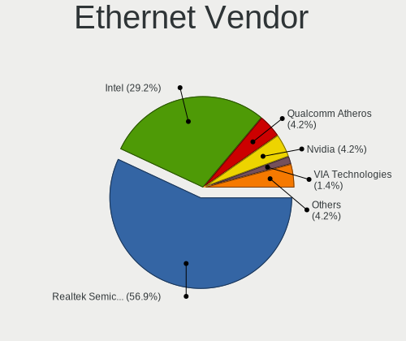

| Vendor                | Desktops | Percent |
|-----------------------|----------|---------|
| Realtek Semiconductor | 38       | 55.07%  |
| Intel                 | 21       | 30.43%  |
| Qualcomm Atheros      | 3        | 4.35%   |
| Nvidia                | 3        | 4.35%   |
| VIA Technologies      | 1        | 1.45%   |
| Samsung Electronics   | 1        | 1.45%   |
| Huawei Technologies   | 1        | 1.45%   |
| Broadcom              | 1        | 1.45%   |

Ethernet Model
--------------

Ethernet models

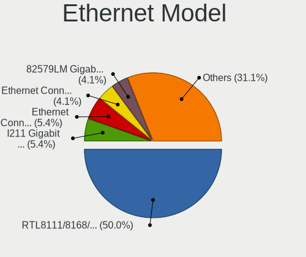

| Model                                                             | Desktops | Percent |
|-------------------------------------------------------------------|----------|---------|
| Realtek RTL8111/8168/8411 PCI Express Gigabit Ethernet Controller | 34       | 47.89%  |
| Intel I211 Gigabit Network Connection                             | 4        | 5.63%   |
| Intel Ethernet Connection (2) I219-V                              | 4        | 5.63%   |
| Intel Ethernet Connection (7) I219-V                              | 3        | 4.23%   |
| Intel 82579LM Gigabit Network Connection (Lewisville)             | 3        | 4.23%   |
| Realtek RTL-8100/8101L/8139 PCI Fast Ethernet Adapter             | 2        | 2.82%   |
| Qualcomm Atheros AR8161 Gigabit Ethernet                          | 2        | 2.82%   |
| Intel 82578DM Gigabit Network Connection                          | 2        | 2.82%   |
| VIA VT6105/VT6106S [Rhine-III]                                    | 1        | 1.41%   |
| Samsung GT-I9070 (network tethering, USB debugging enabled)       | 1        | 1.41%   |
| Realtek RTL8125 2.5GbE Controller                                 | 1        | 1.41%   |
| Realtek RTL810xE PCI Express Fast Ethernet controller             | 1        | 1.41%   |
| Qualcomm Atheros Attansic L1 Gigabit Ethernet                     | 1        | 1.41%   |
| Nvidia MCP77 Ethernet                                             | 1        | 1.41%   |
| Nvidia MCP61 Ethernet                                             | 1        | 1.41%   |
| Nvidia MCP55 Ethernet                                             | 1        | 1.41%   |
| Intel Ethernet Connection I217-V                                  | 1        | 1.41%   |
| Intel Ethernet Connection I217-LM                                 | 1        | 1.41%   |
| Intel Ethernet Connection (2) I218-V                              | 1        | 1.41%   |
| Intel 82567LM-3 Gigabit Network Connection                        | 1        | 1.41%   |
| Intel 82566DC Gigabit Network Connection                          | 1        | 1.41%   |
| Intel 82562V-2 10/100 Network Connection                          | 1        | 1.41%   |
| Intel 80003ES2LAN Gigabit Ethernet Controller (Copper)            | 1        | 1.41%   |
| Huawei LYA-L09                                                    | 1        | 1.41%   |
| Broadcom NetLink BCM5784M Gigabit Ethernet PCIe                   | 1        | 1.41%   |

Net Controller Kind
-------------------

Ethernet, WiFi or modem

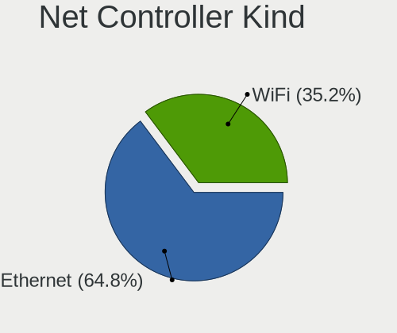

| Kind     | Desktops | Percent |
|----------|----------|---------|
| Ethernet | 65       | 63.73%  |
| WiFi     | 37       | 36.27%  |

Used Controller
---------------

Currently used network controller

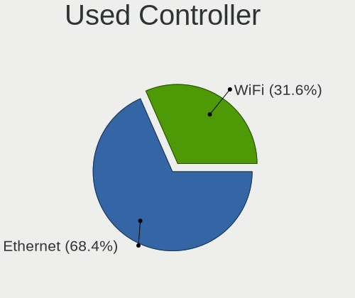

| Kind     | Desktops | Percent |
|----------|----------|---------|
| Ethernet | 49       | 67.12%  |
| WiFi     | 24       | 32.88%  |

NICs
----

Total network controllers on board

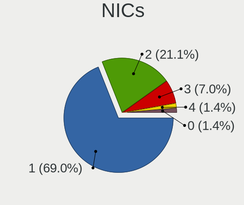

| Total | Desktops | Percent |
|-------|----------|---------|
| 1     | 46       | 67.65%  |
| 2     | 15       | 22.06%  |
| 3     | 5        | 7.35%   |
| 4     | 1        | 1.47%   |
| 0     | 1        | 1.47%   |

IPv6
----

IPv6 vs IPv4

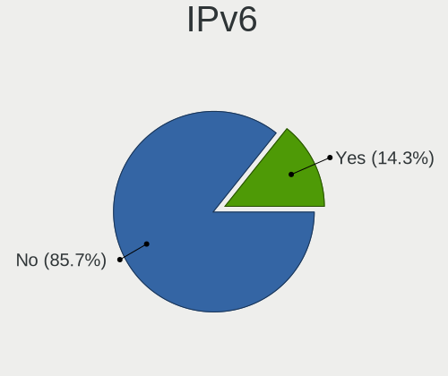

| Used | Desktops | Percent |
|------|----------|---------|
| No   | 58       | 86.57%  |
| Yes  | 9        | 13.43%  |

Bluetooth
---------

Bluetooth Vendor
----------------

Controller vendors

| Vendor                  | Desktops | Percent |
|-------------------------|----------|---------|
| Cambridge Silicon Radio | 10       | 41.67%  |
| Intel                   | 7        | 29.17%  |
| Realtek Semiconductor   | 2        | 8.33%   |
| ASUSTek Computer        | 2        | 8.33%   |
| IMC Networks            | 1        | 4.17%   |
| Broadcom                | 1        | 4.17%   |
| Apple                   | 1        | 4.17%   |

Bluetooth Model
---------------

Controller models

| Model                                                 | Desktops | Percent |
|-------------------------------------------------------|----------|---------|
| Cambridge Silicon Radio Bluetooth Dongle (HCI mode)   | 10       | 41.67%  |
| Intel Wireless-AC 9260 Bluetooth Adapter              | 2        | 8.33%   |
| Intel Bluetooth wireless interface                    | 2        | 8.33%   |
| Intel AX200 Bluetooth                                 | 2        | 8.33%   |
| Realtek  Bluetooth 4.2 Adapter                        | 1        | 4.17%   |
| Realtek Bluetooth Radio                               | 1        | 4.17%   |
| Intel Bluetooth 9460/9560 Jefferson Peak (JfP)        | 1        | 4.17%   |
| IMC Networks BCM20702A0                               | 1        | 4.17%   |
| Broadcom HP Portable Bumble Bee                       | 1        | 4.17%   |
| ASUS Broadcom BCM20702A0 Bluetooth                    | 1        | 4.17%   |
| ASUS Broadcom BCM20702 Single-Chip Bluetooth 4.0 + LE | 1        | 4.17%   |
| Apple Bluetooth USB Host Controller                   | 1        | 4.17%   |

Sound
-----

Sound Vendor
------------

Sound card vendors

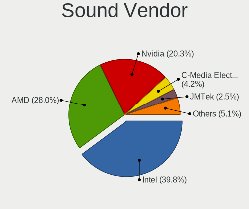

| Vendor                 | Desktops | Percent |
|------------------------|----------|---------|
| Intel                  | 45       | 40.18%  |
| AMD                    | 30       | 26.79%  |
| Nvidia                 | 23       | 20.54%  |
| C-Media Electronics    | 5        | 4.46%   |
| JMTek                  | 3        | 2.68%   |
| Generalplus Technology | 2        | 1.79%   |
| Texas Instruments      | 1        | 0.89%   |
| Hewlett-Packard        | 1        | 0.89%   |
| Fortemedia             | 1        | 0.89%   |
| Astro Gaming           | 1        | 0.89%   |

Sound Model
-----------

Sound card models

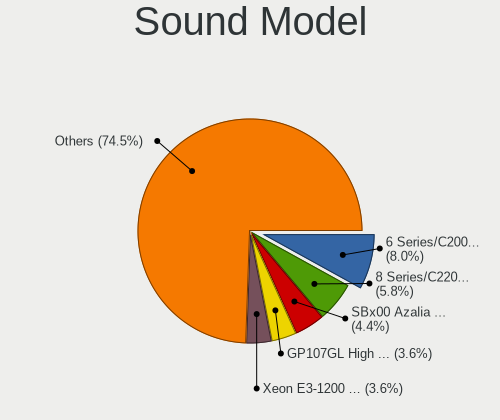

| Model                                                                      | Desktops | Percent |
|----------------------------------------------------------------------------|----------|---------|
| Intel 6 Series/C200 Series Chipset Family High Definition Audio Controller | 10       | 7.63%   |
| Intel 8 Series/C220 Series Chipset High Definition Audio Controller        | 7        | 5.34%   |
| AMD SBx00 Azalia (Intel HDA)                                               | 6        | 4.58%   |
| Intel Xeon E3-1200 v3/4th Gen Core Processor HD Audio Controller           | 5        | 3.82%   |
| Intel Cannon Lake PCH cAVS                                                 | 5        | 3.82%   |
| Intel 7 Series/C216 Chipset Family High Definition Audio Controller        | 5        | 3.82%   |
| AMD Raven/Raven2/Fenghuang HDMI/DP Audio Controller                        | 5        | 3.82%   |
| AMD Family 17h/19h HD Audio Controller                                     | 5        | 3.82%   |
| AMD Ellesmere HDMI Audio [Radeon RX 470/480 / 570/580/590]                 | 5        | 3.82%   |
| Nvidia GP107GL High Definition Audio Controller                            | 4        | 3.05%   |
| Nvidia GM107 High Definition Audio Controller [GeForce 940MX]              | 4        | 3.05%   |
| Intel 200 Series PCH HD Audio                                              | 4        | 3.05%   |
| JMTek USB PnP Audio Device                                                 | 3        | 2.29%   |
| Intel NM10/ICH7 Family High Definition Audio Controller                    | 3        | 2.29%   |
| AMD Starship/Matisse HD Audio Controller                                   | 3        | 2.29%   |
| AMD FCH Azalia Controller                                                  | 3        | 2.29%   |
| Nvidia GK208 HDMI/DP Audio Controller                                      | 2        | 1.53%   |
| Intel 82801I (ICH9 Family) HD Audio Controller                             | 2        | 1.53%   |
| Intel 5 Series/3400 Series Chipset High Definition Audio                   | 2        | 1.53%   |
| Intel 100 Series/C230 Series Chipset Family HD Audio Controller            | 2        | 1.53%   |
| Generalplus Technology USB Audio Device                                    | 2        | 1.53%   |
| AMD RS880 HDMI Audio [Radeon HD 4200 Series]                               | 2        | 1.53%   |
| AMD Family 17h (Models 00h-0fh) HD Audio Controller                        | 2        | 1.53%   |
| AMD Baffin HDMI/DP Audio [Radeon RX 550 640SP / RX 560/560X]               | 2        | 1.53%   |
| Texas Instruments PCM2902 Audio Codec                                      | 1        | 0.76%   |
| Nvidia TU106 High Definition Audio Controller                              | 1        | 0.76%   |
| Nvidia TU104 HD Audio Controller                                           | 1        | 0.76%   |
| Nvidia MCP72XE/MCP72P/MCP78U/MCP78S High Definition Audio                  | 1        | 0.76%   |
| Nvidia MCP61 High Definition Audio                                         | 1        | 0.76%   |
| Nvidia MCP55 High Definition Audio                                         | 1        | 0.76%   |
| Nvidia GP106 High Definition Audio Controller                              | 1        | 0.76%   |
| Nvidia GP104 High Definition Audio Controller                              | 1        | 0.76%   |
| Nvidia GM204 High Definition Audio Controller                              | 1        | 0.76%   |
| Nvidia GM200 High Definition Audio                                         | 1        | 0.76%   |
| Nvidia GK107 HDMI Audio Controller                                         | 1        | 0.76%   |
| Nvidia GK104 HDMI Audio Controller                                         | 1        | 0.76%   |
| Nvidia GF116 High Definition Audio Controller                              | 1        | 0.76%   |
| Nvidia GF110 High Definition Audio Controller                              | 1        | 0.76%   |
| Nvidia GF108 High Definition Audio Controller                              | 1        | 0.76%   |
| Intel Atom Processor Z36xxx/Z37xxx Series High Definition Audio Controller | 1        | 0.76%   |

Memory
------

Memory Vendor
-------------

Memory module vendors

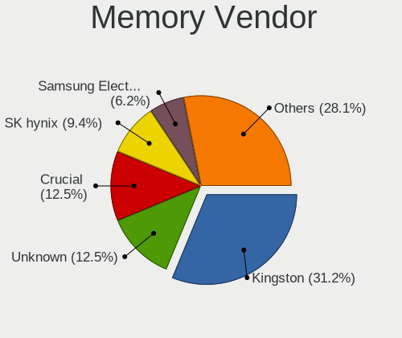

| Vendor              | Desktops | Percent |
|---------------------|----------|---------|
| Kingston            | 10       | 32.26%  |
| Unknown             | 4        | 12.9%   |
| Crucial             | 4        | 12.9%   |
| SK hynix            | 3        | 9.68%   |
| Samsung Electronics | 2        | 6.45%   |
| Patriot             | 2        | 6.45%   |
| Corsair             | 2        | 6.45%   |
| Ramaxel Technology  | 1        | 3.23%   |
| Nanya Technology    | 1        | 3.23%   |
| Micron Technology   | 1        | 3.23%   |
| G.Skill             | 1        | 3.23%   |

Memory Model
------------

Memory module models

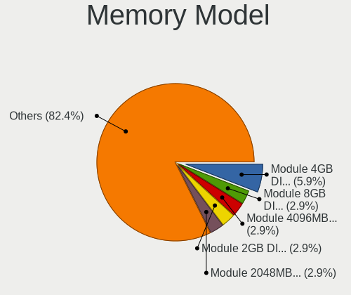

| Model                                                    | Desktops | Percent |
|----------------------------------------------------------|----------|---------|
| Unknown RAM Module 4GB DIMM 1333MT/s                     | 2        | 6.06%   |
| Unknown RAM Module 8GB DIMM 1333MT/s                     | 1        | 3.03%   |
| Unknown RAM Module 4096MB DIMM DDR3 1333MT/s             | 1        | 3.03%   |
| Unknown RAM Module 2GB DIMM 1333MT/s                     | 1        | 3.03%   |
| Unknown RAM Module 2048MB DIMM DDR2 667MT/s              | 1        | 3.03%   |
| SK hynix RAM HYMP112U64CP8-Y5 1024MB DIMM DDR2 1639MT/s  | 1        | 3.03%   |
| SK hynix RAM HMT351U6EFR8C-PB 4GB DIMM DDR3 1800MT/s     | 1        | 3.03%   |
| SK hynix RAM HMT351U6BFR8C-H9 4GB DIMM DDR3 1333MT/s     | 1        | 3.03%   |
| Samsung RAM M471B5173DB0-YK0 4GB SODIMM DDR3 1600MT/s    | 1        | 3.03%   |
| Samsung RAM M378A5244CB0-CTD 4GB DIMM DDR4 3334MT/s      | 1        | 3.03%   |
| Ramaxel RAM RMR1870ED48E8F1333 2048MB DIMM DDR3 1333MT/s | 1        | 3.03%   |
| Patriot RAM PSD48G266681 8GB DIMM DDR4 2934MT/s          | 1        | 3.03%   |
| Patriot RAM PSD22G8002 2GB DIMM DDR2 800MT/s             | 1        | 3.03%   |
| Nanya RAM Module 4GB FB-DIMM DDR2 667MT/s                | 1        | 3.03%   |
| Micron RAM 16JTF25664AZ-1G4F 2GB DIMM DDR3 1333MT/s      | 1        | 3.03%   |
| Kingston RAM Module 4GB FB-DIMM DDR2 667MT/s             | 1        | 3.03%   |
| Kingston RAM Module 4096MB SODIMM DDR3 1333MT/s          | 1        | 3.03%   |
| Kingston RAM Module 2048MB DIMM DDR2 800MT/s             | 1        | 3.03%   |
| Kingston RAM KHX3200C16D4/16GX 16GB DIMM DDR4 3600MT/s   | 1        | 3.03%   |
| Kingston RAM KHX2666C16/8G 8GB DIMM DDR4 3466MT/s        | 1        | 3.03%   |
| Kingston RAM KHX1866C9D3/8GX 8GB DIMM DDR3 1866MT/s      | 1        | 3.03%   |
| Kingston RAM KHX1866C10D3/4G 4GB DIMM DDR3 1867MT/s      | 1        | 3.03%   |
| Kingston RAM KHX1600C10D3/8G 8GB DIMM DDR3 1600MT/s      | 1        | 3.03%   |
| Kingston RAM HP497157-B88-ELDW 2048MB DIMM DDR3 1333MT/s | 1        | 3.03%   |
| Kingston RAM 99U5474-028.A00LF 4GB DIMM DDR3 1333MT/s    | 1        | 3.03%   |
| G.Skill RAM F3-12800CL9-4GBRL 4GB DIMM DDR3 1866MT/s     | 1        | 3.03%   |
| Crucial RAM CT51264AA667.M16FC 4GB DIMM DDR2 667MT/s     | 1        | 3.03%   |
| Crucial RAM CT12864BA1339A.C8F 1024MB DIMM DDR3 667MT/s  | 1        | 3.03%   |
| Crucial RAM BLS8G4D240FSEK.8FBD 8GB DIMM DDR4 2400MT/s   | 1        | 3.03%   |
| Crucial RAM BLS16G4D240FSC.16FBD 16GB DIMM DDR4 2400MT/s | 1        | 3.03%   |
| Corsair RAM CMK16GX4M2B3000C15 8GB DIMM DDR4 3200MT/s    | 1        | 3.03%   |
| Corsair RAM CMK16GX4M2A2400C16 8GB DIMM DDR4 2933MT/s    | 1        | 3.03%   |

Memory Kind
-----------

Memory module kinds

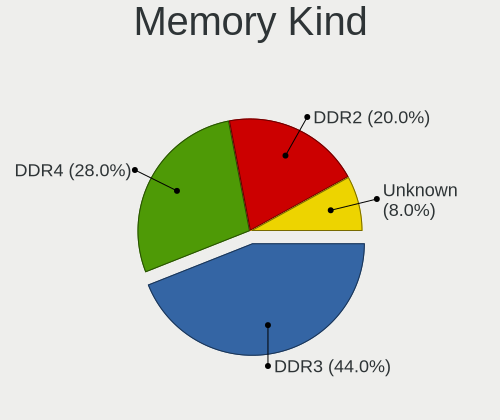

| Kind    | Desktops | Percent |
|---------|----------|---------|
| DDR3    | 10       | 41.67%  |
| DDR4    | 7        | 29.17%  |
| DDR2    | 5        | 20.83%  |
| Unknown | 2        | 8.33%   |

Memory Form Factor
------------------

Physical design of the memory module

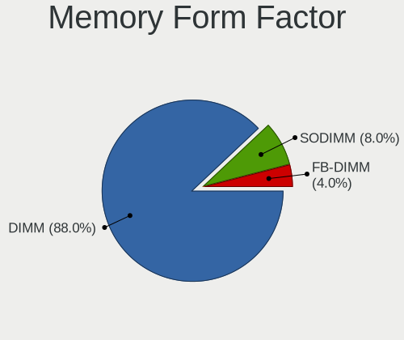

| Name    | Desktops | Percent |
|---------|----------|---------|
| DIMM    | 21       | 87.5%   |
| SODIMM  | 2        | 8.33%   |
| FB-DIMM | 1        | 4.17%   |

Memory Size
-----------

Memory module size

| Size  | Desktops | Percent |
|-------|----------|---------|
| 4096  | 11       | 37.93%  |
| 8192  | 8        | 27.59%  |
| 2048  | 6        | 20.69%  |
| 16384 | 2        | 6.9%    |
| 1024  | 2        | 6.9%    |

Memory Speed
------------

Memory module speed

| Speed | Desktops | Percent |
|-------|----------|---------|
| 1333  | 6        | 21.43%  |
| 667   | 4        | 14.29%  |
| 3466  | 2        | 7.14%   |
| 2400  | 2        | 7.14%   |
| 1866  | 2        | 7.14%   |
| 1600  | 2        | 7.14%   |
| 800   | 2        | 7.14%   |
| 3600  | 1        | 3.57%   |
| 3334  | 1        | 3.57%   |
| 2934  | 1        | 3.57%   |
| 2933  | 1        | 3.57%   |
| 2133  | 1        | 3.57%   |
| 1867  | 1        | 3.57%   |
| 1800  | 1        | 3.57%   |
| 1639  | 1        | 3.57%   |

Printers & scanners
-------------------

Printer Vendor
--------------

Printer device vendors

| Vendor             | Desktops | Percent |
|--------------------|----------|---------|
| Hewlett-Packard    | 5        | 71.43%  |
| Canon              | 1        | 14.29%  |
| Brother Industries | 1        | 14.29%  |

Printer Model
-------------

Printer device models

| Model                       | Desktops | Percent |
|-----------------------------|----------|---------|
| HP Printing Support         | 1        | 14.29%  |
| HP LaserJet Pro M202dw      | 1        | 14.29%  |
| HP LaserJet 1320            | 1        | 14.29%  |
| HP Deskjet 2050 J510        | 1        | 14.29%  |
| HP Deskjet 1000 J110 series | 1        | 14.29%  |
| Canon TR8500 series         | 1        | 14.29%  |
| Brother MFC-T910DW          | 1        | 14.29%  |

Scanner Vendor
--------------

Scanner device vendors

Zero info for selected period =(

Scanner Model
-------------

Scanner device models

Zero info for selected period =(

Camera
------

Camera Vendor
-------------

Camera device vendors

| Vendor                      | Desktops | Percent |
|-----------------------------|----------|---------|
| Logitech                    | 5        | 31.25%  |
| Chicony Electronics         | 2        | 12.5%   |
| Z-Star Microelectronics     | 1        | 6.25%   |
| Samsung Electronics         | 1        | 6.25%   |
| Microsoft                   | 1        | 6.25%   |
| Microdia                    | 1        | 6.25%   |
| LG Electronics              | 1        | 6.25%   |
| KYE Systems (Mouse Systems) | 1        | 6.25%   |
| Generalplus Technology      | 1        | 6.25%   |
| Cubeternet                  | 1        | 6.25%   |
| Apple                       | 1        | 6.25%   |

Camera Model
------------

Camera device models

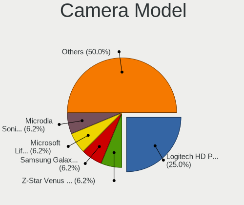

| Model                                                 | Desktops | Percent |
|-------------------------------------------------------|----------|---------|
| Logitech HD Pro Webcam C920                           | 4        | 25%     |
| Z-Star Venus USB2.0 Camera                            | 1        | 6.25%   |
| Samsung Galaxy series, misc. (MTP mode)               | 1        | 6.25%   |
| Microsoft LifeCam VX-2000                             | 1        | 6.25%   |
| Microdia Sonix USB 2.0 Camera                         | 1        | 6.25%   |
| Logitech Webcam C270                                  | 1        | 6.25%   |
| LG LM-X420xxx/G2/G3 Android Phone (MTP/download mode) | 1        | 6.25%   |
| KYE Systems (Mouse Systems) PC-LM1E Camera            | 1        | 6.25%   |
| Generalplus GENERAL WEBCAM                            | 1        | 6.25%   |
| Cubeternet GL-UPC822 UVC WebCam                       | 1        | 6.25%   |
| Chicony USB2.0 UVC VGA                                | 1        | 6.25%   |
| Chicony HP High Definition 1MP Webcam                 | 1        | 6.25%   |
| Apple iPhone 4                                        | 1        | 6.25%   |

Security
--------

Fingerprint Vendor
------------------

Fingerprint sensor vendors

Zero info for selected period =(

Fingerprint Model
-----------------

Fingerprint sensor models

Zero info for selected period =(

Chipcard Vendor
---------------

Chipcard module vendors

Zero info for selected period =(

Chipcard Model
--------------

Chipcard module models

Zero info for selected period =(

Unsupported
-----------

Unsupported Devices
-------------------

Total unsupported devices on board

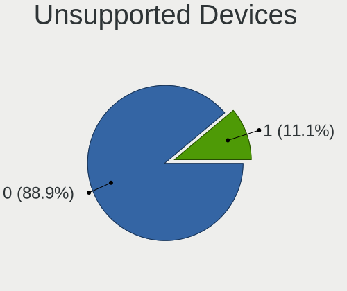

| Total | Desktops | Percent |
|-------|----------|---------|
| 0     | 61       | 88.41%  |
| 1     | 8        | 11.59%  |

Unsupported Device Types
------------------------

Types of unsupported devices

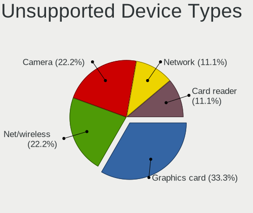

| Type          | Desktops | Percent |
|---------------|----------|---------|
| Graphics card | 3        | 33.33%  |
| Net/wireless  | 2        | 22.22%  |
| Camera        | 2        | 22.22%  |
| Network       | 1        | 11.11%  |
| Card reader   | 1        | 11.11%  |

