Elementary 5.1.7 - Tested Hardware & Statistics (Notebooks)
-----------------------------------------------------------

A project to collect tested hardware configurations for Elementary 5.1.7.

Anyone can contribute to this report by the [hw-probe](https://github.com/linuxhw/hw-probe) tool:

    sudo -E hw-probe -all -upload

Please contribute! Especially if your hardware is rare.

Contents
--------

* [ Test Cases ](#test-cases)

* [ System ](#system)
  - [ Kernel                   ](#kernel)
  - [ Kernel Family            ](#kernel-family)
  - [ Kernel Major Ver.        ](#kernel-major-ver)
  - [ Arch                     ](#arch)
  - [ DE                       ](#de)
  - [ Display Server           ](#display-server)
  - [ Display Manager          ](#display-manager)
  - [ OS Lang                  ](#os-lang)
  - [ Boot Mode                ](#boot-mode)
  - [ Filesystem               ](#filesystem)
  - [ Part. scheme             ](#part-scheme)
  - [ Dual Boot with Linux/BSD ](#dual-boot-with-linuxbsd)
  - [ Dual Boot (Win)          ](#dual-boot-win)

* [ Board ](#board)
  - [ Vendor                   ](#vendor)
  - [ Model                    ](#model)
  - [ Model Family             ](#model-family)
  - [ MFG Year                 ](#mfg-year)
  - [ Form Factor              ](#form-factor)
  - [ Secure Boot              ](#secure-boot)
  - [ Coreboot                 ](#coreboot)
  - [ RAM Size                 ](#ram-size)
  - [ RAM Used                 ](#ram-used)
  - [ Total Drives             ](#total-drives)
  - [ Has CD-ROM               ](#has-cd-rom)
  - [ Has Ethernet             ](#has-ethernet)
  - [ Has WiFi                 ](#has-wifi)
  - [ Has Bluetooth            ](#has-bluetooth)

* [ Location ](#location)
  - [ Country                  ](#country)
  - [ City                     ](#city)

* [ Drives ](#drives)
  - [ Drive Vendor             ](#drive-vendor)
  - [ Drive Model              ](#drive-model)
  - [ HDD Vendor               ](#hdd-vendor)
  - [ SSD Vendor               ](#ssd-vendor)
  - [ Drive Kind               ](#drive-kind)
  - [ Drive Connector          ](#drive-connector)
  - [ Drive Size               ](#drive-size)
  - [ Space Total              ](#space-total)
  - [ Space Used               ](#space-used)
  - [ Malfunc. Drives          ](#malfunc-drives)
  - [ Malfunc. Drive Vendor    ](#malfunc-drive-vendor)
  - [ Malfunc. HDD Vendor      ](#malfunc-hdd-vendor)
  - [ Malfunc. Drive Kind      ](#malfunc-drive-kind)
  - [ Failed Drives            ](#failed-drives)
  - [ Failed Drive Vendor      ](#failed-drive-vendor)
  - [ Drive Status             ](#drive-status)

* [ Storage controller ](#storage-controller)
  - [ Storage Vendor           ](#storage-vendor)
  - [ Storage Model            ](#storage-model)
  - [ Storage Kind             ](#storage-kind)

* [ Processor ](#processor)
  - [ CPU Vendor               ](#cpu-vendor)
  - [ CPU Model                ](#cpu-model)
  - [ CPU Model Family         ](#cpu-model-family)
  - [ CPU Cores                ](#cpu-cores)
  - [ CPU Sockets              ](#cpu-sockets)
  - [ CPU Threads              ](#cpu-threads)
  - [ CPU Op-Modes             ](#cpu-op-modes)
  - [ CPU Microcode            ](#cpu-microcode)
  - [ CPU Microarch            ](#cpu-microarch)

* [ Graphics ](#graphics)
  - [ GPU Vendor               ](#gpu-vendor)
  - [ GPU Model                ](#gpu-model)
  - [ GPU Combo                ](#gpu-combo)
  - [ GPU Driver               ](#gpu-driver)
  - [ GPU Memory               ](#gpu-memory)

* [ Monitor ](#monitor)
  - [ Monitor Vendor           ](#monitor-vendor)
  - [ Monitor Model            ](#monitor-model)
  - [ Monitor Resolution       ](#monitor-resolution)
  - [ Monitor Diagonal         ](#monitor-diagonal)
  - [ Monitor Width            ](#monitor-width)
  - [ Aspect Ratio             ](#aspect-ratio)
  - [ Monitor Area             ](#monitor-area)
  - [ Pixel Density            ](#pixel-density)
  - [ Multiple Monitors        ](#multiple-monitors)

* [ Network ](#network)
  - [ Net Controller Vendor    ](#net-controller-vendor)
  - [ Net Controller Model     ](#net-controller-model)
  - [ Wireless Vendor          ](#wireless-vendor)
  - [ Wireless Model           ](#wireless-model)
  - [ Ethernet Vendor          ](#ethernet-vendor)
  - [ Ethernet Model           ](#ethernet-model)
  - [ Net Controller Kind      ](#net-controller-kind)
  - [ Used Controller          ](#used-controller)
  - [ NICs                     ](#nics)
  - [ IPv6                     ](#ipv6)

* [ Bluetooth ](#bluetooth)
  - [ Bluetooth Vendor         ](#bluetooth-vendor)
  - [ Bluetooth Model          ](#bluetooth-model)

* [ Sound ](#sound)
  - [ Sound Vendor             ](#sound-vendor)
  - [ Sound Model              ](#sound-model)

* [ Memory ](#memory)
  - [ Memory Vendor            ](#memory-vendor)
  - [ Memory Model             ](#memory-model)
  - [ Memory Kind              ](#memory-kind)
  - [ Memory Form Factor       ](#memory-form-factor)
  - [ Memory Size              ](#memory-size)
  - [ Memory Speed             ](#memory-speed)

* [ Printers & scanners ](#printers--scanners)
  - [ Printer Vendor           ](#printer-vendor)
  - [ Printer Model            ](#printer-model)
  - [ Scanner Vendor           ](#scanner-vendor)
  - [ Scanner Model            ](#scanner-model)

* [ Camera ](#camera)
  - [ Camera Vendor            ](#camera-vendor)
  - [ Camera Model             ](#camera-model)

* [ Security ](#security)
  - [ Fingerprint Vendor       ](#fingerprint-vendor)
  - [ Fingerprint Model        ](#fingerprint-model)
  - [ Chipcard Vendor          ](#chipcard-vendor)
  - [ Chipcard Model           ](#chipcard-model)

* [ Unsupported ](#unsupported)
  - [ Unsupported Devices      ](#unsupported-devices)
  - [ Unsupported Device Types ](#unsupported-device-types)

Test Cases
----------

Total: 201

| Vendor        | Model                       | Probe                                                      | Date         |
|---------------|-----------------------------|------------------------------------------------------------|--------------|
| Dell          | Latitude 3550               | [6947850074](https://linux-hardware.org/?probe=6947850074) | Apr 14, 2022 |
| Panasonic     | CF-31SBLJGDM                | [60a1068658](https://linux-hardware.org/?probe=60a1068658) | Apr 13, 2022 |
| Samsung       | 530U3C/530U4C/532U3C        | [1c30077d94](https://linux-hardware.org/?probe=1c30077d94) | Mar 26, 2022 |
| Acer          | Swift SF314-52              | [2d8ab46eed](https://linux-hardware.org/?probe=2d8ab46eed) | Mar 21, 2022 |
| Acer          | Swift SF314-52              | [b1bdc8c7d4](https://linux-hardware.org/?probe=b1bdc8c7d4) | Mar 21, 2022 |
| Dell          | Latitude 3550               | [947e147577](https://linux-hardware.org/?probe=947e147577) | Mar 13, 2022 |
| Dell          | Latitude 3550               | [afffe18667](https://linux-hardware.org/?probe=afffe18667) | Mar 13, 2022 |
| ASUSTek       | K75VJ                       | [e0c07cf9d2](https://linux-hardware.org/?probe=e0c07cf9d2) | Feb 20, 2022 |
| Panasonic     | CF-31SBLJGDM                | [488b80a942](https://linux-hardware.org/?probe=488b80a942) | Feb 03, 2022 |
| HP            | Pavilion dv5                | [62a18fa26b](https://linux-hardware.org/?probe=62a18fa26b) | Jan 26, 2022 |
| Dell          | Latitude 5420               | [3aad8f46c6](https://linux-hardware.org/?probe=3aad8f46c6) | Jan 24, 2022 |
| Dell          | Latitude 5420               | [ab13df4cd4](https://linux-hardware.org/?probe=ab13df4cd4) | Jan 13, 2022 |
| MSI           | GE60 2PE                    | [d74dcddae6](https://linux-hardware.org/?probe=d74dcddae6) | Jan 13, 2022 |
| ASUSTek       | UX31A                       | [afe25bb395](https://linux-hardware.org/?probe=afe25bb395) | Jan 10, 2022 |
| Dell          | Latitude 5420               | [ab3973e74b](https://linux-hardware.org/?probe=ab3973e74b) | Jan 07, 2022 |
| Dell          | Latitude 5420               | [517adf10a8](https://linux-hardware.org/?probe=517adf10a8) | Jan 06, 2022 |
| Lenovo        | IdeaPad 330-15IKB 81DE      | [fa46d4f41a](https://linux-hardware.org/?probe=fa46d4f41a) | Dec 28, 2021 |
| Lenovo        | IdeaPad 330-15IKB 81DE      | [22fb358e03](https://linux-hardware.org/?probe=22fb358e03) | Dec 28, 2021 |
| Apple         | MacBook2,1                  | [82483b42e2](https://linux-hardware.org/?probe=82483b42e2) | Dec 21, 2021 |
| Apple         | MacBook2,1                  | [197a4e0280](https://linux-hardware.org/?probe=197a4e0280) | Dec 21, 2021 |
| Acer          | Aspire R3-131T              | [3fd499b264](https://linux-hardware.org/?probe=3fd499b264) | Dec 04, 2021 |
| Lenovo        | ThinkPad T440p 20AWS1HK0... | [416712d76f](https://linux-hardware.org/?probe=416712d76f) | Nov 30, 2021 |
| Lenovo        | ThinkPad T440p 20AWS1HK0... | [c4e34dbb1c](https://linux-hardware.org/?probe=c4e34dbb1c) | Nov 30, 2021 |
| HP            | Pavilion dv7                | [073367afb1](https://linux-hardware.org/?probe=073367afb1) | Nov 25, 2021 |
| HP            | Laptop 17-by3xxx            | [beba4da01c](https://linux-hardware.org/?probe=beba4da01c) | Nov 09, 2021 |
| ASUSTek       | K75VJ                       | [9c0bccf601](https://linux-hardware.org/?probe=9c0bccf601) | Nov 01, 2021 |
| Toshiba       | Satellite C870-1H2          | [73615204f8](https://linux-hardware.org/?probe=73615204f8) | Sep 23, 2021 |
| Acer          | Aspire R3-131T              | [e872ba288e](https://linux-hardware.org/?probe=e872ba288e) | Sep 12, 2021 |
| Acer          | Aspire R3-131T              | [2f9216f597](https://linux-hardware.org/?probe=2f9216f597) | Sep 08, 2021 |
| Acer          | Aspire R3-131T              | [a7816084c1](https://linux-hardware.org/?probe=a7816084c1) | Sep 08, 2021 |
| Dell          | Vostro 15-3568              | [9460412d4d](https://linux-hardware.org/?probe=9460412d4d) | Sep 04, 2021 |
| HP            | Pavilion Laptop 15-cw0xx... | [cf69bd4423](https://linux-hardware.org/?probe=cf69bd4423) | Aug 31, 2021 |
| Acer          | Aspire E5-573G              | [8c61841633](https://linux-hardware.org/?probe=8c61841633) | Aug 30, 2021 |
| HP            | Laptop 17-by3xxx            | [84aa134848](https://linux-hardware.org/?probe=84aa134848) | Aug 25, 2021 |
| HP            | Laptop 17-by3xxx            | [674068cb21](https://linux-hardware.org/?probe=674068cb21) | Aug 19, 2021 |
| Lenovo        | IdeaPadFlex 14 20308        | [54f7c9deec](https://linux-hardware.org/?probe=54f7c9deec) | Aug 14, 2021 |
| Acer          | Aspire 3810TZ               | [6b7176e5ed](https://linux-hardware.org/?probe=6b7176e5ed) | Aug 10, 2021 |
| Lenovo        | ThinkPad X201 3249CTO       | [9b9cd9a995](https://linux-hardware.org/?probe=9b9cd9a995) | Aug 10, 2021 |
| Acer          | Aspire E5-573G              | [caa41076f3](https://linux-hardware.org/?probe=caa41076f3) | Aug 07, 2021 |
| HP            | EliteBook 2570p             | [53c721a204](https://linux-hardware.org/?probe=53c721a204) | Aug 01, 2021 |
| Lenovo        | ThinkPad P50 20ENA00PLM     | [3b6f4346e5](https://linux-hardware.org/?probe=3b6f4346e5) | Jul 29, 2021 |
| Toshiba       | Satellite C850D-119         | [bb3f1b4afa](https://linux-hardware.org/?probe=bb3f1b4afa) | Jul 29, 2021 |
| TUXEDO        | InfinityBook S 14 Gen6      | [75ff3dac2c](https://linux-hardware.org/?probe=75ff3dac2c) | Jul 28, 2021 |
| Dell          | Latitude E5470              | [f26e3c7b39](https://linux-hardware.org/?probe=f26e3c7b39) | Jul 26, 2021 |
| Dell          | Vostro 3446                 | [566fe43065](https://linux-hardware.org/?probe=566fe43065) | Jul 25, 2021 |
| Dell          | Vostro 3446                 | [9a984d5856](https://linux-hardware.org/?probe=9a984d5856) | Jul 25, 2021 |
| Acer          | Aspire E5-573G              | [1d373f4ba8](https://linux-hardware.org/?probe=1d373f4ba8) | Jul 25, 2021 |
| Dell          | Vostro 15-3568              | [9951dfaa86](https://linux-hardware.org/?probe=9951dfaa86) | Jul 24, 2021 |
| Acer          | Aspire E5-573G              | [3f8c2038fc](https://linux-hardware.org/?probe=3f8c2038fc) | Jul 07, 2021 |
| Acer          | Aspire E5-573G              | [a01b8bbea0](https://linux-hardware.org/?probe=a01b8bbea0) | Jul 07, 2021 |
| Google        | Banjo                       | [d451dcd617](https://linux-hardware.org/?probe=d451dcd617) | Jul 02, 2021 |
| HP            | Pavilion 14                 | [01491528b1](https://linux-hardware.org/?probe=01491528b1) | Jun 28, 2021 |
| Acer          | Aspire E1-570G              | [e72de97e18](https://linux-hardware.org/?probe=e72de97e18) | Jun 25, 2021 |
| Acer          | Aspire R3-131T              | [4aefdd3530](https://linux-hardware.org/?probe=4aefdd3530) | Jun 24, 2021 |
| ASUSTek       | ZenBook UX481FA_UX481FA     | [675397a7db](https://linux-hardware.org/?probe=675397a7db) | Jun 19, 2021 |
| Clevo         | W240EU/W250EUQ/W270EUQ      | [82e660e88d](https://linux-hardware.org/?probe=82e660e88d) | Jun 12, 2021 |
| Toshiba       | Satellite L500              | [e8589abc23](https://linux-hardware.org/?probe=e8589abc23) | Jun 10, 2021 |
| Toshiba       | Satellite L500              | [b65c50aaf8](https://linux-hardware.org/?probe=b65c50aaf8) | Jun 09, 2021 |
| Acer          | Aspire R3-131T              | [9e64bb4cb7](https://linux-hardware.org/?probe=9e64bb4cb7) | Jun 06, 2021 |
| Toshiba       | Satellite L500              | [6b941d232d](https://linux-hardware.org/?probe=6b941d232d) | Jun 04, 2021 |
| ASUSTek       | VivoBook_ASUSLaptop X421... | [3f8470a641](https://linux-hardware.org/?probe=3f8470a641) | Jun 02, 2021 |
| Lenovo        | ThinkPad X240 20AMA0XK00    | [8b7ecca1b8](https://linux-hardware.org/?probe=8b7ecca1b8) | Jun 02, 2021 |
| HP            | Presario CQ56               | [70a720b401](https://linux-hardware.org/?probe=70a720b401) | May 31, 2021 |
| HP            | Pavilion g7                 | [6607d7bfd4](https://linux-hardware.org/?probe=6607d7bfd4) | May 28, 2021 |
| HP            | Laptop 17-by3xxx            | [94e12db274](https://linux-hardware.org/?probe=94e12db274) | May 28, 2021 |
| Toshiba       | Satellite L500              | [7bcdcd125f](https://linux-hardware.org/?probe=7bcdcd125f) | May 24, 2021 |
| Toshiba       | Satellite L500              | [c812470c98](https://linux-hardware.org/?probe=c812470c98) | May 22, 2021 |
| HUAWEI        | HLY-WX9XX                   | [96c74bb052](https://linux-hardware.org/?probe=96c74bb052) | May 14, 2021 |
| Dell          | Latitude E6400              | [28c0f73a83](https://linux-hardware.org/?probe=28c0f73a83) | May 12, 2021 |
| LG Electro... | A410-K.BE43P1               | [dd6a1734a8](https://linux-hardware.org/?probe=dd6a1734a8) | May 09, 2021 |
| Lenovo        | ThinkPad T440 20B7S0JF0L    | [dc9c7088dd](https://linux-hardware.org/?probe=dc9c7088dd) | May 08, 2021 |
| Lenovo        | ThinkPad T440 20B7S0JF0L    | [9cf4893825](https://linux-hardware.org/?probe=9cf4893825) | May 08, 2021 |
| ASUSTek       | K45VD                       | [67e6985b08](https://linux-hardware.org/?probe=67e6985b08) | May 02, 2021 |
| ASUSTek       | K45VD                       | [8624f1c148](https://linux-hardware.org/?probe=8624f1c148) | Apr 30, 2021 |
| Acer          | Aspire R3-131T              | [23804e944e](https://linux-hardware.org/?probe=23804e944e) | Apr 29, 2021 |
| Acer          | Aspire F5-573G              | [fdabc1d291](https://linux-hardware.org/?probe=fdabc1d291) | Apr 28, 2021 |
| Acer          | Aspire F5-573G              | [2e2cc93814](https://linux-hardware.org/?probe=2e2cc93814) | Apr 28, 2021 |
| ASUSTek       | X205TAW                     | [91e8c10d9e](https://linux-hardware.org/?probe=91e8c10d9e) | Apr 25, 2021 |
| Acer          | Aspire R3-131T              | [1d52101f3a](https://linux-hardware.org/?probe=1d52101f3a) | Apr 23, 2021 |
| Positivo      | S14SL01                     | [f1cc01bb29](https://linux-hardware.org/?probe=f1cc01bb29) | Apr 22, 2021 |
| Lenovo        | ThinkPad T460 20FMS6C200    | [7f900f8923](https://linux-hardware.org/?probe=7f900f8923) | Apr 20, 2021 |
| Lenovo        | V15-ADA 82C7                | [9065c52996](https://linux-hardware.org/?probe=9065c52996) | Apr 17, 2021 |
| Lenovo        | ThinkPad R61e/R61i 76508... | [e3b2bd3e3a](https://linux-hardware.org/?probe=e3b2bd3e3a) | Apr 14, 2021 |
| HP            | Elite x2 1012 G1            | [09240a2a3f](https://linux-hardware.org/?probe=09240a2a3f) | Apr 13, 2021 |
| Lenovo        | IdeaPad 330-15AST 81D6      | [9749184629](https://linux-hardware.org/?probe=9749184629) | Apr 12, 2021 |
| ASUSTek       | K53SC                       | [7cd834c7b9](https://linux-hardware.org/?probe=7cd834c7b9) | Apr 11, 2021 |
| Positivo      | C14CR21                     | [b4ed03e23e](https://linux-hardware.org/?probe=b4ed03e23e) | Apr 11, 2021 |
| Dell          | Inspiron 5458               | [90eb8e7cc2](https://linux-hardware.org/?probe=90eb8e7cc2) | Apr 08, 2021 |
| Lenovo        | ThinkPad W540 20BHS1MX00    | [47cc5eb719](https://linux-hardware.org/?probe=47cc5eb719) | Apr 07, 2021 |
| HP            | Pavilion 15                 | [e2bbdc0f8a](https://linux-hardware.org/?probe=e2bbdc0f8a) | Mar 26, 2021 |
| Fujitsu       | LIFEBOOK AH544              | [60600f6f0c](https://linux-hardware.org/?probe=60600f6f0c) | Mar 26, 2021 |
| Lenovo        | ThinkPad T530 2429JB5       | [b3eee9be3e](https://linux-hardware.org/?probe=b3eee9be3e) | Mar 23, 2021 |
| Lenovo        | ThinkPad T530 2429JB5       | [e04914d4de](https://linux-hardware.org/?probe=e04914d4de) | Mar 23, 2021 |
| Toshiba       | QOSMIO G55                  | [be88551910](https://linux-hardware.org/?probe=be88551910) | Mar 22, 2021 |
| HP            | ProBook 430 G6              | [29ef42ccfc](https://linux-hardware.org/?probe=29ef42ccfc) | Mar 20, 2021 |
| Toshiba       | QOSMIO G55                  | [35fcfae27e](https://linux-hardware.org/?probe=35fcfae27e) | Mar 19, 2021 |
| HP            | 250 G6 Notebook PC          | [0fadf2dbc1](https://linux-hardware.org/?probe=0fadf2dbc1) | Mar 08, 2021 |
| Apple         | MacBookPro5,5               | [9e67aa8a54](https://linux-hardware.org/?probe=9e67aa8a54) | Mar 02, 2021 |
| HP            | Notebook                    | [201023370e](https://linux-hardware.org/?probe=201023370e) | Feb 28, 2021 |
| Lenovo        | G50-45 80E3                 | [686e15d925](https://linux-hardware.org/?probe=686e15d925) | Feb 27, 2021 |
| HP            | ProBook 430 G7              | [b4b70424b9](https://linux-hardware.org/?probe=b4b70424b9) | Feb 27, 2021 |
| Lenovo        | ThinkPad E14 20RBS6MD00     | [32fced07f8](https://linux-hardware.org/?probe=32fced07f8) | Feb 25, 2021 |
| Dell          | Vostro 14 5401              | [e6e3289d55](https://linux-hardware.org/?probe=e6e3289d55) | Feb 25, 2021 |
| HP            | ProBook 5330m               | [4a66a57a41](https://linux-hardware.org/?probe=4a66a57a41) | Feb 23, 2021 |
| Compaq        | Presario CQ-23              | [2266878950](https://linux-hardware.org/?probe=2266878950) | Feb 21, 2021 |
| Acer          | V5-131                      | [fb508c9cd9](https://linux-hardware.org/?probe=fb508c9cd9) | Feb 14, 2021 |
| Toshiba       | Satellite P750              | [65db006d0a](https://linux-hardware.org/?probe=65db006d0a) | Feb 12, 2021 |
| Compaq        | Presario CQ-23              | [0303913f3a](https://linux-hardware.org/?probe=0303913f3a) | Feb 10, 2021 |
| Acer          | Aspire A515-54              | [878b85cbc6](https://linux-hardware.org/?probe=878b85cbc6) | Feb 06, 2021 |
| Lenovo        | 3000 G530 4151/200          | [9bccdfbc03](https://linux-hardware.org/?probe=9bccdfbc03) | Feb 05, 2021 |
| Apple         | MacBook7,1                  | [8b201eef4f](https://linux-hardware.org/?probe=8b201eef4f) | Feb 05, 2021 |
| Dell          | XPS 13 7390                 | [69d8376e50](https://linux-hardware.org/?probe=69d8376e50) | Feb 03, 2021 |
| Sony          | VPCF23JFX                   | [6fffecad4a](https://linux-hardware.org/?probe=6fffecad4a) | Feb 02, 2021 |
| HP            | EliteBook 840 G3            | [2ee3bd8ca9](https://linux-hardware.org/?probe=2ee3bd8ca9) | Jan 30, 2021 |
| Lenovo        | IdeaPad S145-15IKB 81XM     | [4ce7ac1cce](https://linux-hardware.org/?probe=4ce7ac1cce) | Jan 30, 2021 |
| Acer          | AOD255E                     | [b346230927](https://linux-hardware.org/?probe=b346230927) | Jan 27, 2021 |
| Lenovo        | ThinkPad X13 Gen 1 20UF0... | [c259d42e53](https://linux-hardware.org/?probe=c259d42e53) | Jan 16, 2021 |
| Dell          | G3 3579                     | [888385f26b](https://linux-hardware.org/?probe=888385f26b) | Jan 13, 2021 |
| Dell          | Latitude E6500              | [81ffedd992](https://linux-hardware.org/?probe=81ffedd992) | Jan 13, 2021 |
| Acer          | Swift SF314-54              | [b4bd0c4eec](https://linux-hardware.org/?probe=b4bd0c4eec) | Jan 12, 2021 |
| Dell          | XPS 13 9300                 | [4a241f61c6](https://linux-hardware.org/?probe=4a241f61c6) | Jan 05, 2021 |
| HP            | Laptop 17-by3xxx            | [84272dcaa9](https://linux-hardware.org/?probe=84272dcaa9) | Jan 05, 2021 |
| HP            | Laptop 17-by3xxx            | [9542ba1fca](https://linux-hardware.org/?probe=9542ba1fca) | Jan 04, 2021 |
| Lenovo        | ThinkPad E580 20KSCTO1WW    | [21c0963f18](https://linux-hardware.org/?probe=21c0963f18) | Jan 03, 2021 |
| Star Labs     | Lite                        | [02fa9d26a2](https://linux-hardware.org/?probe=02fa9d26a2) | Jan 03, 2021 |
| Lenovo        | ThinkPad X240 20AMS0XP0S    | [7f209f6d03](https://linux-hardware.org/?probe=7f209f6d03) | Dec 31, 2020 |
| Acer          | Aspire R3-131T              | [934454c9c1](https://linux-hardware.org/?probe=934454c9c1) | Dec 29, 2020 |
| Lenovo        | ThinkPad T420 4236M37       | [da2b217109](https://linux-hardware.org/?probe=da2b217109) | Dec 27, 2020 |
| HP            | EliteBook Folio 9470m       | [013db2cd8e](https://linux-hardware.org/?probe=013db2cd8e) | Dec 25, 2020 |
| Apple         | MacBook7,1                  | [8f63e2a0d9](https://linux-hardware.org/?probe=8f63e2a0d9) | Dec 25, 2020 |
| HP            | G42                         | [c2046377dc](https://linux-hardware.org/?probe=c2046377dc) | Dec 25, 2020 |
| Dell          | Latitude E6520              | [01048967fe](https://linux-hardware.org/?probe=01048967fe) | Dec 24, 2020 |
| Apple         | MacBook7,1                  | [5e92b317ef](https://linux-hardware.org/?probe=5e92b317ef) | Dec 24, 2020 |
| Apple         | MacBook2,1                  | [1bae958a19](https://linux-hardware.org/?probe=1bae958a19) | Dec 17, 2020 |
| LG Electro... | R490-G.ARL5RE2              | [58f0c96534](https://linux-hardware.org/?probe=58f0c96534) | Dec 16, 2020 |
| Fujitsu Si... | LIFEBOOK S6410              | [ec54395d4b](https://linux-hardware.org/?probe=ec54395d4b) | Dec 15, 2020 |
| Fujitsu Si... | LIFEBOOK S6410              | [344504a10b](https://linux-hardware.org/?probe=344504a10b) | Dec 15, 2020 |
| Chuwi         | LapBook Pro                 | [602060bbe9](https://linux-hardware.org/?probe=602060bbe9) | Dec 13, 2020 |
| HP            | Pavilion dv7                | [fee310f330](https://linux-hardware.org/?probe=fee310f330) | Dec 13, 2020 |
| Toshiba       | Satellite R630              | [816b966aa8](https://linux-hardware.org/?probe=816b966aa8) | Dec 11, 2020 |
| HP            | 250 G7 Notebook PC          | [0e95ec9f75](https://linux-hardware.org/?probe=0e95ec9f75) | Dec 08, 2020 |
| Unknown       | 1.0                         | [05b0ad54c9](https://linux-hardware.org/?probe=05b0ad54c9) | Dec 07, 2020 |
| HP            | Pavilion dv7                | [332576610a](https://linux-hardware.org/?probe=332576610a) | Dec 06, 2020 |
| Acer          | Aspire E5-411               | [2513d28117](https://linux-hardware.org/?probe=2513d28117) | Dec 02, 2020 |
| HP            | Pavilion Notebook 15-bc5... | [0ef0b89d48](https://linux-hardware.org/?probe=0ef0b89d48) | Dec 01, 2020 |
| ASUSTek       | ZenBook UX431DA_UM431DA     | [177a2353e0](https://linux-hardware.org/?probe=177a2353e0) | Nov 26, 2020 |
| Apple         | MacBookAir7,2               | [04def4b8c8](https://linux-hardware.org/?probe=04def4b8c8) | Nov 25, 2020 |
| Dell          | Inspiron 3542               | [d7a6b8524d](https://linux-hardware.org/?probe=d7a6b8524d) | Nov 23, 2020 |
| ASUSTek       | X200CA                      | [73a317dd32](https://linux-hardware.org/?probe=73a317dd32) | Nov 21, 2020 |
| ASUSTek       | X200CA                      | [2a86994bf7](https://linux-hardware.org/?probe=2a86994bf7) | Nov 21, 2020 |
| HP            | EliteBook 840 G3            | [b0504dfd39](https://linux-hardware.org/?probe=b0504dfd39) | Nov 21, 2020 |
| ASUSTek       | U31SD                       | [0454faa58e](https://linux-hardware.org/?probe=0454faa58e) | Nov 20, 2020 |
| Lenovo        | IdeaPad 320-14AST 80XU      | [25abf7a587](https://linux-hardware.org/?probe=25abf7a587) | Nov 19, 2020 |
| Samsung       | 350V5C/351V5C/3540VC/344... | [7132bcc66d](https://linux-hardware.org/?probe=7132bcc66d) | Nov 15, 2020 |
| HP            | Laptop 17-by3xxx            | [4b3fbfd552](https://linux-hardware.org/?probe=4b3fbfd552) | Nov 12, 2020 |
| Lenovo        | ThinkPad T480 20L50007RT    | [284c6ccc22](https://linux-hardware.org/?probe=284c6ccc22) | Nov 10, 2020 |
| Acer          | Aspire E5-475G              | [1d195bfc21](https://linux-hardware.org/?probe=1d195bfc21) | Nov 10, 2020 |
| Apple         | MacBookPro11,2              | [aaa025e278](https://linux-hardware.org/?probe=aaa025e278) | Nov 09, 2020 |
| Acer          | Aspire F5-573G              | [dec186ab5a](https://linux-hardware.org/?probe=dec186ab5a) | Nov 08, 2020 |
| Apple         | MacBookPro11,2              | [c9674438eb](https://linux-hardware.org/?probe=c9674438eb) | Nov 04, 2020 |
| Acer          | AOD255E                     | [b64297fa62](https://linux-hardware.org/?probe=b64297fa62) | Nov 04, 2020 |
| Acer          | AOD255E                     | [3ef6628882](https://linux-hardware.org/?probe=3ef6628882) | Nov 04, 2020 |
| Dell          | Inspiron N5110              | [1a5aef928b](https://linux-hardware.org/?probe=1a5aef928b) | Nov 01, 2020 |
| Toshiba       | Satellite L855              | [4b4e294b37](https://linux-hardware.org/?probe=4b4e294b37) | Oct 28, 2020 |
| Lenovo        | ThinkPad L480 20LSS0GL00    | [7401cec82c](https://linux-hardware.org/?probe=7401cec82c) | Oct 28, 2020 |
| Lenovo        | ThinkPad L480 20LSS0GL00    | [70d33d80bb](https://linux-hardware.org/?probe=70d33d80bb) | Oct 27, 2020 |
| Dell          | MXG061                      | [d3495d4c8b](https://linux-hardware.org/?probe=d3495d4c8b) | Oct 24, 2020 |
| Lenovo        | IdeaPad 330-14AST 81D5      | [3b60701957](https://linux-hardware.org/?probe=3b60701957) | Oct 23, 2020 |
| Dell          | XPS 13 9370                 | [565653d844](https://linux-hardware.org/?probe=565653d844) | Oct 21, 2020 |
| HP            | Laptop 17-by3xxx            | [2c0288dadd](https://linux-hardware.org/?probe=2c0288dadd) | Oct 20, 2020 |
| HP            | Laptop 17-by3xxx            | [72d9d5cf88](https://linux-hardware.org/?probe=72d9d5cf88) | Oct 20, 2020 |
| Apple         | MacBook5,2                  | [743c634d73](https://linux-hardware.org/?probe=743c634d73) | Oct 10, 2020 |
| Apple         | MacBookPro8,1               | [bdcba0b93e](https://linux-hardware.org/?probe=bdcba0b93e) | Oct 08, 2020 |
| Samsung       | 300E5EV/300E4EV/270E5EV/... | [ba00de031e](https://linux-hardware.org/?probe=ba00de031e) | Oct 05, 2020 |
| Lenovo        | IdeaPad 3 14IML05 81WA      | [ab392f30cb](https://linux-hardware.org/?probe=ab392f30cb) | Sep 30, 2020 |
| Samsung       | 850XBD                      | [0f37b12bcf](https://linux-hardware.org/?probe=0f37b12bcf) | Sep 25, 2020 |
| Samsung       | 850XBD                      | [6d3aecebe1](https://linux-hardware.org/?probe=6d3aecebe1) | Sep 25, 2020 |
| Dell          | Latitude E5440              | [ce030d4ddf](https://linux-hardware.org/?probe=ce030d4ddf) | Sep 21, 2020 |
| Toshiba       | Satellite C55t-A            | [74cf1c0699](https://linux-hardware.org/?probe=74cf1c0699) | Sep 16, 2020 |
| ASUSTek       | X550JX                      | [73576f6c41](https://linux-hardware.org/?probe=73576f6c41) | Sep 09, 2020 |
| HP            | ProBook 6460b               | [dd1da16f74](https://linux-hardware.org/?probe=dd1da16f74) | Sep 06, 2020 |
| Dell          | Inspiron 5565               | [61e0f4dfb2](https://linux-hardware.org/?probe=61e0f4dfb2) | Sep 05, 2020 |
| Lenovo        | ThinkPad X1 Carbon 5th 2... | [e5e4260a64](https://linux-hardware.org/?probe=e5e4260a64) | Sep 04, 2020 |
| Lenovo        | ThinkPad T480 20L50018US    | [3e3f5cb909](https://linux-hardware.org/?probe=3e3f5cb909) | Sep 04, 2020 |
| Dell          | Latitude E5540              | [7f237410a4](https://linux-hardware.org/?probe=7f237410a4) | Sep 03, 2020 |
| ASUSTek       | X441BA                      | [e244d30598](https://linux-hardware.org/?probe=e244d30598) | Sep 03, 2020 |
| ASUSTek       | VivoBook_ASUSLaptop X512... | [51aa00a8f0](https://linux-hardware.org/?probe=51aa00a8f0) | Sep 03, 2020 |
| Acer          | Swift SF313-52              | [c03f9b4cc4](https://linux-hardware.org/?probe=c03f9b4cc4) | Aug 30, 2020 |
| Dell          | Inspiron 3585               | [4c1c8da34d](https://linux-hardware.org/?probe=4c1c8da34d) | Aug 28, 2020 |
| Dell          | Latitude E6400              | [097649e115](https://linux-hardware.org/?probe=097649e115) | Aug 25, 2020 |
| Hampoo        | Cherry Trail CR             | [adcbc1af5f](https://linux-hardware.org/?probe=adcbc1af5f) | Aug 25, 2020 |
| Hampoo        | Cherry Trail CR             | [b2a99bdee8](https://linux-hardware.org/?probe=b2a99bdee8) | Aug 25, 2020 |
| ASUSTek       | X501U                       | [11b77977b4](https://linux-hardware.org/?probe=11b77977b4) | Aug 23, 2020 |
| Lenovo        | ThinkPad X1 Carbon 7th 2... | [4dc08dfc6f](https://linux-hardware.org/?probe=4dc08dfc6f) | Aug 22, 2020 |
| HP            | ProBook 450 G7              | [caa355d2ed](https://linux-hardware.org/?probe=caa355d2ed) | Aug 21, 2020 |
| HP            | 250 G4                      | [24615bedce](https://linux-hardware.org/?probe=24615bedce) | Aug 19, 2020 |
| HP            | 250 G4                      | [bdadaddd2d](https://linux-hardware.org/?probe=bdadaddd2d) | Aug 18, 2020 |
| Apple         | MacBook2,1                  | [86447b8ed9](https://linux-hardware.org/?probe=86447b8ed9) | Aug 17, 2020 |
| Apple         | MacBook2,1                  | [e623d56bad](https://linux-hardware.org/?probe=e623d56bad) | Aug 17, 2020 |
| Gigabyte      | AERO 15-WA                  | [1843d38083](https://linux-hardware.org/?probe=1843d38083) | Aug 10, 2020 |
| Apple         | MacBook6,1                  | [8ae138eceb](https://linux-hardware.org/?probe=8ae138eceb) | Aug 10, 2020 |

System
------

Kernel
------

Version of the Linux kernel

| Version                   | Notebooks | Percent |
|---------------------------|-----------|---------|
| 5.4.0-42-generic          | 12        | 7.84%   |
| 5.4.0-65-generic          | 10        | 6.54%   |
| 5.4.0-58-generic          | 9         | 5.88%   |
| 5.4.0-52-generic          | 9         | 5.88%   |
| 5.4.0-56-generic          | 7         | 4.58%   |
| 5.4.0-80-generic          | 6         | 3.92%   |
| 5.4.0-73-generic          | 6         | 3.92%   |
| 5.4.0-72-generic          | 6         | 3.92%   |
| 5.4.0-66-generic          | 5         | 3.27%   |
| 5.4.0-48-generic          | 5         | 3.27%   |
| 5.4.0-81-generic          | 4         | 2.61%   |
| 5.4.0-74-generic          | 4         | 2.61%   |
| 5.4.0-70-generic          | 4         | 2.61%   |
| 5.4.0-54-generic          | 4         | 2.61%   |
| 5.4.0-67-generic          | 3         | 1.96%   |
| 5.4.0-64-generic          | 3         | 1.96%   |
| 5.4.0-60-generic          | 3         | 1.96%   |
| 5.4.0-47-generic          | 3         | 1.96%   |
| 5.4.0-92-generic          | 2         | 1.31%   |
| 5.4.0-90-generic          | 2         | 1.31%   |
| 5.4.0-77-generic          | 2         | 1.31%   |
| 5.4.0-59-generic          | 2         | 1.31%   |
| 5.4.0-53-generic          | 2         | 1.31%   |
| 5.4.0-51-generic          | 2         | 1.31%   |
| 5.4.0-45-generic          | 2         | 1.31%   |
| 5.3.0-62-generic          | 2         | 1.31%   |
| 5.10.0-051000-generic     | 2         | 1.31%   |
| 4.15.0-128-generic        | 2         | 1.31%   |
| 4.15.0-112-generic        | 2         | 1.31%   |
| 5.9.1-050901-generic      | 1         | 0.65%   |
| 5.8.5-050805-generic      | 1         | 0.65%   |
| 5.8.13-050813-generic     | 1         | 0.65%   |
| 5.8.0-17.2-liquorix-amd64 | 1         | 0.65%   |
| 5.6.19-050619-generic     | 1         | 0.65%   |
| 5.4.0-97-generic          | 1         | 0.65%   |
| 5.4.0-96-generic          | 1         | 0.65%   |
| 5.4.0-91-generic          | 1         | 0.65%   |
| 5.4.0-86-generic          | 1         | 0.65%   |
| 5.4.0-71-generic          | 1         | 0.65%   |
| 5.4.0-62-generic          | 1         | 0.65%   |
| 5.4.0-107-generic         | 1         | 0.65%   |
| 5.4.0-104-generic         | 1         | 0.65%   |
| 5.4.0-100-generic         | 1         | 0.65%   |
| 5.3.0-7648-generic        | 1         | 0.65%   |
| 5.3.0-51-generic          | 1         | 0.65%   |
| 5.15.5-051505-generic     | 1         | 0.65%   |
| 5.14.9-051409-generic     | 1         | 0.65%   |
| 5.10.4-051004-generic     | 1         | 0.65%   |
| 5.10.0-0.bpo.5-rt-amd64   | 1         | 0.65%   |
| 4.15.0-20-generic         | 1         | 0.65%   |
| 4.15.0-171-generic        | 1         | 0.65%   |
| 4.15.0-163-generic        | 1         | 0.65%   |
| 4.15.0-162-generic        | 1         | 0.65%   |
| 4.15.0-151-generic        | 1         | 0.65%   |
| 4.15.0-147-generic        | 1         | 0.65%   |
| 4.15.0-124-generic        | 1         | 0.65%   |
| 4.15.0-115-generic        | 1         | 0.65%   |

Kernel Family
-------------

Linux kernel without a distro release

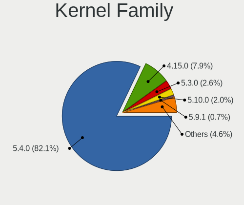

| Version | Notebooks | Percent |
|---------|-----------|---------|
| 5.4.0   | 118       | 81.38%  |
| 4.15.0  | 12        | 8.28%   |
| 5.3.0   | 4         | 2.76%   |
| 5.10.0  | 3         | 2.07%   |
| 5.9.1   | 1         | 0.69%   |
| 5.8.5   | 1         | 0.69%   |
| 5.8.13  | 1         | 0.69%   |
| 5.8.0   | 1         | 0.69%   |
| 5.6.19  | 1         | 0.69%   |
| 5.15.5  | 1         | 0.69%   |
| 5.14.9  | 1         | 0.69%   |
| 5.10.4  | 1         | 0.69%   |

Kernel Major Ver.
-----------------

Linux kernel major version

| Version | Notebooks | Percent |
|---------|-----------|---------|
| 5.4     | 118       | 81.38%  |
| 4.15    | 12        | 8.28%   |
| 5.3     | 4         | 2.76%   |
| 5.10    | 4         | 2.76%   |
| 5.8     | 3         | 2.07%   |
| 5.9     | 1         | 0.69%   |
| 5.6     | 1         | 0.69%   |
| 5.15    | 1         | 0.69%   |
| 5.14    | 1         | 0.69%   |

Arch
----

OS architecture (x86_64, i586, etc.)

| Name   | Notebooks | Percent |
|--------|-----------|---------|
| x86_64 | 142       | 100%    |

DE
--

Desktop Environment

| Name       | Notebooks | Percent |
|------------|-----------|---------|
| Pantheon   | 119       | 83.22%  |
| Unknown    | 19        | 13.29%  |
| X-Cinnamon | 2         | 1.4%    |
| Unity      | 1         | 0.7%    |
| GNOME      | 1         | 0.7%    |
| Budgie     | 1         | 0.7%    |

Display Server
--------------

X11 or Wayland

| Name    | Notebooks | Percent |
|---------|-----------|---------|
| X11     | 141       | 99.3%   |
| Unknown | 1         | 0.7%    |

Display Manager
---------------

SDDM, LightDM, etc.

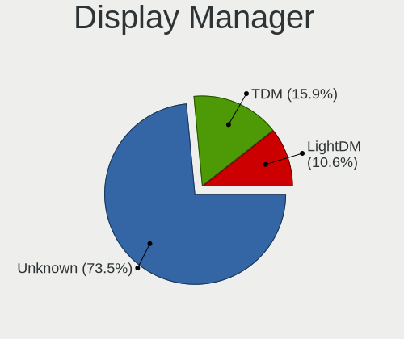

| Name    | Notebooks | Percent |
|---------|-----------|---------|
| Unknown | 108       | 75%     |
| TDM     | 24        | 16.67%  |
| LightDM | 12        | 8.33%   |

OS Lang
-------

Language

| Lang  | Notebooks | Percent |
|-------|-----------|---------|
| en_US | 59        | 41.55%  |
| en_GB | 10        | 7.04%   |
| ru_RU | 8         | 5.63%   |
| pt_BR | 8         | 5.63%   |
| pl_PL | 6         | 4.23%   |
| es_ES | 6         | 4.23%   |
| en_IN | 6         | 4.23%   |
| en_AU | 6         | 4.23%   |
| de_DE | 5         | 3.52%   |
| fr_FR | 4         | 2.82%   |
| it_IT | 3         | 2.11%   |
| hu_HU | 2         | 1.41%   |
| es_MX | 2         | 1.41%   |
| es_EC | 2         | 1.41%   |
| en_ZA | 2         | 1.41%   |
| en_CA | 2         | 1.41%   |
| tr_TR | 1         | 0.7%    |
| ru_UA | 1         | 0.7%    |
| hr_HR | 1         | 0.7%    |
| fr_CA | 1         | 0.7%    |
| es_UY | 1         | 0.7%    |
| es_AR | 1         | 0.7%    |
| en_PH | 1         | 0.7%    |
| el_GR | 1         | 0.7%    |
| de_IT | 1         | 0.7%    |
| de_AT | 1         | 0.7%    |
| ca_ES | 1         | 0.7%    |

Boot Mode
---------

EFI or BIOS

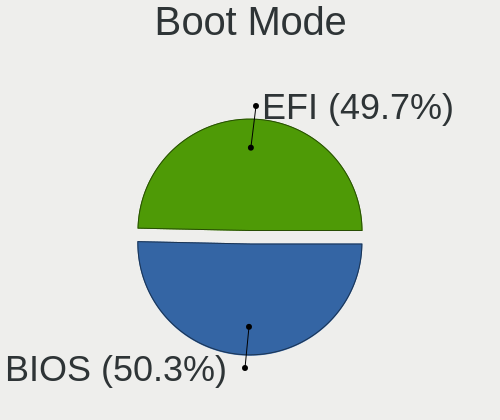

| Mode | Notebooks | Percent |
|------|-----------|---------|
| BIOS | 73        | 51.41%  |
| EFI  | 69        | 48.59%  |

Filesystem
----------

Type of filesystem

| Type    | Notebooks | Percent |
|---------|-----------|---------|
| Ext4    | 134       | 94.37%  |
| Btrfs   | 4         | 2.82%   |
| Overlay | 3         | 2.11%   |
| Ext3    | 1         | 0.7%    |

Part. scheme
------------

Scheme of partitioning

| Type    | Notebooks | Percent |
|---------|-----------|---------|
| Unknown | 114       | 80.28%  |
| GPT     | 20        | 14.08%  |
| MBR     | 8         | 5.63%   |

Dual Boot with Linux/BSD
------------------------

Hosting more than one Linux/BSD

| Dual boot | Notebooks | Percent |
|-----------|-----------|---------|
| No        | 135       | 94.41%  |
| Yes       | 8         | 5.59%   |

Dual Boot (Win)
---------------

Hosting Linux and Windows

| Dual boot | Notebooks | Percent |
|-----------|-----------|---------|
| No        | 112       | 78.32%  |
| Yes       | 31        | 21.68%  |

Board
-----

Vendor
------

Motherboard manufacturer

| Name                | Notebooks | Percent |
|---------------------|-----------|---------|
| Lenovo              | 26        | 18.31%  |
| Hewlett-Packard     | 25        | 17.61%  |
| Dell                | 22        | 15.49%  |
| Acer                | 16        | 11.27%  |
| ASUSTek Computer    | 14        | 9.86%   |
| Apple               | 11        | 7.75%   |
| Toshiba             | 8         | 5.63%   |
| Samsung Electronics | 4         | 2.82%   |
| Star Labs           | 1         | 0.7%    |
| Sony                | 1         | 0.7%    |
| Positivo            | 1         | 0.7%    |
| Panasonic           | 1         | 0.7%    |
| MSI                 | 1         | 0.7%    |
| LG Electronics      | 1         | 0.7%    |
| HUAWEI              | 1         | 0.7%    |
| Hampoo              | 1         | 0.7%    |
| Google              | 1         | 0.7%    |
| Gigabyte Technology | 1         | 0.7%    |
| Fujitsu Siemens     | 1         | 0.7%    |
| Fujitsu             | 1         | 0.7%    |
| Compaq              | 1         | 0.7%    |
| Clevo               | 1         | 0.7%    |
| Chuwi               | 1         | 0.7%    |
| Unknown             | 1         | 0.7%    |

Model
-----

Motherboard model

| Name                                           | Notebooks | Percent |
|------------------------------------------------|-----------|---------|
| Apple MacBook2,1                               | 3         | 2.11%   |
| HP Pavilion dv7                                | 2         | 1.41%   |
| HP Laptop 17-by3xxx                            | 2         | 1.41%   |
| Dell Latitude E6400                            | 2         | 1.41%   |
| Apple MacBook7,1                               | 2         | 1.41%   |
| Acer Aspire R3-131T                            | 2         | 1.41%   |
| Acer Aspire F5-573G                            | 2         | 1.41%   |
| Acer AOD255E                                   | 2         | 1.41%   |
| Toshiba Satellite R630                         | 1         | 0.7%    |
| Toshiba Satellite P750                         | 1         | 0.7%    |
| Toshiba Satellite L855                         | 1         | 0.7%    |
| Toshiba Satellite L500                         | 1         | 0.7%    |
| Toshiba Satellite C870-1H2                     | 1         | 0.7%    |
| Toshiba Satellite C850D-119                    | 1         | 0.7%    |
| Toshiba Satellite C55t-A                       | 1         | 0.7%    |
| Toshiba QOSMIO G55                             | 1         | 0.7%    |
| Star Labs Lite                                 | 1         | 0.7%    |
| Sony VPCF23JFX                                 | 1         | 0.7%    |
| Samsung 850XBD                                 | 1         | 0.7%    |
| Samsung 530U3C/530U4C/532U3C                   | 1         | 0.7%    |
| Samsung 350V5C/351V5C/3540VC/3440VC            | 1         | 0.7%    |
| Samsung 300E5EV/300E4EV/270E5EV/270E4EV/2470EV | 1         | 0.7%    |
| Positivo S14SL01                               | 1         | 0.7%    |
| Panasonic CF-31SBLJGDM                         | 1         | 0.7%    |
| MSI GE60 2PE                                   | 1         | 0.7%    |
| LG R490-G.ARL5RE2                              | 1         | 0.7%    |
| Lenovo V15-ADA 82C7                            | 1         | 0.7%    |
| Lenovo ThinkPad X240 20AMS0XP0S                | 1         | 0.7%    |
| Lenovo ThinkPad X240 20AMA0XK00                | 1         | 0.7%    |
| Lenovo ThinkPad X13 Gen 1 20UF0013US           | 1         | 0.7%    |
| Lenovo ThinkPad X1 Carbon 7th 20QDS1WX00       | 1         | 0.7%    |
| Lenovo ThinkPad X1 Carbon 5th 20HQS03P00       | 1         | 0.7%    |
| Lenovo ThinkPad T530 2429JB5                   | 1         | 0.7%    |
| Lenovo ThinkPad T480 20L50018US                | 1         | 0.7%    |
| Lenovo ThinkPad T480 20L50007RT                | 1         | 0.7%    |
| Lenovo ThinkPad T460 20FMS6C200                | 1         | 0.7%    |
| Lenovo ThinkPad T440p 20AWS1HK0P               | 1         | 0.7%    |
| Lenovo ThinkPad T440 20B7S0JF0L                | 1         | 0.7%    |
| Lenovo ThinkPad T420 4236M37                   | 1         | 0.7%    |
| Lenovo ThinkPad R61e/R61i 76508TG              | 1         | 0.7%    |
| Lenovo ThinkPad P50 20ENA00PLM                 | 1         | 0.7%    |
| Lenovo ThinkPad L480 20LSS0GL00                | 1         | 0.7%    |
| Lenovo ThinkPad E580 20KSCTO1WW                | 1         | 0.7%    |
| Lenovo ThinkPad E14 20RBS6MD00                 | 1         | 0.7%    |
| Lenovo IdeaPadFlex 14 20308                    | 1         | 0.7%    |
| Lenovo IdeaPad S145-15IKB 81XM                 | 1         | 0.7%    |
| Lenovo IdeaPad 330-15IKB 81DE                  | 1         | 0.7%    |
| Lenovo IdeaPad 330-14AST 81D5                  | 1         | 0.7%    |
| Lenovo IdeaPad 320-14AST 80XU                  | 1         | 0.7%    |
| Lenovo IdeaPad 3 14IML05 81WA                  | 1         | 0.7%    |
| Lenovo G50-45 80E3                             | 1         | 0.7%    |
| Lenovo 3000 G530 4151/200                      | 1         | 0.7%    |
| HUAWEI HLY-WX9XX                               | 1         | 0.7%    |
| HP ProBook 6460b                               | 1         | 0.7%    |
| HP ProBook 5330m                               | 1         | 0.7%    |
| HP ProBook 450 G7                              | 1         | 0.7%    |
| HP ProBook 430 G7                              | 1         | 0.7%    |
| HP ProBook 430 G6                              | 1         | 0.7%    |
| HP Presario CQ56                               | 1         | 0.7%    |
| HP Pavilion Notebook 15-bc5xxx                 | 1         | 0.7%    |

Model Family
------------

Motherboard model prefix

| Name                     | Notebooks | Percent |
|--------------------------|-----------|---------|
| Lenovo ThinkPad          | 17        | 11.97%  |
| Acer Aspire              | 10        | 7.04%   |
| Dell Latitude            | 9         | 6.34%   |
| HP Pavilion              | 8         | 5.63%   |
| Toshiba Satellite        | 7         | 4.93%   |
| Lenovo IdeaPad           | 5         | 3.52%   |
| HP ProBook               | 5         | 3.52%   |
| Dell Inspiron            | 5         | 3.52%   |
| HP EliteBook             | 3         | 2.11%   |
| HP 250                   | 3         | 2.11%   |
| Dell XPS                 | 3         | 2.11%   |
| Dell Vostro              | 3         | 2.11%   |
| Apple MacBook2           | 3         | 2.11%   |
| Acer Swift               | 3         | 2.11%   |
| HP Laptop                | 2         | 1.41%   |
| ASUS ZenBook             | 2         | 1.41%   |
| ASUS VivoBook            | 2         | 1.41%   |
| Apple MacBook7           | 2         | 1.41%   |
| Acer AOD255E             | 2         | 1.41%   |
| Toshiba QOSMIO           | 1         | 0.7%    |
| Star Labs Lite           | 1         | 0.7%    |
| Sony VPCF23JFX           | 1         | 0.7%    |
| Samsung 850XBD           | 1         | 0.7%    |
| Samsung 530U3C           | 1         | 0.7%    |
| Samsung 350V5C           | 1         | 0.7%    |
| Samsung 300E5EV          | 1         | 0.7%    |
| Positivo S14SL01         | 1         | 0.7%    |
| Panasonic CF-31SBLJGDM   | 1         | 0.7%    |
| MSI GE60                 | 1         | 0.7%    |
| LG R490-G.ARL5RE2        | 1         | 0.7%    |
| Lenovo V15-ADA           | 1         | 0.7%    |
| Lenovo IdeaPadFlex       | 1         | 0.7%    |
| Lenovo G50-45            | 1         | 0.7%    |
| Lenovo 3000              | 1         | 0.7%    |
| HUAWEI HLY-WX9XX         | 1         | 0.7%    |
| HP Presario              | 1         | 0.7%    |
| HP Notebook              | 1         | 0.7%    |
| HP G42                   | 1         | 0.7%    |
| HP Elite                 | 1         | 0.7%    |
| Hampoo Cherry            | 1         | 0.7%    |
| Google Banjo             | 1         | 0.7%    |
| Gigabyte AERO            | 1         | 0.7%    |
| Fujitsu Siemens LIFEBOOK | 1         | 0.7%    |
| Fujitsu LIFEBOOK         | 1         | 0.7%    |
| Dell MXG061              | 1         | 0.7%    |
| Dell G3                  | 1         | 0.7%    |
| Compaq Presario          | 1         | 0.7%    |
| Clevo W240EU             | 1         | 0.7%    |
| Chuwi LapBook            | 1         | 0.7%    |
| ASUS X550JX              | 1         | 0.7%    |
| ASUS X501U               | 1         | 0.7%    |
| ASUS X441BA              | 1         | 0.7%    |
| ASUS X205TAW             | 1         | 0.7%    |
| ASUS X200CA              | 1         | 0.7%    |
| ASUS UX31A               | 1         | 0.7%    |
| ASUS U31SD               | 1         | 0.7%    |
| ASUS K75VJ               | 1         | 0.7%    |
| ASUS K53SC               | 1         | 0.7%    |
| ASUS K45VD               | 1         | 0.7%    |
| Apple MacBookPro8        | 1         | 0.7%    |

MFG Year
--------

Motherboard manufacture year

| Year | Notebooks | Percent |
|------|-----------|---------|
| 2019 | 15        | 10.56%  |
| 2018 | 14        | 9.86%   |
| 2013 | 14        | 9.86%   |
| 2020 | 13        | 9.15%   |
| 2016 | 13        | 9.15%   |
| 2012 | 13        | 9.15%   |
| 2011 | 11        | 7.75%   |
| 2014 | 9         | 6.34%   |
| 2015 | 8         | 5.63%   |
| 2010 | 8         | 5.63%   |
| 2008 | 7         | 4.93%   |
| 2009 | 6         | 4.23%   |
| 2007 | 5         | 3.52%   |
| 2017 | 4         | 2.82%   |
| 2021 | 1         | 0.7%    |
| 2006 | 1         | 0.7%    |

Form Factor
-----------

Physical design of the computer

| Name     | Notebooks | Percent |
|----------|-----------|---------|
| Notebook | 142       | 100%    |

Secure Boot
-----------

Enabled or disabled

| State    | Notebooks | Percent |
|----------|-----------|---------|
| Disabled | 138       | 97.18%  |
| Enabled  | 4         | 2.82%   |

Coreboot
--------

Have coreboot on board

| Used | Notebooks | Percent |
|------|-----------|---------|
| No   | 141       | 99.3%   |
| Yes  | 1         | 0.7%    |

RAM Size
--------

Total RAM memory

| Size in GB | Notebooks | Percent |
|------------|-----------|---------|
| 4.01-8.0   | 42        | 29.58%  |
| 3.01-4.0   | 31        | 21.83%  |
| 8.01-16.0  | 26        | 18.31%  |
| 16.01-24.0 | 24        | 16.9%   |
| 1.01-2.0   | 10        | 7.04%   |
| 32.01-64.0 | 4         | 2.82%   |
| 2.01-3.0   | 3         | 2.11%   |
| 0.51-1.0   | 2         | 1.41%   |

RAM Used
--------

Used RAM memory

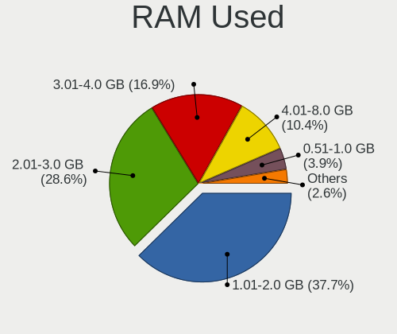

| Used GB   | Notebooks | Percent |
|-----------|-----------|---------|
| 1.01-2.0  | 52        | 35.62%  |
| 2.01-3.0  | 43        | 29.45%  |
| 3.01-4.0  | 26        | 17.81%  |
| 4.01-8.0  | 15        | 10.27%  |
| 0.51-1.0  | 6         | 4.11%   |
| 8.01-16.0 | 4         | 2.74%   |

Total Drives
------------

Number of drives on board

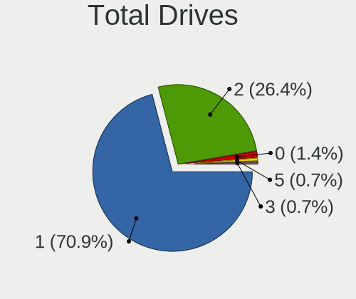

| Drives | Notebooks | Percent |
|--------|-----------|---------|
| 1      | 99        | 69.72%  |
| 2      | 39        | 27.46%  |
| 0      | 2         | 1.41%   |
| 5      | 1         | 0.7%    |
| 3      | 1         | 0.7%    |

Has CD-ROM
----------

Has CD-ROM on board

| Presented | Notebooks | Percent |
|-----------|-----------|---------|
| No        | 88        | 61.97%  |
| Yes       | 54        | 38.03%  |

Has Ethernet
------------

Has Ethernet on board

| Presented | Notebooks | Percent |
|-----------|-----------|---------|
| Yes       | 116       | 81.69%  |
| No        | 26        | 18.31%  |

Has WiFi
--------

Has WiFi module

| Presented | Notebooks | Percent |
|-----------|-----------|---------|
| Yes       | 139       | 97.89%  |
| No        | 3         | 2.11%   |

Has Bluetooth
-------------

Has Bluetooth module

| Presented | Notebooks | Percent |
|-----------|-----------|---------|
| Yes       | 112       | 78.32%  |
| No        | 31        | 21.68%  |

Location
--------

Country
-------

Geographic location (country)

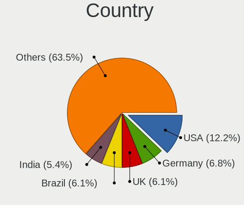

| Country      | Notebooks | Percent |
|--------------|-----------|---------|
| USA          | 18        | 12.68%  |
| UK           | 9         | 6.34%   |
| Brazil       | 9         | 6.34%   |
| India        | 8         | 5.63%   |
| Germany      | 8         | 5.63%   |
| Spain        | 7         | 4.93%   |
| Russia       | 6         | 4.23%   |
| Poland       | 6         | 4.23%   |
| Mexico       | 6         | 4.23%   |
| Italy        | 5         | 3.52%   |
| Indonesia    | 5         | 3.52%   |
| Australia    | 5         | 3.52%   |
| Ukraine      | 4         | 2.82%   |
| Turkey       | 4         | 2.82%   |
| France       | 4         | 2.82%   |
| Netherlands  | 3         | 2.11%   |
| Canada       | 3         | 2.11%   |
| South Africa | 2         | 1.41%   |
| Malaysia     | 2         | 1.41%   |
| Hungary      | 2         | 1.41%   |
| Greece       | 2         | 1.41%   |
| Ecuador      | 2         | 1.41%   |
| Uruguay      | 1         | 0.7%    |
| UAE          | 1         | 0.7%    |
| Tajikistan   | 1         | 0.7%    |
| Sweden       | 1         | 0.7%    |
| Slovakia     | 1         | 0.7%    |
| Saudi Arabia | 1         | 0.7%    |
| Romania      | 1         | 0.7%    |
| Portugal     | 1         | 0.7%    |
| Philippines  | 1         | 0.7%    |
| Peru         | 1         | 0.7%    |
| Nicaragua    | 1         | 0.7%    |
| New Zealand  | 1         | 0.7%    |
| Latvia       | 1         | 0.7%    |
| Kenya        | 1         | 0.7%    |
| Ireland      | 1         | 0.7%    |
| Hong Kong    | 1         | 0.7%    |
| Georgia      | 1         | 0.7%    |
| Croatia      | 1         | 0.7%    |
| China        | 1         | 0.7%    |
| Azerbaijan   | 1         | 0.7%    |
| Austria      | 1         | 0.7%    |
| Argentina    | 1         | 0.7%    |

City
----

Geographic location (city)

| City              | Notebooks | Percent |
|-------------------|-----------|---------|
| Warsaw            | 2         | 1.38%   |
| Valencia          | 2         | 1.38%   |
| Perth             | 2         | 1.38%   |
| Montreal          | 2         | 1.38%   |
| Milan             | 2         | 1.38%   |
| Madrid            | 2         | 1.38%   |
| Jaipur            | 2         | 1.38%   |
| Hamburg           | 2         | 1.38%   |
| Cape Town         | 2         | 1.38%   |
| Athens            | 2         | 1.38%   |
| Ames              | 2         | 1.38%   |
| Zagreb            | 1         | 0.69%   |
| York              | 1         | 0.69%   |
| Yogyakarta        | 1         | 0.69%   |
| Winterswijk       | 1         | 0.69%   |
| Wellington        | 1         | 0.69%   |
| Villahermosa      | 1         | 0.69%   |
| Vienna            | 1         | 0.69%   |
| Vernon            | 1         | 0.69%   |
| Tsuen Wan         | 1         | 0.69%   |
| Triel-sur-Seine   | 1         | 0.69%   |
| Torun             | 1         | 0.69%   |
| Tlalnepantla      | 1         | 0.69%   |
| Tijuana           | 1         | 0.69%   |
| Thane             | 1         | 0.69%   |
| Tangerang         | 1         | 0.69%   |
| So Pedro      | 1         | 0.69%   |
| So Lus    | 1         | 0.69%   |
| Swansea           | 1         | 0.69%   |
| Surabaya          | 1         | 0.69%   |
| Sungai Petani     | 1         | 0.69%   |
| Slidell           | 1         | 0.69%   |
| Sleman            | 1         | 0.69%   |
| Simferopol        | 1         | 0.69%   |
| Sao Vicente       | 1         | 0.69%   |
| Santo Andr    | 1         | 0.69%   |
| Saint Ives        | 1         | 0.69%   |
| Rotterdam         | 1         | 0.69%   |
| Romford           | 1         | 0.69%   |
| Riyadh            | 1         | 0.69%   |
| Rio de Janeiro    | 1         | 0.69%   |
| Riga              | 1         | 0.69%   |
| Ridderkerk        | 1         | 0.69%   |
| Quito             | 1         | 0.69%   |
| Quertaro City | 1         | 0.69%   |
| Premia de Mar     | 1         | 0.69%   |
| Poznan            | 1         | 0.69%   |
| Porto             | 1         | 0.69%   |
| Plymouth          | 1         | 0.69%   |
| Philadelphia      | 1         | 0.69%   |
| Perm              | 1         | 0.69%   |
| Penalbo           | 1         | 0.69%   |
| Paris             | 1         | 0.69%   |
| Palombaro         | 1         | 0.69%   |
| Palermo           | 1         | 0.69%   |
| Owicim  | 1         | 0.69%   |
| Ol'ginka          | 1         | 0.69%   |
| Odessa            | 1         | 0.69%   |
| Ocala             | 1         | 0.69%   |
| Novosibirsk       | 1         | 0.69%   |

Drives
------

Drive Vendor
------------

Hard drive vendors

| Vendor              | Notebooks | Drives | Percent |
|---------------------|-----------|--------|---------|
| Toshiba             | 24        | 28     | 13.79%  |
| Sandisk             | 21        | 21     | 12.07%  |
| Samsung Electronics | 15        | 16     | 8.62%   |
| Kingston            | 14        | 14     | 8.05%   |
| WDC                 | 13        | 16     | 7.47%   |
| Seagate             | 13        | 16     | 7.47%   |
| Unknown             | 12        | 14     | 6.9%    |
| Crucial             | 10        | 10     | 5.75%   |
| Hitachi             | 9         | 10     | 5.17%   |
| Intel               | 7         | 8      | 4.02%   |
| HGST                | 7         | 7      | 4.02%   |
| SK Hynix            | 3         | 3      | 1.72%   |
| KIOXIA              | 3         | 8      | 1.72%   |
| Fujitsu             | 3         | 3      | 1.72%   |
| Apple               | 3         | 3      | 1.72%   |
| Micron Technology   | 2         | 3      | 1.15%   |
| A-DATA Technology   | 2         | 2      | 1.15%   |
| V-GeN               | 1         | 1      | 0.57%   |
| TO Exter            | 1         | 1      | 0.57%   |
| Star                | 1         | 1      | 0.57%   |
| SPCC                | 1         | 1      | 0.57%   |
| PNY                 | 1         | 1      | 0.57%   |
| Phison              | 1         | 1      | 0.57%   |
| Patriot             | 1         | 1      | 0.57%   |
| NGFF                | 1         | 1      | 0.57%   |
| LITEON              | 1         | 1      | 0.57%   |
| JMicron             | 1         | 1      | 0.57%   |
| Hewlett-Packard     | 1         | 1      | 0.57%   |
| Gigabyte Technology | 1         | 1      | 0.57%   |
| ADATA Technology    | 1         | 1      | 0.57%   |

Drive Model
-----------

Hard drive models

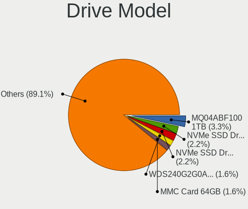

| Model                                   | Notebooks | Percent |
|-----------------------------------------|-----------|---------|
| Toshiba MQ04ABF100 1TB                  | 5         | 2.81%   |
| Sandisk NVMe SSD Drive 256GB            | 4         | 2.25%   |
| Samsung NVMe SSD Drive 512GB            | 4         | 2.25%   |
| WDC WDS240G2G0A-00JH30 240GB SSD        | 3         | 1.69%   |
| Unknown MMC Card  64GB                  | 3         | 1.69%   |
| Unknown MMC Card  32GB                  | 3         | 1.69%   |
| Sandisk NVMe SSD Drive 512GB            | 3         | 1.69%   |
| Kingston SA400S37240G 240GB SSD         | 3         | 1.69%   |
| WDC WD10SPZX-24Z10 1TB                  | 2         | 1.12%   |
| Unknown MMC Card  16GB                  | 2         | 1.12%   |
| Toshiba THNSNJ128GCSU 128GB SSD         | 2         | 1.12%   |
| Toshiba MQ01ABF050 500GB                | 2         | 1.12%   |
| Toshiba MQ01ABD100 1TB                  | 2         | 1.12%   |
| Toshiba KBG30ZMS128G 128GB NVMe SSD     | 2         | 1.12%   |
| Seagate ST500LM000-1EJ162 500GB         | 2         | 1.12%   |
| Seagate ST320LT007-9ZV142 320GB         | 2         | 1.12%   |
| Seagate ST1000LM035-1RK172 1TB          | 2         | 1.12%   |
| Seagate ST1000LM024 HN-M101MBB 1TB      | 2         | 1.12%   |
| Samsung SSD 860 EVO 500GB               | 2         | 1.12%   |
| Samsung SSD 850 EVO 250GB               | 2         | 1.12%   |
| Kingston SA400S37120G 120GB SSD         | 2         | 1.12%   |
| Kingston RBU-SNS8350DES3128GP 128GB SSD | 2         | 1.12%   |
| Hitachi HTS545025B9A300 250GB           | 2         | 1.12%   |
| HGST HTS721010A9E630 1TB                | 2         | 1.12%   |
| HGST HTS545050A7E680 500GB              | 2         | 1.12%   |
| HGST HTS541010A9E680 1TB                | 2         | 1.12%   |
| Crucial CT500MX500SSD1 500GB            | 2         | 1.12%   |
| Crucial CT2000MX500SSD1 2TB             | 2         | 1.12%   |
| Crucial CT1000MX500SSD1 1TB             | 2         | 1.12%   |
| WDC WDS500G2B0A-00SM50 500GB SSD        | 1         | 0.56%   |
| WDC WDS100T2B0A-00SM50 1TB SSD          | 1         | 0.56%   |
| WDC WD5000LUCT-63RC2Y0 500GB            | 1         | 0.56%   |
| WDC WD5000LPVX-22V0TT0 500GB            | 1         | 0.56%   |
| WDC WD5000LPLX-08ZNTT0 500GB            | 1         | 0.56%   |
| WDC WD5000BPVT-75HXZT3 500GB            | 1         | 0.56%   |
| WDC WD2500BEVT-60ZCT1 250GB             | 1         | 0.56%   |
| WDC WD10JPVX-22JC3T0 1TB                | 1         | 0.56%   |
| V-GeN V-GEN07SM20AR128SDK 128GB SSD     | 1         | 0.56%   |
| Unknown SD64G  64GB                     | 1         | 0.56%   |
| Unknown SC32G  32GB                     | 1         | 0.56%   |
| Unknown MMC Card  4GB                   | 1         | 0.56%   |
| Unknown MMC Card  1GB                   | 1         | 0.56%   |
| Unknown MMC Card  128GB                 | 1         | 0.56%   |
| Toshiba NVMe SSD Drive 512GB            | 1         | 0.56%   |
| Toshiba MQ01ACF050 500GB                | 1         | 0.56%   |
| Toshiba MQ01ABD050 500GB                | 1         | 0.56%   |
| Toshiba MK5075GSX 500GB                 | 1         | 0.56%   |
| Toshiba MK5061GSY 500GB                 | 1         | 0.56%   |
| Toshiba MK5059GSXP 500GB                | 1         | 0.56%   |
| Toshiba MK3276GSX 320GB                 | 1         | 0.56%   |
| Toshiba MK3265GSX 320GB                 | 1         | 0.56%   |
| Toshiba MK3263GSXN 320GB                | 1         | 0.56%   |
| Toshiba MK3252GSX 320GB                 | 1         | 0.56%   |
| Toshiba HDWJ110 1TB                     | 1         | 0.56%   |
| TO Exter nal USB 3.0 128GB              | 1         | 0.56%   |
| Star Drive SATA SSD 960GB               | 1         | 0.56%   |
| SPCC Solid State Disk 1024GB            | 1         | 0.56%   |
| SK Hynix NVMe SSD Drive 512GB           | 1         | 0.56%   |
| SK Hynix HFS128G39TND-N210A 128GB SSD   | 1         | 0.56%   |
| SK Hynix HFM512GDJTNG-8310A 512GB       | 1         | 0.56%   |

HDD Vendor
----------

Hard disk drive vendors

| Vendor              | Notebooks | Drives | Percent |
|---------------------|-----------|--------|---------|
| Toshiba             | 19        | 23     | 31.15%  |
| Seagate             | 13        | 15     | 21.31%  |
| Hitachi             | 9         | 10     | 14.75%  |
| WDC                 | 8         | 11     | 13.11%  |
| HGST                | 7         | 7      | 11.48%  |
| Fujitsu             | 3         | 3      | 4.92%   |
| Samsung Electronics | 1         | 1      | 1.64%   |
| Apple               | 1         | 1      | 1.64%   |

SSD Vendor
----------

Solid state drive vendors

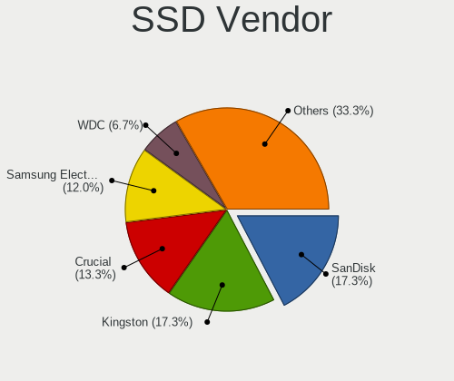

| Vendor              | Notebooks | Drives | Percent |
|---------------------|-----------|--------|---------|
| SanDisk             | 13        | 13     | 18.31%  |
| Kingston            | 11        | 11     | 15.49%  |
| Crucial             | 10        | 10     | 14.08%  |
| Samsung Electronics | 9         | 10     | 12.68%  |
| WDC                 | 5         | 5      | 7.04%   |
| Intel               | 4         | 4      | 5.63%   |
| Toshiba             | 2         | 2      | 2.82%   |
| Apple               | 2         | 2      | 2.82%   |
| A-DATA Technology   | 2         | 2      | 2.82%   |
| V-GeN               | 1         | 1      | 1.41%   |
| TO Exter            | 1         | 1      | 1.41%   |
| Star                | 1         | 1      | 1.41%   |
| SPCC                | 1         | 1      | 1.41%   |
| SK Hynix            | 1         | 1      | 1.41%   |
| PNY                 | 1         | 1      | 1.41%   |
| Patriot             | 1         | 1      | 1.41%   |
| NGFF                | 1         | 1      | 1.41%   |
| Micron Technology   | 1         | 2      | 1.41%   |
| LITEON              | 1         | 1      | 1.41%   |
| JMicron             | 1         | 1      | 1.41%   |
| Hewlett-Packard     | 1         | 1      | 1.41%   |
| Gigabyte Technology | 1         | 1      | 1.41%   |

Drive Kind
----------

HDD or SSD

| Kind    | Notebooks | Drives | Percent |
|---------|-----------|--------|---------|
| SSD     | 65        | 73     | 39.16%  |
| HDD     | 59        | 71     | 35.54%  |
| NVMe    | 29        | 36     | 17.47%  |
| MMC     | 12        | 14     | 7.23%   |
| Unknown | 1         | 1      | 0.6%    |

Drive Connector
---------------

SATA, SAS, NVMe, etc.

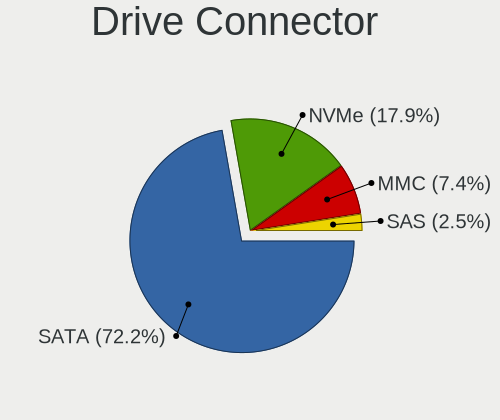

| Type | Notebooks | Drives | Percent |
|------|-----------|--------|---------|
| SATA | 111       | 138    | 71.15%  |
| NVMe | 29        | 36     | 18.59%  |
| MMC  | 12        | 14     | 7.69%   |
| SAS  | 4         | 7      | 2.56%   |

Drive Size
----------

Size of hard drive

| Size in TB | Notebooks | Drives | Percent |
|------------|-----------|--------|---------|
| 0.01-0.5   | 87        | 103    | 70.73%  |
| 0.51-1.0   | 32        | 36     | 26.02%  |
| 1.01-2.0   | 4         | 5      | 3.25%   |

Space Total
-----------

Amount of disk space available on the file system

| Size in GB     | Notebooks | Percent |
|----------------|-----------|---------|
| 101-250        | 49        | 34.27%  |
| 251-500        | 43        | 30.07%  |
| 501-1000       | 13        | 9.09%   |
| 51-100         | 13        | 9.09%   |
| 21-50          | 11        | 7.69%   |
| 1001-2000      | 5         | 3.5%    |
| 1-20           | 4         | 2.8%    |
| More than 3000 | 3         | 2.1%    |
| 2001-3000      | 2         | 1.4%    |

Space Used
----------

Amount of used disk space

| Used GB   | Notebooks | Percent |
|-----------|-----------|---------|
| 1-20      | 51        | 34.23%  |
| 21-50     | 45        | 30.2%   |
| 101-250   | 20        | 13.42%  |
| 51-100    | 17        | 11.41%  |
| 251-500   | 8         | 5.37%   |
| 501-1000  | 4         | 2.68%   |
| 2001-3000 | 2         | 1.34%   |
| 1001-2000 | 2         | 1.34%   |

Malfunc. Drives
---------------

Drive models with a malfunction

| Model                               | Notebooks | Drives | Percent |
|-------------------------------------|-----------|--------|---------|
| SanDisk SD9SN8W-128G-1006 128GB SSD | 1         | 1      | 33.33%  |
| HGST HTS725050A7E630 500GB          | 1         | 1      | 33.33%  |
| HGST HTS541010A9E680 1TB            | 1         | 1      | 33.33%  |

Malfunc. Drive Vendor
---------------------

Vendors of faulty drives

| Vendor  | Notebooks | Drives | Percent |
|---------|-----------|--------|---------|
| HGST    | 2         | 2      | 66.67%  |
| SanDisk | 1         | 1      | 33.33%  |

Malfunc. HDD Vendor
-------------------

Vendors of faulty HDD drives

| Vendor | Notebooks | Drives | Percent |
|--------|-----------|--------|---------|
| HGST   | 2         | 2      | 100%    |

Malfunc. Drive Kind
-------------------

Kinds of faulty drives

| Kind | Notebooks | Drives | Percent |
|------|-----------|--------|---------|
| HDD  | 2         | 2      | 66.67%  |
| SSD  | 1         | 1      | 33.33%  |

Failed Drives
-------------

Failed drive models

Zero info for selected period =(

Failed Drive Vendor
-------------------

Failed drive vendors

Zero info for selected period =(

Drive Status
------------

Number of failed and malfunc. drives

| Status   | Notebooks | Drives | Percent |
|----------|-----------|--------|---------|
| Detected | 116       | 158    | 80.56%  |
| Works    | 25        | 34     | 17.36%  |
| Malfunc  | 3         | 3      | 2.08%   |

Storage controller
------------------

Storage Vendor
--------------

Storage controller vendors

| Vendor                       | Notebooks | Percent |
|------------------------------|-----------|---------|
| Intel                        | 107       | 69.48%  |
| AMD                          | 12        | 7.79%   |
| Sandisk                      | 8         | 5.19%   |
| Samsung Electronics          | 7         | 4.55%   |
| Nvidia                       | 5         | 3.25%   |
| Toshiba America Info Systems | 4         | 2.6%    |
| KIOXIA                       | 3         | 1.95%   |
| Kingston Technology Company  | 3         | 1.95%   |
| SK Hynix                     | 2         | 1.3%    |
| Phison Electronics           | 1         | 0.65%   |
| Micron Technology            | 1         | 0.65%   |
| ADATA Technology             | 1         | 0.65%   |

Storage Model
-------------

Storage controller models

| Model                                                                                  | Notebooks | Percent |
|----------------------------------------------------------------------------------------|-----------|---------|
| Intel 7 Series Chipset Family 6-port SATA Controller [AHCI mode]                       | 17        | 10.43%  |
| Intel Sunrise Point-LP SATA Controller [AHCI mode]                                     | 15        | 9.2%    |
| Intel 82801 Mobile SATA Controller [RAID mode]                                         | 12        | 7.36%   |
| AMD FCH SATA Controller [AHCI mode]                                                    | 11        | 6.75%   |
| Intel 8 Series SATA Controller 1 [AHCI mode]                                           | 10        | 6.13%   |
| Intel 6 Series/C200 Series Chipset Family 6 port Mobile SATA AHCI Controller           | 10        | 6.13%   |
| Intel Comet Lake SATA AHCI Controller                                                  | 6         | 3.68%   |
| Intel 82801IBM/IEM (ICH9M/ICH9M-E) 4 port SATA Controller [AHCI mode]                  | 5         | 3.07%   |
| Intel 8 Series/C220 Series Chipset Family 6-port SATA Controller 1 [AHCI mode]         | 4         | 2.45%   |
| Toshiba America Info Systems BG3 NVMe SSD Controller                                   | 3         | 1.84%   |
| Samsung NVMe SSD Controller SM981/PM981/PM983                                          | 3         | 1.84%   |
| Nvidia MCP79 AHCI Controller                                                           | 3         | 1.84%   |
| KIOXIA Non-Volatile memory controller                                                  | 3         | 1.84%   |
| Intel Atom/Celeron/Pentium Processor x5-E8000/J3xxx/N3xxx Series SATA Controller       | 3         | 1.84%   |
| Intel Atom Processor E3800 Series SATA AHCI Controller                                 | 3         | 1.84%   |
| Intel 82801G (ICH7 Family) IDE Controller                                              | 3         | 1.84%   |
| Intel 5 Series/3400 Series Chipset 4 port SATA AHCI Controller                         | 3         | 1.84%   |
| Sandisk WD Blue SN500 / PC SN520 NVMe SSD                                              | 2         | 1.23%   |
| Sandisk WD Black SN750 / PC SN730 NVMe SSD                                             | 2         | 1.23%   |
| Sandisk PC SN520 NVMe SSD                                                              | 2         | 1.23%   |
| Sandisk Non-Volatile memory controller                                                 | 2         | 1.23%   |
| Samsung NVMe SSD Controller SM961/PM961/SM963                                          | 2         | 1.23%   |
| Nvidia MCP89 SATA Controller                                                           | 2         | 1.23%   |
| Kingston Company U-SNS8154P3 NVMe SSD                                                  | 2         | 1.23%   |
| Intel Wildcat Point-LP SATA Controller [AHCI Mode]                                     | 2         | 1.23%   |
| Intel NM10/ICH7 Family SATA Controller [AHCI mode]                                     | 2         | 1.23%   |
| Intel Celeron/Pentium Silver Processor SATA Controller                                 | 2         | 1.23%   |
| Intel 82801HM/HEM (ICH8M/ICH8M-E) SATA Controller [IDE mode]                           | 2         | 1.23%   |
| Intel 82801GBM/GHM (ICH7-M Family) SATA Controller [IDE mode]                          | 2         | 1.23%   |
| Intel 82801GBM/GHM (ICH7-M Family) SATA Controller [AHCI mode]                         | 2         | 1.23%   |
| Toshiba America Info Systems Toshiba America Info Non-Volatile memory controller       | 1         | 0.61%   |
| SK Hynix Non-Volatile memory controller                                                | 1         | 0.61%   |
| SK Hynix BC501 NVMe Solid State Drive                                                  | 1         | 0.61%   |
| Samsung Electronics SATA controller                                                    | 1         | 0.61%   |
| Samsung Apple PCIe SSD                                                                 | 1         | 0.61%   |
| Phison PS5013 E13 NVMe Controller                                                      | 1         | 0.61%   |
| Micron Non-Volatile memory controller                                                  | 1         | 0.61%   |
| Kingston Company Company Non-Volatile memory controller                                | 1         | 0.61%   |
| Intel Volume Management Device NVMe RAID Controller                                    | 1         | 0.61%   |
| Intel SSD Pro 7600p/760p/E 6100p Series                                                | 1         | 0.61%   |
| Intel Q170/Q150/B150/H170/H110/Z170/CM236 Chipset SATA Controller [AHCI Mode]          | 1         | 0.61%   |
| Intel NVMe Optane Memory Series                                                        | 1         | 0.61%   |
| Intel Non-Volatile memory controller                                                   | 1         | 0.61%   |
| Intel Mobile 4 Series Chipset PT IDER Controller                                       | 1         | 0.61%   |
| Intel Cannon Point-LP SATA Controller [AHCI Mode]                                      | 1         | 0.61%   |
| Intel Cannon Lake Mobile PCH SATA AHCI Controller                                      | 1         | 0.61%   |
| Intel 82801IBM/IEM (ICH9M/ICH9M-E) 2 port SATA Controller [IDE mode]                   | 1         | 0.61%   |
| Intel 6 Series/C200 Series Chipset Family Mobile SATA Controller (IDE mode, ports 4-5) | 1         | 0.61%   |
| Intel 6 Series/C200 Series Chipset Family Mobile SATA Controller (IDE mode, ports 0-3) | 1         | 0.61%   |
| AMD SB7x0/SB8x0/SB9x0 SATA Controller [AHCI mode]                                      | 1         | 0.61%   |
| AMD SB7x0/SB8x0/SB9x0 IDE Controller                                                   | 1         | 0.61%   |
| AMD FCH IDE Controller                                                                 | 1         | 0.61%   |
| ADATA Non-Volatile memory controller                                                   | 1         | 0.61%   |

Storage Kind
------------

Kind of storage controller (IDE, SATA, NVMe, SAS, ...)

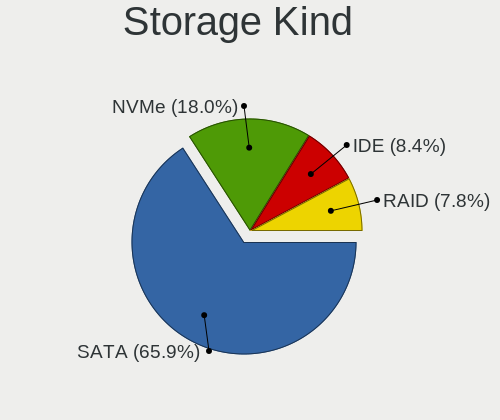

| Kind | Notebooks | Percent |
|------|-----------|---------|
| SATA | 104       | 65%     |
| NVMe | 30        | 18.75%  |
| RAID | 13        | 8.13%   |
| IDE  | 13        | 8.13%   |

Processor
---------

CPU Vendor
----------

Processor vendors

| Vendor | Notebooks | Percent |
|--------|-----------|---------|
| Intel  | 127       | 89.44%  |
| AMD    | 15        | 10.56%  |

CPU Model
---------

Processor models

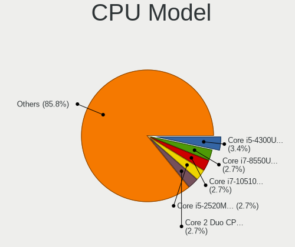

| Model                                         | Notebooks | Percent |
|-----------------------------------------------|-----------|---------|
| Intel Core i5-4300U CPU @ 1.90GHz             | 5         | 3.52%   |
| Intel Core i7-8550U CPU @ 1.80GHz             | 4         | 2.82%   |
| Intel Core i7-10510U CPU @ 1.80GHz            | 4         | 2.82%   |
| Intel Core i5-2520M CPU @ 2.50GHz             | 4         | 2.82%   |
| Intel Core 2 Duo CPU P8600 @ 2.40GHz          | 4         | 2.82%   |
| Intel Core i7-9750H CPU @ 2.60GHz             | 3         | 2.11%   |
| Intel Core i5-7200U CPU @ 2.50GHz             | 3         | 2.11%   |
| Intel Core i5-6300U CPU @ 2.40GHz             | 3         | 2.11%   |
| Intel Core i5-4210U CPU @ 1.70GHz             | 3         | 2.11%   |
| Intel Core i5-3210M CPU @ 2.50GHz             | 3         | 2.11%   |
| Intel Core i5-1035G1 CPU @ 1.00GHz            | 3         | 2.11%   |
| Intel Core i5-10210U CPU @ 1.60GHz            | 3         | 2.11%   |
| Intel Core i3-3217U CPU @ 1.80GHz             | 3         | 2.11%   |
| Intel Pentium CPU N3700 @ 1.60GHz             | 2         | 1.41%   |
| Intel Core i7-8565U CPU @ 1.80GHz             | 2         | 1.41%   |
| Intel Core i7-7500U CPU @ 2.70GHz             | 2         | 1.41%   |
| Intel Core i7-4720HQ CPU @ 2.60GHz            | 2         | 1.41%   |
| Intel Core i7-3520M CPU @ 2.90GHz             | 2         | 1.41%   |
| Intel Core i7-2630QM CPU @ 2.00GHz            | 2         | 1.41%   |
| Intel Core i7-1065G7 CPU @ 1.30GHz            | 2         | 1.41%   |
| Intel Core i3-8130U CPU @ 2.20GHz             | 2         | 1.41%   |
| Intel Core i3-3120M CPU @ 2.50GHz             | 2         | 1.41%   |
| Intel Core 2 Duo CPU P8700 @ 2.53GHz          | 2         | 1.41%   |
| Intel Core 2 CPU T7200 @ 2.00GHz              | 2         | 1.41%   |
| Intel Celeron CPU N2830 @ 2.16GHz             | 2         | 1.41%   |
| Intel Celeron CPU 1007U @ 1.50GHz             | 2         | 1.41%   |
| Intel Atom CPU Z3735F @ 1.33GHz               | 2         | 1.41%   |
| Intel Atom CPU N455 @ 1.66GHz                 | 2         | 1.41%   |
| AMD Ryzen 7 3700U with Radeon Vega Mobile Gfx | 2         | 1.41%   |
| AMD Ryzen 5 2500U with Radeon Vega Mobile Gfx | 2         | 1.41%   |
| Intel Pentium Silver N5000 CPU @ 1.10GHz      | 1         | 0.7%    |
| Intel Pentium Dual-Core CPU T4400 @ 2.20GHz   | 1         | 0.7%    |
| Intel Pentium Dual-Core CPU T4300 @ 2.10GHz   | 1         | 0.7%    |
| Intel Genuine CPU U2700 @ 1.30GHz             | 1         | 0.7%    |
| Intel Core m3-6Y30 CPU @ 0.90GHz              | 1         | 0.7%    |
| Intel Core i7-8750H CPU @ 2.20GHz             | 1         | 0.7%    |
| Intel Core i7-8650U CPU @ 1.90GHz             | 1         | 0.7%    |
| Intel Core i7-6820HQ CPU @ 2.70GHz            | 1         | 0.7%    |
| Intel Core i7-4850HQ CPU @ 2.30GHz            | 1         | 0.7%    |
| Intel Core i7-4510U CPU @ 2.00GHz             | 1         | 0.7%    |
| Intel Core i7-3630QM CPU @ 2.40GHz            | 1         | 0.7%    |
| Intel Core i7-2670QM CPU @ 2.20GHz            | 1         | 0.7%    |
| Intel Core i7-2640M CPU @ 2.80GHz             | 1         | 0.7%    |
| Intel Core i5-8250U CPU @ 1.60GHz             | 1         | 0.7%    |
| Intel Core i5-6200U CPU @ 2.30GHz             | 1         | 0.7%    |
| Intel Core i5-5250U CPU @ 1.60GHz             | 1         | 0.7%    |
| Intel Core i5-5200U CPU @ 2.20GHz             | 1         | 0.7%    |
| Intel Core i5-4300M CPU @ 2.60GHz             | 1         | 0.7%    |
| Intel Core i5-4210M CPU @ 2.60GHz             | 1         | 0.7%    |
| Intel Core i5-4200U CPU @ 1.60GHz             | 1         | 0.7%    |
| Intel Core i5-3437U CPU @ 1.90GHz             | 1         | 0.7%    |
| Intel Core i5-3320M CPU @ 2.60GHz             | 1         | 0.7%    |
| Intel Core i5-3317U CPU @ 1.70GHz             | 1         | 0.7%    |
| Intel Core i5-2450M CPU @ 2.50GHz             | 1         | 0.7%    |
| Intel Core i5-2410M CPU @ 2.30GHz             | 1         | 0.7%    |
| Intel Core i5-1035G4 CPU @ 1.10GHz            | 1         | 0.7%    |
| Intel Core i5 CPU M 520 @ 2.40GHz             | 1         | 0.7%    |
| Intel Core i3-7100U CPU @ 2.40GHz             | 1         | 0.7%    |
| Intel Core i3-6006U CPU @ 2.00GHz             | 1         | 0.7%    |
| Intel Core i3-5005U CPU @ 2.00GHz             | 1         | 0.7%    |

CPU Model Family
----------------

Processor model prefix

| Model                                | Notebooks | Percent |
|--------------------------------------|-----------|---------|
| Intel Core i5                        | 41        | 28.87%  |
| Intel Core i7                        | 31        | 21.83%  |
| Intel Core i3                        | 17        | 11.97%  |
| Intel Core 2 Duo                     | 12        | 8.45%   |
| Intel Celeron                        | 8         | 5.63%   |
| Intel Atom                           | 5         | 3.52%   |
| Intel Core 2                         | 4         | 2.82%   |
| Other                                | 3         | 2.11%   |
| AMD Ryzen 5                          | 3         | 2.11%   |
| Intel Pentium Dual-Core              | 2         | 1.41%   |
| Intel Pentium                        | 2         | 1.41%   |
| AMD Ryzen 7                          | 2         | 1.41%   |
| Intel Pentium Silver                 | 1         | 0.7%    |
| Intel Genuine                        | 1         | 0.7%    |
| Intel Core m3                        | 1         | 0.7%    |
| Intel Celeron Dual-Core              | 1         | 0.7%    |
| AMD Turion X2 Ultra Dual-Core Mobile | 1         | 0.7%    |
| AMD Ryzen 5 PRO                      | 1         | 0.7%    |
| AMD Ryzen 3                          | 1         | 0.7%    |
| AMD E1                               | 1         | 0.7%    |
| AMD C-60                             | 1         | 0.7%    |
| AMD A8                               | 1         | 0.7%    |
| AMD A6                               | 1         | 0.7%    |
| AMD A12                              | 1         | 0.7%    |

CPU Cores
---------

Number of processor cores

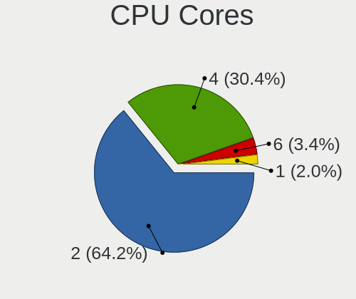

| Number | Notebooks | Percent |
|--------|-----------|---------|
| 2      | 91        | 64.08%  |
| 4      | 43        | 30.28%  |
| 6      | 5         | 3.52%   |
| 1      | 3         | 2.11%   |

CPU Sockets
-----------

Number of sockets

| Number | Notebooks | Percent |
|--------|-----------|---------|
| 1      | 142       | 100%    |

CPU Threads
-----------

Threads per core (Hyper-Threading)

| Number | Notebooks | Percent |
|--------|-----------|---------|
| 2      | 101       | 71.13%  |
| 1      | 41        | 28.87%  |

CPU Op-Modes
------------

CPU Operation Modes (32-bit, 64-bit)

| Op mode        | Notebooks | Percent |
|----------------|-----------|---------|
| 32-bit, 64-bit | 142       | 100%    |

CPU Microcode
-------------

Microcode number

| Number     | Notebooks | Percent |
|------------|-----------|---------|
| Unknown    | 22        | 15.28%  |
| 0x306a9    | 15        | 10.42%  |
| 0x1067a    | 12        | 8.33%   |
| 0x206a7    | 11        | 7.64%   |
| 0x40651    | 9         | 6.25%   |
| 0x806ec    | 7         | 4.86%   |
| 0x806ea    | 5         | 3.47%   |
| 0x806e9    | 5         | 3.47%   |
| 0x706e5    | 5         | 3.47%   |
| 0x406e3    | 5         | 3.47%   |
| 0x30678    | 5         | 3.47%   |
| 0x906ea    | 4         | 2.78%   |
| 0x6f6      | 4         | 2.78%   |
| 0x306c3    | 4         | 2.78%   |
| 0x406c3    | 3         | 2.08%   |
| 0x306d4    | 3         | 2.08%   |
| 0x706a1    | 2         | 1.39%   |
| 0x20655    | 2         | 1.39%   |
| 0x106ca    | 2         | 1.39%   |
| 0x08108109 | 2         | 1.39%   |
| 0x08108102 | 2         | 1.39%   |
| 0x06006705 | 2         | 1.39%   |
| 0x05000119 | 2         | 1.39%   |
| 0x806eb    | 1         | 0.69%   |
| 0x806c1    | 1         | 0.69%   |
| 0x6fd      | 1         | 0.69%   |
| 0x506e3    | 1         | 0.69%   |
| 0x40661    | 1         | 0.69%   |
| 0x20652    | 1         | 0.69%   |
| 0x08600106 | 1         | 0.69%   |
| 0x0810100b | 1         | 0.69%   |
| 0x07030105 | 1         | 0.69%   |
| 0x06006118 | 1         | 0.69%   |
| 0x02000057 | 1         | 0.69%   |

CPU Microarch
-------------

Microarchitecture

| Name            | Notebooks | Percent |
|-----------------|-----------|---------|
| KabyLake        | 28        | 19.72%  |
| IvyBridge       | 17        | 11.97%  |
| Haswell         | 16        | 11.27%  |
| Penryn          | 14        | 9.86%   |
| SandyBridge     | 12        | 8.45%   |
| Silvermont      | 10        | 7.04%   |
| Skylake         | 7         | 4.93%   |
| IceLake         | 6         | 4.23%   |
| Core            | 6         | 4.23%   |
| Zen+            | 4         | 2.82%   |
| Excavator       | 4         | 2.82%   |
| Westmere        | 3         | 2.11%   |
| Broadwell       | 3         | 2.11%   |
| Zen             | 2         | 1.41%   |
| Goldmont plus   | 2         | 1.41%   |
| Bonnell         | 2         | 1.41%   |
| Bobcat          | 2         | 1.41%   |
| Zen 2           | 1         | 0.7%    |
| TigerLake       | 1         | 0.7%    |
| Puma            | 1         | 0.7%    |
| K8 & K10 hybrid | 1         | 0.7%    |

Graphics
--------

GPU Vendor
----------

Vendors of graphics cards

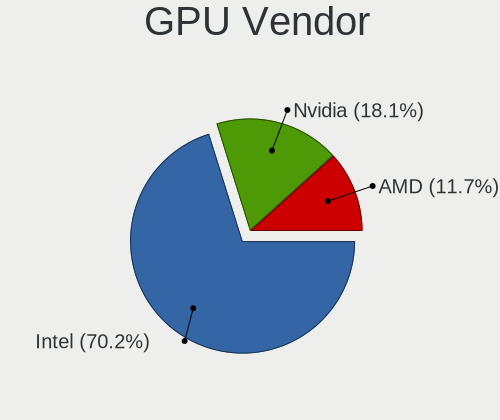

| Vendor | Notebooks | Percent |
|--------|-----------|---------|
| Intel  | 116       | 70.3%   |
| Nvidia | 30        | 18.18%  |
| AMD    | 19        | 11.52%  |

GPU Model
---------

Graphics card models

| Model                                                                                    | Notebooks | Percent |
|------------------------------------------------------------------------------------------|-----------|---------|
| Intel 3rd Gen Core processor Graphics Controller                                         | 16        | 9.36%   |
| Intel Haswell-ULT Integrated Graphics Controller                                         | 11        | 6.43%   |
| Intel 2nd Generation Core Processor Family Integrated Graphics Controller                | 11        | 6.43%   |
| Intel UHD Graphics 620                                                                   | 8         | 4.68%   |
| Intel CometLake-U GT2 [UHD Graphics]                                                     | 8         | 4.68%   |
| Intel Mobile 4 Series Chipset Integrated Graphics Controller                             | 7         | 4.09%   |
| Intel HD Graphics 620                                                                    | 6         | 3.51%   |
| Intel Atom Processor Z36xxx/Z37xxx Series Graphics & Display                             | 6         | 3.51%   |
| Intel Skylake GT2 [HD Graphics 520]                                                      | 5         | 2.92%   |
| Nvidia GF117M [GeForce 610M/710M/810M/820M / GT 620M/625M/630M/720M]                     | 4         | 2.34%   |
| Intel Atom/Celeron/Pentium Processor x5-E8000/J3xxx/N3xxx Integrated Graphics Controller | 4         | 2.34%   |
| Intel 4th Gen Core Processor Integrated Graphics Controller                              | 4         | 2.34%   |
| AMD Picasso/Raven 2 [Radeon Vega Series / Radeon Vega Mobile Series]                     | 4         | 2.34%   |
| Intel Mobile 945GM/GMS/GME, 943/940GML Express Integrated Graphics Controller            | 3         | 1.75%   |
| Intel Mobile 945GM/GMS, 943/940GML Express Integrated Graphics Controller                | 3         | 1.75%   |
| Intel Iris Plus Graphics G1 (Ice Lake)                                                   | 3         | 1.75%   |
| Intel Core Processor Integrated Graphics Controller                                      | 3         | 1.75%   |
| Intel CoffeeLake-H GT2 [UHD Graphics 630]                                                | 3         | 1.75%   |
| AMD Stoney [Radeon R2/R3/R4/R5 Graphics]                                                 | 3         | 1.75%   |
| Nvidia MCP89 [GeForce 320M]                                                              | 2         | 1.17%   |
| Nvidia GM107M [GeForce GTX 950M]                                                         | 2         | 1.17%   |
| Nvidia GM107 [GeForce 940MX]                                                             | 2         | 1.17%   |
| Nvidia GF108M [GeForce GT 540M]                                                          | 2         | 1.17%   |
| Nvidia C79 [GeForce 9400M]                                                               | 2         | 1.17%   |
| Intel WhiskeyLake-U GT2 [UHD Graphics 620]                                               | 2         | 1.17%   |
| Intel Mobile GM965/GL960 Integrated Graphics Controller (secondary)                      | 2         | 1.17%   |
| Intel Mobile GM965/GL960 Integrated Graphics Controller (primary)                        | 2         | 1.17%   |
| Intel Iris Plus Graphics G7                                                              | 2         | 1.17%   |
| Intel HD Graphics 5500                                                                   | 2         | 1.17%   |
| Intel Atom Processor D4xx/D5xx/N4xx/N5xx Integrated Graphics Controller                  | 2         | 1.17%   |
| AMD Raven Ridge [Radeon Vega Series / Radeon Vega Mobile Series]                         | 2         | 1.17%   |
| Nvidia TU117M [GeForce GTX 1650 Mobile / Max-Q]                                          | 1         | 0.58%   |
| Nvidia TU106M [GeForce RTX 2060 Mobile]                                                  | 1         | 0.58%   |
| Nvidia GP108M [GeForce MX330]                                                            | 1         | 0.58%   |
| Nvidia GP107M [GeForce GTX 1050 3 GB Max-Q]                                              | 1         | 0.58%   |
| Nvidia GP106M [GeForce GTX 1060 Mobile]                                                  | 1         | 0.58%   |
| Nvidia GM108M [GeForce MX130]                                                            | 1         | 0.58%   |
| Nvidia GM107M [GeForce GTX 860M]                                                         | 1         | 0.58%   |
| Nvidia GM107GLM [Quadro M1000M]                                                          | 1         | 0.58%   |
| Nvidia GK208BM [GeForce 920M]                                                            | 1         | 0.58%   |
| Nvidia GF119M [GeForce GT 520M]                                                          | 1         | 0.58%   |
| Nvidia GF119M [GeForce GT 520MX]                                                         | 1         | 0.58%   |
| Nvidia GF119M [GeForce 610M]                                                             | 1         | 0.58%   |
| Nvidia GF108M [GeForce GT 635M]                                                          | 1         | 0.58%   |
| Nvidia G98M [GeForce 9200M GS]                                                           | 1         | 0.58%   |
| Nvidia G71M [GeForce Go 7950 GTX]                                                        | 1         | 0.58%   |
| Nvidia C79 [GeForce 9400M G]                                                             | 1         | 0.58%   |
| Intel TigerLake-LP GT2 [Iris Xe Graphics]                                                | 1         | 0.58%   |
| Intel Iris Plus Graphics G4 (Ice Lake)                                                   | 1         | 0.58%   |
| Intel HD Graphics 6000                                                                   | 1         | 0.58%   |
| Intel HD Graphics 530                                                                    | 1         | 0.58%   |
| Intel HD Graphics 515                                                                    | 1         | 0.58%   |
| Intel GeminiLake [UHD Graphics 605]                                                      | 1         | 0.58%   |
| Intel GeminiLake [UHD Graphics 600]                                                      | 1         | 0.58%   |
| Intel Crystal Well Integrated Graphics Controller                                        | 1         | 0.58%   |
| AMD Wrestler [Radeon HD 7310]                                                            | 1         | 0.58%   |
| AMD Wrestler [Radeon HD 6290]                                                            | 1         | 0.58%   |
| AMD Whistler [Radeon HD 6730M/6770M/7690M XT]                                            | 1         | 0.58%   |
| AMD Wani [Radeon R5/R6/R7 Graphics]                                                      | 1         | 0.58%   |
| AMD Thames [Radeon HD 7500M/7600M Series]                                                | 1         | 0.58%   |

GPU Combo
---------

Combinations of graphics cards

| Name           | Notebooks | Percent |
|----------------|-----------|---------|
| 1 x Intel      | 93        | 65.49%  |
| Intel + Nvidia | 21        | 14.79%  |
| 1 x AMD        | 16        | 11.27%  |
| 1 x Nvidia     | 9         | 6.34%   |
| Intel + AMD    | 2         | 1.41%   |
| 2 x AMD        | 1         | 0.7%    |

GPU Driver
----------

Free vs proprietary

| Driver      | Notebooks | Percent |
|-------------|-----------|---------|
| Free        | 121       | 85.21%  |
| Proprietary | 17        | 11.97%  |
| Unknown     | 4         | 2.82%   |

GPU Memory
----------

Total video memory

| Size in GB | Notebooks | Percent |
|------------|-----------|---------|
| Unknown    | 98        | 68.53%  |
| 1.01-2.0   | 17        | 11.89%  |
| 0.01-0.5   | 14        | 9.79%   |
| 0.51-1.0   | 8         | 5.59%   |
| 3.01-4.0   | 5         | 3.5%    |
| 2.01-3.0   | 1         | 0.7%    |

Monitor
-------

Monitor Vendor
--------------

Monitor vendors

| Vendor                  | Notebooks | Percent |
|-------------------------|-----------|---------|
| BOE                     | 24        | 16.11%  |
| AU Optronics            | 23        | 15.44%  |
| LG Display              | 22        | 14.77%  |
| Chimei Innolux          | 20        | 13.42%  |
| Samsung Electronics     | 19        | 12.75%  |
| Apple                   | 11        | 7.38%   |
| Chi Mei Optoelectronics | 6         | 4.03%   |
| Sharp                   | 5         | 3.36%   |
| PANDA                   | 3         | 2.01%   |
| Dell                    | 3         | 2.01%   |
| Unknown                 | 2         | 1.34%   |
| Lenovo                  | 2         | 1.34%   |
| Hewlett-Packard         | 2         | 1.34%   |
| Toshiba                 | 1         | 0.67%   |
| Panasonic               | 1         | 0.67%   |
| LG Philips              | 1         | 0.67%   |
| Fujitsu Siemens         | 1         | 0.67%   |
| BenQ                    | 1         | 0.67%   |
| AOC                     | 1         | 0.67%   |
| Acer                    | 1         | 0.67%   |

Monitor Model
-------------

Monitor models

| Model                                                                    | Notebooks | Percent |
|--------------------------------------------------------------------------|-----------|---------|
| Apple LCD Monitor APP9C5F 1280x800 286x179mm 13.3-inch                   | 3         | 2%      |
| LG Display LCD Monitor LGD0521 1920x1080 309x174mm 14.0-inch             | 2         | 1.33%   |
| LG Display LCD Monitor LGD02DC 1366x768 344x194mm 15.5-inch              | 2         | 1.33%   |
| Dell P2419H DELD0DA 1920x1080 527x296mm 23.8-inch                        | 2         | 1.33%   |
| Chimei Innolux LCD Monitor CMN15E6 1366x768 344x193mm 15.5-inch          | 2         | 1.33%   |
| Chimei Innolux LCD Monitor CMN15DB 1366x768 344x193mm 15.5-inch          | 2         | 1.33%   |
| Chi Mei Optoelectronics LCD Monitor CMO1018 1024x600 222x125mm 10.0-inch | 2         | 1.33%   |
| AU Optronics LCD Monitor AUO21ED 1920x1080 344x194mm 15.5-inch           | 2         | 1.33%   |
| AU Optronics LCD Monitor AUO105C 1366x768 256x144mm 11.6-inch            | 2         | 1.33%   |
| Unknown LCD Monitor Toshiba Internal LCD 1680x945                        | 1         | 0.67%   |
| Unknown LCD Monitor NCP 1920x1080                                        | 1         | 0.67%   |
| Toshiba TV TSB010B 1920x1080 926x523mm 41.9-inch                         | 1         | 0.67%   |
| Sharp LCD Monitor SHP14CB 1920x1200 288x180mm 13.4-inch                  | 1         | 0.67%   |
| Sharp LCD Monitor SHP14AD 3840x2160 294x165mm 13.3-inch                  | 1         | 0.67%   |
| Sharp LCD Monitor SHP1484 1920x1080 294x165mm 13.3-inch                  | 1         | 0.67%   |
| Sharp LCD Monitor SHP13C1 1920x1200 366x229mm 17.0-inch                  | 1         | 0.67%   |
| Sharp HDMI SHP10A1 1360x768 700x390mm 31.5-inch                          | 1         | 0.67%   |
| Samsung Electronics U28E510 SAM0D63 3840x2160 607x345mm 27.5-inch        | 1         | 0.67%   |
| Samsung Electronics SyncMaster SAM056A 1680x1050 470x300mm 22.0-inch     | 1         | 0.67%   |
| Samsung Electronics SyncMaster SAM0560 1440x900 408x255mm 18.9-inch      | 1         | 0.67%   |
| Samsung Electronics LS32R75 SAM0F92 3840x2160 697x392mm 31.5-inch        | 1         | 0.67%   |
| Samsung Electronics LCD Monitor SEC5448 1920x1080 410x230mm 18.5-inch    | 1         | 0.67%   |
| Samsung Electronics LCD Monitor SEC4149 1366x768 292x174mm 13.4-inch     | 1         | 0.67%   |
| Samsung Electronics LCD Monitor SEC3849 1366x768 309x174mm 14.0-inch     | 1         | 0.67%   |
| Samsung Electronics LCD Monitor SEC3155 1920x1200 331x207mm 15.4-inch    | 1         | 0.67%   |
| Samsung Electronics LCD Monitor SEC3152 1366x768 344x194mm 15.5-inch     | 1         | 0.67%   |
| Samsung Electronics LCD Monitor SEC3150 1366x768 344x193mm 15.5-inch     | 1         | 0.67%   |
| Samsung Electronics LCD Monitor SEC314F 1600x900 382x215mm 17.3-inch     | 1         | 0.67%   |
| Samsung Electronics LCD Monitor SEC3051 1366x768 344x194mm 15.5-inch     | 1         | 0.67%   |
| Samsung Electronics LCD Monitor SEC3041 1366x768 353x198mm 15.9-inch     | 1         | 0.67%   |
| Samsung Electronics LCD Monitor SDCA029 3840x2160 344x194mm 15.5-inch    | 1         | 0.67%   |
| Samsung Electronics LCD Monitor SDC4951 1366x768 344x194mm 15.5-inch     | 1         | 0.67%   |
| Samsung Electronics LCD Monitor SDC4147 1366x768 344x194mm 15.5-inch     | 1         | 0.67%   |
| Samsung Electronics LCD Monitor SDC324C 1920x1080 344x194mm 15.5-inch    | 1         | 0.67%   |
| Samsung Electronics C27F390 SAM0D32 1920x1080 598x336mm 27.0-inch        | 1         | 0.67%   |
| Samsung Electronics C24F390 SAM0D2C 1920x1080 521x293mm 23.5-inch        | 1         | 0.67%   |
| PANDA LM116LF3L02 NCP000A 1920x1080 256x144mm 11.6-inch                  | 1         | 0.67%   |
| PANDA LCD Monitor NCP0035 1920x1080 309x174mm 14.0-inch                  | 1         | 0.67%   |
| PANDA LCD Monitor NCP002B 1920x1080 309x174mm 14.0-inch                  | 1         | 0.67%   |
| Panasonic TV MEIA296 3840x2160 1280x720mm 57.8-inch                      | 1         | 0.67%   |
| LG Philips LCD Monitor LPL1E01 1280x800 331x207mm 15.4-inch              | 1         | 0.67%   |
| LG Display LCD Monitor LGD0608 1920x1080 309x174mm 14.0-inch             | 1         | 0.67%   |
| LG Display LCD Monitor LGD0599 1920x1080 309x174mm 14.0-inch             | 1         | 0.67%   |
| LG Display LCD Monitor LGD053F 1920x1080 344x194mm 15.5-inch             | 1         | 0.67%   |
| LG Display LCD Monitor LGD04DA 1920x1080 344x194mm 15.5-inch             | 1         | 0.67%   |
| LG Display LCD Monitor LGD04A7 1920x1080 344x194mm 15.5-inch             | 1         | 0.67%   |
| LG Display LCD Monitor LGD04A5 1920x1280 253x169mm 12.0-inch             | 1         | 0.67%   |
| LG Display LCD Monitor LGD0456 1366x768 344x194mm 15.5-inch              | 1         | 0.67%   |
| LG Display LCD Monitor LGD0454 1366x768 310x174mm 14.0-inch              | 1         | 0.67%   |
| LG Display LCD Monitor LGD03ED 1366x768 277x156mm 12.5-inch              | 1         | 0.67%   |
| LG Display LCD Monitor LGD03B3 1366x768 309x174mm 14.0-inch              | 1         | 0.67%   |
| LG Display LCD Monitor LGD0386 1366x768 309x174mm 14.0-inch              | 1         | 0.67%   |
| LG Display LCD Monitor LGD033A 1366x768 344x194mm 15.5-inch              | 1         | 0.67%   |
| LG Display LCD Monitor LGD032E 1366x768 345x194mm 15.6-inch              | 1         | 0.67%   |
| LG Display LCD Monitor LGD027A 1600x900 382x215mm 17.3-inch              | 1         | 0.67%   |
| LG Display LCD Monitor LGD01F7 1366x768 293x165mm 13.2-inch              | 1         | 0.67%   |
| LG Display LCD Monitor LGD01F5 1280x800 304x190mm 14.1-inch              | 1         | 0.67%   |
| LG Display LCD Monitor LGD01F4 1280x800 331x207mm 15.4-inch              | 1         | 0.67%   |
| LG Display LCD Monitor LGD01E1 1366x768 310x174mm 14.0-inch              | 1         | 0.67%   |
| Lenovo LEN L201p LEN2404 1600x1200 400x300mm 19.7-inch                   | 1         | 0.67%   |

Monitor Resolution
------------------

Monitor screen resolution

| Resolution         | Notebooks | Percent |
|--------------------|-----------|---------|
| 1366x768 (WXGA)    | 52        | 35.86%  |
| 1920x1080 (FHD)    | 46        | 31.72%  |
| 1280x800 (WXGA)    | 13        | 8.97%   |
| 1600x900 (HD+)     | 9         | 6.21%   |
| 3840x2160 (4K)     | 6         | 4.14%   |
| 1440x900 (WXGA+)   | 4         | 2.76%   |
| 1920x1200 (WUXGA)  | 3         | 2.07%   |
| 1024x600           | 2         | 1.38%   |
| 2880x1800          | 1         | 0.69%   |
| 2560x1440 (QHD)    | 1         | 0.69%   |
| 2256x1504          | 1         | 0.69%   |
| 1920x515           | 1         | 0.69%   |
| 1920x1280          | 1         | 0.69%   |
| 1680x945           | 1         | 0.69%   |
| 1680x1050 (WSXGA+) | 1         | 0.69%   |
| 1600x1200          | 1         | 0.69%   |
| 1360x768           | 1         | 0.69%   |
| 1280x1024 (SXGA)   | 1         | 0.69%   |

Monitor Diagonal
----------------

Diagonal size in inches

| Inches  | Notebooks | Percent |
|---------|-----------|---------|
| 15      | 45        | 30%     |
| 13      | 40        | 26.67%  |
| 14      | 18        | 12%     |
| 17      | 10        | 6.67%   |
| 11      | 6         | 4%      |
| Unknown | 6         | 4%      |
| 24      | 4         | 2.67%   |
| 27      | 3         | 2%      |
| 23      | 3         | 2%      |
| 19      | 3         | 2%      |
| 31      | 2         | 1.33%   |
| 18      | 2         | 1.33%   |
| 12      | 2         | 1.33%   |
| 10      | 2         | 1.33%   |
| 84      | 1         | 0.67%   |
| 72      | 1         | 0.67%   |
| 22      | 1         | 0.67%   |
| 16      | 1         | 0.67%   |

Monitor Width
-------------

Physical width

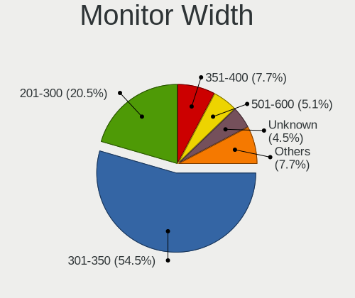

| Width in mm | Notebooks | Percent |
|-------------|-----------|---------|
| 301-350     | 83        | 56.08%  |
| 201-300     | 29        | 19.59%  |
| 351-400     | 12        | 8.11%   |
| 501-600     | 9         | 6.08%   |
| Unknown     | 6         | 4.05%   |
| 401-500     | 4         | 2.7%    |
| 601-700     | 3         | 2.03%   |
| 1501-2000   | 2         | 1.35%   |

Aspect Ratio
------------

Proportional relationship between the width and the height

| Ratio   | Notebooks | Percent |
|---------|-----------|---------|
| 16/9    | 106       | 77.37%  |
| 16/10   | 21        | 15.33%  |
| Unknown | 5         | 3.65%   |
| 3/2     | 2         | 1.46%   |
| 5/4     | 1         | 0.73%   |
| 4/3     | 1         | 0.73%   |
| 3.73    | 1         | 0.73%   |

Monitor Area
------------

Area in inch

| Area in inch | Notebooks | Percent |
|----------------|-----------|---------|
| 81-90          | 47        | 31.33%  |
| 101-110        | 46        | 30.67%  |
| 71-80          | 11        | 7.33%   |
| 201-250        | 8         | 5.33%   |
| 51-60          | 6         | 4%      |
| 121-130        | 6         | 4%      |
| Unknown        | 6         | 4%      |
| 301-350        | 3         | 2%      |
| 151-200        | 3         | 2%      |
| 141-150        | 3         | 2%      |
| 131-140        | 3         | 2%      |
| More than 1000 | 2         | 1.33%   |
| 61-70          | 2         | 1.33%   |
| 351-500        | 2         | 1.33%   |
| 41-50          | 2         | 1.33%   |

Pixel Density
-------------

Pixels per inch

| Density       | Notebooks | Percent |
|---------------|-----------|---------|
| 101-120       | 65        | 44.22%  |
| 121-160       | 45        | 30.61%  |
| 51-100        | 18        | 12.24%  |
| 161-240       | 9         | 6.12%   |
| Unknown       | 6         | 4.08%   |
| More than 240 | 2         | 1.36%   |
| 1-50          | 2         | 1.36%   |

Multiple Monitors
-----------------

Total monitors connected

| Total | Notebooks | Percent |
|-------|-----------|---------|
| 1     | 124       | 86.11%  |
| 2     | 17        | 11.81%  |
| 0     | 3         | 2.08%   |

Network
-------

Net Controller Vendor
---------------------

Controller vendors

| Vendor                            | Notebooks | Percent |
|-----------------------------------|-----------|---------|
| Realtek Semiconductor             | 71        | 31.7%   |
| Intel                             | 68        | 30.36%  |
| Qualcomm Atheros                  | 39        | 17.41%  |
| Broadcom                          | 20        | 8.93%   |
| Nvidia                            | 5         | 2.23%   |
| Marvell Technology Group          | 4         | 1.79%   |
| Ralink                            | 3         | 1.34%   |
| Broadcom Limited                  | 2         | 0.89%   |
| TP-Link                           | 1         | 0.45%   |
| Sierra Wireless                   | 1         | 0.45%   |
| Samsung Electronics               | 1         | 0.45%   |
| Ralink Technology                 | 1         | 0.45%   |
| Qualcomm                          | 1         | 0.45%   |
| LG Electronics                    | 1         | 0.45%   |
| Huawei Technologies               | 1         | 0.45%   |
| Hewlett-Packard                   | 1         | 0.45%   |
| Fibocom                           | 1         | 0.45%   |
| Ericsson Business Mobile Networks | 1         | 0.45%   |
| ASIX Electronics                  | 1         | 0.45%   |
| Arduino SA                        | 1         | 0.45%   |

Net Controller Model
--------------------

Controller models

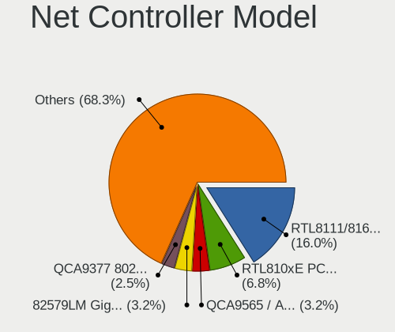

| Model                                                                                 | Notebooks | Percent |
|---------------------------------------------------------------------------------------|-----------|---------|
| Realtek RTL8111/8168/8411 PCI Express Gigabit Ethernet Controller                     | 45        | 16.73%  |
| Realtek RTL810xE PCI Express Fast Ethernet controller                                 | 19        | 7.06%   |
| Qualcomm Atheros QCA9565 / AR9565 Wireless Network Adapter                            | 9         | 3.35%   |
| Intel 82579LM Gigabit Network Connection (Lewisville)                                 | 8         | 2.97%   |
| Qualcomm Atheros QCA9377 802.11ac Wireless Network Adapter                            | 7         | 2.6%    |
| Intel Wireless 7260                                                                   | 7         | 2.6%    |
| Intel Comet Lake PCH-LP CNVi WiFi                                                     | 6         | 2.23%   |
| Realtek RTL8821CE 802.11ac PCIe Wireless Network Adapter                              | 5         | 1.86%   |
| Qualcomm Atheros AR9485 Wireless Network Adapter                                      | 5         | 1.86%   |
| Intel Wireless 8260                                                                   | 5         | 1.86%   |
| Intel Ethernet Connection I218-LM                                                     | 5         | 1.86%   |
| Intel Wireless 8265 / 8275                                                            | 4         | 1.49%   |
| Intel Wireless 7265                                                                   | 4         | 1.49%   |
| Intel Wi-Fi 6 AX200                                                                   | 4         | 1.49%   |
| Intel Centrino Advanced-N 6235                                                        | 4         | 1.49%   |
| Intel Centrino Advanced-N 6205 [Taylor Peak]                                          | 4         | 1.49%   |
| Broadcom BCM43224 802.11a/b/g/n                                                       | 4         | 1.49%   |
| Realtek RTL8188EE Wireless Network Adapter                                            | 3         | 1.12%   |
| Qualcomm Atheros QCA6174 802.11ac Wireless Network Adapter                            | 3         | 1.12%   |
| Qualcomm Atheros AR9285 Wireless Network Adapter (PCI-Express)                        | 3         | 1.12%   |
| Qualcomm Atheros AR5418 Wireless Network Adapter [AR5008E 802.11(a)bgn] (PCI-Express) | 3         | 1.12%   |
| Nvidia MCP79 Ethernet                                                                 | 3         | 1.12%   |
| Marvell Group 88E8053 PCI-E Gigabit Ethernet Controller                               | 3         | 1.12%   |
| Intel Wireless 3165                                                                   | 3         | 1.12%   |
| Intel Ice Lake-LP PCH CNVi WiFi                                                       | 3         | 1.12%   |
| Intel Ethernet Connection I219-LM                                                     | 3         | 1.12%   |
| Intel Ethernet Connection (4) I219-V                                                  | 3         | 1.12%   |
| Intel 82567LM Gigabit Network Connection                                              | 3         | 1.12%   |
| Broadcom BCM4322 802.11a/b/g/n Wireless LAN Controller                                | 3         | 1.12%   |
| Broadcom BCM4313 802.11bgn Wireless Network Adapter                                   | 3         | 1.12%   |
| Broadcom BCM4312 802.11b/g LP-PHY                                                     | 3         | 1.12%   |
| Realtek RTL8822CE 802.11ac PCIe Wireless Network Adapter                              | 2         | 0.74%   |
| Realtek RTL8723BE PCIe Wireless Network Adapter                                       | 2         | 0.74%   |
| Realtek RTL8191SEvB Wireless LAN Controller                                           | 2         | 0.74%   |
| Ralink RT5390 Wireless 802.11n 1T/1R PCIe                                             | 2         | 0.74%   |
| Qualcomm Atheros AR8131 Gigabit Ethernet                                              | 2         | 0.74%   |
| Qualcomm Atheros AR242x / AR542x Wireless Network Adapter (PCI-Express)               | 2         | 0.74%   |
| Nvidia MCP89 Ethernet                                                                 | 2         | 0.74%   |
| Intel Wireless 3160                                                                   | 2         | 0.74%   |
| Intel Dual Band Wireless-AC 3165 Plus Bluetooth                                       | 2         | 0.74%   |
| Intel Centrino Wireless-N 1030 [Rainbow Peak]                                         | 2         | 0.74%   |
| Intel Cannon Point-LP CNVi [Wireless-AC]                                              | 2         | 0.74%   |
| Intel Cannon Lake PCH CNVi WiFi                                                       | 2         | 0.74%   |
| TP-Link 802.11ac WLAN Adapter                                                         | 1         | 0.37%   |
| Sierra Wireless MC7700                                                                | 1         | 0.37%   |
| Samsung GT-I9070 (network tethering, USB debugging enabled)                           | 1         | 0.37%   |
| Realtek RTL88x2bu [AC1200 Techkey]                                                    | 1         | 0.37%   |
| Realtek RTL8822BE 802.11a/b/g/n/ac WiFi adapter                                       | 1         | 0.37%   |
| Realtek RTL8812AU 802.11a/b/g/n/ac 2T2R DB WLAN Adapter                               | 1         | 0.37%   |
| Realtek RTL8811AU 802.11a/b/g/n/ac WLAN Adapter                                       | 1         | 0.37%   |
| Realtek RTL8723AE PCIe Wireless Network Adapter                                       | 1         | 0.37%   |
| Realtek RTL8191SEvA Wireless LAN Controller                                           | 1         | 0.37%   |
| Realtek RTL8152 Fast Ethernet Adapter                                                 | 1         | 0.37%   |
| Realtek Killer E2600 Gigabit Ethernet Controller                                      | 1         | 0.37%   |
| Realtek 802.11ac NIC                                                                  | 1         | 0.37%   |
| Ralink MT7601U Wireless Adapter                                                       | 1         | 0.37%   |
| Ralink RT3290 Wireless 802.11n 1T/1R PCIe                                             | 1         | 0.37%   |
| Qualcomm Mobile Router                                                                | 1         | 0.37%   |
| Qualcomm Atheros QCA8172 Fast Ethernet                                                | 1         | 0.37%   |
| Qualcomm Atheros Killer E220x Gigabit Ethernet Controller                             | 1         | 0.37%   |

Wireless Vendor
---------------

Wireless vendors

| Vendor                | Notebooks | Percent |
|-----------------------|-----------|---------|
| Intel                 | 63        | 43.15%  |
| Qualcomm Atheros      | 35        | 23.97%  |
| Realtek Semiconductor | 21        | 14.38%  |
| Broadcom              | 18        | 12.33%  |
| Ralink                | 3         | 2.05%   |
| Broadcom Limited      | 2         | 1.37%   |
| TP-Link               | 1         | 0.68%   |
| Sierra Wireless       | 1         | 0.68%   |
| Ralink Technology     | 1         | 0.68%   |
| Fibocom               | 1         | 0.68%   |

Wireless Model
--------------

Wireless models

| Model                                                                                 | Notebooks | Percent |
|---------------------------------------------------------------------------------------|-----------|---------|
| Qualcomm Atheros QCA9565 / AR9565 Wireless Network Adapter                            | 9         | 6.16%   |
| Qualcomm Atheros QCA9377 802.11ac Wireless Network Adapter                            | 7         | 4.79%   |
| Intel Wireless 7260                                                                   | 7         | 4.79%   |
| Intel Comet Lake PCH-LP CNVi WiFi                                                     | 6         | 4.11%   |
| Realtek RTL8821CE 802.11ac PCIe Wireless Network Adapter                              | 5         | 3.42%   |
| Qualcomm Atheros AR9485 Wireless Network Adapter                                      | 5         | 3.42%   |
| Intel Wireless 8260                                                                   | 5         | 3.42%   |
| Intel Wireless 8265 / 8275                                                            | 4         | 2.74%   |
| Intel Wireless 7265                                                                   | 4         | 2.74%   |
| Intel Wi-Fi 6 AX200                                                                   | 4         | 2.74%   |
| Intel Centrino Advanced-N 6235                                                        | 4         | 2.74%   |
| Intel Centrino Advanced-N 6205 [Taylor Peak]                                          | 4         | 2.74%   |
| Broadcom BCM43224 802.11a/b/g/n                                                       | 4         | 2.74%   |
| Realtek RTL8188EE Wireless Network Adapter                                            | 3         | 2.05%   |
| Qualcomm Atheros QCA6174 802.11ac Wireless Network Adapter                            | 3         | 2.05%   |
| Qualcomm Atheros AR9285 Wireless Network Adapter (PCI-Express)                        | 3         | 2.05%   |
| Qualcomm Atheros AR5418 Wireless Network Adapter [AR5008E 802.11(a)bgn] (PCI-Express) | 3         | 2.05%   |
| Intel Wireless 3165                                                                   | 3         | 2.05%   |
| Intel Ice Lake-LP PCH CNVi WiFi                                                       | 3         | 2.05%   |
| Broadcom BCM4322 802.11a/b/g/n Wireless LAN Controller                                | 3         | 2.05%   |
| Broadcom BCM4313 802.11bgn Wireless Network Adapter                                   | 3         | 2.05%   |
| Broadcom BCM4312 802.11b/g LP-PHY                                                     | 3         | 2.05%   |
| Realtek RTL8822CE 802.11ac PCIe Wireless Network Adapter                              | 2         | 1.37%   |
| Realtek RTL8723BE PCIe Wireless Network Adapter                                       | 2         | 1.37%   |
| Realtek RTL8191SEvB Wireless LAN Controller                                           | 2         | 1.37%   |
| Ralink RT5390 Wireless 802.11n 1T/1R PCIe                                             | 2         | 1.37%   |
| Qualcomm Atheros AR242x / AR542x Wireless Network Adapter (PCI-Express)               | 2         | 1.37%   |
| Intel Wireless 3160                                                                   | 2         | 1.37%   |
| Intel Dual Band Wireless-AC 3165 Plus Bluetooth                                       | 2         | 1.37%   |
| Intel Centrino Wireless-N 1030 [Rainbow Peak]                                         | 2         | 1.37%   |
| Intel Cannon Point-LP CNVi [Wireless-AC]                                              | 2         | 1.37%   |
| Intel Cannon Lake PCH CNVi WiFi                                                       | 2         | 1.37%   |
| TP-Link 802.11ac WLAN Adapter                                                         | 1         | 0.68%   |
| Sierra Wireless MC7700                                                                | 1         | 0.68%   |
| Realtek RTL88x2bu [AC1200 Techkey]                                                    | 1         | 0.68%   |
| Realtek RTL8822BE 802.11a/b/g/n/ac WiFi adapter                                       | 1         | 0.68%   |
| Realtek RTL8812AU 802.11a/b/g/n/ac 2T2R DB WLAN Adapter                               | 1         | 0.68%   |
| Realtek RTL8811AU 802.11a/b/g/n/ac WLAN Adapter                                       | 1         | 0.68%   |
| Realtek RTL8723AE PCIe Wireless Network Adapter                                       | 1         | 0.68%   |
| Realtek RTL8191SEvA Wireless LAN Controller                                           | 1         | 0.68%   |
| Realtek 802.11ac NIC                                                                  | 1         | 0.68%   |
| Ralink MT7601U Wireless Adapter                                                       | 1         | 0.68%   |
| Ralink RT3290 Wireless 802.11n 1T/1R PCIe                                             | 1         | 0.68%   |
| Qualcomm Atheros AR9462 Wireless Network Adapter                                      | 1         | 0.68%   |
| Qualcomm Atheros AR928X Wireless Network Adapter (PCI-Express)                        | 1         | 0.68%   |
| Qualcomm Atheros AR9287 Wireless Network Adapter (PCI-Express)                        | 1         | 0.68%   |
| Intel WiFi Link 5100                                                                  | 1         | 0.68%   |
| Intel Wi-Fi 6 AX201                                                                   | 1         | 0.68%   |
| Intel Ultimate N WiFi Link 5300                                                       | 1         | 0.68%   |
| Intel PRO/Wireless 3945ABG [Golan] Network Connection                                 | 1         | 0.68%   |
| Intel Gemini Lake PCH CNVi WiFi                                                       | 1         | 0.68%   |
| Intel Dual Band Wireless-AC 3168NGW [Stone Peak]                                      | 1         | 0.68%   |
| Intel Centrino Wireless-N 2230                                                        | 1         | 0.68%   |
| Intel Centrino Wireless-N 1000 [Condor Peak]                                          | 1         | 0.68%   |
| Intel Centrino Wireless-N 100                                                         | 1         | 0.68%   |
| Fibocom L830-EB-00 LTE WWAN Modem                                                     | 1         | 0.68%   |
| Broadcom Limited BCM4360 802.11ac Wireless Network Adapter                            | 1         | 0.68%   |
| Broadcom Limited BCM4312 802.11b/g LP-PHY                                             | 1         | 0.68%   |
| Broadcom BCM4360 802.11ac Wireless Network Adapter                                    | 1         | 0.68%   |
| Broadcom BCM4331 802.11a/b/g/n                                                        | 1         | 0.68%   |

Ethernet Vendor
---------------

Ethernet vendors

| Vendor                   | Notebooks | Percent |
|--------------------------|-----------|---------|
| Realtek Semiconductor    | 65        | 54.17%  |
| Intel                    | 27        | 22.5%   |
| Qualcomm Atheros         | 8         | 6.67%   |
| Nvidia                   | 5         | 4.17%   |
| Broadcom                 | 5         | 4.17%   |
| Marvell Technology Group | 4         | 3.33%   |
| Samsung Electronics      | 1         | 0.83%   |
| Qualcomm                 | 1         | 0.83%   |
| LG Electronics           | 1         | 0.83%   |
| Huawei Technologies      | 1         | 0.83%   |
| Hewlett-Packard          | 1         | 0.83%   |
| ASIX Electronics         | 1         | 0.83%   |

Ethernet Model
--------------

Ethernet models

| Model                                                             | Notebooks | Percent |
|-------------------------------------------------------------------|-----------|---------|
| Realtek RTL8111/8168/8411 PCI Express Gigabit Ethernet Controller | 45        | 37.19%  |
| Realtek RTL810xE PCI Express Fast Ethernet controller             | 19        | 15.7%   |
| Intel 82579LM Gigabit Network Connection (Lewisville)             | 8         | 6.61%   |
| Intel Ethernet Connection I218-LM                                 | 5         | 4.13%   |
| Nvidia MCP79 Ethernet                                             | 3         | 2.48%   |
| Marvell Group 88E8053 PCI-E Gigabit Ethernet Controller           | 3         | 2.48%   |
| Intel Ethernet Connection I219-LM                                 | 3         | 2.48%   |
| Intel Ethernet Connection (4) I219-V                              | 3         | 2.48%   |
| Intel 82567LM Gigabit Network Connection                          | 3         | 2.48%   |
| Qualcomm Atheros AR8131 Gigabit Ethernet                          | 2         | 1.65%   |
| Nvidia MCP89 Ethernet                                             | 2         | 1.65%   |
| Samsung GT-I9070 (network tethering, USB debugging enabled)       | 1         | 0.83%   |
| Realtek RTL8152 Fast Ethernet Adapter                             | 1         | 0.83%   |
| Realtek Killer E2600 Gigabit Ethernet Controller                  | 1         | 0.83%   |
| Qualcomm Mobile Router                                            | 1         | 0.83%   |
| Qualcomm Atheros QCA8172 Fast Ethernet                            | 1         | 0.83%   |
| Qualcomm Atheros Killer E220x Gigabit Ethernet Controller         | 1         | 0.83%   |
| Qualcomm Atheros AR8161 Gigabit Ethernet                          | 1         | 0.83%   |
| Qualcomm Atheros AR8152 v2.0 Fast Ethernet                        | 1         | 0.83%   |
| Qualcomm Atheros AR8152 v1.1 Fast Ethernet                        | 1         | 0.83%   |
| Qualcomm Atheros AR8151 v2.0 Gigabit Ethernet                     | 1         | 0.83%   |
| Marvell Group 88E8055 PCI-E Gigabit Ethernet Controller           | 1         | 0.83%   |
| LG LM-X420xxx/G2 Android Phone (USB tethering mode)               | 1         | 0.83%   |
| Intel Ethernet Connection I217-LM                                 | 1         | 0.83%   |
| Intel Ethernet Connection (4) I219-LM                             | 1         | 0.83%   |
| Intel Ethernet Connection (2) I219-LM                             | 1         | 0.83%   |
| Intel Ethernet Connection (13) I219-LM                            | 1         | 0.83%   |
| Intel 82577LC Gigabit Network Connection                          | 1         | 0.83%   |
| Huawei E353/E3131                                                 | 1         | 0.83%   |
| HP HP lt4120 Snapdragon X5 LTE                                    | 1         | 0.83%   |
| Broadcom NetXtreme BCM57765 Gigabit Ethernet PCIe                 | 1         | 0.83%   |
| Broadcom NetXtreme BCM5752 Gigabit Ethernet PCI Express           | 1         | 0.83%   |
| Broadcom NetLink BCM5906M Fast Ethernet PCI Express               | 1         | 0.83%   |
| Broadcom NetLink BCM5787M Gigabit Ethernet PCI Express            | 1         | 0.83%   |
| Broadcom NetLink BCM57785 Gigabit Ethernet PCIe                   | 1         | 0.83%   |
| ASIX AX88179 Gigabit Ethernet                                     | 1         | 0.83%   |

Net Controller Kind
-------------------

Ethernet, WiFi or modem

| Kind     | Notebooks | Percent |
|----------|-----------|---------|
| WiFi     | 139       | 53.67%  |
| Ethernet | 118       | 45.56%  |
| Modem    | 2         | 0.77%   |

Used Controller
---------------

Currently used network controller

| Kind     | Notebooks | Percent |
|----------|-----------|---------|
| WiFi     | 133       | 65.2%   |
| Ethernet | 70        | 34.31%  |
| Modem    | 1         | 0.49%   |

NICs
----

Total network controllers on board

| Total | Notebooks | Percent |
|-------|-----------|---------|
| 2     | 113       | 79.58%  |
| 1     | 26        | 18.31%  |
| 0     | 3         | 2.11%   |

IPv6
----

IPv6 vs IPv4

| Used | Notebooks | Percent |
|------|-----------|---------|
| No   | 127       | 89.44%  |
| Yes  | 15        | 10.56%  |

Bluetooth
---------

Bluetooth Vendor
----------------

Controller vendors

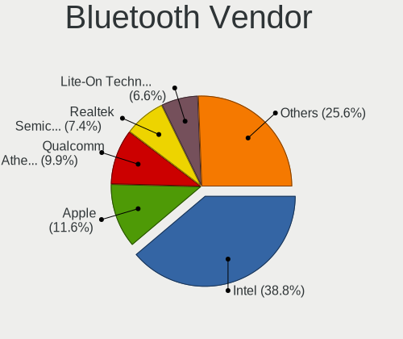

| Vendor                          | Notebooks | Percent |
|---------------------------------|-----------|---------|
| Intel                           | 46        | 40%     |
| Qualcomm Atheros Communications | 12        | 10.43%  |
| Apple                           | 11        | 9.57%   |
| Realtek Semiconductor           | 8         | 6.96%   |
| Lite-On Technology              | 8         | 6.96%   |
| Cambridge Silicon Radio         | 6         | 5.22%   |
| Broadcom                        | 6         | 5.22%   |
| Toshiba                         | 3         | 2.61%   |
| Hewlett-Packard                 | 3         | 2.61%   |
| Foxconn / Hon Hai               | 3         | 2.61%   |
| IMC Networks                    | 2         | 1.74%   |
| Taiyo Yuden                     | 1         | 0.87%   |
| Realtek                         | 1         | 0.87%   |
| Ralink                          | 1         | 0.87%   |
| Qcom                            | 1         | 0.87%   |
| Logitech                        | 1         | 0.87%   |
| Fujitsu                         | 1         | 0.87%   |
| Dell                            | 1         | 0.87%   |

Bluetooth Model
---------------

Controller models

| Model                                                                               | Notebooks | Percent |
|-------------------------------------------------------------------------------------|-----------|---------|
| Intel Bluetooth wireless interface                                                  | 21        | 18.26%  |
| Intel Bluetooth Device                                                              | 7         | 6.09%   |
| Intel Bluetooth 9460/9560 Jefferson Peak (JfP)                                      | 7         | 6.09%   |
| Qualcomm Atheros  Bluetooth Device                                                  | 6         | 5.22%   |
| Cambridge Silicon Radio Bluetooth Dongle (HCI mode)                                 | 6         | 5.22%   |
| Apple Bluetooth Host Controller                                                     | 5         | 4.35%   |
| Realtek  Bluetooth 4.2 Adapter                                                      | 4         | 3.48%   |
| Lite-On Bluetooth Device                                                            | 4         | 3.48%   |
| Intel Centrino Bluetooth Wireless Transceiver                                       | 4         | 3.48%   |
| Intel AX200 Bluetooth                                                               | 4         | 3.48%   |
| Realtek Bluetooth Radio                                                             | 3         | 2.61%   |
| HP Broadcom 2070 Bluetooth Combo                                                    | 3         | 2.61%   |
| Apple Bluetooth HCI                                                                 | 3         | 2.61%   |
| Qualcomm Atheros AR3012 Bluetooth 4.0                                               | 2         | 1.74%   |
| Qualcomm Atheros AR3011 Bluetooth                                                   | 2         | 1.74%   |
| Lite-On Atheros AR3012 Bluetooth                                                    | 2         | 1.74%   |
| Intel Centrino Advanced-N 6230 Bluetooth adapter                                    | 2         | 1.74%   |
| Foxconn / Hon Hai Bluetooth Device                                                  | 2         | 1.74%   |
| Broadcom BCM2045B (BDC-2.1)                                                         | 2         | 1.74%   |
| Apple Bluetooth USB Host Controller                                                 | 2         | 1.74%   |
| Toshiba RT Bluetooth Radio                                                          | 1         | 0.87%   |
| Toshiba Bluetooth USB Host Controller                                               | 1         | 0.87%   |
| Toshiba Askey Bluetooth Module                                                      | 1         | 0.87%   |
| Taiyo Yuden Bluetooth Device (V2.0+EDR)                                             | 1         | 0.87%   |
| Realtek RTL8723B Bluetooth                                                          | 1         | 0.87%   |
| Realtek Bluetooth Radio                                                             | 1         | 0.87%   |
| Ralink RT3290 Bluetooth                                                             | 1         | 0.87%   |
| Qualcomm Atheros QCA61x4 Bluetooth 4.0                                              | 1         | 0.87%   |
| Qualcomm Atheros AR9462 Bluetooth                                                   | 1         | 0.87%   |
| Qcom Broadcom Bluetooth USB                                                         | 1         | 0.87%   |
| Logitech BT Mini-Receiver (HCI mode)                                                | 1         | 0.87%   |
| Lite-On Qualcomm Atheros Bluetooth                                                  | 1         | 0.87%   |
| Lite-On Atheros Bluetooth                                                           | 1         | 0.87%   |
| Intel Wireless-AC 3168 Bluetooth                                                    | 1         | 0.87%   |
| IMC Networks Bluetooth Radio                                                        | 1         | 0.87%   |
| IMC Networks Bluetooth Device                                                       | 1         | 0.87%   |
| Fujitsu Bluetooth Device                                                            | 1         | 0.87%   |
| Foxconn / Hon Hai Foxconn T77H114 BCM2070 [Single-Chip Bluetooth 2.1 + EDR Adapter] | 1         | 0.87%   |
| Dell Wireless 370 Bluetooth Mini-card                                               | 1         | 0.87%   |
| Broadcom BCM43142A0 Bluetooth 4.0                                                   | 1         | 0.87%   |
| Broadcom BCM20702 Bluetooth 4.0 [ThinkPad]                                          | 1         | 0.87%   |
| Broadcom BCM2070 Bluetooth 2.1 + EDR                                                | 1         | 0.87%   |
| Broadcom BCM2045B (BDC-2) [Bluetooth Controller]                                    | 1         | 0.87%   |
| Apple Built-in Bluetooth 2.0+EDR HCI                                                | 1         | 0.87%   |

Sound
-----

Sound Vendor
------------

Sound card vendors

| Vendor                     | Notebooks | Percent |
|----------------------------|-----------|---------|
| Intel                      | 119       | 75.8%   |
| Nvidia                     | 17        | 10.83%  |
| AMD                        | 17        | 10.83%  |
| YUAN High-Tech Development | 1         | 0.64%   |
| Native Instruments         | 1         | 0.64%   |
| Generalplus Technology     | 1         | 0.64%   |
| C-Media Electronics        | 1         | 0.64%   |

Sound Model
-----------

Sound card models

| Model                                                                                             | Notebooks | Percent |
|---------------------------------------------------------------------------------------------------|-----------|---------|
| Intel Sunrise Point-LP HD Audio                                                                   | 20        | 10.47%  |
| Intel 7 Series/C216 Chipset Family High Definition Audio Controller                               | 17        | 8.9%    |
| Intel 6 Series/C200 Series Chipset Family High Definition Audio Controller                        | 12        | 6.28%   |
| Intel Haswell-ULT HD Audio Controller                                                             | 11        | 5.76%   |
| Intel 8 Series HD Audio Controller                                                                | 11        | 5.76%   |
| Intel 82801I (ICH9 Family) HD Audio Controller                                                    | 9         | 4.71%   |
| Intel Comet Lake PCH-LP cAVS                                                                      | 8         | 4.19%   |
| AMD Family 17h/19h HD Audio Controller                                                            | 7         | 3.66%   |
| Intel NM10/ICH7 Family High Definition Audio Controller                                           | 6         | 3.14%   |
| Intel Ice Lake-LP Smart Sound Technology Audio Controller                                         | 6         | 3.14%   |
| AMD Raven/Raven2/Fenghuang HDMI/DP Audio Controller                                               | 6         | 3.14%   |
| Intel 8 Series/C220 Series Chipset High Definition Audio Controller                               | 5         | 2.62%   |
| Intel Xeon E3-1200 v3/4th Gen Core Processor HD Audio Controller                                  | 4         | 2.09%   |
| Intel Cannon Lake PCH cAVS                                                                        | 4         | 2.09%   |
| Intel Atom Processor Z36xxx/Z37xxx Series High Definition Audio Controller                        | 4         | 2.09%   |
| AMD Family 15h (Models 60h-6fh) Audio Controller                                                  | 4         | 2.09%   |
| Nvidia MCP79 High Definition Audio                                                                | 3         | 1.57%   |
| Nvidia GM107 High Definition Audio Controller [GeForce 940MX]                                     | 3         | 1.57%   |
| Nvidia GF108 High Definition Audio Controller                                                     | 3         | 1.57%   |
| Intel Wildcat Point-LP High Definition Audio Controller                                           | 3         | 1.57%   |
| Intel Broadwell-U Audio Controller                                                                | 3         | 1.57%   |
| Intel Atom/Celeron/Pentium Processor x5-E8000/J3xxx/N3xxx Series High Definition Audio Controller | 3         | 1.57%   |
| Intel 5 Series/3400 Series Chipset High Definition Audio                                          | 3         | 1.57%   |
| AMD High Definition Audio Controller                                                              | 3         | 1.57%   |
| AMD FCH Azalia Controller                                                                         | 3         | 1.57%   |
| Nvidia MCP89 High Definition Audio                                                                | 2         | 1.05%   |
| Intel Celeron/Pentium Silver Processor High Definition Audio                                      | 2         | 1.05%   |
| Intel Cannon Point-LP High Definition Audio Controller                                            | 2         | 1.05%   |
| Intel 82801H (ICH8 Family) HD Audio Controller                                                    | 2         | 1.05%   |
| AMD Wrestler HDMI Audio                                                                           | 2         | 1.05%   |
| AMD Kabini HDMI/DP Audio                                                                          | 2         | 1.05%   |
| YUAN High-Tech Development YUAN FM100                                                             | 1         | 0.52%   |
| Nvidia TU107 GeForce GTX 1650 High Definition Audio Controller                                    | 1         | 0.52%   |
| Nvidia TU106 High Definition Audio Controller                                                     | 1         | 0.52%   |
| Nvidia GP107GL High Definition Audio Controller                                                   | 1         | 0.52%   |
| Nvidia GP106 High Definition Audio Controller                                                     | 1         | 0.52%   |
| Nvidia GK208 HDMI/DP Audio Controller                                                             | 1         | 0.52%   |
| Nvidia GF119 HDMI Audio Controller                                                                | 1         | 0.52%   |
| Native Instruments Traktor Kontrol Z2                                                             | 1         | 0.52%   |
| Intel Tiger Lake-LP Smart Sound Technology Audio Controller                                       | 1         | 0.52%   |
| Intel Crystal Well HD Audio Controller                                                            | 1         | 0.52%   |
| Intel 100 Series/C230 Series Chipset Family HD Audio Controller                                   | 1         | 0.52%   |
| Generalplus Technology USB Audio Device                                                           | 1         | 0.52%   |
| C-Media Electronics Audio Adapter (Unitek Y-247A)                                                 | 1         | 0.52%   |
| AMD Turks HDMI Audio [Radeon HD 6500/6600 / 6700M Series]                                         | 1         | 0.52%   |
| AMD SBx00 Azalia (Intel HDA)                                                                      | 1         | 0.52%   |
| AMD RV710/730 HDMI Audio [Radeon HD 4000 series]                                                  | 1         | 0.52%   |
| AMD RV620 HDMI Audio [Radeon HD 3450/3470/3550/3570]                                              | 1         | 0.52%   |
| AMD Renoir Radeon High Definition Audio Controller                                                | 1         | 0.52%   |

Memory
------

Memory Vendor
-------------

Memory module vendors

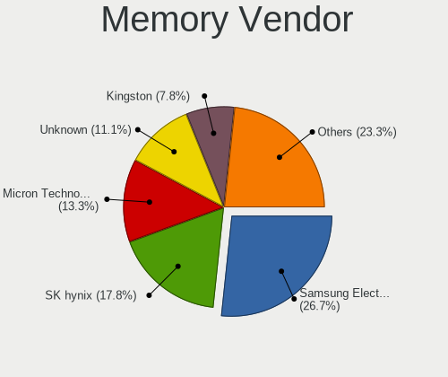

| Vendor              | Notebooks | Percent |
|---------------------|-----------|---------|
| Samsung Electronics | 24        | 27.91%  |
| SK Hynix            | 16        | 18.6%   |
| Micron Technology   | 12        | 13.95%  |
| Unknown             | 10        | 11.63%  |
| Kingston            | 7         | 8.14%   |
| Elpida              | 5         | 5.81%   |
| Unknown (ABCD)      | 2         | 2.33%   |
| Crucial             | 2         | 2.33%   |
| TIMETEC             | 1         | 1.16%   |
| Smart               | 1         | 1.16%   |
| Ramaxel Technology  | 1         | 1.16%   |
| Magnum Tech         | 1         | 1.16%   |
| Corsair             | 1         | 1.16%   |
| Avant               | 1         | 1.16%   |
| Aeneon              | 1         | 1.16%   |
| A-DATA Technology   | 1         | 1.16%   |

Memory Model
------------

Memory module models

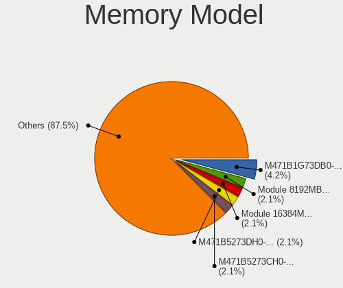

| Model                                                            | Notebooks | Percent |
|------------------------------------------------------------------|-----------|---------|
| Samsung RAM M471B1G73DB0-YK0 8GB SODIMM DDR3 1600MT/s            | 4         | 4.35%   |
| Samsung RAM Module 8192MB SODIMM DDR4 2133MT/s                   | 2         | 2.17%   |
| Samsung RAM Module 16384MB SODIMM DDR4 2667MT/s                  | 2         | 2.17%   |
| Samsung RAM M471B5273DH0-CH9 4096MB SODIMM DDR3 1334MT/s         | 2         | 2.17%   |
| Samsung RAM M471B5273CH0-CH9 4GB SODIMM DDR3 1334MT/s            | 2         | 2.17%   |
| Samsung RAM M471A5143EB0-CPB 4096MB SODIMM DDR4 2133MT/s         | 2         | 2.17%   |
| Micron RAM 8KTF51264HZ-1G6E1 4GB SODIMM DDR3 1600MT/s            | 2         | 2.17%   |
| Unknown RAM Module 8GB SODIMM DDR3 1067MT/s                      | 1         | 1.09%   |
| Unknown RAM Module 4096MB SODIMM DDR3 1333MT/s                   | 1         | 1.09%   |
| Unknown RAM Module 4096MB SODIMM DDR3 1067MT/s                   | 1         | 1.09%   |
| Unknown RAM Module 2GB SODIMM DDR3 1333MT/s                      | 1         | 1.09%   |
| Unknown RAM Module 2GB SODIMM DDR2 667MT/s                       | 1         | 1.09%   |
| Unknown RAM Module 2048MB SODIMM DDR2 667MT/s                    | 1         | 1.09%   |
| Unknown RAM Module 2048MB DIMM DDR3 1333MT/s                     | 1         | 1.09%   |
| Unknown RAM Module 1GB SODIMM DDR3 667MT/s                       | 1         | 1.09%   |
| Unknown RAM Module 1GB SODIMM DDR2 667MT/s                       | 1         | 1.09%   |
| Unknown RAM Module 16GB Row Of Chips LPDDR4 3733MT/s             | 1         | 1.09%   |
| Unknown RAM Module 1024MB SODIMM DDR3 667MT/s                    | 1         | 1.09%   |
| Unknown (ABCD) RAM 123456789012345678 3GB SODIMM LPDDR4 2400MT/s | 1         | 1.09%   |
| Unknown (ABCD) RAM 123456789012345678 2GB DIMM LPDDR3 2400MT/s   | 1         | 1.09%   |
| TIMETEC RAM SD4-2666 32GB SODIMM DDR4 2667MT/s                   | 1         | 1.09%   |
| Smart RAM SH564128FH8NZPHSCR 4GB SODIMM DDR3 1333MT/s            | 1         | 1.09%   |
| SK Hynix RAM Module 8GB SODIMM DDR3 1600MT/s                     | 1         | 1.09%   |
| SK Hynix RAM Module 8192MB Row Of Chips LPDDR3 2133MT/s          | 1         | 1.09%   |
| SK Hynix RAM Module 4096MB DIMM DDR3 1066MT/s                    | 1         | 1.09%   |
| SK Hynix RAM Module 2GB SODIMM DDR2 667MT/s                      | 1         | 1.09%   |
| SK Hynix RAM Module 1024MB SODIMM DDR2 800MT/s                   | 1         | 1.09%   |
| SK Hynix RAM HYMP125S64CP8-Y5 2048MB SODIMM DDR 667MT/s          | 1         | 1.09%   |
| SK Hynix RAM HMT451S6MFR8A-PB 4GB SODIMM DDR3 1600MT/s           | 1         | 1.09%   |
| SK Hynix RAM HMT451S6BFR8A-PB 4096MB SODIMM DDR3 1600MT/s        | 1         | 1.09%   |
| SK Hynix RAM HMT41GS6BFR8A-PB 8192MB SODIMM DDR3 1600MT/s        | 1         | 1.09%   |
| SK Hynix RAM HMT351S6CFR8C-PB 4GB SODIMM DDR3 1600MT/s           | 1         | 1.09%   |
| SK Hynix RAM HMT351S6CFR8C-H9 4096MB SODIMM DDR3 1334MT/s        | 1         | 1.09%   |
| SK Hynix RAM HMT351S6BFR8C-H9 4096MB SODIMM DDR3 1333MT/s        | 1         | 1.09%   |
| SK Hynix RAM HMP125S6EFR8C-S6 2048MB SODIMM DDR2 800MT/s         | 1         | 1.09%   |
| SK Hynix RAM HMAA1GS6CMR6N-VK 8GB SODIMM DDR4 2667MT/s           | 1         | 1.09%   |
| SK Hynix RAM HMA851S6CJR6N-VK 4GB SODIMM DDR4 2667MT/s           | 1         | 1.09%   |
| SK Hynix RAM HMA81GS6AFR8N-UH 8GB SODIMM DDR4 2667MT/s           | 1         | 1.09%   |
| Samsung RAM Module 2GB SODIMM LPDDR3 1867MT/s                    | 1         | 1.09%   |
| Samsung RAM Module 2GB SODIMM DDR3 1067MT/s                      | 1         | 1.09%   |
| Samsung RAM M471B5773EB0-CK0 2048MB SODIMM DDR3 1600MT/s         | 1         | 1.09%   |
| Samsung RAM M471B5673FH0-CH9 2048MB SODIMM DDR3 1334MT/s         | 1         | 1.09%   |
| Samsung RAM M471B5673FH0-CF8 2GB SODIMM DDR3 1067MT/s            | 1         | 1.09%   |
| Samsung RAM M471B5273EB0-CK0 4GB SODIMM DDR3 4199MT/s            | 1         | 1.09%   |
| Samsung RAM M471B5273DH0-CK0 4GB SODIMM DDR3 1600MT/s            | 1         | 1.09%   |
| Samsung RAM M471B1G73BH0-YK0 8192MB SODIMM DDR3 1600MT/s         | 1         | 1.09%   |
| Samsung RAM M471B1G73BH0-CK0 8192MB SODIMM DDR3 1600MT/s         | 1         | 1.09%   |
| Samsung RAM M471A5244BB0-CRC 4GB SODIMM DDR4 2667MT/s            | 1         | 1.09%   |
| Samsung RAM M471A1K43DB1-CTD 8GB SODIMM DDR4 2667MT/s            | 1         | 1.09%   |
| Samsung RAM M471A1K43CB1-CTD 8192MB SODIMM DDR4 2667MT/s         | 1         | 1.09%   |
| Samsung RAM M471A1K43CB1-CRC 8GB SODIMM DDR4 2667MT/s            | 1         | 1.09%   |
| Samsung RAM M4 70T5663RZ3-CE6 2GB SODIMM DDR 667MT/s             | 1         | 1.09%   |
| Ramaxel RAM RMT3160ED58E9W1600 4GB SODIMM DDR3 1600MT/s          | 1         | 1.09%   |
| Micron RAM V-GeN D4V8GS24A8R 8192MB SODIMM DDR4 2133MT/s         | 1         | 1.09%   |
| Micron RAM MT52L1G32D4PG-093 8GB Row Of Chips LPDDR3 2133MT/s    | 1         | 1.09%   |
| Micron RAM Module 4096MB Row Of Chips LPDDR4 4267MT/s            | 1         | 1.09%   |
| Micron RAM 8KTF51264HZ-1G6N1 4GB SODIMM DDR3 1600MT/s            | 1         | 1.09%   |
| Micron RAM 8ATF1G64HZ-2G6E1 8GB SODIMM DDR4 2667MT/s             | 1         | 1.09%   |
| Micron RAM 4ATF51264HZ-2G6E1 4GB SODIMM DDR4 2667MT/s            | 1         | 1.09%   |
| Micron RAM 4ATF51264HZ-2G3B1 4GB SODIMM DDR4 2400MT/s            | 1         | 1.09%   |

Memory Kind
-----------

Memory module kinds

| Kind   | Notebooks | Percent |
|--------|-----------|---------|
| DDR3   | 38        | 52.78%  |
| DDR4   | 19        | 26.39%  |
| DDR2   | 7         | 9.72%   |
| LPDDR4 | 4         | 5.56%   |
| LPDDR3 | 3         | 4.17%   |
| SDRAM  | 1         | 1.39%   |

Memory Form Factor
------------------

Physical design of the memory module

| Name         | Notebooks | Percent |
|--------------|-----------|---------|
| SODIMM       | 64        | 90.14%  |
| Row Of Chips | 4         | 5.63%   |
| DIMM         | 3         | 4.23%   |

Memory Size
-----------

Memory module size

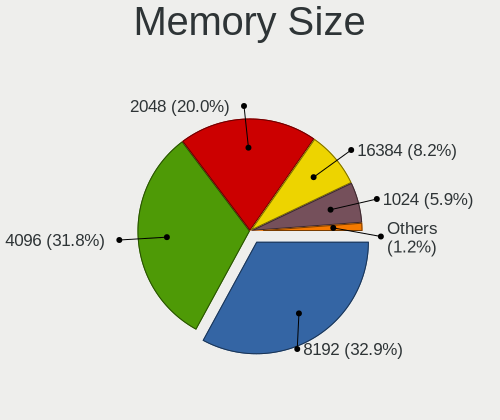

| Size  | Notebooks | Percent |
|-------|-----------|---------|
| 8192  | 27        | 32.93%  |
| 4096  | 26        | 31.71%  |
| 2048  | 16        | 19.51%  |
| 16384 | 7         | 8.54%   |
| 1024  | 5         | 6.1%    |
| 32768 | 1         | 1.22%   |

Memory Speed
------------

Memory module speed

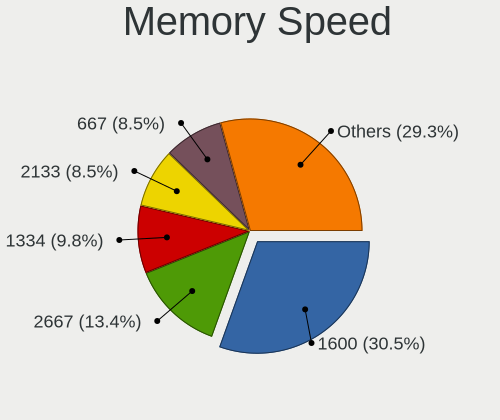

| Speed | Notebooks | Percent |
|-------|-----------|---------|
| 1600  | 24        | 30.38%  |
| 2667  | 11        | 13.92%  |
| 1334  | 8         | 10.13%  |
| 2133  | 7         | 8.86%   |
| 667   | 6         | 7.59%   |
| 1067  | 5         | 6.33%   |
| 2400  | 4         | 5.06%   |
| 1333  | 4         | 5.06%   |
| 800   | 3         | 3.8%    |
| 3200  | 2         | 2.53%   |
| 4267  | 1         | 1.27%   |
| 4199  | 1         | 1.27%   |
| 3733  | 1         | 1.27%   |
| 1867  | 1         | 1.27%   |
| 1066  | 1         | 1.27%   |

Printers & scanners
-------------------

Printer Vendor
--------------

Printer device vendors

| Vendor      | Notebooks | Percent |
|-------------|-----------|---------|
| Seiko Epson | 1         | 100%    |

Printer Model
-------------

Printer device models

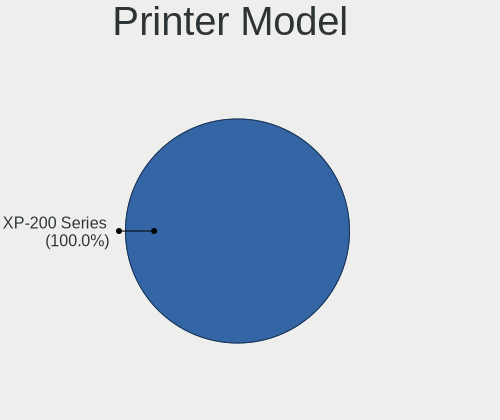

| Model                             | Notebooks | Percent |
|-----------------------------------|-----------|---------|
| Seiko Epson XP-202 203 206 Series | 1         | 100%    |

Scanner Vendor
--------------

Scanner device vendors

Zero info for selected period =(

Scanner Model
-------------

Scanner device models

Zero info for selected period =(

Camera
------

Camera Vendor
-------------

Camera device vendors

| Vendor                                 | Notebooks | Percent |
|----------------------------------------|-----------|---------|
| Chicony Electronics                    | 27        | 21.26%  |
| Realtek Semiconductor                  | 17        | 13.39%  |
| IMC Networks                           | 14        | 11.02%  |
| Sunplus Innovation Technology          | 10        | 7.87%   |
| Apple                                  | 8         | 6.3%    |
| Acer                                   | 8         | 6.3%    |
| Microdia                               | 7         | 5.51%   |
| Cheng Uei Precision Industry (Foxlink) | 6         | 4.72%   |
| Silicon Motion                         | 5         | 3.94%   |
| Quanta                                 | 5         | 3.94%   |
| Syntek                                 | 4         | 3.15%   |
| Suyin                                  | 3         | 2.36%   |
| Lite-On Technology                     | 3         | 2.36%   |
| Importek                               | 3         | 2.36%   |
| Alcor Micro                            | 2         | 1.57%   |
| Samsung Electronics                    | 1         | 0.79%   |
| Ricoh                                  | 1         | 0.79%   |
| LG Electronics                         | 1         | 0.79%   |
| Jieli Technology                       | 1         | 0.79%   |
| ALi                                    | 1         | 0.79%   |

Camera Model
------------

Camera device models

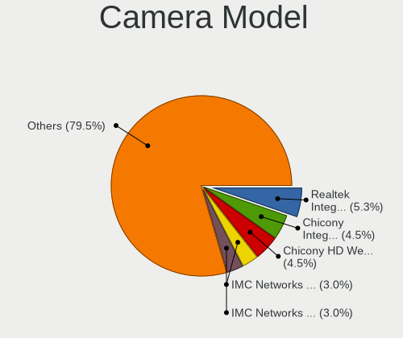

| Model                                                 | Notebooks | Percent |
|-------------------------------------------------------|-----------|---------|
| Realtek Integrated_Webcam_HD                          | 6         | 4.72%   |
| Chicony HD WebCam                                     | 6         | 4.72%   |
| Chicony Integrated Camera                             | 5         | 3.94%   |
| IMC Networks USB2.0 HD UVC WebCam                     | 4         | 3.15%   |
| IMC Networks Integrated Camera                        | 4         | 3.15%   |
| Apple Built-in iSight                                 | 4         | 3.15%   |
| Sunplus Integrated_Webcam_HD                          | 3         | 2.36%   |
| Sunplus HD WebCam                                     | 3         | 2.36%   |
| Realtek HD WebCam                                     | 3         | 2.36%   |
| Apple iPhone 5/5C/5S/6/SE                             | 3         | 2.36%   |
| Syntek Integrated Camera                              | 2         | 1.57%   |
| Syntek EasyCamera                                     | 2         | 1.57%   |
| Sunplus Laptop_Integrated_Webcam_HD                   | 2         | 1.57%   |
| Realtek USB Camera                                    | 2         | 1.57%   |
| Quanta HP Webcam                                      | 2         | 1.57%   |
| Microdia Integrated_Webcam_HD                         | 2         | 1.57%   |
| Importek TOSHIBA Web Camera - HD                      | 2         | 1.57%   |
| Cheng Uei Precision Industry (Foxlink) HP Webcam-101  | 2         | 1.57%   |
| Acer SunplusIT INC. Integrated Camera                 | 2         | 1.57%   |
| Acer BisonCam, NB Pro                                 | 2         | 1.57%   |
| Suyin UVC HD Webcam                                   | 1         | 0.79%   |
| Suyin HP Truevision HD                                | 1         | 0.79%   |
| Suyin HD Video WebCam                                 | 1         | 0.79%   |
| Sunplus HP Universal Camera                           | 1         | 0.79%   |
| Sunplus Dell HD Webcam                                | 1         | 0.79%   |
| Silicon Motion WebCam SC-13HDL12131N                  | 1         | 0.79%   |
| Silicon Motion WebCam SC-10HDD12636N                  | 1         | 0.79%   |
| Silicon Motion Web Camera                             | 1         | 0.79%   |
| Silicon Motion Lenovo EasyCamera                      | 1         | 0.79%   |
| Silicon Motion HP Webcam-101 Integrated Camera        | 1         | 0.79%   |
| Samsung Galaxy A5 (MTP)                               | 1         | 0.79%   |
| Ricoh USB2.0 Camera                                   | 1         | 0.79%   |
| Realtek USB2.0 HD UVC WebCam                          | 1         | 0.79%   |
| Realtek Integrated Webcam HD                          | 1         | 0.79%   |
| Realtek Integrated Webcam                             | 1         | 0.79%   |
| Realtek HP Webcam                                     | 1         | 0.79%   |
| Realtek HD Webcam - Realtek                           | 1         | 0.79%   |
| Realtek 2SF001                                        | 1         | 0.79%   |
| Quanta LG Webcam                                      | 1         | 0.79%   |
| Quanta HP Wide Vision HD Camera                       | 1         | 0.79%   |
| Quanta HP HD Camera                                   | 1         | 0.79%   |
| Microdia Webcam Vitade AF                             | 1         | 0.79%   |
| Microdia WebCam SC-13HDL12639P                        | 1         | 0.79%   |
| Microdia USB 2.0 Camera                               | 1         | 0.79%   |
| Microdia Integrated Webcam                            | 1         | 0.79%   |
| Microdia HP Webcam                                    | 1         | 0.79%   |
| Lite-On Integrated Camera                             | 1         | 0.79%   |
| Lite-On HP HD Webcam                                  | 1         | 0.79%   |
| Lite-On HP HD Camera                                  | 1         | 0.79%   |
| LG LM-X420xxx/G2/G3 Android Phone (MTP/download mode) | 1         | 0.79%   |
| Jieli USB PHY 2.0                                     | 1         | 0.79%   |
| Importek FJ Camera                                    | 1         | 0.79%   |
| IMC Networks UVC VGA Webcam                           | 1         | 0.79%   |
| IMC Networks USB2.0 VGA UVC WebCam                    | 1         | 0.79%   |
| IMC Networks USB2.0 UVC HD Webcam                     | 1         | 0.79%   |
| IMC Networks USB2.0 HD IR UVC WebCam                  | 1         | 0.79%   |
| IMC Networks Lenovo EasyCamera                        | 1         | 0.79%   |
| IMC Networks HD Camera                                | 1         | 0.79%   |
| Chicony WebCam                                        | 1         | 0.79%   |
| Chicony VGA WebCam                                    | 1         | 0.79%   |

Security
--------

Fingerprint Vendor
------------------

Fingerprint sensor vendors

| Vendor                     | Notebooks | Percent |
|----------------------------|-----------|---------|
| Validity Sensors           | 9         | 39.13%  |
| Synaptics                  | 7         | 30.43%  |
| LighTuning Technology      | 3         | 13.04%  |
| Shenzhen Goodix Technology | 2         | 8.7%    |
| Elan Microelectronics      | 2         | 8.7%    |

Fingerprint Model
-----------------

Fingerprint sensor models

| Model                                                                      | Notebooks | Percent |
|----------------------------------------------------------------------------|-----------|---------|
| Synaptics Metallica MIS Touch Fingerprint Reader                           | 3         | 13.04%  |
| LighTuning EgisTec Touch Fingerprint Sensor                                | 3         | 13.04%  |
| Validity Sensors VFS471 Fingerprint Reader                                 | 2         | 8.7%    |
| Synaptics Prometheus MIS Touch Fingerprint Reader                          | 2         | 8.7%    |
| Elan ELAN:Fingerprint                                                      | 2         | 8.7%    |
| Validity Sensors VFS7500 Touch Fingerprint Sensor                          | 1         | 4.35%   |
| Validity Sensors VFS495 Fingerprint Reader                                 | 1         | 4.35%   |
| Validity Sensors VFS491                                                    | 1         | 4.35%   |
| Validity Sensors VFS 5011 fingerprint sensor                               | 1         | 4.35%   |
| Validity Sensors Synaptics WBDI                                            | 1         | 4.35%   |
| Validity Sensors Synaptics VFS7552 Touch Fingerprint Sensor with PurePrint | 1         | 4.35%   |
| Validity Sensors Fingerprint scanner                                       | 1         | 4.35%   |
| Synaptics  FS7604 Touch Fingerprint Sensor with PurePrint                  | 1         | 4.35%   |
| Synaptics Metallica MOH Touch Fingerprint Reader                           | 1         | 4.35%   |
| Shenzhen Goodix Fingerprint Reader                                         | 1         | 4.35%   |
| Shenzhen Goodix FingerPrint                                                | 1         | 4.35%   |

Chipcard Vendor
---------------

Chipcard module vendors

| Vendor      | Notebooks | Percent |
|-------------|-----------|---------|
| Broadcom    | 6         | 46.15%  |
| Alcor Micro | 3         | 23.08%  |
| O2 Micro    | 2         | 15.38%  |
| Upek        | 1         | 7.69%   |
| Lenovo      | 1         | 7.69%   |

Chipcard Model
--------------

Chipcard module models

| Model                                                                        | Notebooks | Percent |
|------------------------------------------------------------------------------|-----------|---------|
| Broadcom BCM5880 Secure Applications Processor                               | 3         | 23.08%  |
| Alcor Micro AU9540 Smartcard Reader                                          | 3         | 23.08%  |
| Upek TouchChip Fingerprint Coprocessor (WBF advanced mode)                   | 1         | 7.69%   |
| O2 Micro Oz776 SmartCard Reader                                              | 1         | 7.69%   |
| O2 Micro OZ776 CCID Smartcard Reader                                         | 1         | 7.69%   |
| Lenovo Integrated Smart Card Reader                                          | 1         | 7.69%   |
| Broadcom BCM5880 Secure Applications Processor with fingerprint swipe sensor | 1         | 7.69%   |
| Broadcom 5880                                                                | 1         | 7.69%   |
| Broadcom 58200                                                               | 1         | 7.69%   |

Unsupported
-----------

Unsupported Devices
-------------------

Total unsupported devices on board

| Total | Notebooks | Percent |
|-------|-----------|---------|
| 0     | 97        | 67.83%  |
| 1     | 36        | 25.17%  |
| 2     | 7         | 4.9%    |
| 3     | 3         | 2.1%    |

Unsupported Device Types
------------------------

Types of unsupported devices

| Type               | Notebooks | Percent |
|--------------------|-----------|---------|
| Fingerprint reader | 22        | 37.93%  |
| Chipcard           | 13        | 22.41%  |
| Graphics card      | 9         | 15.52%  |
| Net/wireless       | 7         | 12.07%  |
| Camera             | 3         | 5.17%   |
| Storage            | 2         | 3.45%   |
| Net/ethernet       | 1         | 1.72%   |
| Bluetooth          | 1         | 1.72%   |

