Elementary 5.1.7 - Tested Hardware & Statistics
-----------------------------------------------

A project to collect tested hardware configurations for Elementary 5.1.7.

Anyone can contribute to this report by the [hw-probe](https://github.com/linuxhw/hw-probe) tool:

    sudo -E hw-probe -all -upload

Please contribute! Especially if your hardware is rare.

This is a report for all computer types. See also reports for [desktops](/Dist/Elementary_5.1.7/Desktop/README.md) and [notebooks](/Dist/Elementary_5.1.7/Notebook/README.md).

Contents
--------

* [ Test Cases ](#test-cases)

* [ System ](#system)
  - [ Kernel                   ](#kernel)
  - [ Kernel Family            ](#kernel-family)
  - [ Kernel Major Ver.        ](#kernel-major-ver)
  - [ Arch                     ](#arch)
  - [ DE                       ](#de)
  - [ Display Server           ](#display-server)
  - [ Display Manager          ](#display-manager)
  - [ OS Lang                  ](#os-lang)
  - [ Boot Mode                ](#boot-mode)
  - [ Filesystem               ](#filesystem)
  - [ Part. scheme             ](#part-scheme)
  - [ Dual Boot with Linux/BSD ](#dual-boot-with-linuxbsd)
  - [ Dual Boot (Win)          ](#dual-boot-win)

* [ Board ](#board)
  - [ Vendor                   ](#vendor)
  - [ Model                    ](#model)
  - [ Model Family             ](#model-family)
  - [ MFG Year                 ](#mfg-year)
  - [ Form Factor              ](#form-factor)
  - [ Secure Boot              ](#secure-boot)
  - [ Coreboot                 ](#coreboot)
  - [ RAM Size                 ](#ram-size)
  - [ RAM Used                 ](#ram-used)
  - [ Total Drives             ](#total-drives)
  - [ Has CD-ROM               ](#has-cd-rom)
  - [ Has Ethernet             ](#has-ethernet)
  - [ Has WiFi                 ](#has-wifi)
  - [ Has Bluetooth            ](#has-bluetooth)

* [ Location ](#location)
  - [ Country                  ](#country)
  - [ City                     ](#city)

* [ Drives ](#drives)
  - [ Drive Vendor             ](#drive-vendor)
  - [ Drive Model              ](#drive-model)
  - [ HDD Vendor               ](#hdd-vendor)
  - [ SSD Vendor               ](#ssd-vendor)
  - [ Drive Kind               ](#drive-kind)
  - [ Drive Connector          ](#drive-connector)
  - [ Drive Size               ](#drive-size)
  - [ Space Total              ](#space-total)
  - [ Space Used               ](#space-used)
  - [ Malfunc. Drives          ](#malfunc-drives)
  - [ Malfunc. Drive Vendor    ](#malfunc-drive-vendor)
  - [ Malfunc. HDD Vendor      ](#malfunc-hdd-vendor)
  - [ Malfunc. Drive Kind      ](#malfunc-drive-kind)
  - [ Failed Drives            ](#failed-drives)
  - [ Failed Drive Vendor      ](#failed-drive-vendor)
  - [ Drive Status             ](#drive-status)

* [ Storage controller ](#storage-controller)
  - [ Storage Vendor           ](#storage-vendor)
  - [ Storage Model            ](#storage-model)
  - [ Storage Kind             ](#storage-kind)

* [ Processor ](#processor)
  - [ CPU Vendor               ](#cpu-vendor)
  - [ CPU Model                ](#cpu-model)
  - [ CPU Model Family         ](#cpu-model-family)
  - [ CPU Cores                ](#cpu-cores)
  - [ CPU Sockets              ](#cpu-sockets)
  - [ CPU Threads              ](#cpu-threads)
  - [ CPU Op-Modes             ](#cpu-op-modes)
  - [ CPU Microcode            ](#cpu-microcode)
  - [ CPU Microarch            ](#cpu-microarch)

* [ Graphics ](#graphics)
  - [ GPU Vendor               ](#gpu-vendor)
  - [ GPU Model                ](#gpu-model)
  - [ GPU Combo                ](#gpu-combo)
  - [ GPU Driver               ](#gpu-driver)
  - [ GPU Memory               ](#gpu-memory)

* [ Monitor ](#monitor)
  - [ Monitor Vendor           ](#monitor-vendor)
  - [ Monitor Model            ](#monitor-model)
  - [ Monitor Resolution       ](#monitor-resolution)
  - [ Monitor Diagonal         ](#monitor-diagonal)
  - [ Monitor Width            ](#monitor-width)
  - [ Aspect Ratio             ](#aspect-ratio)
  - [ Monitor Area             ](#monitor-area)
  - [ Pixel Density            ](#pixel-density)
  - [ Multiple Monitors        ](#multiple-monitors)

* [ Network ](#network)
  - [ Net Controller Vendor    ](#net-controller-vendor)
  - [ Net Controller Model     ](#net-controller-model)
  - [ Wireless Vendor          ](#wireless-vendor)
  - [ Wireless Model           ](#wireless-model)
  - [ Ethernet Vendor          ](#ethernet-vendor)
  - [ Ethernet Model           ](#ethernet-model)
  - [ Net Controller Kind      ](#net-controller-kind)
  - [ Used Controller          ](#used-controller)
  - [ NICs                     ](#nics)
  - [ IPv6                     ](#ipv6)

* [ Bluetooth ](#bluetooth)
  - [ Bluetooth Vendor         ](#bluetooth-vendor)
  - [ Bluetooth Model          ](#bluetooth-model)

* [ Sound ](#sound)
  - [ Sound Vendor             ](#sound-vendor)
  - [ Sound Model              ](#sound-model)

* [ Memory ](#memory)
  - [ Memory Vendor            ](#memory-vendor)
  - [ Memory Model             ](#memory-model)
  - [ Memory Kind              ](#memory-kind)
  - [ Memory Form Factor       ](#memory-form-factor)
  - [ Memory Size              ](#memory-size)
  - [ Memory Speed             ](#memory-speed)

* [ Printers & scanners ](#printers--scanners)
  - [ Printer Vendor           ](#printer-vendor)
  - [ Printer Model            ](#printer-model)
  - [ Scanner Vendor           ](#scanner-vendor)
  - [ Scanner Model            ](#scanner-model)

* [ Camera ](#camera)
  - [ Camera Vendor            ](#camera-vendor)
  - [ Camera Model             ](#camera-model)

* [ Security ](#security)
  - [ Fingerprint Vendor       ](#fingerprint-vendor)
  - [ Fingerprint Model        ](#fingerprint-model)
  - [ Chipcard Vendor          ](#chipcard-vendor)
  - [ Chipcard Model           ](#chipcard-model)

* [ Unsupported ](#unsupported)
  - [ Unsupported Devices      ](#unsupported-devices)
  - [ Unsupported Device Types ](#unsupported-device-types)

Test Cases
----------

Total: 324

| Vendor        | Model                       | Form-Factor | Probe                                                      | Date         |
|---------------|-----------------------------|-------------|------------------------------------------------------------|--------------|
| Apple         | MacBookPro8,1               | Notebook    | [7b03f438db](https://linux-hardware.org/?probe=7b03f438db) | Dec 28, 2022 |
| Lenovo        | ThinkCentre M71e 3129C3G    | Desktop     | [cb9f99f1cf](https://linux-hardware.org/?probe=cb9f99f1cf) | Dec 23, 2022 |
| Positivo      | S14SL01                     | Notebook    | [476e8a784c](https://linux-hardware.org/?probe=476e8a784c) | Dec 21, 2022 |
| Positivo      | S14SL01                     | Notebook    | [08e3a4d7f2](https://linux-hardware.org/?probe=08e3a4d7f2) | Dec 21, 2022 |
| MSI           | B350 TOMAHAWK               | Desktop     | [0ce6563922](https://linux-hardware.org/?probe=0ce6563922) | Dec 11, 2022 |
| Apple         | MacBook3,1                  | Notebook    | [404821c7d6](https://linux-hardware.org/?probe=404821c7d6) | Nov 25, 2022 |
| MSI           | IONA                        | Desktop     | [280083cfa1](https://linux-hardware.org/?probe=280083cfa1) | Nov 22, 2022 |
| HP            | Pavilion dv5                | Notebook    | [fb23cec1a6](https://linux-hardware.org/?probe=fb23cec1a6) | Nov 01, 2022 |
| ASUSTek       | UX31A                       | Notebook    | [4b7e610e25](https://linux-hardware.org/?probe=4b7e610e25) | Oct 24, 2022 |
| Apple         | MacBookPro8,1               | Notebook    | [f65d685d05](https://linux-hardware.org/?probe=f65d685d05) | Aug 30, 2022 |
| Lenovo        | MAHOBAY NO DPK              | Desktop     | [9274f5e876](https://linux-hardware.org/?probe=9274f5e876) | Aug 29, 2022 |
| Gigabyte      | H81M-DS2                    | Desktop     | [e0abb12052](https://linux-hardware.org/?probe=e0abb12052) | Aug 16, 2022 |
| Gigabyte      | H81M-DS2                    | Desktop     | [5ae2bc3c12](https://linux-hardware.org/?probe=5ae2bc3c12) | Aug 14, 2022 |
| Dell          | 0GM819                      | Desktop     | [373772e538](https://linux-hardware.org/?probe=373772e538) | Jul 21, 2022 |
| Lenovo        | V15-IIL 82C5                | Notebook    | [1023ca742e](https://linux-hardware.org/?probe=1023ca742e) | Jun 27, 2022 |
| Toshiba       | Satellite C870-1H2          | Notebook    | [edc5098a6f](https://linux-hardware.org/?probe=edc5098a6f) | Jun 27, 2022 |
| HP            | Pavilion dv5                | Notebook    | [4d0e23962a](https://linux-hardware.org/?probe=4d0e23962a) | Jun 27, 2022 |
| Lenovo        | V15-IIL 82C5                | Notebook    | [47f52294bb](https://linux-hardware.org/?probe=47f52294bb) | Jun 14, 2022 |
| ASUSTek       | P5KPL-VM/S                  | Desktop     | [66223d6ef0](https://linux-hardware.org/?probe=66223d6ef0) | May 25, 2022 |
| ASUSTek       | P5KPL-VM/S                  | Desktop     | [d44e9d6290](https://linux-hardware.org/?probe=d44e9d6290) | May 25, 2022 |
| HP            | ZBook 15                    | Notebook    | [bd8e2ed626](https://linux-hardware.org/?probe=bd8e2ed626) | May 07, 2022 |
| HP            | EliteBook 8470p             | Notebook    | [d7223d4b03](https://linux-hardware.org/?probe=d7223d4b03) | May 05, 2022 |
| Gigabyte      | GA-880GMA-UD2H              | Desktop     | [09d9f58ee7](https://linux-hardware.org/?probe=09d9f58ee7) | May 02, 2022 |
| Dell          | Latitude 3550               | Notebook    | [6947850074](https://linux-hardware.org/?probe=6947850074) | Apr 14, 2022 |
| Panasonic     | CF-31SBLJGDM                | Notebook    | [60a1068658](https://linux-hardware.org/?probe=60a1068658) | Apr 13, 2022 |
| ASUSTek       | P8H61-M LX3 R2.0            | Desktop     | [1c357065cb](https://linux-hardware.org/?probe=1c357065cb) | Apr 07, 2022 |
| HP            | 18E7                        | Desktop     | [ead4fcc358](https://linux-hardware.org/?probe=ead4fcc358) | Mar 29, 2022 |
| Samsung       | 530U3C/530U4C/532U3C        | Notebook    | [1c30077d94](https://linux-hardware.org/?probe=1c30077d94) | Mar 26, 2022 |
| Acer          | Swift SF314-52              | Notebook    | [2d8ab46eed](https://linux-hardware.org/?probe=2d8ab46eed) | Mar 21, 2022 |
| Acer          | Swift SF314-52              | Notebook    | [b1bdc8c7d4](https://linux-hardware.org/?probe=b1bdc8c7d4) | Mar 21, 2022 |
| Dell          | Latitude 3550               | Notebook    | [947e147577](https://linux-hardware.org/?probe=947e147577) | Mar 13, 2022 |
| Dell          | Latitude 3550               | Notebook    | [afffe18667](https://linux-hardware.org/?probe=afffe18667) | Mar 13, 2022 |
| Dell          | 0HMX8D A01                  | Desktop     | [cfff92df80](https://linux-hardware.org/?probe=cfff92df80) | Mar 09, 2022 |
| ASUSTek       | H81-PLUS                    | Desktop     | [9c68dfb511](https://linux-hardware.org/?probe=9c68dfb511) | Feb 26, 2022 |
| ASUSTek       | K75VJ                       | Notebook    | [e0c07cf9d2](https://linux-hardware.org/?probe=e0c07cf9d2) | Feb 20, 2022 |
| Intel         | NUC8BEB J72692-309          | Mini pc     | [85d07f0cc8](https://linux-hardware.org/?probe=85d07f0cc8) | Feb 03, 2022 |
| Intel         | NUC8BEB J72692-309          | Mini pc     | [f3e2292b52](https://linux-hardware.org/?probe=f3e2292b52) | Feb 03, 2022 |
| Panasonic     | CF-31SBLJGDM                | Notebook    | [488b80a942](https://linux-hardware.org/?probe=488b80a942) | Feb 03, 2022 |
| HP            | Pavilion dv5                | Notebook    | [62a18fa26b](https://linux-hardware.org/?probe=62a18fa26b) | Jan 26, 2022 |
| Dell          | Latitude 5420               | Notebook    | [3aad8f46c6](https://linux-hardware.org/?probe=3aad8f46c6) | Jan 24, 2022 |
| ASUSTek       | P8H61-M LX3 R2.0            | Desktop     | [a76b9e67bb](https://linux-hardware.org/?probe=a76b9e67bb) | Jan 14, 2022 |
| MSI           | GE60 2PE                    | Notebook    | [d74dcddae6](https://linux-hardware.org/?probe=d74dcddae6) | Jan 13, 2022 |
| ASUSTek       | UX31A                       | Notebook    | [afe25bb395](https://linux-hardware.org/?probe=afe25bb395) | Jan 10, 2022 |
| Dell          | Latitude 5420               | Notebook    | [ab3973e74b](https://linux-hardware.org/?probe=ab3973e74b) | Jan 07, 2022 |
| Dell          | Latitude 5420               | Notebook    | [517adf10a8](https://linux-hardware.org/?probe=517adf10a8) | Jan 06, 2022 |
| ASRock        | H97M Pro4                   | Desktop     | [92a6f429b5](https://linux-hardware.org/?probe=92a6f429b5) | Jan 05, 2022 |
| Lenovo        | IdeaPad 330-15IKB 81DE      | Notebook    | [fa46d4f41a](https://linux-hardware.org/?probe=fa46d4f41a) | Dec 28, 2021 |
| Lenovo        | IdeaPad 330-15IKB 81DE      | Notebook    | [22fb358e03](https://linux-hardware.org/?probe=22fb358e03) | Dec 28, 2021 |
| Apple         | MacBook2,1                  | Notebook    | [82483b42e2](https://linux-hardware.org/?probe=82483b42e2) | Dec 21, 2021 |
| Apple         | MacBook2,1                  | Notebook    | [197a4e0280](https://linux-hardware.org/?probe=197a4e0280) | Dec 21, 2021 |
| Acer          | Aspire R3-131T              | Notebook    | [3fd499b264](https://linux-hardware.org/?probe=3fd499b264) | Dec 04, 2021 |
| ASRock        | Z370 Pro4                   | Desktop     | [4ada22b406](https://linux-hardware.org/?probe=4ada22b406) | Dec 04, 2021 |
| Lenovo        | ThinkPad T440p 20AWS1HK0... | Notebook    | [416712d76f](https://linux-hardware.org/?probe=416712d76f) | Nov 30, 2021 |
| Lenovo        | ThinkPad T440p 20AWS1HK0... | Notebook    | [c4e34dbb1c](https://linux-hardware.org/?probe=c4e34dbb1c) | Nov 30, 2021 |
| ASUSTek       | PRIME X470-PRO              | Desktop     | [2845eaa223](https://linux-hardware.org/?probe=2845eaa223) | Nov 27, 2021 |
| Foxconn       | 2AB1                        | Desktop     | [09a8a91f9e](https://linux-hardware.org/?probe=09a8a91f9e) | Nov 26, 2021 |
| HP            | Pavilion dv7                | Notebook    | [073367afb1](https://linux-hardware.org/?probe=073367afb1) | Nov 25, 2021 |
| Foxconn       | 2AB1                        | Desktop     | [f965bf0bd8](https://linux-hardware.org/?probe=f965bf0bd8) | Nov 18, 2021 |
| Apple         | Mac-F4208DC8 PVT            | Desktop     | [3369764322](https://linux-hardware.org/?probe=3369764322) | Nov 17, 2021 |
| HP            | Laptop 17-by3xxx            | Notebook    | [beba4da01c](https://linux-hardware.org/?probe=beba4da01c) | Nov 09, 2021 |
| Intel         | DG35EC AAE29266-205         | Desktop     | [89c665e43d](https://linux-hardware.org/?probe=89c665e43d) | Nov 02, 2021 |
| Intel         | DG35EC AAE29266-205         | Desktop     | [1046b28a41](https://linux-hardware.org/?probe=1046b28a41) | Nov 02, 2021 |
| ASUSTek       | K75VJ                       | Notebook    | [9c0bccf601](https://linux-hardware.org/?probe=9c0bccf601) | Nov 01, 2021 |
| Dell          | 0KFKMF A00                  | All in one  | [81af87f00c](https://linux-hardware.org/?probe=81af87f00c) | Oct 29, 2021 |
| Foxconn       | 2AB1                        | Desktop     | [49aef5b72e](https://linux-hardware.org/?probe=49aef5b72e) | Oct 26, 2021 |
| Gigabyte      | H67A-USB3-B3                | Desktop     | [9440c234ae](https://linux-hardware.org/?probe=9440c234ae) | Sep 28, 2021 |
| Gigabyte      | H67A-USB3-B3                | Desktop     | [0aab60dbc8](https://linux-hardware.org/?probe=0aab60dbc8) | Sep 24, 2021 |
| Toshiba       | Satellite C870-1H2          | Notebook    | [73615204f8](https://linux-hardware.org/?probe=73615204f8) | Sep 23, 2021 |
| Gigabyte      | H67A-USB3-B3                | Desktop     | [772b49f342](https://linux-hardware.org/?probe=772b49f342) | Sep 21, 2021 |
| Gigabyte      | Z68P-DS3                    | Desktop     | [1ddd2fcf1d](https://linux-hardware.org/?probe=1ddd2fcf1d) | Sep 14, 2021 |
| Lenovo        | Flex 6-11IGM 81A7           | Convertible | [17e78af479](https://linux-hardware.org/?probe=17e78af479) | Sep 14, 2021 |
| Acer          | Aspire R3-131T              | Notebook    | [e872ba288e](https://linux-hardware.org/?probe=e872ba288e) | Sep 12, 2021 |
| Dell          | Vostro 15-3568              | Notebook    | [9460412d4d](https://linux-hardware.org/?probe=9460412d4d) | Sep 04, 2021 |
| HP            | Pavilion Laptop 15-cw0xx... | Notebook    | [cf69bd4423](https://linux-hardware.org/?probe=cf69bd4423) | Aug 31, 2021 |
| Acer          | Aspire E5-573G              | Notebook    | [8c61841633](https://linux-hardware.org/?probe=8c61841633) | Aug 30, 2021 |
| HP            | Laptop 17-by3xxx            | Notebook    | [84aa134848](https://linux-hardware.org/?probe=84aa134848) | Aug 25, 2021 |
| HP            | Laptop 17-by3xxx            | Notebook    | [674068cb21](https://linux-hardware.org/?probe=674068cb21) | Aug 19, 2021 |
| Lenovo        | IdeaPadFlex 14 20308        | Notebook    | [54f7c9deec](https://linux-hardware.org/?probe=54f7c9deec) | Aug 14, 2021 |
| Acer          | Aspire 3810TZ               | Notebook    | [6b7176e5ed](https://linux-hardware.org/?probe=6b7176e5ed) | Aug 10, 2021 |
| Lenovo        | ThinkPad X201 3249CTO       | Notebook    | [9b9cd9a995](https://linux-hardware.org/?probe=9b9cd9a995) | Aug 10, 2021 |
| Acer          | Aspire E5-573G              | Notebook    | [caa41076f3](https://linux-hardware.org/?probe=caa41076f3) | Aug 07, 2021 |
| HP            | EliteBook 2570p             | Notebook    | [53c721a204](https://linux-hardware.org/?probe=53c721a204) | Aug 01, 2021 |
| Acer          | Aspire XC-603G              | Desktop     | [8a37f28ecc](https://linux-hardware.org/?probe=8a37f28ecc) | Jul 31, 2021 |
| Lenovo        | ThinkPad P50 20ENA00PLM     | Notebook    | [3b6f4346e5](https://linux-hardware.org/?probe=3b6f4346e5) | Jul 29, 2021 |
| Toshiba       | Satellite C850D-119         | Notebook    | [bb3f1b4afa](https://linux-hardware.org/?probe=bb3f1b4afa) | Jul 29, 2021 |
| TUXEDO        | InfinityBook S 14 Gen6      | Notebook    | [75ff3dac2c](https://linux-hardware.org/?probe=75ff3dac2c) | Jul 28, 2021 |
| Dell          | Inspiron 7506 2n1           | Convertible | [4a7e9569e4](https://linux-hardware.org/?probe=4a7e9569e4) | Jul 28, 2021 |
| Dell          | Latitude E5470              | Notebook    | [f26e3c7b39](https://linux-hardware.org/?probe=f26e3c7b39) | Jul 26, 2021 |
| Dell          | 0KFKMF A00                  | All in one  | [f09adc9f37](https://linux-hardware.org/?probe=f09adc9f37) | Jul 25, 2021 |
| Dell          | Vostro 3446                 | Notebook    | [566fe43065](https://linux-hardware.org/?probe=566fe43065) | Jul 25, 2021 |
| Dell          | Vostro 3446                 | Notebook    | [9a984d5856](https://linux-hardware.org/?probe=9a984d5856) | Jul 25, 2021 |
| Dell          | Vostro 15-3568              | Notebook    | [9951dfaa86](https://linux-hardware.org/?probe=9951dfaa86) | Jul 24, 2021 |
| Biostar       | H61MH                       | Desktop     | [adca68749a](https://linux-hardware.org/?probe=adca68749a) | Jul 23, 2021 |
| Biostar       | H61MH                       | Desktop     | [2c690e433f](https://linux-hardware.org/?probe=2c690e433f) | Jul 23, 2021 |
| 3E            | Education PC by             | Tablet      | [4997e0ca93](https://linux-hardware.org/?probe=4997e0ca93) | Jul 14, 2021 |
| 3E            | Education PC by             | Tablet      | [9719e5e012](https://linux-hardware.org/?probe=9719e5e012) | Jul 14, 2021 |
| ASUSTek       | ROG STRIX Z390-H GAMING     | Desktop     | [9e27318e84](https://linux-hardware.org/?probe=9e27318e84) | Jul 14, 2021 |
| Acer          | Aspire E5-573G              | Notebook    | [a01b8bbea0](https://linux-hardware.org/?probe=a01b8bbea0) | Jul 07, 2021 |
| Google        | Banjo                       | Notebook    | [d451dcd617](https://linux-hardware.org/?probe=d451dcd617) | Jul 02, 2021 |
| HP            | Pavilion 14                 | Notebook    | [01491528b1](https://linux-hardware.org/?probe=01491528b1) | Jun 28, 2021 |
| Acer          | Aspire E1-570G              | Notebook    | [e72de97e18](https://linux-hardware.org/?probe=e72de97e18) | Jun 25, 2021 |
| ASUSTek       | ZenBook UX481FA_UX481FA     | Notebook    | [675397a7db](https://linux-hardware.org/?probe=675397a7db) | Jun 19, 2021 |
| Clevo         | W240EU/W250EUQ/W270EUQ      | Notebook    | [82e660e88d](https://linux-hardware.org/?probe=82e660e88d) | Jun 12, 2021 |
| Toshiba       | Satellite L500              | Notebook    | [e8589abc23](https://linux-hardware.org/?probe=e8589abc23) | Jun 10, 2021 |
| Toshiba       | Satellite L500              | Notebook    | [b65c50aaf8](https://linux-hardware.org/?probe=b65c50aaf8) | Jun 09, 2021 |
| ASUSTek       | PRIME A320M-K               | Desktop     | [5e0580b431](https://linux-hardware.org/?probe=5e0580b431) | Jun 08, 2021 |
| Toshiba       | Satellite L500              | Notebook    | [6b941d232d](https://linux-hardware.org/?probe=6b941d232d) | Jun 04, 2021 |
| ASUSTek       | VivoBook_ASUSLaptop X421... | Notebook    | [3f8470a641](https://linux-hardware.org/?probe=3f8470a641) | Jun 02, 2021 |
| Lenovo        | ThinkPad X240 20AMA0XK00    | Notebook    | [8b7ecca1b8](https://linux-hardware.org/?probe=8b7ecca1b8) | Jun 02, 2021 |
| HP            | Presario CQ56               | Notebook    | [70a720b401](https://linux-hardware.org/?probe=70a720b401) | May 31, 2021 |
| ASUSTek       | H81M-K                      | Desktop     | [52fa7c5a31](https://linux-hardware.org/?probe=52fa7c5a31) | May 30, 2021 |
| HP            | Pavilion g7                 | Notebook    | [6607d7bfd4](https://linux-hardware.org/?probe=6607d7bfd4) | May 28, 2021 |
| HP            | Laptop 17-by3xxx            | Notebook    | [94e12db274](https://linux-hardware.org/?probe=94e12db274) | May 28, 2021 |
| Toshiba       | Satellite L500              | Notebook    | [7bcdcd125f](https://linux-hardware.org/?probe=7bcdcd125f) | May 24, 2021 |
| Toshiba       | Satellite L500              | Notebook    | [c812470c98](https://linux-hardware.org/?probe=c812470c98) | May 22, 2021 |
| HUAWEI        | HLY-WX9XX                   | Notebook    | [96c74bb052](https://linux-hardware.org/?probe=96c74bb052) | May 14, 2021 |
| Dell          | Latitude E6400              | Notebook    | [28c0f73a83](https://linux-hardware.org/?probe=28c0f73a83) | May 12, 2021 |
| LG Electro... | A410-K.BE43P1               | Notebook    | [dd6a1734a8](https://linux-hardware.org/?probe=dd6a1734a8) | May 09, 2021 |
| Lenovo        | ThinkPad T440 20B7S0JF0L    | Notebook    | [dc9c7088dd](https://linux-hardware.org/?probe=dc9c7088dd) | May 08, 2021 |
| Lenovo        | ThinkPad T440 20B7S0JF0L    | Notebook    | [9cf4893825](https://linux-hardware.org/?probe=9cf4893825) | May 08, 2021 |
| Acer          | One S1003                   | Tablet      | [23e45b2b8e](https://linux-hardware.org/?probe=23e45b2b8e) | May 03, 2021 |
| Acer          | One S1003                   | Tablet      | [38a4af836c](https://linux-hardware.org/?probe=38a4af836c) | May 03, 2021 |
| ASUSTek       | K45VD                       | Notebook    | [67e6985b08](https://linux-hardware.org/?probe=67e6985b08) | May 02, 2021 |
| ASUSTek       | K45VD                       | Notebook    | [8624f1c148](https://linux-hardware.org/?probe=8624f1c148) | Apr 30, 2021 |
| Acer          | Aspire F5-573G              | Notebook    | [fdabc1d291](https://linux-hardware.org/?probe=fdabc1d291) | Apr 28, 2021 |
| Acer          | Aspire F5-573G              | Notebook    | [2e2cc93814](https://linux-hardware.org/?probe=2e2cc93814) | Apr 28, 2021 |
| HP            | ENVY x360 Convertible 15... | Convertible | [b35c15fb6b](https://linux-hardware.org/?probe=b35c15fb6b) | Apr 25, 2021 |
| ASUSTek       | X205TAW                     | Notebook    | [91e8c10d9e](https://linux-hardware.org/?probe=91e8c10d9e) | Apr 25, 2021 |
| Acer          | Aspire R3-131T              | Notebook    | [1d52101f3a](https://linux-hardware.org/?probe=1d52101f3a) | Apr 23, 2021 |
| Positivo      | S14SL01                     | Notebook    | [f1cc01bb29](https://linux-hardware.org/?probe=f1cc01bb29) | Apr 22, 2021 |
| Lenovo        | ThinkPad T460 20FMS6C200    | Notebook    | [7f900f8923](https://linux-hardware.org/?probe=7f900f8923) | Apr 20, 2021 |
| Lenovo        | V15-ADA 82C7                | Notebook    | [9065c52996](https://linux-hardware.org/?probe=9065c52996) | Apr 17, 2021 |
| Gigabyte      | AB350M-DS3H V2-CF           | Desktop     | [98d6e8f2d2](https://linux-hardware.org/?probe=98d6e8f2d2) | Apr 15, 2021 |
| Lenovo        | ThinkPad R61e/R61i 76508... | Notebook    | [e3b2bd3e3a](https://linux-hardware.org/?probe=e3b2bd3e3a) | Apr 14, 2021 |
| Dell          | Inspiron 5482               | Convertible | [c6692154a1](https://linux-hardware.org/?probe=c6692154a1) | Apr 14, 2021 |
| HP            | Elite x2 1012 G1            | Notebook    | [09240a2a3f](https://linux-hardware.org/?probe=09240a2a3f) | Apr 13, 2021 |
| ASUSTek       | SABERTOOTH Z87              | Desktop     | [542d0b7163](https://linux-hardware.org/?probe=542d0b7163) | Apr 13, 2021 |
| Lenovo        | IdeaPad 330-15AST 81D6      | Notebook    | [9749184629](https://linux-hardware.org/?probe=9749184629) | Apr 12, 2021 |
| ASUSTek       | K53SC                       | Notebook    | [7cd834c7b9](https://linux-hardware.org/?probe=7cd834c7b9) | Apr 11, 2021 |
| Positivo      | C14CR21                     | Notebook    | [b4ed03e23e](https://linux-hardware.org/?probe=b4ed03e23e) | Apr 11, 2021 |
| Dell          | 06NWYK A01                  | Desktop     | [304541ce36](https://linux-hardware.org/?probe=304541ce36) | Apr 08, 2021 |
| Dell          | Inspiron 5458               | Notebook    | [90eb8e7cc2](https://linux-hardware.org/?probe=90eb8e7cc2) | Apr 08, 2021 |
| Dell          | 06NWYK A01                  | Desktop     | [47766de8d9](https://linux-hardware.org/?probe=47766de8d9) | Apr 07, 2021 |
| MSI           | H61M-P31                    | Desktop     | [867b109a0b](https://linux-hardware.org/?probe=867b109a0b) | Apr 07, 2021 |
| Lenovo        | ThinkPad W540 20BHS1MX00    | Notebook    | [47cc5eb719](https://linux-hardware.org/?probe=47cc5eb719) | Apr 07, 2021 |
| HP            | 843F                        | Desktop     | [d5b68ba3fb](https://linux-hardware.org/?probe=d5b68ba3fb) | Apr 07, 2021 |
| HP            | Pavilion 15                 | Notebook    | [e2bbdc0f8a](https://linux-hardware.org/?probe=e2bbdc0f8a) | Mar 26, 2021 |
| Fujitsu       | LIFEBOOK AH544              | Notebook    | [60600f6f0c](https://linux-hardware.org/?probe=60600f6f0c) | Mar 26, 2021 |
| Lenovo        | ThinkPad T530 2429JB5       | Notebook    | [b3eee9be3e](https://linux-hardware.org/?probe=b3eee9be3e) | Mar 23, 2021 |
| Lenovo        | ThinkPad T530 2429JB5       | Notebook    | [e04914d4de](https://linux-hardware.org/?probe=e04914d4de) | Mar 23, 2021 |
| MSI           | B450M PRO-VDH MAX           | Desktop     | [9a1463fd59](https://linux-hardware.org/?probe=9a1463fd59) | Mar 22, 2021 |
| Toshiba       | QOSMIO G55                  | Notebook    | [be88551910](https://linux-hardware.org/?probe=be88551910) | Mar 22, 2021 |
| Gigabyte      | H61M-S2PV                   | Desktop     | [bbe4962b33](https://linux-hardware.org/?probe=bbe4962b33) | Mar 22, 2021 |
| HP            | ProBook 430 G6              | Notebook    | [29ef42ccfc](https://linux-hardware.org/?probe=29ef42ccfc) | Mar 20, 2021 |
| Toshiba       | QOSMIO G55                  | Notebook    | [35fcfae27e](https://linux-hardware.org/?probe=35fcfae27e) | Mar 19, 2021 |
| HP            | 843F                        | Desktop     | [a4fc49c430](https://linux-hardware.org/?probe=a4fc49c430) | Mar 09, 2021 |
| MSI           | B450M PRO-VDH MAX           | Desktop     | [65c7806bad](https://linux-hardware.org/?probe=65c7806bad) | Mar 09, 2021 |
| HP            | 250 G6 Notebook PC          | Notebook    | [0fadf2dbc1](https://linux-hardware.org/?probe=0fadf2dbc1) | Mar 08, 2021 |
| Apple         | MacBookPro5,5               | Notebook    | [9e67aa8a54](https://linux-hardware.org/?probe=9e67aa8a54) | Mar 02, 2021 |
| MSI           | B450M PRO-VDH MAX           | Desktop     | [e1289a40a1](https://linux-hardware.org/?probe=e1289a40a1) | Feb 28, 2021 |
| HP            | Notebook                    | Notebook    | [201023370e](https://linux-hardware.org/?probe=201023370e) | Feb 28, 2021 |
| Lenovo        | G50-45 80E3                 | Notebook    | [686e15d925](https://linux-hardware.org/?probe=686e15d925) | Feb 27, 2021 |
| HP            | ProBook 430 G7              | Notebook    | [b4b70424b9](https://linux-hardware.org/?probe=b4b70424b9) | Feb 27, 2021 |
| Lenovo        | ThinkPad E14 20RBS6MD00     | Notebook    | [32fced07f8](https://linux-hardware.org/?probe=32fced07f8) | Feb 25, 2021 |
| Dell          | Vostro 14 5401              | Notebook    | [e6e3289d55](https://linux-hardware.org/?probe=e6e3289d55) | Feb 25, 2021 |
| Lenovo        | MAHOBAY NOK                 | Desktop     | [e3c14a6397](https://linux-hardware.org/?probe=e3c14a6397) | Feb 25, 2021 |
| HP            | ProBook 5330m               | Notebook    | [4a66a57a41](https://linux-hardware.org/?probe=4a66a57a41) | Feb 23, 2021 |
| Compaq        | Presario CQ-23              | Notebook    | [2266878950](https://linux-hardware.org/?probe=2266878950) | Feb 21, 2021 |
| Acer          | V5-131                      | Notebook    | [fb508c9cd9](https://linux-hardware.org/?probe=fb508c9cd9) | Feb 14, 2021 |
| Toshiba       | Satellite P750              | Notebook    | [65db006d0a](https://linux-hardware.org/?probe=65db006d0a) | Feb 12, 2021 |
| ASUSTek       | ROG STRIX B350-F GAMING     | Desktop     | [268b9f895a](https://linux-hardware.org/?probe=268b9f895a) | Feb 10, 2021 |
| Apple         | Mac-8ED6AF5B48C039E1 Mac... | Mini pc     | [6271486e7b](https://linux-hardware.org/?probe=6271486e7b) | Feb 10, 2021 |
| Apple         | Mac-8ED6AF5B48C039E1 Mac... | Mini pc     | [bc4bed1cdf](https://linux-hardware.org/?probe=bc4bed1cdf) | Feb 10, 2021 |
| Compaq        | Presario CQ-23              | Notebook    | [0303913f3a](https://linux-hardware.org/?probe=0303913f3a) | Feb 10, 2021 |
| Gigabyte      | Z77-DS3H                    | Desktop     | [a5a556b691](https://linux-hardware.org/?probe=a5a556b691) | Feb 09, 2021 |
| Gigabyte      | A320M-S2H V2-CF             | Desktop     | [ea93e4d3cd](https://linux-hardware.org/?probe=ea93e4d3cd) | Feb 09, 2021 |
| MSI           | B450M PRO-VDH MAX           | Desktop     | [895ec88c20](https://linux-hardware.org/?probe=895ec88c20) | Feb 08, 2021 |
| Acer          | Aspire A515-54              | Notebook    | [878b85cbc6](https://linux-hardware.org/?probe=878b85cbc6) | Feb 06, 2021 |
| Apple         | Mac-65CE76090165799A iMa... | All in one  | [f04da4053d](https://linux-hardware.org/?probe=f04da4053d) | Feb 05, 2021 |
| Apple         | Mac-65CE76090165799A iMa... | All in one  | [c53cdbd363](https://linux-hardware.org/?probe=c53cdbd363) | Feb 05, 2021 |
| Lenovo        | 3000 G530 4151/200          | Notebook    | [9bccdfbc03](https://linux-hardware.org/?probe=9bccdfbc03) | Feb 05, 2021 |
| Apple         | MacBook7,1                  | Notebook    | [8b201eef4f](https://linux-hardware.org/?probe=8b201eef4f) | Feb 05, 2021 |
| Dell          | XPS 13 7390                 | Notebook    | [69d8376e50](https://linux-hardware.org/?probe=69d8376e50) | Feb 03, 2021 |
| ASRock        | Z75 Pro3                    | Desktop     | [f2d919b5c5](https://linux-hardware.org/?probe=f2d919b5c5) | Feb 03, 2021 |
| Sony          | VPCF23JFX                   | Notebook    | [6fffecad4a](https://linux-hardware.org/?probe=6fffecad4a) | Feb 02, 2021 |
| Biostar       | Hi-Fi A70U3P                | Desktop     | [c2727e98b9](https://linux-hardware.org/?probe=c2727e98b9) | Feb 02, 2021 |
| Biostar       | Hi-Fi A70U3P                | Desktop     | [2c11d020c7](https://linux-hardware.org/?probe=2c11d020c7) | Feb 02, 2021 |
| HP            | EliteBook 840 G3            | Notebook    | [2ee3bd8ca9](https://linux-hardware.org/?probe=2ee3bd8ca9) | Jan 30, 2021 |
| Lenovo        | IdeaPad S145-15IKB 81XM     | Notebook    | [4ce7ac1cce](https://linux-hardware.org/?probe=4ce7ac1cce) | Jan 30, 2021 |
| Acer          | AOD255E                     | Notebook    | [b346230927](https://linux-hardware.org/?probe=b346230927) | Jan 27, 2021 |
| Lenovo        | ThinkPad X13 Gen 1 20UF0... | Notebook    | [c259d42e53](https://linux-hardware.org/?probe=c259d42e53) | Jan 16, 2021 |
| MSI           | B450M PRO-VDH MAX           | Desktop     | [98cc7a4bca](https://linux-hardware.org/?probe=98cc7a4bca) | Jan 15, 2021 |
| Gigabyte      | GA-MA78GM-S2H               | Desktop     | [d40272076d](https://linux-hardware.org/?probe=d40272076d) | Jan 13, 2021 |
| Gigabyte      | GA-MA78GM-S2H               | Desktop     | [d31c109973](https://linux-hardware.org/?probe=d31c109973) | Jan 13, 2021 |
| Dell          | G3 3579                     | Notebook    | [888385f26b](https://linux-hardware.org/?probe=888385f26b) | Jan 13, 2021 |
| Dell          | Latitude E6500              | Notebook    | [81ffedd992](https://linux-hardware.org/?probe=81ffedd992) | Jan 13, 2021 |
| Acer          | Swift SF314-54              | Notebook    | [b4bd0c4eec](https://linux-hardware.org/?probe=b4bd0c4eec) | Jan 12, 2021 |
| EVGA          | 132-CK-NF79 2               | Desktop     | [44c54ae3df](https://linux-hardware.org/?probe=44c54ae3df) | Jan 09, 2021 |
| MSI           | P35 Platinum                | Desktop     | [105ebcfc8d](https://linux-hardware.org/?probe=105ebcfc8d) | Jan 08, 2021 |
| Dell          | XPS 13 9300                 | Notebook    | [4a241f61c6](https://linux-hardware.org/?probe=4a241f61c6) | Jan 05, 2021 |
| HP            | Laptop 17-by3xxx            | Notebook    | [84272dcaa9](https://linux-hardware.org/?probe=84272dcaa9) | Jan 05, 2021 |
| Lenovo        | ThinkPad E580 20KSCTO1WW    | Notebook    | [21c0963f18](https://linux-hardware.org/?probe=21c0963f18) | Jan 03, 2021 |
| ASUSTek       | M5A97                       | Desktop     | [0f975cd5e6](https://linux-hardware.org/?probe=0f975cd5e6) | Jan 03, 2021 |
| ASUSTek       | CM6330_CM6630_CM6730_CM6... | Desktop     | [721dd0a694](https://linux-hardware.org/?probe=721dd0a694) | Jan 03, 2021 |
| Star Labs     | Lite                        | Notebook    | [02fa9d26a2](https://linux-hardware.org/?probe=02fa9d26a2) | Jan 03, 2021 |
| Lenovo        | ThinkPad X240 20AMS0XP0S    | Notebook    | [7f209f6d03](https://linux-hardware.org/?probe=7f209f6d03) | Dec 31, 2020 |
| MSI           | B450M PRO-VDH MAX           | Desktop     | [7197a45b8a](https://linux-hardware.org/?probe=7197a45b8a) | Dec 30, 2020 |
| Dell          | 0T656F A02                  | Desktop     | [1830ce642b](https://linux-hardware.org/?probe=1830ce642b) | Dec 29, 2020 |
| Acer          | Aspire R3-131T              | Notebook    | [934454c9c1](https://linux-hardware.org/?probe=934454c9c1) | Dec 29, 2020 |
| ASUSTek       | M5A97                       | Desktop     | [800aa16703](https://linux-hardware.org/?probe=800aa16703) | Dec 29, 2020 |
| HP            | 18EA                        | Desktop     | [67e2e927b6](https://linux-hardware.org/?probe=67e2e927b6) | Dec 27, 2020 |
| Lenovo        | ThinkPad T420 4236M37       | Notebook    | [da2b217109](https://linux-hardware.org/?probe=da2b217109) | Dec 27, 2020 |
| MSI           | B450M PRO-VDH MAX           | Desktop     | [803e6b6194](https://linux-hardware.org/?probe=803e6b6194) | Dec 25, 2020 |
| HP            | EliteBook Folio 9470m       | Notebook    | [013db2cd8e](https://linux-hardware.org/?probe=013db2cd8e) | Dec 25, 2020 |
| Apple         | MacBook7,1                  | Notebook    | [8f63e2a0d9](https://linux-hardware.org/?probe=8f63e2a0d9) | Dec 25, 2020 |
| HP            | G42                         | Notebook    | [c2046377dc](https://linux-hardware.org/?probe=c2046377dc) | Dec 25, 2020 |
| Dell          | Latitude E6520              | Notebook    | [01048967fe](https://linux-hardware.org/?probe=01048967fe) | Dec 24, 2020 |
| Apple         | MacBook7,1                  | Notebook    | [5e92b317ef](https://linux-hardware.org/?probe=5e92b317ef) | Dec 24, 2020 |
| Biostar       | TA785G3 HD                  | Desktop     | [ed91ded9e9](https://linux-hardware.org/?probe=ed91ded9e9) | Dec 23, 2020 |
| ASRock        | Z87E-ITX                    | Desktop     | [861b40ea1d](https://linux-hardware.org/?probe=861b40ea1d) | Dec 21, 2020 |
| Dell          | 0GN723                      | Desktop     | [a952bf5fa6](https://linux-hardware.org/?probe=a952bf5fa6) | Dec 20, 2020 |
| Apple         | MacBook2,1                  | Notebook    | [1bae958a19](https://linux-hardware.org/?probe=1bae958a19) | Dec 17, 2020 |
| LG Electro... | R490-G.ARL5RE2              | Notebook    | [58f0c96534](https://linux-hardware.org/?probe=58f0c96534) | Dec 16, 2020 |
| Fujitsu Si... | LIFEBOOK S6410              | Notebook    | [ec54395d4b](https://linux-hardware.org/?probe=ec54395d4b) | Dec 15, 2020 |
| Fujitsu Si... | LIFEBOOK S6410              | Notebook    | [344504a10b](https://linux-hardware.org/?probe=344504a10b) | Dec 15, 2020 |
| Chuwi         | LapBook Pro                 | Notebook    | [602060bbe9](https://linux-hardware.org/?probe=602060bbe9) | Dec 13, 2020 |
| HP            | Pavilion dv7                | Notebook    | [fee310f330](https://linux-hardware.org/?probe=fee310f330) | Dec 13, 2020 |
| Toshiba       | Satellite R630              | Notebook    | [816b966aa8](https://linux-hardware.org/?probe=816b966aa8) | Dec 11, 2020 |
| HP            | 250 G7 Notebook PC          | Notebook    | [0e95ec9f75](https://linux-hardware.org/?probe=0e95ec9f75) | Dec 08, 2020 |
| Unknown       | 1.0                         | Notebook    | [05b0ad54c9](https://linux-hardware.org/?probe=05b0ad54c9) | Dec 07, 2020 |
| HP            | Pavilion dv7                | Notebook    | [332576610a](https://linux-hardware.org/?probe=332576610a) | Dec 06, 2020 |
| WeiBu         | rev1.0                      | All in one  | [ddf6e5a3f7](https://linux-hardware.org/?probe=ddf6e5a3f7) | Dec 05, 2020 |
| ASUSTek       | PRIME H310M-E R2.0          | Desktop     | [3070faaf5e](https://linux-hardware.org/?probe=3070faaf5e) | Dec 03, 2020 |
| Acer          | Aspire E5-411               | Notebook    | [2513d28117](https://linux-hardware.org/?probe=2513d28117) | Dec 02, 2020 |
| Gigabyte      | H61M-DS2                    | Desktop     | [49263df7ee](https://linux-hardware.org/?probe=49263df7ee) | Dec 02, 2020 |
| HP            | Pavilion Notebook 15-bc5... | Notebook    | [0ef0b89d48](https://linux-hardware.org/?probe=0ef0b89d48) | Dec 01, 2020 |
| HP            | 304Bh                       | Desktop     | [d30d065810](https://linux-hardware.org/?probe=d30d065810) | Nov 30, 2020 |
| ASUSTek       | ZenBook UX431DA_UM431DA     | Notebook    | [177a2353e0](https://linux-hardware.org/?probe=177a2353e0) | Nov 26, 2020 |
| Apple         | MacBookAir7,2               | Notebook    | [04def4b8c8](https://linux-hardware.org/?probe=04def4b8c8) | Nov 25, 2020 |
| Dell          | Inspiron 3542               | Notebook    | [d7a6b8524d](https://linux-hardware.org/?probe=d7a6b8524d) | Nov 23, 2020 |
| ASUSTek       | X200CA                      | Notebook    | [73a317dd32](https://linux-hardware.org/?probe=73a317dd32) | Nov 21, 2020 |
| ASUSTek       | X200CA                      | Notebook    | [2a86994bf7](https://linux-hardware.org/?probe=2a86994bf7) | Nov 21, 2020 |
| Gigabyte      | Z77M-D3H                    | Desktop     | [47c75561ac](https://linux-hardware.org/?probe=47c75561ac) | Nov 21, 2020 |
| HP            | EliteBook 840 G3            | Notebook    | [b0504dfd39](https://linux-hardware.org/?probe=b0504dfd39) | Nov 21, 2020 |
| ASUSTek       | U31SD                       | Notebook    | [0454faa58e](https://linux-hardware.org/?probe=0454faa58e) | Nov 20, 2020 |
| ASUSTek       | TUF Gaming X570-PLUS        | Desktop     | [10e9d31bdb](https://linux-hardware.org/?probe=10e9d31bdb) | Nov 20, 2020 |
| Lenovo        | IdeaPad 320-14AST 80XU      | Notebook    | [25abf7a587](https://linux-hardware.org/?probe=25abf7a587) | Nov 19, 2020 |
| ASUSTek       | PRIME Z270-A                | Desktop     | [d47493ecae](https://linux-hardware.org/?probe=d47493ecae) | Nov 16, 2020 |
| Samsung       | 350V5C/351V5C/3540VC/344... | Notebook    | [7132bcc66d](https://linux-hardware.org/?probe=7132bcc66d) | Nov 15, 2020 |
| Gigabyte      | H81M-S2H                    | Desktop     | [54fd3c5678](https://linux-hardware.org/?probe=54fd3c5678) | Nov 15, 2020 |
| HP            | Laptop 17-by3xxx            | Notebook    | [4b3fbfd552](https://linux-hardware.org/?probe=4b3fbfd552) | Nov 12, 2020 |
| Lenovo        | ThinkPad T480 20L50007RT    | Notebook    | [284c6ccc22](https://linux-hardware.org/?probe=284c6ccc22) | Nov 10, 2020 |
| Acer          | Aspire E5-475G              | Notebook    | [1d195bfc21](https://linux-hardware.org/?probe=1d195bfc21) | Nov 10, 2020 |
| Apple         | MacBookPro11,2              | Notebook    | [aaa025e278](https://linux-hardware.org/?probe=aaa025e278) | Nov 09, 2020 |
| Acer          | Aspire F5-573G              | Notebook    | [dec186ab5a](https://linux-hardware.org/?probe=dec186ab5a) | Nov 08, 2020 |
| ASUSTek       | PRIME A320I-K               | Desktop     | [6bfc04099a](https://linux-hardware.org/?probe=6bfc04099a) | Nov 06, 2020 |
| HP            | ENVY x360 Convertible 13... | Convertible | [3b48bb4088](https://linux-hardware.org/?probe=3b48bb4088) | Nov 04, 2020 |
| Apple         | MacBookPro11,2              | Notebook    | [c9674438eb](https://linux-hardware.org/?probe=c9674438eb) | Nov 04, 2020 |
| Acer          | AOD255E                     | Notebook    | [b64297fa62](https://linux-hardware.org/?probe=b64297fa62) | Nov 04, 2020 |
| Acer          | AOD255E                     | Notebook    | [3ef6628882](https://linux-hardware.org/?probe=3ef6628882) | Nov 04, 2020 |
| Dell          | Inspiron N5110              | Notebook    | [1a5aef928b](https://linux-hardware.org/?probe=1a5aef928b) | Nov 01, 2020 |
| eMachines     | EL1358G                     | Desktop     | [9aabea4465](https://linux-hardware.org/?probe=9aabea4465) | Oct 28, 2020 |
| Toshiba       | Satellite L855              | Notebook    | [4b4e294b37](https://linux-hardware.org/?probe=4b4e294b37) | Oct 28, 2020 |
| Lenovo        | ThinkPad L480 20LSS0GL00    | Notebook    | [7401cec82c](https://linux-hardware.org/?probe=7401cec82c) | Oct 28, 2020 |
| Lenovo        | ThinkPad L480 20LSS0GL00    | Notebook    | [70d33d80bb](https://linux-hardware.org/?probe=70d33d80bb) | Oct 27, 2020 |
| Dell          | MXG061                      | Notebook    | [d3495d4c8b](https://linux-hardware.org/?probe=d3495d4c8b) | Oct 24, 2020 |
| Lenovo        | IdeaPad 330-14AST 81D5      | Notebook    | [3b60701957](https://linux-hardware.org/?probe=3b60701957) | Oct 23, 2020 |
| Dell          | XPS 13 9370                 | Notebook    | [565653d844](https://linux-hardware.org/?probe=565653d844) | Oct 21, 2020 |
| HP            | Laptop 17-by3xxx            | Notebook    | [2c0288dadd](https://linux-hardware.org/?probe=2c0288dadd) | Oct 20, 2020 |
| HP            | Laptop 17-by3xxx            | Notebook    | [72d9d5cf88](https://linux-hardware.org/?probe=72d9d5cf88) | Oct 20, 2020 |
| MSI           | P35 Platinum                | Desktop     | [232a14759f](https://linux-hardware.org/?probe=232a14759f) | Oct 14, 2020 |
| MSI           | MAG B550M MORTAR            | Desktop     | [653a4a9f6e](https://linux-hardware.org/?probe=653a4a9f6e) | Oct 11, 2020 |
| Apple         | MacBook5,2                  | Notebook    | [743c634d73](https://linux-hardware.org/?probe=743c634d73) | Oct 10, 2020 |
| HP            | 304Ah                       | Desktop     | [5143880fd9](https://linux-hardware.org/?probe=5143880fd9) | Oct 09, 2020 |
| ASUSTek       | PRIME A320M-K               | Desktop     | [55e4fca971](https://linux-hardware.org/?probe=55e4fca971) | Oct 08, 2020 |
| Apple         | MacBookPro8,1               | Notebook    | [bdcba0b93e](https://linux-hardware.org/?probe=bdcba0b93e) | Oct 08, 2020 |
| ASUSTek       | TUF B360-PLUS GAMING        | Desktop     | [1779589a19](https://linux-hardware.org/?probe=1779589a19) | Oct 08, 2020 |
| Samsung       | 300E5EV/300E4EV/270E5EV/... | Notebook    | [ba00de031e](https://linux-hardware.org/?probe=ba00de031e) | Oct 05, 2020 |
| Gigabyte      | Z390 DESIGNARE-CF           | Desktop     | [f304a2629f](https://linux-hardware.org/?probe=f304a2629f) | Oct 04, 2020 |
| Acer          | WMCP78M                     | Desktop     | [2510b2bc49](https://linux-hardware.org/?probe=2510b2bc49) | Oct 02, 2020 |
| Lenovo        | IdeaPad 3 14IML05 81WA      | Notebook    | [ab392f30cb](https://linux-hardware.org/?probe=ab392f30cb) | Sep 30, 2020 |
| Intel         | DG41RQ AAE54511-204         | Desktop     | [651cef3c94](https://linux-hardware.org/?probe=651cef3c94) | Sep 29, 2020 |
| MSI           | FM2-A55M-E33                | Desktop     | [50d8cc3e2d](https://linux-hardware.org/?probe=50d8cc3e2d) | Sep 28, 2020 |
| Samsung       | 850XBD                      | Notebook    | [0f37b12bcf](https://linux-hardware.org/?probe=0f37b12bcf) | Sep 25, 2020 |
| Samsung       | 850XBD                      | Notebook    | [6d3aecebe1](https://linux-hardware.org/?probe=6d3aecebe1) | Sep 25, 2020 |
| Dell          | Latitude E5440              | Notebook    | [ce030d4ddf](https://linux-hardware.org/?probe=ce030d4ddf) | Sep 21, 2020 |
| Lenovo        | Yoga 710-14IKB 80V4         | Convertible | [d8a5d97d41](https://linux-hardware.org/?probe=d8a5d97d41) | Sep 18, 2020 |
| Toshiba       | Satellite C55t-A            | Notebook    | [74cf1c0699](https://linux-hardware.org/?probe=74cf1c0699) | Sep 16, 2020 |
| ASUSTek       | Z170-DELUXE                 | Desktop     | [8eef95cd00](https://linux-hardware.org/?probe=8eef95cd00) | Sep 12, 2020 |
| MSI           | B450 TOMAHAWK MAX           | Desktop     | [73d7e76e09](https://linux-hardware.org/?probe=73d7e76e09) | Sep 11, 2020 |
| Dell          | 0Y958C A00                  | Desktop     | [253e97e06c](https://linux-hardware.org/?probe=253e97e06c) | Sep 10, 2020 |
| ASUSTek       | X550JX                      | Notebook    | [73576f6c41](https://linux-hardware.org/?probe=73576f6c41) | Sep 09, 2020 |
| Gigabyte      | F2A88XN-WIFI                | Desktop     | [3b51467541](https://linux-hardware.org/?probe=3b51467541) | Sep 06, 2020 |
| HP            | ProBook 6460b               | Notebook    | [dd1da16f74](https://linux-hardware.org/?probe=dd1da16f74) | Sep 06, 2020 |
| Dell          | Inspiron 5565               | Notebook    | [61e0f4dfb2](https://linux-hardware.org/?probe=61e0f4dfb2) | Sep 05, 2020 |
| Lenovo        | ThinkPad X1 Carbon 5th 2... | Notebook    | [e5e4260a64](https://linux-hardware.org/?probe=e5e4260a64) | Sep 04, 2020 |
| Lenovo        | ThinkPad T480 20L50018US    | Notebook    | [3e3f5cb909](https://linux-hardware.org/?probe=3e3f5cb909) | Sep 04, 2020 |
| Dell          | Latitude E5540              | Notebook    | [7f237410a4](https://linux-hardware.org/?probe=7f237410a4) | Sep 03, 2020 |
| ASUSTek       | X441BA                      | Notebook    | [e244d30598](https://linux-hardware.org/?probe=e244d30598) | Sep 03, 2020 |
| ASUSTek       | VivoBook_ASUSLaptop X512... | Notebook    | [51aa00a8f0](https://linux-hardware.org/?probe=51aa00a8f0) | Sep 03, 2020 |
| Lenovo        | MAHOBAY NOK                 | Desktop     | [d95b985658](https://linux-hardware.org/?probe=d95b985658) | Sep 01, 2020 |
| Acer          | Swift SF313-52              | Notebook    | [c03f9b4cc4](https://linux-hardware.org/?probe=c03f9b4cc4) | Aug 30, 2020 |
| ASUSTek       | CM6330_CM6630_CM6730_CM6... | Desktop     | [78ec970ee1](https://linux-hardware.org/?probe=78ec970ee1) | Aug 29, 2020 |
| ASUSTek       | STRIX Z270H GAMING          | Desktop     | [ce54993f5d](https://linux-hardware.org/?probe=ce54993f5d) | Aug 29, 2020 |
| Dell          | Inspiron 3585               | Notebook    | [4c1c8da34d](https://linux-hardware.org/?probe=4c1c8da34d) | Aug 28, 2020 |
| ASUSTek       | M5A78L-M PLUS/USB3          | Desktop     | [40f5f91c4e](https://linux-hardware.org/?probe=40f5f91c4e) | Aug 26, 2020 |
| Dell          | Latitude E6400              | Notebook    | [097649e115](https://linux-hardware.org/?probe=097649e115) | Aug 25, 2020 |
| Apple         | Mac-F2268DAE                | All in one  | [1e6aa82545](https://linux-hardware.org/?probe=1e6aa82545) | Aug 25, 2020 |
| Hampoo        | Cherry Trail CR             | Notebook    | [adcbc1af5f](https://linux-hardware.org/?probe=adcbc1af5f) | Aug 25, 2020 |
| Hampoo        | Cherry Trail CR             | Notebook    | [b2a99bdee8](https://linux-hardware.org/?probe=b2a99bdee8) | Aug 25, 2020 |
| Apple         | Mac-F2268DAE                | All in one  | [fbcb7cfb48](https://linux-hardware.org/?probe=fbcb7cfb48) | Aug 24, 2020 |
| HP            | 81B4                        | Desktop     | [6747078a67](https://linux-hardware.org/?probe=6747078a67) | Aug 24, 2020 |
| ASUSTek       | X501U                       | Notebook    | [11b77977b4](https://linux-hardware.org/?probe=11b77977b4) | Aug 23, 2020 |
| Lenovo        | ThinkPad X1 Carbon 7th 2... | Notebook    | [4dc08dfc6f](https://linux-hardware.org/?probe=4dc08dfc6f) | Aug 22, 2020 |
| HP            | ProBook 450 G7              | Notebook    | [caa355d2ed](https://linux-hardware.org/?probe=caa355d2ed) | Aug 21, 2020 |
| HP            | 250 G4                      | Notebook    | [24615bedce](https://linux-hardware.org/?probe=24615bedce) | Aug 19, 2020 |
| HP            | 81B4                        | Desktop     | [ff66e031e4](https://linux-hardware.org/?probe=ff66e031e4) | Aug 18, 2020 |
| HP            | 250 G4                      | Notebook    | [bdadaddd2d](https://linux-hardware.org/?probe=bdadaddd2d) | Aug 18, 2020 |
| Apple         | MacBook2,1                  | Notebook    | [86447b8ed9](https://linux-hardware.org/?probe=86447b8ed9) | Aug 17, 2020 |
| Apple         | MacBook2,1                  | Notebook    | [e623d56bad](https://linux-hardware.org/?probe=e623d56bad) | Aug 17, 2020 |
| ASUSTek       | SABERTOOTH Z87              | Desktop     | [86ff4005e2](https://linux-hardware.org/?probe=86ff4005e2) | Aug 15, 2020 |
| Gigabyte      | AERO 15-WA                  | Notebook    | [1843d38083](https://linux-hardware.org/?probe=1843d38083) | Aug 10, 2020 |
| Apple         | MacBook6,1                  | Notebook    | [8ae138eceb](https://linux-hardware.org/?probe=8ae138eceb) | Aug 10, 2020 |
| MSI           | B450M PRO-VDH MAX           | Desktop     | [ae51610784](https://linux-hardware.org/?probe=ae51610784) | Aug 09, 2020 |

System
------

Kernel
------

Version of the Linux kernel

| Version               | Computers | Percent |
|-----------------------|-----------|---------|
| 5.4.0-42-generic      | 20        | 7.78%   |
| 5.4.0-65-generic      | 17        | 6.61%   |
| 5.4.0-58-generic      | 14        | 5.45%   |
| 5.4.0-48-generic      | 13        | 5.06%   |
| 5.4.0-52-generic      | 12        | 4.67%   |
| 5.4.0-80-generic      | 9         | 3.5%    |
| 5.4.0-56-generic      | 9         | 3.5%    |
| 5.4.0-54-generic      | 9         | 3.5%    |
| 5.4.0-73-generic      | 8         | 3.11%   |
| 5.4.0-72-generic      | 7         | 2.72%   |
| 5.4.0-47-generic      | 7         | 2.72%   |
| 5.4.0-70-generic      | 6         | 2.33%   |
| 5.4.0-66-generic      | 6         | 2.33%   |
| 5.4.0-81-generic      | 5         | 1.95%   |
| 5.4.0-60-generic      | 5         | 1.95%   |
| 5.4.0-90-generic      | 4         | 1.56%   |
| 5.4.0-77-generic      | 4         | 1.56%   |
| 5.4.0-74-generic      | 4         | 1.56%   |
| 5.4.0-67-generic      | 4         | 1.56%   |
| 5.4.0-53-generic      | 4         | 1.56%   |
| 4.15.0-128-generic    | 4         | 1.56%   |
| 4.15.0-112-generic    | 4         | 1.56%   |
| 5.4.0-71-generic      | 3         | 1.17%   |
| 5.4.0-64-generic      | 3         | 1.17%   |
| 5.4.0-45-generic      | 3         | 1.17%   |
| 5.4.0-135-generic     | 3         | 1.17%   |
| 5.4.0-96-generic      | 2         | 0.78%   |
| 5.4.0-92-generic      | 2         | 0.78%   |
| 5.4.0-91-generic      | 2         | 0.78%   |
| 5.4.0-62-generic      | 2         | 0.78%   |
| 5.4.0-59-generic      | 2         | 0.78%   |
| 5.4.0-51-generic      | 2         | 0.78%   |
| 5.4.0-131-generic     | 2         | 0.78%   |
| 5.4.0-124-generic     | 2         | 0.78%   |
| 5.4.0-120-generic     | 2         | 0.78%   |
| 5.4.0-109-generic     | 2         | 0.78%   |
| 5.4.0-107-generic     | 2         | 0.78%   |
| 5.4.0-100-generic     | 2         | 0.78%   |
| 5.3.0-62-generic      | 2         | 0.78%   |
| 5.10.0-051000-generic | 2         | 0.78%   |

Kernel Family
-------------

Linux kernel without a distro release

| Version | Computers | Percent |
|---------|-----------|---------|
| 5.4.0   | 193       | 82.48%  |
| 4.15.0  | 20        | 8.55%   |
| 5.3.0   | 4         | 1.71%   |
| 5.10.0  | 3         | 1.28%   |
| 5.8.0   | 2         | 0.85%   |
| 5.9.1   | 1         | 0.43%   |
| 5.8.5   | 1         | 0.43%   |
| 5.8.13  | 1         | 0.43%   |
| 5.6.19  | 1         | 0.43%   |
| 5.4.78  | 1         | 0.43%   |
| 5.17.0  | 1         | 0.43%   |
| 5.15.5  | 1         | 0.43%   |
| 5.15.12 | 1         | 0.43%   |
| 5.14.9  | 1         | 0.43%   |
| 5.14.0  | 1         | 0.43%   |
| 5.10.4  | 1         | 0.43%   |
| 4.18.0  | 1         | 0.43%   |

Kernel Major Ver.
-----------------

Linux kernel major version

| Version | Computers | Percent |
|---------|-----------|---------|
| 5.4     | 194       | 82.91%  |
| 4.15    | 20        | 8.55%   |
| 5.8     | 4         | 1.71%   |
| 5.3     | 4         | 1.71%   |
| 5.10    | 4         | 1.71%   |
| 5.15    | 2         | 0.85%   |
| 5.14    | 2         | 0.85%   |
| 5.9     | 1         | 0.43%   |
| 5.6     | 1         | 0.43%   |
| 5.17    | 1         | 0.43%   |
| 4.18    | 1         | 0.43%   |

Arch
----

OS architecture (x86_64, i586, etc.)

| Name   | Computers | Percent |
|--------|-----------|---------|
| x86_64 | 231       | 100%    |

DE
--

Desktop Environment

| Name       | Computers | Percent |
|------------|-----------|---------|
| Pantheon   | 202       | 86.32%  |
| Unknown    | 27        | 11.54%  |
| X-Cinnamon | 2         | 0.85%   |
| Unity      | 1         | 0.43%   |
| GNOME      | 1         | 0.43%   |
| Budgie     | 1         | 0.43%   |

Display Server
--------------

X11 or Wayland

| Name    | Computers | Percent |
|---------|-----------|---------|
| X11     | 230       | 99.57%  |
| Unknown | 1         | 0.43%   |

Display Manager
---------------

SDDM, LightDM, etc.

| Name    | Computers | Percent |
|---------|-----------|---------|
| Unknown | 175       | 74.47%  |
| TDM     | 33        | 14.04%  |
| LightDM | 25        | 10.64%  |
| SDDM    | 1         | 0.43%   |
| GDM     | 1         | 0.43%   |

OS Lang
-------

Language

| Lang    | Computers | Percent |
|---------|-----------|---------|
| en_US   | 94        | 40.52%  |
| en_GB   | 17        | 7.33%   |
| pt_BR   | 10        | 4.31%   |
| es_ES   | 10        | 4.31%   |
| de_DE   | 10        | 4.31%   |
| ru_RU   | 8         | 3.45%   |
| pl_PL   | 8         | 3.45%   |
| en_IN   | 7         | 3.02%   |
| en_CA   | 7         | 3.02%   |
| en_AU   | 7         | 3.02%   |
| fr_FR   | 6         | 2.59%   |
| it_IT   | 5         | 2.16%   |
| es_MX   | 5         | 2.16%   |
| hu_HU   | 3         | 1.29%   |
| es_EC   | 3         | 1.29%   |
| en_ZA   | 3         | 1.29%   |
| hr_HR   | 2         | 0.86%   |
| en_PH   | 2         | 0.86%   |
| el_GR   | 2         | 0.86%   |
| de_AT   | 2         | 0.86%   |
| Unknown | 2         | 0.86%   |
| zh_TW   | 1         | 0.43%   |
| uk_UA   | 1         | 0.43%   |
| tr_TR   | 1         | 0.43%   |
| sv_SE   | 1         | 0.43%   |
| ru_UA   | 1         | 0.43%   |
| gl_ES   | 1         | 0.43%   |
| fr_CA   | 1         | 0.43%   |
| fr_BE   | 1         | 0.43%   |
| es_UY   | 1         | 0.43%   |
| es_US   | 1         | 0.43%   |
| es_SV   | 1         | 0.43%   |
| es_PE   | 1         | 0.43%   |
| es_PA   | 1         | 0.43%   |
| es_AR   | 1         | 0.43%   |
| en_IE   | 1         | 0.43%   |
| en_HK   | 1         | 0.43%   |
| de_IT   | 1         | 0.43%   |
| cs_CZ   | 1         | 0.43%   |
| ca_ES   | 1         | 0.43%   |

Boot Mode
---------

EFI or BIOS

| Mode | Computers | Percent |
|------|-----------|---------|
| BIOS | 122       | 52.59%  |
| EFI  | 110       | 47.41%  |

Filesystem
----------

Type of filesystem

| Type    | Computers | Percent |
|---------|-----------|---------|
| Ext4    | 219       | 94.4%   |
| Btrfs   | 7         | 3.02%   |
| Overlay | 4         | 1.72%   |
| Xfs     | 1         | 0.43%   |
| Ext3    | 1         | 0.43%   |

Part. scheme
------------

Scheme of partitioning

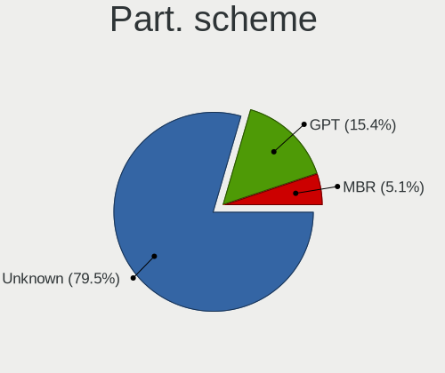

| Type    | Computers | Percent |
|---------|-----------|---------|
| Unknown | 186       | 80.17%  |
| GPT     | 34        | 14.66%  |
| MBR     | 12        | 5.17%   |

Dual Boot with Linux/BSD
------------------------

Hosting more than one Linux/BSD

| Dual boot | Computers | Percent |
|-----------|-----------|---------|
| No        | 219       | 94.81%  |
| Yes       | 12        | 5.19%   |

Dual Boot (Win)
---------------

Hosting Linux and Windows

| Dual boot | Computers | Percent |
|-----------|-----------|---------|
| No        | 182       | 78.45%  |
| Yes       | 50        | 21.55%  |

Board
-----

Vendor
------

Motherboard manufacturer

| Name                | Computers | Percent |
|---------------------|-----------|---------|
| Hewlett-Packard     | 35        | 15.15%  |
| ASUSTek Computer    | 33        | 14.29%  |
| Lenovo              | 32        | 13.85%  |
| Dell                | 30        | 12.99%  |
| Acer                | 19        | 8.23%   |
| Apple               | 18        | 7.79%   |
| Gigabyte Technology | 15        | 6.49%   |
| Toshiba             | 8         | 3.46%   |
| MSI                 | 8         | 3.46%   |
| Samsung Electronics | 4         | 1.73%   |
| ASRock              | 4         | 1.73%   |
| Intel               | 3         | 1.3%    |
| Biostar             | 3         | 1.3%    |
| WeiBu               | 1         | 0.43%   |
| Star Labs           | 1         | 0.43%   |
| Sony                | 1         | 0.43%   |
| Positivo            | 1         | 0.43%   |
| Panasonic           | 1         | 0.43%   |
| LG Electronics      | 1         | 0.43%   |
| HUAWEI              | 1         | 0.43%   |
| Hampoo              | 1         | 0.43%   |
| Google              | 1         | 0.43%   |
| Fujitsu Siemens     | 1         | 0.43%   |
| Fujitsu             | 1         | 0.43%   |
| Foxconn             | 1         | 0.43%   |
| EVGA                | 1         | 0.43%   |
| eMachines           | 1         | 0.43%   |
| Compaq              | 1         | 0.43%   |
| Clevo               | 1         | 0.43%   |
| Chuwi               | 1         | 0.43%   |
| 3E                  | 1         | 0.43%   |
| Unknown             | 1         | 0.43%   |

Model
-----

Motherboard model

| Name                                           | Computers | Percent |
|------------------------------------------------|-----------|---------|
| Apple MacBookPro8,1                            | 3         | 1.3%    |
| Apple MacBook2,1                               | 3         | 1.3%    |
| HP Pavilion dv7                                | 2         | 0.87%   |
| HP Laptop 17-by3xxx                            | 2         | 0.87%   |
| Dell Latitude E6400                            | 2         | 0.87%   |
| ASUS P8H61-M LX3 R2.0                          | 2         | 0.87%   |
| ASUS All Series                                | 2         | 0.87%   |
| Apple MacBook7,1                               | 2         | 0.87%   |
| Acer Aspire R3-131T                            | 2         | 0.87%   |
| Acer Aspire F5-573G                            | 2         | 0.87%   |
| Acer AOD255E                                   | 2         | 0.87%   |
| WeiBu Unity F24B                               | 1         | 0.43%   |
| Toshiba Satellite R630                         | 1         | 0.43%   |
| Toshiba Satellite P750                         | 1         | 0.43%   |
| Toshiba Satellite L855                         | 1         | 0.43%   |
| Toshiba Satellite L500                         | 1         | 0.43%   |
| Toshiba Satellite C870-1H2                     | 1         | 0.43%   |
| Toshiba Satellite C850D-119                    | 1         | 0.43%   |
| Toshiba Satellite C55t-A                       | 1         | 0.43%   |
| Toshiba QOSMIO G55                             | 1         | 0.43%   |
| Star Labs Lite                                 | 1         | 0.43%   |
| Sony VPCF23JFX                                 | 1         | 0.43%   |
| Samsung 850XBD                                 | 1         | 0.43%   |
| Samsung 530U3C/530U4C/532U3C                   | 1         | 0.43%   |
| Samsung 350V5C/351V5C/3540VC/3440VC            | 1         | 0.43%   |
| Samsung 300E5EV/300E4EV/270E5EV/270E4EV/2470EV | 1         | 0.43%   |
| Positivo S14SL01                               | 1         | 0.43%   |
| Panasonic CF-31SBLJGDM                         | 1         | 0.43%   |
| MSI P35 Platinum(MS-7345)                      | 1         | 0.43%   |
| MSI MS-7C94                                    | 1         | 0.43%   |
| MSI MS-7C02                                    | 1         | 0.43%   |
| MSI MS-7A38                                    | 1         | 0.43%   |
| MSI MS-7A34                                    | 1         | 0.43%   |
| MSI MS-7788                                    | 1         | 0.43%   |
| MSI MS-7721                                    | 1         | 0.43%   |
| MSI GE60 2PE                                   | 1         | 0.43%   |
| LG R490-G.ARL5RE2                              | 1         | 0.43%   |
| Lenovo Yoga 710-14IKB 80V4                     | 1         | 0.43%   |
| Lenovo V15-IIL 82C5                            | 1         | 0.43%   |
| Lenovo V15-ADA 82C7                            | 1         | 0.43%   |

Model Family
------------

Motherboard model prefix

| Name                   | Computers | Percent |
|------------------------|-----------|---------|
| Lenovo ThinkPad        | 17        | 7.36%   |
| Acer Aspire            | 12        | 5.19%   |
| Dell Latitude          | 9         | 3.9%    |
| HP Pavilion            | 8         | 3.46%   |
| Dell Inspiron          | 8         | 3.46%   |
| Toshiba Satellite      | 7         | 3.03%   |
| Lenovo IdeaPad         | 5         | 2.16%   |
| HP ProBook             | 5         | 2.16%   |
| ASUS PRIME             | 5         | 2.16%   |
| HP EliteBook           | 4         | 1.73%   |
| Dell Vostro            | 4         | 1.73%   |
| Lenovo ThinkCentre     | 3         | 1.3%    |
| HP 250                 | 3         | 1.3%    |
| Dell XPS               | 3         | 1.3%    |
| Dell OptiPlex          | 3         | 1.3%    |
| Apple MacBookPro8      | 3         | 1.3%    |
| Apple MacBook2         | 3         | 1.3%    |
| Acer Swift             | 3         | 1.3%    |
| HP Laptop              | 2         | 0.87%   |
| HP ENVY                | 2         | 0.87%   |
| HP Compaq              | 2         | 0.87%   |
| ASUS ZenBook           | 2         | 0.87%   |
| ASUS VivoBook          | 2         | 0.87%   |
| ASUS TUF               | 2         | 0.87%   |
| ASUS ROG               | 2         | 0.87%   |
| ASUS P8H61-M           | 2         | 0.87%   |
| ASUS All               | 2         | 0.87%   |
| Apple MacBook7         | 2         | 0.87%   |
| Acer AOD255E           | 2         | 0.87%   |
| WeiBu Unity            | 1         | 0.43%   |
| Toshiba QOSMIO         | 1         | 0.43%   |
| Star Labs Lite         | 1         | 0.43%   |
| Sony VPCF23JFX         | 1         | 0.43%   |
| Samsung 850XBD         | 1         | 0.43%   |
| Samsung 530U3C         | 1         | 0.43%   |
| Samsung 350V5C         | 1         | 0.43%   |
| Samsung 300E5EV        | 1         | 0.43%   |
| Positivo S14SL01       | 1         | 0.43%   |
| Panasonic CF-31SBLJGDM | 1         | 0.43%   |
| MSI P35                | 1         | 0.43%   |

MFG Year
--------

Motherboard manufacture year

| Year | Computers | Percent |
|------|-----------|---------|
| 2013 | 27        | 11.69%  |
| 2019 | 25        | 10.82%  |
| 2011 | 22        | 9.52%   |
| 2018 | 21        | 9.09%   |
| 2012 | 21        | 9.09%   |
| 2020 | 19        | 8.23%   |
| 2016 | 17        | 7.36%   |
| 2008 | 15        | 6.49%   |
| 2009 | 12        | 5.19%   |
| 2017 | 11        | 4.76%   |
| 2015 | 11        | 4.76%   |
| 2014 | 11        | 4.76%   |
| 2010 | 11        | 4.76%   |
| 2007 | 6         | 2.6%    |
| 2021 | 1         | 0.43%   |
| 2006 | 1         | 0.43%   |

Form Factor
-----------

Physical design of the computer

| Name        | Computers | Percent |
|-------------|-----------|---------|
| Notebook    | 148       | 64.07%  |
| Desktop     | 69        | 29.87%  |
| Convertible | 6         | 2.6%    |
| All in one  | 4         | 1.73%   |
| Tablet      | 2         | 0.87%   |
| Mini pc     | 2         | 0.87%   |

Secure Boot
-----------

Enabled or disabled

| State    | Computers | Percent |
|----------|-----------|---------|
| Disabled | 227       | 98.27%  |
| Enabled  | 4         | 1.73%   |

Coreboot
--------

Have coreboot on board

| Used | Computers | Percent |
|------|-----------|---------|
| No   | 230       | 99.57%  |
| Yes  | 1         | 0.43%   |

RAM Size
--------

Total RAM memory

| Size in GB  | Computers | Percent |
|-------------|-----------|---------|
| 4.01-8.0    | 56        | 24.24%  |
| 8.01-16.0   | 55        | 23.81%  |
| 3.01-4.0    | 47        | 20.35%  |
| 16.01-24.0  | 38        | 16.45%  |
| 1.01-2.0    | 14        | 6.06%   |
| 32.01-64.0  | 11        | 4.76%   |
| 2.01-3.0    | 6         | 2.6%    |
| 0.51-1.0    | 2         | 0.87%   |
| 24.01-32.0  | 1         | 0.43%   |
| 64.01-256.0 | 1         | 0.43%   |

RAM Used
--------

Used RAM memory

| Used GB   | Computers | Percent |
|-----------|-----------|---------|
| 1.01-2.0  | 96        | 39.18%  |
| 2.01-3.0  | 63        | 25.71%  |
| 3.01-4.0  | 40        | 16.33%  |
| 4.01-8.0  | 34        | 13.88%  |
| 0.51-1.0  | 7         | 2.86%   |
| 8.01-16.0 | 5         | 2.04%   |

Total Drives
------------

Number of drives on board

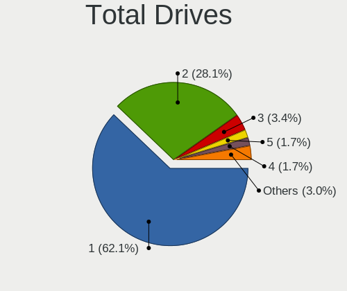

| Drives | Computers | Percent |
|--------|-----------|---------|
| 1      | 145       | 62.23%  |
| 2      | 66        | 28.33%  |
| 3      | 7         | 3%      |
| 5      | 4         | 1.72%   |
| 4      | 4         | 1.72%   |
| 0      | 3         | 1.29%   |
| 7      | 2         | 0.86%   |
| 6      | 2         | 0.86%   |

Has CD-ROM
----------

Has CD-ROM on board

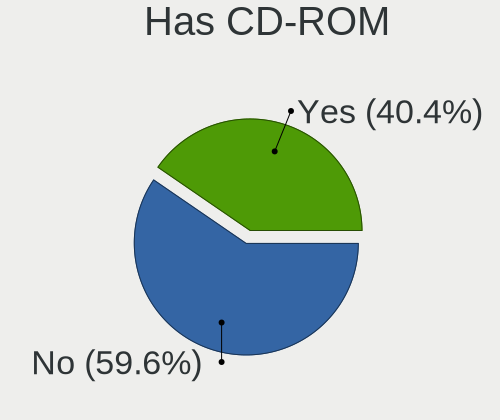

| Presented | Computers | Percent |
|-----------|-----------|---------|
| No        | 139       | 59.4%   |
| Yes       | 95        | 40.6%   |

Has Ethernet
------------

Has Ethernet on board

| Presented | Computers | Percent |
|-----------|-----------|---------|
| Yes       | 196       | 84.85%  |
| No        | 35        | 15.15%  |

Has WiFi
--------

Has WiFi module

| Presented | Computers | Percent |
|-----------|-----------|---------|
| Yes       | 194       | 83.62%  |
| No        | 38        | 16.38%  |

Has Bluetooth
-------------

Has Bluetooth module

| Presented | Computers | Percent |
|-----------|-----------|---------|
| Yes       | 152       | 65.52%  |
| No        | 80        | 34.48%  |

Location
--------

Country
-------

Geographic location (country)

| Country      | Computers | Percent |
|--------------|-----------|---------|
| USA          | 27        | 11.69%  |
| UK           | 15        | 6.49%   |
| Germany      | 15        | 6.49%   |
| Brazil       | 15        | 6.49%   |
| Spain        | 12        | 5.19%   |
| Mexico       | 11        | 4.76%   |
| Poland       | 10        | 4.33%   |
| India        | 10        | 4.33%   |
| Canada       | 9         | 3.9%    |
| Russia       | 8         | 3.46%   |
| Italy        | 7         | 3.03%   |
| France       | 7         | 3.03%   |
| Indonesia    | 6         | 2.6%    |
| Australia    | 6         | 2.6%    |
| Ukraine      | 5         | 2.16%   |
| Turkey       | 4         | 1.73%   |
| Netherlands  | 4         | 1.73%   |
| Malaysia     | 4         | 1.73%   |
| Peru         | 3         | 1.3%    |
| Hungary      | 3         | 1.3%    |
| Hong Kong    | 3         | 1.3%    |
| Greece       | 3         | 1.3%    |
| Ecuador      | 3         | 1.3%    |
| Sweden       | 2         | 0.87%   |
| South Africa | 2         | 0.87%   |
| Philippines  | 2         | 0.87%   |
| Kenya        | 2         | 0.87%   |
| Ireland      | 2         | 0.87%   |
| Croatia      | 2         | 0.87%   |
| Austria      | 2         | 0.87%   |
| Argentina    | 2         | 0.87%   |
| Venezuela    | 1         | 0.43%   |
| Uruguay      | 1         | 0.43%   |
| UAE          | 1         | 0.43%   |
| Thailand     | 1         | 0.43%   |
| Tajikistan   | 1         | 0.43%   |
| Slovakia     | 1         | 0.43%   |
| Sint Maarten | 1         | 0.43%   |
| Saudi Arabia | 1         | 0.43%   |
| Romania      | 1         | 0.43%   |

City
----

Geographic location (city)

| City           | Computers | Percent |
|----------------|-----------|---------|
| Warsaw         | 4         | 1.69%   |
| Fortaleza      | 4         | 1.69%   |
| Montreal       | 3         | 1.27%   |
| Hamburg        | 3         | 1.27%   |
| Berlin         | 3         | 1.27%   |
| Valencia       | 2         | 0.85%   |
| Tijuana        | 2         | 0.85%   |
| Rome           | 2         | 0.85%   |
| Rio de Janeiro | 2         | 0.85%   |
| Quito          | 2         | 0.85%   |
| Perth          | 2         | 0.85%   |
| Novosibirsk    | 2         | 0.85%   |
| Nairobi        | 2         | 0.85%   |
| Milan          | 2         | 0.85%   |
| Mexico City    | 2         | 0.85%   |
| Melbourne      | 2         | 0.85%   |
| Lima           | 2         | 0.85%   |
| Jaipur         | 2         | 0.85%   |
| Gilbert        | 2         | 0.85%   |
| Eskiehir     | 2         | 0.85%   |
| Crdoba       | 2         | 0.85%   |
| Central        | 2         | 0.85%   |
| Cape Town      | 2         | 0.85%   |
| Ames           | 2         | 0.85%   |
| Zaragoza       | 1         | 0.42%   |
| Zagreb         | 1         | 0.42%   |
| York           | 1         | 0.42%   |
| Yogyakarta     | 1         | 0.42%   |
| Wroclaw        | 1         | 0.42%   |
| Winhoring      | 1         | 0.42%   |
| Wellington     | 1         | 0.42%   |
| Villahermosa   | 1         | 0.42%   |
| Vigo           | 1         | 0.42%   |
| Vienna         | 1         | 0.42%   |
| Vernon         | 1         | 0.42%   |
| Tseung Kwan O  | 1         | 0.42%   |
| Torun          | 1         | 0.42%   |
| Toronto        | 1         | 0.42%   |
| Tirupur        | 1         | 0.42%   |
| Theodore       | 1         | 0.42%   |

Drives
------

Drive Vendor
------------

Hard drive vendors

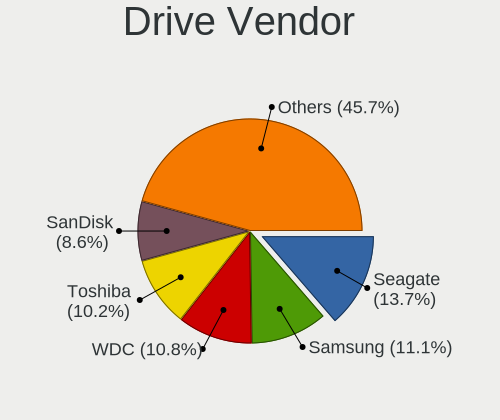

| Vendor              | Computers | Drives | Percent |
|---------------------|-----------|--------|---------|
| Seagate             | 43        | 56     | 13.69%  |
| WDC                 | 34        | 45     | 10.83%  |
| Samsung Electronics | 34        | 47     | 10.83%  |
| Toshiba             | 32        | 48     | 10.19%  |
| SanDisk             | 27        | 29     | 8.6%    |
| Kingston            | 26        | 36     | 8.28%   |
| Unknown             | 19        | 23     | 6.05%   |
| Crucial             | 19        | 23     | 6.05%   |
| Hitachi             | 14        | 15     | 4.46%   |
| Intel               | 10        | 12     | 3.18%   |
| HGST                | 10        | 12     | 3.18%   |
| Apple               | 4         | 4      | 1.27%   |
| A-DATA Technology   | 4         | 5      | 1.27%   |
| SK hynix            | 3         | 3      | 0.96%   |
| KIOXIA              | 3         | 8      | 0.96%   |
| Fujitsu             | 3         | 3      | 0.96%   |
| PNY                 | 2         | 2      | 0.64%   |
| Patriot             | 2         | 2      | 0.64%   |
| OCZ                 | 2         | 3      | 0.64%   |
| Micron Technology   | 2         | 3      | 0.64%   |
| WDC WDS             | 1         | 1      | 0.32%   |
| V-GeN               | 1         | 1      | 0.32%   |
| Transcend           | 1         | 1      | 0.32%   |
| TO Exter            | 1         | 1      | 0.32%   |
| Star                | 1         | 1      | 0.32%   |
| SPCC                | 1         | 1      | 0.32%   |
| Phison              | 1         | 1      | 0.32%   |
| OWC                 | 1         | 1      | 0.32%   |
| NGFF                | 1         | 1      | 0.32%   |
| LITEON              | 1         | 1      | 0.32%   |
| KingSpec            | 1         | 1      | 0.32%   |
| KingFast            | 1         | 1      | 0.32%   |
| JMicron Technology  | 1         | 1      | 0.32%   |
| Intenso             | 1         | 1      | 0.32%   |
| Hewlett-Packard     | 1         | 1      | 0.32%   |
| GOODRAM             | 1         | 2      | 0.32%   |
| Gigabyte Technology | 1         | 1      | 0.32%   |
| GeIL                | 1         | 1      | 0.32%   |
| Emtec               | 1         | 1      | 0.32%   |
| China               | 1         | 1      | 0.32%   |

Drive Model
-----------

Hard drive models

| Model                              | Computers | Percent |
|------------------------------------|-----------|---------|
| Kingston SA400S37240G 240GB SSD    | 7         | 2.06%   |
| Unknown MMC Card  64GB             | 6         | 1.76%   |
| Toshiba MQ04ABF100 1TB             | 6         | 1.76%   |
| Samsung SSD 850 EVO 250GB          | 5         | 1.47%   |
| Samsung NVMe SSD Drive 512GB       | 5         | 1.47%   |
| Unknown MMC Card  32GB             | 4         | 1.18%   |
| Seagate ST500DM002-1BD142 500GB    | 4         | 1.18%   |
| SanDisk NVMe SSD Drive 256GB       | 4         | 1.18%   |
| Kingston SV300S37A120G 120GB SSD   | 4         | 1.18%   |
| Kingston SA400S37120G 120GB SSD    | 4         | 1.18%   |
| WDC WDS240G2G0A-00JH30 240GB SSD   | 3         | 0.88%   |
| Toshiba NVMe SSD Drive 256GB       | 3         | 0.88%   |
| Toshiba DT01ACA100 1TB             | 3         | 0.88%   |
| SanDisk SSD PLUS 480GB             | 3         | 0.88%   |
| SanDisk NVMe SSD Drive 512GB       | 3         | 0.88%   |
| Samsung SSD 860 QVO 1TB            | 3         | 0.88%   |
| HGST HTS545050A7E680 500GB         | 3         | 0.88%   |
| Crucial CT500MX500SSD1 500GB       | 3         | 0.88%   |
| Crucial CT120BX500SSD1 120GB       | 3         | 0.88%   |
| Crucial CT120BX300SSD1 120GB       | 3         | 0.88%   |
| WDC WDS500G2B0A-00SM50 500GB SSD   | 2         | 0.59%   |
| WDC WDS100T2B0A-00SM50 1TB SSD     | 2         | 0.59%   |
| WDC WD10SPZX-24Z10 1TB             | 2         | 0.59%   |
| Unknown MMC Card  16GB             | 2         | 0.59%   |
| Toshiba THNSNJ128GCSU 128GB SSD    | 2         | 0.59%   |
| Toshiba MQ01ABF050 500GB           | 2         | 0.59%   |
| Toshiba MQ01ABD100 1TB             | 2         | 0.59%   |
| Seagate ST500LM000-1EJ162 500GB    | 2         | 0.59%   |
| Seagate ST3500418AS 500GB          | 2         | 0.59%   |
| Seagate ST320LT007-9ZV142 320GB    | 2         | 0.59%   |
| Seagate ST2000DM008-2FR102 2TB     | 2         | 0.59%   |
| Seagate ST1000LM035-1RK172 1TB     | 2         | 0.59%   |
| Seagate ST1000LM024 HN-M101MBB 1TB | 2         | 0.59%   |
| Seagate ST1000DM003-1ER162 1TB     | 2         | 0.59%   |
| Seagate Expansion 4TB              | 2         | 0.59%   |
| SanDisk SSD PLUS 240GB             | 2         | 0.59%   |
| Samsung SSD 970 EVO 500GB          | 2         | 0.59%   |
| Samsung SSD 860 EVO 500GB          | 2         | 0.59%   |
| Samsung SSD 860 EVO 250GB          | 2         | 0.59%   |
| Samsung SSD 850 EVO 500GB          | 2         | 0.59%   |

HDD Vendor
----------

Hard disk drive vendors

| Vendor              | Computers | Drives | Percent |
|---------------------|-----------|--------|---------|
| Seagate             | 42        | 54     | 33.33%  |
| Toshiba             | 27        | 41     | 21.43%  |
| WDC                 | 22        | 33     | 17.46%  |
| Hitachi             | 14        | 15     | 11.11%  |
| HGST                | 10        | 12     | 7.94%   |
| Samsung Electronics | 5         | 7      | 3.97%   |
| Fujitsu             | 3         | 3      | 2.38%   |
| Apple               | 2         | 2      | 1.59%   |
| Unknown             | 1         | 1      | 0.79%   |

SSD Vendor
----------

Solid state drive vendors

| Vendor              | Computers | Drives | Percent |
|---------------------|-----------|--------|---------|
| Samsung Electronics | 23        | 28     | 17.16%  |
| Kingston            | 23        | 27     | 17.16%  |
| SanDisk             | 19        | 21     | 14.18%  |
| Crucial             | 19        | 23     | 14.18%  |
| WDC                 | 10        | 10     | 7.46%   |
| Intel               | 6         | 6      | 4.48%   |
| A-DATA Technology   | 4         | 5      | 2.99%   |
| Toshiba             | 2         | 2      | 1.49%   |
| PNY                 | 2         | 2      | 1.49%   |
| Patriot             | 2         | 2      | 1.49%   |
| OCZ                 | 2         | 3      | 1.49%   |
| Apple               | 2         | 2      | 1.49%   |
| WDC WDS             | 1         | 1      | 0.75%   |
| V-GeN               | 1         | 1      | 0.75%   |
| Transcend           | 1         | 1      | 0.75%   |
| TO Exter            | 1         | 1      | 0.75%   |
| Star                | 1         | 1      | 0.75%   |
| SPCC                | 1         | 1      | 0.75%   |
| SK hynix            | 1         | 1      | 0.75%   |
| OWC                 | 1         | 1      | 0.75%   |
| NGFF                | 1         | 1      | 0.75%   |
| Micron Technology   | 1         | 2      | 0.75%   |
| LITEON              | 1         | 1      | 0.75%   |
| KingSpec            | 1         | 1      | 0.75%   |
| JMicron Technology  | 1         | 1      | 0.75%   |
| Intenso             | 1         | 1      | 0.75%   |
| Hewlett-Packard     | 1         | 1      | 0.75%   |
| GOODRAM             | 1         | 2      | 0.75%   |
| Gigabyte Technology | 1         | 1      | 0.75%   |
| GeIL                | 1         | 1      | 0.75%   |
| Emtec               | 1         | 1      | 0.75%   |
| China               | 1         | 1      | 0.75%   |

Drive Kind
----------

HDD or SSD

| Kind    | Computers | Drives | Percent |
|---------|-----------|--------|---------|
| SSD     | 113       | 153    | 39.65%  |
| HDD     | 111       | 168    | 38.95%  |
| NVMe    | 42        | 57     | 14.74%  |
| MMC     | 17        | 21     | 5.96%   |
| Unknown | 2         | 2      | 0.7%    |

Drive Connector
---------------

SATA, SAS, NVMe, etc.

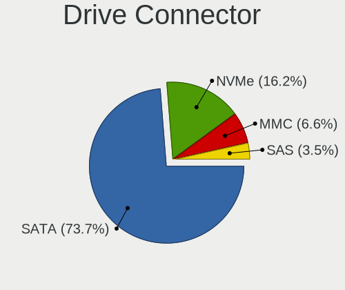

| Type | Computers | Drives | Percent |
|------|-----------|--------|---------|
| SATA | 190       | 311    | 73.64%  |
| NVMe | 42        | 57     | 16.28%  |
| MMC  | 17        | 21     | 6.59%   |
| SAS  | 9         | 12     | 3.49%   |

Drive Size
----------

Size of hard drive

| Size in TB | Computers | Drives | Percent |
|------------|-----------|--------|---------|
| 0.01-0.5   | 152       | 217    | 66.96%  |
| 0.51-1.0   | 58        | 76     | 25.55%  |
| 1.01-2.0   | 9         | 15     | 3.96%   |
| 2.01-3.0   | 3         | 7      | 1.32%   |
| 4.01-10.0  | 3         | 3      | 1.32%   |
| 3.01-4.0   | 2         | 3      | 0.88%   |

Space Total
-----------

Amount of disk space available on the file system

| Size in GB     | Computers | Percent |
|----------------|-----------|---------|
| 101-250        | 78        | 33.05%  |
| 251-500        | 66        | 27.97%  |
| 501-1000       | 27        | 11.44%  |
| 51-100         | 20        | 8.47%   |
| 21-50          | 15        | 6.36%   |
| 1001-2000      | 11        | 4.66%   |
| More than 3000 | 7         | 2.97%   |
| 2001-3000      | 6         | 2.54%   |
| 1-20           | 5         | 2.12%   |
| Unknown        | 1         | 0.42%   |

Space Used
----------

Amount of used disk space

| Used GB        | Computers | Percent |
|----------------|-----------|---------|
| 1-20           | 77        | 31.69%  |
| 21-50          | 61        | 25.1%   |
| 101-250        | 34        | 13.99%  |
| 51-100         | 34        | 13.99%  |
| 251-500        | 13        | 5.35%   |
| 501-1000       | 12        | 4.94%   |
| 1001-2000      | 5         | 2.06%   |
| More than 3000 | 3         | 1.23%   |
| 2001-3000      | 3         | 1.23%   |
| Unknown        | 1         | 0.41%   |

Malfunc. Drives
---------------

Drive models with a malfunction

| Model                               | Computers | Drives | Percent |
|-------------------------------------|-----------|--------|---------|
| WDC WD5000AAKX-22ERMA0 500GB        | 1         | 1      | 9.09%   |
| WDC WD5000AAKX-221CA1 500GB         | 1         | 1      | 9.09%   |
| Seagate ST500DM002-1BD142 500GB     | 1         | 1      | 9.09%   |
| Seagate ST3320613AS 320GB           | 1         | 1      | 9.09%   |
| Seagate ST2000DM006-2DM164 2TB      | 1         | 1      | 9.09%   |
| SanDisk SD9SN8W-128G-1006 128GB SSD | 1         | 1      | 9.09%   |
| Samsung Electronics HD204UI 2TB     | 1         | 1      | 9.09%   |
| Kingston SA400S37120G 120GB SSD     | 1         | 1      | 9.09%   |
| HGST HUS724030ALA640 3TB            | 1         | 1      | 9.09%   |
| HGST HTS725050A7E630 500GB          | 1         | 1      | 9.09%   |
| HGST HTS541010A9E680 1TB            | 1         | 1      | 9.09%   |

Malfunc. Drive Vendor
---------------------

Vendors of faulty drives

| Vendor              | Computers | Drives | Percent |
|---------------------|-----------|--------|---------|
| Seagate             | 3         | 3      | 27.27%  |
| HGST                | 3         | 3      | 27.27%  |
| WDC                 | 2         | 2      | 18.18%  |
| SanDisk             | 1         | 1      | 9.09%   |
| Samsung Electronics | 1         | 1      | 9.09%   |
| Kingston            | 1         | 1      | 9.09%   |

Malfunc. HDD Vendor
-------------------

Vendors of faulty HDD drives

| Vendor              | Computers | Drives | Percent |
|---------------------|-----------|--------|---------|
| Seagate             | 3         | 3      | 33.33%  |
| HGST                | 3         | 3      | 33.33%  |
| WDC                 | 2         | 2      | 22.22%  |
| Samsung Electronics | 1         | 1      | 11.11%  |

Malfunc. Drive Kind
-------------------

Kinds of faulty drives

| Kind | Computers | Drives | Percent |
|------|-----------|--------|---------|
| HDD  | 9         | 9      | 81.82%  |
| SSD  | 2         | 2      | 18.18%  |

Failed Drives
-------------

Failed drive models

Zero info for selected period =(

Failed Drive Vendor
-------------------

Failed drive vendors

Zero info for selected period =(

Drive Status
------------

Number of failed and malfunc. drives

| Status   | Computers | Drives | Percent |
|----------|-----------|--------|---------|
| Detected | 189       | 323    | 78.42%  |
| Works    | 41        | 67     | 17.01%  |
| Malfunc  | 11        | 11     | 4.56%   |

Storage controller
------------------

Storage Vendor
--------------

Storage controller vendors

| Vendor                       | Computers | Percent |
|------------------------------|-----------|---------|
| Intel                        | 168       | 64.37%  |
| AMD                          | 34        | 13.03%  |
| Samsung Electronics          | 13        | 4.98%   |
| SanDisk                      | 10        | 3.83%   |
| Nvidia                       | 8         | 3.07%   |
| Toshiba America Info Systems | 5         | 1.92%   |
| Kingston Technology Company  | 5         | 1.92%   |
| KIOXIA                       | 3         | 1.15%   |
| JMicron Technology           | 3         | 1.15%   |
| ASMedia Technology           | 3         | 1.15%   |
| SK hynix                     | 2         | 0.77%   |
| ADATA Technology             | 2         | 0.77%   |
| Silicon Image                | 1         | 0.38%   |
| Seagate Technology           | 1         | 0.38%   |
| Phison Electronics           | 1         | 0.38%   |
| Micron Technology            | 1         | 0.38%   |
| Marvell Technology Group     | 1         | 0.38%   |

Storage Model
-------------

Storage controller models

| Model                                                                                   | Computers | Percent |
|-----------------------------------------------------------------------------------------|-----------|---------|
| AMD FCH SATA Controller [AHCI mode]                                                     | 25        | 8.36%   |
| Intel 7 Series Chipset Family 6-port SATA Controller [AHCI mode]                        | 18        | 6.02%   |
| Intel Sunrise Point-LP SATA Controller [AHCI mode]                                      | 16        | 5.35%   |
| Intel 6 Series/C200 Series Chipset Family 6 port Mobile SATA AHCI Controller            | 13        | 4.35%   |
| Intel 82801 Mobile SATA Controller [RAID mode]                                          | 12        | 4.01%   |
| Intel 8 Series/C220 Series Chipset Family 6-port SATA Controller 1 [AHCI mode]          | 12        | 4.01%   |
| Intel 8 Series SATA Controller 1 [AHCI mode]                                            | 10        | 3.34%   |
| Samsung NVMe SSD Controller SM981/PM981/PM983                                           | 8         | 2.68%   |
| Intel 6 Series/C200 Series Chipset Family 6 port Desktop SATA AHCI Controller           | 7         | 2.34%   |
| Intel Comet Lake SATA AHCI Controller                                                   | 6         | 2.01%   |
| Intel 82801G (ICH7 Family) IDE Controller                                               | 6         | 2.01%   |
| Intel Cannon Lake PCH SATA AHCI Controller                                              | 5         | 1.67%   |
| Intel 82801IBM/IEM (ICH9M/ICH9M-E) 4 port SATA Controller [AHCI mode]                   | 5         | 1.67%   |
| AMD SB7x0/SB8x0/SB9x0 IDE Controller                                                    | 5         | 1.67%   |
| AMD 300 Series Chipset SATA Controller                                                  | 5         | 1.67%   |
| Intel Q170/Q150/B150/H170/H110/Z170/CM236 Chipset SATA Controller [AHCI Mode]           | 4         | 1.34%   |
| Intel Celeron/Pentium Silver Processor SATA Controller                                  | 4         | 1.34%   |
| Intel Atom Processor E3800 Series SATA AHCI Controller                                  | 4         | 1.34%   |
| Intel 7 Series/C210 Series Chipset Family 6-port SATA Controller [AHCI mode]            | 4         | 1.34%   |
| Intel 200 Series PCH SATA controller [AHCI mode]                                        | 4         | 1.34%   |
| AMD SB7x0/SB8x0/SB9x0 SATA Controller [AHCI mode]                                       | 4         | 1.34%   |
| Toshiba America Info Systems BG3 NVMe SSD Controller                                    | 3         | 1%      |
| SanDisk WD Blue SN500 / PC SN520 NVMe SSD                                               | 3         | 1%      |
| SanDisk PC SN520 NVMe SSD                                                               | 3         | 1%      |
| Nvidia MCP79 AHCI Controller                                                            | 3         | 1%      |
| KIOXIA NVMe SSD Controller BG4                                                          | 3         | 1%      |
| Intel NM10/ICH7 Family SATA Controller [IDE mode]                                       | 3         | 1%      |
| Intel Cannon Point-LP SATA Controller [AHCI Mode]                                       | 3         | 1%      |
| Intel Atom/Celeron/Pentium Processor x5-E8000/J3xxx/N3xxx Series SATA Controller        | 3         | 1%      |
| Intel 6 Series/C200 Series Chipset Family Desktop SATA Controller (IDE mode, ports 4-5) | 3         | 1%      |
| Intel 6 Series/C200 Series Chipset Family Desktop SATA Controller (IDE mode, ports 0-3) | 3         | 1%      |
| Intel 5 Series/3400 Series Chipset 4 port SATA AHCI Controller                          | 3         | 1%      |
| AMD SB7x0/SB8x0/SB9x0 SATA Controller [IDE mode]                                        | 3         | 1%      |
| AMD 400 Series Chipset SATA Controller                                                  | 3         | 1%      |
| Toshiba America Info Systems XG5 NVMe SSD Controller                                    | 2         | 0.67%   |
| SanDisk WD Black SN750 / PC SN730 NVMe SSD                                              | 2         | 0.67%   |
| SanDisk Non-Volatile memory controller                                                  | 2         | 0.67%   |
| Samsung NVMe SSD Controller SM961/PM961/SM963                                           | 2         | 0.67%   |
| Nvidia MCP89 SATA Controller                                                            | 2         | 0.67%   |
| Kingston Company U-SNS8154P3 NVMe SSD                                                   | 2         | 0.67%   |

Storage Kind
------------

Kind of storage controller (IDE, SATA, NVMe, SAS, ...)

| Kind | Computers | Percent |
|------|-----------|---------|
| SATA | 175       | 65.54%  |
| NVMe | 43        | 16.1%   |
| IDE  | 33        | 12.36%  |
| RAID | 16        | 5.99%   |

Processor
---------

CPU Vendor
----------

Processor vendors

| Vendor | Computers | Percent |
|--------|-----------|---------|
| Intel  | 191       | 82.68%  |
| AMD    | 40        | 17.32%  |

CPU Model
---------

Processor models

| Model                                         | Computers | Percent |
|-----------------------------------------------|-----------|---------|
| Intel Core i5-4300U CPU @ 1.90GHz             | 5         | 2.16%   |
| Intel Core i7-8550U CPU @ 1.80GHz             | 4         | 1.73%   |
| Intel Core i7-10510U CPU @ 1.80GHz            | 4         | 1.73%   |
| Intel Core i5-7200U CPU @ 2.50GHz             | 4         | 1.73%   |
| Intel Core i5-2520M CPU @ 2.50GHz             | 4         | 1.73%   |
| Intel Core 2 Duo CPU P8600 @ 2.40GHz          | 4         | 1.73%   |
| Intel Core i7-9750H CPU @ 2.60GHz             | 3         | 1.3%    |
| Intel Core i7-8565U CPU @ 1.80GHz             | 3         | 1.3%    |
| Intel Core i7-4720HQ CPU @ 2.60GHz            | 3         | 1.3%    |
| Intel Core i7-1065G7 CPU @ 1.30GHz            | 3         | 1.3%    |
| Intel Core i5-6300U CPU @ 2.40GHz             | 3         | 1.3%    |
| Intel Core i5-4210U CPU @ 1.70GHz             | 3         | 1.3%    |
| Intel Core i5-3330S CPU @ 2.70GHz             | 3         | 1.3%    |
| Intel Core i5-3210M CPU @ 2.50GHz             | 3         | 1.3%    |
| Intel Core i5-2415M CPU @ 2.30GHz             | 3         | 1.3%    |
| Intel Core i5-1035G1 CPU @ 1.00GHz            | 3         | 1.3%    |
| Intel Core i5-10210U CPU @ 1.60GHz            | 3         | 1.3%    |
| Intel Core i3-3217U CPU @ 1.80GHz             | 3         | 1.3%    |
| Intel Pentium Dual-Core CPU E5300 @ 2.60GHz   | 2         | 0.87%   |
| Intel Pentium CPU N3700 @ 1.60GHz             | 2         | 0.87%   |
| Intel Core i7-7500U CPU @ 2.70GHz             | 2         | 0.87%   |
| Intel Core i7-3520M CPU @ 2.90GHz             | 2         | 0.87%   |
| Intel Core i7-2630QM CPU @ 2.00GHz            | 2         | 0.87%   |
| Intel Core i5-3330 CPU @ 3.00GHz              | 2         | 0.87%   |
| Intel Core i5-2500K CPU @ 3.30GHz             | 2         | 0.87%   |
| Intel Core i5-2400 CPU @ 3.10GHz              | 2         | 0.87%   |
| Intel Core i3-9100 CPU @ 3.60GHz              | 2         | 0.87%   |
| Intel Core i3-8130U CPU @ 2.20GHz             | 2         | 0.87%   |
| Intel Core i3-3120M CPU @ 2.50GHz             | 2         | 0.87%   |
| Intel Core 2 Quad CPU Q6600 @ 2.40GHz         | 2         | 0.87%   |
| Intel Core 2 Duo CPU P8700 @ 2.53GHz          | 2         | 0.87%   |
| Intel Core 2 CPU T7200 @ 2.00GHz              | 2         | 0.87%   |
| Intel Celeron N4100 CPU @ 1.10GHz             | 2         | 0.87%   |
| Intel Celeron CPU N2830 @ 2.16GHz             | 2         | 0.87%   |
| Intel Celeron CPU 1007U @ 1.50GHz             | 2         | 0.87%   |
| Intel Atom CPU Z3735F @ 1.33GHz               | 2         | 0.87%   |
| Intel Atom CPU N455 @ 1.66GHz                 | 2         | 0.87%   |
| AMD Ryzen 7 4700U with Radeon Graphics        | 2         | 0.87%   |
| AMD Ryzen 7 3700U with Radeon Vega Mobile Gfx | 2         | 0.87%   |
| AMD Ryzen 5 3600 6-Core Processor             | 2         | 0.87%   |

CPU Model Family
----------------

Processor model prefix

| Model                                | Computers | Percent |
|--------------------------------------|-----------|---------|
| Intel Core i5                        | 67        | 29%     |
| Intel Core i7                        | 43        | 18.61%  |
| Intel Core i3                        | 23        | 9.96%   |
| Intel Core 2 Duo                     | 15        | 6.49%   |
| Intel Celeron                        | 12        | 5.19%   |
| AMD Ryzen 5                          | 10        | 4.33%   |
| Intel Atom                           | 7         | 3.03%   |
| AMD Ryzen 7                          | 5         | 2.16%   |
| Other                                | 4         | 1.73%   |
| Intel Pentium Dual-Core              | 4         | 1.73%   |
| Intel Core 2 Quad                    | 4         | 1.73%   |
| Intel Core 2                         | 4         | 1.73%   |
| AMD Ryzen 3                          | 4         | 1.73%   |
| Intel Xeon                           | 3         | 1.3%    |
| Intel Pentium                        | 3         | 1.3%    |
| AMD Phenom II X4                     | 3         | 1.3%    |
| AMD A8                               | 3         | 1.3%    |
| AMD FX                               | 2         | 0.87%   |
| Intel Pentium Silver                 | 1         | 0.43%   |
| Intel Genuine                        | 1         | 0.43%   |
| Intel Core m3                        | 1         | 0.43%   |
| Intel Celeron Dual-Core              | 1         | 0.43%   |
| AMD Turion X2 Ultra Dual-Core Mobile | 1         | 0.43%   |
| AMD Ryzen 9                          | 1         | 0.43%   |
| AMD Ryzen 5 PRO                      | 1         | 0.43%   |
| AMD Phenom                           | 1         | 0.43%   |
| AMD E1                               | 1         | 0.43%   |
| AMD C-60                             | 1         | 0.43%   |
| AMD Athlon II X4                     | 1         | 0.43%   |
| AMD Athlon II X3                     | 1         | 0.43%   |
| AMD A6                               | 1         | 0.43%   |
| AMD A4                               | 1         | 0.43%   |
| AMD A12                              | 1         | 0.43%   |

CPU Cores
---------

Number of processor cores

| Number | Computers | Percent |
|--------|-----------|---------|
| 2      | 110       | 47.62%  |
| 4      | 96        | 41.56%  |
| 6      | 10        | 4.33%   |
| 8      | 5         | 2.16%   |
| 3      | 5         | 2.16%   |
| 1      | 4         | 1.73%   |
| 12     | 1         | 0.43%   |

CPU Sockets
-----------

Number of sockets

| Number | Computers | Percent |
|--------|-----------|---------|
| 1      | 230       | 99.57%  |
| 2      | 1         | 0.43%   |

CPU Threads
-----------

Threads per core (Hyper-Threading)

| Number | Computers | Percent |
|--------|-----------|---------|
| 2      | 137       | 59.31%  |
| 1      | 94        | 40.69%  |

CPU Op-Modes
------------

CPU Operation Modes (32-bit, 64-bit)

| Op mode        | Computers | Percent |
|----------------|-----------|---------|
| 32-bit, 64-bit | 231       | 100%    |

CPU Microcode
-------------

Microcode number

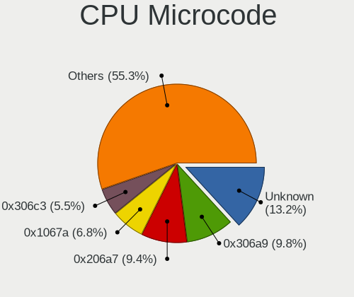

| Number     | Computers | Percent |
|------------|-----------|---------|
| Unknown    | 31        | 13.3%   |
| 0x306a9    | 23        | 9.87%   |
| 0x206a7    | 21        | 9.01%   |
| 0x1067a    | 16        | 6.87%   |
| 0x306c3    | 12        | 5.15%   |
| 0x40651    | 9         | 3.86%   |
| 0x806ec    | 7         | 3%      |
| 0x806e9    | 6         | 2.58%   |
| 0x706e5    | 6         | 2.58%   |
| 0x906ea    | 5         | 2.15%   |
| 0x806ea    | 5         | 2.15%   |
| 0x6f6      | 5         | 2.15%   |
| 0x406e3    | 5         | 2.15%   |
| 0x30678    | 5         | 2.15%   |
| 0x08108109 | 5         | 2.15%   |
| 0x906eb    | 4         | 1.72%   |
| 0x506e3    | 4         | 1.72%   |
| 0x706a1    | 3         | 1.29%   |
| 0x406c3    | 3         | 1.29%   |
| 0x306d4    | 3         | 1.29%   |
| 0x906e9    | 2         | 0.86%   |
| 0x806eb    | 2         | 0.86%   |
| 0x806c1    | 2         | 0.86%   |
| 0x6fb      | 2         | 0.86%   |
| 0x20655    | 2         | 0.86%   |
| 0x20652    | 2         | 0.86%   |
| 0x106e5    | 2         | 0.86%   |
| 0x106ca    | 2         | 0.86%   |
| 0x10676    | 2         | 0.86%   |
| 0x08701021 | 2         | 0.86%   |
| 0x08108102 | 2         | 0.86%   |
| 0x0810100b | 2         | 0.86%   |
| 0x08001129 | 2         | 0.86%   |
| 0x06006705 | 2         | 0.86%   |
| 0x0600063e | 2         | 0.86%   |
| 0x05000119 | 2         | 0.86%   |
| 0x010000db | 2         | 0.86%   |
| 0x010000c8 | 2         | 0.86%   |
| 0x906ed    | 1         | 0.43%   |
| 0x906ec    | 1         | 0.43%   |

CPU Microarch
-------------

Microarchitecture

| Name            | Computers | Percent |
|-----------------|-----------|---------|
| KabyLake        | 40        | 17.32%  |
| IvyBridge       | 25        | 10.82%  |
| Haswell         | 25        | 10.82%  |
| SandyBridge     | 24        | 10.39%  |
| Penryn          | 20        | 8.66%   |
| Silvermont      | 13        | 5.63%   |
| Skylake         | 10        | 4.33%   |
| Core            | 10        | 4.33%   |
| Zen+            | 8         | 3.46%   |
| Zen             | 7         | 3.03%   |
| IceLake         | 7         | 3.03%   |
| Zen 2           | 6         | 2.6%    |
| K10             | 6         | 2.6%    |
| Excavator       | 5         | 2.16%   |
| Westmere        | 4         | 1.73%   |
| Goldmont plus   | 4         | 1.73%   |
| Broadwell       | 3         | 1.3%    |
| TigerLake       | 2         | 0.87%   |
| Nehalem         | 2         | 0.87%   |
| Bulldozer       | 2         | 0.87%   |
| Bonnell         | 2         | 0.87%   |
| Bobcat          | 2         | 0.87%   |
| Steamroller     | 1         | 0.43%   |
| Puma            | 1         | 0.43%   |
| Piledriver      | 1         | 0.43%   |
| K8 & K10 hybrid | 1         | 0.43%   |

Graphics
--------

GPU Vendor
----------

Vendors of graphics cards

| Vendor | Computers | Percent |
|--------|-----------|---------|
| Intel  | 152       | 58.69%  |
| Nvidia | 56        | 21.62%  |
| AMD    | 51        | 19.69%  |

GPU Model
---------

Graphics card models

| Model                                                                                    | Computers | Percent |
|------------------------------------------------------------------------------------------|-----------|---------|
| Intel 3rd Gen Core processor Graphics Controller                                         | 16        | 5.95%   |
| Intel 2nd Generation Core Processor Family Integrated Graphics Controller                | 16        | 5.95%   |
| Intel Haswell-ULT Integrated Graphics Controller                                         | 11        | 4.09%   |
| Intel UHD Graphics 620                                                                   | 8         | 2.97%   |
| Intel CometLake-U GT2 [UHD Graphics]                                                     | 8         | 2.97%   |
| Intel Atom Processor Z36xxx/Z37xxx Series Graphics & Display                             | 8         | 2.97%   |
| Intel Mobile 4 Series Chipset Integrated Graphics Controller                             | 7         | 2.6%    |
| Intel HD Graphics 620                                                                    | 7         | 2.6%    |
| AMD Picasso/Raven 2 [Radeon Vega Series / Radeon Vega Mobile Series]                     | 7         | 2.6%    |
| AMD Ellesmere [Radeon RX 470/480/570/570X/580/580X/590]                                  | 6         | 2.23%   |
| Intel Xeon E3-1200 v2/3rd Gen Core processor Graphics Controller                         | 5         | 1.86%   |
| Intel Skylake GT2 [HD Graphics 520]                                                      | 5         | 1.86%   |
| Intel Atom/Celeron/Pentium Processor x5-E8000/J3xxx/N3xxx Integrated Graphics Controller | 5         | 1.86%   |
| Intel 4th Gen Core Processor Integrated Graphics Controller                              | 5         | 1.86%   |
| Nvidia GP107 [GeForce GTX 1050]                                                          | 4         | 1.49%   |
| Nvidia GF117M [GeForce 610M/710M/810M/820M / GT 620M/625M/630M/720M]                     | 4         | 1.49%   |
| Intel Core Processor Integrated Graphics Controller                                      | 4         | 1.49%   |
| AMD Raven Ridge [Radeon Vega Series / Radeon Vega Mobile Series]                         | 4         | 1.49%   |
| Nvidia GM107 [GeForce GTX 750]                                                           | 3         | 1.12%   |
| Intel Xeon E3-1200 v3/4th Gen Core Processor Integrated Graphics Controller              | 3         | 1.12%   |
| Intel WhiskeyLake-U GT2 [UHD Graphics 620]                                               | 3         | 1.12%   |
| Intel Mobile GM965/GL960 Integrated Graphics Controller (secondary)                      | 3         | 1.12%   |
| Intel Mobile GM965/GL960 Integrated Graphics Controller (primary)                        | 3         | 1.12%   |
| Intel Mobile 945GM/GMS/GME, 943/940GML Express Integrated Graphics Controller            | 3         | 1.12%   |
| Intel Mobile 945GM/GMS, 943/940GML Express Integrated Graphics Controller                | 3         | 1.12%   |
| Intel Iris Plus Graphics G7                                                              | 3         | 1.12%   |
| Intel Iris Plus Graphics G1 (Ice Lake)                                                   | 3         | 1.12%   |
| Intel GeminiLake [UHD Graphics 600]                                                      | 3         | 1.12%   |
| Intel CoffeeLake-H GT2 [UHD Graphics 630]                                                | 3         | 1.12%   |
| Intel 4th Generation Core Processor Family Integrated Graphics Controller                | 3         | 1.12%   |
| AMD Stoney [Radeon R2/R3/R4/R5 Graphics]                                                 | 3         | 1.12%   |
| AMD Renoir                                                                               | 3         | 1.12%   |
| Nvidia MCP89 [GeForce 320M]                                                              | 2         | 0.74%   |
| Nvidia GM107M [GeForce GTX 950M]                                                         | 2         | 0.74%   |
| Nvidia GM107 [GeForce 940MX]                                                             | 2         | 0.74%   |
| Nvidia GF108M [GeForce GT 540M]                                                          | 2         | 0.74%   |
| Nvidia C79 [GeForce 9400M]                                                               | 2         | 0.74%   |
| Intel TigerLake-LP GT2 [Iris Xe Graphics]                                                | 2         | 0.74%   |
| Intel HD Graphics 5500                                                                   | 2         | 0.74%   |
| Intel HD Graphics 530                                                                    | 2         | 0.74%   |

GPU Combo
---------

Combinations of graphics cards

| Name           | Computers | Percent |
|----------------|-----------|---------|
| 1 x Intel      | 124       | 53.68%  |
| 1 x AMD        | 47        | 20.35%  |
| 1 x Nvidia     | 32        | 13.85%  |
| Intel + Nvidia | 23        | 9.96%   |
| 2 x AMD        | 2         | 0.87%   |
| Intel + AMD    | 2         | 0.87%   |
| 2 x Nvidia     | 1         | 0.43%   |

GPU Driver
----------

Free vs proprietary

| Driver      | Computers | Percent |
|-------------|-----------|---------|
| Free        | 184       | 79.65%  |
| Proprietary | 39        | 16.88%  |
| Unknown     | 8         | 3.46%   |

GPU Memory
----------

Total video memory

| Size in GB | Computers | Percent |
|------------|-----------|---------|
| Unknown    | 130       | 56.03%  |
| 1.01-2.0   | 39        | 16.81%  |
| 0.01-0.5   | 24        | 10.34%  |
| 0.51-1.0   | 16        | 6.9%    |
| 3.01-4.0   | 12        | 5.17%   |
| 7.01-8.0   | 8         | 3.45%   |
| 5.01-6.0   | 2         | 0.86%   |
| 2.01-3.0   | 1         | 0.43%   |

Monitor
-------

Monitor Vendor
--------------

Monitor vendors

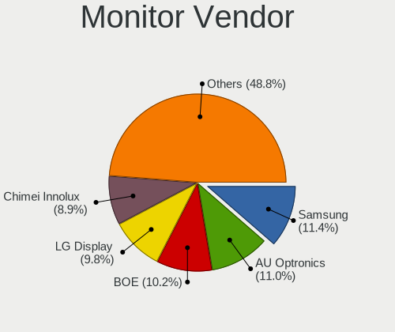

| Vendor                  | Computers | Percent |
|-------------------------|-----------|---------|
| Samsung Electronics     | 28        | 11.52%  |
| AU Optronics            | 27        | 11.11%  |
| BOE                     | 25        | 10.29%  |
| LG Display              | 24        | 9.88%   |
| Chimei Innolux          | 22        | 9.05%   |
| Dell                    | 17        | 7%      |
| Apple                   | 17        | 7%      |
| Goldstar                | 9         | 3.7%    |
| Chi Mei Optoelectronics | 6         | 2.47%   |
| AOC                     | 6         | 2.47%   |
| Acer                    | 6         | 2.47%   |
| Unknown                 | 5         | 2.06%   |
| Sharp                   | 5         | 2.06%   |
| Hewlett-Packard         | 5         | 2.06%   |
| Ancor Communications    | 5         | 2.06%   |
| BenQ                    | 4         | 1.65%   |
| ViewSonic               | 3         | 1.23%   |
| PANDA                   | 3         | 1.23%   |
| LG Electronics          | 3         | 1.23%   |
| Fujitsu Siemens         | 3         | 1.23%   |
| ___                     | 2         | 0.82%   |
| Lenovo                  | 2         | 0.82%   |
| Vizio                   | 1         | 0.41%   |
| Vestel                  | 1         | 0.41%   |
| Toshiba                 | 1         | 0.41%   |
| SAC                     | 1         | 0.41%   |
| Ruijiang                | 1         | 0.41%   |
| Philips                 | 1         | 0.41%   |
| PDA                     | 1         | 0.41%   |
| Panasonic               | 1         | 0.41%   |
| LG Philips              | 1         | 0.41%   |
| KIV                     | 1         | 0.41%   |
| InfoVision              | 1         | 0.41%   |
| Iiyama                  | 1         | 0.41%   |
| HPN                     | 1         | 0.41%   |
| HKC                     | 1         | 0.41%   |
| Haier                   | 1         | 0.41%   |
| Unknown                 | 1         | 0.41%   |

Monitor Model
-------------

Monitor models

| Model                                                                    | Computers | Percent |
|--------------------------------------------------------------------------|-----------|---------|
| Goldstar 20EN33 GSM4EE1 1600x900 443x249mm 20.0-inch                     | 3         | 1.21%   |
| Chimei Innolux LCD Monitor CMN15E6 1366x768 344x193mm 15.5-inch          | 3         | 1.21%   |
| Apple LCD Monitor APP9C5F 1280x800 286x179mm 13.3-inch                   | 3         | 1.21%   |
| ___ LCDTV16 ___0101 1920x1080                                            | 2         | 0.81%   |
| LG Display LCD Monitor LGD0521 1920x1080 309x174mm 14.0-inch             | 2         | 0.81%   |
| LG Display LCD Monitor LGD02DC 1366x768 344x194mm 15.5-inch              | 2         | 0.81%   |
| Dell P2419H DELD0DA 1920x1080 527x296mm 23.8-inch                        | 2         | 0.81%   |
| Chimei Innolux LCD Monitor CMN15DB 1366x768 344x193mm 15.5-inch          | 2         | 0.81%   |
| Chimei Innolux LCD Monitor CMN14D4 1920x1080 309x173mm 13.9-inch         | 2         | 0.81%   |
| Chi Mei Optoelectronics LCD Monitor CMO1018 1024x600 222x125mm 10.0-inch | 2         | 0.81%   |
| BenQ GW2480 BNQ78E7 1920x1080 527x296mm 23.8-inch                        | 2         | 0.81%   |
| AU Optronics LCD Monitor AUO21ED 1920x1080 344x193mm 15.5-inch           | 2         | 0.81%   |
| AU Optronics LCD Monitor AUO105C 1366x768 256x144mm 11.6-inch            | 2         | 0.81%   |
| Apple Color LCD APP9CC7 1280x800 286x179mm 13.3-inch                     | 2         | 0.81%   |
| Vizio E280i-B1 VIZ1002 1360x768 607x345mm 27.5-inch                      | 1         | 0.4%    |
| ViewSonic VX2476 Series VSCD332 1920x1080 527x296mm 23.8-inch            | 1         | 0.4%    |
| ViewSonic VX2453 Series VSC0C28 1920x1080 520x290mm 23.4-inch            | 1         | 0.4%    |
| ViewSonic VA1931 Series VSCAC25 1366x768 410x230mm 18.5-inch             | 1         | 0.4%    |
| Vestel LCD Monitor 43UHD_LCD_TV 3840x2160                                | 1         | 0.4%    |
| Unknown LCDTV16 0101 1920x1080 1600x900mm 72.3-inch                      | 1         | 0.4%    |
| Unknown LCD TV 0101 1920x1080 1600x900mm 72.3-inch                       | 1         | 0.4%    |
| Unknown LCD Monitor Toshiba Internal LCD 1680x945                        | 1         | 0.4%    |
| Unknown LCD Monitor SAMSUNG 1920x1080                                    | 1         | 0.4%    |
| Unknown LCD Monitor NCP 1920x1080                                        | 1         | 0.4%    |
| Toshiba TV TSB010B 1920x1080 706x398mm 31.9-inch                         | 1         | 0.4%    |
| Sharp LCD Monitor SHP14CB 1920x1200 288x180mm 13.4-inch                  | 1         | 0.4%    |
| Sharp LCD Monitor SHP14AD 3840x2160 294x165mm 13.3-inch                  | 1         | 0.4%    |
| Sharp LCD Monitor SHP1484 1920x1080 294x165mm 13.3-inch                  | 1         | 0.4%    |
| Sharp LCD Monitor SHP13C1 1920x1200 366x229mm 17.0-inch                  | 1         | 0.4%    |
| Sharp HDMI SHP10A1 1360x768 700x390mm 31.5-inch                          | 1         | 0.4%    |
| Samsung Electronics U28E510 SAM0D63 1680x1050 610x350mm 27.7-inch        | 1         | 0.4%    |
| Samsung Electronics T27C370 SAM0ADE 1920x1080 598x336mm 27.0-inch        | 1         | 0.4%    |
| Samsung Electronics SyncMaster SAM0595 2048x1152 510x287mm 23.0-inch     | 1         | 0.4%    |
| Samsung Electronics SyncMaster SAM056A 1680x1050 459x296mm 21.5-inch     | 1         | 0.4%    |
| Samsung Electronics SyncMaster SAM0560 1440x900 408x255mm 18.9-inch      | 1         | 0.4%    |
| Samsung Electronics SyncMaster SAM03E5 1680x1050 474x296mm 22.0-inch     | 1         | 0.4%    |
| Samsung Electronics SyncMaster SAM02AD 1440x900 410x257mm 19.1-inch      | 1         | 0.4%    |
| Samsung Electronics SyncMaster SAM01CE 1024x768 304x228mm 15.0-inch      | 1         | 0.4%    |
| Samsung Electronics SA300/SA350 SAM078B 1600x900 443x249mm 20.0-inch     | 1         | 0.4%    |
| Samsung Electronics LS32R75 SAM0F92 3840x2160 697x392mm 31.5-inch        | 1         | 0.4%    |

Monitor Resolution
------------------

Monitor screen resolution

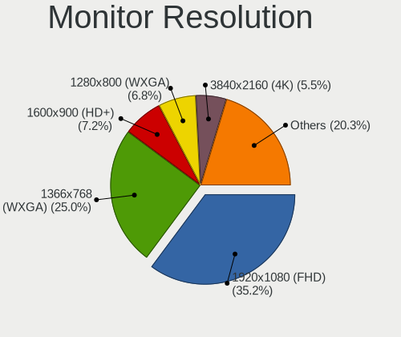

| Resolution         | Computers | Percent |
|--------------------|-----------|---------|
| 1920x1080 (FHD)    | 82        | 34.89%  |
| 1366x768 (WXGA)    | 59        | 25.11%  |
| 1600x900 (HD+)     | 17        | 7.23%   |
| 1280x800 (WXGA)    | 16        | 6.81%   |
| 3840x2160 (4K)     | 13        | 5.53%   |
| 2560x1440 (QHD)    | 5         | 2.13%   |
| 1680x1050 (WSXGA+) | 5         | 2.13%   |
| 1440x900 (WXGA+)   | 5         | 2.13%   |
| 1280x1024 (SXGA)   | 4         | 1.7%    |
| Unknown            | 4         | 1.7%    |
| 1920x1200 (WUXGA)  | 3         | 1.28%   |
| 1600x1200          | 3         | 1.28%   |
| 3440x1440          | 2         | 0.85%   |
| 2560x1600          | 2         | 0.85%   |
| 1024x600           | 2         | 0.85%   |
| 5120x1440          | 1         | 0.43%   |
| 3968x1280          | 1         | 0.43%   |
| 3840x1080          | 1         | 0.43%   |
| 3600x1080          | 1         | 0.43%   |
| 2880x1800          | 1         | 0.43%   |
| 2288x1287          | 1         | 0.43%   |
| 2256x1504          | 1         | 0.43%   |
| 2048x1152          | 1         | 0.43%   |
| 1920x515           | 1         | 0.43%   |
| 1920x1280          | 1         | 0.43%   |
| 1680x945           | 1         | 0.43%   |
| 1360x768           | 1         | 0.43%   |
| 1024x768 (XGA)     | 1         | 0.43%   |

Monitor Diagonal
----------------

Diagonal size in inches

| Inches  | Computers | Percent |
|---------|-----------|---------|
| 15      | 49        | 20.08%  |
| 13      | 45        | 18.44%  |
| Unknown | 24        | 9.84%   |
| 14      | 19        | 7.79%   |
| 24      | 12        | 4.92%   |
| 17      | 12        | 4.92%   |
| 27      | 10        | 4.1%    |
| 19      | 10        | 4.1%    |
| 21      | 9         | 3.69%   |
| 23      | 8         | 3.28%   |
| 20      | 8         | 3.28%   |
| 11      | 7         | 2.87%   |
| 18      | 5         | 2.05%   |
| 84      | 3         | 1.23%   |
| 72      | 3         | 1.23%   |
| 31      | 3         | 1.23%   |
| 22      | 3         | 1.23%   |
| 10      | 3         | 1.23%   |
| 29      | 2         | 0.82%   |
| 12      | 2         | 0.82%   |
| 57      | 1         | 0.41%   |
| 38      | 1         | 0.41%   |
| 36      | 1         | 0.41%   |
| 34      | 1         | 0.41%   |
| 33      | 1         | 0.41%   |
| 32      | 1         | 0.41%   |
| 16      | 1         | 0.41%   |

Monitor Width
-------------

Physical width

| Width in mm | Computers | Percent |
|-------------|-----------|---------|
| 301-350     | 92        | 38.98%  |
| 201-300     | 34        | 14.41%  |
| 401-500     | 28        | 11.86%  |
| 501-600     | 26        | 11.02%  |
| Unknown     | 24        | 10.17%  |
| 351-400     | 14        | 5.93%   |
| 601-700     | 6         | 2.54%   |
| 1501-2000   | 6         | 2.54%   |
| 701-800     | 4         | 1.69%   |
| 801-900     | 1         | 0.42%   |
| 1001-1500   | 1         | 0.42%   |

Aspect Ratio
------------

Proportional relationship between the width and the height

| Ratio   | Computers | Percent |
|---------|-----------|---------|
| 16/9    | 152       | 69.72%  |
| 16/10   | 30        | 13.76%  |
| Unknown | 22        | 10.09%  |
| 5/4     | 5         | 2.29%   |
| 4/3     | 4         | 1.83%   |
| 3/2     | 3         | 1.38%   |
| 3.73    | 1         | 0.46%   |
| 21/9    | 1         | 0.46%   |

Monitor Area
------------

Area in inch

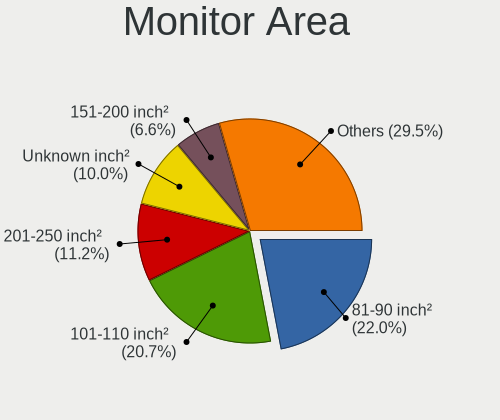

| Area in inch | Computers | Percent |
|----------------|-----------|---------|
| 81-90          | 53        | 22.18%  |
| 101-110        | 50        | 20.92%  |
| 201-250        | 26        | 10.88%  |
| Unknown        | 24        | 10.04%  |
| 151-200        | 16        | 6.69%   |
| 71-80          | 11        | 4.6%    |
| 301-350        | 10        | 4.18%   |
| 351-500        | 8         | 3.35%   |
| 141-150        | 8         | 3.35%   |
| More than 1000 | 7         | 2.93%   |
| 51-60          | 7         | 2.93%   |
| 121-130        | 6         | 2.51%   |
| 41-50          | 3         | 1.26%   |
| 251-300        | 3         | 1.26%   |
| 131-140        | 3         | 1.26%   |
| 61-70          | 2         | 0.84%   |
| 501-1000       | 2         | 0.84%   |

Pixel Density
-------------

Pixels per inch

| Density       | Computers | Percent |
|---------------|-----------|---------|
| 101-120       | 84        | 36.52%  |
| 121-160       | 52        | 22.61%  |
| 51-100        | 52        | 22.61%  |
| Unknown       | 24        | 10.43%  |
| 161-240       | 11        | 4.78%   |
| 1-50          | 5         | 2.17%   |
| More than 240 | 2         | 0.87%   |

Multiple Monitors
-----------------

Total monitors connected

| Total | Computers | Percent |
|-------|-----------|---------|
| 1     | 190       | 80.85%  |
| 2     | 33        | 14.04%  |
| 0     | 8         | 3.4%    |
| 3     | 4         | 1.7%    |

Network
-------

Net Controller Vendor
---------------------

Controller vendors

| Vendor                            | Computers | Percent |
|-----------------------------------|-----------|---------|
| Realtek Semiconductor             | 120       | 34.19%  |
| Intel                             | 101       | 28.77%  |
| Qualcomm Atheros                  | 50        | 14.25%  |
| Broadcom                          | 33        | 9.4%    |
| Nvidia                            | 8         | 2.28%   |
| TP-Link                           | 5         | 1.42%   |
| Marvell Technology Group          | 5         | 1.42%   |
| Broadcom Limited                  | 4         | 1.14%   |
| Ralink                            | 3         | 0.85%   |
| Samsung Electronics               | 2         | 0.57%   |
| Huawei Technologies               | 2         | 0.57%   |
| D-Link                            | 2         | 0.57%   |
| Xiaomi                            | 1         | 0.28%   |
| VIA Technologies                  | 1         | 0.28%   |
| Sierra Wireless                   | 1         | 0.28%   |
| Ralink Technology                 | 1         | 0.28%   |
| Qualcomm Atheros Communications   | 1         | 0.28%   |
| Qualcomm                          | 1         | 0.28%   |
| Microsoft                         | 1         | 0.28%   |
| LG Electronics                    | 1         | 0.28%   |
| Hewlett-Packard                   | 1         | 0.28%   |
| Google                            | 1         | 0.28%   |
| Fibocom                           | 1         | 0.28%   |
| Ericsson Business Mobile Networks | 1         | 0.28%   |
| D-Link System                     | 1         | 0.28%   |
| BUFFALO                           | 1         | 0.28%   |
| ASIX Electronics                  | 1         | 0.28%   |
| Arduino SA                        | 1         | 0.28%   |

Net Controller Model
--------------------

Controller models

| Model                                                                                 | Computers | Percent |
|---------------------------------------------------------------------------------------|-----------|---------|
| Realtek RTL8111/8168/8411 PCI Express Gigabit Ethernet Controller                     | 83        | 20.1%   |
| Realtek RTL810xE PCI Express Fast Ethernet controller                                 | 20        | 4.84%   |
| Intel 82579LM Gigabit Network Connection (Lewisville)                                 | 12        | 2.91%   |
| Qualcomm Atheros QCA9565 / AR9565 Wireless Network Adapter                            | 9         | 2.18%   |
| Qualcomm Atheros QCA9377 802.11ac Wireless Network Adapter                            | 8         | 1.94%   |
| Qualcomm Atheros AR9485 Wireless Network Adapter                                      | 8         | 1.94%   |
| Intel Wireless 7260                                                                   | 8         | 1.94%   |
| Intel Wireless 8260                                                                   | 7         | 1.69%   |
| Intel Wi-Fi 6 AX200                                                                   | 7         | 1.69%   |
| Realtek RTL8821CE 802.11ac PCIe Wireless Network Adapter                              | 6         | 1.45%   |
| Intel Comet Lake PCH-LP CNVi WiFi                                                     | 6         | 1.45%   |
| Intel Ethernet Connection I218-LM                                                     | 5         | 1.21%   |
| Intel Centrino Advanced-N 6235                                                        | 5         | 1.21%   |
| Realtek RTL8822CE 802.11ac PCIe Wireless Network Adapter                              | 4         | 0.97%   |
| Qualcomm Atheros QCA6174 802.11ac Wireless Network Adapter                            | 4         | 0.97%   |
| Intel Wireless 8265 / 8275                                                            | 4         | 0.97%   |
| Intel Wireless 7265                                                                   | 4         | 0.97%   |
| Intel I211 Gigabit Network Connection                                                 | 4         | 0.97%   |
| Intel Ethernet Connection (2) I219-V                                                  | 4         | 0.97%   |
| Intel Centrino Advanced-N 6205 [Taylor Peak]                                          | 4         | 0.97%   |
| Intel Cannon Point-LP CNVi [Wireless-AC]                                              | 4         | 0.97%   |
| Broadcom NetXtreme BCM57765 Gigabit Ethernet PCIe                                     | 4         | 0.97%   |
| Broadcom BCM43224 802.11a/b/g/n                                                       | 4         | 0.97%   |
| TP-Link TL-WN821N v5/v6 [RTL8192EU]                                                   | 3         | 0.73%   |
| Realtek RTL8723BE PCIe Wireless Network Adapter                                       | 3         | 0.73%   |
| Realtek RTL8188EE Wireless Network Adapter                                            | 3         | 0.73%   |
| Realtek 802.11ac NIC                                                                  | 3         | 0.73%   |
| Qualcomm Atheros AR9285 Wireless Network Adapter (PCI-Express)                        | 3         | 0.73%   |
| Qualcomm Atheros AR8161 Gigabit Ethernet                                              | 3         | 0.73%   |
| Qualcomm Atheros AR5418 Wireless Network Adapter [AR5008E 802.11(a)bgn] (PCI-Express) | 3         | 0.73%   |
| Nvidia MCP79 Ethernet                                                                 | 3         | 0.73%   |
| Marvell Group 88E8053 PCI-E Gigabit Ethernet Controller                               | 3         | 0.73%   |
| Intel Wireless 3165                                                                   | 3         | 0.73%   |
| Intel Ice Lake-LP PCH CNVi WiFi                                                       | 3         | 0.73%   |
| Intel Ethernet Connection I219-LM                                                     | 3         | 0.73%   |
| Intel Ethernet Connection I217-LM                                                     | 3         | 0.73%   |
| Intel Ethernet Connection (7) I219-V                                                  | 3         | 0.73%   |
| Intel Ethernet Connection (4) I219-V                                                  | 3         | 0.73%   |
| Intel Cannon Lake PCH CNVi WiFi                                                       | 3         | 0.73%   |
| Intel 82567LM Gigabit Network Connection                                              | 3         | 0.73%   |

Wireless Vendor
---------------

Wireless vendors

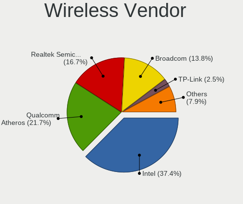

| Vendor                          | Computers | Percent |
|---------------------------------|-----------|---------|
| Intel                           | 76        | 37.44%  |
| Qualcomm Atheros                | 44        | 21.67%  |
| Realtek Semiconductor           | 34        | 16.75%  |
| Broadcom                        | 28        | 13.79%  |
| TP-Link                         | 5         | 2.46%   |
| Broadcom Limited                | 4         | 1.97%   |
| Ralink                          | 3         | 1.48%   |
| D-Link                          | 2         | 0.99%   |
| Sierra Wireless                 | 1         | 0.49%   |
| Ralink Technology               | 1         | 0.49%   |
| Qualcomm Atheros Communications | 1         | 0.49%   |
| Microsoft                       | 1         | 0.49%   |
| Fibocom                         | 1         | 0.49%   |
| D-Link System                   | 1         | 0.49%   |
| BUFFALO                         | 1         | 0.49%   |

Wireless Model
--------------

Wireless models

| Model                                                                                 | Computers | Percent |
|---------------------------------------------------------------------------------------|-----------|---------|
| Qualcomm Atheros QCA9565 / AR9565 Wireless Network Adapter                            | 9         | 4.41%   |
| Qualcomm Atheros QCA9377 802.11ac Wireless Network Adapter                            | 8         | 3.92%   |
| Qualcomm Atheros AR9485 Wireless Network Adapter                                      | 8         | 3.92%   |
| Intel Wireless 7260                                                                   | 8         | 3.92%   |
| Intel Wireless 8260                                                                   | 7         | 3.43%   |
| Intel Wi-Fi 6 AX200                                                                   | 7         | 3.43%   |
| Realtek RTL8821CE 802.11ac PCIe Wireless Network Adapter                              | 6         | 2.94%   |
| Intel Comet Lake PCH-LP CNVi WiFi                                                     | 6         | 2.94%   |
| Intel Centrino Advanced-N 6235                                                        | 5         | 2.45%   |
| Realtek RTL8822CE 802.11ac PCIe Wireless Network Adapter                              | 4         | 1.96%   |
| Qualcomm Atheros QCA6174 802.11ac Wireless Network Adapter                            | 4         | 1.96%   |
| Intel Wireless 8265 / 8275                                                            | 4         | 1.96%   |
| Intel Wireless 7265                                                                   | 4         | 1.96%   |
| Intel Centrino Advanced-N 6205 [Taylor Peak]                                          | 4         | 1.96%   |
| Intel Cannon Point-LP CNVi [Wireless-AC]                                              | 4         | 1.96%   |
| Broadcom BCM43224 802.11a/b/g/n                                                       | 4         | 1.96%   |
| TP-Link TL-WN821N v5/v6 [RTL8192EU]                                                   | 3         | 1.47%   |
| Realtek RTL8723BE PCIe Wireless Network Adapter                                       | 3         | 1.47%   |
| Realtek RTL8188EE Wireless Network Adapter                                            | 3         | 1.47%   |
| Realtek 802.11ac NIC                                                                  | 3         | 1.47%   |
| Qualcomm Atheros AR9285 Wireless Network Adapter (PCI-Express)                        | 3         | 1.47%   |
| Qualcomm Atheros AR5418 Wireless Network Adapter [AR5008E 802.11(a)bgn] (PCI-Express) | 3         | 1.47%   |
| Intel Wireless 3165                                                                   | 3         | 1.47%   |
| Intel Ice Lake-LP PCH CNVi WiFi                                                       | 3         | 1.47%   |
| Intel Cannon Lake PCH CNVi WiFi                                                       | 3         | 1.47%   |
| Broadcom BCM4360 802.11ac Wireless Network Adapter                                    | 3         | 1.47%   |
| Broadcom BCM4331 802.11a/b/g/n                                                        | 3         | 1.47%   |
| Broadcom BCM43228 802.11a/b/g/n                                                       | 3         | 1.47%   |
| Broadcom BCM4322 802.11a/b/g/n Wireless LAN Controller                                | 3         | 1.47%   |
| Broadcom BCM4313 802.11bgn Wireless Network Adapter                                   | 3         | 1.47%   |
| Broadcom BCM4312 802.11b/g LP-PHY                                                     | 3         | 1.47%   |
| Realtek RTL8812AU 802.11a/b/g/n/ac 2T2R DB WLAN Adapter                               | 2         | 0.98%   |
| Realtek RTL8811AU 802.11a/b/g/n/ac WLAN Adapter                                       | 2         | 0.98%   |
| Realtek RTL8191SEvB Wireless LAN Controller                                           | 2         | 0.98%   |
| Realtek RTL8188EUS 802.11n Wireless Network Adapter                                   | 2         | 0.98%   |
| Ralink RT5390 Wireless 802.11n 1T/1R PCIe                                             | 2         | 0.98%   |
| Qualcomm Atheros AR9462 Wireless Network Adapter                                      | 2         | 0.98%   |
| Qualcomm Atheros AR928X Wireless Network Adapter (PCI-Express)                        | 2         | 0.98%   |
| Qualcomm Atheros AR242x / AR542x Wireless Network Adapter (PCI-Express)               | 2         | 0.98%   |
| Intel Wireless-AC 9260                                                                | 2         | 0.98%   |

Ethernet Vendor
---------------

Ethernet vendors

| Vendor                   | Computers | Percent |
|--------------------------|-----------|---------|
| Realtek Semiconductor    | 107       | 52.45%  |
| Intel                    | 51        | 25%     |
| Qualcomm Atheros         | 11        | 5.39%   |
| Broadcom                 | 11        | 5.39%   |
| Nvidia                   | 8         | 3.92%   |
| Marvell Technology Group | 5         | 2.45%   |
| Samsung Electronics      | 2         | 0.98%   |
| Huawei Technologies      | 2         | 0.98%   |
| Xiaomi                   | 1         | 0.49%   |
| VIA Technologies         | 1         | 0.49%   |
| Qualcomm                 | 1         | 0.49%   |
| LG Electronics           | 1         | 0.49%   |
| Hewlett-Packard          | 1         | 0.49%   |
| Google                   | 1         | 0.49%   |
| ASIX Electronics         | 1         | 0.49%   |

Ethernet Model
--------------

Ethernet models

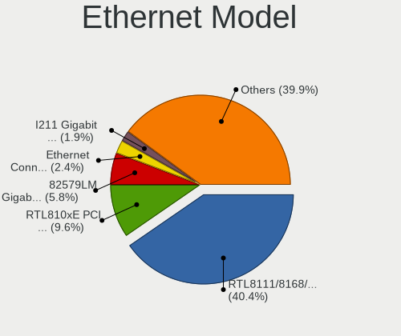

| Model                                                             | Computers | Percent |
|-------------------------------------------------------------------|-----------|---------|
| Realtek RTL8111/8168/8411 PCI Express Gigabit Ethernet Controller | 83        | 40.1%   |
| Realtek RTL810xE PCI Express Fast Ethernet controller             | 20        | 9.66%   |
| Intel 82579LM Gigabit Network Connection (Lewisville)             | 12        | 5.8%    |
| Intel Ethernet Connection I218-LM                                 | 5         | 2.42%   |
| Intel I211 Gigabit Network Connection                             | 4         | 1.93%   |
| Intel Ethernet Connection (2) I219-V                              | 4         | 1.93%   |
| Broadcom NetXtreme BCM57765 Gigabit Ethernet PCIe                 | 4         | 1.93%   |
| Qualcomm Atheros AR8161 Gigabit Ethernet                          | 3         | 1.45%   |
| Nvidia MCP79 Ethernet                                             | 3         | 1.45%   |
| Marvell Group 88E8053 PCI-E Gigabit Ethernet Controller           | 3         | 1.45%   |
| Intel Ethernet Connection I219-LM                                 | 3         | 1.45%   |
| Intel Ethernet Connection I217-LM                                 | 3         | 1.45%   |
| Intel Ethernet Connection (7) I219-V                              | 3         | 1.45%   |
| Intel Ethernet Connection (4) I219-V                              | 3         | 1.45%   |
| Intel 82567LM Gigabit Network Connection                          | 3         | 1.45%   |
| Samsung GT-I9070 (network tethering, USB debugging enabled)       | 2         | 0.97%   |
| Realtek RTL-8100/8101L/8139 PCI Fast Ethernet Adapter             | 2         | 0.97%   |
| Qualcomm Atheros AR8131 Gigabit Ethernet                          | 2         | 0.97%   |
| Nvidia MCP89 Ethernet                                             | 2         | 0.97%   |
| Intel 82578DM Gigabit Network Connection                          | 2         | 0.97%   |
| Xiaomi Mi/Redmi series (RNDIS)                                    | 1         | 0.48%   |
| VIA VT6105/VT6106S [Rhine-III]                                    | 1         | 0.48%   |
| Realtek RTL8152 Fast Ethernet Adapter                             | 1         | 0.48%   |
| Realtek RTL8125 2.5GbE Controller                                 | 1         | 0.48%   |
| Realtek Killer E2600 Gigabit Ethernet Controller                  | 1         | 0.48%   |
| Qualcomm MegaFon M150-4                                           | 1         | 0.48%   |
| Qualcomm Atheros QCA8172 Fast Ethernet                            | 1         | 0.48%   |
| Qualcomm Atheros Killer E220x Gigabit Ethernet Controller         | 1         | 0.48%   |
| Qualcomm Atheros Attansic L1 Gigabit Ethernet                     | 1         | 0.48%   |
| Qualcomm Atheros AR8152 v2.0 Fast Ethernet                        | 1         | 0.48%   |
| Qualcomm Atheros AR8152 v1.1 Fast Ethernet                        | 1         | 0.48%   |
| Qualcomm Atheros AR8151 v2.0 Gigabit Ethernet                     | 1         | 0.48%   |
| Nvidia MCP77 Ethernet                                             | 1         | 0.48%   |
| Nvidia MCP61 Ethernet                                             | 1         | 0.48%   |
| Nvidia MCP55 Ethernet                                             | 1         | 0.48%   |
| Marvell Group 88E8058 PCI-E Gigabit Ethernet Controller           | 1         | 0.48%   |
| Marvell Group 88E8055 PCI-E Gigabit Ethernet Controller           | 1         | 0.48%   |
| LG LM-X420xxx/G2 Android Phone (USB tethering mode)               | 1         | 0.48%   |
| Intel Ethernet Connection I217-V                                  | 1         | 0.48%   |
| Intel Ethernet Connection (6) I219-V                              | 1         | 0.48%   |

Net Controller Kind
-------------------

Ethernet, WiFi or modem

| Kind     | Computers | Percent |
|----------|-----------|---------|
| Ethernet | 198       | 50.25%  |
| WiFi     | 194       | 49.24%  |
| Modem    | 2         | 0.51%   |

Used Controller
---------------

Currently used network controller

| Kind     | Computers | Percent |
|----------|-----------|---------|
| WiFi     | 165       | 69.92%  |
| Ethernet | 71        | 30.08%  |

NICs
----

Total network controllers on board

| Total | Computers | Percent |
|-------|-----------|---------|
| 2     | 138       | 59.48%  |
| 1     | 82        | 35.34%  |
| 0     | 6         | 2.59%   |
| 3     | 5         | 2.16%   |
| 4     | 1         | 0.43%   |

IPv6
----

IPv6 vs IPv4

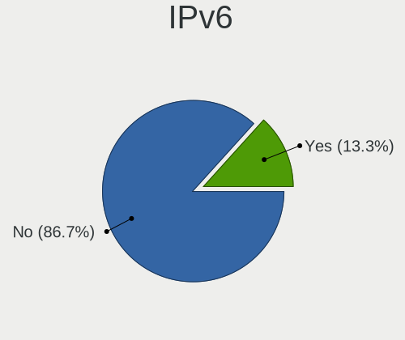

| Used | Computers | Percent |
|------|-----------|---------|
| No   | 201       | 86.64%  |
| Yes  | 31        | 13.36%  |

Bluetooth
---------

Bluetooth Vendor
----------------

Controller vendors

| Vendor                          | Computers | Percent |
|---------------------------------|-----------|---------|
| Intel                           | 60        | 38.22%  |
| Apple                           | 18        | 11.46%  |
| Cambridge Silicon Radio         | 16        | 10.19%  |
| Qualcomm Atheros Communications | 14        | 8.92%   |
| Realtek Semiconductor           | 12        | 7.64%   |
| Lite-On Technology              | 8         | 5.1%    |
| Broadcom                        | 8         | 5.1%    |
| Toshiba                         | 3         | 1.91%   |
| IMC Networks                    | 3         | 1.91%   |
| Hewlett-Packard                 | 3         | 1.91%   |
| Foxconn / Hon Hai               | 3         | 1.91%   |
| ASUSTek Computer                | 2         | 1.27%   |
| Taiyo Yuden                     | 1         | 0.64%   |
| Realtek                         | 1         | 0.64%   |
| Ralink                          | 1         | 0.64%   |
| Qcom                            | 1         | 0.64%   |
| Logitech                        | 1         | 0.64%   |
| Fujitsu                         | 1         | 0.64%   |
| Dell                            | 1         | 0.64%   |

Bluetooth Model
---------------

Controller models

| Model                                               | Computers | Percent |
|-----------------------------------------------------|-----------|---------|
| Intel Bluetooth wireless interface                  | 25        | 15.92%  |
| Cambridge Silicon Radio Bluetooth Dongle (HCI mode) | 16        | 10.19%  |
| Intel Bluetooth 9460/9560 Jefferson Peak (JfP)      | 10        | 6.37%   |
| Apple Bluetooth Host Controller                     | 9         | 5.73%   |
| Qualcomm Atheros  Bluetooth Device                  | 8         | 5.1%    |
| Intel AX201 Bluetooth                               | 8         | 5.1%    |
| Intel AX200 Bluetooth                               | 7         | 4.46%   |
| Realtek Bluetooth Radio                             | 6         | 3.82%   |
| Realtek  Bluetooth 4.2 Adapter                      | 5         | 3.18%   |
| Intel Centrino Bluetooth Wireless Transceiver       | 5         | 3.18%   |
| Apple Bluetooth HCI                                 | 4         | 2.55%   |
| Lite-On Qualcomm Atheros QCA9377 Bluetooth          | 3         | 1.91%   |
| HP Broadcom 2070 Bluetooth Combo                    | 3         | 1.91%   |
| Apple Bluetooth USB Host Controller                 | 3         | 1.91%   |
| Qualcomm Atheros AR3012 Bluetooth 4.0               | 2         | 1.27%   |
| Qualcomm Atheros AR3011 Bluetooth                   | 2         | 1.27%   |
| Lite-On Atheros AR3012 Bluetooth                    | 2         | 1.27%   |
| Intel Wireless-AC 9260 Bluetooth Adapter            | 2         | 1.27%   |
| Intel Centrino Advanced-N 6230 Bluetooth adapter    | 2         | 1.27%   |
| Foxconn / Hon Hai Bluetooth Device                  | 2         | 1.27%   |
| Broadcom BCM2045B (BDC-2.1)                         | 2         | 1.27%   |
| Apple Built-in Bluetooth 2.0+EDR HCI                | 2         | 1.27%   |
| Toshiba RT Bluetooth Radio                          | 1         | 0.64%   |
| Toshiba Bluetooth USB Host Controller               | 1         | 0.64%   |
| Toshiba Askey Bluetooth Module                      | 1         | 0.64%   |
| Taiyo Yuden Bluetooth Device (V2.0+EDR)             | 1         | 0.64%   |
| Realtek RTL8723B Bluetooth                          | 1         | 0.64%   |
| Realtek Bluetooth Radio                             | 1         | 0.64%   |
| Ralink RT3290 Bluetooth                             | 1         | 0.64%   |
| Qualcomm Atheros QCA61x4 Bluetooth 4.0              | 1         | 0.64%   |
| Qualcomm Atheros AR9462 Bluetooth                   | 1         | 0.64%   |
| Qcom Broadcom Bluetooth USB                         | 1         | 0.64%   |
| Logitech BT Mini-Receiver (HCI mode)                | 1         | 0.64%   |
| Lite-On Qualcomm Atheros Bluetooth                  | 1         | 0.64%   |
| Lite-On Bluetooth Device                            | 1         | 0.64%   |
| Lite-On Atheros Bluetooth                           | 1         | 0.64%   |
| Intel Wireless-AC 3168 Bluetooth                    | 1         | 0.64%   |
| IMC Networks Bluetooth Radio                        | 1         | 0.64%   |
| IMC Networks Bluetooth Device                       | 1         | 0.64%   |
| IMC Networks BCM20702A0                             | 1         | 0.64%   |

Sound
-----

Sound Vendor
------------

Sound card vendors

| Vendor                     | Computers | Percent |
|----------------------------|-----------|---------|
| Intel                      | 180       | 60.61%  |
| AMD                        | 55        | 18.52%  |
| Nvidia                     | 42        | 14.14%  |
| C-Media Electronics        | 7         | 2.36%   |
| JMTek                      | 3         | 1.01%   |
| Generalplus Technology     | 3         | 1.01%   |
| YUAN High-Tech Development | 1         | 0.34%   |
| Texas Instruments          | 1         | 0.34%   |
| Native Instruments         | 1         | 0.34%   |
| Hewlett-Packard            | 1         | 0.34%   |
| Fortemedia                 | 1         | 0.34%   |
| Dell                       | 1         | 0.34%   |
| Astro Gaming               | 1         | 0.34%   |

Sound Model
-----------

Sound card models

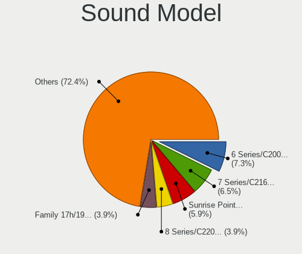

| Model                                                                                             | Computers | Percent |
|---------------------------------------------------------------------------------------------------|-----------|---------|
| Intel 6 Series/C200 Series Chipset Family High Definition Audio Controller                        | 26        | 7.37%   |
| Intel 7 Series/C216 Chipset Family High Definition Audio Controller                               | 23        | 6.52%   |
| Intel Sunrise Point-LP HD Audio                                                                   | 21        | 5.95%   |
| AMD Family 17h/19h HD Audio Controller                                                            | 14        | 3.97%   |
| Intel 8 Series/C220 Series Chipset High Definition Audio Controller                               | 13        | 3.68%   |
| Intel Haswell-ULT HD Audio Controller                                                             | 11        | 3.12%   |
| Intel 82801I (ICH9 Family) HD Audio Controller                                                    | 11        | 3.12%   |
| Intel 8 Series HD Audio Controller                                                                | 11        | 3.12%   |
| AMD Raven/Raven2/Fenghuang HDMI/DP Audio Controller                                               | 11        | 3.12%   |
| Intel Xeon E3-1200 v3/4th Gen Core Processor HD Audio Controller                                  | 9         | 2.55%   |
| Intel NM10/ICH7 Family High Definition Audio Controller                                           | 9         | 2.55%   |
| Intel Cannon Lake PCH cAVS                                                                        | 9         | 2.55%   |
| Intel Comet Lake PCH-LP cAVS                                                                      | 8         | 2.27%   |
| Nvidia GM107 High Definition Audio Controller [GeForce 940MX]                                     | 7         | 1.98%   |
| Intel Ice Lake-LP Smart Sound Technology Audio Controller                                         | 7         | 1.98%   |
| AMD SBx00 Azalia (Intel HDA)                                                                      | 7         | 1.98%   |
| Nvidia GP107GL High Definition Audio Controller                                                   | 6         | 1.7%    |
| Intel 5 Series/3400 Series Chipset High Definition Audio                                          | 6         | 1.7%    |
| AMD FCH Azalia Controller                                                                         | 6         | 1.7%    |
| AMD Ellesmere HDMI Audio [Radeon RX 470/480 / 570/580/590]                                        | 6         | 1.7%    |
| Intel Atom Processor Z36xxx/Z37xxx Series High Definition Audio Controller                        | 5         | 1.42%   |
| Nvidia GK208 HDMI/DP Audio Controller                                                             | 4         | 1.13%   |
| Nvidia GF108 High Definition Audio Controller                                                     | 4         | 1.13%   |
| Intel Celeron/Pentium Silver Processor High Definition Audio                                      | 4         | 1.13%   |
| Intel Cannon Point-LP High Definition Audio Controller                                            | 4         | 1.13%   |
| Intel 82801H (ICH8 Family) HD Audio Controller                                                    | 4         | 1.13%   |
| Intel 200 Series PCH HD Audio                                                                     | 4         | 1.13%   |
| Intel 100 Series/C230 Series Chipset Family HD Audio Controller                                   | 4         | 1.13%   |
| AMD Family 17h (Models 00h-0fh) HD Audio Controller                                               | 4         | 1.13%   |
| AMD Family 15h (Models 60h-6fh) Audio Controller                                                  | 4         | 1.13%   |
| Nvidia MCP79 High Definition Audio                                                                | 3         | 0.85%   |
| JMTek USB PnP Audio Device                                                                        | 3         | 0.85%   |
| Intel Wildcat Point-LP High Definition Audio Controller                                           | 3         | 0.85%   |
| Intel Broadwell-U Audio Controller                                                                | 3         | 0.85%   |
| Intel Atom/Celeron/Pentium Processor x5-E8000/J3xxx/N3xxx Series High Definition Audio Controller | 3         | 0.85%   |
| Generalplus Technology USB Audio Device                                                           | 3         | 0.85%   |
| C-Media Electronics Audio Adapter (Unitek Y-247A)                                                 | 3         | 0.85%   |
| AMD Starship/Matisse HD Audio Controller                                                          | 3         | 0.85%   |
| AMD Renoir Radeon High Definition Audio Controller                                                | 3         | 0.85%   |
| AMD Kabini HDMI/DP Audio                                                                          | 3         | 0.85%   |

Memory
------

Memory Vendor
-------------

Memory module vendors

| Vendor              | Computers | Percent |
|---------------------|-----------|---------|
| Samsung Electronics | 28        | 21.37%  |
| SK hynix            | 24        | 18.32%  |
| Kingston            | 17        | 12.98%  |
| Unknown             | 15        | 11.45%  |
| Micron Technology   | 13        | 9.92%   |
| Crucial             | 7         | 5.34%   |
| Elpida              | 5         | 3.82%   |
| Corsair             | 3         | 2.29%   |
| Unknown (ABCD)      | 2         | 1.53%   |
| Ramaxel Technology  | 2         | 1.53%   |
| Patriot             | 2         | 1.53%   |
| Unknown (0x198)     | 1         | 0.76%   |
| Transcend           | 1         | 0.76%   |
| Timetec             | 1         | 0.76%   |
| Smart               | 1         | 0.76%   |
| PNY                 | 1         | 0.76%   |
| Nanya Technology    | 1         | 0.76%   |
| Multilaser          | 1         | 0.76%   |
| Melco               | 1         | 0.76%   |
| Magnum Tech         | 1         | 0.76%   |
| G.Skill             | 1         | 0.76%   |
| Avant               | 1         | 0.76%   |
| Aeneon              | 1         | 0.76%   |
| A-DATA Technology   | 1         | 0.76%   |

Memory Model
------------

Memory module models

| Model                                                            | Computers | Percent |
|------------------------------------------------------------------|-----------|---------|
| Samsung RAM M471B1G73DB0-YK0 8GB SODIMM DDR3 1600MT/s            | 4         | 2.88%   |
| Unknown RAM Module 4GB DIMM 1333MT/s                             | 2         | 1.44%   |
| Unknown RAM Module 2GB SODIMM DDR3 1333MT/s                      | 2         | 1.44%   |
| Samsung RAM Module 8192MB SODIMM DDR4 2133MT/s                   | 2         | 1.44%   |
| Samsung RAM Module 16384MB SODIMM DDR4 2667MT/s                  | 2         | 1.44%   |
| Samsung RAM M471B5273DH0-CH9 4096MB SODIMM DDR3 1334MT/s         | 2         | 1.44%   |
| Samsung RAM M471B5273CH0-CH9 4GB SODIMM DDR3 1334MT/s            | 2         | 1.44%   |
| Samsung RAM M471A5143EB0-CPB 4GB SODIMM DDR4 2133MT/s            | 2         | 1.44%   |
| Micron RAM 8KTF51264HZ-1G6E1 4GB SODIMM DDR3 1600MT/s            | 2         | 1.44%   |
| Unknown RAM Module 8GB SODIMM DDR3 1067MT/s                      | 1         | 0.72%   |
| Unknown RAM Module 8GB DIMM 1333MT/s                             | 1         | 0.72%   |
| Unknown RAM Module 4096MB SODIMM DDR3 1333MT/s                   | 1         | 0.72%   |
| Unknown RAM Module 4096MB SODIMM DDR3 1067MT/s                   | 1         | 0.72%   |
| Unknown RAM Module 4096MB DIMM DDR3 1333MT/s                     | 1         | 0.72%   |
| Unknown RAM Module 2GB SODIMM DDR2 667MT/s                       | 1         | 0.72%   |
| Unknown RAM Module 2GB DIMM 1333MT/s                             | 1         | 0.72%   |
| Unknown RAM Module 2048MB SODIMM DDR2 667MT/s                    | 1         | 0.72%   |
| Unknown RAM Module 2048MB DIMM DDR3 1333MT/s                     | 1         | 0.72%   |
| Unknown RAM Module 2048MB DIMM DDR2 667MT/s                      | 1         | 0.72%   |
| Unknown RAM Module 1GB SODIMM DDR3 667MT/s                       | 1         | 0.72%   |
| Unknown RAM Module 1GB SODIMM DDR2 667MT/s                       | 1         | 0.72%   |
| Unknown RAM Module 16GB Row Of Chips LPDDR4 3733MT/s             | 1         | 0.72%   |
| Unknown RAM Module 1024MB SODIMM DDR3 667MT/s                    | 1         | 0.72%   |
| Unknown (ABCD) RAM 123456789012345678 4GB DIMM DDR4 2400MT/s     | 1         | 0.72%   |
| Unknown (ABCD) RAM 123456789012345678 2GB SODIMM LPDDR4 2400MT/s | 1         | 0.72%   |
| Unknown (0x198) RAM Module 8GB SODIMM DDR3 1867MT/s              | 1         | 0.72%   |
| Transcend RAM Module 2048MB SODIMM DDR2 667MT/s                  | 1         | 0.72%   |
| Timetec RAM SD4-2666 16GB SODIMM DDR4 2667MT/s                   | 1         | 0.72%   |
| Smart RAM SH564128FH8NZPHSCR 4GB SODIMM DDR3 1333MT/s            | 1         | 0.72%   |
| SK hynix RAM Module 8GB SODIMM DDR3 1600MT/s                     | 1         | 0.72%   |
| SK hynix RAM Module 8192MB Row Of Chips LPDDR3 2133MT/s          | 1         | 0.72%   |
| SK hynix RAM Module 4GB SODIMM DDR4 2400MT/s                     | 1         | 0.72%   |
| SK hynix RAM Module 4096MB DIMM DDR3 1066MT/s                    | 1         | 0.72%   |
| SK hynix RAM Module 2GB SODIMM DDR3 1333MT/s                     | 1         | 0.72%   |
| SK hynix RAM Module 2GB SODIMM DDR2 667MT/s                      | 1         | 0.72%   |
| SK hynix RAM Module 1024MB SODIMM DDR2 800MT/s                   | 1         | 0.72%   |
| SK hynix RAM HYMP125S64CP8-Y5 2GB SODIMM DDR2 667MT/s            | 1         | 0.72%   |
| SK hynix RAM HYMP112U64CP8-Y5 1024MB DIMM DDR2 1639MT/s          | 1         | 0.72%   |
| SK hynix RAM HMT451S6MFR8A-PB 4GB SODIMM DDR3 1600MT/s           | 1         | 0.72%   |
| SK hynix RAM HMT451S6BFR8A-PB 4GB SODIMM DDR3 1600MT/s           | 1         | 0.72%   |

Memory Kind
-----------

Memory module kinds

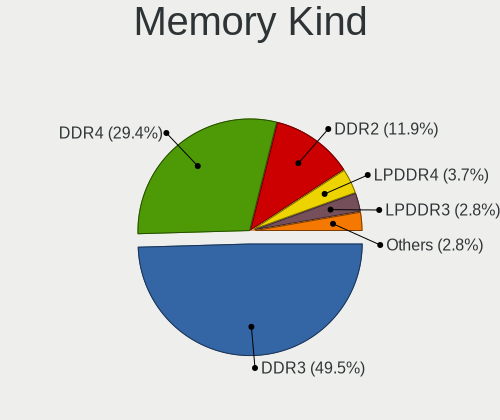

| Kind    | Computers | Percent |
|---------|-----------|---------|
| DDR3    | 53        | 49.07%  |
| DDR4    | 32        | 29.63%  |
| DDR2    | 13        | 12.04%  |
| LPDDR4  | 4         | 3.7%    |
| LPDDR3  | 3         | 2.78%   |
| Unknown | 2         | 1.85%   |
| SDRAM   | 1         | 0.93%   |

Memory Form Factor
------------------

Physical design of the memory module

| Name         | Computers | Percent |
|--------------|-----------|---------|
| SODIMM       | 77        | 71.96%  |
| DIMM         | 24        | 22.43%  |
| Row Of Chips | 5         | 4.67%   |
| FB-DIMM      | 1         | 0.93%   |

Memory Size
-----------

Memory module size

| Size  | Computers | Percent |
|-------|-----------|---------|
| 4096  | 40        | 32.26%  |
| 8192  | 39        | 31.45%  |
| 2048  | 25        | 20.16%  |
| 16384 | 12        | 9.68%   |
| 1024  | 7         | 5.65%   |
| 32768 | 1         | 0.81%   |

Memory Speed
------------

Memory module speed

| Speed | Computers | Percent |
|-------|-----------|---------|
| 1600  | 27        | 22.69%  |
| 2667  | 13        | 10.92%  |
| 1333  | 13        | 10.92%  |
| 667   | 11        | 9.24%   |
| 2400  | 8         | 6.72%   |
| 2133  | 8         | 6.72%   |
| 1334  | 8         | 6.72%   |
| 1067  | 5         | 4.2%    |
| 800   | 5         | 4.2%    |
| 3200  | 4         | 3.36%   |
| 1867  | 3         | 2.52%   |
| 3466  | 2         | 1.68%   |
| 1866  | 2         | 1.68%   |
| 4267  | 1         | 0.84%   |
| 4199  | 1         | 0.84%   |
| 3733  | 1         | 0.84%   |
| 3600  | 1         | 0.84%   |
| 3334  | 1         | 0.84%   |
| 2934  | 1         | 0.84%   |
| 2933  | 1         | 0.84%   |
| 1800  | 1         | 0.84%   |
| 1639  | 1         | 0.84%   |
| 1066  | 1         | 0.84%   |

Printers & scanners
-------------------

Printer Vendor
--------------

Printer device vendors

| Vendor             | Computers | Percent |
|--------------------|-----------|---------|
| Hewlett-Packard    | 5         | 62.5%   |
| Seiko Epson        | 1         | 12.5%   |
| Canon              | 1         | 12.5%   |
| Brother Industries | 1         | 12.5%   |

Printer Model
-------------

Printer device models

| Model                       | Computers | Percent |
|-----------------------------|-----------|---------|
| Seiko Epson XP-200 Series   | 1         | 12.5%   |
| HP Printing Support         | 1         | 12.5%   |
| HP LaserJet Pro M202dw      | 1         | 12.5%   |
| HP LaserJet 1320            | 1         | 12.5%   |
| HP Deskjet 2050 J510        | 1         | 12.5%   |
| HP Deskjet 1000 J110 series | 1         | 12.5%   |
| Canon TR8500 series         | 1         | 12.5%   |
| Brother MFC-T910DW          | 1         | 12.5%   |

Scanner Vendor
--------------

Scanner device vendors

Zero info for selected period =(

Scanner Model
-------------

Scanner device models

Zero info for selected period =(

Camera
------

Camera Vendor
-------------

Camera device vendors

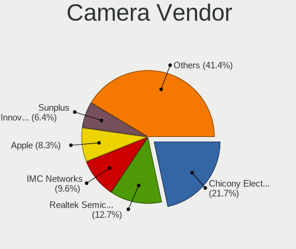

| Vendor                                 | Computers | Percent |
|----------------------------------------|-----------|---------|
| Chicony Electronics                    | 34        | 21.66%  |
| Realtek Semiconductor                  | 20        | 12.74%  |
| IMC Networks                           | 15        | 9.55%   |
| Apple                                  | 13        | 8.28%   |
| Sunplus Innovation Technology          | 10        | 6.37%   |
| Acer                                   | 9         | 5.73%   |
| Microdia                               | 8         | 5.1%    |
| Cheng Uei Precision Industry (Foxlink) | 6         | 3.82%   |
| Silicon Motion                         | 5         | 3.18%   |
| Quanta                                 | 5         | 3.18%   |
| Logitech                               | 5         | 3.18%   |
| Syntek                                 | 4         | 2.55%   |
| Suyin                                  | 3         | 1.91%   |
| Lite-On Technology                     | 3         | 1.91%   |
| Importek                               | 3         | 1.91%   |
| Samsung Electronics                    | 2         | 1.27%   |
| LG Electronics                         | 2         | 1.27%   |
| Alcor Micro                            | 2         | 1.27%   |
| Z-Star Microelectronics                | 1         | 0.64%   |
| Ricoh                                  | 1         | 0.64%   |
| Microsoft                              | 1         | 0.64%   |
| KYE Systems (Mouse Systems)            | 1         | 0.64%   |
| Jieli Technology                       | 1         | 0.64%   |
| Generalplus Technology                 | 1         | 0.64%   |
| Cubeternet                             | 1         | 0.64%   |
| ALi                                    | 1         | 0.64%   |

Camera Model
------------

Camera device models

| Model                                                 | Computers | Percent |
|-------------------------------------------------------|-----------|---------|
| Realtek Integrated_Webcam_HD                          | 10        | 6.37%   |
| Chicony Integrated Camera                             | 6         | 3.82%   |
| Chicony HD WebCam                                     | 6         | 3.82%   |
| Apple Built-in iSight                                 | 5         | 3.18%   |
| Logitech HD Pro Webcam C920                           | 4         | 2.55%   |
| IMC Networks USB2.0 HD UVC WebCam                     | 4         | 2.55%   |
| IMC Networks Integrated Camera                        | 4         | 2.55%   |
| Sunplus HD WebCam                                     | 3         | 1.91%   |
| Realtek HD WebCam                                     | 3         | 1.91%   |
| Apple iPhone5/5C/5S/6                                 | 3         | 1.91%   |
| Apple FaceTime HD Camera                              | 3         | 1.91%   |
| Syntek Integrated Camera                              | 2         | 1.27%   |
| Syntek EasyCamera                                     | 2         | 1.27%   |
| Sunplus Laptop_Integrated_Webcam_HD                   | 2         | 1.27%   |
| Sunplus Integrated_Webcam_HD                          | 2         | 1.27%   |
| Samsung Galaxy A5 (MTP)                               | 2         | 1.27%   |
| Realtek USB Camera                                    | 2         | 1.27%   |
| Quanta HP Webcam                                      | 2         | 1.27%   |
| Microdia Integrated_Webcam_HD                         | 2         | 1.27%   |
| LG LM-X420xxx/G2/G3 Android Phone (MTP/download mode) | 2         | 1.27%   |
| Importek TOSHIBA Web Camera - HD                      | 2         | 1.27%   |
| Chicony HP Wide Vision HD Camera                      | 2         | 1.27%   |
| Cheng Uei Precision Industry (Foxlink) HP Webcam-101  | 2         | 1.27%   |
| Acer SunplusIT INC. Integrated Camera                 | 2         | 1.27%   |
| Acer Integrated Camera                                | 2         | 1.27%   |
| Acer BisonCam, NB Pro                                 | 2         | 1.27%   |
| Z-Star Venus USB2.0 Camera                            | 1         | 0.64%   |
| Suyin UVC HD Webcam                                   | 1         | 0.64%   |
| Suyin HP Truevision HD                                | 1         | 0.64%   |
| Suyin HD Video WebCam                                 | 1         | 0.64%   |
| Sunplus HP Universal Camera                           | 1         | 0.64%   |
| Sunplus Dell HD Webcam                                | 1         | 0.64%   |
| Sunplus Dell E5570 integrated webcam                  | 1         | 0.64%   |
| Silicon Motion WebCam SC-13HDL12131N                  | 1         | 0.64%   |
| Silicon Motion WebCam SC-10HDD12636N                  | 1         | 0.64%   |
| Silicon Motion Web Camera                             | 1         | 0.64%   |
| Silicon Motion Lenovo EasyCamera                      | 1         | 0.64%   |
| Silicon Motion HP Webcam-101 Integrated Camera        | 1         | 0.64%   |
| Ricoh USB2.0 Camera                                   | 1         | 0.64%   |
| Realtek USB2.0 HD UVC WebCam                          | 1         | 0.64%   |

Security
--------

Fingerprint Vendor
------------------

Fingerprint sensor vendors

| Vendor                     | Computers | Percent |
|----------------------------|-----------|---------|
| Validity Sensors           | 11        | 40.74%  |
| Synaptics                  | 8         | 29.63%  |
| Shenzhen Goodix Technology | 3         | 11.11%  |
| LighTuning Technology      | 3         | 11.11%  |
| Elan Microelectronics      | 2         | 7.41%   |

Fingerprint Model
-----------------

Fingerprint sensor models

| Model                                                                      | Computers | Percent |
|----------------------------------------------------------------------------|-----------|---------|
| Synaptics Metallica MIS Touch Fingerprint Reader                           | 3         | 11.11%  |
| LighTuning EgisTec Touch Fingerprint Sensor                                | 3         | 11.11%  |
| Validity Sensors VFS495 Fingerprint Reader                                 | 2         | 7.41%   |
| Validity Sensors VFS491                                                    | 2         | 7.41%   |
| Validity Sensors VFS471 Fingerprint Reader                                 | 2         | 7.41%   |
| Synaptics Prometheus MIS Touch Fingerprint Reader                          | 2         | 7.41%   |
| Shenzhen Goodix Fingerprint Reader                                         | 2         | 7.41%   |
| Elan ELAN:Fingerprint                                                      | 2         | 7.41%   |
| Validity Sensors VFS7500 Touch Fingerprint Sensor                          | 1         | 3.7%    |
| Validity Sensors VFS 5011 fingerprint sensor                               | 1         | 3.7%    |
| Validity Sensors Synaptics WBDI                                            | 1         | 3.7%    |
| Validity Sensors Synaptics VFS7552 Touch Fingerprint Sensor with PurePrint | 1         | 3.7%    |
| Validity Sensors Fingerprint scanner                                       | 1         | 3.7%    |
| Synaptics  FS7604 Touch Fingerprint Sensor with PurePrint                  | 1         | 3.7%    |
| Synaptics Metallica MOH Touch Fingerprint Reader                           | 1         | 3.7%    |
| Shenzhen Goodix FingerPrint                                                | 1         | 3.7%    |
| Unknown                                                                    | 1         | 3.7%    |

Chipcard Vendor
---------------

Chipcard module vendors

| Vendor      | Computers | Percent |
|-------------|-----------|---------|
| Broadcom    | 6         | 46.15%  |
| Alcor Micro | 3         | 23.08%  |
| O2 Micro    | 2         | 15.38%  |
| Upek        | 1         | 7.69%   |
| Lenovo      | 1         | 7.69%   |

Chipcard Model
--------------

Chipcard module models

| Model                                                                        | Computers | Percent |
|------------------------------------------------------------------------------|-----------|---------|
| Broadcom BCM5880 Secure Applications Processor                               | 3         | 23.08%  |
| Alcor Micro AU9540 Smartcard Reader                                          | 3         | 23.08%  |
| Upek TouchChip Fingerprint Coprocessor (WBF advanced mode)                   | 1         | 7.69%   |
| O2 Micro Oz776 SmartCard Reader                                              | 1         | 7.69%   |
| O2 Micro OZ776 CCID Smartcard Reader                                         | 1         | 7.69%   |
| Lenovo Integrated Smart Card Reader                                          | 1         | 7.69%   |
| Broadcom BCM5880 Secure Applications Processor with fingerprint swipe sensor | 1         | 7.69%   |
| Broadcom 5880                                                                | 1         | 7.69%   |
| Broadcom 58200                                                               | 1         | 7.69%   |

Unsupported
-----------

Unsupported Devices
-------------------

Total unsupported devices on board

| Total | Computers | Percent |
|-------|-----------|---------|
| 0     | 174       | 74.04%  |
| 1     | 50        | 21.28%  |
| 2     | 8         | 3.4%    |
| 3     | 3         | 1.28%   |

Unsupported Device Types
------------------------

Types of unsupported devices

| Type               | Computers | Percent |
|--------------------|-----------|---------|
| Fingerprint reader | 26        | 34.67%  |
| Graphics card      | 15        | 20%     |
| Chipcard           | 13        | 17.33%  |
| Net/wireless       | 10        | 13.33%  |
| Camera             | 5         | 6.67%   |
| Storage            | 2         | 2.67%   |
| Network            | 1         | 1.33%   |
| Net/ethernet       | 1         | 1.33%   |
| Card reader        | 1         | 1.33%   |
| Bluetooth          | 1         | 1.33%   |

