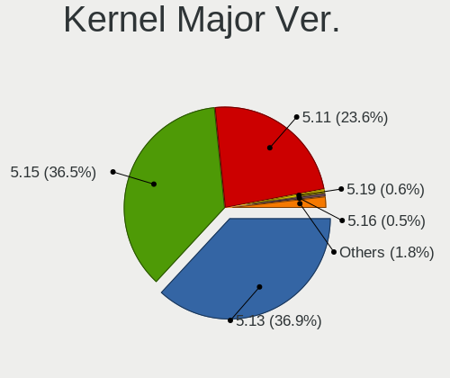
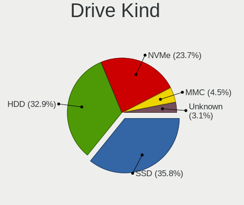
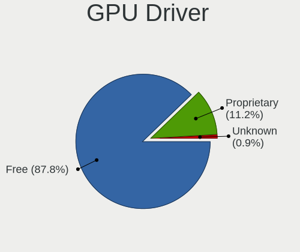
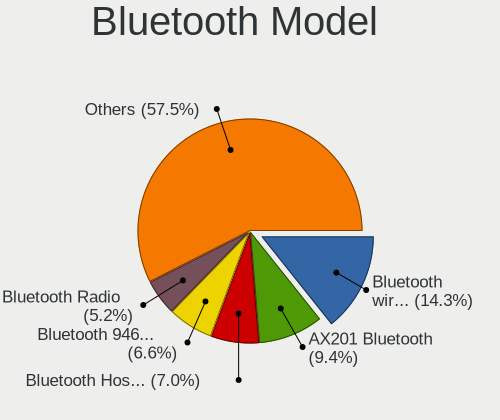
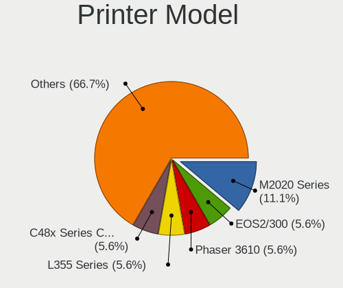
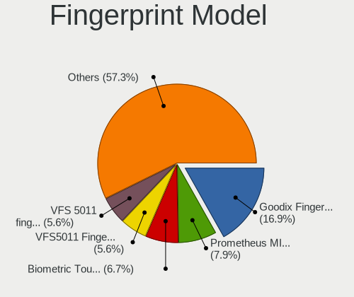

Elementary 6.1 - Tested Hardware & Statistics
---------------------------------------------

A project to collect tested hardware configurations for Elementary 6.1.

Anyone can contribute to this report by the [hw-probe](https://github.com/linuxhw/hw-probe) tool:

    sudo -E hw-probe -all -upload

Please submit a probe of your configuration if it's not presented on the page or is rare.

This is a report for all computer types. See also reports for [desktops](/Dist/Elementary_6.1/Desktop/README.md) and [notebooks](/Dist/Elementary_6.1/Notebook/README.md).

Full-feature report is available here: https://linux-hardware.org/?view=trends

Contents
--------

* [ Test Cases ](#test-cases)

* [ System ](#system)
  - [ Kernel                   ](#kernel)
  - [ Kernel Family            ](#kernel-family)
  - [ Kernel Major Ver.        ](#kernel-major-ver)
  - [ Arch                     ](#arch)
  - [ DE                       ](#de)
  - [ Display Server           ](#display-server)
  - [ Display Manager          ](#display-manager)
  - [ OS Lang                  ](#os-lang)
  - [ Boot Mode                ](#boot-mode)
  - [ Filesystem               ](#filesystem)
  - [ Part. scheme             ](#part-scheme)
  - [ Dual Boot with Linux/BSD ](#dual-boot-with-linuxbsd)
  - [ Dual Boot (Win)          ](#dual-boot-win)

* [ Board ](#board)
  - [ Vendor                   ](#vendor)
  - [ Model                    ](#model)
  - [ Model Family             ](#model-family)
  - [ MFG Year                 ](#mfg-year)
  - [ Form Factor              ](#form-factor)
  - [ Secure Boot              ](#secure-boot)
  - [ Coreboot                 ](#coreboot)
  - [ RAM Size                 ](#ram-size)
  - [ RAM Used                 ](#ram-used)
  - [ Total Drives             ](#total-drives)
  - [ Has CD-ROM               ](#has-cd-rom)
  - [ Has Ethernet             ](#has-ethernet)
  - [ Has WiFi                 ](#has-wifi)
  - [ Has Bluetooth            ](#has-bluetooth)

* [ Location ](#location)
  - [ Country                  ](#country)
  - [ City                     ](#city)

* [ Drives ](#drives)
  - [ Drive Vendor             ](#drive-vendor)
  - [ Drive Model              ](#drive-model)
  - [ HDD Vendor               ](#hdd-vendor)
  - [ SSD Vendor               ](#ssd-vendor)
  - [ Drive Kind               ](#drive-kind)
  - [ Drive Connector          ](#drive-connector)
  - [ Drive Size               ](#drive-size)
  - [ Space Total              ](#space-total)
  - [ Space Used               ](#space-used)
  - [ Malfunc. Drives          ](#malfunc-drives)
  - [ Malfunc. Drive Vendor    ](#malfunc-drive-vendor)
  - [ Malfunc. HDD Vendor      ](#malfunc-hdd-vendor)
  - [ Malfunc. Drive Kind      ](#malfunc-drive-kind)
  - [ Failed Drives            ](#failed-drives)
  - [ Failed Drive Vendor      ](#failed-drive-vendor)
  - [ Drive Status             ](#drive-status)

* [ Storage controller ](#storage-controller)
  - [ Storage Vendor           ](#storage-vendor)
  - [ Storage Model            ](#storage-model)
  - [ Storage Kind             ](#storage-kind)

* [ Processor ](#processor)
  - [ CPU Vendor               ](#cpu-vendor)
  - [ CPU Model                ](#cpu-model)
  - [ CPU Model Family         ](#cpu-model-family)
  - [ CPU Cores                ](#cpu-cores)
  - [ CPU Sockets              ](#cpu-sockets)
  - [ CPU Threads              ](#cpu-threads)
  - [ CPU Op-Modes             ](#cpu-op-modes)
  - [ CPU Microcode            ](#cpu-microcode)
  - [ CPU Microarch            ](#cpu-microarch)

* [ Graphics ](#graphics)
  - [ GPU Vendor               ](#gpu-vendor)
  - [ GPU Model                ](#gpu-model)
  - [ GPU Combo                ](#gpu-combo)
  - [ GPU Driver               ](#gpu-driver)
  - [ GPU Memory               ](#gpu-memory)

* [ Monitor ](#monitor)
  - [ Monitor Vendor           ](#monitor-vendor)
  - [ Monitor Model            ](#monitor-model)
  - [ Monitor Resolution       ](#monitor-resolution)
  - [ Monitor Diagonal         ](#monitor-diagonal)
  - [ Monitor Width            ](#monitor-width)
  - [ Aspect Ratio             ](#aspect-ratio)
  - [ Monitor Area             ](#monitor-area)
  - [ Pixel Density            ](#pixel-density)
  - [ Multiple Monitors        ](#multiple-monitors)

* [ Network ](#network)
  - [ Net Controller Vendor    ](#net-controller-vendor)
  - [ Net Controller Model     ](#net-controller-model)
  - [ Wireless Vendor          ](#wireless-vendor)
  - [ Wireless Model           ](#wireless-model)
  - [ Ethernet Vendor          ](#ethernet-vendor)
  - [ Ethernet Model           ](#ethernet-model)
  - [ Net Controller Kind      ](#net-controller-kind)
  - [ Used Controller          ](#used-controller)
  - [ NICs                     ](#nics)
  - [ IPv6                     ](#ipv6)

* [ Bluetooth ](#bluetooth)
  - [ Bluetooth Vendor         ](#bluetooth-vendor)
  - [ Bluetooth Model          ](#bluetooth-model)

* [ Sound ](#sound)
  - [ Sound Vendor             ](#sound-vendor)
  - [ Sound Model              ](#sound-model)

* [ Memory ](#memory)
  - [ Memory Vendor            ](#memory-vendor)
  - [ Memory Model             ](#memory-model)
  - [ Memory Kind              ](#memory-kind)
  - [ Memory Form Factor       ](#memory-form-factor)
  - [ Memory Size              ](#memory-size)
  - [ Memory Speed             ](#memory-speed)

* [ Printers & scanners ](#printers--scanners)
  - [ Printer Vendor           ](#printer-vendor)
  - [ Printer Model            ](#printer-model)
  - [ Scanner Vendor           ](#scanner-vendor)
  - [ Scanner Model            ](#scanner-model)

* [ Camera ](#camera)
  - [ Camera Vendor            ](#camera-vendor)
  - [ Camera Model             ](#camera-model)

* [ Security ](#security)
  - [ Fingerprint Vendor       ](#fingerprint-vendor)
  - [ Fingerprint Model        ](#fingerprint-model)
  - [ Chipcard Vendor          ](#chipcard-vendor)
  - [ Chipcard Model           ](#chipcard-model)

* [ Unsupported ](#unsupported)
  - [ Unsupported Devices      ](#unsupported-devices)
  - [ Unsupported Device Types ](#unsupported-device-types)

Test Cases
----------

| Vendor        | Model                       | Form-Factor | Probe                                                      | Date         |
|---------------|-----------------------------|-------------|------------------------------------------------------------|--------------|
| HP            | EliteBook 8460p             | Notebook    | [f215102713](https://linux-hardware.org/?probe=f215102713) | Dec 31, 2021 |
| MSI           | 2A9C                        | Desktop     | [8d08f7f383](https://linux-hardware.org/?probe=8d08f7f383) | Dec 31, 2021 |
| Notebook      | P65xHP                      | Notebook    | [37db5af302](https://linux-hardware.org/?probe=37db5af302) | Dec 31, 2021 |
| HP            | EliteBook 8460p             | Notebook    | [e060f00ff8](https://linux-hardware.org/?probe=e060f00ff8) | Dec 31, 2021 |
| Notebook      | P65xHP                      | Notebook    | [fc81fedcf3](https://linux-hardware.org/?probe=fc81fedcf3) | Dec 31, 2021 |
| Teclast       | F7                          | Notebook    | [44bba02dee](https://linux-hardware.org/?probe=44bba02dee) | Dec 31, 2021 |
| HP            | 3397                        | Desktop     | [323dc8992b](https://linux-hardware.org/?probe=323dc8992b) | Dec 31, 2021 |
| ASUSTek       | X79-DELUXE                  | Desktop     | [00b9dd3788](https://linux-hardware.org/?probe=00b9dd3788) | Dec 30, 2021 |
| Wortmann      | 1220729_1470271             | Notebook    | [018071ac3e](https://linux-hardware.org/?probe=018071ac3e) | Dec 30, 2021 |
| HP            | 1589                        | Desktop     | [d123a8de64](https://linux-hardware.org/?probe=d123a8de64) | Dec 30, 2021 |
| Foxconn       | 2AB1                        | Desktop     | [bcd6fc46cc](https://linux-hardware.org/?probe=bcd6fc46cc) | Dec 30, 2021 |
| Acer          | Aspire 7750G                | Notebook    | [3a24dba335](https://linux-hardware.org/?probe=3a24dba335) | Dec 28, 2021 |
| Acer          | Aspire 7750G                | Notebook    | [516cb4e250](https://linux-hardware.org/?probe=516cb4e250) | Dec 28, 2021 |
| ASUSTek       | X555UB                      | Notebook    | [e0844450ac](https://linux-hardware.org/?probe=e0844450ac) | Dec 28, 2021 |
| ASUSTek       | TUF GAMING B550M-PLUS       | Desktop     | [5f67c759fe](https://linux-hardware.org/?probe=5f67c759fe) | Dec 28, 2021 |
| Apple         | Mac-F4238CC8 PVT            | All in one  | [829dc5243a](https://linux-hardware.org/?probe=829dc5243a) | Dec 28, 2021 |
| Apple         | Mac-F4238CC8 PVT            | All in one  | [352c62bd8f](https://linux-hardware.org/?probe=352c62bd8f) | Dec 28, 2021 |
| Dell          | Latitude 3580               | Notebook    | [f243f4c09e](https://linux-hardware.org/?probe=f243f4c09e) | Dec 27, 2021 |
| Apple         | Mac-F4238CC8 PVT            | All in one  | [5d91acd13d](https://linux-hardware.org/?probe=5d91acd13d) | Dec 27, 2021 |
| Lenovo        | ThinkPad T430 23501M2       | Notebook    | [2645817d64](https://linux-hardware.org/?probe=2645817d64) | Dec 26, 2021 |
| Gigabyte      | Z390 UD                     | Desktop     | [2399fa64ba](https://linux-hardware.org/?probe=2399fa64ba) | Dec 26, 2021 |
| HP            | EliteBook 850 G2            | Notebook    | [a71c970cbf](https://linux-hardware.org/?probe=a71c970cbf) | Dec 25, 2021 |
| Apple         | MacBookAir7,2               | Notebook    | [99bea5df6c](https://linux-hardware.org/?probe=99bea5df6c) | Dec 25, 2021 |
| Lenovo        | IdeaPad 320-14AST 80XU      | Notebook    | [80c8feb8bf](https://linux-hardware.org/?probe=80c8feb8bf) | Dec 25, 2021 |
| Dell          | Inspiron N5050              | Notebook    | [211b723554](https://linux-hardware.org/?probe=211b723554) | Dec 24, 2021 |
| LG Electro... | A410-G.BC51P1               | Notebook    | [b231405a63](https://linux-hardware.org/?probe=b231405a63) | Dec 24, 2021 |
| Microsoft     | Surface Book 2              | Tablet      | [730558c6bd](https://linux-hardware.org/?probe=730558c6bd) | Dec 24, 2021 |
| Acer          | TravelMate 5760             | Notebook    | [71526c7767](https://linux-hardware.org/?probe=71526c7767) | Dec 23, 2021 |
| Apple         | Mac-F42C88C8 Proto1         | Desktop     | [783618fe4b](https://linux-hardware.org/?probe=783618fe4b) | Dec 23, 2021 |
| Lenovo        | Flex 2-14D 20376            | Notebook    | [d950a63316](https://linux-hardware.org/?probe=d950a63316) | Dec 23, 2021 |
| Dell          | Inspiron 3542               | Notebook    | [277f97ef07](https://linux-hardware.org/?probe=277f97ef07) | Dec 23, 2021 |
| Dell          | XPS 13 9343                 | Notebook    | [dfbdb618f1](https://linux-hardware.org/?probe=dfbdb618f1) | Dec 23, 2021 |
| ASUSTek       | H97-PLUS                    | Desktop     | [cba91c2ad2](https://linux-hardware.org/?probe=cba91c2ad2) | Dec 22, 2021 |
| ASUSTek       | VivoBook_ASUSLaptop X512... | Notebook    | [f74c2da103](https://linux-hardware.org/?probe=f74c2da103) | Dec 22, 2021 |
| Dell          | Precision M3800             | Notebook    | [ed44d9ac8c](https://linux-hardware.org/?probe=ed44d9ac8c) | Dec 21, 2021 |
| Dell          | Inspiron 7405 2n1           | Convertible | [64d2a0328e](https://linux-hardware.org/?probe=64d2a0328e) | Dec 21, 2021 |
| Apple         | MacBookAir6,1               | Notebook    | [b2e3490378](https://linux-hardware.org/?probe=b2e3490378) | Dec 21, 2021 |
| Dell          | Precision M6500             | Notebook    | [931f365c60](https://linux-hardware.org/?probe=931f365c60) | Dec 20, 2021 |
| MSI           | B450-A PRO MAX              | Desktop     | [f14eef1ae6](https://linux-hardware.org/?probe=f14eef1ae6) | Dec 20, 2021 |
| Gigabyte      | H310M S2P                   | Desktop     | [a931eb10f0](https://linux-hardware.org/?probe=a931eb10f0) | Dec 19, 2021 |
| Dell          | Inspiron 5555               | Notebook    | [09d45f017d](https://linux-hardware.org/?probe=09d45f017d) | Dec 18, 2021 |
| Foxconn       | 2AB1                        | Desktop     | [d9077a5d94](https://linux-hardware.org/?probe=d9077a5d94) | Dec 18, 2021 |
| Foxconn       | 2AB1                        | Desktop     | [b789981cc4](https://linux-hardware.org/?probe=b789981cc4) | Dec 17, 2021 |
| Lenovo        | V14-ADA 82C6                | Notebook    | [a45f76da28](https://linux-hardware.org/?probe=a45f76da28) | Dec 17, 2021 |
| ASUSTek       | UX410UAK                    | Notebook    | [39dcbe0f57](https://linux-hardware.org/?probe=39dcbe0f57) | Dec 17, 2021 |
| Monster       | MARKUT M7 V1.x              | Notebook    | [2d2ed2143e](https://linux-hardware.org/?probe=2d2ed2143e) | Dec 17, 2021 |
| Gigabyte      | Z590 AORUS ELITE AX         | Desktop     | [c068e358e8](https://linux-hardware.org/?probe=c068e358e8) | Dec 16, 2021 |
| Intel         | NUC10i3FNB K61362-305       | Mini pc     | [3371572aa9](https://linux-hardware.org/?probe=3371572aa9) | Dec 16, 2021 |
| Monster       | MARKUT M7 V1.x              | Notebook    | [2390550c49](https://linux-hardware.org/?probe=2390550c49) | Dec 15, 2021 |
| ASUSTek       | M5A78L-M LX3                | Desktop     | [720cc7a45f](https://linux-hardware.org/?probe=720cc7a45f) | Dec 15, 2021 |
| Apple         | MacBook4,1                  | Notebook    | [661e7dae0c](https://linux-hardware.org/?probe=661e7dae0c) | Dec 15, 2021 |
| Apple         | MacBook4,1                  | Notebook    | [b682cee818](https://linux-hardware.org/?probe=b682cee818) | Dec 15, 2021 |
| Apple         | MacBook5,2                  | Notebook    | [5dcbdab7ca](https://linux-hardware.org/?probe=5dcbdab7ca) | Dec 15, 2021 |

System
------

Kernel
------

Version of the Linux kernel

| Version           | Computers | Percent |
|-------------------|-----------|---------|
| 5.11.0-43-generic | 30        | 69.77%  |
| 5.11.0-41-generic | 8         | 18.6%   |
| 5.8.0-50-generic  | 1         | 2.33%   |
| 5.15.6-surface    | 1         | 2.33%   |
| 5.15.10-xanmod1   | 1         | 2.33%   |
| 5.13.0-22-generic | 1         | 2.33%   |
| 5.11.0-37-generic | 1         | 2.33%   |

Kernel Family
-------------

Linux kernel without a distro release

| Version | Computers | Percent |
|---------|-----------|---------|
| 5.11.0  | 39        | 90.7%   |
| 5.8.0   | 1         | 2.33%   |
| 5.15.6  | 1         | 2.33%   |
| 5.15.10 | 1         | 2.33%   |
| 5.13.0  | 1         | 2.33%   |

Kernel Major Ver.
-----------------

Linux kernel major version

| Version | Computers | Percent |
|---------|-----------|---------|
| 5.11    | 39        | 90.7%   |
| 5.15    | 2         | 4.65%   |
| 5.8     | 1         | 2.33%   |
| 5.13    | 1         | 2.33%   |

Arch
----

OS architecture (x86_64, i586, etc.)

| Name   | Computers | Percent |
|--------|-----------|---------|
| x86_64 | 43        | 100%    |

DE
--

Desktop Environment

| Name     | Computers | Percent |
|----------|-----------|---------|
| Pantheon | 43        | 100%    |

Display Server
--------------

X11 or Wayland

| Name | Computers | Percent |
|------|-----------|---------|
| X11  | 43        | 100%    |

Display Manager
---------------

SDDM, LightDM, etc.

| Name    | Computers | Percent |
|---------|-----------|---------|
| Unknown | 36        | 83.72%  |
| LightDM | 7         | 16.28%  |

OS Lang
-------

Language

| Lang  | Computers | Percent |
|-------|-----------|---------|
| en_US | 22        | 51.16%  |
| de_DE | 7         | 16.28%  |
| pt_BR | 3         | 6.98%   |
| en_GB | 3         | 6.98%   |
| pl_PL | 2         | 4.65%   |
| fr_FR | 2         | 4.65%   |
| es_ES | 2         | 4.65%   |
| ru_RU | 1         | 2.33%   |
| en_CA | 1         | 2.33%   |

Boot Mode
---------

EFI or BIOS

| Mode | Computers | Percent |
|------|-----------|---------|
| EFI  | 27        | 62.79%  |
| BIOS | 16        | 37.21%  |

Filesystem
----------

Type of filesystem

| Type    | Computers | Percent |
|---------|-----------|---------|
| Ext4    | 41        | 95.35%  |
| Xfs     | 1         | 2.33%   |
| Overlay | 1         | 2.33%   |

Part. scheme
------------

Scheme of partitioning

| Type    | Computers | Percent |
|---------|-----------|---------|
| Unknown | 39        | 90.7%   |
| GPT     | 4         | 9.3%    |

Dual Boot with Linux/BSD
------------------------

Hosting more than one Linux/BSD

| Dual boot | Computers | Percent |
|-----------|-----------|---------|
| No        | 41        | 95.35%  |
| Yes       | 2         | 4.65%   |

Dual Boot (Win)
---------------

Hosting Linux and Windows

| Dual boot | Computers | Percent |
|-----------|-----------|---------|
| No        | 41        | 95.35%  |
| Yes       | 2         | 4.65%   |

Board
-----

Vendor
------

Motherboard manufacturer

| Name                | Computers | Percent |
|---------------------|-----------|---------|
| Dell                | 8         | 18.6%   |
| ASUSTek Computer    | 7         | 16.28%  |
| Apple               | 6         | 13.95%  |
| Hewlett-Packard     | 4         | 9.3%    |
| Lenovo              | 3         | 6.98%   |
| Gigabyte Technology | 3         | 6.98%   |
| MSI                 | 2         | 4.65%   |
| Acer                | 2         | 4.65%   |
| Wortmann AG         | 1         | 2.33%   |
| Teclast             | 1         | 2.33%   |
| Notebook            | 1         | 2.33%   |
| Monster             | 1         | 2.33%   |
| Microsoft           | 1         | 2.33%   |
| LG Electronics      | 1         | 2.33%   |
| Intel               | 1         | 2.33%   |
| Foxconn             | 1         | 2.33%   |

Model
-----

Motherboard model

| Name                                   | Computers | Percent |
|----------------------------------------|-----------|---------|
| Wortmann AG 1220729_1470271            | 1         | 2.33%   |
| Teclast F7                             | 1         | 2.33%   |
| Notebook P65xHP                        | 1         | 2.33%   |
| MSI PPPPP-CCC#MMMMMMMM                 | 1         | 2.33%   |
| MSI MS-7B86                            | 1         | 2.33%   |
| Monster MARKUT M7 V1.x                 | 1         | 2.33%   |
| Microsoft Surface Book 2               | 1         | 2.33%   |
| LG A410-G.BC51P1                       | 1         | 2.33%   |
| Lenovo ThinkPad T430 23501M2           | 1         | 2.33%   |
| Lenovo IdeaPad 320-14AST 80XU          | 1         | 2.33%   |
| Lenovo Flex 2-14D 20376                | 1         | 2.33%   |
| Intel NUC10i3FNH                       | 1         | 2.33%   |
| HP Z420 Workstation                    | 1         | 2.33%   |
| HP EliteBook 850 G2                    | 1         | 2.33%   |
| HP EliteBook 8460p                     | 1         | 2.33%   |
| HP Compaq Elite 8300 SFF               | 1         | 2.33%   |
| Gigabyte Z590 AORUS ELITE AX           | 1         | 2.33%   |
| Gigabyte Z390 UD                       | 1         | 2.33%   |
| Gigabyte H310M S2P 2.0                 | 1         | 2.33%   |
| Foxconn p6616f                         | 1         | 2.33%   |
| Dell XPS 13 9343                       | 1         | 2.33%   |
| Dell Precision M6500                   | 1         | 2.33%   |
| Dell Precision M3800                   | 1         | 2.33%   |
| Dell Latitude 3580                     | 1         | 2.33%   |
| Dell Inspiron N5050                    | 1         | 2.33%   |
| Dell Inspiron 7405 2n1                 | 1         | 2.33%   |
| Dell Inspiron 5555                     | 1         | 2.33%   |
| Dell Inspiron 3542                     | 1         | 2.33%   |
| ASUS X79-DELUXE                        | 1         | 2.33%   |
| ASUS X555UB                            | 1         | 2.33%   |
| ASUS VivoBook_ASUSLaptop X512FA_A512FA | 1         | 2.33%   |
| ASUS UX410UAK                          | 1         | 2.33%   |
| ASUS TUF GAMING B550M-PLUS             | 1         | 2.33%   |
| ASUS M5A78L-M LX3                      | 1         | 2.33%   |
| ASUS All Series                        | 1         | 2.33%   |
| Apple MacPro3,1                        | 1         | 2.33%   |
| Apple MacBookAir7,2                    | 1         | 2.33%   |
| Apple MacBookAir6,1                    | 1         | 2.33%   |
| Apple MacBook5,2                       | 1         | 2.33%   |
| Apple MacBook4,1                       | 1         | 2.33%   |
| Apple iMac7,1                          | 1         | 2.33%   |
| Acer TravelMate 5760                   | 1         | 2.33%   |
| Acer Aspire 7750G                      | 1         | 2.33%   |

Model Family
------------

Motherboard model prefix

| Name                   | Computers | Percent |
|------------------------|-----------|---------|
| Dell Inspiron          | 4         | 9.3%    |
| HP EliteBook           | 2         | 4.65%   |
| Dell Precision         | 2         | 4.65%   |
| Wortmann AG 1220729    | 1         | 2.33%   |
| Teclast F7             | 1         | 2.33%   |
| Notebook P65xHP        | 1         | 2.33%   |
| MSI PPPPP-CCC#MMMMMMMM | 1         | 2.33%   |
| MSI MS-7B86            | 1         | 2.33%   |
| Monster MARKUT         | 1         | 2.33%   |
| Microsoft Surface      | 1         | 2.33%   |
| LG A410-G.BC51P1       | 1         | 2.33%   |
| Lenovo ThinkPad        | 1         | 2.33%   |
| Lenovo IdeaPad         | 1         | 2.33%   |
| Lenovo Flex            | 1         | 2.33%   |
| Intel NUC10i3FNH       | 1         | 2.33%   |
| HP Z420                | 1         | 2.33%   |
| HP Compaq              | 1         | 2.33%   |
| Gigabyte Z590          | 1         | 2.33%   |
| Gigabyte Z390          | 1         | 2.33%   |
| Gigabyte H310M         | 1         | 2.33%   |
| Foxconn p6616f         | 1         | 2.33%   |
| Dell XPS               | 1         | 2.33%   |
| Dell Latitude          | 1         | 2.33%   |
| ASUS X79-DELUXE        | 1         | 2.33%   |
| ASUS X555UB            | 1         | 2.33%   |
| ASUS VivoBook          | 1         | 2.33%   |
| ASUS UX410UAK          | 1         | 2.33%   |
| ASUS TUF               | 1         | 2.33%   |
| ASUS M5A78L-M          | 1         | 2.33%   |
| ASUS All               | 1         | 2.33%   |
| Apple MacPro3          | 1         | 2.33%   |
| Apple MacBookAir7      | 1         | 2.33%   |
| Apple MacBookAir6      | 1         | 2.33%   |
| Apple MacBook5         | 1         | 2.33%   |
| Apple MacBook4         | 1         | 2.33%   |
| Apple iMac7            | 1         | 2.33%   |
| Acer TravelMate        | 1         | 2.33%   |
| Acer Aspire            | 1         | 2.33%   |

MFG Year
--------

Motherboard manufacture year

| Year | Computers | Percent |
|------|-----------|---------|
| 2020 | 7         | 16.28%  |
| 2019 | 6         | 13.95%  |
| 2016 | 5         | 11.63%  |
| 2021 | 4         | 9.3%    |
| 2018 | 4         | 9.3%    |
| 2011 | 4         | 9.3%    |
| 2008 | 3         | 6.98%   |
| 2015 | 2         | 4.65%   |
| 2012 | 2         | 4.65%   |
| 2010 | 2         | 4.65%   |
| 2017 | 1         | 2.33%   |
| 2014 | 1         | 2.33%   |
| 2013 | 1         | 2.33%   |
| 2009 | 1         | 2.33%   |

Form Factor
-----------

Physical design of the computer

| Name        | Computers | Percent |
|-------------|-----------|---------|
| Notebook    | 26        | 60.47%  |
| Desktop     | 13        | 30.23%  |
| Tablet      | 1         | 2.33%   |
| Convertible | 1         | 2.33%   |
| Mini pc     | 1         | 2.33%   |
| All in one  | 1         | 2.33%   |

Secure Boot
-----------

Enabled or disabled

| State    | Computers | Percent |
|----------|-----------|---------|
| Disabled | 43        | 100%    |

Coreboot
--------

Have coreboot on board

| Used | Computers | Percent |
|------|-----------|---------|
| No   | 43        | 100%    |

RAM Size
--------

Total RAM memory

| Size in GB  | Computers | Percent |
|-------------|-----------|---------|
| 4.01-8.0    | 15        | 34.88%  |
| 32.01-64.0  | 7         | 16.28%  |
| 8.01-16.0   | 7         | 16.28%  |
| 3.01-4.0    | 6         | 13.95%  |
| 16.01-24.0  | 6         | 13.95%  |
| 64.01-256.0 | 1         | 2.33%   |
| 1.01-2.0    | 1         | 2.33%   |

RAM Used
--------

Used RAM memory

| Used GB   | Computers | Percent |
|-----------|-----------|---------|
| 2.01-3.0  | 15        | 34.88%  |
| 1.01-2.0  | 11        | 25.58%  |
| 3.01-4.0  | 8         | 18.6%   |
| 4.01-8.0  | 4         | 9.3%    |
| 0.51-1.0  | 3         | 6.98%   |
| 8.01-16.0 | 2         | 4.65%   |

Total Drives
------------

Number of drives on board

| Drives | Computers | Percent |
|--------|-----------|---------|
| 1      | 22        | 51.16%  |
| 2      | 12        | 27.91%  |
| 3      | 4         | 9.3%    |
| 5      | 2         | 4.65%   |
| 4      | 2         | 4.65%   |
| 7      | 1         | 2.33%   |

Has CD-ROM
----------

Has CD-ROM on board

| Presented | Computers | Percent |
|-----------|-----------|---------|
| No        | 27        | 62.79%  |
| Yes       | 16        | 37.21%  |

Has Ethernet
------------

Has Ethernet on board

| Presented | Computers | Percent |
|-----------|-----------|---------|
| Yes       | 33        | 76.74%  |
| No        | 10        | 23.26%  |

Has WiFi
--------

Has WiFi module

| Presented | Computers | Percent |
|-----------|-----------|---------|
| Yes       | 35        | 81.4%   |
| No        | 8         | 18.6%   |

Has Bluetooth
-------------

Has Bluetooth module

| Presented | Computers | Percent |
|-----------|-----------|---------|
| Yes       | 33        | 76.74%  |
| No        | 10        | 23.26%  |

Location
--------

Country
-------

Geographic location (country)

| Country      | Computers | Percent |
|--------------|-----------|---------|
| USA          | 6         | 13.95%  |
| Germany      | 6         | 13.95%  |
| Brazil       | 4         | 9.3%    |
| Sweden       | 2         | 4.65%   |
| Poland       | 2         | 4.65%   |
| India        | 2         | 4.65%   |
| France       | 2         | 4.65%   |
| Ukraine      | 1         | 2.33%   |
| UK           | 1         | 2.33%   |
| Turkey       | 1         | 2.33%   |
| Thailand     | 1         | 2.33%   |
| Spain        | 1         | 2.33%   |
| South Africa | 1         | 2.33%   |
| Russia       | 1         | 2.33%   |
| Romania      | 1         | 2.33%   |
| Portugal     | 1         | 2.33%   |
| New Zealand  | 1         | 2.33%   |
| Netherlands  | 1         | 2.33%   |
| Mexico       | 1         | 2.33%   |
| Italy        | 1         | 2.33%   |
| Iran         | 1         | 2.33%   |
| Indonesia    | 1         | 2.33%   |
| Guyana       | 1         | 2.33%   |
| Canada       | 1         | 2.33%   |
| Austria      | 1         | 2.33%   |
| Australia    | 1         | 2.33%   |

City
----

Geographic location (city)

| City                          | Computers | Percent |
|-------------------------------|-----------|---------|
| Wroclaw                       | 1         | 2.33%   |
| Wriedel                       | 1         | 2.33%   |
| Vinnytsia                     | 1         | 2.33%   |
| Vilanova i la Geltr??         | 1         | 2.33%   |
| Uppsala                       | 1         | 2.33%   |
| Tehran                        | 1         | 2.33%   |
| Tecuci                        | 1         | 2.33%   |
| Sydney                        | 1         | 2.33%   |
| Southampton                   | 1         | 2.33%   |
| Sornay                        | 1         | 2.33%   |
| Soliera                       | 1         | 2.33%   |
| S??o Paulo                    | 1         | 2.33%   |
| S??o Bernardo do Campo        | 1         | 2.33%   |
| San Antonio                   | 1         | 2.33%   |
| Saltsjoe-Boo                  | 1         | 2.33%   |
| Saalfelden am Steinernen Meer | 1         | 2.33%   |
| Rueso                         | 1         | 2.33%   |
| Porto                         | 1         | 2.33%   |
| Osasco                        | 1         | 2.33%   |
| Napier City                   | 1         | 2.33%   |
| Munich                        | 1         | 2.33%   |
| Montm?©dy                     | 1         | 2.33%   |
| Khimki                        | 1         | 2.33%   |
| Johannesburg                  | 1         | 2.33%   |
| Jember                        | 1         | 2.33%   |
| Hudson                        | 1         | 2.33%   |
| Hennef                        | 1         | 2.33%   |
| Hammonton                     | 1         | 2.33%   |
| Hamburg                       | 1         | 2.33%   |
| Gliwice                       | 1         | 2.33%   |
| Georgetown                    | 1         | 2.33%   |
| Erkrath                       | 1         | 2.33%   |
| Edmonton                      | 1         | 2.33%   |
| Denver                        | 1         | 2.33%   |
| Cuernavaca                    | 1         | 2.33%   |
| Chalfont                      | 1         | 2.33%   |
| Cabo Frio                     | 1         | 2.33%   |
| Bergenfield                   | 1         | 2.33%   |
| Bengaluru                     | 1         | 2.33%   |
| Bad Friedrichshall            | 1         | 2.33%   |
| Antalya                       | 1         | 2.33%   |
| Alphen aan den Rijn           | 1         | 2.33%   |
| Ahmedabad                     | 1         | 2.33%   |

Drives
------

Drive Vendor
------------

Hard drive vendors

| Vendor              | Computers | Drives | Percent |
|---------------------|-----------|--------|---------|
| Samsung Electronics | 13        | 18     | 18.84%  |
| WDC                 | 11        | 14     | 15.94%  |
| Seagate             | 11        | 11     | 15.94%  |
| Crucial             | 4         | 4      | 5.8%    |
| Kingston            | 3         | 3      | 4.35%   |
| Toshiba             | 2         | 3      | 2.9%    |
| SK Hynix            | 2         | 2      | 2.9%    |
| Sandisk             | 2         | 2      | 2.9%    |
| Hitachi             | 2         | 2      | 2.9%    |
| Unknown             | 1         | 3      | 1.45%   |
| Teclast             | 1         | 1      | 1.45%   |
| Silicon Motion      | 1         | 1      | 1.45%   |
| SABRENT             | 1         | 1      | 1.45%   |
| Micron Technology   | 1         | 1      | 1.45%   |
| MAXTOR              | 1         | 1      | 1.45%   |
| LITEON              | 1         | 1      | 1.45%   |
| KIOXIA              | 1         | 1      | 1.45%   |
| KingSpec            | 1         | 1      | 1.45%   |
| JMicron             | 1         | 1      | 1.45%   |
| Intenso             | 1         | 1      | 1.45%   |
| Intel               | 1         | 1      | 1.45%   |
| HGST                | 1         | 1      | 1.45%   |
| Fujitsu             | 1         | 1      | 1.45%   |
| Ext Hard            | 1         | 1      | 1.45%   |
| China               | 1         | 1      | 1.45%   |
| Apple               | 1         | 1      | 1.45%   |
| A-DATA Technology   | 1         | 1      | 1.45%   |
| Unknown             | 1         | 1      | 1.45%   |

Drive Model
-----------

Hard drive models

| Model                                   | Computers | Percent |
|-----------------------------------------|-----------|---------|
| WDC WD5000LPVX-75V0TT0 500GB            | 2         | 2.63%   |
| Seagate ST1000LM035-1RK172 1TB          | 2         | 2.63%   |
| Samsung NVMe SSD Drive 500GB            | 2         | 2.63%   |
| Kingston SA400S37240G 240GB SSD         | 2         | 2.63%   |
| Crucial CT1000MX500SSD1 1TB             | 2         | 2.63%   |
| WDC WDS120G2G0A-00JH30 120GB SSD        | 1         | 1.32%   |
| WDC WD7500BPVT-22A1YT0 752GB            | 1         | 1.32%   |
| WDC WD6401AALS-00L3B2 640GB             | 1         | 1.32%   |
| WDC WD5000BPVT-22HXZT1 500GB            | 1         | 1.32%   |
| WDC WD3200AAJS-40RYA0 320GB             | 1         | 1.32%   |
| WDC WD3003FZEX-00Z4SA0 3TB              | 1         | 1.32%   |
| WDC WD20SPZX-22UA7T0 2TB                | 1         | 1.32%   |
| WDC WD20EFRX-68EUZN0 2TB                | 1         | 1.32%   |
| WDC WD10EZEX-08WN4A0 1TB                | 1         | 1.32%   |
| WDC WD10EADS-00L5B1 1TB                 | 1         | 1.32%   |
| Unknown SD/MMC/M.S.PRO 32GB             | 1         | 1.32%   |
| Unknown SD/MMC 16GB                     | 1         | 1.32%   |
| Unknown M.S./M.S.Pro/HG 16GB            | 1         | 1.32%   |
| Toshiba HDWE140 4TB                     | 1         | 1.32%   |
| Toshiba HDWD120 2TB                     | 1         | 1.32%   |
| Toshiba HDWD110 1TB                     | 1         | 1.32%   |
| Teclast 128GB NS550-2242 SSD            | 1         | 1.32%   |
| SK Hynix NVMe SSD Drive 512GB           | 1         | 1.32%   |
| SK Hynix NVMe SSD Drive 256GB           | 1         | 1.32%   |
| Silicon Motion NVMe SSD Drive 120GB     | 1         | 1.32%   |
| Seagate ST9500325AS 500GB               | 1         | 1.32%   |
| Seagate ST4000DX001-1CE168 4TB          | 1         | 1.32%   |
| Seagate ST3750528AS 752GB               | 1         | 1.32%   |
| Seagate ST2000DX002-2DV164 2TB          | 1         | 1.32%   |
| Seagate ST1000LM024 HN-M101MBB 1TB      | 1         | 1.32%   |
| Seagate ST1000DM003-1CH162 1TB          | 1         | 1.32%   |
| Seagate ST10000DM0004-1ZC101 10TB       | 1         | 1.32%   |
| Seagate NVMe SSD Drive 500GB            | 1         | 1.32%   |
| Seagate Expansion Desk 5TB              | 1         | 1.32%   |
| SanDisk SD8SNAT128G1002 128GB SSD       | 1         | 1.32%   |
| Sandisk NVMe SSD Drive 500GB            | 1         | 1.32%   |
| Samsung SSD SM841 mSATA 512GB           | 1         | 1.32%   |
| Samsung SSD 950 PRO 512GB               | 1         | 1.32%   |
| Samsung SSD 870 QVO 2TB                 | 1         | 1.32%   |
| Samsung SSD 870 QVO 1TB                 | 1         | 1.32%   |
| Samsung SSD 860 EVO M.2 250GB           | 1         | 1.32%   |
| Samsung SSD 860 EVO 1TB                 | 1         | 1.32%   |
| Samsung SSD 850 EVO 2TB                 | 1         | 1.32%   |
| Samsung SSD 850 EVO 250GB               | 1         | 1.32%   |
| Samsung SSD 850 EVO 1TB                 | 1         | 1.32%   |
| Samsung PSSD T7 Touch 2TB               | 1         | 1.32%   |
| Samsung Portable SSD T5 500GB           | 1         | 1.32%   |
| Samsung NVMe SSD Drive 512GB            | 1         | 1.32%   |
| Samsung MZMPA064HMDR-00000 64GB SSD     | 1         | 1.32%   |
| Samsung HD322HJ 320GB                   | 1         | 1.32%   |
| SABRENT Disk 500GB                      | 1         | 1.32%   |
| Micron 1100_MTFDDAK256TBN 256GB SSD     | 1         | 1.32%   |
| MAXTOR Z1 SSD 240GB                     | 1         | 1.32%   |
| LITEON L8H-256V2G-11 M.2 2280 256GB SSD | 1         | 1.32%   |
| KIOXIA NVMe SSD Drive 256GB             | 1         | 1.32%   |
| Kingston RBUSNS8180DS3128GJ 128GB SSD   | 1         | 1.32%   |
| KingSpec P4-120 120GB                   | 1         | 1.32%   |
| JMicron Tech 250GB                      | 1         | 1.32%   |
| Intenso SSD SATAIII 128GB               | 1         | 1.32%   |
| Intel NVMe SSD Drive 512GB              | 1         | 1.32%   |

HDD Vendor
----------

Hard disk drive vendors

| Vendor              | Computers | Drives | Percent |
|---------------------|-----------|--------|---------|
| WDC                 | 10        | 12     | 34.48%  |
| Seagate             | 10        | 10     | 34.48%  |
| Toshiba             | 2         | 3      | 6.9%    |
| Hitachi             | 2         | 2      | 6.9%    |
| Samsung Electronics | 1         | 1      | 3.45%   |
| SABRENT             | 1         | 1      | 3.45%   |
| HGST                | 1         | 1      | 3.45%   |
| Fujitsu             | 1         | 1      | 3.45%   |
| Ext Hard            | 1         | 1      | 3.45%   |

SSD Vendor
----------

Solid state drive vendors

| Vendor              | Computers | Drives | Percent |
|---------------------|-----------|--------|---------|
| Samsung Electronics | 10        | 12     | 34.48%  |
| Crucial             | 4         | 4      | 13.79%  |
| Kingston            | 3         | 3      | 10.34%  |
| WDC                 | 1         | 2      | 3.45%   |
| Teclast             | 1         | 1      | 3.45%   |
| SanDisk             | 1         | 1      | 3.45%   |
| Micron Technology   | 1         | 1      | 3.45%   |
| MAXTOR              | 1         | 1      | 3.45%   |
| LITEON              | 1         | 1      | 3.45%   |
| KingSpec            | 1         | 1      | 3.45%   |
| Intenso             | 1         | 1      | 3.45%   |
| China               | 1         | 1      | 3.45%   |
| Apple               | 1         | 1      | 3.45%   |
| A-DATA Technology   | 1         | 1      | 3.45%   |
| Unknown             | 1         | 1      | 3.45%   |

Drive Kind
----------

HDD or SSD

| Kind    | Computers | Drives | Percent |
|---------|-----------|--------|---------|
| SSD     | 27        | 32     | 42.19%  |
| HDD     | 25        | 32     | 39.06%  |
| NVMe    | 10        | 12     | 15.63%  |
| Unknown | 2         | 4      | 3.13%   |

Drive Connector
---------------

SATA, SAS, NVMe, etc.

| Type | Computers | Drives | Percent |
|------|-----------|--------|---------|
| SATA | 38        | 59     | 70.37%  |
| NVMe | 10        | 12     | 18.52%  |
| SAS  | 6         | 9      | 11.11%  |

Drive Size
----------

Size of hard drive

| Size in TB | Computers | Drives | Percent |
|------------|-----------|--------|---------|
| 0.01-0.5   | 26        | 32     | 52%     |
| 0.51-1.0   | 14        | 17     | 28%     |
| 1.01-2.0   | 5         | 9      | 10%     |
| 3.01-4.0   | 2         | 2      | 4%      |
| 4.01-10.0  | 2         | 2      | 4%      |
| 2.01-3.0   | 1         | 2      | 2%      |

Space Total
-----------

Amount of disk space available on the file system

| Size in GB     | Computers | Percent |
|----------------|-----------|---------|
| 101-250        | 15        | 34.88%  |
| 251-500        | 12        | 27.91%  |
| 501-1000       | 6         | 13.95%  |
| More than 3000 | 4         | 9.3%    |
| 1001-2000      | 4         | 9.3%    |
| 21-50          | 1         | 2.33%   |
| 51-100         | 1         | 2.33%   |

Space Used
----------

Amount of used disk space

| Used GB        | Computers | Percent |
|----------------|-----------|---------|
| 1-20           | 15        | 34.88%  |
| 21-50          | 11        | 25.58%  |
| 51-100         | 7         | 16.28%  |
| 501-1000       | 4         | 9.3%    |
| 101-250        | 3         | 6.98%   |
| More than 3000 | 1         | 2.33%   |
| 2001-3000      | 1         | 2.33%   |
| 1001-2000      | 1         | 2.33%   |

Malfunc. Drives
---------------

Drive models with a malfunction

Zero info for selected period =(

Malfunc. Drive Vendor
---------------------

Vendors of faulty drives

Zero info for selected period =(

Malfunc. HDD Vendor
-------------------

Vendors of faulty HDD drives

Zero info for selected period =(

Malfunc. Drive Kind
-------------------

Kinds of faulty drives

Zero info for selected period =(

Failed Drives
-------------

Failed drive models

Zero info for selected period =(

Failed Drive Vendor
-------------------

Failed drive vendors

Zero info for selected period =(

Drive Status
------------

Number of failed and malfunc. drives

| Status   | Computers | Drives | Percent |
|----------|-----------|--------|---------|
| Detected | 41        | 72     | 91.11%  |
| Works    | 4         | 8      | 8.89%   |

Storage controller
------------------

Storage Vendor
--------------

Storage controller vendors

| Vendor                   | Computers | Percent |
|--------------------------|-----------|---------|
| Intel                    | 31        | 59.62%  |
| AMD                      | 8         | 15.38%  |
| Samsung Electronics      | 5         | 9.62%   |
| SK Hynix                 | 2         | 3.85%   |
| Silicon Motion           | 1         | 1.92%   |
| Seagate Technology       | 1         | 1.92%   |
| Sandisk                  | 1         | 1.92%   |
| Nvidia                   | 1         | 1.92%   |
| Marvell Technology Group | 1         | 1.92%   |
| ASMedia Technology       | 1         | 1.92%   |

Storage Model
-------------

Storage controller models

| Model                                                                          | Computers | Percent |
|--------------------------------------------------------------------------------|-----------|---------|
| AMD FCH SATA Controller [AHCI mode]                                            | 5         | 8.33%   |
| Intel 6 Series/C200 Series Chipset Family 6 port Mobile SATA AHCI Controller   | 4         | 6.67%   |
| Intel Sunrise Point-LP SATA Controller [AHCI mode]                             | 3         | 5%      |
| Intel Wildcat Point-LP SATA Controller [AHCI Mode]                             | 2         | 3.33%   |
| Intel Comet Lake SATA AHCI Controller                                          | 2         | 3.33%   |
| Intel 82801HM/HEM (ICH8M/ICH8M-E) SATA Controller [AHCI mode]                  | 2         | 3.33%   |
| Intel 82801HM/HEM (ICH8M/ICH8M-E) IDE Controller                               | 2         | 3.33%   |
| Intel 82801 Mobile SATA Controller [RAID mode]                                 | 2         | 3.33%   |
| Intel 5 Series/3400 Series Chipset 6 port SATA AHCI Controller                 | 2         | 3.33%   |
| SK Hynix PC401 NVMe Solid State Drive 256GB                                    | 1         | 1.67%   |
| SK Hynix BC511                                                                 | 1         | 1.67%   |
| Silicon Motion Non-Volatile memory controller                                  | 1         | 1.67%   |
| Seagate Non-Volatile memory controller                                         | 1         | 1.67%   |
| Sandisk WD Black 2018/SN750 / PC SN720 NVMe SSD                                | 1         | 1.67%   |
| Samsung NVMe SSD Controller SM981/PM981/PM983                                  | 1         | 1.67%   |
| Samsung NVMe SSD Controller SM961/PM961/SM963                                  | 1         | 1.67%   |
| Samsung NVMe SSD Controller SM951/PM951                                        | 1         | 1.67%   |
| Samsung NVMe SSD Controller 980                                                | 1         | 1.67%   |
| Samsung Electronics SATA controller                                            | 1         | 1.67%   |
| Nvidia MCP79 AHCI Controller                                                   | 1         | 1.67%   |
| Marvell Group 88SE9230 PCIe 2.0 x2 4-port SATA 6 Gb/s RAID Controller          | 1         | 1.67%   |
| Intel SSD 660P Series                                                          | 1         | 1.67%   |
| Intel Q170/Q150/B150/H170/H110/Z170/CM236 Chipset SATA Controller [AHCI Mode]  | 1         | 1.67%   |
| Intel Celeron N3350/Pentium N4200/Atom E3900 Series SATA AHCI Controller       | 1         | 1.67%   |
| Intel Cannon Lake PCH SATA AHCI Controller                                     | 1         | 1.67%   |
| Intel C602 chipset 4-Port SATA Storage Control Unit                            | 1         | 1.67%   |
| Intel C600/X79 series chipset SATA RAID Controller                             | 1         | 1.67%   |
| Intel C600/X79 series chipset IDE-r Controller                                 | 1         | 1.67%   |
| Intel C600/X79 series chipset 6-Port SATA AHCI Controller                      | 1         | 1.67%   |
| Intel 9 Series Chipset Family SATA Controller [AHCI Mode]                      | 1         | 1.67%   |
| Intel 8 Series/C220 Series Chipset Family 6-port SATA Controller 1 [AHCI mode] | 1         | 1.67%   |
| Intel 8 Series SATA Controller 1 [AHCI mode]                                   | 1         | 1.67%   |
| Intel 7 Series/C210 Series Chipset Family 6-port SATA Controller [AHCI mode]   | 1         | 1.67%   |
| Intel 7 Series Chipset Family 6-port SATA Controller [AHCI mode]               | 1         | 1.67%   |
| Intel 631xESB/632xESB SATA AHCI Controller                                     | 1         | 1.67%   |
| Intel 631xESB/632xESB IDE Controller                                           | 1         | 1.67%   |
| Intel 500 Series Chipset Family SATA AHCI Controller                           | 1         | 1.67%   |
| Intel 5 Series/3400 Series Chipset 4 port SATA AHCI Controller                 | 1         | 1.67%   |
| Intel 200 Series PCH SATA controller [AHCI mode]                               | 1         | 1.67%   |
| ASMedia ASM1062 Serial ATA Controller                                          | 1         | 1.67%   |
| AMD Starship/Matisse Chipset SATA Controller [AHCI mode]                       | 1         | 1.67%   |
| AMD SB7x0/SB8x0/SB9x0 SATA Controller [IDE mode]                               | 1         | 1.67%   |
| AMD SB7x0/SB8x0/SB9x0 SATA Controller [AHCI mode]                              | 1         | 1.67%   |
| AMD SB7x0/SB8x0/SB9x0 IDE Controller                                           | 1         | 1.67%   |
| AMD 400 Series Chipset SATA Controller                                         | 1         | 1.67%   |

Storage Kind
------------

Kind of storage controller (IDE, SATA, NVMe, SAS, ...)

| Kind | Computers | Percent |
|------|-----------|---------|
| SATA | 38        | 67.86%  |
| NVMe | 9         | 16.07%  |
| IDE  | 5         | 8.93%   |
| RAID | 3         | 5.36%   |
| SAS  | 1         | 1.79%   |

Processor
---------

CPU Vendor
----------

Processor vendors

| Vendor | Computers | Percent |
|--------|-----------|---------|
| Intel  | 35        | 81.4%   |
| AMD    | 8         | 18.6%   |

CPU Model
---------

Processor models

| Model                                        | Computers | Percent |
|----------------------------------------------|-----------|---------|
| Intel Core i5-6200U CPU @ 2.30GHz            | 2         | 4.65%   |
| Intel Core i3-10110U CPU @ 2.10GHz           | 2         | 4.65%   |
| Intel Xeon CPU E5462 @ 2.80GHz               | 1         | 2.33%   |
| Intel Xeon CPU E5-2690 0 @ 2.90GHz           | 1         | 2.33%   |
| Intel Core i7-9700K CPU @ 3.60GHz            | 1         | 2.33%   |
| Intel Core i7-8650U CPU @ 1.90GHz            | 1         | 2.33%   |
| Intel Core i7-7700HQ CPU @ 2.80GHz           | 1         | 2.33%   |
| Intel Core i7-7500U CPU @ 2.70GHz            | 1         | 2.33%   |
| Intel Core i7-6700K CPU @ 4.00GHz            | 1         | 2.33%   |
| Intel Core i7-5500U CPU @ 2.40GHz            | 1         | 2.33%   |
| Intel Core i7-4930K CPU @ 3.40GHz            | 1         | 2.33%   |
| Intel Core i7-4770 CPU @ 3.40GHz             | 1         | 2.33%   |
| Intel Core i7-4712HQ CPU @ 2.30GHz           | 1         | 2.33%   |
| Intel Core i7-2670QM CPU @ 2.20GHz           | 1         | 2.33%   |
| Intel Core i7 CPU Q 740 @ 1.73GHz            | 1         | 2.33%   |
| Intel Core i5-8400 CPU @ 2.80GHz             | 1         | 2.33%   |
| Intel Core i5-5300U CPU @ 2.30GHz            | 1         | 2.33%   |
| Intel Core i5-5250U CPU @ 1.60GHz            | 1         | 2.33%   |
| Intel Core i5-4260U CPU @ 1.40GHz            | 1         | 2.33%   |
| Intel Core i5-3470 CPU @ 3.20GHz             | 1         | 2.33%   |
| Intel Core i5-3320M CPU @ 2.60GHz            | 1         | 2.33%   |
| Intel Core i5-2520M CPU @ 2.50GHz            | 1         | 2.33%   |
| Intel Core i5-2450M CPU @ 2.50GHz            | 1         | 2.33%   |
| Intel Core i3-8145U CPU @ 2.10GHz            | 1         | 2.33%   |
| Intel Core i3-4005U CPU @ 1.70GHz            | 1         | 2.33%   |
| Intel Core i3-2330M CPU @ 2.20GHz            | 1         | 2.33%   |
| Intel Core i3 CPU M 390 @ 2.67GHz            | 1         | 2.33%   |
| Intel Core i3 CPU 550 @ 3.20GHz              | 1         | 2.33%   |
| Intel Core 2 Duo CPU T8300 @ 2.40GHz         | 1         | 2.33%   |
| Intel Core 2 Duo CPU T7700 @ 2.40GHz         | 1         | 2.33%   |
| Intel Core 2 Duo CPU P7350 @ 2.00GHz         | 1         | 2.33%   |
| Intel Celeron CPU N3450 @ 1.10GHz            | 1         | 2.33%   |
| Intel 11th Gen Core i7-11700K @ 3.60GHz      | 1         | 2.33%   |
| AMD Ryzen 7 5800X 8-Core Processor           | 1         | 2.33%   |
| AMD Ryzen 7 4700U with Radeon Graphics       | 1         | 2.33%   |
| AMD Ryzen 5 3600 6-Core Processor            | 1         | 2.33%   |
| AMD Phenom II X4 B55 Processor               | 1         | 2.33%   |
| AMD Phenom II X4 820 Processor               | 1         | 2.33%   |
| AMD A9-9420 RADEON R5, 5 COMPUTE CORES 2C+3G | 1         | 2.33%   |
| AMD A8-7410 APU with AMD Radeon R5 Graphics  | 1         | 2.33%   |
| AMD A6-6310 APU with AMD Radeon R4 Graphics  | 1         | 2.33%   |

CPU Model Family
----------------

Processor model prefix

| Model            | Computers | Percent |
|------------------|-----------|---------|
| Intel Core i7    | 11        | 25.58%  |
| Intel Core i5    | 10        | 23.26%  |
| Intel Core i3    | 7         | 16.28%  |
| Intel Core 2 Duo | 3         | 6.98%   |
| Other            | 2         | 4.65%   |
| Intel Xeon       | 2         | 4.65%   |
| AMD Ryzen 7      | 2         | 4.65%   |
| AMD Phenom II X4 | 2         | 4.65%   |
| Intel Celeron    | 1         | 2.33%   |
| AMD Ryzen 5      | 1         | 2.33%   |
| AMD A8           | 1         | 2.33%   |
| AMD A6           | 1         | 2.33%   |

CPU Cores
---------

Number of processor cores

| Number | Computers | Percent |
|--------|-----------|---------|
| 2      | 21        | 48.84%  |
| 4      | 13        | 30.23%  |
| 8      | 6         | 13.95%  |
| 6      | 3         | 6.98%   |

CPU Sockets
-----------

Number of sockets

| Number | Computers | Percent |
|--------|-----------|---------|
| 1      | 42        | 97.67%  |
| 2      | 1         | 2.33%   |

CPU Threads
-----------

Threads per core (Hyper-Threading)

| Number | Computers | Percent |
|--------|-----------|---------|
| 2      | 29        | 67.44%  |
| 1      | 14        | 32.56%  |

CPU Op-Modes
------------

CPU Operation Modes (32-bit, 64-bit)

| Op mode        | Computers | Percent |
|----------------|-----------|---------|
| 32-bit, 64-bit | 43        | 100%    |

CPU Microcode
-------------

Microcode number

| Number     | Computers | Percent |
|------------|-----------|---------|
| 0x206a7    | 4         | 9.3%    |
| 0x306d4    | 3         | 6.98%   |
| Unknown    | 3         | 6.98%   |
| 0x806ec    | 2         | 4.65%   |
| 0x406e3    | 2         | 4.65%   |
| 0x40651    | 2         | 4.65%   |
| 0x306c3    | 2         | 4.65%   |
| 0x306a9    | 2         | 4.65%   |
| 0x10676    | 2         | 4.65%   |
| 0xa0671    | 1         | 2.33%   |
| 0x906ec    | 1         | 2.33%   |
| 0x906ea    | 1         | 2.33%   |
| 0x906e9    | 1         | 2.33%   |
| 0x806eb    | 1         | 2.33%   |
| 0x806e9    | 1         | 2.33%   |
| 0x6fa      | 1         | 2.33%   |
| 0x506e3    | 1         | 2.33%   |
| 0x506c9    | 1         | 2.33%   |
| 0x306e4    | 1         | 2.33%   |
| 0x206d7    | 1         | 2.33%   |
| 0x20655    | 1         | 2.33%   |
| 0x106e5    | 1         | 2.33%   |
| 0x1067a    | 1         | 2.33%   |
| 0x0a201009 | 1         | 2.33%   |
| 0x08701021 | 1         | 2.33%   |
| 0x07030105 | 1         | 2.33%   |
| 0x07030104 | 1         | 2.33%   |
| 0x06006704 | 1         | 2.33%   |
| 0x010000db | 1         | 2.33%   |
| 0x010000c8 | 1         | 2.33%   |

CPU Microarch
-------------

Microarchitecture

| Name        | Computers | Percent |
|-------------|-----------|---------|
| KabyLake    | 8         | 18.6%   |
| SandyBridge | 5         | 11.63%  |
| Haswell     | 4         | 9.3%    |
| Skylake     | 3         | 6.98%   |
| Penryn      | 3         | 6.98%   |
| IvyBridge   | 3         | 6.98%   |
| Broadwell   | 3         | 6.98%   |
| Zen 2       | 2         | 4.65%   |
| Westmere    | 2         | 4.65%   |
| Puma        | 2         | 4.65%   |
| K10         | 2         | 4.65%   |
| Zen 3       | 1         | 2.33%   |
| Nehalem     | 1         | 2.33%   |
| Icelake     | 1         | 2.33%   |
| Goldmont    | 1         | 2.33%   |
| Excavator   | 1         | 2.33%   |
| Core        | 1         | 2.33%   |

Graphics
--------

GPU Vendor
----------

Vendors of graphics cards

| Vendor | Computers | Percent |
|--------|-----------|---------|
| Intel  | 25        | 52.08%  |
| Nvidia | 14        | 29.17%  |
| AMD    | 9         | 18.75%  |

GPU Model
---------

Graphics card models

| Model                                                                       | Computers | Percent |
|-----------------------------------------------------------------------------|-----------|---------|
| Intel 2nd Generation Core Processor Family Integrated Graphics Controller   | 4         | 8%      |
| Intel Skylake GT2 [HD Graphics 520]                                         | 2         | 4%      |
| Intel HD Graphics 5500                                                      | 2         | 4%      |
| Intel Haswell-ULT Integrated Graphics Controller                            | 2         | 4%      |
| Intel CometLake-U GT2 [UHD Graphics]                                        | 2         | 4%      |
| AMD Mullins [Radeon R4/R5 Graphics]                                         | 2         | 4%      |
| Nvidia TU117 [GeForce GTX 1650]                                             | 1         | 2%      |
| Nvidia TU116 [GeForce GTX 1660]                                             | 1         | 2%      |
| Nvidia TU104 [GeForce RTX 2080]                                             | 1         | 2%      |
| Nvidia GP107M [GeForce GTX 1050 Mobile]                                     | 1         | 2%      |
| Nvidia GP106M [GeForce GTX 1060 Mobile]                                     | 1         | 2%      |
| Nvidia GP106 [GeForce GTX 1060 3GB]                                         | 1         | 2%      |
| Nvidia GM204 [GeForce GTX 970]                                              | 1         | 2%      |
| Nvidia GM108M [GeForce 940M]                                                | 1         | 2%      |
| Nvidia GM107GLM [Quadro M1000M]                                             | 1         | 2%      |
| Nvidia GK208B [GeForce GT 710]                                              | 1         | 2%      |
| Nvidia GK107GLM [Quadro K1100M]                                             | 1         | 2%      |
| Nvidia GF119 [GeForce GT 625 OEM]                                           | 1         | 2%      |
| Nvidia GF108 [GeForce GT 430]                                               | 1         | 2%      |
| Nvidia C79 [GeForce 9400M G]                                                | 1         | 2%      |
| Intel Xeon E3-1200 v3/4th Gen Core Processor Integrated Graphics Controller | 1         | 2%      |
| Intel WhiskeyLake-U GT2 [UHD Graphics 620]                                  | 1         | 2%      |
| Intel UHD Graphics 620                                                      | 1         | 2%      |
| Intel RocketLake-S GT1 [UHD Graphics 750]                                   | 1         | 2%      |
| Intel Mobile GM965/GL960 Integrated Graphics Controller (secondary)         | 1         | 2%      |
| Intel Mobile GM965/GL960 Integrated Graphics Controller (primary)           | 1         | 2%      |
| Intel HD Graphics 630                                                       | 1         | 2%      |
| Intel HD Graphics 620                                                       | 1         | 2%      |
| Intel HD Graphics 6000                                                      | 1         | 2%      |
| Intel HD Graphics 500                                                       | 1         | 2%      |
| Intel Core Processor Integrated Graphics Controller                         | 1         | 2%      |
| Intel CoffeeLake-S GT2 [UHD Graphics 630]                                   | 1         | 2%      |
| Intel 4th Gen Core Processor Integrated Graphics Controller                 | 1         | 2%      |
| Intel 3rd Gen Core processor Graphics Controller                            | 1         | 2%      |
| AMD Stoney [Radeon R2/R3/R4/R5 Graphics]                                    | 1         | 2%      |
| AMD RV630/M76 [Mobility Radeon HD 2600 XT/2700]                             | 1         | 2%      |
| AMD RV630 XT [Radeon HD 2600 XT]                                            | 1         | 2%      |
| AMD RS880 [Radeon HD 4200]                                                  | 1         | 2%      |
| AMD Renoir                                                                  | 1         | 2%      |
| AMD Navi 10 [Radeon RX 5600 OEM/5600 XT / 5700/5700 XT]                     | 1         | 2%      |
| AMD Broadway XT [Mobility Radeon HD 5870]                                   | 1         | 2%      |
| AMD Baffin [Radeon RX 550 640SP / RX 560/560X]                              | 1         | 2%      |

GPU Combo
---------

Combinations of graphics cards

| Name           | Computers | Percent |
|----------------|-----------|---------|
| 1 x Intel      | 20        | 46.51%  |
| 1 x Nvidia     | 10        | 23.26%  |
| 1 x AMD        | 8         | 18.6%   |
| Intel + Nvidia | 4         | 9.3%    |
| 2 x AMD        | 1         | 2.33%   |

GPU Driver
----------

Free vs proprietary

| Driver      | Computers | Percent |
|-------------|-----------|---------|
| Free        | 36        | 83.72%  |
| Proprietary | 7         | 16.28%  |

GPU Memory
----------

Total video memory

| Size in GB | Computers | Percent |
|------------|-----------|---------|
| Unknown    | 22        | 51.16%  |
| 0.51-1.0   | 6         | 13.95%  |
| 1.01-2.0   | 4         | 9.3%    |
| 3.01-4.0   | 3         | 6.98%   |
| 0.01-0.5   | 3         | 6.98%   |
| 7.01-8.0   | 2         | 4.65%   |
| 5.01-6.0   | 2         | 4.65%   |
| 2.01-3.0   | 1         | 2.33%   |

Monitor
-------

Monitor Vendor
--------------

Monitor vendors

| Vendor              | Computers | Percent |
|---------------------|-----------|---------|
| Samsung Electronics | 6         | 12.24%  |
| LG Display          | 6         | 12.24%  |
| AU Optronics        | 5         | 10.2%   |
| Apple               | 5         | 10.2%   |
| Hewlett-Packard     | 4         | 8.16%   |
| Chimei Innolux      | 4         | 8.16%   |
| Sharp               | 3         | 6.12%   |
| Goldstar            | 3         | 6.12%   |
| BOE                 | 3         | 6.12%   |
| Acer                | 2         | 4.08%   |
| Philips             | 1         | 2.04%   |
| Panasonic           | 1         | 2.04%   |
| Iiyama              | 1         | 2.04%   |
| HPN                 | 1         | 2.04%   |
| Eizo                | 1         | 2.04%   |
| CHD                 | 1         | 2.04%   |
| AOC                 | 1         | 2.04%   |
| Unknown             | 1         | 2.04%   |

Monitor Model
-------------

Monitor models

| Model                                                                | Computers | Percent |
|----------------------------------------------------------------------|-----------|---------|
| Sharp PN-K321 SHP21DD 3840x2160                                      | 1         | 1.96%   |
| Sharp LCD Monitor SHP1431 3840x2160 350x190mm 15.7-inch              | 1         | 1.96%   |
| Sharp LCD Monitor SHP1421 3200x1800 294x165mm 13.3-inch              | 1         | 1.96%   |
| Samsung Electronics U32R59x SAM0F94 3840x2160 697x392mm 31.5-inch    | 1         | 1.96%   |
| Samsung Electronics U28H75x SAM0DFE 3840x2160 608x345mm 27.5-inch    | 1         | 1.96%   |
| Samsung Electronics SA300/SA350 SAM078C 1600x900 443x249mm 20.0-inch | 1         | 1.96%   |
| Samsung Electronics SA300/SA350 SAM078B 1600x900 443x249mm 20.0-inch | 1         | 1.96%   |
| Samsung Electronics LCD Monitor SEC5A42 1366x768 309x174mm 14.0-inch | 1         | 1.96%   |
| Samsung Electronics LCD Monitor SDC280F 1366x768 344x193mm 15.5-inch | 1         | 1.96%   |
| Samsung Electronics LCD Monitor SAM0B54 1366x768 609x347mm 27.6-inch | 1         | 1.96%   |
| Philips LCD Monitor PHL 276E8V 7680x2160                             | 1         | 1.96%   |
| Philips LCD Monitor PHL 276E8V                                       | 1         | 1.96%   |
| Panasonic VVX13F009G00 MEI96A2 1920x1080 290x170mm 13.2-inch         | 1         | 1.96%   |
| LG Display LCD Monitor LGD05F3 1920x1080 309x174mm 14.0-inch         | 1         | 1.96%   |
| LG Display LCD Monitor LGD0533 1920x1080 344x194mm 15.5-inch         | 1         | 1.96%   |
| LG Display LCD Monitor LGD046C 1920x1080 380x210mm 17.1-inch         | 1         | 1.96%   |
| LG Display LCD Monitor LGD0362 1600x900 309x174mm 14.0-inch          | 1         | 1.96%   |
| LG Display LCD Monitor LGD02E9 1366x768 309x174mm 14.0-inch          | 1         | 1.96%   |
| LG Display LCD Monitor LGD02DC 1366x768 344x194mm 15.5-inch          | 1         | 1.96%   |
| Iiyama PLB2403WS IVM5601 1920x1200 519x324mm 24.1-inch               | 1         | 1.96%   |
| HPN LCD Monitor HP 27fw 1920x1080                                    | 1         | 1.96%   |
| Hewlett-Packard V196bz HWP323E 1366x768 410x230mm 18.5-inch          | 1         | 1.96%   |
| Hewlett-Packard LCD Monitor w17e 1440x900                            | 1         | 1.96%   |
| Hewlett-Packard 24es HWP3320 1920x1080 527x296mm 23.8-inch           | 1         | 1.96%   |
| Hewlett-Packard 2010 HWP2889 1600x900 443x250mm 20.0-inch            | 1         | 1.96%   |
| Goldstar QHD GSM772A 2560x1440 697x392mm 31.5-inch                   | 1         | 1.96%   |
| Goldstar IPS FULLHD GSM5AB8 1920x1080 480x270mm 21.7-inch            | 1         | 1.96%   |
| Goldstar E2442 GSM58C6 1920x1080 531x299mm 24.0-inch                 | 1         | 1.96%   |
| Eizo EV2455 ENC2533 1920x1200 519x324mm 24.1-inch                    | 1         | 1.96%   |
| Chimei Innolux LCD Monitor CMN15DB 1366x768 344x193mm 15.5-inch      | 1         | 1.96%   |
| Chimei Innolux LCD Monitor CMN15BF 1366x768 344x193mm 15.5-inch      | 1         | 1.96%   |
| Chimei Innolux LCD Monitor CMN14D2 1920x1080 309x173mm 13.9-inch     | 1         | 1.96%   |
| Chimei Innolux LCD Monitor CMN1490 1366x768 309x173mm 13.9-inch      | 1         | 1.96%   |
| CHD GDM-225JN CHD0220 1920x1080 490x270mm 22.0-inch                  | 1         | 1.96%   |
| BOE LCD Monitor BOE0812 1920x1080 344x194mm 15.5-inch                | 1         | 1.96%   |
| BOE LCD Monitor BOE079A 1920x1080 309x173mm 13.9-inch                | 1         | 1.96%   |
| BOE LCD Monitor BOE06BD 1366x768 309x173mm 13.9-inch                 | 1         | 1.96%   |
| AU Optronics LCD Monitor AUO45EC 1366x768 340x190mm 15.3-inch        | 1         | 1.96%   |
| AU Optronics LCD Monitor AUO35ED 1920x1080 344x193mm 15.5-inch       | 1         | 1.96%   |
| AU Optronics LCD Monitor AUO23EC 1366x768 344x193mm 15.5-inch        | 1         | 1.96%   |
| AU Optronics LCD Monitor AUO21ED 1920x1080 344x194mm 15.5-inch       | 1         | 1.96%   |
| AU Optronics LCD Monitor AUO139E 1600x900 382x214mm 17.2-inch        | 1         | 1.96%   |
| Apple Color LCD APP9CF3 1366x768 260x140mm 11.6-inch                 | 1         | 1.96%   |
| Apple Color LCD APP9CF0 1440x900 290x180mm 13.4-inch                 | 1         | 1.96%   |
| Apple Color LCD APP9C6A 1680x1050 433x270mm 20.1-inch                | 1         | 1.96%   |
| Apple Color LCD APP9C5E 1280x800 286x178mm 13.3-inch                 | 1         | 1.96%   |
| Apple Color LCD APP9C5B 1280x800 290x180mm 13.4-inch                 | 1         | 1.96%   |
| AOC 24B1W AOC2401 1920x1080 521x293mm 23.5-inch                      | 1         | 1.96%   |
| Acer XV272U ACR06C1 2560x1440 597x336mm 27.0-inch                    | 1         | 1.96%   |
| Acer V233H ACR0090 1920x1080 510x287mm 23.0-inch                     | 1         | 1.96%   |
| Unknown                                                              | 1         | 1.96%   |

Monitor Resolution
------------------

Monitor screen resolution

| Resolution         | Computers | Percent |
|--------------------|-----------|---------|
| 1920x1080 (FHD)    | 14        | 28.57%  |
| 1366x768 (WXGA)    | 13        | 26.53%  |
| 3840x2160 (4K)     | 5         | 10.2%   |
| 1600x900 (HD+)     | 4         | 8.16%   |
| 2560x1440 (QHD)    | 3         | 6.12%   |
| 1440x900 (WXGA+)   | 2         | 4.08%   |
| 1280x800 (WXGA)    | 2         | 4.08%   |
| 7680x2160          | 1         | 2.04%   |
| 3200x1800 (QHD+)   | 1         | 2.04%   |
| 1920x1200 (WUXGA)  | 1         | 2.04%   |
| 1680x1050 (WSXGA+) | 1         | 2.04%   |
| 1360x768           | 1         | 2.04%   |
| Unknown            | 1         | 2.04%   |

Monitor Diagonal
----------------

Diagonal size in inches

| Inches  | Computers | Percent |
|---------|-----------|---------|
| 15      | 11        | 22.45%  |
| 13      | 7         | 14.29%  |
| 24      | 5         | 10.2%   |
| 14      | 5         | 10.2%   |
| Unknown | 5         | 10.2%   |
| 27      | 3         | 6.12%   |
| 20      | 3         | 6.12%   |
| 17      | 3         | 6.12%   |
| 31      | 2         | 4.08%   |
| 23      | 1         | 2.04%   |
| 22      | 1         | 2.04%   |
| 21      | 1         | 2.04%   |
| 18      | 1         | 2.04%   |
| 11      | 1         | 2.04%   |

Monitor Width
-------------

Physical width

| Width in mm | Computers | Percent |
|-------------|-----------|---------|
| 301-350     | 19        | 40.43%  |
| 501-600     | 6         | 12.77%  |
| 401-500     | 5         | 10.64%  |
| 201-300     | 5         | 10.64%  |
| Unknown     | 5         | 10.64%  |
| 601-700     | 4         | 8.51%   |
| 351-400     | 3         | 6.38%   |

Aspect Ratio
------------

Proportional relationship between the width and the height

| Ratio   | Computers | Percent |
|---------|-----------|---------|
| 16/9    | 32        | 74.42%  |
| 16/10   | 7         | 16.28%  |
| Unknown | 4         | 9.3%    |

Monitor Area
------------

Area in inch²

| Area in inch² | Computers | Percent |
|----------------|-----------|---------|
| 101-110        | 11        | 22.45%  |
| 81-90          | 10        | 20.41%  |
| 201-250        | 5         | 10.2%   |
| Unknown        | 5         | 10.2%   |
| 301-350        | 3         | 6.12%   |
| 251-300        | 3         | 6.12%   |
| 151-200        | 3         | 6.12%   |
| 121-130        | 3         | 6.12%   |
| 71-80          | 2         | 4.08%   |
| 351-500        | 2         | 4.08%   |
| 51-60          | 1         | 2.04%   |
| 141-150        | 1         | 2.04%   |

Pixel Density
-------------

Pixels per inch

| Density       | Computers | Percent |
|---------------|-----------|---------|
| 101-120       | 15        | 31.25%  |
| 121-160       | 12        | 25%     |
| 51-100        | 12        | 25%     |
| Unknown       | 5         | 10.42%  |
| More than 240 | 3         | 6.25%   |
| 161-240       | 1         | 2.08%   |

Multiple Monitors
-----------------

Total monitors connected

| Total | Computers | Percent |
|-------|-----------|---------|
| 1     | 35        | 81.4%   |
| 2     | 7         | 16.28%  |
| 3     | 1         | 2.33%   |

Network
-------

Net Controller Vendor
---------------------

Controller vendors

| Vendor                   | Computers | Percent |
|--------------------------|-----------|---------|
| Intel                    | 20        | 30.77%  |
| Realtek Semiconductor    | 19        | 29.23%  |
| Qualcomm Atheros         | 10        | 15.38%  |
| Broadcom                 | 7         | 10.77%  |
| Marvell Technology Group | 3         | 4.62%   |
| Ralink                   | 2         | 3.08%   |
| Broadcom Limited         | 2         | 3.08%   |
| TP-Link                  | 1         | 1.54%   |
| Nvidia                   | 1         | 1.54%   |

Net Controller Model
--------------------

Controller models

| Model                                                             | Computers | Percent |
|-------------------------------------------------------------------|-----------|---------|
| Realtek RTL8111/8168/8411 PCI Express Gigabit Ethernet Controller | 12        | 16.9%   |
| Realtek RTL810xE PCI Express Fast Ethernet controller             | 4         | 5.63%   |
| Intel 82579LM Gigabit Network Connection (Lewisville)             | 4         | 5.63%   |
| Qualcomm Atheros QCA9565 / AR9565 Wireless Network Adapter        | 3         | 4.23%   |
| Realtek RTL8125 2.5GbE Controller                                 | 2         | 2.82%   |
| Ralink RT3090 Wireless 802.11n 1T/1R PCIe                         | 2         | 2.82%   |
| Qualcomm Atheros AR8151 v2.0 Gigabit Ethernet                     | 2         | 2.82%   |
| Marvell Group 88E8058 PCI-E Gigabit Ethernet Controller           | 2         | 2.82%   |
| Intel Wireless 8265 / 8275                                        | 2         | 2.82%   |
| Intel Wireless 8260                                               | 2         | 2.82%   |
| Intel Wireless 3165                                               | 2         | 2.82%   |
| Intel Wi-Fi 6 AX200                                               | 2         | 2.82%   |
| Intel Comet Lake PCH-LP CNVi WiFi                                 | 2         | 2.82%   |
| Intel Centrino Advanced-N 6205 [Taylor Peak]                      | 2         | 2.82%   |
| Broadcom Limited BCM4360 802.11ac Wireless Network Adapter        | 2         | 2.82%   |
| Broadcom BCM43227 802.11b/g/n                                     | 2         | 2.82%   |
| Broadcom BCM4321 802.11a/b/g/n                                    | 2         | 2.82%   |
| TP-Link 802.11n NIC                                               | 1         | 1.41%   |
| Realtek RTL8812AE 802.11ac PCIe Wireless Network Adapter          | 1         | 1.41%   |
| Realtek 802.11ac NIC                                              | 1         | 1.41%   |
| Qualcomm Atheros QCA9377 802.11ac Wireless Network Adapter        | 1         | 1.41%   |
| Qualcomm Atheros QCA8171 Gigabit Ethernet                         | 1         | 1.41%   |
| Qualcomm Atheros Killer E2400 Gigabit Ethernet Controller         | 1         | 1.41%   |
| Qualcomm Atheros AR9485 Wireless Network Adapter                  | 1         | 1.41%   |
| Qualcomm Atheros AR9285 Wireless Network Adapter (PCI-Express)    | 1         | 1.41%   |
| Nvidia MCP79 Ethernet                                             | 1         | 1.41%   |
| Marvell Group 88W8897 [AVASTAR] 802.11ac Wireless                 | 1         | 1.41%   |
| Intel Wireless 7265                                               | 1         | 1.41%   |
| Intel Wireless 7260                                               | 1         | 1.41%   |
| Intel Tiger Lake PCH CNVi WiFi                                    | 1         | 1.41%   |
| Intel Ethernet Connection (3) I218-LM                             | 1         | 1.41%   |
| Intel Ethernet Connection (10) I219-V                             | 1         | 1.41%   |
| Intel Cannon Point-LP CNVi [Wireless-AC]                          | 1         | 1.41%   |
| Intel 82579V Gigabit Network Connection                           | 1         | 1.41%   |
| Intel 80003ES2LAN Gigabit Ethernet Controller (Copper)            | 1         | 1.41%   |
| Broadcom NetXtreme BCM5761e Gigabit Ethernet PCIe                 | 1         | 1.41%   |
| Broadcom BCM4352 802.11ac Wireless Network Adapter                | 1         | 1.41%   |
| Broadcom BCM4322 802.11a/b/g/n Wireless LAN Controller            | 1         | 1.41%   |
| Broadcom BCM4313 802.11bgn Wireless Network Adapter               | 1         | 1.41%   |

Wireless Vendor
---------------

Wireless vendors

| Vendor                   | Computers | Percent |
|--------------------------|-----------|---------|
| Intel                    | 16        | 43.24%  |
| Broadcom                 | 7         | 18.92%  |
| Qualcomm Atheros         | 6         | 16.22%  |
| Realtek Semiconductor    | 2         | 5.41%   |
| Ralink                   | 2         | 5.41%   |
| Broadcom Limited         | 2         | 5.41%   |
| TP-Link                  | 1         | 2.7%    |
| Marvell Technology Group | 1         | 2.7%    |

Wireless Model
--------------

Wireless models

| Model                                                          | Computers | Percent |
|----------------------------------------------------------------|-----------|---------|
| Qualcomm Atheros QCA9565 / AR9565 Wireless Network Adapter     | 3         | 8.11%   |
| Ralink RT3090 Wireless 802.11n 1T/1R PCIe                      | 2         | 5.41%   |
| Intel Wireless 8265 / 8275                                     | 2         | 5.41%   |
| Intel Wireless 8260                                            | 2         | 5.41%   |
| Intel Wireless 3165                                            | 2         | 5.41%   |
| Intel Wi-Fi 6 AX200                                            | 2         | 5.41%   |
| Intel Comet Lake PCH-LP CNVi WiFi                              | 2         | 5.41%   |
| Intel Centrino Advanced-N 6205 [Taylor Peak]                   | 2         | 5.41%   |
| Broadcom Limited BCM4360 802.11ac Wireless Network Adapter     | 2         | 5.41%   |
| Broadcom BCM43227 802.11b/g/n                                  | 2         | 5.41%   |
| Broadcom BCM4321 802.11a/b/g/n                                 | 2         | 5.41%   |
| TP-Link 802.11n NIC                                            | 1         | 2.7%    |
| Realtek RTL8812AE 802.11ac PCIe Wireless Network Adapter       | 1         | 2.7%    |
| Realtek 802.11ac NIC                                           | 1         | 2.7%    |
| Qualcomm Atheros QCA9377 802.11ac Wireless Network Adapter     | 1         | 2.7%    |
| Qualcomm Atheros AR9485 Wireless Network Adapter               | 1         | 2.7%    |
| Qualcomm Atheros AR9285 Wireless Network Adapter (PCI-Express) | 1         | 2.7%    |
| Marvell Group 88W8897 [AVASTAR] 802.11ac Wireless              | 1         | 2.7%    |
| Intel Wireless 7265                                            | 1         | 2.7%    |
| Intel Wireless 7260                                            | 1         | 2.7%    |
| Intel Tiger Lake PCH CNVi WiFi                                 | 1         | 2.7%    |
| Intel Cannon Point-LP CNVi [Wireless-AC]                       | 1         | 2.7%    |
| Broadcom BCM4352 802.11ac Wireless Network Adapter             | 1         | 2.7%    |
| Broadcom BCM4322 802.11a/b/g/n Wireless LAN Controller         | 1         | 2.7%    |
| Broadcom BCM4313 802.11bgn Wireless Network Adapter            | 1         | 2.7%    |

Ethernet Vendor
---------------

Ethernet vendors

| Vendor                   | Computers | Percent |
|--------------------------|-----------|---------|
| Realtek Semiconductor    | 18        | 52.94%  |
| Intel                    | 8         | 23.53%  |
| Qualcomm Atheros         | 4         | 11.76%  |
| Marvell Technology Group | 2         | 5.88%   |
| Nvidia                   | 1         | 2.94%   |
| Broadcom                 | 1         | 2.94%   |

Ethernet Model
--------------

Ethernet models

| Model                                                             | Computers | Percent |
|-------------------------------------------------------------------|-----------|---------|
| Realtek RTL8111/8168/8411 PCI Express Gigabit Ethernet Controller | 12        | 35.29%  |
| Realtek RTL810xE PCI Express Fast Ethernet controller             | 4         | 11.76%  |
| Intel 82579LM Gigabit Network Connection (Lewisville)             | 4         | 11.76%  |
| Realtek RTL8125 2.5GbE Controller                                 | 2         | 5.88%   |
| Qualcomm Atheros AR8151 v2.0 Gigabit Ethernet                     | 2         | 5.88%   |
| Marvell Group 88E8058 PCI-E Gigabit Ethernet Controller           | 2         | 5.88%   |
| Qualcomm Atheros QCA8171 Gigabit Ethernet                         | 1         | 2.94%   |
| Qualcomm Atheros Killer E2400 Gigabit Ethernet Controller         | 1         | 2.94%   |
| Nvidia MCP79 Ethernet                                             | 1         | 2.94%   |
| Intel Ethernet Connection (3) I218-LM                             | 1         | 2.94%   |
| Intel Ethernet Connection (10) I219-V                             | 1         | 2.94%   |
| Intel 82579V Gigabit Network Connection                           | 1         | 2.94%   |
| Intel 80003ES2LAN Gigabit Ethernet Controller (Copper)            | 1         | 2.94%   |
| Broadcom NetXtreme BCM5761e Gigabit Ethernet PCIe                 | 1         | 2.94%   |

Net Controller Kind
-------------------

Ethernet, WiFi or modem

| Kind     | Computers | Percent |
|----------|-----------|---------|
| WiFi     | 35        | 51.47%  |
| Ethernet | 33        | 48.53%  |

Used Controller
---------------

Currently used network controller

| Kind     | Computers | Percent |
|----------|-----------|---------|
| WiFi     | 35        | 53.03%  |
| Ethernet | 31        | 46.97%  |

NICs
----

Total network controllers on board

| Total | Computers | Percent |
|-------|-----------|---------|
| 2     | 25        | 58.14%  |
| 1     | 17        | 39.53%  |
| 3     | 1         | 2.33%   |

IPv6
----

IPv6 vs IPv4

| Used | Computers | Percent |
|------|-----------|---------|
| No   | 23        | 53.49%  |
| Yes  | 20        | 46.51%  |

Bluetooth
---------

Bluetooth Vendor
----------------

Controller vendors

| Vendor                          | Computers | Percent |
|---------------------------------|-----------|---------|
| Intel                           | 14        | 41.18%  |
| Apple                           | 6         | 17.65%  |
| Qualcomm Atheros Communications | 5         | 14.71%  |
| Cambridge Silicon Radio         | 3         | 8.82%   |
| Marvell Semiconductor           | 1         | 2.94%   |
| IMC Networks                    | 1         | 2.94%   |
| Hewlett-Packard                 | 1         | 2.94%   |
| Foxconn / Hon Hai               | 1         | 2.94%   |
| Broadcom                        | 1         | 2.94%   |
| ASUSTek Computer                | 1         | 2.94%   |

Bluetooth Model
---------------

Controller models

| Model                                               | Computers | Percent |
|-----------------------------------------------------|-----------|---------|
| Intel Bluetooth Device                              | 8         | 23.53%  |
| Intel Bluetooth wireless interface                  | 4         | 11.76%  |
| Cambridge Silicon Radio Bluetooth Dongle (HCI mode) | 3         | 8.82%   |
| Apple Bluetooth HCI                                 | 3         | 8.82%   |
| Qualcomm Atheros  Bluetooth Device                  | 2         | 5.88%   |
| Intel AX200 Bluetooth                               | 2         | 5.88%   |
| Apple Bluetooth USB Host Controller                 | 2         | 5.88%   |
| Qualcomm Atheros AR9462 Bluetooth                   | 1         | 2.94%   |
| Qualcomm Atheros AR3012 Bluetooth 4.0               | 1         | 2.94%   |
| Qualcomm Atheros AR3011 Bluetooth                   | 1         | 2.94%   |
| Marvell Bluetooth and Wireless LAN Composite        | 1         | 2.94%   |
| IMC Networks Bluetooth Device                       | 1         | 2.94%   |
| HP Broadcom 2070 Bluetooth Combo                    | 1         | 2.94%   |
| Foxconn / Hon Hai Acer Module                       | 1         | 2.94%   |
| Broadcom BCM20702 Bluetooth 4.0 [ThinkPad]          | 1         | 2.94%   |
| ASUS BCM20702A0                                     | 1         | 2.94%   |
| Apple Built-in Bluetooth 2.0+EDR HCI                | 1         | 2.94%   |

Sound
-----

Sound Vendor
------------

Sound card vendors

| Vendor              | Computers | Percent |
|---------------------|-----------|---------|
| Intel               | 34        | 58.62%  |
| Nvidia              | 11        | 18.97%  |
| AMD                 | 10        | 17.24%  |
| Texas Instruments   | 1         | 1.72%   |
| Creative Labs       | 1         | 1.72%   |
| C-Media Electronics | 1         | 1.72%   |

Sound Model
-----------

Sound card models

| Model                                                                      | Computers | Percent |
|----------------------------------------------------------------------------|-----------|---------|
| Intel Sunrise Point-LP HD Audio                                            | 4         | 5.71%   |
| Intel 6 Series/C200 Series Chipset Family High Definition Audio Controller | 4         | 5.71%   |
| Intel Wildcat Point-LP High Definition Audio Controller                    | 3         | 4.29%   |
| Intel Broadwell-U Audio Controller                                         | 3         | 4.29%   |
| Intel 5 Series/3400 Series Chipset High Definition Audio                   | 3         | 4.29%   |
| Nvidia GP106 High Definition Audio Controller                              | 2         | 2.86%   |
| Intel Xeon E3-1200 v3/4th Gen Core Processor HD Audio Controller           | 2         | 2.86%   |
| Intel Haswell-ULT HD Audio Controller                                      | 2         | 2.86%   |
| Intel Comet Lake PCH-LP cAVS                                               | 2         | 2.86%   |
| Intel C600/X79 series chipset High Definition Audio Controller             | 2         | 2.86%   |
| Intel 82801H (ICH8 Family) HD Audio Controller                             | 2         | 2.86%   |
| Intel 8 Series HD Audio Controller                                         | 2         | 2.86%   |
| Intel 7 Series/C216 Chipset Family High Definition Audio Controller        | 2         | 2.86%   |
| AMD SBx00 Azalia (Intel HDA)                                               | 2         | 2.86%   |
| AMD Kabini HDMI/DP Audio                                                   | 2         | 2.86%   |
| AMD FCH Azalia Controller                                                  | 2         | 2.86%   |
| Texas Instruments PCM2902 Audio Codec                                      | 1         | 1.43%   |
| Nvidia TU116 High Definition Audio Controller                              | 1         | 1.43%   |
| Nvidia TU107 GeForce GTX 1650 High Definition Audio Controller             | 1         | 1.43%   |
| Nvidia TU104 HD Audio Controller                                           | 1         | 1.43%   |
| Nvidia MCP79 High Definition Audio                                         | 1         | 1.43%   |
| Nvidia GM204 High Definition Audio Controller                              | 1         | 1.43%   |
| Nvidia GM107 High Definition Audio Controller [GeForce 940MX]              | 1         | 1.43%   |
| Nvidia GK208 HDMI/DP Audio Controller                                      | 1         | 1.43%   |
| Nvidia GF119 HDMI Audio Controller                                         | 1         | 1.43%   |
| Nvidia GF108 High Definition Audio Controller                              | 1         | 1.43%   |
| Intel Tiger Lake-H HD Audio Controller                                     | 1         | 1.43%   |
| Intel CM238 HD Audio Controller                                            | 1         | 1.43%   |
| Intel Celeron N3350/Pentium N4200/Atom E3900 Series Audio Cluster          | 1         | 1.43%   |
| Intel Cannon Point-LP High Definition Audio Controller                     | 1         | 1.43%   |
| Intel Cannon Lake PCH cAVS                                                 | 1         | 1.43%   |
| Intel 9 Series Chipset Family HD Audio Controller                          | 1         | 1.43%   |
| Intel 8 Series/C220 Series Chipset High Definition Audio Controller        | 1         | 1.43%   |
| Intel 631xESB/632xESB High Definition Audio Controller                     | 1         | 1.43%   |
| Intel 200 Series PCH HD Audio                                              | 1         | 1.43%   |
| Intel 100 Series/C230 Series Chipset Family HD Audio Controller            | 1         | 1.43%   |
| Creative Labs EMU20k2 [Sound Blaster X-Fi Titanium Series]                 | 1         | 1.43%   |
| C-Media Electronics USB Audio Device                                       | 1         | 1.43%   |
| AMD Starship/Matisse HD Audio Controller                                   | 1         | 1.43%   |
| AMD RS880 HDMI Audio [Radeon HD 4200 Series]                               | 1         | 1.43%   |
| AMD Renoir Radeon High Definition Audio Controller                         | 1         | 1.43%   |
| AMD Navi 10 HDMI Audio                                                     | 1         | 1.43%   |
| AMD Juniper HDMI Audio [Radeon HD 5700 Series]                             | 1         | 1.43%   |
| AMD High Definition Audio Controller                                       | 1         | 1.43%   |
| AMD Family 17h (Models 10h-1fh) HD Audio Controller                        | 1         | 1.43%   |
| AMD Family 15h (Models 60h-6fh) Audio Controller                           | 1         | 1.43%   |
| AMD Baffin HDMI/DP Audio [Radeon RX 550 640SP / RX 560/560X]               | 1         | 1.43%   |

Memory
------

Memory Vendor
-------------

Memory module vendors

| Vendor              | Computers | Percent |
|---------------------|-----------|---------|
| Samsung Electronics | 2         | 50%     |
| SK Hynix            | 1         | 25%     |
| G.Skill             | 1         | 25%     |

Memory Model
------------

Memory module models

| Model                                                     | Computers | Percent |
|-----------------------------------------------------------|-----------|---------|
| SK Hynix RAM HMT851S6AMR6R-PB 4096MB Chip DDR3 1600MT/s   | 1         | 25%     |
| Samsung RAM Module 2048MB SODIMM DDR3 1600MT/s            | 1         | 25%     |
| Samsung RAM M471A1K43BB0-CPB 8GB SODIMM DDR4 2133MT/s     | 1         | 25%     |
| G.Skill RAM F4-2666C18-16GRS 16384MB SODIMM DDR4 2667MT/s | 1         | 25%     |

Memory Kind
-----------

Memory module kinds

| Kind | Computers | Percent |
|------|-----------|---------|
| DDR4 | 2         | 50%     |
| DDR3 | 2         | 50%     |

Memory Form Factor
------------------

Physical design of the memory module

| Name   | Computers | Percent |
|--------|-----------|---------|
| SODIMM | 3         | 75%     |
| Chip   | 1         | 25%     |

Memory Size
-----------

Memory module size

| Size  | Computers | Percent |
|-------|-----------|---------|
| 16384 | 1         | 25%     |
| 8192  | 1         | 25%     |
| 4096  | 1         | 25%     |
| 2048  | 1         | 25%     |

Memory Speed
------------

Memory module speed

| Speed | Computers | Percent |
|-------|-----------|---------|
| 1600  | 2         | 50%     |
| 2667  | 1         | 25%     |
| 2133  | 1         | 25%     |

Printers & scanners
-------------------

Printer Vendor
--------------

Printer device vendors

| Vendor | Computers | Percent |
|--------|-----------|---------|
| Canon  | 1         | 100%    |

Printer Model
-------------

Printer device models

| Model                     | Computers | Percent |
|---------------------------|-----------|---------|
| Canon PIXMA MG2500 Series | 1         | 100%    |

Scanner Vendor
--------------

Scanner device vendors

Zero info for selected period =(

Scanner Model
-------------

Scanner device models

Zero info for selected period =(

Camera
------

Camera Vendor
-------------

Camera device vendors

| Vendor                                 | Computers | Percent |
|----------------------------------------|-----------|---------|
| Realtek Semiconductor                  | 7         | 25%     |
| Chicony Electronics                    | 4         | 14.29%  |
| Apple                                  | 3         | 10.71%  |
| Alcor Micro                            | 3         | 10.71%  |
| Microdia                               | 2         | 7.14%   |
| IMC Networks                           | 2         | 7.14%   |
| Acer                                   | 2         | 7.14%   |
| Suyin                                  | 1         | 3.57%   |
| Ricoh                                  | 1         | 3.57%   |
| Microsoft                              | 1         | 3.57%   |
| Logitech                               | 1         | 3.57%   |
| Cheng Uei Precision Industry (Foxlink) | 1         | 3.57%   |

Camera Model
------------

Camera device models

| Model                                                                    | Computers | Percent |
|--------------------------------------------------------------------------|-----------|---------|
| Realtek Integrated_Webcam_HD                                             | 3         | 10.71%  |
| Alcor Micro Acer Integrated Webcam                                       | 2         | 7.14%   |
| Suyin Integrated_Webcam_HD                                               | 1         | 3.57%   |
| Ricoh Dell Laptop Integrated Webcam                                      | 1         | 3.57%   |
| Realtek USB2.0 VGA UVC WebCam                                            | 1         | 3.57%   |
| Realtek USB2.0 HD UVC WebCam                                             | 1         | 3.57%   |
| Realtek LG Webcam                                                        | 1         | 3.57%   |
| Realtek Integrated Webcam                                                | 1         | 3.57%   |
| Microsoft LifeCam VX-800                                                 | 1         | 3.57%   |
| Microdia USB 2.0 Camera                                                  | 1         | 3.57%   |
| Microdia Integrated_Webcam_HD                                            | 1         | 3.57%   |
| Logitech BRIO 4K Stream Edition                                          | 1         | 3.57%   |
| IMC Networks USB2.0 HD UVC WebCam                                        | 1         | 3.57%   |
| IMC Networks EasyCamera                                                  | 1         | 3.57%   |
| Chicony USB2.0 Camera                                                    | 1         | 3.57%   |
| Chicony USB 2.0 Camera                                                   | 1         | 3.57%   |
| Chicony thinkpad t430s camera                                            | 1         | 3.57%   |
| Chicony Integrated HP HD Webcam                                          | 1         | 3.57%   |
| Cheng Uei Precision Industry (Foxlink) HP EliteBook integrated HD Webcam | 1         | 3.57%   |
| Apple iPhone 5/5C/5S/6/SE                                                | 1         | 3.57%   |
| Apple Built-in iSight [Micron]                                           | 1         | 3.57%   |
| Apple Built-in iSight                                                    | 1         | 3.57%   |
| Alcor Micro USB 2.0 PC Camera                                            | 1         | 3.57%   |
| Acer Lenovo EasyCamera                                                   | 1         | 3.57%   |
| Acer BisonCam, NB Pro                                                    | 1         | 3.57%   |

Security
--------

Fingerprint Vendor
------------------

Fingerprint sensor vendors

| Vendor                | Computers | Percent |
|-----------------------|-----------|---------|
| LighTuning Technology | 2         | 100%    |

Fingerprint Model
-----------------

Fingerprint sensor models

| Model                                     | Computers | Percent |
|-------------------------------------------|-----------|---------|
| LighTuning ES603 Swipe Fingerprint Sensor | 2         | 100%    |

Chipcard Vendor
---------------

Chipcard module vendors

| Vendor   | Computers | Percent |
|----------|-----------|---------|
| Lenovo   | 1         | 50%     |
| Broadcom | 1         | 50%     |

Chipcard Model
--------------

Chipcard module models

| Model                                          | Computers | Percent |
|------------------------------------------------|-----------|---------|
| Lenovo Integrated Smart Card Reader            | 1         | 50%     |
| Broadcom BCM5880 Secure Applications Processor | 1         | 50%     |

Unsupported
-----------

Unsupported Devices
-------------------

Total unsupported devices on board

| Total | Computers | Percent |
|-------|-----------|---------|
| 0     | 36        | 83.72%  |
| 1     | 7         | 16.28%  |

Unsupported Device Types
------------------------

Types of unsupported devices

| Type                  | Computers | Percent |
|-----------------------|-----------|---------|
| Multimedia controller | 2         | 28.57%  |
| Fingerprint reader    | 2         | 28.57%  |
| Chipcard              | 2         | 28.57%  |
| Net/wireless          | 1         | 14.29%  |

