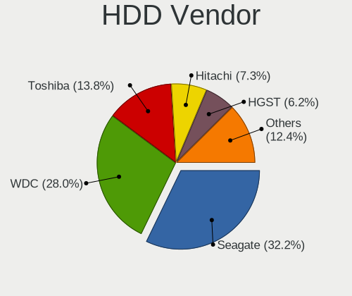
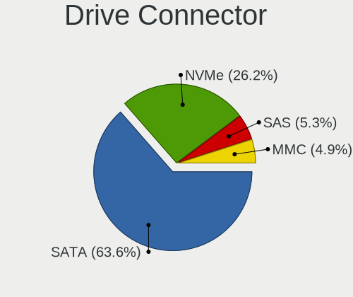
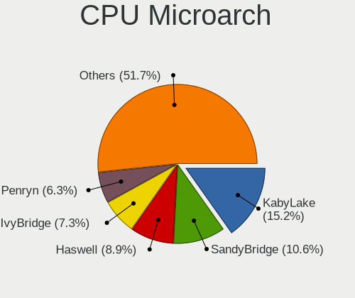
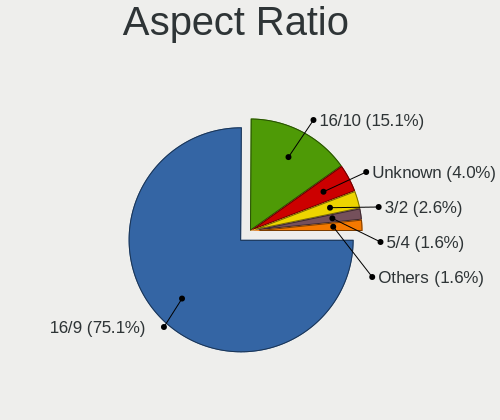
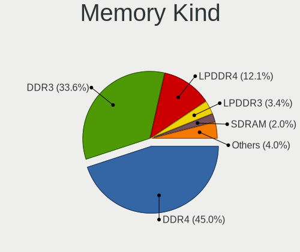

Elementary 6.1 - Tested Hardware & Statistics
---------------------------------------------

A project to collect tested hardware configurations for Elementary 6.1.

Anyone can contribute to this report by the [hw-probe](https://github.com/linuxhw/hw-probe) tool:

    sudo -E hw-probe -all -upload

Please contribute! Especially if your hardware is rare.

This is a report for all computer types. See also reports for [desktops](/Dist/Elementary_6.1/Desktop/README.md) and [notebooks](/Dist/Elementary_6.1/Notebook/README.md).

Contents
--------

* [ Test Cases ](#test-cases)

* [ System ](#system)
  - [ Kernel                   ](#kernel)
  - [ Kernel Family            ](#kernel-family)
  - [ Kernel Major Ver.        ](#kernel-major-ver)
  - [ Arch                     ](#arch)
  - [ DE                       ](#de)
  - [ Display Server           ](#display-server)
  - [ Display Manager          ](#display-manager)
  - [ OS Lang                  ](#os-lang)
  - [ Boot Mode                ](#boot-mode)
  - [ Filesystem               ](#filesystem)
  - [ Part. scheme             ](#part-scheme)
  - [ Dual Boot with Linux/BSD ](#dual-boot-with-linuxbsd)
  - [ Dual Boot (Win)          ](#dual-boot-win)

* [ Board ](#board)
  - [ Vendor                   ](#vendor)
  - [ Model                    ](#model)
  - [ Model Family             ](#model-family)
  - [ MFG Year                 ](#mfg-year)
  - [ Form Factor              ](#form-factor)
  - [ Secure Boot              ](#secure-boot)
  - [ Coreboot                 ](#coreboot)
  - [ RAM Size                 ](#ram-size)
  - [ RAM Used                 ](#ram-used)
  - [ Total Drives             ](#total-drives)
  - [ Has CD-ROM               ](#has-cd-rom)
  - [ Has Ethernet             ](#has-ethernet)
  - [ Has WiFi                 ](#has-wifi)
  - [ Has Bluetooth            ](#has-bluetooth)

* [ Location ](#location)
  - [ Country                  ](#country)
  - [ City                     ](#city)

* [ Drives ](#drives)
  - [ Drive Vendor             ](#drive-vendor)
  - [ Drive Model              ](#drive-model)
  - [ HDD Vendor               ](#hdd-vendor)
  - [ SSD Vendor               ](#ssd-vendor)
  - [ Drive Kind               ](#drive-kind)
  - [ Drive Connector          ](#drive-connector)
  - [ Drive Size               ](#drive-size)
  - [ Space Total              ](#space-total)
  - [ Space Used               ](#space-used)
  - [ Malfunc. Drives          ](#malfunc-drives)
  - [ Malfunc. Drive Vendor    ](#malfunc-drive-vendor)
  - [ Malfunc. HDD Vendor      ](#malfunc-hdd-vendor)
  - [ Malfunc. Drive Kind      ](#malfunc-drive-kind)
  - [ Failed Drives            ](#failed-drives)
  - [ Failed Drive Vendor      ](#failed-drive-vendor)
  - [ Drive Status             ](#drive-status)

* [ Storage controller ](#storage-controller)
  - [ Storage Vendor           ](#storage-vendor)
  - [ Storage Model            ](#storage-model)
  - [ Storage Kind             ](#storage-kind)

* [ Processor ](#processor)
  - [ CPU Vendor               ](#cpu-vendor)
  - [ CPU Model                ](#cpu-model)
  - [ CPU Model Family         ](#cpu-model-family)
  - [ CPU Cores                ](#cpu-cores)
  - [ CPU Sockets              ](#cpu-sockets)
  - [ CPU Threads              ](#cpu-threads)
  - [ CPU Op-Modes             ](#cpu-op-modes)
  - [ CPU Microcode            ](#cpu-microcode)
  - [ CPU Microarch            ](#cpu-microarch)

* [ Graphics ](#graphics)
  - [ GPU Vendor               ](#gpu-vendor)
  - [ GPU Model                ](#gpu-model)
  - [ GPU Combo                ](#gpu-combo)
  - [ GPU Driver               ](#gpu-driver)
  - [ GPU Memory               ](#gpu-memory)

* [ Monitor ](#monitor)
  - [ Monitor Vendor           ](#monitor-vendor)
  - [ Monitor Model            ](#monitor-model)
  - [ Monitor Resolution       ](#monitor-resolution)
  - [ Monitor Diagonal         ](#monitor-diagonal)
  - [ Monitor Width            ](#monitor-width)
  - [ Aspect Ratio             ](#aspect-ratio)
  - [ Monitor Area             ](#monitor-area)
  - [ Pixel Density            ](#pixel-density)
  - [ Multiple Monitors        ](#multiple-monitors)

* [ Network ](#network)
  - [ Net Controller Vendor    ](#net-controller-vendor)
  - [ Net Controller Model     ](#net-controller-model)
  - [ Wireless Vendor          ](#wireless-vendor)
  - [ Wireless Model           ](#wireless-model)
  - [ Ethernet Vendor          ](#ethernet-vendor)
  - [ Ethernet Model           ](#ethernet-model)
  - [ Net Controller Kind      ](#net-controller-kind)
  - [ Used Controller          ](#used-controller)
  - [ NICs                     ](#nics)
  - [ IPv6                     ](#ipv6)

* [ Bluetooth ](#bluetooth)
  - [ Bluetooth Vendor         ](#bluetooth-vendor)
  - [ Bluetooth Model          ](#bluetooth-model)

* [ Sound ](#sound)
  - [ Sound Vendor             ](#sound-vendor)
  - [ Sound Model              ](#sound-model)

* [ Memory ](#memory)
  - [ Memory Vendor            ](#memory-vendor)
  - [ Memory Model             ](#memory-model)
  - [ Memory Kind              ](#memory-kind)
  - [ Memory Form Factor       ](#memory-form-factor)
  - [ Memory Size              ](#memory-size)
  - [ Memory Speed             ](#memory-speed)

* [ Printers & scanners ](#printers--scanners)
  - [ Printer Vendor           ](#printer-vendor)
  - [ Printer Model            ](#printer-model)
  - [ Scanner Vendor           ](#scanner-vendor)
  - [ Scanner Model            ](#scanner-model)

* [ Camera ](#camera)
  - [ Camera Vendor            ](#camera-vendor)
  - [ Camera Model             ](#camera-model)

* [ Security ](#security)
  - [ Fingerprint Vendor       ](#fingerprint-vendor)
  - [ Fingerprint Model        ](#fingerprint-model)
  - [ Chipcard Vendor          ](#chipcard-vendor)
  - [ Chipcard Model           ](#chipcard-model)

* [ Unsupported ](#unsupported)
  - [ Unsupported Devices      ](#unsupported-devices)
  - [ Unsupported Device Types ](#unsupported-device-types)

Test Cases
----------

Total: 614

| Vendor        | Model                       | Form-Factor | Probe                                                      | Date         |
|---------------|-----------------------------|-------------|------------------------------------------------------------|--------------|
| Acer          | Aspire X1420G               | Desktop     | [7be7ab2e7e](https://linux-hardware.org/?probe=7be7ab2e7e) | Jul 31, 2022 |
| Dell          | Latitude E6320              | Notebook    | [34270898c6](https://linux-hardware.org/?probe=34270898c6) | Jul 30, 2022 |
| Apple         | MacBookPro11,5              | Notebook    | [04487d99ff](https://linux-hardware.org/?probe=04487d99ff) | Jul 30, 2022 |
| Casper        | NIRVANA NOTEBOOK            | Notebook    | [c291b32941](https://linux-hardware.org/?probe=c291b32941) | Jul 29, 2022 |
| Dell          | Latitude D630               | Notebook    | [37250474ae](https://linux-hardware.org/?probe=37250474ae) | Jul 29, 2022 |
| Apple         | Mac-F2238AC8                | All in one  | [dca4c898f8](https://linux-hardware.org/?probe=dca4c898f8) | Jul 29, 2022 |
| Lenovo        | ThinkPad T480 20L6S9WY00    | Notebook    | [af8fd9ae70](https://linux-hardware.org/?probe=af8fd9ae70) | Jul 29, 2022 |
| ASUSTek       | ROG STRIX B450-F GAMING     | Desktop     | [e99805635f](https://linux-hardware.org/?probe=e99805635f) | Jul 29, 2022 |
| ASUSTek       | K43E                        | Notebook    | [f6d8225dd6](https://linux-hardware.org/?probe=f6d8225dd6) | Jul 28, 2022 |
| Dell          | Latitude D630               | Notebook    | [a14838d1ef](https://linux-hardware.org/?probe=a14838d1ef) | Jul 28, 2022 |
| MSI           | B450M PRO-M2 MAX            | Desktop     | [ab8af10726](https://linux-hardware.org/?probe=ab8af10726) | Jul 28, 2022 |
| Dell          | Latitude E6320              | Notebook    | [a5b77aa0e9](https://linux-hardware.org/?probe=a5b77aa0e9) | Jul 28, 2022 |
| Dell          | Latitude 3190               | Notebook    | [36027c80d2](https://linux-hardware.org/?probe=36027c80d2) | Jul 28, 2022 |
| Apple         | MacBook4,1                  | Notebook    | [b72463cb79](https://linux-hardware.org/?probe=b72463cb79) | Jul 28, 2022 |
| Lenovo        | IdeaPad Yoga 13 20175       | Notebook    | [d9a5e0b7e6](https://linux-hardware.org/?probe=d9a5e0b7e6) | Jul 27, 2022 |
| HP            | Pavilion g4                 | Notebook    | [c9aa5e235c](https://linux-hardware.org/?probe=c9aa5e235c) | Jul 27, 2022 |
| HP            | 255 G7 Notebook PC          | Notebook    | [8173942fbb](https://linux-hardware.org/?probe=8173942fbb) | Jul 25, 2022 |
| Dell          | XPS 13 9360                 | Notebook    | [f4026901c2](https://linux-hardware.org/?probe=f4026901c2) | Jul 25, 2022 |
| Gigabyte      | GA-78LMT-USB3               | Desktop     | [d0a69fba02](https://linux-hardware.org/?probe=d0a69fba02) | Jul 23, 2022 |
| HP            | Pavilion g6                 | Notebook    | [73061b2ed5](https://linux-hardware.org/?probe=73061b2ed5) | Jul 23, 2022 |
| Dell          | 00V62H A01                  | Desktop     | [ae809bb317](https://linux-hardware.org/?probe=ae809bb317) | Jul 19, 2022 |
| Lenovo        | IdeaPad S540-14API 81NH     | Notebook    | [810b379dac](https://linux-hardware.org/?probe=810b379dac) | Jul 19, 2022 |
| HUAWEI        | HLYL-WXX9                   | Notebook    | [3831dd717e](https://linux-hardware.org/?probe=3831dd717e) | Jul 19, 2022 |
| Apple         | MacBookPro8,1               | Notebook    | [d5b50db42e](https://linux-hardware.org/?probe=d5b50db42e) | Jul 19, 2022 |
| Sony          | VPCYB20AL                   | Notebook    | [17169107a8](https://linux-hardware.org/?probe=17169107a8) | Jul 19, 2022 |
| Acer          | Aspire A315-32              | Notebook    | [ec022ec507](https://linux-hardware.org/?probe=ec022ec507) | Jul 18, 2022 |
| HP            | EliteBook 845 G8 Noteboo... | Notebook    | [54152fdf16](https://linux-hardware.org/?probe=54152fdf16) | Jul 18, 2022 |
| Sony          | SVF1521F6EW                 | Notebook    | [3f359d9763](https://linux-hardware.org/?probe=3f359d9763) | Jul 17, 2022 |
| Apple         | MacBookPro8,1               | Notebook    | [21c49763f5](https://linux-hardware.org/?probe=21c49763f5) | Jul 17, 2022 |
| ASUSTek       | ROG STRIX B360-H GAMING     | Desktop     | [4cc1f4384c](https://linux-hardware.org/?probe=4cc1f4384c) | Jul 12, 2022 |
| HP            | EliteBook 8460p             | Notebook    | [b1c5cb2096](https://linux-hardware.org/?probe=b1c5cb2096) | Jul 12, 2022 |
| Acer          | Aspire X1420G               | Desktop     | [0b7a9cbc2a](https://linux-hardware.org/?probe=0b7a9cbc2a) | Jul 12, 2022 |
| HP            | Notebook                    | Notebook    | [afaaed48c7](https://linux-hardware.org/?probe=afaaed48c7) | Jul 10, 2022 |
| Acer          | Aspire 1830T                | Notebook    | [d2ff08ade8](https://linux-hardware.org/?probe=d2ff08ade8) | Jul 10, 2022 |
| Acer          | Aspire AV15-51              | Notebook    | [1a880a89af](https://linux-hardware.org/?probe=1a880a89af) | Jul 09, 2022 |
| ASUSTek       | P8H61-M LX R2.0             | Desktop     | [3db9c636d0](https://linux-hardware.org/?probe=3db9c636d0) | Jul 09, 2022 |
| MSI           | B450M PRO-VDH MAX           | Desktop     | [b8c450d5fa](https://linux-hardware.org/?probe=b8c450d5fa) | Jul 08, 2022 |
| Acer          | Aspire V3-771               | Notebook    | [e8488fb0e2](https://linux-hardware.org/?probe=e8488fb0e2) | Jul 07, 2022 |
| Intel         | X79Turbo V1.x               | Desktop     | [e4b17550d0](https://linux-hardware.org/?probe=e4b17550d0) | Jul 06, 2022 |
| Intel         | X79Turbo V1.x               | Desktop     | [d07e96a623](https://linux-hardware.org/?probe=d07e96a623) | Jul 06, 2022 |
| HP            | Notebook                    | Notebook    | [2bf65688ab](https://linux-hardware.org/?probe=2bf65688ab) | Jul 05, 2022 |
| Dell          | Inspiron 3593               | Notebook    | [d34d56c473](https://linux-hardware.org/?probe=d34d56c473) | Jul 05, 2022 |
| Apple         | Mac-F4238CC8 PVT            | All in one  | [2919feb689](https://linux-hardware.org/?probe=2919feb689) | Jul 05, 2022 |
| Apple         | Mac-F4238CC8 PVT            | All in one  | [2933dddc75](https://linux-hardware.org/?probe=2933dddc75) | Jul 04, 2022 |
| HP            | Laptop 15-dy1xxx            | Notebook    | [3fcdd6c039](https://linux-hardware.org/?probe=3fcdd6c039) | Jul 03, 2022 |
| Dell          | XPS 15 9500                 | Notebook    | [7df8533350](https://linux-hardware.org/?probe=7df8533350) | Jul 03, 2022 |
| Gigabyte      | Z87X-OC-CF                  | Desktop     | [654459e245](https://linux-hardware.org/?probe=654459e245) | Jul 03, 2022 |
| ASUSTek       | N56VB                       | Notebook    | [88d34c06f3](https://linux-hardware.org/?probe=88d34c06f3) | Jul 02, 2022 |
| ASUSTek       | VivoBook_ASUSLaptop X509... | Notebook    | [1a03301817](https://linux-hardware.org/?probe=1a03301817) | Jul 02, 2022 |
| ASUSTek       | VivoBook_ASUSLaptop X509... | Notebook    | [859145be97](https://linux-hardware.org/?probe=859145be97) | Jul 02, 2022 |
| Lenovo        | IdeaPad Gaming 3 15IHU6 ... | Notebook    | [e13cada6ae](https://linux-hardware.org/?probe=e13cada6ae) | Jul 02, 2022 |
| ASUSTek       | TUF X470-PLUS GAMING        | Desktop     | [80a981f992](https://linux-hardware.org/?probe=80a981f992) | Jul 01, 2022 |
| ASUSTek       | X553MA                      | Notebook    | [804bbd8147](https://linux-hardware.org/?probe=804bbd8147) | Jun 30, 2022 |
| ASUSTek       | X553MA                      | Notebook    | [9fe936cec8](https://linux-hardware.org/?probe=9fe936cec8) | Jun 30, 2022 |
| Dell          | Inspiron 5537               | Notebook    | [9758b4dcff](https://linux-hardware.org/?probe=9758b4dcff) | Jun 30, 2022 |
| Lenovo        | ThinkPad E14 Gen 3 20YDS... | Notebook    | [579410b791](https://linux-hardware.org/?probe=579410b791) | Jun 28, 2022 |
| Apple         | MacBookPro14,2              | Notebook    | [7fe621e5a7](https://linux-hardware.org/?probe=7fe621e5a7) | Jun 27, 2022 |
| Compaq        | Presario CQ-23              | Notebook    | [f55fd14f61](https://linux-hardware.org/?probe=f55fd14f61) | Jun 26, 2022 |
| Gigabyte      | Z690 AORUS MASTER           | Desktop     | [a8073316f6](https://linux-hardware.org/?probe=a8073316f6) | Jun 26, 2022 |
| Apple         | Mac-F227BEC8 PVT            | All in one  | [90c166f77b](https://linux-hardware.org/?probe=90c166f77b) | Jun 25, 2022 |
| ASRock        | Z490 Pro4                   | Desktop     | [f84c8a756c](https://linux-hardware.org/?probe=f84c8a756c) | Jun 25, 2022 |
| MSI           | B85I                        | Desktop     | [886f971d22](https://linux-hardware.org/?probe=886f971d22) | Jun 25, 2022 |
| HP            | 339A                        | Desktop     | [822467af7f](https://linux-hardware.org/?probe=822467af7f) | Jun 25, 2022 |
| ASUSTek       | UX303LAB                    | Notebook    | [ae3becae01](https://linux-hardware.org/?probe=ae3becae01) | Jun 24, 2022 |
| HP            | Pavilion g4                 | Notebook    | [d0c8c06219](https://linux-hardware.org/?probe=d0c8c06219) | Jun 24, 2022 |
| Apple         | Mac-F226BEC8 PVT            | All in one  | [50e049e6fb](https://linux-hardware.org/?probe=50e049e6fb) | Jun 23, 2022 |
| Microsoft     | Surface Pro 2               | Tablet      | [07506542b5](https://linux-hardware.org/?probe=07506542b5) | Jun 21, 2022 |
| Alienware     | m17 R3                      | Notebook    | [ea3305a8af](https://linux-hardware.org/?probe=ea3305a8af) | Jun 20, 2022 |
| Dell          | Latitude E5510              | Notebook    | [1f6cc92f98](https://linux-hardware.org/?probe=1f6cc92f98) | Jun 18, 2022 |
| T-bao         | MINI PC                     | Desktop     | [6b18c66487](https://linux-hardware.org/?probe=6b18c66487) | Jun 18, 2022 |
| HP            | EliteBook 2170p             | Notebook    | [6c7391f201](https://linux-hardware.org/?probe=6c7391f201) | Jun 17, 2022 |
| HP            | ProBook 455R G6             | Notebook    | [31b94c71c7](https://linux-hardware.org/?probe=31b94c71c7) | Jun 16, 2022 |
| HP            | ProBook 455R G6             | Notebook    | [39d04d1188](https://linux-hardware.org/?probe=39d04d1188) | Jun 16, 2022 |
| Pegatron      | 2ACD                        | Desktop     | [8c8275099b](https://linux-hardware.org/?probe=8c8275099b) | Jun 16, 2022 |
| Apple         | Mac-8ED6AF5B48C039E1 Mac... | Mini pc     | [c1efcc5411](https://linux-hardware.org/?probe=c1efcc5411) | Jun 16, 2022 |
| Samsung       | Lumpy                       | Notebook    | [50dad22fb3](https://linux-hardware.org/?probe=50dad22fb3) | Jun 15, 2022 |
| ASUSTek       | GR8                         | Notebook    | [3cdc341eda](https://linux-hardware.org/?probe=3cdc341eda) | Jun 15, 2022 |
| Samsung       | Lumpy                       | Notebook    | [4137bf9757](https://linux-hardware.org/?probe=4137bf9757) | Jun 14, 2022 |
| ASUSTek       | PRIME B550-PLUS             | Desktop     | [5b8ae292bf](https://linux-hardware.org/?probe=5b8ae292bf) | Jun 14, 2022 |
| Acer          | TravelMate 5760             | Notebook    | [90e189c067](https://linux-hardware.org/?probe=90e189c067) | Jun 13, 2022 |
| Apple         | MacBook4,1                  | Notebook    | [83cac56441](https://linux-hardware.org/?probe=83cac56441) | Jun 13, 2022 |
| HP            | ProBook 4540s               | Notebook    | [6688afd4f5](https://linux-hardware.org/?probe=6688afd4f5) | Jun 11, 2022 |
| Acer          | Aspire A315-21              | Notebook    | [9840a70112](https://linux-hardware.org/?probe=9840a70112) | Jun 11, 2022 |
| ASUSTek       | SABERTOOTH X58              | Desktop     | [4cc4a7c1b3](https://linux-hardware.org/?probe=4cc4a7c1b3) | Jun 11, 2022 |
| ASUSTek       | SABERTOOTH X58              | Desktop     | [25a8936801](https://linux-hardware.org/?probe=25a8936801) | Jun 11, 2022 |
| ASUSTek       | ROG Zephyrus G14 GA401IH... | Notebook    | [0ec841e188](https://linux-hardware.org/?probe=0ec841e188) | Jun 11, 2022 |
| ASUSTek       | ROG Zephyrus G14 GA401IH... | Notebook    | [5768dfe23f](https://linux-hardware.org/?probe=5768dfe23f) | Jun 11, 2022 |
| HP            | 2B43                        | Desktop     | [6f36772b0c](https://linux-hardware.org/?probe=6f36772b0c) | Jun 10, 2022 |
| HP            | Stream Laptop 14-cb1xxx     | Notebook    | [c76f63fb68](https://linux-hardware.org/?probe=c76f63fb68) | Jun 10, 2022 |
| HP            | ProBook 4540s               | Notebook    | [d0a6dcaa92](https://linux-hardware.org/?probe=d0a6dcaa92) | Jun 09, 2022 |
| Acer          | Aspire A315-21              | Notebook    | [224023dfd2](https://linux-hardware.org/?probe=224023dfd2) | Jun 08, 2022 |
| Gigabyte      | B450 AORUS ELITE            | Desktop     | [9756188040](https://linux-hardware.org/?probe=9756188040) | Jun 07, 2022 |
| HP            | Notebook                    | Notebook    | [f07183fab5](https://linux-hardware.org/?probe=f07183fab5) | Jun 06, 2022 |
| Toshiba       | Satellite T130              | Notebook    | [b5ba2dac2a](https://linux-hardware.org/?probe=b5ba2dac2a) | Jun 06, 2022 |
| Toshiba       | Satellite T130              | Notebook    | [3fe154a2ce](https://linux-hardware.org/?probe=3fe154a2ce) | Jun 06, 2022 |
| MSI           | MPG X570S CARBON MAX WIF... | Desktop     | [0d57c069a8](https://linux-hardware.org/?probe=0d57c069a8) | Jun 05, 2022 |
| HP            | ProBook 4540s               | Notebook    | [b74c4304e9](https://linux-hardware.org/?probe=b74c4304e9) | Jun 05, 2022 |
| Lenovo        | 3098 SDK0E50510 WIN 2625... | Desktop     | [16f3fff6ad](https://linux-hardware.org/?probe=16f3fff6ad) | Jun 05, 2022 |
| Dell          | 0T7D40 A01                  | Desktop     | [812b41fe55](https://linux-hardware.org/?probe=812b41fe55) | Jun 04, 2022 |
| Lenovo        | 3098 SDK0E50510 WIN 2625... | Desktop     | [b3d970d061](https://linux-hardware.org/?probe=b3d970d061) | Jun 04, 2022 |
| Apple         | MacBookAir7,2               | Notebook    | [9de74ba486](https://linux-hardware.org/?probe=9de74ba486) | Jun 04, 2022 |
| Apple         | MacBookAir7,2               | Notebook    | [eb704f99ee](https://linux-hardware.org/?probe=eb704f99ee) | Jun 04, 2022 |
| MSI           | B85I                        | Desktop     | [5f29683d93](https://linux-hardware.org/?probe=5f29683d93) | Jun 03, 2022 |
| Apple         | MacBookAir4,2               | Notebook    | [86902cb11f](https://linux-hardware.org/?probe=86902cb11f) | Jun 02, 2022 |
| ASUSTek       | PRIME A320M-K/BR            | Desktop     | [9f4aa60f60](https://linux-hardware.org/?probe=9f4aa60f60) | Jun 02, 2022 |
| HP            | ProBook 4540s               | Notebook    | [da53c77e1a](https://linux-hardware.org/?probe=da53c77e1a) | Jun 02, 2022 |
| Samsung       | 300E5M/300E5L               | Notebook    | [baa12d722c](https://linux-hardware.org/?probe=baa12d722c) | Jun 01, 2022 |
| ASUSTek       | P5B                         | Desktop     | [12554af571](https://linux-hardware.org/?probe=12554af571) | May 31, 2022 |
| ASUSTek       | P5B                         | Desktop     | [845c2f114b](https://linux-hardware.org/?probe=845c2f114b) | May 31, 2022 |
| Dell          | XPS 13 9343                 | Notebook    | [5881b6ea1b](https://linux-hardware.org/?probe=5881b6ea1b) | May 28, 2022 |
| Lenovo        | ThinkPad T400 6474ES3       | Notebook    | [cf8b67714d](https://linux-hardware.org/?probe=cf8b67714d) | May 27, 2022 |
| HUAWEI        | MACHD-WXX9                  | Notebook    | [6cc36ec0ae](https://linux-hardware.org/?probe=6cc36ec0ae) | May 27, 2022 |
| MSI           | MPG X570S CARBON MAX WIF... | Desktop     | [a4f2a9b24b](https://linux-hardware.org/?probe=a4f2a9b24b) | May 27, 2022 |
| MSI           | MPG X570S CARBON MAX WIF... | Desktop     | [3143793e8f](https://linux-hardware.org/?probe=3143793e8f) | May 27, 2022 |
| HP            | Stream Laptop 14-cb1xxx     | Notebook    | [50f70bc9af](https://linux-hardware.org/?probe=50f70bc9af) | May 27, 2022 |
| Intel         | NUC6i7KYB H90766-405        | Mini pc     | [fc581d0fb4](https://linux-hardware.org/?probe=fc581d0fb4) | May 26, 2022 |
| Intel         | NUC8BEB J72692-303          | Mini pc     | [94796b9e96](https://linux-hardware.org/?probe=94796b9e96) | May 26, 2022 |
| ASUSTek       | X550CA                      | Notebook    | [6789d8dad5](https://linux-hardware.org/?probe=6789d8dad5) | May 26, 2022 |
| AMI           | Intel                       | Notebook    | [ee3b1abf63](https://linux-hardware.org/?probe=ee3b1abf63) | May 25, 2022 |
| ASUSTek       | P8H61                       | Desktop     | [5514e95c95](https://linux-hardware.org/?probe=5514e95c95) | May 24, 2022 |
| ASUSTek       | P8H61                       | Desktop     | [873dd31f8e](https://linux-hardware.org/?probe=873dd31f8e) | May 23, 2022 |
| Acer          | Swift SF114-32              | Notebook    | [601f82b2dd](https://linux-hardware.org/?probe=601f82b2dd) | May 23, 2022 |
| MSI           | H97M-P35                    | Desktop     | [2b5866b09d](https://linux-hardware.org/?probe=2b5866b09d) | May 23, 2022 |
| LORD ELECT... | LORD G4x 775 ICH7 8712 A... | Desktop     | [2e27b6fac9](https://linux-hardware.org/?probe=2e27b6fac9) | May 23, 2022 |
| Lenovo        | ThinkBook 14s Yoga ITL 2... | Convertible | [8cd4fba0ca](https://linux-hardware.org/?probe=8cd4fba0ca) | May 22, 2022 |
| Apple         | MacBook4,1                  | Notebook    | [27f751618e](https://linux-hardware.org/?probe=27f751618e) | May 22, 2022 |
| HP            | ProBook 6550b               | Notebook    | [5a80f0ac5d](https://linux-hardware.org/?probe=5a80f0ac5d) | May 21, 2022 |
| Toshiba       | PORTEGE Z830                | Notebook    | [9a4ebfe8cf](https://linux-hardware.org/?probe=9a4ebfe8cf) | May 21, 2022 |
| Biostar       | GF8200C M2+                 | Desktop     | [b80588cbea](https://linux-hardware.org/?probe=b80588cbea) | May 21, 2022 |
| AMI           | Intel                       | Notebook    | [6c571e79d0](https://linux-hardware.org/?probe=6c571e79d0) | May 21, 2022 |
| eMachines     | E525                        | Notebook    | [ca296b06c9](https://linux-hardware.org/?probe=ca296b06c9) | May 21, 2022 |
| ASUSTek       | P8H61-M LE/USB3             | Desktop     | [6f6a104d35](https://linux-hardware.org/?probe=6f6a104d35) | May 21, 2022 |
| Toshiba       | PORTEGE Z830                | Notebook    | [8d4eb653b6](https://linux-hardware.org/?probe=8d4eb653b6) | May 19, 2022 |
| MSI           | B85I                        | Desktop     | [c822196290](https://linux-hardware.org/?probe=c822196290) | May 18, 2022 |
| Sony          | VPCEB23FM                   | Notebook    | [4d73e73cf8](https://linux-hardware.org/?probe=4d73e73cf8) | May 17, 2022 |
| Sony          | VPCEB23FM                   | Notebook    | [07d2cadefb](https://linux-hardware.org/?probe=07d2cadefb) | May 17, 2022 |
| Samsung       | Lumpy                       | Notebook    | [84a78226dd](https://linux-hardware.org/?probe=84a78226dd) | May 16, 2022 |
| HP            | ENVY 14                     | Notebook    | [9fe635b800](https://linux-hardware.org/?probe=9fe635b800) | May 15, 2022 |
| MSI           | MEG X570 UNIFY              | Desktop     | [4d00452dcb](https://linux-hardware.org/?probe=4d00452dcb) | May 15, 2022 |
| ASUSTek       | K55A                        | Notebook    | [3391d004a7](https://linux-hardware.org/?probe=3391d004a7) | May 15, 2022 |
| HP            | ENVY x360 Convertible       | Convertible | [4521ae6617](https://linux-hardware.org/?probe=4521ae6617) | May 14, 2022 |
| HP            | ENVY x360 Convertible       | Convertible | [513d1e2c73](https://linux-hardware.org/?probe=513d1e2c73) | May 14, 2022 |
| HP            | Stream Laptop 14-cb1xxx     | Notebook    | [c0e150d349](https://linux-hardware.org/?probe=c0e150d349) | May 13, 2022 |
| HP            | Stream Laptop 14-cb1xxx     | Notebook    | [919200b122](https://linux-hardware.org/?probe=919200b122) | May 13, 2022 |
| ASUSTek       | UX310UQK                    | Notebook    | [1af1efeb46](https://linux-hardware.org/?probe=1af1efeb46) | May 11, 2022 |
| HUAWEI        | NBLK-WAX9X                  | Notebook    | [d5df500fa3](https://linux-hardware.org/?probe=d5df500fa3) | May 10, 2022 |
| HP            | EliteBook 840 G7 Noteboo... | Notebook    | [1b52e22774](https://linux-hardware.org/?probe=1b52e22774) | May 10, 2022 |
| HP            | ProBook 4510s               | Notebook    | [1464ea43d3](https://linux-hardware.org/?probe=1464ea43d3) | May 09, 2022 |
| ASUSTek       | SABERTOOTH X58              | Desktop     | [c276639676](https://linux-hardware.org/?probe=c276639676) | May 08, 2022 |
| ASUSTek       | VivoBook 15 ASUS Laptop ... | Notebook    | [b726ded078](https://linux-hardware.org/?probe=b726ded078) | May 08, 2022 |
| Apple         | MacBookPro8,2               | Notebook    | [2eb968b190](https://linux-hardware.org/?probe=2eb968b190) | May 07, 2022 |
| ASUSTek       | H81M-K                      | Desktop     | [753c7be679](https://linux-hardware.org/?probe=753c7be679) | May 05, 2022 |
| ASRock        | X570 Extreme4               | Desktop     | [98e5f20999](https://linux-hardware.org/?probe=98e5f20999) | May 04, 2022 |
| eMachines     | E525                        | Notebook    | [dfc36c2ea0](https://linux-hardware.org/?probe=dfc36c2ea0) | May 04, 2022 |
| HP            | EliteBook 840 G7 Noteboo... | Notebook    | [0295d9e820](https://linux-hardware.org/?probe=0295d9e820) | May 04, 2022 |
| Dell          | Inspiron 7720               | Notebook    | [a2d8358964](https://linux-hardware.org/?probe=a2d8358964) | May 02, 2022 |
| HP            | Pavilion 17                 | Notebook    | [3958b61eff](https://linux-hardware.org/?probe=3958b61eff) | May 02, 2022 |
| HP            | ENVY x360 Convertible 13... | Convertible | [271a0aaed2](https://linux-hardware.org/?probe=271a0aaed2) | May 01, 2022 |
| ASUSTek       | X202E                       | Notebook    | [37ad2923f5](https://linux-hardware.org/?probe=37ad2923f5) | May 01, 2022 |
| HP            | 0B48h                       | Desktop     | [4c6e5824f2](https://linux-hardware.org/?probe=4c6e5824f2) | Apr 30, 2022 |
| Acer          | Aspire E5-411G              | Notebook    | [0629e76746](https://linux-hardware.org/?probe=0629e76746) | Apr 30, 2022 |
| Avell High... | B.ON                        | Notebook    | [eb3d4d0f78](https://linux-hardware.org/?probe=eb3d4d0f78) | Apr 29, 2022 |
| ASUSTek       | P8Z77-V                     | Desktop     | [b3506ef75d](https://linux-hardware.org/?probe=b3506ef75d) | Apr 29, 2022 |
| HP            | Pavilion 17                 | Notebook    | [6de5e5677f](https://linux-hardware.org/?probe=6de5e5677f) | Apr 29, 2022 |
| Lenovo        | IdeaPad 3 15IGL05 81WQ      | Notebook    | [c12f5ae663](https://linux-hardware.org/?probe=c12f5ae663) | Apr 28, 2022 |
| Dell          | 0J3C2F A00                  | Desktop     | [464c70eb8d](https://linux-hardware.org/?probe=464c70eb8d) | Apr 27, 2022 |
| HP            | EliteBook 840 G1            | Notebook    | [74c6e22c86](https://linux-hardware.org/?probe=74c6e22c86) | Apr 27, 2022 |
| ASUSTek       | ROG CROSSHAIR VIII HERO     | Desktop     | [1f10d820f8](https://linux-hardware.org/?probe=1f10d820f8) | Apr 27, 2022 |
| ASUSTek       | ROG CROSSHAIR VIII HERO     | Desktop     | [dfadead480](https://linux-hardware.org/?probe=dfadead480) | Apr 27, 2022 |
| Lenovo        | ThinkPad X270 W10DG 20K5... | Notebook    | [06a00cfce7](https://linux-hardware.org/?probe=06a00cfce7) | Apr 25, 2022 |
| Dell          | 05R2TK A01                  | All in one  | [317f2966c3](https://linux-hardware.org/?probe=317f2966c3) | Apr 25, 2022 |
| Gigabyte      | B150N Phoenix-WIFI-CF       | Desktop     | [dbaaf867f6](https://linux-hardware.org/?probe=dbaaf867f6) | Apr 25, 2022 |
| ASUSTek       | ROG STRIX Z590-F GAMING ... | Desktop     | [1b0a41c232](https://linux-hardware.org/?probe=1b0a41c232) | Apr 25, 2022 |
| Lenovo        | ThinkPad T420 41786VU       | Notebook    | [e2b4c2327b](https://linux-hardware.org/?probe=e2b4c2327b) | Apr 25, 2022 |
| AZW           | GTi                         | Desktop     | [e2d4a0da2e](https://linux-hardware.org/?probe=e2d4a0da2e) | Apr 23, 2022 |
| AZW           | GTi                         | Desktop     | [cde74551bf](https://linux-hardware.org/?probe=cde74551bf) | Apr 23, 2022 |
| ASUSTek       | ZenBook UX425EA_UX425EA     | Notebook    | [6162231453](https://linux-hardware.org/?probe=6162231453) | Apr 23, 2022 |
| Dell          | Latitude 3120               | Notebook    | [78f0703e75](https://linux-hardware.org/?probe=78f0703e75) | Apr 23, 2022 |
| ASUSTek       | ZenBook UX425EA_UX425EA     | Notebook    | [9146df4426](https://linux-hardware.org/?probe=9146df4426) | Apr 23, 2022 |
| Lenovo        | IdeaPad 3 15IGL05 81WQ      | Notebook    | [2f497982cd](https://linux-hardware.org/?probe=2f497982cd) | Apr 22, 2022 |
| HP            | 250 G7 Notebook PC          | Notebook    | [e7f7e1188e](https://linux-hardware.org/?probe=e7f7e1188e) | Apr 21, 2022 |
| HP            | Pavilion g6                 | Notebook    | [63f6b73d50](https://linux-hardware.org/?probe=63f6b73d50) | Apr 21, 2022 |
| ECS           | H61H2-MV                    | Desktop     | [939f87564f](https://linux-hardware.org/?probe=939f87564f) | Apr 21, 2022 |
| AMI           | Aptio CRB                   | Mini pc     | [b720cd5fc5](https://linux-hardware.org/?probe=b720cd5fc5) | Apr 20, 2022 |
| Samsung       | 950XDB/951XDB/950XDY        | Notebook    | [336a67fbee](https://linux-hardware.org/?probe=336a67fbee) | Apr 19, 2022 |
| MSI           | X99A SLI PLUS               | Desktop     | [0b935aadb3](https://linux-hardware.org/?probe=0b935aadb3) | Apr 19, 2022 |
| ASUSTek       | ZenBook UX325SA_UM325SA     | Notebook    | [d3d2e2fe8a](https://linux-hardware.org/?probe=d3d2e2fe8a) | Apr 18, 2022 |
| HP            | ProBook 6440b               | Notebook    | [54a85fc99d](https://linux-hardware.org/?probe=54a85fc99d) | Apr 18, 2022 |
| ASRock        | Z490 Pro4                   | Desktop     | [67071d11a1](https://linux-hardware.org/?probe=67071d11a1) | Apr 18, 2022 |
| Dell          | 0KV62T A01                  | Desktop     | [0c6e50ed20](https://linux-hardware.org/?probe=0c6e50ed20) | Apr 17, 2022 |
| Dell          | 0KV62T A01                  | Desktop     | [7bed7782c4](https://linux-hardware.org/?probe=7bed7782c4) | Apr 17, 2022 |
| MSI           | B450M PRO-VDH MAX           | Desktop     | [e28ee0bd42](https://linux-hardware.org/?probe=e28ee0bd42) | Apr 16, 2022 |
| HP            | 1494                        | Desktop     | [6ad3ca1745](https://linux-hardware.org/?probe=6ad3ca1745) | Apr 16, 2022 |
| Gigabyte      | H61M-D2H-USB3               | Desktop     | [016243a675](https://linux-hardware.org/?probe=016243a675) | Apr 15, 2022 |
| Lenovo        | ThinkPad X201 Tablet 311... | Notebook    | [e3ab162648](https://linux-hardware.org/?probe=e3ab162648) | Apr 15, 2022 |
| Apple         | MacBookPro10,1              | Notebook    | [0d7edf2aa9](https://linux-hardware.org/?probe=0d7edf2aa9) | Apr 15, 2022 |
| Lenovo        | ThinkPad W541 20EGS0UB03    | Notebook    | [f566cb7f4c](https://linux-hardware.org/?probe=f566cb7f4c) | Apr 14, 2022 |
| Fujitsu       | D3531-A1 S26361-D3531-A1    | Desktop     | [46dd533a5e](https://linux-hardware.org/?probe=46dd533a5e) | Apr 14, 2022 |
| ASUSTek       | B85M-G                      | Desktop     | [c6dd82e724](https://linux-hardware.org/?probe=c6dd82e724) | Apr 14, 2022 |
| Gigabyte      | B450 AORUS ELITE            | Desktop     | [dff6de5032](https://linux-hardware.org/?probe=dff6de5032) | Apr 14, 2022 |
| ASUSTek       | B85M-G                      | Desktop     | [e525a26ca8](https://linux-hardware.org/?probe=e525a26ca8) | Apr 14, 2022 |
| Gigabyte      | B450 AORUS ELITE            | Desktop     | [6a2c5f12fd](https://linux-hardware.org/?probe=6a2c5f12fd) | Apr 13, 2022 |
| Dell          | 0K240Y A01                  | Desktop     | [76d4fbf0a6](https://linux-hardware.org/?probe=76d4fbf0a6) | Apr 13, 2022 |
| HP            | ProBook 440 G7              | Notebook    | [7c6efad935](https://linux-hardware.org/?probe=7c6efad935) | Apr 13, 2022 |
| ASUSTek       | TUF X470-PLUS GAMING        | Desktop     | [3440d2dd8c](https://linux-hardware.org/?probe=3440d2dd8c) | Apr 12, 2022 |
| Acer          | Aspire E5-575G              | Notebook    | [07bdcd6978](https://linux-hardware.org/?probe=07bdcd6978) | Apr 12, 2022 |
| MSI           | Prestige 15 A11UC           | Notebook    | [20517e7efc](https://linux-hardware.org/?probe=20517e7efc) | Apr 11, 2022 |
| MSI           | Prestige 15 A11UC           | Notebook    | [3f8b7b11a5](https://linux-hardware.org/?probe=3f8b7b11a5) | Apr 11, 2022 |
| Lenovo        | 3178 SDK0J40700 WIN 3258... | Desktop     | [637023ab6d](https://linux-hardware.org/?probe=637023ab6d) | Apr 11, 2022 |
| ASUSTek       | PRIME Z390-A                | Desktop     | [21767e12e4](https://linux-hardware.org/?probe=21767e12e4) | Apr 11, 2022 |
| ASUSTek       | ZenBook UX425EA_UX425EA     | Notebook    | [379db407c7](https://linux-hardware.org/?probe=379db407c7) | Apr 10, 2022 |
| Pegatron      | IPMH61P1                    | Desktop     | [1adcf74c4f](https://linux-hardware.org/?probe=1adcf74c4f) | Apr 10, 2022 |
| ASUSTek       | H110I-PLUS                  | Desktop     | [e367ac99ce](https://linux-hardware.org/?probe=e367ac99ce) | Apr 10, 2022 |
| HP            | Pavilion 13 x360 PC         | Notebook    | [3abf9847e4](https://linux-hardware.org/?probe=3abf9847e4) | Apr 10, 2022 |
| ASUSTek       | N56DY                       | Notebook    | [aff377f6ed](https://linux-hardware.org/?probe=aff377f6ed) | Apr 09, 2022 |
| Lenovo        | IdeaPad-510-15IKB 80SV      | Notebook    | [840239190e](https://linux-hardware.org/?probe=840239190e) | Apr 09, 2022 |
| Apple         | MacBookAir6,2               | Notebook    | [84c694e881](https://linux-hardware.org/?probe=84c694e881) | Apr 08, 2022 |
| ASRock        | C226 WS                     | Desktop     | [7c11c1ec43](https://linux-hardware.org/?probe=7c11c1ec43) | Apr 07, 2022 |
| ASUSTek       | STRIKER II FORMULA          | Desktop     | [5dfea21930](https://linux-hardware.org/?probe=5dfea21930) | Apr 07, 2022 |
| ASUSTek       | STRIKER II FORMULA          | Desktop     | [040990b3fc](https://linux-hardware.org/?probe=040990b3fc) | Apr 07, 2022 |
| Lenovo        | ThinkPad E15 Gen 2 20TDS... | Notebook    | [0626d13541](https://linux-hardware.org/?probe=0626d13541) | Apr 07, 2022 |
| Samsung       | RV411/RV511/E3511/S3511/... | Notebook    | [fd62bf7f91](https://linux-hardware.org/?probe=fd62bf7f91) | Apr 05, 2022 |
| Dell          | Latitude 5410               | Notebook    | [9d03bb6cad](https://linux-hardware.org/?probe=9d03bb6cad) | Apr 05, 2022 |
| HP            | Stream Laptop 14-ax1xxx     | Notebook    | [a25b973df6](https://linux-hardware.org/?probe=a25b973df6) | Apr 05, 2022 |
| HP            | Stream Laptop 14-ax1xxx     | Notebook    | [4228c17983](https://linux-hardware.org/?probe=4228c17983) | Apr 05, 2022 |
| Apple         | MacBookAir6,2               | Notebook    | [656e7d1b73](https://linux-hardware.org/?probe=656e7d1b73) | Apr 04, 2022 |
| Lenovo        | ThinkPad X260 20F5S84400    | Notebook    | [69e1c25b4c](https://linux-hardware.org/?probe=69e1c25b4c) | Apr 03, 2022 |
| Apple         | MacBookPro10,1              | Notebook    | [d1c62a1f93](https://linux-hardware.org/?probe=d1c62a1f93) | Apr 03, 2022 |
| ASUSTek       | TUF Gaming B460M-PLUS       | Desktop     | [7419ad6a76](https://linux-hardware.org/?probe=7419ad6a76) | Apr 02, 2022 |
| HP            | Notebook                    | Notebook    | [f46a05a044](https://linux-hardware.org/?probe=f46a05a044) | Apr 02, 2022 |
| Lenovo        | ThinkPad X201 Tablet 311... | Notebook    | [7f48dd5612](https://linux-hardware.org/?probe=7f48dd5612) | Apr 02, 2022 |
| Dell          | Inspiron 5481               | Convertible | [e364cee660](https://linux-hardware.org/?probe=e364cee660) | Apr 02, 2022 |
| Lenovo        | ThinkPad T410s 2912BR7      | Notebook    | [04098ae404](https://linux-hardware.org/?probe=04098ae404) | Apr 02, 2022 |
| Apple         | MacBookAir4,2               | Notebook    | [7fc2cd808d](https://linux-hardware.org/?probe=7fc2cd808d) | Apr 02, 2022 |
| Dell          | Vostro A860                 | Notebook    | [15ce9e1f63](https://linux-hardware.org/?probe=15ce9e1f63) | Apr 01, 2022 |
| HP            | Pavilion Notebook           | Notebook    | [9375dd090a](https://linux-hardware.org/?probe=9375dd090a) | Apr 01, 2022 |
| HP            | Pavilion Notebook           | Notebook    | [ab016f94d5](https://linux-hardware.org/?probe=ab016f94d5) | Apr 01, 2022 |
| HP            | EliteBook 8730w             | Notebook    | [caade8e7ff](https://linux-hardware.org/?probe=caade8e7ff) | Mar 31, 2022 |
| ASUSTek       | UL80VT                      | Notebook    | [bd7c5c01e6](https://linux-hardware.org/?probe=bd7c5c01e6) | Mar 31, 2022 |
| Lenovo        | ThinkCentre M58 6258D3G     | Desktop     | [b67f1750b8](https://linux-hardware.org/?probe=b67f1750b8) | Mar 31, 2022 |
| Lenovo        | ThinkCentre M58 6258D3G     | Desktop     | [1cd22c83f1](https://linux-hardware.org/?probe=1cd22c83f1) | Mar 31, 2022 |
| MSI           | H97 GAMING 3                | Desktop     | [97f38615e3](https://linux-hardware.org/?probe=97f38615e3) | Mar 31, 2022 |
| MSI           | MEG X570 ACE                | Desktop     | [55572b8a7e](https://linux-hardware.org/?probe=55572b8a7e) | Mar 31, 2022 |
| Lenovo        | IdeaPad S145-15IWL 81MV     | Notebook    | [513f01a83f](https://linux-hardware.org/?probe=513f01a83f) | Mar 30, 2022 |
| Acer          | Aspire ES1-531              | Notebook    | [e617f1e49b](https://linux-hardware.org/?probe=e617f1e49b) | Mar 30, 2022 |
| HUAWEI        | NBLB-WAX9N                  | Notebook    | [5eb56f360e](https://linux-hardware.org/?probe=5eb56f360e) | Mar 29, 2022 |
| HP            | ENVY x360 Convertible 13... | Convertible | [01f1ca7f9d](https://linux-hardware.org/?probe=01f1ca7f9d) | Mar 29, 2022 |
| HP            | ENVY x360 Convertible 13... | Convertible | [d299b01a23](https://linux-hardware.org/?probe=d299b01a23) | Mar 29, 2022 |
| HP            | ENVY x360 Convertible 13... | Convertible | [1b9e12b8fb](https://linux-hardware.org/?probe=1b9e12b8fb) | Mar 29, 2022 |
| ASUSTek       | Rampage IV GENE             | Desktop     | [c067a4d0e7](https://linux-hardware.org/?probe=c067a4d0e7) | Mar 29, 2022 |
| Acer          | Aspire ES1-520              | Notebook    | [95df1e3190](https://linux-hardware.org/?probe=95df1e3190) | Mar 28, 2022 |
| Lenovo        | ThinkBook 16p Gen 2 20YM    | Notebook    | [677a8dfae3](https://linux-hardware.org/?probe=677a8dfae3) | Mar 28, 2022 |
| Lenovo        | ThinkBook 16p Gen 2 20YM    | Notebook    | [2f7a9a8ab0](https://linux-hardware.org/?probe=2f7a9a8ab0) | Mar 28, 2022 |
| LG Electro... | 17Z95P-K.AAE8U1             | Notebook    | [0a3f06a9e5](https://linux-hardware.org/?probe=0a3f06a9e5) | Mar 28, 2022 |
| Dell          | Latitude 5520               | Notebook    | [ca6e0db25d](https://linux-hardware.org/?probe=ca6e0db25d) | Mar 27, 2022 |
| Lenovo        | ThinkBook 16p Gen 2 20YM    | Notebook    | [ac055e5e8a](https://linux-hardware.org/?probe=ac055e5e8a) | Mar 27, 2022 |
| Dell          | Inspiron 1545               | Notebook    | [0521ab3bd7](https://linux-hardware.org/?probe=0521ab3bd7) | Mar 27, 2022 |
| Sony          | VPCCA4E1E                   | Notebook    | [95fc0956c8](https://linux-hardware.org/?probe=95fc0956c8) | Mar 27, 2022 |
| Lenovo        | IdeaPad S145-14AST 81ST     | Notebook    | [9e39c749a1](https://linux-hardware.org/?probe=9e39c749a1) | Mar 27, 2022 |
| Toshiba       | Satellite C70D-A            | Notebook    | [c8b872d005](https://linux-hardware.org/?probe=c8b872d005) | Mar 26, 2022 |
| Dell          | 0C522T A00                  | Desktop     | [33ae998152](https://linux-hardware.org/?probe=33ae998152) | Mar 26, 2022 |
| Dell          | 0C522T A00                  | Desktop     | [90242bb090](https://linux-hardware.org/?probe=90242bb090) | Mar 26, 2022 |
| Acer          | Nitro AN515-55              | Notebook    | [7ca2f5d5cb](https://linux-hardware.org/?probe=7ca2f5d5cb) | Mar 26, 2022 |
| MSI           | MPG B550 GAMING EDGE WIF... | Desktop     | [7577679057](https://linux-hardware.org/?probe=7577679057) | Mar 25, 2022 |
| Toshiba       | Satellite L50D-C            | Notebook    | [2782b13510](https://linux-hardware.org/?probe=2782b13510) | Mar 25, 2022 |
| Toshiba       | Satellite L50D-C            | Notebook    | [a0c9b5a952](https://linux-hardware.org/?probe=a0c9b5a952) | Mar 25, 2022 |
| MSI           | Modern 14 B4MW              | Notebook    | [744a69ec7d](https://linux-hardware.org/?probe=744a69ec7d) | Mar 25, 2022 |
| Gigabyte      | A320M-S2H-CF                | Desktop     | [a237859a86](https://linux-hardware.org/?probe=a237859a86) | Mar 24, 2022 |
| Intel         | X79Turbo V1.x               | Desktop     | [18b126a753](https://linux-hardware.org/?probe=18b126a753) | Mar 24, 2022 |
| Dell          | Inspiron MM061              | Notebook    | [1535349482](https://linux-hardware.org/?probe=1535349482) | Mar 24, 2022 |
| HP            | 250 G7 Notebook PC          | Notebook    | [552f06718c](https://linux-hardware.org/?probe=552f06718c) | Mar 23, 2022 |
| Dell          | Inspiron MM061              | Notebook    | [dd34f9d506](https://linux-hardware.org/?probe=dd34f9d506) | Mar 23, 2022 |
| AMI           | Cherry Trail CR             | Desktop     | [bbea34ce64](https://linux-hardware.org/?probe=bbea34ce64) | Mar 22, 2022 |
| Lenovo        | MIIX 310-10ICR 80SG         | Tablet      | [552d30ae49](https://linux-hardware.org/?probe=552d30ae49) | Mar 22, 2022 |
| Sony          | SVP1321B4E                  | Notebook    | [b539c23011](https://linux-hardware.org/?probe=b539c23011) | Mar 21, 2022 |
| Raspberry ... | Raspberry Pi 400 Rev 1.0    | Soc         | [2b39b0fda2](https://linux-hardware.org/?probe=2b39b0fda2) | Mar 21, 2022 |
| LG Electro... | A410-G.BC51P1               | Notebook    | [9054ee5a3d](https://linux-hardware.org/?probe=9054ee5a3d) | Mar 20, 2022 |
| Apple         | Mac-27ADBB7B4CEE8E61 iMa... | All in one  | [78df63a35f](https://linux-hardware.org/?probe=78df63a35f) | Mar 20, 2022 |
| AMI           | Cherry Trail CR             | Desktop     | [bc5a34ef7e](https://linux-hardware.org/?probe=bc5a34ef7e) | Mar 20, 2022 |
| Dell          | Vostro 15 3515              | Notebook    | [6806f47a62](https://linux-hardware.org/?probe=6806f47a62) | Mar 19, 2022 |
| Apple         | Mac-F2238BAE iMac11,3       | All in one  | [1268effe7d](https://linux-hardware.org/?probe=1268effe7d) | Mar 17, 2022 |
| ASUSTek       | Rampage IV GENE             | Desktop     | [7f5053b061](https://linux-hardware.org/?probe=7f5053b061) | Mar 16, 2022 |
| Apple         | MacBookAir7,1               | Notebook    | [7b2fa4b8e8](https://linux-hardware.org/?probe=7b2fa4b8e8) | Mar 16, 2022 |
| ASUSTek       | Rampage IV GENE             | Desktop     | [7ff55a3ca6](https://linux-hardware.org/?probe=7ff55a3ca6) | Mar 16, 2022 |
| Dell          | Inspiron 5593               | Notebook    | [f4d49b97ec](https://linux-hardware.org/?probe=f4d49b97ec) | Mar 15, 2022 |
| Dell          | Latitude E6220              | Notebook    | [e2c9477eb3](https://linux-hardware.org/?probe=e2c9477eb3) | Mar 15, 2022 |
| ASUSTek       | VivoBook_ASUS Laptop E41... | Notebook    | [a10cf12536](https://linux-hardware.org/?probe=a10cf12536) | Mar 15, 2022 |
| ASUSTek       | P8H61-M LX3 R2.0            | Desktop     | [eda8848760](https://linux-hardware.org/?probe=eda8848760) | Mar 15, 2022 |
| Lenovo        | IdeaPad S145-15IIL 82DJ     | Notebook    | [c95c5598af](https://linux-hardware.org/?probe=c95c5598af) | Mar 15, 2022 |
| AOpen         | D1009 A1A4                  | Desktop     | [a7375d4581](https://linux-hardware.org/?probe=a7375d4581) | Mar 13, 2022 |
| Acer          | Aspire A315-21G             | Notebook    | [4e85fcd677](https://linux-hardware.org/?probe=4e85fcd677) | Mar 13, 2022 |
| Apple         | Mac-F2218FC8                | All in one  | [9eb7577acd](https://linux-hardware.org/?probe=9eb7577acd) | Mar 12, 2022 |
| Samsung       | RV411/RV511/E3511/S3511/... | Notebook    | [7f9721781e](https://linux-hardware.org/?probe=7f9721781e) | Mar 12, 2022 |
| Lenovo        | ThinkPad T420 4236JY2       | Notebook    | [bc5d95b759](https://linux-hardware.org/?probe=bc5d95b759) | Mar 12, 2022 |
| MSI           | B85I                        | Desktop     | [d134c8451b](https://linux-hardware.org/?probe=d134c8451b) | Mar 12, 2022 |
| Teclast       | F15S                        | Notebook    | [a92a5510ef](https://linux-hardware.org/?probe=a92a5510ef) | Mar 11, 2022 |
| ASRock        | B450M Pro4                  | Desktop     | [12459fc7ea](https://linux-hardware.org/?probe=12459fc7ea) | Mar 11, 2022 |
| ASUSTek       | X200CA                      | Notebook    | [85c103c654](https://linux-hardware.org/?probe=85c103c654) | Mar 10, 2022 |
| ASUSTek       | X200CA                      | Notebook    | [25518274da](https://linux-hardware.org/?probe=25518274da) | Mar 10, 2022 |
| Gigabyte      | B150N Phoenix-WIFI-CF       | Desktop     | [a64818ccea](https://linux-hardware.org/?probe=a64818ccea) | Mar 10, 2022 |
| Biostar       | N68S3B                      | Desktop     | [aa1e6a4c82](https://linux-hardware.org/?probe=aa1e6a4c82) | Mar 10, 2022 |
| Lenovo        | IdeaPad 330S-15ARR 81FB     | Notebook    | [b950d195ce](https://linux-hardware.org/?probe=b950d195ce) | Mar 10, 2022 |
| HP            | Laptop 15-db0xxx            | Notebook    | [1064e67665](https://linux-hardware.org/?probe=1064e67665) | Mar 10, 2022 |
| Lenovo        | IdeaPad S340-15API 81NC     | Notebook    | [83dc415e28](https://linux-hardware.org/?probe=83dc415e28) | Mar 09, 2022 |
| Lenovo        | IdeaPad 310-15IKB 80TV      | Notebook    | [e6a6f71bb5](https://linux-hardware.org/?probe=e6a6f71bb5) | Mar 09, 2022 |
| Lenovo        | ThinkPad P14s Gen 1 20S4... | Notebook    | [ee3693d6a7](https://linux-hardware.org/?probe=ee3693d6a7) | Mar 09, 2022 |
| ASUSTek       | M11AD                       | Desktop     | [8bb5baaa5a](https://linux-hardware.org/?probe=8bb5baaa5a) | Mar 09, 2022 |
| Dell          | Inspiron 15-3567            | Notebook    | [fc064cce68](https://linux-hardware.org/?probe=fc064cce68) | Mar 09, 2022 |
| Microsoft     | Surface Laptop 3            | Tablet      | [d55f23484e](https://linux-hardware.org/?probe=d55f23484e) | Mar 09, 2022 |
| MSI           | Modern 14 B10MW             | Notebook    | [661d068b83](https://linux-hardware.org/?probe=661d068b83) | Mar 08, 2022 |
| Biostar       | H61MLV2                     | Desktop     | [d5c330bad8](https://linux-hardware.org/?probe=d5c330bad8) | Mar 08, 2022 |
| HP            | 2ADC                        | Desktop     | [ed0714a64a](https://linux-hardware.org/?probe=ed0714a64a) | Mar 07, 2022 |
| MSI           | B85I                        | Desktop     | [39926596b7](https://linux-hardware.org/?probe=39926596b7) | Mar 07, 2022 |
| Lenovo        | ThinkPad L470 20J4002FMX    | Notebook    | [c3e1baf45a](https://linux-hardware.org/?probe=c3e1baf45a) | Mar 06, 2022 |
| Lenovo        | ThinkPad T420 4236JY2       | Notebook    | [caa5c3eef1](https://linux-hardware.org/?probe=caa5c3eef1) | Mar 06, 2022 |
| Dell          | 0PU052                      | Desktop     | [766b0e4665](https://linux-hardware.org/?probe=766b0e4665) | Mar 06, 2022 |
| Dell          | 0PU052                      | Desktop     | [a8e19bd112](https://linux-hardware.org/?probe=a8e19bd112) | Mar 06, 2022 |
| Lenovo        | ThinkPad X230 2325ND9       | Notebook    | [02818352e0](https://linux-hardware.org/?probe=02818352e0) | Mar 06, 2022 |
| iOTA          | IOTA2320                    | Notebook    | [6cf7733a53](https://linux-hardware.org/?probe=6cf7733a53) | Mar 06, 2022 |
| Lenovo        | ThinkPad X230 2325ND9       | Notebook    | [24a601d3aa](https://linux-hardware.org/?probe=24a601d3aa) | Mar 06, 2022 |
| Lenovo        | IdeaPad Y580                | Notebook    | [26ea7d1cff](https://linux-hardware.org/?probe=26ea7d1cff) | Mar 06, 2022 |
| Acer          | Nitro AN515-55              | Notebook    | [7e967f4daa](https://linux-hardware.org/?probe=7e967f4daa) | Mar 06, 2022 |
| Acer          | Nitro AN515-55              | Notebook    | [db5f524190](https://linux-hardware.org/?probe=db5f524190) | Mar 06, 2022 |
| HP            | 1589                        | Desktop     | [88876808e9](https://linux-hardware.org/?probe=88876808e9) | Mar 05, 2022 |
| Acer          | Nitro AN517-52              | Notebook    | [4576110ce4](https://linux-hardware.org/?probe=4576110ce4) | Mar 05, 2022 |
| HUAWEI        | MACHD-WXX9                  | Notebook    | [707b59278e](https://linux-hardware.org/?probe=707b59278e) | Mar 05, 2022 |
| HP            | 802E                        | Desktop     | [14c73a40e0](https://linux-hardware.org/?probe=14c73a40e0) | Mar 05, 2022 |
| Apple         | MacBookPro6,2               | Notebook    | [a2f1d82d9c](https://linux-hardware.org/?probe=a2f1d82d9c) | Mar 05, 2022 |
| ASRock        | FM2A58M-DG3+                | Desktop     | [0b7875b1b5](https://linux-hardware.org/?probe=0b7875b1b5) | Mar 05, 2022 |
| Acer          | Aspire A315-42G             | Notebook    | [d08f8cbc35](https://linux-hardware.org/?probe=d08f8cbc35) | Mar 05, 2022 |
| Lenovo        | IdeaPad S340-15API 81NC     | Notebook    | [4fc1001606](https://linux-hardware.org/?probe=4fc1001606) | Mar 02, 2022 |
| Lenovo        | ThinkPad T400s 2808D9G      | Notebook    | [6a5d0584bd](https://linux-hardware.org/?probe=6a5d0584bd) | Mar 02, 2022 |
| Dell          | Latitude 5290 2-in-1        | Tablet      | [9cfd9c7142](https://linux-hardware.org/?probe=9cfd9c7142) | Mar 02, 2022 |
| Dell          | Latitude 5290 2-in-1        | Tablet      | [a93699018b](https://linux-hardware.org/?probe=a93699018b) | Mar 02, 2022 |
| HP            | 805D                        | Desktop     | [2a09665009](https://linux-hardware.org/?probe=2a09665009) | Mar 02, 2022 |
| HP            | ProBook 450 G7              | Notebook    | [a73f7ae919](https://linux-hardware.org/?probe=a73f7ae919) | Feb 28, 2022 |
| ASUSTek       | M4N72-E                     | Desktop     | [c3fe570b4d](https://linux-hardware.org/?probe=c3fe570b4d) | Feb 28, 2022 |
| ASUSTek       | H81-PLUS                    | Desktop     | [e8956dc4ec](https://linux-hardware.org/?probe=e8956dc4ec) | Feb 27, 2022 |
| ASUSTek       | VivoBook_ASUSLaptop X510... | Notebook    | [d7b815d3d6](https://linux-hardware.org/?probe=d7b815d3d6) | Feb 27, 2022 |
| Samsung       | 870Z5E/880Z5E/680Z5E        | Notebook    | [d04715f0dc](https://linux-hardware.org/?probe=d04715f0dc) | Feb 26, 2022 |
| Gigabyte      | X470 AORUS ULTRA GAMING-... | Desktop     | [a6d5cc0368](https://linux-hardware.org/?probe=a6d5cc0368) | Feb 26, 2022 |
| HP            | Laptop 17-by0xxx            | Notebook    | [745fa98d2e](https://linux-hardware.org/?probe=745fa98d2e) | Feb 26, 2022 |
| Acer          | Aspire A315-42G             | Notebook    | [75830af7ff](https://linux-hardware.org/?probe=75830af7ff) | Feb 25, 2022 |
| ASUSTek       | K50IJ                       | Notebook    | [97284dc322](https://linux-hardware.org/?probe=97284dc322) | Feb 25, 2022 |
| HP            | EliteBook 840 G1            | Notebook    | [a8b2cacac9](https://linux-hardware.org/?probe=a8b2cacac9) | Feb 25, 2022 |
| HP            | Pavilion Laptop 15-cd0xx    | Notebook    | [eeaed94df7](https://linux-hardware.org/?probe=eeaed94df7) | Feb 23, 2022 |
| Gigabyte      | Z390 UD                     | Desktop     | [7ea66813f3](https://linux-hardware.org/?probe=7ea66813f3) | Feb 23, 2022 |
| Dell          | Inspiron N5050              | Notebook    | [88c13620a2](https://linux-hardware.org/?probe=88c13620a2) | Feb 23, 2022 |
| ASUSTek       | ZenBook UX325EA_UX325EA     | Notebook    | [7a8aaaa5a6](https://linux-hardware.org/?probe=7a8aaaa5a6) | Feb 23, 2022 |
| ASUSTek       | ZenBook UX325EA_UX325EA     | Notebook    | [849ceb3653](https://linux-hardware.org/?probe=849ceb3653) | Feb 23, 2022 |
| Microsoft     | Surface with Windows 8 P... | Tablet      | [1f32b0aa84](https://linux-hardware.org/?probe=1f32b0aa84) | Feb 23, 2022 |
| Microsoft     | Surface with Windows 8 P... | Tablet      | [ef94f0dd4d](https://linux-hardware.org/?probe=ef94f0dd4d) | Feb 23, 2022 |
| MSI           | Modern 14 B4MW              | Notebook    | [1527f67c84](https://linux-hardware.org/?probe=1527f67c84) | Feb 23, 2022 |
| Samsung       | 500R4K/500R5H/5400RK/501... | Notebook    | [1391579931](https://linux-hardware.org/?probe=1391579931) | Feb 21, 2022 |
| ASUSTek       | PRIME B450M-GAMING/BR       | Desktop     | [73b31ddab0](https://linux-hardware.org/?probe=73b31ddab0) | Feb 20, 2022 |
| ASUSTek       | GL753VE                     | Notebook    | [25f1ab36fc](https://linux-hardware.org/?probe=25f1ab36fc) | Feb 20, 2022 |
| Apple         | MacBookAir3,1               | Notebook    | [48dcaa8622](https://linux-hardware.org/?probe=48dcaa8622) | Feb 20, 2022 |
| ASUSTek       | E402SA                      | Notebook    | [b9796e46de](https://linux-hardware.org/?probe=b9796e46de) | Feb 20, 2022 |
| Apple         | MacBook5,1                  | Notebook    | [3503d61993](https://linux-hardware.org/?probe=3503d61993) | Feb 19, 2022 |
| HP            | Pavilion Laptop 14-ce0xx... | Notebook    | [44210b95fe](https://linux-hardware.org/?probe=44210b95fe) | Feb 19, 2022 |
| Intel         | DH61BE AAG14062-210         | Desktop     | [00566bb73f](https://linux-hardware.org/?probe=00566bb73f) | Feb 19, 2022 |
| Lenovo        | IdeaPad 5 15ARE05 81YQ      | Notebook    | [da54df3fd4](https://linux-hardware.org/?probe=da54df3fd4) | Feb 19, 2022 |
| Lenovo        | IdeaPad 5 15ARE05 81YQ      | Notebook    | [05cb921db2](https://linux-hardware.org/?probe=05cb921db2) | Feb 19, 2022 |
| ASUSTek       | M11AD                       | Desktop     | [035887c4ab](https://linux-hardware.org/?probe=035887c4ab) | Feb 18, 2022 |
| MSI           | Modern 14 B10MW             | Notebook    | [beb5ff195a](https://linux-hardware.org/?probe=beb5ff195a) | Feb 18, 2022 |
| ASUSTek       | P5B                         | Desktop     | [fa4c095fd7](https://linux-hardware.org/?probe=fa4c095fd7) | Feb 17, 2022 |
| Intel         | H61                         | Desktop     | [a70c59ad0e](https://linux-hardware.org/?probe=a70c59ad0e) | Feb 17, 2022 |
| Packard Be... | EasyNote LS11HR             | Notebook    | [d8b9f8edb0](https://linux-hardware.org/?probe=d8b9f8edb0) | Feb 17, 2022 |
| HP            | EliteBook 8460p             | Notebook    | [03dfc41744](https://linux-hardware.org/?probe=03dfc41744) | Feb 16, 2022 |
| ASUSTek       | PRIME Z590-A                | Desktop     | [6beda6e2da](https://linux-hardware.org/?probe=6beda6e2da) | Feb 16, 2022 |
| Biostar       | A68MD PRO                   | Desktop     | [da42cc4da7](https://linux-hardware.org/?probe=da42cc4da7) | Feb 16, 2022 |
| Lenovo        | ThinkPad T470 20JNS08H00    | Notebook    | [f97643f94c](https://linux-hardware.org/?probe=f97643f94c) | Feb 16, 2022 |
| Acer          | Aspire A315-35              | Notebook    | [9986615814](https://linux-hardware.org/?probe=9986615814) | Feb 15, 2022 |
| Acer          | Swift SF314-56              | Notebook    | [a6c7102b14](https://linux-hardware.org/?probe=a6c7102b14) | Feb 14, 2022 |
| ASUSTek       | PRIME Z590-A                | Desktop     | [825734953d](https://linux-hardware.org/?probe=825734953d) | Feb 13, 2022 |
| ASUSTek       | X540SA                      | Notebook    | [eba09c169c](https://linux-hardware.org/?probe=eba09c169c) | Feb 13, 2022 |
| HUAWEI        | MACHD-WXX9                  | Notebook    | [45c9189643](https://linux-hardware.org/?probe=45c9189643) | Feb 13, 2022 |
| ASUSTek       | E402NA                      | Notebook    | [ec217b7bd1](https://linux-hardware.org/?probe=ec217b7bd1) | Feb 13, 2022 |
| MSI           | B85I                        | Desktop     | [898dced271](https://linux-hardware.org/?probe=898dced271) | Feb 13, 2022 |
| Dell          | Precision 7720              | Notebook    | [e5c37c787f](https://linux-hardware.org/?probe=e5c37c787f) | Feb 13, 2022 |
| Gigabyte      | F2A68HM-H                   | Desktop     | [a2a41e039c](https://linux-hardware.org/?probe=a2a41e039c) | Feb 13, 2022 |
| Google        | Lulu                        | Notebook    | [5b81b703ea](https://linux-hardware.org/?probe=5b81b703ea) | Feb 13, 2022 |
| Gigabyte      | F2A68HM-H                   | Desktop     | [2f3941c9cb](https://linux-hardware.org/?probe=2f3941c9cb) | Feb 12, 2022 |
| Sony          | SVE15115EN                  | Notebook    | [facd08033e](https://linux-hardware.org/?probe=facd08033e) | Feb 12, 2022 |
| ASUSTek       | PRIME A320M-K               | Desktop     | [5f4de1e2b0](https://linux-hardware.org/?probe=5f4de1e2b0) | Feb 12, 2022 |
| ASUSTek       | X550CA                      | Notebook    | [4fc3af48e2](https://linux-hardware.org/?probe=4fc3af48e2) | Feb 12, 2022 |
| HP            | ProBook 640 G1              | Notebook    | [1aeb3957c5](https://linux-hardware.org/?probe=1aeb3957c5) | Feb 12, 2022 |
| HP            | 255 G8 Notebook PC          | Notebook    | [aac284c4db](https://linux-hardware.org/?probe=aac284c4db) | Feb 12, 2022 |
| Dell          | Inspiron 1764               | Notebook    | [3b22e2edbb](https://linux-hardware.org/?probe=3b22e2edbb) | Feb 11, 2022 |
| Apple         | MacBookAir7,1               | Notebook    | [39d4765770](https://linux-hardware.org/?probe=39d4765770) | Feb 11, 2022 |
| Apple         | MacBookAir4,2               | Notebook    | [113add3cba](https://linux-hardware.org/?probe=113add3cba) | Feb 10, 2022 |
| BANGHO        | Suma 1025                   | Tablet      | [585ea8c657](https://linux-hardware.org/?probe=585ea8c657) | Feb 10, 2022 |
| ASUSTek       | PRIME B360M-K               | Desktop     | [698e174402](https://linux-hardware.org/?probe=698e174402) | Feb 09, 2022 |
| Apple         | MacBookAir4,2               | Notebook    | [accb1d4232](https://linux-hardware.org/?probe=accb1d4232) | Feb 09, 2022 |
| ASUSTek       | H110M-C                     | Desktop     | [82f3d6edf9](https://linux-hardware.org/?probe=82f3d6edf9) | Feb 09, 2022 |
| Timi          | TM1613                      | Notebook    | [737c2fcb2f](https://linux-hardware.org/?probe=737c2fcb2f) | Feb 09, 2022 |
| MSI           | B450I GAMING PLUS AC        | Desktop     | [a2af859752](https://linux-hardware.org/?probe=a2af859752) | Feb 09, 2022 |
| Dell          | Inspiron 5481               | Convertible | [1f266a5183](https://linux-hardware.org/?probe=1f266a5183) | Feb 08, 2022 |
| ECS           | H55H-M                      | Desktop     | [856a42d74b](https://linux-hardware.org/?probe=856a42d74b) | Feb 07, 2022 |
| Lenovo        | ThinkPad T440p 20AN006NU... | Notebook    | [d4fccf53c8](https://linux-hardware.org/?probe=d4fccf53c8) | Feb 07, 2022 |
| ASUSTek       | VivoBook_ASUSLaptop X409... | Notebook    | [87954474ed](https://linux-hardware.org/?probe=87954474ed) | Feb 07, 2022 |
| Apple         | MacBook5,1                  | Notebook    | [baa251b3db](https://linux-hardware.org/?probe=baa251b3db) | Feb 07, 2022 |
| ASUSTek       | ROG STRIX B360-H GAMING     | Desktop     | [92d9fdcc97](https://linux-hardware.org/?probe=92d9fdcc97) | Feb 07, 2022 |
| Lenovo        | ThinkPad E550 20DF0040US    | Notebook    | [ca4c420e00](https://linux-hardware.org/?probe=ca4c420e00) | Feb 07, 2022 |
| Lenovo        | NO DPK                      | Desktop     | [4bb7cedbd8](https://linux-hardware.org/?probe=4bb7cedbd8) | Feb 06, 2022 |
| Apple         | MacBookPro6,2               | Notebook    | [b298d77ce8](https://linux-hardware.org/?probe=b298d77ce8) | Feb 06, 2022 |
| Timi          | TM1613                      | Notebook    | [8d16a0555c](https://linux-hardware.org/?probe=8d16a0555c) | Feb 06, 2022 |
| Apple         | Mac-942B5BF58194151B        | All in one  | [f7500c309c](https://linux-hardware.org/?probe=f7500c309c) | Feb 06, 2022 |
| Acer          | Aspire V5-573PG             | Notebook    | [0edb115ff8](https://linux-hardware.org/?probe=0edb115ff8) | Feb 05, 2022 |
| Acer          | Aspire V5-573PG             | Notebook    | [68595aad84](https://linux-hardware.org/?probe=68595aad84) | Feb 05, 2022 |
| Lenovo        | G550 2958                   | Notebook    | [e23451d062](https://linux-hardware.org/?probe=e23451d062) | Feb 05, 2022 |
| HP            | 802E                        | Desktop     | [31e2fe159c](https://linux-hardware.org/?probe=31e2fe159c) | Feb 05, 2022 |
| HUAWEI        | HVY-WXX9                    | Notebook    | [7b1b45a8ed](https://linux-hardware.org/?probe=7b1b45a8ed) | Feb 05, 2022 |
| HP            | 240 G4                      | Notebook    | [9e7ffa0cf2](https://linux-hardware.org/?probe=9e7ffa0cf2) | Feb 04, 2022 |
| ASUSTek       | H110M-C                     | Desktop     | [6ba127c715](https://linux-hardware.org/?probe=6ba127c715) | Feb 04, 2022 |
| ASUSTek       | P5B                         | Desktop     | [9b661f64dd](https://linux-hardware.org/?probe=9b661f64dd) | Feb 04, 2022 |
| Foxconn       | NETBOX nT-435/535 Ver       | Desktop     | [c7d50db62b](https://linux-hardware.org/?probe=c7d50db62b) | Feb 03, 2022 |
| Foxconn       | NETBOX nT-435/535 Ver       | Desktop     | [2ee2be7ccf](https://linux-hardware.org/?probe=2ee2be7ccf) | Feb 03, 2022 |
| HP            | 82A5                        | Mini pc     | [c47d9b3ae0](https://linux-hardware.org/?probe=c47d9b3ae0) | Feb 03, 2022 |
| Dell          | Inspiron 15-3567            | Notebook    | [7e21d67fa5](https://linux-hardware.org/?probe=7e21d67fa5) | Feb 03, 2022 |
| HP            | ProLiant ML110 G7           | Desktop     | [2e1dcafe6c](https://linux-hardware.org/?probe=2e1dcafe6c) | Feb 03, 2022 |
| Lenovo        | ThinkPad P14s Gen 1 20Y1... | Notebook    | [1837325ca2](https://linux-hardware.org/?probe=1837325ca2) | Feb 03, 2022 |
| HP            | 339A                        | Desktop     | [cf9dca84ff](https://linux-hardware.org/?probe=cf9dca84ff) | Feb 02, 2022 |
| ASUSTek       | K95VJ                       | Notebook    | [ebff9950e3](https://linux-hardware.org/?probe=ebff9950e3) | Feb 02, 2022 |
| Apple         | MacBookAir6,2               | Notebook    | [7b7a2f85e0](https://linux-hardware.org/?probe=7b7a2f85e0) | Feb 02, 2022 |
| Acer          | Aspire S3-391               | Notebook    | [87788239d2](https://linux-hardware.org/?probe=87788239d2) | Feb 02, 2022 |
| Lenovo        | ThinkPad X1 Carbon 6th 2... | Notebook    | [2a4563231b](https://linux-hardware.org/?probe=2a4563231b) | Feb 02, 2022 |
| Toshiba       | Satellite L850D-BJS         | Notebook    | [d3897cf605](https://linux-hardware.org/?probe=d3897cf605) | Feb 02, 2022 |
| HP            | Pavilion 13 x360 PC         | Notebook    | [d2bcb368c1](https://linux-hardware.org/?probe=d2bcb368c1) | Feb 02, 2022 |
| PIPO          | Cherry Trail CR             | Notebook    | [eb92e7ef7f](https://linux-hardware.org/?probe=eb92e7ef7f) | Feb 01, 2022 |
| Unknown       | Unknown                     | Desktop     | [629972c689](https://linux-hardware.org/?probe=629972c689) | Feb 01, 2022 |
| Acer          | Swift SF114-32              | Notebook    | [1a0b7da0df](https://linux-hardware.org/?probe=1a0b7da0df) | Feb 01, 2022 |
| HP            | 805D                        | Desktop     | [19295e5827](https://linux-hardware.org/?probe=19295e5827) | Feb 01, 2022 |
| Acer          | Swift SF114-32              | Notebook    | [ce9e5f5d44](https://linux-hardware.org/?probe=ce9e5f5d44) | Feb 01, 2022 |
| ASUSTek       | H110I-PLUS                  | Desktop     | [ebeaf681e3](https://linux-hardware.org/?probe=ebeaf681e3) | Feb 01, 2022 |
| Gigabyte      | B75M-D3H                    | Desktop     | [18717f0712](https://linux-hardware.org/?probe=18717f0712) | Feb 01, 2022 |
| Lenovo        | IdeaPad 330-15ARR 81D2      | Notebook    | [b86eb71aa1](https://linux-hardware.org/?probe=b86eb71aa1) | Jan 31, 2022 |
| Lenovo        | ThinkPad X270 W10DG 20K5... | Notebook    | [1f2faf4487](https://linux-hardware.org/?probe=1f2faf4487) | Jan 31, 2022 |
| Lenovo        | ThinkPad X270 W10DG 20K5... | Notebook    | [03cb9013e4](https://linux-hardware.org/?probe=03cb9013e4) | Jan 31, 2022 |
| Apple         | MacBookPro5,5               | Notebook    | [34a7deb292](https://linux-hardware.org/?probe=34a7deb292) | Jan 30, 2022 |
| Apple         | MacBookPro5,5               | Notebook    | [add488b5fe](https://linux-hardware.org/?probe=add488b5fe) | Jan 30, 2022 |
| HP            | Elite x2 1012 G1            | Notebook    | [13b478195a](https://linux-hardware.org/?probe=13b478195a) | Jan 30, 2022 |
| Lenovo        | IdeaPad Gaming 3 15IMH05... | Notebook    | [479381fba6](https://linux-hardware.org/?probe=479381fba6) | Jan 29, 2022 |
| Acer          | Swift SF314-59              | Notebook    | [697f73bc7c](https://linux-hardware.org/?probe=697f73bc7c) | Jan 29, 2022 |
| Lenovo        | IdeaPad 130-15AST 81H5      | Notebook    | [7ab82cc23a](https://linux-hardware.org/?probe=7ab82cc23a) | Jan 29, 2022 |
| Lenovo        | IdeaPad 130-15AST 81H5      | Notebook    | [a015de4156](https://linux-hardware.org/?probe=a015de4156) | Jan 29, 2022 |
| Teclast       | X6 plus                     | Tablet      | [a84fba541b](https://linux-hardware.org/?probe=a84fba541b) | Jan 29, 2022 |
| Apple         | MacBookPro9,1               | Notebook    | [857a74feaa](https://linux-hardware.org/?probe=857a74feaa) | Jan 28, 2022 |
| ASUSTek       | X550CA                      | Notebook    | [81cfc7fba7](https://linux-hardware.org/?probe=81cfc7fba7) | Jan 28, 2022 |
| HUAWEI        | NBLK-WAX9X                  | Notebook    | [61d5b0014e](https://linux-hardware.org/?probe=61d5b0014e) | Jan 28, 2022 |
| Acer          | Aspire E5-571G              | Notebook    | [a29ec0cc55](https://linux-hardware.org/?probe=a29ec0cc55) | Jan 28, 2022 |
| MSI           | Z270 KRAIT GAMING           | Desktop     | [17ccbf9c76](https://linux-hardware.org/?probe=17ccbf9c76) | Jan 28, 2022 |
| Razer         | Blade Stealth               | Notebook    | [6a4fbb1374](https://linux-hardware.org/?probe=6a4fbb1374) | Jan 27, 2022 |
| Gigabyte      | H61M-DS2                    | Desktop     | [e800b95c58](https://linux-hardware.org/?probe=e800b95c58) | Jan 26, 2022 |
| Microsoft     | Surface Go                  | Tablet      | [124dcb4c34](https://linux-hardware.org/?probe=124dcb4c34) | Jan 26, 2022 |
| Microsoft     | Surface Go                  | Tablet      | [804f9dbb94](https://linux-hardware.org/?probe=804f9dbb94) | Jan 26, 2022 |
| ASUSTek       | X555LN                      | Notebook    | [8c1e438e47](https://linux-hardware.org/?probe=8c1e438e47) | Jan 26, 2022 |
| Apple         | MacBookAir1,1               | Notebook    | [dfbdc8f20b](https://linux-hardware.org/?probe=dfbdc8f20b) | Jan 25, 2022 |
| HP            | Laptop 15-ef2xxx            | Notebook    | [8394958e0e](https://linux-hardware.org/?probe=8394958e0e) | Jan 25, 2022 |
| ASRock        | H61M-HVS                    | Desktop     | [8fdf1980ee](https://linux-hardware.org/?probe=8fdf1980ee) | Jan 25, 2022 |
| ASRock        | H61M-HVS                    | Desktop     | [5d19dff1e4](https://linux-hardware.org/?probe=5d19dff1e4) | Jan 25, 2022 |
| Acer          | ConceptD CM100-51A V:1.1    | Desktop     | [663bbd709d](https://linux-hardware.org/?probe=663bbd709d) | Jan 24, 2022 |
| Lenovo        | G550 20023                  | Notebook    | [9432cdb859](https://linux-hardware.org/?probe=9432cdb859) | Jan 24, 2022 |
| Apple         | MacBook5,1                  | Notebook    | [79cf3b66a3](https://linux-hardware.org/?probe=79cf3b66a3) | Jan 24, 2022 |
| Lenovo        | G550 2958                   | Notebook    | [fd2872d2d8](https://linux-hardware.org/?probe=fd2872d2d8) | Jan 24, 2022 |
| Apple         | MacBookPro8,2               | Notebook    | [d1e0923b7a](https://linux-hardware.org/?probe=d1e0923b7a) | Jan 24, 2022 |
| HP            | EliteBook Folio 1040 G2     | Notebook    | [4e3ef7a5a7](https://linux-hardware.org/?probe=4e3ef7a5a7) | Jan 23, 2022 |
| HP            | EliteBook 840 G1            | Notebook    | [37e7b98af1](https://linux-hardware.org/?probe=37e7b98af1) | Jan 23, 2022 |
| Apple         | MacBookPro9,2               | Notebook    | [a5a4652304](https://linux-hardware.org/?probe=a5a4652304) | Jan 23, 2022 |
| ASUSTek       | ZenBook UX425UG_Q408UG      | Notebook    | [92991c028e](https://linux-hardware.org/?probe=92991c028e) | Jan 22, 2022 |
| Apple         | MacBookPro8,3               | Notebook    | [fb5a640b14](https://linux-hardware.org/?probe=fb5a640b14) | Jan 22, 2022 |
| FIRICH        | J1900                       | Desktop     | [937e24af64](https://linux-hardware.org/?probe=937e24af64) | Jan 22, 2022 |
| Lenovo        | ThinkPad T470 20JNS08H00    | Notebook    | [5007cce576](https://linux-hardware.org/?probe=5007cce576) | Jan 21, 2022 |
| ASUSTek       | ROG STRIX B360-H GAMING     | Desktop     | [d1505fe489](https://linux-hardware.org/?probe=d1505fe489) | Jan 21, 2022 |
| HP            | Pavilion Laptop 15-eh0xx... | Notebook    | [db0cc3978c](https://linux-hardware.org/?probe=db0cc3978c) | Jan 21, 2022 |
| ASUSTek       | VivoBook_ASUSLaptop X512... | Notebook    | [7fd85b85b8](https://linux-hardware.org/?probe=7fd85b85b8) | Jan 21, 2022 |
| ASUSTek       | VivoBook_ASUSLaptop X512... | Notebook    | [2c01bf53cb](https://linux-hardware.org/?probe=2c01bf53cb) | Jan 21, 2022 |
| Dell          | Vostro 3500                 | Notebook    | [3bf6b408ee](https://linux-hardware.org/?probe=3bf6b408ee) | Jan 21, 2022 |
| Fujitsu       | LIFEBOOK S760               | Notebook    | [f2de9fb609](https://linux-hardware.org/?probe=f2de9fb609) | Jan 20, 2022 |
| Fujitsu       | LIFEBOOK S760               | Notebook    | [0fdf944115](https://linux-hardware.org/?probe=0fdf944115) | Jan 20, 2022 |
| Apple         | MacBookPro11,5              | Notebook    | [0a8fb964eb](https://linux-hardware.org/?probe=0a8fb964eb) | Jan 20, 2022 |
| ASUSTek       | ROG STRIX X570-E GAMING     | Desktop     | [75d67cd8a4](https://linux-hardware.org/?probe=75d67cd8a4) | Jan 20, 2022 |
| ASUSTek       | TUF Gaming B550M-PLUS       | Desktop     | [7a14d864d4](https://linux-hardware.org/?probe=7a14d864d4) | Jan 20, 2022 |
| HP            | ProBook 4540s               | Notebook    | [16794fee23](https://linux-hardware.org/?probe=16794fee23) | Jan 20, 2022 |
| ASUSTek       | VivoBook_ASUSLaptop X513... | Notebook    | [3dd4035494](https://linux-hardware.org/?probe=3dd4035494) | Jan 19, 2022 |
| HUAWEI        | MACHD-WXX9                  | Notebook    | [df4c38dba6](https://linux-hardware.org/?probe=df4c38dba6) | Jan 19, 2022 |
| Lenovo        | IdeaPad 5 14ARE05 81YM      | Notebook    | [3088724103](https://linux-hardware.org/?probe=3088724103) | Jan 19, 2022 |
| ASUSTek       | TUF B365M-PLUS GAMING       | Desktop     | [ec51f5ca3e](https://linux-hardware.org/?probe=ec51f5ca3e) | Jan 19, 2022 |
| MSI           | B450 TOMAHAWK MAX II        | Desktop     | [488d339e77](https://linux-hardware.org/?probe=488d339e77) | Jan 19, 2022 |
| ASUSTek       | VivoBook_ASUSLaptop X513... | Notebook    | [377afa98c8](https://linux-hardware.org/?probe=377afa98c8) | Jan 19, 2022 |
| Apple         | MacBookPro8,2               | Notebook    | [744cfeb340](https://linux-hardware.org/?probe=744cfeb340) | Jan 17, 2022 |
| ASUSTek       | X555LN                      | Notebook    | [6fba3bb5aa](https://linux-hardware.org/?probe=6fba3bb5aa) | Jan 17, 2022 |
| MSI           | B450M-A PRO MAX             | Desktop     | [e7225dad8e](https://linux-hardware.org/?probe=e7225dad8e) | Jan 17, 2022 |
| Dell          | Latitude E5400              | Notebook    | [1303d72d3b](https://linux-hardware.org/?probe=1303d72d3b) | Jan 17, 2022 |
| Acer          | Swift SF315-52              | Notebook    | [1a6e0815fc](https://linux-hardware.org/?probe=1a6e0815fc) | Jan 16, 2022 |
| Lenovo        | ThinkPad T430 2347JC2       | Notebook    | [cac66153bc](https://linux-hardware.org/?probe=cac66153bc) | Jan 16, 2022 |
| ASUSTek       | X541NA                      | Notebook    | [89459685e9](https://linux-hardware.org/?probe=89459685e9) | Jan 16, 2022 |
| ASUSTek       | VivoBook_ASUSLaptop X513... | Notebook    | [5248d37c26](https://linux-hardware.org/?probe=5248d37c26) | Jan 15, 2022 |
| ASUSTek       | ZenBook UX425EA_UX425EA     | Notebook    | [ff75719a4e](https://linux-hardware.org/?probe=ff75719a4e) | Jan 15, 2022 |
| HP            | ProBook 4430s               | Notebook    | [e2103ef2d8](https://linux-hardware.org/?probe=e2103ef2d8) | Jan 14, 2022 |
| ASUSTek       | H61M-CS                     | Desktop     | [8855875fbd](https://linux-hardware.org/?probe=8855875fbd) | Jan 14, 2022 |
| HUAWEI        | MACHD-WXX9                  | Notebook    | [ebdb392f57](https://linux-hardware.org/?probe=ebdb392f57) | Jan 14, 2022 |
| Unknown       | T3 MRD                      | Desktop     | [33392a90ce](https://linux-hardware.org/?probe=33392a90ce) | Jan 13, 2022 |
| MSI           | X470 GAMING PLUS MAX        | Desktop     | [00a00c3cac](https://linux-hardware.org/?probe=00a00c3cac) | Jan 13, 2022 |
| ASUSTek       | M5A78L-M LX3                | Desktop     | [39f3687349](https://linux-hardware.org/?probe=39f3687349) | Jan 12, 2022 |
| Lenovo        | IdeaPad 310-15IKB 80TV      | Notebook    | [d8c919f740](https://linux-hardware.org/?probe=d8c919f740) | Jan 12, 2022 |
| Foxconn       | 2AB1                        | Desktop     | [07faf9a309](https://linux-hardware.org/?probe=07faf9a309) | Jan 12, 2022 |
| Apple         | MacBook3,1                  | Notebook    | [c670d007f3](https://linux-hardware.org/?probe=c670d007f3) | Jan 11, 2022 |
| HP            | Pavilion Laptop 15-eh0xx... | Notebook    | [66d12682ac](https://linux-hardware.org/?probe=66d12682ac) | Jan 10, 2022 |
| ASUSTek       | H110M-C                     | Desktop     | [be4291793d](https://linux-hardware.org/?probe=be4291793d) | Jan 10, 2022 |
| Apple         | MacBook5,1                  | Notebook    | [6a8c354065](https://linux-hardware.org/?probe=6a8c354065) | Jan 10, 2022 |
| Gigabyte      | X570 AORUS ELITE            | Desktop     | [7ce29e0c54](https://linux-hardware.org/?probe=7ce29e0c54) | Jan 09, 2022 |
| Lenovo        | ThinkPad E14 20RAS0EQ00     | Notebook    | [ea22270511](https://linux-hardware.org/?probe=ea22270511) | Jan 09, 2022 |
| Lenovo        | G50-80 80E5                 | Notebook    | [9d29b20f2d](https://linux-hardware.org/?probe=9d29b20f2d) | Jan 08, 2022 |
| HP            | 8597                        | Desktop     | [09ed815dd0](https://linux-hardware.org/?probe=09ed815dd0) | Jan 08, 2022 |
| HUAWEI        | MACHD-WXX9                  | Notebook    | [72b280602e](https://linux-hardware.org/?probe=72b280602e) | Jan 07, 2022 |
| Sony          | VPCEA3S1E                   | Notebook    | [670b7a5d31](https://linux-hardware.org/?probe=670b7a5d31) | Jan 07, 2022 |
| Gigabyte      | GA-970A-D3                  | Desktop     | [b1c9832ce6](https://linux-hardware.org/?probe=b1c9832ce6) | Jan 07, 2022 |
| ASRock        | Z370 Pro4                   | Desktop     | [51cba69624](https://linux-hardware.org/?probe=51cba69624) | Jan 06, 2022 |
| Star Labs     | StarBook                    | Notebook    | [bd2b8ba939](https://linux-hardware.org/?probe=bd2b8ba939) | Jan 06, 2022 |
| Apple         | MacBookPro16,1              | Notebook    | [864ecfe029](https://linux-hardware.org/?probe=864ecfe029) | Jan 06, 2022 |
| Notebook      | W65_67SJ                    | Notebook    | [606e2587dd](https://linux-hardware.org/?probe=606e2587dd) | Jan 06, 2022 |
| Lenovo        | ThinkPad X1 Carbon Gen 9... | Notebook    | [590907f437](https://linux-hardware.org/?probe=590907f437) | Jan 06, 2022 |
| ASRock        | B450M-HDV R4.0              | Desktop     | [20dfc25b62](https://linux-hardware.org/?probe=20dfc25b62) | Jan 05, 2022 |
| Apple         | Mac-F2218EA9                | All in one  | [27756cb751](https://linux-hardware.org/?probe=27756cb751) | Jan 05, 2022 |
| MSI           | GF63 Thin 9SCSR             | Notebook    | [21f2a5e1b9](https://linux-hardware.org/?probe=21f2a5e1b9) | Jan 05, 2022 |
| Apple         | MacBookPro5,5               | Notebook    | [a03baba93d](https://linux-hardware.org/?probe=a03baba93d) | Jan 05, 2022 |
| Lenovo        | ThinkPad T470 W10DG 20JN... | Notebook    | [fbb0e6d1d5](https://linux-hardware.org/?probe=fbb0e6d1d5) | Jan 05, 2022 |
| Lenovo        | Legion Y530-15ICH 81FV      | Notebook    | [6eab59bbbf](https://linux-hardware.org/?probe=6eab59bbbf) | Jan 05, 2022 |
| Lenovo        | ThinkPad X1 Carbon 6th 2... | Notebook    | [5496b24a51](https://linux-hardware.org/?probe=5496b24a51) | Jan 05, 2022 |
| Samsung       | 900X3C/900X3D/900X3E/900... | Notebook    | [520ced18c4](https://linux-hardware.org/?probe=520ced18c4) | Jan 05, 2022 |
| HP            | Laptop 15s-eq1xxx           | Notebook    | [ae2f1bc63c](https://linux-hardware.org/?probe=ae2f1bc63c) | Jan 05, 2022 |
| HUAWEI        | MACHC-WAX9                  | Notebook    | [b0df1464a1](https://linux-hardware.org/?probe=b0df1464a1) | Jan 05, 2022 |
| Sony          | SVE14A390X                  | Notebook    | [3b11d123cf](https://linux-hardware.org/?probe=3b11d123cf) | Jan 04, 2022 |
| HP            | ProBook 4430s               | Notebook    | [aafb807fc2](https://linux-hardware.org/?probe=aafb807fc2) | Jan 04, 2022 |
| HP            | ProBook 4430s               | Notebook    | [f534b0dd91](https://linux-hardware.org/?probe=f534b0dd91) | Jan 04, 2022 |
| Lenovo        | ThinkPad W541 20EGS1VV00    | Notebook    | [5d88eb323c](https://linux-hardware.org/?probe=5d88eb323c) | Jan 04, 2022 |
| Apple         | MacBookPro9,2               | Notebook    | [a1c3f24aab](https://linux-hardware.org/?probe=a1c3f24aab) | Jan 04, 2022 |
| Lenovo        | ThinkPad P14s Gen 1 20Y1... | Notebook    | [71e992725f](https://linux-hardware.org/?probe=71e992725f) | Jan 04, 2022 |
| Lenovo        | ThinkPad P14s Gen 1 20Y1... | Notebook    | [8087320623](https://linux-hardware.org/?probe=8087320623) | Jan 04, 2022 |
| Lenovo        | Yoga 300-11IBR 80M1         | Notebook    | [b18501f890](https://linux-hardware.org/?probe=b18501f890) | Jan 04, 2022 |
| Star Labs     | LabTop                      | Notebook    | [043cd26c60](https://linux-hardware.org/?probe=043cd26c60) | Jan 04, 2022 |
| HP            | ProLiant DL380p Gen8        | Server      | [1172390e59](https://linux-hardware.org/?probe=1172390e59) | Jan 04, 2022 |
| HUAWEI        | KPL-W0X                     | Notebook    | [9d633f7bdb](https://linux-hardware.org/?probe=9d633f7bdb) | Jan 04, 2022 |
| Lenovo        | ThinkPad L390 Yoga 20NT0... | Convertible | [c91feb11a8](https://linux-hardware.org/?probe=c91feb11a8) | Jan 04, 2022 |
| Lenovo        | ThinkPad E495 20NE001RTX    | Notebook    | [79e95e3cb6](https://linux-hardware.org/?probe=79e95e3cb6) | Jan 04, 2022 |
| Dell          | Precision 5530              | Notebook    | [b385c0a16e](https://linux-hardware.org/?probe=b385c0a16e) | Jan 04, 2022 |
| Lenovo        | IdeaPad 310-15ISK 80SM      | Notebook    | [023df04f60](https://linux-hardware.org/?probe=023df04f60) | Jan 04, 2022 |
| Monster       | ABRA A5 V13.2               | Notebook    | [6d8d622050](https://linux-hardware.org/?probe=6d8d622050) | Jan 04, 2022 |
| MSI           | PS63 Modern 8RD             | Notebook    | [1cd435c54f](https://linux-hardware.org/?probe=1cd435c54f) | Jan 04, 2022 |
| Lenovo        | Legion Y530-15ICH 81GT      | Notebook    | [c694c358f9](https://linux-hardware.org/?probe=c694c358f9) | Jan 04, 2022 |
| Lenovo        | 371C No DPK                 | All in one  | [6c4714d241](https://linux-hardware.org/?probe=6c4714d241) | Jan 04, 2022 |
| Lenovo        | ThinkPad X13 Gen 1 20UFS... | Notebook    | [c61ed9ea15](https://linux-hardware.org/?probe=c61ed9ea15) | Jan 04, 2022 |
| HUAWEI        | KPL-W0X                     | Notebook    | [1015862a37](https://linux-hardware.org/?probe=1015862a37) | Jan 04, 2022 |
| Acidanther... | Mac-42FD25EABCABB274 iMa... | All in one  | [545dd570a9](https://linux-hardware.org/?probe=545dd570a9) | Jan 04, 2022 |
| Timi          | TM1613                      | Notebook    | [6761bd1e12](https://linux-hardware.org/?probe=6761bd1e12) | Jan 04, 2022 |
| Gigabyte      | B85M-DS3H-A                 | Desktop     | [cd6abb9f49](https://linux-hardware.org/?probe=cd6abb9f49) | Jan 03, 2022 |
| ASUSTek       | E202SA                      | Notebook    | [d721e131f4](https://linux-hardware.org/?probe=d721e131f4) | Jan 02, 2022 |
| Lenovo        | ThinkPad T470 W10DG 20JN... | Notebook    | [440d6a1b59](https://linux-hardware.org/?probe=440d6a1b59) | Jan 02, 2022 |
| Apple         | MacBookPro5,1               | Notebook    | [6c7a3affdb](https://linux-hardware.org/?probe=6c7a3affdb) | Jan 02, 2022 |
| Dell          | Vostro 15 3515              | Notebook    | [45b6bf0410](https://linux-hardware.org/?probe=45b6bf0410) | Jan 01, 2022 |
| HP            | Pavilion Laptop 15-cs0xx... | Notebook    | [fb332a2529](https://linux-hardware.org/?probe=fb332a2529) | Jan 01, 2022 |
| Acer          | Aspire A315-42              | Notebook    | [d44b06ec61](https://linux-hardware.org/?probe=d44b06ec61) | Jan 01, 2022 |
| HP            | EliteBook 8460p             | Notebook    | [f215102713](https://linux-hardware.org/?probe=f215102713) | Dec 31, 2021 |
| MSI           | 2A9C                        | Desktop     | [8d08f7f383](https://linux-hardware.org/?probe=8d08f7f383) | Dec 31, 2021 |
| Notebook      | P65xHP                      | Notebook    | [37db5af302](https://linux-hardware.org/?probe=37db5af302) | Dec 31, 2021 |
| HP            | EliteBook 8460p             | Notebook    | [e060f00ff8](https://linux-hardware.org/?probe=e060f00ff8) | Dec 31, 2021 |
| Notebook      | P65xHP                      | Notebook    | [fc81fedcf3](https://linux-hardware.org/?probe=fc81fedcf3) | Dec 31, 2021 |
| Teclast       | F7                          | Notebook    | [44bba02dee](https://linux-hardware.org/?probe=44bba02dee) | Dec 31, 2021 |
| HP            | 3397                        | Desktop     | [323dc8992b](https://linux-hardware.org/?probe=323dc8992b) | Dec 31, 2021 |
| ASUSTek       | X79-DELUXE                  | Desktop     | [00b9dd3788](https://linux-hardware.org/?probe=00b9dd3788) | Dec 30, 2021 |
| Wortmann      | 1220729_1470271             | Notebook    | [018071ac3e](https://linux-hardware.org/?probe=018071ac3e) | Dec 30, 2021 |
| HP            | 1589                        | Desktop     | [d123a8de64](https://linux-hardware.org/?probe=d123a8de64) | Dec 30, 2021 |
| Foxconn       | 2AB1                        | Desktop     | [bcd6fc46cc](https://linux-hardware.org/?probe=bcd6fc46cc) | Dec 30, 2021 |
| Acer          | Aspire 7750G                | Notebook    | [3a24dba335](https://linux-hardware.org/?probe=3a24dba335) | Dec 28, 2021 |
| Acer          | Aspire 7750G                | Notebook    | [516cb4e250](https://linux-hardware.org/?probe=516cb4e250) | Dec 28, 2021 |
| ASUSTek       | X555UB                      | Notebook    | [e0844450ac](https://linux-hardware.org/?probe=e0844450ac) | Dec 28, 2021 |
| ASUSTek       | TUF Gaming B550M-PLUS       | Desktop     | [5f67c759fe](https://linux-hardware.org/?probe=5f67c759fe) | Dec 28, 2021 |
| Apple         | Mac-F4238CC8 PVT            | All in one  | [829dc5243a](https://linux-hardware.org/?probe=829dc5243a) | Dec 28, 2021 |
| Dell          | Latitude 3580               | Notebook    | [f243f4c09e](https://linux-hardware.org/?probe=f243f4c09e) | Dec 27, 2021 |
| Apple         | Mac-F4238CC8 PVT            | All in one  | [5d91acd13d](https://linux-hardware.org/?probe=5d91acd13d) | Dec 27, 2021 |
| Lenovo        | ThinkPad T430 23501M2       | Notebook    | [2645817d64](https://linux-hardware.org/?probe=2645817d64) | Dec 26, 2021 |
| Gigabyte      | Z390 UD                     | Desktop     | [2399fa64ba](https://linux-hardware.org/?probe=2399fa64ba) | Dec 26, 2021 |
| HP            | EliteBook 850 G2            | Notebook    | [a71c970cbf](https://linux-hardware.org/?probe=a71c970cbf) | Dec 25, 2021 |
| Apple         | MacBookAir7,2               | Notebook    | [99bea5df6c](https://linux-hardware.org/?probe=99bea5df6c) | Dec 25, 2021 |
| Lenovo        | IdeaPad 320-14AST 80XU      | Notebook    | [80c8feb8bf](https://linux-hardware.org/?probe=80c8feb8bf) | Dec 25, 2021 |
| Dell          | Inspiron N5050              | Notebook    | [211b723554](https://linux-hardware.org/?probe=211b723554) | Dec 24, 2021 |
| LG Electro... | A410-G.BC51P1               | Notebook    | [b231405a63](https://linux-hardware.org/?probe=b231405a63) | Dec 24, 2021 |
| Microsoft     | Surface Book 2              | Tablet      | [730558c6bd](https://linux-hardware.org/?probe=730558c6bd) | Dec 24, 2021 |
| Acer          | TravelMate 5760             | Notebook    | [71526c7767](https://linux-hardware.org/?probe=71526c7767) | Dec 23, 2021 |
| Apple         | Mac-F42C88C8 Proto1         | Desktop     | [783618fe4b](https://linux-hardware.org/?probe=783618fe4b) | Dec 23, 2021 |
| Lenovo        | Flex 2-14D 20376            | Notebook    | [d950a63316](https://linux-hardware.org/?probe=d950a63316) | Dec 23, 2021 |
| Dell          | Inspiron 3542               | Notebook    | [277f97ef07](https://linux-hardware.org/?probe=277f97ef07) | Dec 23, 2021 |
| Dell          | XPS 13 9343                 | Notebook    | [dfbdb618f1](https://linux-hardware.org/?probe=dfbdb618f1) | Dec 23, 2021 |
| ASUSTek       | H97-PLUS                    | Desktop     | [cba91c2ad2](https://linux-hardware.org/?probe=cba91c2ad2) | Dec 22, 2021 |
| ASUSTek       | VivoBook_ASUSLaptop X512... | Notebook    | [f74c2da103](https://linux-hardware.org/?probe=f74c2da103) | Dec 22, 2021 |
| Dell          | Precision M3800             | Notebook    | [ed44d9ac8c](https://linux-hardware.org/?probe=ed44d9ac8c) | Dec 21, 2021 |
| Dell          | Inspiron 7405 2n1           | Convertible | [64d2a0328e](https://linux-hardware.org/?probe=64d2a0328e) | Dec 21, 2021 |
| Apple         | MacBookAir6,1               | Notebook    | [b2e3490378](https://linux-hardware.org/?probe=b2e3490378) | Dec 21, 2021 |
| Dell          | Precision M6500             | Notebook    | [931f365c60](https://linux-hardware.org/?probe=931f365c60) | Dec 20, 2021 |
| MSI           | B450-A PRO MAX              | Desktop     | [f14eef1ae6](https://linux-hardware.org/?probe=f14eef1ae6) | Dec 20, 2021 |
| Gigabyte      | H310M S2P                   | Desktop     | [a931eb10f0](https://linux-hardware.org/?probe=a931eb10f0) | Dec 19, 2021 |
| Dell          | Inspiron 5555               | Notebook    | [09d45f017d](https://linux-hardware.org/?probe=09d45f017d) | Dec 18, 2021 |
| Foxconn       | 2AB1                        | Desktop     | [b789981cc4](https://linux-hardware.org/?probe=b789981cc4) | Dec 17, 2021 |
| Lenovo        | V14-ADA 82C6                | Notebook    | [a45f76da28](https://linux-hardware.org/?probe=a45f76da28) | Dec 17, 2021 |
| ASUSTek       | UX410UAK                    | Notebook    | [39dcbe0f57](https://linux-hardware.org/?probe=39dcbe0f57) | Dec 17, 2021 |
| Monster       | MARKUT M7 V1.x              | Notebook    | [2d2ed2143e](https://linux-hardware.org/?probe=2d2ed2143e) | Dec 17, 2021 |
| Gigabyte      | Z590 AORUS ELITE AX         | Desktop     | [c068e358e8](https://linux-hardware.org/?probe=c068e358e8) | Dec 16, 2021 |
| Intel         | NUC10i3FNB K61362-305       | Mini pc     | [3371572aa9](https://linux-hardware.org/?probe=3371572aa9) | Dec 16, 2021 |
| Monster       | MARKUT M7 V1.x              | Notebook    | [2390550c49](https://linux-hardware.org/?probe=2390550c49) | Dec 15, 2021 |
| ASUSTek       | M5A78L-M LX3                | Desktop     | [720cc7a45f](https://linux-hardware.org/?probe=720cc7a45f) | Dec 15, 2021 |
| Apple         | MacBook4,1                  | Notebook    | [661e7dae0c](https://linux-hardware.org/?probe=661e7dae0c) | Dec 15, 2021 |
| Apple         | MacBook4,1                  | Notebook    | [b682cee818](https://linux-hardware.org/?probe=b682cee818) | Dec 15, 2021 |
| Apple         | MacBook5,2                  | Notebook    | [5dcbdab7ca](https://linux-hardware.org/?probe=5dcbdab7ca) | Dec 15, 2021 |

System
------

Kernel
------

Version of the Linux kernel

| Version                    | Computers | Percent |
|----------------------------|-----------|---------|
| 5.11.0-43-generic          | 103       | 20.81%  |
| 5.13.0-28-generic          | 54        | 10.91%  |
| 5.13.0-30-generic          | 40        | 8.08%   |
| 5.13.0-39-generic          | 35        | 7.07%   |
| 5.13.0-27-generic          | 35        | 7.07%   |
| 5.13.0-40-generic          | 25        | 5.05%   |
| 5.13.0-35-generic          | 23        | 4.65%   |
| 5.15.0-41-generic          | 21        | 4.24%   |
| 5.13.0-37-generic          | 19        | 3.84%   |
| 5.11.0-44-generic          | 17        | 3.43%   |
| 5.13.0-52-generic          | 16        | 3.23%   |
| 5.13.0-51-generic          | 16        | 3.23%   |
| 5.13.0-41-generic          | 14        | 2.83%   |
| 5.13.0-44-generic          | 12        | 2.42%   |
| 5.11.0-46-generic          | 12        | 2.42%   |
| 5.11.0-41-generic          | 10        | 2.02%   |
| 5.13.0-48-generic          | 9         | 1.82%   |
| 5.13.0-25-generic          | 4         | 0.81%   |
| 5.11.0-40-generic          | 3         | 0.61%   |
| 5.15.36-xanmod1            | 2         | 0.4%    |
| 5.8.0-50-generic           | 1         | 0.2%    |
| 5.4.0-122-generic          | 1         | 0.2%    |
| 5.4.0-1055-raspi           | 1         | 0.2%    |
| 5.18.3-051803-generic      | 1         | 0.2%    |
| 5.17.3-xanmod1             | 1         | 0.2%    |
| 5.16.16-051616-generic     | 1         | 0.2%    |
| 5.16.11-surface            | 1         | 0.2%    |
| 5.16.10-051610-generic     | 1         | 0.2%    |
| 5.16.0-13.4-liquorix-amd64 | 1         | 0.2%    |
| 5.15.6-surface             | 1         | 0.2%    |
| 5.15.5-051505-generic      | 1         | 0.2%    |
| 5.15.3-xanmod1             | 1         | 0.2%    |
| 5.15.21-051521-generic     | 1         | 0.2%    |
| 5.15.13-xanmod1            | 1         | 0.2%    |
| 5.15.12-xanmod1-tt         | 1         | 0.2%    |
| 5.15.11-t2-big-sur         | 1         | 0.2%    |
| 5.15.10-xanmod1            | 1         | 0.2%    |
| 5.14.10-051410-generic     | 1         | 0.2%    |
| 5.14.0-1042-oem            | 1         | 0.2%    |
| 5.14.0-1029-oem            | 1         | 0.2%    |
| 5.14.0-1011-oem            | 1         | 0.2%    |
| 5.13.0-28-lowlatency       | 1         | 0.2%    |
| 5.13.0-22-generic          | 1         | 0.2%    |
| 5.11.0-43-lowlatency       | 1         | 0.2%    |
| 5.11.0-37-generic          | 1         | 0.2%    |

Kernel Family
-------------

Linux kernel without a distro release

| Version | Computers | Percent |
|---------|-----------|---------|
| 5.13.0  | 280       | 59.7%   |
| 5.11.0  | 145       | 30.92%  |
| 5.15.0  | 21        | 4.48%   |
| 5.14.0  | 3         | 0.64%   |
| 5.4.0   | 2         | 0.43%   |
| 5.15.36 | 2         | 0.43%   |
| 5.8.0   | 1         | 0.21%   |
| 5.18.3  | 1         | 0.21%   |
| 5.17.3  | 1         | 0.21%   |
| 5.16.16 | 1         | 0.21%   |
| 5.16.11 | 1         | 0.21%   |
| 5.16.10 | 1         | 0.21%   |
| 5.16.0  | 1         | 0.21%   |
| 5.15.6  | 1         | 0.21%   |
| 5.15.5  | 1         | 0.21%   |
| 5.15.3  | 1         | 0.21%   |
| 5.15.21 | 1         | 0.21%   |
| 5.15.13 | 1         | 0.21%   |
| 5.15.12 | 1         | 0.21%   |
| 5.15.11 | 1         | 0.21%   |
| 5.15.10 | 1         | 0.21%   |
| 5.14.10 | 1         | 0.21%   |

Kernel Major Ver.
-----------------

Linux kernel major version

| Version | Computers | Percent |
|---------|-----------|---------|
| 5.13    | 280       | 59.83%  |
| 5.11    | 145       | 30.98%  |
| 5.15    | 31        | 6.62%   |
| 5.14    | 4         | 0.85%   |
| 5.16    | 3         | 0.64%   |
| 5.4     | 2         | 0.43%   |
| 5.8     | 1         | 0.21%   |
| 5.18    | 1         | 0.21%   |
| 5.17    | 1         | 0.21%   |

Arch
----

OS architecture (x86_64, i586, etc.)

| Name    | Computers | Percent |
|---------|-----------|---------|
| x86_64  | 461       | 99.78%  |
| aarch64 | 1         | 0.22%   |

DE
--

Desktop Environment

| Name     | Computers | Percent |
|----------|-----------|---------|
| Pantheon | 460       | 99.57%  |
| GNOME    | 1         | 0.22%   |
| Unknown  | 1         | 0.22%   |

Display Server
--------------

X11 or Wayland

| Name | Computers | Percent |
|------|-----------|---------|
| X11  | 462       | 100%    |

Display Manager
---------------

SDDM, LightDM, etc.

| Name    | Computers | Percent |
|---------|-----------|---------|
| Unknown | 371       | 79.96%  |
| LightDM | 90        | 19.4%   |
| GDM3    | 2         | 0.43%   |
| GDM     | 1         | 0.22%   |

OS Lang
-------

Language

| Lang    | Computers | Percent |
|---------|-----------|---------|
| en_US   | 203       | 43.84%  |
| de_DE   | 62        | 13.39%  |
| es_ES   | 37        | 7.99%   |
| fr_FR   | 22        | 4.75%   |
| en_GB   | 20        | 4.32%   |
| ru_RU   | 19        | 4.1%    |
| pt_BR   | 19        | 4.1%    |
| it_IT   | 16        | 3.46%   |
| pl_PL   | 11        | 2.38%   |
| en_CA   | 6         | 1.3%    |
| en_AU   | 6         | 1.3%    |
| tr_TR   | 5         | 1.08%   |
| pt_PT   | 5         | 1.08%   |
| nl_NL   | 5         | 1.08%   |
| zh_CN   | 3         | 0.65%   |
| uk_UA   | 2         | 0.43%   |
| sv_SE   | 2         | 0.43%   |
| nb_NO   | 2         | 0.43%   |
| ja_JP   | 2         | 0.43%   |
| hu_HU   | 2         | 0.43%   |
| de_CH   | 2         | 0.43%   |
| C       | 2         | 0.43%   |
| sr_RS   | 1         | 0.22%   |
| id_ID   | 1         | 0.22%   |
| hr_HR   | 1         | 0.22%   |
| fr_CA   | 1         | 0.22%   |
| fi_FI   | 1         | 0.22%   |
| et_EE   | 1         | 0.22%   |
| da_DK   | 1         | 0.22%   |
| cs_CZ   | 1         | 0.22%   |
| bg_BG   | 1         | 0.22%   |
| Unknown | 1         | 0.22%   |

Boot Mode
---------

EFI or BIOS

| Mode | Computers | Percent |
|------|-----------|---------|
| EFI  | 306       | 65.95%  |
| BIOS | 158       | 34.05%  |

Filesystem
----------

Type of filesystem

| Type    | Computers | Percent |
|---------|-----------|---------|
| Ext4    | 445       | 96.32%  |
| Btrfs   | 11        | 2.38%   |
| Overlay | 4         | 0.87%   |
| Xfs     | 2         | 0.43%   |

Part. scheme
------------

Scheme of partitioning

| Type    | Computers | Percent |
|---------|-----------|---------|
| Unknown | 393       | 84.7%   |
| GPT     | 62        | 13.36%  |
| MBR     | 9         | 1.94%   |

Dual Boot with Linux/BSD
------------------------

Hosting more than one Linux/BSD

| Dual boot | Computers | Percent |
|-----------|-----------|---------|
| No        | 444       | 95.69%  |
| Yes       | 20        | 4.31%   |

Dual Boot (Win)
---------------

Hosting Linux and Windows

| Dual boot | Computers | Percent |
|-----------|-----------|---------|
| No        | 430       | 92.87%  |
| Yes       | 33        | 7.13%   |

Board
-----

Vendor
------

Motherboard manufacturer

| Name                    | Computers | Percent |
|-------------------------|-----------|---------|
| ASUSTek Computer        | 75        | 16.23%  |
| Lenovo                  | 66        | 14.29%  |
| Hewlett-Packard         | 65        | 14.07%  |
| Apple                   | 48        | 10.39%  |
| Dell                    | 43        | 9.31%   |
| Acer                    | 27        | 5.84%   |
| MSI                     | 23        | 4.98%   |
| Gigabyte Technology     | 18        | 3.9%    |
| HUAWEI                  | 9         | 1.95%   |
| Sony                    | 8         | 1.73%   |
| ASRock                  | 8         | 1.73%   |
| Samsung Electronics     | 7         | 1.52%   |
| Intel                   | 6         | 1.3%    |
| Toshiba                 | 5         | 1.08%   |
| Microsoft               | 5         | 1.08%   |
| Biostar                 | 4         | 0.87%   |
| Teclast                 | 3         | 0.65%   |
| AMI                     | 3         | 0.65%   |
| Timi                    | 2         | 0.43%   |
| Star Labs               | 2         | 0.43%   |
| Pegatron                | 2         | 0.43%   |
| Notebook                | 2         | 0.43%   |
| Monster                 | 2         | 0.43%   |
| LG Electronics          | 2         | 0.43%   |
| Fujitsu                 | 2         | 0.43%   |
| Foxconn                 | 2         | 0.43%   |
| ECS                     | 2         | 0.43%   |
| Unknown                 | 2         | 0.43%   |
| Wortmann AG             | 1         | 0.22%   |
| T-bao                   | 1         | 0.22%   |
| Razer                   | 1         | 0.22%   |
| Raspberry Pi Foundation | 1         | 0.22%   |
| PIPO                    | 1         | 0.22%   |
| Packard Bell            | 1         | 0.22%   |
| LORD ELECTRONICS        | 1         | 0.22%   |
| iOTA                    | 1         | 0.22%   |
| Google                  | 1         | 0.22%   |
| FIRICH                  | 1         | 0.22%   |
| eMachines               | 1         | 0.22%   |
| Compaq                  | 1         | 0.22%   |
| Casper                  | 1         | 0.22%   |
| BANGHO                  | 1         | 0.22%   |
| AZW                     | 1         | 0.22%   |
| Avell High Performance  | 1         | 0.22%   |
| AOpen                   | 1         | 0.22%   |
| Alienware               | 1         | 0.22%   |
| Acidanthera             | 1         | 0.22%   |

Model
-----

Motherboard model

| Name                                        | Computers | Percent |
|---------------------------------------------|-----------|---------|
| ASUS All Series                             | 4         | 0.87%   |
| Apple MacBook5,1                            | 4         | 0.87%   |
| HUAWEI MACHD-WXX9                           | 3         | 0.65%   |
| HP Notebook                                 | 3         | 0.65%   |
| ASUS ZenBook UX425EA_UX425EA                | 3         | 0.65%   |
| ASUS X550CA                                 | 3         | 0.65%   |
| Apple MacBookPro8,2                         | 3         | 0.65%   |
| Apple MacBookAir4,2                         | 3         | 0.65%   |
| Apple MacBook4,1                            | 3         | 0.65%   |
| Timi TM1613                                 | 2         | 0.43%   |
| MSI Prestige 15 A11UC                       | 2         | 0.43%   |
| MSI MS-7C35                                 | 2         | 0.43%   |
| Lenovo IdeaPad 310-15IKB 80TV               | 2         | 0.43%   |
| HUAWEI NBLK-WAX9X                           | 2         | 0.43%   |
| HP ProBook 4540s                            | 2         | 0.43%   |
| HP Pavilion g6                              | 2         | 0.43%   |
| HP Pavilion g4                              | 2         | 0.43%   |
| HP ENVY x360 Convertible 13-ay0xxx          | 2         | 0.43%   |
| HP EliteBook 8460p                          | 2         | 0.43%   |
| HP EliteBook 840 G1                         | 2         | 0.43%   |
| HP Compaq Pro 6300 MT                       | 2         | 0.43%   |
| Gigabyte Z390 UD                            | 2         | 0.43%   |
| Dell XPS 13 9343                            | 2         | 0.43%   |
| Dell Inspiron N5050                         | 2         | 0.43%   |
| Dell Inspiron 15-3567                       | 2         | 0.43%   |
| ASUS TUF Gaming B550M-PLUS                  | 2         | 0.43%   |
| Apple MacBookPro6,2                         | 2         | 0.43%   |
| Apple MacBookPro5,5                         | 2         | 0.43%   |
| Apple MacBookPro11,5                        | 2         | 0.43%   |
| Apple MacBookAir7,2                         | 2         | 0.43%   |
| Apple MacBookAir7,1                         | 2         | 0.43%   |
| Apple iMac9,1                               | 2         | 0.43%   |
| Apple iMac8,1                               | 2         | 0.43%   |
| Apple iMac7,1                               | 2         | 0.43%   |
| Acer Swift SF114-32                         | 2         | 0.43%   |
| Unknown                                     | 2         | 0.43%   |
| Wortmann AG 1220729_1470271                 | 1         | 0.22%   |
| Toshiba Satellite T130                      | 1         | 0.22%   |
| Toshiba Satellite L850D-BJS                 | 1         | 0.22%   |
| Toshiba Satellite L50D-C                    | 1         | 0.22%   |
| Toshiba Satellite C70D-A                    | 1         | 0.22%   |
| Toshiba PORTEGE Z830                        | 1         | 0.22%   |
| Teclast X6 plus                             | 1         | 0.22%   |
| Teclast F7                                  | 1         | 0.22%   |
| Teclast F15S                                | 1         | 0.22%   |
| T-bao MINI PC                               | 1         | 0.22%   |
| Star Labs StarBook                          | 1         | 0.22%   |
| Star Labs LabTop                            | 1         | 0.22%   |
| Sony VPCYB20AL                              | 1         | 0.22%   |
| Sony VPCEB23FM                              | 1         | 0.22%   |
| Sony VPCEA3S1E                              | 1         | 0.22%   |
| Sony VPCCA4E1E                              | 1         | 0.22%   |
| Sony SVP1321B4E                             | 1         | 0.22%   |
| Sony SVF1521F6EW                            | 1         | 0.22%   |
| Sony SVE15115EN                             | 1         | 0.22%   |
| Sony SVE14A390X                             | 1         | 0.22%   |
| Samsung RV411/RV511/E3511/S3511/RV711/E3411 | 1         | 0.22%   |
| Samsung Lumpy                               | 1         | 0.22%   |
| Samsung 950XDB/951XDB/950XDY                | 1         | 0.22%   |
| Samsung 900X3C/900X3D/900X3E/900X4C/900X4D  | 1         | 0.22%   |

Model Family
------------

Motherboard model prefix

| Name                | Computers | Percent |
|---------------------|-----------|---------|
| Lenovo ThinkPad     | 31        | 6.71%   |
| Lenovo IdeaPad      | 19        | 4.11%   |
| Acer Aspire         | 18        | 3.9%    |
| Dell Inspiron       | 14        | 3.03%   |
| HP Pavilion         | 11        | 2.38%   |
| HP ProBook          | 10        | 2.16%   |
| HP EliteBook        | 10        | 2.16%   |
| Dell Latitude       | 10        | 2.16%   |
| ASUS VivoBook       | 8         | 1.73%   |
| Dell OptiPlex       | 6         | 1.3%    |
| ASUS ZenBook        | 6         | 1.3%    |
| ASUS ROG            | 6         | 1.3%    |
| ASUS PRIME          | 6         | 1.3%    |
| Microsoft Surface   | 5         | 1.08%   |
| HP Laptop           | 5         | 1.08%   |
| HP ENVY             | 5         | 1.08%   |
| Dell XPS            | 5         | 1.08%   |
| Dell Precision      | 5         | 1.08%   |
| ASUS TUF            | 5         | 1.08%   |
| Apple MacBookPro8   | 5         | 1.08%   |
| Apple MacBook5      | 5         | 1.08%   |
| Acer Swift          | 5         | 1.08%   |
| Toshiba Satellite   | 4         | 0.87%   |
| HP Compaq           | 4         | 0.87%   |
| ASUS All            | 4         | 0.87%   |
| Apple MacBookAir7   | 4         | 0.87%   |
| Lenovo ThinkCentre  | 3         | 0.65%   |
| HUAWEI MACHD-WXX9   | 3         | 0.65%   |
| HP ProDesk          | 3         | 0.65%   |
| HP Notebook         | 3         | 0.65%   |
| Dell Vostro         | 3         | 0.65%   |
| ASUS X550CA         | 3         | 0.65%   |
| ASUS P8H61-M        | 3         | 0.65%   |
| Apple MacBookPro5   | 3         | 0.65%   |
| Apple MacBookAir4   | 3         | 0.65%   |
| Apple MacBook4      | 3         | 0.65%   |
| Timi TM1613         | 2         | 0.43%   |
| MSI Prestige        | 2         | 0.43%   |
| MSI MS-7C35         | 2         | 0.43%   |
| MSI Modern          | 2         | 0.43%   |
| Lenovo ThinkBook    | 2         | 0.43%   |
| Lenovo Legion       | 2         | 0.43%   |
| Lenovo IdeaCentre   | 2         | 0.43%   |
| Lenovo G550         | 2         | 0.43%   |
| HUAWEI NBLK-WAX9X   | 2         | 0.43%   |
| HP Stream           | 2         | 0.43%   |
| HP ProLiant         | 2         | 0.43%   |
| HP 255              | 2         | 0.43%   |
| Gigabyte Z390       | 2         | 0.43%   |
| Apple MacBookPro9   | 2         | 0.43%   |
| Apple MacBookPro6   | 2         | 0.43%   |
| Apple MacBookPro11  | 2         | 0.43%   |
| Apple MacBookAir6   | 2         | 0.43%   |
| Apple iMac9         | 2         | 0.43%   |
| Apple iMac8         | 2         | 0.43%   |
| Apple iMac7         | 2         | 0.43%   |
| Apple iMac11        | 2         | 0.43%   |
| Acer Nitro          | 2         | 0.43%   |
| Unknown             | 2         | 0.43%   |
| Wortmann AG 1220729 | 1         | 0.22%   |

MFG Year
--------

Motherboard manufacture year

| Year    | Computers | Percent |
|---------|-----------|---------|
| 2020    | 54        | 11.69%  |
| 2018    | 43        | 9.31%   |
| 2012    | 43        | 9.31%   |
| 2021    | 40        | 8.66%   |
| 2019    | 39        | 8.44%   |
| 2011    | 36        | 7.79%   |
| 2015    | 35        | 7.58%   |
| 2016    | 28        | 6.06%   |
| 2013    | 28        | 6.06%   |
| 2014    | 27        | 5.84%   |
| 2010    | 26        | 5.63%   |
| 2017    | 22        | 4.76%   |
| 2009    | 18        | 3.9%    |
| 2008    | 13        | 2.81%   |
| 2007    | 4         | 0.87%   |
| 2022    | 3         | 0.65%   |
| 2006    | 2         | 0.43%   |
| Unknown | 1         | 0.22%   |

Form Factor
-----------

Physical design of the computer

| Name           | Computers | Percent |
|----------------|-----------|---------|
| Notebook       | 298       | 64.5%   |
| Desktop        | 126       | 27.27%  |
| All in one     | 13        | 2.81%   |
| Tablet         | 9         | 1.95%   |
| Convertible    | 8         | 1.73%   |
| Mini pc        | 6         | 1.3%    |
| System on chip | 1         | 0.22%   |
| Server         | 1         | 0.22%   |

Secure Boot
-----------

Enabled or disabled

| State    | Computers | Percent |
|----------|-----------|---------|
| Disabled | 402       | 86.83%  |
| Enabled  | 61        | 13.17%  |

Coreboot
--------

Have coreboot on board

| Used | Computers | Percent |
|------|-----------|---------|
| No   | 458       | 99.13%  |
| Yes  | 4         | 0.87%   |

RAM Size
--------

Total RAM memory

| Size in GB  | Computers | Percent |
|-------------|-----------|---------|
| 4.01-8.0    | 133       | 28.66%  |
| 3.01-4.0    | 100       | 21.55%  |
| 16.01-24.0  | 85        | 18.32%  |
| 8.01-16.0   | 79        | 17.03%  |
| 32.01-64.0  | 39        | 8.41%   |
| 1.01-2.0    | 16        | 3.45%   |
| 64.01-256.0 | 5         | 1.08%   |
| 24.01-32.0  | 4         | 0.86%   |
| 2.01-3.0    | 3         | 0.65%   |

RAM Used
--------

Used RAM memory

| Used GB    | Computers | Percent |
|------------|-----------|---------|
| 1.01-2.0   | 188       | 38.29%  |
| 2.01-3.0   | 150       | 30.55%  |
| 3.01-4.0   | 69        | 14.05%  |
| 4.01-8.0   | 50        | 10.18%  |
| 0.51-1.0   | 18        | 3.67%   |
| 8.01-16.0  | 14        | 2.85%   |
| 24.01-32.0 | 1         | 0.2%    |
| 16.01-24.0 | 1         | 0.2%    |

Total Drives
------------

Number of drives on board

| Drives | Computers | Percent |
|--------|-----------|---------|
| 1      | 293       | 62.74%  |
| 2      | 124       | 26.55%  |
| 3      | 27        | 5.78%   |
| 4      | 12        | 2.57%   |
| 5      | 6         | 1.28%   |
| 7      | 2         | 0.43%   |
| 6      | 2         | 0.43%   |
| 0      | 1         | 0.21%   |

Has CD-ROM
----------

Has CD-ROM on board

| Presented | Computers | Percent |
|-----------|-----------|---------|
| No        | 298       | 63.81%  |
| Yes       | 169       | 36.19%  |

Has Ethernet
------------

Has Ethernet on board

| Presented | Computers | Percent |
|-----------|-----------|---------|
| Yes       | 361       | 78.14%  |
| No        | 101       | 21.86%  |

Has WiFi
--------

Has WiFi module

| Presented | Computers | Percent |
|-----------|-----------|---------|
| Yes       | 389       | 83.66%  |
| No        | 76        | 16.34%  |

Has Bluetooth
-------------

Has Bluetooth module

| Presented | Computers | Percent |
|-----------|-----------|---------|
| Yes       | 350       | 75.11%  |
| No        | 116       | 24.89%  |

Location
--------

Country
-------

Geographic location (country)

| Country      | Computers | Percent |
|--------------|-----------|---------|
| USA          | 63        | 13.64%  |
| Germany      | 57        | 12.34%  |
| Brazil       | 26        | 5.63%   |
| Russia       | 23        | 4.98%   |
| UK           | 21        | 4.55%   |
| Italy        | 19        | 4.11%   |
| India        | 18        | 3.9%    |
| France       | 17        | 3.68%   |
| Spain        | 16        | 3.46%   |
| Australia    | 14        | 3.03%   |
| Poland       | 13        | 2.81%   |
| Indonesia    | 13        | 2.81%   |
| Canada       | 13        | 2.81%   |
| Turkey       | 12        | 2.6%    |
| Mexico       | 9         | 1.95%   |
| Austria      | 9         | 1.95%   |
| Argentina    | 9         | 1.95%   |
| Switzerland  | 7         | 1.52%   |
| Netherlands  | 7         | 1.52%   |
| Belgium      | 6         | 1.3%    |
| Portugal     | 5         | 1.08%   |
| New Zealand  | 5         | 1.08%   |
| Sweden       | 4         | 0.87%   |
| Japan        | 4         | 0.87%   |
| Czechia      | 4         | 0.87%   |
| Chile        | 4         | 0.87%   |
| South Africa | 3         | 0.65%   |
| Romania      | 3         | 0.65%   |
| Norway       | 3         | 0.65%   |
| Iran         | 3         | 0.65%   |
| Hungary      | 3         | 0.65%   |
| Colombia     | 3         | 0.65%   |
| China        | 3         | 0.65%   |
| Ukraine      | 2         | 0.43%   |
| Sri Lanka    | 2         | 0.43%   |
| Serbia       | 2         | 0.43%   |
| Pakistan     | 2         | 0.43%   |
| Malaysia     | 2         | 0.43%   |
| Lithuania    | 2         | 0.43%   |
| Israel       | 2         | 0.43%   |
| Finland      | 2         | 0.43%   |
| Estonia      | 2         | 0.43%   |
| Croatia      | 2         | 0.43%   |
| Bulgaria     | 2         | 0.43%   |
| Belarus      | 2         | 0.43%   |
| Zambia       | 1         | 0.22%   |
| Vietnam      | 1         | 0.22%   |
| Venezuela    | 1         | 0.22%   |
| Thailand     | 1         | 0.22%   |
| Taiwan       | 1         | 0.22%   |
| Senegal      | 1         | 0.22%   |
| Peru         | 1         | 0.22%   |
| Nicaragua    | 1         | 0.22%   |
| Mozambique   | 1         | 0.22%   |
| Luxembourg   | 1         | 0.22%   |
| Latvia       | 1         | 0.22%   |
| Kenya        | 1         | 0.22%   |
| Ireland      | 1         | 0.22%   |
| Iceland      | 1         | 0.22%   |
| Hong Kong    | 1         | 0.22%   |

City
----

Geographic location (city)

| City                   | Computers | Percent |
|------------------------|-----------|---------|
| Sydney                 | 9         | 1.88%   |
| Moscow                 | 8         | 1.67%   |
| Warsaw                 | 6         | 1.26%   |
| Munich                 | 6         | 1.26%   |
| Hamburg                | 6         | 1.26%   |
| Istanbul               | 5         | 1.05%   |
| Vienna                 | 4         | 0.84%   |
| St Petersburg          | 4         | 0.84%   |
| The Hague              | 3         | 0.63%   |
| Sao Paulo              | 3         | 0.63%   |
| Paris                  | 3         | 0.63%   |
| Madrid                 | 3         | 0.63%   |
| Jakarta                | 3         | 0.63%   |
| Bogor                  | 3         | 0.63%   |
| Ankara                 | 3         | 0.63%   |
| Wroclaw                | 2         | 0.42%   |
| Wolgast                | 2         | 0.42%   |
| Tucson                 | 2         | 0.42%   |
| Toronto                | 2         | 0.42%   |
| Tel Aviv               | 2         | 0.42%   |
| Tehran                 | 2         | 0.42%   |
| Tangerang              | 2         | 0.42%   |
| Santo Andr           | 2         | 0.42%   |
| Rome                   | 2         | 0.42%   |
| Porto                  | 2         | 0.42%   |
| Muralto                | 2         | 0.42%   |
| Mumbai                 | 2         | 0.42%   |
| Monza                  | 2         | 0.42%   |
| Montorns del Valls | 2         | 0.42%   |
| Minsk                  | 2         | 0.42%   |
| Milan                  | 2         | 0.42%   |
| Louisville             | 2         | 0.42%   |
| Kingston               | 2         | 0.42%   |
| Islamabad              | 2         | 0.42%   |
| Dresden                | 2         | 0.42%   |
| Denver                 | 2         | 0.42%   |
| Cologne                | 2         | 0.42%   |
| Chelyabinsk            | 2         | 0.42%   |
| Cankaya                | 2         | 0.42%   |
| Brisbane               | 2         | 0.42%   |
| Bonn                   | 2         | 0.42%   |
| Bern                   | 2         | 0.42%   |
| Berlin                 | 2         | 0.42%   |
| Belo Horizonte         | 2         | 0.42%   |
| Antalya                | 2         | 0.42%   |
| Zhengzhou              | 1         | 0.21%   |
| Zagreb                 | 1         | 0.21%   |
| Yucca Valley           | 1         | 0.21%   |
| Ypres                  | 1         | 0.21%   |
| Yokohama               | 1         | 0.21%   |
| Yarang                 | 1         | 0.21%   |
| Wuhan                  | 1         | 0.21%   |
| Woolloongabba          | 1         | 0.21%   |
| Wonosari               | 1         | 0.21%   |
| Witbank                | 1         | 0.21%   |
| West Bromwich          | 1         | 0.21%   |
| Wellington             | 1         | 0.21%   |
| Warrenton              | 1         | 0.21%   |
| Wallerfangen           | 1         | 0.21%   |
| Voerde                 | 1         | 0.21%   |

Drives
------

Drive Vendor
------------

Hard drive vendors

| Vendor                    | Computers | Drives | Percent |
|---------------------------|-----------|--------|---------|
| Samsung Electronics       | 96        | 126    | 14.7%   |
| Seagate                   | 82        | 94     | 12.56%  |
| WDC                       | 80        | 107    | 12.25%  |
| Toshiba                   | 45        | 54     | 6.89%   |
| Kingston                  | 45        | 55     | 6.89%   |
| SanDisk                   | 37        | 40     | 5.67%   |
| Unknown                   | 25        | 35     | 3.83%   |
| Crucial                   | 25        | 30     | 3.83%   |
| SK hynix                  | 17        | 18     | 2.6%    |
| HGST                      | 17        | 18     | 2.6%    |
| Apple                     | 16        | 18     | 2.45%   |
| Intel                     | 14        | 15     | 2.14%   |
| Hitachi                   | 11        | 11     | 1.68%   |
| A-DATA Technology         | 11        | 11     | 1.68%   |
| Phison                    | 8         | 8      | 1.23%   |
| Micron Technology         | 8         | 10     | 1.23%   |
| PNY                       | 7         | 12     | 1.07%   |
| KIOXIA                    | 7         | 7      | 1.07%   |
| Micron/Crucial Technology | 6         | 9      | 0.92%   |
| China                     | 5         | 5      | 0.77%   |
| Silicon Motion            | 4         | 4      | 0.61%   |
| JMicron Technology        | 4         | 4      | 0.61%   |
| Unknown                   | 4         | 5      | 0.61%   |
| Transcend                 | 3         | 3      | 0.46%   |
| Team                      | 3         | 4      | 0.46%   |
| OCZ                       | 3         | 4      | 0.46%   |
| Maxtor                    | 3         | 3      | 0.46%   |
| LITEON                    | 3         | 3      | 0.46%   |
| Leven                     | 3         | 3      | 0.46%   |
| Fujitsu                   | 3         | 3      | 0.46%   |
| ASMT                      | 3         | 3      | 0.46%   |
| TO Exter                  | 2         | 2      | 0.31%   |
| Teclast                   | 2         | 2      | 0.31%   |
| Realtek Semiconductor     | 2         | 2      | 0.31%   |
| Plextor                   | 2         | 3      | 0.31%   |
| Netac                     | 2         | 2      | 0.31%   |
| KingDian                  | 2         | 2      | 0.31%   |
| GOODRAM                   | 2         | 2      | 0.31%   |
| Dogfish                   | 2         | 2      | 0.31%   |
| Apacer                    | 2         | 2      | 0.31%   |
| ZTE                       | 1         | 1      | 0.15%   |
| XPG                       | 1         | 1      | 0.15%   |
| V-GeN                     | 1         | 1      | 0.15%   |
| UMIS                      | 1         | 1      | 0.15%   |
| tigo                      | 1         | 1      | 0.15%   |
| Star Drive                | 1         | 1      | 0.15%   |
| Star                      | 1         | 1      | 0.15%   |
| SSSTC                     | 1         | 1      | 0.15%   |
| SSK                       | 1         | 1      | 0.15%   |
| SSDPR-CX                  | 1         | 1      | 0.15%   |
| SPCC                      | 1         | 1      | 0.15%   |
| Smartbuy                  | 1         | 1      | 0.15%   |
| SABRENT                   | 1         | 1      | 0.15%   |
| Pichau                    | 1         | 1      | 0.15%   |
| Patriot                   | 1         | 2      | 0.15%   |
| OSCOO                     | 1         | 1      | 0.15%   |
| OCZ-VERTEX2               | 1         | 1      | 0.15%   |
| NGFF                      | 1         | 1      | 0.15%   |
| MidasForce                | 1         | 1      | 0.15%   |
| MENGMI                    | 1         | 1      | 0.15%   |

Drive Model
-----------

Hard drive models

| Model                               | Computers | Percent |
|-------------------------------------|-----------|---------|
| Samsung NVMe SSD Drive 512GB        | 11        | 1.59%   |
| Kingston SA400S37240G 240GB SSD     | 9         | 1.3%    |
| Seagate ST1000LM035-1RK172 1TB      | 8         | 1.15%   |
| Samsung NVMe SSD Drive 500GB        | 8         | 1.15%   |
| Samsung NVMe SSD Drive 256GB        | 8         | 1.15%   |
| SK hynix NVMe SSD Drive 256GB       | 7         | 1.01%   |
| Samsung SSD 860 EVO 250GB           | 7         | 1.01%   |
| Unknown MMC Card  32GB              | 6         | 0.87%   |
| Toshiba MQ01ABD100 1TB              | 6         | 0.87%   |
| SanDisk NVMe SSD Drive 512GB        | 6         | 0.87%   |
| Kingston SA400S37120G 120GB SSD     | 6         | 0.87%   |
| Crucial CT240BX500SSD1 240GB        | 6         | 0.87%   |
| Seagate ST500LT012-1DG142 500GB     | 5         | 0.72%   |
| Samsung SSD 850 EVO 250GB           | 5         | 0.72%   |
| Phison NVMe SSD Drive 1TB           | 5         | 0.72%   |
| Micron/Crucial NVMe SSD Drive 1TB   | 5         | 0.72%   |
| Intel NVMe SSD Drive 512GB          | 5         | 0.72%   |
| WDC WDS240G2G0A-00JH30 240GB SSD    | 4         | 0.58%   |
| Toshiba NVMe SSD Drive 512GB        | 4         | 0.58%   |
| Toshiba MQ01ABF050 500GB            | 4         | 0.58%   |
| Toshiba DT01ACA050 500GB            | 4         | 0.58%   |
| SK hynix NVMe SSD Drive 512GB       | 4         | 0.58%   |
| Seagate ST3500418AS 500GB           | 4         | 0.58%   |
| Seagate ST1000LM024 HN-M101MBB 1TB  | 4         | 0.58%   |
| Samsung NVMe SSD Drive 1024GB       | 4         | 0.58%   |
| Micron 1100_MTFDDAV256TBN 256GB SSD | 4         | 0.58%   |
| Kingston NVMe SSD Drive 500GB       | 4         | 0.58%   |
| HGST HTS721010A9E630 1TB            | 4         | 0.58%   |
| HGST HTS541010B7E610 1TB            | 4         | 0.58%   |
| Unknown                             | 4         | 0.58%   |
| WDC WD5000AAKX-00ERMA0 500GB        | 3         | 0.43%   |
| WDC WD10EZEX-00BN5A0 1TB            | 3         | 0.43%   |
| Unknown MMC Card  64GB              | 3         | 0.43%   |
| Unknown MMC Card  128GB             | 3         | 0.43%   |
| Toshiba NVMe SSD Drive 256GB        | 3         | 0.43%   |
| Toshiba MQ04ABF100 1TB              | 3         | 0.43%   |
| Seagate ST1000DM010-2EP102 1TB      | 3         | 0.43%   |
| Seagate ST1000DM003-1ER162 1TB      | 3         | 0.43%   |
| SanDisk NVMe SSD Drive 1024GB       | 3         | 0.43%   |
| Samsung SSD 860 EVO 500GB           | 3         | 0.43%   |
| Samsung SSD 840 EVO 120GB           | 3         | 0.43%   |
| Samsung NVMe SSD Drive 1TB          | 3         | 0.43%   |
| PNY CS900 480GB SSD                 | 3         | 0.43%   |
| Kingston SV300S37A120G 120GB SSD    | 3         | 0.43%   |
| Kingston NVMe SSD Drive 1TB         | 3         | 0.43%   |
| JMicron Tech 250GB                  | 3         | 0.43%   |
| HGST HTS545050A7E680 500GB          | 3         | 0.43%   |
| Crucial CT480BX500SSD1 480GB        | 3         | 0.43%   |
| Crucial CT1000MX500SSD1 1TB         | 3         | 0.43%   |
| A-DATA SU650 120GB SSD              | 3         | 0.43%   |
| WDC WD5000LPVX-75V0TT0 500GB        | 2         | 0.29%   |
| WDC WD5000AAKX-001CA0 500GB         | 2         | 0.29%   |
| WDC WD5000AAKS-00UU3A0 500GB        | 2         | 0.29%   |
| WDC WD40EFRX-68N32N0 4TB            | 2         | 0.29%   |
| WDC WD10SPZX-24Z10 1TB              | 2         | 0.29%   |
| WDC WD10EZEX-08WN4A0 1TB            | 2         | 0.29%   |
| Unknown SD/MMC/MS PRO 64GB          | 2         | 0.29%   |
| Unknown SD/MMC 16GB                 | 2         | 0.29%   |
| Unknown MMC Card  16GB              | 2         | 0.29%   |
| Unknown M.S./M.S.Pro/HG 16GB        | 2         | 0.29%   |

HDD Vendor
----------

Hard disk drive vendors

| Vendor              | Computers | Drives | Percent |
|---------------------|-----------|--------|---------|
| Seagate             | 79        | 90     | 34.96%  |
| WDC                 | 64        | 83     | 28.32%  |
| Toshiba             | 34        | 42     | 15.04%  |
| HGST                | 17        | 18     | 7.52%   |
| Hitachi             | 11        | 11     | 4.87%   |
| Samsung Electronics | 6         | 7      | 2.65%   |
| Fujitsu             | 3         | 3      | 1.33%   |
| ASMT                | 3         | 3      | 1.33%   |
| Unknown             | 2         | 2      | 0.88%   |
| Maxtor              | 2         | 2      | 0.88%   |
| Apple               | 2         | 2      | 0.88%   |
| SABRENT             | 1         | 1      | 0.44%   |
| Hewlett-Packard     | 1         | 1      | 0.44%   |
| Ext Hard            | 1         | 1      | 0.44%   |

SSD Vendor
----------

Solid state drive vendors

| Vendor              | Computers | Drives | Percent |
|---------------------|-----------|--------|---------|
| Samsung Electronics | 53        | 67     | 21.99%  |
| Kingston            | 31        | 35     | 12.86%  |
| Crucial             | 24        | 28     | 9.96%   |
| SanDisk             | 22        | 24     | 9.13%   |
| WDC                 | 13        | 17     | 5.39%   |
| Apple               | 13        | 13     | 5.39%   |
| A-DATA Technology   | 9         | 9      | 3.73%   |
| PNY                 | 7         | 12     | 2.9%    |
| Micron Technology   | 6         | 7      | 2.49%   |
| Intel               | 5         | 5      | 2.07%   |
| China               | 5         | 5      | 2.07%   |
| Transcend           | 3         | 3      | 1.24%   |
| Toshiba             | 3         | 3      | 1.24%   |
| Team                | 3         | 4      | 1.24%   |
| OCZ                 | 3         | 4      | 1.24%   |
| LITEON              | 3         | 3      | 1.24%   |
| TO Exter            | 2         | 2      | 0.83%   |
| Teclast             | 2         | 2      | 0.83%   |
| Plextor             | 2         | 3      | 0.83%   |
| Leven               | 2         | 2      | 0.83%   |
| GOODRAM             | 2         | 2      | 0.83%   |
| Dogfish             | 2         | 2      | 0.83%   |
| Apacer              | 2         | 2      | 0.83%   |
| tigo                | 1         | 1      | 0.41%   |
| Star                | 1         | 1      | 0.41%   |
| SPCC                | 1         | 1      | 0.41%   |
| Smartbuy            | 1         | 1      | 0.41%   |
| SK hynix            | 1         | 1      | 0.41%   |
| Seagate             | 1         | 2      | 0.41%   |
| Pichau              | 1         | 1      | 0.41%   |
| Patriot             | 1         | 2      | 0.41%   |
| OCZ-VERTEX2         | 1         | 1      | 0.41%   |
| NGFF                | 1         | 1      | 0.41%   |
| Netac               | 1         | 1      | 0.41%   |
| MidasForce          | 1         | 1      | 0.41%   |
| MENGMI              | 1         | 1      | 0.41%   |
| Maxtor              | 1         | 1      | 0.41%   |
| Lexar               | 1         | 1      | 0.41%   |
| KingSpec            | 1         | 1      | 0.41%   |
| KingDian            | 1         | 1      | 0.41%   |
| Intenso             | 1         | 1      | 0.41%   |
| Gigabyte Technology | 1         | 1      | 0.41%   |
| FORESEE             | 1         | 1      | 0.41%   |
| EVM                 | 1         | 1      | 0.41%   |
| Corsair             | 1         | 1      | 0.41%   |
| Colorful            | 1         | 1      | 0.41%   |
| Unknown             | 1         | 1      | 0.41%   |

Drive Kind
----------

HDD or SSD

| Kind    | Computers | Drives | Percent |
|---------|-----------|--------|---------|
| SSD     | 222       | 280    | 36.51%  |
| HDD     | 203       | 266    | 33.39%  |
| NVMe    | 138       | 176    | 22.7%   |
| MMC     | 24        | 28     | 3.95%   |
| Unknown | 21        | 30     | 3.45%   |

Drive Connector
---------------

SATA, SAS, NVMe, etc.

| Type | Computers | Drives | Percent |
|------|-----------|--------|---------|
| SATA | 355       | 540    | 65.14%  |
| NVMe | 138       | 175    | 25.32%  |
| SAS  | 28        | 37     | 5.14%   |
| MMC  | 24        | 28     | 4.4%    |

Drive Size
----------

Size of hard drive

| Size in TB | Computers | Drives | Percent |
|------------|-----------|--------|---------|
| 0.01-0.5   | 276       | 363    | 66.83%  |
| 0.51-1.0   | 99        | 131    | 23.97%  |
| 1.01-2.0   | 19        | 24     | 4.6%    |
| 3.01-4.0   | 8         | 9      | 1.94%   |
| 2.01-3.0   | 6         | 13     | 1.45%   |
| 4.01-10.0  | 5         | 6      | 1.21%   |

Space Total
-----------

Amount of disk space available on the file system

| Size in GB     | Computers | Percent |
|----------------|-----------|---------|
| 101-250        | 183       | 39.1%   |
| 251-500        | 115       | 24.57%  |
| 501-1000       | 73        | 15.6%   |
| 51-100         | 37        | 7.91%   |
| 1001-2000      | 26        | 5.56%   |
| 21-50          | 19        | 4.06%   |
| More than 3000 | 10        | 2.14%   |
| 2001-3000      | 3         | 0.64%   |
| 1-20           | 1         | 0.21%   |
| Unknown        | 1         | 0.21%   |

Space Used
----------

Amount of used disk space

| Used GB        | Computers | Percent |
|----------------|-----------|---------|
| 1-20           | 221       | 45.57%  |
| 21-50          | 110       | 22.68%  |
| 51-100         | 53        | 10.93%  |
| 101-250        | 50        | 10.31%  |
| 251-500        | 23        | 4.74%   |
| 501-1000       | 16        | 3.3%    |
| 1001-2000      | 6         | 1.24%   |
| More than 3000 | 3         | 0.62%   |
| 2001-3000      | 2         | 0.41%   |
| Unknown        | 1         | 0.21%   |

Malfunc. Drives
---------------

Drive models with a malfunction

| Model                                   | Computers | Drives | Percent |
|-----------------------------------------|-----------|--------|---------|
| WDC WD5000AAKS-00UU3A0 500GB            | 1         | 1      | 9.09%   |
| WDC WD10SPZX-24Z10 1TB                  | 1         | 1      | 9.09%   |
| Toshiba KBG30ZPZ128G 128GB              | 1         | 1      | 9.09%   |
| Seagate ST500LM030-2E717D 500GB         | 1         | 1      | 9.09%   |
| Seagate ST3500312CS 500GB               | 1         | 1      | 9.09%   |
| SanDisk SSD PLUS 240GB                  | 1         | 1      | 9.09%   |
| Kingston SV300S37A240G 240GB SSD        | 1         | 1      | 9.09%   |
| Kingston RBU-SNS8350DES3128GP 128GB SSD | 1         | 1      | 9.09%   |
| HGST HTS721010A9E630 1TB                | 1         | 1      | 9.09%   |
| Crucial CT512M550SSD3 512GB             | 1         | 1      | 9.09%   |
| Apple SSD SM256C 256GB                  | 1         | 1      | 9.09%   |

Malfunc. Drive Vendor
---------------------

Vendors of faulty drives

| Vendor   | Computers | Drives | Percent |
|----------|-----------|--------|---------|
| WDC      | 2         | 2      | 18.18%  |
| Seagate  | 2         | 2      | 18.18%  |
| Kingston | 2         | 2      | 18.18%  |
| Toshiba  | 1         | 1      | 9.09%   |
| SanDisk  | 1         | 1      | 9.09%   |
| HGST     | 1         | 1      | 9.09%   |
| Crucial  | 1         | 1      | 9.09%   |
| Apple    | 1         | 1      | 9.09%   |

Malfunc. HDD Vendor
-------------------

Vendors of faulty HDD drives

| Vendor  | Computers | Drives | Percent |
|---------|-----------|--------|---------|
| WDC     | 2         | 2      | 40%     |
| Seagate | 2         | 2      | 40%     |
| HGST    | 1         | 1      | 20%     |

Malfunc. Drive Kind
-------------------

Kinds of faulty drives

| Kind | Computers | Drives | Percent |
|------|-----------|--------|---------|
| SSD  | 5         | 5      | 45.45%  |
| HDD  | 5         | 5      | 45.45%  |
| NVMe | 1         | 1      | 9.09%   |

Failed Drives
-------------

Failed drive models

Zero info for selected period =(

Failed Drive Vendor
-------------------

Failed drive vendors

Zero info for selected period =(

Drive Status
------------

Number of failed and malfunc. drives

| Status   | Computers | Drives | Percent |
|----------|-----------|--------|---------|
| Detected | 407       | 671    | 84.09%  |
| Works    | 66        | 98     | 13.64%  |
| Malfunc  | 11        | 11     | 2.27%   |

Storage controller
------------------

Storage Vendor
--------------

Storage controller vendors

| Vendor                         | Computers | Percent |
|--------------------------------|-----------|---------|
| Intel                          | 311       | 55.83%  |
| AMD                            | 71        | 12.75%  |
| Samsung Electronics            | 48        | 8.62%   |
| SanDisk                        | 18        | 3.23%   |
| SK hynix                       | 16        | 2.87%   |
| Nvidia                         | 16        | 2.87%   |
| Kingston Technology Company    | 16        | 2.87%   |
| Phison Electronics             | 9         | 1.62%   |
| Toshiba America Info Systems   | 8         | 1.44%   |
| Micron/Crucial Technology      | 7         | 1.26%   |
| Marvell Technology Group       | 6         | 1.08%   |
| KIOXIA                         | 5         | 0.9%    |
| Silicon Motion                 | 4         | 0.72%   |
| ASMedia Technology             | 4         | 0.72%   |
| Realtek Semiconductor          | 3         | 0.54%   |
| Seagate Technology             | 2         | 0.36%   |
| Micron Technology              | 2         | 0.36%   |
| JMicron Technology             | 2         | 0.36%   |
| Apple                          | 2         | 0.36%   |
| ADATA Technology               | 2         | 0.36%   |
| Union Memory (Shenzhen)        | 1         | 0.18%   |
| Solid State Storage Technology | 1         | 0.18%   |
| LSI Logic / Symbios Logic      | 1         | 0.18%   |
| Lite-On Technology             | 1         | 0.18%   |
| Hewlett-Packard                | 1         | 0.18%   |

Storage Model
-------------

Storage controller models

| Model                                                                                   | Computers | Percent |
|-----------------------------------------------------------------------------------------|-----------|---------|
| AMD FCH SATA Controller [AHCI mode]                                                     | 55        | 8.86%   |
| Intel 7 Series Chipset Family 6-port SATA Controller [AHCI mode]                        | 29        | 4.67%   |
| Intel Sunrise Point-LP SATA Controller [AHCI mode]                                      | 25        | 4.03%   |
| Intel 6 Series/C200 Series Chipset Family 6 port Mobile SATA AHCI Controller            | 25        | 4.03%   |
| Intel 8 Series/C220 Series Chipset Family 6-port SATA Controller 1 [AHCI mode]          | 18        | 2.9%    |
| Samsung NVMe SSD Controller SM981/PM981/PM983                                           | 17        | 2.74%   |
| Samsung NVMe SSD Controller 980                                                         | 15        | 2.42%   |
| AMD 400 Series Chipset SATA Controller                                                  | 14        | 2.25%   |
| Intel 82801IBM/IEM (ICH9M/ICH9M-E) 4 port SATA Controller [AHCI mode]                   | 12        | 1.93%   |
| Intel 8 Series SATA Controller 1 [AHCI mode]                                            | 12        | 1.93%   |
| Intel Wildcat Point-LP SATA Controller [AHCI Mode]                                      | 11        | 1.77%   |
| Intel Celeron/Pentium Silver Processor SATA Controller                                  | 10        | 1.61%   |
| Intel 82801 Mobile SATA Controller [RAID mode]                                          | 10        | 1.61%   |
| Intel 6 Series/C200 Series Chipset Family 6 port Desktop SATA AHCI Controller           | 10        | 1.61%   |
| Nvidia MCP79 AHCI Controller                                                            | 9         | 1.45%   |
| Intel Comet Lake SATA AHCI Controller                                                   | 9         | 1.45%   |
| Intel 82801HM/HEM (ICH8M/ICH8M-E) SATA Controller [AHCI mode]                           | 9         | 1.45%   |
| Intel 82801HM/HEM (ICH8M/ICH8M-E) IDE Controller                                        | 9         | 1.45%   |
| Intel 6 Series/C200 Series Chipset Family Desktop SATA Controller (IDE mode, ports 4-5) | 9         | 1.45%   |
| Intel 6 Series/C200 Series Chipset Family Desktop SATA Controller (IDE mode, ports 0-3) | 9         | 1.45%   |
| Intel Q170/Q150/B150/H170/H110/Z170/CM236 Chipset SATA Controller [AHCI Mode]           | 8         | 1.29%   |
| Intel 5 Series/3400 Series Chipset 6 port SATA AHCI Controller                          | 8         | 1.29%   |
| Intel 5 Series/3400 Series Chipset 4 port SATA AHCI Controller                          | 8         | 1.29%   |
| Samsung NVMe SSD Controller PM9A1/PM9A3/980PRO                                          | 7         | 1.13%   |
| Intel Volume Management Device NVMe RAID Controller                                     | 7         | 1.13%   |
| Intel SSD 660P Series                                                                   | 7         | 1.13%   |
| Intel Cannon Lake PCH SATA AHCI Controller                                              | 7         | 1.13%   |
| Intel Atom/Celeron/Pentium Processor x5-E8000/J3xxx/N3xxx Series SATA Controller        | 7         | 1.13%   |
| Intel 200 Series PCH SATA controller [AHCI mode]                                        | 7         | 1.13%   |
| SanDisk WD Blue SN550 NVMe SSD                                                          | 6         | 0.97%   |
| Micron/Crucial P2 NVMe PCIe SSD                                                         | 6         | 0.97%   |
| Kingston Company A2000 NVMe SSD                                                         | 6         | 0.97%   |
| Intel 7 Series/C210 Series Chipset Family 6-port SATA Controller [AHCI mode]            | 6         | 0.97%   |
| SK hynix Gold P31 SSD                                                                   | 5         | 0.81%   |
| SK hynix BC511                                                                          | 5         | 0.81%   |
| SanDisk WD Black SN750 / PC SN730 NVMe SSD                                              | 5         | 0.81%   |
| Samsung Electronics SATA controller                                                     | 5         | 0.81%   |
| KIOXIA NVMe SSD Controller BG4                                                          | 5         | 0.81%   |
| Intel Celeron N3350/Pentium N4200/Atom E3900 Series SATA AHCI Controller                | 5         | 0.81%   |
| Intel Cannon Lake Mobile PCH SATA AHCI Controller                                       | 5         | 0.81%   |
| Intel Atom Processor E3800 Series SATA AHCI Controller                                  | 5         | 0.81%   |
| Intel 5 Series/3400 Series Chipset 4 port SATA IDE Controller                           | 5         | 0.81%   |
| Toshiba America Info Systems XG6 NVMe SSD Controller                                    | 4         | 0.64%   |
| SK hynix BC501 NVMe Solid State Drive                                                   | 4         | 0.64%   |
| Phison E12 NVMe Controller                                                              | 4         | 0.64%   |
| Intel 5 Series/3400 Series Chipset 2 port SATA IDE Controller                           | 4         | 0.64%   |
| ASMedia ASM1062 Serial ATA Controller                                                   | 4         | 0.64%   |
| AMD 500 Series Chipset SATA Controller                                                  | 4         | 0.64%   |
| Toshiba America Info Systems BG3 NVMe SSD Controller                                    | 3         | 0.48%   |
| Silicon Motion SM2263EN/SM2263XT SSD Controller                                         | 3         | 0.48%   |
| Samsung NVMe SSD Controller SM951/PM951                                                 | 3         | 0.48%   |
| Kingston Company OM3PDP3 NVMe SSD                                                       | 3         | 0.48%   |
| Intel Tiger Lake-LP SATA Controller                                                     | 3         | 0.48%   |
| Intel SATA Controller [RAID mode]                                                       | 3         | 0.48%   |
| Intel Cannon Point-LP SATA Controller [AHCI Mode]                                       | 3         | 0.48%   |
| Intel 9 Series Chipset Family SATA Controller [AHCI Mode]                               | 3         | 0.48%   |
| Intel 500 Series Chipset Family SATA AHCI Controller                                    | 3         | 0.48%   |
| Intel 400 Series Chipset Family SATA AHCI Controller                                    | 3         | 0.48%   |
| AMD SB7x0/SB8x0/SB9x0 SATA Controller [AHCI mode]                                       | 3         | 0.48%   |
| AMD SB7x0/SB8x0/SB9x0 IDE Controller                                                    | 3         | 0.48%   |

Storage Kind
------------

Kind of storage controller (IDE, SATA, NVMe, SAS, ...)

| Kind | Computers | Percent |
|------|-----------|---------|
| SATA | 353       | 62.48%  |
| NVMe | 136       | 24.07%  |
| IDE  | 50        | 8.85%   |
| RAID | 25        | 4.42%   |
| SAS  | 1         | 0.18%   |

Processor
---------

CPU Vendor
----------

Processor vendors

| Vendor | Computers | Percent |
|--------|-----------|---------|
| Intel  | 366       | 79.22%  |
| AMD    | 95        | 20.56%  |
| ARM    | 1         | 0.22%   |

CPU Model
---------

Processor models

| Model                                         | Computers | Percent |
|-----------------------------------------------|-----------|---------|
| Intel 11th Gen Core i7-1165G7 @ 2.80GHz       | 11        | 2.38%   |
| Intel Core i5-7200U CPU @ 2.50GHz             | 7         | 1.52%   |
| Intel Core i5-10210U CPU @ 1.60GHz            | 7         | 1.52%   |
| Intel Core i5-2520M CPU @ 2.50GHz             | 6         | 1.3%    |
| Intel Core i7-8550U CPU @ 1.80GHz             | 5         | 1.08%   |
| Intel Core i5 CPU M 520 @ 2.40GHz             | 5         | 1.08%   |
| Intel 11th Gen Core i5-1135G7 @ 2.40GHz       | 5         | 1.08%   |
| AMD Ryzen 7 3700X 8-Core Processor            | 5         | 1.08%   |
| AMD Ryzen 5 3500U with Radeon Vega Mobile Gfx | 5         | 1.08%   |
| Intel Core i7-8565U CPU @ 1.80GHz             | 4         | 0.87%   |
| Intel Core i7-5500U CPU @ 2.40GHz             | 4         | 0.87%   |
| Intel Core i5-6200U CPU @ 2.30GHz             | 4         | 0.87%   |
| Intel Core i5-2400 CPU @ 3.10GHz              | 4         | 0.87%   |
| Intel Celeron CPU N3050 @ 1.60GHz             | 4         | 0.87%   |
| AMD Ryzen 7 4700U with Radeon Graphics        | 4         | 0.87%   |
| AMD Ryzen 5 5500U with Radeon Graphics        | 4         | 0.87%   |
| AMD Ryzen 5 2500U with Radeon Vega Mobile Gfx | 4         | 0.87%   |
| Intel Core i7-4770 CPU @ 3.40GHz              | 3         | 0.65%   |
| Intel Core i7-3770 CPU @ 3.40GHz              | 3         | 0.65%   |
| Intel Core i7-2670QM CPU @ 2.20GHz            | 3         | 0.65%   |
| Intel Core i7-10750H CPU @ 2.60GHz            | 3         | 0.65%   |
| Intel Core i5-6300U CPU @ 2.40GHz             | 3         | 0.65%   |
| Intel Core i5-4300U CPU @ 1.90GHz             | 3         | 0.65%   |
| Intel Core i5-3470 CPU @ 3.20GHz              | 3         | 0.65%   |
| Intel Core i5-3317U CPU @ 1.70GHz             | 3         | 0.65%   |
| Intel Core i5-3210M CPU @ 2.50GHz             | 3         | 0.65%   |
| Intel Core i3-8145U CPU @ 2.10GHz             | 3         | 0.65%   |
| Intel Core i3-6006U CPU @ 2.00GHz             | 3         | 0.65%   |
| Intel Core i3-3217U CPU @ 1.80GHz             | 3         | 0.65%   |
| Intel Core i3-10110U CPU @ 2.10GHz            | 3         | 0.65%   |
| Intel Core 2 Duo CPU P8600 @ 2.40GHz          | 3         | 0.65%   |
| Intel Core 2 Duo CPU P7350 @ 2.00GHz          | 3         | 0.65%   |
| Intel Celeron N4020 CPU @ 1.10GHz             | 3         | 0.65%   |
| Intel Atom x5-Z8350 CPU @ 1.44GHz             | 3         | 0.65%   |
| Intel 11th Gen Core i7-1195G7 @ 2.90GHz       | 3         | 0.65%   |
| Intel 11th Gen Core i7-11700K @ 3.60GHz       | 3         | 0.65%   |
| AMD Ryzen 9 5900X 12-Core Processor           | 3         | 0.65%   |
| AMD Ryzen 7 PRO 4750U with Radeon Graphics    | 3         | 0.65%   |
| AMD Ryzen 5 4500U with Radeon Graphics        | 3         | 0.65%   |
| Intel Pentium Silver N5030 CPU @ 1.10GHz      | 2         | 0.43%   |
| Intel Pentium CPU N4200 @ 1.10GHz             | 2         | 0.43%   |
| Intel Core i7-9700 CPU @ 3.00GHz              | 2         | 0.43%   |
| Intel Core i7-8750H CPU @ 2.20GHz             | 2         | 0.43%   |
| Intel Core i7-8650U CPU @ 1.90GHz             | 2         | 0.43%   |
| Intel Core i7-7700HQ CPU @ 2.80GHz            | 2         | 0.43%   |
| Intel Core i7-7500U CPU @ 2.70GHz             | 2         | 0.43%   |
| Intel Core i7-6700K CPU @ 4.00GHz             | 2         | 0.43%   |
| Intel Core i7-5650U CPU @ 2.20GHz             | 2         | 0.43%   |
| Intel Core i7-4980HQ CPU @ 2.80GHz            | 2         | 0.43%   |
| Intel Core i7-4510U CPU @ 2.00GHz             | 2         | 0.43%   |
| Intel Core i7-3635QM CPU @ 2.40GHz            | 2         | 0.43%   |
| Intel Core i7-3632QM CPU @ 2.20GHz            | 2         | 0.43%   |
| Intel Core i7-3630QM CPU @ 2.40GHz            | 2         | 0.43%   |
| Intel Core i7-2677M CPU @ 1.80GHz             | 2         | 0.43%   |
| Intel Core i7-2635QM CPU @ 2.00GHz            | 2         | 0.43%   |
| Intel Core i7-2600 CPU @ 3.40GHz              | 2         | 0.43%   |
| Intel Core i5-8400 CPU @ 2.80GHz              | 2         | 0.43%   |
| Intel Core i5-7400 CPU @ 3.00GHz              | 2         | 0.43%   |
| Intel Core i5-5300U CPU @ 2.30GHz             | 2         | 0.43%   |
| Intel Core i5-5250U CPU @ 1.60GHz             | 2         | 0.43%   |

CPU Model Family
----------------

Processor model prefix

| Model                   | Computers | Percent |
|-------------------------|-----------|---------|
| Intel Core i5           | 103       | 22.29%  |
| Intel Core i7           | 92        | 19.91%  |
| Intel Core i3           | 47        | 10.17%  |
| Intel Celeron           | 31        | 6.71%   |
| Other                   | 29        | 6.28%   |
| AMD Ryzen 5             | 29        | 6.28%   |
| Intel Core 2 Duo        | 27        | 5.84%   |
| AMD Ryzen 7             | 19        | 4.11%   |
| Intel Xeon              | 11        | 2.38%   |
| Intel Pentium           | 9         | 1.95%   |
| AMD Ryzen 9             | 6         | 1.3%    |
| Intel Atom              | 5         | 1.08%   |
| AMD Ryzen 3             | 5         | 1.08%   |
| AMD A8                  | 4         | 0.87%   |
| AMD A6                  | 4         | 0.87%   |
| Intel Pentium Silver    | 3         | 0.65%   |
| Intel Core 2 Quad       | 3         | 0.65%   |
| AMD Ryzen 7 PRO         | 3         | 0.65%   |
| AMD Phenom II X4        | 3         | 0.65%   |
| AMD A12                 | 3         | 0.65%   |
| AMD A10                 | 3         | 0.65%   |
| Intel Pentium Dual-Core | 2         | 0.43%   |
| Intel Genuine           | 2         | 0.43%   |
| Intel Celeron Dual-Core | 2         | 0.43%   |
| AMD FX                  | 2         | 0.43%   |
| AMD Athlon II X2        | 2         | 0.43%   |
| AMD Athlon              | 2         | 0.43%   |
| AMD A4                  | 2         | 0.43%   |
| Intel Pentium Dual      | 1         | 0.22%   |
| Intel Core m5           | 1         | 0.22%   |
| Intel Core i9           | 1         | 0.22%   |
| Intel Core 2            | 1         | 0.22%   |
| AMD Ryzen 5 PRO         | 1         | 0.22%   |
| AMD E1                  | 1         | 0.22%   |
| AMD E                   | 1         | 0.22%   |
| AMD Athlon X4           | 1         | 0.22%   |
| AMD Athlon II X4        | 1         | 0.22%   |

CPU Cores
---------

Number of processor cores

| Number | Computers | Percent |
|--------|-----------|---------|
| 2      | 213       | 45.91%  |
| 4      | 173       | 37.28%  |
| 6      | 34        | 7.33%   |
| 8      | 33        | 7.11%   |
| 12     | 5         | 1.08%   |
| 1      | 4         | 0.86%   |
| 16     | 2         | 0.43%   |

CPU Sockets
-----------

Number of sockets

| Number | Computers | Percent |
|--------|-----------|---------|
| 1      | 460       | 99.57%  |
| 2      | 2         | 0.43%   |

CPU Threads
-----------

Threads per core (Hyper-Threading)

| Number | Computers | Percent |
|--------|-----------|---------|
| 2      | 315       | 68.03%  |
| 1      | 148       | 31.97%  |

CPU Op-Modes
------------

CPU Operation Modes (32-bit, 64-bit)

| Op mode        | Computers | Percent |
|----------------|-----------|---------|
| 32-bit, 64-bit | 461       | 99.78%  |
| 64-bit         | 1         | 0.22%   |

CPU Microcode
-------------

Microcode number

| Number     | Computers | Percent |
|------------|-----------|---------|
| 0x206a7    | 43        | 9.25%   |
| 0x306a9    | 35        | 7.53%   |
| Unknown    | 34        | 7.31%   |
| 0x306c3    | 21        | 4.52%   |
| 0x1067a    | 18        | 3.87%   |
| 0x806c1    | 16        | 3.44%   |
| 0x306d4    | 15        | 3.23%   |
| 0x20655    | 14        | 3.01%   |
| 0x40651    | 13        | 2.8%    |
| 0x806ec    | 12        | 2.58%   |
| 0x406e3    | 12        | 2.58%   |
| 0x806e9    | 11        | 2.37%   |
| 0x10676    | 11        | 2.37%   |
| 0x08108109 | 10        | 2.15%   |
| 0x806ea    | 8         | 1.72%   |
| 0x706a8    | 8         | 1.72%   |
| 0x506e3    | 8         | 1.72%   |
| 0x20652    | 7         | 1.51%   |
| 0x08701021 | 7         | 1.51%   |
| 0x08600106 | 7         | 1.51%   |
| 0x906ea    | 6         | 1.29%   |
| 0x906e9    | 6         | 1.29%   |
| 0x406c3    | 6         | 1.29%   |
| 0x30678    | 6         | 1.29%   |
| 0xa0652    | 5         | 1.08%   |
| 0x806eb    | 5         | 1.08%   |
| 0x706e5    | 5         | 1.08%   |
| 0x506c9    | 5         | 1.08%   |
| 0x0a50000c | 5         | 1.08%   |
| 0x06006705 | 5         | 1.08%   |
| 0x906ed    | 4         | 0.86%   |
| 0x706a1    | 4         | 0.86%   |
| 0x6fd      | 4         | 0.86%   |
| 0x406c4    | 4         | 0.86%   |
| 0x206d7    | 4         | 0.86%   |
| 0x08608103 | 4         | 0.86%   |
| 0x08108102 | 4         | 0.86%   |
| 0xa0671    | 3         | 0.65%   |
| 0x906eb    | 3         | 0.65%   |
| 0x806c2    | 3         | 0.65%   |
| 0x6fb      | 3         | 0.65%   |
| 0x08600104 | 3         | 0.65%   |
| 0x0800820d | 3         | 0.65%   |
| 0x06001119 | 3         | 0.65%   |
| 0x010000c8 | 3         | 0.65%   |
| 0x6fa      | 2         | 0.43%   |
| 0x40661    | 2         | 0.43%   |
| 0x106e5    | 2         | 0.43%   |
| 0x0a201016 | 2         | 0.43%   |
| 0x08701013 | 2         | 0.43%   |
| 0x0810100b | 2         | 0.43%   |
| 0x08101007 | 2         | 0.43%   |
| 0x08001138 | 2         | 0.43%   |
| 0x0700010f | 2         | 0.43%   |
| 0x0600611a | 2         | 0.43%   |
| 0x06003106 | 2         | 0.43%   |
| 0x03000027 | 2         | 0.43%   |
| 0xa0660    | 1         | 0.22%   |
| 0xa0655    | 1         | 0.22%   |
| 0xa0653    | 1         | 0.22%   |

CPU Microarch
-------------

Microarchitecture

| Name             | Computers | Percent |
|------------------|-----------|---------|
| KabyLake         | 65        | 14.07%  |
| SandyBridge      | 49        | 10.61%  |
| Haswell          | 40        | 8.66%   |
| IvyBridge        | 37        | 8.01%   |
| Penryn           | 29        | 6.28%   |
| Zen 2            | 24        | 5.19%   |
| Westmere         | 21        | 4.55%   |
| TigerLake        | 21        | 4.55%   |
| Skylake          | 21        | 4.55%   |
| Zen+             | 19        | 4.11%   |
| Silvermont       | 17        | 3.68%   |
| Broadwell        | 16        | 3.46%   |
| Goldmont plus    | 12        | 2.6%    |
| Core             | 11        | 2.38%   |
| Zen 3            | 10        | 2.16%   |
| Excavator        | 10        | 2.16%   |
| IceLake          | 8         | 1.73%   |
| CometLake        | 8         | 1.73%   |
| Zen              | 7         | 1.52%   |
| K10              | 6         | 1.3%    |
| Unknown          | 6         | 1.3%    |
| Goldmont         | 5         | 1.08%   |
| Piledriver       | 4         | 0.87%   |
| Nehalem          | 3         | 0.65%   |
| Steamroller      | 2         | 0.43%   |
| Puma             | 2         | 0.43%   |
| K10 Llano        | 2         | 0.43%   |
| Jaguar           | 2         | 0.43%   |
| Tremont          | 1         | 0.22%   |
| Bulldozer        | 1         | 0.22%   |
| Bonnell          | 1         | 0.22%   |
| Bobcat           | 1         | 0.22%   |
| Alderlake Hybrid | 1         | 0.22%   |

Graphics
--------

GPU Vendor
----------

Vendors of graphics cards

| Vendor                     | Computers | Percent |
|----------------------------|-----------|---------|
| Intel                      | 292       | 53.28%  |
| AMD                        | 133       | 24.27%  |
| Nvidia                     | 122       | 22.26%  |
| Matrox Electronics Systems | 1         | 0.18%   |

GPU Model
---------

Graphics card models

| Model                                                                                    | Computers | Percent |
|------------------------------------------------------------------------------------------|-----------|---------|
| Intel 2nd Generation Core Processor Family Integrated Graphics Controller                | 40        | 7.08%   |
| Intel 3rd Gen Core processor Graphics Controller                                         | 27        | 4.78%   |
| Intel TigerLake-LP GT2 [Iris Xe Graphics]                                                | 21        | 3.72%   |
| Intel Core Processor Integrated Graphics Controller                                      | 15        | 2.65%   |
| Intel Haswell-ULT Integrated Graphics Controller                                         | 14        | 2.48%   |
| AMD Renoir                                                                               | 14        | 2.48%   |
| AMD Picasso/Raven 2 [Radeon Vega Series / Radeon Vega Mobile Series]                     | 14        | 2.48%   |
| Intel Mobile 4 Series Chipset Integrated Graphics Controller                             | 11        | 1.95%   |
| Intel HD Graphics 5500                                                                   | 11        | 1.95%   |
| Intel CometLake-U GT2 [UHD Graphics]                                                     | 11        | 1.95%   |
| Intel Atom/Celeron/Pentium Processor x5-E8000/J3xxx/N3xxx Integrated Graphics Controller | 11        | 1.95%   |
| Intel UHD Graphics 620                                                                   | 10        | 1.77%   |
| Intel Skylake GT2 [HD Graphics 520]                                                      | 10        | 1.77%   |
| Intel HD Graphics 620                                                                    | 9         | 1.59%   |
| Intel GeminiLake [UHD Graphics 600]                                                      | 9         | 1.59%   |
| Intel WhiskeyLake-U GT2 [UHD Graphics 620]                                               | 8         | 1.42%   |
| Nvidia C79 [GeForce 9400M]                                                               | 7         | 1.24%   |
| Intel Xeon E3-1200 v3/4th Gen Core Processor Integrated Graphics Controller              | 7         | 1.24%   |
| Intel Mobile GM965/GL960 Integrated Graphics Controller (secondary)                      | 6         | 1.06%   |
| Intel Mobile GM965/GL960 Integrated Graphics Controller (primary)                        | 6         | 1.06%   |
| Intel Atom Processor Z36xxx/Z37xxx Series Graphics & Display                             | 6         | 1.06%   |
| Intel 4th Gen Core Processor Integrated Graphics Controller                              | 6         | 1.06%   |
| AMD Stoney [Radeon R2/R3/R4/R5 Graphics]                                                 | 6         | 1.06%   |
| AMD Ellesmere [Radeon RX 470/480/570/570X/580/580X/590]                                  | 6         | 1.06%   |
| Intel HD Graphics 630                                                                    | 5         | 0.88%   |
| Intel CometLake-H GT2 [UHD Graphics]                                                     | 5         | 0.88%   |
| Intel CoffeeLake-H GT2 [UHD Graphics 630]                                                | 5         | 0.88%   |
| AMD Raven Ridge [Radeon Vega Series / Radeon Vega Mobile Series]                         | 5         | 0.88%   |
| AMD Lucienne                                                                             | 5         | 0.88%   |
| AMD Cezanne                                                                              | 5         | 0.88%   |
| Nvidia GP107M [GeForce GTX 1050 Mobile]                                                  | 4         | 0.71%   |
| Nvidia GM108M [GeForce 940MX]                                                            | 4         | 0.71%   |
| Intel Iris Plus Graphics G1 (Ice Lake)                                                   | 4         | 0.71%   |
| Intel HD Graphics 6000                                                                   | 4         | 0.71%   |
| Intel HD Graphics 530                                                                    | 4         | 0.71%   |
| Intel CoffeeLake-S GT2 [UHD Graphics 630]                                                | 4         | 0.71%   |
| AMD Wani [Radeon R5/R6/R7 Graphics]                                                      | 4         | 0.71%   |
| AMD Topaz XT [Radeon R7 M260/M265 / M340/M360 / M440/M445 / 530/535 / 620/625 Mobile]    | 4         | 0.71%   |
| AMD Seymour [Radeon HD 6400M/7400M Series]                                               | 4         | 0.71%   |
| AMD Caicos [Radeon HD 6450/7450/8450 / R5 230 OEM]                                       | 4         | 0.71%   |
| Nvidia TU117 [GeForce GTX 1650]                                                          | 3         | 0.53%   |
| Nvidia GP106 [GeForce GTX 1060 3GB]                                                      | 3         | 0.53%   |
| Intel HD Graphics 500                                                                    | 3         | 0.53%   |
| Intel GeminiLake [UHD Graphics 605]                                                      | 3         | 0.53%   |
| AMD Thames [Radeon HD 7500M/7600M Series]                                                | 3         | 0.53%   |
| AMD RV630/M76 [Mobility Radeon HD 2600 XT/2700]                                          | 3         | 0.53%   |
| AMD Baffin [Radeon RX 460/560D / Pro 450/455/460/555/555X/560/560X]                      | 3         | 0.53%   |
| Nvidia TU117M [GeForce GTX 1650 Ti Mobile]                                               | 2         | 0.35%   |
| Nvidia TU117M                                                                            | 2         | 0.35%   |
| Nvidia TU116 [GeForce GTX 1660]                                                          | 2         | 0.35%   |
| Nvidia GT216M [GeForce GT 330M]                                                          | 2         | 0.35%   |
| Nvidia GP108M [GeForce MX150]                                                            | 2         | 0.35%   |
| Nvidia GP107M [GeForce GTX 1050 Ti Mobile]                                               | 2         | 0.35%   |
| Nvidia GP106 [GeForce GTX 1060 6GB]                                                      | 2         | 0.35%   |
| Nvidia GM108M [GeForce MX110]                                                            | 2         | 0.35%   |
| Nvidia GM108M [GeForce 940M]                                                             | 2         | 0.35%   |
| Nvidia GM108M [GeForce 920MX]                                                            | 2         | 0.35%   |
| Nvidia GM108M [GeForce 840M]                                                             | 2         | 0.35%   |
| Nvidia GK208B [GeForce GT 710]                                                           | 2         | 0.35%   |
| Nvidia GK107M [GeForce GT 750M]                                                          | 2         | 0.35%   |

GPU Combo
---------

Combinations of graphics cards

| Name           | Computers | Percent |
|----------------|-----------|---------|
| 1 x Intel      | 211       | 45.47%  |
| 1 x AMD        | 102       | 21.98%  |
| 1 x Nvidia     | 59        | 12.72%  |
| Intel + Nvidia | 58        | 12.5%   |
| Intel + AMD    | 19        | 4.09%   |
| 2 x AMD        | 8         | 1.72%   |
| AMD + Nvidia   | 4         | 0.86%   |
| Other          | 1         | 0.22%   |
| 2 x Nvidia     | 1         | 0.22%   |
| 1 x Matrox     | 1         | 0.22%   |

GPU Driver
----------

Free vs proprietary

| Driver      | Computers | Percent |
|-------------|-----------|---------|
| Free        | 403       | 86.85%  |
| Proprietary | 57        | 12.28%  |
| Unknown     | 4         | 0.86%   |

GPU Memory
----------

Total video memory

| Size in GB | Computers | Percent |
|------------|-----------|---------|
| Unknown    | 246       | 52.68%  |
| 1.01-2.0   | 62        | 13.28%  |
| 0.01-0.5   | 60        | 12.85%  |
| 0.51-1.0   | 43        | 9.21%   |
| 3.01-4.0   | 32        | 6.85%   |
| 7.01-8.0   | 9         | 1.93%   |
| 5.01-6.0   | 9         | 1.93%   |
| 2.01-3.0   | 3         | 0.64%   |
| 8.01-16.0  | 3         | 0.64%   |

Monitor
-------

Monitor Vendor
--------------

Monitor vendors

| Vendor                  | Computers | Percent |
|-------------------------|-----------|---------|
| AU Optronics            | 64        | 12.24%  |
| Samsung Electronics     | 57        | 10.9%   |
| LG Display              | 53        | 10.13%  |
| Apple                   | 47        | 8.99%   |
| Chimei Innolux          | 46        | 8.8%    |
| BOE                     | 37        | 7.07%   |
| Goldstar                | 22        | 4.21%   |
| Hewlett-Packard         | 19        | 3.63%   |
| Dell                    | 19        | 3.63%   |
| Acer                    | 18        | 3.44%   |
| Lenovo                  | 15        | 2.87%   |
| Sharp                   | 13        | 2.49%   |
| Philips                 | 12        | 2.29%   |
| Chi Mei Optoelectronics | 8         | 1.53%   |
| BenQ                    | 8         | 1.53%   |
| AOC                     | 8         | 1.53%   |
| Ancor Communications    | 8         | 1.53%   |
| PANDA                   | 6         | 1.15%   |
| InfoVision              | 5         | 0.96%   |
| Sony                    | 4         | 0.76%   |
| CSO                     | 4         | 0.76%   |
| Unknown                 | 3         | 0.57%   |
| NEC Computers           | 3         | 0.57%   |
| Vizio                   | 2         | 0.38%   |
| ViewSonic               | 2         | 0.38%   |
| Panasonic               | 2         | 0.38%   |
| LG Electronics          | 2         | 0.38%   |
| Iiyama                  | 2         | 0.38%   |
| HPN                     | 2         | 0.38%   |
| Fujitsu Siemens         | 2         | 0.38%   |
| AUS                     | 2         | 0.38%   |
| ___                     | 1         | 0.19%   |
| Vestel                  | 1         | 0.19%   |
| Toshiba                 | 1         | 0.19%   |
| TMX                     | 1         | 0.19%   |
| SPC                     | 1         | 0.19%   |
| SANYO                   | 1         | 0.19%   |
| Plain Tree Systems      | 1         | 0.19%   |
| Packard Bell            | 1         | 0.19%   |
| Onkyo                   | 1         | 0.19%   |
| MSI                     | 1         | 0.19%   |
| Mi                      | 1         | 0.19%   |
| Marantz                 | 1         | 0.19%   |
| LLP                     | 1         | 0.19%   |
| Konka                   | 1         | 0.19%   |
| JDI                     | 1         | 0.19%   |
| IOD                     | 1         | 0.19%   |
| HUAWEI                  | 1         | 0.19%   |
| HJC                     | 1         | 0.19%   |
| Hitachi                 | 1         | 0.19%   |
| HannStar                | 1         | 0.19%   |
| EXP                     | 1         | 0.19%   |
| Element                 | 1         | 0.19%   |
| Eizo                    | 1         | 0.19%   |
| DPL                     | 1         | 0.19%   |
| CPT                     | 1         | 0.19%   |
| CHR                     | 1         | 0.19%   |
| CHD                     | 1         | 0.19%   |
| Unknown                 | 1         | 0.19%   |

Monitor Model
-------------

Monitor models

| Model                                                                 | Computers | Percent |
|-----------------------------------------------------------------------|-----------|---------|
| Chimei Innolux LCD Monitor CMN14D4 1920x1080 309x173mm 13.9-inch      | 5         | 0.93%   |
| Samsung Electronics LCD Monitor SEC5441 1366x768 344x194mm 15.5-inch  | 4         | 0.74%   |
| Apple Color LCD APP9CF0 1440x900 290x180mm 13.4-inch                  | 4         | 0.74%   |
| Samsung Electronics C24F390 SAM0D2C 1920x1080 521x293mm 23.5-inch     | 3         | 0.56%   |
| LG Display LCD Monitor LGD05E5 1920x1080 344x194mm 15.5-inch          | 3         | 0.56%   |
| CSO LCD Monitor CSO1309 3000x2000 293x195mm 13.9-inch                 | 3         | 0.56%   |
| Chimei Innolux LCD Monitor CMN15F5 1920x1080 344x193mm 15.5-inch      | 3         | 0.56%   |
| Chimei Innolux LCD Monitor CMN15E6 1366x768 344x193mm 15.5-inch       | 3         | 0.56%   |
| Chimei Innolux LCD Monitor CMN15DB 1366x768 344x193mm 15.5-inch       | 3         | 0.56%   |
| Chimei Innolux LCD Monitor CMN14D5 1920x1080 309x173mm 13.9-inch      | 3         | 0.56%   |
| BOE LCD Monitor BOE0877 1920x1080 309x173mm 13.9-inch                 | 3         | 0.56%   |
| AU Optronics LCD Monitor AUO61ED 1920x1080 344x193mm 15.5-inch        | 3         | 0.56%   |
| AU Optronics LCD Monitor AUO403D 1920x1080 309x174mm 14.0-inch        | 3         | 0.56%   |
| AU Optronics LCD Monitor AUO21ED 1920x1080 344x194mm 15.5-inch        | 3         | 0.56%   |
| Apple LCD Monitor APP9CA3 1440x900 331x207mm 15.4-inch                | 3         | 0.56%   |
| Apple LCD Monitor APP9C89 1280x800 286x179mm 13.3-inch                | 3         | 0.56%   |
| Samsung Electronics LCD Monitor SEC3551 1366x768 344x194mm 15.5-inch  | 2         | 0.37%   |
| Samsung Electronics LCD Monitor SEC3242 1920x1080 235x132mm 10.6-inch | 2         | 0.37%   |
| Samsung Electronics LCD Monitor SDC4158 1920x1080 294x165mm 13.3-inch | 2         | 0.37%   |
| Panasonic TDM13O56 MEI96A2 3000x2000 285x190mm 13.5-inch              | 2         | 0.37%   |
| LG Display LCD Monitor LGD0563 1920x1080 344x194mm 15.5-inch          | 2         | 0.37%   |
| LG Display LCD Monitor LGD0521 1920x1080 309x174mm 14.0-inch          | 2         | 0.37%   |
| LG Display LCD Monitor LGD0503 1366x768 344x194mm 15.5-inch           | 2         | 0.37%   |
| LG Display LCD Monitor LGD0456 1366x768 344x194mm 15.5-inch           | 2         | 0.37%   |
| LG Display LCD Monitor LGD03DB 1366x768 345x194mm 15.6-inch           | 2         | 0.37%   |
| LG Display LCD Monitor LGD0362 1600x900 309x174mm 14.0-inch           | 2         | 0.37%   |
| LG Display LCD Monitor LGD02E9 1366x768 309x174mm 14.0-inch           | 2         | 0.37%   |
| Lenovo LCD Monitor LEN4036 1440x900 303x189mm 14.1-inch               | 2         | 0.37%   |
| Goldstar IPS FULLHD GSM5AB8 1920x1080 480x270mm 21.7-inch             | 2         | 0.37%   |
| Goldstar HDR WFHD GSM7714 2560x1080 798x334mm 34.1-inch               | 2         | 0.37%   |
| Goldstar 22EN33 GSM597C 1920x1080 480x270mm 21.7-inch                 | 2         | 0.37%   |
| Chimei Innolux LCD Monitor CMN152D 1920x1080 344x193mm 15.5-inch      | 2         | 0.37%   |
| Chimei Innolux LCD Monitor CMN14C4 1366x768 309x173mm 13.9-inch       | 2         | 0.37%   |
| Chimei Innolux LCD Monitor CMN1493 1366x768 309x173mm 13.9-inch       | 2         | 0.37%   |
| BOE LCD Monitor BOE0812 1920x1080 344x194mm 15.5-inch                 | 2         | 0.37%   |
| BOE LCD Monitor BOE06DF 1920x1080 309x173mm 13.9-inch                 | 2         | 0.37%   |
| BOE LCD Monitor BOE0687 1920x1080 344x193mm 15.5-inch                 | 2         | 0.37%   |
| BOE LCD Monitor BOE0675 1366x768 344x194mm 15.5-inch                  | 2         | 0.37%   |
| BenQ EL2870U BNQ7949 3840x2160 621x341mm 27.9-inch                    | 2         | 0.37%   |
| AU Optronics LCD Monitor AUO313C 1366x768 309x173mm 13.9-inch         | 2         | 0.37%   |
| AU Optronics LCD Monitor AUO305C 1366x768 256x144mm 11.6-inch         | 2         | 0.37%   |
| AU Optronics LCD Monitor AUO23EC 1366x768 344x193mm 15.5-inch         | 2         | 0.37%   |
| AU Optronics LCD Monitor AUO235C 1366x768 256x144mm 11.6-inch         | 2         | 0.37%   |
| AU Optronics LCD Monitor AUO22EC 1366x768 344x193mm 15.5-inch         | 2         | 0.37%   |
| AU Optronics LCD Monitor AUO109D 1920x1080 381x214mm 17.2-inch        | 2         | 0.37%   |
| Apple LCD Monitor APP9C5F 1280x800 286x179mm 13.3-inch                | 2         | 0.37%   |
| Apple Color LCD APPA02E 2880x1800 331x207mm 15.4-inch                 | 2         | 0.37%   |
| Apple Color LCD APP9CF3 1366x768 260x140mm 11.6-inch                  | 2         | 0.37%   |
| Apple Color LCD APP9CF2 1366x768 256x144mm 11.6-inch                  | 2         | 0.37%   |
| Apple Color LCD APP9CDF 1440x900 286x179mm 13.3-inch                  | 2         | 0.37%   |
| Apple Color LCD APP9CA4 1440x900 331x207mm 15.4-inch                  | 2         | 0.37%   |
| Apple Color LCD APP9C6A 1680x1050 433x270mm 20.1-inch                 | 2         | 0.37%   |
| Ancor Communications ASUS VS247 ACI249A 1920x1080 520x290mm 23.4-inch | 2         | 0.37%   |
| ___ LCD TV ___9000 1360x768                                           | 1         | 0.19%   |
| Vizio VO320E VIZ0035 1280x720 700x390mm 31.5-inch                     | 1         | 0.19%   |
| Vizio D32x-D1 VIZ1005 1920x1080 700x390mm 31.5-inch                   | 1         | 0.19%   |
| ViewSonic VX3211-2K VSCF634 2560x1440 698x392mm 31.5-inch             | 1         | 0.19%   |
| ViewSonic LCD Monitor VX2260WM 3840x1080                              | 1         | 0.19%   |
| ViewSonic LCD Monitor VX2260WM                                        | 1         | 0.19%   |
| Vestel LCD Monitor 49FHD_LCD_TV 1920x1080                             | 1         | 0.19%   |

Monitor Resolution
------------------

Monitor screen resolution

| Resolution         | Computers | Percent |
|--------------------|-----------|---------|
| 1920x1080 (FHD)    | 200       | 39.37%  |
| 1366x768 (WXGA)    | 118       | 23.23%  |
| 3840x2160 (4K)     | 28        | 5.51%   |
| 2560x1440 (QHD)    | 26        | 5.12%   |
| 1600x900 (HD+)     | 21        | 4.13%   |
| 1680x1050 (WSXGA+) | 20        | 3.94%   |
| 1440x900 (WXGA+)   | 20        | 3.94%   |
| 1280x800 (WXGA)    | 16        | 3.15%   |
| 1920x1200 (WUXGA)  | 10        | 1.97%   |
| 1360x768           | 5         | 0.98%   |
| 1280x1024 (SXGA)   | 5         | 0.98%   |
| 3840x1080          | 4         | 0.79%   |
| 3000x2000          | 4         | 0.79%   |
| 2880x1800          | 4         | 0.79%   |
| Unknown            | 4         | 0.79%   |
| 2560x1080          | 3         | 0.59%   |
| 5120x1440          | 2         | 0.39%   |
| 3440x1440          | 2         | 0.39%   |
| 3200x1800 (QHD+)   | 2         | 0.39%   |
| 2560x1600          | 2         | 0.39%   |
| 1920x540           | 2         | 0.39%   |
| 1920x1280          | 2         | 0.39%   |
| 7680x2160          | 1         | 0.2%    |
| 3840x2400          | 1         | 0.2%    |
| 3072x1920          | 1         | 0.2%    |
| 2880x1920          | 1         | 0.2%    |
| 2496x1664          | 1         | 0.2%    |
| 1800x1200          | 1         | 0.2%    |
| 1400x1050          | 1         | 0.2%    |
| 1280x720 (HD)      | 1         | 0.2%    |

Monitor Diagonal
----------------

Diagonal size in inches

| Inches  | Computers | Percent |
|---------|-----------|---------|
| 15      | 133       | 25.38%  |
| 13      | 75        | 14.31%  |
| 14      | 54        | 10.31%  |
| 24      | 28        | 5.34%   |
| 23      | 28        | 5.34%   |
| 27      | 27        | 5.15%   |
| Unknown | 26        | 4.96%   |
| 17      | 24        | 4.58%   |
| 21      | 22        | 4.2%    |
| 11      | 14        | 2.67%   |
| 22      | 13        | 2.48%   |
| 31      | 12        | 2.29%   |
| 20      | 9         | 1.72%   |
| 18      | 8         | 1.53%   |
| 12      | 8         | 1.53%   |
| 72      | 4         | 0.76%   |
| 34      | 4         | 0.76%   |
| 19      | 4         | 0.76%   |
| 16      | 4         | 0.76%   |
| 84      | 3         | 0.57%   |
| 32      | 3         | 0.57%   |
| 26      | 3         | 0.57%   |
| 25      | 3         | 0.57%   |
| 52      | 2         | 0.38%   |
| 43      | 2         | 0.38%   |
| 10      | 2         | 0.38%   |
| 65      | 1         | 0.19%   |
| 55      | 1         | 0.19%   |
| 49      | 1         | 0.19%   |
| 48      | 1         | 0.19%   |
| 47      | 1         | 0.19%   |
| 37      | 1         | 0.19%   |
| 36      | 1         | 0.19%   |
| 33      | 1         | 0.19%   |
| 28      | 1         | 0.19%   |

Monitor Width
-------------

Physical width

| Width in mm | Computers | Percent |
|-------------|-----------|---------|
| 301-350     | 215       | 41.75%  |
| 501-600     | 79        | 15.34%  |
| 201-300     | 70        | 13.59%  |
| 401-500     | 54        | 10.49%  |
| 351-400     | 28        | 5.44%   |
| Unknown     | 26        | 5.05%   |
| 601-700     | 17        | 3.3%    |
| 701-800     | 9         | 1.75%   |
| 1501-2000   | 7         | 1.36%   |
| 1001-1500   | 7         | 1.36%   |
| 901-1000    | 2         | 0.39%   |
| 801-900     | 1         | 0.19%   |

Aspect Ratio
------------

Proportional relationship between the width and the height

| Ratio   | Computers | Percent |
|---------|-----------|---------|
| 16/9    | 359       | 75.74%  |
| 16/10   | 71        | 14.98%  |
| Unknown | 22        | 4.64%   |
| 3/2     | 12        | 2.53%   |
| 21/9    | 5         | 1.05%   |
| 5/4     | 3         | 0.63%   |
| 4/3     | 1         | 0.21%   |
| 32/9    | 1         | 0.21%   |

Monitor Area
------------

Area in inch

| Area in inch | Computers | Percent |
|----------------|-----------|---------|
| 101-110        | 131       | 25.34%  |
| 81-90          | 99        | 19.15%  |
| 201-250        | 65        | 12.57%  |
| 71-80          | 31        | 6%      |
| 301-350        | 28        | 5.42%   |
| Unknown        | 26        | 5.03%   |
| 351-500        | 20        | 3.87%   |
| 151-200        | 20        | 3.87%   |
| 251-300        | 19        | 3.68%   |
| 121-130        | 17        | 3.29%   |
| 51-60          | 14        | 2.71%   |
| More than 1000 | 12        | 2.32%   |
| 141-150        | 10        | 1.93%   |
| 61-70          | 7         | 1.35%   |
| 501-1000       | 6         | 1.16%   |
| 131-140        | 4         | 0.77%   |
| 111-120        | 4         | 0.77%   |
| 41-50          | 2         | 0.39%   |
| 91-100         | 2         | 0.39%   |

Pixel Density
-------------

Pixels per inch

| Density       | Computers | Percent |
|---------------|-----------|---------|
| 101-120       | 151       | 29.49%  |
| 121-160       | 150       | 29.3%   |
| 51-100        | 127       | 24.8%   |
| 161-240       | 29        | 5.66%   |
| Unknown       | 26        | 5.08%   |
| More than 240 | 16        | 3.13%   |
| 1-50          | 13        | 2.54%   |

Multiple Monitors
-----------------

Total monitors connected

| Total | Computers | Percent |
|-------|-----------|---------|
| 1     | 396       | 84.98%  |
| 2     | 59        | 12.66%  |
| 3     | 8         | 1.72%   |
| 0     | 2         | 0.43%   |
| 4     | 1         | 0.21%   |

Network
-------

Net Controller Vendor
---------------------

Controller vendors

| Vendor                            | Computers | Percent |
|-----------------------------------|-----------|---------|
| Realtek Semiconductor             | 221       | 32.55%  |
| Intel                             | 206       | 30.34%  |
| Qualcomm Atheros                  | 78        | 11.49%  |
| Broadcom                          | 70        | 10.31%  |
| Nvidia                            | 14        | 2.06%   |
| Marvell Technology Group          | 14        | 2.06%   |
| Broadcom Limited                  | 12        | 1.77%   |
| TP-Link                           | 8         | 1.18%   |
| Ralink Technology                 | 8         | 1.18%   |
| Ralink                            | 7         | 1.03%   |
| Xiaomi                            | 4         | 0.59%   |
| Samsung Electronics               | 4         | 0.59%   |
| ASIX Electronics                  | 3         | 0.44%   |
| TRENDnet                          | 2         | 0.29%   |
| MediaTek                          | 2         | 0.29%   |
| Lenovo                            | 2         | 0.29%   |
| Huawei Technologies               | 2         | 0.29%   |
| Google                            | 2         | 0.29%   |
| ZTE WCDMA Technologies MSM        | 1         | 0.15%   |
| vivo                              | 1         | 0.15%   |
| Sitecom Europe                    | 1         | 0.15%   |
| Sierra Wireless                   | 1         | 0.15%   |
| Qualcomm Atheros Communications   | 1         | 0.15%   |
| Qualcomm                          | 1         | 0.15%   |
| OPPO Electronics                  | 1         | 0.15%   |
| OnePlus Technology (Shenzhen)     | 1         | 0.15%   |
| Motorola PCS                      | 1         | 0.15%   |
| Microsoft                         | 1         | 0.15%   |
| Linksys                           | 1         | 0.15%   |
| LG Electronics                    | 1         | 0.15%   |
| Hewlett-Packard                   | 1         | 0.15%   |
| Ericsson Business Mobile Networks | 1         | 0.15%   |
| D-Link System                     | 1         | 0.15%   |
| D-Link                            | 1         | 0.15%   |
| AVM                               | 1         | 0.15%   |
| Aquantia                          | 1         | 0.15%   |
| Apple                             | 1         | 0.15%   |
| AboCom Systems                    | 1         | 0.15%   |

Net Controller Model
--------------------

Controller models

| Model                                                             | Computers | Percent |
|-------------------------------------------------------------------|-----------|---------|
| Realtek RTL8111/8168/8411 PCI Express Gigabit Ethernet Controller | 134       | 16.73%  |
| Realtek RTL810xE PCI Express Fast Ethernet controller             | 39        | 4.87%   |
| Intel Wi-Fi 6 AX200                                               | 20        | 2.5%    |
| Intel Wi-Fi 6 AX201                                               | 18        | 2.25%   |
| Intel 82579LM Gigabit Network Connection (Lewisville)             | 18        | 2.25%   |
| Qualcomm Atheros QCA9377 802.11ac Wireless Network Adapter        | 15        | 1.87%   |
| Qualcomm Atheros AR9485 Wireless Network Adapter                  | 14        | 1.75%   |
| Intel Wireless 8260                                               | 14        | 1.75%   |
| Realtek RTL8821CE 802.11ac PCIe Wireless Network Adapter          | 13        | 1.62%   |
| Qualcomm Atheros QCA9565 / AR9565 Wireless Network Adapter        | 11        | 1.37%   |
| Intel Wireless 8265 / 8275                                        | 11        | 1.37%   |
| Intel Comet Lake PCH-LP CNVi WiFi                                 | 11        | 1.37%   |
| Realtek RTL8822CE 802.11ac PCIe Wireless Network Adapter          | 10        | 1.25%   |
| Nvidia MCP79 Ethernet                                             | 10        | 1.25%   |
| Realtek RTL8125 2.5GbE Controller                                 | 9         | 1.12%   |
| Intel Wireless 7265                                               | 9         | 1.12%   |
| Intel Centrino Advanced-N 6205 [Taylor Peak]                      | 9         | 1.12%   |
| Broadcom NetXtreme BCM57765 Gigabit Ethernet PCIe                 | 9         | 1.12%   |
| Broadcom BCM4331 802.11a/b/g/n                                    | 9         | 1.12%   |
| Broadcom BCM4322 802.11a/b/g/n Wireless LAN Controller            | 9         | 1.12%   |
| Realtek RTL8153 Gigabit Ethernet Adapter                          | 8         | 1%      |
| Qualcomm Atheros AR9285 Wireless Network Adapter (PCI-Express)    | 8         | 1%      |
| Qualcomm Atheros AR8151 v2.0 Gigabit Ethernet                     | 8         | 1%      |
| Intel Wireless 7260                                               | 8         | 1%      |
| Intel Cannon Point-LP CNVi [Wireless-AC]                          | 8         | 1%      |
| Broadcom BCM43224 802.11a/b/g/n                                   | 8         | 1%      |
| Broadcom BCM4321 802.11a/b/g/n                                    | 8         | 1%      |
| Realtek RTL8723BE PCIe Wireless Network Adapter                   | 7         | 0.87%   |
| Marvell Group 88E8058 PCI-E Gigabit Ethernet Controller           | 7         | 0.87%   |
| Intel I211 Gigabit Network Connection                             | 7         | 0.87%   |
| Broadcom BCM43142 802.11b/g/n                                     | 7         | 0.87%   |
| Realtek RTL8822BE 802.11a/b/g/n/ac WiFi adapter                   | 6         | 0.75%   |
| Ralink MT7601U Wireless Adapter                                   | 6         | 0.75%   |
| Intel Ethernet Connection (2) I219-V                              | 6         | 0.75%   |
| Broadcom Limited BCM4360 802.11ac Wireless Network Adapter        | 6         | 0.75%   |
| Qualcomm Atheros AR9462 Wireless Network Adapter                  | 5         | 0.62%   |
| Intel Wireless 3165                                               | 5         | 0.62%   |
| Intel Gemini Lake PCH CNVi WiFi                                   | 5         | 0.62%   |
| Intel Ethernet Connection I217-LM                                 | 5         | 0.62%   |
| Intel Dual Band Wireless-AC 3165 Plus Bluetooth                   | 5         | 0.62%   |
| Intel Centrino Advanced-N 6200                                    | 5         | 0.62%   |
| Intel 82579V Gigabit Network Connection                           | 5         | 0.62%   |
| Broadcom BCM43602 802.11ac Wireless LAN SoC                       | 5         | 0.62%   |
| Broadcom BCM4312 802.11b/g LP-PHY                                 | 5         | 0.62%   |
| Xiaomi Mi/Redmi series (RNDIS)                                    | 4         | 0.5%    |
| Realtek RTL8821AE 802.11ac PCIe Wireless Network Adapter          | 4         | 0.5%    |
| Realtek RTL8188EUS 802.11n Wireless Network Adapter               | 4         | 0.5%    |
| Realtek 802.11ac NIC                                              | 4         | 0.5%    |
| Ralink RT3290 Wireless 802.11n 1T/1R PCIe                         | 4         | 0.5%    |
| Intel Wi-Fi 6 AX210/AX211/AX411 160MHz                            | 4         | 0.5%    |
| Intel Ethernet Controller I225-V                                  | 4         | 0.5%    |
| Intel Comet Lake PCH CNVi WiFi                                    | 4         | 0.5%    |
| Broadcom NetXtreme BCM5764M Gigabit Ethernet PCIe                 | 4         | 0.5%    |
| Broadcom BCM4313 802.11bgn Wireless Network Adapter               | 4         | 0.5%    |
| Qualcomm Atheros QCA6174 802.11ac Wireless Network Adapter        | 3         | 0.37%   |
| Qualcomm Atheros AR8161 Gigabit Ethernet                          | 3         | 0.37%   |
| Qualcomm Atheros AR8131 Gigabit Ethernet                          | 3         | 0.37%   |
| Intel Wireless-AC 9260                                            | 3         | 0.37%   |
| Intel Wireless 3160                                               | 3         | 0.37%   |
| Intel Ice Lake-LP PCH CNVi WiFi                                   | 3         | 0.37%   |

Wireless Vendor
---------------

Wireless vendors

| Vendor                          | Computers | Percent |
|---------------------------------|-----------|---------|
| Intel                           | 165       | 40.24%  |
| Realtek Semiconductor           | 66        | 16.1%   |
| Qualcomm Atheros                | 64        | 15.61%  |
| Broadcom                        | 64        | 15.61%  |
| Broadcom Limited                | 11        | 2.68%   |
| TP-Link                         | 8         | 1.95%   |
| Ralink Technology               | 8         | 1.95%   |
| Ralink                          | 7         | 1.71%   |
| TRENDnet                        | 2         | 0.49%   |
| MediaTek                        | 2         | 0.49%   |
| Marvell Technology Group        | 2         | 0.49%   |
| Sitecom Europe                  | 1         | 0.24%   |
| Sierra Wireless                 | 1         | 0.24%   |
| Qualcomm Atheros Communications | 1         | 0.24%   |
| Qualcomm                        | 1         | 0.24%   |
| Microsoft                       | 1         | 0.24%   |
| Linksys                         | 1         | 0.24%   |
| LG Electronics                  | 1         | 0.24%   |
| D-Link System                   | 1         | 0.24%   |
| D-Link                          | 1         | 0.24%   |
| AVM                             | 1         | 0.24%   |
| AboCom Systems                  | 1         | 0.24%   |

Wireless Model
--------------

Wireless models

| Model                                                                                 | Computers | Percent |
|---------------------------------------------------------------------------------------|-----------|---------|
| Intel Wi-Fi 6 AX200                                                                   | 20        | 4.84%   |
| Intel Wi-Fi 6 AX201                                                                   | 18        | 4.36%   |
| Qualcomm Atheros QCA9377 802.11ac Wireless Network Adapter                            | 15        | 3.63%   |
| Qualcomm Atheros AR9485 Wireless Network Adapter                                      | 14        | 3.39%   |
| Intel Wireless 8260                                                                   | 14        | 3.39%   |
| Realtek RTL8821CE 802.11ac PCIe Wireless Network Adapter                              | 13        | 3.15%   |
| Qualcomm Atheros QCA9565 / AR9565 Wireless Network Adapter                            | 11        | 2.66%   |
| Intel Wireless 8265 / 8275                                                            | 11        | 2.66%   |
| Intel Comet Lake PCH-LP CNVi WiFi                                                     | 11        | 2.66%   |
| Realtek RTL8822CE 802.11ac PCIe Wireless Network Adapter                              | 10        | 2.42%   |
| Intel Wireless 7265                                                                   | 9         | 2.18%   |
| Intel Centrino Advanced-N 6205 [Taylor Peak]                                          | 9         | 2.18%   |
| Broadcom BCM4331 802.11a/b/g/n                                                        | 9         | 2.18%   |
| Broadcom BCM4322 802.11a/b/g/n Wireless LAN Controller                                | 9         | 2.18%   |
| Qualcomm Atheros AR9285 Wireless Network Adapter (PCI-Express)                        | 8         | 1.94%   |
| Intel Wireless 7260                                                                   | 8         | 1.94%   |
| Intel Cannon Point-LP CNVi [Wireless-AC]                                              | 8         | 1.94%   |
| Broadcom BCM43224 802.11a/b/g/n                                                       | 8         | 1.94%   |
| Broadcom BCM4321 802.11a/b/g/n                                                        | 8         | 1.94%   |
| Realtek RTL8723BE PCIe Wireless Network Adapter                                       | 7         | 1.69%   |
| Broadcom BCM43142 802.11b/g/n                                                         | 7         | 1.69%   |
| Realtek RTL8822BE 802.11a/b/g/n/ac WiFi adapter                                       | 6         | 1.45%   |
| Ralink MT7601U Wireless Adapter                                                       | 6         | 1.45%   |
| Broadcom Limited BCM4360 802.11ac Wireless Network Adapter                            | 6         | 1.45%   |
| Qualcomm Atheros AR9462 Wireless Network Adapter                                      | 5         | 1.21%   |
| Intel Wireless 3165                                                                   | 5         | 1.21%   |
| Intel Gemini Lake PCH CNVi WiFi                                                       | 5         | 1.21%   |
| Intel Dual Band Wireless-AC 3165 Plus Bluetooth                                       | 5         | 1.21%   |
| Intel Centrino Advanced-N 6200                                                        | 5         | 1.21%   |
| Broadcom BCM43602 802.11ac Wireless LAN SoC                                           | 5         | 1.21%   |
| Broadcom BCM4312 802.11b/g LP-PHY                                                     | 5         | 1.21%   |
| Realtek RTL8821AE 802.11ac PCIe Wireless Network Adapter                              | 4         | 0.97%   |
| Realtek RTL8188EUS 802.11n Wireless Network Adapter                                   | 4         | 0.97%   |
| Realtek 802.11ac NIC                                                                  | 4         | 0.97%   |
| Ralink RT3290 Wireless 802.11n 1T/1R PCIe                                             | 4         | 0.97%   |
| Intel Wi-Fi 6 AX210/AX211/AX411 160MHz                                                | 4         | 0.97%   |
| Intel Comet Lake PCH CNVi WiFi                                                        | 4         | 0.97%   |
| Broadcom BCM4313 802.11bgn Wireless Network Adapter                                   | 4         | 0.97%   |
| Qualcomm Atheros QCA6174 802.11ac Wireless Network Adapter                            | 3         | 0.73%   |
| Intel Wireless-AC 9260                                                                | 3         | 0.73%   |
| Intel Wireless 3160                                                                   | 3         | 0.73%   |
| Intel Ice Lake-LP PCH CNVi WiFi                                                       | 3         | 0.73%   |
| Intel Dual Band Wireless-AC 3168NGW [Stone Peak]                                      | 3         | 0.73%   |
| Intel Centrino Advanced-N 6235                                                        | 3         | 0.73%   |
| Intel Cannon Lake PCH CNVi WiFi                                                       | 3         | 0.73%   |
| TP-Link TL-WN722N v2/v3 [Realtek RTL8188EUS]                                          | 2         | 0.48%   |
| TP-Link AC600 wireless Realtek RTL8811AU [Archer T2U Nano]                            | 2         | 0.48%   |
| TP-Link 802.11ac NIC                                                                  | 2         | 0.48%   |
| Realtek RTL88x2bu [AC1200 Techkey]                                                    | 2         | 0.48%   |
| Realtek RTL8188ETV Wireless LAN 802.11n Network Adapter                               | 2         | 0.48%   |
| Realtek RTL8188CUS 802.11n WLAN Adapter                                               | 2         | 0.48%   |
| Ralink RT3090 Wireless 802.11n 1T/1R PCIe                                             | 2         | 0.48%   |
| Qualcomm Atheros AR93xx Wireless Network Adapter                                      | 2         | 0.48%   |
| Qualcomm Atheros AR928X Wireless Network Adapter (PCI-Express)                        | 2         | 0.48%   |
| Qualcomm Atheros AR9287 Wireless Network Adapter (PCI-Express)                        | 2         | 0.48%   |
| Qualcomm Atheros AR5418 Wireless Network Adapter [AR5008E 802.11(a)bgn] (PCI-Express) | 2         | 0.48%   |
| MediaTek MT7921 802.11ax PCI Express Wireless Network Adapter                         | 2         | 0.48%   |
| Intel Ultimate N WiFi Link 5300                                                       | 2         | 0.48%   |
| Intel Centrino Ultimate-N 6300                                                        | 2         | 0.48%   |
| Broadcom Limited BCM4331 802.11a/b/g/n                                                | 2         | 0.48%   |

Ethernet Vendor
---------------

Ethernet vendors

| Vendor                     | Computers | Percent |
|----------------------------|-----------|---------|
| Realtek Semiconductor      | 194       | 50.79%  |
| Intel                      | 92        | 24.08%  |
| Qualcomm Atheros           | 24        | 6.28%   |
| Broadcom                   | 21        | 5.5%    |
| Nvidia                     | 14        | 3.66%   |
| Marvell Technology Group   | 12        | 3.14%   |
| Xiaomi                     | 4         | 1.05%   |
| Samsung Electronics        | 4         | 1.05%   |
| ASIX Electronics           | 3         | 0.79%   |
| Lenovo                     | 2         | 0.52%   |
| Google                     | 2         | 0.52%   |
| Broadcom Limited           | 2         | 0.52%   |
| ZTE WCDMA Technologies MSM | 1         | 0.26%   |
| vivo                       | 1         | 0.26%   |
| OPPO Electronics           | 1         | 0.26%   |
| Motorola PCS               | 1         | 0.26%   |
| Huawei Technologies        | 1         | 0.26%   |
| Hewlett-Packard            | 1         | 0.26%   |
| Aquantia                   | 1         | 0.26%   |
| Apple                      | 1         | 0.26%   |

Ethernet Model
--------------

Ethernet models

| Model                                                                          | Computers | Percent |
|--------------------------------------------------------------------------------|-----------|---------|
| Realtek RTL8111/8168/8411 PCI Express Gigabit Ethernet Controller              | 134       | 34.81%  |
| Realtek RTL810xE PCI Express Fast Ethernet controller                          | 39        | 10.13%  |
| Intel 82579LM Gigabit Network Connection (Lewisville)                          | 18        | 4.68%   |
| Nvidia MCP79 Ethernet                                                          | 10        | 2.6%    |
| Realtek RTL8125 2.5GbE Controller                                              | 9         | 2.34%   |
| Broadcom NetXtreme BCM57765 Gigabit Ethernet PCIe                              | 9         | 2.34%   |
| Realtek RTL8153 Gigabit Ethernet Adapter                                       | 8         | 2.08%   |
| Qualcomm Atheros AR8151 v2.0 Gigabit Ethernet                                  | 8         | 2.08%   |
| Marvell Group 88E8058 PCI-E Gigabit Ethernet Controller                        | 7         | 1.82%   |
| Intel I211 Gigabit Network Connection                                          | 7         | 1.82%   |
| Intel Ethernet Connection (2) I219-V                                           | 6         | 1.56%   |
| Intel Ethernet Connection I217-LM                                              | 5         | 1.3%    |
| Intel 82579V Gigabit Network Connection                                        | 5         | 1.3%    |
| Xiaomi Mi/Redmi series (RNDIS)                                                 | 4         | 1.04%   |
| Intel Ethernet Controller I225-V                                               | 4         | 1.04%   |
| Broadcom NetXtreme BCM5764M Gigabit Ethernet PCIe                              | 4         | 1.04%   |
| Qualcomm Atheros AR8161 Gigabit Ethernet                                       | 3         | 0.78%   |
| Qualcomm Atheros AR8131 Gigabit Ethernet                                       | 3         | 0.78%   |
| Intel Ethernet Connection I219-LM                                              | 3         | 0.78%   |
| Intel Ethernet Connection (4) I219-V                                           | 3         | 0.78%   |
| Intel Ethernet Connection (2) I219-LM                                          | 3         | 0.78%   |
| Intel Ethernet Connection (10) I219-V                                          | 3         | 0.78%   |
| Intel 82577LM Gigabit Network Connection                                       | 3         | 0.78%   |
| Intel 82567LM Gigabit Network Connection                                       | 3         | 0.78%   |
| Samsung GT-I9070 (network tethering, USB debugging enabled)                    | 2         | 0.52%   |
| Samsung Galaxy series, misc. (tethering mode)                                  | 2         | 0.52%   |
| Realtek RTL8152 Fast Ethernet Adapter                                          | 2         | 0.52%   |
| Realtek Killer E2600 Gigabit Ethernet Controller                               | 2         | 0.52%   |
| Qualcomm Atheros AR8162 Fast Ethernet                                          | 2         | 0.52%   |
| Qualcomm Atheros AR8132 Fast Ethernet                                          | 2         | 0.52%   |
| Nvidia MCP61 Ethernet                                                          | 2         | 0.52%   |
| Marvell Group Yukon Optima 88E8059 [PCIe Gigabit Ethernet Controller with AVB] | 2         | 0.52%   |
| Marvell Group 88E8072 PCI-E Gigabit Ethernet Controller                        | 2         | 0.52%   |
| Lenovo ThinkPad Lan                                                            | 2         | 0.52%   |
| Intel I210 Gigabit Network Connection                                          | 2         | 0.52%   |
| Intel Ethernet Connection I218-LM                                              | 2         | 0.52%   |
| Intel Ethernet Connection I217-V                                               | 2         | 0.52%   |
| Intel Ethernet Connection (7) I219-V                                           | 2         | 0.52%   |
| Intel Ethernet Connection (6) I219-V                                           | 2         | 0.52%   |
| Intel Ethernet Connection (3) I218-LM                                          | 2         | 0.52%   |
| Intel 82578DM Gigabit Network Connection                                       | 2         | 0.52%   |
| Google Nexus/Pixel Device (tether)                                             | 2         | 0.52%   |
| Broadcom NetLink BCM5906M Fast Ethernet PCI Express                            | 2         | 0.52%   |
| Broadcom Limited NetXtreme BCM5761e Gigabit Ethernet PCIe                      | 2         | 0.52%   |
| ASIX AX88179 Gigabit Ethernet                                                  | 2         | 0.52%   |
| ZTE WCDMA MSM ZTE MSM                                                          | 1         | 0.26%   |
| vivo 1806                                                                      | 1         | 0.26%   |
| Realtek RTL-8110SC/8169SC Gigabit Ethernet                                     | 1         | 0.26%   |
| Realtek RTL-8100/8101L/8139 PCI Fast Ethernet Adapter                          | 1         | 0.26%   |
| Realtek Killer E3000 2.5GbE Controller                                         | 1         | 0.26%   |
| Qualcomm Atheros QCA8172 Fast Ethernet                                         | 1         | 0.26%   |
| Qualcomm Atheros QCA8171 Gigabit Ethernet                                      | 1         | 0.26%   |
| Qualcomm Atheros Killer E2400 Gigabit Ethernet Controller                      | 1         | 0.26%   |
| Qualcomm Atheros Killer E220x Gigabit Ethernet Controller                      | 1         | 0.26%   |
| Qualcomm Atheros AR8152 v2.0 Fast Ethernet                                     | 1         | 0.26%   |
| Qualcomm Atheros AR8121/AR8113/AR8114 Gigabit or Fast Ethernet                 | 1         | 0.26%   |
| OPPO SDM720G-IDP _SN:B922E265                                                  | 1         | 0.26%   |
| Nvidia MCP77 Ethernet                                                          | 1         | 0.26%   |
| Nvidia MCP55 Ethernet                                                          | 1         | 0.26%   |
| Motorola PCS moto g(9) play                                                    | 1         | 0.26%   |

Net Controller Kind
-------------------

Ethernet, WiFi or modem

| Kind     | Computers | Percent |
|----------|-----------|---------|
| WiFi     | 391       | 51.93%  |
| Ethernet | 359       | 47.68%  |
| Modem    | 2         | 0.27%   |
| Unknown  | 1         | 0.13%   |

Used Controller
---------------

Currently used network controller

| Kind     | Computers | Percent |
|----------|-----------|---------|
| WiFi     | 305       | 66.16%  |
| Ethernet | 156       | 33.84%  |

NICs
----

Total network controllers on board

| Total | Computers | Percent |
|-------|-----------|---------|
| 2     | 250       | 53.88%  |
| 1     | 198       | 42.67%  |
| 3     | 8         | 1.72%   |
| 0     | 7         | 1.51%   |
| 4     | 1         | 0.22%   |

IPv6
----

IPv6 vs IPv4

| Used | Computers | Percent |
|------|-----------|---------|
| No   | 323       | 69.31%  |
| Yes  | 143       | 30.69%  |

Bluetooth
---------

Bluetooth Vendor
----------------

Controller vendors

| Vendor                          | Computers | Percent |
|---------------------------------|-----------|---------|
| Intel                           | 142       | 39.89%  |
| Apple                           | 49        | 13.76%  |
| Realtek Semiconductor           | 37        | 10.39%  |
| Qualcomm Atheros Communications | 21        | 5.9%    |
| Broadcom                        | 21        | 5.9%    |
| Cambridge Silicon Radio         | 18        | 5.06%   |
| Lite-On Technology              | 15        | 4.21%   |
| IMC Networks                    | 14        | 3.93%   |
| Foxconn / Hon Hai               | 10        | 2.81%   |
| Hewlett-Packard                 | 6         | 1.69%   |
| Toshiba                         | 4         | 1.12%   |
| Ralink                          | 4         | 1.12%   |
| ASUSTek Computer                | 4         | 1.12%   |
| Realtek                         | 3         | 0.84%   |
| Marvell Semiconductor           | 3         | 0.84%   |
| Dell                            | 3         | 0.84%   |
| Qcom                            | 1         | 0.28%   |
| Edimax Technology               | 1         | 0.28%   |

Bluetooth Model
---------------

Controller models

| Model                                                                               | Computers | Percent |
|-------------------------------------------------------------------------------------|-----------|---------|
| Intel Bluetooth wireless interface                                                  | 54        | 15.17%  |
| Intel AX201 Bluetooth                                                               | 29        | 8.15%   |
| Intel Bluetooth 9460/9560 Jefferson Peak (JfP)                                      | 24        | 6.74%   |
| Realtek Bluetooth Radio                                                             | 22        | 6.18%   |
| Intel AX200 Bluetooth                                                               | 19        | 5.34%   |
| Apple Bluetooth Host Controller                                                     | 19        | 5.34%   |
| Cambridge Silicon Radio Bluetooth Dongle (HCI mode)                                 | 18        | 5.06%   |
| Qualcomm Atheros  Bluetooth Device                                                  | 14        | 3.93%   |
| Apple Bluetooth USB Host Controller                                                 | 12        | 3.37%   |
| Realtek  Bluetooth 4.2 Adapter                                                      | 9         | 2.53%   |
| Apple Built-in Bluetooth 2.0+EDR HCI                                                | 9         | 2.53%   |
| Apple Bluetooth HCI                                                                 | 9         | 2.53%   |
| Lite-On Qualcomm Atheros QCA9377 Bluetooth                                          | 5         | 1.4%    |
| Intel AX210 Bluetooth                                                               | 5         | 1.4%    |
| HP Broadcom 2070 Bluetooth Combo                                                    | 5         | 1.4%    |
| Ralink RT3290 Bluetooth                                                             | 4         | 1.12%   |
| Qualcomm Atheros AR3011 Bluetooth                                                   | 4         | 1.12%   |
| Lite-On Atheros AR3012 Bluetooth                                                    | 4         | 1.12%   |
| Intel Centrino Bluetooth Wireless Transceiver                                       | 4         | 1.12%   |
| Intel Bluetooth Device                                                              | 4         | 1.12%   |
| IMC Networks Bluetooth Radio                                                        | 4         | 1.12%   |
| IMC Networks Atheros AR3012 Bluetooth 4.0 Adapter                                   | 4         | 1.12%   |
| Foxconn / Hon Hai Bluetooth USB Host Controller                                     | 4         | 1.12%   |
| Broadcom BCM43142A0 Bluetooth 4.0                                                   | 4         | 1.12%   |
| Realtek Bluetooth Radio                                                             | 3         | 0.84%   |
| Lite-On Bluetooth Device                                                            | 3         | 0.84%   |
| Intel Wireless-AC 3168 Bluetooth                                                    | 3         | 0.84%   |
| IMC Networks Bluetooth Device                                                       | 3         | 0.84%   |
| Foxconn / Hon Hai Bluetooth Device                                                  | 3         | 0.84%   |
| Broadcom BCM20702A0 Bluetooth 4.0                                                   | 3         | 0.84%   |
| Broadcom BCM20702 Bluetooth 4.0 [ThinkPad]                                          | 3         | 0.84%   |
| Broadcom BCM2045B (BDC-2.1)                                                         | 3         | 0.84%   |
| Realtek RTL8822BE Bluetooth 4.2 Adapter                                             | 2         | 0.56%   |
| Realtek RTL8821A Bluetooth                                                          | 2         | 0.56%   |
| Qualcomm Atheros AR3012 Bluetooth 4.0                                               | 2         | 0.56%   |
| Marvell Bluetooth and Wireless LAN Composite Device                                 | 2         | 0.56%   |
| Lite-On Atheros Bluetooth                                                           | 2         | 0.56%   |
| IMC Networks Wireless_Device                                                        | 2         | 0.56%   |
| Dell DW375 Bluetooth Module                                                         | 2         | 0.56%   |
| Broadcom BCM2045B (BDC-2.1) [Bluetooth Controller]                                  | 2         | 0.56%   |
| ASUS Broadcom BCM20702A0 Bluetooth                                                  | 2         | 0.56%   |
| Toshiba RT Bluetooth Radio                                                          | 1         | 0.28%   |
| Toshiba Bluetooth Radio                                                             | 1         | 0.28%   |
| Toshiba Bluetooth Device                                                            | 1         | 0.28%   |
| Toshiba Askey for                                                                   | 1         | 0.28%   |
| Realtek RTL8723B Bluetooth                                                          | 1         | 0.28%   |
| Realtek Bluetooth 5.1 Radio                                                         | 1         | 0.28%   |
| Qualcomm Atheros AR9462 Bluetooth                                                   | 1         | 0.28%   |
| Qcom Bluetooth USB                                                                  | 1         | 0.28%   |
| Marvell Bluetooth and Wireless LAN Composite                                        | 1         | 0.28%   |
| Lite-On Broadcom BCM43142A0 Bluetooth Device                                        | 1         | 0.28%   |
| IMC Networks BCM20702A0                                                             | 1         | 0.28%   |
| HP Bluetooth 2.0 Interface [Broadcom BCM2045]                                       | 1         | 0.28%   |
| Foxconn / Hon Hai Foxconn T77H114 BCM2070 [Single-Chip Bluetooth 2.1 + EDR Adapter] | 1         | 0.28%   |
| Foxconn / Hon Hai BCM43142A0                                                        | 1         | 0.28%   |
| Foxconn / Hon Hai Acer Module                                                       | 1         | 0.28%   |
| Edimax Bluetooth Adapter                                                            | 1         | 0.28%   |
| Dell Wireless 360 Bluetooth                                                         | 1         | 0.28%   |
| Broadcom HP Portable Bumble Bee                                                     | 1         | 0.28%   |
| Broadcom BCM92046DG-CL1ROM Bluetooth 2.1 Adapter                                    | 1         | 0.28%   |

Sound
-----

Sound Vendor
------------

Sound card vendors

| Vendor                   | Computers | Percent |
|--------------------------|-----------|---------|
| Intel                    | 344       | 57.24%  |
| AMD                      | 125       | 20.8%   |
| Nvidia                   | 85        | 14.14%  |
| C-Media Electronics      | 12        | 2%      |
| Creative Labs            | 7         | 1.16%   |
| Logitech                 | 6         | 1%      |
| Generalplus Technology   | 2         | 0.33%   |
| Focusrite-Novation       | 2         | 0.33%   |
| ESS Technology           | 2         | 0.33%   |
| Unknown                  | 1         | 0.17%   |
| Texas Instruments        | 1         | 0.17%   |
| SteelSeries ApS          | 1         | 0.17%   |
| Realtek Semiconductor    | 1         | 0.17%   |
| Razer USA                | 1         | 0.17%   |
| No brand                 | 1         | 0.17%   |
| Native Instruments       | 1         | 0.17%   |
| Micro Star International | 1         | 0.17%   |
| GN Netcom                | 1         | 0.17%   |
| Fry's Electronics        | 1         | 0.17%   |
| Dell                     | 1         | 0.17%   |
| Creative Technology      | 1         | 0.17%   |
| Corsair                  | 1         | 0.17%   |
| BEHRINGER International  | 1         | 0.17%   |
| ASUSTek Computer         | 1         | 0.17%   |
| Apple                    | 1         | 0.17%   |

Sound Model
-----------

Sound card models

| Model                                                                                             | Computers | Percent |
|---------------------------------------------------------------------------------------------------|-----------|---------|
| Intel 6 Series/C200 Series Chipset Family High Definition Audio Controller                        | 45        | 6.2%    |
| AMD Family 17h/19h HD Audio Controller                                                            | 43        | 5.92%   |
| Intel 7 Series/C216 Chipset Family High Definition Audio Controller                               | 36        | 4.96%   |
| Intel Sunrise Point-LP HD Audio                                                                   | 35        | 4.82%   |
| Intel 5 Series/3400 Series Chipset High Definition Audio                                          | 23        | 3.17%   |
| AMD Renoir Radeon High Definition Audio Controller                                                | 23        | 3.17%   |
| Intel Tiger Lake-LP Smart Sound Technology Audio Controller                                       | 21        | 2.89%   |
| Intel 8 Series/C220 Series Chipset High Definition Audio Controller                               | 20        | 2.75%   |
| AMD Raven/Raven2/Fenghuang HDMI/DP Audio Controller                                               | 19        | 2.62%   |
| Intel Broadwell-U Audio Controller                                                                | 16        | 2.2%    |
| Intel Wildcat Point-LP High Definition Audio Controller                                           | 15        | 2.07%   |
| Intel Xeon E3-1200 v3/4th Gen Core Processor HD Audio Controller                                  | 14        | 1.93%   |
| Intel Haswell-ULT HD Audio Controller                                                             | 14        | 1.93%   |
| Intel 8 Series HD Audio Controller                                                                | 14        | 1.93%   |
| Intel 82801I (ICH9 Family) HD Audio Controller                                                    | 13        | 1.79%   |
| AMD Starship/Matisse HD Audio Controller                                                          | 13        | 1.79%   |
| Intel Comet Lake PCH-LP cAVS                                                                      | 12        | 1.65%   |
| Intel Celeron/Pentium Silver Processor High Definition Audio                                      | 12        | 1.65%   |
| Intel Cannon Lake PCH cAVS                                                                        | 12        | 1.65%   |
| Intel 82801H (ICH8 Family) HD Audio Controller                                                    | 11        | 1.52%   |
| AMD FCH Azalia Controller                                                                         | 11        | 1.52%   |
| Nvidia MCP79 High Definition Audio                                                                | 10        | 1.38%   |
| AMD Family 15h (Models 60h-6fh) Audio Controller                                                  | 10        | 1.38%   |
| Intel Cannon Point-LP High Definition Audio Controller                                            | 9         | 1.24%   |
| Intel 100 Series/C230 Series Chipset Family HD Audio Controller                                   | 8         | 1.1%    |
| AMD Oland/Hainan/Cape Verde/Pitcairn HDMI Audio [Radeon HD 7000 Series]                           | 8         | 1.1%    |
| AMD Kabini HDMI/DP Audio                                                                          | 8         | 1.1%    |
| AMD Baffin HDMI/DP Audio [Radeon RX 550 640SP / RX 560/560X]                                      | 8         | 1.1%    |
| Nvidia GP107GL High Definition Audio Controller                                                   | 7         | 0.96%   |
| Intel Atom/Celeron/Pentium Processor x5-E8000/J3xxx/N3xxx Series High Definition Audio Controller | 7         | 0.96%   |
| AMD Caicos HDMI Audio [Radeon HD 6450 / 7450/8450/8490 OEM / R5 230/235/235X OEM]                 | 7         | 0.96%   |
| Nvidia TU107 GeForce GTX 1650 High Definition Audio Controller                                    | 6         | 0.83%   |
| Nvidia GP106 High Definition Audio Controller                                                     | 6         | 0.83%   |
| Nvidia GF108 High Definition Audio Controller                                                     | 6         | 0.83%   |
| Intel Comet Lake PCH cAVS                                                                         | 6         | 0.83%   |
| Intel Atom Processor Z36xxx/Z37xxx Series High Definition Audio Controller                        | 6         | 0.83%   |
| Intel 200 Series PCH HD Audio                                                                     | 6         | 0.83%   |
| AMD High Definition Audio Controller                                                              | 6         | 0.83%   |
| AMD Ellesmere HDMI Audio [Radeon RX 470/480 / 570/580/590]                                        | 6         | 0.83%   |
| Nvidia TU104 HD Audio Controller                                                                  | 5         | 0.69%   |
| Nvidia GM107 High Definition Audio Controller [GeForce 940MX]                                     | 5         | 0.69%   |
| Intel Ice Lake-LP Smart Sound Technology Audio Controller                                         | 5         | 0.69%   |
| Intel Celeron N3350/Pentium N4200/Atom E3900 Series Audio Cluster                                 | 5         | 0.69%   |
| C-Media Electronics Audio Adapter (Unitek Y-247A)                                                 | 5         | 0.69%   |
| AMD Turks HDMI Audio [Radeon HD 6500/6600 / 6700M Series]                                         | 5         | 0.69%   |
| AMD SBx00 Azalia (Intel HDA)                                                                      | 5         | 0.69%   |
| AMD Family 17h (Models 00h-0fh) HD Audio Controller                                               | 5         | 0.69%   |
| Nvidia High Definition Audio Controller                                                           | 4         | 0.55%   |
| Nvidia GK107 HDMI Audio Controller                                                                | 4         | 0.55%   |
| Nvidia TU116 High Definition Audio Controller                                                     | 3         | 0.41%   |
| Nvidia GK208 HDMI/DP Audio Controller                                                             | 3         | 0.41%   |
| Nvidia GK104 HDMI Audio Controller                                                                | 3         | 0.41%   |
| Nvidia GF119 HDMI Audio Controller                                                                | 3         | 0.41%   |
| Intel Tiger Lake-H HD Audio Controller                                                            | 3         | 0.41%   |
| Intel NM10/ICH7 Family High Definition Audio Controller                                           | 3         | 0.41%   |
| Intel CM238 HD Audio Controller                                                                   | 3         | 0.41%   |
| Intel C600/X79 series chipset High Definition Audio Controller                                    | 3         | 0.41%   |
| Intel 9 Series Chipset Family HD Audio Controller                                                 | 3         | 0.41%   |
| Creative Labs Sound Core3D [Sound Blaster Recon3D / Z-Series]                                     | 3         | 0.41%   |
| AMD RV710/730 HDMI Audio [Radeon HD 4000 series]                                                  | 3         | 0.41%   |

Memory
------

Memory Vendor
-------------

Memory module vendors

| Vendor              | Computers | Percent |
|---------------------|-----------|---------|
| Samsung Electronics | 30        | 31.91%  |
| SK hynix            | 18        | 19.15%  |
| Micron Technology   | 12        | 12.77%  |
| Unknown             | 6         | 6.38%   |
| Kingston            | 6         | 6.38%   |
| G.Skill             | 3         | 3.19%   |
| Crucial             | 3         | 3.19%   |
| Corsair             | 3         | 3.19%   |
| A-DATA Technology   | 3         | 3.19%   |
| Ramaxel Technology  | 2         | 2.13%   |
| Unknown (ABCD)      | 1         | 1.06%   |
| Transcend           | 1         | 1.06%   |
| SHARETRONIC         | 1         | 1.06%   |
| PNY                 | 1         | 1.06%   |
| Patriot             | 1         | 1.06%   |
| Hewlett-Packard     | 1         | 1.06%   |
| GSkill              | 1         | 1.06%   |
| Elpida              | 1         | 1.06%   |

Memory Model
------------

Memory module models

| Model                                                            | Computers | Percent |
|------------------------------------------------------------------|-----------|---------|
| SK hynix RAM HMA81GS6DJR8N-XN 8GB SODIMM DDR4 3200MT/s           | 3         | 2.94%   |
| Samsung RAM M471A1G44AB0-CWE 8192MB SODIMM DDR4 3200MT/s         | 3         | 2.94%   |
| Samsung RAM M471B5173EB0-YK0 4GB SODIMM DDR3 1600MT/s            | 2         | 1.96%   |
| Samsung RAM M471B5173DB0-YK0 4GB SODIMM DDR3 1600MT/s            | 2         | 1.96%   |
| Samsung RAM M471A5244CB0-CTD 4096MB SODIMM DDR4 3266MT/s         | 2         | 1.96%   |
| Samsung RAM M471A2K43CB1-CTD 16GB SODIMM DDR4 8400MT/s           | 2         | 1.96%   |
| Samsung RAM M471A1K43DB1-CWE 8GB SODIMM DDR4 3200MT/s            | 2         | 1.96%   |
| Unknown RAM Module 8192MB SODIMM DDR3                            | 1         | 0.98%   |
| Unknown RAM Module 8192MB DIMM DDR3 1066MT/s                     | 1         | 0.98%   |
| Unknown RAM Module 8192MB DIMM 1066MT/s                          | 1         | 0.98%   |
| Unknown RAM Module 4096MB SODIMM DDR3 1600MT/s                   | 1         | 0.98%   |
| Unknown RAM Module 4096MB SODIMM DDR3 1333MT/s                   | 1         | 0.98%   |
| Unknown RAM Module 2048MB SODIMM DDR3 1600MT/s                   | 1         | 0.98%   |
| Unknown (ABCD) RAM 123456789012345678 4GB SODIMM LPDDR4 2400MT/s | 1         | 0.98%   |
| Transcend RAM JM3200HSE-16G 16384MB SODIMM DDR4 3200MT/s         | 1         | 0.98%   |
| SK hynix RAM Module 8192MB SODIMM DDR3 1600MT/s                  | 1         | 0.98%   |
| SK hynix RAM Module 4096MB SODIMM LPDDR3 1867MT/s                | 1         | 0.98%   |
| SK hynix RAM Module 4096MB SODIMM DDR3 1600MT/s                  | 1         | 0.98%   |
| SK hynix RAM Module 2048MB SODIMM DDR3 1333MT/s                  | 1         | 0.98%   |
| SK hynix RAM HMT851S6AMR6R-PB 4096MB Chip DDR3 1600MT/s          | 1         | 0.98%   |
| SK hynix RAM HMT42GR7BMR4C 16384MB DIMM DDR3 1066MT/s            | 1         | 0.98%   |
| SK hynix RAM HMT41GS6BFR8A-PB 8GB SODIMM DDR3 1600MT/s           | 1         | 0.98%   |
| SK hynix RAM HMT351U6CFR8C-PB 4096MB DIMM DDR3 1800MT/s          | 1         | 0.98%   |
| SK hynix RAM HMT351S6CFR8C-PB 4GB SODIMM DDR3 1600MT/s           | 1         | 0.98%   |
| SK hynix RAM HMT351S6BFR8C-H9 4096MB SODIMM DDR3 1333MT/s        | 1         | 0.98%   |
| SK hynix RAM HMAA1GS6CJR6N-XN 8GB SODIMM DDR4 3200MT/s           | 1         | 0.98%   |
| SK hynix RAM HMA851S6JJR6N-VK 4GB SODIMM DDR4 2667MT/s           | 1         | 0.98%   |
| SK hynix RAM HMA851S6CJR6N-VK 4GB SODIMM DDR4 2667MT/s           | 1         | 0.98%   |
| SK hynix RAM HMA851S6AFR6N-UH 4GB SODIMM DDR4 2667MT/s           | 1         | 0.98%   |
| SK hynix RAM HMA425S6AFR6N-UH 2GB SODIMM DDR4 2400MT/s           | 1         | 0.98%   |
| SK hynix RAM HMA41GS6AFR8N-TF 8192MB SODIMM DDR4 2667MT/s        | 1         | 0.98%   |
| SK hynix RAM H9HCNNNCPMMLXR-NEE 8GB SODIMM LPDDR4 4266MT/s       | 1         | 0.98%   |
| SHARETRONIC RAM Module 8192MB SODIMM DDR3 1600MT/s               | 1         | 0.98%   |
| Samsung RAM UBE3D4AA-MGCR 2GB Row Of Chips LPDDR4 4267MT/s       | 1         | 0.98%   |
| Samsung RAM Module 8192MB SODIMM DDR4 3200MT/s                   | 1         | 0.98%   |
| Samsung RAM Module 8192MB DIMM DDR4 2666MT/s                     | 1         | 0.98%   |
| Samsung RAM Module 2048MB SODIMM DDR3 1600MT/s                   | 1         | 0.98%   |
| Samsung RAM Module 2048MB SODIMM DDR3 1333MT/s                   | 1         | 0.98%   |
| Samsung RAM M471B5674EB0-YK0 2GB SODIMM DDR3 1600MT/s            | 1         | 0.98%   |
| Samsung RAM M471B5673FH0-CH9 2GB SODIMM DDR3 1334MT/s            | 1         | 0.98%   |
| Samsung RAM M471B5273CH0-CK0 4GB SODIMM DDR3 1600MT/s            | 1         | 0.98%   |
| Samsung RAM M471B1G73DB0-YK0 8GB SODIMM DDR3 1600MT/s            | 1         | 0.98%   |
| Samsung RAM M471A5244BB0-CPB 4GB SODIMM DDR4 2400MT/s            | 1         | 0.98%   |
| Samsung RAM M471A5143EB1-CRC 4GB SODIMM DDR4 2400MT/s            | 1         | 0.98%   |
| Samsung RAM M471A2K43DB1-CTD 16GB SODIMM DDR4 2667MT/s           | 1         | 0.98%   |
| Samsung RAM M471A2G44AM0-CWE 16GB Row Of Chips DDR4 3200MT/s     | 1         | 0.98%   |
| Samsung RAM M471A2G43AB2-CWE 16GB SODIMM DDR4 3200MT/s           | 1         | 0.98%   |
| Samsung RAM M471A1K43CB1-CTD 8GB SODIMM DDR4 2667MT/s            | 1         | 0.98%   |
| Samsung RAM M471A1K43BB1-CRC 8GB SODIMM DDR4 2667MT/s            | 1         | 0.98%   |
| Samsung RAM M471A1K43BB0-CPB 8GB SODIMM DDR4 2133MT/s            | 1         | 0.98%   |
| Samsung RAM M393B2K70DM0 16384MB DIMM DDR3 1066MT/s              | 1         | 0.98%   |
| Samsung RAM M378B5273DH0-CK0 4GB DIMM DDR3 2200MT/s              | 1         | 0.98%   |
| Samsung RAM K4EBE304ED-EGCG 8GB Row Of Chips LPDDR3 2133MT/s     | 1         | 0.98%   |
| Samsung RAM K3QF4F40BM-AGCF 4096MB Row Of Chips LPDDR3 1867MT/s  | 1         | 0.98%   |
| Ramaxel RAM RMUA5090KB78HAF2133 8192MB DIMM DDR4 2133MT/s        | 1         | 0.98%   |
| Ramaxel RAM RMSA3270ME86H9F-2666 4GB SODIMM DDR4 2667MT/s        | 1         | 0.98%   |
| PNY RAM 8GBF1X08QFHH38-135-K 8GB DIMM DDR4 3200MT/s              | 1         | 0.98%   |
| Patriot RAM 3200 C16 Series 8GB DIMM DDR4 3200MT/s               | 1         | 0.98%   |
| Micron RAM MT40A1G16KD-062E:E 8192MB SODIMM DDR4 2667MT/s        | 1         | 0.98%   |
| Micron RAM Module 8192MB SODIMM DDR3 1600MT/s                    | 1         | 0.98%   |

Memory Kind
-----------

Memory module kinds

| Kind    | Computers | Percent |
|---------|-----------|---------|
| DDR4    | 39        | 46.99%  |
| DDR3    | 31        | 37.35%  |
| LPDDR4  | 7         | 8.43%   |
| LPDDR3  | 3         | 3.61%   |
| Unknown | 2         | 2.41%   |
| DDR2    | 1         | 1.2%    |

Memory Form Factor
------------------

Physical design of the memory module

| Name         | Computers | Percent |
|--------------|-----------|---------|
| SODIMM       | 57        | 68.67%  |
| DIMM         | 18        | 21.69%  |
| Row Of Chips | 7         | 8.43%   |
| Chip         | 1         | 1.2%    |

Memory Size
-----------

Memory module size

| Size  | Computers | Percent |
|-------|-----------|---------|
| 8192  | 39        | 42.39%  |
| 4096  | 29        | 31.52%  |
| 2048  | 12        | 13.04%  |
| 16384 | 11        | 11.96%  |
| 32768 | 1         | 1.09%   |

Memory Speed
------------

Memory module speed

| Speed   | Computers | Percent |
|---------|-----------|---------|
| 1600    | 20        | 22.22%  |
| 3200    | 14        | 15.56%  |
| 2667    | 14        | 15.56%  |
| 1333    | 7         | 7.78%   |
| 2400    | 6         | 6.67%   |
| 4267    | 4         | 4.44%   |
| 2133    | 4         | 4.44%   |
| 1066    | 3         | 3.33%   |
| 8400    | 2         | 2.22%   |
| 3266    | 2         | 2.22%   |
| 1867    | 2         | 2.22%   |
| 1334    | 2         | 2.22%   |
| 4800    | 1         | 1.11%   |
| 4266    | 1         | 1.11%   |
| 3600    | 1         | 1.11%   |
| 2933    | 1         | 1.11%   |
| 2800    | 1         | 1.11%   |
| 2666    | 1         | 1.11%   |
| 2200    | 1         | 1.11%   |
| 1800    | 1         | 1.11%   |
| 667     | 1         | 1.11%   |
| Unknown | 1         | 1.11%   |

Printers & scanners
-------------------

Printer Vendor
--------------

Printer device vendors

| Vendor                          | Computers | Percent |
|---------------------------------|-----------|---------|
| Canon                           | 3         | 30%     |
| Samsung Electronics             | 2         | 20%     |
| Hewlett-Packard                 | 2         | 20%     |
| Dymo-CoStar                     | 1         | 10%     |
| cab Produkttechnik GmbH & Co KG | 1         | 10%     |
| Brother Industries              | 1         | 10%     |

Printer Model
-------------

Printer device models

| Model                                    | Computers | Percent |
|------------------------------------------|-----------|---------|
| Samsung M2020 Series                     | 2         | 20%     |
| HP OfficeJet 5200 series                 | 1         | 10%     |
| HP Ink Tank 110 series                   | 1         | 10%     |
| Dymo-CoStar LabelWriter 450              | 1         | 10%     |
| Canon PIXMA MG3600 Series                | 1         | 10%     |
| Canon PIXMA MG2500 Series                | 1         | 10%     |
| Canon G3000 series                       | 1         | 10%     |
| cab Produkttechnik GmbH & Co KG EOS2/300 | 1         | 10%     |
| Brother MFC-J5335DW                      | 1         | 10%     |

Scanner Vendor
--------------

Scanner device vendors

Zero info for selected period =(

Scanner Model
-------------

Scanner device models

Zero info for selected period =(

Camera
------

Camera Vendor
-------------

Camera device vendors

| Vendor                                 | Computers | Percent |
|----------------------------------------|-----------|---------|
| Chicony Electronics                    | 64        | 19.57%  |
| Apple                                  | 39        | 11.93%  |
| IMC Networks                           | 35        | 10.7%   |
| Realtek Semiconductor                  | 27        | 8.26%   |
| Quanta                                 | 20        | 6.12%   |
| Acer                                   | 20        | 6.12%   |
| Microdia                               | 19        | 5.81%   |
| Sunplus Innovation Technology          | 14        | 4.28%   |
| Cheng Uei Precision Industry (Foxlink) | 14        | 4.28%   |
| Suyin                                  | 11        | 3.36%   |
| Logitech                               | 9         | 2.75%   |
| Syntek                                 | 8         | 2.45%   |
| Alcor Micro                            | 8         | 2.45%   |
| Silicon Motion                         | 6         | 1.83%   |
| Microsoft                              | 5         | 1.53%   |
| Luxvisions Innotech Limited            | 4         | 1.22%   |
| Lenovo                                 | 4         | 1.22%   |
| Ricoh                                  | 2         | 0.61%   |
| KYE Systems (Mouse Systems)            | 2         | 0.61%   |
| Y Media                                | 1         | 0.31%   |
| Unknown                                | 1         | 0.31%   |
| SunplusIT                              | 1         | 0.31%   |
| Sony                                   | 1         | 0.31%   |
| Samsung Electronics                    | 1         | 0.31%   |
| Razer USA                              | 1         | 0.31%   |
| Primax Electronics                     | 1         | 0.31%   |
| Lite-On Technology                     | 1         | 0.31%   |
| kingcome                               | 1         | 0.31%   |
| Jieli Technology                       | 1         | 0.31%   |
| Importek                               | 1         | 0.31%   |
| Google                                 | 1         | 0.31%   |
| Generalplus Technology                 | 1         | 0.31%   |
| Foxconn / Hon Hai                      | 1         | 0.31%   |
| Cubeternet                             | 1         | 0.31%   |
| ANYKA                                  | 1         | 0.31%   |

Camera Model
------------

Camera device models

| Model                                                                      | Computers | Percent |
|----------------------------------------------------------------------------|-----------|---------|
| Apple Built-in iSight                                                      | 18        | 5.42%   |
| Chicony Integrated Camera                                                  | 13        | 3.92%   |
| IMC Networks Integrated Camera                                             | 12        | 3.61%   |
| IMC Networks USB2.0 HD UVC WebCam                                          | 9         | 2.71%   |
| Syntek Integrated Camera                                                   | 8         | 2.41%   |
| Realtek Integrated_Webcam_HD                                               | 8         | 2.41%   |
| Chicony HD WebCam                                                          | 7         | 2.11%   |
| Apple FaceTime HD Camera                                                   | 7         | 2.11%   |
| Microdia Integrated_Webcam_HD                                              | 6         | 1.81%   |
| Sunplus Integrated_Webcam_HD                                               | 5         | 1.51%   |
| IMC Networks USB2.0 VGA UVC WebCam                                         | 5         | 1.51%   |
| Chicony USB 2.0 Camera                                                     | 5         | 1.51%   |
| Apple iPhone 5/5C/5S/6/SE                                                  | 5         | 1.51%   |
| Realtek USB2.0 HD UVC WebCam                                               | 4         | 1.2%    |
| Quanta VGA WebCam                                                          | 4         | 1.2%    |
| Quanta HP TrueVision HD Camera                                             | 4         | 1.2%    |
| Quanta HD User Facing                                                      | 4         | 1.2%    |
| Apple FaceTime HD Camera (Built-in)                                        | 4         | 1.2%    |
| Apple FaceTime Camera                                                      | 4         | 1.2%    |
| Acer Lenovo EasyCamera                                                     | 4         | 1.2%    |
| Realtek USB2.0 VGA UVC WebCam                                              | 3         | 0.9%    |
| IMC Networks USB2.0 UVC HD Webcam                                          | 3         | 0.9%    |
| Chicony HP HD Webcam [Fixed]                                               | 3         | 0.9%    |
| Alcor Micro USB 2.0 PC cam                                                 | 3         | 0.9%    |
| Acer HD Webcam                                                             | 3         | 0.9%    |
| Acer EasyCamera                                                            | 3         | 0.9%    |
| Sunplus Laptop_Integrated_Webcam_HD                                        | 2         | 0.6%    |
| Sunplus ASUS USB2.0 Webcam                                                 | 2         | 0.6%    |
| Realtek USB Camera                                                         | 2         | 0.6%    |
| Realtek Integrated Webcam                                                  | 2         | 0.6%    |
| Realtek Acer 640 x 480 laptop camera                                       | 2         | 0.6%    |
| Quanta HP Webcam                                                           | 2         | 0.6%    |
| Microsoft Rear LifeCam                                                     | 2         | 0.6%    |
| Microsoft Front LifeCam                                                    | 2         | 0.6%    |
| Luxvisions Innotech Limited HP TrueVision HD Camera                        | 2         | 0.6%    |
| Logitech Logi 4K Stream Edition                                            | 2         | 0.6%    |
| Logitech HD Webcam C615                                                    | 2         | 0.6%    |
| Lenovo Integrated Webcam [R5U877]                                          | 2         | 0.6%    |
| Lenovo Integrated Webcam                                                   | 2         | 0.6%    |
| KYE Systems (Mouse Systems) AUKEY PC-LM1E Camera                           | 2         | 0.6%    |
| IMC Networks ov9734_azurewave_camera                                       | 2         | 0.6%    |
| IMC Networks EasyCamera                                                    | 2         | 0.6%    |
| Chicony VGA WebCam                                                         | 2         | 0.6%    |
| Chicony USB2.0 VGA UVC WebCam                                              | 2         | 0.6%    |
| Chicony USB2.0 HD UVC WebCam                                               | 2         | 0.6%    |
| Chicony Sony Visual Communication Camera                                   | 2         | 0.6%    |
| Chicony Lenovo EasyCamera                                                  | 2         | 0.6%    |
| Chicony HP Wide Vision HD Camera                                           | 2         | 0.6%    |
| Chicony HP TrueVision HD                                                   | 2         | 0.6%    |
| Chicony HP High Definition 1MP Webcam                                      | 2         | 0.6%    |
| Chicony HP HD Camera                                                       | 2         | 0.6%    |
| Chicony EasyCamera                                                         | 2         | 0.6%    |
| Cheng Uei Precision Industry (Foxlink) HP Wide Vision HD Integrated Webcam | 2         | 0.6%    |
| Cheng Uei Precision Industry (Foxlink) HP Webcam                           | 2         | 0.6%    |
| Cheng Uei Precision Industry (Foxlink) HP EliteBook integrated HD Webcam   | 2         | 0.6%    |
| Cheng Uei Precision Industry (Foxlink) HD Camera                           | 2         | 0.6%    |
| Apple Built-in iSight [Micron]                                             | 2         | 0.6%    |
| Alcor Micro USB 2.0 PC Camera                                              | 2         | 0.6%    |
| Alcor Micro Acer Integrated Webcam                                         | 2         | 0.6%    |
| Acer Integrated Camera                                                     | 2         | 0.6%    |

Security
--------

Fingerprint Vendor
------------------

Fingerprint sensor vendors

| Vendor                     | Computers | Percent |
|----------------------------|-----------|---------|
| Synaptics                  | 19        | 37.25%  |
| Validity Sensors           | 12        | 23.53%  |
| LighTuning Technology      | 7         | 13.73%  |
| Shenzhen Goodix Technology | 6         | 11.76%  |
| Upek                       | 5         | 9.8%    |
| Elan Microelectronics      | 2         | 3.92%   |

Fingerprint Model
-----------------

Fingerprint sensor models

| Model                                                      | Computers | Percent |
|------------------------------------------------------------|-----------|---------|
| Unknown                                                    | 7         | 13.73%  |
| Upek Biometric Touchchip/Touchstrip Fingerprint Sensor     | 5         | 9.8%    |
| Shenzhen Goodix  FingerPrint Device                        | 5         | 9.8%    |
| Synaptics Prometheus MIS Touch Fingerprint Reader          | 4         | 7.84%   |
| LighTuning EgisTec Touch Fingerprint Sensor                | 4         | 7.84%   |
| Validity Sensors VFS491                                    | 3         | 5.88%   |
| Validity Sensors VFS 5011 fingerprint sensor               | 3         | 5.88%   |
| Synaptics  FS7604 Touch Fingerprint Sensor with PurePrint  | 3         | 5.88%   |
| Synaptics Metallica MIS Touch Fingerprint Reader           | 3         | 5.88%   |
| Validity Sensors VFS5011 Fingerprint Reader                | 2         | 3.92%   |
| Validity Sensors VFS495 Fingerprint Reader                 | 2         | 3.92%   |
| LighTuning ES603 Swipe Fingerprint Sensor                  | 2         | 3.92%   |
| Validity Sensors VFS471 Fingerprint Reader                 | 1         | 1.96%   |
| Validity Sensors VFS451 Fingerprint Reader                 | 1         | 1.96%   |
| Synaptics  VFS7552 Touch Fingerprint Sensor with PurePrint | 1         | 1.96%   |
| Synaptics Metallica MOH Touch Fingerprint Reader           | 1         | 1.96%   |
| Shenzhen Goodix FingerPrint                                | 1         | 1.96%   |
| LighTuning Fingerprint Sensor                              | 1         | 1.96%   |
| Elan ELAN:Fingerprint                                      | 1         | 1.96%   |
| Elan ELAN:ARM-M4                                           | 1         | 1.96%   |

Chipcard Vendor
---------------

Chipcard module vendors

| Vendor                | Computers | Percent |
|-----------------------|-----------|---------|
| Broadcom              | 6         | 37.5%   |
| Alcor Micro           | 5         | 31.25%  |
| Lenovo                | 2         | 12.5%   |
| O2 Micro              | 1         | 6.25%   |
| Gemalto (was Gemplus) | 1         | 6.25%   |
| Chicony Electronics   | 1         | 6.25%   |

Chipcard Model
--------------

Chipcard module models

| Model                                                  | Computers | Percent |
|--------------------------------------------------------|-----------|---------|
| Alcor Micro AU9540 Smartcard Reader                    | 5         | 31.25%  |
| Broadcom BCM5880 Secure Applications Processor         | 3         | 18.75%  |
| Lenovo Integrated Smart Card Reader                    | 2         | 12.5%   |
| Broadcom 58200                                         | 2         | 12.5%   |
| O2 Micro OZ776 CCID Smartcard Reader                   | 1         | 6.25%   |
| Gemalto (was Gemplus) Compact Smart Card Reader Writer | 1         | 6.25%   |
| Chicony Electronics HP Skylab USB Smartcard Keyboard   | 1         | 6.25%   |
| Broadcom 5880                                          | 1         | 6.25%   |

Unsupported
-----------

Unsupported Devices
-------------------

Total unsupported devices on board

| Total | Computers | Percent |
|-------|-----------|---------|
| 0     | 351       | 75.16%  |
| 1     | 90        | 19.27%  |
| 2     | 24        | 5.14%   |
| 4     | 1         | 0.21%   |
| 3     | 1         | 0.21%   |

Unsupported Device Types
------------------------

Types of unsupported devices

| Type                     | Computers | Percent |
|--------------------------|-----------|---------|
| Fingerprint reader       | 51        | 36.17%  |
| Net/wireless             | 26        | 18.44%  |
| Multimedia controller    | 16        | 11.35%  |
| Chipcard                 | 15        | 10.64%  |
| Graphics card            | 11        | 7.8%    |
| Bluetooth                | 6         | 4.26%   |
| Camera                   | 4         | 2.84%   |
| Card reader              | 3         | 2.13%   |
| Unassigned class         | 2         | 1.42%   |
| Sound                    | 2         | 1.42%   |
| Net/ethernet             | 2         | 1.42%   |
| Storage/ide              | 1         | 0.71%   |
| Storage                  | 1         | 0.71%   |
| Communication controller | 1         | 0.71%   |

