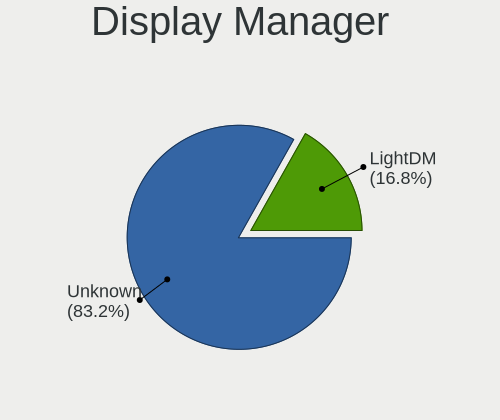
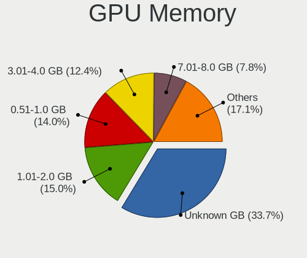
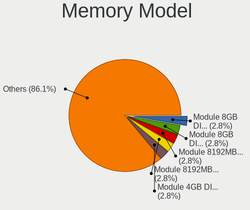
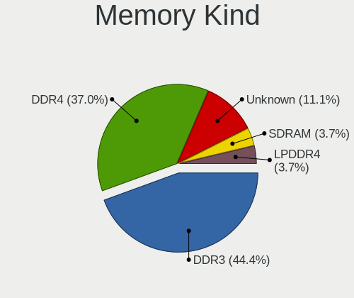

Elementary 6.1 - Tested Hardware & Statistics (Desktops)
--------------------------------------------------------

A project to collect tested hardware configurations for Elementary 6.1.

Anyone can contribute to this report by the [hw-probe](https://github.com/linuxhw/hw-probe) tool:

    sudo -E hw-probe -all -upload

Please contribute! Especially if your hardware is rare.

Contents
--------

* [ Test Cases ](#test-cases)

* [ System ](#system)
  - [ Kernel                   ](#kernel)
  - [ Kernel Family            ](#kernel-family)
  - [ Kernel Major Ver.        ](#kernel-major-ver)
  - [ Arch                     ](#arch)
  - [ DE                       ](#de)
  - [ Display Server           ](#display-server)
  - [ Display Manager          ](#display-manager)
  - [ OS Lang                  ](#os-lang)
  - [ Boot Mode                ](#boot-mode)
  - [ Filesystem               ](#filesystem)
  - [ Part. scheme             ](#part-scheme)
  - [ Dual Boot with Linux/BSD ](#dual-boot-with-linuxbsd)
  - [ Dual Boot (Win)          ](#dual-boot-win)

* [ Board ](#board)
  - [ Vendor                   ](#vendor)
  - [ Model                    ](#model)
  - [ Model Family             ](#model-family)
  - [ MFG Year                 ](#mfg-year)
  - [ Form Factor              ](#form-factor)
  - [ Secure Boot              ](#secure-boot)
  - [ Coreboot                 ](#coreboot)
  - [ RAM Size                 ](#ram-size)
  - [ RAM Used                 ](#ram-used)
  - [ Total Drives             ](#total-drives)
  - [ Has CD-ROM               ](#has-cd-rom)
  - [ Has Ethernet             ](#has-ethernet)
  - [ Has WiFi                 ](#has-wifi)
  - [ Has Bluetooth            ](#has-bluetooth)

* [ Location ](#location)
  - [ Country                  ](#country)
  - [ City                     ](#city)

* [ Drives ](#drives)
  - [ Drive Vendor             ](#drive-vendor)
  - [ Drive Model              ](#drive-model)
  - [ HDD Vendor               ](#hdd-vendor)
  - [ SSD Vendor               ](#ssd-vendor)
  - [ Drive Kind               ](#drive-kind)
  - [ Drive Connector          ](#drive-connector)
  - [ Drive Size               ](#drive-size)
  - [ Space Total              ](#space-total)
  - [ Space Used               ](#space-used)
  - [ Malfunc. Drives          ](#malfunc-drives)
  - [ Malfunc. Drive Vendor    ](#malfunc-drive-vendor)
  - [ Malfunc. HDD Vendor      ](#malfunc-hdd-vendor)
  - [ Malfunc. Drive Kind      ](#malfunc-drive-kind)
  - [ Failed Drives            ](#failed-drives)
  - [ Failed Drive Vendor      ](#failed-drive-vendor)
  - [ Drive Status             ](#drive-status)

* [ Storage controller ](#storage-controller)
  - [ Storage Vendor           ](#storage-vendor)
  - [ Storage Model            ](#storage-model)
  - [ Storage Kind             ](#storage-kind)

* [ Processor ](#processor)
  - [ CPU Vendor               ](#cpu-vendor)
  - [ CPU Model                ](#cpu-model)
  - [ CPU Model Family         ](#cpu-model-family)
  - [ CPU Cores                ](#cpu-cores)
  - [ CPU Sockets              ](#cpu-sockets)
  - [ CPU Threads              ](#cpu-threads)
  - [ CPU Op-Modes             ](#cpu-op-modes)
  - [ CPU Microcode            ](#cpu-microcode)
  - [ CPU Microarch            ](#cpu-microarch)

* [ Graphics ](#graphics)
  - [ GPU Vendor               ](#gpu-vendor)
  - [ GPU Model                ](#gpu-model)
  - [ GPU Combo                ](#gpu-combo)
  - [ GPU Driver               ](#gpu-driver)
  - [ GPU Memory               ](#gpu-memory)

* [ Monitor ](#monitor)
  - [ Monitor Vendor           ](#monitor-vendor)
  - [ Monitor Model            ](#monitor-model)
  - [ Monitor Resolution       ](#monitor-resolution)
  - [ Monitor Diagonal         ](#monitor-diagonal)
  - [ Monitor Width            ](#monitor-width)
  - [ Aspect Ratio             ](#aspect-ratio)
  - [ Monitor Area             ](#monitor-area)
  - [ Pixel Density            ](#pixel-density)
  - [ Multiple Monitors        ](#multiple-monitors)

* [ Network ](#network)
  - [ Net Controller Vendor    ](#net-controller-vendor)
  - [ Net Controller Model     ](#net-controller-model)
  - [ Wireless Vendor          ](#wireless-vendor)
  - [ Wireless Model           ](#wireless-model)
  - [ Ethernet Vendor          ](#ethernet-vendor)
  - [ Ethernet Model           ](#ethernet-model)
  - [ Net Controller Kind      ](#net-controller-kind)
  - [ Used Controller          ](#used-controller)
  - [ NICs                     ](#nics)
  - [ IPv6                     ](#ipv6)

* [ Bluetooth ](#bluetooth)
  - [ Bluetooth Vendor         ](#bluetooth-vendor)
  - [ Bluetooth Model          ](#bluetooth-model)

* [ Sound ](#sound)
  - [ Sound Vendor             ](#sound-vendor)
  - [ Sound Model              ](#sound-model)

* [ Memory ](#memory)
  - [ Memory Vendor            ](#memory-vendor)
  - [ Memory Model             ](#memory-model)
  - [ Memory Kind              ](#memory-kind)
  - [ Memory Form Factor       ](#memory-form-factor)
  - [ Memory Size              ](#memory-size)
  - [ Memory Speed             ](#memory-speed)

* [ Printers & scanners ](#printers--scanners)
  - [ Printer Vendor           ](#printer-vendor)
  - [ Printer Model            ](#printer-model)
  - [ Scanner Vendor           ](#scanner-vendor)
  - [ Scanner Model            ](#scanner-model)

* [ Camera ](#camera)
  - [ Camera Vendor            ](#camera-vendor)
  - [ Camera Model             ](#camera-model)

* [ Security ](#security)
  - [ Fingerprint Vendor       ](#fingerprint-vendor)
  - [ Fingerprint Model        ](#fingerprint-model)
  - [ Chipcard Vendor          ](#chipcard-vendor)
  - [ Chipcard Model           ](#chipcard-model)

* [ Unsupported ](#unsupported)
  - [ Unsupported Devices      ](#unsupported-devices)
  - [ Unsupported Device Types ](#unsupported-device-types)

Test Cases
----------

Total: 257

| Vendor        | Model                       | Probe                                                      | Date         |
|---------------|-----------------------------|------------------------------------------------------------|--------------|
| Unknown       | IPMSB-H61                   | [c104b6462e](https://linux-hardware.org/?probe=c104b6462e) | Aug 26, 2023 |
| Dell          | 0KP561                      | [2b6a6b6139](https://linux-hardware.org/?probe=2b6a6b6139) | Aug 17, 2023 |
| HP            | 0B54h D                     | [c13f21ea22](https://linux-hardware.org/?probe=c13f21ea22) | Jun 29, 2023 |
| Acer          | Veriton X2631G V:1.0        | [99f3070065](https://linux-hardware.org/?probe=99f3070065) | Jun 11, 2023 |
| Gigabyte      | B450M GAMING                | [8ab2ec8df4](https://linux-hardware.org/?probe=8ab2ec8df4) | Jun 09, 2023 |
| HP            | 225E                        | [06c72d2ecd](https://linux-hardware.org/?probe=06c72d2ecd) | May 10, 2023 |
| HP            | 0B54h D                     | [59e9cd0741](https://linux-hardware.org/?probe=59e9cd0741) | Apr 06, 2023 |
| Dell          | 0T7D40 A01                  | [c2174a1837](https://linux-hardware.org/?probe=c2174a1837) | Mar 12, 2023 |
| Acer          | Aspire TC-380               | [563bd52487](https://linux-hardware.org/?probe=563bd52487) | Mar 10, 2023 |
| Dell          | 0J584C                      | [5f16a97f99](https://linux-hardware.org/?probe=5f16a97f99) | Feb 27, 2023 |
| Gigabyte      | Z77MX-D3H                   | [bfd1042a82](https://linux-hardware.org/?probe=bfd1042a82) | Feb 25, 2023 |
| Dell          | 0J584C                      | [f0c7703e3c](https://linux-hardware.org/?probe=f0c7703e3c) | Feb 23, 2023 |
| Dell          | 0J584C                      | [003da08b72](https://linux-hardware.org/?probe=003da08b72) | Feb 22, 2023 |
| ASUSTek       | M4A785TD-V EVO              | [aaa509fed7](https://linux-hardware.org/?probe=aaa509fed7) | Feb 09, 2023 |
| Unknown       | IPMSB-H61                   | [7e13c996bd](https://linux-hardware.org/?probe=7e13c996bd) | Feb 02, 2023 |
| BESSTAR Te... | UM350                       | [ee1ba0e588](https://linux-hardware.org/?probe=ee1ba0e588) | Jan 30, 2023 |
| Gigabyte      | B450 AORUS ELITE            | [e5f6f546d4](https://linux-hardware.org/?probe=e5f6f546d4) | Jan 29, 2023 |
| EVGA          | E689 $                      | [9d4b1aeaa9](https://linux-hardware.org/?probe=9d4b1aeaa9) | Jan 29, 2023 |
| EVGA          | E689 $                      | [be99ae882b](https://linux-hardware.org/?probe=be99ae882b) | Jan 28, 2023 |
| Gigabyte      | GA-990FXA-UD3               | [6e5884ec0c](https://linux-hardware.org/?probe=6e5884ec0c) | Jan 26, 2023 |
| Dell          | 0G261D A00                  | [ac4e94394e](https://linux-hardware.org/?probe=ac4e94394e) | Jan 24, 2023 |
| Unknown       | G41T-M7                     | [026810c423](https://linux-hardware.org/?probe=026810c423) | Jan 22, 2023 |
| Gigabyte      | Z77MX-D3H                   | [2142d5e771](https://linux-hardware.org/?probe=2142d5e771) | Jan 22, 2023 |
| Gigabyte      | Z77MX-D3H                   | [80d8c352b9](https://linux-hardware.org/?probe=80d8c352b9) | Jan 22, 2023 |
| Gigabyte      | A320M-S2H V2-CF             | [b8df2d6479](https://linux-hardware.org/?probe=b8df2d6479) | Jan 11, 2023 |
| Intel         | JSL MRD                     | [d1b9dbaae0](https://linux-hardware.org/?probe=d1b9dbaae0) | Jan 11, 2023 |
| HP            | 8643 SMVB                   | [5187413460](https://linux-hardware.org/?probe=5187413460) | Jan 07, 2023 |
| Acer          | Veriton M2631G V:1.0        | [ebbcc0dda8](https://linux-hardware.org/?probe=ebbcc0dda8) | Jan 07, 2023 |
| ASRock        | H110 Pro BTC+               | [a7ccef79ad](https://linux-hardware.org/?probe=a7ccef79ad) | Dec 30, 2022 |
| Gigabyte      | H61M-S2V-B3                 | [b3970a8e5a](https://linux-hardware.org/?probe=b3970a8e5a) | Dec 29, 2022 |
| ASUSTek       | ROG STRIX B550-A GAMING     | [bc58be5546](https://linux-hardware.org/?probe=bc58be5546) | Dec 27, 2022 |
| ASUSTek       | ROG STRIX B550-A GAMING     | [f9bde62142](https://linux-hardware.org/?probe=f9bde62142) | Dec 27, 2022 |
| Gigabyte      | AB350-Gaming 3-CF           | [c545cf1f08](https://linux-hardware.org/?probe=c545cf1f08) | Dec 25, 2022 |
| Fujitsu       | D3041-A1 S26361-D3041-A1    | [2fa8510855](https://linux-hardware.org/?probe=2fa8510855) | Dec 19, 2022 |
| Foxconn       | 2ABF                        | [10e579b77e](https://linux-hardware.org/?probe=10e579b77e) | Dec 18, 2022 |
| Dell          | 08WKV3 A00                  | [f58a0ffbc3](https://linux-hardware.org/?probe=f58a0ffbc3) | Dec 13, 2022 |
| ASUSTek       | Z170-P                      | [5180b907e3](https://linux-hardware.org/?probe=5180b907e3) | Dec 10, 2022 |
| LORD ELECT... | LORD G4x 775 ICH7 8712 A... | [5ca8db90bb](https://linux-hardware.org/?probe=5ca8db90bb) | Dec 10, 2022 |
| ASUSTek       | PRIME H310M-E R2.0          | [906e4966a6](https://linux-hardware.org/?probe=906e4966a6) | Dec 07, 2022 |
| ASRock        | H55M-LE                     | [9d2066a479](https://linux-hardware.org/?probe=9d2066a479) | Dec 03, 2022 |
| Fujitsu       | D3602-A1 S26361-D3602-A1    | [6f57ed994c](https://linux-hardware.org/?probe=6f57ed994c) | Dec 03, 2022 |
| LORD ELECT... | LORD G4x 775 ICH7 8712 A... | [62b19626ce](https://linux-hardware.org/?probe=62b19626ce) | Dec 03, 2022 |
| ASUSTek       | PRIME H310M-E R2.0          | [19d93a0122](https://linux-hardware.org/?probe=19d93a0122) | Dec 03, 2022 |
| Lenovo        | ThinkCentre M70e 0809D1Y    | [0cd85fa9f3](https://linux-hardware.org/?probe=0cd85fa9f3) | Nov 30, 2022 |
| Dell          | 0TP406                      | [3eceea61d2](https://linux-hardware.org/?probe=3eceea61d2) | Nov 30, 2022 |
| Dell          | 0TP406                      | [d22689331c](https://linux-hardware.org/?probe=d22689331c) | Nov 30, 2022 |
| LattePanda    | Alpha                       | [be819160d5](https://linux-hardware.org/?probe=be819160d5) | Nov 26, 2022 |
| LattePanda    | Alpha                       | [b3c831db4d](https://linux-hardware.org/?probe=b3c831db4d) | Nov 26, 2022 |
| LORD ELECT... | LORD G4x 775 ICH7 8712 A... | [4f230635de](https://linux-hardware.org/?probe=4f230635de) | Nov 19, 2022 |
| Dell          | 0RW199                      | [df40ccbcdb](https://linux-hardware.org/?probe=df40ccbcdb) | Nov 15, 2022 |
| Apple         | Mac-F60DEB81FF30ACF6 Mac... | [4629fb5e08](https://linux-hardware.org/?probe=4629fb5e08) | Nov 13, 2022 |
| ASUSTek       | P8H61-M LX R2.0             | [ddca3f4758](https://linux-hardware.org/?probe=ddca3f4758) | Nov 06, 2022 |
| Gigabyte      | H310M S2H                   | [521297d21c](https://linux-hardware.org/?probe=521297d21c) | Nov 03, 2022 |
| ASUSTek       | TUF Gaming B550M-PLUS       | [919fad100f](https://linux-hardware.org/?probe=919fad100f) | Oct 31, 2022 |
| ASUSTek       | PRIME X570-PRO              | [6d4b1d0bb3](https://linux-hardware.org/?probe=6d4b1d0bb3) | Oct 25, 2022 |
| HP            | 805D                        | [916b6f09ac](https://linux-hardware.org/?probe=916b6f09ac) | Oct 23, 2022 |
| MSI           | Z370 GAMING PLUS            | [ce623178a2](https://linux-hardware.org/?probe=ce623178a2) | Oct 16, 2022 |
| Dell          | 0D28YY A00                  | [435831fd5b](https://linux-hardware.org/?probe=435831fd5b) | Oct 15, 2022 |
| Kraftway      | KWQ67                       | [8346fc15e3](https://linux-hardware.org/?probe=8346fc15e3) | Oct 13, 2022 |
| Kraftway      | KWQ67                       | [d57d34be64](https://linux-hardware.org/?probe=d57d34be64) | Oct 13, 2022 |
| ASUSTek       | TUF Z390-PLUS GAMING        | [88772ad191](https://linux-hardware.org/?probe=88772ad191) | Oct 11, 2022 |
| ASRock        | X370 Taichi                 | [d86c708401](https://linux-hardware.org/?probe=d86c708401) | Sep 30, 2022 |
| Gigabyte      | G41MT-S2                    | [c0b1c8ad8f](https://linux-hardware.org/?probe=c0b1c8ad8f) | Sep 27, 2022 |
| Packard Be... | IMEDIA S1300                | [13b1f0e28e](https://linux-hardware.org/?probe=13b1f0e28e) | Sep 24, 2022 |
| Packard Be... | IMEDIA S1300                | [fae2bea6f3](https://linux-hardware.org/?probe=fae2bea6f3) | Sep 19, 2022 |
| Apple         | Mac-F221BEC8                | [b5f851bd15](https://linux-hardware.org/?probe=b5f851bd15) | Sep 12, 2022 |
| IceWhale T... | ZimaBoard 832 ZMB           | [335a8a059b](https://linux-hardware.org/?probe=335a8a059b) | Sep 12, 2022 |
| Gigabyte      | F2A88XM-D3HP                | [3d269171e7](https://linux-hardware.org/?probe=3d269171e7) | Sep 11, 2022 |
| ASUSTek       | P8H77-V LE                  | [ae533c2bdf](https://linux-hardware.org/?probe=ae533c2bdf) | Sep 07, 2022 |
| Acer          | Aspire X1420G               | [e48b081560](https://linux-hardware.org/?probe=e48b081560) | Sep 04, 2022 |
| ASUSTek       | TUF Gaming Z490-PLUS        | [3a8803f198](https://linux-hardware.org/?probe=3a8803f198) | Sep 01, 2022 |
| Gigabyte      | H370 AORUS GAMING 3 WIFI... | [413bd5a721](https://linux-hardware.org/?probe=413bd5a721) | Aug 29, 2022 |
| ASUSTek       | M2N68-AM SE2                | [0f71a52e11](https://linux-hardware.org/?probe=0f71a52e11) | Aug 28, 2022 |
| Gigabyte      | H61M-S1                     | [6bf1dafdbc](https://linux-hardware.org/?probe=6bf1dafdbc) | Aug 27, 2022 |
| Apple         | Mac-F221BEC8                | [9ffe8ee96e](https://linux-hardware.org/?probe=9ffe8ee96e) | Aug 24, 2022 |
| Apple         | Mac-F221BEC8                | [4709584652](https://linux-hardware.org/?probe=4709584652) | Aug 24, 2022 |
| MSI           | MEG Z490I UNIFY             | [34d2d4f66e](https://linux-hardware.org/?probe=34d2d4f66e) | Aug 24, 2022 |
| Foxconn       | 2ABF                        | [6d7ce1962d](https://linux-hardware.org/?probe=6d7ce1962d) | Aug 24, 2022 |
| ASRock        | N68-VGS3 FX                 | [1d2367ccf7](https://linux-hardware.org/?probe=1d2367ccf7) | Aug 23, 2022 |
| ASUSTek       | TUF Gaming B550M-PLUS       | [595bf9c8a7](https://linux-hardware.org/?probe=595bf9c8a7) | Aug 23, 2022 |
| ASUSTek       | P7H55-M LX                  | [b545a0cf4f](https://linux-hardware.org/?probe=b545a0cf4f) | Aug 19, 2022 |
| ASUSTek       | PRIME B450M-A               | [59456f2a25](https://linux-hardware.org/?probe=59456f2a25) | Aug 16, 2022 |
| HP            | 2AF7                        | [ca8820daa4](https://linux-hardware.org/?probe=ca8820daa4) | Aug 16, 2022 |
| ASUSTek       | P5B                         | [1c5cafd185](https://linux-hardware.org/?probe=1c5cafd185) | Aug 15, 2022 |
| Acer          | Aspire X1420G               | [7be7ab2e7e](https://linux-hardware.org/?probe=7be7ab2e7e) | Jul 31, 2022 |
| ASUSTek       | ROG STRIX B450-F GAMING     | [e99805635f](https://linux-hardware.org/?probe=e99805635f) | Jul 29, 2022 |
| MSI           | B450M PRO-M2 MAX            | [ab8af10726](https://linux-hardware.org/?probe=ab8af10726) | Jul 28, 2022 |
| Gigabyte      | GA-78LMT-USB3               | [d0a69fba02](https://linux-hardware.org/?probe=d0a69fba02) | Jul 23, 2022 |
| Dell          | 00V62H A01                  | [ae809bb317](https://linux-hardware.org/?probe=ae809bb317) | Jul 19, 2022 |
| ASUSTek       | ROG STRIX B360-H GAMING     | [4cc1f4384c](https://linux-hardware.org/?probe=4cc1f4384c) | Jul 12, 2022 |
| Acer          | Aspire X1420G               | [0b7a9cbc2a](https://linux-hardware.org/?probe=0b7a9cbc2a) | Jul 12, 2022 |
| ASUSTek       | P8H61-M LX R2.0             | [3db9c636d0](https://linux-hardware.org/?probe=3db9c636d0) | Jul 09, 2022 |
| MSI           | B450M PRO-VDH MAX           | [b8c450d5fa](https://linux-hardware.org/?probe=b8c450d5fa) | Jul 08, 2022 |
| Intel         | X79Turbo V1.x               | [e4b17550d0](https://linux-hardware.org/?probe=e4b17550d0) | Jul 06, 2022 |
| Gigabyte      | Z87X-OC-CF                  | [654459e245](https://linux-hardware.org/?probe=654459e245) | Jul 03, 2022 |
| ASUSTek       | TUF X470-PLUS GAMING        | [80a981f992](https://linux-hardware.org/?probe=80a981f992) | Jul 01, 2022 |
| Gigabyte      | Z690 AORUS MASTER           | [a8073316f6](https://linux-hardware.org/?probe=a8073316f6) | Jun 26, 2022 |
| ASRock        | Z490 Pro4                   | [f84c8a756c](https://linux-hardware.org/?probe=f84c8a756c) | Jun 25, 2022 |
| MSI           | B85I                        | [886f971d22](https://linux-hardware.org/?probe=886f971d22) | Jun 25, 2022 |
| HP            | 339A                        | [822467af7f](https://linux-hardware.org/?probe=822467af7f) | Jun 25, 2022 |
| T-bao         | MINI PC                     | [6b18c66487](https://linux-hardware.org/?probe=6b18c66487) | Jun 18, 2022 |
| Pegatron      | 2ACD                        | [8c8275099b](https://linux-hardware.org/?probe=8c8275099b) | Jun 16, 2022 |
| ASUSTek       | PRIME B550-PLUS             | [5b8ae292bf](https://linux-hardware.org/?probe=5b8ae292bf) | Jun 14, 2022 |
| ASUSTek       | SABERTOOTH X58              | [4cc4a7c1b3](https://linux-hardware.org/?probe=4cc4a7c1b3) | Jun 11, 2022 |
| HP            | 2B43                        | [6f36772b0c](https://linux-hardware.org/?probe=6f36772b0c) | Jun 10, 2022 |
| Gigabyte      | B450 AORUS ELITE            | [9756188040](https://linux-hardware.org/?probe=9756188040) | Jun 07, 2022 |
| MSI           | MPG X570S CARBON MAX WIF... | [0d57c069a8](https://linux-hardware.org/?probe=0d57c069a8) | Jun 05, 2022 |
| Lenovo        | 3098 SDK0E50510 WIN 2625... | [16f3fff6ad](https://linux-hardware.org/?probe=16f3fff6ad) | Jun 05, 2022 |
| Dell          | 0T7D40 A01                  | [812b41fe55](https://linux-hardware.org/?probe=812b41fe55) | Jun 04, 2022 |
| Lenovo        | 3098 SDK0E50510 WIN 2625... | [b3d970d061](https://linux-hardware.org/?probe=b3d970d061) | Jun 04, 2022 |
| MSI           | B85I                        | [5f29683d93](https://linux-hardware.org/?probe=5f29683d93) | Jun 03, 2022 |
| ASUSTek       | PRIME A320M-K/BR            | [9f4aa60f60](https://linux-hardware.org/?probe=9f4aa60f60) | Jun 02, 2022 |
| ASUSTek       | P5B                         | [12554af571](https://linux-hardware.org/?probe=12554af571) | May 31, 2022 |
| MSI           | MPG X570S CARBON MAX WIF... | [a4f2a9b24b](https://linux-hardware.org/?probe=a4f2a9b24b) | May 27, 2022 |
| MSI           | MPG X570S CARBON MAX WIF... | [3143793e8f](https://linux-hardware.org/?probe=3143793e8f) | May 27, 2022 |
| ASUSTek       | P8H61                       | [5514e95c95](https://linux-hardware.org/?probe=5514e95c95) | May 24, 2022 |
| ASUSTek       | P8H61                       | [873dd31f8e](https://linux-hardware.org/?probe=873dd31f8e) | May 23, 2022 |
| MSI           | H97M-P35                    | [2b5866b09d](https://linux-hardware.org/?probe=2b5866b09d) | May 23, 2022 |
| LORD ELECT... | LORD G4x 775 ICH7 8712 A... | [2e27b6fac9](https://linux-hardware.org/?probe=2e27b6fac9) | May 23, 2022 |
| Biostar       | GF8200C M2+                 | [b80588cbea](https://linux-hardware.org/?probe=b80588cbea) | May 21, 2022 |
| ASUSTek       | P8H61-M LE/USB3             | [6f6a104d35](https://linux-hardware.org/?probe=6f6a104d35) | May 21, 2022 |
| MSI           | B85I                        | [c822196290](https://linux-hardware.org/?probe=c822196290) | May 18, 2022 |
| MSI           | MEG X570 UNIFY              | [4d00452dcb](https://linux-hardware.org/?probe=4d00452dcb) | May 15, 2022 |
| ASUSTek       | SABERTOOTH X58              | [c276639676](https://linux-hardware.org/?probe=c276639676) | May 08, 2022 |
| ASUSTek       | H81M-K                      | [753c7be679](https://linux-hardware.org/?probe=753c7be679) | May 05, 2022 |
| ASRock        | X570 Extreme4               | [98e5f20999](https://linux-hardware.org/?probe=98e5f20999) | May 04, 2022 |
| HP            | 0B48h                       | [4c6e5824f2](https://linux-hardware.org/?probe=4c6e5824f2) | Apr 30, 2022 |
| ASUSTek       | P8Z77-V                     | [b3506ef75d](https://linux-hardware.org/?probe=b3506ef75d) | Apr 29, 2022 |
| Dell          | 0J3C2F A00                  | [464c70eb8d](https://linux-hardware.org/?probe=464c70eb8d) | Apr 27, 2022 |
| ASUSTek       | ROG CROSSHAIR VIII HERO     | [1f10d820f8](https://linux-hardware.org/?probe=1f10d820f8) | Apr 27, 2022 |
| ASUSTek       | ROG CROSSHAIR VIII HERO     | [dfadead480](https://linux-hardware.org/?probe=dfadead480) | Apr 27, 2022 |
| Gigabyte      | B150N Phoenix-WIFI-CF       | [dbaaf867f6](https://linux-hardware.org/?probe=dbaaf867f6) | Apr 25, 2022 |
| ASUSTek       | ROG STRIX Z590-F GAMING ... | [1b0a41c232](https://linux-hardware.org/?probe=1b0a41c232) | Apr 25, 2022 |
| AZW           | GTi                         | [e2d4a0da2e](https://linux-hardware.org/?probe=e2d4a0da2e) | Apr 23, 2022 |
| AZW           | GTi                         | [cde74551bf](https://linux-hardware.org/?probe=cde74551bf) | Apr 23, 2022 |
| ECS           | H61H2-MV                    | [939f87564f](https://linux-hardware.org/?probe=939f87564f) | Apr 21, 2022 |
| MSI           | X99A SLI PLUS               | [0b935aadb3](https://linux-hardware.org/?probe=0b935aadb3) | Apr 19, 2022 |
| ASRock        | Z490 Pro4                   | [67071d11a1](https://linux-hardware.org/?probe=67071d11a1) | Apr 18, 2022 |
| Dell          | 0KV62T A01                  | [0c6e50ed20](https://linux-hardware.org/?probe=0c6e50ed20) | Apr 17, 2022 |
| Dell          | 0KV62T A01                  | [7bed7782c4](https://linux-hardware.org/?probe=7bed7782c4) | Apr 17, 2022 |
| MSI           | B450M PRO-VDH MAX           | [e28ee0bd42](https://linux-hardware.org/?probe=e28ee0bd42) | Apr 16, 2022 |
| HP            | 1494                        | [6ad3ca1745](https://linux-hardware.org/?probe=6ad3ca1745) | Apr 16, 2022 |
| Gigabyte      | H61M-D2H-USB3               | [016243a675](https://linux-hardware.org/?probe=016243a675) | Apr 15, 2022 |
| Fujitsu       | D3531-A1 S26361-D3531-A1    | [46dd533a5e](https://linux-hardware.org/?probe=46dd533a5e) | Apr 14, 2022 |
| ASUSTek       | B85M-G                      | [c6dd82e724](https://linux-hardware.org/?probe=c6dd82e724) | Apr 14, 2022 |
| Gigabyte      | B450 AORUS ELITE            | [dff6de5032](https://linux-hardware.org/?probe=dff6de5032) | Apr 14, 2022 |
| ASUSTek       | B85M-G                      | [e525a26ca8](https://linux-hardware.org/?probe=e525a26ca8) | Apr 14, 2022 |
| Gigabyte      | B450 AORUS ELITE            | [6a2c5f12fd](https://linux-hardware.org/?probe=6a2c5f12fd) | Apr 13, 2022 |
| Dell          | 0K240Y A01                  | [76d4fbf0a6](https://linux-hardware.org/?probe=76d4fbf0a6) | Apr 13, 2022 |
| ASUSTek       | TUF X470-PLUS GAMING        | [3440d2dd8c](https://linux-hardware.org/?probe=3440d2dd8c) | Apr 12, 2022 |
| Lenovo        | 3178 SDK0J40700 WIN 3258... | [637023ab6d](https://linux-hardware.org/?probe=637023ab6d) | Apr 11, 2022 |
| ASUSTek       | PRIME Z390-A                | [21767e12e4](https://linux-hardware.org/?probe=21767e12e4) | Apr 11, 2022 |
| Pegatron      | IPMH61P1                    | [1adcf74c4f](https://linux-hardware.org/?probe=1adcf74c4f) | Apr 10, 2022 |
| ASUSTek       | H110I-PLUS                  | [e367ac99ce](https://linux-hardware.org/?probe=e367ac99ce) | Apr 10, 2022 |
| ASRock        | C226 WS                     | [7c11c1ec43](https://linux-hardware.org/?probe=7c11c1ec43) | Apr 07, 2022 |
| ASUSTek       | STRIKER II FORMULA          | [5dfea21930](https://linux-hardware.org/?probe=5dfea21930) | Apr 07, 2022 |
| ASUSTek       | STRIKER II FORMULA          | [040990b3fc](https://linux-hardware.org/?probe=040990b3fc) | Apr 07, 2022 |
| ASUSTek       | TUF Gaming B460M-PLUS       | [7419ad6a76](https://linux-hardware.org/?probe=7419ad6a76) | Apr 02, 2022 |
| Lenovo        | ThinkCentre M58 6258D3G     | [b67f1750b8](https://linux-hardware.org/?probe=b67f1750b8) | Mar 31, 2022 |
| Lenovo        | ThinkCentre M58 6258D3G     | [1cd22c83f1](https://linux-hardware.org/?probe=1cd22c83f1) | Mar 31, 2022 |
| MSI           | H97 GAMING 3                | [97f38615e3](https://linux-hardware.org/?probe=97f38615e3) | Mar 31, 2022 |
| MSI           | MEG X570 ACE                | [55572b8a7e](https://linux-hardware.org/?probe=55572b8a7e) | Mar 31, 2022 |
| ASUSTek       | Rampage IV GENE             | [c067a4d0e7](https://linux-hardware.org/?probe=c067a4d0e7) | Mar 29, 2022 |
| Dell          | 0C522T A00                  | [33ae998152](https://linux-hardware.org/?probe=33ae998152) | Mar 26, 2022 |
| Dell          | 0C522T A00                  | [90242bb090](https://linux-hardware.org/?probe=90242bb090) | Mar 26, 2022 |
| MSI           | MPG B550 GAMING EDGE WIF... | [7577679057](https://linux-hardware.org/?probe=7577679057) | Mar 25, 2022 |
| Gigabyte      | A320M-S2H-CF                | [a237859a86](https://linux-hardware.org/?probe=a237859a86) | Mar 24, 2022 |
| Intel         | X79Turbo V1.x               | [18b126a753](https://linux-hardware.org/?probe=18b126a753) | Mar 24, 2022 |
| AMI           | Cherry Trail CR             | [bbea34ce64](https://linux-hardware.org/?probe=bbea34ce64) | Mar 22, 2022 |
| AMI           | Cherry Trail CR             | [bc5a34ef7e](https://linux-hardware.org/?probe=bc5a34ef7e) | Mar 20, 2022 |
| ASUSTek       | Rampage IV GENE             | [7f5053b061](https://linux-hardware.org/?probe=7f5053b061) | Mar 16, 2022 |
| ASUSTek       | Rampage IV GENE             | [7ff55a3ca6](https://linux-hardware.org/?probe=7ff55a3ca6) | Mar 16, 2022 |
| ASUSTek       | P8H61-M LX3 R2.0            | [eda8848760](https://linux-hardware.org/?probe=eda8848760) | Mar 15, 2022 |
| AOpen         | D1009 A1A4                  | [a7375d4581](https://linux-hardware.org/?probe=a7375d4581) | Mar 13, 2022 |
| MSI           | B85I                        | [d134c8451b](https://linux-hardware.org/?probe=d134c8451b) | Mar 12, 2022 |
| ASRock        | B450M Pro4                  | [12459fc7ea](https://linux-hardware.org/?probe=12459fc7ea) | Mar 11, 2022 |
| Gigabyte      | B150N Phoenix-WIFI-CF       | [a64818ccea](https://linux-hardware.org/?probe=a64818ccea) | Mar 10, 2022 |
| Biostar       | N68S3B                      | [aa1e6a4c82](https://linux-hardware.org/?probe=aa1e6a4c82) | Mar 10, 2022 |
| ASUSTek       | M11AD                       | [8bb5baaa5a](https://linux-hardware.org/?probe=8bb5baaa5a) | Mar 09, 2022 |
| Biostar       | H61MLV2                     | [d5c330bad8](https://linux-hardware.org/?probe=d5c330bad8) | Mar 08, 2022 |
| HP            | 2ADC                        | [ed0714a64a](https://linux-hardware.org/?probe=ed0714a64a) | Mar 07, 2022 |
| MSI           | B85I                        | [39926596b7](https://linux-hardware.org/?probe=39926596b7) | Mar 07, 2022 |
| Dell          | 0PU052                      | [766b0e4665](https://linux-hardware.org/?probe=766b0e4665) | Mar 06, 2022 |
| Dell          | 0PU052                      | [a8e19bd112](https://linux-hardware.org/?probe=a8e19bd112) | Mar 06, 2022 |
| HP            | 1589                        | [88876808e9](https://linux-hardware.org/?probe=88876808e9) | Mar 05, 2022 |
| HP            | 802E                        | [14c73a40e0](https://linux-hardware.org/?probe=14c73a40e0) | Mar 05, 2022 |
| ASRock        | FM2A58M-DG3+                | [0b7875b1b5](https://linux-hardware.org/?probe=0b7875b1b5) | Mar 05, 2022 |
| ASUSTek       | M4N72-E                     | [c3fe570b4d](https://linux-hardware.org/?probe=c3fe570b4d) | Feb 28, 2022 |
| ASUSTek       | H81-PLUS                    | [e8956dc4ec](https://linux-hardware.org/?probe=e8956dc4ec) | Feb 27, 2022 |
| Gigabyte      | X470 AORUS ULTRA GAMING-... | [a6d5cc0368](https://linux-hardware.org/?probe=a6d5cc0368) | Feb 26, 2022 |
| Gigabyte      | Z390 UD                     | [7ea66813f3](https://linux-hardware.org/?probe=7ea66813f3) | Feb 23, 2022 |
| ASUSTek       | PRIME B450M-GAMING/BR       | [73b31ddab0](https://linux-hardware.org/?probe=73b31ddab0) | Feb 20, 2022 |
| Intel         | DH61BE AAG14062-210         | [00566bb73f](https://linux-hardware.org/?probe=00566bb73f) | Feb 19, 2022 |
| ASUSTek       | M11AD                       | [035887c4ab](https://linux-hardware.org/?probe=035887c4ab) | Feb 18, 2022 |
| ASUSTek       | P5B                         | [fa4c095fd7](https://linux-hardware.org/?probe=fa4c095fd7) | Feb 17, 2022 |
| Intel         | H61                         | [a70c59ad0e](https://linux-hardware.org/?probe=a70c59ad0e) | Feb 17, 2022 |
| ASUSTek       | PRIME Z590-A                | [6beda6e2da](https://linux-hardware.org/?probe=6beda6e2da) | Feb 16, 2022 |
| Biostar       | A68MD PRO                   | [da42cc4da7](https://linux-hardware.org/?probe=da42cc4da7) | Feb 16, 2022 |
| ASUSTek       | PRIME Z590-A                | [825734953d](https://linux-hardware.org/?probe=825734953d) | Feb 13, 2022 |
| MSI           | B85I                        | [898dced271](https://linux-hardware.org/?probe=898dced271) | Feb 13, 2022 |
| Gigabyte      | F2A68HM-H                   | [a2a41e039c](https://linux-hardware.org/?probe=a2a41e039c) | Feb 13, 2022 |
| Gigabyte      | F2A68HM-H                   | [2f3941c9cb](https://linux-hardware.org/?probe=2f3941c9cb) | Feb 12, 2022 |
| ASUSTek       | PRIME A320M-K               | [5f4de1e2b0](https://linux-hardware.org/?probe=5f4de1e2b0) | Feb 12, 2022 |
| ASUSTek       | PRIME B360M-K               | [698e174402](https://linux-hardware.org/?probe=698e174402) | Feb 09, 2022 |
| ASUSTek       | H110M-C                     | [82f3d6edf9](https://linux-hardware.org/?probe=82f3d6edf9) | Feb 09, 2022 |
| MSI           | B450I GAMING PLUS AC        | [a2af859752](https://linux-hardware.org/?probe=a2af859752) | Feb 09, 2022 |
| ECS           | H55H-M                      | [856a42d74b](https://linux-hardware.org/?probe=856a42d74b) | Feb 07, 2022 |
| Lenovo        | NO DPK                      | [4bb7cedbd8](https://linux-hardware.org/?probe=4bb7cedbd8) | Feb 06, 2022 |
| HP            | 802E                        | [31e2fe159c](https://linux-hardware.org/?probe=31e2fe159c) | Feb 05, 2022 |
| ASUSTek       | H110M-C                     | [6ba127c715](https://linux-hardware.org/?probe=6ba127c715) | Feb 04, 2022 |
| ASUSTek       | P5B                         | [9b661f64dd](https://linux-hardware.org/?probe=9b661f64dd) | Feb 04, 2022 |
| Foxconn       | NETBOX nT-435/535 Ver       | [c7d50db62b](https://linux-hardware.org/?probe=c7d50db62b) | Feb 03, 2022 |
| Foxconn       | NETBOX nT-435/535 Ver       | [2ee2be7ccf](https://linux-hardware.org/?probe=2ee2be7ccf) | Feb 03, 2022 |
| HP            | ProLiant ML110 G7           | [2e1dcafe6c](https://linux-hardware.org/?probe=2e1dcafe6c) | Feb 03, 2022 |
| HP            | 339A                        | [cf9dca84ff](https://linux-hardware.org/?probe=cf9dca84ff) | Feb 02, 2022 |
| Unknown       | Unknown                     | [629972c689](https://linux-hardware.org/?probe=629972c689) | Feb 01, 2022 |
| HP            | 805D                        | [19295e5827](https://linux-hardware.org/?probe=19295e5827) | Feb 01, 2022 |
| ASUSTek       | H110I-PLUS                  | [ebeaf681e3](https://linux-hardware.org/?probe=ebeaf681e3) | Feb 01, 2022 |
| Gigabyte      | B75M-D3H                    | [18717f0712](https://linux-hardware.org/?probe=18717f0712) | Feb 01, 2022 |
| MSI           | Z270 KRAIT GAMING           | [17ccbf9c76](https://linux-hardware.org/?probe=17ccbf9c76) | Jan 28, 2022 |
| Gigabyte      | H61M-DS2                    | [e800b95c58](https://linux-hardware.org/?probe=e800b95c58) | Jan 26, 2022 |
| ASRock        | H61M-HVS                    | [8fdf1980ee](https://linux-hardware.org/?probe=8fdf1980ee) | Jan 25, 2022 |
| ASRock        | H61M-HVS                    | [5d19dff1e4](https://linux-hardware.org/?probe=5d19dff1e4) | Jan 25, 2022 |
| Acer          | ConceptD CM100-51A V:1.1    | [663bbd709d](https://linux-hardware.org/?probe=663bbd709d) | Jan 24, 2022 |
| FIRICH        | J1900                       | [937e24af64](https://linux-hardware.org/?probe=937e24af64) | Jan 22, 2022 |
| ASUSTek       | ROG STRIX B360-H GAMING     | [d1505fe489](https://linux-hardware.org/?probe=d1505fe489) | Jan 21, 2022 |
| ASUSTek       | ROG STRIX X570-E GAMING     | [75d67cd8a4](https://linux-hardware.org/?probe=75d67cd8a4) | Jan 20, 2022 |
| ASUSTek       | TUF Gaming B550M-PLUS       | [7a14d864d4](https://linux-hardware.org/?probe=7a14d864d4) | Jan 20, 2022 |
| ASUSTek       | TUF B365M-PLUS GAMING       | [ec51f5ca3e](https://linux-hardware.org/?probe=ec51f5ca3e) | Jan 19, 2022 |
| MSI           | B450 TOMAHAWK MAX II        | [488d339e77](https://linux-hardware.org/?probe=488d339e77) | Jan 19, 2022 |
| MSI           | B450M-A PRO MAX             | [e7225dad8e](https://linux-hardware.org/?probe=e7225dad8e) | Jan 17, 2022 |
| ASUSTek       | H61M-CS                     | [8855875fbd](https://linux-hardware.org/?probe=8855875fbd) | Jan 14, 2022 |
| Unknown       | T3 MRD                      | [33392a90ce](https://linux-hardware.org/?probe=33392a90ce) | Jan 13, 2022 |
| MSI           | X470 GAMING PLUS MAX        | [00a00c3cac](https://linux-hardware.org/?probe=00a00c3cac) | Jan 13, 2022 |
| ASUSTek       | M5A78L-M LX3                | [39f3687349](https://linux-hardware.org/?probe=39f3687349) | Jan 12, 2022 |
| Foxconn       | 2AB1                        | [07faf9a309](https://linux-hardware.org/?probe=07faf9a309) | Jan 12, 2022 |
| ASUSTek       | H110M-C                     | [be4291793d](https://linux-hardware.org/?probe=be4291793d) | Jan 10, 2022 |
| Gigabyte      | X570 AORUS ELITE            | [7ce29e0c54](https://linux-hardware.org/?probe=7ce29e0c54) | Jan 09, 2022 |
| HP            | 8597                        | [09ed815dd0](https://linux-hardware.org/?probe=09ed815dd0) | Jan 08, 2022 |
| Gigabyte      | GA-970A-D3                  | [b1c9832ce6](https://linux-hardware.org/?probe=b1c9832ce6) | Jan 07, 2022 |
| ASRock        | Z370 Pro4                   | [51cba69624](https://linux-hardware.org/?probe=51cba69624) | Jan 06, 2022 |
| ASRock        | B450M-HDV R4.0              | [20dfc25b62](https://linux-hardware.org/?probe=20dfc25b62) | Jan 05, 2022 |
| Gigabyte      | B85M-DS3H-A                 | [cd6abb9f49](https://linux-hardware.org/?probe=cd6abb9f49) | Jan 03, 2022 |
| MSI           | 2A9C                        | [8d08f7f383](https://linux-hardware.org/?probe=8d08f7f383) | Dec 31, 2021 |
| HP            | 3397                        | [323dc8992b](https://linux-hardware.org/?probe=323dc8992b) | Dec 31, 2021 |
| ASUSTek       | X79-DELUXE                  | [00b9dd3788](https://linux-hardware.org/?probe=00b9dd3788) | Dec 30, 2021 |
| HP            | 1589                        | [d123a8de64](https://linux-hardware.org/?probe=d123a8de64) | Dec 30, 2021 |
| Foxconn       | 2AB1                        | [bcd6fc46cc](https://linux-hardware.org/?probe=bcd6fc46cc) | Dec 30, 2021 |
| ASUSTek       | TUF Gaming B550M-PLUS       | [5f67c759fe](https://linux-hardware.org/?probe=5f67c759fe) | Dec 28, 2021 |
| Gigabyte      | Z390 UD                     | [2399fa64ba](https://linux-hardware.org/?probe=2399fa64ba) | Dec 26, 2021 |
| Apple         | Mac-F42C88C8 Proto1         | [783618fe4b](https://linux-hardware.org/?probe=783618fe4b) | Dec 23, 2021 |
| ASUSTek       | H97-PLUS                    | [cba91c2ad2](https://linux-hardware.org/?probe=cba91c2ad2) | Dec 22, 2021 |
| MSI           | B450-A PRO MAX              | [f14eef1ae6](https://linux-hardware.org/?probe=f14eef1ae6) | Dec 20, 2021 |
| Gigabyte      | H310M S2P                   | [a931eb10f0](https://linux-hardware.org/?probe=a931eb10f0) | Dec 19, 2021 |
| Foxconn       | 2AB1                        | [b789981cc4](https://linux-hardware.org/?probe=b789981cc4) | Dec 17, 2021 |
| Gigabyte      | Z590 AORUS ELITE AX         | [c068e358e8](https://linux-hardware.org/?probe=c068e358e8) | Dec 16, 2021 |
| ASUSTek       | M5A78L-M LX3                | [720cc7a45f](https://linux-hardware.org/?probe=720cc7a45f) | Dec 15, 2021 |

System
------

Kernel
------

Version of the Linux kernel

| Version                | Desktops | Percent |
|------------------------|----------|---------|
| 5.11.0-43-generic      | 36       | 17.22%  |
| 5.13.0-39-generic      | 17       | 8.13%   |
| 5.13.0-28-generic      | 16       | 7.66%   |
| 5.15.0-46-generic      | 14       | 6.7%    |
| 5.13.0-27-generic      | 10       | 4.78%   |
| 5.13.0-40-generic      | 9        | 4.31%   |
| 5.13.0-30-generic      | 9        | 4.31%   |
| 5.15.0-56-generic      | 8        | 3.83%   |
| 5.13.0-35-generic      | 7        | 3.35%   |
| 5.13.0-37-generic      | 6        | 2.87%   |
| 5.15.0-58-generic      | 5        | 2.39%   |
| 5.13.0-52-generic      | 5        | 2.39%   |
| 5.13.0-51-generic      | 5        | 2.39%   |
| 5.11.0-41-generic      | 5        | 2.39%   |
| 5.15.0-53-generic      | 4        | 1.91%   |
| 5.15.0-52-generic      | 4        | 1.91%   |
| 5.15.0-41-generic      | 4        | 1.91%   |
| 5.13.0-44-generic      | 4        | 1.91%   |
| 5.11.0-44-generic      | 4        | 1.91%   |
| 5.15.0-57-generic      | 3        | 1.44%   |
| 5.15.0-50-generic      | 3        | 1.44%   |
| 5.15.0-48-generic      | 3        | 1.44%   |
| 5.13.0-48-generic      | 3        | 1.44%   |
| 5.15.0-73-generic      | 2        | 0.96%   |
| 5.15.0-69-generic      | 2        | 0.96%   |
| 5.13.0-41-generic      | 2        | 0.96%   |
| 5.13.0-25-generic      | 2        | 0.96%   |
| 5.11.0-46-generic      | 2        | 0.96%   |
| 5.11.0-40-generic      | 2        | 0.96%   |
| 6.1.8-x64v2-xanmod1    | 1        | 0.48%   |
| 5.17.3-xanmod1         | 1        | 0.48%   |
| 5.16.15-051615-generic | 1        | 0.48%   |
| 5.15.36-xanmod1        | 1        | 0.48%   |
| 5.15.0-79-generic      | 1        | 0.48%   |
| 5.15.0-76-generic      | 1        | 0.48%   |
| 5.15.0-71-generic      | 1        | 0.48%   |
| 5.15.0-60-generic      | 1        | 0.48%   |
| 5.14.0-1042-oem        | 1        | 0.48%   |
| 5.13.0-28-lowlatency   | 1        | 0.48%   |
| 5.13.0-22-generic      | 1        | 0.48%   |

Kernel Family
-------------

Linux kernel without a distro release

| Version | Desktops | Percent |
|---------|----------|---------|
| 5.13.0  | 87       | 44.85%  |
| 5.15.0  | 53       | 27.32%  |
| 5.11.0  | 49       | 25.26%  |
| 6.1.8   | 1        | 0.52%   |
| 5.17.3  | 1        | 0.52%   |
| 5.16.15 | 1        | 0.52%   |
| 5.15.36 | 1        | 0.52%   |
| 5.14.0  | 1        | 0.52%   |

Kernel Major Ver.
-----------------

Linux kernel major version

| Version | Desktops | Percent |
|---------|----------|---------|
| 5.13    | 87       | 44.85%  |
| 5.15    | 54       | 27.84%  |
| 5.11    | 49       | 25.26%  |
| 6.1     | 1        | 0.52%   |
| 5.17    | 1        | 0.52%   |
| 5.16    | 1        | 0.52%   |
| 5.14    | 1        | 0.52%   |

Arch
----

OS architecture (x86_64, i586, etc.)

| Name   | Desktops | Percent |
|--------|----------|---------|
| x86_64 | 184      | 100%    |

DE
--

Desktop Environment

| Name     | Desktops | Percent |
|----------|----------|---------|
| Pantheon | 183      | 98.92%  |
| KDE5     | 1        | 0.54%   |
| GNOME    | 1        | 0.54%   |

Display Server
--------------

X11 or Wayland

| Name | Desktops | Percent |
|------|----------|---------|
| X11  | 184      | 100%    |

Display Manager
---------------

SDDM, LightDM, etc.

| Name    | Desktops | Percent |
|---------|----------|---------|
| Unknown | 157      | 83.96%  |
| LightDM | 30       | 16.04%  |

OS Lang
-------

Language

| Lang  | Desktops | Percent |
|-------|----------|---------|
| en_US | 77       | 41.4%   |
| de_DE | 22       | 11.83%  |
| fr_FR | 14       | 7.53%   |
| es_ES | 14       | 7.53%   |
| ru_RU | 12       | 6.45%   |
| pt_BR | 8        | 4.3%    |
| it_IT | 8        | 4.3%    |
| en_GB | 7        | 3.76%   |
| pt_PT | 3        | 1.61%   |
| pl_PL | 3        | 1.61%   |
| en_CA | 3        | 1.61%   |
| tr_TR | 2        | 1.08%   |
| ja_JP | 2        | 1.08%   |
| en_AU | 2        | 1.08%   |
| zh_CN | 1        | 0.54%   |
| uk_UA | 1        | 0.54%   |
| sr_RS | 1        | 0.54%   |
| nl_NL | 1        | 0.54%   |
| nb_NO | 1        | 0.54%   |
| id_ID | 1        | 0.54%   |
| fr_CA | 1        | 0.54%   |
| de_CH | 1        | 0.54%   |
| C     | 1        | 0.54%   |

Boot Mode
---------

EFI or BIOS

| Mode | Desktops | Percent |
|------|----------|---------|
| EFI  | 99       | 52.66%  |
| BIOS | 89       | 47.34%  |

Filesystem
----------

Type of filesystem

| Type     | Desktops | Percent |
|----------|----------|---------|
| Ext4     | 175      | 94.59%  |
| Btrfs    | 5        | 2.7%    |
| Xfs      | 2        | 1.08%   |
| Tmpfs    | 1        | 0.54%   |
| Reiserfs | 1        | 0.54%   |
| Overlay  | 1        | 0.54%   |

Part. scheme
------------

Scheme of partitioning

| Type    | Desktops | Percent |
|---------|----------|---------|
| Unknown | 161      | 86.56%  |
| GPT     | 19       | 10.22%  |
| MBR     | 6        | 3.23%   |

Dual Boot with Linux/BSD
------------------------

Hosting more than one Linux/BSD

| Dual boot | Desktops | Percent |
|-----------|----------|---------|
| No        | 178      | 95.7%   |
| Yes       | 8        | 4.3%    |

Dual Boot (Win)
---------------

Hosting Linux and Windows

| Dual boot | Desktops | Percent |
|-----------|----------|---------|
| No        | 172      | 92.97%  |
| Yes       | 13       | 7.03%   |

Board
-----

Vendor
------

Motherboard manufacturer

| Name                | Desktops | Percent |
|---------------------|----------|---------|
| ASUSTek Computer    | 46       | 25%     |
| Gigabyte Technology | 29       | 15.76%  |
| MSI                 | 19       | 10.33%  |
| Hewlett-Packard     | 16       | 8.7%    |
| Dell                | 14       | 7.61%   |
| ASRock              | 12       | 6.52%   |
| Lenovo              | 5        | 2.72%   |
| Acer                | 5        | 2.72%   |
| Intel               | 4        | 2.17%   |
| Foxconn             | 4        | 2.17%   |
| Biostar             | 4        | 2.17%   |
| Unknown             | 4        | 2.17%   |
| Fujitsu             | 3        | 1.63%   |
| Apple               | 3        | 1.63%   |
| Pegatron            | 2        | 1.09%   |
| ECS                 | 2        | 1.09%   |
| T-bao               | 1        | 0.54%   |
| Packard Bell        | 1        | 0.54%   |
| LORD ELECTRONICS    | 1        | 0.54%   |
| LattePanda          | 1        | 0.54%   |
| Kraftway            | 1        | 0.54%   |
| IceWhale Technology | 1        | 0.54%   |
| FIRICH              | 1        | 0.54%   |
| EVGA                | 1        | 0.54%   |
| BESSTAR Tech        | 1        | 0.54%   |
| AZW                 | 1        | 0.54%   |
| AOpen               | 1        | 0.54%   |
| AMI                 | 1        | 0.54%   |

Model
-----

Motherboard model

| Name                                              | Desktops | Percent |
|---------------------------------------------------|----------|---------|
| ASUS All Series                                   | 4        | 2.17%   |
| Unknown                                           | 4        | 2.17%   |
| MSI MS-7C35                                       | 2        | 1.09%   |
| HP Compaq Pro 6300 MT                             | 2        | 1.09%   |
| Gigabyte Z390 UD                                  | 2        | 1.09%   |
| Dell OptiPlex 790                                 | 2        | 1.09%   |
| ASUS TUF Gaming B550M-PLUS                        | 2        | 1.09%   |
| T-bao MINI PC                                     | 1        | 0.54%   |
| Pegatron p7-1174                                  | 1        | 0.54%   |
| Pegatron IPMH61P1                                 | 1        | 0.54%   |
| Packard Bell IMEDIA S1300                         | 1        | 0.54%   |
| MSI PPPPP-CCC#MMMMMMMM                            | 1        | 0.54%   |
| MSI MS-7D52                                       | 1        | 0.54%   |
| MSI MS-7C91                                       | 1        | 0.54%   |
| MSI MS-7C77                                       | 1        | 0.54%   |
| MSI MS-7C52                                       | 1        | 0.54%   |
| MSI MS-7C02                                       | 1        | 0.54%   |
| MSI MS-7B86                                       | 1        | 0.54%   |
| MSI MS-7B84                                       | 1        | 0.54%   |
| MSI MS-7B79                                       | 1        | 0.54%   |
| MSI MS-7B61                                       | 1        | 0.54%   |
| MSI MS-7A59                                       | 1        | 0.54%   |
| MSI MS-7A40                                       | 1        | 0.54%   |
| MSI MS-7A38                                       | 1        | 0.54%   |
| MSI MS-7918                                       | 1        | 0.54%   |
| MSI MS-7885                                       | 1        | 0.54%   |
| MSI MS-7851                                       | 1        | 0.54%   |
| MSI MS-7817                                       | 1        | 0.54%   |
| LORD ELECTRONICS LORD G4x 775 ICH7 8712 As Design | 1        | 0.54%   |
| Lenovo ThinkCentre M73 10B6001SUS                 | 1        | 0.54%   |
| Lenovo ThinkCentre M72e 3664AD7                   | 1        | 0.54%   |
| Lenovo ThinkCentre M70e 0809D1Y                   | 1        | 0.54%   |
| Lenovo ThinkCentre M58 6258D3G                    | 1        | 0.54%   |
| Lenovo IdeaCentre 510S-07ICK 90LX006TGE           | 1        | 0.54%   |
| LattePanda Alpha                                  | 1        | 0.54%   |
| Kraftway Credo KCxx                               | 1        | 0.54%   |
| Intel X79                                         | 1        | 0.54%   |
| Intel Jasper Lake Client Platform                 | 1        | 0.54%   |
| Intel H61                                         | 1        | 0.54%   |
| Intel DH61BE AAG14062-210                         | 1        | 0.54%   |

Model Family
------------

Motherboard model prefix

| Name                   | Desktops | Percent |
|------------------------|----------|---------|
| Dell OptiPlex          | 10       | 5.43%   |
| ASUS PRIME             | 9        | 4.89%   |
| ASUS TUF               | 7        | 3.8%    |
| ASUS ROG               | 6        | 3.26%   |
| Lenovo ThinkCentre     | 4        | 2.17%   |
| HP Compaq              | 4        | 2.17%   |
| ASUS All               | 4        | 2.17%   |
| Unknown                | 4        | 2.17%   |
| Fujitsu ESPRIMO        | 3        | 1.63%   |
| ASUS P8H61-M           | 3        | 1.63%   |
| MSI MS-7C35            | 2        | 1.09%   |
| HP ProDesk             | 2        | 1.09%   |
| Gigabyte Z390          | 2        | 1.09%   |
| Gigabyte H310M         | 2        | 1.09%   |
| Gigabyte A320M-S2H     | 2        | 1.09%   |
| Dell Precision         | 2        | 1.09%   |
| Acer Veriton           | 2        | 1.09%   |
| Acer Aspire            | 2        | 1.09%   |
| T-bao MINI             | 1        | 0.54%   |
| Pegatron p7-1174       | 1        | 0.54%   |
| Pegatron IPMH61P1      | 1        | 0.54%   |
| Packard Bell IMEDIA    | 1        | 0.54%   |
| MSI PPPPP-CCC#MMMMMMMM | 1        | 0.54%   |
| MSI MS-7D52            | 1        | 0.54%   |
| MSI MS-7C91            | 1        | 0.54%   |
| MSI MS-7C77            | 1        | 0.54%   |
| MSI MS-7C52            | 1        | 0.54%   |
| MSI MS-7C02            | 1        | 0.54%   |
| MSI MS-7B86            | 1        | 0.54%   |
| MSI MS-7B84            | 1        | 0.54%   |
| MSI MS-7B79            | 1        | 0.54%   |
| MSI MS-7B61            | 1        | 0.54%   |
| MSI MS-7A59            | 1        | 0.54%   |
| MSI MS-7A40            | 1        | 0.54%   |
| MSI MS-7A38            | 1        | 0.54%   |
| MSI MS-7918            | 1        | 0.54%   |
| MSI MS-7885            | 1        | 0.54%   |
| MSI MS-7851            | 1        | 0.54%   |
| MSI MS-7817            | 1        | 0.54%   |
| LORD ELECTRONICS LORD  | 1        | 0.54%   |

MFG Year
--------

Motherboard manufacture year

| Year | Desktops | Percent |
|------|----------|---------|
| 2018 | 24       | 13.04%  |
| 2012 | 23       | 12.5%   |
| 2010 | 18       | 9.78%   |
| 2020 | 15       | 8.15%   |
| 2011 | 15       | 8.15%   |
| 2019 | 14       | 7.61%   |
| 2014 | 14       | 7.61%   |
| 2013 | 11       | 5.98%   |
| 2015 | 10       | 5.43%   |
| 2021 | 9        | 4.89%   |
| 2017 | 9        | 4.89%   |
| 2022 | 5        | 2.72%   |
| 2016 | 5        | 2.72%   |
| 2009 | 4        | 2.17%   |
| 2008 | 4        | 2.17%   |
| 2007 | 3        | 1.63%   |
| 2006 | 1        | 0.54%   |

Form Factor
-----------

Physical design of the computer

| Name    | Desktops | Percent |
|---------|----------|---------|
| Desktop | 184      | 100%    |

Secure Boot
-----------

Enabled or disabled

| State    | Desktops | Percent |
|----------|----------|---------|
| Disabled | 175      | 95.11%  |
| Enabled  | 9        | 4.89%   |

Coreboot
--------

Have coreboot on board

| Used | Desktops | Percent |
|------|----------|---------|
| No   | 184      | 100%    |

RAM Size
--------

Total RAM memory

| Size in GB  | Desktops | Percent |
|-------------|----------|---------|
| 16.01-24.0  | 40       | 21.51%  |
| 8.01-16.0   | 39       | 20.97%  |
| 32.01-64.0  | 33       | 17.74%  |
| 4.01-8.0    | 28       | 15.05%  |
| 3.01-4.0    | 28       | 15.05%  |
| 64.01-256.0 | 6        | 3.23%   |
| 24.01-32.0  | 5        | 2.69%   |
| 1.01-2.0    | 5        | 2.69%   |
| 2.01-3.0    | 2        | 1.08%   |

RAM Used
--------

Used RAM memory

| Used GB   | Desktops | Percent |
|-----------|----------|---------|
| 1.01-2.0  | 76       | 37.07%  |
| 2.01-3.0  | 58       | 28.29%  |
| 4.01-8.0  | 33       | 16.1%   |
| 3.01-4.0  | 25       | 12.2%   |
| 8.01-16.0 | 8        | 3.9%    |
| 0.51-1.0  | 5        | 2.44%   |

Total Drives
------------

Number of drives on board

| Drives | Desktops | Percent |
|--------|----------|---------|
| 1      | 65       | 34.39%  |
| 2      | 63       | 33.33%  |
| 3      | 31       | 16.4%   |
| 4      | 18       | 9.52%   |
| 5      | 5        | 2.65%   |
| 6      | 4        | 2.12%   |
| 7      | 2        | 1.06%   |
| 0      | 1        | 0.53%   |

Has CD-ROM
----------

Has CD-ROM on board

| Presented | Desktops | Percent |
|-----------|----------|---------|
| No        | 101      | 53.72%  |
| Yes       | 87       | 46.28%  |

Has Ethernet
------------

Has Ethernet on board

| Presented | Desktops | Percent |
|-----------|----------|---------|
| Yes       | 184      | 100%    |

Has WiFi
--------

Has WiFi module

| Presented | Desktops | Percent |
|-----------|----------|---------|
| No        | 94       | 50.27%  |
| Yes       | 93       | 49.73%  |

Has Bluetooth
-------------

Has Bluetooth module

| Presented | Desktops | Percent |
|-----------|----------|---------|
| No        | 115      | 61.83%  |
| Yes       | 71       | 38.17%  |

Location
--------

Country
-------

Geographic location (country)

| Country      | Desktops | Percent |
|--------------|----------|---------|
| USA          | 29       | 15.76%  |
| Germany      | 20       | 10.87%  |
| Russia       | 13       | 7.07%   |
| France       | 11       | 5.98%   |
| Brazil       | 11       | 5.98%   |
| UK           | 10       | 5.43%   |
| Spain        | 8        | 4.35%   |
| Italy        | 8        | 4.35%   |
| Canada       | 7        | 3.8%    |
| Indonesia    | 6        | 3.26%   |
| Switzerland  | 5        | 2.72%   |
| Poland       | 4        | 2.17%   |
| Australia    | 4        | 2.17%   |
| Turkey       | 3        | 1.63%   |
| Japan        | 3        | 1.63%   |
| India        | 3        | 1.63%   |
| Colombia     | 3        | 1.63%   |
| Austria      | 3        | 1.63%   |
| Argentina    | 3        | 1.63%   |
| Portugal     | 2        | 1.09%   |
| Norway       | 2        | 1.09%   |
| Netherlands  | 2        | 1.09%   |
| Iran         | 2        | 1.09%   |
| Thailand     | 1        | 0.54%   |
| Sweden       | 1        | 0.54%   |
| Sri Lanka    | 1        | 0.54%   |
| South Africa | 1        | 0.54%   |
| Slovenia     | 1        | 0.54%   |
| Serbia       | 1        | 0.54%   |
| Romania      | 1        | 0.54%   |
| Pakistan     | 1        | 0.54%   |
| New Zealand  | 1        | 0.54%   |
| Mexico       | 1        | 0.54%   |
| Malaysia     | 1        | 0.54%   |
| Lithuania    | 1        | 0.54%   |
| Libya        | 1        | 0.54%   |
| Kenya        | 1        | 0.54%   |
| Israel       | 1        | 0.54%   |
| Ireland      | 1        | 0.54%   |
| Hong Kong    | 1        | 0.54%   |

City
----

Geographic location (city)

| City          | Desktops | Percent |
|---------------|----------|---------|
| Moscow        | 4        | 2.02%   |
| Warsaw        | 3        | 1.52%   |
| Hamburg       | 3        | 1.52%   |
| Caslano       | 3        | 1.52%   |
| Vienna        | 2        | 1.01%   |
| Tangerang     | 2        | 1.01%   |
| Sao Vicente   | 2        | 1.01%   |
| Sao Paulo     | 2        | 1.01%   |
| Paris         | 2        | 1.01%   |
| Istanbul      | 2        | 1.01%   |
| Denver        | 2        | 1.01%   |
| Brisbane      | 2        | 1.01%   |
| Bandung       | 2        | 1.01%   |
| Yucca Valley  | 1        | 0.51%   |
| Yokohama      | 1        | 0.51%   |
| Yarang        | 1        | 0.51%   |
| Wroclaw       | 1        | 0.51%   |
| Woolloongabba | 1        | 0.51%   |
| Woodbridge    | 1        | 0.51%   |
| Wolgast       | 1        | 0.51%   |
| Windsor       | 1        | 0.51%   |
| Werneck       | 1        | 0.51%   |
| Walnut Creek  | 1        | 0.51%   |
| Vanse         | 1        | 0.51%   |
| Trondheim     | 1        | 0.51%   |
| Troisdorf     | 1        | 0.51%   |
| Tripoli       | 1        | 0.51%   |
| Tournus       | 1        | 0.51%   |
| Toronto       | 1        | 0.51%   |
| Thrissur      | 1        | 0.51%   |
| Teresina      | 1        | 0.51%   |
| Tel Aviv      | 1        | 0.51%   |
| Tehran        | 1        | 0.51%   |
| Tacoma        | 1        | 0.51%   |
| Sydney        | 1        | 0.51%   |
| Suresnes      | 1        | 0.51%   |
| Surabaya      | 1        | 0.51%   |
| Stuttgart     | 1        | 0.51%   |
| St Petersburg | 1        | 0.51%   |
| Spello        | 1        | 0.51%   |

Drives
------

Drive Vendor
------------

Hard drive vendors

| Vendor                    | Desktops | Drives | Percent |
|---------------------------|----------|--------|---------|
| WDC                       | 59       | 90     | 17.4%   |
| Seagate                   | 57       | 82     | 16.81%  |
| Samsung Electronics       | 46       | 73     | 13.57%  |
| Kingston                  | 25       | 33     | 7.37%   |
| Toshiba                   | 19       | 27     | 5.6%    |
| SanDisk                   | 12       | 15     | 3.54%   |
| Crucial                   | 12       | 15     | 3.54%   |
| Hitachi                   | 9        | 11     | 2.65%   |
| Unknown                   | 7        | 15     | 2.06%   |
| PNY                       | 7        | 11     | 2.06%   |
| Micron/Crucial Technology | 6        | 10     | 1.77%   |
| Intel                     | 6        | 6      | 1.77%   |
| Phison                    | 5        | 5      | 1.47%   |
| A-DATA Technology         | 5        | 5      | 1.47%   |
| Micron Technology         | 4        | 5      | 1.18%   |
| China                     | 4        | 6      | 1.18%   |
| Team                      | 3        | 5      | 0.88%   |
| SPCC                      | 3        | 3      | 0.88%   |
| Maxtor                    | 3        | 3      | 0.88%   |
| JMicron Technology        | 3        | 3      | 0.88%   |
| HUSKY                     | 3        | 4      | 0.88%   |
| HGST                      | 3        | 3      | 0.88%   |
| ASMT                      | 3        | 3      | 0.88%   |
| Transcend                 | 2        | 2      | 0.59%   |
| Silicon Motion            | 2        | 2      | 0.59%   |
| Realtek Semiconductor     | 2        | 2      | 0.59%   |
| Plextor                   | 2        | 3      | 0.59%   |
| OCZ                       | 2        | 5      | 0.59%   |
| LITEON                    | 2        | 2      | 0.59%   |
| Corsair                   | 2        | 2      | 0.59%   |
| XPG                       | 1        | 1      | 0.29%   |
| tigo                      | 1        | 1      | 0.29%   |
| SK hynix                  | 1        | 1      | 0.29%   |
| Phison Electronics        | 1        | 1      | 0.29%   |
| Patriot                   | 1        | 1      | 0.29%   |
| OCZ-VERTEX2               | 1        | 1      | 0.29%   |
| Netac                     | 1        | 1      | 0.29%   |
| MidasForce                | 1        | 1      | 0.29%   |
| Lexar                     | 1        | 1      | 0.29%   |
| Leven                     | 1        | 1      | 0.29%   |

Drive Model
-----------

Hard drive models

| Model                                               | Desktops | Percent |
|-----------------------------------------------------|----------|---------|
| Samsung NVMe SSD Drive 500GB                        | 7        | 1.82%   |
| Toshiba DT01ACA050 500GB                            | 5        | 1.3%    |
| Seagate ST500DM002-1BD142 500GB                     | 5        | 1.3%    |
| Seagate ST1000DM003-1ER162 1TB                      | 5        | 1.3%    |
| WDC WD5000AAKX-00ERMA0 500GB                        | 4        | 1.04%   |
| Samsung SSD 860 EVO 250GB                           | 4        | 1.04%   |
| Samsung NVMe SSD Controller SM981/PM981/PM983 500GB | 4        | 1.04%   |
| Micron/Crucial NVMe SSD Drive 1TB                   | 4        | 1.04%   |
| Kingston SA400S37240G 240GB SSD                     | 4        | 1.04%   |
| Kingston SA400S37120G 120GB SSD                     | 4        | 1.04%   |
| Crucial CT240BX500SSD1 240GB                        | 4        | 1.04%   |
| WDC WD10EZEX-08WN4A0 1TB                            | 3        | 0.78%   |
| WDC WD10EZEX-00BN5A0 1TB                            | 3        | 0.78%   |
| Unknown SD/MMC 2GB                                  | 3        | 0.78%   |
| Unknown M.S./M.S.Pro/HG 16GB                        | 3        | 0.78%   |
| Toshiba DT01ACA100 1TB                              | 3        | 0.78%   |
| Seagate ST3500418AS 500GB                           | 3        | 0.78%   |
| Seagate ST1000DM010-2EP102 1TB                      | 3        | 0.78%   |
| Samsung SSD 860 EVO 1TB                             | 3        | 0.78%   |
| Samsung SSD 850 EVO 250GB                           | 3        | 0.78%   |
| Phison NVMe SSD Drive 1TB                           | 3        | 0.78%   |
| Kingston SV300S37A120G 120GB SSD                    | 3        | 0.78%   |
| Kingston NVMe SSD Drive 1TB                         | 3        | 0.78%   |
| HUSKY SSD 128GB                                     | 3        | 0.78%   |
| WDC WD5000AAKX-001CA0 500GB                         | 2        | 0.52%   |
| WDC WD5000AAKS-00UU3A0 500GB                        | 2        | 0.52%   |
| WDC WD40EFRX-68N32N0 4TB                            | 2        | 0.52%   |
| WDC WD10EADS-00L5B1 1TB                             | 2        | 0.52%   |
| Unknown MMC Card  32GB                              | 2        | 0.52%   |
| Toshiba HDWD110 1TB                                 | 2        | 0.52%   |
| Seagate ST3500630AS 500GB                           | 2        | 0.52%   |
| Seagate ST3500413AS 500GB                           | 2        | 0.52%   |
| Seagate ST3160815AS 160GB                           | 2        | 0.52%   |
| Seagate ST31000528AS 1TB                            | 2        | 0.52%   |
| Seagate ST2000DX002-2DV164 2TB                      | 2        | 0.52%   |
| Seagate ST2000DM001-9YN164 2TB                      | 2        | 0.52%   |
| Seagate ST1000DM003-1CH162 1TB                      | 2        | 0.52%   |
| SanDisk SDSSDHP256G 256GB                           | 2        | 0.52%   |
| Samsung SSD 870 EVO 1TB                             | 2        | 0.52%   |
| Samsung SSD 860 QVO 1TB                             | 2        | 0.52%   |

HDD Vendor
----------

Hard disk drive vendors

| Vendor              | Desktops | Drives | Percent |
|---------------------|----------|--------|---------|
| Seagate             | 54       | 78     | 35.53%  |
| WDC                 | 51       | 72     | 33.55%  |
| Toshiba             | 18       | 26     | 11.84%  |
| Samsung Electronics | 10       | 12     | 6.58%   |
| Hitachi             | 9        | 11     | 5.92%   |
| HGST                | 3        | 3      | 1.97%   |
| Maxtor              | 2        | 2      | 1.32%   |
| ASMT                | 2        | 2      | 1.32%   |
| Unknown             | 1        | 1      | 0.66%   |
| Hewlett-Packard     | 1        | 1      | 0.66%   |
| Fujitsu             | 1        | 1      | 0.66%   |

SSD Vendor
----------

Solid state drive vendors

| Vendor              | Desktops | Drives | Percent |
|---------------------|----------|--------|---------|
| Samsung Electronics | 24       | 38     | 19.2%   |
| Kingston            | 19       | 23     | 15.2%   |
| Crucial             | 11       | 13     | 8.8%    |
| SanDisk             | 10       | 12     | 8%      |
| WDC                 | 7        | 12     | 5.6%    |
| PNY                 | 7        | 11     | 5.6%    |
| China               | 4        | 6      | 3.2%    |
| A-DATA Technology   | 4        | 4      | 3.2%    |
| Team                | 3        | 5      | 2.4%    |
| SPCC                | 3        | 3      | 2.4%    |
| Intel               | 3        | 3      | 2.4%    |
| HUSKY               | 3        | 4      | 2.4%    |
| Transcend           | 2        | 2      | 1.6%    |
| Plextor             | 2        | 3      | 1.6%    |
| OCZ                 | 2        | 5      | 1.6%    |
| Micron Technology   | 2        | 2      | 1.6%    |
| LITEON              | 2        | 2      | 1.6%    |
| Corsair             | 2        | 2      | 1.6%    |
| Toshiba             | 1        | 1      | 0.8%    |
| tigo                | 1        | 1      | 0.8%    |
| Seagate             | 1        | 2      | 0.8%    |
| Patriot             | 1        | 1      | 0.8%    |
| OCZ-VERTEX2         | 1        | 1      | 0.8%    |
| MidasForce          | 1        | 1      | 0.8%    |
| Maxtor              | 1        | 1      | 0.8%    |
| Lexar               | 1        | 1      | 0.8%    |
| Leven               | 1        | 1      | 0.8%    |
| JMicron Technology  | 1        | 1      | 0.8%    |
| Intenso             | 1        | 1      | 0.8%    |
| GOODRAM             | 1        | 1      | 0.8%    |
| Gigabyte Technology | 1        | 1      | 0.8%    |
| ASMT                | 1        | 1      | 0.8%    |
| Unknown             | 1        | 1      | 0.8%    |

Drive Kind
----------

HDD or SSD

| Kind    | Desktops | Drives | Percent |
|---------|----------|--------|---------|
| HDD     | 123      | 209    | 41.84%  |
| SSD     | 107      | 166    | 36.39%  |
| NVMe    | 50       | 73     | 17.01%  |
| Unknown | 11       | 22     | 3.74%   |
| MMC     | 3        | 3      | 1.02%   |

Drive Connector
---------------

SATA, SAS, NVMe, etc.

| Type | Desktops | Drives | Percent |
|------|----------|--------|---------|
| SATA | 168      | 372    | 71.19%  |
| NVMe | 50       | 73     | 21.19%  |
| SAS  | 15       | 25     | 6.36%   |
| MMC  | 3        | 3      | 1.27%   |

Drive Size
----------

Size of hard drive

| Size in TB | Desktops | Drives | Percent |
|------------|----------|--------|---------|
| 0.01-0.5   | 130      | 222    | 57.52%  |
| 0.51-1.0   | 56       | 98     | 24.78%  |
| 1.01-2.0   | 20       | 25     | 8.85%   |
| 2.01-3.0   | 9        | 17     | 3.98%   |
| 3.01-4.0   | 6        | 6      | 2.65%   |
| 4.01-10.0  | 5        | 7      | 2.21%   |

Space Total
-----------

Amount of disk space available on the file system

| Size in GB     | Desktops | Percent |
|----------------|----------|---------|
| 101-250        | 65       | 33.68%  |
| 251-500        | 41       | 21.24%  |
| 501-1000       | 37       | 19.17%  |
| 1001-2000      | 20       | 10.36%  |
| 51-100         | 11       | 5.7%    |
| More than 3000 | 10       | 5.18%   |
| 21-50          | 5        | 2.59%   |
| 2001-3000      | 4        | 2.07%   |

Space Used
----------

Amount of used disk space

| Used GB        | Desktops | Percent |
|----------------|----------|---------|
| 1-20           | 79       | 38.35%  |
| 21-50          | 33       | 16.02%  |
| 101-250        | 28       | 13.59%  |
| 51-100         | 25       | 12.14%  |
| 251-500        | 18       | 8.74%   |
| 501-1000       | 11       | 5.34%   |
| 1001-2000      | 7        | 3.4%    |
| More than 3000 | 3        | 1.46%   |
| 2001-3000      | 2        | 0.97%   |

Malfunc. Drives
---------------

Drive models with a malfunction

| Model                        | Desktops | Drives | Percent |
|------------------------------|----------|--------|---------|
| WDC WD5000AAKS-00UU3A0 500GB | 1        | 1      | 25%     |
| Seagate ST3500312CS 500GB    | 1        | 1      | 25%     |
| SanDisk SSD PLUS 240GB       | 1        | 1      | 25%     |
| OCZ VECTOR150 240GB SSD      | 1        | 1      | 25%     |

Malfunc. Drive Vendor
---------------------

Vendors of faulty drives

| Vendor  | Desktops | Drives | Percent |
|---------|----------|--------|---------|
| WDC     | 1        | 1      | 25%     |
| Seagate | 1        | 1      | 25%     |
| SanDisk | 1        | 1      | 25%     |
| OCZ     | 1        | 1      | 25%     |

Malfunc. HDD Vendor
-------------------

Vendors of faulty HDD drives

| Vendor  | Desktops | Drives | Percent |
|---------|----------|--------|---------|
| WDC     | 1        | 1      | 50%     |
| Seagate | 1        | 1      | 50%     |

Malfunc. Drive Kind
-------------------

Kinds of faulty drives

| Kind | Desktops | Drives | Percent |
|------|----------|--------|---------|
| SSD  | 2        | 2      | 50%     |
| HDD  | 2        | 2      | 50%     |

Failed Drives
-------------

Failed drive models

Zero info for selected period =(

Failed Drive Vendor
-------------------

Failed drive vendors

Zero info for selected period =(

Drive Status
------------

Number of failed and malfunc. drives

| Status   | Desktops | Drives | Percent |
|----------|----------|--------|---------|
| Detected | 167      | 425    | 87.89%  |
| Works    | 19       | 44     | 10%     |
| Malfunc  | 4        | 4      | 2.11%   |

Storage controller
------------------

Storage Vendor
--------------

Storage controller vendors

| Vendor                      | Desktops | Percent |
|-----------------------------|----------|---------|
| Intel                       | 124      | 48.82%  |
| AMD                         | 50       | 19.69%  |
| Samsung Electronics         | 20       | 7.87%   |
| Nvidia                      | 8        | 3.15%   |
| Micron/Crucial Technology   | 7        | 2.76%   |
| Kingston Technology Company | 7        | 2.76%   |
| Phison Electronics          | 6        | 2.36%   |
| SanDisk                     | 5        | 1.97%   |
| Marvell Technology Group    | 5        | 1.97%   |
| ASMedia Technology          | 5        | 1.97%   |
| JMicron Technology          | 4        | 1.57%   |
| Realtek Semiconductor       | 3        | 1.18%   |
| Silicon Motion              | 2        | 0.79%   |
| Seagate Technology          | 2        | 0.79%   |
| Micron Technology           | 2        | 0.79%   |
| LSI Logic / Symbios Logic   | 2        | 0.79%   |
| SK hynix                    | 1        | 0.39%   |
| ADATA Technology            | 1        | 0.39%   |

Storage Model
-------------

Storage controller models

| Model                                                                                   | Desktops | Percent |
|-----------------------------------------------------------------------------------------|----------|---------|
| AMD FCH SATA Controller [AHCI mode]                                                     | 31       | 9.78%   |
| AMD 400 Series Chipset SATA Controller                                                  | 17       | 5.36%   |
| Intel 6 Series/C200 Series Chipset Family 6 port Desktop SATA AHCI Controller           | 16       | 5.05%   |
| Intel 8 Series/C220 Series Chipset Family 6-port SATA Controller 1 [AHCI mode]          | 12       | 3.79%   |
| Samsung NVMe SSD Controller SM981/PM981/PM983                                           | 11       | 3.47%   |
| Intel Cannon Lake PCH SATA AHCI Controller                                              | 10       | 3.15%   |
| Intel 6 Series/C200 Series Chipset Family Desktop SATA Controller (IDE mode, ports 4-5) | 10       | 3.15%   |
| Intel 6 Series/C200 Series Chipset Family Desktop SATA Controller (IDE mode, ports 0-3) | 10       | 3.15%   |
| Intel Q170/Q150/B150/H170/H110/Z170/CM236 Chipset SATA Controller [AHCI Mode]           | 8        | 2.52%   |
| Intel 7 Series/C210 Series Chipset Family 6-port SATA Controller [AHCI mode]            | 8        | 2.52%   |
| Intel 200 Series PCH SATA controller [AHCI mode]                                        | 8        | 2.52%   |
| Micron/Crucial P2 [Nick P2] / P3 / P3 Plus NVMe PCIe SSD (DRAM-less)                    | 6        | 1.89%   |
| Intel NM10/ICH7 Family SATA Controller [IDE mode]                                       | 6        | 1.89%   |
| Samsung NVMe SSD Controller PM9A1/PM9A3/980PRO                                          | 5        | 1.58%   |
| Nvidia MCP61 SATA Controller                                                            | 5        | 1.58%   |
| Kingston Company A2000 NVMe SSD                                                         | 5        | 1.58%   |
| Intel SATA Controller [RAID mode]                                                       | 5        | 1.58%   |
| ASMedia ASM1062 Serial ATA Controller                                                   | 5        | 1.58%   |
| AMD SB7x0/SB8x0/SB9x0 IDE Controller                                                    | 5        | 1.58%   |
| AMD 500 Series Chipset SATA Controller                                                  | 5        | 1.58%   |
| Intel 82801G (ICH7 Family) IDE Controller                                               | 4        | 1.26%   |
| Phison E12 NVMe Controller                                                              | 3        | 0.95%   |
| Nvidia MCP61 IDE                                                                        | 3        | 0.95%   |
| Intel 9 Series Chipset Family SATA Controller [AHCI Mode]                               | 3        | 0.95%   |
| Intel 500 Series Chipset Family SATA AHCI Controller                                    | 3        | 0.95%   |
| AMD SB7x0/SB8x0/SB9x0 SATA Controller [IDE mode]                                        | 3        | 0.95%   |
| AMD 300 Series Chipset SATA Controller                                                  | 3        | 0.95%   |
| Samsung NVMe SSD Controller SM961/PM961/SM963                                           | 2        | 0.63%   |
| Samsung NVMe SSD Controller 980                                                         | 2        | 0.63%   |
| Realtek RTS5765DL NVMe SSD Controller (DRAM-less)                                       | 2        | 0.63%   |
| Phison E16 PCIe4 NVMe Controller                                                        | 2        | 0.63%   |
| Nvidia MCP78S [GeForce 8200] IDE                                                        | 2        | 0.63%   |
| Micron 2200S NVMe SSD [Cassandra]                                                       | 2        | 0.63%   |
| Marvell Group 88SE9172 SATA 6Gb/s Controller                                            | 2        | 0.63%   |
| JMicron JMB368 IDE controller                                                           | 2        | 0.63%   |
| JMicron JMB363 SATA/IDE Controller                                                      | 2        | 0.63%   |
| Intel SSD 660P Series                                                                   | 2        | 0.63%   |
| Intel Comet Lake SATA AHCI Controller                                                   | 2        | 0.63%   |
| Intel C610/X99 series chipset 6-Port SATA Controller [AHCI mode]                        | 2        | 0.63%   |
| Intel C600/X79 series chipset 6-Port SATA AHCI Controller                               | 2        | 0.63%   |

Storage Kind
------------

Kind of storage controller (IDE, SATA, NVMe, SAS, ...)

| Kind | Desktops | Percent |
|------|----------|---------|
| SATA | 142      | 55.91%  |
| NVMe | 50       | 19.69%  |
| IDE  | 49       | 19.29%  |
| RAID | 11       | 4.33%   |
| SAS  | 1        | 0.39%   |
| SCSI | 1        | 0.39%   |

Processor
---------

CPU Vendor
----------

Processor vendors

| Vendor | Desktops | Percent |
|--------|----------|---------|
| Intel  | 127      | 69.02%  |
| AMD    | 57       | 30.98%  |

CPU Model
---------

Processor models

| Model                                       | Desktops | Percent |
|---------------------------------------------|----------|---------|
| Intel Core i5-2400 CPU @ 3.10GHz            | 5        | 2.72%   |
| AMD Ryzen 7 3700X 8-Core Processor          | 5        | 2.72%   |
| Intel Pentium Dual-Core CPU E5700 @ 3.00GHz | 4        | 2.17%   |
| Intel Core i7-4770 CPU @ 3.40GHz            | 4        | 2.17%   |
| Intel Core i3-2100 CPU @ 3.10GHz            | 4        | 2.17%   |
| AMD Ryzen 5 2600 Six-Core Processor         | 4        | 2.17%   |
| Intel Core i7-9700 CPU @ 3.00GHz            | 3        | 1.63%   |
| Intel Core i7-3770 CPU @ 3.40GHz            | 3        | 1.63%   |
| Intel Core i5-7400 CPU @ 3.00GHz            | 3        | 1.63%   |
| Intel Core i5-3470 CPU @ 3.20GHz            | 3        | 1.63%   |
| Intel 11th Gen Core i7-11700K @ 3.60GHz     | 3        | 1.63%   |
| AMD Ryzen 9 5900X 12-Core Processor         | 3        | 1.63%   |
| AMD Ryzen 5 3600 6-Core Processor           | 3        | 1.63%   |
| Intel Core i9-9900K CPU @ 3.60GHz           | 2        | 1.09%   |
| Intel Core i7-4790 CPU @ 3.60GHz            | 2        | 1.09%   |
| Intel Core i7-2600 CPU @ 3.40GHz            | 2        | 1.09%   |
| Intel Core i7-10700K CPU @ 3.80GHz          | 2        | 1.09%   |
| Intel Core i5-8400 CPU @ 2.80GHz            | 2        | 1.09%   |
| Intel Core i3-8100 CPU @ 3.60GHz            | 2        | 1.09%   |
| Intel Core i3-4130 CPU @ 3.40GHz            | 2        | 1.09%   |
| Intel Core i3 CPU 530 @ 2.93GHz             | 2        | 1.09%   |
| Intel Core 2 Quad CPU Q9400 @ 2.66GHz       | 2        | 1.09%   |
| Intel Core 2 Quad CPU Q6600 @ 2.40GHz       | 2        | 1.09%   |
| Intel Core 2 Duo CPU E6550 @ 2.33GHz        | 2        | 1.09%   |
| Intel Atom x5-Z8350 CPU @ 1.44GHz           | 2        | 1.09%   |
| AMD Ryzen 9 3900X 12-Core Processor         | 2        | 1.09%   |
| AMD Ryzen 5 5600X 6-Core Processor          | 2        | 1.09%   |
| AMD Ryzen 5 3400G with Radeon Vega Graphics | 2        | 1.09%   |
| AMD Ryzen 5 2600X Six-Core Processor        | 2        | 1.09%   |
| Intel Xeon CPU X5680 @ 3.33GHz              | 1        | 0.54%   |
| Intel Xeon CPU E5620 @ 2.40GHz              | 1        | 0.54%   |
| Intel Xeon CPU E5462 @ 2.80GHz              | 1        | 0.54%   |
| Intel Xeon CPU E5410 @ 2.33GHz              | 1        | 0.54%   |
| Intel Xeon CPU E5-2690 0 @ 2.90GHz          | 1        | 0.54%   |
| Intel Xeon CPU E5-2665 0 @ 2.40GHz          | 1        | 0.54%   |
| Intel Xeon CPU E5-1660 0 @ 3.30GHz          | 1        | 0.54%   |
| Intel Xeon CPU E5-1650 v3 @ 3.50GHz         | 1        | 0.54%   |
| Intel Xeon CPU E5-1650 v2 @ 3.50GHz         | 1        | 0.54%   |
| Intel Xeon CPU E5-1620 v3 @ 3.50GHz         | 1        | 0.54%   |
| Intel Xeon CPU E31270 @ 3.40GHz             | 1        | 0.54%   |

CPU Model Family
----------------

Processor model prefix

| Model                   | Desktops | Percent |
|-------------------------|----------|---------|
| Intel Core i5           | 31       | 16.85%  |
| Intel Core i7           | 28       | 15.22%  |
| Intel Core i3           | 18       | 9.78%   |
| AMD Ryzen 5             | 18       | 9.78%   |
| Intel Xeon              | 14       | 7.61%   |
| AMD Ryzen 7             | 11       | 5.98%   |
| Intel Celeron           | 7        | 3.8%    |
| AMD Ryzen 9             | 6        | 3.26%   |
| Other                   | 5        | 2.72%   |
| Intel Core 2 Quad       | 5        | 2.72%   |
| Intel Pentium Dual-Core | 4        | 2.17%   |
| Intel Pentium           | 4        | 2.17%   |
| AMD FX                  | 4        | 2.17%   |
| AMD Athlon II X2        | 4        | 2.17%   |
| Intel Core 2 Duo        | 3        | 1.63%   |
| Intel Atom              | 3        | 1.63%   |
| AMD Phenom II X4        | 3        | 1.63%   |
| AMD A8                  | 3        | 1.63%   |
| Intel Core i9           | 2        | 1.09%   |
| AMD Athlon              | 2        | 1.09%   |
| AMD A10                 | 2        | 1.09%   |
| Intel Pentium Gold      | 1        | 0.54%   |
| Intel Pentium Dual      | 1        | 0.54%   |
| Intel Core m3           | 1        | 0.54%   |
| AMD Ryzen 3             | 1        | 0.54%   |
| AMD Phenom II X6        | 1        | 0.54%   |
| AMD Athlon X4           | 1        | 0.54%   |
| AMD Athlon II X4        | 1        | 0.54%   |

CPU Cores
---------

Number of processor cores

| Number | Desktops | Percent |
|--------|----------|---------|
| 4      | 80       | 43.01%  |
| 2      | 45       | 24.19%  |
| 8      | 25       | 13.44%  |
| 6      | 25       | 13.44%  |
| 12     | 6        | 3.23%   |
| 16     | 2        | 1.08%   |
| 1      | 2        | 1.08%   |
| 3      | 1        | 0.54%   |

CPU Sockets
-----------

Number of sockets

| Number | Desktops | Percent |
|--------|----------|---------|
| 1      | 181      | 98.37%  |
| 2      | 3        | 1.63%   |

CPU Threads
-----------

Threads per core (Hyper-Threading)

| Number | Desktops | Percent |
|--------|----------|---------|
| 2      | 108      | 58.06%  |
| 1      | 78       | 41.94%  |

CPU Op-Modes
------------

CPU Operation Modes (32-bit, 64-bit)

| Op mode        | Desktops | Percent |
|----------------|----------|---------|
| 32-bit, 64-bit | 184      | 100%    |

CPU Microcode
-------------

Microcode number

| Number     | Desktops | Percent |
|------------|----------|---------|
| 0x206a7    | 22       | 11.7%   |
| 0x306c3    | 17       | 9.04%   |
| Unknown    | 12       | 6.38%   |
| 0x306a9    | 11       | 5.85%   |
| 0x08701021 | 9        | 4.79%   |
| 0x1067a    | 7        | 3.72%   |
| 0x906ea    | 6        | 3.19%   |
| 0x08108109 | 6        | 3.19%   |
| 0x0800820d | 6        | 3.19%   |
| 0x906ed    | 5        | 2.66%   |
| 0x906e9    | 5        | 2.66%   |
| 0x506e3    | 5        | 2.66%   |
| 0x906eb    | 4        | 2.13%   |
| 0x6fb      | 4        | 2.13%   |
| 0x0a201016 | 4        | 2.13%   |
| 0xa0671    | 3        | 1.6%    |
| 0x206d7    | 3        | 1.6%    |
| 0x06003106 | 3        | 1.6%    |
| 0x06000852 | 3        | 1.6%    |
| 0x010000c8 | 3        | 1.6%    |
| 0xa0655    | 2        | 1.06%   |
| 0xa0653    | 2        | 1.06%   |
| 0x406c4    | 2        | 1.06%   |
| 0x306e4    | 2        | 1.06%   |
| 0x206c2    | 2        | 1.06%   |
| 0x20655    | 2        | 1.06%   |
| 0x20652    | 2        | 1.06%   |
| 0x106e5    | 2        | 1.06%   |
| 0x10676    | 2        | 1.06%   |
| 0x0a50000c | 2        | 1.06%   |
| 0x08701013 | 2        | 1.06%   |
| 0x08001138 | 2        | 1.06%   |
| 0x010000c7 | 2        | 1.06%   |
| 0x906ec    | 1        | 0.53%   |
| 0x906c0    | 1        | 0.53%   |
| 0x90672    | 1        | 0.53%   |
| 0x806e9    | 1        | 0.53%   |
| 0x806c1    | 1        | 0.53%   |
| 0x706a8    | 1        | 0.53%   |
| 0x6fd      | 1        | 0.53%   |

CPU Microarch
-------------

Microarchitecture

| Name             | Desktops | Percent |
|------------------|----------|---------|
| SandyBridge      | 26       | 14.13%  |
| KabyLake         | 23       | 12.5%   |
| Haswell          | 19       | 10.33%  |
| Zen+             | 13       | 7.07%   |
| IvyBridge        | 13       | 7.07%   |
| Zen 2            | 11       | 5.98%   |
| Zen 3            | 9        | 4.89%   |
| Penryn           | 9        | 4.89%   |
| K10              | 9        | 4.89%   |
| Westmere         | 6        | 3.26%   |
| Core             | 6        | 3.26%   |
| Zen              | 5        | 2.72%   |
| Skylake          | 5        | 2.72%   |
| Steamroller      | 4        | 2.17%   |
| Piledriver       | 4        | 2.17%   |
| CometLake        | 4        | 2.17%   |
| Silvermont       | 3        | 1.63%   |
| Nehalem          | 3        | 1.63%   |
| Icelake          | 3        | 1.63%   |
| Tremont          | 1        | 0.54%   |
| TigerLake        | 1        | 0.54%   |
| K10 Llano        | 1        | 0.54%   |
| Goldmont plus    | 1        | 0.54%   |
| Goldmont         | 1        | 0.54%   |
| Bulldozer        | 1        | 0.54%   |
| Broadwell        | 1        | 0.54%   |
| Bonnell          | 1        | 0.54%   |
| Alderlake Hybrid | 1        | 0.54%   |

Graphics
--------

GPU Vendor
----------

Vendors of graphics cards

| Vendor | Desktops | Percent |
|--------|----------|---------|
| AMD    | 71       | 36.6%   |
| Intel  | 62       | 31.96%  |
| Nvidia | 61       | 31.44%  |

GPU Model
---------

Graphics card models

| Model                                                                                    | Desktops | Percent |
|------------------------------------------------------------------------------------------|----------|---------|
| Intel 2nd Generation Core Processor Family Integrated Graphics Controller                | 17       | 8.46%   |
| AMD Ellesmere [Radeon RX 470/480/570/570X/580/580X/590]                                  | 11       | 5.47%   |
| Intel Xeon E3-1200 v3/4th Gen Core Processor Integrated Graphics Controller              | 8        | 3.98%   |
| Intel CoffeeLake-S GT2 [UHD Graphics 630]                                                | 7        | 3.48%   |
| Intel 4 Series Chipset Integrated Graphics Controller                                    | 6        | 2.99%   |
| AMD Picasso/Raven 2 [Radeon Vega Series / Radeon Vega Mobile Series]                     | 5        | 2.49%   |
| Nvidia TU117 [GeForce GTX 1650]                                                          | 4        | 1.99%   |
| AMD Kaveri [Radeon R7 Graphics]                                                          | 4        | 1.99%   |
| AMD Caicos [Radeon HD 6450/7450/8450 / R5 230 OEM]                                       | 4        | 1.99%   |
| Nvidia TU116 [GeForce GTX 1660]                                                          | 3        | 1.49%   |
| Nvidia TU106 [GeForce GTX 1650]                                                          | 3        | 1.49%   |
| Nvidia GP108 [GeForce GT 1030]                                                           | 3        | 1.49%   |
| Nvidia GP106 [GeForce GTX 1060 3GB]                                                      | 3        | 1.49%   |
| Nvidia GA102 [GeForce RTX 3080 Lite Hash Rate]                                           | 3        | 1.49%   |
| Intel HD Graphics 530                                                                    | 3        | 1.49%   |
| AMD Baffin [Radeon RX 460/560D / Pro 450/455/460/555/555X/560/560X]                      | 3        | 1.49%   |
| Nvidia TU104 [GeForce RTX 2080 SUPER]                                                    | 2        | 1%      |
| Nvidia GP106 [GeForce GTX 1060 6GB]                                                      | 2        | 1%      |
| Nvidia GP102 [GeForce GTX 1080 Ti]                                                       | 2        | 1%      |
| Nvidia GK208B [GeForce GT 710]                                                           | 2        | 1%      |
| Nvidia GF108 [GeForce GT 730]                                                            | 2        | 1%      |
| Nvidia GF108 [GeForce GT 430]                                                            | 2        | 1%      |
| Intel HD Graphics 630                                                                    | 2        | 1%      |
| Intel Atom/Celeron/Pentium Processor x5-E8000/J3xxx/N3xxx Integrated Graphics Controller | 2        | 1%      |
| Intel 82G33/G31 Express Integrated Graphics Controller                                   | 2        | 1%      |
| Intel 4th Generation Core Processor Family Integrated Graphics Controller                | 2        | 1%      |
| AMD Turks PRO [Radeon HD 6570/7570/8550 / R5 230]                                        | 2        | 1%      |
| AMD RV710 [Radeon HD 4350/4550]                                                          | 2        | 1%      |
| AMD RS880 [Radeon HD 4200]                                                               | 2        | 1%      |
| AMD Park [Mobility Radeon HD 5430]                                                       | 2        | 1%      |
| AMD Navi 24 [Radeon RX 6400/6500 XT/6500M]                                               | 2        | 1%      |
| AMD Navi 10 [Radeon RX 5600 OEM/5600 XT / 5700/5700 XT]                                  | 2        | 1%      |
| AMD Lexa PRO [Radeon 540/540X/550/550X / RX 540X/550/550X]                               | 2        | 1%      |
| AMD Curacao PRO [Radeon R7 370 / R9 270/370 OEM]                                         | 2        | 1%      |
| AMD Cezanne [Radeon Vega Series / Radeon Vega Mobile Series]                             | 2        | 1%      |
| AMD Cedar [Radeon HD 5000/6000/7350/8350 Series]                                         | 2        | 1%      |
| AMD Baffin [Radeon RX 550 640SP / RX 560/560X]                                           | 2        | 1%      |
| Nvidia TU116 [GeForce GTX 1660 SUPER]                                                    | 1        | 0.5%    |
| Nvidia TU106 [GeForce RTX 2070]                                                          | 1        | 0.5%    |
| Nvidia TU106 [GeForce RTX 2060 Rev. A]                                                   | 1        | 0.5%    |

GPU Combo
---------

Combinations of graphics cards

| Name           | Desktops | Percent |
|----------------|----------|---------|
| 1 x AMD        | 64       | 34.41%  |
| 1 x Nvidia     | 55       | 29.57%  |
| 1 x Intel      | 55       | 29.57%  |
| 2 x AMD        | 4        | 2.15%   |
| 2 x Nvidia     | 3        | 1.61%   |
| Intel + Nvidia | 2        | 1.08%   |
| Intel + AMD    | 2        | 1.08%   |
| AMD + Nvidia   | 1        | 0.54%   |

GPU Driver
----------

Free vs proprietary

| Driver      | Desktops | Percent |
|-------------|----------|---------|
| Free        | 150      | 80.65%  |
| Proprietary | 34       | 18.28%  |
| Unknown     | 2        | 1.08%   |

GPU Memory
----------

Total video memory

| Size in GB | Desktops | Percent |
|------------|----------|---------|
| Unknown    | 62       | 32.63%  |
| 1.01-2.0   | 30       | 15.79%  |
| 0.51-1.0   | 26       | 13.68%  |
| 3.01-4.0   | 24       | 12.63%  |
| 7.01-8.0   | 15       | 7.89%   |
| 0.01-0.5   | 11       | 5.79%   |
| 5.01-6.0   | 10       | 5.26%   |
| 8.01-16.0  | 7        | 3.68%   |
| 2.01-3.0   | 5        | 2.63%   |

Monitor
-------

Monitor Vendor
--------------

Monitor vendors

| Vendor               | Desktops | Percent |
|----------------------|----------|---------|
| Samsung Electronics  | 34       | 17%     |
| Goldstar             | 21       | 10.5%   |
| Dell                 | 21       | 10.5%   |
| Hewlett-Packard      | 20       | 10%     |
| Acer                 | 17       | 8.5%    |
| AOC                  | 12       | 6%      |
| Philips              | 11       | 5.5%    |
| BenQ                 | 7        | 3.5%    |
| Lenovo               | 6        | 3%      |
| Ancor Communications | 6        | 3%      |
| LG Electronics       | 4        | 2%      |
| Vizio                | 3        | 1.5%    |
| Unknown              | 3        | 1.5%    |
| AUS                  | 3        | 1.5%    |
| Sony                 | 2        | 1%      |
| Sharp                | 2        | 1%      |
| NEC Computers        | 2        | 1%      |
| Iiyama               | 2        | 1%      |
| HPN                  | 2        | 1%      |
| Fujitsu Siemens      | 2        | 1%      |
| ___                  | 1        | 0.5%    |
| ViewSonic            | 1        | 0.5%    |
| Vestel               | 1        | 0.5%    |
| SPC                  | 1        | 0.5%    |
| Onkyo                | 1        | 0.5%    |
| MSI                  | 1        | 0.5%    |
| Mi                   | 1        | 0.5%    |
| LLP                  | 1        | 0.5%    |
| IOD                  | 1        | 0.5%    |
| Hitachi              | 1        | 0.5%    |
| HannStar             | 1        | 0.5%    |
| Gateway              | 1        | 0.5%    |
| Element              | 1        | 0.5%    |
| Eizo                 | 1        | 0.5%    |
| CHR                  | 1        | 0.5%    |
| CHI                  | 1        | 0.5%    |
| CHD                  | 1        | 0.5%    |
| BOE                  | 1        | 0.5%    |
| Apple                | 1        | 0.5%    |
| Unknown              | 1        | 0.5%    |

Monitor Model
-------------

Monitor models

| Model                                                                 | Desktops | Percent |
|-----------------------------------------------------------------------|----------|---------|
| Samsung Electronics C24F390 SAM0D2C 1920x1080 521x293mm 23.5-inch     | 3        | 1.41%   |
| LG Electronics LCD Monitor LG FULL HD 1920x1080                       | 2        | 0.94%   |
| Hewlett-Packard 2010 HWP2889 1600x900 443x250mm 20.0-inch             | 2        | 0.94%   |
| Goldstar L1753T GSM4434 1280x1024 338x270mm 17.0-inch                 | 2        | 0.94%   |
| Goldstar IPS FULLHD GSM5AB8 1920x1080 480x270mm 21.7-inch             | 2        | 0.94%   |
| Goldstar 22EN33 GSM597C 1920x1080 480x270mm 21.7-inch                 | 2        | 0.94%   |
| Dell 1704FPV DEL3016 1280x1024 338x270mm 17.0-inch                    | 2        | 0.94%   |
| BenQ EL2870U BNQ7949 3840x2160 621x341mm 27.9-inch                    | 2        | 0.94%   |
| AOC 27G2WG3 AOC2702 1920x1080 598x336mm 27.0-inch                     | 2        | 0.94%   |
| Ancor Communications ASUS VS247 ACI249A 1920x1080 521x293mm 23.5-inch | 2        | 0.94%   |
| ___ LCDTV16 ___9000 1360x768                                          | 1        | 0.47%   |
| Vizio VA26LHDTV10T VIZ0035 1920x1080 640x360mm 28.9-inch              | 1        | 0.47%   |
| Vizio E320fi-B2 VIZ1005 1920x1080 477x268mm 21.5-inch                 | 1        | 0.47%   |
| Vizio E280i-A1 VIZ1002 1360x768 607x345mm 27.5-inch                   | 1        | 0.47%   |
| ViewSonic LCD Monitor VX2260WM 3840x1080                              | 1        | 0.47%   |
| ViewSonic LCD Monitor VX2260WM                                        | 1        | 0.47%   |
| Vestel LCD Monitor 49FHD_LCD_TV 1920x1080                             | 1        | 0.47%   |
| Unknown LCDTV16 9000 1360x768 1600x900mm 72.3-inch                    | 1        | 0.47%   |
| Unknown LCD Monitor SAMSUNG 1920x1080                                 | 1        | 0.47%   |
| Unknown LCD Monitor Bit 3 LE2262 1680x1050                            | 1        | 0.47%   |
| SPC SPC1900 SPC1900 1440x900 410x230mm 18.5-inch                      | 1        | 0.47%   |
| Sony TV SNYD703 1360x768                                              | 1        | 0.47%   |
| Sony TV *00 SNY8004 3840x2160 1218x685mm 55.0-inch                    | 1        | 0.47%   |
| Sharp HDMI SHP108E 1360x768 820x460mm 37.0-inch                       | 1        | 0.47%   |
| Sharp HDMI SHP1048 1920x1080 820x460mm 37.0-inch                      | 1        | 0.47%   |
| Samsung Electronics T24D391 SAM0B72 1920x1080 521x293mm 23.5-inch     | 1        | 0.47%   |
| Samsung Electronics T22C310 SAM0AE9 1920x1080 480x270mm 21.7-inch     | 1        | 0.47%   |
| Samsung Electronics SyncMaster SAM0580 1280x1024 376x301mm 19.0-inch  | 1        | 0.47%   |
| Samsung Electronics SyncMaster SAM0473 2048x1152 510x287mm 23.0-inch  | 1        | 0.47%   |
| Samsung Electronics SyncMaster SAM0423 1920x1080                      | 1        | 0.47%   |
| Samsung Electronics SyncMaster SAM0421 1920x1200 518x324mm 24.1-inch  | 1        | 0.47%   |
| Samsung Electronics SyncMaster SAM03E4 1680x1050 474x296mm 22.0-inch  | 1        | 0.47%   |
| Samsung Electronics SyncMaster SAM0380 1680x1050 459x296mm 21.5-inch  | 1        | 0.47%   |
| Samsung Electronics SyncMaster SAM0259 1280x1024 376x301mm 19.0-inch  | 1        | 0.47%   |
| Samsung Electronics SMBX2035 SAM06FD 1600x900 443x249mm 20.0-inch     | 1        | 0.47%   |
| Samsung Electronics SA300/SA350 SAM078C 1600x900 443x249mm 20.0-inch  | 1        | 0.47%   |
| Samsung Electronics SA300/SA350 SAM078B 1600x900 443x249mm 20.0-inch  | 1        | 0.47%   |
| Samsung Electronics S27R35x SAM1053 1920x1080 598x336mm 27.0-inch     | 1        | 0.47%   |
| Samsung Electronics S27F350 SAM0D22 1920x1080 598x336mm 27.0-inch     | 1        | 0.47%   |
| Samsung Electronics S22D300 SAM0B3E 1920x1080 477x268mm 21.5-inch     | 1        | 0.47%   |

Monitor Resolution
------------------

Monitor screen resolution

| Resolution         | Desktops | Percent |
|--------------------|----------|---------|
| 1920x1080 (FHD)    | 81       | 40.1%   |
| 1680x1050 (WSXGA+) | 19       | 9.41%   |
| 3840x2160 (4K)     | 18       | 8.91%   |
| 2560x1440 (QHD)    | 14       | 6.93%   |
| 1366x768 (WXGA)    | 13       | 6.44%   |
| 1280x1024 (SXGA)   | 12       | 5.94%   |
| 1600x900 (HD+)     | 8        | 3.96%   |
| 1440x900 (WXGA+)   | 7        | 3.47%   |
| 3840x1080          | 5        | 2.48%   |
| 1920x1200 (WUXGA)  | 5        | 2.48%   |
| 1360x768           | 5        | 2.48%   |
| Unknown            | 5        | 2.48%   |
| 3440x1440          | 3        | 1.49%   |
| 5120x1440          | 2        | 0.99%   |
| 2560x1080          | 2        | 0.99%   |
| 7680x2160          | 1        | 0.5%    |
| 3840x1200          | 1        | 0.5%    |
| 2048x1152          | 1        | 0.5%    |

Monitor Diagonal
----------------

Diagonal size in inches

| Inches  | Desktops | Percent |
|---------|----------|---------|
| Unknown | 30       | 15.15%  |
| 24      | 23       | 11.62%  |
| 23      | 22       | 11.11%  |
| 21      | 19       | 9.6%    |
| 27      | 17       | 8.59%   |
| 22      | 15       | 7.58%   |
| 18      | 10       | 5.05%   |
| 31      | 9        | 4.55%   |
| 19      | 9        | 4.55%   |
| 17      | 8        | 4.04%   |
| 20      | 6        | 3.03%   |
| 32      | 5        | 2.53%   |
| 34      | 4        | 2.02%   |
| 36      | 3        | 1.52%   |
| 84      | 2        | 1.01%   |
| 72      | 2        | 1.01%   |
| 48      | 2        | 1.01%   |
| 15      | 2        | 1.01%   |
| 65      | 1        | 0.51%   |
| 60      | 1        | 0.51%   |
| 55      | 1        | 0.51%   |
| 49      | 1        | 0.51%   |
| 43      | 1        | 0.51%   |
| 39      | 1        | 0.51%   |
| 38      | 1        | 0.51%   |
| 37      | 1        | 0.51%   |
| 28      | 1        | 0.51%   |
| 26      | 1        | 0.51%   |

Monitor Width
-------------

Physical width

| Width in mm | Desktops | Percent |
|-------------|----------|---------|
| 501-600     | 59       | 30.73%  |
| 401-500     | 53       | 27.6%   |
| Unknown     | 30       | 15.63%  |
| 701-800     | 11       | 5.73%   |
| 601-700     | 11       | 5.73%   |
| 301-350     | 9        | 4.69%   |
| 1001-1500   | 6        | 3.13%   |
| 351-400     | 5        | 2.6%    |
| 1501-2000   | 4        | 2.08%   |
| 801-900     | 3        | 1.56%   |
| 901-1000    | 1        | 0.52%   |

Aspect Ratio
------------

Proportional relationship between the width and the height

| Ratio   | Desktops | Percent |
|---------|----------|---------|
| 16/9    | 110      | 59.46%  |
| 16/10   | 30       | 16.22%  |
| Unknown | 26       | 14.05%  |
| 5/4     | 10       | 5.41%   |
| 21/9    | 5        | 2.7%    |
| 32/9    | 2        | 1.08%   |
| 6/5     | 1        | 0.54%   |
| 3/2     | 1        | 0.54%   |

Monitor Area
------------

Area in inch

| Area in inch | Desktops | Percent |
|----------------|----------|---------|
| 201-250        | 59       | 30.57%  |
| Unknown        | 30       | 15.54%  |
| 151-200        | 21       | 10.88%  |
| 351-500        | 18       | 9.33%   |
| 301-350        | 17       | 8.81%   |
| 141-150        | 15       | 7.77%   |
| 251-300        | 13       | 6.74%   |
| 501-1000       | 9        | 4.66%   |
| More than 1000 | 8        | 4.15%   |
| 131-140        | 1        | 0.52%   |
| 101-110        | 1        | 0.52%   |
| 91-100         | 1        | 0.52%   |

Pixel Density
-------------

Pixels per inch

| Density | Desktops | Percent |
|---------|----------|---------|
| 51-100  | 111      | 58.12%  |
| 101-120 | 31       | 16.23%  |
| Unknown | 30       | 15.71%  |
| 1-50    | 10       | 5.24%   |
| 121-160 | 8        | 4.19%   |
| 161-240 | 1        | 0.52%   |

Multiple Monitors
-----------------

Total monitors connected

| Total | Desktops | Percent |
|-------|----------|---------|
| 1     | 153      | 81.82%  |
| 2     | 28       | 14.97%  |
| 3     | 4        | 2.14%   |
| 0     | 2        | 1.07%   |

Network
-------

Net Controller Vendor
---------------------

Controller vendors

| Vendor                            | Desktops | Percent |
|-----------------------------------|----------|---------|
| Realtek Semiconductor             | 113      | 41.24%  |
| Intel                             | 79       | 28.83%  |
| Qualcomm Atheros                  | 11       | 4.01%   |
| Broadcom                          | 11       | 4.01%   |
| Ralink Technology                 | 8        | 2.92%   |
| Nvidia                            | 7        | 2.55%   |
| Samsung Electronics               | 6        | 2.19%   |
| TP-Link                           | 5        | 1.82%   |
| Broadcom Limited                  | 4        | 1.46%   |
| Xiaomi                            | 3        | 1.09%   |
| Ralink                            | 3        | 1.09%   |
| Marvell Technology Group          | 3        | 1.09%   |
| Qualcomm Atheros Communications   | 2        | 0.73%   |
| Microsoft                         | 2        | 0.73%   |
| Linksys                           | 2        | 0.73%   |
| D-Link System                     | 2        | 0.73%   |
| ZyXEL Communications              | 1        | 0.36%   |
| vivo                              | 1        | 0.36%   |
| TRENDnet                          | 1        | 0.36%   |
| Sundance Technology Inc / IC Plus | 1        | 0.36%   |
| Motorola PCS                      | 1        | 0.36%   |
| LG Electronics                    | 1        | 0.36%   |
| Huawei Technologies               | 1        | 0.36%   |
| Exar                              | 1        | 0.36%   |
| AVM                               | 1        | 0.36%   |
| Aquantia                          | 1        | 0.36%   |
| AirTies Wireless Networks         | 1        | 0.36%   |
| Accton Technology                 | 1        | 0.36%   |
| AboCom Systems                    | 1        | 0.36%   |

Net Controller Model
--------------------

Controller models

| Model                                                             | Desktops | Percent |
|-------------------------------------------------------------------|----------|---------|
| Realtek RTL8111/8168/8411 PCI Express Gigabit Ethernet Controller | 85       | 27.42%  |
| Intel Wi-Fi 6 AX200                                               | 12       | 3.87%   |
| Realtek RTL8125 2.5GbE Controller                                 | 10       | 3.23%   |
| Intel 82579LM Gigabit Network Connection (Lewisville)             | 10       | 3.23%   |
| Intel I211 Gigabit Network Connection                             | 9        | 2.9%    |
| Intel Ethernet Connection (2) I219-V                              | 8        | 2.58%   |
| Realtek RTL810xE PCI Express Fast Ethernet controller             | 7        | 2.26%   |
| Realtek 802.11ac NIC                                              | 6        | 1.94%   |
| Intel Ethernet Controller I225-V                                  | 6        | 1.94%   |
| Ralink MT7601U Wireless Adapter                                   | 5        | 1.61%   |
| Nvidia MCP61 Ethernet                                             | 5        | 1.61%   |
| Intel Wi-Fi 6 AX210/AX211/AX411 160MHz                            | 4        | 1.29%   |
| Intel Ethernet Connection (7) I219-V                              | 4        | 1.29%   |
| Intel 82579V Gigabit Network Connection                           | 4        | 1.29%   |
| Xiaomi Mi/Redmi series (RNDIS)                                    | 3        | 0.97%   |
| Samsung GT-I9070 (network tethering, USB debugging enabled)       | 3        | 0.97%   |
| Samsung Galaxy series, misc. (tethering mode)                     | 3        | 0.97%   |
| Realtek RTL88x2bu [AC1200 Techkey]                                | 3        | 0.97%   |
| Realtek RTL8188EUS 802.11n Wireless Network Adapter               | 3        | 0.97%   |
| Intel Ethernet Connection I217-LM                                 | 3        | 0.97%   |
| Intel Dual Band Wireless-AC 3168NGW [Stone Peak]                  | 3        | 0.97%   |
| Intel 82574L Gigabit Network Connection                           | 3        | 0.97%   |
| Realtek RTL8821CE 802.11ac PCIe Wireless Network Adapter          | 2        | 0.65%   |
| Realtek RTL8188CUS 802.11n WLAN Adapter                           | 2        | 0.65%   |
| Ralink RT5372 Wireless Adapter                                    | 2        | 0.65%   |
| Qualcomm Atheros AR9271 802.11n                                   | 2        | 0.65%   |
| Qualcomm Atheros AR8151 v2.0 Gigabit Ethernet                     | 2        | 0.65%   |
| Marvell Group 88E8057 PCI-E Gigabit Ethernet Controller           | 2        | 0.65%   |
| Intel Ethernet Connection (7) I219-LM                             | 2        | 0.65%   |
| Intel Ethernet Connection (2) I219-LM                             | 2        | 0.65%   |
| Intel Ethernet Connection (11) I219-V                             | 2        | 0.65%   |
| Intel Comet Lake PCH CNVi WiFi                                    | 2        | 0.65%   |
| Intel Cannon Lake PCH CNVi WiFi                                   | 2        | 0.65%   |
| Intel 82578DM Gigabit Network Connection                          | 2        | 0.65%   |
| Intel 82567LM-3 Gigabit Network Connection                        | 2        | 0.65%   |
| D-Link System DWA-110 Wireless G Adapter(rev.A1) [Ralink RT2571W] | 2        | 0.65%   |
| Broadcom Limited BCM4321 802.11a/b/g/n                            | 2        | 0.65%   |
| Broadcom BCM4360 802.11ac Wireless Network Adapter                | 2        | 0.65%   |
| Broadcom BCM4352 802.11ac Wireless Network Adapter                | 2        | 0.65%   |
| ZyXEL NWD2205 802.11n Wireless N Adapter [Realtek RTL8192CU]      | 1        | 0.32%   |

Wireless Vendor
---------------

Wireless vendors

| Vendor                          | Desktops | Percent |
|---------------------------------|----------|---------|
| Intel                           | 33       | 32.04%  |
| Realtek Semiconductor           | 24       | 23.3%   |
| Ralink Technology               | 8        | 7.77%   |
| Broadcom                        | 8        | 7.77%   |
| TP-Link                         | 5        | 4.85%   |
| Ralink                          | 3        | 2.91%   |
| Qualcomm Atheros                | 3        | 2.91%   |
| Broadcom Limited                | 3        | 2.91%   |
| Qualcomm Atheros Communications | 2        | 1.94%   |
| Microsoft                       | 2        | 1.94%   |
| Linksys                         | 2        | 1.94%   |
| D-Link System                   | 2        | 1.94%   |
| ZyXEL Communications            | 1        | 0.97%   |
| TRENDnet                        | 1        | 0.97%   |
| Marvell Technology Group        | 1        | 0.97%   |
| LG Electronics                  | 1        | 0.97%   |
| AVM                             | 1        | 0.97%   |
| AirTies Wireless Networks       | 1        | 0.97%   |
| Accton Technology               | 1        | 0.97%   |
| AboCom Systems                  | 1        | 0.97%   |

Wireless Model
--------------

Wireless models

| Model                                                                             | Desktops | Percent |
|-----------------------------------------------------------------------------------|----------|---------|
| Intel Wi-Fi 6 AX200                                                               | 12       | 11.54%  |
| Realtek 802.11ac NIC                                                              | 6        | 5.77%   |
| Ralink MT7601U Wireless Adapter                                                   | 5        | 4.81%   |
| Intel Wi-Fi 6 AX210/AX211/AX411 160MHz                                            | 4        | 3.85%   |
| Realtek RTL88x2bu [AC1200 Techkey]                                                | 3        | 2.88%   |
| Realtek RTL8188EUS 802.11n Wireless Network Adapter                               | 3        | 2.88%   |
| Intel Dual Band Wireless-AC 3168NGW [Stone Peak]                                  | 3        | 2.88%   |
| Realtek RTL8821CE 802.11ac PCIe Wireless Network Adapter                          | 2        | 1.92%   |
| Realtek RTL8188CUS 802.11n WLAN Adapter                                           | 2        | 1.92%   |
| Ralink RT5372 Wireless Adapter                                                    | 2        | 1.92%   |
| Qualcomm Atheros AR9271 802.11n                                                   | 2        | 1.92%   |
| Intel Comet Lake PCH CNVi WiFi                                                    | 2        | 1.92%   |
| Intel Cannon Lake PCH CNVi WiFi                                                   | 2        | 1.92%   |
| D-Link System DWA-110 Wireless G Adapter(rev.A1) [Ralink RT2571W]                 | 2        | 1.92%   |
| Broadcom Limited BCM4321 802.11a/b/g/n                                            | 2        | 1.92%   |
| Broadcom BCM4360 802.11ac Wireless Network Adapter                                | 2        | 1.92%   |
| Broadcom BCM4352 802.11ac Wireless Network Adapter                                | 2        | 1.92%   |
| ZyXEL NWD2205 802.11n Wireless N Adapter [Realtek RTL8192CU]                      | 1        | 0.96%   |
| TRENDnet TEW-648UBM 802.11n 150Mbps Micro Wireless N Adapter [Realtek RTL8188CUS] | 1        | 0.96%   |
| TP-Link TL-WN823N v2/v3 [Realtek RTL8192EU]                                       | 1        | 0.96%   |
| TP-Link Archer T4U ver.3                                                          | 1        | 0.96%   |
| TP-Link AC600 wireless Realtek RTL8811AU [Archer T2U Nano]                        | 1        | 0.96%   |
| TP-Link 802.11ac WLAN Adapter                                                     | 1        | 0.96%   |
| TP-Link 802.11ac NIC                                                              | 1        | 0.96%   |
| Realtek RTL8822CE 802.11ac PCIe Wireless Network Adapter                          | 1        | 0.96%   |
| Realtek RTL8821AE 802.11ac PCIe Wireless Network Adapter                          | 1        | 0.96%   |
| Realtek RTL8812AE 802.11ac PCIe Wireless Network Adapter                          | 1        | 0.96%   |
| Realtek RTL8191SEvA Wireless LAN Controller                                       | 1        | 0.96%   |
| Realtek RTL8188FTV 802.11b/g/n 1T1R 2.4G WLAN Adapter                             | 1        | 0.96%   |
| Realtek RTL8188ETV Wireless LAN 802.11n Network Adapter                           | 1        | 0.96%   |
| Realtek RTL8188CE 802.11b/g/n WiFi Adapter                                        | 1        | 0.96%   |
| Realtek RTL8187 Wireless Adapter                                                  | 1        | 0.96%   |
| Realtek 802.11n WLAN Adapter                                                      | 1        | 0.96%   |
| Ralink RT2870/RT3070 Wireless Adapter                                             | 1        | 0.96%   |
| Ralink RT5390 Wireless 802.11n 1T/1R PCIe                                         | 1        | 0.96%   |
| Ralink RT3290 Wireless 802.11n 1T/1R PCIe                                         | 1        | 0.96%   |
| Ralink RT3090 Wireless 802.11n 1T/1R PCIe                                         | 1        | 0.96%   |
| Qualcomm Atheros AR9485 Wireless Network Adapter                                  | 1        | 0.96%   |
| Qualcomm Atheros AR928X Wireless Network Adapter (PCI-Express)                    | 1        | 0.96%   |
| Qualcomm Atheros AR2417 Wireless Network Adapter [AR5007G 802.11bg]               | 1        | 0.96%   |

Ethernet Vendor
---------------

Ethernet vendors

| Vendor                            | Desktops | Percent |
|-----------------------------------|----------|---------|
| Realtek Semiconductor             | 104      | 51.23%  |
| Intel                             | 63       | 31.03%  |
| Qualcomm Atheros                  | 8        | 3.94%   |
| Nvidia                            | 7        | 3.45%   |
| Samsung Electronics               | 6        | 2.96%   |
| Broadcom                          | 4        | 1.97%   |
| Xiaomi                            | 3        | 1.48%   |
| Marvell Technology Group          | 2        | 0.99%   |
| vivo                              | 1        | 0.49%   |
| Sundance Technology Inc / IC Plus | 1        | 0.49%   |
| Motorola PCS                      | 1        | 0.49%   |
| Huawei Technologies               | 1        | 0.49%   |
| Broadcom Limited                  | 1        | 0.49%   |
| Aquantia                          | 1        | 0.49%   |

Ethernet Model
--------------

Ethernet models

| Model                                                                      | Desktops | Percent |
|----------------------------------------------------------------------------|----------|---------|
| Realtek RTL8111/8168/8411 PCI Express Gigabit Ethernet Controller          | 85       | 41.46%  |
| Realtek RTL8125 2.5GbE Controller                                          | 10       | 4.88%   |
| Intel 82579LM Gigabit Network Connection (Lewisville)                      | 10       | 4.88%   |
| Intel I211 Gigabit Network Connection                                      | 9        | 4.39%   |
| Intel Ethernet Connection (2) I219-V                                       | 8        | 3.9%    |
| Realtek RTL810xE PCI Express Fast Ethernet controller                      | 7        | 3.41%   |
| Intel Ethernet Controller I225-V                                           | 6        | 2.93%   |
| Nvidia MCP61 Ethernet                                                      | 5        | 2.44%   |
| Intel Ethernet Connection (7) I219-V                                       | 4        | 1.95%   |
| Intel 82579V Gigabit Network Connection                                    | 4        | 1.95%   |
| Xiaomi Mi/Redmi series (RNDIS)                                             | 3        | 1.46%   |
| Samsung GT-I9070 (network tethering, USB debugging enabled)                | 3        | 1.46%   |
| Samsung Galaxy series, misc. (tethering mode)                              | 3        | 1.46%   |
| Intel Ethernet Connection I217-LM                                          | 3        | 1.46%   |
| Intel 82574L Gigabit Network Connection                                    | 3        | 1.46%   |
| Qualcomm Atheros AR8151 v2.0 Gigabit Ethernet                              | 2        | 0.98%   |
| Marvell Group 88E8057 PCI-E Gigabit Ethernet Controller                    | 2        | 0.98%   |
| Intel Ethernet Connection (7) I219-LM                                      | 2        | 0.98%   |
| Intel Ethernet Connection (2) I219-LM                                      | 2        | 0.98%   |
| Intel Ethernet Connection (11) I219-V                                      | 2        | 0.98%   |
| Intel 82578DM Gigabit Network Connection                                   | 2        | 0.98%   |
| Intel 82567LM-3 Gigabit Network Connection                                 | 2        | 0.98%   |
| vivo 1820                                                                  | 1        | 0.49%   |
| Sundance Inc / IC Plus IC Plus IP100A Integrated 10/100 Ethernet MAC + PHY | 1        | 0.49%   |
| Realtek RTL8153 Gigabit Ethernet Adapter                                   | 1        | 0.49%   |
| Realtek RTL-8110SC/8169SC Gigabit Ethernet                                 | 1        | 0.49%   |
| Realtek RTL-8100/8101L/8139 PCI Fast Ethernet Adapter                      | 1        | 0.49%   |
| Qualcomm Atheros QCA8171 Gigabit Ethernet                                  | 1        | 0.49%   |
| Qualcomm Atheros Killer E220x Gigabit Ethernet Controller                  | 1        | 0.49%   |
| Qualcomm Atheros AR8161 Gigabit Ethernet                                   | 1        | 0.49%   |
| Qualcomm Atheros AR8152 v2.0 Fast Ethernet                                 | 1        | 0.49%   |
| Qualcomm Atheros AR8151 v1.0 Gigabit Ethernet                              | 1        | 0.49%   |
| Qualcomm Atheros AR8131 Gigabit Ethernet                                   | 1        | 0.49%   |
| Nvidia MCP77 Ethernet                                                      | 1        | 0.49%   |
| Nvidia MCP55 Ethernet                                                      | 1        | 0.49%   |
| Motorola PCS motorola edge 20 lite                                         | 1        | 0.49%   |
| Intel I210 Gigabit Network Connection                                      | 1        | 0.49%   |
| Intel Ethernet Connection I217-V                                           | 1        | 0.49%   |
| Intel Ethernet Connection (2) I218-V                                       | 1        | 0.49%   |
| Intel Ethernet Connection (12) I219-V                                      | 1        | 0.49%   |

Net Controller Kind
-------------------

Ethernet, WiFi or modem

| Kind     | Desktops | Percent |
|----------|----------|---------|
| Ethernet | 184      | 65.95%  |
| WiFi     | 94       | 33.69%  |
| Modem    | 1        | 0.36%   |

Used Controller
---------------

Currently used network controller

| Kind     | Desktops | Percent |
|----------|----------|---------|
| Ethernet | 132      | 74.16%  |
| WiFi     | 46       | 25.84%  |

NICs
----

Total network controllers on board

| Total | Desktops | Percent |
|-------|----------|---------|
| 1     | 117      | 63.24%  |
| 2     | 58       | 31.35%  |
| 3     | 9        | 4.86%   |
| 0     | 1        | 0.54%   |

IPv6
----

IPv6 vs IPv4

| Used | Desktops | Percent |
|------|----------|---------|
| No   | 130      | 69.89%  |
| Yes  | 56       | 30.11%  |

Bluetooth
---------

Bluetooth Vendor
----------------

Controller vendors

| Vendor                  | Desktops | Percent |
|-------------------------|----------|---------|
| Intel                   | 32       | 43.84%  |
| Cambridge Silicon Radio | 17       | 23.29%  |
| Realtek Semiconductor   | 8        | 10.96%  |
| Broadcom                | 5        | 6.85%   |
| Apple                   | 4        | 5.48%   |
| ASUSTek Computer        | 2        | 2.74%   |
| Ralink                  | 1        | 1.37%   |
| Qcom                    | 1        | 1.37%   |
| IMC Networks            | 1        | 1.37%   |
| Edimax Technology       | 1        | 1.37%   |
| 3Com                    | 1        | 1.37%   |

Bluetooth Model
---------------

Controller models

| Model                                               | Desktops | Percent |
|-----------------------------------------------------|----------|---------|
| Cambridge Silicon Radio Bluetooth Dongle (HCI mode) | 17       | 23.29%  |
| Intel AX200 Bluetooth                               | 11       | 15.07%  |
| Realtek Bluetooth Radio                             | 8        | 10.96%  |
| Intel Bluetooth wireless interface                  | 5        | 6.85%   |
| Intel AX210 Bluetooth                               | 5        | 6.85%   |
| Intel Bluetooth Device                              | 4        | 5.48%   |
| Intel AX201 Bluetooth                               | 4        | 5.48%   |
| Intel Bluetooth 9460/9560 Jefferson Peak (JfP)      | 2        | 2.74%   |
| Broadcom BCM20702A0 Bluetooth 4.0                   | 2        | 2.74%   |
| Ralink RT3290 Bluetooth                             | 1        | 1.37%   |
| Qcom Bluetooth USB                                  | 1        | 1.37%   |
| Intel Wireless-AC 9260 Bluetooth Adapter            | 1        | 1.37%   |
| IMC Networks BCM20702A0                             | 1        | 1.37%   |
| Edimax Bluetooth Adapter                            | 1        | 1.37%   |
| Broadcom HP Portable Bumble Bee                     | 1        | 1.37%   |
| Broadcom BCM92046DG-CL1ROM Bluetooth 2.1 Adapter    | 1        | 1.37%   |
| Broadcom BCM43142A0 Bluetooth 4.0                   | 1        | 1.37%   |
| ASUS Broadcom BCM20702A0 Bluetooth                  | 1        | 1.37%   |
| ASUS BCM20702A0                                     | 1        | 1.37%   |
| Apple Built-in Bluetooth 2.0+EDR HCI                | 1        | 1.37%   |
| Apple Bluetooth USB Host Controller                 | 1        | 1.37%   |
| Apple Bluetooth Host Controller                     | 1        | 1.37%   |
| Apple Bluetooth HCI                                 | 1        | 1.37%   |
| 3Com 3CREB96 Bluetooth Adapter                      | 1        | 1.37%   |

Sound
-----

Sound Vendor
------------

Sound card vendors

| Vendor                    | Desktops | Percent |
|---------------------------|----------|---------|
| Intel                     | 117      | 36.91%  |
| AMD                       | 83       | 26.18%  |
| Nvidia                    | 64       | 20.19%  |
| C-Media Electronics       | 15       | 4.73%   |
| Creative Labs             | 8        | 2.52%   |
| Logitech                  | 4        | 1.26%   |
| JMTek                     | 2        | 0.63%   |
| Jieli Technology          | 2        | 0.63%   |
| Generalplus Technology    | 2        | 0.63%   |
| Focusrite-Novation        | 2        | 0.63%   |
| Corsair                   | 2        | 0.63%   |
| ASUSTek Computer          | 2        | 0.63%   |
| VIA Technologies          | 1        | 0.32%   |
| Texas Instruments         | 1        | 0.32%   |
| Tenx Technology           | 1        | 0.32%   |
| Sony                      | 1        | 0.32%   |
| Realtek Semiconductor     | 1        | 0.32%   |
| Razer USA                 | 1        | 0.32%   |
| Philips Speech Processing | 1        | 0.32%   |
| Native Instruments        | 1        | 0.32%   |
| Microsoft                 | 1        | 0.32%   |
| Micro Star International  | 1        | 0.32%   |
| iCreate Technologies      | 1        | 0.32%   |
| GN Netcom                 | 1        | 0.32%   |
| Edifier Technology        | 1        | 0.32%   |
| Creative Technology       | 1        | 0.32%   |

Sound Model
-----------

Sound card models

| Model                                                                             | Desktops | Percent |
|-----------------------------------------------------------------------------------|----------|---------|
| Intel 6 Series/C200 Series Chipset Family High Definition Audio Controller        | 26       | 7.1%    |
| AMD Starship/Matisse HD Audio Controller                                          | 16       | 4.37%   |
| Intel 8 Series/C220 Series Chipset High Definition Audio Controller               | 13       | 3.55%   |
| AMD Ellesmere HDMI Audio [Radeon RX 470/480 / 570/580/590]                        | 11       | 3.01%   |
| Intel Cannon Lake PCH cAVS                                                        | 10       | 2.73%   |
| AMD Family 17h/19h HD Audio Controller                                            | 10       | 2.73%   |
| AMD Family 17h (Models 00h-0fh) HD Audio Controller                               | 9        | 2.46%   |
| Intel Xeon E3-1200 v3/4th Gen Core Processor HD Audio Controller                  | 8        | 2.19%   |
| Intel 7 Series/C216 Chipset Family High Definition Audio Controller               | 8        | 2.19%   |
| AMD Oland/Hainan/Cape Verde/Pitcairn HDMI Audio [Radeon HD 7000 Series]           | 8        | 2.19%   |
| AMD Baffin HDMI/DP Audio [Radeon RX 550 640SP / RX 560/560X]                      | 8        | 2.19%   |
| Nvidia GF108 High Definition Audio Controller                                     | 7        | 1.91%   |
| Intel NM10/ICH7 Family High Definition Audio Controller                           | 7        | 1.91%   |
| Intel 200 Series PCH HD Audio                                                     | 7        | 1.91%   |
| Intel 100 Series/C230 Series Chipset Family HD Audio Controller                   | 7        | 1.91%   |
| Intel 5 Series/3400 Series Chipset High Definition Audio                          | 6        | 1.64%   |
| C-Media Electronics Audio Adapter (Unitek Y-247A)                                 | 6        | 1.64%   |
| AMD SBx00 Azalia (Intel HDA)                                                      | 6        | 1.64%   |
| AMD Raven/Raven2/Fenghuang HDMI/DP Audio Controller                               | 6        | 1.64%   |
| AMD FCH Azalia Controller                                                         | 6        | 1.64%   |
| Nvidia TU106 High Definition Audio Controller                                     | 5        | 1.37%   |
| Nvidia TU104 HD Audio Controller                                                  | 5        | 1.37%   |
| Nvidia MCP61 High Definition Audio                                                | 5        | 1.37%   |
| Nvidia GP106 High Definition Audio Controller                                     | 5        | 1.37%   |
| Nvidia TU116 High Definition Audio Controller                                     | 4        | 1.09%   |
| Nvidia TU107 GeForce GTX 1650 High Definition Audio Controller                    | 4        | 1.09%   |
| Nvidia GP107GL High Definition Audio Controller                                   | 4        | 1.09%   |
| Nvidia GA102 High Definition Audio Controller                                     | 4        | 1.09%   |
| Intel C600/X79 series chipset High Definition Audio Controller                    | 4        | 1.09%   |
| AMD Turks HDMI Audio [Radeon HD 6500/6600 / 6700M Series]                         | 4        | 1.09%   |
| AMD Navi 21/23 HDMI/DP Audio Controller                                           | 4        | 1.09%   |
| AMD Kaveri HDMI/DP Audio Controller                                               | 4        | 1.09%   |
| AMD Caicos HDMI Audio [Radeon HD 6450 / 7450/8450/8490 OEM / R5 230/235/235X OEM] | 4        | 1.09%   |
| Nvidia GP108 High Definition Audio Controller                                     | 3        | 0.82%   |
| Nvidia GM107 High Definition Audio Controller [GeForce 940MX]                     | 3        | 0.82%   |
| Nvidia GK208 HDMI/DP Audio Controller                                             | 3        | 0.82%   |
| Intel Tiger Lake-H HD Audio Controller                                            | 3        | 0.82%   |
| Intel Comet Lake PCH cAVS                                                         | 3        | 0.82%   |
| Intel 9 Series Chipset Family HD Audio Controller                                 | 3        | 0.82%   |
| Intel 82801JI (ICH10 Family) HD Audio Controller                                  | 3        | 0.82%   |

Memory
------

Memory Vendor
-------------

Memory module vendors

| Vendor              | Desktops | Percent |
|---------------------|----------|---------|
| Kingston            | 8        | 23.53%  |
| Samsung Electronics | 6        | 17.65%  |
| Unknown             | 4        | 11.76%  |
| SK hynix            | 3        | 8.82%   |
| Crucial             | 2        | 5.88%   |
| Corsair             | 2        | 5.88%   |
| A-DATA Technology   | 2        | 5.88%   |
| Unknown (0x038A)    | 1        | 2.94%   |
| Ramaxel Technology  | 1        | 2.94%   |
| PNY                 | 1        | 2.94%   |
| Patriot             | 1        | 2.94%   |
| Micron Technology   | 1        | 2.94%   |
| G.Skill             | 1        | 2.94%   |
| Unknown             | 1        | 2.94%   |

Memory Model
------------

Memory module models

| Model                                                    | Desktops | Percent |
|----------------------------------------------------------|----------|---------|
| Unknown RAM Module 8GB DIMM DDR3 1066MT/s                | 1        | 2.86%   |
| Unknown RAM Module 8GB DIMM 1333MT/s                     | 1        | 2.86%   |
| Unknown RAM Module 8192MB DIMM DDR3 1066MT/s             | 1        | 2.86%   |
| Unknown RAM Module 8192MB DIMM 1066MT/s                  | 1        | 2.86%   |
| Unknown RAM Module 4GB DIMM DDR3 1066MT/s                | 1        | 2.86%   |
| Unknown (0x038A) RAM Module 4GB DIMM DDR3 1066MT/s       | 1        | 2.86%   |
| SK hynix RAM HMT42GR7BMR4C 16384MB DIMM DDR3 1066MT/s    | 1        | 2.86%   |
| SK hynix RAM HMT351U6CFR8C-PB 4GB DIMM DDR3 1800MT/s     | 1        | 2.86%   |
| SK hynix RAM HMT351S6CFR8C-PB 4GB SODIMM DDR3 1600MT/s   | 1        | 2.86%   |
| Samsung RAM Module 8192MB Row Of Chips LPDDR4 3733MT/s   | 1        | 2.86%   |
| Samsung RAM Module 8192MB DIMM DDR4 2666MT/s             | 1        | 2.86%   |
| Samsung RAM M471B5173EB0-YK0 4GB SODIMM DDR3 1600MT/s    | 1        | 2.86%   |
| Samsung RAM M471B5173DB0-YK0 4GB SODIMM DDR3 1600MT/s    | 1        | 2.86%   |
| Samsung RAM M393B2K70DM0 16384MB DIMM DDR3 1066MT/s      | 1        | 2.86%   |
| Samsung RAM M378B5273DH0-CK0 4GB DIMM DDR3 2200MT/s      | 1        | 2.86%   |
| Ramaxel RAM RMUA5090KB78HAF2133 8GB DIMM DDR4 2133MT/s   | 1        | 2.86%   |
| PNY RAM 8GBF1X08QFHH38-135-K 8GB DIMM DDR4 3600MT/s      | 1        | 2.86%   |
| Patriot RAM 3200 C16 Series 16GB DIMM DDR4 3266MT/s      | 1        | 2.86%   |
| Micron RAM Module 16384MB DIMM DDR3 1600MT/s             | 1        | 2.86%   |
| Kingston RAM KHX2400C15/8G 8GB DIMM DDR4 3400MT/s        | 1        | 2.86%   |
| Kingston RAM KHX1600C9D3/8G 8192MB DIMM DDR3 1600MT/s    | 1        | 2.86%   |
| Kingston RAM KF3600C18D4/32GX 32GB DIMM DDR4 3600MT/s    | 1        | 2.86%   |
| Kingston RAM KF3600C18D4/16GX 16GB DIMM DDR4 3600MT/s    | 1        | 2.86%   |
| Kingston RAM ACR26D4U9S8MH-8 8GB DIMM DDR4 2667MT/s      | 1        | 2.86%   |
| Kingston RAM 9905783-049.A01G 16384MB DIMM 4800MT/s      | 1        | 2.86%   |
| Kingston RAM 9905625-030.A00G 8GB DIMM DDR4 2133MT/s     | 1        | 2.86%   |
| Kingston RAM 9905471-015.A00LF 4GB DIMM DDR3 1600MT/s    | 1        | 2.86%   |
| G.Skill RAM F3-14900CL9-2GBXM 2048MB DIMM DDR3 1600MT/s  | 1        | 2.86%   |
| Crucial RAM CT8G4DFD824A.C16FF 8GB DIMM DDR4 2733MT/s    | 1        | 2.86%   |
| Crucial RAM CT25664BA1339.C8FE 2048MB DIMM DDR3 1333MT/s | 1        | 2.86%   |
| Corsair RAM CMX8GX3M1A1600C11 8GB DIMM DDR3 1600MT/s     | 1        | 2.86%   |
| Corsair RAM CMK8GX4M1A2400C16 8GB DIMM DDR4 2800MT/s     | 1        | 2.86%   |
| A-DATA RAM Module 4096MB DIMM DDR4 2400MT/s              | 1        | 2.86%   |
| A-DATA RAM Module 16384MB DIMM DDR4 2667MT/s             | 1        | 2.86%   |
| Unknown                                                  | 1        | 2.86%   |

Memory Kind
-----------

Memory module kinds

| Kind    | Desktops | Percent |
|---------|----------|---------|
| DDR3    | 11       | 42.31%  |
| DDR4    | 10       | 38.46%  |
| Unknown | 3        | 11.54%  |
| SDRAM   | 1        | 3.85%   |
| LPDDR4  | 1        | 3.85%   |

Memory Form Factor
------------------

Physical design of the memory module

| Name         | Desktops | Percent |
|--------------|----------|---------|
| DIMM         | 23       | 88.46%  |
| SODIMM       | 2        | 7.69%   |
| Row Of Chips | 1        | 3.85%   |

Memory Size
-----------

Memory module size

| Size  | Desktops | Percent |
|-------|----------|---------|
| 8192  | 13       | 46.43%  |
| 4096  | 7        | 25%     |
| 16384 | 5        | 17.86%  |
| 32768 | 2        | 7.14%   |
| 2048  | 1        | 3.57%   |

Memory Speed
------------

Memory module speed

| Speed | Desktops | Percent |
|-------|----------|---------|
| 1600  | 7        | 23.33%  |
| 1066  | 4        | 13.33%  |
| 3600  | 3        | 10%     |
| 2667  | 2        | 6.67%   |
| 1333  | 2        | 6.67%   |
| 4800  | 1        | 3.33%   |
| 3733  | 1        | 3.33%   |
| 3400  | 1        | 3.33%   |
| 3266  | 1        | 3.33%   |
| 2800  | 1        | 3.33%   |
| 2733  | 1        | 3.33%   |
| 2666  | 1        | 3.33%   |
| 2400  | 1        | 3.33%   |
| 2200  | 1        | 3.33%   |
| 2133  | 1        | 3.33%   |
| 1800  | 1        | 3.33%   |
| 800   | 1        | 3.33%   |

Printers & scanners
-------------------

Printer Vendor
--------------

Printer device vendors

| Vendor                | Desktops | Percent |
|-----------------------|----------|---------|
| Hewlett-Packard       | 3        | 37.5%   |
| Canon                 | 2        | 25%     |
| Lexmark International | 1        | 12.5%   |
| Dymo-CoStar           | 1        | 12.5%   |
| Brother Industries    | 1        | 12.5%   |

Printer Model
-------------

Printer device models

| Model                                    | Desktops | Percent |
|------------------------------------------|----------|---------|
| Lexmark International Laser Printer E210 | 1        | 12.5%   |
| HP OfficeJet 5200 series                 | 1        | 12.5%   |
| HP LaserJet 1300                         | 1        | 12.5%   |
| HP Ink Tank 110 series                   | 1        | 12.5%   |
| Dymo-CoStar LabelWriter 450              | 1        | 12.5%   |
| Canon PIXMA MX390 Series                 | 1        | 12.5%   |
| Canon PIXMA MG3600 Series                | 1        | 12.5%   |
| Brother MFC-J5335DW                      | 1        | 12.5%   |

Scanner Vendor
--------------

Scanner device vendors

Zero info for selected period =(

Scanner Model
-------------

Scanner device models

Zero info for selected period =(

Camera
------

Camera Vendor
-------------

Camera device vendors

| Vendor                        | Desktops | Percent |
|-------------------------------|----------|---------|
| Logitech                      | 9        | 27.27%  |
| Microdia                      | 4        | 12.12%  |
| Microsoft                     | 3        | 9.09%   |
| Chicony Electronics           | 2        | 6.06%   |
| Apple                         | 2        | 6.06%   |
| Z-Star Microelectronics       | 1        | 3.03%   |
| SunplusIT                     | 1        | 3.03%   |
| Sunplus Innovation Technology | 1        | 3.03%   |
| Silicon Motion                | 1        | 3.03%   |
| Razer USA                     | 1        | 3.03%   |
| Philips (or NXP)              | 1        | 3.03%   |
| OmniVision Technologies       | 1        | 3.03%   |
| KYE Systems (Mouse Systems)   | 1        | 3.03%   |
| Hopewin Electronic Material   | 1        | 3.03%   |
| HD USB Camera                 | 1        | 3.03%   |
| Arkmicro Technologies         | 1        | 3.03%   |
| ANYKA                         | 1        | 3.03%   |
| Alcor Micro                   | 1        | 3.03%   |

Camera Model
------------

Camera device models

| Model                                             | Desktops | Percent |
|---------------------------------------------------|----------|---------|
| Microsoft LifeCam HD-3000                         | 2        | 6.06%   |
| Logitech HD Webcam C615                           | 2        | 6.06%   |
| Chicony HP High Definition 1MP Webcam             | 2        | 6.06%   |
| Apple iPhone 5/5C/5S/6/SE/7/8/X                   | 2        | 6.06%   |
| Z-Star Vega USB 2.0 Camera                        | 1        | 3.03%   |
| SunplusIT USB camera                              | 1        | 3.03%   |
| Sunplus FHD Camera Microphone                     | 1        | 3.03%   |
| Silicon Motion Silicon Motion Camera              | 1        | 3.03%   |
| Razer USA Razer Kiyo Pro                          | 1        | 3.03%   |
| Philips (or NXP) SPZ2500                          | 1        | 3.03%   |
| OmniVision Monitor Webcam                         | 1        | 3.03%   |
| Microsoft LifeCam VX-800                          | 1        | 3.03%   |
| Microdia USB 2.0 Camera                           | 1        | 3.03%   |
| Microdia Integrated Camera                        | 1        | 3.03%   |
| Microdia GC02M2                                   | 1        | 3.03%   |
| Microdia Camera                                   | 1        | 3.03%   |
| Logitech Webcam C925e                             | 1        | 3.03%   |
| Logitech Webcam C270                              | 1        | 3.03%   |
| Logitech QuickCam Communicate Deluxe              | 1        | 3.03%   |
| Logitech HD Webcam C910                           | 1        | 3.03%   |
| Logitech C922 Pro Stream Webcam                   | 1        | 3.03%   |
| Logitech BRIO 4K Stream Edition                   | 1        | 3.03%   |
| Logitech B525 HD Webcam                           | 1        | 3.03%   |
| KYE Systems (Mouse Systems) iSlim 1300            | 1        | 3.03%   |
| Hopewin Electronic Material Integrated RGB Camera | 1        | 3.03%   |
| HD USB Camera HD USB Camera                       | 1        | 3.03%   |
| Arkmicro USB2.0 PC CAMERA                         | 1        | 3.03%   |
| ANYKA V380 FHD Camera                             | 1        | 3.03%   |
| Alcor Micro USB 2.0 PC Camera                     | 1        | 3.03%   |

Security
--------

Fingerprint Vendor
------------------

Fingerprint sensor vendors

| Vendor                | Desktops | Percent |
|-----------------------|----------|---------|
| LighTuning Technology | 1        | 100%    |

Fingerprint Model
-----------------

Fingerprint sensor models

| Model                         | Desktops | Percent |
|-------------------------------|----------|---------|
| LighTuning Fingerprint Sensor | 1        | 100%    |

Chipcard Vendor
---------------

Chipcard module vendors

| Vendor              | Desktops | Percent |
|---------------------|----------|---------|
| Chicony Electronics | 1        | 100%    |

Chipcard Model
--------------

Chipcard module models

| Model                                                | Desktops | Percent |
|------------------------------------------------------|----------|---------|
| Chicony Electronics HP Skylab USB Smartcard Keyboard | 1        | 100%    |

Unsupported
-----------

Unsupported Devices
-------------------

Total unsupported devices on board

| Total | Desktops | Percent |
|-------|----------|---------|
| 0     | 158      | 84.04%  |
| 1     | 25       | 13.3%   |
| 2     | 4        | 2.13%   |
| 4     | 1        | 0.53%   |

Unsupported Device Types
------------------------

Types of unsupported devices

| Type                     | Desktops | Percent |
|--------------------------|----------|---------|
| Net/wireless             | 15       | 46.88%  |
| Sound                    | 4        | 12.5%   |
| Graphics card            | 4        | 12.5%   |
| Bluetooth                | 3        | 9.38%   |
| Unassigned class         | 2        | 6.25%   |
| Storage/ide              | 1        | 3.13%   |
| Multimedia controller    | 1        | 3.13%   |
| Fingerprint reader       | 1        | 3.13%   |
| Communication controller | 1        | 3.13%   |

