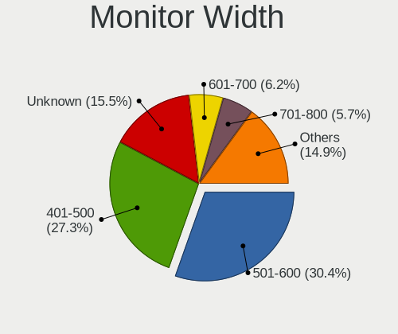
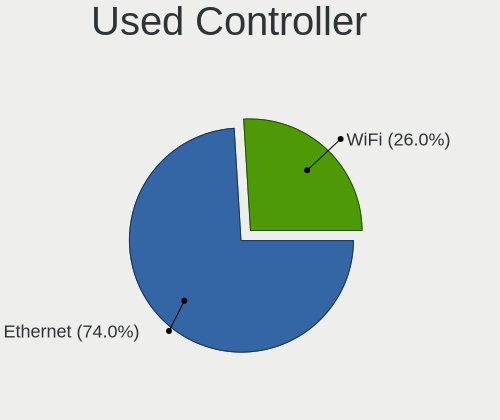
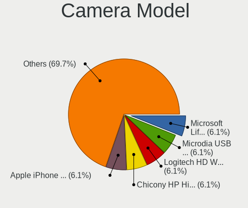

Elementary 6.1 - Tested Hardware & Statistics (Desktops)
--------------------------------------------------------

A project to collect tested hardware configurations for Elementary 6.1.

Anyone can contribute to this report by the [hw-probe](https://github.com/linuxhw/hw-probe) tool:

    sudo -E hw-probe -all -upload

Please contribute! Especially if your hardware is rare.

Contents
--------

* [ Test Cases ](#test-cases)

* [ System ](#system)
  - [ Kernel                   ](#kernel)
  - [ Kernel Family            ](#kernel-family)
  - [ Kernel Major Ver.        ](#kernel-major-ver)
  - [ Arch                     ](#arch)
  - [ DE                       ](#de)
  - [ Display Server           ](#display-server)
  - [ Display Manager          ](#display-manager)
  - [ OS Lang                  ](#os-lang)
  - [ Boot Mode                ](#boot-mode)
  - [ Filesystem               ](#filesystem)
  - [ Part. scheme             ](#part-scheme)
  - [ Dual Boot with Linux/BSD ](#dual-boot-with-linuxbsd)
  - [ Dual Boot (Win)          ](#dual-boot-win)

* [ Board ](#board)
  - [ Vendor                   ](#vendor)
  - [ Model                    ](#model)
  - [ Model Family             ](#model-family)
  - [ MFG Year                 ](#mfg-year)
  - [ Form Factor              ](#form-factor)
  - [ Secure Boot              ](#secure-boot)
  - [ Coreboot                 ](#coreboot)
  - [ RAM Size                 ](#ram-size)
  - [ RAM Used                 ](#ram-used)
  - [ Total Drives             ](#total-drives)
  - [ Has CD-ROM               ](#has-cd-rom)
  - [ Has Ethernet             ](#has-ethernet)
  - [ Has WiFi                 ](#has-wifi)
  - [ Has Bluetooth            ](#has-bluetooth)

* [ Location ](#location)
  - [ Country                  ](#country)
  - [ City                     ](#city)

* [ Drives ](#drives)
  - [ Drive Vendor             ](#drive-vendor)
  - [ Drive Model              ](#drive-model)
  - [ HDD Vendor               ](#hdd-vendor)
  - [ SSD Vendor               ](#ssd-vendor)
  - [ Drive Kind               ](#drive-kind)
  - [ Drive Connector          ](#drive-connector)
  - [ Drive Size               ](#drive-size)
  - [ Space Total              ](#space-total)
  - [ Space Used               ](#space-used)
  - [ Malfunc. Drives          ](#malfunc-drives)
  - [ Malfunc. Drive Vendor    ](#malfunc-drive-vendor)
  - [ Malfunc. HDD Vendor      ](#malfunc-hdd-vendor)
  - [ Malfunc. Drive Kind      ](#malfunc-drive-kind)
  - [ Failed Drives            ](#failed-drives)
  - [ Failed Drive Vendor      ](#failed-drive-vendor)
  - [ Drive Status             ](#drive-status)

* [ Storage controller ](#storage-controller)
  - [ Storage Vendor           ](#storage-vendor)
  - [ Storage Model            ](#storage-model)
  - [ Storage Kind             ](#storage-kind)

* [ Processor ](#processor)
  - [ CPU Vendor               ](#cpu-vendor)
  - [ CPU Model                ](#cpu-model)
  - [ CPU Model Family         ](#cpu-model-family)
  - [ CPU Cores                ](#cpu-cores)
  - [ CPU Sockets              ](#cpu-sockets)
  - [ CPU Threads              ](#cpu-threads)
  - [ CPU Op-Modes             ](#cpu-op-modes)
  - [ CPU Microcode            ](#cpu-microcode)
  - [ CPU Microarch            ](#cpu-microarch)

* [ Graphics ](#graphics)
  - [ GPU Vendor               ](#gpu-vendor)
  - [ GPU Model                ](#gpu-model)
  - [ GPU Combo                ](#gpu-combo)
  - [ GPU Driver               ](#gpu-driver)
  - [ GPU Memory               ](#gpu-memory)

* [ Monitor ](#monitor)
  - [ Monitor Vendor           ](#monitor-vendor)
  - [ Monitor Model            ](#monitor-model)
  - [ Monitor Resolution       ](#monitor-resolution)
  - [ Monitor Diagonal         ](#monitor-diagonal)
  - [ Monitor Width            ](#monitor-width)
  - [ Aspect Ratio             ](#aspect-ratio)
  - [ Monitor Area             ](#monitor-area)
  - [ Pixel Density            ](#pixel-density)
  - [ Multiple Monitors        ](#multiple-monitors)

* [ Network ](#network)
  - [ Net Controller Vendor    ](#net-controller-vendor)
  - [ Net Controller Model     ](#net-controller-model)
  - [ Wireless Vendor          ](#wireless-vendor)
  - [ Wireless Model           ](#wireless-model)
  - [ Ethernet Vendor          ](#ethernet-vendor)
  - [ Ethernet Model           ](#ethernet-model)
  - [ Net Controller Kind      ](#net-controller-kind)
  - [ Used Controller          ](#used-controller)
  - [ NICs                     ](#nics)
  - [ IPv6                     ](#ipv6)

* [ Bluetooth ](#bluetooth)
  - [ Bluetooth Vendor         ](#bluetooth-vendor)
  - [ Bluetooth Model          ](#bluetooth-model)

* [ Sound ](#sound)
  - [ Sound Vendor             ](#sound-vendor)
  - [ Sound Model              ](#sound-model)

* [ Memory ](#memory)
  - [ Memory Vendor            ](#memory-vendor)
  - [ Memory Model             ](#memory-model)
  - [ Memory Kind              ](#memory-kind)
  - [ Memory Form Factor       ](#memory-form-factor)
  - [ Memory Size              ](#memory-size)
  - [ Memory Speed             ](#memory-speed)

* [ Printers & scanners ](#printers--scanners)
  - [ Printer Vendor           ](#printer-vendor)
  - [ Printer Model            ](#printer-model)
  - [ Scanner Vendor           ](#scanner-vendor)
  - [ Scanner Model            ](#scanner-model)

* [ Camera ](#camera)
  - [ Camera Vendor            ](#camera-vendor)
  - [ Camera Model             ](#camera-model)

* [ Security ](#security)
  - [ Fingerprint Vendor       ](#fingerprint-vendor)
  - [ Fingerprint Model        ](#fingerprint-model)
  - [ Chipcard Vendor          ](#chipcard-vendor)
  - [ Chipcard Model           ](#chipcard-model)

* [ Unsupported ](#unsupported)
  - [ Unsupported Devices      ](#unsupported-devices)
  - [ Unsupported Device Types ](#unsupported-device-types)

Test Cases
----------

Total: 178

| Vendor        | Model                       | Probe                                                      | Date         |
|---------------|-----------------------------|------------------------------------------------------------|--------------|
| Acer          | Aspire X1420G               | [7be7ab2e7e](https://linux-hardware.org/?probe=7be7ab2e7e) | Jul 31, 2022 |
| ASUSTek       | ROG STRIX B450-F GAMING     | [e99805635f](https://linux-hardware.org/?probe=e99805635f) | Jul 29, 2022 |
| MSI           | B450M PRO-M2 MAX            | [ab8af10726](https://linux-hardware.org/?probe=ab8af10726) | Jul 28, 2022 |
| Gigabyte      | GA-78LMT-USB3               | [d0a69fba02](https://linux-hardware.org/?probe=d0a69fba02) | Jul 23, 2022 |
| Dell          | 00V62H A01                  | [ae809bb317](https://linux-hardware.org/?probe=ae809bb317) | Jul 19, 2022 |
| ASUSTek       | ROG STRIX B360-H GAMING     | [4cc1f4384c](https://linux-hardware.org/?probe=4cc1f4384c) | Jul 12, 2022 |
| Acer          | Aspire X1420G               | [0b7a9cbc2a](https://linux-hardware.org/?probe=0b7a9cbc2a) | Jul 12, 2022 |
| ASUSTek       | P8H61-M LX R2.0             | [3db9c636d0](https://linux-hardware.org/?probe=3db9c636d0) | Jul 09, 2022 |
| MSI           | B450M PRO-VDH MAX           | [b8c450d5fa](https://linux-hardware.org/?probe=b8c450d5fa) | Jul 08, 2022 |
| Intel         | X79Turbo V1.x               | [e4b17550d0](https://linux-hardware.org/?probe=e4b17550d0) | Jul 06, 2022 |
| Intel         | X79Turbo V1.x               | [d07e96a623](https://linux-hardware.org/?probe=d07e96a623) | Jul 06, 2022 |
| Gigabyte      | Z87X-OC-CF                  | [654459e245](https://linux-hardware.org/?probe=654459e245) | Jul 03, 2022 |
| ASUSTek       | TUF X470-PLUS GAMING        | [80a981f992](https://linux-hardware.org/?probe=80a981f992) | Jul 01, 2022 |
| Gigabyte      | Z690 AORUS MASTER           | [a8073316f6](https://linux-hardware.org/?probe=a8073316f6) | Jun 26, 2022 |
| ASRock        | Z490 Pro4                   | [f84c8a756c](https://linux-hardware.org/?probe=f84c8a756c) | Jun 25, 2022 |
| MSI           | B85I                        | [886f971d22](https://linux-hardware.org/?probe=886f971d22) | Jun 25, 2022 |
| HP            | 339A                        | [822467af7f](https://linux-hardware.org/?probe=822467af7f) | Jun 25, 2022 |
| T-bao         | MINI PC                     | [6b18c66487](https://linux-hardware.org/?probe=6b18c66487) | Jun 18, 2022 |
| Pegatron      | 2ACD                        | [8c8275099b](https://linux-hardware.org/?probe=8c8275099b) | Jun 16, 2022 |
| ASUSTek       | PRIME B550-PLUS             | [5b8ae292bf](https://linux-hardware.org/?probe=5b8ae292bf) | Jun 14, 2022 |
| ASUSTek       | SABERTOOTH X58              | [4cc4a7c1b3](https://linux-hardware.org/?probe=4cc4a7c1b3) | Jun 11, 2022 |
| ASUSTek       | SABERTOOTH X58              | [25a8936801](https://linux-hardware.org/?probe=25a8936801) | Jun 11, 2022 |
| HP            | 2B43                        | [6f36772b0c](https://linux-hardware.org/?probe=6f36772b0c) | Jun 10, 2022 |
| Gigabyte      | B450 AORUS ELITE            | [9756188040](https://linux-hardware.org/?probe=9756188040) | Jun 07, 2022 |
| MSI           | MPG X570S CARBON MAX WIF... | [0d57c069a8](https://linux-hardware.org/?probe=0d57c069a8) | Jun 05, 2022 |
| Lenovo        | 3098 SDK0E50510 WIN 2625... | [16f3fff6ad](https://linux-hardware.org/?probe=16f3fff6ad) | Jun 05, 2022 |
| Dell          | 0T7D40 A01                  | [812b41fe55](https://linux-hardware.org/?probe=812b41fe55) | Jun 04, 2022 |
| Lenovo        | 3098 SDK0E50510 WIN 2625... | [b3d970d061](https://linux-hardware.org/?probe=b3d970d061) | Jun 04, 2022 |
| MSI           | B85I                        | [5f29683d93](https://linux-hardware.org/?probe=5f29683d93) | Jun 03, 2022 |
| ASUSTek       | PRIME A320M-K/BR            | [9f4aa60f60](https://linux-hardware.org/?probe=9f4aa60f60) | Jun 02, 2022 |
| ASUSTek       | P5B                         | [12554af571](https://linux-hardware.org/?probe=12554af571) | May 31, 2022 |
| ASUSTek       | P5B                         | [845c2f114b](https://linux-hardware.org/?probe=845c2f114b) | May 31, 2022 |
| MSI           | MPG X570S CARBON MAX WIF... | [a4f2a9b24b](https://linux-hardware.org/?probe=a4f2a9b24b) | May 27, 2022 |
| MSI           | MPG X570S CARBON MAX WIF... | [3143793e8f](https://linux-hardware.org/?probe=3143793e8f) | May 27, 2022 |
| ASUSTek       | P8H61                       | [5514e95c95](https://linux-hardware.org/?probe=5514e95c95) | May 24, 2022 |
| ASUSTek       | P8H61                       | [873dd31f8e](https://linux-hardware.org/?probe=873dd31f8e) | May 23, 2022 |
| MSI           | H97M-P35                    | [2b5866b09d](https://linux-hardware.org/?probe=2b5866b09d) | May 23, 2022 |
| LORD ELECT... | LORD G4x 775 ICH7 8712 A... | [2e27b6fac9](https://linux-hardware.org/?probe=2e27b6fac9) | May 23, 2022 |
| Biostar       | GF8200C M2+                 | [b80588cbea](https://linux-hardware.org/?probe=b80588cbea) | May 21, 2022 |
| ASUSTek       | P8H61-M LE/USB3             | [6f6a104d35](https://linux-hardware.org/?probe=6f6a104d35) | May 21, 2022 |
| MSI           | B85I                        | [c822196290](https://linux-hardware.org/?probe=c822196290) | May 18, 2022 |
| MSI           | MEG X570 UNIFY              | [4d00452dcb](https://linux-hardware.org/?probe=4d00452dcb) | May 15, 2022 |
| ASUSTek       | SABERTOOTH X58              | [c276639676](https://linux-hardware.org/?probe=c276639676) | May 08, 2022 |
| ASUSTek       | H81M-K                      | [753c7be679](https://linux-hardware.org/?probe=753c7be679) | May 05, 2022 |
| ASRock        | X570 Extreme4               | [98e5f20999](https://linux-hardware.org/?probe=98e5f20999) | May 04, 2022 |
| HP            | 0B48h                       | [4c6e5824f2](https://linux-hardware.org/?probe=4c6e5824f2) | Apr 30, 2022 |
| ASUSTek       | P8Z77-V                     | [b3506ef75d](https://linux-hardware.org/?probe=b3506ef75d) | Apr 29, 2022 |
| Dell          | 0J3C2F A00                  | [464c70eb8d](https://linux-hardware.org/?probe=464c70eb8d) | Apr 27, 2022 |
| ASUSTek       | ROG CROSSHAIR VIII HERO     | [1f10d820f8](https://linux-hardware.org/?probe=1f10d820f8) | Apr 27, 2022 |
| ASUSTek       | ROG CROSSHAIR VIII HERO     | [dfadead480](https://linux-hardware.org/?probe=dfadead480) | Apr 27, 2022 |
| Gigabyte      | B150N Phoenix-WIFI-CF       | [dbaaf867f6](https://linux-hardware.org/?probe=dbaaf867f6) | Apr 25, 2022 |
| ASUSTek       | ROG STRIX Z590-F GAMING ... | [1b0a41c232](https://linux-hardware.org/?probe=1b0a41c232) | Apr 25, 2022 |
| AZW           | GTi                         | [e2d4a0da2e](https://linux-hardware.org/?probe=e2d4a0da2e) | Apr 23, 2022 |
| AZW           | GTi                         | [cde74551bf](https://linux-hardware.org/?probe=cde74551bf) | Apr 23, 2022 |
| ECS           | H61H2-MV                    | [939f87564f](https://linux-hardware.org/?probe=939f87564f) | Apr 21, 2022 |
| MSI           | X99A SLI PLUS               | [0b935aadb3](https://linux-hardware.org/?probe=0b935aadb3) | Apr 19, 2022 |
| ASRock        | Z490 Pro4                   | [67071d11a1](https://linux-hardware.org/?probe=67071d11a1) | Apr 18, 2022 |
| Dell          | 0KV62T A01                  | [0c6e50ed20](https://linux-hardware.org/?probe=0c6e50ed20) | Apr 17, 2022 |
| Dell          | 0KV62T A01                  | [7bed7782c4](https://linux-hardware.org/?probe=7bed7782c4) | Apr 17, 2022 |
| MSI           | B450M PRO-VDH MAX           | [e28ee0bd42](https://linux-hardware.org/?probe=e28ee0bd42) | Apr 16, 2022 |
| HP            | 1494                        | [6ad3ca1745](https://linux-hardware.org/?probe=6ad3ca1745) | Apr 16, 2022 |
| Gigabyte      | H61M-D2H-USB3               | [016243a675](https://linux-hardware.org/?probe=016243a675) | Apr 15, 2022 |
| Fujitsu       | D3531-A1 S26361-D3531-A1    | [46dd533a5e](https://linux-hardware.org/?probe=46dd533a5e) | Apr 14, 2022 |
| ASUSTek       | B85M-G                      | [c6dd82e724](https://linux-hardware.org/?probe=c6dd82e724) | Apr 14, 2022 |
| Gigabyte      | B450 AORUS ELITE            | [dff6de5032](https://linux-hardware.org/?probe=dff6de5032) | Apr 14, 2022 |
| ASUSTek       | B85M-G                      | [e525a26ca8](https://linux-hardware.org/?probe=e525a26ca8) | Apr 14, 2022 |
| Gigabyte      | B450 AORUS ELITE            | [6a2c5f12fd](https://linux-hardware.org/?probe=6a2c5f12fd) | Apr 13, 2022 |
| Dell          | 0K240Y A01                  | [76d4fbf0a6](https://linux-hardware.org/?probe=76d4fbf0a6) | Apr 13, 2022 |
| ASUSTek       | TUF X470-PLUS GAMING        | [3440d2dd8c](https://linux-hardware.org/?probe=3440d2dd8c) | Apr 12, 2022 |
| Lenovo        | 3178 SDK0J40700 WIN 3258... | [637023ab6d](https://linux-hardware.org/?probe=637023ab6d) | Apr 11, 2022 |
| ASUSTek       | PRIME Z390-A                | [21767e12e4](https://linux-hardware.org/?probe=21767e12e4) | Apr 11, 2022 |
| Pegatron      | IPMH61P1                    | [1adcf74c4f](https://linux-hardware.org/?probe=1adcf74c4f) | Apr 10, 2022 |
| ASUSTek       | H110I-PLUS                  | [e367ac99ce](https://linux-hardware.org/?probe=e367ac99ce) | Apr 10, 2022 |
| ASRock        | C226 WS                     | [7c11c1ec43](https://linux-hardware.org/?probe=7c11c1ec43) | Apr 07, 2022 |
| ASUSTek       | STRIKER II FORMULA          | [5dfea21930](https://linux-hardware.org/?probe=5dfea21930) | Apr 07, 2022 |
| ASUSTek       | STRIKER II FORMULA          | [040990b3fc](https://linux-hardware.org/?probe=040990b3fc) | Apr 07, 2022 |
| ASUSTek       | TUF Gaming B460M-PLUS       | [7419ad6a76](https://linux-hardware.org/?probe=7419ad6a76) | Apr 02, 2022 |
| Lenovo        | ThinkCentre M58 6258D3G     | [b67f1750b8](https://linux-hardware.org/?probe=b67f1750b8) | Mar 31, 2022 |
| Lenovo        | ThinkCentre M58 6258D3G     | [1cd22c83f1](https://linux-hardware.org/?probe=1cd22c83f1) | Mar 31, 2022 |
| MSI           | H97 GAMING 3                | [97f38615e3](https://linux-hardware.org/?probe=97f38615e3) | Mar 31, 2022 |
| MSI           | MEG X570 ACE                | [55572b8a7e](https://linux-hardware.org/?probe=55572b8a7e) | Mar 31, 2022 |
| ASUSTek       | Rampage IV GENE             | [c067a4d0e7](https://linux-hardware.org/?probe=c067a4d0e7) | Mar 29, 2022 |
| Dell          | 0C522T A00                  | [33ae998152](https://linux-hardware.org/?probe=33ae998152) | Mar 26, 2022 |
| Dell          | 0C522T A00                  | [90242bb090](https://linux-hardware.org/?probe=90242bb090) | Mar 26, 2022 |
| MSI           | MPG B550 GAMING EDGE WIF... | [7577679057](https://linux-hardware.org/?probe=7577679057) | Mar 25, 2022 |
| Gigabyte      | A320M-S2H-CF                | [a237859a86](https://linux-hardware.org/?probe=a237859a86) | Mar 24, 2022 |
| Intel         | X79Turbo V1.x               | [18b126a753](https://linux-hardware.org/?probe=18b126a753) | Mar 24, 2022 |
| AMI           | Cherry Trail CR             | [bbea34ce64](https://linux-hardware.org/?probe=bbea34ce64) | Mar 22, 2022 |
| AMI           | Cherry Trail CR             | [bc5a34ef7e](https://linux-hardware.org/?probe=bc5a34ef7e) | Mar 20, 2022 |
| ASUSTek       | Rampage IV GENE             | [7f5053b061](https://linux-hardware.org/?probe=7f5053b061) | Mar 16, 2022 |
| ASUSTek       | Rampage IV GENE             | [7ff55a3ca6](https://linux-hardware.org/?probe=7ff55a3ca6) | Mar 16, 2022 |
| ASUSTek       | P8H61-M LX3 R2.0            | [eda8848760](https://linux-hardware.org/?probe=eda8848760) | Mar 15, 2022 |
| AOpen         | D1009 A1A4                  | [a7375d4581](https://linux-hardware.org/?probe=a7375d4581) | Mar 13, 2022 |
| MSI           | B85I                        | [d134c8451b](https://linux-hardware.org/?probe=d134c8451b) | Mar 12, 2022 |
| ASRock        | B450M Pro4                  | [12459fc7ea](https://linux-hardware.org/?probe=12459fc7ea) | Mar 11, 2022 |
| Gigabyte      | B150N Phoenix-WIFI-CF       | [a64818ccea](https://linux-hardware.org/?probe=a64818ccea) | Mar 10, 2022 |
| Biostar       | N68S3B                      | [aa1e6a4c82](https://linux-hardware.org/?probe=aa1e6a4c82) | Mar 10, 2022 |
| ASUSTek       | M11AD                       | [8bb5baaa5a](https://linux-hardware.org/?probe=8bb5baaa5a) | Mar 09, 2022 |
| Biostar       | H61MLV2                     | [d5c330bad8](https://linux-hardware.org/?probe=d5c330bad8) | Mar 08, 2022 |
| HP            | 2ADC                        | [ed0714a64a](https://linux-hardware.org/?probe=ed0714a64a) | Mar 07, 2022 |
| MSI           | B85I                        | [39926596b7](https://linux-hardware.org/?probe=39926596b7) | Mar 07, 2022 |
| Dell          | 0PU052                      | [766b0e4665](https://linux-hardware.org/?probe=766b0e4665) | Mar 06, 2022 |
| Dell          | 0PU052                      | [a8e19bd112](https://linux-hardware.org/?probe=a8e19bd112) | Mar 06, 2022 |
| HP            | 1589                        | [88876808e9](https://linux-hardware.org/?probe=88876808e9) | Mar 05, 2022 |
| HP            | 802E                        | [14c73a40e0](https://linux-hardware.org/?probe=14c73a40e0) | Mar 05, 2022 |
| ASRock        | FM2A58M-DG3+                | [0b7875b1b5](https://linux-hardware.org/?probe=0b7875b1b5) | Mar 05, 2022 |
| HP            | 805D                        | [2a09665009](https://linux-hardware.org/?probe=2a09665009) | Mar 02, 2022 |
| ASUSTek       | M4N72-E                     | [c3fe570b4d](https://linux-hardware.org/?probe=c3fe570b4d) | Feb 28, 2022 |
| ASUSTek       | H81-PLUS                    | [e8956dc4ec](https://linux-hardware.org/?probe=e8956dc4ec) | Feb 27, 2022 |
| Gigabyte      | X470 AORUS ULTRA GAMING-... | [a6d5cc0368](https://linux-hardware.org/?probe=a6d5cc0368) | Feb 26, 2022 |
| Gigabyte      | Z390 UD                     | [7ea66813f3](https://linux-hardware.org/?probe=7ea66813f3) | Feb 23, 2022 |
| ASUSTek       | PRIME B450M-GAMING/BR       | [73b31ddab0](https://linux-hardware.org/?probe=73b31ddab0) | Feb 20, 2022 |
| Intel         | DH61BE AAG14062-210         | [00566bb73f](https://linux-hardware.org/?probe=00566bb73f) | Feb 19, 2022 |
| ASUSTek       | M11AD                       | [035887c4ab](https://linux-hardware.org/?probe=035887c4ab) | Feb 18, 2022 |
| ASUSTek       | P5B                         | [fa4c095fd7](https://linux-hardware.org/?probe=fa4c095fd7) | Feb 17, 2022 |
| Intel         | H61                         | [a70c59ad0e](https://linux-hardware.org/?probe=a70c59ad0e) | Feb 17, 2022 |
| ASUSTek       | PRIME Z590-A                | [6beda6e2da](https://linux-hardware.org/?probe=6beda6e2da) | Feb 16, 2022 |
| Biostar       | A68MD PRO                   | [da42cc4da7](https://linux-hardware.org/?probe=da42cc4da7) | Feb 16, 2022 |
| ASUSTek       | PRIME Z590-A                | [825734953d](https://linux-hardware.org/?probe=825734953d) | Feb 13, 2022 |
| MSI           | B85I                        | [898dced271](https://linux-hardware.org/?probe=898dced271) | Feb 13, 2022 |
| Gigabyte      | F2A68HM-H                   | [a2a41e039c](https://linux-hardware.org/?probe=a2a41e039c) | Feb 13, 2022 |
| Gigabyte      | F2A68HM-H                   | [2f3941c9cb](https://linux-hardware.org/?probe=2f3941c9cb) | Feb 12, 2022 |
| ASUSTek       | PRIME A320M-K               | [5f4de1e2b0](https://linux-hardware.org/?probe=5f4de1e2b0) | Feb 12, 2022 |
| ASUSTek       | PRIME B360M-K               | [698e174402](https://linux-hardware.org/?probe=698e174402) | Feb 09, 2022 |
| ASUSTek       | H110M-C                     | [82f3d6edf9](https://linux-hardware.org/?probe=82f3d6edf9) | Feb 09, 2022 |
| MSI           | B450I GAMING PLUS AC        | [a2af859752](https://linux-hardware.org/?probe=a2af859752) | Feb 09, 2022 |
| ECS           | H55H-M                      | [856a42d74b](https://linux-hardware.org/?probe=856a42d74b) | Feb 07, 2022 |
| ASUSTek       | ROG STRIX B360-H GAMING     | [92d9fdcc97](https://linux-hardware.org/?probe=92d9fdcc97) | Feb 07, 2022 |
| Lenovo        | NO DPK                      | [4bb7cedbd8](https://linux-hardware.org/?probe=4bb7cedbd8) | Feb 06, 2022 |
| HP            | 802E                        | [31e2fe159c](https://linux-hardware.org/?probe=31e2fe159c) | Feb 05, 2022 |
| ASUSTek       | H110M-C                     | [6ba127c715](https://linux-hardware.org/?probe=6ba127c715) | Feb 04, 2022 |
| ASUSTek       | P5B                         | [9b661f64dd](https://linux-hardware.org/?probe=9b661f64dd) | Feb 04, 2022 |
| Foxconn       | NETBOX nT-435/535 Ver       | [c7d50db62b](https://linux-hardware.org/?probe=c7d50db62b) | Feb 03, 2022 |
| Foxconn       | NETBOX nT-435/535 Ver       | [2ee2be7ccf](https://linux-hardware.org/?probe=2ee2be7ccf) | Feb 03, 2022 |
| HP            | ProLiant ML110 G7           | [2e1dcafe6c](https://linux-hardware.org/?probe=2e1dcafe6c) | Feb 03, 2022 |
| HP            | 339A                        | [cf9dca84ff](https://linux-hardware.org/?probe=cf9dca84ff) | Feb 02, 2022 |
| Unknown       | Unknown                     | [629972c689](https://linux-hardware.org/?probe=629972c689) | Feb 01, 2022 |
| HP            | 805D                        | [19295e5827](https://linux-hardware.org/?probe=19295e5827) | Feb 01, 2022 |
| ASUSTek       | H110I-PLUS                  | [ebeaf681e3](https://linux-hardware.org/?probe=ebeaf681e3) | Feb 01, 2022 |
| Gigabyte      | B75M-D3H                    | [18717f0712](https://linux-hardware.org/?probe=18717f0712) | Feb 01, 2022 |
| MSI           | Z270 KRAIT GAMING           | [17ccbf9c76](https://linux-hardware.org/?probe=17ccbf9c76) | Jan 28, 2022 |
| Gigabyte      | H61M-DS2                    | [e800b95c58](https://linux-hardware.org/?probe=e800b95c58) | Jan 26, 2022 |
| ASRock        | H61M-HVS                    | [8fdf1980ee](https://linux-hardware.org/?probe=8fdf1980ee) | Jan 25, 2022 |
| ASRock        | H61M-HVS                    | [5d19dff1e4](https://linux-hardware.org/?probe=5d19dff1e4) | Jan 25, 2022 |
| Acer          | ConceptD CM100-51A V:1.1    | [663bbd709d](https://linux-hardware.org/?probe=663bbd709d) | Jan 24, 2022 |
| FIRICH        | J1900                       | [937e24af64](https://linux-hardware.org/?probe=937e24af64) | Jan 22, 2022 |
| ASUSTek       | ROG STRIX B360-H GAMING     | [d1505fe489](https://linux-hardware.org/?probe=d1505fe489) | Jan 21, 2022 |
| ASUSTek       | ROG STRIX X570-E GAMING     | [75d67cd8a4](https://linux-hardware.org/?probe=75d67cd8a4) | Jan 20, 2022 |
| ASUSTek       | TUF Gaming B550M-PLUS       | [7a14d864d4](https://linux-hardware.org/?probe=7a14d864d4) | Jan 20, 2022 |
| ASUSTek       | TUF B365M-PLUS GAMING       | [ec51f5ca3e](https://linux-hardware.org/?probe=ec51f5ca3e) | Jan 19, 2022 |
| MSI           | B450 TOMAHAWK MAX II        | [488d339e77](https://linux-hardware.org/?probe=488d339e77) | Jan 19, 2022 |
| MSI           | B450M-A PRO MAX             | [e7225dad8e](https://linux-hardware.org/?probe=e7225dad8e) | Jan 17, 2022 |
| ASUSTek       | H61M-CS                     | [8855875fbd](https://linux-hardware.org/?probe=8855875fbd) | Jan 14, 2022 |
| Unknown       | T3 MRD                      | [33392a90ce](https://linux-hardware.org/?probe=33392a90ce) | Jan 13, 2022 |
| MSI           | X470 GAMING PLUS MAX        | [00a00c3cac](https://linux-hardware.org/?probe=00a00c3cac) | Jan 13, 2022 |
| ASUSTek       | M5A78L-M LX3                | [39f3687349](https://linux-hardware.org/?probe=39f3687349) | Jan 12, 2022 |
| Foxconn       | 2AB1                        | [07faf9a309](https://linux-hardware.org/?probe=07faf9a309) | Jan 12, 2022 |
| ASUSTek       | H110M-C                     | [be4291793d](https://linux-hardware.org/?probe=be4291793d) | Jan 10, 2022 |
| Gigabyte      | X570 AORUS ELITE            | [7ce29e0c54](https://linux-hardware.org/?probe=7ce29e0c54) | Jan 09, 2022 |
| HP            | 8597                        | [09ed815dd0](https://linux-hardware.org/?probe=09ed815dd0) | Jan 08, 2022 |
| Gigabyte      | GA-970A-D3                  | [b1c9832ce6](https://linux-hardware.org/?probe=b1c9832ce6) | Jan 07, 2022 |
| ASRock        | Z370 Pro4                   | [51cba69624](https://linux-hardware.org/?probe=51cba69624) | Jan 06, 2022 |
| ASRock        | B450M-HDV R4.0              | [20dfc25b62](https://linux-hardware.org/?probe=20dfc25b62) | Jan 05, 2022 |
| Gigabyte      | B85M-DS3H-A                 | [cd6abb9f49](https://linux-hardware.org/?probe=cd6abb9f49) | Jan 03, 2022 |
| MSI           | 2A9C                        | [8d08f7f383](https://linux-hardware.org/?probe=8d08f7f383) | Dec 31, 2021 |
| HP            | 3397                        | [323dc8992b](https://linux-hardware.org/?probe=323dc8992b) | Dec 31, 2021 |
| ASUSTek       | X79-DELUXE                  | [00b9dd3788](https://linux-hardware.org/?probe=00b9dd3788) | Dec 30, 2021 |
| HP            | 1589                        | [d123a8de64](https://linux-hardware.org/?probe=d123a8de64) | Dec 30, 2021 |
| Foxconn       | 2AB1                        | [bcd6fc46cc](https://linux-hardware.org/?probe=bcd6fc46cc) | Dec 30, 2021 |
| ASUSTek       | TUF Gaming B550M-PLUS       | [5f67c759fe](https://linux-hardware.org/?probe=5f67c759fe) | Dec 28, 2021 |
| Gigabyte      | Z390 UD                     | [2399fa64ba](https://linux-hardware.org/?probe=2399fa64ba) | Dec 26, 2021 |
| Apple         | Mac-F42C88C8 Proto1         | [783618fe4b](https://linux-hardware.org/?probe=783618fe4b) | Dec 23, 2021 |
| ASUSTek       | H97-PLUS                    | [cba91c2ad2](https://linux-hardware.org/?probe=cba91c2ad2) | Dec 22, 2021 |
| MSI           | B450-A PRO MAX              | [f14eef1ae6](https://linux-hardware.org/?probe=f14eef1ae6) | Dec 20, 2021 |
| Gigabyte      | H310M S2P                   | [a931eb10f0](https://linux-hardware.org/?probe=a931eb10f0) | Dec 19, 2021 |
| Foxconn       | 2AB1                        | [b789981cc4](https://linux-hardware.org/?probe=b789981cc4) | Dec 17, 2021 |
| Gigabyte      | Z590 AORUS ELITE AX         | [c068e358e8](https://linux-hardware.org/?probe=c068e358e8) | Dec 16, 2021 |
| ASUSTek       | M5A78L-M LX3                | [720cc7a45f](https://linux-hardware.org/?probe=720cc7a45f) | Dec 15, 2021 |

System
------

Kernel
------

Version of the Linux kernel

| Version              | Desktops | Percent |
|----------------------|----------|---------|
| 5.11.0-43-generic    | 26       | 18.18%  |
| 5.13.0-39-generic    | 17       | 11.89%  |
| 5.13.0-28-generic    | 17       | 11.89%  |
| 5.13.0-30-generic    | 10       | 6.99%   |
| 5.13.0-40-generic    | 9        | 6.29%   |
| 5.13.0-27-generic    | 9        | 6.29%   |
| 5.13.0-35-generic    | 7        | 4.9%    |
| 5.13.0-52-generic    | 5        | 3.5%    |
| 5.13.0-51-generic    | 5        | 3.5%    |
| 5.13.0-37-generic    | 5        | 3.5%    |
| 5.11.0-41-generic    | 5        | 3.5%    |
| 5.13.0-44-generic    | 4        | 2.8%    |
| 5.11.0-44-generic    | 4        | 2.8%    |
| 5.15.0-41-generic    | 3        | 2.1%    |
| 5.13.0-48-generic    | 3        | 2.1%    |
| 5.13.0-41-generic    | 2        | 1.4%    |
| 5.13.0-25-generic    | 2        | 1.4%    |
| 5.11.0-46-generic    | 2        | 1.4%    |
| 5.17.3-xanmod1       | 1        | 0.7%    |
| 5.15.36-xanmod1      | 1        | 0.7%    |
| 5.14.0-1042-oem      | 1        | 0.7%    |
| 5.13.0-28-lowlatency | 1        | 0.7%    |
| 5.13.0-22-generic    | 1        | 0.7%    |
| 5.11.0-43-lowlatency | 1        | 0.7%    |
| 5.11.0-40-generic    | 1        | 0.7%    |
| 5.11.0-37-generic    | 1        | 0.7%    |

Kernel Family
-------------

Linux kernel without a distro release

| Version | Desktops | Percent |
|---------|----------|---------|
| 5.13.0  | 85       | 65.89%  |
| 5.11.0  | 38       | 29.46%  |
| 5.15.0  | 3        | 2.33%   |
| 5.17.3  | 1        | 0.78%   |
| 5.15.36 | 1        | 0.78%   |
| 5.14.0  | 1        | 0.78%   |

Kernel Major Ver.
-----------------

Linux kernel major version

| Version | Desktops | Percent |
|---------|----------|---------|
| 5.13    | 85       | 65.89%  |
| 5.11    | 38       | 29.46%  |
| 5.15    | 4        | 3.1%    |
| 5.17    | 1        | 0.78%   |
| 5.14    | 1        | 0.78%   |

Arch
----

OS architecture (x86_64, i586, etc.)

| Name   | Desktops | Percent |
|--------|----------|---------|
| x86_64 | 126      | 100%    |

DE
--

Desktop Environment

| Name     | Desktops | Percent |
|----------|----------|---------|
| Pantheon | 126      | 100%    |

Display Server
--------------

X11 or Wayland

| Name | Desktops | Percent |
|------|----------|---------|
| X11  | 126      | 100%    |

Display Manager
---------------

SDDM, LightDM, etc.

| Name    | Desktops | Percent |
|---------|----------|---------|
| Unknown | 106      | 83.46%  |
| LightDM | 21       | 16.54%  |

OS Lang
-------

Language

| Lang  | Desktops | Percent |
|-------|----------|---------|
| en_US | 51       | 40.16%  |
| de_DE | 17       | 13.39%  |
| es_ES | 11       | 8.66%   |
| fr_FR | 10       | 7.87%   |
| en_GB | 7        | 5.51%   |
| it_IT | 5        | 3.94%   |
| ru_RU | 4        | 3.15%   |
| pt_BR | 4        | 3.15%   |
| pl_PL | 3        | 2.36%   |
| tr_TR | 2        | 1.57%   |
| ja_JP | 2        | 1.57%   |
| en_CA | 2        | 1.57%   |
| zh_CN | 1        | 0.79%   |
| uk_UA | 1        | 0.79%   |
| sr_RS | 1        | 0.79%   |
| pt_PT | 1        | 0.79%   |
| id_ID | 1        | 0.79%   |
| fr_CA | 1        | 0.79%   |
| en_AU | 1        | 0.79%   |
| de_CH | 1        | 0.79%   |
| C     | 1        | 0.79%   |

Boot Mode
---------

EFI or BIOS

| Mode | Desktops | Percent |
|------|----------|---------|
| EFI  | 69       | 53.91%  |
| BIOS | 59       | 46.09%  |

Filesystem
----------

Type of filesystem

| Type    | Desktops | Percent |
|---------|----------|---------|
| Ext4    | 120      | 95.24%  |
| Btrfs   | 3        | 2.38%   |
| Xfs     | 2        | 1.59%   |
| Overlay | 1        | 0.79%   |

Part. scheme
------------

Scheme of partitioning

| Type    | Desktops | Percent |
|---------|----------|---------|
| Unknown | 110      | 86.61%  |
| GPT     | 14       | 11.02%  |
| MBR     | 3        | 2.36%   |

Dual Boot with Linux/BSD
------------------------

Hosting more than one Linux/BSD

| Dual boot | Desktops | Percent |
|-----------|----------|---------|
| No        | 120      | 93.75%  |
| Yes       | 8        | 6.25%   |

Dual Boot (Win)
---------------

Hosting Linux and Windows

| Dual boot | Desktops | Percent |
|-----------|----------|---------|
| No        | 118      | 92.91%  |
| Yes       | 9        | 7.09%   |

Board
-----

Vendor
------

Motherboard manufacturer

| Name                | Desktops | Percent |
|---------------------|----------|---------|
| ASUSTek Computer    | 35       | 27.78%  |
| Gigabyte Technology | 18       | 14.29%  |
| MSI                 | 17       | 13.49%  |
| Hewlett-Packard     | 12       | 9.52%   |
| ASRock              | 8        | 6.35%   |
| Dell                | 7        | 5.56%   |
| Lenovo              | 4        | 3.17%   |
| Biostar             | 4        | 3.17%   |
| Intel               | 3        | 2.38%   |
| Pegatron            | 2        | 1.59%   |
| Foxconn             | 2        | 1.59%   |
| ECS                 | 2        | 1.59%   |
| Acer                | 2        | 1.59%   |
| Unknown             | 2        | 1.59%   |
| T-bao               | 1        | 0.79%   |
| LORD ELECTRONICS    | 1        | 0.79%   |
| Fujitsu             | 1        | 0.79%   |
| FIRICH              | 1        | 0.79%   |
| AZW                 | 1        | 0.79%   |
| Apple               | 1        | 0.79%   |
| AOpen               | 1        | 0.79%   |
| AMI                 | 1        | 0.79%   |

Model
-----

Motherboard model

| Name                                              | Desktops | Percent |
|---------------------------------------------------|----------|---------|
| ASUS All Series                                   | 4        | 3.17%   |
| MSI MS-7C35                                       | 2        | 1.59%   |
| HP Compaq Pro 6300 MT                             | 2        | 1.59%   |
| Gigabyte Z390 UD                                  | 2        | 1.59%   |
| ASUS TUF Gaming B550M-PLUS                        | 2        | 1.59%   |
| Unknown                                           | 2        | 1.59%   |
| T-bao MINI PC                                     | 1        | 0.79%   |
| Pegatron p7-1174                                  | 1        | 0.79%   |
| Pegatron IPMH61P1                                 | 1        | 0.79%   |
| MSI PPPPP-CCC#MMMMMMMM                            | 1        | 0.79%   |
| MSI MS-7D52                                       | 1        | 0.79%   |
| MSI MS-7C91                                       | 1        | 0.79%   |
| MSI MS-7C52                                       | 1        | 0.79%   |
| MSI MS-7C02                                       | 1        | 0.79%   |
| MSI MS-7B86                                       | 1        | 0.79%   |
| MSI MS-7B84                                       | 1        | 0.79%   |
| MSI MS-7B79                                       | 1        | 0.79%   |
| MSI MS-7A59                                       | 1        | 0.79%   |
| MSI MS-7A40                                       | 1        | 0.79%   |
| MSI MS-7A38                                       | 1        | 0.79%   |
| MSI MS-7918                                       | 1        | 0.79%   |
| MSI MS-7885                                       | 1        | 0.79%   |
| MSI MS-7851                                       | 1        | 0.79%   |
| MSI MS-7817                                       | 1        | 0.79%   |
| LORD ELECTRONICS LORD G4x 775 ICH7 8712 As Design | 1        | 0.79%   |
| Lenovo ThinkCentre M73 10B6001SUS                 | 1        | 0.79%   |
| Lenovo ThinkCentre M72e 3664AD7                   | 1        | 0.79%   |
| Lenovo ThinkCentre M58 6258D3G                    | 1        | 0.79%   |
| Lenovo IdeaCentre 510S-07ICK 90LX006TGE           | 1        | 0.79%   |
| Intel X79                                         | 1        | 0.79%   |
| Intel H61                                         | 1        | 0.79%   |
| Intel DH61BE AAG14062-210                         | 1        | 0.79%   |
| HP Z420 Workstation                               | 1        | 0.79%   |
| HP Z240 SFF Workstation                           | 1        | 0.79%   |
| HP Z200 SFF Workstation                           | 1        | 0.79%   |
| HP ProLiant ML110 G7                              | 1        | 0.79%   |
| HP ProDesk 600 G5 SFF                             | 1        | 0.79%   |
| HP ProDesk 600 G2 SFF                             | 1        | 0.79%   |
| HP Compaq Elite 8300 SFF                          | 1        | 0.79%   |
| HP Compaq 8200 Elite CMT PC                       | 1        | 0.79%   |
| HP 520-1175a                                      | 1        | 0.79%   |
| HP 23-q120d                                       | 1        | 0.79%   |
| Gigabyte Z87X-OC                                  | 1        | 0.79%   |
| Gigabyte Z690 AORUS MASTER                        | 1        | 0.79%   |
| Gigabyte Z590 AORUS ELITE AX                      | 1        | 0.79%   |
| Gigabyte X570 AORUS ELITE                         | 1        | 0.79%   |
| Gigabyte X470 AORUS ULTRA GAMING                  | 1        | 0.79%   |
| Gigabyte H61M-DS2                                 | 1        | 0.79%   |
| Gigabyte H61M-D2H-USB3                            | 1        | 0.79%   |
| Gigabyte H310M S2P 2.0                            | 1        | 0.79%   |
| Gigabyte GA-970A-D3                               | 1        | 0.79%   |
| Gigabyte GA-78LMT-USB3 6.0                        | 1        | 0.79%   |
| Gigabyte F2A68HM-H                                | 1        | 0.79%   |
| Gigabyte B85M-DS3H-A                              | 1        | 0.79%   |
| Gigabyte B75M-D3H                                 | 1        | 0.79%   |
| Gigabyte B450 AORUS ELITE                         | 1        | 0.79%   |
| Gigabyte B150N Phoenix-WIFI                       | 1        | 0.79%   |
| Gigabyte A320M-S2H                                | 1        | 0.79%   |
| Fujitsu ESPRIMO D757                              | 1        | 0.79%   |
| Foxconn p6616f                                    | 1        | 0.79%   |

Model Family
------------

Motherboard model prefix

| Name                   | Desktops | Percent |
|------------------------|----------|---------|
| Dell OptiPlex          | 6        | 4.76%   |
| ASUS PRIME             | 6        | 4.76%   |
| ASUS TUF               | 5        | 3.97%   |
| ASUS ROG               | 5        | 3.97%   |
| HP Compaq              | 4        | 3.17%   |
| ASUS All               | 4        | 3.17%   |
| Lenovo ThinkCentre     | 3        | 2.38%   |
| ASUS P8H61-M           | 3        | 2.38%   |
| MSI MS-7C35            | 2        | 1.59%   |
| HP ProDesk             | 2        | 1.59%   |
| Gigabyte Z390          | 2        | 1.59%   |
| Unknown                | 2        | 1.59%   |
| T-bao MINI             | 1        | 0.79%   |
| Pegatron p7-1174       | 1        | 0.79%   |
| Pegatron IPMH61P1      | 1        | 0.79%   |
| MSI PPPPP-CCC#MMMMMMMM | 1        | 0.79%   |
| MSI MS-7D52            | 1        | 0.79%   |
| MSI MS-7C91            | 1        | 0.79%   |
| MSI MS-7C52            | 1        | 0.79%   |
| MSI MS-7C02            | 1        | 0.79%   |
| MSI MS-7B86            | 1        | 0.79%   |
| MSI MS-7B84            | 1        | 0.79%   |
| MSI MS-7B79            | 1        | 0.79%   |
| MSI MS-7A59            | 1        | 0.79%   |
| MSI MS-7A40            | 1        | 0.79%   |
| MSI MS-7A38            | 1        | 0.79%   |
| MSI MS-7918            | 1        | 0.79%   |
| MSI MS-7885            | 1        | 0.79%   |
| MSI MS-7851            | 1        | 0.79%   |
| MSI MS-7817            | 1        | 0.79%   |
| LORD ELECTRONICS LORD  | 1        | 0.79%   |
| Lenovo IdeaCentre      | 1        | 0.79%   |
| Intel X79              | 1        | 0.79%   |
| Intel H61              | 1        | 0.79%   |
| Intel DH61BE           | 1        | 0.79%   |
| HP Z420                | 1        | 0.79%   |
| HP Z240                | 1        | 0.79%   |
| HP Z200                | 1        | 0.79%   |
| HP ProLiant            | 1        | 0.79%   |
| HP 520-1175a           | 1        | 0.79%   |
| HP 23-q120d            | 1        | 0.79%   |
| Gigabyte Z87X-OC       | 1        | 0.79%   |
| Gigabyte Z690          | 1        | 0.79%   |
| Gigabyte Z590          | 1        | 0.79%   |
| Gigabyte X570          | 1        | 0.79%   |
| Gigabyte X470          | 1        | 0.79%   |
| Gigabyte H61M-DS2      | 1        | 0.79%   |
| Gigabyte H61M-D2H-USB3 | 1        | 0.79%   |
| Gigabyte H310M         | 1        | 0.79%   |
| Gigabyte GA-970A-D3    | 1        | 0.79%   |
| Gigabyte GA-78LMT-USB3 | 1        | 0.79%   |
| Gigabyte F2A68HM-H     | 1        | 0.79%   |
| Gigabyte B85M-DS3H-A   | 1        | 0.79%   |
| Gigabyte B75M-D3H      | 1        | 0.79%   |
| Gigabyte B450          | 1        | 0.79%   |
| Gigabyte B150N         | 1        | 0.79%   |
| Gigabyte A320M-S2H     | 1        | 0.79%   |
| Fujitsu ESPRIMO        | 1        | 0.79%   |
| Foxconn p6616f         | 1        | 0.79%   |
| Foxconn nT435          | 1        | 0.79%   |

MFG Year
--------

Motherboard manufacture year

| Year | Desktops | Percent |
|------|----------|---------|
| 2012 | 17       | 13.49%  |
| 2018 | 14       | 11.11%  |
| 2019 | 12       | 9.52%   |
| 2011 | 12       | 9.52%   |
| 2020 | 11       | 8.73%   |
| 2021 | 9        | 7.14%   |
| 2015 | 9        | 7.14%   |
| 2014 | 9        | 7.14%   |
| 2013 | 8        | 6.35%   |
| 2010 | 8        | 6.35%   |
| 2017 | 5        | 3.97%   |
| 2016 | 5        | 3.97%   |
| 2022 | 2        | 1.59%   |
| 2008 | 2        | 1.59%   |
| 2009 | 1        | 0.79%   |
| 2007 | 1        | 0.79%   |
| 2006 | 1        | 0.79%   |

Form Factor
-----------

Physical design of the computer

| Name    | Desktops | Percent |
|---------|----------|---------|
| Desktop | 126      | 100%    |

Secure Boot
-----------

Enabled or disabled

| State    | Desktops | Percent |
|----------|----------|---------|
| Disabled | 120      | 95.24%  |
| Enabled  | 6        | 4.76%   |

Coreboot
--------

Have coreboot on board

| Used | Desktops | Percent |
|------|----------|---------|
| No   | 126      | 100%    |

RAM Size
--------

Total RAM memory

| Size in GB  | Desktops | Percent |
|-------------|----------|---------|
| 16.01-24.0  | 29       | 22.83%  |
| 32.01-64.0  | 26       | 20.47%  |
| 8.01-16.0   | 26       | 20.47%  |
| 4.01-8.0    | 20       | 15.75%  |
| 3.01-4.0    | 16       | 12.6%   |
| 64.01-256.0 | 4        | 3.15%   |
| 1.01-2.0    | 3        | 2.36%   |
| 24.01-32.0  | 2        | 1.57%   |
| 2.01-3.0    | 1        | 0.79%   |

RAM Used
--------

Used RAM memory

| Used GB   | Desktops | Percent |
|-----------|----------|---------|
| 1.01-2.0  | 55       | 38.46%  |
| 2.01-3.0  | 38       | 26.57%  |
| 4.01-8.0  | 21       | 14.69%  |
| 3.01-4.0  | 21       | 14.69%  |
| 8.01-16.0 | 5        | 3.5%    |
| 0.51-1.0  | 3        | 2.1%    |

Total Drives
------------

Number of drives on board

| Drives | Desktops | Percent |
|--------|----------|---------|
| 2      | 45       | 34.88%  |
| 1      | 42       | 32.56%  |
| 3      | 21       | 16.28%  |
| 4      | 12       | 9.3%    |
| 5      | 5        | 3.88%   |
| 7      | 2        | 1.55%   |
| 6      | 2        | 1.55%   |

Has CD-ROM
----------

Has CD-ROM on board

| Presented | Desktops | Percent |
|-----------|----------|---------|
| No        | 68       | 53.13%  |
| Yes       | 60       | 46.88%  |

Has Ethernet
------------

Has Ethernet on board

| Presented | Desktops | Percent |
|-----------|----------|---------|
| Yes       | 126      | 100%    |

Has WiFi
--------

Has WiFi module

| Presented | Desktops | Percent |
|-----------|----------|---------|
| No        | 67       | 52.34%  |
| Yes       | 61       | 47.66%  |

Has Bluetooth
-------------

Has Bluetooth module

| Presented | Desktops | Percent |
|-----------|----------|---------|
| No        | 78       | 61.42%  |
| Yes       | 49       | 38.58%  |

Location
--------

Country
-------

Geographic location (country)

| Country      | Desktops | Percent |
|--------------|----------|---------|
| Germany      | 16       | 12.7%   |
| USA          | 15       | 11.9%   |
| UK           | 9        | 7.14%   |
| France       | 9        | 7.14%   |
| Spain        | 8        | 6.35%   |
| Indonesia    | 6        | 4.76%   |
| Brazil       | 6        | 4.76%   |
| Italy        | 5        | 3.97%   |
| Canada       | 5        | 3.97%   |
| Russia       | 4        | 3.17%   |
| Poland       | 4        | 3.17%   |
| Turkey       | 3        | 2.38%   |
| Switzerland  | 3        | 2.38%   |
| Japan        | 3        | 2.38%   |
| India        | 3        | 2.38%   |
| Australia    | 3        | 2.38%   |
| Iran         | 2        | 1.59%   |
| Austria      | 2        | 1.59%   |
| Argentina    | 2        | 1.59%   |
| Thailand     | 1        | 0.79%   |
| Sweden       | 1        | 0.79%   |
| Sri Lanka    | 1        | 0.79%   |
| South Africa | 1        | 0.79%   |
| Serbia       | 1        | 0.79%   |
| Romania      | 1        | 0.79%   |
| Norway       | 1        | 0.79%   |
| New Zealand  | 1        | 0.79%   |
| Netherlands  | 1        | 0.79%   |
| Mexico       | 1        | 0.79%   |
| Malaysia     | 1        | 0.79%   |
| Lithuania    | 1        | 0.79%   |
| Israel       | 1        | 0.79%   |
| Hong Kong    | 1        | 0.79%   |
| Egypt        | 1        | 0.79%   |
| Czechia      | 1        | 0.79%   |
| Colombia     | 1        | 0.79%   |
| China        | 1        | 0.79%   |

City
----

Geographic location (city)

| City             | Desktops | Percent |
|------------------|----------|---------|
| Warsaw           | 3        | 2.21%   |
| Hamburg          | 3        | 2.21%   |
| Tangerang        | 2        | 1.47%   |
| Paris            | 2        | 1.47%   |
| Moscow           | 2        | 1.47%   |
| Istanbul         | 2        | 1.47%   |
| Denver           | 2        | 1.47%   |
| Brisbane         | 2        | 1.47%   |
| Yucca Valley     | 1        | 0.74%   |
| Yokohama         | 1        | 0.74%   |
| Yarang           | 1        | 0.74%   |
| Wroclaw          | 1        | 0.74%   |
| Woolloongabba    | 1        | 0.74%   |
| Wolgast          | 1        | 0.74%   |
| Vienna           | 1        | 0.74%   |
| Vanse            | 1        | 0.74%   |
| Tournus          | 1        | 0.74%   |
| Toronto          | 1        | 0.74%   |
| Thrissur         | 1        | 0.74%   |
| Tel Aviv         | 1        | 0.74%   |
| Tehran           | 1        | 0.74%   |
| Sydney           | 1        | 0.74%   |
| Suresnes         | 1        | 0.74%   |
| Stuttgart        | 1        | 0.74%   |
| Spello           | 1        | 0.74%   |
| Songkhla         | 1        | 0.74%   |
| Sollentuna       | 1        | 0.74%   |
| Sentmenat        | 1        | 0.74%   |
| Sarrebourg       | 1        | 0.74%   |
| Sao Paulo        | 1        | 0.74%   |
| Sant Joan Despí | 1        | 0.74%   |
| Saguenay         | 1        | 0.74%   |
| Rotterdam        | 1        | 0.74%   |
| Rio de Janeiro   | 1        | 0.74%   |
| Revere           | 1        | 0.74%   |
| Ragama           | 1        | 0.74%   |
| Purley           | 1        | 0.74%   |
| Pune             | 1        | 0.74%   |
| Porto Mantovano  | 1        | 0.74%   |
| Plano            | 1        | 0.74%   |
| Plan-de-Cuques   | 1        | 0.74%   |
| Ottawa           | 1        | 0.74%   |
| Oldham           | 1        | 0.74%   |
| Oldenburg        | 1        | 0.74%   |
| Nuremberg        | 1        | 0.74%   |
| Novi Sad         | 1        | 0.74%   |
| Nottingham       | 1        | 0.74%   |
| Norton           | 1        | 0.74%   |
| New Carlisle     | 1        | 0.74%   |
| Neubrandenburg   | 1        | 0.74%   |
| Naples           | 1        | 0.74%   |
| Muralto          | 1        | 0.74%   |
| Munich           | 1        | 0.74%   |
| Mount Pleasant   | 1        | 0.74%   |
| Montreal         | 1        | 0.74%   |
| Montbrison       | 1        | 0.74%   |
| Monmouth         | 1        | 0.74%   |
| Milan            | 1        | 0.74%   |
| McKinney         | 1        | 0.74%   |
| Mažeikiai       | 1        | 0.74%   |

Drives
------

Drive Vendor
------------

Hard drive vendors

| Vendor                    | Desktops | Drives | Percent |
|---------------------------|----------|--------|---------|
| WDC                       | 41       | 62     | 17.3%   |
| Seagate                   | 40       | 52     | 16.88%  |
| Samsung Electronics       | 32       | 51     | 13.5%   |
| Kingston                  | 22       | 29     | 9.28%   |
| Toshiba                   | 16       | 24     | 6.75%   |
| Crucial                   | 10       | 13     | 4.22%   |
| SanDisk                   | 7        | 9      | 2.95%   |
| Unknown                   | 5        | 12     | 2.11%   |
| PNY                       | 5        | 9      | 2.11%   |
| Micron/Crucial Technology | 5        | 8      | 2.11%   |
| Intel                     | 5        | 5      | 2.11%   |
| A-DATA Technology         | 5        | 5      | 2.11%   |
| Phison                    | 4        | 4      | 1.69%   |
| Hitachi                   | 4        | 4      | 1.69%   |
| Micron Technology         | 3        | 4      | 1.27%   |
| Maxtor                    | 3        | 3      | 1.27%   |
| ASMT                      | 3        | 3      | 1.27%   |
| Team                      | 2        | 3      | 0.84%   |
| Realtek Semiconductor     | 2        | 2      | 0.84%   |
| Plextor                   | 2        | 3      | 0.84%   |
| JMicron Technology        | 2        | 2      | 0.84%   |
| XPG                       | 1        | 1      | 0.42%   |
| Transcend                 | 1        | 1      | 0.42%   |
| tigo                      | 1        | 1      | 0.42%   |
| Silicon Motion            | 1        | 1      | 0.42%   |
| OCZ-VERTEX2               | 1        | 1      | 0.42%   |
| OCZ                       | 1        | 1      | 0.42%   |
| Netac                     | 1        | 1      | 0.42%   |
| MidasForce                | 1        | 1      | 0.42%   |
| LITEON                    | 1        | 1      | 0.42%   |
| Leven                     | 1        | 1      | 0.42%   |
| KingFast                  | 1        | 1      | 0.42%   |
| Intenso                   | 1        | 1      | 0.42%   |
| HGST                      | 1        | 1      | 0.42%   |
| Hewlett-Packard           | 1        | 1      | 0.42%   |
| GOODRAM                   | 1        | 1      | 0.42%   |
| Gigabyte Technology       | 1        | 1      | 0.42%   |
| Corsair                   | 1        | 1      | 0.42%   |
| China                     | 1        | 1      | 0.42%   |
| BORY                      | 1        | 1      | 0.42%   |

Drive Model
-----------

Hard drive models

| Model                             | Desktops | Percent |
|-----------------------------------|----------|---------|
| Samsung NVMe SSD Drive 500GB      | 6        | 2.27%   |
| Toshiba DT01ACA050 500GB          | 4        | 1.52%   |
| Samsung SSD 860 EVO 250GB         | 4        | 1.52%   |
| Micron/Crucial NVMe SSD Drive 1TB | 4        | 1.52%   |
| Kingston SA400S37120G 120GB SSD   | 4        | 1.52%   |
| Crucial CT240BX500SSD1 240GB      | 4        | 1.52%   |
| WDC WD5000AAKX-00ERMA0 500GB      | 3        | 1.14%   |
| WDC WD10EZEX-00BN5A0 1TB          | 3        | 1.14%   |
| Seagate ST3500418AS 500GB         | 3        | 1.14%   |
| Seagate ST1000DM010-2EP102 1TB    | 3        | 1.14%   |
| Seagate ST1000DM003-1ER162 1TB    | 3        | 1.14%   |
| Phison NVMe SSD Drive 1TB         | 3        | 1.14%   |
| Kingston SA400S37240G 240GB SSD   | 3        | 1.14%   |
| Kingston NVMe SSD Drive 1TB       | 3        | 1.14%   |
| WDC WD5000AAKX-001CA0 500GB       | 2        | 0.76%   |
| WDC WD5000AAKS-00UU3A0 500GB      | 2        | 0.76%   |
| WDC WD40EFRX-68N32N0 4TB          | 2        | 0.76%   |
| WDC WD10EZEX-08WN4A0 1TB          | 2        | 0.76%   |
| Unknown SD/MMC 16GB               | 2        | 0.76%   |
| Unknown M.S./M.S.Pro/HG 16GB      | 2        | 0.76%   |
| Toshiba HDWD110 1TB               | 2        | 0.76%   |
| Toshiba DT01ACA100 1TB            | 2        | 0.76%   |
| Seagate ST2000DX002-2DV164 2TB    | 2        | 0.76%   |
| Seagate ST2000DM001-9YN164 2TB    | 2        | 0.76%   |
| Seagate ST1000DM003-1CH162 1TB    | 2        | 0.76%   |
| Samsung SSD 860 QVO 1TB           | 2        | 0.76%   |
| Samsung SSD 850 PRO 256GB         | 2        | 0.76%   |
| Samsung SSD 850 EVO 250GB         | 2        | 0.76%   |
| Samsung SSD 840 EVO 120GB         | 2        | 0.76%   |
| Samsung NVMe SSD Drive 1TB        | 2        | 0.76%   |
| Samsung HD322HJ 320GB             | 2        | 0.76%   |
| PNY CS900 480GB SSD               | 2        | 0.76%   |
| Kingston SV300S37A120G 120GB SSD  | 2        | 0.76%   |
| Kingston SA400S37960G 960GB SSD   | 2        | 0.76%   |
| Kingston NVMe SSD Drive 500GB     | 2        | 0.76%   |
| JMicron Tech 250GB                | 2        | 0.76%   |
| Crucial CT1000MX500SSD1 1TB       | 2        | 0.76%   |
| XPG NVMe SSD Drive 512GB          | 1        | 0.38%   |
| WDC WDS500G2B0A-00SM50 500GB SSD  | 1        | 0.38%   |
| WDC WDS500G1B0A-00H9H0 500GB SSD  | 1        | 0.38%   |
| WDC WDS250G1B0A-00H9H0 250GB SSD  | 1        | 0.38%   |
| WDC WDS240G2G0B-00EPW0 240GB SSD  | 1        | 0.38%   |
| WDC WDS240G2G0A-00JH30 240GB SSD  | 1        | 0.38%   |
| WDC WDS120G2G0A-00JH30 120GB SSD  | 1        | 0.38%   |
| WDC WD6401AALS-00L3B2 640GB       | 1        | 0.38%   |
| WDC WD5000LPLX-60ZNTT2 500GB      | 1        | 0.38%   |
| WDC WD5000AVDS-63U7B1 500GB       | 1        | 0.38%   |
| WDC WD5000AAKX-003CA0 500GB       | 1        | 0.38%   |
| WDC WD5000AAKS-00A7B2 500GB       | 1        | 0.38%   |
| WDC WD40EZAZ-00SF3B0 4TB          | 1        | 0.38%   |
| WDC WD3200AVJS-63B6A0 320GB       | 1        | 0.38%   |
| WDC WD3200AAJS-00L7A0 320GB       | 1        | 0.38%   |
| WDC WD30PURX-64P6ZY0 3TB          | 1        | 0.38%   |
| WDC WD30EZRZ-00Z5HB0 3TB          | 1        | 0.38%   |
| WDC WD30EZRX-00SPEB0 3TB          | 1        | 0.38%   |
| WDC WD3003FZEX-00Z4SA0 3TB        | 1        | 0.38%   |
| WDC WD2500JS-23MHB0 250GB         | 1        | 0.38%   |
| WDC WD20EZRX-00D8PB0 2TB          | 1        | 0.38%   |
| WDC WD20EFRX-68EUZN0 2TB          | 1        | 0.38%   |
| WDC WD20EARX-00PASB0 2TB          | 1        | 0.38%   |

HDD Vendor
----------

Hard disk drive vendors

| Vendor              | Desktops | Drives | Percent |
|---------------------|----------|--------|---------|
| Seagate             | 37       | 48     | 35.24%  |
| WDC                 | 35       | 49     | 33.33%  |
| Toshiba             | 15       | 23     | 14.29%  |
| Samsung Electronics | 6        | 7      | 5.71%   |
| Hitachi             | 4        | 4      | 3.81%   |
| ASMT                | 3        | 3      | 2.86%   |
| Maxtor              | 2        | 2      | 1.9%    |
| Unknown             | 1        | 1      | 0.95%   |
| HGST                | 1        | 1      | 0.95%   |
| Hewlett-Packard     | 1        | 1      | 0.95%   |

SSD Vendor
----------

Solid state drive vendors

| Vendor              | Desktops | Drives | Percent |
|---------------------|----------|--------|---------|
| Samsung Electronics | 19       | 29     | 21.11%  |
| Kingston            | 16       | 20     | 17.78%  |
| Crucial             | 9        | 11     | 10%     |
| SanDisk             | 7        | 8      | 7.78%   |
| WDC                 | 6        | 10     | 6.67%   |
| PNY                 | 5        | 9      | 5.56%   |
| A-DATA Technology   | 4        | 4      | 4.44%   |
| Intel               | 3        | 3      | 3.33%   |
| Team                | 2        | 3      | 2.22%   |
| Plextor             | 2        | 3      | 2.22%   |
| Micron Technology   | 2        | 2      | 2.22%   |
| Transcend           | 1        | 1      | 1.11%   |
| Toshiba             | 1        | 1      | 1.11%   |
| tigo                | 1        | 1      | 1.11%   |
| Seagate             | 1        | 2      | 1.11%   |
| OCZ-VERTEX2         | 1        | 1      | 1.11%   |
| OCZ                 | 1        | 1      | 1.11%   |
| MidasForce          | 1        | 1      | 1.11%   |
| Maxtor              | 1        | 1      | 1.11%   |
| LITEON              | 1        | 1      | 1.11%   |
| Leven               | 1        | 1      | 1.11%   |
| Intenso             | 1        | 1      | 1.11%   |
| GOODRAM             | 1        | 1      | 1.11%   |
| Gigabyte Technology | 1        | 1      | 1.11%   |
| Corsair             | 1        | 1      | 1.11%   |
| China               | 1        | 1      | 1.11%   |

Drive Kind
----------

HDD or SSD

| Kind    | Desktops | Drives | Percent |
|---------|----------|--------|---------|
| HDD     | 85       | 139    | 41.06%  |
| SSD     | 78       | 118    | 37.68%  |
| NVMe    | 34       | 51     | 16.43%  |
| Unknown | 8        | 16     | 3.86%   |
| MMC     | 2        | 2      | 0.97%   |

Drive Connector
---------------

SATA, SAS, NVMe, etc.

| Type | Desktops | Drives | Percent |
|------|----------|--------|---------|
| SATA | 116      | 253    | 70.73%  |
| NVMe | 34       | 51     | 20.73%  |
| SAS  | 12       | 20     | 7.32%   |
| MMC  | 2        | 2      | 1.22%   |

Drive Size
----------

Size of hard drive

| Size in TB | Desktops | Drives | Percent |
|------------|----------|--------|---------|
| 0.01-0.5   | 87       | 149    | 55.77%  |
| 0.51-1.0   | 39       | 66     | 25%     |
| 1.01-2.0   | 12       | 15     | 7.69%   |
| 3.01-4.0   | 7        | 8      | 4.49%   |
| 2.01-3.0   | 6        | 13     | 3.85%   |
| 4.01-10.0  | 5        | 6      | 3.21%   |

Space Total
-----------

Amount of disk space available on the file system

| Size in GB     | Desktops | Percent |
|----------------|----------|---------|
| 101-250        | 41       | 31.06%  |
| 501-1000       | 29       | 21.97%  |
| 251-500        | 28       | 21.21%  |
| 1001-2000      | 11       | 8.33%   |
| More than 3000 | 9        | 6.82%   |
| 51-100         | 8        | 6.06%   |
| 21-50          | 4        | 3.03%   |
| 2001-3000      | 2        | 1.52%   |

Space Used
----------

Amount of used disk space

| Used GB        | Desktops | Percent |
|----------------|----------|---------|
| 1-20           | 56       | 39.72%  |
| 101-250        | 23       | 16.31%  |
| 21-50          | 19       | 13.48%  |
| 51-100         | 15       | 10.64%  |
| 251-500        | 12       | 8.51%   |
| 501-1000       | 8        | 5.67%   |
| 1001-2000      | 4        | 2.84%   |
| More than 3000 | 3        | 2.13%   |
| 2001-3000      | 1        | 0.71%   |

Malfunc. Drives
---------------

Drive models with a malfunction

| Model                        | Desktops | Drives | Percent |
|------------------------------|----------|--------|---------|
| WDC WD5000AAKS-00UU3A0 500GB | 1        | 1      | 33.33%  |
| Seagate ST3500312CS 500GB    | 1        | 1      | 33.33%  |
| SanDisk SSD PLUS 240GB       | 1        | 1      | 33.33%  |

Malfunc. Drive Vendor
---------------------

Vendors of faulty drives

| Vendor  | Desktops | Drives | Percent |
|---------|----------|--------|---------|
| WDC     | 1        | 1      | 33.33%  |
| Seagate | 1        | 1      | 33.33%  |
| SanDisk | 1        | 1      | 33.33%  |

Malfunc. HDD Vendor
-------------------

Vendors of faulty HDD drives

| Vendor  | Desktops | Drives | Percent |
|---------|----------|--------|---------|
| WDC     | 1        | 1      | 50%     |
| Seagate | 1        | 1      | 50%     |

Malfunc. Drive Kind
-------------------

Kinds of faulty drives

| Kind | Desktops | Drives | Percent |
|------|----------|--------|---------|
| HDD  | 2        | 2      | 66.67%  |
| SSD  | 1        | 1      | 33.33%  |

Failed Drives
-------------

Failed drive models

Zero info for selected period =(

Failed Drive Vendor
-------------------

Failed drive vendors

Zero info for selected period =(

Drive Status
------------

Number of failed and malfunc. drives

| Status   | Desktops | Drives | Percent |
|----------|----------|--------|---------|
| Detected | 112      | 286    | 85.5%   |
| Works    | 16       | 37     | 12.21%  |
| Malfunc  | 3        | 3      | 2.29%   |

Storage controller
------------------

Storage Vendor
--------------

Storage controller vendors

| Vendor                      | Desktops | Percent |
|-----------------------------|----------|---------|
| Intel                       | 84       | 48%     |
| AMD                         | 36       | 20.57%  |
| Samsung Electronics         | 12       | 6.86%   |
| Kingston Technology Company | 7        | 4%      |
| Micron/Crucial Technology   | 6        | 3.43%   |
| Nvidia                      | 5        | 2.86%   |
| Phison Electronics          | 4        | 2.29%   |
| Marvell Technology Group    | 4        | 2.29%   |
| ASMedia Technology          | 4        | 2.29%   |
| Realtek Semiconductor       | 3        | 1.71%   |
| Seagate Technology          | 2        | 1.14%   |
| SanDisk                     | 2        | 1.14%   |
| JMicron Technology          | 2        | 1.14%   |
| Silicon Motion              | 1        | 0.57%   |
| Micron Technology           | 1        | 0.57%   |
| LSI Logic / Symbios Logic   | 1        | 0.57%   |
| ADATA Technology            | 1        | 0.57%   |

Storage Model
-------------

Storage controller models

| Model                                                                                   | Desktops | Percent |
|-----------------------------------------------------------------------------------------|----------|---------|
| AMD FCH SATA Controller [AHCI mode]                                                     | 21       | 9.72%   |
| AMD 400 Series Chipset SATA Controller                                                  | 14       | 6.48%   |
| Intel 8 Series/C220 Series Chipset Family 6-port SATA Controller 1 [AHCI mode]          | 9        | 4.17%   |
| Intel 6 Series/C200 Series Chipset Family Desktop SATA Controller (IDE mode, ports 4-5) | 9        | 4.17%   |
| Intel 6 Series/C200 Series Chipset Family Desktop SATA Controller (IDE mode, ports 0-3) | 9        | 4.17%   |
| Intel 6 Series/C200 Series Chipset Family 6 port Desktop SATA AHCI Controller           | 9        | 4.17%   |
| Intel Cannon Lake PCH SATA AHCI Controller                                              | 7        | 3.24%   |
| Samsung NVMe SSD Controller SM981/PM981/PM983                                           | 6        | 2.78%   |
| Intel Q170/Q150/B150/H170/H110/Z170/CM236 Chipset SATA Controller [AHCI Mode]           | 6        | 2.78%   |
| Intel 7 Series/C210 Series Chipset Family 6-port SATA Controller [AHCI mode]            | 6        | 2.78%   |
| Intel 200 Series PCH SATA controller [AHCI mode]                                        | 6        | 2.78%   |
| Micron/Crucial P2 NVMe PCIe SSD                                                         | 5        | 2.31%   |
| Kingston Company A2000 NVMe SSD                                                         | 5        | 2.31%   |
| Samsung NVMe SSD Controller PM9A1/PM9A3/980PRO                                          | 4        | 1.85%   |
| ASMedia ASM1062 Serial ATA Controller                                                   | 4        | 1.85%   |
| AMD 500 Series Chipset SATA Controller                                                  | 4        | 1.85%   |
| Intel SATA Controller [RAID mode]                                                       | 3        | 1.39%   |
| Intel 9 Series Chipset Family SATA Controller [AHCI Mode]                               | 3        | 1.39%   |
| Intel 500 Series Chipset Family SATA AHCI Controller                                    | 3        | 1.39%   |
| AMD SB7x0/SB8x0/SB9x0 IDE Controller                                                    | 3        | 1.39%   |
| Realtek Realtek Non-Volatile memory controller                                          | 2        | 0.93%   |
| Phison E16 PCIe4 NVMe Controller                                                        | 2        | 0.93%   |
| Nvidia MCP78S [GeForce 8200] IDE                                                        | 2        | 0.93%   |
| Nvidia MCP61 SATA Controller                                                            | 2        | 0.93%   |
| Marvell Group 88SE9172 SATA 6Gb/s Controller                                            | 2        | 0.93%   |
| Intel NM10/ICH7 Family SATA Controller [IDE mode]                                       | 2        | 0.93%   |
| Intel C610/X99 series chipset 6-Port SATA Controller [AHCI mode]                        | 2        | 0.93%   |
| Intel C600/X79 series chipset 6-Port SATA AHCI Controller                               | 2        | 0.93%   |
| Intel 5 Series/3400 Series Chipset 6 port SATA AHCI Controller                          | 2        | 0.93%   |
| AMD SB7x0/SB8x0/SB9x0 SATA Controller [IDE mode]                                        | 2        | 0.93%   |
| AMD SB7x0/SB8x0/SB9x0 SATA Controller [AHCI mode]                                       | 2        | 0.93%   |
| AMD FCH SATA Controller [IDE mode]                                                      | 2        | 0.93%   |
| AMD FCH SATA Controller D                                                               | 2        | 0.93%   |
| Silicon Motion SM2263EN/SM2263XT SSD Controller                                         | 1        | 0.46%   |
| Seagate FireCuda 530 SSD                                                                | 1        | 0.46%   |
| Seagate FireCuda 510 SSD                                                                | 1        | 0.46%   |
| SanDisk WD Black SN750 / PC SN730 NVMe SSD                                              | 1        | 0.46%   |
| SanDisk Non-Volatile memory controller                                                  | 1        | 0.46%   |
| Samsung NVMe SSD Controller SM961/PM961/SM963                                           | 1        | 0.46%   |
| Samsung NVMe SSD Controller 980                                                         | 1        | 0.46%   |
| Realtek RTS5763DL NVMe SSD Controller                                                   | 1        | 0.46%   |
| Phison E18 PCIe4 NVMe Controller                                                        | 1        | 0.46%   |
| Phison E12 NVMe Controller                                                              | 1        | 0.46%   |
| Nvidia MCP78S [GeForce 8200] SATA Controller (non-AHCI mode)                            | 1        | 0.46%   |
| Nvidia MCP78S [GeForce 8200] AHCI Controller                                            | 1        | 0.46%   |
| Nvidia MCP61 IDE                                                                        | 1        | 0.46%   |
| Nvidia MCP55 SATA Controller                                                            | 1        | 0.46%   |
| Nvidia MCP55 IDE                                                                        | 1        | 0.46%   |
| Micron/Crucial Non-Volatile memory controller                                           | 1        | 0.46%   |
| Micron Non-Volatile memory controller                                                   | 1        | 0.46%   |
| Marvell Group 88SE9230 PCIe 2.0 x2 4-port SATA 6 Gb/s RAID Controller                   | 1        | 0.46%   |
| Marvell Group 88SE91A3 SATA-600 Controller                                              | 1        | 0.46%   |
| LSI Logic / Symbios Logic MegaRAID SAS-3 3108 [Invader]                                 | 1        | 0.46%   |
| Kingston Company Company Non-Volatile memory controller                                 | 1        | 0.46%   |
| Kingston Company SNVS2000G [NV1 NVMe PCIe SSD 2TB]                                      | 1        | 0.46%   |
| JMicron JMB363 SATA/IDE Controller                                                      | 1        | 0.46%   |
| JMicron JMB362 SATA Controller                                                          | 1        | 0.46%   |
| Intel Tiger Lake-LP SATA Controller                                                     | 1        | 0.46%   |
| Intel SSD Pro 7600p/760p/E 6100p Series                                                 | 1        | 0.46%   |
| Intel SSD 660P Series                                                                   | 1        | 0.46%   |

Storage Kind
------------

Kind of storage controller (IDE, SATA, NVMe, SAS, ...)

| Kind | Desktops | Percent |
|------|----------|---------|
| SATA | 103      | 59.2%   |
| NVMe | 34       | 19.54%  |
| IDE  | 29       | 16.67%  |
| RAID | 7        | 4.02%   |
| SAS  | 1        | 0.57%   |

Processor
---------

CPU Vendor
----------

Processor vendors

| Vendor | Desktops | Percent |
|--------|----------|---------|
| Intel  | 86       | 68.25%  |
| AMD    | 40       | 31.75%  |

CPU Model
---------

Processor models

| Model                                   | Desktops | Percent |
|-----------------------------------------|----------|---------|
| AMD Ryzen 7 3700X 8-Core Processor      | 5        | 3.97%   |
| Intel Core i5-2400 CPU @ 3.10GHz        | 4        | 3.17%   |
| Intel Core i7-4770 CPU @ 3.40GHz        | 3        | 2.38%   |
| Intel Core i7-3770 CPU @ 3.40GHz        | 3        | 2.38%   |
| Intel Core i5-3470 CPU @ 3.20GHz        | 3        | 2.38%   |
| Intel 11th Gen Core i7-11700K @ 3.60GHz | 3        | 2.38%   |
| AMD Ryzen 9 5900X 12-Core Processor     | 3        | 2.38%   |
| Intel Core i7-9700 CPU @ 3.00GHz        | 2        | 1.59%   |
| Intel Core i7-2600 CPU @ 3.40GHz        | 2        | 1.59%   |
| Intel Core i5-8400 CPU @ 2.80GHz        | 2        | 1.59%   |
| Intel Core i5-7400 CPU @ 3.00GHz        | 2        | 1.59%   |
| Intel Core i3-4130 CPU @ 3.40GHz        | 2        | 1.59%   |
| Intel Core i3 CPU 530 @ 2.93GHz         | 2        | 1.59%   |
| Intel Core 2 Duo CPU E6550 @ 2.33GHz    | 2        | 1.59%   |
| Intel Atom x5-Z8350 CPU @ 1.44GHz       | 2        | 1.59%   |
| AMD Ryzen 9 3900X 12-Core Processor     | 2        | 1.59%   |
| AMD Ryzen 5 3600 6-Core Processor       | 2        | 1.59%   |
| AMD Ryzen 5 2600X Six-Core Processor    | 2        | 1.59%   |
| AMD Ryzen 5 2600 Six-Core Processor     | 2        | 1.59%   |
| Intel Xeon CPU E5462 @ 2.80GHz          | 1        | 0.79%   |
| Intel Xeon CPU E5-2690 0 @ 2.90GHz      | 1        | 0.79%   |
| Intel Xeon CPU E5-2665 0 @ 2.40GHz      | 1        | 0.79%   |
| Intel Xeon CPU E5-1660 0 @ 3.30GHz      | 1        | 0.79%   |
| Intel Xeon CPU E5-1650 v3 @ 3.50GHz     | 1        | 0.79%   |
| Intel Xeon CPU E5-1620 v3 @ 3.50GHz     | 1        | 0.79%   |
| Intel Xeon CPU E31270 @ 3.40GHz         | 1        | 0.79%   |
| Intel Xeon CPU E31240 @ 3.30GHz         | 1        | 0.79%   |
| Intel Xeon CPU E3-1283L v4 @ 2.90GHz    | 1        | 0.79%   |
| Intel Xeon CPU E3-1230 v3 @ 3.30GHz     | 1        | 0.79%   |
| Intel Pentium CPU G630 @ 2.70GHz        | 1        | 0.79%   |
| Intel Pentium CPU G620 @ 2.60GHz        | 1        | 0.79%   |
| Intel Pentium CPU G2030 @ 3.00GHz       | 1        | 0.79%   |
| Intel Core i9-9900K CPU @ 3.60GHz       | 1        | 0.79%   |
| Intel Core i7-9700K CPU @ 3.60GHz       | 1        | 0.79%   |
| Intel Core i7-7700K CPU @ 4.20GHz       | 1        | 0.79%   |
| Intel Core i7-6700K CPU @ 4.00GHz       | 1        | 0.79%   |
| Intel Core i7-6700 CPU @ 3.40GHz        | 1        | 0.79%   |
| Intel Core i7-4930K CPU @ 3.40GHz       | 1        | 0.79%   |
| Intel Core i7-4790S CPU @ 3.20GHz       | 1        | 0.79%   |
| Intel Core i7-4790K CPU @ 4.00GHz       | 1        | 0.79%   |
| Intel Core i7-4790 CPU @ 3.60GHz        | 1        | 0.79%   |
| Intel Core i7-10700K CPU @ 3.80GHz      | 1        | 0.79%   |
| Intel Core i7 CPU 950 @ 3.07GHz         | 1        | 0.79%   |
| Intel Core i5-9600K CPU @ 3.70GHz       | 1        | 0.79%   |
| Intel Core i5-9400F CPU @ 2.90GHz       | 1        | 0.79%   |
| Intel Core i5-6500 CPU @ 3.20GHz        | 1        | 0.79%   |
| Intel Core i5-6400 CPU @ 2.70GHz        | 1        | 0.79%   |
| Intel Core i5-4670K CPU @ 3.40GHz       | 1        | 0.79%   |
| Intel Core i5-4590 CPU @ 3.30GHz        | 1        | 0.79%   |
| Intel Core i5-4460T CPU @ 1.90GHz       | 1        | 0.79%   |
| Intel Core i5-3570 CPU @ 3.40GHz        | 1        | 0.79%   |
| Intel Core i5-2520M CPU @ 2.50GHz       | 1        | 0.79%   |
| Intel Core i5-2500K CPU @ 3.30GHz       | 1        | 0.79%   |
| Intel Core i5-10400 CPU @ 2.90GHz       | 1        | 0.79%   |
| Intel Core i5 CPU 650 @ 3.20GHz         | 1        | 0.79%   |
| Intel Core i3-9100F CPU @ 3.60GHz       | 1        | 0.79%   |
| Intel Core i3-9100 CPU @ 3.60GHz        | 1        | 0.79%   |
| Intel Core i3-8100 CPU @ 3.60GHz        | 1        | 0.79%   |
| Intel Core i3-6100 CPU @ 3.70GHz        | 1        | 0.79%   |
| Intel Core i3-4160 CPU @ 3.60GHz        | 1        | 0.79%   |

CPU Model Family
----------------

Processor model prefix

| Model             | Desktops | Percent |
|-------------------|----------|---------|
| Intel Core i5     | 23       | 18.25%  |
| Intel Core i7     | 20       | 15.87%  |
| Intel Core i3     | 12       | 9.52%   |
| Intel Xeon        | 10       | 7.94%   |
| AMD Ryzen 7       | 10       | 7.94%   |
| AMD Ryzen 5       | 10       | 7.94%   |
| Other             | 5        | 3.97%   |
| AMD Ryzen 9       | 5        | 3.97%   |
| Intel Celeron     | 4        | 3.17%   |
| Intel Pentium     | 3        | 2.38%   |
| Intel Core 2 Duo  | 3        | 2.38%   |
| Intel Atom        | 3        | 2.38%   |
| AMD Phenom II X4  | 3        | 2.38%   |
| Intel Core 2 Quad | 2        | 1.59%   |
| AMD FX            | 2        | 1.59%   |
| AMD Athlon II X2  | 2        | 1.59%   |
| AMD Athlon        | 2        | 1.59%   |
| AMD A8            | 2        | 1.59%   |
| Intel Core i9     | 1        | 0.79%   |
| AMD Ryzen 3       | 1        | 0.79%   |
| AMD Athlon X4     | 1        | 0.79%   |
| AMD Athlon II X4  | 1        | 0.79%   |
| AMD A10           | 1        | 0.79%   |

CPU Cores
---------

Number of processor cores

| Number | Desktops | Percent |
|--------|----------|---------|
| 4      | 55       | 42.97%  |
| 2      | 28       | 21.88%  |
| 8      | 20       | 15.63%  |
| 6      | 17       | 13.28%  |
| 12     | 5        | 3.91%   |
| 1      | 2        | 1.56%   |
| 16     | 1        | 0.78%   |

CPU Sockets
-----------

Number of sockets

| Number | Desktops | Percent |
|--------|----------|---------|
| 1      | 125      | 99.21%  |
| 2      | 1        | 0.79%   |

CPU Threads
-----------

Threads per core (Hyper-Threading)

| Number | Desktops | Percent |
|--------|----------|---------|
| 2      | 76       | 59.84%  |
| 1      | 51       | 40.16%  |

CPU Op-Modes
------------

CPU Operation Modes (32-bit, 64-bit)

| Op mode        | Desktops | Percent |
|----------------|----------|---------|
| 32-bit, 64-bit | 126      | 100%    |

CPU Microcode
-------------

Microcode number

| Number     | Desktops | Percent |
|------------|----------|---------|
| 0x206a7    | 14       | 11.02%  |
| 0x306c3    | 13       | 10.24%  |
| 0x306a9    | 9        | 7.09%   |
| Unknown    | 8        | 6.3%    |
| 0x08701021 | 7        | 5.51%   |
| 0x506e3    | 5        | 3.94%   |
| 0x08108109 | 4        | 3.15%   |
| 0xa0671    | 3        | 2.36%   |
| 0x906ed    | 3        | 2.36%   |
| 0x906eb    | 3        | 2.36%   |
| 0x906ea    | 3        | 2.36%   |
| 0x906e9    | 3        | 2.36%   |
| 0x206d7    | 3        | 2.36%   |
| 0x0800820d | 3        | 2.36%   |
| 0x010000c8 | 3        | 2.36%   |
| 0x6fb      | 2        | 1.57%   |
| 0x406c4    | 2        | 1.57%   |
| 0x20655    | 2        | 1.57%   |
| 0x20652    | 2        | 1.57%   |
| 0x1067a    | 2        | 1.57%   |
| 0x0a50000c | 2        | 1.57%   |
| 0x0a201016 | 2        | 1.57%   |
| 0x08701013 | 2        | 1.57%   |
| 0x08001138 | 2        | 1.57%   |
| 0x06003106 | 2        | 1.57%   |
| 0xa0655    | 1        | 0.79%   |
| 0xa0653    | 1        | 0.79%   |
| 0x906ec    | 1        | 0.79%   |
| 0x90672    | 1        | 0.79%   |
| 0x806c1    | 1        | 0.79%   |
| 0x706a8    | 1        | 0.79%   |
| 0x6f7      | 1        | 0.79%   |
| 0x40671    | 1        | 0.79%   |
| 0x306f2    | 1        | 0.79%   |
| 0x306e4    | 1        | 0.79%   |
| 0x30678    | 1        | 0.79%   |
| 0x106ca    | 1        | 0.79%   |
| 0x106a5    | 1        | 0.79%   |
| 0x10676    | 1        | 0.79%   |
| 0x0a201205 | 1        | 0.79%   |
| 0x0a201009 | 1        | 0.79%   |
| 0x08101016 | 1        | 0.79%   |
| 0x06001119 | 1        | 0.79%   |
| 0x06000852 | 1        | 0.79%   |
| 0x0600063e | 1        | 0.79%   |
| 0x03000027 | 1        | 0.79%   |
| 0x010000db | 1        | 0.79%   |
| 0x010000c7 | 1        | 0.79%   |

CPU Microarch
-------------

Microarchitecture

| Name             | Desktops | Percent |
|------------------|----------|---------|
| SandyBridge      | 18       | 14.29%  |
| Haswell          | 15       | 11.9%   |
| KabyLake         | 14       | 11.11%  |
| Zen 2            | 10       | 7.94%   |
| IvyBridge        | 10       | 7.94%   |
| Zen+             | 8        | 6.35%   |
| Zen 3            | 7        | 5.56%   |
| K10              | 6        | 4.76%   |
| Skylake          | 5        | 3.97%   |
| Westmere         | 4        | 3.17%   |
| Zen              | 3        | 2.38%   |
| Silvermont       | 3        | 2.38%   |
| Penryn           | 3        | 2.38%   |
| Icelake          | 3        | 2.38%   |
| Core             | 3        | 2.38%   |
| Steamroller      | 2        | 1.59%   |
| Piledriver       | 2        | 1.59%   |
| CometLake        | 2        | 1.59%   |
| TigerLake        | 1        | 0.79%   |
| Nehalem          | 1        | 0.79%   |
| K10 Llano        | 1        | 0.79%   |
| Goldmont plus    | 1        | 0.79%   |
| Bulldozer        | 1        | 0.79%   |
| Broadwell        | 1        | 0.79%   |
| Bonnell          | 1        | 0.79%   |
| Alderlake Hybrid | 1        | 0.79%   |

Graphics
--------

GPU Vendor
----------

Vendors of graphics cards

| Vendor | Desktops | Percent |
|--------|----------|---------|
| AMD    | 48       | 35.56%  |
| Nvidia | 45       | 33.33%  |
| Intel  | 42       | 31.11%  |

GPU Model
---------

Graphics card models

| Model                                                                                    | Desktops | Percent |
|------------------------------------------------------------------------------------------|----------|---------|
| Intel 2nd Generation Core Processor Family Integrated Graphics Controller                | 12       | 8.63%   |
| AMD Ellesmere [Radeon RX 470/480/570/570X/580/580X/590]                                  | 6        | 4.32%   |
| Intel Xeon E3-1200 v3/4th Gen Core Processor Integrated Graphics Controller              | 5        | 3.6%    |
| Intel CoffeeLake-S GT2 [UHD Graphics 630]                                                | 4        | 2.88%   |
| AMD Caicos [Radeon HD 6450/7450/8450 / R5 230 OEM]                                       | 4        | 2.88%   |
| Nvidia TU117 [GeForce GTX 1650]                                                          | 3        | 2.16%   |
| Nvidia GP106 [GeForce GTX 1060 3GB]                                                      | 3        | 2.16%   |
| Intel HD Graphics 530                                                                    | 3        | 2.16%   |
| AMD Picasso/Raven 2 [Radeon Vega Series / Radeon Vega Mobile Series]                     | 3        | 2.16%   |
| AMD Baffin [Radeon RX 460/560D / Pro 450/455/460/555/555X/560/560X]                      | 3        | 2.16%   |
| Nvidia TU116 [GeForce GTX 1660]                                                          | 2        | 1.44%   |
| Nvidia GP106 [GeForce GTX 1060 6GB]                                                      | 2        | 1.44%   |
| Nvidia GK208B [GeForce GT 710]                                                           | 2        | 1.44%   |
| Nvidia GF108 [GeForce GT 730]                                                            | 2        | 1.44%   |
| Nvidia GF108 [GeForce GT 430]                                                            | 2        | 1.44%   |
| Intel HD Graphics 630                                                                    | 2        | 1.44%   |
| Intel Atom/Celeron/Pentium Processor x5-E8000/J3xxx/N3xxx Integrated Graphics Controller | 2        | 1.44%   |
| Intel 4th Generation Core Processor Family Integrated Graphics Controller                | 2        | 1.44%   |
| Intel 4 Series Chipset Integrated Graphics Controller                                    | 2        | 1.44%   |
| AMD Navi 24 [Radeon RX 6400 / 6500 XT]                                                   | 2        | 1.44%   |
| AMD Lexa PRO [Radeon 540/540X/550/550X / RX 540X/550/550X]                               | 2        | 1.44%   |
| AMD Kaveri [Radeon R7 Graphics]                                                          | 2        | 1.44%   |
| AMD Cezanne                                                                              | 2        | 1.44%   |
| AMD Cedar [Radeon HD 5000/6000/7350/8350 Series]                                         | 2        | 1.44%   |
| Nvidia TU116 [GeForce GTX 1660 SUPER]                                                    | 1        | 0.72%   |
| Nvidia TU106 [GeForce GTX 1650]                                                          | 1        | 0.72%   |
| Nvidia TU104 [GeForce RTX 2080]                                                          | 1        | 0.72%   |
| Nvidia TU104 [GeForce RTX 2080 SUPER]                                                    | 1        | 0.72%   |
| Nvidia TU104 [GeForce RTX 2070 SUPER]                                                    | 1        | 0.72%   |
| Nvidia TU104 [GeForce RTX 2060]                                                          | 1        | 0.72%   |
| Nvidia GT218 [GeForce 210]                                                               | 1        | 0.72%   |
| Nvidia GP107GL [Quadro P620]                                                             | 1        | 0.72%   |
| Nvidia GP107GL [Quadro P1000]                                                            | 1        | 0.72%   |
| Nvidia GP107 [GeForce GTX 1050]                                                          | 1        | 0.72%   |
| Nvidia GP107 [GeForce GTX 1050 Ti]                                                       | 1        | 0.72%   |
| Nvidia GP104 [GeForce GTX 1070]                                                          | 1        | 0.72%   |
| Nvidia GP102 [GeForce GTX 1080 Ti]                                                       | 1        | 0.72%   |
| Nvidia GM204 [GeForce GTX 970]                                                           | 1        | 0.72%   |
| Nvidia GM107 [GeForce GTX 750]                                                           | 1        | 0.72%   |
| Nvidia GM107 [GeForce GTX 750 Ti]                                                        | 1        | 0.72%   |
| Nvidia GK208B [GeForce GT 730]                                                           | 1        | 0.72%   |
| Nvidia GK110B [GeForce GTX TITAN Black]                                                  | 1        | 0.72%   |
| Nvidia GK104 [GeForce GTX 680]                                                           | 1        | 0.72%   |
| Nvidia GK104 [GeForce GTX 670]                                                           | 1        | 0.72%   |
| Nvidia GF119 [GeForce GT 625 OEM]                                                        | 1        | 0.72%   |
| Nvidia GF119 [GeForce GT 610]                                                            | 1        | 0.72%   |
| Nvidia GF110 [GeForce GTX 580]                                                           | 1        | 0.72%   |
| Nvidia GF108 [GeForce GT 630]                                                            | 1        | 0.72%   |
| Nvidia GF100 [GeForce GTX 470]                                                           | 1        | 0.72%   |
| Nvidia GA104 [GeForce RTX 3060 Ti Lite Hash Rate]                                        | 1        | 0.72%   |
| Nvidia GA102 [GeForce RTX 3080]                                                          | 1        | 0.72%   |
| Nvidia GA102 [GeForce RTX 3080 Lite Hash Rate]                                           | 1        | 0.72%   |
| Nvidia G96C [GeForce 9500 GT]                                                            | 1        | 0.72%   |
| Nvidia G96C [GeForce 9400 GT]                                                            | 1        | 0.72%   |
| Intel Xeon E3-1200 v2/3rd Gen Core processor Graphics Controller                         | 1        | 0.72%   |
| Intel TigerLake-LP GT2 [Iris Xe Graphics]                                                | 1        | 0.72%   |
| Intel RocketLake-S GT1 [UHD Graphics 750]                                                | 1        | 0.72%   |
| Intel IvyBridge GT2 [HD Graphics 4000]                                                   | 1        | 0.72%   |
| Intel Iris Pro Graphics P6300                                                            | 1        | 0.72%   |
| Intel GeminiLake [UHD Graphics 600]                                                      | 1        | 0.72%   |

GPU Combo
---------

Combinations of graphics cards

| Name           | Desktops | Percent |
|----------------|----------|---------|
| 1 x Nvidia     | 43       | 33.59%  |
| 1 x AMD        | 43       | 33.59%  |
| 1 x Intel      | 36       | 28.13%  |
| 2 x AMD        | 2        | 1.56%   |
| Intel + AMD    | 2        | 1.56%   |
| Intel + Nvidia | 1        | 0.78%   |
| AMD + Nvidia   | 1        | 0.78%   |

GPU Driver
----------

Free vs proprietary

| Driver      | Desktops | Percent |
|-------------|----------|---------|
| Free        | 101      | 78.91%  |
| Proprietary | 26       | 20.31%  |
| Unknown     | 1        | 0.78%   |

GPU Memory
----------

Total video memory

| Size in GB | Desktops | Percent |
|------------|----------|---------|
| Unknown    | 41       | 31.3%   |
| 1.01-2.0   | 22       | 16.79%  |
| 3.01-4.0   | 20       | 15.27%  |
| 0.51-1.0   | 18       | 13.74%  |
| 7.01-8.0   | 9        | 6.87%   |
| 0.01-0.5   | 8        | 6.11%   |
| 5.01-6.0   | 7        | 5.34%   |
| 2.01-3.0   | 3        | 2.29%   |
| 8.01-16.0  | 3        | 2.29%   |

Monitor
-------

Monitor Vendor
--------------

Monitor vendors

| Vendor               | Desktops | Percent |
|----------------------|----------|---------|
| Samsung Electronics  | 21       | 14.58%  |
| Goldstar             | 16       | 11.11%  |
| Acer                 | 15       | 10.42%  |
| Hewlett-Packard      | 13       | 9.03%   |
| Philips              | 10       | 6.94%   |
| Dell                 | 10       | 6.94%   |
| BenQ                 | 6        | 4.17%   |
| AOC                  | 6        | 4.17%   |
| Ancor Communications | 6        | 4.17%   |
| Lenovo               | 5        | 3.47%   |
| Unknown              | 3        | 2.08%   |
| Vizio                | 2        | 1.39%   |
| NEC Computers        | 2        | 1.39%   |
| LG Electronics       | 2        | 1.39%   |
| Iiyama               | 2        | 1.39%   |
| HPN                  | 2        | 1.39%   |
| Fujitsu Siemens      | 2        | 1.39%   |
| AUS                  | 2        | 1.39%   |
| ___                  | 1        | 0.69%   |
| ViewSonic            | 1        | 0.69%   |
| Vestel               | 1        | 0.69%   |
| SPC                  | 1        | 0.69%   |
| Sony                 | 1        | 0.69%   |
| Sharp                | 1        | 0.69%   |
| Onkyo                | 1        | 0.69%   |
| MSI                  | 1        | 0.69%   |
| Mi                   | 1        | 0.69%   |
| LLP                  | 1        | 0.69%   |
| IOD                  | 1        | 0.69%   |
| Hitachi              | 1        | 0.69%   |
| HannStar             | 1        | 0.69%   |
| Element              | 1        | 0.69%   |
| Eizo                 | 1        | 0.69%   |
| CHR                  | 1        | 0.69%   |
| CHD                  | 1        | 0.69%   |
| BOE                  | 1        | 0.69%   |
| Unknown              | 1        | 0.69%   |

Monitor Model
-------------

Monitor models

| Model                                                                  | Desktops | Percent |
|------------------------------------------------------------------------|----------|---------|
| Samsung Electronics C24F390 SAM0D2C 1920x1080 521x293mm 23.5-inch      | 3        | 1.96%   |
| Goldstar IPS FULLHD GSM5AB8 1920x1080 480x270mm 21.7-inch              | 2        | 1.31%   |
| Goldstar 22EN33 GSM597C 1920x1080 480x270mm 21.7-inch                  | 2        | 1.31%   |
| BenQ EL2870U BNQ7949 3840x2160 621x341mm 27.9-inch                     | 2        | 1.31%   |
| Ancor Communications ASUS VS247 ACI249A 1920x1080 520x290mm 23.4-inch  | 2        | 1.31%   |
| ___ LCD TV ___9000 1360x768                                            | 1        | 0.65%   |
| Vizio VO320E VIZ0035 1280x720 700x390mm 31.5-inch                      | 1        | 0.65%   |
| Vizio D32x-D1 VIZ1005 1920x1080 700x390mm 31.5-inch                    | 1        | 0.65%   |
| ViewSonic LCD Monitor VX2260WM 3840x1080                               | 1        | 0.65%   |
| ViewSonic LCD Monitor VX2260WM                                         | 1        | 0.65%   |
| Vestel LCD Monitor 49FHD_LCD_TV 1920x1080                              | 1        | 0.65%   |
| Unknown LCDTV16 9000 1360x768 1600x900mm 72.3-inch                     | 1        | 0.65%   |
| Unknown LCD Monitor SAMSUNG 1920x1080                                  | 1        | 0.65%   |
| Unknown LCD Monitor Bit 3 LE2262 1680x1050                             | 1        | 0.65%   |
| SPC LCD Monitor SPC1900 1440x900 368x207mm 16.6-inch                   | 1        | 0.65%   |
| Sony TV SNYD703 1360x768                                               | 1        | 0.65%   |
| Sharp HDMI SHP108E 1360x768 820x460mm 37.0-inch                        | 1        | 0.65%   |
| Samsung Electronics T24D391 SAM0B72 1920x1080 521x293mm 23.5-inch      | 1        | 0.65%   |
| Samsung Electronics SyncMaster SAM0421 1920x1200 518x324mm 24.1-inch   | 1        | 0.65%   |
| Samsung Electronics SMBX2035 SAM06FD 1600x900 443x249mm 20.0-inch      | 1        | 0.65%   |
| Samsung Electronics SA300/SA350 SAM078C 1600x900 443x249mm 20.0-inch   | 1        | 0.65%   |
| Samsung Electronics SA300/SA350 SAM078B 1600x900 443x249mm 20.0-inch   | 1        | 0.65%   |
| Samsung Electronics S27R35x SAM1053 1920x1080 598x336mm 27.0-inch      | 1        | 0.65%   |
| Samsung Electronics S22D300 SAM0B3E 1920x1080 477x268mm 21.5-inch      | 1        | 0.65%   |
| Samsung Electronics S22C450 SAM09C7 1680x1050 473x291mm 21.9-inch      | 1        | 0.65%   |
| Samsung Electronics S22B300 SAM08AC 1920x1080 477x268mm 21.5-inch      | 1        | 0.65%   |
| Samsung Electronics S19B150 SAM08A2 1366x768 410x230mm 18.5-inch       | 1        | 0.65%   |
| Samsung Electronics LCD Monitor SAM0C3F 3840x2160 1050x590mm 47.4-inch | 1        | 0.65%   |
| Samsung Electronics LCD Monitor SAM0C3C 1366x768 609x347mm 27.6-inch   | 1        | 0.65%   |
| Samsung Electronics LCD Monitor SAM0B54 1366x768 609x347mm 27.6-inch   | 1        | 0.65%   |
| Samsung Electronics LCD Monitor SAM0A7D 1920x1080 890x500mm 40.2-inch  | 1        | 0.65%   |
| Samsung Electronics LCD Monitor SAM0900 1366x768 410x230mm 18.5-inch   | 1        | 0.65%   |
| Samsung Electronics LCD Monitor SAM0530 1360x768                       | 1        | 0.65%   |
| Samsung Electronics LCD Monitor S22D300                                | 1        | 0.65%   |
| Samsung Electronics LC32G5xT SAM7088 2560x1440 698x393mm 31.5-inch     | 1        | 0.65%   |
| Samsung Electronics C49J89x SAM0F21 3840x1080 1196x336mm 48.9-inch     | 1        | 0.65%   |
| Philips PHL BDM4350 PHL08FA 3840x2160 953x543mm 43.2-inch              | 1        | 0.65%   |
| Philips PHL 345E2 PHLC237 3440x1440 800x335mm 34.1-inch                | 1        | 0.65%   |
| Philips PHL 275E1 PHLC20C 2560x1440 597x336mm 27.0-inch                | 1        | 0.65%   |
| Philips PHL 221V8 PHLC211 1920x1080 477x268mm 21.5-inch                | 1        | 0.65%   |
| Philips PHL 203V5 PHLC0CE 1600x900 434x236mm 19.4-inch                 | 1        | 0.65%   |
| Philips LCD Monitor PHL 498P9 5120x1440                                | 1        | 0.65%   |
| Philips LCD Monitor PHL 498P9 3840x1080                                | 1        | 0.65%   |
| Philips LCD Monitor PHL 323E7 1920x1080                                | 1        | 0.65%   |
| Philips LCD Monitor PHL 276E8V 7680x2160                               | 1        | 0.65%   |
| Philips LCD Monitor PHL 276E8V 3840x2160                               | 1        | 0.65%   |
| Philips LCD Monitor PHL 276E8V                                         | 1        | 0.65%   |
| Philips LCD Monitor 19B 1280x1024                                      | 1        | 0.65%   |
| Philips 190CW PHLC023 1440x900 408x255mm 18.9-inch                     | 1        | 0.65%   |
| Onkyo PA-R200 ONK0C6B 1920x1080                                        | 1        | 0.65%   |
| NEC Computers EA221WMe NEC6778 1680x1050 474x296mm 22.0-inch           | 1        | 0.65%   |
| NEC Computers 70GX2 NEC6691 1280x1024 338x270mm 17.0-inch              | 1        | 0.65%   |
| MSI Optix MAG24C MSI1462 1920x1080 520x290mm 23.4-inch                 | 1        | 0.65%   |
| Mi Monitor XMI2701 2560x1440 600x330mm 27.0-inch                       | 1        | 0.65%   |
| LLP 32V3H-H6A LLP4C54 1440x900 697x392mm 31.5-inch                     | 1        | 0.65%   |
| LG Electronics LCD Monitor LG TV SSCR2 3840x2160                       | 1        | 0.65%   |
| LG Electronics LCD Monitor 2D FHD LG TV 3840x1080                      | 1        | 0.65%   |
| Lenovo LXM-L17AB LEN17AB 1280x1024 340x270mm 17.1-inch                 | 1        | 0.65%   |
| Lenovo LT2252p Wide LEN0A0C 1680x1050 474x296mm 22.0-inch              | 1        | 0.65%   |
| Lenovo L24q-10 LEN65CF 2560x1440 527x296mm 23.8-inch                   | 1        | 0.65%   |

Monitor Resolution
------------------

Monitor screen resolution

| Resolution         | Desktops | Percent |
|--------------------|----------|---------|
| 1920x1080 (FHD)    | 59       | 40.97%  |
| 1680x1050 (WSXGA+) | 14       | 9.72%   |
| 3840x2160 (4K)     | 13       | 9.03%   |
| 2560x1440 (QHD)    | 11       | 7.64%   |
| 1366x768 (WXGA)    | 10       | 6.94%   |
| 1600x900 (HD+)     | 6        | 4.17%   |
| 1440x900 (WXGA+)   | 5        | 3.47%   |
| 1360x768           | 5        | 3.47%   |
| 3840x1080          | 4        | 2.78%   |
| 1280x1024 (SXGA)   | 4        | 2.78%   |
| Unknown            | 4        | 2.78%   |
| 1920x1200 (WUXGA)  | 3        | 2.08%   |
| 5120x1440          | 2        | 1.39%   |
| 3440x1440          | 2        | 1.39%   |
| 7680x2160          | 1        | 0.69%   |
| 2560x1080          | 1        | 0.69%   |

Monitor Diagonal
----------------

Diagonal size in inches

| Inches  | Desktops | Percent |
|---------|----------|---------|
| Unknown | 24       | 16.9%   |
| 21      | 18       | 12.68%  |
| 23      | 16       | 11.27%  |
| 24      | 15       | 10.56%  |
| 27      | 13       | 9.15%   |
| 22      | 12       | 8.45%   |
| 31      | 8        | 5.63%   |
| 18      | 6        | 4.23%   |
| 20      | 4        | 2.82%   |
| 19      | 4        | 2.82%   |
| 32      | 3        | 2.11%   |
| 17      | 3        | 2.11%   |
| 72      | 2        | 1.41%   |
| 34      | 2        | 1.41%   |
| 15      | 2        | 1.41%   |
| 84      | 1        | 0.7%    |
| 55      | 1        | 0.7%    |
| 49      | 1        | 0.7%    |
| 48      | 1        | 0.7%    |
| 43      | 1        | 0.7%    |
| 37      | 1        | 0.7%    |
| 36      | 1        | 0.7%    |
| 28      | 1        | 0.7%    |
| 26      | 1        | 0.7%    |
| 16      | 1        | 0.7%    |

Monitor Width
-------------

Physical width

| Width in mm | Desktops | Percent |
|-------------|----------|---------|
| 401-500     | 42       | 30.43%  |
| 501-600     | 40       | 28.99%  |
| Unknown     | 24       | 17.39%  |
| 601-700     | 12       | 8.7%    |
| 701-800     | 6        | 4.35%   |
| 301-350     | 4        | 2.9%    |
| 1501-2000   | 3        | 2.17%   |
| 1001-1500   | 3        | 2.17%   |
| 351-400     | 2        | 1.45%   |
| 801-900     | 1        | 0.72%   |
| 901-1000    | 1        | 0.72%   |

Aspect Ratio
------------

Proportional relationship between the width and the height

| Ratio   | Desktops | Percent |
|---------|----------|---------|
| 16/9    | 82       | 63.08%  |
| Unknown | 21       | 16.15%  |
| 16/10   | 20       | 15.38%  |
| 21/9    | 3        | 2.31%   |
| 5/4     | 2        | 1.54%   |
| 32/9    | 1        | 0.77%   |
| 3/2     | 1        | 0.77%   |

Monitor Area
------------

Area in inch²

| Area in inch² | Desktops | Percent |
|----------------|----------|---------|
| 201-250        | 45       | 32.61%  |
| Unknown        | 24       | 17.39%  |
| 151-200        | 14       | 10.14%  |
| 351-500        | 13       | 9.42%   |
| 301-350        | 13       | 9.42%   |
| 251-300        | 9        | 6.52%   |
| 141-150        | 7        | 5.07%   |
| More than 1000 | 5        | 3.62%   |
| 501-1000       | 4        | 2.9%    |
| 131-140        | 1        | 0.72%   |
| 111-120        | 1        | 0.72%   |
| 101-110        | 1        | 0.72%   |
| 91-100         | 1        | 0.72%   |

Pixel Density
-------------

Pixels per inch

| Density | Desktops | Percent |
|---------|----------|---------|
| 51-100  | 72       | 52.55%  |
| 101-120 | 27       | 19.71%  |
| Unknown | 24       | 17.52%  |
| 1-50    | 8        | 5.84%   |
| 121-160 | 6        | 4.38%   |

Multiple Monitors
-----------------

Total monitors connected

| Total | Desktops | Percent |
|-------|----------|---------|
| 1     | 104      | 81.25%  |
| 2     | 21       | 16.41%  |
| 3     | 2        | 1.56%   |
| 0     | 1        | 0.78%   |

Network
-------

Net Controller Vendor
---------------------

Controller vendors

| Vendor                          | Desktops | Percent |
|---------------------------------|----------|---------|
| Realtek Semiconductor           | 78       | 42.39%  |
| Intel                           | 59       | 32.07%  |
| Qualcomm Atheros                | 7        | 3.8%    |
| Broadcom                        | 6        | 3.26%   |
| Ralink Technology               | 5        | 2.72%   |
| Samsung Electronics             | 4        | 2.17%   |
| Nvidia                          | 4        | 2.17%   |
| TP-Link                         | 3        | 1.63%   |
| Xiaomi                          | 2        | 1.09%   |
| Ralink                          | 2        | 1.09%   |
| vivo                            | 1        | 0.54%   |
| TRENDnet                        | 1        | 0.54%   |
| Qualcomm Atheros Communications | 1        | 0.54%   |
| Motorola PCS                    | 1        | 0.54%   |
| Microsoft                       | 1        | 0.54%   |
| Marvell Technology Group        | 1        | 0.54%   |
| Linksys                         | 1        | 0.54%   |
| LG Electronics                  | 1        | 0.54%   |
| Huawei Technologies             | 1        | 0.54%   |
| D-Link System                   | 1        | 0.54%   |
| Broadcom Limited                | 1        | 0.54%   |
| AVM                             | 1        | 0.54%   |
| Aquantia                        | 1        | 0.54%   |
| AboCom Systems                  | 1        | 0.54%   |

Net Controller Model
--------------------

Controller models

| Model                                                                             | Desktops | Percent |
|-----------------------------------------------------------------------------------|----------|---------|
| Realtek RTL8111/8168/8411 PCI Express Gigabit Ethernet Controller                 | 56       | 27.05%  |
| Intel Wi-Fi 6 AX200                                                               | 11       | 5.31%   |
| Realtek RTL8125 2.5GbE Controller                                                 | 9        | 4.35%   |
| Intel 82579LM Gigabit Network Connection (Lewisville)                             | 8        | 3.86%   |
| Intel I211 Gigabit Network Connection                                             | 7        | 3.38%   |
| Realtek RTL810xE PCI Express Fast Ethernet controller                             | 6        | 2.9%    |
| Intel Ethernet Connection (2) I219-V                                              | 6        | 2.9%    |
| Realtek 802.11ac NIC                                                              | 4        | 1.93%   |
| Ralink MT7601U Wireless Adapter                                                   | 4        | 1.93%   |
| Intel Ethernet Controller I225-V                                                  | 4        | 1.93%   |
| Intel 82579V Gigabit Network Connection                                           | 4        | 1.93%   |
| Xiaomi Mi/Redmi series (RNDIS)                                                    | 2        | 0.97%   |
| TP-Link 802.11ac NIC                                                              | 2        | 0.97%   |
| Samsung GT-I9070 (network tethering, USB debugging enabled)                       | 2        | 0.97%   |
| Samsung Galaxy series, misc. (tethering mode)                                     | 2        | 0.97%   |
| Realtek RTL88x2bu [AC1200 Techkey]                                                | 2        | 0.97%   |
| Realtek RTL8188EUS 802.11n Wireless Network Adapter                               | 2        | 0.97%   |
| Nvidia MCP61 Ethernet                                                             | 2        | 0.97%   |
| Intel Ethernet Connection I217-LM                                                 | 2        | 0.97%   |
| Intel Ethernet Connection (7) I219-V                                              | 2        | 0.97%   |
| Intel Ethernet Connection (2) I219-LM                                             | 2        | 0.97%   |
| Intel 82578DM Gigabit Network Connection                                          | 2        | 0.97%   |
| Broadcom BCM4352 802.11ac Wireless Network Adapter                                | 2        | 0.97%   |
| vivo 1806                                                                         | 1        | 0.48%   |
| TRENDnet TEW-648UBM 802.11n 150Mbps Micro Wireless N Adapter [Realtek RTL8188CUS] | 1        | 0.48%   |
| TP-Link AC600 wireless Realtek RTL8811AU [Archer T2U Nano]                        | 1        | 0.48%   |
| Realtek RTL8821CE 802.11ac PCIe Wireless Network Adapter                          | 1        | 0.48%   |
| Realtek RTL8821AE 802.11ac PCIe Wireless Network Adapter                          | 1        | 0.48%   |
| Realtek RTL8812AE 802.11ac PCIe Wireless Network Adapter                          | 1        | 0.48%   |
| Realtek RTL8191SEvA Wireless LAN Controller                                       | 1        | 0.48%   |
| Realtek RTL8188FTV 802.11b/g/n 1T1R 2.4G WLAN Adapter                             | 1        | 0.48%   |
| Realtek RTL8188ETV Wireless LAN 802.11n Network Adapter                           | 1        | 0.48%   |
| Realtek RTL8188CUS 802.11n WLAN Adapter                                           | 1        | 0.48%   |
| Realtek RTL8187 Wireless Adapter                                                  | 1        | 0.48%   |
| Realtek RTL-8110SC/8169SC Gigabit Ethernet                                        | 1        | 0.48%   |
| Realtek RTL-8100/8101L/8139 PCI Fast Ethernet Adapter                             | 1        | 0.48%   |
| Realtek 802.11n WLAN Adapter                                                      | 1        | 0.48%   |
| Ralink RT5372 Wireless Adapter                                                    | 1        | 0.48%   |
| Ralink RT5390 Wireless 802.11n 1T/1R PCIe                                         | 1        | 0.48%   |
| Ralink RT3090 Wireless 802.11n 1T/1R PCIe                                         | 1        | 0.48%   |
| Qualcomm Atheros QCA8171 Gigabit Ethernet                                         | 1        | 0.48%   |
| Qualcomm Atheros Killer E220x Gigabit Ethernet Controller                         | 1        | 0.48%   |
| Qualcomm Atheros AR9271 802.11n                                                   | 1        | 0.48%   |
| Qualcomm Atheros AR9485 Wireless Network Adapter                                  | 1        | 0.48%   |
| Qualcomm Atheros AR8161 Gigabit Ethernet                                          | 1        | 0.48%   |
| Qualcomm Atheros AR8152 v2.0 Fast Ethernet                                        | 1        | 0.48%   |
| Qualcomm Atheros AR8151 v2.0 Gigabit Ethernet                                     | 1        | 0.48%   |
| Qualcomm Atheros AR8131 Gigabit Ethernet                                          | 1        | 0.48%   |
| Nvidia MCP77 Ethernet                                                             | 1        | 0.48%   |
| Nvidia MCP55 Ethernet                                                             | 1        | 0.48%   |
| Motorola PCS moto g(9) play                                                       | 1        | 0.48%   |
| Microsoft Xbox 360 Wireless Adapter                                               | 1        | 0.48%   |
| Marvell Group 88w8335 [Libertas] 802.11b/g Wireless                               | 1        | 0.48%   |
| Linksys AE1000 v1 802.11n [Ralink RT3572]                                         | 1        | 0.48%   |
| LG AN-WF100 802.11abgn Wireless Adapter [Broadcom BCM4323]                        | 1        | 0.48%   |
| Intel Wireless-AC 9260                                                            | 1        | 0.48%   |
| Intel Wireless 8260                                                               | 1        | 0.48%   |
| Intel Wireless 3165                                                               | 1        | 0.48%   |
| Intel Wireless 3160                                                               | 1        | 0.48%   |
| Intel Wi-Fi 6 AX210/AX211/AX411 160MHz                                            | 1        | 0.48%   |

Wireless Vendor
---------------

Wireless vendors

| Vendor                          | Desktops | Percent |
|---------------------------------|----------|---------|
| Intel                           | 23       | 34.85%  |
| Realtek Semiconductor           | 16       | 24.24%  |
| Broadcom                        | 6        | 9.09%   |
| Ralink Technology               | 5        | 7.58%   |
| TP-Link                         | 3        | 4.55%   |
| Ralink                          | 2        | 3.03%   |
| TRENDnet                        | 1        | 1.52%   |
| Qualcomm Atheros Communications | 1        | 1.52%   |
| Qualcomm Atheros                | 1        | 1.52%   |
| Microsoft                       | 1        | 1.52%   |
| Marvell Technology Group        | 1        | 1.52%   |
| Linksys                         | 1        | 1.52%   |
| LG Electronics                  | 1        | 1.52%   |
| D-Link System                   | 1        | 1.52%   |
| Broadcom Limited                | 1        | 1.52%   |
| AVM                             | 1        | 1.52%   |
| AboCom Systems                  | 1        | 1.52%   |

Wireless Model
--------------

Wireless models

| Model                                                                             | Desktops | Percent |
|-----------------------------------------------------------------------------------|----------|---------|
| Intel Wi-Fi 6 AX200                                                               | 11       | 16.42%  |
| Realtek 802.11ac NIC                                                              | 4        | 5.97%   |
| Ralink MT7601U Wireless Adapter                                                   | 4        | 5.97%   |
| TP-Link 802.11ac NIC                                                              | 2        | 2.99%   |
| Realtek RTL88x2bu [AC1200 Techkey]                                                | 2        | 2.99%   |
| Realtek RTL8188EUS 802.11n Wireless Network Adapter                               | 2        | 2.99%   |
| Broadcom BCM4352 802.11ac Wireless Network Adapter                                | 2        | 2.99%   |
| TRENDnet TEW-648UBM 802.11n 150Mbps Micro Wireless N Adapter [Realtek RTL8188CUS] | 1        | 1.49%   |
| TP-Link AC600 wireless Realtek RTL8811AU [Archer T2U Nano]                        | 1        | 1.49%   |
| Realtek RTL8821CE 802.11ac PCIe Wireless Network Adapter                          | 1        | 1.49%   |
| Realtek RTL8821AE 802.11ac PCIe Wireless Network Adapter                          | 1        | 1.49%   |
| Realtek RTL8812AE 802.11ac PCIe Wireless Network Adapter                          | 1        | 1.49%   |
| Realtek RTL8191SEvA Wireless LAN Controller                                       | 1        | 1.49%   |
| Realtek RTL8188FTV 802.11b/g/n 1T1R 2.4G WLAN Adapter                             | 1        | 1.49%   |
| Realtek RTL8188ETV Wireless LAN 802.11n Network Adapter                           | 1        | 1.49%   |
| Realtek RTL8188CUS 802.11n WLAN Adapter                                           | 1        | 1.49%   |
| Realtek RTL8187 Wireless Adapter                                                  | 1        | 1.49%   |
| Realtek 802.11n WLAN Adapter                                                      | 1        | 1.49%   |
| Ralink RT5372 Wireless Adapter                                                    | 1        | 1.49%   |
| Ralink RT5390 Wireless 802.11n 1T/1R PCIe                                         | 1        | 1.49%   |
| Ralink RT3090 Wireless 802.11n 1T/1R PCIe                                         | 1        | 1.49%   |
| Qualcomm Atheros AR9271 802.11n                                                   | 1        | 1.49%   |
| Qualcomm Atheros AR9485 Wireless Network Adapter                                  | 1        | 1.49%   |
| Microsoft Xbox 360 Wireless Adapter                                               | 1        | 1.49%   |
| Marvell Group 88w8335 [Libertas] 802.11b/g Wireless                               | 1        | 1.49%   |
| Linksys AE1000 v1 802.11n [Ralink RT3572]                                         | 1        | 1.49%   |
| LG AN-WF100 802.11abgn Wireless Adapter [Broadcom BCM4323]                        | 1        | 1.49%   |
| Intel Wireless-AC 9260                                                            | 1        | 1.49%   |
| Intel Wireless 8260                                                               | 1        | 1.49%   |
| Intel Wireless 3165                                                               | 1        | 1.49%   |
| Intel Wireless 3160                                                               | 1        | 1.49%   |
| Intel Wi-Fi 6 AX210/AX211/AX411 160MHz                                            | 1        | 1.49%   |
| Intel Wi-Fi 6 AX201                                                               | 1        | 1.49%   |
| Intel Tiger Lake PCH CNVi WiFi                                                    | 1        | 1.49%   |
| Intel Dual Band Wireless-AC 3168NGW [Stone Peak]                                  | 1        | 1.49%   |
| Intel Dual Band Wireless-AC 3165 Plus Bluetooth                                   | 1        | 1.49%   |
| Intel Centrino Advanced-N 6205 [Taylor Peak]                                      | 1        | 1.49%   |
| Intel Cannon Lake PCH CNVi WiFi                                                   | 1        | 1.49%   |
| Intel Alder Lake-S PCH CNVi WiFi                                                  | 1        | 1.49%   |
| D-Link System DWA-110 Wireless G Adapter(rev.A1) [Ralink RT2571W]                 | 1        | 1.49%   |
| Broadcom Limited BCM4331 802.11a/b/g/n                                            | 1        | 1.49%   |
| Broadcom BCM43602 802.11ac Wireless LAN SoC                                       | 1        | 1.49%   |
| Broadcom BCM4360 802.11ac Wireless Network Adapter                                | 1        | 1.49%   |
| Broadcom BCM43228 802.11a/b/g/n                                                   | 1        | 1.49%   |
| Broadcom BCM43142 802.11b/g/n                                                     | 1        | 1.49%   |
| AVM Fritz!WLAN N v2 [Atheros AR9271]                                              | 1        | 1.49%   |
| AboCom Systems AboCom Systems Inc [WN2001 Prolink Wireless-N Nano Adapter]        | 1        | 1.49%   |

Ethernet Vendor
---------------

Ethernet vendors

| Vendor                | Desktops | Percent |
|-----------------------|----------|---------|
| Realtek Semiconductor | 72       | 51.8%   |
| Intel                 | 47       | 33.81%  |
| Qualcomm Atheros      | 6        | 4.32%   |
| Samsung Electronics   | 4        | 2.88%   |
| Nvidia                | 4        | 2.88%   |
| Xiaomi                | 2        | 1.44%   |
| vivo                  | 1        | 0.72%   |
| Motorola PCS          | 1        | 0.72%   |
| Huawei Technologies   | 1        | 0.72%   |
| Aquantia              | 1        | 0.72%   |

Ethernet Model
--------------

Ethernet models

| Model                                                             | Desktops | Percent |
|-------------------------------------------------------------------|----------|---------|
| Realtek RTL8111/8168/8411 PCI Express Gigabit Ethernet Controller | 56       | 40%     |
| Realtek RTL8125 2.5GbE Controller                                 | 9        | 6.43%   |
| Intel 82579LM Gigabit Network Connection (Lewisville)             | 8        | 5.71%   |
| Intel I211 Gigabit Network Connection                             | 7        | 5%      |
| Realtek RTL810xE PCI Express Fast Ethernet controller             | 6        | 4.29%   |
| Intel Ethernet Connection (2) I219-V                              | 6        | 4.29%   |
| Intel Ethernet Controller I225-V                                  | 4        | 2.86%   |
| Intel 82579V Gigabit Network Connection                           | 4        | 2.86%   |
| Xiaomi Mi/Redmi series (RNDIS)                                    | 2        | 1.43%   |
| Samsung GT-I9070 (network tethering, USB debugging enabled)       | 2        | 1.43%   |
| Samsung Galaxy series, misc. (tethering mode)                     | 2        | 1.43%   |
| Nvidia MCP61 Ethernet                                             | 2        | 1.43%   |
| Intel Ethernet Connection I217-LM                                 | 2        | 1.43%   |
| Intel Ethernet Connection (7) I219-V                              | 2        | 1.43%   |
| Intel Ethernet Connection (2) I219-LM                             | 2        | 1.43%   |
| Intel 82578DM Gigabit Network Connection                          | 2        | 1.43%   |
| vivo 1806                                                         | 1        | 0.71%   |
| Realtek RTL-8110SC/8169SC Gigabit Ethernet                        | 1        | 0.71%   |
| Realtek RTL-8100/8101L/8139 PCI Fast Ethernet Adapter             | 1        | 0.71%   |
| Qualcomm Atheros QCA8171 Gigabit Ethernet                         | 1        | 0.71%   |
| Qualcomm Atheros Killer E220x Gigabit Ethernet Controller         | 1        | 0.71%   |
| Qualcomm Atheros AR8161 Gigabit Ethernet                          | 1        | 0.71%   |
| Qualcomm Atheros AR8152 v2.0 Fast Ethernet                        | 1        | 0.71%   |
| Qualcomm Atheros AR8151 v2.0 Gigabit Ethernet                     | 1        | 0.71%   |
| Qualcomm Atheros AR8131 Gigabit Ethernet                          | 1        | 0.71%   |
| Nvidia MCP77 Ethernet                                             | 1        | 0.71%   |
| Nvidia MCP55 Ethernet                                             | 1        | 0.71%   |
| Motorola PCS moto g(9) play                                       | 1        | 0.71%   |
| Intel I210 Gigabit Network Connection                             | 1        | 0.71%   |
| Intel Ethernet Connection I217-V                                  | 1        | 0.71%   |
| Intel Ethernet Connection (7) I219-LM                             | 1        | 0.71%   |
| Intel Ethernet Connection (2) I218-V                              | 1        | 0.71%   |
| Intel Ethernet Connection (12) I219-V                             | 1        | 0.71%   |
| Intel Ethernet Connection (11) I219-V                             | 1        | 0.71%   |
| Intel 82574L Gigabit Network Connection                           | 1        | 0.71%   |
| Intel 82567LM-3 Gigabit Network Connection                        | 1        | 0.71%   |
| Intel 82566DM-2 Gigabit Network Connection                        | 1        | 0.71%   |
| Intel 80003ES2LAN Gigabit Ethernet Controller (Copper)            | 1        | 0.71%   |
| Huawei LYA-L09                                                    | 1        | 0.71%   |
| Aquantia Ethernet controller                                      | 1        | 0.71%   |

Net Controller Kind
-------------------

Ethernet, WiFi or modem

| Kind     | Desktops | Percent |
|----------|----------|---------|
| Ethernet | 126      | 67.02%  |
| WiFi     | 62       | 32.98%  |

Used Controller
---------------

Currently used network controller

| Kind     | Desktops | Percent |
|----------|----------|---------|
| Ethernet | 94       | 78.33%  |
| WiFi     | 26       | 21.67%  |

NICs
----

Total network controllers on board

| Total | Desktops | Percent |
|-------|----------|---------|
| 1     | 84       | 66.14%  |
| 2     | 36       | 28.35%  |
| 3     | 6        | 4.72%   |
| 0     | 1        | 0.79%   |

IPv6
----

IPv6 vs IPv4

| Used | Desktops | Percent |
|------|----------|---------|
| No   | 93       | 72.66%  |
| Yes  | 35       | 27.34%  |

Bluetooth
---------

Bluetooth Vendor
----------------

Controller vendors

| Vendor                  | Desktops | Percent |
|-------------------------|----------|---------|
| Intel                   | 22       | 43.14%  |
| Cambridge Silicon Radio | 13       | 25.49%  |
| Broadcom                | 5        | 9.8%    |
| Realtek Semiconductor   | 4        | 7.84%   |
| ASUSTek Computer        | 2        | 3.92%   |
| Apple                   | 2        | 3.92%   |
| Qcom                    | 1        | 1.96%   |
| IMC Networks            | 1        | 1.96%   |
| Edimax Technology       | 1        | 1.96%   |

Bluetooth Model
---------------

Controller models

| Model                                               | Desktops | Percent |
|-----------------------------------------------------|----------|---------|
| Cambridge Silicon Radio Bluetooth Dongle (HCI mode) | 13       | 25.49%  |
| Intel AX200 Bluetooth                               | 10       | 19.61%  |
| Intel Bluetooth wireless interface                  | 4        | 7.84%   |
| Realtek Bluetooth Radio                             | 3        | 5.88%   |
| Intel Bluetooth Device                              | 2        | 3.92%   |
| Intel AX210 Bluetooth                               | 2        | 3.92%   |
| Intel AX201 Bluetooth                               | 2        | 3.92%   |
| Broadcom BCM20702A0 Bluetooth 4.0                   | 2        | 3.92%   |
| Realtek Bluetooth 5.1 Radio                         | 1        | 1.96%   |
| Qcom Bluetooth USB                                  | 1        | 1.96%   |
| Intel Wireless-AC 3168 Bluetooth                    | 1        | 1.96%   |
| Intel Bluetooth 9460/9560 Jefferson Peak (JfP)      | 1        | 1.96%   |
| IMC Networks BCM20702A0                             | 1        | 1.96%   |
| Edimax Bluetooth Adapter                            | 1        | 1.96%   |
| Broadcom HP Portable Bumble Bee                     | 1        | 1.96%   |
| Broadcom BCM92046DG-CL1ROM Bluetooth 2.1 Adapter    | 1        | 1.96%   |
| Broadcom BCM43142A0 Bluetooth 4.0                   | 1        | 1.96%   |
| ASUS Broadcom BCM20702A0 Bluetooth                  | 1        | 1.96%   |
| ASUS BCM20702A0                                     | 1        | 1.96%   |
| Apple Bluetooth USB Host Controller                 | 1        | 1.96%   |
| Apple Bluetooth HCI                                 | 1        | 1.96%   |

Sound
-----

Sound Vendor
------------

Sound card vendors

| Vendor                   | Desktops | Percent |
|--------------------------|----------|---------|
| Intel                    | 79       | 37.26%  |
| AMD                      | 55       | 25.94%  |
| Nvidia                   | 47       | 22.17%  |
| C-Media Electronics      | 11       | 5.19%   |
| Creative Labs            | 7        | 3.3%    |
| Logitech                 | 3        | 1.42%   |
| Focusrite-Novation       | 2        | 0.94%   |
| Razer USA                | 1        | 0.47%   |
| Native Instruments       | 1        | 0.47%   |
| Micro Star International | 1        | 0.47%   |
| GN Netcom                | 1        | 0.47%   |
| Generalplus Technology   | 1        | 0.47%   |
| Creative Technology      | 1        | 0.47%   |
| Corsair                  | 1        | 0.47%   |
| ASUSTek Computer         | 1        | 0.47%   |

Sound Model
-----------

Sound card models

| Model                                                                             | Desktops | Percent |
|-----------------------------------------------------------------------------------|----------|---------|
| Intel 6 Series/C200 Series Chipset Family High Definition Audio Controller        | 18       | 7.32%   |
| AMD Starship/Matisse HD Audio Controller                                          | 13       | 5.28%   |
| Intel 8 Series/C220 Series Chipset High Definition Audio Controller               | 9        | 3.66%   |
| Intel Cannon Lake PCH cAVS                                                        | 7        | 2.85%   |
| AMD Family 17h/19h HD Audio Controller                                            | 7        | 2.85%   |
| AMD Baffin HDMI/DP Audio [Radeon RX 550 640SP / RX 560/560X]                      | 7        | 2.85%   |
| Intel Xeon E3-1200 v3/4th Gen Core Processor HD Audio Controller                  | 6        | 2.44%   |
| Intel 7 Series/C216 Chipset Family High Definition Audio Controller               | 6        | 2.44%   |
| Intel 100 Series/C230 Series Chipset Family HD Audio Controller                   | 6        | 2.44%   |
| AMD Oland/Hainan/Cape Verde/Pitcairn HDMI Audio [Radeon HD 7000 Series]           | 6        | 2.44%   |
| AMD Ellesmere HDMI Audio [Radeon RX 470/480 / 570/580/590]                        | 6        | 2.44%   |
| Nvidia GP106 High Definition Audio Controller                                     | 5        | 2.03%   |
| Nvidia GF108 High Definition Audio Controller                                     | 5        | 2.03%   |
| Intel 200 Series PCH HD Audio                                                     | 5        | 2.03%   |
| AMD Family 17h (Models 00h-0fh) HD Audio Controller                               | 5        | 2.03%   |
| Nvidia TU104 HD Audio Controller                                                  | 4        | 1.63%   |
| Nvidia GP107GL High Definition Audio Controller                                   | 4        | 1.63%   |
| Intel 5 Series/3400 Series Chipset High Definition Audio                          | 4        | 1.63%   |
| C-Media Electronics Audio Adapter (Unitek Y-247A)                                 | 4        | 1.63%   |
| AMD SBx00 Azalia (Intel HDA)                                                      | 4        | 1.63%   |
| AMD Raven/Raven2/Fenghuang HDMI/DP Audio Controller                               | 4        | 1.63%   |
| AMD FCH Azalia Controller                                                         | 4        | 1.63%   |
| AMD Caicos HDMI Audio [Radeon HD 6450 / 7450/8450/8490 OEM / R5 230/235/235X OEM] | 4        | 1.63%   |
| Nvidia TU116 High Definition Audio Controller                                     | 3        | 1.22%   |
| Nvidia TU107 GeForce GTX 1650 High Definition Audio Controller                    | 3        | 1.22%   |
| Nvidia GK208 HDMI/DP Audio Controller                                             | 3        | 1.22%   |
| Intel Tiger Lake-H HD Audio Controller                                            | 3        | 1.22%   |
| Intel C600/X79 series chipset High Definition Audio Controller                    | 3        | 1.22%   |
| Intel 9 Series Chipset Family HD Audio Controller                                 | 3        | 1.22%   |
| Creative Labs Sound Core3D [Sound Blaster Recon3D / Z-Series]                     | 3        | 1.22%   |
| AMD Navi 21/23 HDMI/DP Audio Controller                                           | 3        | 1.22%   |
| Nvidia MCP72XE/MCP72P/MCP78U/MCP78S High Definition Audio                         | 2        | 0.81%   |
| Nvidia MCP61 High Definition Audio                                                | 2        | 0.81%   |
| Nvidia GM107 High Definition Audio Controller [GeForce 940MX]                     | 2        | 0.81%   |
| Nvidia GK104 HDMI Audio Controller                                                | 2        | 0.81%   |
| Nvidia GF119 HDMI Audio Controller                                                | 2        | 0.81%   |
| Nvidia GA102 High Definition Audio Controller                                     | 2        | 0.81%   |
| Intel NM10/ICH7 Family High Definition Audio Controller                           | 2        | 0.81%   |
| Intel C610/X99 series chipset HD Audio Controller                                 | 2        | 0.81%   |
| Creative Labs EMU20k2 [Sound Blaster X-Fi Titanium Series]                        | 2        | 0.81%   |
| C-Media Electronics CMI8788 [Oxygen HD Audio]                                     | 2        | 0.81%   |
| AMD Turks HDMI Audio [Radeon HD 6500/6600 / 6700M Series]                         | 2        | 0.81%   |
| AMD RV710/730 HDMI Audio [Radeon HD 4000 series]                                  | 2        | 0.81%   |
| AMD Renoir Radeon High Definition Audio Controller                                | 2        | 0.81%   |
| AMD Redwood HDMI Audio [Radeon HD 5000 Series]                                    | 2        | 0.81%   |
| AMD Kaveri HDMI/DP Audio Controller                                               | 2        | 0.81%   |
| AMD Cedar HDMI Audio [Radeon HD 5400/6300/7300 Series]                            | 2        | 0.81%   |
| Razer USA RC30-026902, Gaming Headset [Nari Essential, Wireless, Receiver]        | 1        | 0.41%   |
| Nvidia TU106 High Definition Audio Controller                                     | 1        | 0.41%   |
| Nvidia MCP55 High Definition Audio                                                | 1        | 0.41%   |
| Nvidia High Definition Audio Controller                                           | 1        | 0.41%   |
| Nvidia GP104 High Definition Audio Controller                                     | 1        | 0.41%   |
| Nvidia GP102 HDMI Audio Controller                                                | 1        | 0.41%   |
| Nvidia GM204 High Definition Audio Controller                                     | 1        | 0.41%   |
| Nvidia GK110 High Definition Audio Controller                                     | 1        | 0.41%   |
| Nvidia GF110 High Definition Audio Controller                                     | 1        | 0.41%   |
| Nvidia GF100 High Definition Audio Controller                                     | 1        | 0.41%   |
| Nvidia GA104 High Definition Audio Controller                                     | 1        | 0.41%   |
| Native Instruments Traktor Audio 2 MK2                                            | 1        | 0.41%   |
| Micro Star International USB Audio                                                | 1        | 0.41%   |

Memory
------

Memory Vendor
-------------

Memory module vendors

| Vendor              | Desktops | Percent |
|---------------------|----------|---------|
| Samsung Electronics | 5        | 20%     |
| Kingston            | 5        | 20%     |
| SK hynix            | 3        | 12%     |
| Unknown             | 2        | 8%      |
| Corsair             | 2        | 8%      |
| A-DATA Technology   | 2        | 8%      |
| Ramaxel Technology  | 1        | 4%      |
| PNY                 | 1        | 4%      |
| Patriot             | 1        | 4%      |
| Micron Technology   | 1        | 4%      |
| G.Skill             | 1        | 4%      |
| Crucial             | 1        | 4%      |

Memory Model
------------

Memory module models

| Model                                                     | Desktops | Percent |
|-----------------------------------------------------------|----------|---------|
| Unknown RAM Module 8192MB DIMM DDR3 1066MT/s              | 1        | 4%      |
| Unknown RAM Module 8192MB DIMM 1066MT/s                   | 1        | 4%      |
| SK hynix RAM HMT42GR7BMR4C 16384MB DIMM DDR3 1066MT/s     | 1        | 4%      |
| SK hynix RAM HMT351U6CFR8C-PB 4096MB DIMM DDR3 1800MT/s   | 1        | 4%      |
| SK hynix RAM HMT351S6CFR8C-PB 4GB SODIMM DDR3 1600MT/s    | 1        | 4%      |
| Samsung RAM Module 8192MB DIMM DDR4 2666MT/s              | 1        | 4%      |
| Samsung RAM M471B5173EB0-YK0 4GB SODIMM DDR3 1600MT/s     | 1        | 4%      |
| Samsung RAM M471B5173DB0-YK0 4GB SODIMM DDR3 1600MT/s     | 1        | 4%      |
| Samsung RAM M393B2K70DM0 16384MB DIMM DDR3 1066MT/s       | 1        | 4%      |
| Samsung RAM M378B5273DH0-CK0 4GB DIMM DDR3 2200MT/s       | 1        | 4%      |
| Ramaxel RAM RMUA5090KB78HAF2133 8192MB DIMM DDR4 2133MT/s | 1        | 4%      |
| PNY RAM 8GBF1X08QFHH38-135-K 8GB DIMM DDR4 3200MT/s       | 1        | 4%      |
| Patriot RAM 3200 C16 Series 8GB DIMM DDR4 3200MT/s        | 1        | 4%      |
| Micron RAM Module 16384MB DIMM DDR3 1600MT/s              | 1        | 4%      |
| Kingston RAM KHX2400C15/8G 8GB DIMM DDR4 2933MT/s         | 1        | 4%      |
| Kingston RAM KF3600C18D4/16GX 16GB DIMM DDR4 3600MT/s     | 1        | 4%      |
| Kingston RAM 9905783-049.A01G 16384MB DIMM 4800MT/s       | 1        | 4%      |
| Kingston RAM 9905625-030.A00G 8GB DIMM 2133MT/s           | 1        | 4%      |
| Kingston RAM 9905471-015.A00LF 4GB DIMM DDR3 1333MT/s     | 1        | 4%      |
| G.Skill RAM F3-14900CL9-2GBXM 2048MB DIMM DDR3 1600MT/s   | 1        | 4%      |
| Crucial RAM CT25664BA1339.C8FE 2048MB DIMM DDR3 1333MT/s  | 1        | 4%      |
| Corsair RAM CMX8GX3M1A1600C11 8192MB DIMM DDR3 1600MT/s   | 1        | 4%      |
| Corsair RAM CMK8GX4M1A2400C16 8GB DIMM DDR4 2800MT/s      | 1        | 4%      |
| A-DATA RAM Module 4096MB DIMM DDR4 2400MT/s               | 1        | 4%      |
| A-DATA RAM Module 16384MB DIMM DDR4 2667MT/s              | 1        | 4%      |

Memory Kind
-----------

Memory module kinds

| Kind    | Desktops | Percent |
|---------|----------|---------|
| DDR3    | 9        | 47.37%  |
| DDR4    | 8        | 42.11%  |
| Unknown | 2        | 10.53%  |

Memory Form Factor
------------------

Physical design of the memory module

| Name   | Desktops | Percent |
|--------|----------|---------|
| DIMM   | 17       | 89.47%  |
| SODIMM | 2        | 10.53%  |

Memory Size
-----------

Memory module size

| Size  | Desktops | Percent |
|-------|----------|---------|
| 8192  | 8        | 40%     |
| 16384 | 5        | 25%     |
| 4096  | 5        | 25%     |
| 32768 | 1        | 5%      |
| 2048  | 1        | 5%      |

Memory Speed
------------

Memory module speed

| Speed | Desktops | Percent |
|-------|----------|---------|
| 1600  | 5        | 22.73%  |
| 1066  | 3        | 13.64%  |
| 3200  | 2        | 9.09%   |
| 1333  | 2        | 9.09%   |
| 4800  | 1        | 4.55%   |
| 3600  | 1        | 4.55%   |
| 2933  | 1        | 4.55%   |
| 2800  | 1        | 4.55%   |
| 2667  | 1        | 4.55%   |
| 2666  | 1        | 4.55%   |
| 2400  | 1        | 4.55%   |
| 2200  | 1        | 4.55%   |
| 2133  | 1        | 4.55%   |
| 1800  | 1        | 4.55%   |

Printers & scanners
-------------------

Printer Vendor
--------------

Printer device vendors

| Vendor             | Desktops | Percent |
|--------------------|----------|---------|
| Hewlett-Packard    | 2        | 40%     |
| Dymo-CoStar        | 1        | 20%     |
| Canon              | 1        | 20%     |
| Brother Industries | 1        | 20%     |

Printer Model
-------------

Printer device models

| Model                       | Desktops | Percent |
|-----------------------------|----------|---------|
| HP OfficeJet 5200 series    | 1        | 20%     |
| HP Ink Tank 110 series      | 1        | 20%     |
| Dymo-CoStar LabelWriter 450 | 1        | 20%     |
| Canon PIXMA MG3600 Series   | 1        | 20%     |
| Brother MFC-J5335DW         | 1        | 20%     |

Scanner Vendor
--------------

Scanner device vendors

Zero info for selected period =(

Scanner Model
-------------

Scanner device models

Zero info for selected period =(

Camera
------

Camera Vendor
-------------

Camera device vendors

| Vendor                        | Desktops | Percent |
|-------------------------------|----------|---------|
| Logitech                      | 7        | 35%     |
| Microsoft                     | 2        | 10%     |
| Microdia                      | 2        | 10%     |
| Chicony Electronics           | 2        | 10%     |
| Apple                         | 2        | 10%     |
| SunplusIT                     | 1        | 5%      |
| Sunplus Innovation Technology | 1        | 5%      |
| Razer USA                     | 1        | 5%      |
| ANYKA                         | 1        | 5%      |
| Alcor Micro                   | 1        | 5%      |

Camera Model
------------

Camera device models

| Model                                 | Desktops | Percent |
|---------------------------------------|----------|---------|
| Logitech HD Webcam C615               | 2        | 10%     |
| Chicony HP High Definition 1MP Webcam | 2        | 10%     |
| Apple iPhone 5/5C/5S/6/SE             | 2        | 10%     |
| SunplusIT MTD camera                  | 1        | 5%      |
| Sunplus Integrated_Webcam_HD          | 1        | 5%      |
| Razer USA Razer Kiyo Pro              | 1        | 5%      |
| Microsoft LifeCam VX-800              | 1        | 5%      |
| Microsoft LifeCam HD-3000             | 1        | 5%      |
| Microdia Rapoo camera                 | 1        | 5%      |
| Microdia HDP Webcam USB               | 1        | 5%      |
| Logitech Webcam C925e                 | 1        | 5%      |
| Logitech QuickCam Communicate Deluxe  | 1        | 5%      |
| Logitech Logi 4K Stream Edition       | 1        | 5%      |
| Logitech HD Webcam C910               | 1        | 5%      |
| Logitech B525 HD Webcam               | 1        | 5%      |
| ANYKA V380 FHD Camera                 | 1        | 5%      |
| Alcor Micro USB 2.0 PC Camera         | 1        | 5%      |

Security
--------

Fingerprint Vendor
------------------

Fingerprint sensor vendors

| Vendor                | Desktops | Percent |
|-----------------------|----------|---------|
| LighTuning Technology | 1        | 100%    |

Fingerprint Model
-----------------

Fingerprint sensor models

| Model                         | Desktops | Percent |
|-------------------------------|----------|---------|
| LighTuning Fingerprint Sensor | 1        | 100%    |

Chipcard Vendor
---------------

Chipcard module vendors

| Vendor              | Desktops | Percent |
|---------------------|----------|---------|
| Chicony Electronics | 1        | 100%    |

Chipcard Model
--------------

Chipcard module models

| Model                                                | Desktops | Percent |
|------------------------------------------------------|----------|---------|
| Chicony Electronics HP Skylab USB Smartcard Keyboard | 1        | 100%    |

Unsupported
-----------

Unsupported Devices
-------------------

Total unsupported devices on board

| Total | Desktops | Percent |
|-------|----------|---------|
| 0     | 111      | 86.05%  |
| 1     | 15       | 11.63%  |
| 2     | 2        | 1.55%   |
| 4     | 1        | 0.78%   |

Unsupported Device Types
------------------------

Types of unsupported devices

| Type                  | Desktops | Percent |
|-----------------------|----------|---------|
| Net/wireless          | 10       | 47.62%  |
| Unassigned class      | 2        | 9.52%   |
| Sound                 | 2        | 9.52%   |
| Graphics card         | 2        | 9.52%   |
| Bluetooth             | 2        | 9.52%   |
| Storage/ide           | 1        | 4.76%   |
| Multimedia controller | 1        | 4.76%   |
| Fingerprint reader    | 1        | 4.76%   |

