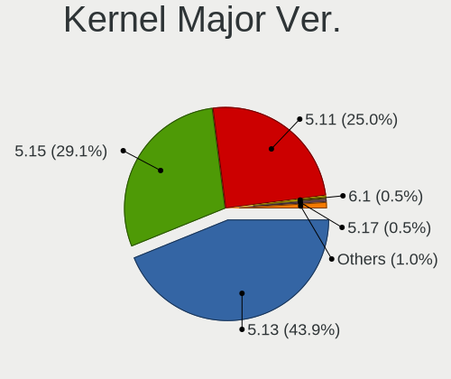
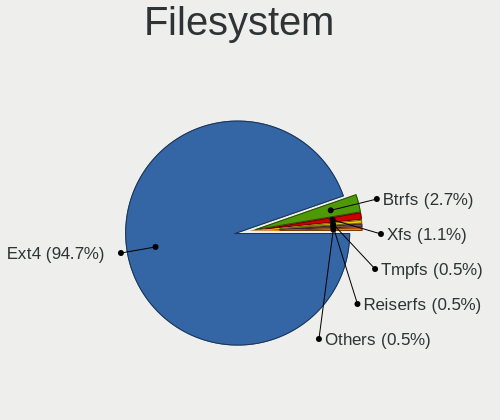
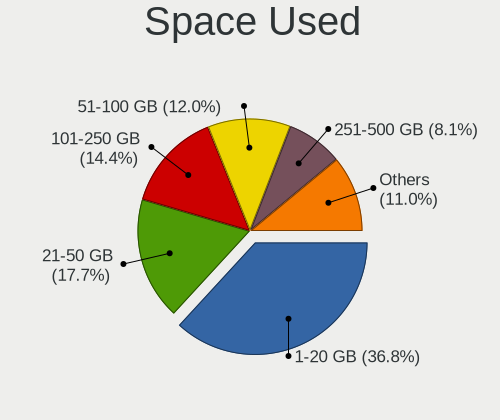
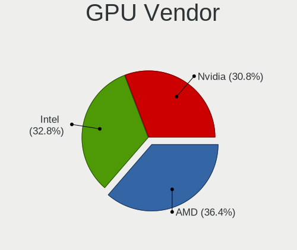

Elementary 6.1 - Tested Hardware & Statistics (Desktops)
--------------------------------------------------------

A project to collect tested hardware configurations for Elementary 6.1.

Anyone can contribute to this report by the [hw-probe](https://github.com/linuxhw/hw-probe) tool:

    sudo -E hw-probe -all -upload

Please submit a probe of your configuration if it's not presented on the page or is rare.

Full-feature report is available here: https://linux-hardware.org/?view=trends

Contents
--------

* [ Test Cases ](#test-cases)

* [ System ](#system)
  - [ Kernel                   ](#kernel)
  - [ Kernel Family            ](#kernel-family)
  - [ Kernel Major Ver.        ](#kernel-major-ver)
  - [ Arch                     ](#arch)
  - [ DE                       ](#de)
  - [ Display Server           ](#display-server)
  - [ Display Manager          ](#display-manager)
  - [ OS Lang                  ](#os-lang)
  - [ Boot Mode                ](#boot-mode)
  - [ Filesystem               ](#filesystem)
  - [ Part. scheme             ](#part-scheme)
  - [ Dual Boot with Linux/BSD ](#dual-boot-with-linuxbsd)
  - [ Dual Boot (Win)          ](#dual-boot-win)

* [ Board ](#board)
  - [ Vendor                   ](#vendor)
  - [ Model                    ](#model)
  - [ Model Family             ](#model-family)
  - [ MFG Year                 ](#mfg-year)
  - [ Form Factor              ](#form-factor)
  - [ Secure Boot              ](#secure-boot)
  - [ Coreboot                 ](#coreboot)
  - [ RAM Size                 ](#ram-size)
  - [ RAM Used                 ](#ram-used)
  - [ Total Drives             ](#total-drives)
  - [ Has CD-ROM               ](#has-cd-rom)
  - [ Has Ethernet             ](#has-ethernet)
  - [ Has WiFi                 ](#has-wifi)
  - [ Has Bluetooth            ](#has-bluetooth)

* [ Location ](#location)
  - [ Country                  ](#country)
  - [ City                     ](#city)

* [ Drives ](#drives)
  - [ Drive Vendor             ](#drive-vendor)
  - [ Drive Model              ](#drive-model)
  - [ HDD Vendor               ](#hdd-vendor)
  - [ SSD Vendor               ](#ssd-vendor)
  - [ Drive Kind               ](#drive-kind)
  - [ Drive Connector          ](#drive-connector)
  - [ Drive Size               ](#drive-size)
  - [ Space Total              ](#space-total)
  - [ Space Used               ](#space-used)
  - [ Malfunc. Drives          ](#malfunc-drives)
  - [ Malfunc. Drive Vendor    ](#malfunc-drive-vendor)
  - [ Malfunc. HDD Vendor      ](#malfunc-hdd-vendor)
  - [ Malfunc. Drive Kind      ](#malfunc-drive-kind)
  - [ Failed Drives            ](#failed-drives)
  - [ Failed Drive Vendor      ](#failed-drive-vendor)
  - [ Drive Status             ](#drive-status)

* [ Storage controller ](#storage-controller)
  - [ Storage Vendor           ](#storage-vendor)
  - [ Storage Model            ](#storage-model)
  - [ Storage Kind             ](#storage-kind)

* [ Processor ](#processor)
  - [ CPU Vendor               ](#cpu-vendor)
  - [ CPU Model                ](#cpu-model)
  - [ CPU Model Family         ](#cpu-model-family)
  - [ CPU Cores                ](#cpu-cores)
  - [ CPU Sockets              ](#cpu-sockets)
  - [ CPU Threads              ](#cpu-threads)
  - [ CPU Op-Modes             ](#cpu-op-modes)
  - [ CPU Microcode            ](#cpu-microcode)
  - [ CPU Microarch            ](#cpu-microarch)

* [ Graphics ](#graphics)
  - [ GPU Vendor               ](#gpu-vendor)
  - [ GPU Model                ](#gpu-model)
  - [ GPU Combo                ](#gpu-combo)
  - [ GPU Driver               ](#gpu-driver)
  - [ GPU Memory               ](#gpu-memory)

* [ Monitor ](#monitor)
  - [ Monitor Vendor           ](#monitor-vendor)
  - [ Monitor Model            ](#monitor-model)
  - [ Monitor Resolution       ](#monitor-resolution)
  - [ Monitor Diagonal         ](#monitor-diagonal)
  - [ Monitor Width            ](#monitor-width)
  - [ Aspect Ratio             ](#aspect-ratio)
  - [ Monitor Area             ](#monitor-area)
  - [ Pixel Density            ](#pixel-density)
  - [ Multiple Monitors        ](#multiple-monitors)

* [ Network ](#network)
  - [ Net Controller Vendor    ](#net-controller-vendor)
  - [ Net Controller Model     ](#net-controller-model)
  - [ Wireless Vendor          ](#wireless-vendor)
  - [ Wireless Model           ](#wireless-model)
  - [ Ethernet Vendor          ](#ethernet-vendor)
  - [ Ethernet Model           ](#ethernet-model)
  - [ Net Controller Kind      ](#net-controller-kind)
  - [ Used Controller          ](#used-controller)
  - [ NICs                     ](#nics)
  - [ IPv6                     ](#ipv6)

* [ Bluetooth ](#bluetooth)
  - [ Bluetooth Vendor         ](#bluetooth-vendor)
  - [ Bluetooth Model          ](#bluetooth-model)

* [ Sound ](#sound)
  - [ Sound Vendor             ](#sound-vendor)
  - [ Sound Model              ](#sound-model)

* [ Memory ](#memory)
  - [ Memory Vendor            ](#memory-vendor)
  - [ Memory Model             ](#memory-model)
  - [ Memory Kind              ](#memory-kind)
  - [ Memory Form Factor       ](#memory-form-factor)
  - [ Memory Size              ](#memory-size)
  - [ Memory Speed             ](#memory-speed)

* [ Printers & scanners ](#printers--scanners)
  - [ Printer Vendor           ](#printer-vendor)
  - [ Printer Model            ](#printer-model)
  - [ Scanner Vendor           ](#scanner-vendor)
  - [ Scanner Model            ](#scanner-model)

* [ Camera ](#camera)
  - [ Camera Vendor            ](#camera-vendor)
  - [ Camera Model             ](#camera-model)

* [ Security ](#security)
  - [ Fingerprint Vendor       ](#fingerprint-vendor)
  - [ Fingerprint Model        ](#fingerprint-model)
  - [ Chipcard Vendor          ](#chipcard-vendor)
  - [ Chipcard Model           ](#chipcard-model)

* [ Unsupported ](#unsupported)
  - [ Unsupported Devices      ](#unsupported-devices)
  - [ Unsupported Device Types ](#unsupported-device-types)

Test Cases
----------

| Vendor   | Model                 | Probe                                                      | Date         |
|----------|-----------------------|------------------------------------------------------------|--------------|
| Gigabyte | B85M-DS3H-A           | [cd6abb9f49](https://linux-hardware.org/?probe=cd6abb9f49) | Jan 03, 2022 |
| MSI      | 2A9C                  | [8d08f7f383](https://linux-hardware.org/?probe=8d08f7f383) | Dec 31, 2021 |
| HP       | 3397                  | [323dc8992b](https://linux-hardware.org/?probe=323dc8992b) | Dec 31, 2021 |
| ASUSTek  | X79-DELUXE            | [00b9dd3788](https://linux-hardware.org/?probe=00b9dd3788) | Dec 30, 2021 |
| HP       | 1589                  | [d123a8de64](https://linux-hardware.org/?probe=d123a8de64) | Dec 30, 2021 |
| Foxconn  | 2AB1                  | [bcd6fc46cc](https://linux-hardware.org/?probe=bcd6fc46cc) | Dec 30, 2021 |
| ASUSTek  | TUF GAMING B550M-PLUS | [5f67c759fe](https://linux-hardware.org/?probe=5f67c759fe) | Dec 28, 2021 |
| Gigabyte | Z390 UD               | [2399fa64ba](https://linux-hardware.org/?probe=2399fa64ba) | Dec 26, 2021 |
| Apple    | Mac-F42C88C8 Proto1   | [783618fe4b](https://linux-hardware.org/?probe=783618fe4b) | Dec 23, 2021 |
| ASUSTek  | H97-PLUS              | [cba91c2ad2](https://linux-hardware.org/?probe=cba91c2ad2) | Dec 22, 2021 |
| MSI      | B450-A PRO MAX        | [f14eef1ae6](https://linux-hardware.org/?probe=f14eef1ae6) | Dec 20, 2021 |
| Gigabyte | H310M S2P             | [a931eb10f0](https://linux-hardware.org/?probe=a931eb10f0) | Dec 19, 2021 |
| Foxconn  | 2AB1                  | [d9077a5d94](https://linux-hardware.org/?probe=d9077a5d94) | Dec 18, 2021 |
| Foxconn  | 2AB1                  | [b789981cc4](https://linux-hardware.org/?probe=b789981cc4) | Dec 17, 2021 |
| Gigabyte | Z590 AORUS ELITE AX   | [c068e358e8](https://linux-hardware.org/?probe=c068e358e8) | Dec 16, 2021 |
| ASUSTek  | M5A78L-M LX3          | [720cc7a45f](https://linux-hardware.org/?probe=720cc7a45f) | Dec 15, 2021 |

System
------

Kernel
------

Version of the Linux kernel

| Version              | Desktops | Percent |
|----------------------|----------|---------|
| 5.11.0-43-generic    | 7        | 50%     |
| 5.11.0-41-generic    | 4        | 28.57%  |
| 5.13.0-22-generic    | 1        | 7.14%   |
| 5.11.0-43-lowlatency | 1        | 7.14%   |
| 5.11.0-37-generic    | 1        | 7.14%   |

Kernel Family
-------------

Linux kernel without a distro release

| Version | Desktops | Percent |
|---------|----------|---------|
| 5.11.0  | 13       | 92.86%  |
| 5.13.0  | 1        | 7.14%   |

Kernel Major Ver.
-----------------

Linux kernel major version

| Version | Desktops | Percent |
|---------|----------|---------|
| 5.11    | 13       | 92.86%  |
| 5.13    | 1        | 7.14%   |

Arch
----

OS architecture (x86_64, i586, etc.)

| Name   | Desktops | Percent |
|--------|----------|---------|
| x86_64 | 14       | 100%    |

DE
--

Desktop Environment

| Name     | Desktops | Percent |
|----------|----------|---------|
| Pantheon | 14       | 100%    |

Display Server
--------------

X11 or Wayland

| Name | Desktops | Percent |
|------|----------|---------|
| X11  | 14       | 100%    |

Display Manager
---------------

SDDM, LightDM, etc.

| Name    | Desktops | Percent |
|---------|----------|---------|
| Unknown | 12       | 85.71%  |
| LightDM | 2        | 14.29%  |

OS Lang
-------

Language

| Lang  | Desktops | Percent |
|-------|----------|---------|
| en_US | 7        | 50%     |
| de_DE | 2        | 14.29%  |
| ru_RU | 1        | 7.14%   |
| fr_FR | 1        | 7.14%   |
| es_ES | 1        | 7.14%   |
| en_GB | 1        | 7.14%   |
| en_CA | 1        | 7.14%   |

Boot Mode
---------

EFI or BIOS

| Mode | Desktops | Percent |
|------|----------|---------|
| EFI  | 8        | 57.14%  |
| BIOS | 6        | 42.86%  |

Filesystem
----------

Type of filesystem

| Type | Desktops | Percent |
|------|----------|---------|
| Ext4 | 13       | 92.86%  |
| Xfs  | 1        | 7.14%   |

Part. scheme
------------

Scheme of partitioning

| Type    | Desktops | Percent |
|---------|----------|---------|
| Unknown | 14       | 100%    |

Dual Boot with Linux/BSD
------------------------

Hosting more than one Linux/BSD

| Dual boot | Desktops | Percent |
|-----------|----------|---------|
| No        | 14       | 100%    |

Dual Boot (Win)
---------------

Hosting Linux and Windows

| Dual boot | Desktops | Percent |
|-----------|----------|---------|
| No        | 14       | 100%    |

Board
-----

Vendor
------

Motherboard manufacturer

| Name                | Desktops | Percent |
|---------------------|----------|---------|
| Gigabyte Technology | 4        | 28.57%  |
| ASUSTek Computer    | 4        | 28.57%  |
| MSI                 | 2        | 14.29%  |
| Hewlett-Packard     | 2        | 14.29%  |
| Foxconn             | 1        | 7.14%   |
| Apple               | 1        | 7.14%   |

Model
-----

Motherboard model

| Name                         | Desktops | Percent |
|------------------------------|----------|---------|
| MSI PPPPP-CCC#MMMMMMMM       | 1        | 7.14%   |
| MSI MS-7B86                  | 1        | 7.14%   |
| HP Z420 Workstation          | 1        | 7.14%   |
| HP Compaq Elite 8300 SFF     | 1        | 7.14%   |
| Gigabyte Z590 AORUS ELITE AX | 1        | 7.14%   |
| Gigabyte Z390 UD             | 1        | 7.14%   |
| Gigabyte H310M S2P 2.0       | 1        | 7.14%   |
| Gigabyte B85M-DS3H-A         | 1        | 7.14%   |
| Foxconn p6616f               | 1        | 7.14%   |
| ASUS X79-DELUXE              | 1        | 7.14%   |
| ASUS TUF GAMING B550M-PLUS   | 1        | 7.14%   |
| ASUS M5A78L-M LX3            | 1        | 7.14%   |
| ASUS All Series              | 1        | 7.14%   |
| Apple MacPro3,1              | 1        | 7.14%   |

Model Family
------------

Motherboard model prefix

| Name                   | Desktops | Percent |
|------------------------|----------|---------|
| MSI PPPPP-CCC#MMMMMMMM | 1        | 7.14%   |
| MSI MS-7B86            | 1        | 7.14%   |
| HP Z420                | 1        | 7.14%   |
| HP Compaq              | 1        | 7.14%   |
| Gigabyte Z590          | 1        | 7.14%   |
| Gigabyte Z390          | 1        | 7.14%   |
| Gigabyte H310M         | 1        | 7.14%   |
| Gigabyte B85M-DS3H-A   | 1        | 7.14%   |
| Foxconn p6616f         | 1        | 7.14%   |
| ASUS X79-DELUXE        | 1        | 7.14%   |
| ASUS TUF               | 1        | 7.14%   |
| ASUS M5A78L-M          | 1        | 7.14%   |
| ASUS All               | 1        | 7.14%   |
| Apple MacPro3          | 1        | 7.14%   |

MFG Year
--------

Motherboard manufacture year

| Year | Desktops | Percent |
|------|----------|---------|
| 2020 | 3        | 21.43%  |
| 2016 | 3        | 21.43%  |
| 2010 | 2        | 14.29%  |
| 2021 | 1        | 7.14%   |
| 2019 | 1        | 7.14%   |
| 2018 | 1        | 7.14%   |
| 2015 | 1        | 7.14%   |
| 2012 | 1        | 7.14%   |
| 2008 | 1        | 7.14%   |

Form Factor
-----------

Physical design of the computer

| Name    | Desktops | Percent |
|---------|----------|---------|
| Desktop | 14       | 100%    |

Secure Boot
-----------

Enabled or disabled

| State    | Desktops | Percent |
|----------|----------|---------|
| Disabled | 14       | 100%    |

Coreboot
--------

Have coreboot on board

| Used | Desktops | Percent |
|------|----------|---------|
| No   | 14       | 100%    |

RAM Size
--------

Total RAM memory

| Size in GB | Desktops | Percent |
|------------|----------|---------|
| 32.01-64.0 | 7        | 50%     |
| 16.01-24.0 | 3        | 21.43%  |
| 8.01-16.0  | 2        | 14.29%  |
| 4.01-8.0   | 1        | 7.14%   |
| 3.01-4.0   | 1        | 7.14%   |

RAM Used
--------

Used RAM memory

| Used GB   | Desktops | Percent |
|-----------|----------|---------|
| 1.01-2.0  | 5        | 35.71%  |
| 4.01-8.0  | 4        | 28.57%  |
| 3.01-4.0  | 2        | 14.29%  |
| 2.01-3.0  | 2        | 14.29%  |
| 8.01-16.0 | 1        | 7.14%   |

Total Drives
------------

Number of drives on board

| Drives | Desktops | Percent |
|--------|----------|---------|
| 2      | 4        | 28.57%  |
| 4      | 3        | 21.43%  |
| 1      | 3        | 21.43%  |
| 3      | 2        | 14.29%  |
| 7      | 1        | 7.14%   |
| 5      | 1        | 7.14%   |

Has CD-ROM
----------

Has CD-ROM on board

| Presented | Desktops | Percent |
|-----------|----------|---------|
| Yes       | 7        | 50%     |
| No        | 7        | 50%     |

Has Ethernet
------------

Has Ethernet on board

| Presented | Desktops | Percent |
|-----------|----------|---------|
| Yes       | 14       | 100%    |

Has WiFi
--------

Has WiFi module

| Presented | Desktops | Percent |
|-----------|----------|---------|
| No        | 8        | 57.14%  |
| Yes       | 6        | 42.86%  |

Has Bluetooth
-------------

Has Bluetooth module

| Presented | Desktops | Percent |
|-----------|----------|---------|
| No        | 8        | 57.14%  |
| Yes       | 6        | 42.86%  |

Location
--------

Country
-------

Geographic location (country)

| Country      | Desktops | Percent |
|--------------|----------|---------|
| USA          | 2        | 14.29%  |
| Germany      | 2        | 14.29%  |
| UK           | 1        | 7.14%   |
| Thailand     | 1        | 7.14%   |
| Sweden       | 1        | 7.14%   |
| Sri Lanka    | 1        | 7.14%   |
| Spain        | 1        | 7.14%   |
| South Africa | 1        | 7.14%   |
| Russia       | 1        | 7.14%   |
| Iran         | 1        | 7.14%   |
| France       | 1        | 7.14%   |
| Canada       | 1        | 7.14%   |

City
----

Geographic location (city)

| City                  | Desktops | Percent |
|-----------------------|----------|---------|
| Wattala               | 1        | 7.14%   |
| Vilanova i la Geltr?? | 1        | 7.14%   |
| Uppsala               | 1        | 7.14%   |
| Tehran                | 1        | 7.14%   |
| Southampton           | 1        | 7.14%   |
| Sornay                | 1        | 7.14%   |
| Rueso                 | 1        | 7.14%   |
| Khimki                | 1        | 7.14%   |
| Johannesburg          | 1        | 7.14%   |
| Hennef                | 1        | 7.14%   |
| Hamburg               | 1        | 7.14%   |
| Edmonton              | 1        | 7.14%   |
| Denver                | 1        | 7.14%   |
| Bergenfield           | 1        | 7.14%   |

Drives
------

Drive Vendor
------------

Hard drive vendors

| Vendor              | Desktops | Drives | Percent |
|---------------------|----------|--------|---------|
| Samsung Electronics | 7        | 8      | 24.14%  |
| WDC                 | 6        | 11     | 20.69%  |
| Seagate             | 6        | 6      | 20.69%  |
| Toshiba             | 2        | 3      | 6.9%    |
| Crucial             | 2        | 2      | 6.9%    |
| Unknown             | 1        | 3      | 3.45%   |
| MAXTOR              | 1        | 1      | 3.45%   |
| Kingston            | 1        | 1      | 3.45%   |
| JMicron             | 1        | 1      | 3.45%   |
| Intenso             | 1        | 1      | 3.45%   |
| Intel               | 1        | 1      | 3.45%   |

Drive Model
-----------

Hard drive models

| Model                             | Desktops | Percent |
|-----------------------------------|----------|---------|
| Samsung NVMe SSD Drive 500GB      | 2        | 5.56%   |
| WDC WDS120G2G0A-00JH30 120GB SSD  | 1        | 2.78%   |
| WDC WD6401AALS-00L3B2 640GB       | 1        | 2.78%   |
| WDC WD40EZAZ-00SF3B0 4TB          | 1        | 2.78%   |
| WDC WD3003FZEX-00Z4SA0 3TB        | 1        | 2.78%   |
| WDC WD20EFRX-68EUZN0 2TB          | 1        | 2.78%   |
| WDC WD15EARX-00PASB0 1TB          | 1        | 2.78%   |
| WDC WD10EZEX-08WN4A0 1TB          | 1        | 2.78%   |
| WDC WD10EZEX-00BN5A0 1TB          | 1        | 2.78%   |
| WDC WD10EADS-00L5B1 1TB           | 1        | 2.78%   |
| Unknown SD/MMC/M.S.PRO 32GB       | 1        | 2.78%   |
| Unknown SD/MMC 16GB               | 1        | 2.78%   |
| Unknown M.S./M.S.Pro/HG 16GB      | 1        | 2.78%   |
| Toshiba HDWE140 4TB               | 1        | 2.78%   |
| Toshiba HDWD120 2TB               | 1        | 2.78%   |
| Toshiba HDWD110 1TB               | 1        | 2.78%   |
| Seagate ST4000DX001-1CE168 4TB    | 1        | 2.78%   |
| Seagate ST3750528AS 752GB         | 1        | 2.78%   |
| Seagate ST2000DX002-2DV164 2TB    | 1        | 2.78%   |
| Seagate ST1000DM003-1CH162 1TB    | 1        | 2.78%   |
| Seagate ST10000DM0004-1ZC101 10TB | 1        | 2.78%   |
| Seagate NVMe SSD Drive 500GB      | 1        | 2.78%   |
| Samsung SSD 870 QVO 2TB           | 1        | 2.78%   |
| Samsung SSD 870 QVO 1TB           | 1        | 2.78%   |
| Samsung SSD 860 EVO M.2 250GB     | 1        | 2.78%   |
| Samsung SSD 860 EVO 1TB           | 1        | 2.78%   |
| Samsung NVMe SSD Drive 512GB      | 1        | 2.78%   |
| Samsung HD322HJ 320GB             | 1        | 2.78%   |
| MAXTOR Z1 SSD 240GB               | 1        | 2.78%   |
| Kingston SA400S37240G 240GB SSD   | 1        | 2.78%   |
| JMicron Tech 250GB                | 1        | 2.78%   |
| Intenso SSD SATAIII 128GB         | 1        | 2.78%   |
| Intel NVMe SSD Drive 512GB        | 1        | 2.78%   |
| Crucial CT525MX300SSD1 528GB      | 1        | 2.78%   |
| Crucial CT1000MX500SSD1 1TB       | 1        | 2.78%   |

HDD Vendor
----------

Hard disk drive vendors

| Vendor              | Desktops | Drives | Percent |
|---------------------|----------|--------|---------|
| WDC                 | 5        | 9      | 38.46%  |
| Seagate             | 5        | 5      | 38.46%  |
| Toshiba             | 2        | 3      | 15.38%  |
| Samsung Electronics | 1        | 1      | 7.69%   |

SSD Vendor
----------

Solid state drive vendors

| Vendor              | Desktops | Drives | Percent |
|---------------------|----------|--------|---------|
| Samsung Electronics | 4        | 4      | 40%     |
| Crucial             | 2        | 2      | 20%     |
| WDC                 | 1        | 2      | 10%     |
| MAXTOR              | 1        | 1      | 10%     |
| Kingston            | 1        | 1      | 10%     |
| Intenso             | 1        | 1      | 10%     |

Drive Kind
----------

HDD or SSD

| Kind    | Desktops | Drives | Percent |
|---------|----------|--------|---------|
| SSD     | 10       | 11     | 38.46%  |
| HDD     | 10       | 18     | 38.46%  |
| NVMe    | 4        | 5      | 15.38%  |
| Unknown | 2        | 4      | 7.69%   |

Drive Connector
---------------

SATA, SAS, NVMe, etc.

| Type | Desktops | Drives | Percent |
|------|----------|--------|---------|
| SATA | 13       | 29     | 68.42%  |
| NVMe | 4        | 5      | 21.05%  |
| SAS  | 2        | 4      | 10.53%  |

Drive Size
----------

Size of hard drive

| Size in TB | Desktops | Drives | Percent |
|------------|----------|--------|---------|
| 0.51-1.0   | 7        | 12     | 35%     |
| 0.01-0.5   | 5        | 7      | 25%     |
| 3.01-4.0   | 3        | 3      | 15%     |
| 1.01-2.0   | 3        | 4      | 15%     |
| 2.01-3.0   | 1        | 2      | 5%      |
| 4.01-10.0  | 1        | 1      | 5%      |

Space Total
-----------

Amount of disk space available on the file system

| Size in GB     | Desktops | Percent |
|----------------|----------|---------|
| More than 3000 | 4        | 28.57%  |
| 251-500        | 4        | 28.57%  |
| 501-1000       | 3        | 21.43%  |
| 101-250        | 2        | 14.29%  |
| 21-50          | 1        | 7.14%   |

Space Used
----------

Amount of used disk space

| Used GB        | Desktops | Percent |
|----------------|----------|---------|
| 21-50          | 3        | 21.43%  |
| 1-20           | 3        | 21.43%  |
| 101-250        | 2        | 14.29%  |
| 1001-2000      | 2        | 14.29%  |
| 51-100         | 2        | 14.29%  |
| More than 3000 | 1        | 7.14%   |
| 501-1000       | 1        | 7.14%   |

Malfunc. Drives
---------------

Drive models with a malfunction

Zero info for selected period =(

Malfunc. Drive Vendor
---------------------

Vendors of faulty drives

Zero info for selected period =(

Malfunc. HDD Vendor
-------------------

Vendors of faulty HDD drives

Zero info for selected period =(

Malfunc. Drive Kind
-------------------

Kinds of faulty drives

Zero info for selected period =(

Failed Drives
-------------

Failed drive models

Zero info for selected period =(

Failed Drive Vendor
-------------------

Failed drive vendors

Zero info for selected period =(

Drive Status
------------

Number of failed and malfunc. drives

| Status   | Desktops | Drives | Percent |
|----------|----------|--------|---------|
| Detected | 14       | 38     | 100%    |

Storage controller
------------------

Storage Vendor
--------------

Storage controller vendors

| Vendor                   | Desktops | Percent |
|--------------------------|----------|---------|
| Intel                    | 10       | 50%     |
| AMD                      | 4        | 20%     |
| Samsung Electronics      | 3        | 15%     |
| Seagate Technology       | 1        | 5%      |
| Marvell Technology Group | 1        | 5%      |
| ASMedia Technology       | 1        | 5%      |

Storage Model
-------------

Storage controller models

| Model                                                                          | Desktops | Percent |
|--------------------------------------------------------------------------------|----------|---------|
| Seagate Non-Volatile memory controller                                         | 1        | 3.85%   |
| Samsung NVMe SSD Controller SM981/PM981/PM983                                  | 1        | 3.85%   |
| Samsung NVMe SSD Controller SM961/PM961/SM963                                  | 1        | 3.85%   |
| Samsung NVMe SSD Controller 980                                                | 1        | 3.85%   |
| Marvell Group 88SE9230 PCIe 2.0 x2 4-port SATA 6 Gb/s RAID Controller          | 1        | 3.85%   |
| Intel SSD 660P Series                                                          | 1        | 3.85%   |
| Intel Cannon Lake PCH SATA AHCI Controller                                     | 1        | 3.85%   |
| Intel C602 chipset 4-Port SATA Storage Control Unit                            | 1        | 3.85%   |
| Intel C600/X79 series chipset SATA RAID Controller                             | 1        | 3.85%   |
| Intel C600/X79 series chipset IDE-r Controller                                 | 1        | 3.85%   |
| Intel C600/X79 series chipset 6-Port SATA AHCI Controller                      | 1        | 3.85%   |
| Intel 9 Series Chipset Family SATA Controller [AHCI Mode]                      | 1        | 3.85%   |
| Intel 8 Series/C220 Series Chipset Family 6-port SATA Controller 1 [AHCI mode] | 1        | 3.85%   |
| Intel 7 Series/C210 Series Chipset Family 6-port SATA Controller [AHCI mode]   | 1        | 3.85%   |
| Intel 631xESB/632xESB SATA AHCI Controller                                     | 1        | 3.85%   |
| Intel 631xESB/632xESB IDE Controller                                           | 1        | 3.85%   |
| Intel 500 Series Chipset Family SATA AHCI Controller                           | 1        | 3.85%   |
| Intel 5 Series/3400 Series Chipset 6 port SATA AHCI Controller                 | 1        | 3.85%   |
| Intel 200 Series PCH SATA controller [AHCI mode]                               | 1        | 3.85%   |
| ASMedia ASM1062 Serial ATA Controller                                          | 1        | 3.85%   |
| AMD Starship/Matisse Chipset SATA Controller [AHCI mode]                       | 1        | 3.85%   |
| AMD SB7x0/SB8x0/SB9x0 SATA Controller [IDE mode]                               | 1        | 3.85%   |
| AMD SB7x0/SB8x0/SB9x0 SATA Controller [AHCI mode]                              | 1        | 3.85%   |
| AMD SB7x0/SB8x0/SB9x0 IDE Controller                                           | 1        | 3.85%   |
| AMD FCH SATA Controller [AHCI mode]                                            | 1        | 3.85%   |
| AMD 400 Series Chipset SATA Controller                                         | 1        | 3.85%   |

Storage Kind
------------

Kind of storage controller (IDE, SATA, NVMe, SAS, ...)

| Kind | Desktops | Percent |
|------|----------|---------|
| SATA | 13       | 59.09%  |
| NVMe | 4        | 18.18%  |
| IDE  | 3        | 13.64%  |
| RAID | 1        | 4.55%   |
| SAS  | 1        | 4.55%   |

Processor
---------

CPU Vendor
----------

Processor vendors

| Vendor | Desktops | Percent |
|--------|----------|---------|
| Intel  | 10       | 71.43%  |
| AMD    | 4        | 28.57%  |

CPU Model
---------

Processor models

| Model                                   | Desktops | Percent |
|-----------------------------------------|----------|---------|
| Intel Xeon CPU E5462 @ 2.80GHz          | 1        | 7.14%   |
| Intel Xeon CPU E5-2690 0 @ 2.90GHz      | 1        | 7.14%   |
| Intel Core i7-9700K CPU @ 3.60GHz       | 1        | 7.14%   |
| Intel Core i7-4930K CPU @ 3.40GHz       | 1        | 7.14%   |
| Intel Core i7-4790 CPU @ 3.60GHz        | 1        | 7.14%   |
| Intel Core i7-4770 CPU @ 3.40GHz        | 1        | 7.14%   |
| Intel Core i5-8400 CPU @ 2.80GHz        | 1        | 7.14%   |
| Intel Core i5-3470 CPU @ 3.20GHz        | 1        | 7.14%   |
| Intel Core i3 CPU 550 @ 3.20GHz         | 1        | 7.14%   |
| Intel 11th Gen Core i7-11700K @ 3.60GHz | 1        | 7.14%   |
| AMD Ryzen 7 5800X 8-Core Processor      | 1        | 7.14%   |
| AMD Ryzen 5 3600 6-Core Processor       | 1        | 7.14%   |
| AMD Phenom II X4 B55 Processor          | 1        | 7.14%   |
| AMD Phenom II X4 820 Processor          | 1        | 7.14%   |

CPU Model Family
----------------

Processor model prefix

| Model            | Desktops | Percent |
|------------------|----------|---------|
| Intel Core i7    | 4        | 28.57%  |
| Intel Xeon       | 2        | 14.29%  |
| Intel Core i5    | 2        | 14.29%  |
| AMD Phenom II X4 | 2        | 14.29%  |
| Other            | 1        | 7.14%   |
| Intel Core i3    | 1        | 7.14%   |
| AMD Ryzen 7      | 1        | 7.14%   |
| AMD Ryzen 5      | 1        | 7.14%   |

CPU Cores
---------

Number of processor cores

| Number | Desktops | Percent |
|--------|----------|---------|
| 8      | 5        | 35.71%  |
| 4      | 5        | 35.71%  |
| 6      | 3        | 21.43%  |
| 2      | 1        | 7.14%   |

CPU Sockets
-----------

Number of sockets

| Number | Desktops | Percent |
|--------|----------|---------|
| 1      | 13       | 92.86%  |
| 2      | 1        | 7.14%   |

CPU Threads
-----------

Threads per core (Hyper-Threading)

| Number | Desktops | Percent |
|--------|----------|---------|
| 2      | 8        | 57.14%  |
| 1      | 6        | 42.86%  |

CPU Op-Modes
------------

CPU Operation Modes (32-bit, 64-bit)

| Op mode        | Desktops | Percent |
|----------------|----------|---------|
| 32-bit, 64-bit | 14       | 100%    |

CPU Microcode
-------------

Microcode number

| Number     | Desktops | Percent |
|------------|----------|---------|
| 0x306c3    | 2        | 14.29%  |
| 0xa0671    | 1        | 7.14%   |
| 0x906ec    | 1        | 7.14%   |
| 0x906ea    | 1        | 7.14%   |
| 0x306e4    | 1        | 7.14%   |
| 0x306a9    | 1        | 7.14%   |
| 0x206d7    | 1        | 7.14%   |
| 0x20655    | 1        | 7.14%   |
| 0x10676    | 1        | 7.14%   |
| 0x0a201009 | 1        | 7.14%   |
| 0x08701021 | 1        | 7.14%   |
| 0x010000db | 1        | 7.14%   |
| 0x010000c8 | 1        | 7.14%   |

CPU Microarch
-------------

Microarchitecture

| Name        | Desktops | Percent |
|-------------|----------|---------|
| KabyLake    | 2        | 14.29%  |
| K10         | 2        | 14.29%  |
| IvyBridge   | 2        | 14.29%  |
| Haswell     | 2        | 14.29%  |
| Zen 3       | 1        | 7.14%   |
| Zen 2       | 1        | 7.14%   |
| Westmere    | 1        | 7.14%   |
| SandyBridge | 1        | 7.14%   |
| Penryn      | 1        | 7.14%   |
| Icelake     | 1        | 7.14%   |

Graphics
--------

GPU Vendor
----------

Vendors of graphics cards

| Vendor | Desktops | Percent |
|--------|----------|---------|
| Nvidia | 9        | 60%     |
| Intel  | 3        | 20%     |
| AMD    | 3        | 20%     |

GPU Model
---------

Graphics card models

| Model                                                                       | Desktops | Percent |
|-----------------------------------------------------------------------------|----------|---------|
| Nvidia TU117 [GeForce GTX 1650]                                             | 2        | 12.5%   |
| Nvidia TU116 [GeForce GTX 1660]                                             | 1        | 6.25%   |
| Nvidia TU104 [GeForce RTX 2080]                                             | 1        | 6.25%   |
| Nvidia GP106 [GeForce GTX 1060 3GB]                                         | 1        | 6.25%   |
| Nvidia GM204 [GeForce GTX 970]                                              | 1        | 6.25%   |
| Nvidia GK208B [GeForce GT 710]                                              | 1        | 6.25%   |
| Nvidia GF119 [GeForce GT 625 OEM]                                           | 1        | 6.25%   |
| Nvidia GF108 [GeForce GT 430]                                               | 1        | 6.25%   |
| Intel Xeon E3-1200 v3/4th Gen Core Processor Integrated Graphics Controller | 1        | 6.25%   |
| Intel RocketLake-S GT1 [UHD Graphics 750]                                   | 1        | 6.25%   |
| Intel CoffeeLake-S GT2 [UHD Graphics 630]                                   | 1        | 6.25%   |
| AMD RV630 XT [Radeon HD 2600 XT]                                            | 1        | 6.25%   |
| AMD RS880 [Radeon HD 4200]                                                  | 1        | 6.25%   |
| AMD Navi 10 [Radeon RX 5600 OEM/5600 XT / 5700/5700 XT]                     | 1        | 6.25%   |
| AMD Baffin [Radeon RX 550 640SP / RX 560/560X]                              | 1        | 6.25%   |

GPU Combo
---------

Combinations of graphics cards

| Name       | Desktops | Percent |
|------------|----------|---------|
| 1 x Nvidia | 9        | 64.29%  |
| 1 x Intel  | 2        | 14.29%  |
| 1 x AMD    | 2        | 14.29%  |
| 2 x AMD    | 1        | 7.14%   |

GPU Driver
----------

Free vs proprietary

| Driver      | Desktops | Percent |
|-------------|----------|---------|
| Free        | 9        | 64.29%  |
| Proprietary | 5        | 35.71%  |

GPU Memory
----------

Total video memory

| Size in GB | Desktops | Percent |
|------------|----------|---------|
| 3.01-4.0   | 4        | 28.57%  |
| 7.01-8.0   | 2        | 14.29%  |
| 0.51-1.0   | 2        | 14.29%  |
| Unknown    | 2        | 14.29%  |
| 5.01-6.0   | 1        | 7.14%   |
| 2.01-3.0   | 1        | 7.14%   |
| 1.01-2.0   | 1        | 7.14%   |
| 0.01-0.5   | 1        | 7.14%   |

Monitor
-------

Monitor Vendor
--------------

Monitor vendors

| Vendor              | Desktops | Percent |
|---------------------|----------|---------|
| Hewlett-Packard     | 3        | 17.65%  |
| Samsung Electronics | 2        | 11.76%  |
| Goldstar            | 2        | 11.76%  |
| Acer                | 2        | 11.76%  |
| Philips             | 1        | 5.88%   |
| Iiyama              | 1        | 5.88%   |
| HPN                 | 1        | 5.88%   |
| Eizo                | 1        | 5.88%   |
| CHD                 | 1        | 5.88%   |
| AUS                 | 1        | 5.88%   |
| AOC                 | 1        | 5.88%   |
| Unknown             | 1        | 5.88%   |

Monitor Model
-------------

Monitor models

| Model                                                                | Desktops | Percent |
|----------------------------------------------------------------------|----------|---------|
| Samsung Electronics SA300/SA350 SAM078C 1600x900 443x249mm 20.0-inch | 1        | 5.26%   |
| Samsung Electronics SA300/SA350 SAM078B 1600x900 443x249mm 20.0-inch | 1        | 5.26%   |
| Samsung Electronics LCD Monitor SAM0B54 1366x768 609x347mm 27.6-inch | 1        | 5.26%   |
| Philips LCD Monitor PHL 276E8V 7680x2160                             | 1        | 5.26%   |
| Philips LCD Monitor PHL 276E8V                                       | 1        | 5.26%   |
| Iiyama PLB2403WS IVM5601 1920x1200 519x324mm 24.1-inch               | 1        | 5.26%   |
| HPN LCD Monitor HP 27fw 1920x1080                                    | 1        | 5.26%   |
| Hewlett-Packard LCD Monitor w17e 1440x900                            | 1        | 5.26%   |
| Hewlett-Packard 24es HWP3320 1920x1080 527x296mm 23.8-inch           | 1        | 5.26%   |
| Hewlett-Packard 2010 HWP2889 1600x900 443x250mm 20.0-inch            | 1        | 5.26%   |
| Goldstar QHD GSM772A 2560x1440 697x392mm 31.5-inch                   | 1        | 5.26%   |
| Goldstar IPS FULLHD GSM5AB8 1920x1080 480x270mm 21.7-inch            | 1        | 5.26%   |
| Eizo EV2455 ENC2533 1920x1200 519x324mm 24.1-inch                    | 1        | 5.26%   |
| CHD GDM-225JN CHD0220 1920x1080 490x270mm 22.0-inch                  | 1        | 5.26%   |
| AUS LCD Monitor VG27AQL1A 2560x1440                                  | 1        | 5.26%   |
| AOC 24B1W AOC2401 1920x1080 521x293mm 23.5-inch                      | 1        | 5.26%   |
| Acer XV272U ACR06C1 2560x1440 597x336mm 27.0-inch                    | 1        | 5.26%   |
| Acer V233H ACR0090 1920x1080 510x287mm 23.0-inch                     | 1        | 5.26%   |
| Unknown                                                              | 1        | 5.26%   |

Monitor Resolution
------------------

Monitor screen resolution

| Resolution        | Desktops | Percent |
|-------------------|----------|---------|
| 1920x1080 (FHD)   | 6        | 33.33%  |
| 2560x1440 (QHD)   | 4        | 22.22%  |
| 1600x900 (HD+)    | 2        | 11.11%  |
| 7680x2160         | 1        | 5.56%   |
| 1920x1200 (WUXGA) | 1        | 5.56%   |
| 1440x900 (WXGA+)  | 1        | 5.56%   |
| 1366x768 (WXGA)   | 1        | 5.56%   |
| 1360x768          | 1        | 5.56%   |
| Unknown           | 1        | 5.56%   |

Monitor Diagonal
----------------

Diagonal size in inches

| Inches  | Desktops | Percent |
|---------|----------|---------|
| Unknown | 5        | 29.41%  |
| 24      | 4        | 23.53%  |
| 27      | 2        | 11.76%  |
| 20      | 2        | 11.76%  |
| 31      | 1        | 5.88%   |
| 23      | 1        | 5.88%   |
| 22      | 1        | 5.88%   |
| 21      | 1        | 5.88%   |

Monitor Width
-------------

Physical width

| Width in mm | Desktops | Percent |
|-------------|----------|---------|
| 501-600     | 5        | 33.33%  |
| Unknown     | 5        | 33.33%  |
| 401-500     | 3        | 20%     |
| 601-700     | 2        | 13.33%  |

Aspect Ratio
------------

Proportional relationship between the width and the height

| Ratio   | Desktops | Percent |
|---------|----------|---------|
| 16/9    | 7        | 46.67%  |
| Unknown | 5        | 33.33%  |
| 16/10   | 3        | 20%     |

Monitor Area
------------

Area in inch²

| Area in inch² | Desktops | Percent |
|----------------|----------|---------|
| Unknown        | 5        | 29.41%  |
| 201-250        | 4        | 23.53%  |
| 251-300        | 3        | 17.65%  |
| 301-350        | 2        | 11.76%  |
| 151-200        | 2        | 11.76%  |
| 351-500        | 1        | 5.88%   |

Pixel Density
-------------

Pixels per inch

| Density | Desktops | Percent |
|---------|----------|---------|
| 51-100  | 9        | 56.25%  |
| Unknown | 5        | 31.25%  |
| 101-120 | 2        | 12.5%   |

Multiple Monitors
-----------------

Total monitors connected

| Total | Desktops | Percent |
|-------|----------|---------|
| 1     | 10       | 71.43%  |
| 2     | 3        | 21.43%  |
| 3     | 1        | 7.14%   |

Network
-------

Net Controller Vendor
---------------------

Controller vendors

| Vendor                | Desktops | Percent |
|-----------------------|----------|---------|
| Realtek Semiconductor | 11       | 52.38%  |
| Intel                 | 6        | 28.57%  |
| Ralink Technology     | 1        | 4.76%   |
| Ralink                | 1        | 4.76%   |
| Qualcomm Atheros      | 1        | 4.76%   |
| Broadcom              | 1        | 4.76%   |

Net Controller Model
--------------------

Controller models

| Model                                                             | Desktops | Percent |
|-------------------------------------------------------------------|----------|---------|
| Realtek RTL8111/8168/8411 PCI Express Gigabit Ethernet Controller | 7        | 31.82%  |
| Realtek RTL8125 2.5GbE Controller                                 | 2        | 9.09%   |
| Intel 82579LM Gigabit Network Connection (Lewisville)             | 2        | 9.09%   |
| Realtek RTL8812AE 802.11ac PCIe Wireless Network Adapter          | 1        | 4.55%   |
| Realtek RTL810xE PCI Express Fast Ethernet controller             | 1        | 4.55%   |
| Realtek 802.11ac NIC                                              | 1        | 4.55%   |
| Ralink MT7601U Wireless Adapter                                   | 1        | 4.55%   |
| Ralink RT3090 Wireless 802.11n 1T/1R PCIe                         | 1        | 4.55%   |
| Qualcomm Atheros QCA8171 Gigabit Ethernet                         | 1        | 4.55%   |
| Intel Wi-Fi 6 AX200                                               | 1        | 4.55%   |
| Intel Tiger Lake PCH CNVi WiFi                                    | 1        | 4.55%   |
| Intel 82579V Gigabit Network Connection                           | 1        | 4.55%   |
| Intel 80003ES2LAN Gigabit Ethernet Controller (Copper)            | 1        | 4.55%   |
| Broadcom BCM4352 802.11ac Wireless Network Adapter                | 1        | 4.55%   |

Wireless Vendor
---------------

Wireless vendors

| Vendor                | Desktops | Percent |
|-----------------------|----------|---------|
| Realtek Semiconductor | 2        | 28.57%  |
| Intel                 | 2        | 28.57%  |
| Ralink Technology     | 1        | 14.29%  |
| Ralink                | 1        | 14.29%  |
| Broadcom              | 1        | 14.29%  |

Wireless Model
--------------

Wireless models

| Model                                                    | Desktops | Percent |
|----------------------------------------------------------|----------|---------|
| Realtek RTL8812AE 802.11ac PCIe Wireless Network Adapter | 1        | 14.29%  |
| Realtek 802.11ac NIC                                     | 1        | 14.29%  |
| Ralink MT7601U Wireless Adapter                          | 1        | 14.29%  |
| Ralink RT3090 Wireless 802.11n 1T/1R PCIe                | 1        | 14.29%  |
| Intel Wi-Fi 6 AX200                                      | 1        | 14.29%  |
| Intel Tiger Lake PCH CNVi WiFi                           | 1        | 14.29%  |
| Broadcom BCM4352 802.11ac Wireless Network Adapter       | 1        | 14.29%  |

Ethernet Vendor
---------------

Ethernet vendors

| Vendor                | Desktops | Percent |
|-----------------------|----------|---------|
| Realtek Semiconductor | 10       | 66.67%  |
| Intel                 | 4        | 26.67%  |
| Qualcomm Atheros      | 1        | 6.67%   |

Ethernet Model
--------------

Ethernet models

| Model                                                             | Desktops | Percent |
|-------------------------------------------------------------------|----------|---------|
| Realtek RTL8111/8168/8411 PCI Express Gigabit Ethernet Controller | 7        | 46.67%  |
| Realtek RTL8125 2.5GbE Controller                                 | 2        | 13.33%  |
| Intel 82579LM Gigabit Network Connection (Lewisville)             | 2        | 13.33%  |
| Realtek RTL810xE PCI Express Fast Ethernet controller             | 1        | 6.67%   |
| Qualcomm Atheros QCA8171 Gigabit Ethernet                         | 1        | 6.67%   |
| Intel 82579V Gigabit Network Connection                           | 1        | 6.67%   |
| Intel 80003ES2LAN Gigabit Ethernet Controller (Copper)            | 1        | 6.67%   |

Net Controller Kind
-------------------

Ethernet, WiFi or modem

| Kind     | Desktops | Percent |
|----------|----------|---------|
| Ethernet | 14       | 70%     |
| WiFi     | 6        | 30%     |

Used Controller
---------------

Currently used network controller

| Kind     | Desktops | Percent |
|----------|----------|---------|
| Ethernet | 14       | 70%     |
| WiFi     | 6        | 30%     |

NICs
----

Total network controllers on board

| Total | Desktops | Percent |
|-------|----------|---------|
| 1     | 8        | 57.14%  |
| 2     | 5        | 35.71%  |
| 3     | 1        | 7.14%   |

IPv6
----

IPv6 vs IPv4

| Used | Desktops | Percent |
|------|----------|---------|
| No   | 9        | 64.29%  |
| Yes  | 5        | 35.71%  |

Bluetooth
---------

Bluetooth Vendor
----------------

Controller vendors

| Vendor                  | Desktops | Percent |
|-------------------------|----------|---------|
| Intel                   | 2        | 33.33%  |
| Cambridge Silicon Radio | 2        | 33.33%  |
| ASUSTek Computer        | 1        | 16.67%  |
| Apple                   | 1        | 16.67%  |

Bluetooth Model
---------------

Controller models

| Model                                               | Desktops | Percent |
|-----------------------------------------------------|----------|---------|
| Intel Bluetooth Device                              | 2        | 33.33%  |
| Cambridge Silicon Radio Bluetooth Dongle (HCI mode) | 2        | 33.33%  |
| ASUS BCM20702A0                                     | 1        | 16.67%  |
| Apple Bluetooth HCI                                 | 1        | 16.67%  |

Sound
-----

Sound Vendor
------------

Sound card vendors

| Vendor              | Desktops | Percent |
|---------------------|----------|---------|
| Nvidia              | 9        | 34.62%  |
| Intel               | 9        | 34.62%  |
| AMD                 | 5        | 19.23%  |
| Focusrite-Novation  | 1        | 3.85%   |
| Creative Labs       | 1        | 3.85%   |
| C-Media Electronics | 1        | 3.85%   |

Sound Model
-----------

Sound card models

| Model                                                               | Desktops | Percent |
|---------------------------------------------------------------------|----------|---------|
| Nvidia TU107 GeForce GTX 1650 High Definition Audio Controller      | 2        | 7.14%   |
| Intel C600/X79 series chipset High Definition Audio Controller      | 2        | 7.14%   |
| AMD SBx00 Azalia (Intel HDA)                                        | 2        | 7.14%   |
| Nvidia TU116 High Definition Audio Controller                       | 1        | 3.57%   |
| Nvidia TU104 HD Audio Controller                                    | 1        | 3.57%   |
| Nvidia GP106 High Definition Audio Controller                       | 1        | 3.57%   |
| Nvidia GM204 High Definition Audio Controller                       | 1        | 3.57%   |
| Nvidia GK208 HDMI/DP Audio Controller                               | 1        | 3.57%   |
| Nvidia GF119 HDMI Audio Controller                                  | 1        | 3.57%   |
| Nvidia GF108 High Definition Audio Controller                       | 1        | 3.57%   |
| Intel Xeon E3-1200 v3/4th Gen Core Processor HD Audio Controller    | 1        | 3.57%   |
| Intel Tiger Lake-H HD Audio Controller                              | 1        | 3.57%   |
| Intel Cannon Lake PCH cAVS                                          | 1        | 3.57%   |
| Intel 9 Series Chipset Family HD Audio Controller                   | 1        | 3.57%   |
| Intel 7 Series/C216 Chipset Family High Definition Audio Controller | 1        | 3.57%   |
| Intel 631xESB/632xESB High Definition Audio Controller              | 1        | 3.57%   |
| Intel 5 Series/3400 Series Chipset High Definition Audio            | 1        | 3.57%   |
| Intel 200 Series PCH HD Audio                                       | 1        | 3.57%   |
| Focusrite-Novation Focusrite Scarlett 2i2 2nd Gen                   | 1        | 3.57%   |
| Creative Labs EMU20k2 [Sound Blaster X-Fi Titanium Series]          | 1        | 3.57%   |
| C-Media Electronics USB Audio Device                                | 1        | 3.57%   |
| AMD Starship/Matisse HD Audio Controller                            | 1        | 3.57%   |
| AMD RS880 HDMI Audio [Radeon HD 4200 Series]                        | 1        | 3.57%   |
| AMD Navi 10 HDMI Audio                                              | 1        | 3.57%   |
| AMD Baffin HDMI/DP Audio [Radeon RX 550 640SP / RX 560/560X]        | 1        | 3.57%   |

Memory
------

Memory Vendor
-------------

Memory module vendors

Zero info for selected period =(

Memory Model
------------

Memory module models

Zero info for selected period =(

Memory Kind
-----------

Memory module kinds

Zero info for selected period =(

Memory Form Factor
------------------

Physical design of the memory module

Zero info for selected period =(

Memory Size
-----------

Memory module size

Zero info for selected period =(

Memory Speed
------------

Memory module speed

Zero info for selected period =(

Printers & scanners
-------------------

Printer Vendor
--------------

Printer device vendors

Zero info for selected period =(

Printer Model
-------------

Printer device models

Zero info for selected period =(

Scanner Vendor
--------------

Scanner device vendors

Zero info for selected period =(

Scanner Model
-------------

Scanner device models

Zero info for selected period =(

Camera
------

Camera Vendor
-------------

Camera device vendors

| Vendor    | Desktops | Percent |
|-----------|----------|---------|
| Microsoft | 1        | 25%     |
| Microdia  | 1        | 25%     |
| Logitech  | 1        | 25%     |
| Apple     | 1        | 25%     |

Camera Model
------------

Camera device models

| Model                           | Desktops | Percent |
|---------------------------------|----------|---------|
| Microsoft LifeCam VX-800        | 1        | 25%     |
| Microdia USB 2.0 Camera         | 1        | 25%     |
| Logitech BRIO 4K Stream Edition | 1        | 25%     |
| Apple iPhone 5/5C/5S/6/SE       | 1        | 25%     |

Security
--------

Fingerprint Vendor
------------------

Fingerprint sensor vendors

Zero info for selected period =(

Fingerprint Model
-----------------

Fingerprint sensor models

Zero info for selected period =(

Chipcard Vendor
---------------

Chipcard module vendors

Zero info for selected period =(

Chipcard Model
--------------

Chipcard module models

Zero info for selected period =(

Unsupported
-----------

Unsupported Devices
-------------------

Total unsupported devices on board

| Total | Desktops | Percent |
|-------|----------|---------|
| 0     | 13       | 92.86%  |
| 1     | 1        | 7.14%   |

Unsupported Device Types
------------------------

Types of unsupported devices

| Type         | Desktops | Percent |
|--------------|----------|---------|
| Net/wireless | 1        | 100%    |

