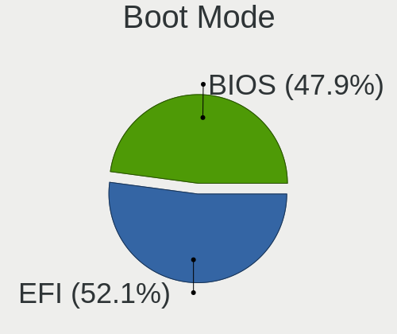
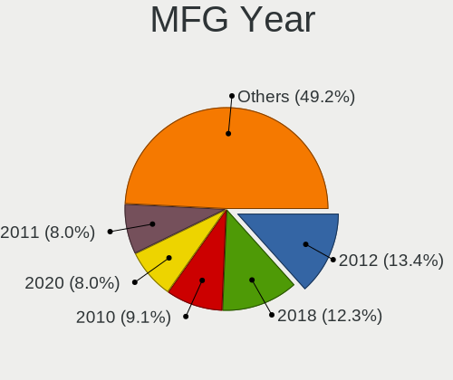
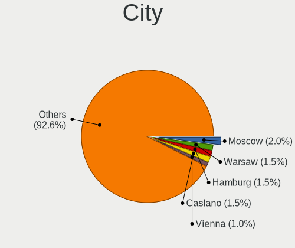
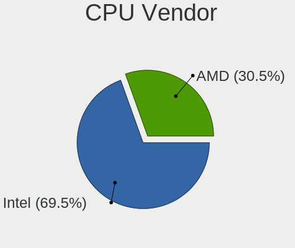
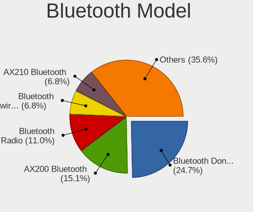

Elementary 6.1 - Tested Hardware & Statistics (Desktops)
--------------------------------------------------------

A project to collect tested hardware configurations for Elementary 6.1.

Anyone can contribute to this report by the [hw-probe](https://github.com/linuxhw/hw-probe) tool:

    sudo -E hw-probe -all -upload

Please submit a probe of your configuration if it's not presented on the page or is rare.

Full-feature report is available here: https://linux-hardware.org/?view=trends

Contents
--------

* [ Test Cases ](#test-cases)

* [ System ](#system)
  - [ Kernel                   ](#kernel)
  - [ Kernel Family            ](#kernel-family)
  - [ Kernel Major Ver.        ](#kernel-major-ver)
  - [ Arch                     ](#arch)
  - [ DE                       ](#de)
  - [ Display Server           ](#display-server)
  - [ Display Manager          ](#display-manager)
  - [ OS Lang                  ](#os-lang)
  - [ Boot Mode                ](#boot-mode)
  - [ Filesystem               ](#filesystem)
  - [ Part. scheme             ](#part-scheme)
  - [ Dual Boot with Linux/BSD ](#dual-boot-with-linuxbsd)
  - [ Dual Boot (Win)          ](#dual-boot-win)

* [ Board ](#board)
  - [ Vendor                   ](#vendor)
  - [ Model                    ](#model)
  - [ Model Family             ](#model-family)
  - [ MFG Year                 ](#mfg-year)
  - [ Form Factor              ](#form-factor)
  - [ Secure Boot              ](#secure-boot)
  - [ Coreboot                 ](#coreboot)
  - [ RAM Size                 ](#ram-size)
  - [ RAM Used                 ](#ram-used)
  - [ Total Drives             ](#total-drives)
  - [ Has CD-ROM               ](#has-cd-rom)
  - [ Has Ethernet             ](#has-ethernet)
  - [ Has WiFi                 ](#has-wifi)
  - [ Has Bluetooth            ](#has-bluetooth)

* [ Location ](#location)
  - [ Country                  ](#country)
  - [ City                     ](#city)

* [ Drives ](#drives)
  - [ Drive Vendor             ](#drive-vendor)
  - [ Drive Model              ](#drive-model)
  - [ HDD Vendor               ](#hdd-vendor)
  - [ SSD Vendor               ](#ssd-vendor)
  - [ Drive Kind               ](#drive-kind)
  - [ Drive Connector          ](#drive-connector)
  - [ Drive Size               ](#drive-size)
  - [ Space Total              ](#space-total)
  - [ Space Used               ](#space-used)
  - [ Malfunc. Drives          ](#malfunc-drives)
  - [ Malfunc. Drive Vendor    ](#malfunc-drive-vendor)
  - [ Malfunc. HDD Vendor      ](#malfunc-hdd-vendor)
  - [ Malfunc. Drive Kind      ](#malfunc-drive-kind)
  - [ Failed Drives            ](#failed-drives)
  - [ Failed Drive Vendor      ](#failed-drive-vendor)
  - [ Drive Status             ](#drive-status)

* [ Storage controller ](#storage-controller)
  - [ Storage Vendor           ](#storage-vendor)
  - [ Storage Model            ](#storage-model)
  - [ Storage Kind             ](#storage-kind)

* [ Processor ](#processor)
  - [ CPU Vendor               ](#cpu-vendor)
  - [ CPU Model                ](#cpu-model)
  - [ CPU Model Family         ](#cpu-model-family)
  - [ CPU Cores                ](#cpu-cores)
  - [ CPU Sockets              ](#cpu-sockets)
  - [ CPU Threads              ](#cpu-threads)
  - [ CPU Op-Modes             ](#cpu-op-modes)
  - [ CPU Microcode            ](#cpu-microcode)
  - [ CPU Microarch            ](#cpu-microarch)

* [ Graphics ](#graphics)
  - [ GPU Vendor               ](#gpu-vendor)
  - [ GPU Model                ](#gpu-model)
  - [ GPU Combo                ](#gpu-combo)
  - [ GPU Driver               ](#gpu-driver)
  - [ GPU Memory               ](#gpu-memory)

* [ Monitor ](#monitor)
  - [ Monitor Vendor           ](#monitor-vendor)
  - [ Monitor Model            ](#monitor-model)
  - [ Monitor Resolution       ](#monitor-resolution)
  - [ Monitor Diagonal         ](#monitor-diagonal)
  - [ Monitor Width            ](#monitor-width)
  - [ Aspect Ratio             ](#aspect-ratio)
  - [ Monitor Area             ](#monitor-area)
  - [ Pixel Density            ](#pixel-density)
  - [ Multiple Monitors        ](#multiple-monitors)

* [ Network ](#network)
  - [ Net Controller Vendor    ](#net-controller-vendor)
  - [ Net Controller Model     ](#net-controller-model)
  - [ Wireless Vendor          ](#wireless-vendor)
  - [ Wireless Model           ](#wireless-model)
  - [ Ethernet Vendor          ](#ethernet-vendor)
  - [ Ethernet Model           ](#ethernet-model)
  - [ Net Controller Kind      ](#net-controller-kind)
  - [ Used Controller          ](#used-controller)
  - [ NICs                     ](#nics)
  - [ IPv6                     ](#ipv6)

* [ Bluetooth ](#bluetooth)
  - [ Bluetooth Vendor         ](#bluetooth-vendor)
  - [ Bluetooth Model          ](#bluetooth-model)

* [ Sound ](#sound)
  - [ Sound Vendor             ](#sound-vendor)
  - [ Sound Model              ](#sound-model)

* [ Memory ](#memory)
  - [ Memory Vendor            ](#memory-vendor)
  - [ Memory Model             ](#memory-model)
  - [ Memory Kind              ](#memory-kind)
  - [ Memory Form Factor       ](#memory-form-factor)
  - [ Memory Size              ](#memory-size)
  - [ Memory Speed             ](#memory-speed)

* [ Printers & scanners ](#printers--scanners)
  - [ Printer Vendor           ](#printer-vendor)
  - [ Printer Model            ](#printer-model)
  - [ Scanner Vendor           ](#scanner-vendor)
  - [ Scanner Model            ](#scanner-model)

* [ Camera ](#camera)
  - [ Camera Vendor            ](#camera-vendor)
  - [ Camera Model             ](#camera-model)

* [ Security ](#security)
  - [ Fingerprint Vendor       ](#fingerprint-vendor)
  - [ Fingerprint Model        ](#fingerprint-model)
  - [ Chipcard Vendor          ](#chipcard-vendor)
  - [ Chipcard Model           ](#chipcard-model)

* [ Unsupported ](#unsupported)
  - [ Unsupported Devices      ](#unsupported-devices)
  - [ Unsupported Device Types ](#unsupported-device-types)

Test Cases
----------

| Vendor   | Model                    | Probe                                                      | Date         |
|----------|--------------------------|------------------------------------------------------------|--------------|
| Gigabyte | B75M-D3H                 | [18717f0712](https://linux-hardware.org/?probe=18717f0712) | Feb 01, 2022 |
| MSI      | Z270 KRAIT GAMING        | [17ccbf9c76](https://linux-hardware.org/?probe=17ccbf9c76) | Jan 28, 2022 |
| Gigabyte | H61M-DS2                 | [e800b95c58](https://linux-hardware.org/?probe=e800b95c58) | Jan 26, 2022 |
| ASRock   | H61M-HVS                 | [8fdf1980ee](https://linux-hardware.org/?probe=8fdf1980ee) | Jan 25, 2022 |
| ASRock   | H61M-HVS                 | [5d19dff1e4](https://linux-hardware.org/?probe=5d19dff1e4) | Jan 25, 2022 |
| Acer     | ConceptD CM100-51A V:1.1 | [663bbd709d](https://linux-hardware.org/?probe=663bbd709d) | Jan 24, 2022 |
| FIRICH   | J1900                    | [937e24af64](https://linux-hardware.org/?probe=937e24af64) | Jan 22, 2022 |
| ASUSTek  | ROG STRIX B360-H GAMING  | [d1505fe489](https://linux-hardware.org/?probe=d1505fe489) | Jan 21, 2022 |
| ASUSTek  | ROG STRIX X570-E GAMING  | [75d67cd8a4](https://linux-hardware.org/?probe=75d67cd8a4) | Jan 20, 2022 |
| ASUSTek  | TUF GAMING B550M-PLUS    | [7a14d864d4](https://linux-hardware.org/?probe=7a14d864d4) | Jan 20, 2022 |
| ASUSTek  | TUF B365M-PLUS GAMING    | [ec51f5ca3e](https://linux-hardware.org/?probe=ec51f5ca3e) | Jan 19, 2022 |
| MSI      | B450 TOMAHAWK MAX II     | [488d339e77](https://linux-hardware.org/?probe=488d339e77) | Jan 19, 2022 |
| MSI      | B450M-A PRO MAX          | [e7225dad8e](https://linux-hardware.org/?probe=e7225dad8e) | Jan 17, 2022 |
| ASUSTek  | H61M-CS                  | [8855875fbd](https://linux-hardware.org/?probe=8855875fbd) | Jan 14, 2022 |
| Unknown  | T3 MRD                   | [33392a90ce](https://linux-hardware.org/?probe=33392a90ce) | Jan 13, 2022 |
| MSI      | X470 GAMING PLUS MAX     | [00a00c3cac](https://linux-hardware.org/?probe=00a00c3cac) | Jan 13, 2022 |
| ASUSTek  | M5A78L-M LX3             | [39f3687349](https://linux-hardware.org/?probe=39f3687349) | Jan 12, 2022 |
| Foxconn  | 2AB1                     | [07faf9a309](https://linux-hardware.org/?probe=07faf9a309) | Jan 12, 2022 |
| Foxconn  | 2AB1                     | [de61623232](https://linux-hardware.org/?probe=de61623232) | Jan 11, 2022 |
| ASUSTek  | H110M-C                  | [be4291793d](https://linux-hardware.org/?probe=be4291793d) | Jan 10, 2022 |
| Gigabyte | X570 AORUS ELITE         | [7ce29e0c54](https://linux-hardware.org/?probe=7ce29e0c54) | Jan 09, 2022 |
| HP       | 8597                     | [09ed815dd0](https://linux-hardware.org/?probe=09ed815dd0) | Jan 08, 2022 |
| Gigabyte | GA-970A-D3               | [b1c9832ce6](https://linux-hardware.org/?probe=b1c9832ce6) | Jan 07, 2022 |
| ASRock   | Z370 Pro4                | [51cba69624](https://linux-hardware.org/?probe=51cba69624) | Jan 06, 2022 |
| ASRock   | B450M-HDV R4.0           | [20dfc25b62](https://linux-hardware.org/?probe=20dfc25b62) | Jan 05, 2022 |
| Gigabyte | B85M-DS3H-A              | [cd6abb9f49](https://linux-hardware.org/?probe=cd6abb9f49) | Jan 03, 2022 |
| MSI      | 2A9C                     | [8d08f7f383](https://linux-hardware.org/?probe=8d08f7f383) | Dec 31, 2021 |
| HP       | 3397                     | [323dc8992b](https://linux-hardware.org/?probe=323dc8992b) | Dec 31, 2021 |
| ASUSTek  | X79-DELUXE               | [00b9dd3788](https://linux-hardware.org/?probe=00b9dd3788) | Dec 30, 2021 |
| HP       | 1589                     | [d123a8de64](https://linux-hardware.org/?probe=d123a8de64) | Dec 30, 2021 |
| Foxconn  | 2AB1                     | [bcd6fc46cc](https://linux-hardware.org/?probe=bcd6fc46cc) | Dec 30, 2021 |
| ASUSTek  | TUF GAMING B550M-PLUS    | [5f67c759fe](https://linux-hardware.org/?probe=5f67c759fe) | Dec 28, 2021 |
| Gigabyte | Z390 UD                  | [2399fa64ba](https://linux-hardware.org/?probe=2399fa64ba) | Dec 26, 2021 |
| Apple    | Mac-F42C88C8 Proto1      | [783618fe4b](https://linux-hardware.org/?probe=783618fe4b) | Dec 23, 2021 |
| ASUSTek  | H97-PLUS                 | [cba91c2ad2](https://linux-hardware.org/?probe=cba91c2ad2) | Dec 22, 2021 |
| MSI      | B450-A PRO MAX           | [f14eef1ae6](https://linux-hardware.org/?probe=f14eef1ae6) | Dec 20, 2021 |
| Gigabyte | H310M S2P                | [a931eb10f0](https://linux-hardware.org/?probe=a931eb10f0) | Dec 19, 2021 |
| Foxconn  | 2AB1                     | [d9077a5d94](https://linux-hardware.org/?probe=d9077a5d94) | Dec 18, 2021 |
| Foxconn  | 2AB1                     | [b789981cc4](https://linux-hardware.org/?probe=b789981cc4) | Dec 17, 2021 |
| Gigabyte | Z590 AORUS ELITE AX      | [c068e358e8](https://linux-hardware.org/?probe=c068e358e8) | Dec 16, 2021 |
| ASUSTek  | M5A78L-M LX3             | [720cc7a45f](https://linux-hardware.org/?probe=720cc7a45f) | Dec 15, 2021 |

System
------

Kernel
------

Version of the Linux kernel

| Version              | Desktops | Percent |
|----------------------|----------|---------|
| 5.11.0-43-generic    | 15       | 40.54%  |
| 5.13.0-27-generic    | 6        | 16.22%  |
| 5.11.0-44-generic    | 4        | 10.81%  |
| 5.11.0-41-generic    | 4        | 10.81%  |
| 5.13.0-25-generic    | 2        | 5.41%   |
| 5.11.0-46-generic    | 2        | 5.41%   |
| 5.13.0-22-generic    | 1        | 2.7%    |
| 5.11.0-43-lowlatency | 1        | 2.7%    |
| 5.11.0-40-generic    | 1        | 2.7%    |
| 5.11.0-37-generic    | 1        | 2.7%    |

Kernel Family
-------------

Linux kernel without a distro release

| Version | Desktops | Percent |
|---------|----------|---------|
| 5.11.0  | 26       | 74.29%  |
| 5.13.0  | 9        | 25.71%  |

Kernel Major Ver.
-----------------

Linux kernel major version

| Version | Desktops | Percent |
|---------|----------|---------|
| 5.11    | 26       | 74.29%  |
| 5.13    | 9        | 25.71%  |

Arch
----

OS architecture (x86_64, i586, etc.)

| Name   | Desktops | Percent |
|--------|----------|---------|
| x86_64 | 35       | 100%    |

DE
--

Desktop Environment

| Name     | Desktops | Percent |
|----------|----------|---------|
| Pantheon | 35       | 100%    |

Display Server
--------------

X11 or Wayland

| Name | Desktops | Percent |
|------|----------|---------|
| X11  | 35       | 100%    |

Display Manager
---------------

SDDM, LightDM, etc.

| Name    | Desktops | Percent |
|---------|----------|---------|
| Unknown | 27       | 77.14%  |
| LightDM | 8        | 22.86%  |

OS Lang
-------

Language

| Lang  | Desktops | Percent |
|-------|----------|---------|
| en_US | 13       | 37.14%  |
| en_GB | 5        | 14.29%  |
| de_DE | 5        | 14.29%  |
| ru_RU | 2        | 5.71%   |
| pl_PL | 2        | 5.71%   |
| fr_FR | 2        | 5.71%   |
| es_ES | 2        | 5.71%   |
| pt_PT | 1        | 2.86%   |
| it_IT | 1        | 2.86%   |
| fr_CA | 1        | 2.86%   |
| en_CA | 1        | 2.86%   |

Boot Mode
---------

EFI or BIOS

| Mode | Desktops | Percent |
|------|----------|---------|
| EFI  | 21       | 60%     |
| BIOS | 14       | 40%     |

Filesystem
----------

Type of filesystem

| Type  | Desktops | Percent |
|-------|----------|---------|
| Ext4  | 32       | 91.43%  |
| Btrfs | 2        | 5.71%   |
| Xfs   | 1        | 2.86%   |

Part. scheme
------------

Scheme of partitioning

| Type    | Desktops | Percent |
|---------|----------|---------|
| Unknown | 29       | 82.86%  |
| GPT     | 5        | 14.29%  |
| MBR     | 1        | 2.86%   |

Dual Boot with Linux/BSD
------------------------

Hosting more than one Linux/BSD

| Dual boot | Desktops | Percent |
|-----------|----------|---------|
| No        | 33       | 94.29%  |
| Yes       | 2        | 5.71%   |

Dual Boot (Win)
---------------

Hosting Linux and Windows

| Dual boot | Desktops | Percent |
|-----------|----------|---------|
| No        | 32       | 91.43%  |
| Yes       | 3        | 8.57%   |

Board
-----

Vendor
------

Motherboard manufacturer

| Name                | Desktops | Percent |
|---------------------|----------|---------|
| ASUSTek Computer    | 10       | 28.57%  |
| Gigabyte Technology | 8        | 22.86%  |
| MSI                 | 6        | 17.14%  |
| Hewlett-Packard     | 3        | 8.57%   |
| ASRock              | 3        | 8.57%   |
| Foxconn             | 1        | 2.86%   |
| FIRICH              | 1        | 2.86%   |
| Apple               | 1        | 2.86%   |
| Acer                | 1        | 2.86%   |
| Unknown             | 1        | 2.86%   |

Model
-----

Motherboard model

| Name                         | Desktops | Percent |
|------------------------------|----------|---------|
| ASUS TUF GAMING B550M-PLUS   | 2        | 5.71%   |
| MSI PPPPP-CCC#MMMMMMMM       | 1        | 2.86%   |
| MSI MS-7C52                  | 1        | 2.86%   |
| MSI MS-7C02                  | 1        | 2.86%   |
| MSI MS-7B86                  | 1        | 2.86%   |
| MSI MS-7B79                  | 1        | 2.86%   |
| MSI MS-7A59                  | 1        | 2.86%   |
| HP Z420 Workstation          | 1        | 2.86%   |
| HP ProDesk 600 G5 SFF        | 1        | 2.86%   |
| HP Compaq Elite 8300 SFF     | 1        | 2.86%   |
| Gigabyte Z590 AORUS ELITE AX | 1        | 2.86%   |
| Gigabyte Z390 UD             | 1        | 2.86%   |
| Gigabyte X570 AORUS ELITE    | 1        | 2.86%   |
| Gigabyte H61M-DS2            | 1        | 2.86%   |
| Gigabyte H310M S2P 2.0       | 1        | 2.86%   |
| Gigabyte GA-970A-D3          | 1        | 2.86%   |
| Gigabyte B85M-DS3H-A         | 1        | 2.86%   |
| Gigabyte B75M-D3H            | 1        | 2.86%   |
| Foxconn p6616f               | 1        | 2.86%   |
| FIRICH J1900                 | 1        | 2.86%   |
| ASUS X79-DELUXE              | 1        | 2.86%   |
| ASUS TUF B365M-PLUS GAMING   | 1        | 2.86%   |
| ASUS ROG STRIX X570-E GAMING | 1        | 2.86%   |
| ASUS ROG STRIX B360-H GAMING | 1        | 2.86%   |
| ASUS M5A78L-M LX3            | 1        | 2.86%   |
| ASUS H61M-CS                 | 1        | 2.86%   |
| ASUS H110M-C                 | 1        | 2.86%   |
| ASUS All Series              | 1        | 2.86%   |
| ASRock Z370 Pro4             | 1        | 2.86%   |
| ASRock H61M-HVS              | 1        | 2.86%   |
| ASRock B450M-HDV R4.0        | 1        | 2.86%   |
| Apple MacPro3,1              | 1        | 2.86%   |
| Acer ConceptD CM100-51A      | 1        | 2.86%   |
| Unknown                      | 1        | 2.86%   |

Model Family
------------

Motherboard model prefix

| Name                   | Desktops | Percent |
|------------------------|----------|---------|
| ASUS TUF               | 3        | 8.57%   |
| ASUS ROG               | 2        | 5.71%   |
| MSI PPPPP-CCC#MMMMMMMM | 1        | 2.86%   |
| MSI MS-7C52            | 1        | 2.86%   |
| MSI MS-7C02            | 1        | 2.86%   |
| MSI MS-7B86            | 1        | 2.86%   |
| MSI MS-7B79            | 1        | 2.86%   |
| MSI MS-7A59            | 1        | 2.86%   |
| HP Z420                | 1        | 2.86%   |
| HP ProDesk             | 1        | 2.86%   |
| HP Compaq              | 1        | 2.86%   |
| Gigabyte Z590          | 1        | 2.86%   |
| Gigabyte Z390          | 1        | 2.86%   |
| Gigabyte X570          | 1        | 2.86%   |
| Gigabyte H61M-DS2      | 1        | 2.86%   |
| Gigabyte H310M         | 1        | 2.86%   |
| Gigabyte GA-970A-D3    | 1        | 2.86%   |
| Gigabyte B85M-DS3H-A   | 1        | 2.86%   |
| Gigabyte B75M-D3H      | 1        | 2.86%   |
| Foxconn p6616f         | 1        | 2.86%   |
| FIRICH J1900           | 1        | 2.86%   |
| ASUS X79-DELUXE        | 1        | 2.86%   |
| ASUS M5A78L-M          | 1        | 2.86%   |
| ASUS H61M-CS           | 1        | 2.86%   |
| ASUS H110M-C           | 1        | 2.86%   |
| ASUS All               | 1        | 2.86%   |
| ASRock Z370            | 1        | 2.86%   |
| ASRock H61M-HVS        | 1        | 2.86%   |
| ASRock B450M-HDV       | 1        | 2.86%   |
| Apple MacPro3          | 1        | 2.86%   |
| Acer ConceptD          | 1        | 2.86%   |
| Unknown                | 1        | 2.86%   |

MFG Year
--------

Motherboard manufacture year

| Year | Desktops | Percent |
|------|----------|---------|
| 2019 | 7        | 20%     |
| 2020 | 6        | 17.14%  |
| 2018 | 4        | 11.43%  |
| 2012 | 4        | 11.43%  |
| 2015 | 2        | 5.71%   |
| 2014 | 2        | 5.71%   |
| 2013 | 2        | 5.71%   |
| 2011 | 2        | 5.71%   |
| 2010 | 2        | 5.71%   |
| 2021 | 1        | 2.86%   |
| 2017 | 1        | 2.86%   |
| 2016 | 1        | 2.86%   |
| 2008 | 1        | 2.86%   |

Form Factor
-----------

Physical design of the computer

| Name    | Desktops | Percent |
|---------|----------|---------|
| Desktop | 35       | 100%    |

Secure Boot
-----------

Enabled or disabled

| State    | Desktops | Percent |
|----------|----------|---------|
| Disabled | 35       | 100%    |

Coreboot
--------

Have coreboot on board

| Used | Desktops | Percent |
|------|----------|---------|
| No   | 35       | 100%    |

RAM Size
--------

Total RAM memory

| Size in GB  | Desktops | Percent |
|-------------|----------|---------|
| 32.01-64.0  | 12       | 34.29%  |
| 16.01-24.0  | 9        | 25.71%  |
| 8.01-16.0   | 5        | 14.29%  |
| 3.01-4.0    | 4        | 11.43%  |
| 4.01-8.0    | 3        | 8.57%   |
| 24.01-32.0  | 1        | 2.86%   |
| 64.01-256.0 | 1        | 2.86%   |

RAM Used
--------

Used RAM memory

| Used GB   | Desktops | Percent |
|-----------|----------|---------|
| 1.01-2.0  | 13       | 36.11%  |
| 2.01-3.0  | 10       | 27.78%  |
| 4.01-8.0  | 8        | 22.22%  |
| 3.01-4.0  | 3        | 8.33%   |
| 8.01-16.0 | 2        | 5.56%   |

Total Drives
------------

Number of drives on board

| Drives | Desktops | Percent |
|--------|----------|---------|
| 2      | 12       | 34.29%  |
| 1      | 10       | 28.57%  |
| 3      | 7        | 20%     |
| 4      | 3        | 8.57%   |
| 7      | 1        | 2.86%   |
| 6      | 1        | 2.86%   |
| 5      | 1        | 2.86%   |

Has CD-ROM
----------

Has CD-ROM on board

| Presented | Desktops | Percent |
|-----------|----------|---------|
| No        | 22       | 62.86%  |
| Yes       | 13       | 37.14%  |

Has Ethernet
------------

Has Ethernet on board

| Presented | Desktops | Percent |
|-----------|----------|---------|
| Yes       | 35       | 100%    |

Has WiFi
--------

Has WiFi module

| Presented | Desktops | Percent |
|-----------|----------|---------|
| No        | 19       | 54.29%  |
| Yes       | 16       | 45.71%  |

Has Bluetooth
-------------

Has Bluetooth module

| Presented | Desktops | Percent |
|-----------|----------|---------|
| No        | 21       | 60%     |
| Yes       | 14       | 40%     |

Location
--------

Country
-------

Geographic location (country)

| Country      | Desktops | Percent |
|--------------|----------|---------|
| Germany      | 6        | 17.14%  |
| USA          | 4        | 11.43%  |
| UK           | 3        | 8.57%   |
| Spain        | 2        | 5.71%   |
| Poland       | 2        | 5.71%   |
| India        | 2        | 5.71%   |
| France       | 2        | 5.71%   |
| Canada       | 2        | 5.71%   |
| Thailand     | 1        | 2.86%   |
| Sweden       | 1        | 2.86%   |
| Sri Lanka    | 1        | 2.86%   |
| South Africa | 1        | 2.86%   |
| Russia       | 1        | 2.86%   |
| Lithuania    | 1        | 2.86%   |
| Italy        | 1        | 2.86%   |
| Iran         | 1        | 2.86%   |
| Hong Kong    | 1        | 2.86%   |
| Czechia      | 1        | 2.86%   |
| Brazil       | 1        | 2.86%   |
| Argentina    | 1        | 2.86%   |

City
----

Geographic location (city)

| City                  | Desktops | Percent |
|-----------------------|----------|---------|
| Warsaw                | 2        | 5.41%   |
| Hamburg               | 2        | 5.41%   |
| Znojmo                | 1        | 2.7%    |
| Wattala               | 1        | 2.7%    |
| Vilanova i la Geltr?? | 1        | 2.7%    |
| Uppsala               | 1        | 2.7%    |
| Thrissur              | 1        | 2.7%    |
| Tehran                | 1        | 2.7%    |
| Southampton           | 1        | 2.7%    |
| Sornay                | 1        | 2.7%    |
| Saguenay              | 1        | 2.7%    |
| Russell               | 1        | 2.7%    |
| Rueso                 | 1        | 2.7%    |
| Pune                  | 1        | 2.7%    |
| Oldham                | 1        | 2.7%    |
| Oldenburg             | 1        | 2.7%    |
| Milan                 | 1        | 2.7%    |
| Ma??eikiai            | 1        | 2.7%    |
| London                | 1        | 2.7%    |
| La Plata              | 1        | 2.7%    |
| Khimki                | 1        | 2.7%    |
| Johannesburg          | 1        | 2.7%    |
| Hennef                | 1        | 2.7%    |
| Edmonton              | 1        | 2.7%    |
| Dortmund              | 1        | 2.7%    |
| Denver                | 1        | 2.7%    |
| Colorado Springs      | 1        | 2.7%    |
| Chana                 | 1        | 2.7%    |
| Central               | 1        | 2.7%    |
| Campo Limpo Paulista  | 1        | 2.7%    |
| Brownfield            | 1        | 2.7%    |
| Berlin                | 1        | 2.7%    |
| Bergenfield           | 1        | 2.7%    |
| Barcelona             | 1        | 2.7%    |
| ?‰pinay-sur-Seine     | 1        | 2.7%    |

Drives
------

Drive Vendor
------------

Hard drive vendors

| Vendor              | Desktops | Drives | Percent |
|---------------------|----------|--------|---------|
| WDC                 | 14       | 22     | 19.44%  |
| Samsung Electronics | 11       | 13     | 15.28%  |
| Seagate             | 9        | 10     | 12.5%   |
| Kingston            | 8        | 8      | 11.11%  |
| Toshiba             | 4        | 5      | 5.56%   |
| Crucial             | 4        | 4      | 5.56%   |
| Unknown             | 3        | 5      | 4.17%   |
| A-DATA Technology   | 3        | 3      | 4.17%   |
| Phison              | 2        | 2      | 2.78%   |
| ASMT                | 2        | 2      | 2.78%   |
| Transcend           | 1        | 1      | 1.39%   |
| Team                | 1        | 1      | 1.39%   |
| SanDisk             | 1        | 1      | 1.39%   |
| PNY                 | 1        | 1      | 1.39%   |
| OCZ                 | 1        | 1      | 1.39%   |
| Micron Technology   | 1        | 1      | 1.39%   |
| MAXTOR              | 1        | 1      | 1.39%   |
| JMicron             | 1        | 1      | 1.39%   |
| Intenso             | 1        | 1      | 1.39%   |
| Intel               | 1        | 1      | 1.39%   |
| Hitachi             | 1        | 1      | 1.39%   |
| GOODRAM             | 1        | 1      | 1.39%   |

Drive Model
-----------

Hard drive models

| Model                                    | Desktops | Percent |
|------------------------------------------|----------|---------|
| Samsung NVMe SSD Drive 500GB             | 3        | 3.8%    |
| Kingston SA400S37240G 240GB SSD          | 2        | 2.53%   |
| Kingston NVMe SSD Drive 1TB              | 2        | 2.53%   |
| WDC WDS500G2B0A-00SM50 500GB SSD         | 1        | 1.27%   |
| WDC WDS240G2G0A-00JH30 240GB SSD         | 1        | 1.27%   |
| WDC WDS120G2G0A-00JH30 120GB SSD         | 1        | 1.27%   |
| WDC WD6401AALS-00L3B2 640GB              | 1        | 1.27%   |
| WDC WD5000AAKX-00ERMA0 500GB             | 1        | 1.27%   |
| WDC WD5000AAKS-00UU3A0 500GB             | 1        | 1.27%   |
| WDC WD40EZAZ-00SF3B0 4TB                 | 1        | 1.27%   |
| WDC WD40EFRX-68N32N0 4TB                 | 1        | 1.27%   |
| WDC WD3003FZEX-00Z4SA0 3TB               | 1        | 1.27%   |
| WDC WD20EFRX-68EUZN0 2TB                 | 1        | 1.27%   |
| WDC WD1600JS-55NCB1 160GB                | 1        | 1.27%   |
| WDC WD15EARX-00PASB0 1TB                 | 1        | 1.27%   |
| WDC WD10EZEX-08WN4A0 1TB                 | 1        | 1.27%   |
| WDC WD10EZEX-08M2NA0 1TB                 | 1        | 1.27%   |
| WDC WD10EZEX-00BN5A0 1TB                 | 1        | 1.27%   |
| WDC WD10EADS-00L5B1 1TB                  | 1        | 1.27%   |
| WDC PC SN730 SDBQNTY-1T00-1014 1TB       | 1        | 1.27%   |
| Unknown SD/MMC/MS PRO 128GB              | 1        | 1.27%   |
| Unknown SD/MMC/M.S.PRO 32GB              | 1        | 1.27%   |
| Unknown SD/MMC 16GB                      | 1        | 1.27%   |
| Unknown M.S./M.S.Pro/HG 16GB             | 1        | 1.27%   |
| Unknown 128G32  128GB                    | 1        | 1.27%   |
| Transcend TS512GSSD370S 512GB            | 1        | 1.27%   |
| Toshiba TR150 480GB SSD                  | 1        | 1.27%   |
| Toshiba HDWE160 6TB                      | 1        | 1.27%   |
| Toshiba HDWE140 4TB                      | 1        | 1.27%   |
| Toshiba HDWD120 2TB                      | 1        | 1.27%   |
| Toshiba HDWD110 1TB                      | 1        | 1.27%   |
| Team T253X1120G 120GB SSD                | 1        | 1.27%   |
| Seagate ST4000DX001-1CE168 4TB           | 1        | 1.27%   |
| Seagate ST3750528AS 752GB                | 1        | 1.27%   |
| Seagate ST3500418AS 500GB                | 1        | 1.27%   |
| Seagate ST3500312CS 500GB                | 1        | 1.27%   |
| Seagate ST2000DX002-2DV164 2TB           | 1        | 1.27%   |
| Seagate ST1000DM010-2EP102 1TB           | 1        | 1.27%   |
| Seagate ST1000DM003-1CH162 1TB           | 1        | 1.27%   |
| Seagate ST10000DM0004-1ZC101 10TB        | 1        | 1.27%   |
| Seagate NVMe SSD Drive 500GB             | 1        | 1.27%   |
| SanDisk SDSSDX240GG25 240GB              | 1        | 1.27%   |
| Samsung SSD 870 QVO 2TB                  | 1        | 1.27%   |
| Samsung SSD 870 QVO 1TB                  | 1        | 1.27%   |
| Samsung SSD 860 QVO 1TB                  | 1        | 1.27%   |
| Samsung SSD 860 EVO M.2 250GB            | 1        | 1.27%   |
| Samsung SSD 860 EVO 1TB                  | 1        | 1.27%   |
| Samsung NVMe SSD Drive 512GB             | 1        | 1.27%   |
| Samsung NVMe SSD Drive 1TB               | 1        | 1.27%   |
| Samsung MZNTE512HMJH-000H1 512GB SSD     | 1        | 1.27%   |
| Samsung HD322HJ 320GB                    | 1        | 1.27%   |
| PNY CS900 480GB SSD                      | 1        | 1.27%   |
| Phison Sabrent 2TB                       | 1        | 1.27%   |
| Phison NVMe SSD Drive 1TB                | 1        | 1.27%   |
| OCZ AGILITY3 240GB SSD                   | 1        | 1.27%   |
| Micron MTFDDAK512TBN-1AR15ABHA 512GB SSD | 1        | 1.27%   |
| MAXTOR Z1 SSD 240GB                      | 1        | 1.27%   |
| Kingston SHFS37A120G 120GB SSD           | 1        | 1.27%   |
| Kingston SA400S37120G 120GB SSD          | 1        | 1.27%   |
| Kingston SA2000M8250G 250GB              | 1        | 1.27%   |

HDD Vendor
----------

Hard disk drive vendors

| Vendor              | Desktops | Drives | Percent |
|---------------------|----------|--------|---------|
| WDC                 | 10       | 14     | 41.67%  |
| Seagate             | 8        | 9      | 33.33%  |
| Toshiba             | 3        | 4      | 12.5%   |
| Unknown             | 1        | 1      | 4.17%   |
| Samsung Electronics | 1        | 2      | 4.17%   |
| Hitachi             | 1        | 1      | 4.17%   |

SSD Vendor
----------

Solid state drive vendors

| Vendor              | Desktops | Drives | Percent |
|---------------------|----------|--------|---------|
| Samsung Electronics | 6        | 6      | 20%     |
| Kingston            | 4        | 4      | 13.33%  |
| Crucial             | 4        | 4      | 13.33%  |
| WDC                 | 3        | 7      | 10%     |
| A-DATA Technology   | 2        | 2      | 6.67%   |
| Transcend           | 1        | 1      | 3.33%   |
| Toshiba             | 1        | 1      | 3.33%   |
| Team                | 1        | 1      | 3.33%   |
| SanDisk             | 1        | 1      | 3.33%   |
| PNY                 | 1        | 1      | 3.33%   |
| OCZ                 | 1        | 1      | 3.33%   |
| Micron Technology   | 1        | 1      | 3.33%   |
| MAXTOR              | 1        | 1      | 3.33%   |
| Intenso             | 1        | 1      | 3.33%   |
| GOODRAM             | 1        | 1      | 3.33%   |
| ASMT                | 1        | 1      | 3.33%   |

Drive Kind
----------

HDD or SSD

| Kind    | Desktops | Drives | Percent |
|---------|----------|--------|---------|
| SSD     | 26       | 34     | 42.62%  |
| HDD     | 19       | 31     | 31.15%  |
| NVMe    | 12       | 15     | 19.67%  |
| Unknown | 3        | 5      | 4.92%   |
| MMC     | 1        | 1      | 1.64%   |

Drive Connector
---------------

SATA, SAS, NVMe, etc.

| Type | Desktops | Drives | Percent |
|------|----------|--------|---------|
| SATA | 31       | 63     | 63.27%  |
| NVMe | 12       | 15     | 24.49%  |
| SAS  | 5        | 7      | 10.2%   |
| MMC  | 1        | 1      | 2.04%   |

Drive Size
----------

Size of hard drive

| Size in TB | Desktops | Drives | Percent |
|------------|----------|--------|---------|
| 0.01-0.5   | 18       | 31     | 42.86%  |
| 0.51-1.0   | 13       | 21     | 30.95%  |
| 3.01-4.0   | 4        | 4      | 9.52%   |
| 1.01-2.0   | 4        | 5      | 9.52%   |
| 4.01-10.0  | 2        | 2      | 4.76%   |
| 2.01-3.0   | 1        | 2      | 2.38%   |

Space Total
-----------

Amount of disk space available on the file system

| Size in GB     | Desktops | Percent |
|----------------|----------|---------|
| 101-250        | 11       | 31.43%  |
| 251-500        | 7        | 20%     |
| 501-1000       | 7        | 20%     |
| More than 3000 | 5        | 14.29%  |
| 1001-2000      | 3        | 8.57%   |
| 21-50          | 1        | 2.86%   |
| 51-100         | 1        | 2.86%   |

Space Used
----------

Amount of used disk space

| Used GB        | Desktops | Percent |
|----------------|----------|---------|
| 1-20           | 10       | 27.03%  |
| 101-250        | 8        | 21.62%  |
| 21-50          | 7        | 18.92%  |
| 251-500        | 3        | 8.11%   |
| 51-100         | 3        | 8.11%   |
| 1001-2000      | 2        | 5.41%   |
| 501-1000       | 2        | 5.41%   |
| More than 3000 | 1        | 2.7%    |
| 2001-3000      | 1        | 2.7%    |

Malfunc. Drives
---------------

Drive models with a malfunction

| Model                     | Desktops | Drives | Percent |
|---------------------------|----------|--------|---------|
| Seagate ST3500312CS 500GB | 1        | 1      | 100%    |

Malfunc. Drive Vendor
---------------------

Vendors of faulty drives

| Vendor  | Desktops | Drives | Percent |
|---------|----------|--------|---------|
| Seagate | 1        | 1      | 100%    |

Malfunc. HDD Vendor
-------------------

Vendors of faulty HDD drives

| Vendor  | Desktops | Drives | Percent |
|---------|----------|--------|---------|
| Seagate | 1        | 1      | 100%    |

Malfunc. Drive Kind
-------------------

Kinds of faulty drives

| Kind | Desktops | Drives | Percent |
|------|----------|--------|---------|
| HDD  | 1        | 1      | 100%    |

Failed Drives
-------------

Failed drive models

Zero info for selected period =(

Failed Drive Vendor
-------------------

Failed drive vendors

Zero info for selected period =(

Drive Status
------------

Number of failed and malfunc. drives

| Status   | Desktops | Drives | Percent |
|----------|----------|--------|---------|
| Detected | 31       | 72     | 83.78%  |
| Works    | 5        | 13     | 13.51%  |
| Malfunc  | 1        | 1      | 2.7%    |

Storage controller
------------------

Storage Vendor
--------------

Storage controller vendors

| Vendor                      | Desktops | Percent |
|-----------------------------|----------|---------|
| Intel                       | 22       | 44%     |
| AMD                         | 12       | 24%     |
| Samsung Electronics         | 5        | 10%     |
| Kingston Technology Company | 4        | 8%      |
| Phison Electronics          | 2        | 4%      |
| Seagate Technology          | 1        | 2%      |
| Sandisk                     | 1        | 2%      |
| Realtek Semiconductor       | 1        | 2%      |
| Marvell Technology Group    | 1        | 2%      |
| ASMedia Technology          | 1        | 2%      |

Storage Model
-------------

Storage controller models

| Model                                                                                   | Desktops | Percent |
|-----------------------------------------------------------------------------------------|----------|---------|
| AMD FCH SATA Controller [AHCI mode]                                                     | 5        | 8.2%    |
| AMD 400 Series Chipset SATA Controller                                                  | 5        | 8.2%    |
| Intel Cannon Lake PCH SATA AHCI Controller                                              | 4        | 6.56%   |
| Intel 200 Series PCH SATA controller [AHCI mode]                                        | 4        | 6.56%   |
| Samsung NVMe SSD Controller SM981/PM981/PM983                                           | 3        | 4.92%   |
| Kingston Company A2000 NVMe SSD                                                         | 3        | 4.92%   |
| Intel 7 Series/C210 Series Chipset Family 6-port SATA Controller [AHCI mode]            | 2        | 3.28%   |
| Intel 6 Series/C200 Series Chipset Family Desktop SATA Controller (IDE mode, ports 4-5) | 2        | 3.28%   |
| Intel 6 Series/C200 Series Chipset Family Desktop SATA Controller (IDE mode, ports 0-3) | 2        | 3.28%   |
| AMD Starship/Matisse Chipset SATA Controller [AHCI mode]                                | 2        | 3.28%   |
| AMD SB7x0/SB8x0/SB9x0 SATA Controller [IDE mode]                                        | 2        | 3.28%   |
| AMD SB7x0/SB8x0/SB9x0 IDE Controller                                                    | 2        | 3.28%   |
| Seagate FireCuda 530 SSD                                                                | 1        | 1.64%   |
| Sandisk WD Black SN750 / PC SN730 NVMe SSD                                              | 1        | 1.64%   |
| Samsung NVMe SSD Controller SM961/PM961/SM963                                           | 1        | 1.64%   |
| Samsung NVMe SSD Controller 980                                                         | 1        | 1.64%   |
| Realtek Realtek Non-Volatile memory controller                                          | 1        | 1.64%   |
| Phison E16 PCIe4 NVMe Controller                                                        | 1        | 1.64%   |
| Phison E12 NVMe Controller                                                              | 1        | 1.64%   |
| Marvell Group 88SE9230 PCIe 2.0 x2 4-port SATA 6 Gb/s RAID Controller                   | 1        | 1.64%   |
| Kingston Company SNVS2000G [NV1 NVMe PCIe SSD 2TB]                                      | 1        | 1.64%   |
| Intel SSD 660P Series                                                                   | 1        | 1.64%   |
| Intel Q170/Q150/B150/H170/H110/Z170/CM236 Chipset SATA Controller [AHCI Mode]           | 1        | 1.64%   |
| Intel C602 chipset 4-Port SATA Storage Control Unit                                     | 1        | 1.64%   |
| Intel C600/X79 series chipset SATA RAID Controller                                      | 1        | 1.64%   |
| Intel C600/X79 series chipset IDE-r Controller                                          | 1        | 1.64%   |
| Intel C600/X79 series chipset 6-Port SATA AHCI Controller                               | 1        | 1.64%   |
| Intel Atom Processor E3800 Series SATA AHCI Controller                                  | 1        | 1.64%   |
| Intel 9 Series Chipset Family SATA Controller [AHCI Mode]                               | 1        | 1.64%   |
| Intel 8 Series/C220 Series Chipset Family 6-port SATA Controller 1 [AHCI mode]          | 1        | 1.64%   |
| Intel 631xESB/632xESB SATA AHCI Controller                                              | 1        | 1.64%   |
| Intel 631xESB/632xESB IDE Controller                                                    | 1        | 1.64%   |
| Intel 6 Series/C200 Series Chipset Family 6 port Desktop SATA AHCI Controller           | 1        | 1.64%   |
| Intel 500 Series Chipset Family SATA AHCI Controller                                    | 1        | 1.64%   |
| Intel 5 Series/3400 Series Chipset 6 port SATA AHCI Controller                          | 1        | 1.64%   |
| ASMedia ASM1062 Serial ATA Controller                                                   | 1        | 1.64%   |
| AMD SB7x0/SB8x0/SB9x0 SATA Controller [AHCI mode]                                       | 1        | 1.64%   |

Storage Kind
------------

Kind of storage controller (IDE, SATA, NVMe, SAS, ...)

| Kind | Desktops | Percent |
|------|----------|---------|
| SATA | 31       | 60.78%  |
| NVMe | 12       | 23.53%  |
| IDE  | 6        | 11.76%  |
| RAID | 1        | 1.96%   |
| SAS  | 1        | 1.96%   |

Processor
---------

CPU Vendor
----------

Processor vendors

| Vendor | Desktops | Percent |
|--------|----------|---------|
| Intel  | 23       | 65.71%  |
| AMD    | 12       | 34.29%  |

CPU Model
---------

Processor models

| Model                                      | Desktops | Percent |
|--------------------------------------------|----------|---------|
| Intel Core i7-9700 CPU @ 3.00GHz           | 2        | 5.71%   |
| Intel Core i5-8400 CPU @ 2.80GHz           | 2        | 5.71%   |
| AMD Ryzen 9 3900X 12-Core Processor        | 2        | 5.71%   |
| AMD Ryzen 7 3700X 8-Core Processor         | 2        | 5.71%   |
| Intel Xeon CPU E5462 @ 2.80GHz             | 1        | 2.86%   |
| Intel Xeon CPU E5-2690 0 @ 2.90GHz         | 1        | 2.86%   |
| Intel Core i7-9700K CPU @ 3.60GHz          | 1        | 2.86%   |
| Intel Core i7-7700K CPU @ 4.20GHz          | 1        | 2.86%   |
| Intel Core i7-4930K CPU @ 3.40GHz          | 1        | 2.86%   |
| Intel Core i7-4790 CPU @ 3.60GHz           | 1        | 2.86%   |
| Intel Core i7-4770 CPU @ 3.40GHz           | 1        | 2.86%   |
| Intel Core i5-9400F CPU @ 2.90GHz          | 1        | 2.86%   |
| Intel Core i5-6400 CPU @ 2.70GHz           | 1        | 2.86%   |
| Intel Core i5-3470 CPU @ 3.20GHz           | 1        | 2.86%   |
| Intel Core i5-2500K CPU @ 3.30GHz          | 1        | 2.86%   |
| Intel Core i3-8100 CPU @ 3.60GHz           | 1        | 2.86%   |
| Intel Core i3-3220 CPU @ 3.30GHz           | 1        | 2.86%   |
| Intel Core i3 CPU 550 @ 3.20GHz            | 1        | 2.86%   |
| Intel Celeron CPU J1900 @ 1.99GHz          | 1        | 2.86%   |
| Intel Celeron CPU G530 @ 2.40GHz           | 1        | 2.86%   |
| Intel Celeron CPU G440 @ 1.60GHz           | 1        | 2.86%   |
| Intel Atom x5-Z8350 CPU @ 1.44GHz          | 1        | 2.86%   |
| Intel 11th Gen Core i7-11700K @ 3.60GHz    | 1        | 2.86%   |
| AMD Ryzen 7 5800X 8-Core Processor         | 1        | 2.86%   |
| AMD Ryzen 7 3800X 8-Core Processor         | 1        | 2.86%   |
| AMD Ryzen 5 3600 6-Core Processor          | 1        | 2.86%   |
| AMD Ryzen 5 2600 Six-Core Processor        | 1        | 2.86%   |
| AMD Phenom II X4 B55 Processor             | 1        | 2.86%   |
| AMD Phenom II X4 820 Processor             | 1        | 2.86%   |
| AMD FX-4100 Quad-Core Processor            | 1        | 2.86%   |
| AMD Athlon 200GE with Radeon Vega Graphics | 1        | 2.86%   |

CPU Model Family
----------------

Processor model prefix

| Model            | Desktops | Percent |
|------------------|----------|---------|
| Intel Core i7    | 7        | 20%     |
| Intel Core i5    | 6        | 17.14%  |
| AMD Ryzen 7      | 4        | 11.43%  |
| Intel Core i3    | 3        | 8.57%   |
| Intel Celeron    | 3        | 8.57%   |
| Intel Xeon       | 2        | 5.71%   |
| AMD Ryzen 9      | 2        | 5.71%   |
| AMD Ryzen 5      | 2        | 5.71%   |
| AMD Phenom II X4 | 2        | 5.71%   |
| Other            | 1        | 2.86%   |
| Intel Atom       | 1        | 2.86%   |
| AMD FX           | 1        | 2.86%   |
| AMD Athlon       | 1        | 2.86%   |

CPU Cores
---------

Number of processor cores

| Number | Desktops | Percent |
|--------|----------|---------|
| 4      | 11       | 31.43%  |
| 8      | 10       | 28.57%  |
| 6      | 6        | 17.14%  |
| 2      | 5        | 14.29%  |
| 12     | 2        | 5.71%   |
| 1      | 1        | 2.86%   |

CPU Sockets
-----------

Number of sockets

| Number | Desktops | Percent |
|--------|----------|---------|
| 1      | 34       | 97.14%  |
| 2      | 1        | 2.86%   |

CPU Threads
-----------

Threads per core (Hyper-Threading)

| Number | Desktops | Percent |
|--------|----------|---------|
| 2      | 18       | 51.43%  |
| 1      | 17       | 48.57%  |

CPU Op-Modes
------------

CPU Operation Modes (32-bit, 64-bit)

| Op mode        | Desktops | Percent |
|----------------|----------|---------|
| 32-bit, 64-bit | 35       | 100%    |

CPU Microcode
-------------

Microcode number

| Number     | Desktops | Percent |
|------------|----------|---------|
| 0x08701021 | 4        | 11.43%  |
| 0x906ea    | 3        | 8.57%   |
| 0x206a7    | 3        | 8.57%   |
| 0x306c3    | 2        | 5.71%   |
| 0x306a9    | 2        | 5.71%   |
| Unknown    | 2        | 5.71%   |
| 0xa0671    | 1        | 2.86%   |
| 0x906ed    | 1        | 2.86%   |
| 0x906ec    | 1        | 2.86%   |
| 0x906eb    | 1        | 2.86%   |
| 0x906e9    | 1        | 2.86%   |
| 0x506e3    | 1        | 2.86%   |
| 0x406c4    | 1        | 2.86%   |
| 0x306e4    | 1        | 2.86%   |
| 0x30678    | 1        | 2.86%   |
| 0x206d7    | 1        | 2.86%   |
| 0x20655    | 1        | 2.86%   |
| 0x10676    | 1        | 2.86%   |
| 0x0a201009 | 1        | 2.86%   |
| 0x08701013 | 1        | 2.86%   |
| 0x08101016 | 1        | 2.86%   |
| 0x0800820d | 1        | 2.86%   |
| 0x0600063e | 1        | 2.86%   |
| 0x010000db | 1        | 2.86%   |
| 0x010000c8 | 1        | 2.86%   |

CPU Microarch
-------------

Microarchitecture

| Name        | Desktops | Percent |
|-------------|----------|---------|
| KabyLake    | 8        | 22.86%  |
| Zen 2       | 6        | 17.14%  |
| SandyBridge | 4        | 11.43%  |
| IvyBridge   | 3        | 8.57%   |
| Silvermont  | 2        | 5.71%   |
| K10         | 2        | 5.71%   |
| Haswell     | 2        | 5.71%   |
| Zen+        | 1        | 2.86%   |
| Zen 3       | 1        | 2.86%   |
| Zen         | 1        | 2.86%   |
| Westmere    | 1        | 2.86%   |
| Skylake     | 1        | 2.86%   |
| Penryn      | 1        | 2.86%   |
| Icelake     | 1        | 2.86%   |
| Bulldozer   | 1        | 2.86%   |

Graphics
--------

GPU Vendor
----------

Vendors of graphics cards

| Vendor | Desktops | Percent |
|--------|----------|---------|
| Nvidia | 18       | 48.65%  |
| Intel  | 11       | 29.73%  |
| AMD    | 8        | 21.62%  |

GPU Model
---------

Graphics card models

| Model                                                                                    | Desktops | Percent |
|------------------------------------------------------------------------------------------|----------|---------|
| Intel CoffeeLake-S GT2 [UHD Graphics 630]                                                | 3        | 7.89%   |
| Intel 2nd Generation Core Processor Family Integrated Graphics Controller                | 3        | 7.89%   |
| Nvidia TU117 [GeForce GTX 1650]                                                          | 2        | 5.26%   |
| AMD Ellesmere [Radeon RX 470/480/570/570X/580/580X/590]                                  | 2        | 5.26%   |
| Nvidia TU116 [GeForce GTX 1660]                                                          | 1        | 2.63%   |
| Nvidia TU104 [GeForce RTX 2080]                                                          | 1        | 2.63%   |
| Nvidia TU104 [GeForce RTX 2080 SUPER]                                                    | 1        | 2.63%   |
| Nvidia TU104 [GeForce RTX 2060]                                                          | 1        | 2.63%   |
| Nvidia GP107GL [Quadro P1000]                                                            | 1        | 2.63%   |
| Nvidia GP107 [GeForce GTX 1050]                                                          | 1        | 2.63%   |
| Nvidia GP106 [GeForce GTX 1060 3GB]                                                      | 1        | 2.63%   |
| Nvidia GP102 [GeForce GTX 1080 Ti]                                                       | 1        | 2.63%   |
| Nvidia GM204 [GeForce GTX 970]                                                           | 1        | 2.63%   |
| Nvidia GM107 [GeForce GTX 750 Ti]                                                        | 1        | 2.63%   |
| Nvidia GK208B [GeForce GT 710]                                                           | 1        | 2.63%   |
| Nvidia GF119 [GeForce GT 625 OEM]                                                        | 1        | 2.63%   |
| Nvidia GF108 [GeForce GT 430]                                                            | 1        | 2.63%   |
| Nvidia GA104 [GeForce RTX 3060 Ti Lite Hash Rate]                                        | 1        | 2.63%   |
| Nvidia GA102 [GeForce RTX 3080 Lite Hash Rate]                                           | 1        | 2.63%   |
| Nvidia G96C [GeForce 9500 GT]                                                            | 1        | 2.63%   |
| Intel Xeon E3-1200 v3/4th Gen Core Processor Integrated Graphics Controller              | 1        | 2.63%   |
| Intel Xeon E3-1200 v2/3rd Gen Core processor Graphics Controller                         | 1        | 2.63%   |
| Intel RocketLake-S GT1 [UHD Graphics 750]                                                | 1        | 2.63%   |
| Intel Atom/Celeron/Pentium Processor x5-E8000/J3xxx/N3xxx Integrated Graphics Controller | 1        | 2.63%   |
| Intel Atom Processor Z36xxx/Z37xxx Series Graphics & Display                             | 1        | 2.63%   |
| AMD RV630 XT [Radeon HD 2600 XT]                                                         | 1        | 2.63%   |
| AMD RS880 [Radeon HD 4200]                                                               | 1        | 2.63%   |
| AMD Raven Ridge [Radeon Vega Series / Radeon Vega Mobile Series]                         | 1        | 2.63%   |
| AMD Navi 10 [Radeon RX 5600 OEM/5600 XT / 5700/5700 XT]                                  | 1        | 2.63%   |
| AMD Lexa PRO [Radeon 540/540X/550/550X / RX 540X/550/550X]                               | 1        | 2.63%   |
| AMD Curacao XT / Trinidad XT [Radeon R7 370 / R9 270X/370X]                              | 1        | 2.63%   |
| AMD Baffin [Radeon RX 550 640SP / RX 560/560X]                                           | 1        | 2.63%   |

GPU Combo
---------

Combinations of graphics cards

| Name        | Desktops | Percent |
|-------------|----------|---------|
| 1 x Nvidia  | 18       | 51.43%  |
| 1 x Intel   | 9        | 25.71%  |
| 1 x AMD     | 6        | 17.14%  |
| 2 x AMD     | 1        | 2.86%   |
| Intel + AMD | 1        | 2.86%   |

GPU Driver
----------

Free vs proprietary

| Driver      | Desktops | Percent |
|-------------|----------|---------|
| Free        | 23       | 65.71%  |
| Proprietary | 12       | 34.29%  |

GPU Memory
----------

Total video memory

| Size in GB | Desktops | Percent |
|------------|----------|---------|
| Unknown    | 9        | 25.71%  |
| 3.01-4.0   | 8        | 22.86%  |
| 1.01-2.0   | 5        | 14.29%  |
| 7.01-8.0   | 4        | 11.43%  |
| 5.01-6.0   | 2        | 5.71%   |
| 8.01-16.0  | 2        | 5.71%   |
| 0.51-1.0   | 2        | 5.71%   |
| 0.01-0.5   | 2        | 5.71%   |
| 2.01-3.0   | 1        | 2.86%   |

Monitor
-------

Monitor Vendor
--------------

Monitor vendors

| Vendor              | Desktops | Percent |
|---------------------|----------|---------|
| Samsung Electronics | 8        | 19.51%  |
| Acer                | 6        | 14.63%  |
| Goldstar            | 4        | 9.76%   |
| Hewlett-Packard     | 3        | 7.32%   |
| AOC                 | 3        | 7.32%   |
| Philips             | 2        | 4.88%   |
| ViewSonic           | 1        | 2.44%   |
| MSI                 | 1        | 2.44%   |
| LG Electronics      | 1        | 2.44%   |
| Lenovo              | 1        | 2.44%   |
| Iiyama              | 1        | 2.44%   |
| HPN                 | 1        | 2.44%   |
| Element             | 1        | 2.44%   |
| Eizo                | 1        | 2.44%   |
| Dell                | 1        | 2.44%   |
| CHR                 | 1        | 2.44%   |
| CHD                 | 1        | 2.44%   |
| BOE                 | 1        | 2.44%   |
| BenQ                | 1        | 2.44%   |
| AUS                 | 1        | 2.44%   |
| Unknown             | 1        | 2.44%   |

Monitor Model
-------------

Monitor models

| Model                                                                | Desktops | Percent |
|----------------------------------------------------------------------|----------|---------|
| ViewSonic LCD Monitor VX2260WM 3840x1080                             | 1        | 2.22%   |
| ViewSonic LCD Monitor VX2260WM                                       | 1        | 2.22%   |
| Samsung Electronics T24D391 SAM0B72 1920x1080 521x293mm 23.5-inch    | 1        | 2.22%   |
| Samsung Electronics SA300/SA350 SAM078C 1600x900 443x249mm 20.0-inch | 1        | 2.22%   |
| Samsung Electronics SA300/SA350 SAM078B 1600x900 443x249mm 20.0-inch | 1        | 2.22%   |
| Samsung Electronics S22B300 SAM08AC 1920x1080 477x268mm 21.5-inch    | 1        | 2.22%   |
| Samsung Electronics LCD Monitor SAM0B54 1366x768 609x347mm 27.6-inch | 1        | 2.22%   |
| Samsung Electronics LCD Monitor SAM0530 1360x768                     | 1        | 2.22%   |
| Samsung Electronics LCD Monitor S22D300                              | 1        | 2.22%   |
| Samsung Electronics LC32G5xT SAM7088 2560x1440 698x393mm 31.5-inch   | 1        | 2.22%   |
| Samsung Electronics C24F390 SAM0D2C 1920x1080 521x293mm 23.5-inch    | 1        | 2.22%   |
| Philips PHL 275E1 PHLC20C 2560x1440 597x336mm 27.0-inch              | 1        | 2.22%   |
| Philips LCD Monitor PHL 276E8V 7680x2160                             | 1        | 2.22%   |
| Philips LCD Monitor PHL 276E8V                                       | 1        | 2.22%   |
| MSI MAG341CQ MSI1462 3440x1440 800x330mm 34.1-inch                   | 1        | 2.22%   |
| LG Electronics LCD Monitor 2D FHD LG TV 3840x1080                    | 1        | 2.22%   |
| Lenovo L24q-10 LEN65CF 2560x1440 527x296mm 23.8-inch                 | 1        | 2.22%   |
| Iiyama PLB2403WS IVM5601 1920x1200 519x324mm 24.1-inch               | 1        | 2.22%   |
| HPN LCD Monitor HP 27fw 1920x1080                                    | 1        | 2.22%   |
| Hewlett-Packard LCD Monitor w17e 1440x900                            | 1        | 2.22%   |
| Hewlett-Packard 24es HWP3320 1920x1080 527x296mm 23.8-inch           | 1        | 2.22%   |
| Hewlett-Packard 2010 HWP2889 1600x900 442x249mm 20.0-inch            | 1        | 2.22%   |
| Goldstar QHD GSM772A 2560x1440 697x392mm 31.5-inch                   | 1        | 2.22%   |
| Goldstar LG FULL HD GSM5B55 1920x1080 480x270mm 21.7-inch            | 1        | 2.22%   |
| Goldstar LCD Monitor GSM5AB8 1920x1080 480x270mm 21.7-inch           | 1        | 2.22%   |
| Goldstar 22EN33 GSM597C 1920x1080 480x270mm 21.7-inch                | 1        | 2.22%   |
| Element ELEFW328C ELE3553 1360x768 690x390mm 31.2-inch               | 1        | 2.22%   |
| Eizo EV2455 ENC2533 1920x1200 519x324mm 24.1-inch                    | 1        | 2.22%   |
| Dell P2419H DELD0D9 1920x1080 527x296mm 23.8-inch                    | 1        | 2.22%   |
| Dell P2214H DELA098 1920x1080 477x268mm 21.5-inch                    | 1        | 2.22%   |
| CHR 1 CHR7511 1024x768 518x333mm 24.2-inch                           | 1        | 2.22%   |
| CHD GDM-225JN CHD0220 1920x1080 490x270mm 22.0-inch                  | 1        | 2.22%   |
| BOE LCD Monitor BOE07B0 1920x1080 340x190mm 15.3-inch                | 1        | 2.22%   |
| BenQ LCD Monitor PD2700U 3840x2160                                   | 1        | 2.22%   |
| AUS LCD Monitor VG27AQL1A 2560x1440                                  | 1        | 2.22%   |
| AOC 27B2 AOC2702 1920x1080 598x336mm 27.0-inch                       | 1        | 2.22%   |
| AOC 24G1WG4 AOC2401 1920x1080 521x293mm 23.5-inch                    | 1        | 2.22%   |
| AOC 2343 AOC2343 1920x1080 509x286mm 23.0-inch                       | 1        | 2.22%   |
| Acer XV272U ACR06C1 2560x1440 597x336mm 27.0-inch                    | 1        | 2.22%   |
| Acer V233H ACR0090 1920x1080 510x287mm 23.0-inch                     | 1        | 2.22%   |
| Acer V206HQLB ACR051A 1366x768 434x236mm 19.4-inch                   | 1        | 2.22%   |
| Acer LCD Monitor K242HQK 3840x2160                                   | 1        | 2.22%   |
| Acer EK220Q ACR0757 1920x1080 477x268mm 21.5-inch                    | 1        | 2.22%   |
| Acer BM320 ACR0551 3840x2160 710x400mm 32.1-inch                     | 1        | 2.22%   |
| Unknown                                                              | 1        | 2.22%   |

Monitor Resolution
------------------

Monitor screen resolution

| Resolution        | Desktops | Percent |
|-------------------|----------|---------|
| 1920x1080 (FHD)   | 15       | 35.71%  |
| 2560x1440 (QHD)   | 7        | 16.67%  |
| 3840x2160 (4K)    | 5        | 11.9%   |
| Unknown           | 3        | 7.14%   |
| 3840x1080         | 2        | 4.76%   |
| 1600x900 (HD+)    | 2        | 4.76%   |
| 1366x768 (WXGA)   | 2        | 4.76%   |
| 1360x768          | 2        | 4.76%   |
| 7680x2160         | 1        | 2.38%   |
| 3440x1440         | 1        | 2.38%   |
| 1920x1200 (WUXGA) | 1        | 2.38%   |
| 1440x900 (WXGA+)  | 1        | 2.38%   |

Monitor Diagonal
----------------

Diagonal size in inches

| Inches  | Desktops | Percent |
|---------|----------|---------|
| Unknown | 10       | 25%     |
| 24      | 7        | 17.5%   |
| 21      | 6        | 15%     |
| 23      | 4        | 10%     |
| 27      | 3        | 7.5%    |
| 32      | 2        | 5%      |
| 31      | 2        | 5%      |
| 20      | 2        | 5%      |
| 34      | 1        | 2.5%    |
| 22      | 1        | 2.5%    |
| 19      | 1        | 2.5%    |
| 15      | 1        | 2.5%    |

Monitor Width
-------------

Physical width

| Width in mm | Desktops | Percent |
|-------------|----------|---------|
| 501-600     | 12       | 31.58%  |
| Unknown     | 10       | 26.32%  |
| 401-500     | 9        | 23.68%  |
| 701-800     | 3        | 7.89%   |
| 601-700     | 3        | 7.89%   |
| 301-350     | 1        | 2.63%   |

Aspect Ratio
------------

Proportional relationship between the width and the height

| Ratio   | Desktops | Percent |
|---------|----------|---------|
| 16/9    | 22       | 61.11%  |
| Unknown | 9        | 25%     |
| 16/10   | 4        | 11.11%  |
| 21/9    | 1        | 2.78%   |

Monitor Area
------------

Area in inch²

| Area in inch² | Desktops | Percent |
|----------------|----------|---------|
| 201-250        | 12       | 30.77%  |
| Unknown        | 10       | 25.64%  |
| 351-500        | 5        | 12.82%  |
| 251-300        | 4        | 10.26%  |
| 151-200        | 4        | 10.26%  |
| 301-350        | 3        | 7.69%   |
| 91-100         | 1        | 2.56%   |

Pixel Density
-------------

Pixels per inch

| Density | Desktops | Percent |
|---------|----------|---------|
| 51-100  | 17       | 44.74%  |
| Unknown | 10       | 26.32%  |
| 101-120 | 9        | 23.68%  |
| 121-160 | 2        | 5.26%   |

Multiple Monitors
-----------------

Total monitors connected

| Total | Desktops | Percent |
|-------|----------|---------|
| 1     | 25       | 71.43%  |
| 2     | 9        | 25.71%  |
| 3     | 1        | 2.86%   |

Network
-------

Net Controller Vendor
---------------------

Controller vendors

| Vendor                | Desktops | Percent |
|-----------------------|----------|---------|
| Realtek Semiconductor | 26       | 49.06%  |
| Intel                 | 14       | 26.42%  |
| Ralink Technology     | 3        | 5.66%   |
| Broadcom              | 3        | 5.66%   |
| TP-Link               | 1        | 1.89%   |
| Samsung Electronics   | 1        | 1.89%   |
| Ralink                | 1        | 1.89%   |
| Qualcomm Atheros      | 1        | 1.89%   |
| Motorola PCS          | 1        | 1.89%   |
| Microsoft             | 1        | 1.89%   |
| Linksys               | 1        | 1.89%   |

Net Controller Model
--------------------

Controller models

| Model                                                             | Desktops | Percent |
|-------------------------------------------------------------------|----------|---------|
| Realtek RTL8111/8168/8411 PCI Express Gigabit Ethernet Controller | 19       | 32.76%  |
| Realtek RTL8125 2.5GbE Controller                                 | 4        | 6.9%    |
| Ralink MT7601U Wireless Adapter                                   | 3        | 5.17%   |
| Intel Ethernet Connection (2) I219-V                              | 3        | 5.17%   |
| Realtek RTL810xE PCI Express Fast Ethernet controller             | 2        | 3.45%   |
| Realtek 802.11ac NIC                                              | 2        | 3.45%   |
| Intel Wi-Fi 6 AX200                                               | 2        | 3.45%   |
| Intel I211 Gigabit Network Connection                             | 2        | 3.45%   |
| Intel 82579LM Gigabit Network Connection (Lewisville)             | 2        | 3.45%   |
| Broadcom BCM4352 802.11ac Wireless Network Adapter                | 2        | 3.45%   |
| TP-Link 802.11ac NIC                                              | 1        | 1.72%   |
| Samsung Galaxy series, misc. (tethering mode)                     | 1        | 1.72%   |
| Realtek RTL88x2bu [AC1200 Techkey]                                | 1        | 1.72%   |
| Realtek RTL8812AE 802.11ac PCIe Wireless Network Adapter          | 1        | 1.72%   |
| Ralink RT3090 Wireless 802.11n 1T/1R PCIe                         | 1        | 1.72%   |
| Qualcomm Atheros QCA8171 Gigabit Ethernet                         | 1        | 1.72%   |
| Motorola PCS Moto G (4)                                           | 1        | 1.72%   |
| Microsoft Xbox 360 Wireless Adapter                               | 1        | 1.72%   |
| Linksys AE1000 v1 802.11n [Ralink RT3572]                         | 1        | 1.72%   |
| Intel Wireless-AC 9260                                            | 1        | 1.72%   |
| Intel Tiger Lake PCH CNVi WiFi                                    | 1        | 1.72%   |
| Intel Ethernet Connection (7) I219-V                              | 1        | 1.72%   |
| Intel Ethernet Connection (7) I219-LM                             | 1        | 1.72%   |
| Intel Cannon Lake PCH CNVi WiFi                                   | 1        | 1.72%   |
| Intel 82579V Gigabit Network Connection                           | 1        | 1.72%   |
| Intel 80003ES2LAN Gigabit Ethernet Controller (Copper)            | 1        | 1.72%   |
| Broadcom BCM43602 802.11ac Wireless LAN SoC                       | 1        | 1.72%   |

Wireless Vendor
---------------

Wireless vendors

| Vendor                | Desktops | Percent |
|-----------------------|----------|---------|
| Intel                 | 5        | 26.32%  |
| Realtek Semiconductor | 4        | 21.05%  |
| Ralink Technology     | 3        | 15.79%  |
| Broadcom              | 3        | 15.79%  |
| TP-Link               | 1        | 5.26%   |
| Ralink                | 1        | 5.26%   |
| Microsoft             | 1        | 5.26%   |
| Linksys               | 1        | 5.26%   |

Wireless Model
--------------

Wireless models

| Model                                                    | Desktops | Percent |
|----------------------------------------------------------|----------|---------|
| Ralink MT7601U Wireless Adapter                          | 3        | 15.79%  |
| Realtek 802.11ac NIC                                     | 2        | 10.53%  |
| Intel Wi-Fi 6 AX200                                      | 2        | 10.53%  |
| Broadcom BCM4352 802.11ac Wireless Network Adapter       | 2        | 10.53%  |
| TP-Link 802.11ac NIC                                     | 1        | 5.26%   |
| Realtek RTL88x2bu [AC1200 Techkey]                       | 1        | 5.26%   |
| Realtek RTL8812AE 802.11ac PCIe Wireless Network Adapter | 1        | 5.26%   |
| Ralink RT3090 Wireless 802.11n 1T/1R PCIe                | 1        | 5.26%   |
| Microsoft Xbox 360 Wireless Adapter                      | 1        | 5.26%   |
| Linksys AE1000 v1 802.11n [Ralink RT3572]                | 1        | 5.26%   |
| Intel Wireless-AC 9260                                   | 1        | 5.26%   |
| Intel Tiger Lake PCH CNVi WiFi                           | 1        | 5.26%   |
| Intel Cannon Lake PCH CNVi WiFi                          | 1        | 5.26%   |
| Broadcom BCM43602 802.11ac Wireless LAN SoC              | 1        | 5.26%   |

Ethernet Vendor
---------------

Ethernet vendors

| Vendor                | Desktops | Percent |
|-----------------------|----------|---------|
| Realtek Semiconductor | 25       | 64.1%   |
| Intel                 | 11       | 28.21%  |
| Samsung Electronics   | 1        | 2.56%   |
| Qualcomm Atheros      | 1        | 2.56%   |
| Motorola PCS          | 1        | 2.56%   |

Ethernet Model
--------------

Ethernet models

| Model                                                             | Desktops | Percent |
|-------------------------------------------------------------------|----------|---------|
| Realtek RTL8111/8168/8411 PCI Express Gigabit Ethernet Controller | 19       | 48.72%  |
| Realtek RTL8125 2.5GbE Controller                                 | 4        | 10.26%  |
| Intel Ethernet Connection (2) I219-V                              | 3        | 7.69%   |
| Realtek RTL810xE PCI Express Fast Ethernet controller             | 2        | 5.13%   |
| Intel I211 Gigabit Network Connection                             | 2        | 5.13%   |
| Intel 82579LM Gigabit Network Connection (Lewisville)             | 2        | 5.13%   |
| Samsung Galaxy series, misc. (tethering mode)                     | 1        | 2.56%   |
| Qualcomm Atheros QCA8171 Gigabit Ethernet                         | 1        | 2.56%   |
| Motorola PCS Moto G (4)                                           | 1        | 2.56%   |
| Intel Ethernet Connection (7) I219-V                              | 1        | 2.56%   |
| Intel Ethernet Connection (7) I219-LM                             | 1        | 2.56%   |
| Intel 82579V Gigabit Network Connection                           | 1        | 2.56%   |
| Intel 80003ES2LAN Gigabit Ethernet Controller (Copper)            | 1        | 2.56%   |

Net Controller Kind
-------------------

Ethernet, WiFi or modem

| Kind     | Desktops | Percent |
|----------|----------|---------|
| Ethernet | 35       | 68.63%  |
| WiFi     | 16       | 31.37%  |

Used Controller
---------------

Currently used network controller

| Kind     | Desktops | Percent |
|----------|----------|---------|
| Ethernet | 34       | 70.83%  |
| WiFi     | 14       | 29.17%  |

NICs
----

Total network controllers on board

| Total | Desktops | Percent |
|-------|----------|---------|
| 1     | 24       | 68.57%  |
| 2     | 9        | 25.71%  |
| 3     | 2        | 5.71%   |

IPv6
----

IPv6 vs IPv4

| Used | Desktops | Percent |
|------|----------|---------|
| No   | 27       | 75%     |
| Yes  | 9        | 25%     |

Bluetooth
---------

Bluetooth Vendor
----------------

Controller vendors

| Vendor                  | Desktops | Percent |
|-------------------------|----------|---------|
| Intel                   | 5        | 35.71%  |
| Cambridge Silicon Radio | 5        | 35.71%  |
| Realtek Semiconductor   | 1        | 7.14%   |
| IMC Networks            | 1        | 7.14%   |
| ASUSTek Computer        | 1        | 7.14%   |
| Apple                   | 1        | 7.14%   |

Bluetooth Model
---------------

Controller models

| Model                                               | Desktops | Percent |
|-----------------------------------------------------|----------|---------|
| Cambridge Silicon Radio Bluetooth Dongle (HCI mode) | 5        | 35.71%  |
| Intel Bluetooth Device                              | 3        | 21.43%  |
| Realtek Bluetooth Radio                             | 1        | 7.14%   |
| Intel Wireless-AC 9260 Bluetooth Adapter            | 1        | 7.14%   |
| Intel Bluetooth 9460/9560 Jefferson Peak (JfP)      | 1        | 7.14%   |
| IMC Networks BCM20702A0                             | 1        | 7.14%   |
| ASUS BCM20702A0                                     | 1        | 7.14%   |
| Apple Bluetooth HCI                                 | 1        | 7.14%   |

Sound
-----

Sound Vendor
------------

Sound card vendors

| Vendor              | Desktops | Percent |
|---------------------|----------|---------|
| Intel               | 20       | 33.9%   |
| Nvidia              | 17       | 28.81%  |
| AMD                 | 13       | 22.03%  |
| C-Media Electronics | 4        | 6.78%   |
| Creative Labs       | 2        | 3.39%   |
| Razer USA           | 1        | 1.69%   |
| Logitech            | 1        | 1.69%   |
| Focusrite-Novation  | 1        | 1.69%   |

Sound Model
-----------

Sound card models

| Model                                                                      | Desktops | Percent |
|----------------------------------------------------------------------------|----------|---------|
| AMD Starship/Matisse HD Audio Controller                                   | 5        | 7.69%   |
| Intel Cannon Lake PCH cAVS                                                 | 4        | 6.15%   |
| Nvidia TU104 HD Audio Controller                                           | 3        | 4.62%   |
| Intel 6 Series/C200 Series Chipset Family High Definition Audio Controller | 3        | 4.62%   |
| Intel 200 Series PCH HD Audio                                              | 3        | 4.62%   |
| C-Media Electronics Audio Adapter (Unitek Y-247A)                          | 3        | 4.62%   |
| AMD SBx00 Azalia (Intel HDA)                                               | 3        | 4.62%   |
| Nvidia TU107 GeForce GTX 1650 High Definition Audio Controller             | 2        | 3.08%   |
| Nvidia GP107GL High Definition Audio Controller                            | 2        | 3.08%   |
| Intel C600/X79 series chipset High Definition Audio Controller             | 2        | 3.08%   |
| Intel 7 Series/C216 Chipset Family High Definition Audio Controller        | 2        | 3.08%   |
| AMD Ellesmere HDMI Audio [Radeon RX 470/480 / 570/580/590]                 | 2        | 3.08%   |
| AMD Baffin HDMI/DP Audio [Radeon RX 550 640SP / RX 560/560X]               | 2        | 3.08%   |
| Razer USA RC30-026902, Gaming Headset [Nari Essential, Wireless, Receiver] | 1        | 1.54%   |
| Nvidia TU116 High Definition Audio Controller                              | 1        | 1.54%   |
| Nvidia GP106 High Definition Audio Controller                              | 1        | 1.54%   |
| Nvidia GP102 HDMI Audio Controller                                         | 1        | 1.54%   |
| Nvidia GM204 High Definition Audio Controller                              | 1        | 1.54%   |
| Nvidia GM107 High Definition Audio Controller [GeForce 940MX]              | 1        | 1.54%   |
| Nvidia GK208 HDMI/DP Audio Controller                                      | 1        | 1.54%   |
| Nvidia GF119 HDMI Audio Controller                                         | 1        | 1.54%   |
| Nvidia GF108 High Definition Audio Controller                              | 1        | 1.54%   |
| Nvidia GA104 High Definition Audio Controller                              | 1        | 1.54%   |
| Nvidia GA102 High Definition Audio Controller                              | 1        | 1.54%   |
| Logitech G733 Gaming Headset                                               | 1        | 1.54%   |
| Intel Xeon E3-1200 v3/4th Gen Core Processor HD Audio Controller           | 1        | 1.54%   |
| Intel Tiger Lake-H HD Audio Controller                                     | 1        | 1.54%   |
| Intel Atom Processor Z36xxx/Z37xxx Series High Definition Audio Controller | 1        | 1.54%   |
| Intel 9 Series Chipset Family HD Audio Controller                          | 1        | 1.54%   |
| Intel 631xESB/632xESB High Definition Audio Controller                     | 1        | 1.54%   |
| Intel 5 Series/3400 Series Chipset High Definition Audio                   | 1        | 1.54%   |
| Intel 100 Series/C230 Series Chipset Family HD Audio Controller            | 1        | 1.54%   |
| Focusrite-Novation Focusrite Scarlett 2i2 2nd Gen                          | 1        | 1.54%   |
| Creative Labs Sound Core3D [Sound Blaster Recon3D / Z-Series]              | 1        | 1.54%   |
| Creative Labs EMU20k2 [Sound Blaster X-Fi Titanium Series]                 | 1        | 1.54%   |
| C-Media Electronics USB Audio Device                                       | 1        | 1.54%   |
| AMD RS880 HDMI Audio [Radeon HD 4200 Series]                               | 1        | 1.54%   |
| AMD Raven/Raven2/Fenghuang HDMI/DP Audio Controller                        | 1        | 1.54%   |
| AMD Oland/Hainan/Cape Verde/Pitcairn HDMI Audio [Radeon HD 7000 Series]    | 1        | 1.54%   |
| AMD Navi 10 HDMI Audio                                                     | 1        | 1.54%   |
| AMD Family 17h (Models 10h-1fh) HD Audio Controller                        | 1        | 1.54%   |
| AMD Family 17h (Models 00h-0fh) HD Audio Controller                        | 1        | 1.54%   |

Memory
------

Memory Vendor
-------------

Memory module vendors

| Vendor              | Desktops | Percent |
|---------------------|----------|---------|
| Kingston            | 2        | 25%     |
| Unknown             | 1        | 12.5%   |
| Samsung Electronics | 1        | 12.5%   |
| Ramaxel Technology  | 1        | 12.5%   |
| PNY                 | 1        | 12.5%   |
| Patriot             | 1        | 12.5%   |
| Corsair             | 1        | 12.5%   |

Memory Model
------------

Memory module models

| Model                                                     | Desktops | Percent |
|-----------------------------------------------------------|----------|---------|
| Unknown RAM Module 8192MB DIMM DDR3 1066MT/s              | 1        | 12.5%   |
| Samsung RAM Module 8192MB DIMM DDR4 2666MT/s              | 1        | 12.5%   |
| Ramaxel RAM RMUA5090KB78HAF2133 8192MB DIMM DDR4 2133MT/s | 1        | 12.5%   |
| PNY RAM 8GBF1X08QFHH38-135-K 8192MB DIMM DDR4 3200MT/s    | 1        | 12.5%   |
| Patriot RAM 3200 C16 Series 16GB DIMM DDR4 3200MT/s       | 1        | 12.5%   |
| Kingston RAM 9905625-030.A00G 8192MB DIMM DDR4 2133MT/s   | 1        | 12.5%   |
| Kingston RAM 9905471-015.A00LF 4096MB DIMM DDR3 1333MT/s  | 1        | 12.5%   |
| Corsair RAM CMK8GX4M1A2400C16 8GB DIMM DDR4 2800MT/s      | 1        | 12.5%   |

Memory Kind
-----------

Memory module kinds

| Kind | Desktops | Percent |
|------|----------|---------|
| DDR4 | 5        | 71.43%  |
| DDR3 | 2        | 28.57%  |

Memory Form Factor
------------------

Physical design of the memory module

| Name | Desktops | Percent |
|------|----------|---------|
| DIMM | 7        | 100%    |

Memory Size
-----------

Memory module size

| Size  | Desktops | Percent |
|-------|----------|---------|
| 8192  | 5        | 71.43%  |
| 32768 | 1        | 14.29%  |
| 4096  | 1        | 14.29%  |

Memory Speed
------------

Memory module speed

| Speed | Desktops | Percent |
|-------|----------|---------|
| 3200  | 2        | 28.57%  |
| 2800  | 1        | 14.29%  |
| 2666  | 1        | 14.29%  |
| 2133  | 1        | 14.29%  |
| 1333  | 1        | 14.29%  |
| 1066  | 1        | 14.29%  |

Printers & scanners
-------------------

Printer Vendor
--------------

Printer device vendors

| Vendor | Desktops | Percent |
|--------|----------|---------|
| Canon  | 1        | 100%    |

Printer Model
-------------

Printer device models

| Model                     | Desktops | Percent |
|---------------------------|----------|---------|
| Canon PIXMA MG3600 Series | 1        | 100%    |

Scanner Vendor
--------------

Scanner device vendors

Zero info for selected period =(

Scanner Model
-------------

Scanner device models

Zero info for selected period =(

Camera
------

Camera Vendor
-------------

Camera device vendors

| Vendor    | Desktops | Percent |
|-----------|----------|---------|
| Logitech  | 2        | 40%     |
| Microsoft | 1        | 20%     |
| Microdia  | 1        | 20%     |
| Apple     | 1        | 20%     |

Camera Model
------------

Camera device models

| Model                           | Desktops | Percent |
|---------------------------------|----------|---------|
| Microsoft LifeCam VX-800        | 1        | 20%     |
| Microdia HUE HD Pro camera      | 1        | 20%     |
| Logitech BRIO 4K Stream Edition | 1        | 20%     |
| Logitech B525 HD Webcam         | 1        | 20%     |
| Apple iPhone 5/5C/5S/6/SE       | 1        | 20%     |

Security
--------

Fingerprint Vendor
------------------

Fingerprint sensor vendors

Zero info for selected period =(

Fingerprint Model
-----------------

Fingerprint sensor models

Zero info for selected period =(

Chipcard Vendor
---------------

Chipcard module vendors

Zero info for selected period =(

Chipcard Model
--------------

Chipcard module models

Zero info for selected period =(

Unsupported
-----------

Unsupported Devices
-------------------

Total unsupported devices on board

| Total | Desktops | Percent |
|-------|----------|---------|
| 0     | 34       | 97.14%  |
| 1     | 1        | 2.86%   |

Unsupported Device Types
------------------------

Types of unsupported devices

| Type         | Desktops | Percent |
|--------------|----------|---------|
| Net/wireless | 1        | 100%    |

