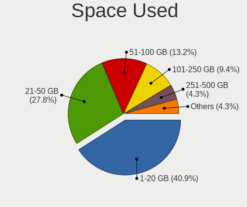
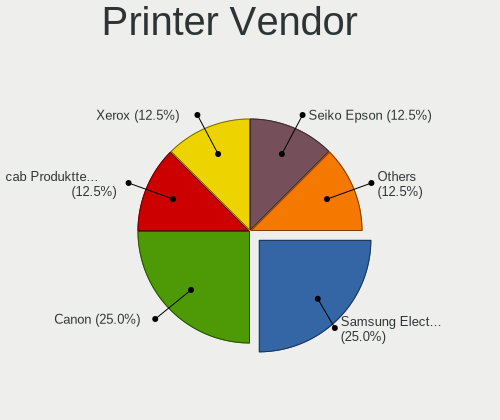
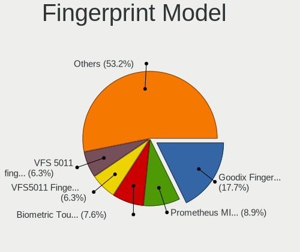

Elementary 6.1 - Tested Hardware & Statistics (Notebooks)
---------------------------------------------------------

A project to collect tested hardware configurations for Elementary 6.1.

Anyone can contribute to this report by the [hw-probe](https://github.com/linuxhw/hw-probe) tool:

    sudo -E hw-probe -all -upload

Please submit a probe of your configuration if it's not presented on the page or is rare.

Full-feature report is available here: https://linux-hardware.org/?view=trends

Contents
--------

* [ Test Cases ](#test-cases)

* [ System ](#system)
  - [ Kernel                   ](#kernel)
  - [ Kernel Family            ](#kernel-family)
  - [ Kernel Major Ver.        ](#kernel-major-ver)
  - [ Arch                     ](#arch)
  - [ DE                       ](#de)
  - [ Display Server           ](#display-server)
  - [ Display Manager          ](#display-manager)
  - [ OS Lang                  ](#os-lang)
  - [ Boot Mode                ](#boot-mode)
  - [ Filesystem               ](#filesystem)
  - [ Part. scheme             ](#part-scheme)
  - [ Dual Boot with Linux/BSD ](#dual-boot-with-linuxbsd)
  - [ Dual Boot (Win)          ](#dual-boot-win)

* [ Board ](#board)
  - [ Vendor                   ](#vendor)
  - [ Model                    ](#model)
  - [ Model Family             ](#model-family)
  - [ MFG Year                 ](#mfg-year)
  - [ Form Factor              ](#form-factor)
  - [ Secure Boot              ](#secure-boot)
  - [ Coreboot                 ](#coreboot)
  - [ RAM Size                 ](#ram-size)
  - [ RAM Used                 ](#ram-used)
  - [ Total Drives             ](#total-drives)
  - [ Has CD-ROM               ](#has-cd-rom)
  - [ Has Ethernet             ](#has-ethernet)
  - [ Has WiFi                 ](#has-wifi)
  - [ Has Bluetooth            ](#has-bluetooth)

* [ Location ](#location)
  - [ Country                  ](#country)
  - [ City                     ](#city)

* [ Drives ](#drives)
  - [ Drive Vendor             ](#drive-vendor)
  - [ Drive Model              ](#drive-model)
  - [ HDD Vendor               ](#hdd-vendor)
  - [ SSD Vendor               ](#ssd-vendor)
  - [ Drive Kind               ](#drive-kind)
  - [ Drive Connector          ](#drive-connector)
  - [ Drive Size               ](#drive-size)
  - [ Space Total              ](#space-total)
  - [ Space Used               ](#space-used)
  - [ Malfunc. Drives          ](#malfunc-drives)
  - [ Malfunc. Drive Vendor    ](#malfunc-drive-vendor)
  - [ Malfunc. HDD Vendor      ](#malfunc-hdd-vendor)
  - [ Malfunc. Drive Kind      ](#malfunc-drive-kind)
  - [ Failed Drives            ](#failed-drives)
  - [ Failed Drive Vendor      ](#failed-drive-vendor)
  - [ Drive Status             ](#drive-status)

* [ Storage controller ](#storage-controller)
  - [ Storage Vendor           ](#storage-vendor)
  - [ Storage Model            ](#storage-model)
  - [ Storage Kind             ](#storage-kind)

* [ Processor ](#processor)
  - [ CPU Vendor               ](#cpu-vendor)
  - [ CPU Model                ](#cpu-model)
  - [ CPU Model Family         ](#cpu-model-family)
  - [ CPU Cores                ](#cpu-cores)
  - [ CPU Sockets              ](#cpu-sockets)
  - [ CPU Threads              ](#cpu-threads)
  - [ CPU Op-Modes             ](#cpu-op-modes)
  - [ CPU Microcode            ](#cpu-microcode)
  - [ CPU Microarch            ](#cpu-microarch)

* [ Graphics ](#graphics)
  - [ GPU Vendor               ](#gpu-vendor)
  - [ GPU Model                ](#gpu-model)
  - [ GPU Combo                ](#gpu-combo)
  - [ GPU Driver               ](#gpu-driver)
  - [ GPU Memory               ](#gpu-memory)

* [ Monitor ](#monitor)
  - [ Monitor Vendor           ](#monitor-vendor)
  - [ Monitor Model            ](#monitor-model)
  - [ Monitor Resolution       ](#monitor-resolution)
  - [ Monitor Diagonal         ](#monitor-diagonal)
  - [ Monitor Width            ](#monitor-width)
  - [ Aspect Ratio             ](#aspect-ratio)
  - [ Monitor Area             ](#monitor-area)
  - [ Pixel Density            ](#pixel-density)
  - [ Multiple Monitors        ](#multiple-monitors)

* [ Network ](#network)
  - [ Net Controller Vendor    ](#net-controller-vendor)
  - [ Net Controller Model     ](#net-controller-model)
  - [ Wireless Vendor          ](#wireless-vendor)
  - [ Wireless Model           ](#wireless-model)
  - [ Ethernet Vendor          ](#ethernet-vendor)
  - [ Ethernet Model           ](#ethernet-model)
  - [ Net Controller Kind      ](#net-controller-kind)
  - [ Used Controller          ](#used-controller)
  - [ NICs                     ](#nics)
  - [ IPv6                     ](#ipv6)

* [ Bluetooth ](#bluetooth)
  - [ Bluetooth Vendor         ](#bluetooth-vendor)
  - [ Bluetooth Model          ](#bluetooth-model)

* [ Sound ](#sound)
  - [ Sound Vendor             ](#sound-vendor)
  - [ Sound Model              ](#sound-model)

* [ Memory ](#memory)
  - [ Memory Vendor            ](#memory-vendor)
  - [ Memory Model             ](#memory-model)
  - [ Memory Kind              ](#memory-kind)
  - [ Memory Form Factor       ](#memory-form-factor)
  - [ Memory Size              ](#memory-size)
  - [ Memory Speed             ](#memory-speed)

* [ Printers & scanners ](#printers--scanners)
  - [ Printer Vendor           ](#printer-vendor)
  - [ Printer Model            ](#printer-model)
  - [ Scanner Vendor           ](#scanner-vendor)
  - [ Scanner Model            ](#scanner-model)

* [ Camera ](#camera)
  - [ Camera Vendor            ](#camera-vendor)
  - [ Camera Model             ](#camera-model)

* [ Security ](#security)
  - [ Fingerprint Vendor       ](#fingerprint-vendor)
  - [ Fingerprint Model        ](#fingerprint-model)
  - [ Chipcard Vendor          ](#chipcard-vendor)
  - [ Chipcard Model           ](#chipcard-model)

* [ Unsupported ](#unsupported)
  - [ Unsupported Devices      ](#unsupported-devices)
  - [ Unsupported Device Types ](#unsupported-device-types)

Test Cases
----------

Total: 254

| Vendor        | Model                       | Probe                                                      | Date         |
|---------------|-----------------------------|------------------------------------------------------------|--------------|
| HP            | EliteBook 8730w             | [caade8e7ff](https://linux-hardware.org/?probe=caade8e7ff) | Mar 31, 2022 |
| ASUSTek       | UL80VT                      | [bd7c5c01e6](https://linux-hardware.org/?probe=bd7c5c01e6) | Mar 31, 2022 |
| Lenovo        | IdeaPad S145-15IWL 81MV     | [513f01a83f](https://linux-hardware.org/?probe=513f01a83f) | Mar 30, 2022 |
| Acer          | Aspire ES1-531              | [e617f1e49b](https://linux-hardware.org/?probe=e617f1e49b) | Mar 30, 2022 |
| HUAWEI        | NBLB-WAX9N                  | [5eb56f360e](https://linux-hardware.org/?probe=5eb56f360e) | Mar 29, 2022 |
| Acer          | Aspire ES1-520              | [95df1e3190](https://linux-hardware.org/?probe=95df1e3190) | Mar 28, 2022 |
| Lenovo        | ThinkBook 16p Gen 2 20YM    | [677a8dfae3](https://linux-hardware.org/?probe=677a8dfae3) | Mar 28, 2022 |
| Lenovo        | ThinkBook 16p Gen 2 20YM    | [2f7a9a8ab0](https://linux-hardware.org/?probe=2f7a9a8ab0) | Mar 28, 2022 |
| LG Electro... | 17Z95P-K.AAE8U1             | [0a3f06a9e5](https://linux-hardware.org/?probe=0a3f06a9e5) | Mar 28, 2022 |
| Dell          | Latitude 5520               | [ca6e0db25d](https://linux-hardware.org/?probe=ca6e0db25d) | Mar 27, 2022 |
| Lenovo        | ThinkBook 16p Gen 2 20YM    | [ac055e5e8a](https://linux-hardware.org/?probe=ac055e5e8a) | Mar 27, 2022 |
| Dell          | Inspiron 1545               | [0521ab3bd7](https://linux-hardware.org/?probe=0521ab3bd7) | Mar 27, 2022 |
| Sony          | VPCCA4E1E                   | [95fc0956c8](https://linux-hardware.org/?probe=95fc0956c8) | Mar 27, 2022 |
| Lenovo        | IdeaPad S145-14AST 81ST     | [9e39c749a1](https://linux-hardware.org/?probe=9e39c749a1) | Mar 27, 2022 |
| Toshiba       | Satellite C70D-A            | [c8b872d005](https://linux-hardware.org/?probe=c8b872d005) | Mar 26, 2022 |
| Acer          | Nitro AN515-55              | [7ca2f5d5cb](https://linux-hardware.org/?probe=7ca2f5d5cb) | Mar 26, 2022 |
| Toshiba       | Satellite L50D-C            | [2782b13510](https://linux-hardware.org/?probe=2782b13510) | Mar 25, 2022 |
| Toshiba       | Satellite L50D-C            | [a0c9b5a952](https://linux-hardware.org/?probe=a0c9b5a952) | Mar 25, 2022 |
| MSI           | Modern 14 B4MW              | [744a69ec7d](https://linux-hardware.org/?probe=744a69ec7d) | Mar 25, 2022 |
| Dell          | Inspiron MM061              | [1535349482](https://linux-hardware.org/?probe=1535349482) | Mar 24, 2022 |
| HP            | 250 G7 Notebook PC          | [552f06718c](https://linux-hardware.org/?probe=552f06718c) | Mar 23, 2022 |
| Dell          | Inspiron MM061              | [dd34f9d506](https://linux-hardware.org/?probe=dd34f9d506) | Mar 23, 2022 |
| Sony          | SVP1321B4E                  | [b539c23011](https://linux-hardware.org/?probe=b539c23011) | Mar 21, 2022 |
| LG Electro... | A410-G.BC51P1               | [9054ee5a3d](https://linux-hardware.org/?probe=9054ee5a3d) | Mar 20, 2022 |
| Dell          | Vostro 15 3515              | [6806f47a62](https://linux-hardware.org/?probe=6806f47a62) | Mar 19, 2022 |
| Acer          | Nitro AN515-55              | [7d4d2482ed](https://linux-hardware.org/?probe=7d4d2482ed) | Mar 18, 2022 |
| Apple         | MacBookAir7,1               | [7b2fa4b8e8](https://linux-hardware.org/?probe=7b2fa4b8e8) | Mar 16, 2022 |
| Dell          | Inspiron 5593               | [f4d49b97ec](https://linux-hardware.org/?probe=f4d49b97ec) | Mar 15, 2022 |
| Dell          | Latitude E6220              | [e2c9477eb3](https://linux-hardware.org/?probe=e2c9477eb3) | Mar 15, 2022 |
| ASUSTek       | VivoBook_ASUS Laptop E41... | [a10cf12536](https://linux-hardware.org/?probe=a10cf12536) | Mar 15, 2022 |
| Lenovo        | IdeaPad S145-15IIL 82DJ     | [c95c5598af](https://linux-hardware.org/?probe=c95c5598af) | Mar 15, 2022 |
| Acer          | Aspire A315-21G             | [4e85fcd677](https://linux-hardware.org/?probe=4e85fcd677) | Mar 13, 2022 |
| Acer          | Nitro AN515-55              | [4a24f1b828](https://linux-hardware.org/?probe=4a24f1b828) | Mar 13, 2022 |
| Samsung       | RV411/RV511/E3511/S3511/... | [7f9721781e](https://linux-hardware.org/?probe=7f9721781e) | Mar 12, 2022 |
| Lenovo        | ThinkPad T420 4236JY2       | [bc5d95b759](https://linux-hardware.org/?probe=bc5d95b759) | Mar 12, 2022 |
| Teclast       | F15S                        | [a92a5510ef](https://linux-hardware.org/?probe=a92a5510ef) | Mar 11, 2022 |
| ASUSTek       | X200CA                      | [85c103c654](https://linux-hardware.org/?probe=85c103c654) | Mar 10, 2022 |
| ASUSTek       | X200CA                      | [25518274da](https://linux-hardware.org/?probe=25518274da) | Mar 10, 2022 |
| Lenovo        | IdeaPad 330S-15ARR 81FB     | [b950d195ce](https://linux-hardware.org/?probe=b950d195ce) | Mar 10, 2022 |
| HP            | Laptop 15-db0xxx            | [1064e67665](https://linux-hardware.org/?probe=1064e67665) | Mar 10, 2022 |
| Lenovo        | IdeaPad S340-15API 81NC     | [83dc415e28](https://linux-hardware.org/?probe=83dc415e28) | Mar 09, 2022 |
| Lenovo        | IdeaPad 310-15IKB 80TV      | [e6a6f71bb5](https://linux-hardware.org/?probe=e6a6f71bb5) | Mar 09, 2022 |
| Lenovo        | ThinkPad P14s Gen 1 20S4... | [ee3693d6a7](https://linux-hardware.org/?probe=ee3693d6a7) | Mar 09, 2022 |
| Dell          | Inspiron 15-3567            | [fc064cce68](https://linux-hardware.org/?probe=fc064cce68) | Mar 09, 2022 |
| MSI           | Modern 14 B10MW             | [661d068b83](https://linux-hardware.org/?probe=661d068b83) | Mar 08, 2022 |
| Lenovo        | ThinkPad L470 20J4002FMX    | [c3e1baf45a](https://linux-hardware.org/?probe=c3e1baf45a) | Mar 06, 2022 |
| Lenovo        | ThinkPad T420 4236JY2       | [8a9f469e1e](https://linux-hardware.org/?probe=8a9f469e1e) | Mar 06, 2022 |
| Lenovo        | ThinkPad T420 4236JY2       | [caa5c3eef1](https://linux-hardware.org/?probe=caa5c3eef1) | Mar 06, 2022 |
| Lenovo        | ThinkPad X230 2325ND9       | [02818352e0](https://linux-hardware.org/?probe=02818352e0) | Mar 06, 2022 |
| iOTA          | IOTA2320                    | [6cf7733a53](https://linux-hardware.org/?probe=6cf7733a53) | Mar 06, 2022 |
| Lenovo        | ThinkPad X230 2325ND9       | [24a601d3aa](https://linux-hardware.org/?probe=24a601d3aa) | Mar 06, 2022 |
| Lenovo        | IdeaPad Y580                | [26ea7d1cff](https://linux-hardware.org/?probe=26ea7d1cff) | Mar 06, 2022 |
| Acer          | Nitro AN515-55              | [7e967f4daa](https://linux-hardware.org/?probe=7e967f4daa) | Mar 06, 2022 |
| Acer          | Nitro AN515-55              | [db5f524190](https://linux-hardware.org/?probe=db5f524190) | Mar 06, 2022 |
| Acer          | Nitro AN517-52              | [4576110ce4](https://linux-hardware.org/?probe=4576110ce4) | Mar 05, 2022 |
| HUAWEI        | MACHD-WXX9                  | [707b59278e](https://linux-hardware.org/?probe=707b59278e) | Mar 05, 2022 |
| Apple         | MacBookPro6,2               | [a2f1d82d9c](https://linux-hardware.org/?probe=a2f1d82d9c) | Mar 05, 2022 |
| Acer          | Aspire A315-42G             | [d08f8cbc35](https://linux-hardware.org/?probe=d08f8cbc35) | Mar 05, 2022 |
| Lenovo        | IdeaPad S340-15API 81NC     | [4fc1001606](https://linux-hardware.org/?probe=4fc1001606) | Mar 02, 2022 |
| Lenovo        | ThinkPad T400s 2808D9G      | [6a5d0584bd](https://linux-hardware.org/?probe=6a5d0584bd) | Mar 02, 2022 |
| HP            | ProBook 450 G7              | [a73f7ae919](https://linux-hardware.org/?probe=a73f7ae919) | Feb 28, 2022 |
| ASUSTek       | VivoBook_ASUSLaptop X510... | [d7b815d3d6](https://linux-hardware.org/?probe=d7b815d3d6) | Feb 27, 2022 |
| Samsung       | 870Z5E/880Z5E/680Z5E        | [d04715f0dc](https://linux-hardware.org/?probe=d04715f0dc) | Feb 26, 2022 |
| HP            | Laptop 17-by0xxx            | [745fa98d2e](https://linux-hardware.org/?probe=745fa98d2e) | Feb 26, 2022 |
| Acer          | Aspire A315-42G             | [75830af7ff](https://linux-hardware.org/?probe=75830af7ff) | Feb 25, 2022 |
| ASUSTek       | K50IJ                       | [97284dc322](https://linux-hardware.org/?probe=97284dc322) | Feb 25, 2022 |
| HP            | EliteBook 840 G1            | [a8b2cacac9](https://linux-hardware.org/?probe=a8b2cacac9) | Feb 25, 2022 |
| HP            | Pavilion Laptop 15-cd0xx    | [eeaed94df7](https://linux-hardware.org/?probe=eeaed94df7) | Feb 23, 2022 |
| Dell          | Inspiron N5050              | [88c13620a2](https://linux-hardware.org/?probe=88c13620a2) | Feb 23, 2022 |
| ASUSTek       | ZenBook UX325EA_UX325EA     | [7a8aaaa5a6](https://linux-hardware.org/?probe=7a8aaaa5a6) | Feb 23, 2022 |
| ASUSTek       | ZenBook UX325EA_UX325EA     | [849ceb3653](https://linux-hardware.org/?probe=849ceb3653) | Feb 23, 2022 |
| MSI           | Modern 14 B4MW              | [1527f67c84](https://linux-hardware.org/?probe=1527f67c84) | Feb 23, 2022 |
| Samsung       | 500R4K/500R5H/5400RK/501... | [1391579931](https://linux-hardware.org/?probe=1391579931) | Feb 21, 2022 |
| ASUSTek       | GL753VE                     | [25f1ab36fc](https://linux-hardware.org/?probe=25f1ab36fc) | Feb 20, 2022 |
| Apple         | MacBookAir3,1               | [48dcaa8622](https://linux-hardware.org/?probe=48dcaa8622) | Feb 20, 2022 |
| ASUSTek       | E402SA                      | [b9796e46de](https://linux-hardware.org/?probe=b9796e46de) | Feb 20, 2022 |
| Apple         | MacBook5,1                  | [3503d61993](https://linux-hardware.org/?probe=3503d61993) | Feb 19, 2022 |
| HP            | Pavilion Laptop 14-ce0xx... | [44210b95fe](https://linux-hardware.org/?probe=44210b95fe) | Feb 19, 2022 |
| Lenovo        | IdeaPad 5 15ARE05 81YQ      | [da54df3fd4](https://linux-hardware.org/?probe=da54df3fd4) | Feb 19, 2022 |
| Lenovo        | IdeaPad 5 15ARE05 81YQ      | [05cb921db2](https://linux-hardware.org/?probe=05cb921db2) | Feb 19, 2022 |
| MSI           | Modern 14 B10MW             | [beb5ff195a](https://linux-hardware.org/?probe=beb5ff195a) | Feb 18, 2022 |
| Packard Be... | EasyNote LS11HR             | [d8b9f8edb0](https://linux-hardware.org/?probe=d8b9f8edb0) | Feb 17, 2022 |
| HP            | EliteBook 8460p             | [03dfc41744](https://linux-hardware.org/?probe=03dfc41744) | Feb 16, 2022 |
| Lenovo        | ThinkPad T470 20JNS08H00    | [f97643f94c](https://linux-hardware.org/?probe=f97643f94c) | Feb 16, 2022 |
| Acer          | Aspire A315-35              | [9986615814](https://linux-hardware.org/?probe=9986615814) | Feb 15, 2022 |
| Acer          | Swift SF314-56              | [a6c7102b14](https://linux-hardware.org/?probe=a6c7102b14) | Feb 14, 2022 |
| ASUSTek       | X540SA                      | [eba09c169c](https://linux-hardware.org/?probe=eba09c169c) | Feb 13, 2022 |
| HUAWEI        | MACHD-WXX9                  | [45c9189643](https://linux-hardware.org/?probe=45c9189643) | Feb 13, 2022 |
| ASUSTek       | E402NA                      | [ec217b7bd1](https://linux-hardware.org/?probe=ec217b7bd1) | Feb 13, 2022 |
| Dell          | Precision 7720              | [e5c37c787f](https://linux-hardware.org/?probe=e5c37c787f) | Feb 13, 2022 |
| Google        | Lulu                        | [5b81b703ea](https://linux-hardware.org/?probe=5b81b703ea) | Feb 13, 2022 |
| Sony          | SVE15115EN                  | [facd08033e](https://linux-hardware.org/?probe=facd08033e) | Feb 12, 2022 |
| ASUSTek       | X550CA                      | [4fc3af48e2](https://linux-hardware.org/?probe=4fc3af48e2) | Feb 12, 2022 |
| HP            | ProBook 640 G1              | [1aeb3957c5](https://linux-hardware.org/?probe=1aeb3957c5) | Feb 12, 2022 |
| HP            | 255 G8 Notebook PC          | [aac284c4db](https://linux-hardware.org/?probe=aac284c4db) | Feb 12, 2022 |
| Dell          | Inspiron 1764               | [3b22e2edbb](https://linux-hardware.org/?probe=3b22e2edbb) | Feb 11, 2022 |
| LG Electro... | A410-G.BC51P1               | [0caedcc26b](https://linux-hardware.org/?probe=0caedcc26b) | Feb 11, 2022 |
| Apple         | MacBookAir7,1               | [39d4765770](https://linux-hardware.org/?probe=39d4765770) | Feb 11, 2022 |
| Apple         | MacBookAir4,2               | [113add3cba](https://linux-hardware.org/?probe=113add3cba) | Feb 10, 2022 |
| Apple         | MacBookAir4,2               | [accb1d4232](https://linux-hardware.org/?probe=accb1d4232) | Feb 09, 2022 |
| Timi          | TM1613                      | [737c2fcb2f](https://linux-hardware.org/?probe=737c2fcb2f) | Feb 09, 2022 |
| Lenovo        | ThinkPad T440p 20AN006NU... | [d4fccf53c8](https://linux-hardware.org/?probe=d4fccf53c8) | Feb 07, 2022 |
| ASUSTek       | VivoBook_ASUSLaptop X409... | [87954474ed](https://linux-hardware.org/?probe=87954474ed) | Feb 07, 2022 |
| Apple         | MacBook5,1                  | [baa251b3db](https://linux-hardware.org/?probe=baa251b3db) | Feb 07, 2022 |
| Lenovo        | ThinkPad E550 20DF0040US    | [ca4c420e00](https://linux-hardware.org/?probe=ca4c420e00) | Feb 07, 2022 |
| Apple         | MacBookPro6,2               | [b298d77ce8](https://linux-hardware.org/?probe=b298d77ce8) | Feb 06, 2022 |
| Timi          | TM1613                      | [8d16a0555c](https://linux-hardware.org/?probe=8d16a0555c) | Feb 06, 2022 |
| Acer          | Aspire V5-573PG             | [0edb115ff8](https://linux-hardware.org/?probe=0edb115ff8) | Feb 05, 2022 |
| Acer          | Aspire V5-573PG             | [68595aad84](https://linux-hardware.org/?probe=68595aad84) | Feb 05, 2022 |
| Lenovo        | G550 2958                   | [e23451d062](https://linux-hardware.org/?probe=e23451d062) | Feb 05, 2022 |
| Lenovo        | G550 2958                   | [a933b9c8f4](https://linux-hardware.org/?probe=a933b9c8f4) | Feb 05, 2022 |
| HUAWEI        | HVY-WXX9                    | [7b1b45a8ed](https://linux-hardware.org/?probe=7b1b45a8ed) | Feb 05, 2022 |
| HP            | 240 G4                      | [9e7ffa0cf2](https://linux-hardware.org/?probe=9e7ffa0cf2) | Feb 04, 2022 |
| Dell          | Inspiron 15-3567            | [7e21d67fa5](https://linux-hardware.org/?probe=7e21d67fa5) | Feb 03, 2022 |
| Lenovo        | ThinkPad P14s Gen 1 20Y1... | [1837325ca2](https://linux-hardware.org/?probe=1837325ca2) | Feb 03, 2022 |
| ASUSTek       | K95VJ                       | [ebff9950e3](https://linux-hardware.org/?probe=ebff9950e3) | Feb 02, 2022 |
| Apple         | MacBookAir6,2               | [7b7a2f85e0](https://linux-hardware.org/?probe=7b7a2f85e0) | Feb 02, 2022 |
| Acer          | Aspire S3-391               | [87788239d2](https://linux-hardware.org/?probe=87788239d2) | Feb 02, 2022 |
| Lenovo        | ThinkPad X1 Carbon 6th 2... | [2a4563231b](https://linux-hardware.org/?probe=2a4563231b) | Feb 02, 2022 |
| Toshiba       | Satellite L850D-BJS         | [d3897cf605](https://linux-hardware.org/?probe=d3897cf605) | Feb 02, 2022 |
| HP            | Pavilion 13 x360 PC         | [d2bcb368c1](https://linux-hardware.org/?probe=d2bcb368c1) | Feb 02, 2022 |
| PIPO          | Cherry Trail CR             | [eb92e7ef7f](https://linux-hardware.org/?probe=eb92e7ef7f) | Feb 01, 2022 |
| Acer          | Swift SF114-32              | [1a0b7da0df](https://linux-hardware.org/?probe=1a0b7da0df) | Feb 01, 2022 |
| Acer          | Swift SF114-32              | [ce9e5f5d44](https://linux-hardware.org/?probe=ce9e5f5d44) | Feb 01, 2022 |
| Lenovo        | IdeaPad 330-15ARR 81D2      | [b86eb71aa1](https://linux-hardware.org/?probe=b86eb71aa1) | Jan 31, 2022 |
| Lenovo        | ThinkPad X270 W10DG 20K5... | [1f2faf4487](https://linux-hardware.org/?probe=1f2faf4487) | Jan 31, 2022 |
| Lenovo        | ThinkPad X270 W10DG 20K5... | [03cb9013e4](https://linux-hardware.org/?probe=03cb9013e4) | Jan 31, 2022 |
| Apple         | MacBookPro5,5               | [34a7deb292](https://linux-hardware.org/?probe=34a7deb292) | Jan 30, 2022 |
| Apple         | MacBookPro5,5               | [add488b5fe](https://linux-hardware.org/?probe=add488b5fe) | Jan 30, 2022 |
| HP            | Elite x2 1012 G1            | [13b478195a](https://linux-hardware.org/?probe=13b478195a) | Jan 30, 2022 |
| Lenovo        | IdeaPad Gaming 3 15IMH05... | [479381fba6](https://linux-hardware.org/?probe=479381fba6) | Jan 29, 2022 |
| Acer          | Swift SF314-59              | [697f73bc7c](https://linux-hardware.org/?probe=697f73bc7c) | Jan 29, 2022 |
| Lenovo        | IdeaPad 130-15AST 81H5      | [7ab82cc23a](https://linux-hardware.org/?probe=7ab82cc23a) | Jan 29, 2022 |
| Lenovo        | IdeaPad 130-15AST 81H5      | [a015de4156](https://linux-hardware.org/?probe=a015de4156) | Jan 29, 2022 |
| Apple         | MacBookPro9,1               | [857a74feaa](https://linux-hardware.org/?probe=857a74feaa) | Jan 28, 2022 |
| ASUSTek       | X550CA                      | [81cfc7fba7](https://linux-hardware.org/?probe=81cfc7fba7) | Jan 28, 2022 |
| HUAWEI        | NBLK-WAX9X                  | [61d5b0014e](https://linux-hardware.org/?probe=61d5b0014e) | Jan 28, 2022 |
| Acer          | Aspire E5-571G              | [a29ec0cc55](https://linux-hardware.org/?probe=a29ec0cc55) | Jan 28, 2022 |
| Razer         | Blade Stealth               | [6a4fbb1374](https://linux-hardware.org/?probe=6a4fbb1374) | Jan 27, 2022 |
| ASUSTek       | X555LN                      | [8c1e438e47](https://linux-hardware.org/?probe=8c1e438e47) | Jan 26, 2022 |
| Apple         | MacBookAir1,1               | [dfbdc8f20b](https://linux-hardware.org/?probe=dfbdc8f20b) | Jan 25, 2022 |
| HP            | Laptop 15-ef2xxx            | [8394958e0e](https://linux-hardware.org/?probe=8394958e0e) | Jan 25, 2022 |
| Lenovo        | G550 20023                  | [9432cdb859](https://linux-hardware.org/?probe=9432cdb859) | Jan 24, 2022 |
| Apple         | MacBook5,1                  | [79cf3b66a3](https://linux-hardware.org/?probe=79cf3b66a3) | Jan 24, 2022 |
| Lenovo        | G550 2958                   | [fd2872d2d8](https://linux-hardware.org/?probe=fd2872d2d8) | Jan 24, 2022 |
| Apple         | MacBookPro8,2               | [d1e0923b7a](https://linux-hardware.org/?probe=d1e0923b7a) | Jan 24, 2022 |
| HP            | EliteBook Folio 1040 G2     | [4e3ef7a5a7](https://linux-hardware.org/?probe=4e3ef7a5a7) | Jan 23, 2022 |
| HP            | EliteBook 840 G1            | [37e7b98af1](https://linux-hardware.org/?probe=37e7b98af1) | Jan 23, 2022 |
| Apple         | MacBookPro9,2               | [a5a4652304](https://linux-hardware.org/?probe=a5a4652304) | Jan 23, 2022 |
| ASUSTek       | ZenBook UX425UG_Q408UG      | [92991c028e](https://linux-hardware.org/?probe=92991c028e) | Jan 22, 2022 |
| Apple         | MacBookPro8,3               | [fb5a640b14](https://linux-hardware.org/?probe=fb5a640b14) | Jan 22, 2022 |
| Lenovo        | ThinkPad T470 20JNS08H00    | [5007cce576](https://linux-hardware.org/?probe=5007cce576) | Jan 21, 2022 |
| HP            | Pavilion Laptop 15-eh0xx... | [db0cc3978c](https://linux-hardware.org/?probe=db0cc3978c) | Jan 21, 2022 |
| ASUSTek       | VivoBook_ASUSLaptop X512... | [7fd85b85b8](https://linux-hardware.org/?probe=7fd85b85b8) | Jan 21, 2022 |
| ASUSTek       | VivoBook_ASUSLaptop X512... | [2c01bf53cb](https://linux-hardware.org/?probe=2c01bf53cb) | Jan 21, 2022 |
| Dell          | Vostro 3500                 | [3bf6b408ee](https://linux-hardware.org/?probe=3bf6b408ee) | Jan 21, 2022 |
| Fujitsu       | LIFEBOOK S760               | [f2de9fb609](https://linux-hardware.org/?probe=f2de9fb609) | Jan 20, 2022 |
| Fujitsu       | LIFEBOOK S760               | [0fdf944115](https://linux-hardware.org/?probe=0fdf944115) | Jan 20, 2022 |
| Apple         | MacBookPro11,5              | [0a8fb964eb](https://linux-hardware.org/?probe=0a8fb964eb) | Jan 20, 2022 |
| HP            | ProBook 4540s               | [16794fee23](https://linux-hardware.org/?probe=16794fee23) | Jan 20, 2022 |
| ASUSTek       | VivoBook_ASUSLaptop X513... | [3dd4035494](https://linux-hardware.org/?probe=3dd4035494) | Jan 19, 2022 |
| HUAWEI        | MACHD-WXX9                  | [df4c38dba6](https://linux-hardware.org/?probe=df4c38dba6) | Jan 19, 2022 |
| Lenovo        | IdeaPad 5 14ARE05 81YM      | [3088724103](https://linux-hardware.org/?probe=3088724103) | Jan 19, 2022 |
| ASUSTek       | VivoBook_ASUSLaptop X513... | [377afa98c8](https://linux-hardware.org/?probe=377afa98c8) | Jan 19, 2022 |
| Dell          | Vostro 15 3515              | [a0fdaf761c](https://linux-hardware.org/?probe=a0fdaf761c) | Jan 17, 2022 |
| ASUSTek       | X555LN                      | [f7c8c966dc](https://linux-hardware.org/?probe=f7c8c966dc) | Jan 17, 2022 |
| Apple         | MacBookPro8,2               | [744cfeb340](https://linux-hardware.org/?probe=744cfeb340) | Jan 17, 2022 |
| ASUSTek       | X555LN                      | [6fba3bb5aa](https://linux-hardware.org/?probe=6fba3bb5aa) | Jan 17, 2022 |
| Dell          | Latitude E5400              | [1303d72d3b](https://linux-hardware.org/?probe=1303d72d3b) | Jan 17, 2022 |
| Acer          | Swift SF315-52              | [1a6e0815fc](https://linux-hardware.org/?probe=1a6e0815fc) | Jan 16, 2022 |
| Lenovo        | ThinkPad T430 2347JC2       | [cac66153bc](https://linux-hardware.org/?probe=cac66153bc) | Jan 16, 2022 |
| ASUSTek       | X541NA                      | [89459685e9](https://linux-hardware.org/?probe=89459685e9) | Jan 16, 2022 |
| ASUSTek       | VivoBook_ASUSLaptop X513... | [5248d37c26](https://linux-hardware.org/?probe=5248d37c26) | Jan 15, 2022 |
| ASUSTek       | ZenBook UX425EA_UX425EA     | [ff75719a4e](https://linux-hardware.org/?probe=ff75719a4e) | Jan 15, 2022 |
| HP            | ProBook 4430s               | [e2103ef2d8](https://linux-hardware.org/?probe=e2103ef2d8) | Jan 14, 2022 |
| HUAWEI        | MACHD-WXX9                  | [fae944592d](https://linux-hardware.org/?probe=fae944592d) | Jan 14, 2022 |
| HUAWEI        | MACHD-WXX9                  | [ebdb392f57](https://linux-hardware.org/?probe=ebdb392f57) | Jan 14, 2022 |
| Lenovo        | IdeaPad 310-15IKB 80TV      | [d8c919f740](https://linux-hardware.org/?probe=d8c919f740) | Jan 12, 2022 |
| Apple         | MacBook3,1                  | [c670d007f3](https://linux-hardware.org/?probe=c670d007f3) | Jan 11, 2022 |
| HP            | Pavilion Laptop 15-eh0xx... | [66d12682ac](https://linux-hardware.org/?probe=66d12682ac) | Jan 10, 2022 |
| Apple         | MacBook5,1                  | [6a8c354065](https://linux-hardware.org/?probe=6a8c354065) | Jan 10, 2022 |
| Lenovo        | ThinkPad E14 20RAS0EQ00     | [ea22270511](https://linux-hardware.org/?probe=ea22270511) | Jan 09, 2022 |
| Lenovo        | G50-80 80E5                 | [9d29b20f2d](https://linux-hardware.org/?probe=9d29b20f2d) | Jan 08, 2022 |
| HUAWEI        | MACHD-WXX9                  | [72b280602e](https://linux-hardware.org/?probe=72b280602e) | Jan 07, 2022 |
| Sony          | VPCEA3S1E                   | [670b7a5d31](https://linux-hardware.org/?probe=670b7a5d31) | Jan 07, 2022 |
| Star Labs     | StarBook                    | [bd2b8ba939](https://linux-hardware.org/?probe=bd2b8ba939) | Jan 06, 2022 |
| Apple         | MacBookPro16,1              | [864ecfe029](https://linux-hardware.org/?probe=864ecfe029) | Jan 06, 2022 |
| Notebook      | W65_67SJ                    | [606e2587dd](https://linux-hardware.org/?probe=606e2587dd) | Jan 06, 2022 |
| Lenovo        | ThinkPad X1 Carbon Gen 9... | [590907f437](https://linux-hardware.org/?probe=590907f437) | Jan 06, 2022 |
| MSI           | GF63 Thin 9SCSR             | [21f2a5e1b9](https://linux-hardware.org/?probe=21f2a5e1b9) | Jan 05, 2022 |
| Apple         | MacBookPro5,5               | [a03baba93d](https://linux-hardware.org/?probe=a03baba93d) | Jan 05, 2022 |
| Lenovo        | ThinkPad T470 W10DG 20JN... | [fbb0e6d1d5](https://linux-hardware.org/?probe=fbb0e6d1d5) | Jan 05, 2022 |
| Lenovo        | Legion Y530-15ICH 81FV      | [6eab59bbbf](https://linux-hardware.org/?probe=6eab59bbbf) | Jan 05, 2022 |
| Lenovo        | ThinkPad X1 Carbon 6th 2... | [5496b24a51](https://linux-hardware.org/?probe=5496b24a51) | Jan 05, 2022 |
| Samsung       | 900X3C/900X3D/900X3E/900... | [520ced18c4](https://linux-hardware.org/?probe=520ced18c4) | Jan 05, 2022 |
| HP            | Laptop 15s-eq1xxx           | [ae2f1bc63c](https://linux-hardware.org/?probe=ae2f1bc63c) | Jan 05, 2022 |
| HUAWEI        | MACHC-WAX9                  | [b0df1464a1](https://linux-hardware.org/?probe=b0df1464a1) | Jan 05, 2022 |
| Sony          | SVE14A390X                  | [3b11d123cf](https://linux-hardware.org/?probe=3b11d123cf) | Jan 04, 2022 |
| HP            | ProBook 4430s               | [aafb807fc2](https://linux-hardware.org/?probe=aafb807fc2) | Jan 04, 2022 |
| HP            | ProBook 4430s               | [f534b0dd91](https://linux-hardware.org/?probe=f534b0dd91) | Jan 04, 2022 |
| Lenovo        | ThinkPad W541 20EGS1VV00    | [5d88eb323c](https://linux-hardware.org/?probe=5d88eb323c) | Jan 04, 2022 |
| Apple         | MacBookPro9,2               | [a1c3f24aab](https://linux-hardware.org/?probe=a1c3f24aab) | Jan 04, 2022 |
| Lenovo        | ThinkPad P14s Gen 1 20Y1... | [71e992725f](https://linux-hardware.org/?probe=71e992725f) | Jan 04, 2022 |
| Lenovo        | ThinkPad P14s Gen 1 20Y1... | [8087320623](https://linux-hardware.org/?probe=8087320623) | Jan 04, 2022 |
| Lenovo        | Yoga 300-11IBR 80M1         | [b18501f890](https://linux-hardware.org/?probe=b18501f890) | Jan 04, 2022 |
| Star Labs     | LabTop                      | [043cd26c60](https://linux-hardware.org/?probe=043cd26c60) | Jan 04, 2022 |
| HUAWEI        | KPL-W0X                     | [9d633f7bdb](https://linux-hardware.org/?probe=9d633f7bdb) | Jan 04, 2022 |
| Lenovo        | ThinkPad E495 20NE001RTX    | [79e95e3cb6](https://linux-hardware.org/?probe=79e95e3cb6) | Jan 04, 2022 |
| Dell          | Precision 5530              | [b385c0a16e](https://linux-hardware.org/?probe=b385c0a16e) | Jan 04, 2022 |
| Lenovo        | IdeaPad 310-15ISK 80SM      | [023df04f60](https://linux-hardware.org/?probe=023df04f60) | Jan 04, 2022 |
| Monster       | ABRA A5 V13.2               | [6d8d622050](https://linux-hardware.org/?probe=6d8d622050) | Jan 04, 2022 |
| MSI           | PS63 Modern 8RD             | [1cd435c54f](https://linux-hardware.org/?probe=1cd435c54f) | Jan 04, 2022 |
| Lenovo        | Legion Y530-15ICH 81GT      | [c694c358f9](https://linux-hardware.org/?probe=c694c358f9) | Jan 04, 2022 |
| Lenovo        | ThinkPad X13 Gen 1 20UFS... | [c61ed9ea15](https://linux-hardware.org/?probe=c61ed9ea15) | Jan 04, 2022 |
| HUAWEI        | KPL-W0X                     | [1015862a37](https://linux-hardware.org/?probe=1015862a37) | Jan 04, 2022 |
| Timi          | TM1613                      | [6761bd1e12](https://linux-hardware.org/?probe=6761bd1e12) | Jan 04, 2022 |
| ASUSTek       | E202SA                      | [d721e131f4](https://linux-hardware.org/?probe=d721e131f4) | Jan 02, 2022 |
| Lenovo        | ThinkPad T470 W10DG 20JN... | [440d6a1b59](https://linux-hardware.org/?probe=440d6a1b59) | Jan 02, 2022 |
| Apple         | MacBookPro5,1               | [6c7a3affdb](https://linux-hardware.org/?probe=6c7a3affdb) | Jan 02, 2022 |
| Dell          | Vostro 15 3515              | [45b6bf0410](https://linux-hardware.org/?probe=45b6bf0410) | Jan 01, 2022 |
| HP            | Pavilion Laptop 15-cs0xx... | [fb332a2529](https://linux-hardware.org/?probe=fb332a2529) | Jan 01, 2022 |
| Acer          | Aspire A315-42              | [d44b06ec61](https://linux-hardware.org/?probe=d44b06ec61) | Jan 01, 2022 |
| HP            | EliteBook 8460p             | [f215102713](https://linux-hardware.org/?probe=f215102713) | Dec 31, 2021 |
| Notebook      | P65xHP                      | [37db5af302](https://linux-hardware.org/?probe=37db5af302) | Dec 31, 2021 |
| HP            | EliteBook 8460p             | [e060f00ff8](https://linux-hardware.org/?probe=e060f00ff8) | Dec 31, 2021 |
| Notebook      | P65xHP                      | [fc81fedcf3](https://linux-hardware.org/?probe=fc81fedcf3) | Dec 31, 2021 |
| Teclast       | F7                          | [44bba02dee](https://linux-hardware.org/?probe=44bba02dee) | Dec 31, 2021 |
| Wortmann      | 1220729_1470271             | [018071ac3e](https://linux-hardware.org/?probe=018071ac3e) | Dec 30, 2021 |
| Acer          | Aspire 7750G                | [3a24dba335](https://linux-hardware.org/?probe=3a24dba335) | Dec 28, 2021 |
| Acer          | Aspire 7750G                | [516cb4e250](https://linux-hardware.org/?probe=516cb4e250) | Dec 28, 2021 |
| ASUSTek       | X555UB                      | [e0844450ac](https://linux-hardware.org/?probe=e0844450ac) | Dec 28, 2021 |
| Dell          | Latitude 3580               | [f243f4c09e](https://linux-hardware.org/?probe=f243f4c09e) | Dec 27, 2021 |
| Lenovo        | ThinkPad T430 23501M2       | [2645817d64](https://linux-hardware.org/?probe=2645817d64) | Dec 26, 2021 |
| HP            | EliteBook 850 G2            | [a71c970cbf](https://linux-hardware.org/?probe=a71c970cbf) | Dec 25, 2021 |
| Apple         | MacBookAir7,2               | [99bea5df6c](https://linux-hardware.org/?probe=99bea5df6c) | Dec 25, 2021 |
| Lenovo        | IdeaPad 320-14AST 80XU      | [80c8feb8bf](https://linux-hardware.org/?probe=80c8feb8bf) | Dec 25, 2021 |
| Dell          | Inspiron N5050              | [211b723554](https://linux-hardware.org/?probe=211b723554) | Dec 24, 2021 |
| LG Electro... | A410-G.BC51P1               | [b231405a63](https://linux-hardware.org/?probe=b231405a63) | Dec 24, 2021 |
| Acer          | TravelMate 5760             | [71526c7767](https://linux-hardware.org/?probe=71526c7767) | Dec 23, 2021 |
| Lenovo        | Flex 2-14D 20376            | [d950a63316](https://linux-hardware.org/?probe=d950a63316) | Dec 23, 2021 |
| Dell          | Inspiron 3542               | [277f97ef07](https://linux-hardware.org/?probe=277f97ef07) | Dec 23, 2021 |
| Dell          | XPS 13 9343                 | [dfbdb618f1](https://linux-hardware.org/?probe=dfbdb618f1) | Dec 23, 2021 |
| ASUSTek       | VivoBook_ASUSLaptop X512... | [f74c2da103](https://linux-hardware.org/?probe=f74c2da103) | Dec 22, 2021 |
| Dell          | Precision M3800             | [ed44d9ac8c](https://linux-hardware.org/?probe=ed44d9ac8c) | Dec 21, 2021 |
| Apple         | MacBookAir6,1               | [b2e3490378](https://linux-hardware.org/?probe=b2e3490378) | Dec 21, 2021 |
| Dell          | Precision M6500             | [931f365c60](https://linux-hardware.org/?probe=931f365c60) | Dec 20, 2021 |
| Dell          | Inspiron 5555               | [09d45f017d](https://linux-hardware.org/?probe=09d45f017d) | Dec 18, 2021 |
| Lenovo        | V14-ADA 82C6                | [a45f76da28](https://linux-hardware.org/?probe=a45f76da28) | Dec 17, 2021 |
| ASUSTek       | UX410UAK                    | [39dcbe0f57](https://linux-hardware.org/?probe=39dcbe0f57) | Dec 17, 2021 |
| Monster       | MARKUT M7 V1.x              | [2d2ed2143e](https://linux-hardware.org/?probe=2d2ed2143e) | Dec 17, 2021 |
| Monster       | MARKUT M7 V1.x              | [2390550c49](https://linux-hardware.org/?probe=2390550c49) | Dec 15, 2021 |
| Apple         | MacBook4,1                  | [661e7dae0c](https://linux-hardware.org/?probe=661e7dae0c) | Dec 15, 2021 |
| Apple         | MacBook4,1                  | [b682cee818](https://linux-hardware.org/?probe=b682cee818) | Dec 15, 2021 |
| Apple         | MacBook5,2                  | [5dcbdab7ca](https://linux-hardware.org/?probe=5dcbdab7ca) | Dec 15, 2021 |

System
------

Kernel
------

Version of the Linux kernel

| Version                    | Notebooks | Percent |
|----------------------------|-----------|---------|
| 5.11.0-43-generic          | 55        | 27.09%  |
| 5.13.0-28-generic          | 33        | 16.26%  |
| 5.13.0-30-generic          | 28        | 13.79%  |
| 5.13.0-27-generic          | 24        | 11.82%  |
| 5.11.0-44-generic          | 13        | 6.4%    |
| 5.13.0-35-generic          | 11        | 5.42%   |
| 5.13.0-37-generic          | 10        | 4.93%   |
| 5.11.0-46-generic          | 10        | 4.93%   |
| 5.11.0-41-generic          | 4         | 1.97%   |
| 5.13.0-25-generic          | 2         | 0.99%   |
| 5.8.0-50-generic           | 1         | 0.49%   |
| 5.16.16-051616-generic     | 1         | 0.49%   |
| 5.16.10-051610-generic     | 1         | 0.49%   |
| 5.16.0-13.4-liquorix-amd64 | 1         | 0.49%   |
| 5.15.3-xanmod1             | 1         | 0.49%   |
| 5.15.13-xanmod1            | 1         | 0.49%   |
| 5.15.12-xanmod1-tt         | 1         | 0.49%   |
| 5.15.11-t2-big-sur         | 1         | 0.49%   |
| 5.14.10-051410-generic     | 1         | 0.49%   |
| 5.14.0-1029-oem            | 1         | 0.49%   |
| 5.14.0-1011-oem            | 1         | 0.49%   |
| 5.13.0-39-generic          | 1         | 0.49%   |
| 5.11.0-40-generic          | 1         | 0.49%   |

Kernel Family
-------------

Linux kernel without a distro release

| Version | Notebooks | Percent |
|---------|-----------|---------|
| 5.13.0  | 105       | 52.76%  |
| 5.11.0  | 83        | 41.71%  |
| 5.14.0  | 2         | 1.01%   |
| 5.8.0   | 1         | 0.5%    |
| 5.16.16 | 1         | 0.5%    |
| 5.16.10 | 1         | 0.5%    |
| 5.16.0  | 1         | 0.5%    |
| 5.15.3  | 1         | 0.5%    |
| 5.15.13 | 1         | 0.5%    |
| 5.15.12 | 1         | 0.5%    |
| 5.15.11 | 1         | 0.5%    |
| 5.14.10 | 1         | 0.5%    |

Kernel Major Ver.
-----------------

Linux kernel major version

| Version | Notebooks | Percent |
|---------|-----------|---------|
| 5.13    | 105       | 53.03%  |
| 5.11    | 83        | 41.92%  |
| 5.15    | 4         | 2.02%   |
| 5.14    | 3         | 1.52%   |
| 5.16    | 2         | 1.01%   |
| 5.8     | 1         | 0.51%   |

Arch
----

OS architecture (x86_64, i586, etc.)

| Name   | Notebooks | Percent |
|--------|-----------|---------|
| x86_64 | 196       | 100%    |

DE
--

Desktop Environment

| Name     | Notebooks | Percent |
|----------|-----------|---------|
| Pantheon | 196       | 100%    |

Display Server
--------------

X11 or Wayland

| Name | Notebooks | Percent |
|------|-----------|---------|
| X11  | 196       | 100%    |

Display Manager
---------------

SDDM, LightDM, etc.

| Name    | Notebooks | Percent |
|---------|-----------|---------|
| Unknown | 152       | 77.16%  |
| LightDM | 44        | 22.34%  |
| GDM     | 1         | 0.51%   |

OS Lang
-------

Language

| Lang  | Notebooks | Percent |
|-------|-----------|---------|
| en_US | 92        | 46.94%  |
| de_DE | 29        | 14.8%   |
| en_GB | 12        | 6.12%   |
| es_ES | 9         | 4.59%   |
| ru_RU | 8         | 4.08%   |
| pt_BR | 8         | 4.08%   |
| fr_FR | 8         | 4.08%   |
| it_IT | 7         | 3.57%   |
| pl_PL | 5         | 2.55%   |
| pt_PT | 3         | 1.53%   |
| nl_NL | 2         | 1.02%   |
| nb_NO | 2         | 1.02%   |
| en_CA | 2         | 1.02%   |
| en_AU | 2         | 1.02%   |
| tr_TR | 1         | 0.51%   |
| sv_SE | 1         | 0.51%   |
| hu_HU | 1         | 0.51%   |
| et_EE | 1         | 0.51%   |
| cs_CZ | 1         | 0.51%   |
| C     | 1         | 0.51%   |
| bg_BG | 1         | 0.51%   |

Boot Mode
---------

EFI or BIOS

| Mode | Notebooks | Percent |
|------|-----------|---------|
| EFI  | 140       | 71.43%  |
| BIOS | 56        | 28.57%  |

Filesystem
----------

Type of filesystem

| Type    | Notebooks | Percent |
|---------|-----------|---------|
| Ext4    | 192       | 97.96%  |
| Btrfs   | 3         | 1.53%   |
| Overlay | 1         | 0.51%   |

Part. scheme
------------

Scheme of partitioning

| Type    | Notebooks | Percent |
|---------|-----------|---------|
| Unknown | 162       | 82.23%  |
| GPT     | 31        | 15.74%  |
| MBR     | 4         | 2.03%   |

Dual Boot with Linux/BSD
------------------------

Hosting more than one Linux/BSD

| Dual boot | Notebooks | Percent |
|-----------|-----------|---------|
| No        | 191       | 97.45%  |
| Yes       | 5         | 2.55%   |

Dual Boot (Win)
---------------

Hosting Linux and Windows

| Dual boot | Notebooks | Percent |
|-----------|-----------|---------|
| No        | 181       | 92.35%  |
| Yes       | 15        | 7.65%   |

Board
-----

Vendor
------

Motherboard manufacturer

| Name                | Notebooks | Percent |
|---------------------|-----------|---------|
| Lenovo              | 44        | 22.45%  |
| Apple               | 26        | 13.27%  |
| ASUSTek Computer    | 24        | 12.24%  |
| Hewlett-Packard     | 23        | 11.73%  |
| Dell                | 20        | 10.2%   |
| Acer                | 17        | 8.67%   |
| HUAWEI              | 7         | 3.57%   |
| Sony                | 5         | 2.55%   |
| Samsung Electronics | 4         | 2.04%   |
| MSI                 | 4         | 2.04%   |
| Toshiba             | 3         | 1.53%   |
| Timi                | 2         | 1.02%   |
| Teclast             | 2         | 1.02%   |
| Star Labs           | 2         | 1.02%   |
| Notebook            | 2         | 1.02%   |
| Monster             | 2         | 1.02%   |
| LG Electronics      | 2         | 1.02%   |
| Wortmann AG         | 1         | 0.51%   |
| Razer               | 1         | 0.51%   |
| PIPO                | 1         | 0.51%   |
| Packard Bell        | 1         | 0.51%   |
| iOTA                | 1         | 0.51%   |
| Google              | 1         | 0.51%   |
| Fujitsu             | 1         | 0.51%   |

Model
-----

Motherboard model

| Name                                              | Notebooks | Percent |
|---------------------------------------------------|-----------|---------|
| Apple MacBook5,1                                  | 4         | 2.04%   |
| HUAWEI MACHD-WXX9                                 | 3         | 1.53%   |
| Timi TM1613                                       | 2         | 1.02%   |
| Lenovo IdeaPad 310-15IKB 80TV                     | 2         | 1.02%   |
| HP EliteBook 8460p                                | 2         | 1.02%   |
| Dell Inspiron N5050                               | 2         | 1.02%   |
| Dell Inspiron 15-3567                             | 2         | 1.02%   |
| ASUS X550CA                                       | 2         | 1.02%   |
| Apple MacBookPro8,2                               | 2         | 1.02%   |
| Apple MacBookPro6,2                               | 2         | 1.02%   |
| Apple MacBookPro5,5                               | 2         | 1.02%   |
| Apple MacBookAir7,1                               | 2         | 1.02%   |
| Wortmann AG 1220729_1470271                       | 1         | 0.51%   |
| Toshiba Satellite L850D-BJS                       | 1         | 0.51%   |
| Toshiba Satellite L50D-C                          | 1         | 0.51%   |
| Toshiba Satellite C70D-A                          | 1         | 0.51%   |
| Teclast F7                                        | 1         | 0.51%   |
| Teclast F15S                                      | 1         | 0.51%   |
| Star Labs StarBook                                | 1         | 0.51%   |
| Star Labs LabTop                                  | 1         | 0.51%   |
| Sony VPCEA3S1E                                    | 1         | 0.51%   |
| Sony VPCCA4E1E                                    | 1         | 0.51%   |
| Sony SVP1321B4E                                   | 1         | 0.51%   |
| Sony SVE15115EN                                   | 1         | 0.51%   |
| Sony SVE14A390X                                   | 1         | 0.51%   |
| Samsung RV411/RV511/E3511/S3511/RV711/E3411       | 1         | 0.51%   |
| Samsung 900X3C/900X3D/900X3E/900X4C/900X4D        | 1         | 0.51%   |
| Samsung 870Z5E/880Z5E/680Z5E                      | 1         | 0.51%   |
| Samsung 500R4K/500R5H/5400RK/501R5H/5500RH/500R5S | 1         | 0.51%   |
| Razer Blade Stealth                               | 1         | 0.51%   |
| PIPO W9                                           | 1         | 0.51%   |
| Packard Bell EasyNote LS11HR                      | 1         | 0.51%   |
| Notebook W65_67SJ                                 | 1         | 0.51%   |
| Notebook P65xHP                                   | 1         | 0.51%   |
| MSI PS63 Modern 8RD                               | 1         | 0.51%   |
| MSI Modern 14 B4MW                                | 1         | 0.51%   |
| MSI Modern 14 B10MW                               | 1         | 0.51%   |
| MSI GF63 Thin 9SCSR                               | 1         | 0.51%   |
| Monster MARKUT M7 V1.x                            | 1         | 0.51%   |
| Monster ABRA A5 V13.2                             | 1         | 0.51%   |
| LG A410-G.BC51P1                                  | 1         | 0.51%   |
| LG 17Z95P-K.AAE8U1                                | 1         | 0.51%   |
| Lenovo Yoga 300-11IBR 80M1                        | 1         | 0.51%   |
| Lenovo ThinkPad X270 W10DG 20K5S2VL00             | 1         | 0.51%   |
| Lenovo ThinkPad X230 2325ND9                      | 1         | 0.51%   |
| Lenovo ThinkPad X13 Gen 1 20UFS00G00              | 1         | 0.51%   |
| Lenovo ThinkPad X1 Carbon Gen 9 20XWCTO1WW        | 1         | 0.51%   |
| Lenovo ThinkPad X1 Carbon 6th 20KHS1L200          | 1         | 0.51%   |
| Lenovo ThinkPad X1 Carbon 6th 20KHS0L800          | 1         | 0.51%   |
| Lenovo ThinkPad W541 20EGS1VV00                   | 1         | 0.51%   |
| Lenovo ThinkPad T470 W10DG 20JNS08H00             | 1         | 0.51%   |
| Lenovo ThinkPad T470 20JNS08H00                   | 1         | 0.51%   |
| Lenovo ThinkPad T440p 20AN006NUS                  | 1         | 0.51%   |
| Lenovo ThinkPad T430 23501M2                      | 1         | 0.51%   |
| Lenovo ThinkPad T430 2347JC2                      | 1         | 0.51%   |
| Lenovo ThinkPad T420 4236JY2                      | 1         | 0.51%   |
| Lenovo ThinkPad T400s 2808D9G                     | 1         | 0.51%   |
| Lenovo ThinkPad P14s Gen 1 20Y1S00E00             | 1         | 0.51%   |
| Lenovo ThinkPad P14s Gen 1 20Y1000HMH             | 1         | 0.51%   |
| Lenovo ThinkPad P14s Gen 1 20S4004AMH             | 1         | 0.51%   |

Model Family
------------

Motherboard model prefix

| Name                  | Notebooks | Percent |
|-----------------------|-----------|---------|
| Lenovo ThinkPad       | 21        | 10.71%  |
| Lenovo IdeaPad        | 15        | 7.65%   |
| Acer Aspire           | 10        | 5.1%    |
| Dell Inspiron         | 9         | 4.59%   |
| HP EliteBook          | 6         | 3.06%   |
| ASUS VivoBook         | 6         | 3.06%   |
| HP Pavilion           | 5         | 2.55%   |
| Apple MacBook5        | 5         | 2.55%   |
| HP ProBook            | 4         | 2.04%   |
| HP Laptop             | 4         | 2.04%   |
| Dell Precision        | 4         | 2.04%   |
| Dell Latitude         | 4         | 2.04%   |
| Acer Swift            | 4         | 2.04%   |
| Toshiba Satellite     | 3         | 1.53%   |
| HUAWEI MACHD-WXX9     | 3         | 1.53%   |
| ASUS ZenBook          | 3         | 1.53%   |
| Apple MacBookPro8     | 3         | 1.53%   |
| Apple MacBookPro5     | 3         | 1.53%   |
| Apple MacBookAir7     | 3         | 1.53%   |
| Timi TM1613           | 2         | 1.02%   |
| MSI Modern            | 2         | 1.02%   |
| Lenovo Legion         | 2         | 1.02%   |
| Lenovo G550           | 2         | 1.02%   |
| Dell Vostro           | 2         | 1.02%   |
| ASUS X550CA           | 2         | 1.02%   |
| Apple MacBookPro9     | 2         | 1.02%   |
| Apple MacBookPro6     | 2         | 1.02%   |
| Apple MacBookAir6     | 2         | 1.02%   |
| Acer Nitro            | 2         | 1.02%   |
| Wortmann AG 1220729   | 1         | 0.51%   |
| Teclast F7            | 1         | 0.51%   |
| Teclast F15S          | 1         | 0.51%   |
| Star Labs StarBook    | 1         | 0.51%   |
| Star Labs LabTop      | 1         | 0.51%   |
| Sony VPCEA3S1E        | 1         | 0.51%   |
| Sony VPCCA4E1E        | 1         | 0.51%   |
| Sony SVP1321B4E       | 1         | 0.51%   |
| Sony SVE15115EN       | 1         | 0.51%   |
| Sony SVE14A390X       | 1         | 0.51%   |
| Samsung RV411         | 1         | 0.51%   |
| Samsung 900X3C        | 1         | 0.51%   |
| Samsung 870Z5E        | 1         | 0.51%   |
| Samsung 500R4K        | 1         | 0.51%   |
| Razer Blade           | 1         | 0.51%   |
| PIPO W9               | 1         | 0.51%   |
| Packard Bell EasyNote | 1         | 0.51%   |
| Notebook W65          | 1         | 0.51%   |
| Notebook P65xHP       | 1         | 0.51%   |
| MSI PS63              | 1         | 0.51%   |
| MSI GF63              | 1         | 0.51%   |
| Monster MARKUT        | 1         | 0.51%   |
| Monster ABRA          | 1         | 0.51%   |
| LG A410-G.BC51P1      | 1         | 0.51%   |
| LG 17Z95P-K.AAE8U1    | 1         | 0.51%   |
| Lenovo Yoga           | 1         | 0.51%   |
| Lenovo ThinkBook      | 1         | 0.51%   |
| Lenovo G50-80         | 1         | 0.51%   |
| Lenovo Flex           | 1         | 0.51%   |
| iOTA IOTA2320         | 1         | 0.51%   |
| HUAWEI NBLK-WAX9X     | 1         | 0.51%   |

MFG Year
--------

Motherboard manufacture year

| Year | Notebooks | Percent |
|------|-----------|---------|
| 2020 | 29        | 14.8%   |
| 2018 | 19        | 9.69%   |
| 2015 | 17        | 8.67%   |
| 2016 | 15        | 7.65%   |
| 2021 | 14        | 7.14%   |
| 2012 | 14        | 7.14%   |
| 2019 | 13        | 6.63%   |
| 2017 | 13        | 6.63%   |
| 2011 | 13        | 6.63%   |
| 2013 | 12        | 6.12%   |
| 2009 | 12        | 6.12%   |
| 2014 | 11        | 5.61%   |
| 2010 | 8         | 4.08%   |
| 2008 | 5         | 2.55%   |
| 2006 | 1         | 0.51%   |

Form Factor
-----------

Physical design of the computer

| Name     | Notebooks | Percent |
|----------|-----------|---------|
| Notebook | 196       | 100%    |

Secure Boot
-----------

Enabled or disabled

| State    | Notebooks | Percent |
|----------|-----------|---------|
| Disabled | 161       | 82.14%  |
| Enabled  | 35        | 17.86%  |

Coreboot
--------

Have coreboot on board

| Used | Notebooks | Percent |
|------|-----------|---------|
| No   | 193       | 98.47%  |
| Yes  | 3         | 1.53%   |

RAM Size
--------

Total RAM memory

| Size in GB  | Notebooks | Percent |
|-------------|-----------|---------|
| 4.01-8.0    | 79        | 40.31%  |
| 3.01-4.0    | 43        | 21.94%  |
| 16.01-24.0  | 32        | 16.33%  |
| 8.01-16.0   | 26        | 13.27%  |
| 1.01-2.0    | 8         | 4.08%   |
| 32.01-64.0  | 6         | 3.06%   |
| 24.01-32.0  | 1         | 0.51%   |
| 64.01-256.0 | 1         | 0.51%   |

RAM Used
--------

Used RAM memory

| Used GB    | Notebooks | Percent |
|------------|-----------|---------|
| 1.01-2.0   | 74        | 36.45%  |
| 2.01-3.0   | 68        | 33.5%   |
| 3.01-4.0   | 26        | 12.81%  |
| 4.01-8.0   | 17        | 8.37%   |
| 0.51-1.0   | 10        | 4.93%   |
| 8.01-16.0  | 6         | 2.96%   |
| 24.01-32.0 | 1         | 0.49%   |
| 16.01-24.0 | 1         | 0.49%   |

Total Drives
------------

Number of drives on board

| Drives | Notebooks | Percent |
|--------|-----------|---------|
| 1      | 145       | 73.6%   |
| 2      | 47        | 23.86%  |
| 3      | 4         | 2.03%   |
| 5      | 1         | 0.51%   |

Has CD-ROM
----------

Has CD-ROM on board

| Presented | Notebooks | Percent |
|-----------|-----------|---------|
| No        | 131       | 66.5%   |
| Yes       | 66        | 33.5%   |

Has Ethernet
------------

Has Ethernet on board

| Presented | Notebooks | Percent |
|-----------|-----------|---------|
| Yes       | 138       | 70.41%  |
| No        | 58        | 29.59%  |

Has WiFi
--------

Has WiFi module

| Presented | Notebooks | Percent |
|-----------|-----------|---------|
| Yes       | 193       | 98.47%  |
| No        | 3         | 1.53%   |

Has Bluetooth
-------------

Has Bluetooth module

| Presented | Notebooks | Percent |
|-----------|-----------|---------|
| Yes       | 180       | 91.84%  |
| No        | 16        | 8.16%   |

Location
--------

Country
-------

Geographic location (country)

| Country      | Notebooks | Percent |
|--------------|-----------|---------|
| USA          | 26        | 13.27%  |
| Germany      | 26        | 13.27%  |
| India        | 13        | 6.63%   |
| Russia       | 12        | 6.12%   |
| Brazil       | 11        | 5.61%   |
| Italy        | 10        | 5.1%    |
| UK           | 9         | 4.59%   |
| Poland       | 7         | 3.57%   |
| Turkey       | 6         | 3.06%   |
| Indonesia    | 5         | 2.55%   |
| France       | 5         | 2.55%   |
| Australia    | 5         | 2.55%   |
| Canada       | 4         | 2.04%   |
| Austria      | 4         | 2.04%   |
| Spain        | 3         | 1.53%   |
| Mexico       | 3         | 1.53%   |
| Czechia      | 3         | 1.53%   |
| Belgium      | 3         | 1.53%   |
| Switzerland  | 2         | 1.02%   |
| South Africa | 2         | 1.02%   |
| Romania      | 2         | 1.02%   |
| Portugal     | 2         | 1.02%   |
| New Zealand  | 2         | 1.02%   |
| Netherlands  | 2         | 1.02%   |
| Colombia     | 2         | 1.02%   |
| Chile        | 2         | 1.02%   |
| Bulgaria     | 2         | 1.02%   |
| Belarus      | 2         | 1.02%   |
| Ukraine      | 1         | 0.51%   |
| Taiwan       | 1         | 0.51%   |
| Sweden       | 1         | 0.51%   |
| Serbia       | 1         | 0.51%   |
| Peru         | 1         | 0.51%   |
| Pakistan     | 1         | 0.51%   |
| Norway       | 1         | 0.51%   |
| Nicaragua    | 1         | 0.51%   |
| Mozambique   | 1         | 0.51%   |
| Luxembourg   | 1         | 0.51%   |
| Latvia       | 1         | 0.51%   |
| Kenya        | 1         | 0.51%   |
| Japan        | 1         | 0.51%   |
| Ireland      | 1         | 0.51%   |
| Iceland      | 1         | 0.51%   |
| Hungary      | 1         | 0.51%   |
| Guyana       | 1         | 0.51%   |
| Greece       | 1         | 0.51%   |
| Finland      | 1         | 0.51%   |
| Estonia      | 1         | 0.51%   |
| Argentina    | 1         | 0.51%   |

City
----

Geographic location (city)

| City                     | Notebooks | Percent |
|--------------------------|-----------|---------|
| Sydney                   | 5         | 2.48%   |
| St Petersburg            | 3         | 1.49%   |
| Munich                   | 3         | 1.49%   |
| Moscow                   | 3         | 1.49%   |
| Ankara                   | 3         | 1.49%   |
| Wellington               | 2         | 0.99%   |
| Warsaw                   | 2         | 0.99%   |
| Vienna                   | 2         | 0.99%   |
| Tucson                   | 2         | 0.99%   |
| Minsk                    | 2         | 0.99%   |
| Madrid                   | 2         | 0.99%   |
| Antalya                  | 2         | 0.99%   |
| Wroclaw                  | 1         | 0.5%    |
| Wriedel                  | 1         | 0.5%    |
| Wonosari                 | 1         | 0.5%    |
| Wolgast                  | 1         | 0.5%    |
| Witbank                  | 1         | 0.5%    |
| West Bromwich            | 1         | 0.5%    |
| Vitria da Conquista  | 1         | 0.5%    |
| Vinnytsia                | 1         | 0.5%    |
| Vila Nova de Gaia        | 1         | 0.5%    |
| Vigodarzere              | 1         | 0.5%    |
| Vantaa                   | 1         | 0.5%    |
| Valencia                 | 1         | 0.5%    |
| Ulyanovsk                | 1         | 0.5%    |
| Ubstadt-Weiher           | 1         | 0.5%    |
| Troms                  | 1         | 0.5%    |
| Trieste                  | 1         | 0.5%    |
| Treviso                  | 1         | 0.5%    |
| Tongeren                 | 1         | 0.5%    |
| Tomsk                    | 1         | 0.5%    |
| The Hague                | 1         | 0.5%    |
| Tecuci                   | 1         | 0.5%    |
| Surrey                   | 1         | 0.5%    |
| Surabaya                 | 1         | 0.5%    |
| Stronsdorf               | 1         | 0.5%    |
| Strasbourg               | 1         | 0.5%    |
| Soliera                  | 1         | 0.5%    |
| Solapur                  | 1         | 0.5%    |
| Sofia                    | 1         | 0.5%    |
| Siersburg                | 1         | 0.5%    |
| Shetland Islands         | 1         | 0.5%    |
| Semarang                 | 1         | 0.5%    |
| Scottsdale               | 1         | 0.5%    |
| So Bernardo do Campo | 1         | 0.5%    |
| Sazava                   | 1         | 0.5%    |
| Sault Ste. Marie         | 1         | 0.5%    |
| Sassnitz                 | 1         | 0.5%    |
| Sao Paulo                | 1         | 0.5%    |
| Santo Andr           | 1         | 0.5%    |
| Santa Clara              | 1         | 0.5%    |
| San Antonio              | 1         | 0.5%    |
| Saltsjoe-Boo             | 1         | 0.5%    |
| Rzeszw                 | 1         | 0.5%    |
| Rzeszw               | 1         | 0.5%    |
| Rostock                  | 1         | 0.5%    |
| Rome                     | 1         | 0.5%    |
| Riga                     | 1         | 0.5%    |
| Reykjavik                | 1         | 0.5%    |
| Recklinghausen           | 1         | 0.5%    |

Drives
------

Drive Vendor
------------

Hard drive vendors

| Vendor                    | Notebooks | Drives | Percent |
|---------------------------|-----------|--------|---------|
| Samsung Electronics       | 42        | 50     | 16.94%  |
| Seagate                   | 24        | 24     | 9.68%   |
| Sandisk                   | 22        | 23     | 8.87%   |
| WDC                       | 21        | 25     | 8.47%   |
| Kingston                  | 16        | 19     | 6.45%   |
| Toshiba                   | 15        | 15     | 6.05%   |
| Crucial                   | 12        | 12     | 4.84%   |
| Unknown                   | 11        | 12     | 4.44%   |
| HGST                      | 9         | 9      | 3.63%   |
| Apple                     | 9         | 9      | 3.63%   |
| SK Hynix                  | 8         | 8      | 3.23%   |
| Intel                     | 5         | 6      | 2.02%   |
| Hitachi                   | 5         | 5      | 2.02%   |
| KIOXIA                    | 4         | 4      | 1.61%   |
| Unknown                   | 4         | 4      | 1.61%   |
| Micron Technology         | 3         | 3      | 1.21%   |
| China                     | 3         | 3      | 1.21%   |
| A-DATA Technology         | 3         | 3      | 1.21%   |
| Transcend                 | 2         | 2      | 0.81%   |
| Phison                    | 2         | 2      | 0.81%   |
| LITEON                    | 2         | 2      | 0.81%   |
| KingDian                  | 2         | 2      | 0.81%   |
| Fujitsu                   | 2         | 2      | 0.81%   |
| TO Exter                  | 1         | 1      | 0.4%    |
| Teclast                   | 1         | 1      | 0.4%    |
| Star Drive                | 1         | 1      | 0.4%    |
| Star                      | 1         | 1      | 0.4%    |
| SSK                       | 1         | 1      | 0.4%    |
| SSDPR-CX                  | 1         | 1      | 0.4%    |
| SPCC                      | 1         | 1      | 0.4%    |
| Smartbuy                  | 1         | 1      | 0.4%    |
| Silicon Motion            | 1         | 1      | 0.4%    |
| SABRENT                   | 1         | 1      | 0.4%    |
| PNY                       | 1         | 2      | 0.4%    |
| Pichau                    | 1         | 1      | 0.4%    |
| NGFF                      | 1         | 1      | 0.4%    |
| Netac                     | 1         | 1      | 0.4%    |
| Micron/Crucial Technology | 1         | 1      | 0.4%    |
| MENGMI                    | 1         | 1      | 0.4%    |
| Leven                     | 1         | 1      | 0.4%    |
| KingSpec                  | 1         | 1      | 0.4%    |
| JMicron                   | 1         | 1      | 0.4%    |
| Dogfish                   | 1         | 1      | 0.4%    |
| Colorful                  | 1         | 1      | 0.4%    |
| asmedia                   | 1         | 1      | 0.4%    |

Drive Model
-----------

Hard drive models

| Model                                | Notebooks | Percent |
|--------------------------------------|-----------|---------|
| Seagate ST1000LM035-1RK172 1TB       | 6         | 2.35%   |
| Sandisk NVMe SSD Drive 512GB         | 6         | 2.35%   |
| Samsung NVMe SSD Drive 256GB         | 6         | 2.35%   |
| Samsung NVMe SSD Drive 512GB         | 5         | 1.96%   |
| Seagate ST1000LM024 HN-M101MBB 1TB   | 4         | 1.57%   |
| Kingston SA400S37240G 240GB SSD      | 4         | 1.57%   |
| Unknown                              | 4         | 1.57%   |
| Unknown MMC Card  32GB               | 3         | 1.18%   |
| Unknown MMC Card  128GB              | 3         | 1.18%   |
| Toshiba MQ04ABF100 1TB               | 3         | 1.18%   |
| Toshiba MQ01ABF050 500GB             | 3         | 1.18%   |
| SK Hynix NVMe SSD Drive 512GB        | 3         | 1.18%   |
| Seagate ST500LT012-1DG142 500GB      | 3         | 1.18%   |
| Samsung SSD 850 EVO 250GB            | 3         | 1.18%   |
| Intel NVMe SSD Drive 512GB           | 3         | 1.18%   |
| HGST HTS541010B7E610 1TB             | 3         | 1.18%   |
| WDC WDS240G2G0A-00JH30 240GB SSD     | 2         | 0.78%   |
| WDC WD5000LPVX-75V0TT0 500GB         | 2         | 0.78%   |
| Toshiba NVMe SSD Drive 512GB         | 2         | 0.78%   |
| Toshiba NVMe SSD Drive 256GB         | 2         | 0.78%   |
| SanDisk SD9SN8W-128G-1006 128GB SSD  | 2         | 0.78%   |
| SanDisk SD8SN8U-256G-1006 256GB SSD  | 2         | 0.78%   |
| Sandisk NVMe SSD Drive 1024GB        | 2         | 0.78%   |
| Samsung SSD 860 EVO 250GB            | 2         | 0.78%   |
| Samsung SSD 850 EVO 120GB            | 2         | 0.78%   |
| Samsung NVMe SSD Drive 1024GB        | 2         | 0.78%   |
| Samsung MZNLN128HAHQ-000H1 128GB SSD | 2         | 0.78%   |
| Phison NVMe SSD Drive 512GB          | 2         | 0.78%   |
| Micron 1100_MTFDDAV256TBN 256GB SSD  | 2         | 0.78%   |
| Kingston SA400S37120G 120GB SSD      | 2         | 0.78%   |
| Kingston NVMe SSD Drive 500GB        | 2         | 0.78%   |
| HGST HTS545050A7E380 500GB           | 2         | 0.78%   |
| Crucial CT480BX500SSD1 480GB         | 2         | 0.78%   |
| Crucial CT240BX500SSD1 240GB         | 2         | 0.78%   |
| Apple SSD SM0512G 500GB              | 2         | 0.78%   |
| WDC WDS480G2G0A-00JH30 480GB SSD     | 1         | 0.39%   |
| WDC WDS200T2B0A-00SM50 2TB SSD       | 1         | 0.39%   |
| WDC WDS100T2B0A-00SM50 1TB SSD       | 1         | 0.39%   |
| WDC WD7500BPVT-22A1YT0 752GB         | 1         | 0.39%   |
| WDC WD5000LPVX-80V0TT0 500GB         | 1         | 0.39%   |
| WDC WD5000BPVT-22HXZT3 500GB         | 1         | 0.39%   |
| WDC WD5000BPVT-22HXZT1 500GB         | 1         | 0.39%   |
| WDC WD3200BPVT-00JJ5T0 320GB         | 1         | 0.39%   |
| WDC WD3200BEVT-75A23T0 320GB         | 1         | 0.39%   |
| WDC WD2500BEVS-22UST0 250GB          | 1         | 0.39%   |
| WDC WD20SPZX-22UA7T0 2TB             | 1         | 0.39%   |
| WDC WD1600BEVT-24A23T0 160GB         | 1         | 0.39%   |
| WDC WD10SPZX-24Z10 1TB               | 1         | 0.39%   |
| WDC WD10JPCX-24UE4T0 1TB             | 1         | 0.39%   |
| WDC PC SN730 SDBPNTY-512G-1027 512GB | 1         | 0.39%   |
| WDC PC SN730 SDBPNTY-1T00-1101 1TB   | 1         | 0.39%   |
| WDC PC SN530 SDBPNPZ-512G-1014 512GB | 1         | 0.39%   |
| WDC PC SN520 SDAPNUW-512G            | 1         | 0.39%   |
| Unknown USD00  16GB                  | 1         | 0.39%   |
| Unknown SL128  128GB                 | 1         | 0.39%   |
| Unknown SC128  128GB                 | 1         | 0.39%   |
| Unknown MMC Card  64GB               | 1         | 0.39%   |
| Unknown GD2S5  128GB                 | 1         | 0.39%   |
| Unknown BJNB4R  32GB                 | 1         | 0.39%   |
| Transcend TS512GMTS430S 512GB SSD    | 1         | 0.39%   |

HDD Vendor
----------

Hard disk drive vendors

| Vendor  | Notebooks | Drives | Percent |
|---------|-----------|--------|---------|
| Seagate | 24        | 24     | 36.92%  |
| WDC     | 13        | 16     | 20%     |
| Toshiba | 10        | 10     | 15.38%  |
| HGST    | 9         | 9      | 13.85%  |
| Hitachi | 5         | 5      | 7.69%   |
| Fujitsu | 2         | 2      | 3.08%   |
| SABRENT | 1         | 1      | 1.54%   |
| Apple   | 1         | 1      | 1.54%   |

SSD Vendor
----------

Solid state drive vendors

| Vendor              | Notebooks | Drives | Percent |
|---------------------|-----------|--------|---------|
| Samsung Electronics | 25        | 28     | 25.25%  |
| Crucial             | 12        | 12     | 12.12%  |
| SanDisk             | 11        | 12     | 11.11%  |
| Kingston            | 10        | 10     | 10.1%   |
| Apple               | 7         | 7      | 7.07%   |
| WDC                 | 5         | 5      | 5.05%   |
| Micron Technology   | 3         | 3      | 3.03%   |
| China               | 3         | 3      | 3.03%   |
| A-DATA Technology   | 3         | 3      | 3.03%   |
| Transcend           | 2         | 2      | 2.02%   |
| LITEON              | 2         | 2      | 2.02%   |
| Toshiba             | 1         | 1      | 1.01%   |
| TO Exter            | 1         | 1      | 1.01%   |
| Teclast             | 1         | 1      | 1.01%   |
| Star                | 1         | 1      | 1.01%   |
| SPCC                | 1         | 1      | 1.01%   |
| Smartbuy            | 1         | 1      | 1.01%   |
| PNY                 | 1         | 2      | 1.01%   |
| Pichau              | 1         | 1      | 1.01%   |
| NGFF                | 1         | 1      | 1.01%   |
| Netac               | 1         | 1      | 1.01%   |
| MENGMI              | 1         | 1      | 1.01%   |
| KingSpec            | 1         | 1      | 1.01%   |
| KingDian            | 1         | 1      | 1.01%   |
| Dogfish             | 1         | 1      | 1.01%   |
| Colorful            | 1         | 1      | 1.01%   |
| Unknown             | 1         | 1      | 1.01%   |

Drive Kind
----------

HDD or SSD

| Kind    | Notebooks | Drives | Percent |
|---------|-----------|--------|---------|
| SSD     | 93        | 104    | 38.75%  |
| HDD     | 64        | 68     | 26.67%  |
| NVMe    | 63        | 74     | 26.25%  |
| MMC     | 12        | 13     | 5%      |
| Unknown | 8         | 8      | 3.33%   |

Drive Connector
---------------

SATA, SAS, NVMe, etc.

| Type | Notebooks | Drives | Percent |
|------|-----------|--------|---------|
| SATA | 144       | 169    | 62.88%  |
| NVMe | 63        | 74     | 27.51%  |
| MMC  | 12        | 13     | 5.24%   |
| SAS  | 10        | 11     | 4.37%   |

Drive Size
----------

Size of hard drive

| Size in TB | Notebooks | Drives | Percent |
|------------|-----------|--------|---------|
| 0.01-0.5   | 111       | 127    | 73.51%  |
| 0.51-1.0   | 33        | 35     | 21.85%  |
| 1.01-2.0   | 5         | 8      | 3.31%   |
| 3.01-4.0   | 2         | 2      | 1.32%   |

Space Total
-----------

Amount of disk space available on the file system

| Size in GB     | Notebooks | Percent |
|----------------|-----------|---------|
| 101-250        | 80        | 40.82%  |
| 251-500        | 58        | 29.59%  |
| 501-1000       | 25        | 12.76%  |
| 51-100         | 14        | 7.14%   |
| 1001-2000      | 10        | 5.1%    |
| 21-50          | 8         | 4.08%   |
| More than 3000 | 1         | 0.51%   |

Space Used
----------

Amount of used disk space

| Used GB   | Notebooks | Percent |
|-----------|-----------|---------|
| 1-20      | 93        | 46.73%  |
| 21-50     | 51        | 25.63%  |
| 51-100    | 23        | 11.56%  |
| 101-250   | 19        | 9.55%   |
| 251-500   | 7         | 3.52%   |
| 501-1000  | 4         | 2.01%   |
| 2001-3000 | 1         | 0.5%    |
| 1001-2000 | 1         | 0.5%    |

Malfunc. Drives
---------------

Drive models with a malfunction

| Model                           | Notebooks | Drives | Percent |
|---------------------------------|-----------|--------|---------|
| WDC WD10SPZX-24Z10 1TB          | 1         | 1      | 33.33%  |
| Seagate ST500LM030-2E717D 500GB | 1         | 1      | 33.33%  |
| Crucial CT512M550SSD3 512GB     | 1         | 1      | 33.33%  |

Malfunc. Drive Vendor
---------------------

Vendors of faulty drives

| Vendor  | Notebooks | Drives | Percent |
|---------|-----------|--------|---------|
| WDC     | 1         | 1      | 33.33%  |
| Seagate | 1         | 1      | 33.33%  |
| Crucial | 1         | 1      | 33.33%  |

Malfunc. HDD Vendor
-------------------

Vendors of faulty HDD drives

| Vendor  | Notebooks | Drives | Percent |
|---------|-----------|--------|---------|
| WDC     | 1         | 1      | 50%     |
| Seagate | 1         | 1      | 50%     |

Malfunc. Drive Kind
-------------------

Kinds of faulty drives

| Kind | Notebooks | Drives | Percent |
|------|-----------|--------|---------|
| HDD  | 2         | 2      | 66.67%  |
| SSD  | 1         | 1      | 33.33%  |

Failed Drives
-------------

Failed drive models

Zero info for selected period =(

Failed Drive Vendor
-------------------

Failed drive vendors

Zero info for selected period =(

Drive Status
------------

Number of failed and malfunc. drives

| Status   | Notebooks | Drives | Percent |
|----------|-----------|--------|---------|
| Detected | 173       | 219    | 81.6%   |
| Works    | 36        | 45     | 16.98%  |
| Malfunc  | 3         | 3      | 1.42%   |

Storage controller
------------------

Storage Vendor
--------------

Storage controller vendors

| Vendor                       | Notebooks | Percent |
|------------------------------|-----------|---------|
| Intel                        | 132       | 58.15%  |
| AMD                          | 24        | 10.57%  |
| Samsung Electronics          | 21        | 9.25%   |
| Sandisk                      | 13        | 5.73%   |
| Nvidia                       | 9         | 3.96%   |
| SK Hynix                     | 8         | 3.52%   |
| Kingston Technology Company  | 7         | 3.08%   |
| Toshiba America Info Systems | 4         | 1.76%   |
| Phison Electronics           | 3         | 1.32%   |
| KIOXIA                       | 2         | 0.88%   |
| Silicon Motion               | 1         | 0.44%   |
| Micron/Crucial Technology    | 1         | 0.44%   |
| Marvell Technology Group     | 1         | 0.44%   |
| Apple                        | 1         | 0.44%   |

Storage Model
-------------

Storage controller models

| Model                                                                            | Notebooks | Percent |
|----------------------------------------------------------------------------------|-----------|---------|
| AMD FCH SATA Controller [AHCI mode]                                              | 24        | 10.04%  |
| Intel Sunrise Point-LP SATA Controller [AHCI mode]                               | 18        | 7.53%   |
| Intel 7 Series Chipset Family 6-port SATA Controller [AHCI mode]                 | 16        | 6.69%   |
| Intel 6 Series/C200 Series Chipset Family 6 port Mobile SATA AHCI Controller     | 14        | 5.86%   |
| Intel 82801IBM/IEM (ICH9M/ICH9M-E) 4 port SATA Controller [AHCI mode]            | 8         | 3.35%   |
| Samsung NVMe SSD Controller SM981/PM981/PM983                                    | 7         | 2.93%   |
| Samsung NVMe SSD Controller 980                                                  | 7         | 2.93%   |
| Nvidia MCP79 AHCI Controller                                                     | 7         | 2.93%   |
| Intel Wildcat Point-LP SATA Controller [AHCI Mode]                               | 7         | 2.93%   |
| Intel 8 Series SATA Controller 1 [AHCI mode]                                     | 7         | 2.93%   |
| Intel Atom/Celeron/Pentium Processor x5-E8000/J3xxx/N3xxx Series SATA Controller | 6         | 2.51%   |
| Intel 82801 Mobile SATA Controller [RAID mode]                                   | 6         | 2.51%   |
| Sandisk WD Blue SN550 NVMe SSD                                                   | 5         | 2.09%   |
| Intel Comet Lake SATA AHCI Controller                                            | 5         | 2.09%   |
| Intel Celeron N3350/Pentium N4200/Atom E3900 Series SATA AHCI Controller         | 5         | 2.09%   |
| Intel Cannon Lake Mobile PCH SATA AHCI Controller                                | 5         | 2.09%   |
| Intel 8 Series/C220 Series Chipset Family 6-port SATA Controller 1 [AHCI mode]   | 5         | 2.09%   |
| Intel SSD 660P Series                                                            | 4         | 1.67%   |
| Intel 5 Series/3400 Series Chipset 4 port SATA IDE Controller                    | 4         | 1.67%   |
| Intel 5 Series/3400 Series Chipset 4 port SATA AHCI Controller                   | 4         | 1.67%   |
| Intel 5 Series/3400 Series Chipset 2 port SATA IDE Controller                    | 4         | 1.67%   |
| SK Hynix BC511                                                                   | 3         | 1.26%   |
| Sandisk WD Black SN750 / PC SN730 NVMe SSD                                       | 3         | 1.26%   |
| Samsung NVMe SSD Controller SM951/PM951                                          | 3         | 1.26%   |
| Samsung Electronics SATA controller                                              | 3         | 1.26%   |
| Intel Volume Management Device NVMe RAID Controller                              | 3         | 1.26%   |
| Intel Celeron/Pentium Silver Processor SATA Controller                           | 3         | 1.26%   |
| Intel 400 Series Chipset Family SATA AHCI Controller                             | 3         | 1.26%   |
| Toshiba America Info Systems XG6 NVMe SSD Controller                             | 2         | 0.84%   |
| Toshiba America Info Systems BG3 NVMe SSD Controller                             | 2         | 0.84%   |
| SK Hynix Gold P31 SSD                                                            | 2         | 0.84%   |
| SK Hynix BC501 NVMe Solid State Drive                                            | 2         | 0.84%   |
| Sandisk WD Blue SN500 / PC SN520 NVMe SSD                                        | 2         | 0.84%   |
| KIOXIA Non-Volatile memory controller                                            | 2         | 0.84%   |
| Kingston Company U-SNS8154P3 NVMe SSD                                            | 2         | 0.84%   |
| Kingston Company OM3PDP3 NVMe SSD                                                | 2         | 0.84%   |
| Intel Q170/Q150/B150/H170/H110/Z170/CM236 Chipset SATA Controller [AHCI Mode]    | 2         | 0.84%   |
| Intel Cannon Point-LP SATA Controller [AHCI Mode]                                | 2         | 0.84%   |
| Intel 82801HM/HEM (ICH8M/ICH8M-E) SATA Controller [AHCI mode]                    | 2         | 0.84%   |
| Intel 82801HM/HEM (ICH8M/ICH8M-E) IDE Controller                                 | 2         | 0.84%   |
| SK Hynix Non-Volatile memory controller                                          | 1         | 0.42%   |
| Silicon Motion Non-Volatile memory controller                                    | 1         | 0.42%   |
| Sandisk WD Black 2018/SN750 / PC SN720 NVMe SSD                                  | 1         | 0.42%   |
| Sandisk PC SN520 NVMe SSD                                                        | 1         | 0.42%   |
| Sandisk Non-Volatile memory controller                                           | 1         | 0.42%   |
| Samsung NVMe SSD Controller PM9A1/PM9A3/980PRO                                   | 1         | 0.42%   |
| Phison PS5013 E13 NVMe Controller                                                | 1         | 0.42%   |
| Phison NVMe Storage Controller                                                   | 1         | 0.42%   |
| Phison E12 NVMe Controller                                                       | 1         | 0.42%   |
| Nvidia MCP89 SATA Controller (AHCI mode)                                         | 1         | 0.42%   |
| Nvidia MCP79 SATA Controller                                                     | 1         | 0.42%   |
| Micron/Crucial P2 NVMe PCIe SSD                                                  | 1         | 0.42%   |
| Marvell Group 88SS9183 PCIe SSD Controller                                       | 1         | 0.42%   |
| Kingston Company Company Non-Volatile memory controller                          | 1         | 0.42%   |
| Kingston Company KC2000 NVMe SSD                                                 | 1         | 0.42%   |
| Kingston Company A2000 NVMe SSD                                                  | 1         | 0.42%   |
| Intel NVMe Optane Memory Series                                                  | 1         | 0.42%   |
| Intel Jasper Lake SATA AHCI Controller                                           | 1         | 0.42%   |
| Intel Ice Lake-LP SATA Controller [AHCI mode]                                    | 1         | 0.42%   |
| Intel HM170/QM170 Chipset SATA Controller [AHCI Mode]                            | 1         | 0.42%   |

Storage Kind
------------

Kind of storage controller (IDE, SATA, NVMe, SAS, ...)

| Kind | Notebooks | Percent |
|------|-----------|---------|
| SATA | 152       | 65.8%   |
| NVMe | 61        | 26.41%  |
| RAID | 9         | 3.9%    |
| IDE  | 9         | 3.9%    |

Processor
---------

CPU Vendor
----------

Processor vendors

| Vendor | Notebooks | Percent |
|--------|-----------|---------|
| Intel  | 161       | 82.14%  |
| AMD    | 35        | 17.86%  |

CPU Model
---------

Processor models

| Model                                           | Notebooks | Percent |
|-------------------------------------------------|-----------|---------|
| Intel 11th Gen Core i7-1165G7 @ 2.80GHz         | 7         | 3.57%   |
| Intel Core i5-7200U CPU @ 2.50GHz               | 5         | 2.55%   |
| Intel Core i5-2520M CPU @ 2.50GHz               | 5         | 2.55%   |
| Intel Core i7-8550U CPU @ 1.80GHz               | 4         | 2.04%   |
| Intel Core i5-6200U CPU @ 2.30GHz               | 4         | 2.04%   |
| Intel Core i5-10210U CPU @ 1.60GHz              | 4         | 2.04%   |
| Intel Celeron CPU N3050 @ 1.60GHz               | 4         | 2.04%   |
| Intel Core i7-8565U CPU @ 1.80GHz               | 3         | 1.53%   |
| Intel Core i7-5500U CPU @ 2.40GHz               | 3         | 1.53%   |
| Intel Core i5 CPU M 520 @ 2.40GHz               | 3         | 1.53%   |
| Intel Core 2 Duo CPU P7350 @ 2.00GHz            | 3         | 1.53%   |
| AMD Ryzen 7 PRO 4750U with Radeon Graphics      | 3         | 1.53%   |
| AMD Ryzen 5 5500U with Radeon Graphics          | 3         | 1.53%   |
| AMD Ryzen 5 3500U with Radeon Vega Mobile Gfx   | 3         | 1.53%   |
| AMD Ryzen 5 2500U with Radeon Vega Mobile Gfx   | 3         | 1.53%   |
| Intel Pentium Silver N5030 CPU @ 1.10GHz        | 2         | 1.02%   |
| Intel Pentium CPU N4200 @ 1.10GHz               | 2         | 1.02%   |
| Intel Core i7-8750H CPU @ 2.20GHz               | 2         | 1.02%   |
| Intel Core i7-7700HQ CPU @ 2.80GHz              | 2         | 1.02%   |
| Intel Core i7-5650U CPU @ 2.20GHz               | 2         | 1.02%   |
| Intel Core i7-3630QM CPU @ 2.40GHz              | 2         | 1.02%   |
| Intel Core i7-2670QM CPU @ 2.20GHz              | 2         | 1.02%   |
| Intel Core i7-10750H CPU @ 2.60GHz              | 2         | 1.02%   |
| Intel Core i5-6300U CPU @ 2.40GHz               | 2         | 1.02%   |
| Intel Core i5-5300U CPU @ 2.30GHz               | 2         | 1.02%   |
| Intel Core i5-4260U CPU @ 1.40GHz               | 2         | 1.02%   |
| Intel Core i5-3320M CPU @ 2.60GHz               | 2         | 1.02%   |
| Intel Core i3-8145U CPU @ 2.10GHz               | 2         | 1.02%   |
| Intel Core i3-10110U CPU @ 2.10GHz              | 2         | 1.02%   |
| Intel Core i3 CPU M 350 @ 2.27GHz               | 2         | 1.02%   |
| Intel Core 2 Duo CPU P8600 @ 2.40GHz            | 2         | 1.02%   |
| Intel 11th Gen Core i5-1135G7 @ 2.40GHz         | 2         | 1.02%   |
| AMD Ryzen 7 4700U with Radeon Graphics          | 2         | 1.02%   |
| AMD Ryzen 5 4500U with Radeon Graphics          | 2         | 1.02%   |
| AMD Ryzen 3 3200U with Radeon Vega Mobile Gfx   | 2         | 1.02%   |
| AMD A9-9420 RADEON R5, 5 COMPUTE CORES 2C+3G    | 2         | 1.02%   |
| AMD A6-9225 RADEON R4, 5 COMPUTE CORES 2C+3G    | 2         | 1.02%   |
| AMD A12-9720P RADEON R7, 12 COMPUTE CORES 4C+8G | 2         | 1.02%   |
| Intel Pentium Dual-Core CPU T4400 @ 2.20GHz     | 1         | 0.51%   |
| Intel Pentium Dual-Core CPU T4200 @ 2.00GHz     | 1         | 0.51%   |
| Intel Pentium CPU N3700 @ 1.60GHz               | 1         | 0.51%   |
| Intel Genuine CPU U7300 @ 1.30GHz               | 1         | 0.51%   |
| Intel Core m5-6Y57 CPU @ 1.10GHz                | 1         | 0.51%   |
| Intel Core i7-9750H CPU @ 2.60GHz               | 1         | 0.51%   |
| Intel Core i7-8850H CPU @ 2.60GHz               | 1         | 0.51%   |
| Intel Core i7-7500U CPU @ 2.70GHz               | 1         | 0.51%   |
| Intel Core i7-6820HQ CPU @ 2.70GHz              | 1         | 0.51%   |
| Intel Core i7-6700K CPU @ 4.00GHz               | 1         | 0.51%   |
| Intel Core i7-6500U CPU @ 2.50GHz               | 1         | 0.51%   |
| Intel Core i7-4980HQ CPU @ 2.80GHz              | 1         | 0.51%   |
| Intel Core i7-4910MQ CPU @ 2.90GHz              | 1         | 0.51%   |
| Intel Core i7-4712HQ CPU @ 2.30GHz              | 1         | 0.51%   |
| Intel Core i7-4702MQ CPU @ 2.20GHz              | 1         | 0.51%   |
| Intel Core i7-4610M CPU @ 3.00GHz               | 1         | 0.51%   |
| Intel Core i7-4510U CPU @ 2.00GHz               | 1         | 0.51%   |
| Intel Core i7-4500U CPU @ 1.80GHz               | 1         | 0.51%   |
| Intel Core i7-3635QM CPU @ 2.40GHz              | 1         | 0.51%   |
| Intel Core i7-3632QM CPU @ 2.20GHz              | 1         | 0.51%   |
| Intel Core i7-3615QM CPU @ 2.30GHz              | 1         | 0.51%   |
| Intel Core i7-2760QM CPU @ 2.40GHz              | 1         | 0.51%   |

CPU Model Family
----------------

Processor model prefix

| Model                   | Notebooks | Percent |
|-------------------------|-----------|---------|
| Intel Core i5           | 47        | 23.98%  |
| Intel Core i7           | 45        | 22.96%  |
| Intel Core i3           | 19        | 9.69%   |
| Intel Celeron           | 14        | 7.14%   |
| Other                   | 13        | 6.63%   |
| Intel Core 2 Duo        | 13        | 6.63%   |
| AMD Ryzen 5             | 12        | 6.12%   |
| Intel Pentium           | 3         | 1.53%   |
| AMD Ryzen 7 PRO         | 3         | 1.53%   |
| AMD Ryzen 7             | 3         | 1.53%   |
| AMD Ryzen 3             | 3         | 1.53%   |
| AMD A6                  | 3         | 1.53%   |
| Intel Pentium Silver    | 2         | 1.02%   |
| Intel Pentium Dual-Core | 2         | 1.02%   |
| AMD A12                 | 2         | 1.02%   |
| AMD A10                 | 2         | 1.02%   |
| Intel Genuine           | 1         | 0.51%   |
| Intel Core m5           | 1         | 0.51%   |
| Intel Core 2 Quad       | 1         | 0.51%   |
| Intel Core 2            | 1         | 0.51%   |
| Intel Celeron Dual-Core | 1         | 0.51%   |
| Intel Atom              | 1         | 0.51%   |
| AMD Ryzen 9             | 1         | 0.51%   |
| AMD E1                  | 1         | 0.51%   |
| AMD A8                  | 1         | 0.51%   |
| AMD A4                  | 1         | 0.51%   |

CPU Cores
---------

Number of processor cores

| Number | Notebooks | Percent |
|--------|-----------|---------|
| 2      | 107       | 54.59%  |
| 4      | 69        | 35.2%   |
| 6      | 12        | 6.12%   |
| 8      | 7         | 3.57%   |
| 1      | 1         | 0.51%   |

CPU Sockets
-----------

Number of sockets

| Number | Notebooks | Percent |
|--------|-----------|---------|
| 1      | 196       | 100%    |

CPU Threads
-----------

Threads per core (Hyper-Threading)

| Number | Notebooks | Percent |
|--------|-----------|---------|
| 2      | 142       | 72.45%  |
| 1      | 54        | 27.55%  |

CPU Op-Modes
------------

CPU Operation Modes (32-bit, 64-bit)

| Op mode        | Notebooks | Percent |
|----------------|-----------|---------|
| 32-bit, 64-bit | 196       | 100%    |

CPU Microcode
-------------

Microcode number

| Number     | Notebooks | Percent |
|------------|-----------|---------|
| 0x206a7    | 17        | 8.59%   |
| Unknown    | 17        | 8.59%   |
| 0x306a9    | 13        | 6.57%   |
| 0x1067a    | 11        | 5.56%   |
| 0x306d4    | 10        | 5.05%   |
| 0x806c1    | 9         | 4.55%   |
| 0x406e3    | 8         | 4.04%   |
| 0x40651    | 8         | 4.04%   |
| 0x806ec    | 7         | 3.54%   |
| 0x406c3    | 6         | 3.03%   |
| 0x20655    | 6         | 3.03%   |
| 0x10676    | 6         | 3.03%   |
| 0x08600106 | 6         | 3.03%   |
| 0x806ea    | 5         | 2.53%   |
| 0x806e9    | 5         | 2.53%   |
| 0x506c9    | 5         | 2.53%   |
| 0x806eb    | 4         | 2.02%   |
| 0x306c3    | 4         | 2.02%   |
| 0x06006705 | 4         | 2.02%   |
| 0xa0652    | 3         | 1.52%   |
| 0x906ea    | 3         | 1.52%   |
| 0x706a8    | 3         | 1.52%   |
| 0x08608103 | 3         | 1.52%   |
| 0x08108109 | 3         | 1.52%   |
| 0x08108102 | 3         | 1.52%   |
| 0x906e9    | 2         | 1.01%   |
| 0x706e5    | 2         | 1.01%   |
| 0x506e3    | 2         | 1.01%   |
| 0x20652    | 2         | 1.01%   |
| 0x08101007 | 2         | 1.01%   |
| 0x0700010f | 2         | 1.01%   |
| 0xa0660    | 1         | 0.51%   |
| 0x906ed    | 1         | 0.51%   |
| 0x906c0    | 1         | 0.51%   |
| 0x806c2    | 1         | 0.51%   |
| 0x6fd      | 1         | 0.51%   |
| 0x6fb      | 1         | 0.51%   |
| 0x6f2      | 1         | 0.51%   |
| 0x40661    | 1         | 0.51%   |
| 0x106e5    | 1         | 0.51%   |
| 0x0a50000c | 1         | 0.51%   |
| 0x0810100b | 1         | 0.51%   |
| 0x07030105 | 1         | 0.51%   |
| 0x07030104 | 1         | 0.51%   |
| 0x06006704 | 1         | 0.51%   |
| 0x0600611a | 1         | 0.51%   |
| 0x06006110 | 1         | 0.51%   |
| 0x06001119 | 1         | 0.51%   |

CPU Microarch
-------------

Microarchitecture

| Name          | Notebooks | Percent |
|---------------|-----------|---------|
| KabyLake      | 33        | 16.84%  |
| SandyBridge   | 18        | 9.18%   |
| Penryn        | 17        | 8.67%   |
| Haswell       | 15        | 7.65%   |
| IvyBridge     | 13        | 6.63%   |
| Skylake       | 11        | 5.61%   |
| TigerLake     | 10        | 5.1%    |
| Broadwell     | 10        | 5.1%    |
| Zen 2         | 8         | 4.08%   |
| Westmere      | 8         | 4.08%   |
| Excavator     | 8         | 4.08%   |
| Silvermont    | 7         | 3.57%   |
| Zen+          | 6         | 3.06%   |
| Goldmont      | 5         | 2.55%   |
| CometLake     | 4         | 2.04%   |
| Unknown       | 4         | 2.04%   |
| Zen           | 3         | 1.53%   |
| Goldmont plus | 3         | 1.53%   |
| Core          | 3         | 1.53%   |
| Puma          | 2         | 1.02%   |
| Jaguar        | 2         | 1.02%   |
| IceLake       | 2         | 1.02%   |
| Zen 3         | 1         | 0.51%   |
| Tremont       | 1         | 0.51%   |
| Piledriver    | 1         | 0.51%   |
| Nehalem       | 1         | 0.51%   |

Graphics
--------

GPU Vendor
----------

Vendors of graphics cards

| Vendor | Notebooks | Percent |
|--------|-----------|---------|
| Intel  | 143       | 58.61%  |
| Nvidia | 52        | 21.31%  |
| AMD    | 49        | 20.08%  |

GPU Model
---------

Graphics card models

| Model                                                                                    | Notebooks | Percent |
|------------------------------------------------------------------------------------------|-----------|---------|
| Intel 2nd Generation Core Processor Family Integrated Graphics Controller                | 17        | 6.75%   |
| Intel 3rd Gen Core processor Graphics Controller                                         | 13        | 5.16%   |
| Intel TigerLake-LP GT2 [Iris Xe Graphics]                                                | 10        | 3.97%   |
| Intel Haswell-ULT Integrated Graphics Controller                                         | 9         | 3.57%   |
| AMD Renoir                                                                               | 8         | 3.17%   |
| Nvidia C79 [GeForce 9400M]                                                               | 7         | 2.78%   |
| Intel Skylake GT2 [HD Graphics 520]                                                      | 7         | 2.78%   |
| Intel Mobile 4 Series Chipset Integrated Graphics Controller                             | 7         | 2.78%   |
| Intel HD Graphics 5500                                                                   | 7         | 2.78%   |
| Intel CometLake-U GT2 [UHD Graphics]                                                     | 7         | 2.78%   |
| Intel Atom/Celeron/Pentium Processor x5-E8000/J3xxx/N3xxx Integrated Graphics Controller | 7         | 2.78%   |
| Intel WhiskeyLake-U GT2 [UHD Graphics 620]                                               | 6         | 2.38%   |
| Intel UHD Graphics 620                                                                   | 6         | 2.38%   |
| Intel HD Graphics 620                                                                    | 6         | 2.38%   |
| Intel Core Processor Integrated Graphics Controller                                      | 6         | 2.38%   |
| AMD Picasso/Raven 2 [Radeon Vega Series / Radeon Vega Mobile Series]                     | 6         | 2.38%   |
| Intel CoffeeLake-H GT2 [UHD Graphics 630]                                                | 5         | 1.98%   |
| Intel 4th Gen Core Processor Integrated Graphics Controller                              | 5         | 1.98%   |
| AMD Stoney [Radeon R2/R3/R4/R5 Graphics]                                                 | 5         | 1.98%   |
| AMD Lucienne                                                                             | 4         | 1.59%   |
| Intel HD Graphics 6000                                                                   | 3         | 1.19%   |
| Intel HD Graphics 500                                                                    | 3         | 1.19%   |
| Intel CometLake-H GT2 [UHD Graphics]                                                     | 3         | 1.19%   |
| AMD Wani [Radeon R5/R6/R7 Graphics]                                                      | 3         | 1.19%   |
| AMD Topaz XT [Radeon R7 M260/M265 / M340/M360 / M440/M445 / 530/535 / 620/625 Mobile]    | 3         | 1.19%   |
| AMD Raven Ridge [Radeon Vega Series / Radeon Vega Mobile Series]                         | 3         | 1.19%   |
| Nvidia TU117M                                                                            | 2         | 0.79%   |
| Nvidia GT216M [GeForce GT 330M]                                                          | 2         | 0.79%   |
| Nvidia GP108M [GeForce MX150]                                                            | 2         | 0.79%   |
| Nvidia GP107M [GeForce GTX 1050 Ti Mobile]                                               | 2         | 0.79%   |
| Nvidia GP107M [GeForce GTX 1050 Mobile]                                                  | 2         | 0.79%   |
| Nvidia GM108M [GeForce 940M]                                                             | 2         | 0.79%   |
| Nvidia GM108M [GeForce 940MX]                                                            | 2         | 0.79%   |
| Nvidia GM108M [GeForce 920MX]                                                            | 2         | 0.79%   |
| Nvidia GM108M [GeForce 840M]                                                             | 2         | 0.79%   |
| Intel Mobile GM965/GL960 Integrated Graphics Controller (secondary)                      | 2         | 0.79%   |
| Intel Mobile GM965/GL960 Integrated Graphics Controller (primary)                        | 2         | 0.79%   |
| Intel HD Graphics 630                                                                    | 2         | 0.79%   |
| Intel GeminiLake [UHD Graphics 605]                                                      | 2         | 0.79%   |
| Intel Celeron N3350/Pentium N4200/Atom E3900 Series Integrated Graphics Controller       | 2         | 0.79%   |
| AMD Thames [Radeon HD 7500M/7600M Series]                                                | 2         | 0.79%   |
| AMD Seymour [Radeon HD 6400M/7400M Series]                                               | 2         | 0.79%   |
| AMD Mullins [Radeon R4/R5 Graphics]                                                      | 2         | 0.79%   |
| AMD Jet PRO [Radeon R5 M230 / R7 M260DX / Radeon 520 Mobile]                             | 2         | 0.79%   |
| Nvidia TU117M [GeForce MX450]                                                            | 1         | 0.4%    |
| Nvidia TU117M [GeForce GTX 1650 Ti Mobile]                                               | 1         | 0.4%    |
| Nvidia TU106M [GeForce RTX 2060 Mobile]                                                  | 1         | 0.4%    |
| Nvidia MCP89 [GeForce 320M]                                                              | 1         | 0.4%    |
| Nvidia GT218M [GeForce G210M]                                                            | 1         | 0.4%    |
| Nvidia GT218M [GeForce 315M]                                                             | 1         | 0.4%    |
| Nvidia GP108M [GeForce MX250]                                                            | 1         | 0.4%    |
| Nvidia GP108GLM [Quadro P520]                                                            | 1         | 0.4%    |
| Nvidia GP108BM [GeForce MX250]                                                           | 1         | 0.4%    |
| Nvidia GP107M [GeForce GTX 1050 Ti Max-Q]                                                | 1         | 0.4%    |
| Nvidia GP107GLM [Quadro P1000 Mobile]                                                    | 1         | 0.4%    |
| Nvidia GP106M [GeForce GTX 1060 Mobile]                                                  | 1         | 0.4%    |
| Nvidia GM108M [GeForce MX110]                                                            | 1         | 0.4%    |
| Nvidia GM107M [GeForce GTX 850M]                                                         | 1         | 0.4%    |
| Nvidia GM107GLM [Quadro M1200 Mobile]                                                    | 1         | 0.4%    |
| Nvidia GM107GLM [Quadro M1000M]                                                          | 1         | 0.4%    |

GPU Combo
---------

Combinations of graphics cards

| Name           | Notebooks | Percent |
|----------------|-----------|---------|
| 1 x Intel      | 97        | 49.49%  |
| Intel + Nvidia | 37        | 18.88%  |
| 1 x AMD        | 33        | 16.84%  |
| 1 x Nvidia     | 12        | 6.12%   |
| Intel + AMD    | 9         | 4.59%   |
| 2 x AMD        | 5         | 2.55%   |
| AMD + Nvidia   | 2         | 1.02%   |
| 2 x Nvidia     | 1         | 0.51%   |

GPU Driver
----------

Free vs proprietary

| Driver      | Notebooks | Percent |
|-------------|-----------|---------|
| Free        | 172       | 87.76%  |
| Proprietary | 22        | 11.22%  |
| Unknown     | 2         | 1.02%   |

GPU Memory
----------

Total video memory

| Size in GB | Notebooks | Percent |
|------------|-----------|---------|
| Unknown    | 113       | 57.65%  |
| 0.01-0.5   | 33        | 16.84%  |
| 1.01-2.0   | 24        | 12.24%  |
| 0.51-1.0   | 15        | 7.65%   |
| 3.01-4.0   | 9         | 4.59%   |
| 5.01-6.0   | 2         | 1.02%   |

Monitor
-------

Monitor Vendor
--------------

Monitor vendors

| Vendor                  | Notebooks | Percent |
|-------------------------|-----------|---------|
| AU Optronics            | 45        | 20.09%  |
| LG Display              | 36        | 16.07%  |
| Chimei Innolux          | 29        | 12.95%  |
| Apple                   | 26        | 11.61%  |
| BOE                     | 22        | 9.82%   |
| Samsung Electronics     | 13        | 5.8%    |
| Sharp                   | 6         | 2.68%   |
| PANDA                   | 6         | 2.68%   |
| Dell                    | 6         | 2.68%   |
| Lenovo                  | 5         | 2.23%   |
| Goldstar                | 5         | 2.23%   |
| Hewlett-Packard         | 4         | 1.79%   |
| CSO                     | 4         | 1.79%   |
| Chi Mei Optoelectronics | 3         | 1.34%   |
| Acer                    | 2         | 0.89%   |
| ViewSonic               | 1         | 0.45%   |
| Toshiba                 | 1         | 0.45%   |
| Sony                    | 1         | 0.45%   |
| Philips                 | 1         | 0.45%   |
| Panasonic               | 1         | 0.45%   |
| Packard Bell            | 1         | 0.45%   |
| Konka                   | 1         | 0.45%   |
| JDI                     | 1         | 0.45%   |
| HUAWEI                  | 1         | 0.45%   |
| CPT                     | 1         | 0.45%   |
| BenQ                    | 1         | 0.45%   |
| AOC                     | 1         | 0.45%   |

Monitor Model
-------------

Monitor models

| Model                                                                 | Notebooks | Percent |
|-----------------------------------------------------------------------|-----------|---------|
| Chimei Innolux LCD Monitor CMN14D4 1920x1080 309x173mm 13.9-inch      | 4         | 1.75%   |
| Samsung Electronics LCD Monitor SEC5441 1366x768 256x144mm 11.6-inch  | 3         | 1.32%   |
| LG Display LCD Monitor LGD05E5 1920x1080 344x194mm 15.5-inch          | 3         | 1.32%   |
| CSO LCD Monitor CSO1309 3000x2000 293x195mm 13.9-inch                 | 3         | 1.32%   |
| Chimei Innolux LCD Monitor CMN15F5 1920x1080 344x193mm 15.5-inch      | 3         | 1.32%   |
| Chimei Innolux LCD Monitor CMN15DB 1366x768 344x193mm 15.5-inch       | 3         | 1.32%   |
| AU Optronics LCD Monitor AUO403D 1920x1080 309x174mm 14.0-inch        | 3         | 1.32%   |
| AU Optronics LCD Monitor AUO21ED 1920x1080 344x194mm 15.5-inch        | 3         | 1.32%   |
| Apple LCD Monitor APP9C89 1280x800 286x179mm 13.3-inch                | 3         | 1.32%   |
| LG Display LCD Monitor LGD0563 1920x1080 344x194mm 15.5-inch          | 2         | 0.88%   |
| LG Display LCD Monitor LGD0521 1920x1080 309x174mm 14.0-inch          | 2         | 0.88%   |
| LG Display LCD Monitor LGD0362 1600x900 309x174mm 14.0-inch           | 2         | 0.88%   |
| Goldstar LG HDR WFHD GSM7714 2560x1080 800x340mm 34.2-inch            | 2         | 0.88%   |
| Chimei Innolux LCD Monitor CMN15E6 1366x768 344x193mm 15.5-inch       | 2         | 0.88%   |
| BOE LCD Monitor BOE0877 1920x1080 309x173mm 13.9-inch                 | 2         | 0.88%   |
| BOE LCD Monitor BOE0812 1920x1080 344x194mm 15.5-inch                 | 2         | 0.88%   |
| BOE LCD Monitor BOE06DF 1920x1080 309x173mm 13.9-inch                 | 2         | 0.88%   |
| AU Optronics LCD Monitor AUO313C 1366x768 309x173mm 13.9-inch         | 2         | 0.88%   |
| AU Optronics LCD Monitor AUO23EC 1366x768 344x193mm 15.5-inch         | 2         | 0.88%   |
| AU Optronics LCD Monitor AUO235C 1366x768 256x144mm 11.6-inch         | 2         | 0.88%   |
| AU Optronics LCD Monitor AUO109D 1920x1080 381x214mm 17.2-inch        | 2         | 0.88%   |
| Apple LCD Monitor APP9CA3 1440x900 331x207mm 15.4-inch                | 2         | 0.88%   |
| Apple Color LCD APP9CF3 1366x768 260x140mm 11.6-inch                  | 2         | 0.88%   |
| Apple Color LCD APP9CF2 1366x768 256x144mm 11.6-inch                  | 2         | 0.88%   |
| Apple Color LCD APP9CF0 1440x900 290x180mm 13.4-inch                  | 2         | 0.88%   |
| Apple Color LCD APP9CA4 1440x900 331x207mm 15.4-inch                  | 2         | 0.88%   |
| ViewSonic VX3211-2K VSCF634 2560x1440 698x392mm 31.5-inch             | 1         | 0.44%   |
| Toshiba TV TSB2019 3840x2160                                          | 1         | 0.44%   |
| Sony LCD Monitor SNY05FA 1366x768 340x190mm 15.3-inch                 | 1         | 0.44%   |
| Sharp PN-K321 SHP21DD 3840x2160                                       | 1         | 0.44%   |
| Sharp LCD Monitor SHP14B8 1920x1080 294x165mm 13.3-inch               | 1         | 0.44%   |
| Sharp LCD Monitor SHP148D 3840x2160 344x194mm 15.5-inch               | 1         | 0.44%   |
| Sharp LCD Monitor SHP1447 1920x1080 294x165mm 13.3-inch               | 1         | 0.44%   |
| Sharp LCD Monitor SHP1431 3840x2160 350x190mm 15.7-inch               | 1         | 0.44%   |
| Sharp LCD Monitor SHP1421 3200x1800 294x165mm 13.3-inch               | 1         | 0.44%   |
| Samsung Electronics U32R59x SAM0F94 3840x2160 697x392mm 31.5-inch     | 1         | 0.44%   |
| Samsung Electronics LCD Monitor SEC5A42 1366x768 309x174mm 14.0-inch  | 1         | 0.44%   |
| Samsung Electronics LCD Monitor SEC3541 1366x768 344x194mm 15.5-inch  | 1         | 0.44%   |
| Samsung Electronics LCD Monitor SDC834D 1920x1080 293x165mm 13.2-inch | 1         | 0.44%   |
| Samsung Electronics LCD Monitor SDC4259 1920x1080 293x165mm 13.2-inch | 1         | 0.44%   |
| Samsung Electronics LCD Monitor SDC4161 1920x1080 344x194mm 15.5-inch | 1         | 0.44%   |
| Samsung Electronics LCD Monitor SDC4158 1920x1080 294x165mm 13.3-inch | 1         | 0.44%   |
| Samsung Electronics LCD Monitor SDC4141 1366x768 344x194mm 15.5-inch  | 1         | 0.44%   |
| Samsung Electronics LCD Monitor SDC280F 1366x768 344x193mm 15.5-inch  | 1         | 0.44%   |
| Samsung Electronics LCD Monitor SAM0C39 1920x1080 885x498mm 40.0-inch | 1         | 0.44%   |
| Philips 273ELH PHLC07D 1920x1080 598x336mm 27.0-inch                  | 1         | 0.44%   |
| PANDA LM156LF1L03 NCP001C 1920x1080 344x194mm 15.5-inch               | 1         | 0.44%   |
| PANDA LCD Monitor NCP0063 1920x1080 344x194mm 15.5-inch               | 1         | 0.44%   |
| PANDA LCD Monitor NCP004D 1920x1080 344x194mm 15.5-inch               | 1         | 0.44%   |
| PANDA LCD Monitor NCP0040 1920x1080 344x194mm 15.5-inch               | 1         | 0.44%   |
| PANDA LCD Monitor NCP0035 1920x1080 309x174mm 14.0-inch               | 1         | 0.44%   |
| PANDA LC133LF1L02 NCP0019 1920x1080 294x165mm 13.3-inch               | 1         | 0.44%   |
| Panasonic VVX13F009G00 MEI96A2 1920x1080 344x193mm 15.5-inch          | 1         | 0.44%   |
| Packard Bell Viseo 240DX PKB0121 1920x1080 521x293mm 23.5-inch        | 1         | 0.44%   |
| LG Display LP171WU5-TLB1 LGD0169 1920x1200 367x230mm 17.1-inch        | 1         | 0.44%   |
| LG Display LCD Monitor LGD0695 2560x1600 366x229mm 17.0-inch          | 1         | 0.44%   |
| LG Display LCD Monitor LGD062E 1920x1080 344x194mm 15.5-inch          | 1         | 0.44%   |
| LG Display LCD Monitor LGD060A 1920x1080 294x165mm 13.3-inch          | 1         | 0.44%   |
| LG Display LCD Monitor LGD0608 1920x1080 309x174mm 14.0-inch          | 1         | 0.44%   |
| LG Display LCD Monitor LGD05FA 1920x1080 309x174mm 14.0-inch          | 1         | 0.44%   |

Monitor Resolution
------------------

Monitor screen resolution

| Resolution         | Notebooks | Percent |
|--------------------|-----------|---------|
| 1920x1080 (FHD)    | 86        | 40.19%  |
| 1366x768 (WXGA)    | 66        | 30.84%  |
| 1280x800 (WXGA)    | 11        | 5.14%   |
| 1600x900 (HD+)     | 10        | 4.67%   |
| 3840x2160 (4K)     | 9         | 4.21%   |
| 1440x900 (WXGA+)   | 9         | 4.21%   |
| 2560x1440 (QHD)    | 7         | 3.27%   |
| 3000x2000          | 4         | 1.87%   |
| 2560x1600          | 2         | 0.93%   |
| 2560x1080          | 2         | 0.93%   |
| 1920x1200 (WUXGA)  | 2         | 0.93%   |
| 3840x2400          | 1         | 0.47%   |
| 3200x1800 (QHD+)   | 1         | 0.47%   |
| 3072x1920          | 1         | 0.47%   |
| 2880x1800          | 1         | 0.47%   |
| 1920x1280          | 1         | 0.47%   |
| 1680x1050 (WSXGA+) | 1         | 0.47%   |

Monitor Diagonal
----------------

Diagonal size in inches

| Inches  | Notebooks | Percent |
|---------|-----------|---------|
| 15      | 87        | 38.67%  |
| 13      | 47        | 20.89%  |
| 14      | 31        | 13.78%  |
| 17      | 13        | 5.78%   |
| 27      | 8         | 3.56%   |
| 11      | 7         | 3.11%   |
| 24      | 6         | 2.67%   |
| 23      | 6         | 2.67%   |
| 12      | 4         | 1.78%   |
| 34      | 2         | 0.89%   |
| 31      | 2         | 0.89%   |
| 25      | 2         | 0.89%   |
| 18      | 2         | 0.89%   |
| 16      | 2         | 0.89%   |
| 72      | 1         | 0.44%   |
| 52      | 1         | 0.44%   |
| 47      | 1         | 0.44%   |
| 26      | 1         | 0.44%   |
| 21      | 1         | 0.44%   |
| Unknown | 1         | 0.44%   |

Monitor Width
-------------

Physical width

| Width in mm | Notebooks | Percent |
|-------------|-----------|---------|
| 301-350     | 136       | 60.99%  |
| 201-300     | 39        | 17.49%  |
| 501-600     | 21        | 9.42%   |
| 351-400     | 16        | 7.17%   |
| 401-500     | 3         | 1.35%   |
| 701-800     | 2         | 0.9%    |
| 601-700     | 2         | 0.9%    |
| 1001-1500   | 2         | 0.9%    |
| 1501-2000   | 1         | 0.45%   |
| Unknown     | 1         | 0.45%   |

Aspect Ratio
------------

Proportional relationship between the width and the height

| Ratio | Notebooks | Percent |
|-------|-----------|---------|
| 16/9  | 163       | 81.5%   |
| 16/10 | 29        | 14.5%   |
| 3/2   | 6         | 3%      |
| 21/9  | 2         | 1%      |

Monitor Area
------------

Area in inch

| Area in inch | Notebooks | Percent |
|----------------|-----------|---------|
| 101-110        | 85        | 38.12%  |
| 81-90          | 61        | 27.35%  |
| 71-80          | 17        | 7.62%   |
| 201-250        | 10        | 4.48%   |
| 121-130        | 10        | 4.48%   |
| 301-350        | 8         | 3.59%   |
| 51-60          | 7         | 3.14%   |
| 61-70          | 4         | 1.79%   |
| 351-500        | 4         | 1.79%   |
| 251-300        | 4         | 1.79%   |
| 131-140        | 3         | 1.35%   |
| 111-120        | 3         | 1.35%   |
| More than 1000 | 2         | 0.9%    |
| 141-150        | 2         | 0.9%    |
| 501-1000       | 1         | 0.45%   |
| 91-100         | 1         | 0.45%   |
| Unknown        | 1         | 0.45%   |

Pixel Density
-------------

Pixels per inch

| Density       | Notebooks | Percent |
|---------------|-----------|---------|
| 121-160       | 95        | 42.99%  |
| 101-120       | 73        | 33.03%  |
| 51-100        | 27        | 12.22%  |
| 161-240       | 13        | 5.88%   |
| More than 240 | 10        | 4.52%   |
| 1-50          | 2         | 0.9%    |
| Unknown       | 1         | 0.45%   |

Multiple Monitors
-----------------

Total monitors connected

| Total | Notebooks | Percent |
|-------|-----------|---------|
| 1     | 166       | 84.69%  |
| 2     | 25        | 12.76%  |
| 3     | 4         | 2.04%   |
| 0     | 1         | 0.51%   |

Network
-------

Net Controller Vendor
---------------------

Controller vendors

| Vendor                            | Notebooks | Percent |
|-----------------------------------|-----------|---------|
| Intel                             | 95        | 32.87%  |
| Realtek Semiconductor             | 85        | 29.41%  |
| Qualcomm Atheros                  | 39        | 13.49%  |
| Broadcom                          | 32        | 11.07%  |
| Nvidia                            | 8         | 2.77%   |
| Broadcom Limited                  | 8         | 2.77%   |
| Ralink                            | 3         | 1.04%   |
| Marvell Technology Group          | 3         | 1.04%   |
| Xiaomi                            | 2         | 0.69%   |
| TP-Link                           | 2         | 0.69%   |
| Google                            | 2         | 0.69%   |
| Sitecom Europe                    | 1         | 0.35%   |
| Sierra Wireless                   | 1         | 0.35%   |
| Ralink Technology                 | 1         | 0.35%   |
| OPPO Electronics                  | 1         | 0.35%   |
| OnePlus Technology (Shenzhen)     | 1         | 0.35%   |
| MEDIATEK                          | 1         | 0.35%   |
| Hewlett-Packard                   | 1         | 0.35%   |
| Ericsson Business Mobile Networks | 1         | 0.35%   |
| ASIX Electronics                  | 1         | 0.35%   |
| Apple                             | 1         | 0.35%   |

Net Controller Model
--------------------

Controller models

| Model                                                             | Notebooks | Percent |
|-------------------------------------------------------------------|-----------|---------|
| Realtek RTL8111/8168/8411 PCI Express Gigabit Ethernet Controller | 53        | 15.32%  |
| Realtek RTL810xE PCI Express Fast Ethernet controller             | 15        | 4.34%   |
| Realtek RTL8821CE 802.11ac PCIe Wireless Network Adapter          | 11        | 3.18%   |
| Intel Wi-Fi 6 AX201                                               | 10        | 2.89%   |
| Qualcomm Atheros QCA9565 / AR9565 Wireless Network Adapter        | 9         | 2.6%    |
| Qualcomm Atheros QCA9377 802.11ac Wireless Network Adapter        | 9         | 2.6%    |
| Intel Wireless 8260                                               | 9         | 2.6%    |
| Nvidia MCP79 Ethernet                                             | 8         | 2.31%   |
| Qualcomm Atheros AR9485 Wireless Network Adapter                  | 7         | 2.02%   |
| Intel Wireless 8265 / 8275                                        | 7         | 2.02%   |
| Intel Wi-Fi 6 AX200                                               | 7         | 2.02%   |
| Intel Comet Lake PCH-LP CNVi WiFi                                 | 7         | 2.02%   |
| Intel 82579LM Gigabit Network Connection (Lewisville)             | 7         | 2.02%   |
| Broadcom BCM4322 802.11a/b/g/n Wireless LAN Controller            | 7         | 2.02%   |
| Intel Wireless 7265                                               | 6         | 1.73%   |
| Intel Wireless 7260                                               | 6         | 1.73%   |
| Broadcom BCM4331 802.11a/b/g/n                                    | 6         | 1.73%   |
| Broadcom BCM43224 802.11a/b/g/n                                   | 6         | 1.73%   |
| Intel Centrino Advanced-N 6205 [Taylor Peak]                      | 5         | 1.45%   |
| Intel Cannon Point-LP CNVi [Wireless-AC]                          | 5         | 1.45%   |
| Broadcom NetXtreme BCM57765 Gigabit Ethernet PCIe                 | 5         | 1.45%   |
| Broadcom Limited BCM4360 802.11ac Wireless Network Adapter        | 5         | 1.45%   |
| Realtek RTL8723BE PCIe Wireless Network Adapter                   | 4         | 1.16%   |
| Qualcomm Atheros AR9285 Wireless Network Adapter (PCI-Express)    | 4         | 1.16%   |
| Qualcomm Atheros AR8151 v2.0 Gigabit Ethernet                     | 4         | 1.16%   |
| Intel Wireless 3165                                               | 4         | 1.16%   |
| Realtek RTL8822CE 802.11ac PCIe Wireless Network Adapter          | 3         | 0.87%   |
| Realtek RTL8153 Gigabit Ethernet Adapter                          | 3         | 0.87%   |
| Intel Ethernet Connection (4) I219-V                              | 3         | 0.87%   |
| Intel Dual Band Wireless-AC 3165 Plus Bluetooth                   | 3         | 0.87%   |
| Intel Comet Lake PCH CNVi WiFi                                    | 3         | 0.87%   |
| Xiaomi Mi/Redmi series (RNDIS)                                    | 2         | 0.58%   |
| Realtek RTL8822BE 802.11a/b/g/n/ac WiFi adapter                   | 2         | 0.58%   |
| Realtek RTL8821AE 802.11ac PCIe Wireless Network Adapter          | 2         | 0.58%   |
| Realtek RTL8152 Fast Ethernet Adapter                             | 2         | 0.58%   |
| Realtek Killer E2600 Gigabit Ethernet Controller                  | 2         | 0.58%   |
| Ralink RT3290 Wireless 802.11n 1T/1R PCIe                         | 2         | 0.58%   |
| Qualcomm Atheros AR9462 Wireless Network Adapter                  | 2         | 0.58%   |
| Qualcomm Atheros AR9287 Wireless Network Adapter (PCI-Express)    | 2         | 0.58%   |
| Intel Wireless-AC 9260                                            | 2         | 0.58%   |
| Intel Wireless 3160                                               | 2         | 0.58%   |
| Intel Ultimate N WiFi Link 5300                                   | 2         | 0.58%   |
| Intel Gemini Lake PCH CNVi WiFi                                   | 2         | 0.58%   |
| Intel Ethernet Connection I219-LM                                 | 2         | 0.58%   |
| Intel Ethernet Connection I217-LM                                 | 2         | 0.58%   |
| Intel Ethernet Connection (3) I218-LM                             | 2         | 0.58%   |
| Intel Dual Band Wireless-AC 3168NGW [Stone Peak]                  | 2         | 0.58%   |
| Intel Centrino Advanced-N 6235                                    | 2         | 0.58%   |
| Intel Cannon Lake PCH CNVi WiFi                                   | 2         | 0.58%   |
| Intel 82567LM Gigabit Network Connection                          | 2         | 0.58%   |
| Google Nexus/Pixel Device (tether)                                | 2         | 0.58%   |
| Broadcom NetXtreme BCM5764M Gigabit Ethernet PCIe                 | 2         | 0.58%   |
| Broadcom NetLink BCM5906M Fast Ethernet PCI Express               | 2         | 0.58%   |
| Broadcom Limited BCM4312 802.11b/g LP-PHY                         | 2         | 0.58%   |
| Broadcom BCM43227 802.11b/g/n                                     | 2         | 0.58%   |
| Broadcom BCM4321 802.11a/b/g/n                                    | 2         | 0.58%   |
| Broadcom BCM4313 802.11bgn Wireless Network Adapter               | 2         | 0.58%   |
| Broadcom BCM4312 802.11b/g LP-PHY                                 | 2         | 0.58%   |
| TP-Link AC600 wireless Realtek RTL8811AU [Archer T2U Nano]        | 1         | 0.29%   |
| TP-Link 802.11n NIC                                               | 1         | 0.29%   |

Wireless Vendor
---------------

Wireless vendors

| Vendor                | Notebooks | Percent |
|-----------------------|-----------|---------|
| Intel                 | 91        | 45.5%   |
| Qualcomm Atheros      | 33        | 16.5%   |
| Broadcom              | 31        | 15.5%   |
| Realtek Semiconductor | 28        | 14%     |
| Broadcom Limited      | 8         | 4%      |
| Ralink                | 3         | 1.5%    |
| TP-Link               | 2         | 1%      |
| Sitecom Europe        | 1         | 0.5%    |
| Sierra Wireless       | 1         | 0.5%    |
| Ralink Technology     | 1         | 0.5%    |
| MEDIATEK              | 1         | 0.5%    |

Wireless Model
--------------

Wireless models

| Model                                                          | Notebooks | Percent |
|----------------------------------------------------------------|-----------|---------|
| Realtek RTL8821CE 802.11ac PCIe Wireless Network Adapter       | 11        | 5.47%   |
| Intel Wi-Fi 6 AX201                                            | 10        | 4.98%   |
| Qualcomm Atheros QCA9565 / AR9565 Wireless Network Adapter     | 9         | 4.48%   |
| Qualcomm Atheros QCA9377 802.11ac Wireless Network Adapter     | 9         | 4.48%   |
| Intel Wireless 8260                                            | 9         | 4.48%   |
| Qualcomm Atheros AR9485 Wireless Network Adapter               | 7         | 3.48%   |
| Intel Wireless 8265 / 8275                                     | 7         | 3.48%   |
| Intel Wi-Fi 6 AX200                                            | 7         | 3.48%   |
| Intel Comet Lake PCH-LP CNVi WiFi                              | 7         | 3.48%   |
| Broadcom BCM4322 802.11a/b/g/n Wireless LAN Controller         | 7         | 3.48%   |
| Intel Wireless 7265                                            | 6         | 2.99%   |
| Intel Wireless 7260                                            | 6         | 2.99%   |
| Broadcom BCM4331 802.11a/b/g/n                                 | 6         | 2.99%   |
| Broadcom BCM43224 802.11a/b/g/n                                | 6         | 2.99%   |
| Intel Centrino Advanced-N 6205 [Taylor Peak]                   | 5         | 2.49%   |
| Intel Cannon Point-LP CNVi [Wireless-AC]                       | 5         | 2.49%   |
| Broadcom Limited BCM4360 802.11ac Wireless Network Adapter     | 5         | 2.49%   |
| Realtek RTL8723BE PCIe Wireless Network Adapter                | 4         | 1.99%   |
| Qualcomm Atheros AR9285 Wireless Network Adapter (PCI-Express) | 4         | 1.99%   |
| Intel Wireless 3165                                            | 4         | 1.99%   |
| Realtek RTL8822CE 802.11ac PCIe Wireless Network Adapter       | 3         | 1.49%   |
| Intel Dual Band Wireless-AC 3165 Plus Bluetooth                | 3         | 1.49%   |
| Intel Comet Lake PCH CNVi WiFi                                 | 3         | 1.49%   |
| Realtek RTL8822BE 802.11a/b/g/n/ac WiFi adapter                | 2         | 1%      |
| Realtek RTL8821AE 802.11ac PCIe Wireless Network Adapter       | 2         | 1%      |
| Ralink RT3290 Wireless 802.11n 1T/1R PCIe                      | 2         | 1%      |
| Qualcomm Atheros AR9462 Wireless Network Adapter               | 2         | 1%      |
| Qualcomm Atheros AR9287 Wireless Network Adapter (PCI-Express) | 2         | 1%      |
| Intel Wireless-AC 9260                                         | 2         | 1%      |
| Intel Wireless 3160                                            | 2         | 1%      |
| Intel Ultimate N WiFi Link 5300                                | 2         | 1%      |
| Intel Gemini Lake PCH CNVi WiFi                                | 2         | 1%      |
| Intel Dual Band Wireless-AC 3168NGW [Stone Peak]               | 2         | 1%      |
| Intel Centrino Advanced-N 6235                                 | 2         | 1%      |
| Intel Cannon Lake PCH CNVi WiFi                                | 2         | 1%      |
| Broadcom Limited BCM4312 802.11b/g LP-PHY                      | 2         | 1%      |
| Broadcom BCM43227 802.11b/g/n                                  | 2         | 1%      |
| Broadcom BCM4321 802.11a/b/g/n                                 | 2         | 1%      |
| Broadcom BCM4313 802.11bgn Wireless Network Adapter            | 2         | 1%      |
| Broadcom BCM4312 802.11b/g LP-PHY                              | 2         | 1%      |
| TP-Link AC600 wireless Realtek RTL8811AU [Archer T2U Nano]     | 1         | 0.5%    |
| TP-Link 802.11n NIC                                            | 1         | 0.5%    |
| Sitecom Europe WL-329 Wireless Dualband USB adapter 300N       | 1         | 0.5%    |
| Sierra Wireless EM7455                                         | 1         | 0.5%    |
| Realtek RTL8723DE Wireless Network Adapter                     | 1         | 0.5%    |
| Realtek RTL8723AE PCIe Wireless Network Adapter                | 1         | 0.5%    |
| Realtek RTL8192CU 802.11n WLAN Adapter                         | 1         | 0.5%    |
| Realtek RTL8188EUS 802.11n Wireless Network Adapter            | 1         | 0.5%    |
| Realtek RTL8188CUS 802.11n WLAN Adapter                        | 1         | 0.5%    |
| Realtek Realtek Network controller                             | 1         | 0.5%    |
| Ralink MT7601U Wireless Adapter                                | 1         | 0.5%    |
| Ralink RT3090 Wireless 802.11n 1T/1R PCIe                      | 1         | 0.5%    |
| MEDIATEK MT7921 802.11ax PCI Express Wireless Network Adapter  | 1         | 0.5%    |
| Intel Wireless Gigabit 17265                                   | 1         | 0.5%    |
| Intel PRO/Wireless 3945ABG [Golan] Network Connection          | 1         | 0.5%    |
| Intel Ice Lake-LP PCH CNVi WiFi                                | 1         | 0.5%    |
| Intel Centrino Wireless-N 2200                                 | 1         | 0.5%    |
| Intel Centrino Wireless-N 1000 [Condor Peak]                   | 1         | 0.5%    |
| Intel Centrino Ultimate-N 6300                                 | 1         | 0.5%    |
| Broadcom Limited BCM43142 802.11b/g/n                          | 1         | 0.5%    |

Ethernet Vendor
---------------

Ethernet vendors

| Vendor                   | Notebooks | Percent |
|--------------------------|-----------|---------|
| Realtek Semiconductor    | 74        | 52.11%  |
| Intel                    | 27        | 19.01%  |
| Broadcom                 | 11        | 7.75%   |
| Qualcomm Atheros         | 10        | 7.04%   |
| Nvidia                   | 8         | 5.63%   |
| Marvell Technology Group | 3         | 2.11%   |
| Xiaomi                   | 2         | 1.41%   |
| Google                   | 2         | 1.41%   |
| OPPO Electronics         | 1         | 0.7%    |
| Hewlett-Packard          | 1         | 0.7%    |
| Broadcom Limited         | 1         | 0.7%    |
| ASIX Electronics         | 1         | 0.7%    |
| Apple                    | 1         | 0.7%    |

Ethernet Model
--------------

Ethernet models

| Model                                                                          | Notebooks | Percent |
|--------------------------------------------------------------------------------|-----------|---------|
| Realtek RTL8111/8168/8411 PCI Express Gigabit Ethernet Controller              | 53        | 37.06%  |
| Realtek RTL810xE PCI Express Fast Ethernet controller                          | 15        | 10.49%  |
| Nvidia MCP79 Ethernet                                                          | 8         | 5.59%   |
| Intel 82579LM Gigabit Network Connection (Lewisville)                          | 7         | 4.9%    |
| Broadcom NetXtreme BCM57765 Gigabit Ethernet PCIe                              | 5         | 3.5%    |
| Qualcomm Atheros AR8151 v2.0 Gigabit Ethernet                                  | 4         | 2.8%    |
| Realtek RTL8153 Gigabit Ethernet Adapter                                       | 3         | 2.1%    |
| Intel Ethernet Connection (4) I219-V                                           | 3         | 2.1%    |
| Xiaomi Mi/Redmi series (RNDIS)                                                 | 2         | 1.4%    |
| Realtek RTL8152 Fast Ethernet Adapter                                          | 2         | 1.4%    |
| Realtek Killer E2600 Gigabit Ethernet Controller                               | 2         | 1.4%    |
| Intel Ethernet Connection I219-LM                                              | 2         | 1.4%    |
| Intel Ethernet Connection I217-LM                                              | 2         | 1.4%    |
| Intel Ethernet Connection (3) I218-LM                                          | 2         | 1.4%    |
| Intel 82567LM Gigabit Network Connection                                       | 2         | 1.4%    |
| Google Nexus/Pixel Device (tether)                                             | 2         | 1.4%    |
| Broadcom NetXtreme BCM5764M Gigabit Ethernet PCIe                              | 2         | 1.4%    |
| Broadcom NetLink BCM5906M Fast Ethernet PCI Express                            | 2         | 1.4%    |
| Qualcomm Atheros QCA8172 Fast Ethernet                                         | 1         | 0.7%    |
| Qualcomm Atheros Killer E2400 Gigabit Ethernet Controller                      | 1         | 0.7%    |
| Qualcomm Atheros AR8162 Fast Ethernet                                          | 1         | 0.7%    |
| Qualcomm Atheros AR8161 Gigabit Ethernet                                       | 1         | 0.7%    |
| Qualcomm Atheros AR8131 Gigabit Ethernet                                       | 1         | 0.7%    |
| Qualcomm Atheros AR8121/AR8113/AR8114 Gigabit or Fast Ethernet                 | 1         | 0.7%    |
| OPPO RMX2001                                                                   | 1         | 0.7%    |
| Marvell Group Yukon Optima 88E8059 [PCIe Gigabit Ethernet Controller with AVB] | 1         | 0.7%    |
| Marvell Group 88E8058 PCI-E Gigabit Ethernet Controller                        | 1         | 0.7%    |
| Marvell Group 88E8040 PCI-E Fast Ethernet Controller                           | 1         | 0.7%    |
| Intel I210 Gigabit Network Connection                                          | 1         | 0.7%    |
| Intel Ethernet Connection I219-V                                               | 1         | 0.7%    |
| Intel Ethernet Connection I218-LM                                              | 1         | 0.7%    |
| Intel Ethernet Connection I217-V                                               | 1         | 0.7%    |
| Intel Ethernet Connection (5) I219-LM                                          | 1         | 0.7%    |
| Intel Ethernet Connection (3) I218-V                                           | 1         | 0.7%    |
| Intel Ethernet Connection (13) I219-V                                          | 1         | 0.7%    |
| Intel Ethernet Connection (10) I219-V                                          | 1         | 0.7%    |
| Intel 82577LM Gigabit Network Connection                                       | 1         | 0.7%    |
| HP lt4120 Snapdragon X5 LTE                                                    | 1         | 0.7%    |
| Broadcom NetXtreme BCM5761e Gigabit Ethernet PCIe                              | 1         | 0.7%    |
| Broadcom Limited NetXtreme BCM5761e Gigabit Ethernet PCIe                      | 1         | 0.7%    |
| Broadcom BCM4401-B0 100Base-TX                                                 | 1         | 0.7%    |
| ASIX AX88179 Gigabit Ethernet                                                  | 1         | 0.7%    |
| Apple iBridge                                                                  | 1         | 0.7%    |

Net Controller Kind
-------------------

Ethernet, WiFi or modem

| Kind     | Notebooks | Percent |
|----------|-----------|---------|
| WiFi     | 194       | 58.43%  |
| Ethernet | 136       | 40.96%  |
| Modem    | 1         | 0.3%    |
| Unknown  | 1         | 0.3%    |

Used Controller
---------------

Currently used network controller

| Kind     | Notebooks | Percent |
|----------|-----------|---------|
| WiFi     | 186       | 61.18%  |
| Ethernet | 117       | 38.49%  |
| Modem    | 1         | 0.33%   |

NICs
----

Total network controllers on board

| Total | Notebooks | Percent |
|-------|-----------|---------|
| 2     | 125       | 63.78%  |
| 1     | 68        | 34.69%  |
| 3     | 2         | 1.02%   |
| 0     | 1         | 0.51%   |

IPv6
----

IPv6 vs IPv4

| Used | Notebooks | Percent |
|------|-----------|---------|
| No   | 136       | 69.04%  |
| Yes  | 61        | 30.96%  |

Bluetooth
---------

Bluetooth Vendor
----------------

Controller vendors

| Vendor                          | Notebooks | Percent |
|---------------------------------|-----------|---------|
| Intel                           | 80        | 43.72%  |
| Apple                           | 26        | 14.21%  |
| Realtek Semiconductor           | 21        | 11.48%  |
| Qualcomm Atheros Communications | 13        | 7.1%    |
| Lite-On Technology              | 9         | 4.92%   |
| Broadcom                        | 8         | 4.37%   |
| IMC Networks                    | 6         | 3.28%   |
| Foxconn / Hon Hai               | 6         | 3.28%   |
| Toshiba                         | 3         | 1.64%   |
| Hewlett-Packard                 | 3         | 1.64%   |
| Cambridge Silicon Radio         | 3         | 1.64%   |
| Ralink                          | 2         | 1.09%   |
| Realtek                         | 1         | 0.55%   |
| Dell                            | 1         | 0.55%   |
| ASUSTek Computer                | 1         | 0.55%   |

Bluetooth Model
---------------

Controller models

| Model                                                                               | Notebooks | Percent |
|-------------------------------------------------------------------------------------|-----------|---------|
| Intel Bluetooth wireless interface                                                  | 37        | 20.22%  |
| Intel Bluetooth 9460/9560 Jefferson Peak (JfP)                                      | 15        | 8.2%    |
| Intel AX201 Bluetooth                                                               | 15        | 8.2%    |
| Realtek Bluetooth Radio                                                             | 14        | 7.65%   |
| Apple Bluetooth Host Controller                                                     | 13        | 7.1%    |
| Apple Bluetooth USB Host Controller                                                 | 9         | 4.92%   |
| Qualcomm Atheros  Bluetooth Device                                                  | 8         | 4.37%   |
| Intel AX200 Bluetooth                                                               | 7         | 3.83%   |
| Realtek  Bluetooth 4.2 Adapter                                                      | 5         | 2.73%   |
| Qualcomm Atheros AR3011 Bluetooth                                                   | 3         | 1.64%   |
| Lite-On Qualcomm Atheros QCA9377 Bluetooth                                          | 3         | 1.64%   |
| Lite-On Atheros AR3012 Bluetooth                                                    | 3         | 1.64%   |
| Foxconn / Hon Hai Bluetooth USB Host Controller                                     | 3         | 1.64%   |
| Cambridge Silicon Radio Bluetooth Dongle (HCI mode)                                 | 3         | 1.64%   |
| Broadcom BCM20702 Bluetooth 4.0 [ThinkPad]                                          | 3         | 1.64%   |
| Ralink RT3290 Bluetooth                                                             | 2         | 1.09%   |
| Intel Wireless-AC 3168 Bluetooth                                                    | 2         | 1.09%   |
| Intel Centrino Bluetooth Wireless Transceiver                                       | 2         | 1.09%   |
| Intel Bluetooth Device                                                              | 2         | 1.09%   |
| IMC Networks Bluetooth Radio                                                        | 2         | 1.09%   |
| IMC Networks Bluetooth Device                                                       | 2         | 1.09%   |
| HP Broadcom 2070 Bluetooth Combo                                                    | 2         | 1.09%   |
| Apple Built-in Bluetooth 2.0+EDR HCI                                                | 2         | 1.09%   |
| Apple Bluetooth HCI                                                                 | 2         | 1.09%   |
| Toshiba RT Bluetooth Radio                                                          | 1         | 0.55%   |
| Toshiba Bluetooth Radio                                                             | 1         | 0.55%   |
| Toshiba Bluetooth Device                                                            | 1         | 0.55%   |
| Realtek RTL8822BE Bluetooth 4.2 Adapter                                             | 1         | 0.55%   |
| Realtek RTL8821A Bluetooth                                                          | 1         | 0.55%   |
| Realtek Bluetooth Radio                                                             | 1         | 0.55%   |
| Qualcomm Atheros AR9462 Bluetooth                                                   | 1         | 0.55%   |
| Qualcomm Atheros AR3012 Bluetooth 4.0                                               | 1         | 0.55%   |
| Lite-On Broadcom BCM43142A0 Bluetooth Device                                        | 1         | 0.55%   |
| Lite-On Bluetooth Device                                                            | 1         | 0.55%   |
| Lite-On Atheros Bluetooth                                                           | 1         | 0.55%   |
| IMC Networks Wireless_Device                                                        | 1         | 0.55%   |
| IMC Networks Atheros AR3012 Bluetooth 4.0 Adapter                                   | 1         | 0.55%   |
| HP Bluetooth 2.0 Interface [Broadcom BCM2045]                                       | 1         | 0.55%   |
| Foxconn / Hon Hai Foxconn T77H114 BCM2070 [Single-Chip Bluetooth 2.1 + EDR Adapter] | 1         | 0.55%   |
| Foxconn / Hon Hai Bluetooth Device                                                  | 1         | 0.55%   |
| Foxconn / Hon Hai Acer Module                                                       | 1         | 0.55%   |
| Dell DW375 Bluetooth Module                                                         | 1         | 0.55%   |
| Broadcom BCM43142A0 Bluetooth 4.0                                                   | 1         | 0.55%   |
| Broadcom BCM20702A0 Bluetooth 4.0                                                   | 1         | 0.55%   |
| Broadcom BCM2070 Bluetooth Device                                                   | 1         | 0.55%   |
| Broadcom BCM2045B (BDC-2.1) [Bluetooth Controller]                                  | 1         | 0.55%   |
| Broadcom BCM2045B (BDC-2.1)                                                         | 1         | 0.55%   |
| ASUS BT-253 Bluetooth Adapter                                                       | 1         | 0.55%   |

Sound
-----

Sound Vendor
------------

Sound card vendors

| Vendor                  | Notebooks | Percent |
|-------------------------|-----------|---------|
| Intel                   | 150       | 65.5%   |
| AMD                     | 43        | 18.78%  |
| Nvidia                  | 26        | 11.35%  |
| Logitech                | 2         | 0.87%   |
| Texas Instruments       | 1         | 0.44%   |
| Realtek Semiconductor   | 1         | 0.44%   |
| No brand                | 1         | 0.44%   |
| ESS Technology          | 1         | 0.44%   |
| Dell                    | 1         | 0.44%   |
| C-Media Electronics     | 1         | 0.44%   |
| BEHRINGER International | 1         | 0.44%   |
| Apple                   | 1         | 0.44%   |

Sound Model
-----------

Sound card models

| Model                                                                                             | Notebooks | Percent |
|---------------------------------------------------------------------------------------------------|-----------|---------|
| AMD Family 17h/19h HD Audio Controller                                                            | 22        | 7.64%   |
| Intel Sunrise Point-LP HD Audio                                                                   | 21        | 7.29%   |
| Intel 7 Series/C216 Chipset Family High Definition Audio Controller                               | 16        | 5.56%   |
| Intel 6 Series/C200 Series Chipset Family High Definition Audio Controller                        | 15        | 5.21%   |
| AMD Renoir Radeon High Definition Audio Controller                                                | 12        | 4.17%   |
| Intel Wildcat Point-LP High Definition Audio Controller                                           | 10        | 3.47%   |
| Intel Tiger Lake-LP Smart Sound Technology Audio Controller                                       | 10        | 3.47%   |
| Intel Broadwell-U Audio Controller                                                                | 10        | 3.47%   |
| Intel Haswell-ULT HD Audio Controller                                                             | 9         | 3.13%   |
| Intel 8 Series HD Audio Controller                                                                | 9         | 3.13%   |
| Intel 5 Series/3400 Series Chipset High Definition Audio                                          | 9         | 3.13%   |
| AMD Raven/Raven2/Fenghuang HDMI/DP Audio Controller                                               | 9         | 3.13%   |
| Nvidia MCP79 High Definition Audio                                                                | 8         | 2.78%   |
| Intel Comet Lake PCH-LP cAVS                                                                      | 8         | 2.78%   |
| Intel 82801I (ICH9 Family) HD Audio Controller                                                    | 8         | 2.78%   |
| AMD Family 15h (Models 60h-6fh) Audio Controller                                                  | 8         | 2.78%   |
| AMD Kabini HDMI/DP Audio                                                                          | 7         | 2.43%   |
| Intel Cannon Point-LP High Definition Audio Controller                                            | 6         | 2.08%   |
| Intel Atom/Celeron/Pentium Processor x5-E8000/J3xxx/N3xxx Series High Definition Audio Controller | 6         | 2.08%   |
| Intel 8 Series/C220 Series Chipset High Definition Audio Controller                               | 6         | 2.08%   |
| Intel Xeon E3-1200 v3/4th Gen Core Processor HD Audio Controller                                  | 5         | 1.74%   |
| Intel Celeron N3350/Pentium N4200/Atom E3900 Series Audio Cluster                                 | 5         | 1.74%   |
| Intel Cannon Lake PCH cAVS                                                                        | 5         | 1.74%   |
| AMD High Definition Audio Controller                                                              | 5         | 1.74%   |
| AMD FCH Azalia Controller                                                                         | 5         | 1.74%   |
| Nvidia GP107GL High Definition Audio Controller                                                   | 3         | 1.04%   |
| Intel Comet Lake PCH cAVS                                                                         | 3         | 1.04%   |
| Intel CM238 HD Audio Controller                                                                   | 3         | 1.04%   |
| Intel Celeron/Pentium Silver Processor High Definition Audio                                      | 3         | 1.04%   |
| Nvidia TU107 GeForce GTX 1650 High Definition Audio Controller                                    | 2         | 0.69%   |
| Nvidia High Definition Audio Controller                                                           | 2         | 0.69%   |
| Nvidia GT216 HDMI Audio Controller                                                                | 2         | 0.69%   |
| Nvidia GM107 High Definition Audio Controller [GeForce 940MX]                                     | 2         | 0.69%   |
| Intel Ice Lake-LP Smart Sound Technology Audio Controller                                         | 2         | 0.69%   |
| Intel 82801H (ICH8 Family) HD Audio Controller                                                    | 2         | 0.69%   |
| AMD Turks HDMI Audio [Radeon HD 6500/6600 / 6700M Series]                                         | 2         | 0.69%   |
| AMD Caicos HDMI Audio [Radeon HD 6450 / 7450/8450/8490 OEM / R5 230/235/235X OEM]                 | 2         | 0.69%   |
| Texas Instruments PCM2902 Audio Codec                                                             | 1         | 0.35%   |
| Realtek Semiconductor USB Audio                                                                   | 1         | 0.35%   |
| Nvidia TU106 High Definition Audio Controller                                                     | 1         | 0.35%   |
| Nvidia MCP89 High Definition Audio                                                                | 1         | 0.35%   |
| Nvidia GP106 High Definition Audio Controller                                                     | 1         | 0.35%   |
| Nvidia GK107 HDMI Audio Controller                                                                | 1         | 0.35%   |
| Nvidia GK106 HDMI Audio Controller                                                                | 1         | 0.35%   |
| Nvidia GF108 High Definition Audio Controller                                                     | 1         | 0.35%   |
| Nvidia Audio device                                                                               | 1         | 0.35%   |
| No brand CalDigit Thunderbolt 3 Audio                                                             | 1         | 0.35%   |
| Logitech G430 Surround Sound Gaming Headset                                                       | 1         | 0.35%   |
| Logitech 960 Headset                                                                              | 1         | 0.35%   |
| Intel USB2.0 Device                                                                               | 1         | 0.35%   |
| Intel NM10/ICH7 Family High Definition Audio Controller                                           | 1         | 0.35%   |
| Intel Jasper Lake HD Audio                                                                        | 1         | 0.35%   |
| Intel 100 Series/C230 Series Chipset Family HD Audio Controller                                   | 1         | 0.35%   |
| ESS Technology Asus USB DAC                                                                       | 1         | 0.35%   |
| Dell PROFESSIONAL SOUND BAR AE515                                                                 | 1         | 0.35%   |
| C-Media Electronics Audio Adapter (Unitek Y-247A)                                                 | 1         | 0.35%   |
| BEHRINGER International UMC202HD 192k                                                             | 1         | 0.35%   |
| Apple Audio Device                                                                                | 1         | 0.35%   |
| AMD Trinity HDMI Audio Controller                                                                 | 1         | 0.35%   |
| AMD Oland/Hainan/Cape Verde/Pitcairn HDMI Audio [Radeon HD 7000 Series]                           | 1         | 0.35%   |

Memory
------

Memory Vendor
-------------

Memory module vendors

| Vendor              | Notebooks | Percent |
|---------------------|-----------|---------|
| Samsung Electronics | 18        | 40.91%  |
| SK Hynix            | 8         | 18.18%  |
| Micron Technology   | 8         | 18.18%  |
| Unknown             | 2         | 4.55%   |
| G.Skill             | 2         | 4.55%   |
| SHARETRONIC         | 1         | 2.27%   |
| Ramaxel Technology  | 1         | 2.27%   |
| Kingston            | 1         | 2.27%   |
| GSkill              | 1         | 2.27%   |
| Crucial             | 1         | 2.27%   |
| A-DATA Technology   | 1         | 2.27%   |

Memory Model
------------

Memory module models

| Model                                                           | Notebooks | Percent |
|-----------------------------------------------------------------|-----------|---------|
| SK Hynix RAM HMA81GS6DJR8N-XN 8GB SODIMM DDR4 3200MT/s          | 2         | 3.92%   |
| Samsung RAM M471A5244CB0-CTD 4096MB SODIMM DDR4 3266MT/s        | 2         | 3.92%   |
| Samsung RAM M471A2K43CB1-CTD 16384MB SODIMM DDR4 2667MT/s       | 2         | 3.92%   |
| Samsung RAM M471A1K43DB1-CWE 8192MB SODIMM DDR4 3200MT/s        | 2         | 3.92%   |
| Samsung RAM M471A1G44AB0-CWE 8GB SODIMM DDR4 3200MT/s           | 2         | 3.92%   |
| Unknown RAM Module 8192MB SODIMM DDR3                           | 1         | 1.96%   |
| Unknown RAM Module 4096MB SODIMM DDR3 1600MT/s                  | 1         | 1.96%   |
| SK Hynix RAM Module 8192MB SODIMM DDR3 1600MT/s                 | 1         | 1.96%   |
| SK Hynix RAM Module 4096MB SODIMM LPDDR3 1867MT/s               | 1         | 1.96%   |
| SK Hynix RAM Module 4096MB SODIMM DDR3 1600MT/s                 | 1         | 1.96%   |
| SK Hynix RAM HMT851S6AMR6R-PB 4GB Chip DDR3 1600MT/s            | 1         | 1.96%   |
| SK Hynix RAM HMT41GS6BFR8A-PB 8192MB SODIMM DDR3 1600MT/s       | 1         | 1.96%   |
| SK Hynix RAM HMA851S6JJR6N-VK 4096MB SODIMM DDR4 2667MT/s       | 1         | 1.96%   |
| SK Hynix RAM HMA851S6AFR6N-UH 4096MB SODIMM DDR4 2667MT/s       | 1         | 1.96%   |
| SK Hynix RAM HMA425S6AFR6N-UH 2048MB SODIMM DDR4 2400MT/s       | 1         | 1.96%   |
| SHARETRONIC RAM Module 8192MB SODIMM DDR3 1600MT/s              | 1         | 1.96%   |
| Samsung RAM Module 2048MB SODIMM DDR3 1600MT/s                  | 1         | 1.96%   |
| Samsung RAM M471B5673FH0-CH9 2GB SODIMM DDR3 1334MT/s           | 1         | 1.96%   |
| Samsung RAM M471B5273CH0-CK0 4GB SODIMM DDR3 1600MT/s           | 1         | 1.96%   |
| Samsung RAM M471B5173DB0-YK0 4GB SODIMM DDR3 1600MT/s           | 1         | 1.96%   |
| Samsung RAM M471B1G73DB0-YK0 8GB SODIMM DDR3 1600MT/s           | 1         | 1.96%   |
| Samsung RAM M471A5244BB0-CPB 4GB SODIMM DDR4 2400MT/s           | 1         | 1.96%   |
| Samsung RAM M471A5143EB1-CRC 4096MB SODIMM DDR4 2400MT/s        | 1         | 1.96%   |
| Samsung RAM M471A2G44AM0-CWE 16GB Row Of Chips DDR4 3200MT/s    | 1         | 1.96%   |
| Samsung RAM M471A2G43AB2-CWE 16GB SODIMM DDR4 3200MT/s          | 1         | 1.96%   |
| Samsung RAM M471A1K43CB1-CTD 8192MB SODIMM DDR4 2667MT/s        | 1         | 1.96%   |
| Samsung RAM M471A1K43BB1-CRC 8GB SODIMM DDR4 2667MT/s           | 1         | 1.96%   |
| Samsung RAM M471A1K43BB0-CPB 8GB SODIMM DDR4 2133MT/s           | 1         | 1.96%   |
| Samsung RAM K4EBE304ED-EGCG 8192MB Row Of Chips LPDDR3 2133MT/s | 1         | 1.96%   |
| Ramaxel RAM RMSA3270ME86H9F-2666 4GB SODIMM DDR4 2667MT/s       | 1         | 1.96%   |
| Micron RAM MT40A1G16KD-062E:E 8192MB SODIMM DDR4 2667MT/s       | 1         | 1.96%   |
| Micron RAM Module 2048MB SODIMM DDR3 1600MT/s                   | 1         | 1.96%   |
| Micron RAM 8KTF51264HZ-1G6N1 4GB SODIMM DDR3 1600MT/s           | 1         | 1.96%   |
| Micron RAM 8KTF51264HZ-1G6E1 4GB SODIMM DDR3 1600MT/s           | 1         | 1.96%   |
| Micron RAM 8ATF1G64HZ-2G6E1 8GB SODIMM DDR4 2667MT/s            | 1         | 1.96%   |
| Micron RAM 53E2G32D4NQ-046 4GB Row Of Chips LPDDR4 4267MT/s     | 1         | 1.96%   |
| Micron RAM 53E1G32D4NQ 2048MB Row Of Chips LPDDR4 4267MT/s      | 1         | 1.96%   |
| Micron RAM 4ATF51264HZ-2G3B1 4GB SODIMM DDR4 2400MT/s           | 1         | 1.96%   |
| Micron RAM 4ATF51264HZ-2G3AZ 4096MB SODIMM DDR4 2133MT/s        | 1         | 1.96%   |
| Kingston RAM KHYXPX-HYJ 8GB SODIMM DDR4 2667MT/s                | 1         | 1.96%   |
| GSkill RAM F4-3200C22-8GRS 8192MB SODIMM DDR4 3200MT/s          | 1         | 1.96%   |
| G.Skill RAM F4-2666C18-16GRS 16GB SODIMM DDR4 2667MT/s          | 1         | 1.96%   |
| G.Skill RAM F3-1600C11-8GSQ 8192MB SODIMM DDR3 1600MT/s         | 1         | 1.96%   |
| G.Skill RAM F3-1600C11-8GSL 8192MB SODIMM DDR3 1600MT/s         | 1         | 1.96%   |
| Crucial RAM CB8GS2400.C8D 8192MB SODIMM DDR4 2400MT/s           | 1         | 1.96%   |
| A-DATA RAM AM1U16BC4P2-B19N 4096MB SODIMM DDR3 1600MT/s         | 1         | 1.96%   |

Memory Kind
-----------

Memory module kinds

| Kind   | Notebooks | Percent |
|--------|-----------|---------|
| DDR4   | 23        | 54.76%  |
| DDR3   | 14        | 33.33%  |
| LPDDR4 | 3         | 7.14%   |
| LPDDR3 | 2         | 4.76%   |

Memory Form Factor
------------------

Physical design of the memory module

| Name         | Notebooks | Percent |
|--------------|-----------|---------|
| SODIMM       | 37        | 88.1%   |
| Row Of Chips | 4         | 9.52%   |
| Chip         | 1         | 2.38%   |

Memory Size
-----------

Memory module size

| Size  | Notebooks | Percent |
|-------|-----------|---------|
| 8192  | 21        | 45.65%  |
| 4096  | 16        | 34.78%  |
| 2048  | 5         | 10.87%  |
| 16384 | 4         | 8.7%    |

Memory Speed
------------

Memory module speed

| Speed   | Notebooks | Percent |
|---------|-----------|---------|
| 1600    | 12        | 27.27%  |
| 2667    | 11        | 25%     |
| 3200    | 7         | 15.91%  |
| 2400    | 4         | 9.09%   |
| 2133    | 3         | 6.82%   |
| 4267    | 2         | 4.55%   |
| 3266    | 2         | 4.55%   |
| 1867    | 1         | 2.27%   |
| 1334    | 1         | 2.27%   |
| Unknown | 1         | 2.27%   |

Printers & scanners
-------------------

Printer Vendor
--------------

Printer device vendors

| Vendor                          | Notebooks | Percent |
|---------------------------------|-----------|---------|
| Samsung Electronics             | 1         | 33.33%  |
| Canon                           | 1         | 33.33%  |
| cab Produkttechnik GmbH & Co KG | 1         | 33.33%  |

Printer Model
-------------

Printer device models

| Model                                    | Notebooks | Percent |
|------------------------------------------|-----------|---------|
| Samsung M2020 Series                     | 1         | 33.33%  |
| Canon PIXMA MG2500 Series                | 1         | 33.33%  |
| cab Produkttechnik GmbH & Co KG EOS2/300 | 1         | 33.33%  |

Scanner Vendor
--------------

Scanner device vendors

Zero info for selected period =(

Scanner Model
-------------

Scanner device models

Zero info for selected period =(

Camera
------

Camera Vendor
-------------

Camera device vendors

| Vendor                                 | Notebooks | Percent |
|----------------------------------------|-----------|---------|
| Chicony Electronics                    | 35        | 18.82%  |
| IMC Networks                           | 25        | 13.44%  |
| Apple                                  | 21        | 11.29%  |
| Realtek Semiconductor                  | 18        | 9.68%   |
| Acer                                   | 15        | 8.06%   |
| Quanta                                 | 12        | 6.45%   |
| Cheng Uei Precision Industry (Foxlink) | 10        | 5.38%   |
| Microdia                               | 9         | 4.84%   |
| Suyin                                  | 7         | 3.76%   |
| Syntek                                 | 6         | 3.23%   |
| Alcor Micro                            | 6         | 3.23%   |
| Sunplus Innovation Technology          | 5         | 2.69%   |
| Silicon Motion                         | 4         | 2.15%   |
| Ricoh                                  | 2         | 1.08%   |
| Luxvisions Innotech Limited            | 2         | 1.08%   |
| Logitech                               | 2         | 1.08%   |
| Y Media                                | 1         | 0.54%   |
| Sony                                   | 1         | 0.54%   |
| Lite-On Technology                     | 1         | 0.54%   |
| Lenovo                                 | 1         | 0.54%   |
| kingcome                               | 1         | 0.54%   |
| Google                                 | 1         | 0.54%   |
| Foxconn / Hon Hai                      | 1         | 0.54%   |

Camera Model
------------

Camera device models

| Model                                                                    | Notebooks | Percent |
|--------------------------------------------------------------------------|-----------|---------|
| Apple Built-in iSight                                                    | 10        | 5.32%   |
| IMC Networks Integrated Camera                                           | 9         | 4.79%   |
| Chicony Integrated Camera                                                | 8         | 4.26%   |
| Syntek Integrated Camera                                                 | 6         | 3.19%   |
| IMC Networks USB2.0 HD UVC WebCam                                        | 6         | 3.19%   |
| Chicony HD WebCam                                                        | 6         | 3.19%   |
| Apple FaceTime HD Camera                                                 | 5         | 2.66%   |
| Microdia Integrated_Webcam_HD                                            | 4         | 2.13%   |
| Acer Lenovo EasyCamera                                                   | 4         | 2.13%   |
| Realtek USB2.0 VGA UVC WebCam                                            | 3         | 1.6%    |
| Realtek Integrated_Webcam_HD                                             | 3         | 1.6%    |
| Quanta VGA WebCam                                                        | 3         | 1.6%    |
| Quanta HD User Facing                                                    | 3         | 1.6%    |
| IMC Networks USB2.0 VGA UVC WebCam                                       | 3         | 1.6%    |
| Apple iPhone 5/5C/5S/6/SE                                                | 3         | 1.6%    |
| Alcor Micro USB 2.0 PC cam                                               | 3         | 1.6%    |
| Acer HD Webcam                                                           | 3         | 1.6%    |
| Sunplus Integrated_Webcam_HD                                             | 2         | 1.06%   |
| Realtek USB2.0 HD UVC WebCam                                             | 2         | 1.06%   |
| Realtek USB Camera                                                       | 2         | 1.06%   |
| Realtek Integrated Webcam                                                | 2         | 1.06%   |
| Realtek Acer 640 x 480 laptop camera                                     | 2         | 1.06%   |
| Quanta HP TrueVision HD Camera                                           | 2         | 1.06%   |
| Luxvisions Innotech Limited HP TrueVision HD Camera                      | 2         | 1.06%   |
| IMC Networks USB2.0 UVC HD Webcam                                        | 2         | 1.06%   |
| IMC Networks EasyCamera                                                  | 2         | 1.06%   |
| Chicony USB2.0 VGA UVC WebCam                                            | 2         | 1.06%   |
| Chicony USB 2.0 Camera                                                   | 2         | 1.06%   |
| Chicony EasyCamera                                                       | 2         | 1.06%   |
| Cheng Uei Precision Industry (Foxlink) HP Webcam                         | 2         | 1.06%   |
| Cheng Uei Precision Industry (Foxlink) HP EliteBook integrated HD Webcam | 2         | 1.06%   |
| Cheng Uei Precision Industry (Foxlink) HD Camera                         | 2         | 1.06%   |
| Apple FaceTime Camera                                                    | 2         | 1.06%   |
| Alcor Micro Acer Integrated Webcam                                       | 2         | 1.06%   |
| Acer Integrated Camera                                                   | 2         | 1.06%   |
| Acer EasyCamera                                                          | 2         | 1.06%   |
| Y Media USB Camera                                                       | 1         | 0.53%   |
| Suyin UVC HD Webcam                                                      | 1         | 0.53%   |
| Suyin USB 2.0 Camera                                                     | 1         | 0.53%   |
| Suyin Integrated_Webcam_HD                                               | 1         | 0.53%   |
| Suyin HP Integrated Webcam                                               | 1         | 0.53%   |
| Suyin HD WebCam                                                          | 1         | 0.53%   |
| Suyin Asus Integrated Webcam [CN031B]                                    | 1         | 0.53%   |
| Suyin 1.3M HD WebCam                                                     | 1         | 0.53%   |
| Sunplus Laptop_Integrated_Webcam_HD                                      | 1         | 0.53%   |
| Sunplus HP Universal Camera                                              | 1         | 0.53%   |
| Sunplus HP HD Webcam [Fixed]                                             | 1         | 0.53%   |
| Sony CEVCECM                                                             | 1         | 0.53%   |
| Silicon Motion WebCam SCB-0385N                                          | 1         | 0.53%   |
| Silicon Motion Webcam SC-13HDL11624N [Namuga Co., Ltd.]                  | 1         | 0.53%   |
| Silicon Motion WebCam SC-10HDP12631N                                     | 1         | 0.53%   |
| Silicon Motion ATIV VGA Camera                                           | 1         | 0.53%   |
| Ricoh USB2.0 Camera                                                      | 1         | 0.53%   |
| Ricoh Dell Laptop Integrated Webcam                                      | 1         | 0.53%   |
| Realtek LG Webcam                                                        | 1         | 0.53%   |
| Realtek LG Camera                                                        | 1         | 0.53%   |
| Realtek Integrated Camera                                                | 1         | 0.53%   |
| Realtek HP Wide Vision HD Camera                                         | 1         | 0.53%   |
| Quanta USB2.0 HD UVC WebCam                                              | 1         | 0.53%   |
| Quanta HP Webcam                                                         | 1         | 0.53%   |

Security
--------

Fingerprint Vendor
------------------

Fingerprint sensor vendors

| Vendor                     | Notebooks | Percent |
|----------------------------|-----------|---------|
| Validity Sensors           | 8         | 29.63%  |
| Synaptics                  | 8         | 29.63%  |
| LighTuning Technology      | 5         | 18.52%  |
| Upek                       | 2         | 7.41%   |
| Shenzhen Goodix Technology | 2         | 7.41%   |
| Elan Microelectronics      | 2         | 7.41%   |

Fingerprint Model
-----------------

Fingerprint sensor models

| Model                                                     | Notebooks | Percent |
|-----------------------------------------------------------|-----------|---------|
| Synaptics Prometheus MIS Touch Fingerprint Reader         | 4         | 14.81%  |
| LighTuning EgisTec Touch Fingerprint Sensor               | 3         | 11.11%  |
| Validity Sensors VFS5011 Fingerprint Reader               | 2         | 7.41%   |
| Validity Sensors VFS495 Fingerprint Reader                | 2         | 7.41%   |
| Validity Sensors VFS 5011 fingerprint sensor              | 2         | 7.41%   |
| Upek Biometric Touchchip/Touchstrip Fingerprint Sensor    | 2         | 7.41%   |
| Synaptics Metallica MIS Touch Fingerprint Reader          | 2         | 7.41%   |
| Shenzhen Goodix  Fingerprint Device                       | 2         | 7.41%   |
| LighTuning ES603 Swipe Fingerprint Sensor                 | 2         | 7.41%   |
| Validity Sensors VFS491                                   | 1         | 3.7%    |
| Validity Sensors VFS471 Fingerprint Reader                | 1         | 3.7%    |
| Synaptics  FS7604 Touch Fingerprint Sensor with PurePrint | 1         | 3.7%    |
| Elan ELAN:Fingerprint                                     | 1         | 3.7%    |
| Elan ELAN:ARM-M4                                          | 1         | 3.7%    |
| Unknown                                                   | 1         | 3.7%    |

Chipcard Vendor
---------------

Chipcard module vendors

| Vendor                | Notebooks | Percent |
|-----------------------|-----------|---------|
| Broadcom              | 4         | 36.36%  |
| Alcor Micro           | 4         | 36.36%  |
| Lenovo                | 2         | 18.18%  |
| Gemalto (was Gemplus) | 1         | 9.09%   |

Chipcard Model
--------------

Chipcard module models

| Model                                                  | Notebooks | Percent |
|--------------------------------------------------------|-----------|---------|
| Alcor Micro AU9540 Smartcard Reader                    | 4         | 36.36%  |
| Lenovo Integrated Smart Card Reader                    | 2         | 18.18%  |
| Broadcom BCM5880 Secure Applications Processor         | 2         | 18.18%  |
| Gemalto (was Gemplus) Compact Smart Card Reader Writer | 1         | 9.09%   |
| Broadcom 5880                                          | 1         | 9.09%   |
| Broadcom 58200                                         | 1         | 9.09%   |

Unsupported
-----------

Unsupported Devices
-------------------

Total unsupported devices on board

| Total | Notebooks | Percent |
|-------|-----------|---------|
| 0     | 138       | 70.05%  |
| 1     | 48        | 24.37%  |
| 2     | 11        | 5.58%   |

Unsupported Device Types
------------------------

Types of unsupported devices

| Type                  | Notebooks | Percent |
|-----------------------|-----------|---------|
| Fingerprint reader    | 27        | 38.57%  |
| Multimedia controller | 11        | 15.71%  |
| Chipcard              | 11        | 15.71%  |
| Net/wireless          | 9         | 12.86%  |
| Graphics card         | 6         | 8.57%   |
| Camera                | 3         | 4.29%   |
| Bluetooth             | 2         | 2.86%   |
| Storage               | 1         | 1.43%   |

