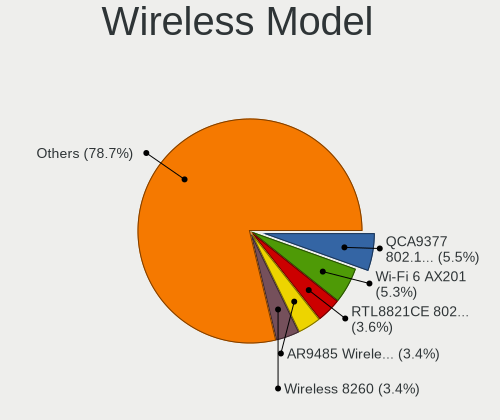
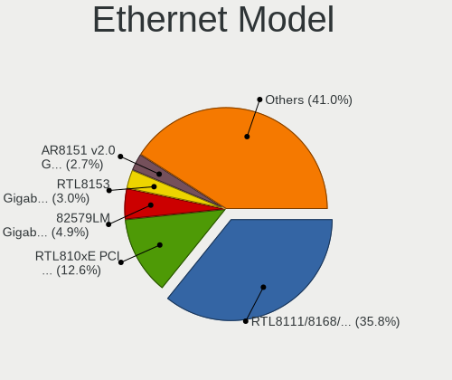
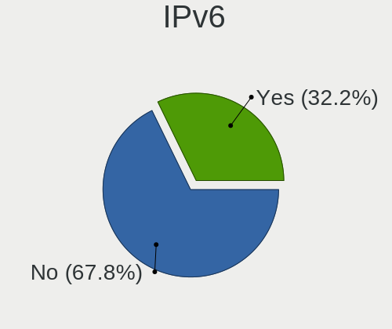
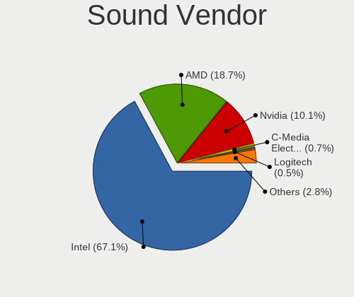
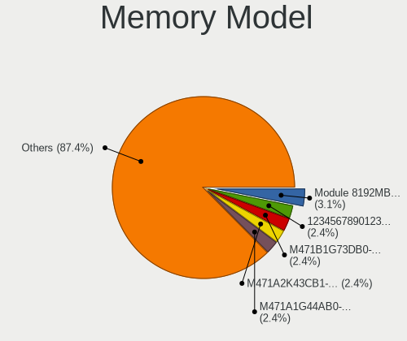
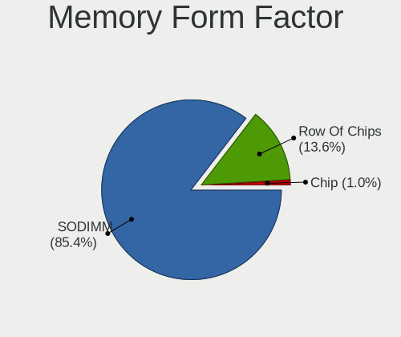
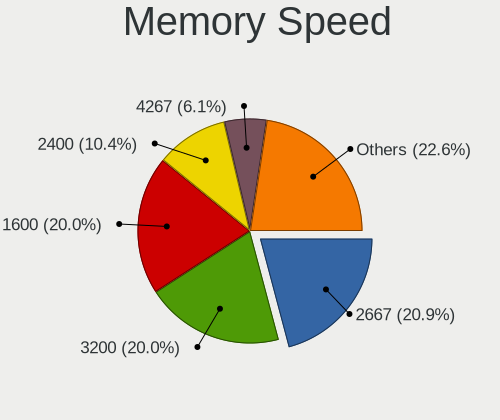

Elementary 6.1 - Tested Hardware & Statistics (Notebooks)
---------------------------------------------------------

A project to collect tested hardware configurations for Elementary 6.1.

Anyone can contribute to this report by the [hw-probe](https://github.com/linuxhw/hw-probe) tool:

    sudo -E hw-probe -all -upload

Please contribute! Especially if your hardware is rare.

Contents
--------

* [ Test Cases ](#test-cases)

* [ System ](#system)
  - [ Kernel                   ](#kernel)
  - [ Kernel Family            ](#kernel-family)
  - [ Kernel Major Ver.        ](#kernel-major-ver)
  - [ Arch                     ](#arch)
  - [ DE                       ](#de)
  - [ Display Server           ](#display-server)
  - [ Display Manager          ](#display-manager)
  - [ OS Lang                  ](#os-lang)
  - [ Boot Mode                ](#boot-mode)
  - [ Filesystem               ](#filesystem)
  - [ Part. scheme             ](#part-scheme)
  - [ Dual Boot with Linux/BSD ](#dual-boot-with-linuxbsd)
  - [ Dual Boot (Win)          ](#dual-boot-win)

* [ Board ](#board)
  - [ Vendor                   ](#vendor)
  - [ Model                    ](#model)
  - [ Model Family             ](#model-family)
  - [ MFG Year                 ](#mfg-year)
  - [ Form Factor              ](#form-factor)
  - [ Secure Boot              ](#secure-boot)
  - [ Coreboot                 ](#coreboot)
  - [ RAM Size                 ](#ram-size)
  - [ RAM Used                 ](#ram-used)
  - [ Total Drives             ](#total-drives)
  - [ Has CD-ROM               ](#has-cd-rom)
  - [ Has Ethernet             ](#has-ethernet)
  - [ Has WiFi                 ](#has-wifi)
  - [ Has Bluetooth            ](#has-bluetooth)

* [ Location ](#location)
  - [ Country                  ](#country)
  - [ City                     ](#city)

* [ Drives ](#drives)
  - [ Drive Vendor             ](#drive-vendor)
  - [ Drive Model              ](#drive-model)
  - [ HDD Vendor               ](#hdd-vendor)
  - [ SSD Vendor               ](#ssd-vendor)
  - [ Drive Kind               ](#drive-kind)
  - [ Drive Connector          ](#drive-connector)
  - [ Drive Size               ](#drive-size)
  - [ Space Total              ](#space-total)
  - [ Space Used               ](#space-used)
  - [ Malfunc. Drives          ](#malfunc-drives)
  - [ Malfunc. Drive Vendor    ](#malfunc-drive-vendor)
  - [ Malfunc. HDD Vendor      ](#malfunc-hdd-vendor)
  - [ Malfunc. Drive Kind      ](#malfunc-drive-kind)
  - [ Failed Drives            ](#failed-drives)
  - [ Failed Drive Vendor      ](#failed-drive-vendor)
  - [ Drive Status             ](#drive-status)

* [ Storage controller ](#storage-controller)
  - [ Storage Vendor           ](#storage-vendor)
  - [ Storage Model            ](#storage-model)
  - [ Storage Kind             ](#storage-kind)

* [ Processor ](#processor)
  - [ CPU Vendor               ](#cpu-vendor)
  - [ CPU Model                ](#cpu-model)
  - [ CPU Model Family         ](#cpu-model-family)
  - [ CPU Cores                ](#cpu-cores)
  - [ CPU Sockets              ](#cpu-sockets)
  - [ CPU Threads              ](#cpu-threads)
  - [ CPU Op-Modes             ](#cpu-op-modes)
  - [ CPU Microcode            ](#cpu-microcode)
  - [ CPU Microarch            ](#cpu-microarch)

* [ Graphics ](#graphics)
  - [ GPU Vendor               ](#gpu-vendor)
  - [ GPU Model                ](#gpu-model)
  - [ GPU Combo                ](#gpu-combo)
  - [ GPU Driver               ](#gpu-driver)
  - [ GPU Memory               ](#gpu-memory)

* [ Monitor ](#monitor)
  - [ Monitor Vendor           ](#monitor-vendor)
  - [ Monitor Model            ](#monitor-model)
  - [ Monitor Resolution       ](#monitor-resolution)
  - [ Monitor Diagonal         ](#monitor-diagonal)
  - [ Monitor Width            ](#monitor-width)
  - [ Aspect Ratio             ](#aspect-ratio)
  - [ Monitor Area             ](#monitor-area)
  - [ Pixel Density            ](#pixel-density)
  - [ Multiple Monitors        ](#multiple-monitors)

* [ Network ](#network)
  - [ Net Controller Vendor    ](#net-controller-vendor)
  - [ Net Controller Model     ](#net-controller-model)
  - [ Wireless Vendor          ](#wireless-vendor)
  - [ Wireless Model           ](#wireless-model)
  - [ Ethernet Vendor          ](#ethernet-vendor)
  - [ Ethernet Model           ](#ethernet-model)
  - [ Net Controller Kind      ](#net-controller-kind)
  - [ Used Controller          ](#used-controller)
  - [ NICs                     ](#nics)
  - [ IPv6                     ](#ipv6)

* [ Bluetooth ](#bluetooth)
  - [ Bluetooth Vendor         ](#bluetooth-vendor)
  - [ Bluetooth Model          ](#bluetooth-model)

* [ Sound ](#sound)
  - [ Sound Vendor             ](#sound-vendor)
  - [ Sound Model              ](#sound-model)

* [ Memory ](#memory)
  - [ Memory Vendor            ](#memory-vendor)
  - [ Memory Model             ](#memory-model)
  - [ Memory Kind              ](#memory-kind)
  - [ Memory Form Factor       ](#memory-form-factor)
  - [ Memory Size              ](#memory-size)
  - [ Memory Speed             ](#memory-speed)

* [ Printers & scanners ](#printers--scanners)
  - [ Printer Vendor           ](#printer-vendor)
  - [ Printer Model            ](#printer-model)
  - [ Scanner Vendor           ](#scanner-vendor)
  - [ Scanner Model            ](#scanner-model)

* [ Camera ](#camera)
  - [ Camera Vendor            ](#camera-vendor)
  - [ Camera Model             ](#camera-model)

* [ Security ](#security)
  - [ Fingerprint Vendor       ](#fingerprint-vendor)
  - [ Fingerprint Model        ](#fingerprint-model)
  - [ Chipcard Vendor          ](#chipcard-vendor)
  - [ Chipcard Model           ](#chipcard-model)

* [ Unsupported ](#unsupported)
  - [ Unsupported Devices      ](#unsupported-devices)
  - [ Unsupported Device Types ](#unsupported-device-types)

Test Cases
----------

Total: 568

| Vendor        | Model                       | Probe                                                      | Date         |
|---------------|-----------------------------|------------------------------------------------------------|--------------|
| Dell          | System XPS L702X            | [7030c340cc](https://linux-hardware.org/?probe=7030c340cc) | Dec 31, 2022 |
| Chuwi         | HeroBook                    | [1664994b07](https://linux-hardware.org/?probe=1664994b07) | Dec 30, 2022 |
| HP            | ProBook 455R G6             | [71c9651ee2](https://linux-hardware.org/?probe=71c9651ee2) | Dec 30, 2022 |
| AMI           | F3C2                        | [ed7d4a2a13](https://linux-hardware.org/?probe=ed7d4a2a13) | Dec 30, 2022 |
| Lenovo        | V17 G2 ITL 82NX             | [5e094b34a5](https://linux-hardware.org/?probe=5e094b34a5) | Dec 29, 2022 |
| Acer          | Aspire A315-53              | [9c28036440](https://linux-hardware.org/?probe=9c28036440) | Dec 29, 2022 |
| Lenovo        | ThinkBook 13s G3 ACN 20Y... | [f5c5147826](https://linux-hardware.org/?probe=f5c5147826) | Dec 28, 2022 |
| Lenovo        | ThinkBook 13s G3 ACN 20Y... | [8dfcf5860f](https://linux-hardware.org/?probe=8dfcf5860f) | Dec 28, 2022 |
| Lenovo        | ThinkPad T430 23448AG       | [00ba06cfd1](https://linux-hardware.org/?probe=00ba06cfd1) | Dec 28, 2022 |
| Lenovo        | IdeaPad 3 14ITL6 82H7       | [b6413f9cf2](https://linux-hardware.org/?probe=b6413f9cf2) | Dec 28, 2022 |
| Lenovo        | IdeaPad 3 14ITL6 82H7       | [4ddf1fecb8](https://linux-hardware.org/?probe=4ddf1fecb8) | Dec 28, 2022 |
| Lenovo        | ThinkPad T430 23448AG       | [a570034bbc](https://linux-hardware.org/?probe=a570034bbc) | Dec 27, 2022 |
| Lenovo        | V310-14ISK 80SX             | [a1e4dd02b2](https://linux-hardware.org/?probe=a1e4dd02b2) | Dec 27, 2022 |
| Lenovo        | V310-14ISK 80SX             | [cedf39754e](https://linux-hardware.org/?probe=cedf39754e) | Dec 27, 2022 |
| Acer          | Aspire 7741                 | [5ef8e01957](https://linux-hardware.org/?probe=5ef8e01957) | Dec 27, 2022 |
| Lenovo        | IdeaPad 5 14ALC05 82LM      | [6de981f1fc](https://linux-hardware.org/?probe=6de981f1fc) | Dec 24, 2022 |
| Avell High... | B.ON                        | [ea8a4babbf](https://linux-hardware.org/?probe=ea8a4babbf) | Dec 24, 2022 |
| Lenovo        | ThinkPad X201 3680HB1       | [41e1719d61](https://linux-hardware.org/?probe=41e1719d61) | Dec 22, 2022 |
| Lenovo        | ThinkPad X201 3680HB1       | [01e9dfa8b8](https://linux-hardware.org/?probe=01e9dfa8b8) | Dec 22, 2022 |
| HP            | EliteBook Folio 1040 G3     | [3d89cf5c71](https://linux-hardware.org/?probe=3d89cf5c71) | Dec 21, 2022 |
| Lenovo        | V17 G2 ITL 82NX             | [a285792280](https://linux-hardware.org/?probe=a285792280) | Dec 20, 2022 |
| Lenovo        | V17 G2 ITL 82NX             | [f777de4f53](https://linux-hardware.org/?probe=f777de4f53) | Dec 17, 2022 |
| HP            | Pavilion g6                 | [d1bfb26644](https://linux-hardware.org/?probe=d1bfb26644) | Dec 16, 2022 |
| HUAWEI        | NBM-WXX9                    | [a9f5b0866f](https://linux-hardware.org/?probe=a9f5b0866f) | Dec 16, 2022 |
| Lenovo        | V17 G2 ITL 82NX             | [4f1aa7401d](https://linux-hardware.org/?probe=4f1aa7401d) | Dec 15, 2022 |
| ASUSTek       | TUF Gaming FX505DT_FX505... | [35d2e25287](https://linux-hardware.org/?probe=35d2e25287) | Dec 15, 2022 |
| ASUSTek       | ASUS TUF Gaming A15 FA50... | [615d3e1599](https://linux-hardware.org/?probe=615d3e1599) | Dec 14, 2022 |
| MSI           | GF63 Thin 10SC              | [ed86ad34cf](https://linux-hardware.org/?probe=ed86ad34cf) | Dec 13, 2022 |
| MSI           | GF63 Thin 10SC              | [18c3d0d050](https://linux-hardware.org/?probe=18c3d0d050) | Dec 13, 2022 |
| HP            | Laptop 17-ca0xxx            | [0a7b9bd226](https://linux-hardware.org/?probe=0a7b9bd226) | Dec 12, 2022 |
| HP            | Laptop 17-ca0xxx            | [e2d976c5f4](https://linux-hardware.org/?probe=e2d976c5f4) | Dec 11, 2022 |
| Lenovo        | ThinkPad X390 20Q0CTO1WW    | [52546b1dd0](https://linux-hardware.org/?probe=52546b1dd0) | Dec 10, 2022 |
| HP            | ProBook 650 G1              | [46d77ce0b4](https://linux-hardware.org/?probe=46d77ce0b4) | Dec 09, 2022 |
| Lenovo        | IdeaPad 330-15IGM 81D1      | [1a1f2b375d](https://linux-hardware.org/?probe=1a1f2b375d) | Dec 05, 2022 |
| Lenovo        | ThinkPad T470p 20J60018M... | [994d8e4b1d](https://linux-hardware.org/?probe=994d8e4b1d) | Dec 01, 2022 |
| HP            | 250 G7 Notebook PC          | [1002df8858](https://linux-hardware.org/?probe=1002df8858) | Dec 01, 2022 |
| Samsung       | 530U3C/530U4C/532U3C        | [d95adc01a7](https://linux-hardware.org/?probe=d95adc01a7) | Nov 30, 2022 |
| Lenovo        | ThinkPad T470p 20J60018M... | [c5f7049b04](https://linux-hardware.org/?probe=c5f7049b04) | Nov 28, 2022 |
| Lenovo        | ThinkPad T430 2349IF8       | [4d8bd1760a](https://linux-hardware.org/?probe=4d8bd1760a) | Nov 25, 2022 |
| HUAWEI        | KLVL-WXX9                   | [408158ed97](https://linux-hardware.org/?probe=408158ed97) | Nov 24, 2022 |
| HUAWEI        | KLVL-WXX9                   | [dce27f6d43](https://linux-hardware.org/?probe=dce27f6d43) | Nov 24, 2022 |
| ASUSTek       | 1001PX                      | [9626b2b4c5](https://linux-hardware.org/?probe=9626b2b4c5) | Nov 24, 2022 |
| Apple         | MacBookPro11,3              | [476415b4e4](https://linux-hardware.org/?probe=476415b4e4) | Nov 22, 2022 |
| Dell          | Latitude E6520              | [1801edca03](https://linux-hardware.org/?probe=1801edca03) | Nov 22, 2022 |
| Acer          | Aspire A315-51              | [3d8ef86616](https://linux-hardware.org/?probe=3d8ef86616) | Nov 21, 2022 |
| Lenovo        | G50-45 80E3                 | [680aac00bd](https://linux-hardware.org/?probe=680aac00bd) | Nov 21, 2022 |
| Apple         | MacBookPro12,1              | [9e16721568](https://linux-hardware.org/?probe=9e16721568) | Nov 17, 2022 |
| Dell          | Inspiron 5584               | [f11ce2dd6c](https://linux-hardware.org/?probe=f11ce2dd6c) | Nov 16, 2022 |
| Lenovo        | ThinkPad T14 Gen 1 20S1S... | [d07cacacde](https://linux-hardware.org/?probe=d07cacacde) | Nov 15, 2022 |
| Lenovo        | ThinkPad T430 2349IF8       | [b6e353af2b](https://linux-hardware.org/?probe=b6e353af2b) | Nov 14, 2022 |
| Lenovo        | ThinkPad T430 2349IF8       | [c642a76e3e](https://linux-hardware.org/?probe=c642a76e3e) | Nov 14, 2022 |
| ASUSTek       | ZenBook S UX391UA           | [32e8c529f0](https://linux-hardware.org/?probe=32e8c529f0) | Nov 14, 2022 |
| Medion        | E7220                       | [7d3df30772](https://linux-hardware.org/?probe=7d3df30772) | Nov 13, 2022 |
| ASUSTek       | ROG Strix G512LV_G512LV     | [fef97563a0](https://linux-hardware.org/?probe=fef97563a0) | Nov 13, 2022 |
| Apple         | MacBook3,1                  | [3bafc2796b](https://linux-hardware.org/?probe=3bafc2796b) | Nov 11, 2022 |
| Apple         | MacBookPro6,2               | [3c63d3fb1e](https://linux-hardware.org/?probe=3c63d3fb1e) | Nov 11, 2022 |
| Alienware     | m15 R6                      | [63b53e81ed](https://linux-hardware.org/?probe=63b53e81ed) | Nov 08, 2022 |
| Alienware     | m15 R6                      | [22b8b36df5](https://linux-hardware.org/?probe=22b8b36df5) | Nov 08, 2022 |
| Alienware     | m15 R6                      | [3e808157a3](https://linux-hardware.org/?probe=3e808157a3) | Nov 08, 2022 |
| Apple         | MacBookPro9,2               | [e9389bc87e](https://linux-hardware.org/?probe=e9389bc87e) | Nov 08, 2022 |
| Dell          | Studio 1558                 | [8be31a4335](https://linux-hardware.org/?probe=8be31a4335) | Nov 07, 2022 |
| Dell          | Inspiron 15-3567            | [390f51010e](https://linux-hardware.org/?probe=390f51010e) | Nov 06, 2022 |
| Packard Be... | EasyNote LS44HR             | [375b78c3f3](https://linux-hardware.org/?probe=375b78c3f3) | Nov 06, 2022 |
| Wortmann      | 1220624_1470150             | [2782ad2c3e](https://linux-hardware.org/?probe=2782ad2c3e) | Nov 05, 2022 |
| Lenovo        | IdeaPad 330S-15ARR 81FB     | [505b2c2b5d](https://linux-hardware.org/?probe=505b2c2b5d) | Nov 04, 2022 |
| Sony          | VPCEA1S1R                   | [9dfb83587b](https://linux-hardware.org/?probe=9dfb83587b) | Nov 04, 2022 |
| Lenovo        | IdeaPad 330S-15ARR 81FB     | [f8685beefa](https://linux-hardware.org/?probe=f8685beefa) | Nov 04, 2022 |
| Lenovo        | IdeaPad 5 15ALC05 82LN      | [7d6d6c3c3a](https://linux-hardware.org/?probe=7d6d6c3c3a) | Nov 04, 2022 |
| Lenovo        | ThinkPad T495 20NKS01W02    | [e4d29df724](https://linux-hardware.org/?probe=e4d29df724) | Nov 02, 2022 |
| Lenovo        | IdeaPad 5 Pro 14ACN6 82L... | [f5060f0a8d](https://linux-hardware.org/?probe=f5060f0a8d) | Nov 01, 2022 |
| HP            | Laptop 17-ca3xxx            | [2c42913712](https://linux-hardware.org/?probe=2c42913712) | Oct 31, 2022 |
| MSI           | Modern 14 B10MW             | [cf2b620a60](https://linux-hardware.org/?probe=cf2b620a60) | Oct 31, 2022 |
| Toshiba       | TECRA A11                   | [10d2346f7c](https://linux-hardware.org/?probe=10d2346f7c) | Oct 30, 2022 |
| ASUSTek       | ZenBook S UX391UA           | [f4c2d5224b](https://linux-hardware.org/?probe=f4c2d5224b) | Oct 30, 2022 |
| Lenovo        | ThinkPad X1 Carbon 2nd 2... | [512acddb70](https://linux-hardware.org/?probe=512acddb70) | Oct 30, 2022 |
| Toshiba       | TECRA A11                   | [1af8ca0ac9](https://linux-hardware.org/?probe=1af8ca0ac9) | Oct 27, 2022 |
| Lenovo        | ThinkPad E14 Gen 3 20YDC... | [9b90ea1d4d](https://linux-hardware.org/?probe=9b90ea1d4d) | Oct 27, 2022 |
| ASUSTek       | ZenBook S UX391UA           | [13873c81b2](https://linux-hardware.org/?probe=13873c81b2) | Oct 24, 2022 |
| HP            | Laptop 15-bw0xx             | [cdd4d21000](https://linux-hardware.org/?probe=cdd4d21000) | Oct 24, 2022 |
| Toshiba       | TECRA A11                   | [de0b3e96fa](https://linux-hardware.org/?probe=de0b3e96fa) | Oct 23, 2022 |
| Toshiba       | TECRA A11                   | [b91eedb26a](https://linux-hardware.org/?probe=b91eedb26a) | Oct 23, 2022 |
| ASUSTek       | ZenBook S UX391UA           | [4a6e283158](https://linux-hardware.org/?probe=4a6e283158) | Oct 22, 2022 |
| Apple         | MacBookPro10,1              | [6354f13944](https://linux-hardware.org/?probe=6354f13944) | Oct 21, 2022 |
| ASUSTek       | VivoBook_ASUSLaptop X512... | [484cb84d6b](https://linux-hardware.org/?probe=484cb84d6b) | Oct 18, 2022 |
| Lenovo        | IdeaPad S340-15IIL 81VW     | [2dd84a41e8](https://linux-hardware.org/?probe=2dd84a41e8) | Oct 17, 2022 |
| Lenovo        | IdeaPad 3 15ITL05 81X8      | [c5b6ba786e](https://linux-hardware.org/?probe=c5b6ba786e) | Oct 16, 2022 |
| Lenovo        | ThinkPad E14 20RA004VPH     | [23adba19e0](https://linux-hardware.org/?probe=23adba19e0) | Oct 15, 2022 |
| Dell          | Inspiron 15-3567            | [2b00bd7a92](https://linux-hardware.org/?probe=2b00bd7a92) | Oct 15, 2022 |
| HP            | Pavilion dv7                | [44ae8ac465](https://linux-hardware.org/?probe=44ae8ac465) | Oct 14, 2022 |
| Lenovo        | ThinkPad T420 4236JY2       | [fd260f87a9](https://linux-hardware.org/?probe=fd260f87a9) | Oct 14, 2022 |
| ASUSTek       | ZenBook S UX391UA           | [64cbdc6e2a](https://linux-hardware.org/?probe=64cbdc6e2a) | Oct 13, 2022 |
| MSI           | GE70 2QE                    | [2825343a52](https://linux-hardware.org/?probe=2825343a52) | Oct 13, 2022 |
| Lenovo        | ThinkPad T470 20JNS08H00    | [8926251d64](https://linux-hardware.org/?probe=8926251d64) | Oct 11, 2022 |
| Lenovo        | IdeaPad 510-15IKB 80SV      | [db3419c5de](https://linux-hardware.org/?probe=db3419c5de) | Oct 09, 2022 |
| Lenovo        | Legion 5 15IMH05H 81Y6      | [f06f54475b](https://linux-hardware.org/?probe=f06f54475b) | Oct 08, 2022 |
| HUAWEI        | NBLK-WAX9X                  | [84aa1dcbb2](https://linux-hardware.org/?probe=84aa1dcbb2) | Oct 07, 2022 |
| Lenovo        | ThinkPad E14 Gen 3 20YDC... | [20ea012e04](https://linux-hardware.org/?probe=20ea012e04) | Oct 06, 2022 |
| Toshiba       | Satellite C855-1WX          | [78c5bb7120](https://linux-hardware.org/?probe=78c5bb7120) | Oct 06, 2022 |
| Lenovo        | V130-15IKB 81HN             | [823a068620](https://linux-hardware.org/?probe=823a068620) | Oct 03, 2022 |
| ASUSTek       | ROG Zephyrus M16 GU603HE... | [c086a688f1](https://linux-hardware.org/?probe=c086a688f1) | Oct 02, 2022 |
| HUAWEI        | HVY-WXX9                    | [4ce296ba38](https://linux-hardware.org/?probe=4ce296ba38) | Sep 30, 2022 |
| Dell          | Vostro 5402                 | [57995ec944](https://linux-hardware.org/?probe=57995ec944) | Sep 30, 2022 |
| Google        | Blooglet                    | [44a9c6559f](https://linux-hardware.org/?probe=44a9c6559f) | Sep 29, 2022 |
| Medion        | Akoya E6422 MD99680         | [52c1708200](https://linux-hardware.org/?probe=52c1708200) | Sep 28, 2022 |
| Lenovo        | IdeaPad 510-15IKB 80SV      | [18ee2cafd6](https://linux-hardware.org/?probe=18ee2cafd6) | Sep 27, 2022 |
| Lenovo        | IdeaPad 510-15IKB 80SV      | [ffc2811bfe](https://linux-hardware.org/?probe=ffc2811bfe) | Sep 27, 2022 |
| Dell          | Latitude E6540              | [b2abaca929](https://linux-hardware.org/?probe=b2abaca929) | Sep 26, 2022 |
| Dell          | Latitude E5450              | [8738ac7280](https://linux-hardware.org/?probe=8738ac7280) | Sep 26, 2022 |
| Apple         | MacBookAir6,2               | [8ee663c695](https://linux-hardware.org/?probe=8ee663c695) | Sep 26, 2022 |
| Dell          | Inspiron 3493               | [b1f8d22e3e](https://linux-hardware.org/?probe=b1f8d22e3e) | Sep 25, 2022 |
| Apple         | MacBookAir6,2               | [36a7fc8903](https://linux-hardware.org/?probe=36a7fc8903) | Sep 24, 2022 |
| Lenovo        | ThinkPad X270 W10DG 20K5... | [36c369745a](https://linux-hardware.org/?probe=36c369745a) | Sep 23, 2022 |
| ASUSTek       | VivoBook_ASUSLaptop X512... | [6a0c80f635](https://linux-hardware.org/?probe=6a0c80f635) | Sep 22, 2022 |
| Acer          | Nitro AN515-54              | [7cf2d6a810](https://linux-hardware.org/?probe=7cf2d6a810) | Sep 20, 2022 |
| ASUSTek       | X555LAB                     | [71339e0cfb](https://linux-hardware.org/?probe=71339e0cfb) | Sep 19, 2022 |
| ASUSTek       | X555LAB                     | [a0acb674df](https://linux-hardware.org/?probe=a0acb674df) | Sep 19, 2022 |
| HP            | Laptop 15-bw0xx             | [94baca564e](https://linux-hardware.org/?probe=94baca564e) | Sep 19, 2022 |
| ASUSTek       | X555DG                      | [c46c229dfb](https://linux-hardware.org/?probe=c46c229dfb) | Sep 16, 2022 |
| ASUSTek       | X555DG                      | [e39d4a8247](https://linux-hardware.org/?probe=e39d4a8247) | Sep 16, 2022 |
| Clevo         | W54xEU                      | [bd0c5962bd](https://linux-hardware.org/?probe=bd0c5962bd) | Sep 15, 2022 |
| Lenovo        | Legion Y540-15IRH 81SX      | [7861fa17bf](https://linux-hardware.org/?probe=7861fa17bf) | Sep 14, 2022 |
| MSI           | PS63 Modern 8RD             | [8fa2ea42ed](https://linux-hardware.org/?probe=8fa2ea42ed) | Sep 14, 2022 |
| Lenovo        | ThinkPad E15 Gen 2 20TDS... | [2b12cc11f2](https://linux-hardware.org/?probe=2b12cc11f2) | Sep 13, 2022 |
| Dell          | Inspiron 5458               | [bd26475724](https://linux-hardware.org/?probe=bd26475724) | Sep 12, 2022 |
| Toshiba       | PORTEGE Z30-B               | [6b1829aad1](https://linux-hardware.org/?probe=6b1829aad1) | Sep 12, 2022 |
| Toshiba       | PORTEGE Z30-B               | [9ef29f2258](https://linux-hardware.org/?probe=9ef29f2258) | Sep 12, 2022 |
| HP            | ENVY m6                     | [b9de3b6e35](https://linux-hardware.org/?probe=b9de3b6e35) | Sep 11, 2022 |
| Lenovo        | ThinkPad T460 20FMS271BR    | [f2f2786b99](https://linux-hardware.org/?probe=f2f2786b99) | Sep 10, 2022 |
| Apple         | MacBookPro11,2              | [47708e7772](https://linux-hardware.org/?probe=47708e7772) | Sep 09, 2022 |
| Apple         | MacBookPro11,4              | [c5d5b88740](https://linux-hardware.org/?probe=c5d5b88740) | Sep 09, 2022 |
| ASUSTek       | GL702VSK                    | [5001a76a0e](https://linux-hardware.org/?probe=5001a76a0e) | Sep 09, 2022 |
| Lenovo        | IdeaPad 3 15ITL05 81X8      | [3932661b8e](https://linux-hardware.org/?probe=3932661b8e) | Sep 07, 2022 |
| Acer          | Aspire V5-552               | [031439a681](https://linux-hardware.org/?probe=031439a681) | Sep 04, 2022 |
| Apple         | MacBookPro8,2               | [b37d844ab3](https://linux-hardware.org/?probe=b37d844ab3) | Sep 04, 2022 |
| TUXEDO        | Book XP14 Gen12             | [cfb0fb9451](https://linux-hardware.org/?probe=cfb0fb9451) | Sep 04, 2022 |
| Timi          | TM1701                      | [f23c551375](https://linux-hardware.org/?probe=f23c551375) | Sep 03, 2022 |
| Notebook      | NLx0MU                      | [90c9b01136](https://linux-hardware.org/?probe=90c9b01136) | Aug 31, 2022 |
| Notebook      | NLx0MU                      | [77d4b4ff99](https://linux-hardware.org/?probe=77d4b4ff99) | Aug 31, 2022 |
| Apple         | MacBookPro5,2               | [7f66ca2cc7](https://linux-hardware.org/?probe=7f66ca2cc7) | Aug 29, 2022 |
| Standard      | Unknown                     | [62e0164e5b](https://linux-hardware.org/?probe=62e0164e5b) | Aug 29, 2022 |
| HP            | Laptop 15-db0xxx            | [d67f262815](https://linux-hardware.org/?probe=d67f262815) | Aug 28, 2022 |
| ASUSTek       | X542UA                      | [0bf776cdc1](https://linux-hardware.org/?probe=0bf776cdc1) | Aug 28, 2022 |
| HP            | 240 G7 Notebook PC          | [af418375d3](https://linux-hardware.org/?probe=af418375d3) | Aug 27, 2022 |
| Complet       | MY8312                      | [4db1527bde](https://linux-hardware.org/?probe=4db1527bde) | Aug 26, 2022 |
| Dell          | Inspiron 5537               | [d05888c5bc](https://linux-hardware.org/?probe=d05888c5bc) | Aug 25, 2022 |
| Dell          | Latitude E7250              | [98f4886ef7](https://linux-hardware.org/?probe=98f4886ef7) | Aug 25, 2022 |
| Lenovo        | ThinkPad T480 20L6S9WY00    | [dfb0ad63df](https://linux-hardware.org/?probe=dfb0ad63df) | Aug 25, 2022 |
| Apple         | MacBookAir7,1               | [079a951d65](https://linux-hardware.org/?probe=079a951d65) | Aug 23, 2022 |
| Apple         | MacBookAir6,2               | [b3fcba32bd](https://linux-hardware.org/?probe=b3fcba32bd) | Aug 22, 2022 |
| Lenovo        | IdeaPad 5 14ALC05 82LM      | [7169cd34ab](https://linux-hardware.org/?probe=7169cd34ab) | Aug 22, 2022 |
| ASUSTek       | K52F                        | [cafd25a659](https://linux-hardware.org/?probe=cafd25a659) | Aug 21, 2022 |
| Lenovo        | Legion Y540-15IRH 81SX      | [08d6e2e6e8](https://linux-hardware.org/?probe=08d6e2e6e8) | Aug 21, 2022 |
| Apple         | MacBookPro8,2               | [b01d72c341](https://linux-hardware.org/?probe=b01d72c341) | Aug 20, 2022 |
| HP            | 240 G7 Notebook PC          | [ffa5707dc9](https://linux-hardware.org/?probe=ffa5707dc9) | Aug 17, 2022 |
| Lenovo        | ThinkPad T460 20FMS271BR    | [a2c5089e9a](https://linux-hardware.org/?probe=a2c5089e9a) | Aug 16, 2022 |
| Acer          | Aspire V5-552G              | [f51f3093d9](https://linux-hardware.org/?probe=f51f3093d9) | Aug 12, 2022 |
| ASUSTek       | K43E                        | [fc2d9e330c](https://linux-hardware.org/?probe=fc2d9e330c) | Aug 11, 2022 |
| Dell          | Inspiron 5570               | [b94818059a](https://linux-hardware.org/?probe=b94818059a) | Aug 10, 2022 |
| Toshiba       | Satellite L875-11M          | [5a01928c94](https://linux-hardware.org/?probe=5a01928c94) | Aug 10, 2022 |
| Lenovo        | IdeaPad Gaming 3 15IMH05... | [72cfcef1a6](https://linux-hardware.org/?probe=72cfcef1a6) | Aug 10, 2022 |
| Dell          | Latitude D630               | [5f682c6798](https://linux-hardware.org/?probe=5f682c6798) | Aug 09, 2022 |
| Toshiba       | Satellite L875-11M          | [1b423f639e](https://linux-hardware.org/?probe=1b423f639e) | Aug 09, 2022 |
| Lenovo        | ThinkBook 14-IML 20RV       | [b719fff96d](https://linux-hardware.org/?probe=b719fff96d) | Aug 08, 2022 |
| HP            | Pavilion 17                 | [f06bb8d9ab](https://linux-hardware.org/?probe=f06bb8d9ab) | Aug 07, 2022 |
| HP            | Pavilion 17                 | [9c47c2e4f4](https://linux-hardware.org/?probe=9c47c2e4f4) | Aug 07, 2022 |
| TrekStor      | Notebook Slim S130          | [ba73d094e7](https://linux-hardware.org/?probe=ba73d094e7) | Aug 06, 2022 |
| Sony          | SVS15117FLB                 | [2729210175](https://linux-hardware.org/?probe=2729210175) | Aug 06, 2022 |
| Lenovo        | ThinkPad E470 20H2A02NBR    | [6e4a76904c](https://linux-hardware.org/?probe=6e4a76904c) | Aug 06, 2022 |
| Lenovo        | ThinkPad X230 Tablet 343... | [7594659719](https://linux-hardware.org/?probe=7594659719) | Aug 05, 2022 |
| MSI           | Creator 15 A10SET           | [45d9d06fb8](https://linux-hardware.org/?probe=45d9d06fb8) | Aug 05, 2022 |
| Medion        | Akoya E6422 MD99680         | [86cd2f6a0a](https://linux-hardware.org/?probe=86cd2f6a0a) | Aug 05, 2022 |
| Sony          | SVS15117FLB                 | [1f64d30f2f](https://linux-hardware.org/?probe=1f64d30f2f) | Aug 05, 2022 |
| Dell          | Latitude 3190               | [7a0956e5f8](https://linux-hardware.org/?probe=7a0956e5f8) | Aug 04, 2022 |
| ASUSTek       | K43E                        | [373d77aec0](https://linux-hardware.org/?probe=373d77aec0) | Aug 04, 2022 |
| ASUSTek       | ZenBook Pro Duo UX581LV_... | [764d4ebd1b](https://linux-hardware.org/?probe=764d4ebd1b) | Aug 04, 2022 |
| ASUSTek       | ZenBook Pro Duo UX581LV_... | [5dab148c3e](https://linux-hardware.org/?probe=5dab148c3e) | Aug 04, 2022 |
| Dell          | Latitude E6400              | [54db9ae43d](https://linux-hardware.org/?probe=54db9ae43d) | Aug 04, 2022 |
| HP            | Pavilion dv6                | [b921b586f6](https://linux-hardware.org/?probe=b921b586f6) | Aug 02, 2022 |
| HP            | 431                         | [2f6caa3d47](https://linux-hardware.org/?probe=2f6caa3d47) | Aug 02, 2022 |
| HP            | 431                         | [68fa0d3ebc](https://linux-hardware.org/?probe=68fa0d3ebc) | Aug 02, 2022 |
| Dell          | Latitude E6320              | [34270898c6](https://linux-hardware.org/?probe=34270898c6) | Jul 30, 2022 |
| Apple         | MacBookPro11,5              | [04487d99ff](https://linux-hardware.org/?probe=04487d99ff) | Jul 30, 2022 |
| Casper        | NIRVANA NOTEBOOK            | [c291b32941](https://linux-hardware.org/?probe=c291b32941) | Jul 29, 2022 |
| Lenovo        | ThinkPad T480 20L6S9WY00    | [af8fd9ae70](https://linux-hardware.org/?probe=af8fd9ae70) | Jul 29, 2022 |
| ASUSTek       | K43E                        | [f6d8225dd6](https://linux-hardware.org/?probe=f6d8225dd6) | Jul 28, 2022 |
| Dell          | Latitude D630               | [a14838d1ef](https://linux-hardware.org/?probe=a14838d1ef) | Jul 28, 2022 |
| Dell          | Latitude E6320              | [a5b77aa0e9](https://linux-hardware.org/?probe=a5b77aa0e9) | Jul 28, 2022 |
| Dell          | Latitude 3190               | [36027c80d2](https://linux-hardware.org/?probe=36027c80d2) | Jul 28, 2022 |
| Apple         | MacBook4,1                  | [b72463cb79](https://linux-hardware.org/?probe=b72463cb79) | Jul 28, 2022 |
| Lenovo        | IdeaPad Yoga 13 20175       | [d9a5e0b7e6](https://linux-hardware.org/?probe=d9a5e0b7e6) | Jul 27, 2022 |
| HP            | Pavilion g4                 | [c9aa5e235c](https://linux-hardware.org/?probe=c9aa5e235c) | Jul 27, 2022 |
| HP            | 255 G7 Notebook PC          | [8173942fbb](https://linux-hardware.org/?probe=8173942fbb) | Jul 25, 2022 |
| Dell          | XPS 13 9360                 | [f4026901c2](https://linux-hardware.org/?probe=f4026901c2) | Jul 25, 2022 |
| HP            | Pavilion g6                 | [73061b2ed5](https://linux-hardware.org/?probe=73061b2ed5) | Jul 23, 2022 |
| Lenovo        | IdeaPad S540-14API 81NH     | [810b379dac](https://linux-hardware.org/?probe=810b379dac) | Jul 19, 2022 |
| HUAWEI        | HLYL-WXX9                   | [3831dd717e](https://linux-hardware.org/?probe=3831dd717e) | Jul 19, 2022 |
| Apple         | MacBookPro8,1               | [d5b50db42e](https://linux-hardware.org/?probe=d5b50db42e) | Jul 19, 2022 |
| Sony          | VPCYB20AL                   | [17169107a8](https://linux-hardware.org/?probe=17169107a8) | Jul 19, 2022 |
| Acer          | Aspire A315-32              | [ec022ec507](https://linux-hardware.org/?probe=ec022ec507) | Jul 18, 2022 |
| HP            | EliteBook 845 G8 Noteboo... | [54152fdf16](https://linux-hardware.org/?probe=54152fdf16) | Jul 18, 2022 |
| Sony          | SVF1521F6EW                 | [3f359d9763](https://linux-hardware.org/?probe=3f359d9763) | Jul 17, 2022 |
| Apple         | MacBookPro8,1               | [21c49763f5](https://linux-hardware.org/?probe=21c49763f5) | Jul 17, 2022 |
| HP            | EliteBook 8460p             | [b1c5cb2096](https://linux-hardware.org/?probe=b1c5cb2096) | Jul 12, 2022 |
| HP            | Notebook                    | [afaaed48c7](https://linux-hardware.org/?probe=afaaed48c7) | Jul 10, 2022 |
| Acer          | Aspire 1830T                | [d2ff08ade8](https://linux-hardware.org/?probe=d2ff08ade8) | Jul 10, 2022 |
| Acer          | Aspire AV15-51              | [1a880a89af](https://linux-hardware.org/?probe=1a880a89af) | Jul 09, 2022 |
| Acer          | Aspire V3-771               | [e8488fb0e2](https://linux-hardware.org/?probe=e8488fb0e2) | Jul 07, 2022 |
| HP            | Notebook                    | [2bf65688ab](https://linux-hardware.org/?probe=2bf65688ab) | Jul 05, 2022 |
| Dell          | Inspiron 3593               | [d34d56c473](https://linux-hardware.org/?probe=d34d56c473) | Jul 05, 2022 |
| HP            | Laptop 15-dy1xxx            | [3fcdd6c039](https://linux-hardware.org/?probe=3fcdd6c039) | Jul 03, 2022 |
| Dell          | XPS 15 9500                 | [7df8533350](https://linux-hardware.org/?probe=7df8533350) | Jul 03, 2022 |
| ASUSTek       | N56VB                       | [88d34c06f3](https://linux-hardware.org/?probe=88d34c06f3) | Jul 02, 2022 |
| ASUSTek       | VivoBook_ASUSLaptop X509... | [1a03301817](https://linux-hardware.org/?probe=1a03301817) | Jul 02, 2022 |
| ASUSTek       | VivoBook_ASUSLaptop X509... | [859145be97](https://linux-hardware.org/?probe=859145be97) | Jul 02, 2022 |
| Lenovo        | IdeaPad Gaming 3 15IHU6 ... | [e13cada6ae](https://linux-hardware.org/?probe=e13cada6ae) | Jul 02, 2022 |
| ASUSTek       | X553MA                      | [804bbd8147](https://linux-hardware.org/?probe=804bbd8147) | Jun 30, 2022 |
| ASUSTek       | X553MA                      | [9fe936cec8](https://linux-hardware.org/?probe=9fe936cec8) | Jun 30, 2022 |
| Dell          | Inspiron 5537               | [9758b4dcff](https://linux-hardware.org/?probe=9758b4dcff) | Jun 30, 2022 |
| Lenovo        | ThinkPad E14 Gen 3 20YDS... | [579410b791](https://linux-hardware.org/?probe=579410b791) | Jun 28, 2022 |
| Apple         | MacBookPro14,2              | [7fe621e5a7](https://linux-hardware.org/?probe=7fe621e5a7) | Jun 27, 2022 |
| Compaq        | Presario CQ-23              | [f55fd14f61](https://linux-hardware.org/?probe=f55fd14f61) | Jun 26, 2022 |
| ASUSTek       | UX303LAB                    | [ae3becae01](https://linux-hardware.org/?probe=ae3becae01) | Jun 24, 2022 |
| HP            | Pavilion g4                 | [d0c8c06219](https://linux-hardware.org/?probe=d0c8c06219) | Jun 24, 2022 |
| Alienware     | m17 R3                      | [ea3305a8af](https://linux-hardware.org/?probe=ea3305a8af) | Jun 20, 2022 |
| Dell          | Latitude E5510              | [1f6cc92f98](https://linux-hardware.org/?probe=1f6cc92f98) | Jun 18, 2022 |
| HP            | EliteBook 2170p             | [6c7391f201](https://linux-hardware.org/?probe=6c7391f201) | Jun 17, 2022 |
| HP            | ProBook 455R G6             | [31b94c71c7](https://linux-hardware.org/?probe=31b94c71c7) | Jun 16, 2022 |
| HP            | ProBook 455R G6             | [39d04d1188](https://linux-hardware.org/?probe=39d04d1188) | Jun 16, 2022 |
| Samsung       | Lumpy                       | [50dad22fb3](https://linux-hardware.org/?probe=50dad22fb3) | Jun 15, 2022 |
| ASUSTek       | GR8                         | [3cdc341eda](https://linux-hardware.org/?probe=3cdc341eda) | Jun 15, 2022 |
| Samsung       | Lumpy                       | [4137bf9757](https://linux-hardware.org/?probe=4137bf9757) | Jun 14, 2022 |
| Acer          | TravelMate 5760             | [90e189c067](https://linux-hardware.org/?probe=90e189c067) | Jun 13, 2022 |
| Apple         | MacBook4,1                  | [83cac56441](https://linux-hardware.org/?probe=83cac56441) | Jun 13, 2022 |
| HP            | ProBook 4540s               | [6688afd4f5](https://linux-hardware.org/?probe=6688afd4f5) | Jun 11, 2022 |
| Acer          | Aspire A315-21              | [9840a70112](https://linux-hardware.org/?probe=9840a70112) | Jun 11, 2022 |
| ASUSTek       | ROG Zephyrus G14 GA401IH... | [0ec841e188](https://linux-hardware.org/?probe=0ec841e188) | Jun 11, 2022 |
| ASUSTek       | ROG Zephyrus G14 GA401IH... | [5768dfe23f](https://linux-hardware.org/?probe=5768dfe23f) | Jun 11, 2022 |
| HP            | Stream Laptop 14-cb1xxx     | [c76f63fb68](https://linux-hardware.org/?probe=c76f63fb68) | Jun 10, 2022 |
| HP            | ProBook 4540s               | [d0a6dcaa92](https://linux-hardware.org/?probe=d0a6dcaa92) | Jun 09, 2022 |
| Acer          | Aspire A315-21              | [224023dfd2](https://linux-hardware.org/?probe=224023dfd2) | Jun 08, 2022 |
| HP            | Notebook                    | [f07183fab5](https://linux-hardware.org/?probe=f07183fab5) | Jun 06, 2022 |
| Toshiba       | Satellite T130              | [b5ba2dac2a](https://linux-hardware.org/?probe=b5ba2dac2a) | Jun 06, 2022 |
| Toshiba       | Satellite T130              | [3fe154a2ce](https://linux-hardware.org/?probe=3fe154a2ce) | Jun 06, 2022 |
| HP            | ProBook 4540s               | [b74c4304e9](https://linux-hardware.org/?probe=b74c4304e9) | Jun 05, 2022 |
| Apple         | MacBookAir7,2               | [9de74ba486](https://linux-hardware.org/?probe=9de74ba486) | Jun 04, 2022 |
| Apple         | MacBookAir7,2               | [eb704f99ee](https://linux-hardware.org/?probe=eb704f99ee) | Jun 04, 2022 |
| Apple         | MacBookAir4,2               | [86902cb11f](https://linux-hardware.org/?probe=86902cb11f) | Jun 02, 2022 |
| HP            | ProBook 4540s               | [da53c77e1a](https://linux-hardware.org/?probe=da53c77e1a) | Jun 02, 2022 |
| Samsung       | 300E5M/300E5L               | [baa12d722c](https://linux-hardware.org/?probe=baa12d722c) | Jun 01, 2022 |
| Dell          | XPS 13 9343                 | [5881b6ea1b](https://linux-hardware.org/?probe=5881b6ea1b) | May 28, 2022 |
| Lenovo        | ThinkPad T400 6474ES3       | [cf8b67714d](https://linux-hardware.org/?probe=cf8b67714d) | May 27, 2022 |
| HUAWEI        | MACHD-WXX9                  | [6cc36ec0ae](https://linux-hardware.org/?probe=6cc36ec0ae) | May 27, 2022 |
| HP            | Stream Laptop 14-cb1xxx     | [50f70bc9af](https://linux-hardware.org/?probe=50f70bc9af) | May 27, 2022 |
| ASUSTek       | X550CA                      | [6789d8dad5](https://linux-hardware.org/?probe=6789d8dad5) | May 26, 2022 |
| AMI           | Intel                       | [ee3b1abf63](https://linux-hardware.org/?probe=ee3b1abf63) | May 25, 2022 |
| Acer          | Swift SF114-32              | [601f82b2dd](https://linux-hardware.org/?probe=601f82b2dd) | May 23, 2022 |
| Apple         | MacBook4,1                  | [27f751618e](https://linux-hardware.org/?probe=27f751618e) | May 22, 2022 |
| HP            | ProBook 6550b               | [5a80f0ac5d](https://linux-hardware.org/?probe=5a80f0ac5d) | May 21, 2022 |
| Toshiba       | PORTEGE Z830                | [9a4ebfe8cf](https://linux-hardware.org/?probe=9a4ebfe8cf) | May 21, 2022 |
| AMI           | Intel                       | [6c571e79d0](https://linux-hardware.org/?probe=6c571e79d0) | May 21, 2022 |
| eMachines     | E525                        | [ca296b06c9](https://linux-hardware.org/?probe=ca296b06c9) | May 21, 2022 |
| Toshiba       | PORTEGE Z830                | [8d4eb653b6](https://linux-hardware.org/?probe=8d4eb653b6) | May 19, 2022 |
| Sony          | VPCEB23FM                   | [4d73e73cf8](https://linux-hardware.org/?probe=4d73e73cf8) | May 17, 2022 |
| Sony          | VPCEB23FM                   | [07d2cadefb](https://linux-hardware.org/?probe=07d2cadefb) | May 17, 2022 |
| Samsung       | Lumpy                       | [84a78226dd](https://linux-hardware.org/?probe=84a78226dd) | May 16, 2022 |
| HP            | ENVY 14                     | [9fe635b800](https://linux-hardware.org/?probe=9fe635b800) | May 15, 2022 |
| ASUSTek       | K55A                        | [3391d004a7](https://linux-hardware.org/?probe=3391d004a7) | May 15, 2022 |
| HP            | Stream Laptop 14-cb1xxx     | [c0e150d349](https://linux-hardware.org/?probe=c0e150d349) | May 13, 2022 |
| HP            | Stream Laptop 14-cb1xxx     | [919200b122](https://linux-hardware.org/?probe=919200b122) | May 13, 2022 |
| ASUSTek       | UX310UQK                    | [1af1efeb46](https://linux-hardware.org/?probe=1af1efeb46) | May 11, 2022 |
| HUAWEI        | NBLK-WAX9X                  | [d5df500fa3](https://linux-hardware.org/?probe=d5df500fa3) | May 10, 2022 |
| HP            | EliteBook 840 G7 Noteboo... | [1b52e22774](https://linux-hardware.org/?probe=1b52e22774) | May 10, 2022 |
| HP            | ProBook 4510s               | [1464ea43d3](https://linux-hardware.org/?probe=1464ea43d3) | May 09, 2022 |
| ASUSTek       | VivoBook 15 ASUS Laptop ... | [b726ded078](https://linux-hardware.org/?probe=b726ded078) | May 08, 2022 |
| Apple         | MacBookPro8,2               | [2eb968b190](https://linux-hardware.org/?probe=2eb968b190) | May 07, 2022 |
| eMachines     | E525                        | [dfc36c2ea0](https://linux-hardware.org/?probe=dfc36c2ea0) | May 04, 2022 |
| HP            | EliteBook 840 G7 Noteboo... | [0295d9e820](https://linux-hardware.org/?probe=0295d9e820) | May 04, 2022 |
| Dell          | Inspiron 7720               | [a2d8358964](https://linux-hardware.org/?probe=a2d8358964) | May 02, 2022 |
| HP            | Pavilion 17                 | [3958b61eff](https://linux-hardware.org/?probe=3958b61eff) | May 02, 2022 |
| ASUSTek       | X202E                       | [37ad2923f5](https://linux-hardware.org/?probe=37ad2923f5) | May 01, 2022 |
| Acer          | Aspire E5-411G              | [0629e76746](https://linux-hardware.org/?probe=0629e76746) | Apr 30, 2022 |
| Avell High... | B.ON                        | [eb3d4d0f78](https://linux-hardware.org/?probe=eb3d4d0f78) | Apr 29, 2022 |
| HP            | Pavilion 17                 | [6de5e5677f](https://linux-hardware.org/?probe=6de5e5677f) | Apr 29, 2022 |
| Lenovo        | IdeaPad 3 15IGL05 81WQ      | [c12f5ae663](https://linux-hardware.org/?probe=c12f5ae663) | Apr 28, 2022 |
| HP            | EliteBook 840 G1            | [74c6e22c86](https://linux-hardware.org/?probe=74c6e22c86) | Apr 27, 2022 |
| Lenovo        | ThinkPad X270 W10DG 20K5... | [06a00cfce7](https://linux-hardware.org/?probe=06a00cfce7) | Apr 25, 2022 |
| Lenovo        | ThinkPad T420 41786VU       | [e2b4c2327b](https://linux-hardware.org/?probe=e2b4c2327b) | Apr 25, 2022 |
| ASUSTek       | ZenBook UX425EA_UX425EA     | [6162231453](https://linux-hardware.org/?probe=6162231453) | Apr 23, 2022 |
| Dell          | Latitude 3120               | [78f0703e75](https://linux-hardware.org/?probe=78f0703e75) | Apr 23, 2022 |
| ASUSTek       | ZenBook UX425EA_UX425EA     | [9146df4426](https://linux-hardware.org/?probe=9146df4426) | Apr 23, 2022 |
| Lenovo        | IdeaPad 3 15IGL05 81WQ      | [2f497982cd](https://linux-hardware.org/?probe=2f497982cd) | Apr 22, 2022 |
| HP            | 250 G7 Notebook PC          | [e7f7e1188e](https://linux-hardware.org/?probe=e7f7e1188e) | Apr 21, 2022 |
| HP            | Pavilion g6                 | [63f6b73d50](https://linux-hardware.org/?probe=63f6b73d50) | Apr 21, 2022 |
| Samsung       | 950XDB/951XDB/950XDY        | [336a67fbee](https://linux-hardware.org/?probe=336a67fbee) | Apr 19, 2022 |
| ASUSTek       | ZenBook UX325SA_UM325SA     | [d3d2e2fe8a](https://linux-hardware.org/?probe=d3d2e2fe8a) | Apr 18, 2022 |
| HP            | ProBook 6440b               | [54a85fc99d](https://linux-hardware.org/?probe=54a85fc99d) | Apr 18, 2022 |
| Lenovo        | ThinkPad X201 Tablet 311... | [e3ab162648](https://linux-hardware.org/?probe=e3ab162648) | Apr 15, 2022 |
| Apple         | MacBookPro10,1              | [0d7edf2aa9](https://linux-hardware.org/?probe=0d7edf2aa9) | Apr 15, 2022 |
| Lenovo        | ThinkPad W541 20EGS0UB03    | [f566cb7f4c](https://linux-hardware.org/?probe=f566cb7f4c) | Apr 14, 2022 |
| HP            | ProBook 440 G7              | [7c6efad935](https://linux-hardware.org/?probe=7c6efad935) | Apr 13, 2022 |
| Acer          | Aspire E5-575G              | [07bdcd6978](https://linux-hardware.org/?probe=07bdcd6978) | Apr 12, 2022 |
| MSI           | Prestige 15 A11UC           | [20517e7efc](https://linux-hardware.org/?probe=20517e7efc) | Apr 11, 2022 |
| MSI           | Prestige 15 A11UC           | [3f8b7b11a5](https://linux-hardware.org/?probe=3f8b7b11a5) | Apr 11, 2022 |
| ASUSTek       | ZenBook UX425EA_UX425EA     | [379db407c7](https://linux-hardware.org/?probe=379db407c7) | Apr 10, 2022 |
| HP            | Pavilion 13 x360 PC         | [3abf9847e4](https://linux-hardware.org/?probe=3abf9847e4) | Apr 10, 2022 |
| ASUSTek       | N56DY                       | [aff377f6ed](https://linux-hardware.org/?probe=aff377f6ed) | Apr 09, 2022 |
| Lenovo        | IdeaPad-510-15IKB 80SV      | [840239190e](https://linux-hardware.org/?probe=840239190e) | Apr 09, 2022 |
| Apple         | MacBookAir6,2               | [84c694e881](https://linux-hardware.org/?probe=84c694e881) | Apr 08, 2022 |
| Lenovo        | ThinkPad E15 Gen 2 20TDS... | [0626d13541](https://linux-hardware.org/?probe=0626d13541) | Apr 07, 2022 |
| Samsung       | RV411/RV511/E3511/S3511/... | [fd62bf7f91](https://linux-hardware.org/?probe=fd62bf7f91) | Apr 05, 2022 |
| Dell          | Latitude 5410               | [9d03bb6cad](https://linux-hardware.org/?probe=9d03bb6cad) | Apr 05, 2022 |
| HP            | Stream Laptop 14-ax1xxx     | [a25b973df6](https://linux-hardware.org/?probe=a25b973df6) | Apr 05, 2022 |
| HP            | Stream Laptop 14-ax1xxx     | [4228c17983](https://linux-hardware.org/?probe=4228c17983) | Apr 05, 2022 |
| Apple         | MacBookAir6,2               | [656e7d1b73](https://linux-hardware.org/?probe=656e7d1b73) | Apr 04, 2022 |
| Lenovo        | ThinkPad X260 20F5S84400    | [69e1c25b4c](https://linux-hardware.org/?probe=69e1c25b4c) | Apr 03, 2022 |
| Apple         | MacBookPro10,1              | [d1c62a1f93](https://linux-hardware.org/?probe=d1c62a1f93) | Apr 03, 2022 |
| HP            | Notebook                    | [f46a05a044](https://linux-hardware.org/?probe=f46a05a044) | Apr 02, 2022 |
| Lenovo        | ThinkPad X201 Tablet 311... | [7f48dd5612](https://linux-hardware.org/?probe=7f48dd5612) | Apr 02, 2022 |
| Lenovo        | ThinkPad T410s 2912BR7      | [04098ae404](https://linux-hardware.org/?probe=04098ae404) | Apr 02, 2022 |
| Apple         | MacBookAir4,2               | [7fc2cd808d](https://linux-hardware.org/?probe=7fc2cd808d) | Apr 02, 2022 |
| Dell          | Vostro A860                 | [15ce9e1f63](https://linux-hardware.org/?probe=15ce9e1f63) | Apr 01, 2022 |
| HP            | Pavilion Notebook           | [9375dd090a](https://linux-hardware.org/?probe=9375dd090a) | Apr 01, 2022 |
| HP            | Pavilion Notebook           | [ab016f94d5](https://linux-hardware.org/?probe=ab016f94d5) | Apr 01, 2022 |
| HP            | EliteBook 8730w             | [caade8e7ff](https://linux-hardware.org/?probe=caade8e7ff) | Mar 31, 2022 |
| ASUSTek       | UL80VT                      | [bd7c5c01e6](https://linux-hardware.org/?probe=bd7c5c01e6) | Mar 31, 2022 |
| Lenovo        | IdeaPad S145-15IWL 81MV     | [513f01a83f](https://linux-hardware.org/?probe=513f01a83f) | Mar 30, 2022 |
| Acer          | Aspire ES1-531              | [e617f1e49b](https://linux-hardware.org/?probe=e617f1e49b) | Mar 30, 2022 |
| HUAWEI        | NBLB-WAX9N                  | [5eb56f360e](https://linux-hardware.org/?probe=5eb56f360e) | Mar 29, 2022 |
| Acer          | Aspire ES1-520              | [95df1e3190](https://linux-hardware.org/?probe=95df1e3190) | Mar 28, 2022 |
| Lenovo        | ThinkBook 16p Gen 2 20YM    | [677a8dfae3](https://linux-hardware.org/?probe=677a8dfae3) | Mar 28, 2022 |
| Lenovo        | ThinkBook 16p Gen 2 20YM    | [2f7a9a8ab0](https://linux-hardware.org/?probe=2f7a9a8ab0) | Mar 28, 2022 |
| LG Electro... | 17Z95P-K.AAE8U1             | [0a3f06a9e5](https://linux-hardware.org/?probe=0a3f06a9e5) | Mar 28, 2022 |
| Dell          | Latitude 5520               | [ca6e0db25d](https://linux-hardware.org/?probe=ca6e0db25d) | Mar 27, 2022 |
| Lenovo        | ThinkBook 16p Gen 2 20YM    | [ac055e5e8a](https://linux-hardware.org/?probe=ac055e5e8a) | Mar 27, 2022 |
| Dell          | Inspiron 1545               | [0521ab3bd7](https://linux-hardware.org/?probe=0521ab3bd7) | Mar 27, 2022 |
| Sony          | VPCCA4E1E                   | [95fc0956c8](https://linux-hardware.org/?probe=95fc0956c8) | Mar 27, 2022 |
| Lenovo        | IdeaPad S145-14AST 81ST     | [9e39c749a1](https://linux-hardware.org/?probe=9e39c749a1) | Mar 27, 2022 |
| Toshiba       | Satellite C70D-A            | [c8b872d005](https://linux-hardware.org/?probe=c8b872d005) | Mar 26, 2022 |
| Acer          | Nitro AN515-55              | [7ca2f5d5cb](https://linux-hardware.org/?probe=7ca2f5d5cb) | Mar 26, 2022 |
| Toshiba       | Satellite L50D-C            | [2782b13510](https://linux-hardware.org/?probe=2782b13510) | Mar 25, 2022 |
| Toshiba       | Satellite L50D-C            | [a0c9b5a952](https://linux-hardware.org/?probe=a0c9b5a952) | Mar 25, 2022 |
| MSI           | Modern 14 B4MW              | [744a69ec7d](https://linux-hardware.org/?probe=744a69ec7d) | Mar 25, 2022 |
| Dell          | Inspiron MM061              | [1535349482](https://linux-hardware.org/?probe=1535349482) | Mar 24, 2022 |
| HP            | 250 G7 Notebook PC          | [552f06718c](https://linux-hardware.org/?probe=552f06718c) | Mar 23, 2022 |
| Dell          | Inspiron MM061              | [dd34f9d506](https://linux-hardware.org/?probe=dd34f9d506) | Mar 23, 2022 |
| Sony          | SVP1321B4E                  | [b539c23011](https://linux-hardware.org/?probe=b539c23011) | Mar 21, 2022 |
| LG Electro... | A410-G.BC51P1               | [9054ee5a3d](https://linux-hardware.org/?probe=9054ee5a3d) | Mar 20, 2022 |
| Dell          | Vostro 15 3515              | [6806f47a62](https://linux-hardware.org/?probe=6806f47a62) | Mar 19, 2022 |
| Apple         | MacBookAir7,1               | [7b2fa4b8e8](https://linux-hardware.org/?probe=7b2fa4b8e8) | Mar 16, 2022 |
| Dell          | Inspiron 5593               | [f4d49b97ec](https://linux-hardware.org/?probe=f4d49b97ec) | Mar 15, 2022 |
| Dell          | Latitude E6220              | [e2c9477eb3](https://linux-hardware.org/?probe=e2c9477eb3) | Mar 15, 2022 |
| ASUSTek       | VivoBook_ASUS Laptop E41... | [a10cf12536](https://linux-hardware.org/?probe=a10cf12536) | Mar 15, 2022 |
| Lenovo        | IdeaPad S145-15IIL 82DJ     | [c95c5598af](https://linux-hardware.org/?probe=c95c5598af) | Mar 15, 2022 |
| Acer          | Aspire A315-21G             | [4e85fcd677](https://linux-hardware.org/?probe=4e85fcd677) | Mar 13, 2022 |
| Samsung       | RV411/RV511/E3511/S3511/... | [7f9721781e](https://linux-hardware.org/?probe=7f9721781e) | Mar 12, 2022 |
| Lenovo        | ThinkPad T420 4236JY2       | [bc5d95b759](https://linux-hardware.org/?probe=bc5d95b759) | Mar 12, 2022 |
| Teclast       | F15S                        | [a92a5510ef](https://linux-hardware.org/?probe=a92a5510ef) | Mar 11, 2022 |
| ASUSTek       | X200CA                      | [85c103c654](https://linux-hardware.org/?probe=85c103c654) | Mar 10, 2022 |
| ASUSTek       | X200CA                      | [25518274da](https://linux-hardware.org/?probe=25518274da) | Mar 10, 2022 |
| Lenovo        | IdeaPad 330S-15ARR 81FB     | [b950d195ce](https://linux-hardware.org/?probe=b950d195ce) | Mar 10, 2022 |
| HP            | Laptop 15-db0xxx            | [1064e67665](https://linux-hardware.org/?probe=1064e67665) | Mar 10, 2022 |
| Lenovo        | IdeaPad S340-15API 81NC     | [83dc415e28](https://linux-hardware.org/?probe=83dc415e28) | Mar 09, 2022 |
| Lenovo        | IdeaPad 310-15IKB 80TV      | [e6a6f71bb5](https://linux-hardware.org/?probe=e6a6f71bb5) | Mar 09, 2022 |
| Lenovo        | ThinkPad P14s Gen 1 20S4... | [ee3693d6a7](https://linux-hardware.org/?probe=ee3693d6a7) | Mar 09, 2022 |
| Dell          | Inspiron 15-3567            | [fc064cce68](https://linux-hardware.org/?probe=fc064cce68) | Mar 09, 2022 |
| MSI           | Modern 14 B10MW             | [661d068b83](https://linux-hardware.org/?probe=661d068b83) | Mar 08, 2022 |
| Lenovo        | ThinkPad L470 20J4002FMX    | [c3e1baf45a](https://linux-hardware.org/?probe=c3e1baf45a) | Mar 06, 2022 |
| Lenovo        | ThinkPad T420 4236JY2       | [caa5c3eef1](https://linux-hardware.org/?probe=caa5c3eef1) | Mar 06, 2022 |
| Lenovo        | ThinkPad X230 2325ND9       | [02818352e0](https://linux-hardware.org/?probe=02818352e0) | Mar 06, 2022 |
| iOTA          | IOTA2320                    | [6cf7733a53](https://linux-hardware.org/?probe=6cf7733a53) | Mar 06, 2022 |
| Lenovo        | ThinkPad X230 2325ND9       | [24a601d3aa](https://linux-hardware.org/?probe=24a601d3aa) | Mar 06, 2022 |
| Lenovo        | IdeaPad Y580                | [26ea7d1cff](https://linux-hardware.org/?probe=26ea7d1cff) | Mar 06, 2022 |
| Acer          | Nitro AN515-55              | [7e967f4daa](https://linux-hardware.org/?probe=7e967f4daa) | Mar 06, 2022 |
| Acer          | Nitro AN515-55              | [db5f524190](https://linux-hardware.org/?probe=db5f524190) | Mar 06, 2022 |
| Acer          | Nitro AN517-52              | [4576110ce4](https://linux-hardware.org/?probe=4576110ce4) | Mar 05, 2022 |
| Apple         | MacBookPro6,2               | [a2f1d82d9c](https://linux-hardware.org/?probe=a2f1d82d9c) | Mar 05, 2022 |
| Acer          | Aspire A315-42G             | [d08f8cbc35](https://linux-hardware.org/?probe=d08f8cbc35) | Mar 05, 2022 |
| Lenovo        | IdeaPad S340-15API 81NC     | [4fc1001606](https://linux-hardware.org/?probe=4fc1001606) | Mar 02, 2022 |
| Lenovo        | ThinkPad T400s 2808D9G      | [6a5d0584bd](https://linux-hardware.org/?probe=6a5d0584bd) | Mar 02, 2022 |
| HP            | ProBook 450 G7              | [a73f7ae919](https://linux-hardware.org/?probe=a73f7ae919) | Feb 28, 2022 |
| ASUSTek       | VivoBook_ASUSLaptop X510... | [d7b815d3d6](https://linux-hardware.org/?probe=d7b815d3d6) | Feb 27, 2022 |
| Samsung       | 870Z5E/880Z5E/680Z5E        | [d04715f0dc](https://linux-hardware.org/?probe=d04715f0dc) | Feb 26, 2022 |
| HP            | Laptop 17-by0xxx            | [745fa98d2e](https://linux-hardware.org/?probe=745fa98d2e) | Feb 26, 2022 |
| Acer          | Aspire A315-42G             | [75830af7ff](https://linux-hardware.org/?probe=75830af7ff) | Feb 25, 2022 |
| ASUSTek       | K50IJ                       | [97284dc322](https://linux-hardware.org/?probe=97284dc322) | Feb 25, 2022 |
| HP            | EliteBook 840 G1            | [a8b2cacac9](https://linux-hardware.org/?probe=a8b2cacac9) | Feb 25, 2022 |
| HP            | Pavilion Laptop 15-cd0xx    | [eeaed94df7](https://linux-hardware.org/?probe=eeaed94df7) | Feb 23, 2022 |
| Dell          | Inspiron N5050              | [88c13620a2](https://linux-hardware.org/?probe=88c13620a2) | Feb 23, 2022 |
| ASUSTek       | ZenBook UX325EA_UX325EA     | [7a8aaaa5a6](https://linux-hardware.org/?probe=7a8aaaa5a6) | Feb 23, 2022 |
| ASUSTek       | ZenBook UX325EA_UX325EA     | [849ceb3653](https://linux-hardware.org/?probe=849ceb3653) | Feb 23, 2022 |
| MSI           | Modern 14 B4MW              | [1527f67c84](https://linux-hardware.org/?probe=1527f67c84) | Feb 23, 2022 |
| Samsung       | 500R4K/500R5H/5400RK/501... | [1391579931](https://linux-hardware.org/?probe=1391579931) | Feb 21, 2022 |
| ASUSTek       | GL753VE                     | [25f1ab36fc](https://linux-hardware.org/?probe=25f1ab36fc) | Feb 20, 2022 |
| Apple         | MacBookAir3,1               | [48dcaa8622](https://linux-hardware.org/?probe=48dcaa8622) | Feb 20, 2022 |
| ASUSTek       | E402SA                      | [b9796e46de](https://linux-hardware.org/?probe=b9796e46de) | Feb 20, 2022 |
| Apple         | MacBook5,1                  | [3503d61993](https://linux-hardware.org/?probe=3503d61993) | Feb 19, 2022 |
| HP            | Pavilion Laptop 14-ce0xx... | [44210b95fe](https://linux-hardware.org/?probe=44210b95fe) | Feb 19, 2022 |
| Lenovo        | IdeaPad 5 15ARE05 81YQ      | [da54df3fd4](https://linux-hardware.org/?probe=da54df3fd4) | Feb 19, 2022 |
| Lenovo        | IdeaPad 5 15ARE05 81YQ      | [05cb921db2](https://linux-hardware.org/?probe=05cb921db2) | Feb 19, 2022 |
| MSI           | Modern 14 B10MW             | [beb5ff195a](https://linux-hardware.org/?probe=beb5ff195a) | Feb 18, 2022 |
| Packard Be... | EasyNote LS11HR             | [d8b9f8edb0](https://linux-hardware.org/?probe=d8b9f8edb0) | Feb 17, 2022 |
| HP            | EliteBook 8460p             | [03dfc41744](https://linux-hardware.org/?probe=03dfc41744) | Feb 16, 2022 |
| Lenovo        | ThinkPad T470 20JNS08H00    | [f97643f94c](https://linux-hardware.org/?probe=f97643f94c) | Feb 16, 2022 |
| Acer          | Aspire A315-35              | [9986615814](https://linux-hardware.org/?probe=9986615814) | Feb 15, 2022 |
| Acer          | Swift SF314-56              | [a6c7102b14](https://linux-hardware.org/?probe=a6c7102b14) | Feb 14, 2022 |
| ASUSTek       | X540SA                      | [eba09c169c](https://linux-hardware.org/?probe=eba09c169c) | Feb 13, 2022 |
| HUAWEI        | MACHD-WXX9                  | [45c9189643](https://linux-hardware.org/?probe=45c9189643) | Feb 13, 2022 |
| ASUSTek       | E402NA                      | [ec217b7bd1](https://linux-hardware.org/?probe=ec217b7bd1) | Feb 13, 2022 |
| Dell          | Precision 7720              | [e5c37c787f](https://linux-hardware.org/?probe=e5c37c787f) | Feb 13, 2022 |
| Google        | Lulu                        | [5b81b703ea](https://linux-hardware.org/?probe=5b81b703ea) | Feb 13, 2022 |
| Sony          | SVE15115EN                  | [facd08033e](https://linux-hardware.org/?probe=facd08033e) | Feb 12, 2022 |
| ASUSTek       | X550CA                      | [4fc3af48e2](https://linux-hardware.org/?probe=4fc3af48e2) | Feb 12, 2022 |
| HP            | ProBook 640 G1              | [1aeb3957c5](https://linux-hardware.org/?probe=1aeb3957c5) | Feb 12, 2022 |
| HP            | 255 G8 Notebook PC          | [aac284c4db](https://linux-hardware.org/?probe=aac284c4db) | Feb 12, 2022 |
| Dell          | Inspiron 1764               | [3b22e2edbb](https://linux-hardware.org/?probe=3b22e2edbb) | Feb 11, 2022 |
| Apple         | MacBookAir7,1               | [39d4765770](https://linux-hardware.org/?probe=39d4765770) | Feb 11, 2022 |
| Apple         | MacBookAir4,2               | [113add3cba](https://linux-hardware.org/?probe=113add3cba) | Feb 10, 2022 |
| Apple         | MacBookAir4,2               | [accb1d4232](https://linux-hardware.org/?probe=accb1d4232) | Feb 09, 2022 |
| Timi          | TM1613                      | [737c2fcb2f](https://linux-hardware.org/?probe=737c2fcb2f) | Feb 09, 2022 |
| Lenovo        | ThinkPad T440p 20AN006NU... | [d4fccf53c8](https://linux-hardware.org/?probe=d4fccf53c8) | Feb 07, 2022 |
| ASUSTek       | VivoBook_ASUSLaptop X409... | [87954474ed](https://linux-hardware.org/?probe=87954474ed) | Feb 07, 2022 |
| Apple         | MacBook5,1                  | [baa251b3db](https://linux-hardware.org/?probe=baa251b3db) | Feb 07, 2022 |
| Lenovo        | ThinkPad E550 20DF0040US    | [ca4c420e00](https://linux-hardware.org/?probe=ca4c420e00) | Feb 07, 2022 |
| Apple         | MacBookPro6,2               | [b298d77ce8](https://linux-hardware.org/?probe=b298d77ce8) | Feb 06, 2022 |
| Timi          | TM1613                      | [8d16a0555c](https://linux-hardware.org/?probe=8d16a0555c) | Feb 06, 2022 |
| Acer          | Aspire V5-573PG             | [0edb115ff8](https://linux-hardware.org/?probe=0edb115ff8) | Feb 05, 2022 |
| Acer          | Aspire V5-573PG             | [68595aad84](https://linux-hardware.org/?probe=68595aad84) | Feb 05, 2022 |
| Lenovo        | G550 2958                   | [e23451d062](https://linux-hardware.org/?probe=e23451d062) | Feb 05, 2022 |
| HUAWEI        | HVY-WXX9                    | [7b1b45a8ed](https://linux-hardware.org/?probe=7b1b45a8ed) | Feb 05, 2022 |
| HP            | 240 G4                      | [9e7ffa0cf2](https://linux-hardware.org/?probe=9e7ffa0cf2) | Feb 04, 2022 |
| Dell          | Inspiron 15-3567            | [7e21d67fa5](https://linux-hardware.org/?probe=7e21d67fa5) | Feb 03, 2022 |
| Lenovo        | ThinkPad P14s Gen 1 20Y1... | [1837325ca2](https://linux-hardware.org/?probe=1837325ca2) | Feb 03, 2022 |
| ASUSTek       | K95VJ                       | [ebff9950e3](https://linux-hardware.org/?probe=ebff9950e3) | Feb 02, 2022 |
| Apple         | MacBookAir6,2               | [7b7a2f85e0](https://linux-hardware.org/?probe=7b7a2f85e0) | Feb 02, 2022 |
| Acer          | Aspire S3-391               | [87788239d2](https://linux-hardware.org/?probe=87788239d2) | Feb 02, 2022 |
| Lenovo        | ThinkPad X1 Carbon 6th 2... | [2a4563231b](https://linux-hardware.org/?probe=2a4563231b) | Feb 02, 2022 |
| Toshiba       | Satellite L850D-BJS         | [d3897cf605](https://linux-hardware.org/?probe=d3897cf605) | Feb 02, 2022 |
| HP            | Pavilion 13 x360 PC         | [d2bcb368c1](https://linux-hardware.org/?probe=d2bcb368c1) | Feb 02, 2022 |
| PIPO          | Cherry Trail CR             | [eb92e7ef7f](https://linux-hardware.org/?probe=eb92e7ef7f) | Feb 01, 2022 |
| Acer          | Swift SF114-32              | [1a0b7da0df](https://linux-hardware.org/?probe=1a0b7da0df) | Feb 01, 2022 |
| Acer          | Swift SF114-32              | [ce9e5f5d44](https://linux-hardware.org/?probe=ce9e5f5d44) | Feb 01, 2022 |
| Lenovo        | IdeaPad 330-15ARR 81D2      | [b86eb71aa1](https://linux-hardware.org/?probe=b86eb71aa1) | Jan 31, 2022 |
| Lenovo        | ThinkPad X270 W10DG 20K5... | [1f2faf4487](https://linux-hardware.org/?probe=1f2faf4487) | Jan 31, 2022 |
| Lenovo        | ThinkPad X270 W10DG 20K5... | [03cb9013e4](https://linux-hardware.org/?probe=03cb9013e4) | Jan 31, 2022 |
| Apple         | MacBookPro5,5               | [34a7deb292](https://linux-hardware.org/?probe=34a7deb292) | Jan 30, 2022 |
| Apple         | MacBookPro5,5               | [add488b5fe](https://linux-hardware.org/?probe=add488b5fe) | Jan 30, 2022 |
| HP            | Elite x2 1012 G1            | [13b478195a](https://linux-hardware.org/?probe=13b478195a) | Jan 30, 2022 |
| Lenovo        | IdeaPad Gaming 3 15IMH05... | [479381fba6](https://linux-hardware.org/?probe=479381fba6) | Jan 29, 2022 |
| Acer          | Swift SF314-59              | [697f73bc7c](https://linux-hardware.org/?probe=697f73bc7c) | Jan 29, 2022 |
| Lenovo        | IdeaPad 130-15AST 81H5      | [7ab82cc23a](https://linux-hardware.org/?probe=7ab82cc23a) | Jan 29, 2022 |
| Lenovo        | IdeaPad 130-15AST 81H5      | [a015de4156](https://linux-hardware.org/?probe=a015de4156) | Jan 29, 2022 |
| Apple         | MacBookPro9,1               | [857a74feaa](https://linux-hardware.org/?probe=857a74feaa) | Jan 28, 2022 |
| ASUSTek       | X550CA                      | [81cfc7fba7](https://linux-hardware.org/?probe=81cfc7fba7) | Jan 28, 2022 |
| HUAWEI        | NBLK-WAX9X                  | [61d5b0014e](https://linux-hardware.org/?probe=61d5b0014e) | Jan 28, 2022 |
| Acer          | Aspire E5-571G              | [a29ec0cc55](https://linux-hardware.org/?probe=a29ec0cc55) | Jan 28, 2022 |
| Razer         | Blade Stealth               | [6a4fbb1374](https://linux-hardware.org/?probe=6a4fbb1374) | Jan 27, 2022 |
| ASUSTek       | X555LN                      | [8c1e438e47](https://linux-hardware.org/?probe=8c1e438e47) | Jan 26, 2022 |
| Apple         | MacBookAir1,1               | [dfbdc8f20b](https://linux-hardware.org/?probe=dfbdc8f20b) | Jan 25, 2022 |
| HP            | Laptop 15-ef2xxx            | [8394958e0e](https://linux-hardware.org/?probe=8394958e0e) | Jan 25, 2022 |
| Lenovo        | G550 20023                  | [9432cdb859](https://linux-hardware.org/?probe=9432cdb859) | Jan 24, 2022 |
| Apple         | MacBook5,1                  | [79cf3b66a3](https://linux-hardware.org/?probe=79cf3b66a3) | Jan 24, 2022 |
| Lenovo        | G550 2958                   | [fd2872d2d8](https://linux-hardware.org/?probe=fd2872d2d8) | Jan 24, 2022 |
| Apple         | MacBookPro8,2               | [d1e0923b7a](https://linux-hardware.org/?probe=d1e0923b7a) | Jan 24, 2022 |
| HP            | EliteBook Folio 1040 G2     | [4e3ef7a5a7](https://linux-hardware.org/?probe=4e3ef7a5a7) | Jan 23, 2022 |
| HP            | EliteBook 840 G1            | [37e7b98af1](https://linux-hardware.org/?probe=37e7b98af1) | Jan 23, 2022 |
| Apple         | MacBookPro9,2               | [a5a4652304](https://linux-hardware.org/?probe=a5a4652304) | Jan 23, 2022 |
| ASUSTek       | ZenBook UX425UG_Q408UG      | [92991c028e](https://linux-hardware.org/?probe=92991c028e) | Jan 22, 2022 |
| Apple         | MacBookPro8,3               | [fb5a640b14](https://linux-hardware.org/?probe=fb5a640b14) | Jan 22, 2022 |
| Lenovo        | ThinkPad T470 20JNS08H00    | [5007cce576](https://linux-hardware.org/?probe=5007cce576) | Jan 21, 2022 |
| HP            | Pavilion Laptop 15-eh0xx... | [db0cc3978c](https://linux-hardware.org/?probe=db0cc3978c) | Jan 21, 2022 |
| ASUSTek       | VivoBook_ASUSLaptop X512... | [7fd85b85b8](https://linux-hardware.org/?probe=7fd85b85b8) | Jan 21, 2022 |
| ASUSTek       | VivoBook_ASUSLaptop X512... | [2c01bf53cb](https://linux-hardware.org/?probe=2c01bf53cb) | Jan 21, 2022 |
| Dell          | Vostro 3500                 | [3bf6b408ee](https://linux-hardware.org/?probe=3bf6b408ee) | Jan 21, 2022 |
| Fujitsu       | LIFEBOOK S760               | [f2de9fb609](https://linux-hardware.org/?probe=f2de9fb609) | Jan 20, 2022 |
| Fujitsu       | LIFEBOOK S760               | [0fdf944115](https://linux-hardware.org/?probe=0fdf944115) | Jan 20, 2022 |
| Apple         | MacBookPro11,5              | [0a8fb964eb](https://linux-hardware.org/?probe=0a8fb964eb) | Jan 20, 2022 |
| HP            | ProBook 4540s               | [16794fee23](https://linux-hardware.org/?probe=16794fee23) | Jan 20, 2022 |
| ASUSTek       | VivoBook_ASUSLaptop X513... | [3dd4035494](https://linux-hardware.org/?probe=3dd4035494) | Jan 19, 2022 |
| HUAWEI        | MACHD-WXX9                  | [df4c38dba6](https://linux-hardware.org/?probe=df4c38dba6) | Jan 19, 2022 |
| Lenovo        | IdeaPad 5 14ARE05 81YM      | [3088724103](https://linux-hardware.org/?probe=3088724103) | Jan 19, 2022 |
| ASUSTek       | VivoBook_ASUSLaptop X513... | [377afa98c8](https://linux-hardware.org/?probe=377afa98c8) | Jan 19, 2022 |
| Apple         | MacBookPro8,2               | [744cfeb340](https://linux-hardware.org/?probe=744cfeb340) | Jan 17, 2022 |
| ASUSTek       | X555LN                      | [6fba3bb5aa](https://linux-hardware.org/?probe=6fba3bb5aa) | Jan 17, 2022 |
| Dell          | Latitude E5400              | [1303d72d3b](https://linux-hardware.org/?probe=1303d72d3b) | Jan 17, 2022 |
| Acer          | Swift SF315-52              | [1a6e0815fc](https://linux-hardware.org/?probe=1a6e0815fc) | Jan 16, 2022 |
| Lenovo        | ThinkPad T430 2347JC2       | [cac66153bc](https://linux-hardware.org/?probe=cac66153bc) | Jan 16, 2022 |
| ASUSTek       | X541NA                      | [89459685e9](https://linux-hardware.org/?probe=89459685e9) | Jan 16, 2022 |
| ASUSTek       | VivoBook_ASUSLaptop X513... | [5248d37c26](https://linux-hardware.org/?probe=5248d37c26) | Jan 15, 2022 |
| ASUSTek       | ZenBook UX425EA_UX425EA     | [ff75719a4e](https://linux-hardware.org/?probe=ff75719a4e) | Jan 15, 2022 |
| HP            | ProBook 4430s               | [e2103ef2d8](https://linux-hardware.org/?probe=e2103ef2d8) | Jan 14, 2022 |
| HUAWEI        | MACHD-WXX9                  | [ebdb392f57](https://linux-hardware.org/?probe=ebdb392f57) | Jan 14, 2022 |
| Lenovo        | IdeaPad 310-15IKB 80TV      | [d8c919f740](https://linux-hardware.org/?probe=d8c919f740) | Jan 12, 2022 |
| Apple         | MacBook3,1                  | [c670d007f3](https://linux-hardware.org/?probe=c670d007f3) | Jan 11, 2022 |
| HP            | Pavilion Laptop 15-eh0xx... | [66d12682ac](https://linux-hardware.org/?probe=66d12682ac) | Jan 10, 2022 |
| Apple         | MacBook5,1                  | [6a8c354065](https://linux-hardware.org/?probe=6a8c354065) | Jan 10, 2022 |
| Lenovo        | ThinkPad E14 20RAS0EQ00     | [ea22270511](https://linux-hardware.org/?probe=ea22270511) | Jan 09, 2022 |
| Lenovo        | G50-80 80E5                 | [9d29b20f2d](https://linux-hardware.org/?probe=9d29b20f2d) | Jan 08, 2022 |
| HUAWEI        | MACHD-WXX9                  | [72b280602e](https://linux-hardware.org/?probe=72b280602e) | Jan 07, 2022 |
| Sony          | VPCEA3S1E                   | [670b7a5d31](https://linux-hardware.org/?probe=670b7a5d31) | Jan 07, 2022 |
| Star Labs     | StarBook                    | [bd2b8ba939](https://linux-hardware.org/?probe=bd2b8ba939) | Jan 06, 2022 |
| Apple         | MacBookPro16,1              | [864ecfe029](https://linux-hardware.org/?probe=864ecfe029) | Jan 06, 2022 |
| Notebook      | W65_67SJ                    | [606e2587dd](https://linux-hardware.org/?probe=606e2587dd) | Jan 06, 2022 |
| Lenovo        | ThinkPad X1 Carbon Gen 9... | [590907f437](https://linux-hardware.org/?probe=590907f437) | Jan 06, 2022 |
| MSI           | GF63 Thin 9SCSR             | [21f2a5e1b9](https://linux-hardware.org/?probe=21f2a5e1b9) | Jan 05, 2022 |
| Apple         | MacBookPro5,5               | [a03baba93d](https://linux-hardware.org/?probe=a03baba93d) | Jan 05, 2022 |
| Lenovo        | ThinkPad T470 W10DG 20JN... | [fbb0e6d1d5](https://linux-hardware.org/?probe=fbb0e6d1d5) | Jan 05, 2022 |
| Lenovo        | Legion Y530-15ICH 81FV      | [6eab59bbbf](https://linux-hardware.org/?probe=6eab59bbbf) | Jan 05, 2022 |
| Lenovo        | ThinkPad X1 Carbon 6th 2... | [5496b24a51](https://linux-hardware.org/?probe=5496b24a51) | Jan 05, 2022 |
| Samsung       | 900X3C/900X3D/900X3E/900... | [520ced18c4](https://linux-hardware.org/?probe=520ced18c4) | Jan 05, 2022 |
| HP            | Laptop 15s-eq1xxx           | [ae2f1bc63c](https://linux-hardware.org/?probe=ae2f1bc63c) | Jan 05, 2022 |
| HUAWEI        | MACHC-WAX9                  | [b0df1464a1](https://linux-hardware.org/?probe=b0df1464a1) | Jan 05, 2022 |
| Sony          | SVE14A390X                  | [3b11d123cf](https://linux-hardware.org/?probe=3b11d123cf) | Jan 04, 2022 |
| HP            | ProBook 4430s               | [aafb807fc2](https://linux-hardware.org/?probe=aafb807fc2) | Jan 04, 2022 |
| HP            | ProBook 4430s               | [f534b0dd91](https://linux-hardware.org/?probe=f534b0dd91) | Jan 04, 2022 |
| Lenovo        | ThinkPad W541 20EGS1VV00    | [5d88eb323c](https://linux-hardware.org/?probe=5d88eb323c) | Jan 04, 2022 |
| Apple         | MacBookPro9,2               | [a1c3f24aab](https://linux-hardware.org/?probe=a1c3f24aab) | Jan 04, 2022 |
| Lenovo        | ThinkPad P14s Gen 1 20Y1... | [71e992725f](https://linux-hardware.org/?probe=71e992725f) | Jan 04, 2022 |
| Lenovo        | ThinkPad P14s Gen 1 20Y1... | [8087320623](https://linux-hardware.org/?probe=8087320623) | Jan 04, 2022 |
| Lenovo        | Yoga 300-11IBR 80M1         | [b18501f890](https://linux-hardware.org/?probe=b18501f890) | Jan 04, 2022 |
| Star Labs     | LabTop                      | [043cd26c60](https://linux-hardware.org/?probe=043cd26c60) | Jan 04, 2022 |
| HUAWEI        | KPL-W0X                     | [9d633f7bdb](https://linux-hardware.org/?probe=9d633f7bdb) | Jan 04, 2022 |
| Lenovo        | ThinkPad E495 20NE001RTX    | [79e95e3cb6](https://linux-hardware.org/?probe=79e95e3cb6) | Jan 04, 2022 |
| Dell          | Precision 5530              | [b385c0a16e](https://linux-hardware.org/?probe=b385c0a16e) | Jan 04, 2022 |
| Lenovo        | IdeaPad 310-15ISK 80SM      | [023df04f60](https://linux-hardware.org/?probe=023df04f60) | Jan 04, 2022 |
| Monster       | ABRA A5 V13.2               | [6d8d622050](https://linux-hardware.org/?probe=6d8d622050) | Jan 04, 2022 |
| MSI           | PS63 Modern 8RD             | [1cd435c54f](https://linux-hardware.org/?probe=1cd435c54f) | Jan 04, 2022 |
| Lenovo        | Legion Y530-15ICH 81GT      | [c694c358f9](https://linux-hardware.org/?probe=c694c358f9) | Jan 04, 2022 |
| Lenovo        | ThinkPad X13 Gen 1 20UFS... | [c61ed9ea15](https://linux-hardware.org/?probe=c61ed9ea15) | Jan 04, 2022 |
| HUAWEI        | KPL-W0X                     | [1015862a37](https://linux-hardware.org/?probe=1015862a37) | Jan 04, 2022 |
| Timi          | TM1613                      | [6761bd1e12](https://linux-hardware.org/?probe=6761bd1e12) | Jan 04, 2022 |
| ASUSTek       | E202SA                      | [d721e131f4](https://linux-hardware.org/?probe=d721e131f4) | Jan 02, 2022 |
| Lenovo        | ThinkPad T470 W10DG 20JN... | [440d6a1b59](https://linux-hardware.org/?probe=440d6a1b59) | Jan 02, 2022 |
| Apple         | MacBookPro5,1               | [6c7a3affdb](https://linux-hardware.org/?probe=6c7a3affdb) | Jan 02, 2022 |
| Dell          | Vostro 15 3515              | [45b6bf0410](https://linux-hardware.org/?probe=45b6bf0410) | Jan 01, 2022 |
| HP            | Pavilion Laptop 15-cs0xx... | [fb332a2529](https://linux-hardware.org/?probe=fb332a2529) | Jan 01, 2022 |
| Acer          | Aspire A315-42              | [d44b06ec61](https://linux-hardware.org/?probe=d44b06ec61) | Jan 01, 2022 |
| HP            | EliteBook 8460p             | [f215102713](https://linux-hardware.org/?probe=f215102713) | Dec 31, 2021 |
| Notebook      | P65xHP                      | [37db5af302](https://linux-hardware.org/?probe=37db5af302) | Dec 31, 2021 |
| HP            | EliteBook 8460p             | [e060f00ff8](https://linux-hardware.org/?probe=e060f00ff8) | Dec 31, 2021 |
| Notebook      | P65xHP                      | [fc81fedcf3](https://linux-hardware.org/?probe=fc81fedcf3) | Dec 31, 2021 |
| Teclast       | F7                          | [44bba02dee](https://linux-hardware.org/?probe=44bba02dee) | Dec 31, 2021 |
| Wortmann      | 1220729_1470271             | [018071ac3e](https://linux-hardware.org/?probe=018071ac3e) | Dec 30, 2021 |
| Acer          | Aspire 7750G                | [3a24dba335](https://linux-hardware.org/?probe=3a24dba335) | Dec 28, 2021 |
| Acer          | Aspire 7750G                | [516cb4e250](https://linux-hardware.org/?probe=516cb4e250) | Dec 28, 2021 |
| ASUSTek       | X555UB                      | [e0844450ac](https://linux-hardware.org/?probe=e0844450ac) | Dec 28, 2021 |
| Dell          | Latitude 3580               | [f243f4c09e](https://linux-hardware.org/?probe=f243f4c09e) | Dec 27, 2021 |
| Lenovo        | ThinkPad T430 23501M2       | [2645817d64](https://linux-hardware.org/?probe=2645817d64) | Dec 26, 2021 |
| HP            | EliteBook 850 G2            | [a71c970cbf](https://linux-hardware.org/?probe=a71c970cbf) | Dec 25, 2021 |
| Apple         | MacBookAir7,2               | [99bea5df6c](https://linux-hardware.org/?probe=99bea5df6c) | Dec 25, 2021 |
| Lenovo        | IdeaPad 320-14AST 80XU      | [80c8feb8bf](https://linux-hardware.org/?probe=80c8feb8bf) | Dec 25, 2021 |
| Dell          | Inspiron N5050              | [211b723554](https://linux-hardware.org/?probe=211b723554) | Dec 24, 2021 |
| LG Electro... | A410-G.BC51P1               | [b231405a63](https://linux-hardware.org/?probe=b231405a63) | Dec 24, 2021 |
| Acer          | TravelMate 5760             | [71526c7767](https://linux-hardware.org/?probe=71526c7767) | Dec 23, 2021 |
| Lenovo        | Flex 2-14D 20376            | [d950a63316](https://linux-hardware.org/?probe=d950a63316) | Dec 23, 2021 |
| Dell          | Inspiron 3542               | [277f97ef07](https://linux-hardware.org/?probe=277f97ef07) | Dec 23, 2021 |
| Dell          | XPS 13 9343                 | [dfbdb618f1](https://linux-hardware.org/?probe=dfbdb618f1) | Dec 23, 2021 |
| ASUSTek       | VivoBook_ASUSLaptop X512... | [f74c2da103](https://linux-hardware.org/?probe=f74c2da103) | Dec 22, 2021 |
| Dell          | Precision M3800             | [ed44d9ac8c](https://linux-hardware.org/?probe=ed44d9ac8c) | Dec 21, 2021 |
| Apple         | MacBookAir6,1               | [b2e3490378](https://linux-hardware.org/?probe=b2e3490378) | Dec 21, 2021 |
| Dell          | Precision M6500             | [931f365c60](https://linux-hardware.org/?probe=931f365c60) | Dec 20, 2021 |
| Dell          | Inspiron 5555               | [09d45f017d](https://linux-hardware.org/?probe=09d45f017d) | Dec 18, 2021 |
| Lenovo        | V14-ADA 82C6                | [a45f76da28](https://linux-hardware.org/?probe=a45f76da28) | Dec 17, 2021 |
| ASUSTek       | UX410UAK                    | [39dcbe0f57](https://linux-hardware.org/?probe=39dcbe0f57) | Dec 17, 2021 |
| Monster       | MARKUT M7 V1.x              | [2d2ed2143e](https://linux-hardware.org/?probe=2d2ed2143e) | Dec 17, 2021 |
| Monster       | MARKUT M7 V1.x              | [2390550c49](https://linux-hardware.org/?probe=2390550c49) | Dec 15, 2021 |
| Apple         | MacBook4,1                  | [661e7dae0c](https://linux-hardware.org/?probe=661e7dae0c) | Dec 15, 2021 |
| Apple         | MacBook4,1                  | [b682cee818](https://linux-hardware.org/?probe=b682cee818) | Dec 15, 2021 |
| Apple         | MacBook5,2                  | [5dcbdab7ca](https://linux-hardware.org/?probe=5dcbdab7ca) | Dec 15, 2021 |

...

See full list of test cases in the file [Test_Cases.md](</Dist/Elementary_6.1/Notebook/Test_Cases.md>).

System
------

Kernel
------

Version of the Linux kernel

| Version                    | Notebooks | Percent |
|----------------------------|-----------|---------|
| 5.11.0-43-generic          | 82        | 18.26%  |
| 5.13.0-28-generic          | 32        | 7.13%   |
| 5.15.0-46-generic          | 30        | 6.68%   |
| 5.13.0-30-generic          | 27        | 6.01%   |
| 5.13.0-27-generic          | 24        | 5.35%   |
| 5.15.0-41-generic          | 20        | 4.45%   |
| 5.15.0-48-generic          | 19        | 4.23%   |
| 5.15.0-52-generic          | 18        | 4.01%   |
| 5.15.0-56-generic          | 17        | 3.79%   |
| 5.13.0-40-generic          | 16        | 3.56%   |
| 5.13.0-39-generic          | 16        | 3.56%   |
| 5.11.0-44-generic          | 14        | 3.12%   |
| 5.13.0-35-generic          | 13        | 2.9%    |
| 5.15.0-43-generic          | 12        | 2.67%   |
| 5.13.0-37-generic          | 12        | 2.67%   |
| 5.15.0-53-generic          | 11        | 2.45%   |
| 5.13.0-52-generic          | 10        | 2.23%   |
| 5.13.0-41-generic          | 10        | 2.23%   |
| 5.11.0-46-generic          | 10        | 2.23%   |
| 5.13.0-51-generic          | 8         | 1.78%   |
| 5.15.0-50-generic          | 7         | 1.56%   |
| 5.13.0-44-generic          | 7         | 1.56%   |
| 5.13.0-48-generic          | 6         | 1.34%   |
| 5.11.0-41-generic          | 4         | 0.89%   |
| 5.13.0-25-generic          | 2         | 0.45%   |
| 5.11.0-40-generic          | 2         | 0.45%   |
| 6.0.0-060000rc7-generic    | 1         | 0.22%   |
| 5.8.0-50-generic           | 1         | 0.22%   |
| 5.4.0-122-generic          | 1         | 0.22%   |
| 5.19.3-051903-generic      | 1         | 0.22%   |
| 5.19.12-051912-generic     | 1         | 0.22%   |
| 5.19.11-xanmod1            | 1         | 0.22%   |
| 5.19.0-8.2-liquorix-amd64  | 1         | 0.22%   |
| 5.18.3-051803-generic      | 1         | 0.22%   |
| 5.16.16-051616-generic     | 1         | 0.22%   |
| 5.16.10-051610-generic     | 1         | 0.22%   |
| 5.16.0-13.4-liquorix-amd64 | 1         | 0.22%   |
| 5.15.36-xanmod1            | 1         | 0.22%   |
| 5.15.3-xanmod1             | 1         | 0.22%   |
| 5.15.21-051521-generic     | 1         | 0.22%   |

Kernel Family
-------------

Linux kernel without a distro release

| Version | Notebooks | Percent |
|---------|-----------|---------|
| 5.13.0  | 173       | 40.14%  |
| 5.15.0  | 126       | 29.23%  |
| 5.11.0  | 112       | 25.99%  |
| 5.14.0  | 2         | 0.46%   |
| 6.0.0   | 1         | 0.23%   |
| 5.8.0   | 1         | 0.23%   |
| 5.4.0   | 1         | 0.23%   |
| 5.19.3  | 1         | 0.23%   |
| 5.19.12 | 1         | 0.23%   |
| 5.19.11 | 1         | 0.23%   |
| 5.19.0  | 1         | 0.23%   |
| 5.18.3  | 1         | 0.23%   |
| 5.16.16 | 1         | 0.23%   |
| 5.16.10 | 1         | 0.23%   |
| 5.16.0  | 1         | 0.23%   |
| 5.15.36 | 1         | 0.23%   |
| 5.15.3  | 1         | 0.23%   |
| 5.15.21 | 1         | 0.23%   |
| 5.15.13 | 1         | 0.23%   |
| 5.15.12 | 1         | 0.23%   |
| 5.15.11 | 1         | 0.23%   |
| 5.14.10 | 1         | 0.23%   |

Kernel Major Ver.
-----------------

Linux kernel major version

| Version | Notebooks | Percent |
|---------|-----------|---------|
| 5.13    | 173       | 40.23%  |
| 5.15    | 132       | 30.7%   |
| 5.11    | 112       | 26.05%  |
| 5.19    | 4         | 0.93%   |
| 5.14    | 3         | 0.7%    |
| 5.16    | 2         | 0.47%   |
| 6.0     | 1         | 0.23%   |
| 5.8     | 1         | 0.23%   |
| 5.4     | 1         | 0.23%   |
| 5.18    | 1         | 0.23%   |

Arch
----

OS architecture (x86_64, i586, etc.)

| Name   | Notebooks | Percent |
|--------|-----------|---------|
| x86_64 | 419       | 100%    |

DE
--

Desktop Environment

| Name     | Notebooks | Percent |
|----------|-----------|---------|
| Pantheon | 417       | 99.52%  |
| Unknown  | 2         | 0.48%   |

Display Server
--------------

X11 or Wayland

| Name | Notebooks | Percent |
|------|-----------|---------|
| X11  | 419       | 100%    |

Display Manager
---------------

SDDM, LightDM, etc.

| Name    | Notebooks | Percent |
|---------|-----------|---------|
| Unknown | 333       | 79.29%  |
| LightDM | 86        | 20.48%  |
| GDM     | 1         | 0.24%   |

OS Lang
-------

Language

| Lang    | Notebooks | Percent |
|---------|-----------|---------|
| en_US   | 191       | 45.48%  |
| de_DE   | 53        | 12.62%  |
| es_ES   | 30        | 7.14%   |
| ru_RU   | 24        | 5.71%   |
| en_GB   | 20        | 4.76%   |
| pt_BR   | 18        | 4.29%   |
| fr_FR   | 18        | 4.29%   |
| it_IT   | 17        | 4.05%   |
| nl_NL   | 9         | 2.14%   |
| pl_PL   | 6         | 1.43%   |
| tr_TR   | 5         | 1.19%   |
| pt_PT   | 5         | 1.19%   |
| en_AU   | 5         | 1.19%   |
| en_CA   | 3         | 0.71%   |
| nb_NO   | 2         | 0.48%   |
| hu_HU   | 2         | 0.48%   |
| de_CH   | 2         | 0.48%   |
| zh_CN   | 1         | 0.24%   |
| uk_UA   | 1         | 0.24%   |
| sv_SE   | 1         | 0.24%   |
| id_ID   | 1         | 0.24%   |
| et_EE   | 1         | 0.24%   |
| es_MX   | 1         | 0.24%   |
| cs_CZ   | 1         | 0.24%   |
| C       | 1         | 0.24%   |
| bg_BG   | 1         | 0.24%   |
| Unknown | 1         | 0.24%   |

Boot Mode
---------

EFI or BIOS

| Mode | Notebooks | Percent |
|------|-----------|---------|
| EFI  | 289       | 68.65%  |
| BIOS | 132       | 31.35%  |

Filesystem
----------

Type of filesystem

| Type    | Notebooks | Percent |
|---------|-----------|---------|
| Ext4    | 406       | 96.9%   |
| Btrfs   | 7         | 1.67%   |
| Overlay | 5         | 1.19%   |
| Xfs     | 1         | 0.24%   |

Part. scheme
------------

Scheme of partitioning

| Type    | Notebooks | Percent |
|---------|-----------|---------|
| Unknown | 349       | 82.9%   |
| GPT     | 65        | 15.44%  |
| MBR     | 7         | 1.66%   |

Dual Boot with Linux/BSD
------------------------

Hosting more than one Linux/BSD

| Dual boot | Notebooks | Percent |
|-----------|-----------|---------|
| No        | 407       | 97.14%  |
| Yes       | 12        | 2.86%   |

Dual Boot (Win)
---------------

Hosting Linux and Windows

| Dual boot | Notebooks | Percent |
|-----------|-----------|---------|
| No        | 395       | 94.27%  |
| Yes       | 24        | 5.73%   |

Board
-----

Vendor
------

Motherboard manufacturer

| Name                   | Notebooks | Percent |
|------------------------|-----------|---------|
| Lenovo                 | 90        | 21.48%  |
| Hewlett-Packard        | 61        | 14.56%  |
| ASUSTek Computer       | 53        | 12.65%  |
| Apple                  | 49        | 11.69%  |
| Dell                   | 46        | 10.98%  |
| Acer                   | 31        | 7.4%    |
| HUAWEI                 | 13        | 3.1%    |
| Sony                   | 10        | 2.39%   |
| Toshiba                | 9         | 2.15%   |
| MSI                    | 9         | 2.15%   |
| Samsung Electronics    | 8         | 1.91%   |
| Notebook               | 3         | 0.72%   |
| Wortmann AG            | 2         | 0.48%   |
| Timi                   | 2         | 0.48%   |
| Teclast                | 2         | 0.48%   |
| Star Labs              | 2         | 0.48%   |
| Packard Bell           | 2         | 0.48%   |
| Monster                | 2         | 0.48%   |
| Medion                 | 2         | 0.48%   |
| LG Electronics         | 2         | 0.48%   |
| Google                 | 2         | 0.48%   |
| Avell High Performance | 2         | 0.48%   |
| AMI                    | 2         | 0.48%   |
| Alienware              | 2         | 0.48%   |
| TUXEDO                 | 1         | 0.24%   |
| TrekStor               | 1         | 0.24%   |
| Standard               | 1         | 0.24%   |
| Razer                  | 1         | 0.24%   |
| PIPO                   | 1         | 0.24%   |
| iOTA                   | 1         | 0.24%   |
| Fujitsu                | 1         | 0.24%   |
| eMachines              | 1         | 0.24%   |
| Complet                | 1         | 0.24%   |
| Compaq                 | 1         | 0.24%   |
| Clevo                  | 1         | 0.24%   |
| Chuwi                  | 1         | 0.24%   |
| Casper                 | 1         | 0.24%   |

Model
-----

Motherboard model

| Name                           | Notebooks | Percent |
|--------------------------------|-----------|---------|
| Apple MacBookPro8,2            | 4         | 0.95%   |
| Apple MacBookAir6,2            | 4         | 0.95%   |
| Apple MacBook5,1               | 4         | 0.95%   |
| HUAWEI NBLK-WAX9X              | 3         | 0.72%   |
| HUAWEI MACHD-WXX9              | 3         | 0.72%   |
| HP Pavilion g6                 | 3         | 0.72%   |
| HP Notebook                    | 3         | 0.72%   |
| Dell Inspiron 15-3567          | 3         | 0.72%   |
| ASUS ZenBook UX425EA_UX425EA   | 3         | 0.72%   |
| ASUS X550CA                    | 3         | 0.72%   |
| Apple MacBookPro6,2            | 3         | 0.72%   |
| Apple MacBookAir4,2            | 3         | 0.72%   |
| Apple MacBook4,1               | 3         | 0.72%   |
| Timi TM1613                    | 2         | 0.48%   |
| MSI Prestige 15 A11UC          | 2         | 0.48%   |
| MSI Modern 14 B10MW            | 2         | 0.48%   |
| Lenovo Legion Y540-15IRH 81SX  | 2         | 0.48%   |
| Lenovo IdeaPad 510-15IKB 80SV  | 2         | 0.48%   |
| Lenovo IdeaPad 330S-15ARR 81FB | 2         | 0.48%   |
| Lenovo IdeaPad 310-15IKB 80TV  | 2         | 0.48%   |
| HP ProBook 4540s               | 2         | 0.48%   |
| HP Pavilion g4                 | 2         | 0.48%   |
| HP Pavilion 17                 | 2         | 0.48%   |
| HP Laptop 15-db0xxx            | 2         | 0.48%   |
| HP Laptop 15-bw0xx             | 2         | 0.48%   |
| HP EliteBook 8460p             | 2         | 0.48%   |
| HP EliteBook 840 G1            | 2         | 0.48%   |
| HP 250 G7 Notebook PC          | 2         | 0.48%   |
| Dell XPS 13 9343               | 2         | 0.48%   |
| Dell Inspiron N5050            | 2         | 0.48%   |
| Dell Inspiron 5537             | 2         | 0.48%   |
| Avell High Performance B.ON    | 2         | 0.48%   |
| Apple MacBookPro9,2            | 2         | 0.48%   |
| Apple MacBookPro5,5            | 2         | 0.48%   |
| Apple MacBookPro11,5           | 2         | 0.48%   |
| Apple MacBookPro10,1           | 2         | 0.48%   |
| Apple MacBookAir7,2            | 2         | 0.48%   |
| Apple MacBookAir7,1            | 2         | 0.48%   |
| Acer Swift SF114-32            | 2         | 0.48%   |
| Wortmann AG 1220729_1470271    | 1         | 0.24%   |

Model Family
------------

Motherboard model prefix

| Name                  | Notebooks | Percent |
|-----------------------|-----------|---------|
| Lenovo ThinkPad       | 43        | 10.26%  |
| Lenovo IdeaPad        | 29        | 6.92%   |
| Acer Aspire           | 22        | 5.25%   |
| Dell Inspiron         | 18        | 4.3%    |
| HP Pavilion           | 15        | 3.58%   |
| Dell Latitude         | 14        | 3.34%   |
| HP ProBook            | 11        | 2.63%   |
| HP Laptop             | 10        | 2.39%   |
| HP EliteBook          | 10        | 2.39%   |
| ASUS VivoBook         | 9         | 2.15%   |
| ASUS ZenBook          | 8         | 1.91%   |
| Toshiba Satellite     | 6         | 1.43%   |
| Apple MacBookPro8     | 6         | 1.43%   |
| Lenovo Legion         | 5         | 1.19%   |
| Apple MacBookPro11    | 5         | 1.19%   |
| Apple MacBookAir6     | 5         | 1.19%   |
| Apple MacBook5        | 5         | 1.19%   |
| Acer Swift            | 5         | 1.19%   |
| Dell XPS              | 4         | 0.95%   |
| Dell Vostro           | 4         | 0.95%   |
| Dell Precision        | 4         | 0.95%   |
| Apple MacBookPro5     | 4         | 0.95%   |
| Apple MacBookAir7     | 4         | 0.95%   |
| MSI Modern            | 3         | 0.72%   |
| Lenovo ThinkBook      | 3         | 0.72%   |
| HUAWEI NBLK-WAX9X     | 3         | 0.72%   |
| HUAWEI MACHD-WXX9     | 3         | 0.72%   |
| HP Notebook           | 3         | 0.72%   |
| ASUS X550CA           | 3         | 0.72%   |
| ASUS ROG              | 3         | 0.72%   |
| Apple MacBookPro9     | 3         | 0.72%   |
| Apple MacBookPro6     | 3         | 0.72%   |
| Apple MacBookAir4     | 3         | 0.72%   |
| Apple MacBook4        | 3         | 0.72%   |
| Acer Nitro            | 3         | 0.72%   |
| Toshiba PORTEGE       | 2         | 0.48%   |
| Timi TM1613           | 2         | 0.48%   |
| Packard Bell EasyNote | 2         | 0.48%   |
| MSI Prestige          | 2         | 0.48%   |
| Lenovo G550           | 2         | 0.48%   |

MFG Year
--------

Motherboard manufacture year

| Year | Notebooks | Percent |
|------|-----------|---------|
| 2020 | 49        | 11.69%  |
| 2021 | 39        | 9.31%   |
| 2019 | 39        | 9.31%   |
| 2018 | 38        | 9.07%   |
| 2013 | 33        | 7.88%   |
| 2012 | 33        | 7.88%   |
| 2015 | 29        | 6.92%   |
| 2016 | 28        | 6.68%   |
| 2011 | 28        | 6.68%   |
| 2017 | 24        | 5.73%   |
| 2010 | 23        | 5.49%   |
| 2014 | 20        | 4.77%   |
| 2009 | 17        | 4.06%   |
| 2008 | 13        | 3.1%    |
| 2022 | 4         | 0.95%   |
| 2007 | 1         | 0.24%   |
| 2006 | 1         | 0.24%   |

Form Factor
-----------

Physical design of the computer

| Name     | Notebooks | Percent |
|----------|-----------|---------|
| Notebook | 419       | 100%    |

Secure Boot
-----------

Enabled or disabled

| State    | Notebooks | Percent |
|----------|-----------|---------|
| Disabled | 345       | 81.95%  |
| Enabled  | 76        | 18.05%  |

Coreboot
--------

Have coreboot on board

| Used | Notebooks | Percent |
|------|-----------|---------|
| No   | 414       | 98.81%  |
| Yes  | 5         | 1.19%   |

RAM Size
--------

Total RAM memory

| Size in GB  | Notebooks | Percent |
|-------------|-----------|---------|
| 4.01-8.0    | 155       | 36.73%  |
| 3.01-4.0    | 95        | 22.51%  |
| 8.01-16.0   | 69        | 16.35%  |
| 16.01-24.0  | 67        | 15.88%  |
| 32.01-64.0  | 18        | 4.27%   |
| 1.01-2.0    | 11        | 2.61%   |
| 64.01-256.0 | 3         | 0.71%   |
| 24.01-32.0  | 2         | 0.47%   |
| 2.01-3.0    | 2         | 0.47%   |

RAM Used
--------

Used RAM memory

| Used GB    | Notebooks | Percent |
|------------|-----------|---------|
| 1.01-2.0   | 161       | 36.43%  |
| 2.01-3.0   | 143       | 32.35%  |
| 3.01-4.0   | 69        | 15.61%  |
| 4.01-8.0   | 42        | 9.5%    |
| 0.51-1.0   | 15        | 3.39%   |
| 8.01-16.0  | 10        | 2.26%   |
| 24.01-32.0 | 1         | 0.23%   |
| 16.01-24.0 | 1         | 0.23%   |

Total Drives
------------

Number of drives on board

| Drives | Notebooks | Percent |
|--------|-----------|---------|
| 1      | 314       | 74.41%  |
| 2      | 98        | 23.22%  |
| 3      | 6         | 1.42%   |
| 4      | 2         | 0.47%   |
| 5      | 1         | 0.24%   |
| 0      | 1         | 0.24%   |

Has CD-ROM
----------

Has CD-ROM on board

| Presented | Notebooks | Percent |
|-----------|-----------|---------|
| No        | 285       | 67.54%  |
| Yes       | 137       | 32.46%  |

Has Ethernet
------------

Has Ethernet on board

| Presented | Notebooks | Percent |
|-----------|-----------|---------|
| Yes       | 312       | 74.46%  |
| No        | 107       | 25.54%  |

Has WiFi
--------

Has WiFi module

| Presented | Notebooks | Percent |
|-----------|-----------|---------|
| Yes       | 414       | 98.57%  |
| No        | 6         | 1.43%   |

Has Bluetooth
-------------

Has Bluetooth module

| Presented | Notebooks | Percent |
|-----------|-----------|---------|
| Yes       | 373       | 88.39%  |
| No        | 49        | 11.61%  |

Location
--------

Country
-------

Geographic location (country)

| Country         | Notebooks | Percent |
|-----------------|-----------|---------|
| USA             | 57        | 13.6%   |
| Germany         | 48        | 11.46%  |
| Russia          | 30        | 7.16%   |
| Brazil          | 28        | 6.68%   |
| Italy           | 22        | 5.25%   |
| UK              | 18        | 4.3%    |
| India           | 18        | 4.3%    |
| France          | 13        | 3.1%    |
| Turkey          | 12        | 2.86%   |
| Mexico          | 11        | 2.63%   |
| Indonesia       | 11        | 2.63%   |
| Spain           | 10        | 2.39%   |
| Belgium         | 10        | 2.39%   |
| Poland          | 9         | 2.15%   |
| Australia       | 9         | 2.15%   |
| Netherlands     | 8         | 1.91%   |
| Canada          | 8         | 1.91%   |
| Portugal        | 6         | 1.43%   |
| Chile           | 6         | 1.43%   |
| Romania         | 5         | 1.19%   |
| Argentina       | 5         | 1.19%   |
| Switzerland     | 4         | 0.95%   |
| Austria         | 4         | 0.95%   |
| Ukraine         | 3         | 0.72%   |
| South Africa    | 3         | 0.72%   |
| Norway          | 3         | 0.72%   |
| New Zealand     | 3         | 0.72%   |
| Hungary         | 3         | 0.72%   |
| Czechia         | 3         | 0.72%   |
| Belarus         | 3         | 0.72%   |
| Sweden          | 2         | 0.48%   |
| Singapore       | 2         | 0.48%   |
| Serbia          | 2         | 0.48%   |
| Pakistan        | 2         | 0.48%   |
| North Macedonia | 2         | 0.48%   |
| Iceland         | 2         | 0.48%   |
| Estonia         | 2         | 0.48%   |
| Croatia         | 2         | 0.48%   |
| Colombia        | 2         | 0.48%   |
| Bulgaria        | 2         | 0.48%   |

City
----

Geographic location (city)

| City                   | Notebooks | Percent |
|------------------------|-----------|---------|
| Moscow                 | 12        | 2.76%   |
| Sydney                 | 7         | 1.61%   |
| St Petersburg          | 6         | 1.38%   |
| Milan                  | 5         | 1.15%   |
| The Hague              | 4         | 0.92%   |
| Munich                 | 4         | 0.92%   |
| Istanbul               | 4         | 0.92%   |
| Sao Paulo              | 3         | 0.69%   |
| Rome                   | 3         | 0.69%   |
| Minsk                  | 3         | 0.69%   |
| Madrid                 | 3         | 0.69%   |
| Hamburg                | 3         | 0.69%   |
| Cologne                | 3         | 0.69%   |
| Bogor                  | 3         | 0.69%   |
| Berlin                 | 3         | 0.69%   |
| Yuba City              | 2         | 0.46%   |
| Yaroslavl              | 2         | 0.46%   |
| Warsaw                 | 2         | 0.46%   |
| Vienna                 | 2         | 0.46%   |
| Tucson                 | 2         | 0.46%   |
| Toronto                | 2         | 0.46%   |
| Singapore              | 2         | 0.46%   |
| Santo Andr           | 2         | 0.46%   |
| Pozza di Fassa         | 2         | 0.46%   |
| Porto                  | 2         | 0.46%   |
| Paris                  | 2         | 0.46%   |
| Mumbai                 | 2         | 0.46%   |
| Monza                  | 2         | 0.46%   |
| Montorns del Valls | 2         | 0.46%   |
| Khimki                 | 2         | 0.46%   |
| Jakarta                | 2         | 0.46%   |
| Islamabad              | 2         | 0.46%   |
| Hyderabad              | 2         | 0.46%   |
| Harelbeke              | 2         | 0.46%   |
| Frankfurt am Main      | 2         | 0.46%   |
| Fortaleza              | 2         | 0.46%   |
| Chelyabinsk            | 2         | 0.46%   |
| Cankaya                | 2         | 0.46%   |
| Braslia              | 2         | 0.46%   |
| Bern                   | 2         | 0.46%   |

Drives
------

Drive Vendor
------------

Hard drive vendors

| Vendor                      | Notebooks | Drives | Percent |
|-----------------------------|-----------|--------|---------|
| Samsung Electronics         | 75        | 88     | 14.26%  |
| WDC                         | 51        | 58     | 9.7%    |
| Seagate                     | 48        | 51     | 9.13%   |
| Toshiba                     | 41        | 44     | 7.79%   |
| SanDisk                     | 36        | 39     | 6.84%   |
| Unknown                     | 28        | 31     | 5.32%   |
| Kingston                    | 28        | 31     | 5.32%   |
| Apple                       | 23        | 25     | 4.37%   |
| Crucial                     | 22        | 25     | 4.18%   |
| HGST                        | 18        | 19     | 3.42%   |
| SK hynix                    | 17        | 19     | 3.23%   |
| Intel                       | 15        | 19     | 2.85%   |
| A-DATA Technology           | 11        | 11     | 2.09%   |
| Hitachi                     | 10        | 10     | 1.9%    |
| Micron Technology           | 8         | 9      | 1.52%   |
| Phison                      | 7         | 8      | 1.33%   |
| KIOXIA                      | 6         | 7      | 1.14%   |
| China                       | 5         | 5      | 0.95%   |
| Silicon Motion              | 3         | 3      | 0.57%   |
| JMicron Technology          | 3         | 3      | 0.57%   |
| Fujitsu                     | 3         | 3      | 0.57%   |
| Unknown                     | 3         | 3      | 0.57%   |
| UMIS                        | 2         | 2      | 0.38%   |
| Transcend                   | 2         | 2      | 0.38%   |
| TO Exter                    | 2         | 2      | 0.38%   |
| SPCC                        | 2         | 2      | 0.38%   |
| PNY                         | 2         | 3      | 0.38%   |
| OCZ                         | 2         | 3      | 0.38%   |
| Micron/Crucial Technology   | 2         | 2      | 0.38%   |
| LITEON                      | 2         | 2      | 0.38%   |
| KingDian                    | 2         | 2      | 0.38%   |
| FORESEE                     | 2         | 2      | 0.38%   |
| EYOTA                       | 2         | 2      | 0.38%   |
| ZTE                         | 1         | 1      | 0.19%   |
| Yangtze Memory Technologies | 1         | 1      | 0.19%   |
| XPG                         | 1         | 1      | 0.19%   |
| V-GeN                       | 1         | 1      | 0.19%   |
| Union Memory                | 1         | 1      | 0.19%   |
| Timetec                     | 1         | 1      | 0.19%   |
| Teclast                     | 1         | 1      | 0.19%   |

Drive Model
-----------

Hard drive models

| Model                                               | Notebooks | Percent |
|-----------------------------------------------------|-----------|---------|
| Seagate ST1000LM035-1RK172 1TB                      | 11        | 2.04%   |
| Toshiba MQ01ABD100 1TB                              | 10        | 1.85%   |
| Samsung NVMe SSD Drive 512GB                        | 9         | 1.67%   |
| Kingston SA400S37240G 240GB SSD                     | 8         | 1.48%   |
| SanDisk NVMe SSD Drive 512GB                        | 7         | 1.3%    |
| Unknown MMC Card  32GB                              | 6         | 1.11%   |
| Samsung SM963 2.5" NVMe PCIe SSD 256GB              | 6         | 1.11%   |
| WDC WDS240G2G0A-00JH30 240GB SSD                    | 5         | 0.93%   |
| Toshiba MQ04ABF100 1TB                              | 5         | 0.93%   |
| Toshiba MQ01ABF050 500GB                            | 5         | 0.93%   |
| Seagate ST500LT012-1DG142 500GB                     | 5         | 0.93%   |
| Samsung SSD 850 EVO 250GB                           | 5         | 0.93%   |
| HGST HTS545050A7E680 500GB                          | 5         | 0.93%   |
| Unknown MMC Card  64GB                              | 4         | 0.74%   |
| SK hynix NVMe SSD Drive 256GB                       | 4         | 0.74%   |
| Seagate ST1000LM024 HN-M101MBB 1TB                  | 4         | 0.74%   |
| Samsung SSD 860 EVO 250GB                           | 4         | 0.74%   |
| Samsung NVMe SSD Drive 1024GB                       | 4         | 0.74%   |
| Intel NVMe SSD Drive 512GB                          | 4         | 0.74%   |
| HGST HTS541010B7E610 1TB                            | 4         | 0.74%   |
| Unknown MMC Card  16GB                              | 3         | 0.56%   |
| Unknown MMC Card  128GB                             | 3         | 0.56%   |
| Toshiba NVMe SSD Drive 512GB                        | 3         | 0.56%   |
| Toshiba NVMe SSD Drive 256GB                        | 3         | 0.56%   |
| SK hynix NVMe SSD Drive 512GB                       | 3         | 0.56%   |
| Sandisk WD Blue SN550 NVMe SSD 500GB                | 3         | 0.56%   |
| SanDisk NVMe SSD Drive 1024GB                       | 3         | 0.56%   |
| Samsung SSD 860 EVO 500GB                           | 3         | 0.56%   |
| Samsung SSD 850 EVO 500GB                           | 3         | 0.56%   |
| Samsung NVMe SSD Drive 1TB                          | 3         | 0.56%   |
| Samsung NVMe SSD Controller SM981/PM981/PM983 500GB | 3         | 0.56%   |
| Samsung MZALQ512HBLU-00BL2 512GB                    | 3         | 0.56%   |
| Phison NVMe SSD Drive 1TB                           | 3         | 0.56%   |
| Micron 1100_MTFDDAV256TBN 256GB SSD                 | 3         | 0.56%   |
| Kingston SA400S37120G 120GB SSD                     | 3         | 0.56%   |
| HGST HTS721010A9E630 1TB                            | 3         | 0.56%   |
| Apple SSD SM0512G 500GB                             | 3         | 0.56%   |
| Apple SSD SD0256F 256GB                             | 3         | 0.56%   |
| A-DATA SU650 120GB SSD                              | 3         | 0.56%   |
| Unknown                                             | 3         | 0.56%   |

HDD Vendor
----------

Hard disk drive vendors

| Vendor              | Notebooks | Drives | Percent |
|---------------------|-----------|--------|---------|
| Seagate             | 48        | 51     | 32.65%  |
| WDC                 | 34        | 39     | 23.13%  |
| Toshiba             | 28        | 29     | 19.05%  |
| HGST                | 18        | 19     | 12.24%  |
| Hitachi             | 10        | 10     | 6.8%    |
| Fujitsu             | 3         | 3      | 2.04%   |
| Unknown             | 2         | 2      | 1.36%   |
| StoreJet            | 1         | 1      | 0.68%   |
| Samsung Electronics | 1         | 1      | 0.68%   |
| Generic-            | 1         | 1      | 0.68%   |
| Apple               | 1         | 1      | 0.68%   |

SSD Vendor
----------

Solid state drive vendors

| Vendor              | Notebooks | Drives | Percent |
|---------------------|-----------|--------|---------|
| Samsung Electronics | 39        | 45     | 20.31%  |
| Crucial             | 22        | 25     | 11.46%  |
| Apple               | 20        | 21     | 10.42%  |
| Kingston            | 19        | 19     | 9.9%    |
| SanDisk             | 16        | 18     | 8.33%   |
| WDC                 | 10        | 10     | 5.21%   |
| A-DATA Technology   | 8         | 8      | 4.17%   |
| Intel               | 5         | 5      | 2.6%    |
| China               | 5         | 5      | 2.6%    |
| Toshiba             | 4         | 4      | 2.08%   |
| Micron Technology   | 4         | 5      | 2.08%   |
| Transcend           | 2         | 2      | 1.04%   |
| TO Exter            | 2         | 2      | 1.04%   |
| SPCC                | 2         | 2      | 1.04%   |
| SK hynix            | 2         | 2      | 1.04%   |
| PNY                 | 2         | 3      | 1.04%   |
| OCZ                 | 2         | 3      | 1.04%   |
| LITEON              | 2         | 2      | 1.04%   |
| FORESEE             | 2         | 2      | 1.04%   |
| Teclast             | 1         | 1      | 0.52%   |
| Team                | 1         | 1      | 0.52%   |
| Super Talent        | 1         | 1      | 0.52%   |
| Star                | 1         | 1      | 0.52%   |
| Smartbuy            | 1         | 1      | 0.52%   |
| Pioneer             | 1         | 1      | 0.52%   |
| Pichau              | 1         | 1      | 0.52%   |
| Phison              | 1         | 2      | 0.52%   |
| Patriot             | 1         | 2      | 0.52%   |
| NGFF                | 1         | 1      | 0.52%   |
| Netac               | 1         | 1      | 0.52%   |
| MENGMI              | 1         | 1      | 0.52%   |
| Lexar               | 1         | 1      | 0.52%   |
| KingSpec            | 1         | 1      | 0.52%   |
| KingDian            | 1         | 1      | 0.52%   |
| JMicron Technology  | 1         | 1      | 0.52%   |
| GOODRAM             | 1         | 1      | 0.52%   |
| EYOTA               | 1         | 1      | 0.52%   |
| EVM                 | 1         | 1      | 0.52%   |
| Dogfish             | 1         | 1      | 0.52%   |
| Corsair             | 1         | 1      | 0.52%   |

Drive Kind
----------

HDD or SSD

| Kind    | Notebooks | Drives | Percent |
|---------|-----------|--------|---------|
| SSD     | 185       | 210    | 36.42%  |
| HDD     | 145       | 157    | 28.54%  |
| NVMe    | 133       | 167    | 26.18%  |
| MMC     | 28        | 30     | 5.51%   |
| Unknown | 17        | 18     | 3.35%   |

Drive Connector
---------------

SATA, SAS, NVMe, etc.

| Type | Notebooks | Drives | Percent |
|------|-----------|--------|---------|
| SATA | 299       | 363    | 62.16%  |
| NVMe | 132       | 165    | 27.44%  |
| MMC  | 28        | 30     | 5.82%   |
| SAS  | 22        | 24     | 4.57%   |

Drive Size
----------

Size of hard drive

| Size in TB | Notebooks | Drives | Percent |
|------------|-----------|--------|---------|
| 0.01-0.5   | 232       | 271    | 72.73%  |
| 0.51-1.0   | 76        | 81     | 23.82%  |
| 1.01-2.0   | 8         | 12     | 2.51%   |
| 4.01-10.0  | 2         | 2      | 0.63%   |
| 3.01-4.0   | 1         | 1      | 0.31%   |

Space Total
-----------

Amount of disk space available on the file system

| Size in GB     | Notebooks | Percent |
|----------------|-----------|---------|
| 101-250        | 179       | 42.32%  |
| 251-500        | 111       | 26.24%  |
| 501-1000       | 61        | 14.42%  |
| 51-100         | 30        | 7.09%   |
| 21-50          | 18        | 4.26%   |
| 1001-2000      | 17        | 4.02%   |
| More than 3000 | 2         | 0.47%   |
| 2001-3000      | 2         | 0.47%   |
| 1-20           | 2         | 0.47%   |
| Unknown        | 1         | 0.24%   |

Space Used
----------

Amount of used disk space

| Used GB   | Notebooks | Percent |
|-----------|-----------|---------|
| 1-20      | 197       | 45.18%  |
| 21-50     | 122       | 27.98%  |
| 51-100    | 49        | 11.24%  |
| 101-250   | 35        | 8.03%   |
| 251-500   | 17        | 3.9%    |
| 501-1000  | 11        | 2.52%   |
| 1001-2000 | 3         | 0.69%   |
| 2001-3000 | 1         | 0.23%   |
| Unknown   | 1         | 0.23%   |

Malfunc. Drives
---------------

Drive models with a malfunction

| Model                            | Notebooks | Drives | Percent |
|----------------------------------|-----------|--------|---------|
| WDC WD10SPZX-24Z10 1TB           | 1         | 1      | 14.29%  |
| Seagate ST500LM030-2E717D 500GB  | 1         | 1      | 14.29%  |
| Kingston SV300S37A240G 240GB SSD | 1         | 1      | 14.29%  |
| Kingston SUV400S37480G 480GB SSD | 1         | 1      | 14.29%  |
| HGST HTS545050A7E680 500GB       | 1         | 1      | 14.29%  |
| Crucial CT512M550SSD3 512GB      | 1         | 1      | 14.29%  |
| Apple SSD SM256C 256GB           | 1         | 1      | 14.29%  |

Malfunc. Drive Vendor
---------------------

Vendors of faulty drives

| Vendor   | Notebooks | Drives | Percent |
|----------|-----------|--------|---------|
| Kingston | 2         | 2      | 28.57%  |
| WDC      | 1         | 1      | 14.29%  |
| Seagate  | 1         | 1      | 14.29%  |
| HGST     | 1         | 1      | 14.29%  |
| Crucial  | 1         | 1      | 14.29%  |
| Apple    | 1         | 1      | 14.29%  |

Malfunc. HDD Vendor
-------------------

Vendors of faulty HDD drives

| Vendor  | Notebooks | Drives | Percent |
|---------|-----------|--------|---------|
| WDC     | 1         | 1      | 33.33%  |
| Seagate | 1         | 1      | 33.33%  |
| HGST    | 1         | 1      | 33.33%  |

Malfunc. Drive Kind
-------------------

Kinds of faulty drives

| Kind | Notebooks | Drives | Percent |
|------|-----------|--------|---------|
| SSD  | 4         | 4      | 57.14%  |
| HDD  | 3         | 3      | 42.86%  |

Failed Drives
-------------

Failed drive models

Zero info for selected period =(

Failed Drive Vendor
-------------------

Failed drive vendors

Zero info for selected period =(

Drive Status
------------

Number of failed and malfunc. drives

| Status   | Notebooks | Drives | Percent |
|----------|-----------|--------|---------|
| Detected | 371       | 498    | 84.13%  |
| Works    | 63        | 77     | 14.29%  |
| Malfunc  | 7         | 7      | 1.59%   |

Storage controller
------------------

Storage Vendor
--------------

Storage controller vendors

| Vendor                         | Notebooks | Percent |
|--------------------------------|-----------|---------|
| Intel                          | 282       | 58.39%  |
| AMD                            | 48        | 9.94%   |
| Samsung Electronics            | 45        | 9.32%   |
| SanDisk                        | 25        | 5.18%   |
| SK hynix                       | 15        | 3.11%   |
| Nvidia                         | 10        | 2.07%   |
| Kingston Technology Company    | 10        | 2.07%   |
| Toshiba America Info Systems   | 9         | 1.86%   |
| Phison Electronics             | 7         | 1.45%   |
| Micron Technology              | 4         | 0.83%   |
| Marvell Technology Group       | 4         | 0.83%   |
| KIOXIA                         | 4         | 0.83%   |
| Union Memory (Shenzhen)        | 3         | 0.62%   |
| Silicon Motion                 | 3         | 0.62%   |
| ADATA Technology               | 3         | 0.62%   |
| Realtek Semiconductor          | 2         | 0.41%   |
| Micron/Crucial Technology      | 2         | 0.41%   |
| Apple                          | 2         | 0.41%   |
| Yangtze Memory Technologies    | 1         | 0.21%   |
| Solid State Storage Technology | 1         | 0.21%   |
| Lite-On Technology             | 1         | 0.21%   |
| Biwin Storage Technology       | 1         | 0.21%   |
| ASMedia Technology             | 1         | 0.21%   |

Storage Model
-------------

Storage controller models

| Model                                                                            | Notebooks | Percent |
|----------------------------------------------------------------------------------|-----------|---------|
| AMD FCH SATA Controller [AHCI mode]                                              | 46        | 9.04%   |
| Intel 7 Series Chipset Family 6-port SATA Controller [AHCI mode]                 | 39        | 7.66%   |
| Intel Sunrise Point-LP SATA Controller [AHCI mode]                               | 35        | 6.88%   |
| Intel 6 Series/C200 Series Chipset Family 6 port Mobile SATA AHCI Controller     | 29        | 5.7%    |
| Intel 82801 Mobile SATA Controller [RAID mode]                                   | 18        | 3.54%   |
| Samsung NVMe SSD Controller 980                                                  | 16        | 3.14%   |
| Intel Wildcat Point-LP SATA Controller [AHCI Mode]                               | 14        | 2.75%   |
| Intel 8 Series SATA Controller 1 [AHCI mode]                                     | 14        | 2.75%   |
| Samsung NVMe SSD Controller SM981/PM981/PM983                                    | 13        | 2.55%   |
| Intel 5 Series/3400 Series Chipset 4 port SATA AHCI Controller                   | 13        | 2.55%   |
| Intel 82801IBM/IEM (ICH9M/ICH9M-E) 4 port SATA Controller [AHCI mode]            | 12        | 2.36%   |
| Intel Celeron/Pentium Silver Processor SATA Controller                           | 11        | 2.16%   |
| SanDisk WD Blue SN550 NVMe SSD                                                   | 10        | 1.96%   |
| Intel Volume Management Device NVMe RAID Controller                              | 10        | 1.96%   |
| Intel 8 Series/C220 Series Chipset Family 6-port SATA Controller 1 [AHCI mode]   | 10        | 1.96%   |
| Intel Comet Lake SATA AHCI Controller                                            | 9         | 1.77%   |
| Nvidia MCP79 AHCI Controller                                                     | 8         | 1.57%   |
| Intel Cannon Lake Mobile PCH SATA AHCI Controller                                | 8         | 1.57%   |
| Intel Atom/Celeron/Pentium Processor x5-E8000/J3xxx/N3xxx Series SATA Controller | 8         | 1.57%   |
| SanDisk WD Black SN750 / PC SN730 NVMe SSD                                       | 7         | 1.38%   |
| Samsung Electronics SATA controller                                              | 7         | 1.38%   |
| Intel SSD 660P Series                                                            | 7         | 1.38%   |
| Intel Tiger Lake-LP SATA Controller                                              | 6         | 1.18%   |
| Intel Celeron N3350/Pentium N4200/Atom E3900 Series SATA AHCI Controller         | 6         | 1.18%   |
| Intel 82801HM/HEM (ICH8M/ICH8M-E) SATA Controller [AHCI mode]                    | 6         | 1.18%   |
| Intel 82801HM/HEM (ICH8M/ICH8M-E) IDE Controller                                 | 6         | 1.18%   |
| Intel 5 Series/3400 Series Chipset 6 port SATA AHCI Controller                   | 6         | 1.18%   |
| SK hynix Gold P31/PC711 NVMe Solid State Drive                                   | 5         | 0.98%   |
| Intel 5 Series/3400 Series Chipset 4 port SATA IDE Controller                    | 5         | 0.98%   |
| Intel 400 Series Chipset Family SATA AHCI Controller                             | 5         | 0.98%   |
| SK hynix BC511                                                                   | 4         | 0.79%   |
| SK hynix BC501 NVMe Solid State Drive                                            | 4         | 0.79%   |
| SanDisk Non-Volatile memory controller                                           | 4         | 0.79%   |
| Samsung NVMe SSD Controller PM9A1/PM9A3/980PRO                                   | 4         | 0.79%   |
| Micron Non-Volatile memory controller                                            | 4         | 0.79%   |
| Marvell Group 88SS9183 PCIe SSD Controller                                       | 4         | 0.79%   |
| KIOXIA NVMe SSD Controller BG4                                                   | 4         | 0.79%   |
| Intel 5 Series/3400 Series Chipset 2 port SATA IDE Controller                    | 4         | 0.79%   |
| Union Memory (Shenzhen) Non-Volatile memory controller                           | 3         | 0.59%   |
| Toshiba America Info Systems XG6 NVMe SSD Controller                             | 3         | 0.59%   |

Storage Kind
------------

Kind of storage controller (IDE, SATA, NVMe, SAS, ...)

| Kind | Notebooks | Percent |
|------|-----------|---------|
| SATA | 316       | 64.36%  |
| NVMe | 129       | 26.27%  |
| RAID | 29        | 5.91%   |
| IDE  | 17        | 3.46%   |

Processor
---------

CPU Vendor
----------

Processor vendors

| Vendor | Notebooks | Percent |
|--------|-----------|---------|
| Intel  | 345       | 82.34%  |
| AMD    | 74        | 17.66%  |

CPU Model
---------

Processor models

| Model                                         | Notebooks | Percent |
|-----------------------------------------------|-----------|---------|
| Intel 11th Gen Core i7-1165G7 @ 2.80GHz       | 14        | 3.34%   |
| Intel Core i5-7200U CPU @ 2.50GHz             | 10        | 2.39%   |
| Intel Core i5-10210U CPU @ 1.60GHz            | 8         | 1.91%   |
| AMD Ryzen 5 3500U with Radeon Vega Mobile Gfx | 7         | 1.67%   |
| Intel Core i7-8550U CPU @ 1.80GHz             | 6         | 1.43%   |
| Intel Core i5 CPU M 520 @ 2.40GHz             | 6         | 1.43%   |
| AMD Ryzen 5 5500U with Radeon Graphics        | 6         | 1.43%   |
| Intel Core i5-5300U CPU @ 2.30GHz             | 5         | 1.19%   |
| Intel Core i5-3210M CPU @ 2.50GHz             | 5         | 1.19%   |
| Intel Core i5-2520M CPU @ 2.50GHz             | 5         | 1.19%   |
| Intel 11th Gen Core i5-1135G7 @ 2.40GHz       | 5         | 1.19%   |
| AMD Ryzen 5 2500U with Radeon Vega Mobile Gfx | 5         | 1.19%   |
| Intel Core i7-8565U CPU @ 1.80GHz             | 4         | 0.95%   |
| Intel Core i7-7700HQ CPU @ 2.80GHz            | 4         | 0.95%   |
| Intel Core i7-7500U CPU @ 2.70GHz             | 4         | 0.95%   |
| Intel Core i7-5500U CPU @ 2.40GHz             | 4         | 0.95%   |
| Intel Core i7-2670QM CPU @ 2.20GHz            | 4         | 0.95%   |
| Intel Core i7-10750H CPU @ 2.60GHz            | 4         | 0.95%   |
| Intel Core i5-6300U CPU @ 2.40GHz             | 4         | 0.95%   |
| Intel Core i5-6200U CPU @ 2.30GHz             | 4         | 0.95%   |
| Intel Core i3-6006U CPU @ 2.00GHz             | 4         | 0.95%   |
| Intel Celeron N4020 CPU @ 1.10GHz             | 4         | 0.95%   |
| Intel Celeron N4000 CPU @ 1.10GHz             | 4         | 0.95%   |
| Intel Celeron CPU N3050 @ 1.60GHz             | 4         | 0.95%   |
| Intel Pentium CPU N4200 @ 1.10GHz             | 3         | 0.72%   |
| Intel Core i7-3610QM CPU @ 2.30GHz            | 3         | 0.72%   |
| Intel Core i7-10875H CPU @ 2.30GHz            | 3         | 0.72%   |
| Intel Core i5-8265U CPU @ 1.60GHz             | 3         | 0.72%   |
| Intel Core i5-4250U CPU @ 1.30GHz             | 3         | 0.72%   |
| Intel Core i5-3320M CPU @ 2.60GHz             | 3         | 0.72%   |
| Intel Core i5-1035G1 CPU @ 1.00GHz            | 3         | 0.72%   |
| Intel Core i5 CPU M 460 @ 2.53GHz             | 3         | 0.72%   |
| Intel Core i3-5005U CPU @ 2.00GHz             | 3         | 0.72%   |
| Intel Core i3-3217U CPU @ 1.80GHz             | 3         | 0.72%   |
| Intel Core i3-2310M CPU @ 2.10GHz             | 3         | 0.72%   |
| Intel Core i3-10110U CPU @ 2.10GHz            | 3         | 0.72%   |
| Intel Core i3-1005G1 CPU @ 1.20GHz            | 3         | 0.72%   |
| Intel Core 2 Duo CPU P8600 @ 2.40GHz          | 3         | 0.72%   |
| Intel Core 2 Duo CPU P7350 @ 2.00GHz          | 3         | 0.72%   |
| Intel 11th Gen Core i7-1195G7 @ 2.90GHz       | 3         | 0.72%   |

CPU Model Family
----------------

Processor model prefix

| Model                   | Notebooks | Percent |
|-------------------------|-----------|---------|
| Intel Core i5           | 100       | 23.87%  |
| Intel Core i7           | 95        | 22.67%  |
| Intel Core i3           | 46        | 10.98%  |
| Other                   | 33        | 7.88%   |
| Intel Celeron           | 27        | 6.44%   |
| AMD Ryzen 5             | 27        | 6.44%   |
| Intel Core 2 Duo        | 21        | 5.01%   |
| Intel Pentium           | 9         | 2.15%   |
| AMD Ryzen 7             | 9         | 2.15%   |
| AMD A10                 | 6         | 1.43%   |
| Intel Pentium Silver    | 4         | 0.95%   |
| Intel Atom              | 4         | 0.95%   |
| AMD Ryzen 3             | 4         | 0.95%   |
| AMD A8                  | 4         | 0.95%   |
| AMD A6                  | 4         | 0.95%   |
| AMD Ryzen 7 PRO         | 3         | 0.72%   |
| AMD A12                 | 3         | 0.72%   |
| Intel Pentium Dual-Core | 2         | 0.48%   |
| Intel Genuine           | 2         | 0.48%   |
| Intel Celeron Dual-Core | 2         | 0.48%   |
| AMD Ryzen 9             | 2         | 0.48%   |
| AMD Ryzen 5 PRO         | 2         | 0.48%   |
| AMD A4                  | 2         | 0.48%   |
| Intel Pentium Dual      | 1         | 0.24%   |
| Intel Core m5           | 1         | 0.24%   |
| Intel Core i9           | 1         | 0.24%   |
| Intel Core 2 Quad       | 1         | 0.24%   |
| Intel Core 2            | 1         | 0.24%   |
| AMD Phenom II           | 1         | 0.24%   |
| AMD E1                  | 1         | 0.24%   |
| AMD E                   | 1         | 0.24%   |

CPU Cores
---------

Number of processor cores

| Number | Notebooks | Percent |
|--------|-----------|---------|
| 2      | 232       | 55.37%  |
| 4      | 139       | 33.17%  |
| 6      | 26        | 6.21%   |
| 8      | 19        | 4.53%   |
| 1      | 3         | 0.72%   |

CPU Sockets
-----------

Number of sockets

| Number | Notebooks | Percent |
|--------|-----------|---------|
| 1      | 419       | 100%    |

CPU Threads
-----------

Threads per core (Hyper-Threading)

| Number | Notebooks | Percent |
|--------|-----------|---------|
| 2      | 322       | 76.67%  |
| 1      | 98        | 23.33%  |

CPU Op-Modes
------------

CPU Operation Modes (32-bit, 64-bit)

| Op mode        | Notebooks | Percent |
|----------------|-----------|---------|
| 32-bit, 64-bit | 419       | 100%    |

CPU Microcode
-------------

Microcode number

| Number     | Notebooks | Percent |
|------------|-----------|---------|
| 0x306a9    | 35        | 8.25%   |
| 0x206a7    | 35        | 8.25%   |
| Unknown    | 30        | 7.08%   |
| 0x806c1    | 22        | 5.19%   |
| 0x306d4    | 19        | 4.48%   |
| 0x40651    | 18        | 4.25%   |
| 0x806e9    | 16        | 3.77%   |
| 0x20655    | 16        | 3.77%   |
| 0x1067a    | 16        | 3.77%   |
| 0x806ec    | 15        | 3.54%   |
| 0x406e3    | 14        | 3.3%    |
| 0x806ea    | 11        | 2.59%   |
| 0xa0652    | 10        | 2.36%   |
| 0x306c3    | 9         | 2.12%   |
| 0x10676    | 8         | 1.89%   |
| 0x08600106 | 8         | 1.89%   |
| 0x08108109 | 8         | 1.89%   |
| 0x706a8    | 7         | 1.65%   |
| 0x20652    | 7         | 1.65%   |
| 0x08608103 | 7         | 1.65%   |
| 0x806eb    | 6         | 1.42%   |
| 0x706e5    | 6         | 1.42%   |
| 0x706a1    | 6         | 1.42%   |
| 0x506c9    | 6         | 1.42%   |
| 0x406c3    | 6         | 1.42%   |
| 0x06006705 | 6         | 1.42%   |
| 0x906ea    | 5         | 1.18%   |
| 0x40661    | 5         | 1.18%   |
| 0x0a50000c | 5         | 1.18%   |
| 0x06001119 | 5         | 1.18%   |
| 0x906e9    | 4         | 0.94%   |
| 0x6fd      | 4         | 0.94%   |
| 0x08108102 | 4         | 0.94%   |
| 0x806c2    | 3         | 0.71%   |
| 0x406c4    | 3         | 0.71%   |
| 0x30678    | 3         | 0.71%   |
| 0x0810100b | 3         | 0.71%   |
| 0x08101007 | 3         | 0.71%   |
| 0x0600611a | 3         | 0.71%   |
| 0x906ed    | 2         | 0.47%   |

CPU Microarch
-------------

Microarchitecture

| Name          | Notebooks | Percent |
|---------------|-----------|---------|
| KabyLake      | 65        | 15.51%  |
| SandyBridge   | 36        | 8.59%   |
| IvyBridge     | 36        | 8.59%   |
| Haswell       | 34        | 8.11%   |
| TigerLake     | 26        | 6.21%   |
| Penryn        | 24        | 5.73%   |
| Westmere      | 23        | 5.49%   |
| Broadwell     | 20        | 4.77%   |
| Skylake       | 17        | 4.06%   |
| Zen 2         | 14        | 3.34%   |
| Goldmont plus | 14        | 3.34%   |
| Excavator     | 14        | 3.34%   |
| Zen+          | 13        | 3.1%    |
| Silvermont    | 13        | 3.1%    |
| CometLake     | 11        | 2.63%   |
| Unknown       | 10        | 2.39%   |
| IceLake       | 9         | 2.15%   |
| Core          | 7         | 1.67%   |
| Zen           | 6         | 1.43%   |
| Goldmont      | 6         | 1.43%   |
| Zen 3         | 5         | 1.19%   |
| Piledriver    | 5         | 1.19%   |
| Puma          | 3         | 0.72%   |
| Jaguar        | 2         | 0.48%   |
| Tremont       | 1         | 0.24%   |
| Nehalem       | 1         | 0.24%   |
| K10 Llano     | 1         | 0.24%   |
| K10           | 1         | 0.24%   |
| Bonnell       | 1         | 0.24%   |
| Bobcat        | 1         | 0.24%   |

Graphics
--------

GPU Vendor
----------

Vendors of graphics cards

| Vendor | Notebooks | Percent |
|--------|-----------|---------|
| Intel  | 315       | 60.23%  |
| AMD    | 109       | 20.84%  |
| Nvidia | 99        | 18.93%  |

GPU Model
---------

Graphics card models

| Model                                                                                    | Notebooks | Percent |
|------------------------------------------------------------------------------------------|-----------|---------|
| Intel 3rd Gen Core processor Graphics Controller                                         | 35        | 6.43%   |
| Intel 2nd Generation Core Processor Family Integrated Graphics Controller                | 34        | 6.25%   |
| Intel TigerLake-LP GT2 [Iris Xe Graphics]                                                | 24        | 4.41%   |
| Intel Haswell-ULT Integrated Graphics Controller                                         | 19        | 3.49%   |
| Intel Core Processor Integrated Graphics Controller                                      | 18        | 3.31%   |
| Intel HD Graphics 620                                                                    | 17        | 3.13%   |
| Intel HD Graphics 5500                                                                   | 15        | 2.76%   |
| Intel CometLake-U GT2 [UHD Graphics]                                                     | 14        | 2.57%   |
| AMD Renoir                                                                               | 14        | 2.57%   |
| AMD Picasso/Raven 2 [Radeon Vega Series / Radeon Vega Mobile Series]                     | 13        | 2.39%   |
| Intel Skylake GT2 [HD Graphics 520]                                                      | 12        | 2.21%   |
| Intel Mobile 4 Series Chipset Integrated Graphics Controller                             | 12        | 2.21%   |
| Intel UHD Graphics 620                                                                   | 10        | 1.84%   |
| Intel GeminiLake [UHD Graphics 600]                                                      | 10        | 1.84%   |
| Intel Atom/Celeron/Pentium Processor x5-E8000/J3xxx/N3xxx Integrated Graphics Controller | 10        | 1.84%   |
| Intel 4th Gen Core Processor Integrated Graphics Controller                              | 10        | 1.84%   |
| Intel WhiskeyLake-U GT2 [UHD Graphics 620]                                               | 9         | 1.65%   |
| Intel CometLake-H GT2 [UHD Graphics]                                                     | 9         | 1.65%   |
| AMD Lucienne                                                                             | 9         | 1.65%   |
| Nvidia C79 [GeForce 9400M]                                                               | 8         | 1.47%   |
| AMD Stoney [Radeon R2/R3/R4/R5 Graphics]                                                 | 8         | 1.47%   |
| Nvidia GM108M [GeForce 940MX]                                                            | 7         | 1.29%   |
| Intel Mobile GM965/GL960 Integrated Graphics Controller (secondary)                      | 7         | 1.29%   |
| Intel Mobile GM965/GL960 Integrated Graphics Controller (primary)                        | 7         | 1.29%   |
| Nvidia TU106M [GeForce RTX 2060 Mobile]                                                  | 6         | 1.1%    |
| Intel Iris Plus Graphics G1 (Ice Lake)                                                   | 6         | 1.1%    |
| Intel CoffeeLake-H GT2 [UHD Graphics 630]                                                | 6         | 1.1%    |
| AMD Wani [Radeon R5/R6/R7 Graphics]                                                      | 6         | 1.1%    |
| AMD Sun XT [Radeon HD 8670A/8670M/8690M / R5 M330 / M430 / Radeon 520 Mobile]            | 6         | 1.1%    |
| AMD Seymour [Radeon HD 6400M/7400M Series]                                               | 6         | 1.1%    |
| AMD Raven Ridge [Radeon Vega Series / Radeon Vega Mobile Series]                         | 6         | 1.1%    |
| AMD Topaz XT [Radeon R7 M260/M265 / M340/M360 / M440/M445 / 530/535 / 620/625 Mobile]    | 5         | 0.92%   |
| AMD Cezanne [Radeon Vega Series / Radeon Vega Mobile Series]                             | 5         | 0.92%   |
| Intel HD Graphics 6000                                                                   | 4         | 0.74%   |
| Intel GeminiLake [UHD Graphics 605]                                                      | 4         | 0.74%   |
| AMD Thames [Radeon HD 7500M/7600M Series]                                                | 4         | 0.74%   |
| Nvidia TU117M                                                                            | 3         | 0.55%   |
| Nvidia GT216M [GeForce GT 330M]                                                          | 3         | 0.55%   |
| Nvidia GP107M [GeForce GTX 1050 Mobile]                                                  | 3         | 0.55%   |
| Nvidia GK107M [GeForce GT 650M Mac Edition]                                              | 3         | 0.55%   |

GPU Combo
---------

Combinations of graphics cards

| Name           | Notebooks | Percent |
|----------------|-----------|---------|
| 1 x Intel      | 215       | 51.31%  |
| Intel + Nvidia | 73        | 17.42%  |
| 1 x AMD        | 66        | 15.75%  |
| Intel + AMD    | 26        | 6.21%   |
| 1 x Nvidia     | 19        | 4.53%   |
| 2 x AMD        | 12        | 2.86%   |
| AMD + Nvidia   | 5         | 1.19%   |
| 2 x Nvidia     | 2         | 0.48%   |
| Other          | 1         | 0.24%   |

GPU Driver
----------

Free vs proprietary

| Driver      | Notebooks | Percent |
|-------------|-----------|---------|
| Free        | 373       | 88.6%   |
| Proprietary | 46        | 10.93%  |
| Unknown     | 2         | 0.48%   |

GPU Memory
----------

Total video memory

| Size in GB | Notebooks | Percent |
|------------|-----------|---------|
| Unknown    | 254       | 60.33%  |
| 1.01-2.0   | 56        | 13.3%   |
| 0.01-0.5   | 56        | 13.3%   |
| 0.51-1.0   | 33        | 7.84%   |
| 3.01-4.0   | 12        | 2.85%   |
| 5.01-6.0   | 8         | 1.9%    |
| 7.01-8.0   | 2         | 0.48%   |

Monitor
-------

Monitor Vendor
--------------

Monitor vendors

| Vendor                  | Notebooks | Percent |
|-------------------------|-----------|---------|
| AU Optronics            | 87        | 18.24%  |
| LG Display              | 67        | 14.05%  |
| BOE                     | 63        | 13.21%  |
| Chimei Innolux          | 61        | 12.79%  |
| Apple                   | 49        | 10.27%  |
| Samsung Electronics     | 38        | 7.97%   |
| Sharp                   | 10        | 2.1%    |
| Lenovo                  | 10        | 2.1%    |
| Dell                    | 10        | 2.1%    |
| Chi Mei Optoelectronics | 10        | 2.1%    |
| PANDA                   | 9         | 1.89%   |
| Hewlett-Packard         | 7         | 1.47%   |
| Goldstar                | 6         | 1.26%   |
| CSO                     | 5         | 1.05%   |
| ViewSonic               | 4         | 0.84%   |
| Sony                    | 4         | 0.84%   |
| InfoVision              | 3         | 0.63%   |
| BenQ                    | 3         | 0.63%   |
| AOC                     | 3         | 0.63%   |
| Acer                    | 3         | 0.63%   |
| Philips                 | 2         | 0.42%   |
| Toshiba                 | 1         | 0.21%   |
| TopView                 | 1         | 0.21%   |
| TMX                     | 1         | 0.21%   |
| Tech Concepts           | 1         | 0.21%   |
| SKG                     | 1         | 0.21%   |
| SANYO                   | 1         | 0.21%   |
| Plain Tree Systems      | 1         | 0.21%   |
| Panasonic               | 1         | 0.21%   |
| Packard Bell            | 1         | 0.21%   |
| LG Philips              | 1         | 0.21%   |
| LG Electronics          | 1         | 0.21%   |
| Konka                   | 1         | 0.21%   |
| JDI                     | 1         | 0.21%   |
| Iiyama                  | 1         | 0.21%   |
| HUAWEI                  | 1         | 0.21%   |
| HJC                     | 1         | 0.21%   |
| HannStar                | 1         | 0.21%   |
| EXP                     | 1         | 0.21%   |
| DPL                     | 1         | 0.21%   |

Monitor Model
-------------

Monitor models

| Model                                                                 | Notebooks | Percent |
|-----------------------------------------------------------------------|-----------|---------|
| AU Optronics LCD Monitor AUO403D 1920x1080 309x173mm 13.9-inch        | 7         | 1.44%   |
| Chimei Innolux LCD Monitor CMN14D4 1920x1080 309x173mm 13.9-inch      | 6         | 1.24%   |
| LG Display LCD Monitor LGD05E5 1920x1080 340x190mm 15.3-inch          | 5         | 1.03%   |
| Chimei Innolux LCD Monitor CMN15DB 1366x768 344x193mm 15.5-inch       | 5         | 1.03%   |
| AU Optronics LCD Monitor AUO21ED 1920x1080 344x193mm 15.5-inch        | 5         | 1.03%   |
| Apple Color LCD APP9CDF 1440x900 286x179mm 13.3-inch                  | 5         | 1.03%   |
| Samsung Electronics LCD Monitor SEC5441 1366x768 344x194mm 15.5-inch  | 4         | 0.82%   |
| BOE LCD Monitor BOE0877 1920x1080 309x173mm 13.9-inch                 | 4         | 0.82%   |
| BOE LCD Monitor BOE0687 1920x1080 344x193mm 15.5-inch                 | 4         | 0.82%   |
| AU Optronics LCD Monitor AUO22EC 1366x768 344x193mm 15.5-inch         | 4         | 0.82%   |
| AU Optronics LCD Monitor AUO139E 1600x900 382x214mm 17.2-inch         | 4         | 0.82%   |
| Apple Color LCD APP9CF0 1440x900 290x180mm 13.4-inch                  | 4         | 0.82%   |
| LG Display LCD Monitor LGD02E9 1366x768 310x170mm 13.9-inch           | 3         | 0.62%   |
| CSO LCD Monitor CSO1309 3000x2000 293x195mm 13.9-inch                 | 3         | 0.62%   |
| Chimei Innolux LCD Monitor CMN15F5 1920x1080 344x193mm 15.5-inch      | 3         | 0.62%   |
| Chimei Innolux LCD Monitor CMN15E6 1366x768 344x193mm 15.5-inch       | 3         | 0.62%   |
| Chimei Innolux LCD Monitor CMN14D5 1920x1080 309x173mm 13.9-inch      | 3         | 0.62%   |
| AU Optronics LCD Monitor AUO61ED 1920x1080 344x194mm 15.5-inch        | 3         | 0.62%   |
| AU Optronics LCD Monitor AUO38ED 1920x1080 344x193mm 15.5-inch        | 3         | 0.62%   |
| AU Optronics LCD Monitor AUO23EC 1366x768 344x193mm 15.5-inch         | 3         | 0.62%   |
| Apple LCD Monitor APP9CA3 1440x900 331x207mm 15.4-inch                | 3         | 0.62%   |
| Apple LCD Monitor APP9C89 1280x800 286x179mm 13.3-inch                | 3         | 0.62%   |
| Apple Color LCD APPA02E 2880x1800 331x207mm 15.4-inch                 | 3         | 0.62%   |
| Apple Color LCD APP9CA4 1440x900 331x207mm 15.4-inch                  | 3         | 0.62%   |
| Samsung Electronics LCD Monitor SEC3551 1366x768 344x194mm 15.5-inch  | 2         | 0.41%   |
| Samsung Electronics LCD Monitor SDC4158 1920x1080 294x165mm 13.3-inch | 2         | 0.41%   |
| PANDA LCD Monitor NCP004D 1920x1080 344x194mm 15.5-inch               | 2         | 0.41%   |
| LG Display LCD Monitor LGD0563 1920x1080 344x194mm 15.5-inch          | 2         | 0.41%   |
| LG Display LCD Monitor LGD0521 1920x1080 309x174mm 14.0-inch          | 2         | 0.41%   |
| LG Display LCD Monitor LGD0503 1366x768 344x194mm 15.5-inch           | 2         | 0.41%   |
| LG Display LCD Monitor LGD0456 1366x768 344x194mm 15.5-inch           | 2         | 0.41%   |
| LG Display LCD Monitor LGD03DB 1366x768 345x194mm 15.6-inch           | 2         | 0.41%   |
| LG Display LCD Monitor LGD0362 1600x900 309x174mm 14.0-inch           | 2         | 0.41%   |
| LG Display LCD Monitor LGD033A 1366x768 344x194mm 15.5-inch           | 2         | 0.41%   |
| LG Display LCD Monitor LGD02D8 1366x768 277x156mm 12.5-inch           | 2         | 0.41%   |
| Lenovo LCD Monitor LEN4036 1440x900 303x189mm 14.1-inch               | 2         | 0.41%   |
| Lenovo LCD Monitor LEN4011 1280x800 261x163mm 12.1-inch               | 2         | 0.41%   |
| Goldstar HDR WFHD GSM7714 2560x1080 798x334mm 34.1-inch               | 2         | 0.41%   |
| Dell P2417H DELA0DC 1920x1080 527x296mm 23.8-inch                     | 2         | 0.41%   |
| Chimei Innolux LCD Monitor CMN15DC 1366x768 344x193mm 15.5-inch       | 2         | 0.41%   |

Monitor Resolution
------------------

Monitor screen resolution

| Resolution         | Notebooks | Percent |
|--------------------|-----------|---------|
| 1920x1080 (FHD)    | 186       | 41.15%  |
| 1366x768 (WXGA)    | 135       | 29.87%  |
| 1600x900 (HD+)     | 25        | 5.53%   |
| 1440x900 (WXGA+)   | 20        | 4.42%   |
| 1280x800 (WXGA)    | 19        | 4.2%    |
| 3840x2160 (4K)     | 14        | 3.1%    |
| 2560x1440 (QHD)    | 12        | 2.65%   |
| 2880x1800          | 9         | 1.99%   |
| 1920x1200 (WUXGA)  | 5         | 1.11%   |
| 3000x2000          | 4         | 0.88%   |
| 2560x1600          | 4         | 0.88%   |
| 3200x1800 (QHD+)   | 2         | 0.44%   |
| 2560x1080          | 2         | 0.44%   |
| 1680x1050 (WSXGA+) | 2         | 0.44%   |
| 1280x1024 (SXGA)   | 2         | 0.44%   |
| 4240x1080          | 1         | 0.22%   |
| 3840x2400          | 1         | 0.22%   |
| 3840x1100          | 1         | 0.22%   |
| 3072x1920          | 1         | 0.22%   |
| 2160x1440          | 1         | 0.22%   |
| 1920x540           | 1         | 0.22%   |
| 1920x1280          | 1         | 0.22%   |
| 1400x1050          | 1         | 0.22%   |
| 1360x768           | 1         | 0.22%   |
| 1024x600           | 1         | 0.22%   |
| Unknown            | 1         | 0.22%   |

Monitor Diagonal
----------------

Diagonal size in inches

| Inches  | Notebooks | Percent |
|---------|-----------|---------|
| 15      | 184       | 38.41%  |
| 13      | 91        | 19%     |
| 14      | 71        | 14.82%  |
| 17      | 34        | 7.1%    |
| 27      | 14        | 2.92%   |
| 23      | 13        | 2.71%   |
| 11      | 13        | 2.71%   |
| 24      | 10        | 2.09%   |
| 12      | 9         | 1.88%   |
| 31      | 5         | 1.04%   |
| 16      | 5         | 1.04%   |
| Unknown | 5         | 1.04%   |
| 21      | 4         | 0.84%   |
| 84      | 3         | 0.63%   |
| 72      | 2         | 0.42%   |
| 52      | 2         | 0.42%   |
| 34      | 2         | 0.42%   |
| 25      | 2         | 0.42%   |
| 18      | 2         | 0.42%   |
| 47      | 1         | 0.21%   |
| 43      | 1         | 0.21%   |
| 33      | 1         | 0.21%   |
| 26      | 1         | 0.21%   |
| 22      | 1         | 0.21%   |
| 20      | 1         | 0.21%   |
| 19      | 1         | 0.21%   |
| 10      | 1         | 0.21%   |

Monitor Width
-------------

Physical width

| Width in mm | Notebooks | Percent |
|-------------|-----------|---------|
| 301-350     | 287       | 60.68%  |
| 201-300     | 77        | 16.28%  |
| 351-400     | 41        | 8.67%   |
| 501-600     | 37        | 7.82%   |
| 401-500     | 9         | 1.9%    |
| 601-700     | 5         | 1.06%   |
| 1501-2000   | 5         | 1.06%   |
| Unknown     | 5         | 1.06%   |
| 701-800     | 3         | 0.63%   |
| 1001-1500   | 3         | 0.63%   |
| 901-1000    | 1         | 0.21%   |

Aspect Ratio
------------

Proportional relationship between the width and the height

| Ratio   | Notebooks | Percent |
|---------|-----------|---------|
| 16/9    | 348       | 81.69%  |
| 16/10   | 59        | 13.85%  |
| 3/2     | 9         | 2.11%   |
| Unknown | 4         | 0.94%   |
| 5/4     | 2         | 0.47%   |
| 21/9    | 2         | 0.47%   |
| 4/3     | 1         | 0.23%   |
| 3.40    | 1         | 0.23%   |

Monitor Area
------------

Area in inch

| Area in inch | Notebooks | Percent |
|----------------|-----------|---------|
| 101-110        | 184       | 38.66%  |
| 81-90          | 126       | 26.47%  |
| 71-80          | 35        | 7.35%   |
| 121-130        | 28        | 5.88%   |
| 201-250        | 22        | 4.62%   |
| 51-60          | 14        | 2.94%   |
| 301-350        | 14        | 2.94%   |
| 61-70          | 9         | 1.89%   |
| 351-500        | 8         | 1.68%   |
| More than 1000 | 7         | 1.47%   |
| 251-300        | 5         | 1.05%   |
| Unknown        | 5         | 1.05%   |
| 141-150        | 4         | 0.84%   |
| 131-140        | 4         | 0.84%   |
| 111-120        | 4         | 0.84%   |
| 151-200        | 3         | 0.63%   |
| 501-1000       | 2         | 0.42%   |
| 41-50          | 1         | 0.21%   |
| 91-100         | 1         | 0.21%   |

Pixel Density
-------------

Pixels per inch

| Density       | Notebooks | Percent |
|---------------|-----------|---------|
| 121-160       | 198       | 42.22%  |
| 101-120       | 157       | 33.48%  |
| 51-100        | 57        | 12.15%  |
| 161-240       | 33        | 7.04%   |
| More than 240 | 15        | 3.2%    |
| Unknown       | 5         | 1.07%   |
| 1-50          | 4         | 0.85%   |

Multiple Monitors
-----------------

Total monitors connected

| Total | Notebooks | Percent |
|-------|-----------|---------|
| 1     | 361       | 85.14%  |
| 2     | 54        | 12.74%  |
| 3     | 7         | 1.65%   |
| 4     | 1         | 0.24%   |
| 0     | 1         | 0.24%   |

Network
-------

Net Controller Vendor
---------------------

Controller vendors

| Vendor                            | Notebooks | Percent |
|-----------------------------------|-----------|---------|
| Realtek Semiconductor             | 203       | 31.87%  |
| Intel                             | 192       | 30.14%  |
| Qualcomm Atheros                  | 94        | 14.76%  |
| Broadcom                          | 64        | 10.05%  |
| Broadcom Limited                  | 15        | 2.35%   |
| Marvell Technology Group          | 10        | 1.57%   |
| Nvidia                            | 9         | 1.41%   |
| Ralink                            | 6         | 0.94%   |
| MediaTek                          | 6         | 0.94%   |
| TP-Link                           | 5         | 0.78%   |
| Sierra Wireless                   | 3         | 0.47%   |
| Ralink Technology                 | 3         | 0.47%   |
| Lenovo                            | 3         | 0.47%   |
| ASIX Electronics                  | 3         | 0.47%   |
| Xiaomi                            | 2         | 0.31%   |
| Huawei Technologies               | 2         | 0.31%   |
| Google                            | 2         | 0.31%   |
| D-Link                            | 2         | 0.31%   |
| Apple                             | 2         | 0.31%   |
| ZTE WCDMA Technologies MSM        | 1         | 0.16%   |
| TRENDnet                          | 1         | 0.16%   |
| Sitecom Europe                    | 1         | 0.16%   |
| Samsung Electronics               | 1         | 0.16%   |
| Qualcomm                          | 1         | 0.16%   |
| OPPO Electronics                  | 1         | 0.16%   |
| OnePlus Technology (Shenzhen)     | 1         | 0.16%   |
| JMicron Technology                | 1         | 0.16%   |
| Hewlett-Packard                   | 1         | 0.16%   |
| Ericsson Business Mobile Networks | 1         | 0.16%   |
| Edimax Technology                 | 1         | 0.16%   |

Net Controller Model
--------------------

Controller models

| Model                                                             | Notebooks | Percent |
|-------------------------------------------------------------------|-----------|---------|
| Realtek RTL8111/8168/8411 PCI Express Gigabit Ethernet Controller | 119       | 15.54%  |
| Realtek RTL810xE PCI Express Fast Ethernet controller             | 41        | 5.35%   |
| Qualcomm Atheros QCA9377 802.11ac Wireless Network Adapter        | 25        | 3.26%   |
| Intel Wi-Fi 6 AX201                                               | 20        | 2.61%   |
| Realtek RTL8821CE 802.11ac PCIe Wireless Network Adapter          | 16        | 2.09%   |
| Qualcomm Atheros AR9485 Wireless Network Adapter                  | 15        | 1.96%   |
| Intel Wireless 8260                                               | 15        | 1.96%   |
| Realtek RTL8822CE 802.11ac PCIe Wireless Network Adapter          | 14        | 1.83%   |
| Qualcomm Atheros QCA9565 / AR9565 Wireless Network Adapter        | 14        | 1.83%   |
| Intel Comet Lake PCH-LP CNVi WiFi                                 | 14        | 1.83%   |
| Intel 82579LM Gigabit Network Connection (Lewisville)             | 14        | 1.83%   |
| Intel Wireless 8265 / 8275                                        | 13        | 1.7%    |
| Intel Wireless 7260                                               | 12        | 1.57%   |
| Intel Wi-Fi 6 AX200                                               | 12        | 1.57%   |
| Intel Centrino Advanced-N 6205 [Taylor Peak]                      | 12        | 1.57%   |
| Realtek RTL8153 Gigabit Ethernet Adapter                          | 11        | 1.44%   |
| Intel Wireless 7265                                               | 11        | 1.44%   |
| Qualcomm Atheros AR9285 Wireless Network Adapter (PCI-Express)    | 10        | 1.31%   |
| Broadcom BCM4331 802.11a/b/g/n                                    | 10        | 1.31%   |
| Qualcomm Atheros AR8151 v2.0 Gigabit Ethernet                     | 9         | 1.17%   |
| Nvidia MCP79 Ethernet                                             | 9         | 1.17%   |
| Intel Comet Lake PCH CNVi WiFi                                    | 9         | 1.17%   |
| Broadcom NetXtreme BCM57765 Gigabit Ethernet PCIe                 | 9         | 1.17%   |
| Broadcom Limited BCM4360 802.11ac Wireless Network Adapter        | 9         | 1.17%   |
| Broadcom BCM43224 802.11a/b/g/n                                   | 9         | 1.17%   |
| Broadcom BCM4322 802.11a/b/g/n Wireless LAN Controller            | 8         | 1.04%   |
| Realtek RTL8723BE PCIe Wireless Network Adapter                   | 7         | 0.91%   |
| Qualcomm Atheros AR9462 Wireless Network Adapter                  | 6         | 0.78%   |
| Intel Gemini Lake PCH CNVi WiFi                                   | 6         | 0.78%   |
| Intel Centrino Advanced-N 6200                                    | 6         | 0.78%   |
| Intel Cannon Point-LP CNVi [Wireless-AC]                          | 6         | 0.78%   |
| Broadcom BCM43142 802.11b/g/n                                     | 6         | 0.78%   |
| Realtek RTL8822BE 802.11a/b/g/n/ac WiFi adapter                   | 5         | 0.65%   |
| Ralink RT3290 Wireless 802.11n 1T/1R PCIe                         | 5         | 0.65%   |
| Intel Wireless 3165                                               | 5         | 0.65%   |
| Intel Ethernet Connection (3) I218-LM                             | 5         | 0.65%   |
| Intel Dual Band Wireless-AC 3165 Plus Bluetooth                   | 5         | 0.65%   |
| Intel Centrino Advanced-N 6235                                    | 5         | 0.65%   |
| Intel Cannon Lake PCH CNVi WiFi                                   | 5         | 0.65%   |
| Broadcom BCM43602 802.11ac Wireless LAN SoC                       | 5         | 0.65%   |

Wireless Vendor
---------------

Wireless vendors

| Vendor                | Notebooks | Percent |
|-----------------------|-----------|---------|
| Intel                 | 185       | 42.53%  |
| Qualcomm Atheros      | 82        | 18.85%  |
| Realtek Semiconductor | 67        | 15.4%   |
| Broadcom              | 60        | 13.79%  |
| Broadcom Limited      | 14        | 3.22%   |
| Ralink                | 6         | 1.38%   |
| TP-Link               | 5         | 1.15%   |
| MediaTek              | 4         | 0.92%   |
| Sierra Wireless       | 3         | 0.69%   |
| Ralink Technology     | 3         | 0.69%   |
| D-Link                | 2         | 0.46%   |
| TRENDnet              | 1         | 0.23%   |
| Sitecom Europe        | 1         | 0.23%   |
| Qualcomm              | 1         | 0.23%   |
| Edimax Technology     | 1         | 0.23%   |

Wireless Model
--------------

Wireless models

| Model                                                          | Notebooks | Percent |
|----------------------------------------------------------------|-----------|---------|
| Qualcomm Atheros QCA9377 802.11ac Wireless Network Adapter     | 25        | 5.71%   |
| Intel Wi-Fi 6 AX201                                            | 20        | 4.57%   |
| Realtek RTL8821CE 802.11ac PCIe Wireless Network Adapter       | 16        | 3.65%   |
| Qualcomm Atheros AR9485 Wireless Network Adapter               | 15        | 3.42%   |
| Intel Wireless 8260                                            | 15        | 3.42%   |
| Realtek RTL8822CE 802.11ac PCIe Wireless Network Adapter       | 14        | 3.2%    |
| Qualcomm Atheros QCA9565 / AR9565 Wireless Network Adapter     | 14        | 3.2%    |
| Intel Comet Lake PCH-LP CNVi WiFi                              | 14        | 3.2%    |
| Intel Wireless 8265 / 8275                                     | 13        | 2.97%   |
| Intel Wireless 7260                                            | 12        | 2.74%   |
| Intel Wi-Fi 6 AX200                                            | 12        | 2.74%   |
| Intel Centrino Advanced-N 6205 [Taylor Peak]                   | 12        | 2.74%   |
| Intel Wireless 7265                                            | 11        | 2.51%   |
| Qualcomm Atheros AR9285 Wireless Network Adapter (PCI-Express) | 10        | 2.28%   |
| Broadcom BCM4331 802.11a/b/g/n                                 | 10        | 2.28%   |
| Intel Comet Lake PCH CNVi WiFi                                 | 9         | 2.05%   |
| Broadcom Limited BCM4360 802.11ac Wireless Network Adapter     | 9         | 2.05%   |
| Broadcom BCM43224 802.11a/b/g/n                                | 9         | 2.05%   |
| Broadcom BCM4322 802.11a/b/g/n Wireless LAN Controller         | 8         | 1.83%   |
| Realtek RTL8723BE PCIe Wireless Network Adapter                | 7         | 1.6%    |
| Qualcomm Atheros AR9462 Wireless Network Adapter               | 6         | 1.37%   |
| Intel Gemini Lake PCH CNVi WiFi                                | 6         | 1.37%   |
| Intel Centrino Advanced-N 6200                                 | 6         | 1.37%   |
| Intel Cannon Point-LP CNVi [Wireless-AC]                       | 6         | 1.37%   |
| Broadcom BCM43142 802.11b/g/n                                  | 6         | 1.37%   |
| Realtek RTL8822BE 802.11a/b/g/n/ac WiFi adapter                | 5         | 1.14%   |
| Ralink RT3290 Wireless 802.11n 1T/1R PCIe                      | 5         | 1.14%   |
| Intel Wireless 3165                                            | 5         | 1.14%   |
| Intel Dual Band Wireless-AC 3165 Plus Bluetooth                | 5         | 1.14%   |
| Intel Centrino Advanced-N 6235                                 | 5         | 1.14%   |
| Intel Cannon Lake PCH CNVi WiFi                                | 5         | 1.14%   |
| Broadcom BCM43602 802.11ac Wireless LAN SoC                    | 5         | 1.14%   |
| Broadcom BCM4321 802.11a/b/g/n                                 | 5         | 1.14%   |
| Broadcom BCM4313 802.11bgn Wireless Network Adapter            | 5         | 1.14%   |
| Broadcom BCM4312 802.11b/g LP-PHY                              | 5         | 1.14%   |
| Realtek RTL8821AE 802.11ac PCIe Wireless Network Adapter       | 4         | 0.91%   |
| Realtek RTL8723DE Wireless Network Adapter                     | 4         | 0.91%   |
| MediaTek MT7921 802.11ax PCI Express Wireless Network Adapter  | 4         | 0.91%   |
| Intel Ice Lake-LP PCH CNVi WiFi                                | 4         | 0.91%   |
| Realtek RTL8723AE PCIe Wireless Network Adapter                | 3         | 0.68%   |

Ethernet Vendor
---------------

Ethernet vendors

| Vendor                     | Notebooks | Percent |
|----------------------------|-----------|---------|
| Realtek Semiconductor      | 175       | 54.52%  |
| Intel                      | 60        | 18.69%  |
| Qualcomm Atheros           | 24        | 7.48%   |
| Broadcom                   | 21        | 6.54%   |
| Marvell Technology Group   | 10        | 3.12%   |
| Nvidia                     | 9         | 2.8%    |
| Lenovo                     | 3         | 0.93%   |
| ASIX Electronics           | 3         | 0.93%   |
| Xiaomi                     | 2         | 0.62%   |
| MediaTek                   | 2         | 0.62%   |
| Google                     | 2         | 0.62%   |
| Broadcom Limited           | 2         | 0.62%   |
| Apple                      | 2         | 0.62%   |
| ZTE WCDMA Technologies MSM | 1         | 0.31%   |
| Samsung Electronics        | 1         | 0.31%   |
| OPPO Electronics           | 1         | 0.31%   |
| JMicron Technology         | 1         | 0.31%   |
| Huawei Technologies        | 1         | 0.31%   |
| Hewlett-Packard            | 1         | 0.31%   |

Ethernet Model
--------------

Ethernet models

| Model                                                                          | Notebooks | Percent |
|--------------------------------------------------------------------------------|-----------|---------|
| Realtek RTL8111/8168/8411 PCI Express Gigabit Ethernet Controller              | 119       | 36.62%  |
| Realtek RTL810xE PCI Express Fast Ethernet controller                          | 41        | 12.62%  |
| Intel 82579LM Gigabit Network Connection (Lewisville)                          | 14        | 4.31%   |
| Realtek RTL8153 Gigabit Ethernet Adapter                                       | 11        | 3.38%   |
| Qualcomm Atheros AR8151 v2.0 Gigabit Ethernet                                  | 9         | 2.77%   |
| Nvidia MCP79 Ethernet                                                          | 9         | 2.77%   |
| Broadcom NetXtreme BCM57765 Gigabit Ethernet PCIe                              | 9         | 2.77%   |
| Intel Ethernet Connection (3) I218-LM                                          | 5         | 1.54%   |
| Marvell Group 88E8058 PCI-E Gigabit Ethernet Controller                        | 4         | 1.23%   |
| Intel Ethernet Connection I219-LM                                              | 4         | 1.23%   |
| Intel Ethernet Connection I217-LM                                              | 4         | 1.23%   |
| Intel 82577LM Gigabit Network Connection                                       | 4         | 1.23%   |
| Intel 82567LM Gigabit Network Connection                                       | 4         | 1.23%   |
| Realtek RTL8152 Fast Ethernet Adapter                                          | 3         | 0.92%   |
| Realtek Killer E2600 Gigabit Ethernet Controller                               | 3         | 0.92%   |
| Qualcomm Atheros AR8132 Fast Ethernet                                          | 3         | 0.92%   |
| Marvell Group Yukon Optima 88E8059 [PCIe Gigabit Ethernet Controller with AVB] | 3         | 0.92%   |
| Lenovo ThinkPad Lan                                                            | 3         | 0.92%   |
| Intel Ethernet Connection (4) I219-V                                           | 3         | 0.92%   |
| Broadcom NetXtreme BCM5764M Gigabit Ethernet PCIe                              | 3         | 0.92%   |
| ASIX AX88179 Gigabit Ethernet                                                  | 3         | 0.92%   |
| Xiaomi Mi/Redmi series (RNDIS)                                                 | 2         | 0.62%   |
| Qualcomm Atheros QCA8171 Gigabit Ethernet                                      | 2         | 0.62%   |
| Qualcomm Atheros AR8162 Fast Ethernet                                          | 2         | 0.62%   |
| Qualcomm Atheros AR8161 Gigabit Ethernet                                       | 2         | 0.62%   |
| Qualcomm Atheros AR8131 Gigabit Ethernet                                       | 2         | 0.62%   |
| MediaTek Infinix NOTE 11                                                       | 2         | 0.62%   |
| Marvell Group 88E8072 PCI-E Gigabit Ethernet Controller                        | 2         | 0.62%   |
| Intel Ethernet Connection I218-V                                               | 2         | 0.62%   |
| Intel Ethernet Connection I218-LM                                              | 2         | 0.62%   |
| Intel Ethernet Connection I217-V                                               | 2         | 0.62%   |
| Intel Ethernet Connection (13) I219-V                                          | 2         | 0.62%   |
| Intel Ethernet Connection (10) I219-V                                          | 2         | 0.62%   |
| Intel 82577LC Gigabit Network Connection                                       | 2         | 0.62%   |
| Google Nexus/Pixel Device (tether)                                             | 2         | 0.62%   |
| Broadcom NetXtreme BCM57786 Gigabit Ethernet PCIe                              | 2         | 0.62%   |
| Broadcom NetLink BCM5906M Fast Ethernet PCI Express                            | 2         | 0.62%   |
| Broadcom Limited NetXtreme BCM5761e Gigabit Ethernet PCIe                      | 2         | 0.62%   |
| ZTE WCDMA MSM ZTE WCDMA MSM                                                    | 1         | 0.31%   |
| Samsung GT-I9070 (network tethering, USB debugging enabled)                    | 1         | 0.31%   |

Net Controller Kind
-------------------

Ethernet, WiFi or modem

| Kind     | Notebooks | Percent |
|----------|-----------|---------|
| WiFi     | 416       | 57.06%  |
| Ethernet | 310       | 42.52%  |
| Modem    | 2         | 0.27%   |
| Unknown  | 1         | 0.14%   |

Used Controller
---------------

Currently used network controller

| Kind     | Notebooks | Percent |
|----------|-----------|---------|
| WiFi     | 352       | 82.82%  |
| Ethernet | 73        | 17.18%  |

NICs
----

Total network controllers on board

| Total | Notebooks | Percent |
|-------|-----------|---------|
| 2     | 284       | 67.62%  |
| 1     | 127       | 30.24%  |
| 0     | 6         | 1.43%   |
| 3     | 3         | 0.71%   |

IPv6
----

IPv6 vs IPv4

| Used | Notebooks | Percent |
|------|-----------|---------|
| No   | 292       | 68.87%  |
| Yes  | 132       | 31.13%  |

Bluetooth
---------

Bluetooth Vendor
----------------

Controller vendors

| Vendor                          | Notebooks | Percent |
|---------------------------------|-----------|---------|
| Intel                           | 155       | 41.01%  |
| Apple                           | 48        | 12.7%   |
| Realtek Semiconductor           | 39        | 10.32%  |
| Qualcomm Atheros Communications | 31        | 8.2%    |
| Lite-On Technology              | 20        | 5.29%   |
| Broadcom                        | 20        | 5.29%   |
| IMC Networks                    | 16        | 4.23%   |
| Foxconn / Hon Hai               | 14        | 3.7%    |
| Toshiba                         | 6         | 1.59%   |
| Realtek                         | 6         | 1.59%   |
| Hewlett-Packard                 | 6         | 1.59%   |
| Ralink                          | 5         | 1.32%   |
| Dell                            | 5         | 1.32%   |
| Cambridge Silicon Radio         | 5         | 1.32%   |
| ASUSTek Computer                | 2         | 0.53%   |

Bluetooth Model
---------------

Controller models

| Model                                                                               | Notebooks | Percent |
|-------------------------------------------------------------------------------------|-----------|---------|
| Intel Bluetooth wireless interface                                                  | 62        | 16.4%   |
| Intel AX201 Bluetooth                                                               | 35        | 9.26%   |
| Intel Bluetooth 9460/9560 Jefferson Peak (JfP)                                      | 30        | 7.94%   |
| Apple Bluetooth Host Controller                                                     | 24        | 6.35%   |
| Realtek Bluetooth Radio                                                             | 23        | 6.08%   |
| Qualcomm Atheros  Bluetooth Device                                                  | 20        | 5.29%   |
| Apple Bluetooth USB Host Controller                                                 | 15        | 3.97%   |
| Realtek  Bluetooth 4.2 Adapter                                                      | 13        | 3.44%   |
| Intel AX200 Bluetooth                                                               | 12        | 3.17%   |
| Lite-On Qualcomm Atheros QCA9377 Bluetooth                                          | 8         | 2.12%   |
| Realtek Bluetooth Radio                                                             | 6         | 1.59%   |
| Intel Centrino Bluetooth Wireless Transceiver                                       | 6         | 1.59%   |
| Ralink RT3290 Bluetooth                                                             | 5         | 1.32%   |
| Qualcomm Atheros AR3011 Bluetooth                                                   | 5         | 1.32%   |
| IMC Networks Bluetooth Radio                                                        | 5         | 1.32%   |
| HP Broadcom 2070 Bluetooth Combo                                                    | 5         | 1.32%   |
| Cambridge Silicon Radio Bluetooth Dongle (HCI mode)                                 | 5         | 1.32%   |
| Broadcom BCM20702 Bluetooth 4.0 [ThinkPad]                                          | 5         | 1.32%   |
| Apple Bluetooth HCI                                                                 | 5         | 1.32%   |
| Lite-On Bluetooth Device                                                            | 4         | 1.06%   |
| Lite-On Atheros AR3012 Bluetooth                                                    | 4         | 1.06%   |
| IMC Networks Bluetooth Device                                                       | 4         | 1.06%   |
| IMC Networks Atheros AR3012 Bluetooth 4.0 Adapter                                   | 4         | 1.06%   |
| Foxconn / Hon Hai Bluetooth USB Host Controller                                     | 4         | 1.06%   |
| Foxconn / Hon Hai Bluetooth Device                                                  | 4         | 1.06%   |
| Broadcom BCM2045B (BDC-2.1)                                                         | 4         | 1.06%   |
| Apple Built-in Bluetooth 2.0+EDR HCI                                                | 4         | 1.06%   |
| Realtek RTL8821A Bluetooth                                                          | 3         | 0.79%   |
| Qualcomm Atheros QCA61x4 Bluetooth 4.0                                              | 3         | 0.79%   |
| Intel Wireless-AC 9260 Bluetooth Adapter                                            | 3         | 0.79%   |
| Intel AX210 Bluetooth                                                               | 3         | 0.79%   |
| IMC Networks Wireless_Device                                                        | 3         | 0.79%   |
| Dell DW375 Bluetooth Module                                                         | 3         | 0.79%   |
| Broadcom BCM43142A0 Bluetooth 4.0                                                   | 3         | 0.79%   |
| Toshiba RT Bluetooth Radio                                                          | 2         | 0.53%   |
| Qualcomm Atheros AR9462 Bluetooth                                                   | 2         | 0.53%   |
| Lite-On Atheros Bluetooth                                                           | 2         | 0.53%   |
| Intel Wireless-AC 3168 Bluetooth                                                    | 2         | 0.53%   |
| Intel Centrino Advanced-N 6230 Bluetooth adapter                                    | 2         | 0.53%   |
| Foxconn / Hon Hai Foxconn T77H114 BCM2070 [Single-Chip Bluetooth 2.1 + EDR Adapter] | 2         | 0.53%   |

Sound
-----

Sound Vendor
------------

Sound card vendors

| Vendor                  | Notebooks | Percent |
|-------------------------|-----------|---------|
| Intel                   | 332       | 67.48%  |
| AMD                     | 89        | 18.09%  |
| Nvidia                  | 54        | 10.98%  |
| Texas Instruments       | 2         | 0.41%   |
| Logitech                | 2         | 0.41%   |
| ESS Technology          | 2         | 0.41%   |
| C-Media Electronics     | 2         | 0.41%   |
| SteelSeries ApS         | 1         | 0.2%    |
| Realtek Semiconductor   | 1         | 0.2%    |
| No brand                | 1         | 0.2%    |
| Huawei Technologies     | 1         | 0.2%    |
| Goldvish                | 1         | 0.2%    |
| Generalplus Technology  | 1         | 0.2%    |
| Dell                    | 1         | 0.2%    |
| BEHRINGER International | 1         | 0.2%    |
| Apple                   | 1         | 0.2%    |

Sound Model
-----------

Sound card models

| Model                                                                                             | Notebooks | Percent |
|---------------------------------------------------------------------------------------------------|-----------|---------|
| Intel Sunrise Point-LP HD Audio                                                                   | 44        | 7.18%   |
| AMD Family 17h/19h HD Audio Controller                                                            | 44        | 7.18%   |
| Intel 7 Series/C216 Chipset Family High Definition Audio Controller                               | 40        | 6.53%   |
| Intel 6 Series/C200 Series Chipset Family High Definition Audio Controller                        | 32        | 5.22%   |
| AMD Renoir Radeon High Definition Audio Controller                                                | 27        | 4.4%    |
| Intel Tiger Lake-LP Smart Sound Technology Audio Controller                                       | 26        | 4.24%   |
| Intel 5 Series/3400 Series Chipset High Definition Audio                                          | 24        | 3.92%   |
| Intel Wildcat Point-LP High Definition Audio Controller                                           | 20        | 3.26%   |
| Intel Broadwell-U Audio Controller                                                                | 20        | 3.26%   |
| Intel Haswell-ULT HD Audio Controller                                                             | 19        | 3.1%    |
| Intel 8 Series HD Audio Controller                                                                | 19        | 3.1%    |
| AMD Raven/Raven2/Fenghuang HDMI/DP Audio Controller                                               | 18        | 2.94%   |
| Intel Comet Lake PCH-LP cAVS                                                                      | 15        | 2.45%   |
| Intel 8 Series/C220 Series Chipset High Definition Audio Controller                               | 15        | 2.45%   |
| Intel Celeron/Pentium Silver Processor High Definition Audio                                      | 14        | 2.28%   |
| AMD Family 15h (Models 60h-6fh) Audio Controller                                                  | 14        | 2.28%   |
| Intel 82801I (ICH9 Family) HD Audio Controller                                                    | 13        | 2.12%   |
| AMD Kabini HDMI/DP Audio                                                                          | 11        | 1.79%   |
| AMD FCH Azalia Controller                                                                         | 11        | 1.79%   |
| Intel Xeon E3-1200 v3/4th Gen Core Processor HD Audio Controller                                  | 10        | 1.63%   |
| Intel Comet Lake PCH cAVS                                                                         | 10        | 1.63%   |
| Nvidia MCP79 High Definition Audio                                                                | 9         | 1.47%   |
| Intel Cannon Point-LP High Definition Audio Controller                                            | 9         | 1.47%   |
| Intel Ice Lake-LP Smart Sound Technology Audio Controller                                         | 8         | 1.31%   |
| Intel Cannon Lake PCH cAVS                                                                        | 8         | 1.31%   |
| Intel Atom/Celeron/Pentium Processor x5-E8000/J3xxx/N3xxx Series High Definition Audio Controller | 8         | 1.31%   |
| AMD High Definition Audio Controller                                                              | 8         | 1.31%   |
| Nvidia TU106 High Definition Audio Controller                                                     | 7         | 1.14%   |
| Intel 82801H (ICH8 Family) HD Audio Controller                                                    | 7         | 1.14%   |
| Nvidia GK107 HDMI Audio Controller                                                                | 6         | 0.98%   |
| Intel Celeron N3350/Pentium N4200/Atom E3900 Series Audio Cluster                                 | 6         | 0.98%   |
| Intel CM238 HD Audio Controller                                                                   | 5         | 0.82%   |
| AMD Trinity HDMI Audio Controller                                                                 | 5         | 0.82%   |
| Nvidia TU107 GeForce GTX 1650 High Definition Audio Controller                                    | 4         | 0.65%   |
| Nvidia GP107GL High Definition Audio Controller                                                   | 4         | 0.65%   |
| AMD Turks HDMI Audio [Radeon HD 6500/6600 / 6700M Series]                                         | 4         | 0.65%   |
| Nvidia High Definition Audio Controller                                                           | 3         | 0.49%   |
| Nvidia GT216 HDMI Audio Controller                                                                | 3         | 0.49%   |
| Nvidia GM107 High Definition Audio Controller [GeForce 940MX]                                     | 3         | 0.49%   |
| Intel Atom Processor Z36xxx/Z37xxx Series High Definition Audio Controller                        | 3         | 0.49%   |

Memory
------

Memory Vendor
-------------

Memory module vendors

| Vendor              | Notebooks | Percent |
|---------------------|-----------|---------|
| Samsung Electronics | 33        | 35.87%  |
| SK hynix            | 19        | 20.65%  |
| Micron Technology   | 15        | 16.3%   |
| Kingston            | 4         | 4.35%   |
| Unknown             | 3         | 3.26%   |
| G.Skill             | 3         | 3.26%   |
| Crucial             | 3         | 3.26%   |
| Unknown (ABCD)      | 2         | 2.17%   |
| Ramaxel Technology  | 2         | 2.17%   |
| Elpida              | 2         | 2.17%   |
| A-DATA Technology   | 2         | 2.17%   |
| Transcend           | 1         | 1.09%   |
| Team                | 1         | 1.09%   |
| SHARETRONIC         | 1         | 1.09%   |
| GSkill              | 1         | 1.09%   |

Memory Model
------------

Memory module models

| Model                                                            | Notebooks | Percent |
|------------------------------------------------------------------|-----------|---------|
| SK hynix RAM Module 8192MB SODIMM DDR3 1600MT/s                  | 3         | 3%      |
| Samsung RAM M471A2K43CB1-CTD 16GB SODIMM DDR4 8400MT/s           | 3         | 3%      |
| Samsung RAM M471A1G44AB0-CWE 8GB SODIMM DDR4 3200MT/s            | 3         | 3%      |
| Unknown (ABCD) RAM 123456789012345678 2GB SODIMM LPDDR4 2400MT/s | 2         | 2%      |
| SK hynix RAM HMAA1GS6CJR6N-XN 8GB SODIMM DDR4 3200MT/s           | 2         | 2%      |
| SK hynix RAM HMA81GS6DJR8N-XN 8GB SODIMM DDR4 3200MT/s           | 2         | 2%      |
| Samsung RAM M471A5244CB0-CTD 4GB SODIMM DDR4 3266MT/s            | 2         | 2%      |
| Samsung RAM M471A1K43DB1-CWE 8GB SODIMM DDR4 3200MT/s            | 2         | 2%      |
| Micron RAM 4ATF51264HZ-2G3AZ 4GB SODIMM DDR4 2133MT/s            | 2         | 2%      |
| Unknown RAM Module 8192MB SODIMM DDR3                            | 1         | 1%      |
| Unknown RAM Module 4096MB SODIMM DDR3 1600MT/s                   | 1         | 1%      |
| Unknown RAM Module 2048MB SODIMM DDR3 1066MT/s                   | 1         | 1%      |
| Transcend RAM JM3200HSE-16G 16GB SODIMM DDR4 3200MT/s            | 1         | 1%      |
| Team RAM TEAMGROUP-SD4-2400 16384MB SODIMM DDR4 2400MT/s         | 1         | 1%      |
| SK hynix RAM Module 4096MB SODIMM LPDDR3 1867MT/s                | 1         | 1%      |
| SK hynix RAM Module 4096MB SODIMM DDR3 1600MT/s                  | 1         | 1%      |
| SK hynix RAM Module 2048MB SODIMM DDR3 1333MT/s                  | 1         | 1%      |
| SK hynix RAM HMT851S6AMR6R-PB 4GB Chip DDR3 1600MT/s             | 1         | 1%      |
| SK hynix RAM HMT451S6BFR8A-PB 4GB SODIMM DDR3 1600MT/s           | 1         | 1%      |
| SK hynix RAM HMT41GS6BFR8A-PB 8GB SODIMM DDR3 1600MT/s           | 1         | 1%      |
| SK hynix RAM HMT351S6BFR8C-H9 4GB SODIMM DDR3 1333MT/s           | 1         | 1%      |
| SK hynix RAM HMP351S6AFR8C-S6 4GB SODIMM DDR2 800MT/s            | 1         | 1%      |
| SK hynix RAM HMAB2GS6AMR6N-XN 16GB SODIMM DDR4 3200MT/s          | 1         | 1%      |
| SK hynix RAM HMA851S6JJR6N-VK 4GB SODIMM DDR4 2667MT/s           | 1         | 1%      |
| SK hynix RAM HMA851S6AFR6N-UH 2GB SODIMM LPDDR4 2667MT/s         | 1         | 1%      |
| SK hynix RAM HMA81GS6JJR8N-VK 8GB SODIMM DDR4 2667MT/s           | 1         | 1%      |
| SK hynix RAM HMA425S6AFR6N-UH 2GB SODIMM DDR4 2400MT/s           | 1         | 1%      |
| SK hynix RAM H9HCNNNCPMMLXR-NEE 8GB SODIMM LPDDR4 4266MT/s       | 1         | 1%      |
| SHARETRONIC RAM Module 8192MB SODIMM DDR3 1600MT/s               | 1         | 1%      |
| Samsung RAM UBE3D4AA-MGCR 2048MB Row Of Chips LPDDR4 4267MT/s    | 1         | 1%      |
| Samsung RAM Module 8192MB SODIMM DDR4 3200MT/s                   | 1         | 1%      |
| Samsung RAM Module 4096MB SODIMM DDR4 2133MT/s                   | 1         | 1%      |
| Samsung RAM Module 2048MB SODIMM DDR3 1600MT/s                   | 1         | 1%      |
| Samsung RAM M471B5773CHS-CH9 2GB SODIMM DDR3 4199MT/s            | 1         | 1%      |
| Samsung RAM M471B5674EB0-YK0 2GB SODIMM DDR3 1600MT/s            | 1         | 1%      |
| Samsung RAM M471B5673FH0-CH9 2GB SODIMM DDR3 1334MT/s            | 1         | 1%      |
| Samsung RAM M471B5273CH0-CK0 4GB SODIMM DDR3 1600MT/s            | 1         | 1%      |
| Samsung RAM M471B5173QH0-YK0 4GB SODIMM DDR3 1600MT/s            | 1         | 1%      |
| Samsung RAM M471B5173EB0-YK0 4GB SODIMM DDR3 1600MT/s            | 1         | 1%      |
| Samsung RAM M471B5173DB0-YK0 4GB SODIMM DDR3 1600MT/s            | 1         | 1%      |

Memory Kind
-----------

Memory module kinds

| Kind   | Notebooks | Percent |
|--------|-----------|---------|
| DDR4   | 43        | 51.81%  |
| DDR3   | 26        | 31.33%  |
| LPDDR4 | 9         | 10.84%  |
| LPDDR3 | 2         | 2.41%   |
| DDR2   | 2         | 2.41%   |
| SDRAM  | 1         | 1.2%    |

Memory Form Factor
------------------

Physical design of the memory module

| Name         | Notebooks | Percent |
|--------------|-----------|---------|
| SODIMM       | 71        | 85.54%  |
| Row Of Chips | 11        | 13.25%  |
| Chip         | 1         | 1.2%    |

Memory Size
-----------

Memory module size

| Size  | Notebooks | Percent |
|-------|-----------|---------|
| 8192  | 44        | 46.81%  |
| 4096  | 29        | 30.85%  |
| 2048  | 11        | 11.7%   |
| 16384 | 9         | 9.57%   |
| 32768 | 1         | 1.06%   |

Memory Speed
------------

Memory module speed

| Speed   | Notebooks | Percent |
|---------|-----------|---------|
| 2667    | 19        | 21.11%  |
| 1600    | 19        | 21.11%  |
| 3200    | 17        | 18.89%  |
| 2400    | 8         | 8.89%   |
| 4267    | 5         | 5.56%   |
| 2133    | 5         | 5.56%   |
| 8400    | 3         | 3.33%   |
| 1334    | 3         | 3.33%   |
| 3266    | 2         | 2.22%   |
| 1333    | 2         | 2.22%   |
| 4266    | 1         | 1.11%   |
| 4199    | 1         | 1.11%   |
| 1867    | 1         | 1.11%   |
| 1066    | 1         | 1.11%   |
| 800     | 1         | 1.11%   |
| 667     | 1         | 1.11%   |
| Unknown | 1         | 1.11%   |

Printers & scanners
-------------------

Printer Vendor
--------------

Printer device vendors

| Vendor                          | Notebooks | Percent |
|---------------------------------|-----------|---------|
| Canon                           | 2         | 40%     |
| Samsung Electronics             | 1         | 20%     |
| Prolific Technology             | 1         | 20%     |
| cab Produkttechnik GmbH & Co KG | 1         | 20%     |

Printer Model
-------------

Printer device models

| Model                                    | Notebooks | Percent |
|------------------------------------------|-----------|---------|
| Samsung M2020 Series                     | 1         | 20%     |
| Prolific PL2305 Parallel Port            | 1         | 20%     |
| Canon PIXMA MG2500 Series                | 1         | 20%     |
| Canon G3000 series                       | 1         | 20%     |
| cab Produkttechnik GmbH & Co KG EOS2/300 | 1         | 20%     |

Scanner Vendor
--------------

Scanner device vendors

Zero info for selected period =(

Scanner Model
-------------

Scanner device models

Zero info for selected period =(

Camera
------

Camera Vendor
-------------

Camera device vendors

| Vendor                                 | Notebooks | Percent |
|----------------------------------------|-----------|---------|
| Chicony Electronics                    | 88        | 22.74%  |
| IMC Networks                           | 46        | 11.89%  |
| Apple                                  | 36        | 9.3%    |
| Acer                                   | 33        | 8.53%   |
| Realtek Semiconductor                  | 32        | 8.27%   |
| Quanta                                 | 26        | 6.72%   |
| Microdia                               | 21        | 5.43%   |
| Cheng Uei Precision Industry (Foxlink) | 19        | 4.91%   |
| Suyin                                  | 16        | 4.13%   |
| Sunplus Innovation Technology          | 16        | 4.13%   |
| Syntek                                 | 9         | 2.33%   |
| Alcor Micro                            | 8         | 2.07%   |
| Silicon Motion                         | 7         | 1.81%   |
| Lenovo                                 | 4         | 1.03%   |
| Luxvisions Innotech Limited            | 3         | 0.78%   |
| Logitech                               | 3         | 0.78%   |
| Lite-On Technology                     | 3         | 0.78%   |
| Ricoh                                  | 2         | 0.52%   |
| Primax Electronics                     | 2         | 0.52%   |
| KYE Systems (Mouse Systems)            | 2         | 0.52%   |
| Foxconn / Hon Hai                      | 2         | 0.52%   |
| Y Media                                | 1         | 0.26%   |
| Unknown                                | 1         | 0.26%   |
| Sony                                   | 1         | 0.26%   |
| Samsung Electronics                    | 1         | 0.26%   |
| kingcome                               | 1         | 0.26%   |
| Importek                               | 1         | 0.26%   |
| Google                                 | 1         | 0.26%   |
| DJJHFA1BIF5595                         | 1         | 0.26%   |
| ALi                                    | 1         | 0.26%   |

Camera Model
------------

Camera device models

| Model                                            | Notebooks | Percent |
|--------------------------------------------------|-----------|---------|
| Chicony Integrated Camera                        | 25        | 6.43%   |
| IMC Networks USB2.0 HD UVC WebCam                | 15        | 3.86%   |
| IMC Networks Integrated Camera                   | 12        | 3.08%   |
| Apple Built-in iSight                            | 12        | 3.08%   |
| Microdia Integrated_Webcam_HD                    | 10        | 2.57%   |
| Acer Integrated Camera                           | 10        | 2.57%   |
| Chicony HD Webcam                                | 9         | 2.31%   |
| Apple FaceTime HD Camera                         | 9         | 2.31%   |
| Realtek Integrated_Webcam_HD                     | 8         | 2.06%   |
| Syntek Integrated Camera                         | 7         | 1.8%    |
| Sunplus Integrated_Webcam_HD                     | 6         | 1.54%   |
| IMC Networks USB2.0 VGA UVC WebCam               | 6         | 1.54%   |
| Quanta HP TrueVision HD Camera                   | 5         | 1.29%   |
| Apple iPhone5/5C/5S/6                            | 5         | 1.29%   |
| Acer Lenovo EasyCamera                           | 5         | 1.29%   |
| Realtek USB2.0 HD UVC WebCam                     | 4         | 1.03%   |
| Realtek USB Camera                               | 4         | 1.03%   |
| Quanta VGA WebCam                                | 4         | 1.03%   |
| Quanta HP Webcam                                 | 4         | 1.03%   |
| Quanta HD User Facing                            | 4         | 1.03%   |
| Chicony USB 2.0 Camera                           | 4         | 1.03%   |
| Chicony EasyCamera                               | 4         | 1.03%   |
| Apple FaceTime Camera                            | 4         | 1.03%   |
| Acer HD Webcam                                   | 4         | 1.03%   |
| Realtek USB2.0 VGA UVC WebCam                    | 3         | 0.77%   |
| Realtek Integrated Webcam                        | 3         | 0.77%   |
| IMC Networks USB2.0 UVC HD Webcam                | 3         | 0.77%   |
| IMC Networks ov9734_azurewave_camera             | 3         | 0.77%   |
| Chicony VGA WebCam                               | 3         | 0.77%   |
| Chicony TOSHIBA Web Camera - HD                  | 3         | 0.77%   |
| Chicony HP TrueVision HD Camera                  | 3         | 0.77%   |
| Chicony HP Truevision HD                         | 3         | 0.77%   |
| Chicony HP HD Webcam [Fixed]                     | 3         | 0.77%   |
| Cheng Uei Precision Industry (Foxlink) HP Webcam | 3         | 0.77%   |
| Cheng Uei Precision Industry (Foxlink) HD Camera | 3         | 0.77%   |
| Apple FaceTime HD Camera (Built-in)              | 3         | 0.77%   |
| Apple Built-in iSight [Micron]                   | 3         | 0.77%   |
| Alcor Micro USB 2.0 Camera                       | 3         | 0.77%   |
| Acer HD Camera                                   | 3         | 0.77%   |
| Acer EasyCamera                                  | 3         | 0.77%   |

Security
--------

Fingerprint Vendor
------------------

Fingerprint sensor vendors

| Vendor                     | Notebooks | Percent |
|----------------------------|-----------|---------|
| Validity Sensors           | 20        | 29.85%  |
| Synaptics                  | 18        | 26.87%  |
| Shenzhen Goodix Technology | 14        | 20.9%   |
| Upek                       | 6         | 8.96%   |
| LighTuning Technology      | 6         | 8.96%   |
| Elan Microelectronics      | 2         | 2.99%   |
| AuthenTec                  | 1         | 1.49%   |

Fingerprint Model
-----------------

Fingerprint sensor models

| Model                                                      | Notebooks | Percent |
|------------------------------------------------------------|-----------|---------|
| Shenzhen Goodix  FingerPrint Device                        | 12        | 17.91%  |
| Upek Biometric Touchchip/Touchstrip Fingerprint Sensor     | 6         | 8.96%   |
| Synaptics Prometheus MIS Touch Fingerprint Reader          | 6         | 8.96%   |
| Validity Sensors VFS 5011 fingerprint sensor               | 5         | 7.46%   |
| Unknown                                                    | 5         | 7.46%   |
| Validity Sensors VFS5011 Fingerprint Reader                | 4         | 5.97%   |
| LighTuning EgisTec Touch Fingerprint Sensor                | 4         | 5.97%   |
| Validity Sensors VFS495 Fingerprint Reader                 | 3         | 4.48%   |
| Validity Sensors VFS491                                    | 3         | 4.48%   |
| Synaptics  FS7604 Touch Fingerprint Sensor with PurePrint  | 3         | 4.48%   |
| Synaptics Metallica MIS Touch Fingerprint Reader           | 3         | 4.48%   |
| LighTuning ES603 Swipe Fingerprint Sensor                  | 2         | 2.99%   |
| Validity Sensors VFS471 Fingerprint Reader                 | 1         | 1.49%   |
| Validity Sensors VFS451 Fingerprint Reader                 | 1         | 1.49%   |
| Validity Sensors VFS301 Fingerprint Reader                 | 1         | 1.49%   |
| Validity Sensors VFS Fingerprint sensor                    | 1         | 1.49%   |
| Validity Sensors Fingerprint scanner                       | 1         | 1.49%   |
| Synaptics  VFS7552 Touch Fingerprint Sensor with PurePrint | 1         | 1.49%   |
| Shenzhen Goodix Fingerprint Reader                         | 1         | 1.49%   |
| Shenzhen Goodix FingerPrint                                | 1         | 1.49%   |
| Elan ELAN:Fingerprint                                      | 1         | 1.49%   |
| Elan ELAN:ARM-M4                                           | 1         | 1.49%   |
| AuthenTec Fingerprint Sensor                               | 1         | 1.49%   |

Chipcard Vendor
---------------

Chipcard module vendors

| Vendor                | Notebooks | Percent |
|-----------------------|-----------|---------|
| Broadcom              | 10        | 41.67%  |
| Alcor Micro           | 6         | 25%     |
| Lenovo                | 4         | 16.67%  |
| O2 Micro              | 2         | 8.33%   |
| Upek                  | 1         | 4.17%   |
| Gemalto (was Gemplus) | 1         | 4.17%   |

Chipcard Model
--------------

Chipcard module models

| Model                                                                        | Notebooks | Percent |
|------------------------------------------------------------------------------|-----------|---------|
| Alcor Micro AU9540 Smartcard Reader                                          | 6         | 25%     |
| Broadcom BCM5880 Secure Applications Processor                               | 5         | 20.83%  |
| Lenovo Integrated Smart Card Reader                                          | 4         | 16.67%  |
| O2 Micro OZ776 CCID Smartcard Reader                                         | 2         | 8.33%   |
| Broadcom BCM5880 Secure Applications Processor with fingerprint swipe sensor | 2         | 8.33%   |
| Broadcom 58200                                                               | 2         | 8.33%   |
| Upek TouchChip Fingerprint Coprocessor (WBF advanced mode)                   | 1         | 4.17%   |
| Gemalto (was Gemplus) Compact Smart Card Reader Writer                       | 1         | 4.17%   |
| Broadcom 5880                                                                | 1         | 4.17%   |

Unsupported
-----------

Unsupported Devices
-------------------

Total unsupported devices on board

| Total | Notebooks | Percent |
|-------|-----------|---------|
| 0     | 284       | 67.14%  |
| 1     | 109       | 25.77%  |
| 2     | 29        | 6.86%   |
| 3     | 1         | 0.24%   |

Unsupported Device Types
------------------------

Types of unsupported devices

| Type                  | Notebooks | Percent |
|-----------------------|-----------|---------|
| Fingerprint reader    | 66        | 39.05%  |
| Multimedia controller | 27        | 15.98%  |
| Chipcard              | 23        | 13.61%  |
| Net/wireless          | 21        | 12.43%  |
| Graphics card         | 15        | 8.88%   |
| Bluetooth             | 5         | 2.96%   |
| Camera                | 4         | 2.37%   |
| Net/ethernet          | 3         | 1.78%   |
| Card reader           | 3         | 1.78%   |
| Storage               | 2         | 1.18%   |

