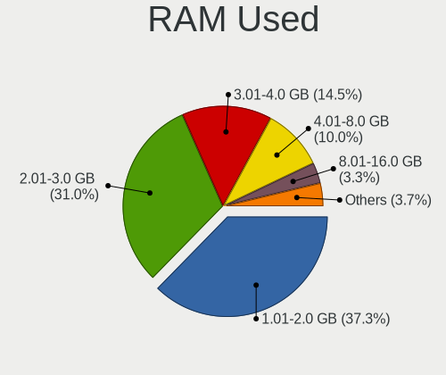
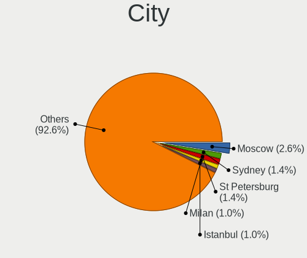
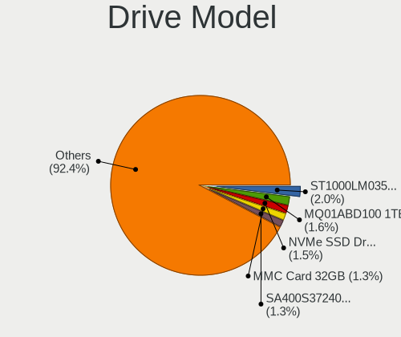
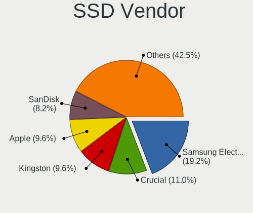
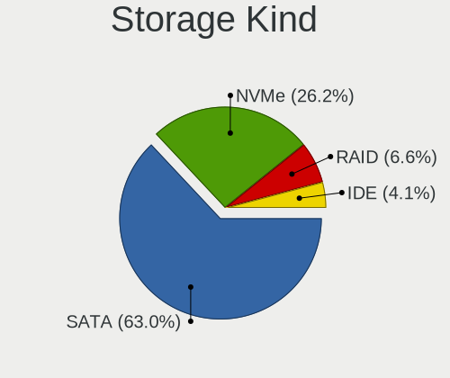
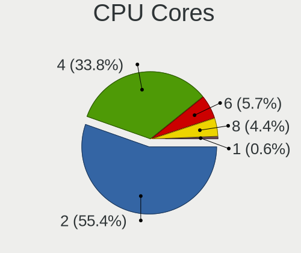
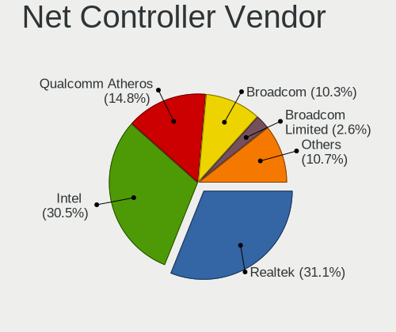
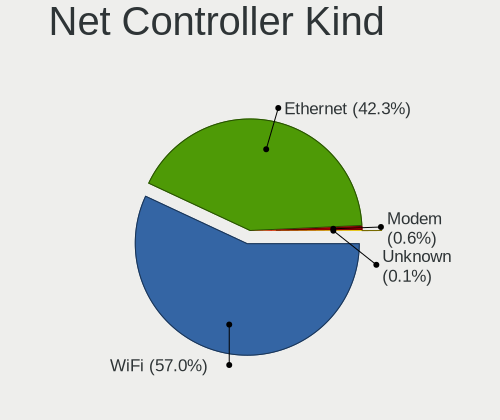
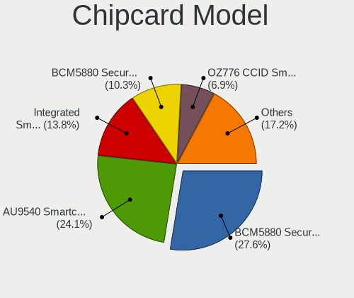
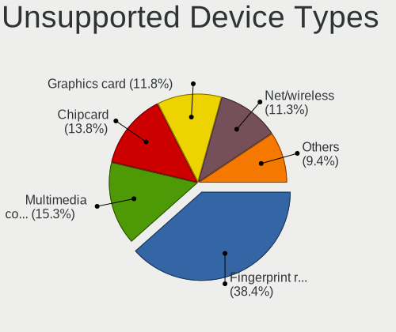

Elementary 6.1 - Tested Hardware & Statistics (Notebooks)
---------------------------------------------------------

A project to collect tested hardware configurations for Elementary 6.1.

Anyone can contribute to this report by the [hw-probe](https://github.com/linuxhw/hw-probe) tool:

    sudo -E hw-probe -all -upload

Please submit a probe of your configuration if it's not presented on the page or is rare.

Full-feature report is available here: https://linux-hardware.org/?view=trends

Contents
--------

* [ Test Cases ](#test-cases)

* [ System ](#system)
  - [ Kernel                   ](#kernel)
  - [ Kernel Family            ](#kernel-family)
  - [ Kernel Major Ver.        ](#kernel-major-ver)
  - [ Arch                     ](#arch)
  - [ DE                       ](#de)
  - [ Display Server           ](#display-server)
  - [ Display Manager          ](#display-manager)
  - [ OS Lang                  ](#os-lang)
  - [ Boot Mode                ](#boot-mode)
  - [ Filesystem               ](#filesystem)
  - [ Part. scheme             ](#part-scheme)
  - [ Dual Boot with Linux/BSD ](#dual-boot-with-linuxbsd)
  - [ Dual Boot (Win)          ](#dual-boot-win)

* [ Board ](#board)
  - [ Vendor                   ](#vendor)
  - [ Model                    ](#model)
  - [ Model Family             ](#model-family)
  - [ MFG Year                 ](#mfg-year)
  - [ Form Factor              ](#form-factor)
  - [ Secure Boot              ](#secure-boot)
  - [ Coreboot                 ](#coreboot)
  - [ RAM Size                 ](#ram-size)
  - [ RAM Used                 ](#ram-used)
  - [ Total Drives             ](#total-drives)
  - [ Has CD-ROM               ](#has-cd-rom)
  - [ Has Ethernet             ](#has-ethernet)
  - [ Has WiFi                 ](#has-wifi)
  - [ Has Bluetooth            ](#has-bluetooth)

* [ Location ](#location)
  - [ Country                  ](#country)
  - [ City                     ](#city)

* [ Drives ](#drives)
  - [ Drive Vendor             ](#drive-vendor)
  - [ Drive Model              ](#drive-model)
  - [ HDD Vendor               ](#hdd-vendor)
  - [ SSD Vendor               ](#ssd-vendor)
  - [ Drive Kind               ](#drive-kind)
  - [ Drive Connector          ](#drive-connector)
  - [ Drive Size               ](#drive-size)
  - [ Space Total              ](#space-total)
  - [ Space Used               ](#space-used)
  - [ Malfunc. Drives          ](#malfunc-drives)
  - [ Malfunc. Drive Vendor    ](#malfunc-drive-vendor)
  - [ Malfunc. HDD Vendor      ](#malfunc-hdd-vendor)
  - [ Malfunc. Drive Kind      ](#malfunc-drive-kind)
  - [ Failed Drives            ](#failed-drives)
  - [ Failed Drive Vendor      ](#failed-drive-vendor)
  - [ Drive Status             ](#drive-status)

* [ Storage controller ](#storage-controller)
  - [ Storage Vendor           ](#storage-vendor)
  - [ Storage Model            ](#storage-model)
  - [ Storage Kind             ](#storage-kind)

* [ Processor ](#processor)
  - [ CPU Vendor               ](#cpu-vendor)
  - [ CPU Model                ](#cpu-model)
  - [ CPU Model Family         ](#cpu-model-family)
  - [ CPU Cores                ](#cpu-cores)
  - [ CPU Sockets              ](#cpu-sockets)
  - [ CPU Threads              ](#cpu-threads)
  - [ CPU Op-Modes             ](#cpu-op-modes)
  - [ CPU Microcode            ](#cpu-microcode)
  - [ CPU Microarch            ](#cpu-microarch)

* [ Graphics ](#graphics)
  - [ GPU Vendor               ](#gpu-vendor)
  - [ GPU Model                ](#gpu-model)
  - [ GPU Combo                ](#gpu-combo)
  - [ GPU Driver               ](#gpu-driver)
  - [ GPU Memory               ](#gpu-memory)

* [ Monitor ](#monitor)
  - [ Monitor Vendor           ](#monitor-vendor)
  - [ Monitor Model            ](#monitor-model)
  - [ Monitor Resolution       ](#monitor-resolution)
  - [ Monitor Diagonal         ](#monitor-diagonal)
  - [ Monitor Width            ](#monitor-width)
  - [ Aspect Ratio             ](#aspect-ratio)
  - [ Monitor Area             ](#monitor-area)
  - [ Pixel Density            ](#pixel-density)
  - [ Multiple Monitors        ](#multiple-monitors)

* [ Network ](#network)
  - [ Net Controller Vendor    ](#net-controller-vendor)
  - [ Net Controller Model     ](#net-controller-model)
  - [ Wireless Vendor          ](#wireless-vendor)
  - [ Wireless Model           ](#wireless-model)
  - [ Ethernet Vendor          ](#ethernet-vendor)
  - [ Ethernet Model           ](#ethernet-model)
  - [ Net Controller Kind      ](#net-controller-kind)
  - [ Used Controller          ](#used-controller)
  - [ NICs                     ](#nics)
  - [ IPv6                     ](#ipv6)

* [ Bluetooth ](#bluetooth)
  - [ Bluetooth Vendor         ](#bluetooth-vendor)
  - [ Bluetooth Model          ](#bluetooth-model)

* [ Sound ](#sound)
  - [ Sound Vendor             ](#sound-vendor)
  - [ Sound Model              ](#sound-model)

* [ Memory ](#memory)
  - [ Memory Vendor            ](#memory-vendor)
  - [ Memory Model             ](#memory-model)
  - [ Memory Kind              ](#memory-kind)
  - [ Memory Form Factor       ](#memory-form-factor)
  - [ Memory Size              ](#memory-size)
  - [ Memory Speed             ](#memory-speed)

* [ Printers & scanners ](#printers--scanners)
  - [ Printer Vendor           ](#printer-vendor)
  - [ Printer Model            ](#printer-model)
  - [ Scanner Vendor           ](#scanner-vendor)
  - [ Scanner Model            ](#scanner-model)

* [ Camera ](#camera)
  - [ Camera Vendor            ](#camera-vendor)
  - [ Camera Model             ](#camera-model)

* [ Security ](#security)
  - [ Fingerprint Vendor       ](#fingerprint-vendor)
  - [ Fingerprint Model        ](#fingerprint-model)
  - [ Chipcard Vendor          ](#chipcard-vendor)
  - [ Chipcard Model           ](#chipcard-model)

* [ Unsupported ](#unsupported)
  - [ Unsupported Devices      ](#unsupported-devices)
  - [ Unsupported Device Types ](#unsupported-device-types)

Test Cases
----------

| Vendor        | Model                       | Probe                                                      | Date         |
|---------------|-----------------------------|------------------------------------------------------------|--------------|
| MSI           | GF63 Thin 9SCSR             | [21f2a5e1b9](https://linux-hardware.org/?probe=21f2a5e1b9) | Jan 05, 2022 |
| Apple         | MacBookPro5,5               | [a03baba93d](https://linux-hardware.org/?probe=a03baba93d) | Jan 05, 2022 |
| Lenovo        | ThinkPad T470 W10DG 20JN... | [fbb0e6d1d5](https://linux-hardware.org/?probe=fbb0e6d1d5) | Jan 05, 2022 |
| Lenovo        | Legion Y530-15ICH 81FV      | [6eab59bbbf](https://linux-hardware.org/?probe=6eab59bbbf) | Jan 05, 2022 |
| Lenovo        | ThinkPad X1 Carbon 6th 2... | [5496b24a51](https://linux-hardware.org/?probe=5496b24a51) | Jan 05, 2022 |
| Samsung       | 900X3C/900X3D/900X3E/900... | [520ced18c4](https://linux-hardware.org/?probe=520ced18c4) | Jan 05, 2022 |
| HP            | Laptop 15s-eq1xxx           | [ae2f1bc63c](https://linux-hardware.org/?probe=ae2f1bc63c) | Jan 05, 2022 |
| HUAWEI        | MACHC-WAX9                  | [b0df1464a1](https://linux-hardware.org/?probe=b0df1464a1) | Jan 05, 2022 |
| Sony          | SVE14A390X                  | [3b11d123cf](https://linux-hardware.org/?probe=3b11d123cf) | Jan 04, 2022 |
| HP            | ProBook 4430s               | [aafb807fc2](https://linux-hardware.org/?probe=aafb807fc2) | Jan 04, 2022 |
| HP            | ProBook 4430s               | [f534b0dd91](https://linux-hardware.org/?probe=f534b0dd91) | Jan 04, 2022 |
| Lenovo        | ThinkPad W541 20EGS1VV00    | [5d88eb323c](https://linux-hardware.org/?probe=5d88eb323c) | Jan 04, 2022 |
| Apple         | MacBookPro9,2               | [a1c3f24aab](https://linux-hardware.org/?probe=a1c3f24aab) | Jan 04, 2022 |
| Lenovo        | ThinkPad P14s Gen 1 20Y1... | [71e992725f](https://linux-hardware.org/?probe=71e992725f) | Jan 04, 2022 |
| Lenovo        | ThinkPad P14s Gen 1 20Y1... | [8087320623](https://linux-hardware.org/?probe=8087320623) | Jan 04, 2022 |
| Lenovo        | Yoga 300-11IBR 80M1         | [b18501f890](https://linux-hardware.org/?probe=b18501f890) | Jan 04, 2022 |
| Star Labs     | LabTop                      | [043cd26c60](https://linux-hardware.org/?probe=043cd26c60) | Jan 04, 2022 |
| HUAWEI        | KPL-W0X                     | [9d633f7bdb](https://linux-hardware.org/?probe=9d633f7bdb) | Jan 04, 2022 |
| Lenovo        | ThinkPad E495 20NE001RTX    | [79e95e3cb6](https://linux-hardware.org/?probe=79e95e3cb6) | Jan 04, 2022 |
| Dell          | Precision 5530              | [b385c0a16e](https://linux-hardware.org/?probe=b385c0a16e) | Jan 04, 2022 |
| Lenovo        | IdeaPad 310-15ISK 80SM      | [023df04f60](https://linux-hardware.org/?probe=023df04f60) | Jan 04, 2022 |
| Monster       | ABRA A5 V13.2               | [6d8d622050](https://linux-hardware.org/?probe=6d8d622050) | Jan 04, 2022 |
| MSI           | PS63 Modern 8RD             | [1cd435c54f](https://linux-hardware.org/?probe=1cd435c54f) | Jan 04, 2022 |
| Lenovo        | Legion Y530-15ICH 81GT      | [c694c358f9](https://linux-hardware.org/?probe=c694c358f9) | Jan 04, 2022 |
| Lenovo        | ThinkPad X13 Gen 1 20UFS... | [c61ed9ea15](https://linux-hardware.org/?probe=c61ed9ea15) | Jan 04, 2022 |
| HUAWEI        | KPL-W0X                     | [1015862a37](https://linux-hardware.org/?probe=1015862a37) | Jan 04, 2022 |
| Timi          | TM1613                      | [6761bd1e12](https://linux-hardware.org/?probe=6761bd1e12) | Jan 04, 2022 |
| ASUSTek       | E202SA                      | [d721e131f4](https://linux-hardware.org/?probe=d721e131f4) | Jan 02, 2022 |
| Lenovo        | ThinkPad T470 W10DG 20JN... | [440d6a1b59](https://linux-hardware.org/?probe=440d6a1b59) | Jan 02, 2022 |
| Apple         | MacBookPro5,1               | [6c7a3affdb](https://linux-hardware.org/?probe=6c7a3affdb) | Jan 02, 2022 |
| Dell          | Vostro 15 3515              | [45b6bf0410](https://linux-hardware.org/?probe=45b6bf0410) | Jan 01, 2022 |
| HP            | Pavilion Laptop 15-cs0xx... | [fb332a2529](https://linux-hardware.org/?probe=fb332a2529) | Jan 01, 2022 |
| Acer          | Aspire A315-42              | [d44b06ec61](https://linux-hardware.org/?probe=d44b06ec61) | Jan 01, 2022 |
| HP            | EliteBook 8460p             | [f215102713](https://linux-hardware.org/?probe=f215102713) | Dec 31, 2021 |
| Notebook      | P65xHP                      | [37db5af302](https://linux-hardware.org/?probe=37db5af302) | Dec 31, 2021 |
| HP            | EliteBook 8460p             | [e060f00ff8](https://linux-hardware.org/?probe=e060f00ff8) | Dec 31, 2021 |
| Notebook      | P65xHP                      | [fc81fedcf3](https://linux-hardware.org/?probe=fc81fedcf3) | Dec 31, 2021 |
| Teclast       | F7                          | [44bba02dee](https://linux-hardware.org/?probe=44bba02dee) | Dec 31, 2021 |
| Wortmann      | 1220729_1470271             | [018071ac3e](https://linux-hardware.org/?probe=018071ac3e) | Dec 30, 2021 |
| Acer          | Aspire 7750G                | [3a24dba335](https://linux-hardware.org/?probe=3a24dba335) | Dec 28, 2021 |
| Acer          | Aspire 7750G                | [516cb4e250](https://linux-hardware.org/?probe=516cb4e250) | Dec 28, 2021 |
| ASUSTek       | X555UB                      | [e0844450ac](https://linux-hardware.org/?probe=e0844450ac) | Dec 28, 2021 |
| Dell          | Latitude 3580               | [f243f4c09e](https://linux-hardware.org/?probe=f243f4c09e) | Dec 27, 2021 |
| Lenovo        | ThinkPad T430 23501M2       | [2645817d64](https://linux-hardware.org/?probe=2645817d64) | Dec 26, 2021 |
| HP            | EliteBook 850 G2            | [a71c970cbf](https://linux-hardware.org/?probe=a71c970cbf) | Dec 25, 2021 |
| Apple         | MacBookAir7,2               | [99bea5df6c](https://linux-hardware.org/?probe=99bea5df6c) | Dec 25, 2021 |
| Lenovo        | IdeaPad 320-14AST 80XU      | [80c8feb8bf](https://linux-hardware.org/?probe=80c8feb8bf) | Dec 25, 2021 |
| Dell          | Inspiron N5050              | [211b723554](https://linux-hardware.org/?probe=211b723554) | Dec 24, 2021 |
| LG Electro... | A410-G.BC51P1               | [b231405a63](https://linux-hardware.org/?probe=b231405a63) | Dec 24, 2021 |
| Acer          | TravelMate 5760             | [71526c7767](https://linux-hardware.org/?probe=71526c7767) | Dec 23, 2021 |
| Lenovo        | Flex 2-14D 20376            | [d950a63316](https://linux-hardware.org/?probe=d950a63316) | Dec 23, 2021 |
| Dell          | Inspiron 3542               | [277f97ef07](https://linux-hardware.org/?probe=277f97ef07) | Dec 23, 2021 |
| Dell          | XPS 13 9343                 | [dfbdb618f1](https://linux-hardware.org/?probe=dfbdb618f1) | Dec 23, 2021 |
| ASUSTek       | VivoBook_ASUSLaptop X512... | [f74c2da103](https://linux-hardware.org/?probe=f74c2da103) | Dec 22, 2021 |
| Dell          | Precision M3800             | [ed44d9ac8c](https://linux-hardware.org/?probe=ed44d9ac8c) | Dec 21, 2021 |
| Apple         | MacBookAir6,1               | [b2e3490378](https://linux-hardware.org/?probe=b2e3490378) | Dec 21, 2021 |
| Dell          | Precision M6500             | [931f365c60](https://linux-hardware.org/?probe=931f365c60) | Dec 20, 2021 |
| Dell          | Inspiron 5555               | [09d45f017d](https://linux-hardware.org/?probe=09d45f017d) | Dec 18, 2021 |
| Lenovo        | V14-ADA 82C6                | [a45f76da28](https://linux-hardware.org/?probe=a45f76da28) | Dec 17, 2021 |
| ASUSTek       | UX410UAK                    | [39dcbe0f57](https://linux-hardware.org/?probe=39dcbe0f57) | Dec 17, 2021 |
| Monster       | MARKUT M7 V1.x              | [2d2ed2143e](https://linux-hardware.org/?probe=2d2ed2143e) | Dec 17, 2021 |
| Monster       | MARKUT M7 V1.x              | [2390550c49](https://linux-hardware.org/?probe=2390550c49) | Dec 15, 2021 |
| Apple         | MacBook4,1                  | [661e7dae0c](https://linux-hardware.org/?probe=661e7dae0c) | Dec 15, 2021 |
| Apple         | MacBook4,1                  | [b682cee818](https://linux-hardware.org/?probe=b682cee818) | Dec 15, 2021 |
| Apple         | MacBook5,2                  | [5dcbdab7ca](https://linux-hardware.org/?probe=5dcbdab7ca) | Dec 15, 2021 |

System
------

Kernel
------

Version of the Linux kernel

| Version            | Notebooks | Percent |
|--------------------|-----------|---------|
| 5.11.0-43-generic  | 44        | 80%     |
| 5.11.0-44-generic  | 5         | 9.09%   |
| 5.11.0-41-generic  | 3         | 5.45%   |
| 5.8.0-50-generic   | 1         | 1.82%   |
| 5.15.3-xanmod1     | 1         | 1.82%   |
| 5.15.12-xanmod1-tt | 1         | 1.82%   |

Kernel Family
-------------

Linux kernel without a distro release

| Version | Notebooks | Percent |
|---------|-----------|---------|
| 5.11.0  | 52        | 94.55%  |
| 5.8.0   | 1         | 1.82%   |
| 5.15.3  | 1         | 1.82%   |
| 5.15.12 | 1         | 1.82%   |

Kernel Major Ver.
-----------------

Linux kernel major version

| Version | Notebooks | Percent |
|---------|-----------|---------|
| 5.11    | 52        | 94.55%  |
| 5.15    | 2         | 3.64%   |
| 5.8     | 1         | 1.82%   |

Arch
----

OS architecture (x86_64, i586, etc.)

| Name   | Notebooks | Percent |
|--------|-----------|---------|
| x86_64 | 55        | 100%    |

DE
--

Desktop Environment

| Name     | Notebooks | Percent |
|----------|-----------|---------|
| Pantheon | 55        | 100%    |

Display Server
--------------

X11 or Wayland

| Name | Notebooks | Percent |
|------|-----------|---------|
| X11  | 55        | 100%    |

Display Manager
---------------

SDDM, LightDM, etc.

| Name    | Notebooks | Percent |
|---------|-----------|---------|
| Unknown | 32        | 58.18%  |
| LightDM | 23        | 41.82%  |

OS Lang
-------

Language

| Lang  | Notebooks | Percent |
|-------|-----------|---------|
| en_US | 31        | 56.36%  |
| de_DE | 7         | 12.73%  |
| en_GB | 6         | 10.91%  |
| pt_BR | 4         | 7.27%   |
| pl_PL | 2         | 3.64%   |
| ru_RU | 1         | 1.82%   |
| it_IT | 1         | 1.82%   |
| fr_FR | 1         | 1.82%   |
| es_ES | 1         | 1.82%   |
| en_AU | 1         | 1.82%   |

Boot Mode
---------

EFI or BIOS

| Mode | Notebooks | Percent |
|------|-----------|---------|
| EFI  | 41        | 74.55%  |
| BIOS | 14        | 25.45%  |

Filesystem
----------

Type of filesystem

| Type    | Notebooks | Percent |
|---------|-----------|---------|
| Ext4    | 52        | 94.55%  |
| Btrfs   | 2         | 3.64%   |
| Overlay | 1         | 1.82%   |

Part. scheme
------------

Scheme of partitioning

| Type    | Notebooks | Percent |
|---------|-----------|---------|
| Unknown | 36        | 65.45%  |
| GPT     | 17        | 30.91%  |
| MBR     | 2         | 3.64%   |

Dual Boot with Linux/BSD
------------------------

Hosting more than one Linux/BSD

| Dual boot | Notebooks | Percent |
|-----------|-----------|---------|
| No        | 51        | 92.73%  |
| Yes       | 4         | 7.27%   |

Dual Boot (Win)
---------------

Hosting Linux and Windows

| Dual boot | Notebooks | Percent |
|-----------|-----------|---------|
| No        | 49        | 89.09%  |
| Yes       | 6         | 10.91%  |

Board
-----

Vendor
------

Motherboard manufacturer

| Name                | Notebooks | Percent |
|---------------------|-----------|---------|
| Lenovo              | 13        | 23.64%  |
| Dell                | 9         | 16.36%  |
| Apple               | 7         | 12.73%  |
| Hewlett-Packard     | 5         | 9.09%   |
| ASUSTek Computer    | 4         | 7.27%   |
| Acer                | 3         | 5.45%   |
| MSI                 | 2         | 3.64%   |
| Monster             | 2         | 3.64%   |
| HUAWEI              | 2         | 3.64%   |
| Wortmann AG         | 1         | 1.82%   |
| Timi                | 1         | 1.82%   |
| Teclast             | 1         | 1.82%   |
| Star Labs           | 1         | 1.82%   |
| Sony                | 1         | 1.82%   |
| Samsung Electronics | 1         | 1.82%   |
| Notebook            | 1         | 1.82%   |
| LG Electronics      | 1         | 1.82%   |

Model
-----

Motherboard model

| Name                                       | Notebooks | Percent |
|--------------------------------------------|-----------|---------|
| Wortmann AG 1220729_1470271                | 1         | 1.82%   |
| Timi TM1613                                | 1         | 1.82%   |
| Teclast F7                                 | 1         | 1.82%   |
| Star Labs LabTop                           | 1         | 1.82%   |
| Sony SVE14A390X                            | 1         | 1.82%   |
| Samsung 900X3C/900X3D/900X3E/900X4C/900X4D | 1         | 1.82%   |
| Notebook P65xHP                            | 1         | 1.82%   |
| MSI PS63 Modern 8RD                        | 1         | 1.82%   |
| MSI GF63 Thin 9SCSR                        | 1         | 1.82%   |
| Monster MARKUT M7 V1.x                     | 1         | 1.82%   |
| Monster ABRA A5 V13.2                      | 1         | 1.82%   |
| LG A410-G.BC51P1                           | 1         | 1.82%   |
| Lenovo Yoga 300-11IBR 80M1                 | 1         | 1.82%   |
| Lenovo ThinkPad X13 Gen 1 20UFS00G00       | 1         | 1.82%   |
| Lenovo ThinkPad X1 Carbon 6th 20KHS1L200   | 1         | 1.82%   |
| Lenovo ThinkPad W541 20EGS1VV00            | 1         | 1.82%   |
| Lenovo ThinkPad T470 W10DG 20JNS08H00      | 1         | 1.82%   |
| Lenovo ThinkPad T430 23501M2               | 1         | 1.82%   |
| Lenovo ThinkPad P14s Gen 1 20Y1S00E00      | 1         | 1.82%   |
| Lenovo ThinkPad E495 20NE001RTX            | 1         | 1.82%   |
| Lenovo Legion Y530-15ICH 81GT              | 1         | 1.82%   |
| Lenovo Legion Y530-15ICH 81FV              | 1         | 1.82%   |
| Lenovo IdeaPad 320-14AST 80XU              | 1         | 1.82%   |
| Lenovo IdeaPad 310-15ISK 80SM              | 1         | 1.82%   |
| Lenovo Flex 2-14D 20376                    | 1         | 1.82%   |
| HUAWEI MACHC-WAX9                          | 1         | 1.82%   |
| HUAWEI KPL-W0X                             | 1         | 1.82%   |
| HP ProBook 4430s                           | 1         | 1.82%   |
| HP Pavilion Laptop 15-cs0xxx               | 1         | 1.82%   |
| HP Laptop 15s-eq1xxx                       | 1         | 1.82%   |
| HP EliteBook 850 G2                        | 1         | 1.82%   |
| HP EliteBook 8460p                         | 1         | 1.82%   |
| Dell XPS 13 9343                           | 1         | 1.82%   |
| Dell Vostro 15 3515                        | 1         | 1.82%   |
| Dell Precision M6500                       | 1         | 1.82%   |
| Dell Precision M3800                       | 1         | 1.82%   |
| Dell Precision 5530                        | 1         | 1.82%   |
| Dell Latitude 3580                         | 1         | 1.82%   |
| Dell Inspiron N5050                        | 1         | 1.82%   |
| Dell Inspiron 5555                         | 1         | 1.82%   |
| Dell Inspiron 3542                         | 1         | 1.82%   |
| ASUS X555UB                                | 1         | 1.82%   |
| ASUS VivoBook_ASUSLaptop X512FA_A512FA     | 1         | 1.82%   |
| ASUS UX410UAK                              | 1         | 1.82%   |
| ASUS E202SA                                | 1         | 1.82%   |
| Apple MacBookPro9,2                        | 1         | 1.82%   |
| Apple MacBookPro5,5                        | 1         | 1.82%   |
| Apple MacBookPro5,1                        | 1         | 1.82%   |
| Apple MacBookAir7,2                        | 1         | 1.82%   |
| Apple MacBookAir6,1                        | 1         | 1.82%   |
| Apple MacBook5,2                           | 1         | 1.82%   |
| Apple MacBook4,1                           | 1         | 1.82%   |
| Acer TravelMate 5760                       | 1         | 1.82%   |
| Acer Aspire A315-42                        | 1         | 1.82%   |
| Acer Aspire 7750G                          | 1         | 1.82%   |

Model Family
------------

Motherboard model prefix

| Name                | Notebooks | Percent |
|---------------------|-----------|---------|
| Lenovo ThinkPad     | 7         | 12.73%  |
| Dell Precision      | 3         | 5.45%   |
| Dell Inspiron       | 3         | 5.45%   |
| Lenovo Legion       | 2         | 3.64%   |
| Lenovo IdeaPad      | 2         | 3.64%   |
| HP EliteBook        | 2         | 3.64%   |
| Apple MacBookPro5   | 2         | 3.64%   |
| Acer Aspire         | 2         | 3.64%   |
| Wortmann AG 1220729 | 1         | 1.82%   |
| Timi TM1613         | 1         | 1.82%   |
| Teclast F7          | 1         | 1.82%   |
| Star Labs LabTop    | 1         | 1.82%   |
| Sony SVE14A390X     | 1         | 1.82%   |
| Samsung 900X3C      | 1         | 1.82%   |
| Notebook P65xHP     | 1         | 1.82%   |
| MSI PS63            | 1         | 1.82%   |
| MSI GF63            | 1         | 1.82%   |
| Monster MARKUT      | 1         | 1.82%   |
| Monster ABRA        | 1         | 1.82%   |
| LG A410-G.BC51P1    | 1         | 1.82%   |
| Lenovo Yoga         | 1         | 1.82%   |
| Lenovo Flex         | 1         | 1.82%   |
| HUAWEI MACHC-WAX9   | 1         | 1.82%   |
| HUAWEI KPL-W0X      | 1         | 1.82%   |
| HP ProBook          | 1         | 1.82%   |
| HP Pavilion         | 1         | 1.82%   |
| HP Laptop           | 1         | 1.82%   |
| Dell XPS            | 1         | 1.82%   |
| Dell Vostro         | 1         | 1.82%   |
| Dell Latitude       | 1         | 1.82%   |
| ASUS X555UB         | 1         | 1.82%   |
| ASUS VivoBook       | 1         | 1.82%   |
| ASUS UX410UAK       | 1         | 1.82%   |
| ASUS E202SA         | 1         | 1.82%   |
| Apple MacBookPro9   | 1         | 1.82%   |
| Apple MacBookAir7   | 1         | 1.82%   |
| Apple MacBookAir6   | 1         | 1.82%   |
| Apple MacBook5      | 1         | 1.82%   |
| Apple MacBook4      | 1         | 1.82%   |
| Acer TravelMate     | 1         | 1.82%   |

MFG Year
--------

Motherboard manufacture year

| Year | Notebooks | Percent |
|------|-----------|---------|
| 2019 | 10        | 18.18%  |
| 2021 | 9         | 16.36%  |
| 2020 | 8         | 14.55%  |
| 2018 | 7         | 12.73%  |
| 2015 | 4         | 7.27%   |
| 2011 | 4         | 7.27%   |
| 2016 | 3         | 5.45%   |
| 2013 | 3         | 5.45%   |
| 2012 | 2         | 3.64%   |
| 2009 | 2         | 3.64%   |
| 2017 | 1         | 1.82%   |
| 2014 | 1         | 1.82%   |
| 2008 | 1         | 1.82%   |

Form Factor
-----------

Physical design of the computer

| Name     | Notebooks | Percent |
|----------|-----------|---------|
| Notebook | 55        | 100%    |

Secure Boot
-----------

Enabled or disabled

| State    | Notebooks | Percent |
|----------|-----------|---------|
| Disabled | 49        | 89.09%  |
| Enabled  | 6         | 10.91%  |

Coreboot
--------

Have coreboot on board

| Used | Notebooks | Percent |
|------|-----------|---------|
| No   | 54        | 98.18%  |
| Yes  | 1         | 1.82%   |

RAM Size
--------

Total RAM memory

| Size in GB  | Notebooks | Percent |
|-------------|-----------|---------|
| 4.01-8.0    | 24        | 43.64%  |
| 16.01-24.0  | 10        | 18.18%  |
| 3.01-4.0    | 9         | 16.36%  |
| 8.01-16.0   | 7         | 12.73%  |
| 32.01-64.0  | 2         | 3.64%   |
| 1.01-2.0    | 2         | 3.64%   |
| 64.01-256.0 | 1         | 1.82%   |

RAM Used
--------

Used RAM memory

| Used GB   | Notebooks | Percent |
|-----------|-----------|---------|
| 2.01-3.0  | 21        | 38.18%  |
| 1.01-2.0  | 13        | 23.64%  |
| 3.01-4.0  | 9         | 16.36%  |
| 4.01-8.0  | 5         | 9.09%   |
| 8.01-16.0 | 5         | 9.09%   |
| 0.51-1.0  | 2         | 3.64%   |

Total Drives
------------

Number of drives on board

| Drives | Notebooks | Percent |
|--------|-----------|---------|
| 1      | 37        | 67.27%  |
| 2      | 14        | 25.45%  |
| 3      | 3         | 5.45%   |
| 5      | 1         | 1.82%   |

Has CD-ROM
----------

Has CD-ROM on board

| Presented | Notebooks | Percent |
|-----------|-----------|---------|
| No        | 41        | 74.55%  |
| Yes       | 14        | 25.45%  |

Has Ethernet
------------

Has Ethernet on board

| Presented | Notebooks | Percent |
|-----------|-----------|---------|
| Yes       | 40        | 72.73%  |
| No        | 15        | 27.27%  |

Has WiFi
--------

Has WiFi module

| Presented | Notebooks | Percent |
|-----------|-----------|---------|
| Yes       | 55        | 100%    |

Has Bluetooth
-------------

Has Bluetooth module

| Presented | Notebooks | Percent |
|-----------|-----------|---------|
| Yes       | 52        | 94.55%  |
| No        | 3         | 5.45%   |

Location
--------

Country
-------

Geographic location (country)

| Country     | Notebooks | Percent |
|-------------|-----------|---------|
| India       | 6         | 10.91%  |
| Brazil      | 6         | 10.91%  |
| Germany     | 5         | 9.09%   |
| USA         | 4         | 7.27%   |
| Turkey      | 4         | 7.27%   |
| Poland      | 4         | 7.27%   |
| Italy       | 3         | 5.45%   |
| Australia   | 3         | 5.45%   |
| UK          | 2         | 3.64%   |
| Romania     | 2         | 3.64%   |
| Belarus     | 2         | 3.64%   |
| Ukraine     | 1         | 1.82%   |
| Sweden      | 1         | 1.82%   |
| Portugal    | 1         | 1.82%   |
| Pakistan    | 1         | 1.82%   |
| New Zealand | 1         | 1.82%   |
| Netherlands | 1         | 1.82%   |
| Mexico      | 1         | 1.82%   |
| Indonesia   | 1         | 1.82%   |
| Guyana      | 1         | 1.82%   |
| Greece      | 1         | 1.82%   |
| France      | 1         | 1.82%   |
| Colombia    | 1         | 1.82%   |
| Chile       | 1         | 1.82%   |
| Austria     | 1         | 1.82%   |

City
----

Geographic location (city)

| City                   | Notebooks | Percent |
|------------------------|-----------|---------|
| Sydney                 | 3         | 5.45%   |
| Ankara                 | 3         | 5.45%   |
| Minsk                  | 2         | 3.64%   |
| Wroclaw                | 1         | 1.82%   |
| Wriedel                | 1         | 1.82%   |
| Wellington             | 1         | 1.82%   |
| Vinnytsia              | 1         | 1.82%   |
| Vienna                 | 1         | 1.82%   |
| Tecuci                 | 1         | 1.82%   |
| Soliera                | 1         | 1.82%   |
| Shetland Islands       | 1         | 1.82%   |
| S??o Paulo             | 1         | 1.82%   |
| S??o Bernardo do Campo | 1         | 1.82%   |
| San Antonio            | 1         | 1.82%   |
| Saltsjoe-Boo           | 1         | 1.82%   |
| Rome                   | 1         | 1.82%   |
| Providencia            | 1         | 1.82%   |
| Porto                  | 1         | 1.82%   |
| Osasco                 | 1         | 1.82%   |
| Mumbai                 | 1         | 1.82%   |
| Montm?©dy              | 1         | 1.82%   |
| Mahemdavad             | 1         | 1.82%   |
| Krakow                 | 1         | 1.82%   |
| Jember                 | 1         | 1.82%   |
| Itaquaquecetuba        | 1         | 1.82%   |
| Islamabad              | 1         | 1.82%   |
| Hyderabad              | 1         | 1.82%   |
| Hudson                 | 1         | 1.82%   |
| Holland                | 1         | 1.82%   |
| Hanover                | 1         | 1.82%   |
| Gliwice                | 1         | 1.82%   |
| Georgetown             | 1         | 1.82%   |
| Gdansk                 | 1         | 1.82%   |
| Erkrath                | 1         | 1.82%   |
| Dumbravita             | 1         | 1.82%   |
| Dhanbad                | 1         | 1.82%   |
| Cuernavaca             | 1         | 1.82%   |
| Chalfont               | 1         | 1.82%   |
| Cesate                 | 1         | 1.82%   |
| Cartagena              | 1         | 1.82%   |
| Cabo Frio              | 1         | 1.82%   |
| Burgess Hill           | 1         | 1.82%   |
| Bengaluru              | 1         | 1.82%   |
| Belo Horizonte         | 1         | 1.82%   |
| Bad Friedrichshall     | 1         | 1.82%   |
| Athens                 | 1         | 1.82%   |
| Antalya                | 1         | 1.82%   |
| Alphen aan den Rijn    | 1         | 1.82%   |
| Ahmedabad              | 1         | 1.82%   |
| Aachen                 | 1         | 1.82%   |

Drives
------

Drive Vendor
------------

Hard drive vendors

| Vendor              | Notebooks | Drives | Percent |
|---------------------|-----------|--------|---------|
| Samsung Electronics | 15        | 19     | 20.27%  |
| WDC                 | 9         | 9      | 12.16%  |
| Crucial             | 7         | 7      | 9.46%   |
| Seagate             | 6         | 6      | 8.11%   |
| Kingston            | 6         | 7      | 8.11%   |
| SanDisk             | 4         | 4      | 5.41%   |
| SK Hynix            | 3         | 3      | 4.05%   |
| Hitachi             | 3         | 3      | 4.05%   |
| Unknown             | 2         | 2      | 2.7%    |
| Micron Technology   | 2         | 2      | 2.7%    |
| HGST                | 2         | 2      | 2.7%    |
| Unknown             | 2         | 2      | 2.7%    |
| Transcend           | 1         | 1      | 1.35%   |
| Toshiba             | 1         | 1      | 1.35%   |
| Teclast             | 1         | 1      | 1.35%   |
| Star                | 1         | 1      | 1.35%   |
| Silicon Motion      | 1         | 1      | 1.35%   |
| SABRENT             | 1         | 1      | 1.35%   |
| LITEON              | 1         | 1      | 1.35%   |
| KIOXIA              | 1         | 1      | 1.35%   |
| KingSpec            | 1         | 1      | 1.35%   |
| Fujitsu             | 1         | 1      | 1.35%   |
| China               | 1         | 1      | 1.35%   |
| Apple               | 1         | 1      | 1.35%   |
| A-DATA Technology   | 1         | 1      | 1.35%   |

Drive Model
-----------

Hard drive models

| Model                                     | Notebooks | Percent |
|-------------------------------------------|-----------|---------|
| Seagate ST1000LM035-1RK172 1TB            | 3         | 3.9%    |
| WDC WD5000LPVX-75V0TT0 500GB              | 2         | 2.6%    |
| Samsung SSD 850 EVO 250GB                 | 2         | 2.6%    |
| Samsung PM963 2.5" NVMe PCIe SSD 256GB    | 2         | 2.6%    |
| Unknown                                   | 2         | 2.6%    |
| WDC WD7500BPVT-22A1YT0 752GB              | 1         | 1.3%    |
| WDC WD5000BPVT-22HXZT1 500GB              | 1         | 1.3%    |
| WDC WD20SPZX-22UA7T0 2TB                  | 1         | 1.3%    |
| WDC WD10SPZX-24Z10 1TB                    | 1         | 1.3%    |
| WDC WD10JPCX-24UE4T0 1TB                  | 1         | 1.3%    |
| WDC PC SN730 SDBPNTY-512G-1027 512GB      | 1         | 1.3%    |
| WDC PC SN520 SDAPNUW-512G                 | 1         | 1.3%    |
| Unknown USD00  16GB                       | 1         | 1.3%    |
| Unknown GD2S5  128GB                      | 1         | 1.3%    |
| Transcend TS512GMTS430S 512GB SSD         | 1         | 1.3%    |
| Toshiba MQ04ABF100 1TB                    | 1         | 1.3%    |
| Teclast 128GB NS550-2242 SSD              | 1         | 1.3%    |
| Star Drive SATA SSD 960GB                 | 1         | 1.3%    |
| SK Hynix SKHynix_HFS512GD9TNI-L2B0B 512GB | 1         | 1.3%    |
| SK Hynix NVMe SSD Drive 256GB             | 1         | 1.3%    |
| SK Hynix HFM128GDHTNG-8510B 128GB         | 1         | 1.3%    |
| Silicon Motion NVMe SSD Drive 120GB       | 1         | 1.3%    |
| Seagate ST9500325AS 500GB                 | 1         | 1.3%    |
| Seagate ST1000LM024 HN-M101MBB 1TB        | 1         | 1.3%    |
| Seagate Expansion Desk 8TB                | 1         | 1.3%    |
| SanDisk SD9SN8W256G1027 256GB SSD         | 1         | 1.3%    |
| SanDisk SD9SN8W-128G-1006 128GB SSD       | 1         | 1.3%    |
| SanDisk SD8SNAT128G1002 128GB SSD         | 1         | 1.3%    |
| Sandisk NVMe SSD Drive 250GB              | 1         | 1.3%    |
| Samsung SSD SM841 mSATA 512GB             | 1         | 1.3%    |
| Samsung SSD 950 PRO 512GB                 | 1         | 1.3%    |
| Samsung SSD 860 EVO 500GB                 | 1         | 1.3%    |
| Samsung SSD 850 EVO 2TB                   | 1         | 1.3%    |
| Samsung SSD 850 EVO 1TB                   | 1         | 1.3%    |
| Samsung SSD 850 EVO 120GB                 | 1         | 1.3%    |
| Samsung SSD 840 EVO 250GB                 | 1         | 1.3%    |
| Samsung PSSD T7 Touch 2TB                 | 1         | 1.3%    |
| Samsung Portable SSD T5 500GB             | 1         | 1.3%    |
| Samsung NVMe SSD Drive 512GB              | 1         | 1.3%    |
| Samsung NVMe SSD Drive 1TB                | 1         | 1.3%    |
| Samsung MZVLB512HBJQ-000L7 512GB          | 1         | 1.3%    |
| Samsung MZMPA064HMDR-00000 64GB SSD       | 1         | 1.3%    |
| SABRENT Disk 320GB                        | 1         | 1.3%    |
| Micron 1100_MTFDDAV256TBN 256GB SSD       | 1         | 1.3%    |
| Micron 1100_MTFDDAK256TBN 256GB SSD       | 1         | 1.3%    |
| LITEON L8H-256V2G-11 M.2 2280 256GB SSD   | 1         | 1.3%    |
| KIOXIA NVMe SSD Drive 256GB               | 1         | 1.3%    |
| Kingston SV300S37A120G 120GB SSD          | 1         | 1.3%    |
| Kingston SUV500240G 240GB SSD             | 1         | 1.3%    |
| Kingston SA400S37240G 240GB SSD           | 1         | 1.3%    |
| Kingston SA1000M8240G 240GB               | 1         | 1.3%    |
| Kingston RBUSNS8180DS3128GJ 128GB SSD     | 1         | 1.3%    |
| Kingston OM8PDP3256B-AI1 256GB            | 1         | 1.3%    |
| Kingston NVMe SSD Drive 500GB             | 1         | 1.3%    |
| KingSpec P4-120 120GB SSD                 | 1         | 1.3%    |
| Hitachi HTS725032A7E630 320GB             | 1         | 1.3%    |
| Hitachi HTS723232A7A364 320GB             | 1         | 1.3%    |
| Hitachi HTS543212L9SA02 120GB             | 1         | 1.3%    |
| HGST HTS545050A7E680 500GB                | 1         | 1.3%    |
| HGST HTS545050A7E380 500GB                | 1         | 1.3%    |

HDD Vendor
----------

Hard disk drive vendors

| Vendor  | Notebooks | Drives | Percent |
|---------|-----------|--------|---------|
| WDC     | 7         | 7      | 33.33%  |
| Seagate | 6         | 6      | 28.57%  |
| Hitachi | 3         | 3      | 14.29%  |
| HGST    | 2         | 2      | 9.52%   |
| Toshiba | 1         | 1      | 4.76%   |
| SABRENT | 1         | 1      | 4.76%   |
| Fujitsu | 1         | 1      | 4.76%   |

SSD Vendor
----------

Solid state drive vendors

| Vendor              | Notebooks | Drives | Percent |
|---------------------|-----------|--------|---------|
| Samsung Electronics | 10        | 12     | 28.57%  |
| Crucial             | 7         | 7      | 20%     |
| Kingston            | 4         | 4      | 11.43%  |
| SanDisk             | 3         | 3      | 8.57%   |
| Micron Technology   | 2         | 2      | 5.71%   |
| Transcend           | 1         | 1      | 2.86%   |
| Teclast             | 1         | 1      | 2.86%   |
| Star                | 1         | 1      | 2.86%   |
| LITEON              | 1         | 1      | 2.86%   |
| KingSpec            | 1         | 1      | 2.86%   |
| China               | 1         | 1      | 2.86%   |
| Apple               | 1         | 1      | 2.86%   |
| A-DATA Technology   | 1         | 1      | 2.86%   |
| Unknown             | 1         | 1      | 2.86%   |

Drive Kind
----------

HDD or SSD

| Kind | Notebooks | Drives | Percent |
|------|-----------|--------|---------|
| SSD  | 31        | 37     | 43.06%  |
| HDD  | 21        | 21     | 29.17%  |
| NVMe | 17        | 18     | 23.61%  |
| MMC  | 3         | 3      | 4.17%   |

Drive Connector
---------------

SATA, SAS, NVMe, etc.

| Type | Notebooks | Drives | Percent |
|------|-----------|--------|---------|
| SATA | 44        | 54     | 65.67%  |
| NVMe | 17        | 18     | 25.37%  |
| SAS  | 3         | 4      | 4.48%   |
| MMC  | 3         | 3      | 4.48%   |

Drive Size
----------

Size of hard drive

| Size in TB | Notebooks | Drives | Percent |
|------------|-----------|--------|---------|
| 0.01-0.5   | 32        | 37     | 64%     |
| 0.51-1.0   | 14        | 14     | 28%     |
| 1.01-2.0   | 3         | 6      | 6%      |
| 4.01-10.0  | 1         | 1      | 2%      |

Space Total
-----------

Amount of disk space available on the file system

| Size in GB     | Notebooks | Percent |
|----------------|-----------|---------|
| 101-250        | 22        | 40%     |
| 251-500        | 18        | 32.73%  |
| 501-1000       | 6         | 10.91%  |
| 1001-2000      | 5         | 9.09%   |
| 51-100         | 3         | 5.45%   |
| More than 3000 | 1         | 1.82%   |

Space Used
----------

Amount of used disk space

| Used GB   | Notebooks | Percent |
|-----------|-----------|---------|
| 1-20      | 18        | 32.73%  |
| 21-50     | 15        | 27.27%  |
| 51-100    | 8         | 14.55%  |
| 101-250   | 6         | 10.91%  |
| 251-500   | 4         | 7.27%   |
| 501-1000  | 3         | 5.45%   |
| 2001-3000 | 1         | 1.82%   |

Malfunc. Drives
---------------

Drive models with a malfunction

| Model                       | Notebooks | Drives | Percent |
|-----------------------------|-----------|--------|---------|
| WDC WD10SPZX-24Z10 1TB      | 1         | 1      | 50%     |
| Crucial CT512M550SSD3 512GB | 1         | 1      | 50%     |

Malfunc. Drive Vendor
---------------------

Vendors of faulty drives

| Vendor  | Notebooks | Drives | Percent |
|---------|-----------|--------|---------|
| WDC     | 1         | 1      | 50%     |
| Crucial | 1         | 1      | 50%     |

Malfunc. HDD Vendor
-------------------

Vendors of faulty HDD drives

| Vendor | Notebooks | Drives | Percent |
|--------|-----------|--------|---------|
| WDC    | 1         | 1      | 100%    |

Malfunc. Drive Kind
-------------------

Kinds of faulty drives

| Kind | Notebooks | Drives | Percent |
|------|-----------|--------|---------|
| SSD  | 1         | 1      | 50%     |
| HDD  | 1         | 1      | 50%     |

Failed Drives
-------------

Failed drive models

Zero info for selected period =(

Failed Drive Vendor
-------------------

Failed drive vendors

Zero info for selected period =(

Drive Status
------------

Number of failed and malfunc. drives

| Status   | Notebooks | Drives | Percent |
|----------|-----------|--------|---------|
| Detected | 41        | 52     | 67.21%  |
| Works    | 18        | 25     | 29.51%  |
| Malfunc  | 2         | 2      | 3.28%   |

Storage controller
------------------

Storage Vendor
--------------

Storage controller vendors

| Vendor                      | Notebooks | Percent |
|-----------------------------|-----------|---------|
| Intel                       | 38        | 59.38%  |
| Samsung Electronics         | 7         | 10.94%  |
| AMD                         | 6         | 9.38%   |
| SK Hynix                    | 3         | 4.69%   |
| Sandisk                     | 3         | 4.69%   |
| Nvidia                      | 3         | 4.69%   |
| Kingston Technology Company | 3         | 4.69%   |
| Silicon Motion              | 1         | 1.56%   |

Storage Model
-------------

Storage controller models

| Model                                                                            | Notebooks | Percent |
|----------------------------------------------------------------------------------|-----------|---------|
| Intel Sunrise Point-LP SATA Controller [AHCI mode]                               | 7         | 10.77%  |
| AMD FCH SATA Controller [AHCI mode]                                              | 6         | 9.23%   |
| Intel Cannon Lake Mobile PCH SATA AHCI Controller                                | 5         | 7.69%   |
| Intel 6 Series/C200 Series Chipset Family 6 port Mobile SATA AHCI Controller     | 5         | 7.69%   |
| Intel 7 Series Chipset Family 6-port SATA Controller [AHCI mode]                 | 4         | 6.15%   |
| Nvidia MCP79 AHCI Controller                                                     | 3         | 4.62%   |
| Samsung NVMe SSD Controller SM981/PM981/PM983                                    | 2         | 3.08%   |
| Samsung NVMe SSD Controller SM951/PM951                                          | 2         | 3.08%   |
| Samsung NVMe SSD Controller 980                                                  | 2         | 3.08%   |
| Intel Wildcat Point-LP SATA Controller [AHCI Mode]                               | 2         | 3.08%   |
| Intel Comet Lake SATA AHCI Controller                                            | 2         | 3.08%   |
| Intel Atom/Celeron/Pentium Processor x5-E8000/J3xxx/N3xxx Series SATA Controller | 2         | 3.08%   |
| Intel 82801 Mobile SATA Controller [RAID mode]                                   | 2         | 3.08%   |
| Intel 8 Series/C220 Series Chipset Family 6-port SATA Controller 1 [AHCI mode]   | 2         | 3.08%   |
| SK Hynix Non-Volatile memory controller                                          | 1         | 1.54%   |
| SK Hynix BC511                                                                   | 1         | 1.54%   |
| SK Hynix BC501 NVMe Solid State Drive                                            | 1         | 1.54%   |
| Silicon Motion Non-Volatile memory controller                                    | 1         | 1.54%   |
| Sandisk WD Blue SN550 NVMe SSD                                                   | 1         | 1.54%   |
| Sandisk WD Blue SN500 / PC SN520 NVMe SSD                                        | 1         | 1.54%   |
| Sandisk WD Black SN750 / PC SN730 NVMe SSD                                       | 1         | 1.54%   |
| Samsung Electronics SATA controller                                              | 1         | 1.54%   |
| Kingston Company U-SNS8154P3 NVMe SSD                                            | 1         | 1.54%   |
| Kingston Company OM3PDP3 NVMe SSD                                                | 1         | 1.54%   |
| Kingston Company KC2000 NVMe SSD                                                 | 1         | 1.54%   |
| Intel Q170/Q150/B150/H170/H110/Z170/CM236 Chipset SATA Controller [AHCI Mode]    | 1         | 1.54%   |
| Intel Celeron N3350/Pentium N4200/Atom E3900 Series SATA AHCI Controller         | 1         | 1.54%   |
| Intel Cannon Point-LP SATA Controller [AHCI Mode]                                | 1         | 1.54%   |
| Intel 82801HM/HEM (ICH8M/ICH8M-E) SATA Controller [AHCI mode]                    | 1         | 1.54%   |
| Intel 82801HM/HEM (ICH8M/ICH8M-E) IDE Controller                                 | 1         | 1.54%   |
| Intel 8 Series SATA Controller 1 [AHCI mode]                                     | 1         | 1.54%   |
| Intel 5 Series/3400 Series Chipset 6 port SATA AHCI Controller                   | 1         | 1.54%   |
| Intel 5 Series/3400 Series Chipset 4 port SATA AHCI Controller                   | 1         | 1.54%   |

Storage Kind
------------

Kind of storage controller (IDE, SATA, NVMe, SAS, ...)

| Kind | Notebooks | Percent |
|------|-----------|---------|
| SATA | 46        | 70.77%  |
| NVMe | 16        | 24.62%  |
| RAID | 2         | 3.08%   |
| IDE  | 1         | 1.54%   |

Processor
---------

CPU Vendor
----------

Processor vendors

| Vendor | Notebooks | Percent |
|--------|-----------|---------|
| Intel  | 45        | 81.82%  |
| AMD    | 10        | 18.18%  |

CPU Model
---------

Processor models

| Model                                         | Notebooks | Percent |
|-----------------------------------------------|-----------|---------|
| Intel Core i5-6200U CPU @ 2.30GHz             | 3         | 5.45%   |
| Intel Core i7-8750H CPU @ 2.20GHz             | 2         | 3.64%   |
| Intel Core i7-8550U CPU @ 1.80GHz             | 2         | 3.64%   |
| AMD Ryzen 7 PRO 4750U with Radeon Graphics    | 2         | 3.64%   |
| Intel Pentium CPU N3700 @ 1.60GHz             | 1         | 1.82%   |
| Intel Core i7-8850H CPU @ 2.60GHz             | 1         | 1.82%   |
| Intel Core i7-8565U CPU @ 1.80GHz             | 1         | 1.82%   |
| Intel Core i7-7700HQ CPU @ 2.80GHz            | 1         | 1.82%   |
| Intel Core i7-7500U CPU @ 2.70GHz             | 1         | 1.82%   |
| Intel Core i7-6700K CPU @ 4.00GHz             | 1         | 1.82%   |
| Intel Core i7-5500U CPU @ 2.40GHz             | 1         | 1.82%   |
| Intel Core i7-4910MQ CPU @ 2.90GHz            | 1         | 1.82%   |
| Intel Core i7-4712HQ CPU @ 2.30GHz            | 1         | 1.82%   |
| Intel Core i7-3632QM CPU @ 2.20GHz            | 1         | 1.82%   |
| Intel Core i7-2670QM CPU @ 2.20GHz            | 1         | 1.82%   |
| Intel Core i7-10710U CPU @ 1.10GHz            | 1         | 1.82%   |
| Intel Core i7 CPU Q 740 @ 1.73GHz             | 1         | 1.82%   |
| Intel Core i5-9300H CPU @ 2.40GHz             | 1         | 1.82%   |
| Intel Core i5-8300H CPU @ 2.30GHz             | 1         | 1.82%   |
| Intel Core i5-6300U CPU @ 2.40GHz             | 1         | 1.82%   |
| Intel Core i5-5300U CPU @ 2.30GHz             | 1         | 1.82%   |
| Intel Core i5-5250U CPU @ 1.60GHz             | 1         | 1.82%   |
| Intel Core i5-4260U CPU @ 1.40GHz             | 1         | 1.82%   |
| Intel Core i5-3337U CPU @ 1.80GHz             | 1         | 1.82%   |
| Intel Core i5-3320M CPU @ 2.60GHz             | 1         | 1.82%   |
| Intel Core i5-3210M CPU @ 2.50GHz             | 1         | 1.82%   |
| Intel Core i5-2520M CPU @ 2.50GHz             | 1         | 1.82%   |
| Intel Core i5-2450M CPU @ 2.50GHz             | 1         | 1.82%   |
| Intel Core i5-10210U CPU @ 1.60GHz            | 1         | 1.82%   |
| Intel Core i3-8145U CPU @ 2.10GHz             | 1         | 1.82%   |
| Intel Core i3-6006U CPU @ 2.00GHz             | 1         | 1.82%   |
| Intel Core i3-4005U CPU @ 1.70GHz             | 1         | 1.82%   |
| Intel Core i3-2330M CPU @ 2.20GHz             | 1         | 1.82%   |
| Intel Core i3-10110U CPU @ 2.10GHz            | 1         | 1.82%   |
| Intel Core i3 CPU M 390 @ 2.67GHz             | 1         | 1.82%   |
| Intel Core 2 Duo CPU T9400 @ 2.53GHz          | 1         | 1.82%   |
| Intel Core 2 Duo CPU T8300 @ 2.40GHz          | 1         | 1.82%   |
| Intel Core 2 Duo CPU P7550 @ 2.26GHz          | 1         | 1.82%   |
| Intel Core 2 Duo CPU P7350 @ 2.00GHz          | 1         | 1.82%   |
| Intel Celeron CPU N3450 @ 1.10GHz             | 1         | 1.82%   |
| Intel Celeron CPU N3050 @ 1.60GHz             | 1         | 1.82%   |
| Intel Celeron CPU B810 @ 1.60GHz              | 1         | 1.82%   |
| AMD Ryzen 5 3500U with Radeon Vega Mobile Gfx | 1         | 1.82%   |
| AMD Ryzen 5 3450U with Radeon Vega Mobile Gfx | 1         | 1.82%   |
| AMD Ryzen 5 2500U with Radeon Vega Mobile Gfx | 1         | 1.82%   |
| AMD Ryzen 3 4300U with Radeon Graphics        | 1         | 1.82%   |
| AMD Ryzen 3 3200U with Radeon Vega Mobile Gfx | 1         | 1.82%   |
| AMD A9-9420 RADEON R5, 5 COMPUTE CORES 2C+3G  | 1         | 1.82%   |
| AMD A8-7410 APU with AMD Radeon R5 Graphics   | 1         | 1.82%   |
| AMD A6-6310 APU with AMD Radeon R4 Graphics   | 1         | 1.82%   |

CPU Model Family
----------------

Processor model prefix

| Model            | Notebooks | Percent |
|------------------|-----------|---------|
| Intel Core i7    | 16        | 29.09%  |
| Intel Core i5    | 15        | 27.27%  |
| Intel Core i3    | 6         | 10.91%  |
| Intel Core 2 Duo | 4         | 7.27%   |
| Intel Celeron    | 3         | 5.45%   |
| AMD Ryzen 5      | 3         | 5.45%   |
| AMD Ryzen 7 PRO  | 2         | 3.64%   |
| AMD Ryzen 3      | 2         | 3.64%   |
| Other            | 1         | 1.82%   |
| Intel Pentium    | 1         | 1.82%   |
| AMD A8           | 1         | 1.82%   |
| AMD A6           | 1         | 1.82%   |

CPU Cores
---------

Number of processor cores

| Number | Notebooks | Percent |
|--------|-----------|---------|
| 2      | 28        | 50.91%  |
| 4      | 21        | 38.18%  |
| 6      | 4         | 7.27%   |
| 8      | 2         | 3.64%   |

CPU Sockets
-----------

Number of sockets

| Number | Notebooks | Percent |
|--------|-----------|---------|
| 1      | 55        | 100%    |

CPU Threads
-----------

Threads per core (Hyper-Threading)

| Number | Notebooks | Percent |
|--------|-----------|---------|
| 2      | 43        | 78.18%  |
| 1      | 12        | 21.82%  |

CPU Op-Modes
------------

CPU Operation Modes (32-bit, 64-bit)

| Op mode        | Notebooks | Percent |
|----------------|-----------|---------|
| 32-bit, 64-bit | 55        | 100%    |

CPU Microcode
-------------

Microcode number

| Number     | Notebooks | Percent |
|------------|-----------|---------|
| 0x206a7    | 5         | 9.09%   |
| Unknown    | 5         | 9.09%   |
| 0x406e3    | 4         | 7.27%   |
| 0x306a9    | 4         | 7.27%   |
| 0x906ea    | 3         | 5.45%   |
| 0x306d4    | 3         | 5.45%   |
| 0x08600106 | 3         | 5.45%   |
| 0x806ec    | 2         | 3.64%   |
| 0x406c3    | 2         | 3.64%   |
| 0x40651    | 2         | 3.64%   |
| 0x306c3    | 2         | 3.64%   |
| 0x1067a    | 2         | 3.64%   |
| 0x10676    | 2         | 3.64%   |
| 0x08108102 | 2         | 3.64%   |
| 0xa0660    | 1         | 1.82%   |
| 0x906ed    | 1         | 1.82%   |
| 0x906e9    | 1         | 1.82%   |
| 0x806eb    | 1         | 1.82%   |
| 0x806ea    | 1         | 1.82%   |
| 0x806e9    | 1         | 1.82%   |
| 0x506e3    | 1         | 1.82%   |
| 0x506c9    | 1         | 1.82%   |
| 0x106e5    | 1         | 1.82%   |
| 0x08108109 | 1         | 1.82%   |
| 0x08101007 | 1         | 1.82%   |
| 0x07030105 | 1         | 1.82%   |
| 0x07030104 | 1         | 1.82%   |
| 0x06006704 | 1         | 1.82%   |

CPU Microarch
-------------

Microarchitecture

| Name        | Notebooks | Percent |
|-------------|-----------|---------|
| KabyLake    | 13        | 23.64%  |
| Skylake     | 6         | 10.91%  |
| SandyBridge | 5         | 9.09%   |
| Penryn      | 4         | 7.27%   |
| IvyBridge   | 4         | 7.27%   |
| Haswell     | 4         | 7.27%   |
| Zen+        | 3         | 5.45%   |
| Zen 2       | 3         | 5.45%   |
| Broadwell   | 3         | 5.45%   |
| Silvermont  | 2         | 3.64%   |
| Puma        | 2         | 3.64%   |
| Zen         | 1         | 1.82%   |
| Westmere    | 1         | 1.82%   |
| Nehalem     | 1         | 1.82%   |
| Goldmont    | 1         | 1.82%   |
| Excavator   | 1         | 1.82%   |
| CometLake   | 1         | 1.82%   |

Graphics
--------

GPU Vendor
----------

Vendors of graphics cards

| Vendor | Notebooks | Percent |
|--------|-----------|---------|
| Intel  | 40        | 57.97%  |
| Nvidia | 17        | 24.64%  |
| AMD    | 12        | 17.39%  |

GPU Model
---------

Graphics card models

| Model                                                                                    | Notebooks | Percent |
|------------------------------------------------------------------------------------------|-----------|---------|
| Intel CoffeeLake-H GT2 [UHD Graphics 630]                                                | 5         | 7.04%   |
| Intel 2nd Generation Core Processor Family Integrated Graphics Controller                | 5         | 7.04%   |
| Intel Skylake GT2 [HD Graphics 520]                                                      | 4         | 5.63%   |
| Intel 3rd Gen Core processor Graphics Controller                                         | 4         | 5.63%   |
| AMD Renoir                                                                               | 3         | 4.23%   |
| AMD Picasso/Raven 2 [Radeon Vega Series / Radeon Vega Mobile Series]                     | 3         | 4.23%   |
| Nvidia GP107M [GeForce GTX 1050 Mobile]                                                  | 2         | 2.82%   |
| Nvidia C79 [GeForce 9400M]                                                               | 2         | 2.82%   |
| Intel WhiskeyLake-U GT2 [UHD Graphics 620]                                               | 2         | 2.82%   |
| Intel UHD Graphics 620                                                                   | 2         | 2.82%   |
| Intel HD Graphics 5500                                                                   | 2         | 2.82%   |
| Intel Haswell-ULT Integrated Graphics Controller                                         | 2         | 2.82%   |
| Intel CometLake-U GT2 [UHD Graphics]                                                     | 2         | 2.82%   |
| Intel Atom/Celeron/Pentium Processor x5-E8000/J3xxx/N3xxx Integrated Graphics Controller | 2         | 2.82%   |
| Intel 4th Gen Core Processor Integrated Graphics Controller                              | 2         | 2.82%   |
| AMD Mullins [Radeon R4/R5 Graphics]                                                      | 2         | 2.82%   |
| Nvidia TU117M [GeForce GTX 1650 Ti Mobile]                                               | 1         | 1.41%   |
| Nvidia GP108M [GeForce MX150]                                                            | 1         | 1.41%   |
| Nvidia GP108BM [GeForce MX250]                                                           | 1         | 1.41%   |
| Nvidia GP107M [GeForce GTX 1050 Ti Mobile]                                               | 1         | 1.41%   |
| Nvidia GP107M [GeForce GTX 1050 Ti Max-Q]                                                | 1         | 1.41%   |
| Nvidia GP107GLM [Quadro P1000 Mobile]                                                    | 1         | 1.41%   |
| Nvidia GP106M [GeForce GTX 1060 Mobile]                                                  | 1         | 1.41%   |
| Nvidia GM108M [GeForce 940M]                                                             | 1         | 1.41%   |
| Nvidia GM108M [GeForce 940MX]                                                            | 1         | 1.41%   |
| Nvidia GM107GLM [Quadro M1000M]                                                          | 1         | 1.41%   |
| Nvidia GK107GLM [Quadro K1100M]                                                          | 1         | 1.41%   |
| Nvidia GK106GLM [Quadro K2100M]                                                          | 1         | 1.41%   |
| Nvidia G96CM [GeForce 9600M GT]                                                          | 1         | 1.41%   |
| Nvidia C79 [GeForce 9400M G]                                                             | 1         | 1.41%   |
| Intel Mobile GM965/GL960 Integrated Graphics Controller (secondary)                      | 1         | 1.41%   |
| Intel Mobile GM965/GL960 Integrated Graphics Controller (primary)                        | 1         | 1.41%   |
| Intel HD Graphics 630                                                                    | 1         | 1.41%   |
| Intel HD Graphics 620                                                                    | 1         | 1.41%   |
| Intel HD Graphics 6000                                                                   | 1         | 1.41%   |
| Intel HD Graphics 520                                                                    | 1         | 1.41%   |
| Intel HD Graphics 500                                                                    | 1         | 1.41%   |
| Intel Core Processor Integrated Graphics Controller                                      | 1         | 1.41%   |
| Intel Comet Lake UHD Graphics                                                            | 1         | 1.41%   |
| AMD Thames [Radeon HD 7500M/7600M Series]                                                | 1         | 1.41%   |
| AMD Stoney [Radeon R2/R3/R4/R5 Graphics]                                                 | 1         | 1.41%   |
| AMD Raven Ridge [Radeon Vega Series / Radeon Vega Mobile Series]                         | 1         | 1.41%   |
| AMD Broadway XT [Mobility Radeon HD 5870]                                                | 1         | 1.41%   |

GPU Combo
---------

Combinations of graphics cards

| Name           | Notebooks | Percent |
|----------------|-----------|---------|
| 1 x Intel      | 26        | 47.27%  |
| Intel + Nvidia | 13        | 23.64%  |
| 1 x AMD        | 11        | 20%     |
| 1 x Nvidia     | 3         | 5.45%   |
| 2 x Nvidia     | 1         | 1.82%   |
| Intel + AMD    | 1         | 1.82%   |

GPU Driver
----------

Free vs proprietary

| Driver      | Notebooks | Percent |
|-------------|-----------|---------|
| Free        | 46        | 83.64%  |
| Proprietary | 9         | 16.36%  |

GPU Memory
----------

Total video memory

| Size in GB | Notebooks | Percent |
|------------|-----------|---------|
| Unknown    | 31        | 56.36%  |
| 1.01-2.0   | 8         | 14.55%  |
| 0.51-1.0   | 6         | 10.91%  |
| 0.01-0.5   | 6         | 10.91%  |
| 3.01-4.0   | 3         | 5.45%   |
| 5.01-6.0   | 1         | 1.82%   |

Monitor
-------

Monitor Vendor
--------------

Monitor vendors

| Vendor              | Notebooks | Percent |
|---------------------|-----------|---------|
| AU Optronics        | 12        | 18.75%  |
| LG Display          | 11        | 17.19%  |
| Chimei Innolux      | 11        | 17.19%  |
| Apple               | 7         | 10.94%  |
| Sharp               | 5         | 7.81%   |
| Samsung Electronics | 4         | 6.25%   |
| BOE                 | 4         | 6.25%   |
| Goldstar            | 2         | 3.13%   |
| Dell                | 2         | 3.13%   |
| PANDA               | 1         | 1.56%   |
| Lenovo              | 1         | 1.56%   |
| JDI                 | 1         | 1.56%   |
| Hewlett-Packard     | 1         | 1.56%   |
| BenQ                | 1         | 1.56%   |
| Acer                | 1         | 1.56%   |

Monitor Model
-------------

Monitor models

| Model                                                                 | Notebooks | Percent |
|-----------------------------------------------------------------------|-----------|---------|
| LG Display LCD Monitor LGD0563 1920x1080 344x194mm 15.5-inch          | 2         | 3.03%   |
| Chimei Innolux LCD Monitor CMN15F5 1920x1080 344x193mm 15.5-inch      | 2         | 3.03%   |
| Chimei Innolux LCD Monitor CMN14D4 1920x1080 309x173mm 13.9-inch      | 2         | 3.03%   |
| AU Optronics LCD Monitor AUO235C 1366x768 256x144mm 11.6-inch         | 2         | 3.03%   |
| AU Optronics LCD Monitor AUO21ED 1920x1080 344x194mm 15.5-inch        | 2         | 3.03%   |
| Sharp PN-K321 SHP21DD 3840x2160                                       | 1         | 1.52%   |
| Sharp LCD Monitor SHP148D 3840x2160 344x194mm 15.5-inch               | 1         | 1.52%   |
| Sharp LCD Monitor SHP1447 1920x1080 290x170mm 13.2-inch               | 1         | 1.52%   |
| Sharp LCD Monitor SHP1431 3840x2160 350x190mm 15.7-inch               | 1         | 1.52%   |
| Sharp LCD Monitor SHP1421 3200x1800 294x165mm 13.3-inch               | 1         | 1.52%   |
| Samsung Electronics U32R59x SAM0F94 3840x2160 697x392mm 31.5-inch     | 1         | 1.52%   |
| Samsung Electronics LCD Monitor SEC5A42 1366x768 309x174mm 14.0-inch  | 1         | 1.52%   |
| Samsung Electronics LCD Monitor SDC280F 1366x768 344x193mm 15.5-inch  | 1         | 1.52%   |
| Samsung Electronics LCD Monitor SAM0C39 1920x1080 885x498mm 40.0-inch | 1         | 1.52%   |
| PANDA LC133LF1L02 NCP0019 1920x1080 294x165mm 13.3-inch               | 1         | 1.52%   |
| LG Display LCD Monitor LGD060A 1920x1080 294x165mm 13.3-inch          | 1         | 1.52%   |
| LG Display LCD Monitor LGD05FA 1920x1080 309x174mm 14.0-inch          | 1         | 1.52%   |
| LG Display LCD Monitor LGD0533 1920x1080 344x194mm 15.5-inch          | 1         | 1.52%   |
| LG Display LCD Monitor LGD0521 1920x1080 309x174mm 14.0-inch          | 1         | 1.52%   |
| LG Display LCD Monitor LGD046C 1920x1080 380x210mm 17.1-inch          | 1         | 1.52%   |
| LG Display LCD Monitor LGD0362 1600x900 309x174mm 14.0-inch           | 1         | 1.52%   |
| LG Display LCD Monitor LGD02EB 1366x768 309x174mm 14.0-inch           | 1         | 1.52%   |
| LG Display LCD Monitor LGD02E9 1366x768 309x174mm 14.0-inch           | 1         | 1.52%   |
| LG Display LCD Monitor LGD02DC 1366x768 344x194mm 15.5-inch           | 1         | 1.52%   |
| Lenovo P24h-10 LEN61AE 2560x1440 527x296mm 23.8-inch                  | 1         | 1.52%   |
| Lenovo LEN P24h-20 LEN61F4 2560x1440 527x296mm 23.8-inch              | 1         | 1.52%   |
| JDI LCD Monitor JDI422A 3000x2000 293x196mm 13.9-inch                 | 1         | 1.52%   |
| Hewlett-Packard V196bz HWP323E 1366x768 410x230mm 18.5-inch           | 1         | 1.52%   |
| Goldstar HDR WFHD GSM7714 2560x1080 798x334mm 34.1-inch               | 1         | 1.52%   |
| Goldstar E2442 GSM58C6 1920x1080 531x299mm 24.0-inch                  | 1         | 1.52%   |
| Dell U2515H DELD070 2560x1440 553x311mm 25.0-inch                     | 1         | 1.52%   |
| Dell P2417H DELA0DC 1920x1080 527x296mm 23.8-inch                     | 1         | 1.52%   |
| Dell P2417H DELA0DB 1920x1080 527x296mm 23.8-inch                     | 1         | 1.52%   |
| Chimei Innolux LCD Monitor CMN15E8 1920x1080 344x193mm 15.5-inch      | 1         | 1.52%   |
| Chimei Innolux LCD Monitor CMN15E6 1366x768 344x193mm 15.5-inch       | 1         | 1.52%   |
| Chimei Innolux LCD Monitor CMN15DB 1366x768 344x193mm 15.5-inch       | 1         | 1.52%   |
| Chimei Innolux LCD Monitor CMN15C3 1920x1080 344x193mm 15.5-inch      | 1         | 1.52%   |
| Chimei Innolux LCD Monitor CMN15BF 1366x768 344x193mm 15.5-inch       | 1         | 1.52%   |
| Chimei Innolux LCD Monitor CMN14D2 1920x1080 309x173mm 13.9-inch      | 1         | 1.52%   |
| Chimei Innolux LCD Monitor CMN1490 1366x768 309x173mm 13.9-inch       | 1         | 1.52%   |
| BOE LCD Monitor BOE0812 1920x1080 344x194mm 15.5-inch                 | 1         | 1.52%   |
| BOE LCD Monitor BOE079A 1920x1080 309x173mm 13.9-inch                 | 1         | 1.52%   |
| BOE LCD Monitor BOE06BD 1366x768 309x173mm 13.9-inch                  | 1         | 1.52%   |
| BOE LCD Monitor BOE0672 1366x768 344x194mm 15.5-inch                  | 1         | 1.52%   |
| BenQ EX2780Q BNQ7F76 2560x1440 597x336mm 27.0-inch                    | 1         | 1.52%   |
| AU Optronics LCD Monitor AUO61ED 1920x1080 344x194mm 15.5-inch        | 1         | 1.52%   |
| AU Optronics LCD Monitor AUO45EC 1366x768 340x190mm 15.3-inch         | 1         | 1.52%   |
| AU Optronics LCD Monitor AUO35ED 1920x1080 344x193mm 15.5-inch        | 1         | 1.52%   |
| AU Optronics LCD Monitor AUO23ED 1920x1080 344x193mm 15.5-inch        | 1         | 1.52%   |
| AU Optronics LCD Monitor AUO23EC 1366x768 344x193mm 15.5-inch         | 1         | 1.52%   |
| AU Optronics LCD Monitor AUO233D 1920x1080 309x174mm 14.0-inch        | 1         | 1.52%   |
| AU Optronics LCD Monitor AUO203E 1600x900 309x174mm 14.0-inch         | 1         | 1.52%   |
| AU Optronics LCD Monitor AUO139E 1600x900 382x214mm 17.2-inch         | 1         | 1.52%   |
| Apple LCD Monitor APP9CC3 1280x800 286x179mm 13.3-inch                | 1         | 1.52%   |
| Apple LCD Monitor APP9CC2 1280x800 286x179mm 13.3-inch                | 1         | 1.52%   |
| Apple Color LCD APP9CF3 1366x768 260x140mm 11.6-inch                  | 1         | 1.52%   |
| Apple Color LCD APP9CF0 1440x900 290x180mm 13.4-inch                  | 1         | 1.52%   |
| Apple Color LCD APP9C85 1440x900 340x220mm 15.9-inch                  | 1         | 1.52%   |
| Apple Color LCD APP9C5E 1280x800 286x178mm 13.3-inch                  | 1         | 1.52%   |
| Apple Color LCD APP9C5B 1280x800 290x180mm 13.4-inch                  | 1         | 1.52%   |

Monitor Resolution
------------------

Monitor screen resolution

| Resolution       | Notebooks | Percent |
|------------------|-----------|---------|
| 1920x1080 (FHD)  | 26        | 41.94%  |
| 1366x768 (WXGA)  | 17        | 27.42%  |
| 3840x2160 (4K)   | 4         | 6.45%   |
| 1280x800 (WXGA)  | 4         | 6.45%   |
| 2560x1440 (QHD)  | 3         | 4.84%   |
| 1600x900 (HD+)   | 3         | 4.84%   |
| 1440x900 (WXGA+) | 2         | 3.23%   |
| 3200x1800 (QHD+) | 1         | 1.61%   |
| 3000x2000        | 1         | 1.61%   |
| 2560x1080        | 1         | 1.61%   |

Monitor Diagonal
----------------

Diagonal size in inches

| Inches  | Notebooks | Percent |
|---------|-----------|---------|
| 15      | 24        | 37.5%   |
| 13      | 15        | 23.44%  |
| 14      | 9         | 14.06%  |
| 11      | 3         | 4.69%   |
| 27      | 2         | 3.13%   |
| 24      | 2         | 3.13%   |
| 17      | 2         | 3.13%   |
| 47      | 1         | 1.56%   |
| 34      | 1         | 1.56%   |
| 31      | 1         | 1.56%   |
| 25      | 1         | 1.56%   |
| 23      | 1         | 1.56%   |
| 18      | 1         | 1.56%   |
| Unknown | 1         | 1.56%   |

Monitor Width
-------------

Physical width

| Width in mm | Notebooks | Percent |
|-------------|-----------|---------|
| 301-350     | 38        | 59.38%  |
| 201-300     | 13        | 20.31%  |
| 501-600     | 6         | 9.38%   |
| 351-400     | 2         | 3.13%   |
| 701-800     | 1         | 1.56%   |
| 601-700     | 1         | 1.56%   |
| 401-500     | 1         | 1.56%   |
| 1001-1500   | 1         | 1.56%   |
| Unknown     | 1         | 1.56%   |

Aspect Ratio
------------

Proportional relationship between the width and the height

| Ratio | Notebooks | Percent |
|-------|-----------|---------|
| 16/9  | 46        | 85.19%  |
| 16/10 | 5         | 9.26%   |
| 3/2   | 2         | 3.7%    |
| 21/9  | 1         | 1.85%   |

Monitor Area
------------

Area in inch²

| Area in inch² | Notebooks | Percent |
|----------------|-----------|---------|
| 101-110        | 23        | 35.94%  |
| 81-90          | 19        | 29.69%  |
| 71-80          | 5         | 7.81%   |
| 51-60          | 3         | 4.69%   |
| 201-250        | 3         | 4.69%   |
| 351-500        | 2         | 3.13%   |
| 301-350        | 2         | 3.13%   |
| 121-130        | 2         | 3.13%   |
| 251-300        | 1         | 1.56%   |
| 141-150        | 1         | 1.56%   |
| 111-120        | 1         | 1.56%   |
| 501-1000       | 1         | 1.56%   |
| Unknown        | 1         | 1.56%   |

Pixel Density
-------------

Pixels per inch

| Density       | Notebooks | Percent |
|---------------|-----------|---------|
| 121-160       | 28        | 44.44%  |
| 101-120       | 21        | 33.33%  |
| 51-100        | 5         | 7.94%   |
| More than 240 | 4         | 6.35%   |
| 161-240       | 3         | 4.76%   |
| 1-50          | 1         | 1.59%   |
| Unknown       | 1         | 1.59%   |

Multiple Monitors
-----------------

Total monitors connected

| Total | Notebooks | Percent |
|-------|-----------|---------|
| 1     | 44        | 80%     |
| 2     | 9         | 16.36%  |
| 3     | 2         | 3.64%   |

Network
-------

Net Controller Vendor
---------------------

Controller vendors

| Vendor                   | Notebooks | Percent |
|--------------------------|-----------|---------|
| Intel                    | 30        | 34.09%  |
| Realtek Semiconductor    | 28        | 31.82%  |
| Qualcomm Atheros         | 12        | 13.64%  |
| Broadcom                 | 8         | 9.09%   |
| Nvidia                   | 3         | 3.41%   |
| TP-Link                  | 2         | 2.27%   |
| Broadcom Limited         | 2         | 2.27%   |
| Xiaomi                   | 1         | 1.14%   |
| Ralink                   | 1         | 1.14%   |
| Marvell Technology Group | 1         | 1.14%   |

Net Controller Model
--------------------

Controller models

| Model                                                             | Notebooks | Percent |
|-------------------------------------------------------------------|-----------|---------|
| Realtek RTL8111/8168/8411 PCI Express Gigabit Ethernet Controller | 20        | 20.2%   |
| Intel Wireless 8265 / 8275                                        | 4         | 4.04%   |
| Intel Wireless 8260                                               | 4         | 4.04%   |
| Realtek RTL8153 Gigabit Ethernet Adapter                          | 3         | 3.03%   |
| Realtek RTL810xE PCI Express Fast Ethernet controller             | 3         | 3.03%   |
| Qualcomm Atheros QCA9565 / AR9565 Wireless Network Adapter        | 3         | 3.03%   |
| Nvidia MCP79 Ethernet                                             | 3         | 3.03%   |
| Intel Comet Lake PCH-LP CNVi WiFi                                 | 3         | 3.03%   |
| Broadcom BCM4322 802.11a/b/g/n Wireless LAN Controller            | 3         | 3.03%   |
| Realtek RTL8821CE 802.11ac PCIe Wireless Network Adapter          | 2         | 2.02%   |
| Qualcomm Atheros QCA9377 802.11ac Wireless Network Adapter        | 2         | 2.02%   |
| Qualcomm Atheros AR9485 Wireless Network Adapter                  | 2         | 2.02%   |
| Qualcomm Atheros AR9285 Wireless Network Adapter (PCI-Express)    | 2         | 2.02%   |
| Qualcomm Atheros AR8151 v2.0 Gigabit Ethernet                     | 2         | 2.02%   |
| Intel Wireless-AC 9260                                            | 2         | 2.02%   |
| Intel Wireless 7265                                               | 2         | 2.02%   |
| Intel Wireless 7260                                               | 2         | 2.02%   |
| Intel Wireless 3165                                               | 2         | 2.02%   |
| Intel Wi-Fi 6 AX200                                               | 2         | 2.02%   |
| Intel Dual Band Wireless-AC 3165 Plus Bluetooth                   | 2         | 2.02%   |
| Intel Centrino Advanced-N 6205 [Taylor Peak]                      | 2         | 2.02%   |
| Intel Cannon Point-LP CNVi [Wireless-AC]                          | 2         | 2.02%   |
| Intel Cannon Lake PCH CNVi WiFi                                   | 2         | 2.02%   |
| Intel 82579LM Gigabit Network Connection (Lewisville)             | 2         | 2.02%   |
| Broadcom Limited BCM4360 802.11ac Wireless Network Adapter        | 2         | 2.02%   |
| Broadcom BCM43227 802.11b/g/n                                     | 2         | 2.02%   |
| Xiaomi Mi/Redmi series (RNDIS)                                    | 1         | 1.01%   |
| TP-Link AC600 wireless Realtek RTL8811AU [Archer T2U Nano]        | 1         | 1.01%   |
| TP-Link 802.11n NIC                                               | 1         | 1.01%   |
| Realtek RTL8822BE 802.11a/b/g/n/ac WiFi adapter                   | 1         | 1.01%   |
| Realtek RTL8821AE 802.11ac PCIe Wireless Network Adapter          | 1         | 1.01%   |
| Realtek RTL8152 Fast Ethernet Adapter                             | 1         | 1.01%   |
| Ralink RT3090 Wireless 802.11n 1T/1R PCIe                         | 1         | 1.01%   |
| Qualcomm Atheros Killer E2400 Gigabit Ethernet Controller         | 1         | 1.01%   |
| Marvell Group 88E8058 PCI-E Gigabit Ethernet Controller           | 1         | 1.01%   |
| Intel Ethernet Connection I219-LM                                 | 1         | 1.01%   |
| Intel Ethernet Connection I217-LM                                 | 1         | 1.01%   |
| Intel Ethernet Connection (4) I219-V                              | 1         | 1.01%   |
| Intel Ethernet Connection (3) I218-LM                             | 1         | 1.01%   |
| Intel Centrino Advanced-N 6235                                    | 1         | 1.01%   |
| Broadcom NetXtreme BCM57765 Gigabit Ethernet PCIe                 | 1         | 1.01%   |
| Broadcom NetXtreme BCM5761e Gigabit Ethernet PCIe                 | 1         | 1.01%   |
| Broadcom BCM4331 802.11a/b/g/n                                    | 1         | 1.01%   |
| Broadcom BCM4321 802.11a/b/g/n                                    | 1         | 1.01%   |
| Broadcom BCM4313 802.11bgn Wireless Network Adapter               | 1         | 1.01%   |

Wireless Vendor
---------------

Wireless vendors

| Vendor                | Notebooks | Percent |
|-----------------------|-----------|---------|
| Intel                 | 30        | 53.57%  |
| Qualcomm Atheros      | 9         | 16.07%  |
| Broadcom              | 8         | 14.29%  |
| Realtek Semiconductor | 4         | 7.14%   |
| TP-Link               | 2         | 3.57%   |
| Broadcom Limited      | 2         | 3.57%   |
| Ralink                | 1         | 1.79%   |

Wireless Model
--------------

Wireless models

| Model                                                          | Notebooks | Percent |
|----------------------------------------------------------------|-----------|---------|
| Intel Wireless 8265 / 8275                                     | 4         | 7.14%   |
| Intel Wireless 8260                                            | 4         | 7.14%   |
| Qualcomm Atheros QCA9565 / AR9565 Wireless Network Adapter     | 3         | 5.36%   |
| Intel Comet Lake PCH-LP CNVi WiFi                              | 3         | 5.36%   |
| Broadcom BCM4322 802.11a/b/g/n Wireless LAN Controller         | 3         | 5.36%   |
| Realtek RTL8821CE 802.11ac PCIe Wireless Network Adapter       | 2         | 3.57%   |
| Qualcomm Atheros QCA9377 802.11ac Wireless Network Adapter     | 2         | 3.57%   |
| Qualcomm Atheros AR9485 Wireless Network Adapter               | 2         | 3.57%   |
| Qualcomm Atheros AR9285 Wireless Network Adapter (PCI-Express) | 2         | 3.57%   |
| Intel Wireless-AC 9260                                         | 2         | 3.57%   |
| Intel Wireless 7265                                            | 2         | 3.57%   |
| Intel Wireless 7260                                            | 2         | 3.57%   |
| Intel Wireless 3165                                            | 2         | 3.57%   |
| Intel Wi-Fi 6 AX200                                            | 2         | 3.57%   |
| Intel Dual Band Wireless-AC 3165 Plus Bluetooth                | 2         | 3.57%   |
| Intel Centrino Advanced-N 6205 [Taylor Peak]                   | 2         | 3.57%   |
| Intel Cannon Point-LP CNVi [Wireless-AC]                       | 2         | 3.57%   |
| Intel Cannon Lake PCH CNVi WiFi                                | 2         | 3.57%   |
| Broadcom Limited BCM4360 802.11ac Wireless Network Adapter     | 2         | 3.57%   |
| Broadcom BCM43227 802.11b/g/n                                  | 2         | 3.57%   |
| TP-Link AC600 wireless Realtek RTL8811AU [Archer T2U Nano]     | 1         | 1.79%   |
| TP-Link 802.11n NIC                                            | 1         | 1.79%   |
| Realtek RTL8822BE 802.11a/b/g/n/ac WiFi adapter                | 1         | 1.79%   |
| Realtek RTL8821AE 802.11ac PCIe Wireless Network Adapter       | 1         | 1.79%   |
| Ralink RT3090 Wireless 802.11n 1T/1R PCIe                      | 1         | 1.79%   |
| Intel Centrino Advanced-N 6235                                 | 1         | 1.79%   |
| Broadcom BCM4331 802.11a/b/g/n                                 | 1         | 1.79%   |
| Broadcom BCM4321 802.11a/b/g/n                                 | 1         | 1.79%   |
| Broadcom BCM4313 802.11bgn Wireless Network Adapter            | 1         | 1.79%   |

Ethernet Vendor
---------------

Ethernet vendors

| Vendor                   | Notebooks | Percent |
|--------------------------|-----------|---------|
| Realtek Semiconductor    | 26        | 61.9%   |
| Intel                    | 6         | 14.29%  |
| Qualcomm Atheros         | 3         | 7.14%   |
| Nvidia                   | 3         | 7.14%   |
| Broadcom                 | 2         | 4.76%   |
| Xiaomi                   | 1         | 2.38%   |
| Marvell Technology Group | 1         | 2.38%   |

Ethernet Model
--------------

Ethernet models

| Model                                                             | Notebooks | Percent |
|-------------------------------------------------------------------|-----------|---------|
| Realtek RTL8111/8168/8411 PCI Express Gigabit Ethernet Controller | 20        | 46.51%  |
| Realtek RTL8153 Gigabit Ethernet Adapter                          | 3         | 6.98%   |
| Realtek RTL810xE PCI Express Fast Ethernet controller             | 3         | 6.98%   |
| Nvidia MCP79 Ethernet                                             | 3         | 6.98%   |
| Qualcomm Atheros AR8151 v2.0 Gigabit Ethernet                     | 2         | 4.65%   |
| Intel 82579LM Gigabit Network Connection (Lewisville)             | 2         | 4.65%   |
| Xiaomi Mi/Redmi series (RNDIS)                                    | 1         | 2.33%   |
| Realtek RTL8152 Fast Ethernet Adapter                             | 1         | 2.33%   |
| Qualcomm Atheros Killer E2400 Gigabit Ethernet Controller         | 1         | 2.33%   |
| Marvell Group 88E8058 PCI-E Gigabit Ethernet Controller           | 1         | 2.33%   |
| Intel Ethernet Connection I219-LM                                 | 1         | 2.33%   |
| Intel Ethernet Connection I217-LM                                 | 1         | 2.33%   |
| Intel Ethernet Connection (4) I219-V                              | 1         | 2.33%   |
| Intel Ethernet Connection (3) I218-LM                             | 1         | 2.33%   |
| Broadcom NetXtreme BCM57765 Gigabit Ethernet PCIe                 | 1         | 2.33%   |
| Broadcom NetXtreme BCM5761e Gigabit Ethernet PCIe                 | 1         | 2.33%   |

Net Controller Kind
-------------------

Ethernet, WiFi or modem

| Kind     | Notebooks | Percent |
|----------|-----------|---------|
| WiFi     | 55        | 57.89%  |
| Ethernet | 40        | 42.11%  |

Used Controller
---------------

Currently used network controller

| Kind     | Notebooks | Percent |
|----------|-----------|---------|
| WiFi     | 55        | 60.44%  |
| Ethernet | 36        | 39.56%  |

NICs
----

Total network controllers on board

| Total | Notebooks | Percent |
|-------|-----------|---------|
| 2     | 36        | 65.45%  |
| 1     | 18        | 32.73%  |
| 3     | 1         | 1.82%   |

IPv6
----

IPv6 vs IPv4

| Used | Notebooks | Percent |
|------|-----------|---------|
| No   | 31        | 56.36%  |
| Yes  | 24        | 43.64%  |

Bluetooth
---------

Bluetooth Vendor
----------------

Controller vendors

| Vendor                          | Notebooks | Percent |
|---------------------------------|-----------|---------|
| Intel                           | 29        | 54.72%  |
| Apple                           | 7         | 13.21%  |
| Qualcomm Atheros Communications | 6         | 11.32%  |
| Realtek Semiconductor           | 4         | 7.55%   |
| Foxconn / Hon Hai               | 2         | 3.77%   |
| Lite-On Technology              | 1         | 1.89%   |
| IMC Networks                    | 1         | 1.89%   |
| Hewlett-Packard                 | 1         | 1.89%   |
| Cambridge Silicon Radio         | 1         | 1.89%   |
| Broadcom                        | 1         | 1.89%   |

Bluetooth Model
---------------

Controller models

| Model                                               | Notebooks | Percent |
|-----------------------------------------------------|-----------|---------|
| Intel Bluetooth wireless interface                  | 17        | 32.08%  |
| Intel Bluetooth Device                              | 7         | 13.21%  |
| Apple Bluetooth USB Host Controller                 | 3         | 5.66%   |
| Qualcomm Atheros  Bluetooth Device                  | 2         | 3.77%   |
| Qualcomm Atheros AR3011 Bluetooth                   | 2         | 3.77%   |
| Intel Wireless-AC 9260 Bluetooth Adapter            | 2         | 3.77%   |
| Intel AX200 Bluetooth                               | 2         | 3.77%   |
| Apple Bluetooth Host Controller                     | 2         | 3.77%   |
| Realtek RTL8822BE Bluetooth 4.2 Adapter             | 1         | 1.89%   |
| Realtek RTL8821A Bluetooth                          | 1         | 1.89%   |
| Realtek  Bluetooth 4.2 Adapter                      | 1         | 1.89%   |
| Realtek Bluetooth Radio                             | 1         | 1.89%   |
| Qualcomm Atheros AR9462 Bluetooth                   | 1         | 1.89%   |
| Qualcomm Atheros AR3012 Bluetooth 4.0               | 1         | 1.89%   |
| Lite-On Qualcomm Atheros QCA9377 Bluetooth          | 1         | 1.89%   |
| Intel Centrino Bluetooth Wireless Transceiver       | 1         | 1.89%   |
| IMC Networks Bluetooth Device                       | 1         | 1.89%   |
| HP Broadcom 2070 Bluetooth Combo                    | 1         | 1.89%   |
| Foxconn / Hon Hai Bluetooth USB Host Controller     | 1         | 1.89%   |
| Foxconn / Hon Hai Acer Module                       | 1         | 1.89%   |
| Cambridge Silicon Radio Bluetooth Dongle (HCI mode) | 1         | 1.89%   |
| Broadcom BCM20702 Bluetooth 4.0 [ThinkPad]          | 1         | 1.89%   |
| Apple Built-in Bluetooth 2.0+EDR HCI                | 1         | 1.89%   |
| Apple Bluetooth HCI                                 | 1         | 1.89%   |

Sound
-----

Sound Vendor
------------

Sound card vendors

| Vendor                  | Notebooks | Percent |
|-------------------------|-----------|---------|
| Intel                   | 42        | 64.62%  |
| AMD                     | 11        | 16.92%  |
| Nvidia                  | 9         | 13.85%  |
| Texas Instruments       | 1         | 1.54%   |
| Realtek Semiconductor   | 1         | 1.54%   |
| BEHRINGER International | 1         | 1.54%   |

Sound Model
-----------

Sound card models

| Model                                                                                             | Notebooks | Percent |
|---------------------------------------------------------------------------------------------------|-----------|---------|
| Intel Sunrise Point-LP HD Audio                                                                   | 8         | 9.76%   |
| AMD Family 17h (Models 10h-1fh) HD Audio Controller                                               | 7         | 8.54%   |
| Intel Cannon Lake PCH cAVS                                                                        | 5         | 6.1%    |
| Intel 6 Series/C200 Series Chipset Family High Definition Audio Controller                        | 5         | 6.1%    |
| Intel 7 Series/C216 Chipset Family High Definition Audio Controller                               | 4         | 4.88%   |
| AMD Raven/Raven2/Fenghuang HDMI/DP Audio Controller                                               | 4         | 4.88%   |
| Nvidia MCP79 High Definition Audio                                                                | 3         | 3.66%   |
| Nvidia GP107GL High Definition Audio Controller                                                   | 3         | 3.66%   |
| Intel Wildcat Point-LP High Definition Audio Controller                                           | 3         | 3.66%   |
| Intel Comet Lake PCH-LP cAVS                                                                      | 3         | 3.66%   |
| Intel Broadwell-U Audio Controller                                                                | 3         | 3.66%   |
| AMD Renoir Radeon High Definition Audio Controller                                                | 3         | 3.66%   |
| Intel Xeon E3-1200 v3/4th Gen Core Processor HD Audio Controller                                  | 2         | 2.44%   |
| Intel Haswell-ULT HD Audio Controller                                                             | 2         | 2.44%   |
| Intel Cannon Point-LP High Definition Audio Controller                                            | 2         | 2.44%   |
| Intel Atom/Celeron/Pentium Processor x5-E8000/J3xxx/N3xxx Series High Definition Audio Controller | 2         | 2.44%   |
| Intel 8 Series/C220 Series Chipset High Definition Audio Controller                               | 2         | 2.44%   |
| Intel 8 Series HD Audio Controller                                                                | 2         | 2.44%   |
| Intel 5 Series/3400 Series Chipset High Definition Audio                                          | 2         | 2.44%   |
| AMD Kabini HDMI/DP Audio                                                                          | 2         | 2.44%   |
| AMD FCH Azalia Controller                                                                         | 2         | 2.44%   |
| Texas Instruments PCM2902 Audio Codec                                                             | 1         | 1.22%   |
| Realtek Semiconductor USB Audio                                                                   | 1         | 1.22%   |
| Nvidia GP106 High Definition Audio Controller                                                     | 1         | 1.22%   |
| Nvidia GM107 High Definition Audio Controller [GeForce 940MX]                                     | 1         | 1.22%   |
| Nvidia GK106 HDMI Audio Controller                                                                | 1         | 1.22%   |
| Intel CM238 HD Audio Controller                                                                   | 1         | 1.22%   |
| Intel Celeron N3350/Pentium N4200/Atom E3900 Series Audio Cluster                                 | 1         | 1.22%   |
| Intel 82801H (ICH8 Family) HD Audio Controller                                                    | 1         | 1.22%   |
| Intel 100 Series/C230 Series Chipset Family HD Audio Controller                                   | 1         | 1.22%   |
| BEHRINGER International UMC202HD 192k                                                             | 1         | 1.22%   |
| AMD Juniper HDMI Audio [Radeon HD 5700 Series]                                                    | 1         | 1.22%   |
| AMD High Definition Audio Controller                                                              | 1         | 1.22%   |
| AMD Family 15h (Models 60h-6fh) Audio Controller                                                  | 1         | 1.22%   |

Memory
------

Memory Vendor
-------------

Memory module vendors

| Vendor              | Notebooks | Percent |
|---------------------|-----------|---------|
| Samsung Electronics | 10        | 47.62%  |
| SK Hynix            | 5         | 23.81%  |
| Micron Technology   | 3         | 14.29%  |
| Unknown             | 1         | 4.76%   |
| G.Skill             | 1         | 4.76%   |
| Crucial             | 1         | 4.76%   |

Memory Model
------------

Memory module models

| Model                                                           | Notebooks | Percent |
|-----------------------------------------------------------------|-----------|---------|
| Samsung RAM M471A2K43CB1-CTD 16384MB SODIMM DDR4 2667MT/s       | 2         | 8.7%    |
| Samsung RAM M471A1G44AB0-CWE 8192MB SODIMM DDR4 3200MT/s        | 2         | 8.7%    |
| Unknown RAM Module 8192MB SODIMM DDR3                           | 1         | 4.35%   |
| SK Hynix RAM Module 8192MB SODIMM DDR3 1600MT/s                 | 1         | 4.35%   |
| SK Hynix RAM Module 4096MB SODIMM DDR3 1600MT/s                 | 1         | 4.35%   |
| SK Hynix RAM HMT851S6AMR6R-PB 4GB Chip DDR3 1600MT/s            | 1         | 4.35%   |
| SK Hynix RAM HMT41GS6BFR8A-PB 8GB SODIMM DDR3 1600MT/s          | 1         | 4.35%   |
| SK Hynix RAM HMA851S6JJR6N-VK 4GB SODIMM DDR4 2667MT/s          | 1         | 4.35%   |
| SK Hynix RAM HMA81GS6DJR8N-XN 8GB SODIMM DDR4 3200MT/s          | 1         | 4.35%   |
| Samsung RAM Module 2048MB SODIMM DDR3 1600MT/s                  | 1         | 4.35%   |
| Samsung RAM M471B5273CH0-CK0 4096MB SODIMM DDR3 1600MT/s        | 1         | 4.35%   |
| Samsung RAM M471A5244CB0-CTD 4GB SODIMM DDR4 3266MT/s           | 1         | 4.35%   |
| Samsung RAM M471A1K43DB1-CWE 8192MB SODIMM DDR4 3200MT/s        | 1         | 4.35%   |
| Samsung RAM M471A1K43CB1-CTD 8GB SODIMM DDR4 2667MT/s           | 1         | 4.35%   |
| Samsung RAM M471A1K43BB0-CPB 8192MB SODIMM DDR4 2133MT/s        | 1         | 4.35%   |
| Samsung RAM K4EBE304ED-EGCG 8192MB Row Of Chips LPDDR3 2133MT/s | 1         | 4.35%   |
| Micron RAM MT40A1G16KD-062E:E 8192MB SODIMM DDR4 2667MT/s       | 1         | 4.35%   |
| Micron RAM Module 2048MB SODIMM DDR3 1600MT/s                   | 1         | 4.35%   |
| Micron RAM 4ATF51264HZ-2G3AZ 4096MB SODIMM DDR4 2133MT/s        | 1         | 4.35%   |
| G.Skill RAM F4-2666C18-16GRS 16384MB SODIMM DDR4 2667MT/s       | 1         | 4.35%   |
| Crucial RAM CB8GS2400.C8D 8192MB SODIMM DDR4 2400MT/s           | 1         | 4.35%   |

Memory Kind
-----------

Memory module kinds

| Kind   | Notebooks | Percent |
|--------|-----------|---------|
| DDR4   | 12        | 60%     |
| DDR3   | 7         | 35%     |
| LPDDR3 | 1         | 5%      |

Memory Form Factor
------------------

Physical design of the memory module

| Name         | Notebooks | Percent |
|--------------|-----------|---------|
| SODIMM       | 18        | 90%     |
| Row Of Chips | 1         | 5%      |
| Chip         | 1         | 5%      |

Memory Size
-----------

Memory module size

| Size  | Notebooks | Percent |
|-------|-----------|---------|
| 8192  | 11        | 50%     |
| 4096  | 6         | 27.27%  |
| 16384 | 3         | 13.64%  |
| 2048  | 2         | 9.09%   |

Memory Speed
------------

Memory module speed

| Speed   | Notebooks | Percent |
|---------|-----------|---------|
| 2667    | 6         | 28.57%  |
| 1600    | 6         | 28.57%  |
| 3200    | 3         | 14.29%  |
| 2133    | 3         | 14.29%  |
| 3266    | 1         | 4.76%   |
| 2400    | 1         | 4.76%   |
| Unknown | 1         | 4.76%   |

Printers & scanners
-------------------

Printer Vendor
--------------

Printer device vendors

| Vendor | Notebooks | Percent |
|--------|-----------|---------|
| Canon  | 1         | 100%    |

Printer Model
-------------

Printer device models

| Model                     | Notebooks | Percent |
|---------------------------|-----------|---------|
| Canon PIXMA MG2500 Series | 1         | 100%    |

Scanner Vendor
--------------

Scanner device vendors

Zero info for selected period =(

Scanner Model
-------------

Scanner device models

Zero info for selected period =(

Camera
------

Camera Vendor
-------------

Camera device vendors

| Vendor                                 | Notebooks | Percent |
|----------------------------------------|-----------|---------|
| Chicony Electronics                    | 9         | 18%     |
| Realtek Semiconductor                  | 7         | 14%     |
| Acer                                   | 6         | 12%     |
| IMC Networks                           | 5         | 10%     |
| Apple                                  | 4         | 8%      |
| Microdia                               | 3         | 6%      |
| Alcor Micro                            | 3         | 6%      |
| Quanta                                 | 2         | 4%      |
| Cheng Uei Precision Industry (Foxlink) | 2         | 4%      |
| Y Media                                | 1         | 2%      |
| Suyin                                  | 1         | 2%      |
| Sunplus Innovation Technology          | 1         | 2%      |
| Silicon Motion                         | 1         | 2%      |
| Ricoh                                  | 1         | 2%      |
| Luxvisions Innotech Limited            | 1         | 2%      |
| Logitech                               | 1         | 2%      |
| kingcome                               | 1         | 2%      |
| Foxconn / Hon Hai                      | 1         | 2%      |

Camera Model
------------

Camera device models

| Model                                                                      | Notebooks | Percent |
|----------------------------------------------------------------------------|-----------|---------|
| Microdia Integrated_Webcam_HD                                              | 3         | 5.88%   |
| IMC Networks Integrated Camera                                             | 3         | 5.88%   |
| Chicony Integrated Camera                                                  | 3         | 5.88%   |
| Realtek Integrated_Webcam_HD                                               | 2         | 3.92%   |
| Apple Built-in iSight                                                      | 2         | 3.92%   |
| Alcor Micro Acer Integrated Webcam                                         | 2         | 3.92%   |
| Acer Lenovo EasyCamera                                                     | 2         | 3.92%   |
| Y Media USB Camera                                                         | 1         | 1.96%   |
| Suyin Integrated_Webcam_HD                                                 | 1         | 1.96%   |
| Sunplus HP Universal Camera                                                | 1         | 1.96%   |
| Silicon Motion WebCam SC-13HDL11624N                                       | 1         | 1.96%   |
| Ricoh Dell Laptop Integrated Webcam                                        | 1         | 1.96%   |
| Realtek USB2.0 VGA UVC WebCam                                              | 1         | 1.96%   |
| Realtek USB2.0 HD UVC WebCam                                               | 1         | 1.96%   |
| Realtek USB Camera                                                         | 1         | 1.96%   |
| Realtek LG Webcam                                                          | 1         | 1.96%   |
| Realtek Integrated Webcam                                                  | 1         | 1.96%   |
| Quanta VGA WebCam                                                          | 1         | 1.96%   |
| Quanta hm1091_techfront                                                    | 1         | 1.96%   |
| Luxvisions Innotech Limited HP TrueVision HD Camera                        | 1         | 1.96%   |
| Logitech Webcam Pro 9000                                                   | 1         | 1.96%   |
| kingcome HD Camera                                                         | 1         | 1.96%   |
| IMC Networks USB2.0 HD UVC WebCam                                          | 1         | 1.96%   |
| IMC Networks EasyCamera                                                    | 1         | 1.96%   |
| Foxconn / Hon Hai USB2.0 Camera                                            | 1         | 1.96%   |
| Chicony USB2.0 VGA UVC WebCam                                              | 1         | 1.96%   |
| Chicony USB2.0 Camera                                                      | 1         | 1.96%   |
| Chicony USB 2.0 Camera                                                     | 1         | 1.96%   |
| Chicony thinkpad t430s camera                                              | 1         | 1.96%   |
| Chicony Integrated IR Camera                                               | 1         | 1.96%   |
| Chicony Integrated HP HD Webcam                                            | 1         | 1.96%   |
| Chicony HD Webcam                                                          | 1         | 1.96%   |
| Cheng Uei Precision Industry (Foxlink) HP Wide Vision HD Integrated Webcam | 1         | 1.96%   |
| Cheng Uei Precision Industry (Foxlink) HP HD Webcam                        | 1         | 1.96%   |
| Apple FaceTime HD Camera                                                   | 1         | 1.96%   |
| Apple Built-in iSight [Micron]                                             | 1         | 1.96%   |
| Alcor Micro USB 2.0 PC Camera                                              | 1         | 1.96%   |
| Acer Integrated Camera                                                     | 1         | 1.96%   |
| Acer HD Webcam                                                             | 1         | 1.96%   |
| Acer EasyCamera                                                            | 1         | 1.96%   |
| Acer BisonCam, NB Pro                                                      | 1         | 1.96%   |

Security
--------

Fingerprint Vendor
------------------

Fingerprint sensor vendors

| Vendor                | Notebooks | Percent |
|-----------------------|-----------|---------|
| Synaptics             | 4         | 57.14%  |
| LighTuning Technology | 2         | 28.57%  |
| Validity Sensors      | 1         | 14.29%  |

Fingerprint Model
-----------------

Fingerprint sensor models

| Model                                             | Notebooks | Percent |
|---------------------------------------------------|-----------|---------|
| Synaptics Prometheus MIS Touch Fingerprint Reader | 2         | 28.57%  |
| LighTuning ES603 Swipe Fingerprint Sensor         | 2         | 28.57%  |
| Validity Sensors VFS 5011 fingerprint sensor      | 1         | 14.29%  |
| Synaptics Metallica MIS Touch Fingerprint Reader  | 1         | 14.29%  |
| Unknown                                           | 1         | 14.29%  |

Chipcard Vendor
---------------

Chipcard module vendors

| Vendor   | Notebooks | Percent |
|----------|-----------|---------|
| Lenovo   | 1         | 50%     |
| Broadcom | 1         | 50%     |

Chipcard Model
--------------

Chipcard module models

| Model                                          | Notebooks | Percent |
|------------------------------------------------|-----------|---------|
| Lenovo Integrated Smart Card Reader            | 1         | 50%     |
| Broadcom BCM5880 Secure Applications Processor | 1         | 50%     |

Unsupported
-----------

Unsupported Devices
-------------------

Total unsupported devices on board

| Total | Notebooks | Percent |
|-------|-----------|---------|
| 0     | 43        | 78.18%  |
| 1     | 12        | 21.82%  |

Unsupported Device Types
------------------------

Types of unsupported devices

| Type                  | Notebooks | Percent |
|-----------------------|-----------|---------|
| Fingerprint reader    | 7         | 58.33%  |
| Multimedia controller | 2         | 16.67%  |
| Chipcard              | 2         | 16.67%  |
| Camera                | 1         | 8.33%   |

