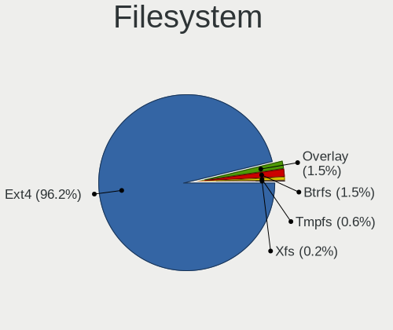
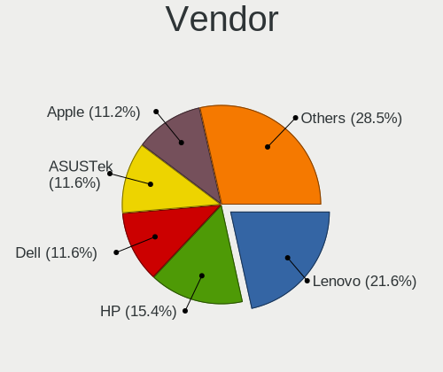
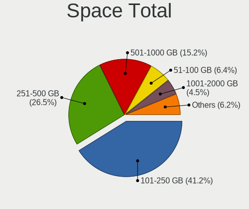
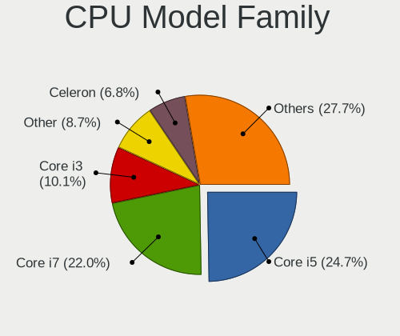

Elementary 6.1 - Tested Hardware & Statistics (Notebooks)
---------------------------------------------------------

A project to collect tested hardware configurations for Elementary 6.1.

Anyone can contribute to this report by the [hw-probe](https://github.com/linuxhw/hw-probe) tool:

    sudo -E hw-probe -all -upload

Please submit a probe of your configuration if it's not presented on the page or is rare.

Full-feature report is available here: https://linux-hardware.org/?view=trends

Contents
--------

* [ Test Cases ](#test-cases)

* [ System ](#system)
  - [ Kernel                   ](#kernel)
  - [ Kernel Family            ](#kernel-family)
  - [ Kernel Major Ver.        ](#kernel-major-ver)
  - [ Arch                     ](#arch)
  - [ DE                       ](#de)
  - [ Display Server           ](#display-server)
  - [ Display Manager          ](#display-manager)
  - [ OS Lang                  ](#os-lang)
  - [ Boot Mode                ](#boot-mode)
  - [ Filesystem               ](#filesystem)
  - [ Part. scheme             ](#part-scheme)
  - [ Dual Boot with Linux/BSD ](#dual-boot-with-linuxbsd)
  - [ Dual Boot (Win)          ](#dual-boot-win)

* [ Board ](#board)
  - [ Vendor                   ](#vendor)
  - [ Model                    ](#model)
  - [ Model Family             ](#model-family)
  - [ MFG Year                 ](#mfg-year)
  - [ Form Factor              ](#form-factor)
  - [ Secure Boot              ](#secure-boot)
  - [ Coreboot                 ](#coreboot)
  - [ RAM Size                 ](#ram-size)
  - [ RAM Used                 ](#ram-used)
  - [ Total Drives             ](#total-drives)
  - [ Has CD-ROM               ](#has-cd-rom)
  - [ Has Ethernet             ](#has-ethernet)
  - [ Has WiFi                 ](#has-wifi)
  - [ Has Bluetooth            ](#has-bluetooth)

* [ Location ](#location)
  - [ Country                  ](#country)
  - [ City                     ](#city)

* [ Drives ](#drives)
  - [ Drive Vendor             ](#drive-vendor)
  - [ Drive Model              ](#drive-model)
  - [ HDD Vendor               ](#hdd-vendor)
  - [ SSD Vendor               ](#ssd-vendor)
  - [ Drive Kind               ](#drive-kind)
  - [ Drive Connector          ](#drive-connector)
  - [ Drive Size               ](#drive-size)
  - [ Space Total              ](#space-total)
  - [ Space Used               ](#space-used)
  - [ Malfunc. Drives          ](#malfunc-drives)
  - [ Malfunc. Drive Vendor    ](#malfunc-drive-vendor)
  - [ Malfunc. HDD Vendor      ](#malfunc-hdd-vendor)
  - [ Malfunc. Drive Kind      ](#malfunc-drive-kind)
  - [ Failed Drives            ](#failed-drives)
  - [ Failed Drive Vendor      ](#failed-drive-vendor)
  - [ Drive Status             ](#drive-status)

* [ Storage controller ](#storage-controller)
  - [ Storage Vendor           ](#storage-vendor)
  - [ Storage Model            ](#storage-model)
  - [ Storage Kind             ](#storage-kind)

* [ Processor ](#processor)
  - [ CPU Vendor               ](#cpu-vendor)
  - [ CPU Model                ](#cpu-model)
  - [ CPU Model Family         ](#cpu-model-family)
  - [ CPU Cores                ](#cpu-cores)
  - [ CPU Sockets              ](#cpu-sockets)
  - [ CPU Threads              ](#cpu-threads)
  - [ CPU Op-Modes             ](#cpu-op-modes)
  - [ CPU Microcode            ](#cpu-microcode)
  - [ CPU Microarch            ](#cpu-microarch)

* [ Graphics ](#graphics)
  - [ GPU Vendor               ](#gpu-vendor)
  - [ GPU Model                ](#gpu-model)
  - [ GPU Combo                ](#gpu-combo)
  - [ GPU Driver               ](#gpu-driver)
  - [ GPU Memory               ](#gpu-memory)

* [ Monitor ](#monitor)
  - [ Monitor Vendor           ](#monitor-vendor)
  - [ Monitor Model            ](#monitor-model)
  - [ Monitor Resolution       ](#monitor-resolution)
  - [ Monitor Diagonal         ](#monitor-diagonal)
  - [ Monitor Width            ](#monitor-width)
  - [ Aspect Ratio             ](#aspect-ratio)
  - [ Monitor Area             ](#monitor-area)
  - [ Pixel Density            ](#pixel-density)
  - [ Multiple Monitors        ](#multiple-monitors)

* [ Network ](#network)
  - [ Net Controller Vendor    ](#net-controller-vendor)
  - [ Net Controller Model     ](#net-controller-model)
  - [ Wireless Vendor          ](#wireless-vendor)
  - [ Wireless Model           ](#wireless-model)
  - [ Ethernet Vendor          ](#ethernet-vendor)
  - [ Ethernet Model           ](#ethernet-model)
  - [ Net Controller Kind      ](#net-controller-kind)
  - [ Used Controller          ](#used-controller)
  - [ NICs                     ](#nics)
  - [ IPv6                     ](#ipv6)

* [ Bluetooth ](#bluetooth)
  - [ Bluetooth Vendor         ](#bluetooth-vendor)
  - [ Bluetooth Model          ](#bluetooth-model)

* [ Sound ](#sound)
  - [ Sound Vendor             ](#sound-vendor)
  - [ Sound Model              ](#sound-model)

* [ Memory ](#memory)
  - [ Memory Vendor            ](#memory-vendor)
  - [ Memory Model             ](#memory-model)
  - [ Memory Kind              ](#memory-kind)
  - [ Memory Form Factor       ](#memory-form-factor)
  - [ Memory Size              ](#memory-size)
  - [ Memory Speed             ](#memory-speed)

* [ Printers & scanners ](#printers--scanners)
  - [ Printer Vendor           ](#printer-vendor)
  - [ Printer Model            ](#printer-model)
  - [ Scanner Vendor           ](#scanner-vendor)
  - [ Scanner Model            ](#scanner-model)

* [ Camera ](#camera)
  - [ Camera Vendor            ](#camera-vendor)
  - [ Camera Model             ](#camera-model)

* [ Security ](#security)
  - [ Fingerprint Vendor       ](#fingerprint-vendor)
  - [ Fingerprint Model        ](#fingerprint-model)
  - [ Chipcard Vendor          ](#chipcard-vendor)
  - [ Chipcard Model           ](#chipcard-model)

* [ Unsupported ](#unsupported)
  - [ Unsupported Devices      ](#unsupported-devices)
  - [ Unsupported Device Types ](#unsupported-device-types)

Test Cases
----------

| Vendor        | Model                       | Probe                                                      | Date         |
|---------------|-----------------------------|------------------------------------------------------------|--------------|
| HP            | ProBook 450 G7              | [a73f7ae919](https://linux-hardware.org/?probe=a73f7ae919) | Feb 28, 2022 |
| ASUSTek       | VivoBook_ASUSLaptop X510... | [d7b815d3d6](https://linux-hardware.org/?probe=d7b815d3d6) | Feb 27, 2022 |
| Samsung       | 870Z5E/880Z5E/680Z5E        | [d04715f0dc](https://linux-hardware.org/?probe=d04715f0dc) | Feb 26, 2022 |
| HP            | Laptop 17-by0xxx            | [745fa98d2e](https://linux-hardware.org/?probe=745fa98d2e) | Feb 26, 2022 |
| Acer          | Aspire A315-42G             | [75830af7ff](https://linux-hardware.org/?probe=75830af7ff) | Feb 25, 2022 |
| ASUSTek       | K50IJ                       | [97284dc322](https://linux-hardware.org/?probe=97284dc322) | Feb 25, 2022 |
| HP            | EliteBook 840 G1            | [a8b2cacac9](https://linux-hardware.org/?probe=a8b2cacac9) | Feb 25, 2022 |
| HP            | Pavilion Laptop 15-cd0xx    | [eeaed94df7](https://linux-hardware.org/?probe=eeaed94df7) | Feb 23, 2022 |
| Dell          | Inspiron N5050              | [88c13620a2](https://linux-hardware.org/?probe=88c13620a2) | Feb 23, 2022 |
| ASUSTek       | ZenBook UX325EA_UX325EA     | [7a8aaaa5a6](https://linux-hardware.org/?probe=7a8aaaa5a6) | Feb 23, 2022 |
| ASUSTek       | ZenBook UX325EA_UX325EA     | [849ceb3653](https://linux-hardware.org/?probe=849ceb3653) | Feb 23, 2022 |
| MSI           | Modern 14 B4MW              | [1527f67c84](https://linux-hardware.org/?probe=1527f67c84) | Feb 23, 2022 |
| Samsung       | 500R4K/500R5H/5400RK/501... | [1391579931](https://linux-hardware.org/?probe=1391579931) | Feb 21, 2022 |
| ASUSTek       | GL753VE                     | [25f1ab36fc](https://linux-hardware.org/?probe=25f1ab36fc) | Feb 20, 2022 |
| Apple         | MacBookAir3,1               | [48dcaa8622](https://linux-hardware.org/?probe=48dcaa8622) | Feb 20, 2022 |
| ASUSTek       | E402SA                      | [b9796e46de](https://linux-hardware.org/?probe=b9796e46de) | Feb 20, 2022 |
| Apple         | MacBook5,1                  | [3503d61993](https://linux-hardware.org/?probe=3503d61993) | Feb 19, 2022 |
| HP            | Pavilion Laptop 14-ce0xx... | [44210b95fe](https://linux-hardware.org/?probe=44210b95fe) | Feb 19, 2022 |
| Lenovo        | IdeaPad 5 15ARE05 81YQ      | [da54df3fd4](https://linux-hardware.org/?probe=da54df3fd4) | Feb 19, 2022 |
| Lenovo        | IdeaPad 5 15ARE05 81YQ      | [05cb921db2](https://linux-hardware.org/?probe=05cb921db2) | Feb 19, 2022 |
| MSI           | Modern 14 B10MW             | [beb5ff195a](https://linux-hardware.org/?probe=beb5ff195a) | Feb 18, 2022 |
| Packard Be... | EasyNote LS11HR             | [d8b9f8edb0](https://linux-hardware.org/?probe=d8b9f8edb0) | Feb 17, 2022 |
| HP            | EliteBook 8460p             | [03dfc41744](https://linux-hardware.org/?probe=03dfc41744) | Feb 16, 2022 |
| Lenovo        | ThinkPad T470 20JNS08H00    | [f97643f94c](https://linux-hardware.org/?probe=f97643f94c) | Feb 16, 2022 |
| Acer          | Aspire A315-35              | [9986615814](https://linux-hardware.org/?probe=9986615814) | Feb 15, 2022 |
| Acer          | Swift SF314-56              | [a6c7102b14](https://linux-hardware.org/?probe=a6c7102b14) | Feb 14, 2022 |
| ASUSTek       | X540SA                      | [eba09c169c](https://linux-hardware.org/?probe=eba09c169c) | Feb 13, 2022 |
| HUAWEI        | MACHD-WXX9                  | [45c9189643](https://linux-hardware.org/?probe=45c9189643) | Feb 13, 2022 |
| ASUSTek       | E402NA                      | [ec217b7bd1](https://linux-hardware.org/?probe=ec217b7bd1) | Feb 13, 2022 |
| Dell          | Precision 7720              | [e5c37c787f](https://linux-hardware.org/?probe=e5c37c787f) | Feb 13, 2022 |
| Google        | Lulu                        | [5b81b703ea](https://linux-hardware.org/?probe=5b81b703ea) | Feb 13, 2022 |
| Sony          | SVE15115EN                  | [facd08033e](https://linux-hardware.org/?probe=facd08033e) | Feb 12, 2022 |
| ASUSTek       | X550CA                      | [4fc3af48e2](https://linux-hardware.org/?probe=4fc3af48e2) | Feb 12, 2022 |
| HP            | ProBook 640 G1              | [1aeb3957c5](https://linux-hardware.org/?probe=1aeb3957c5) | Feb 12, 2022 |
| HP            | 255 G8 Notebook PC          | [aac284c4db](https://linux-hardware.org/?probe=aac284c4db) | Feb 12, 2022 |
| Dell          | Inspiron 1764               | [3b22e2edbb](https://linux-hardware.org/?probe=3b22e2edbb) | Feb 11, 2022 |
| LG Electro... | A410-G.BC51P1               | [0caedcc26b](https://linux-hardware.org/?probe=0caedcc26b) | Feb 11, 2022 |
| Apple         | MacBookAir7,1               | [39d4765770](https://linux-hardware.org/?probe=39d4765770) | Feb 11, 2022 |
| Apple         | MacBookAir4,2               | [113add3cba](https://linux-hardware.org/?probe=113add3cba) | Feb 10, 2022 |
| Apple         | MacBookAir4,2               | [accb1d4232](https://linux-hardware.org/?probe=accb1d4232) | Feb 09, 2022 |
| Timi          | TM1613                      | [737c2fcb2f](https://linux-hardware.org/?probe=737c2fcb2f) | Feb 09, 2022 |
| Lenovo        | ThinkPad T440p 20AN006NU... | [d4fccf53c8](https://linux-hardware.org/?probe=d4fccf53c8) | Feb 07, 2022 |
| ASUSTek       | VivoBook_ASUSLaptop X409... | [87954474ed](https://linux-hardware.org/?probe=87954474ed) | Feb 07, 2022 |
| Apple         | MacBook5,1                  | [baa251b3db](https://linux-hardware.org/?probe=baa251b3db) | Feb 07, 2022 |
| Lenovo        | ThinkPad E550 20DF0040US    | [ca4c420e00](https://linux-hardware.org/?probe=ca4c420e00) | Feb 07, 2022 |
| Apple         | MacBookPro6,2               | [b298d77ce8](https://linux-hardware.org/?probe=b298d77ce8) | Feb 06, 2022 |
| Timi          | TM1613                      | [8d16a0555c](https://linux-hardware.org/?probe=8d16a0555c) | Feb 06, 2022 |
| Acer          | Aspire V5-573PG             | [0edb115ff8](https://linux-hardware.org/?probe=0edb115ff8) | Feb 05, 2022 |
| Acer          | Aspire V5-573PG             | [68595aad84](https://linux-hardware.org/?probe=68595aad84) | Feb 05, 2022 |
| Lenovo        | G550 2958                   | [e23451d062](https://linux-hardware.org/?probe=e23451d062) | Feb 05, 2022 |
| Lenovo        | G550 2958                   | [a933b9c8f4](https://linux-hardware.org/?probe=a933b9c8f4) | Feb 05, 2022 |
| HUAWEI        | HVY-WXX9                    | [7b1b45a8ed](https://linux-hardware.org/?probe=7b1b45a8ed) | Feb 05, 2022 |
| HP            | 240 G4                      | [9e7ffa0cf2](https://linux-hardware.org/?probe=9e7ffa0cf2) | Feb 04, 2022 |
| Dell          | Inspiron 15-3567            | [7e21d67fa5](https://linux-hardware.org/?probe=7e21d67fa5) | Feb 03, 2022 |
| Lenovo        | ThinkPad P14s Gen 1 20Y1... | [1837325ca2](https://linux-hardware.org/?probe=1837325ca2) | Feb 03, 2022 |
| ASUSTek       | K95VJ                       | [ebff9950e3](https://linux-hardware.org/?probe=ebff9950e3) | Feb 02, 2022 |
| Apple         | MacBookAir6,2               | [7b7a2f85e0](https://linux-hardware.org/?probe=7b7a2f85e0) | Feb 02, 2022 |
| Acer          | Aspire S3-391               | [87788239d2](https://linux-hardware.org/?probe=87788239d2) | Feb 02, 2022 |
| Lenovo        | ThinkPad X1 Carbon 6th 2... | [2a4563231b](https://linux-hardware.org/?probe=2a4563231b) | Feb 02, 2022 |
| Toshiba       | Satellite L850D-BJS         | [d3897cf605](https://linux-hardware.org/?probe=d3897cf605) | Feb 02, 2022 |
| HP            | Pavilion 13 x360 PC         | [d2bcb368c1](https://linux-hardware.org/?probe=d2bcb368c1) | Feb 02, 2022 |
| PIPO          | Cherry Trail CR             | [eb92e7ef7f](https://linux-hardware.org/?probe=eb92e7ef7f) | Feb 01, 2022 |
| Acer          | Swift SF114-32              | [1a0b7da0df](https://linux-hardware.org/?probe=1a0b7da0df) | Feb 01, 2022 |
| Acer          | Swift SF114-32              | [ce9e5f5d44](https://linux-hardware.org/?probe=ce9e5f5d44) | Feb 01, 2022 |
| Lenovo        | IdeaPad 330-15ARR 81D2      | [b86eb71aa1](https://linux-hardware.org/?probe=b86eb71aa1) | Jan 31, 2022 |
| Lenovo        | ThinkPad X270 W10DG 20K5... | [1f2faf4487](https://linux-hardware.org/?probe=1f2faf4487) | Jan 31, 2022 |
| Lenovo        | ThinkPad X270 W10DG 20K5... | [03cb9013e4](https://linux-hardware.org/?probe=03cb9013e4) | Jan 31, 2022 |
| Apple         | MacBookPro5,5               | [34a7deb292](https://linux-hardware.org/?probe=34a7deb292) | Jan 30, 2022 |
| Apple         | MacBookPro5,5               | [add488b5fe](https://linux-hardware.org/?probe=add488b5fe) | Jan 30, 2022 |
| HP            | Elite x2 1012 G1            | [13b478195a](https://linux-hardware.org/?probe=13b478195a) | Jan 30, 2022 |
| Lenovo        | IdeaPad Gaming 3 15IMH05... | [479381fba6](https://linux-hardware.org/?probe=479381fba6) | Jan 29, 2022 |
| Acer          | Swift SF314-59              | [697f73bc7c](https://linux-hardware.org/?probe=697f73bc7c) | Jan 29, 2022 |
| Lenovo        | IdeaPad 130-15AST 81H5      | [7ab82cc23a](https://linux-hardware.org/?probe=7ab82cc23a) | Jan 29, 2022 |
| Lenovo        | IdeaPad 130-15AST 81H5      | [a015de4156](https://linux-hardware.org/?probe=a015de4156) | Jan 29, 2022 |
| Apple         | MacBookPro9,1               | [857a74feaa](https://linux-hardware.org/?probe=857a74feaa) | Jan 28, 2022 |
| ASUSTek       | X550CA                      | [81cfc7fba7](https://linux-hardware.org/?probe=81cfc7fba7) | Jan 28, 2022 |
| HUAWEI        | NBLK-WAX9X                  | [61d5b0014e](https://linux-hardware.org/?probe=61d5b0014e) | Jan 28, 2022 |
| Acer          | Aspire E5-571G              | [a29ec0cc55](https://linux-hardware.org/?probe=a29ec0cc55) | Jan 28, 2022 |
| Razer         | Blade Stealth               | [6a4fbb1374](https://linux-hardware.org/?probe=6a4fbb1374) | Jan 27, 2022 |
| ASUSTek       | X555LN                      | [8c1e438e47](https://linux-hardware.org/?probe=8c1e438e47) | Jan 26, 2022 |
| Apple         | MacBookAir1,1               | [dfbdc8f20b](https://linux-hardware.org/?probe=dfbdc8f20b) | Jan 25, 2022 |
| HP            | Laptop 15-ef2xxx            | [8394958e0e](https://linux-hardware.org/?probe=8394958e0e) | Jan 25, 2022 |
| Lenovo        | G550 20023                  | [9432cdb859](https://linux-hardware.org/?probe=9432cdb859) | Jan 24, 2022 |
| Apple         | MacBook5,1                  | [79cf3b66a3](https://linux-hardware.org/?probe=79cf3b66a3) | Jan 24, 2022 |
| Lenovo        | G550 2958                   | [fd2872d2d8](https://linux-hardware.org/?probe=fd2872d2d8) | Jan 24, 2022 |
| Apple         | MacBookPro8,2               | [d1e0923b7a](https://linux-hardware.org/?probe=d1e0923b7a) | Jan 24, 2022 |
| HP            | EliteBook Folio 1040 G2     | [4e3ef7a5a7](https://linux-hardware.org/?probe=4e3ef7a5a7) | Jan 23, 2022 |
| HP            | EliteBook 840 G1            | [37e7b98af1](https://linux-hardware.org/?probe=37e7b98af1) | Jan 23, 2022 |
| Apple         | MacBookPro9,2               | [a5a4652304](https://linux-hardware.org/?probe=a5a4652304) | Jan 23, 2022 |
| ASUSTek       | ZenBook UX425UG_Q408UG      | [92991c028e](https://linux-hardware.org/?probe=92991c028e) | Jan 22, 2022 |
| Apple         | MacBookPro8,3               | [fb5a640b14](https://linux-hardware.org/?probe=fb5a640b14) | Jan 22, 2022 |
| Lenovo        | ThinkPad T470 20JNS08H00    | [5007cce576](https://linux-hardware.org/?probe=5007cce576) | Jan 21, 2022 |
| HP            | Pavilion Laptop 15-eh0xx... | [db0cc3978c](https://linux-hardware.org/?probe=db0cc3978c) | Jan 21, 2022 |
| ASUSTek       | VivoBook_ASUSLaptop X512... | [7fd85b85b8](https://linux-hardware.org/?probe=7fd85b85b8) | Jan 21, 2022 |
| ASUSTek       | VivoBook_ASUSLaptop X512... | [2c01bf53cb](https://linux-hardware.org/?probe=2c01bf53cb) | Jan 21, 2022 |
| Dell          | Vostro 3500                 | [3bf6b408ee](https://linux-hardware.org/?probe=3bf6b408ee) | Jan 21, 2022 |
| Fujitsu       | LIFEBOOK S760               | [f2de9fb609](https://linux-hardware.org/?probe=f2de9fb609) | Jan 20, 2022 |
| Fujitsu       | LIFEBOOK S760               | [0fdf944115](https://linux-hardware.org/?probe=0fdf944115) | Jan 20, 2022 |
| Apple         | MacBookPro11,5              | [0a8fb964eb](https://linux-hardware.org/?probe=0a8fb964eb) | Jan 20, 2022 |
| HP            | ProBook 4540s               | [16794fee23](https://linux-hardware.org/?probe=16794fee23) | Jan 20, 2022 |
| ASUSTek       | VivoBook_ASUSLaptop X513... | [3dd4035494](https://linux-hardware.org/?probe=3dd4035494) | Jan 19, 2022 |
| HUAWEI        | MACHD-WXX9                  | [df4c38dba6](https://linux-hardware.org/?probe=df4c38dba6) | Jan 19, 2022 |
| Lenovo        | IdeaPad 5 14ARE05 81YM      | [3088724103](https://linux-hardware.org/?probe=3088724103) | Jan 19, 2022 |
| ASUSTek       | VivoBook_ASUSLaptop X513... | [377afa98c8](https://linux-hardware.org/?probe=377afa98c8) | Jan 19, 2022 |
| Dell          | Vostro 15 3515              | [a0fdaf761c](https://linux-hardware.org/?probe=a0fdaf761c) | Jan 17, 2022 |
| ASUSTek       | X555LN                      | [f7c8c966dc](https://linux-hardware.org/?probe=f7c8c966dc) | Jan 17, 2022 |
| Apple         | MacBookPro8,2               | [744cfeb340](https://linux-hardware.org/?probe=744cfeb340) | Jan 17, 2022 |
| ASUSTek       | X555LN                      | [6fba3bb5aa](https://linux-hardware.org/?probe=6fba3bb5aa) | Jan 17, 2022 |
| Dell          | Latitude E5400              | [1303d72d3b](https://linux-hardware.org/?probe=1303d72d3b) | Jan 17, 2022 |
| Acer          | Swift SF315-52              | [1a6e0815fc](https://linux-hardware.org/?probe=1a6e0815fc) | Jan 16, 2022 |
| Lenovo        | ThinkPad T430 2347JC2       | [cac66153bc](https://linux-hardware.org/?probe=cac66153bc) | Jan 16, 2022 |
| ASUSTek       | X541NA                      | [89459685e9](https://linux-hardware.org/?probe=89459685e9) | Jan 16, 2022 |
| ASUSTek       | VivoBook_ASUSLaptop X513... | [5248d37c26](https://linux-hardware.org/?probe=5248d37c26) | Jan 15, 2022 |
| ASUSTek       | ZenBook UX425EA_UX425EA     | [ff75719a4e](https://linux-hardware.org/?probe=ff75719a4e) | Jan 15, 2022 |
| HP            | ProBook 4430s               | [e2103ef2d8](https://linux-hardware.org/?probe=e2103ef2d8) | Jan 14, 2022 |
| HUAWEI        | MACHD-WXX9                  | [fae944592d](https://linux-hardware.org/?probe=fae944592d) | Jan 14, 2022 |
| HUAWEI        | MACHD-WXX9                  | [ebdb392f57](https://linux-hardware.org/?probe=ebdb392f57) | Jan 14, 2022 |
| Lenovo        | IdeaPad 310-15IKB 80TV      | [d8c919f740](https://linux-hardware.org/?probe=d8c919f740) | Jan 12, 2022 |
| Apple         | MacBook3,1                  | [c670d007f3](https://linux-hardware.org/?probe=c670d007f3) | Jan 11, 2022 |
| HP            | Pavilion Laptop 15-eh0xx... | [66d12682ac](https://linux-hardware.org/?probe=66d12682ac) | Jan 10, 2022 |
| Apple         | MacBook5,1                  | [6a8c354065](https://linux-hardware.org/?probe=6a8c354065) | Jan 10, 2022 |
| Lenovo        | ThinkPad E14 20RAS0EQ00     | [ea22270511](https://linux-hardware.org/?probe=ea22270511) | Jan 09, 2022 |
| Lenovo        | G50-80 80E5                 | [9d29b20f2d](https://linux-hardware.org/?probe=9d29b20f2d) | Jan 08, 2022 |
| HUAWEI        | MACHD-WXX9                  | [72b280602e](https://linux-hardware.org/?probe=72b280602e) | Jan 07, 2022 |
| Sony          | VPCEA3S1E                   | [670b7a5d31](https://linux-hardware.org/?probe=670b7a5d31) | Jan 07, 2022 |
| Star Labs     | StarBook                    | [bd2b8ba939](https://linux-hardware.org/?probe=bd2b8ba939) | Jan 06, 2022 |
| Apple         | MacBookPro16,1              | [864ecfe029](https://linux-hardware.org/?probe=864ecfe029) | Jan 06, 2022 |
| Notebook      | W65_67SJ                    | [606e2587dd](https://linux-hardware.org/?probe=606e2587dd) | Jan 06, 2022 |
| Lenovo        | ThinkPad X1 Carbon Gen 9... | [590907f437](https://linux-hardware.org/?probe=590907f437) | Jan 06, 2022 |
| MSI           | GF63 Thin 9SCSR             | [21f2a5e1b9](https://linux-hardware.org/?probe=21f2a5e1b9) | Jan 05, 2022 |
| Apple         | MacBookPro5,5               | [a03baba93d](https://linux-hardware.org/?probe=a03baba93d) | Jan 05, 2022 |
| Lenovo        | ThinkPad T470 W10DG 20JN... | [fbb0e6d1d5](https://linux-hardware.org/?probe=fbb0e6d1d5) | Jan 05, 2022 |
| Lenovo        | Legion Y530-15ICH 81FV      | [6eab59bbbf](https://linux-hardware.org/?probe=6eab59bbbf) | Jan 05, 2022 |
| Lenovo        | ThinkPad X1 Carbon 6th 2... | [5496b24a51](https://linux-hardware.org/?probe=5496b24a51) | Jan 05, 2022 |
| Samsung       | 900X3C/900X3D/900X3E/900... | [520ced18c4](https://linux-hardware.org/?probe=520ced18c4) | Jan 05, 2022 |
| HP            | Laptop 15s-eq1xxx           | [ae2f1bc63c](https://linux-hardware.org/?probe=ae2f1bc63c) | Jan 05, 2022 |
| HUAWEI        | MACHC-WAX9                  | [b0df1464a1](https://linux-hardware.org/?probe=b0df1464a1) | Jan 05, 2022 |
| Sony          | SVE14A390X                  | [3b11d123cf](https://linux-hardware.org/?probe=3b11d123cf) | Jan 04, 2022 |
| HP            | ProBook 4430s               | [aafb807fc2](https://linux-hardware.org/?probe=aafb807fc2) | Jan 04, 2022 |
| HP            | ProBook 4430s               | [f534b0dd91](https://linux-hardware.org/?probe=f534b0dd91) | Jan 04, 2022 |
| Lenovo        | ThinkPad W541 20EGS1VV00    | [5d88eb323c](https://linux-hardware.org/?probe=5d88eb323c) | Jan 04, 2022 |
| Apple         | MacBookPro9,2               | [a1c3f24aab](https://linux-hardware.org/?probe=a1c3f24aab) | Jan 04, 2022 |
| Lenovo        | ThinkPad P14s Gen 1 20Y1... | [71e992725f](https://linux-hardware.org/?probe=71e992725f) | Jan 04, 2022 |
| Lenovo        | ThinkPad P14s Gen 1 20Y1... | [8087320623](https://linux-hardware.org/?probe=8087320623) | Jan 04, 2022 |
| Lenovo        | Yoga 300-11IBR 80M1         | [b18501f890](https://linux-hardware.org/?probe=b18501f890) | Jan 04, 2022 |
| Star Labs     | LabTop                      | [043cd26c60](https://linux-hardware.org/?probe=043cd26c60) | Jan 04, 2022 |
| HUAWEI        | KPL-W0X                     | [9d633f7bdb](https://linux-hardware.org/?probe=9d633f7bdb) | Jan 04, 2022 |
| Lenovo        | ThinkPad E495 20NE001RTX    | [79e95e3cb6](https://linux-hardware.org/?probe=79e95e3cb6) | Jan 04, 2022 |
| Dell          | Precision 5530              | [b385c0a16e](https://linux-hardware.org/?probe=b385c0a16e) | Jan 04, 2022 |
| Lenovo        | IdeaPad 310-15ISK 80SM      | [023df04f60](https://linux-hardware.org/?probe=023df04f60) | Jan 04, 2022 |
| Monster       | ABRA A5 V13.2               | [6d8d622050](https://linux-hardware.org/?probe=6d8d622050) | Jan 04, 2022 |
| MSI           | PS63 Modern 8RD             | [1cd435c54f](https://linux-hardware.org/?probe=1cd435c54f) | Jan 04, 2022 |
| Lenovo        | Legion Y530-15ICH 81GT      | [c694c358f9](https://linux-hardware.org/?probe=c694c358f9) | Jan 04, 2022 |
| Lenovo        | ThinkPad X13 Gen 1 20UFS... | [c61ed9ea15](https://linux-hardware.org/?probe=c61ed9ea15) | Jan 04, 2022 |
| HUAWEI        | KPL-W0X                     | [1015862a37](https://linux-hardware.org/?probe=1015862a37) | Jan 04, 2022 |
| Timi          | TM1613                      | [6761bd1e12](https://linux-hardware.org/?probe=6761bd1e12) | Jan 04, 2022 |
| ASUSTek       | E202SA                      | [d721e131f4](https://linux-hardware.org/?probe=d721e131f4) | Jan 02, 2022 |
| Lenovo        | ThinkPad T470 W10DG 20JN... | [440d6a1b59](https://linux-hardware.org/?probe=440d6a1b59) | Jan 02, 2022 |
| Apple         | MacBookPro5,1               | [6c7a3affdb](https://linux-hardware.org/?probe=6c7a3affdb) | Jan 02, 2022 |
| Dell          | Vostro 15 3515              | [45b6bf0410](https://linux-hardware.org/?probe=45b6bf0410) | Jan 01, 2022 |
| HP            | Pavilion Laptop 15-cs0xx... | [fb332a2529](https://linux-hardware.org/?probe=fb332a2529) | Jan 01, 2022 |
| Acer          | Aspire A315-42              | [d44b06ec61](https://linux-hardware.org/?probe=d44b06ec61) | Jan 01, 2022 |
| HP            | EliteBook 8460p             | [f215102713](https://linux-hardware.org/?probe=f215102713) | Dec 31, 2021 |
| Notebook      | P65xHP                      | [37db5af302](https://linux-hardware.org/?probe=37db5af302) | Dec 31, 2021 |
| HP            | EliteBook 8460p             | [e060f00ff8](https://linux-hardware.org/?probe=e060f00ff8) | Dec 31, 2021 |
| Notebook      | P65xHP                      | [fc81fedcf3](https://linux-hardware.org/?probe=fc81fedcf3) | Dec 31, 2021 |
| Teclast       | F7                          | [44bba02dee](https://linux-hardware.org/?probe=44bba02dee) | Dec 31, 2021 |
| Wortmann      | 1220729_1470271             | [018071ac3e](https://linux-hardware.org/?probe=018071ac3e) | Dec 30, 2021 |
| Acer          | Aspire 7750G                | [3a24dba335](https://linux-hardware.org/?probe=3a24dba335) | Dec 28, 2021 |
| Acer          | Aspire 7750G                | [516cb4e250](https://linux-hardware.org/?probe=516cb4e250) | Dec 28, 2021 |
| ASUSTek       | X555UB                      | [e0844450ac](https://linux-hardware.org/?probe=e0844450ac) | Dec 28, 2021 |
| Dell          | Latitude 3580               | [f243f4c09e](https://linux-hardware.org/?probe=f243f4c09e) | Dec 27, 2021 |
| Lenovo        | ThinkPad T430 23501M2       | [2645817d64](https://linux-hardware.org/?probe=2645817d64) | Dec 26, 2021 |
| HP            | EliteBook 850 G2            | [a71c970cbf](https://linux-hardware.org/?probe=a71c970cbf) | Dec 25, 2021 |
| Apple         | MacBookAir7,2               | [99bea5df6c](https://linux-hardware.org/?probe=99bea5df6c) | Dec 25, 2021 |
| Lenovo        | IdeaPad 320-14AST 80XU      | [80c8feb8bf](https://linux-hardware.org/?probe=80c8feb8bf) | Dec 25, 2021 |
| Dell          | Inspiron N5050              | [211b723554](https://linux-hardware.org/?probe=211b723554) | Dec 24, 2021 |
| LG Electro... | A410-G.BC51P1               | [b231405a63](https://linux-hardware.org/?probe=b231405a63) | Dec 24, 2021 |
| Acer          | TravelMate 5760             | [71526c7767](https://linux-hardware.org/?probe=71526c7767) | Dec 23, 2021 |
| Lenovo        | Flex 2-14D 20376            | [d950a63316](https://linux-hardware.org/?probe=d950a63316) | Dec 23, 2021 |
| Dell          | Inspiron 3542               | [277f97ef07](https://linux-hardware.org/?probe=277f97ef07) | Dec 23, 2021 |
| Dell          | XPS 13 9343                 | [dfbdb618f1](https://linux-hardware.org/?probe=dfbdb618f1) | Dec 23, 2021 |
| ASUSTek       | VivoBook_ASUSLaptop X512... | [f74c2da103](https://linux-hardware.org/?probe=f74c2da103) | Dec 22, 2021 |
| Dell          | Precision M3800             | [ed44d9ac8c](https://linux-hardware.org/?probe=ed44d9ac8c) | Dec 21, 2021 |
| Apple         | MacBookAir6,1               | [b2e3490378](https://linux-hardware.org/?probe=b2e3490378) | Dec 21, 2021 |
| Dell          | Precision M6500             | [931f365c60](https://linux-hardware.org/?probe=931f365c60) | Dec 20, 2021 |
| Dell          | Inspiron 5555               | [09d45f017d](https://linux-hardware.org/?probe=09d45f017d) | Dec 18, 2021 |
| Lenovo        | V14-ADA 82C6                | [a45f76da28](https://linux-hardware.org/?probe=a45f76da28) | Dec 17, 2021 |
| ASUSTek       | UX410UAK                    | [39dcbe0f57](https://linux-hardware.org/?probe=39dcbe0f57) | Dec 17, 2021 |
| Monster       | MARKUT M7 V1.x              | [2d2ed2143e](https://linux-hardware.org/?probe=2d2ed2143e) | Dec 17, 2021 |
| Monster       | MARKUT M7 V1.x              | [2390550c49](https://linux-hardware.org/?probe=2390550c49) | Dec 15, 2021 |
| Apple         | MacBook4,1                  | [661e7dae0c](https://linux-hardware.org/?probe=661e7dae0c) | Dec 15, 2021 |
| Apple         | MacBook4,1                  | [b682cee818](https://linux-hardware.org/?probe=b682cee818) | Dec 15, 2021 |
| Apple         | MacBook5,2                  | [5dcbdab7ca](https://linux-hardware.org/?probe=5dcbdab7ca) | Dec 15, 2021 |

System
------

Kernel
------

Version of the Linux kernel

| Version                | Notebooks | Percent |
|------------------------|-----------|---------|
| 5.11.0-43-generic      | 52        | 32.7%   |
| 5.13.0-28-generic      | 32        | 20.13%  |
| 5.13.0-27-generic      | 24        | 15.09%  |
| 5.13.0-30-generic      | 14        | 8.81%   |
| 5.11.0-44-generic      | 13        | 8.18%   |
| 5.11.0-46-generic      | 10        | 6.29%   |
| 5.11.0-41-generic      | 4         | 2.52%   |
| 5.8.0-50-generic       | 1         | 0.63%   |
| 5.16.10-051610-generic | 1         | 0.63%   |
| 5.15.3-xanmod1         | 1         | 0.63%   |
| 5.15.13-xanmod1        | 1         | 0.63%   |
| 5.15.12-xanmod1-tt     | 1         | 0.63%   |
| 5.15.11-t2-big-sur     | 1         | 0.63%   |
| 5.14.10-051410-generic | 1         | 0.63%   |
| 5.14.0-1011-oem        | 1         | 0.63%   |
| 5.13.0-25-generic      | 1         | 0.63%   |
| 5.11.0-40-generic      | 1         | 0.63%   |

Kernel Family
-------------

Linux kernel without a distro release

| Version | Notebooks | Percent |
|---------|-----------|---------|
| 5.11.0  | 80        | 50.96%  |
| 5.13.0  | 69        | 43.95%  |
| 5.8.0   | 1         | 0.64%   |
| 5.16.10 | 1         | 0.64%   |
| 5.15.3  | 1         | 0.64%   |
| 5.15.13 | 1         | 0.64%   |
| 5.15.12 | 1         | 0.64%   |
| 5.15.11 | 1         | 0.64%   |
| 5.14.10 | 1         | 0.64%   |
| 5.14.0  | 1         | 0.64%   |

Kernel Major Ver.
-----------------

Linux kernel major version

| Version | Notebooks | Percent |
|---------|-----------|---------|
| 5.11    | 80        | 50.96%  |
| 5.13    | 69        | 43.95%  |
| 5.15    | 4         | 2.55%   |
| 5.14    | 2         | 1.27%   |
| 5.8     | 1         | 0.64%   |
| 5.16    | 1         | 0.64%   |

Arch
----

OS architecture (x86_64, i586, etc.)

| Name   | Notebooks | Percent |
|--------|-----------|---------|
| x86_64 | 156       | 100%    |

DE
--

Desktop Environment

| Name     | Notebooks | Percent |
|----------|-----------|---------|
| Pantheon | 156       | 100%    |

Display Server
--------------

X11 or Wayland

| Name | Notebooks | Percent |
|------|-----------|---------|
| X11  | 156       | 100%    |

Display Manager
---------------

SDDM, LightDM, etc.

| Name    | Notebooks | Percent |
|---------|-----------|---------|
| Unknown | 120       | 76.43%  |
| LightDM | 36        | 22.93%  |
| GDM     | 1         | 0.64%   |

OS Lang
-------

Language

| Lang  | Notebooks | Percent |
|-------|-----------|---------|
| en_US | 76        | 48.72%  |
| de_DE | 25        | 16.03%  |
| en_GB | 11        | 7.05%   |
| pt_BR | 7         | 4.49%   |
| es_ES | 7         | 4.49%   |
| ru_RU | 6         | 3.85%   |
| pl_PL | 5         | 3.21%   |
| it_IT | 5         | 3.21%   |
| fr_FR | 4         | 2.56%   |
| pt_PT | 3         | 1.92%   |
| nl_NL | 2         | 1.28%   |
| tr_TR | 1         | 0.64%   |
| hu_HU | 1         | 0.64%   |
| en_CA | 1         | 0.64%   |
| en_AU | 1         | 0.64%   |
| bg_BG | 1         | 0.64%   |

Boot Mode
---------

EFI or BIOS

| Mode | Notebooks | Percent |
|------|-----------|---------|
| EFI  | 114       | 73.08%  |
| BIOS | 42        | 26.92%  |

Filesystem
----------

Type of filesystem

| Type    | Notebooks | Percent |
|---------|-----------|---------|
| Ext4    | 152       | 97.44%  |
| Btrfs   | 3         | 1.92%   |
| Overlay | 1         | 0.64%   |

Part. scheme
------------

Scheme of partitioning

| Type    | Notebooks | Percent |
|---------|-----------|---------|
| Unknown | 126       | 80.25%  |
| GPT     | 27        | 17.2%   |
| MBR     | 4         | 2.55%   |

Dual Boot with Linux/BSD
------------------------

Hosting more than one Linux/BSD

| Dual boot | Notebooks | Percent |
|-----------|-----------|---------|
| No        | 151       | 96.79%  |
| Yes       | 5         | 3.21%   |

Dual Boot (Win)
---------------

Hosting Linux and Windows

| Dual boot | Notebooks | Percent |
|-----------|-----------|---------|
| No        | 144       | 92.31%  |
| Yes       | 12        | 7.69%   |

Board
-----

Vendor
------

Motherboard manufacturer

| Name                | Notebooks | Percent |
|---------------------|-----------|---------|
| Lenovo              | 31        | 19.87%  |
| Apple               | 24        | 15.38%  |
| ASUSTek Computer    | 21        | 13.46%  |
| Hewlett-Packard     | 20        | 12.82%  |
| Dell                | 15        | 9.62%   |
| Acer                | 12        | 7.69%   |
| HUAWEI              | 6         | 3.85%   |
| MSI                 | 4         | 2.56%   |
| Sony                | 3         | 1.92%   |
| Samsung Electronics | 3         | 1.92%   |
| Timi                | 2         | 1.28%   |
| Star Labs           | 2         | 1.28%   |
| Notebook            | 2         | 1.28%   |
| Monster             | 2         | 1.28%   |
| Wortmann AG         | 1         | 0.64%   |
| Toshiba             | 1         | 0.64%   |
| Teclast             | 1         | 0.64%   |
| Razer               | 1         | 0.64%   |
| PIPO                | 1         | 0.64%   |
| Packard Bell        | 1         | 0.64%   |
| LG Electronics      | 1         | 0.64%   |
| Google              | 1         | 0.64%   |
| Fujitsu             | 1         | 0.64%   |

Model
-----

Motherboard model

| Name                                              | Notebooks | Percent |
|---------------------------------------------------|-----------|---------|
| Apple MacBook5,1                                  | 4         | 2.56%   |
| HUAWEI MACHD-WXX9                                 | 3         | 1.92%   |
| Timi TM1613                                       | 2         | 1.28%   |
| HP EliteBook 8460p                                | 2         | 1.28%   |
| Dell Inspiron N5050                               | 2         | 1.28%   |
| ASUS X550CA                                       | 2         | 1.28%   |
| Apple MacBookPro8,2                               | 2         | 1.28%   |
| Apple MacBookPro5,5                               | 2         | 1.28%   |
| Wortmann AG 1220729_1470271                       | 1         | 0.64%   |
| Toshiba Satellite L850D-BJS                       | 1         | 0.64%   |
| Teclast F7                                        | 1         | 0.64%   |
| Star Labs StarBook                                | 1         | 0.64%   |
| Star Labs LabTop                                  | 1         | 0.64%   |
| Sony VPCEA3S1E                                    | 1         | 0.64%   |
| Sony SVE15115EN                                   | 1         | 0.64%   |
| Sony SVE14A390X                                   | 1         | 0.64%   |
| Samsung 900X3C/900X3D/900X3E/900X4C/900X4D        | 1         | 0.64%   |
| Samsung 870Z5E/880Z5E/680Z5E                      | 1         | 0.64%   |
| Samsung 500R4K/500R5H/5400RK/501R5H/5500RH/500R5S | 1         | 0.64%   |
| Razer Blade Stealth                               | 1         | 0.64%   |
| PIPO W9                                           | 1         | 0.64%   |
| Packard Bell EasyNote LS11HR                      | 1         | 0.64%   |
| Notebook W65_67SJ                                 | 1         | 0.64%   |
| Notebook P65xHP                                   | 1         | 0.64%   |
| MSI PS63 Modern 8RD                               | 1         | 0.64%   |
| MSI Modern 14 B4MW                                | 1         | 0.64%   |
| MSI Modern 14 B10MW                               | 1         | 0.64%   |
| MSI GF63 Thin 9SCSR                               | 1         | 0.64%   |
| Monster MARKUT M7 V1.x                            | 1         | 0.64%   |
| Monster ABRA A5 V13.2                             | 1         | 0.64%   |
| LG A410-G.BC51P1                                  | 1         | 0.64%   |
| Lenovo Yoga 300-11IBR 80M1                        | 1         | 0.64%   |
| Lenovo ThinkPad X270 W10DG 20K5S2VL00             | 1         | 0.64%   |
| Lenovo ThinkPad X13 Gen 1 20UFS00G00              | 1         | 0.64%   |
| Lenovo ThinkPad X1 Carbon Gen 9 20XWCTO1WW        | 1         | 0.64%   |
| Lenovo ThinkPad X1 Carbon 6th 20KHS1L200          | 1         | 0.64%   |
| Lenovo ThinkPad X1 Carbon 6th 20KHS0L800          | 1         | 0.64%   |
| Lenovo ThinkPad W541 20EGS1VV00                   | 1         | 0.64%   |
| Lenovo ThinkPad T470 W10DG 20JNS08H00             | 1         | 0.64%   |
| Lenovo ThinkPad T470 20JNS08H00                   | 1         | 0.64%   |
| Lenovo ThinkPad T440p 20AN006NUS                  | 1         | 0.64%   |
| Lenovo ThinkPad T430 23501M2                      | 1         | 0.64%   |
| Lenovo ThinkPad T430 2347JC2                      | 1         | 0.64%   |
| Lenovo ThinkPad P14s Gen 1 20Y1S00E00             | 1         | 0.64%   |
| Lenovo ThinkPad P14s Gen 1 20Y1000HMH             | 1         | 0.64%   |
| Lenovo ThinkPad E550 20DF0040US                   | 1         | 0.64%   |
| Lenovo ThinkPad E495 20NE001RTX                   | 1         | 0.64%   |
| Lenovo ThinkPad E14 20RAS0EQ00                    | 1         | 0.64%   |
| Lenovo Legion Y530-15ICH 81GT                     | 1         | 0.64%   |
| Lenovo Legion Y530-15ICH 81FV                     | 1         | 0.64%   |
| Lenovo IdeaPad Gaming 3 15IMH05 82CG              | 1         | 0.64%   |
| Lenovo IdeaPad 5 15ARE05 81YQ                     | 1         | 0.64%   |
| Lenovo IdeaPad 5 14ARE05 81YM                     | 1         | 0.64%   |
| Lenovo IdeaPad 330-15ARR 81D2                     | 1         | 0.64%   |
| Lenovo IdeaPad 320-14AST 80XU                     | 1         | 0.64%   |
| Lenovo IdeaPad 310-15ISK 80SM                     | 1         | 0.64%   |
| Lenovo IdeaPad 310-15IKB 80TV                     | 1         | 0.64%   |
| Lenovo IdeaPad 130-15AST 81H5                     | 1         | 0.64%   |
| Lenovo G550 2958                                  | 1         | 0.64%   |
| Lenovo G550 20023                                 | 1         | 0.64%   |

Model Family
------------

Motherboard model prefix

| Name                  | Notebooks | Percent |
|-----------------------|-----------|---------|
| Lenovo ThinkPad       | 16        | 10.26%  |
| Lenovo IdeaPad        | 8         | 5.13%   |
| Acer Aspire           | 7         | 4.49%   |
| Dell Inspiron         | 6         | 3.85%   |
| HP Pavilion           | 5         | 3.21%   |
| HP EliteBook          | 5         | 3.21%   |
| ASUS VivoBook         | 5         | 3.21%   |
| Apple MacBook5        | 5         | 3.21%   |
| HP ProBook            | 4         | 2.56%   |
| Dell Precision        | 4         | 2.56%   |
| Acer Swift            | 4         | 2.56%   |
| HUAWEI MACHD-WXX9     | 3         | 1.92%   |
| HP Laptop             | 3         | 1.92%   |
| ASUS ZenBook          | 3         | 1.92%   |
| Apple MacBookPro8     | 3         | 1.92%   |
| Apple MacBookPro5     | 3         | 1.92%   |
| Timi TM1613           | 2         | 1.28%   |
| MSI Modern            | 2         | 1.28%   |
| Lenovo Legion         | 2         | 1.28%   |
| Lenovo G550           | 2         | 1.28%   |
| Dell Vostro           | 2         | 1.28%   |
| Dell Latitude         | 2         | 1.28%   |
| ASUS X550CA           | 2         | 1.28%   |
| Apple MacBookPro9     | 2         | 1.28%   |
| Apple MacBookAir7     | 2         | 1.28%   |
| Apple MacBookAir6     | 2         | 1.28%   |
| Wortmann AG 1220729   | 1         | 0.64%   |
| Toshiba Satellite     | 1         | 0.64%   |
| Teclast F7            | 1         | 0.64%   |
| Star Labs StarBook    | 1         | 0.64%   |
| Star Labs LabTop      | 1         | 0.64%   |
| Sony VPCEA3S1E        | 1         | 0.64%   |
| Sony SVE15115EN       | 1         | 0.64%   |
| Sony SVE14A390X       | 1         | 0.64%   |
| Samsung 900X3C        | 1         | 0.64%   |
| Samsung 870Z5E        | 1         | 0.64%   |
| Samsung 500R4K        | 1         | 0.64%   |
| Razer Blade           | 1         | 0.64%   |
| PIPO W9               | 1         | 0.64%   |
| Packard Bell EasyNote | 1         | 0.64%   |
| Notebook W65          | 1         | 0.64%   |
| Notebook P65xHP       | 1         | 0.64%   |
| MSI PS63              | 1         | 0.64%   |
| MSI GF63              | 1         | 0.64%   |
| Monster MARKUT        | 1         | 0.64%   |
| Monster ABRA          | 1         | 0.64%   |
| LG A410-G.BC51P1      | 1         | 0.64%   |
| Lenovo Yoga           | 1         | 0.64%   |
| Lenovo G50-80         | 1         | 0.64%   |
| Lenovo Flex           | 1         | 0.64%   |
| HUAWEI NBLK-WAX9X     | 1         | 0.64%   |
| HUAWEI MACHC-WAX9     | 1         | 0.64%   |
| HUAWEI KPL-W0X        | 1         | 0.64%   |
| HP Elite              | 1         | 0.64%   |
| HP 255                | 1         | 0.64%   |
| HP 240                | 1         | 0.64%   |
| Google Lulu           | 1         | 0.64%   |
| Fujitsu LIFEBOOK      | 1         | 0.64%   |
| Dell XPS              | 1         | 0.64%   |
| ASUS X555UB           | 1         | 0.64%   |

MFG Year
--------

Motherboard manufacture year

| Year | Notebooks | Percent |
|------|-----------|---------|
| 2020 | 21        | 13.46%  |
| 2018 | 16        | 10.26%  |
| 2015 | 14        | 8.97%   |
| 2021 | 12        | 7.69%   |
| 2016 | 12        | 7.69%   |
| 2012 | 12        | 7.69%   |
| 2014 | 11        | 7.05%   |
| 2009 | 11        | 7.05%   |
| 2019 | 10        | 6.41%   |
| 2017 | 10        | 6.41%   |
| 2013 | 9         | 5.77%   |
| 2011 | 9         | 5.77%   |
| 2010 | 6         | 3.85%   |
| 2008 | 3         | 1.92%   |

Form Factor
-----------

Physical design of the computer

| Name     | Notebooks | Percent |
|----------|-----------|---------|
| Notebook | 156       | 100%    |

Secure Boot
-----------

Enabled or disabled

| State    | Notebooks | Percent |
|----------|-----------|---------|
| Disabled | 129       | 82.69%  |
| Enabled  | 27        | 17.31%  |

Coreboot
--------

Have coreboot on board

| Used | Notebooks | Percent |
|------|-----------|---------|
| No   | 153       | 98.08%  |
| Yes  | 3         | 1.92%   |

RAM Size
--------

Total RAM memory

| Size in GB  | Notebooks | Percent |
|-------------|-----------|---------|
| 4.01-8.0    | 64        | 41.03%  |
| 3.01-4.0    | 29        | 18.59%  |
| 16.01-24.0  | 28        | 17.95%  |
| 8.01-16.0   | 22        | 14.1%   |
| 1.01-2.0    | 7         | 4.49%   |
| 32.01-64.0  | 4         | 2.56%   |
| 24.01-32.0  | 1         | 0.64%   |
| 64.01-256.0 | 1         | 0.64%   |

RAM Used
--------

Used RAM memory

| Used GB    | Notebooks | Percent |
|------------|-----------|---------|
| 2.01-3.0   | 54        | 33.96%  |
| 1.01-2.0   | 53        | 33.33%  |
| 3.01-4.0   | 22        | 13.84%  |
| 4.01-8.0   | 14        | 8.81%   |
| 0.51-1.0   | 9         | 5.66%   |
| 8.01-16.0  | 6         | 3.77%   |
| 16.01-24.0 | 1         | 0.63%   |

Total Drives
------------

Number of drives on board

| Drives | Notebooks | Percent |
|--------|-----------|---------|
| 1      | 111       | 70.7%   |
| 2      | 41        | 26.11%  |
| 3      | 4         | 2.55%   |
| 5      | 1         | 0.64%   |

Has CD-ROM
----------

Has CD-ROM on board

| Presented | Notebooks | Percent |
|-----------|-----------|---------|
| No        | 104       | 66.24%  |
| Yes       | 53        | 33.76%  |

Has Ethernet
------------

Has Ethernet on board

| Presented | Notebooks | Percent |
|-----------|-----------|---------|
| Yes       | 109       | 69.87%  |
| No        | 47        | 30.13%  |

Has WiFi
--------

Has WiFi module

| Presented | Notebooks | Percent |
|-----------|-----------|---------|
| Yes       | 153       | 98.08%  |
| No        | 3         | 1.92%   |

Has Bluetooth
-------------

Has Bluetooth module

| Presented | Notebooks | Percent |
|-----------|-----------|---------|
| Yes       | 143       | 91.67%  |
| No        | 13        | 8.33%   |

Location
--------

Country
-------

Geographic location (country)

| Country      | Notebooks | Percent |
|--------------|-----------|---------|
| USA          | 22        | 14.1%   |
| Germany      | 22        | 14.1%   |
| India        | 12        | 7.69%   |
| Brazil       | 10        | 6.41%   |
| Russia       | 8         | 5.13%   |
| UK           | 7         | 4.49%   |
| Poland       | 7         | 4.49%   |
| Italy        | 7         | 4.49%   |
| Turkey       | 6         | 3.85%   |
| Indonesia    | 5         | 3.21%   |
| Mexico       | 3         | 1.92%   |
| France       | 3         | 1.92%   |
| Canada       | 3         | 1.92%   |
| Belgium      | 3         | 1.92%   |
| Austria      | 3         | 1.92%   |
| Australia    | 3         | 1.92%   |
| Romania      | 2         | 1.28%   |
| Portugal     | 2         | 1.28%   |
| Netherlands  | 2         | 1.28%   |
| Colombia     | 2         | 1.28%   |
| Chile        | 2         | 1.28%   |
| Belarus      | 2         | 1.28%   |
| Ukraine      | 1         | 0.64%   |
| Taiwan       | 1         | 0.64%   |
| Switzerland  | 1         | 0.64%   |
| Sweden       | 1         | 0.64%   |
| Spain        | 1         | 0.64%   |
| South Africa | 1         | 0.64%   |
| Peru         | 1         | 0.64%   |
| Pakistan     | 1         | 0.64%   |
| New Zealand  | 1         | 0.64%   |
| Mozambique   | 1         | 0.64%   |
| Latvia       | 1         | 0.64%   |
| Kenya        | 1         | 0.64%   |
| Japan        | 1         | 0.64%   |
| Ireland      | 1         | 0.64%   |
| Hungary      | 1         | 0.64%   |
| Guyana       | 1         | 0.64%   |
| Greece       | 1         | 0.64%   |
| Czechia      | 1         | 0.64%   |
| Bulgaria     | 1         | 0.64%   |
| Argentina    | 1         | 0.64%   |

City
----

Geographic location (city)

| City                     | Notebooks | Percent |
|--------------------------|-----------|---------|
| Sydney                   | 3         | 1.89%   |
| St Petersburg            | 3         | 1.89%   |
| Munich                   | 3         | 1.89%   |
| Ankara                   | 3         | 1.89%   |
| Warsaw                   | 2         | 1.26%   |
| Vienna                   | 2         | 1.26%   |
| Tucson                   | 2         | 1.26%   |
| Minsk                    | 2         | 1.26%   |
| Antalya                  | 2         | 1.26%   |
| Wroclaw                  | 1         | 0.63%   |
| Wriedel                  | 1         | 0.63%   |
| Wolgast                  | 1         | 0.63%   |
| Witbank                  | 1         | 0.63%   |
| West Bromwich            | 1         | 0.63%   |
| Wellington               | 1         | 0.63%   |
| Vitria da Conquista  | 1         | 0.63%   |
| Vinnytsia                | 1         | 0.63%   |
| Vila Nova de Gaia        | 1         | 0.63%   |
| Vigodarzere              | 1         | 0.63%   |
| Trieste                  | 1         | 0.63%   |
| Tongeren                 | 1         | 0.63%   |
| The Hague                | 1         | 0.63%   |
| Tecuci                   | 1         | 0.63%   |
| Surrey                   | 1         | 0.63%   |
| Surabaya                 | 1         | 0.63%   |
| Stronsdorf               | 1         | 0.63%   |
| Soliera                  | 1         | 0.63%   |
| Solapur                  | 1         | 0.63%   |
| Siersburg                | 1         | 0.63%   |
| Shetland Islands         | 1         | 0.63%   |
| Semarang                 | 1         | 0.63%   |
| Scottsdale               | 1         | 0.63%   |
| So Paulo             | 1         | 0.63%   |
| So Bernardo do Campo | 1         | 0.63%   |
| Sazava                   | 1         | 0.63%   |
| Sassnitz                 | 1         | 0.63%   |
| Santo Andr           | 1         | 0.63%   |
| Santa Clara              | 1         | 0.63%   |
| San Antonio              | 1         | 0.63%   |
| Saltsjoe-Boo             | 1         | 0.63%   |
| Rzeszw               | 1         | 0.63%   |
| Rostock                  | 1         | 0.63%   |
| Rome                     | 1         | 0.63%   |
| Riga                     | 1         | 0.63%   |
| Purwokerto               | 1         | 0.63%   |
| Providencia              | 1         | 0.63%   |
| Porto                    | 1         | 0.63%   |
| Patiala                  | 1         | 0.63%   |
| Paris                    | 1         | 0.63%   |
| Osasco                   | 1         | 0.63%   |
| Osaka                    | 1         | 0.63%   |
| Orenburg                 | 1         | 0.63%   |
| Oceanside                | 1         | 0.63%   |
| Novosibirsk              | 1         | 0.63%   |
| North                    | 1         | 0.63%   |
| Nome                     | 1         | 0.63%   |
| New Taipei               | 1         | 0.63%   |
| Nairobi                  | 1         | 0.63%   |
| Mysore                   | 1         | 0.63%   |
| Mumbai                   | 1         | 0.63%   |

Drives
------

Drive Vendor
------------

Hard drive vendors

| Vendor                    | Notebooks | Drives | Percent |
|---------------------------|-----------|--------|---------|
| Samsung Electronics       | 35        | 41     | 17.5%   |
| Seagate                   | 19        | 19     | 9.5%    |
| WDC                       | 18        | 20     | 9%      |
| SanDisk                   | 17        | 18     | 8.5%    |
| Kingston                  | 14        | 15     | 7%      |
| Crucial                   | 11        | 11     | 5.5%    |
| Unknown                   | 9         | 10     | 4.5%    |
| Toshiba                   | 8         | 8      | 4%      |
| HGST                      | 8         | 8      | 4%      |
| Apple                     | 8         | 8      | 4%      |
| SK Hynix                  | 5         | 5      | 2.5%    |
| Intel                     | 5         | 6      | 2.5%    |
| Hitachi                   | 5         | 5      | 2.5%    |
| Unknown                   | 4         | 4      | 2%      |
| KIOXIA                    | 3         | 3      | 1.5%    |
| A-DATA Technology         | 3         | 3      | 1.5%    |
| Transcend                 | 2         | 2      | 1%      |
| Micron Technology         | 2         | 2      | 1%      |
| LITEON                    | 2         | 2      | 1%      |
| KingDian                  | 2         | 2      | 1%      |
| China                     | 2         | 2      | 1%      |
| TO Exter                  | 1         | 1      | 0.5%    |
| Teclast                   | 1         | 1      | 0.5%    |
| Star Drive                | 1         | 1      | 0.5%    |
| Star                      | 1         | 1      | 0.5%    |
| SSK                       | 1         | 1      | 0.5%    |
| SSDPR-CX                  | 1         | 1      | 0.5%    |
| SPCC                      | 1         | 1      | 0.5%    |
| Silicon Motion            | 1         | 1      | 0.5%    |
| SABRENT                   | 1         | 1      | 0.5%    |
| PNY                       | 1         | 1      | 0.5%    |
| Phison                    | 1         | 1      | 0.5%    |
| Micron/Crucial Technology | 1         | 1      | 0.5%    |
| MENGMI                    | 1         | 1      | 0.5%    |
| KingSpec                  | 1         | 1      | 0.5%    |
| JMicron                   | 1         | 1      | 0.5%    |
| Fujitsu                   | 1         | 1      | 0.5%    |
| Colorful                  | 1         | 1      | 0.5%    |
| asmedia                   | 1         | 1      | 0.5%    |

Drive Model
-----------

Hard drive models

| Model                                     | Notebooks | Percent |
|-------------------------------------------|-----------|---------|
| Seagate ST1000LM035-1RK172 1TB            | 5         | 2.43%   |
| Samsung SM963 2.5" NVMe PCIe SSD 256GB    | 5         | 2.43%   |
| Samsung NVMe SSD Drive 512GB              | 5         | 2.43%   |
| Unknown                                   | 4         | 1.94%   |
| Toshiba MQ04ABF100 1TB                    | 3         | 1.46%   |
| Seagate ST1000LM024 HN-M101MBB 1TB        | 3         | 1.46%   |
| Sandisk NVMe SSD Drive 512GB              | 3         | 1.46%   |
| Samsung SSD 850 EVO 250GB                 | 3         | 1.46%   |
| Kingston SA400S37240G 240GB SSD           | 3         | 1.46%   |
| Intel NVMe SSD Drive 512GB                | 3         | 1.46%   |
| WDC WDS240G2G0A-00JH30 240GB SSD          | 2         | 0.97%   |
| WDC WD5000LPVX-75V0TT0 500GB              | 2         | 0.97%   |
| Unknown MMC Card  32GB                    | 2         | 0.97%   |
| Unknown MMC Card  128GB                   | 2         | 0.97%   |
| Toshiba MQ01ABF050 500GB                  | 2         | 0.97%   |
| Toshiba KBG30ZMS128G 128GB NVMe SSD       | 2         | 0.97%   |
| Seagate ST500LT012-1DG142 500GB           | 2         | 0.97%   |
| SanDisk SD9SN8W-128G-1006 128GB SSD       | 2         | 0.97%   |
| SanDisk SD8SN8U-256G-1006 256GB SSD       | 2         | 0.97%   |
| Samsung SSD 850 EVO 120GB                 | 2         | 0.97%   |
| Samsung NVMe SSD Drive 1024GB             | 2         | 0.97%   |
| Samsung MZNLN128HAHQ-000H1 128GB SSD      | 2         | 0.97%   |
| Kingston SA400S37120G 120GB SSD           | 2         | 0.97%   |
| Kingston NVMe SSD Drive 500GB             | 2         | 0.97%   |
| HGST HTS545050A7E380 500GB                | 2         | 0.97%   |
| HGST HTS541010B7E610 1TB                  | 2         | 0.97%   |
| Crucial CT480BX500SSD1 480GB              | 2         | 0.97%   |
| WDC WDS480G2G0A-00JH30 480GB SSD          | 1         | 0.49%   |
| WDC WDS200T2B0A-00SM50 2TB SSD            | 1         | 0.49%   |
| WDC WD7500BPVT-22A1YT0 752GB              | 1         | 0.49%   |
| WDC WD5000LPVX-80V0TT0 500GB              | 1         | 0.49%   |
| WDC WD5000BPVT-22HXZT3 500GB              | 1         | 0.49%   |
| WDC WD5000BPVT-22HXZT1 500GB              | 1         | 0.49%   |
| WDC WD3200BPVT-00JJ5T0 320GB              | 1         | 0.49%   |
| WDC WD3200BEVT-75A23T0 320GB              | 1         | 0.49%   |
| WDC WD2500BEVS-22UST0 250GB               | 1         | 0.49%   |
| WDC WD20SPZX-22UA7T0 2TB                  | 1         | 0.49%   |
| WDC WD10SPZX-24Z10 1TB                    | 1         | 0.49%   |
| WDC WD10JPCX-24UE4T0 1TB                  | 1         | 0.49%   |
| WDC PC SN730 SDBPNTY-512G-1027 512GB      | 1         | 0.49%   |
| WDC PC SN520 SDAPNUW-512G                 | 1         | 0.49%   |
| Unknown USD00  16GB                       | 1         | 0.49%   |
| Unknown SL128  128GB                      | 1         | 0.49%   |
| Unknown SC128  128GB                      | 1         | 0.49%   |
| Unknown MMC Card  64GB                    | 1         | 0.49%   |
| Unknown GD2S5  128GB                      | 1         | 0.49%   |
| Unknown BJNB4R  32GB                      | 1         | 0.49%   |
| Transcend TS512GMTS430S 512GB SSD         | 1         | 0.49%   |
| Transcend TS128GMTS430S 128GB SSD         | 1         | 0.49%   |
| Toshiba NVMe SSD Drive 512GB              | 1         | 0.49%   |
| TO Exter nal USB 3.0 2TB                  | 1         | 0.49%   |
| Teclast 128GB NS550-2242 SSD              | 1         | 0.49%   |
| Star Drive SATA SSD 960GB                 | 1         | 0.49%   |
| Star Drive PCIe SSD 480GB                 | 1         | 0.49%   |
| SSK Disk 512GB                            | 1         | 0.49%   |
| SSDPR-CX 400-128 128GB                    | 1         | 0.49%   |
| SPCC Solid State Disk 256GB               | 1         | 0.49%   |
| SK Hynix SKHynix_HFS512GD9TNI-L2B0B 512GB | 1         | 0.49%   |
| SK Hynix NVMe SSD Drive 512GB             | 1         | 0.49%   |
| SK Hynix NVMe SSD Drive 256GB             | 1         | 0.49%   |

HDD Vendor
----------

Hard disk drive vendors

| Vendor  | Notebooks | Drives | Percent |
|---------|-----------|--------|---------|
| Seagate | 19        | 19     | 36.54%  |
| WDC     | 12        | 14     | 23.08%  |
| HGST    | 8         | 8      | 15.38%  |
| Toshiba | 5         | 5      | 9.62%   |
| Hitachi | 5         | 5      | 9.62%   |
| SABRENT | 1         | 1      | 1.92%   |
| Fujitsu | 1         | 1      | 1.92%   |
| Apple   | 1         | 1      | 1.92%   |

SSD Vendor
----------

Solid state drive vendors

| Vendor              | Notebooks | Drives | Percent |
|---------------------|-----------|--------|---------|
| Samsung Electronics | 20        | 23     | 24.69%  |
| SanDisk             | 11        | 12     | 13.58%  |
| Crucial             | 11        | 11     | 13.58%  |
| Kingston            | 8         | 8      | 9.88%   |
| Apple               | 6         | 6      | 7.41%   |
| WDC                 | 4         | 4      | 4.94%   |
| A-DATA Technology   | 3         | 3      | 3.7%    |
| Transcend           | 2         | 2      | 2.47%   |
| Micron Technology   | 2         | 2      | 2.47%   |
| LITEON              | 2         | 2      | 2.47%   |
| China               | 2         | 2      | 2.47%   |
| TO Exter            | 1         | 1      | 1.23%   |
| Teclast             | 1         | 1      | 1.23%   |
| Star                | 1         | 1      | 1.23%   |
| SPCC                | 1         | 1      | 1.23%   |
| PNY                 | 1         | 1      | 1.23%   |
| MENGMI              | 1         | 1      | 1.23%   |
| KingSpec            | 1         | 1      | 1.23%   |
| KingDian            | 1         | 1      | 1.23%   |
| Colorful            | 1         | 1      | 1.23%   |
| Unknown             | 1         | 1      | 1.23%   |

Drive Kind
----------

HDD or SSD

| Kind    | Notebooks | Drives | Percent |
|---------|-----------|--------|---------|
| SSD     | 76        | 85     | 38.97%  |
| NVMe    | 51        | 55     | 26.15%  |
| HDD     | 51        | 54     | 26.15%  |
| MMC     | 10        | 11     | 5.13%   |
| Unknown | 7         | 7      | 3.59%   |

Drive Connector
---------------

SATA, SAS, NVMe, etc.

| Type | Notebooks | Drives | Percent |
|------|-----------|--------|---------|
| SATA | 114       | 135    | 61.62%  |
| NVMe | 51        | 55     | 27.57%  |
| SAS  | 10        | 11     | 5.41%   |
| MMC  | 10        | 11     | 5.41%   |

Drive Size
----------

Size of hard drive

| Size in TB | Notebooks | Drives | Percent |
|------------|-----------|--------|---------|
| 0.01-0.5   | 87        | 101    | 71.9%   |
| 0.51-1.0   | 26        | 27     | 21.49%  |
| 1.01-2.0   | 6         | 9      | 4.96%   |
| 3.01-4.0   | 1         | 1      | 0.83%   |
| 4.01-10.0  | 1         | 1      | 0.83%   |

Space Total
-----------

Amount of disk space available on the file system

| Size in GB     | Notebooks | Percent |
|----------------|-----------|---------|
| 101-250        | 65        | 41.67%  |
| 251-500        | 46        | 29.49%  |
| 501-1000       | 17        | 10.9%   |
| 51-100         | 12        | 7.69%   |
| 1001-2000      | 9         | 5.77%   |
| 21-50          | 6         | 3.85%   |
| More than 3000 | 1         | 0.64%   |

Space Used
----------

Amount of used disk space

| Used GB   | Notebooks | Percent |
|-----------|-----------|---------|
| 1-20      | 74        | 47.44%  |
| 21-50     | 41        | 26.28%  |
| 51-100    | 16        | 10.26%  |
| 101-250   | 14        | 8.97%   |
| 251-500   | 6         | 3.85%   |
| 501-1000  | 3         | 1.92%   |
| 2001-3000 | 1         | 0.64%   |
| 1001-2000 | 1         | 0.64%   |

Malfunc. Drives
---------------

Drive models with a malfunction

| Model                           | Notebooks | Drives | Percent |
|---------------------------------|-----------|--------|---------|
| WDC WD10SPZX-24Z10 1TB          | 1         | 1      | 33.33%  |
| Seagate ST500LM030-2E717D 500GB | 1         | 1      | 33.33%  |
| Crucial CT512M550SSD3 512GB     | 1         | 1      | 33.33%  |

Malfunc. Drive Vendor
---------------------

Vendors of faulty drives

| Vendor  | Notebooks | Drives | Percent |
|---------|-----------|--------|---------|
| WDC     | 1         | 1      | 33.33%  |
| Seagate | 1         | 1      | 33.33%  |
| Crucial | 1         | 1      | 33.33%  |

Malfunc. HDD Vendor
-------------------

Vendors of faulty HDD drives

| Vendor  | Notebooks | Drives | Percent |
|---------|-----------|--------|---------|
| WDC     | 1         | 1      | 50%     |
| Seagate | 1         | 1      | 50%     |

Malfunc. Drive Kind
-------------------

Kinds of faulty drives

| Kind | Notebooks | Drives | Percent |
|------|-----------|--------|---------|
| HDD  | 2         | 2      | 66.67%  |
| SSD  | 1         | 1      | 33.33%  |

Failed Drives
-------------

Failed drive models

Zero info for selected period =(

Failed Drive Vendor
-------------------

Failed drive vendors

Zero info for selected period =(

Drive Status
------------

Number of failed and malfunc. drives

| Status   | Notebooks | Drives | Percent |
|----------|-----------|--------|---------|
| Detected | 137       | 171    | 81.07%  |
| Works    | 29        | 38     | 17.16%  |
| Malfunc  | 3         | 3      | 1.78%   |

Storage controller
------------------

Storage Vendor
--------------

Storage controller vendors

| Vendor                       | Notebooks | Percent |
|------------------------------|-----------|---------|
| Intel                        | 105       | 58.66%  |
| Samsung Electronics          | 18        | 10.06%  |
| AMD                          | 16        | 8.94%   |
| Nvidia                       | 9         | 5.03%   |
| Sandisk                      | 8         | 4.47%   |
| Kingston Technology Company  | 7         | 3.91%   |
| SK Hynix                     | 5         | 2.79%   |
| Toshiba America Info Systems | 3         | 1.68%   |
| Phison Electronics           | 2         | 1.12%   |
| KIOXIA                       | 2         | 1.12%   |
| Silicon Motion               | 1         | 0.56%   |
| Micron/Crucial Technology    | 1         | 0.56%   |
| Marvell Technology Group     | 1         | 0.56%   |
| Apple                        | 1         | 0.56%   |

Storage Model
-------------

Storage controller models

| Model                                                                                  | Notebooks | Percent |
|----------------------------------------------------------------------------------------|-----------|---------|
| AMD FCH SATA Controller [AHCI mode]                                                    | 16        | 8.42%   |
| Intel Sunrise Point-LP SATA Controller [AHCI mode]                                     | 15        | 7.89%   |
| Intel 7 Series Chipset Family 6-port SATA Controller [AHCI mode]                       | 13        | 6.84%   |
| Intel 6 Series/C200 Series Chipset Family 6 port Mobile SATA AHCI Controller           | 11        | 5.79%   |
| Nvidia MCP79 AHCI Controller                                                           | 7         | 3.68%   |
| Intel Wildcat Point-LP SATA Controller [AHCI Mode]                                     | 7         | 3.68%   |
| Samsung NVMe SSD Controller SM981/PM981/PM983                                          | 6         | 3.16%   |
| Samsung NVMe SSD Controller 980                                                        | 6         | 3.16%   |
| Intel 8 Series SATA Controller 1 [AHCI mode]                                           | 6         | 3.16%   |
| Intel Cannon Lake Mobile PCH SATA AHCI Controller                                      | 5         | 2.63%   |
| Intel Atom/Celeron/Pentium Processor x5-E8000/J3xxx/N3xxx Series SATA Controller       | 5         | 2.63%   |
| Intel 82801 Mobile SATA Controller [RAID mode]                                         | 5         | 2.63%   |
| Intel 8 Series/C220 Series Chipset Family 6-port SATA Controller 1 [AHCI mode]         | 5         | 2.63%   |
| Intel SSD 660P Series                                                                  | 4         | 2.11%   |
| Intel Comet Lake SATA AHCI Controller                                                  | 4         | 2.11%   |
| Intel 82801IBM/IEM (ICH9M/ICH9M-E) 4 port SATA Controller [AHCI mode]                  | 4         | 2.11%   |
| Sandisk WD Blue SN550 NVMe SSD                                                         | 3         | 1.58%   |
| Samsung NVMe SSD Controller SM951/PM951                                                | 3         | 1.58%   |
| Intel Volume Management Device NVMe RAID Controller                                    | 3         | 1.58%   |
| Intel Celeron N3350/Pentium N4200/Atom E3900 Series SATA AHCI Controller               | 3         | 1.58%   |
| Intel 5 Series/3400 Series Chipset 4 port SATA IDE Controller                          | 3         | 1.58%   |
| Intel 5 Series/3400 Series Chipset 4 port SATA AHCI Controller                         | 3         | 1.58%   |
| Intel 5 Series/3400 Series Chipset 2 port SATA IDE Controller                          | 3         | 1.58%   |
| Toshiba America Info Systems BG3 NVMe SSD Controller                                   | 2         | 1.05%   |
| SK Hynix BC511                                                                         | 2         | 1.05%   |
| Sandisk WD Blue SN500 / PC SN520 NVMe SSD                                              | 2         | 1.05%   |
| Samsung Electronics SATA controller                                                    | 2         | 1.05%   |
| KIOXIA Non-Volatile memory controller                                                  | 2         | 1.05%   |
| Kingston Company U-SNS8154P3 NVMe SSD                                                  | 2         | 1.05%   |
| Kingston Company OM3PDP3 NVMe SSD                                                      | 2         | 1.05%   |
| Intel Q170/Q150/B150/H170/H110/Z170/CM236 Chipset SATA Controller [AHCI Mode]          | 2         | 1.05%   |
| Intel Celeron/Pentium Silver Processor SATA Controller                                 | 2         | 1.05%   |
| Intel 82801HM/HEM (ICH8M/ICH8M-E) SATA Controller [AHCI mode]                          | 2         | 1.05%   |
| Intel 82801HM/HEM (ICH8M/ICH8M-E) IDE Controller                                       | 2         | 1.05%   |
| Toshiba America Info Systems XG6 NVMe SSD Controller                                   | 1         | 0.53%   |
| SK Hynix Non-Volatile memory controller                                                | 1         | 0.53%   |
| SK Hynix Gold P31 SSD                                                                  | 1         | 0.53%   |
| SK Hynix BC501 NVMe Solid State Drive                                                  | 1         | 0.53%   |
| Silicon Motion Non-Volatile memory controller                                          | 1         | 0.53%   |
| Sandisk WD Black SN750 / PC SN730 NVMe SSD                                             | 1         | 0.53%   |
| Sandisk WD Black 2018/SN750 / PC SN720 NVMe SSD                                        | 1         | 0.53%   |
| Sandisk Non-Volatile memory controller                                                 | 1         | 0.53%   |
| Samsung NVMe SSD Controller PM9A1/PM9A3/980PRO                                         | 1         | 0.53%   |
| Phison NVMe Storage Controller                                                         | 1         | 0.53%   |
| Phison E12 NVMe Controller                                                             | 1         | 0.53%   |
| Nvidia MCP89 SATA Controller (AHCI mode)                                               | 1         | 0.53%   |
| Nvidia MCP79 SATA Controller                                                           | 1         | 0.53%   |
| Micron/Crucial P2 NVMe PCIe SSD                                                        | 1         | 0.53%   |
| Marvell Group 88SS9183 PCIe SSD Controller                                             | 1         | 0.53%   |
| Kingston Company Company Non-Volatile memory controller                                | 1         | 0.53%   |
| Kingston Company KC2000 NVMe SSD                                                       | 1         | 0.53%   |
| Kingston Company A2000 NVMe SSD                                                        | 1         | 0.53%   |
| Intel NVMe Optane Memory Series                                                        | 1         | 0.53%   |
| Intel Jasper Lake SATA AHCI Controller                                                 | 1         | 0.53%   |
| Intel HM170/QM170 Chipset SATA Controller [AHCI Mode]                                  | 1         | 0.53%   |
| Intel Cannon Point-LP SATA Controller [AHCI Mode]                                      | 1         | 0.53%   |
| Intel 6 Series/C200 Series Chipset Family Mobile SATA Controller (IDE mode, ports 4-5) | 1         | 0.53%   |
| Intel 6 Series/C200 Series Chipset Family Mobile SATA Controller (IDE mode, ports 0-3) | 1         | 0.53%   |
| Intel 5 Series/3400 Series Chipset PT IDER Controller                                  | 1         | 0.53%   |
| Intel 5 Series/3400 Series Chipset 6 port SATA AHCI Controller                         | 1         | 0.53%   |

Storage Kind
------------

Kind of storage controller (IDE, SATA, NVMe, SAS, ...)

| Kind | Notebooks | Percent |
|------|-----------|---------|
| SATA | 119       | 64.67%  |
| NVMe | 50        | 27.17%  |
| RAID | 8         | 4.35%   |
| IDE  | 7         | 3.8%    |

Processor
---------

CPU Vendor
----------

Processor vendors

| Vendor | Notebooks | Percent |
|--------|-----------|---------|
| Intel  | 130       | 83.33%  |
| AMD    | 26        | 16.67%  |

CPU Model
---------

Processor models

| Model                                           | Notebooks | Percent |
|-------------------------------------------------|-----------|---------|
| Intel 11th Gen Core i7-1165G7 @ 2.80GHz         | 6         | 3.85%   |
| Intel Core i7-8550U CPU @ 1.80GHz               | 4         | 2.56%   |
| Intel Core i5-6200U CPU @ 2.30GHz               | 4         | 2.56%   |
| Intel Core i7-8565U CPU @ 1.80GHz               | 3         | 1.92%   |
| Intel Core i7-5500U CPU @ 2.40GHz               | 3         | 1.92%   |
| Intel Core i5-2520M CPU @ 2.50GHz               | 3         | 1.92%   |
| Intel Core i5-10210U CPU @ 1.60GHz              | 3         | 1.92%   |
| Intel Core 2 Duo CPU P7350 @ 2.00GHz            | 3         | 1.92%   |
| Intel Celeron CPU N3050 @ 1.60GHz               | 3         | 1.92%   |
| AMD Ryzen 7 PRO 4750U with Radeon Graphics      | 3         | 1.92%   |
| AMD Ryzen 5 5500U with Radeon Graphics          | 3         | 1.92%   |
| AMD Ryzen 5 3500U with Radeon Vega Mobile Gfx   | 3         | 1.92%   |
| Intel Core i7-8750H CPU @ 2.20GHz               | 2         | 1.28%   |
| Intel Core i7-7700HQ CPU @ 2.80GHz              | 2         | 1.28%   |
| Intel Core i7-2670QM CPU @ 2.20GHz              | 2         | 1.28%   |
| Intel Core i5-7200U CPU @ 2.50GHz               | 2         | 1.28%   |
| Intel Core i5-6300U CPU @ 2.40GHz               | 2         | 1.28%   |
| Intel Core i5-5300U CPU @ 2.30GHz               | 2         | 1.28%   |
| Intel Core i5-4260U CPU @ 1.40GHz               | 2         | 1.28%   |
| Intel Core i5 CPU M 520 @ 2.40GHz               | 2         | 1.28%   |
| Intel Core i3-10110U CPU @ 2.10GHz              | 2         | 1.28%   |
| Intel Core i3 CPU M 350 @ 2.27GHz               | 2         | 1.28%   |
| Intel Core 2 Duo CPU P8600 @ 2.40GHz            | 2         | 1.28%   |
| Intel 11th Gen Core i5-1135G7 @ 2.40GHz         | 2         | 1.28%   |
| AMD Ryzen 7 4700U with Radeon Graphics          | 2         | 1.28%   |
| AMD Ryzen 5 4500U with Radeon Graphics          | 2         | 1.28%   |
| AMD Ryzen 5 2500U with Radeon Vega Mobile Gfx   | 2         | 1.28%   |
| AMD A12-9720P RADEON R7, 12 COMPUTE CORES 4C+8G | 2         | 1.28%   |
| Intel Pentium Silver N5030 CPU @ 1.10GHz        | 1         | 0.64%   |
| Intel Pentium Dual-Core CPU T4400 @ 2.20GHz     | 1         | 0.64%   |
| Intel Pentium Dual-Core CPU T4200 @ 2.00GHz     | 1         | 0.64%   |
| Intel Pentium CPU N4200 @ 1.10GHz               | 1         | 0.64%   |
| Intel Pentium CPU N3700 @ 1.60GHz               | 1         | 0.64%   |
| Intel Core m5-6Y57 CPU @ 1.10GHz                | 1         | 0.64%   |
| Intel Core i7-9750H CPU @ 2.60GHz               | 1         | 0.64%   |
| Intel Core i7-8850H CPU @ 2.60GHz               | 1         | 0.64%   |
| Intel Core i7-7500U CPU @ 2.70GHz               | 1         | 0.64%   |
| Intel Core i7-6820HQ CPU @ 2.70GHz              | 1         | 0.64%   |
| Intel Core i7-6700K CPU @ 4.00GHz               | 1         | 0.64%   |
| Intel Core i7-6500U CPU @ 2.50GHz               | 1         | 0.64%   |
| Intel Core i7-5650U CPU @ 2.20GHz               | 1         | 0.64%   |
| Intel Core i7-4980HQ CPU @ 2.80GHz              | 1         | 0.64%   |
| Intel Core i7-4910MQ CPU @ 2.90GHz              | 1         | 0.64%   |
| Intel Core i7-4712HQ CPU @ 2.30GHz              | 1         | 0.64%   |
| Intel Core i7-4702MQ CPU @ 2.20GHz              | 1         | 0.64%   |
| Intel Core i7-4610M CPU @ 3.00GHz               | 1         | 0.64%   |
| Intel Core i7-4510U CPU @ 2.00GHz               | 1         | 0.64%   |
| Intel Core i7-3635QM CPU @ 2.40GHz              | 1         | 0.64%   |
| Intel Core i7-3632QM CPU @ 2.20GHz              | 1         | 0.64%   |
| Intel Core i7-3630QM CPU @ 2.40GHz              | 1         | 0.64%   |
| Intel Core i7-3615QM CPU @ 2.30GHz              | 1         | 0.64%   |
| Intel Core i7-2760QM CPU @ 2.40GHz              | 1         | 0.64%   |
| Intel Core i7-2675QM CPU @ 2.20GHz              | 1         | 0.64%   |
| Intel Core i7-2635QM CPU @ 2.00GHz              | 1         | 0.64%   |
| Intel Core i7-10750H CPU @ 2.60GHz              | 1         | 0.64%   |
| Intel Core i7-10710U CPU @ 1.10GHz              | 1         | 0.64%   |
| Intel Core i7 CPU Q 740 @ 1.73GHz               | 1         | 0.64%   |
| Intel Core i5-9300H CPU @ 2.40GHz               | 1         | 0.64%   |
| Intel Core i5-8300H CPU @ 2.30GHz               | 1         | 0.64%   |
| Intel Core i5-8265U CPU @ 1.60GHz               | 1         | 0.64%   |

CPU Model Family
----------------

Processor model prefix

| Model                   | Notebooks | Percent |
|-------------------------|-----------|---------|
| Intel Core i7           | 39        | 25%     |
| Intel Core i5           | 37        | 23.72%  |
| Intel Core i3           | 16        | 10.26%  |
| Intel Core 2 Duo        | 12        | 7.69%   |
| AMD Ryzen 5             | 11        | 7.05%   |
| Other                   | 10        | 6.41%   |
| Intel Celeron           | 10        | 6.41%   |
| AMD Ryzen 7 PRO         | 3         | 1.92%   |
| AMD Ryzen 7             | 3         | 1.92%   |
| Intel Pentium Dual-Core | 2         | 1.28%   |
| Intel Pentium           | 2         | 1.28%   |
| AMD Ryzen 3             | 2         | 1.28%   |
| AMD A12                 | 2         | 1.28%   |
| Intel Pentium Silver    | 1         | 0.64%   |
| Intel Core m5           | 1         | 0.64%   |
| Intel Celeron Dual-Core | 1         | 0.64%   |
| Intel Atom              | 1         | 0.64%   |
| AMD A8                  | 1         | 0.64%   |
| AMD A6                  | 1         | 0.64%   |
| AMD A10                 | 1         | 0.64%   |

CPU Cores
---------

Number of processor cores

| Number | Notebooks | Percent |
|--------|-----------|---------|
| 2      | 84        | 53.85%  |
| 4      | 55        | 35.26%  |
| 6      | 11        | 7.05%   |
| 8      | 6         | 3.85%   |

CPU Sockets
-----------

Number of sockets

| Number | Notebooks | Percent |
|--------|-----------|---------|
| 1      | 156       | 100%    |

CPU Threads
-----------

Threads per core (Hyper-Threading)

| Number | Notebooks | Percent |
|--------|-----------|---------|
| 2      | 117       | 75%     |
| 1      | 39        | 25%     |

CPU Op-Modes
------------

CPU Operation Modes (32-bit, 64-bit)

| Op mode        | Notebooks | Percent |
|----------------|-----------|---------|
| 32-bit, 64-bit | 156       | 100%    |

CPU Microcode
-------------

Microcode number

| Number     | Notebooks | Percent |
|------------|-----------|---------|
| 0x206a7    | 14        | 8.86%   |
| Unknown    | 13        | 8.23%   |
| 0x306a9    | 10        | 6.33%   |
| 0x306d4    | 9         | 5.7%    |
| 0x806c1    | 8         | 5.06%   |
| 0x406e3    | 8         | 5.06%   |
| 0x40651    | 8         | 5.06%   |
| 0x1067a    | 7         | 4.43%   |
| 0x406c3    | 6         | 3.8%    |
| 0x10676    | 6         | 3.8%    |
| 0x08600106 | 6         | 3.8%    |
| 0x806ec    | 5         | 3.16%   |
| 0x806ea    | 5         | 3.16%   |
| 0x806eb    | 4         | 2.53%   |
| 0x306c3    | 4         | 2.53%   |
| 0x20655    | 4         | 2.53%   |
| 0x906ea    | 3         | 1.9%    |
| 0x806e9    | 3         | 1.9%    |
| 0x506c9    | 3         | 1.9%    |
| 0x08608103 | 3         | 1.9%    |
| 0x08108109 | 3         | 1.9%    |
| 0x906e9    | 2         | 1.27%   |
| 0x706a8    | 2         | 1.27%   |
| 0x506e3    | 2         | 1.27%   |
| 0x20652    | 2         | 1.27%   |
| 0x08108102 | 2         | 1.27%   |
| 0x08101007 | 2         | 1.27%   |
| 0xa0660    | 1         | 0.63%   |
| 0xa0652    | 1         | 0.63%   |
| 0x906ed    | 1         | 0.63%   |
| 0x906c0    | 1         | 0.63%   |
| 0x6fd      | 1         | 0.63%   |
| 0x6fb      | 1         | 0.63%   |
| 0x40661    | 1         | 0.63%   |
| 0x106e5    | 1         | 0.63%   |
| 0x07030105 | 1         | 0.63%   |
| 0x07030104 | 1         | 0.63%   |
| 0x06006705 | 1         | 0.63%   |
| 0x06006704 | 1         | 0.63%   |
| 0x0600611a | 1         | 0.63%   |
| 0x06001119 | 1         | 0.63%   |

CPU Microarch
-------------

Microarchitecture

| Name          | Notebooks | Percent |
|---------------|-----------|---------|
| KabyLake      | 27        | 17.31%  |
| SandyBridge   | 15        | 9.62%   |
| Haswell       | 14        | 8.97%   |
| Penryn        | 13        | 8.33%   |
| Skylake       | 11        | 7.05%   |
| IvyBridge     | 10        | 6.41%   |
| Broadwell     | 9         | 5.77%   |
| Zen 2         | 8         | 5.13%   |
| TigerLake     | 8         | 5.13%   |
| Westmere      | 6         | 3.85%   |
| Silvermont    | 6         | 3.85%   |
| Zen+          | 5         | 3.21%   |
| Excavator     | 4         | 2.56%   |
| Unknown       | 4         | 2.56%   |
| Goldmont      | 3         | 1.92%   |
| Zen           | 2         | 1.28%   |
| Puma          | 2         | 1.28%   |
| Goldmont plus | 2         | 1.28%   |
| Core          | 2         | 1.28%   |
| CometLake     | 2         | 1.28%   |
| Tremont       | 1         | 0.64%   |
| Piledriver    | 1         | 0.64%   |
| Nehalem       | 1         | 0.64%   |

Graphics
--------

GPU Vendor
----------

Vendors of graphics cards

| Vendor | Notebooks | Percent |
|--------|-----------|---------|
| Intel  | 115       | 58.97%  |
| Nvidia | 41        | 21.03%  |
| AMD    | 39        | 20%     |

GPU Model
---------

Graphics card models

| Model                                                                                    | Notebooks | Percent |
|------------------------------------------------------------------------------------------|-----------|---------|
| Intel 2nd Generation Core Processor Family Integrated Graphics Controller                | 14        | 7%      |
| Intel 3rd Gen Core processor Graphics Controller                                         | 10        | 5%      |
| Intel TigerLake-LP GT2 [Iris Xe Graphics]                                                | 8         | 4%      |
| Intel Haswell-ULT Integrated Graphics Controller                                         | 8         | 4%      |
| AMD Renoir                                                                               | 8         | 4%      |
| Nvidia C79 [GeForce 9400M]                                                               | 7         | 3.5%    |
| Intel Skylake GT2 [HD Graphics 520]                                                      | 7         | 3.5%    |
| Intel HD Graphics 5500                                                                   | 7         | 3.5%    |
| Intel UHD Graphics 620                                                                   | 6         | 3%      |
| Intel Atom/Celeron/Pentium Processor x5-E8000/J3xxx/N3xxx Integrated Graphics Controller | 6         | 3%      |
| Intel WhiskeyLake-U GT2 [UHD Graphics 620]                                               | 5         | 2.5%    |
| Intel Core Processor Integrated Graphics Controller                                      | 5         | 2.5%    |
| Intel CometLake-U GT2 [UHD Graphics]                                                     | 5         | 2.5%    |
| Intel CoffeeLake-H GT2 [UHD Graphics 630]                                                | 5         | 2.5%    |
| Intel 4th Gen Core Processor Integrated Graphics Controller                              | 5         | 2.5%    |
| AMD Picasso/Raven 2 [Radeon Vega Series / Radeon Vega Mobile Series]                     | 5         | 2.5%    |
| Intel Mobile 4 Series Chipset Integrated Graphics Controller                             | 4         | 2%      |
| AMD Lucienne                                                                             | 4         | 2%      |
| Intel HD Graphics 620                                                                    | 3         | 1.5%    |
| Nvidia GP108M [GeForce MX150]                                                            | 2         | 1%      |
| Nvidia GP107M [GeForce GTX 1050 Ti Mobile]                                               | 2         | 1%      |
| Nvidia GP107M [GeForce GTX 1050 Mobile]                                                  | 2         | 1%      |
| Nvidia GM108M [GeForce 940M]                                                             | 2         | 1%      |
| Nvidia GM108M [GeForce 940MX]                                                            | 2         | 1%      |
| Nvidia GM108M [GeForce 840M]                                                             | 2         | 1%      |
| Intel Mobile GM965/GL960 Integrated Graphics Controller (secondary)                      | 2         | 1%      |
| Intel Mobile GM965/GL960 Integrated Graphics Controller (primary)                        | 2         | 1%      |
| Intel HD Graphics 630                                                                    | 2         | 1%      |
| Intel HD Graphics 6000                                                                   | 2         | 1%      |
| Intel HD Graphics 500                                                                    | 2         | 1%      |
| AMD Wani [Radeon R5/R6/R7 Graphics]                                                      | 2         | 1%      |
| AMD Topaz XT [Radeon R7 M260/M265 / M340/M360 / M440/M445 / 530/535 / 620/625 Mobile]    | 2         | 1%      |
| AMD Thames [Radeon HD 7500M/7600M Series]                                                | 2         | 1%      |
| AMD Stoney [Radeon R2/R3/R4/R5 Graphics]                                                 | 2         | 1%      |
| AMD Seymour [Radeon HD 6400M/7400M Series]                                               | 2         | 1%      |
| AMD Raven Ridge [Radeon Vega Series / Radeon Vega Mobile Series]                         | 2         | 1%      |
| AMD Mullins [Radeon R4/R5 Graphics]                                                      | 2         | 1%      |
| Nvidia TU117M [GeForce MX450]                                                            | 1         | 0.5%    |
| Nvidia TU117M [GeForce GTX 1650 Ti Mobile]                                               | 1         | 0.5%    |
| Nvidia TU117M                                                                            | 1         | 0.5%    |
| Nvidia MCP89 [GeForce 320M]                                                              | 1         | 0.5%    |
| Nvidia GT216M [GeForce GT 330M]                                                          | 1         | 0.5%    |
| Nvidia GP108M [GeForce MX250]                                                            | 1         | 0.5%    |
| Nvidia GP108BM [GeForce MX250]                                                           | 1         | 0.5%    |
| Nvidia GP107M [GeForce GTX 1050 Ti Max-Q]                                                | 1         | 0.5%    |
| Nvidia GP107GLM [Quadro P1000 Mobile]                                                    | 1         | 0.5%    |
| Nvidia GP106M [GeForce GTX 1060 Mobile]                                                  | 1         | 0.5%    |
| Nvidia GM108M [GeForce MX110]                                                            | 1         | 0.5%    |
| Nvidia GM108M [GeForce 920MX]                                                            | 1         | 0.5%    |
| Nvidia GM107M [GeForce GTX 850M]                                                         | 1         | 0.5%    |
| Nvidia GM107GLM [Quadro M1200 Mobile]                                                    | 1         | 0.5%    |
| Nvidia GM107GLM [Quadro M1000M]                                                          | 1         | 0.5%    |
| Nvidia GK208M [GeForce GT 730M]                                                          | 1         | 0.5%    |
| Nvidia GK107M [GeForce GT 750M]                                                          | 1         | 0.5%    |
| Nvidia GK107M [GeForce GT 650M Mac Edition]                                              | 1         | 0.5%    |
| Nvidia GK107GLM [Quadro K1100M]                                                          | 1         | 0.5%    |
| Nvidia GK106GLM [Quadro K2100M]                                                          | 1         | 0.5%    |
| Nvidia GF108M [GeForce GT 635M]                                                          | 1         | 0.5%    |
| Nvidia G96CM [GeForce 9600M GT]                                                          | 1         | 0.5%    |
| Nvidia C79 [GeForce 9400M G]                                                             | 1         | 0.5%    |

GPU Combo
---------

Combinations of graphics cards

| Name           | Notebooks | Percent |
|----------------|-----------|---------|
| 1 x Intel      | 77        | 49.36%  |
| Intel + Nvidia | 30        | 19.23%  |
| 1 x AMD        | 28        | 17.95%  |
| 1 x Nvidia     | 9         | 5.77%   |
| Intel + AMD    | 8         | 5.13%   |
| 2 x AMD        | 2         | 1.28%   |
| 2 x Nvidia     | 1         | 0.64%   |
| AMD + Nvidia   | 1         | 0.64%   |

GPU Driver
----------

Free vs proprietary

| Driver      | Notebooks | Percent |
|-------------|-----------|---------|
| Free        | 137       | 87.82%  |
| Proprietary | 19        | 12.18%  |

GPU Memory
----------

Total video memory

| Size in GB | Notebooks | Percent |
|------------|-----------|---------|
| Unknown    | 89        | 57.05%  |
| 0.01-0.5   | 25        | 16.03%  |
| 1.01-2.0   | 19        | 12.18%  |
| 0.51-1.0   | 13        | 8.33%   |
| 3.01-4.0   | 9         | 5.77%   |
| 5.01-6.0   | 1         | 0.64%   |

Monitor
-------

Monitor Vendor
--------------

Monitor vendors

| Vendor                  | Notebooks | Percent |
|-------------------------|-----------|---------|
| AU Optronics            | 36        | 20.11%  |
| LG Display              | 27        | 15.08%  |
| Chimei Innolux          | 26        | 14.53%  |
| Apple                   | 24        | 13.41%  |
| BOE                     | 13        | 7.26%   |
| Samsung Electronics     | 11        | 6.15%   |
| Sharp                   | 6         | 3.35%   |
| PANDA                   | 4         | 2.23%   |
| Lenovo                  | 4         | 2.23%   |
| Hewlett-Packard         | 4         | 2.23%   |
| Goldstar                | 4         | 2.23%   |
| Dell                    | 4         | 2.23%   |
| CSO                     | 4         | 2.23%   |
| Chi Mei Optoelectronics | 3         | 1.68%   |
| Acer                    | 2         | 1.12%   |
| ViewSonic               | 1         | 0.56%   |
| Toshiba                 | 1         | 0.56%   |
| Sony                    | 1         | 0.56%   |
| Philips                 | 1         | 0.56%   |
| JDI                     | 1         | 0.56%   |
| HUAWEI                  | 1         | 0.56%   |
| BenQ                    | 1         | 0.56%   |

Monitor Model
-------------

Monitor models

| Model                                                                 | Notebooks | Percent |
|-----------------------------------------------------------------------|-----------|---------|
| Chimei Innolux LCD Monitor CMN14D4 1920x1080 309x173mm 13.9-inch      | 4         | 2.19%   |
| CSO LCD Monitor CSO1309 3000x2000 293x195mm 13.9-inch                 | 3         | 1.64%   |
| Chimei Innolux LCD Monitor CMN15F5 1920x1080 344x193mm 15.5-inch      | 3         | 1.64%   |
| Chimei Innolux LCD Monitor CMN15DB 1366x768 344x193mm 15.5-inch       | 3         | 1.64%   |
| AU Optronics LCD Monitor AUO21ED 1920x1080 344x194mm 15.5-inch        | 3         | 1.64%   |
| Apple LCD Monitor APP9C89 1280x800 286x179mm 13.3-inch                | 3         | 1.64%   |
| Samsung Electronics LCD Monitor SEC5441 1366x768 344x194mm 15.5-inch  | 2         | 1.09%   |
| LG Display LCD Monitor LGD0563 1920x1080 344x194mm 15.5-inch          | 2         | 1.09%   |
| LG Display LCD Monitor LGD0521 1920x1080 309x174mm 14.0-inch          | 2         | 1.09%   |
| LG Display LCD Monitor LGD0362 1600x900 309x174mm 14.0-inch           | 2         | 1.09%   |
| Goldstar HDR WFHD GSM7714 2560x1080 798x334mm 34.1-inch               | 2         | 1.09%   |
| Chimei Innolux LCD Monitor CMN15E6 1366x768 344x193mm 15.5-inch       | 2         | 1.09%   |
| BOE LCD Monitor BOE06DF 1920x1080 309x173mm 13.9-inch                 | 2         | 1.09%   |
| AU Optronics LCD Monitor AUO403D 1920x1080 309x174mm 14.0-inch        | 2         | 1.09%   |
| AU Optronics LCD Monitor AUO23EC 1366x768 344x193mm 15.5-inch         | 2         | 1.09%   |
| AU Optronics LCD Monitor AUO235C 1366x768 256x144mm 11.6-inch         | 2         | 1.09%   |
| AU Optronics LCD Monitor AUO109D 1920x1080 381x214mm 17.2-inch        | 2         | 1.09%   |
| Apple Color LCD APP9CF3 1366x768 260x140mm 11.6-inch                  | 2         | 1.09%   |
| Apple Color LCD APP9CF0 1440x900 290x180mm 13.4-inch                  | 2         | 1.09%   |
| Apple Color LCD APP9CA4 1440x900 331x207mm 15.4-inch                  | 2         | 1.09%   |
| ViewSonic VX3211-2K VSCF634 2560x1440 698x392mm 31.5-inch             | 1         | 0.55%   |
| Toshiba TV TSB2019 3840x2160                                          | 1         | 0.55%   |
| Sony LCD Monitor SNY05FA 1366x768 340x190mm 15.3-inch                 | 1         | 0.55%   |
| Sharp PN-K321 SHP21DD 3840x2160                                       | 1         | 0.55%   |
| Sharp LCD Monitor SHP14B8 1920x1080 294x165mm 13.3-inch               | 1         | 0.55%   |
| Sharp LCD Monitor SHP148D 3840x2160 344x194mm 15.5-inch               | 1         | 0.55%   |
| Sharp LCD Monitor SHP1447 1920x1080 294x165mm 13.3-inch               | 1         | 0.55%   |
| Sharp LCD Monitor SHP1431 3840x2160 350x190mm 15.7-inch               | 1         | 0.55%   |
| Sharp LCD Monitor SHP1421 3200x1800 294x165mm 13.3-inch               | 1         | 0.55%   |
| Samsung Electronics U32R59x SAM0F94 3840x2160 700x390mm 31.5-inch     | 1         | 0.55%   |
| Samsung Electronics LCD Monitor SEC5A42 1366x768 309x174mm 14.0-inch  | 1         | 0.55%   |
| Samsung Electronics LCD Monitor SEC3541 1366x768 344x194mm 15.5-inch  | 1         | 0.55%   |
| Samsung Electronics LCD Monitor SDC834D 1920x1080 293x165mm 13.2-inch | 1         | 0.55%   |
| Samsung Electronics LCD Monitor SDC4259 1920x1080 293x165mm 13.2-inch | 1         | 0.55%   |
| Samsung Electronics LCD Monitor SDC4161 1920x1080 344x194mm 15.5-inch | 1         | 0.55%   |
| Samsung Electronics LCD Monitor SDC4158 1920x1080 294x165mm 13.3-inch | 1         | 0.55%   |
| Samsung Electronics LCD Monitor SDC280F 1366x768 344x193mm 15.5-inch  | 1         | 0.55%   |
| Samsung Electronics LCD Monitor SAM0C39 1920x1080 885x498mm 40.0-inch | 1         | 0.55%   |
| Philips 273ELH PHLC07D 1920x1080 598x336mm 27.0-inch                  | 1         | 0.55%   |
| PANDA LCD Monitor NCP0063 1920x1080 344x194mm 15.5-inch               | 1         | 0.55%   |
| PANDA LCD Monitor NCP0040 1920x1080 344x194mm 15.5-inch               | 1         | 0.55%   |
| PANDA LCD Monitor NCP0035 1920x1080 344x194mm 15.5-inch               | 1         | 0.55%   |
| PANDA LC133LF1L02 NCP0019 1920x1080 294x165mm 13.3-inch               | 1         | 0.55%   |
| LG Display LCD Monitor LGD062E 1920x1080 344x194mm 15.5-inch          | 1         | 0.55%   |
| LG Display LCD Monitor LGD060A 1920x1080 294x165mm 13.3-inch          | 1         | 0.55%   |
| LG Display LCD Monitor LGD0608 1920x1080 309x174mm 14.0-inch          | 1         | 0.55%   |
| LG Display LCD Monitor LGD05FA 1920x1080 309x174mm 14.0-inch          | 1         | 0.55%   |
| LG Display LCD Monitor LGD05E5 1920x1080 344x194mm 15.5-inch          | 1         | 0.55%   |
| LG Display LCD Monitor LGD0533 1920x1080 344x194mm 15.5-inch          | 1         | 0.55%   |
| LG Display LCD Monitor LGD04E8 1920x1080 382x215mm 17.3-inch          | 1         | 0.55%   |
| LG Display LCD Monitor LGD04A5 1920x1280 253x169mm 12.0-inch          | 1         | 0.55%   |
| LG Display LCD Monitor LGD0484 1366x768 344x194mm 15.5-inch           | 1         | 0.55%   |
| LG Display LCD Monitor LGD046C 1920x1080 382x215mm 17.3-inch          | 1         | 0.55%   |
| LG Display LCD Monitor LGD040A 1920x1080 309x175mm 14.0-inch          | 1         | 0.55%   |
| LG Display LCD Monitor LGD03F1 1600x900 309x174mm 14.0-inch           | 1         | 0.55%   |
| LG Display LCD Monitor LGD03E9 1366x768 345x194mm 15.6-inch           | 1         | 0.55%   |
| LG Display LCD Monitor LGD03DB 1366x768 345x194mm 15.6-inch           | 1         | 0.55%   |
| LG Display LCD Monitor LGD039F 1366x768 345x194mm 15.6-inch           | 1         | 0.55%   |
| LG Display LCD Monitor LGD033A 1366x768 344x194mm 15.5-inch           | 1         | 0.55%   |
| LG Display LCD Monitor LGD02EB 1366x768 309x174mm 14.0-inch           | 1         | 0.55%   |

Monitor Resolution
------------------

Monitor screen resolution

| Resolution         | Notebooks | Percent |
|--------------------|-----------|---------|
| 1920x1080 (FHD)    | 69        | 40.35%  |
| 1366x768 (WXGA)    | 52        | 30.41%  |
| 1280x800 (WXGA)    | 10        | 5.85%   |
| 1600x900 (HD+)     | 9         | 5.26%   |
| 1440x900 (WXGA+)   | 7         | 4.09%   |
| 2560x1440 (QHD)    | 6         | 3.51%   |
| 3840x2160 (4K)     | 5         | 2.92%   |
| 3000x2000          | 4         | 2.34%   |
| 2560x1080          | 2         | 1.17%   |
| 3840x2400          | 1         | 0.58%   |
| 3200x1800 (QHD+)   | 1         | 0.58%   |
| 3072x1920          | 1         | 0.58%   |
| 2880x1800          | 1         | 0.58%   |
| 1920x1280          | 1         | 0.58%   |
| 1920x1200 (WUXGA)  | 1         | 0.58%   |
| 1680x1050 (WSXGA+) | 1         | 0.58%   |

Monitor Diagonal
----------------

Diagonal size in inches

| Inches  | Notebooks | Percent |
|---------|-----------|---------|
| 15      | 69        | 38.33%  |
| 13      | 43        | 23.89%  |
| 14      | 25        | 13.89%  |
| 17      | 8         | 4.44%   |
| 24      | 6         | 3.33%   |
| 27      | 5         | 2.78%   |
| 11      | 5         | 2.78%   |
| 23      | 4         | 2.22%   |
| 34      | 2         | 1.11%   |
| 31      | 2         | 1.11%   |
| 25      | 2         | 1.11%   |
| 18      | 2         | 1.11%   |
| 12      | 2         | 1.11%   |
| 72      | 1         | 0.56%   |
| 47      | 1         | 0.56%   |
| 26      | 1         | 0.56%   |
| 16      | 1         | 0.56%   |
| Unknown | 1         | 0.56%   |

Monitor Width
-------------

Physical width

| Width in mm | Notebooks | Percent |
|-------------|-----------|---------|
| 301-350     | 108       | 60.67%  |
| 201-300     | 35        | 19.66%  |
| 501-600     | 16        | 8.99%   |
| 351-400     | 10        | 5.62%   |
| 701-800     | 2         | 1.12%   |
| 601-700     | 2         | 1.12%   |
| 401-500     | 2         | 1.12%   |
| 1501-2000   | 1         | 0.56%   |
| 1001-1500   | 1         | 0.56%   |
| Unknown     | 1         | 0.56%   |

Aspect Ratio
------------

Proportional relationship between the width and the height

| Ratio | Notebooks | Percent |
|-------|-----------|---------|
| 16/9  | 129       | 80.63%  |
| 16/10 | 23        | 14.38%  |
| 3/2   | 6         | 3.75%   |
| 21/9  | 2         | 1.25%   |

Monitor Area
------------

Area in inch

| Area in inch | Notebooks | Percent |
|----------------|-----------|---------|
| 101-110        | 67        | 37.64%  |
| 81-90          | 51        | 28.65%  |
| 71-80          | 17        | 9.55%   |
| 201-250        | 7         | 3.93%   |
| 121-130        | 7         | 3.93%   |
| 51-60          | 5         | 2.81%   |
| 301-350        | 5         | 2.81%   |
| 351-500        | 4         | 2.25%   |
| 251-300        | 4         | 2.25%   |
| 61-70          | 2         | 1.12%   |
| 141-150        | 2         | 1.12%   |
| 111-120        | 2         | 1.12%   |
| More than 1000 | 1         | 0.56%   |
| 131-140        | 1         | 0.56%   |
| 501-1000       | 1         | 0.56%   |
| 91-100         | 1         | 0.56%   |
| Unknown        | 1         | 0.56%   |

Pixel Density
-------------

Pixels per inch

| Density       | Notebooks | Percent |
|---------------|-----------|---------|
| 121-160       | 74        | 41.81%  |
| 101-120       | 60        | 33.9%   |
| 51-100        | 23        | 12.99%  |
| 161-240       | 10        | 5.65%   |
| More than 240 | 8         | 4.52%   |
| 1-50          | 1         | 0.56%   |
| Unknown       | 1         | 0.56%   |

Multiple Monitors
-----------------

Total monitors connected

| Total | Notebooks | Percent |
|-------|-----------|---------|
| 1     | 133       | 85.26%  |
| 2     | 19        | 12.18%  |
| 3     | 4         | 2.56%   |

Network
-------

Net Controller Vendor
---------------------

Controller vendors

| Vendor                   | Notebooks | Percent |
|--------------------------|-----------|---------|
| Intel                    | 75        | 32.47%  |
| Realtek Semiconductor    | 70        | 30.3%   |
| Broadcom                 | 28        | 12.12%  |
| Qualcomm Atheros         | 27        | 11.69%  |
| Nvidia                   | 8         | 3.46%   |
| Broadcom Limited         | 6         | 2.6%    |
| TP-Link                  | 2         | 0.87%   |
| Ralink                   | 2         | 0.87%   |
| Marvell Technology Group | 2         | 0.87%   |
| Google                   | 2         | 0.87%   |
| Xiaomi                   | 1         | 0.43%   |
| Sitecom Europe           | 1         | 0.43%   |
| Sierra Wireless          | 1         | 0.43%   |
| Ralink Technology        | 1         | 0.43%   |
| OPPO Electronics         | 1         | 0.43%   |
| MEDIATEK                 | 1         | 0.43%   |
| Hewlett-Packard          | 1         | 0.43%   |
| ASIX Electronics         | 1         | 0.43%   |
| Apple                    | 1         | 0.43%   |

Net Controller Model
--------------------

Controller models

| Model                                                             | Notebooks | Percent |
|-------------------------------------------------------------------|-----------|---------|
| Realtek RTL8111/8168/8411 PCI Express Gigabit Ethernet Controller | 46        | 16.73%  |
| Realtek RTL810xE PCI Express Fast Ethernet controller             | 13        | 4.73%   |
| Intel Wireless 8260                                               | 9         | 3.27%   |
| Nvidia MCP79 Ethernet                                             | 8         | 2.91%   |
| Intel Wi-Fi 6 AX201                                               | 8         | 2.91%   |
| Realtek RTL8821CE 802.11ac PCIe Wireless Network Adapter          | 7         | 2.55%   |
| Broadcom BCM4322 802.11a/b/g/n Wireless LAN Controller            | 7         | 2.55%   |
| Qualcomm Atheros QCA9565 / AR9565 Wireless Network Adapter        | 6         | 2.18%   |
| Qualcomm Atheros AR9485 Wireless Network Adapter                  | 6         | 2.18%   |
| Intel Wireless 8265 / 8275                                        | 6         | 2.18%   |
| Intel Wireless 7265                                               | 6         | 2.18%   |
| Intel Wi-Fi 6 AX200                                               | 6         | 2.18%   |
| Broadcom BCM4331 802.11a/b/g/n                                    | 6         | 2.18%   |
| Intel Wireless 7260                                               | 5         | 1.82%   |
| Intel Comet Lake PCH-LP CNVi WiFi                                 | 5         | 1.82%   |
| Intel Cannon Point-LP CNVi [Wireless-AC]                          | 5         | 1.82%   |
| Broadcom NetXtreme BCM57765 Gigabit Ethernet PCIe                 | 5         | 1.82%   |
| Broadcom BCM43224 802.11a/b/g/n                                   | 5         | 1.82%   |
| Realtek RTL8723BE PCIe Wireless Network Adapter                   | 4         | 1.45%   |
| Qualcomm Atheros QCA9377 802.11ac Wireless Network Adapter        | 4         | 1.45%   |
| Qualcomm Atheros AR9285 Wireless Network Adapter (PCI-Express)    | 4         | 1.45%   |
| Intel 82579LM Gigabit Network Connection (Lewisville)             | 4         | 1.45%   |
| Broadcom Limited BCM4360 802.11ac Wireless Network Adapter        | 4         | 1.45%   |
| Realtek RTL8822CE 802.11ac PCIe Wireless Network Adapter          | 3         | 1.09%   |
| Realtek RTL8153 Gigabit Ethernet Adapter                          | 3         | 1.09%   |
| Qualcomm Atheros AR8151 v2.0 Gigabit Ethernet                     | 3         | 1.09%   |
| Intel Dual Band Wireless-AC 3165 Plus Bluetooth                   | 3         | 1.09%   |
| Intel Centrino Advanced-N 6205 [Taylor Peak]                      | 3         | 1.09%   |
| Realtek RTL8152 Fast Ethernet Adapter                             | 2         | 0.73%   |
| Qualcomm Atheros AR9462 Wireless Network Adapter                  | 2         | 0.73%   |
| Qualcomm Atheros AR9287 Wireless Network Adapter (PCI-Express)    | 2         | 0.73%   |
| Intel Wireless-AC 9260                                            | 2         | 0.73%   |
| Intel Wireless 3165                                               | 2         | 0.73%   |
| Intel Wireless 3160                                               | 2         | 0.73%   |
| Intel Gemini Lake PCH CNVi WiFi                                   | 2         | 0.73%   |
| Intel Ethernet Connection I219-LM                                 | 2         | 0.73%   |
| Intel Ethernet Connection I217-LM                                 | 2         | 0.73%   |
| Intel Ethernet Connection (4) I219-V                              | 2         | 0.73%   |
| Intel Ethernet Connection (3) I218-LM                             | 2         | 0.73%   |
| Intel Dual Band Wireless-AC 3168NGW [Stone Peak]                  | 2         | 0.73%   |
| Intel Centrino Advanced-N 6235                                    | 2         | 0.73%   |
| Intel Cannon Lake PCH CNVi WiFi                                   | 2         | 0.73%   |
| Google Nexus/Pixel Device (tether)                                | 2         | 0.73%   |
| Broadcom NetLink BCM5906M Fast Ethernet PCI Express               | 2         | 0.73%   |
| Broadcom BCM43227 802.11b/g/n                                     | 2         | 0.73%   |
| Broadcom BCM4321 802.11a/b/g/n                                    | 2         | 0.73%   |
| Broadcom BCM4312 802.11b/g LP-PHY                                 | 2         | 0.73%   |
| Xiaomi Mi/Redmi series (RNDIS)                                    | 1         | 0.36%   |
| TP-Link AC600 wireless Realtek RTL8811AU [Archer T2U Nano]        | 1         | 0.36%   |
| TP-Link 802.11n NIC                                               | 1         | 0.36%   |
| Sitecom Europe WL-329 Wireless Dualband USB adapter 300N          | 1         | 0.36%   |
| Sierra Wireless EM7455 Qualcomm Snapdragon X7 LTE-A       | 1         | 0.36%   |
| Realtek RTL8822BE 802.11a/b/g/n/ac WiFi adapter                   | 1         | 0.36%   |
| Realtek RTL8821AE 802.11ac PCIe Wireless Network Adapter          | 1         | 0.36%   |
| Realtek RTL8723DE Wireless Network Adapter                        | 1         | 0.36%   |
| Realtek RTL8723AE PCIe Wireless Network Adapter                   | 1         | 0.36%   |
| Realtek RTL8192CU 802.11n WLAN Adapter                            | 1         | 0.36%   |
| Realtek RTL8188EUS 802.11n Wireless Network Adapter               | 1         | 0.36%   |
| Realtek Realtek Network controller                                | 1         | 0.36%   |
| Ralink MT7601U Wireless Adapter                                   | 1         | 0.36%   |

Wireless Vendor
---------------

Wireless vendors

| Vendor                | Notebooks | Percent |
|-----------------------|-----------|---------|
| Intel                 | 72        | 45.28%  |
| Broadcom              | 28        | 17.61%  |
| Qualcomm Atheros      | 24        | 15.09%  |
| Realtek Semiconductor | 21        | 13.21%  |
| Broadcom Limited      | 6         | 3.77%   |
| TP-Link               | 2         | 1.26%   |
| Ralink                | 2         | 1.26%   |
| Sitecom Europe        | 1         | 0.63%   |
| Sierra Wireless       | 1         | 0.63%   |
| Ralink Technology     | 1         | 0.63%   |
| MEDIATEK              | 1         | 0.63%   |

Wireless Model
--------------

Wireless models

| Model                                                          | Notebooks | Percent |
|----------------------------------------------------------------|-----------|---------|
| Intel Wireless 8260                                            | 9         | 5.63%   |
| Intel Wi-Fi 6 AX201                                            | 8         | 5%      |
| Realtek RTL8821CE 802.11ac PCIe Wireless Network Adapter       | 7         | 4.38%   |
| Broadcom BCM4322 802.11a/b/g/n Wireless LAN Controller         | 7         | 4.38%   |
| Qualcomm Atheros QCA9565 / AR9565 Wireless Network Adapter     | 6         | 3.75%   |
| Qualcomm Atheros AR9485 Wireless Network Adapter               | 6         | 3.75%   |
| Intel Wireless 8265 / 8275                                     | 6         | 3.75%   |
| Intel Wireless 7265                                            | 6         | 3.75%   |
| Intel Wi-Fi 6 AX200                                            | 6         | 3.75%   |
| Broadcom BCM4331 802.11a/b/g/n                                 | 6         | 3.75%   |
| Intel Wireless 7260                                            | 5         | 3.13%   |
| Intel Comet Lake PCH-LP CNVi WiFi                              | 5         | 3.13%   |
| Intel Cannon Point-LP CNVi [Wireless-AC]                       | 5         | 3.13%   |
| Broadcom BCM43224 802.11a/b/g/n                                | 5         | 3.13%   |
| Realtek RTL8723BE PCIe Wireless Network Adapter                | 4         | 2.5%    |
| Qualcomm Atheros QCA9377 802.11ac Wireless Network Adapter     | 4         | 2.5%    |
| Qualcomm Atheros AR9285 Wireless Network Adapter (PCI-Express) | 4         | 2.5%    |
| Broadcom Limited BCM4360 802.11ac Wireless Network Adapter     | 4         | 2.5%    |
| Realtek RTL8822CE 802.11ac PCIe Wireless Network Adapter       | 3         | 1.88%   |
| Intel Dual Band Wireless-AC 3165 Plus Bluetooth                | 3         | 1.88%   |
| Intel Centrino Advanced-N 6205 [Taylor Peak]                   | 3         | 1.88%   |
| Qualcomm Atheros AR9462 Wireless Network Adapter               | 2         | 1.25%   |
| Qualcomm Atheros AR9287 Wireless Network Adapter (PCI-Express) | 2         | 1.25%   |
| Intel Wireless-AC 9260                                         | 2         | 1.25%   |
| Intel Wireless 3165                                            | 2         | 1.25%   |
| Intel Wireless 3160                                            | 2         | 1.25%   |
| Intel Gemini Lake PCH CNVi WiFi                                | 2         | 1.25%   |
| Intel Dual Band Wireless-AC 3168NGW [Stone Peak]               | 2         | 1.25%   |
| Intel Centrino Advanced-N 6235                                 | 2         | 1.25%   |
| Intel Cannon Lake PCH CNVi WiFi                                | 2         | 1.25%   |
| Broadcom BCM43227 802.11b/g/n                                  | 2         | 1.25%   |
| Broadcom BCM4321 802.11a/b/g/n                                 | 2         | 1.25%   |
| Broadcom BCM4312 802.11b/g LP-PHY                              | 2         | 1.25%   |
| TP-Link AC600 wireless Realtek RTL8811AU [Archer T2U Nano]     | 1         | 0.63%   |
| TP-Link 802.11n NIC                                            | 1         | 0.63%   |
| Sitecom Europe WL-329 Wireless Dualband USB adapter 300N       | 1         | 0.63%   |
| Sierra Wireless EM7455 Qualcomm Snapdragon X7 LTE-A    | 1         | 0.63%   |
| Realtek RTL8822BE 802.11a/b/g/n/ac WiFi adapter                | 1         | 0.63%   |
| Realtek RTL8821AE 802.11ac PCIe Wireless Network Adapter       | 1         | 0.63%   |
| Realtek RTL8723DE Wireless Network Adapter                     | 1         | 0.63%   |
| Realtek RTL8723AE PCIe Wireless Network Adapter                | 1         | 0.63%   |
| Realtek RTL8192CU 802.11n WLAN Adapter                         | 1         | 0.63%   |
| Realtek RTL8188EUS 802.11n Wireless Network Adapter            | 1         | 0.63%   |
| Realtek Realtek Network controller                             | 1         | 0.63%   |
| Ralink MT7601U Wireless Adapter                                | 1         | 0.63%   |
| Ralink RT3290 Wireless 802.11n 1T/1R PCIe                      | 1         | 0.63%   |
| Ralink RT3090 Wireless 802.11n 1T/1R PCIe                      | 1         | 0.63%   |
| MEDIATEK MT7921 802.11ax PCI Express Wireless Network Adapter  | 1         | 0.63%   |
| Intel Wireless Gigabit 17265                                   | 1         | 0.63%   |
| Intel Comet Lake PCH CNVi WiFi                                 | 1         | 0.63%   |
| Intel Centrino Ultimate-N 6300                                 | 1         | 0.63%   |
| Broadcom Limited BCM43142 802.11b/g/n                          | 1         | 0.63%   |
| Broadcom Limited BCM4312 802.11b/g LP-PHY                      | 1         | 0.63%   |
| Broadcom BCM4364 802.11ac Wireless Network Adapter             | 1         | 0.63%   |
| Broadcom BCM43602 802.11ac Wireless LAN SoC                    | 1         | 0.63%   |
| Broadcom BCM43142 802.11b/g/n                                  | 1         | 0.63%   |
| Broadcom BCM4313 802.11bgn Wireless Network Adapter            | 1         | 0.63%   |

Ethernet Vendor
---------------

Ethernet vendors

| Vendor                   | Notebooks | Percent |
|--------------------------|-----------|---------|
| Realtek Semiconductor    | 63        | 55.26%  |
| Intel                    | 19        | 16.67%  |
| Broadcom                 | 9         | 7.89%   |
| Nvidia                   | 8         | 7.02%   |
| Qualcomm Atheros         | 5         | 4.39%   |
| Marvell Technology Group | 2         | 1.75%   |
| Google                   | 2         | 1.75%   |
| Xiaomi                   | 1         | 0.88%   |
| OPPO Electronics         | 1         | 0.88%   |
| Hewlett-Packard          | 1         | 0.88%   |
| Broadcom Limited         | 1         | 0.88%   |
| ASIX Electronics         | 1         | 0.88%   |
| Apple                    | 1         | 0.88%   |

Ethernet Model
--------------

Ethernet models

| Model                                                                          | Notebooks | Percent |
|--------------------------------------------------------------------------------|-----------|---------|
| Realtek RTL8111/8168/8411 PCI Express Gigabit Ethernet Controller              | 46        | 40%     |
| Realtek RTL810xE PCI Express Fast Ethernet controller                          | 13        | 11.3%   |
| Nvidia MCP79 Ethernet                                                          | 8         | 6.96%   |
| Broadcom NetXtreme BCM57765 Gigabit Ethernet PCIe                              | 5         | 4.35%   |
| Intel 82579LM Gigabit Network Connection (Lewisville)                          | 4         | 3.48%   |
| Realtek RTL8153 Gigabit Ethernet Adapter                                       | 3         | 2.61%   |
| Qualcomm Atheros AR8151 v2.0 Gigabit Ethernet                                  | 3         | 2.61%   |
| Realtek RTL8152 Fast Ethernet Adapter                                          | 2         | 1.74%   |
| Intel Ethernet Connection I219-LM                                              | 2         | 1.74%   |
| Intel Ethernet Connection I217-LM                                              | 2         | 1.74%   |
| Intel Ethernet Connection (4) I219-V                                           | 2         | 1.74%   |
| Intel Ethernet Connection (3) I218-LM                                          | 2         | 1.74%   |
| Google Nexus/Pixel Device (tether)                                             | 2         | 1.74%   |
| Broadcom NetLink BCM5906M Fast Ethernet PCI Express                            | 2         | 1.74%   |
| Xiaomi Mi/Redmi series (RNDIS)                                                 | 1         | 0.87%   |
| Qualcomm Atheros Killer E2400 Gigabit Ethernet Controller                      | 1         | 0.87%   |
| Qualcomm Atheros AR8121/AR8113/AR8114 Gigabit or Fast Ethernet                 | 1         | 0.87%   |
| OPPO SM6115-QRD _SN:D6BC0450                                                   | 1         | 0.87%   |
| Marvell Group Yukon Optima 88E8059 [PCIe Gigabit Ethernet Controller with AVB] | 1         | 0.87%   |
| Marvell Group 88E8058 PCI-E Gigabit Ethernet Controller                        | 1         | 0.87%   |
| Intel I210 Gigabit Network Connection                                          | 1         | 0.87%   |
| Intel Ethernet Connection I219-V                                               | 1         | 0.87%   |
| Intel Ethernet Connection I218-LM                                              | 1         | 0.87%   |
| Intel Ethernet Connection I217-V                                               | 1         | 0.87%   |
| Intel Ethernet Connection (5) I219-LM                                          | 1         | 0.87%   |
| Intel Ethernet Connection (3) I218-V                                           | 1         | 0.87%   |
| Intel 82577LM Gigabit Network Connection                                       | 1         | 0.87%   |
| HP HP lt4120 Snapdragon X5 LTE                                                 | 1         | 0.87%   |
| Broadcom NetXtreme BCM5764M Gigabit Ethernet PCIe                              | 1         | 0.87%   |
| Broadcom NetXtreme BCM5761e Gigabit Ethernet PCIe                              | 1         | 0.87%   |
| Broadcom Limited NetXtreme BCM5761e Gigabit Ethernet PCIe                      | 1         | 0.87%   |
| ASIX AX88179 Gigabit Ethernet                                                  | 1         | 0.87%   |
| Apple T2 Controller                                                            | 1         | 0.87%   |

Net Controller Kind
-------------------

Ethernet, WiFi or modem

| Kind     | Notebooks | Percent |
|----------|-----------|---------|
| WiFi     | 154       | 58.78%  |
| Ethernet | 108       | 41.22%  |

Used Controller
---------------

Currently used network controller

| Kind     | Notebooks | Percent |
|----------|-----------|---------|
| WiFi     | 150       | 59.29%  |
| Ethernet | 103       | 40.71%  |

NICs
----

Total network controllers on board

| Total | Notebooks | Percent |
|-------|-----------|---------|
| 2     | 98        | 62.82%  |
| 1     | 55        | 35.26%  |
| 3     | 2         | 1.28%   |
| 0     | 1         | 0.64%   |

IPv6
----

IPv6 vs IPv4

| Used | Notebooks | Percent |
|------|-----------|---------|
| No   | 105       | 66.88%  |
| Yes  | 52        | 33.12%  |

Bluetooth
---------

Bluetooth Vendor
----------------

Controller vendors

| Vendor                          | Notebooks | Percent |
|---------------------------------|-----------|---------|
| Intel                           | 68        | 46.58%  |
| Apple                           | 24        | 16.44%  |
| Realtek Semiconductor           | 17        | 11.64%  |
| Qualcomm Atheros Communications | 8         | 5.48%   |
| Lite-On Technology              | 6         | 4.11%   |
| IMC Networks                    | 5         | 3.42%   |
| Foxconn / Hon Hai               | 5         | 3.42%   |
| Broadcom                        | 4         | 2.74%   |
| Cambridge Silicon Radio         | 3         | 2.05%   |
| Hewlett-Packard                 | 2         | 1.37%   |
| Toshiba                         | 1         | 0.68%   |
| Realtek                         | 1         | 0.68%   |
| Ralink                          | 1         | 0.68%   |
| Qualcomm Atheros                | 1         | 0.68%   |

Bluetooth Model
---------------

Controller models

| Model                                                                               | Notebooks | Percent |
|-------------------------------------------------------------------------------------|-----------|---------|
| Intel Bluetooth Device                                                              | 28        | 19.18%  |
| Intel Bluetooth wireless interface                                                  | 18        | 12.33%  |
| Realtek Bluetooth Radio                                                             | 12        | 8.22%   |
| Apple Bluetooth Host Controller                                                     | 12        | 8.22%   |
| Intel AX201 Bluetooth                                                               | 10        | 6.85%   |
| Apple Bluetooth USB Host Controller                                                 | 8         | 5.48%   |
| Intel AX200 Bluetooth                                                               | 6         | 4.11%   |
| Realtek  Bluetooth 4.2 Adapter                                                      | 4         | 2.74%   |
| Qualcomm Atheros  Bluetooth Device                                                  | 4         | 2.74%   |
| Qualcomm Atheros AR3011 Bluetooth                                                   | 3         | 2.05%   |
| Lite-On Bluetooth Device                                                            | 3         | 2.05%   |
| Cambridge Silicon Radio Bluetooth Dongle (HCI mode)                                 | 3         | 2.05%   |
| Intel Wireless-AC 9260 Bluetooth Adapter                                            | 2         | 1.37%   |
| Intel Wireless-AC 3168 Bluetooth                                                    | 2         | 1.37%   |
| Intel Centrino Bluetooth Wireless Transceiver                                       | 2         | 1.37%   |
| IMC Networks Bluetooth Device                                                       | 2         | 1.37%   |
| HP Broadcom 2070 Bluetooth Combo                                                    | 2         | 1.37%   |
| Foxconn / Hon Hai Bluetooth USB Host Controller                                     | 2         | 1.37%   |
| Broadcom BCM20702 Bluetooth 4.0 [ThinkPad]                                          | 2         | 1.37%   |
| Apple Built-in Bluetooth 2.0+EDR HCI                                                | 2         | 1.37%   |
| Apple Bluetooth HCI                                                                 | 2         | 1.37%   |
| Toshiba RT Bluetooth Radio                                                          | 1         | 0.68%   |
| Realtek RTL8821A Bluetooth                                                          | 1         | 0.68%   |
| Realtek Bluetooth Radio                                                             | 1         | 0.68%   |
| Ralink RT3290 Bluetooth                                                             | 1         | 0.68%   |
| Qualcomm Atheros AR9462 Bluetooth                                                   | 1         | 0.68%   |
| Qualcomm Atheros AR3012 Bluetooth 4.0                                               | 1         | 0.68%   |
| Lite-On Broadcom BCM43142A0 Bluetooth Device                                        | 1         | 0.68%   |
| Lite-On Atheros Bluetooth                                                           | 1         | 0.68%   |
| Lite-On Atheros AR3012 Bluetooth                                                    | 1         | 0.68%   |
| IMC Networks Wireless_Device                                                        | 1         | 0.68%   |
| IMC Networks Bluetooth Radio                                                        | 1         | 0.68%   |
| IMC Networks Atheros AR3012 Bluetooth 4.0 Adapter                                   | 1         | 0.68%   |
| Foxconn / Hon Hai Foxconn T77H114 BCM2070 [Single-Chip Bluetooth 2.1 + EDR Adapter] | 1         | 0.68%   |
| Foxconn / Hon Hai Bluetooth Device                                                  | 1         | 0.68%   |
| Foxconn / Hon Hai Acer Module                                                       | 1         | 0.68%   |
| Broadcom BCM43142A0 Bluetooth 4.0                                                   | 1         | 0.68%   |
| Broadcom BCM20702A0 Bluetooth 4.0                                                   | 1         | 0.68%   |

Sound
-----

Sound Vendor
------------

Sound card vendors

| Vendor                  | Notebooks | Percent |
|-------------------------|-----------|---------|
| Intel                   | 119       | 65.38%  |
| AMD                     | 34        | 18.68%  |
| Nvidia                  | 20        | 10.99%  |
| Logitech                | 2         | 1.1%    |
| Texas Instruments       | 1         | 0.55%   |
| Realtek Semiconductor   | 1         | 0.55%   |
| No brand                | 1         | 0.55%   |
| ESS Technology          | 1         | 0.55%   |
| C-Media Electronics     | 1         | 0.55%   |
| BEHRINGER International | 1         | 0.55%   |
| Apple                   | 1         | 0.55%   |

Sound Model
-----------

Sound card models

| Model                                                                                             | Notebooks | Percent |
|---------------------------------------------------------------------------------------------------|-----------|---------|
| AMD Family 17h/19h HD Audio Controller                                                            | 19        | 8.26%   |
| Intel Sunrise Point-LP HD Audio                                                                   | 18        | 7.83%   |
| Intel 7 Series/C216 Chipset Family High Definition Audio Controller                               | 13        | 5.65%   |
| Intel 6 Series/C200 Series Chipset Family High Definition Audio Controller                        | 12        | 5.22%   |
| AMD Renoir Radeon High Definition Audio Controller                                                | 12        | 5.22%   |
| Intel Wildcat Point-LP High Definition Audio Controller                                           | 9         | 3.91%   |
| Intel Broadwell-U Audio Controller                                                                | 9         | 3.91%   |
| Nvidia MCP79 High Definition Audio                                                                | 8         | 3.48%   |
| Intel Tiger Lake-LP Smart Sound Technology Audio Controller                                       | 8         | 3.48%   |
| Intel Haswell-ULT HD Audio Controller                                                             | 8         | 3.48%   |
| Intel 8 Series HD Audio Controller                                                                | 8         | 3.48%   |
| Intel 5 Series/3400 Series Chipset High Definition Audio                                          | 7         | 3.04%   |
| AMD Raven/Raven2/Fenghuang HDMI/DP Audio Controller                                               | 7         | 3.04%   |
| Intel Comet Lake PCH-LP cAVS                                                                      | 6         | 2.61%   |
| Intel 8 Series/C220 Series Chipset High Definition Audio Controller                               | 6         | 2.61%   |
| Intel Xeon E3-1200 v3/4th Gen Core Processor HD Audio Controller                                  | 5         | 2.17%   |
| Intel Cannon Point-LP High Definition Audio Controller                                            | 5         | 2.17%   |
| Intel Cannon Lake PCH cAVS                                                                        | 5         | 2.17%   |
| Intel Atom/Celeron/Pentium Processor x5-E8000/J3xxx/N3xxx Series High Definition Audio Controller | 5         | 2.17%   |
| Intel 82801I (ICH9 Family) HD Audio Controller                                                    | 4         | 1.74%   |
| AMD Kabini HDMI/DP Audio                                                                          | 4         | 1.74%   |
| AMD Family 15h (Models 60h-6fh) Audio Controller                                                  | 4         | 1.74%   |
| Nvidia GP107GL High Definition Audio Controller                                                   | 3         | 1.3%    |
| Intel CM238 HD Audio Controller                                                                   | 3         | 1.3%    |
| Intel Celeron N3350/Pentium N4200/Atom E3900 Series Audio Cluster                                 | 3         | 1.3%    |
| AMD FCH Azalia Controller                                                                         | 3         | 1.3%    |
| Nvidia GM107 High Definition Audio Controller [GeForce 940MX]                                     | 2         | 0.87%   |
| Intel Celeron/Pentium Silver Processor High Definition Audio                                      | 2         | 0.87%   |
| Intel 82801H (ICH8 Family) HD Audio Controller                                                    | 2         | 0.87%   |
| AMD Turks HDMI Audio [Radeon HD 6500/6600 / 6700M Series]                                         | 2         | 0.87%   |
| AMD High Definition Audio Controller                                                              | 2         | 0.87%   |
| AMD Caicos HDMI Audio [Radeon HD 6450 / 7450/8450/8490 OEM / R5 230/235/235X OEM]                 | 2         | 0.87%   |
| Texas Instruments PCM2902 Audio Codec                                                             | 1         | 0.43%   |
| Realtek Semiconductor USB Audio                                                                   | 1         | 0.43%   |
| Nvidia TU107 GeForce GTX 1650 High Definition Audio Controller                                    | 1         | 0.43%   |
| Nvidia MCP89 High Definition Audio                                                                | 1         | 0.43%   |
| Nvidia GT216 HDMI Audio Controller                                                                | 1         | 0.43%   |
| Nvidia GP106 High Definition Audio Controller                                                     | 1         | 0.43%   |
| Nvidia GK107 HDMI Audio Controller                                                                | 1         | 0.43%   |
| Nvidia GK106 HDMI Audio Controller                                                                | 1         | 0.43%   |
| Nvidia GF108 High Definition Audio Controller                                                     | 1         | 0.43%   |
| No brand CalDigit Thunderbolt 3 Audio                                                             | 1         | 0.43%   |
| Logitech G430 Surround Sound Gaming Headset                                                       | 1         | 0.43%   |
| Logitech 960 Headset                                                                              | 1         | 0.43%   |
| Intel Jasper Lake HD Audio                                                                        | 1         | 0.43%   |
| Intel Comet Lake PCH cAVS                                                                         | 1         | 0.43%   |
| Intel 100 Series/C230 Series Chipset Family HD Audio Controller                                   | 1         | 0.43%   |
| ESS Technology Asus USB DAC                                                                       | 1         | 0.43%   |
| C-Media Electronics Audio Adapter (Unitek Y-247A)                                                 | 1         | 0.43%   |
| BEHRINGER International UMC202HD 192k                                                             | 1         | 0.43%   |
| Apple Audio Device                                                                                | 1         | 0.43%   |
| AMD Trinity HDMI Audio Controller                                                                 | 1         | 0.43%   |
| AMD Oland/Hainan/Cape Verde/Pitcairn HDMI Audio [Radeon HD 7000 Series]                           | 1         | 0.43%   |
| AMD Navi 10 HDMI Audio                                                                            | 1         | 0.43%   |
| AMD Juniper HDMI Audio [Radeon HD 5700 Series]                                                    | 1         | 0.43%   |
| AMD Cedar HDMI Audio [Radeon HD 5400/6300/7300 Series]                                            | 1         | 0.43%   |

Memory
------

Memory Vendor
-------------

Memory module vendors

| Vendor              | Notebooks | Percent |
|---------------------|-----------|---------|
| Samsung Electronics | 13        | 38.24%  |
| Micron Technology   | 7         | 20.59%  |
| SK Hynix            | 6         | 17.65%  |
| Unknown             | 2         | 5.88%   |
| G.Skill             | 2         | 5.88%   |
| SHARETRONIC         | 1         | 2.94%   |
| GSkill              | 1         | 2.94%   |
| Crucial             | 1         | 2.94%   |
| A-DATA Technology   | 1         | 2.94%   |

Memory Model
------------

Memory module models

| Model                                                           | Notebooks | Percent |
|-----------------------------------------------------------------|-----------|---------|
| Samsung RAM M471A2K43CB1-CTD 16GB SODIMM DDR4 2667MT/s          | 2         | 5.26%   |
| Samsung RAM M471A1K43DB1-CWE 8GB SODIMM DDR4 3200MT/s           | 2         | 5.26%   |
| Samsung RAM M471A1G44AB0-CWE 8GB SODIMM DDR4 3200MT/s           | 2         | 5.26%   |
| Unknown RAM Module 8192MB SODIMM DDR3                           | 1         | 2.63%   |
| Unknown RAM Module 4096MB SODIMM DDR3 1600MT/s                  | 1         | 2.63%   |
| SK Hynix RAM Module 8192MB SODIMM DDR3 1600MT/s                 | 1         | 2.63%   |
| SK Hynix RAM Module 4096MB SODIMM LPDDR3 1867MT/s               | 1         | 2.63%   |
| SK Hynix RAM Module 4096MB SODIMM DDR3 1600MT/s                 | 1         | 2.63%   |
| SK Hynix RAM HMT851S6AMR6R-PB 4GB Chip DDR3 1600MT/s            | 1         | 2.63%   |
| SK Hynix RAM HMT41GS6BFR8A-PB 8192MB SODIMM DDR3 1600MT/s       | 1         | 2.63%   |
| SK Hynix RAM HMA851S6JJR6N-VK 4GB SODIMM DDR4 2667MT/s          | 1         | 2.63%   |
| SK Hynix RAM HMA81GS6DJR8N-XN 8192MB SODIMM DDR4 3200MT/s       | 1         | 2.63%   |
| SHARETRONIC RAM Module 8192MB SODIMM DDR3 1600MT/s              | 1         | 2.63%   |
| Samsung RAM Module 2048MB SODIMM DDR3 1600MT/s                  | 1         | 2.63%   |
| Samsung RAM M471B5673FH0-CH9 2048MB SODIMM DDR3 1334MT/s        | 1         | 2.63%   |
| Samsung RAM M471B5273CH0-CK0 4GB SODIMM DDR3 1600MT/s           | 1         | 2.63%   |
| Samsung RAM M471B5173DB0-YK0 4GB SODIMM DDR3 1600MT/s           | 1         | 2.63%   |
| Samsung RAM M471A5244CB0-CTD 4096MB SODIMM DDR4 3266MT/s        | 1         | 2.63%   |
| Samsung RAM M471A1K43CB1-CTD 8192MB SODIMM DDR4 2667MT/s        | 1         | 2.63%   |
| Samsung RAM M471A1K43BB0-CPB 8192MB SODIMM DDR4 2133MT/s        | 1         | 2.63%   |
| Samsung RAM K4EBE304ED-EGCG 8192MB Row Of Chips LPDDR3 2133MT/s | 1         | 2.63%   |
| Micron RAM MT40A1G16KD-062E:E 8192MB SODIMM DDR4 2667MT/s       | 1         | 2.63%   |
| Micron RAM Module 2048MB SODIMM DDR3 1600MT/s                   | 1         | 2.63%   |
| Micron RAM 8KTF51264HZ-1G6N1 4GB SODIMM DDR3 1600MT/s           | 1         | 2.63%   |
| Micron RAM 8KTF51264HZ-1G6E1 4GB SODIMM DDR3 1600MT/s           | 1         | 2.63%   |
| Micron RAM 8ATF1G64HZ-2G6E1 8GB SODIMM DDR4 2667MT/s            | 1         | 2.63%   |
| Micron RAM 53E2G32D4NQ-046 4GB Row Of Chips LPDDR4 4267MT/s     | 1         | 2.63%   |
| Micron RAM 53E1G32D4NQ 2048MB Row Of Chips LPDDR4 4267MT/s      | 1         | 2.63%   |
| Micron RAM 4ATF51264HZ-2G3AZ 4096MB SODIMM DDR4 2133MT/s        | 1         | 2.63%   |
| GSkill RAM F4-3200C22-8GRS 8192MB SODIMM DDR4 3200MT/s          | 1         | 2.63%   |
| G.Skill RAM F4-2666C18-16GRS 16GB SODIMM DDR4 2667MT/s          | 1         | 2.63%   |
| G.Skill RAM F3-1600C11-8GSQ 8192MB SODIMM DDR3 1600MT/s         | 1         | 2.63%   |
| G.Skill RAM F3-1600C11-8GSL 8192MB SODIMM DDR3 1600MT/s         | 1         | 2.63%   |
| Crucial RAM CB8GS2400.C8D 8192MB SODIMM DDR4 2400MT/s           | 1         | 2.63%   |
| A-DATA RAM AM1U16BC4P2-B19N 4096MB SODIMM DDR3 1600MT/s         | 1         | 2.63%   |

Memory Kind
-----------

Memory module kinds

| Kind   | Notebooks | Percent |
|--------|-----------|---------|
| DDR4   | 15        | 46.88%  |
| DDR3   | 13        | 40.63%  |
| LPDDR4 | 2         | 6.25%   |
| LPDDR3 | 2         | 6.25%   |

Memory Form Factor
------------------

Physical design of the memory module

| Name         | Notebooks | Percent |
|--------------|-----------|---------|
| SODIMM       | 28        | 87.5%   |
| Row Of Chips | 3         | 9.38%   |
| Chip         | 1         | 3.13%   |

Memory Size
-----------

Memory module size

| Size  | Notebooks | Percent |
|-------|-----------|---------|
| 8192  | 16        | 45.71%  |
| 4096  | 12        | 34.29%  |
| 2048  | 4         | 11.43%  |
| 16384 | 3         | 8.57%   |

Memory Speed
------------

Memory module speed

| Speed   | Notebooks | Percent |
|---------|-----------|---------|
| 1600    | 11        | 33.33%  |
| 2667    | 7         | 21.21%  |
| 3200    | 5         | 15.15%  |
| 2133    | 3         | 9.09%   |
| 4267    | 2         | 6.06%   |
| 3266    | 1         | 3.03%   |
| 2400    | 1         | 3.03%   |
| 1867    | 1         | 3.03%   |
| 1334    | 1         | 3.03%   |
| Unknown | 1         | 3.03%   |

Printers & scanners
-------------------

Printer Vendor
--------------

Printer device vendors

| Vendor | Notebooks | Percent |
|--------|-----------|---------|
| Canon  | 1         | 100%    |

Printer Model
-------------

Printer device models

| Model                     | Notebooks | Percent |
|---------------------------|-----------|---------|
| Canon PIXMA MG2500 Series | 1         | 100%    |

Scanner Vendor
--------------

Scanner device vendors

Zero info for selected period =(

Scanner Model
-------------

Scanner device models

Zero info for selected period =(

Camera
------

Camera Vendor
-------------

Camera device vendors

| Vendor                                 | Notebooks | Percent |
|----------------------------------------|-----------|---------|
| Chicony Electronics                    | 29        | 19.73%  |
| IMC Networks                           | 23        | 15.65%  |
| Apple                                  | 19        | 12.93%  |
| Acer                                   | 13        | 8.84%   |
| Realtek Semiconductor                  | 12        | 8.16%   |
| Cheng Uei Precision Industry (Foxlink) | 9         | 6.12%   |
| Microdia                               | 8         | 5.44%   |
| Quanta                                 | 7         | 4.76%   |
| Suyin                                  | 6         | 4.08%   |
| Alcor Micro                            | 4         | 2.72%   |
| Sunplus Innovation Technology          | 3         | 2.04%   |
| Silicon Motion                         | 3         | 2.04%   |
| Luxvisions Innotech Limited            | 2         | 1.36%   |
| Y Media                                | 1         | 0.68%   |
| Syntek                                 | 1         | 0.68%   |
| Sony                                   | 1         | 0.68%   |
| Ricoh                                  | 1         | 0.68%   |
| Logitech                               | 1         | 0.68%   |
| Lite-On Technology                     | 1         | 0.68%   |
| kingcome                               | 1         | 0.68%   |
| Google                                 | 1         | 0.68%   |
| Foxconn / Hon Hai                      | 1         | 0.68%   |

Camera Model
------------

Camera device models

| Model                                                                    | Notebooks | Percent |
|--------------------------------------------------------------------------|-----------|---------|
| Apple Built-in iSight                                                    | 9         | 6.04%   |
| IMC Networks Integrated Camera                                           | 8         | 5.37%   |
| IMC Networks USB2.0 HD UVC WebCam                                        | 6         | 4.03%   |
| Chicony Integrated Camera                                                | 6         | 4.03%   |
| Chicony HD WebCam                                                        | 6         | 4.03%   |
| Apple FaceTime HD Camera                                                 | 5         | 3.36%   |
| Microdia Integrated_Webcam_HD                                            | 4         | 2.68%   |
| Acer Lenovo EasyCamera                                                   | 4         | 2.68%   |
| Realtek USB2.0 VGA UVC WebCam                                            | 3         | 2.01%   |
| Realtek Integrated_Webcam_HD                                             | 3         | 2.01%   |
| IMC Networks USB2.0 VGA UVC WebCam                                       | 3         | 2.01%   |
| Realtek USB2.0 HD UVC WebCam                                             | 2         | 1.34%   |
| Realtek USB Camera                                                       | 2         | 1.34%   |
| Quanta VGA WebCam                                                        | 2         | 1.34%   |
| Luxvisions Innotech Limited HP TrueVision HD Camera                      | 2         | 1.34%   |
| IMC Networks USB2.0 UVC HD Webcam                                        | 2         | 1.34%   |
| IMC Networks EasyCamera                                                  | 2         | 1.34%   |
| Chicony USB2.0 VGA UVC WebCam                                            | 2         | 1.34%   |
| Chicony USB 2.0 Camera                                                   | 2         | 1.34%   |
| Cheng Uei Precision Industry (Foxlink) HP EliteBook integrated HD Webcam | 2         | 1.34%   |
| Cheng Uei Precision Industry (Foxlink) HD Camera                         | 2         | 1.34%   |
| Apple iPhone 5/5C/5S/6/SE                                                | 2         | 1.34%   |
| Apple FaceTime Camera                                                    | 2         | 1.34%   |
| Alcor Micro Acer Integrated Webcam                                       | 2         | 1.34%   |
| Acer Integrated Camera                                                   | 2         | 1.34%   |
| Acer HD Webcam                                                           | 2         | 1.34%   |
| Acer EasyCamera                                                          | 2         | 1.34%   |
| Y Media USB Camera                                                       | 1         | 0.67%   |
| Syntek Integrated Camera                                                 | 1         | 0.67%   |
| Suyin UVC HD Webcam                                                      | 1         | 0.67%   |
| Suyin USB 2.0 Camera                                                     | 1         | 0.67%   |
| Suyin Integrated_Webcam_HD                                               | 1         | 0.67%   |
| Suyin HP Integrated Webcam                                               | 1         | 0.67%   |
| Suyin HD WebCam                                                          | 1         | 0.67%   |
| Suyin 1.3M HD WebCam                                                     | 1         | 0.67%   |
| Sunplus Integrated_Webcam_HD                                             | 1         | 0.67%   |
| Sunplus HP Universal Camera                                              | 1         | 0.67%   |
| Sunplus HP HD Webcam [Fixed]                                             | 1         | 0.67%   |
| Sony CEVCECM                                                             | 1         | 0.67%   |
| Silicon Motion Webcam SC-13HDL11624N [Namuga Co., Ltd.]                  | 1         | 0.67%   |
| Silicon Motion WebCam SC-10HDP12631N                                     | 1         | 0.67%   |
| Silicon Motion ATIV VGA Camera                                           | 1         | 0.67%   |
| Ricoh Dell Laptop Integrated Webcam                                      | 1         | 0.67%   |
| Realtek Integrated Webcam                                                | 1         | 0.67%   |
| Realtek HP Wide Vision HD Camera                                         | 1         | 0.67%   |
| Quanta USB2.0 HD UVC WebCam                                              | 1         | 0.67%   |
| Quanta HP Webcam                                                         | 1         | 0.67%   |
| Quanta HP TrueVision HD Camera                                           | 1         | 0.67%   |
| Quanta hm1091_techfront                                                  | 1         | 0.67%   |
| Quanta HD User Facing                                                    | 1         | 0.67%   |
| Microdia Webcam Vitade AF                                                | 1         | 0.67%   |
| Microdia Sonix 1.3 MP Laptop Integrated Webcam                           | 1         | 0.67%   |
| Microdia Laptop_Integrated_Webcam_2M                                     | 1         | 0.67%   |
| Microdia Laptop_Integrated_Webcam_0.3M                                   | 1         | 0.67%   |
| Logitech Webcam Pro 9000                                                 | 1         | 0.67%   |
| Lite-On HP HD Webcam                                                     | 1         | 0.67%   |
| kingcome HD Camera                                                       | 1         | 0.67%   |
| IMC Networks USB2.0-Camera                                               | 1         | 0.67%   |
| IMC Networks ov9734_azurewave_camera                                     | 1         | 0.67%   |
| Google Nexus/Pixel Device (MTP + debug)                                  | 1         | 0.67%   |

Security
--------

Fingerprint Vendor
------------------

Fingerprint sensor vendors

| Vendor                     | Notebooks | Percent |
|----------------------------|-----------|---------|
| Validity Sensors           | 7         | 31.82%  |
| Synaptics                  | 7         | 31.82%  |
| LighTuning Technology      | 5         | 22.73%  |
| Shenzhen Goodix Technology | 2         | 9.09%   |
| Elan Microelectronics      | 1         | 4.55%   |

Fingerprint Model
-----------------

Fingerprint sensor models

| Model                                                     | Notebooks | Percent |
|-----------------------------------------------------------|-----------|---------|
| Synaptics Prometheus MIS Touch Fingerprint Reader         | 3         | 13.64%  |
| LighTuning EgisTec Touch Fingerprint Sensor               | 3         | 13.64%  |
| Validity Sensors VFS495 Fingerprint Reader                | 2         | 9.09%   |
| Validity Sensors VFS 5011 fingerprint sensor              | 2         | 9.09%   |
| Synaptics Metallica MIS Touch Fingerprint Reader          | 2         | 9.09%   |
| Shenzhen Goodix  Fingerprint Device                       | 2         | 9.09%   |
| LighTuning ES603 Swipe Fingerprint Sensor                 | 2         | 9.09%   |
| Validity Sensors VFS5011 Fingerprint Reader               | 1         | 4.55%   |
| Validity Sensors VFS491                                   | 1         | 4.55%   |
| Validity Sensors VFS471 Fingerprint Reader                | 1         | 4.55%   |
| Synaptics  FS7604 Touch Fingerprint Sensor with PurePrint | 1         | 4.55%   |
| Elan ELAN:Fingerprint                                     | 1         | 4.55%   |
| Unknown                                                   | 1         | 4.55%   |

Chipcard Vendor
---------------

Chipcard module vendors

| Vendor      | Notebooks | Percent |
|-------------|-----------|---------|
| Broadcom    | 2         | 40%     |
| Alcor Micro | 2         | 40%     |
| Lenovo      | 1         | 20%     |

Chipcard Model
--------------

Chipcard module models

| Model                                          | Notebooks | Percent |
|------------------------------------------------|-----------|---------|
| Alcor Micro AU9540 Smartcard Reader            | 2         | 40%     |
| Lenovo Integrated Smart Card Reader            | 1         | 20%     |
| Broadcom BCM5880 Secure Applications Processor | 1         | 20%     |
| Broadcom 5880                                  | 1         | 20%     |

Unsupported
-----------

Unsupported Devices
-------------------

Total unsupported devices on board

| Total | Notebooks | Percent |
|-------|-----------|---------|
| 0     | 113       | 71.97%  |
| 1     | 40        | 25.48%  |
| 2     | 4         | 2.55%   |

Unsupported Device Types
------------------------

Types of unsupported devices

| Type                  | Notebooks | Percent |
|-----------------------|-----------|---------|
| Fingerprint reader    | 22        | 45.83%  |
| Multimedia controller | 9         | 18.75%  |
| Net/wireless          | 5         | 10.42%  |
| Chipcard              | 5         | 10.42%  |
| Graphics card         | 3         | 6.25%   |
| Camera                | 3         | 6.25%   |
| Bluetooth             | 1         | 2.08%   |

