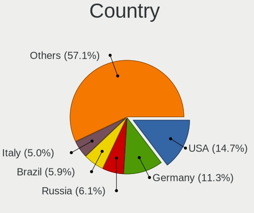
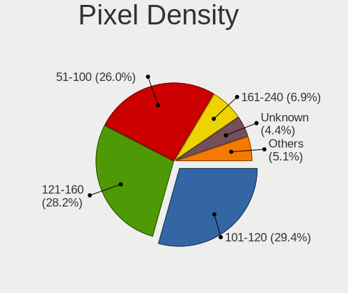
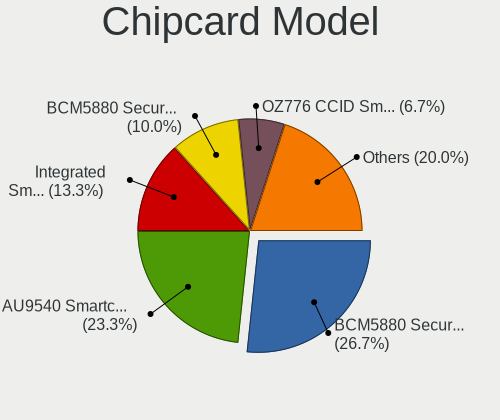
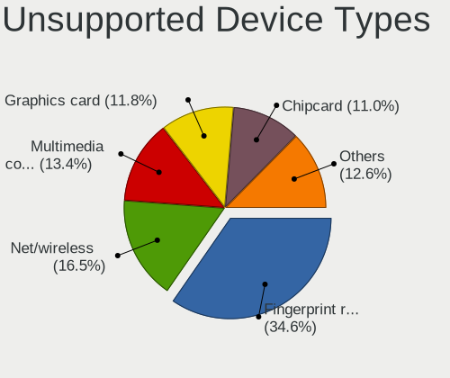

Elementary 6.1 - Tested Hardware & Statistics
---------------------------------------------

A project to collect tested hardware configurations for Elementary 6.1.

Anyone can contribute to this report by the [hw-probe](https://github.com/linuxhw/hw-probe) tool:

    sudo -E hw-probe -all -upload

Please submit a probe of your configuration if it's not presented on the page or is rare.

This is a report for all computer types. See also reports for [desktops](/Dist/Elementary_6.1/Desktop/README.md) and [notebooks](/Dist/Elementary_6.1/Notebook/README.md).

Full-feature report is available here: https://linux-hardware.org/?view=trends

Contents
--------

* [ Test Cases ](#test-cases)

* [ System ](#system)
  - [ Kernel                   ](#kernel)
  - [ Kernel Family            ](#kernel-family)
  - [ Kernel Major Ver.        ](#kernel-major-ver)
  - [ Arch                     ](#arch)
  - [ DE                       ](#de)
  - [ Display Server           ](#display-server)
  - [ Display Manager          ](#display-manager)
  - [ OS Lang                  ](#os-lang)
  - [ Boot Mode                ](#boot-mode)
  - [ Filesystem               ](#filesystem)
  - [ Part. scheme             ](#part-scheme)
  - [ Dual Boot with Linux/BSD ](#dual-boot-with-linuxbsd)
  - [ Dual Boot (Win)          ](#dual-boot-win)

* [ Board ](#board)
  - [ Vendor                   ](#vendor)
  - [ Model                    ](#model)
  - [ Model Family             ](#model-family)
  - [ MFG Year                 ](#mfg-year)
  - [ Form Factor              ](#form-factor)
  - [ Secure Boot              ](#secure-boot)
  - [ Coreboot                 ](#coreboot)
  - [ RAM Size                 ](#ram-size)
  - [ RAM Used                 ](#ram-used)
  - [ Total Drives             ](#total-drives)
  - [ Has CD-ROM               ](#has-cd-rom)
  - [ Has Ethernet             ](#has-ethernet)
  - [ Has WiFi                 ](#has-wifi)
  - [ Has Bluetooth            ](#has-bluetooth)

* [ Location ](#location)
  - [ Country                  ](#country)
  - [ City                     ](#city)

* [ Drives ](#drives)
  - [ Drive Vendor             ](#drive-vendor)
  - [ Drive Model              ](#drive-model)
  - [ HDD Vendor               ](#hdd-vendor)
  - [ SSD Vendor               ](#ssd-vendor)
  - [ Drive Kind               ](#drive-kind)
  - [ Drive Connector          ](#drive-connector)
  - [ Drive Size               ](#drive-size)
  - [ Space Total              ](#space-total)
  - [ Space Used               ](#space-used)
  - [ Malfunc. Drives          ](#malfunc-drives)
  - [ Malfunc. Drive Vendor    ](#malfunc-drive-vendor)
  - [ Malfunc. HDD Vendor      ](#malfunc-hdd-vendor)
  - [ Malfunc. Drive Kind      ](#malfunc-drive-kind)
  - [ Failed Drives            ](#failed-drives)
  - [ Failed Drive Vendor      ](#failed-drive-vendor)
  - [ Drive Status             ](#drive-status)

* [ Storage controller ](#storage-controller)
  - [ Storage Vendor           ](#storage-vendor)
  - [ Storage Model            ](#storage-model)
  - [ Storage Kind             ](#storage-kind)

* [ Processor ](#processor)
  - [ CPU Vendor               ](#cpu-vendor)
  - [ CPU Model                ](#cpu-model)
  - [ CPU Model Family         ](#cpu-model-family)
  - [ CPU Cores                ](#cpu-cores)
  - [ CPU Sockets              ](#cpu-sockets)
  - [ CPU Threads              ](#cpu-threads)
  - [ CPU Op-Modes             ](#cpu-op-modes)
  - [ CPU Microcode            ](#cpu-microcode)
  - [ CPU Microarch            ](#cpu-microarch)

* [ Graphics ](#graphics)
  - [ GPU Vendor               ](#gpu-vendor)
  - [ GPU Model                ](#gpu-model)
  - [ GPU Combo                ](#gpu-combo)
  - [ GPU Driver               ](#gpu-driver)
  - [ GPU Memory               ](#gpu-memory)

* [ Monitor ](#monitor)
  - [ Monitor Vendor           ](#monitor-vendor)
  - [ Monitor Model            ](#monitor-model)
  - [ Monitor Resolution       ](#monitor-resolution)
  - [ Monitor Diagonal         ](#monitor-diagonal)
  - [ Monitor Width            ](#monitor-width)
  - [ Aspect Ratio             ](#aspect-ratio)
  - [ Monitor Area             ](#monitor-area)
  - [ Pixel Density            ](#pixel-density)
  - [ Multiple Monitors        ](#multiple-monitors)

* [ Network ](#network)
  - [ Net Controller Vendor    ](#net-controller-vendor)
  - [ Net Controller Model     ](#net-controller-model)
  - [ Wireless Vendor          ](#wireless-vendor)
  - [ Wireless Model           ](#wireless-model)
  - [ Ethernet Vendor          ](#ethernet-vendor)
  - [ Ethernet Model           ](#ethernet-model)
  - [ Net Controller Kind      ](#net-controller-kind)
  - [ Used Controller          ](#used-controller)
  - [ NICs                     ](#nics)
  - [ IPv6                     ](#ipv6)

* [ Bluetooth ](#bluetooth)
  - [ Bluetooth Vendor         ](#bluetooth-vendor)
  - [ Bluetooth Model          ](#bluetooth-model)

* [ Sound ](#sound)
  - [ Sound Vendor             ](#sound-vendor)
  - [ Sound Model              ](#sound-model)

* [ Memory ](#memory)
  - [ Memory Vendor            ](#memory-vendor)
  - [ Memory Model             ](#memory-model)
  - [ Memory Kind              ](#memory-kind)
  - [ Memory Form Factor       ](#memory-form-factor)
  - [ Memory Size              ](#memory-size)
  - [ Memory Speed             ](#memory-speed)

* [ Printers & scanners ](#printers--scanners)
  - [ Printer Vendor           ](#printer-vendor)
  - [ Printer Model            ](#printer-model)
  - [ Scanner Vendor           ](#scanner-vendor)
  - [ Scanner Model            ](#scanner-model)

* [ Camera ](#camera)
  - [ Camera Vendor            ](#camera-vendor)
  - [ Camera Model             ](#camera-model)

* [ Security ](#security)
  - [ Fingerprint Vendor       ](#fingerprint-vendor)
  - [ Fingerprint Model        ](#fingerprint-model)
  - [ Chipcard Vendor          ](#chipcard-vendor)
  - [ Chipcard Model           ](#chipcard-model)

* [ Unsupported ](#unsupported)
  - [ Unsupported Devices      ](#unsupported-devices)
  - [ Unsupported Device Types ](#unsupported-device-types)

Test Cases
----------

| Vendor        | Model                       | Form-Factor | Probe                                                      | Date         |
|---------------|-----------------------------|-------------|------------------------------------------------------------|--------------|
| ASRock        | B450M-HDV R4.0              | Desktop     | [20dfc25b62](https://linux-hardware.org/?probe=20dfc25b62) | Jan 05, 2022 |
| Apple         | Mac-F2218EA9                | All in one  | [27756cb751](https://linux-hardware.org/?probe=27756cb751) | Jan 05, 2022 |
| MSI           | GF63 Thin 9SCSR             | Notebook    | [21f2a5e1b9](https://linux-hardware.org/?probe=21f2a5e1b9) | Jan 05, 2022 |
| Apple         | MacBookPro5,5               | Notebook    | [a03baba93d](https://linux-hardware.org/?probe=a03baba93d) | Jan 05, 2022 |
| Lenovo        | ThinkPad T470 W10DG 20JN... | Notebook    | [fbb0e6d1d5](https://linux-hardware.org/?probe=fbb0e6d1d5) | Jan 05, 2022 |
| Lenovo        | Legion Y530-15ICH 81FV      | Notebook    | [6eab59bbbf](https://linux-hardware.org/?probe=6eab59bbbf) | Jan 05, 2022 |
| Lenovo        | ThinkPad X1 Carbon 6th 2... | Notebook    | [5496b24a51](https://linux-hardware.org/?probe=5496b24a51) | Jan 05, 2022 |
| Samsung       | 900X3C/900X3D/900X3E/900... | Notebook    | [520ced18c4](https://linux-hardware.org/?probe=520ced18c4) | Jan 05, 2022 |
| HP            | Laptop 15s-eq1xxx           | Notebook    | [ae2f1bc63c](https://linux-hardware.org/?probe=ae2f1bc63c) | Jan 05, 2022 |
| HUAWEI        | MACHC-WAX9                  | Notebook    | [b0df1464a1](https://linux-hardware.org/?probe=b0df1464a1) | Jan 05, 2022 |
| Sony          | SVE14A390X                  | Notebook    | [3b11d123cf](https://linux-hardware.org/?probe=3b11d123cf) | Jan 04, 2022 |
| HP            | ProBook 4430s               | Notebook    | [aafb807fc2](https://linux-hardware.org/?probe=aafb807fc2) | Jan 04, 2022 |
| HP            | ProBook 4430s               | Notebook    | [f534b0dd91](https://linux-hardware.org/?probe=f534b0dd91) | Jan 04, 2022 |
| Lenovo        | ThinkPad W541 20EGS1VV00    | Notebook    | [5d88eb323c](https://linux-hardware.org/?probe=5d88eb323c) | Jan 04, 2022 |
| Apple         | MacBookPro9,2               | Notebook    | [a1c3f24aab](https://linux-hardware.org/?probe=a1c3f24aab) | Jan 04, 2022 |
| Lenovo        | ThinkPad P14s Gen 1 20Y1... | Notebook    | [71e992725f](https://linux-hardware.org/?probe=71e992725f) | Jan 04, 2022 |
| Lenovo        | ThinkPad P14s Gen 1 20Y1... | Notebook    | [8087320623](https://linux-hardware.org/?probe=8087320623) | Jan 04, 2022 |
| Lenovo        | Yoga 300-11IBR 80M1         | Notebook    | [b18501f890](https://linux-hardware.org/?probe=b18501f890) | Jan 04, 2022 |
| Star Labs     | LabTop                      | Notebook    | [043cd26c60](https://linux-hardware.org/?probe=043cd26c60) | Jan 04, 2022 |
| HP            | ProLiant DL380p Gen8        | Server      | [1172390e59](https://linux-hardware.org/?probe=1172390e59) | Jan 04, 2022 |
| HUAWEI        | KPL-W0X                     | Notebook    | [9d633f7bdb](https://linux-hardware.org/?probe=9d633f7bdb) | Jan 04, 2022 |
| Lenovo        | ThinkPad L390 Yoga 20NT0... | Convertible | [c91feb11a8](https://linux-hardware.org/?probe=c91feb11a8) | Jan 04, 2022 |
| Lenovo        | ThinkPad E495 20NE001RTX    | Notebook    | [79e95e3cb6](https://linux-hardware.org/?probe=79e95e3cb6) | Jan 04, 2022 |
| Dell          | Precision 5530              | Notebook    | [b385c0a16e](https://linux-hardware.org/?probe=b385c0a16e) | Jan 04, 2022 |
| Lenovo        | IdeaPad 310-15ISK 80SM      | Notebook    | [023df04f60](https://linux-hardware.org/?probe=023df04f60) | Jan 04, 2022 |
| Monster       | ABRA A5 V13.2               | Notebook    | [6d8d622050](https://linux-hardware.org/?probe=6d8d622050) | Jan 04, 2022 |
| MSI           | PS63 Modern 8RD             | Notebook    | [1cd435c54f](https://linux-hardware.org/?probe=1cd435c54f) | Jan 04, 2022 |
| Lenovo        | Legion Y530-15ICH 81GT      | Notebook    | [c694c358f9](https://linux-hardware.org/?probe=c694c358f9) | Jan 04, 2022 |
| Lenovo        | 371C No DPK                 | All in one  | [6c4714d241](https://linux-hardware.org/?probe=6c4714d241) | Jan 04, 2022 |
| Lenovo        | ThinkPad X13 Gen 1 20UFS... | Notebook    | [c61ed9ea15](https://linux-hardware.org/?probe=c61ed9ea15) | Jan 04, 2022 |
| HUAWEI        | KPL-W0X                     | Notebook    | [1015862a37](https://linux-hardware.org/?probe=1015862a37) | Jan 04, 2022 |
| Acidanther... | Mac-42FD25EABCABB274 iMa... | All in one  | [545dd570a9](https://linux-hardware.org/?probe=545dd570a9) | Jan 04, 2022 |
| Timi          | TM1613                      | Notebook    | [6761bd1e12](https://linux-hardware.org/?probe=6761bd1e12) | Jan 04, 2022 |
| Gigabyte      | B85M-DS3H-A                 | Desktop     | [cd6abb9f49](https://linux-hardware.org/?probe=cd6abb9f49) | Jan 03, 2022 |
| ASUSTek       | E202SA                      | Notebook    | [d721e131f4](https://linux-hardware.org/?probe=d721e131f4) | Jan 02, 2022 |
| Lenovo        | ThinkPad T470 W10DG 20JN... | Notebook    | [440d6a1b59](https://linux-hardware.org/?probe=440d6a1b59) | Jan 02, 2022 |
| Apple         | MacBookPro5,1               | Notebook    | [6c7a3affdb](https://linux-hardware.org/?probe=6c7a3affdb) | Jan 02, 2022 |
| Dell          | Vostro 15 3515              | Notebook    | [45b6bf0410](https://linux-hardware.org/?probe=45b6bf0410) | Jan 01, 2022 |
| HP            | Pavilion Laptop 15-cs0xx... | Notebook    | [fb332a2529](https://linux-hardware.org/?probe=fb332a2529) | Jan 01, 2022 |
| Acer          | Aspire A315-42              | Notebook    | [d44b06ec61](https://linux-hardware.org/?probe=d44b06ec61) | Jan 01, 2022 |
| HP            | EliteBook 8460p             | Notebook    | [f215102713](https://linux-hardware.org/?probe=f215102713) | Dec 31, 2021 |
| MSI           | 2A9C                        | Desktop     | [8d08f7f383](https://linux-hardware.org/?probe=8d08f7f383) | Dec 31, 2021 |
| Notebook      | P65xHP                      | Notebook    | [37db5af302](https://linux-hardware.org/?probe=37db5af302) | Dec 31, 2021 |
| HP            | EliteBook 8460p             | Notebook    | [e060f00ff8](https://linux-hardware.org/?probe=e060f00ff8) | Dec 31, 2021 |
| Notebook      | P65xHP                      | Notebook    | [fc81fedcf3](https://linux-hardware.org/?probe=fc81fedcf3) | Dec 31, 2021 |
| Teclast       | F7                          | Notebook    | [44bba02dee](https://linux-hardware.org/?probe=44bba02dee) | Dec 31, 2021 |
| HP            | 3397                        | Desktop     | [323dc8992b](https://linux-hardware.org/?probe=323dc8992b) | Dec 31, 2021 |
| ASUSTek       | X79-DELUXE                  | Desktop     | [00b9dd3788](https://linux-hardware.org/?probe=00b9dd3788) | Dec 30, 2021 |
| Wortmann      | 1220729_1470271             | Notebook    | [018071ac3e](https://linux-hardware.org/?probe=018071ac3e) | Dec 30, 2021 |
| HP            | 1589                        | Desktop     | [d123a8de64](https://linux-hardware.org/?probe=d123a8de64) | Dec 30, 2021 |
| Foxconn       | 2AB1                        | Desktop     | [bcd6fc46cc](https://linux-hardware.org/?probe=bcd6fc46cc) | Dec 30, 2021 |
| Acer          | Aspire 7750G                | Notebook    | [3a24dba335](https://linux-hardware.org/?probe=3a24dba335) | Dec 28, 2021 |
| Acer          | Aspire 7750G                | Notebook    | [516cb4e250](https://linux-hardware.org/?probe=516cb4e250) | Dec 28, 2021 |
| ASUSTek       | X555UB                      | Notebook    | [e0844450ac](https://linux-hardware.org/?probe=e0844450ac) | Dec 28, 2021 |
| ASUSTek       | TUF GAMING B550M-PLUS       | Desktop     | [5f67c759fe](https://linux-hardware.org/?probe=5f67c759fe) | Dec 28, 2021 |
| Apple         | Mac-F4238CC8 PVT            | All in one  | [829dc5243a](https://linux-hardware.org/?probe=829dc5243a) | Dec 28, 2021 |
| Apple         | Mac-F4238CC8 PVT            | All in one  | [352c62bd8f](https://linux-hardware.org/?probe=352c62bd8f) | Dec 28, 2021 |
| Dell          | Latitude 3580               | Notebook    | [f243f4c09e](https://linux-hardware.org/?probe=f243f4c09e) | Dec 27, 2021 |
| Apple         | Mac-F4238CC8 PVT            | All in one  | [5d91acd13d](https://linux-hardware.org/?probe=5d91acd13d) | Dec 27, 2021 |
| Lenovo        | ThinkPad T430 23501M2       | Notebook    | [2645817d64](https://linux-hardware.org/?probe=2645817d64) | Dec 26, 2021 |
| Gigabyte      | Z390 UD                     | Desktop     | [2399fa64ba](https://linux-hardware.org/?probe=2399fa64ba) | Dec 26, 2021 |
| HP            | EliteBook 850 G2            | Notebook    | [a71c970cbf](https://linux-hardware.org/?probe=a71c970cbf) | Dec 25, 2021 |
| Apple         | MacBookAir7,2               | Notebook    | [99bea5df6c](https://linux-hardware.org/?probe=99bea5df6c) | Dec 25, 2021 |
| Lenovo        | IdeaPad 320-14AST 80XU      | Notebook    | [80c8feb8bf](https://linux-hardware.org/?probe=80c8feb8bf) | Dec 25, 2021 |
| Dell          | Inspiron N5050              | Notebook    | [211b723554](https://linux-hardware.org/?probe=211b723554) | Dec 24, 2021 |
| LG Electro... | A410-G.BC51P1               | Notebook    | [b231405a63](https://linux-hardware.org/?probe=b231405a63) | Dec 24, 2021 |
| Microsoft     | Surface Book 2              | Tablet      | [730558c6bd](https://linux-hardware.org/?probe=730558c6bd) | Dec 24, 2021 |
| Acer          | TravelMate 5760             | Notebook    | [71526c7767](https://linux-hardware.org/?probe=71526c7767) | Dec 23, 2021 |
| Apple         | Mac-F42C88C8 Proto1         | Desktop     | [783618fe4b](https://linux-hardware.org/?probe=783618fe4b) | Dec 23, 2021 |
| Lenovo        | Flex 2-14D 20376            | Notebook    | [d950a63316](https://linux-hardware.org/?probe=d950a63316) | Dec 23, 2021 |
| Dell          | Inspiron 3542               | Notebook    | [277f97ef07](https://linux-hardware.org/?probe=277f97ef07) | Dec 23, 2021 |
| Dell          | XPS 13 9343                 | Notebook    | [dfbdb618f1](https://linux-hardware.org/?probe=dfbdb618f1) | Dec 23, 2021 |
| ASUSTek       | H97-PLUS                    | Desktop     | [cba91c2ad2](https://linux-hardware.org/?probe=cba91c2ad2) | Dec 22, 2021 |
| ASUSTek       | VivoBook_ASUSLaptop X512... | Notebook    | [f74c2da103](https://linux-hardware.org/?probe=f74c2da103) | Dec 22, 2021 |
| Dell          | Precision M3800             | Notebook    | [ed44d9ac8c](https://linux-hardware.org/?probe=ed44d9ac8c) | Dec 21, 2021 |
| Dell          | Inspiron 7405 2n1           | Convertible | [64d2a0328e](https://linux-hardware.org/?probe=64d2a0328e) | Dec 21, 2021 |
| Apple         | MacBookAir6,1               | Notebook    | [b2e3490378](https://linux-hardware.org/?probe=b2e3490378) | Dec 21, 2021 |
| Dell          | Precision M6500             | Notebook    | [931f365c60](https://linux-hardware.org/?probe=931f365c60) | Dec 20, 2021 |
| MSI           | B450-A PRO MAX              | Desktop     | [f14eef1ae6](https://linux-hardware.org/?probe=f14eef1ae6) | Dec 20, 2021 |
| Gigabyte      | H310M S2P                   | Desktop     | [a931eb10f0](https://linux-hardware.org/?probe=a931eb10f0) | Dec 19, 2021 |
| Dell          | Inspiron 5555               | Notebook    | [09d45f017d](https://linux-hardware.org/?probe=09d45f017d) | Dec 18, 2021 |
| Foxconn       | 2AB1                        | Desktop     | [d9077a5d94](https://linux-hardware.org/?probe=d9077a5d94) | Dec 18, 2021 |
| Foxconn       | 2AB1                        | Desktop     | [b789981cc4](https://linux-hardware.org/?probe=b789981cc4) | Dec 17, 2021 |
| Lenovo        | V14-ADA 82C6                | Notebook    | [a45f76da28](https://linux-hardware.org/?probe=a45f76da28) | Dec 17, 2021 |
| ASUSTek       | UX410UAK                    | Notebook    | [39dcbe0f57](https://linux-hardware.org/?probe=39dcbe0f57) | Dec 17, 2021 |
| Monster       | MARKUT M7 V1.x              | Notebook    | [2d2ed2143e](https://linux-hardware.org/?probe=2d2ed2143e) | Dec 17, 2021 |
| Gigabyte      | Z590 AORUS ELITE AX         | Desktop     | [c068e358e8](https://linux-hardware.org/?probe=c068e358e8) | Dec 16, 2021 |
| Intel         | NUC10i3FNB K61362-305       | Mini pc     | [3371572aa9](https://linux-hardware.org/?probe=3371572aa9) | Dec 16, 2021 |
| Monster       | MARKUT M7 V1.x              | Notebook    | [2390550c49](https://linux-hardware.org/?probe=2390550c49) | Dec 15, 2021 |
| ASUSTek       | M5A78L-M LX3                | Desktop     | [720cc7a45f](https://linux-hardware.org/?probe=720cc7a45f) | Dec 15, 2021 |
| Apple         | MacBook4,1                  | Notebook    | [661e7dae0c](https://linux-hardware.org/?probe=661e7dae0c) | Dec 15, 2021 |
| Apple         | MacBook4,1                  | Notebook    | [b682cee818](https://linux-hardware.org/?probe=b682cee818) | Dec 15, 2021 |
| Apple         | MacBook5,2                  | Notebook    | [5dcbdab7ca](https://linux-hardware.org/?probe=5dcbdab7ca) | Dec 15, 2021 |

System
------

Kernel
------

Version of the Linux kernel

| Version              | Computers | Percent |
|----------------------|-----------|---------|
| 5.11.0-43-generic    | 58        | 73.42%  |
| 5.11.0-41-generic    | 8         | 10.13%  |
| 5.11.0-44-generic    | 5         | 6.33%   |
| 5.8.0-50-generic     | 1         | 1.27%   |
| 5.15.6-surface       | 1         | 1.27%   |
| 5.15.3-xanmod1       | 1         | 1.27%   |
| 5.15.12-xanmod1-tt   | 1         | 1.27%   |
| 5.15.10-xanmod1      | 1         | 1.27%   |
| 5.13.0-22-generic    | 1         | 1.27%   |
| 5.11.0-43-lowlatency | 1         | 1.27%   |
| 5.11.0-37-generic    | 1         | 1.27%   |

Kernel Family
-------------

Linux kernel without a distro release

| Version | Computers | Percent |
|---------|-----------|---------|
| 5.11.0  | 73        | 92.41%  |
| 5.8.0   | 1         | 1.27%   |
| 5.15.6  | 1         | 1.27%   |
| 5.15.3  | 1         | 1.27%   |
| 5.15.12 | 1         | 1.27%   |
| 5.15.10 | 1         | 1.27%   |
| 5.13.0  | 1         | 1.27%   |

Kernel Major Ver.
-----------------

Linux kernel major version

| Version | Computers | Percent |
|---------|-----------|---------|
| 5.11    | 73        | 92.41%  |
| 5.15    | 4         | 5.06%   |
| 5.8     | 1         | 1.27%   |
| 5.13    | 1         | 1.27%   |

Arch
----

OS architecture (x86_64, i586, etc.)

| Name   | Computers | Percent |
|--------|-----------|---------|
| x86_64 | 79        | 100%    |

DE
--

Desktop Environment

| Name     | Computers | Percent |
|----------|-----------|---------|
| Pantheon | 79        | 100%    |

Display Server
--------------

X11 or Wayland

| Name | Computers | Percent |
|------|-----------|---------|
| X11  | 79        | 100%    |

Display Manager
---------------

SDDM, LightDM, etc.

| Name    | Computers | Percent |
|---------|-----------|---------|
| Unknown | 50        | 63.29%  |
| LightDM | 29        | 36.71%  |

OS Lang
-------

Language

| Lang  | Computers | Percent |
|-------|-----------|---------|
| en_US | 44        | 55.7%   |
| de_DE | 11        | 13.92%  |
| en_GB | 7         | 8.86%   |
| pt_BR | 4         | 5.06%   |
| ru_RU | 2         | 2.53%   |
| pl_PL | 2         | 2.53%   |
| fr_FR | 2         | 2.53%   |
| es_ES | 2         | 2.53%   |
| sv_SE | 1         | 1.27%   |
| it_IT | 1         | 1.27%   |
| hr_HR | 1         | 1.27%   |
| en_CA | 1         | 1.27%   |
| en_AU | 1         | 1.27%   |

Boot Mode
---------

EFI or BIOS

| Mode | Computers | Percent |
|------|-----------|---------|
| EFI  | 56        | 70.89%  |
| BIOS | 23        | 29.11%  |

Filesystem
----------

Type of filesystem

| Type    | Computers | Percent |
|---------|-----------|---------|
| Ext4    | 73        | 92.41%  |
| Btrfs   | 4         | 5.06%   |
| Xfs     | 1         | 1.27%   |
| Overlay | 1         | 1.27%   |

Part. scheme
------------

Scheme of partitioning

| Type    | Computers | Percent |
|---------|-----------|---------|
| Unknown | 56        | 70.89%  |
| GPT     | 21        | 26.58%  |
| MBR     | 2         | 2.53%   |

Dual Boot with Linux/BSD
------------------------

Hosting more than one Linux/BSD

| Dual boot | Computers | Percent |
|-----------|-----------|---------|
| No        | 74        | 93.67%  |
| Yes       | 5         | 6.33%   |

Dual Boot (Win)
---------------

Hosting Linux and Windows

| Dual boot | Computers | Percent |
|-----------|-----------|---------|
| No        | 72        | 91.14%  |
| Yes       | 7         | 8.86%   |

Board
-----

Vendor
------

Motherboard manufacturer

| Name                | Computers | Percent |
|---------------------|-----------|---------|
| Lenovo              | 15        | 18.99%  |
| Dell                | 10        | 12.66%  |
| Apple               | 10        | 12.66%  |
| Hewlett-Packard     | 8         | 10.13%  |
| ASUSTek Computer    | 8         | 10.13%  |
| MSI                 | 4         | 5.06%   |
| Gigabyte Technology | 4         | 5.06%   |
| Acer                | 3         | 3.8%    |
| Monster             | 2         | 2.53%   |
| HUAWEI              | 2         | 2.53%   |
| Wortmann AG         | 1         | 1.27%   |
| Timi                | 1         | 1.27%   |
| Teclast             | 1         | 1.27%   |
| Star Labs           | 1         | 1.27%   |
| Sony                | 1         | 1.27%   |
| Samsung Electronics | 1         | 1.27%   |
| Notebook            | 1         | 1.27%   |
| Microsoft           | 1         | 1.27%   |
| LG Electronics      | 1         | 1.27%   |
| Intel               | 1         | 1.27%   |
| Foxconn             | 1         | 1.27%   |
| ASRock              | 1         | 1.27%   |
| Acidanthera         | 1         | 1.27%   |

Model
-----

Motherboard model

| Name                                       | Computers | Percent |
|--------------------------------------------|-----------|---------|
| Wortmann AG 1220729_1470271                | 1         | 1.27%   |
| Timi TM1613                                | 1         | 1.27%   |
| Teclast F7                                 | 1         | 1.27%   |
| Star Labs LabTop                           | 1         | 1.27%   |
| Sony SVE14A390X                            | 1         | 1.27%   |
| Samsung 900X3C/900X3D/900X3E/900X4C/900X4D | 1         | 1.27%   |
| Notebook P65xHP                            | 1         | 1.27%   |
| MSI PS63 Modern 8RD                        | 1         | 1.27%   |
| MSI PPPPP-CCC#MMMMMMMM                     | 1         | 1.27%   |
| MSI MS-7B86                                | 1         | 1.27%   |
| MSI GF63 Thin 9SCSR                        | 1         | 1.27%   |
| Monster MARKUT M7 V1.x                     | 1         | 1.27%   |
| Monster ABRA A5 V13.2                      | 1         | 1.27%   |
| Microsoft Surface Book 2                   | 1         | 1.27%   |
| LG A410-G.BC51P1                           | 1         | 1.27%   |
| Lenovo Yoga 300-11IBR 80M1                 | 1         | 1.27%   |
| Lenovo ThinkPad X13 Gen 1 20UFS00G00       | 1         | 1.27%   |
| Lenovo ThinkPad X1 Carbon 6th 20KHS1L200   | 1         | 1.27%   |
| Lenovo ThinkPad W541 20EGS1VV00            | 1         | 1.27%   |
| Lenovo ThinkPad T470 W10DG 20JNS08H00      | 1         | 1.27%   |
| Lenovo ThinkPad T430 23501M2               | 1         | 1.27%   |
| Lenovo ThinkPad P14s Gen 1 20Y1S00E00      | 1         | 1.27%   |
| Lenovo ThinkPad L390 Yoga 20NT001KGE       | 1         | 1.27%   |
| Lenovo ThinkPad E495 20NE001RTX            | 1         | 1.27%   |
| Lenovo Legion Y530-15ICH 81GT              | 1         | 1.27%   |
| Lenovo Legion Y530-15ICH 81FV              | 1         | 1.27%   |
| Lenovo IdeaPad 320-14AST 80XU              | 1         | 1.27%   |
| Lenovo IdeaPad 310-15ISK 80SM              | 1         | 1.27%   |
| Lenovo IdeaCentre AIO 3 24ARE05 F0EW00FLSC | 1         | 1.27%   |
| Lenovo Flex 2-14D 20376                    | 1         | 1.27%   |
| Intel NUC10i3FNH                           | 1         | 1.27%   |
| HUAWEI MACHC-WAX9                          | 1         | 1.27%   |
| HUAWEI KPL-W0X                             | 1         | 1.27%   |
| HP Z420 Workstation                        | 1         | 1.27%   |
| HP ProLiant DL380p Gen8                    | 1         | 1.27%   |
| HP ProBook 4430s                           | 1         | 1.27%   |
| HP Pavilion Laptop 15-cs0xxx               | 1         | 1.27%   |
| HP Laptop 15s-eq1xxx                       | 1         | 1.27%   |
| HP EliteBook 850 G2                        | 1         | 1.27%   |
| HP EliteBook 8460p                         | 1         | 1.27%   |
| HP Compaq Elite 8300 SFF                   | 1         | 1.27%   |
| Gigabyte Z590 AORUS ELITE AX               | 1         | 1.27%   |
| Gigabyte Z390 UD                           | 1         | 1.27%   |
| Gigabyte H310M S2P 2.0                     | 1         | 1.27%   |
| Gigabyte B85M-DS3H-A                       | 1         | 1.27%   |
| Foxconn p6616f                             | 1         | 1.27%   |
| Dell XPS 13 9343                           | 1         | 1.27%   |
| Dell Vostro 15 3515                        | 1         | 1.27%   |
| Dell Precision M6500                       | 1         | 1.27%   |
| Dell Precision M3800                       | 1         | 1.27%   |
| Dell Precision 5530                        | 1         | 1.27%   |
| Dell Latitude 3580                         | 1         | 1.27%   |
| Dell Inspiron N5050                        | 1         | 1.27%   |
| Dell Inspiron 7405 2n1                     | 1         | 1.27%   |
| Dell Inspiron 5555                         | 1         | 1.27%   |
| Dell Inspiron 3542                         | 1         | 1.27%   |
| ASUS X79-DELUXE                            | 1         | 1.27%   |
| ASUS X555UB                                | 1         | 1.27%   |
| ASUS VivoBook_ASUSLaptop X512FA_A512FA     | 1         | 1.27%   |
| ASUS UX410UAK                              | 1         | 1.27%   |

Model Family
------------

Motherboard model prefix

| Name                   | Computers | Percent |
|------------------------|-----------|---------|
| Lenovo ThinkPad        | 8         | 10.13%  |
| Dell Inspiron          | 4         | 5.06%   |
| Dell Precision         | 3         | 3.8%    |
| Lenovo Legion          | 2         | 2.53%   |
| Lenovo IdeaPad         | 2         | 2.53%   |
| HP EliteBook           | 2         | 2.53%   |
| Apple MacBookPro5      | 2         | 2.53%   |
| Acer Aspire            | 2         | 2.53%   |
| Wortmann AG 1220729    | 1         | 1.27%   |
| Timi TM1613            | 1         | 1.27%   |
| Teclast F7             | 1         | 1.27%   |
| Star Labs LabTop       | 1         | 1.27%   |
| Sony SVE14A390X        | 1         | 1.27%   |
| Samsung 900X3C         | 1         | 1.27%   |
| Notebook P65xHP        | 1         | 1.27%   |
| MSI PS63               | 1         | 1.27%   |
| MSI PPPPP-CCC#MMMMMMMM | 1         | 1.27%   |
| MSI MS-7B86            | 1         | 1.27%   |
| MSI GF63               | 1         | 1.27%   |
| Monster MARKUT         | 1         | 1.27%   |
| Monster ABRA           | 1         | 1.27%   |
| Microsoft Surface      | 1         | 1.27%   |
| LG A410-G.BC51P1       | 1         | 1.27%   |
| Lenovo Yoga            | 1         | 1.27%   |
| Lenovo IdeaCentre      | 1         | 1.27%   |
| Lenovo Flex            | 1         | 1.27%   |
| Intel NUC10i3FNH       | 1         | 1.27%   |
| HUAWEI MACHC-WAX9      | 1         | 1.27%   |
| HUAWEI KPL-W0X         | 1         | 1.27%   |
| HP Z420                | 1         | 1.27%   |
| HP ProLiant            | 1         | 1.27%   |
| HP ProBook             | 1         | 1.27%   |
| HP Pavilion            | 1         | 1.27%   |
| HP Laptop              | 1         | 1.27%   |
| HP Compaq              | 1         | 1.27%   |
| Gigabyte Z590          | 1         | 1.27%   |
| Gigabyte Z390          | 1         | 1.27%   |
| Gigabyte H310M         | 1         | 1.27%   |
| Gigabyte B85M-DS3H-A   | 1         | 1.27%   |
| Foxconn p6616f         | 1         | 1.27%   |
| Dell XPS               | 1         | 1.27%   |
| Dell Vostro            | 1         | 1.27%   |
| Dell Latitude          | 1         | 1.27%   |
| ASUS X79-DELUXE        | 1         | 1.27%   |
| ASUS X555UB            | 1         | 1.27%   |
| ASUS VivoBook          | 1         | 1.27%   |
| ASUS UX410UAK          | 1         | 1.27%   |
| ASUS TUF               | 1         | 1.27%   |
| ASUS M5A78L-M          | 1         | 1.27%   |
| ASUS E202SA            | 1         | 1.27%   |
| ASUS All               | 1         | 1.27%   |
| ASRock B450M-HDV       | 1         | 1.27%   |
| Apple MacPro3          | 1         | 1.27%   |
| Apple MacBookPro9      | 1         | 1.27%   |
| Apple MacBookAir7      | 1         | 1.27%   |
| Apple MacBookAir6      | 1         | 1.27%   |
| Apple MacBook5         | 1         | 1.27%   |
| Apple MacBook4         | 1         | 1.27%   |
| Apple iMac9            | 1         | 1.27%   |
| Apple iMac7            | 1         | 1.27%   |

MFG Year
--------

Motherboard manufacture year

| Year | Computers | Percent |
|------|-----------|---------|
| 2021 | 14        | 17.72%  |
| 2020 | 13        | 16.46%  |
| 2019 | 12        | 15.19%  |
| 2018 | 8         | 10.13%  |
| 2016 | 6         | 7.59%   |
| 2015 | 5         | 6.33%   |
| 2011 | 4         | 5.06%   |
| 2013 | 3         | 3.8%    |
| 2012 | 3         | 3.8%    |
| 2009 | 3         | 3.8%    |
| 2008 | 3         | 3.8%    |
| 2014 | 2         | 2.53%   |
| 2010 | 2         | 2.53%   |
| 2017 | 1         | 1.27%   |

Form Factor
-----------

Physical design of the computer

| Name        | Computers | Percent |
|-------------|-----------|---------|
| Notebook    | 55        | 69.62%  |
| Desktop     | 15        | 18.99%  |
| All in one  | 4         | 5.06%   |
| Convertible | 2         | 2.53%   |
| Tablet      | 1         | 1.27%   |
| Mini pc     | 1         | 1.27%   |
| Server      | 1         | 1.27%   |

Secure Boot
-----------

Enabled or disabled

| State    | Computers | Percent |
|----------|-----------|---------|
| Disabled | 73        | 92.41%  |
| Enabled  | 6         | 7.59%   |

Coreboot
--------

Have coreboot on board

| Used | Computers | Percent |
|------|-----------|---------|
| No   | 78        | 98.73%  |
| Yes  | 1         | 1.27%   |

RAM Size
--------

Total RAM memory

| Size in GB  | Computers | Percent |
|-------------|-----------|---------|
| 4.01-8.0    | 26        | 32.91%  |
| 16.01-24.0  | 16        | 20.25%  |
| 8.01-16.0   | 13        | 16.46%  |
| 3.01-4.0    | 11        | 13.92%  |
| 32.01-64.0  | 10        | 12.66%  |
| 1.01-2.0    | 2         | 2.53%   |
| 64.01-256.0 | 1         | 1.27%   |

RAM Used
--------

Used RAM memory

| Used GB   | Computers | Percent |
|-----------|-----------|---------|
| 2.01-3.0  | 25        | 31.65%  |
| 1.01-2.0  | 20        | 25.32%  |
| 3.01-4.0  | 14        | 17.72%  |
| 4.01-8.0  | 11        | 13.92%  |
| 8.01-16.0 | 6         | 7.59%   |
| 0.51-1.0  | 3         | 3.8%    |

Total Drives
------------

Number of drives on board

| Drives | Computers | Percent |
|--------|-----------|---------|
| 1      | 46        | 58.23%  |
| 2      | 21        | 26.58%  |
| 3      | 6         | 7.59%   |
| 4      | 3         | 3.8%    |
| 5      | 2         | 2.53%   |
| 7      | 1         | 1.27%   |

Has CD-ROM
----------

Has CD-ROM on board

| Presented | Computers | Percent |
|-----------|-----------|---------|
| No        | 55        | 69.62%  |
| Yes       | 24        | 30.38%  |

Has Ethernet
------------

Has Ethernet on board

| Presented | Computers | Percent |
|-----------|-----------|---------|
| Yes       | 62        | 78.48%  |
| No        | 17        | 21.52%  |

Has WiFi
--------

Has WiFi module

| Presented | Computers | Percent |
|-----------|-----------|---------|
| Yes       | 69        | 87.34%  |
| No        | 10        | 12.66%  |

Has Bluetooth
-------------

Has Bluetooth module

| Presented | Computers | Percent |
|-----------|-----------|---------|
| Yes       | 66        | 83.54%  |
| No        | 13        | 16.46%  |

Location
--------

Country
-------

Geographic location (country)

| Country      | Computers | Percent |
|--------------|-----------|---------|
| Germany      | 9         | 11.39%  |
| USA          | 7         | 8.86%   |
| India        | 6         | 7.59%   |
| Brazil       | 6         | 7.59%   |
| Turkey       | 4         | 5.06%   |
| Poland       | 4         | 5.06%   |
| UK           | 3         | 3.8%    |
| Sweden       | 3         | 3.8%    |
| Italy        | 3         | 3.8%    |
| Australia    | 3         | 3.8%    |
| Romania      | 2         | 2.53%   |
| New Zealand  | 2         | 2.53%   |
| France       | 2         | 2.53%   |
| Canada       | 2         | 2.53%   |
| Belarus      | 2         | 2.53%   |
| Austria      | 2         | 2.53%   |
| Ukraine      | 1         | 1.27%   |
| Thailand     | 1         | 1.27%   |
| Sri Lanka    | 1         | 1.27%   |
| Spain        | 1         | 1.27%   |
| South Africa | 1         | 1.27%   |
| Russia       | 1         | 1.27%   |
| Portugal     | 1         | 1.27%   |
| Pakistan     | 1         | 1.27%   |
| Netherlands  | 1         | 1.27%   |
| Mexico       | 1         | 1.27%   |
| Malaysia     | 1         | 1.27%   |
| Iran         | 1         | 1.27%   |
| Indonesia    | 1         | 1.27%   |
| Guyana       | 1         | 1.27%   |
| Greece       | 1         | 1.27%   |
| Croatia      | 1         | 1.27%   |
| Colombia     | 1         | 1.27%   |
| Chile        | 1         | 1.27%   |
| Argentina    | 1         | 1.27%   |

City
----

Geographic location (city)

| City                          | Computers | Percent |
|-------------------------------|-----------|---------|
| Sydney                        | 3         | 3.8%    |
| Ankara                        | 3         | 3.8%    |
| Minsk                         | 2         | 2.53%   |
| Wroclaw                       | 1         | 1.27%   |
| Wriedel                       | 1         | 1.27%   |
| Wellington                    | 1         | 1.27%   |
| Wattala                       | 1         | 1.27%   |
| Vinnytsia                     | 1         | 1.27%   |
| Vilanova i la Geltr??         | 1         | 1.27%   |
| Vienna                        | 1         | 1.27%   |
| Uppsala                       | 1         | 1.27%   |
| Tehran                        | 1         | 1.27%   |
| Tecuci                        | 1         | 1.27%   |
| Stockholm                     | 1         | 1.27%   |
| Steinbach                     | 1         | 1.27%   |
| Southampton                   | 1         | 1.27%   |
| Sornay                        | 1         | 1.27%   |
| Soliera                       | 1         | 1.27%   |
| Shetland Islands              | 1         | 1.27%   |
| S??o Paulo                    | 1         | 1.27%   |
| S??o Bernardo do Campo        | 1         | 1.27%   |
| San Antonio                   | 1         | 1.27%   |
| Samobor                       | 1         | 1.27%   |
| Saltsjoe-Boo                  | 1         | 1.27%   |
| Saalfelden am Steinernen Meer | 1         | 1.27%   |
| Rueso                         | 1         | 1.27%   |
| Rome                          | 1         | 1.27%   |
| Providencia                   | 1         | 1.27%   |
| Porto                         | 1         | 1.27%   |
| Petaling Jaya                 | 1         | 1.27%   |
| Osasco                        | 1         | 1.27%   |
| Napier City                   | 1         | 1.27%   |
| Munich                        | 1         | 1.27%   |
| Mumbai                        | 1         | 1.27%   |
| Montm?©dy                     | 1         | 1.27%   |
| Mahemdavad                    | 1         | 1.27%   |
| La Plata                      | 1         | 1.27%   |
| Krakow                        | 1         | 1.27%   |
| Khimki                        | 1         | 1.27%   |
| Johannesburg                  | 1         | 1.27%   |
| Jember                        | 1         | 1.27%   |
| Itaquaquecetuba               | 1         | 1.27%   |
| Islamabad                     | 1         | 1.27%   |
| Hyderabad                     | 1         | 1.27%   |
| Hudson                        | 1         | 1.27%   |
| Holland                       | 1         | 1.27%   |
| Hennef                        | 1         | 1.27%   |
| Hanover                       | 1         | 1.27%   |
| Hammonton                     | 1         | 1.27%   |
| Hamburg                       | 1         | 1.27%   |
| Gliwice                       | 1         | 1.27%   |
| Georgetown                    | 1         | 1.27%   |
| Gdansk                        | 1         | 1.27%   |
| Erkrath                       | 1         | 1.27%   |
| Edmonton                      | 1         | 1.27%   |
| Dumbravita                    | 1         | 1.27%   |
| Dhanbad                       | 1         | 1.27%   |
| Denver                        | 1         | 1.27%   |
| Cuernavaca                    | 1         | 1.27%   |
| Chalfont                      | 1         | 1.27%   |

Drives
------

Drive Vendor
------------

Hard drive vendors

| Vendor              | Computers | Drives | Percent |
|---------------------|-----------|--------|---------|
| Samsung Electronics | 24        | 29     | 20.87%  |
| WDC                 | 16        | 21     | 13.91%  |
| Seagate             | 13        | 13     | 11.3%   |
| Crucial             | 11        | 12     | 9.57%   |
| Kingston            | 7         | 8      | 6.09%   |
| SK Hynix            | 5         | 5      | 4.35%   |
| SanDisk             | 5         | 5      | 4.35%   |
| Unknown             | 3         | 5      | 2.61%   |
| Toshiba             | 3         | 4      | 2.61%   |
| Hitachi             | 3         | 3      | 2.61%   |
| Micron Technology   | 2         | 2      | 1.74%   |
| HGST                | 2         | 2      | 1.74%   |
| A-DATA Technology   | 2         | 2      | 1.74%   |
| Unknown             | 2         | 2      | 1.74%   |
| Transcend           | 1         | 1      | 0.87%   |
| Teclast             | 1         | 1      | 0.87%   |
| Star                | 1         | 1      | 0.87%   |
| Silicon Motion      | 1         | 1      | 0.87%   |
| SABRENT             | 1         | 1      | 0.87%   |
| MAXTOR              | 1         | 1      | 0.87%   |
| LITEON              | 1         | 1      | 0.87%   |
| KIOXIA              | 1         | 1      | 0.87%   |
| KingSpec            | 1         | 1      | 0.87%   |
| JMicron             | 1         | 1      | 0.87%   |
| Intenso             | 1         | 1      | 0.87%   |
| Intel               | 1         | 1      | 0.87%   |
| Fujitsu             | 1         | 1      | 0.87%   |
| Ext Hard            | 1         | 1      | 0.87%   |
| China               | 1         | 1      | 0.87%   |
| Apple               | 1         | 1      | 0.87%   |
| Apacer              | 1         | 1      | 0.87%   |

Drive Model
-----------

Hard drive models

| Model                                     | Computers | Percent |
|-------------------------------------------|-----------|---------|
| Seagate ST1000LM035-1RK172 1TB            | 3         | 2.38%   |
| WDC WD5000LPVX-75V0TT0 500GB              | 2         | 1.59%   |
| SK Hynix NVMe SSD Drive 256GB             | 2         | 1.59%   |
| Samsung SSD 850 EVO 250GB                 | 2         | 1.59%   |
| Samsung PM963 2.5" NVMe PCIe SSD 256GB    | 2         | 1.59%   |
| Samsung NVMe SSD Drive 512GB              | 2         | 1.59%   |
| Samsung NVMe SSD Drive 500GB              | 2         | 1.59%   |
| Kingston SA400S37240G 240GB SSD           | 2         | 1.59%   |
| Crucial CT250MX500SSD1 250GB              | 2         | 1.59%   |
| Crucial CT1000MX500SSD1 1TB               | 2         | 1.59%   |
| Unknown                                   | 2         | 1.59%   |
| WDC WDS120G2G0A-00JH30 120GB SSD          | 1         | 0.79%   |
| WDC WD7500BPVT-22A1YT0 752GB              | 1         | 0.79%   |
| WDC WD6401AALS-00L3B2 640GB               | 1         | 0.79%   |
| WDC WD5000BPVT-22HXZT1 500GB              | 1         | 0.79%   |
| WDC WD40EZAZ-00SF3B0 4TB                  | 1         | 0.79%   |
| WDC WD3200AAJS-40RYA0 320GB               | 1         | 0.79%   |
| WDC WD3003FZEX-00Z4SA0 3TB                | 1         | 0.79%   |
| WDC WD20SPZX-22UA7T0 2TB                  | 1         | 0.79%   |
| WDC WD20EFRX-68EUZN0 2TB                  | 1         | 0.79%   |
| WDC WD15EARX-00PASB0 1TB                  | 1         | 0.79%   |
| WDC WD10SPZX-24Z10 1TB                    | 1         | 0.79%   |
| WDC WD10JPCX-24UE4T0 1TB                  | 1         | 0.79%   |
| WDC WD10EZEX-08WN4A0 1TB                  | 1         | 0.79%   |
| WDC WD10EZEX-00BN5A0 1TB                  | 1         | 0.79%   |
| WDC WD10EADS-00L5B1 1TB                   | 1         | 0.79%   |
| WDC PC SN730 SDBPNTY-512G-1027 512GB      | 1         | 0.79%   |
| WDC PC SN520 SDAPNUW-512G                 | 1         | 0.79%   |
| Unknown USD00  16GB                       | 1         | 0.79%   |
| Unknown SD/MMC/M.S.PRO 32GB               | 1         | 0.79%   |
| Unknown SD/MMC 16GB                       | 1         | 0.79%   |
| Unknown M.S./M.S.Pro/HG 16GB              | 1         | 0.79%   |
| Unknown GD2S5  128GB                      | 1         | 0.79%   |
| Transcend TS512GMTS430S 512GB SSD         | 1         | 0.79%   |
| Toshiba MQ04ABF100 1TB                    | 1         | 0.79%   |
| Toshiba HDWE140 4TB                       | 1         | 0.79%   |
| Toshiba HDWD120 2TB                       | 1         | 0.79%   |
| Toshiba HDWD110 1TB                       | 1         | 0.79%   |
| Teclast 128GB NS550-2242 SSD              | 1         | 0.79%   |
| Star Drive SATA SSD 960GB                 | 1         | 0.79%   |
| SK Hynix SKHynix_HFS512GD9TNI-L2B0B 512GB | 1         | 0.79%   |
| SK Hynix NVMe SSD Drive 512GB             | 1         | 0.79%   |
| SK Hynix HFM128GDHTNG-8510B 128GB         | 1         | 0.79%   |
| Silicon Motion NVMe SSD Drive 120GB       | 1         | 0.79%   |
| Seagate ST9500325AS 500GB                 | 1         | 0.79%   |
| Seagate ST4000DX001-1CE168 4TB            | 1         | 0.79%   |
| Seagate ST3750528AS 752GB                 | 1         | 0.79%   |
| Seagate ST2000DX002-2DV164 2TB            | 1         | 0.79%   |
| Seagate ST1000LM024 HN-M101MBB 1TB        | 1         | 0.79%   |
| Seagate ST1000DM010-2EP102 1TB            | 1         | 0.79%   |
| Seagate ST1000DM003-1CH162 1TB            | 1         | 0.79%   |
| Seagate ST10000DM0004-1ZC101 10TB         | 1         | 0.79%   |
| Seagate NVMe SSD Drive 500GB              | 1         | 0.79%   |
| Seagate Expansion Desk 8TB                | 1         | 0.79%   |
| SanDisk SD9SN8W256G1027 256GB SSD         | 1         | 0.79%   |
| SanDisk SD9SN8W-128G-1006 128GB SSD       | 1         | 0.79%   |
| SanDisk SD8SNAT128G1002 128GB SSD         | 1         | 0.79%   |
| Sandisk NVMe SSD Drive 500GB              | 1         | 0.79%   |
| Sandisk NVMe SSD Drive 250GB              | 1         | 0.79%   |
| Samsung SSD SM841 mSATA 512GB             | 1         | 0.79%   |

HDD Vendor
----------

Hard disk drive vendors

| Vendor              | Computers | Drives | Percent |
|---------------------|-----------|--------|---------|
| WDC                 | 13        | 17     | 35.14%  |
| Seagate             | 12        | 12     | 32.43%  |
| Toshiba             | 3         | 4      | 8.11%   |
| Hitachi             | 3         | 3      | 8.11%   |
| HGST                | 2         | 2      | 5.41%   |
| Samsung Electronics | 1         | 1      | 2.7%    |
| SABRENT             | 1         | 1      | 2.7%    |
| Fujitsu             | 1         | 1      | 2.7%    |
| Ext Hard            | 1         | 1      | 2.7%    |

SSD Vendor
----------

Solid state drive vendors

| Vendor              | Computers | Drives | Percent |
|---------------------|-----------|--------|---------|
| Samsung Electronics | 14        | 16     | 29.17%  |
| Crucial             | 11        | 12     | 22.92%  |
| Kingston            | 5         | 5      | 10.42%  |
| SanDisk             | 3         | 3      | 6.25%   |
| Micron Technology   | 2         | 2      | 4.17%   |
| WDC                 | 1         | 2      | 2.08%   |
| Transcend           | 1         | 1      | 2.08%   |
| Teclast             | 1         | 1      | 2.08%   |
| Star                | 1         | 1      | 2.08%   |
| MAXTOR              | 1         | 1      | 2.08%   |
| LITEON              | 1         | 1      | 2.08%   |
| KingSpec            | 1         | 1      | 2.08%   |
| Intenso             | 1         | 1      | 2.08%   |
| China               | 1         | 1      | 2.08%   |
| Apple               | 1         | 1      | 2.08%   |
| Apacer              | 1         | 1      | 2.08%   |
| A-DATA Technology   | 1         | 1      | 2.08%   |
| Unknown             | 1         | 1      | 2.08%   |

Drive Kind
----------

HDD or SSD

| Kind    | Computers | Drives | Percent |
|---------|-----------|--------|---------|
| SSD     | 43        | 52     | 39.81%  |
| HDD     | 33        | 42     | 30.56%  |
| NVMe    | 27        | 29     | 25%     |
| MMC     | 3         | 3      | 2.78%   |
| Unknown | 2         | 4      | 1.85%   |

Drive Connector
---------------

SATA, SAS, NVMe, etc.

| Type | Computers | Drives | Percent |
|------|-----------|--------|---------|
| SATA | 61        | 89     | 62.89%  |
| NVMe | 27        | 29     | 27.84%  |
| SAS  | 6         | 9      | 6.19%   |
| MMC  | 3         | 3      | 3.09%   |

Drive Size
----------

Size of hard drive

| Size in TB | Computers | Drives | Percent |
|------------|-----------|--------|---------|
| 0.01-0.5   | 40        | 49     | 53.33%  |
| 0.51-1.0   | 23        | 28     | 30.67%  |
| 1.01-2.0   | 6         | 10     | 8%      |
| 3.01-4.0   | 3         | 3      | 4%      |
| 4.01-10.0  | 2         | 2      | 2.67%   |
| 2.01-3.0   | 1         | 2      | 1.33%   |

Space Total
-----------

Amount of disk space available on the file system

| Size in GB     | Computers | Percent |
|----------------|-----------|---------|
| 101-250        | 28        | 35.44%  |
| 251-500        | 25        | 31.65%  |
| 501-1000       | 9         | 11.39%  |
| 1001-2000      | 7         | 8.86%   |
| More than 3000 | 5         | 6.33%   |
| 51-100         | 4         | 5.06%   |
| 21-50          | 1         | 1.27%   |

Space Used
----------

Amount of used disk space

| Used GB        | Computers | Percent |
|----------------|-----------|---------|
| 1-20           | 25        | 31.65%  |
| 21-50          | 21        | 26.58%  |
| 51-100         | 12        | 15.19%  |
| 101-250        | 8         | 10.13%  |
| 251-500        | 5         | 6.33%   |
| 501-1000       | 4         | 5.06%   |
| 1001-2000      | 2         | 2.53%   |
| More than 3000 | 1         | 1.27%   |
| 2001-3000      | 1         | 1.27%   |

Malfunc. Drives
---------------

Drive models with a malfunction

| Model                       | Computers | Drives | Percent |
|-----------------------------|-----------|--------|---------|
| WDC WD10SPZX-24Z10 1TB      | 1         | 1      | 50%     |
| Crucial CT512M550SSD3 512GB | 1         | 1      | 50%     |

Malfunc. Drive Vendor
---------------------

Vendors of faulty drives

| Vendor  | Computers | Drives | Percent |
|---------|-----------|--------|---------|
| WDC     | 1         | 1      | 50%     |
| Crucial | 1         | 1      | 50%     |

Malfunc. HDD Vendor
-------------------

Vendors of faulty HDD drives

| Vendor | Computers | Drives | Percent |
|--------|-----------|--------|---------|
| WDC    | 1         | 1      | 100%    |

Malfunc. Drive Kind
-------------------

Kinds of faulty drives

| Kind | Computers | Drives | Percent |
|------|-----------|--------|---------|
| SSD  | 1         | 1      | 50%     |
| HDD  | 1         | 1      | 50%     |

Failed Drives
-------------

Failed drive models

Zero info for selected period =(

Failed Drive Vendor
-------------------

Failed drive vendors

Zero info for selected period =(

Drive Status
------------

Number of failed and malfunc. drives

| Status   | Computers | Drives | Percent |
|----------|-----------|--------|---------|
| Detected | 61        | 99     | 72.62%  |
| Works    | 21        | 29     | 25%     |
| Malfunc  | 2         | 2      | 2.38%   |

Storage controller
------------------

Storage Vendor
--------------

Storage controller vendors

| Vendor                      | Computers | Percent |
|-----------------------------|-----------|---------|
| Intel                       | 52        | 52.53%  |
| AMD                         | 13        | 13.13%  |
| Samsung Electronics         | 12        | 12.12%  |
| SK Hynix                    | 5         | 5.05%   |
| Sandisk                     | 4         | 4.04%   |
| Nvidia                      | 4         | 4.04%   |
| Kingston Technology Company | 3         | 3.03%   |
| Silicon Motion              | 1         | 1.01%   |
| Seagate Technology          | 1         | 1.01%   |
| Realtek Semiconductor       | 1         | 1.01%   |
| Marvell Technology Group    | 1         | 1.01%   |
| Hewlett-Packard             | 1         | 1.01%   |
| ASMedia Technology          | 1         | 1.01%   |

Storage Model
-------------

Storage controller models

| Model                                                                            | Computers | Percent |
|----------------------------------------------------------------------------------|-----------|---------|
| AMD FCH SATA Controller [AHCI mode]                                              | 10        | 9.26%   |
| Intel Sunrise Point-LP SATA Controller [AHCI mode]                               | 7         | 6.48%   |
| Intel Cannon Lake Mobile PCH SATA AHCI Controller                                | 5         | 4.63%   |
| Intel 6 Series/C200 Series Chipset Family 6 port Mobile SATA AHCI Controller     | 5         | 4.63%   |
| Samsung NVMe SSD Controller SM981/PM981/PM983                                    | 4         | 3.7%    |
| Samsung NVMe SSD Controller 980                                                  | 4         | 3.7%    |
| Nvidia MCP79 AHCI Controller                                                     | 4         | 3.7%    |
| Intel 8 Series/C220 Series Chipset Family 6-port SATA Controller 1 [AHCI mode]   | 4         | 3.7%    |
| Intel 7 Series Chipset Family 6-port SATA Controller [AHCI mode]                 | 4         | 3.7%    |
| Intel Comet Lake SATA AHCI Controller                                            | 3         | 2.78%   |
| SK Hynix BC511                                                                   | 2         | 1.85%   |
| Samsung NVMe SSD Controller SM951/PM951                                          | 2         | 1.85%   |
| Intel Wildcat Point-LP SATA Controller [AHCI Mode]                               | 2         | 1.85%   |
| Intel Atom/Celeron/Pentium Processor x5-E8000/J3xxx/N3xxx Series SATA Controller | 2         | 1.85%   |
| Intel 82801HM/HEM (ICH8M/ICH8M-E) SATA Controller [AHCI mode]                    | 2         | 1.85%   |
| Intel 82801HM/HEM (ICH8M/ICH8M-E) IDE Controller                                 | 2         | 1.85%   |
| Intel 82801 Mobile SATA Controller [RAID mode]                                   | 2         | 1.85%   |
| Intel 5 Series/3400 Series Chipset 6 port SATA AHCI Controller                   | 2         | 1.85%   |
| AMD 400 Series Chipset SATA Controller                                           | 2         | 1.85%   |
| SK Hynix PC401 NVMe Solid State Drive 256GB                                      | 1         | 0.93%   |
| SK Hynix Non-Volatile memory controller                                          | 1         | 0.93%   |
| SK Hynix BC501 NVMe Solid State Drive                                            | 1         | 0.93%   |
| Silicon Motion Non-Volatile memory controller                                    | 1         | 0.93%   |
| Seagate Non-Volatile memory controller                                           | 1         | 0.93%   |
| Sandisk WD Blue SN550 NVMe SSD                                                   | 1         | 0.93%   |
| Sandisk WD Blue SN500 / PC SN520 NVMe SSD                                        | 1         | 0.93%   |
| Sandisk WD Black SN750 / PC SN730 NVMe SSD                                       | 1         | 0.93%   |
| Sandisk WD Black 2018/SN750 / PC SN720 NVMe SSD                                  | 1         | 0.93%   |
| Samsung NVMe SSD Controller SM961/PM961/SM963                                    | 1         | 0.93%   |
| Samsung Electronics SATA controller                                              | 1         | 0.93%   |
| Realtek Realtek Non-Volatile memory controller                                   | 1         | 0.93%   |
| Marvell Group 88SE9230 PCIe 2.0 x2 4-port SATA 6 Gb/s RAID Controller            | 1         | 0.93%   |
| Kingston Company U-SNS8154P3 NVMe SSD                                            | 1         | 0.93%   |
| Kingston Company OM3PDP3 NVMe SSD                                                | 1         | 0.93%   |
| Kingston Company KC2000 NVMe SSD                                                 | 1         | 0.93%   |
| Intel SSD 660P Series                                                            | 1         | 0.93%   |
| Intel Q170/Q150/B150/H170/H110/Z170/CM236 Chipset SATA Controller [AHCI Mode]    | 1         | 0.93%   |
| Intel Celeron N3350/Pentium N4200/Atom E3900 Series SATA AHCI Controller         | 1         | 0.93%   |
| Intel Cannon Point-LP SATA Controller [AHCI Mode]                                | 1         | 0.93%   |
| Intel Cannon Lake PCH SATA AHCI Controller                                       | 1         | 0.93%   |
| Intel C602 chipset 4-Port SATA Storage Control Unit                              | 1         | 0.93%   |
| Intel C600/X79 series chipset SATA RAID Controller                               | 1         | 0.93%   |
| Intel C600/X79 series chipset IDE-r Controller                                   | 1         | 0.93%   |
| Intel C600/X79 series chipset 6-Port SATA AHCI Controller                        | 1         | 0.93%   |
| Intel C600/X79 series chipset 4-Port SATA IDE Controller                         | 1         | 0.93%   |
| Intel 9 Series Chipset Family SATA Controller [AHCI Mode]                        | 1         | 0.93%   |
| Intel 8 Series SATA Controller 1 [AHCI mode]                                     | 1         | 0.93%   |
| Intel 7 Series/C210 Series Chipset Family 6-port SATA Controller [AHCI mode]     | 1         | 0.93%   |
| Intel 631xESB/632xESB SATA AHCI Controller                                       | 1         | 0.93%   |
| Intel 631xESB/632xESB IDE Controller                                             | 1         | 0.93%   |
| Intel 500 Series Chipset Family SATA AHCI Controller                             | 1         | 0.93%   |
| Intel 5 Series/3400 Series Chipset 4 port SATA AHCI Controller                   | 1         | 0.93%   |
| Intel 200 Series PCH SATA controller [AHCI mode]                                 | 1         | 0.93%   |
| HP Smart Array Gen8 Controllers                                                  | 1         | 0.93%   |
| ASMedia ASM1062 Serial ATA Controller                                            | 1         | 0.93%   |
| AMD Starship/Matisse Chipset SATA Controller [AHCI mode]                         | 1         | 0.93%   |
| AMD SB7x0/SB8x0/SB9x0 SATA Controller [IDE mode]                                 | 1         | 0.93%   |
| AMD SB7x0/SB8x0/SB9x0 SATA Controller [AHCI mode]                                | 1         | 0.93%   |
| AMD SB7x0/SB8x0/SB9x0 IDE Controller                                             | 1         | 0.93%   |

Storage Kind
------------

Kind of storage controller (IDE, SATA, NVMe, SAS, ...)

| Kind | Computers | Percent |
|------|-----------|---------|
| SATA | 66        | 64.08%  |
| NVMe | 26        | 25.24%  |
| IDE  | 6         | 5.83%   |
| RAID | 4         | 3.88%   |
| SAS  | 1         | 0.97%   |

Processor
---------

CPU Vendor
----------

Processor vendors

| Vendor | Computers | Percent |
|--------|-----------|---------|
| Intel  | 62        | 78.48%  |
| AMD    | 17        | 21.52%  |

CPU Model
---------

Processor models

| Model                                      | Computers | Percent |
|--------------------------------------------|-----------|---------|
| Intel Core i5-6200U CPU @ 2.30GHz          | 3         | 3.8%    |
| Intel Core i7-8750H CPU @ 2.20GHz          | 2         | 2.53%   |
| Intel Core i7-8565U CPU @ 1.80GHz          | 2         | 2.53%   |
| Intel Core i7-8550U CPU @ 1.80GHz          | 2         | 2.53%   |
| Intel Core i3-10110U CPU @ 2.10GHz         | 2         | 2.53%   |
| AMD Ryzen 7 PRO 4750U with Radeon Graphics | 2         | 2.53%   |
| Intel Xeon CPU E5462 @ 2.80GHz             | 1         | 1.27%   |
| Intel Xeon CPU E5-2690 0 @ 2.90GHz         | 1         | 1.27%   |
| Intel Xeon CPU E5-2670 0 @ 2.60GHz         | 1         | 1.27%   |
| Intel Pentium CPU N3700 @ 1.60GHz          | 1         | 1.27%   |
| Intel Core i7-9700K CPU @ 3.60GHz          | 1         | 1.27%   |
| Intel Core i7-8850H CPU @ 2.60GHz          | 1         | 1.27%   |
| Intel Core i7-8650U CPU @ 1.90GHz          | 1         | 1.27%   |
| Intel Core i7-7700HQ CPU @ 2.80GHz         | 1         | 1.27%   |
| Intel Core i7-7500U CPU @ 2.70GHz          | 1         | 1.27%   |
| Intel Core i7-6700K CPU @ 4.00GHz          | 1         | 1.27%   |
| Intel Core i7-5500U CPU @ 2.40GHz          | 1         | 1.27%   |
| Intel Core i7-4930K CPU @ 3.40GHz          | 1         | 1.27%   |
| Intel Core i7-4910MQ CPU @ 2.90GHz         | 1         | 1.27%   |
| Intel Core i7-4790 CPU @ 3.60GHz           | 1         | 1.27%   |
| Intel Core i7-4770 CPU @ 3.40GHz           | 1         | 1.27%   |
| Intel Core i7-4712HQ CPU @ 2.30GHz         | 1         | 1.27%   |
| Intel Core i7-3632QM CPU @ 2.20GHz         | 1         | 1.27%   |
| Intel Core i7-2670QM CPU @ 2.20GHz         | 1         | 1.27%   |
| Intel Core i7-10710U CPU @ 1.10GHz         | 1         | 1.27%   |
| Intel Core i7 CPU Q 740 @ 1.73GHz          | 1         | 1.27%   |
| Intel Core i5-9300H CPU @ 2.40GHz          | 1         | 1.27%   |
| Intel Core i5-8400 CPU @ 2.80GHz           | 1         | 1.27%   |
| Intel Core i5-8300H CPU @ 2.30GHz          | 1         | 1.27%   |
| Intel Core i5-6300U CPU @ 2.40GHz          | 1         | 1.27%   |
| Intel Core i5-5300U CPU @ 2.30GHz          | 1         | 1.27%   |
| Intel Core i5-5250U CPU @ 1.60GHz          | 1         | 1.27%   |
| Intel Core i5-4590 CPU @ 3.30GHz           | 1         | 1.27%   |
| Intel Core i5-4260U CPU @ 1.40GHz          | 1         | 1.27%   |
| Intel Core i5-3470 CPU @ 3.20GHz           | 1         | 1.27%   |
| Intel Core i5-3337U CPU @ 1.80GHz          | 1         | 1.27%   |
| Intel Core i5-3320M CPU @ 2.60GHz          | 1         | 1.27%   |
| Intel Core i5-3210M CPU @ 2.50GHz          | 1         | 1.27%   |
| Intel Core i5-2520M CPU @ 2.50GHz          | 1         | 1.27%   |
| Intel Core i5-2450M CPU @ 2.50GHz          | 1         | 1.27%   |
| Intel Core i5-10210U CPU @ 1.60GHz         | 1         | 1.27%   |
| Intel Core i3-8145U CPU @ 2.10GHz          | 1         | 1.27%   |
| Intel Core i3-6006U CPU @ 2.00GHz          | 1         | 1.27%   |
| Intel Core i3-4005U CPU @ 1.70GHz          | 1         | 1.27%   |
| Intel Core i3-2330M CPU @ 2.20GHz          | 1         | 1.27%   |
| Intel Core i3 CPU M 390 @ 2.67GHz          | 1         | 1.27%   |
| Intel Core i3 CPU 550 @ 3.20GHz            | 1         | 1.27%   |
| Intel Core 2 Duo CPU T9400 @ 2.53GHz       | 1         | 1.27%   |
| Intel Core 2 Duo CPU T8300 @ 2.40GHz       | 1         | 1.27%   |
| Intel Core 2 Duo CPU T7700 @ 2.40GHz       | 1         | 1.27%   |
| Intel Core 2 Duo CPU P7550 @ 2.26GHz       | 1         | 1.27%   |
| Intel Core 2 Duo CPU P7350 @ 2.00GHz       | 1         | 1.27%   |
| Intel Core 2 Duo CPU E8135 @ 2.66GHz       | 1         | 1.27%   |
| Intel Celeron CPU N3450 @ 1.10GHz          | 1         | 1.27%   |
| Intel Celeron CPU N3050 @ 1.60GHz          | 1         | 1.27%   |
| Intel Celeron CPU B810 @ 1.60GHz           | 1         | 1.27%   |
| Intel 11th Gen Core i7-11700K @ 3.60GHz    | 1         | 1.27%   |
| AMD Ryzen 7 5800X 8-Core Processor         | 1         | 1.27%   |
| AMD Ryzen 7 4800U with Radeon Graphics     | 1         | 1.27%   |
| AMD Ryzen 7 4700U with Radeon Graphics     | 1         | 1.27%   |

CPU Model Family
----------------

Processor model prefix

| Model            | Computers | Percent |
|------------------|-----------|---------|
| Intel Core i7    | 22        | 27.85%  |
| Intel Core i5    | 18        | 22.78%  |
| Intel Core i3    | 8         | 10.13%  |
| Intel Core 2 Duo | 6         | 7.59%   |
| AMD Ryzen 5      | 5         | 6.33%   |
| Intel Xeon       | 3         | 3.8%    |
| Intel Celeron    | 3         | 3.8%    |
| AMD Ryzen 7      | 3         | 3.8%    |
| Other            | 2         | 2.53%   |
| AMD Ryzen 7 PRO  | 2         | 2.53%   |
| AMD Ryzen 3      | 2         | 2.53%   |
| AMD Phenom II X4 | 2         | 2.53%   |
| Intel Pentium    | 1         | 1.27%   |
| AMD A8           | 1         | 1.27%   |
| AMD A6           | 1         | 1.27%   |

CPU Cores
---------

Number of processor cores

| Number | Computers | Percent |
|--------|-----------|---------|
| 2      | 32        | 40.51%  |
| 4      | 29        | 36.71%  |
| 8      | 9         | 11.39%  |
| 6      | 8         | 10.13%  |
| 16     | 1         | 1.27%   |

CPU Sockets
-----------

Number of sockets

| Number | Computers | Percent |
|--------|-----------|---------|
| 1      | 77        | 97.47%  |
| 2      | 2         | 2.53%   |

CPU Threads
-----------

Threads per core (Hyper-Threading)

| Number | Computers | Percent |
|--------|-----------|---------|
| 2      | 57        | 72.15%  |
| 1      | 22        | 27.85%  |

CPU Op-Modes
------------

CPU Operation Modes (32-bit, 64-bit)

| Op mode        | Computers | Percent |
|----------------|-----------|---------|
| 32-bit, 64-bit | 79        | 100%    |

CPU Microcode
-------------

Microcode number

| Number     | Computers | Percent |
|------------|-----------|---------|
| Unknown    | 7         | 8.86%   |
| 0x306c3    | 5         | 6.33%   |
| 0x306a9    | 5         | 6.33%   |
| 0x206a7    | 5         | 6.33%   |
| 0x906ea    | 4         | 5.06%   |
| 0x806ec    | 4         | 5.06%   |
| 0x406e3    | 4         | 5.06%   |
| 0x306d4    | 3         | 3.8%    |
| 0x1067a    | 3         | 3.8%    |
| 0x10676    | 3         | 3.8%    |
| 0x08600106 | 3         | 3.8%    |
| 0x406c3    | 2         | 2.53%   |
| 0x40651    | 2         | 2.53%   |
| 0x206d7    | 2         | 2.53%   |
| 0x08108102 | 2         | 2.53%   |
| 0xa0671    | 1         | 1.27%   |
| 0xa0660    | 1         | 1.27%   |
| 0x906ed    | 1         | 1.27%   |
| 0x906ec    | 1         | 1.27%   |
| 0x906e9    | 1         | 1.27%   |
| 0x806eb    | 1         | 1.27%   |
| 0x806ea    | 1         | 1.27%   |
| 0x806e9    | 1         | 1.27%   |
| 0x6fa      | 1         | 1.27%   |
| 0x506e3    | 1         | 1.27%   |
| 0x506c9    | 1         | 1.27%   |
| 0x306e4    | 1         | 1.27%   |
| 0x20655    | 1         | 1.27%   |
| 0x106e5    | 1         | 1.27%   |
| 0x0a201009 | 1         | 1.27%   |
| 0x08701021 | 1         | 1.27%   |
| 0x08600104 | 1         | 1.27%   |
| 0x08108109 | 1         | 1.27%   |
| 0x08101007 | 1         | 1.27%   |
| 0x0800820d | 1         | 1.27%   |
| 0x07030105 | 1         | 1.27%   |
| 0x07030104 | 1         | 1.27%   |
| 0x06006704 | 1         | 1.27%   |
| 0x010000db | 1         | 1.27%   |
| 0x010000c8 | 1         | 1.27%   |

CPU Microarch
-------------

Microarchitecture

| Name        | Computers | Percent |
|-------------|-----------|---------|
| KabyLake    | 18        | 22.78%  |
| SandyBridge | 7         | 8.86%   |
| Haswell     | 7         | 8.86%   |
| Zen 2       | 6         | 7.59%   |
| Skylake     | 6         | 7.59%   |
| Penryn      | 6         | 7.59%   |
| IvyBridge   | 6         | 7.59%   |
| Zen+        | 4         | 5.06%   |
| Broadwell   | 3         | 3.8%    |
| Westmere    | 2         | 2.53%   |
| Silvermont  | 2         | 2.53%   |
| Puma        | 2         | 2.53%   |
| K10         | 2         | 2.53%   |
| Zen 3       | 1         | 1.27%   |
| Zen         | 1         | 1.27%   |
| Nehalem     | 1         | 1.27%   |
| Icelake     | 1         | 1.27%   |
| Goldmont    | 1         | 1.27%   |
| Excavator   | 1         | 1.27%   |
| Core        | 1         | 1.27%   |
| CometLake   | 1         | 1.27%   |

Graphics
--------

GPU Vendor
----------

Vendors of graphics cards

| Vendor                     | Computers | Percent |
|----------------------------|-----------|---------|
| Intel                      | 47        | 48.96%  |
| Nvidia                     | 28        | 29.17%  |
| AMD                        | 20        | 20.83%  |
| Matrox Electronics Systems | 1         | 1.04%   |

GPU Model
---------

Graphics card models

| Model                                                                                    | Computers | Percent |
|------------------------------------------------------------------------------------------|-----------|---------|
| Intel CoffeeLake-H GT2 [UHD Graphics 630]                                                | 5         | 5.05%   |
| Intel 2nd Generation Core Processor Family Integrated Graphics Controller                | 5         | 5.05%   |
| AMD Renoir                                                                               | 5         | 5.05%   |
| Intel Skylake GT2 [HD Graphics 520]                                                      | 4         | 4.04%   |
| Intel 3rd Gen Core processor Graphics Controller                                         | 4         | 4.04%   |
| Nvidia GP107M [GeForce GTX 1050 Mobile]                                                  | 3         | 3.03%   |
| Intel WhiskeyLake-U GT2 [UHD Graphics 620]                                               | 3         | 3.03%   |
| Intel UHD Graphics 620                                                                   | 3         | 3.03%   |
| Intel CometLake-U GT2 [UHD Graphics]                                                     | 3         | 3.03%   |
| AMD Picasso/Raven 2 [Radeon Vega Series / Radeon Vega Mobile Series]                     | 3         | 3.03%   |
| Nvidia TU117 [GeForce GTX 1650]                                                          | 2         | 2.02%   |
| Nvidia C79 [GeForce 9400M]                                                               | 2         | 2.02%   |
| Intel Xeon E3-1200 v3/4th Gen Core Processor Integrated Graphics Controller              | 2         | 2.02%   |
| Intel HD Graphics 5500                                                                   | 2         | 2.02%   |
| Intel Haswell-ULT Integrated Graphics Controller                                         | 2         | 2.02%   |
| Intel Atom/Celeron/Pentium Processor x5-E8000/J3xxx/N3xxx Integrated Graphics Controller | 2         | 2.02%   |
| Intel 4th Gen Core Processor Integrated Graphics Controller                              | 2         | 2.02%   |
| AMD Mullins [Radeon R4/R5 Graphics]                                                      | 2         | 2.02%   |
| AMD Baffin [Radeon RX 550 640SP / RX 560/560X]                                           | 2         | 2.02%   |
| Nvidia TU117M [GeForce GTX 1650 Ti Mobile]                                               | 1         | 1.01%   |
| Nvidia TU116 [GeForce GTX 1660]                                                          | 1         | 1.01%   |
| Nvidia TU104 [GeForce RTX 2080]                                                          | 1         | 1.01%   |
| Nvidia GP108M [GeForce MX150]                                                            | 1         | 1.01%   |
| Nvidia GP108BM [GeForce MX250]                                                           | 1         | 1.01%   |
| Nvidia GP107M [GeForce GTX 1050 Ti Mobile]                                               | 1         | 1.01%   |
| Nvidia GP107M [GeForce GTX 1050 Ti Max-Q]                                                | 1         | 1.01%   |
| Nvidia GP107GLM [Quadro P1000 Mobile]                                                    | 1         | 1.01%   |
| Nvidia GP106M [GeForce GTX 1060 Mobile]                                                  | 1         | 1.01%   |
| Nvidia GP106 [GeForce GTX 1060 3GB]                                                      | 1         | 1.01%   |
| Nvidia GM204 [GeForce GTX 970]                                                           | 1         | 1.01%   |
| Nvidia GM108M [GeForce 940M]                                                             | 1         | 1.01%   |
| Nvidia GM108M [GeForce 940MX]                                                            | 1         | 1.01%   |
| Nvidia GM107GLM [Quadro M1000M]                                                          | 1         | 1.01%   |
| Nvidia GK208B [GeForce GT 710]                                                           | 1         | 1.01%   |
| Nvidia GK107GLM [Quadro K1100M]                                                          | 1         | 1.01%   |
| Nvidia GK106GLM [Quadro K2100M]                                                          | 1         | 1.01%   |
| Nvidia GF119 [GeForce GT 625 OEM]                                                        | 1         | 1.01%   |
| Nvidia GF108 [GeForce GT 430]                                                            | 1         | 1.01%   |
| Nvidia G96CM [GeForce 9600M GT]                                                          | 1         | 1.01%   |
| Nvidia C79 [GeForce 9400]                                                                | 1         | 1.01%   |
| Nvidia C79 [GeForce 9400M G]                                                             | 1         | 1.01%   |
| Matrox Electronics Systems MGA G200EH                                                    | 1         | 1.01%   |
| Intel RocketLake-S GT1 [UHD Graphics 750]                                                | 1         | 1.01%   |
| Intel Mobile GM965/GL960 Integrated Graphics Controller (secondary)                      | 1         | 1.01%   |
| Intel Mobile GM965/GL960 Integrated Graphics Controller (primary)                        | 1         | 1.01%   |
| Intel HD Graphics 630                                                                    | 1         | 1.01%   |
| Intel HD Graphics 620                                                                    | 1         | 1.01%   |
| Intel HD Graphics 6000                                                                   | 1         | 1.01%   |
| Intel HD Graphics 520                                                                    | 1         | 1.01%   |
| Intel HD Graphics 500                                                                    | 1         | 1.01%   |
| Intel Core Processor Integrated Graphics Controller                                      | 1         | 1.01%   |
| Intel Comet Lake UHD Graphics                                                            | 1         | 1.01%   |
| Intel CoffeeLake-S GT2 [UHD Graphics 630]                                                | 1         | 1.01%   |
| AMD Thames [Radeon HD 7500M/7600M Series]                                                | 1         | 1.01%   |
| AMD Stoney [Radeon R2/R3/R4/R5 Graphics]                                                 | 1         | 1.01%   |
| AMD RV630/M76 [Mobility Radeon HD 2600 XT/2700]                                          | 1         | 1.01%   |
| AMD RV630 XT [Radeon HD 2600 XT]                                                         | 1         | 1.01%   |
| AMD RS880 [Radeon HD 4200]                                                               | 1         | 1.01%   |
| AMD Raven Ridge [Radeon Vega Series / Radeon Vega Mobile Series]                         | 1         | 1.01%   |
| AMD Navi 10 [Radeon RX 5600 OEM/5600 XT / 5700/5700 XT]                                  | 1         | 1.01%   |

GPU Combo
---------

Combinations of graphics cards

| Name           | Computers | Percent |
|----------------|-----------|---------|
| 1 x Intel      | 30        | 37.97%  |
| 1 x AMD        | 17        | 21.52%  |
| Intel + Nvidia | 14        | 17.72%  |
| 1 x Nvidia     | 13        | 16.46%  |
| Intel + AMD    | 2         | 2.53%   |
| 2 x Nvidia     | 1         | 1.27%   |
| 2 x AMD        | 1         | 1.27%   |
| 1 x Matrox     | 1         | 1.27%   |

GPU Driver
----------

Free vs proprietary

| Driver      | Computers | Percent |
|-------------|-----------|---------|
| Free        | 64        | 81.01%  |
| Proprietary | 15        | 18.99%  |

GPU Memory
----------

Total video memory

| Size in GB | Computers | Percent |
|------------|-----------|---------|
| Unknown    | 38        | 48.1%   |
| 3.01-4.0   | 9         | 11.39%  |
| 1.01-2.0   | 9         | 11.39%  |
| 0.51-1.0   | 9         | 11.39%  |
| 0.01-0.5   | 9         | 11.39%  |
| 7.01-8.0   | 2         | 2.53%   |
| 5.01-6.0   | 2         | 2.53%   |
| 2.01-3.0   | 1         | 1.27%   |

Monitor
-------

Monitor Vendor
--------------

Monitor vendors

| Vendor              | Computers | Percent |
|---------------------|-----------|---------|
| LG Display          | 12        | 13.19%  |
| AU Optronics        | 12        | 13.19%  |
| Chimei Innolux      | 11        | 12.09%  |
| Apple               | 9         | 9.89%   |
| Samsung Electronics | 7         | 7.69%   |
| Sharp               | 5         | 5.49%   |
| Goldstar            | 5         | 5.49%   |
| Hewlett-Packard     | 4         | 4.4%    |
| BOE                 | 4         | 4.4%    |
| Acer                | 4         | 4.4%    |
| Lenovo              | 2         | 2.2%    |
| Dell                | 2         | 2.2%    |
| BenQ                | 2         | 2.2%    |
| Philips             | 1         | 1.1%    |
| PANDA               | 1         | 1.1%    |
| Panasonic           | 1         | 1.1%    |
| JDI                 | 1         | 1.1%    |
| InfoVision          | 1         | 1.1%    |
| Iiyama              | 1         | 1.1%    |
| HPN                 | 1         | 1.1%    |
| Eizo                | 1         | 1.1%    |
| CHD                 | 1         | 1.1%    |
| AUS                 | 1         | 1.1%    |
| AOC                 | 1         | 1.1%    |
| Unknown             | 1         | 1.1%    |

Monitor Model
-------------

Monitor models

| Model                                                                 | Computers | Percent |
|-----------------------------------------------------------------------|-----------|---------|
| LG Display LCD Monitor LGD0563 1920x1080 344x194mm 15.5-inch          | 2         | 2.11%   |
| Chimei Innolux LCD Monitor CMN15F5 1920x1080 344x193mm 15.5-inch      | 2         | 2.11%   |
| Chimei Innolux LCD Monitor CMN14D4 1920x1080 309x173mm 13.9-inch      | 2         | 2.11%   |
| AU Optronics LCD Monitor AUO235C 1366x768 256x144mm 11.6-inch         | 2         | 2.11%   |
| AU Optronics LCD Monitor AUO21ED 1920x1080 344x194mm 15.5-inch        | 2         | 2.11%   |
| Sharp PN-K321 SHP21DD 3840x2160                                       | 1         | 1.05%   |
| Sharp LCD Monitor SHP148D 3840x2160 344x194mm 15.5-inch               | 1         | 1.05%   |
| Sharp LCD Monitor SHP1447 1920x1080 290x170mm 13.2-inch               | 1         | 1.05%   |
| Sharp LCD Monitor SHP1431 3840x2160 350x190mm 15.7-inch               | 1         | 1.05%   |
| Sharp LCD Monitor SHP1421 3200x1800 294x165mm 13.3-inch               | 1         | 1.05%   |
| Samsung Electronics U32R59x SAM0F94 3840x2160 697x392mm 31.5-inch     | 1         | 1.05%   |
| Samsung Electronics U28H75x SAM0DFE 3840x2160 608x345mm 27.5-inch     | 1         | 1.05%   |
| Samsung Electronics SA300/SA350 SAM078C 1600x900 443x249mm 20.0-inch  | 1         | 1.05%   |
| Samsung Electronics SA300/SA350 SAM078B 1600x900 443x249mm 20.0-inch  | 1         | 1.05%   |
| Samsung Electronics LCD Monitor SEC5A42 1366x768 309x174mm 14.0-inch  | 1         | 1.05%   |
| Samsung Electronics LCD Monitor SDC280F 1366x768 344x193mm 15.5-inch  | 1         | 1.05%   |
| Samsung Electronics LCD Monitor SAM0C39 1920x1080 885x498mm 40.0-inch | 1         | 1.05%   |
| Samsung Electronics LCD Monitor SAM0B54 1366x768 609x347mm 27.6-inch  | 1         | 1.05%   |
| Philips LCD Monitor PHL 276E8V 7680x2160                              | 1         | 1.05%   |
| Philips LCD Monitor PHL 276E8V                                        | 1         | 1.05%   |
| PANDA LC133LF1L02 NCP0019 1920x1080 294x165mm 13.3-inch               | 1         | 1.05%   |
| Panasonic VVX13F009G00 MEI96A2 1920x1080 290x170mm 13.2-inch          | 1         | 1.05%   |
| LG Display LCD Monitor LGD060A 1920x1080 294x165mm 13.3-inch          | 1         | 1.05%   |
| LG Display LCD Monitor LGD05FA 1920x1080 309x174mm 14.0-inch          | 1         | 1.05%   |
| LG Display LCD Monitor LGD05F3 1920x1080 309x174mm 14.0-inch          | 1         | 1.05%   |
| LG Display LCD Monitor LGD0533 1920x1080 344x194mm 15.5-inch          | 1         | 1.05%   |
| LG Display LCD Monitor LGD0521 1920x1080 309x174mm 14.0-inch          | 1         | 1.05%   |
| LG Display LCD Monitor LGD046C 1920x1080 380x210mm 17.1-inch          | 1         | 1.05%   |
| LG Display LCD Monitor LGD0362 1600x900 309x174mm 14.0-inch           | 1         | 1.05%   |
| LG Display LCD Monitor LGD02EB 1366x768 309x174mm 14.0-inch           | 1         | 1.05%   |
| LG Display LCD Monitor LGD02E9 1366x768 309x174mm 14.0-inch           | 1         | 1.05%   |
| LG Display LCD Monitor LGD02DC 1366x768 344x194mm 15.5-inch           | 1         | 1.05%   |
| Lenovo P24h-10 LEN61AE 2560x1440 527x296mm 23.8-inch                  | 1         | 1.05%   |
| Lenovo LEN-A350-B-A LENF908 1920x1080 527x296mm 23.8-inch             | 1         | 1.05%   |
| Lenovo LEN P24h-20 LEN61F4 2560x1440 527x296mm 23.8-inch              | 1         | 1.05%   |
| JDI LCD Monitor JDI422A 3000x2000 293x196mm 13.9-inch                 | 1         | 1.05%   |
| InfoVision LCD Monitor IVO0536 1920x1080 294x165mm 13.3-inch          | 1         | 1.05%   |
| Iiyama PLB2403WS IVM5601 1920x1200 519x324mm 24.1-inch                | 1         | 1.05%   |
| HPN LCD Monitor HP 27fw 1920x1080                                     | 1         | 1.05%   |
| Hewlett-Packard V196bz HWP323E 1366x768 410x230mm 18.5-inch           | 1         | 1.05%   |
| Hewlett-Packard LCD Monitor w17e 1440x900                             | 1         | 1.05%   |
| Hewlett-Packard 24es HWP3320 1920x1080 527x296mm 23.8-inch            | 1         | 1.05%   |
| Hewlett-Packard 2010 HWP2889 1600x900 443x250mm 20.0-inch             | 1         | 1.05%   |
| Goldstar QHD GSM772A 2560x1440 697x392mm 31.5-inch                    | 1         | 1.05%   |
| Goldstar IPS FULLHD GSM5AB8 1920x1080 480x270mm 21.7-inch             | 1         | 1.05%   |
| Goldstar HDR WFHD GSM7714 2560x1080 798x334mm 34.1-inch               | 1         | 1.05%   |
| Goldstar FULL HD GSM5B55 1920x1080 480x270mm 21.7-inch                | 1         | 1.05%   |
| Goldstar E2442 GSM58C6 1920x1080 531x299mm 24.0-inch                  | 1         | 1.05%   |
| Eizo EV2455 ENC2533 1920x1200 519x324mm 24.1-inch                     | 1         | 1.05%   |
| Dell U2515H DELD070 2560x1440 553x311mm 25.0-inch                     | 1         | 1.05%   |
| Dell P2417H DELA0DC 1920x1080 527x296mm 23.8-inch                     | 1         | 1.05%   |
| Dell P2417H DELA0DB 1920x1080 527x296mm 23.8-inch                     | 1         | 1.05%   |
| Chimei Innolux LCD Monitor CMN15E8 1920x1080 344x193mm 15.5-inch      | 1         | 1.05%   |
| Chimei Innolux LCD Monitor CMN15E6 1366x768 344x193mm 15.5-inch       | 1         | 1.05%   |
| Chimei Innolux LCD Monitor CMN15DB 1366x768 344x193mm 15.5-inch       | 1         | 1.05%   |
| Chimei Innolux LCD Monitor CMN15C3 1920x1080 344x193mm 15.5-inch      | 1         | 1.05%   |
| Chimei Innolux LCD Monitor CMN15BF 1366x768 344x193mm 15.5-inch       | 1         | 1.05%   |
| Chimei Innolux LCD Monitor CMN14D2 1920x1080 309x173mm 13.9-inch      | 1         | 1.05%   |
| Chimei Innolux LCD Monitor CMN1490 1366x768 309x173mm 13.9-inch       | 1         | 1.05%   |
| CHD GDM-225JN CHD0220 1920x1080 490x270mm 22.0-inch                   | 1         | 1.05%   |

Monitor Resolution
------------------

Monitor screen resolution

| Resolution         | Computers | Percent |
|--------------------|-----------|---------|
| 1920x1080 (FHD)    | 36        | 40%     |
| 1366x768 (WXGA)    | 18        | 20%     |
| 2560x1440 (QHD)    | 8         | 8.89%   |
| 3840x2160 (4K)     | 7         | 7.78%   |
| 1600x900 (HD+)     | 5         | 5.56%   |
| 1280x800 (WXGA)    | 4         | 4.44%   |
| 1440x900 (WXGA+)   | 3         | 3.33%   |
| 1680x1050 (WSXGA+) | 2         | 2.22%   |
| 7680x2160          | 1         | 1.11%   |
| 3200x1800 (QHD+)   | 1         | 1.11%   |
| 3000x2000          | 1         | 1.11%   |
| 2560x1080          | 1         | 1.11%   |
| 1920x1200 (WUXGA)  | 1         | 1.11%   |
| 1360x768           | 1         | 1.11%   |
| Unknown            | 1         | 1.11%   |

Monitor Diagonal
----------------

Diagonal size in inches

| Inches  | Computers | Percent |
|---------|-----------|---------|
| 15      | 24        | 26.37%  |
| 13      | 16        | 17.58%  |
| 14      | 10        | 10.99%  |
| 24      | 6         | 6.59%   |
| Unknown | 6         | 6.59%   |
| 27      | 5         | 5.49%   |
| 20      | 4         | 4.4%    |
| 31      | 3         | 3.3%    |
| 23      | 3         | 3.3%    |
| 17      | 3         | 3.3%    |
| 11      | 3         | 3.3%    |
| 21      | 2         | 2.2%    |
| 47      | 1         | 1.1%    |
| 34      | 1         | 1.1%    |
| 26      | 1         | 1.1%    |
| 25      | 1         | 1.1%    |
| 22      | 1         | 1.1%    |
| 18      | 1         | 1.1%    |

Monitor Width
-------------

Physical width

| Width in mm | Computers | Percent |
|-------------|-----------|---------|
| 301-350     | 39        | 43.82%  |
| 201-300     | 14        | 15.73%  |
| 501-600     | 13        | 14.61%  |
| 401-500     | 7         | 7.87%   |
| Unknown     | 6         | 6.74%   |
| 601-700     | 5         | 5.62%   |
| 351-400     | 3         | 3.37%   |
| 701-800     | 1         | 1.12%   |
| 1001-1500   | 1         | 1.12%   |

Aspect Ratio
------------

Proportional relationship between the width and the height

| Ratio   | Computers | Percent |
|---------|-----------|---------|
| 16/9    | 61        | 77.22%  |
| 16/10   | 10        | 12.66%  |
| Unknown | 5         | 6.33%   |
| 3/2     | 2         | 2.53%   |
| 21/9    | 1         | 1.27%   |

Monitor Area
------------

Area in inch²

| Area in inch² | Computers | Percent |
|----------------|-----------|---------|
| 101-110        | 23        | 25.27%  |
| 81-90          | 20        | 21.98%  |
| 201-250        | 9         | 9.89%   |
| 71-80          | 6         | 6.59%   |
| 301-350        | 6         | 6.59%   |
| Unknown        | 6         | 6.59%   |
| 351-500        | 4         | 4.4%    |
| 251-300        | 4         | 4.4%    |
| 151-200        | 4         | 4.4%    |
| 51-60          | 3         | 3.3%    |
| 121-130        | 3         | 3.3%    |
| 141-150        | 1         | 1.1%    |
| 111-120        | 1         | 1.1%    |
| 501-1000       | 1         | 1.1%    |

Pixel Density
-------------

Pixels per inch

| Density       | Computers | Percent |
|---------------|-----------|---------|
| 121-160       | 29        | 32.58%  |
| 101-120       | 24        | 26.97%  |
| 51-100        | 19        | 21.35%  |
| Unknown       | 6         | 6.74%   |
| More than 240 | 5         | 5.62%   |
| 161-240       | 5         | 5.62%   |
| 1-50          | 1         | 1.12%   |

Multiple Monitors
-----------------

Total monitors connected

| Total | Computers | Percent |
|-------|-----------|---------|
| 1     | 64        | 81.01%  |
| 2     | 12        | 15.19%  |
| 3     | 3         | 3.8%    |

Network
-------

Net Controller Vendor
---------------------

Controller vendors

| Vendor                   | Computers | Percent |
|--------------------------|-----------|---------|
| Realtek Semiconductor    | 42        | 34.43%  |
| Intel                    | 39        | 31.97%  |
| Qualcomm Atheros         | 13        | 10.66%  |
| Broadcom                 | 13        | 10.66%  |
| Nvidia                   | 4         | 3.28%   |
| Marvell Technology Group | 3         | 2.46%   |
| TP-Link                  | 2         | 1.64%   |
| Ralink                   | 2         | 1.64%   |
| Broadcom Limited         | 2         | 1.64%   |
| Xiaomi                   | 1         | 0.82%   |
| Ralink Technology        | 1         | 0.82%   |

Net Controller Model
--------------------

Controller models

| Model                                                             | Computers | Percent |
|-------------------------------------------------------------------|-----------|---------|
| Realtek RTL8111/8168/8411 PCI Express Gigabit Ethernet Controller | 30        | 21.9%   |
| Realtek RTL810xE PCI Express Fast Ethernet controller             | 4         | 2.92%   |
| Nvidia MCP79 Ethernet                                             | 4         | 2.92%   |
| Intel Wireless 8265 / 8275                                        | 4         | 2.92%   |
| Intel Wireless 8260                                               | 4         | 2.92%   |
| Intel Wi-Fi 6 AX200                                               | 4         | 2.92%   |
| Intel Comet Lake PCH-LP CNVi WiFi                                 | 4         | 2.92%   |
| Intel 82579LM Gigabit Network Connection (Lewisville)             | 4         | 2.92%   |
| Broadcom BCM4322 802.11a/b/g/n Wireless LAN Controller            | 4         | 2.92%   |
| Realtek RTL8153 Gigabit Ethernet Adapter                          | 3         | 2.19%   |
| Qualcomm Atheros QCA9565 / AR9565 Wireless Network Adapter        | 3         | 2.19%   |
| Intel Cannon Point-LP CNVi [Wireless-AC]                          | 3         | 2.19%   |
| Realtek RTL8821CE 802.11ac PCIe Wireless Network Adapter          | 2         | 1.46%   |
| Realtek RTL8125 2.5GbE Controller                                 | 2         | 1.46%   |
| Ralink RT3090 Wireless 802.11n 1T/1R PCIe                         | 2         | 1.46%   |
| Qualcomm Atheros QCA9377 802.11ac Wireless Network Adapter        | 2         | 1.46%   |
| Qualcomm Atheros AR9485 Wireless Network Adapter                  | 2         | 1.46%   |
| Qualcomm Atheros AR9285 Wireless Network Adapter (PCI-Express)    | 2         | 1.46%   |
| Qualcomm Atheros AR8151 v2.0 Gigabit Ethernet                     | 2         | 1.46%   |
| Marvell Group 88E8058 PCI-E Gigabit Ethernet Controller           | 2         | 1.46%   |
| Intel Wireless-AC 9260                                            | 2         | 1.46%   |
| Intel Wireless 7265                                               | 2         | 1.46%   |
| Intel Wireless 7260                                               | 2         | 1.46%   |
| Intel Wireless 3165                                               | 2         | 1.46%   |
| Intel Dual Band Wireless-AC 3165 Plus Bluetooth                   | 2         | 1.46%   |
| Intel Centrino Advanced-N 6205 [Taylor Peak]                      | 2         | 1.46%   |
| Intel Cannon Lake PCH CNVi WiFi                                   | 2         | 1.46%   |
| Broadcom Limited BCM4360 802.11ac Wireless Network Adapter        | 2         | 1.46%   |
| Broadcom BCM43227 802.11b/g/n                                     | 2         | 1.46%   |
| Broadcom BCM4321 802.11a/b/g/n                                    | 2         | 1.46%   |
| Xiaomi Mi/Redmi series (RNDIS)                                    | 1         | 0.73%   |
| TP-Link AC600 wireless Realtek RTL8811AU [Archer T2U Nano]        | 1         | 0.73%   |
| TP-Link 802.11n NIC                                               | 1         | 0.73%   |
| Realtek RTL8822CE 802.11ac PCIe Wireless Network Adapter          | 1         | 0.73%   |
| Realtek RTL8822BE 802.11a/b/g/n/ac WiFi adapter                   | 1         | 0.73%   |
| Realtek RTL8821AE 802.11ac PCIe Wireless Network Adapter          | 1         | 0.73%   |
| Realtek RTL8812AE 802.11ac PCIe Wireless Network Adapter          | 1         | 0.73%   |
| Realtek RTL8152 Fast Ethernet Adapter                             | 1         | 0.73%   |
| Realtek 802.11ac NIC                                              | 1         | 0.73%   |
| Ralink MT7601U Wireless Adapter                                   | 1         | 0.73%   |
| Qualcomm Atheros QCA8171 Gigabit Ethernet                         | 1         | 0.73%   |
| Qualcomm Atheros Killer E2400 Gigabit Ethernet Controller         | 1         | 0.73%   |
| Marvell Group 88W8897 [AVASTAR] 802.11ac Wireless                 | 1         | 0.73%   |
| Intel Tiger Lake PCH CNVi WiFi                                    | 1         | 0.73%   |
| Intel Ethernet Connection I219-LM                                 | 1         | 0.73%   |
| Intel Ethernet Connection I217-LM                                 | 1         | 0.73%   |
| Intel Ethernet Connection (6) I219-V                              | 1         | 0.73%   |
| Intel Ethernet Connection (4) I219-V                              | 1         | 0.73%   |
| Intel Ethernet Connection (3) I218-LM                             | 1         | 0.73%   |
| Intel Ethernet Connection (10) I219-V                             | 1         | 0.73%   |
| Intel Centrino Advanced-N 6235                                    | 1         | 0.73%   |
| Intel 82579V Gigabit Network Connection                           | 1         | 0.73%   |
| Intel 80003ES2LAN Gigabit Ethernet Controller (Copper)            | 1         | 0.73%   |
| Broadcom NetXtreme BCM57765 Gigabit Ethernet PCIe                 | 1         | 0.73%   |
| Broadcom NetXtreme BCM5761e Gigabit Ethernet PCIe                 | 1         | 0.73%   |
| Broadcom NetXtreme BCM5719 Gigabit Ethernet PCIe                  | 1         | 0.73%   |
| Broadcom BCM43602 802.11ac Wireless LAN SoC                       | 1         | 0.73%   |
| Broadcom BCM4352 802.11ac Wireless Network Adapter                | 1         | 0.73%   |
| Broadcom BCM4331 802.11a/b/g/n                                    | 1         | 0.73%   |
| Broadcom BCM4313 802.11bgn Wireless Network Adapter               | 1         | 0.73%   |

Wireless Vendor
---------------

Wireless vendors

| Vendor                   | Computers | Percent |
|--------------------------|-----------|---------|
| Intel                    | 35        | 49.3%   |
| Broadcom                 | 12        | 16.9%   |
| Qualcomm Atheros         | 9         | 12.68%  |
| Realtek Semiconductor    | 7         | 9.86%   |
| TP-Link                  | 2         | 2.82%   |
| Ralink                   | 2         | 2.82%   |
| Broadcom Limited         | 2         | 2.82%   |
| Ralink Technology        | 1         | 1.41%   |
| Marvell Technology Group | 1         | 1.41%   |

Wireless Model
--------------

Wireless models

| Model                                                          | Computers | Percent |
|----------------------------------------------------------------|-----------|---------|
| Intel Wireless 8265 / 8275                                     | 4         | 5.63%   |
| Intel Wireless 8260                                            | 4         | 5.63%   |
| Intel Wi-Fi 6 AX200                                            | 4         | 5.63%   |
| Intel Comet Lake PCH-LP CNVi WiFi                              | 4         | 5.63%   |
| Broadcom BCM4322 802.11a/b/g/n Wireless LAN Controller         | 4         | 5.63%   |
| Qualcomm Atheros QCA9565 / AR9565 Wireless Network Adapter     | 3         | 4.23%   |
| Intel Cannon Point-LP CNVi [Wireless-AC]                       | 3         | 4.23%   |
| Realtek RTL8821CE 802.11ac PCIe Wireless Network Adapter       | 2         | 2.82%   |
| Ralink RT3090 Wireless 802.11n 1T/1R PCIe                      | 2         | 2.82%   |
| Qualcomm Atheros QCA9377 802.11ac Wireless Network Adapter     | 2         | 2.82%   |
| Qualcomm Atheros AR9485 Wireless Network Adapter               | 2         | 2.82%   |
| Qualcomm Atheros AR9285 Wireless Network Adapter (PCI-Express) | 2         | 2.82%   |
| Intel Wireless-AC 9260                                         | 2         | 2.82%   |
| Intel Wireless 7265                                            | 2         | 2.82%   |
| Intel Wireless 7260                                            | 2         | 2.82%   |
| Intel Wireless 3165                                            | 2         | 2.82%   |
| Intel Dual Band Wireless-AC 3165 Plus Bluetooth                | 2         | 2.82%   |
| Intel Centrino Advanced-N 6205 [Taylor Peak]                   | 2         | 2.82%   |
| Intel Cannon Lake PCH CNVi WiFi                                | 2         | 2.82%   |
| Broadcom Limited BCM4360 802.11ac Wireless Network Adapter     | 2         | 2.82%   |
| Broadcom BCM43227 802.11b/g/n                                  | 2         | 2.82%   |
| Broadcom BCM4321 802.11a/b/g/n                                 | 2         | 2.82%   |
| TP-Link AC600 wireless Realtek RTL8811AU [Archer T2U Nano]     | 1         | 1.41%   |
| TP-Link 802.11n NIC                                            | 1         | 1.41%   |
| Realtek RTL8822CE 802.11ac PCIe Wireless Network Adapter       | 1         | 1.41%   |
| Realtek RTL8822BE 802.11a/b/g/n/ac WiFi adapter                | 1         | 1.41%   |
| Realtek RTL8821AE 802.11ac PCIe Wireless Network Adapter       | 1         | 1.41%   |
| Realtek RTL8812AE 802.11ac PCIe Wireless Network Adapter       | 1         | 1.41%   |
| Realtek 802.11ac NIC                                           | 1         | 1.41%   |
| Ralink MT7601U Wireless Adapter                                | 1         | 1.41%   |
| Marvell Group 88W8897 [AVASTAR] 802.11ac Wireless              | 1         | 1.41%   |
| Intel Tiger Lake PCH CNVi WiFi                                 | 1         | 1.41%   |
| Intel Centrino Advanced-N 6235                                 | 1         | 1.41%   |
| Broadcom BCM43602 802.11ac Wireless LAN SoC                    | 1         | 1.41%   |
| Broadcom BCM4352 802.11ac Wireless Network Adapter             | 1         | 1.41%   |
| Broadcom BCM4331 802.11a/b/g/n                                 | 1         | 1.41%   |
| Broadcom BCM4313 802.11bgn Wireless Network Adapter            | 1         | 1.41%   |

Ethernet Vendor
---------------

Ethernet vendors

| Vendor                   | Computers | Percent |
|--------------------------|-----------|---------|
| Realtek Semiconductor    | 39        | 60%     |
| Intel                    | 12        | 18.46%  |
| Qualcomm Atheros         | 4         | 6.15%   |
| Nvidia                   | 4         | 6.15%   |
| Broadcom                 | 3         | 4.62%   |
| Marvell Technology Group | 2         | 3.08%   |
| Xiaomi                   | 1         | 1.54%   |

Ethernet Model
--------------

Ethernet models

| Model                                                             | Computers | Percent |
|-------------------------------------------------------------------|-----------|---------|
| Realtek RTL8111/8168/8411 PCI Express Gigabit Ethernet Controller | 30        | 45.45%  |
| Realtek RTL810xE PCI Express Fast Ethernet controller             | 4         | 6.06%   |
| Nvidia MCP79 Ethernet                                             | 4         | 6.06%   |
| Intel 82579LM Gigabit Network Connection (Lewisville)             | 4         | 6.06%   |
| Realtek RTL8153 Gigabit Ethernet Adapter                          | 3         | 4.55%   |
| Realtek RTL8125 2.5GbE Controller                                 | 2         | 3.03%   |
| Qualcomm Atheros AR8151 v2.0 Gigabit Ethernet                     | 2         | 3.03%   |
| Marvell Group 88E8058 PCI-E Gigabit Ethernet Controller           | 2         | 3.03%   |
| Xiaomi Mi/Redmi series (RNDIS)                                    | 1         | 1.52%   |
| Realtek RTL8152 Fast Ethernet Adapter                             | 1         | 1.52%   |
| Qualcomm Atheros QCA8171 Gigabit Ethernet                         | 1         | 1.52%   |
| Qualcomm Atheros Killer E2400 Gigabit Ethernet Controller         | 1         | 1.52%   |
| Intel Ethernet Connection I219-LM                                 | 1         | 1.52%   |
| Intel Ethernet Connection I217-LM                                 | 1         | 1.52%   |
| Intel Ethernet Connection (6) I219-V                              | 1         | 1.52%   |
| Intel Ethernet Connection (4) I219-V                              | 1         | 1.52%   |
| Intel Ethernet Connection (3) I218-LM                             | 1         | 1.52%   |
| Intel Ethernet Connection (10) I219-V                             | 1         | 1.52%   |
| Intel 82579V Gigabit Network Connection                           | 1         | 1.52%   |
| Intel 80003ES2LAN Gigabit Ethernet Controller (Copper)            | 1         | 1.52%   |
| Broadcom NetXtreme BCM57765 Gigabit Ethernet PCIe                 | 1         | 1.52%   |
| Broadcom NetXtreme BCM5761e Gigabit Ethernet PCIe                 | 1         | 1.52%   |
| Broadcom NetXtreme BCM5719 Gigabit Ethernet PCIe                  | 1         | 1.52%   |

Net Controller Kind
-------------------

Ethernet, WiFi or modem

| Kind     | Computers | Percent |
|----------|-----------|---------|
| WiFi     | 69        | 52.67%  |
| Ethernet | 62        | 47.33%  |

Used Controller
---------------

Currently used network controller

| Kind     | Computers | Percent |
|----------|-----------|---------|
| WiFi     | 69        | 54.33%  |
| Ethernet | 58        | 45.67%  |

NICs
----

Total network controllers on board

| Total | Computers | Percent |
|-------|-----------|---------|
| 2     | 47        | 59.49%  |
| 1     | 29        | 36.71%  |
| 3     | 2         | 2.53%   |
| 4     | 1         | 1.27%   |

IPv6
----

IPv6 vs IPv4

| Used | Computers | Percent |
|------|-----------|---------|
| No   | 48        | 60.76%  |
| Yes  | 31        | 39.24%  |

Bluetooth
---------

Bluetooth Vendor
----------------

Controller vendors

| Vendor                          | Computers | Percent |
|---------------------------------|-----------|---------|
| Intel                           | 34        | 50.75%  |
| Apple                           | 11        | 16.42%  |
| Qualcomm Atheros Communications | 6         | 8.96%   |
| Realtek Semiconductor           | 5         | 7.46%   |
| Cambridge Silicon Radio         | 3         | 4.48%   |
| Foxconn / Hon Hai               | 2         | 2.99%   |
| Marvell Semiconductor           | 1         | 1.49%   |
| Lite-On Technology              | 1         | 1.49%   |
| IMC Networks                    | 1         | 1.49%   |
| Hewlett-Packard                 | 1         | 1.49%   |
| Broadcom                        | 1         | 1.49%   |
| ASUSTek Computer                | 1         | 1.49%   |

Bluetooth Model
---------------

Controller models

| Model                                               | Computers | Percent |
|-----------------------------------------------------|-----------|---------|
| Intel Bluetooth wireless interface                  | 17        | 25.37%  |
| Intel Bluetooth Device                              | 10        | 14.93%  |
| Intel AX200 Bluetooth                               | 4         | 5.97%   |
| Cambridge Silicon Radio Bluetooth Dongle (HCI mode) | 3         | 4.48%   |
| Apple Bluetooth USB Host Controller                 | 3         | 4.48%   |
| Apple Bluetooth Host Controller                     | 3         | 4.48%   |
| Apple Bluetooth HCI                                 | 3         | 4.48%   |
| Realtek Bluetooth Radio                             | 2         | 2.99%   |
| Qualcomm Atheros  Bluetooth Device                  | 2         | 2.99%   |
| Qualcomm Atheros AR3011 Bluetooth                   | 2         | 2.99%   |
| Intel Wireless-AC 9260 Bluetooth Adapter            | 2         | 2.99%   |
| Apple Built-in Bluetooth 2.0+EDR HCI                | 2         | 2.99%   |
| Realtek RTL8822BE Bluetooth 4.2 Adapter             | 1         | 1.49%   |
| Realtek RTL8821A Bluetooth                          | 1         | 1.49%   |
| Realtek  Bluetooth 4.2 Adapter                      | 1         | 1.49%   |
| Qualcomm Atheros AR9462 Bluetooth                   | 1         | 1.49%   |
| Qualcomm Atheros AR3012 Bluetooth 4.0               | 1         | 1.49%   |
| Marvell Bluetooth and Wireless LAN Composite        | 1         | 1.49%   |
| Lite-On Qualcomm Atheros QCA9377 Bluetooth          | 1         | 1.49%   |
| Intel Centrino Bluetooth Wireless Transceiver       | 1         | 1.49%   |
| IMC Networks Bluetooth Device                       | 1         | 1.49%   |
| HP Broadcom 2070 Bluetooth Combo                    | 1         | 1.49%   |
| Foxconn / Hon Hai Bluetooth USB Host Controller     | 1         | 1.49%   |
| Foxconn / Hon Hai Acer Module                       | 1         | 1.49%   |
| Broadcom BCM20702 Bluetooth 4.0 [ThinkPad]          | 1         | 1.49%   |
| ASUS BCM20702A0                                     | 1         | 1.49%   |

Sound
-----

Sound Vendor
------------

Sound card vendors

| Vendor                  | Computers | Percent |
|-------------------------|-----------|---------|
| Intel                   | 56        | 55.45%  |
| AMD                     | 20        | 19.8%   |
| Nvidia                  | 19        | 18.81%  |
| Texas Instruments       | 1         | 0.99%   |
| Realtek Semiconductor   | 1         | 0.99%   |
| Focusrite-Novation      | 1         | 0.99%   |
| Creative Labs           | 1         | 0.99%   |
| C-Media Electronics     | 1         | 0.99%   |
| BEHRINGER International | 1         | 0.99%   |

Sound Model
-----------

Sound card models

| Model                                                                                             | Computers | Percent |
|---------------------------------------------------------------------------------------------------|-----------|---------|
| Intel Sunrise Point-LP HD Audio                                                                   | 9         | 7.26%   |
| AMD Family 17h (Models 10h-1fh) HD Audio Controller                                               | 9         | 7.26%   |
| Intel Cannon Lake PCH cAVS                                                                        | 6         | 4.84%   |
| Intel 7 Series/C216 Chipset Family High Definition Audio Controller                               | 5         | 4.03%   |
| Intel 6 Series/C200 Series Chipset Family High Definition Audio Controller                        | 5         | 4.03%   |
| AMD Renoir Radeon High Definition Audio Controller                                                | 5         | 4.03%   |
| Nvidia MCP79 High Definition Audio                                                                | 4         | 3.23%   |
| Intel Xeon E3-1200 v3/4th Gen Core Processor HD Audio Controller                                  | 4         | 3.23%   |
| Intel Comet Lake PCH-LP cAVS                                                                      | 4         | 3.23%   |
| AMD Raven/Raven2/Fenghuang HDMI/DP Audio Controller                                               | 4         | 3.23%   |
| Nvidia GP107GL High Definition Audio Controller                                                   | 3         | 2.42%   |
| Intel Wildcat Point-LP High Definition Audio Controller                                           | 3         | 2.42%   |
| Intel Cannon Point-LP High Definition Audio Controller                                            | 3         | 2.42%   |
| Intel Broadwell-U Audio Controller                                                                | 3         | 2.42%   |
| Intel 8 Series/C220 Series Chipset High Definition Audio Controller                               | 3         | 2.42%   |
| Intel 5 Series/3400 Series Chipset High Definition Audio                                          | 3         | 2.42%   |
| Nvidia TU107 GeForce GTX 1650 High Definition Audio Controller                                    | 2         | 1.61%   |
| Nvidia GP106 High Definition Audio Controller                                                     | 2         | 1.61%   |
| Intel Haswell-ULT HD Audio Controller                                                             | 2         | 1.61%   |
| Intel C600/X79 series chipset High Definition Audio Controller                                    | 2         | 1.61%   |
| Intel Atom/Celeron/Pentium Processor x5-E8000/J3xxx/N3xxx Series High Definition Audio Controller | 2         | 1.61%   |
| Intel 82801H (ICH8 Family) HD Audio Controller                                                    | 2         | 1.61%   |
| Intel 8 Series HD Audio Controller                                                                | 2         | 1.61%   |
| AMD SBx00 Azalia (Intel HDA)                                                                      | 2         | 1.61%   |
| AMD Kabini HDMI/DP Audio                                                                          | 2         | 1.61%   |
| AMD FCH Azalia Controller                                                                         | 2         | 1.61%   |
| AMD Baffin HDMI/DP Audio [Radeon RX 550 640SP / RX 560/560X]                                      | 2         | 1.61%   |
| Texas Instruments PCM2902 Audio Codec                                                             | 1         | 0.81%   |
| Realtek Semiconductor USB Audio                                                                   | 1         | 0.81%   |
| Nvidia TU116 High Definition Audio Controller                                                     | 1         | 0.81%   |
| Nvidia TU104 HD Audio Controller                                                                  | 1         | 0.81%   |
| Nvidia GM204 High Definition Audio Controller                                                     | 1         | 0.81%   |
| Nvidia GM107 High Definition Audio Controller [GeForce 940MX]                                     | 1         | 0.81%   |
| Nvidia GK208 HDMI/DP Audio Controller                                                             | 1         | 0.81%   |
| Nvidia GK106 HDMI Audio Controller                                                                | 1         | 0.81%   |
| Nvidia GF119 HDMI Audio Controller                                                                | 1         | 0.81%   |
| Nvidia GF108 High Definition Audio Controller                                                     | 1         | 0.81%   |
| Intel Tiger Lake-H HD Audio Controller                                                            | 1         | 0.81%   |
| Intel CM238 HD Audio Controller                                                                   | 1         | 0.81%   |
| Intel Celeron N3350/Pentium N4200/Atom E3900 Series Audio Cluster                                 | 1         | 0.81%   |
| Intel 9 Series Chipset Family HD Audio Controller                                                 | 1         | 0.81%   |
| Intel 631xESB/632xESB High Definition Audio Controller                                            | 1         | 0.81%   |
| Intel 200 Series PCH HD Audio                                                                     | 1         | 0.81%   |
| Intel 100 Series/C230 Series Chipset Family HD Audio Controller                                   | 1         | 0.81%   |
| Focusrite-Novation Focusrite Scarlett 2i2 2nd Gen                                                 | 1         | 0.81%   |
| Creative Labs EMU20k2 [Sound Blaster X-Fi Titanium Series]                                        | 1         | 0.81%   |
| C-Media Electronics USB Audio Device                                                              | 1         | 0.81%   |
| BEHRINGER International UMC202HD 192k                                                             | 1         | 0.81%   |
| AMD Starship/Matisse HD Audio Controller                                                          | 1         | 0.81%   |
| AMD RS880 HDMI Audio [Radeon HD 4200 Series]                                                      | 1         | 0.81%   |
| AMD Navi 10 HDMI Audio                                                                            | 1         | 0.81%   |
| AMD Juniper HDMI Audio [Radeon HD 5700 Series]                                                    | 1         | 0.81%   |
| AMD High Definition Audio Controller                                                              | 1         | 0.81%   |
| AMD Family 17h (Models 00h-0fh) HD Audio Controller                                               | 1         | 0.81%   |
| AMD Family 15h (Models 60h-6fh) Audio Controller                                                  | 1         | 0.81%   |
| AMD Ellesmere HDMI Audio [Radeon RX 470/480 / 570/580/590]                                        | 1         | 0.81%   |

Memory
------

Memory Vendor
-------------

Memory module vendors

| Vendor              | Computers | Percent |
|---------------------|-----------|---------|
| Samsung Electronics | 11        | 44%     |
| SK Hynix            | 6         | 24%     |
| Micron Technology   | 3         | 12%     |
| Unknown             | 1         | 4%      |
| PNY                 | 1         | 4%      |
| Hewlett-Packard     | 1         | 4%      |
| G.Skill             | 1         | 4%      |
| Crucial             | 1         | 4%      |

Memory Model
------------

Memory module models

| Model                                                           | Computers | Percent |
|-----------------------------------------------------------------|-----------|---------|
| Samsung RAM M471A2K43CB1-CTD 16384MB SODIMM DDR4 2667MT/s       | 2         | 7.41%   |
| Samsung RAM M471A1G44AB0-CWE 8192MB SODIMM DDR4 3200MT/s        | 2         | 7.41%   |
| Unknown RAM Module 8192MB SODIMM DDR3                           | 1         | 3.7%    |
| SK Hynix RAM Module 8192MB SODIMM DDR3 1600MT/s                 | 1         | 3.7%    |
| SK Hynix RAM Module 4096MB SODIMM DDR3 1600MT/s                 | 1         | 3.7%    |
| SK Hynix RAM HMT851S6AMR6R-PB 4GB Chip DDR3 1600MT/s            | 1         | 3.7%    |
| SK Hynix RAM HMT41GS6BFR8A-PB 8GB SODIMM DDR3 1600MT/s          | 1         | 3.7%    |
| SK Hynix RAM HMA851S6JJR6N-VK 4GB SODIMM DDR4 2667MT/s          | 1         | 3.7%    |
| SK Hynix RAM HMA81GS6DJR8N-XN 8GB SODIMM DDR4 3200MT/s          | 1         | 3.7%    |
| SK Hynix RAM HMA81GS6DJR8N-XN 8192MB SODIMM DDR4 3200MT/s       | 1         | 3.7%    |
| Samsung RAM Module 2048MB SODIMM DDR3 1600MT/s                  | 1         | 3.7%    |
| Samsung RAM M471B5273CH0-CK0 4096MB SODIMM DDR3 1600MT/s        | 1         | 3.7%    |
| Samsung RAM M471A5244CB0-CTD 4GB SODIMM DDR4 3266MT/s           | 1         | 3.7%    |
| Samsung RAM M471A2K43DB1-CTD 16GB SODIMM DDR4 2667MT/s          | 1         | 3.7%    |
| Samsung RAM M471A1K43DB1-CWE 8192MB SODIMM DDR4 3200MT/s        | 1         | 3.7%    |
| Samsung RAM M471A1K43CB1-CTD 8GB SODIMM DDR4 2667MT/s           | 1         | 3.7%    |
| Samsung RAM M471A1K43BB0-CPB 8192MB SODIMM DDR4 2133MT/s        | 1         | 3.7%    |
| Samsung RAM K4EBE304ED-EGCG 8192MB Row Of Chips LPDDR3 2133MT/s | 1         | 3.7%    |
| PNY RAM 8GBF1X08QFHH38-135-K 8192MB DIMM DDR4 3200MT/s          | 1         | 3.7%    |
| Micron RAM MT40A1G16KD-062E:E 8192MB SODIMM DDR4 2667MT/s       | 1         | 3.7%    |
| Micron RAM Module 2048MB SODIMM DDR3 1600MT/s                   | 1         | 3.7%    |
| Micron RAM 4ATF51264HZ-2G3AZ 4096MB SODIMM DDR4 2133MT/s        | 1         | 3.7%    |
| HP RAM 647650-071 8192MB DIMM DDR3 1333MT/s                     | 1         | 3.7%    |
| G.Skill RAM F4-2666C18-16GRS 16384MB SODIMM DDR4 2667MT/s       | 1         | 3.7%    |
| Crucial RAM CB8GS2400.C8D 8192MB SODIMM DDR4 2400MT/s           | 1         | 3.7%    |

Memory Kind
-----------

Memory module kinds

| Kind   | Computers | Percent |
|--------|-----------|---------|
| DDR4   | 15        | 62.5%   |
| DDR3   | 8         | 33.33%  |
| LPDDR3 | 1         | 4.17%   |

Memory Form Factor
------------------

Physical design of the memory module

| Name         | Computers | Percent |
|--------------|-----------|---------|
| SODIMM       | 20        | 83.33%  |
| DIMM         | 2         | 8.33%   |
| Row Of Chips | 1         | 4.17%   |
| Chip         | 1         | 4.17%   |

Memory Size
-----------

Memory module size

| Size  | Computers | Percent |
|-------|-----------|---------|
| 8192  | 14        | 53.85%  |
| 4096  | 6         | 23.08%  |
| 16384 | 4         | 15.38%  |
| 2048  | 2         | 7.69%   |

Memory Speed
------------

Memory module speed

| Speed   | Computers | Percent |
|---------|-----------|---------|
| 2667    | 7         | 28%     |
| 1600    | 6         | 24%     |
| 3200    | 5         | 20%     |
| 2133    | 3         | 12%     |
| 3266    | 1         | 4%      |
| 2400    | 1         | 4%      |
| 1333    | 1         | 4%      |
| Unknown | 1         | 4%      |

Printers & scanners
-------------------

Printer Vendor
--------------

Printer device vendors

| Vendor | Computers | Percent |
|--------|-----------|---------|
| Canon  | 1         | 100%    |

Printer Model
-------------

Printer device models

| Model                     | Computers | Percent |
|---------------------------|-----------|---------|
| Canon PIXMA MG2500 Series | 1         | 100%    |

Scanner Vendor
--------------

Scanner device vendors

Zero info for selected period =(

Scanner Model
-------------

Scanner device models

Zero info for selected period =(

Camera
------

Camera Vendor
-------------

Camera device vendors

| Vendor                                 | Computers | Percent |
|----------------------------------------|-----------|---------|
| Chicony Electronics                    | 10        | 16.67%  |
| Realtek Semiconductor                  | 8         | 13.33%  |
| Apple                                  | 7         | 11.67%  |
| Acer                                   | 6         | 10%     |
| IMC Networks                           | 5         | 8.33%   |
| Microdia                               | 4         | 6.67%   |
| Alcor Micro                            | 3         | 5%      |
| Quanta                                 | 2         | 3.33%   |
| Logitech                               | 2         | 3.33%   |
| Cheng Uei Precision Industry (Foxlink) | 2         | 3.33%   |
| Y Media                                | 1         | 1.67%   |
| Syntek                                 | 1         | 1.67%   |
| Suyin                                  | 1         | 1.67%   |
| Sunplus Innovation Technology          | 1         | 1.67%   |
| Silicon Motion                         | 1         | 1.67%   |
| Ricoh                                  | 1         | 1.67%   |
| Microsoft                              | 1         | 1.67%   |
| Luxvisions Innotech Limited            | 1         | 1.67%   |
| kingcome                               | 1         | 1.67%   |
| Generalplus Technology                 | 1         | 1.67%   |
| Foxconn / Hon Hai                      | 1         | 1.67%   |

Camera Model
------------

Camera device models

| Model                                                                      | Computers | Percent |
|----------------------------------------------------------------------------|-----------|---------|
| Apple Built-in iSight                                                      | 4         | 6.56%   |
| Realtek Integrated_Webcam_HD                                               | 3         | 4.92%   |
| Microdia Integrated_Webcam_HD                                              | 3         | 4.92%   |
| IMC Networks Integrated Camera                                             | 3         | 4.92%   |
| Chicony Integrated Camera                                                  | 3         | 4.92%   |
| Alcor Micro Acer Integrated Webcam                                         | 2         | 3.28%   |
| Acer Lenovo EasyCamera                                                     | 2         | 3.28%   |
| Y Media USB Camera                                                         | 1         | 1.64%   |
| Syntek Integrated Camera                                                   | 1         | 1.64%   |
| Suyin Integrated_Webcam_HD                                                 | 1         | 1.64%   |
| Sunplus HP Universal Camera                                                | 1         | 1.64%   |
| Silicon Motion WebCam SC-13HDL11624N                                       | 1         | 1.64%   |
| Ricoh Dell Laptop Integrated Webcam                                        | 1         | 1.64%   |
| Realtek USB2.0 VGA UVC WebCam                                              | 1         | 1.64%   |
| Realtek USB2.0 HD UVC WebCam                                               | 1         | 1.64%   |
| Realtek USB Camera                                                         | 1         | 1.64%   |
| Realtek LG Webcam                                                          | 1         | 1.64%   |
| Realtek Integrated Webcam                                                  | 1         | 1.64%   |
| Quanta VGA WebCam                                                          | 1         | 1.64%   |
| Quanta hm1091_techfront                                                    | 1         | 1.64%   |
| Microsoft LifeCam VX-800                                                   | 1         | 1.64%   |
| Microdia USB 2.0 Camera                                                    | 1         | 1.64%   |
| Luxvisions Innotech Limited HP TrueVision HD Camera                        | 1         | 1.64%   |
| Logitech Webcam Pro 9000                                                   | 1         | 1.64%   |
| Logitech BRIO 4K Stream Edition                                            | 1         | 1.64%   |
| kingcome HD Camera                                                         | 1         | 1.64%   |
| IMC Networks USB2.0 HD UVC WebCam                                          | 1         | 1.64%   |
| IMC Networks EasyCamera                                                    | 1         | 1.64%   |
| Generalplus GENERAL WEBCAM                                                 | 1         | 1.64%   |
| Foxconn / Hon Hai USB2.0 Camera                                            | 1         | 1.64%   |
| Chicony USB2.0 VGA UVC WebCam                                              | 1         | 1.64%   |
| Chicony USB2.0 Camera                                                      | 1         | 1.64%   |
| Chicony USB 2.0 Camera                                                     | 1         | 1.64%   |
| Chicony thinkpad t430s camera                                              | 1         | 1.64%   |
| Chicony Integrated IR Camera                                               | 1         | 1.64%   |
| Chicony Integrated HP HD Webcam                                            | 1         | 1.64%   |
| Chicony Integrated Camera (1280x720@30)                                    | 1         | 1.64%   |
| Chicony HD Webcam                                                          | 1         | 1.64%   |
| Cheng Uei Precision Industry (Foxlink) HP Wide Vision HD Integrated Webcam | 1         | 1.64%   |
| Cheng Uei Precision Industry (Foxlink) HP HD Webcam                        | 1         | 1.64%   |
| Apple iPhone 5/5C/5S/6/SE                                                  | 1         | 1.64%   |
| Apple FaceTime HD Camera                                                   | 1         | 1.64%   |
| Apple Built-in iSight [Micron]                                             | 1         | 1.64%   |
| Alcor Micro USB 2.0 PC Camera                                              | 1         | 1.64%   |
| Acer Integrated Camera                                                     | 1         | 1.64%   |
| Acer HD Webcam                                                             | 1         | 1.64%   |
| Acer EasyCamera                                                            | 1         | 1.64%   |
| Acer BisonCam, NB Pro                                                      | 1         | 1.64%   |

Security
--------

Fingerprint Vendor
------------------

Fingerprint sensor vendors

| Vendor                | Computers | Percent |
|-----------------------|-----------|---------|
| Synaptics             | 5         | 62.5%   |
| LighTuning Technology | 2         | 25%     |
| Validity Sensors      | 1         | 12.5%   |

Fingerprint Model
-----------------

Fingerprint sensor models

| Model                                             | Computers | Percent |
|---------------------------------------------------|-----------|---------|
| Synaptics Prometheus MIS Touch Fingerprint Reader | 2         | 25%     |
| LighTuning ES603 Swipe Fingerprint Sensor         | 2         | 25%     |
| Validity Sensors VFS 5011 fingerprint sensor      | 1         | 12.5%   |
| Synaptics Metallica MOH Touch Fingerprint Reader  | 1         | 12.5%   |
| Synaptics Metallica MIS Touch Fingerprint Reader  | 1         | 12.5%   |
| Unknown                                           | 1         | 12.5%   |

Chipcard Vendor
---------------

Chipcard module vendors

| Vendor   | Computers | Percent |
|----------|-----------|---------|
| Lenovo   | 1         | 50%     |
| Broadcom | 1         | 50%     |

Chipcard Model
--------------

Chipcard module models

| Model                                          | Computers | Percent |
|------------------------------------------------|-----------|---------|
| Lenovo Integrated Smart Card Reader            | 1         | 50%     |
| Broadcom BCM5880 Secure Applications Processor | 1         | 50%     |

Unsupported
-----------

Unsupported Devices
-------------------

Total unsupported devices on board

| Total | Computers | Percent |
|-------|-----------|---------|
| 0     | 65        | 82.28%  |
| 1     | 14        | 17.72%  |

Unsupported Device Types
------------------------

Types of unsupported devices

| Type                  | Computers | Percent |
|-----------------------|-----------|---------|
| Fingerprint reader    | 8         | 57.14%  |
| Multimedia controller | 2         | 14.29%  |
| Chipcard              | 2         | 14.29%  |
| Net/wireless          | 1         | 7.14%   |
| Camera                | 1         | 7.14%   |

