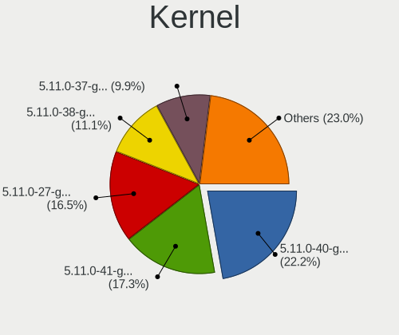
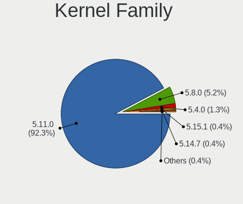
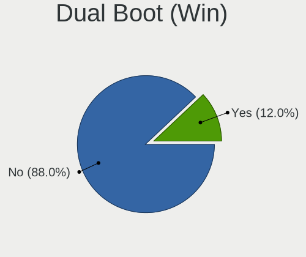
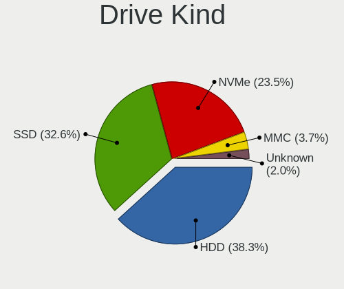
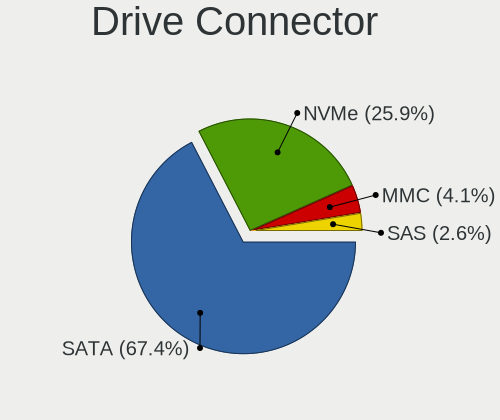
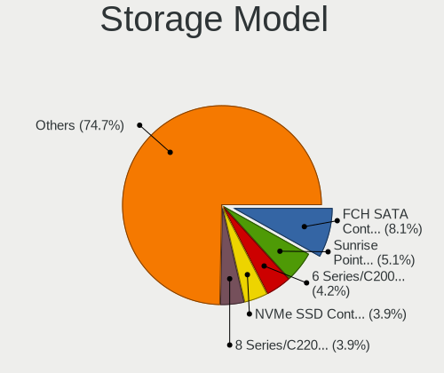
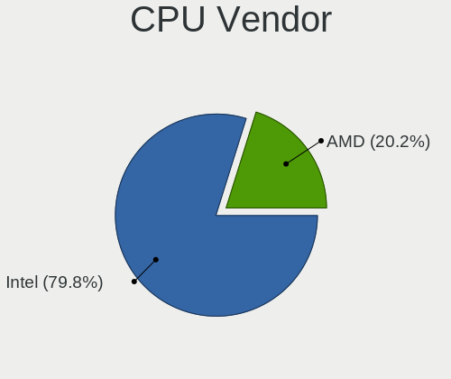
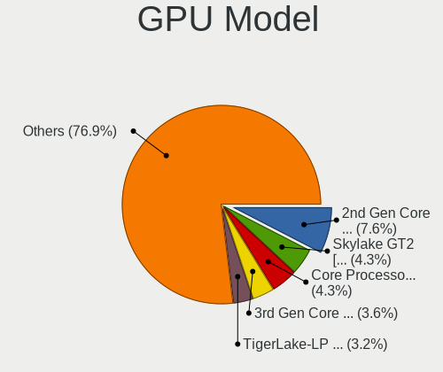
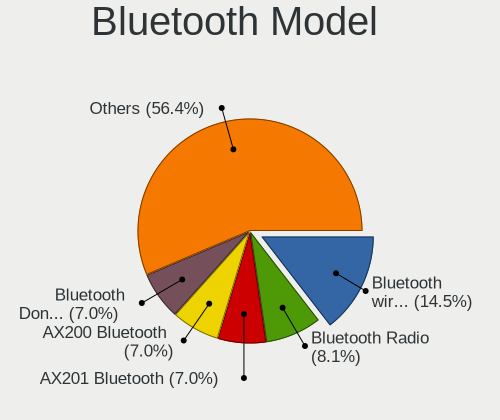
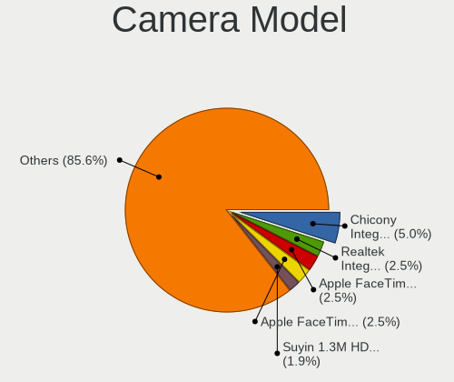

Elementary 6 - Tested Hardware & Statistics
-------------------------------------------

A project to collect tested hardware configurations for Elementary 6.

Anyone can contribute to this report by the [hw-probe](https://github.com/linuxhw/hw-probe) tool:

    sudo -E hw-probe -all -upload

Please submit a probe of your configuration if it's not presented on the page or is rare.

This is a report for all computer types. See also reports for [desktops](/Dist/Elementary_6/Desktop/README.md) and [notebooks](/Dist/Elementary_6/Notebook/README.md).

Full-feature report is available here: https://linux-hardware.org/?view=trends&rel=elementary-6

Contents
--------

* [ Test Cases ](#test-cases)

* [ System ](#system)
  - [ Kernel                   ](#kernel)
  - [ Kernel Family            ](#kernel-family)
  - [ Kernel Major Ver.        ](#kernel-major-ver)
  - [ Arch                     ](#arch)
  - [ DE                       ](#de)
  - [ Display Server           ](#display-server)
  - [ Display Manager          ](#display-manager)
  - [ OS Lang                  ](#os-lang)
  - [ Boot Mode                ](#boot-mode)
  - [ Filesystem               ](#filesystem)
  - [ Part. scheme             ](#part-scheme)
  - [ Dual Boot with Linux/BSD ](#dual-boot-with-linuxbsd)
  - [ Dual Boot (Win)          ](#dual-boot-win)

* [ Board ](#board)
  - [ Vendor                   ](#vendor)
  - [ Model                    ](#model)
  - [ Model Family             ](#model-family)
  - [ MFG Year                 ](#mfg-year)
  - [ Form Factor              ](#form-factor)
  - [ Secure Boot              ](#secure-boot)
  - [ Coreboot                 ](#coreboot)
  - [ RAM Size                 ](#ram-size)
  - [ RAM Used                 ](#ram-used)
  - [ Total Drives             ](#total-drives)
  - [ Has CD-ROM               ](#has-cd-rom)
  - [ Has Ethernet             ](#has-ethernet)
  - [ Has WiFi                 ](#has-wifi)
  - [ Has Bluetooth            ](#has-bluetooth)

* [ Location ](#location)
  - [ Country                  ](#country)
  - [ City                     ](#city)

* [ Drives ](#drives)
  - [ Drive Vendor             ](#drive-vendor)
  - [ Drive Model              ](#drive-model)
  - [ HDD Vendor               ](#hdd-vendor)
  - [ SSD Vendor               ](#ssd-vendor)
  - [ Drive Kind               ](#drive-kind)
  - [ Drive Connector          ](#drive-connector)
  - [ Drive Size               ](#drive-size)
  - [ Space Total              ](#space-total)
  - [ Space Used               ](#space-used)
  - [ Malfunc. Drives          ](#malfunc-drives)
  - [ Malfunc. Drive Vendor    ](#malfunc-drive-vendor)
  - [ Malfunc. HDD Vendor      ](#malfunc-hdd-vendor)
  - [ Malfunc. Drive Kind      ](#malfunc-drive-kind)
  - [ Failed Drives            ](#failed-drives)
  - [ Failed Drive Vendor      ](#failed-drive-vendor)
  - [ Drive Status             ](#drive-status)

* [ Storage controller ](#storage-controller)
  - [ Storage Vendor           ](#storage-vendor)
  - [ Storage Model            ](#storage-model)
  - [ Storage Kind             ](#storage-kind)

* [ Processor ](#processor)
  - [ CPU Vendor               ](#cpu-vendor)
  - [ CPU Model                ](#cpu-model)
  - [ CPU Model Family         ](#cpu-model-family)
  - [ CPU Cores                ](#cpu-cores)
  - [ CPU Sockets              ](#cpu-sockets)
  - [ CPU Threads              ](#cpu-threads)
  - [ CPU Op-Modes             ](#cpu-op-modes)
  - [ CPU Microcode            ](#cpu-microcode)
  - [ CPU Microarch            ](#cpu-microarch)

* [ Graphics ](#graphics)
  - [ GPU Vendor               ](#gpu-vendor)
  - [ GPU Model                ](#gpu-model)
  - [ GPU Combo                ](#gpu-combo)
  - [ GPU Driver               ](#gpu-driver)
  - [ GPU Memory               ](#gpu-memory)

* [ Monitor ](#monitor)
  - [ Monitor Vendor           ](#monitor-vendor)
  - [ Monitor Model            ](#monitor-model)
  - [ Monitor Resolution       ](#monitor-resolution)
  - [ Monitor Diagonal         ](#monitor-diagonal)
  - [ Monitor Width            ](#monitor-width)
  - [ Aspect Ratio             ](#aspect-ratio)
  - [ Monitor Area             ](#monitor-area)
  - [ Pixel Density            ](#pixel-density)
  - [ Multiple Monitors        ](#multiple-monitors)

* [ Network ](#network)
  - [ Net Controller Vendor    ](#net-controller-vendor)
  - [ Net Controller Model     ](#net-controller-model)
  - [ Wireless Vendor          ](#wireless-vendor)
  - [ Wireless Model           ](#wireless-model)
  - [ Ethernet Vendor          ](#ethernet-vendor)
  - [ Ethernet Model           ](#ethernet-model)
  - [ Net Controller Kind      ](#net-controller-kind)
  - [ Used Controller          ](#used-controller)
  - [ NICs                     ](#nics)
  - [ IPv6                     ](#ipv6)

* [ Bluetooth ](#bluetooth)
  - [ Bluetooth Vendor         ](#bluetooth-vendor)
  - [ Bluetooth Model          ](#bluetooth-model)

* [ Sound ](#sound)
  - [ Sound Vendor             ](#sound-vendor)
  - [ Sound Model              ](#sound-model)

* [ Memory ](#memory)
  - [ Memory Vendor            ](#memory-vendor)
  - [ Memory Model             ](#memory-model)
  - [ Memory Kind              ](#memory-kind)
  - [ Memory Form Factor       ](#memory-form-factor)
  - [ Memory Size              ](#memory-size)
  - [ Memory Speed             ](#memory-speed)

* [ Printers & scanners ](#printers--scanners)
  - [ Printer Vendor           ](#printer-vendor)
  - [ Printer Model            ](#printer-model)
  - [ Scanner Vendor           ](#scanner-vendor)
  - [ Scanner Model            ](#scanner-model)

* [ Camera ](#camera)
  - [ Camera Vendor            ](#camera-vendor)
  - [ Camera Model             ](#camera-model)

* [ Security ](#security)
  - [ Fingerprint Vendor       ](#fingerprint-vendor)
  - [ Fingerprint Model        ](#fingerprint-model)
  - [ Chipcard Vendor          ](#chipcard-vendor)
  - [ Chipcard Model           ](#chipcard-model)

* [ Unsupported ](#unsupported)
  - [ Unsupported Devices      ](#unsupported-devices)
  - [ Unsupported Device Types ](#unsupported-device-types)

Test Cases
----------

| Vendor        | Model                       | Form-Factor | Probe                                                      | Date         |
|---------------|-----------------------------|-------------|------------------------------------------------------------|--------------|
| Dell          | Latitude E6410              | Notebook    | [ba51fc9216](https://linux-hardware.org/?probe=ba51fc9216) | Oct 30, 2021 |
| ASRock        | P67 Extreme4                | Desktop     | [a70eb2d3f8](https://linux-hardware.org/?probe=a70eb2d3f8) | Oct 29, 2021 |
| ASRock        | P67 Extreme4                | Desktop     | [0a07f4c735](https://linux-hardware.org/?probe=0a07f4c735) | Oct 29, 2021 |
| MSI           | 2A9Ch                       | Desktop     | [2f752a1a3e](https://linux-hardware.org/?probe=2f752a1a3e) | Oct 28, 2021 |
| Lenovo        | ThinkPad X230 23259L3       | Notebook    | [801c1d8af3](https://linux-hardware.org/?probe=801c1d8af3) | Oct 27, 2021 |
| HP            | Pavilion x360 Convertibl... | Convertible | [6461bfc243](https://linux-hardware.org/?probe=6461bfc243) | Oct 26, 2021 |
| MSI           | Modern 14 B4MW              | Notebook    | [a904daf48d](https://linux-hardware.org/?probe=a904daf48d) | Oct 26, 2021 |
| HP            | 84EE 1100                   | All in one  | [225f3ee57b](https://linux-hardware.org/?probe=225f3ee57b) | Oct 26, 2021 |
| HP            | ProBook 6460b               | Notebook    | [18f27d1f5c](https://linux-hardware.org/?probe=18f27d1f5c) | Oct 25, 2021 |
| Lenovo        | ThinkPad T470 20HD004AUS    | Notebook    | [80fb4514c5](https://linux-hardware.org/?probe=80fb4514c5) | Oct 23, 2021 |
| ASUSTek       | VivoBook 15_ASUS Laptop ... | Notebook    | [5c95c74b6c](https://linux-hardware.org/?probe=5c95c74b6c) | Oct 21, 2021 |
| ASUSTek       | VivoBook 15_ASUS Laptop ... | Notebook    | [f48a449c7a](https://linux-hardware.org/?probe=f48a449c7a) | Oct 21, 2021 |
| HP            | 158B                        | Desktop     | [24399f4e69](https://linux-hardware.org/?probe=24399f4e69) | Oct 20, 2021 |
| Apple         | MacBookAir7,2               | Notebook    | [4ce4f8ba78](https://linux-hardware.org/?probe=4ce4f8ba78) | Oct 20, 2021 |
| Google        | Setzer                      | Notebook    | [e9536ccbfb](https://linux-hardware.org/?probe=e9536ccbfb) | Oct 19, 2021 |
| Google        | Setzer                      | Notebook    | [3ba49636ef](https://linux-hardware.org/?probe=3ba49636ef) | Oct 19, 2021 |
| HP            | 339A                        | Desktop     | [d9c6208191](https://linux-hardware.org/?probe=d9c6208191) | Oct 16, 2021 |
| Apple         | MacBookAir7,2               | Notebook    | [370b129f3f](https://linux-hardware.org/?probe=370b129f3f) | Oct 16, 2021 |
| Lenovo        | ThinkPad E470 20H10052IG    | Notebook    | [1342d4ce00](https://linux-hardware.org/?probe=1342d4ce00) | Oct 15, 2021 |
| HP            | Pavilion dv6500             | Notebook    | [dd3c7ef3e7](https://linux-hardware.org/?probe=dd3c7ef3e7) | Oct 14, 2021 |
| HP            | Pavilion dv6500             | Notebook    | [c1c77cf91a](https://linux-hardware.org/?probe=c1c77cf91a) | Oct 14, 2021 |
| HP            | 2B42                        | All in one  | [42d66aed80](https://linux-hardware.org/?probe=42d66aed80) | Oct 14, 2021 |
| Dell          | 0M9KCM A02                  | Desktop     | [a925b0f3d1](https://linux-hardware.org/?probe=a925b0f3d1) | Oct 12, 2021 |
| Acer          | Aspire ES1-311              | Notebook    | [8f1dd3ce3a](https://linux-hardware.org/?probe=8f1dd3ce3a) | Oct 12, 2021 |
| Acer          | Aspire ES1-311              | Notebook    | [df266accf1](https://linux-hardware.org/?probe=df266accf1) | Oct 12, 2021 |
| Apple         | MacBookAir6,1               | Notebook    | [66f91918dc](https://linux-hardware.org/?probe=66f91918dc) | Oct 12, 2021 |
| Apple         | MacBookAir6,1               | Notebook    | [87403edfc9](https://linux-hardware.org/?probe=87403edfc9) | Oct 11, 2021 |
| HP            | 2B42                        | All in one  | [794d39b312](https://linux-hardware.org/?probe=794d39b312) | Oct 11, 2021 |
| HP            | 2B42                        | All in one  | [936b3a489d](https://linux-hardware.org/?probe=936b3a489d) | Oct 11, 2021 |
| HP            | 2B42                        | All in one  | [c1224ad1ab](https://linux-hardware.org/?probe=c1224ad1ab) | Oct 11, 2021 |
| ASUSTek       | 1215B                       | Notebook    | [7b3bf2ca14](https://linux-hardware.org/?probe=7b3bf2ca14) | Oct 11, 2021 |
| HP            | EliteBook 8440p             | Notebook    | [e5071e6c43](https://linux-hardware.org/?probe=e5071e6c43) | Oct 10, 2021 |
| Gigabyte      | AB350-Gaming 3-CF           | Desktop     | [f6e75d0258](https://linux-hardware.org/?probe=f6e75d0258) | Oct 09, 2021 |
| HP            | ProBook 4530s               | Notebook    | [0a725a0b81](https://linux-hardware.org/?probe=0a725a0b81) | Oct 07, 2021 |
| Apple         | MacBookPro7,1               | Notebook    | [644b3b5b60](https://linux-hardware.org/?probe=644b3b5b60) | Oct 04, 2021 |
| MSI           | B460M PRO-VDH WIFI          | Desktop     | [05711b548f](https://linux-hardware.org/?probe=05711b548f) | Oct 03, 2021 |
| ASUSTek       | TUF GAMING B560M-PLUS       | Desktop     | [de0f051658](https://linux-hardware.org/?probe=de0f051658) | Oct 02, 2021 |
| Shuttle       | FS61                        | Desktop     | [b25047a516](https://linux-hardware.org/?probe=b25047a516) | Oct 01, 2021 |
| Panasonic     | FZ-G1ASH39E3                | Tablet      | [06f11c0449](https://linux-hardware.org/?probe=06f11c0449) | Sep 30, 2021 |
| Panasonic     | FZ-G1ASH39E3                | Tablet      | [961d53afb6](https://linux-hardware.org/?probe=961d53afb6) | Sep 30, 2021 |
| Lenovo        | ThinkPad T430 2342A19       | Notebook    | [32c58fa2f6](https://linux-hardware.org/?probe=32c58fa2f6) | Sep 30, 2021 |
| Dell          | XPS 13 9350                 | Notebook    | [c1dc59d33f](https://linux-hardware.org/?probe=c1dc59d33f) | Sep 29, 2021 |
| Apple         | Mac-F221BEC8                | Desktop     | [1754c64091](https://linux-hardware.org/?probe=1754c64091) | Sep 27, 2021 |
| Lenovo        | IdeaPad 5 15ARE05 81YQ      | Notebook    | [c28700cfda](https://linux-hardware.org/?probe=c28700cfda) | Sep 26, 2021 |
| Lenovo        | Yoga 300-11IBR 80M1         | Notebook    | [fbcf277174](https://linux-hardware.org/?probe=fbcf277174) | Sep 26, 2021 |
| Lenovo        | G50-45 80E3                 | Notebook    | [59224ec754](https://linux-hardware.org/?probe=59224ec754) | Sep 26, 2021 |
| ASUSTek       | P7H55-M                     | Desktop     | [3367bc011a](https://linux-hardware.org/?probe=3367bc011a) | Sep 25, 2021 |
| Dell          | 0Y5DDC A00                  | Desktop     | [df95ea94b8](https://linux-hardware.org/?probe=df95ea94b8) | Sep 25, 2021 |
| Dell          | 0Y5DDC A00                  | Desktop     | [10ee1abc07](https://linux-hardware.org/?probe=10ee1abc07) | Sep 25, 2021 |
| Apple         | MacBookPro10,2              | Notebook    | [25c8a26c00](https://linux-hardware.org/?probe=25c8a26c00) | Sep 24, 2021 |
| ASRock        | M3A790GXH/128M              | Desktop     | [818ec10ec8](https://linux-hardware.org/?probe=818ec10ec8) | Sep 24, 2021 |
| Lenovo        | IdeaPad S145-15AST 81N3     | Notebook    | [c1b8f22fa6](https://linux-hardware.org/?probe=c1b8f22fa6) | Sep 22, 2021 |
| Intel         | X79 V1.x                    | Desktop     | [19223e911c](https://linux-hardware.org/?probe=19223e911c) | Sep 22, 2021 |
| Dell          | Precision M4800             | Notebook    | [736b482dc3](https://linux-hardware.org/?probe=736b482dc3) | Sep 22, 2021 |
| eMachines     | G525                        | Notebook    | [8e8d037369](https://linux-hardware.org/?probe=8e8d037369) | Sep 21, 2021 |
| ASUSTek       | M4N78-AM                    | Desktop     | [3d8e0efc00](https://linux-hardware.org/?probe=3d8e0efc00) | Sep 21, 2021 |
| HUAWEI        | NBLB-WAX9N                  | Notebook    | [9d25d0c5c7](https://linux-hardware.org/?probe=9d25d0c5c7) | Sep 21, 2021 |
| Lenovo        | ThinkPad W700 2758MVG       | Notebook    | [66c8ecbaa1](https://linux-hardware.org/?probe=66c8ecbaa1) | Sep 20, 2021 |
| Dell          | XPS 13 9350                 | Notebook    | [b01438543e](https://linux-hardware.org/?probe=b01438543e) | Sep 20, 2021 |
| Apple         | MacBookPro10,2              | Notebook    | [0e44f5011a](https://linux-hardware.org/?probe=0e44f5011a) | Sep 20, 2021 |
| Lenovo        | ThinkPad X1 Carbon 3448B... | Notebook    | [2bec640695](https://linux-hardware.org/?probe=2bec640695) | Sep 20, 2021 |
| Lenovo        | IdeaPad 5 15ARE05 81YQ      | Notebook    | [d2511347b4](https://linux-hardware.org/?probe=d2511347b4) | Sep 19, 2021 |
| HP            | ENVY 15                     | Notebook    | [ba9a8e1d7a](https://linux-hardware.org/?probe=ba9a8e1d7a) | Sep 19, 2021 |
| Lenovo        | V330-15IKB 81AX             | Notebook    | [9d10bffde2](https://linux-hardware.org/?probe=9d10bffde2) | Sep 18, 2021 |
| Lenovo        | ThinkPad X250 20CLS32H00    | Notebook    | [15981e12f3](https://linux-hardware.org/?probe=15981e12f3) | Sep 18, 2021 |
| Lenovo        | ThinkPad X250 20CLS32H00    | Notebook    | [bcdb4d552d](https://linux-hardware.org/?probe=bcdb4d552d) | Sep 18, 2021 |
| HP            | ENVY 15                     | Notebook    | [d2d607895f](https://linux-hardware.org/?probe=d2d607895f) | Sep 18, 2021 |
| ASRock        | A320M-HDV                   | Desktop     | [24bb7c7d18](https://linux-hardware.org/?probe=24bb7c7d18) | Sep 17, 2021 |
| Alienware     | 17                          | Notebook    | [c97b201719](https://linux-hardware.org/?probe=c97b201719) | Sep 17, 2021 |
| Acer          | Aspire V3-572G              | Notebook    | [addf12cb05](https://linux-hardware.org/?probe=addf12cb05) | Sep 16, 2021 |
| TUXEDO        | InfinityBook S 14 Gen6      | Notebook    | [0c206818b9](https://linux-hardware.org/?probe=0c206818b9) | Sep 15, 2021 |
| Acer          | Aspire VX5-591G             | Notebook    | [c7d5407b29](https://linux-hardware.org/?probe=c7d5407b29) | Sep 15, 2021 |
| Dell          | Latitude E7440              | Notebook    | [fc9f25eecb](https://linux-hardware.org/?probe=fc9f25eecb) | Sep 14, 2021 |
| Toshiba       | Satellite P100              | Notebook    | [bc5b605920](https://linux-hardware.org/?probe=bc5b605920) | Sep 13, 2021 |
| HP            | Pavilion Notebook           | Notebook    | [591ba7a77c](https://linux-hardware.org/?probe=591ba7a77c) | Sep 12, 2021 |
| Dell          | Inspiron 3583               | Notebook    | [49b4db94c6](https://linux-hardware.org/?probe=49b4db94c6) | Sep 12, 2021 |
| Lenovo        | 371C No DPK                 | All in one  | [cd0d01d653](https://linux-hardware.org/?probe=cd0d01d653) | Sep 11, 2021 |
| ASUSTek       | UX303LA                     | Notebook    | [1a67d956de](https://linux-hardware.org/?probe=1a67d956de) | Sep 11, 2021 |
| Intel         | H61                         | Desktop     | [0010dbcb5e](https://linux-hardware.org/?probe=0010dbcb5e) | Sep 10, 2021 |
| HP            | Pavilion Notebook           | Notebook    | [f373a049e2](https://linux-hardware.org/?probe=f373a049e2) | Sep 10, 2021 |
| HP            | 8767 A                      | Desktop     | [7f022c67ac](https://linux-hardware.org/?probe=7f022c67ac) | Sep 09, 2021 |
| HP            | Pavilion Notebook           | Notebook    | [6e97abfd44](https://linux-hardware.org/?probe=6e97abfd44) | Sep 09, 2021 |
| Lenovo        | ThinkPad X201 3249CTO       | Notebook    | [7b3432fcf6](https://linux-hardware.org/?probe=7b3432fcf6) | Sep 08, 2021 |
| HP            | Laptop 14-dq1xxx            | Notebook    | [0614925ee7](https://linux-hardware.org/?probe=0614925ee7) | Sep 08, 2021 |
| Gateway       | NV54 Series                 | Notebook    | [fcf57528ed](https://linux-hardware.org/?probe=fcf57528ed) | Sep 08, 2021 |
| HP            | ENVY x360 Convertible 13... | Convertible | [dfb9789af2](https://linux-hardware.org/?probe=dfb9789af2) | Sep 07, 2021 |
| Sony          | Serie VJC14                 | Notebook    | [27828e1dfb](https://linux-hardware.org/?probe=27828e1dfb) | Sep 07, 2021 |
| Sony          | Serie VJC14                 | Notebook    | [4c1200e7cf](https://linux-hardware.org/?probe=4c1200e7cf) | Sep 07, 2021 |
| Lenovo        | V330-15IKB 81AX             | Notebook    | [797db05baf](https://linux-hardware.org/?probe=797db05baf) | Sep 06, 2021 |
| Microsoft     | Surface Laptop Go           | Tablet      | [ebd997cb1a](https://linux-hardware.org/?probe=ebd997cb1a) | Sep 05, 2021 |
| Microsoft     | Surface Laptop Go           | Tablet      | [a5d7b5a10e](https://linux-hardware.org/?probe=a5d7b5a10e) | Sep 05, 2021 |
| HP            | Laptop 15-bs1xx             | Notebook    | [91ecd39f66](https://linux-hardware.org/?probe=91ecd39f66) | Sep 05, 2021 |
| Gigabyte      | B450M DS3H V2               | Desktop     | [633441bc2b](https://linux-hardware.org/?probe=633441bc2b) | Sep 05, 2021 |
| Medion        | AKOYA THE TOUCH 10          | Notebook    | [d49d62a2f5](https://linux-hardware.org/?probe=d49d62a2f5) | Sep 04, 2021 |
| ASUSTek       | ROG STRIX Z590-F GAMING ... | Desktop     | [c9476d5d06](https://linux-hardware.org/?probe=c9476d5d06) | Sep 02, 2021 |
| Apple         | MacBookPro8,1               | Notebook    | [da332ba09e](https://linux-hardware.org/?probe=da332ba09e) | Sep 01, 2021 |
| HP            | 86ED A01                    | All in one  | [78778f22a2](https://linux-hardware.org/?probe=78778f22a2) | Sep 01, 2021 |
| HP            | EliteBook Folio 9470m       | Notebook    | [adbb6a690a](https://linux-hardware.org/?probe=adbb6a690a) | Sep 01, 2021 |
| Dell          | Latitude 3580               | Notebook    | [2befbbba9e](https://linux-hardware.org/?probe=2befbbba9e) | Aug 31, 2021 |
| HP            | Pavilion g6                 | Notebook    | [7dba3c201c](https://linux-hardware.org/?probe=7dba3c201c) | Aug 31, 2021 |
| Gigabyte      | F2A55M-HD2                  | Desktop     | [0c05ab5b21](https://linux-hardware.org/?probe=0c05ab5b21) | Aug 30, 2021 |
| HP            | Pavilion Aero Laptop 13-... | Notebook    | [48c720456a](https://linux-hardware.org/?probe=48c720456a) | Aug 30, 2021 |
| ASRock        | H81TM-ITX R2.0              | Desktop     | [4f04e7309e](https://linux-hardware.org/?probe=4f04e7309e) | Aug 30, 2021 |
| HP            | ProBook 4320s               | Notebook    | [94f189cea1](https://linux-hardware.org/?probe=94f189cea1) | Aug 29, 2021 |
| eMachines     | G525                        | Notebook    | [d64e29475f](https://linux-hardware.org/?probe=d64e29475f) | Aug 29, 2021 |
| Microsoft     | Surface Pro 4               | Tablet      | [aeec497ed8](https://linux-hardware.org/?probe=aeec497ed8) | Aug 28, 2021 |
| Lenovo        | ThinkPad X201 3249CTO       | Notebook    | [0a9bdb4827](https://linux-hardware.org/?probe=0a9bdb4827) | Aug 27, 2021 |
| Acer          | Aspire A515-51G             | Notebook    | [df0d3e8ac4](https://linux-hardware.org/?probe=df0d3e8ac4) | Aug 26, 2021 |
| ASUSTek       | M5A78L-M LX/BR              | Desktop     | [d0ff1c6977](https://linux-hardware.org/?probe=d0ff1c6977) | Aug 25, 2021 |
| HP            | 86ED A01                    | All in one  | [402a8e492c](https://linux-hardware.org/?probe=402a8e492c) | Aug 24, 2021 |
| ASUSTek       | P6X58D-E                    | Desktop     | [db1ef28e92](https://linux-hardware.org/?probe=db1ef28e92) | Aug 20, 2021 |
| HP            | Laptop 15-bs0xx             | Notebook    | [fae546f5cb](https://linux-hardware.org/?probe=fae546f5cb) | Aug 20, 2021 |
| Apple         | MacBookPro9,1               | Notebook    | [e9bec90506](https://linux-hardware.org/?probe=e9bec90506) | Aug 19, 2021 |
| MSI           | X470 GAMING PLUS MAX        | Desktop     | [1176a287c7](https://linux-hardware.org/?probe=1176a287c7) | Aug 19, 2021 |
| Acer          | Aspire F5-573G              | Notebook    | [9d7628068c](https://linux-hardware.org/?probe=9d7628068c) | Aug 19, 2021 |
| Dell          | XPS L321X                   | Notebook    | [34d7fb6cbb](https://linux-hardware.org/?probe=34d7fb6cbb) | Aug 18, 2021 |
| HP            | ProBook 450 G8 Notebook ... | Notebook    | [f30480d463](https://linux-hardware.org/?probe=f30480d463) | Aug 17, 2021 |
| HP            | Notebook                    | Notebook    | [a3058005e3](https://linux-hardware.org/?probe=a3058005e3) | Aug 16, 2021 |
| HP            | Notebook                    | Notebook    | [7800ef9623](https://linux-hardware.org/?probe=7800ef9623) | Aug 16, 2021 |
| Lenovo        | IdeaPad 330-15IKB 81FE      | Notebook    | [fa6c69671f](https://linux-hardware.org/?probe=fa6c69671f) | Aug 16, 2021 |
| ASUSTek       | TUF GAMING B450M-PRO II     | Desktop     | [73beb900ea](https://linux-hardware.org/?probe=73beb900ea) | Aug 15, 2021 |
| Acidanther... | Mac-7BA5B2D9E42DDD94 iMa... | All in one  | [a8d4959fde](https://linux-hardware.org/?probe=a8d4959fde) | Aug 14, 2021 |
| Apple         | MacBookPro9,1               | Notebook    | [a6b2c12401](https://linux-hardware.org/?probe=a6b2c12401) | Aug 14, 2021 |
| Dell          | Precision 5760              | Notebook    | [824e5e7dad](https://linux-hardware.org/?probe=824e5e7dad) | Aug 14, 2021 |
| Gigabyte      | X570 I AORUS PRO WIFI       | Desktop     | [e302074e5e](https://linux-hardware.org/?probe=e302074e5e) | Aug 14, 2021 |
| Acer          | Aspire A514-54              | Notebook    | [dcfc87a32f](https://linux-hardware.org/?probe=dcfc87a32f) | Aug 14, 2021 |
| Acer          | Aspire A514-54              | Notebook    | [e354646c04](https://linux-hardware.org/?probe=e354646c04) | Aug 13, 2021 |
| Gigabyte      | H310M M.2 x.x               | Desktop     | [69e2e83b95](https://linux-hardware.org/?probe=69e2e83b95) | Aug 10, 2021 |
| Gigabyte      | H310M M.2 x.x               | Desktop     | [86d69a15b9](https://linux-hardware.org/?probe=86d69a15b9) | Aug 10, 2021 |
| HP            | Pavilion Gaming Laptop 1... | Notebook    | [4e6f050b43](https://linux-hardware.org/?probe=4e6f050b43) | Aug 10, 2021 |
| Toshiba       | Satellite L500              | Notebook    | [76a8d2c20a](https://linux-hardware.org/?probe=76a8d2c20a) | Jul 29, 2021 |
| Google        | Cave                        | Notebook    | [e2617f0c2d](https://linux-hardware.org/?probe=e2617f0c2d) | Jul 25, 2021 |
| ASUSTek       | P5KPL-AM SE                 | Desktop     | [a97fc63d3d](https://linux-hardware.org/?probe=a97fc63d3d) | Jul 23, 2021 |
| Toshiba       | Satellite L500              | Notebook    | [7124417642](https://linux-hardware.org/?probe=7124417642) | Jul 22, 2021 |
| HP            | Stream Laptop 14-cb1xxx     | Notebook    | [0447155931](https://linux-hardware.org/?probe=0447155931) | Jul 02, 2021 |
| Acer          | Swift SF314-55G             | Notebook    | [c371b46cbe](https://linux-hardware.org/?probe=c371b46cbe) | Jun 30, 2021 |
| Acer          | Swift SF315-41              | Notebook    | [8df5e13fc0](https://linux-hardware.org/?probe=8df5e13fc0) | Jun 18, 2021 |
| ASRock        | B450 Pro4                   | Desktop     | [c5d0611f79](https://linux-hardware.org/?probe=c5d0611f79) | Jun 13, 2021 |
| Acer          | Swift SF314-55G             | Notebook    | [4e5cf8aa1e](https://linux-hardware.org/?probe=4e5cf8aa1e) | Jun 13, 2021 |
| ASUSTek       | TUF GAMING B550M-PLUS       | Desktop     | [63da02a979](https://linux-hardware.org/?probe=63da02a979) | May 19, 2021 |
| Acer          | ConceptD CN315-71P          | Notebook    | [5ecea84320](https://linux-hardware.org/?probe=5ecea84320) | May 15, 2021 |
| ASUSTek       | TUF GAMING B550M-PLUS       | Desktop     | [223234378e](https://linux-hardware.org/?probe=223234378e) | May 04, 2021 |
| HP            | ENVY x360 Convertible 15... | Convertible | [e177523d81](https://linux-hardware.org/?probe=e177523d81) | May 03, 2021 |
| ASUSTek       | ROG STRIX B450-I GAMING     | Desktop     | [a208e8a358](https://linux-hardware.org/?probe=a208e8a358) | May 01, 2021 |
| Apple         | MacBookPro8,2               | Notebook    | [e87a073ae8](https://linux-hardware.org/?probe=e87a073ae8) | Mar 18, 2021 |
| HP            | EliteBook 840 G3            | Notebook    | [1e31858e51](https://linux-hardware.org/?probe=1e31858e51) | Mar 09, 2021 |
| ASUSTek       | M5A99X EVO R2.0             | Desktop     | [f7d949f5a7](https://linux-hardware.org/?probe=f7d949f5a7) | Dec 23, 2020 |
| HP            | 8433 11                     | Desktop     | [691ef58a05](https://linux-hardware.org/?probe=691ef58a05) | Dec 09, 2020 |

System
------

Kernel
------

Version of the Linux kernel

| Version                | Computers | Percent |
|------------------------|-----------|---------|
| 5.11.0-27-generic      | 38        | 31.93%  |
| 5.11.0-37-generic      | 22        | 18.49%  |
| 5.11.0-25-generic      | 16        | 13.45%  |
| 5.11.0-34-generic      | 14        | 11.76%  |
| 5.11.0-38-generic      | 8         | 6.72%   |
| 5.8.0-50-generic       | 5         | 4.2%    |
| 5.11.0-36-generic      | 4         | 3.36%   |
| 5.8.0-55-generic       | 3         | 2.52%   |
| 5.8.0-63-generic       | 2         | 1.68%   |
| 5.8.0-53-generic       | 1         | 0.84%   |
| 5.8.0-44-generic       | 1         | 0.84%   |
| 5.4.0-58-generic       | 1         | 0.84%   |
| 5.4.0-56-generic       | 1         | 0.84%   |
| 5.14.7-xanmod1-cacule  | 1         | 0.84%   |
| 5.14.14-051414-generic | 1         | 0.84%   |
| 5.11.0-051100-generic  | 1         | 0.84%   |

Kernel Family
-------------

Linux kernel without a distro release

| Version | Computers | Percent |
|---------|-----------|---------|
| 5.11.0  | 102       | 86.44%  |
| 5.8.0   | 12        | 10.17%  |
| 5.4.0   | 2         | 1.69%   |
| 5.14.7  | 1         | 0.85%   |
| 5.14.14 | 1         | 0.85%   |

Kernel Major Ver.
-----------------

Linux kernel major version

| Version | Computers | Percent |
|---------|-----------|---------|
| 5.11    | 102       | 86.44%  |
| 5.8     | 12        | 10.17%  |
| 5.4     | 2         | 1.69%   |
| 5.14    | 2         | 1.69%   |

Arch
----

OS architecture (x86_64, i586, etc.)

| Name   | Computers | Percent |
|--------|-----------|---------|
| x86_64 | 118       | 100%    |

DE
--

Desktop Environment

| Name       | Computers | Percent |
|------------|-----------|---------|
| Pantheon   | 105       | 88.98%  |
| Unknown    | 9         | 7.63%   |
| GNOME      | 2         | 1.69%   |
| X-Cinnamon | 1         | 0.85%   |
| MATE       | 1         | 0.85%   |

Display Server
--------------

X11 or Wayland

| Name | Computers | Percent |
|------|-----------|---------|
| X11  | 118       | 100%    |

Display Manager
---------------

SDDM, LightDM, etc.

| Name    | Computers | Percent |
|---------|-----------|---------|
| Unknown | 94        | 79.66%  |
| LightDM | 15        | 12.71%  |
| TDM     | 7         | 5.93%   |
| GDM     | 2         | 1.69%   |

OS Lang
-------

Language

| Lang  | Computers | Percent |
|-------|-----------|---------|
| en_US | 57        | 48.31%  |
| es_ES | 12        | 10.17%  |
| de_DE | 11        | 9.32%   |
| fr_FR | 6         | 5.08%   |
| ru_RU | 4         | 3.39%   |
| pt_BR | 4         | 3.39%   |
| en_GB | 3         | 2.54%   |
| zh_CN | 2         | 1.69%   |
| pl_PL | 2         | 1.69%   |
| it_IT | 2         | 1.69%   |
| en_CA | 2         | 1.69%   |
| en_AU | 2         | 1.69%   |
| cs_CZ | 2         | 1.69%   |
| ca_ES | 2         | 1.69%   |
| vi_VN | 1         | 0.85%   |
| tr_TR | 1         | 0.85%   |
| nl_NL | 1         | 0.85%   |
| hr_HR | 1         | 0.85%   |
| fr_BE | 1         | 0.85%   |
| es_MX | 1         | 0.85%   |
| de_CH | 1         | 0.85%   |

Boot Mode
---------

EFI or BIOS

| Mode | Computers | Percent |
|------|-----------|---------|
| EFI  | 73        | 61.86%  |
| BIOS | 45        | 38.14%  |

Filesystem
----------

Type of filesystem

| Type    | Computers | Percent |
|---------|-----------|---------|
| Ext4    | 112       | 94.92%  |
| Overlay | 4         | 3.39%   |
| Btrfs   | 2         | 1.69%   |

Part. scheme
------------

Scheme of partitioning

| Type    | Computers | Percent |
|---------|-----------|---------|
| Unknown | 95        | 80.51%  |
| GPT     | 15        | 12.71%  |
| MBR     | 8         | 6.78%   |

Dual Boot with Linux/BSD
------------------------

Hosting more than one Linux/BSD

| Dual boot | Computers | Percent |
|-----------|-----------|---------|
| No        | 112       | 94.92%  |
| Yes       | 6         | 5.08%   |

Dual Boot (Win)
---------------

Hosting Linux and Windows

| Dual boot | Computers | Percent |
|-----------|-----------|---------|
| No        | 102       | 86.44%  |
| Yes       | 16        | 13.56%  |

Board
-----

Vendor
------

Motherboard manufacturer

| Name                | Computers | Percent |
|---------------------|-----------|---------|
| Hewlett-Packard     | 29        | 24.58%  |
| Lenovo              | 14        | 11.86%  |
| ASUSTek Computer    | 14        | 11.86%  |
| Dell                | 11        | 9.32%   |
| Apple               | 11        | 9.32%   |
| Acer                | 9         | 7.63%   |
| Gigabyte Technology | 5         | 4.24%   |
| ASRock              | 5         | 4.24%   |
| MSI                 | 4         | 3.39%   |
| Toshiba             | 2         | 1.69%   |
| Intel               | 2         | 1.69%   |
| TUXEDO              | 1         | 0.85%   |
| Sony                | 1         | 0.85%   |
| Shuttle             | 1         | 0.85%   |
| Panasonic           | 1         | 0.85%   |
| Microsoft           | 1         | 0.85%   |
| Medion              | 1         | 0.85%   |
| HUAWEI              | 1         | 0.85%   |
| Google              | 1         | 0.85%   |
| Gateway             | 1         | 0.85%   |
| eMachines           | 1         | 0.85%   |
| Alienware           | 1         | 0.85%   |
| Acidanthera         | 1         | 0.85%   |

Model
-----

Motherboard model

| Name                                       | Computers | Percent |
|--------------------------------------------|-----------|---------|
| HP Pavilion Notebook                       | 2         | 1.69%   |
| Dell XPS 13 9350                           | 2         | 1.69%   |
| Apple MacBookPro9,1                        | 2         | 1.69%   |
| Apple MacBookPro10,2                       | 2         | 1.69%   |
| Apple MacBookAir7,2                        | 2         | 1.69%   |
| TUXEDO InfinityBook S 14 Gen6              | 1         | 0.85%   |
| Toshiba Satellite P100                     | 1         | 0.85%   |
| Toshiba Satellite L500                     | 1         | 0.85%   |
| Sony Serie VJC14                           | 1         | 0.85%   |
| Shuttle DS61                               | 1         | 0.85%   |
| Panasonic FZ-G1ASH39E3                     | 1         | 0.85%   |
| MSI MS-7C83                                | 1         | 0.85%   |
| MSI MS-7B79                                | 1         | 0.85%   |
| MSI Modern 14 B4MW                         | 1         | 0.85%   |
| MSI Elite 7100 Microtower PC               | 1         | 0.85%   |
| Microsoft Surface Pro 4                    | 1         | 0.85%   |
| Medion AKOYA THE TOUCH 10                  | 1         | 0.85%   |
| Lenovo Yoga 300-11IBR 80M1                 | 1         | 0.85%   |
| Lenovo V330-15IKB 81AX                     | 1         | 0.85%   |
| Lenovo ThinkPad X250 20CLS32H00            | 1         | 0.85%   |
| Lenovo ThinkPad X230 23259L3               | 1         | 0.85%   |
| Lenovo ThinkPad X201 3249CTO               | 1         | 0.85%   |
| Lenovo ThinkPad X1 Carbon 3448B86          | 1         | 0.85%   |
| Lenovo ThinkPad W700 2758MVG               | 1         | 0.85%   |
| Lenovo ThinkPad T470 20HD004AUS            | 1         | 0.85%   |
| Lenovo ThinkPad T430 2342A19               | 1         | 0.85%   |
| Lenovo ThinkPad E470 20H10052IG            | 1         | 0.85%   |
| Lenovo IdeaPad S145-15AST 81N3             | 1         | 0.85%   |
| Lenovo IdeaPad 330-15IKB 81FE              | 1         | 0.85%   |
| Lenovo IdeaCentre AIO 3 24ARE05 F0EW00FLSC | 1         | 0.85%   |
| Lenovo G50-45 80E3                         | 1         | 0.85%   |
| Intel X64                                  | 1         | 0.85%   |
| Intel H61                                  | 1         | 0.85%   |
| HUAWEI NBLB-WAX9N                          | 1         | 0.85%   |
| HP Z820 Workstation                        | 1         | 0.85%   |
| HP Stream Laptop 14-cb1xxx                 | 1         | 0.85%   |
| HP ProBook 6460b                           | 1         | 0.85%   |
| HP ProBook 4530s                           | 1         | 0.85%   |
| HP ProBook 450 G8 Notebook PC              | 1         | 0.85%   |
| HP ProBook 4320s                           | 1         | 0.85%   |
| HP Pavilion x360 Convertible 14-dw1xxx     | 1         | 0.85%   |
| HP Pavilion Gaming Laptop 15-ec0xxx        | 1         | 0.85%   |
| HP Pavilion Gaming Desktop TG01-1xxx       | 1         | 0.85%   |
| HP Pavilion g6                             | 1         | 0.85%   |
| HP Pavilion dv6500                         | 1         | 0.85%   |
| HP Pavilion Desktop 590-p0xxx              | 1         | 0.85%   |
| HP Pavilion All-in-One 24-xa0xxx           | 1         | 0.85%   |
| HP Pavilion All-in-One 24-k0xxx            | 1         | 0.85%   |
| HP Pavilion Aero Laptop 13-be0xxx          | 1         | 0.85%   |
| HP Notebook                                | 1         | 0.85%   |
| HP Laptop 15-bs1xx                         | 1         | 0.85%   |
| HP Laptop 15-bs0xx                         | 1         | 0.85%   |
| HP Laptop 14-dq1xxx                        | 1         | 0.85%   |
| HP ENVY x360 Convertible 15-ee0xxx         | 1         | 0.85%   |
| HP ENVY x360 Convertible 13-ag0xxx         | 1         | 0.85%   |
| HP ENVY 15                                 | 1         | 0.85%   |
| HP EliteBook Folio 9470m                   | 1         | 0.85%   |
| HP EliteBook 8440p                         | 1         | 0.85%   |
| HP EliteBook 840 G3                        | 1         | 0.85%   |
| HP 339A                                    | 1         | 0.85%   |

Model Family
------------

Motherboard model prefix

| Name                   | Computers | Percent |
|------------------------|-----------|---------|
| HP Pavilion            | 11        | 9.32%   |
| Lenovo ThinkPad        | 8         | 6.78%   |
| Acer Aspire            | 6         | 5.08%   |
| HP ProBook             | 4         | 3.39%   |
| HP Laptop              | 3         | 2.54%   |
| HP ENVY                | 3         | 2.54%   |
| HP EliteBook           | 3         | 2.54%   |
| Dell XPS               | 3         | 2.54%   |
| Dell Latitude          | 3         | 2.54%   |
| ASUS TUF               | 3         | 2.54%   |
| Toshiba Satellite      | 2         | 1.69%   |
| Lenovo IdeaPad         | 2         | 1.69%   |
| Dell Precision         | 2         | 1.69%   |
| Dell OptiPlex          | 2         | 1.69%   |
| ASUS ROG               | 2         | 1.69%   |
| Apple MacBookPro9      | 2         | 1.69%   |
| Apple MacBookPro8      | 2         | 1.69%   |
| Apple MacBookPro10     | 2         | 1.69%   |
| Apple MacBookAir7      | 2         | 1.69%   |
| Acer Swift             | 2         | 1.69%   |
| TUXEDO InfinityBook    | 1         | 0.85%   |
| Sony Serie             | 1         | 0.85%   |
| Shuttle DS61           | 1         | 0.85%   |
| Panasonic FZ-G1ASH39E3 | 1         | 0.85%   |
| MSI MS-7C83            | 1         | 0.85%   |
| MSI MS-7B79            | 1         | 0.85%   |
| MSI Modern             | 1         | 0.85%   |
| MSI Elite              | 1         | 0.85%   |
| Microsoft Surface      | 1         | 0.85%   |
| Medion AKOYA           | 1         | 0.85%   |
| Lenovo Yoga            | 1         | 0.85%   |
| Lenovo V330-15IKB      | 1         | 0.85%   |
| Lenovo IdeaCentre      | 1         | 0.85%   |
| Lenovo G50-45          | 1         | 0.85%   |
| Intel X64              | 1         | 0.85%   |
| Intel H61              | 1         | 0.85%   |
| HUAWEI NBLB-WAX9N      | 1         | 0.85%   |
| HP Z820                | 1         | 0.85%   |
| HP Stream              | 1         | 0.85%   |
| HP Notebook            | 1         | 0.85%   |
| HP 339A                | 1         | 0.85%   |
| HP 23-q014a            | 1         | 0.85%   |
| Google Setzer          | 1         | 0.85%   |
| Gigabyte X570          | 1         | 0.85%   |
| Gigabyte H310M         | 1         | 0.85%   |
| Gigabyte F2A55M-HD2    | 1         | 0.85%   |
| Gigabyte B450M         | 1         | 0.85%   |
| Gigabyte AB350-Gaming  | 1         | 0.85%   |
| Gateway NV54           | 1         | 0.85%   |
| eMachines G525         | 1         | 0.85%   |
| Dell Inspiron          | 1         | 0.85%   |
| ASUS VivoBook          | 1         | 0.85%   |
| ASUS UX303LA           | 1         | 0.85%   |
| ASUS P7H55-M           | 1         | 0.85%   |
| ASUS P6X58D-E          | 1         | 0.85%   |
| ASUS P5KPL-AM          | 1         | 0.85%   |
| ASUS M5A99X            | 1         | 0.85%   |
| ASUS M5A78L-M          | 1         | 0.85%   |
| ASUS M4N78-AM          | 1         | 0.85%   |
| ASUS 1215B             | 1         | 0.85%   |

MFG Year
--------

Motherboard manufacture year

| Year    | Computers | Percent |
|---------|-----------|---------|
| 2021    | 28        | 23.73%  |
| 2020    | 16        | 13.56%  |
| 2019    | 14        | 11.86%  |
| 2018    | 13        | 11.02%  |
| 2015    | 10        | 8.47%   |
| 2012    | 7         | 5.93%   |
| 2014    | 6         | 5.08%   |
| 2013    | 6         | 5.08%   |
| 2010    | 5         | 4.24%   |
| 2017    | 4         | 3.39%   |
| 2011    | 4         | 3.39%   |
| 2009    | 2         | 1.69%   |
| 2016    | 1         | 0.85%   |
| 2007    | 1         | 0.85%   |
| Unknown | 1         | 0.85%   |

Form Factor
-----------

Physical design of the computer

| Name        | Computers | Percent |
|-------------|-----------|---------|
| Notebook    | 74        | 62.71%  |
| Desktop     | 34        | 28.81%  |
| All in one  | 5         | 4.24%   |
| Convertible | 3         | 2.54%   |
| Tablet      | 2         | 1.69%   |

Secure Boot
-----------

Enabled or disabled

| State    | Computers | Percent |
|----------|-----------|---------|
| Disabled | 98        | 83.05%  |
| Enabled  | 20        | 16.95%  |

Coreboot
--------

Have coreboot on board

| Used | Computers | Percent |
|------|-----------|---------|
| No   | 117       | 99.15%  |
| Yes  | 1         | 0.85%   |

RAM Size
--------

Total RAM memory

| Size in GB  | Computers | Percent |
|-------------|-----------|---------|
| 4.01-8.0    | 37        | 31.36%  |
| 3.01-4.0    | 23        | 19.49%  |
| 16.01-24.0  | 20        | 16.95%  |
| 8.01-16.0   | 18        | 15.25%  |
| 32.01-64.0  | 15        | 12.71%  |
| 1.01-2.0    | 2         | 1.69%   |
| 24.01-32.0  | 1         | 0.85%   |
| 2.01-3.0    | 1         | 0.85%   |
| 64.01-256.0 | 1         | 0.85%   |

RAM Used
--------

Used RAM memory

| Used GB   | Computers | Percent |
|-----------|-----------|---------|
| 1.01-2.0  | 45        | 37.5%   |
| 2.01-3.0  | 38        | 31.67%  |
| 3.01-4.0  | 21        | 17.5%   |
| 4.01-8.0  | 14        | 11.67%  |
| 8.01-16.0 | 2         | 1.67%   |

Total Drives
------------

Number of drives on board

| Drives | Computers | Percent |
|--------|-----------|---------|
| 1      | 77        | 65.25%  |
| 2      | 30        | 25.42%  |
| 3      | 5         | 4.24%   |
| 4      | 4         | 3.39%   |
| 6      | 1         | 0.85%   |
| 5      | 1         | 0.85%   |

Has CD-ROM
----------

Has CD-ROM on board

| Presented | Computers | Percent |
|-----------|-----------|---------|
| No        | 85        | 72.03%  |
| Yes       | 33        | 27.97%  |

Has Ethernet
------------

Has Ethernet on board

| Presented | Computers | Percent |
|-----------|-----------|---------|
| Yes       | 95        | 80.51%  |
| No        | 23        | 19.49%  |

Has WiFi
--------

Has WiFi module

| Presented | Computers | Percent |
|-----------|-----------|---------|
| Yes       | 101       | 85.59%  |
| No        | 17        | 14.41%  |

Has Bluetooth
-------------

Has Bluetooth module

| Presented | Computers | Percent |
|-----------|-----------|---------|
| Yes       | 91        | 76.47%  |
| No        | 28        | 23.53%  |

Location
--------

Country
-------

Geographic location (country)

| Country            | Computers | Percent |
|--------------------|-----------|---------|
| USA                | 15        | 12.71%  |
| Germany            | 12        | 10.17%  |
| India              | 7         | 5.93%   |
| Russia             | 6         | 5.08%   |
| UK                 | 5         | 4.24%   |
| France             | 5         | 4.24%   |
| Brazil             | 5         | 4.24%   |
| Argentina          | 5         | 4.24%   |
| Spain              | 4         | 3.39%   |
| Indonesia          | 4         | 3.39%   |
| Netherlands        | 3         | 2.54%   |
| Mexico             | 3         | 2.54%   |
| Czechia            | 3         | 2.54%   |
| Canada             | 3         | 2.54%   |
| Australia          | 3         | 2.54%   |
| Poland             | 2         | 1.69%   |
| Italy              | 2         | 1.69%   |
| Guatemala          | 2         | 1.69%   |
| Finland            | 2         | 1.69%   |
| Denmark            | 2         | 1.69%   |
| Belgium            | 2         | 1.69%   |
| Vietnam            | 1         | 0.85%   |
| Turkey             | 1         | 0.85%   |
| Switzerland        | 1         | 0.85%   |
| Sweden             | 1         | 0.85%   |
| South Africa       | 1         | 0.85%   |
| Serbia             | 1         | 0.85%   |
| Paraguay           | 1         | 0.85%   |
| New Zealand        | 1         | 0.85%   |
| Myanmar            | 1         | 0.85%   |
| Morocco            | 1         | 0.85%   |
| Latvia             | 1         | 0.85%   |
| Kenya              | 1         | 0.85%   |
| Kazakhstan         | 1         | 0.85%   |
| Japan              | 1         | 0.85%   |
| Guyana             | 1         | 0.85%   |
| Greece             | 1         | 0.85%   |
| Estonia            | 1         | 0.85%   |
| Dominican Republic | 1         | 0.85%   |
| Croatia            | 1         | 0.85%   |
| Colombia           | 1         | 0.85%   |
| China              | 1         | 0.85%   |
| Chile              | 1         | 0.85%   |
| Austria            | 1         | 0.85%   |

City
----

Geographic location (city)

| City                     | Computers | Percent |
|--------------------------|-----------|---------|
| Paris                    | 3         | 2.52%   |
| Wriezen                  | 2         | 1.68%   |
| Moscow                   | 2         | 1.68%   |
| Milan                    | 2         | 1.68%   |
| Guatemala City           | 2         | 1.68%   |
| Buenos Aires             | 2         | 1.68%   |
| Znojmo                   | 1         | 0.84%   |
| Woodbridge               | 1         | 0.84%   |
| Wigan                    | 1         | 0.84%   |
| Warsaw                   | 1         | 0.84%   |
| Villeurbanne             | 1         | 0.84%   |
| Vienna                   | 1         | 0.84%   |
| Vernon                   | 1         | 0.84%   |
| Vantaa                   | 1         | 0.84%   |
| Valladolid               | 1         | 0.84%   |
| Ullastrell               | 1         | 0.84%   |
| Tucson                   | 1         | 0.84%   |
| Toledo                   | 1         | 0.84%   |
| Tokyo                    | 1         | 0.84%   |
| Thousand Oaks            | 1         | 0.84%   |
| Tallinn                  | 1         | 0.84%   |
| Taganrog                 | 1         | 0.84%   |
| Surabaya                 | 1         | 0.84%   |
| Stevenage                | 1         | 0.84%   |
| Staropyshminsk           | 1         | 0.84%   |
| Sparti                   | 1         | 0.84%   |
| Sinop                    | 1         | 0.84%   |
| Selbitz                  | 1         | 0.84%   |
| S??o Pedro               | 1         | 0.84%   |
| S??o Paulo               | 1         | 0.84%   |
| Saskatoon                | 1         | 0.84%   |
| Santiago                 | 1         | 0.84%   |
| Santa Monica             | 1         | 0.84%   |
| Sant Carles de la Rapita | 1         | 0.84%   |
| San Lorenzo              | 1         | 0.84%   |
| San Antonio              | 1         | 0.84%   |
| Samobor                  | 1         | 0.84%   |
| Sakai                    | 1         | 0.84%   |
| Sacramento               | 1         | 0.84%   |
| Rostov-on-Don            | 1         | 0.84%   |
| Rosario                  | 1         | 0.84%   |
| Roermond                 | 1         | 0.84%   |
| Rio de Janeiro           | 1         | 0.84%   |
| Rheinberg                | 1         | 0.84%   |
| Quer?©taro City          | 1         | 0.84%   |
| Potsdam                  | 1         | 0.84%   |
| Pompano Beach            | 1         | 0.84%   |
| Plesnois                 | 1         | 0.84%   |
| Pfullingen               | 1         | 0.84%   |
| Perth                    | 1         | 0.84%   |
| Peekskill                | 1         | 0.84%   |
| Patna                    | 1         | 0.84%   |
| Ostrov                   | 1         | 0.84%   |
| Odense                   | 1         | 0.84%   |
| Northridge               | 1         | 0.84%   |
| Nairobi                  | 1         | 0.84%   |
| Nacka                    | 1         | 0.84%   |
| Naaldwijk                | 1         | 0.84%   |
| Mumbai                   | 1         | 0.84%   |
| Moss Point               | 1         | 0.84%   |

Drives
------

Drive Vendor
------------

Hard drive vendors

| Vendor                    | Computers | Drives | Percent |
|---------------------------|-----------|--------|---------|
| WDC                       | 28        | 32     | 16.77%  |
| Samsung Electronics       | 25        | 29     | 14.97%  |
| Seagate                   | 19        | 24     | 11.38%  |
| Sandisk                   | 11        | 11     | 6.59%   |
| Kingston                  | 11        | 12     | 6.59%   |
| Toshiba                   | 10        | 10     | 5.99%   |
| Unknown                   | 7         | 7      | 4.19%   |
| Crucial                   | 7         | 8      | 4.19%   |
| Hitachi                   | 6         | 6      | 3.59%   |
| Intel                     | 4         | 4      | 2.4%    |
| HGST                      | 4         | 4      | 2.4%    |
| Apple                     | 4         | 4      | 2.4%    |
| Gigabyte Technology       | 3         | 3      | 1.8%    |
| SK Hynix                  | 2         | 2      | 1.2%    |
| Phison                    | 2         | 2      | 1.2%    |
| OCZ                       | 2         | 2      | 1.2%    |
| Micron/Crucial Technology | 2         | 3      | 1.2%    |
| Micron Technology         | 2         | 2      | 1.2%    |
| LITEONIT                  | 2         | 2      | 1.2%    |
| LITEON                    | 2         | 2      | 1.2%    |
| USB3.1                    | 1         | 1      | 0.6%    |
| Union Memory              | 1         | 1      | 0.6%    |
| Transcend                 | 1         | 2      | 0.6%    |
| Team                      | 1         | 1      | 0.6%    |
| StoreJet                  | 1         | 1      | 0.6%    |
| Silicon Motion            | 1         | 1      | 0.6%    |
| Patriot                   | 1         | 1      | 0.6%    |
| Mercury                   | 1         | 1      | 0.6%    |
| KIOXIA                    | 1         | 1      | 0.6%    |
| HUAWEI                    | 1         | 1      | 0.6%    |
| Hewlett-Packard           | 1         | 1      | 0.6%    |
| CLOVER                    | 1         | 1      | 0.6%    |
| Apacer                    | 1         | 1      | 0.6%    |
| A-DATA Technology         | 1         | 1      | 0.6%    |

Drive Model
-----------

Hard drive models

| Model                                  | Computers | Percent |
|----------------------------------------|-----------|---------|
| Kingston SA400S37240G 240GB SSD        | 5         | 2.81%   |
| Samsung NVMe SSD Drive 500GB           | 3         | 1.69%   |
| Intel NVMe SSD Drive 512GB             | 3         | 1.69%   |
| WDC WDS500G2B0A-00SM50 500GB SSD       | 2         | 1.12%   |
| WDC WD5000LPVX-22V0TT0 500GB           | 2         | 1.12%   |
| WDC WD10SPZX-21Z10T0 1TB               | 2         | 1.12%   |
| WDC WD10JPVX-22JC3T0 1TB               | 2         | 1.12%   |
| WDC WD10EZEX-60WN4A0 1TB               | 2         | 1.12%   |
| Unknown MMC Card  128GB                | 2         | 1.12%   |
| Toshiba NVMe SSD Drive 256GB           | 2         | 1.12%   |
| Seagate ST500LT012-1DG142 500GB        | 2         | 1.12%   |
| Seagate ST2000LX001-1RG174 2TB         | 2         | 1.12%   |
| Seagate ST1000LM035-1RK172 1TB         | 2         | 1.12%   |
| Samsung SSD 860 EVO 250GB              | 2         | 1.12%   |
| Samsung SSD 850 EVO 250GB              | 2         | 1.12%   |
| Samsung PM963 2.5" NVMe PCIe SSD 512GB | 2         | 1.12%   |
| HGST HTS721010A9E630 1TB               | 2         | 1.12%   |
| HGST HTS541010A9E680 1TB               | 2         | 1.12%   |
| Crucial CT250MX500SSD1 250GB           | 2         | 1.12%   |
| Apple SSD SD128E 121GB                 | 2         | 1.12%   |
| WDC WDS240G2G0A-00JH30 240GB SSD       | 1         | 0.56%   |
| WDC WD5000LPLX-08ZNTT0 500GB           | 1         | 0.56%   |
| WDC WD5000BPKT-75PK4T0 500GB           | 1         | 0.56%   |
| WDC WD5000AAKX-603CA0 500GB            | 1         | 0.56%   |
| WDC WD5000AAKX-001CA0 500GB            | 1         | 0.56%   |
| WDC WD3200AAJS-56B4A0 320GB            | 1         | 0.56%   |
| WDC WD2500AAKS-00B3A0 250GB            | 1         | 0.56%   |
| WDC WD20SPZX-21UA7T0 2TB               | 1         | 0.56%   |
| WDC WD20EARX-00PASB0 2TB               | 1         | 0.56%   |
| WDC WD10SPZX-24Z10T0 1TB               | 1         | 0.56%   |
| WDC WD10SPZX-22Z10T1 1TB               | 1         | 0.56%   |
| WDC WD10JPVX-60JC3T1 1TB               | 1         | 0.56%   |
| WDC WD10EZRX-00L4HB0 1TB               | 1         | 0.56%   |
| WDC WD10EZEX-75ZF5A0 1TB               | 1         | 0.56%   |
| WDC WD10EZEX-22MFCA0 1TB               | 1         | 0.56%   |
| WDC WD10EZEX-08WN4A0 1TB               | 1         | 0.56%   |
| WDC WD10EZEX-00RKKA0 1TB               | 1         | 0.56%   |
| WDC WD10EZEX-00KUWA0 1TB               | 1         | 0.56%   |
| WDC WD10EURX-63UY4Y0 1TB               | 1         | 0.56%   |
| WDC PC SN720 SDAPNTW-256G-1014 256GB   | 1         | 0.56%   |
| WDC PC SN530 SDBPNPZ-256G-1114 256GB   | 1         | 0.56%   |
| WDC PC SN520 SDAPNUW-512G-1014 512GB   | 1         | 0.56%   |
| USB3.1 Disk 500GB                      | 1         | 0.56%   |
| Unknown xD/SD/M.S.                     | 1         | 0.56%   |
| Unknown TA2964  64GB                   | 1         | 0.56%   |
| Unknown MMC Card  64GB                 | 1         | 0.56%   |
| Unknown MMC Card  500GB                | 1         | 0.56%   |
| Unknown MMC Card  16GB                 | 1         | 0.56%   |
| Union Memory RTOTJ256VGD2MYX 256GB     | 1         | 0.56%   |
| Transcend TS256GSSD230S 256GB          | 1         | 0.56%   |
| Toshiba THNSNJ256GMCU 256GB SSD        | 1         | 0.56%   |
| Toshiba MQ01ABD100V -63 1TB            | 1         | 0.56%   |
| Toshiba MQ01ABD100 1TB                 | 1         | 0.56%   |
| Toshiba MK5065GSXF 500GB               | 1         | 0.56%   |
| Toshiba MK3275GSX 320GB                | 1         | 0.56%   |
| Toshiba MK1676GSX 160GB                | 1         | 0.56%   |
| Toshiba KBG30ZMS128G 128GB NVMe SSD    | 1         | 0.56%   |
| Toshiba DT01ACA100 1TB                 | 1         | 0.56%   |
| Team L5 LITE SSD 120GB                 | 1         | 0.56%   |
| StoreJet Transcend 240GB               | 1         | 0.56%   |

HDD Vendor
----------

Hard disk drive vendors

| Vendor              | Computers | Drives | Percent |
|---------------------|-----------|--------|---------|
| WDC                 | 23        | 26     | 38.33%  |
| Seagate             | 18        | 22     | 30%     |
| Toshiba             | 6         | 6      | 10%     |
| Hitachi             | 6         | 6      | 10%     |
| HGST                | 4         | 4      | 6.67%   |
| Samsung Electronics | 3         | 3      | 5%      |

SSD Vendor
----------

Solid state drive vendors

| Vendor              | Computers | Drives | Percent |
|---------------------|-----------|--------|---------|
| Samsung Electronics | 12        | 13     | 20.34%  |
| Kingston            | 8         | 9      | 13.56%  |
| SanDisk             | 7         | 7      | 11.86%  |
| Crucial             | 7         | 8      | 11.86%  |
| Apple               | 4         | 4      | 6.78%   |
| WDC                 | 3         | 3      | 5.08%   |
| OCZ                 | 2         | 2      | 3.39%   |
| LITEONIT            | 2         | 2      | 3.39%   |
| LITEON              | 2         | 2      | 3.39%   |
| Transcend           | 1         | 2      | 1.69%   |
| Toshiba             | 1         | 1      | 1.69%   |
| Team                | 1         | 1      | 1.69%   |
| StoreJet            | 1         | 1      | 1.69%   |
| SK Hynix            | 1         | 1      | 1.69%   |
| Patriot             | 1         | 1      | 1.69%   |
| Mercury             | 1         | 1      | 1.69%   |
| Intel               | 1         | 1      | 1.69%   |
| Hewlett-Packard     | 1         | 1      | 1.69%   |
| Gigabyte Technology | 1         | 1      | 1.69%   |
| Apacer              | 1         | 1      | 1.69%   |
| A-DATA Technology   | 1         | 1      | 1.69%   |

Drive Kind
----------

HDD or SSD

| Kind    | Computers | Drives | Percent |
|---------|-----------|--------|---------|
| HDD     | 57        | 67     | 37.01%  |
| SSD     | 51        | 63     | 33.12%  |
| NVMe    | 34        | 42     | 22.08%  |
| MMC     | 6         | 6      | 3.9%    |
| Unknown | 6         | 6      | 3.9%    |

Drive Connector
---------------

SATA, SAS, NVMe, etc.

| Type | Computers | Drives | Percent |
|------|-----------|--------|---------|
| SATA | 94        | 130    | 67.63%  |
| NVMe | 34        | 42     | 24.46%  |
| MMC  | 6         | 6      | 4.32%   |
| SAS  | 5         | 6      | 3.6%    |

Drive Size
----------

Size of hard drive

| Size in TB | Computers | Drives | Percent |
|------------|-----------|--------|---------|
| 0.01-0.5   | 69        | 84     | 62.73%  |
| 0.51-1.0   | 34        | 38     | 30.91%  |
| 1.01-2.0   | 6         | 6      | 5.45%   |
| 2.01-3.0   | 1         | 2      | 0.91%   |

Space Total
-----------

Amount of disk space available on the file system

| Size in GB | Computers | Percent |
|------------|-----------|---------|
| 101-250    | 51        | 42.86%  |
| 251-500    | 31        | 26.05%  |
| 501-1000   | 13        | 10.92%  |
| 1001-2000  | 7         | 5.88%   |
| 51-100     | 6         | 5.04%   |
| 21-50      | 5         | 4.2%    |
| 1-20       | 4         | 3.36%   |
| 2001-3000  | 2         | 1.68%   |

Space Used
----------

Amount of used disk space

| Used GB   | Computers | Percent |
|-----------|-----------|---------|
| 1-20      | 66        | 55.93%  |
| 21-50     | 23        | 19.49%  |
| 51-100    | 14        | 11.86%  |
| 101-250   | 8         | 6.78%   |
| 251-500   | 4         | 3.39%   |
| 1001-2000 | 2         | 1.69%   |
| 501-1000  | 1         | 0.85%   |

Malfunc. Drives
---------------

Drive models with a malfunction

| Model                             | Computers | Drives | Percent |
|-----------------------------------|-----------|--------|---------|
| WDC WD5000BPKT-75PK4T0 500GB      | 1         | 1      | 16.67%  |
| WDC WD3200AAJS-56B4A0 320GB       | 1         | 1      | 16.67%  |
| WDC WD10EZEX-00KUWA0 1TB          | 1         | 1      | 16.67%  |
| Seagate ST320LT020-9YG142 320GB   | 1         | 1      | 16.67%  |
| Seagate ST3160813AS 160GB         | 1         | 1      | 16.67%  |
| SanDisk SD7SB3Q256G1002 256GB SSD | 1         | 1      | 16.67%  |

Malfunc. Drive Vendor
---------------------

Vendors of faulty drives

| Vendor  | Computers | Drives | Percent |
|---------|-----------|--------|---------|
| WDC     | 3         | 3      | 50%     |
| Seagate | 2         | 2      | 33.33%  |
| SanDisk | 1         | 1      | 16.67%  |

Malfunc. HDD Vendor
-------------------

Vendors of faulty HDD drives

| Vendor  | Computers | Drives | Percent |
|---------|-----------|--------|---------|
| WDC     | 3         | 3      | 60%     |
| Seagate | 2         | 2      | 40%     |

Malfunc. Drive Kind
-------------------

Kinds of faulty drives

| Kind | Computers | Drives | Percent |
|------|-----------|--------|---------|
| HDD  | 5         | 5      | 83.33%  |
| SSD  | 1         | 1      | 16.67%  |

Failed Drives
-------------

Failed drive models

Zero info for selected period =(

Failed Drive Vendor
-------------------

Failed drive vendors

Zero info for selected period =(

Drive Status
------------

Number of failed and malfunc. drives

| Status   | Computers | Drives | Percent |
|----------|-----------|--------|---------|
| Detected | 97        | 149    | 78.23%  |
| Works    | 21        | 29     | 16.94%  |
| Malfunc  | 6         | 6      | 4.84%   |

Storage controller
------------------

Storage Vendor
--------------

Storage controller vendors

| Vendor                       | Computers | Percent |
|------------------------------|-----------|---------|
| Intel                        | 84        | 54.55%  |
| AMD                          | 23        | 14.94%  |
| Samsung Electronics          | 14        | 9.09%   |
| Sandisk                      | 7         | 4.55%   |
| Toshiba America Info Systems | 3         | 1.95%   |
| Phison Electronics           | 3         | 1.95%   |
| Marvell Technology Group     | 3         | 1.95%   |
| Kingston Technology Company  | 3         | 1.95%   |
| Nvidia                       | 2         | 1.3%    |
| Micron/Crucial Technology    | 2         | 1.3%    |
| Micron Technology            | 2         | 1.3%    |
| ASMedia Technology           | 2         | 1.3%    |
| VIA Technologies             | 1         | 0.65%   |
| SK Hynix                     | 1         | 0.65%   |
| Silicon Motion               | 1         | 0.65%   |
| Seagate Technology           | 1         | 0.65%   |
| KIOXIA                       | 1         | 0.65%   |
| Broadcom / LSI               | 1         | 0.65%   |

Storage Model
-------------

Storage controller models

| Model                                                                            | Computers | Percent |
|----------------------------------------------------------------------------------|-----------|---------|
| AMD FCH SATA Controller [AHCI mode]                                              | 16        | 9.09%   |
| Intel Sunrise Point-LP SATA Controller [AHCI mode]                               | 11        | 6.25%   |
| Intel 7 Series Chipset Family 6-port SATA Controller [AHCI mode]                 | 8         | 4.55%   |
| Intel 82801 Mobile SATA Controller [RAID mode]                                   | 7         | 3.98%   |
| Intel 8 Series/C220 Series Chipset Family 6-port SATA Controller 1 [AHCI mode]   | 5         | 2.84%   |
| Samsung NVMe SSD Controller SM981/PM981/PM983                                    | 4         | 2.27%   |
| Samsung NVMe SSD Controller 980                                                  | 4         | 2.27%   |
| Intel Volume Management Device NVMe RAID Controller                              | 4         | 2.27%   |
| Intel 6 Series/C200 Series Chipset Family 6 port Mobile SATA AHCI Controller     | 4         | 2.27%   |
| Intel 5 Series/3400 Series Chipset 6 port SATA AHCI Controller                   | 4         | 2.27%   |
| AMD 400 Series Chipset SATA Controller                                           | 4         | 2.27%   |
| Sandisk WD Blue SN550 NVMe SSD                                                   | 3         | 1.7%    |
| Intel SATA Controller [RAID mode]                                                | 3         | 1.7%    |
| AMD SB7x0/SB8x0/SB9x0 SATA Controller [AHCI mode]                                | 3         | 1.7%    |
| Sandisk WD Black 2018/SN750 / PC SN720 NVMe SSD                                  | 2         | 1.14%   |
| Samsung NVMe SSD Controller SM961/PM961/SM963                                    | 2         | 1.14%   |
| Samsung NVMe SSD Controller PM9A1/PM9A3/980PRO                                   | 2         | 1.14%   |
| Samsung Electronics SATA controller                                              | 2         | 1.14%   |
| Phison PS5013 E13 NVMe Controller                                                | 2         | 1.14%   |
| Micron Non-Volatile memory controller                                            | 2         | 1.14%   |
| Kingston Company A2000 NVMe SSD                                                  | 2         | 1.14%   |
| Intel SSD 660P Series                                                            | 2         | 1.14%   |
| Intel HM170/QM170 Chipset SATA Controller [AHCI Mode]                            | 2         | 1.14%   |
| Intel C600/X79 series chipset 6-Port SATA AHCI Controller                        | 2         | 1.14%   |
| Intel Atom/Celeron/Pentium Processor x5-E8000/J3xxx/N3xxx Series SATA Controller | 2         | 1.14%   |
| Intel Atom Processor E3800 Series SATA AHCI Controller                           | 2         | 1.14%   |
| Intel 82801JI (ICH10 Family) 4 port SATA IDE Controller #1                       | 2         | 1.14%   |
| Intel 82801JI (ICH10 Family) 2 port SATA IDE Controller #2                       | 2         | 1.14%   |
| Intel 82801IBM/IEM (ICH9M/ICH9M-E) 4 port SATA Controller [AHCI mode]            | 2         | 1.14%   |
| Intel 82801IBM/IEM (ICH9M/ICH9M-E) 2 port SATA Controller [IDE mode]             | 2         | 1.14%   |
| Intel 8 Series SATA Controller 1 [AHCI mode]                                     | 2         | 1.14%   |
| Intel 6 Series/C200 Series Chipset Family 6 port Desktop SATA AHCI Controller    | 2         | 1.14%   |
| Intel 500 Series Chipset Family SATA AHCI Controller                             | 2         | 1.14%   |
| ASMedia ASM1062 Serial ATA Controller                                            | 2         | 1.14%   |
| AMD SB7x0/SB8x0/SB9x0 SATA Controller [IDE mode]                                 | 2         | 1.14%   |
| AMD SB7x0/SB8x0/SB9x0 IDE Controller                                             | 2         | 1.14%   |
| AMD 300 Series Chipset SATA Controller                                           | 2         | 1.14%   |
| VIA VT6415 PATA IDE Host Controller                                              | 1         | 0.57%   |
| Toshiba America Info Systems Toshiba America Info Non-Volatile memory controller | 1         | 0.57%   |
| Toshiba America Info Systems NVMe Controller                                     | 1         | 0.57%   |
| Toshiba America Info Systems BG3 NVMe SSD Controller                             | 1         | 0.57%   |
| SK Hynix Gold P31 SSD                                                            | 1         | 0.57%   |
| Silicon Motion Non-Volatile memory controller                                    | 1         | 0.57%   |
| Seagate FireCuda 510 SSD                                                         | 1         | 0.57%   |
| Sandisk WD Blue SN500 / PC SN520 NVMe SSD                                        | 1         | 0.57%   |
| Sandisk WD Black SN750 / PC SN730 NVMe SSD                                       | 1         | 0.57%   |
| Samsung NVMe SSD Controller SM951/PM951                                          | 1         | 0.57%   |
| Phison E12 NVMe Controller                                                       | 1         | 0.57%   |
| Nvidia MCP89 SATA Controller (AHCI mode)                                         | 1         | 0.57%   |
| Nvidia MCP78S [GeForce 8200] AHCI Controller                                     | 1         | 0.57%   |
| Micron/Crucial P2 NVMe PCIe SSD                                                  | 1         | 0.57%   |
| Micron/Crucial P1 NVMe PCIe SSD                                                  | 1         | 0.57%   |
| Marvell Group 88SE91A3 SATA-600 Controller                                       | 1         | 0.57%   |
| Marvell Group 88SE9172 SATA 6Gb/s Controller                                     | 1         | 0.57%   |
| Marvell Group 88SE912x SATA 6Gb/s Controller [IDE mode]                          | 1         | 0.57%   |
| KIOXIA Non-Volatile memory controller                                            | 1         | 0.57%   |
| Kingston Company Company Non-Volatile memory controller                          | 1         | 0.57%   |
| Intel Wildcat Point-LP SATA Controller [AHCI Mode]                               | 1         | 0.57%   |
| Intel Tiger Lake-LP SATA Controller [AHCI mode]                                  | 1         | 0.57%   |
| Intel Non-Volatile memory controller                                             | 1         | 0.57%   |

Storage Kind
------------

Kind of storage controller (IDE, SATA, NVMe, SAS, ...)

| Kind | Computers | Percent |
|------|-----------|---------|
| SATA | 86        | 57.33%  |
| NVMe | 34        | 22.67%  |
| RAID | 15        | 10%     |
| IDE  | 14        | 9.33%   |
| SAS  | 1         | 0.67%   |

Processor
---------

CPU Vendor
----------

Processor vendors

| Vendor | Computers | Percent |
|--------|-----------|---------|
| Intel  | 91        | 77.12%  |
| AMD    | 27        | 22.88%  |

CPU Model
---------

Processor models

| Model                                       | Computers | Percent |
|---------------------------------------------|-----------|---------|
| Intel Core i5-6200U CPU @ 2.30GHz           | 4         | 3.39%   |
| AMD Ryzen 7 3700X 8-Core Processor          | 4         | 3.39%   |
| Intel Pentium Dual-Core CPU T4400 @ 2.20GHz | 2         | 1.69%   |
| Intel Core i7-8550U CPU @ 1.80GHz           | 2         | 1.69%   |
| Intel Core i7-7700HQ CPU @ 2.80GHz          | 2         | 1.69%   |
| Intel Core i7-4800MQ CPU @ 2.70GHz          | 2         | 1.69%   |
| Intel Core i7-3520M CPU @ 2.90GHz           | 2         | 1.69%   |
| Intel Core i5-8250U CPU @ 1.60GHz           | 2         | 1.69%   |
| Intel Core i5-7200U CPU @ 2.50GHz           | 2         | 1.69%   |
| Intel Core i5-6300U CPU @ 2.40GHz           | 2         | 1.69%   |
| Intel Core i5-5250U CPU @ 1.60GHz           | 2         | 1.69%   |
| Intel Core i5 CPU M 560 @ 2.67GHz           | 2         | 1.69%   |
| Intel Core i3 CPU 530 @ 2.93GHz             | 2         | 1.69%   |
| Intel 11th Gen Core i5-1135G7 @ 2.40GHz     | 2         | 1.69%   |
| AMD Ryzen 5 3600 6-Core Processor           | 2         | 1.69%   |
| Intel Xeon W-11855M CPU @ 3.20GHz           | 1         | 0.85%   |
| Intel Xeon CPU E5520 @ 2.27GHz              | 1         | 0.85%   |
| Intel Xeon CPU E5-2689 0 @ 2.60GHz          | 1         | 0.85%   |
| Intel Xeon CPU E5-2640 0 @ 2.50GHz          | 1         | 0.85%   |
| Intel Pentium Silver N5000 CPU @ 1.10GHz    | 1         | 0.85%   |
| Intel Pentium CPU N3700 @ 1.60GHz           | 1         | 0.85%   |
| Intel Pentium CPU N3540 @ 2.16GHz           | 1         | 0.85%   |
| Intel Core i7-9750H CPU @ 2.60GHz           | 1         | 0.85%   |
| Intel Core i7-8565U CPU @ 1.80GHz           | 1         | 0.85%   |
| Intel Core i7-4930K CPU @ 3.40GHz           | 1         | 0.85%   |
| Intel Core i7-4785T CPU @ 2.20GHz           | 1         | 0.85%   |
| Intel Core i7-4700MQ CPU @ 2.40GHz          | 1         | 0.85%   |
| Intel Core i7-4510U CPU @ 2.00GHz           | 1         | 0.85%   |
| Intel Core i7-3720QM CPU @ 2.60GHz          | 1         | 0.85%   |
| Intel Core i7-3687U CPU @ 2.10GHz           | 1         | 0.85%   |
| Intel Core i7-3667U CPU @ 2.00GHz           | 1         | 0.85%   |
| Intel Core i7-3615QM CPU @ 2.30GHz          | 1         | 0.85%   |
| Intel Core i7-2637M CPU @ 1.70GHz           | 1         | 0.85%   |
| Intel Core i7-2635QM CPU @ 2.00GHz          | 1         | 0.85%   |
| Intel Core i7-10700F CPU @ 2.90GHz          | 1         | 0.85%   |
| Intel Core i7 CPU 950 @ 3.07GHz             | 1         | 0.85%   |
| Intel Core i5-8400T CPU @ 1.70GHz           | 1         | 0.85%   |
| Intel Core i5-8265U CPU @ 1.60GHz           | 1         | 0.85%   |
| Intel Core i5-7300U CPU @ 2.60GHz           | 1         | 0.85%   |
| Intel Core i5-4570 CPU @ 3.20GHz            | 1         | 0.85%   |
| Intel Core i5-4300U CPU @ 1.90GHz           | 1         | 0.85%   |
| Intel Core i5-4260U CPU @ 1.40GHz           | 1         | 0.85%   |
| Intel Core i5-4210U CPU @ 1.70GHz           | 1         | 0.85%   |
| Intel Core i5-3550 CPU @ 3.30GHz            | 1         | 0.85%   |
| Intel Core i5-3437U CPU @ 1.90GHz           | 1         | 0.85%   |
| Intel Core i5-3320M CPU @ 2.60GHz           | 1         | 0.85%   |
| Intel Core i5-3230M CPU @ 2.60GHz           | 1         | 0.85%   |
| Intel Core i5-2520M CPU @ 2.50GHz           | 1         | 0.85%   |
| Intel Core i5-2500K CPU @ 3.30GHz           | 1         | 0.85%   |
| Intel Core i5-2435M CPU @ 2.40GHz           | 1         | 0.85%   |
| Intel Core i5-2400 CPU @ 3.10GHz            | 1         | 0.85%   |
| Intel Core i5-10400T CPU @ 2.00GHz          | 1         | 0.85%   |
| Intel Core i5-10400F CPU @ 2.90GHz          | 1         | 0.85%   |
| Intel Core i5-1035G4 CPU @ 1.10GHz          | 1         | 0.85%   |
| Intel Core i5-10210U CPU @ 1.60GHz          | 1         | 0.85%   |
| Intel Core i5 CPU M 520 @ 2.40GHz           | 1         | 0.85%   |
| Intel Core i3-6100U CPU @ 2.30GHz           | 1         | 0.85%   |
| Intel Core i3-6006U CPU @ 2.00GHz           | 1         | 0.85%   |
| Intel Core i3-5010U CPU @ 2.10GHz           | 1         | 0.85%   |
| Intel Core i3-2310M CPU @ 2.10GHz           | 1         | 0.85%   |

CPU Model Family
----------------

Processor model prefix

| Model                   | Computers | Percent |
|-------------------------|-----------|---------|
| Intel Core i5           | 34        | 28.81%  |
| Intel Core i7           | 22        | 18.64%  |
| Intel Core i3           | 8         | 6.78%   |
| AMD Ryzen 5             | 8         | 6.78%   |
| AMD Ryzen 7             | 7         | 5.93%   |
| Other                   | 6         | 5.08%   |
| Intel Celeron           | 6         | 5.08%   |
| Intel Xeon              | 4         | 3.39%   |
| Intel Core 2 Duo        | 3         | 2.54%   |
| Intel Pentium Dual-Core | 2         | 1.69%   |
| Intel Pentium           | 2         | 1.69%   |
| AMD FX                  | 2         | 1.69%   |
| AMD A8                  | 2         | 1.69%   |
| Intel Pentium Silver    | 1         | 0.85%   |
| Intel Core 2 Quad       | 1         | 0.85%   |
| Intel Core 2            | 1         | 0.85%   |
| Intel Celeron M         | 1         | 0.85%   |
| AMD Ryzen 3             | 1         | 0.85%   |
| AMD Phenom II X4        | 1         | 0.85%   |
| AMD Phenom II           | 1         | 0.85%   |
| AMD Phenom              | 1         | 0.85%   |
| AMD C-60                | 1         | 0.85%   |
| AMD A6                  | 1         | 0.85%   |
| AMD A4                  | 1         | 0.85%   |
| AMD A10                 | 1         | 0.85%   |

CPU Cores
---------

Number of processor cores

| Number | Computers | Percent |
|--------|-----------|---------|
| 2      | 53        | 44.92%  |
| 4      | 38        | 32.2%   |
| 6      | 12        | 10.17%  |
| 8      | 11        | 9.32%   |
| 1      | 2         | 1.69%   |
| 12     | 1         | 0.85%   |
| 3      | 1         | 0.85%   |

CPU Sockets
-----------

Number of sockets

| Number | Computers | Percent |
|--------|-----------|---------|
| 1      | 116       | 98.31%  |
| 2      | 2         | 1.69%   |

CPU Threads
-----------

Threads per core (Hyper-Threading)

| Number | Computers | Percent |
|--------|-----------|---------|
| 2      | 86        | 72.88%  |
| 1      | 32        | 27.12%  |

CPU Op-Modes
------------

CPU Operation Modes (32-bit, 64-bit)

| Op mode        | Computers | Percent |
|----------------|-----------|---------|
| 32-bit, 64-bit | 118       | 100%    |

CPU Microcode
-------------

Microcode number

| Number     | Computers | Percent |
|------------|-----------|---------|
| 0x306a9    | 11        | 9.32%   |
| Unknown    | 8         | 6.78%   |
| 0x406e3    | 7         | 5.93%   |
| 0x206a7    | 7         | 5.93%   |
| 0x306c3    | 5         | 4.24%   |
| 0x1067a    | 5         | 4.24%   |
| 0x806ea    | 4         | 3.39%   |
| 0x806c1    | 4         | 3.39%   |
| 0x40651    | 4         | 3.39%   |
| 0x20652    | 4         | 3.39%   |
| 0x08701021 | 4         | 3.39%   |
| 0x806e9    | 3         | 2.54%   |
| 0x306d4    | 3         | 2.54%   |
| 0xa0671    | 2         | 1.69%   |
| 0xa0653    | 2         | 1.69%   |
| 0x906e9    | 2         | 1.69%   |
| 0x806eb    | 2         | 1.69%   |
| 0x406c3    | 2         | 1.69%   |
| 0x30678    | 2         | 1.69%   |
| 0x206d7    | 2         | 1.69%   |
| 0x20655    | 2         | 1.69%   |
| 0x106a5    | 2         | 1.69%   |
| 0x08701013 | 2         | 1.69%   |
| 0x08600104 | 2         | 1.69%   |
| 0x08101007 | 2         | 1.69%   |
| 0x0800820d | 2         | 1.69%   |
| 0x07030105 | 2         | 1.69%   |
| 0xa0655    | 1         | 0.85%   |
| 0x906eb    | 1         | 0.85%   |
| 0x906ea    | 1         | 0.85%   |
| 0x806ec    | 1         | 0.85%   |
| 0x706e5    | 1         | 0.85%   |
| 0x706a8    | 1         | 0.85%   |
| 0x706a1    | 1         | 0.85%   |
| 0x6fd      | 1         | 0.85%   |
| 0x6fa      | 1         | 0.85%   |
| 0x406c4    | 1         | 0.85%   |
| 0x306e4    | 1         | 0.85%   |
| 0x0a50000c | 1         | 0.85%   |
| 0x0810100b | 1         | 0.85%   |
| 0x06006705 | 1         | 0.85%   |
| 0x0600611a | 1         | 0.85%   |
| 0x06001119 | 1         | 0.85%   |
| 0x06000852 | 1         | 0.85%   |
| 0x0600063e | 1         | 0.85%   |
| 0x05000119 | 1         | 0.85%   |
| 0x010000c8 | 1         | 0.85%   |
| 0x01000095 | 1         | 0.85%   |

CPU Microarch
-------------

Microarchitecture

| Name          | Computers | Percent |
|---------------|-----------|---------|
| KabyLake      | 15        | 12.71%  |
| IvyBridge     | 12        | 10.17%  |
| SandyBridge   | 10        | 8.47%   |
| Zen 2         | 9         | 7.63%   |
| Haswell       | 9         | 7.63%   |
| Skylake       | 8         | 6.78%   |
| Westmere      | 6         | 5.08%   |
| Silvermont    | 5         | 4.24%   |
| Penryn        | 5         | 4.24%   |
| TigerLake     | 4         | 3.39%   |
| Zen+          | 3         | 2.54%   |
| Zen           | 3         | 2.54%   |
| K10           | 3         | 2.54%   |
| Icelake       | 3         | 2.54%   |
| Core          | 3         | 2.54%   |
| CometLake     | 3         | 2.54%   |
| Broadwell     | 3         | 2.54%   |
| Puma          | 2         | 1.69%   |
| Piledriver    | 2         | 1.69%   |
| Nehalem       | 2         | 1.69%   |
| Goldmont plus | 2         | 1.69%   |
| Excavator     | 2         | 1.69%   |
| Zen 3         | 1         | 0.85%   |
| Bulldozer     | 1         | 0.85%   |
| Bobcat        | 1         | 0.85%   |
| Unknown       | 1         | 0.85%   |

Graphics
--------

GPU Vendor
----------

Vendors of graphics cards

| Vendor           | Computers | Percent |
|------------------|-----------|---------|
| Intel            | 74        | 53.62%  |
| Nvidia           | 33        | 23.91%  |
| AMD              | 30        | 21.74%  |
| Conexant Systems | 1         | 0.72%   |

GPU Model
---------

Graphics card models

| Model                                                                                    | Computers | Percent |
|------------------------------------------------------------------------------------------|-----------|---------|
| Intel 3rd Gen Core processor Graphics Controller                                         | 9         | 6.34%   |
| Intel Skylake GT2 [HD Graphics 520]                                                      | 8         | 5.63%   |
| Intel Core Processor Integrated Graphics Controller                                      | 5         | 3.52%   |
| Intel 2nd Generation Core Processor Family Integrated Graphics Controller                | 5         | 3.52%   |
| AMD Ellesmere [Radeon RX 470/480/570/570X/580/580X/590]                                  | 5         | 3.52%   |
| Intel UHD Graphics 620                                                                   | 4         | 2.82%   |
| Intel Haswell-ULT Integrated Graphics Controller                                         | 4         | 2.82%   |
| Intel TigerLake-LP GT2 [Iris Xe Graphics]                                                | 3         | 2.11%   |
| Intel Mobile 4 Series Chipset Integrated Graphics Controller                             | 3         | 2.11%   |
| Intel HD Graphics 620                                                                    | 3         | 2.11%   |
| Intel Atom/Celeron/Pentium Processor x5-E8000/J3xxx/N3xxx Integrated Graphics Controller | 3         | 2.11%   |
| AMD Renoir                                                                               | 3         | 2.11%   |
| AMD Raven Ridge [Radeon Vega Series / Radeon Vega Mobile Series]                         | 3         | 2.11%   |
| Nvidia GP108M [GeForce MX150]                                                            | 2         | 1.41%   |
| Nvidia GM204 [GeForce GTX 970]                                                           | 2         | 1.41%   |
| Nvidia GK107M [GeForce GT 650M Mac Edition]                                              | 2         | 1.41%   |
| Nvidia GA102 [GeForce RTX 3080]                                                          | 2         | 1.41%   |
| Intel Xeon E3-1200 v3/4th Gen Core Processor Integrated Graphics Controller              | 2         | 1.41%   |
| Intel Xeon E3-1200 v2/3rd Gen Core processor Graphics Controller                         | 2         | 1.41%   |
| Intel WhiskeyLake-U GT2 [UHD Graphics 620]                                               | 2         | 1.41%   |
| Intel HD Graphics 630                                                                    | 2         | 1.41%   |
| Intel HD Graphics 6000                                                                   | 2         | 1.41%   |
| Intel CometLake-S GT2 [UHD Graphics 630]                                                 | 2         | 1.41%   |
| Intel Atom Processor Z36xxx/Z37xxx Series Graphics & Display                             | 2         | 1.41%   |
| Intel 4th Gen Core Processor Integrated Graphics Controller                              | 2         | 1.41%   |
| AMD Seymour [Radeon HD 6400M/7400M Series]                                               | 2         | 1.41%   |
| AMD Mullins [Radeon R4/R5 Graphics]                                                      | 2         | 1.41%   |
| Nvidia TU117M [GeForce GTX 1650 Mobile / Max-Q]                                          | 1         | 0.7%    |
| Nvidia TU117GLM [Quadro T1000 Mobile]                                                    | 1         | 0.7%    |
| Nvidia TU117 [GeForce GTX 1650]                                                          | 1         | 0.7%    |
| Nvidia TU116 [GeForce GTX 1660 SUPER]                                                    | 1         | 0.7%    |
| Nvidia TU104 [GeForce RTX 2080 SUPER]                                                    | 1         | 0.7%    |
| Nvidia MCP89 [GeForce 320M]                                                              | 1         | 0.7%    |
| Nvidia GP108BM [GeForce MX250]                                                           | 1         | 0.7%    |
| Nvidia GP108 [GeForce GT 1030]                                                           | 1         | 0.7%    |
| Nvidia GP107M [GeForce MX350]                                                            | 1         | 0.7%    |
| Nvidia GP107M [GeForce GTX 1050 Ti Mobile]                                               | 1         | 0.7%    |
| Nvidia GP107M [GeForce GTX 1050 Mobile]                                                  | 1         | 0.7%    |
| Nvidia GM206 [GeForce GTX 960]                                                           | 1         | 0.7%    |
| Nvidia GM108M [GeForce 840M]                                                             | 1         | 0.7%    |
| Nvidia GM107 [GeForce GTX 750 Ti]                                                        | 1         | 0.7%    |
| Nvidia GM107 [GeForce 940MX]                                                             | 1         | 0.7%    |
| Nvidia GK208M [GeForce GT 740M]                                                          | 1         | 0.7%    |
| Nvidia GK107GLM [Quadro K1100M]                                                          | 1         | 0.7%    |
| Nvidia GK106M [GeForce GTX 770M]                                                         | 1         | 0.7%    |
| Nvidia GK104 [GeForce GTX 770]                                                           | 1         | 0.7%    |
| Nvidia GF116 [GeForce GTX 550 Ti]                                                        | 1         | 0.7%    |
| Nvidia GF108 [GeForce GT 630]                                                            | 1         | 0.7%    |
| Nvidia GA104GLM [RTX A3000 Mobile]                                                       | 1         | 0.7%    |
| Nvidia GA104 [GeForce RTX 3060 Ti]                                                       | 1         | 0.7%    |
| Nvidia G94GLM [Quadro FX 2700M]                                                          | 1         | 0.7%    |
| Nvidia G73M [GeForce Go 7600]                                                            | 1         | 0.7%    |
| Intel VGA compatible controller                                                          | 1         | 0.7%    |
| Intel Tiger Lake UHD Graphics                                                            | 1         | 0.7%    |
| Intel Mobile GM965/GL960 Integrated Graphics Controller (secondary)                      | 1         | 0.7%    |
| Intel Mobile GM965/GL960 Integrated Graphics Controller (primary)                        | 1         | 0.7%    |
| Intel Iris Plus Graphics G4 (Ice Lake)                                                   | 1         | 0.7%    |
| Intel HD Graphics 5500                                                                   | 1         | 0.7%    |
| Intel GeminiLake [UHD Graphics 605]                                                      | 1         | 0.7%    |
| Intel GeminiLake [UHD Graphics 600]                                                      | 1         | 0.7%    |

GPU Combo
---------

Combinations of graphics cards

| Name                           | Computers | Percent |
|--------------------------------|-----------|---------|
| 1 x Intel                      | 57        | 48.31%  |
| 1 x AMD                        | 24        | 20.34%  |
| 1 x Nvidia                     | 16        | 13.56%  |
| Intel + Nvidia                 | 15        | 12.71%  |
| 2 x AMD                        | 2         | 1.69%   |
| AMD + Nvidia                   | 2         | 1.69%   |
| 2 x AMD + 1 x Conexant Systems | 1         | 0.85%   |
| Intel + AMD                    | 1         | 0.85%   |

GPU Driver
----------

Free vs proprietary

| Driver      | Computers | Percent |
|-------------|-----------|---------|
| Free        | 104       | 88.14%  |
| Proprietary | 12        | 10.17%  |
| Unknown     | 2         | 1.69%   |

GPU Memory
----------

Total video memory

| Size in GB | Computers | Percent |
|------------|-----------|---------|
| Unknown    | 69        | 58.47%  |
| 1.01-2.0   | 14        | 11.86%  |
| 0.51-1.0   | 11        | 9.32%   |
| 3.01-4.0   | 8         | 6.78%   |
| 0.01-0.5   | 7         | 5.93%   |
| 7.01-8.0   | 5         | 4.24%   |
| 2.01-3.0   | 2         | 1.69%   |
| 5.01-6.0   | 1         | 0.85%   |
| 8.01-16.0  | 1         | 0.85%   |

Monitor
-------

Monitor Vendor
--------------

Monitor vendors

| Vendor                  | Computers | Percent |
|-------------------------|-----------|---------|
| Chimei Innolux          | 17        | 13.82%  |
| Samsung Electronics     | 15        | 12.2%   |
| AU Optronics            | 14        | 11.38%  |
| BOE                     | 10        | 8.13%   |
| Apple                   | 10        | 8.13%   |
| LG Display              | 9         | 7.32%   |
| Hewlett-Packard         | 8         | 6.5%    |
| Goldstar                | 6         | 4.88%   |
| AOC                     | 6         | 4.88%   |
| Dell                    | 5         | 4.07%   |
| Sharp                   | 3         | 2.44%   |
| Lenovo                  | 3         | 2.44%   |
| ViewSonic               | 2         | 1.63%   |
| Chi Mei Optoelectronics | 2         | 1.63%   |
| Ancor Communications    | 2         | 1.63%   |
| Acer                    | 2         | 1.63%   |
| TBD                     | 1         | 0.81%   |
| SKY                     | 1         | 0.81%   |
| Seiko/Epson             | 1         | 0.81%   |
| MSI                     | 1         | 0.81%   |
| HannStar                | 1         | 0.81%   |
| Grundig                 | 1         | 0.81%   |
| CPT                     | 1         | 0.81%   |
| BenQ                    | 1         | 0.81%   |
| Unknown                 | 1         | 0.81%   |

Monitor Model
-------------

Monitor models

| Model                                                                 | Computers | Percent |
|-----------------------------------------------------------------------|-----------|---------|
| AU Optronics LCD Monitor AUO38ED 1920x1080 340x190mm 15.3-inch        | 3         | 2.33%   |
| Chimei Innolux LCD Monitor CMN15D5 1920x1080 340x190mm 15.3-inch      | 2         | 1.55%   |
| Chimei Innolux LCD Monitor CMN14C3 1366x768 309x173mm 13.9-inch       | 2         | 1.55%   |
| AU Optronics LCD Monitor AUO106C 1366x768 277x156mm 12.5-inch         | 2         | 1.55%   |
| Apple Color LCD APPA014 2560x1600 286x179mm 13.3-inch                 | 2         | 1.55%   |
| Apple Color LCD APP9CDF 1440x900 286x179mm 13.3-inch                  | 2         | 1.55%   |
| Apple Color LCD APP9CC7 1280x800 290x180mm 13.4-inch                  | 2         | 1.55%   |
| Apple Color LCD APP9CA4 1440x900 331x207mm 15.4-inch                  | 2         | 1.55%   |
| AOC 2369M AOC2369 1920x1080 509x286mm 23.0-inch                       | 2         | 1.55%   |
| AOC 22V2WG5 AOC2202 1920x1080 476x268mm 21.5-inch                     | 2         | 1.55%   |
| ViewSonic VA2445 SERIES VSC712E 1920x1080 521x293mm 23.5-inch         | 1         | 0.78%   |
| ViewSonic LCD Monitor VSC732E 1920x1080 520x290mm 23.4-inch           | 1         | 0.78%   |
| TBD HDMI TBD3148 1600x900 344x193mm 15.5-inch                         | 1         | 0.78%   |
| SKY TV-monitor SKY0001 1920x1080 697x392mm 31.5-inch                  | 1         | 0.78%   |
| Sharp LCD Monitor SHP1517 3840x2400 366x229mm 17.0-inch               | 1         | 0.78%   |
| Sharp LCD Monitor SHP1449 1920x1080 294x165mm 13.3-inch               | 1         | 0.78%   |
| Sharp LCD Monitor SHP1420 1920x1080 290x170mm 13.2-inch               | 1         | 0.78%   |
| Seiko/Epson LCD Monitor 1920x1080                                     | 1         | 0.78%   |
| Samsung Electronics U28H75x SAM0E00 3840x2160 607x345mm 27.5-inch     | 1         | 0.78%   |
| Samsung Electronics U28H75x SAM0DFF 3840x2160 608x345mm 27.5-inch     | 1         | 0.78%   |
| Samsung Electronics S24D332 SAM0F5E 1920x1080 531x299mm 24.0-inch     | 1         | 0.78%   |
| Samsung Electronics S24D300 SAM0B43 1920x1080 531x299mm 24.0-inch     | 1         | 0.78%   |
| Samsung Electronics S22F350 SAM0D1A 1920x1080 480x270mm 21.7-inch     | 1         | 0.78%   |
| Samsung Electronics S22C200 SAM09B6 1920x1080 477x268mm 21.5-inch     | 1         | 0.78%   |
| Samsung Electronics LCD Monitor SEC5842 1366x768 309x174mm 14.0-inch  | 1         | 0.78%   |
| Samsung Electronics LCD Monitor SEC5441 1366x768 344x194mm 15.5-inch  | 1         | 0.78%   |
| Samsung Electronics LCD Monitor SEC3041 1366x768 353x198mm 15.9-inch  | 1         | 0.78%   |
| Samsung Electronics LCD Monitor SDC5441 1366x768 340x190mm 15.3-inch  | 1         | 0.78%   |
| Samsung Electronics LCD Monitor SDC4E42 1366x768 309x174mm 14.0-inch  | 1         | 0.78%   |
| Samsung Electronics LCD Monitor SDC3853 2736x1824 260x173mm 12.3-inch | 1         | 0.78%   |
| Samsung Electronics LCD Monitor SAM0B30 1920x1080 890x500mm 40.2-inch | 1         | 0.78%   |
| Samsung Electronics LCD Monitor S24F350 5760x1080                     | 1         | 0.78%   |
| Samsung Electronics LCD Monitor S24F350                               | 1         | 0.78%   |
| Samsung Electronics C49HG9x SAM0E5D 3840x1080 1200x340mm 49.1-inch    | 1         | 0.78%   |
| Samsung Electronics C27F591 SAM0D36 1920x1080 598x336mm 27.0-inch     | 1         | 0.78%   |
| MSI MAG272CQR MSI3CA6 2560x1440 598x336mm 27.0-inch                   | 1         | 0.78%   |
| LG Display LP156WH2-TLE1 LGDCF01 1366x768 344x194mm 15.5-inch         | 1         | 0.78%   |
| LG Display LCD Monitor LGD06AD 2560x1600 286x179mm 13.3-inch          | 1         | 0.78%   |
| LG Display LCD Monitor LGD0599 1920x1080 309x174mm 14.0-inch          | 1         | 0.78%   |
| LG Display LCD Monitor LGD0456 1366x768 344x194mm 15.5-inch           | 1         | 0.78%   |
| LG Display LCD Monitor LGD0382 1600x900 310x170mm 13.9-inch           | 1         | 0.78%   |
| LG Display LCD Monitor LGD0335 1366x768 310x174mm 14.0-inch           | 1         | 0.78%   |
| LG Display LCD Monitor LGD032C 1920x1080 344x194mm 15.5-inch          | 1         | 0.78%   |
| LG Display LCD Monitor LGD02F2 1366x768 344x194mm 15.5-inch           | 1         | 0.78%   |
| LG Display LCD Monitor LGD022C 1366x768 294x166mm 13.3-inch           | 1         | 0.78%   |
| Lenovo LEN-A340C-B-A LENF908 1920x1080 527x296mm 23.8-inch            | 1         | 0.78%   |
| Lenovo LCD Monitor LEN4067 1920x1200 370x230mm 17.2-inch              | 1         | 0.78%   |
| Lenovo LCD Monitor LEN4011 1280x800 261x163mm 12.1-inch               | 1         | 0.78%   |
| Hewlett-Packard P204v HPN3634 1600x900 432x240mm 19.5-inch            | 1         | 0.78%   |
| Hewlett-Packard LP2475w HWP26F8 1920x1200 546x352mm 25.6-inch         | 1         | 0.78%   |
| Hewlett-Packard All-in-One HWP4224 1920x1080 533x312mm 24.3-inch      | 1         | 0.78%   |
| Hewlett-Packard ALL-in-One HPN4032 1920x1080 527x296mm 23.8-inch      | 1         | 0.78%   |
| Hewlett-Packard ALL-in-One HPN4024 1920x1080 527x296mm 23.8-inch      | 1         | 0.78%   |
| Hewlett-Packard 27f HPN354C 1920x1080 598x336mm 27.0-inch             | 1         | 0.78%   |
| Hewlett-Packard 24x HPN3635 1920x1080 527x297mm 23.8-inch             | 1         | 0.78%   |
| Hewlett-Packard 2159 HWP282C 1920x1080 479x269mm 21.6-inch            | 1         | 0.78%   |
| HannStar HSD121PHW1 HSD04B6 1366x768 270x150mm 12.2-inch              | 1         | 0.78%   |
| Grundig G2 1080p dig GRU4448 1920x1080 1600x900mm 72.3-inch           | 1         | 0.78%   |
| Goldstar TV SSCR GSMC0C8 3840x2160 1600x900mm 72.3-inch               | 1         | 0.78%   |
| Goldstar MP59HT GSM5B44 1920x1080 480x270mm 21.7-inch                 | 1         | 0.78%   |

Monitor Resolution
------------------

Monitor screen resolution

| Resolution         | Computers | Percent |
|--------------------|-----------|---------|
| 1920x1080 (FHD)    | 50        | 42.74%  |
| 1366x768 (WXGA)    | 29        | 24.79%  |
| 3840x2160 (4K)     | 7         | 5.98%   |
| 1600x900 (HD+)     | 5         | 4.27%   |
| 1280x800 (WXGA)    | 5         | 4.27%   |
| 1440x900 (WXGA+)   | 4         | 3.42%   |
| 2560x1600          | 3         | 2.56%   |
| 2560x1440 (QHD)    | 2         | 1.71%   |
| 1920x1200 (WUXGA)  | 2         | 1.71%   |
| Unknown            | 2         | 1.71%   |
| 5760x1080          | 1         | 0.85%   |
| 5120x1440          | 1         | 0.85%   |
| 3840x2400          | 1         | 0.85%   |
| 3840x1080          | 1         | 0.85%   |
| 2736x1824          | 1         | 0.85%   |
| 2560x1080          | 1         | 0.85%   |
| 1680x1050 (WSXGA+) | 1         | 0.85%   |
| 1280x1024 (SXGA)   | 1         | 0.85%   |

Monitor Diagonal
----------------

Diagonal size in inches

| Inches  | Computers | Percent |
|---------|-----------|---------|
| 15      | 33        | 27.05%  |
| 13      | 22        | 18.03%  |
| 23      | 9         | 7.38%   |
| 21      | 9         | 7.38%   |
| 14      | 9         | 7.38%   |
| 27      | 7         | 5.74%   |
| 24      | 5         | 4.1%    |
| 12      | 5         | 4.1%    |
| Unknown | 5         | 4.1%    |
| 17      | 4         | 3.28%   |
| 11      | 3         | 2.46%   |
| 72      | 2         | 1.64%   |
| 40      | 2         | 1.64%   |
| 49      | 1         | 0.82%   |
| 33      | 1         | 0.82%   |
| 32      | 1         | 0.82%   |
| 28      | 1         | 0.82%   |
| 25      | 1         | 0.82%   |
| 19      | 1         | 0.82%   |
| 10      | 1         | 0.82%   |

Monitor Width
-------------

Physical width

| Width in mm | Computers | Percent |
|-------------|-----------|---------|
| 301-350     | 49        | 40.83%  |
| 201-300     | 23        | 19.17%  |
| 501-600     | 19        | 15.83%  |
| 401-500     | 10        | 8.33%   |
| 351-400     | 5         | 4.17%   |
| Unknown     | 5         | 4.17%   |
| 801-900     | 2         | 1.67%   |
| 701-800     | 2         | 1.67%   |
| 601-700     | 2         | 1.67%   |
| 1501-2000   | 2         | 1.67%   |
| 1001-1500   | 1         | 0.83%   |

Aspect Ratio
------------

Proportional relationship between the width and the height

| Ratio   | Computers | Percent |
|---------|-----------|---------|
| 16/9    | 86        | 77.48%  |
| 16/10   | 15        | 13.51%  |
| Unknown | 5         | 4.5%    |
| 3/2     | 2         | 1.8%    |
| 5/4     | 1         | 0.9%    |
| 32/9    | 1         | 0.9%    |
| 21/9    | 1         | 0.9%    |

Monitor Area
------------

Area in inch²

| Area in inch² | Computers | Percent |
|----------------|-----------|---------|
| 101-110        | 33        | 27.27%  |
| 81-90          | 19        | 15.7%   |
| 201-250        | 17        | 14.05%  |
| 71-80          | 12        | 9.92%   |
| 301-350        | 7         | 5.79%   |
| 61-70          | 5         | 4.13%   |
| 151-200        | 5         | 4.13%   |
| Unknown        | 5         | 4.13%   |
| 51-60          | 3         | 2.48%   |
| 251-300        | 3         | 2.48%   |
| 501-1000       | 3         | 2.48%   |
| More than 1000 | 2         | 1.65%   |
| 351-500        | 2         | 1.65%   |
| 131-140        | 2         | 1.65%   |
| 41-50          | 1         | 0.83%   |
| 141-150        | 1         | 0.83%   |
| 121-130        | 1         | 0.83%   |

Pixel Density
-------------

Pixels per inch

| Density       | Computers | Percent |
|---------------|-----------|---------|
| 121-160       | 37        | 31.36%  |
| 101-120       | 36        | 30.51%  |
| 51-100        | 28        | 23.73%  |
| 161-240       | 8         | 6.78%   |
| Unknown       | 5         | 4.24%   |
| More than 240 | 2         | 1.69%   |
| 1-50          | 2         | 1.69%   |

Multiple Monitors
-----------------

Total monitors connected

| Total | Computers | Percent |
|-------|-----------|---------|
| 1     | 103       | 87.29%  |
| 2     | 8         | 6.78%   |
| 3     | 5         | 4.24%   |
| 0     | 2         | 1.69%   |

Network
-------

Net Controller Vendor
---------------------

Controller vendors

| Vendor                            | Computers | Percent |
|-----------------------------------|-----------|---------|
| Realtek Semiconductor             | 70        | 38.04%  |
| Intel                             | 48        | 26.09%  |
| Broadcom                          | 17        | 9.24%   |
| Qualcomm Atheros                  | 12        | 6.52%   |
| Broadcom Limited                  | 5         | 2.72%   |
| Ralink Technology                 | 4         | 2.17%   |
| Ralink                            | 3         | 1.63%   |
| Xiaomi                            | 2         | 1.09%   |
| TP-Link                           | 2         | 1.09%   |
| MediaTek                          | 2         | 1.09%   |
| Marvell Technology Group          | 2         | 1.09%   |
| Sierra Wireless                   | 1         | 0.54%   |
| Samsung Electronics               | 1         | 0.54%   |
| Qualcomm                          | 1         | 0.54%   |
| OPPO Electronics                  | 1         | 0.54%   |
| Nvidia                            | 1         | 0.54%   |
| NetGear                           | 1         | 0.54%   |
| NEC Computers                     | 1         | 0.54%   |
| Mercucys                          | 1         | 0.54%   |
| Huawei Technologies               | 1         | 0.54%   |
| Hewlett-Packard                   | 1         | 0.54%   |
| Google                            | 1         | 0.54%   |
| Ericsson Business Mobile Networks | 1         | 0.54%   |
| Edimax Technology                 | 1         | 0.54%   |
| DisplayLink                       | 1         | 0.54%   |
| D-Link                            | 1         | 0.54%   |
| Attansic Technology               | 1         | 0.54%   |
| ASUSTek Computer                  | 1         | 0.54%   |

Net Controller Model
--------------------

Controller models

| Model                                                             | Computers | Percent |
|-------------------------------------------------------------------|-----------|---------|
| Realtek RTL8111/8168/8411 PCI Express Gigabit Ethernet Controller | 44        | 20.18%  |
| Realtek RTL810xE PCI Express Fast Ethernet controller             | 9         | 4.13%   |
| Intel 82579LM Gigabit Network Connection (Lewisville)             | 8         | 3.67%   |
| Intel Wi-Fi 6 AX200                                               | 6         | 2.75%   |
| Broadcom BCM4331 802.11a/b/g/n                                    | 6         | 2.75%   |
| Realtek RTL8822CE 802.11ac PCIe Wireless Network Adapter          | 5         | 2.29%   |
| Realtek RTL8822BE 802.11a/b/g/n/ac WiFi adapter                   | 5         | 2.29%   |
| Qualcomm Atheros QCA9565 / AR9565 Wireless Network Adapter        | 4         | 1.83%   |
| Qualcomm Atheros QCA9377 802.11ac Wireless Network Adapter        | 4         | 1.83%   |
| Broadcom NetXtreme BCM57765 Gigabit Ethernet PCIe                 | 4         | 1.83%   |
| Realtek RTL8821CE 802.11ac PCIe Wireless Network Adapter          | 3         | 1.38%   |
| Realtek RTL8153 Gigabit Ethernet Adapter                          | 3         | 1.38%   |
| Intel Wireless 7265                                               | 3         | 1.38%   |
| Intel Wireless 7260                                               | 3         | 1.38%   |
| Intel Centrino Advanced-N 6205 [Taylor Peak]                      | 3         | 1.38%   |
| Intel 82577LM Gigabit Network Connection                          | 3         | 1.38%   |
| Broadcom Limited BCM4360 802.11ac Wireless Network Adapter        | 3         | 1.38%   |
| Broadcom BCM43142 802.11b/g/n                                     | 3         | 1.38%   |
| Xiaomi Mi/Redmi series (RNDIS)                                    | 2         | 0.92%   |
| Realtek RTL8723DE Wireless Network Adapter                        | 2         | 0.92%   |
| Realtek RTL8191SEvB Wireless LAN Controller                       | 2         | 0.92%   |
| Realtek RTL8125 2.5GbE Controller                                 | 2         | 0.92%   |
| Ralink MT7601U Wireless Adapter                                   | 2         | 0.92%   |
| Intel Wireless 8260                                               | 2         | 0.92%   |
| Intel Wireless 3165                                               | 2         | 0.92%   |
| Intel Wireless 3160                                               | 2         | 0.92%   |
| Intel I211 Gigabit Network Connection                             | 2         | 0.92%   |
| Intel Ethernet Connection I217-LM                                 | 2         | 0.92%   |
| Intel Centrino Advanced-N 6235                                    | 2         | 0.92%   |
| Intel 82574L Gigabit Network Connection                           | 2         | 0.92%   |
| Broadcom NetXtreme BCM57786 Gigabit Ethernet PCIe                 | 2         | 0.92%   |
| Broadcom NetXtreme BCM57762 Gigabit Ethernet PCIe                 | 2         | 0.92%   |
| TP-Link TL-WN722N v2/v3 [Realtek RTL8188EUS]                      | 1         | 0.46%   |
| TP-Link 802.11ac NIC                                              | 1         | 0.46%   |
| Sierra Wireless MC8305 Modem                                      | 1         | 0.46%   |
| Samsung GT-I9070 (network tethering, USB debugging enabled)       | 1         | 0.46%   |
| Realtek RTL88x2bu [AC1200 Techkey]                                | 1         | 0.46%   |
| Realtek RTL8852AE 802.11ax PCIe Wireless Network Adapter          | 1         | 0.46%   |
| Realtek RTL8192EE PCIe Wireless Network Adapter                   | 1         | 0.46%   |
| Realtek RTL8188EUS 802.11n Wireless Network Adapter               | 1         | 0.46%   |
| Realtek RTL8188CE 802.11b/g/n WiFi Adapter                        | 1         | 0.46%   |
| Realtek RTL8187 Wireless Adapter                                  | 1         | 0.46%   |
| Ralink RT5370 Wireless Adapter                                    | 1         | 0.46%   |
| Ralink RT2870/RT3070 Wireless Adapter                             | 1         | 0.46%   |
| Ralink RT5592 PCIe Wireless Network Adapter                       | 1         | 0.46%   |
| Ralink RT3290 Wireless 802.11n 1T/1R PCIe                         | 1         | 0.46%   |
| Ralink RT2800 802.11n PCI                                         | 1         | 0.46%   |
| Qualcomm Mobile Router                                            | 1         | 0.46%   |
| Qualcomm Atheros QCA6174 802.11ac Wireless Network Adapter        | 1         | 0.46%   |
| Qualcomm Atheros Killer E220x Gigabit Ethernet Controller         | 1         | 0.46%   |
| Qualcomm Atheros AR93xx Wireless Network Adapter                  | 1         | 0.46%   |
| Qualcomm Atheros AR9285 Wireless Network Adapter (PCI-Express)    | 1         | 0.46%   |
| Qualcomm Atheros AR8132 Fast Ethernet                             | 1         | 0.46%   |
| OPPO SDM712-MTP _SN:E0B69F21                                      | 1         | 0.46%   |
| Nvidia MCP77 Ethernet                                             | 1         | 0.46%   |
| NetGear WNA3100(v1) Wireless-N 300 [Broadcom BCM43231]            | 1         | 0.46%   |
| NEC Computers WiMAX Mobile Router                                 | 1         | 0.46%   |
| Mercucys 802.11n NIC                                              | 1         | 0.46%   |
| MEDIATEK Network controller                                       | 1         | 0.46%   |
| MediaTek moto g(8) power lite                                     | 1         | 0.46%   |

Wireless Vendor
---------------

Wireless vendors

| Vendor                   | Computers | Percent |
|--------------------------|-----------|---------|
| Intel                    | 37        | 34.26%  |
| Realtek Semiconductor    | 23        | 21.3%   |
| Broadcom                 | 15        | 13.89%  |
| Qualcomm Atheros         | 11        | 10.19%  |
| Broadcom Limited         | 5         | 4.63%   |
| Ralink Technology        | 4         | 3.7%    |
| Ralink                   | 3         | 2.78%   |
| TP-Link                  | 2         | 1.85%   |
| Sierra Wireless          | 1         | 0.93%   |
| NetGear                  | 1         | 0.93%   |
| Mercucys                 | 1         | 0.93%   |
| MEDIATEK                 | 1         | 0.93%   |
| Marvell Technology Group | 1         | 0.93%   |
| Edimax Technology        | 1         | 0.93%   |
| D-Link                   | 1         | 0.93%   |
| ASUSTek Computer         | 1         | 0.93%   |

Wireless Model
--------------

Wireless models

| Model                                                                   | Computers | Percent |
|-------------------------------------------------------------------------|-----------|---------|
| Intel Wi-Fi 6 AX200                                                     | 6         | 5.56%   |
| Broadcom BCM4331 802.11a/b/g/n                                          | 6         | 5.56%   |
| Realtek RTL8822CE 802.11ac PCIe Wireless Network Adapter                | 5         | 4.63%   |
| Realtek RTL8822BE 802.11a/b/g/n/ac WiFi adapter                         | 5         | 4.63%   |
| Qualcomm Atheros QCA9565 / AR9565 Wireless Network Adapter              | 4         | 3.7%    |
| Qualcomm Atheros QCA9377 802.11ac Wireless Network Adapter              | 4         | 3.7%    |
| Realtek RTL8821CE 802.11ac PCIe Wireless Network Adapter                | 3         | 2.78%   |
| Intel Wireless 7265                                                     | 3         | 2.78%   |
| Intel Wireless 7260                                                     | 3         | 2.78%   |
| Intel Centrino Advanced-N 6205 [Taylor Peak]                            | 3         | 2.78%   |
| Broadcom Limited BCM4360 802.11ac Wireless Network Adapter              | 3         | 2.78%   |
| Broadcom BCM43142 802.11b/g/n                                           | 3         | 2.78%   |
| Realtek RTL8723DE Wireless Network Adapter                              | 2         | 1.85%   |
| Realtek RTL8191SEvB Wireless LAN Controller                             | 2         | 1.85%   |
| Ralink MT7601U Wireless Adapter                                         | 2         | 1.85%   |
| Intel Wireless 8260                                                     | 2         | 1.85%   |
| Intel Wireless 3165                                                     | 2         | 1.85%   |
| Intel Wireless 3160                                                     | 2         | 1.85%   |
| Intel Centrino Advanced-N 6235                                          | 2         | 1.85%   |
| TP-Link TL-WN722N v2/v3 [Realtek RTL8188EUS]                            | 1         | 0.93%   |
| TP-Link 802.11ac NIC                                                    | 1         | 0.93%   |
| Sierra Wireless MC8305 Modem                                            | 1         | 0.93%   |
| Realtek RTL88x2bu [AC1200 Techkey]                                      | 1         | 0.93%   |
| Realtek RTL8852AE 802.11ax PCIe Wireless Network Adapter                | 1         | 0.93%   |
| Realtek RTL8192EE PCIe Wireless Network Adapter                         | 1         | 0.93%   |
| Realtek RTL8188EUS 802.11n Wireless Network Adapter                     | 1         | 0.93%   |
| Realtek RTL8188CE 802.11b/g/n WiFi Adapter                              | 1         | 0.93%   |
| Realtek RTL8187 Wireless Adapter                                        | 1         | 0.93%   |
| Ralink RT5370 Wireless Adapter                                          | 1         | 0.93%   |
| Ralink RT2870/RT3070 Wireless Adapter                                   | 1         | 0.93%   |
| Ralink RT5592 PCIe Wireless Network Adapter                             | 1         | 0.93%   |
| Ralink RT3290 Wireless 802.11n 1T/1R PCIe                               | 1         | 0.93%   |
| Ralink RT2800 802.11n PCI                                               | 1         | 0.93%   |
| Qualcomm Atheros QCA6174 802.11ac Wireless Network Adapter              | 1         | 0.93%   |
| Qualcomm Atheros AR93xx Wireless Network Adapter                        | 1         | 0.93%   |
| Qualcomm Atheros AR9285 Wireless Network Adapter (PCI-Express)          | 1         | 0.93%   |
| NetGear WNA3100(v1) Wireless-N 300 [Broadcom BCM43231]                  | 1         | 0.93%   |
| Mercucys 802.11n NIC                                                    | 1         | 0.93%   |
| MEDIATEK Network controller                                             | 1         | 0.93%   |
| Marvell Group 88W8897 [AVASTAR] 802.11ac Wireless                       | 1         | 0.93%   |
| Intel Wireless 8265 / 8275                                              | 1         | 0.93%   |
| Intel Wi-Fi 6 AX210/AX211/AX411 160MHz                                  | 1         | 0.93%   |
| Intel Wi-Fi 6 AX201                                                     | 1         | 0.93%   |
| Intel Ultimate N WiFi Link 5300                                         | 1         | 0.93%   |
| Intel Tiger Lake PCH CNVi WiFi                                          | 1         | 0.93%   |
| Intel PRO/Wireless 3945ABG [Golan] Network Connection                   | 1         | 0.93%   |
| Intel Dual Band Wireless-AC 3168NGW [Stone Peak]                        | 1         | 0.93%   |
| Intel Dual Band Wireless-AC 3165 Plus Bluetooth                         | 1         | 0.93%   |
| Intel Comet Lake PCH-LP CNVi WiFi                                       | 1         | 0.93%   |
| Intel Comet Lake PCH CNVi WiFi                                          | 1         | 0.93%   |
| Intel Centrino Wireless-N 2230                                          | 1         | 0.93%   |
| Intel Centrino Advanced-N 6230 [Rainbow Peak]                           | 1         | 0.93%   |
| Intel Centrino Advanced-N 6200                                          | 1         | 0.93%   |
| Intel Cannon Point-LP CNVi [Wireless-AC]                                | 1         | 0.93%   |
| Edimax EW-7811Un 802.11n Wireless Adapter [Realtek RTL8188CUS]          | 1         | 0.93%   |
| D-Link DWA-121 802.11n Wireless N 150 Pico Adapter [Realtek RTL8188CUS] | 1         | 0.93%   |
| Broadcom Limited BCM4352 802.11ac Wireless Network Adapter              | 1         | 0.93%   |
| Broadcom Limited BCM4311 802.11b/g WLAN                                 | 1         | 0.93%   |
| Broadcom BCM4360 802.11ac Wireless Network Adapter                      | 1         | 0.93%   |
| Broadcom BCM4352 802.11ac Wireless Network Adapter                      | 1         | 0.93%   |

Ethernet Vendor
---------------

Ethernet vendors

| Vendor                   | Computers | Percent |
|--------------------------|-----------|---------|
| Realtek Semiconductor    | 58        | 55.77%  |
| Intel                    | 24        | 23.08%  |
| Broadcom                 | 9         | 8.65%   |
| Xiaomi                   | 2         | 1.92%   |
| Qualcomm Atheros         | 2         | 1.92%   |
| Samsung Electronics      | 1         | 0.96%   |
| Qualcomm                 | 1         | 0.96%   |
| OPPO Electronics         | 1         | 0.96%   |
| Nvidia                   | 1         | 0.96%   |
| MediaTek                 | 1         | 0.96%   |
| Marvell Technology Group | 1         | 0.96%   |
| Google                   | 1         | 0.96%   |
| DisplayLink              | 1         | 0.96%   |
| Attansic Technology      | 1         | 0.96%   |

Ethernet Model
--------------

Ethernet models

| Model                                                             | Computers | Percent |
|-------------------------------------------------------------------|-----------|---------|
| Realtek RTL8111/8168/8411 PCI Express Gigabit Ethernet Controller | 44        | 41.51%  |
| Realtek RTL810xE PCI Express Fast Ethernet controller             | 9         | 8.49%   |
| Intel 82579LM Gigabit Network Connection (Lewisville)             | 8         | 7.55%   |
| Broadcom NetXtreme BCM57765 Gigabit Ethernet PCIe                 | 4         | 3.77%   |
| Realtek RTL8153 Gigabit Ethernet Adapter                          | 3         | 2.83%   |
| Intel 82577LM Gigabit Network Connection                          | 3         | 2.83%   |
| Xiaomi Mi/Redmi series (RNDIS)                                    | 2         | 1.89%   |
| Realtek RTL8125 2.5GbE Controller                                 | 2         | 1.89%   |
| Intel I211 Gigabit Network Connection                             | 2         | 1.89%   |
| Intel Ethernet Connection I217-LM                                 | 2         | 1.89%   |
| Intel 82574L Gigabit Network Connection                           | 2         | 1.89%   |
| Broadcom NetXtreme BCM57786 Gigabit Ethernet PCIe                 | 2         | 1.89%   |
| Broadcom NetXtreme BCM57762 Gigabit Ethernet PCIe                 | 2         | 1.89%   |
| Samsung GT-I9070 (network tethering, USB debugging enabled)       | 1         | 0.94%   |
| Qualcomm Mobile Router                                            | 1         | 0.94%   |
| Qualcomm Atheros Killer E220x Gigabit Ethernet Controller         | 1         | 0.94%   |
| Qualcomm Atheros AR8132 Fast Ethernet                             | 1         | 0.94%   |
| OPPO SDM712-MTP _SN:E0B69F21                                      | 1         | 0.94%   |
| Nvidia MCP77 Ethernet                                             | 1         | 0.94%   |
| MediaTek moto g(8) power lite                                     | 1         | 0.94%   |
| Marvell Group 88E8056 PCI-E Gigabit Ethernet Controller           | 1         | 0.94%   |
| Intel PRO/100 VE Network Connection                               | 1         | 0.94%   |
| Intel Ethernet Controller I225-V                                  | 1         | 0.94%   |
| Intel Ethernet Connection I219-LM                                 | 1         | 0.94%   |
| Intel Ethernet Connection I218-LM                                 | 1         | 0.94%   |
| Intel Ethernet Connection (4) I219-LM                             | 1         | 0.94%   |
| Intel Ethernet Connection (3) I218-LM                             | 1         | 0.94%   |
| Intel Ethernet Connection (2) I218-V                              | 1         | 0.94%   |
| Intel 82567LM Gigabit Network Connection                          | 1         | 0.94%   |
| Google Nexus/Pixel Device (tether)                                | 1         | 0.94%   |
| DisplayLink USB-C Hybrid UHD Video Dock                           | 1         | 0.94%   |
| Broadcom NetXtreme BCM5764M Gigabit Ethernet PCIe                 | 1         | 0.94%   |
| Broadcom NetLink BCM5784M Gigabit Ethernet PCIe                   | 1         | 0.94%   |
| Attansic AR8152 v2.0 Fast Ethernet                                | 1         | 0.94%   |

Net Controller Kind
-------------------

Ethernet, WiFi or modem

| Kind     | Computers | Percent |
|----------|-----------|---------|
| WiFi     | 101       | 50.25%  |
| Ethernet | 96        | 47.76%  |
| Modem    | 3         | 1.49%   |
| Unknown  | 1         | 0.5%    |

Used Controller
---------------

Currently used network controller

| Kind     | Computers | Percent |
|----------|-----------|---------|
| WiFi     | 88        | 50.29%  |
| Ethernet | 87        | 49.71%  |

NICs
----

Total network controllers on board

| Total | Computers | Percent |
|-------|-----------|---------|
| 2     | 69        | 58.47%  |
| 1     | 48        | 40.68%  |
| 3     | 1         | 0.85%   |

IPv6
----

IPv6 vs IPv4

| Used | Computers | Percent |
|------|-----------|---------|
| No   | 90        | 76.27%  |
| Yes  | 28        | 23.73%  |

Bluetooth
---------

Bluetooth Vendor
----------------

Controller vendors

| Vendor                          | Computers | Percent |
|---------------------------------|-----------|---------|
| Intel                           | 31        | 34.44%  |
| Realtek Semiconductor           | 14        | 15.56%  |
| Apple                           | 11        | 12.22%  |
| Broadcom                        | 8         | 8.89%   |
| Qualcomm Atheros Communications | 5         | 5.56%   |
| Lite-On Technology              | 5         | 5.56%   |
| Cambridge Silicon Radio         | 4         | 4.44%   |
| IMC Networks                    | 3         | 3.33%   |
| Foxconn / Hon Hai               | 2         | 2.22%   |
| Dell                            | 2         | 2.22%   |
| Ralink                          | 1         | 1.11%   |
| Marvell Semiconductor           | 1         | 1.11%   |
| Hewlett-Packard                 | 1         | 1.11%   |
| Belkin Components               | 1         | 1.11%   |
| ASUSTek Computer                | 1         | 1.11%   |

Bluetooth Model
---------------

Controller models

| Model                                               | Computers | Percent |
|-----------------------------------------------------|-----------|---------|
| Intel Bluetooth wireless interface                  | 11        | 12.22%  |
| Realtek Bluetooth Radio                             | 7         | 7.78%   |
| Intel Bluetooth Device                              | 7         | 7.78%   |
| Realtek  Bluetooth 4.2 Adapter                      | 6         | 6.67%   |
| Intel AX200 Bluetooth                               | 6         | 6.67%   |
| Apple Bluetooth USB Host Controller                 | 5         | 5.56%   |
| Apple Bluetooth Host Controller                     | 5         | 5.56%   |
| Cambridge Silicon Radio Bluetooth Dongle (HCI mode) | 4         | 4.44%   |
| Qualcomm Atheros  Bluetooth Device                  | 3         | 3.33%   |
| Intel AX201 Bluetooth                               | 3         | 3.33%   |
| Broadcom BCM43142A0 Bluetooth 4.0                   | 3         | 3.33%   |
| Broadcom BCM20702 Bluetooth 4.0 [ThinkPad]          | 3         | 3.33%   |
| Lite-On Bluetooth Device                            | 2         | 2.22%   |
| Intel Bluetooth 9460/9560 Jefferson Peak (JfP)      | 2         | 2.22%   |
| IMC Networks Bluetooth Radio                        | 2         | 2.22%   |
| Realtek RTL8822BE Bluetooth 4.2 Adapter             | 1         | 1.11%   |
| Ralink RT3290 Bluetooth                             | 1         | 1.11%   |
| Qualcomm Atheros AR3012 Bluetooth 4.0               | 1         | 1.11%   |
| Qualcomm Atheros AR3011 Bluetooth                   | 1         | 1.11%   |
| Marvell Bluetooth and Wireless LAN Composite        | 1         | 1.11%   |
| Lite-On Wireless_Device                             | 1         | 1.11%   |
| Lite-On Qualcomm Atheros Bluetooth                  | 1         | 1.11%   |
| Lite-On Atheros AR3012 Bluetooth                    | 1         | 1.11%   |
| Intel Wireless-AC 3168 Bluetooth                    | 1         | 1.11%   |
| Intel AX210 Bluetooth                               | 1         | 1.11%   |
| IMC Networks BCM20702A0                             | 1         | 1.11%   |
| HP Broadcom 2070 Bluetooth Combo                    | 1         | 1.11%   |
| Foxconn / Hon Hai Bluetooth Device                  | 1         | 1.11%   |
| Foxconn / Hon Hai BCM20702A0                        | 1         | 1.11%   |
| Dell DW375 Bluetooth Module                         | 1         | 1.11%   |
| Dell Broadcom BCM20702A0 Bluetooth                  | 1         | 1.11%   |
| Broadcom Bluetooth 3.0 Dongle                       | 1         | 1.11%   |
| Broadcom BCM2045B (BDC-2.1) [Bluetooth Controller]  | 1         | 1.11%   |
| Belkin Components Bluetooth Mini Dongle             | 1         | 1.11%   |
| ASUS Bluetooth Radio                                | 1         | 1.11%   |
| Apple Built-in Bluetooth 2.0+EDR HCI                | 1         | 1.11%   |

Sound
-----

Sound Vendor
------------

Sound card vendors

| Vendor                               | Computers | Percent |
|--------------------------------------|-----------|---------|
| Intel                                | 89        | 56.33%  |
| AMD                                  | 34        | 21.52%  |
| Nvidia                               | 24        | 15.19%  |
| JMTek                                | 2         | 1.27%   |
| C-Media Electronics                  | 2         | 1.27%   |
| Thesycon Systemsoftware & Consulting | 1         | 0.63%   |
| TEAC                                 | 1         | 0.63%   |
| Razer USA                            | 1         | 0.63%   |
| Generalplus Technology               | 1         | 0.63%   |
| Creative Technology                  | 1         | 0.63%   |
| Creative Labs                        | 1         | 0.63%   |
| ASUSTek Computer                     | 1         | 0.63%   |

Sound Model
-----------

Sound card models

| Model                                                                                             | Computers | Percent |
|---------------------------------------------------------------------------------------------------|-----------|---------|
| Intel Sunrise Point-LP HD Audio                                                                   | 15        | 7.81%   |
| Intel 7 Series/C216 Chipset Family High Definition Audio Controller                               | 11        | 5.73%   |
| Intel 6 Series/C200 Series Chipset Family High Definition Audio Controller                        | 8         | 4.17%   |
| AMD Family 17h (Models 10h-1fh) HD Audio Controller                                               | 8         | 4.17%   |
| Intel 5 Series/3400 Series Chipset High Definition Audio                                          | 6         | 3.13%   |
| AMD Starship/Matisse HD Audio Controller                                                          | 6         | 3.13%   |
| Intel 8 Series/C220 Series Chipset High Definition Audio Controller                               | 5         | 2.6%    |
| AMD SBx00 Azalia (Intel HDA)                                                                      | 5         | 2.6%    |
| AMD Ellesmere HDMI Audio [Radeon RX 470/480 / 570/580/590]                                        | 5         | 2.6%    |
| Intel Xeon E3-1200 v3/4th Gen Core Processor HD Audio Controller                                  | 4         | 2.08%   |
| Intel Tiger Lake-LP Smart Sound Technology Audio Controller                                       | 4         | 2.08%   |
| Intel Haswell-ULT HD Audio Controller                                                             | 4         | 2.08%   |
| Intel 82801I (ICH9 Family) HD Audio Controller                                                    | 4         | 2.08%   |
| Intel 8 Series HD Audio Controller                                                                | 4         | 2.08%   |
| AMD Renoir Radeon High Definition Audio Controller                                                | 4         | 2.08%   |
| Nvidia TU107 GeForce GTX 1650 High Definition Audio Controller                                    | 3         | 1.56%   |
| Nvidia GK107 HDMI Audio Controller                                                                | 3         | 1.56%   |
| Intel Wildcat Point-LP High Definition Audio Controller                                           | 3         | 1.56%   |
| Intel Tiger Lake-H HD Audio Controller                                                            | 3         | 1.56%   |
| Intel C600/X79 series chipset High Definition Audio Controller                                    | 3         | 1.56%   |
| Intel Broadwell-U Audio Controller                                                                | 3         | 1.56%   |
| Intel Atom/Celeron/Pentium Processor x5-E8000/J3xxx/N3xxx Series High Definition Audio Controller | 3         | 1.56%   |
| AMD Raven/Raven2/Fenghuang HDMI/DP Audio Controller                                               | 3         | 1.56%   |
| AMD Kabini HDMI/DP Audio                                                                          | 3         | 1.56%   |
| AMD FCH Azalia Controller                                                                         | 3         | 1.56%   |
| AMD Baffin HDMI/DP Audio [Radeon RX 550 640SP / RX 560/560X]                                      | 3         | 1.56%   |
| Nvidia GM204 High Definition Audio Controller                                                     | 2         | 1.04%   |
| Nvidia GM107 High Definition Audio Controller [GeForce 940MX]                                     | 2         | 1.04%   |
| Nvidia GA104 High Definition Audio Controller                                                     | 2         | 1.04%   |
| Nvidia GA102 High Definition Audio Controller                                                     | 2         | 1.04%   |
| Intel NM10/ICH7 Family High Definition Audio Controller                                           | 2         | 1.04%   |
| Intel Comet Lake PCH cAVS                                                                         | 2         | 1.04%   |
| Intel CM238 HD Audio Controller                                                                   | 2         | 1.04%   |
| Intel Celeron/Pentium Silver Processor High Definition Audio                                      | 2         | 1.04%   |
| Intel Cannon Point-LP High Definition Audio Controller                                            | 2         | 1.04%   |
| Intel Cannon Lake PCH cAVS                                                                        | 2         | 1.04%   |
| Intel Atom Processor Z36xxx/Z37xxx Series High Definition Audio Controller                        | 2         | 1.04%   |
| AMD Oland/Hainan/Cape Verde/Pitcairn HDMI Audio [Radeon HD 7000 Series]                           | 2         | 1.04%   |
| AMD Family 17h (Models 00h-0fh) HD Audio Controller                                               | 2         | 1.04%   |
| AMD Family 15h (Models 60h-6fh) Audio Controller                                                  | 2         | 1.04%   |
| AMD Caicos HDMI Audio [Radeon HD 6450 / 7450/8450/8490 OEM / R5 230/235/235X OEM]                 | 2         | 1.04%   |
| Thesycon Systemsoftware & Consulting DX7 Pro                                                      | 1         | 0.52%   |
| TEAC TASCAM iXR                                                                                   | 1         | 0.52%   |
| Razer USA Kraken Tournament Edition                                                               | 1         | 0.52%   |
| Nvidia TU116 High Definition Audio Controller                                                     | 1         | 0.52%   |
| Nvidia TU104 HD Audio Controller                                                                  | 1         | 0.52%   |
| Nvidia stereo controller                                                                          | 1         | 0.52%   |
| Nvidia MCP89 High Definition Audio                                                                | 1         | 0.52%   |
| Nvidia MCP72XE/MCP72P/MCP78U/MCP78S High Definition Audio                                         | 1         | 0.52%   |
| Nvidia GP108 High Definition Audio Controller                                                     | 1         | 0.52%   |
| Nvidia GP107GL High Definition Audio Controller                                                   | 1         | 0.52%   |
| Nvidia GM206 High Definition Audio Controller                                                     | 1         | 0.52%   |
| Nvidia GK106 HDMI Audio Controller                                                                | 1         | 0.52%   |
| Nvidia GK104 HDMI Audio Controller                                                                | 1         | 0.52%   |
| Nvidia GF116 High Definition Audio Controller                                                     | 1         | 0.52%   |
| Nvidia GF108 High Definition Audio Controller                                                     | 1         | 0.52%   |
| JMTek USB PnP Audio Device                                                                        | 1         | 0.52%   |
| JMTek audio controller                                                                            | 1         | 0.52%   |
| Intel Ice Lake-LP Smart Sound Technology Audio Controller                                         | 1         | 0.52%   |
| Intel Comet Lake PCH-V Smart Sound Technology Audio Controller                                    | 1         | 0.52%   |

Memory
------

Memory Vendor
-------------

Memory module vendors

| Vendor              | Computers | Percent |
|---------------------|-----------|---------|
| Samsung Electronics | 14        | 26.42%  |
| SK Hynix            | 8         | 15.09%  |
| Micron Technology   | 8         | 15.09%  |
| Kingston            | 8         | 15.09%  |
| G.Skill             | 3         | 5.66%   |
| Crucial             | 3         | 5.66%   |
| Unknown             | 2         | 3.77%   |
| Ramaxel Technology  | 2         | 3.77%   |
| Corsair             | 2         | 3.77%   |
| Toshiba             | 1         | 1.89%   |
| Qimonda             | 1         | 1.89%   |
| Neo Forza           | 1         | 1.89%   |

Memory Model
------------

Memory module models

| Model                                                         | Computers | Percent |
|---------------------------------------------------------------|-----------|---------|
| Samsung RAM M471B5173DB0-YK0 4GB SODIMM DDR3 1600MT/s         | 3         | 5.36%   |
| SK Hynix RAM HMA851S6CJR6N-VK 4GB SODIMM DDR4 2667MT/s        | 2         | 3.57%   |
| Samsung RAM M471A5244CB0-CRC 4GB SODIMM DDR4 2667MT/s         | 2         | 3.57%   |
| Unknown RAM Module 2048MB DIMM DDR2 800MT/s                   | 1         | 1.79%   |
| Unknown RAM Module 1024MB SODIMM LPDDR4 2400MT/s              | 1         | 1.79%   |
| Toshiba RAM 8HTF12864HDY-800G1 2048MB SODIMM 1066MT/s         | 1         | 1.79%   |
| Toshiba RAM 64T128020EDL2.5C2 2048MB SODIMM 1066MT/s          | 1         | 1.79%   |
| SK Hynix RAM HMT451S6BFR8A-PB 4GB SODIMM DDR3 1600MT/s        | 1         | 1.79%   |
| SK Hynix RAM HMT41GS6BFR8A-PB 8192MB SODIMM DDR3 1600MT/s     | 1         | 1.79%   |
| SK Hynix RAM HMT325S6CFR8C-PB 2GB SODIMM DDR3 1600MT/s        | 1         | 1.79%   |
| SK Hynix RAM HMT31GR7BFR4C-H9 8GB DIMM DDR3 1333MT/s          | 1         | 1.79%   |
| SK Hynix RAM HMA81GS6JJR8N-VK 8192MB SODIMM DDR4 2667MT/s     | 1         | 1.79%   |
| SK Hynix RAM HMA81GS6DJR8N-XN 8GB SODIMM DDR4 3200MT/s        | 1         | 1.79%   |
| Samsung RAM Module 8192MB SODIMM DDR4 2133MT/s                | 1         | 1.79%   |
| Samsung RAM M471B5773CHS-CH9 2048MB SODIMM DDR3 4199MT/s      | 1         | 1.79%   |
| Samsung RAM M471B5673FH0-CF8 2GB SODIMM DDR3 1067MT/s         | 1         | 1.79%   |
| Samsung RAM M471B5273CH0-CH9 4096MB SODIMM DDR3 1334MT/s      | 1         | 1.79%   |
| Samsung RAM M471B5173QH0-YK0 4GB SODIMM DDR3 1600MT/s         | 1         | 1.79%   |
| Samsung RAM M471B2873FHS-CF8 1024MB SODIMM DDR3 1067MT/s      | 1         | 1.79%   |
| Samsung RAM M471B1G73EB0-YK0 8192MB SODIMM DDR3 1600MT/s      | 1         | 1.79%   |
| Samsung RAM M471A2G43AB2-CWE 16GB SODIMM DDR4 3200MT/s        | 1         | 1.79%   |
| Samsung RAM M4 70T5663EH3-CF7 2048MB SODIMM DDR2 667MT/s      | 1         | 1.79%   |
| Samsung RAM M378A1K43CB2-CTD 8GB DIMM DDR4 3200MT/s           | 1         | 1.79%   |
| Ramaxel RAM RMT3170EF68F9W1600 4096MB SODIMM DDR3 1600MT/s    | 1         | 1.79%   |
| Ramaxel RAM RMSA3310NA86H9F-2666 4GB SODIMM DDR4 2667MT/s     | 1         | 1.79%   |
| Qimonda RAM 64T256020EDL2.5C2 2048MB SODIMM DDR2 2048MT/s     | 1         | 1.79%   |
| Neo Forza RAM NMUD380D81-1600D 8192MB DIMM DDR3               | 1         | 1.79%   |
| Micron RAM MT41K256M16LY 2GB SODIMM DDR3 1600MT/s             | 1         | 1.79%   |
| Micron RAM Module 4096MB SODIMM DDR3 1600MT/s                 | 1         | 1.79%   |
| Micron RAM Module 2048MB SODIMM DDR3 1600MT/s                 | 1         | 1.79%   |
| Micron RAM 8ATF1G64HZ-2G6H1 8GB SODIMM DDR4 2667MT/s          | 1         | 1.79%   |
| Micron RAM 4ATF51264HZ-2G6E3 4096MB SODIMM DDR4 2667MT/s      | 1         | 1.79%   |
| Micron RAM 4ATF1G64HZ-3G2E2 8GB SODIMM DDR4 3200MT/s          | 1         | 1.79%   |
| Micron RAM 16JSF25664HZ-1G4F1 2048MB SODIMM 1334MT/s          | 1         | 1.79%   |
| Micron RAM 16ATF2G64HZ-3G2J1 16384MB SODIMM DDR4 3200MT/s     | 1         | 1.79%   |
| Kingston RAM KHX2666C15S4/8G 8192MB SODIMM DDR4 2667MT/s      | 1         | 1.79%   |
| Kingston RAM HP16D3LS1KBG/8G 8192MB SODIMM DDR3 1600MT/s      | 1         | 1.79%   |
| Kingston RAM ACR16D3LS1KFG/8G 8192MB SODIMM DDR3 1600MT/s     | 1         | 1.79%   |
| Kingston RAM 99U5471-052.A 8GB DIMM DDR3 1333MT/s             | 1         | 1.79%   |
| Kingston RAM 99U5403-159.A01LF 8192MB DIMM DDR3 1333MT/s      | 1         | 1.79%   |
| Kingston RAM 9965516-069.A00LF 8GB DIMM DDR3 1333MT/s         | 1         | 1.79%   |
| Kingston RAM 9965516-003.A00LF 8GB DIMM DDR3 1333MT/s         | 1         | 1.79%   |
| Kingston RAM 9905700-070.A01G 16GB SODIMM DDR4 2667MT/s       | 1         | 1.79%   |
| Kingston RAM 9905700-026.A00G 8GB SODIMM DDR4 2667MT/s        | 1         | 1.79%   |
| G.Skill RAM F4-3600C16-16GTZNC 16GB DIMM DDR4 3600MT/s        | 1         | 1.79%   |
| G.Skill RAM F3-1866C11-8GRSL 8GB SODIMM DDR3 1333MT/s         | 1         | 1.79%   |
| G.Skill RAM F3-14900CL9-4GBSR 4096MB DIMM DDR3 1600MT/s       | 1         | 1.79%   |
| Crucial RAM CT16G4SFRA32A.M16FRS 16GB SODIMM DDR4 3200MT/s    | 1         | 1.79%   |
| Crucial RAM CT16G4SFD824A.C16FDD 16384MB SODIMM DDR4 2400MT/s | 1         | 1.79%   |
| Crucial RAM BLS8G4D26BFSCK.8FD 8GB DIMM DDR4 2133MT/s         | 1         | 1.79%   |
| Corsair RAM CMK4GX4M1A2400C14 4GB DIMM DDR4 3007MT/s          | 1         | 1.79%   |
| Corsair RAM CMH32GX4M2D3600C18 16GB DIMM DDR4 2133MT/s        | 1         | 1.79%   |

Memory Kind
-----------

Memory module kinds

| Kind   | Computers | Percent |
|--------|-----------|---------|
| DDR4   | 18        | 46.15%  |
| DDR3   | 16        | 41.03%  |
| SDRAM  | 2         | 5.13%   |
| DDR2   | 2         | 5.13%   |
| LPDDR4 | 1         | 2.56%   |

Memory Form Factor
------------------

Physical design of the memory module

| Name   | Computers | Percent |
|--------|-----------|---------|
| SODIMM | 30        | 76.92%  |
| DIMM   | 9         | 23.08%  |

Memory Size
-----------

Memory module size

| Size  | Computers | Percent |
|-------|-----------|---------|
| 8192  | 14        | 31.82%  |
| 4096  | 14        | 31.82%  |
| 2048  | 8         | 18.18%  |
| 16384 | 6         | 13.64%  |
| 1024  | 2         | 4.55%   |

Memory Speed
------------

Memory module speed

| Speed   | Computers | Percent |
|---------|-----------|---------|
| 1600    | 12        | 26.67%  |
| 2667    | 10        | 22.22%  |
| 3200    | 6         | 13.33%  |
| 2400    | 2         | 4.44%   |
| 2133    | 2         | 4.44%   |
| 1333    | 2         | 4.44%   |
| 4199    | 1         | 2.22%   |
| 3600    | 1         | 2.22%   |
| 3007    | 1         | 2.22%   |
| 3000    | 1         | 2.22%   |
| 2048    | 1         | 2.22%   |
| 1867    | 1         | 2.22%   |
| 1334    | 1         | 2.22%   |
| 1067    | 1         | 2.22%   |
| 1066    | 1         | 2.22%   |
| 800     | 1         | 2.22%   |
| Unknown | 1         | 2.22%   |

Printers & scanners
-------------------

Printer Vendor
--------------

Printer device vendors

| Vendor             | Computers | Percent |
|--------------------|-----------|---------|
| Hewlett-Packard    | 1         | 50%     |
| Brother Industries | 1         | 50%     |

Printer Model
-------------

Printer device models

| Model                   | Computers | Percent |
|-------------------------|-----------|---------|
| HP Deskjet F4500 series | 1         | 50%     |
| Brother MFC-T800W       | 1         | 50%     |

Scanner Vendor
--------------

Scanner device vendors

Zero info for selected period =(

Scanner Model
-------------

Scanner device models

Zero info for selected period =(

Camera
------

Camera Vendor
-------------

Camera device vendors

| Vendor                                 | Computers | Percent |
|----------------------------------------|-----------|---------|
| Chicony Electronics                    | 18        | 23.08%  |
| Apple                                  | 8         | 10.26%  |
| Quanta                                 | 6         | 7.69%   |
| Microdia                               | 6         | 7.69%   |
| Acer                                   | 6         | 7.69%   |
| Realtek Semiconductor                  | 5         | 6.41%   |
| Syntek                                 | 4         | 5.13%   |
| Suyin                                  | 3         | 3.85%   |
| Sunplus Innovation Technology          | 3         | 3.85%   |
| Cheng Uei Precision Industry (Foxlink) | 3         | 3.85%   |
| Luxvisions Innotech Limited            | 2         | 2.56%   |
| Logitech                               | 2         | 2.56%   |
| Lite-On Technology                     | 2         | 2.56%   |
| Z-Star Microelectronics                | 1         | 1.28%   |
| webcam vendor                          | 1         | 1.28%   |
| Primax Electronics                     | 1         | 1.28%   |
| Microsoft                              | 1         | 1.28%   |
| Lenovo                                 | 1         | 1.28%   |
| Importek                               | 1         | 1.28%   |
| IMC Networks                           | 1         | 1.28%   |
| Generalplus Technology                 | 1         | 1.28%   |
| DJKANA1RSF34LM                         | 1         | 1.28%   |
| Creative Technology                    | 1         | 1.28%   |

Camera Model
------------

Camera device models

| Model                                                           | Computers | Percent |
|-----------------------------------------------------------------|-----------|---------|
| Apple FaceTime HD Camera                                        | 4         | 5.06%   |
| Realtek HD WebCam                                               | 3         | 3.8%    |
| Chicony Integrated Camera                                       | 3         | 3.8%    |
| Chicony HP Truevision HD                                        | 3         | 3.8%    |
| Syntek Integrated Camera                                        | 2         | 2.53%   |
| Suyin Acer/HP Integrated Webcam [CN0314]                        | 2         | 2.53%   |
| Quanta HP TrueVision HD Camera                                  | 2         | 2.53%   |
| Microdia Integrated Webcam HD                                   | 2         | 2.53%   |
| Chicony HP Wide Vision HD Camera                                | 2         | 2.53%   |
| Chicony HD WebCam                                               | 2         | 2.53%   |
| Apple FaceTime HD Camera (Built-in)                             | 2         | 2.53%   |
| Acer Lenovo EasyCamera                                          | 2         | 2.53%   |
| Z-Star Sirius USB2.0 Camera                                     | 1         | 1.27%   |
| webcam vendor webcam product                                    | 1         | 1.27%   |
| Syntek USB2.0 Camera                                            | 1         | 1.27%   |
| Syntek EasyCamera                                               | 1         | 1.27%   |
| Suyin Asus Integrated Webcam                                    | 1         | 1.27%   |
| Sunplus Laptop_Integrated_Webcam_HD                             | 1         | 1.27%   |
| Sunplus Laptop_Integrated_Webcam_1.3M                           | 1         | 1.27%   |
| Sunplus HD WebCam                                               | 1         | 1.27%   |
| Realtek Integrated_Webcam_HD                                    | 1         | 1.27%   |
| Realtek Integrated Camera                                       | 1         | 1.27%   |
| Quanta HP Webcam                                                | 1         | 1.27%   |
| Quanta HP 5M Camera                                             | 1         | 1.27%   |
| Quanta HD User Facing                                           | 1         | 1.27%   |
| Quanta HD Camera                                                | 1         | 1.27%   |
| Primax Villem                                                   | 1         | 1.27%   |
| Microsoft LifeCam HD-3000                                       | 1         | 1.27%   |
| Microdia USB 2.0 Camera                                         | 1         | 1.27%   |
| Microdia Laptop_Integrated_Webcam_FHD                           | 1         | 1.27%   |
| Microdia Integrated Webcam                                      | 1         | 1.27%   |
| Microdia Integrated Camera                                      | 1         | 1.27%   |
| Luxvisions Innotech Limited HP TrueVision HD Camera             | 1         | 1.27%   |
| Luxvisions Innotech Limited HP HD Camera                        | 1         | 1.27%   |
| Logitech HD Webcam C615                                         | 1         | 1.27%   |
| Logitech BRIO 4K Stream Edition                                 | 1         | 1.27%   |
| Lite-On Integrated Camera                                       | 1         | 1.27%   |
| Lite-On HP 2.0MP High Definition Webcam                         | 1         | 1.27%   |
| Lenovo Integrated Webcam                                        | 1         | 1.27%   |
| Importek Webcam HD                                              | 1         | 1.27%   |
| IMC Networks USB2.0 VGA UVC WebCam                              | 1         | 1.27%   |
| Generalplus GENERAL WEBCAM                                      | 1         | 1.27%   |
| DJKANA1RSF34LM HP Wide Vision HD Camera                         | 1         | 1.27%   |
| Creative Live! Cam Sync 1080p                                   | 1         | 1.27%   |
| Chicony USB2.0 Camera                                           | 1         | 1.27%   |
| Chicony Integrated HP HD Webcam                                 | 1         | 1.27%   |
| Chicony HP Wide Vision HD                                       | 1         | 1.27%   |
| Chicony HP Webcam-101                                           | 1         | 1.27%   |
| Chicony HP Webcam                                               | 1         | 1.27%   |
| Chicony HP IR Camera                                            | 1         | 1.27%   |
| Chicony HP High Definition 1MP Webcam                           | 1         | 1.27%   |
| Chicony HP HD Webcam [Fixed]                                    | 1         | 1.27%   |
| Chicony HD User Facing                                          | 1         | 1.27%   |
| Cheng Uei Precision Industry (Foxlink) HP Wide Vision HD Camera | 1         | 1.27%   |
| Cheng Uei Precision Industry (Foxlink) HP TrueVision HD Camera  | 1         | 1.27%   |
| Cheng Uei Precision Industry (Foxlink) HP HD Camera             | 1         | 1.27%   |
| Apple iPhone 5/5C/5S/6/SE                                       | 1         | 1.27%   |
| Apple Built-in iSight                                           | 1         | 1.27%   |
| Acer USB HD Webcam                                              | 1         | 1.27%   |
| Acer ThinkPad Integrated Camera                                 | 1         | 1.27%   |

Security
--------

Fingerprint Vendor
------------------

Fingerprint sensor vendors

| Vendor                | Computers | Percent |
|-----------------------|-----------|---------|
| Validity Sensors      | 5         | 45.45%  |
| LighTuning Technology | 3         | 27.27%  |
| Synaptics             | 1         | 9.09%   |
| STMicroelectronics    | 1         | 9.09%   |
| AuthenTec             | 1         | 9.09%   |

Fingerprint Model
-----------------

Fingerprint sensor models

| Model                                       | Computers | Percent |
|---------------------------------------------|-----------|---------|
| LighTuning EgisTec Touch Fingerprint Sensor | 3         | 27.27%  |
| Validity Sensors VFS5011 Fingerprint Reader | 1         | 9.09%   |
| Validity Sensors VFS495 Fingerprint Reader  | 1         | 9.09%   |
| Validity Sensors VFS451 Fingerprint Reader  | 1         | 9.09%   |
| Validity Sensors Synaptics WBDI             | 1         | 9.09%   |
| Validity Sensors Swipe Fingerprint Sensor   | 1         | 9.09%   |
| Synaptics  WBDI                             | 1         | 9.09%   |
| STMicroelectronics Fingerprint Reader       | 1         | 9.09%   |
| AuthenTec AES2810                           | 1         | 9.09%   |

Chipcard Vendor
---------------

Chipcard module vendors

| Vendor   | Computers | Percent |
|----------|-----------|---------|
| Broadcom | 2         | 66.67%  |
| Upek     | 1         | 33.33%  |

Chipcard Model
--------------

Chipcard module models

| Model                                                                        | Computers | Percent |
|------------------------------------------------------------------------------|-----------|---------|
| Upek TouchChip Fingerprint Coprocessor (WBF advanced mode)                   | 1         | 33.33%  |
| Broadcom BCM5880 Secure Applications Processor with fingerprint swipe sensor | 1         | 33.33%  |
| Broadcom BCM5880 Secure Applications Processor                               | 1         | 33.33%  |

Unsupported
-----------

Unsupported Devices
-------------------

Total unsupported devices on board

| Total | Computers | Percent |
|-------|-----------|---------|
| 0     | 83        | 70.34%  |
| 1     | 30        | 25.42%  |
| 2     | 5         | 4.24%   |

Unsupported Device Types
------------------------

Types of unsupported devices

| Type                  | Computers | Percent |
|-----------------------|-----------|---------|
| Net/wireless          | 12        | 28.57%  |
| Fingerprint reader    | 11        | 26.19%  |
| Graphics card         | 7         | 16.67%  |
| Multimedia controller | 4         | 9.52%   |
| Chipcard              | 3         | 7.14%   |
| Net/ethernet          | 2         | 4.76%   |
| Sound                 | 1         | 2.38%   |
| Camera                | 1         | 2.38%   |
| Bluetooth             | 1         | 2.38%   |

