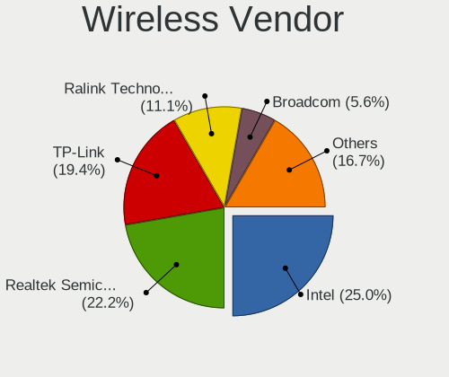

Elementary 6 - Tested Hardware & Statistics (Desktops)
------------------------------------------------------

A project to collect tested hardware configurations for Elementary 6.

Anyone can contribute to this report by the [hw-probe](https://github.com/linuxhw/hw-probe) tool:

    sudo -E hw-probe -all -upload

Please submit a probe of your configuration if it's not presented on the page or is rare.

Full-feature report is available here: https://linux-hardware.org/?view=trends&rel=elementary-6

Contents
--------

* [ Test Cases ](#test-cases)

* [ System ](#system)
  - [ Kernel                   ](#kernel)
  - [ Kernel Family            ](#kernel-family)
  - [ Kernel Major Ver.        ](#kernel-major-ver)
  - [ Arch                     ](#arch)
  - [ DE                       ](#de)
  - [ Display Server           ](#display-server)
  - [ Display Manager          ](#display-manager)
  - [ OS Lang                  ](#os-lang)
  - [ Boot Mode                ](#boot-mode)
  - [ Filesystem               ](#filesystem)
  - [ Part. scheme             ](#part-scheme)
  - [ Dual Boot with Linux/BSD ](#dual-boot-with-linuxbsd)
  - [ Dual Boot (Win)          ](#dual-boot-win)

* [ Board ](#board)
  - [ Vendor                   ](#vendor)
  - [ Model                    ](#model)
  - [ Model Family             ](#model-family)
  - [ MFG Year                 ](#mfg-year)
  - [ Form Factor              ](#form-factor)
  - [ Secure Boot              ](#secure-boot)
  - [ Coreboot                 ](#coreboot)
  - [ RAM Size                 ](#ram-size)
  - [ RAM Used                 ](#ram-used)
  - [ Total Drives             ](#total-drives)
  - [ Has CD-ROM               ](#has-cd-rom)
  - [ Has Ethernet             ](#has-ethernet)
  - [ Has WiFi                 ](#has-wifi)
  - [ Has Bluetooth            ](#has-bluetooth)

* [ Location ](#location)
  - [ Country                  ](#country)
  - [ City                     ](#city)

* [ Drives ](#drives)
  - [ Drive Vendor             ](#drive-vendor)
  - [ Drive Model              ](#drive-model)
  - [ HDD Vendor               ](#hdd-vendor)
  - [ SSD Vendor               ](#ssd-vendor)
  - [ Drive Kind               ](#drive-kind)
  - [ Drive Connector          ](#drive-connector)
  - [ Drive Size               ](#drive-size)
  - [ Space Total              ](#space-total)
  - [ Space Used               ](#space-used)
  - [ Malfunc. Drives          ](#malfunc-drives)
  - [ Malfunc. Drive Vendor    ](#malfunc-drive-vendor)
  - [ Malfunc. HDD Vendor      ](#malfunc-hdd-vendor)
  - [ Malfunc. Drive Kind      ](#malfunc-drive-kind)
  - [ Failed Drives            ](#failed-drives)
  - [ Failed Drive Vendor      ](#failed-drive-vendor)
  - [ Drive Status             ](#drive-status)

* [ Storage controller ](#storage-controller)
  - [ Storage Vendor           ](#storage-vendor)
  - [ Storage Model            ](#storage-model)
  - [ Storage Kind             ](#storage-kind)

* [ Processor ](#processor)
  - [ CPU Vendor               ](#cpu-vendor)
  - [ CPU Model                ](#cpu-model)
  - [ CPU Model Family         ](#cpu-model-family)
  - [ CPU Cores                ](#cpu-cores)
  - [ CPU Sockets              ](#cpu-sockets)
  - [ CPU Threads              ](#cpu-threads)
  - [ CPU Op-Modes             ](#cpu-op-modes)
  - [ CPU Microcode            ](#cpu-microcode)
  - [ CPU Microarch            ](#cpu-microarch)

* [ Graphics ](#graphics)
  - [ GPU Vendor               ](#gpu-vendor)
  - [ GPU Model                ](#gpu-model)
  - [ GPU Combo                ](#gpu-combo)
  - [ GPU Driver               ](#gpu-driver)
  - [ GPU Memory               ](#gpu-memory)

* [ Monitor ](#monitor)
  - [ Monitor Vendor           ](#monitor-vendor)
  - [ Monitor Model            ](#monitor-model)
  - [ Monitor Resolution       ](#monitor-resolution)
  - [ Monitor Diagonal         ](#monitor-diagonal)
  - [ Monitor Width            ](#monitor-width)
  - [ Aspect Ratio             ](#aspect-ratio)
  - [ Monitor Area             ](#monitor-area)
  - [ Pixel Density            ](#pixel-density)
  - [ Multiple Monitors        ](#multiple-monitors)

* [ Network ](#network)
  - [ Net Controller Vendor    ](#net-controller-vendor)
  - [ Net Controller Model     ](#net-controller-model)
  - [ Wireless Vendor          ](#wireless-vendor)
  - [ Wireless Model           ](#wireless-model)
  - [ Ethernet Vendor          ](#ethernet-vendor)
  - [ Ethernet Model           ](#ethernet-model)
  - [ Net Controller Kind      ](#net-controller-kind)
  - [ Used Controller          ](#used-controller)
  - [ NICs                     ](#nics)
  - [ IPv6                     ](#ipv6)

* [ Bluetooth ](#bluetooth)
  - [ Bluetooth Vendor         ](#bluetooth-vendor)
  - [ Bluetooth Model          ](#bluetooth-model)

* [ Sound ](#sound)
  - [ Sound Vendor             ](#sound-vendor)
  - [ Sound Model              ](#sound-model)

* [ Memory ](#memory)
  - [ Memory Vendor            ](#memory-vendor)
  - [ Memory Model             ](#memory-model)
  - [ Memory Kind              ](#memory-kind)
  - [ Memory Form Factor       ](#memory-form-factor)
  - [ Memory Size              ](#memory-size)
  - [ Memory Speed             ](#memory-speed)

* [ Printers & scanners ](#printers--scanners)
  - [ Printer Vendor           ](#printer-vendor)
  - [ Printer Model            ](#printer-model)
  - [ Scanner Vendor           ](#scanner-vendor)
  - [ Scanner Model            ](#scanner-model)

* [ Camera ](#camera)
  - [ Camera Vendor            ](#camera-vendor)
  - [ Camera Model             ](#camera-model)

* [ Security ](#security)
  - [ Fingerprint Vendor       ](#fingerprint-vendor)
  - [ Fingerprint Model        ](#fingerprint-model)
  - [ Chipcard Vendor          ](#chipcard-vendor)
  - [ Chipcard Model           ](#chipcard-model)

* [ Unsupported ](#unsupported)
  - [ Unsupported Devices      ](#unsupported-devices)
  - [ Unsupported Device Types ](#unsupported-device-types)

Test Cases
----------

| Vendor   | Model                       | Probe                                                      | Date         |
|----------|-----------------------------|------------------------------------------------------------|--------------|
| Apple    | Mac-F221BEC8                | [1754c64091](https://linux-hardware.org/?probe=1754c64091) | Sep 27, 2021 |
| ASUSTek  | P7H55-M                     | [3367bc011a](https://linux-hardware.org/?probe=3367bc011a) | Sep 25, 2021 |
| Dell     | 0Y5DDC A00                  | [df95ea94b8](https://linux-hardware.org/?probe=df95ea94b8) | Sep 25, 2021 |
| Dell     | 0Y5DDC A00                  | [10ee1abc07](https://linux-hardware.org/?probe=10ee1abc07) | Sep 25, 2021 |
| ASRock   | M3A790GXH/128M              | [818ec10ec8](https://linux-hardware.org/?probe=818ec10ec8) | Sep 24, 2021 |
| Intel    | X79 V1.x                    | [19223e911c](https://linux-hardware.org/?probe=19223e911c) | Sep 22, 2021 |
| ASUSTek  | M4N78-AM                    | [3d8e0efc00](https://linux-hardware.org/?probe=3d8e0efc00) | Sep 21, 2021 |
| ASRock   | A320M-HDV                   | [24bb7c7d18](https://linux-hardware.org/?probe=24bb7c7d18) | Sep 17, 2021 |
| Intel    | H61                         | [0010dbcb5e](https://linux-hardware.org/?probe=0010dbcb5e) | Sep 10, 2021 |
| HP       | 8767 A                      | [7f022c67ac](https://linux-hardware.org/?probe=7f022c67ac) | Sep 09, 2021 |
| Gigabyte | B450M DS3H V2               | [633441bc2b](https://linux-hardware.org/?probe=633441bc2b) | Sep 05, 2021 |
| ASUSTek  | ROG STRIX Z590-F GAMING ... | [c9476d5d06](https://linux-hardware.org/?probe=c9476d5d06) | Sep 02, 2021 |
| Gigabyte | F2A55M-HD2                  | [0c05ab5b21](https://linux-hardware.org/?probe=0c05ab5b21) | Aug 30, 2021 |
| ASRock   | H81TM-ITX R2.0              | [4f04e7309e](https://linux-hardware.org/?probe=4f04e7309e) | Aug 30, 2021 |
| ASUSTek  | M5A78L-M LX/BR              | [d0ff1c6977](https://linux-hardware.org/?probe=d0ff1c6977) | Aug 25, 2021 |
| ASUSTek  | P6X58D-E                    | [db1ef28e92](https://linux-hardware.org/?probe=db1ef28e92) | Aug 20, 2021 |
| MSI      | X470 GAMING PLUS MAX        | [1176a287c7](https://linux-hardware.org/?probe=1176a287c7) | Aug 19, 2021 |
| ASUSTek  | TUF GAMING B450M-PRO II     | [73beb900ea](https://linux-hardware.org/?probe=73beb900ea) | Aug 15, 2021 |
| Gigabyte | X570 I AORUS PRO WIFI       | [e302074e5e](https://linux-hardware.org/?probe=e302074e5e) | Aug 14, 2021 |
| Gigabyte | H310M M.2 x.x               | [69e2e83b95](https://linux-hardware.org/?probe=69e2e83b95) | Aug 10, 2021 |
| Gigabyte | H310M M.2 x.x               | [86d69a15b9](https://linux-hardware.org/?probe=86d69a15b9) | Aug 10, 2021 |
| ASUSTek  | P5KPL-AM SE                 | [a97fc63d3d](https://linux-hardware.org/?probe=a97fc63d3d) | Jul 23, 2021 |
| ASRock   | B450 Pro4                   | [c5d0611f79](https://linux-hardware.org/?probe=c5d0611f79) | Jun 13, 2021 |
| ASUSTek  | TUF GAMING B550M-PLUS       | [63da02a979](https://linux-hardware.org/?probe=63da02a979) | May 19, 2021 |
| ASUSTek  | TUF GAMING B550M-PLUS       | [223234378e](https://linux-hardware.org/?probe=223234378e) | May 04, 2021 |
| ASUSTek  | ROG STRIX B450-I GAMING     | [a208e8a358](https://linux-hardware.org/?probe=a208e8a358) | May 01, 2021 |
| ASUSTek  | M5A99X EVO R2.0             | [f7d949f5a7](https://linux-hardware.org/?probe=f7d949f5a7) | Dec 23, 2020 |
| HP       | 8433 11                     | [691ef58a05](https://linux-hardware.org/?probe=691ef58a05) | Dec 09, 2020 |

System
------

Kernel
------

Version of the Linux kernel

| Version           | Desktops | Percent |
|-------------------|----------|---------|
| 5.11.0-27-generic | 9        | 36%     |
| 5.11.0-25-generic | 5        | 20%     |
| 5.8.0-50-generic  | 3        | 12%     |
| 5.11.0-36-generic | 2        | 8%      |
| 5.11.0-34-generic | 2        | 8%      |
| 5.8.0-63-generic  | 1        | 4%      |
| 5.8.0-55-generic  | 1        | 4%      |
| 5.4.0-58-generic  | 1        | 4%      |
| 5.4.0-56-generic  | 1        | 4%      |

Kernel Family
-------------

Linux kernel without a distro release

| Version | Desktops | Percent |
|---------|----------|---------|
| 5.11.0  | 18       | 72%     |
| 5.8.0   | 5        | 20%     |
| 5.4.0   | 2        | 8%      |

Kernel Major Ver.
-----------------

Linux kernel major version

| Version | Desktops | Percent |
|---------|----------|---------|
| 5.11    | 18       | 72%     |
| 5.8     | 5        | 20%     |
| 5.4     | 2        | 8%      |

Arch
----

OS architecture (x86_64, i586, etc.)

| Name   | Desktops | Percent |
|--------|----------|---------|
| x86_64 | 25       | 100%    |

DE
--

Desktop Environment

| Name     | Desktops | Percent |
|----------|----------|---------|
| Pantheon | 22       | 88%     |
| MATE     | 1        | 4%      |
| GNOME    | 1        | 4%      |
| Unknown  | 1        | 4%      |

Display Server
--------------

X11 or Wayland

| Name | Desktops | Percent |
|------|----------|---------|
| X11  | 25       | 100%    |

Display Manager
---------------

SDDM, LightDM, etc.

| Name    | Desktops | Percent |
|---------|----------|---------|
| Unknown | 21       | 84%     |
| TDM     | 3        | 12%     |
| LightDM | 1        | 4%      |

OS Lang
-------

Language

| Lang  | Desktops | Percent |
|-------|----------|---------|
| en_US | 10       | 40%     |
| de_DE | 4        | 16%     |
| es_ES | 3        | 12%     |
| pt_BR | 2        | 8%      |
| ru_RU | 1        | 4%      |
| it_IT | 1        | 4%      |
| es_MX | 1        | 4%      |
| en_GB | 1        | 4%      |
| en_AU | 1        | 4%      |
| ca_ES | 1        | 4%      |

Boot Mode
---------

EFI or BIOS

| Mode | Desktops | Percent |
|------|----------|---------|
| EFI  | 13       | 52%     |
| BIOS | 12       | 48%     |

Filesystem
----------

Type of filesystem

| Type  | Desktops | Percent |
|-------|----------|---------|
| Ext4  | 24       | 96%     |
| Btrfs | 1        | 4%      |

Part. scheme
------------

Scheme of partitioning

| Type    | Desktops | Percent |
|---------|----------|---------|
| Unknown | 21       | 84%     |
| MBR     | 2        | 8%      |
| GPT     | 2        | 8%      |

Dual Boot with Linux/BSD
------------------------

Hosting more than one Linux/BSD

| Dual boot | Desktops | Percent |
|-----------|----------|---------|
| No        | 22       | 88%     |
| Yes       | 3        | 12%     |

Dual Boot (Win)
---------------

Hosting Linux and Windows

| Dual boot | Desktops | Percent |
|-----------|----------|---------|
| No        | 18       | 72%     |
| Yes       | 7        | 28%     |

Board
-----

Vendor
------

Motherboard manufacturer

| Name                | Desktops | Percent |
|---------------------|----------|---------|
| ASUSTek Computer    | 10       | 40%     |
| Gigabyte Technology | 4        | 16%     |
| ASRock              | 4        | 16%     |
| Intel               | 2        | 8%      |
| Hewlett-Packard     | 2        | 8%      |
| MSI                 | 1        | 4%      |
| Dell                | 1        | 4%      |
| Apple               | 1        | 4%      |

Model
-----

Motherboard model

| Name                                 | Desktops | Percent |
|--------------------------------------|----------|---------|
| MSI MS-7B79                          | 1        | 4%      |
| Intel X64                            | 1        | 4%      |
| Intel H61                            | 1        | 4%      |
| HP Pavilion Gaming Desktop TG01-1xxx | 1        | 4%      |
| HP Pavilion Desktop 590-p0xxx        | 1        | 4%      |
| Gigabyte X570 I AORUS PRO WIFI       | 1        | 4%      |
| Gigabyte H310M M.2 2.0               | 1        | 4%      |
| Gigabyte F2A55M-HD2                  | 1        | 4%      |
| Gigabyte B450M DS3H V2               | 1        | 4%      |
| Dell OptiPlex 9020M                  | 1        | 4%      |
| ASUS TUF GAMING B550M-PLUS           | 1        | 4%      |
| ASUS TUF GAMING B450M-PRO II         | 1        | 4%      |
| ASUS ROG STRIX Z590-F GAMING WIFI    | 1        | 4%      |
| ASUS ROG STRIX B450-I GAMING         | 1        | 4%      |
| ASUS P7H55-M                         | 1        | 4%      |
| ASUS P6X58D-E                        | 1        | 4%      |
| ASUS P5KPL-AM SE                     | 1        | 4%      |
| ASUS M5A99X EVO R2.0                 | 1        | 4%      |
| ASUS M5A78L-M LX/BR                  | 1        | 4%      |
| ASUS M4N78-AM                        | 1        | 4%      |
| ASRock M3A790GXH/128M                | 1        | 4%      |
| ASRock H81TM-ITX R2.0                | 1        | 4%      |
| ASRock B450 Pro4                     | 1        | 4%      |
| ASRock A320M-HDV                     | 1        | 4%      |
| Apple MacPro5,1                      | 1        | 4%      |

Model Family
------------

Motherboard model prefix

| Name                | Desktops | Percent |
|---------------------|----------|---------|
| HP Pavilion         | 2        | 8%      |
| ASUS TUF            | 2        | 8%      |
| ASUS ROG            | 2        | 8%      |
| MSI MS-7B79         | 1        | 4%      |
| Intel X64           | 1        | 4%      |
| Intel H61           | 1        | 4%      |
| Gigabyte X570       | 1        | 4%      |
| Gigabyte H310M      | 1        | 4%      |
| Gigabyte F2A55M-HD2 | 1        | 4%      |
| Gigabyte B450M      | 1        | 4%      |
| Dell OptiPlex       | 1        | 4%      |
| ASUS P7H55-M        | 1        | 4%      |
| ASUS P6X58D-E       | 1        | 4%      |
| ASUS P5KPL-AM       | 1        | 4%      |
| ASUS M5A99X         | 1        | 4%      |
| ASUS M5A78L-M       | 1        | 4%      |
| ASUS M4N78-AM       | 1        | 4%      |
| ASRock M3A790GXH    | 1        | 4%      |
| ASRock H81TM-ITX    | 1        | 4%      |
| ASRock B450         | 1        | 4%      |
| ASRock A320M-HDV    | 1        | 4%      |
| Apple MacPro5       | 1        | 4%      |

MFG Year
--------

Motherboard manufacture year

| Year | Desktops | Percent |
|------|----------|---------|
| 2021 | 6        | 24%     |
| 2020 | 3        | 12%     |
| 2019 | 3        | 12%     |
| 2013 | 3        | 12%     |
| 2018 | 2        | 8%      |
| 2015 | 2        | 8%      |
| 2017 | 1        | 4%      |
| 2014 | 1        | 4%      |
| 2012 | 1        | 4%      |
| 2011 | 1        | 4%      |
| 2010 | 1        | 4%      |
| 2009 | 1        | 4%      |

Form Factor
-----------

Physical design of the computer

| Name    | Desktops | Percent |
|---------|----------|---------|
| Desktop | 25       | 100%    |

Secure Boot
-----------

Enabled or disabled

| State    | Desktops | Percent |
|----------|----------|---------|
| Disabled | 23       | 92%     |
| Enabled  | 2        | 8%      |

Coreboot
--------

Have coreboot on board

| Used | Desktops | Percent |
|------|----------|---------|
| No   | 25       | 100%    |

RAM Size
--------

Total RAM memory

| Size in GB | Desktops | Percent |
|------------|----------|---------|
| 16.01-24.0 | 9        | 36%     |
| 32.01-64.0 | 7        | 28%     |
| 4.01-8.0   | 5        | 20%     |
| 3.01-4.0   | 2        | 8%      |
| 8.01-16.0  | 2        | 8%      |

RAM Used
--------

Used RAM memory

| Used GB   | Desktops | Percent |
|-----------|----------|---------|
| 1.01-2.0  | 11       | 44%     |
| 2.01-3.0  | 8        | 32%     |
| 3.01-4.0  | 4        | 16%     |
| 4.01-8.0  | 1        | 4%      |
| 8.01-16.0 | 1        | 4%      |

Total Drives
------------

Number of drives on board

| Drives | Desktops | Percent |
|--------|----------|---------|
| 2      | 10       | 40%     |
| 1      | 9        | 36%     |
| 3      | 3        | 12%     |
| 4      | 2        | 8%      |
| 5      | 1        | 4%      |

Has CD-ROM
----------

Has CD-ROM on board

| Presented | Desktops | Percent |
|-----------|----------|---------|
| No        | 19       | 76%     |
| Yes       | 6        | 24%     |

Has Ethernet
------------

Has Ethernet on board

| Presented | Desktops | Percent |
|-----------|----------|---------|
| Yes       | 25       | 100%    |

Has WiFi
--------

Has WiFi module

| Presented | Desktops | Percent |
|-----------|----------|---------|
| No        | 14       | 56%     |
| Yes       | 11       | 44%     |

Has Bluetooth
-------------

Has Bluetooth module

| Presented | Desktops | Percent |
|-----------|----------|---------|
| No        | 13       | 52%     |
| Yes       | 12       | 48%     |

Location
--------

Country
-------

Geographic location (country)

| Country     | Desktops | Percent |
|-------------|----------|---------|
| Germany     | 3        | 12%     |
| USA         | 2        | 8%      |
| UK          | 2        | 8%      |
| Spain       | 2        | 8%      |
| Russia      | 2        | 8%      |
| Indonesia   | 2        | 8%      |
| Brazil      | 2        | 8%      |
| Argentina   | 2        | 8%      |
| Netherlands | 1        | 4%      |
| Mexico      | 1        | 4%      |
| Italy       | 1        | 4%      |
| Greece      | 1        | 4%      |
| Finland     | 1        | 4%      |
| Czechia     | 1        | 4%      |
| Austria     | 1        | 4%      |
| Australia   | 1        | 4%      |

City
----

Geographic location (city)

| City           | Desktops | Percent |
|----------------|----------|---------|
| Znojmo         | 1        | 4%      |
| Wriezen        | 1        | 4%      |
| Vienna         | 1        | 4%      |
| Ullastrell     | 1        | 4%      |
| Tucson         | 1        | 4%      |
| Staropyshminsk | 1        | 4%      |
| Sparti         | 1        | 4%      |
| S??o Paulo     | 1        | 4%      |
| Rosario        | 1        | 4%      |
| Roermond       | 1        | 4%      |
| Rio de Janeiro | 1        | 4%      |
| Rheinberg      | 1        | 4%      |
| Potsdam        | 1        | 4%      |
| Morelia        | 1        | 4%      |
| Milan          | 1        | 4%      |
| Medan          | 1        | 4%      |
| Klaukkala      | 1        | 4%      |
| Kediri         | 1        | 4%      |
| Kazan?ˆ™       | 1        | 4%      |
| Hostalric      | 1        | 4%      |
| Hephzibah      | 1        | 4%      |
| East Malvern   | 1        | 4%      |
| Bonnybridge    | 1        | 4%      |
| Berazategui    | 1        | 4%      |
| Bathgate       | 1        | 4%      |

Drives
------

Drive Vendor
------------

Hard drive vendors

| Vendor                    | Desktops | Drives | Percent |
|---------------------------|----------|--------|---------|
| WDC                       | 8        | 10     | 18.6%   |
| Kingston                  | 6        | 6      | 13.95%  |
| Samsung Electronics       | 5        | 9      | 11.63%  |
| Seagate                   | 4        | 5      | 9.3%    |
| SanDisk                   | 4        | 4      | 9.3%    |
| OCZ                       | 2        | 2      | 4.65%   |
| Hitachi                   | 2        | 2      | 4.65%   |
| Crucial                   | 2        | 3      | 4.65%   |
| USB3.1                    | 1        | 1      | 2.33%   |
| Toshiba                   | 1        | 1      | 2.33%   |
| Team                      | 1        | 1      | 2.33%   |
| SK Hynix                  | 1        | 1      | 2.33%   |
| Phison                    | 1        | 1      | 2.33%   |
| Micron/Crucial Technology | 1        | 2      | 2.33%   |
| Micron Technology         | 1        | 1      | 2.33%   |
| Intel                     | 1        | 1      | 2.33%   |
| Gigabyte Technology       | 1        | 1      | 2.33%   |
| Apacer                    | 1        | 1      | 2.33%   |

Drive Model
-----------

Hard drive models

| Model                             | Desktops | Percent |
|-----------------------------------|----------|---------|
| Kingston SA400S37240G 240GB SSD   | 3        | 5.88%   |
| WDC WD5000AAKX-001CA0 500GB       | 1        | 1.96%   |
| WDC WD3200AAJS-56B4A0 320GB       | 1        | 1.96%   |
| WDC WD20EARX-00PASB0 2TB          | 1        | 1.96%   |
| WDC WD10EZRX-00L4HB0 1TB          | 1        | 1.96%   |
| WDC WD10EZEX-75ZF5A0 1TB          | 1        | 1.96%   |
| WDC WD10EZEX-60WN4A0 1TB          | 1        | 1.96%   |
| WDC WD10EZEX-22MFCA0 1TB          | 1        | 1.96%   |
| WDC WD10EZEX-08WN4A0 1TB          | 1        | 1.96%   |
| WDC WD10EZEX-00RKKA0 1TB          | 1        | 1.96%   |
| WDC WD10EZEX-00KUWA0 1TB          | 1        | 1.96%   |
| USB3.1 Disk 500GB                 | 1        | 1.96%   |
| Toshiba DT01ACA100 1TB            | 1        | 1.96%   |
| Team L5 LITE SSD 120GB            | 1        | 1.96%   |
| SK Hynix SH920 2.5 7MM 256GB SSD  | 1        | 1.96%   |
| Seagate ST940210AS 40GB           | 1        | 1.96%   |
| Seagate ST3500312CS 500GB         | 1        | 1.96%   |
| Seagate ST1000NM0053-1C1173 1TB   | 1        | 1.96%   |
| Seagate NVMe SSD Drive 2TB        | 1        | 1.96%   |
| Seagate Backup+ BK 1TB            | 1        | 1.96%   |
| SanDisk SDSSDHII480G 480GB        | 1        | 1.96%   |
| SanDisk SDSSDA-1T00 1TB           | 1        | 1.96%   |
| Sandisk NVMe SSD Drive 500GB      | 1        | 1.96%   |
| Sandisk NVMe SSD Drive 1TB        | 1        | 1.96%   |
| Samsung SSD 980 PRO 1TB           | 1        | 1.96%   |
| Samsung SSD 960 EVO 500GB         | 1        | 1.96%   |
| Samsung SSD 870 QVO 1TB           | 1        | 1.96%   |
| Samsung SSD 850 EVO 250GB         | 1        | 1.96%   |
| Samsung SSD 840 Series 500GB      | 1        | 1.96%   |
| Samsung Portable SSD T5 500GB     | 1        | 1.96%   |
| Samsung NVMe SSD Drive 500GB      | 1        | 1.96%   |
| Samsung NVMe SSD Drive 1TB        | 1        | 1.96%   |
| Samsung HD154UI 1TB               | 1        | 1.96%   |
| Phison NVMe SSD Drive 256GB       | 1        | 1.96%   |
| OCZ AGILITY4 256GB SSD            | 1        | 1.96%   |
| OCZ AGILITY3 240GB SSD            | 1        | 1.96%   |
| Micron/Crucial NVMe SSD Drive 1TB | 1        | 1.96%   |
| Micron NVMe SSD Drive 500GB       | 1        | 1.96%   |
| Kingston SA400S37480G 480GB SSD   | 1        | 1.96%   |
| Kingston NVMe SSD Drive 500GB     | 1        | 1.96%   |
| Kingston NVMe SSD Drive 1TB       | 1        | 1.96%   |
| Intel NVMe SSD Drive 512GB        | 1        | 1.96%   |
| Hitachi HTS723225A7A364 250GB     | 1        | 1.96%   |
| Hitachi HDT722516DLA380 164GB     | 1        | 1.96%   |
| Gigabyte GP-GSM2NE3256GNTD 256GB  | 1        | 1.96%   |
| Crucial CT250MX500SSD1 250GB      | 1        | 1.96%   |
| Crucial CT240BX200SSD1 240GB      | 1        | 1.96%   |
| Crucial CT1000MX500SSD1 1TB       | 1        | 1.96%   |
| Apacer AS340 120GB SSD            | 1        | 1.96%   |

HDD Vendor
----------

Hard disk drive vendors

| Vendor              | Desktops | Drives | Percent |
|---------------------|----------|--------|---------|
| WDC                 | 8        | 10     | 53.33%  |
| Seagate             | 3        | 3      | 20%     |
| Hitachi             | 2        | 2      | 13.33%  |
| Toshiba             | 1        | 1      | 6.67%   |
| Samsung Electronics | 1        | 1      | 6.67%   |

SSD Vendor
----------

Solid state drive vendors

| Vendor              | Desktops | Drives | Percent |
|---------------------|----------|--------|---------|
| Kingston            | 4        | 4      | 25%     |
| Samsung Electronics | 3        | 4      | 18.75%  |
| SanDisk             | 2        | 2      | 12.5%   |
| OCZ                 | 2        | 2      | 12.5%   |
| Crucial             | 2        | 3      | 12.5%   |
| Team                | 1        | 1      | 6.25%   |
| SK Hynix            | 1        | 1      | 6.25%   |
| Apacer              | 1        | 1      | 6.25%   |

Drive Kind
----------

HDD or SSD

| Kind    | Desktops | Drives | Percent |
|---------|----------|--------|---------|
| SSD     | 13       | 18     | 35.14%  |
| HDD     | 13       | 17     | 35.14%  |
| NVMe    | 9        | 15     | 24.32%  |
| Unknown | 2        | 2      | 5.41%   |

Drive Connector
---------------

SATA, SAS, NVMe, etc.

| Type | Desktops | Drives | Percent |
|------|----------|--------|---------|
| SATA | 20       | 34     | 64.52%  |
| NVMe | 9        | 15     | 29.03%  |
| SAS  | 2        | 3      | 6.45%   |

Drive Size
----------

Size of hard drive

| Size in TB | Desktops | Drives | Percent |
|------------|----------|--------|---------|
| 0.01-0.5   | 16       | 21     | 59.26%  |
| 0.51-1.0   | 10       | 13     | 37.04%  |
| 1.01-2.0   | 1        | 1      | 3.7%    |

Space Total
-----------

Amount of disk space available on the file system

| Size in GB | Desktops | Percent |
|------------|----------|---------|
| 251-500    | 8        | 32%     |
| 101-250    | 8        | 32%     |
| 1001-2000  | 3        | 12%     |
| 21-50      | 2        | 8%      |
| 501-1000   | 2        | 8%      |
| 2001-3000  | 1        | 4%      |
| 51-100     | 1        | 4%      |

Space Used
----------

Amount of used disk space

| Used GB | Desktops | Percent |
|---------|----------|---------|
| 1-20    | 15       | 60%     |
| 21-50   | 3        | 12%     |
| 101-250 | 3        | 12%     |
| 51-100  | 3        | 12%     |
| 251-500 | 1        | 4%      |

Malfunc. Drives
---------------

Drive models with a malfunction

| Model                       | Desktops | Drives | Percent |
|-----------------------------|----------|--------|---------|
| WDC WD3200AAJS-56B4A0 320GB | 1        | 1      | 50%     |
| WDC WD10EZEX-00KUWA0 1TB    | 1        | 1      | 50%     |

Malfunc. Drive Vendor
---------------------

Vendors of faulty drives

| Vendor | Desktops | Drives | Percent |
|--------|----------|--------|---------|
| WDC    | 2        | 2      | 100%    |

Malfunc. HDD Vendor
-------------------

Vendors of faulty HDD drives

| Vendor | Desktops | Drives | Percent |
|--------|----------|--------|---------|
| WDC    | 2        | 2      | 100%    |

Malfunc. Drive Kind
-------------------

Kinds of faulty drives

| Kind | Desktops | Drives | Percent |
|------|----------|--------|---------|
| HDD  | 2        | 2      | 100%    |

Failed Drives
-------------

Failed drive models

Zero info for selected period =(

Failed Drive Vendor
-------------------

Failed drive vendors

Zero info for selected period =(

Drive Status
------------

Number of failed and malfunc. drives

| Status   | Desktops | Drives | Percent |
|----------|----------|--------|---------|
| Detected | 21       | 40     | 75%     |
| Works    | 5        | 10     | 17.86%  |
| Malfunc  | 2        | 2      | 7.14%   |

Storage controller
------------------

Storage Vendor
--------------

Storage controller vendors

| Vendor                      | Desktops | Percent |
|-----------------------------|----------|---------|
| AMD                         | 12       | 30.77%  |
| Intel                       | 11       | 28.21%  |
| Samsung Electronics         | 3        | 7.69%   |
| Sandisk                     | 2        | 5.13%   |
| Kingston Technology Company | 2        | 5.13%   |
| ASMedia Technology          | 2        | 5.13%   |
| VIA Technologies            | 1        | 2.56%   |
| Seagate Technology          | 1        | 2.56%   |
| Phison Electronics          | 1        | 2.56%   |
| Nvidia                      | 1        | 2.56%   |
| Micron/Crucial Technology   | 1        | 2.56%   |
| Micron Technology           | 1        | 2.56%   |
| Marvell Technology Group    | 1        | 2.56%   |

Storage Model
-------------

Storage controller models

| Model                                                                          | Desktops | Percent |
|--------------------------------------------------------------------------------|----------|---------|
| AMD FCH SATA Controller [AHCI mode]                                            | 7        | 12.96%  |
| AMD 400 Series Chipset SATA Controller                                         | 4        | 7.41%   |
| Samsung NVMe SSD Controller PM9A1/PM9A3/980PRO                                 | 2        | 3.7%    |
| Kingston Company A2000 NVMe SSD                                                | 2        | 3.7%    |
| Intel 82801JI (ICH10 Family) 4 port SATA IDE Controller #1                     | 2        | 3.7%    |
| Intel 82801JI (ICH10 Family) 2 port SATA IDE Controller #2                     | 2        | 3.7%    |
| Intel 8 Series/C220 Series Chipset Family 6-port SATA Controller 1 [AHCI mode] | 2        | 3.7%    |
| ASMedia ASM1062 Serial ATA Controller                                          | 2        | 3.7%    |
| AMD SB7x0/SB8x0/SB9x0 SATA Controller [IDE mode]                               | 2        | 3.7%    |
| AMD SB7x0/SB8x0/SB9x0 IDE Controller                                           | 2        | 3.7%    |
| VIA VT6415 PATA IDE Host Controller                                            | 1        | 1.85%   |
| Seagate FireCuda 510 SSD                                                       | 1        | 1.85%   |
| Sandisk WD Blue SN550 NVMe SSD                                                 | 1        | 1.85%   |
| Sandisk WD Black SN750 / PC SN730 NVMe SSD                                     | 1        | 1.85%   |
| Samsung NVMe SSD Controller SM981/PM981/PM983                                  | 1        | 1.85%   |
| Samsung NVMe SSD Controller SM961/PM961/SM963                                  | 1        | 1.85%   |
| Phison PS5013 E13 NVMe Controller                                              | 1        | 1.85%   |
| Nvidia MCP78S [GeForce 8200] AHCI Controller                                   | 1        | 1.85%   |
| Micron/Crucial P2 NVMe PCIe SSD                                                | 1        | 1.85%   |
| Micron Non-Volatile memory controller                                          | 1        | 1.85%   |
| Marvell Group 88SE91A3 SATA-600 Controller                                     | 1        | 1.85%   |
| Intel SSD 660P Series                                                          | 1        | 1.85%   |
| Intel SATA Controller [RAID mode]                                              | 1        | 1.85%   |
| Intel NM10/ICH7 Family SATA Controller [IDE mode]                              | 1        | 1.85%   |
| Intel C600/X79 series chipset 6-Port SATA AHCI Controller                      | 1        | 1.85%   |
| Intel 82801G (ICH7 Family) IDE Controller                                      | 1        | 1.85%   |
| Intel 6 Series/C200 Series Chipset Family 6 port Desktop SATA AHCI Controller  | 1        | 1.85%   |
| Intel 500 Series Chipset Family SATA AHCI Controller                           | 1        | 1.85%   |
| Intel 5 Series/3400 Series Chipset 4 port SATA IDE Controller                  | 1        | 1.85%   |
| Intel 5 Series/3400 Series Chipset 2 port SATA IDE Controller                  | 1        | 1.85%   |
| Intel 200 Series PCH SATA controller [AHCI mode]                               | 1        | 1.85%   |
| AMD Starship/Matisse Chipset SATA Controller [AHCI mode]                       | 1        | 1.85%   |
| AMD SB7x0/SB8x0/SB9x0 SATA Controller [AHCI mode]                              | 1        | 1.85%   |
| AMD FCH SATA Controller [IDE mode]                                             | 1        | 1.85%   |
| AMD FCH SATA Controller D                                                      | 1        | 1.85%   |
| AMD FCH IDE Controller                                                         | 1        | 1.85%   |
| AMD 300 Series Chipset SATA Controller                                         | 1        | 1.85%   |

Storage Kind
------------

Kind of storage controller (IDE, SATA, NVMe, SAS, ...)

| Kind | Desktops | Percent |
|------|----------|---------|
| SATA | 19       | 52.78%  |
| NVMe | 9        | 25%     |
| IDE  | 7        | 19.44%  |
| RAID | 1        | 2.78%   |

Processor
---------

CPU Vendor
----------

Processor vendors

| Vendor | Desktops | Percent |
|--------|----------|---------|
| AMD    | 14       | 56%     |
| Intel  | 11       | 44%     |

CPU Model
---------

Processor models

| Model                                          | Desktops | Percent |
|------------------------------------------------|----------|---------|
| AMD Ryzen 7 3700X 8-Core Processor             | 4        | 16%     |
| AMD Ryzen 5 3600 6-Core Processor              | 2        | 8%      |
| Intel Xeon CPU E5520 @ 2.27GHz                 | 1        | 4%      |
| Intel Xeon CPU E5-2689 0 @ 2.60GHz             | 1        | 4%      |
| Intel Core i7-4785T CPU @ 2.20GHz              | 1        | 4%      |
| Intel Core i7-10700F CPU @ 2.90GHz             | 1        | 4%      |
| Intel Core i7 CPU 950 @ 3.07GHz                | 1        | 4%      |
| Intel Core i5-4570 CPU @ 3.20GHz               | 1        | 4%      |
| Intel Core i5-2400 CPU @ 3.10GHz               | 1        | 4%      |
| Intel Core i3 CPU 530 @ 2.93GHz                | 1        | 4%      |
| Intel Core 2 Quad CPU Q9500 @ 2.83GHz          | 1        | 4%      |
| Intel Celeron G4930 CPU @ 3.20GHz              | 1        | 4%      |
| Intel 11th Gen Core i7-11700K @ 3.60GHz        | 1        | 4%      |
| AMD Ryzen 5 2600X Six-Core Processor           | 1        | 4%      |
| AMD Ryzen 3 2200G with Radeon Vega Graphics    | 1        | 4%      |
| AMD Phenom II X4 925 Processor                 | 1        | 4%      |
| AMD Phenom 9850 Quad-Core Processor            | 1        | 4%      |
| AMD FX-8320 Eight-Core Processor               | 1        | 4%      |
| AMD FX-6100 Six-Core Processor                 | 1        | 4%      |
| AMD A4-4000 APU with Radeon HD Graphics        | 1        | 4%      |
| AMD A10-9700 RADEON R7, 10 COMPUTE CORES 4C+6G | 1        | 4%      |

CPU Model Family
----------------

Processor model prefix

| Model             | Desktops | Percent |
|-------------------|----------|---------|
| AMD Ryzen 7       | 4        | 16%     |
| Intel Core i7     | 3        | 12%     |
| AMD Ryzen 5       | 3        | 12%     |
| Intel Xeon        | 2        | 8%      |
| Intel Core i5     | 2        | 8%      |
| AMD FX            | 2        | 8%      |
| Other             | 1        | 4%      |
| Intel Core i3     | 1        | 4%      |
| Intel Core 2 Quad | 1        | 4%      |
| Intel Celeron     | 1        | 4%      |
| AMD Ryzen 3       | 1        | 4%      |
| AMD Phenom II X4  | 1        | 4%      |
| AMD Phenom        | 1        | 4%      |
| AMD A4            | 1        | 4%      |
| AMD A10           | 1        | 4%      |

CPU Cores
---------

Number of processor cores

| Number | Desktops | Percent |
|--------|----------|---------|
| 4      | 9        | 36%     |
| 8      | 8        | 32%     |
| 6      | 3        | 12%     |
| 2      | 3        | 12%     |
| 3      | 1        | 4%      |
| 1      | 1        | 4%      |

CPU Sockets
-----------

Number of sockets

| Number | Desktops | Percent |
|--------|----------|---------|
| 1      | 24       | 96%     |
| 2      | 1        | 4%      |

CPU Threads
-----------

Threads per core (Hyper-Threading)

| Number | Desktops | Percent |
|--------|----------|---------|
| 2      | 18       | 72%     |
| 1      | 7        | 28%     |

CPU Op-Modes
------------

CPU Operation Modes (32-bit, 64-bit)

| Op mode        | Desktops | Percent |
|----------------|----------|---------|
| 32-bit, 64-bit | 25       | 100%    |

CPU Microcode
-------------

Microcode number

| Number     | Desktops | Percent |
|------------|----------|---------|
| 0x08701021 | 4        | 16%     |
| 0x306c3    | 2        | 8%      |
| 0x106a5    | 2        | 8%      |
| 0x08701013 | 2        | 8%      |
| 0xa0671    | 1        | 4%      |
| 0xa0655    | 1        | 4%      |
| 0x906eb    | 1        | 4%      |
| 0x206d7    | 1        | 4%      |
| 0x206a7    | 1        | 4%      |
| 0x20652    | 1        | 4%      |
| 0x1067a    | 1        | 4%      |
| 0x08101007 | 1        | 4%      |
| 0x0800820d | 1        | 4%      |
| 0x0600611a | 1        | 4%      |
| 0x06001119 | 1        | 4%      |
| 0x06000852 | 1        | 4%      |
| 0x0600063e | 1        | 4%      |
| 0x01000095 | 1        | 4%      |
| Unknown    | 1        | 4%      |

CPU Microarch
-------------

Microarchitecture

| Name        | Desktops | Percent |
|-------------|----------|---------|
| Zen 2       | 6        | 24%     |
| SandyBridge | 2        | 8%      |
| Piledriver  | 2        | 8%      |
| Nehalem     | 2        | 8%      |
| K10         | 2        | 8%      |
| Haswell     | 2        | 8%      |
| Zen+        | 1        | 4%      |
| Zen         | 1        | 4%      |
| Westmere    | 1        | 4%      |
| Penryn      | 1        | 4%      |
| KabyLake    | 1        | 4%      |
| Icelake     | 1        | 4%      |
| Excavator   | 1        | 4%      |
| CometLake   | 1        | 4%      |
| Bulldozer   | 1        | 4%      |

Graphics
--------

GPU Vendor
----------

Vendors of graphics cards

| Vendor           | Desktops | Percent |
|------------------|----------|---------|
| Nvidia           | 11       | 40.74%  |
| AMD              | 11       | 40.74%  |
| Intel            | 4        | 14.81%  |
| Conexant Systems | 1        | 3.7%    |

GPU Model
---------

Graphics card models

| Model                                                                       | Desktops | Percent |
|-----------------------------------------------------------------------------|----------|---------|
| AMD Ellesmere [Radeon RX 470/480/570/570X/580/580X/590]                     | 3        | 10.71%  |
| Nvidia GA102 [GeForce RTX 3080]                                             | 2        | 7.14%   |
| Intel Xeon E3-1200 v3/4th Gen Core Processor Integrated Graphics Controller | 2        | 7.14%   |
| Nvidia TU117 [GeForce GTX 1650]                                             | 1        | 3.57%   |
| Nvidia TU116 [GeForce GTX 1660 SUPER]                                       | 1        | 3.57%   |
| Nvidia TU104 [GeForce RTX 2080 SUPER]                                       | 1        | 3.57%   |
| Nvidia GP108 [GeForce GT 1030]                                              | 1        | 3.57%   |
| Nvidia GM206 [GeForce GTX 960]                                              | 1        | 3.57%   |
| Nvidia GM204 [GeForce GTX 970]                                              | 1        | 3.57%   |
| Nvidia GK104 [GeForce GTX 770]                                              | 1        | 3.57%   |
| Nvidia GF116 [GeForce GTX 550 Ti]                                           | 1        | 3.57%   |
| Nvidia GF108 [GeForce GT 630]                                               | 1        | 3.57%   |
| Intel CoffeeLake-S GT1 [UHD Graphics 610]                                   | 1        | 3.57%   |
| Intel 82G33/G31 Express Integrated Graphics Controller                      | 1        | 3.57%   |
| Conexant Systems Conexant Display controller                                | 1        | 3.57%   |
| AMD Wani [Radeon R5/R6/R7 Graphics]                                         | 1        | 3.57%   |
| AMD Trinity 2 [Radeon HD 7480D]                                             | 1        | 3.57%   |
| AMD RS780D [Radeon HD 3300]                                                 | 1        | 3.57%   |
| AMD Redwood PRO [Radeon HD 5550/5570/5630/6510/6610/7570]                   | 1        | 3.57%   |
| AMD Raven Ridge [Radeon Vega Series / Radeon Vega Mobile Series]            | 1        | 3.57%   |
| AMD Pitcairn PRO [Radeon HD 7850 / R7 265 / R9 270 1024SP]                  | 1        | 3.57%   |
| AMD Lexa XT [Radeon PRO WX 3100]                                            | 1        | 3.57%   |
| AMD Lexa PRO [Radeon 540/540X/550/550X / RX 540X/550/550X]                  | 1        | 3.57%   |
| AMD Baffin [Radeon RX 460/560D / Pro 450/455/460/555/555X/560/560X]         | 1        | 3.57%   |

GPU Combo
---------

Combinations of graphics cards

| Name                           | Desktops | Percent |
|--------------------------------|----------|---------|
| 1 x Nvidia                     | 10       | 40%     |
| 1 x AMD                        | 9        | 36%     |
| 1 x Intel                      | 4        | 16%     |
| 2 x AMD + 1 x Conexant Systems | 1        | 4%      |
| AMD + Nvidia                   | 1        | 4%      |

GPU Driver
----------

Free vs proprietary

| Driver      | Desktops | Percent |
|-------------|----------|---------|
| Free        | 22       | 88%     |
| Proprietary | 3        | 12%     |

GPU Memory
----------

Total video memory

| Size in GB | Desktops | Percent |
|------------|----------|---------|
| 3.01-4.0   | 6        | 24%     |
| Unknown    | 6        | 24%     |
| 1.01-2.0   | 5        | 20%     |
| 0.51-1.0   | 4        | 16%     |
| 7.01-8.0   | 2        | 8%      |
| 5.01-6.0   | 1        | 4%      |
| 8.01-16.0  | 1        | 4%      |

Monitor
-------

Monitor Vendor
--------------

Monitor vendors

| Vendor               | Desktops | Percent |
|----------------------|----------|---------|
| Samsung Electronics  | 5        | 20%     |
| Goldstar             | 4        | 16%     |
| AOC                  | 4        | 16%     |
| Hewlett-Packard      | 3        | 12%     |
| Dell                 | 2        | 8%      |
| ViewSonic            | 1        | 4%      |
| TBD                  | 1        | 4%      |
| SKY                  | 1        | 4%      |
| Grundig              | 1        | 4%      |
| BenQ                 | 1        | 4%      |
| Ancor Communications | 1        | 4%      |
| Acer                 | 1        | 4%      |

Monitor Model
-------------

Monitor models

| Model                                                                 | Desktops | Percent |
|-----------------------------------------------------------------------|----------|---------|
| AOC 2369M AOC2369 1920x1080 509x286mm 23.0-inch                       | 2        | 7.14%   |
| ViewSonic LCD Monitor VSC732E 1920x1080 520x290mm 23.4-inch           | 1        | 3.57%   |
| TBD HDMI TBD3148 1600x900 344x193mm 15.5-inch                         | 1        | 3.57%   |
| SKY TV-monitor SKY0001 1920x1080 697x392mm 31.5-inch                  | 1        | 3.57%   |
| Samsung Electronics S24D332 SAM0F5E 1920x1080 531x299mm 24.0-inch     | 1        | 3.57%   |
| Samsung Electronics S24D300 SAM0B43 1920x1080 531x299mm 24.0-inch     | 1        | 3.57%   |
| Samsung Electronics S22C200 SAM09B6 1920x1080 477x268mm 21.5-inch     | 1        | 3.57%   |
| Samsung Electronics LCD Monitor SAM0B30 1920x1080 890x500mm 40.2-inch | 1        | 3.57%   |
| Samsung Electronics C49HG9x SAM0E5D 3840x1080 1200x340mm 49.1-inch    | 1        | 3.57%   |
| Hewlett-Packard 27f HPN354C 1920x1080 598x336mm 27.0-inch             | 1        | 3.57%   |
| Hewlett-Packard 24x HPN3635 1920x1080 527x297mm 23.8-inch             | 1        | 3.57%   |
| Hewlett-Packard 2159 HWP282C 1920x1080 479x269mm 21.6-inch            | 1        | 3.57%   |
| Grundig G2 1080p dig GRU4448 1920x1080 1600x900mm 72.3-inch           | 1        | 3.57%   |
| Goldstar TV SSCR GSMC0C8 3840x2160 1600x900mm 72.3-inch               | 1        | 3.57%   |
| Goldstar FULL HD GSM5B55 1920x1080 480x270mm 21.7-inch                | 1        | 3.57%   |
| Goldstar FULL HD GSM5B54 1920x1080 480x270mm 21.7-inch                | 1        | 3.57%   |
| Goldstar 25UM58G GSM5B98 2560x1080 673x284mm 28.8-inch                | 1        | 3.57%   |
| Dell P2419H DELD0D9 1920x1080 527x296mm 23.8-inch                     | 1        | 3.57%   |
| Dell P2317H DEL40F4 1920x1080 509x286mm 23.0-inch                     | 1        | 3.57%   |
| Dell P2214H DELA098 1920x1080 480x270mm 21.7-inch                     | 1        | 3.57%   |
| BenQ LCD Monitor PD2700U 3840x2160                                    | 1        | 3.57%   |
| AOC Q3279WG5B AOC3279 2560x1440 725x428mm 33.1-inch                   | 1        | 3.57%   |
| AOC 27G2G4 AOC2702 1920x1080 598x336mm 27.0-inch                      | 1        | 3.57%   |
| AOC 22V2WG5 AOC2202 1920x1080 476x268mm 21.5-inch                     | 1        | 3.57%   |
| Ancor Communications ASUS VS247 ACI249A 1920x1080 521x293mm 23.5-inch | 1        | 3.57%   |
| Acer LCD Monitor XV270U 5120x1440                                     | 1        | 3.57%   |
| Acer LCD Monitor VG272U                                               | 1        | 3.57%   |

Monitor Resolution
------------------

Monitor screen resolution

| Resolution      | Desktops | Percent |
|-----------------|----------|---------|
| 1920x1080 (FHD) | 14       | 56%     |
| 3840x2160 (4K)  | 5        | 20%     |
| 5120x1440       | 1        | 4%      |
| 3840x1080       | 1        | 4%      |
| 2560x1440 (QHD) | 1        | 4%      |
| 2560x1080       | 1        | 4%      |
| 1600x900 (HD+)  | 1        | 4%      |
| Unknown         | 1        | 4%      |

Monitor Diagonal
----------------

Diagonal size in inches

| Inches  | Desktops | Percent |
|---------|----------|---------|
| 21      | 6        | 23.08%  |
| 23      | 5        | 19.23%  |
| 24      | 3        | 11.54%  |
| 72      | 2        | 7.69%   |
| 40      | 2        | 7.69%   |
| 27      | 2        | 7.69%   |
| Unknown | 2        | 7.69%   |
| 49      | 1        | 3.85%   |
| 33      | 1        | 3.85%   |
| 28      | 1        | 3.85%   |
| 15      | 1        | 3.85%   |

Monitor Width
-------------

Physical width

| Width in mm | Desktops | Percent |
|-------------|----------|---------|
| 501-600     | 9        | 36%     |
| 401-500     | 6        | 24%     |
| 801-900     | 2        | 8%      |
| 1501-2000   | 2        | 8%      |
| Unknown     | 2        | 8%      |
| 701-800     | 1        | 4%      |
| 601-700     | 1        | 4%      |
| 301-350     | 1        | 4%      |
| 1001-1500   | 1        | 4%      |

Aspect Ratio
------------

Proportional relationship between the width and the height

| Ratio   | Desktops | Percent |
|---------|----------|---------|
| 16/9    | 18       | 81.82%  |
| Unknown | 2        | 9.09%   |
| 32/9    | 1        | 4.55%   |
| 21/9    | 1        | 4.55%   |

Monitor Area
------------

Area in inch²

| Area in inch² | Desktops | Percent |
|----------------|----------|---------|
| 201-250        | 10       | 40%     |
| 151-200        | 3        | 12%     |
| 501-1000       | 3        | 12%     |
| More than 1000 | 2        | 8%      |
| 301-350        | 2        | 8%      |
| Unknown        | 2        | 8%      |
| 351-500        | 1        | 4%      |
| 251-300        | 1        | 4%      |
| 101-110        | 1        | 4%      |

Pixel Density
-------------

Pixels per inch

| Density | Desktops | Percent |
|---------|----------|---------|
| 51-100  | 13       | 54.17%  |
| 101-120 | 7        | 29.17%  |
| 1-50    | 2        | 8.33%   |
| Unknown | 2        | 8.33%   |

Multiple Monitors
-----------------

Total monitors connected

| Total | Desktops | Percent |
|-------|----------|---------|
| 1     | 20       | 80%     |
| 2     | 4        | 16%     |
| 3     | 1        | 4%      |

Network
-------

Net Controller Vendor
---------------------

Controller vendors

| Vendor                   | Desktops | Percent |
|--------------------------|----------|---------|
| Realtek Semiconductor    | 19       | 57.58%  |
| Intel                    | 7        | 21.21%  |
| Xiaomi                   | 2        | 6.06%   |
| TP-Link                  | 1        | 3.03%   |
| Ralink Technology        | 1        | 3.03%   |
| Nvidia                   | 1        | 3.03%   |
| NetGear                  | 1        | 3.03%   |
| Marvell Technology Group | 1        | 3.03%   |

Net Controller Model
--------------------

Controller models

| Model                                                             | Desktops | Percent |
|-------------------------------------------------------------------|----------|---------|
| Realtek RTL8111/8168/8411 PCI Express Gigabit Ethernet Controller | 13       | 32.5%   |
| Realtek RTL810xE PCI Express Fast Ethernet controller             | 3        | 7.5%    |
| Xiaomi Mi/Redmi series (RNDIS)                                    | 2        | 5%      |
| Intel I211 Gigabit Network Connection                             | 2        | 5%      |
| TP-Link 802.11ac NIC                                              | 1        | 2.5%    |
| Realtek RTL8822BE 802.11a/b/g/n/ac WiFi adapter                   | 1        | 2.5%    |
| Realtek RTL8821CE 802.11ac PCIe Wireless Network Adapter          | 1        | 2.5%    |
| Realtek RTL8192EE PCIe Wireless Network Adapter                   | 1        | 2.5%    |
| Realtek RTL8188EUS 802.11n Wireless Network Adapter               | 1        | 2.5%    |
| Realtek RTL8187 Wireless Adapter                                  | 1        | 2.5%    |
| Realtek RTL8125 2.5GbE Controller                                 | 1        | 2.5%    |
| Realtek 802.11ac NIC                                              | 1        | 2.5%    |
| Ralink MT7601U Wireless Adapter                                   | 1        | 2.5%    |
| Nvidia MCP77 Ethernet                                             | 1        | 2.5%    |
| NetGear WNA3100(v1) Wireless-N 300 [Broadcom BCM43231]            | 1        | 2.5%    |
| Marvell Group 88E8056 PCI-E Gigabit Ethernet Controller           | 1        | 2.5%    |
| Intel Wireless 7260                                               | 1        | 2.5%    |
| Intel Wi-Fi 6 AX210/AX211/AX411 160MHz                            | 1        | 2.5%    |
| Intel Wi-Fi 6 AX200                                               | 1        | 2.5%    |
| Intel Ethernet Controller I225-V                                  | 1        | 2.5%    |
| Intel Ethernet Connection I217-LM                                 | 1        | 2.5%    |
| Intel Ethernet Connection (2) I218-V                              | 1        | 2.5%    |
| Intel Comet Lake PCH CNVi WiFi                                    | 1        | 2.5%    |
| Intel 82574L Gigabit Network Connection                           | 1        | 2.5%    |

Wireless Vendor
---------------

Wireless vendors

| Vendor                | Desktops | Percent |
|-----------------------|----------|---------|
| Realtek Semiconductor | 6        | 50%     |
| Intel                 | 3        | 25%     |
| TP-Link               | 1        | 8.33%   |
| Ralink Technology     | 1        | 8.33%   |
| NetGear               | 1        | 8.33%   |

Wireless Model
--------------

Wireless models

| Model                                                    | Desktops | Percent |
|----------------------------------------------------------|----------|---------|
| TP-Link 802.11ac NIC                                     | 1        | 8.33%   |
| Realtek RTL8822BE 802.11a/b/g/n/ac WiFi adapter          | 1        | 8.33%   |
| Realtek RTL8821CE 802.11ac PCIe Wireless Network Adapter | 1        | 8.33%   |
| Realtek RTL8192EE PCIe Wireless Network Adapter          | 1        | 8.33%   |
| Realtek RTL8188EUS 802.11n Wireless Network Adapter      | 1        | 8.33%   |
| Realtek RTL8187 Wireless Adapter                         | 1        | 8.33%   |
| Realtek 802.11ac NIC                                     | 1        | 8.33%   |
| Ralink MT7601U Wireless Adapter                          | 1        | 8.33%   |
| NetGear WNA3100(v1) Wireless-N 300 [Broadcom BCM43231]   | 1        | 8.33%   |
| Intel Wireless 7260                                      | 1        | 8.33%   |
| Intel Wi-Fi 6 AX210/AX211/AX411 160MHz                   | 1        | 8.33%   |
| Intel Wi-Fi 6 AX200                                      | 1        | 8.33%   |

Ethernet Vendor
---------------

Ethernet vendors

| Vendor                   | Desktops | Percent |
|--------------------------|----------|---------|
| Realtek Semiconductor    | 17       | 60.71%  |
| Intel                    | 7        | 25%     |
| Xiaomi                   | 2        | 7.14%   |
| Nvidia                   | 1        | 3.57%   |
| Marvell Technology Group | 1        | 3.57%   |

Ethernet Model
--------------

Ethernet models

| Model                                                             | Desktops | Percent |
|-------------------------------------------------------------------|----------|---------|
| Realtek RTL8111/8168/8411 PCI Express Gigabit Ethernet Controller | 13       | 46.43%  |
| Realtek RTL810xE PCI Express Fast Ethernet controller             | 3        | 10.71%  |
| Xiaomi Mi/Redmi series (RNDIS)                                    | 2        | 7.14%   |
| Intel I211 Gigabit Network Connection                             | 2        | 7.14%   |
| Realtek RTL8125 2.5GbE Controller                                 | 1        | 3.57%   |
| Nvidia MCP77 Ethernet                                             | 1        | 3.57%   |
| Marvell Group 88E8056 PCI-E Gigabit Ethernet Controller           | 1        | 3.57%   |
| Intel Ethernet Controller I225-V                                  | 1        | 3.57%   |
| Intel Ethernet Connection I217-LM                                 | 1        | 3.57%   |
| Intel Ethernet Connection (2) I218-V                              | 1        | 3.57%   |
| Intel Comet Lake PCH CNVi WiFi                                    | 1        | 3.57%   |
| Intel 82574L Gigabit Network Connection                           | 1        | 3.57%   |

Net Controller Kind
-------------------

Ethernet, WiFi or modem

| Kind     | Desktops | Percent |
|----------|----------|---------|
| Ethernet | 25       | 69.44%  |
| WiFi     | 11       | 30.56%  |

Used Controller
---------------

Currently used network controller

| Kind     | Desktops | Percent |
|----------|----------|---------|
| Ethernet | 24       | 75%     |
| WiFi     | 8        | 25%     |

NICs
----

Total network controllers on board

| Total | Desktops | Percent |
|-------|----------|---------|
| 1     | 17       | 68%     |
| 2     | 8        | 32%     |

IPv6
----

IPv6 vs IPv4

| Used | Desktops | Percent |
|------|----------|---------|
| No   | 18       | 72%     |
| Yes  | 7        | 28%     |

Bluetooth
---------

Bluetooth Vendor
----------------

Controller vendors

| Vendor                  | Desktops | Percent |
|-------------------------|----------|---------|
| Intel                   | 4        | 33.33%  |
| Cambridge Silicon Radio | 3        | 25%     |
| Realtek Semiconductor   | 1        | 8.33%   |
| Broadcom                | 1        | 8.33%   |
| Belkin Components       | 1        | 8.33%   |
| ASUSTek Computer        | 1        | 8.33%   |
| Apple                   | 1        | 8.33%   |

Bluetooth Model
---------------

Controller models

| Model                                               | Desktops | Percent |
|-----------------------------------------------------|----------|---------|
| Cambridge Silicon Radio Bluetooth Dongle (HCI mode) | 3        | 25%     |
| Intel Bluetooth Device                              | 2        | 16.67%  |
| Realtek  Bluetooth 4.2 Adapter                      | 1        | 8.33%   |
| Intel Bluetooth wireless interface                  | 1        | 8.33%   |
| Intel AX200 Bluetooth                               | 1        | 8.33%   |
| Broadcom Bluetooth 3.0 Dongle                       | 1        | 8.33%   |
| Belkin Components Bluetooth Mini Dongle             | 1        | 8.33%   |
| ASUS Bluetooth Radio                                | 1        | 8.33%   |
| Apple Built-in Bluetooth 2.0+EDR HCI                | 1        | 8.33%   |

Sound
-----

Sound Vendor
------------

Sound card vendors

| Vendor                               | Desktops | Percent |
|--------------------------------------|----------|---------|
| AMD                                  | 15       | 34.88%  |
| Nvidia                               | 11       | 25.58%  |
| Intel                                | 10       | 23.26%  |
| Thesycon Systemsoftware & Consulting | 1        | 2.33%   |
| Razer USA                            | 1        | 2.33%   |
| JMTek                                | 1        | 2.33%   |
| Generalplus Technology               | 1        | 2.33%   |
| Creative Technology                  | 1        | 2.33%   |
| Creative Labs                        | 1        | 2.33%   |
| ASUSTek Computer                     | 1        | 2.33%   |

Sound Model
-----------

Sound card models

| Model                                                                      | Desktops | Percent |
|----------------------------------------------------------------------------|----------|---------|
| AMD Starship/Matisse HD Audio Controller                                   | 6        | 10.71%  |
| AMD SBx00 Azalia (Intel HDA)                                               | 3        | 5.36%   |
| AMD Ellesmere HDMI Audio [Radeon RX 470/480 / 570/580/590]                 | 3        | 5.36%   |
| AMD Baffin HDMI/DP Audio [Radeon RX 550 640SP / RX 560/560X]               | 3        | 5.36%   |
| Nvidia GA102 High Definition Audio Controller                              | 2        | 3.57%   |
| Intel Xeon E3-1200 v3/4th Gen Core Processor HD Audio Controller           | 2        | 3.57%   |
| Intel 8 Series/C220 Series Chipset High Definition Audio Controller        | 2        | 3.57%   |
| Thesycon Systemsoftware & Consulting DX7s                                  | 1        | 1.79%   |
| Razer USA Kraken Tournament Edition                                        | 1        | 1.79%   |
| Nvidia TU116 High Definition Audio Controller                              | 1        | 1.79%   |
| Nvidia TU107 GeForce GTX 1650 High Definition Audio Controller             | 1        | 1.79%   |
| Nvidia TU104 HD Audio Controller                                           | 1        | 1.79%   |
| Nvidia MCP72XE/MCP72P/MCP78U/MCP78S High Definition Audio                  | 1        | 1.79%   |
| Nvidia GP108 High Definition Audio Controller                              | 1        | 1.79%   |
| Nvidia GM206 High Definition Audio Controller                              | 1        | 1.79%   |
| Nvidia GM204 High Definition Audio Controller                              | 1        | 1.79%   |
| Nvidia GK104 HDMI Audio Controller                                         | 1        | 1.79%   |
| Nvidia GF116 High Definition Audio Controller                              | 1        | 1.79%   |
| Nvidia GF108 High Definition Audio Controller                              | 1        | 1.79%   |
| JMTek USB PnP Audio Device                                                 | 1        | 1.79%   |
| Intel Tiger Lake-H HD Audio Controller                                     | 1        | 1.79%   |
| Intel NM10/ICH7 Family High Definition Audio Controller                    | 1        | 1.79%   |
| Intel Comet Lake PCH cAVS                                                  | 1        | 1.79%   |
| Intel C600/X79 series chipset High Definition Audio Controller             | 1        | 1.79%   |
| Intel 82801JI (ICH10 Family) HD Audio Controller                           | 1        | 1.79%   |
| Intel 6 Series/C200 Series Chipset Family High Definition Audio Controller | 1        | 1.79%   |
| Intel 5 Series/3400 Series Chipset High Definition Audio                   | 1        | 1.79%   |
| Intel 200 Series PCH HD Audio                                              | 1        | 1.79%   |
| Generalplus Technology Usb Audio Device                                    | 1        | 1.79%   |
| Creative Technology Sound BlasterX Kratos S5                               | 1        | 1.79%   |
| Creative Labs CA0108/CA10300 [Sound Blaster Audigy Series]                 | 1        | 1.79%   |
| ASUSTek Computer USB Audio                                                 | 1        | 1.79%   |
| AMD Trinity HDMI Audio Controller                                          | 1        | 1.79%   |
| AMD RS780 HDMI Audio [Radeon 3000/3100 / HD 3200/3300]                     | 1        | 1.79%   |
| AMD Redwood HDMI Audio [Radeon HD 5000 Series]                             | 1        | 1.79%   |
| AMD Raven/Raven2/Fenghuang HDMI/DP Audio Controller                        | 1        | 1.79%   |
| AMD Oland/Hainan/Cape Verde/Pitcairn HDMI Audio [Radeon HD 7000 Series]    | 1        | 1.79%   |
| AMD Kabini HDMI/DP Audio                                                   | 1        | 1.79%   |
| AMD FCH Azalia Controller                                                  | 1        | 1.79%   |
| AMD Family 17h (Models 10h-1fh) HD Audio Controller                        | 1        | 1.79%   |
| AMD Family 17h (Models 00h-0fh) HD Audio Controller                        | 1        | 1.79%   |
| AMD Family 15h (Models 60h-6fh) Audio Controller                           | 1        | 1.79%   |

Memory
------

Memory Vendor
-------------

Memory module vendors

| Vendor              | Desktops | Percent |
|---------------------|----------|---------|
| Samsung Electronics | 2        | 18.18%  |
| Kingston            | 2        | 18.18%  |
| G.Skill             | 2        | 18.18%  |
| Corsair             | 2        | 18.18%  |
| Unknown             | 1        | 9.09%   |
| Neo Forza           | 1        | 9.09%   |
| Crucial             | 1        | 9.09%   |

Memory Model
------------

Memory module models

| Model                                                     | Desktops | Percent |
|-----------------------------------------------------------|----------|---------|
| Unknown RAM Module 2048MB DIMM DDR2 800MT/s               | 1        | 9.09%   |
| Samsung RAM M471B1G73EB0-YK0 8192MB SODIMM DDR3 1600MT/s  | 1        | 9.09%   |
| Samsung RAM M378A1K43CB2-CTD 8192MB DIMM DDR4 3200MT/s    | 1        | 9.09%   |
| Neo Forza RAM NMUD380D81-1600D 8192MB DIMM DDR3           | 1        | 9.09%   |
| Kingston RAM 99U5471-052.A 8GB DIMM DDR3 1333MT/s         | 1        | 9.09%   |
| Kingston RAM 99U5403-159.A01LF 8192MB DIMM DDR3 1333MT/s  | 1        | 9.09%   |
| G.Skill RAM F4-3600C16-16GTZNC 16384MB DIMM DDR4 3600MT/s | 1        | 9.09%   |
| G.Skill RAM F3-1866C11-8GRSL 8GB SODIMM DDR3 1333MT/s     | 1        | 9.09%   |
| Crucial RAM BLS8G4D26BFSCK.8FD 8GB DIMM DDR4              | 1        | 9.09%   |
| Corsair RAM CMK4GX4M1A2400C14 4GB DIMM DDR4 3007MT/s      | 1        | 9.09%   |
| Corsair RAM CMH32GX4M2D3600C18 16GB DIMM DDR4 2133MT/s    | 1        | 9.09%   |

Memory Kind
-----------

Memory module kinds

| Kind | Desktops | Percent |
|------|----------|---------|
| DDR4 | 4        | 50%     |
| DDR3 | 3        | 37.5%   |
| DDR2 | 1        | 12.5%   |

Memory Form Factor
------------------

Physical design of the memory module

| Name   | Desktops | Percent |
|--------|----------|---------|
| DIMM   | 7        | 87.5%   |
| SODIMM | 1        | 12.5%   |

Memory Size
-----------

Memory module size

| Size  | Desktops | Percent |
|-------|----------|---------|
| 8192  | 4        | 50%     |
| 16384 | 2        | 25%     |
| 4096  | 1        | 12.5%   |
| 2048  | 1        | 12.5%   |

Memory Speed
------------

Memory module speed

| Speed   | Desktops | Percent |
|---------|----------|---------|
| 1600    | 2        | 18.18%  |
| 3600    | 1        | 9.09%   |
| 3200    | 1        | 9.09%   |
| 3007    | 1        | 9.09%   |
| 3000    | 1        | 9.09%   |
| 2133    | 1        | 9.09%   |
| 1867    | 1        | 9.09%   |
| 1333    | 1        | 9.09%   |
| 800     | 1        | 9.09%   |
| Unknown | 1        | 9.09%   |

Printers & scanners
-------------------

Printer Vendor
--------------

Printer device vendors

Zero info for selected period =(

Printer Model
-------------

Printer device models

Zero info for selected period =(

Scanner Vendor
--------------

Scanner device vendors

Zero info for selected period =(

Scanner Model
-------------

Scanner device models

Zero info for selected period =(

Camera
------

Camera Vendor
-------------

Camera device vendors

| Vendor                 | Desktops | Percent |
|------------------------|----------|---------|
| Microdia               | 2        | 33.33%  |
| Logitech               | 2        | 33.33%  |
| Microsoft              | 1        | 16.67%  |
| Generalplus Technology | 1        | 16.67%  |

Camera Model
------------

Camera device models

| Model                           | Desktops | Percent |
|---------------------------------|----------|---------|
| Microsoft LifeCam HD-3000       | 1        | 16.67%  |
| Microdia USB 2.0 Camera         | 1        | 16.67%  |
| Microdia Integrated Camera      | 1        | 16.67%  |
| Logitech HD Webcam C615         | 1        | 16.67%  |
| Logitech BRIO 4K Stream Edition | 1        | 16.67%  |
| Generalplus GENERAL WEBCAM      | 1        | 16.67%  |

Security
--------

Fingerprint Vendor
------------------

Fingerprint sensor vendors

Zero info for selected period =(

Fingerprint Model
-----------------

Fingerprint sensor models

Zero info for selected period =(

Chipcard Vendor
---------------

Chipcard module vendors

Zero info for selected period =(

Chipcard Model
--------------

Chipcard module models

Zero info for selected period =(

Unsupported
-----------

Unsupported Devices
-------------------

Total unsupported devices on board

| Total | Desktops | Percent |
|-------|----------|---------|
| 0     | 22       | 88%     |
| 1     | 3        | 12%     |

Unsupported Device Types
------------------------

Types of unsupported devices

| Type         | Desktops | Percent |
|--------------|----------|---------|
| Net/wireless | 3        | 100%    |

