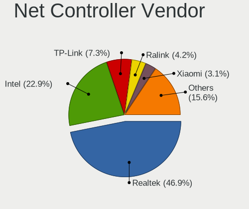

Elementary 6 - Tested Hardware & Statistics (Desktops)
------------------------------------------------------

A project to collect tested hardware configurations for Elementary 6.

Anyone can contribute to this report by the [hw-probe](https://github.com/linuxhw/hw-probe) tool:

    sudo -E hw-probe -all -upload

Please submit a probe of your configuration if it's not presented on the page or is rare.

Full-feature report is available here: https://linux-hardware.org/?view=trends

Contents
--------

* [ Test Cases ](#test-cases)

* [ System ](#system)
  - [ Kernel                   ](#kernel)
  - [ Kernel Family            ](#kernel-family)
  - [ Kernel Major Ver.        ](#kernel-major-ver)
  - [ Arch                     ](#arch)
  - [ DE                       ](#de)
  - [ Display Server           ](#display-server)
  - [ Display Manager          ](#display-manager)
  - [ OS Lang                  ](#os-lang)
  - [ Boot Mode                ](#boot-mode)
  - [ Filesystem               ](#filesystem)
  - [ Part. scheme             ](#part-scheme)
  - [ Dual Boot with Linux/BSD ](#dual-boot-with-linuxbsd)
  - [ Dual Boot (Win)          ](#dual-boot-win)

* [ Board ](#board)
  - [ Vendor                   ](#vendor)
  - [ Model                    ](#model)
  - [ Model Family             ](#model-family)
  - [ MFG Year                 ](#mfg-year)
  - [ Form Factor              ](#form-factor)
  - [ Secure Boot              ](#secure-boot)
  - [ Coreboot                 ](#coreboot)
  - [ RAM Size                 ](#ram-size)
  - [ RAM Used                 ](#ram-used)
  - [ Total Drives             ](#total-drives)
  - [ Has CD-ROM               ](#has-cd-rom)
  - [ Has Ethernet             ](#has-ethernet)
  - [ Has WiFi                 ](#has-wifi)
  - [ Has Bluetooth            ](#has-bluetooth)

* [ Location ](#location)
  - [ Country                  ](#country)
  - [ City                     ](#city)

* [ Drives ](#drives)
  - [ Drive Vendor             ](#drive-vendor)
  - [ Drive Model              ](#drive-model)
  - [ HDD Vendor               ](#hdd-vendor)
  - [ SSD Vendor               ](#ssd-vendor)
  - [ Drive Kind               ](#drive-kind)
  - [ Drive Connector          ](#drive-connector)
  - [ Drive Size               ](#drive-size)
  - [ Space Total              ](#space-total)
  - [ Space Used               ](#space-used)
  - [ Malfunc. Drives          ](#malfunc-drives)
  - [ Malfunc. Drive Vendor    ](#malfunc-drive-vendor)
  - [ Malfunc. HDD Vendor      ](#malfunc-hdd-vendor)
  - [ Malfunc. Drive Kind      ](#malfunc-drive-kind)
  - [ Failed Drives            ](#failed-drives)
  - [ Failed Drive Vendor      ](#failed-drive-vendor)
  - [ Drive Status             ](#drive-status)

* [ Storage controller ](#storage-controller)
  - [ Storage Vendor           ](#storage-vendor)
  - [ Storage Model            ](#storage-model)
  - [ Storage Kind             ](#storage-kind)

* [ Processor ](#processor)
  - [ CPU Vendor               ](#cpu-vendor)
  - [ CPU Model                ](#cpu-model)
  - [ CPU Model Family         ](#cpu-model-family)
  - [ CPU Cores                ](#cpu-cores)
  - [ CPU Sockets              ](#cpu-sockets)
  - [ CPU Threads              ](#cpu-threads)
  - [ CPU Op-Modes             ](#cpu-op-modes)
  - [ CPU Microcode            ](#cpu-microcode)
  - [ CPU Microarch            ](#cpu-microarch)

* [ Graphics ](#graphics)
  - [ GPU Vendor               ](#gpu-vendor)
  - [ GPU Model                ](#gpu-model)
  - [ GPU Combo                ](#gpu-combo)
  - [ GPU Driver               ](#gpu-driver)
  - [ GPU Memory               ](#gpu-memory)

* [ Monitor ](#monitor)
  - [ Monitor Vendor           ](#monitor-vendor)
  - [ Monitor Model            ](#monitor-model)
  - [ Monitor Resolution       ](#monitor-resolution)
  - [ Monitor Diagonal         ](#monitor-diagonal)
  - [ Monitor Width            ](#monitor-width)
  - [ Aspect Ratio             ](#aspect-ratio)
  - [ Monitor Area             ](#monitor-area)
  - [ Pixel Density            ](#pixel-density)
  - [ Multiple Monitors        ](#multiple-monitors)

* [ Network ](#network)
  - [ Net Controller Vendor    ](#net-controller-vendor)
  - [ Net Controller Model     ](#net-controller-model)
  - [ Wireless Vendor          ](#wireless-vendor)
  - [ Wireless Model           ](#wireless-model)
  - [ Ethernet Vendor          ](#ethernet-vendor)
  - [ Ethernet Model           ](#ethernet-model)
  - [ Net Controller Kind      ](#net-controller-kind)
  - [ Used Controller          ](#used-controller)
  - [ NICs                     ](#nics)
  - [ IPv6                     ](#ipv6)

* [ Bluetooth ](#bluetooth)
  - [ Bluetooth Vendor         ](#bluetooth-vendor)
  - [ Bluetooth Model          ](#bluetooth-model)

* [ Sound ](#sound)
  - [ Sound Vendor             ](#sound-vendor)
  - [ Sound Model              ](#sound-model)

* [ Memory ](#memory)
  - [ Memory Vendor            ](#memory-vendor)
  - [ Memory Model             ](#memory-model)
  - [ Memory Kind              ](#memory-kind)
  - [ Memory Form Factor       ](#memory-form-factor)
  - [ Memory Size              ](#memory-size)
  - [ Memory Speed             ](#memory-speed)

* [ Printers & scanners ](#printers--scanners)
  - [ Printer Vendor           ](#printer-vendor)
  - [ Printer Model            ](#printer-model)
  - [ Scanner Vendor           ](#scanner-vendor)
  - [ Scanner Model            ](#scanner-model)

* [ Camera ](#camera)
  - [ Camera Vendor            ](#camera-vendor)
  - [ Camera Model             ](#camera-model)

* [ Security ](#security)
  - [ Fingerprint Vendor       ](#fingerprint-vendor)
  - [ Fingerprint Model        ](#fingerprint-model)
  - [ Chipcard Vendor          ](#chipcard-vendor)
  - [ Chipcard Model           ](#chipcard-model)

* [ Unsupported ](#unsupported)
  - [ Unsupported Devices      ](#unsupported-devices)
  - [ Unsupported Device Types ](#unsupported-device-types)

Test Cases
----------

| Vendor   | Model                       | Probe                                                      | Date         |
|----------|-----------------------------|------------------------------------------------------------|--------------|
| ASRock   | Z590 Phantom Gaming 4/ac    | [b52ca671f7](https://linux-hardware.org/?probe=b52ca671f7) | Dec 24, 2021 |
| Pegatron | IPMH61P1                    | [1ba6ea2ee9](https://linux-hardware.org/?probe=1ba6ea2ee9) | Dec 14, 2021 |
| Acer     | ConceptD CM100-51A V:1.1    | [0b3e5753fc](https://linux-hardware.org/?probe=0b3e5753fc) | Dec 13, 2021 |
| ASUSTek  | TUF GAMING B560M-PLUS       | [5c0550c1e8](https://linux-hardware.org/?probe=5c0550c1e8) | Dec 09, 2021 |
| ASUSTek  | PRIME A320M-K               | [fc49eed81d](https://linux-hardware.org/?probe=fc49eed81d) | Dec 09, 2021 |
| ASUSTek  | H81M-C                      | [0b0241baf7](https://linux-hardware.org/?probe=0b0241baf7) | Dec 08, 2021 |
| Dell     | 0MGK50 A02                  | [df4bb96e67](https://linux-hardware.org/?probe=df4bb96e67) | Dec 08, 2021 |
| ASUSTek  | M5A78L-M LX/BR              | [5c46f5e832](https://linux-hardware.org/?probe=5c46f5e832) | Dec 07, 2021 |
| Gigabyte | AX370-Gaming-CF se1         | [7cb1ebd6c9](https://linux-hardware.org/?probe=7cb1ebd6c9) | Dec 07, 2021 |
| Gigabyte | X570 AORUS PRO WIFI         | [a8e4016566](https://linux-hardware.org/?probe=a8e4016566) | Dec 06, 2021 |
| Gigabyte | X570 AORUS PRO WIFI         | [ebfed157e7](https://linux-hardware.org/?probe=ebfed157e7) | Dec 06, 2021 |
| Acer     | Aspire X3990                | [e291d06394](https://linux-hardware.org/?probe=e291d06394) | Dec 05, 2021 |
| MSI      | Z370 KRAIT GAMING           | [b213dc07b8](https://linux-hardware.org/?probe=b213dc07b8) | Dec 04, 2021 |
| MSI      | Z370 KRAIT GAMING           | [b562e90f75](https://linux-hardware.org/?probe=b562e90f75) | Dec 04, 2021 |
| Pegatron | Benicia                     | [51dae15bcd](https://linux-hardware.org/?probe=51dae15bcd) | Dec 03, 2021 |
| Gigabyte | AX370-Gaming-CF se1         | [313d4d0bd8](https://linux-hardware.org/?probe=313d4d0bd8) | Dec 03, 2021 |
| HP       | 8653 A                      | [85d1730019](https://linux-hardware.org/?probe=85d1730019) | Dec 01, 2021 |
| Gigabyte | B85M-DS3H-A                 | [fbe4820444](https://linux-hardware.org/?probe=fbe4820444) | Dec 01, 2021 |
| ASUSTek  | ROG STRIX Z490-F GAMING     | [500f9c8851](https://linux-hardware.org/?probe=500f9c8851) | Dec 01, 2021 |
| ASUSTek  | PRIME B365M-A               | [c7cbb50843](https://linux-hardware.org/?probe=c7cbb50843) | Nov 30, 2021 |
| Chuwi    | LarkBox Pro                 | [4af62a6057](https://linux-hardware.org/?probe=4af62a6057) | Nov 29, 2021 |
| Biostar  | TH55XE                      | [9e420cc495](https://linux-hardware.org/?probe=9e420cc495) | Nov 28, 2021 |
| MSI      | H81M-P33                    | [8812103632](https://linux-hardware.org/?probe=8812103632) | Nov 28, 2021 |
| HP       | 1497                        | [6f042fb99c](https://linux-hardware.org/?probe=6f042fb99c) | Nov 28, 2021 |
| Acer     | Aspire X3990                | [5559b2d988](https://linux-hardware.org/?probe=5559b2d988) | Nov 27, 2021 |
| HP       | 1825                        | [3648c360a9](https://linux-hardware.org/?probe=3648c360a9) | Nov 26, 2021 |
| Gigabyte | B450 I AORUS PRO WIFI-CF    | [ee1387e206](https://linux-hardware.org/?probe=ee1387e206) | Nov 26, 2021 |
| Gigabyte | Z390 GAMING X-CF            | [34e71f1e27](https://linux-hardware.org/?probe=34e71f1e27) | Nov 25, 2021 |
| Gigabyte | B450M DS3H-CF               | [0fccfea38c](https://linux-hardware.org/?probe=0fccfea38c) | Nov 25, 2021 |
| ASUSTek  | P8H61-MX R2.0               | [1e15277ce2](https://linux-hardware.org/?probe=1e15277ce2) | Nov 22, 2021 |
| Biostar  | TA790GXE 128M               | [93ff10a9c2](https://linux-hardware.org/?probe=93ff10a9c2) | Nov 21, 2021 |
| Gigabyte | B85M-D3V-A                  | [12bcc06e6e](https://linux-hardware.org/?probe=12bcc06e6e) | Nov 21, 2021 |
| MSI      | X470 GAMING PLUS MAX        | [9e7d926319](https://linux-hardware.org/?probe=9e7d926319) | Nov 19, 2021 |
| HP       | 0AECh D                     | [c81bcc92ca](https://linux-hardware.org/?probe=c81bcc92ca) | Nov 19, 2021 |
| Gigabyte | EP43T-USB3                  | [a24bb09910](https://linux-hardware.org/?probe=a24bb09910) | Nov 15, 2021 |
| Gigabyte | H81M-H                      | [a895ed29e0](https://linux-hardware.org/?probe=a895ed29e0) | Nov 14, 2021 |
| ASRock   | X570 Extreme4               | [e49fdf2db4](https://linux-hardware.org/?probe=e49fdf2db4) | Nov 13, 2021 |
| MSI      | 970A-G43                    | [19714dd1a0](https://linux-hardware.org/?probe=19714dd1a0) | Nov 08, 2021 |
| Gigabyte | Z270X-Gaming 5              | [5244244701](https://linux-hardware.org/?probe=5244244701) | Nov 08, 2021 |
| ASRock   | P67 Extreme4                | [a70eb2d3f8](https://linux-hardware.org/?probe=a70eb2d3f8) | Oct 29, 2021 |
| ASRock   | P67 Extreme4                | [0a07f4c735](https://linux-hardware.org/?probe=0a07f4c735) | Oct 29, 2021 |
| MSI      | 2A9Ch                       | [2f752a1a3e](https://linux-hardware.org/?probe=2f752a1a3e) | Oct 28, 2021 |
| HP       | 158B                        | [24399f4e69](https://linux-hardware.org/?probe=24399f4e69) | Oct 20, 2021 |
| HP       | 339A                        | [d9c6208191](https://linux-hardware.org/?probe=d9c6208191) | Oct 16, 2021 |
| Dell     | 0M9KCM A02                  | [a925b0f3d1](https://linux-hardware.org/?probe=a925b0f3d1) | Oct 12, 2021 |
| Gigabyte | AB350-Gaming 3-CF           | [f6e75d0258](https://linux-hardware.org/?probe=f6e75d0258) | Oct 09, 2021 |
| MSI      | B460M PRO-VDH WIFI          | [05711b548f](https://linux-hardware.org/?probe=05711b548f) | Oct 03, 2021 |
| ASUSTek  | TUF GAMING B560M-PLUS       | [de0f051658](https://linux-hardware.org/?probe=de0f051658) | Oct 02, 2021 |
| Shuttle  | FS61                        | [b25047a516](https://linux-hardware.org/?probe=b25047a516) | Oct 01, 2021 |
| Apple    | Mac-F221BEC8                | [1754c64091](https://linux-hardware.org/?probe=1754c64091) | Sep 27, 2021 |
| ASUSTek  | P7H55-M                     | [3367bc011a](https://linux-hardware.org/?probe=3367bc011a) | Sep 25, 2021 |
| Dell     | 0Y5DDC A00                  | [df95ea94b8](https://linux-hardware.org/?probe=df95ea94b8) | Sep 25, 2021 |
| Dell     | 0Y5DDC A00                  | [10ee1abc07](https://linux-hardware.org/?probe=10ee1abc07) | Sep 25, 2021 |
| ASRock   | M3A790GXH/128M              | [818ec10ec8](https://linux-hardware.org/?probe=818ec10ec8) | Sep 24, 2021 |
| Intel    | X79 V1.x                    | [19223e911c](https://linux-hardware.org/?probe=19223e911c) | Sep 22, 2021 |
| ASUSTek  | M4N78-AM                    | [3d8e0efc00](https://linux-hardware.org/?probe=3d8e0efc00) | Sep 21, 2021 |
| ASRock   | A320M-HDV                   | [24bb7c7d18](https://linux-hardware.org/?probe=24bb7c7d18) | Sep 17, 2021 |
| Intel    | H61                         | [0010dbcb5e](https://linux-hardware.org/?probe=0010dbcb5e) | Sep 10, 2021 |
| HP       | 8767 A                      | [7f022c67ac](https://linux-hardware.org/?probe=7f022c67ac) | Sep 09, 2021 |
| Gigabyte | B450M DS3H V2               | [633441bc2b](https://linux-hardware.org/?probe=633441bc2b) | Sep 05, 2021 |
| ASUSTek  | ROG STRIX Z590-F GAMING ... | [c9476d5d06](https://linux-hardware.org/?probe=c9476d5d06) | Sep 02, 2021 |
| Gigabyte | F2A55M-HD2                  | [0c05ab5b21](https://linux-hardware.org/?probe=0c05ab5b21) | Aug 30, 2021 |
| ASRock   | H81TM-ITX R2.0              | [4f04e7309e](https://linux-hardware.org/?probe=4f04e7309e) | Aug 30, 2021 |
| ASUSTek  | M5A78L-M LX/BR              | [d0ff1c6977](https://linux-hardware.org/?probe=d0ff1c6977) | Aug 25, 2021 |
| ASUSTek  | P6X58D-E                    | [db1ef28e92](https://linux-hardware.org/?probe=db1ef28e92) | Aug 20, 2021 |
| MSI      | X470 GAMING PLUS MAX        | [1176a287c7](https://linux-hardware.org/?probe=1176a287c7) | Aug 19, 2021 |
| ASUSTek  | TUF GAMING B450M-PRO II     | [73beb900ea](https://linux-hardware.org/?probe=73beb900ea) | Aug 15, 2021 |
| Gigabyte | X570 I AORUS PRO WIFI       | [e302074e5e](https://linux-hardware.org/?probe=e302074e5e) | Aug 14, 2021 |
| Gigabyte | H310M M.2 x.x               | [69e2e83b95](https://linux-hardware.org/?probe=69e2e83b95) | Aug 10, 2021 |
| Gigabyte | H310M M.2 x.x               | [86d69a15b9](https://linux-hardware.org/?probe=86d69a15b9) | Aug 10, 2021 |
| ASUSTek  | P5KPL-AM SE                 | [a97fc63d3d](https://linux-hardware.org/?probe=a97fc63d3d) | Jul 23, 2021 |
| ASRock   | B450 Pro4                   | [c5d0611f79](https://linux-hardware.org/?probe=c5d0611f79) | Jun 13, 2021 |
| ASUSTek  | TUF GAMING B550M-PLUS       | [63da02a979](https://linux-hardware.org/?probe=63da02a979) | May 19, 2021 |
| ASUSTek  | TUF GAMING B550M-PLUS       | [223234378e](https://linux-hardware.org/?probe=223234378e) | May 04, 2021 |
| ASUSTek  | ROG STRIX B450-I GAMING     | [a208e8a358](https://linux-hardware.org/?probe=a208e8a358) | May 01, 2021 |
| ASUSTek  | M5A99X EVO R2.0             | [f7d949f5a7](https://linux-hardware.org/?probe=f7d949f5a7) | Dec 23, 2020 |
| HP       | 8433 11                     | [691ef58a05](https://linux-hardware.org/?probe=691ef58a05) | Dec 09, 2020 |

System
------

Kernel
------

Version of the Linux kernel

| Version              | Desktops | Percent |
|----------------------|----------|---------|
| 5.11.0-40-generic    | 16       | 23.53%  |
| 5.11.0-41-generic    | 14       | 20.59%  |
| 5.11.0-27-generic    | 10       | 14.71%  |
| 5.11.0-37-generic    | 6        | 8.82%   |
| 5.11.0-38-generic    | 5        | 7.35%   |
| 5.11.0-25-generic    | 5        | 7.35%   |
| 5.8.0-50-generic     | 3        | 4.41%   |
| 5.11.0-36-generic    | 2        | 2.94%   |
| 5.11.0-34-generic    | 2        | 2.94%   |
| 5.8.0-63-generic     | 1        | 1.47%   |
| 5.8.0-55-generic     | 1        | 1.47%   |
| 5.4.0-58-generic     | 1        | 1.47%   |
| 5.4.0-56-generic     | 1        | 1.47%   |
| 5.11.0-41-lowlatency | 1        | 1.47%   |

Kernel Family
-------------

Linux kernel without a distro release

| Version | Desktops | Percent |
|---------|----------|---------|
| 5.11.0  | 57       | 89.06%  |
| 5.8.0   | 5        | 7.81%   |
| 5.4.0   | 2        | 3.13%   |

Kernel Major Ver.
-----------------

Linux kernel major version

| Version | Desktops | Percent |
|---------|----------|---------|
| 5.11    | 57       | 89.06%  |
| 5.8     | 5        | 7.81%   |
| 5.4     | 2        | 3.13%   |

Arch
----

OS architecture (x86_64, i586, etc.)

| Name   | Desktops | Percent |
|--------|----------|---------|
| x86_64 | 64       | 100%    |

DE
--

Desktop Environment

| Name     | Desktops | Percent |
|----------|----------|---------|
| Pantheon | 59       | 90.77%  |
| Unknown  | 4        | 6.15%   |
| MATE     | 1        | 1.54%   |
| GNOME    | 1        | 1.54%   |

Display Server
--------------

X11 or Wayland

| Name | Desktops | Percent |
|------|----------|---------|
| X11  | 64       | 100%    |

Display Manager
---------------

SDDM, LightDM, etc.

| Name    | Desktops | Percent |
|---------|----------|---------|
| Unknown | 55       | 85.94%  |
| LightDM | 6        | 9.38%   |
| TDM     | 3        | 4.69%   |

OS Lang
-------

Language

| Lang  | Desktops | Percent |
|-------|----------|---------|
| en_US | 32       | 50%     |
| de_DE | 8        | 12.5%   |
| es_ES | 7        | 10.94%  |
| ru_RU | 4        | 6.25%   |
| pt_BR | 3        | 4.69%   |
| en_GB | 2        | 3.13%   |
| zh_CN | 1        | 1.56%   |
| tr_TR | 1        | 1.56%   |
| it_IT | 1        | 1.56%   |
| fr_FR | 1        | 1.56%   |
| es_MX | 1        | 1.56%   |
| en_AU | 1        | 1.56%   |
| de_CH | 1        | 1.56%   |
| ca_ES | 1        | 1.56%   |

Boot Mode
---------

EFI or BIOS

| Mode | Desktops | Percent |
|------|----------|---------|
| EFI  | 38       | 59.38%  |
| BIOS | 26       | 40.63%  |

Filesystem
----------

Type of filesystem

| Type  | Desktops | Percent |
|-------|----------|---------|
| Ext4  | 61       | 95.31%  |
| Btrfs | 3        | 4.69%   |

Part. scheme
------------

Scheme of partitioning

| Type    | Desktops | Percent |
|---------|----------|---------|
| Unknown | 57       | 89.06%  |
| GPT     | 4        | 6.25%   |
| MBR     | 3        | 4.69%   |

Dual Boot with Linux/BSD
------------------------

Hosting more than one Linux/BSD

| Dual boot | Desktops | Percent |
|-----------|----------|---------|
| No        | 60       | 93.75%  |
| Yes       | 4        | 6.25%   |

Dual Boot (Win)
---------------

Hosting Linux and Windows

| Dual boot | Desktops | Percent |
|-----------|----------|---------|
| No        | 53       | 82.81%  |
| Yes       | 11       | 17.19%  |

Board
-----

Vendor
------

Motherboard manufacturer

| Name                | Desktops | Percent |
|---------------------|----------|---------|
| ASUSTek Computer    | 15       | 23.44%  |
| Gigabyte Technology | 14       | 21.88%  |
| Hewlett-Packard     | 8        | 12.5%   |
| ASRock              | 7        | 10.94%  |
| MSI                 | 6        | 9.38%   |
| Dell                | 3        | 4.69%   |
| Pegatron            | 2        | 3.13%   |
| Intel               | 2        | 3.13%   |
| Biostar             | 2        | 3.13%   |
| Acer                | 2        | 3.13%   |
| Shuttle             | 1        | 1.56%   |
| Chuwi               | 1        | 1.56%   |
| Apple               | 1        | 1.56%   |

Model
-----

Motherboard model

| Name                                 | Desktops | Percent |
|--------------------------------------|----------|---------|
| Shuttle DS61                         | 1        | 1.56%   |
| Pegatron KJ379AA-ABA a6400f          | 1        | 1.56%   |
| Pegatron IPMH61P1                    | 1        | 1.56%   |
| MSI MS-7C83                          | 1        | 1.56%   |
| MSI MS-7B79                          | 1        | 1.56%   |
| MSI MS-7B46                          | 1        | 1.56%   |
| MSI MS-7817                          | 1        | 1.56%   |
| MSI MS-7693                          | 1        | 1.56%   |
| MSI Elite 7100 Microtower PC         | 1        | 1.56%   |
| Intel X64                            | 1        | 1.56%   |
| Intel H61                            | 1        | 1.56%   |
| HP Z820 Workstation                  | 1        | 1.56%   |
| HP Z800 Workstation                  | 1        | 1.56%   |
| HP Pavilion Gaming Desktop TG01-1xxx | 1        | 1.56%   |
| HP Pavilion Desktop 590-p0xxx        | 1        | 1.56%   |
| HP ENVY TE01-0xxx                    | 1        | 1.56%   |
| HP EliteDesk 800 G1 DM               | 1        | 1.56%   |
| HP Compaq 6200 Pro MT PC             | 1        | 1.56%   |
| HP 339A                              | 1        | 1.56%   |
| Gigabyte Z390 GAMING X               | 1        | 1.56%   |
| Gigabyte Z270X-Gaming 5              | 1        | 1.56%   |
| Gigabyte X570 I AORUS PRO WIFI       | 1        | 1.56%   |
| Gigabyte X570 AORUS PRO WIFI         | 1        | 1.56%   |
| Gigabyte H81M-H                      | 1        | 1.56%   |
| Gigabyte H310M M.2 2.0               | 1        | 1.56%   |
| Gigabyte F2A55M-HD2                  | 1        | 1.56%   |
| Gigabyte EP43T-USB3                  | 1        | 1.56%   |
| Gigabyte B85M-DS3H-A                 | 1        | 1.56%   |
| Gigabyte B85M-D3V-A                  | 1        | 1.56%   |
| Gigabyte B450M DS3H V2               | 1        | 1.56%   |
| Gigabyte B450 I AORUS PRO WIFI       | 1        | 1.56%   |
| Gigabyte AX370-Gaming                | 1        | 1.56%   |
| Gigabyte AB350-Gaming 3              | 1        | 1.56%   |
| Dell OptiPlex 9020M                  | 1        | 1.56%   |
| Dell OptiPlex 9010                   | 1        | 1.56%   |
| Dell OptiPlex 3040                   | 1        | 1.56%   |
| Chuwi LarkBox Pro                    | 1        | 1.56%   |
| Biostar TH55XE                       | 1        | 1.56%   |
| Biostar TA790GXE 128M                | 1        | 1.56%   |
| ASUS TUF GAMING B560M-PLUS           | 1        | 1.56%   |
| ASUS TUF GAMING B550M-PLUS           | 1        | 1.56%   |
| ASUS TUF GAMING B450M-PRO II         | 1        | 1.56%   |
| ASUS ROG STRIX Z590-F GAMING WIFI    | 1        | 1.56%   |
| ASUS ROG STRIX B450-I GAMING         | 1        | 1.56%   |
| ASUS PRIME B365M-A                   | 1        | 1.56%   |
| ASUS PRIME A320M-K                   | 1        | 1.56%   |
| ASUS P8H61-MX R2.0                   | 1        | 1.56%   |
| ASUS P7H55-M                         | 1        | 1.56%   |
| ASUS P6X58D-E                        | 1        | 1.56%   |
| ASUS P5KPL-AM SE                     | 1        | 1.56%   |
| ASUS M5A99X EVO R2.0                 | 1        | 1.56%   |
| ASUS M5A78L-M LX/BR                  | 1        | 1.56%   |
| ASUS M4N78-AM                        | 1        | 1.56%   |
| ASUS All Series                      | 1        | 1.56%   |
| ASRock Z590 Phantom Gaming 4/ac      | 1        | 1.56%   |
| ASRock X570 Extreme4                 | 1        | 1.56%   |
| ASRock P67 Extreme4                  | 1        | 1.56%   |
| ASRock M3A790GXH/128M                | 1        | 1.56%   |
| ASRock H81TM-ITX R2.0                | 1        | 1.56%   |
| ASRock B450 Pro4                     | 1        | 1.56%   |

Model Family
------------

Motherboard model prefix

| Name                  | Desktops | Percent |
|-----------------------|----------|---------|
| Dell OptiPlex         | 3        | 4.69%   |
| ASUS TUF              | 3        | 4.69%   |
| HP Pavilion           | 2        | 3.13%   |
| Gigabyte X570         | 2        | 3.13%   |
| ASUS ROG              | 2        | 3.13%   |
| ASUS PRIME            | 2        | 3.13%   |
| Shuttle DS61          | 1        | 1.56%   |
| Pegatron KJ379AA-ABA  | 1        | 1.56%   |
| Pegatron IPMH61P1     | 1        | 1.56%   |
| MSI MS-7C83           | 1        | 1.56%   |
| MSI MS-7B79           | 1        | 1.56%   |
| MSI MS-7B46           | 1        | 1.56%   |
| MSI MS-7817           | 1        | 1.56%   |
| MSI MS-7693           | 1        | 1.56%   |
| MSI Elite             | 1        | 1.56%   |
| Intel X64             | 1        | 1.56%   |
| Intel H61             | 1        | 1.56%   |
| HP Z820               | 1        | 1.56%   |
| HP Z800               | 1        | 1.56%   |
| HP ENVY               | 1        | 1.56%   |
| HP EliteDesk          | 1        | 1.56%   |
| HP Compaq             | 1        | 1.56%   |
| HP 339A               | 1        | 1.56%   |
| Gigabyte Z390         | 1        | 1.56%   |
| Gigabyte Z270X-Gaming | 1        | 1.56%   |
| Gigabyte H81M-H       | 1        | 1.56%   |
| Gigabyte H310M        | 1        | 1.56%   |
| Gigabyte F2A55M-HD2   | 1        | 1.56%   |
| Gigabyte EP43T-USB3   | 1        | 1.56%   |
| Gigabyte B85M-DS3H-A  | 1        | 1.56%   |
| Gigabyte B85M-D3V-A   | 1        | 1.56%   |
| Gigabyte B450M        | 1        | 1.56%   |
| Gigabyte B450         | 1        | 1.56%   |
| Gigabyte AX370-Gaming | 1        | 1.56%   |
| Gigabyte AB350-Gaming | 1        | 1.56%   |
| Chuwi LarkBox         | 1        | 1.56%   |
| Biostar TH55XE        | 1        | 1.56%   |
| Biostar TA790GXE      | 1        | 1.56%   |
| ASUS P8H61-MX         | 1        | 1.56%   |
| ASUS P7H55-M          | 1        | 1.56%   |
| ASUS P6X58D-E         | 1        | 1.56%   |
| ASUS P5KPL-AM         | 1        | 1.56%   |
| ASUS M5A99X           | 1        | 1.56%   |
| ASUS M5A78L-M         | 1        | 1.56%   |
| ASUS M4N78-AM         | 1        | 1.56%   |
| ASUS All              | 1        | 1.56%   |
| ASRock Z590           | 1        | 1.56%   |
| ASRock X570           | 1        | 1.56%   |
| ASRock P67            | 1        | 1.56%   |
| ASRock M3A790GXH      | 1        | 1.56%   |
| ASRock H81TM-ITX      | 1        | 1.56%   |
| ASRock B450           | 1        | 1.56%   |
| ASRock A320M-HDV      | 1        | 1.56%   |
| Apple MacPro5         | 1        | 1.56%   |
| Acer ConceptD         | 1        | 1.56%   |
| Acer Aspire           | 1        | 1.56%   |

MFG Year
--------

Motherboard manufacture year

| Year | Desktops | Percent |
|------|----------|---------|
| 2021 | 12       | 18.75%  |
| 2020 | 10       | 15.63%  |
| 2015 | 7        | 10.94%  |
| 2019 | 5        | 7.81%   |
| 2018 | 5        | 7.81%   |
| 2013 | 4        | 6.25%   |
| 2011 | 4        | 6.25%   |
| 2010 | 4        | 6.25%   |
| 2017 | 3        | 4.69%   |
| 2014 | 3        | 4.69%   |
| 2012 | 3        | 4.69%   |
| 2009 | 2        | 3.13%   |
| 2016 | 1        | 1.56%   |
| 2008 | 1        | 1.56%   |

Form Factor
-----------

Physical design of the computer

| Name    | Desktops | Percent |
|---------|----------|---------|
| Desktop | 64       | 100%    |

Secure Boot
-----------

Enabled or disabled

| State    | Desktops | Percent |
|----------|----------|---------|
| Disabled | 60       | 93.75%  |
| Enabled  | 4        | 6.25%   |

Coreboot
--------

Have coreboot on board

| Used | Desktops | Percent |
|------|----------|---------|
| No   | 64       | 100%    |

RAM Size
--------

Total RAM memory

| Size in GB  | Desktops | Percent |
|-------------|----------|---------|
| 16.01-24.0  | 19       | 29.69%  |
| 4.01-8.0    | 16       | 25%     |
| 32.01-64.0  | 16       | 25%     |
| 8.01-16.0   | 6        | 9.38%   |
| 3.01-4.0    | 5        | 7.81%   |
| 64.01-256.0 | 1        | 1.56%   |
| 1.01-2.0    | 1        | 1.56%   |

RAM Used
--------

Used RAM memory

| Used GB   | Desktops | Percent |
|-----------|----------|---------|
| 1.01-2.0  | 28       | 41.79%  |
| 2.01-3.0  | 21       | 31.34%  |
| 3.01-4.0  | 10       | 14.93%  |
| 4.01-8.0  | 7        | 10.45%  |
| 8.01-16.0 | 1        | 1.49%   |

Total Drives
------------

Number of drives on board

| Drives | Desktops | Percent |
|--------|----------|---------|
| 2      | 26       | 40%     |
| 1      | 21       | 32.31%  |
| 3      | 9        | 13.85%  |
| 4      | 7        | 10.77%  |
| 5      | 2        | 3.08%   |

Has CD-ROM
----------

Has CD-ROM on board

| Presented | Desktops | Percent |
|-----------|----------|---------|
| No        | 44       | 68.75%  |
| Yes       | 20       | 31.25%  |

Has Ethernet
------------

Has Ethernet on board

| Presented | Desktops | Percent |
|-----------|----------|---------|
| Yes       | 63       | 98.44%  |
| No        | 1        | 1.56%   |

Has WiFi
--------

Has WiFi module

| Presented | Desktops | Percent |
|-----------|----------|---------|
| Yes       | 33       | 51.56%  |
| No        | 31       | 48.44%  |

Has Bluetooth
-------------

Has Bluetooth module

| Presented | Desktops | Percent |
|-----------|----------|---------|
| No        | 39       | 60.94%  |
| Yes       | 25       | 39.06%  |

Location
--------

Country
-------

Geographic location (country)

| Country     | Desktops | Percent |
|-------------|----------|---------|
| USA         | 7        | 10.77%  |
| Germany     | 7        | 10.77%  |
| UK          | 4        | 6.15%   |
| Russia      | 4        | 6.15%   |
| Mexico      | 4        | 6.15%   |
| Brazil      | 4        | 6.15%   |
| Indonesia   | 3        | 4.62%   |
| Canada      | 3        | 4.62%   |
| Argentina   | 3        | 4.62%   |
| Spain       | 2        | 3.08%   |
| Finland     | 2        | 3.08%   |
| Austria     | 2        | 3.08%   |
| Vietnam     | 1        | 1.54%   |
| Ukraine     | 1        | 1.54%   |
| Turkey      | 1        | 1.54%   |
| Sri Lanka   | 1        | 1.54%   |
| Poland      | 1        | 1.54%   |
| Netherlands | 1        | 1.54%   |
| Kenya       | 1        | 1.54%   |
| Italy       | 1        | 1.54%   |
| Greece      | 1        | 1.54%   |
| France      | 1        | 1.54%   |
| Estonia     | 1        | 1.54%   |
| Denmark     | 1        | 1.54%   |
| Czechia     | 1        | 1.54%   |
| Costa Rica  | 1        | 1.54%   |
| Colombia    | 1        | 1.54%   |
| China       | 1        | 1.54%   |
| Chile       | 1        | 1.54%   |
| Belgium     | 1        | 1.54%   |
| Australia   | 1        | 1.54%   |
| Albania     | 1        | 1.54%   |

City
----

Geographic location (city)

| City                    | Desktops | Percent |
|-------------------------|----------|---------|
| Vienna                  | 2        | 3.03%   |
| Znojmo                  | 1        | 1.52%   |
| Xicheng District        | 1        | 1.52%   |
| Wriezen                 | 1        | 1.52%   |
| Wigan                   | 1        | 1.52%   |
| Wattala                 | 1        | 1.52%   |
| Vit??ria                | 1        | 1.52%   |
| Villahermosa            | 1        | 1.52%   |
| Vantaa                  | 1        | 1.52%   |
| Vancouver               | 1        | 1.52%   |
| Ullastrell              | 1        | 1.52%   |
| Tucson                  | 1        | 1.52%   |
| Tolyatti                | 1        | 1.52%   |
| Toluca                  | 1        | 1.52%   |
| Tallinn                 | 1        | 1.52%   |
| Sukabumi                | 1        | 1.52%   |
| Staropyshminsk          | 1        | 1.52%   |
| Sparti                  | 1        | 1.52%   |
| Simferopol              | 1        | 1.52%   |
| S??o Paulo              | 1        | 1.52%   |
| Saskatoon               | 1        | 1.52%   |
| Santiago                | 1        | 1.52%   |
| San Jos?©               | 1        | 1.52%   |
| Rosario                 | 1        | 1.52%   |
| Roermond                | 1        | 1.52%   |
| Rio de Janeiro          | 1        | 1.52%   |
| Riesweiler              | 1        | 1.52%   |
| Rheinberg               | 1        | 1.52%   |
| Providence Forge        | 1        | 1.52%   |
| Potsdam                 | 1        | 1.52%   |
| Pleiku                  | 1        | 1.52%   |
| Paris                   | 1        | 1.52%   |
| Pargolovo Tretye        | 1        | 1.52%   |
| Oldenburg               | 1        | 1.52%   |
| Nairobi                 | 1        | 1.52%   |
| Morelia                 | 1        | 1.52%   |
| Montreal                | 1        | 1.52%   |
| Milan                   | 1        | 1.52%   |
| Mexico City             | 1        | 1.52%   |
| Medan                   | 1        | 1.52%   |
| Landshut                | 1        | 1.52%   |
| Krakow                  | 1        | 1.52%   |
| Klaukkala               | 1        | 1.52%   |
| Kediri                  | 1        | 1.52%   |
| Kazan?ˆ™                | 1        | 1.52%   |
| Kam?«z                  | 1        | 1.52%   |
| Izmir                   | 1        | 1.52%   |
| Itanhem                 | 1        | 1.52%   |
| Islington               | 1        | 1.52%   |
| Granollers              | 1        | 1.52%   |
| Fredersdorf             | 1        | 1.52%   |
| Fort Lauderdale         | 1        | 1.52%   |
| East Malvern            | 1        | 1.52%   |
| Copenhagen              | 1        | 1.52%   |
| Concepci??n del Uruguay | 1        | 1.52%   |
| Cocoa                   | 1        | 1.52%   |
| Brussels                | 1        | 1.52%   |
| Brooklyn                | 1        | 1.52%   |
| Bonnybridge             | 1        | 1.52%   |
| Bernau bei Berlin       | 1        | 1.52%   |

Drives
------

Drive Vendor
------------

Hard drive vendors

| Vendor                    | Desktops | Drives | Percent |
|---------------------------|----------|--------|---------|
| WDC                       | 24       | 33     | 21.62%  |
| Seagate                   | 16       | 20     | 14.41%  |
| Samsung Electronics       | 16       | 24     | 14.41%  |
| Kingston                  | 10       | 13     | 9.01%   |
| SanDisk                   | 9        | 10     | 8.11%   |
| Crucial                   | 6        | 9      | 5.41%   |
| OCZ                       | 3        | 3      | 2.7%    |
| Hitachi                   | 3        | 3      | 2.7%    |
| Unknown                   | 2        | 2      | 1.8%    |
| Toshiba                   | 2        | 2      | 1.8%    |
| Phison                    | 2        | 3      | 1.8%    |
| Patriot                   | 2        | 2      | 1.8%    |
| Intel                     | 2        | 2      | 1.8%    |
| USB3.1                    | 1        | 1      | 0.9%    |
| Transcend                 | 1        | 1      | 0.9%    |
| Team                      | 1        | 1      | 0.9%    |
| SK Hynix                  | 1        | 1      | 0.9%    |
| OCZ-VERTEX2               | 1        | 1      | 0.9%    |
| Micron/Crucial Technology | 1        | 2      | 0.9%    |
| Micron Technology         | 1        | 1      | 0.9%    |
| LITEON                    | 1        | 1      | 0.9%    |
| Kingmax                   | 1        | 1      | 0.9%    |
| Gigabyte Technology       | 1        | 1      | 0.9%    |
| GALAX                     | 1        | 1      | 0.9%    |
| China                     | 1        | 1      | 0.9%    |
| Apacer                    | 1        | 1      | 0.9%    |
| A-DATA Technology         | 1        | 1      | 0.9%    |

Drive Model
-----------

Hard drive models

| Model                              | Desktops | Percent |
|------------------------------------|----------|---------|
| Samsung NVMe SSD Drive 500GB       | 5        | 3.88%   |
| Kingston SA400S37240G 240GB SSD    | 4        | 3.1%    |
| Samsung NVMe SSD Drive 1TB         | 3        | 2.33%   |
| Kingston SA400S37480G 480GB SSD    | 3        | 2.33%   |
| WDC WD5000AAKX-003CA0 500GB        | 2        | 1.55%   |
| WDC WD10EZEX-60WN4A0 1TB           | 2        | 1.55%   |
| WDC WD10EZEX-08WN4A0 1TB           | 2        | 1.55%   |
| Seagate ST250DM000-1BD141 250GB    | 2        | 1.55%   |
| Samsung SSD 850 EVO 250GB          | 2        | 1.55%   |
| Intel NVMe SSD Drive 512GB         | 2        | 1.55%   |
| Crucial CT240BX500SSD1 240GB       | 2        | 1.55%   |
| Crucial CT240BX200SSD1 240GB       | 2        | 1.55%   |
| WDC WDS500G2B0A 500GB SSD          | 1        | 0.78%   |
| WDC WD6401AALS-00J7B0 640GB        | 1        | 0.78%   |
| WDC WD5000AAKX-60U6AA0 500GB       | 1        | 0.78%   |
| WDC WD5000AAKX-603CA0 500GB        | 1        | 0.78%   |
| WDC WD5000AAKX-00ERMA0 500GB       | 1        | 0.78%   |
| WDC WD5000AAKX-001CA0 500GB        | 1        | 0.78%   |
| WDC WD50 00LUCT-61C26Y0 500GB      | 1        | 0.78%   |
| WDC WD40EZRZ-00GXCB0 4TB           | 1        | 0.78%   |
| WDC WD40EZAZ-00SF3B0 4TB           | 1        | 0.78%   |
| WDC WD3200AAJS-56B4A0 320GB        | 1        | 0.78%   |
| WDC WD2500AAKS-00B3A0 250GB        | 1        | 0.78%   |
| WDC WD20EZRX-00D8PB0 2TB           | 1        | 0.78%   |
| WDC WD20EARX-00PASB0 2TB           | 1        | 0.78%   |
| WDC WD20EARS-00MVWB0 2TB           | 1        | 0.78%   |
| WDC WD15EARX-00PASB0 1TB           | 1        | 0.78%   |
| WDC WD10EZRX-00L4HB0 1TB           | 1        | 0.78%   |
| WDC WD10EZRX-00A8LB0 1TB           | 1        | 0.78%   |
| WDC WD10EZEX-75ZF5A0 1TB           | 1        | 0.78%   |
| WDC WD10EZEX-22MFCA0 1TB           | 1        | 0.78%   |
| WDC WD10EZEX-00RKKA0 1TB           | 1        | 0.78%   |
| WDC WD10EZEX-00KUWA0 1TB           | 1        | 0.78%   |
| WDC WD10EZEX-00BN5A0 1TB           | 1        | 0.78%   |
| WDC WD10EURX-63UY4Y0 1TB           | 1        | 0.78%   |
| WDC PC SN730 SDBQNTY-1T00-1014 1TB | 1        | 0.78%   |
| USB3.1 Disk 500GB                  | 1        | 0.78%   |
| Unknown SD/MMC/MS PRO 7GB          | 1        | 0.78%   |
| Unknown MMC Card  128GB            | 1        | 0.78%   |
| Transcend TS512GMTS430S 512GB SSD  | 1        | 0.78%   |
| Toshiba MQ01ABD100 1TB             | 1        | 0.78%   |
| Toshiba DT01ACA100 1TB             | 1        | 0.78%   |
| Team L5 LITE SSD 120GB             | 1        | 0.78%   |
| SK Hynix SH920 2.5 7MM 256GB SSD   | 1        | 0.78%   |
| Seagate ST940210AS 40GB            | 1        | 0.78%   |
| Seagate ST500DM002-1BC142 500GB    | 1        | 0.78%   |
| Seagate ST380815AS 80GB            | 1        | 0.78%   |
| Seagate ST3808110AS 80GB           | 1        | 0.78%   |
| Seagate ST3500312CS 500GB          | 1        | 0.78%   |
| Seagate ST3160815AS 160GB          | 1        | 0.78%   |
| Seagate ST3160813AS 160GB          | 1        | 0.78%   |
| Seagate ST3160023AS 160GB          | 1        | 0.78%   |
| Seagate ST3000DM001-9YN166 3TB     | 1        | 0.78%   |
| Seagate ST250DM001 HD253GJ 250GB   | 1        | 0.78%   |
| Seagate ST2000NM0033 2TB           | 1        | 0.78%   |
| Seagate ST2000DM008-2FR102 2TB     | 1        | 0.78%   |
| Seagate ST2000DL003-9VT166 2TB     | 1        | 0.78%   |
| Seagate ST1000NM0053-1C1173 1TB    | 1        | 0.78%   |
| Seagate ST1000DM010-2EP102 1TB     | 1        | 0.78%   |
| Seagate ST1000DM003-1ER162 1TB     | 1        | 0.78%   |

HDD Vendor
----------

Hard disk drive vendors

| Vendor              | Desktops | Drives | Percent |
|---------------------|----------|--------|---------|
| WDC                 | 23       | 31     | 48.94%  |
| Seagate             | 15       | 18     | 31.91%  |
| Samsung Electronics | 3        | 3      | 6.38%   |
| Hitachi             | 3        | 3      | 6.38%   |
| Toshiba             | 2        | 2      | 4.26%   |
| Unknown             | 1        | 1      | 2.13%   |

SSD Vendor
----------

Solid state drive vendors

| Vendor              | Desktops | Drives | Percent |
|---------------------|----------|--------|---------|
| Kingston            | 8        | 10     | 18.6%   |
| Samsung Electronics | 7        | 9      | 16.28%  |
| SanDisk             | 6        | 6      | 13.95%  |
| Crucial             | 6        | 9      | 13.95%  |
| OCZ                 | 3        | 3      | 6.98%   |
| Patriot             | 2        | 2      | 4.65%   |
| WDC                 | 1        | 1      | 2.33%   |
| Transcend           | 1        | 1      | 2.33%   |
| Team                | 1        | 1      | 2.33%   |
| SK Hynix            | 1        | 1      | 2.33%   |
| OCZ-VERTEX2         | 1        | 1      | 2.33%   |
| LITEON              | 1        | 1      | 2.33%   |
| Kingmax             | 1        | 1      | 2.33%   |
| GALAX               | 1        | 1      | 2.33%   |
| China               | 1        | 1      | 2.33%   |
| Apacer              | 1        | 1      | 2.33%   |
| A-DATA Technology   | 1        | 1      | 2.33%   |

Drive Kind
----------

HDD or SSD

| Kind    | Desktops | Drives | Percent |
|---------|----------|--------|---------|
| HDD     | 39       | 58     | 40.21%  |
| SSD     | 35       | 50     | 36.08%  |
| NVMe    | 20       | 30     | 20.62%  |
| Unknown | 2        | 2      | 2.06%   |
| MMC     | 1        | 1      | 1.03%   |

Drive Connector
---------------

SATA, SAS, NVMe, etc.

| Type | Desktops | Drives | Percent |
|------|----------|--------|---------|
| SATA | 56       | 104    | 69.14%  |
| NVMe | 20       | 30     | 24.69%  |
| SAS  | 4        | 6      | 4.94%   |
| MMC  | 1        | 1      | 1.23%   |

Drive Size
----------

Size of hard drive

| Size in TB | Desktops | Drives | Percent |
|------------|----------|--------|---------|
| 0.01-0.5   | 47       | 71     | 60.26%  |
| 0.51-1.0   | 23       | 28     | 29.49%  |
| 1.01-2.0   | 5        | 6      | 6.41%   |
| 3.01-4.0   | 2        | 2      | 2.56%   |
| 2.01-3.0   | 1        | 1      | 1.28%   |

Space Total
-----------

Amount of disk space available on the file system

| Size in GB     | Desktops | Percent |
|----------------|----------|---------|
| 251-500        | 18       | 28.13%  |
| 101-250        | 17       | 26.56%  |
| 501-1000       | 9        | 14.06%  |
| 21-50          | 7        | 10.94%  |
| 1001-2000      | 4        | 6.25%   |
| More than 3000 | 3        | 4.69%   |
| 2001-3000      | 3        | 4.69%   |
| 51-100         | 3        | 4.69%   |

Space Used
----------

Amount of used disk space

| Used GB   | Desktops | Percent |
|-----------|----------|---------|
| 1-20      | 32       | 48.48%  |
| 21-50     | 11       | 16.67%  |
| 51-100    | 9        | 13.64%  |
| 101-250   | 5        | 7.58%   |
| 251-500   | 4        | 6.06%   |
| 2001-3000 | 2        | 3.03%   |
| 501-1000  | 2        | 3.03%   |
| 1001-2000 | 1        | 1.52%   |

Malfunc. Drives
---------------

Drive models with a malfunction

| Model                             | Desktops | Drives | Percent |
|-----------------------------------|----------|--------|---------|
| WDC WD5000AAKX-00ERMA0 500GB      | 1        | 1      | 16.67%  |
| WDC WD3200AAJS-56B4A0 320GB       | 1        | 1      | 16.67%  |
| WDC WD10EZEX-00KUWA0 1TB          | 1        | 1      | 16.67%  |
| Seagate ST3160813AS 160GB         | 1        | 1      | 16.67%  |
| Samsung Electronics HD160JJ 160GB | 1        | 1      | 16.67%  |
| Hitachi HTS542525K9SA00 250GB     | 1        | 1      | 16.67%  |

Malfunc. Drive Vendor
---------------------

Vendors of faulty drives

| Vendor              | Desktops | Drives | Percent |
|---------------------|----------|--------|---------|
| WDC                 | 3        | 3      | 50%     |
| Seagate             | 1        | 1      | 16.67%  |
| Samsung Electronics | 1        | 1      | 16.67%  |
| Hitachi             | 1        | 1      | 16.67%  |

Malfunc. HDD Vendor
-------------------

Vendors of faulty HDD drives

| Vendor              | Desktops | Drives | Percent |
|---------------------|----------|--------|---------|
| WDC                 | 3        | 3      | 50%     |
| Seagate             | 1        | 1      | 16.67%  |
| Samsung Electronics | 1        | 1      | 16.67%  |
| Hitachi             | 1        | 1      | 16.67%  |

Malfunc. Drive Kind
-------------------

Kinds of faulty drives

| Kind | Desktops | Drives | Percent |
|------|----------|--------|---------|
| HDD  | 4        | 6      | 100%    |

Failed Drives
-------------

Failed drive models

Zero info for selected period =(

Failed Drive Vendor
-------------------

Failed drive vendors

Zero info for selected period =(

Drive Status
------------

Number of failed and malfunc. drives

| Status   | Desktops | Drives | Percent |
|----------|----------|--------|---------|
| Detected | 58       | 124    | 85.29%  |
| Works    | 6        | 11     | 8.82%   |
| Malfunc  | 4        | 6      | 5.88%   |

Storage controller
------------------

Storage Vendor
--------------

Storage controller vendors

| Vendor                      | Desktops | Percent |
|-----------------------------|----------|---------|
| Intel                       | 42       | 45.16%  |
| AMD                         | 20       | 21.51%  |
| Samsung Electronics         | 9        | 9.68%   |
| Sandisk                     | 5        | 5.38%   |
| Phison Electronics          | 2        | 2.15%   |
| Marvell Technology Group    | 2        | 2.15%   |
| Kingston Technology Company | 2        | 2.15%   |
| JMicron Technology          | 2        | 2.15%   |
| ASMedia Technology          | 2        | 2.15%   |
| VIA Technologies            | 1        | 1.08%   |
| Seagate Technology          | 1        | 1.08%   |
| Nvidia                      | 1        | 1.08%   |
| Micron/Crucial Technology   | 1        | 1.08%   |
| Micron Technology           | 1        | 1.08%   |
| LSI Logic / Symbios Logic   | 1        | 1.08%   |
| Broadcom / LSI              | 1        | 1.08%   |

Storage Model
-------------

Storage controller models

| Model                                                                                   | Desktops | Percent |
|-----------------------------------------------------------------------------------------|----------|---------|
| AMD FCH SATA Controller [AHCI mode]                                                     | 13       | 10.83%  |
| Intel 8 Series/C220 Series Chipset Family 6-port SATA Controller 1 [AHCI mode]          | 8        | 6.67%   |
| Intel SATA Controller [RAID mode]                                                       | 5        | 4.17%   |
| AMD 400 Series Chipset SATA Controller                                                  | 5        | 4.17%   |
| Samsung NVMe SSD Controller SM981/PM981/PM983                                           | 4        | 3.33%   |
| Intel 6 Series/C200 Series Chipset Family 6 port Desktop SATA AHCI Controller           | 4        | 3.33%   |
| Intel 200 Series PCH SATA controller [AHCI mode]                                        | 4        | 3.33%   |
| Samsung NVMe SSD Controller 980                                                         | 3        | 2.5%    |
| Intel 82801JI (ICH10 Family) 4 port SATA IDE Controller #1                              | 3        | 2.5%    |
| Intel 82801JI (ICH10 Family) 2 port SATA IDE Controller #2                              | 3        | 2.5%    |
| Intel 6 Series/C200 Series Chipset Family Desktop SATA Controller (IDE mode, ports 4-5) | 3        | 2.5%    |
| Intel 6 Series/C200 Series Chipset Family Desktop SATA Controller (IDE mode, ports 0-3) | 3        | 2.5%    |
| Intel 500 Series Chipset Family SATA AHCI Controller                                    | 3        | 2.5%    |
| AMD SB7x0/SB8x0/SB9x0 SATA Controller [IDE mode]                                        | 3        | 2.5%    |
| AMD SB7x0/SB8x0/SB9x0 IDE Controller                                                    | 3        | 2.5%    |
| Sandisk WD Black SN750 / PC SN730 NVMe SSD                                              | 2        | 1.67%   |
| Samsung NVMe SSD Controller PM9A1/PM9A3/980PRO                                          | 2        | 1.67%   |
| Kingston Company A2000 NVMe SSD                                                         | 2        | 1.67%   |
| JMicron JMB368 IDE controller                                                           | 2        | 1.67%   |
| Intel SSD 660P Series                                                                   | 2        | 1.67%   |
| Intel Cannon Lake PCH SATA AHCI Controller                                              | 2        | 1.67%   |
| Intel 5 Series/3400 Series Chipset 4 port SATA IDE Controller                           | 2        | 1.67%   |
| Intel 5 Series/3400 Series Chipset 2 port SATA IDE Controller                           | 2        | 1.67%   |
| ASMedia ASM1062 Serial ATA Controller                                                   | 2        | 1.67%   |
| AMD SB7x0/SB8x0/SB9x0 SATA Controller [AHCI mode]                                       | 2        | 1.67%   |
| AMD FCH SATA Controller D                                                               | 2        | 1.67%   |
| AMD 300 Series Chipset SATA Controller                                                  | 2        | 1.67%   |
| VIA VT6415 PATA IDE Host Controller                                                     | 1        | 0.83%   |
| Seagate FireCuda 510 SSD                                                                | 1        | 0.83%   |
| Sandisk WD Blue SN550 NVMe SSD                                                          | 1        | 0.83%   |
| Sandisk WD Black NVMe SSD                                                               | 1        | 0.83%   |
| Sandisk Non-Volatile memory controller                                                  | 1        | 0.83%   |
| Samsung NVMe SSD Controller SM961/PM961/SM963                                           | 1        | 0.83%   |
| Phison PS5013 E13 NVMe Controller                                                       | 1        | 0.83%   |
| Phison E16 PCIe4 NVMe Controller                                                        | 1        | 0.83%   |
| Nvidia MCP78S [GeForce 8200] AHCI Controller                                            | 1        | 0.83%   |
| Micron/Crucial P2 NVMe PCIe SSD                                                         | 1        | 0.83%   |
| Micron Non-Volatile memory controller                                                   | 1        | 0.83%   |
| Marvell Group 88SE91A3 SATA-600 Controller                                              | 1        | 0.83%   |
| Marvell Group 88SE912x SATA 6Gb/s Controller [IDE mode]                                 | 1        | 0.83%   |
| LSI Logic / Symbios Logic SAS1068E PCI-Express Fusion-MPT SAS                           | 1        | 0.83%   |
| Intel Q170/Q150/B150/H170/H110/Z170/CM236 Chipset SATA Controller [AHCI Mode]           | 1        | 0.83%   |
| Intel NM10/ICH7 Family SATA Controller [IDE mode]                                       | 1        | 0.83%   |
| Intel Celeron/Pentium Silver Processor SATA Controller                                  | 1        | 0.83%   |
| Intel C602 chipset 4-Port SATA Storage Control Unit                                     | 1        | 0.83%   |
| Intel C600/X79 series chipset SATA RAID Controller                                      | 1        | 0.83%   |
| Intel C600/X79 series chipset 6-Port SATA AHCI Controller                               | 1        | 0.83%   |
| Intel 82801G (ICH7 Family) IDE Controller                                               | 1        | 0.83%   |
| Intel 7 Series/C210 Series Chipset Family 6-port SATA Controller [AHCI mode]            | 1        | 0.83%   |
| Intel 5 Series/3400 Series Chipset 6 port SATA AHCI Controller                          | 1        | 0.83%   |
| Intel 400 Series Chipset Family SATA AHCI Controller                                    | 1        | 0.83%   |
| Broadcom / LSI SAS2308 PCI-Express Fusion-MPT SAS-2                                     | 1        | 0.83%   |
| AMD X370 Series Chipset SATA Controller                                                 | 1        | 0.83%   |
| AMD Starship/Matisse Chipset SATA Controller [AHCI mode]                                | 1        | 0.83%   |
| AMD FCH SATA Controller [IDE mode]                                                      | 1        | 0.83%   |
| AMD FCH IDE Controller                                                                  | 1        | 0.83%   |

Storage Kind
------------

Kind of storage controller (IDE, SATA, NVMe, SAS, ...)

| Kind | Desktops | Percent |
|------|----------|---------|
| SATA | 48       | 53.93%  |
| NVMe | 20       | 22.47%  |
| IDE  | 13       | 14.61%  |
| RAID | 6        | 6.74%   |
| SAS  | 1        | 1.12%   |
| SCSI | 1        | 1.12%   |

Processor
---------

CPU Vendor
----------

Processor vendors

| Vendor | Desktops | Percent |
|--------|----------|---------|
| Intel  | 42       | 65.63%  |
| AMD    | 22       | 34.38%  |

CPU Model
---------

Processor models

| Model                                          | Desktops | Percent |
|------------------------------------------------|----------|---------|
| AMD Ryzen 7 3700X 8-Core Processor             | 4        | 6.25%   |
| Intel Core i3-2120 CPU @ 3.30GHz               | 2        | 3.13%   |
| Intel Core i3 CPU 530 @ 2.93GHz                | 2        | 3.13%   |
| AMD Ryzen 5 3600 6-Core Processor              | 2        | 3.13%   |
| Intel Xeon CPU X5660 @ 2.80GHz                 | 1        | 1.56%   |
| Intel Xeon CPU E5520 @ 2.27GHz                 | 1        | 1.56%   |
| Intel Xeon CPU E5-2689 0 @ 2.60GHz             | 1        | 1.56%   |
| Intel Xeon CPU E5-2640 0 @ 2.50GHz             | 1        | 1.56%   |
| Intel Pentium Dual CPU E2200 @ 2.20GHz         | 1        | 1.56%   |
| Intel Pentium CPU G620 @ 2.60GHz               | 1        | 1.56%   |
| Intel Pentium CPU G3260 @ 3.30GHz              | 1        | 1.56%   |
| Intel Core i7-9700 CPU @ 3.00GHz               | 1        | 1.56%   |
| Intel Core i7-8700K CPU @ 3.70GHz              | 1        | 1.56%   |
| Intel Core i7-8700 CPU @ 3.20GHz               | 1        | 1.56%   |
| Intel Core i7-7700K CPU @ 4.20GHz              | 1        | 1.56%   |
| Intel Core i7-4790K CPU @ 4.00GHz              | 1        | 1.56%   |
| Intel Core i7-4790 CPU @ 3.60GHz               | 1        | 1.56%   |
| Intel Core i7-4785T CPU @ 2.20GHz              | 1        | 1.56%   |
| Intel Core i7-10700F CPU @ 2.90GHz             | 1        | 1.56%   |
| Intel Core i7 CPU 950 @ 3.07GHz                | 1        | 1.56%   |
| Intel Core i5-9600K CPU @ 3.70GHz              | 1        | 1.56%   |
| Intel Core i5-9400F CPU @ 2.90GHz              | 1        | 1.56%   |
| Intel Core i5-4590T CPU @ 2.00GHz              | 1        | 1.56%   |
| Intel Core i5-4590 CPU @ 3.30GHz               | 1        | 1.56%   |
| Intel Core i5-4570 CPU @ 3.20GHz               | 1        | 1.56%   |
| Intel Core i5-4440 CPU @ 3.10GHz               | 1        | 1.56%   |
| Intel Core i5-3550 CPU @ 3.30GHz               | 1        | 1.56%   |
| Intel Core i5-2500K CPU @ 3.30GHz              | 1        | 1.56%   |
| Intel Core i5-2400 CPU @ 3.10GHz               | 1        | 1.56%   |
| Intel Core i5-2320 CPU @ 3.00GHz               | 1        | 1.56%   |
| Intel Core i5-10600K CPU @ 4.10GHz             | 1        | 1.56%   |
| Intel Core i5-10400F CPU @ 2.90GHz             | 1        | 1.56%   |
| Intel Core i5 CPU 750 @ 2.67GHz                | 1        | 1.56%   |
| Intel Core i3-6100T CPU @ 3.20GHz              | 1        | 1.56%   |
| Intel Core 2 Quad CPU Q9500 @ 2.83GHz          | 1        | 1.56%   |
| Intel Core 2 Duo CPU E6550 @ 2.33GHz           | 1        | 1.56%   |
| Intel Celeron J4125 CPU @ 2.00GHz              | 1        | 1.56%   |
| Intel Celeron G4930 CPU @ 3.20GHz              | 1        | 1.56%   |
| Intel Celeron CPU G530 @ 2.40GHz               | 1        | 1.56%   |
| Intel Celeron CPU G1610 @ 2.60GHz              | 1        | 1.56%   |
| Intel 11th Gen Core i7-11700K @ 3.60GHz        | 1        | 1.56%   |
| Intel 11th Gen Core i7-11700 @ 2.50GHz         | 1        | 1.56%   |
| AMD Ryzen 9 5900X 12-Core Processor            | 1        | 1.56%   |
| AMD Ryzen 9 3900X 12-Core Processor            | 1        | 1.56%   |
| AMD Ryzen 7 2700 Eight-Core Processor          | 1        | 1.56%   |
| AMD Ryzen 7 1700 Eight-Core Processor          | 1        | 1.56%   |
| AMD Ryzen 5 2600X Six-Core Processor           | 1        | 1.56%   |
| AMD Ryzen 5 2600 Six-Core Processor            | 1        | 1.56%   |
| AMD Ryzen 3 2200G with Radeon Vega Graphics    | 1        | 1.56%   |
| AMD Phenom II X4 925 Processor                 | 1        | 1.56%   |
| AMD Phenom 9850 Quad-Core Processor            | 1        | 1.56%   |
| AMD FX-8350 Eight-Core Processor               | 1        | 1.56%   |
| AMD FX-8320 Eight-Core Processor               | 1        | 1.56%   |
| AMD FX-6100 Six-Core Processor                 | 1        | 1.56%   |
| AMD Athlon II X4 620 Processor                 | 1        | 1.56%   |
| AMD A6-9500E RADEON R5, 6 COMPUTE CORES 2C+4G  | 1        | 1.56%   |
| AMD A4-4000 APU with Radeon HD Graphics        | 1        | 1.56%   |
| AMD A10-9700 RADEON R7, 10 COMPUTE CORES 4C+6G | 1        | 1.56%   |

CPU Model Family
----------------

Processor model prefix

| Model              | Desktops | Percent |
|--------------------|----------|---------|
| Intel Core i5      | 13       | 20.31%  |
| Intel Core i7      | 9        | 14.06%  |
| AMD Ryzen 7        | 6        | 9.38%   |
| Intel Core i3      | 5        | 7.81%   |
| Intel Xeon         | 4        | 6.25%   |
| Intel Celeron      | 4        | 6.25%   |
| AMD Ryzen 5        | 4        | 6.25%   |
| AMD FX             | 3        | 4.69%   |
| Other              | 2        | 3.13%   |
| Intel Pentium      | 2        | 3.13%   |
| AMD Ryzen 9        | 2        | 3.13%   |
| Intel Pentium Dual | 1        | 1.56%   |
| Intel Core 2 Quad  | 1        | 1.56%   |
| Intel Core 2 Duo   | 1        | 1.56%   |
| AMD Ryzen 3        | 1        | 1.56%   |
| AMD Phenom II X4   | 1        | 1.56%   |
| AMD Phenom         | 1        | 1.56%   |
| AMD Athlon II X4   | 1        | 1.56%   |
| AMD A6             | 1        | 1.56%   |
| AMD A4             | 1        | 1.56%   |
| AMD A10            | 1        | 1.56%   |

CPU Cores
---------

Number of processor cores

| Number | Desktops | Percent |
|--------|----------|---------|
| 4      | 22       | 34.38%  |
| 2      | 13       | 20.31%  |
| 8      | 12       | 18.75%  |
| 6      | 10       | 15.63%  |
| 12     | 4        | 6.25%   |
| 1      | 2        | 3.13%   |
| 3      | 1        | 1.56%   |

CPU Sockets
-----------

Number of sockets

| Number | Desktops | Percent |
|--------|----------|---------|
| 1      | 61       | 95.31%  |
| 2      | 3        | 4.69%   |

CPU Threads
-----------

Threads per core (Hyper-Threading)

| Number | Desktops | Percent |
|--------|----------|---------|
| 2      | 39       | 60.94%  |
| 1      | 25       | 39.06%  |

CPU Op-Modes
------------

CPU Operation Modes (32-bit, 64-bit)

| Op mode        | Desktops | Percent |
|----------------|----------|---------|
| 32-bit, 64-bit | 64       | 100%    |

CPU Microcode
-------------

Microcode number

| Number     | Desktops | Percent |
|------------|----------|---------|
| 0x306c3    | 8        | 12.31%  |
| 0x206a7    | 6        | 9.23%   |
| 0x08701021 | 5        | 7.69%   |
| Unknown    | 4        | 6.15%   |
| 0x906ea    | 3        | 4.62%   |
| 0x0800820d | 3        | 4.62%   |
| 0xa0671    | 2        | 3.08%   |
| 0xa0655    | 2        | 3.08%   |
| 0x306a9    | 2        | 3.08%   |
| 0x206d7    | 2        | 3.08%   |
| 0x20652    | 2        | 3.08%   |
| 0x106a5    | 2        | 3.08%   |
| 0x08701013 | 2        | 3.08%   |
| 0x0600611a | 2        | 3.08%   |
| 0x06000852 | 2        | 3.08%   |
| 0xa0653    | 1        | 1.54%   |
| 0x906ed    | 1        | 1.54%   |
| 0x906eb    | 1        | 1.54%   |
| 0x906e9    | 1        | 1.54%   |
| 0x706a8    | 1        | 1.54%   |
| 0x6fd      | 1        | 1.54%   |
| 0x6fb      | 1        | 1.54%   |
| 0x506e3    | 1        | 1.54%   |
| 0x206c2    | 1        | 1.54%   |
| 0x106e5    | 1        | 1.54%   |
| 0x1067a    | 1        | 1.54%   |
| 0x0a201016 | 1        | 1.54%   |
| 0x08101007 | 1        | 1.54%   |
| 0x0800111c | 1        | 1.54%   |
| 0x06001119 | 1        | 1.54%   |
| 0x0600063e | 1        | 1.54%   |
| 0x010000db | 1        | 1.54%   |
| 0x01000095 | 1        | 1.54%   |

CPU Microarch
-------------

Microarchitecture

| Name          | Desktops | Percent |
|---------------|----------|---------|
| SandyBridge   | 9        | 14.06%  |
| Haswell       | 8        | 12.5%   |
| Zen 2         | 7        | 10.94%  |
| KabyLake      | 7        | 10.94%  |
| Zen+          | 3        | 4.69%   |
| Westmere      | 3        | 4.69%   |
| Piledriver    | 3        | 4.69%   |
| Nehalem       | 3        | 4.69%   |
| K10           | 3        | 4.69%   |
| CometLake     | 3        | 4.69%   |
| Zen           | 2        | 3.13%   |
| IvyBridge     | 2        | 3.13%   |
| Icelake       | 2        | 3.13%   |
| Excavator     | 2        | 3.13%   |
| Core          | 2        | 3.13%   |
| Zen 3         | 1        | 1.56%   |
| Skylake       | 1        | 1.56%   |
| Penryn        | 1        | 1.56%   |
| Goldmont plus | 1        | 1.56%   |
| Bulldozer     | 1        | 1.56%   |

Graphics
--------

GPU Vendor
----------

Vendors of graphics cards

| Vendor           | Desktops | Percent |
|------------------|----------|---------|
| AMD              | 26       | 37.14%  |
| Nvidia           | 25       | 35.71%  |
| Intel            | 17       | 24.29%  |
| Conexant Systems | 1        | 1.43%   |
| ATI Technologies | 1        | 1.43%   |

GPU Model
---------

Graphics card models

| Model                                                                       | Desktops | Percent |
|-----------------------------------------------------------------------------|----------|---------|
| AMD Ellesmere [Radeon RX 470/480/570/570X/580/580X/590]                     | 7        | 9.86%   |
| Intel Xeon E3-1200 v3/4th Gen Core Processor Integrated Graphics Controller | 5        | 7.04%   |
| Intel 2nd Generation Core Processor Family Integrated Graphics Controller   | 4        | 5.63%   |
| Nvidia TU117 [GeForce GTX 1650]                                             | 2        | 2.82%   |
| Nvidia GP104 [GeForce GTX 1080]                                             | 2        | 2.82%   |
| Nvidia GM206 [GeForce GTX 960]                                              | 2        | 2.82%   |
| Nvidia GM204 [GeForce GTX 970]                                              | 2        | 2.82%   |
| Nvidia GA102 [GeForce RTX 3080]                                             | 2        | 2.82%   |
| Intel Xeon E3-1200 v2/3rd Gen Core processor Graphics Controller            | 2        | 2.82%   |
| AMD Vega 10 XL/XT [Radeon RX Vega 56/64]                                    | 2        | 2.82%   |
| AMD RS780D [Radeon HD 3300]                                                 | 2        | 2.82%   |
| AMD Oland PRO [Radeon R7 240/340]                                           | 2        | 2.82%   |
| AMD Caicos XT [Radeon HD 7470/8470 / R5 235/310 OEM]                        | 2        | 2.82%   |
| Nvidia TU116 [GeForce GTX 1660 SUPER]                                       | 1        | 1.41%   |
| Nvidia TU106 [GeForce RTX 2060 Rev. A]                                      | 1        | 1.41%   |
| Nvidia TU104 [GeForce RTX 2080 SUPER]                                       | 1        | 1.41%   |
| Nvidia GP108 [GeForce GT 1030]                                              | 1        | 1.41%   |
| Nvidia GP107GL [Quadro P1000]                                               | 1        | 1.41%   |
| Nvidia GP102 [GeForce GTX 1080 Ti]                                          | 1        | 1.41%   |
| Nvidia GM107 [GeForce GTX 750 Ti]                                           | 1        | 1.41%   |
| Nvidia GK104 [GeForce GTX 770]                                              | 1        | 1.41%   |
| Nvidia GF119 [GeForce GT 610]                                               | 1        | 1.41%   |
| Nvidia GF116 [GeForce GTX 550 Ti]                                           | 1        | 1.41%   |
| Nvidia GF108 [GeForce GT 630]                                               | 1        | 1.41%   |
| Nvidia GF104 [GeForce GTX 460]                                              | 1        | 1.41%   |
| Nvidia GA104 [GeForce RTX 3070]                                             | 1        | 1.41%   |
| Nvidia GA104 [GeForce RTX 3060 Ti]                                          | 1        | 1.41%   |
| Nvidia G94 [GeForce 9600 GT]                                                | 1        | 1.41%   |
| Intel HD Graphics 530                                                       | 1        | 1.41%   |
| Intel GeminiLake [UHD Graphics 600]                                         | 1        | 1.41%   |
| Intel Core Processor Integrated Graphics Controller                         | 1        | 1.41%   |
| Intel CoffeeLake-S GT2 [UHD Graphics 630]                                   | 1        | 1.41%   |
| Intel CoffeeLake-S GT1 [UHD Graphics 610]                                   | 1        | 1.41%   |
| Intel 82G33/G31 Express Integrated Graphics Controller                      | 1        | 1.41%   |
| Conexant Systems Conexant Display controller                                | 1        | 1.41%   |
| ATI Technologies Wani [Radeon R5/R6/R7 Graphics]                            | 1        | 1.41%   |
| AMD Wani [Radeon R5/R6/R7 Graphics]                                         | 1        | 1.41%   |
| AMD Trinity 2 [Radeon HD 7480D]                                             | 1        | 1.41%   |
| AMD Tonga PRO [Radeon R9 285/380]                                           | 1        | 1.41%   |
| AMD Tahiti PRO [Radeon HD 7950/8950 OEM / R9 280]                           | 1        | 1.41%   |
| AMD RV770 [Radeon HD 4850]                                                  | 1        | 1.41%   |
| AMD Redwood PRO [Radeon HD 5550/5570/5630/6510/6610/7570]                   | 1        | 1.41%   |
| AMD Raven Ridge [Radeon Vega Series / Radeon Vega Mobile Series]            | 1        | 1.41%   |
| AMD Pitcairn PRO [Radeon HD 7850 / R7 265 / R9 270 1024SP]                  | 1        | 1.41%   |
| AMD Lexa XT [Radeon PRO WX 3100]                                            | 1        | 1.41%   |
| AMD Lexa PRO [Radeon 540/540X/550/550X / RX 540X/550/550X]                  | 1        | 1.41%   |
| AMD Cypress LE [Radeon HD 5830]                                             | 1        | 1.41%   |
| AMD Baffin [Radeon RX 460/560D / Pro 450/455/460/555/555X/560/560X]         | 1        | 1.41%   |

GPU Combo
---------

Combinations of graphics cards

| Name                           | Desktops | Percent |
|--------------------------------|----------|---------|
| 1 x Nvidia                     | 23       | 35.94%  |
| 1 x AMD                        | 22       | 34.38%  |
| 1 x Intel                      | 14       | 21.88%  |
| 2 x AMD + 1 x Conexant Systems | 1        | 1.56%   |
| 2 x AMD                        | 1        | 1.56%   |
| Intel + Nvidia                 | 1        | 1.56%   |
| Intel + AMD                    | 1        | 1.56%   |
| AMD + Nvidia                   | 1        | 1.56%   |

GPU Driver
----------

Free vs proprietary

| Driver      | Desktops | Percent |
|-------------|----------|---------|
| Free        | 52       | 78.79%  |
| Proprietary | 13       | 19.7%   |
| Unknown     | 1        | 1.52%   |

GPU Memory
----------

Total video memory

| Size in GB | Desktops | Percent |
|------------|----------|---------|
| Unknown    | 18       | 27.69%  |
| 1.01-2.0   | 12       | 18.46%  |
| 7.01-8.0   | 11       | 16.92%  |
| 3.01-4.0   | 10       | 15.38%  |
| 0.51-1.0   | 6        | 9.23%   |
| 0.01-0.5   | 3        | 4.62%   |
| 5.01-6.0   | 2        | 3.08%   |
| 8.01-16.0  | 2        | 3.08%   |
| 2.01-3.0   | 1        | 1.54%   |

Monitor
-------

Monitor Vendor
--------------

Monitor vendors

| Vendor               | Desktops | Percent |
|----------------------|----------|---------|
| Samsung Electronics  | 12       | 17.14%  |
| Hewlett-Packard      | 9        | 12.86%  |
| Goldstar             | 8        | 11.43%  |
| BenQ                 | 6        | 8.57%   |
| Acer                 | 6        | 8.57%   |
| Dell                 | 4        | 5.71%   |
| AOC                  | 4        | 5.71%   |
| Ancor Communications | 4        | 5.71%   |
| Vizio                | 2        | 2.86%   |
| ViewSonic            | 2        | 2.86%   |
| LG Electronics       | 2        | 2.86%   |
| TBD                  | 1        | 1.43%   |
| SKY                  | 1        | 1.43%   |
| Philips              | 1        | 1.43%   |
| MSI                  | 1        | 1.43%   |
| Lenovo Group Limited | 1        | 1.43%   |
| Lenovo               | 1        | 1.43%   |
| HOP                  | 1        | 1.43%   |
| Grundig              | 1        | 1.43%   |
| Denver               | 1        | 1.43%   |
| AUS                  | 1        | 1.43%   |
| Unknown              | 1        | 1.43%   |

Monitor Model
-------------

Monitor models

| Model                                                                  | Desktops | Percent |
|------------------------------------------------------------------------|----------|---------|
| AOC 2369M AOC2369 1920x1080 509x286mm 23.0-inch                        | 2        | 2.63%   |
| Vizio E321VL VIZ0083 1366x768 700x400mm 31.7-inch                      | 1        | 1.32%   |
| Vizio E190VA VIZ0067 1360x768 410x230mm 18.5-inch                      | 1        | 1.32%   |
| ViewSonic VA2055 Series VSC3C31 1920x1080 435x239mm 19.5-inch          | 1        | 1.32%   |
| ViewSonic LCD Monitor VSC732E 1920x1080 520x290mm 23.4-inch            | 1        | 1.32%   |
| TBD HDMI TBD3148 1600x900 344x193mm 15.5-inch                          | 1        | 1.32%   |
| SKY TV-monitor SKY0001 1920x1080 697x392mm 31.5-inch                   | 1        | 1.32%   |
| Samsung Electronics U32J59x SAM0F33 3840x2160 697x392mm 31.5-inch      | 1        | 1.32%   |
| Samsung Electronics U28H75x SAM0E00 3840x2160 607x345mm 27.5-inch      | 1        | 1.32%   |
| Samsung Electronics U28H75x SAM0DFF 3840x2160 608x345mm 27.5-inch      | 1        | 1.32%   |
| Samsung Electronics SyncMaster SAM0428 1680x1050 459x296mm 21.5-inch   | 1        | 1.32%   |
| Samsung Electronics S24D332 SAM0F5E 1920x1080 531x299mm 24.0-inch      | 1        | 1.32%   |
| Samsung Electronics S24D300 SAM0B43 1920x1080 531x299mm 24.0-inch      | 1        | 1.32%   |
| Samsung Electronics S22C200 SAM09B6 1920x1080 477x268mm 21.5-inch      | 1        | 1.32%   |
| Samsung Electronics LCD Monitor SAM705B 1920x1080 1210x680mm 54.6-inch | 1        | 1.32%   |
| Samsung Electronics LCD Monitor SAM0B30 1920x1080 890x500mm 40.2-inch  | 1        | 1.32%   |
| Samsung Electronics LCD Monitor S24F350 5760x1080                      | 1        | 1.32%   |
| Samsung Electronics LCD Monitor S24F350                                | 1        | 1.32%   |
| Samsung Electronics LCD Monitor C24F390 1920x1080                      | 1        | 1.32%   |
| Samsung Electronics C49J89x SAM0F21 3840x1080 1196x336mm 48.9-inch     | 1        | 1.32%   |
| Samsung Electronics C49HG9x SAM0E5D 3840x1080 1200x340mm 49.1-inch     | 1        | 1.32%   |
| Philips PHL 223V7 PHLC154 1920x1080 476x268mm 21.5-inch                | 1        | 1.32%   |
| MSI Optix AG32C MSI1462 1920x1080 700x390mm 31.5-inch                  | 1        | 1.32%   |
| LG Electronics LCD Monitor LG IPS FULLHD                               | 1        | 1.32%   |
| LG Electronics LCD Monitor 25UM58G 2560x1080                           | 1        | 1.32%   |
| Lenovo LEN LS1922wA LEN0A14 1366x768 410x230mm 18.5-inch               | 1        | 1.32%   |
| Lenovo Group Limited LCD Monitor LEN D32q-20B 4480x1440                | 1        | 1.32%   |
| HOP DVI HOP2700 1920x1080 597x336mm 27.0-inch                          | 1        | 1.32%   |
| Hewlett-Packard P204v HPN3634 1600x900 432x240mm 19.5-inch             | 1        | 1.32%   |
| Hewlett-Packard LP2475w HWP26F8 1920x1200 546x352mm 25.6-inch          | 1        | 1.32%   |
| Hewlett-Packard LE2002x HWP2964 1600x900 443x249mm 20.0-inch           | 1        | 1.32%   |
| Hewlett-Packard LCD Monitor LA2306 4480x1440                           | 1        | 1.32%   |
| Hewlett-Packard E232 HWP3279 1920x1080 509x286mm 23.0-inch             | 1        | 1.32%   |
| Hewlett-Packard Compaq WF1907 HWP26A4 1440x900 408x255mm 18.9-inch     | 1        | 1.32%   |
| Hewlett-Packard 27f HPN354C 1920x1080 598x336mm 27.0-inch              | 1        | 1.32%   |
| Hewlett-Packard 24x HPN3635 1920x1080 527x297mm 23.8-inch              | 1        | 1.32%   |
| Hewlett-Packard 2159 HWP282C 1920x1080 479x269mm 21.6-inch             | 1        | 1.32%   |
| Grundig G2 1080p dig GRU4448 1920x1080 1600x900mm 72.3-inch            | 1        | 1.32%   |
| Goldstar W2253 GSM56DC 1920x1080 477x268mm 21.5-inch                   | 1        | 1.32%   |
| Goldstar W2043 GSM4E9E 1600x900 443x249mm 20.0-inch                    | 1        | 1.32%   |
| Goldstar W1752 GSM4490 1440x900 370x232mm 17.2-inch                    | 1        | 1.32%   |
| Goldstar TV SSCR GSMC0C8 3840x2160 1600x900mm 72.3-inch                | 1        | 1.32%   |
| Goldstar LG ULTRAWIDE GSM59F1 1920x1080 580x240mm 24.7-inch            | 1        | 1.32%   |
| Goldstar FULL HD GSM5B55 1920x1080 480x270mm 21.7-inch                 | 1        | 1.32%   |
| Goldstar FULL HD GSM5B54 1920x1080 480x270mm 21.7-inch                 | 1        | 1.32%   |
| Goldstar 25UM58G GSM5B98 2560x1080 673x284mm 28.8-inch                 | 1        | 1.32%   |
| Denver UXGA-100-C LHC2900 2560x1080 681x287mm 29.1-inch                | 1        | 1.32%   |
| Dell U2417H DEL40E8 1920x1080 527x296mm 23.8-inch                      | 1        | 1.32%   |
| Dell U2417H DEL40E7 1920x1080 527x296mm 23.8-inch                      | 1        | 1.32%   |
| Dell P2419H DELD0D9 1920x1080 527x296mm 23.8-inch                      | 1        | 1.32%   |
| Dell P2317H DEL40F4 1920x1080 509x286mm 23.0-inch                      | 1        | 1.32%   |
| Dell P2214H DELA098 1920x1080 480x270mm 21.7-inch                      | 1        | 1.32%   |
| Dell 1707FPV DEL4021 1280x1024 338x270mm 17.0-inch                     | 1        | 1.32%   |
| BenQ ZOWIE XL LCD BNQ7F31 1920x1080 531x298mm 24.0-inch                | 1        | 1.32%   |
| BenQ LCD Monitor ZOWIE XL LCD 3840x1080                                | 1        | 1.32%   |
| BenQ LCD Monitor PD2700U 3840x2160                                     | 1        | 1.32%   |
| BenQ LCD BNQ8024 2560x1440 597x336mm 27.0-inch                         | 1        | 1.32%   |
| BenQ GW2270 BNQ78DB 1920x1080 476x268mm 21.5-inch                      | 1        | 1.32%   |
| BenQ GC2870 BNQ78DD 1920x1080 621x341mm 27.9-inch                      | 1        | 1.32%   |
| AUS LCD Monitor VG27AQL1A 2560x1440                                    | 1        | 1.32%   |

Monitor Resolution
------------------

Monitor screen resolution

| Resolution         | Desktops | Percent |
|--------------------|----------|---------|
| 1920x1080 (FHD)    | 28       | 43.08%  |
| 3840x2160 (4K)     | 7        | 10.77%  |
| 2560x1440 (QHD)    | 4        | 6.15%   |
| 1600x900 (HD+)     | 4        | 6.15%   |
| Unknown            | 4        | 6.15%   |
| 3840x1080          | 3        | 4.62%   |
| 2560x1080          | 3        | 4.62%   |
| 1440x900 (WXGA+)   | 3        | 4.62%   |
| 1680x1050 (WSXGA+) | 2        | 3.08%   |
| 5760x1080          | 1        | 1.54%   |
| 5120x1440          | 1        | 1.54%   |
| 4480x1440          | 1        | 1.54%   |
| 3440x1440          | 1        | 1.54%   |
| 1920x1200 (WUXGA)  | 1        | 1.54%   |
| 1366x768 (WXGA)    | 1        | 1.54%   |
| 1280x1024 (SXGA)   | 1        | 1.54%   |

Monitor Diagonal
----------------

Diagonal size in inches

| Inches  | Desktops | Percent |
|---------|----------|---------|
| 21      | 10       | 14.71%  |
| Unknown | 10       | 14.71%  |
| 27      | 8        | 11.76%  |
| 23      | 7        | 10.29%  |
| 24      | 5        | 7.35%   |
| 19      | 4        | 5.88%   |
| 31      | 3        | 4.41%   |
| 72      | 2        | 2.94%   |
| 49      | 2        | 2.94%   |
| 40      | 2        | 2.94%   |
| 34      | 2        | 2.94%   |
| 20      | 2        | 2.94%   |
| 17      | 2        | 2.94%   |
| 54      | 1        | 1.47%   |
| 33      | 1        | 1.47%   |
| 32      | 1        | 1.47%   |
| 29      | 1        | 1.47%   |
| 28      | 1        | 1.47%   |
| 25      | 1        | 1.47%   |
| 22      | 1        | 1.47%   |
| 18      | 1        | 1.47%   |
| 15      | 1        | 1.47%   |

Monitor Width
-------------

Physical width

| Width in mm | Desktops | Percent |
|-------------|----------|---------|
| 501-600     | 18       | 27.27%  |
| 401-500     | 17       | 25.76%  |
| Unknown     | 10       | 15.15%  |
| 601-700     | 7        | 10.61%  |
| 701-800     | 4        | 6.06%   |
| 1001-1500   | 3        | 4.55%   |
| 801-900     | 2        | 3.03%   |
| 301-350     | 2        | 3.03%   |
| 1501-2000   | 2        | 3.03%   |
| 351-400     | 1        | 1.52%   |

Aspect Ratio
------------

Proportional relationship between the width and the height

| Ratio   | Desktops | Percent |
|---------|----------|---------|
| 16/9    | 38       | 63.33%  |
| Unknown | 10       | 16.67%  |
| 21/9    | 4        | 6.67%   |
| 16/10   | 4        | 6.67%   |
| 32/9    | 2        | 3.33%   |
| 5/4     | 1        | 1.67%   |
| 3/2     | 1        | 1.67%   |

Monitor Area
------------

Area in inch²

| Area in inch² | Desktops | Percent |
|----------------|----------|---------|
| 201-250        | 18       | 26.87%  |
| 151-200        | 10       | 14.93%  |
| Unknown        | 10       | 14.93%  |
| 301-350        | 9        | 13.43%  |
| 351-500        | 7        | 10.45%  |
| 501-1000       | 4        | 5.97%   |
| More than 1000 | 3        | 4.48%   |
| 251-300        | 2        | 2.99%   |
| 141-150        | 2        | 2.99%   |
| 131-140        | 1        | 1.49%   |
| 101-110        | 1        | 1.49%   |

Pixel Density
-------------

Pixels per inch

| Density | Desktops | Percent |
|---------|----------|---------|
| 51-100  | 35       | 55.56%  |
| 101-120 | 12       | 19.05%  |
| Unknown | 10       | 15.87%  |
| 1-50    | 4        | 6.35%   |
| 121-160 | 2        | 3.17%   |

Multiple Monitors
-----------------

Total monitors connected

| Total | Desktops | Percent |
|-------|----------|---------|
| 1     | 50       | 76.92%  |
| 2     | 10       | 15.38%  |
| 3     | 3        | 4.62%   |
| 0     | 2        | 3.08%   |

Network
-------

Net Controller Vendor
---------------------

Controller vendors

| Vendor                   | Desktops | Percent |
|--------------------------|----------|---------|
| Realtek Semiconductor    | 41       | 44.57%  |
| Intel                    | 23       | 25%     |
| TP-Link                  | 6        | 6.52%   |
| Ralink Technology        | 4        | 4.35%   |
| Xiaomi                   | 3        | 3.26%   |
| Qualcomm Atheros         | 3        | 3.26%   |
| Broadcom                 | 3        | 3.26%   |
| Samsung Electronics      | 1        | 1.09%   |
| Ralink                   | 1        | 1.09%   |
| Nvidia                   | 1        | 1.09%   |
| NetGear                  | 1        | 1.09%   |
| Mercucys                 | 1        | 1.09%   |
| MediaTek                 | 1        | 1.09%   |
| Marvell Technology Group | 1        | 1.09%   |
| Edimax Technology        | 1        | 1.09%   |
| ASUSTek Computer         | 1        | 1.09%   |

Net Controller Model
--------------------

Controller models

| Model                                                             | Desktops | Percent |
|-------------------------------------------------------------------|----------|---------|
| Realtek RTL8111/8168/8411 PCI Express Gigabit Ethernet Controller | 34       | 32.08%  |
| Intel I211 Gigabit Network Connection                             | 5        | 4.72%   |
| Intel 82579LM Gigabit Network Connection (Lewisville)             | 4        | 3.77%   |
| Xiaomi Mi/Redmi series (RNDIS)                                    | 3        | 2.83%   |
| Realtek RTL810xE PCI Express Fast Ethernet controller             | 3        | 2.83%   |
| Ralink MT7601U Wireless Adapter                                   | 3        | 2.83%   |
| Intel 82574L Gigabit Network Connection                           | 3        | 2.83%   |
| TP-Link TL-WN722N v2/v3 [Realtek RTL8188EUS]                      | 2        | 1.89%   |
| TP-Link 802.11ac NIC                                              | 2        | 1.89%   |
| Realtek RTL8821CE 802.11ac PCIe Wireless Network Adapter          | 2        | 1.89%   |
| Realtek RTL8125 2.5GbE Controller                                 | 2        | 1.89%   |
| Intel Wi-Fi 6 AX200                                               | 2        | 1.89%   |
| Intel Ethernet Connection I217-LM                                 | 2        | 1.89%   |
| Intel Ethernet Connection (2) I219-V                              | 2        | 1.89%   |
| Broadcom BCM4360 802.11ac Wireless Network Adapter                | 2        | 1.89%   |
| TP-Link AC600 wireless Realtek RTL8811AU [Archer T2U Nano]        | 1        | 0.94%   |
| TP-Link 802.11ac WLAN Adapter                                     | 1        | 0.94%   |
| Samsung Galaxy series, misc. (tethering mode)                     | 1        | 0.94%   |
| Realtek RTL88x2bu [AC1200 Techkey]                                | 1        | 0.94%   |
| Realtek RTL8822BE 802.11a/b/g/n/ac WiFi adapter                   | 1        | 0.94%   |
| Realtek RTL8192EU 802.11b/g/n WLAN Adapter                        | 1        | 0.94%   |
| Realtek RTL8192EE PCIe Wireless Network Adapter                   | 1        | 0.94%   |
| Realtek RTL8188EUS 802.11n Wireless Network Adapter               | 1        | 0.94%   |
| Realtek RTL8187 Wireless Adapter                                  | 1        | 0.94%   |
| Ralink RT2870/RT3070 Wireless Adapter                             | 1        | 0.94%   |
| Ralink RT5592 PCIe Wireless Network Adapter                       | 1        | 0.94%   |
| Qualcomm Atheros Killer E2500 Gigabit Ethernet Controller         | 1        | 0.94%   |
| Qualcomm Atheros AR9485 Wireless Network Adapter                  | 1        | 0.94%   |
| Qualcomm Atheros AR8161 Gigabit Ethernet                          | 1        | 0.94%   |
| Nvidia MCP77 Ethernet                                             | 1        | 0.94%   |
| NetGear WNA3100(v1) Wireless-N 300 [Broadcom BCM43231]            | 1        | 0.94%   |
| Mercucys 802.11n NIC                                              | 1        | 0.94%   |
| MediaTek WP5 Pro                                                  | 1        | 0.94%   |
| Marvell Group 88E8056 PCI-E Gigabit Ethernet Controller           | 1        | 0.94%   |
| Intel Wireless-AC 9260                                            | 1        | 0.94%   |
| Intel Wireless 7260                                               | 1        | 0.94%   |
| Intel Wi-Fi 6 AX210/AX211/AX411 160MHz                            | 1        | 0.94%   |
| Intel Tiger Lake PCH CNVi WiFi                                    | 1        | 0.94%   |
| Intel Gemini Lake PCH CNVi WiFi                                   | 1        | 0.94%   |
| Intel Ethernet Controller I225-V                                  | 1        | 0.94%   |
| Intel Ethernet Connection (7) I219-V                              | 1        | 0.94%   |
| Intel Ethernet Connection (2) I218-V                              | 1        | 0.94%   |
| Intel Ethernet Connection (14) I219-V                             | 1        | 0.94%   |
| Intel Dual Band Wireless-AC 3168NGW [Stone Peak]                  | 1        | 0.94%   |
| Intel Comet Lake PCH CNVi WiFi                                    | 1        | 0.94%   |
| Intel Cannon Lake PCH CNVi WiFi                                   | 1        | 0.94%   |
| Intel 82579V Gigabit Network Connection                           | 1        | 0.94%   |
| Edimax EW-7811Un 802.11n Wireless Adapter [Realtek RTL8188CUS]    | 1        | 0.94%   |
| Broadcom NetXtreme BCM5764M Gigabit Ethernet PCIe                 | 1        | 0.94%   |
| ASUS USB-N13 802.11n Network Adapter (rev. A1) [Ralink RT3072]    | 1        | 0.94%   |

Wireless Vendor
---------------

Wireless vendors

| Vendor                | Desktops | Percent |
|-----------------------|----------|---------|
| Intel                 | 10       | 27.78%  |
| Realtek Semiconductor | 8        | 22.22%  |
| TP-Link               | 6        | 16.67%  |
| Ralink Technology     | 4        | 11.11%  |
| Broadcom              | 2        | 5.56%   |
| Ralink                | 1        | 2.78%   |
| Qualcomm Atheros      | 1        | 2.78%   |
| NetGear               | 1        | 2.78%   |
| Mercucys              | 1        | 2.78%   |
| Edimax Technology     | 1        | 2.78%   |
| ASUSTek Computer      | 1        | 2.78%   |

Wireless Model
--------------

Wireless models

| Model                                                          | Desktops | Percent |
|----------------------------------------------------------------|----------|---------|
| Ralink MT7601U Wireless Adapter                                | 3        | 8.33%   |
| TP-Link TL-WN722N v2/v3 [Realtek RTL8188EUS]                   | 2        | 5.56%   |
| TP-Link 802.11ac NIC                                           | 2        | 5.56%   |
| Realtek RTL8821CE 802.11ac PCIe Wireless Network Adapter       | 2        | 5.56%   |
| Intel Wi-Fi 6 AX200                                            | 2        | 5.56%   |
| Broadcom BCM4360 802.11ac Wireless Network Adapter             | 2        | 5.56%   |
| TP-Link AC600 wireless Realtek RTL8811AU [Archer T2U Nano]     | 1        | 2.78%   |
| TP-Link 802.11ac WLAN Adapter                                  | 1        | 2.78%   |
| Realtek RTL88x2bu [AC1200 Techkey]                             | 1        | 2.78%   |
| Realtek RTL8822BE 802.11a/b/g/n/ac WiFi adapter                | 1        | 2.78%   |
| Realtek RTL8192EU 802.11b/g/n WLAN Adapter                     | 1        | 2.78%   |
| Realtek RTL8192EE PCIe Wireless Network Adapter                | 1        | 2.78%   |
| Realtek RTL8188EUS 802.11n Wireless Network Adapter            | 1        | 2.78%   |
| Realtek RTL8187 Wireless Adapter                               | 1        | 2.78%   |
| Ralink RT2870/RT3070 Wireless Adapter                          | 1        | 2.78%   |
| Ralink RT5592 PCIe Wireless Network Adapter                    | 1        | 2.78%   |
| Qualcomm Atheros AR9485 Wireless Network Adapter               | 1        | 2.78%   |
| NetGear WNA3100(v1) Wireless-N 300 [Broadcom BCM43231]         | 1        | 2.78%   |
| Mercucys 802.11n NIC                                           | 1        | 2.78%   |
| Intel Wireless-AC 9260                                         | 1        | 2.78%   |
| Intel Wireless 7260                                            | 1        | 2.78%   |
| Intel Wi-Fi 6 AX210/AX211/AX411 160MHz                         | 1        | 2.78%   |
| Intel Tiger Lake PCH CNVi WiFi                                 | 1        | 2.78%   |
| Intel Gemini Lake PCH CNVi WiFi                                | 1        | 2.78%   |
| Intel Dual Band Wireless-AC 3168NGW [Stone Peak]               | 1        | 2.78%   |
| Intel Comet Lake PCH CNVi WiFi                                 | 1        | 2.78%   |
| Intel Cannon Lake PCH CNVi WiFi                                | 1        | 2.78%   |
| Edimax EW-7811Un 802.11n Wireless Adapter [Realtek RTL8188CUS] | 1        | 2.78%   |
| ASUS USB-N13 802.11n Network Adapter (rev. A1) [Ralink RT3072] | 1        | 2.78%   |

Ethernet Vendor
---------------

Ethernet vendors

| Vendor                   | Desktops | Percent |
|--------------------------|----------|---------|
| Realtek Semiconductor    | 39       | 57.35%  |
| Intel                    | 19       | 27.94%  |
| Xiaomi                   | 3        | 4.41%   |
| Qualcomm Atheros         | 2        | 2.94%   |
| Samsung Electronics      | 1        | 1.47%   |
| Nvidia                   | 1        | 1.47%   |
| MediaTek                 | 1        | 1.47%   |
| Marvell Technology Group | 1        | 1.47%   |
| Broadcom                 | 1        | 1.47%   |

Ethernet Model
--------------

Ethernet models

| Model                                                             | Desktops | Percent |
|-------------------------------------------------------------------|----------|---------|
| Realtek RTL8111/8168/8411 PCI Express Gigabit Ethernet Controller | 34       | 48.57%  |
| Intel I211 Gigabit Network Connection                             | 5        | 7.14%   |
| Intel 82579LM Gigabit Network Connection (Lewisville)             | 4        | 5.71%   |
| Xiaomi Mi/Redmi series (RNDIS)                                    | 3        | 4.29%   |
| Realtek RTL810xE PCI Express Fast Ethernet controller             | 3        | 4.29%   |
| Intel 82574L Gigabit Network Connection                           | 3        | 4.29%   |
| Realtek RTL8125 2.5GbE Controller                                 | 2        | 2.86%   |
| Intel Ethernet Connection I217-LM                                 | 2        | 2.86%   |
| Intel Ethernet Connection (2) I219-V                              | 2        | 2.86%   |
| Samsung Galaxy series, misc. (tethering mode)                     | 1        | 1.43%   |
| Qualcomm Atheros Killer E2500 Gigabit Ethernet Controller         | 1        | 1.43%   |
| Qualcomm Atheros AR8161 Gigabit Ethernet                          | 1        | 1.43%   |
| Nvidia MCP77 Ethernet                                             | 1        | 1.43%   |
| MediaTek WP5 Pro                                                  | 1        | 1.43%   |
| Marvell Group 88E8056 PCI-E Gigabit Ethernet Controller           | 1        | 1.43%   |
| Intel Ethernet Controller I225-V                                  | 1        | 1.43%   |
| Intel Ethernet Connection (7) I219-V                              | 1        | 1.43%   |
| Intel Ethernet Connection (2) I218-V                              | 1        | 1.43%   |
| Intel Ethernet Connection (14) I219-V                             | 1        | 1.43%   |
| Intel 82579V Gigabit Network Connection                           | 1        | 1.43%   |
| Broadcom NetXtreme BCM5764M Gigabit Ethernet PCIe                 | 1        | 1.43%   |

Net Controller Kind
-------------------

Ethernet, WiFi or modem

| Kind     | Desktops | Percent |
|----------|----------|---------|
| Ethernet | 63       | 65.63%  |
| WiFi     | 33       | 34.38%  |

Used Controller
---------------

Currently used network controller

| Kind     | Desktops | Percent |
|----------|----------|---------|
| Ethernet | 61       | 68.54%  |
| WiFi     | 28       | 31.46%  |

NICs
----

Total network controllers on board

| Total | Desktops | Percent |
|-------|----------|---------|
| 1     | 41       | 64.06%  |
| 2     | 21       | 32.81%  |
| 3     | 1        | 1.56%   |
| 0     | 1        | 1.56%   |

IPv6
----

IPv6 vs IPv4

| Used | Desktops | Percent |
|------|----------|---------|
| No   | 48       | 73.85%  |
| Yes  | 17       | 26.15%  |

Bluetooth
---------

Bluetooth Vendor
----------------

Controller vendors

| Vendor                  | Desktops | Percent |
|-------------------------|----------|---------|
| Intel                   | 10       | 38.46%  |
| Cambridge Silicon Radio | 9        | 34.62%  |
| Realtek Semiconductor   | 2        | 7.69%   |
| Apple                   | 2        | 7.69%   |
| Broadcom                | 1        | 3.85%   |
| Belkin Components       | 1        | 3.85%   |
| ASUSTek Computer        | 1        | 3.85%   |

Bluetooth Model
---------------

Controller models

| Model                                               | Desktops | Percent |
|-----------------------------------------------------|----------|---------|
| Cambridge Silicon Radio Bluetooth Dongle (HCI mode) | 9        | 34.62%  |
| Intel Bluetooth Device                              | 5        | 19.23%  |
| Realtek  Bluetooth 4.2 Adapter                      | 2        | 7.69%   |
| Intel AX200 Bluetooth                               | 2        | 7.69%   |
| Intel Wireless-AC 9260 Bluetooth Adapter            | 1        | 3.85%   |
| Intel Wireless-AC 3168 Bluetooth                    | 1        | 3.85%   |
| Intel Bluetooth wireless interface                  | 1        | 3.85%   |
| Broadcom Bluetooth 3.0 Dongle                       | 1        | 3.85%   |
| Belkin Components Bluetooth Mini Dongle             | 1        | 3.85%   |
| ASUS Bluetooth Radio                                | 1        | 3.85%   |
| Apple Built-in Bluetooth 2.0+EDR HCI                | 1        | 3.85%   |
| Apple Bluetooth USB Host Controller                 | 1        | 3.85%   |

Sound
-----

Sound Vendor
------------

Sound card vendors

| Vendor                               | Desktops | Percent |
|--------------------------------------|----------|---------|
| Intel                                | 40       | 34.48%  |
| AMD                                  | 32       | 27.59%  |
| Nvidia                               | 24       | 20.69%  |
| C-Media Electronics                  | 5        | 4.31%   |
| Creative Labs                        | 3        | 2.59%   |
| Logitech                             | 2        | 1.72%   |
| Generalplus Technology               | 2        | 1.72%   |
| Thesycon Systemsoftware & Consulting | 1        | 0.86%   |
| Razer USA                            | 1        | 0.86%   |
| JMTek                                | 1        | 0.86%   |
| HECATE G2 GAMING HEADSET             | 1        | 0.86%   |
| Focusrite-Novation                   | 1        | 0.86%   |
| Creative Technology                  | 1        | 0.86%   |
| ATI Technologies                     | 1        | 0.86%   |
| ASUSTek Computer                     | 1        | 0.86%   |

Sound Model
-----------

Sound card models

| Model                                                                             | Desktops | Percent |
|-----------------------------------------------------------------------------------|----------|---------|
| AMD Starship/Matisse HD Audio Controller                                          | 8        | 5.88%   |
| Intel 8 Series/C220 Series Chipset High Definition Audio Controller               | 7        | 5.15%   |
| Intel 6 Series/C200 Series Chipset Family High Definition Audio Controller        | 7        | 5.15%   |
| AMD Ellesmere HDMI Audio [Radeon RX 470/480 / 570/580/590]                        | 7        | 5.15%   |
| AMD SBx00 Azalia (Intel HDA)                                                      | 5        | 3.68%   |
| Intel 200 Series PCH HD Audio                                                     | 4        | 2.94%   |
| AMD Family 17h (Models 00h-0fh) HD Audio Controller                               | 4        | 2.94%   |
| Intel Xeon E3-1200 v3/4th Gen Core Processor HD Audio Controller                  | 3        | 2.21%   |
| Intel Cannon Lake PCH cAVS                                                        | 3        | 2.21%   |
| Intel 82801JI (ICH10 Family) HD Audio Controller                                  | 3        | 2.21%   |
| Intel 5 Series/3400 Series Chipset High Definition Audio                          | 3        | 2.21%   |
| AMD Oland/Hainan/Cape Verde/Pitcairn HDMI Audio [Radeon HD 7000 Series]           | 3        | 2.21%   |
| AMD Baffin HDMI/DP Audio [Radeon RX 550 640SP / RX 560/560X]                      | 3        | 2.21%   |
| Nvidia TU107 GeForce GTX 1650 High Definition Audio Controller                    | 2        | 1.47%   |
| Nvidia GP104 High Definition Audio Controller                                     | 2        | 1.47%   |
| Nvidia GM206 High Definition Audio Controller                                     | 2        | 1.47%   |
| Nvidia GM204 High Definition Audio Controller                                     | 2        | 1.47%   |
| Nvidia GA104 High Definition Audio Controller                                     | 2        | 1.47%   |
| Nvidia GA102 High Definition Audio Controller                                     | 2        | 1.47%   |
| Intel Tiger Lake-H HD Audio Controller                                            | 2        | 1.47%   |
| Intel C600/X79 series chipset High Definition Audio Controller                    | 2        | 1.47%   |
| Intel 7 Series/C216 Chipset Family High Definition Audio Controller               | 2        | 1.47%   |
| Generalplus Technology USB Audio Device                                           | 2        | 1.47%   |
| Creative Labs CA0108/CA10300 [Sound Blaster Audigy Series]                        | 2        | 1.47%   |
| AMD Vega 10 HDMI Audio [Radeon Vega 56/64]                                        | 2        | 1.47%   |
| AMD RS780 HDMI Audio [Radeon 3000/3100 / HD 3200/3300]                            | 2        | 1.47%   |
| AMD Family 15h (Models 60h-6fh) Audio Controller                                  | 2        | 1.47%   |
| AMD Caicos HDMI Audio [Radeon HD 6450 / 7450/8450/8490 OEM / R5 230/235/235X OEM] | 2        | 1.47%   |
| Thesycon Systemsoftware & Consulting DX3 Pro                                      | 1        | 0.74%   |
| Razer USA Razer USB Audio Controller                                              | 1        | 0.74%   |
| Nvidia TU116 High Definition Audio Controller                                     | 1        | 0.74%   |
| Nvidia TU106 High Definition Audio Controller                                     | 1        | 0.74%   |
| Nvidia TU104 HD Audio Controller                                                  | 1        | 0.74%   |
| Nvidia MCP72XE/MCP72P/MCP78U/MCP78S High Definition Audio                         | 1        | 0.74%   |
| Nvidia GP108 High Definition Audio Controller                                     | 1        | 0.74%   |
| Nvidia GP107GL High Definition Audio Controller                                   | 1        | 0.74%   |
| Nvidia GP102 HDMI Audio Controller                                                | 1        | 0.74%   |
| Nvidia GM107 High Definition Audio Controller [GeForce 940MX]                     | 1        | 0.74%   |
| Nvidia GK104 HDMI Audio Controller                                                | 1        | 0.74%   |
| Nvidia GF119 HDMI Audio Controller                                                | 1        | 0.74%   |
| Nvidia GF116 High Definition Audio Controller                                     | 1        | 0.74%   |
| Nvidia GF108 High Definition Audio Controller                                     | 1        | 0.74%   |
| Nvidia GF104 High Definition Audio Controller                                     | 1        | 0.74%   |
| Logitech G930                                                                     | 1        | 0.74%   |
| Logitech G733 Gaming Headset                                                      | 1        | 0.74%   |
| JMTek USB PnP Audio Device                                                        | 1        | 0.74%   |
| Intel NM10/ICH7 Family High Definition Audio Controller                           | 1        | 0.74%   |
| Intel Comet Lake PCH-V cAVS                                                       | 1        | 0.74%   |
| Intel Comet Lake PCH cAVS                                                         | 1        | 0.74%   |
| Intel Celeron/Pentium Silver Processor High Definition Audio                      | 1        | 0.74%   |
| Intel Audio device                                                                | 1        | 0.74%   |
| Intel 82801I (ICH9 Family) HD Audio Controller                                    | 1        | 0.74%   |
| Intel 100 Series/C230 Series Chipset Family HD Audio Controller                   | 1        | 0.74%   |
| HECATE G2 GAMING HEADSET HECATE G2 GAMING HEADSET                                 | 1        | 0.74%   |
| Focusrite-Novation Focusrite Scarlett 2i2 2nd Gen                                 | 1        | 0.74%   |
| Creative Technology Sound BlasterX Kratos S5                                      | 1        | 0.74%   |
| Creative Labs EMU10k2/CA0100/CA0102/CA10200 [Sound Blaster Audigy Series]         | 1        | 0.74%   |
| C-Media Electronics Multimedia Headset [Gigaware by Ignition L.P.]                | 1        | 0.74%   |
| C-Media Electronics CM102-A+/102S+ Audio Controller                               | 1        | 0.74%   |
| C-Media Electronics Blue Snowball                                                 | 1        | 0.74%   |

Memory
------

Memory Vendor
-------------

Memory module vendors

| Vendor              | Desktops | Percent |
|---------------------|----------|---------|
| Kingston            | 5        | 27.78%  |
| Samsung Electronics | 3        | 16.67%  |
| G.Skill             | 3        | 16.67%  |
| Corsair             | 2        | 11.11%  |
| Unknown             | 1        | 5.56%   |
| SK Hynix            | 1        | 5.56%   |
| Neo Forza           | 1        | 5.56%   |
| Nanya Technology    | 1        | 5.56%   |
| Crucial             | 1        | 5.56%   |

Memory Model
------------

Memory module models

| Model                                                     | Desktops | Percent |
|-----------------------------------------------------------|----------|---------|
| Unknown RAM Module 2048MB DIMM DDR2 800MT/s               | 1        | 5.26%   |
| SK Hynix RAM HMT31GR7BFR4C-H9 8GB DIMM DDR3 1333MT/s      | 1        | 5.26%   |
| Samsung RAM Module 8192MB DIMM DDR4 2666MT/s              | 1        | 5.26%   |
| Samsung RAM M471B1G73EB0-YK0 8GB SODIMM DDR3 1600MT/s     | 1        | 5.26%   |
| Samsung RAM M378A1K43CB2-CTD 8GB DIMM DDR4 3200MT/s       | 1        | 5.26%   |
| Neo Forza RAM NMUD380D81-1600D 8GB DIMM DDR3 1333MT/s     | 1        | 5.26%   |
| Nanya RAM Module 4GB DIMM DDR3 1333MT/s                   | 1        | 5.26%   |
| Kingston RAM KHX1866C10D3/4G 4GB DIMM DDR3 1867MT/s       | 1        | 5.26%   |
| Kingston RAM 99U5471-052.A 8GB DIMM DDR3 1333MT/s         | 1        | 5.26%   |
| Kingston RAM 99U5458-001.A00LF 2GB DIMM DDR3 1600MT/s     | 1        | 5.26%   |
| Kingston RAM 99U5403-159.A01LF 8192MB DIMM DDR3 1333MT/s  | 1        | 5.26%   |
| Kingston RAM 9965516-069.A00LF 8GB DIMM DDR3 1333MT/s     | 1        | 5.26%   |
| Kingston RAM 9965516-003.A00LF 8GB DIMM DDR3 1333MT/s     | 1        | 5.26%   |
| G.Skill RAM F4-3600C16-16GTZNC 16384MB DIMM DDR4 3600MT/s | 1        | 5.26%   |
| G.Skill RAM F3-1866C11-8GRSL 8GB SODIMM DDR3 1867MT/s     | 1        | 5.26%   |
| G.Skill RAM F3-14900CL9-4GBSR 4096MB DIMM DDR3 1600MT/s   | 1        | 5.26%   |
| Crucial RAM BLS8G4D26BFSCK.8FD 8GB DIMM DDR4 2400MT/s     | 1        | 5.26%   |
| Corsair RAM CMK4GX4M1A2400C14 4GB DIMM DDR4 3007MT/s      | 1        | 5.26%   |
| Corsair RAM CMH32GX4M2D3600C18 16384MB DIMM DDR4 2133MT/s | 1        | 5.26%   |

Memory Kind
-----------

Memory module kinds

| Kind | Desktops | Percent |
|------|----------|---------|
| DDR3 | 7        | 53.85%  |
| DDR4 | 5        | 38.46%  |
| DDR2 | 1        | 7.69%   |

Memory Form Factor
------------------

Physical design of the memory module

| Name   | Desktops | Percent |
|--------|----------|---------|
| DIMM   | 12       | 92.31%  |
| SODIMM | 1        | 7.69%   |

Memory Size
-----------

Memory module size

| Size  | Desktops | Percent |
|-------|----------|---------|
| 8192  | 7        | 50%     |
| 4096  | 3        | 21.43%  |
| 16384 | 2        | 14.29%  |
| 2048  | 2        | 14.29%  |

Memory Speed
------------

Memory module speed

| Speed | Desktops | Percent |
|-------|----------|---------|
| 1600  | 4        | 23.53%  |
| 1333  | 4        | 23.53%  |
| 2133  | 2        | 11.76%  |
| 3600  | 1        | 5.88%   |
| 3200  | 1        | 5.88%   |
| 3007  | 1        | 5.88%   |
| 3000  | 1        | 5.88%   |
| 2666  | 1        | 5.88%   |
| 1867  | 1        | 5.88%   |
| 800   | 1        | 5.88%   |

Printers & scanners
-------------------

Printer Vendor
--------------

Printer device vendors

| Vendor             | Desktops | Percent |
|--------------------|----------|---------|
| Hewlett-Packard    | 1        | 50%     |
| Brother Industries | 1        | 50%     |

Printer Model
-------------

Printer device models

| Model                    | Desktops | Percent |
|--------------------------|----------|---------|
| HP LaserJet M101-M106    | 1        | 50%     |
| Brother HL-4140CN series | 1        | 50%     |

Scanner Vendor
--------------

Scanner device vendors

Zero info for selected period =(

Scanner Model
-------------

Scanner device models

Zero info for selected period =(

Camera
------

Camera Vendor
-------------

Camera device vendors

| Vendor                        | Desktops | Percent |
|-------------------------------|----------|---------|
| Logitech                      | 8        | 42.11%  |
| Microdia                      | 3        | 15.79%  |
| Sunplus Innovation Technology | 2        | 10.53%  |
| Microsoft                     | 2        | 10.53%  |
| Z-Star Microelectronics       | 1        | 5.26%   |
| Generalplus Technology        | 1        | 5.26%   |
| Creative Technology           | 1        | 5.26%   |
| Apple                         | 1        | 5.26%   |

Camera Model
------------

Camera device models

| Model                           | Desktops | Percent |
|---------------------------------|----------|---------|
| Logitech Webcam C270            | 2        | 10.53%  |
| Z-Star Sirius USB2.0 Camera     | 1        | 5.26%   |
| Sunplus Depstech webcam MIC     | 1        | 5.26%   |
| Sunplus Aukey-PC-LM1E Camera    | 1        | 5.26%   |
| Microsoft Xbox NUI Camera       | 1        | 5.26%   |
| Microsoft LifeCam HD-3000       | 1        | 5.26%   |
| Microdia Webcam Vitade AF       | 1        | 5.26%   |
| Microdia USB 2.0 Camera         | 1        | 5.26%   |
| Microdia Integrated Camera      | 1        | 5.26%   |
| Logitech Webcam C310            | 1        | 5.26%   |
| Logitech HD Webcam C615         | 1        | 5.26%   |
| Logitech HD Pro Webcam C920     | 1        | 5.26%   |
| Logitech C505 HD Webcam         | 1        | 5.26%   |
| Logitech BRIO 4K Stream Edition | 1        | 5.26%   |
| Logitech B525 HD Webcam         | 1        | 5.26%   |
| Generalplus GENERAL WEBCAM      | 1        | 5.26%   |
| Creative Live! Cam Sync 1080p   | 1        | 5.26%   |
| Apple iPhone 5/5C/5S/6/SE       | 1        | 5.26%   |

Security
--------

Fingerprint Vendor
------------------

Fingerprint sensor vendors

Zero info for selected period =(

Fingerprint Model
-----------------

Fingerprint sensor models

Zero info for selected period =(

Chipcard Vendor
---------------

Chipcard module vendors

Zero info for selected period =(

Chipcard Model
--------------

Chipcard module models

Zero info for selected period =(

Unsupported
-----------

Unsupported Devices
-------------------

Total unsupported devices on board

| Total | Desktops | Percent |
|-------|----------|---------|
| 0     | 59       | 90.77%  |
| 1     | 6        | 9.23%   |

Unsupported Device Types
------------------------

Types of unsupported devices

| Type                     | Desktops | Percent |
|--------------------------|----------|---------|
| Net/wireless             | 4        | 66.67%  |
| Graphics card            | 1        | 16.67%  |
| Communication controller | 1        | 16.67%  |

