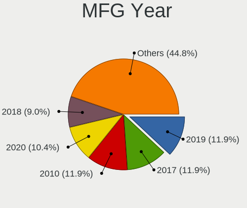
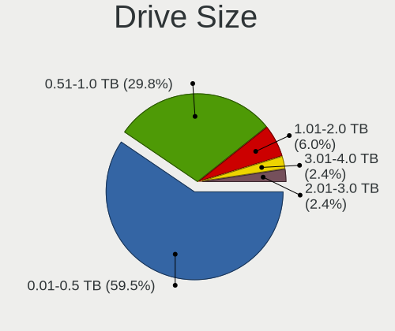
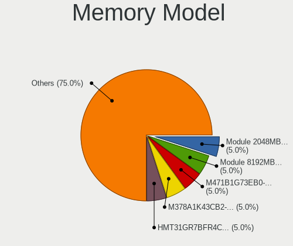
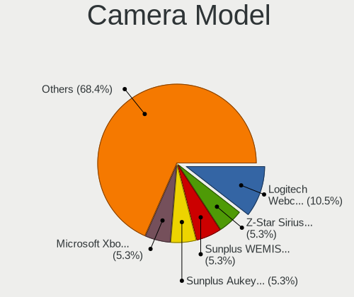

Elementary 6 - Tested Hardware & Statistics (Desktops)
------------------------------------------------------

A project to collect tested hardware configurations for Elementary 6.

Anyone can contribute to this report by the [hw-probe](https://github.com/linuxhw/hw-probe) tool:

    sudo -E hw-probe -all -upload

Please submit a probe of your configuration if it's not presented on the page or is rare.

Full-feature report is available here: https://linux-hardware.org/?view=trends&rel=elementary-6

Contents
--------

* [ Test Cases ](#test-cases)

* [ System ](#system)
  - [ Kernel                   ](#kernel)
  - [ Kernel Family            ](#kernel-family)
  - [ Kernel Major Ver.        ](#kernel-major-ver)
  - [ Arch                     ](#arch)
  - [ DE                       ](#de)
  - [ Display Server           ](#display-server)
  - [ Display Manager          ](#display-manager)
  - [ OS Lang                  ](#os-lang)
  - [ Boot Mode                ](#boot-mode)
  - [ Filesystem               ](#filesystem)
  - [ Part. scheme             ](#part-scheme)
  - [ Dual Boot with Linux/BSD ](#dual-boot-with-linuxbsd)
  - [ Dual Boot (Win)          ](#dual-boot-win)

* [ Board ](#board)
  - [ Vendor                   ](#vendor)
  - [ Model                    ](#model)
  - [ Model Family             ](#model-family)
  - [ MFG Year                 ](#mfg-year)
  - [ Form Factor              ](#form-factor)
  - [ Secure Boot              ](#secure-boot)
  - [ Coreboot                 ](#coreboot)
  - [ RAM Size                 ](#ram-size)
  - [ RAM Used                 ](#ram-used)
  - [ Total Drives             ](#total-drives)
  - [ Has CD-ROM               ](#has-cd-rom)
  - [ Has Ethernet             ](#has-ethernet)
  - [ Has WiFi                 ](#has-wifi)
  - [ Has Bluetooth            ](#has-bluetooth)

* [ Location ](#location)
  - [ Country                  ](#country)
  - [ City                     ](#city)

* [ Drives ](#drives)
  - [ Drive Vendor             ](#drive-vendor)
  - [ Drive Model              ](#drive-model)
  - [ HDD Vendor               ](#hdd-vendor)
  - [ SSD Vendor               ](#ssd-vendor)
  - [ Drive Kind               ](#drive-kind)
  - [ Drive Connector          ](#drive-connector)
  - [ Drive Size               ](#drive-size)
  - [ Space Total              ](#space-total)
  - [ Space Used               ](#space-used)
  - [ Malfunc. Drives          ](#malfunc-drives)
  - [ Malfunc. Drive Vendor    ](#malfunc-drive-vendor)
  - [ Malfunc. HDD Vendor      ](#malfunc-hdd-vendor)
  - [ Malfunc. Drive Kind      ](#malfunc-drive-kind)
  - [ Failed Drives            ](#failed-drives)
  - [ Failed Drive Vendor      ](#failed-drive-vendor)
  - [ Drive Status             ](#drive-status)

* [ Storage controller ](#storage-controller)
  - [ Storage Vendor           ](#storage-vendor)
  - [ Storage Model            ](#storage-model)
  - [ Storage Kind             ](#storage-kind)

* [ Processor ](#processor)
  - [ CPU Vendor               ](#cpu-vendor)
  - [ CPU Model                ](#cpu-model)
  - [ CPU Model Family         ](#cpu-model-family)
  - [ CPU Cores                ](#cpu-cores)
  - [ CPU Sockets              ](#cpu-sockets)
  - [ CPU Threads              ](#cpu-threads)
  - [ CPU Op-Modes             ](#cpu-op-modes)
  - [ CPU Microcode            ](#cpu-microcode)
  - [ CPU Microarch            ](#cpu-microarch)

* [ Graphics ](#graphics)
  - [ GPU Vendor               ](#gpu-vendor)
  - [ GPU Model                ](#gpu-model)
  - [ GPU Combo                ](#gpu-combo)
  - [ GPU Driver               ](#gpu-driver)
  - [ GPU Memory               ](#gpu-memory)

* [ Monitor ](#monitor)
  - [ Monitor Vendor           ](#monitor-vendor)
  - [ Monitor Model            ](#monitor-model)
  - [ Monitor Resolution       ](#monitor-resolution)
  - [ Monitor Diagonal         ](#monitor-diagonal)
  - [ Monitor Width            ](#monitor-width)
  - [ Aspect Ratio             ](#aspect-ratio)
  - [ Monitor Area             ](#monitor-area)
  - [ Pixel Density            ](#pixel-density)
  - [ Multiple Monitors        ](#multiple-monitors)

* [ Network ](#network)
  - [ Net Controller Vendor    ](#net-controller-vendor)
  - [ Net Controller Model     ](#net-controller-model)
  - [ Wireless Vendor          ](#wireless-vendor)
  - [ Wireless Model           ](#wireless-model)
  - [ Ethernet Vendor          ](#ethernet-vendor)
  - [ Ethernet Model           ](#ethernet-model)
  - [ Net Controller Kind      ](#net-controller-kind)
  - [ Used Controller          ](#used-controller)
  - [ NICs                     ](#nics)
  - [ IPv6                     ](#ipv6)

* [ Bluetooth ](#bluetooth)
  - [ Bluetooth Vendor         ](#bluetooth-vendor)
  - [ Bluetooth Model          ](#bluetooth-model)

* [ Sound ](#sound)
  - [ Sound Vendor             ](#sound-vendor)
  - [ Sound Model              ](#sound-model)

* [ Memory ](#memory)
  - [ Memory Vendor            ](#memory-vendor)
  - [ Memory Model             ](#memory-model)
  - [ Memory Kind              ](#memory-kind)
  - [ Memory Form Factor       ](#memory-form-factor)
  - [ Memory Size              ](#memory-size)
  - [ Memory Speed             ](#memory-speed)

* [ Printers & scanners ](#printers--scanners)
  - [ Printer Vendor           ](#printer-vendor)
  - [ Printer Model            ](#printer-model)
  - [ Scanner Vendor           ](#scanner-vendor)
  - [ Scanner Model            ](#scanner-model)

* [ Camera ](#camera)
  - [ Camera Vendor            ](#camera-vendor)
  - [ Camera Model             ](#camera-model)

* [ Security ](#security)
  - [ Fingerprint Vendor       ](#fingerprint-vendor)
  - [ Fingerprint Model        ](#fingerprint-model)
  - [ Chipcard Vendor          ](#chipcard-vendor)
  - [ Chipcard Model           ](#chipcard-model)

* [ Unsupported ](#unsupported)
  - [ Unsupported Devices      ](#unsupported-devices)
  - [ Unsupported Device Types ](#unsupported-device-types)

Test Cases
----------

| Vendor   | Model                       | Probe                                                      | Date         |
|----------|-----------------------------|------------------------------------------------------------|--------------|
| Intel    | H61                         | [0010dbcb5e](https://linux-hardware.org/?probe=0010dbcb5e) | Sep 10, 2021 |
| HP       | 8767 A                      | [7f022c67ac](https://linux-hardware.org/?probe=7f022c67ac) | Sep 09, 2021 |
| Gigabyte | B450M DS3H V2               | [633441bc2b](https://linux-hardware.org/?probe=633441bc2b) | Sep 05, 2021 |
| ASUSTek  | ROG STRIX Z590-F GAMING ... | [c9476d5d06](https://linux-hardware.org/?probe=c9476d5d06) | Sep 02, 2021 |
| Gigabyte | F2A55M-HD2                  | [0c05ab5b21](https://linux-hardware.org/?probe=0c05ab5b21) | Aug 30, 2021 |
| ASRock   | H81TM-ITX R2.0              | [4f04e7309e](https://linux-hardware.org/?probe=4f04e7309e) | Aug 30, 2021 |
| ASUSTek  | M5A78L-M LX/BR              | [d0ff1c6977](https://linux-hardware.org/?probe=d0ff1c6977) | Aug 25, 2021 |
| ASUSTek  | P6X58D-E                    | [db1ef28e92](https://linux-hardware.org/?probe=db1ef28e92) | Aug 20, 2021 |
| MSI      | X470 GAMING PLUS MAX        | [1176a287c7](https://linux-hardware.org/?probe=1176a287c7) | Aug 19, 2021 |
| ASUSTek  | TUF GAMING B450M-PRO II     | [73beb900ea](https://linux-hardware.org/?probe=73beb900ea) | Aug 15, 2021 |
| Gigabyte | X570 I AORUS PRO WIFI       | [e302074e5e](https://linux-hardware.org/?probe=e302074e5e) | Aug 14, 2021 |
| Gigabyte | H310M M.2 x.x               | [69e2e83b95](https://linux-hardware.org/?probe=69e2e83b95) | Aug 10, 2021 |
| Gigabyte | H310M M.2 x.x               | [86d69a15b9](https://linux-hardware.org/?probe=86d69a15b9) | Aug 10, 2021 |
| ASUSTek  | P5KPL-AM SE                 | [a97fc63d3d](https://linux-hardware.org/?probe=a97fc63d3d) | Jul 23, 2021 |
| ASRock   | B450 Pro4                   | [c5d0611f79](https://linux-hardware.org/?probe=c5d0611f79) | Jun 13, 2021 |
| ASUSTek  | TUF GAMING B550M-PLUS       | [63da02a979](https://linux-hardware.org/?probe=63da02a979) | May 19, 2021 |
| ASUSTek  | TUF GAMING B550M-PLUS       | [223234378e](https://linux-hardware.org/?probe=223234378e) | May 04, 2021 |
| ASUSTek  | ROG STRIX B450-I GAMING     | [a208e8a358](https://linux-hardware.org/?probe=a208e8a358) | May 01, 2021 |
| ASUSTek  | M5A99X EVO R2.0             | [f7d949f5a7](https://linux-hardware.org/?probe=f7d949f5a7) | Dec 23, 2020 |
| HP       | 8433 11                     | [691ef58a05](https://linux-hardware.org/?probe=691ef58a05) | Dec 09, 2020 |

System
------

Kernel
------

Version of the Linux kernel

| Version           | Desktops | Percent |
|-------------------|----------|---------|
| 5.11.0-27-generic | 6        | 33.33%  |
| 5.11.0-25-generic | 4        | 22.22%  |
| 5.8.0-50-generic  | 3        | 16.67%  |
| 5.8.0-63-generic  | 1        | 5.56%   |
| 5.8.0-55-generic  | 1        | 5.56%   |
| 5.4.0-58-generic  | 1        | 5.56%   |
| 5.4.0-56-generic  | 1        | 5.56%   |
| 5.11.0-34-generic | 1        | 5.56%   |

Kernel Family
-------------

Linux kernel without a distro release

| Version | Desktops | Percent |
|---------|----------|---------|
| 5.11.0  | 11       | 61.11%  |
| 5.8.0   | 5        | 27.78%  |
| 5.4.0   | 2        | 11.11%  |

Kernel Major Ver.
-----------------

Linux kernel major version

| Version | Desktops | Percent |
|---------|----------|---------|
| 5.11    | 11       | 61.11%  |
| 5.8     | 5        | 27.78%  |
| 5.4     | 2        | 11.11%  |

Arch
----

OS architecture (x86_64, i586, etc.)

| Name   | Desktops | Percent |
|--------|----------|---------|
| x86_64 | 18       | 100%    |

DE
--

Desktop Environment

| Name     | Desktops | Percent |
|----------|----------|---------|
| Pantheon | 15       | 83.33%  |
| MATE     | 1        | 5.56%   |
| GNOME    | 1        | 5.56%   |
| Unknown  | 1        | 5.56%   |

Display Server
--------------

X11 or Wayland

| Name | Desktops | Percent |
|------|----------|---------|
| X11  | 18       | 100%    |

Display Manager
---------------

SDDM, LightDM, etc.

| Name    | Desktops | Percent |
|---------|----------|---------|
| Unknown | 14       | 77.78%  |
| TDM     | 3        | 16.67%  |
| LightDM | 1        | 5.56%   |

OS Lang
-------

Language

| Lang  | Desktops | Percent |
|-------|----------|---------|
| en_US | 7        | 38.89%  |
| de_DE | 3        | 16.67%  |
| pt_BR | 2        | 11.11%  |
| es_ES | 2        | 11.11%  |
| it_IT | 1        | 5.56%   |
| es_MX | 1        | 5.56%   |
| en_GB | 1        | 5.56%   |
| ca_ES | 1        | 5.56%   |

Boot Mode
---------

EFI or BIOS

| Mode | Desktops | Percent |
|------|----------|---------|
| EFI  | 10       | 55.56%  |
| BIOS | 8        | 44.44%  |

Filesystem
----------

Type of filesystem

| Type  | Desktops | Percent |
|-------|----------|---------|
| Ext4  | 17       | 94.44%  |
| Btrfs | 1        | 5.56%   |

Part. scheme
------------

Scheme of partitioning

| Type    | Desktops | Percent |
|---------|----------|---------|
| Unknown | 14       | 77.78%  |
| MBR     | 2        | 11.11%  |
| GPT     | 2        | 11.11%  |

Dual Boot with Linux/BSD
------------------------

Hosting more than one Linux/BSD

| Dual boot | Desktops | Percent |
|-----------|----------|---------|
| No        | 15       | 83.33%  |
| Yes       | 3        | 16.67%  |

Dual Boot (Win)
---------------

Hosting Linux and Windows

| Dual boot | Desktops | Percent |
|-----------|----------|---------|
| No        | 11       | 61.11%  |
| Yes       | 7        | 38.89%  |

Board
-----

Vendor
------

Motherboard manufacturer

| Name                | Desktops | Percent |
|---------------------|----------|---------|
| ASUSTek Computer    | 8        | 44.44%  |
| Gigabyte Technology | 4        | 22.22%  |
| Hewlett-Packard     | 2        | 11.11%  |
| ASRock              | 2        | 11.11%  |
| MSI                 | 1        | 5.56%   |
| Intel               | 1        | 5.56%   |

Model
-----

Motherboard model

| Name                                 | Desktops | Percent |
|--------------------------------------|----------|---------|
| MSI MS-7B79                          | 1        | 5.56%   |
| Intel H61                            | 1        | 5.56%   |
| HP Pavilion Gaming Desktop TG01-1xxx | 1        | 5.56%   |
| HP Pavilion Desktop 590-p0xxx        | 1        | 5.56%   |
| Gigabyte X570 I AORUS PRO WIFI       | 1        | 5.56%   |
| Gigabyte H310M M.2 2.0               | 1        | 5.56%   |
| Gigabyte F2A55M-HD2                  | 1        | 5.56%   |
| Gigabyte B450M DS3H V2               | 1        | 5.56%   |
| ASUS TUF GAMING B550M-PLUS           | 1        | 5.56%   |
| ASUS TUF GAMING B450M-PRO II         | 1        | 5.56%   |
| ASUS ROG STRIX Z590-F GAMING WIFI    | 1        | 5.56%   |
| ASUS ROG STRIX B450-I GAMING         | 1        | 5.56%   |
| ASUS P6X58D-E                        | 1        | 5.56%   |
| ASUS P5KPL-AM SE                     | 1        | 5.56%   |
| ASUS M5A99X EVO R2.0                 | 1        | 5.56%   |
| ASUS M5A78L-M LX/BR                  | 1        | 5.56%   |
| ASRock H81TM-ITX R2.0                | 1        | 5.56%   |
| ASRock B450 Pro4                     | 1        | 5.56%   |

Model Family
------------

Motherboard model prefix

| Name                | Desktops | Percent |
|---------------------|----------|---------|
| HP Pavilion         | 2        | 11.11%  |
| ASUS TUF            | 2        | 11.11%  |
| ASUS ROG            | 2        | 11.11%  |
| MSI MS-7B79         | 1        | 5.56%   |
| Intel H61           | 1        | 5.56%   |
| Gigabyte X570       | 1        | 5.56%   |
| Gigabyte H310M      | 1        | 5.56%   |
| Gigabyte F2A55M-HD2 | 1        | 5.56%   |
| Gigabyte B450M      | 1        | 5.56%   |
| ASUS P6X58D-E       | 1        | 5.56%   |
| ASUS P5KPL-AM       | 1        | 5.56%   |
| ASUS M5A99X         | 1        | 5.56%   |
| ASUS M5A78L-M       | 1        | 5.56%   |
| ASRock H81TM-ITX    | 1        | 5.56%   |
| ASRock B450         | 1        | 5.56%   |

MFG Year
--------

Motherboard manufacture year

| Year | Desktops | Percent |
|------|----------|---------|
| 2021 | 6        | 33.33%  |
| 2019 | 3        | 16.67%  |
| 2013 | 3        | 16.67%  |
| 2020 | 2        | 11.11%  |
| 2017 | 1        | 5.56%   |
| 2015 | 1        | 5.56%   |
| 2012 | 1        | 5.56%   |
| 2009 | 1        | 5.56%   |

Form Factor
-----------

Physical design of the computer

| Name    | Desktops | Percent |
|---------|----------|---------|
| Desktop | 18       | 100%    |

Secure Boot
-----------

Enabled or disabled

| State    | Desktops | Percent |
|----------|----------|---------|
| Disabled | 16       | 88.89%  |
| Enabled  | 2        | 11.11%  |

Coreboot
--------

Have coreboot on board

| Used | Desktops | Percent |
|------|----------|---------|
| No   | 18       | 100%    |

RAM Size
--------

Total RAM memory

| Size in GB | Desktops | Percent |
|------------|----------|---------|
| 32.01-64.0 | 6        | 33.33%  |
| 16.01-24.0 | 6        | 33.33%  |
| 4.01-8.0   | 3        | 16.67%  |
| 3.01-4.0   | 2        | 11.11%  |
| 8.01-16.0  | 1        | 5.56%   |

RAM Used
--------

Used RAM memory

| Used GB   | Desktops | Percent |
|-----------|----------|---------|
| 2.01-3.0  | 8        | 44.44%  |
| 1.01-2.0  | 5        | 27.78%  |
| 3.01-4.0  | 3        | 16.67%  |
| 4.01-8.0  | 1        | 5.56%   |
| 8.01-16.0 | 1        | 5.56%   |

Total Drives
------------

Number of drives on board

| Drives | Desktops | Percent |
|--------|----------|---------|
| 2      | 7        | 38.89%  |
| 1      | 7        | 38.89%  |
| 3      | 2        | 11.11%  |
| 5      | 1        | 5.56%   |
| 4      | 1        | 5.56%   |

Has CD-ROM
----------

Has CD-ROM on board

| Presented | Desktops | Percent |
|-----------|----------|---------|
| No        | 16       | 88.89%  |
| Yes       | 2        | 11.11%  |

Has Ethernet
------------

Has Ethernet on board

| Presented | Desktops | Percent |
|-----------|----------|---------|
| Yes       | 18       | 100%    |

Has WiFi
--------

Has WiFi module

| Presented | Desktops | Percent |
|-----------|----------|---------|
| No        | 10       | 55.56%  |
| Yes       | 8        | 44.44%  |

Has Bluetooth
-------------

Has Bluetooth module

| Presented | Desktops | Percent |
|-----------|----------|---------|
| No        | 10       | 55.56%  |
| Yes       | 8        | 44.44%  |

Location
--------

Country
-------

Geographic location (country)

| Country     | Desktops | Percent |
|-------------|----------|---------|
| UK          | 2        | 11.11%  |
| Germany     | 2        | 11.11%  |
| Brazil      | 2        | 11.11%  |
| Argentina   | 2        | 11.11%  |
| USA         | 1        | 5.56%   |
| Spain       | 1        | 5.56%   |
| Russia      | 1        | 5.56%   |
| Netherlands | 1        | 5.56%   |
| Mexico      | 1        | 5.56%   |
| Italy       | 1        | 5.56%   |
| Indonesia   | 1        | 5.56%   |
| Finland     | 1        | 5.56%   |
| Czechia     | 1        | 5.56%   |
| Austria     | 1        | 5.56%   |

City
----

Geographic location (city)

| City           | Desktops | Percent |
|----------------|----------|---------|
| Znojmo         | 1        | 5.56%   |
| Vienna         | 1        | 5.56%   |
| Ullastrell     | 1        | 5.56%   |
| Staropyshminsk | 1        | 5.56%   |
| S??o Paulo     | 1        | 5.56%   |
| Rosario        | 1        | 5.56%   |
| Roermond       | 1        | 5.56%   |
| Rio de Janeiro | 1        | 5.56%   |
| Rheinberg      | 1        | 5.56%   |
| Potsdam        | 1        | 5.56%   |
| Morelia        | 1        | 5.56%   |
| Milan          | 1        | 5.56%   |
| Medan          | 1        | 5.56%   |
| Klaukkala      | 1        | 5.56%   |
| Hephzibah      | 1        | 5.56%   |
| Bonnybridge    | 1        | 5.56%   |
| Berazategui    | 1        | 5.56%   |
| Bathgate       | 1        | 5.56%   |

Drives
------

Drive Vendor
------------

Hard drive vendors

| Vendor                    | Desktops | Drives | Percent |
|---------------------------|----------|--------|---------|
| WDC                       | 6        | 8      | 20.69%  |
| Samsung Electronics       | 5        | 9      | 17.24%  |
| Kingston                  | 5        | 5      | 17.24%  |
| Sandisk                   | 3        | 3      | 10.34%  |
| Seagate                   | 2        | 2      | 6.9%    |
| USB3.1                    | 1        | 1      | 3.45%   |
| Toshiba                   | 1        | 1      | 3.45%   |
| Phison                    | 1        | 1      | 3.45%   |
| OCZ                       | 1        | 1      | 3.45%   |
| Micron/Crucial Technology | 1        | 2      | 3.45%   |
| Micron Technology         | 1        | 1      | 3.45%   |
| Intel                     | 1        | 1      | 3.45%   |
| Gigabyte Technology       | 1        | 1      | 3.45%   |

Drive Model
-----------

Hard drive models

| Model                             | Desktops | Percent |
|-----------------------------------|----------|---------|
| Kingston SA400S37240G 240GB SSD   | 2        | 5.71%   |
| WDC WD5000AAKX-001CA0 500GB       | 1        | 2.86%   |
| WDC WD3200AAJS-56B4A0 320GB       | 1        | 2.86%   |
| WDC WD20EARX-00PASB0 2TB          | 1        | 2.86%   |
| WDC WD10EZRX-00L4HB0 1TB          | 1        | 2.86%   |
| WDC WD10EZEX-60WN4A0 1TB          | 1        | 2.86%   |
| WDC WD10EZEX-22MFCA0 1TB          | 1        | 2.86%   |
| WDC WD10EZEX-00RKKA0 1TB          | 1        | 2.86%   |
| WDC WD10EZEX-00KUWA0 1TB          | 1        | 2.86%   |
| USB3.1 Disk 500GB                 | 1        | 2.86%   |
| Toshiba DT01ACA100 1TB            | 1        | 2.86%   |
| Seagate ST940210AS 40GB           | 1        | 2.86%   |
| Seagate NVMe SSD Drive 2TB        | 1        | 2.86%   |
| SanDisk SDSSDA-1T00 1TB           | 1        | 2.86%   |
| Sandisk NVMe SSD Drive 500GB      | 1        | 2.86%   |
| Sandisk NVMe SSD Drive 1TB        | 1        | 2.86%   |
| Samsung SSD 980 PRO 1TB           | 1        | 2.86%   |
| Samsung SSD 960 EVO 500GB         | 1        | 2.86%   |
| Samsung SSD 870 QVO 1TB           | 1        | 2.86%   |
| Samsung SSD 850 EVO 250GB         | 1        | 2.86%   |
| Samsung SSD 840 Series 500GB      | 1        | 2.86%   |
| Samsung Portable SSD T5 500GB     | 1        | 2.86%   |
| Samsung NVMe SSD Drive 500GB      | 1        | 2.86%   |
| Samsung NVMe SSD Drive 1TB        | 1        | 2.86%   |
| Samsung HD154UI 1TB               | 1        | 2.86%   |
| Phison NVMe SSD Drive 256GB       | 1        | 2.86%   |
| OCZ AGILITY3 240GB SSD            | 1        | 2.86%   |
| Micron/Crucial NVMe SSD Drive 1TB | 1        | 2.86%   |
| Micron NVMe SSD Drive 500GB       | 1        | 2.86%   |
| Kingston SA400S37480G 480GB SSD   | 1        | 2.86%   |
| Kingston NVMe SSD Drive 500GB     | 1        | 2.86%   |
| Kingston NVMe SSD Drive 1TB       | 1        | 2.86%   |
| Intel NVMe SSD Drive 512GB        | 1        | 2.86%   |
| Gigabyte GP-GSM2NE3256GNTD 256GB  | 1        | 2.86%   |

HDD Vendor
----------

Hard disk drive vendors

| Vendor              | Desktops | Drives | Percent |
|---------------------|----------|--------|---------|
| WDC                 | 6        | 8      | 66.67%  |
| Toshiba             | 1        | 1      | 11.11%  |
| Seagate             | 1        | 1      | 11.11%  |
| Samsung Electronics | 1        | 1      | 11.11%  |

SSD Vendor
----------

Solid state drive vendors

| Vendor              | Desktops | Drives | Percent |
|---------------------|----------|--------|---------|
| Samsung Electronics | 3        | 4      | 37.5%   |
| Kingston            | 3        | 3      | 37.5%   |
| SanDisk             | 1        | 1      | 12.5%   |
| OCZ                 | 1        | 1      | 12.5%   |

Drive Kind
----------

HDD or SSD

| Kind    | Desktops | Drives | Percent |
|---------|----------|--------|---------|
| NVMe    | 9        | 15     | 34.62%  |
| HDD     | 9        | 11     | 34.62%  |
| SSD     | 7        | 9      | 26.92%  |
| Unknown | 1        | 1      | 3.85%   |

Drive Connector
---------------

SATA, SAS, NVMe, etc.

| Type | Desktops | Drives | Percent |
|------|----------|--------|---------|
| SATA | 13       | 19     | 56.52%  |
| NVMe | 9        | 15     | 39.13%  |
| SAS  | 1        | 2      | 4.35%   |

Drive Size
----------

Size of hard drive

| Size in TB | Desktops | Drives | Percent |
|------------|----------|--------|---------|
| 0.01-0.5   | 10       | 10     | 55.56%  |
| 0.51-1.0   | 7        | 9      | 38.89%  |
| 1.01-2.0   | 1        | 1      | 5.56%   |

Space Total
-----------

Amount of disk space available on the file system

| Size in GB | Desktops | Percent |
|------------|----------|---------|
| 251-500    | 7        | 38.89%  |
| 101-250    | 5        | 27.78%  |
| 1001-2000  | 3        | 16.67%  |
| 21-50      | 2        | 11.11%  |
| 501-1000   | 1        | 5.56%   |

Space Used
----------

Amount of used disk space

| Used GB | Desktops | Percent |
|---------|----------|---------|
| 1-20    | 11       | 61.11%  |
| 21-50   | 2        | 11.11%  |
| 101-250 | 2        | 11.11%  |
| 51-100  | 2        | 11.11%  |
| 251-500 | 1        | 5.56%   |

Malfunc. Drives
---------------

Drive models with a malfunction

| Model                       | Desktops | Drives | Percent |
|-----------------------------|----------|--------|---------|
| WDC WD3200AAJS-56B4A0 320GB | 1        | 1      | 50%     |
| WDC WD10EZEX-00KUWA0 1TB    | 1        | 1      | 50%     |

Malfunc. Drive Vendor
---------------------

Vendors of faulty drives

| Vendor | Desktops | Drives | Percent |
|--------|----------|--------|---------|
| WDC    | 2        | 2      | 100%    |

Malfunc. HDD Vendor
-------------------

Vendors of faulty HDD drives

| Vendor | Desktops | Drives | Percent |
|--------|----------|--------|---------|
| WDC    | 2        | 2      | 100%    |

Malfunc. Drive Kind
-------------------

Kinds of faulty drives

| Kind | Desktops | Drives | Percent |
|------|----------|--------|---------|
| HDD  | 2        | 2      | 100%    |

Failed Drives
-------------

Failed drive models

Zero info for selected period =(

Failed Drive Vendor
-------------------

Failed drive vendors

Zero info for selected period =(

Drive Status
------------

Number of failed and malfunc. drives

| Status   | Desktops | Drives | Percent |
|----------|----------|--------|---------|
| Detected | 14       | 24     | 66.67%  |
| Works    | 5        | 10     | 23.81%  |
| Malfunc  | 2        | 2      | 9.52%   |

Storage controller
------------------

Storage Vendor
--------------

Storage controller vendors

| Vendor                      | Desktops | Percent |
|-----------------------------|----------|---------|
| AMD                         | 10       | 32.26%  |
| Intel                       | 7        | 22.58%  |
| Samsung Electronics         | 3        | 9.68%   |
| Sandisk                     | 2        | 6.45%   |
| Kingston Technology Company | 2        | 6.45%   |
| ASMedia Technology          | 2        | 6.45%   |
| Seagate Technology          | 1        | 3.23%   |
| Phison Electronics          | 1        | 3.23%   |
| Micron/Crucial Technology   | 1        | 3.23%   |
| Micron Technology           | 1        | 3.23%   |
| Marvell Technology Group    | 1        | 3.23%   |

Storage Model
-------------

Storage controller models

| Model                                                                          | Desktops | Percent |
|--------------------------------------------------------------------------------|----------|---------|
| AMD FCH SATA Controller [AHCI mode]                                            | 6        | 14.29%  |
| AMD 400 Series Chipset SATA Controller                                         | 4        | 9.52%   |
| Samsung NVMe SSD Controller PM9A1/PM9A3/980PRO                                 | 2        | 4.76%   |
| Kingston Company A2000 NVMe SSD                                                | 2        | 4.76%   |
| ASMedia ASM1062 Serial ATA Controller                                          | 2        | 4.76%   |
| Seagate FireCuda 510 SSD                                                       | 1        | 2.38%   |
| Sandisk WD Blue SN550 NVMe SSD                                                 | 1        | 2.38%   |
| Sandisk WD Black SN750 / PC SN730 NVMe SSD                                     | 1        | 2.38%   |
| Samsung NVMe SSD Controller SM981/PM981/PM983                                  | 1        | 2.38%   |
| Samsung NVMe SSD Controller SM961/PM961/SM963                                  | 1        | 2.38%   |
| Phison PS5013 E13 NVMe Controller                                              | 1        | 2.38%   |
| Micron/Crucial P2 NVMe PCIe SSD                                                | 1        | 2.38%   |
| Micron Non-Volatile memory controller                                          | 1        | 2.38%   |
| Marvell Group 88SE91A3 SATA-600 Controller                                     | 1        | 2.38%   |
| Intel SSD 660P Series                                                          | 1        | 2.38%   |
| Intel SATA Controller [RAID mode]                                              | 1        | 2.38%   |
| Intel NM10/ICH7 Family SATA Controller [IDE mode]                              | 1        | 2.38%   |
| Intel 82801JI (ICH10 Family) 4 port SATA IDE Controller #1                     | 1        | 2.38%   |
| Intel 82801JI (ICH10 Family) 2 port SATA IDE Controller #2                     | 1        | 2.38%   |
| Intel 82801G (ICH7 Family) IDE Controller                                      | 1        | 2.38%   |
| Intel 8 Series/C220 Series Chipset Family 6-port SATA Controller 1 [AHCI mode] | 1        | 2.38%   |
| Intel 6 Series/C200 Series Chipset Family 6 port Desktop SATA AHCI Controller  | 1        | 2.38%   |
| Intel 500 Series Chipset Family SATA AHCI Controller                           | 1        | 2.38%   |
| Intel 200 Series PCH SATA controller [AHCI mode]                               | 1        | 2.38%   |
| AMD Starship/Matisse Chipset SATA Controller [AHCI mode]                       | 1        | 2.38%   |
| AMD SB7x0/SB8x0/SB9x0 SATA Controller [IDE mode]                               | 1        | 2.38%   |
| AMD SB7x0/SB8x0/SB9x0 SATA Controller [AHCI mode]                              | 1        | 2.38%   |
| AMD SB7x0/SB8x0/SB9x0 IDE Controller                                           | 1        | 2.38%   |
| AMD FCH SATA Controller [IDE mode]                                             | 1        | 2.38%   |
| AMD FCH IDE Controller                                                         | 1        | 2.38%   |
| AMD 300 Series Chipset SATA Controller                                         | 1        | 2.38%   |

Storage Kind
------------

Kind of storage controller (IDE, SATA, NVMe, SAS, ...)

| Kind | Desktops | Percent |
|------|----------|---------|
| SATA | 14       | 50%     |
| NVMe | 9        | 32.14%  |
| IDE  | 4        | 14.29%  |
| RAID | 1        | 3.57%   |

Processor
---------

CPU Vendor
----------

Processor vendors

| Vendor | Desktops | Percent |
|--------|----------|---------|
| AMD    | 11       | 61.11%  |
| Intel  | 7        | 38.89%  |

CPU Model
---------

Processor models

| Model                                          | Desktops | Percent |
|------------------------------------------------|----------|---------|
| AMD Ryzen 7 3700X 8-Core Processor             | 4        | 22.22%  |
| AMD Ryzen 5 3600 6-Core Processor              | 2        | 11.11%  |
| Intel Core i7-10700F CPU @ 2.90GHz             | 1        | 5.56%   |
| Intel Core i7 CPU 950 @ 3.07GHz                | 1        | 5.56%   |
| Intel Core i5-4570 CPU @ 3.20GHz               | 1        | 5.56%   |
| Intel Core i5-2400 CPU @ 3.10GHz               | 1        | 5.56%   |
| Intel Core 2 Quad CPU Q9500 @ 2.83GHz          | 1        | 5.56%   |
| Intel Celeron G4930 CPU @ 3.20GHz              | 1        | 5.56%   |
| Intel 11th Gen Core i7-11700K @ 3.60GHz        | 1        | 5.56%   |
| AMD Ryzen 5 2600X Six-Core Processor           | 1        | 5.56%   |
| AMD FX-8320 Eight-Core Processor               | 1        | 5.56%   |
| AMD FX-6100 Six-Core Processor                 | 1        | 5.56%   |
| AMD A4-4000 APU with Radeon HD Graphics        | 1        | 5.56%   |
| AMD A10-9700 RADEON R7, 10 COMPUTE CORES 4C+6G | 1        | 5.56%   |

CPU Model Family
----------------

Processor model prefix

| Model             | Desktops | Percent |
|-------------------|----------|---------|
| AMD Ryzen 7       | 4        | 22.22%  |
| AMD Ryzen 5       | 3        | 16.67%  |
| Intel Core i7     | 2        | 11.11%  |
| Intel Core i5     | 2        | 11.11%  |
| AMD FX            | 2        | 11.11%  |
| Other             | 1        | 5.56%   |
| Intel Core 2 Quad | 1        | 5.56%   |
| Intel Celeron     | 1        | 5.56%   |
| AMD A4            | 1        | 5.56%   |
| AMD A10           | 1        | 5.56%   |

CPU Cores
---------

Number of processor cores

| Number | Desktops | Percent |
|--------|----------|---------|
| 8      | 6        | 33.33%  |
| 4      | 5        | 27.78%  |
| 6      | 3        | 16.67%  |
| 2      | 2        | 11.11%  |
| 3      | 1        | 5.56%   |
| 1      | 1        | 5.56%   |

CPU Sockets
-----------

Number of sockets

| Number | Desktops | Percent |
|--------|----------|---------|
| 1      | 18       | 100%    |

CPU Threads
-----------

Threads per core (Hyper-Threading)

| Number | Desktops | Percent |
|--------|----------|---------|
| 2      | 14       | 77.78%  |
| 1      | 4        | 22.22%  |

CPU Op-Modes
------------

CPU Operation Modes (32-bit, 64-bit)

| Op mode        | Desktops | Percent |
|----------------|----------|---------|
| 32-bit, 64-bit | 18       | 100%    |

CPU Microcode
-------------

Microcode number

| Number     | Desktops | Percent |
|------------|----------|---------|
| 0x08701021 | 4        | 22.22%  |
| 0x08701013 | 2        | 11.11%  |
| 0xa0671    | 1        | 5.56%   |
| 0xa0655    | 1        | 5.56%   |
| 0x906eb    | 1        | 5.56%   |
| 0x306c3    | 1        | 5.56%   |
| 0x206a7    | 1        | 5.56%   |
| 0x106a5    | 1        | 5.56%   |
| 0x1067a    | 1        | 5.56%   |
| 0x0800820d | 1        | 5.56%   |
| 0x0600611a | 1        | 5.56%   |
| 0x06001119 | 1        | 5.56%   |
| 0x06000852 | 1        | 5.56%   |
| 0x0600063e | 1        | 5.56%   |

CPU Microarch
-------------

Microarchitecture

| Name        | Desktops | Percent |
|-------------|----------|---------|
| Zen 2       | 6        | 33.33%  |
| Piledriver  | 2        | 11.11%  |
| Zen+        | 1        | 5.56%   |
| SandyBridge | 1        | 5.56%   |
| Penryn      | 1        | 5.56%   |
| Nehalem     | 1        | 5.56%   |
| KabyLake    | 1        | 5.56%   |
| Icelake     | 1        | 5.56%   |
| Haswell     | 1        | 5.56%   |
| Excavator   | 1        | 5.56%   |
| CometLake   | 1        | 5.56%   |
| Bulldozer   | 1        | 5.56%   |

Graphics
--------

GPU Vendor
----------

Vendors of graphics cards

| Vendor | Desktops | Percent |
|--------|----------|---------|
| Nvidia | 9        | 47.37%  |
| AMD    | 7        | 36.84%  |
| Intel  | 3        | 15.79%  |

GPU Model
---------

Graphics card models

| Model                                                                       | Desktops | Percent |
|-----------------------------------------------------------------------------|----------|---------|
| Nvidia GA102 [GeForce RTX 3080]                                             | 2        | 10.53%  |
| AMD Ellesmere [Radeon RX 470/480/570/570X/580/580X/590]                     | 2        | 10.53%  |
| Nvidia TU117 [GeForce GTX 1650]                                             | 1        | 5.26%   |
| Nvidia TU116 [GeForce GTX 1660 SUPER]                                       | 1        | 5.26%   |
| Nvidia TU104 [GeForce RTX 2080 SUPER]                                       | 1        | 5.26%   |
| Nvidia GP108 [GeForce GT 1030]                                              | 1        | 5.26%   |
| Nvidia GM206 [GeForce GTX 960]                                              | 1        | 5.26%   |
| Nvidia GK104 [GeForce GTX 770]                                              | 1        | 5.26%   |
| Nvidia GF116 [GeForce GTX 550 Ti]                                           | 1        | 5.26%   |
| Intel Xeon E3-1200 v3/4th Gen Core Processor Integrated Graphics Controller | 1        | 5.26%   |
| Intel CoffeeLake-S GT1 [UHD Graphics 610]                                   | 1        | 5.26%   |
| Intel 82G33/G31 Express Integrated Graphics Controller                      | 1        | 5.26%   |
| AMD Wani [Radeon R5/R6/R7 Graphics]                                         | 1        | 5.26%   |
| AMD Trinity 2 [Radeon HD 7480D]                                             | 1        | 5.26%   |
| AMD Pitcairn PRO [Radeon HD 7850 / R7 265 / R9 270 1024SP]                  | 1        | 5.26%   |
| AMD Lexa PRO [Radeon 540/540X/550/550X / RX 540X/550/550X]                  | 1        | 5.26%   |
| AMD Baffin [Radeon RX 460/560D / Pro 450/455/460/555/555X/560/560X]         | 1        | 5.26%   |

GPU Combo
---------

Combinations of graphics cards

| Name         | Desktops | Percent |
|--------------|----------|---------|
| 1 x Nvidia   | 8        | 44.44%  |
| 1 x AMD      | 6        | 33.33%  |
| 1 x Intel    | 3        | 16.67%  |
| AMD + Nvidia | 1        | 5.56%   |

GPU Driver
----------

Free vs proprietary

| Driver      | Desktops | Percent |
|-------------|----------|---------|
| Free        | 15       | 83.33%  |
| Proprietary | 3        | 16.67%  |

GPU Memory
----------

Total video memory

| Size in GB | Desktops | Percent |
|------------|----------|---------|
| 1.01-2.0   | 5        | 27.78%  |
| Unknown    | 4        | 22.22%  |
| 3.01-4.0   | 3        | 16.67%  |
| 7.01-8.0   | 2        | 11.11%  |
| 0.51-1.0   | 2        | 11.11%  |
| 5.01-6.0   | 1        | 5.56%   |
| 8.01-16.0  | 1        | 5.56%   |

Monitor
-------

Monitor Vendor
--------------

Monitor vendors

| Vendor               | Desktops | Percent |
|----------------------|----------|---------|
| Samsung Electronics  | 4        | 21.05%  |
| Goldstar             | 3        | 15.79%  |
| AOC                  | 3        | 15.79%  |
| Hewlett-Packard      | 2        | 10.53%  |
| Dell                 | 2        | 10.53%  |
| TBD                  | 1        | 5.26%   |
| SKY                  | 1        | 5.26%   |
| BenQ                 | 1        | 5.26%   |
| Ancor Communications | 1        | 5.26%   |
| Acer                 | 1        | 5.26%   |

Monitor Model
-------------

Monitor models

| Model                                                                 | Desktops | Percent |
|-----------------------------------------------------------------------|----------|---------|
| AOC 2369M AOC2369 1920x1080 509x286mm 23.0-inch                       | 2        | 9.09%   |
| TBD HDMI TBD3148 1600x900 344x193mm 15.5-inch                         | 1        | 4.55%   |
| SKY TV-monitor SKY0001 1920x1080 697x392mm 31.5-inch                  | 1        | 4.55%   |
| Samsung Electronics S24D332 SAM0F5E 1920x1080 531x299mm 24.0-inch     | 1        | 4.55%   |
| Samsung Electronics S22C200 SAM09B6 1920x1080 477x268mm 21.5-inch     | 1        | 4.55%   |
| Samsung Electronics LCD Monitor SAM0B30 1920x1080 890x500mm 40.2-inch | 1        | 4.55%   |
| Samsung Electronics C49HG9x SAM0E5D 3840x1080 1200x340mm 49.1-inch    | 1        | 4.55%   |
| Hewlett-Packard 24x HPN3635 1920x1080 527x297mm 23.8-inch             | 1        | 4.55%   |
| Hewlett-Packard 2159 HWP282C 1920x1080 479x269mm 21.6-inch            | 1        | 4.55%   |
| Goldstar TV SSCR GSMC0C8 3840x2160 1600x900mm 72.3-inch               | 1        | 4.55%   |
| Goldstar FULL HD GSM5B54 1920x1080 480x270mm 21.7-inch                | 1        | 4.55%   |
| Goldstar 25UM58G GSM5B98 2560x1080 673x284mm 28.8-inch                | 1        | 4.55%   |
| Dell P2419H DELD0D9 1920x1080 527x296mm 23.8-inch                     | 1        | 4.55%   |
| Dell P2317H DEL40F4 1920x1080 509x286mm 23.0-inch                     | 1        | 4.55%   |
| Dell P2214H DELA098 1920x1080 480x270mm 21.7-inch                     | 1        | 4.55%   |
| BenQ LCD Monitor PD2700U 3840x2160                                    | 1        | 4.55%   |
| AOC Q3279WG5B AOC3279 2560x1440 725x428mm 33.1-inch                   | 1        | 4.55%   |
| AOC 27G2G4 AOC2702 1920x1080 598x336mm 27.0-inch                      | 1        | 4.55%   |
| Ancor Communications ASUS VS247 ACI249A 1920x1080 521x293mm 23.5-inch | 1        | 4.55%   |
| Acer LCD Monitor XV270U 5120x1440                                     | 1        | 4.55%   |
| Acer LCD Monitor VG272U                                               | 1        | 4.55%   |

Monitor Resolution
------------------

Monitor screen resolution

| Resolution      | Desktops | Percent |
|-----------------|----------|---------|
| 1920x1080 (FHD) | 10       | 52.63%  |
| 3840x2160 (4K)  | 3        | 15.79%  |
| 5120x1440       | 1        | 5.26%   |
| 3840x1080       | 1        | 5.26%   |
| 2560x1440 (QHD) | 1        | 5.26%   |
| 2560x1080       | 1        | 5.26%   |
| 1600x900 (HD+)  | 1        | 5.26%   |
| Unknown         | 1        | 5.26%   |

Monitor Diagonal
----------------

Diagonal size in inches

| Inches  | Desktops | Percent |
|---------|----------|---------|
| 23      | 4        | 20%     |
| 21      | 4        | 20%     |
| 40      | 2        | 10%     |
| 24      | 2        | 10%     |
| Unknown | 2        | 10%     |
| 72      | 1        | 5%      |
| 49      | 1        | 5%      |
| 33      | 1        | 5%      |
| 28      | 1        | 5%      |
| 27      | 1        | 5%      |
| 15      | 1        | 5%      |

Monitor Width
-------------

Physical width

| Width in mm | Desktops | Percent |
|-------------|----------|---------|
| 501-600     | 6        | 31.58%  |
| 401-500     | 4        | 21.05%  |
| 801-900     | 2        | 10.53%  |
| Unknown     | 2        | 10.53%  |
| 701-800     | 1        | 5.26%   |
| 601-700     | 1        | 5.26%   |
| 301-350     | 1        | 5.26%   |
| 1501-2000   | 1        | 5.26%   |
| 1001-1500   | 1        | 5.26%   |

Aspect Ratio
------------

Proportional relationship between the width and the height

| Ratio   | Desktops | Percent |
|---------|----------|---------|
| 16/9    | 12       | 75%     |
| Unknown | 2        | 12.5%   |
| 32/9    | 1        | 6.25%   |
| 21/9    | 1        | 6.25%   |

Monitor Area
------------

Area in inch²

| Area in inch² | Desktops | Percent |
|----------------|----------|---------|
| 201-250        | 7        | 36.84%  |
| 501-1000       | 3        | 15.79%  |
| 151-200        | 2        | 10.53%  |
| Unknown        | 2        | 10.53%  |
| More than 1000 | 1        | 5.26%   |
| 351-500        | 1        | 5.26%   |
| 301-350        | 1        | 5.26%   |
| 251-300        | 1        | 5.26%   |
| 101-110        | 1        | 5.26%   |

Pixel Density
-------------

Pixels per inch

| Density | Desktops | Percent |
|---------|----------|---------|
| 51-100  | 10       | 55.56%  |
| 101-120 | 5        | 27.78%  |
| Unknown | 2        | 11.11%  |
| 1-50    | 1        | 5.56%   |

Multiple Monitors
-----------------

Total monitors connected

| Total | Desktops | Percent |
|-------|----------|---------|
| 1     | 13       | 72.22%  |
| 2     | 4        | 22.22%  |
| 3     | 1        | 5.56%   |

Network
-------

Net Controller Vendor
---------------------

Controller vendors

| Vendor                   | Desktops | Percent |
|--------------------------|----------|---------|
| Realtek Semiconductor    | 14       | 60.87%  |
| Intel                    | 5        | 21.74%  |
| Xiaomi                   | 2        | 8.7%    |
| Ralink Technology        | 1        | 4.35%   |
| Marvell Technology Group | 1        | 4.35%   |

Net Controller Model
--------------------

Controller models

| Model                                                             | Desktops | Percent |
|-------------------------------------------------------------------|----------|---------|
| Realtek RTL8111/8168/8411 PCI Express Gigabit Ethernet Controller | 10       | 35.71%  |
| Xiaomi SDM660-MTP _SN:6C524624                                    | 2        | 7.14%   |
| Realtek RTL810xE PCI Express Fast Ethernet controller             | 2        | 7.14%   |
| Intel I211 Gigabit Network Connection                             | 2        | 7.14%   |
| Realtek RTL8822BE 802.11a/b/g/n/ac WiFi adapter                   | 1        | 3.57%   |
| Realtek RTL8821CE 802.11ac PCIe Wireless Network Adapter          | 1        | 3.57%   |
| Realtek RTL8192EE PCIe Wireless Network Adapter                   | 1        | 3.57%   |
| Realtek RTL8188EUS 802.11n Wireless Network Adapter               | 1        | 3.57%   |
| Realtek RTL8125 2.5GbE Controller                                 | 1        | 3.57%   |
| Ralink MT7601U Wireless Adapter                                   | 1        | 3.57%   |
| Marvell Group 88E8056 PCI-E Gigabit Ethernet Controller           | 1        | 3.57%   |
| Intel Wi-Fi 6 AX210/AX211/AX411 160MHz                            | 1        | 3.57%   |
| Intel Wi-Fi 6 AX200                                               | 1        | 3.57%   |
| Intel Ethernet Controller I225-V                                  | 1        | 3.57%   |
| Intel Ethernet Connection (2) I218-V                              | 1        | 3.57%   |
| Intel Comet Lake PCH CNVi WiFi                                    | 1        | 3.57%   |

Wireless Vendor
---------------

Wireless vendors

| Vendor                | Desktops | Percent |
|-----------------------|----------|---------|
| Realtek Semiconductor | 4        | 50%     |
| Intel                 | 3        | 37.5%   |
| Ralink Technology     | 1        | 12.5%   |

Wireless Model
--------------

Wireless models

| Model                                                    | Desktops | Percent |
|----------------------------------------------------------|----------|---------|
| Realtek RTL8822BE 802.11a/b/g/n/ac WiFi adapter          | 1        | 12.5%   |
| Realtek RTL8821CE 802.11ac PCIe Wireless Network Adapter | 1        | 12.5%   |
| Realtek RTL8192EE PCIe Wireless Network Adapter          | 1        | 12.5%   |
| Realtek RTL8188EUS 802.11n Wireless Network Adapter      | 1        | 12.5%   |
| Ralink MT7601U Wireless Adapter                          | 1        | 12.5%   |
| Intel Wi-Fi 6 AX210/AX211/AX411 160MHz                   | 1        | 12.5%   |
| Intel Wi-Fi 6 AX200                                      | 1        | 12.5%   |
| Intel Comet Lake PCH CNVi WiFi                           | 1        | 12.5%   |

Ethernet Vendor
---------------

Ethernet vendors

| Vendor                   | Desktops | Percent |
|--------------------------|----------|---------|
| Realtek Semiconductor    | 13       | 65%     |
| Intel                    | 4        | 20%     |
| Xiaomi                   | 2        | 10%     |
| Marvell Technology Group | 1        | 5%      |

Ethernet Model
--------------

Ethernet models

| Model                                                             | Desktops | Percent |
|-------------------------------------------------------------------|----------|---------|
| Realtek RTL8111/8168/8411 PCI Express Gigabit Ethernet Controller | 10       | 50%     |
| Xiaomi SDM660-MTP _SN:6C524624                                    | 2        | 10%     |
| Realtek RTL810xE PCI Express Fast Ethernet controller             | 2        | 10%     |
| Intel I211 Gigabit Network Connection                             | 2        | 10%     |
| Realtek RTL8125 2.5GbE Controller                                 | 1        | 5%      |
| Marvell Group 88E8056 PCI-E Gigabit Ethernet Controller           | 1        | 5%      |
| Intel Ethernet Controller I225-V                                  | 1        | 5%      |
| Intel Ethernet Connection (2) I218-V                              | 1        | 5%      |

Net Controller Kind
-------------------

Ethernet, WiFi or modem

| Kind     | Desktops | Percent |
|----------|----------|---------|
| Ethernet | 18       | 69.23%  |
| WiFi     | 8        | 30.77%  |

Used Controller
---------------

Currently used network controller

| Kind     | Desktops | Percent |
|----------|----------|---------|
| Ethernet | 17       | 73.91%  |
| WiFi     | 6        | 26.09%  |

NICs
----

Total network controllers on board

| Total | Desktops | Percent |
|-------|----------|---------|
| 1     | 12       | 66.67%  |
| 2     | 6        | 33.33%  |

IPv6
----

IPv6 vs IPv4

| Used | Desktops | Percent |
|------|----------|---------|
| No   | 12       | 66.67%  |
| Yes  | 6        | 33.33%  |

Bluetooth
---------

Bluetooth Vendor
----------------

Controller vendors

| Vendor                  | Desktops | Percent |
|-------------------------|----------|---------|
| Intel                   | 3        | 37.5%   |
| Cambridge Silicon Radio | 2        | 25%     |
| Realtek Semiconductor   | 1        | 12.5%   |
| Broadcom                | 1        | 12.5%   |
| ASUSTek Computer        | 1        | 12.5%   |

Bluetooth Model
---------------

Controller models

| Model                                               | Desktops | Percent |
|-----------------------------------------------------|----------|---------|
| Cambridge Silicon Radio Bluetooth Dongle (HCI mode) | 2        | 25%     |
| Realtek  Bluetooth 4.2 Adapter                      | 1        | 12.5%   |
| Intel Bluetooth Device                              | 1        | 12.5%   |
| Intel AX210 Bluetooth                               | 1        | 12.5%   |
| Intel AX200 Bluetooth                               | 1        | 12.5%   |
| Broadcom Bluetooth 3.0 Dongle                       | 1        | 12.5%   |
| ASUS Bluetooth Radio                                | 1        | 12.5%   |

Sound
-----

Sound Vendor
------------

Sound card vendors

| Vendor                               | Desktops | Percent |
|--------------------------------------|----------|---------|
| AMD                                  | 11       | 33.33%  |
| Nvidia                               | 9        | 27.27%  |
| Intel                                | 6        | 18.18%  |
| Thesycon Systemsoftware & Consulting | 1        | 3.03%   |
| Razer USA                            | 1        | 3.03%   |
| JMTek                                | 1        | 3.03%   |
| Generalplus Technology               | 1        | 3.03%   |
| Creative Technology                  | 1        | 3.03%   |
| Creative Labs                        | 1        | 3.03%   |
| ASUSTek Computer                     | 1        | 3.03%   |

Sound Model
-----------

Sound card models

| Model                                                                      | Desktops | Percent |
|----------------------------------------------------------------------------|----------|---------|
| AMD Starship/Matisse HD Audio Controller                                   | 6        | 14.63%  |
| Nvidia GA102 High Definition Audio Controller                              | 2        | 4.88%   |
| AMD SBx00 Azalia (Intel HDA)                                               | 2        | 4.88%   |
| AMD Ellesmere HDMI Audio [Radeon RX 470/480 / 570/580/590]                 | 2        | 4.88%   |
| AMD Baffin HDMI/DP Audio [Radeon RX 550 640SP / RX 560/560X]               | 2        | 4.88%   |
| Thesycon Systemsoftware & Consulting E30                                   | 1        | 2.44%   |
| Razer USA Kraken Tournament Edition                                        | 1        | 2.44%   |
| Nvidia TU116 High Definition Audio Controller                              | 1        | 2.44%   |
| Nvidia TU107 GeForce GTX 1650 High Definition Audio Controller             | 1        | 2.44%   |
| Nvidia TU104 HD Audio Controller                                           | 1        | 2.44%   |
| Nvidia GP108 High Definition Audio Controller                              | 1        | 2.44%   |
| Nvidia GM206 High Definition Audio Controller                              | 1        | 2.44%   |
| Nvidia GK104 HDMI Audio Controller                                         | 1        | 2.44%   |
| Nvidia GF116 High Definition Audio Controller                              | 1        | 2.44%   |
| JMTek USB PnP Audio Device                                                 | 1        | 2.44%   |
| Intel Xeon E3-1200 v3/4th Gen Core Processor HD Audio Controller           | 1        | 2.44%   |
| Intel Tiger Lake-H HD Audio Controller                                     | 1        | 2.44%   |
| Intel NM10/ICH7 Family High Definition Audio Controller                    | 1        | 2.44%   |
| Intel Comet Lake PCH cAVS                                                  | 1        | 2.44%   |
| Intel 8 Series/C220 Series Chipset High Definition Audio Controller        | 1        | 2.44%   |
| Intel 6 Series/C200 Series Chipset Family High Definition Audio Controller | 1        | 2.44%   |
| Intel 200 Series PCH HD Audio                                              | 1        | 2.44%   |
| Generalplus Technology USB Audio Device                                    | 1        | 2.44%   |
| Creative Technology Sound BlasterX Kratos S5                               | 1        | 2.44%   |
| Creative Labs CA0108/CA10300 [Sound Blaster Audigy Series]                 | 1        | 2.44%   |
| ASUSTek Computer USB Audio                                                 | 1        | 2.44%   |
| AMD Trinity HDMI Audio Controller                                          | 1        | 2.44%   |
| AMD Oland/Hainan/Cape Verde/Pitcairn HDMI Audio [Radeon HD 7000 Series]    | 1        | 2.44%   |
| AMD Kabini HDMI/DP Audio                                                   | 1        | 2.44%   |
| AMD FCH Azalia Controller                                                  | 1        | 2.44%   |
| AMD Family 17h (Models 00h-0fh) HD Audio Controller                        | 1        | 2.44%   |
| AMD Family 15h (Models 60h-6fh) Audio Controller                           | 1        | 2.44%   |

Memory
------

Memory Vendor
-------------

Memory module vendors

| Vendor              | Desktops | Percent |
|---------------------|----------|---------|
| Kingston            | 2        | 22.22%  |
| Corsair             | 2        | 22.22%  |
| Unknown             | 1        | 11.11%  |
| Samsung Electronics | 1        | 11.11%  |
| Neo Forza           | 1        | 11.11%  |
| G.Skill             | 1        | 11.11%  |
| Crucial             | 1        | 11.11%  |

Memory Model
------------

Memory module models

| Model                                                     | Desktops | Percent |
|-----------------------------------------------------------|----------|---------|
| Unknown RAM Module 2048MB DIMM DDR2 800MT/s               | 1        | 11.11%  |
| Samsung RAM M378A1K43CB2-CTD 8192MB DIMM DDR4 3200MT/s    | 1        | 11.11%  |
| Neo Forza RAM NMUD380D81-1600D 8192MB DIMM DDR3           | 1        | 11.11%  |
| Kingston RAM 99U5471-052.A 8GB DIMM DDR3 1333MT/s         | 1        | 11.11%  |
| Kingston RAM 99U5403-159.A01LF 8192MB DIMM DDR3           | 1        | 11.11%  |
| G.Skill RAM F4-3600C16-16GTZNC 16384MB DIMM DDR4 3600MT/s | 1        | 11.11%  |
| Crucial RAM BLS8G4D26BFSCK.8FD 8GB DIMM DDR4 2133MT/s     | 1        | 11.11%  |
| Corsair RAM CMK4GX4M1A2400C14 4GB DIMM DDR4 3007MT/s      | 1        | 11.11%  |
| Corsair RAM CMH32GX4M2D3600C18 16GB DIMM DDR4 2133MT/s    | 1        | 11.11%  |

Memory Kind
-----------

Memory module kinds

| Kind | Desktops | Percent |
|------|----------|---------|
| DDR4 | 4        | 57.14%  |
| DDR3 | 2        | 28.57%  |
| DDR2 | 1        | 14.29%  |

Memory Form Factor
------------------

Physical design of the memory module

| Name | Desktops | Percent |
|------|----------|---------|
| DIMM | 7        | 100%    |

Memory Size
-----------

Memory module size

| Size  | Desktops | Percent |
|-------|----------|---------|
| 8192  | 3        | 42.86%  |
| 16384 | 2        | 28.57%  |
| 4096  | 1        | 14.29%  |
| 2048  | 1        | 14.29%  |

Memory Speed
------------

Memory module speed

| Speed   | Desktops | Percent |
|---------|----------|---------|
| 3600    | 1        | 11.11%  |
| 3200    | 1        | 11.11%  |
| 3007    | 1        | 11.11%  |
| 3000    | 1        | 11.11%  |
| 2133    | 1        | 11.11%  |
| 1600    | 1        | 11.11%  |
| 1333    | 1        | 11.11%  |
| 800     | 1        | 11.11%  |
| Unknown | 1        | 11.11%  |

Printers & scanners
-------------------

Printer Vendor
--------------

Printer device vendors

Zero info for selected period =(

Printer Model
-------------

Printer device models

Zero info for selected period =(

Scanner Vendor
--------------

Scanner device vendors

Zero info for selected period =(

Scanner Model
-------------

Scanner device models

Zero info for selected period =(

Camera
------

Camera Vendor
-------------

Camera device vendors

| Vendor    | Desktops | Percent |
|-----------|----------|---------|
| Microdia  | 2        | 50%     |
| Microsoft | 1        | 25%     |
| Logitech  | 1        | 25%     |

Camera Model
------------

Camera device models

| Model                           | Desktops | Percent |
|---------------------------------|----------|---------|
| Microsoft LifeCam HD-3000       | 1        | 25%     |
| Microdia Integrated Camera      | 1        | 25%     |
| Microdia HD USB Camera          | 1        | 25%     |
| Logitech BRIO 4K Stream Edition | 1        | 25%     |

Security
--------

Fingerprint Vendor
------------------

Fingerprint sensor vendors

Zero info for selected period =(

Fingerprint Model
-----------------

Fingerprint sensor models

Zero info for selected period =(

Chipcard Vendor
---------------

Chipcard module vendors

Zero info for selected period =(

Chipcard Model
--------------

Chipcard module models

Zero info for selected period =(

Unsupported
-----------

Unsupported Devices
-------------------

Total unsupported devices on board

| Total | Desktops | Percent |
|-------|----------|---------|
| 0     | 17       | 94.44%  |
| 1     | 1        | 5.56%   |

Unsupported Device Types
------------------------

Types of unsupported devices

| Type         | Desktops | Percent |
|--------------|----------|---------|
| Net/wireless | 1        | 100%    |

