Elementary 6 - Tested Hardware & Statistics (Notebooks)
-------------------------------------------------------

A project to collect tested hardware configurations for Elementary 6.

Anyone can contribute to this report by the [hw-probe](https://github.com/linuxhw/hw-probe) tool:

    sudo -E hw-probe -all -upload

Please submit a probe of your configuration if it's not presented on the page or is rare.

Full-feature report is available here: https://linux-hardware.org/?view=trends&rel=elementary-6

Contents
--------

* [ Test Cases ](#test-cases)

* [ System ](#system)
  - [ Kernel                   ](#kernel)
  - [ Kernel Family            ](#kernel-family)
  - [ Kernel Major Ver.        ](#kernel-major-ver)
  - [ Arch                     ](#arch)
  - [ DE                       ](#de)
  - [ Display Server           ](#display-server)
  - [ Display Manager          ](#display-manager)
  - [ OS Lang                  ](#os-lang)
  - [ Boot Mode                ](#boot-mode)
  - [ Filesystem               ](#filesystem)
  - [ Part. scheme             ](#part-scheme)
  - [ Dual Boot with Linux/BSD ](#dual-boot-with-linuxbsd)
  - [ Dual Boot (Win)          ](#dual-boot-win)

* [ Board ](#board)
  - [ Vendor                   ](#vendor)
  - [ Model                    ](#model)
  - [ Model Family             ](#model-family)
  - [ MFG Year                 ](#mfg-year)
  - [ Form Factor              ](#form-factor)
  - [ Secure Boot              ](#secure-boot)
  - [ Coreboot                 ](#coreboot)
  - [ RAM Size                 ](#ram-size)
  - [ RAM Used                 ](#ram-used)
  - [ Total Drives             ](#total-drives)
  - [ Has CD-ROM               ](#has-cd-rom)
  - [ Has Ethernet             ](#has-ethernet)
  - [ Has WiFi                 ](#has-wifi)
  - [ Has Bluetooth            ](#has-bluetooth)

* [ Location ](#location)
  - [ Country                  ](#country)
  - [ City                     ](#city)

* [ Drives ](#drives)
  - [ Drive Vendor             ](#drive-vendor)
  - [ Drive Model              ](#drive-model)
  - [ HDD Vendor               ](#hdd-vendor)
  - [ SSD Vendor               ](#ssd-vendor)
  - [ Drive Kind               ](#drive-kind)
  - [ Drive Connector          ](#drive-connector)
  - [ Drive Size               ](#drive-size)
  - [ Space Total              ](#space-total)
  - [ Space Used               ](#space-used)
  - [ Malfunc. Drives          ](#malfunc-drives)
  - [ Malfunc. Drive Vendor    ](#malfunc-drive-vendor)
  - [ Malfunc. HDD Vendor      ](#malfunc-hdd-vendor)
  - [ Malfunc. Drive Kind      ](#malfunc-drive-kind)
  - [ Failed Drives            ](#failed-drives)
  - [ Failed Drive Vendor      ](#failed-drive-vendor)
  - [ Drive Status             ](#drive-status)

* [ Storage controller ](#storage-controller)
  - [ Storage Vendor           ](#storage-vendor)
  - [ Storage Model            ](#storage-model)
  - [ Storage Kind             ](#storage-kind)

* [ Processor ](#processor)
  - [ CPU Vendor               ](#cpu-vendor)
  - [ CPU Model                ](#cpu-model)
  - [ CPU Model Family         ](#cpu-model-family)
  - [ CPU Cores                ](#cpu-cores)
  - [ CPU Sockets              ](#cpu-sockets)
  - [ CPU Threads              ](#cpu-threads)
  - [ CPU Op-Modes             ](#cpu-op-modes)
  - [ CPU Microcode            ](#cpu-microcode)
  - [ CPU Microarch            ](#cpu-microarch)

* [ Graphics ](#graphics)
  - [ GPU Vendor               ](#gpu-vendor)
  - [ GPU Model                ](#gpu-model)
  - [ GPU Combo                ](#gpu-combo)
  - [ GPU Driver               ](#gpu-driver)
  - [ GPU Memory               ](#gpu-memory)

* [ Monitor ](#monitor)
  - [ Monitor Vendor           ](#monitor-vendor)
  - [ Monitor Model            ](#monitor-model)
  - [ Monitor Resolution       ](#monitor-resolution)
  - [ Monitor Diagonal         ](#monitor-diagonal)
  - [ Monitor Width            ](#monitor-width)
  - [ Aspect Ratio             ](#aspect-ratio)
  - [ Monitor Area             ](#monitor-area)
  - [ Pixel Density            ](#pixel-density)
  - [ Multiple Monitors        ](#multiple-monitors)

* [ Network ](#network)
  - [ Net Controller Vendor    ](#net-controller-vendor)
  - [ Net Controller Model     ](#net-controller-model)
  - [ Wireless Vendor          ](#wireless-vendor)
  - [ Wireless Model           ](#wireless-model)
  - [ Ethernet Vendor          ](#ethernet-vendor)
  - [ Ethernet Model           ](#ethernet-model)
  - [ Net Controller Kind      ](#net-controller-kind)
  - [ Used Controller          ](#used-controller)
  - [ NICs                     ](#nics)
  - [ IPv6                     ](#ipv6)

* [ Bluetooth ](#bluetooth)
  - [ Bluetooth Vendor         ](#bluetooth-vendor)
  - [ Bluetooth Model          ](#bluetooth-model)

* [ Sound ](#sound)
  - [ Sound Vendor             ](#sound-vendor)
  - [ Sound Model              ](#sound-model)

* [ Memory ](#memory)
  - [ Memory Vendor            ](#memory-vendor)
  - [ Memory Model             ](#memory-model)
  - [ Memory Kind              ](#memory-kind)
  - [ Memory Form Factor       ](#memory-form-factor)
  - [ Memory Size              ](#memory-size)
  - [ Memory Speed             ](#memory-speed)

* [ Printers & scanners ](#printers--scanners)
  - [ Printer Vendor           ](#printer-vendor)
  - [ Printer Model            ](#printer-model)
  - [ Scanner Vendor           ](#scanner-vendor)
  - [ Scanner Model            ](#scanner-model)

* [ Camera ](#camera)
  - [ Camera Vendor            ](#camera-vendor)
  - [ Camera Model             ](#camera-model)

* [ Security ](#security)
  - [ Fingerprint Vendor       ](#fingerprint-vendor)
  - [ Fingerprint Model        ](#fingerprint-model)
  - [ Chipcard Vendor          ](#chipcard-vendor)
  - [ Chipcard Model           ](#chipcard-model)

* [ Unsupported ](#unsupported)
  - [ Unsupported Devices      ](#unsupported-devices)
  - [ Unsupported Device Types ](#unsupported-device-types)

Test Cases
----------

| Vendor    | Model                       | Probe                                                      | Date         |
|-----------|-----------------------------|------------------------------------------------------------|--------------|
| Dell      | Latitude E6410              | [ba51fc9216](https://linux-hardware.org/?probe=ba51fc9216) | Oct 30, 2021 |
| Lenovo    | ThinkPad X230 23259L3       | [801c1d8af3](https://linux-hardware.org/?probe=801c1d8af3) | Oct 27, 2021 |
| MSI       | Modern 14 B4MW              | [a904daf48d](https://linux-hardware.org/?probe=a904daf48d) | Oct 26, 2021 |
| HP        | ProBook 6460b               | [18f27d1f5c](https://linux-hardware.org/?probe=18f27d1f5c) | Oct 25, 2021 |
| Lenovo    | ThinkPad T470 20HD004AUS    | [80fb4514c5](https://linux-hardware.org/?probe=80fb4514c5) | Oct 23, 2021 |
| ASUSTek   | VivoBook 15_ASUS Laptop ... | [5c95c74b6c](https://linux-hardware.org/?probe=5c95c74b6c) | Oct 21, 2021 |
| ASUSTek   | VivoBook 15_ASUS Laptop ... | [f48a449c7a](https://linux-hardware.org/?probe=f48a449c7a) | Oct 21, 2021 |
| Apple     | MacBookAir7,2               | [4ce4f8ba78](https://linux-hardware.org/?probe=4ce4f8ba78) | Oct 20, 2021 |
| Google    | Setzer                      | [e9536ccbfb](https://linux-hardware.org/?probe=e9536ccbfb) | Oct 19, 2021 |
| Google    | Setzer                      | [3ba49636ef](https://linux-hardware.org/?probe=3ba49636ef) | Oct 19, 2021 |
| Apple     | MacBookAir7,2               | [370b129f3f](https://linux-hardware.org/?probe=370b129f3f) | Oct 16, 2021 |
| Lenovo    | ThinkPad E470 20H10052IG    | [1342d4ce00](https://linux-hardware.org/?probe=1342d4ce00) | Oct 15, 2021 |
| HP        | Pavilion dv6500             | [dd3c7ef3e7](https://linux-hardware.org/?probe=dd3c7ef3e7) | Oct 14, 2021 |
| HP        | Pavilion dv6500             | [c1c77cf91a](https://linux-hardware.org/?probe=c1c77cf91a) | Oct 14, 2021 |
| Acer      | Aspire ES1-311              | [8f1dd3ce3a](https://linux-hardware.org/?probe=8f1dd3ce3a) | Oct 12, 2021 |
| Acer      | Aspire ES1-311              | [df266accf1](https://linux-hardware.org/?probe=df266accf1) | Oct 12, 2021 |
| Apple     | MacBookAir6,1               | [66f91918dc](https://linux-hardware.org/?probe=66f91918dc) | Oct 12, 2021 |
| Apple     | MacBookAir6,1               | [87403edfc9](https://linux-hardware.org/?probe=87403edfc9) | Oct 11, 2021 |
| ASUSTek   | 1215B                       | [7b3bf2ca14](https://linux-hardware.org/?probe=7b3bf2ca14) | Oct 11, 2021 |
| HP        | EliteBook 8440p             | [e5071e6c43](https://linux-hardware.org/?probe=e5071e6c43) | Oct 10, 2021 |
| HP        | ProBook 4530s               | [0a725a0b81](https://linux-hardware.org/?probe=0a725a0b81) | Oct 07, 2021 |
| Apple     | MacBookPro7,1               | [644b3b5b60](https://linux-hardware.org/?probe=644b3b5b60) | Oct 04, 2021 |
| Lenovo    | ThinkPad T430 2342A19       | [32c58fa2f6](https://linux-hardware.org/?probe=32c58fa2f6) | Sep 30, 2021 |
| Dell      | XPS 13 9350                 | [c1dc59d33f](https://linux-hardware.org/?probe=c1dc59d33f) | Sep 29, 2021 |
| Lenovo    | IdeaPad 5 15ARE05 81YQ      | [c28700cfda](https://linux-hardware.org/?probe=c28700cfda) | Sep 26, 2021 |
| Lenovo    | Yoga 300-11IBR 80M1         | [fbcf277174](https://linux-hardware.org/?probe=fbcf277174) | Sep 26, 2021 |
| Lenovo    | G50-45 80E3                 | [59224ec754](https://linux-hardware.org/?probe=59224ec754) | Sep 26, 2021 |
| Apple     | MacBookPro10,2              | [25c8a26c00](https://linux-hardware.org/?probe=25c8a26c00) | Sep 24, 2021 |
| Lenovo    | IdeaPad S145-15AST 81N3     | [c1b8f22fa6](https://linux-hardware.org/?probe=c1b8f22fa6) | Sep 22, 2021 |
| Dell      | Precision M4800             | [736b482dc3](https://linux-hardware.org/?probe=736b482dc3) | Sep 22, 2021 |
| eMachines | G525                        | [8e8d037369](https://linux-hardware.org/?probe=8e8d037369) | Sep 21, 2021 |
| HUAWEI    | NBLB-WAX9N                  | [9d25d0c5c7](https://linux-hardware.org/?probe=9d25d0c5c7) | Sep 21, 2021 |
| Lenovo    | ThinkPad W700 2758MVG       | [66c8ecbaa1](https://linux-hardware.org/?probe=66c8ecbaa1) | Sep 20, 2021 |
| Dell      | XPS 13 9350                 | [b01438543e](https://linux-hardware.org/?probe=b01438543e) | Sep 20, 2021 |
| Apple     | MacBookPro10,2              | [0e44f5011a](https://linux-hardware.org/?probe=0e44f5011a) | Sep 20, 2021 |
| Lenovo    | ThinkPad X1 Carbon 3448B... | [2bec640695](https://linux-hardware.org/?probe=2bec640695) | Sep 20, 2021 |
| Lenovo    | IdeaPad 5 15ARE05 81YQ      | [d2511347b4](https://linux-hardware.org/?probe=d2511347b4) | Sep 19, 2021 |
| HP        | ENVY 15                     | [ba9a8e1d7a](https://linux-hardware.org/?probe=ba9a8e1d7a) | Sep 19, 2021 |
| Lenovo    | V330-15IKB 81AX             | [9d10bffde2](https://linux-hardware.org/?probe=9d10bffde2) | Sep 18, 2021 |
| Lenovo    | ThinkPad X250 20CLS32H00    | [15981e12f3](https://linux-hardware.org/?probe=15981e12f3) | Sep 18, 2021 |
| Lenovo    | ThinkPad X250 20CLS32H00    | [bcdb4d552d](https://linux-hardware.org/?probe=bcdb4d552d) | Sep 18, 2021 |
| HP        | ENVY 15                     | [d2d607895f](https://linux-hardware.org/?probe=d2d607895f) | Sep 18, 2021 |
| Alienware | 17                          | [c97b201719](https://linux-hardware.org/?probe=c97b201719) | Sep 17, 2021 |
| Acer      | Aspire V3-572G              | [addf12cb05](https://linux-hardware.org/?probe=addf12cb05) | Sep 16, 2021 |
| TUXEDO    | InfinityBook S 14 Gen6      | [0c206818b9](https://linux-hardware.org/?probe=0c206818b9) | Sep 15, 2021 |
| Acer      | Aspire VX5-591G             | [c7d5407b29](https://linux-hardware.org/?probe=c7d5407b29) | Sep 15, 2021 |
| Dell      | Latitude E7440              | [fc9f25eecb](https://linux-hardware.org/?probe=fc9f25eecb) | Sep 14, 2021 |
| Toshiba   | Satellite P100              | [bc5b605920](https://linux-hardware.org/?probe=bc5b605920) | Sep 13, 2021 |
| HP        | Pavilion Notebook           | [591ba7a77c](https://linux-hardware.org/?probe=591ba7a77c) | Sep 12, 2021 |
| Dell      | Inspiron 3583               | [49b4db94c6](https://linux-hardware.org/?probe=49b4db94c6) | Sep 12, 2021 |
| ASUSTek   | UX303LA                     | [1a67d956de](https://linux-hardware.org/?probe=1a67d956de) | Sep 11, 2021 |
| HP        | Pavilion Notebook           | [f373a049e2](https://linux-hardware.org/?probe=f373a049e2) | Sep 10, 2021 |
| HP        | Pavilion Notebook           | [6e97abfd44](https://linux-hardware.org/?probe=6e97abfd44) | Sep 09, 2021 |
| Lenovo    | ThinkPad X201 3249CTO       | [7b3432fcf6](https://linux-hardware.org/?probe=7b3432fcf6) | Sep 08, 2021 |
| HP        | Laptop 14-dq1xxx            | [0614925ee7](https://linux-hardware.org/?probe=0614925ee7) | Sep 08, 2021 |
| Gateway   | NV54 Series                 | [fcf57528ed](https://linux-hardware.org/?probe=fcf57528ed) | Sep 08, 2021 |
| Sony      | Serie VJC14                 | [27828e1dfb](https://linux-hardware.org/?probe=27828e1dfb) | Sep 07, 2021 |
| Sony      | Serie VJC14                 | [4c1200e7cf](https://linux-hardware.org/?probe=4c1200e7cf) | Sep 07, 2021 |
| Lenovo    | V330-15IKB 81AX             | [797db05baf](https://linux-hardware.org/?probe=797db05baf) | Sep 06, 2021 |
| HP        | Laptop 15-bs1xx             | [91ecd39f66](https://linux-hardware.org/?probe=91ecd39f66) | Sep 05, 2021 |
| Medion    | AKOYA THE TOUCH 10          | [d49d62a2f5](https://linux-hardware.org/?probe=d49d62a2f5) | Sep 04, 2021 |
| Apple     | MacBookPro8,1               | [da332ba09e](https://linux-hardware.org/?probe=da332ba09e) | Sep 01, 2021 |
| HP        | EliteBook Folio 9470m       | [adbb6a690a](https://linux-hardware.org/?probe=adbb6a690a) | Sep 01, 2021 |
| Dell      | Latitude 3580               | [2befbbba9e](https://linux-hardware.org/?probe=2befbbba9e) | Aug 31, 2021 |
| HP        | Pavilion g6                 | [7dba3c201c](https://linux-hardware.org/?probe=7dba3c201c) | Aug 31, 2021 |
| HP        | Pavilion Aero Laptop 13-... | [48c720456a](https://linux-hardware.org/?probe=48c720456a) | Aug 30, 2021 |
| HP        | ProBook 4320s               | [94f189cea1](https://linux-hardware.org/?probe=94f189cea1) | Aug 29, 2021 |
| eMachines | G525                        | [d64e29475f](https://linux-hardware.org/?probe=d64e29475f) | Aug 29, 2021 |
| Lenovo    | ThinkPad X201 3249CTO       | [0a9bdb4827](https://linux-hardware.org/?probe=0a9bdb4827) | Aug 27, 2021 |
| Acer      | Aspire A515-51G             | [df0d3e8ac4](https://linux-hardware.org/?probe=df0d3e8ac4) | Aug 26, 2021 |
| HP        | Laptop 15-bs0xx             | [fae546f5cb](https://linux-hardware.org/?probe=fae546f5cb) | Aug 20, 2021 |
| Apple     | MacBookPro9,1               | [e9bec90506](https://linux-hardware.org/?probe=e9bec90506) | Aug 19, 2021 |
| Acer      | Aspire F5-573G              | [9d7628068c](https://linux-hardware.org/?probe=9d7628068c) | Aug 19, 2021 |
| Dell      | XPS L321X                   | [34d7fb6cbb](https://linux-hardware.org/?probe=34d7fb6cbb) | Aug 18, 2021 |
| HP        | ProBook 450 G8 Notebook ... | [f30480d463](https://linux-hardware.org/?probe=f30480d463) | Aug 17, 2021 |
| HP        | Notebook                    | [a3058005e3](https://linux-hardware.org/?probe=a3058005e3) | Aug 16, 2021 |
| HP        | Notebook                    | [7800ef9623](https://linux-hardware.org/?probe=7800ef9623) | Aug 16, 2021 |
| Lenovo    | IdeaPad 330-15IKB 81FE      | [fa6c69671f](https://linux-hardware.org/?probe=fa6c69671f) | Aug 16, 2021 |
| Apple     | MacBookPro9,1               | [a6b2c12401](https://linux-hardware.org/?probe=a6b2c12401) | Aug 14, 2021 |
| Dell      | Precision 5760              | [824e5e7dad](https://linux-hardware.org/?probe=824e5e7dad) | Aug 14, 2021 |
| Acer      | Aspire A514-54              | [dcfc87a32f](https://linux-hardware.org/?probe=dcfc87a32f) | Aug 14, 2021 |
| Acer      | Aspire A514-54              | [e354646c04](https://linux-hardware.org/?probe=e354646c04) | Aug 13, 2021 |
| HP        | Pavilion Gaming Laptop 1... | [4e6f050b43](https://linux-hardware.org/?probe=4e6f050b43) | Aug 10, 2021 |
| Toshiba   | Satellite L500              | [76a8d2c20a](https://linux-hardware.org/?probe=76a8d2c20a) | Jul 29, 2021 |
| Google    | Cave                        | [e2617f0c2d](https://linux-hardware.org/?probe=e2617f0c2d) | Jul 25, 2021 |
| Toshiba   | Satellite L500              | [7124417642](https://linux-hardware.org/?probe=7124417642) | Jul 22, 2021 |
| HP        | Stream Laptop 14-cb1xxx     | [0447155931](https://linux-hardware.org/?probe=0447155931) | Jul 02, 2021 |
| Acer      | Swift SF314-55G             | [c371b46cbe](https://linux-hardware.org/?probe=c371b46cbe) | Jun 30, 2021 |
| Acer      | Swift SF315-41              | [8df5e13fc0](https://linux-hardware.org/?probe=8df5e13fc0) | Jun 18, 2021 |
| Acer      | Swift SF314-55G             | [4e5cf8aa1e](https://linux-hardware.org/?probe=4e5cf8aa1e) | Jun 13, 2021 |
| Acer      | ConceptD CN315-71P          | [5ecea84320](https://linux-hardware.org/?probe=5ecea84320) | May 15, 2021 |
| Apple     | MacBookPro8,2               | [e87a073ae8](https://linux-hardware.org/?probe=e87a073ae8) | Mar 18, 2021 |
| HP        | EliteBook 840 G3            | [1e31858e51](https://linux-hardware.org/?probe=1e31858e51) | Mar 09, 2021 |

System
------

Kernel
------

Version of the Linux kernel

| Version               | Notebooks | Percent |
|-----------------------|-----------|---------|
| 5.11.0-27-generic     | 25        | 33.33%  |
| 5.11.0-37-generic     | 14        | 18.67%  |
| 5.11.0-34-generic     | 11        | 14.67%  |
| 5.11.0-25-generic     | 10        | 13.33%  |
| 5.11.0-38-generic     | 5         | 6.67%   |
| 5.8.0-55-generic      | 2         | 2.67%   |
| 5.11.0-36-generic     | 2         | 2.67%   |
| 5.8.0-63-generic      | 1         | 1.33%   |
| 5.8.0-53-generic      | 1         | 1.33%   |
| 5.8.0-50-generic      | 1         | 1.33%   |
| 5.8.0-44-generic      | 1         | 1.33%   |
| 5.14.7-xanmod1-cacule | 1         | 1.33%   |
| 5.11.0-051100-generic | 1         | 1.33%   |

Kernel Family
-------------

Linux kernel without a distro release

| Version | Notebooks | Percent |
|---------|-----------|---------|
| 5.11.0  | 67        | 90.54%  |
| 5.8.0   | 6         | 8.11%   |
| 5.14.7  | 1         | 1.35%   |

Kernel Major Ver.
-----------------

Linux kernel major version

| Version | Notebooks | Percent |
|---------|-----------|---------|
| 5.11    | 67        | 90.54%  |
| 5.8     | 6         | 8.11%   |
| 5.14    | 1         | 1.35%   |

Arch
----

OS architecture (x86_64, i586, etc.)

| Name   | Notebooks | Percent |
|--------|-----------|---------|
| x86_64 | 74        | 100%    |

DE
--

Desktop Environment

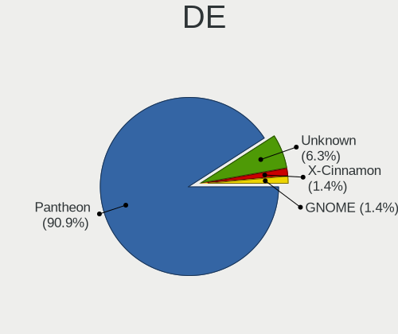

| Name       | Notebooks | Percent |
|------------|-----------|---------|
| Pantheon   | 65        | 87.84%  |
| Unknown    | 7         | 9.46%   |
| X-Cinnamon | 1         | 1.35%   |
| GNOME      | 1         | 1.35%   |

Display Server
--------------

X11 or Wayland

| Name | Notebooks | Percent |
|------|-----------|---------|
| X11  | 74        | 100%    |

Display Manager
---------------

SDDM, LightDM, etc.

| Name    | Notebooks | Percent |
|---------|-----------|---------|
| Unknown | 58        | 78.38%  |
| LightDM | 10        | 13.51%  |
| TDM     | 4         | 5.41%   |
| GDM     | 2         | 2.7%    |

OS Lang
-------

Language

| Lang  | Notebooks | Percent |
|-------|-----------|---------|
| en_US | 39        | 52.7%   |
| es_ES | 7         | 9.46%   |
| de_DE | 5         | 6.76%   |
| fr_FR | 4         | 5.41%   |
| ru_RU | 3         | 4.05%   |
| zh_CN | 2         | 2.7%    |
| pt_BR | 2         | 2.7%    |
| pl_PL | 2         | 2.7%    |
| en_GB | 2         | 2.7%    |
| en_CA | 2         | 2.7%    |
| cs_CZ | 2         | 2.7%    |
| vi_VN | 1         | 1.35%   |
| it_IT | 1         | 1.35%   |
| en_AU | 1         | 1.35%   |
| de_CH | 1         | 1.35%   |

Boot Mode
---------

EFI or BIOS

| Mode | Notebooks | Percent |
|------|-----------|---------|
| EFI  | 45        | 60.81%  |
| BIOS | 29        | 39.19%  |

Filesystem
----------

Type of filesystem

| Type    | Notebooks | Percent |
|---------|-----------|---------|
| Ext4    | 69        | 93.24%  |
| Overlay | 4         | 5.41%   |
| Btrfs   | 1         | 1.35%   |

Part. scheme
------------

Scheme of partitioning

| Type    | Notebooks | Percent |
|---------|-----------|---------|
| Unknown | 58        | 78.38%  |
| GPT     | 11        | 14.86%  |
| MBR     | 5         | 6.76%   |

Dual Boot with Linux/BSD
------------------------

Hosting more than one Linux/BSD

| Dual boot | Notebooks | Percent |
|-----------|-----------|---------|
| No        | 71        | 95.95%  |
| Yes       | 3         | 4.05%   |

Dual Boot (Win)
---------------

Hosting Linux and Windows

| Dual boot | Notebooks | Percent |
|-----------|-----------|---------|
| No        | 66        | 89.19%  |
| Yes       | 8         | 10.81%  |

Board
-----

Vendor
------

Motherboard manufacturer

| Name             | Notebooks | Percent |
|------------------|-----------|---------|
| Hewlett-Packard  | 19        | 25.68%  |
| Lenovo           | 13        | 17.57%  |
| Apple            | 10        | 13.51%  |
| Dell             | 9         | 12.16%  |
| Acer             | 9         | 12.16%  |
| ASUSTek Computer | 3         | 4.05%   |
| Toshiba          | 2         | 2.7%    |
| TUXEDO           | 1         | 1.35%   |
| Sony             | 1         | 1.35%   |
| MSI              | 1         | 1.35%   |
| Medion           | 1         | 1.35%   |
| HUAWEI           | 1         | 1.35%   |
| Google           | 1         | 1.35%   |
| Gateway          | 1         | 1.35%   |
| eMachines        | 1         | 1.35%   |
| Alienware        | 1         | 1.35%   |

Model
-----

Motherboard model

| Name                                       | Notebooks | Percent |
|--------------------------------------------|-----------|---------|
| HP Pavilion Notebook                       | 2         | 2.7%    |
| Dell XPS 13 9350                           | 2         | 2.7%    |
| Apple MacBookPro9,1                        | 2         | 2.7%    |
| Apple MacBookPro10,2                       | 2         | 2.7%    |
| Apple MacBookAir7,2                        | 2         | 2.7%    |
| TUXEDO InfinityBook S 14 Gen6              | 1         | 1.35%   |
| Toshiba Satellite P100                     | 1         | 1.35%   |
| Toshiba Satellite L500                     | 1         | 1.35%   |
| Sony Serie VJC14                           | 1         | 1.35%   |
| MSI Modern 14 B4MW                         | 1         | 1.35%   |
| Medion AKOYA THE TOUCH 10                  | 1         | 1.35%   |
| Lenovo Yoga 300-11IBR 80M1                 | 1         | 1.35%   |
| Lenovo V330-15IKB 81AX                     | 1         | 1.35%   |
| Lenovo ThinkPad X250 20CLS32H00            | 1         | 1.35%   |
| Lenovo ThinkPad X230 23259L3               | 1         | 1.35%   |
| Lenovo ThinkPad X201 3249CTO               | 1         | 1.35%   |
| Lenovo ThinkPad X1 Carbon 3448B86          | 1         | 1.35%   |
| Lenovo ThinkPad W700 2758MVG               | 1         | 1.35%   |
| Lenovo ThinkPad T470 20HD004AUS            | 1         | 1.35%   |
| Lenovo ThinkPad T430 2342A19               | 1         | 1.35%   |
| Lenovo ThinkPad E470 20H10052IG            | 1         | 1.35%   |
| Lenovo IdeaPad S145-15AST 81N3             | 1         | 1.35%   |
| Lenovo IdeaPad 330-15IKB 81FE              | 1         | 1.35%   |
| Lenovo G50-45 80E3                         | 1         | 1.35%   |
| HUAWEI NBLB-WAX9N                          | 1         | 1.35%   |
| HP Stream Laptop 14-cb1xxx                 | 1         | 1.35%   |
| HP ProBook 6460b                           | 1         | 1.35%   |
| HP ProBook 4530s                           | 1         | 1.35%   |
| HP ProBook 450 G8 Notebook PC              | 1         | 1.35%   |
| HP ProBook 4320s                           | 1         | 1.35%   |
| HP Pavilion Gaming Laptop 15-ec0xxx        | 1         | 1.35%   |
| HP Pavilion g6                             | 1         | 1.35%   |
| HP Pavilion dv6500                         | 1         | 1.35%   |
| HP Pavilion Aero Laptop 13-be0xxx          | 1         | 1.35%   |
| HP Notebook                                | 1         | 1.35%   |
| HP Laptop 15-bs1xx                         | 1         | 1.35%   |
| HP Laptop 15-bs0xx                         | 1         | 1.35%   |
| HP Laptop 14-dq1xxx                        | 1         | 1.35%   |
| HP ENVY 15                                 | 1         | 1.35%   |
| HP EliteBook Folio 9470m                   | 1         | 1.35%   |
| HP EliteBook 8440p                         | 1         | 1.35%   |
| HP EliteBook 840 G3                        | 1         | 1.35%   |
| Google Setzer                              | 1         | 1.35%   |
| Gateway NV54 Series                        | 1         | 1.35%   |
| eMachines G525                             | 1         | 1.35%   |
| Dell XPS L321X                             | 1         | 1.35%   |
| Dell Precision M4800                       | 1         | 1.35%   |
| Dell Precision 5760                        | 1         | 1.35%   |
| Dell Latitude E7440                        | 1         | 1.35%   |
| Dell Latitude E6410                        | 1         | 1.35%   |
| Dell Latitude 3580                         | 1         | 1.35%   |
| Dell Inspiron 3583                         | 1         | 1.35%   |
| ASUS VivoBook 15_ASUS Laptop X540MA_X540MA | 1         | 1.35%   |
| ASUS UX303LA                               | 1         | 1.35%   |
| ASUS 1215B                                 | 1         | 1.35%   |
| Apple MacBookPro8,2                        | 1         | 1.35%   |
| Apple MacBookPro8,1                        | 1         | 1.35%   |
| Apple MacBookPro7,1                        | 1         | 1.35%   |
| Apple MacBookAir6,1                        | 1         | 1.35%   |
| Alienware 17                               | 1         | 1.35%   |

Model Family
------------

Motherboard model prefix

| Name                | Notebooks | Percent |
|---------------------|-----------|---------|
| Lenovo ThinkPad     | 8         | 10.81%  |
| HP Pavilion         | 6         | 8.11%   |
| Acer Aspire         | 6         | 8.11%   |
| HP ProBook          | 4         | 5.41%   |
| HP Laptop           | 3         | 4.05%   |
| HP EliteBook        | 3         | 4.05%   |
| Dell XPS            | 3         | 4.05%   |
| Dell Latitude       | 3         | 4.05%   |
| Toshiba Satellite   | 2         | 2.7%    |
| Lenovo IdeaPad      | 2         | 2.7%    |
| Dell Precision      | 2         | 2.7%    |
| Apple MacBookPro9   | 2         | 2.7%    |
| Apple MacBookPro8   | 2         | 2.7%    |
| Apple MacBookPro10  | 2         | 2.7%    |
| Apple MacBookAir7   | 2         | 2.7%    |
| Acer Swift          | 2         | 2.7%    |
| TUXEDO InfinityBook | 1         | 1.35%   |
| Sony Serie          | 1         | 1.35%   |
| MSI Modern          | 1         | 1.35%   |
| Medion AKOYA        | 1         | 1.35%   |
| Lenovo Yoga         | 1         | 1.35%   |
| Lenovo V330-15IKB   | 1         | 1.35%   |
| Lenovo G50-45       | 1         | 1.35%   |
| HUAWEI NBLB-WAX9N   | 1         | 1.35%   |
| HP Stream           | 1         | 1.35%   |
| HP Notebook         | 1         | 1.35%   |
| HP ENVY             | 1         | 1.35%   |
| Google Setzer       | 1         | 1.35%   |
| Gateway NV54        | 1         | 1.35%   |
| eMachines G525      | 1         | 1.35%   |
| Dell Inspiron       | 1         | 1.35%   |
| ASUS VivoBook       | 1         | 1.35%   |
| ASUS UX303LA        | 1         | 1.35%   |
| ASUS 1215B          | 1         | 1.35%   |
| Apple MacBookPro7   | 1         | 1.35%   |
| Apple MacBookAir6   | 1         | 1.35%   |
| Alienware 17        | 1         | 1.35%   |
| Acer ConceptD       | 1         | 1.35%   |

MFG Year
--------

Motherboard manufacture year

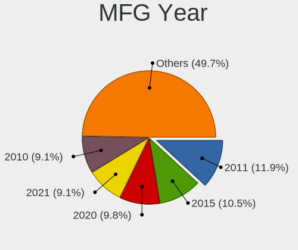

| Year    | Notebooks | Percent |
|---------|-----------|---------|
| 2021    | 19        | 25.68%  |
| 2019    | 9         | 12.16%  |
| 2018    | 9         | 12.16%  |
| 2015    | 7         | 9.46%   |
| 2020    | 6         | 8.11%   |
| 2012    | 5         | 6.76%   |
| 2014    | 4         | 5.41%   |
| 2017    | 3         | 4.05%   |
| 2013    | 3         | 4.05%   |
| 2010    | 3         | 4.05%   |
| 2011    | 2         | 2.7%    |
| 2016    | 1         | 1.35%   |
| 2009    | 1         | 1.35%   |
| 2007    | 1         | 1.35%   |
| Unknown | 1         | 1.35%   |

Form Factor
-----------

Physical design of the computer

| Name     | Notebooks | Percent |
|----------|-----------|---------|
| Notebook | 74        | 100%    |

Secure Boot
-----------

Enabled or disabled

| State    | Notebooks | Percent |
|----------|-----------|---------|
| Disabled | 59        | 79.73%  |
| Enabled  | 15        | 20.27%  |

Coreboot
--------

Have coreboot on board

| Used | Notebooks | Percent |
|------|-----------|---------|
| No   | 73        | 98.65%  |
| Yes  | 1         | 1.35%   |

RAM Size
--------

Total RAM memory

| Size in GB | Notebooks | Percent |
|------------|-----------|---------|
| 4.01-8.0   | 26        | 35.14%  |
| 3.01-4.0   | 20        | 27.03%  |
| 8.01-16.0  | 11        | 14.86%  |
| 16.01-24.0 | 9         | 12.16%  |
| 32.01-64.0 | 4         | 5.41%   |
| 1.01-2.0   | 2         | 2.7%    |
| 24.01-32.0 | 1         | 1.35%   |
| 2.01-3.0   | 1         | 1.35%   |

RAM Used
--------

Used RAM memory

| Used GB  | Notebooks | Percent |
|----------|-----------|---------|
| 2.01-3.0 | 27        | 35.53%  |
| 1.01-2.0 | 27        | 35.53%  |
| 3.01-4.0 | 12        | 15.79%  |
| 4.01-8.0 | 10        | 13.16%  |

Total Drives
------------

Number of drives on board

| Drives | Notebooks | Percent |
|--------|-----------|---------|
| 1      | 57        | 77.03%  |
| 2      | 15        | 20.27%  |
| 4      | 1         | 1.35%   |
| 3      | 1         | 1.35%   |

Has CD-ROM
----------

Has CD-ROM on board

| Presented | Notebooks | Percent |
|-----------|-----------|---------|
| No        | 52        | 70.27%  |
| Yes       | 22        | 29.73%  |

Has Ethernet
------------

Has Ethernet on board

| Presented | Notebooks | Percent |
|-----------|-----------|---------|
| Yes       | 56        | 75.68%  |
| No        | 18        | 24.32%  |

Has WiFi
--------

Has WiFi module

| Presented | Notebooks | Percent |
|-----------|-----------|---------|
| Yes       | 73        | 98.65%  |
| No        | 1         | 1.35%   |

Has Bluetooth
-------------

Has Bluetooth module

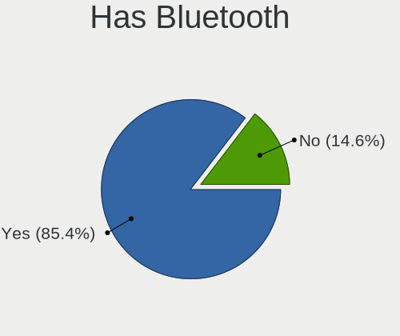

| Presented | Notebooks | Percent |
|-----------|-----------|---------|
| Yes       | 67        | 89.33%  |
| No        | 8         | 10.67%  |

Location
--------

Country
-------

Geographic location (country)

| Country            | Notebooks | Percent |
|--------------------|-----------|---------|
| USA                | 12        | 16.22%  |
| India              | 7         | 9.46%   |
| Germany            | 7         | 9.46%   |
| Russia             | 4         | 5.41%   |
| France             | 4         | 5.41%   |
| Brazil             | 3         | 4.05%   |
| Argentina          | 3         | 4.05%   |
| UK                 | 2         | 2.7%    |
| Poland             | 2         | 2.7%    |
| Mexico             | 2         | 2.7%    |
| Indonesia          | 2         | 2.7%    |
| Guatemala          | 2         | 2.7%    |
| Czechia            | 2         | 2.7%    |
| Canada             | 2         | 2.7%    |
| Australia          | 2         | 2.7%    |
| Vietnam            | 1         | 1.35%   |
| Sweden             | 1         | 1.35%   |
| Serbia             | 1         | 1.35%   |
| Paraguay           | 1         | 1.35%   |
| Netherlands        | 1         | 1.35%   |
| Myanmar            | 1         | 1.35%   |
| Morocco            | 1         | 1.35%   |
| Latvia             | 1         | 1.35%   |
| Kazakhstan         | 1         | 1.35%   |
| Japan              | 1         | 1.35%   |
| Italy              | 1         | 1.35%   |
| Guyana             | 1         | 1.35%   |
| Estonia            | 1         | 1.35%   |
| Dominican Republic | 1         | 1.35%   |
| Denmark            | 1         | 1.35%   |
| China              | 1         | 1.35%   |
| Chile              | 1         | 1.35%   |
| Belgium            | 1         | 1.35%   |

City
----

Geographic location (city)

| City             | Notebooks | Percent |
|------------------|-----------|---------|
| Paris            | 2         | 2.67%   |
| Moscow           | 2         | 2.67%   |
| Guatemala City   | 2         | 2.67%   |
| Buenos Aires     | 2         | 2.67%   |
| Wriezen          | 1         | 1.33%   |
| Woodbridge       | 1         | 1.33%   |
| Warsaw           | 1         | 1.33%   |
| Villeurbanne     | 1         | 1.33%   |
| Vernon           | 1         | 1.33%   |
| Toledo           | 1         | 1.33%   |
| Tokyo            | 1         | 1.33%   |
| Thousand Oaks    | 1         | 1.33%   |
| Tallinn          | 1         | 1.33%   |
| Taganrog         | 1         | 1.33%   |
| Surabaya         | 1         | 1.33%   |
| Stevenage        | 1         | 1.33%   |
| Sinop            | 1         | 1.33%   |
| S??o Pedro       | 1         | 1.33%   |
| Santiago         | 1         | 1.33%   |
| Santa Monica     | 1         | 1.33%   |
| San Lorenzo      | 1         | 1.33%   |
| San Antonio      | 1         | 1.33%   |
| Sakai            | 1         | 1.33%   |
| Sacramento       | 1         | 1.33%   |
| Rostov-on-Don    | 1         | 1.33%   |
| Quer?©taro City  | 1         | 1.33%   |
| Pompano Beach    | 1         | 1.33%   |
| Plesnois         | 1         | 1.33%   |
| Pfullingen       | 1         | 1.33%   |
| Perth            | 1         | 1.33%   |
| Peekskill        | 1         | 1.33%   |
| Patna            | 1         | 1.33%   |
| Ostrov           | 1         | 1.33%   |
| Odense           | 1         | 1.33%   |
| Northridge       | 1         | 1.33%   |
| Nacka            | 1         | 1.33%   |
| Naaldwijk        | 1         | 1.33%   |
| Mumbai           | 1         | 1.33%   |
| Moss Point       | 1         | 1.33%   |
| Montreal         | 1         | 1.33%   |
| Monheim am Rhein | 1         | 1.33%   |
| Milan            | 1         | 1.33%   |
| Mexico City      | 1         | 1.33%   |
| Mandalay         | 1         | 1.33%   |
| Lucknow          | 1         | 1.33%   |
| Len?«nskoe       | 1         | 1.33%   |
| Lancut           | 1         | 1.33%   |
| Lanaken          | 1         | 1.33%   |
| Kovin            | 1         | 1.33%   |
| Koraput          | 1         | 1.33%   |
| Jaunmarupe       | 1         | 1.33%   |
| Jalandhar        | 1         | 1.33%   |
| Jakarta          | 1         | 1.33%   |
| Horovice         | 1         | 1.33%   |
| Hollern          | 1         | 1.33%   |
| Georgetown       | 1         | 1.33%   |
| Galvan           | 1         | 1.33%   |
| Eislingen        | 1         | 1.33%   |
| Curitiba         | 1         | 1.33%   |
| Coimbatore       | 1         | 1.33%   |

Drives
------

Drive Vendor
------------

Hard drive vendors

| Vendor                    | Notebooks | Drives | Percent |
|---------------------------|-----------|--------|---------|
| WDC                       | 17        | 18     | 17.89%  |
| Samsung Electronics       | 15        | 15     | 15.79%  |
| Seagate                   | 11        | 13     | 11.58%  |
| Unknown                   | 6         | 6      | 6.32%   |
| Sandisk                   | 6         | 6      | 6.32%   |
| Toshiba                   | 5         | 5      | 5.26%   |
| Kingston                  | 4         | 5      | 4.21%   |
| Hitachi                   | 4         | 4      | 4.21%   |
| Crucial                   | 4         | 4      | 4.21%   |
| Apple                     | 4         | 4      | 4.21%   |
| HGST                      | 3         | 3      | 3.16%   |
| LITEONIT                  | 2         | 2      | 2.11%   |
| Gigabyte Technology       | 2         | 2      | 2.11%   |
| Union Memory              | 1         | 1      | 1.05%   |
| SK Hynix                  | 1         | 1      | 1.05%   |
| Silicon Motion            | 1         | 1      | 1.05%   |
| Phison                    | 1         | 1      | 1.05%   |
| Micron/Crucial Technology | 1         | 1      | 1.05%   |
| Micron Technology         | 1         | 1      | 1.05%   |
| Mercury                   | 1         | 1      | 1.05%   |
| LITEON                    | 1         | 1      | 1.05%   |
| Intel                     | 1         | 1      | 1.05%   |
| HUAWEI                    | 1         | 1      | 1.05%   |
| Hewlett-Packard           | 1         | 1      | 1.05%   |
| CLOVER                    | 1         | 1      | 1.05%   |

Drive Model
-----------

Hard drive models

| Model                                  | Notebooks | Percent |
|----------------------------------------|-----------|---------|
| WDC WDS500G2B0A-00SM50 500GB SSD       | 2         | 2.08%   |
| WDC WD5000LPVX-22V0TT0 500GB           | 2         | 2.08%   |
| WDC WD10SPZX-21Z10T0 1TB               | 2         | 2.08%   |
| WDC WD10JPVX-22JC3T0 1TB               | 2         | 2.08%   |
| Unknown MMC Card  128GB                | 2         | 2.08%   |
| Seagate ST500LT012-1DG142 500GB        | 2         | 2.08%   |
| Seagate ST2000LX001-1RG174 2TB         | 2         | 2.08%   |
| Seagate ST1000LM035-1RK172 1TB         | 2         | 2.08%   |
| Samsung SSD 860 EVO 250GB              | 2         | 2.08%   |
| Kingston SA400S37240G 240GB SSD        | 2         | 2.08%   |
| HGST HTS541010A9E680 1TB               | 2         | 2.08%   |
| Apple SSD SD128E 121GB                 | 2         | 2.08%   |
| WDC WDS240G2G0A-00JH30 240GB SSD       | 1         | 1.04%   |
| WDC WD5000LPLX-08ZNTT0 500GB           | 1         | 1.04%   |
| WDC WD5000BPKT-75PK4T0 500GB           | 1         | 1.04%   |
| WDC WD20SPZX-21UA7T0 2TB               | 1         | 1.04%   |
| WDC WD10SPZX-24Z10T0 1TB               | 1         | 1.04%   |
| WDC WD10SPZX-22Z10T1 1TB               | 1         | 1.04%   |
| WDC WD10JPVX-60JC3T1 1TB               | 1         | 1.04%   |
| WDC PC SN720 SDAPNTW-256G-1014 256GB   | 1         | 1.04%   |
| WDC PC SN530 SDBPNPZ-256G-1114 256GB   | 1         | 1.04%   |
| WDC PC SN520 SDAPNUW-512G-1014 512GB   | 1         | 1.04%   |
| Unknown xD/SD/M.S.                     | 1         | 1.04%   |
| Unknown TA2964  64GB                   | 1         | 1.04%   |
| Unknown MMC Card  64GB                 | 1         | 1.04%   |
| Unknown MMC Card  16GB                 | 1         | 1.04%   |
| Union Memory RTOTJ256VGD2MYX 256GB     | 1         | 1.04%   |
| Toshiba MQ01ABD100V -63 1TB            | 1         | 1.04%   |
| Toshiba MQ01ABD100 1TB                 | 1         | 1.04%   |
| Toshiba MK5065GSXF 500GB               | 1         | 1.04%   |
| Toshiba MK3275GSX 320GB                | 1         | 1.04%   |
| Toshiba MK1676GSX 160GB                | 1         | 1.04%   |
| SK Hynix NVMe SSD Drive 512GB          | 1         | 1.04%   |
| Silicon Motion NVMe SSD Drive 120GB    | 1         | 1.04%   |
| Seagate ST9320325AS 320GB              | 1         | 1.04%   |
| Seagate ST9250315AS 250GB              | 1         | 1.04%   |
| Seagate ST320LT020-9YG142 320GB        | 1         | 1.04%   |
| Seagate ST1000LM049-2GH172 1TB         | 1         | 1.04%   |
| Seagate ST1000LM048-2E7172 1TB         | 1         | 1.04%   |
| SanDisk SDSSDA480G 480GB               | 1         | 1.04%   |
| SanDisk SDSSDA120G 120GB               | 1         | 1.04%   |
| SanDisk SD7SB3Q256G1002 256GB SSD      | 1         | 1.04%   |
| SanDisk SD7SB3Q128G1001 128GB SSD      | 1         | 1.04%   |
| Sandisk NVMe SSD Drive 512GB           | 1         | 1.04%   |
| Sandisk NVMe SSD Drive 256GB           | 1         | 1.04%   |
| Samsung SSD SM841 mSATA 128GB          | 1         | 1.04%   |
| Samsung SSD 970 EVO Plus 250GB         | 1         | 1.04%   |
| Samsung SSD 860 EVO 2TB                | 1         | 1.04%   |
| Samsung SSD 840 EVO 250GB              | 1         | 1.04%   |
| Samsung SSD 840 EVO 120GB mSATA        | 1         | 1.04%   |
| Samsung PM963 2.5" NVMe PCIe SSD 512GB | 1         | 1.04%   |
| Samsung NVMe SSD Drive 500GB           | 1         | 1.04%   |
| Samsung NVMe SSD Drive 256GB           | 1         | 1.04%   |
| Samsung MZVLW256HEHP-000L2 256GB       | 1         | 1.04%   |
| Samsung MZNTY128HDHP-000H1 128GB SSD   | 1         | 1.04%   |
| Samsung MZNLN128HAHQ-000H1 128GB SSD   | 1         | 1.04%   |
| Samsung HN-M101MBB 1TB                 | 1         | 1.04%   |
| Samsung HM321HI 320GB                  | 1         | 1.04%   |
| Phison NVMe SSD Drive 2TB              | 1         | 1.04%   |
| Micron/Crucial NVMe SSD Drive 500GB    | 1         | 1.04%   |

HDD Vendor
----------

Hard disk drive vendors

| Vendor              | Notebooks | Drives | Percent |
|---------------------|-----------|--------|---------|
| WDC                 | 12        | 12     | 32.43%  |
| Seagate             | 11        | 13     | 29.73%  |
| Toshiba             | 5         | 5      | 13.51%  |
| Hitachi             | 4         | 4      | 10.81%  |
| HGST                | 3         | 3      | 8.11%   |
| Samsung Electronics | 2         | 2      | 5.41%   |

SSD Vendor
----------

Solid state drive vendors

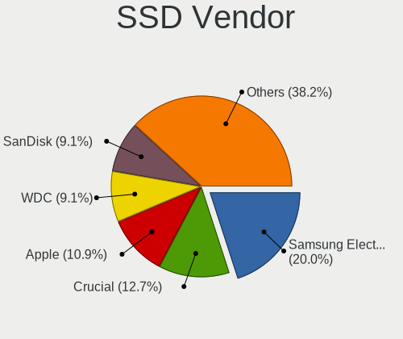

| Vendor              | Notebooks | Drives | Percent |
|---------------------|-----------|--------|---------|
| Samsung Electronics | 8         | 8      | 24.24%  |
| SanDisk             | 4         | 4      | 12.12%  |
| Crucial             | 4         | 4      | 12.12%  |
| Apple               | 4         | 4      | 12.12%  |
| WDC                 | 3         | 3      | 9.09%   |
| Kingston            | 3         | 4      | 9.09%   |
| LITEONIT            | 2         | 2      | 6.06%   |
| Mercury             | 1         | 1      | 3.03%   |
| LITEON              | 1         | 1      | 3.03%   |
| Intel               | 1         | 1      | 3.03%   |
| Hewlett-Packard     | 1         | 1      | 3.03%   |
| Gigabyte Technology | 1         | 1      | 3.03%   |

Drive Kind
----------

HDD or SSD

| Kind    | Notebooks | Drives | Percent |
|---------|-----------|--------|---------|
| HDD     | 36        | 39     | 40%     |
| SSD     | 30        | 34     | 33.33%  |
| NVMe    | 15        | 17     | 16.67%  |
| MMC     | 5         | 5      | 5.56%   |
| Unknown | 4         | 4      | 4.44%   |

Drive Connector
---------------

SATA, SAS, NVMe, etc.

| Type | Notebooks | Drives | Percent |
|------|-----------|--------|---------|
| SATA | 61        | 75     | 73.49%  |
| NVMe | 15        | 17     | 18.07%  |
| MMC  | 5         | 5      | 6.02%   |
| SAS  | 2         | 2      | 2.41%   |

Drive Size
----------

Size of hard drive

| Size in TB | Notebooks | Drives | Percent |
|------------|-----------|--------|---------|
| 0.01-0.5   | 42        | 50     | 65.63%  |
| 0.51-1.0   | 18        | 19     | 28.13%  |
| 1.01-2.0   | 4         | 4      | 6.25%   |

Space Total
-----------

Amount of disk space available on the file system

| Size in GB | Notebooks | Percent |
|------------|-----------|---------|
| 101-250    | 36        | 48%     |
| 251-500    | 15        | 20%     |
| 501-1000   | 10        | 13.33%  |
| 51-100     | 5         | 6.67%   |
| 1001-2000  | 4         | 5.33%   |
| 1-20       | 3         | 4%      |
| 21-50      | 1         | 1.33%   |
| 2001-3000  | 1         | 1.33%   |

Space Used
----------

Amount of used disk space

| Used GB   | Notebooks | Percent |
|-----------|-----------|---------|
| 1-20      | 43        | 58.11%  |
| 21-50     | 13        | 17.57%  |
| 51-100    | 10        | 13.51%  |
| 101-250   | 3         | 4.05%   |
| 251-500   | 2         | 2.7%    |
| 1001-2000 | 2         | 2.7%    |
| 501-1000  | 1         | 1.35%   |

Malfunc. Drives
---------------

Drive models with a malfunction

| Model                             | Notebooks | Drives | Percent |
|-----------------------------------|-----------|--------|---------|
| WDC WD5000BPKT-75PK4T0 500GB      | 1         | 1      | 33.33%  |
| Seagate ST320LT020-9YG142 320GB   | 1         | 1      | 33.33%  |
| SanDisk SD7SB3Q256G1002 256GB SSD | 1         | 1      | 33.33%  |

Malfunc. Drive Vendor
---------------------

Vendors of faulty drives

| Vendor  | Notebooks | Drives | Percent |
|---------|-----------|--------|---------|
| WDC     | 1         | 1      | 33.33%  |
| Seagate | 1         | 1      | 33.33%  |
| SanDisk | 1         | 1      | 33.33%  |

Malfunc. HDD Vendor
-------------------

Vendors of faulty HDD drives

| Vendor  | Notebooks | Drives | Percent |
|---------|-----------|--------|---------|
| WDC     | 1         | 1      | 50%     |
| Seagate | 1         | 1      | 50%     |

Malfunc. Drive Kind
-------------------

Kinds of faulty drives

| Kind | Notebooks | Drives | Percent |
|------|-----------|--------|---------|
| HDD  | 2         | 2      | 66.67%  |
| SSD  | 1         | 1      | 33.33%  |

Failed Drives
-------------

Failed drive models

Zero info for selected period =(

Failed Drive Vendor
-------------------

Failed drive vendors

Zero info for selected period =(

Drive Status
------------

Number of failed and malfunc. drives

| Status   | Notebooks | Drives | Percent |
|----------|-----------|--------|---------|
| Detected | 59        | 79     | 77.63%  |
| Works    | 14        | 17     | 18.42%  |
| Malfunc  | 3         | 3      | 3.95%   |

Storage controller
------------------

Storage Vendor
--------------

Storage controller vendors

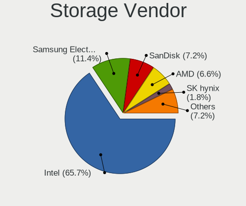

| Vendor                      | Notebooks | Percent |
|-----------------------------|-----------|---------|
| Intel                       | 59        | 68.6%   |
| Samsung Electronics         | 7         | 8.14%   |
| AMD                         | 7         | 8.14%   |
| Sandisk                     | 5         | 5.81%   |
| Phison Electronics          | 2         | 2.33%   |
| SK Hynix                    | 1         | 1.16%   |
| Silicon Motion              | 1         | 1.16%   |
| Nvidia                      | 1         | 1.16%   |
| Micron/Crucial Technology   | 1         | 1.16%   |
| Micron Technology           | 1         | 1.16%   |
| Kingston Technology Company | 1         | 1.16%   |

Storage Model
-------------

Storage controller models

| Model                                                                                  | Notebooks | Percent |
|----------------------------------------------------------------------------------------|-----------|---------|
| Intel Sunrise Point-LP SATA Controller [AHCI mode]                                     | 11        | 12.36%  |
| Intel 82801 Mobile SATA Controller [RAID mode]                                         | 7         | 7.87%   |
| Intel 7 Series Chipset Family 6-port SATA Controller [AHCI mode]                       | 7         | 7.87%   |
| AMD FCH SATA Controller [AHCI mode]                                                    | 5         | 5.62%   |
| Intel 6 Series/C200 Series Chipset Family 6 port Mobile SATA AHCI Controller           | 4         | 4.49%   |
| Intel Volume Management Device NVMe RAID Controller                                    | 3         | 3.37%   |
| Intel 8 Series/C220 Series Chipset Family 6-port SATA Controller 1 [AHCI mode]         | 3         | 3.37%   |
| Intel 5 Series/3400 Series Chipset 6 port SATA AHCI Controller                         | 3         | 3.37%   |
| Sandisk WD Blue SN550 NVMe SSD                                                         | 2         | 2.25%   |
| Sandisk WD Black 2018/SN750 / PC SN720 NVMe SSD                                        | 2         | 2.25%   |
| Samsung NVMe SSD Controller 980                                                        | 2         | 2.25%   |
| Samsung Electronics SATA controller                                                    | 2         | 2.25%   |
| Intel HM170/QM170 Chipset SATA Controller [AHCI Mode]                                  | 2         | 2.25%   |
| Intel Atom/Celeron/Pentium Processor x5-E8000/J3xxx/N3xxx Series SATA Controller       | 2         | 2.25%   |
| Intel Atom Processor E3800 Series SATA AHCI Controller                                 | 2         | 2.25%   |
| Intel 82801IBM/IEM (ICH9M/ICH9M-E) 4 port SATA Controller [AHCI mode]                  | 2         | 2.25%   |
| Intel 82801IBM/IEM (ICH9M/ICH9M-E) 2 port SATA Controller [IDE mode]                   | 2         | 2.25%   |
| Intel 8 Series SATA Controller 1 [AHCI mode]                                           | 2         | 2.25%   |
| AMD SB7x0/SB8x0/SB9x0 SATA Controller [AHCI mode]                                      | 2         | 2.25%   |
| SK Hynix Gold P31 SSD                                                                  | 1         | 1.12%   |
| Silicon Motion Non-Volatile memory controller                                          | 1         | 1.12%   |
| Sandisk WD Blue SN500 / PC SN520 NVMe SSD                                              | 1         | 1.12%   |
| Samsung NVMe SSD Controller SM981/PM981/PM983                                          | 1         | 1.12%   |
| Samsung NVMe SSD Controller SM961/PM961/SM963                                          | 1         | 1.12%   |
| Samsung NVMe SSD Controller SM951/PM951                                                | 1         | 1.12%   |
| Phison PS5013 E13 NVMe Controller                                                      | 1         | 1.12%   |
| Phison E12 NVMe Controller                                                             | 1         | 1.12%   |
| Nvidia MCP89 SATA Controller (AHCI mode)                                               | 1         | 1.12%   |
| Micron/Crucial P1 NVMe PCIe SSD                                                        | 1         | 1.12%   |
| Micron Non-Volatile memory controller                                                  | 1         | 1.12%   |
| Kingston Company Company Non-Volatile memory controller                                | 1         | 1.12%   |
| Intel Wildcat Point-LP SATA Controller [AHCI Mode]                                     | 1         | 1.12%   |
| Intel Tiger Lake-LP SATA Controller [AHCI mode]                                        | 1         | 1.12%   |
| Intel Comet Lake SATA AHCI Controller                                                  | 1         | 1.12%   |
| Intel Celeron/Pentium Silver Processor SATA Controller                                 | 1         | 1.12%   |
| Intel Cannon Point-LP SATA Controller [AHCI Mode]                                      | 1         | 1.12%   |
| Intel Cannon Lake Mobile PCH SATA AHCI Controller                                      | 1         | 1.12%   |
| Intel 82801HM/HEM (ICH8M/ICH8M-E) SATA Controller [AHCI mode]                          | 1         | 1.12%   |
| Intel 82801HM/HEM (ICH8M/ICH8M-E) IDE Controller                                       | 1         | 1.12%   |
| Intel 82801GBM/GHM (ICH7-M Family) SATA Controller [IDE mode]                          | 1         | 1.12%   |
| Intel 7 Series Chipset Family 4-port SATA Controller [IDE mode]                        | 1         | 1.12%   |
| Intel 7 Series Chipset Family 2-port SATA Controller [IDE mode]                        | 1         | 1.12%   |
| Intel 6 Series/C200 Series Chipset Family Mobile SATA Controller (IDE mode, ports 0-3) | 1         | 1.12%   |

Storage Kind
------------

Kind of storage controller (IDE, SATA, NVMe, SAS, ...)

| Kind | Notebooks | Percent |
|------|-----------|---------|
| SATA | 55        | 63.95%  |
| NVMe | 15        | 17.44%  |
| RAID | 10        | 11.63%  |
| IDE  | 6         | 6.98%   |

Processor
---------

CPU Vendor
----------

Processor vendors

| Vendor | Notebooks | Percent |
|--------|-----------|---------|
| Intel  | 66        | 89.19%  |
| AMD    | 8         | 10.81%  |

CPU Model
---------

Processor models

| Model                                         | Notebooks | Percent |
|-----------------------------------------------|-----------|---------|
| Intel Core i5-6200U CPU @ 2.30GHz             | 4         | 5.41%   |
| Intel Pentium Dual-Core CPU T4400 @ 2.20GHz   | 2         | 2.7%    |
| Intel Core i7-8550U CPU @ 1.80GHz             | 2         | 2.7%    |
| Intel Core i7-7700HQ CPU @ 2.80GHz            | 2         | 2.7%    |
| Intel Core i7-4800MQ CPU @ 2.70GHz            | 2         | 2.7%    |
| Intel Core i7-3520M CPU @ 2.90GHz             | 2         | 2.7%    |
| Intel Core i5-8250U CPU @ 1.60GHz             | 2         | 2.7%    |
| Intel Core i5-7200U CPU @ 2.50GHz             | 2         | 2.7%    |
| Intel Core i5-5250U CPU @ 1.60GHz             | 2         | 2.7%    |
| Intel Core i5 CPU M 560 @ 2.67GHz             | 2         | 2.7%    |
| Intel 11th Gen Core i5-1135G7 @ 2.40GHz       | 2         | 2.7%    |
| Intel Xeon W-11855M CPU @ 3.20GHz             | 1         | 1.35%   |
| Intel Pentium Silver N5000 CPU @ 1.10GHz      | 1         | 1.35%   |
| Intel Pentium CPU N3700 @ 1.60GHz             | 1         | 1.35%   |
| Intel Pentium CPU N3540 @ 2.16GHz             | 1         | 1.35%   |
| Intel Core i7-9750H CPU @ 2.60GHz             | 1         | 1.35%   |
| Intel Core i7-8565U CPU @ 1.80GHz             | 1         | 1.35%   |
| Intel Core i7-4700MQ CPU @ 2.40GHz            | 1         | 1.35%   |
| Intel Core i7-4510U CPU @ 2.00GHz             | 1         | 1.35%   |
| Intel Core i7-3720QM CPU @ 2.60GHz            | 1         | 1.35%   |
| Intel Core i7-3687U CPU @ 2.10GHz             | 1         | 1.35%   |
| Intel Core i7-3667U CPU @ 2.00GHz             | 1         | 1.35%   |
| Intel Core i7-3615QM CPU @ 2.30GHz            | 1         | 1.35%   |
| Intel Core i7-2637M CPU @ 1.70GHz             | 1         | 1.35%   |
| Intel Core i7-2635QM CPU @ 2.00GHz            | 1         | 1.35%   |
| Intel Core i5-8265U CPU @ 1.60GHz             | 1         | 1.35%   |
| Intel Core i5-7300U CPU @ 2.60GHz             | 1         | 1.35%   |
| Intel Core i5-6300U CPU @ 2.40GHz             | 1         | 1.35%   |
| Intel Core i5-4300U CPU @ 1.90GHz             | 1         | 1.35%   |
| Intel Core i5-4260U CPU @ 1.40GHz             | 1         | 1.35%   |
| Intel Core i5-4210U CPU @ 1.70GHz             | 1         | 1.35%   |
| Intel Core i5-3320M CPU @ 2.60GHz             | 1         | 1.35%   |
| Intel Core i5-3230M CPU @ 2.60GHz             | 1         | 1.35%   |
| Intel Core i5-2520M CPU @ 2.50GHz             | 1         | 1.35%   |
| Intel Core i5-2435M CPU @ 2.40GHz             | 1         | 1.35%   |
| Intel Core i5-1035G4 CPU @ 1.10GHz            | 1         | 1.35%   |
| Intel Core i5-10210U CPU @ 1.60GHz            | 1         | 1.35%   |
| Intel Core i5 CPU M 520 @ 2.40GHz             | 1         | 1.35%   |
| Intel Core i3-6100U CPU @ 2.30GHz             | 1         | 1.35%   |
| Intel Core i3-6006U CPU @ 2.00GHz             | 1         | 1.35%   |
| Intel Core i3-5010U CPU @ 2.10GHz             | 1         | 1.35%   |
| Intel Core i3-2310M CPU @ 2.10GHz             | 1         | 1.35%   |
| Intel Core i3 CPU M 350 @ 2.27GHz             | 1         | 1.35%   |
| Intel Core 2 Duo CPU T9600 @ 2.80GHz          | 1         | 1.35%   |
| Intel Core 2 Duo CPU T5800 @ 2.00GHz          | 1         | 1.35%   |
| Intel Core 2 Duo CPU P8600 @ 2.40GHz          | 1         | 1.35%   |
| Intel Core 2 CPU T5500 @ 1.66GHz              | 1         | 1.35%   |
| Intel Celeron N4020 CPU @ 1.10GHz             | 1         | 1.35%   |
| Intel Celeron M CPU 530 @ 1.73GHz             | 1         | 1.35%   |
| Intel Celeron CPU N3060 @ 1.60GHz             | 1         | 1.35%   |
| Intel Celeron CPU N3050 @ 1.60GHz             | 1         | 1.35%   |
| Intel Celeron CPU N2807 @ 1.58GHz             | 1         | 1.35%   |
| Intel 11th Gen Core i3-1115G4 @ 3.00GHz       | 1         | 1.35%   |
| AMD Ryzen 5 5600U with Radeon Graphics        | 1         | 1.35%   |
| AMD Ryzen 5 4500U with Radeon Graphics        | 1         | 1.35%   |
| AMD Ryzen 5 3550H with Radeon Vega Mobile Gfx | 1         | 1.35%   |
| AMD Ryzen 5 2500U with Radeon Vega Mobile Gfx | 1         | 1.35%   |
| AMD Phenom II N660 Dual-Core Processor        | 1         | 1.35%   |
| AMD C-60 APU with Radeon HD Graphics          | 1         | 1.35%   |
| AMD A8-6410 APU with AMD Radeon R5 Graphics   | 1         | 1.35%   |

CPU Model Family
----------------

Processor model prefix

| Model                   | Notebooks | Percent |
|-------------------------|-----------|---------|
| Intel Core i5           | 25        | 33.78%  |
| Intel Core i7           | 18        | 24.32%  |
| Intel Core i3           | 5         | 6.76%   |
| Intel Celeron           | 4         | 5.41%   |
| AMD Ryzen 5             | 4         | 5.41%   |
| Other                   | 3         | 4.05%   |
| Intel Core 2 Duo        | 3         | 4.05%   |
| Intel Pentium Dual-Core | 2         | 2.7%    |
| Intel Pentium           | 2         | 2.7%    |
| Intel Xeon              | 1         | 1.35%   |
| Intel Pentium Silver    | 1         | 1.35%   |
| Intel Core 2            | 1         | 1.35%   |
| Intel Celeron M         | 1         | 1.35%   |
| AMD Phenom II           | 1         | 1.35%   |
| AMD C-60                | 1         | 1.35%   |
| AMD A8                  | 1         | 1.35%   |
| AMD A6                  | 1         | 1.35%   |

CPU Cores
---------

Number of processor cores

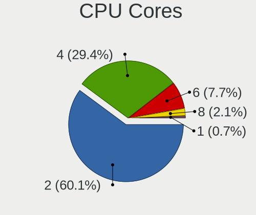

| Number | Notebooks | Percent |
|--------|-----------|---------|
| 2      | 45        | 60.81%  |
| 4      | 24        | 32.43%  |
| 6      | 4         | 5.41%   |
| 1      | 1         | 1.35%   |

CPU Sockets
-----------

Number of sockets

| Number | Notebooks | Percent |
|--------|-----------|---------|
| 1      | 74        | 100%    |

CPU Threads
-----------

Threads per core (Hyper-Threading)

| Number | Notebooks | Percent |
|--------|-----------|---------|
| 2      | 55        | 74.32%  |
| 1      | 19        | 25.68%  |

CPU Op-Modes
------------

CPU Operation Modes (32-bit, 64-bit)

| Op mode        | Notebooks | Percent |
|----------------|-----------|---------|
| 32-bit, 64-bit | 74        | 100%    |

CPU Microcode
-------------

Microcode number

| Number     | Notebooks | Percent |
|------------|-----------|---------|
| 0x306a9    | 8         | 10.81%  |
| Unknown    | 7         | 9.46%   |
| 0x406e3    | 6         | 8.11%   |
| 0x806ea    | 4         | 5.41%   |
| 0x40651    | 4         | 5.41%   |
| 0x206a7    | 4         | 5.41%   |
| 0x1067a    | 4         | 5.41%   |
| 0x806e9    | 3         | 4.05%   |
| 0x806c1    | 3         | 4.05%   |
| 0x306d4    | 3         | 4.05%   |
| 0x306c3    | 3         | 4.05%   |
| 0x906e9    | 2         | 2.7%    |
| 0x806eb    | 2         | 2.7%    |
| 0x406c3    | 2         | 2.7%    |
| 0x30678    | 2         | 2.7%    |
| 0x20655    | 2         | 2.7%    |
| 0x20652    | 2         | 2.7%    |
| 0x806ec    | 1         | 1.35%   |
| 0x706e5    | 1         | 1.35%   |
| 0x706a8    | 1         | 1.35%   |
| 0x706a1    | 1         | 1.35%   |
| 0x6fd      | 1         | 1.35%   |
| 0x6fa      | 1         | 1.35%   |
| 0x406c4    | 1         | 1.35%   |
| 0x0a50000c | 1         | 1.35%   |
| 0x08101007 | 1         | 1.35%   |
| 0x07030105 | 1         | 1.35%   |
| 0x06006705 | 1         | 1.35%   |
| 0x05000119 | 1         | 1.35%   |
| 0x010000c8 | 1         | 1.35%   |

CPU Microarch
-------------

Microarchitecture

| Name          | Notebooks | Percent |
|---------------|-----------|---------|
| KabyLake      | 13        | 17.57%  |
| IvyBridge     | 8         | 10.81%  |
| Skylake       | 7         | 9.46%   |
| Haswell       | 7         | 9.46%   |
| Silvermont    | 5         | 6.76%   |
| SandyBridge   | 5         | 6.76%   |
| Westmere      | 4         | 5.41%   |
| Penryn        | 4         | 5.41%   |
| TigerLake     | 3         | 4.05%   |
| Core          | 3         | 4.05%   |
| Broadwell     | 3         | 4.05%   |
| Goldmont plus | 2         | 2.7%    |
| Zen+          | 1         | 1.35%   |
| Zen 3         | 1         | 1.35%   |
| Zen 2         | 1         | 1.35%   |
| Zen           | 1         | 1.35%   |
| Puma          | 1         | 1.35%   |
| K10           | 1         | 1.35%   |
| IceLake       | 1         | 1.35%   |
| Excavator     | 1         | 1.35%   |
| Bobcat        | 1         | 1.35%   |
| Unknown       | 1         | 1.35%   |

Graphics
--------

GPU Vendor
----------

Vendors of graphics cards

| Vendor | Notebooks | Percent |
|--------|-----------|---------|
| Intel  | 61        | 68.54%  |
| Nvidia | 18        | 20.22%  |
| AMD    | 10        | 11.24%  |

GPU Model
---------

Graphics card models

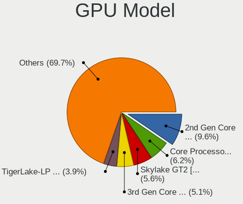

| Model                                                                                    | Notebooks | Percent |
|------------------------------------------------------------------------------------------|-----------|---------|
| Intel 3rd Gen Core processor Graphics Controller                                         | 8         | 8.7%    |
| Intel Skylake GT2 [HD Graphics 520]                                                      | 7         | 7.61%   |
| Intel UHD Graphics 620                                                                   | 4         | 4.35%   |
| Intel Haswell-ULT Integrated Graphics Controller                                         | 4         | 4.35%   |
| Intel Core Processor Integrated Graphics Controller                                      | 4         | 4.35%   |
| Intel 2nd Generation Core Processor Family Integrated Graphics Controller                | 4         | 4.35%   |
| Intel Mobile 4 Series Chipset Integrated Graphics Controller                             | 3         | 3.26%   |
| Intel HD Graphics 620                                                                    | 3         | 3.26%   |
| Intel Atom/Celeron/Pentium Processor x5-E8000/J3xxx/N3xxx Integrated Graphics Controller | 3         | 3.26%   |
| Nvidia GP108M [GeForce MX150]                                                            | 2         | 2.17%   |
| Nvidia GK107M [GeForce GT 650M Mac Edition]                                              | 2         | 2.17%   |
| Intel WhiskeyLake-U GT2 [UHD Graphics 620]                                               | 2         | 2.17%   |
| Intel TigerLake-LP GT2 [Iris Xe Graphics]                                                | 2         | 2.17%   |
| Intel HD Graphics 630                                                                    | 2         | 2.17%   |
| Intel HD Graphics 6000                                                                   | 2         | 2.17%   |
| Intel Atom Processor Z36xxx/Z37xxx Series Graphics & Display                             | 2         | 2.17%   |
| Intel 4th Gen Core Processor Integrated Graphics Controller                              | 2         | 2.17%   |
| AMD Seymour [Radeon HD 6400M/7400M Series]                                               | 2         | 2.17%   |
| Nvidia TU117M [GeForce GTX 1650 Mobile / Max-Q]                                          | 1         | 1.09%   |
| Nvidia TU117GLM [Quadro T1000 Mobile]                                                    | 1         | 1.09%   |
| Nvidia MCP89 [GeForce 320M]                                                              | 1         | 1.09%   |
| Nvidia GP108BM [GeForce MX250]                                                           | 1         | 1.09%   |
| Nvidia GP107M [GeForce GTX 1050 Ti Mobile]                                               | 1         | 1.09%   |
| Nvidia GP107M [GeForce GTX 1050 Mobile]                                                  | 1         | 1.09%   |
| Nvidia GM108M [GeForce 840M]                                                             | 1         | 1.09%   |
| Nvidia GM107 [GeForce 940MX]                                                             | 1         | 1.09%   |
| Nvidia GK208M [GeForce GT 740M]                                                          | 1         | 1.09%   |
| Nvidia GK107GLM [Quadro K1100M]                                                          | 1         | 1.09%   |
| Nvidia GK106M [GeForce GTX 770M]                                                         | 1         | 1.09%   |
| Nvidia GA104GLM [RTX A3000 Mobile]                                                       | 1         | 1.09%   |
| Nvidia G94GLM [Quadro FX 2700M]                                                          | 1         | 1.09%   |
| Nvidia G73M [GeForce Go 7600]                                                            | 1         | 1.09%   |
| Intel VGA compatible controller                                                          | 1         | 1.09%   |
| Intel Tiger Lake UHD Graphics                                                            | 1         | 1.09%   |
| Intel Mobile GM965/GL960 Integrated Graphics Controller (secondary)                      | 1         | 1.09%   |
| Intel Mobile GM965/GL960 Integrated Graphics Controller (primary)                        | 1         | 1.09%   |
| Intel Iris Plus Graphics G4 (Ice Lake)                                                   | 1         | 1.09%   |
| Intel HD Graphics 5500                                                                   | 1         | 1.09%   |
| Intel GeminiLake [UHD Graphics 605]                                                      | 1         | 1.09%   |
| Intel GeminiLake [UHD Graphics 600]                                                      | 1         | 1.09%   |
| Intel CometLake-U GT2 [UHD Graphics]                                                     | 1         | 1.09%   |
| Intel CoffeeLake-H GT2 [UHD Graphics 630]                                                | 1         | 1.09%   |
| AMD Wrestler [Radeon HD 6290]                                                            | 1         | 1.09%   |
| AMD Sun XT [Radeon HD 8670A/8670M/8690M / R5 M330 / M430 / Radeon 520 Mobile]            | 1         | 1.09%   |
| AMD Stoney [Radeon R2/R3/R4/R5 Graphics]                                                 | 1         | 1.09%   |
| AMD RS880M [Mobility Radeon HD 4225/4250]                                                | 1         | 1.09%   |
| AMD Renoir                                                                               | 1         | 1.09%   |
| AMD Raven Ridge [Radeon Vega Series / Radeon Vega Mobile Series]                         | 1         | 1.09%   |
| AMD Picasso                                                                              | 1         | 1.09%   |
| AMD Mullins [Radeon R4/R5 Graphics]                                                      | 1         | 1.09%   |
| AMD Jet PRO [Radeon R5 M230 / R7 M260DX / Radeon 520 Mobile]                             | 1         | 1.09%   |
| AMD Cezanne                                                                              | 1         | 1.09%   |

GPU Combo
---------

Combinations of graphics cards

| Name           | Notebooks | Percent |
|----------------|-----------|---------|
| 1 x Intel      | 47        | 63.51%  |
| Intel + Nvidia | 13        | 17.57%  |
| 1 x AMD        | 6         | 8.11%   |
| 1 x Nvidia     | 4         | 5.41%   |
| 2 x AMD        | 2         | 2.7%    |
| Intel + AMD    | 1         | 1.35%   |
| AMD + Nvidia   | 1         | 1.35%   |

GPU Driver
----------

Free vs proprietary

| Driver      | Notebooks | Percent |
|-------------|-----------|---------|
| Free        | 65        | 87.84%  |
| Proprietary | 7         | 9.46%   |
| Unknown     | 2         | 2.7%    |

GPU Memory
----------

Total video memory

| Size in GB | Notebooks | Percent |
|------------|-----------|---------|
| Unknown    | 57        | 77.03%  |
| 0.01-0.5   | 6         | 8.11%   |
| 1.01-2.0   | 5         | 6.76%   |
| 0.51-1.0   | 4         | 5.41%   |
| 3.01-4.0   | 1         | 1.35%   |
| 2.01-3.0   | 1         | 1.35%   |

Monitor
-------

Monitor Vendor
--------------

Monitor vendors

| Vendor                  | Notebooks | Percent |
|-------------------------|-----------|---------|
| Chimei Innolux          | 17        | 21.52%  |
| AU Optronics            | 12        | 15.19%  |
| Apple                   | 10        | 12.66%  |
| LG Display              | 9         | 11.39%  |
| BOE                     | 9         | 11.39%  |
| Samsung Electronics     | 7         | 8.86%   |
| Sharp                   | 3         | 3.8%    |
| Lenovo                  | 2         | 2.53%   |
| Chi Mei Optoelectronics | 2         | 2.53%   |
| AOC                     | 2         | 2.53%   |
| ViewSonic               | 1         | 1.27%   |
| Seiko/Epson             | 1         | 1.27%   |
| HannStar                | 1         | 1.27%   |
| Goldstar                | 1         | 1.27%   |
| Dell                    | 1         | 1.27%   |
| CPT                     | 1         | 1.27%   |

Monitor Model
-------------

Monitor models

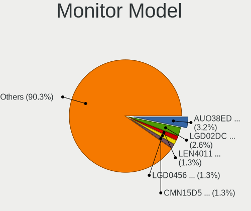

| Model                                                                    | Notebooks | Percent |
|--------------------------------------------------------------------------|-----------|---------|
| AU Optronics LCD Monitor AUO38ED 1920x1080 340x190mm 15.3-inch           | 3         | 3.8%    |
| Chimei Innolux LCD Monitor CMN15D5 1920x1080 340x190mm 15.3-inch         | 2         | 2.53%   |
| Chimei Innolux LCD Monitor CMN14C3 1366x768 309x173mm 13.9-inch          | 2         | 2.53%   |
| AU Optronics LCD Monitor AUO106C 1366x768 277x156mm 12.5-inch            | 2         | 2.53%   |
| Apple Color LCD APPA014 2560x1600 286x179mm 13.3-inch                    | 2         | 2.53%   |
| Apple Color LCD APP9CDF 1440x900 286x179mm 13.3-inch                     | 2         | 2.53%   |
| Apple Color LCD APP9CC7 1280x800 290x180mm 13.4-inch                     | 2         | 2.53%   |
| Apple Color LCD APP9CA4 1440x900 331x207mm 15.4-inch                     | 2         | 2.53%   |
| ViewSonic VA2445 SERIES VSC712E 1920x1080 521x293mm 23.5-inch            | 1         | 1.27%   |
| Sharp LCD Monitor SHP1517 3840x2400 366x229mm 17.0-inch                  | 1         | 1.27%   |
| Sharp LCD Monitor SHP1449 1920x1080 294x165mm 13.3-inch                  | 1         | 1.27%   |
| Sharp LCD Monitor SHP1420 1920x1080 290x170mm 13.2-inch                  | 1         | 1.27%   |
| Seiko/Epson LCD Monitor 1920x1080                                        | 1         | 1.27%   |
| Samsung Electronics S22F350 SAM0D1A 1920x1080 480x270mm 21.7-inch        | 1         | 1.27%   |
| Samsung Electronics LCD Monitor SEC5842 1366x768 309x174mm 14.0-inch     | 1         | 1.27%   |
| Samsung Electronics LCD Monitor SEC5441 1366x768 344x194mm 15.5-inch     | 1         | 1.27%   |
| Samsung Electronics LCD Monitor SEC3041 1366x768 353x198mm 15.9-inch     | 1         | 1.27%   |
| Samsung Electronics LCD Monitor SDC5441 1366x768 340x190mm 15.3-inch     | 1         | 1.27%   |
| Samsung Electronics LCD Monitor SDC4E42 1366x768 309x174mm 14.0-inch     | 1         | 1.27%   |
| Samsung Electronics C27F591 SAM0D36 1920x1080 598x336mm 27.0-inch        | 1         | 1.27%   |
| LG Display LP156WH2-TLE1 LGDCF01 1366x768 344x194mm 15.5-inch            | 1         | 1.27%   |
| LG Display LCD Monitor LGD06AD 2560x1600 286x179mm 13.3-inch             | 1         | 1.27%   |
| LG Display LCD Monitor LGD0599 1920x1080 309x174mm 14.0-inch             | 1         | 1.27%   |
| LG Display LCD Monitor LGD0456 1366x768 344x194mm 15.5-inch              | 1         | 1.27%   |
| LG Display LCD Monitor LGD0382 1600x900 310x170mm 13.9-inch              | 1         | 1.27%   |
| LG Display LCD Monitor LGD0335 1366x768 310x174mm 14.0-inch              | 1         | 1.27%   |
| LG Display LCD Monitor LGD032C 1920x1080 344x194mm 15.5-inch             | 1         | 1.27%   |
| LG Display LCD Monitor LGD02F2 1366x768 344x194mm 15.5-inch              | 1         | 1.27%   |
| LG Display LCD Monitor LGD022C 1366x768 294x166mm 13.3-inch              | 1         | 1.27%   |
| Lenovo LCD Monitor LEN4067 1920x1200 370x230mm 17.2-inch                 | 1         | 1.27%   |
| Lenovo LCD Monitor LEN4011 1280x800 261x163mm 12.1-inch                  | 1         | 1.27%   |
| HannStar HSD121PHW1 HSD04B6 1366x768 270x150mm 12.2-inch                 | 1         | 1.27%   |
| Goldstar MP59HT GSM5B44 1920x1080 480x270mm 21.7-inch                    | 1         | 1.27%   |
| Dell P2210H DELD026 1920x1080 480x270mm 21.7-inch                        | 1         | 1.27%   |
| CPT LCD Monitor CPT1401 1280x800 331x207mm 15.4-inch                     | 1         | 1.27%   |
| Chimei Innolux LCD Monitor CMN15E0 1920x1080 344x193mm 15.5-inch         | 1         | 1.27%   |
| Chimei Innolux LCD Monitor CMN15DC 1366x768 344x193mm 15.5-inch          | 1         | 1.27%   |
| Chimei Innolux LCD Monitor CMN15DB 1366x768 344x193mm 15.5-inch          | 1         | 1.27%   |
| Chimei Innolux LCD Monitor CMN15D3 1920x1080 344x193mm 15.5-inch         | 1         | 1.27%   |
| Chimei Innolux LCD Monitor CMN15B7 1366x768 340x190mm 15.3-inch          | 1         | 1.27%   |
| Chimei Innolux LCD Monitor CMN1515 1920x1080 344x193mm 15.5-inch         | 1         | 1.27%   |
| Chimei Innolux LCD Monitor CMN1514 1920x1080 344x193mm 15.5-inch         | 1         | 1.27%   |
| Chimei Innolux LCD Monitor CMN1512 1920x1080 344x193mm 15.5-inch         | 1         | 1.27%   |
| Chimei Innolux LCD Monitor CMN14D5 1920x1080 309x173mm 13.9-inch         | 1         | 1.27%   |
| Chimei Innolux LCD Monitor CMN1477 1366x768 309x174mm 14.0-inch          | 1         | 1.27%   |
| Chimei Innolux LCD Monitor CMN1362 1366x768 290x160mm 13.0-inch          | 1         | 1.27%   |
| Chimei Innolux LCD Monitor CMN1361 1920x1080 290x170mm 13.2-inch         | 1         | 1.27%   |
| Chimei Innolux LCD Monitor CMN1338 1366x768 293x164mm 13.2-inch          | 1         | 1.27%   |
| Chi Mei Optoelectronics LCD Monitor CMO1711 1600x900 382x215mm 17.3-inch | 1         | 1.27%   |
| Chi Mei Optoelectronics LCD Monitor CMO15A1 1366x768 344x193mm 15.5-inch | 1         | 1.27%   |
| BOE LCD Monitor BOE0877 1920x1080 309x173mm 13.9-inch                    | 1         | 1.27%   |
| BOE LCD Monitor BOE0726 1920x1080 344x193mm 15.5-inch                    | 1         | 1.27%   |
| BOE LCD Monitor BOE06BA 1920x1080 344x193mm 15.5-inch                    | 1         | 1.27%   |
| BOE LCD Monitor BOE06B3 1366x768 309x173mm 13.9-inch                     | 1         | 1.27%   |
| BOE LCD Monitor BOE0697 1366x768 309x173mm 13.9-inch                     | 1         | 1.27%   |
| BOE LCD Monitor BOE0696 1366x768 309x173mm 13.9-inch                     | 1         | 1.27%   |
| BOE LCD Monitor BOE068F 1366x768 256x144mm 11.6-inch                     | 1         | 1.27%   |
| BOE LCD Monitor BOE0687 1920x1080 344x193mm 15.5-inch                    | 1         | 1.27%   |
| BOE LCD Monitor BOE0672 1366x768 344x194mm 15.5-inch                     | 1         | 1.27%   |
| AU Optronics LCD Monitor AUO81EC 1366x768 344x193mm 15.5-inch            | 1         | 1.27%   |

Monitor Resolution
------------------

Monitor screen resolution

| Resolution         | Notebooks | Percent |
|--------------------|-----------|---------|
| 1366x768 (WXGA)    | 29        | 39.73%  |
| 1920x1080 (FHD)    | 26        | 35.62%  |
| 1280x800 (WXGA)    | 5         | 6.85%   |
| 1440x900 (WXGA+)   | 4         | 5.48%   |
| 2560x1600          | 3         | 4.11%   |
| 1600x900 (HD+)     | 3         | 4.11%   |
| 3840x2400          | 1         | 1.37%   |
| 1920x1200 (WUXGA)  | 1         | 1.37%   |
| 1680x1050 (WSXGA+) | 1         | 1.37%   |

Monitor Diagonal
----------------

Diagonal size in inches

| Inches  | Notebooks | Percent |
|---------|-----------|---------|
| 15      | 31        | 39.74%  |
| 13      | 21        | 26.92%  |
| 14      | 8         | 10.26%  |
| 12      | 4         | 5.13%   |
| 21      | 3         | 3.85%   |
| 17      | 3         | 3.85%   |
| 11      | 3         | 3.85%   |
| 27      | 2         | 2.56%   |
| 23      | 1         | 1.28%   |
| 10      | 1         | 1.28%   |
| Unknown | 1         | 1.28%   |

Monitor Width
-------------

Physical width

| Width in mm | Notebooks | Percent |
|-------------|-----------|---------|
| 301-350     | 45        | 58.44%  |
| 201-300     | 21        | 27.27%  |
| 351-400     | 5         | 6.49%   |
| 401-500     | 3         | 3.9%    |
| 501-600     | 2         | 2.6%    |
| Unknown     | 1         | 1.3%    |

Aspect Ratio
------------

Proportional relationship between the width and the height

| Ratio   | Notebooks | Percent |
|---------|-----------|---------|
| 16/9    | 56        | 77.78%  |
| 16/10   | 14        | 19.44%  |
| 3/2     | 1         | 1.39%   |
| Unknown | 1         | 1.39%   |

Monitor Area
------------

Area in inch²

| Area in inch² | Notebooks | Percent |
|----------------|-----------|---------|
| 101-110        | 31        | 39.74%  |
| 81-90          | 18        | 23.08%  |
| 71-80          | 11        | 14.1%   |
| 61-70          | 4         | 5.13%   |
| 51-60          | 3         | 3.85%   |
| 201-250        | 3         | 3.85%   |
| 301-350        | 2         | 2.56%   |
| 131-140        | 2         | 2.56%   |
| 41-50          | 1         | 1.28%   |
| 151-200        | 1         | 1.28%   |
| 121-130        | 1         | 1.28%   |
| Unknown        | 1         | 1.28%   |

Pixel Density
-------------

Pixels per inch

| Density       | Notebooks | Percent |
|---------------|-----------|---------|
| 121-160       | 34        | 44.74%  |
| 101-120       | 28        | 36.84%  |
| 161-240       | 6         | 7.89%   |
| 51-100        | 6         | 7.89%   |
| More than 240 | 1         | 1.32%   |
| Unknown       | 1         | 1.32%   |

Multiple Monitors
-----------------

Total monitors connected

| Total | Notebooks | Percent |
|-------|-----------|---------|
| 1     | 68        | 91.89%  |
| 3     | 3         | 4.05%   |
| 0     | 2         | 2.7%    |
| 2     | 1         | 1.35%   |

Network
-------

Net Controller Vendor
---------------------

Controller vendors

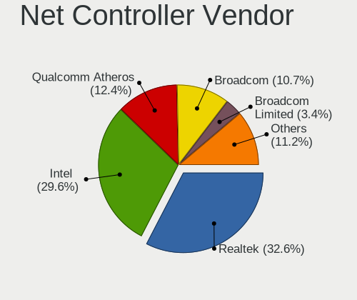

| Vendor                            | Notebooks | Percent |
|-----------------------------------|-----------|---------|
| Realtek Semiconductor             | 38        | 31.4%   |
| Intel                             | 34        | 28.1%   |
| Broadcom                          | 15        | 12.4%   |
| Qualcomm Atheros                  | 12        | 9.92%   |
| Broadcom Limited                  | 5         | 4.13%   |
| Ralink Technology                 | 2         | 1.65%   |
| Ralink                            | 2         | 1.65%   |
| MEDIATEK                          | 2         | 1.65%   |
| TP-Link                           | 1         | 0.83%   |
| Samsung Electronics               | 1         | 0.83%   |
| Qualcomm                          | 1         | 0.83%   |
| OPPO Electronics                  | 1         | 0.83%   |
| NEC Computers                     | 1         | 0.83%   |
| Huawei Technologies               | 1         | 0.83%   |
| Hewlett-Packard                   | 1         | 0.83%   |
| Google                            | 1         | 0.83%   |
| Ericsson Business Mobile Networks | 1         | 0.83%   |
| DisplayLink                       | 1         | 0.83%   |
| Attansic Technology               | 1         | 0.83%   |

Net Controller Model
--------------------

Controller models

| Model                                                             | Notebooks | Percent |
|-------------------------------------------------------------------|-----------|---------|
| Realtek RTL8111/8168/8411 PCI Express Gigabit Ethernet Controller | 22        | 15.28%  |
| Realtek RTL810xE PCI Express Fast Ethernet controller             | 6         | 4.17%   |
| Broadcom BCM4331 802.11a/b/g/n                                    | 6         | 4.17%   |
| Qualcomm Atheros QCA9565 / AR9565 Wireless Network Adapter        | 4         | 2.78%   |
| Qualcomm Atheros QCA9377 802.11ac Wireless Network Adapter        | 4         | 2.78%   |
| Intel Wi-Fi 6 AX200                                               | 4         | 2.78%   |
| Intel 82579LM Gigabit Network Connection (Lewisville)             | 4         | 2.78%   |
| Broadcom NetXtreme BCM57765 Gigabit Ethernet PCIe                 | 4         | 2.78%   |
| Intel Wireless 7265                                               | 3         | 2.08%   |
| Intel Centrino Advanced-N 6205 [Taylor Peak]                      | 3         | 2.08%   |
| Intel 82577LM Gigabit Network Connection                          | 3         | 2.08%   |
| Broadcom Limited BCM4360 802.11ac Wireless Network Adapter        | 3         | 2.08%   |
| Realtek RTL8822CE 802.11ac PCIe Wireless Network Adapter          | 2         | 1.39%   |
| Realtek RTL8822BE 802.11a/b/g/n/ac WiFi adapter                   | 2         | 1.39%   |
| Realtek RTL8821CE 802.11ac PCIe Wireless Network Adapter          | 2         | 1.39%   |
| Realtek RTL8723DE Wireless Network Adapter                        | 2         | 1.39%   |
| Realtek RTL8191SEvB Wireless LAN Controller                       | 2         | 1.39%   |
| Realtek RTL8153 Gigabit Ethernet Adapter                          | 2         | 1.39%   |
| Intel Wireless 8260                                               | 2         | 1.39%   |
| Intel Wireless 7260                                               | 2         | 1.39%   |
| Intel Wireless 3165                                               | 2         | 1.39%   |
| Intel Wireless 3160                                               | 2         | 1.39%   |
| Broadcom NetXtreme BCM57786 Gigabit Ethernet PCIe                 | 2         | 1.39%   |
| Broadcom NetXtreme BCM57762 Gigabit Ethernet PCIe                 | 2         | 1.39%   |
| Broadcom BCM43142 802.11b/g/n                                     | 2         | 1.39%   |
| TP-Link TL-WN722N v2/v3 [Realtek RTL8188EUS]                      | 1         | 0.69%   |
| Samsung GT-I9070 (network tethering, USB debugging enabled)       | 1         | 0.69%   |
| Realtek RTL8852AE 802.11ax PCIe Wireless Network Adapter          | 1         | 0.69%   |
| Realtek RTL8188CE 802.11b/g/n WiFi Adapter                        | 1         | 0.69%   |
| Ralink RT5370 Wireless Adapter                                    | 1         | 0.69%   |
| Ralink MT7601U Wireless Adapter                                   | 1         | 0.69%   |
| Ralink RT3290 Wireless 802.11n 1T/1R PCIe                         | 1         | 0.69%   |
| Ralink RT2800 802.11n PCI                                         | 1         | 0.69%   |
| Qualcomm Mobile Router                                            | 1         | 0.69%   |
| Qualcomm Atheros QCA6174 802.11ac Wireless Network Adapter        | 1         | 0.69%   |
| Qualcomm Atheros Killer E220x Gigabit Ethernet Controller         | 1         | 0.69%   |
| Qualcomm Atheros AR93xx Wireless Network Adapter                  | 1         | 0.69%   |
| Qualcomm Atheros AR9285 Wireless Network Adapter (PCI-Express)    | 1         | 0.69%   |
| Qualcomm Atheros AR8132 Fast Ethernet                             | 1         | 0.69%   |
| OPPO SDM712-MTP _SN:E0B69F21                                      | 1         | 0.69%   |
| NEC Computers WiMAX Mobile Router                                 | 1         | 0.69%   |
| MEDIATEK Network controller                                       | 1         | 0.69%   |
| MediaTek moto g(8) power lite                                     | 1         | 0.69%   |
| Intel Wireless 8265 / 8275                                        | 1         | 0.69%   |
| Intel Wi-Fi 6 AX201                                               | 1         | 0.69%   |
| Intel Ultimate N WiFi Link 5300                                   | 1         | 0.69%   |
| Intel Tiger Lake PCH CNVi WiFi                                    | 1         | 0.69%   |
| Intel PRO/Wireless 3945ABG [Golan] Network Connection             | 1         | 0.69%   |
| Intel PRO/100 VE Network Connection                               | 1         | 0.69%   |
| Intel Ethernet Connection I219-LM                                 | 1         | 0.69%   |
| Intel Ethernet Connection I218-LM                                 | 1         | 0.69%   |
| Intel Ethernet Connection I217-LM                                 | 1         | 0.69%   |
| Intel Ethernet Connection (4) I219-LM                             | 1         | 0.69%   |
| Intel Ethernet Connection (3) I218-LM                             | 1         | 0.69%   |
| Intel Dual Band Wireless-AC 3165 Plus Bluetooth                   | 1         | 0.69%   |
| Intel Comet Lake PCH-LP CNVi WiFi                                 | 1         | 0.69%   |
| Intel Centrino Wireless-N 2230                                    | 1         | 0.69%   |
| Intel Centrino Advanced-N 6235                                    | 1         | 0.69%   |
| Intel Centrino Advanced-N 6230 [Rainbow Peak]                     | 1         | 0.69%   |
| Intel Centrino Advanced-N 6200                                    | 1         | 0.69%   |

Wireless Vendor
---------------

Wireless vendors

| Vendor                | Notebooks | Percent |
|-----------------------|-----------|---------|
| Intel                 | 30        | 38.96%  |
| Broadcom              | 13        | 16.88%  |
| Realtek Semiconductor | 12        | 15.58%  |
| Qualcomm Atheros      | 11        | 14.29%  |
| Broadcom Limited      | 5         | 6.49%   |
| Ralink Technology     | 2         | 2.6%    |
| Ralink                | 2         | 2.6%    |
| TP-Link               | 1         | 1.3%    |
| MEDIATEK              | 1         | 1.3%    |

Wireless Model
--------------

Wireless models

| Model                                                          | Notebooks | Percent |
|----------------------------------------------------------------|-----------|---------|
| Broadcom BCM4331 802.11a/b/g/n                                 | 6         | 7.79%   |
| Qualcomm Atheros QCA9565 / AR9565 Wireless Network Adapter     | 4         | 5.19%   |
| Qualcomm Atheros QCA9377 802.11ac Wireless Network Adapter     | 4         | 5.19%   |
| Intel Wi-Fi 6 AX200                                            | 4         | 5.19%   |
| Intel Wireless 7265                                            | 3         | 3.9%    |
| Intel Centrino Advanced-N 6205 [Taylor Peak]                   | 3         | 3.9%    |
| Broadcom Limited BCM4360 802.11ac Wireless Network Adapter     | 3         | 3.9%    |
| Realtek RTL8822CE 802.11ac PCIe Wireless Network Adapter       | 2         | 2.6%    |
| Realtek RTL8822BE 802.11a/b/g/n/ac WiFi adapter                | 2         | 2.6%    |
| Realtek RTL8821CE 802.11ac PCIe Wireless Network Adapter       | 2         | 2.6%    |
| Realtek RTL8723DE Wireless Network Adapter                     | 2         | 2.6%    |
| Realtek RTL8191SEvB Wireless LAN Controller                    | 2         | 2.6%    |
| Intel Wireless 8260                                            | 2         | 2.6%    |
| Intel Wireless 7260                                            | 2         | 2.6%    |
| Intel Wireless 3165                                            | 2         | 2.6%    |
| Intel Wireless 3160                                            | 2         | 2.6%    |
| Broadcom BCM43142 802.11b/g/n                                  | 2         | 2.6%    |
| TP-Link TL-WN722N v2/v3 [Realtek RTL8188EUS]                   | 1         | 1.3%    |
| Realtek RTL8852AE 802.11ax PCIe Wireless Network Adapter       | 1         | 1.3%    |
| Realtek RTL8188CE 802.11b/g/n WiFi Adapter                     | 1         | 1.3%    |
| Ralink RT5370 Wireless Adapter                                 | 1         | 1.3%    |
| Ralink MT7601U Wireless Adapter                                | 1         | 1.3%    |
| Ralink RT3290 Wireless 802.11n 1T/1R PCIe                      | 1         | 1.3%    |
| Ralink RT2800 802.11n PCI                                      | 1         | 1.3%    |
| Qualcomm Atheros QCA6174 802.11ac Wireless Network Adapter     | 1         | 1.3%    |
| Qualcomm Atheros AR93xx Wireless Network Adapter               | 1         | 1.3%    |
| Qualcomm Atheros AR9285 Wireless Network Adapter (PCI-Express) | 1         | 1.3%    |
| MEDIATEK Network controller                                    | 1         | 1.3%    |
| Intel Wireless 8265 / 8275                                     | 1         | 1.3%    |
| Intel Wi-Fi 6 AX201                                            | 1         | 1.3%    |
| Intel Ultimate N WiFi Link 5300                                | 1         | 1.3%    |
| Intel Tiger Lake PCH CNVi WiFi                                 | 1         | 1.3%    |
| Intel PRO/Wireless 3945ABG [Golan] Network Connection          | 1         | 1.3%    |
| Intel Dual Band Wireless-AC 3165 Plus Bluetooth                | 1         | 1.3%    |
| Intel Comet Lake PCH-LP CNVi WiFi                              | 1         | 1.3%    |
| Intel Centrino Wireless-N 2230                                 | 1         | 1.3%    |
| Intel Centrino Advanced-N 6235                                 | 1         | 1.3%    |
| Intel Centrino Advanced-N 6230 [Rainbow Peak]                  | 1         | 1.3%    |
| Intel Centrino Advanced-N 6200                                 | 1         | 1.3%    |
| Intel Cannon Point-LP CNVi [Wireless-AC]                       | 1         | 1.3%    |
| Broadcom Limited BCM4352 802.11ac Wireless Network Adapter     | 1         | 1.3%    |
| Broadcom Limited BCM4311 802.11b/g WLAN                        | 1         | 1.3%    |
| Broadcom BCM4352 802.11ac Wireless Network Adapter             | 1         | 1.3%    |
| Broadcom BCM43228 802.11a/b/g/n                                | 1         | 1.3%    |
| Broadcom BCM4322 802.11a/b/g/n Wireless LAN Controller         | 1         | 1.3%    |
| Broadcom BCM4313 802.11bgn Wireless Network Adapter            | 1         | 1.3%    |
| Broadcom BCM4312 802.11b/g LP-PHY                              | 1         | 1.3%    |

Ethernet Vendor
---------------

Ethernet vendors

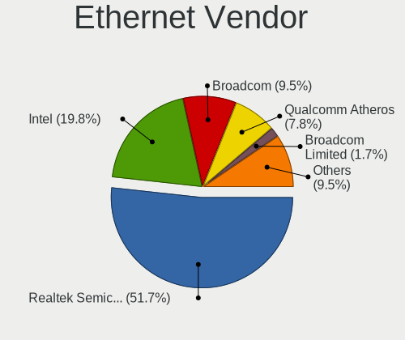

| Vendor                | Notebooks | Percent |
|-----------------------|-----------|---------|
| Realtek Semiconductor | 30        | 48.39%  |
| Intel                 | 14        | 22.58%  |
| Broadcom              | 9         | 14.52%  |
| Qualcomm Atheros      | 2         | 3.23%   |
| Samsung Electronics   | 1         | 1.61%   |
| Qualcomm              | 1         | 1.61%   |
| OPPO Electronics      | 1         | 1.61%   |
| MediaTek              | 1         | 1.61%   |
| Google                | 1         | 1.61%   |
| DisplayLink           | 1         | 1.61%   |
| Attansic Technology   | 1         | 1.61%   |

Ethernet Model
--------------

Ethernet models

| Model                                                             | Notebooks | Percent |
|-------------------------------------------------------------------|-----------|---------|
| Realtek RTL8111/8168/8411 PCI Express Gigabit Ethernet Controller | 22        | 34.92%  |
| Realtek RTL810xE PCI Express Fast Ethernet controller             | 6         | 9.52%   |
| Intel 82579LM Gigabit Network Connection (Lewisville)             | 4         | 6.35%   |
| Broadcom NetXtreme BCM57765 Gigabit Ethernet PCIe                 | 4         | 6.35%   |
| Intel 82577LM Gigabit Network Connection                          | 3         | 4.76%   |
| Realtek RTL8153 Gigabit Ethernet Adapter                          | 2         | 3.17%   |
| Broadcom NetXtreme BCM57786 Gigabit Ethernet PCIe                 | 2         | 3.17%   |
| Broadcom NetXtreme BCM57762 Gigabit Ethernet PCIe                 | 2         | 3.17%   |
| Samsung GT-I9070 (network tethering, USB debugging enabled)       | 1         | 1.59%   |
| Qualcomm Mobile Router                                            | 1         | 1.59%   |
| Qualcomm Atheros Killer E220x Gigabit Ethernet Controller         | 1         | 1.59%   |
| Qualcomm Atheros AR8132 Fast Ethernet                             | 1         | 1.59%   |
| OPPO SDM712-MTP _SN:E0B69F21                                      | 1         | 1.59%   |
| MediaTek moto g(8) power lite                                     | 1         | 1.59%   |
| Intel PRO/100 VE Network Connection                               | 1         | 1.59%   |
| Intel Ethernet Connection I219-LM                                 | 1         | 1.59%   |
| Intel Ethernet Connection I218-LM                                 | 1         | 1.59%   |
| Intel Ethernet Connection I217-LM                                 | 1         | 1.59%   |
| Intel Ethernet Connection (4) I219-LM                             | 1         | 1.59%   |
| Intel Ethernet Connection (3) I218-LM                             | 1         | 1.59%   |
| Intel 82567LM Gigabit Network Connection                          | 1         | 1.59%   |
| Google Nexus/Pixel Device (tether)                                | 1         | 1.59%   |
| DisplayLink USB-C Hybrid UHD Video Dock                           | 1         | 1.59%   |
| Broadcom NetXtreme BCM5764M Gigabit Ethernet PCIe                 | 1         | 1.59%   |
| Broadcom NetLink BCM5784M Gigabit Ethernet PCIe                   | 1         | 1.59%   |
| Attansic AR8152 v2.0 Fast Ethernet                                | 1         | 1.59%   |

Net Controller Kind
-------------------

Ethernet, WiFi or modem

| Kind     | Notebooks | Percent |
|----------|-----------|---------|
| WiFi     | 73        | 54.89%  |
| Ethernet | 56        | 42.11%  |
| Modem    | 3         | 2.26%   |
| Unknown  | 1         | 0.75%   |

Used Controller
---------------

Currently used network controller

| Kind     | Notebooks | Percent |
|----------|-----------|---------|
| WiFi     | 66        | 57.89%  |
| Ethernet | 48        | 42.11%  |

NICs
----

Total network controllers on board

| Total | Notebooks | Percent |
|-------|-----------|---------|
| 2     | 52        | 70.27%  |
| 1     | 21        | 28.38%  |
| 3     | 1         | 1.35%   |

IPv6
----

IPv6 vs IPv4

| Used | Notebooks | Percent |
|------|-----------|---------|
| No   | 58        | 78.38%  |
| Yes  | 16        | 21.62%  |

Bluetooth
---------

Bluetooth Vendor
----------------

Controller vendors

| Vendor                          | Notebooks | Percent |
|---------------------------------|-----------|---------|
| Intel                           | 24        | 36.36%  |
| Apple                           | 10        | 15.15%  |
| Realtek Semiconductor           | 7         | 10.61%  |
| Broadcom                        | 6         | 9.09%   |
| Qualcomm Atheros Communications | 5         | 7.58%   |
| Lite-On Technology              | 5         | 7.58%   |
| IMC Networks                    | 3         | 4.55%   |
| Foxconn / Hon Hai               | 2         | 3.03%   |
| Dell                            | 2         | 3.03%   |
| Ralink                          | 1         | 1.52%   |
| Hewlett-Packard                 | 1         | 1.52%   |

Bluetooth Model
---------------

Controller models

| Model                                              | Notebooks | Percent |
|----------------------------------------------------|-----------|---------|
| Intel Bluetooth wireless interface                 | 10        | 15.15%  |
| Intel Bluetooth Device                             | 6         | 9.09%   |
| Apple Bluetooth USB Host Controller                | 5         | 7.58%   |
| Apple Bluetooth Host Controller                    | 5         | 7.58%   |
| Intel AX200 Bluetooth                              | 4         | 6.06%   |
| Realtek  Bluetooth 4.2 Adapter                     | 3         | 4.55%   |
| Realtek Bluetooth Radio                            | 3         | 4.55%   |
| Qualcomm Atheros  Bluetooth Device                 | 3         | 4.55%   |
| Broadcom BCM20702 Bluetooth 4.0 [ThinkPad]         | 3         | 4.55%   |
| Lite-On Bluetooth Device                           | 2         | 3.03%   |
| Intel Bluetooth 9460/9560 Jefferson Peak (JfP)     | 2         | 3.03%   |
| Intel AX201 Bluetooth                              | 2         | 3.03%   |
| IMC Networks Bluetooth Radio                       | 2         | 3.03%   |
| Broadcom BCM43142A0 Bluetooth 4.0                  | 2         | 3.03%   |
| Realtek RTL8822BE Bluetooth 4.2 Adapter            | 1         | 1.52%   |
| Ralink RT3290 Bluetooth                            | 1         | 1.52%   |
| Qualcomm Atheros AR3012 Bluetooth 4.0              | 1         | 1.52%   |
| Qualcomm Atheros AR3011 Bluetooth                  | 1         | 1.52%   |
| Lite-On Wireless_Device                            | 1         | 1.52%   |
| Lite-On Qualcomm Atheros Bluetooth                 | 1         | 1.52%   |
| Lite-On Atheros AR3012 Bluetooth                   | 1         | 1.52%   |
| IMC Networks BCM20702A0                            | 1         | 1.52%   |
| HP Broadcom 2070 Bluetooth Combo                   | 1         | 1.52%   |
| Foxconn / Hon Hai Bluetooth Device                 | 1         | 1.52%   |
| Foxconn / Hon Hai BCM20702A0                       | 1         | 1.52%   |
| Dell DW375 Bluetooth Module                        | 1         | 1.52%   |
| Dell Broadcom BCM20702A0 Bluetooth                 | 1         | 1.52%   |
| Broadcom BCM2045B (BDC-2.1) [Bluetooth Controller] | 1         | 1.52%   |

Sound
-----

Sound Vendor
------------

Sound card vendors

| Vendor | Notebooks | Percent |
|--------|-----------|---------|
| Intel  | 65        | 75.58%  |
| Nvidia | 10        | 11.63%  |
| AMD    | 9         | 10.47%  |
| TEAC   | 1         | 1.16%   |
| JMTek  | 1         | 1.16%   |

Sound Model
-----------

Sound card models

| Model                                                                                             | Notebooks | Percent |
|---------------------------------------------------------------------------------------------------|-----------|---------|
| Intel Sunrise Point-LP HD Audio                                                                   | 14        | 13.59%  |
| Intel 7 Series/C216 Chipset Family High Definition Audio Controller                               | 8         | 7.77%   |
| Intel 6 Series/C200 Series Chipset Family High Definition Audio Controller                        | 5         | 4.85%   |
| Intel Haswell-ULT HD Audio Controller                                                             | 4         | 3.88%   |
| Intel 82801I (ICH9 Family) HD Audio Controller                                                    | 4         | 3.88%   |
| Intel 8 Series HD Audio Controller                                                                | 4         | 3.88%   |
| Intel 5 Series/3400 Series Chipset High Definition Audio                                          | 4         | 3.88%   |
| AMD Family 17h (Models 10h-1fh) HD Audio Controller                                               | 4         | 3.88%   |
| Nvidia GK107 HDMI Audio Controller                                                                | 3         | 2.91%   |
| Intel Wildcat Point-LP High Definition Audio Controller                                           | 3         | 2.91%   |
| Intel Tiger Lake-LP Smart Sound Technology Audio Controller                                       | 3         | 2.91%   |
| Intel Broadwell-U Audio Controller                                                                | 3         | 2.91%   |
| Intel Atom/Celeron/Pentium Processor x5-E8000/J3xxx/N3xxx Series High Definition Audio Controller | 3         | 2.91%   |
| Intel 8 Series/C220 Series Chipset High Definition Audio Controller                               | 3         | 2.91%   |
| Nvidia TU107 GeForce GTX 1650 High Definition Audio Controller                                    | 2         | 1.94%   |
| Intel Xeon E3-1200 v3/4th Gen Core Processor HD Audio Controller                                  | 2         | 1.94%   |
| Intel CM238 HD Audio Controller                                                                   | 2         | 1.94%   |
| Intel Celeron/Pentium Silver Processor High Definition Audio                                      | 2         | 1.94%   |
| Intel Cannon Point-LP High Definition Audio Controller                                            | 2         | 1.94%   |
| Intel Atom Processor Z36xxx/Z37xxx Series High Definition Audio Controller                        | 2         | 1.94%   |
| AMD SBx00 Azalia (Intel HDA)                                                                      | 2         | 1.94%   |
| AMD Renoir Radeon High Definition Audio Controller                                                | 2         | 1.94%   |
| TEAC TASCAM iXR                                                                                   | 1         | 0.97%   |
| Nvidia stereo controller                                                                          | 1         | 0.97%   |
| Nvidia MCP89 High Definition Audio                                                                | 1         | 0.97%   |
| Nvidia GP107GL High Definition Audio Controller                                                   | 1         | 0.97%   |
| Nvidia GM107 High Definition Audio Controller [GeForce 940MX]                                     | 1         | 0.97%   |
| Nvidia GK106 HDMI Audio Controller                                                                | 1         | 0.97%   |
| Nvidia GA104 High Definition Audio Controller                                                     | 1         | 0.97%   |
| JMTek audio controller                                                                            | 1         | 0.97%   |
| Intel Tiger Lake-H HD Audio Controller                                                            | 1         | 0.97%   |
| Intel NM10/ICH7 Family High Definition Audio Controller                                           | 1         | 0.97%   |
| Intel Ice Lake-LP Smart Sound Technology Audio Controller                                         | 1         | 0.97%   |
| Intel Comet Lake PCH-LP cAVS                                                                      | 1         | 0.97%   |
| Intel Cannon Lake PCH cAVS                                                                        | 1         | 0.97%   |
| Intel 82801H (ICH8 Family) HD Audio Controller                                                    | 1         | 0.97%   |
| AMD Wrestler HDMI Audio                                                                           | 1         | 0.97%   |
| AMD RS880 HDMI Audio [Radeon HD 4200 Series]                                                      | 1         | 0.97%   |
| AMD Raven/Raven2/Fenghuang HDMI/DP Audio Controller                                               | 1         | 0.97%   |
| AMD Kabini HDMI/DP Audio                                                                          | 1         | 0.97%   |
| AMD High Definition Audio Controller                                                              | 1         | 0.97%   |
| AMD FCH Azalia Controller                                                                         | 1         | 0.97%   |
| AMD Family 15h (Models 60h-6fh) Audio Controller                                                  | 1         | 0.97%   |
| AMD Caicos HDMI Audio [Radeon HD 6450 / 7450/8450/8490 OEM / R5 230/235/235X OEM]                 | 1         | 0.97%   |

Memory
------

Memory Vendor
-------------

Memory module vendors

| Vendor              | Notebooks | Percent |
|---------------------|-----------|---------|
| Samsung Electronics | 12        | 32.43%  |
| Micron Technology   | 7         | 18.92%  |
| SK Hynix            | 6         | 16.22%  |
| Kingston            | 5         | 13.51%  |
| Ramaxel Technology  | 2         | 5.41%   |
| Crucial             | 2         | 5.41%   |
| Unknown             | 1         | 2.7%    |
| Toshiba             | 1         | 2.7%    |
| Qimonda             | 1         | 2.7%    |

Memory Model
------------

Memory module models

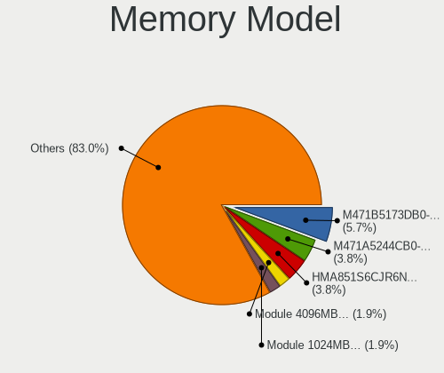

| Model                                                         | Notebooks | Percent |
|---------------------------------------------------------------|-----------|---------|
| Samsung RAM M471B5173DB0-YK0 4GB SODIMM DDR3 1600MT/s         | 3         | 7.69%   |
| SK Hynix RAM HMA851S6CJR6N-VK 4GB SODIMM DDR4 2667MT/s        | 2         | 5.13%   |
| Samsung RAM M471A5244CB0-CRC 4GB SODIMM DDR4 2667MT/s         | 2         | 5.13%   |
| Unknown RAM Module 1024MB SODIMM LPDDR4 2400MT/s              | 1         | 2.56%   |
| Toshiba RAM 8HTF12864HDY-800G1 2048MB SODIMM 1066MT/s         | 1         | 2.56%   |
| Toshiba RAM 64T128020EDL2.5C2 2048MB SODIMM 1066MT/s          | 1         | 2.56%   |
| SK Hynix RAM HMT451S6BFR8A-PB 4GB SODIMM DDR3 1600MT/s        | 1         | 2.56%   |
| SK Hynix RAM HMT41GS6BFR8A-PB 8192MB SODIMM DDR3 1600MT/s     | 1         | 2.56%   |
| SK Hynix RAM HMT325S6CFR8C-PB 2GB SODIMM DDR3 1600MT/s        | 1         | 2.56%   |
| SK Hynix RAM HMA81GS6JJR8N-VK 8192MB SODIMM DDR4 2667MT/s     | 1         | 2.56%   |
| Samsung RAM Module 8192MB SODIMM DDR4 2133MT/s                | 1         | 2.56%   |
| Samsung RAM M471B5773CHS-CH9 2048MB SODIMM DDR3 4199MT/s      | 1         | 2.56%   |
| Samsung RAM M471B5673FH0-CF8 2GB SODIMM DDR3 1067MT/s         | 1         | 2.56%   |
| Samsung RAM M471B5273CH0-CH9 4096MB SODIMM DDR3 1334MT/s      | 1         | 2.56%   |
| Samsung RAM M471B5173QH0-YK0 4GB SODIMM DDR3 1600MT/s         | 1         | 2.56%   |
| Samsung RAM M471B2873FHS-CF8 1024MB SODIMM DDR3 1067MT/s      | 1         | 2.56%   |
| Samsung RAM M471A2G43AB2-CWE 16GB SODIMM DDR4 3200MT/s        | 1         | 2.56%   |
| Samsung RAM M4 70T5663EH3-CF7 2048MB SODIMM DDR2 667MT/s      | 1         | 2.56%   |
| Ramaxel RAM RMT3170EF68F9W1600 4096MB SODIMM DDR3 1600MT/s    | 1         | 2.56%   |
| Ramaxel RAM RMSA3310NA86H9F-2666 4GB SODIMM DDR4 2667MT/s     | 1         | 2.56%   |
| Qimonda RAM 64T256020EDL2.5C2 2048MB SODIMM DDR2 2048MT/s     | 1         | 2.56%   |
| Micron RAM MT41K256M16LY 2GB SODIMM DDR3 1600MT/s             | 1         | 2.56%   |
| Micron RAM Module 4096MB SODIMM DDR3 1600MT/s                 | 1         | 2.56%   |
| Micron RAM Module 2048MB SODIMM DDR3 1600MT/s                 | 1         | 2.56%   |
| Micron RAM 8ATF1G64HZ-2G6H1 8GB SODIMM DDR4 2667MT/s          | 1         | 2.56%   |
| Micron RAM 4ATF51264HZ-2G6E3 4096MB SODIMM DDR4 2667MT/s      | 1         | 2.56%   |
| Micron RAM 16JSF25664HZ-1G4F1 2048MB SODIMM 1334MT/s          | 1         | 2.56%   |
| Micron RAM 16ATF2G64HZ-3G2J1 16384MB SODIMM DDR4 3200MT/s     | 1         | 2.56%   |
| Kingston RAM KHX2666C15S4/8G 8192MB SODIMM DDR4 2667MT/s      | 1         | 2.56%   |
| Kingston RAM HP16D3LS1KBG/8G 8192MB SODIMM DDR3 1600MT/s      | 1         | 2.56%   |
| Kingston RAM ACR16D3LS1KFG/8G 8192MB SODIMM DDR3 1600MT/s     | 1         | 2.56%   |
| Kingston RAM 9905700-070.A01G 16GB SODIMM DDR4 2667MT/s       | 1         | 2.56%   |
| Kingston RAM 9905700-026.A00G 8GB SODIMM DDR4 2667MT/s        | 1         | 2.56%   |
| Crucial RAM CT16G4SFRA32A.M16FRS 16GB SODIMM DDR4 3200MT/s    | 1         | 2.56%   |
| Crucial RAM CT16G4SFD824A.C16FDD 16384MB SODIMM DDR4 2400MT/s | 1         | 2.56%   |

Memory Kind
-----------

Memory module kinds

| Kind   | Notebooks | Percent |
|--------|-----------|---------|
| DDR4   | 12        | 44.44%  |
| DDR3   | 11        | 40.74%  |
| SDRAM  | 2         | 7.41%   |
| LPDDR4 | 1         | 3.7%    |
| DDR2   | 1         | 3.7%    |

Memory Form Factor
------------------

Physical design of the memory module

| Name   | Notebooks | Percent |
|--------|-----------|---------|
| SODIMM | 27        | 100%    |

Memory Size
-----------

Memory module size

| Size  | Notebooks | Percent |
|-------|-----------|---------|
| 4096  | 12        | 37.5%   |
| 8192  | 7         | 21.88%  |
| 2048  | 7         | 21.88%  |
| 16384 | 4         | 12.5%   |
| 1024  | 2         | 6.25%   |

Memory Speed
------------

Memory module speed

| Speed | Notebooks | Percent |
|-------|-----------|---------|
| 2667  | 10        | 33.33%  |
| 1600  | 9         | 30%     |
| 3200  | 3         | 10%     |
| 2400  | 2         | 6.67%   |
| 4199  | 1         | 3.33%   |
| 2133  | 1         | 3.33%   |
| 2048  | 1         | 3.33%   |
| 1334  | 1         | 3.33%   |
| 1067  | 1         | 3.33%   |
| 1066  | 1         | 3.33%   |

Printers & scanners
-------------------

Printer Vendor
--------------

Printer device vendors

| Vendor             | Notebooks | Percent |
|--------------------|-----------|---------|
| Hewlett-Packard    | 1         | 50%     |
| Brother Industries | 1         | 50%     |

Printer Model
-------------

Printer device models

| Model                   | Notebooks | Percent |
|-------------------------|-----------|---------|
| HP Deskjet F4500 series | 1         | 50%     |
| Brother MFC-T800W       | 1         | 50%     |

Scanner Vendor
--------------

Scanner device vendors

Zero info for selected period =(

Scanner Model
-------------

Scanner device models

Zero info for selected period =(

Camera
------

Camera Vendor
-------------

Camera device vendors

| Vendor                                 | Notebooks | Percent |
|----------------------------------------|-----------|---------|
| Chicony Electronics                    | 15        | 24.59%  |
| Apple                                  | 8         | 13.11%  |
| Realtek Semiconductor                  | 5         | 8.2%    |
| Quanta                                 | 5         | 8.2%    |
| Acer                                   | 5         | 8.2%    |
| Microdia                               | 4         | 6.56%   |
| Suyin                                  | 3         | 4.92%   |
| Sunplus Innovation Technology          | 3         | 4.92%   |
| Cheng Uei Precision Industry (Foxlink) | 3         | 4.92%   |
| Syntek                                 | 2         | 3.28%   |
| Luxvisions Innotech Limited            | 2         | 3.28%   |
| webcam vendor                          | 1         | 1.64%   |
| Primax Electronics                     | 1         | 1.64%   |
| Lite-On Technology                     | 1         | 1.64%   |
| Lenovo                                 | 1         | 1.64%   |
| Importek                               | 1         | 1.64%   |
| IMC Networks                           | 1         | 1.64%   |

Camera Model
------------

Camera device models

| Model                                                           | Notebooks | Percent |
|-----------------------------------------------------------------|-----------|---------|
| Apple FaceTime HD Camera                                        | 4         | 6.56%   |
| Realtek HD WebCam                                               | 3         | 4.92%   |
| Chicony Integrated Camera                                       | 3         | 4.92%   |
| Chicony HP Truevision HD                                        | 3         | 4.92%   |
| Suyin Acer/HP Integrated Webcam [CN0314]                        | 2         | 3.28%   |
| Quanta HP TrueVision HD Camera                                  | 2         | 3.28%   |
| Microdia Integrated Webcam HD                                   | 2         | 3.28%   |
| Chicony HD WebCam                                               | 2         | 3.28%   |
| Apple FaceTime HD Camera (Built-in)                             | 2         | 3.28%   |
| Acer Lenovo EasyCamera                                          | 2         | 3.28%   |
| webcam vendor webcam product                                    | 1         | 1.64%   |
| Syntek Integrated Camera                                        | 1         | 1.64%   |
| Syntek EasyCamera                                               | 1         | 1.64%   |
| Suyin Asus Integrated Webcam                                    | 1         | 1.64%   |
| Sunplus Laptop_Integrated_Webcam_HD                             | 1         | 1.64%   |
| Sunplus Laptop_Integrated_Webcam_1.3M                           | 1         | 1.64%   |
| Sunplus HD WebCam                                               | 1         | 1.64%   |
| Realtek Integrated_Webcam_HD                                    | 1         | 1.64%   |
| Realtek Integrated Camera                                       | 1         | 1.64%   |
| Quanta HP Webcam                                                | 1         | 1.64%   |
| Quanta HD User Facing                                           | 1         | 1.64%   |
| Quanta HD Camera                                                | 1         | 1.64%   |
| Primax Villem                                                   | 1         | 1.64%   |
| Microdia Laptop_Integrated_Webcam_FHD                           | 1         | 1.64%   |
| Microdia Integrated Webcam                                      | 1         | 1.64%   |
| Luxvisions Innotech Limited HP TrueVision HD Camera             | 1         | 1.64%   |
| Luxvisions Innotech Limited HP HD Camera                        | 1         | 1.64%   |
| Lite-On Integrated Camera                                       | 1         | 1.64%   |
| Lenovo Integrated Webcam                                        | 1         | 1.64%   |
| Importek Webcam HD                                              | 1         | 1.64%   |
| IMC Networks USB2.0 VGA UVC WebCam                              | 1         | 1.64%   |
| Chicony USB2.0 Camera                                           | 1         | 1.64%   |
| Chicony Integrated HP HD Webcam                                 | 1         | 1.64%   |
| Chicony HP Wide Vision HD                                       | 1         | 1.64%   |
| Chicony HP Webcam-101                                           | 1         | 1.64%   |
| Chicony HP Webcam                                               | 1         | 1.64%   |
| Chicony HP HD Webcam [Fixed]                                    | 1         | 1.64%   |
| Chicony HD User Facing                                          | 1         | 1.64%   |
| Cheng Uei Precision Industry (Foxlink) HP Wide Vision HD Camera | 1         | 1.64%   |
| Cheng Uei Precision Industry (Foxlink) HP TrueVision HD Camera  | 1         | 1.64%   |
| Cheng Uei Precision Industry (Foxlink) HP HD Camera             | 1         | 1.64%   |
| Apple iPhone 5/5C/5S/6/SE                                       | 1         | 1.64%   |
| Apple Built-in iSight                                           | 1         | 1.64%   |
| Acer ThinkPad Integrated Camera                                 | 1         | 1.64%   |
| Acer SunplusIT Integrated Camera                                | 1         | 1.64%   |
| Acer HD Webcam                                                  | 1         | 1.64%   |

Security
--------

Fingerprint Vendor
------------------

Fingerprint sensor vendors

| Vendor                | Notebooks | Percent |
|-----------------------|-----------|---------|
| Validity Sensors      | 5         | 45.45%  |
| LighTuning Technology | 3         | 27.27%  |
| Synaptics             | 1         | 9.09%   |
| STMicroelectronics    | 1         | 9.09%   |
| AuthenTec             | 1         | 9.09%   |

Fingerprint Model
-----------------

Fingerprint sensor models

| Model                                       | Notebooks | Percent |
|---------------------------------------------|-----------|---------|
| LighTuning EgisTec Touch Fingerprint Sensor | 3         | 27.27%  |
| Validity Sensors VFS5011 Fingerprint Reader | 1         | 9.09%   |
| Validity Sensors VFS495 Fingerprint Reader  | 1         | 9.09%   |
| Validity Sensors VFS451 Fingerprint Reader  | 1         | 9.09%   |
| Validity Sensors Synaptics WBDI             | 1         | 9.09%   |
| Validity Sensors Swipe Fingerprint Sensor   | 1         | 9.09%   |
| Synaptics  WBDI                             | 1         | 9.09%   |
| STMicroelectronics Fingerprint Reader       | 1         | 9.09%   |
| AuthenTec AES2810                           | 1         | 9.09%   |

Chipcard Vendor
---------------

Chipcard module vendors

| Vendor   | Notebooks | Percent |
|----------|-----------|---------|
| Broadcom | 2         | 66.67%  |
| Upek     | 1         | 33.33%  |

Chipcard Model
--------------

Chipcard module models

| Model                                                                        | Notebooks | Percent |
|------------------------------------------------------------------------------|-----------|---------|
| Upek TouchChip Fingerprint Coprocessor (WBF advanced mode)                   | 1         | 33.33%  |
| Broadcom BCM5880 Secure Applications Processor with fingerprint swipe sensor | 1         | 33.33%  |
| Broadcom BCM5880 Secure Applications Processor                               | 1         | 33.33%  |

Unsupported
-----------

Unsupported Devices
-------------------

Total unsupported devices on board

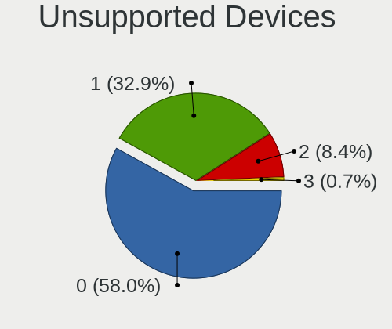

| Total | Notebooks | Percent |
|-------|-----------|---------|
| 0     | 45        | 60.81%  |
| 1     | 24        | 32.43%  |
| 2     | 5         | 6.76%   |

Unsupported Device Types
------------------------

Types of unsupported devices

| Type                  | Notebooks | Percent |
|-----------------------|-----------|---------|
| Fingerprint reader    | 11        | 30.56%  |
| Graphics card         | 7         | 19.44%  |
| Net/wireless          | 6         | 16.67%  |
| Multimedia controller | 4         | 11.11%  |
| Chipcard              | 3         | 8.33%   |
| Net/ethernet          | 2         | 5.56%   |
| Sound                 | 1         | 2.78%   |
| Camera                | 1         | 2.78%   |
| Bluetooth             | 1         | 2.78%   |

