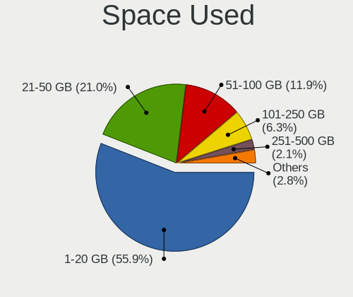
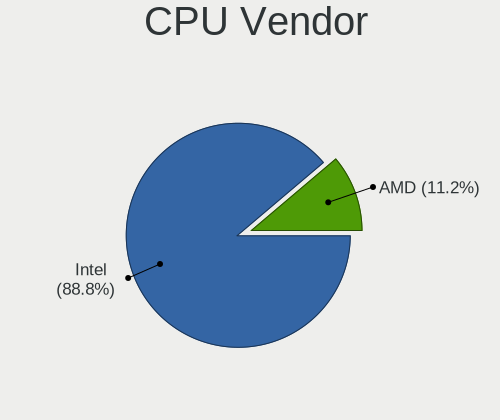
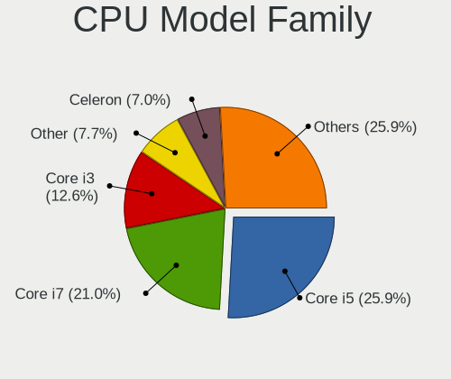
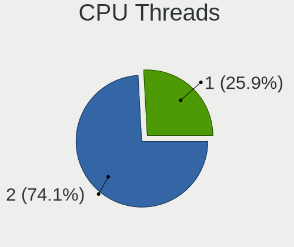
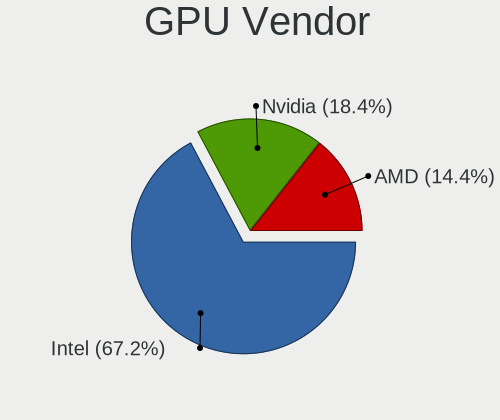
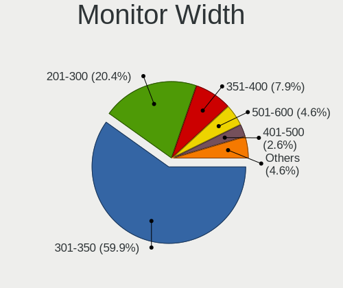
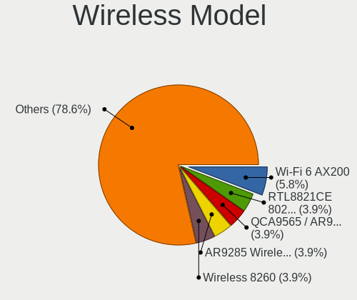
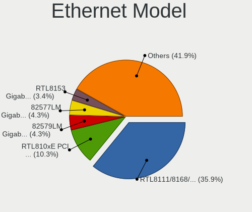
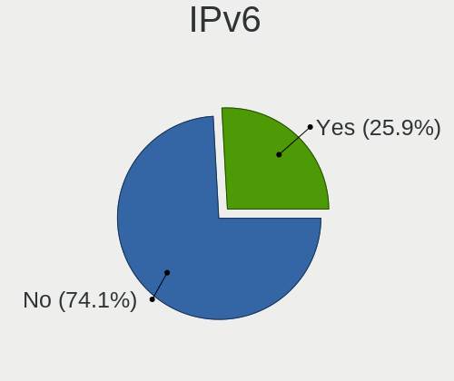

Elementary 6 - Tested Hardware & Statistics (Notebooks)
-------------------------------------------------------

A project to collect tested hardware configurations for Elementary 6.

Anyone can contribute to this report by the [hw-probe](https://github.com/linuxhw/hw-probe) tool:

    sudo -E hw-probe -all -upload

Please submit a probe of your configuration if it's not presented on the page or is rare.

Full-feature report is available here: https://linux-hardware.org/?view=trends

Contents
--------

* [ Test Cases ](#test-cases)

* [ System ](#system)
  - [ Kernel                   ](#kernel)
  - [ Kernel Family            ](#kernel-family)
  - [ Kernel Major Ver.        ](#kernel-major-ver)
  - [ Arch                     ](#arch)
  - [ DE                       ](#de)
  - [ Display Server           ](#display-server)
  - [ Display Manager          ](#display-manager)
  - [ OS Lang                  ](#os-lang)
  - [ Boot Mode                ](#boot-mode)
  - [ Filesystem               ](#filesystem)
  - [ Part. scheme             ](#part-scheme)
  - [ Dual Boot with Linux/BSD ](#dual-boot-with-linuxbsd)
  - [ Dual Boot (Win)          ](#dual-boot-win)

* [ Board ](#board)
  - [ Vendor                   ](#vendor)
  - [ Model                    ](#model)
  - [ Model Family             ](#model-family)
  - [ MFG Year                 ](#mfg-year)
  - [ Form Factor              ](#form-factor)
  - [ Secure Boot              ](#secure-boot)
  - [ Coreboot                 ](#coreboot)
  - [ RAM Size                 ](#ram-size)
  - [ RAM Used                 ](#ram-used)
  - [ Total Drives             ](#total-drives)
  - [ Has CD-ROM               ](#has-cd-rom)
  - [ Has Ethernet             ](#has-ethernet)
  - [ Has WiFi                 ](#has-wifi)
  - [ Has Bluetooth            ](#has-bluetooth)

* [ Location ](#location)
  - [ Country                  ](#country)
  - [ City                     ](#city)

* [ Drives ](#drives)
  - [ Drive Vendor             ](#drive-vendor)
  - [ Drive Model              ](#drive-model)
  - [ HDD Vendor               ](#hdd-vendor)
  - [ SSD Vendor               ](#ssd-vendor)
  - [ Drive Kind               ](#drive-kind)
  - [ Drive Connector          ](#drive-connector)
  - [ Drive Size               ](#drive-size)
  - [ Space Total              ](#space-total)
  - [ Space Used               ](#space-used)
  - [ Malfunc. Drives          ](#malfunc-drives)
  - [ Malfunc. Drive Vendor    ](#malfunc-drive-vendor)
  - [ Malfunc. HDD Vendor      ](#malfunc-hdd-vendor)
  - [ Malfunc. Drive Kind      ](#malfunc-drive-kind)
  - [ Failed Drives            ](#failed-drives)
  - [ Failed Drive Vendor      ](#failed-drive-vendor)
  - [ Drive Status             ](#drive-status)

* [ Storage controller ](#storage-controller)
  - [ Storage Vendor           ](#storage-vendor)
  - [ Storage Model            ](#storage-model)
  - [ Storage Kind             ](#storage-kind)

* [ Processor ](#processor)
  - [ CPU Vendor               ](#cpu-vendor)
  - [ CPU Model                ](#cpu-model)
  - [ CPU Model Family         ](#cpu-model-family)
  - [ CPU Cores                ](#cpu-cores)
  - [ CPU Sockets              ](#cpu-sockets)
  - [ CPU Threads              ](#cpu-threads)
  - [ CPU Op-Modes             ](#cpu-op-modes)
  - [ CPU Microcode            ](#cpu-microcode)
  - [ CPU Microarch            ](#cpu-microarch)

* [ Graphics ](#graphics)
  - [ GPU Vendor               ](#gpu-vendor)
  - [ GPU Model                ](#gpu-model)
  - [ GPU Combo                ](#gpu-combo)
  - [ GPU Driver               ](#gpu-driver)
  - [ GPU Memory               ](#gpu-memory)

* [ Monitor ](#monitor)
  - [ Monitor Vendor           ](#monitor-vendor)
  - [ Monitor Model            ](#monitor-model)
  - [ Monitor Resolution       ](#monitor-resolution)
  - [ Monitor Diagonal         ](#monitor-diagonal)
  - [ Monitor Width            ](#monitor-width)
  - [ Aspect Ratio             ](#aspect-ratio)
  - [ Monitor Area             ](#monitor-area)
  - [ Pixel Density            ](#pixel-density)
  - [ Multiple Monitors        ](#multiple-monitors)

* [ Network ](#network)
  - [ Net Controller Vendor    ](#net-controller-vendor)
  - [ Net Controller Model     ](#net-controller-model)
  - [ Wireless Vendor          ](#wireless-vendor)
  - [ Wireless Model           ](#wireless-model)
  - [ Ethernet Vendor          ](#ethernet-vendor)
  - [ Ethernet Model           ](#ethernet-model)
  - [ Net Controller Kind      ](#net-controller-kind)
  - [ Used Controller          ](#used-controller)
  - [ NICs                     ](#nics)
  - [ IPv6                     ](#ipv6)

* [ Bluetooth ](#bluetooth)
  - [ Bluetooth Vendor         ](#bluetooth-vendor)
  - [ Bluetooth Model          ](#bluetooth-model)

* [ Sound ](#sound)
  - [ Sound Vendor             ](#sound-vendor)
  - [ Sound Model              ](#sound-model)

* [ Memory ](#memory)
  - [ Memory Vendor            ](#memory-vendor)
  - [ Memory Model             ](#memory-model)
  - [ Memory Kind              ](#memory-kind)
  - [ Memory Form Factor       ](#memory-form-factor)
  - [ Memory Size              ](#memory-size)
  - [ Memory Speed             ](#memory-speed)

* [ Printers & scanners ](#printers--scanners)
  - [ Printer Vendor           ](#printer-vendor)
  - [ Printer Model            ](#printer-model)
  - [ Scanner Vendor           ](#scanner-vendor)
  - [ Scanner Model            ](#scanner-model)

* [ Camera ](#camera)
  - [ Camera Vendor            ](#camera-vendor)
  - [ Camera Model             ](#camera-model)

* [ Security ](#security)
  - [ Fingerprint Vendor       ](#fingerprint-vendor)
  - [ Fingerprint Model        ](#fingerprint-model)
  - [ Chipcard Vendor          ](#chipcard-vendor)
  - [ Chipcard Model           ](#chipcard-model)

* [ Unsupported ](#unsupported)
  - [ Unsupported Devices      ](#unsupported-devices)
  - [ Unsupported Device Types ](#unsupported-device-types)

Test Cases
----------

| Vendor        | Model                       | Probe                                                      | Date         |
|---------------|-----------------------------|------------------------------------------------------------|--------------|
| Lenovo        | ThinkPad T410s 292494G      | [f43363fde0](https://linux-hardware.org/?probe=f43363fde0) | Dec 03, 2021 |
| HP            | EliteBook 820 G2            | [03bb5ecc6a](https://linux-hardware.org/?probe=03bb5ecc6a) | Dec 03, 2021 |
| Lenovo        | ThinkPad E14 Gen 3 20Y70... | [68fffd46cf](https://linux-hardware.org/?probe=68fffd46cf) | Dec 01, 2021 |
| Acer          | Aspire 5750G                | [0131556200](https://linux-hardware.org/?probe=0131556200) | Dec 01, 2021 |
| Samsung       | 550XDA                      | [30c24b17f4](https://linux-hardware.org/?probe=30c24b17f4) | Dec 01, 2021 |
| HP            | EliteBook 2760p             | [d13f27ae75](https://linux-hardware.org/?probe=d13f27ae75) | Nov 30, 2021 |
| ASUSTek       | ASUS TUF Dash F15 FX516P... | [5052f33272](https://linux-hardware.org/?probe=5052f33272) | Nov 30, 2021 |
| Google        | Kip                         | [958c198a17](https://linux-hardware.org/?probe=958c198a17) | Nov 29, 2021 |
| Lenovo        | ThinkPad SL400 2743A37      | [26cba9b931](https://linux-hardware.org/?probe=26cba9b931) | Nov 29, 2021 |
| Toshiba       | Satellite L750              | [0a4f8ff5f1](https://linux-hardware.org/?probe=0a4f8ff5f1) | Nov 28, 2021 |
| HP            | Laptop 15s-fq0xxx           | [8b1d090289](https://linux-hardware.org/?probe=8b1d090289) | Nov 28, 2021 |
| HP            | Pavilion dm4                | [e2c582f687](https://linux-hardware.org/?probe=e2c582f687) | Nov 28, 2021 |
| HP            | ProBook 4540s               | [b6762448da](https://linux-hardware.org/?probe=b6762448da) | Nov 28, 2021 |
| Notebook      | L140CU                      | [59021b2a31](https://linux-hardware.org/?probe=59021b2a31) | Nov 27, 2021 |
| Toshiba       | Satellite L840              | [6c29b0fc8d](https://linux-hardware.org/?probe=6c29b0fc8d) | Nov 27, 2021 |
| TUXEDO        | Pulse 15 Gen1               | [c8a72fc7e2](https://linux-hardware.org/?probe=c8a72fc7e2) | Nov 26, 2021 |
| Lenovo        | ThinkPad SL400 2743A37      | [8c0a3a65ba](https://linux-hardware.org/?probe=8c0a3a65ba) | Nov 26, 2021 |
| HP            | EliteBook Folio 1040 G3     | [0004bab911](https://linux-hardware.org/?probe=0004bab911) | Nov 26, 2021 |
| HP            | EliteBook Folio 1040 G3     | [2ef4f4f273](https://linux-hardware.org/?probe=2ef4f4f273) | Nov 26, 2021 |
| Dell          | Inspiron 15-3573            | [04dc1956ff](https://linux-hardware.org/?probe=04dc1956ff) | Nov 26, 2021 |
| Lenovo        | ThinkPad SL400 2743A37      | [cd408c48d0](https://linux-hardware.org/?probe=cd408c48d0) | Nov 25, 2021 |
| Lenovo        | ThinkPad X140e 20BLS0040... | [94b3c73b50](https://linux-hardware.org/?probe=94b3c73b50) | Nov 25, 2021 |
| Apple         | MacBookPro11,2              | [07931c8e7b](https://linux-hardware.org/?probe=07931c8e7b) | Nov 24, 2021 |
| Dell          | System Inspiron N7110       | [fe6a145b19](https://linux-hardware.org/?probe=fe6a145b19) | Nov 24, 2021 |
| Medion        | E7218                       | [e4a790a38d](https://linux-hardware.org/?probe=e4a790a38d) | Nov 23, 2021 |
| Lenovo        | Yoga 300-11IBR 80M1         | [1bfd5fb612](https://linux-hardware.org/?probe=1bfd5fb612) | Nov 23, 2021 |
| HP            | Laptop 15s-du1xxx           | [d4cf81aaa5](https://linux-hardware.org/?probe=d4cf81aaa5) | Nov 23, 2021 |
| HP            | Laptop 15s-du1xxx           | [0368cfb8e2](https://linux-hardware.org/?probe=0368cfb8e2) | Nov 23, 2021 |
| Apple         | MacBookPro12,1              | [4f694a8ba3](https://linux-hardware.org/?probe=4f694a8ba3) | Nov 23, 2021 |
| HUAWEI        | BOHK-WAX9X                  | [945f4c9b1d](https://linux-hardware.org/?probe=945f4c9b1d) | Nov 22, 2021 |
| MSI           | GF72 7RE                    | [8e48a382b9](https://linux-hardware.org/?probe=8e48a382b9) | Nov 21, 2021 |
| Alienware     | 17                          | [d3460bdfd1](https://linux-hardware.org/?probe=d3460bdfd1) | Nov 20, 2021 |
| Dell          | Vostro 3300                 | [04fc886be3](https://linux-hardware.org/?probe=04fc886be3) | Nov 20, 2021 |
| HP            | ProBook 4730s               | [ffaa64e329](https://linux-hardware.org/?probe=ffaa64e329) | Nov 19, 2021 |
| Schenker      | X170KM-G                    | [79bb8af2a1](https://linux-hardware.org/?probe=79bb8af2a1) | Nov 19, 2021 |
| HP            | Laptop 15-dy2xxx            | [e49d63158f](https://linux-hardware.org/?probe=e49d63158f) | Nov 19, 2021 |
| ASUSTek       | ZenBook UX425EA_UX425EA     | [38d8d7827f](https://linux-hardware.org/?probe=38d8d7827f) | Nov 18, 2021 |
| HP            | Compaq 6710b (GB893EA#AB... | [47a6a7a44f](https://linux-hardware.org/?probe=47a6a7a44f) | Nov 17, 2021 |
| Unknown       | Unknown                     | [7027abd4e6](https://linux-hardware.org/?probe=7027abd4e6) | Nov 17, 2021 |
| Acer          | Aspire 5733Z                | [324f0d898e](https://linux-hardware.org/?probe=324f0d898e) | Nov 16, 2021 |
| Acer          | Aspire ES1-571              | [60fef7922d](https://linux-hardware.org/?probe=60fef7922d) | Nov 16, 2021 |
| Dell          | XPS 15 9570                 | [74e99a032e](https://linux-hardware.org/?probe=74e99a032e) | Nov 15, 2021 |
| Lenovo        | IdeaPad 5 14ARE05 81YM      | [58edd5c8e6](https://linux-hardware.org/?probe=58edd5c8e6) | Nov 14, 2021 |
| Lenovo        | ThinkPad T460s 20F90042M... | [76ba8c7144](https://linux-hardware.org/?probe=76ba8c7144) | Nov 13, 2021 |
| Sony          | SVE15115EN                  | [03cbf5ac5a](https://linux-hardware.org/?probe=03cbf5ac5a) | Nov 11, 2021 |
| ASUSTek       | ROG Strix G512LI_G512LI     | [e43a236a2c](https://linux-hardware.org/?probe=e43a236a2c) | Nov 06, 2021 |
| Quanta        | TW9/SW9                     | [86643edf2a](https://linux-hardware.org/?probe=86643edf2a) | Nov 06, 2021 |
| ASUSTek       | E502SA                      | [28d4f5e427](https://linux-hardware.org/?probe=28d4f5e427) | Nov 04, 2021 |
| HCL Infosy... | HCL ME LAPTOP               | [0db069b4f1](https://linux-hardware.org/?probe=0db069b4f1) | Nov 01, 2021 |
| Fujitsu       | LIFEBOOK U747               | [2b68c16c68](https://linux-hardware.org/?probe=2b68c16c68) | Nov 01, 2021 |
| Dell          | Latitude E6410              | [ba51fc9216](https://linux-hardware.org/?probe=ba51fc9216) | Oct 30, 2021 |
| Lenovo        | ThinkPad X230 23259L3       | [801c1d8af3](https://linux-hardware.org/?probe=801c1d8af3) | Oct 27, 2021 |
| MSI           | Modern 14 B4MW              | [a904daf48d](https://linux-hardware.org/?probe=a904daf48d) | Oct 26, 2021 |
| HP            | ProBook 6460b               | [18f27d1f5c](https://linux-hardware.org/?probe=18f27d1f5c) | Oct 25, 2021 |
| Lenovo        | ThinkPad T470 20HD004AUS    | [80fb4514c5](https://linux-hardware.org/?probe=80fb4514c5) | Oct 23, 2021 |
| ASUSTek       | VivoBook 15_ASUS Laptop ... | [5c95c74b6c](https://linux-hardware.org/?probe=5c95c74b6c) | Oct 21, 2021 |
| ASUSTek       | VivoBook 15_ASUS Laptop ... | [f48a449c7a](https://linux-hardware.org/?probe=f48a449c7a) | Oct 21, 2021 |
| Apple         | MacBookAir7,2               | [4ce4f8ba78](https://linux-hardware.org/?probe=4ce4f8ba78) | Oct 20, 2021 |
| Google        | Setzer                      | [e9536ccbfb](https://linux-hardware.org/?probe=e9536ccbfb) | Oct 19, 2021 |
| Google        | Setzer                      | [3ba49636ef](https://linux-hardware.org/?probe=3ba49636ef) | Oct 19, 2021 |
| Apple         | MacBookAir7,2               | [370b129f3f](https://linux-hardware.org/?probe=370b129f3f) | Oct 16, 2021 |
| Lenovo        | ThinkPad E470 20H10052IG    | [1342d4ce00](https://linux-hardware.org/?probe=1342d4ce00) | Oct 15, 2021 |
| HP            | Pavilion dv6500             | [dd3c7ef3e7](https://linux-hardware.org/?probe=dd3c7ef3e7) | Oct 14, 2021 |
| HP            | Pavilion dv6500             | [c1c77cf91a](https://linux-hardware.org/?probe=c1c77cf91a) | Oct 14, 2021 |
| Acer          | Aspire ES1-311              | [8f1dd3ce3a](https://linux-hardware.org/?probe=8f1dd3ce3a) | Oct 12, 2021 |
| Acer          | Aspire ES1-311              | [df266accf1](https://linux-hardware.org/?probe=df266accf1) | Oct 12, 2021 |
| Apple         | MacBookAir6,1               | [66f91918dc](https://linux-hardware.org/?probe=66f91918dc) | Oct 12, 2021 |
| Apple         | MacBookAir6,1               | [87403edfc9](https://linux-hardware.org/?probe=87403edfc9) | Oct 11, 2021 |
| ASUSTek       | 1215B                       | [7b3bf2ca14](https://linux-hardware.org/?probe=7b3bf2ca14) | Oct 11, 2021 |
| HP            | EliteBook 8440p             | [e5071e6c43](https://linux-hardware.org/?probe=e5071e6c43) | Oct 10, 2021 |
| HP            | ProBook 4530s               | [0a725a0b81](https://linux-hardware.org/?probe=0a725a0b81) | Oct 07, 2021 |
| Apple         | MacBookPro7,1               | [644b3b5b60](https://linux-hardware.org/?probe=644b3b5b60) | Oct 04, 2021 |
| Lenovo        | ThinkPad T430 2342A19       | [32c58fa2f6](https://linux-hardware.org/?probe=32c58fa2f6) | Sep 30, 2021 |
| Dell          | XPS 13 9350                 | [c1dc59d33f](https://linux-hardware.org/?probe=c1dc59d33f) | Sep 29, 2021 |
| Lenovo        | IdeaPad 5 15ARE05 81YQ      | [c28700cfda](https://linux-hardware.org/?probe=c28700cfda) | Sep 26, 2021 |
| Lenovo        | Yoga 300-11IBR 80M1         | [fbcf277174](https://linux-hardware.org/?probe=fbcf277174) | Sep 26, 2021 |
| Lenovo        | G50-45 80E3                 | [59224ec754](https://linux-hardware.org/?probe=59224ec754) | Sep 26, 2021 |
| Apple         | MacBookPro10,2              | [25c8a26c00](https://linux-hardware.org/?probe=25c8a26c00) | Sep 24, 2021 |
| Lenovo        | IdeaPad S145-15AST 81N3     | [c1b8f22fa6](https://linux-hardware.org/?probe=c1b8f22fa6) | Sep 22, 2021 |
| Dell          | Precision M4800             | [736b482dc3](https://linux-hardware.org/?probe=736b482dc3) | Sep 22, 2021 |
| eMachines     | G525                        | [8e8d037369](https://linux-hardware.org/?probe=8e8d037369) | Sep 21, 2021 |
| HUAWEI        | NBLB-WAX9N                  | [9d25d0c5c7](https://linux-hardware.org/?probe=9d25d0c5c7) | Sep 21, 2021 |
| Lenovo        | ThinkPad W700 2758MVG       | [66c8ecbaa1](https://linux-hardware.org/?probe=66c8ecbaa1) | Sep 20, 2021 |
| Dell          | XPS 13 9350                 | [b01438543e](https://linux-hardware.org/?probe=b01438543e) | Sep 20, 2021 |
| Apple         | MacBookPro10,2              | [0e44f5011a](https://linux-hardware.org/?probe=0e44f5011a) | Sep 20, 2021 |
| Lenovo        | ThinkPad X1 Carbon 3448B... | [2bec640695](https://linux-hardware.org/?probe=2bec640695) | Sep 20, 2021 |
| Lenovo        | IdeaPad 5 15ARE05 81YQ      | [d2511347b4](https://linux-hardware.org/?probe=d2511347b4) | Sep 19, 2021 |
| HP            | ENVY 15                     | [ba9a8e1d7a](https://linux-hardware.org/?probe=ba9a8e1d7a) | Sep 19, 2021 |
| Lenovo        | V330-15IKB 81AX             | [9d10bffde2](https://linux-hardware.org/?probe=9d10bffde2) | Sep 18, 2021 |
| Lenovo        | ThinkPad X250 20CLS32H00    | [15981e12f3](https://linux-hardware.org/?probe=15981e12f3) | Sep 18, 2021 |
| Lenovo        | ThinkPad X250 20CLS32H00    | [bcdb4d552d](https://linux-hardware.org/?probe=bcdb4d552d) | Sep 18, 2021 |
| HP            | ENVY 15                     | [d2d607895f](https://linux-hardware.org/?probe=d2d607895f) | Sep 18, 2021 |
| Alienware     | 17                          | [c97b201719](https://linux-hardware.org/?probe=c97b201719) | Sep 17, 2021 |
| Acer          | Aspire V3-572G              | [addf12cb05](https://linux-hardware.org/?probe=addf12cb05) | Sep 16, 2021 |
| TUXEDO        | InfinityBook S 14 Gen6      | [0c206818b9](https://linux-hardware.org/?probe=0c206818b9) | Sep 15, 2021 |
| Acer          | Aspire VX5-591G             | [c7d5407b29](https://linux-hardware.org/?probe=c7d5407b29) | Sep 15, 2021 |
| Dell          | Latitude E7440              | [fc9f25eecb](https://linux-hardware.org/?probe=fc9f25eecb) | Sep 14, 2021 |
| Toshiba       | Satellite P100              | [bc5b605920](https://linux-hardware.org/?probe=bc5b605920) | Sep 13, 2021 |
| HP            | Pavilion Notebook           | [591ba7a77c](https://linux-hardware.org/?probe=591ba7a77c) | Sep 12, 2021 |
| Dell          | Inspiron 3583               | [49b4db94c6](https://linux-hardware.org/?probe=49b4db94c6) | Sep 12, 2021 |
| ASUSTek       | UX303LA                     | [1a67d956de](https://linux-hardware.org/?probe=1a67d956de) | Sep 11, 2021 |
| HP            | Pavilion Notebook           | [f373a049e2](https://linux-hardware.org/?probe=f373a049e2) | Sep 10, 2021 |
| HP            | Pavilion Notebook           | [6e97abfd44](https://linux-hardware.org/?probe=6e97abfd44) | Sep 09, 2021 |
| Lenovo        | ThinkPad X201 3249CTO       | [7b3432fcf6](https://linux-hardware.org/?probe=7b3432fcf6) | Sep 08, 2021 |
| HP            | Laptop 14-dq1xxx            | [0614925ee7](https://linux-hardware.org/?probe=0614925ee7) | Sep 08, 2021 |
| Gateway       | NV54 Series                 | [fcf57528ed](https://linux-hardware.org/?probe=fcf57528ed) | Sep 08, 2021 |
| Sony          | Serie VJC14                 | [27828e1dfb](https://linux-hardware.org/?probe=27828e1dfb) | Sep 07, 2021 |
| Sony          | Serie VJC14                 | [4c1200e7cf](https://linux-hardware.org/?probe=4c1200e7cf) | Sep 07, 2021 |
| Lenovo        | V330-15IKB 81AX             | [797db05baf](https://linux-hardware.org/?probe=797db05baf) | Sep 06, 2021 |
| HP            | Laptop 15-bs1xx             | [91ecd39f66](https://linux-hardware.org/?probe=91ecd39f66) | Sep 05, 2021 |
| Medion        | Akoya THE TOUCH 10          | [d49d62a2f5](https://linux-hardware.org/?probe=d49d62a2f5) | Sep 04, 2021 |
| Apple         | MacBookPro8,1               | [da332ba09e](https://linux-hardware.org/?probe=da332ba09e) | Sep 01, 2021 |
| HP            | EliteBook Folio 9470m       | [adbb6a690a](https://linux-hardware.org/?probe=adbb6a690a) | Sep 01, 2021 |
| Dell          | Latitude 3580               | [2befbbba9e](https://linux-hardware.org/?probe=2befbbba9e) | Aug 31, 2021 |
| HP            | Pavilion g6                 | [7dba3c201c](https://linux-hardware.org/?probe=7dba3c201c) | Aug 31, 2021 |
| HP            | Pavilion Aero Laptop 13-... | [48c720456a](https://linux-hardware.org/?probe=48c720456a) | Aug 30, 2021 |
| HP            | ProBook 4320s               | [94f189cea1](https://linux-hardware.org/?probe=94f189cea1) | Aug 29, 2021 |
| eMachines     | G525                        | [d64e29475f](https://linux-hardware.org/?probe=d64e29475f) | Aug 29, 2021 |
| Lenovo        | ThinkPad X201 3249CTO       | [0a9bdb4827](https://linux-hardware.org/?probe=0a9bdb4827) | Aug 27, 2021 |
| Acer          | Aspire A515-51G             | [df0d3e8ac4](https://linux-hardware.org/?probe=df0d3e8ac4) | Aug 26, 2021 |
| HP            | Laptop 15-bs0xx             | [fae546f5cb](https://linux-hardware.org/?probe=fae546f5cb) | Aug 20, 2021 |
| Apple         | MacBookPro9,1               | [e9bec90506](https://linux-hardware.org/?probe=e9bec90506) | Aug 19, 2021 |
| Acer          | Aspire F5-573G              | [9d7628068c](https://linux-hardware.org/?probe=9d7628068c) | Aug 19, 2021 |
| Dell          | System XPS L321X            | [34d7fb6cbb](https://linux-hardware.org/?probe=34d7fb6cbb) | Aug 18, 2021 |
| HP            | ProBook 450 G8 Notebook ... | [f30480d463](https://linux-hardware.org/?probe=f30480d463) | Aug 17, 2021 |
| HP            | Notebook                    | [a3058005e3](https://linux-hardware.org/?probe=a3058005e3) | Aug 16, 2021 |
| HP            | Notebook                    | [7800ef9623](https://linux-hardware.org/?probe=7800ef9623) | Aug 16, 2021 |
| Lenovo        | IdeaPad 330-15IKB 81FE      | [fa6c69671f](https://linux-hardware.org/?probe=fa6c69671f) | Aug 16, 2021 |
| Apple         | MacBookPro9,1               | [a6b2c12401](https://linux-hardware.org/?probe=a6b2c12401) | Aug 14, 2021 |
| Dell          | Precision 5760              | [824e5e7dad](https://linux-hardware.org/?probe=824e5e7dad) | Aug 14, 2021 |
| Acer          | Aspire A514-54              | [dcfc87a32f](https://linux-hardware.org/?probe=dcfc87a32f) | Aug 14, 2021 |
| Acer          | Aspire A514-54              | [e354646c04](https://linux-hardware.org/?probe=e354646c04) | Aug 13, 2021 |
| HP            | Pavilion Gaming Laptop 1... | [4e6f050b43](https://linux-hardware.org/?probe=4e6f050b43) | Aug 10, 2021 |
| Toshiba       | Satellite L500              | [76a8d2c20a](https://linux-hardware.org/?probe=76a8d2c20a) | Jul 29, 2021 |
| Google        | Cave                        | [e2617f0c2d](https://linux-hardware.org/?probe=e2617f0c2d) | Jul 25, 2021 |
| Toshiba       | Satellite L500              | [7124417642](https://linux-hardware.org/?probe=7124417642) | Jul 22, 2021 |
| HP            | Stream Laptop 14-cb1xxx     | [0447155931](https://linux-hardware.org/?probe=0447155931) | Jul 02, 2021 |
| Acer          | Swift SF314-55G             | [c371b46cbe](https://linux-hardware.org/?probe=c371b46cbe) | Jun 30, 2021 |
| Acer          | Swift SF315-41              | [8df5e13fc0](https://linux-hardware.org/?probe=8df5e13fc0) | Jun 18, 2021 |
| Acer          | Swift SF314-55G             | [4e5cf8aa1e](https://linux-hardware.org/?probe=4e5cf8aa1e) | Jun 13, 2021 |
| Acer          | ConceptD CN315-71P          | [5ecea84320](https://linux-hardware.org/?probe=5ecea84320) | May 15, 2021 |
| Apple         | MacBookPro8,2               | [e87a073ae8](https://linux-hardware.org/?probe=e87a073ae8) | Mar 18, 2021 |
| HP            | EliteBook 840 G3            | [1e31858e51](https://linux-hardware.org/?probe=1e31858e51) | Mar 09, 2021 |

System
------

Kernel
------

Version of the Linux kernel

| Version               | Notebooks | Percent |
|-----------------------|-----------|---------|
| 5.11.0-40-generic     | 29        | 23.97%  |
| 5.11.0-27-generic     | 25        | 20.66%  |
| 5.11.0-38-generic     | 16        | 13.22%  |
| 5.11.0-37-generic     | 16        | 13.22%  |
| 5.11.0-34-generic     | 11        | 9.09%   |
| 5.11.0-25-generic     | 10        | 8.26%   |
| 5.11.0-41-generic     | 4         | 3.31%   |
| 5.8.0-55-generic      | 2         | 1.65%   |
| 5.11.0-36-generic     | 2         | 1.65%   |
| 5.8.0-63-generic      | 1         | 0.83%   |
| 5.8.0-53-generic      | 1         | 0.83%   |
| 5.8.0-50-generic      | 1         | 0.83%   |
| 5.8.0-44-generic      | 1         | 0.83%   |
| 5.14.7-xanmod1-cacule | 1         | 0.83%   |
| 5.11.0-051100-generic | 1         | 0.83%   |

Kernel Family
-------------

Linux kernel without a distro release

| Version | Notebooks | Percent |
|---------|-----------|---------|
| 5.11.0  | 112       | 94.12%  |
| 5.8.0   | 6         | 5.04%   |
| 5.14.7  | 1         | 0.84%   |

Kernel Major Ver.
-----------------

Linux kernel major version

| Version | Notebooks | Percent |
|---------|-----------|---------|
| 5.11    | 112       | 94.12%  |
| 5.8     | 6         | 5.04%   |
| 5.14    | 1         | 0.84%   |

Arch
----

OS architecture (x86_64, i586, etc.)

| Name   | Notebooks | Percent |
|--------|-----------|---------|
| x86_64 | 119       | 100%    |

DE
--

Desktop Environment

| Name       | Notebooks | Percent |
|------------|-----------|---------|
| Pantheon   | 107       | 89.92%  |
| Unknown    | 9         | 7.56%   |
| X-Cinnamon | 2         | 1.68%   |
| GNOME      | 1         | 0.84%   |

Display Server
--------------

X11 or Wayland

| Name | Notebooks | Percent |
|------|-----------|---------|
| X11  | 119       | 100%    |

Display Manager
---------------

SDDM, LightDM, etc.

| Name    | Notebooks | Percent |
|---------|-----------|---------|
| Unknown | 93        | 78.15%  |
| LightDM | 20        | 16.81%  |
| TDM     | 4         | 3.36%   |
| GDM     | 2         | 1.68%   |

OS Lang
-------

Language

| Lang  | Notebooks | Percent |
|-------|-----------|---------|
| en_US | 61        | 51.26%  |
| es_ES | 10        | 8.4%    |
| de_DE | 9         | 7.56%   |
| fr_FR | 6         | 5.04%   |
| ru_RU | 4         | 3.36%   |
| pt_BR | 4         | 3.36%   |
| pl_PL | 3         | 2.52%   |
| it_IT | 3         | 2.52%   |
| cs_CZ | 3         | 2.52%   |
| zh_CN | 2         | 1.68%   |
| en_GB | 2         | 1.68%   |
| en_CA | 2         | 1.68%   |
| vi_VN | 1         | 0.84%   |
| tr_TR | 1         | 0.84%   |
| ro_RO | 1         | 0.84%   |
| nl_NL | 1         | 0.84%   |
| id_ID | 1         | 0.84%   |
| hu_HU | 1         | 0.84%   |
| fi_FI | 1         | 0.84%   |
| en_AU | 1         | 0.84%   |
| de_CH | 1         | 0.84%   |
| da_DK | 1         | 0.84%   |

Boot Mode
---------

EFI or BIOS

| Mode | Notebooks | Percent |
|------|-----------|---------|
| EFI  | 72        | 60.5%   |
| BIOS | 47        | 39.5%   |

Filesystem
----------

Type of filesystem

| Type    | Notebooks | Percent |
|---------|-----------|---------|
| Ext4    | 113       | 94.96%  |
| Overlay | 5         | 4.2%    |
| Btrfs   | 1         | 0.84%   |

Part. scheme
------------

Scheme of partitioning

| Type    | Notebooks | Percent |
|---------|-----------|---------|
| Unknown | 97        | 81.51%  |
| GPT     | 14        | 11.76%  |
| MBR     | 8         | 6.72%   |

Dual Boot with Linux/BSD
------------------------

Hosting more than one Linux/BSD

| Dual boot | Notebooks | Percent |
|-----------|-----------|---------|
| No        | 113       | 94.96%  |
| Yes       | 6         | 5.04%   |

Dual Boot (Win)
---------------

Hosting Linux and Windows

| Dual boot | Notebooks | Percent |
|-----------|-----------|---------|
| No        | 108       | 90.76%  |
| Yes       | 11        | 9.24%   |

Board
-----

Vendor
------

Motherboard manufacturer

| Name                    | Notebooks | Percent |
|-------------------------|-----------|---------|
| Hewlett-Packard         | 29        | 24.37%  |
| Lenovo                  | 20        | 16.81%  |
| Dell                    | 13        | 10.92%  |
| Apple                   | 12        | 10.08%  |
| Acer                    | 12        | 10.08%  |
| ASUSTek Computer        | 7         | 5.88%   |
| Toshiba                 | 4         | 3.36%   |
| TUXEDO                  | 2         | 1.68%   |
| Sony                    | 2         | 1.68%   |
| MSI                     | 2         | 1.68%   |
| Medion                  | 2         | 1.68%   |
| HUAWEI                  | 2         | 1.68%   |
| Google                  | 2         | 1.68%   |
| Schenker                | 1         | 0.84%   |
| Samsung Electronics     | 1         | 0.84%   |
| Quanta                  | 1         | 0.84%   |
| Notebook                | 1         | 0.84%   |
| HCL Infosystems Limited | 1         | 0.84%   |
| Gateway                 | 1         | 0.84%   |
| Fujitsu                 | 1         | 0.84%   |
| eMachines               | 1         | 0.84%   |
| Alienware               | 1         | 0.84%   |
| Unknown                 | 1         | 0.84%   |

Model
-----

Motherboard model

| Name                                 | Notebooks | Percent |
|--------------------------------------|-----------|---------|
| Lenovo Yoga 300-11IBR 80M1           | 2         | 1.68%   |
| HP Pavilion Notebook                 | 2         | 1.68%   |
| Dell XPS 13 9350                     | 2         | 1.68%   |
| Apple MacBookPro9,1                  | 2         | 1.68%   |
| Apple MacBookPro10,2                 | 2         | 1.68%   |
| Apple MacBookAir7,2                  | 2         | 1.68%   |
| TUXEDO Pulse 15 Gen1                 | 1         | 0.84%   |
| TUXEDO InfinityBook S 14 Gen6        | 1         | 0.84%   |
| Toshiba Satellite P100               | 1         | 0.84%   |
| Toshiba Satellite L840               | 1         | 0.84%   |
| Toshiba Satellite L750               | 1         | 0.84%   |
| Toshiba Satellite L500               | 1         | 0.84%   |
| Sony SVE15115EN                      | 1         | 0.84%   |
| Sony Serie VJC14                     | 1         | 0.84%   |
| Schenker X170KM-G                    | 1         | 0.84%   |
| Samsung 550XDA                       | 1         | 0.84%   |
| Quanta TW9/SW9                       | 1         | 0.84%   |
| Notebook L140CU                      | 1         | 0.84%   |
| MSI Modern 14 B4MW                   | 1         | 0.84%   |
| MSI GF72 7RE                         | 1         | 0.84%   |
| Medion E7218                         | 1         | 0.84%   |
| Medion Akoya THE TOUCH 10            | 1         | 0.84%   |
| Lenovo V330-15IKB 81AX               | 1         | 0.84%   |
| Lenovo ThinkPad X250 20CLS32H00      | 1         | 0.84%   |
| Lenovo ThinkPad X230 23259L3         | 1         | 0.84%   |
| Lenovo ThinkPad X201 3249CTO         | 1         | 0.84%   |
| Lenovo ThinkPad X140e 20BLS00400     | 1         | 0.84%   |
| Lenovo ThinkPad X1 Carbon 3448B86    | 1         | 0.84%   |
| Lenovo ThinkPad W700 2758MVG         | 1         | 0.84%   |
| Lenovo ThinkPad T470 20HD004AUS      | 1         | 0.84%   |
| Lenovo ThinkPad T460s 20F90042MS     | 1         | 0.84%   |
| Lenovo ThinkPad T430 2342A19         | 1         | 0.84%   |
| Lenovo ThinkPad T410s 292494G        | 1         | 0.84%   |
| Lenovo ThinkPad SL400 2743A37        | 1         | 0.84%   |
| Lenovo ThinkPad E470 20H10052IG      | 1         | 0.84%   |
| Lenovo ThinkPad E14 Gen 3 20Y7006XMX | 1         | 0.84%   |
| Lenovo IdeaPad S145-15AST 81N3       | 1         | 0.84%   |
| Lenovo IdeaPad 5 14ARE05 81YM        | 1         | 0.84%   |
| Lenovo IdeaPad 330-15IKB 81FE        | 1         | 0.84%   |
| Lenovo G50-45 80E3                   | 1         | 0.84%   |
| HUAWEI NBLB-WAX9N                    | 1         | 0.84%   |
| HUAWEI BOHK-WAX9X                    | 1         | 0.84%   |
| HP Stream Laptop 14-cb1xxx           | 1         | 0.84%   |
| HP ProBook 6460b                     | 1         | 0.84%   |
| HP ProBook 4730s                     | 1         | 0.84%   |
| HP ProBook 4540s                     | 1         | 0.84%   |
| HP ProBook 4530s                     | 1         | 0.84%   |
| HP ProBook 450 G8 Notebook PC        | 1         | 0.84%   |
| HP ProBook 4320s                     | 1         | 0.84%   |
| HP Pavilion Gaming Laptop 15-ec0xxx  | 1         | 0.84%   |
| HP Pavilion g6                       | 1         | 0.84%   |
| HP Pavilion dv6500                   | 1         | 0.84%   |
| HP Pavilion dm4                      | 1         | 0.84%   |
| HP Pavilion Aero Laptop 13-be0xxx    | 1         | 0.84%   |
| HP Notebook                          | 1         | 0.84%   |
| HP Laptop 15s-fq0xxx                 | 1         | 0.84%   |
| HP Laptop 15s-du1xxx                 | 1         | 0.84%   |
| HP Laptop 15-dy2xxx                  | 1         | 0.84%   |
| HP Laptop 15-bs1xx                   | 1         | 0.84%   |
| HP Laptop 15-bs0xx                   | 1         | 0.84%   |

Model Family
------------

Motherboard model prefix

| Name                        | Notebooks | Percent |
|-----------------------------|-----------|---------|
| Lenovo ThinkPad             | 13        | 10.92%  |
| Acer Aspire                 | 9         | 7.56%   |
| HP Pavilion                 | 7         | 5.88%   |
| HP ProBook                  | 6         | 5.04%   |
| HP Laptop                   | 6         | 5.04%   |
| HP EliteBook                | 6         | 5.04%   |
| Toshiba Satellite           | 4         | 3.36%   |
| Lenovo IdeaPad              | 3         | 2.52%   |
| Dell XPS                    | 3         | 2.52%   |
| Dell Latitude               | 3         | 2.52%   |
| Lenovo Yoga                 | 2         | 1.68%   |
| Dell System                 | 2         | 1.68%   |
| Dell Precision              | 2         | 1.68%   |
| Dell Inspiron               | 2         | 1.68%   |
| Apple MacBookPro9           | 2         | 1.68%   |
| Apple MacBookPro8           | 2         | 1.68%   |
| Apple MacBookPro10          | 2         | 1.68%   |
| Apple MacBookAir7           | 2         | 1.68%   |
| Acer Swift                  | 2         | 1.68%   |
| TUXEDO Pulse                | 1         | 0.84%   |
| TUXEDO InfinityBook         | 1         | 0.84%   |
| Sony SVE15115EN             | 1         | 0.84%   |
| Sony Serie                  | 1         | 0.84%   |
| Schenker X170KM-G           | 1         | 0.84%   |
| Samsung 550XDA              | 1         | 0.84%   |
| Quanta TW9                  | 1         | 0.84%   |
| Notebook L140CU             | 1         | 0.84%   |
| MSI Modern                  | 1         | 0.84%   |
| MSI GF72                    | 1         | 0.84%   |
| Medion E7218                | 1         | 0.84%   |
| Medion Akoya                | 1         | 0.84%   |
| Lenovo V330-15IKB           | 1         | 0.84%   |
| Lenovo G50-45               | 1         | 0.84%   |
| HUAWEI NBLB-WAX9N           | 1         | 0.84%   |
| HUAWEI BOHK-WAX9X           | 1         | 0.84%   |
| HP Stream                   | 1         | 0.84%   |
| HP Notebook                 | 1         | 0.84%   |
| HP ENVY                     | 1         | 0.84%   |
| HP Compaq                   | 1         | 0.84%   |
| HCL Infosystems Limited HCL | 1         | 0.84%   |
| Google Setzer               | 1         | 0.84%   |
| Google Kip                  | 1         | 0.84%   |
| Gateway NV54                | 1         | 0.84%   |
| Fujitsu LIFEBOOK            | 1         | 0.84%   |
| eMachines G525              | 1         | 0.84%   |
| Dell Vostro                 | 1         | 0.84%   |
| ASUS ZenBook                | 1         | 0.84%   |
| ASUS VivoBook               | 1         | 0.84%   |
| ASUS UX303LA                | 1         | 0.84%   |
| ASUS ROG                    | 1         | 0.84%   |
| ASUS E502SA                 | 1         | 0.84%   |
| ASUS ASUS                   | 1         | 0.84%   |
| ASUS 1215B                  | 1         | 0.84%   |
| Apple MacBookPro7           | 1         | 0.84%   |
| Apple MacBookPro12          | 1         | 0.84%   |
| Apple MacBookPro11          | 1         | 0.84%   |
| Apple MacBookAir6           | 1         | 0.84%   |
| Alienware 17                | 1         | 0.84%   |
| Acer ConceptD               | 1         | 0.84%   |
| Unknown                     | 1         | 0.84%   |

MFG Year
--------

Motherboard manufacture year

| Year    | Notebooks | Percent |
|---------|-----------|---------|
| 2021    | 33        | 27.73%  |
| 2020    | 13        | 10.92%  |
| 2018    | 12        | 10.08%  |
| 2019    | 11        | 9.24%   |
| 2012    | 11        | 9.24%   |
| 2015    | 8         | 6.72%   |
| 2011    | 7         | 5.88%   |
| 2014    | 5         | 4.2%    |
| 2017    | 4         | 3.36%   |
| 2010    | 4         | 3.36%   |
| 2016    | 3         | 2.52%   |
| 2013    | 3         | 2.52%   |
| 2009    | 2         | 1.68%   |
| 2007    | 2         | 1.68%   |
| Unknown | 1         | 0.84%   |

Form Factor
-----------

Physical design of the computer

| Name     | Notebooks | Percent |
|----------|-----------|---------|
| Notebook | 119       | 100%    |

Secure Boot
-----------

Enabled or disabled

| State    | Notebooks | Percent |
|----------|-----------|---------|
| Disabled | 95        | 79.83%  |
| Enabled  | 24        | 20.17%  |

Coreboot
--------

Have coreboot on board

| Used | Notebooks | Percent |
|------|-----------|---------|
| No   | 117       | 98.32%  |
| Yes  | 2         | 1.68%   |

RAM Size
--------

Total RAM memory

| Size in GB | Notebooks | Percent |
|------------|-----------|---------|
| 4.01-8.0   | 38        | 31.93%  |
| 3.01-4.0   | 31        | 26.05%  |
| 16.01-24.0 | 19        | 15.97%  |
| 8.01-16.0  | 18        | 15.13%  |
| 1.01-2.0   | 6         | 5.04%   |
| 32.01-64.0 | 5         | 4.2%    |
| 24.01-32.0 | 1         | 0.84%   |
| 2.01-3.0   | 1         | 0.84%   |

RAM Used
--------

Used RAM memory

| Used GB  | Notebooks | Percent |
|----------|-----------|---------|
| 1.01-2.0 | 52        | 42.62%  |
| 2.01-3.0 | 38        | 31.15%  |
| 3.01-4.0 | 16        | 13.11%  |
| 4.01-8.0 | 14        | 11.48%  |
| 0.51-1.0 | 2         | 1.64%   |

Total Drives
------------

Number of drives on board

| Drives | Notebooks | Percent |
|--------|-----------|---------|
| 1      | 94        | 78.33%  |
| 2      | 22        | 18.33%  |
| 4      | 2         | 1.67%   |
| 5      | 1         | 0.83%   |
| 3      | 1         | 0.83%   |

Has CD-ROM
----------

Has CD-ROM on board

| Presented | Notebooks | Percent |
|-----------|-----------|---------|
| No        | 81        | 68.07%  |
| Yes       | 38        | 31.93%  |

Has Ethernet
------------

Has Ethernet on board

| Presented | Notebooks | Percent |
|-----------|-----------|---------|
| Yes       | 90        | 75.63%  |
| No        | 29        | 24.37%  |

Has WiFi
--------

Has WiFi module

| Presented | Notebooks | Percent |
|-----------|-----------|---------|
| Yes       | 118       | 99.16%  |
| No        | 1         | 0.84%   |

Has Bluetooth
-------------

Has Bluetooth module

| Presented | Notebooks | Percent |
|-----------|-----------|---------|
| Yes       | 104       | 86.67%  |
| No        | 16        | 13.33%  |

Location
--------

Country
-------

Geographic location (country)

| Country            | Notebooks | Percent |
|--------------------|-----------|---------|
| USA                | 17        | 14.29%  |
| India              | 12        | 10.08%  |
| Germany            | 9         | 7.56%   |
| Russia             | 6         | 5.04%   |
| France             | 6         | 5.04%   |
| UK                 | 5         | 4.2%    |
| Brazil             | 5         | 4.2%    |
| Canada             | 4         | 3.36%   |
| Argentina          | 4         | 3.36%   |
| Sweden             | 3         | 2.52%   |
| Poland             | 3         | 2.52%   |
| Italy              | 3         | 2.52%   |
| Indonesia          | 3         | 2.52%   |
| Czechia            | 3         | 2.52%   |
| Vietnam            | 2         | 1.68%   |
| Paraguay           | 2         | 1.68%   |
| Netherlands        | 2         | 1.68%   |
| Mexico             | 2         | 1.68%   |
| Guatemala          | 2         | 1.68%   |
| Denmark            | 2         | 1.68%   |
| Australia          | 2         | 1.68%   |
| Uruguay            | 1         | 0.84%   |
| Turkey             | 1         | 0.84%   |
| Thailand           | 1         | 0.84%   |
| Slovenia           | 1         | 0.84%   |
| Serbia             | 1         | 0.84%   |
| Romania            | 1         | 0.84%   |
| Philippines        | 1         | 0.84%   |
| Myanmar            | 1         | 0.84%   |
| Morocco            | 1         | 0.84%   |
| Malaysia           | 1         | 0.84%   |
| Latvia             | 1         | 0.84%   |
| Kazakhstan         | 1         | 0.84%   |
| Japan              | 1         | 0.84%   |
| Hungary            | 1         | 0.84%   |
| Guyana             | 1         | 0.84%   |
| Finland            | 1         | 0.84%   |
| Estonia            | 1         | 0.84%   |
| Dominican Republic | 1         | 0.84%   |
| China              | 1         | 0.84%   |
| Chile              | 1         | 0.84%   |
| Belgium            | 1         | 0.84%   |
| Austria            | 1         | 0.84%   |

City
----

Geographic location (city)

| City                     | Notebooks | Percent |
|--------------------------|-----------|---------|
| Moscow                   | 3         | 2.48%   |
| Warsaw                   | 2         | 1.65%   |
| Guatemala City           | 2         | 1.65%   |
| Buenos Aires             | 2         | 1.65%   |
| Zonguldak                | 1         | 0.83%   |
| Wythenshawe              | 1         | 0.83%   |
| Woodbridge               | 1         | 0.83%   |
| Villeurbanne             | 1         | 0.83%   |
| Vienna                   | 1         | 0.83%   |
| Victoria                 | 1         | 0.83%   |
| Veyre-Monton             | 1         | 0.83%   |
| Vernon                   | 1         | 0.83%   |
| Turku                    | 1         | 0.83%   |
| Toledo                   | 1         | 0.83%   |
| Tirupur                  | 1         | 0.83%   |
| Thousand Oaks            | 1         | 0.83%   |
| Tallinn                  | 1         | 0.83%   |
| Taganrog                 | 1         | 0.83%   |
| Surabaya                 | 1         | 0.83%   |
| Stockholm                | 1         | 0.83%   |
| Stevenage                | 1         | 0.83%   |
| Sinop                    | 1         | 0.83%   |
| S??o Pedro               | 1         | 0.83%   |
| Sao Joaquim da Barra     | 1         | 0.83%   |
| Santiago                 | 1         | 0.83%   |
| Santa Monica             | 1         | 0.83%   |
| San Francisco            | 1         | 0.83%   |
| San Antonio              | 1         | 0.83%   |
| Saltsjoe-Boo             | 1         | 0.83%   |
| Sakai                    | 1         | 0.83%   |
| Saint-Remy-les-Chevreuse | 1         | 0.83%   |
| Rostov-on-Don            | 1         | 0.83%   |
| Reading                  | 1         | 0.83%   |
| Ramnagar                 | 1         | 0.83%   |
| Quer?©taro City          | 1         | 0.83%   |
| Pupri                    | 1         | 0.83%   |
| Pskov                    | 1         | 0.83%   |
| Pompano Beach            | 1         | 0.83%   |
| Podnart                  | 1         | 0.83%   |
| Perth                    | 1         | 0.83%   |
| Peekskill                | 1         | 0.83%   |
| Pascagoula               | 1         | 0.83%   |
| Paris                    | 1         | 0.83%   |
| Ostrov                   | 1         | 0.83%   |
| Olomouc                  | 1         | 0.83%   |
| Odense                   | 1         | 0.83%   |
| Odder                    | 1         | 0.83%   |
| Northridge               | 1         | 0.83%   |
| New Delhi                | 1         | 0.83%   |
| Naaldwijk                | 1         | 0.83%   |
| Mumbai                   | 1         | 0.83%   |
| Montreal                 | 1         | 0.83%   |
| Moncton                  | 1         | 0.83%   |
| Milwaukee                | 1         | 0.83%   |
| Milan                    | 1         | 0.83%   |
| Mexico City              | 1         | 0.83%   |
| Metzingen                | 1         | 0.83%   |
| Melbourne                | 1         | 0.83%   |
| Medan                    | 1         | 0.83%   |
| Maua                     | 1         | 0.83%   |

Drives
------

Drive Vendor
------------

Hard drive vendors

| Vendor                    | Notebooks | Drives | Percent |
|---------------------------|-----------|--------|---------|
| WDC                       | 25        | 27     | 17.12%  |
| Samsung Electronics       | 24        | 25     | 16.44%  |
| Seagate                   | 13        | 15     | 8.9%    |
| Sandisk                   | 11        | 13     | 7.53%   |
| Toshiba                   | 10        | 10     | 6.85%   |
| Unknown                   | 9         | 9      | 6.16%   |
| Crucial                   | 7         | 7      | 4.79%   |
| HGST                      | 6         | 6      | 4.11%   |
| Apple                     | 6         | 6      | 4.11%   |
| Kingston                  | 4         | 6      | 2.74%   |
| Hitachi                   | 4         | 4      | 2.74%   |
| SK Hynix                  | 2         | 2      | 1.37%   |
| Silicon Motion            | 2         | 2      | 1.37%   |
| Micron Technology         | 2         | 2      | 1.37%   |
| LITEONIT                  | 2         | 2      | 1.37%   |
| LITEON                    | 2         | 2      | 1.37%   |
| Intel                     | 2         | 2      | 1.37%   |
| Gigabyte Technology       | 2         | 2      | 1.37%   |
| Union Memory              | 1         | 1      | 0.68%   |
| Phison                    | 1         | 1      | 0.68%   |
| Patriot                   | 1         | 1      | 0.68%   |
| Netac                     | 1         | 1      | 0.68%   |
| Micron/Crucial Technology | 1         | 1      | 0.68%   |
| Mercury                   | 1         | 1      | 0.68%   |
| LS                        | 1         | 1      | 0.68%   |
| KIOXIA                    | 1         | 1      | 0.68%   |
| HUAWEI                    | 1         | 1      | 0.68%   |
| Hewlett-Packard           | 1         | 1      | 0.68%   |
| CLOVER                    | 1         | 1      | 0.68%   |
| China                     | 1         | 1      | 0.68%   |
| A-DATA Technology         | 1         | 1      | 0.68%   |

Drive Model
-----------

Hard drive models

| Model                                            | Notebooks | Percent |
|--------------------------------------------------|-----------|---------|
| Samsung NVMe SSD Drive 512GB                     | 4         | 2.7%    |
| Samsung NVMe SSD Drive 256GB                     | 4         | 2.7%    |
| WDC WD10JPVX-22JC3T0 1TB                         | 3         | 2.03%   |
| Unknown MMC Card  128GB                          | 3         | 2.03%   |
| Sandisk NVMe SSD Drive 512GB                     | 3         | 2.03%   |
| WDC WDS500G2B0A-00SM50 500GB SSD                 | 2         | 1.35%   |
| WDC WD5000LPVX-22V0TT0 500GB                     | 2         | 1.35%   |
| WDC WD10SPZX-21Z10T0 1TB                         | 2         | 1.35%   |
| Unknown MMC Card  16GB                           | 2         | 1.35%   |
| Toshiba MK6475GSX 640GB                          | 2         | 1.35%   |
| SK Hynix NVMe SSD Drive 512GB                    | 2         | 1.35%   |
| Seagate ST500LT012-1DG142 500GB                  | 2         | 1.35%   |
| Seagate ST2000LX001-1RG174 2TB                   | 2         | 1.35%   |
| Seagate ST1000LM035-1RK172 1TB                   | 2         | 1.35%   |
| Sandisk NVMe SSD Drive 256GB                     | 2         | 1.35%   |
| Samsung SSD 860 EVO 250GB                        | 2         | 1.35%   |
| Kingston SA400S37240G 240GB SSD                  | 2         | 1.35%   |
| HGST HTS541010A9E680 1TB                         | 2         | 1.35%   |
| Crucial CT240BX500SSD1 240GB                     | 2         | 1.35%   |
| Apple SSD SD128E 121GB                           | 2         | 1.35%   |
| WDC WDS240G2G0A-00JH30 240GB SSD                 | 1         | 0.68%   |
| WDC WDS200T2B0B-00YS70 2TB SSD                   | 1         | 0.68%   |
| WDC WD6400BEVT-22A0RT0 640GB                     | 1         | 0.68%   |
| WDC WD5000LPLX-08ZNTT0 500GB                     | 1         | 0.68%   |
| WDC WD5000BPVT-75HXZT1 500GB                     | 1         | 0.68%   |
| WDC WD5000BPVT-00HXZT1 500GB                     | 1         | 0.68%   |
| WDC WD5000BPKT-75PK4T0 500GB                     | 1         | 0.68%   |
| WDC WD2500BEKT-75A25T0 250GB                     | 1         | 0.68%   |
| WDC WD20SPZX-21UA7T0 2TB                         | 1         | 0.68%   |
| WDC WD10SPZX-35Z10T0 1TB                         | 1         | 0.68%   |
| WDC WD10SPZX-24Z10T0 1TB                         | 1         | 0.68%   |
| WDC WD10SPZX-22Z10T1 1TB                         | 1         | 0.68%   |
| WDC WD10JPVX-60JC3T1 1TB                         | 1         | 0.68%   |
| WDC PC SN720 SDAPNTW-256G-1014 256GB             | 1         | 0.68%   |
| WDC PC SN720 SDAPNTW-256G-1006 256GB             | 1         | 0.68%   |
| WDC PC SN530 SDBPNPZ-256G-1114 256GB             | 1         | 0.68%   |
| WDC PC SN520 SDAPNUW-512G-1014 512GB             | 1         | 0.68%   |
| Unknown xD/SD/M.S.                               | 1         | 0.68%   |
| Unknown TA2964  64GB                             | 1         | 0.68%   |
| Unknown MMC Card  64GB                           | 1         | 0.68%   |
| Unknown MMC Card  32GB                           | 1         | 0.68%   |
| Union Memory RTOTJ256VGD2MYX 256GB               | 1         | 0.68%   |
| Toshiba MQ01ABD100V -63 1TB                      | 1         | 0.68%   |
| Toshiba MQ01ABD100 1TB                           | 1         | 0.68%   |
| Toshiba MK5065GSXF 500GB                         | 1         | 0.68%   |
| Toshiba MK3275GSX 320GB                          | 1         | 0.68%   |
| Toshiba MK3259GSXP 320GB                         | 1         | 0.68%   |
| Toshiba MK2533GSG 250GB                          | 1         | 0.68%   |
| Toshiba MK1676GSX 160GB                          | 1         | 0.68%   |
| Toshiba MK1665GSX 160GB                          | 1         | 0.68%   |
| Silicon Motion SSD_M.2_PCI_NVME_1TB_InnovationIT | 1         | 0.68%   |
| Silicon Motion NVMe SSD Drive 120GB              | 1         | 0.68%   |
| Seagate ST9320325AS 320GB                        | 1         | 0.68%   |
| Seagate ST9250315AS 250GB                        | 1         | 0.68%   |
| Seagate ST500LM030-1RK17D 500GB                  | 1         | 0.68%   |
| Seagate ST320LT020-9YG142 320GB                  | 1         | 0.68%   |
| Seagate ST1000LM049-2GH172 1TB                   | 1         | 0.68%   |
| Seagate ST1000LM048-2E7172 1TB                   | 1         | 0.68%   |
| Seagate ST1000LM024 HN-M101MBB 1TB               | 1         | 0.68%   |
| SanDisk SDSSDA480G 480GB                         | 1         | 0.68%   |

HDD Vendor
----------

Hard disk drive vendors

| Vendor              | Notebooks | Drives | Percent |
|---------------------|-----------|--------|---------|
| WDC                 | 18        | 19     | 33.96%  |
| Seagate             | 13        | 15     | 24.53%  |
| Toshiba             | 10        | 10     | 18.87%  |
| HGST                | 6         | 6      | 11.32%  |
| Hitachi             | 4         | 4      | 7.55%   |
| Samsung Electronics | 2         | 2      | 3.77%   |

SSD Vendor
----------

Solid state drive vendors

| Vendor              | Notebooks | Drives | Percent |
|---------------------|-----------|--------|---------|
| Samsung Electronics | 10        | 11     | 20.41%  |
| Crucial             | 7         | 7      | 14.29%  |
| Apple               | 6         | 6      | 12.24%  |
| SanDisk             | 5         | 6      | 10.2%   |
| WDC                 | 4         | 4      | 8.16%   |
| Kingston            | 3         | 5      | 6.12%   |
| LITEONIT            | 2         | 2      | 4.08%   |
| LITEON              | 2         | 2      | 4.08%   |
| Patriot             | 1         | 1      | 2.04%   |
| Netac               | 1         | 1      | 2.04%   |
| Micron Technology   | 1         | 1      | 2.04%   |
| Mercury             | 1         | 1      | 2.04%   |
| LS                  | 1         | 1      | 2.04%   |
| Intel               | 1         | 1      | 2.04%   |
| Hewlett-Packard     | 1         | 1      | 2.04%   |
| Gigabyte Technology | 1         | 1      | 2.04%   |
| China               | 1         | 1      | 2.04%   |
| A-DATA Technology   | 1         | 1      | 2.04%   |

Drive Kind
----------

HDD or SSD

| Kind    | Notebooks | Drives | Percent |
|---------|-----------|--------|---------|
| HDD     | 52        | 56     | 37.41%  |
| SSD     | 45        | 53     | 32.37%  |
| NVMe    | 30        | 34     | 21.58%  |
| MMC     | 8         | 8      | 5.76%   |
| Unknown | 4         | 4      | 2.88%   |

Drive Connector
---------------

SATA, SAS, NVMe, etc.

| Type | Notebooks | Drives | Percent |
|------|-----------|--------|---------|
| SATA | 91        | 111    | 69.47%  |
| NVMe | 30        | 34     | 22.9%   |
| MMC  | 8         | 8      | 6.11%   |
| SAS  | 2         | 2      | 1.53%   |

Drive Size
----------

Size of hard drive

| Size in TB | Notebooks | Drives | Percent |
|------------|-----------|--------|---------|
| 0.01-0.5   | 63        | 75     | 66.32%  |
| 0.51-1.0   | 27        | 28     | 28.42%  |
| 1.01-2.0   | 5         | 6      | 5.26%   |

Space Total
-----------

Amount of disk space available on the file system

| Size in GB | Notebooks | Percent |
|------------|-----------|---------|
| 101-250    | 56        | 46.28%  |
| 251-500    | 30        | 24.79%  |
| 501-1000   | 14        | 11.57%  |
| 51-100     | 9         | 7.44%   |
| 1001-2000  | 5         | 4.13%   |
| 1-20       | 4         | 3.31%   |
| 21-50      | 2         | 1.65%   |
| 2001-3000  | 1         | 0.83%   |

Space Used
----------

Amount of used disk space

| Used GB   | Notebooks | Percent |
|-----------|-----------|---------|
| 1-20      | 68        | 57.14%  |
| 21-50     | 24        | 20.17%  |
| 51-100    | 13        | 10.92%  |
| 101-250   | 8         | 6.72%   |
| 251-500   | 2         | 1.68%   |
| 1001-2000 | 2         | 1.68%   |
| 501-1000  | 2         | 1.68%   |

Malfunc. Drives
---------------

Drive models with a malfunction

| Model                             | Notebooks | Drives | Percent |
|-----------------------------------|-----------|--------|---------|
| WDC WD5000BPKT-75PK4T0 500GB      | 1         | 1      | 25%     |
| Toshiba MK3259GSXP 320GB          | 1         | 1      | 25%     |
| Seagate ST320LT020-9YG142 320GB   | 1         | 1      | 25%     |
| SanDisk SD7SB3Q256G1002 256GB SSD | 1         | 1      | 25%     |

Malfunc. Drive Vendor
---------------------

Vendors of faulty drives

| Vendor  | Notebooks | Drives | Percent |
|---------|-----------|--------|---------|
| WDC     | 1         | 1      | 25%     |
| Toshiba | 1         | 1      | 25%     |
| Seagate | 1         | 1      | 25%     |
| SanDisk | 1         | 1      | 25%     |

Malfunc. HDD Vendor
-------------------

Vendors of faulty HDD drives

| Vendor  | Notebooks | Drives | Percent |
|---------|-----------|--------|---------|
| WDC     | 1         | 1      | 33.33%  |
| Toshiba | 1         | 1      | 33.33%  |
| Seagate | 1         | 1      | 33.33%  |

Malfunc. Drive Kind
-------------------

Kinds of faulty drives

| Kind | Notebooks | Drives | Percent |
|------|-----------|--------|---------|
| HDD  | 3         | 3      | 75%     |
| SSD  | 1         | 1      | 25%     |

Failed Drives
-------------

Failed drive models

Zero info for selected period =(

Failed Drive Vendor
-------------------

Failed drive vendors

Zero info for selected period =(

Drive Status
------------

Number of failed and malfunc. drives

| Status   | Notebooks | Drives | Percent |
|----------|-----------|--------|---------|
| Detected | 98        | 128    | 80.99%  |
| Works    | 19        | 23     | 15.7%   |
| Malfunc  | 4         | 4      | 3.31%   |

Storage controller
------------------

Storage Vendor
--------------

Storage controller vendors

| Vendor                      | Notebooks | Percent |
|-----------------------------|-----------|---------|
| Intel                       | 93        | 65.96%  |
| Samsung Electronics         | 16        | 11.35%  |
| Sandisk                     | 11        | 7.8%    |
| AMD                         | 10        | 7.09%   |
| SK Hynix                    | 2         | 1.42%   |
| Silicon Motion              | 2         | 1.42%   |
| Phison Electronics          | 2         | 1.42%   |
| Nvidia                      | 1         | 0.71%   |
| Micron/Crucial Technology   | 1         | 0.71%   |
| Micron Technology           | 1         | 0.71%   |
| KIOXIA                      | 1         | 0.71%   |
| Kingston Technology Company | 1         | 0.71%   |

Storage Model
-------------

Storage controller models

| Model                                                                                  | Notebooks | Percent |
|----------------------------------------------------------------------------------------|-----------|---------|
| Intel Sunrise Point-LP SATA Controller [AHCI mode]                                     | 14        | 9.59%   |
| Intel 7 Series Chipset Family 6-port SATA Controller [AHCI mode]                       | 10        | 6.85%   |
| Intel 6 Series/C200 Series Chipset Family 6 port Mobile SATA AHCI Controller           | 10        | 6.85%   |
| Intel 82801 Mobile SATA Controller [RAID mode]                                         | 8         | 5.48%   |
| AMD FCH SATA Controller [AHCI mode]                                                    | 8         | 5.48%   |
| Intel Volume Management Device NVMe RAID Controller                                    | 6         | 4.11%   |
| Samsung NVMe SSD Controller SM981/PM981/PM983                                          | 5         | 3.42%   |
| Intel 5 Series/3400 Series Chipset 6 port SATA AHCI Controller                         | 5         | 3.42%   |
| Sandisk WD Black 2018/SN750 / PC SN720 NVMe SSD                                        | 4         | 2.74%   |
| Sandisk WD Blue SN550 NVMe SSD                                                         | 3         | 2.05%   |
| Samsung NVMe SSD Controller SM951/PM951                                                | 3         | 2.05%   |
| Samsung NVMe SSD Controller 980                                                        | 3         | 2.05%   |
| Samsung Electronics SATA controller                                                    | 3         | 2.05%   |
| Intel HM170/QM170 Chipset SATA Controller [AHCI Mode]                                  | 3         | 2.05%   |
| Intel Comet Lake SATA AHCI Controller                                                  | 3         | 2.05%   |
| Intel Celeron/Pentium Silver Processor SATA Controller                                 | 3         | 2.05%   |
| Intel Atom/Celeron/Pentium Processor x5-E8000/J3xxx/N3xxx Series SATA Controller       | 3         | 2.05%   |
| Intel 82801IBM/IEM (ICH9M/ICH9M-E) 4 port SATA Controller [AHCI mode]                  | 3         | 2.05%   |
| Intel 8 Series/C220 Series Chipset Family 6-port SATA Controller 1 [AHCI mode]         | 3         | 2.05%   |
| Intel 8 Series SATA Controller 1 [AHCI mode]                                           | 3         | 2.05%   |
| SK Hynix Gold P31 SSD                                                                  | 2         | 1.37%   |
| Sandisk WD Blue SN500 / PC SN520 NVMe SSD                                              | 2         | 1.37%   |
| Intel Wildcat Point-LP SATA Controller [AHCI Mode]                                     | 2         | 1.37%   |
| Intel Tiger Lake-LP SATA Controller [AHCI mode]                                        | 2         | 1.37%   |
| Intel Cannon Lake Mobile PCH SATA AHCI Controller                                      | 2         | 1.37%   |
| Intel Atom Processor E3800 Series SATA AHCI Controller                                 | 2         | 1.37%   |
| Intel 82801IBM/IEM (ICH9M/ICH9M-E) 2 port SATA Controller [IDE mode]                   | 2         | 1.37%   |
| Intel 6 Series/C200 Series Chipset Family Mobile SATA Controller (IDE mode, ports 0-3) | 2         | 1.37%   |
| Intel 5 Series/3400 Series Chipset 4 port SATA AHCI Controller                         | 2         | 1.37%   |
| AMD SB7x0/SB8x0/SB9x0 SATA Controller [AHCI mode]                                      | 2         | 1.37%   |
| Silicon Motion SM2263EN/SM2263XT SSD Controller                                        | 1         | 0.68%   |
| Silicon Motion Non-Volatile memory controller                                          | 1         | 0.68%   |
| Sandisk WD PC SN810 / Black SN850 NVMe SSD                                             | 1         | 0.68%   |
| Sandisk Non-Volatile memory controller                                                 | 1         | 0.68%   |
| Samsung NVMe SSD Controller SM961/PM961/SM963                                          | 1         | 0.68%   |
| Samsung Apple PCIe SSD                                                                 | 1         | 0.68%   |
| Phison PS5013 E13 NVMe Controller                                                      | 1         | 0.68%   |
| Phison E12 NVMe Controller                                                             | 1         | 0.68%   |
| Nvidia MCP89 SATA Controller (AHCI mode)                                               | 1         | 0.68%   |
| Micron/Crucial P1 NVMe PCIe SSD                                                        | 1         | 0.68%   |
| Micron Non-Volatile memory controller                                                  | 1         | 0.68%   |
| KIOXIA Non-Volatile memory controller                                                  | 1         | 0.68%   |
| Kingston Company Company Non-Volatile memory controller                                | 1         | 0.68%   |
| Intel SSD 660P Series                                                                  | 1         | 0.68%   |
| Intel Cannon Point-LP SATA Controller [AHCI Mode]                                      | 1         | 0.68%   |
| Intel 82801HM/HEM (ICH8M/ICH8M-E) SATA Controller [IDE mode]                           | 1         | 0.68%   |
| Intel 82801HM/HEM (ICH8M/ICH8M-E) SATA Controller [AHCI mode]                          | 1         | 0.68%   |
| Intel 82801HM/HEM (ICH8M/ICH8M-E) IDE Controller                                       | 1         | 0.68%   |
| Intel 82801GBM/GHM (ICH7-M Family) SATA Controller [IDE mode]                          | 1         | 0.68%   |
| Intel 7 Series Chipset Family 4-port SATA Controller [IDE mode]                        | 1         | 0.68%   |
| Intel 7 Series Chipset Family 2-port SATA Controller [IDE mode]                        | 1         | 0.68%   |
| Intel 6 Series/C200 Series Chipset Family Mobile SATA Controller (IDE mode, ports 4-5) | 1         | 0.68%   |
| Intel 500 Series Chipset Family SATA AHCI Controller                                   | 1         | 0.68%   |

Storage Kind
------------

Kind of storage controller (IDE, SATA, NVMe, SAS, ...)

| Kind | Notebooks | Percent |
|------|-----------|---------|
| SATA | 88        | 62.86%  |
| NVMe | 30        | 21.43%  |
| RAID | 14        | 10%     |
| IDE  | 8         | 5.71%   |

Processor
---------

CPU Vendor
----------

Processor vendors

| Vendor | Notebooks | Percent |
|--------|-----------|---------|
| Intel  | 105       | 88.24%  |
| AMD    | 14        | 11.76%  |

CPU Model
---------

Processor models

| Model                                       | Notebooks | Percent |
|---------------------------------------------|-----------|---------|
| Intel Core i5-6200U CPU @ 2.30GHz           | 6         | 5.04%   |
| Intel Core i7-7700HQ CPU @ 2.80GHz          | 3         | 2.52%   |
| Intel Core i3-2310M CPU @ 2.10GHz           | 3         | 2.52%   |
| Intel Celeron CPU N3060 @ 1.60GHz           | 3         | 2.52%   |
| Intel 11th Gen Core i5-1135G7 @ 2.40GHz     | 3         | 2.52%   |
| Intel Pentium Silver N5000 CPU @ 1.10GHz    | 2         | 1.68%   |
| Intel Pentium Dual-Core CPU T4400 @ 2.20GHz | 2         | 1.68%   |
| Intel Core i7-8550U CPU @ 1.80GHz           | 2         | 1.68%   |
| Intel Core i7-4800MQ CPU @ 2.70GHz          | 2         | 1.68%   |
| Intel Core i7-3520M CPU @ 2.90GHz           | 2         | 1.68%   |
| Intel Core i5-8250U CPU @ 1.60GHz           | 2         | 1.68%   |
| Intel Core i5-7200U CPU @ 2.50GHz           | 2         | 1.68%   |
| Intel Core i5-5250U CPU @ 1.60GHz           | 2         | 1.68%   |
| Intel Core i5-2450M CPU @ 2.50GHz           | 2         | 1.68%   |
| Intel Core i5 CPU M 560 @ 2.67GHz           | 2         | 1.68%   |
| Intel Core i3 CPU M 350 @ 2.27GHz           | 2         | 1.68%   |
| Intel Core 2 Duo CPU P8600 @ 2.40GHz        | 2         | 1.68%   |
| Intel Celeron N4020 CPU @ 1.10GHz           | 2         | 1.68%   |
| Intel 11th Gen Core i3-1115G4 @ 3.00GHz     | 2         | 1.68%   |
| AMD Ryzen 5 4500U with Radeon Graphics      | 2         | 1.68%   |
| Intel Xeon W-11855M CPU @ 3.20GHz           | 1         | 0.84%   |
| Intel Pentium CPU P6200 @ 2.13GHz           | 1         | 0.84%   |
| Intel Pentium CPU N3700 @ 1.60GHz           | 1         | 0.84%   |
| Intel Pentium CPU N3540 @ 2.16GHz           | 1         | 0.84%   |
| Intel Pentium CPU B960 @ 2.20GHz            | 1         | 0.84%   |
| Intel Pentium CPU B950 @ 2.10GHz            | 1         | 0.84%   |
| Intel Pentium CPU 6405U @ 2.40GHz           | 1         | 0.84%   |
| Intel Pentium 3556U @ 1.70GHz               | 1         | 0.84%   |
| Intel Core i7-9750H CPU @ 2.60GHz           | 1         | 0.84%   |
| Intel Core i7-8750H CPU @ 2.20GHz           | 1         | 0.84%   |
| Intel Core i7-8565U CPU @ 1.80GHz           | 1         | 0.84%   |
| Intel Core i7-7600U CPU @ 2.80GHz           | 1         | 0.84%   |
| Intel Core i7-5557U CPU @ 3.10GHz           | 1         | 0.84%   |
| Intel Core i7-5500U CPU @ 2.40GHz           | 1         | 0.84%   |
| Intel Core i7-4850HQ CPU @ 2.30GHz          | 1         | 0.84%   |
| Intel Core i7-4700MQ CPU @ 2.40GHz          | 1         | 0.84%   |
| Intel Core i7-4510U CPU @ 2.00GHz           | 1         | 0.84%   |
| Intel Core i7-3720QM CPU @ 2.60GHz          | 1         | 0.84%   |
| Intel Core i7-3687U CPU @ 2.10GHz           | 1         | 0.84%   |
| Intel Core i7-3667U CPU @ 2.00GHz           | 1         | 0.84%   |
| Intel Core i7-3615QM CPU @ 2.30GHz          | 1         | 0.84%   |
| Intel Core i7-2637M CPU @ 1.70GHz           | 1         | 0.84%   |
| Intel Core i7-2635QM CPU @ 2.00GHz          | 1         | 0.84%   |
| Intel Core i7-10750H CPU @ 2.60GHz          | 1         | 0.84%   |
| Intel Core i5-8265U CPU @ 1.60GHz           | 1         | 0.84%   |
| Intel Core i5-7300U CPU @ 2.60GHz           | 1         | 0.84%   |
| Intel Core i5-6300U CPU @ 2.40GHz           | 1         | 0.84%   |
| Intel Core i5-4300U CPU @ 1.90GHz           | 1         | 0.84%   |
| Intel Core i5-4260U CPU @ 1.40GHz           | 1         | 0.84%   |
| Intel Core i5-4210U CPU @ 1.70GHz           | 1         | 0.84%   |
| Intel Core i5-3320M CPU @ 2.60GHz           | 1         | 0.84%   |
| Intel Core i5-3230M CPU @ 2.60GHz           | 1         | 0.84%   |
| Intel Core i5-2540M CPU @ 2.60GHz           | 1         | 0.84%   |
| Intel Core i5-2520M CPU @ 2.50GHz           | 1         | 0.84%   |
| Intel Core i5-2435M CPU @ 2.40GHz           | 1         | 0.84%   |
| Intel Core i5-2430M CPU @ 2.40GHz           | 1         | 0.84%   |
| Intel Core i5-1035G4 CPU @ 1.10GHz          | 1         | 0.84%   |
| Intel Core i5-10210U CPU @ 1.60GHz          | 1         | 0.84%   |
| Intel Core i5 CPU M 540 @ 2.53GHz           | 1         | 0.84%   |
| Intel Core i5 CPU M 520 @ 2.40GHz           | 1         | 0.84%   |

CPU Model Family
----------------

Processor model prefix

| Model                   | Notebooks | Percent |
|-------------------------|-----------|---------|
| Intel Core i5           | 32        | 26.89%  |
| Intel Core i7           | 25        | 21.01%  |
| Intel Core i3           | 12        | 10.08%  |
| Intel Celeron           | 9         | 7.56%   |
| Other                   | 8         | 6.72%   |
| Intel Pentium           | 7         | 5.88%   |
| AMD Ryzen 5             | 7         | 5.88%   |
| Intel Core 2 Duo        | 5         | 4.2%    |
| Intel Pentium Silver    | 2         | 1.68%   |
| Intel Pentium Dual-Core | 2         | 1.68%   |
| Intel Xeon              | 1         | 0.84%   |
| Intel Core 2            | 1         | 0.84%   |
| Intel Celeron M         | 1         | 0.84%   |
| AMD Ryzen 7 PRO         | 1         | 0.84%   |
| AMD Ryzen 7             | 1         | 0.84%   |
| AMD Phenom II           | 1         | 0.84%   |
| AMD C-60                | 1         | 0.84%   |
| AMD A8                  | 1         | 0.84%   |
| AMD A6                  | 1         | 0.84%   |
| AMD A4                  | 1         | 0.84%   |

CPU Cores
---------

Number of processor cores

| Number | Notebooks | Percent |
|--------|-----------|---------|
| 2      | 75        | 63.03%  |
| 4      | 33        | 27.73%  |
| 6      | 9         | 7.56%   |
| 8      | 1         | 0.84%   |
| 1      | 1         | 0.84%   |

CPU Sockets
-----------

Number of sockets

| Number | Notebooks | Percent |
|--------|-----------|---------|
| 1      | 119       | 100%    |

CPU Threads
-----------

Threads per core (Hyper-Threading)

| Number | Notebooks | Percent |
|--------|-----------|---------|
| 2      | 86        | 72.27%  |
| 1      | 33        | 27.73%  |

CPU Op-Modes
------------

CPU Operation Modes (32-bit, 64-bit)

| Op mode        | Notebooks | Percent |
|----------------|-----------|---------|
| 32-bit, 64-bit | 119       | 100%    |

CPU Microcode
-------------

Microcode number

| Number     | Notebooks | Percent |
|------------|-----------|---------|
| 0x206a7    | 14        | 11.76%  |
| 0x306a9    | 9         | 7.56%   |
| 0x406e3    | 8         | 6.72%   |
| Unknown    | 8         | 6.72%   |
| 0x806c1    | 7         | 5.88%   |
| 0x20655    | 6         | 5.04%   |
| 0x40651    | 5         | 4.2%    |
| 0x306d4    | 5         | 4.2%    |
| 0x806ea    | 4         | 3.36%   |
| 0x806e9    | 4         | 3.36%   |
| 0x1067a    | 4         | 3.36%   |
| 0x906e9    | 3         | 2.52%   |
| 0x806ec    | 3         | 2.52%   |
| 0x406c4    | 3         | 2.52%   |
| 0x306c3    | 3         | 2.52%   |
| 0x30678    | 3         | 2.52%   |
| 0x806eb    | 2         | 1.68%   |
| 0x706a8    | 2         | 1.68%   |
| 0x706a1    | 2         | 1.68%   |
| 0x6fb      | 2         | 1.68%   |
| 0x406c3    | 2         | 1.68%   |
| 0x20652    | 2         | 1.68%   |
| 0xa0671    | 1         | 0.84%   |
| 0xa0652    | 1         | 0.84%   |
| 0x706e5    | 1         | 0.84%   |
| 0x6fd      | 1         | 0.84%   |
| 0x6fa      | 1         | 0.84%   |
| 0x40661    | 1         | 0.84%   |
| 0x0a50000c | 1         | 0.84%   |
| 0x08608103 | 1         | 0.84%   |
| 0x08600104 | 1         | 0.84%   |
| 0x08600103 | 1         | 0.84%   |
| 0x08108109 | 1         | 0.84%   |
| 0x08101016 | 1         | 0.84%   |
| 0x08101007 | 1         | 0.84%   |
| 0x07030105 | 1         | 0.84%   |
| 0x07000110 | 1         | 0.84%   |
| 0x06006705 | 1         | 0.84%   |
| 0x05000119 | 1         | 0.84%   |
| 0x010000c8 | 1         | 0.84%   |

CPU Microarch
-------------

Microarchitecture

| Name          | Notebooks | Percent |
|---------------|-----------|---------|
| KabyLake      | 18        | 15.13%  |
| SandyBridge   | 15        | 12.61%  |
| Skylake       | 9         | 7.56%   |
| IvyBridge     | 9         | 7.56%   |
| Haswell       | 9         | 7.56%   |
| Westmere      | 8         | 6.72%   |
| Silvermont    | 8         | 6.72%   |
| TigerLake     | 7         | 5.88%   |
| Penryn        | 5         | 4.2%    |
| Broadwell     | 5         | 4.2%    |
| Goldmont plus | 4         | 3.36%   |
| Core          | 4         | 3.36%   |
| Zen 2         | 3         | 2.52%   |
| Zen+          | 2         | 1.68%   |
| Zen           | 2         | 1.68%   |
| IceLake       | 2         | 1.68%   |
| Unknown       | 2         | 1.68%   |
| Zen 3         | 1         | 0.84%   |
| Puma          | 1         | 0.84%   |
| K10           | 1         | 0.84%   |
| Jaguar        | 1         | 0.84%   |
| Excavator     | 1         | 0.84%   |
| CometLake     | 1         | 0.84%   |
| Bobcat        | 1         | 0.84%   |

Graphics
--------

GPU Vendor
----------

Vendors of graphics cards

| Vendor | Notebooks | Percent |
|--------|-----------|---------|
| Intel  | 98        | 69.01%  |
| Nvidia | 25        | 17.61%  |
| AMD    | 19        | 13.38%  |

GPU Model
---------

Graphics card models

| Model                                                                                    | Notebooks | Percent |
|------------------------------------------------------------------------------------------|-----------|---------|
| Intel 2nd Generation Core Processor Family Integrated Graphics Controller                | 13        | 8.9%    |
| Intel Skylake GT2 [HD Graphics 520]                                                      | 9         | 6.16%   |
| Intel 3rd Gen Core processor Graphics Controller                                         | 9         | 6.16%   |
| Intel Core Processor Integrated Graphics Controller                                      | 8         | 5.48%   |
| Intel TigerLake-LP GT2 [Iris Xe Graphics]                                                | 5         | 3.42%   |
| Intel Haswell-ULT Integrated Graphics Controller                                         | 5         | 3.42%   |
| Intel Atom/Celeron/Pentium Processor x5-E8000/J3xxx/N3xxx Integrated Graphics Controller | 5         | 3.42%   |
| Intel UHD Graphics 620                                                                   | 4         | 2.74%   |
| Intel Mobile 4 Series Chipset Integrated Graphics Controller                             | 4         | 2.74%   |
| Intel HD Graphics 620                                                                    | 4         | 2.74%   |
| AMD Seymour [Radeon HD 6400M/7400M Series]                                               | 4         | 2.74%   |
| Nvidia GP107M [GeForce GTX 1050 Ti Mobile]                                               | 3         | 2.05%   |
| Intel HD Graphics 630                                                                    | 3         | 2.05%   |
| Intel Atom Processor Z36xxx/Z37xxx Series Graphics & Display                             | 3         | 2.05%   |
| AMD Renoir                                                                               | 3         | 2.05%   |
| Nvidia GP108M [GeForce MX150]                                                            | 2         | 1.37%   |
| Nvidia GK107M [GeForce GT 650M Mac Edition]                                              | 2         | 1.37%   |
| Intel WhiskeyLake-U GT2 [UHD Graphics 620]                                               | 2         | 1.37%   |
| Intel Tiger Lake UHD Graphics                                                            | 2         | 1.37%   |
| Intel Mobile GM965/GL960 Integrated Graphics Controller (secondary)                      | 2         | 1.37%   |
| Intel Mobile GM965/GL960 Integrated Graphics Controller (primary)                        | 2         | 1.37%   |
| Intel HD Graphics 6000                                                                   | 2         | 1.37%   |
| Intel HD Graphics 5500                                                                   | 2         | 1.37%   |
| Intel GeminiLake [UHD Graphics 605]                                                      | 2         | 1.37%   |
| Intel GeminiLake [UHD Graphics 600]                                                      | 2         | 1.37%   |
| Intel CometLake-U GT2 [UHD Graphics]                                                     | 2         | 1.37%   |
| Intel CoffeeLake-H GT2 [UHD Graphics 630]                                                | 2         | 1.37%   |
| Intel 4th Gen Core Processor Integrated Graphics Controller                              | 2         | 1.37%   |
| AMD Raven Ridge [Radeon Vega Series / Radeon Vega Mobile Series]                         | 2         | 1.37%   |
| AMD Picasso/Raven 2 [Radeon Vega Series / Radeon Vega Mobile Series]                     | 2         | 1.37%   |
| Nvidia TU117M [GeForce GTX 1650 Ti Mobile]                                               | 1         | 0.68%   |
| Nvidia TU117M [GeForce GTX 1650 Mobile / Max-Q]                                          | 1         | 0.68%   |
| Nvidia TU117GLM [Quadro T1000 Mobile]                                                    | 1         | 0.68%   |
| Nvidia MCP89 [GeForce 320M]                                                              | 1         | 0.68%   |
| Nvidia GP108BM [GeForce MX250]                                                           | 1         | 0.68%   |
| Nvidia GP107M [GeForce GTX 1050 Mobile]                                                  | 1         | 0.68%   |
| Nvidia GM108M [GeForce 840M]                                                             | 1         | 0.68%   |
| Nvidia GM107 [GeForce 940MX]                                                             | 1         | 0.68%   |
| Nvidia GK208M [GeForce GT 740M]                                                          | 1         | 0.68%   |
| Nvidia GK107GLM [Quadro K1100M]                                                          | 1         | 0.68%   |
| Nvidia GK106M [GeForce GTX 770M]                                                         | 1         | 0.68%   |
| Nvidia GF108M [GeForce GT 540M]                                                          | 1         | 0.68%   |
| Nvidia GF108M [GeForce GT 525M]                                                          | 1         | 0.68%   |
| Nvidia GA107M [GeForce RTX 3050 Ti Mobile]                                               | 1         | 0.68%   |
| Nvidia GA104M [GeForce RTX 3070 Mobile / Max-Q]                                          | 1         | 0.68%   |
| Nvidia GA104GLM [RTX A3000 Mobile]                                                       | 1         | 0.68%   |
| Nvidia G94GLM [Quadro FX 2700M]                                                          | 1         | 0.68%   |
| Nvidia G73M [GeForce Go 7600]                                                            | 1         | 0.68%   |
| Intel VGA compatible controller                                                          | 1         | 0.68%   |
| Intel Iris Plus Graphics G4 (Ice Lake)                                                   | 1         | 0.68%   |
| Intel Iris Graphics 6100                                                                 | 1         | 0.68%   |
| Intel Crystal Well Integrated Graphics Controller                                        | 1         | 0.68%   |
| Intel CometLake-H GT2 [UHD Graphics]                                                     | 1         | 0.68%   |
| Intel Comet Lake UHD Graphics                                                            | 1         | 0.68%   |
| AMD Wrestler [Radeon HD 6290]                                                            | 1         | 0.68%   |
| AMD Thames [Radeon HD 7500M/7600M Series]                                                | 1         | 0.68%   |
| AMD Sun XT [Radeon HD 8670A/8670M/8690M / R5 M330 / M430 / Radeon 520 Mobile]            | 1         | 0.68%   |
| AMD Stoney [Radeon R2/R3/R4/R5 Graphics]                                                 | 1         | 0.68%   |
| AMD RS880M [Mobility Radeon HD 4225/4250]                                                | 1         | 0.68%   |
| AMD Mullins [Radeon R4/R5 Graphics]                                                      | 1         | 0.68%   |

GPU Combo
---------

Combinations of graphics cards

| Name           | Notebooks | Percent |
|----------------|-----------|---------|
| 1 x Intel      | 76        | 63.87%  |
| Intel + Nvidia | 19        | 15.97%  |
| 1 x AMD        | 13        | 10.92%  |
| 1 x Nvidia     | 5         | 4.2%    |
| Intel + AMD    | 3         | 2.52%   |
| 2 x AMD        | 2         | 1.68%   |
| AMD + Nvidia   | 1         | 0.84%   |

GPU Driver
----------

Free vs proprietary

| Driver      | Notebooks | Percent |
|-------------|-----------|---------|
| Free        | 105       | 88.24%  |
| Proprietary | 12        | 10.08%  |
| Unknown     | 2         | 1.68%   |

GPU Memory
----------

Total video memory

| Size in GB | Notebooks | Percent |
|------------|-----------|---------|
| Unknown    | 88        | 73.95%  |
| 0.01-0.5   | 10        | 8.4%    |
| 0.51-1.0   | 9         | 7.56%   |
| 1.01-2.0   | 7         | 5.88%   |
| 3.01-4.0   | 3         | 2.52%   |
| 7.01-8.0   | 1         | 0.84%   |
| 2.01-3.0   | 1         | 0.84%   |

Monitor
-------

Monitor Vendor
--------------

Monitor vendors

| Vendor                  | Notebooks | Percent |
|-------------------------|-----------|---------|
| Chimei Innolux          | 23        | 17.97%  |
| AU Optronics            | 20        | 15.63%  |
| BOE                     | 18        | 14.06%  |
| LG Display              | 17        | 13.28%  |
| Samsung Electronics     | 12        | 9.38%   |
| Apple                   | 12        | 9.38%   |
| Sharp                   | 4         | 3.13%   |
| Lenovo                  | 4         | 3.13%   |
| CPT                     | 3         | 2.34%   |
| Chi Mei Optoelectronics | 3         | 2.34%   |
| AOC                     | 2         | 1.56%   |
| ViewSonic               | 1         | 0.78%   |
| Toshiba                 | 1         | 0.78%   |
| Seiko/Epson             | 1         | 0.78%   |
| PANDA                   | 1         | 0.78%   |
| LGD                     | 1         | 0.78%   |
| LG Philips              | 1         | 0.78%   |
| HannStar                | 1         | 0.78%   |
| Goldstar                | 1         | 0.78%   |
| Dell                    | 1         | 0.78%   |
| Ancor Communications    | 1         | 0.78%   |

Monitor Model
-------------

Monitor models

| Model                                                                    | Notebooks | Percent |
|--------------------------------------------------------------------------|-----------|---------|
| AU Optronics LCD Monitor AUO38ED 1920x1080 340x190mm 15.3-inch           | 4         | 3.13%   |
| LG Display LCD Monitor LGD02DC 1366x768 344x194mm 15.5-inch              | 2         | 1.56%   |
| Chimei Innolux LCD Monitor CMN15D5 1920x1080 340x190mm 15.3-inch         | 2         | 1.56%   |
| Chimei Innolux LCD Monitor CMN14D5 1920x1080 309x173mm 13.9-inch         | 2         | 1.56%   |
| Chimei Innolux LCD Monitor CMN14C3 1366x768 309x173mm 13.9-inch          | 2         | 1.56%   |
| Chi Mei Optoelectronics LCD Monitor CMO15A1 1366x768 344x193mm 15.5-inch | 2         | 1.56%   |
| AU Optronics LCD Monitor AUO235C 1366x768 260x140mm 11.6-inch            | 2         | 1.56%   |
| AU Optronics LCD Monitor AUO106C 1366x768 277x156mm 12.5-inch            | 2         | 1.56%   |
| Apple Color LCD APPA014 2560x1600 286x179mm 13.3-inch                    | 2         | 1.56%   |
| Apple Color LCD APP9CDF 1440x900 286x179mm 13.3-inch                     | 2         | 1.56%   |
| Apple Color LCD APP9CC7 1280x800 290x180mm 13.4-inch                     | 2         | 1.56%   |
| Apple Color LCD APP9CA4 1440x900 331x207mm 15.4-inch                     | 2         | 1.56%   |
| ViewSonic VA2445 SERIES VSC712E 1920x1080 521x293mm 23.5-inch            | 1         | 0.78%   |
| Toshiba TV TSB0206 1920x1080 886x498mm 40.0-inch                         | 1         | 0.78%   |
| Sharp LCD Monitor SHP1517 3840x2400 366x229mm 17.0-inch                  | 1         | 0.78%   |
| Sharp LCD Monitor SHP148D 3840x2160 344x194mm 15.5-inch                  | 1         | 0.78%   |
| Sharp LCD Monitor SHP1449 1920x1080 294x165mm 13.3-inch                  | 1         | 0.78%   |
| Sharp LCD Monitor SHP1420 1920x1080 290x170mm 13.2-inch                  | 1         | 0.78%   |
| Seiko/Epson LCD Monitor 1920x1080                                        | 1         | 0.78%   |
| Samsung Electronics S27D850 SAM0BC8 2560x1440 598x336mm 27.0-inch        | 1         | 0.78%   |
| Samsung Electronics S22F350 SAM0D1A 1920x1080 480x270mm 21.7-inch        | 1         | 0.78%   |
| Samsung Electronics S22D300 SAM0B3F 1920x1080 477x268mm 21.5-inch        | 1         | 0.78%   |
| Samsung Electronics LCD Monitor SEC5842 1366x768 309x174mm 14.0-inch     | 1         | 0.78%   |
| Samsung Electronics LCD Monitor SEC5441 1366x768 344x194mm 15.5-inch     | 1         | 0.78%   |
| Samsung Electronics LCD Monitor SEC364D 1600x900 382x214mm 17.2-inch     | 1         | 0.78%   |
| Samsung Electronics LCD Monitor SEC3541 1366x768 344x194mm 15.5-inch     | 1         | 0.78%   |
| Samsung Electronics LCD Monitor SEC3150 1366x768 344x193mm 15.5-inch     | 1         | 0.78%   |
| Samsung Electronics LCD Monitor SEC3041 1366x768 353x198mm 15.9-inch     | 1         | 0.78%   |
| Samsung Electronics LCD Monitor SDC5441 1366x768 340x190mm 15.3-inch     | 1         | 0.78%   |
| Samsung Electronics LCD Monitor SDC4E42 1366x768 309x174mm 14.0-inch     | 1         | 0.78%   |
| Samsung Electronics C27F591 SAM0D36 1920x1080 598x336mm 27.0-inch        | 1         | 0.78%   |
| PANDA LCD Monitor NCP004D 1920x1080 344x194mm 15.5-inch                  | 1         | 0.78%   |
| LGD LCD Monitor 1920x1080                                                | 1         | 0.78%   |
| LG Philips LCD Monitor LPLCD00 1680x1050 331x207mm 15.4-inch             | 1         | 0.78%   |
| LG Display LP156WH2-TLE1 LGDCF01 1366x768 344x194mm 15.5-inch            | 1         | 0.78%   |
| LG Display LP140WH2-TLA1 LGD0201 1366x768 310x174mm 14.0-inch            | 1         | 0.78%   |
| LG Display LCD Monitor LGD06AD 2560x1600 286x179mm 13.3-inch             | 1         | 0.78%   |
| LG Display LCD Monitor LGD0599 1920x1080 309x174mm 14.0-inch             | 1         | 0.78%   |
| LG Display LCD Monitor LGD04FF 1920x1080 309x174mm 14.0-inch             | 1         | 0.78%   |
| LG Display LCD Monitor LGD048A 1920x1080 276x156mm 12.5-inch             | 1         | 0.78%   |
| LG Display LCD Monitor LGD0456 1366x768 344x194mm 15.5-inch              | 1         | 0.78%   |
| LG Display LCD Monitor LGD0382 1600x900 310x170mm 13.9-inch              | 1         | 0.78%   |
| LG Display LCD Monitor LGD033C 1366x768 309x174mm 14.0-inch              | 1         | 0.78%   |
| LG Display LCD Monitor LGD0335 1366x768 310x174mm 14.0-inch              | 1         | 0.78%   |
| LG Display LCD Monitor LGD032C 1920x1080 344x194mm 15.5-inch             | 1         | 0.78%   |
| LG Display LCD Monitor LGD02F2 1366x768 344x194mm 15.5-inch              | 1         | 0.78%   |
| LG Display LCD Monitor LGD02E1 1600x900 382x215mm 17.3-inch              | 1         | 0.78%   |
| LG Display LCD Monitor LGD027B 1600x900 382x215mm 17.3-inch              | 1         | 0.78%   |
| LG Display LCD Monitor LGD022C 1366x768 294x166mm 13.3-inch              | 1         | 0.78%   |
| Lenovo LCD Monitor LEN4067 1920x1200 370x230mm 17.2-inch                 | 1         | 0.78%   |
| Lenovo LCD Monitor LEN4036 1440x900 304x190mm 14.1-inch                  | 1         | 0.78%   |
| Lenovo LCD Monitor LEN4031 1280x800 303x190mm 14.1-inch                  | 1         | 0.78%   |
| Lenovo LCD Monitor LEN4011 1280x800 261x163mm 12.1-inch                  | 1         | 0.78%   |
| HannStar HSD121PHW1 HSD04B6 1366x768 270x150mm 12.2-inch                 | 1         | 0.78%   |
| Goldstar MP59HT GSM5B44 1920x1080 480x270mm 21.7-inch                    | 1         | 0.78%   |
| Dell P2210H DELD026 1920x1080 480x270mm 21.7-inch                        | 1         | 0.78%   |
| CPT LCD Monitor CPT17D4 1366x768 293x165mm 13.2-inch                     | 1         | 0.78%   |
| CPT LCD Monitor CPT14C7 1366x768 344x194mm 15.5-inch                     | 1         | 0.78%   |
| CPT LCD Monitor CPT1401 1280x800 331x207mm 15.4-inch                     | 1         | 0.78%   |
| Chimei Innolux LCD Monitor CMN1747 1920x1080 381x214mm 17.2-inch         | 1         | 0.78%   |

Monitor Resolution
------------------

Monitor screen resolution

| Resolution         | Notebooks | Percent |
|--------------------|-----------|---------|
| 1920x1080 (FHD)    | 46        | 37.7%   |
| 1366x768 (WXGA)    | 46        | 37.7%   |
| 1280x800 (WXGA)    | 7         | 5.74%   |
| 1600x900 (HD+)     | 6         | 4.92%   |
| 1440x900 (WXGA+)   | 5         | 4.1%    |
| 2560x1600          | 4         | 3.28%   |
| 3840x2160 (4K)     | 2         | 1.64%   |
| 1680x1050 (WSXGA+) | 2         | 1.64%   |
| 3840x2400          | 1         | 0.82%   |
| 2880x1800          | 1         | 0.82%   |
| 2560x1440 (QHD)    | 1         | 0.82%   |
| 1920x1200 (WUXGA)  | 1         | 0.82%   |

Monitor Diagonal
----------------

Diagonal size in inches

| Inches  | Notebooks | Percent |
|---------|-----------|---------|
| 15      | 53        | 41.73%  |
| 13      | 27        | 21.26%  |
| 14      | 15        | 11.81%  |
| 17      | 7         | 5.51%   |
| 12      | 6         | 4.72%   |
| 11      | 5         | 3.94%   |
| 27      | 4         | 3.15%   |
| 21      | 4         | 3.15%   |
| 23      | 2         | 1.57%   |
| Unknown | 2         | 1.57%   |
| 74      | 1         | 0.79%   |
| 10      | 1         | 0.79%   |

Monitor Width
-------------

Physical width

| Width in mm | Notebooks | Percent |
|-------------|-----------|---------|
| 301-350     | 78        | 61.9%   |
| 201-300     | 27        | 21.43%  |
| 351-400     | 9         | 7.14%   |
| 501-600     | 4         | 3.17%   |
| 401-500     | 4         | 3.17%   |
| Unknown     | 2         | 1.59%   |
| 601-700     | 1         | 0.79%   |
| 1501-2000   | 1         | 0.79%   |

Aspect Ratio
------------

Proportional relationship between the width and the height

| Ratio   | Notebooks | Percent |
|---------|-----------|---------|
| 16/9    | 94        | 79.66%  |
| 16/10   | 21        | 17.8%   |
| Unknown | 2         | 1.69%   |
| 3/2     | 1         | 0.85%   |

Monitor Area
------------

Area in inch²

| Area in inch² | Notebooks | Percent |
|----------------|-----------|---------|
| 101-110        | 53        | 41.73%  |
| 81-90          | 30        | 23.62%  |
| 71-80          | 12        | 9.45%   |
| 61-70          | 6         | 4.72%   |
| 51-60          | 5         | 3.94%   |
| 201-250        | 5         | 3.94%   |
| 121-130        | 5         | 3.94%   |
| 301-350        | 4         | 3.15%   |
| 131-140        | 2         | 1.57%   |
| Unknown        | 2         | 1.57%   |
| More than 1000 | 1         | 0.79%   |
| 41-50          | 1         | 0.79%   |
| 151-200        | 1         | 0.79%   |

Pixel Density
-------------

Pixels per inch

| Density       | Notebooks | Percent |
|---------------|-----------|---------|
| 121-160       | 54        | 44.26%  |
| 101-120       | 46        | 37.7%   |
| 161-240       | 9         | 7.38%   |
| 51-100        | 8         | 6.56%   |
| More than 240 | 2         | 1.64%   |
| Unknown       | 2         | 1.64%   |
| 1-50          | 1         | 0.82%   |

Multiple Monitors
-----------------

Total monitors connected

| Total | Notebooks | Percent |
|-------|-----------|---------|
| 1     | 109       | 91.6%   |
| 2     | 5         | 4.2%    |
| 3     | 3         | 2.52%   |
| 0     | 2         | 1.68%   |

Network
-------

Net Controller Vendor
---------------------

Controller vendors

| Vendor                            | Notebooks | Percent |
|-----------------------------------|-----------|---------|
| Realtek Semiconductor             | 63        | 32.64%  |
| Intel                             | 54        | 27.98%  |
| Qualcomm Atheros                  | 26        | 13.47%  |
| Broadcom                          | 21        | 10.88%  |
| Broadcom Limited                  | 7         | 3.63%   |
| TP-Link                           | 2         | 1.04%   |
| Sierra Wireless                   | 2         | 1.04%   |
| Ralink Technology                 | 2         | 1.04%   |
| Ralink                            | 2         | 1.04%   |
| MEDIATEK                          | 2         | 1.04%   |
| Hewlett-Packard                   | 2         | 1.04%   |
| Samsung Electronics               | 1         | 0.52%   |
| Qualcomm                          | 1         | 0.52%   |
| OPPO Electronics                  | 1         | 0.52%   |
| NEC Computers                     | 1         | 0.52%   |
| Linksys                           | 1         | 0.52%   |
| Huawei Technologies               | 1         | 0.52%   |
| Google                            | 1         | 0.52%   |
| Ericsson Business Mobile Networks | 1         | 0.52%   |
| DisplayLink                       | 1         | 0.52%   |
| Attansic Technology               | 1         | 0.52%   |

Net Controller Model
--------------------

Controller models

| Model                                                             | Notebooks | Percent |
|-------------------------------------------------------------------|-----------|---------|
| Realtek RTL8111/8168/8411 PCI Express Gigabit Ethernet Controller | 37        | 16.09%  |
| Realtek RTL810xE PCI Express Fast Ethernet controller             | 8         | 3.48%   |
| Intel Wi-Fi 6 AX200                                               | 8         | 3.48%   |
| Realtek RTL8821CE 802.11ac PCIe Wireless Network Adapter          | 6         | 2.61%   |
| Qualcomm Atheros QCA9565 / AR9565 Wireless Network Adapter        | 6         | 2.61%   |
| Broadcom BCM4331 802.11a/b/g/n                                    | 6         | 2.61%   |
| Qualcomm Atheros AR9285 Wireless Network Adapter (PCI-Express)    | 5         | 2.17%   |
| Intel 82579LM Gigabit Network Connection (Lewisville)             | 5         | 2.17%   |
| Realtek RTL8822CE 802.11ac PCIe Wireless Network Adapter          | 4         | 1.74%   |
| Qualcomm Atheros QCA9377 802.11ac Wireless Network Adapter        | 4         | 1.74%   |
| Qualcomm Atheros AR9485 Wireless Network Adapter                  | 4         | 1.74%   |
| Intel Wireless 8260                                               | 4         | 1.74%   |
| Intel Wi-Fi 6 AX201                                               | 4         | 1.74%   |
| Intel Centrino Advanced-N 6205 [Taylor Peak]                      | 4         | 1.74%   |
| Intel 82577LM Gigabit Network Connection                          | 4         | 1.74%   |
| Broadcom NetXtreme BCM57765 Gigabit Ethernet PCIe                 | 4         | 1.74%   |
| Realtek RTL8191SEvB Wireless LAN Controller                       | 3         | 1.3%    |
| Qualcomm Atheros AR8151 v2.0 Gigabit Ethernet                     | 3         | 1.3%    |
| Intel Wireless 7265                                               | 3         | 1.3%    |
| Intel Wireless 7260                                               | 3         | 1.3%    |
| Intel Wireless 3160                                               | 3         | 1.3%    |
| Broadcom Limited BCM4360 802.11ac Wireless Network Adapter        | 3         | 1.3%    |
| Broadcom BCM4313 802.11bgn Wireless Network Adapter               | 3         | 1.3%    |
| Realtek RTL8822BE 802.11a/b/g/n/ac WiFi adapter                   | 2         | 0.87%   |
| Realtek RTL8723DE Wireless Network Adapter                        | 2         | 0.87%   |
| Realtek RTL8192CU 802.11n WLAN Adapter                            | 2         | 0.87%   |
| Realtek RTL8153 Gigabit Ethernet Adapter                          | 2         | 0.87%   |
| Qualcomm Atheros QCA6174 802.11ac Wireless Network Adapter        | 2         | 0.87%   |
| Intel Wireless 8265 / 8275                                        | 2         | 0.87%   |
| Intel Wireless 3165                                               | 2         | 0.87%   |
| Intel PRO/Wireless 3945ABG [Golan] Network Connection             | 2         | 0.87%   |
| Intel Ethernet Connection I219-V                                  | 2         | 0.87%   |
| Intel Ethernet Connection (4) I219-LM                             | 2         | 0.87%   |
| Intel Ethernet Connection (3) I218-LM                             | 2         | 0.87%   |
| Intel Comet Lake PCH-LP CNVi WiFi                                 | 2         | 0.87%   |
| Broadcom NetXtreme BCM57786 Gigabit Ethernet PCIe                 | 2         | 0.87%   |
| Broadcom NetXtreme BCM57762 Gigabit Ethernet PCIe                 | 2         | 0.87%   |
| Broadcom BCM43142 802.11b/g/n                                     | 2         | 0.87%   |
| TP-Link TL-WN722N v2/v3 [Realtek RTL8188EUS]                      | 1         | 0.43%   |
| TP-Link AC600 wireless Realtek RTL8811AU [Archer T2U Nano]        | 1         | 0.43%   |
| Sierra Wireless EM7455                                            | 1         | 0.43%   |
| Sierra Wireless EM7305                                            | 1         | 0.43%   |
| Samsung GT-I9070 (network tethering, USB debugging enabled)       | 1         | 0.43%   |
| Realtek RTL8852AE 802.11ax PCIe Wireless Network Adapter          | 1         | 0.43%   |
| Realtek RTL8723BE PCIe Wireless Network Adapter                   | 1         | 0.43%   |
| Realtek RTL8188CUS 802.11n WLAN Adapter                           | 1         | 0.43%   |
| Realtek RTL8188CE 802.11b/g/n WiFi Adapter                        | 1         | 0.43%   |
| Realtek Killer E3000 2.5GbE Controller                            | 1         | 0.43%   |
| Ralink RT5370 Wireless Adapter                                    | 1         | 0.43%   |
| Ralink MT7601U Wireless Adapter                                   | 1         | 0.43%   |
| Ralink RT3290 Wireless 802.11n 1T/1R PCIe                         | 1         | 0.43%   |
| Ralink RT2800 802.11n PCI                                         | 1         | 0.43%   |
| Qualcomm BOLT!-JUNO                                               | 1         | 0.43%   |
| Qualcomm Atheros Killer E2400 Gigabit Ethernet Controller         | 1         | 0.43%   |
| Qualcomm Atheros Killer E220x Gigabit Ethernet Controller         | 1         | 0.43%   |
| Qualcomm Atheros AR93xx Wireless Network Adapter                  | 1         | 0.43%   |
| Qualcomm Atheros AR8152 v2.0 Fast Ethernet                        | 1         | 0.43%   |
| Qualcomm Atheros AR8132 Fast Ethernet                             | 1         | 0.43%   |
| Qualcomm Atheros AR8131 Gigabit Ethernet                          | 1         | 0.43%   |
| OPPO RMX2027                                                      | 1         | 0.43%   |

Wireless Vendor
---------------

Wireless vendors

| Vendor                | Notebooks | Percent |
|-----------------------|-----------|---------|
| Intel                 | 50        | 39.06%  |
| Realtek Semiconductor | 23        | 17.97%  |
| Qualcomm Atheros      | 22        | 17.19%  |
| Broadcom              | 18        | 14.06%  |
| Broadcom Limited      | 6         | 4.69%   |
| TP-Link               | 2         | 1.56%   |
| Sierra Wireless       | 2         | 1.56%   |
| Ralink Technology     | 2         | 1.56%   |
| Ralink                | 2         | 1.56%   |
| MEDIATEK              | 1         | 0.78%   |

Wireless Model
--------------

Wireless models

| Model                                                          | Notebooks | Percent |
|----------------------------------------------------------------|-----------|---------|
| Intel Wi-Fi 6 AX200                                            | 8         | 6.25%   |
| Realtek RTL8821CE 802.11ac PCIe Wireless Network Adapter       | 6         | 4.69%   |
| Qualcomm Atheros QCA9565 / AR9565 Wireless Network Adapter     | 6         | 4.69%   |
| Broadcom BCM4331 802.11a/b/g/n                                 | 6         | 4.69%   |
| Qualcomm Atheros AR9285 Wireless Network Adapter (PCI-Express) | 5         | 3.91%   |
| Realtek RTL8822CE 802.11ac PCIe Wireless Network Adapter       | 4         | 3.13%   |
| Qualcomm Atheros QCA9377 802.11ac Wireless Network Adapter     | 4         | 3.13%   |
| Qualcomm Atheros AR9485 Wireless Network Adapter               | 4         | 3.13%   |
| Intel Wireless 8260                                            | 4         | 3.13%   |
| Intel Wi-Fi 6 AX201                                            | 4         | 3.13%   |
| Intel Centrino Advanced-N 6205 [Taylor Peak]                   | 4         | 3.13%   |
| Realtek RTL8191SEvB Wireless LAN Controller                    | 3         | 2.34%   |
| Intel Wireless 7265                                            | 3         | 2.34%   |
| Intel Wireless 7260                                            | 3         | 2.34%   |
| Intel Wireless 3160                                            | 3         | 2.34%   |
| Broadcom Limited BCM4360 802.11ac Wireless Network Adapter     | 3         | 2.34%   |
| Broadcom BCM4313 802.11bgn Wireless Network Adapter            | 3         | 2.34%   |
| Realtek RTL8822BE 802.11a/b/g/n/ac WiFi adapter                | 2         | 1.56%   |
| Realtek RTL8723DE Wireless Network Adapter                     | 2         | 1.56%   |
| Realtek RTL8192CU 802.11n WLAN Adapter                         | 2         | 1.56%   |
| Qualcomm Atheros QCA6174 802.11ac Wireless Network Adapter     | 2         | 1.56%   |
| Intel Wireless 8265 / 8275                                     | 2         | 1.56%   |
| Intel Wireless 3165                                            | 2         | 1.56%   |
| Intel PRO/Wireless 3945ABG [Golan] Network Connection          | 2         | 1.56%   |
| Intel Comet Lake PCH-LP CNVi WiFi                              | 2         | 1.56%   |
| Broadcom BCM43142 802.11b/g/n                                  | 2         | 1.56%   |
| TP-Link TL-WN722N v2/v3 [Realtek RTL8188EUS]                   | 1         | 0.78%   |
| TP-Link AC600 wireless Realtek RTL8811AU [Archer T2U Nano]     | 1         | 0.78%   |
| Sierra Wireless EM7455                                         | 1         | 0.78%   |
| Sierra Wireless EM7305                                         | 1         | 0.78%   |
| Realtek RTL8852AE 802.11ax PCIe Wireless Network Adapter       | 1         | 0.78%   |
| Realtek RTL8723BE PCIe Wireless Network Adapter                | 1         | 0.78%   |
| Realtek RTL8188CUS 802.11n WLAN Adapter                        | 1         | 0.78%   |
| Realtek RTL8188CE 802.11b/g/n WiFi Adapter                     | 1         | 0.78%   |
| Ralink RT5370 Wireless Adapter                                 | 1         | 0.78%   |
| Ralink MT7601U Wireless Adapter                                | 1         | 0.78%   |
| Ralink RT3290 Wireless 802.11n 1T/1R PCIe                      | 1         | 0.78%   |
| Ralink RT2800 802.11n PCI                                      | 1         | 0.78%   |
| Qualcomm Atheros AR93xx Wireless Network Adapter               | 1         | 0.78%   |
| MEDIATEK Network controller                                    | 1         | 0.78%   |
| Intel Ultimate N WiFi Link 5300                                | 1         | 0.78%   |
| Intel Tiger Lake PCH CNVi WiFi                                 | 1         | 0.78%   |
| Intel PRO/Wireless 5100 AGN [Shiloh] Network Connection        | 1         | 0.78%   |
| Intel Dual Band Wireless-AC 3168NGW [Stone Peak]               | 1         | 0.78%   |
| Intel Dual Band Wireless-AC 3165 Plus Bluetooth                | 1         | 0.78%   |
| Intel Comet Lake PCH CNVi WiFi                                 | 1         | 0.78%   |
| Intel Centrino Wireless-N 2230                                 | 1         | 0.78%   |
| Intel Centrino Wireless-N 1030 [Rainbow Peak]                  | 1         | 0.78%   |
| Intel Centrino Ultimate-N 6300                                 | 1         | 0.78%   |
| Intel Centrino Advanced-N 6235                                 | 1         | 0.78%   |
| Intel Centrino Advanced-N 6230 [Rainbow Peak]                  | 1         | 0.78%   |
| Intel Centrino Advanced-N 6200                                 | 1         | 0.78%   |
| Intel Cannon Point-LP CNVi [Wireless-AC]                       | 1         | 0.78%   |
| Broadcom Limited BCM4352 802.11ac Wireless Network Adapter     | 1         | 0.78%   |
| Broadcom Limited BCM43228 802.11a/b/g/n                        | 1         | 0.78%   |
| Broadcom Limited BCM4311 802.11b/g WLAN                        | 1         | 0.78%   |
| Broadcom BCM43602 802.11ac Wireless LAN SoC                    | 1         | 0.78%   |
| Broadcom BCM4360 802.11ac Wireless Network Adapter             | 1         | 0.78%   |
| Broadcom BCM4352 802.11ac Wireless Network Adapter             | 1         | 0.78%   |
| Broadcom BCM43228 802.11a/b/g/n                                | 1         | 0.78%   |

Ethernet Vendor
---------------

Ethernet vendors

| Vendor                | Notebooks | Percent |
|-----------------------|-----------|---------|
| Realtek Semiconductor | 48        | 50%     |
| Intel                 | 20        | 20.83%  |
| Broadcom              | 11        | 11.46%  |
| Qualcomm Atheros      | 8         | 8.33%   |
| Samsung Electronics   | 1         | 1.04%   |
| Qualcomm              | 1         | 1.04%   |
| OPPO Electronics      | 1         | 1.04%   |
| MediaTek              | 1         | 1.04%   |
| Linksys               | 1         | 1.04%   |
| Google                | 1         | 1.04%   |
| DisplayLink           | 1         | 1.04%   |
| Broadcom Limited      | 1         | 1.04%   |
| Attansic Technology   | 1         | 1.04%   |

Ethernet Model
--------------

Ethernet models

| Model                                                             | Notebooks | Percent |
|-------------------------------------------------------------------|-----------|---------|
| Realtek RTL8111/8168/8411 PCI Express Gigabit Ethernet Controller | 37        | 38.14%  |
| Realtek RTL810xE PCI Express Fast Ethernet controller             | 8         | 8.25%   |
| Intel 82579LM Gigabit Network Connection (Lewisville)             | 5         | 5.15%   |
| Intel 82577LM Gigabit Network Connection                          | 4         | 4.12%   |
| Broadcom NetXtreme BCM57765 Gigabit Ethernet PCIe                 | 4         | 4.12%   |
| Qualcomm Atheros AR8151 v2.0 Gigabit Ethernet                     | 3         | 3.09%   |
| Realtek RTL8153 Gigabit Ethernet Adapter                          | 2         | 2.06%   |
| Intel Ethernet Connection I219-V                                  | 2         | 2.06%   |
| Intel Ethernet Connection (4) I219-LM                             | 2         | 2.06%   |
| Intel Ethernet Connection (3) I218-LM                             | 2         | 2.06%   |
| Broadcom NetXtreme BCM57786 Gigabit Ethernet PCIe                 | 2         | 2.06%   |
| Broadcom NetXtreme BCM57762 Gigabit Ethernet PCIe                 | 2         | 2.06%   |
| Samsung GT-I9070 (network tethering, USB debugging enabled)       | 1         | 1.03%   |
| Realtek Killer E3000 2.5GbE Controller                            | 1         | 1.03%   |
| Qualcomm BOLT!-JUNO                                               | 1         | 1.03%   |
| Qualcomm Atheros Killer E2400 Gigabit Ethernet Controller         | 1         | 1.03%   |
| Qualcomm Atheros Killer E220x Gigabit Ethernet Controller         | 1         | 1.03%   |
| Qualcomm Atheros AR8152 v2.0 Fast Ethernet                        | 1         | 1.03%   |
| Qualcomm Atheros AR8132 Fast Ethernet                             | 1         | 1.03%   |
| Qualcomm Atheros AR8131 Gigabit Ethernet                          | 1         | 1.03%   |
| OPPO RMX2027                                                      | 1         | 1.03%   |
| MediaTek REVVL V+ 5G                                              | 1         | 1.03%   |
| Linksys Gigabit Ethernet Adapter                                  | 1         | 1.03%   |
| Intel PRO/100 VE Network Connection                               | 1         | 1.03%   |
| Intel Ethernet Connection I219-LM                                 | 1         | 1.03%   |
| Intel Ethernet Connection I218-LM                                 | 1         | 1.03%   |
| Intel Ethernet Connection I217-LM                                 | 1         | 1.03%   |
| Intel 82567LM Gigabit Network Connection                          | 1         | 1.03%   |
| Google Nexus 4/5/7/10 (tether)                                    | 1         | 1.03%   |
| DisplayLink USB3.0 5K Graphic Docking                             | 1         | 1.03%   |
| Broadcom NetXtreme BCM5764M Gigabit Ethernet PCIe                 | 1         | 1.03%   |
| Broadcom NetLink BCM5784M Gigabit Ethernet PCIe                   | 1         | 1.03%   |
| Broadcom NetLink BCM57785 Gigabit Ethernet PCIe                   | 1         | 1.03%   |
| Broadcom NetLink BCM57780 Gigabit Ethernet PCIe                   | 1         | 1.03%   |
| Broadcom Limited NetLink BCM5787M Gigabit Ethernet PCI Express    | 1         | 1.03%   |
| Attansic AR8152 v2.0 Fast Ethernet                                | 1         | 1.03%   |

Net Controller Kind
-------------------

Ethernet, WiFi or modem

| Kind     | Notebooks | Percent |
|----------|-----------|---------|
| WiFi     | 118       | 55.4%   |
| Ethernet | 90        | 42.25%  |
| Modem    | 4         | 1.88%   |
| Unknown  | 1         | 0.47%   |

Used Controller
---------------

Currently used network controller

| Kind     | Notebooks | Percent |
|----------|-----------|---------|
| WiFi     | 108       | 58.06%  |
| Ethernet | 78        | 41.94%  |

NICs
----

Total network controllers on board

| Total | Notebooks | Percent |
|-------|-----------|---------|
| 2     | 85        | 71.43%  |
| 1     | 33        | 27.73%  |
| 3     | 1         | 0.84%   |

IPv6
----

IPv6 vs IPv4

| Used | Notebooks | Percent |
|------|-----------|---------|
| No   | 92        | 77.31%  |
| Yes  | 27        | 22.69%  |

Bluetooth
---------

Bluetooth Vendor
----------------

Controller vendors

| Vendor                          | Notebooks | Percent |
|---------------------------------|-----------|---------|
| Intel                           | 39        | 37.86%  |
| Realtek Semiconductor           | 12        | 11.65%  |
| Apple                           | 12        | 11.65%  |
| Qualcomm Atheros Communications | 11        | 10.68%  |
| Broadcom                        | 10        | 9.71%   |
| Lite-On Technology              | 5         | 4.85%   |
| Foxconn / Hon Hai               | 4         | 3.88%   |
| IMC Networks                    | 3         | 2.91%   |
| Dell                            | 2         | 1.94%   |
| Toshiba                         | 1         | 0.97%   |
| Realtek                         | 1         | 0.97%   |
| Ralink                          | 1         | 0.97%   |
| Qcom                            | 1         | 0.97%   |
| Hewlett-Packard                 | 1         | 0.97%   |

Bluetooth Model
---------------

Controller models

| Model                                              | Notebooks | Percent |
|----------------------------------------------------|-----------|---------|
| Intel Bluetooth wireless interface                 | 18        | 17.48%  |
| Intel Bluetooth Device                             | 8         | 7.77%   |
| Intel AX200 Bluetooth                              | 8         | 7.77%   |
| Realtek Bluetooth Radio                            | 7         | 6.8%    |
| Apple Bluetooth Host Controller                    | 7         | 6.8%    |
| Qualcomm Atheros AR3011 Bluetooth                  | 5         | 4.85%   |
| Apple Bluetooth USB Host Controller                | 5         | 4.85%   |
| Qualcomm Atheros  Bluetooth Device                 | 4         | 3.88%   |
| Intel Bluetooth 9460/9560 Jefferson Peak (JfP)     | 3         | 2.91%   |
| Broadcom BCM20702 Bluetooth 4.0 [ThinkPad]         | 3         | 2.91%   |
| Realtek  Bluetooth 4.2 Adapter                     | 2         | 1.94%   |
| Realtek 802.11n WLAN Adapter                       | 2         | 1.94%   |
| IMC Networks Bluetooth Radio                       | 2         | 1.94%   |
| Foxconn / Hon Hai Bluetooth Device                 | 2         | 1.94%   |
| Broadcom BCM43142A0 Bluetooth 4.0                  | 2         | 1.94%   |
| Broadcom BCM2045B (BDC-2.1) [Bluetooth Controller] | 2         | 1.94%   |
| Toshiba Bluetooth USB Host Controller              | 1         | 0.97%   |
| Realtek RTL8822BE Bluetooth 4.2 Adapter            | 1         | 0.97%   |
| Realtek Bluetooth Radio                            | 1         | 0.97%   |
| Ralink RT3290 Bluetooth                            | 1         | 0.97%   |
| Qualcomm Atheros QCA61x4 Bluetooth 4.0             | 1         | 0.97%   |
| Qualcomm Atheros AR3012 Bluetooth 4.0              | 1         | 0.97%   |
| Qcom Broadcom Bluetooth USB                        | 1         | 0.97%   |
| Lite-On Wireless_Device                            | 1         | 0.97%   |
| Lite-On Qualcomm Atheros QCA9377 Bluetooth         | 1         | 0.97%   |
| Lite-On Qualcomm Atheros Bluetooth                 | 1         | 0.97%   |
| Lite-On Bluetooth Device                           | 1         | 0.97%   |
| Lite-On Atheros AR3012 Bluetooth                   | 1         | 0.97%   |
| Intel Wireless-AC 3168 Bluetooth                   | 1         | 0.97%   |
| Intel Centrino Advanced-N 6230 Bluetooth adapter   | 1         | 0.97%   |
| IMC Networks BCM20702A0                            | 1         | 0.97%   |
| HP Broadcom 2070 Bluetooth Combo                   | 1         | 0.97%   |
| Foxconn / Hon Hai Bluetooth USB Host Controller    | 1         | 0.97%   |
| Foxconn / Hon Hai BCM20702A0                       | 1         | 0.97%   |
| Dell DW375 Bluetooth Module                        | 1         | 0.97%   |
| Dell Broadcom BCM20702A0 Bluetooth                 | 1         | 0.97%   |
| Broadcom HP Portable Valentine                     | 1         | 0.97%   |
| Broadcom BCM20702A0                                | 1         | 0.97%   |
| Broadcom BCM2045B (BDC-2.1)                        | 1         | 0.97%   |

Sound
-----

Sound Vendor
------------

Sound card vendors

| Vendor                 | Notebooks | Percent |
|------------------------|-----------|---------|
| Intel                  | 104       | 74.29%  |
| AMD                    | 16        | 11.43%  |
| Nvidia                 | 15        | 10.71%  |
| TEAC                   | 1         | 0.71%   |
| Logitech               | 1         | 0.71%   |
| JMTek                  | 1         | 0.71%   |
| Generalplus Technology | 1         | 0.71%   |
| Corsair                | 1         | 0.71%   |

Sound Model
-----------

Sound card models

| Model                                                                                             | Notebooks | Percent |
|---------------------------------------------------------------------------------------------------|-----------|---------|
| Intel Sunrise Point-LP HD Audio                                                                   | 17        | 10.18%  |
| Intel 6 Series/C200 Series Chipset Family High Definition Audio Controller                        | 13        | 7.78%   |
| Intel 7 Series/C216 Chipset Family High Definition Audio Controller                               | 11        | 6.59%   |
| AMD Family 17h (Models 10h-1fh) HD Audio Controller                                               | 9         | 5.39%   |
| Intel 5 Series/3400 Series Chipset High Definition Audio                                          | 8         | 4.79%   |
| Intel Tiger Lake-LP Smart Sound Technology Audio Controller                                       | 7         | 4.19%   |
| Intel Wildcat Point-LP High Definition Audio Controller                                           | 5         | 2.99%   |
| Intel Haswell-ULT HD Audio Controller                                                             | 5         | 2.99%   |
| Intel Broadwell-U Audio Controller                                                                | 5         | 2.99%   |
| Intel Atom/Celeron/Pentium Processor x5-E8000/J3xxx/N3xxx Series High Definition Audio Controller | 5         | 2.99%   |
| Intel 82801I (ICH9 Family) HD Audio Controller                                                    | 5         | 2.99%   |
| Intel 8 Series HD Audio Controller                                                                | 5         | 2.99%   |
| AMD Renoir Radeon High Definition Audio Controller                                                | 5         | 2.99%   |
| Intel Celeron/Pentium Silver Processor High Definition Audio                                      | 4         | 2.4%    |
| Intel 8 Series/C220 Series Chipset High Definition Audio Controller                               | 4         | 2.4%    |
| Nvidia TU107 GeForce GTX 1650 High Definition Audio Controller                                    | 3         | 1.8%    |
| Nvidia GK107 HDMI Audio Controller                                                                | 3         | 1.8%    |
| Intel Comet Lake PCH-LP cAVS                                                                      | 3         | 1.8%    |
| Intel CM238 HD Audio Controller                                                                   | 3         | 1.8%    |
| Intel Atom Processor Z36xxx/Z37xxx Series High Definition Audio Controller                        | 3         | 1.8%    |
| AMD Raven/Raven2/Fenghuang HDMI/DP Audio Controller                                               | 3         | 1.8%    |
| Nvidia GF108 High Definition Audio Controller                                                     | 2         | 1.2%    |
| Nvidia GA104 High Definition Audio Controller                                                     | 2         | 1.2%    |
| Intel Xeon E3-1200 v3/4th Gen Core Processor HD Audio Controller                                  | 2         | 1.2%    |
| Intel Tiger Lake-H HD Audio Controller                                                            | 2         | 1.2%    |
| Intel Cannon Point-LP High Definition Audio Controller                                            | 2         | 1.2%    |
| Intel Cannon Lake PCH cAVS                                                                        | 2         | 1.2%    |
| Intel 82801H (ICH8 Family) HD Audio Controller                                                    | 2         | 1.2%    |
| AMD SBx00 Azalia (Intel HDA)                                                                      | 2         | 1.2%    |
| AMD Kabini HDMI/DP Audio                                                                          | 2         | 1.2%    |
| AMD FCH Azalia Controller                                                                         | 2         | 1.2%    |
| TEAC TASCAM iXR                                                                                   | 1         | 0.6%    |
| Nvidia stereo controller                                                                          | 1         | 0.6%    |
| Nvidia MCP89 High Definition Audio                                                                | 1         | 0.6%    |
| Nvidia GP107GL High Definition Audio Controller                                                   | 1         | 0.6%    |
| Nvidia GM107 High Definition Audio Controller [GeForce 940MX]                                     | 1         | 0.6%    |
| Nvidia GK106 HDMI Audio Controller                                                                | 1         | 0.6%    |
| Nvidia Audio device                                                                               | 1         | 0.6%    |
| Logitech H600 [Wireless Headset]                                                                  | 1         | 0.6%    |
| JMTek audio controller                                                                            | 1         | 0.6%    |
| Intel NM10/ICH7 Family High Definition Audio Controller                                           | 1         | 0.6%    |
| Intel Ice Lake-LP Smart Sound Technology Audio Controller                                         | 1         | 0.6%    |
| Intel Crystal Well HD Audio Controller                                                            | 1         | 0.6%    |
| Intel Comet Lake PCH cAVS                                                                         | 1         | 0.6%    |
| Generalplus Technology USB Audio Device                                                           | 1         | 0.6%    |
| Corsair Slipstream Multi-Device Receiver                                                          | 1         | 0.6%    |
| AMD Wrestler HDMI Audio                                                                           | 1         | 0.6%    |
| AMD Turks HDMI Audio [Radeon HD 6500/6600 / 6700M Series]                                         | 1         | 0.6%    |
| AMD RS880 HDMI Audio [Radeon HD 4200 Series]                                                      | 1         | 0.6%    |
| AMD High Definition Audio Controller                                                              | 1         | 0.6%    |
| AMD Family 15h (Models 60h-6fh) Audio Controller                                                  | 1         | 0.6%    |
| AMD Caicos HDMI Audio [Radeon HD 6450 / 7450/8450/8490 OEM / R5 230/235/235X OEM]                 | 1         | 0.6%    |

Memory
------

Memory Vendor
-------------

Memory module vendors

| Vendor              | Notebooks | Percent |
|---------------------|-----------|---------|
| Samsung Electronics | 15        | 33.33%  |
| SK Hynix            | 8         | 17.78%  |
| Micron Technology   | 7         | 15.56%  |
| Kingston            | 5         | 11.11%  |
| Unknown             | 2         | 4.44%   |
| Ramaxel Technology  | 2         | 4.44%   |
| Crucial             | 2         | 4.44%   |
| Toshiba             | 1         | 2.22%   |
| Qimonda             | 1         | 2.22%   |
| Kllisre             | 1         | 2.22%   |
| A-DATA Technology   | 1         | 2.22%   |

Memory Model
------------

Memory module models

| Model                                                         | Notebooks | Percent |
|---------------------------------------------------------------|-----------|---------|
| Samsung RAM M471B5173DB0-YK0 4GB SODIMM DDR3 1600MT/s         | 3         | 6.38%   |
| SK Hynix RAM HMA851S6CJR6N-VK 4096MB SODIMM DDR4 2667MT/s     | 2         | 4.26%   |
| Samsung RAM M471A5244CB0-CRC 4GB SODIMM DDR4 2667MT/s         | 2         | 4.26%   |
| Unknown RAM Module 4096MB Chip DDR4 2133MT/s                  | 1         | 2.13%   |
| Unknown RAM Module 1024MB SODIMM LPDDR4 2400MT/s              | 1         | 2.13%   |
| Toshiba RAM 8HTF12864HDY-800G1 2GB SODIMM 1066MT/s            | 1         | 2.13%   |
| Toshiba RAM 64T128020EDL2.5C2 2GB SODIMM 1066MT/s             | 1         | 2.13%   |
| SK Hynix RAM HMT451S6BFR8A-PB 4GB SODIMM DDR3 1600MT/s        | 1         | 2.13%   |
| SK Hynix RAM HMT41GS6BFR8A-PB 8GB SODIMM DDR3 1600MT/s        | 1         | 2.13%   |
| SK Hynix RAM HMT325S6CFR8C-PB 2GB SODIMM DDR3 1600MT/s        | 1         | 2.13%   |
| SK Hynix RAM HMA851S6DJR6N-XN 4GB SODIMM DDR4 3200MT/s        | 1         | 2.13%   |
| SK Hynix RAM HMA81GS6JJR8N-VK 8GB SODIMM DDR4 2667MT/s        | 1         | 2.13%   |
| SK Hynix RAM HMA81GS6AFR8N-UH 8192MB SODIMM DDR4 2667MT/s     | 1         | 2.13%   |
| Samsung RAM Module 8192MB SODIMM DDR4 2133MT/s                | 1         | 2.13%   |
| Samsung RAM M471B5773DH0-CK0 2GB SODIMM DDR3 1600MT/s         | 1         | 2.13%   |
| Samsung RAM M471B5773CHS-CH9 2048MB SODIMM DDR3 4199MT/s      | 1         | 2.13%   |
| Samsung RAM M471B5673FH0-CF8 2GB SODIMM 1067MT/s              | 1         | 2.13%   |
| Samsung RAM M471B5273CH0-CH9 4096MB SODIMM DDR3 1334MT/s      | 1         | 2.13%   |
| Samsung RAM M471B5173QH0-YK0 4096MB SODIMM DDR3 1600MT/s      | 1         | 2.13%   |
| Samsung RAM M471B2873FHS-CF8 1GB SODIMM DDR3 1067MT/s         | 1         | 2.13%   |
| Samsung RAM M471A2K43DB1-CWE 16GB SODIMM DDR4 3200MT/s        | 1         | 2.13%   |
| Samsung RAM M471A2G43AB2-CWE 16384MB SODIMM DDR4 3200MT/s     | 1         | 2.13%   |
| Samsung RAM M471A1G43DB0-CPB 8GB SODIMM DDR4 2400MT/s         | 1         | 2.13%   |
| Samsung RAM M4 70T5663EH3-CF7 2GB SODIMM DDR2 800MT/s         | 1         | 2.13%   |
| Ramaxel RAM RMT3170EF68F9W1600 4096MB SODIMM DDR3 1600MT/s    | 1         | 2.13%   |
| Ramaxel RAM RMSA3310NA86H9F-2666 4GB SODIMM DDR4 2667MT/s     | 1         | 2.13%   |
| Qimonda RAM 64T256020EDL2.5C2 2048MB SODIMM DDR2 2048MT/s     | 1         | 2.13%   |
| Micron RAM MT41K256M16LY 2GB SODIMM DDR3 1600MT/s             | 1         | 2.13%   |
| Micron RAM Module 4096MB SODIMM DDR3 1600MT/s                 | 1         | 2.13%   |
| Micron RAM Module 2048MB SODIMM DDR3 1600MT/s                 | 1         | 2.13%   |
| Micron RAM 8ATF1G64HZ-2G6H1 8GB SODIMM DDR4 2667MT/s          | 1         | 2.13%   |
| Micron RAM 4ATF51264HZ-2G6E3 4096MB SODIMM DDR4 2667MT/s      | 1         | 2.13%   |
| Micron RAM 16JSF25664HZ-1G4F1 2GB SODIMM DDR3 1334MT/s        | 1         | 2.13%   |
| Micron RAM 16ATF2G64HZ-3G2J1 16GB SODIMM DDR4 3200MT/s        | 1         | 2.13%   |
| Kllisre RAM KRE-D3S1600M/8G 8192MB SODIMM DDR3 1600MT/s       | 1         | 2.13%   |
| Kingston RAM KHX2666C15S4/8G 8GB SODIMM DDR4 2667MT/s         | 1         | 2.13%   |
| Kingston RAM HP16D3LS1KBG/8G 8192MB SODIMM DDR3 1600MT/s      | 1         | 2.13%   |
| Kingston RAM ACR16D3LS1KFG/8G 8192MB SODIMM DDR3 1600MT/s     | 1         | 2.13%   |
| Kingston RAM 9905700-070.A01G 16GB SODIMM DDR4 2667MT/s       | 1         | 2.13%   |
| Kingston RAM 9905700-026.A00G 8GB SODIMM DDR4 2667MT/s        | 1         | 2.13%   |
| Crucial RAM CT16G4SFRA32A.M16FRS 16384MB SODIMM DDR4 3200MT/s | 1         | 2.13%   |
| Crucial RAM CT16G4SFD824A.C16FDD 16384MB SODIMM DDR4 2400MT/s | 1         | 2.13%   |
| A-DATA RAM AM1U16BC4P2-B19N 4GB SODIMM DDR3 1600MT/s          | 1         | 2.13%   |

Memory Kind
-----------

Memory module kinds

| Kind   | Notebooks | Percent |
|--------|-----------|---------|
| DDR4   | 16        | 47.06%  |
| DDR3   | 14        | 41.18%  |
| SDRAM  | 2         | 5.88%   |
| LPDDR4 | 1         | 2.94%   |
| DDR2   | 1         | 2.94%   |

Memory Form Factor
------------------

Physical design of the memory module

| Name   | Notebooks | Percent |
|--------|-----------|---------|
| SODIMM | 34        | 97.14%  |
| Chip   | 1         | 2.86%   |

Memory Size
-----------

Memory module size

| Size  | Notebooks | Percent |
|-------|-----------|---------|
| 4096  | 14        | 34.15%  |
| 8192  | 12        | 29.27%  |
| 2048  | 8         | 19.51%  |
| 16384 | 5         | 12.2%   |
| 1024  | 2         | 4.88%   |

Memory Speed
------------

Memory module speed

| Speed | Notebooks | Percent |
|-------|-----------|---------|
| 1600  | 12        | 31.58%  |
| 2667  | 11        | 28.95%  |
| 3200  | 5         | 13.16%  |
| 2400  | 3         | 7.89%   |
| 2133  | 2         | 5.26%   |
| 4199  | 1         | 2.63%   |
| 2048  | 1         | 2.63%   |
| 1334  | 1         | 2.63%   |
| 1067  | 1         | 2.63%   |
| 1066  | 1         | 2.63%   |

Printers & scanners
-------------------

Printer Vendor
--------------

Printer device vendors

| Vendor             | Notebooks | Percent |
|--------------------|-----------|---------|
| Hewlett-Packard    | 1         | 50%     |
| Brother Industries | 1         | 50%     |

Printer Model
-------------

Printer device models

| Model                   | Notebooks | Percent |
|-------------------------|-----------|---------|
| HP Deskjet F4500 series | 1         | 50%     |
| Brother MFC-T800W       | 1         | 50%     |

Scanner Vendor
--------------

Scanner device vendors

Zero info for selected period =(

Scanner Model
-------------

Scanner device models

Zero info for selected period =(

Camera
------

Camera Vendor
-------------

Camera device vendors

| Vendor                                 | Notebooks | Percent |
|----------------------------------------|-----------|---------|
| Chicony Electronics                    | 29        | 30.21%  |
| Acer                                   | 9         | 9.38%   |
| Realtek Semiconductor                  | 8         | 8.33%   |
| Quanta                                 | 8         | 8.33%   |
| Apple                                  | 8         | 8.33%   |
| Suyin                                  | 5         | 5.21%   |
| Sunplus Innovation Technology          | 5         | 5.21%   |
| Microdia                               | 5         | 5.21%   |
| Cheng Uei Precision Industry (Foxlink) | 5         | 5.21%   |
| Lenovo                                 | 3         | 3.13%   |
| Syntek                                 | 2         | 2.08%   |
| Luxvisions Innotech Limited            | 2         | 2.08%   |
| IMC Networks                           | 2         | 2.08%   |
| SHENZHEN Fullhan                       | 1         | 1.04%   |
| Primax Electronics                     | 1         | 1.04%   |
| Lite-On Technology                     | 1         | 1.04%   |
| Importek                               | 1         | 1.04%   |
| icSpring                               | 1         | 1.04%   |

Camera Model
------------

Camera device models

| Model                                                           | Notebooks | Percent |
|-----------------------------------------------------------------|-----------|---------|
| Chicony Integrated Camera                                       | 6         | 6.25%   |
| Apple FaceTime HD Camera                                        | 4         | 4.17%   |
| Realtek HD WebCam                                               | 3         | 3.13%   |
| Quanta HP TrueVision HD Camera                                  | 3         | 3.13%   |
| Chicony HP Truevision HD                                        | 3         | 3.13%   |
| Chicony HP HD Webcam [Fixed]                                    | 3         | 3.13%   |
| Chicony HD Webcam                                               | 3         | 3.13%   |
| Acer Lenovo EasyCamera                                          | 3         | 3.13%   |
| Suyin Acer/HP Integrated Webcam [CN0314]                        | 2         | 2.08%   |
| Sunplus Laptop_Integrated_Webcam_HD                             | 2         | 2.08%   |
| Realtek Integrated_Webcam_HD                                    | 2         | 2.08%   |
| Microdia Integrated Webcam HD                                   | 2         | 2.08%   |
| Chicony USB2.0 Camera                                           | 2         | 2.08%   |
| Chicony HP TrueVision HD Camera                                 | 2         | 2.08%   |
| Apple FaceTime HD Camera (Built-in)                             | 2         | 2.08%   |
| Acer Integrated Camera                                          | 2         | 2.08%   |
| Syntek Integrated Camera                                        | 1         | 1.04%   |
| Syntek EasyCamera                                               | 1         | 1.04%   |
| Suyin HP TrueVision HD Integrated Webcam                        | 1         | 1.04%   |
| Suyin Asus Integrated Webcam                                    | 1         | 1.04%   |
| Suyin 1.3M HD WebCam                                            | 1         | 1.04%   |
| Sunplus Laptop_Integrated_Webcam_1.3M                           | 1         | 1.04%   |
| Sunplus Laptop Integrated WebCam HD                             | 1         | 1.04%   |
| Sunplus 1.3M HD WebCam                                          | 1         | 1.04%   |
| SHENZHEN Fullhan webcam                                         | 1         | 1.04%   |
| Realtek Integrated Webcam                                       | 1         | 1.04%   |
| Realtek Integrated Camera                                       | 1         | 1.04%   |
| Realtek 2SF022                                                  | 1         | 1.04%   |
| Quanta ov9734_techfront_camera                                  | 1         | 1.04%   |
| Quanta HP Webcam                                                | 1         | 1.04%   |
| Quanta HP TrueVision HD Webcam                                  | 1         | 1.04%   |
| Quanta HD User Facing                                           | 1         | 1.04%   |
| Quanta HD Camera                                                | 1         | 1.04%   |
| Primax Villem                                                   | 1         | 1.04%   |
| Microdia Laptop_Integrated_Webcam_FHD                           | 1         | 1.04%   |
| Microdia Laptop_Integrated_Webcam_2M                            | 1         | 1.04%   |
| Microdia Integrated Webcam                                      | 1         | 1.04%   |
| Luxvisions Innotech Limited HP TrueVision HD Camera             | 1         | 1.04%   |
| Luxvisions Innotech Limited HP HD Camera                        | 1         | 1.04%   |
| Lite-On Integrated Camera                                       | 1         | 1.04%   |
| Lenovo Integrated Webcam [R5U877]                               | 1         | 1.04%   |
| Lenovo Integrated Webcam                                        | 1         | 1.04%   |
| Lenovo CNF7237&CNF7238                                          | 1         | 1.04%   |
| Importek Webcam HD                                              | 1         | 1.04%   |
| IMC Networks USB2.0 VGA UVC WebCam                              | 1         | 1.04%   |
| IMC Networks USB2.0 HD UVC WebCam                               | 1         | 1.04%   |
| icSpring camera                                                 | 1         | 1.04%   |
| Chicony USB 2.0 Camera                                          | 1         | 1.04%   |
| Chicony TOSHIBA Web Camera - HD                                 | 1         | 1.04%   |
| Chicony Integrated HP HD Webcam                                 | 1         | 1.04%   |
| Chicony HP Wide Vision HD                                       | 1         | 1.04%   |
| Chicony HP Webcam                                               | 1         | 1.04%   |
| Chicony HP Integrated Webcam                                    | 1         | 1.04%   |
| Chicony HP HD Webcam                                            | 1         | 1.04%   |
| Chicony HP HD Camera                                            | 1         | 1.04%   |
| Chicony HD User Facing                                          | 1         | 1.04%   |
| Chicony FJ Camera                                               | 1         | 1.04%   |
| Cheng Uei Precision Industry (Foxlink) VGA Camera               | 1         | 1.04%   |
| Cheng Uei Precision Industry (Foxlink) USB2.0 UVC 1.3M Webcam   | 1         | 1.04%   |
| Cheng Uei Precision Industry (Foxlink) HP Wide Vision HD Camera | 1         | 1.04%   |

Security
--------

Fingerprint Vendor
------------------

Fingerprint sensor vendors

| Vendor                     | Notebooks | Percent |
|----------------------------|-----------|---------|
| Validity Sensors           | 12        | 46.15%  |
| Synaptics                  | 3         | 11.54%  |
| LighTuning Technology      | 3         | 11.54%  |
| Upek                       | 2         | 7.69%   |
| Shenzhen Goodix Technology | 2         | 7.69%   |
| AuthenTec                  | 2         | 7.69%   |
| STMicroelectronics         | 1         | 3.85%   |
| Focal-systems.Corp         | 1         | 3.85%   |

Fingerprint Model
-----------------

Fingerprint sensor models

| Model                                                  | Notebooks | Percent |
|--------------------------------------------------------|-----------|---------|
| Validity Sensors VFS495 Fingerprint Reader             | 3         | 11.54%  |
| LighTuning EgisTec Touch Fingerprint Sensor            | 3         | 11.54%  |
| Validity Sensors VFS471 Fingerprint Reader             | 2         | 7.69%   |
| Validity Sensors Swipe Fingerprint Sensor              | 2         | 7.69%   |
| Upek Biometric Touchchip/Touchstrip Fingerprint Sensor | 2         | 7.69%   |
| Shenzhen Goodix  FingerPrint Device                    | 2         | 7.69%   |
| Validity Sensors VFS7500 Touch Fingerprint Sensor      | 1         | 3.85%   |
| Validity Sensors VFS5011 Fingerprint Reader            | 1         | 3.85%   |
| Validity Sensors VFS491                                | 1         | 3.85%   |
| Validity Sensors VFS451 Fingerprint Reader             | 1         | 3.85%   |
| Validity Sensors Synaptics WBDI                        | 1         | 3.85%   |
| Synaptics  WBDI Fingerprint Reader - USB 052           | 1         | 3.85%   |
| Synaptics  WBDI                                        | 1         | 3.85%   |
| STMicroelectronics Fingerprint Reader                  | 1         | 3.85%   |
| Focal-systems.Corp FT9201Fingerprint.                  | 1         | 3.85%   |
| AuthenTec Fingerprint Sensor                           | 1         | 3.85%   |
| AuthenTec AES2810                                      | 1         | 3.85%   |
| Unknown                                                | 1         | 3.85%   |

Chipcard Vendor
---------------

Chipcard module vendors

| Vendor      | Notebooks | Percent |
|-------------|-----------|---------|
| Broadcom    | 2         | 50%     |
| Upek        | 1         | 25%     |
| Alcor Micro | 1         | 25%     |

Chipcard Model
--------------

Chipcard module models

| Model                                                                        | Notebooks | Percent |
|------------------------------------------------------------------------------|-----------|---------|
| Upek TouchChip Fingerprint Coprocessor (WBF advanced mode)                   | 1         | 25%     |
| Broadcom BCM5880 Secure Applications Processor with fingerprint swipe sensor | 1         | 25%     |
| Broadcom BCM5880 Secure Applications Processor                               | 1         | 25%     |
| Alcor Micro AU9540 Smartcard Reader                                          | 1         | 25%     |

Unsupported
-----------

Unsupported Devices
-------------------

Total unsupported devices on board

| Total | Notebooks | Percent |
|-------|-----------|---------|
| 0     | 70        | 58.82%  |
| 1     | 40        | 33.61%  |
| 2     | 9         | 7.56%   |

Unsupported Device Types
------------------------

Types of unsupported devices

| Type                  | Notebooks | Percent |
|-----------------------|-----------|---------|
| Fingerprint reader    | 26        | 43.33%  |
| Net/wireless          | 8         | 13.33%  |
| Multimedia controller | 8         | 13.33%  |
| Graphics card         | 8         | 13.33%  |
| Chipcard              | 4         | 6.67%   |
| Sound                 | 2         | 3.33%   |
| Net/ethernet          | 2         | 3.33%   |
| Camera                | 1         | 1.67%   |
| Bluetooth             | 1         | 1.67%   |

