Elementary 6 - Tested Hardware & Statistics (Notebooks)
-------------------------------------------------------

A project to collect tested hardware configurations for Elementary 6.

Anyone can contribute to this report by the [hw-probe](https://github.com/linuxhw/hw-probe) tool:

    sudo -E hw-probe -all -upload

Please contribute! Especially if your hardware is rare.

Contents
--------

* [ Test Cases ](#test-cases)

* [ System ](#system)
  - [ Kernel                   ](#kernel)
  - [ Kernel Family            ](#kernel-family)
  - [ Kernel Major Ver.        ](#kernel-major-ver)
  - [ Arch                     ](#arch)
  - [ DE                       ](#de)
  - [ Display Server           ](#display-server)
  - [ Display Manager          ](#display-manager)
  - [ OS Lang                  ](#os-lang)
  - [ Boot Mode                ](#boot-mode)
  - [ Filesystem               ](#filesystem)
  - [ Part. scheme             ](#part-scheme)
  - [ Dual Boot with Linux/BSD ](#dual-boot-with-linuxbsd)
  - [ Dual Boot (Win)          ](#dual-boot-win)

* [ Board ](#board)
  - [ Vendor                   ](#vendor)
  - [ Model                    ](#model)
  - [ Model Family             ](#model-family)
  - [ MFG Year                 ](#mfg-year)
  - [ Form Factor              ](#form-factor)
  - [ Secure Boot              ](#secure-boot)
  - [ Coreboot                 ](#coreboot)
  - [ RAM Size                 ](#ram-size)
  - [ RAM Used                 ](#ram-used)
  - [ Total Drives             ](#total-drives)
  - [ Has CD-ROM               ](#has-cd-rom)
  - [ Has Ethernet             ](#has-ethernet)
  - [ Has WiFi                 ](#has-wifi)
  - [ Has Bluetooth            ](#has-bluetooth)

* [ Location ](#location)
  - [ Country                  ](#country)
  - [ City                     ](#city)

* [ Drives ](#drives)
  - [ Drive Vendor             ](#drive-vendor)
  - [ Drive Model              ](#drive-model)
  - [ HDD Vendor               ](#hdd-vendor)
  - [ SSD Vendor               ](#ssd-vendor)
  - [ Drive Kind               ](#drive-kind)
  - [ Drive Connector          ](#drive-connector)
  - [ Drive Size               ](#drive-size)
  - [ Space Total              ](#space-total)
  - [ Space Used               ](#space-used)
  - [ Malfunc. Drives          ](#malfunc-drives)
  - [ Malfunc. Drive Vendor    ](#malfunc-drive-vendor)
  - [ Malfunc. HDD Vendor      ](#malfunc-hdd-vendor)
  - [ Malfunc. Drive Kind      ](#malfunc-drive-kind)
  - [ Failed Drives            ](#failed-drives)
  - [ Failed Drive Vendor      ](#failed-drive-vendor)
  - [ Drive Status             ](#drive-status)

* [ Storage controller ](#storage-controller)
  - [ Storage Vendor           ](#storage-vendor)
  - [ Storage Model            ](#storage-model)
  - [ Storage Kind             ](#storage-kind)

* [ Processor ](#processor)
  - [ CPU Vendor               ](#cpu-vendor)
  - [ CPU Model                ](#cpu-model)
  - [ CPU Model Family         ](#cpu-model-family)
  - [ CPU Cores                ](#cpu-cores)
  - [ CPU Sockets              ](#cpu-sockets)
  - [ CPU Threads              ](#cpu-threads)
  - [ CPU Op-Modes             ](#cpu-op-modes)
  - [ CPU Microcode            ](#cpu-microcode)
  - [ CPU Microarch            ](#cpu-microarch)

* [ Graphics ](#graphics)
  - [ GPU Vendor               ](#gpu-vendor)
  - [ GPU Model                ](#gpu-model)
  - [ GPU Combo                ](#gpu-combo)
  - [ GPU Driver               ](#gpu-driver)
  - [ GPU Memory               ](#gpu-memory)

* [ Monitor ](#monitor)
  - [ Monitor Vendor           ](#monitor-vendor)
  - [ Monitor Model            ](#monitor-model)
  - [ Monitor Resolution       ](#monitor-resolution)
  - [ Monitor Diagonal         ](#monitor-diagonal)
  - [ Monitor Width            ](#monitor-width)
  - [ Aspect Ratio             ](#aspect-ratio)
  - [ Monitor Area             ](#monitor-area)
  - [ Pixel Density            ](#pixel-density)
  - [ Multiple Monitors        ](#multiple-monitors)

* [ Network ](#network)
  - [ Net Controller Vendor    ](#net-controller-vendor)
  - [ Net Controller Model     ](#net-controller-model)
  - [ Wireless Vendor          ](#wireless-vendor)
  - [ Wireless Model           ](#wireless-model)
  - [ Ethernet Vendor          ](#ethernet-vendor)
  - [ Ethernet Model           ](#ethernet-model)
  - [ Net Controller Kind      ](#net-controller-kind)
  - [ Used Controller          ](#used-controller)
  - [ NICs                     ](#nics)
  - [ IPv6                     ](#ipv6)

* [ Bluetooth ](#bluetooth)
  - [ Bluetooth Vendor         ](#bluetooth-vendor)
  - [ Bluetooth Model          ](#bluetooth-model)

* [ Sound ](#sound)
  - [ Sound Vendor             ](#sound-vendor)
  - [ Sound Model              ](#sound-model)

* [ Memory ](#memory)
  - [ Memory Vendor            ](#memory-vendor)
  - [ Memory Model             ](#memory-model)
  - [ Memory Kind              ](#memory-kind)
  - [ Memory Form Factor       ](#memory-form-factor)
  - [ Memory Size              ](#memory-size)
  - [ Memory Speed             ](#memory-speed)

* [ Printers & scanners ](#printers--scanners)
  - [ Printer Vendor           ](#printer-vendor)
  - [ Printer Model            ](#printer-model)
  - [ Scanner Vendor           ](#scanner-vendor)
  - [ Scanner Model            ](#scanner-model)

* [ Camera ](#camera)
  - [ Camera Vendor            ](#camera-vendor)
  - [ Camera Model             ](#camera-model)

* [ Security ](#security)
  - [ Fingerprint Vendor       ](#fingerprint-vendor)
  - [ Fingerprint Model        ](#fingerprint-model)
  - [ Chipcard Vendor          ](#chipcard-vendor)
  - [ Chipcard Model           ](#chipcard-model)

* [ Unsupported ](#unsupported)
  - [ Unsupported Devices      ](#unsupported-devices)
  - [ Unsupported Device Types ](#unsupported-device-types)

Test Cases
----------

Total: 172

| Vendor        | Model                       | Probe                                                      | Date         |
|---------------|-----------------------------|------------------------------------------------------------|--------------|
| Sony          | VPCEB16FG                   | [6baf989163](https://linux-hardware.org/?probe=6baf989163) | Aug 06, 2022 |
| HP            | ProBook 430 G2              | [0be149d703](https://linux-hardware.org/?probe=0be149d703) | Jul 16, 2022 |
| LG Electro... | P1-JSUVT                    | [b0e2f9e53c](https://linux-hardware.org/?probe=b0e2f9e53c) | Mar 27, 2022 |
| Dell          | XPS 15 9500                 | [ac78806c22](https://linux-hardware.org/?probe=ac78806c22) | Jan 30, 2022 |
| Dell          | XPS 15 9500                 | [657fbc0f6d](https://linux-hardware.org/?probe=657fbc0f6d) | Jan 30, 2022 |
| ASUSTek       | GL502VS                     | [feb64c0933](https://linux-hardware.org/?probe=feb64c0933) | Jan 12, 2022 |
| Lenovo        | ThinkPad T460s 20F9CTO1W... | [7ba01d7327](https://linux-hardware.org/?probe=7ba01d7327) | Jan 07, 2022 |
| Dell          | Inspiron N5110              | [172b005a76](https://linux-hardware.org/?probe=172b005a76) | Jan 07, 2022 |
| Dell          | Inspiron N5110              | [a0a13869ab](https://linux-hardware.org/?probe=a0a13869ab) | Jan 05, 2022 |
| Acer          | Aspire XXXX                 | [d52d9dc2bd](https://linux-hardware.org/?probe=d52d9dc2bd) | Jan 04, 2022 |
| Acer          | Aspire XXXX                 | [b5d8962bbc](https://linux-hardware.org/?probe=b5d8962bbc) | Jan 04, 2022 |
| Lenovo        | IdeaPad 5 Pro 16ACH6 82L... | [5627f53d66](https://linux-hardware.org/?probe=5627f53d66) | Dec 17, 2021 |
| Dell          | Inspiron 1764               | [a8abf45979](https://linux-hardware.org/?probe=a8abf45979) | Dec 13, 2021 |
| Lenovo        | IdeaPad 120S-14IAP 81A5     | [8280287583](https://linux-hardware.org/?probe=8280287583) | Dec 12, 2021 |
| Lenovo        | IdeaPad 120S-14IAP 81A5     | [6f114c2528](https://linux-hardware.org/?probe=6f114c2528) | Dec 12, 2021 |
| Dell          | XPS 15 9510                 | [da1818e0c5](https://linux-hardware.org/?probe=da1818e0c5) | Dec 12, 2021 |
| Dell          | XPS 15 9570                 | [40b1d83a44](https://linux-hardware.org/?probe=40b1d83a44) | Dec 11, 2021 |
| Star Labs     | StarBook                    | [e9414e6bc4](https://linux-hardware.org/?probe=e9414e6bc4) | Dec 09, 2021 |
| Lenovo        | ThinkPad X201 Tablet 311... | [31e281d91b](https://linux-hardware.org/?probe=31e281d91b) | Dec 09, 2021 |
| Lenovo        | IdeaPad 320S-14IKB 81BN     | [d6be9fac19](https://linux-hardware.org/?probe=d6be9fac19) | Dec 09, 2021 |
| Lenovo        | ThinkPad SL400 2743A37      | [d32c954439](https://linux-hardware.org/?probe=d32c954439) | Dec 09, 2021 |
| Google        | Cyan                        | [f49c895086](https://linux-hardware.org/?probe=f49c895086) | Dec 08, 2021 |
| Dell          | Latitude E5420              | [e9fdf365b6](https://linux-hardware.org/?probe=e9fdf365b6) | Dec 07, 2021 |
| Lenovo        | ThinkPad T14 Gen 1 20UES... | [ed493cd76f](https://linux-hardware.org/?probe=ed493cd76f) | Dec 05, 2021 |
| HUAWEI        | MACHD-WXX9                  | [970669192e](https://linux-hardware.org/?probe=970669192e) | Dec 05, 2021 |
| HP            | G62                         | [6e055d5b6b](https://linux-hardware.org/?probe=6e055d5b6b) | Dec 05, 2021 |
| ASUSTek       | ASUS TUF Dash F15 FX516P... | [9143857ca7](https://linux-hardware.org/?probe=9143857ca7) | Dec 05, 2021 |
| ASUSTek       | FX503VD                     | [6b5bd7a6d3](https://linux-hardware.org/?probe=6b5bd7a6d3) | Dec 05, 2021 |
| Packard Be... | EasyNote LS11HR             | [d58c199fda](https://linux-hardware.org/?probe=d58c199fda) | Dec 04, 2021 |
| HP            | ZBook 15 G5                 | [b42c2359f4](https://linux-hardware.org/?probe=b42c2359f4) | Dec 03, 2021 |
| Lenovo        | ThinkPad T410s 292494G      | [f43363fde0](https://linux-hardware.org/?probe=f43363fde0) | Dec 03, 2021 |
| HP            | EliteBook 820 G2            | [03bb5ecc6a](https://linux-hardware.org/?probe=03bb5ecc6a) | Dec 03, 2021 |
| Lenovo        | ThinkPad E14 Gen 3 20Y70... | [68fffd46cf](https://linux-hardware.org/?probe=68fffd46cf) | Dec 01, 2021 |
| Acer          | Aspire 5750G                | [0131556200](https://linux-hardware.org/?probe=0131556200) | Dec 01, 2021 |
| Samsung       | 550XDA                      | [30c24b17f4](https://linux-hardware.org/?probe=30c24b17f4) | Dec 01, 2021 |
| HP            | EliteBook 2760p             | [d13f27ae75](https://linux-hardware.org/?probe=d13f27ae75) | Nov 30, 2021 |
| ASUSTek       | ASUS TUF Dash F15 FX516P... | [5052f33272](https://linux-hardware.org/?probe=5052f33272) | Nov 30, 2021 |
| Google        | Kip                         | [958c198a17](https://linux-hardware.org/?probe=958c198a17) | Nov 29, 2021 |
| Lenovo        | ThinkPad SL400 2743A37      | [26cba9b931](https://linux-hardware.org/?probe=26cba9b931) | Nov 29, 2021 |
| Toshiba       | Satellite L750              | [0a4f8ff5f1](https://linux-hardware.org/?probe=0a4f8ff5f1) | Nov 28, 2021 |
| HP            | Laptop 15s-fq0xxx           | [8b1d090289](https://linux-hardware.org/?probe=8b1d090289) | Nov 28, 2021 |
| HP            | Pavilion dm4                | [e2c582f687](https://linux-hardware.org/?probe=e2c582f687) | Nov 28, 2021 |
| HP            | ProBook 4540s               | [b6762448da](https://linux-hardware.org/?probe=b6762448da) | Nov 28, 2021 |
| Notebook      | L140CU                      | [59021b2a31](https://linux-hardware.org/?probe=59021b2a31) | Nov 27, 2021 |
| Toshiba       | Satellite L840              | [6c29b0fc8d](https://linux-hardware.org/?probe=6c29b0fc8d) | Nov 27, 2021 |
| TUXEDO        | Pulse 15 Gen1               | [c8a72fc7e2](https://linux-hardware.org/?probe=c8a72fc7e2) | Nov 26, 2021 |
| HP            | EliteBook Folio 1040 G3     | [0004bab911](https://linux-hardware.org/?probe=0004bab911) | Nov 26, 2021 |
| HP            | EliteBook Folio 1040 G3     | [2ef4f4f273](https://linux-hardware.org/?probe=2ef4f4f273) | Nov 26, 2021 |
| Dell          | Inspiron 15-3573            | [04dc1956ff](https://linux-hardware.org/?probe=04dc1956ff) | Nov 26, 2021 |
| Lenovo        | ThinkPad SL400 2743A37      | [cd408c48d0](https://linux-hardware.org/?probe=cd408c48d0) | Nov 25, 2021 |
| Lenovo        | ThinkPad X140e 20BLS0040... | [94b3c73b50](https://linux-hardware.org/?probe=94b3c73b50) | Nov 25, 2021 |
| Apple         | MacBookPro11,2              | [07931c8e7b](https://linux-hardware.org/?probe=07931c8e7b) | Nov 24, 2021 |
| Dell          | System Inspiron N7110       | [fe6a145b19](https://linux-hardware.org/?probe=fe6a145b19) | Nov 24, 2021 |
| Medion        | E7218                       | [e4a790a38d](https://linux-hardware.org/?probe=e4a790a38d) | Nov 23, 2021 |
| Lenovo        | Yoga 300-11IBR 80M1         | [1bfd5fb612](https://linux-hardware.org/?probe=1bfd5fb612) | Nov 23, 2021 |
| HP            | Laptop 15s-du1xxx           | [d4cf81aaa5](https://linux-hardware.org/?probe=d4cf81aaa5) | Nov 23, 2021 |
| HP            | Laptop 15s-du1xxx           | [0368cfb8e2](https://linux-hardware.org/?probe=0368cfb8e2) | Nov 23, 2021 |
| Apple         | MacBookPro12,1              | [4f694a8ba3](https://linux-hardware.org/?probe=4f694a8ba3) | Nov 23, 2021 |
| HUAWEI        | BOHK-WAX9X                  | [945f4c9b1d](https://linux-hardware.org/?probe=945f4c9b1d) | Nov 22, 2021 |
| MSI           | GF72 7RE                    | [8e48a382b9](https://linux-hardware.org/?probe=8e48a382b9) | Nov 21, 2021 |
| Alienware     | 17                          | [d3460bdfd1](https://linux-hardware.org/?probe=d3460bdfd1) | Nov 20, 2021 |
| Dell          | Vostro 3300                 | [04fc886be3](https://linux-hardware.org/?probe=04fc886be3) | Nov 20, 2021 |
| HP            | ProBook 4730s               | [ffaa64e329](https://linux-hardware.org/?probe=ffaa64e329) | Nov 19, 2021 |
| Schenker      | X170KM-G                    | [79bb8af2a1](https://linux-hardware.org/?probe=79bb8af2a1) | Nov 19, 2021 |
| HP            | Laptop 15-dy2xxx            | [e49d63158f](https://linux-hardware.org/?probe=e49d63158f) | Nov 19, 2021 |
| ASUSTek       | ZenBook UX425EA_UX425EA     | [38d8d7827f](https://linux-hardware.org/?probe=38d8d7827f) | Nov 18, 2021 |
| HP            | Compaq 6710b (GB893EA#AB... | [47a6a7a44f](https://linux-hardware.org/?probe=47a6a7a44f) | Nov 17, 2021 |
| Unknown       | Unknown                     | [7027abd4e6](https://linux-hardware.org/?probe=7027abd4e6) | Nov 17, 2021 |
| Acer          | Aspire 5733Z                | [324f0d898e](https://linux-hardware.org/?probe=324f0d898e) | Nov 16, 2021 |
| Acer          | Aspire ES1-571              | [60fef7922d](https://linux-hardware.org/?probe=60fef7922d) | Nov 16, 2021 |
| Dell          | XPS 15 9570                 | [74e99a032e](https://linux-hardware.org/?probe=74e99a032e) | Nov 15, 2021 |
| Lenovo        | IdeaPad 5 14ARE05 81YM      | [58edd5c8e6](https://linux-hardware.org/?probe=58edd5c8e6) | Nov 14, 2021 |
| Lenovo        | ThinkPad T460s 20F90042M... | [76ba8c7144](https://linux-hardware.org/?probe=76ba8c7144) | Nov 13, 2021 |
| Sony          | SVE15115EN                  | [03cbf5ac5a](https://linux-hardware.org/?probe=03cbf5ac5a) | Nov 11, 2021 |
| ASUSTek       | ROG Strix G512LI_G512LI     | [e43a236a2c](https://linux-hardware.org/?probe=e43a236a2c) | Nov 06, 2021 |
| Quanta        | TW9/SW9                     | [86643edf2a](https://linux-hardware.org/?probe=86643edf2a) | Nov 06, 2021 |
| ASUSTek       | E502SA                      | [28d4f5e427](https://linux-hardware.org/?probe=28d4f5e427) | Nov 04, 2021 |
| HCL Infosy... | HCL ME LAPTOP               | [0db069b4f1](https://linux-hardware.org/?probe=0db069b4f1) | Nov 01, 2021 |
| Fujitsu       | LIFEBOOK U747               | [2b68c16c68](https://linux-hardware.org/?probe=2b68c16c68) | Nov 01, 2021 |
| Dell          | Latitude E6410              | [ba51fc9216](https://linux-hardware.org/?probe=ba51fc9216) | Oct 30, 2021 |
| Lenovo        | ThinkPad X230 23259L3       | [801c1d8af3](https://linux-hardware.org/?probe=801c1d8af3) | Oct 27, 2021 |
| MSI           | Modern 14 B4MW              | [a904daf48d](https://linux-hardware.org/?probe=a904daf48d) | Oct 26, 2021 |
| HP            | ProBook 6460b               | [18f27d1f5c](https://linux-hardware.org/?probe=18f27d1f5c) | Oct 25, 2021 |
| Lenovo        | ThinkPad T470 20HD004AUS    | [80fb4514c5](https://linux-hardware.org/?probe=80fb4514c5) | Oct 23, 2021 |
| ASUSTek       | VivoBook 15_ASUS Laptop ... | [5c95c74b6c](https://linux-hardware.org/?probe=5c95c74b6c) | Oct 21, 2021 |
| ASUSTek       | VivoBook 15_ASUS Laptop ... | [f48a449c7a](https://linux-hardware.org/?probe=f48a449c7a) | Oct 21, 2021 |
| Apple         | MacBookAir7,2               | [4ce4f8ba78](https://linux-hardware.org/?probe=4ce4f8ba78) | Oct 20, 2021 |
| Google        | Setzer                      | [e9536ccbfb](https://linux-hardware.org/?probe=e9536ccbfb) | Oct 19, 2021 |
| Google        | Setzer                      | [3ba49636ef](https://linux-hardware.org/?probe=3ba49636ef) | Oct 19, 2021 |
| Apple         | MacBookAir7,2               | [370b129f3f](https://linux-hardware.org/?probe=370b129f3f) | Oct 16, 2021 |
| Lenovo        | ThinkPad E470 20H10052IG    | [1342d4ce00](https://linux-hardware.org/?probe=1342d4ce00) | Oct 15, 2021 |
| HP            | Pavilion dv6500             | [dd3c7ef3e7](https://linux-hardware.org/?probe=dd3c7ef3e7) | Oct 14, 2021 |
| HP            | Pavilion dv6500             | [c1c77cf91a](https://linux-hardware.org/?probe=c1c77cf91a) | Oct 14, 2021 |
| Acer          | Aspire ES1-311              | [8f1dd3ce3a](https://linux-hardware.org/?probe=8f1dd3ce3a) | Oct 12, 2021 |
| Acer          | Aspire ES1-311              | [df266accf1](https://linux-hardware.org/?probe=df266accf1) | Oct 12, 2021 |
| Apple         | MacBookAir6,1               | [66f91918dc](https://linux-hardware.org/?probe=66f91918dc) | Oct 12, 2021 |
| Apple         | MacBookAir6,1               | [87403edfc9](https://linux-hardware.org/?probe=87403edfc9) | Oct 11, 2021 |
| ASUSTek       | 1215B                       | [7b3bf2ca14](https://linux-hardware.org/?probe=7b3bf2ca14) | Oct 11, 2021 |
| HP            | EliteBook 8440p             | [e5071e6c43](https://linux-hardware.org/?probe=e5071e6c43) | Oct 10, 2021 |
| HP            | ProBook 4530s               | [0a725a0b81](https://linux-hardware.org/?probe=0a725a0b81) | Oct 07, 2021 |
| Apple         | MacBookPro7,1               | [644b3b5b60](https://linux-hardware.org/?probe=644b3b5b60) | Oct 04, 2021 |
| Lenovo        | ThinkPad T430 2342A19       | [32c58fa2f6](https://linux-hardware.org/?probe=32c58fa2f6) | Sep 30, 2021 |
| Dell          | XPS 13 9350                 | [c1dc59d33f](https://linux-hardware.org/?probe=c1dc59d33f) | Sep 29, 2021 |
| Lenovo        | IdeaPad 5 15ARE05 81YQ      | [c28700cfda](https://linux-hardware.org/?probe=c28700cfda) | Sep 26, 2021 |
| Lenovo        | Yoga 300-11IBR 80M1         | [fbcf277174](https://linux-hardware.org/?probe=fbcf277174) | Sep 26, 2021 |
| Lenovo        | G50-45 80E3                 | [59224ec754](https://linux-hardware.org/?probe=59224ec754) | Sep 26, 2021 |
| Apple         | MacBookPro10,2              | [25c8a26c00](https://linux-hardware.org/?probe=25c8a26c00) | Sep 24, 2021 |
| Lenovo        | IdeaPad S145-15AST 81N3     | [c1b8f22fa6](https://linux-hardware.org/?probe=c1b8f22fa6) | Sep 22, 2021 |
| Dell          | Precision M4800             | [736b482dc3](https://linux-hardware.org/?probe=736b482dc3) | Sep 22, 2021 |
| eMachines     | G525                        | [8e8d037369](https://linux-hardware.org/?probe=8e8d037369) | Sep 21, 2021 |
| HUAWEI        | NBLB-WAX9N                  | [9d25d0c5c7](https://linux-hardware.org/?probe=9d25d0c5c7) | Sep 21, 2021 |
| Lenovo        | ThinkPad W700 2758MVG       | [66c8ecbaa1](https://linux-hardware.org/?probe=66c8ecbaa1) | Sep 20, 2021 |
| Dell          | XPS 13 9350                 | [b01438543e](https://linux-hardware.org/?probe=b01438543e) | Sep 20, 2021 |
| Apple         | MacBookPro10,2              | [0e44f5011a](https://linux-hardware.org/?probe=0e44f5011a) | Sep 20, 2021 |
| Lenovo        | ThinkPad X1 Carbon 3448B... | [2bec640695](https://linux-hardware.org/?probe=2bec640695) | Sep 20, 2021 |
| Lenovo        | IdeaPad 5 15ARE05 81YQ      | [d2511347b4](https://linux-hardware.org/?probe=d2511347b4) | Sep 19, 2021 |
| HP            | ENVY 15                     | [ba9a8e1d7a](https://linux-hardware.org/?probe=ba9a8e1d7a) | Sep 19, 2021 |
| Lenovo        | V330-15IKB 81AX             | [9d10bffde2](https://linux-hardware.org/?probe=9d10bffde2) | Sep 18, 2021 |
| Lenovo        | ThinkPad X250 20CLS32H00    | [15981e12f3](https://linux-hardware.org/?probe=15981e12f3) | Sep 18, 2021 |
| Lenovo        | ThinkPad X250 20CLS32H00    | [bcdb4d552d](https://linux-hardware.org/?probe=bcdb4d552d) | Sep 18, 2021 |
| HP            | ENVY 15                     | [d2d607895f](https://linux-hardware.org/?probe=d2d607895f) | Sep 18, 2021 |
| Alienware     | 17                          | [c97b201719](https://linux-hardware.org/?probe=c97b201719) | Sep 17, 2021 |
| Acer          | Aspire V3-572G              | [addf12cb05](https://linux-hardware.org/?probe=addf12cb05) | Sep 16, 2021 |
| TUXEDO        | InfinityBook S 14 Gen6      | [0c206818b9](https://linux-hardware.org/?probe=0c206818b9) | Sep 15, 2021 |
| Acer          | Aspire VX5-591G             | [c7d5407b29](https://linux-hardware.org/?probe=c7d5407b29) | Sep 15, 2021 |
| Dell          | Latitude E7440              | [fc9f25eecb](https://linux-hardware.org/?probe=fc9f25eecb) | Sep 14, 2021 |
| Toshiba       | Satellite P100              | [bc5b605920](https://linux-hardware.org/?probe=bc5b605920) | Sep 13, 2021 |
| HP            | Pavilion Notebook           | [591ba7a77c](https://linux-hardware.org/?probe=591ba7a77c) | Sep 12, 2021 |
| Dell          | Inspiron 3583               | [49b4db94c6](https://linux-hardware.org/?probe=49b4db94c6) | Sep 12, 2021 |
| ASUSTek       | UX303LA                     | [1a67d956de](https://linux-hardware.org/?probe=1a67d956de) | Sep 11, 2021 |
| HP            | Pavilion Notebook           | [f373a049e2](https://linux-hardware.org/?probe=f373a049e2) | Sep 10, 2021 |
| HP            | Pavilion Notebook           | [6e97abfd44](https://linux-hardware.org/?probe=6e97abfd44) | Sep 09, 2021 |
| Lenovo        | ThinkPad X201 3249CTO       | [7b3432fcf6](https://linux-hardware.org/?probe=7b3432fcf6) | Sep 08, 2021 |
| HP            | Laptop 14-dq1xxx            | [0614925ee7](https://linux-hardware.org/?probe=0614925ee7) | Sep 08, 2021 |
| Gateway       | NV54 Series                 | [fcf57528ed](https://linux-hardware.org/?probe=fcf57528ed) | Sep 08, 2021 |
| Sony          | Serie VJC14                 | [27828e1dfb](https://linux-hardware.org/?probe=27828e1dfb) | Sep 07, 2021 |
| Sony          | Serie VJC14                 | [4c1200e7cf](https://linux-hardware.org/?probe=4c1200e7cf) | Sep 07, 2021 |
| Lenovo        | V330-15IKB 81AX             | [797db05baf](https://linux-hardware.org/?probe=797db05baf) | Sep 06, 2021 |
| HP            | Laptop 15-bs1xx             | [91ecd39f66](https://linux-hardware.org/?probe=91ecd39f66) | Sep 05, 2021 |
| Medion        | Akoya THE TOUCH 10          | [d49d62a2f5](https://linux-hardware.org/?probe=d49d62a2f5) | Sep 04, 2021 |
| Apple         | MacBookPro8,1               | [da332ba09e](https://linux-hardware.org/?probe=da332ba09e) | Sep 01, 2021 |
| HP            | EliteBook Folio 9470m       | [adbb6a690a](https://linux-hardware.org/?probe=adbb6a690a) | Sep 01, 2021 |
| Dell          | Latitude 3580               | [2befbbba9e](https://linux-hardware.org/?probe=2befbbba9e) | Aug 31, 2021 |
| HP            | Pavilion g6                 | [7dba3c201c](https://linux-hardware.org/?probe=7dba3c201c) | Aug 31, 2021 |
| HP            | Pavilion Aero Laptop 13-... | [48c720456a](https://linux-hardware.org/?probe=48c720456a) | Aug 30, 2021 |
| HP            | ProBook 4320s               | [94f189cea1](https://linux-hardware.org/?probe=94f189cea1) | Aug 29, 2021 |
| eMachines     | G525                        | [d64e29475f](https://linux-hardware.org/?probe=d64e29475f) | Aug 29, 2021 |
| Lenovo        | ThinkPad X201 3249CTO       | [0a9bdb4827](https://linux-hardware.org/?probe=0a9bdb4827) | Aug 27, 2021 |
| Acer          | Aspire A515-51G             | [df0d3e8ac4](https://linux-hardware.org/?probe=df0d3e8ac4) | Aug 26, 2021 |
| HP            | Laptop 15-bs0xx             | [fae546f5cb](https://linux-hardware.org/?probe=fae546f5cb) | Aug 20, 2021 |
| Apple         | MacBookPro9,1               | [e9bec90506](https://linux-hardware.org/?probe=e9bec90506) | Aug 19, 2021 |
| Acer          | Aspire F5-573G              | [9d7628068c](https://linux-hardware.org/?probe=9d7628068c) | Aug 19, 2021 |
| Dell          | System XPS L321X            | [34d7fb6cbb](https://linux-hardware.org/?probe=34d7fb6cbb) | Aug 18, 2021 |
| HP            | ProBook 450 G8 Notebook ... | [f30480d463](https://linux-hardware.org/?probe=f30480d463) | Aug 17, 2021 |
| HP            | Notebook                    | [a3058005e3](https://linux-hardware.org/?probe=a3058005e3) | Aug 16, 2021 |
| HP            | Notebook                    | [7800ef9623](https://linux-hardware.org/?probe=7800ef9623) | Aug 16, 2021 |
| Lenovo        | IdeaPad 330-15IKB 81FE      | [fa6c69671f](https://linux-hardware.org/?probe=fa6c69671f) | Aug 16, 2021 |
| Apple         | MacBookPro9,1               | [a6b2c12401](https://linux-hardware.org/?probe=a6b2c12401) | Aug 14, 2021 |
| Dell          | Precision 5760              | [824e5e7dad](https://linux-hardware.org/?probe=824e5e7dad) | Aug 14, 2021 |
| Acer          | Aspire A514-54              | [dcfc87a32f](https://linux-hardware.org/?probe=dcfc87a32f) | Aug 14, 2021 |
| Acer          | Aspire A514-54              | [e354646c04](https://linux-hardware.org/?probe=e354646c04) | Aug 13, 2021 |
| HP            | Pavilion Gaming Laptop 1... | [4e6f050b43](https://linux-hardware.org/?probe=4e6f050b43) | Aug 10, 2021 |
| Toshiba       | Satellite L500              | [76a8d2c20a](https://linux-hardware.org/?probe=76a8d2c20a) | Jul 29, 2021 |
| Google        | Cave                        | [e2617f0c2d](https://linux-hardware.org/?probe=e2617f0c2d) | Jul 25, 2021 |
| Toshiba       | Satellite L500              | [7124417642](https://linux-hardware.org/?probe=7124417642) | Jul 22, 2021 |
| HP            | Stream Laptop 14-cb1xxx     | [0447155931](https://linux-hardware.org/?probe=0447155931) | Jul 02, 2021 |
| Acer          | Swift SF314-55G             | [c371b46cbe](https://linux-hardware.org/?probe=c371b46cbe) | Jun 30, 2021 |
| Acer          | Swift SF315-41              | [8df5e13fc0](https://linux-hardware.org/?probe=8df5e13fc0) | Jun 18, 2021 |
| Acer          | Swift SF314-55G             | [4e5cf8aa1e](https://linux-hardware.org/?probe=4e5cf8aa1e) | Jun 13, 2021 |
| Acer          | ConceptD CN315-71P          | [5ecea84320](https://linux-hardware.org/?probe=5ecea84320) | May 15, 2021 |
| Apple         | MacBookPro8,2               | [e87a073ae8](https://linux-hardware.org/?probe=e87a073ae8) | Mar 18, 2021 |
| HP            | EliteBook 840 G3            | [1e31858e51](https://linux-hardware.org/?probe=1e31858e51) | Mar 09, 2021 |

System
------

Kernel
------

Version of the Linux kernel

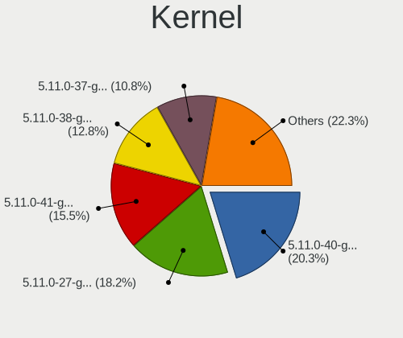

| Version               | Notebooks | Percent |
|-----------------------|-----------|---------|
| 5.11.0-40-generic     | 30        | 20.27%  |
| 5.11.0-27-generic     | 27        | 18.24%  |
| 5.11.0-41-generic     | 23        | 15.54%  |
| 5.11.0-38-generic     | 19        | 12.84%  |
| 5.11.0-37-generic     | 16        | 10.81%  |
| 5.11.0-34-generic     | 11        | 7.43%   |
| 5.11.0-25-generic     | 11        | 7.43%   |
| 5.8.0-55-generic      | 2         | 1.35%   |
| 5.11.0-36-generic     | 2         | 1.35%   |
| 5.8.0-63-generic      | 1         | 0.68%   |
| 5.8.0-53-generic      | 1         | 0.68%   |
| 5.8.0-50-generic      | 1         | 0.68%   |
| 5.8.0-44-generic      | 1         | 0.68%   |
| 5.4.0-91-generic      | 1         | 0.68%   |
| 5.14.7-xanmod1-cacule | 1         | 0.68%   |
| 5.11.0-051100-generic | 1         | 0.68%   |

Kernel Family
-------------

Linux kernel without a distro release

| Version | Notebooks | Percent |
|---------|-----------|---------|
| 5.11.0  | 135       | 94.41%  |
| 5.8.0   | 6         | 4.2%    |
| 5.4.0   | 1         | 0.7%    |
| 5.14.7  | 1         | 0.7%    |

Kernel Major Ver.
-----------------

Linux kernel major version

| Version | Notebooks | Percent |
|---------|-----------|---------|
| 5.11    | 135       | 94.41%  |
| 5.8     | 6         | 4.2%    |
| 5.4     | 1         | 0.7%    |
| 5.14    | 1         | 0.7%    |

Arch
----

OS architecture (x86_64, i586, etc.)

| Name   | Notebooks | Percent |
|--------|-----------|---------|
| x86_64 | 143       | 100%    |

DE
--

Desktop Environment

| Name       | Notebooks | Percent |
|------------|-----------|---------|
| Pantheon   | 130       | 90.91%  |
| Unknown    | 9         | 6.29%   |
| X-Cinnamon | 2         | 1.4%    |
| GNOME      | 2         | 1.4%    |

Display Server
--------------

X11 or Wayland

| Name | Notebooks | Percent |
|------|-----------|---------|
| X11  | 143       | 100%    |

Display Manager
---------------

SDDM, LightDM, etc.

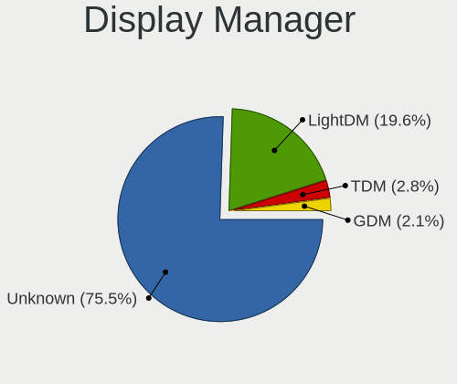

| Name    | Notebooks | Percent |
|---------|-----------|---------|
| Unknown | 108       | 75.52%  |
| LightDM | 28        | 19.58%  |
| TDM     | 4         | 2.8%    |
| GDM     | 3         | 2.1%    |

OS Lang
-------

Language

| Lang  | Notebooks | Percent |
|-------|-----------|---------|
| en_US | 74        | 51.75%  |
| de_DE | 12        | 8.39%   |
| es_ES | 10        | 6.99%   |
| fr_FR | 6         | 4.2%    |
| pt_BR | 5         | 3.5%    |
| ru_RU | 4         | 2.8%    |
| en_GB | 4         | 2.8%    |
| en_CA | 4         | 2.8%    |
| pl_PL | 3         | 2.1%    |
| it_IT | 3         | 2.1%    |
| cs_CZ | 3         | 2.1%    |
| zh_CN | 2         | 1.4%    |
| tr_TR | 2         | 1.4%    |
| en_AU | 2         | 1.4%    |
| vi_VN | 1         | 0.7%    |
| ro_RO | 1         | 0.7%    |
| nl_NL | 1         | 0.7%    |
| id_ID | 1         | 0.7%    |
| hu_HU | 1         | 0.7%    |
| gl_ES | 1         | 0.7%    |
| fi_FI | 1         | 0.7%    |
| de_CH | 1         | 0.7%    |
| da_DK | 1         | 0.7%    |

Boot Mode
---------

EFI or BIOS

| Mode | Notebooks | Percent |
|------|-----------|---------|
| EFI  | 85        | 59.03%  |
| BIOS | 59        | 40.97%  |

Filesystem
----------

Type of filesystem

| Type    | Notebooks | Percent |
|---------|-----------|---------|
| Ext4    | 137       | 95.8%   |
| Overlay | 5         | 3.5%    |
| Btrfs   | 1         | 0.7%    |

Part. scheme
------------

Scheme of partitioning

| Type    | Notebooks | Percent |
|---------|-----------|---------|
| Unknown | 116       | 81.12%  |
| GPT     | 19        | 13.29%  |
| MBR     | 8         | 5.59%   |

Dual Boot with Linux/BSD
------------------------

Hosting more than one Linux/BSD

| Dual boot | Notebooks | Percent |
|-----------|-----------|---------|
| No        | 136       | 95.1%   |
| Yes       | 7         | 4.9%    |

Dual Boot (Win)
---------------

Hosting Linux and Windows

| Dual boot | Notebooks | Percent |
|-----------|-----------|---------|
| No        | 129       | 90.21%  |
| Yes       | 14        | 9.79%   |

Board
-----

Vendor
------

Motherboard manufacturer

| Name                    | Notebooks | Percent |
|-------------------------|-----------|---------|
| Hewlett-Packard         | 32        | 22.38%  |
| Lenovo                  | 26        | 18.18%  |
| Dell                    | 19        | 13.29%  |
| Acer                    | 13        | 9.09%   |
| Apple                   | 12        | 8.39%   |
| ASUSTek Computer        | 9         | 6.29%   |
| Toshiba                 | 4         | 2.8%    |
| Sony                    | 3         | 2.1%    |
| HUAWEI                  | 3         | 2.1%    |
| Google                  | 3         | 2.1%    |
| TUXEDO                  | 2         | 1.4%    |
| MSI                     | 2         | 1.4%    |
| Medion                  | 2         | 1.4%    |
| Star Labs               | 1         | 0.7%    |
| Schenker                | 1         | 0.7%    |
| Samsung Electronics     | 1         | 0.7%    |
| Quanta                  | 1         | 0.7%    |
| Packard Bell            | 1         | 0.7%    |
| Notebook                | 1         | 0.7%    |
| LG Electronics          | 1         | 0.7%    |
| HCL Infosystems Limited | 1         | 0.7%    |
| Gateway                 | 1         | 0.7%    |
| Fujitsu                 | 1         | 0.7%    |
| eMachines               | 1         | 0.7%    |
| Alienware               | 1         | 0.7%    |
| Unknown                 | 1         | 0.7%    |

Model
-----

Motherboard model

| Name                                | Notebooks | Percent |
|-------------------------------------|-----------|---------|
| Lenovo Yoga 300-11IBR 80M1          | 2         | 1.4%    |
| HP Pavilion Notebook                | 2         | 1.4%    |
| Dell XPS 13 9350                    | 2         | 1.4%    |
| Dell Inspiron N5110                 | 2         | 1.4%    |
| Apple MacBookPro9,1                 | 2         | 1.4%    |
| Apple MacBookPro10,2                | 2         | 1.4%    |
| Apple MacBookAir7,2                 | 2         | 1.4%    |
| TUXEDO Pulse 15 Gen1                | 1         | 0.7%    |
| TUXEDO InfinityBook S 14 Gen6       | 1         | 0.7%    |
| Toshiba Satellite P100              | 1         | 0.7%    |
| Toshiba Satellite L840              | 1         | 0.7%    |
| Toshiba Satellite L750              | 1         | 0.7%    |
| Toshiba Satellite L500              | 1         | 0.7%    |
| Star Labs StarBook                  | 1         | 0.7%    |
| Sony VPCEB16FG                      | 1         | 0.7%    |
| Sony SVE15115EN                     | 1         | 0.7%    |
| Sony Serie VJC14                    | 1         | 0.7%    |
| Schenker X170KM-G                   | 1         | 0.7%    |
| Samsung 550XDA                      | 1         | 0.7%    |
| Quanta TW9/SW9                      | 1         | 0.7%    |
| Packard Bell EasyNote LS11HR        | 1         | 0.7%    |
| Notebook L140CU                     | 1         | 0.7%    |
| MSI Modern 14 B4MW                  | 1         | 0.7%    |
| MSI GF72 7RE                        | 1         | 0.7%    |
| Medion E7218                        | 1         | 0.7%    |
| Medion Akoya THE TOUCH 10           | 1         | 0.7%    |
| LG P1-JSUVT                         | 1         | 0.7%    |
| Lenovo V330-15IKB 81AX              | 1         | 0.7%    |
| Lenovo ThinkPad X250 20CLS32H00     | 1         | 0.7%    |
| Lenovo ThinkPad X230 23259L3        | 1         | 0.7%    |
| Lenovo ThinkPad X201 Tablet 311396G | 1         | 0.7%    |
| Lenovo ThinkPad X201 3249CTO        | 1         | 0.7%    |
| Lenovo ThinkPad X140e 20BLS00400    | 1         | 0.7%    |
| Lenovo ThinkPad X1 Carbon 3448B86   | 1         | 0.7%    |
| Lenovo ThinkPad W700 2758MVG        | 1         | 0.7%    |
| Lenovo ThinkPad T470 20HD004AUS     | 1         | 0.7%    |
| Lenovo ThinkPad T460s 20F9CTO1WW    | 1         | 0.7%    |
| Lenovo ThinkPad T460s 20F90042MS    | 1         | 0.7%    |
| Lenovo ThinkPad T430 2342A19        | 1         | 0.7%    |
| Lenovo ThinkPad T410s 292494G       | 1         | 0.7%    |

Model Family
------------

Motherboard model prefix

| Name                  | Notebooks | Percent |
|-----------------------|-----------|---------|
| Lenovo ThinkPad       | 16        | 11.19%  |
| Acer Aspire           | 10        | 6.99%   |
| HP ProBook            | 7         | 4.9%    |
| HP Pavilion           | 7         | 4.9%    |
| Lenovo IdeaPad        | 6         | 4.2%    |
| HP Laptop             | 6         | 4.2%    |
| HP EliteBook          | 6         | 4.2%    |
| Dell XPS              | 5         | 3.5%    |
| Dell Inspiron         | 5         | 3.5%    |
| Toshiba Satellite     | 4         | 2.8%    |
| Dell Latitude         | 4         | 2.8%    |
| Lenovo Yoga           | 2         | 1.4%    |
| Dell System           | 2         | 1.4%    |
| Dell Precision        | 2         | 1.4%    |
| Apple MacBookPro9     | 2         | 1.4%    |
| Apple MacBookPro8     | 2         | 1.4%    |
| Apple MacBookPro10    | 2         | 1.4%    |
| Apple MacBookAir7     | 2         | 1.4%    |
| Acer Swift            | 2         | 1.4%    |
| TUXEDO Pulse          | 1         | 0.7%    |
| TUXEDO InfinityBook   | 1         | 0.7%    |
| Star Labs StarBook    | 1         | 0.7%    |
| Sony VPCEB16FG        | 1         | 0.7%    |
| Sony SVE15115EN       | 1         | 0.7%    |
| Sony Serie            | 1         | 0.7%    |
| Schenker X170KM-G     | 1         | 0.7%    |
| Samsung 550XDA        | 1         | 0.7%    |
| Quanta TW9            | 1         | 0.7%    |
| Packard Bell EasyNote | 1         | 0.7%    |
| Notebook L140CU       | 1         | 0.7%    |
| MSI Modern            | 1         | 0.7%    |
| MSI GF72              | 1         | 0.7%    |
| Medion E7218          | 1         | 0.7%    |
| Medion Akoya          | 1         | 0.7%    |
| LG P1-JSUVT           | 1         | 0.7%    |
| Lenovo V330-15IKB     | 1         | 0.7%    |
| Lenovo G50-45         | 1         | 0.7%    |
| HUAWEI NBLB-WAX9N     | 1         | 0.7%    |
| HUAWEI MACHD-WXX9     | 1         | 0.7%    |
| HUAWEI BOHK-WAX9X     | 1         | 0.7%    |

MFG Year
--------

Motherboard manufacture year

| Year    | Notebooks | Percent |
|---------|-----------|---------|
| 2011    | 17        | 11.89%  |
| 2015    | 15        | 10.49%  |
| 2020    | 14        | 9.79%   |
| 2021    | 13        | 9.09%   |
| 2010    | 13        | 9.09%   |
| 2017    | 12        | 8.39%   |
| 2012    | 11        | 7.69%   |
| 2019    | 9         | 6.29%   |
| 2018    | 9         | 6.29%   |
| 2016    | 9         | 6.29%   |
| 2014    | 8         | 5.59%   |
| 2009    | 5         | 3.5%    |
| 2013    | 3         | 2.1%    |
| 2007    | 2         | 1.4%    |
| 2008    | 1         | 0.7%    |
| 2006    | 1         | 0.7%    |
| Unknown | 1         | 0.7%    |

Form Factor
-----------

Physical design of the computer

| Name     | Notebooks | Percent |
|----------|-----------|---------|
| Notebook | 143       | 100%    |

Secure Boot
-----------

Enabled or disabled

| State    | Notebooks | Percent |
|----------|-----------|---------|
| Disabled | 116       | 81.12%  |
| Enabled  | 27        | 18.88%  |

Coreboot
--------

Have coreboot on board

| Used | Notebooks | Percent |
|------|-----------|---------|
| No   | 139       | 97.2%   |
| Yes  | 4         | 2.8%    |

RAM Size
--------

Total RAM memory

| Size in GB | Notebooks | Percent |
|------------|-----------|---------|
| 4.01-8.0   | 44        | 30.77%  |
| 3.01-4.0   | 35        | 24.48%  |
| 8.01-16.0  | 24        | 16.78%  |
| 16.01-24.0 | 22        | 15.38%  |
| 32.01-64.0 | 7         | 4.9%    |
| 1.01-2.0   | 7         | 4.9%    |
| 24.01-32.0 | 3         | 2.1%    |
| 2.01-3.0   | 1         | 0.7%    |

RAM Used
--------

Used RAM memory

| Used GB  | Notebooks | Percent |
|----------|-----------|---------|
| 1.01-2.0 | 64        | 42.95%  |
| 2.01-3.0 | 43        | 28.86%  |
| 4.01-8.0 | 21        | 14.09%  |
| 3.01-4.0 | 19        | 12.75%  |
| 0.51-1.0 | 2         | 1.34%   |

Total Drives
------------

Number of drives on board

| Drives | Notebooks | Percent |
|--------|-----------|---------|
| 1      | 111       | 77.08%  |
| 2      | 29        | 20.14%  |
| 4      | 2         | 1.39%   |
| 5      | 1         | 0.69%   |
| 3      | 1         | 0.69%   |

Has CD-ROM
----------

Has CD-ROM on board

| Presented | Notebooks | Percent |
|-----------|-----------|---------|
| No        | 99        | 69.23%  |
| Yes       | 44        | 30.77%  |

Has Ethernet
------------

Has Ethernet on board

| Presented | Notebooks | Percent |
|-----------|-----------|---------|
| Yes       | 111       | 77.62%  |
| No        | 32        | 22.38%  |

Has WiFi
--------

Has WiFi module

| Presented | Notebooks | Percent |
|-----------|-----------|---------|
| Yes       | 142       | 99.3%   |
| No        | 1         | 0.7%    |

Has Bluetooth
-------------

Has Bluetooth module

| Presented | Notebooks | Percent |
|-----------|-----------|---------|
| Yes       | 123       | 85.42%  |
| No        | 21        | 14.58%  |

Location
--------

Country
-------

Geographic location (country)

| Country     | Notebooks | Percent |
|-------------|-----------|---------|
| USA         | 20        | 13.99%  |
| India       | 14        | 9.79%   |
| Germany     | 12        | 8.39%   |
| UK          | 7         | 4.9%    |
| France      | 7         | 4.9%    |
| Russia      | 6         | 4.2%    |
| Canada      | 6         | 4.2%    |
| Brazil      | 6         | 4.2%    |
| Netherlands | 4         | 2.8%    |
| Argentina   | 4         | 2.8%    |
| Sweden      | 3         | 2.1%    |
| Poland      | 3         | 2.1%    |
| Italy       | 3         | 2.1%    |
| Indonesia   | 3         | 2.1%    |
| Denmark     | 3         | 2.1%    |
| Czechia     | 3         | 2.1%    |
| Australia   | 3         | 2.1%    |
| Vietnam     | 2         | 1.4%    |
| Turkey      | 2         | 1.4%    |
| Romania     | 2         | 1.4%    |
| Paraguay    | 2         | 1.4%    |
| Mexico      | 2         | 1.4%    |
| Guatemala   | 2         | 1.4%    |
| Finland     | 2         | 1.4%    |
| Uruguay     | 1         | 0.7%    |
| Thailand    | 1         | 0.7%    |
| Spain       | 1         | 0.7%    |
| Slovenia    | 1         | 0.7%    |
| Serbia      | 1         | 0.7%    |
| Philippines | 1         | 0.7%    |
| Norway      | 1         | 0.7%    |
| Myanmar     | 1         | 0.7%    |
| Morocco     | 1         | 0.7%    |
| Malaysia    | 1         | 0.7%    |
| Latvia      | 1         | 0.7%    |
| Kazakhstan  | 1         | 0.7%    |
| Japan       | 1         | 0.7%    |
| Ireland     | 1         | 0.7%    |
| Hungary     | 1         | 0.7%    |
| Guyana      | 1         | 0.7%    |

City
----

Geographic location (city)

| City                  | Notebooks | Percent |
|-----------------------|-----------|---------|
| Vernon                | 3         | 2.05%   |
| Moscow                | 3         | 2.05%   |
| Warsaw                | 2         | 1.37%   |
| Perth                 | 2         | 1.37%   |
| Paris                 | 2         | 1.37%   |
| Kolkata               | 2         | 1.37%   |
| Guatemala City        | 2         | 1.37%   |
| Coimbatore            | 2         | 1.37%   |
| Buenos Aires          | 2         | 1.37%   |
| Zonguldak             | 1         | 0.68%   |
| Woodbridge            | 1         | 0.68%   |
| Walsrode              | 1         | 0.68%   |
| Wakefield             | 1         | 0.68%   |
| Villeurbanne          | 1         | 0.68%   |
| Vienna                | 1         | 0.68%   |
| Victoria              | 1         | 0.68%   |
| Vertaizon             | 1         | 0.68%   |
| Valladolid            | 1         | 0.68%   |
| Vălenii Șomcutei    | 1         | 0.68%   |
| Turku                 | 1         | 0.68%   |
| Turin                 | 1         | 0.68%   |
| Toledo                | 1         | 0.68%   |
| The Hague             | 1         | 0.68%   |
| Temecula              | 1         | 0.68%   |
| Tallinn               | 1         | 0.68%   |
| Taganrog              | 1         | 0.68%   |
| Surabaya              | 1         | 0.68%   |
| Stockport             | 1         | 0.68%   |
| Stockholm             | 1         | 0.68%   |
| Stevenage             | 1         | 0.68%   |
| Skanderborg           | 1         | 0.68%   |
| Sinop                 | 1         | 0.68%   |
| Setagaya-ku           | 1         | 0.68%   |
| Sedlec                | 1         | 0.68%   |
| São Pedro          | 1         | 0.68%   |
| Sassnitz              | 1         | 0.68%   |
| Sao Paulo             | 1         | 0.68%   |
| Sao Joaquim da Barra  | 1         | 0.68%   |
| Sao Bernardo do Campo | 1         | 0.68%   |
| Santo Domingo Este    | 1         | 0.68%   |

Drives
------

Drive Vendor
------------

Hard drive vendors

| Vendor                    | Notebooks | Drives | Percent |
|---------------------------|-----------|--------|---------|
| WDC                       | 29        | 32     | 16.96%  |
| Samsung Electronics       | 29        | 31     | 16.96%  |
| Seagate                   | 15        | 17     | 8.77%   |
| Toshiba                   | 12        | 12     | 7.02%   |
| SanDisk                   | 12        | 14     | 7.02%   |
| Unknown                   | 10        | 11     | 5.85%   |
| Crucial                   | 7         | 7      | 4.09%   |
| Micron Technology         | 6         | 6      | 3.51%   |
| HGST                      | 6         | 6      | 3.51%   |
| Apple                     | 6         | 6      | 3.51%   |
| Kingston                  | 5         | 7      | 2.92%   |
| Hitachi                   | 5         | 5      | 2.92%   |
| SK hynix                  | 3         | 4      | 1.75%   |
| Intel                     | 3         | 3      | 1.75%   |
| Silicon Motion            | 2         | 2      | 1.17%   |
| LITEONIT                  | 2         | 2      | 1.17%   |
| LITEON                    | 2         | 2      | 1.17%   |
| Gigabyte Technology       | 2         | 2      | 1.17%   |
| Union Memory              | 1         | 1      | 0.58%   |
| Star Drive                | 1         | 1      | 0.58%   |
| Phison                    | 1         | 1      | 0.58%   |
| Patriot                   | 1         | 1      | 0.58%   |
| Netac                     | 1         | 1      | 0.58%   |
| Micron/Crucial Technology | 1         | 1      | 0.58%   |
| Mercury                   | 1         | 1      | 0.58%   |
| LS                        | 1         | 1      | 0.58%   |
| KIOXIA                    | 1         | 1      | 0.58%   |
| HUAWEI                    | 1         | 1      | 0.58%   |
| Hewlett-Packard           | 1         | 1      | 0.58%   |
| Fujitsu                   | 1         | 1      | 0.58%   |
| CLOVER                    | 1         | 1      | 0.58%   |
| China                     | 1         | 1      | 0.58%   |
| A-DATA Technology         | 1         | 2      | 0.58%   |

Drive Model
-----------

Hard drive models

| Model                                  | Notebooks | Percent |
|----------------------------------------|-----------|---------|
| Samsung SM963 2.5" NVMe PCIe SSD 256GB | 5         | 2.87%   |
| SanDisk NVMe SSD Drive 512GB           | 4         | 2.3%    |
| Samsung NVMe SSD Drive 512GB           | 4         | 2.3%    |
| WDC WD5000LPVX-22V0TT0 500GB           | 3         | 1.72%   |
| WDC WD10JPVX-22JC3T0 1TB               | 3         | 1.72%   |
| Unknown MMC Card  128GB                | 3         | 1.72%   |
| Toshiba MQ01ABD100V -63 1TB            | 3         | 1.72%   |
| Seagate ST1000LM035-1RK172 1TB         | 3         | 1.72%   |
| Kingston SA400S37240G 240GB SSD        | 3         | 1.72%   |
| WDC WDS500G2B0A-00SM50 500GB SSD       | 2         | 1.15%   |
| WDC WD10SPZX-21Z10T0 1TB               | 2         | 1.15%   |
| Unknown MMC Card  32GB                 | 2         | 1.15%   |
| Unknown MMC Card  16GB                 | 2         | 1.15%   |
| Toshiba MK6475GSX 640GB                | 2         | 1.15%   |
| SK hynix NVMe SSD Drive 512GB          | 2         | 1.15%   |
| Seagate ST500LT012-1DG142 500GB        | 2         | 1.15%   |
| Seagate ST2000LX001-1RG174 2TB         | 2         | 1.15%   |
| SanDisk NVMe SSD Drive 256GB           | 2         | 1.15%   |
| Samsung SSD 860 EVO 250GB              | 2         | 1.15%   |
| HGST HTS541010A9E680 1TB               | 2         | 1.15%   |
| Crucial CT240BX500SSD1 240GB           | 2         | 1.15%   |
| Apple SSD SD128E 121GB                 | 2         | 1.15%   |
| WDC WDS240G2G0A-00JH30 240GB SSD       | 1         | 0.57%   |
| WDC WDS200T2B0B-00YS70 2TB SSD         | 1         | 0.57%   |
| WDC WDS120G2G0A-00JH30 120GB SSD       | 1         | 0.57%   |
| WDC WD6400BEVT-22A0RT0 640GB           | 1         | 0.57%   |
| WDC WD5000LPLX-08ZNTT0 500GB           | 1         | 0.57%   |
| WDC WD5000BPVT-75HXZT1 500GB           | 1         | 0.57%   |
| WDC WD5000BPVT-22HXZT3 500GB           | 1         | 0.57%   |
| WDC WD5000BPVT-22HXZT1 500GB           | 1         | 0.57%   |
| WDC WD5000BPVT-00HXZT1 500GB           | 1         | 0.57%   |
| WDC WD5000BPKT-75PK4T0 500GB           | 1         | 0.57%   |
| WDC WD3200BEVT-75A23T0 320GB           | 1         | 0.57%   |
| WDC WD2500BEKT-75A25T0 250GB           | 1         | 0.57%   |
| WDC WD20SPZX-21UA7T0 2TB               | 1         | 0.57%   |
| WDC WD10SPZX-35Z10T0 1TB               | 1         | 0.57%   |
| WDC WD10SPZX-24Z10T0 1TB               | 1         | 0.57%   |
| WDC WD10SPZX-22Z10T1 1TB               | 1         | 0.57%   |
| WDC WD10JPVX-60JC3T1 1TB               | 1         | 0.57%   |
| WDC PC SN720 SDAPNTW-256G-1014 256GB   | 1         | 0.57%   |

HDD Vendor
----------

Hard disk drive vendors

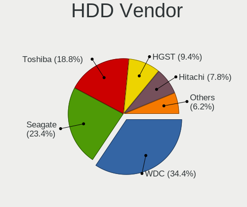

| Vendor              | Notebooks | Drives | Percent |
|---------------------|-----------|--------|---------|
| WDC                 | 22        | 23     | 34.38%  |
| Seagate             | 15        | 17     | 23.44%  |
| Toshiba             | 12        | 12     | 18.75%  |
| HGST                | 6         | 6      | 9.38%   |
| Hitachi             | 5         | 5      | 7.81%   |
| Samsung Electronics | 3         | 3      | 4.69%   |
| Fujitsu             | 1         | 1      | 1.56%   |

SSD Vendor
----------

Solid state drive vendors

| Vendor              | Notebooks | Drives | Percent |
|---------------------|-----------|--------|---------|
| Samsung Electronics | 11        | 12     | 20%     |
| Crucial             | 7         | 7      | 12.73%  |
| Apple               | 6         | 6      | 10.91%  |
| WDC                 | 5         | 5      | 9.09%   |
| SanDisk             | 5         | 6      | 9.09%   |
| Kingston            | 4         | 6      | 7.27%   |
| Micron Technology   | 3         | 3      | 5.45%   |
| LITEONIT            | 2         | 2      | 3.64%   |
| LITEON              | 2         | 2      | 3.64%   |
| Intel               | 2         | 2      | 3.64%   |
| Patriot             | 1         | 1      | 1.82%   |
| Netac               | 1         | 1      | 1.82%   |
| Mercury             | 1         | 1      | 1.82%   |
| LS                  | 1         | 1      | 1.82%   |
| Hewlett-Packard     | 1         | 1      | 1.82%   |
| Gigabyte Technology | 1         | 1      | 1.82%   |
| China               | 1         | 1      | 1.82%   |
| A-DATA Technology   | 1         | 2      | 1.82%   |

Drive Kind
----------

HDD or SSD

| Kind    | Notebooks | Drives | Percent |
|---------|-----------|--------|---------|
| HDD     | 63        | 67     | 38.18%  |
| SSD     | 51        | 60     | 30.91%  |
| NVMe    | 38        | 44     | 23.03%  |
| MMC     | 9         | 10     | 5.45%   |
| Unknown | 4         | 4      | 2.42%   |

Drive Connector
---------------

SATA, SAS, NVMe, etc.

| Type | Notebooks | Drives | Percent |
|------|-----------|--------|---------|
| SATA | 107       | 129    | 68.59%  |
| NVMe | 38        | 44     | 24.36%  |
| MMC  | 9         | 10     | 5.77%   |
| SAS  | 2         | 2      | 1.28%   |

Drive Size
----------

Size of hard drive

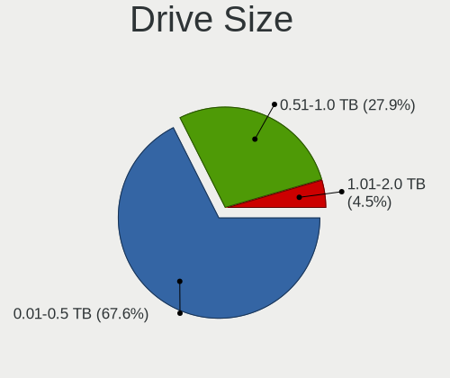

| Size in TB | Notebooks | Drives | Percent |
|------------|-----------|--------|---------|
| 0.01-0.5   | 75        | 89     | 67.57%  |
| 0.51-1.0   | 31        | 32     | 27.93%  |
| 1.01-2.0   | 5         | 6      | 4.5%    |

Space Total
-----------

Amount of disk space available on the file system

| Size in GB | Notebooks | Percent |
|------------|-----------|---------|
| 101-250    | 62        | 42.76%  |
| 251-500    | 39        | 26.9%   |
| 501-1000   | 19        | 13.1%   |
| 51-100     | 12        | 8.28%   |
| 1001-2000  | 5         | 3.45%   |
| 1-20       | 4         | 2.76%   |
| 21-50      | 3         | 2.07%   |
| 2001-3000  | 1         | 0.69%   |

Space Used
----------

Amount of used disk space

| Used GB   | Notebooks | Percent |
|-----------|-----------|---------|
| 1-20      | 80        | 55.94%  |
| 21-50     | 30        | 20.98%  |
| 51-100    | 17        | 11.89%  |
| 101-250   | 9         | 6.29%   |
| 251-500   | 3         | 2.1%    |
| 1001-2000 | 2         | 1.4%    |
| 501-1000  | 2         | 1.4%    |

Malfunc. Drives
---------------

Drive models with a malfunction

| Model                             | Notebooks | Drives | Percent |
|-----------------------------------|-----------|--------|---------|
| WDC WD5000BPKT-75PK4T0 500GB      | 1         | 1      | 25%     |
| Toshiba MK3259GSXP 320GB          | 1         | 1      | 25%     |
| Seagate ST320LT020-9YG142 320GB   | 1         | 1      | 25%     |
| SanDisk SD7SB3Q256G1002 256GB SSD | 1         | 1      | 25%     |

Malfunc. Drive Vendor
---------------------

Vendors of faulty drives

| Vendor  | Notebooks | Drives | Percent |
|---------|-----------|--------|---------|
| WDC     | 1         | 1      | 25%     |
| Toshiba | 1         | 1      | 25%     |
| Seagate | 1         | 1      | 25%     |
| SanDisk | 1         | 1      | 25%     |

Malfunc. HDD Vendor
-------------------

Vendors of faulty HDD drives

| Vendor  | Notebooks | Drives | Percent |
|---------|-----------|--------|---------|
| WDC     | 1         | 1      | 33.33%  |
| Toshiba | 1         | 1      | 33.33%  |
| Seagate | 1         | 1      | 33.33%  |

Malfunc. Drive Kind
-------------------

Kinds of faulty drives

| Kind | Notebooks | Drives | Percent |
|------|-----------|--------|---------|
| HDD  | 3         | 3      | 75%     |
| SSD  | 1         | 1      | 25%     |

Failed Drives
-------------

Failed drive models

Zero info for selected period =(

Failed Drive Vendor
-------------------

Failed drive vendors

Zero info for selected period =(

Drive Status
------------

Number of failed and malfunc. drives

| Status   | Notebooks | Drives | Percent |
|----------|-----------|--------|---------|
| Detected | 117       | 153    | 80.69%  |
| Works    | 24        | 28     | 16.55%  |
| Malfunc  | 4         | 4      | 2.76%   |

Storage controller
------------------

Storage Vendor
--------------

Storage controller vendors

| Vendor                      | Notebooks | Percent |
|-----------------------------|-----------|---------|
| Intel                       | 109       | 65.66%  |
| Samsung Electronics         | 19        | 11.45%  |
| SanDisk                     | 12        | 7.23%   |
| AMD                         | 11        | 6.63%   |
| SK hynix                    | 3         | 1.81%   |
| Phison Electronics          | 3         | 1.81%   |
| Micron Technology           | 3         | 1.81%   |
| Silicon Motion              | 2         | 1.2%    |
| Nvidia                      | 1         | 0.6%    |
| Micron/Crucial Technology   | 1         | 0.6%    |
| KIOXIA                      | 1         | 0.6%    |
| Kingston Technology Company | 1         | 0.6%    |

Storage Model
-------------

Storage controller models

| Model                                                                                  | Notebooks | Percent |
|----------------------------------------------------------------------------------------|-----------|---------|
| Intel Sunrise Point-LP SATA Controller [AHCI mode]                                     | 14        | 8.09%   |
| Intel 6 Series/C200 Series Chipset Family 6 port Mobile SATA AHCI Controller           | 14        | 8.09%   |
| Intel 82801 Mobile SATA Controller [RAID mode]                                         | 10        | 5.78%   |
| Intel 7 Series Chipset Family 6-port SATA Controller [AHCI mode]                       | 10        | 5.78%   |
| AMD FCH SATA Controller [AHCI mode]                                                    | 9         | 5.2%    |
| Samsung NVMe SSD Controller SM981/PM981/PM983                                          | 7         | 4.05%   |
| Intel Volume Management Device NVMe RAID Controller                                    | 6         | 3.47%   |
| Intel 5 Series/3400 Series Chipset 6 port SATA AHCI Controller                         | 6         | 3.47%   |
| SanDisk WD Black 2018/SN750 / PC SN720 NVMe SSD                                        | 4         | 2.31%   |
| Samsung NVMe SSD Controller SM951/PM951                                                | 4         | 2.31%   |
| Intel Wildcat Point-LP SATA Controller [AHCI Mode]                                     | 4         | 2.31%   |
| Intel HM170/QM170 Chipset SATA Controller [AHCI Mode]                                  | 4         | 2.31%   |
| Intel 5 Series/3400 Series Chipset 4 port SATA AHCI Controller                         | 4         | 2.31%   |
| SK hynix Gold P31/PC711 NVMe Solid State Drive                                         | 3         | 1.73%   |
| SanDisk WD Blue SN550 NVMe SSD                                                         | 3         | 1.73%   |
| Samsung NVMe SSD Controller 980                                                        | 3         | 1.73%   |
| Samsung Electronics SATA controller                                                    | 3         | 1.73%   |
| Micron Non-Volatile memory controller                                                  | 3         | 1.73%   |
| Intel Comet Lake SATA AHCI Controller                                                  | 3         | 1.73%   |
| Intel Celeron/Pentium Silver Processor SATA Controller                                 | 3         | 1.73%   |
| Intel Cannon Lake Mobile PCH SATA AHCI Controller                                      | 3         | 1.73%   |
| Intel Atom/Celeron/Pentium Processor x5-E8000/J3xxx/N3xxx Series SATA Controller       | 3         | 1.73%   |
| Intel 82801IBM/IEM (ICH9M/ICH9M-E) 4 port SATA Controller [AHCI mode]                  | 3         | 1.73%   |
| Intel 8 Series/C220 Series Chipset Family 6-port SATA Controller 1 [AHCI mode]         | 3         | 1.73%   |
| Intel 8 Series SATA Controller 1 [AHCI mode]                                           | 3         | 1.73%   |
| SanDisk WD Blue SN500 / PC SN520 NVMe SSD                                              | 2         | 1.16%   |
| SanDisk Non-Volatile memory controller                                                 | 2         | 1.16%   |
| Phison E12 NVMe Controller                                                             | 2         | 1.16%   |
| Intel Tiger Lake-LP SATA Controller                                                    | 2         | 1.16%   |
| Intel Atom Processor E3800 Series SATA AHCI Controller                                 | 2         | 1.16%   |
| Intel 82801IBM/IEM (ICH9M/ICH9M-E) 2 port SATA Controller [IDE mode]                   | 2         | 1.16%   |
| Intel 6 Series/C200 Series Chipset Family Mobile SATA Controller (IDE mode, ports 0-3) | 2         | 1.16%   |
| AMD SB7x0/SB8x0/SB9x0 SATA Controller [AHCI mode]                                      | 2         | 1.16%   |
| Silicon Motion SM2263EN/SM2263XT SSD Controller                                        | 1         | 0.58%   |
| Silicon Motion Non-Volatile memory controller                                          | 1         | 0.58%   |
| SanDisk WD PC SN810 / Black SN850 NVMe SSD                                             | 1         | 0.58%   |
| Samsung NVMe SSD Controller SM961/PM961/SM963                                          | 1         | 0.58%   |
| Samsung Apple PCIe SSD                                                                 | 1         | 0.58%   |
| Phison PS5013 E13 NVMe Controller                                                      | 1         | 0.58%   |
| Nvidia MCP89 SATA Controller (AHCI mode)                                               | 1         | 0.58%   |

Storage Kind
------------

Kind of storage controller (IDE, SATA, NVMe, SAS, ...)

| Kind | Notebooks | Percent |
|------|-----------|---------|
| SATA | 102       | 61.45%  |
| NVMe | 38        | 22.89%  |
| RAID | 16        | 9.64%   |
| IDE  | 10        | 6.02%   |

Processor
---------

CPU Vendor
----------

Processor vendors

| Vendor | Notebooks | Percent |
|--------|-----------|---------|
| Intel  | 127       | 88.81%  |
| AMD    | 16        | 11.19%  |

CPU Model
---------

Processor models

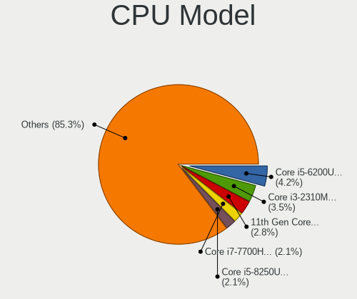

| Model                                       | Notebooks | Percent |
|---------------------------------------------|-----------|---------|
| Intel Core i5-6200U CPU @ 2.30GHz           | 6         | 4.2%    |
| Intel Core i3-2310M CPU @ 2.10GHz           | 5         | 3.5%    |
| Intel 11th Gen Core i5-1135G7 @ 2.40GHz     | 4         | 2.8%    |
| Intel Core i7-7700HQ CPU @ 2.80GHz          | 3         | 2.1%    |
| Intel Core i5-8250U CPU @ 1.60GHz           | 3         | 2.1%    |
| Intel Core i3 CPU M 350 @ 2.27GHz           | 3         | 2.1%    |
| Intel Celeron CPU N3060 @ 1.60GHz           | 3         | 2.1%    |
| Intel Pentium Silver N5000 CPU @ 1.10GHz    | 2         | 1.4%    |
| Intel Pentium Dual-Core CPU T4400 @ 2.20GHz | 2         | 1.4%    |
| Intel Core i7-8550U CPU @ 1.80GHz           | 2         | 1.4%    |
| Intel Core i7-4800MQ CPU @ 2.70GHz          | 2         | 1.4%    |
| Intel Core i7-3520M CPU @ 2.90GHz           | 2         | 1.4%    |
| Intel Core i7-10750H CPU @ 2.60GHz          | 2         | 1.4%    |
| Intel Core i5-7200U CPU @ 2.50GHz           | 2         | 1.4%    |
| Intel Core i5-5250U CPU @ 1.60GHz           | 2         | 1.4%    |
| Intel Core i5-2520M CPU @ 2.50GHz           | 2         | 1.4%    |
| Intel Core i5-2450M CPU @ 2.50GHz           | 2         | 1.4%    |
| Intel Core i5 CPU M 560 @ 2.67GHz           | 2         | 1.4%    |
| Intel Core i3-5010U CPU @ 2.10GHz           | 2         | 1.4%    |
| Intel Core 2 Duo CPU P8600 @ 2.40GHz        | 2         | 1.4%    |
| Intel Celeron N4020 CPU @ 1.10GHz           | 2         | 1.4%    |
| Intel 11th Gen Core i7-1165G7 @ 2.80GHz     | 2         | 1.4%    |
| Intel 11th Gen Core i3-1115G4 @ 3.00GHz     | 2         | 1.4%    |
| AMD Ryzen 5 4500U with Radeon Graphics      | 2         | 1.4%    |
| Intel Xeon W-11855M CPU @ 3.20GHz           | 1         | 0.7%    |
| Intel Pentium CPU P6200 @ 2.13GHz           | 1         | 0.7%    |
| Intel Pentium CPU N4200 @ 1.10GHz           | 1         | 0.7%    |
| Intel Pentium CPU N3700 @ 1.60GHz           | 1         | 0.7%    |
| Intel Pentium CPU N3540 @ 2.16GHz           | 1         | 0.7%    |
| Intel Pentium CPU B960 @ 2.20GHz            | 1         | 0.7%    |
| Intel Pentium CPU B950 @ 2.10GHz            | 1         | 0.7%    |
| Intel Pentium CPU 6405U @ 2.40GHz           | 1         | 0.7%    |
| Intel Pentium 3556U @ 1.70GHz               | 1         | 0.7%    |
| Intel Core i7-9750H CPU @ 2.60GHz           | 1         | 0.7%    |
| Intel Core i7-8750H CPU @ 2.20GHz           | 1         | 0.7%    |
| Intel Core i7-8565U CPU @ 1.80GHz           | 1         | 0.7%    |
| Intel Core i7-7600U CPU @ 2.80GHz           | 1         | 0.7%    |
| Intel Core i7-6700HQ CPU @ 2.60GHz          | 1         | 0.7%    |
| Intel Core i7-6600U CPU @ 2.60GHz           | 1         | 0.7%    |
| Intel Core i7-5557U CPU @ 3.10GHz           | 1         | 0.7%    |

CPU Model Family
----------------

Processor model prefix

| Model                   | Notebooks | Percent |
|-------------------------|-----------|---------|
| Intel Core i5           | 37        | 25.87%  |
| Intel Core i7           | 30        | 20.98%  |
| Intel Core i3           | 18        | 12.59%  |
| Other                   | 11        | 7.69%   |
| Intel Celeron           | 10        | 6.99%   |
| Intel Pentium           | 8         | 5.59%   |
| AMD Ryzen 5             | 7         | 4.9%    |
| Intel Core 2 Duo        | 5         | 3.5%    |
| Intel Pentium Silver    | 2         | 1.4%    |
| Intel Pentium Dual-Core | 2         | 1.4%    |
| Intel Core 2            | 2         | 1.4%    |
| AMD Ryzen 7             | 2         | 1.4%    |
| Intel Xeon              | 1         | 0.7%    |
| Intel Celeron M         | 1         | 0.7%    |
| AMD Ryzen 7 PRO         | 1         | 0.7%    |
| AMD Ryzen 5 PRO         | 1         | 0.7%    |
| AMD Phenom II           | 1         | 0.7%    |
| AMD C-60                | 1         | 0.7%    |
| AMD A8                  | 1         | 0.7%    |
| AMD A6                  | 1         | 0.7%    |
| AMD A4                  | 1         | 0.7%    |

CPU Cores
---------

Number of processor cores

| Number | Notebooks | Percent |
|--------|-----------|---------|
| 2      | 86        | 60.14%  |
| 4      | 42        | 29.37%  |
| 6      | 11        | 7.69%   |
| 8      | 3         | 2.1%    |
| 1      | 1         | 0.7%    |

CPU Sockets
-----------

Number of sockets

| Number | Notebooks | Percent |
|--------|-----------|---------|
| 1      | 143       | 100%    |

CPU Threads
-----------

Threads per core (Hyper-Threading)

| Number | Notebooks | Percent |
|--------|-----------|---------|
| 2      | 106       | 74.13%  |
| 1      | 37        | 25.87%  |

CPU Op-Modes
------------

CPU Operation Modes (32-bit, 64-bit)

| Op mode        | Notebooks | Percent |
|----------------|-----------|---------|
| 32-bit, 64-bit | 143       | 100%    |

CPU Microcode
-------------

Microcode number

| Number     | Notebooks | Percent |
|------------|-----------|---------|
| 0x206a7    | 17        | 11.72%  |
| Unknown    | 14        | 9.66%   |
| 0x806c1    | 9         | 6.21%   |
| 0x306a9    | 9         | 6.21%   |
| 0x406e3    | 8         | 5.52%   |
| 0x306d4    | 7         | 4.83%   |
| 0x20655    | 7         | 4.83%   |
| 0x806ea    | 5         | 3.45%   |
| 0x40651    | 5         | 3.45%   |
| 0x20652    | 5         | 3.45%   |
| 0x1067a    | 5         | 3.45%   |
| 0x906e9    | 4         | 2.76%   |
| 0x806e9    | 4         | 2.76%   |
| 0x806ec    | 3         | 2.07%   |
| 0x406c4    | 3         | 2.07%   |
| 0x306c3    | 3         | 2.07%   |
| 0x30678    | 3         | 2.07%   |
| 0xa0652    | 2         | 1.38%   |
| 0x806eb    | 2         | 1.38%   |
| 0x706a8    | 2         | 1.38%   |
| 0x706a1    | 2         | 1.38%   |
| 0x6fb      | 2         | 1.38%   |
| 0x406c3    | 2         | 1.38%   |
| 0xa0671    | 1         | 0.69%   |
| 0x806d1    | 1         | 0.69%   |
| 0x706e5    | 1         | 0.69%   |
| 0x6fd      | 1         | 0.69%   |
| 0x6fa      | 1         | 0.69%   |
| 0x6f6      | 1         | 0.69%   |
| 0x506e3    | 1         | 0.69%   |
| 0x506c9    | 1         | 0.69%   |
| 0x40661    | 1         | 0.69%   |
| 0x0a50000c | 1         | 0.69%   |
| 0x08608103 | 1         | 0.69%   |
| 0x08600106 | 1         | 0.69%   |
| 0x08600104 | 1         | 0.69%   |
| 0x08600103 | 1         | 0.69%   |
| 0x08108109 | 1         | 0.69%   |
| 0x08101016 | 1         | 0.69%   |
| 0x08101007 | 1         | 0.69%   |

CPU Microarch
-------------

Microarchitecture

| Name          | Notebooks | Percent |
|---------------|-----------|---------|
| KabyLake      | 21        | 14.69%  |
| SandyBridge   | 19        | 13.29%  |
| Westmere      | 12        | 8.39%   |
| Skylake       | 11        | 7.69%   |
| TigerLake     | 9         | 6.29%   |
| Silvermont    | 9         | 6.29%   |
| IvyBridge     | 9         | 6.29%   |
| Haswell       | 9         | 6.29%   |
| Broadwell     | 7         | 4.9%    |
| Penryn        | 5         | 3.5%    |
| Core          | 5         | 3.5%    |
| Zen 2         | 4         | 2.8%    |
| Goldmont plus | 4         | 2.8%    |
| Icelake       | 3         | 2.1%    |
| Zen+          | 2         | 1.4%    |
| Zen 3         | 2         | 1.4%    |
| Zen           | 2         | 1.4%    |
| CometLake     | 2         | 1.4%    |
| Unknown       | 2         | 1.4%    |
| Puma          | 1         | 0.7%    |
| K10           | 1         | 0.7%    |
| Jaguar        | 1         | 0.7%    |
| Goldmont      | 1         | 0.7%    |
| Excavator     | 1         | 0.7%    |
| Bobcat        | 1         | 0.7%    |

Graphics
--------

GPU Vendor
----------

Vendors of graphics cards

| Vendor | Notebooks | Percent |
|--------|-----------|---------|
| Intel  | 117       | 67.24%  |
| Nvidia | 32        | 18.39%  |
| AMD    | 25        | 14.37%  |

GPU Model
---------

Graphics card models

| Model                                                                                    | Notebooks | Percent |
|------------------------------------------------------------------------------------------|-----------|---------|
| Intel 2nd Generation Core Processor Family Integrated Graphics Controller                | 17        | 9.55%   |
| Intel Core Processor Integrated Graphics Controller                                      | 11        | 6.18%   |
| Intel Skylake GT2 [HD Graphics 520]                                                      | 10        | 5.62%   |
| Intel 3rd Gen Core processor Graphics Controller                                         | 9         | 5.06%   |
| Intel TigerLake-LP GT2 [Iris Xe Graphics]                                                | 7         | 3.93%   |
| Intel Atom/Celeron/Pentium Processor x5-E8000/J3xxx/N3xxx Integrated Graphics Controller | 6         | 3.37%   |
| Intel UHD Graphics 620                                                                   | 5         | 2.81%   |
| Intel Haswell-ULT Integrated Graphics Controller                                         | 5         | 2.81%   |
| Intel Mobile 4 Series Chipset Integrated Graphics Controller                             | 4         | 2.25%   |
| Intel HD Graphics 630                                                                    | 4         | 2.25%   |
| Intel HD Graphics 620                                                                    | 4         | 2.25%   |
| Intel HD Graphics 5500                                                                   | 4         | 2.25%   |
| AMD Seymour [Radeon HD 6400M/7400M Series]                                               | 4         | 2.25%   |
| AMD Renoir                                                                               | 4         | 2.25%   |
| Nvidia GP107M [GeForce GTX 1050 Ti Mobile]                                               | 3         | 1.69%   |
| Intel CoffeeLake-H GT2 [UHD Graphics 630]                                                | 3         | 1.69%   |
| Intel Atom Processor Z36xxx/Z37xxx Series Graphics & Display                             | 3         | 1.69%   |
| Nvidia TU117M [GeForce GTX 1650 Ti Mobile]                                               | 2         | 1.12%   |
| Nvidia GP108M [GeForce MX150]                                                            | 2         | 1.12%   |
| Nvidia GP107M [GeForce GTX 1050 Mobile]                                                  | 2         | 1.12%   |
| Nvidia GK107M [GeForce GT 650M Mac Edition]                                              | 2         | 1.12%   |
| Nvidia GA107M [GeForce RTX 3050 Ti Mobile]                                               | 2         | 1.12%   |
| Intel WhiskeyLake-U GT2 [UHD Graphics 620]                                               | 2         | 1.12%   |
| Intel Tiger Lake-LP GT2 [UHD Graphics G4]                                                | 2         | 1.12%   |
| Intel Mobile GM965/GL960 Integrated Graphics Controller (secondary)                      | 2         | 1.12%   |
| Intel Mobile GM965/GL960 Integrated Graphics Controller (primary)                        | 2         | 1.12%   |
| Intel HD Graphics 6000                                                                   | 2         | 1.12%   |
| Intel GeminiLake [UHD Graphics 605]                                                      | 2         | 1.12%   |
| Intel GeminiLake [UHD Graphics 600]                                                      | 2         | 1.12%   |
| Intel CometLake-U GT2 [UHD Graphics]                                                     | 2         | 1.12%   |
| Intel CometLake-H GT2 [UHD Graphics]                                                     | 2         | 1.12%   |
| Intel 4th Gen Core Processor Integrated Graphics Controller                              | 2         | 1.12%   |
| AMD Thames [Radeon HD 7500M/7600M Series]                                                | 2         | 1.12%   |
| AMD Raven Ridge [Radeon Vega Series / Radeon Vega Mobile Series]                         | 2         | 1.12%   |
| AMD Picasso/Raven 2 [Radeon Vega Series / Radeon Vega Mobile Series]                     | 2         | 1.12%   |
| AMD Cezanne [Radeon Vega Series / Radeon Vega Mobile Series]                             | 2         | 1.12%   |
| Nvidia TU117M [GeForce GTX 1650 Mobile / Max-Q]                                          | 1         | 0.56%   |
| Nvidia TU117GLM [Quadro T1000 Mobile]                                                    | 1         | 0.56%   |
| Nvidia MCP89 [GeForce 320M]                                                              | 1         | 0.56%   |
| Nvidia GP108BM [GeForce MX250]                                                           | 1         | 0.56%   |

GPU Combo
---------

Combinations of graphics cards

| Name           | Notebooks | Percent |
|----------------|-----------|---------|
| 1 x Intel      | 87        | 60.84%  |
| Intel + Nvidia | 25        | 17.48%  |
| 1 x AMD        | 17        | 11.89%  |
| 1 x Nvidia     | 6         | 4.2%    |
| Intel + AMD    | 5         | 3.5%    |
| 2 x AMD        | 2         | 1.4%    |
| AMD + Nvidia   | 1         | 0.7%    |

GPU Driver
----------

Free vs proprietary

| Driver      | Notebooks | Percent |
|-------------|-----------|---------|
| Free        | 127       | 88.19%  |
| Proprietary | 14        | 9.72%   |
| Unknown     | 3         | 2.08%   |

GPU Memory
----------

Total video memory

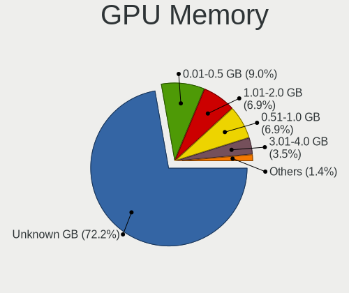

| Size in GB | Notebooks | Percent |
|------------|-----------|---------|
| Unknown    | 104       | 72.22%  |
| 0.01-0.5   | 13        | 9.03%   |
| 1.01-2.0   | 10        | 6.94%   |
| 0.51-1.0   | 10        | 6.94%   |
| 3.01-4.0   | 5         | 3.47%   |
| 7.01-8.0   | 1         | 0.69%   |
| 2.01-3.0   | 1         | 0.69%   |

Monitor
-------

Monitor Vendor
--------------

Monitor vendors

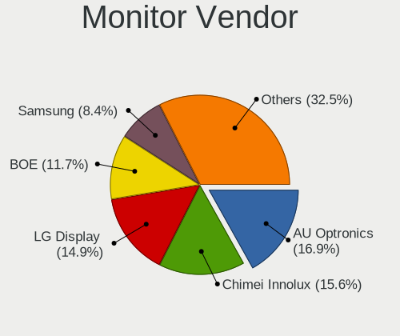

| Vendor                  | Notebooks | Percent |
|-------------------------|-----------|---------|
| AU Optronics            | 26        | 16.88%  |
| Chimei Innolux          | 24        | 15.58%  |
| LG Display              | 23        | 14.94%  |
| BOE                     | 18        | 11.69%  |
| Samsung Electronics     | 13        | 8.44%   |
| Apple                   | 12        | 7.79%   |
| Lenovo                  | 7         | 4.55%   |
| Sharp                   | 5         | 3.25%   |
| Chi Mei Optoelectronics | 4         | 2.6%    |
| CPT                     | 3         | 1.95%   |
| Dell                    | 2         | 1.3%    |
| CSO                     | 2         | 1.3%    |
| AOC                     | 2         | 1.3%    |
| Vizio                   | 1         | 0.65%   |
| ViewSonic               | 1         | 0.65%   |
| Toshiba                 | 1         | 0.65%   |
| Sony                    | 1         | 0.65%   |
| Seiko/Epson             | 1         | 0.65%   |
| PANDA                   | 1         | 0.65%   |
| Panasonic               | 1         | 0.65%   |
| LGD                     | 1         | 0.65%   |
| LG Philips              | 1         | 0.65%   |
| HannStar                | 1         | 0.65%   |
| Goldstar                | 1         | 0.65%   |
| BenQ                    | 1         | 0.65%   |
| Ancor Communications    | 1         | 0.65%   |

Monitor Model
-------------

Monitor models

| Model                                                                    | Notebooks | Percent |
|--------------------------------------------------------------------------|-----------|---------|
| AU Optronics LCD Monitor AUO38ED 1920x1080 344x193mm 15.5-inch           | 5         | 3.23%   |
| LG Display LCD Monitor LGD02DC 1366x768 344x194mm 15.5-inch              | 4         | 2.58%   |
| LG Display LCD Monitor LGD0456 1366x768 344x194mm 15.5-inch              | 2         | 1.29%   |
| Lenovo LCD Monitor LEN4011 1280x800 261x163mm 12.1-inch                  | 2         | 1.29%   |
| Chimei Innolux LCD Monitor CMN15D5 1920x1080 344x193mm 15.5-inch         | 2         | 1.29%   |
| Chimei Innolux LCD Monitor CMN14D5 1920x1080 309x173mm 13.9-inch         | 2         | 1.29%   |
| Chimei Innolux LCD Monitor CMN14C3 1366x768 309x173mm 13.9-inch          | 2         | 1.29%   |
| Chi Mei Optoelectronics LCD Monitor CMO15A1 1366x768 344x193mm 15.5-inch | 2         | 1.29%   |
| AU Optronics LCD Monitor AUO235C 1366x768 256x144mm 11.6-inch            | 2         | 1.29%   |
| AU Optronics LCD Monitor AUO22EC 1366x768 344x193mm 15.5-inch            | 2         | 1.29%   |
| AU Optronics LCD Monitor AUO106C 1366x768 276x155mm 12.5-inch            | 2         | 1.29%   |
| Apple Color LCD APPA014 2560x1600 286x179mm 13.3-inch                    | 2         | 1.29%   |
| Apple Color LCD APP9CDF 1440x900 286x179mm 13.3-inch                     | 2         | 1.29%   |
| Apple Color LCD APP9CC7 1280x800 286x179mm 13.3-inch                     | 2         | 1.29%   |
| Apple Color LCD APP9CA4 1440x900 331x207mm 15.4-inch                     | 2         | 1.29%   |
| Vizio L37 HD VIZ1300 1366x768 820x460mm 37.0-inch                        | 1         | 0.65%   |
| ViewSonic VA2445 SERIES VSC712E 1920x1080 521x293mm 23.5-inch            | 1         | 0.65%   |
| Toshiba TV TSB0206 1920x1080 886x498mm 40.0-inch                         | 1         | 0.65%   |
| Sony Nvidia Defaul t Flat Panel MS_0025 1920x1080 531x299mm 24.0-inch    | 1         | 0.65%   |
| Sharp LCD Monitor SHP1517 3840x2400 366x229mm 17.0-inch                  | 1         | 0.65%   |
| Sharp LCD Monitor SHP14D1 1920x1200 336x210mm 15.6-inch                  | 1         | 0.65%   |
| Sharp LCD Monitor SHP148D 3840x2160 344x194mm 15.5-inch                  | 1         | 0.65%   |
| Sharp LCD Monitor SHP1449 1920x1080 294x165mm 13.3-inch                  | 1         | 0.65%   |
| Sharp LCD Monitor SHP1420 1920x1080 294x165mm 13.3-inch                  | 1         | 0.65%   |
| Seiko/Epson LCD Monitor 1920x1080                                        | 1         | 0.65%   |
| Samsung Electronics S27D850 SAM0BC8 2560x1440 598x336mm 27.0-inch        | 1         | 0.65%   |
| Samsung Electronics S22F350 SAM0D1A 1920x1080 477x268mm 21.5-inch        | 1         | 0.65%   |
| Samsung Electronics S22D300 SAM0B3F 1920x1080 477x268mm 21.5-inch        | 1         | 0.65%   |
| Samsung Electronics LCD Monitor SEC5842 1366x768 309x174mm 14.0-inch     | 1         | 0.65%   |
| Samsung Electronics LCD Monitor SEC5441 1366x768 344x194mm 15.5-inch     | 1         | 0.65%   |
| Samsung Electronics LCD Monitor SEC3859 1366x768 293x165mm 13.2-inch     | 1         | 0.65%   |
| Samsung Electronics LCD Monitor SEC364D 1600x900 382x214mm 17.2-inch     | 1         | 0.65%   |
| Samsung Electronics LCD Monitor SEC3541 1366x768 309x174mm 14.0-inch     | 1         | 0.65%   |
| Samsung Electronics LCD Monitor SEC3150 1366x768 344x193mm 15.5-inch     | 1         | 0.65%   |
| Samsung Electronics LCD Monitor SEC3041 1366x768 353x198mm 15.9-inch     | 1         | 0.65%   |
| Samsung Electronics LCD Monitor SDC5441 1366x768 309x174mm 14.0-inch     | 1         | 0.65%   |
| Samsung Electronics LCD Monitor SDC4E42 1366x768 309x174mm 14.0-inch     | 1         | 0.65%   |
| Samsung Electronics C27F591 SAM0D36 1920x1080 600x340mm 27.2-inch        | 1         | 0.65%   |
| PANDA LCD Monitor NCP004D 1920x1080 344x194mm 15.5-inch                  | 1         | 0.65%   |
| Panasonic LCD Monitor MEI96A2 2880x1620 344x193mm 15.5-inch              | 1         | 0.65%   |

Monitor Resolution
------------------

Monitor screen resolution

| Resolution         | Notebooks | Percent |
|--------------------|-----------|---------|
| 1366x768 (WXGA)    | 53        | 36.05%  |
| 1920x1080 (FHD)    | 52        | 35.37%  |
| 1600x900 (HD+)     | 9         | 6.12%   |
| 1280x800 (WXGA)    | 8         | 5.44%   |
| 2560x1600          | 5         | 3.4%    |
| 1440x900 (WXGA+)   | 5         | 3.4%    |
| 3840x2160 (4K)     | 4         | 2.72%   |
| 2560x1440 (QHD)    | 3         | 2.04%   |
| 1920x1200 (WUXGA)  | 3         | 2.04%   |
| 1680x1050 (WSXGA+) | 2         | 1.36%   |
| 3840x2400          | 1         | 0.68%   |
| 3000x2000          | 1         | 0.68%   |
| 2880x1800          | 1         | 0.68%   |

Monitor Diagonal
----------------

Diagonal size in inches

| Inches  | Notebooks | Percent |
|---------|-----------|---------|
| 15      | 61        | 39.87%  |
| 13      | 29        | 18.95%  |
| 14      | 19        | 12.42%  |
| 17      | 10        | 6.54%   |
| 27      | 8         | 5.23%   |
| 12      | 7         | 4.58%   |
| 11      | 6         | 3.92%   |
| 21      | 4         | 2.61%   |
| 23      | 2         | 1.31%   |
| Unknown | 2         | 1.31%   |
| 74      | 1         | 0.65%   |
| 37      | 1         | 0.65%   |
| 24      | 1         | 0.65%   |
| 16      | 1         | 0.65%   |
| 10      | 1         | 0.65%   |

Monitor Width
-------------

Physical width

| Width in mm | Notebooks | Percent |
|-------------|-----------|---------|
| 301-350     | 91        | 59.87%  |
| 201-300     | 31        | 20.39%  |
| 351-400     | 12        | 7.89%   |
| 501-600     | 7         | 4.61%   |
| 401-500     | 4         | 2.63%   |
| 601-700     | 3         | 1.97%   |
| Unknown     | 2         | 1.32%   |
| 801-900     | 1         | 0.66%   |
| 1501-2000   | 1         | 0.66%   |

Aspect Ratio
------------

Proportional relationship between the width and the height

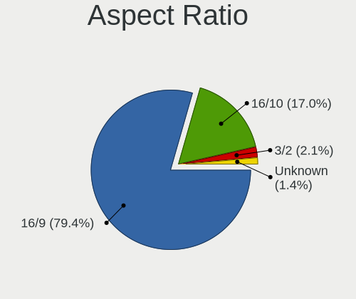

| Ratio   | Notebooks | Percent |
|---------|-----------|---------|
| 16/9    | 112       | 79.43%  |
| 16/10   | 24        | 17.02%  |
| 3/2     | 3         | 2.13%   |
| Unknown | 2         | 1.42%   |

Monitor Area
------------

Area in inch²

| Area in inch² | Notebooks | Percent |
|----------------|-----------|---------|
| 101-110        | 61        | 39.87%  |
| 81-90          | 35        | 22.88%  |
| 71-80          | 13        | 8.5%    |
| 301-350        | 8         | 5.23%   |
| 121-130        | 8         | 5.23%   |
| 61-70          | 7         | 4.58%   |
| 51-60          | 6         | 3.92%   |
| 201-250        | 6         | 3.92%   |
| 131-140        | 2         | 1.31%   |
| Unknown        | 2         | 1.31%   |
| More than 1000 | 1         | 0.65%   |
| 41-50          | 1         | 0.65%   |
| 151-200        | 1         | 0.65%   |
| 111-120        | 1         | 0.65%   |
| 501-1000       | 1         | 0.65%   |

Pixel Density
-------------

Pixels per inch

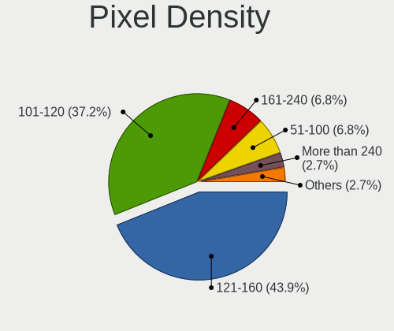

| Density       | Notebooks | Percent |
|---------------|-----------|---------|
| 121-160       | 65        | 43.92%  |
| 101-120       | 55        | 37.16%  |
| 161-240       | 10        | 6.76%   |
| 51-100        | 10        | 6.76%   |
| More than 240 | 4         | 2.7%    |
| 1-50          | 2         | 1.35%   |
| Unknown       | 2         | 1.35%   |

Multiple Monitors
-----------------

Total monitors connected

| Total | Notebooks | Percent |
|-------|-----------|---------|
| 1     | 126       | 88.11%  |
| 2     | 10        | 6.99%   |
| 3     | 4         | 2.8%    |
| 0     | 3         | 2.1%    |

Network
-------

Net Controller Vendor
---------------------

Controller vendors

| Vendor                            | Notebooks | Percent |
|-----------------------------------|-----------|---------|
| Realtek Semiconductor             | 76        | 32.62%  |
| Intel                             | 69        | 29.61%  |
| Qualcomm Atheros                  | 29        | 12.45%  |
| Broadcom                          | 25        | 10.73%  |
| Broadcom Limited                  | 8         | 3.43%   |
| TP-Link                           | 3         | 1.29%   |
| Sierra Wireless                   | 2         | 0.86%   |
| Ralink Technology                 | 2         | 0.86%   |
| Ralink                            | 2         | 0.86%   |
| MediaTek                          | 2         | 0.86%   |
| Hewlett-Packard                   | 2         | 0.86%   |
| Xiaomi                            | 1         | 0.43%   |
| Samsung Electronics               | 1         | 0.43%   |
| Qualcomm                          | 1         | 0.43%   |
| OPPO Electronics                  | 1         | 0.43%   |
| NEC Computers                     | 1         | 0.43%   |
| Marvell Technology Group          | 1         | 0.43%   |
| LSI                               | 1         | 0.43%   |
| Linksys                           | 1         | 0.43%   |
| Huawei Technologies               | 1         | 0.43%   |
| Google                            | 1         | 0.43%   |
| Ericsson Business Mobile Networks | 1         | 0.43%   |
| DisplayLink                       | 1         | 0.43%   |
| Attansic Technology               | 1         | 0.43%   |

Net Controller Model
--------------------

Controller models

| Model                                                             | Notebooks | Percent |
|-------------------------------------------------------------------|-----------|---------|
| Realtek RTL8111/8168/8411 PCI Express Gigabit Ethernet Controller | 42        | 15.22%  |
| Realtek RTL810xE PCI Express Fast Ethernet controller             | 12        | 4.35%   |
| Intel Wi-Fi 6 AX200                                               | 9         | 3.26%   |
| Realtek RTL8821CE 802.11ac PCIe Wireless Network Adapter          | 6         | 2.17%   |
| Qualcomm Atheros QCA9565 / AR9565 Wireless Network Adapter        | 6         | 2.17%   |
| Qualcomm Atheros AR9285 Wireless Network Adapter (PCI-Express)    | 6         | 2.17%   |
| Intel Wireless 8260                                               | 6         | 2.17%   |
| Intel Wi-Fi 6 AX201                                               | 6         | 2.17%   |
| Broadcom BCM4331 802.11a/b/g/n                                    | 6         | 2.17%   |
| Qualcomm Atheros QCA9377 802.11ac Wireless Network Adapter        | 5         | 1.81%   |
| Intel 82579LM Gigabit Network Connection (Lewisville)             | 5         | 1.81%   |
| Intel 82577LM Gigabit Network Connection                          | 5         | 1.81%   |
| Realtek RTL8822CE 802.11ac PCIe Wireless Network Adapter          | 4         | 1.45%   |
| Realtek RTL8153 Gigabit Ethernet Adapter                          | 4         | 1.45%   |
| Qualcomm Atheros AR9485 Wireless Network Adapter                  | 4         | 1.45%   |
| Qualcomm Atheros AR8151 v2.0 Gigabit Ethernet                     | 4         | 1.45%   |
| Intel Wireless 7265                                               | 4         | 1.45%   |
| Intel Centrino Advanced-N 6205 [Taylor Peak]                      | 4         | 1.45%   |
| Broadcom NetXtreme BCM57765 Gigabit Ethernet PCIe                 | 4         | 1.45%   |
| Broadcom BCM4313 802.11bgn Wireless Network Adapter               | 4         | 1.45%   |
| Realtek RTL8191SEvB Wireless LAN Controller                       | 3         | 1.09%   |
| Intel Wireless 8265 / 8275                                        | 3         | 1.09%   |
| Intel Wireless 7260                                               | 3         | 1.09%   |
| Intel Wireless 3160                                               | 3         | 1.09%   |
| Intel PRO/Wireless 3945ABG [Golan] Network Connection             | 3         | 1.09%   |
| Intel Centrino Wireless-N 2230                                    | 3         | 1.09%   |
| Broadcom Limited BCM4360 802.11ac Wireless Network Adapter        | 3         | 1.09%   |
| Broadcom BCM43142 802.11b/g/n                                     | 3         | 1.09%   |
| Realtek RTL8852AE 802.11ax PCIe Wireless Network Adapter          | 2         | 0.72%   |
| Realtek RTL8822BE 802.11a/b/g/n/ac WiFi adapter                   | 2         | 0.72%   |
| Realtek RTL8723DE Wireless Network Adapter                        | 2         | 0.72%   |
| Realtek RTL8723BE PCIe Wireless Network Adapter                   | 2         | 0.72%   |
| Realtek RTL8192CU 802.11n WLAN Adapter                            | 2         | 0.72%   |
| Qualcomm Atheros QCA6174 802.11ac Wireless Network Adapter        | 2         | 0.72%   |
| Intel Wireless 3165                                               | 2         | 0.72%   |
| Intel Tiger Lake PCH CNVi WiFi                                    | 2         | 0.72%   |
| Intel Ethernet Connection I219-V                                  | 2         | 0.72%   |
| Intel Ethernet Connection I219-LM                                 | 2         | 0.72%   |
| Intel Ethernet Connection (4) I219-LM                             | 2         | 0.72%   |
| Intel Ethernet Connection (3) I218-LM                             | 2         | 0.72%   |

Wireless Vendor
---------------

Wireless vendors

| Vendor                | Notebooks | Percent |
|-----------------------|-----------|---------|
| Intel                 | 65        | 42.21%  |
| Realtek Semiconductor | 26        | 16.88%  |
| Qualcomm Atheros      | 25        | 16.23%  |
| Broadcom              | 22        | 14.29%  |
| Broadcom Limited      | 6         | 3.9%    |
| TP-Link               | 3         | 1.95%   |
| Sierra Wireless       | 2         | 1.3%    |
| Ralink Technology     | 2         | 1.3%    |
| Ralink                | 2         | 1.3%    |
| MediaTek              | 1         | 0.65%   |

Wireless Model
--------------

Wireless models

| Model                                                          | Notebooks | Percent |
|----------------------------------------------------------------|-----------|---------|
| Intel Wi-Fi 6 AX200                                            | 9         | 5.84%   |
| Realtek RTL8821CE 802.11ac PCIe Wireless Network Adapter       | 6         | 3.9%    |
| Qualcomm Atheros QCA9565 / AR9565 Wireless Network Adapter     | 6         | 3.9%    |
| Qualcomm Atheros AR9285 Wireless Network Adapter (PCI-Express) | 6         | 3.9%    |
| Intel Wireless 8260                                            | 6         | 3.9%    |
| Intel Wi-Fi 6 AX201                                            | 6         | 3.9%    |
| Broadcom BCM4331 802.11a/b/g/n                                 | 6         | 3.9%    |
| Qualcomm Atheros QCA9377 802.11ac Wireless Network Adapter     | 5         | 3.25%   |
| Realtek RTL8822CE 802.11ac PCIe Wireless Network Adapter       | 4         | 2.6%    |
| Qualcomm Atheros AR9485 Wireless Network Adapter               | 4         | 2.6%    |
| Intel Wireless 7265                                            | 4         | 2.6%    |
| Intel Centrino Advanced-N 6205 [Taylor Peak]                   | 4         | 2.6%    |
| Broadcom BCM4313 802.11bgn Wireless Network Adapter            | 4         | 2.6%    |
| Realtek RTL8191SEvB Wireless LAN Controller                    | 3         | 1.95%   |
| Intel Wireless 8265 / 8275                                     | 3         | 1.95%   |
| Intel Wireless 7260                                            | 3         | 1.95%   |
| Intel Wireless 3160                                            | 3         | 1.95%   |
| Intel PRO/Wireless 3945ABG [Golan] Network Connection          | 3         | 1.95%   |
| Intel Centrino Wireless-N 2230                                 | 3         | 1.95%   |
| Broadcom Limited BCM4360 802.11ac Wireless Network Adapter     | 3         | 1.95%   |
| Broadcom BCM43142 802.11b/g/n                                  | 3         | 1.95%   |
| Realtek RTL8852AE 802.11ax PCIe Wireless Network Adapter       | 2         | 1.3%    |
| Realtek RTL8822BE 802.11a/b/g/n/ac WiFi adapter                | 2         | 1.3%    |
| Realtek RTL8723DE Wireless Network Adapter                     | 2         | 1.3%    |
| Realtek RTL8723BE PCIe Wireless Network Adapter                | 2         | 1.3%    |
| Realtek RTL8192CU 802.11n WLAN Adapter                         | 2         | 1.3%    |
| Qualcomm Atheros QCA6174 802.11ac Wireless Network Adapter     | 2         | 1.3%    |
| Intel Wireless 3165                                            | 2         | 1.3%    |
| Intel Tiger Lake PCH CNVi WiFi                                 | 2         | 1.3%    |
| Intel Dual Band Wireless-AC 3165 Plus Bluetooth                | 2         | 1.3%    |
| Intel Comet Lake PCH-LP CNVi WiFi                              | 2         | 1.3%    |
| Intel Comet Lake PCH CNVi WiFi                                 | 2         | 1.3%    |
| Intel Centrino Advanced-N 6200                                 | 2         | 1.3%    |
| Broadcom BCM43228 802.11a/b/g/n                                | 2         | 1.3%    |
| TP-Link TL-WN722N v2/v3 [Realtek RTL8188EUS]                   | 1         | 0.65%   |
| TP-Link AC600 wireless Realtek RTL8811AU [Archer T2U Nano]     | 1         | 0.65%   |
| TP-Link 802.11ac WLAN Adapter                                  | 1         | 0.65%   |
| Sierra Wireless EM7455                                         | 1         | 0.65%   |
| Sierra Wireless EM7305 Modem                                   | 1         | 0.65%   |
| Realtek RTL8188CUS 802.11n WLAN Adapter                        | 1         | 0.65%   |

Ethernet Vendor
---------------

Ethernet vendors

| Vendor                   | Notebooks | Percent |
|--------------------------|-----------|---------|
| Realtek Semiconductor    | 60        | 51.72%  |
| Intel                    | 23        | 19.83%  |
| Broadcom                 | 11        | 9.48%   |
| Qualcomm Atheros         | 9         | 7.76%   |
| Broadcom Limited         | 2         | 1.72%   |
| Xiaomi                   | 1         | 0.86%   |
| Samsung Electronics      | 1         | 0.86%   |
| Qualcomm                 | 1         | 0.86%   |
| OPPO Electronics         | 1         | 0.86%   |
| MediaTek                 | 1         | 0.86%   |
| Marvell Technology Group | 1         | 0.86%   |
| LSI                      | 1         | 0.86%   |
| Linksys                  | 1         | 0.86%   |
| Google                   | 1         | 0.86%   |
| DisplayLink              | 1         | 0.86%   |
| Attansic Technology      | 1         | 0.86%   |

Ethernet Model
--------------

Ethernet models

| Model                                                                          | Notebooks | Percent |
|--------------------------------------------------------------------------------|-----------|---------|
| Realtek RTL8111/8168/8411 PCI Express Gigabit Ethernet Controller              | 42        | 35.9%   |
| Realtek RTL810xE PCI Express Fast Ethernet controller                          | 12        | 10.26%  |
| Intel 82579LM Gigabit Network Connection (Lewisville)                          | 5         | 4.27%   |
| Intel 82577LM Gigabit Network Connection                                       | 5         | 4.27%   |
| Realtek RTL8153 Gigabit Ethernet Adapter                                       | 4         | 3.42%   |
| Qualcomm Atheros AR8151 v2.0 Gigabit Ethernet                                  | 4         | 3.42%   |
| Broadcom NetXtreme BCM57765 Gigabit Ethernet PCIe                              | 4         | 3.42%   |
| Intel Ethernet Connection I219-V                                               | 2         | 1.71%   |
| Intel Ethernet Connection I219-LM                                              | 2         | 1.71%   |
| Intel Ethernet Connection (4) I219-LM                                          | 2         | 1.71%   |
| Intel Ethernet Connection (3) I218-LM                                          | 2         | 1.71%   |
| Broadcom NetXtreme BCM57786 Gigabit Ethernet PCIe                              | 2         | 1.71%   |
| Broadcom NetXtreme BCM57762 Gigabit Ethernet PCIe                              | 2         | 1.71%   |
| Xiaomi Mi/Redmi series (RNDIS + ADB)                                           | 1         | 0.85%   |
| Samsung GT-I9070 (network tethering, USB debugging enabled)                    | 1         | 0.85%   |
| Realtek RTL8152 Fast Ethernet Adapter                                          | 1         | 0.85%   |
| Realtek Killer E3000 2.5GbE Controller                                         | 1         | 0.85%   |
| Qualcomm MegaFon M150-4                                                        | 1         | 0.85%   |
| Qualcomm Atheros Killer E2400 Gigabit Ethernet Controller                      | 1         | 0.85%   |
| Qualcomm Atheros Killer E220x Gigabit Ethernet Controller                      | 1         | 0.85%   |
| Qualcomm Atheros AR8152 v2.0 Fast Ethernet                                     | 1         | 0.85%   |
| Qualcomm Atheros AR8132 Fast Ethernet                                          | 1         | 0.85%   |
| Qualcomm Atheros AR8131 Gigabit Ethernet                                       | 1         | 0.85%   |
| OPPO RMX3263                                                                   | 1         | 0.85%   |
| MediaTek Infinix NOTE 11                                                       | 1         | 0.85%   |
| Marvell Group Yukon Optima 88E8059 [PCIe Gigabit Ethernet Controller with AVB] | 1         | 0.85%   |
| LSI ET-131x PCI-E Ethernet Controller                                          | 1         | 0.85%   |
| Linksys Gigabit Ethernet Adapter                                               | 1         | 0.85%   |
| Intel PRO/100 VE Network Connection                                            | 1         | 0.85%   |
| Intel Ethernet Connection I218-LM                                              | 1         | 0.85%   |
| Intel Ethernet Connection I217-LM                                              | 1         | 0.85%   |
| Intel Ethernet Connection (7) I219-LM                                          | 1         | 0.85%   |
| Intel 82567LM Gigabit Network Connection                                       | 1         | 0.85%   |
| Google Nexus/Pixel Device (tether)                                             | 1         | 0.85%   |
| DisplayLink 6950                                                               | 1         | 0.85%   |
| Broadcom NetXtreme BCM5764M Gigabit Ethernet PCIe                              | 1         | 0.85%   |
| Broadcom NetLink BCM5784M Gigabit Ethernet PCIe                                | 1         | 0.85%   |
| Broadcom NetLink BCM57785 Gigabit Ethernet PCIe                                | 1         | 0.85%   |
| Broadcom NetLink BCM57780 Gigabit Ethernet PCIe                                | 1         | 0.85%   |
| Broadcom Limited NetXtreme BCM5761 Gigabit Ethernet PCIe                       | 1         | 0.85%   |

Net Controller Kind
-------------------

Ethernet, WiFi or modem

| Kind     | Notebooks | Percent |
|----------|-----------|---------|
| WiFi     | 142       | 55.25%  |
| Ethernet | 110       | 42.8%   |
| Modem    | 4         | 1.56%   |
| Unknown  | 1         | 0.39%   |

Used Controller
---------------

Currently used network controller

| Kind     | Notebooks | Percent |
|----------|-----------|---------|
| WiFi     | 121       | 85.21%  |
| Ethernet | 21        | 14.79%  |

NICs
----

Total network controllers on board

| Total | Notebooks | Percent |
|-------|-----------|---------|
| 2     | 100       | 69.93%  |
| 1     | 41        | 28.67%  |
| 3     | 2         | 1.4%    |

IPv6
----

IPv6 vs IPv4

| Used | Notebooks | Percent |
|------|-----------|---------|
| No   | 106       | 74.13%  |
| Yes  | 37        | 25.87%  |

Bluetooth
---------

Bluetooth Vendor
----------------

Controller vendors

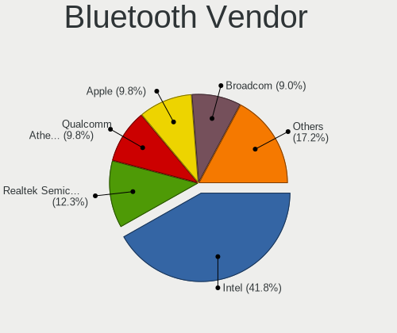

| Vendor                          | Notebooks | Percent |
|---------------------------------|-----------|---------|
| Intel                           | 51        | 41.8%   |
| Realtek Semiconductor           | 15        | 12.3%   |
| Qualcomm Atheros Communications | 12        | 9.84%   |
| Apple                           | 12        | 9.84%   |
| Broadcom                        | 11        | 9.02%   |
| Lite-On Technology              | 5         | 4.1%    |
| Foxconn / Hon Hai               | 5         | 4.1%    |
| IMC Networks                    | 3         | 2.46%   |
| Dell                            | 2         | 1.64%   |
| Toshiba                         | 1         | 0.82%   |
| Realtek                         | 1         | 0.82%   |
| Ralink                          | 1         | 0.82%   |
| Qcom                            | 1         | 0.82%   |
| Hewlett-Packard                 | 1         | 0.82%   |
| Cambridge Silicon Radio         | 1         | 0.82%   |

Bluetooth Model
---------------

Controller models

| Model                                                                               | Notebooks | Percent |
|-------------------------------------------------------------------------------------|-----------|---------|
| Intel Bluetooth wireless interface                                                  | 22        | 18.03%  |
| Realtek Bluetooth Radio                                                             | 11        | 9.02%   |
| Intel AX201 Bluetooth                                                               | 10        | 8.2%    |
| Intel AX200 Bluetooth                                                               | 9         | 7.38%   |
| Apple Bluetooth Host Controller                                                     | 7         | 5.74%   |
| Qualcomm Atheros  Bluetooth Device                                                  | 5         | 4.1%    |
| Qualcomm Atheros AR3011 Bluetooth                                                   | 5         | 4.1%    |
| Apple Bluetooth USB Host Controller                                                 | 5         | 4.1%    |
| Realtek  Bluetooth 4.2 Adapter                                                      | 4         | 3.28%   |
| Intel Centrino Bluetooth Wireless Transceiver                                       | 4         | 3.28%   |
| Intel Bluetooth 9460/9560 Jefferson Peak (JfP)                                      | 4         | 3.28%   |
| Broadcom BCM20702 Bluetooth 4.0 [ThinkPad]                                          | 3         | 2.46%   |
| IMC Networks Bluetooth Radio                                                        | 2         | 1.64%   |
| Foxconn / Hon Hai Bluetooth Device                                                  | 2         | 1.64%   |
| Broadcom BCM43142A0 Bluetooth 4.0                                                   | 2         | 1.64%   |
| Broadcom BCM2045B (BDC-2.1) [Bluetooth Controller]                                  | 2         | 1.64%   |
| Broadcom BCM2045B (BDC-2.1)                                                         | 2         | 1.64%   |
| Toshiba Bluetooth USB Host Controller                                               | 1         | 0.82%   |
| Realtek Bluetooth Radio                                                             | 1         | 0.82%   |
| Ralink RT3290 Bluetooth                                                             | 1         | 0.82%   |
| Qualcomm Atheros QCA61x4 Bluetooth 4.0                                              | 1         | 0.82%   |
| Qualcomm Atheros AR3012 Bluetooth 4.0                                               | 1         | 0.82%   |
| Qcom Broadcom Bluetooth USB                                                         | 1         | 0.82%   |
| Lite-On Wireless_Device                                                             | 1         | 0.82%   |
| Lite-On Qualcomm Atheros QCA9377 Bluetooth                                          | 1         | 0.82%   |
| Lite-On Qualcomm Atheros Bluetooth                                                  | 1         | 0.82%   |
| Lite-On Bluetooth Device                                                            | 1         | 0.82%   |
| Lite-On Atheros AR3012 Bluetooth                                                    | 1         | 0.82%   |
| Intel Wireless-AC 3168 Bluetooth                                                    | 1         | 0.82%   |
| Intel Centrino Advanced-N 6230 Bluetooth adapter                                    | 1         | 0.82%   |
| IMC Networks BCM20702A0                                                             | 1         | 0.82%   |
| HP Broadcom 2070 Bluetooth Combo                                                    | 1         | 0.82%   |
| Foxconn / Hon Hai Foxconn T77H114 BCM2070 [Single-Chip Bluetooth 2.1 + EDR Adapter] | 1         | 0.82%   |
| Foxconn / Hon Hai Bluetooth USB Host Controller                                     | 1         | 0.82%   |
| Foxconn / Hon Hai BCM20702A0                                                        | 1         | 0.82%   |
| Dell DW375 Bluetooth Module                                                         | 1         | 0.82%   |
| Dell Broadcom BCM20702A0 Bluetooth                                                  | 1         | 0.82%   |
| Cambridge Silicon Radio Bluetooth Dongle (HCI mode)                                 | 1         | 0.82%   |
| Broadcom HP Portable Valentine                                                      | 1         | 0.82%   |
| Broadcom BCM20702A0                                                                 | 1         | 0.82%   |

Sound
-----

Sound Vendor
------------

Sound card vendors

| Vendor                 | Notebooks | Percent |
|------------------------|-----------|---------|
| Intel                  | 126       | 74.56%  |
| AMD                    | 20        | 11.83%  |
| Nvidia                 | 17        | 10.06%  |
| TEAC                   | 1         | 0.59%   |
| Logitech               | 1         | 0.59%   |
| JMTek                  | 1         | 0.59%   |
| GN Netcom              | 1         | 0.59%   |
| Generalplus Technology | 1         | 0.59%   |
| Corsair                | 1         | 0.59%   |

Sound Model
-----------

Sound card models

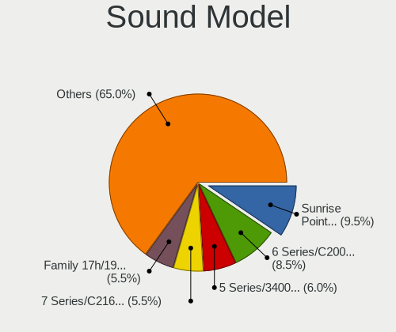

| Model                                                                                             | Notebooks | Percent |
|---------------------------------------------------------------------------------------------------|-----------|---------|
| Intel Sunrise Point-LP HD Audio                                                                   | 19        | 9.5%    |
| Intel 6 Series/C200 Series Chipset Family High Definition Audio Controller                        | 17        | 8.5%    |
| Intel 5 Series/3400 Series Chipset High Definition Audio                                          | 12        | 6%      |
| Intel 7 Series/C216 Chipset Family High Definition Audio Controller                               | 11        | 5.5%    |
| AMD Family 17h/19h HD Audio Controller                                                            | 11        | 5.5%    |
| Intel Tiger Lake-LP Smart Sound Technology Audio Controller                                       | 9         | 4.5%    |
| Intel Wildcat Point-LP High Definition Audio Controller                                           | 7         | 3.5%    |
| Intel Broadwell-U Audio Controller                                                                | 7         | 3.5%    |
| AMD Renoir Radeon High Definition Audio Controller                                                | 7         | 3.5%    |
| Intel Atom/Celeron/Pentium Processor x5-E8000/J3xxx/N3xxx Series High Definition Audio Controller | 6         | 3%      |
| Intel Haswell-ULT HD Audio Controller                                                             | 5         | 2.5%    |
| Intel 82801I (ICH9 Family) HD Audio Controller                                                    | 5         | 2.5%    |
| Intel 8 Series HD Audio Controller                                                                | 5         | 2.5%    |
| Intel CM238 HD Audio Controller                                                                   | 4         | 2%      |
| Intel Celeron/Pentium Silver Processor High Definition Audio                                      | 4         | 2%      |
| Intel 8 Series/C220 Series Chipset High Definition Audio Controller                               | 4         | 2%      |
| Nvidia TU107 GeForce GTX 1650 High Definition Audio Controller                                    | 3         | 1.5%    |
| Nvidia GK107 HDMI Audio Controller                                                                | 3         | 1.5%    |
| Intel Tiger Lake-H HD Audio Controller                                                            | 3         | 1.5%    |
| Intel Comet Lake PCH-LP cAVS                                                                      | 3         | 1.5%    |
| Intel Cannon Lake PCH cAVS                                                                        | 3         | 1.5%    |
| Intel Atom Processor Z36xxx/Z37xxx Series High Definition Audio Controller                        | 3         | 1.5%    |
| AMD Raven/Raven2/Fenghuang HDMI/DP Audio Controller                                               | 3         | 1.5%    |
| Nvidia GP107GL High Definition Audio Controller                                                   | 2         | 1%      |
| Nvidia GF108 High Definition Audio Controller                                                     | 2         | 1%      |
| Nvidia GA104 High Definition Audio Controller                                                     | 2         | 1%      |
| Intel Xeon E3-1200 v3/4th Gen Core Processor HD Audio Controller                                  | 2         | 1%      |
| Intel NM10/ICH7 Family High Definition Audio Controller                                           | 2         | 1%      |
| Intel Comet Lake PCH cAVS                                                                         | 2         | 1%      |
| Intel Cannon Point-LP High Definition Audio Controller                                            | 2         | 1%      |
| Intel 82801H (ICH8 Family) HD Audio Controller                                                    | 2         | 1%      |
| AMD SBx00 Azalia (Intel HDA)                                                                      | 2         | 1%      |
| AMD Kabini HDMI/DP Audio                                                                          | 2         | 1%      |
| AMD FCH Azalia Controller                                                                         | 2         | 1%      |
| TEAC TASCAM iXR                                                                                   | 1         | 0.5%    |
| Nvidia stereo controller                                                                          | 1         | 0.5%    |
| Nvidia MCP89 High Definition Audio                                                                | 1         | 0.5%    |
| Nvidia GP104 High Definition Audio Controller                                                     | 1         | 0.5%    |
| Nvidia GM107 High Definition Audio Controller [GeForce 940MX]                                     | 1         | 0.5%    |
| Nvidia GK106 HDMI Audio Controller                                                                | 1         | 0.5%    |

Memory
------

Memory Vendor
-------------

Memory module vendors

| Vendor              | Notebooks | Percent |
|---------------------|-----------|---------|
| Samsung Electronics | 16        | 31.37%  |
| SK hynix            | 10        | 19.61%  |
| Micron Technology   | 8         | 15.69%  |
| Kingston            | 5         | 9.8%    |
| Unknown             | 2         | 3.92%   |
| Ramaxel Technology  | 2         | 3.92%   |
| Crucial             | 2         | 3.92%   |
| Toshiba             | 1         | 1.96%   |
| Qimonda             | 1         | 1.96%   |
| Kllisre             | 1         | 1.96%   |
| GSkill              | 1         | 1.96%   |
| A-DATA Technology   | 1         | 1.96%   |
| Unknown             | 1         | 1.96%   |

Memory Model
------------

Memory module models

| Model                                                       | Notebooks | Percent |
|-------------------------------------------------------------|-----------|---------|
| Samsung RAM M471B5173DB0-YK0 4GB SODIMM DDR3 1600MT/s       | 3         | 5.66%   |
| SK hynix RAM HMA851S6CJR6N-VK 4GB SODIMM DDR4 2667MT/s      | 2         | 3.77%   |
| Samsung RAM M471A5244CB0-CRC 4GB SODIMM DDR4 2667MT/s       | 2         | 3.77%   |
| Unknown RAM Module 4096MB Chip DDR4 2133MT/s                | 1         | 1.89%   |
| Unknown RAM Module 1024MB SODIMM LPDDR4 2400MT/s            | 1         | 1.89%   |
| Toshiba RAM 8HTF12864HDY-800G1 4GB SODIMM 1066MT/s          | 1         | 1.89%   |
| Toshiba RAM 64T128020EDL2.5C2 2GB SODIMM DDR2 1066MT/s      | 1         | 1.89%   |
| SK hynix RAM HMT451S6BFR8A-PB 4GB SODIMM DDR3 1600MT/s      | 1         | 1.89%   |
| SK hynix RAM HMT41GS6BFR8A-PB 8GB SODIMM DDR3 1600MT/s      | 1         | 1.89%   |
| SK hynix RAM HMT325S6CFR8C-PB 2GB SODIMM DDR3 1600MT/s      | 1         | 1.89%   |
| SK hynix RAM HMAA2GS6CJR8N-XN 16GB SODIMM DDR4 3200MT/s     | 1         | 1.89%   |
| SK hynix RAM HMA851S6DJR6N-XN 4GB SODIMM DDR4 3200MT/s      | 1         | 1.89%   |
| SK hynix RAM HMA82GS6MFR8N-TF 16GB SODIMM DDR4 2133MT/s     | 1         | 1.89%   |
| SK hynix RAM HMA81GS6JJR8N-VK 8GB SODIMM DDR4 2667MT/s      | 1         | 1.89%   |
| SK hynix RAM HMA81GS6AFR8N-UH 8GB SODIMM DDR4 2667MT/s      | 1         | 1.89%   |
| Samsung RAM Module 8192MB SODIMM DDR4 2133MT/s              | 1         | 1.89%   |
| Samsung RAM M471B5773DH0-CK0 2048MB SODIMM DDR3 1600MT/s    | 1         | 1.89%   |
| Samsung RAM M471B5773CHS-CH9 2GB SODIMM DDR3 4199MT/s       | 1         | 1.89%   |
| Samsung RAM M471B5673FH0-CF8 2GB SODIMM DDR3 1067MT/s       | 1         | 1.89%   |
| Samsung RAM M471B5273CH0-CH9 4GB SODIMM DDR3 1334MT/s       | 1         | 1.89%   |
| Samsung RAM M471B5173QH0-YK0 4GB SODIMM DDR3 1600MT/s       | 1         | 1.89%   |
| Samsung RAM M471B2873FHS-CF8 1GB SODIMM DDR3 1067MT/s       | 1         | 1.89%   |
| Samsung RAM M471A2K43DB1-CWE 16GB SODIMM DDR4 3200MT/s      | 1         | 1.89%   |
| Samsung RAM M471A2G43AB2-CWE 16GB SODIMM DDR4 3200MT/s      | 1         | 1.89%   |
| Samsung RAM M471A1G44AB0-CWE 8GB Row Of Chips DDR4 3200MT/s | 1         | 1.89%   |
| Samsung RAM M471A1G43DB0-CPB 8GB SODIMM DDR4 2400MT/s       | 1         | 1.89%   |
| Samsung RAM M4 70T5663EH3-CF7 2GB SODIMM DDR2 975MT/s       | 1         | 1.89%   |
| Ramaxel RAM RMT3170EF68F9W1600 4GB SODIMM DDR3 1600MT/s     | 1         | 1.89%   |
| Ramaxel RAM RMSA3310NA86H9F-2666 4GB SODIMM DDR4 2667MT/s   | 1         | 1.89%   |
| Qimonda RAM 64T256020EDL2.5C2 2GB SODIMM DDR2 2048MT/s      | 1         | 1.89%   |
| Micron RAM MT41K256M16LY 2GB SODIMM DDR3 1600MT/s           | 1         | 1.89%   |
| Micron RAM Module 4096MB SODIMM DDR3 1600MT/s               | 1         | 1.89%   |
| Micron RAM Module 2048MB SODIMM DDR3 1600MT/s               | 1         | 1.89%   |
| Micron RAM 8ATF1G64HZ-2G6H1 8GB SODIMM DDR4 2667MT/s        | 1         | 1.89%   |
| Micron RAM 53E1G32D4NQ 2GB Row Of Chips LPDDR4 4267MT/s     | 1         | 1.89%   |
| Micron RAM 4ATF51264HZ-2G6E3 4GB SODIMM DDR4 2667MT/s       | 1         | 1.89%   |
| Micron RAM 16JSF25664HZ-1G4F1 2048MB SODIMM 1334MT/s        | 1         | 1.89%   |
| Micron RAM 16ATF2G64HZ-3G2J1 16GB SODIMM DDR4 3200MT/s      | 1         | 1.89%   |
| Kllisre RAM KRE-D3S1600M/8G 8GB SODIMM DDR3 1600MT/s        | 1         | 1.89%   |
| Kingston RAM KHX2666C15S4/8G 8GB SODIMM DDR4 2667MT/s       | 1         | 1.89%   |

Memory Kind
-----------

Memory module kinds

| Kind   | Notebooks | Percent |
|--------|-----------|---------|
| DDR4   | 20        | 51.28%  |
| DDR3   | 14        | 35.9%   |
| SDRAM  | 2         | 5.13%   |
| LPDDR4 | 2         | 5.13%   |
| DDR2   | 1         | 2.56%   |

Memory Form Factor
------------------

Physical design of the memory module

| Name         | Notebooks | Percent |
|--------------|-----------|---------|
| SODIMM       | 37        | 90.24%  |
| Row Of Chips | 2         | 4.88%   |
| Chip         | 2         | 4.88%   |

Memory Size
-----------

Memory module size

| Size  | Notebooks | Percent |
|-------|-----------|---------|
| 8192  | 15        | 31.91%  |
| 4096  | 14        | 29.79%  |
| 2048  | 9         | 19.15%  |
| 16384 | 7         | 14.89%  |
| 1024  | 2         | 4.26%   |

Memory Speed
------------

Memory module speed

| Speed | Notebooks | Percent |
|-------|-----------|---------|
| 1600  | 12        | 27.91%  |
| 2667  | 11        | 25.58%  |
| 3200  | 8         | 18.6%   |
| 2400  | 3         | 6.98%   |
| 2133  | 3         | 6.98%   |
| 4267  | 1         | 2.33%   |
| 4199  | 1         | 2.33%   |
| 2048  | 1         | 2.33%   |
| 1334  | 1         | 2.33%   |
| 1067  | 1         | 2.33%   |
| 1066  | 1         | 2.33%   |

Printers & scanners
-------------------

Printer Vendor
--------------

Printer device vendors

| Vendor             | Notebooks | Percent |
|--------------------|-----------|---------|
| Hewlett-Packard    | 1         | 50%     |
| Brother Industries | 1         | 50%     |

Printer Model
-------------

Printer device models

| Model                   | Notebooks | Percent |
|-------------------------|-----------|---------|
| HP Deskjet F4500 series | 1         | 50%     |
| Brother MFC-T800W       | 1         | 50%     |

Scanner Vendor
--------------

Scanner device vendors

Zero info for selected period =(

Scanner Model
-------------

Scanner device models

Zero info for selected period =(

Camera
------

Camera Vendor
-------------

Camera device vendors

| Vendor                                 | Notebooks | Percent |
|----------------------------------------|-----------|---------|
| Chicony Electronics                    | 35        | 29.41%  |
| Realtek Semiconductor                  | 11        | 9.24%   |
| Microdia                               | 11        | 9.24%   |
| Apple                                  | 9         | 7.56%   |
| Acer                                   | 9         | 7.56%   |
| Quanta                                 | 8         | 6.72%   |
| Cheng Uei Precision Industry (Foxlink) | 7         | 5.88%   |
| Suyin                                  | 6         | 5.04%   |
| Sunplus Innovation Technology          | 5         | 4.2%    |
| Lenovo                                 | 4         | 3.36%   |
| IMC Networks                           | 3         | 2.52%   |
| Syntek                                 | 2         | 1.68%   |
| Luxvisions Innotech Limited            | 2         | 1.68%   |
| Lite-On Technology                     | 2         | 1.68%   |
| USB Camera                             | 1         | 0.84%   |
| Primax Electronics                     | 1         | 0.84%   |
| Logitech                               | 1         | 0.84%   |
| Importek                               | 1         | 0.84%   |
| HD 2MP WEBCAM                          | 1         | 0.84%   |

Camera Model
------------

Camera device models

| Model                                    | Notebooks | Percent |
|------------------------------------------|-----------|---------|
| Chicony Integrated Camera                | 8         | 6.72%   |
| Chicony HD WebCam                        | 4         | 3.36%   |
| Apple FaceTime HD Camera                 | 4         | 3.36%   |
| Realtek Integrated_Webcam_HD             | 3         | 2.52%   |
| Realtek HD WebCam                        | 3         | 2.52%   |
| Quanta HP TrueVision HD Camera           | 3         | 2.52%   |
| Chicony HP Truevision HD                 | 3         | 2.52%   |
| Chicony HP HD Webcam [Fixed]             | 3         | 2.52%   |
| Acer Lenovo EasyCamera                   | 3         | 2.52%   |
| Suyin Acer/HP Integrated Webcam [CN0314] | 2         | 1.68%   |
| Sunplus Laptop_Integrated_Webcam_HD      | 2         | 1.68%   |
| Realtek USB Camera                       | 2         | 1.68%   |
| Microdia Laptop_Integrated_Webcam_HD     | 2         | 1.68%   |
| Microdia Integrated_Webcam_HD            | 2         | 1.68%   |
| Lite-On Integrated Camera                | 2         | 1.68%   |
| Lenovo Integrated Webcam                 | 2         | 1.68%   |
| IMC Networks USB2.0 HD UVC WebCam        | 2         | 1.68%   |
| Chicony USB2.0 Camera                    | 2         | 1.68%   |
| Chicony HP TrueVision HD Camera          | 2         | 1.68%   |
| Chicony HP HD Webcam                     | 2         | 1.68%   |
| Apple iPhone5/5C/5S/6                    | 2         | 1.68%   |
| Apple FaceTime HD Camera (Built-in)      | 2         | 1.68%   |
| USB Camera USB Camera                    | 1         | 0.84%   |
| Syntek Integrated Camera                 | 1         | 0.84%   |
| Syntek EasyCamera                        | 1         | 0.84%   |
| Suyin HP TrueVision HD Integrated Webcam | 1         | 0.84%   |
| Suyin Asus Integrated Webcam             | 1         | 0.84%   |
| Suyin 1.3M HD WebCam                     | 1         | 0.84%   |
| Suyin 1.3M Front                         | 1         | 0.84%   |
| Sunplus Laptop_Integrated_Webcam_1.3M    | 1         | 0.84%   |
| Sunplus Laptop Integrated WebCam HD      | 1         | 0.84%   |
| Sunplus 1.3M HD WebCam                   | 1         | 0.84%   |
| Realtek USB2.0 HD UVC WebCam             | 1         | 0.84%   |
| Realtek Integrated Webcam                | 1         | 0.84%   |
| Realtek Integrated Camera                | 1         | 0.84%   |
| Quanta ov9734_techfront_camera           | 1         | 0.84%   |
| Quanta HP Webcam                         | 1         | 0.84%   |
| Quanta HP TrueVision HD Webcam           | 1         | 0.84%   |
| Quanta HD User Facing                    | 1         | 0.84%   |
| Quanta HD Camera                         | 1         | 0.84%   |

Security
--------

Fingerprint Vendor
------------------

Fingerprint sensor vendors

| Vendor                     | Notebooks | Percent |
|----------------------------|-----------|---------|
| Validity Sensors           | 14        | 42.42%  |
| Synaptics                  | 4         | 12.12%  |
| Upek                       | 3         | 9.09%   |
| Shenzhen Goodix Technology | 3         | 9.09%   |
| LighTuning Technology      | 3         | 9.09%   |
| AuthenTec                  | 3         | 9.09%   |
| STMicroelectronics         | 1         | 3.03%   |
| Focal-systems.Corp         | 1         | 3.03%   |
| Elan Microelectronics      | 1         | 3.03%   |

Fingerprint Model
-----------------

Fingerprint sensor models

| Model                                                                      | Notebooks | Percent |
|----------------------------------------------------------------------------|-----------|---------|
| Validity Sensors VFS495 Fingerprint Reader                                 | 3         | 9.09%   |
| Upek Biometric Touchchip/Touchstrip Fingerprint Sensor                     | 3         | 9.09%   |
| LighTuning EgisTec Touch Fingerprint Sensor                                | 3         | 9.09%   |
| Validity Sensors VFS7500 Touch Fingerprint Sensor                          | 2         | 6.06%   |
| Validity Sensors VFS471 Fingerprint Reader                                 | 2         | 6.06%   |
| Validity Sensors Swipe Fingerprint Sensor                                  | 2         | 6.06%   |
| Shenzhen Goodix  FingerPrint Device                                        | 2         | 6.06%   |
| Validity Sensors VFS5011 Fingerprint Reader                                | 1         | 3.03%   |
| Validity Sensors VFS491                                                    | 1         | 3.03%   |
| Validity Sensors VFS451 Fingerprint Reader                                 | 1         | 3.03%   |
| Validity Sensors Synaptics WBDI                                            | 1         | 3.03%   |
| Validity Sensors Synaptics VFS7552 Touch Fingerprint Sensor with PurePrint | 1         | 3.03%   |
| Synaptics  WBDI Fingerprint Reader - USB 052                               | 1         | 3.03%   |
| Synaptics  WBDI                                                            | 1         | 3.03%   |
| Synaptics Prometheus MIS Touch Fingerprint Reader                          | 1         | 3.03%   |
| STMicroelectronics Fingerprint Reader                                      | 1         | 3.03%   |
| Shenzhen Goodix FingerPrint                                                | 1         | 3.03%   |
| Focal-systems.Corp FT9201Fingerprint.                                      | 1         | 3.03%   |
| Elan ELAN:ARM-M4                                                           | 1         | 3.03%   |
| AuthenTec Fingerprint Sensor                                               | 1         | 3.03%   |
| AuthenTec AES2810                                                          | 1         | 3.03%   |
| AuthenTec AES2501 Fingerprint Sensor                                       | 1         | 3.03%   |
| Unknown                                                                    | 1         | 3.03%   |

Chipcard Vendor
---------------

Chipcard module vendors

| Vendor      | Notebooks | Percent |
|-------------|-----------|---------|
| Broadcom    | 2         | 40%     |
| Alcor Micro | 2         | 40%     |
| Upek        | 1         | 20%     |

Chipcard Model
--------------

Chipcard module models

| Model                                                                        | Notebooks | Percent |
|------------------------------------------------------------------------------|-----------|---------|
| Alcor Micro AU9540 Smartcard Reader                                          | 2         | 40%     |
| Upek TouchChip Fingerprint Coprocessor (WBF advanced mode)                   | 1         | 20%     |
| Broadcom BCM5880 Secure Applications Processor with fingerprint swipe sensor | 1         | 20%     |
| Broadcom BCM5880 Secure Applications Processor                               | 1         | 20%     |

Unsupported
-----------

Unsupported Devices
-------------------

Total unsupported devices on board

| Total | Notebooks | Percent |
|-------|-----------|---------|
| 0     | 84        | 58.74%  |
| 1     | 46        | 32.17%  |
| 2     | 12        | 8.39%   |
| 3     | 1         | 0.7%    |

Unsupported Device Types
------------------------

Types of unsupported devices

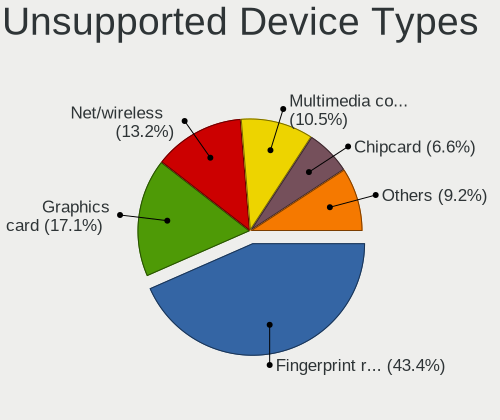

| Type                  | Notebooks | Percent |
|-----------------------|-----------|---------|
| Fingerprint reader    | 33        | 44%     |
| Graphics card         | 12        | 16%     |
| Net/wireless          | 10        | 13.33%  |
| Multimedia controller | 8         | 10.67%  |
| Chipcard              | 5         | 6.67%   |
| Sound                 | 2         | 2.67%   |
| Net/ethernet          | 2         | 2.67%   |
| Storage               | 1         | 1.33%   |
| Camera                | 1         | 1.33%   |
| Bluetooth             | 1         | 1.33%   |

