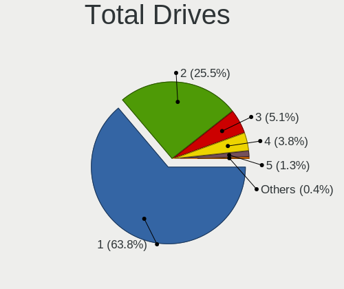
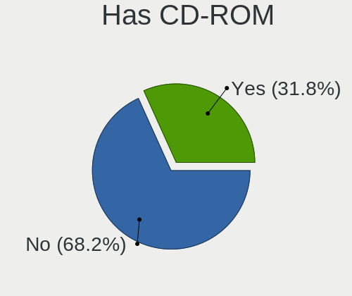
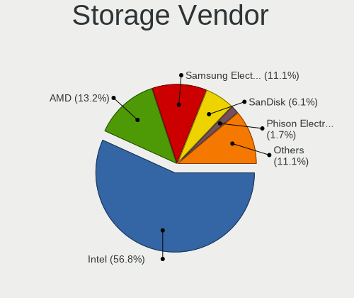
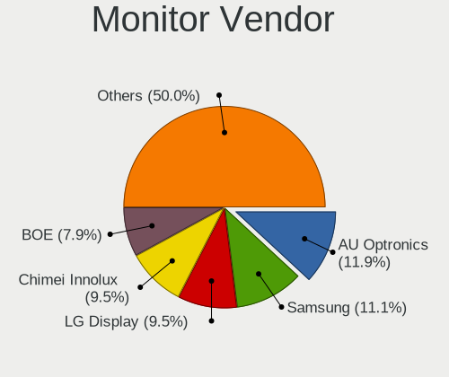
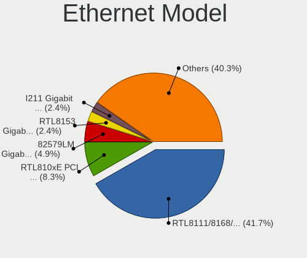
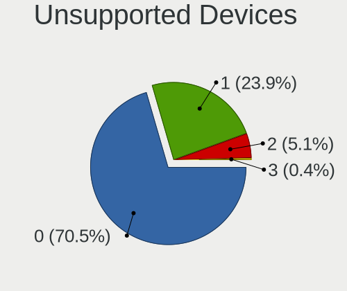
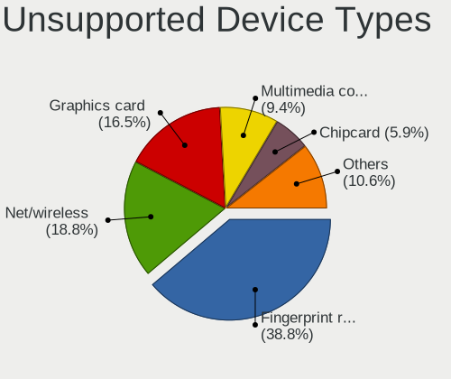

Elementary 6 - Tested Hardware & Statistics
-------------------------------------------

A project to collect tested hardware configurations for Elementary 6.

Anyone can contribute to this report by the [hw-probe](https://github.com/linuxhw/hw-probe) tool:

    sudo -E hw-probe -all -upload

Please submit a probe of your configuration if it's not presented on the page or is rare.

This is a report for all computer types. See also reports for [desktops](/Dist/Elementary_6/Desktop/README.md) and [notebooks](/Dist/Elementary_6/Notebook/README.md).

Full-feature report is available here: https://linux-hardware.org/?view=trends&rel=elementary-6

Contents
--------

* [ Test Cases ](#test-cases)

* [ System ](#system)
  - [ Kernel                   ](#kernel)
  - [ Kernel Family            ](#kernel-family)
  - [ Kernel Major Ver.        ](#kernel-major-ver)
  - [ Arch                     ](#arch)
  - [ DE                       ](#de)
  - [ Display Server           ](#display-server)
  - [ Display Manager          ](#display-manager)
  - [ OS Lang                  ](#os-lang)
  - [ Boot Mode                ](#boot-mode)
  - [ Filesystem               ](#filesystem)
  - [ Part. scheme             ](#part-scheme)
  - [ Dual Boot with Linux/BSD ](#dual-boot-with-linuxbsd)
  - [ Dual Boot (Win)          ](#dual-boot-win)

* [ Board ](#board)
  - [ Vendor                   ](#vendor)
  - [ Model                    ](#model)
  - [ Model Family             ](#model-family)
  - [ MFG Year                 ](#mfg-year)
  - [ Form Factor              ](#form-factor)
  - [ Secure Boot              ](#secure-boot)
  - [ Coreboot                 ](#coreboot)
  - [ RAM Size                 ](#ram-size)
  - [ RAM Used                 ](#ram-used)
  - [ Total Drives             ](#total-drives)
  - [ Has CD-ROM               ](#has-cd-rom)
  - [ Has Ethernet             ](#has-ethernet)
  - [ Has WiFi                 ](#has-wifi)
  - [ Has Bluetooth            ](#has-bluetooth)

* [ Location ](#location)
  - [ Country                  ](#country)
  - [ City                     ](#city)

* [ Drives ](#drives)
  - [ Drive Vendor             ](#drive-vendor)
  - [ Drive Model              ](#drive-model)
  - [ HDD Vendor               ](#hdd-vendor)
  - [ SSD Vendor               ](#ssd-vendor)
  - [ Drive Kind               ](#drive-kind)
  - [ Drive Connector          ](#drive-connector)
  - [ Drive Size               ](#drive-size)
  - [ Space Total              ](#space-total)
  - [ Space Used               ](#space-used)
  - [ Malfunc. Drives          ](#malfunc-drives)
  - [ Malfunc. Drive Vendor    ](#malfunc-drive-vendor)
  - [ Malfunc. HDD Vendor      ](#malfunc-hdd-vendor)
  - [ Malfunc. Drive Kind      ](#malfunc-drive-kind)
  - [ Failed Drives            ](#failed-drives)
  - [ Failed Drive Vendor      ](#failed-drive-vendor)
  - [ Drive Status             ](#drive-status)

* [ Storage controller ](#storage-controller)
  - [ Storage Vendor           ](#storage-vendor)
  - [ Storage Model            ](#storage-model)
  - [ Storage Kind             ](#storage-kind)

* [ Processor ](#processor)
  - [ CPU Vendor               ](#cpu-vendor)
  - [ CPU Model                ](#cpu-model)
  - [ CPU Model Family         ](#cpu-model-family)
  - [ CPU Cores                ](#cpu-cores)
  - [ CPU Sockets              ](#cpu-sockets)
  - [ CPU Threads              ](#cpu-threads)
  - [ CPU Op-Modes             ](#cpu-op-modes)
  - [ CPU Microcode            ](#cpu-microcode)
  - [ CPU Microarch            ](#cpu-microarch)

* [ Graphics ](#graphics)
  - [ GPU Vendor               ](#gpu-vendor)
  - [ GPU Model                ](#gpu-model)
  - [ GPU Combo                ](#gpu-combo)
  - [ GPU Driver               ](#gpu-driver)
  - [ GPU Memory               ](#gpu-memory)

* [ Monitor ](#monitor)
  - [ Monitor Vendor           ](#monitor-vendor)
  - [ Monitor Model            ](#monitor-model)
  - [ Monitor Resolution       ](#monitor-resolution)
  - [ Monitor Diagonal         ](#monitor-diagonal)
  - [ Monitor Width            ](#monitor-width)
  - [ Aspect Ratio             ](#aspect-ratio)
  - [ Monitor Area             ](#monitor-area)
  - [ Pixel Density            ](#pixel-density)
  - [ Multiple Monitors        ](#multiple-monitors)

* [ Network ](#network)
  - [ Net Controller Vendor    ](#net-controller-vendor)
  - [ Net Controller Model     ](#net-controller-model)
  - [ Wireless Vendor          ](#wireless-vendor)
  - [ Wireless Model           ](#wireless-model)
  - [ Ethernet Vendor          ](#ethernet-vendor)
  - [ Ethernet Model           ](#ethernet-model)
  - [ Net Controller Kind      ](#net-controller-kind)
  - [ Used Controller          ](#used-controller)
  - [ NICs                     ](#nics)
  - [ IPv6                     ](#ipv6)

* [ Bluetooth ](#bluetooth)
  - [ Bluetooth Vendor         ](#bluetooth-vendor)
  - [ Bluetooth Model          ](#bluetooth-model)

* [ Sound ](#sound)
  - [ Sound Vendor             ](#sound-vendor)
  - [ Sound Model              ](#sound-model)

* [ Memory ](#memory)
  - [ Memory Vendor            ](#memory-vendor)
  - [ Memory Model             ](#memory-model)
  - [ Memory Kind              ](#memory-kind)
  - [ Memory Form Factor       ](#memory-form-factor)
  - [ Memory Size              ](#memory-size)
  - [ Memory Speed             ](#memory-speed)

* [ Printers & scanners ](#printers--scanners)
  - [ Printer Vendor           ](#printer-vendor)
  - [ Printer Model            ](#printer-model)
  - [ Scanner Vendor           ](#scanner-vendor)
  - [ Scanner Model            ](#scanner-model)

* [ Camera ](#camera)
  - [ Camera Vendor            ](#camera-vendor)
  - [ Camera Model             ](#camera-model)

* [ Security ](#security)
  - [ Fingerprint Vendor       ](#fingerprint-vendor)
  - [ Fingerprint Model        ](#fingerprint-model)
  - [ Chipcard Vendor          ](#chipcard-vendor)
  - [ Chipcard Model           ](#chipcard-model)

* [ Unsupported ](#unsupported)
  - [ Unsupported Devices      ](#unsupported-devices)
  - [ Unsupported Device Types ](#unsupported-device-types)

Test Cases
----------

| Vendor        | Model                       | Form-Factor | Probe                                                      | Date         |
|---------------|-----------------------------|-------------|------------------------------------------------------------|--------------|
| Lenovo        | ThinkPad T430 2342A19       | Notebook    | [32c58fa2f6](https://linux-hardware.org/?probe=32c58fa2f6) | Sep 30, 2021 |
| Dell          | XPS 13 9350                 | Notebook    | [c1dc59d33f](https://linux-hardware.org/?probe=c1dc59d33f) | Sep 29, 2021 |
| Apple         | Mac-F221BEC8                | Desktop     | [1754c64091](https://linux-hardware.org/?probe=1754c64091) | Sep 27, 2021 |
| Lenovo        | IdeaPad 5 15ARE05 81YQ      | Notebook    | [c28700cfda](https://linux-hardware.org/?probe=c28700cfda) | Sep 26, 2021 |
| Lenovo        | Yoga 300-11IBR 80M1         | Notebook    | [fbcf277174](https://linux-hardware.org/?probe=fbcf277174) | Sep 26, 2021 |
| Lenovo        | G50-45 80E3                 | Notebook    | [59224ec754](https://linux-hardware.org/?probe=59224ec754) | Sep 26, 2021 |
| ASUSTek       | P7H55-M                     | Desktop     | [3367bc011a](https://linux-hardware.org/?probe=3367bc011a) | Sep 25, 2021 |
| Dell          | 0Y5DDC A00                  | Desktop     | [df95ea94b8](https://linux-hardware.org/?probe=df95ea94b8) | Sep 25, 2021 |
| Dell          | 0Y5DDC A00                  | Desktop     | [10ee1abc07](https://linux-hardware.org/?probe=10ee1abc07) | Sep 25, 2021 |
| Apple         | MacBookPro10,2              | Notebook    | [25c8a26c00](https://linux-hardware.org/?probe=25c8a26c00) | Sep 24, 2021 |
| ASRock        | M3A790GXH/128M              | Desktop     | [818ec10ec8](https://linux-hardware.org/?probe=818ec10ec8) | Sep 24, 2021 |
| Lenovo        | IdeaPad S145-15AST 81N3     | Notebook    | [c1b8f22fa6](https://linux-hardware.org/?probe=c1b8f22fa6) | Sep 22, 2021 |
| Intel         | X79 V1.x                    | Desktop     | [19223e911c](https://linux-hardware.org/?probe=19223e911c) | Sep 22, 2021 |
| Dell          | Precision M4800             | Notebook    | [736b482dc3](https://linux-hardware.org/?probe=736b482dc3) | Sep 22, 2021 |
| eMachines     | G525                        | Notebook    | [8e8d037369](https://linux-hardware.org/?probe=8e8d037369) | Sep 21, 2021 |
| ASUSTek       | M4N78-AM                    | Desktop     | [3d8e0efc00](https://linux-hardware.org/?probe=3d8e0efc00) | Sep 21, 2021 |
| HUAWEI        | NBLB-WAX9N                  | Notebook    | [9d25d0c5c7](https://linux-hardware.org/?probe=9d25d0c5c7) | Sep 21, 2021 |
| Lenovo        | ThinkPad W700 2758MVG       | Notebook    | [66c8ecbaa1](https://linux-hardware.org/?probe=66c8ecbaa1) | Sep 20, 2021 |
| Dell          | XPS 13 9350                 | Notebook    | [b01438543e](https://linux-hardware.org/?probe=b01438543e) | Sep 20, 2021 |
| Apple         | MacBookPro10,2              | Notebook    | [0e44f5011a](https://linux-hardware.org/?probe=0e44f5011a) | Sep 20, 2021 |
| Lenovo        | ThinkPad X1 Carbon 3448B... | Notebook    | [2bec640695](https://linux-hardware.org/?probe=2bec640695) | Sep 20, 2021 |
| Lenovo        | IdeaPad 5 15ARE05 81YQ      | Notebook    | [d2511347b4](https://linux-hardware.org/?probe=d2511347b4) | Sep 19, 2021 |
| HP            | ENVY 15                     | Notebook    | [ba9a8e1d7a](https://linux-hardware.org/?probe=ba9a8e1d7a) | Sep 19, 2021 |
| Lenovo        | V330-15IKB 81AX             | Notebook    | [9d10bffde2](https://linux-hardware.org/?probe=9d10bffde2) | Sep 18, 2021 |
| Lenovo        | ThinkPad X250 20CLS32H00    | Notebook    | [15981e12f3](https://linux-hardware.org/?probe=15981e12f3) | Sep 18, 2021 |
| Lenovo        | ThinkPad X250 20CLS32H00    | Notebook    | [bcdb4d552d](https://linux-hardware.org/?probe=bcdb4d552d) | Sep 18, 2021 |
| HP            | ENVY 15                     | Notebook    | [d2d607895f](https://linux-hardware.org/?probe=d2d607895f) | Sep 18, 2021 |
| ASRock        | A320M-HDV                   | Desktop     | [24bb7c7d18](https://linux-hardware.org/?probe=24bb7c7d18) | Sep 17, 2021 |
| Alienware     | 17                          | Notebook    | [c97b201719](https://linux-hardware.org/?probe=c97b201719) | Sep 17, 2021 |
| Acer          | Aspire V3-572G              | Notebook    | [addf12cb05](https://linux-hardware.org/?probe=addf12cb05) | Sep 16, 2021 |
| TUXEDO        | InfinityBook S 14 Gen6      | Notebook    | [0c206818b9](https://linux-hardware.org/?probe=0c206818b9) | Sep 15, 2021 |
| Acer          | Aspire VX5-591G             | Notebook    | [c7d5407b29](https://linux-hardware.org/?probe=c7d5407b29) | Sep 15, 2021 |
| Dell          | Latitude E7440              | Notebook    | [fc9f25eecb](https://linux-hardware.org/?probe=fc9f25eecb) | Sep 14, 2021 |
| Toshiba       | Satellite P100              | Notebook    | [bc5b605920](https://linux-hardware.org/?probe=bc5b605920) | Sep 13, 2021 |
| HP            | Pavilion Notebook           | Notebook    | [591ba7a77c](https://linux-hardware.org/?probe=591ba7a77c) | Sep 12, 2021 |
| Dell          | Inspiron 3583               | Notebook    | [49b4db94c6](https://linux-hardware.org/?probe=49b4db94c6) | Sep 12, 2021 |
| Lenovo        | 371C No DPK                 | All in one  | [cd0d01d653](https://linux-hardware.org/?probe=cd0d01d653) | Sep 11, 2021 |
| ASUSTek       | UX303LA                     | Notebook    | [1a67d956de](https://linux-hardware.org/?probe=1a67d956de) | Sep 11, 2021 |
| Intel         | H61                         | Desktop     | [0010dbcb5e](https://linux-hardware.org/?probe=0010dbcb5e) | Sep 10, 2021 |
| HP            | Pavilion Notebook           | Notebook    | [f373a049e2](https://linux-hardware.org/?probe=f373a049e2) | Sep 10, 2021 |
| HP            | 8767 A                      | Desktop     | [7f022c67ac](https://linux-hardware.org/?probe=7f022c67ac) | Sep 09, 2021 |
| HP            | Pavilion Notebook           | Notebook    | [6e97abfd44](https://linux-hardware.org/?probe=6e97abfd44) | Sep 09, 2021 |
| Lenovo        | ThinkPad X201 3249CTO       | Notebook    | [7b3432fcf6](https://linux-hardware.org/?probe=7b3432fcf6) | Sep 08, 2021 |
| HP            | Laptop 14-dq1xxx            | Notebook    | [0614925ee7](https://linux-hardware.org/?probe=0614925ee7) | Sep 08, 2021 |
| Gateway       | NV54 Series                 | Notebook    | [fcf57528ed](https://linux-hardware.org/?probe=fcf57528ed) | Sep 08, 2021 |
| HP            | ENVY x360 Convertible 13... | Convertible | [dfb9789af2](https://linux-hardware.org/?probe=dfb9789af2) | Sep 07, 2021 |
| Sony          | Serie VJC14                 | Notebook    | [27828e1dfb](https://linux-hardware.org/?probe=27828e1dfb) | Sep 07, 2021 |
| Sony          | Serie VJC14                 | Notebook    | [4c1200e7cf](https://linux-hardware.org/?probe=4c1200e7cf) | Sep 07, 2021 |
| Lenovo        | V330-15IKB 81AX             | Notebook    | [797db05baf](https://linux-hardware.org/?probe=797db05baf) | Sep 06, 2021 |
| Microsoft     | Surface Laptop Go           | Tablet      | [ebd997cb1a](https://linux-hardware.org/?probe=ebd997cb1a) | Sep 05, 2021 |
| Microsoft     | Surface Laptop Go           | Tablet      | [a5d7b5a10e](https://linux-hardware.org/?probe=a5d7b5a10e) | Sep 05, 2021 |
| HP            | Laptop 15-bs1xx             | Notebook    | [91ecd39f66](https://linux-hardware.org/?probe=91ecd39f66) | Sep 05, 2021 |
| Gigabyte      | B450M DS3H V2               | Desktop     | [633441bc2b](https://linux-hardware.org/?probe=633441bc2b) | Sep 05, 2021 |
| Medion        | AKOYA THE TOUCH 10          | Notebook    | [d49d62a2f5](https://linux-hardware.org/?probe=d49d62a2f5) | Sep 04, 2021 |
| ASUSTek       | ROG STRIX Z590-F GAMING ... | Desktop     | [c9476d5d06](https://linux-hardware.org/?probe=c9476d5d06) | Sep 02, 2021 |
| Apple         | MacBookPro8,1               | Notebook    | [da332ba09e](https://linux-hardware.org/?probe=da332ba09e) | Sep 01, 2021 |
| HP            | 86ED A01                    | All in one  | [78778f22a2](https://linux-hardware.org/?probe=78778f22a2) | Sep 01, 2021 |
| HP            | EliteBook Folio 9470m       | Notebook    | [adbb6a690a](https://linux-hardware.org/?probe=adbb6a690a) | Sep 01, 2021 |
| Dell          | Latitude 3580               | Notebook    | [2befbbba9e](https://linux-hardware.org/?probe=2befbbba9e) | Aug 31, 2021 |
| HP            | Pavilion g6                 | Notebook    | [7dba3c201c](https://linux-hardware.org/?probe=7dba3c201c) | Aug 31, 2021 |
| Gigabyte      | F2A55M-HD2                  | Desktop     | [0c05ab5b21](https://linux-hardware.org/?probe=0c05ab5b21) | Aug 30, 2021 |
| HP            | Pavilion Aero Laptop 13-... | Notebook    | [48c720456a](https://linux-hardware.org/?probe=48c720456a) | Aug 30, 2021 |
| ASRock        | H81TM-ITX R2.0              | Desktop     | [4f04e7309e](https://linux-hardware.org/?probe=4f04e7309e) | Aug 30, 2021 |
| HP            | ProBook 4320s               | Notebook    | [94f189cea1](https://linux-hardware.org/?probe=94f189cea1) | Aug 29, 2021 |
| eMachines     | G525                        | Notebook    | [d64e29475f](https://linux-hardware.org/?probe=d64e29475f) | Aug 29, 2021 |
| Microsoft     | Surface Pro 4               | Tablet      | [aeec497ed8](https://linux-hardware.org/?probe=aeec497ed8) | Aug 28, 2021 |
| Lenovo        | ThinkPad X201 3249CTO       | Notebook    | [0a9bdb4827](https://linux-hardware.org/?probe=0a9bdb4827) | Aug 27, 2021 |
| Acer          | Aspire A515-51G             | Notebook    | [df0d3e8ac4](https://linux-hardware.org/?probe=df0d3e8ac4) | Aug 26, 2021 |
| ASUSTek       | M5A78L-M LX/BR              | Desktop     | [d0ff1c6977](https://linux-hardware.org/?probe=d0ff1c6977) | Aug 25, 2021 |
| HP            | 86ED A01                    | All in one  | [402a8e492c](https://linux-hardware.org/?probe=402a8e492c) | Aug 24, 2021 |
| ASUSTek       | P6X58D-E                    | Desktop     | [db1ef28e92](https://linux-hardware.org/?probe=db1ef28e92) | Aug 20, 2021 |
| HP            | Laptop 15-bs0xx             | Notebook    | [fae546f5cb](https://linux-hardware.org/?probe=fae546f5cb) | Aug 20, 2021 |
| Apple         | MacBookPro9,1               | Notebook    | [e9bec90506](https://linux-hardware.org/?probe=e9bec90506) | Aug 19, 2021 |
| MSI           | X470 GAMING PLUS MAX        | Desktop     | [1176a287c7](https://linux-hardware.org/?probe=1176a287c7) | Aug 19, 2021 |
| Acer          | Aspire F5-573G              | Notebook    | [9d7628068c](https://linux-hardware.org/?probe=9d7628068c) | Aug 19, 2021 |
| Dell          | XPS L321X                   | Notebook    | [34d7fb6cbb](https://linux-hardware.org/?probe=34d7fb6cbb) | Aug 18, 2021 |
| HP            | ProBook 450 G8 Notebook ... | Notebook    | [f30480d463](https://linux-hardware.org/?probe=f30480d463) | Aug 17, 2021 |
| HP            | Notebook                    | Notebook    | [a3058005e3](https://linux-hardware.org/?probe=a3058005e3) | Aug 16, 2021 |
| HP            | Notebook                    | Notebook    | [7800ef9623](https://linux-hardware.org/?probe=7800ef9623) | Aug 16, 2021 |
| Lenovo        | IdeaPad 330-15IKB 81FE      | Notebook    | [fa6c69671f](https://linux-hardware.org/?probe=fa6c69671f) | Aug 16, 2021 |
| ASUSTek       | TUF GAMING B450M-PRO II     | Desktop     | [73beb900ea](https://linux-hardware.org/?probe=73beb900ea) | Aug 15, 2021 |
| Acidanther... | Mac-7BA5B2D9E42DDD94 iMa... | All in one  | [a8d4959fde](https://linux-hardware.org/?probe=a8d4959fde) | Aug 14, 2021 |
| Apple         | MacBookPro9,1               | Notebook    | [a6b2c12401](https://linux-hardware.org/?probe=a6b2c12401) | Aug 14, 2021 |
| Dell          | Precision 5760              | Notebook    | [824e5e7dad](https://linux-hardware.org/?probe=824e5e7dad) | Aug 14, 2021 |
| Gigabyte      | X570 I AORUS PRO WIFI       | Desktop     | [e302074e5e](https://linux-hardware.org/?probe=e302074e5e) | Aug 14, 2021 |
| Acer          | Aspire A514-54              | Notebook    | [dcfc87a32f](https://linux-hardware.org/?probe=dcfc87a32f) | Aug 14, 2021 |
| Acer          | Aspire A514-54              | Notebook    | [e354646c04](https://linux-hardware.org/?probe=e354646c04) | Aug 13, 2021 |
| Gigabyte      | H310M M.2 x.x               | Desktop     | [69e2e83b95](https://linux-hardware.org/?probe=69e2e83b95) | Aug 10, 2021 |
| Gigabyte      | H310M M.2 x.x               | Desktop     | [86d69a15b9](https://linux-hardware.org/?probe=86d69a15b9) | Aug 10, 2021 |
| HP            | Pavilion Gaming Laptop 1... | Notebook    | [4e6f050b43](https://linux-hardware.org/?probe=4e6f050b43) | Aug 10, 2021 |
| Toshiba       | Satellite L500              | Notebook    | [76a8d2c20a](https://linux-hardware.org/?probe=76a8d2c20a) | Jul 29, 2021 |
| Google        | Cave                        | Notebook    | [e2617f0c2d](https://linux-hardware.org/?probe=e2617f0c2d) | Jul 25, 2021 |
| ASUSTek       | P5KPL-AM SE                 | Desktop     | [a97fc63d3d](https://linux-hardware.org/?probe=a97fc63d3d) | Jul 23, 2021 |
| Toshiba       | Satellite L500              | Notebook    | [7124417642](https://linux-hardware.org/?probe=7124417642) | Jul 22, 2021 |
| HP            | Stream Laptop 14-cb1xxx     | Notebook    | [0447155931](https://linux-hardware.org/?probe=0447155931) | Jul 02, 2021 |
| Acer          | Swift SF314-55G             | Notebook    | [c371b46cbe](https://linux-hardware.org/?probe=c371b46cbe) | Jun 30, 2021 |
| Acer          | Swift SF315-41              | Notebook    | [8df5e13fc0](https://linux-hardware.org/?probe=8df5e13fc0) | Jun 18, 2021 |
| ASRock        | B450 Pro4                   | Desktop     | [c5d0611f79](https://linux-hardware.org/?probe=c5d0611f79) | Jun 13, 2021 |
| Acer          | Swift SF314-55G             | Notebook    | [4e5cf8aa1e](https://linux-hardware.org/?probe=4e5cf8aa1e) | Jun 13, 2021 |
| ASUSTek       | TUF GAMING B550M-PLUS       | Desktop     | [63da02a979](https://linux-hardware.org/?probe=63da02a979) | May 19, 2021 |
| Acer          | ConceptD CN315-71P          | Notebook    | [5ecea84320](https://linux-hardware.org/?probe=5ecea84320) | May 15, 2021 |
| ASUSTek       | TUF GAMING B550M-PLUS       | Desktop     | [223234378e](https://linux-hardware.org/?probe=223234378e) | May 04, 2021 |
| HP            | ENVY x360 Convertible 15... | Convertible | [e177523d81](https://linux-hardware.org/?probe=e177523d81) | May 03, 2021 |
| ASUSTek       | ROG STRIX B450-I GAMING     | Desktop     | [a208e8a358](https://linux-hardware.org/?probe=a208e8a358) | May 01, 2021 |
| Apple         | MacBookPro8,2               | Notebook    | [e87a073ae8](https://linux-hardware.org/?probe=e87a073ae8) | Mar 18, 2021 |
| HP            | EliteBook 840 G3            | Notebook    | [1e31858e51](https://linux-hardware.org/?probe=1e31858e51) | Mar 09, 2021 |
| ASUSTek       | M5A99X EVO R2.0             | Desktop     | [f7d949f5a7](https://linux-hardware.org/?probe=f7d949f5a7) | Dec 23, 2020 |
| HP            | 8433 11                     | Desktop     | [691ef58a05](https://linux-hardware.org/?probe=691ef58a05) | Dec 09, 2020 |

System
------

Kernel
------

Version of the Linux kernel

| Version               | Computers | Percent |
|-----------------------|-----------|---------|
| 5.11.0-27-generic     | 37        | 41.11%  |
| 5.11.0-25-generic     | 16        | 17.78%  |
| 5.11.0-34-generic     | 15        | 16.67%  |
| 5.8.0-50-generic      | 5         | 5.56%   |
| 5.11.0-36-generic     | 4         | 4.44%   |
| 5.8.0-55-generic      | 3         | 3.33%   |
| 5.8.0-63-generic      | 2         | 2.22%   |
| 5.11.0-37-generic     | 2         | 2.22%   |
| 5.8.0-53-generic      | 1         | 1.11%   |
| 5.8.0-44-generic      | 1         | 1.11%   |
| 5.4.0-58-generic      | 1         | 1.11%   |
| 5.4.0-56-generic      | 1         | 1.11%   |
| 5.14.7-xanmod1-cacule | 1         | 1.11%   |
| 5.11.0-051100-generic | 1         | 1.11%   |

Kernel Family
-------------

Linux kernel without a distro release

| Version | Computers | Percent |
|---------|-----------|---------|
| 5.11.0  | 74        | 83.15%  |
| 5.8.0   | 12        | 13.48%  |
| 5.4.0   | 2         | 2.25%   |
| 5.14.7  | 1         | 1.12%   |

Kernel Major Ver.
-----------------

Linux kernel major version

| Version | Computers | Percent |
|---------|-----------|---------|
| 5.11    | 74        | 83.15%  |
| 5.8     | 12        | 13.48%  |
| 5.4     | 2         | 2.25%   |
| 5.14    | 1         | 1.12%   |

Arch
----

OS architecture (x86_64, i586, etc.)

| Name   | Computers | Percent |
|--------|-----------|---------|
| x86_64 | 89        | 100%    |

DE
--

Desktop Environment

| Name       | Computers | Percent |
|------------|-----------|---------|
| Pantheon   | 79        | 88.76%  |
| Unknown    | 6         | 6.74%   |
| GNOME      | 2         | 2.25%   |
| X-Cinnamon | 1         | 1.12%   |
| MATE       | 1         | 1.12%   |

Display Server
--------------

X11 or Wayland

| Name | Computers | Percent |
|------|-----------|---------|
| X11  | 89        | 100%    |

Display Manager
---------------

SDDM, LightDM, etc.

| Name    | Computers | Percent |
|---------|-----------|---------|
| Unknown | 71        | 79.78%  |
| LightDM | 9         | 10.11%  |
| TDM     | 7         | 7.87%   |
| GDM     | 2         | 2.25%   |

OS Lang
-------

Language

| Lang  | Computers | Percent |
|-------|-----------|---------|
| en_US | 43        | 48.31%  |
| de_DE | 9         | 10.11%  |
| es_ES | 7         | 7.87%   |
| ru_RU | 4         | 4.49%   |
| pt_BR | 4         | 4.49%   |
| fr_FR | 4         | 4.49%   |
| en_GB | 3         | 3.37%   |
| zh_CN | 2         | 2.25%   |
| it_IT | 2         | 2.25%   |
| en_CA | 2         | 2.25%   |
| en_AU | 2         | 2.25%   |
| ca_ES | 2         | 2.25%   |
| vi_VN | 1         | 1.12%   |
| hr_HR | 1         | 1.12%   |
| fr_BE | 1         | 1.12%   |
| es_MX | 1         | 1.12%   |
| cs_CZ | 1         | 1.12%   |

Boot Mode
---------

EFI or BIOS

| Mode | Computers | Percent |
|------|-----------|---------|
| EFI  | 57        | 64.04%  |
| BIOS | 32        | 35.96%  |

Filesystem
----------

Type of filesystem

| Type    | Computers | Percent |
|---------|-----------|---------|
| Ext4    | 84        | 94.38%  |
| Overlay | 3         | 3.37%   |
| Btrfs   | 2         | 2.25%   |

Part. scheme
------------

Scheme of partitioning

| Type    | Computers | Percent |
|---------|-----------|---------|
| Unknown | 71        | 79.78%  |
| GPT     | 13        | 14.61%  |
| MBR     | 5         | 5.62%   |

Dual Boot with Linux/BSD
------------------------

Hosting more than one Linux/BSD

| Dual boot | Computers | Percent |
|-----------|-----------|---------|
| No        | 83        | 93.26%  |
| Yes       | 6         | 6.74%   |

Dual Boot (Win)
---------------

Hosting Linux and Windows

| Dual boot | Computers | Percent |
|-----------|-----------|---------|
| No        | 77        | 86.52%  |
| Yes       | 12        | 13.48%  |

Board
-----

Vendor
------

Motherboard manufacturer

| Name                | Computers | Percent |
|---------------------|-----------|---------|
| Hewlett-Packard     | 20        | 22.47%  |
| Lenovo              | 12        | 13.48%  |
| ASUSTek Computer    | 11        | 12.36%  |
| Dell                | 9         | 10.11%  |
| Acer                | 8         | 8.99%   |
| Apple               | 7         | 7.87%   |
| Gigabyte Technology | 4         | 4.49%   |
| ASRock              | 4         | 4.49%   |
| Toshiba             | 2         | 2.25%   |
| Intel               | 2         | 2.25%   |
| TUXEDO              | 1         | 1.12%   |
| Sony                | 1         | 1.12%   |
| MSI                 | 1         | 1.12%   |
| Microsoft           | 1         | 1.12%   |
| Medion              | 1         | 1.12%   |
| HUAWEI              | 1         | 1.12%   |
| Gateway             | 1         | 1.12%   |
| eMachines           | 1         | 1.12%   |
| Alienware           | 1         | 1.12%   |
| Acidanthera         | 1         | 1.12%   |

Model
-----

Motherboard model

| Name                                       | Computers | Percent |
|--------------------------------------------|-----------|---------|
| HP Pavilion Notebook                       | 2         | 2.25%   |
| Dell XPS 13 9350                           | 2         | 2.25%   |
| Apple MacBookPro9,1                        | 2         | 2.25%   |
| Apple MacBookPro10,2                       | 2         | 2.25%   |
| TUXEDO InfinityBook S 14 Gen6              | 1         | 1.12%   |
| Toshiba Satellite P100                     | 1         | 1.12%   |
| Toshiba Satellite L500                     | 1         | 1.12%   |
| Sony Serie VJC14                           | 1         | 1.12%   |
| MSI MS-7B79                                | 1         | 1.12%   |
| Microsoft Surface Pro 4                    | 1         | 1.12%   |
| Medion AKOYA THE TOUCH 10                  | 1         | 1.12%   |
| Lenovo Yoga 300-11IBR 80M1                 | 1         | 1.12%   |
| Lenovo V330-15IKB 81AX                     | 1         | 1.12%   |
| Lenovo ThinkPad X250 20CLS32H00            | 1         | 1.12%   |
| Lenovo ThinkPad X201 3249CTO               | 1         | 1.12%   |
| Lenovo ThinkPad X1 Carbon 3448B86          | 1         | 1.12%   |
| Lenovo ThinkPad W700 2758MVG               | 1         | 1.12%   |
| Lenovo ThinkPad T430 2342A19               | 1         | 1.12%   |
| Lenovo IdeaPad S145-15AST 81N3             | 1         | 1.12%   |
| Lenovo IdeaPad 5 15ARE05 81YQ              | 1         | 1.12%   |
| Lenovo IdeaPad 330-15IKB 81FE              | 1         | 1.12%   |
| Lenovo IdeaCentre AIO 3 24ARE05 F0EW00FLSC | 1         | 1.12%   |
| Lenovo G50-45 80E3                         | 1         | 1.12%   |
| Intel X64                                  | 1         | 1.12%   |
| Intel H61                                  | 1         | 1.12%   |
| HUAWEI NBLB-WAX9N                          | 1         | 1.12%   |
| HP Stream Laptop 14-cb1xxx                 | 1         | 1.12%   |
| HP ProBook 450 G8 Notebook PC              | 1         | 1.12%   |
| HP ProBook 4320s                           | 1         | 1.12%   |
| HP Pavilion Gaming Laptop 15-ec0xxx        | 1         | 1.12%   |
| HP Pavilion Gaming Desktop TG01-1xxx       | 1         | 1.12%   |
| HP Pavilion g6                             | 1         | 1.12%   |
| HP Pavilion Desktop 590-p0xxx              | 1         | 1.12%   |
| HP Pavilion All-in-One 24-k0xxx            | 1         | 1.12%   |
| HP Pavilion Aero Laptop 13-be0xxx          | 1         | 1.12%   |
| HP Notebook                                | 1         | 1.12%   |
| HP Laptop 15-bs1xx                         | 1         | 1.12%   |
| HP Laptop 15-bs0xx                         | 1         | 1.12%   |
| HP Laptop 14-dq1xxx                        | 1         | 1.12%   |
| HP ENVY x360 Convertible 15-ee0xxx         | 1         | 1.12%   |
| HP ENVY x360 Convertible 13-ag0xxx         | 1         | 1.12%   |
| HP ENVY 15                                 | 1         | 1.12%   |
| HP EliteBook Folio 9470m                   | 1         | 1.12%   |
| HP EliteBook 840 G3                        | 1         | 1.12%   |
| Gigabyte X570 I AORUS PRO WIFI             | 1         | 1.12%   |
| Gigabyte H310M M.2 2.0                     | 1         | 1.12%   |
| Gigabyte F2A55M-HD2                        | 1         | 1.12%   |
| Gigabyte B450M DS3H V2                     | 1         | 1.12%   |
| Gateway NV54 Series                        | 1         | 1.12%   |
| eMachines G525                             | 1         | 1.12%   |
| Dell XPS L321X                             | 1         | 1.12%   |
| Dell Precision M4800                       | 1         | 1.12%   |
| Dell Precision 5760                        | 1         | 1.12%   |
| Dell OptiPlex 9020M                        | 1         | 1.12%   |
| Dell Latitude E7440                        | 1         | 1.12%   |
| Dell Latitude 3580                         | 1         | 1.12%   |
| Dell Inspiron 3583                         | 1         | 1.12%   |
| ASUS UX303LA                               | 1         | 1.12%   |
| ASUS TUF GAMING B550M-PLUS                 | 1         | 1.12%   |
| ASUS TUF GAMING B450M-PRO II               | 1         | 1.12%   |

Model Family
------------

Motherboard model prefix

| Name                 | Computers | Percent |
|----------------------|-----------|---------|
| HP Pavilion          | 8         | 8.99%   |
| Lenovo ThinkPad      | 5         | 5.62%   |
| Acer Aspire          | 5         | 5.62%   |
| Lenovo IdeaPad       | 3         | 3.37%   |
| HP Laptop            | 3         | 3.37%   |
| HP ENVY              | 3         | 3.37%   |
| Dell XPS             | 3         | 3.37%   |
| Toshiba Satellite    | 2         | 2.25%   |
| HP ProBook           | 2         | 2.25%   |
| HP EliteBook         | 2         | 2.25%   |
| Dell Precision       | 2         | 2.25%   |
| Dell Latitude        | 2         | 2.25%   |
| ASUS TUF             | 2         | 2.25%   |
| ASUS ROG             | 2         | 2.25%   |
| Apple MacBookPro9    | 2         | 2.25%   |
| Apple MacBookPro8    | 2         | 2.25%   |
| Apple MacBookPro10   | 2         | 2.25%   |
| Acer Swift           | 2         | 2.25%   |
| TUXEDO InfinityBook  | 1         | 1.12%   |
| Sony Serie           | 1         | 1.12%   |
| MSI MS-7B79          | 1         | 1.12%   |
| Microsoft Surface    | 1         | 1.12%   |
| Medion AKOYA         | 1         | 1.12%   |
| Lenovo Yoga          | 1         | 1.12%   |
| Lenovo V330-15IKB    | 1         | 1.12%   |
| Lenovo IdeaCentre    | 1         | 1.12%   |
| Lenovo G50-45        | 1         | 1.12%   |
| Intel X64            | 1         | 1.12%   |
| Intel H61            | 1         | 1.12%   |
| HUAWEI NBLB-WAX9N    | 1         | 1.12%   |
| HP Stream            | 1         | 1.12%   |
| HP Notebook          | 1         | 1.12%   |
| Gigabyte X570        | 1         | 1.12%   |
| Gigabyte H310M       | 1         | 1.12%   |
| Gigabyte F2A55M-HD2  | 1         | 1.12%   |
| Gigabyte B450M       | 1         | 1.12%   |
| Gateway NV54         | 1         | 1.12%   |
| eMachines G525       | 1         | 1.12%   |
| Dell OptiPlex        | 1         | 1.12%   |
| Dell Inspiron        | 1         | 1.12%   |
| ASUS UX303LA         | 1         | 1.12%   |
| ASUS P7H55-M         | 1         | 1.12%   |
| ASUS P6X58D-E        | 1         | 1.12%   |
| ASUS P5KPL-AM        | 1         | 1.12%   |
| ASUS M5A99X          | 1         | 1.12%   |
| ASUS M5A78L-M        | 1         | 1.12%   |
| ASUS M4N78-AM        | 1         | 1.12%   |
| ASRock M3A790GXH     | 1         | 1.12%   |
| ASRock H81TM-ITX     | 1         | 1.12%   |
| ASRock B450          | 1         | 1.12%   |
| ASRock A320M-HDV     | 1         | 1.12%   |
| Apple MacPro5        | 1         | 1.12%   |
| Alienware 17         | 1         | 1.12%   |
| Acidanthera iMacPro1 | 1         | 1.12%   |
| Acer ConceptD        | 1         | 1.12%   |

MFG Year
--------

Motherboard manufacture year

| Year    | Computers | Percent |
|---------|-----------|---------|
| 2021    | 21        | 23.6%   |
| 2020    | 12        | 13.48%  |
| 2019    | 12        | 13.48%  |
| 2018    | 10        | 11.24%  |
| 2015    | 8         | 8.99%   |
| 2013    | 5         | 5.62%   |
| 2012    | 5         | 5.62%   |
| 2017    | 4         | 4.49%   |
| 2014    | 4         | 4.49%   |
| 2010    | 4         | 4.49%   |
| 2009    | 2         | 2.25%   |
| 2011    | 1         | 1.12%   |
| Unknown | 1         | 1.12%   |

Form Factor
-----------

Physical design of the computer

| Name        | Computers | Percent |
|-------------|-----------|---------|
| Notebook    | 58        | 65.17%  |
| Desktop     | 25        | 28.09%  |
| All in one  | 3         | 3.37%   |
| Convertible | 2         | 2.25%   |
| Tablet      | 1         | 1.12%   |

Secure Boot
-----------

Enabled or disabled

| State    | Computers | Percent |
|----------|-----------|---------|
| Disabled | 72        | 80.9%   |
| Enabled  | 17        | 19.1%   |

Coreboot
--------

Have coreboot on board

| Used | Computers | Percent |
|------|-----------|---------|
| No   | 89        | 100%    |

RAM Size
--------

Total RAM memory

| Size in GB | Computers | Percent |
|------------|-----------|---------|
| 4.01-8.0   | 31        | 34.83%  |
| 16.01-24.0 | 18        | 20.22%  |
| 3.01-4.0   | 14        | 15.73%  |
| 32.01-64.0 | 12        | 13.48%  |
| 8.01-16.0  | 12        | 13.48%  |
| 24.01-32.0 | 1         | 1.12%   |
| 1.01-2.0   | 1         | 1.12%   |

RAM Used
--------

Used RAM memory

| Used GB   | Computers | Percent |
|-----------|-----------|---------|
| 1.01-2.0  | 31        | 34.07%  |
| 2.01-3.0  | 30        | 32.97%  |
| 3.01-4.0  | 18        | 19.78%  |
| 4.01-8.0  | 11        | 12.09%  |
| 8.01-16.0 | 1         | 1.1%    |

Total Drives
------------

Number of drives on board

| Drives | Computers | Percent |
|--------|-----------|---------|
| 1      | 56        | 62.92%  |
| 2      | 24        | 26.97%  |
| 3      | 4         | 4.49%   |
| 4      | 3         | 3.37%   |
| 6      | 1         | 1.12%   |
| 5      | 1         | 1.12%   |

Has CD-ROM
----------

Has CD-ROM on board

| Presented | Computers | Percent |
|-----------|-----------|---------|
| No        | 65        | 73.03%  |
| Yes       | 24        | 26.97%  |

Has Ethernet
------------

Has Ethernet on board

| Presented | Computers | Percent |
|-----------|-----------|---------|
| Yes       | 72        | 80.9%   |
| No        | 17        | 19.1%   |

Has WiFi
--------

Has WiFi module

| Presented | Computers | Percent |
|-----------|-----------|---------|
| Yes       | 74        | 83.15%  |
| No        | 15        | 16.85%  |

Has Bluetooth
-------------

Has Bluetooth module

| Presented | Computers | Percent |
|-----------|-----------|---------|
| Yes       | 72        | 80%     |
| No        | 18        | 20%     |

Location
--------

Country
-------

Geographic location (country)

| Country      | Computers | Percent |
|--------------|-----------|---------|
| USA          | 10        | 11.24%  |
| Germany      | 10        | 11.24%  |
| Russia       | 6         | 6.74%   |
| India        | 6         | 6.74%   |
| Brazil       | 5         | 5.62%   |
| Argentina    | 5         | 5.62%   |
| UK           | 4         | 4.49%   |
| Spain        | 3         | 3.37%   |
| Indonesia    | 3         | 3.37%   |
| France       | 3         | 3.37%   |
| Netherlands  | 2         | 2.25%   |
| Mexico       | 2         | 2.25%   |
| Italy        | 2         | 2.25%   |
| Guatemala    | 2         | 2.25%   |
| Czechia      | 2         | 2.25%   |
| Canada       | 2         | 2.25%   |
| Belgium      | 2         | 2.25%   |
| Australia    | 2         | 2.25%   |
| Vietnam      | 1         | 1.12%   |
| Switzerland  | 1         | 1.12%   |
| South Africa | 1         | 1.12%   |
| Serbia       | 1         | 1.12%   |
| Myanmar      | 1         | 1.12%   |
| Morocco      | 1         | 1.12%   |
| Latvia       | 1         | 1.12%   |
| Kenya        | 1         | 1.12%   |
| Kazakhstan   | 1         | 1.12%   |
| Japan        | 1         | 1.12%   |
| Guyana       | 1         | 1.12%   |
| Greece       | 1         | 1.12%   |
| Finland      | 1         | 1.12%   |
| Estonia      | 1         | 1.12%   |
| Denmark      | 1         | 1.12%   |
| Croatia      | 1         | 1.12%   |
| China        | 1         | 1.12%   |
| Austria      | 1         | 1.12%   |

City
----

Geographic location (city)

| City                     | Computers | Percent |
|--------------------------|-----------|---------|
| Wriezen                  | 2         | 2.22%   |
| Moscow                   | 2         | 2.22%   |
| Milan                    | 2         | 2.22%   |
| Guatemala City           | 2         | 2.22%   |
| Buenos Aires             | 2         | 2.22%   |
| Znojmo                   | 1         | 1.11%   |
| Wiefelstede              | 1         | 1.11%   |
| Villeurbanne             | 1         | 1.11%   |
| Vienna                   | 1         | 1.11%   |
| Vernon                   | 1         | 1.11%   |
| Ullastrell               | 1         | 1.11%   |
| Tucson                   | 1         | 1.11%   |
| Toledo                   | 1         | 1.11%   |
| Tokyo                    | 1         | 1.11%   |
| Thousand Oaks            | 1         | 1.11%   |
| Tallinn                  | 1         | 1.11%   |
| Taganrog                 | 1         | 1.11%   |
| Surabaya                 | 1         | 1.11%   |
| Stevenage                | 1         | 1.11%   |
| Staropyshminsk           | 1         | 1.11%   |
| Sparti                   | 1         | 1.11%   |
| Sinop                    | 1         | 1.11%   |
| S??o Pedro               | 1         | 1.11%   |
| S??o Paulo               | 1         | 1.11%   |
| Santa Monica             | 1         | 1.11%   |
| Sant Carles de la Rapita | 1         | 1.11%   |
| Samobor                  | 1         | 1.11%   |
| Sakai                    | 1         | 1.11%   |
| Sacramento               | 1         | 1.11%   |
| Rostov-on-Don            | 1         | 1.11%   |
| Rosario                  | 1         | 1.11%   |
| Roermond                 | 1         | 1.11%   |
| Rio de Janeiro           | 1         | 1.11%   |
| Rheinberg                | 1         | 1.11%   |
| Quer?©taro City          | 1         | 1.11%   |
| Potsdam                  | 1         | 1.11%   |
| Plesnois                 | 1         | 1.11%   |
| Pfullingen               | 1         | 1.11%   |
| Perth                    | 1         | 1.11%   |
| Peekskill                | 1         | 1.11%   |
| Patna                    | 1         | 1.11%   |
| Paris                    | 1         | 1.11%   |
| Odense                   | 1         | 1.11%   |
| Northridge               | 1         | 1.11%   |
| Nairobi                  | 1         | 1.11%   |
| Naaldwijk                | 1         | 1.11%   |
| Mumbai                   | 1         | 1.11%   |
| Moss Point               | 1         | 1.11%   |
| Morelia                  | 1         | 1.11%   |
| Montreal                 | 1         | 1.11%   |
| Monheim am Rhein         | 1         | 1.11%   |
| Medan                    | 1         | 1.11%   |
| Mandalay                 | 1         | 1.11%   |
| Lucknow                  | 1         | 1.11%   |
| Len?«nskoe               | 1         | 1.11%   |
| Lausanne                 | 1         | 1.11%   |
| Lanaken                  | 1         | 1.11%   |
| Kovin                    | 1         | 1.11%   |
| Koraput                  | 1         | 1.11%   |
| Klaukkala                | 1         | 1.11%   |

Drives
------

Drive Vendor
------------

Hard drive vendors

| Vendor                    | Computers | Drives | Percent |
|---------------------------|-----------|--------|---------|
| WDC                       | 22        | 25     | 16.92%  |
| Samsung Electronics       | 20        | 24     | 15.38%  |
| Seagate                   | 12        | 17     | 9.23%   |
| SanDisk                   | 10        | 10     | 7.69%   |
| Kingston                  | 9         | 10     | 6.92%   |
| Toshiba                   | 6         | 6      | 4.62%   |
| Hitachi                   | 6         | 6      | 4.62%   |
| Crucial                   | 6         | 7      | 4.62%   |
| Unknown                   | 5         | 5      | 3.85%   |
| SK Hynix                  | 3         | 3      | 2.31%   |
| Intel                     | 3         | 3      | 2.31%   |
| HGST                      | 3         | 3      | 2.31%   |
| Phison                    | 2         | 2      | 1.54%   |
| OCZ                       | 2         | 2      | 1.54%   |
| Micron/Crucial Technology | 2         | 3      | 1.54%   |
| Micron Technology         | 2         | 2      | 1.54%   |
| LITEONIT                  | 2         | 2      | 1.54%   |
| Gigabyte Technology       | 2         | 2      | 1.54%   |
| Apple                     | 2         | 2      | 1.54%   |
| USB3.1                    | 1         | 1      | 0.77%   |
| Union Memory              | 1         | 1      | 0.77%   |
| Transcend                 | 1         | 2      | 0.77%   |
| Team                      | 1         | 1      | 0.77%   |
| StoreJet                  | 1         | 1      | 0.77%   |
| Mercury                   | 1         | 1      | 0.77%   |
| LITEON                    | 1         | 1      | 0.77%   |
| KIOXIA                    | 1         | 1      | 0.77%   |
| HUAWEI                    | 1         | 1      | 0.77%   |
| CLOVER                    | 1         | 1      | 0.77%   |
| Apacer                    | 1         | 1      | 0.77%   |

Drive Model
-----------

Hard drive models

| Model                                | Computers | Percent |
|--------------------------------------|-----------|---------|
| Kingston SA400S37240G 240GB SSD      | 5         | 3.57%   |
| WDC WDS500G2B0A-00SM50 500GB SSD     | 2         | 1.43%   |
| WDC WD10SPZX-21Z10T0 1TB             | 2         | 1.43%   |
| WDC WD10JPVX-22JC3T0 1TB             | 2         | 1.43%   |
| Toshiba KBG30ZMS128G 128GB NVMe SSD  | 2         | 1.43%   |
| SK Hynix NVMe SSD Drive 512GB        | 2         | 1.43%   |
| Seagate ST1000LM035-1RK172 1TB       | 2         | 1.43%   |
| Samsung NVMe SSD Drive 512GB         | 2         | 1.43%   |
| Samsung NVMe SSD Drive 500GB         | 2         | 1.43%   |
| Intel NVMe SSD Drive 512GB           | 2         | 1.43%   |
| HGST HTS541010A9E680 1TB             | 2         | 1.43%   |
| Crucial CT250MX500SSD1 250GB         | 2         | 1.43%   |
| Apple SSD SD128E 121GB               | 2         | 1.43%   |
| WDC WD5000LPVX-22V0TT0 500GB         | 1         | 0.71%   |
| WDC WD5000BPKT-75PK4T0 500GB         | 1         | 0.71%   |
| WDC WD5000AAKX-001CA0 500GB          | 1         | 0.71%   |
| WDC WD3200AAJS-56B4A0 320GB          | 1         | 0.71%   |
| WDC WD20SPZX-21UA7T0 2TB             | 1         | 0.71%   |
| WDC WD20EARX-00PASB0 2TB             | 1         | 0.71%   |
| WDC WD10SPZX-24Z10T0 1TB             | 1         | 0.71%   |
| WDC WD10SPZX-22Z10T1 1TB             | 1         | 0.71%   |
| WDC WD10JPVX-60JC3T1 1TB             | 1         | 0.71%   |
| WDC WD10EZRX-00L4HB0 1TB             | 1         | 0.71%   |
| WDC WD10EZEX-75ZF5A0 1TB             | 1         | 0.71%   |
| WDC WD10EZEX-60WN4A0 1TB             | 1         | 0.71%   |
| WDC WD10EZEX-22MFCA0 1TB             | 1         | 0.71%   |
| WDC WD10EZEX-08WN4A0 1TB             | 1         | 0.71%   |
| WDC WD10EZEX-00RKKA0 1TB             | 1         | 0.71%   |
| WDC WD10EZEX-00KUWA0 1TB             | 1         | 0.71%   |
| WDC PC SN720 SDAPNTW-256G-1014 256GB | 1         | 0.71%   |
| WDC PC SN530 SDBPNPZ-256G-1114 256GB | 1         | 0.71%   |
| WDC PC SN520 SDAPNUW-512G-1014 512GB | 1         | 0.71%   |
| USB3.1 Disk 500GB                    | 1         | 0.71%   |
| Unknown xD/SD/M.S.                   | 1         | 0.71%   |
| Unknown TA2964  64GB                 | 1         | 0.71%   |
| Unknown MMC Card  64GB               | 1         | 0.71%   |
| Unknown MMC Card  500GB              | 1         | 0.71%   |
| Unknown MMC Card  128GB              | 1         | 0.71%   |
| Union Memory RTOTJ256VGD2MYX 256GB   | 1         | 0.71%   |
| Transcend TS256GSSD230S 256GB        | 1         | 0.71%   |
| Toshiba MQ01ABD100V -63 1TB          | 1         | 0.71%   |
| Toshiba MQ01ABD100 1TB               | 1         | 0.71%   |
| Toshiba MK5065GSXF 500GB             | 1         | 0.71%   |
| Toshiba DT01ACA100 1TB               | 1         | 0.71%   |
| Team L5 LITE SSD 120GB               | 1         | 0.71%   |
| StoreJet Transcend 512GB             | 1         | 0.71%   |
| SK Hynix SH920 2.5 7MM 256GB SSD     | 1         | 0.71%   |
| Seagate ST940210AS 40GB              | 1         | 0.71%   |
| Seagate ST9250315AS 250GB            | 1         | 0.71%   |
| Seagate ST500LT012-1DG142 500GB      | 1         | 0.71%   |
| Seagate ST3500312CS 500GB            | 1         | 0.71%   |
| Seagate ST320LT020-9YG142 320GB      | 1         | 0.71%   |
| Seagate ST3000DM008-2DM166 3TB       | 1         | 0.71%   |
| Seagate ST1000NM0053-1C1173 1TB      | 1         | 0.71%   |
| Seagate ST1000LM049-2GH172 1TB       | 1         | 0.71%   |
| Seagate ST1000LM048-2E7172 1TB       | 1         | 0.71%   |
| Seagate ST1000DX001-1CM162 1TB       | 1         | 0.71%   |
| Seagate NVMe SSD Drive 2TB           | 1         | 0.71%   |
| Seagate Backup+ BK 1TB               | 1         | 0.71%   |
| SanDisk SDSSDHII480G 480GB           | 1         | 0.71%   |

HDD Vendor
----------

Hard disk drive vendors

| Vendor              | Computers | Drives | Percent |
|---------------------|-----------|--------|---------|
| WDC                 | 18        | 20     | 40.91%  |
| Seagate             | 11        | 15     | 25%     |
| Hitachi             | 6         | 6      | 13.64%  |
| Toshiba             | 4         | 4      | 9.09%   |
| HGST                | 3         | 3      | 6.82%   |
| Samsung Electronics | 2         | 2      | 4.55%   |

SSD Vendor
----------

Solid state drive vendors

| Vendor              | Computers | Drives | Percent |
|---------------------|-----------|--------|---------|
| Samsung Electronics | 10        | 11     | 22.22%  |
| Kingston            | 7         | 8      | 15.56%  |
| SanDisk             | 6         | 6      | 13.33%  |
| Crucial             | 6         | 7      | 13.33%  |
| WDC                 | 2         | 2      | 4.44%   |
| OCZ                 | 2         | 2      | 4.44%   |
| LITEONIT            | 2         | 2      | 4.44%   |
| Apple               | 2         | 2      | 4.44%   |
| Transcend           | 1         | 2      | 2.22%   |
| Team                | 1         | 1      | 2.22%   |
| StoreJet            | 1         | 1      | 2.22%   |
| SK Hynix            | 1         | 1      | 2.22%   |
| Mercury             | 1         | 1      | 2.22%   |
| LITEON              | 1         | 1      | 2.22%   |
| Intel               | 1         | 1      | 2.22%   |
| Apacer              | 1         | 1      | 2.22%   |

Drive Kind
----------

HDD or SSD

| Kind    | Computers | Drives | Percent |
|---------|-----------|--------|---------|
| HDD     | 42        | 50     | 35.29%  |
| SSD     | 38        | 49     | 31.93%  |
| NVMe    | 29        | 37     | 24.37%  |
| Unknown | 6         | 6      | 5.04%   |
| MMC     | 4         | 4      | 3.36%   |

Drive Connector
---------------

SATA, SAS, NVMe, etc.

| Type | Computers | Drives | Percent |
|------|-----------|--------|---------|
| SATA | 68        | 99     | 64.15%  |
| NVMe | 29        | 37     | 27.36%  |
| SAS  | 5         | 6      | 4.72%   |
| MMC  | 4         | 4      | 3.77%   |

Drive Size
----------

Size of hard drive

| Size in TB | Computers | Drives | Percent |
|------------|-----------|--------|---------|
| 0.01-0.5   | 47        | 61     | 59.49%  |
| 0.51-1.0   | 28        | 33     | 35.44%  |
| 1.01-2.0   | 3         | 3      | 3.8%    |
| 2.01-3.0   | 1         | 2      | 1.27%   |

Space Total
-----------

Amount of disk space available on the file system

| Size in GB | Computers | Percent |
|------------|-----------|---------|
| 101-250    | 35        | 38.89%  |
| 251-500    | 25        | 27.78%  |
| 501-1000   | 10        | 11.11%  |
| 1001-2000  | 7         | 7.78%   |
| 51-100     | 5         | 5.56%   |
| 21-50      | 3         | 3.33%   |
| 1-20       | 3         | 3.33%   |
| 2001-3000  | 2         | 2.22%   |

Space Used
----------

Amount of used disk space

| Used GB   | Computers | Percent |
|-----------|-----------|---------|
| 1-20      | 49        | 55.06%  |
| 21-50     | 15        | 16.85%  |
| 51-100    | 11        | 12.36%  |
| 101-250   | 8         | 8.99%   |
| 251-500   | 3         | 3.37%   |
| 1001-2000 | 2         | 2.25%   |
| 501-1000  | 1         | 1.12%   |

Malfunc. Drives
---------------

Drive models with a malfunction

| Model                             | Computers | Drives | Percent |
|-----------------------------------|-----------|--------|---------|
| WDC WD5000BPKT-75PK4T0 500GB      | 1         | 1      | 20%     |
| WDC WD3200AAJS-56B4A0 320GB       | 1         | 1      | 20%     |
| WDC WD10EZEX-00KUWA0 1TB          | 1         | 1      | 20%     |
| Seagate ST320LT020-9YG142 320GB   | 1         | 1      | 20%     |
| SanDisk SD7SB3Q256G1002 256GB SSD | 1         | 1      | 20%     |

Malfunc. Drive Vendor
---------------------

Vendors of faulty drives

| Vendor  | Computers | Drives | Percent |
|---------|-----------|--------|---------|
| WDC     | 3         | 3      | 60%     |
| Seagate | 1         | 1      | 20%     |
| SanDisk | 1         | 1      | 20%     |

Malfunc. HDD Vendor
-------------------

Vendors of faulty HDD drives

| Vendor  | Computers | Drives | Percent |
|---------|-----------|--------|---------|
| WDC     | 3         | 3      | 75%     |
| Seagate | 1         | 1      | 25%     |

Malfunc. Drive Kind
-------------------

Kinds of faulty drives

| Kind | Computers | Drives | Percent |
|------|-----------|--------|---------|
| HDD  | 4         | 4      | 80%     |
| SSD  | 1         | 1      | 20%     |

Failed Drives
-------------

Failed drive models

Zero info for selected period =(

Failed Drive Vendor
-------------------

Failed drive vendors

Zero info for selected period =(

Drive Status
------------

Number of failed and malfunc. drives

| Status   | Computers | Drives | Percent |
|----------|-----------|--------|---------|
| Detected | 74        | 117    | 77.89%  |
| Works    | 16        | 24     | 16.84%  |
| Malfunc  | 5         | 5      | 5.26%   |

Storage controller
------------------

Storage Vendor
--------------

Storage controller vendors

| Vendor                       | Computers | Percent |
|------------------------------|-----------|---------|
| Intel                        | 63        | 52.07%  |
| AMD                          | 20        | 16.53%  |
| Samsung Electronics          | 10        | 8.26%   |
| Sandisk                      | 7         | 5.79%   |
| Phison Electronics           | 3         | 2.48%   |
| Toshiba America Info Systems | 2         | 1.65%   |
| SK Hynix                     | 2         | 1.65%   |
| Micron/Crucial Technology    | 2         | 1.65%   |
| Micron Technology            | 2         | 1.65%   |
| Marvell Technology Group     | 2         | 1.65%   |
| Kingston Technology Company  | 2         | 1.65%   |
| ASMedia Technology           | 2         | 1.65%   |
| VIA Technologies             | 1         | 0.83%   |
| Seagate Technology           | 1         | 0.83%   |
| Nvidia                       | 1         | 0.83%   |
| KIOXIA                       | 1         | 0.83%   |

Storage Model
-------------

Storage controller models

| Model                                                                            | Computers | Percent |
|----------------------------------------------------------------------------------|-----------|---------|
| AMD FCH SATA Controller [AHCI mode]                                              | 14        | 10.14%  |
| Intel Sunrise Point-LP SATA Controller [AHCI mode]                               | 9         | 6.52%   |
| Intel 82801 Mobile SATA Controller [RAID mode]                                   | 6         | 4.35%   |
| Intel 7 Series Chipset Family 6-port SATA Controller [AHCI mode]                 | 6         | 4.35%   |
| Intel 8 Series/C220 Series Chipset Family 6-port SATA Controller 1 [AHCI mode]   | 5         | 3.62%   |
| AMD 400 Series Chipset SATA Controller                                           | 4         | 2.9%    |
| Sandisk WD Blue SN550 NVMe SSD                                                   | 3         | 2.17%   |
| Samsung NVMe SSD Controller SM981/PM981/PM983                                    | 3         | 2.17%   |
| Samsung NVMe SSD Controller 980                                                  | 3         | 2.17%   |
| Intel Volume Management Device NVMe RAID Controller                              | 3         | 2.17%   |
| Sandisk WD Black 2018/SN750 / PC SN720 NVMe SSD                                  | 2         | 1.45%   |
| Samsung NVMe SSD Controller SM961/PM961/SM963                                    | 2         | 1.45%   |
| Samsung NVMe SSD Controller PM9A1/PM9A3/980PRO                                   | 2         | 1.45%   |
| Phison PS5013 E13 NVMe Controller                                                | 2         | 1.45%   |
| Micron Non-Volatile memory controller                                            | 2         | 1.45%   |
| Kingston Company A2000 NVMe SSD                                                  | 2         | 1.45%   |
| Intel SATA Controller [RAID mode]                                                | 2         | 1.45%   |
| Intel HM170/QM170 Chipset SATA Controller [AHCI Mode]                            | 2         | 1.45%   |
| Intel C600/X79 series chipset 6-Port SATA AHCI Controller                        | 2         | 1.45%   |
| Intel Atom/Celeron/Pentium Processor x5-E8000/J3xxx/N3xxx Series SATA Controller | 2         | 1.45%   |
| Intel 82801JI (ICH10 Family) 4 port SATA IDE Controller #1                       | 2         | 1.45%   |
| Intel 82801JI (ICH10 Family) 2 port SATA IDE Controller #2                       | 2         | 1.45%   |
| Intel 82801IBM/IEM (ICH9M/ICH9M-E) 4 port SATA Controller [AHCI mode]            | 2         | 1.45%   |
| Intel 82801IBM/IEM (ICH9M/ICH9M-E) 2 port SATA Controller [IDE mode]             | 2         | 1.45%   |
| Intel 8 Series SATA Controller 1 [AHCI mode]                                     | 2         | 1.45%   |
| Intel 6 Series/C200 Series Chipset Family 6 port Mobile SATA AHCI Controller     | 2         | 1.45%   |
| Intel 5 Series/3400 Series Chipset 6 port SATA AHCI Controller                   | 2         | 1.45%   |
| ASMedia ASM1062 Serial ATA Controller                                            | 2         | 1.45%   |
| AMD SB7x0/SB8x0/SB9x0 SATA Controller [IDE mode]                                 | 2         | 1.45%   |
| AMD SB7x0/SB8x0/SB9x0 SATA Controller [AHCI mode]                                | 2         | 1.45%   |
| AMD SB7x0/SB8x0/SB9x0 IDE Controller                                             | 2         | 1.45%   |
| VIA VT6415 PATA IDE Host Controller                                              | 1         | 0.72%   |
| Toshiba America Info Systems Toshiba America Info Non-Volatile memory controller | 1         | 0.72%   |
| Toshiba America Info Systems NVMe Controller                                     | 1         | 0.72%   |
| SK Hynix Gold P31 SSD                                                            | 1         | 0.72%   |
| SK Hynix BC511                                                                   | 1         | 0.72%   |
| Seagate FireCuda 510 SSD                                                         | 1         | 0.72%   |
| Sandisk WD Blue SN500 / PC SN520 NVMe SSD                                        | 1         | 0.72%   |
| Sandisk WD Black SN750 / PC SN730 NVMe SSD                                       | 1         | 0.72%   |
| Samsung NVMe SSD Controller SM951/PM951                                          | 1         | 0.72%   |
| Phison E12 NVMe Controller                                                       | 1         | 0.72%   |
| Nvidia MCP78S [GeForce 8200] AHCI Controller                                     | 1         | 0.72%   |
| Micron/Crucial P2 NVMe PCIe SSD                                                  | 1         | 0.72%   |
| Micron/Crucial P1 NVMe PCIe SSD                                                  | 1         | 0.72%   |
| Marvell Group 88SE91A3 SATA-600 Controller                                       | 1         | 0.72%   |
| Marvell Group 88SE9172 SATA 6Gb/s Controller                                     | 1         | 0.72%   |
| KIOXIA Non-Volatile memory controller                                            | 1         | 0.72%   |
| Intel Wildcat Point-LP SATA Controller [AHCI Mode]                               | 1         | 0.72%   |
| Intel Tiger Lake-LP SATA Controller [AHCI mode]                                  | 1         | 0.72%   |
| Intel SSD 660P Series                                                            | 1         | 0.72%   |
| Intel Non-Volatile memory controller                                             | 1         | 0.72%   |
| Intel NM10/ICH7 Family SATA Controller [IDE mode]                                | 1         | 0.72%   |
| Intel Comet Lake SATA AHCI Controller                                            | 1         | 0.72%   |
| Intel Cannon Point-LP SATA Controller [AHCI Mode]                                | 1         | 0.72%   |
| Intel Cannon Lake Mobile PCH SATA AHCI Controller                                | 1         | 0.72%   |
| Intel Atom Processor E3800 Series SATA AHCI Controller                           | 1         | 0.72%   |
| Intel 82801GBM/GHM (ICH7-M Family) SATA Controller [IDE mode]                    | 1         | 0.72%   |
| Intel 82801G (ICH7 Family) IDE Controller                                        | 1         | 0.72%   |
| Intel 7 Series Chipset Family 4-port SATA Controller [IDE mode]                  | 1         | 0.72%   |
| Intel 7 Series Chipset Family 2-port SATA Controller [IDE mode]                  | 1         | 0.72%   |

Storage Kind
------------

Kind of storage controller (IDE, SATA, NVMe, SAS, ...)

| Kind | Computers | Percent |
|------|-----------|---------|
| SATA | 64        | 55.17%  |
| NVMe | 29        | 25%     |
| IDE  | 12        | 10.34%  |
| RAID | 11        | 9.48%   |

Processor
---------

CPU Vendor
----------

Processor vendors

| Vendor | Computers | Percent |
|--------|-----------|---------|
| Intel  | 65        | 73.03%  |
| AMD    | 24        | 26.97%  |

CPU Model
---------

Processor models

| Model                                         | Computers | Percent |
|-----------------------------------------------|-----------|---------|
| Intel Core i5-6200U CPU @ 2.30GHz             | 4         | 4.49%   |
| AMD Ryzen 7 3700X 8-Core Processor            | 4         | 4.49%   |
| Intel Pentium Dual-Core CPU T4400 @ 2.20GHz   | 2         | 2.25%   |
| Intel Core i7-8550U CPU @ 1.80GHz             | 2         | 2.25%   |
| Intel Core i7-7700HQ CPU @ 2.80GHz            | 2         | 2.25%   |
| Intel Core i7-4800MQ CPU @ 2.70GHz            | 2         | 2.25%   |
| Intel Core i7-3520M CPU @ 2.90GHz             | 2         | 2.25%   |
| Intel Core i5-8250U CPU @ 1.60GHz             | 2         | 2.25%   |
| Intel Core i5-7200U CPU @ 2.50GHz             | 2         | 2.25%   |
| Intel Core i5-6300U CPU @ 2.40GHz             | 2         | 2.25%   |
| Intel 11th Gen Core i5-1135G7 @ 2.40GHz       | 2         | 2.25%   |
| AMD Ryzen 7 4700U with Radeon Graphics        | 2         | 2.25%   |
| AMD Ryzen 5 3600 6-Core Processor             | 2         | 2.25%   |
| Intel Xeon W-11855M CPU @ 3.20GHz             | 1         | 1.12%   |
| Intel Xeon CPU E5520 @ 2.27GHz                | 1         | 1.12%   |
| Intel Xeon CPU E5-2689 0 @ 2.60GHz            | 1         | 1.12%   |
| Intel Pentium CPU N3700 @ 1.60GHz             | 1         | 1.12%   |
| Intel Core i7-9750H CPU @ 2.60GHz             | 1         | 1.12%   |
| Intel Core i7-8565U CPU @ 1.80GHz             | 1         | 1.12%   |
| Intel Core i7-4930K CPU @ 3.40GHz             | 1         | 1.12%   |
| Intel Core i7-4785T CPU @ 2.20GHz             | 1         | 1.12%   |
| Intel Core i7-4700MQ CPU @ 2.40GHz            | 1         | 1.12%   |
| Intel Core i7-4510U CPU @ 2.00GHz             | 1         | 1.12%   |
| Intel Core i7-3720QM CPU @ 2.60GHz            | 1         | 1.12%   |
| Intel Core i7-3687U CPU @ 2.10GHz             | 1         | 1.12%   |
| Intel Core i7-3667U CPU @ 2.00GHz             | 1         | 1.12%   |
| Intel Core i7-3615QM CPU @ 2.30GHz            | 1         | 1.12%   |
| Intel Core i7-2637M CPU @ 1.70GHz             | 1         | 1.12%   |
| Intel Core i7-2635QM CPU @ 2.00GHz            | 1         | 1.12%   |
| Intel Core i7-10700F CPU @ 2.90GHz            | 1         | 1.12%   |
| Intel Core i7 CPU 950 @ 3.07GHz               | 1         | 1.12%   |
| Intel Core i5-8265U CPU @ 1.60GHz             | 1         | 1.12%   |
| Intel Core i5-4570 CPU @ 3.20GHz              | 1         | 1.12%   |
| Intel Core i5-4300U CPU @ 1.90GHz             | 1         | 1.12%   |
| Intel Core i5-4210U CPU @ 1.70GHz             | 1         | 1.12%   |
| Intel Core i5-3320M CPU @ 2.60GHz             | 1         | 1.12%   |
| Intel Core i5-2435M CPU @ 2.40GHz             | 1         | 1.12%   |
| Intel Core i5-2400 CPU @ 3.10GHz              | 1         | 1.12%   |
| Intel Core i5-10400T CPU @ 2.00GHz            | 1         | 1.12%   |
| Intel Core i5-1035G4 CPU @ 1.10GHz            | 1         | 1.12%   |
| Intel Core i5-10210U CPU @ 1.60GHz            | 1         | 1.12%   |
| Intel Core i5 CPU M 520 @ 2.40GHz             | 1         | 1.12%   |
| Intel Core i3-6100U CPU @ 2.30GHz             | 1         | 1.12%   |
| Intel Core i3-5010U CPU @ 2.10GHz             | 1         | 1.12%   |
| Intel Core i3 CPU M 350 @ 2.27GHz             | 1         | 1.12%   |
| Intel Core i3 CPU 530 @ 2.93GHz               | 1         | 1.12%   |
| Intel Core 2 Quad CPU Q9500 @ 2.83GHz         | 1         | 1.12%   |
| Intel Core 2 Duo CPU T9600 @ 2.80GHz          | 1         | 1.12%   |
| Intel Core 2 Duo CPU T5800 @ 2.00GHz          | 1         | 1.12%   |
| Intel Core 2 CPU T5500 @ 1.66GHz              | 1         | 1.12%   |
| Intel Celeron N4020 CPU @ 1.10GHz             | 1         | 1.12%   |
| Intel Celeron G4930 CPU @ 3.20GHz             | 1         | 1.12%   |
| Intel Celeron CPU N3050 @ 1.60GHz             | 1         | 1.12%   |
| Intel Celeron CPU N2807 @ 1.58GHz             | 1         | 1.12%   |
| Intel 11th Gen Core i7-11700K @ 3.60GHz       | 1         | 1.12%   |
| Intel 11th Gen Core i3-1115G4 @ 3.00GHz       | 1         | 1.12%   |
| AMD Ryzen 7 4800U with Radeon Graphics        | 1         | 1.12%   |
| AMD Ryzen 7 2700U with Radeon Vega Mobile Gfx | 1         | 1.12%   |
| AMD Ryzen 5 5600U with Radeon Graphics        | 1         | 1.12%   |
| AMD Ryzen 5 3550H with Radeon Vega Mobile Gfx | 1         | 1.12%   |

CPU Model Family
----------------

Processor model prefix

| Model                   | Computers | Percent |
|-------------------------|-----------|---------|
| Intel Core i7           | 22        | 24.72%  |
| Intel Core i5           | 21        | 23.6%   |
| AMD Ryzen 7             | 8         | 8.99%   |
| AMD Ryzen 5             | 6         | 6.74%   |
| Other                   | 4         | 4.49%   |
| Intel Core i3           | 4         | 4.49%   |
| Intel Celeron           | 4         | 4.49%   |
| Intel Xeon              | 3         | 3.37%   |
| Intel Pentium Dual-Core | 2         | 2.25%   |
| Intel Core 2 Duo        | 2         | 2.25%   |
| AMD FX                  | 2         | 2.25%   |
| Intel Pentium           | 1         | 1.12%   |
| Intel Core 2 Quad       | 1         | 1.12%   |
| Intel Core 2            | 1         | 1.12%   |
| AMD Ryzen 3             | 1         | 1.12%   |
| AMD Phenom II X4        | 1         | 1.12%   |
| AMD Phenom II           | 1         | 1.12%   |
| AMD Phenom              | 1         | 1.12%   |
| AMD A8                  | 1         | 1.12%   |
| AMD A6                  | 1         | 1.12%   |
| AMD A4                  | 1         | 1.12%   |
| AMD A10                 | 1         | 1.12%   |

CPU Cores
---------

Number of processor cores

| Number | Computers | Percent |
|--------|-----------|---------|
| 2      | 36        | 40.45%  |
| 4      | 32        | 35.96%  |
| 8      | 11        | 12.36%  |
| 6      | 8         | 8.99%   |
| 3      | 1         | 1.12%   |
| 1      | 1         | 1.12%   |

CPU Sockets
-----------

Number of sockets

| Number | Computers | Percent |
|--------|-----------|---------|
| 1      | 88        | 98.88%  |
| 2      | 1         | 1.12%   |

CPU Threads
-----------

Threads per core (Hyper-Threading)

| Number | Computers | Percent |
|--------|-----------|---------|
| 2      | 68        | 76.4%   |
| 1      | 21        | 23.6%   |

CPU Op-Modes
------------

CPU Operation Modes (32-bit, 64-bit)

| Op mode        | Computers | Percent |
|----------------|-----------|---------|
| 32-bit, 64-bit | 89        | 100%    |

CPU Microcode
-------------

Microcode number

| Number     | Computers | Percent |
|------------|-----------|---------|
| Unknown    | 8         | 8.99%   |
| 0x306a9    | 7         | 7.87%   |
| 0x406e3    | 6         | 6.74%   |
| 0x306c3    | 5         | 5.62%   |
| 0x806ea    | 4         | 4.49%   |
| 0x1067a    | 4         | 4.49%   |
| 0x08701021 | 4         | 4.49%   |
| 0x806c1    | 3         | 3.37%   |
| 0x40651    | 3         | 3.37%   |
| 0x206a7    | 3         | 3.37%   |
| 0x20652    | 3         | 3.37%   |
| 0x906e9    | 2         | 2.25%   |
| 0x806eb    | 2         | 2.25%   |
| 0x806e9    | 2         | 2.25%   |
| 0x406c3    | 2         | 2.25%   |
| 0x106a5    | 2         | 2.25%   |
| 0x08701013 | 2         | 2.25%   |
| 0x08600104 | 2         | 2.25%   |
| 0x08101007 | 2         | 2.25%   |
| 0xa0671    | 1         | 1.12%   |
| 0xa0655    | 1         | 1.12%   |
| 0xa0653    | 1         | 1.12%   |
| 0x906eb    | 1         | 1.12%   |
| 0x806ec    | 1         | 1.12%   |
| 0x706e5    | 1         | 1.12%   |
| 0x706a8    | 1         | 1.12%   |
| 0x6fd      | 1         | 1.12%   |
| 0x306e4    | 1         | 1.12%   |
| 0x306d4    | 1         | 1.12%   |
| 0x30678    | 1         | 1.12%   |
| 0x206d7    | 1         | 1.12%   |
| 0x0a50000c | 1         | 1.12%   |
| 0x0810100b | 1         | 1.12%   |
| 0x0800820d | 1         | 1.12%   |
| 0x07030105 | 1         | 1.12%   |
| 0x06006705 | 1         | 1.12%   |
| 0x0600611a | 1         | 1.12%   |
| 0x06001119 | 1         | 1.12%   |
| 0x06000852 | 1         | 1.12%   |
| 0x0600063e | 1         | 1.12%   |
| 0x010000c8 | 1         | 1.12%   |
| 0x01000095 | 1         | 1.12%   |

CPU Microarch
-------------

Microarchitecture

| Name          | Computers | Percent |
|---------------|-----------|---------|
| KabyLake      | 13        | 14.61%  |
| Zen 2         | 9         | 10.11%  |
| IvyBridge     | 8         | 8.99%   |
| Haswell       | 8         | 8.99%   |
| Skylake       | 7         | 7.87%   |
| SandyBridge   | 5         | 5.62%   |
| Penryn        | 4         | 4.49%   |
| Zen           | 3         | 3.37%   |
| Westmere      | 3         | 3.37%   |
| TigerLake     | 3         | 3.37%   |
| Silvermont    | 3         | 3.37%   |
| K10           | 3         | 3.37%   |
| Zen+          | 2         | 2.25%   |
| Piledriver    | 2         | 2.25%   |
| Nehalem       | 2         | 2.25%   |
| Icelake       | 2         | 2.25%   |
| Excavator     | 2         | 2.25%   |
| Core          | 2         | 2.25%   |
| CometLake     | 2         | 2.25%   |
| Zen 3         | 1         | 1.12%   |
| Puma          | 1         | 1.12%   |
| Goldmont plus | 1         | 1.12%   |
| Bulldozer     | 1         | 1.12%   |
| Broadwell     | 1         | 1.12%   |
| Unknown       | 1         | 1.12%   |

Graphics
--------

GPU Vendor
----------

Vendors of graphics cards

| Vendor           | Computers | Percent |
|------------------|-----------|---------|
| Intel            | 53        | 49.53%  |
| Nvidia           | 29        | 27.1%   |
| AMD              | 24        | 22.43%  |
| Conexant Systems | 1         | 0.93%   |

GPU Model
---------

Graphics card models

| Model                                                                                    | Computers | Percent |
|------------------------------------------------------------------------------------------|-----------|---------|
| Intel Skylake GT2 [HD Graphics 520]                                                      | 7         | 6.36%   |
| Intel 3rd Gen Core processor Graphics Controller                                         | 7         | 6.36%   |
| Intel UHD Graphics 620                                                                   | 4         | 3.64%   |
| AMD Ellesmere [Radeon RX 470/480/570/570X/580/580X/590]                                  | 4         | 3.64%   |
| Intel Mobile 4 Series Chipset Integrated Graphics Controller                             | 3         | 2.73%   |
| Intel Haswell-ULT Integrated Graphics Controller                                         | 3         | 2.73%   |
| AMD Renoir                                                                               | 3         | 2.73%   |
| AMD Raven Ridge [Radeon Vega Series / Radeon Vega Mobile Series]                         | 3         | 2.73%   |
| Nvidia GP108M [GeForce MX150]                                                            | 2         | 1.82%   |
| Nvidia GK107M [GeForce GT 650M Mac Edition]                                              | 2         | 1.82%   |
| Nvidia GA102 [GeForce RTX 3080]                                                          | 2         | 1.82%   |
| Intel Xeon E3-1200 v3/4th Gen Core Processor Integrated Graphics Controller              | 2         | 1.82%   |
| Intel WhiskeyLake-U GT2 [UHD Graphics 620]                                               | 2         | 1.82%   |
| Intel TigerLake-LP GT2 [Iris Xe Graphics]                                                | 2         | 1.82%   |
| Intel HD Graphics 630                                                                    | 2         | 1.82%   |
| Intel HD Graphics 620                                                                    | 2         | 1.82%   |
| Intel Core Processor Integrated Graphics Controller                                      | 2         | 1.82%   |
| Intel Atom/Celeron/Pentium Processor x5-E8000/J3xxx/N3xxx Integrated Graphics Controller | 2         | 1.82%   |
| Intel 4th Gen Core Processor Integrated Graphics Controller                              | 2         | 1.82%   |
| Intel 2nd Generation Core Processor Family Integrated Graphics Controller                | 2         | 1.82%   |
| AMD Seymour [Radeon HD 6400M/7400M Series]                                               | 2         | 1.82%   |
| Nvidia TU117M [GeForce GTX 1650 Mobile / Max-Q]                                          | 1         | 0.91%   |
| Nvidia TU117GLM [Quadro T1000 Mobile]                                                    | 1         | 0.91%   |
| Nvidia TU117 [GeForce GTX 1650]                                                          | 1         | 0.91%   |
| Nvidia TU116 [GeForce GTX 1660 SUPER]                                                    | 1         | 0.91%   |
| Nvidia TU104 [GeForce RTX 2080 SUPER]                                                    | 1         | 0.91%   |
| Nvidia GP108BM [GeForce MX250]                                                           | 1         | 0.91%   |
| Nvidia GP108 [GeForce GT 1030]                                                           | 1         | 0.91%   |
| Nvidia GP107M [GeForce MX350]                                                            | 1         | 0.91%   |
| Nvidia GP107M [GeForce GTX 1050 Ti Mobile]                                               | 1         | 0.91%   |
| Nvidia GP107M [GeForce GTX 1050 Mobile]                                                  | 1         | 0.91%   |
| Nvidia GM206 [GeForce GTX 960]                                                           | 1         | 0.91%   |
| Nvidia GM204 [GeForce GTX 970]                                                           | 1         | 0.91%   |
| Nvidia GM108M [GeForce 840M]                                                             | 1         | 0.91%   |
| Nvidia GM107 [GeForce 940MX]                                                             | 1         | 0.91%   |
| Nvidia GK208M [GeForce GT 740M]                                                          | 1         | 0.91%   |
| Nvidia GK107GLM [Quadro K1100M]                                                          | 1         | 0.91%   |
| Nvidia GK106M [GeForce GTX 770M]                                                         | 1         | 0.91%   |
| Nvidia GK104 [GeForce GTX 770]                                                           | 1         | 0.91%   |
| Nvidia GF116 [GeForce GTX 550 Ti]                                                        | 1         | 0.91%   |
| Nvidia GF108 [GeForce GT 630]                                                            | 1         | 0.91%   |
| Nvidia GA104GLM [RTX A3000 Mobile]                                                       | 1         | 0.91%   |
| Nvidia G94GLM [Quadro FX 2700M]                                                          | 1         | 0.91%   |
| Nvidia G73M [GeForce Go 7600]                                                            | 1         | 0.91%   |
| Intel VGA compatible controller                                                          | 1         | 0.91%   |
| Intel Tiger Lake UHD Graphics                                                            | 1         | 0.91%   |
| Intel Iris Plus Graphics G4 (Ice Lake)                                                   | 1         | 0.91%   |
| Intel HD Graphics 5500                                                                   | 1         | 0.91%   |
| Intel GeminiLake [UHD Graphics 600]                                                      | 1         | 0.91%   |
| Intel CometLake-U GT2 [UHD Graphics]                                                     | 1         | 0.91%   |
| Intel CometLake-S GT2 [UHD Graphics 630]                                                 | 1         | 0.91%   |
| Intel CoffeeLake-S GT1 [UHD Graphics 610]                                                | 1         | 0.91%   |
| Intel CoffeeLake-H GT2 [UHD Graphics 630]                                                | 1         | 0.91%   |
| Intel Atom Processor Z36xxx/Z37xxx Series Graphics & Display                             | 1         | 0.91%   |
| Intel 82G33/G31 Express Integrated Graphics Controller                                   | 1         | 0.91%   |
| Conexant Systems Conexant Display controller                                             | 1         | 0.91%   |
| AMD Wani [Radeon R5/R6/R7 Graphics]                                                      | 1         | 0.91%   |
| AMD Trinity 2 [Radeon HD 7480D]                                                          | 1         | 0.91%   |
| AMD Sun XT [Radeon HD 8670A/8670M/8690M / R5 M330 / M430 / Radeon 520 Mobile]            | 1         | 0.91%   |
| AMD Stoney [Radeon R2/R3/R4/R5 Graphics]                                                 | 1         | 0.91%   |

GPU Combo
---------

Combinations of graphics cards

| Name                           | Computers | Percent |
|--------------------------------|-----------|---------|
| 1 x Intel                      | 38        | 42.7%   |
| 1 x AMD                        | 18        | 20.22%  |
| Intel + Nvidia                 | 14        | 15.73%  |
| 1 x Nvidia                     | 13        | 14.61%  |
| 2 x AMD                        | 2         | 2.25%   |
| AMD + Nvidia                   | 2         | 2.25%   |
| 2 x AMD + 1 x Conexant Systems | 1         | 1.12%   |
| Intel + AMD                    | 1         | 1.12%   |

GPU Driver
----------

Free vs proprietary

| Driver      | Computers | Percent |
|-------------|-----------|---------|
| Free        | 77        | 86.52%  |
| Proprietary | 10        | 11.24%  |
| Unknown     | 2         | 2.25%   |

GPU Memory
----------

Total video memory

| Size in GB | Computers | Percent |
|------------|-----------|---------|
| Unknown    | 50        | 56.18%  |
| 1.01-2.0   | 11        | 12.36%  |
| 0.51-1.0   | 10        | 11.24%  |
| 3.01-4.0   | 7         | 7.87%   |
| 0.01-0.5   | 5         | 5.62%   |
| 7.01-8.0   | 3         | 3.37%   |
| 5.01-6.0   | 1         | 1.12%   |
| 2.01-3.0   | 1         | 1.12%   |
| 8.01-16.0  | 1         | 1.12%   |

Monitor
-------

Monitor Vendor
--------------

Monitor vendors

| Vendor                  | Computers | Percent |
|-------------------------|-----------|---------|
| Chimei Innolux          | 15        | 16.3%   |
| Samsung Electronics     | 10        | 10.87%  |
| AU Optronics            | 10        | 10.87%  |
| LG Display              | 9         | 9.78%   |
| BOE                     | 8         | 8.7%    |
| Goldstar                | 6         | 6.52%   |
| Apple                   | 6         | 6.52%   |
| AOC                     | 6         | 6.52%   |
| Hewlett-Packard         | 4         | 4.35%   |
| Sharp                   | 3         | 3.26%   |
| Lenovo                  | 3         | 3.26%   |
| ViewSonic               | 2         | 2.17%   |
| Dell                    | 2         | 2.17%   |
| TBD                     | 1         | 1.09%   |
| SKY                     | 1         | 1.09%   |
| Seiko/Epson             | 1         | 1.09%   |
| Grundig                 | 1         | 1.09%   |
| Chi Mei Optoelectronics | 1         | 1.09%   |
| BenQ                    | 1         | 1.09%   |
| Ancor Communications    | 1         | 1.09%   |
| Acer                    | 1         | 1.09%   |

Monitor Model
-------------

Monitor models

| Model                                                                 | Computers | Percent |
|-----------------------------------------------------------------------|-----------|---------|
| Chimei Innolux LCD Monitor CMN15D5 1920x1080 340x190mm 15.3-inch      | 2         | 2.11%   |
| AU Optronics LCD Monitor AUO38ED 1920x1080 340x190mm 15.3-inch        | 2         | 2.11%   |
| Apple Color LCD APPA014 2560x1600 286x179mm 13.3-inch                 | 2         | 2.11%   |
| Apple Color LCD APP9CA4 1440x900 331x207mm 15.4-inch                  | 2         | 2.11%   |
| AOC 2369M AOC2369 1920x1080 509x286mm 23.0-inch                       | 2         | 2.11%   |
| AOC 22V2WG5 AOC2202 1920x1080 476x268mm 21.5-inch                     | 2         | 2.11%   |
| ViewSonic VA2445 SERIES VSC712E 1920x1080 521x293mm 23.5-inch         | 1         | 1.05%   |
| ViewSonic LCD Monitor VSC732E 1920x1080 520x290mm 23.4-inch           | 1         | 1.05%   |
| TBD HDMI TBD3148 1600x900 344x193mm 15.5-inch                         | 1         | 1.05%   |
| SKY TV-monitor SKY0001 1920x1080 697x392mm 31.5-inch                  | 1         | 1.05%   |
| Sharp LCD Monitor SHP1517 3840x2400 366x229mm 17.0-inch               | 1         | 1.05%   |
| Sharp LCD Monitor SHP1449 1920x1080 294x165mm 13.3-inch               | 1         | 1.05%   |
| Sharp LCD Monitor SHP1420 1920x1080 290x170mm 13.2-inch               | 1         | 1.05%   |
| Seiko/Epson LCD Monitor 1920x1080                                     | 1         | 1.05%   |
| Samsung Electronics S24D332 SAM0F5E 1920x1080 531x299mm 24.0-inch     | 1         | 1.05%   |
| Samsung Electronics S24D300 SAM0B43 1920x1080 531x299mm 24.0-inch     | 1         | 1.05%   |
| Samsung Electronics S22C200 SAM09B6 1920x1080 477x268mm 21.5-inch     | 1         | 1.05%   |
| Samsung Electronics LCD Monitor SEC3041 1366x768 353x198mm 15.9-inch  | 1         | 1.05%   |
| Samsung Electronics LCD Monitor SDC5441 1366x768 340x190mm 15.3-inch  | 1         | 1.05%   |
| Samsung Electronics LCD Monitor SDC4E42 1366x768 309x174mm 14.0-inch  | 1         | 1.05%   |
| Samsung Electronics LCD Monitor SDC3853 2736x1824 260x173mm 12.3-inch | 1         | 1.05%   |
| Samsung Electronics LCD Monitor SAM0B30 1920x1080 890x500mm 40.2-inch | 1         | 1.05%   |
| Samsung Electronics C49HG9x SAM0E5D 3840x1080 1200x340mm 49.1-inch    | 1         | 1.05%   |
| Samsung Electronics C27F591 SAM0D36 1920x1080 598x336mm 27.0-inch     | 1         | 1.05%   |
| LG Display LP156WH2-TLE1 LGDCF01 1366x768 344x194mm 15.5-inch         | 1         | 1.05%   |
| LG Display LCD Monitor LGD06AD 2560x1600 286x179mm 13.3-inch          | 1         | 1.05%   |
| LG Display LCD Monitor LGD0599 1920x1080 309x174mm 14.0-inch          | 1         | 1.05%   |
| LG Display LCD Monitor LGD0456 1366x768 344x194mm 15.5-inch           | 1         | 1.05%   |
| LG Display LCD Monitor LGD0382 1600x900 310x170mm 13.9-inch           | 1         | 1.05%   |
| LG Display LCD Monitor LGD0335 1366x768 310x174mm 14.0-inch           | 1         | 1.05%   |
| LG Display LCD Monitor LGD032C 1920x1080 344x194mm 15.5-inch          | 1         | 1.05%   |
| LG Display LCD Monitor LGD02F2 1366x768 344x194mm 15.5-inch           | 1         | 1.05%   |
| LG Display LCD Monitor LGD022C 1366x768 294x166mm 13.3-inch           | 1         | 1.05%   |
| Lenovo LEN-A340C-B-A LENF908 1920x1080 527x296mm 23.8-inch            | 1         | 1.05%   |
| Lenovo LCD Monitor LEN4067 1920x1200 370x230mm 17.2-inch              | 1         | 1.05%   |
| Lenovo LCD Monitor LEN4011 1280x800 261x163mm 12.1-inch               | 1         | 1.05%   |
| Hewlett-Packard ALL-in-One HPN4032 1920x1080 527x296mm 23.8-inch      | 1         | 1.05%   |
| Hewlett-Packard 27f HPN354C 1920x1080 598x336mm 27.0-inch             | 1         | 1.05%   |
| Hewlett-Packard 24x HPN3635 1920x1080 527x297mm 23.8-inch             | 1         | 1.05%   |
| Hewlett-Packard 2159 HWP282C 1920x1080 479x269mm 21.6-inch            | 1         | 1.05%   |
| Grundig G2 1080p dig GRU4448 1920x1080 1600x900mm 72.3-inch           | 1         | 1.05%   |
| Goldstar TV SSCR GSMC0C8 3840x2160 1600x900mm 72.3-inch               | 1         | 1.05%   |
| Goldstar MP59HT GSM5B44 1920x1080 480x270mm 21.7-inch                 | 1         | 1.05%   |
| Goldstar HDR 4K GSM7706 3840x2160 600x340mm 27.2-inch                 | 1         | 1.05%   |
| Goldstar FULL HD GSM5B55 1920x1080 480x270mm 21.7-inch                | 1         | 1.05%   |
| Goldstar FULL HD GSM5B54 1920x1080 480x270mm 21.7-inch                | 1         | 1.05%   |
| Goldstar 25UM58G GSM5B98 2560x1080 673x284mm 28.8-inch                | 1         | 1.05%   |
| Dell P2419H DELD0D9 1920x1080 527x296mm 23.8-inch                     | 1         | 1.05%   |
| Dell P2317H DEL40F4 1920x1080 509x286mm 23.0-inch                     | 1         | 1.05%   |
| Dell P2214H DELA098 1920x1080 480x270mm 21.7-inch                     | 1         | 1.05%   |
| Chimei Innolux LCD Monitor CMN15E0 1920x1080 344x193mm 15.5-inch      | 1         | 1.05%   |
| Chimei Innolux LCD Monitor CMN15DC 1366x768 344x193mm 15.5-inch       | 1         | 1.05%   |
| Chimei Innolux LCD Monitor CMN15DB 1366x768 344x193mm 15.5-inch       | 1         | 1.05%   |
| Chimei Innolux LCD Monitor CMN15D3 1920x1080 344x193mm 15.5-inch      | 1         | 1.05%   |
| Chimei Innolux LCD Monitor CMN15B7 1366x768 340x190mm 15.3-inch       | 1         | 1.05%   |
| Chimei Innolux LCD Monitor CMN1515 1920x1080 344x193mm 15.5-inch      | 1         | 1.05%   |
| Chimei Innolux LCD Monitor CMN1514 1920x1080 344x193mm 15.5-inch      | 1         | 1.05%   |
| Chimei Innolux LCD Monitor CMN1512 1920x1080 344x193mm 15.5-inch      | 1         | 1.05%   |
| Chimei Innolux LCD Monitor CMN14D5 1920x1080 309x173mm 13.9-inch      | 1         | 1.05%   |
| Chimei Innolux LCD Monitor CMN14C3 1366x768 309x173mm 13.9-inch       | 1         | 1.05%   |

Monitor Resolution
------------------

Monitor screen resolution

| Resolution         | Computers | Percent |
|--------------------|-----------|---------|
| 1920x1080 (FHD)    | 41        | 47.13%  |
| 1366x768 (WXGA)    | 20        | 22.99%  |
| 3840x2160 (4K)     | 6         | 6.9%    |
| 2560x1600          | 3         | 3.45%   |
| 1600x900 (HD+)     | 3         | 3.45%   |
| 1280x800 (WXGA)    | 3         | 3.45%   |
| 1440x900 (WXGA+)   | 2         | 2.3%    |
| 5120x1440          | 1         | 1.15%   |
| 3840x2400          | 1         | 1.15%   |
| 3840x1080          | 1         | 1.15%   |
| 2736x1824          | 1         | 1.15%   |
| 2560x1440 (QHD)    | 1         | 1.15%   |
| 2560x1080          | 1         | 1.15%   |
| 1920x1200 (WUXGA)  | 1         | 1.15%   |
| 1680x1050 (WSXGA+) | 1         | 1.15%   |
| Unknown            | 1         | 1.15%   |

Monitor Diagonal
----------------

Diagonal size in inches

| Inches  | Computers | Percent |
|---------|-----------|---------|
| 15      | 29        | 31.18%  |
| 13      | 16        | 17.2%   |
| 23      | 8         | 8.6%    |
| 21      | 8         | 8.6%    |
| 14      | 6         | 6.45%   |
| 27      | 5         | 5.38%   |
| 24      | 3         | 3.23%   |
| 17      | 3         | 3.23%   |
| 12      | 3         | 3.23%   |
| Unknown | 3         | 3.23%   |
| 72      | 2         | 2.15%   |
| 40      | 2         | 2.15%   |
| 49      | 1         | 1.08%   |
| 33      | 1         | 1.08%   |
| 28      | 1         | 1.08%   |
| 11      | 1         | 1.08%   |
| 10      | 1         | 1.08%   |

Monitor Width
-------------

Physical width

| Width in mm | Computers | Percent |
|-------------|-----------|---------|
| 301-350     | 40        | 43.96%  |
| 201-300     | 15        | 16.48%  |
| 501-600     | 14        | 15.38%  |
| 401-500     | 8         | 8.79%   |
| 351-400     | 4         | 4.4%    |
| Unknown     | 3         | 3.3%    |
| 801-900     | 2         | 2.2%    |
| 1501-2000   | 2         | 2.2%    |
| 701-800     | 1         | 1.1%    |
| 601-700     | 1         | 1.1%    |
| 1001-1500   | 1         | 1.1%    |

Aspect Ratio
------------

Proportional relationship between the width and the height

| Ratio   | Computers | Percent |
|---------|-----------|---------|
| 16/9    | 67        | 79.76%  |
| 16/10   | 10        | 11.9%   |
| Unknown | 3         | 3.57%   |
| 3/2     | 2         | 2.38%   |
| 32/9    | 1         | 1.19%   |
| 21/9    | 1         | 1.19%   |

Monitor Area
------------

Area in inch²

| Area in inch² | Computers | Percent |
|----------------|-----------|---------|
| 101-110        | 29        | 31.52%  |
| 201-250        | 14        | 15.22%  |
| 81-90          | 13        | 14.13%  |
| 71-80          | 9         | 9.78%   |
| 301-350        | 5         | 5.43%   |
| 151-200        | 4         | 4.35%   |
| 61-70          | 3         | 3.26%   |
| 501-1000       | 3         | 3.26%   |
| Unknown        | 3         | 3.26%   |
| More than 1000 | 2         | 2.17%   |
| 131-140        | 2         | 2.17%   |
| 51-60          | 1         | 1.09%   |
| 351-500        | 1         | 1.09%   |
| 41-50          | 1         | 1.09%   |
| 251-300        | 1         | 1.09%   |
| 121-130        | 1         | 1.09%   |

Pixel Density
-------------

Pixels per inch

| Density       | Computers | Percent |
|---------------|-----------|---------|
| 101-120       | 30        | 33.33%  |
| 121-160       | 27        | 30%     |
| 51-100        | 18        | 20%     |
| 161-240       | 8         | 8.89%   |
| Unknown       | 3         | 3.33%   |
| More than 240 | 2         | 2.22%   |
| 1-50          | 2         | 2.22%   |

Multiple Monitors
-----------------

Total monitors connected

| Total | Computers | Percent |
|-------|-----------|---------|
| 1     | 79        | 88.76%  |
| 2     | 5         | 5.62%   |
| 3     | 3         | 3.37%   |
| 0     | 2         | 2.25%   |

Network
-------

Net Controller Vendor
---------------------

Controller vendors

| Vendor                            | Computers | Percent |
|-----------------------------------|-----------|---------|
| Realtek Semiconductor             | 54        | 40%     |
| Intel                             | 38        | 28.15%  |
| Broadcom                          | 13        | 9.63%   |
| Qualcomm Atheros                  | 9         | 6.67%   |
| Xiaomi                            | 2         | 1.48%   |
| TP-Link                           | 2         | 1.48%   |
| Ralink Technology                 | 2         | 1.48%   |
| MediaTek                          | 2         | 1.48%   |
| Marvell Technology Group          | 2         | 1.48%   |
| Samsung Electronics               | 1         | 0.74%   |
| Ralink                            | 1         | 0.74%   |
| Qualcomm                          | 1         | 0.74%   |
| OPPO                              | 1         | 0.74%   |
| Nvidia                            | 1         | 0.74%   |
| NetGear                           | 1         | 0.74%   |
| NEC Computers                     | 1         | 0.74%   |
| Huawei Technologies               | 1         | 0.74%   |
| Ericsson Business Mobile Networks | 1         | 0.74%   |
| DisplayLink                       | 1         | 0.74%   |
| Broadcom Limited                  | 1         | 0.74%   |

Net Controller Model
--------------------

Controller models

| Model                                                             | Computers | Percent |
|-------------------------------------------------------------------|-----------|---------|
| Realtek RTL8111/8168/8411 PCI Express Gigabit Ethernet Controller | 35        | 21.47%  |
| Realtek RTL810xE PCI Express Fast Ethernet controller             | 8         | 4.91%   |
| Intel Wi-Fi 6 AX200                                               | 7         | 4.29%   |
| Broadcom BCM4331 802.11a/b/g/n                                    | 6         | 3.68%   |
| Realtek RTL8822BE 802.11a/b/g/n/ac WiFi adapter                   | 4         | 2.45%   |
| Broadcom NetXtreme BCM57765 Gigabit Ethernet PCIe                 | 4         | 2.45%   |
| Realtek RTL8822CE 802.11ac PCIe Wireless Network Adapter          | 3         | 1.84%   |
| Qualcomm Atheros QCA9565 / AR9565 Wireless Network Adapter        | 3         | 1.84%   |
| Qualcomm Atheros QCA9377 802.11ac Wireless Network Adapter        | 3         | 1.84%   |
| Intel Wireless 7260                                               | 3         | 1.84%   |
| Intel 82579LM Gigabit Network Connection (Lewisville)             | 3         | 1.84%   |
| Xiaomi Mi/Redmi series (RNDIS)                                    | 2         | 1.23%   |
| Realtek RTL8821CE 802.11ac PCIe Wireless Network Adapter          | 2         | 1.23%   |
| Realtek RTL8723DE Wireless Network Adapter                        | 2         | 1.23%   |
| Realtek RTL8191SEvB Wireless LAN Controller                       | 2         | 1.23%   |
| Realtek RTL8153 Gigabit Ethernet Adapter                          | 2         | 1.23%   |
| Intel Wireless 8260                                               | 2         | 1.23%   |
| Intel Wireless 7265                                               | 2         | 1.23%   |
| Intel Wireless 3165                                               | 2         | 1.23%   |
| Intel Wireless 3160                                               | 2         | 1.23%   |
| Intel I211 Gigabit Network Connection                             | 2         | 1.23%   |
| Intel Ethernet Connection I217-LM                                 | 2         | 1.23%   |
| Intel Centrino Advanced-N 6205 [Taylor Peak]                      | 2         | 1.23%   |
| Broadcom NetXtreme BCM57786 Gigabit Ethernet PCIe                 | 2         | 1.23%   |
| Broadcom BCM43142 802.11b/g/n                                     | 2         | 1.23%   |
| TP-Link TL-WN722N v2                                              | 1         | 0.61%   |
| TP-Link 802.11ac NIC                                              | 1         | 0.61%   |
| Samsung GT-I9070 (network tethering, USB debugging enabled)       | 1         | 0.61%   |
| Realtek RTL8852AE 802.11ax PCIe Wireless Network Adapter          | 1         | 0.61%   |
| Realtek RTL8192EE PCIe Wireless Network Adapter                   | 1         | 0.61%   |
| Realtek RTL8188EUS 802.11n Wireless Network Adapter               | 1         | 0.61%   |
| Realtek RTL8187 Wireless Adapter                                  | 1         | 0.61%   |
| Realtek RTL8125 2.5GbE Controller                                 | 1         | 0.61%   |
| Realtek 802.11ac NIC                                              | 1         | 0.61%   |
| Ralink RT5370 Wireless Adapter                                    | 1         | 0.61%   |
| Ralink MT7601U Wireless Adapter                                   | 1         | 0.61%   |
| Ralink RT3290 Wireless 802.11n 1T/1R PCIe                         | 1         | 0.61%   |
| Qualcomm Smart Ultra 6                                            | 1         | 0.61%   |
| Qualcomm Atheros QCA6174 802.11ac Wireless Network Adapter        | 1         | 0.61%   |
| Qualcomm Atheros Killer E220x Gigabit Ethernet Controller         | 1         | 0.61%   |
| Qualcomm Atheros AR93xx Wireless Network Adapter                  | 1         | 0.61%   |
| Qualcomm Atheros AR8132 Fast Ethernet                             | 1         | 0.61%   |
| OPPO SDM665-IDP _SN:6A6C23F9                                      | 1         | 0.61%   |
| Nvidia MCP77 Ethernet                                             | 1         | 0.61%   |
| NetGear WNA3100(v1) Wireless-N 300 [Broadcom BCM43231]            | 1         | 0.61%   |
| NEC Computers WiMAX Mobile Router                                 | 1         | 0.61%   |
| MediaTek Titan                                                    | 1         | 0.61%   |
| MEDIATEK Network controller                                       | 1         | 0.61%   |
| Marvell Group 88W8897 [AVASTAR] 802.11ac Wireless                 | 1         | 0.61%   |
| Marvell Group 88E8056 PCI-E Gigabit Ethernet Controller           | 1         | 0.61%   |
| Intel Wi-Fi 6 AX210/AX211/AX411 160MHz                            | 1         | 0.61%   |
| Intel Wi-Fi 6 AX201                                               | 1         | 0.61%   |
| Intel Ultimate N WiFi Link 5300                                   | 1         | 0.61%   |
| Intel Tiger Lake PCH CNVi WiFi                                    | 1         | 0.61%   |
| Intel PRO/Wireless 3945ABG [Golan] Network Connection             | 1         | 0.61%   |
| Intel PRO/100 VE Network Connection                               | 1         | 0.61%   |
| Intel Ethernet Controller I225-V                                  | 1         | 0.61%   |
| Intel Ethernet Connection I219-LM                                 | 1         | 0.61%   |
| Intel Ethernet Connection I218-LM                                 | 1         | 0.61%   |
| Intel Ethernet Connection (3) I218-LM                             | 1         | 0.61%   |

Wireless Vendor
---------------

Wireless vendors

| Vendor                   | Computers | Percent |
|--------------------------|-----------|---------|
| Intel                    | 31        | 39.74%  |
| Realtek Semiconductor    | 18        | 23.08%  |
| Broadcom                 | 12        | 15.38%  |
| Qualcomm Atheros         | 8         | 10.26%  |
| TP-Link                  | 2         | 2.56%   |
| Ralink Technology        | 2         | 2.56%   |
| Ralink                   | 1         | 1.28%   |
| NetGear                  | 1         | 1.28%   |
| MEDIATEK                 | 1         | 1.28%   |
| Marvell Technology Group | 1         | 1.28%   |
| Broadcom Limited         | 1         | 1.28%   |

Wireless Model
--------------

Wireless models

| Model                                                      | Computers | Percent |
|------------------------------------------------------------|-----------|---------|
| Intel Wi-Fi 6 AX200                                        | 7         | 8.97%   |
| Broadcom BCM4331 802.11a/b/g/n                             | 6         | 7.69%   |
| Realtek RTL8822BE 802.11a/b/g/n/ac WiFi adapter            | 4         | 5.13%   |
| Realtek RTL8822CE 802.11ac PCIe Wireless Network Adapter   | 3         | 3.85%   |
| Qualcomm Atheros QCA9565 / AR9565 Wireless Network Adapter | 3         | 3.85%   |
| Qualcomm Atheros QCA9377 802.11ac Wireless Network Adapter | 3         | 3.85%   |
| Intel Wireless 7260                                        | 3         | 3.85%   |
| Realtek RTL8821CE 802.11ac PCIe Wireless Network Adapter   | 2         | 2.56%   |
| Realtek RTL8723DE Wireless Network Adapter                 | 2         | 2.56%   |
| Realtek RTL8191SEvB Wireless LAN Controller                | 2         | 2.56%   |
| Intel Wireless 8260                                        | 2         | 2.56%   |
| Intel Wireless 7265                                        | 2         | 2.56%   |
| Intel Wireless 3165                                        | 2         | 2.56%   |
| Intel Wireless 3160                                        | 2         | 2.56%   |
| Intel Centrino Advanced-N 6205 [Taylor Peak]               | 2         | 2.56%   |
| Broadcom BCM43142 802.11b/g/n                              | 2         | 2.56%   |
| TP-Link TL-WN722N v2                                       | 1         | 1.28%   |
| TP-Link 802.11ac NIC                                       | 1         | 1.28%   |
| Realtek RTL8852AE 802.11ax PCIe Wireless Network Adapter   | 1         | 1.28%   |
| Realtek RTL8192EE PCIe Wireless Network Adapter            | 1         | 1.28%   |
| Realtek RTL8188EUS 802.11n Wireless Network Adapter        | 1         | 1.28%   |
| Realtek RTL8187 Wireless Adapter                           | 1         | 1.28%   |
| Realtek 802.11ac NIC                                       | 1         | 1.28%   |
| Ralink RT5370 Wireless Adapter                             | 1         | 1.28%   |
| Ralink MT7601U Wireless Adapter                            | 1         | 1.28%   |
| Ralink RT3290 Wireless 802.11n 1T/1R PCIe                  | 1         | 1.28%   |
| Qualcomm Atheros QCA6174 802.11ac Wireless Network Adapter | 1         | 1.28%   |
| Qualcomm Atheros AR93xx Wireless Network Adapter           | 1         | 1.28%   |
| NetGear WNA3100(v1) Wireless-N 300 [Broadcom BCM43231]     | 1         | 1.28%   |
| MEDIATEK Network controller                                | 1         | 1.28%   |
| Marvell Group 88W8897 [AVASTAR] 802.11ac Wireless          | 1         | 1.28%   |
| Intel Wi-Fi 6 AX210/AX211/AX411 160MHz                     | 1         | 1.28%   |
| Intel Wi-Fi 6 AX201                                        | 1         | 1.28%   |
| Intel Ultimate N WiFi Link 5300                            | 1         | 1.28%   |
| Intel Tiger Lake PCH CNVi WiFi                             | 1         | 1.28%   |
| Intel PRO/Wireless 3945ABG [Golan] Network Connection      | 1         | 1.28%   |
| Intel Dual Band Wireless-AC 3165 Plus Bluetooth            | 1         | 1.28%   |
| Intel Comet Lake PCH-LP CNVi WiFi                          | 1         | 1.28%   |
| Intel Centrino Wireless-N 2230                             | 1         | 1.28%   |
| Intel Centrino Advanced-N 6235                             | 1         | 1.28%   |
| Intel Centrino Advanced-N 6230 [Rainbow Peak]              | 1         | 1.28%   |
| Intel Cannon Point-LP CNVi [Wireless-AC]                   | 1         | 1.28%   |
| Broadcom Limited BCM4352 802.11ac Wireless Network Adapter | 1         | 1.28%   |
| Broadcom BCM4360 802.11ac Wireless Network Adapter         | 1         | 1.28%   |
| Broadcom BCM4352 802.11ac Wireless Network Adapter         | 1         | 1.28%   |
| Broadcom BCM43228 802.11a/b/g/n                            | 1         | 1.28%   |
| Broadcom BCM4312 802.11b/g LP-PHY                          | 1         | 1.28%   |

Ethernet Vendor
---------------

Ethernet vendors

| Vendor                   | Computers | Percent |
|--------------------------|-----------|---------|
| Realtek Semiconductor    | 46        | 56.79%  |
| Intel                    | 17        | 20.99%  |
| Broadcom                 | 7         | 8.64%   |
| Xiaomi                   | 2         | 2.47%   |
| Qualcomm Atheros         | 2         | 2.47%   |
| Samsung Electronics      | 1         | 1.23%   |
| Qualcomm                 | 1         | 1.23%   |
| OPPO                     | 1         | 1.23%   |
| Nvidia                   | 1         | 1.23%   |
| MediaTek                 | 1         | 1.23%   |
| Marvell Technology Group | 1         | 1.23%   |
| DisplayLink              | 1         | 1.23%   |

Ethernet Model
--------------

Ethernet models

| Model                                                             | Computers | Percent |
|-------------------------------------------------------------------|-----------|---------|
| Realtek RTL8111/8168/8411 PCI Express Gigabit Ethernet Controller | 35        | 42.68%  |
| Realtek RTL810xE PCI Express Fast Ethernet controller             | 8         | 9.76%   |
| Broadcom NetXtreme BCM57765 Gigabit Ethernet PCIe                 | 4         | 4.88%   |
| Intel 82579LM Gigabit Network Connection (Lewisville)             | 3         | 3.66%   |
| Xiaomi Mi/Redmi series (RNDIS)                                    | 2         | 2.44%   |
| Realtek RTL8153 Gigabit Ethernet Adapter                          | 2         | 2.44%   |
| Intel I211 Gigabit Network Connection                             | 2         | 2.44%   |
| Intel Ethernet Connection I217-LM                                 | 2         | 2.44%   |
| Broadcom NetXtreme BCM57786 Gigabit Ethernet PCIe                 | 2         | 2.44%   |
| Samsung GT-I9070 (network tethering, USB debugging enabled)       | 1         | 1.22%   |
| Realtek RTL8125 2.5GbE Controller                                 | 1         | 1.22%   |
| Qualcomm Smart Ultra 6                                            | 1         | 1.22%   |
| Qualcomm Atheros Killer E220x Gigabit Ethernet Controller         | 1         | 1.22%   |
| Qualcomm Atheros AR8132 Fast Ethernet                             | 1         | 1.22%   |
| OPPO SDM665-IDP _SN:6A6C23F9                                      | 1         | 1.22%   |
| Nvidia MCP77 Ethernet                                             | 1         | 1.22%   |
| MediaTek Titan                                                    | 1         | 1.22%   |
| Marvell Group 88E8056 PCI-E Gigabit Ethernet Controller           | 1         | 1.22%   |
| Intel PRO/100 VE Network Connection                               | 1         | 1.22%   |
| Intel Ethernet Controller I225-V                                  | 1         | 1.22%   |
| Intel Ethernet Connection I219-LM                                 | 1         | 1.22%   |
| Intel Ethernet Connection I218-LM                                 | 1         | 1.22%   |
| Intel Ethernet Connection (3) I218-LM                             | 1         | 1.22%   |
| Intel Ethernet Connection (2) I218-V                              | 1         | 1.22%   |
| Intel Comet Lake PCH CNVi WiFi                                    | 1         | 1.22%   |
| Intel 82577LM Gigabit Network Connection                          | 1         | 1.22%   |
| Intel 82574L Gigabit Network Connection                           | 1         | 1.22%   |
| Intel 82567LM Gigabit Network Connection                          | 1         | 1.22%   |
| DisplayLink StarTech.com Universal Dock                           | 1         | 1.22%   |
| Broadcom NetXtreme BCM57762 Gigabit Ethernet PCIe                 | 1         | 1.22%   |
| Broadcom NetLink BCM5784M Gigabit Ethernet PCIe                   | 1         | 1.22%   |

Net Controller Kind
-------------------

Ethernet, WiFi or modem

| Kind     | Computers | Percent |
|----------|-----------|---------|
| WiFi     | 74        | 49.33%  |
| Ethernet | 73        | 48.67%  |
| Modem    | 2         | 1.33%   |
| Unknown  | 1         | 0.67%   |

Used Controller
---------------

Currently used network controller

| Kind     | Computers | Percent |
|----------|-----------|---------|
| Ethernet | 65        | 50.39%  |
| WiFi     | 64        | 49.61%  |

NICs
----

Total network controllers on board

| Total | Computers | Percent |
|-------|-----------|---------|
| 2     | 52        | 58.43%  |
| 1     | 36        | 40.45%  |
| 3     | 1         | 1.12%   |

IPv6
----

IPv6 vs IPv4

| Used | Computers | Percent |
|------|-----------|---------|
| No   | 69        | 77.53%  |
| Yes  | 20        | 22.47%  |

Bluetooth
---------

Bluetooth Vendor
----------------

Controller vendors

| Vendor                          | Computers | Percent |
|---------------------------------|-----------|---------|
| Intel                           | 28        | 39.44%  |
| Realtek Semiconductor           | 12        | 16.9%   |
| Apple                           | 7         | 9.86%   |
| Broadcom                        | 6         | 8.45%   |
| Lite-On Technology              | 4         | 5.63%   |
| Qualcomm Atheros Communications | 3         | 4.23%   |
| Cambridge Silicon Radio         | 3         | 4.23%   |
| Foxconn / Hon Hai               | 2         | 2.82%   |
| Ralink                          | 1         | 1.41%   |
| Marvell Semiconductor           | 1         | 1.41%   |
| IMC Networks                    | 1         | 1.41%   |
| Dell                            | 1         | 1.41%   |
| Belkin Components               | 1         | 1.41%   |
| ASUSTek Computer                | 1         | 1.41%   |

Bluetooth Model
---------------

Controller models

| Model                                               | Computers | Percent |
|-----------------------------------------------------|-----------|---------|
| Intel Bluetooth Device                              | 13        | 18.31%  |
| Intel Bluetooth wireless interface                  | 7         | 9.86%   |
| Intel AX200 Bluetooth                               | 7         | 9.86%   |
| Realtek Bluetooth Radio                             | 6         | 8.45%   |
| Apple Bluetooth Host Controller                     | 4         | 5.63%   |
| Realtek  Bluetooth 4.2 Adapter                      | 3         | 4.23%   |
| Cambridge Silicon Radio Bluetooth Dongle (HCI mode) | 3         | 4.23%   |
| Realtek 802.11n WLAN Adapter                        | 2         | 2.82%   |
| Qualcomm Atheros  Bluetooth Device                  | 2         | 2.82%   |
| Lite-On Bluetooth Device                            | 2         | 2.82%   |
| Broadcom BCM43142A0 Bluetooth 4.0                   | 2         | 2.82%   |
| Broadcom BCM20702 Bluetooth 4.0 [ThinkPad]          | 2         | 2.82%   |
| Apple Bluetooth USB Host Controller                 | 2         | 2.82%   |
| Realtek RTL8822BE Bluetooth 4.2 Adapter             | 1         | 1.41%   |
| Ralink RT3290 Bluetooth                             | 1         | 1.41%   |
| Qualcomm Atheros AR3012 Bluetooth 4.0               | 1         | 1.41%   |
| Marvell Bluetooth and Wireless LAN Composite        | 1         | 1.41%   |
| Lite-On Wireless_Device                             | 1         | 1.41%   |
| Lite-On Qualcomm Atheros Bluetooth                  | 1         | 1.41%   |
| Intel Centrino Advanced-N 6230 Bluetooth adapter    | 1         | 1.41%   |
| IMC Networks BCM20702A0                             | 1         | 1.41%   |
| Foxconn / Hon Hai Bluetooth Device                  | 1         | 1.41%   |
| Foxconn / Hon Hai BCM20702A0                        | 1         | 1.41%   |
| Dell Broadcom BCM20702A0 Bluetooth                  | 1         | 1.41%   |
| Broadcom Bluetooth 3.0 Dongle                       | 1         | 1.41%   |
| Broadcom BCM2045B (BDC-2.1) [Bluetooth Controller]  | 1         | 1.41%   |
| Belkin Components Bluetooth Mini Dongle             | 1         | 1.41%   |
| ASUS Bluetooth Radio                                | 1         | 1.41%   |
| Apple Built-in Bluetooth 2.0+EDR HCI                | 1         | 1.41%   |

Sound
-----

Sound Vendor
------------

Sound card vendors

| Vendor                               | Computers | Percent |
|--------------------------------------|-----------|---------|
| Intel                                | 64        | 53.33%  |
| AMD                                  | 27        | 22.5%   |
| Nvidia                               | 20        | 16.67%  |
| Thesycon Systemsoftware & Consulting | 1         | 0.83%   |
| TEAC                                 | 1         | 0.83%   |
| Razer USA                            | 1         | 0.83%   |
| JMTek                                | 1         | 0.83%   |
| Generalplus Technology               | 1         | 0.83%   |
| Creative Technology                  | 1         | 0.83%   |
| Creative Labs                        | 1         | 0.83%   |
| C-Media Electronics                  | 1         | 0.83%   |
| ASUSTek Computer                     | 1         | 0.83%   |

Sound Model
-----------

Sound card models

| Model                                                                                             | Computers | Percent |
|---------------------------------------------------------------------------------------------------|-----------|---------|
| Intel Sunrise Point-LP HD Audio                                                                   | 13        | 8.72%   |
| AMD Family 17h (Models 10h-1fh) HD Audio Controller                                               | 8         | 5.37%   |
| Intel 7 Series/C216 Chipset Family High Definition Audio Controller                               | 7         | 4.7%    |
| AMD Starship/Matisse HD Audio Controller                                                          | 6         | 4.03%   |
| Intel 8 Series/C220 Series Chipset High Definition Audio Controller                               | 5         | 3.36%   |
| Intel Xeon E3-1200 v3/4th Gen Core Processor HD Audio Controller                                  | 4         | 2.68%   |
| Intel 82801I (ICH9 Family) HD Audio Controller                                                    | 4         | 2.68%   |
| Intel 6 Series/C200 Series Chipset Family High Definition Audio Controller                        | 4         | 2.68%   |
| AMD SBx00 Azalia (Intel HDA)                                                                      | 4         | 2.68%   |
| AMD Renoir Radeon High Definition Audio Controller                                                | 4         | 2.68%   |
| AMD Ellesmere HDMI Audio [Radeon RX 470/480 / 570/580/590]                                        | 4         | 2.68%   |
| Nvidia TU107 GeForce GTX 1650 High Definition Audio Controller                                    | 3         | 2.01%   |
| Nvidia GK107 HDMI Audio Controller                                                                | 3         | 2.01%   |
| Intel Tiger Lake-LP Smart Sound Technology Audio Controller                                       | 3         | 2.01%   |
| Intel Haswell-ULT HD Audio Controller                                                             | 3         | 2.01%   |
| Intel 8 Series HD Audio Controller                                                                | 3         | 2.01%   |
| Intel 5 Series/3400 Series Chipset High Definition Audio                                          | 3         | 2.01%   |
| AMD Raven/Raven2/Fenghuang HDMI/DP Audio Controller                                               | 3         | 2.01%   |
| AMD Baffin HDMI/DP Audio [Radeon RX 550 640SP / RX 560/560X]                                      | 3         | 2.01%   |
| Nvidia GA102 High Definition Audio Controller                                                     | 2         | 1.34%   |
| Intel Tiger Lake-H HD Audio Controller                                                            | 2         | 1.34%   |
| Intel NM10/ICH7 Family High Definition Audio Controller                                           | 2         | 1.34%   |
| Intel Comet Lake PCH cAVS                                                                         | 2         | 1.34%   |
| Intel CM238 HD Audio Controller                                                                   | 2         | 1.34%   |
| Intel Cannon Point-LP High Definition Audio Controller                                            | 2         | 1.34%   |
| Intel C600/X79 series chipset High Definition Audio Controller                                    | 2         | 1.34%   |
| Intel Atom/Celeron/Pentium Processor x5-E8000/J3xxx/N3xxx Series High Definition Audio Controller | 2         | 1.34%   |
| AMD Kabini HDMI/DP Audio                                                                          | 2         | 1.34%   |
| AMD FCH Azalia Controller                                                                         | 2         | 1.34%   |
| AMD Family 15h (Models 60h-6fh) Audio Controller                                                  | 2         | 1.34%   |
| Thesycon Systemsoftware & Consulting DX7s                                                         | 1         | 0.67%   |
| TEAC TASCAM iXR                                                                                   | 1         | 0.67%   |
| Razer USA Kraken Tournament Edition                                                               | 1         | 0.67%   |
| Nvidia TU116 High Definition Audio Controller                                                     | 1         | 0.67%   |
| Nvidia TU104 HD Audio Controller                                                                  | 1         | 0.67%   |
| Nvidia stereo controller                                                                          | 1         | 0.67%   |
| Nvidia MCP72XE/MCP72P/MCP78U/MCP78S High Definition Audio                                         | 1         | 0.67%   |
| Nvidia GP108 High Definition Audio Controller                                                     | 1         | 0.67%   |
| Nvidia GP107GL High Definition Audio Controller                                                   | 1         | 0.67%   |
| Nvidia GM206 High Definition Audio Controller                                                     | 1         | 0.67%   |
| Nvidia GM204 High Definition Audio Controller                                                     | 1         | 0.67%   |
| Nvidia GM107 High Definition Audio Controller [GeForce 940MX]                                     | 1         | 0.67%   |
| Nvidia GK106 HDMI Audio Controller                                                                | 1         | 0.67%   |
| Nvidia GK104 HDMI Audio Controller                                                                | 1         | 0.67%   |
| Nvidia GF116 High Definition Audio Controller                                                     | 1         | 0.67%   |
| Nvidia GF108 High Definition Audio Controller                                                     | 1         | 0.67%   |
| Nvidia GA104 High Definition Audio Controller                                                     | 1         | 0.67%   |
| JMTek USB PnP Audio Device                                                                        | 1         | 0.67%   |
| Intel Wildcat Point-LP High Definition Audio Controller                                           | 1         | 0.67%   |
| Intel Ice Lake-LP Smart Sound Technology Audio Controller                                         | 1         | 0.67%   |
| Intel Comet Lake PCH-LP cAVS                                                                      | 1         | 0.67%   |
| Intel Celeron/Pentium Silver Processor High Definition Audio                                      | 1         | 0.67%   |
| Intel Cannon Lake PCH cAVS                                                                        | 1         | 0.67%   |
| Intel Broadwell-U Audio Controller                                                                | 1         | 0.67%   |
| Intel Atom Processor Z36xxx/Z37xxx Series High Definition Audio Controller                        | 1         | 0.67%   |
| Intel 82801JI (ICH10 Family) HD Audio Controller                                                  | 1         | 0.67%   |
| Intel 200 Series PCH HD Audio                                                                     | 1         | 0.67%   |
| Generalplus Technology Usb Audio Device                                                           | 1         | 0.67%   |
| Creative Technology Sound BlasterX Kratos S5                                                      | 1         | 0.67%   |
| Creative Labs CA0108/CA10300 [Sound Blaster Audigy Series]                                        | 1         | 0.67%   |

Memory
------

Memory Vendor
-------------

Memory module vendors

| Vendor              | Computers | Percent |
|---------------------|-----------|---------|
| Samsung Electronics | 10        | 23.26%  |
| SK Hynix            | 7         | 16.28%  |
| Kingston            | 7         | 16.28%  |
| Micron Technology   | 6         | 13.95%  |
| Crucial             | 3         | 6.98%   |
| Ramaxel Technology  | 2         | 4.65%   |
| G.Skill             | 2         | 4.65%   |
| Corsair             | 2         | 4.65%   |
| Unknown             | 1         | 2.33%   |
| Toshiba             | 1         | 2.33%   |
| Qimonda             | 1         | 2.33%   |
| Neo Forza           | 1         | 2.33%   |

Memory Model
------------

Memory module models

| Model                                                         | Computers | Percent |
|---------------------------------------------------------------|-----------|---------|
| SK Hynix RAM HMA851S6CJR6N-VK 4096MB SODIMM DDR4 2667MT/s     | 2         | 4.55%   |
| Samsung RAM M471B5173DB0-YK0 4GB SODIMM DDR3 1600MT/s         | 2         | 4.55%   |
| Samsung RAM M471A5244CB0-CRC 4096MB SODIMM DDR4 2667MT/s      | 2         | 4.55%   |
| Unknown RAM Module 2048MB DIMM DDR2 800MT/s                   | 1         | 2.27%   |
| Toshiba RAM 8HTF12864HDY-800G1 4GB SODIMM 1066MT/s            | 1         | 2.27%   |
| Toshiba RAM 64T128020EDL2.5C2 4GB SODIMM 1066MT/s             | 1         | 2.27%   |
| SK Hynix RAM HMT451S6BFR8A-PB 4096MB SODIMM DDR3 1600MT/s     | 1         | 2.27%   |
| SK Hynix RAM HMT41GS6BFR8A-PB 8GB SODIMM DDR3 1600MT/s        | 1         | 2.27%   |
| SK Hynix RAM HMT325S6CFR8C-PB 2048MB SODIMM DDR3 1600MT/s     | 1         | 2.27%   |
| SK Hynix RAM HMA81GS6JJR8N-VK 8192MB SODIMM DDR4 2667MT/s     | 1         | 2.27%   |
| SK Hynix RAM HMA81GS6DJR8N-XN 8192MB SODIMM DDR4 3200MT/s     | 1         | 2.27%   |
| Samsung RAM Module 8192MB SODIMM DDR4 2133MT/s                | 1         | 2.27%   |
| Samsung RAM M471B5273CH0-CH9 4096MB SODIMM DDR3 1334MT/s      | 1         | 2.27%   |
| Samsung RAM M471B5173QH0-YK0 4GB SODIMM DDR3 1600MT/s         | 1         | 2.27%   |
| Samsung RAM M471B1G73EB0-YK0 8192MB SODIMM DDR3 1600MT/s      | 1         | 2.27%   |
| Samsung RAM M4 70T5663EH3-CF7 2048MB SODIMM DDR2 2048MT/s     | 1         | 2.27%   |
| Samsung RAM M378A1K43CB2-CTD 8192MB DIMM DDR4 3200MT/s        | 1         | 2.27%   |
| Ramaxel RAM RMT3170EF68F9W1600 4096MB SODIMM DDR3 1600MT/s    | 1         | 2.27%   |
| Ramaxel RAM RMSA3310NA86H9F-2666 4GB SODIMM DDR4 2667MT/s     | 1         | 2.27%   |
| Qimonda RAM 64T256020EDL2.5C2 2048MB SODIMM DDR2 2048MT/s     | 1         | 2.27%   |
| Neo Forza RAM NMUD380D81-1600D 8192MB DIMM DDR3               | 1         | 2.27%   |
| Micron RAM MT41K256M16LY 2GB SODIMM DDR3 1600MT/s             | 1         | 2.27%   |
| Micron RAM Module 4096MB SODIMM DDR3 1600MT/s                 | 1         | 2.27%   |
| Micron RAM Module 2048MB SODIMM DDR3 1600MT/s                 | 1         | 2.27%   |
| Micron RAM 4ATF51264HZ-2G6E3 4GB SODIMM DDR4 2667MT/s         | 1         | 2.27%   |
| Micron RAM 16JSF25664HZ-1G4F1 2GB SODIMM DDR3 1334MT/s        | 1         | 2.27%   |
| Micron RAM 16ATF2G64HZ-3G2J1 16384MB SODIMM DDR4 3200MT/s     | 1         | 2.27%   |
| Kingston RAM KHX2666C15S4/8G 8192MB SODIMM DDR4 2667MT/s      | 1         | 2.27%   |
| Kingston RAM HP16D3LS1KBG/8G 8192MB SODIMM DDR3 1600MT/s      | 1         | 2.27%   |
| Kingston RAM ACR16D3LS1KFG/8G 8192MB SODIMM DDR3 1600MT/s     | 1         | 2.27%   |
| Kingston RAM 99U5471-052.A 8GB DIMM DDR3 1333MT/s             | 1         | 2.27%   |
| Kingston RAM 99U5403-159.A01LF 8192MB DIMM DDR3 1333MT/s      | 1         | 2.27%   |
| Kingston RAM 9905700-070.A01G 16GB SODIMM DDR4 2667MT/s       | 1         | 2.27%   |
| Kingston RAM 9905700-026.A00G 8GB SODIMM DDR4 2667MT/s        | 1         | 2.27%   |
| G.Skill RAM F4-3600C16-16GTZNC 16384MB DIMM DDR4 3600MT/s     | 1         | 2.27%   |
| G.Skill RAM F3-1866C11-8GRSL 8GB SODIMM DDR3 1333MT/s         | 1         | 2.27%   |
| Crucial RAM CT16G4SFRA32A.M16FRS 16384MB SODIMM DDR4 3200MT/s | 1         | 2.27%   |
| Crucial RAM CT16G4SFD824A.C16FDD 16GB SODIMM DDR4 2400MT/s    | 1         | 2.27%   |
| Crucial RAM BLS8G4D26BFSCK.8FD 8GB DIMM DDR4                  | 1         | 2.27%   |
| Corsair RAM CMK4GX4M1A2400C14 4GB DIMM DDR4 3007MT/s          | 1         | 2.27%   |
| Corsair RAM CMH32GX4M2D3600C18 16GB DIMM DDR4 2133MT/s        | 1         | 2.27%   |

Memory Kind
-----------

Memory module kinds

| Kind  | Computers | Percent |
|-------|-----------|---------|
| DDR4  | 15        | 50%     |
| DDR3  | 12        | 40%     |
| DDR2  | 2         | 6.67%   |
| SDRAM | 1         | 3.33%   |

Memory Form Factor
------------------

Physical design of the memory module

| Name   | Computers | Percent |
|--------|-----------|---------|
| SODIMM | 23        | 76.67%  |
| DIMM   | 7         | 23.33%  |

Memory Size
-----------

Memory module size

| Size  | Computers | Percent |
|-------|-----------|---------|
| 4096  | 12        | 35.29%  |
| 8192  | 11        | 32.35%  |
| 2048  | 6         | 17.65%  |
| 16384 | 5         | 14.71%  |

Memory Speed
------------

Memory module speed

| Speed   | Computers | Percent |
|---------|-----------|---------|
| 1600    | 10        | 27.78%  |
| 2667    | 9         | 25%     |
| 3200    | 4         | 11.11%  |
| 2133    | 2         | 5.56%   |
| 3600    | 1         | 2.78%   |
| 3007    | 1         | 2.78%   |
| 3000    | 1         | 2.78%   |
| 2400    | 1         | 2.78%   |
| 2048    | 1         | 2.78%   |
| 1867    | 1         | 2.78%   |
| 1334    | 1         | 2.78%   |
| 1333    | 1         | 2.78%   |
| 1066    | 1         | 2.78%   |
| 800     | 1         | 2.78%   |
| Unknown | 1         | 2.78%   |

Printers & scanners
-------------------

Printer Vendor
--------------

Printer device vendors

| Vendor             | Computers | Percent |
|--------------------|-----------|---------|
| Brother Industries | 1         | 100%    |

Printer Model
-------------

Printer device models

| Model             | Computers | Percent |
|-------------------|-----------|---------|
| Brother MFC-T800W | 1         | 100%    |

Scanner Vendor
--------------

Scanner device vendors

Zero info for selected period =(

Scanner Model
-------------

Scanner device models

Zero info for selected period =(

Camera
------

Camera Vendor
-------------

Camera device vendors

| Vendor                                 | Computers | Percent |
|----------------------------------------|-----------|---------|
| Chicony Electronics                    | 14        | 22.22%  |
| Apple                                  | 7         | 11.11%  |
| Quanta                                 | 6         | 9.52%   |
| Microdia                               | 6         | 9.52%   |
| Acer                                   | 4         | 6.35%   |
| Syntek                                 | 3         | 4.76%   |
| Suyin                                  | 3         | 4.76%   |
| Sunplus Innovation Technology          | 3         | 4.76%   |
| Realtek Semiconductor                  | 3         | 4.76%   |
| Cheng Uei Precision Industry (Foxlink) | 3         | 4.76%   |
| Logitech                               | 2         | 3.17%   |
| SHENZHEN Fullhan                       | 1         | 1.59%   |
| Primax Electronics                     | 1         | 1.59%   |
| Microsoft                              | 1         | 1.59%   |
| Luxvisions Innotech Limited            | 1         | 1.59%   |
| Lite-On Technology                     | 1         | 1.59%   |
| Lenovo                                 | 1         | 1.59%   |
| Importek                               | 1         | 1.59%   |
| Generalplus Technology                 | 1         | 1.59%   |
| DJKCVA1BIDQ8CL                         | 1         | 1.59%   |

Camera Model
------------

Camera device models

| Model                                                           | Computers | Percent |
|-----------------------------------------------------------------|-----------|---------|
| Apple FaceTime HD Camera                                        | 4         | 6.25%   |
| Syntek Integrated Camera                                        | 2         | 3.13%   |
| Suyin Acer/HP Integrated Webcam [CN0314]                        | 2         | 3.13%   |
| Realtek HD WebCam                                               | 2         | 3.13%   |
| Quanta HP TrueVision HD Camera                                  | 2         | 3.13%   |
| Microdia Integrated Webcam HD                                   | 2         | 3.13%   |
| Chicony integrated camera                                       | 2         | 3.13%   |
| Chicony HP Wide Vision HD Camera                                | 2         | 3.13%   |
| Chicony HP Truevision HD                                        | 2         | 3.13%   |
| Chicony HD WebCam                                               | 2         | 3.13%   |
| Apple FaceTime HD Camera (Built-in)                             | 2         | 3.13%   |
| Acer Lenovo EasyCamera                                          | 2         | 3.13%   |
| Syntek EasyCamera                                               | 1         | 1.56%   |
| Suyin Asus Integrated Webcam                                    | 1         | 1.56%   |
| Sunplus Laptop_Integrated_Webcam_HD                             | 1         | 1.56%   |
| Sunplus Laptop_Integrated_Webcam_1.3M                           | 1         | 1.56%   |
| Sunplus Laptop Integrated WebCam HD                             | 1         | 1.56%   |
| SHENZHEN Fullhan webcam                                         | 1         | 1.56%   |
| Realtek Integrated_Webcam_HD                                    | 1         | 1.56%   |
| Quanta HP Webcam                                                | 1         | 1.56%   |
| Quanta HP 5M Camera                                             | 1         | 1.56%   |
| Quanta HD User Facing                                           | 1         | 1.56%   |
| Quanta HD Camera                                                | 1         | 1.56%   |
| Primax Villem                                                   | 1         | 1.56%   |
| Microsoft LifeCam HD-3000                                       | 1         | 1.56%   |
| Microdia USB 2.0 Camera                                         | 1         | 1.56%   |
| Microdia Laptop_Integrated_Webcam_FHD                           | 1         | 1.56%   |
| Microdia Integrated Webcam                                      | 1         | 1.56%   |
| Microdia Integrated Camera                                      | 1         | 1.56%   |
| Luxvisions Innotech Limited HP HD Camera                        | 1         | 1.56%   |
| Logitech HD Webcam C615                                         | 1         | 1.56%   |
| Logitech BRIO 4K Stream Edition                                 | 1         | 1.56%   |
| Lite-On Integrated Camera                                       | 1         | 1.56%   |
| Lenovo Integrated Webcam                                        | 1         | 1.56%   |
| Importek Webcam HD                                              | 1         | 1.56%   |
| Generalplus GENERAL WEBCAM                                      | 1         | 1.56%   |
| DJKCVA1BIDQ8CL HP TrueVision HD Camera                          | 1         | 1.56%   |
| Chicony USB2.0 Camera                                           | 1         | 1.56%   |
| Chicony HP Wide Vision HD                                       | 1         | 1.56%   |
| Chicony HP Webcam                                               | 1         | 1.56%   |
| Chicony HP IR Camera                                            | 1         | 1.56%   |
| Chicony HP Integrated Webcam                                    | 1         | 1.56%   |
| Chicony HP HD Webcam [Fixed]                                    | 1         | 1.56%   |
| Chicony HD User Facing                                          | 1         | 1.56%   |
| Cheng Uei Precision Industry (Foxlink) HP Wide Vision HD Camera | 1         | 1.56%   |
| Cheng Uei Precision Industry (Foxlink) HP TrueVision HD Camera  | 1         | 1.56%   |
| Cheng Uei Precision Industry (Foxlink) HP HD Camera             | 1         | 1.56%   |
| Apple iPhone5/5C/5S/6                                           | 1         | 1.56%   |
| Acer SunplusIT Integrated Camera                                | 1         | 1.56%   |
| Acer Integrated Camera                                          | 1         | 1.56%   |

Security
--------

Fingerprint Vendor
------------------

Fingerprint sensor vendors

| Vendor                | Computers | Percent |
|-----------------------|-----------|---------|
| LighTuning Technology | 3         | 37.5%   |
| Validity Sensors      | 2         | 25%     |
| Synaptics             | 1         | 12.5%   |
| STMicroelectronics    | 1         | 12.5%   |
| AuthenTec             | 1         | 12.5%   |

Fingerprint Model
-----------------

Fingerprint sensor models

| Model                                       | Computers | Percent |
|---------------------------------------------|-----------|---------|
| LighTuning EgisTec Touch Fingerprint Sensor | 3         | 37.5%   |
| Validity Sensors VFS495 Fingerprint Reader  | 1         | 12.5%   |
| Validity Sensors Swipe Fingerprint Sensor   | 1         | 12.5%   |
| Synaptics  WBDI                             | 1         | 12.5%   |
| STMicroelectronics Fingerprint Reader       | 1         | 12.5%   |
| AuthenTec AES2810                           | 1         | 12.5%   |

Chipcard Vendor
---------------

Chipcard module vendors

| Vendor   | Computers | Percent |
|----------|-----------|---------|
| Upek     | 1         | 50%     |
| Broadcom | 1         | 50%     |

Chipcard Model
--------------

Chipcard module models

| Model                                                      | Computers | Percent |
|------------------------------------------------------------|-----------|---------|
| Upek TouchChip Fingerprint Coprocessor (WBF advanced mode) | 1         | 50%     |
| Broadcom BCM5880 Secure Applications Processor             | 1         | 50%     |

Unsupported
-----------

Unsupported Devices
-------------------

Total unsupported devices on board

| Total | Computers | Percent |
|-------|-----------|---------|
| 0     | 63        | 70.79%  |
| 1     | 21        | 23.6%   |
| 2     | 5         | 5.62%   |

Unsupported Device Types
------------------------

Types of unsupported devices

| Type                  | Computers | Percent |
|-----------------------|-----------|---------|
| Net/wireless          | 9         | 28.13%  |
| Fingerprint reader    | 8         | 25%     |
| Graphics card         | 6         | 18.75%  |
| Net/ethernet          | 2         | 6.25%   |
| Multimedia controller | 2         | 6.25%   |
| Chipcard              | 2         | 6.25%   |
| Sound                 | 1         | 3.13%   |
| Camera                | 1         | 3.13%   |
| Bluetooth             | 1         | 3.13%   |

