Elementary 7.1 - Tested Hardware & Statistics
---------------------------------------------

A project to collect tested hardware configurations for Elementary 7.1.

Anyone can contribute to this report by the [hw-probe](https://github.com/linuxhw/hw-probe) tool:

    sudo -E hw-probe -all -upload

Please contribute! Especially if your hardware is rare.

This is a report for all computer types. See also reports for [desktops](/Dist/Elementary_7.1/Desktop/README.md) and [notebooks](/Dist/Elementary_7.1/Notebook/README.md).

Contents
--------

* [ Test Cases ](#test-cases)

* [ System ](#system)
  - [ Kernel                   ](#kernel)
  - [ Kernel Family            ](#kernel-family)
  - [ Kernel Major Ver.        ](#kernel-major-ver)
  - [ Arch                     ](#arch)
  - [ DE                       ](#de)
  - [ Display Server           ](#display-server)
  - [ Display Manager          ](#display-manager)
  - [ OS Lang                  ](#os-lang)
  - [ Boot Mode                ](#boot-mode)
  - [ Filesystem               ](#filesystem)
  - [ Part. scheme             ](#part-scheme)
  - [ Dual Boot with Linux/BSD ](#dual-boot-with-linuxbsd)
  - [ Dual Boot (Win)          ](#dual-boot-win)

* [ Board ](#board)
  - [ Vendor                   ](#vendor)
  - [ Model                    ](#model)
  - [ Model Family             ](#model-family)
  - [ MFG Year                 ](#mfg-year)
  - [ Form Factor              ](#form-factor)
  - [ Secure Boot              ](#secure-boot)
  - [ Coreboot                 ](#coreboot)
  - [ RAM Size                 ](#ram-size)
  - [ RAM Used                 ](#ram-used)
  - [ Total Drives             ](#total-drives)
  - [ Has CD-ROM               ](#has-cd-rom)
  - [ Has Ethernet             ](#has-ethernet)
  - [ Has WiFi                 ](#has-wifi)
  - [ Has Bluetooth            ](#has-bluetooth)

* [ Location ](#location)
  - [ Country                  ](#country)
  - [ City                     ](#city)

* [ Drives ](#drives)
  - [ Drive Vendor             ](#drive-vendor)
  - [ Drive Model              ](#drive-model)
  - [ HDD Vendor               ](#hdd-vendor)
  - [ SSD Vendor               ](#ssd-vendor)
  - [ Drive Kind               ](#drive-kind)
  - [ Drive Connector          ](#drive-connector)
  - [ Drive Size               ](#drive-size)
  - [ Space Total              ](#space-total)
  - [ Space Used               ](#space-used)
  - [ Malfunc. Drives          ](#malfunc-drives)
  - [ Malfunc. Drive Vendor    ](#malfunc-drive-vendor)
  - [ Malfunc. HDD Vendor      ](#malfunc-hdd-vendor)
  - [ Malfunc. Drive Kind      ](#malfunc-drive-kind)
  - [ Failed Drives            ](#failed-drives)
  - [ Failed Drive Vendor      ](#failed-drive-vendor)
  - [ Drive Status             ](#drive-status)

* [ Storage controller ](#storage-controller)
  - [ Storage Vendor           ](#storage-vendor)
  - [ Storage Model            ](#storage-model)
  - [ Storage Kind             ](#storage-kind)

* [ Processor ](#processor)
  - [ CPU Vendor               ](#cpu-vendor)
  - [ CPU Model                ](#cpu-model)
  - [ CPU Model Family         ](#cpu-model-family)
  - [ CPU Cores                ](#cpu-cores)
  - [ CPU Sockets              ](#cpu-sockets)
  - [ CPU Threads              ](#cpu-threads)
  - [ CPU Op-Modes             ](#cpu-op-modes)
  - [ CPU Microcode            ](#cpu-microcode)
  - [ CPU Microarch            ](#cpu-microarch)

* [ Graphics ](#graphics)
  - [ GPU Vendor               ](#gpu-vendor)
  - [ GPU Model                ](#gpu-model)
  - [ GPU Combo                ](#gpu-combo)
  - [ GPU Driver               ](#gpu-driver)
  - [ GPU Memory               ](#gpu-memory)

* [ Monitor ](#monitor)
  - [ Monitor Vendor           ](#monitor-vendor)
  - [ Monitor Model            ](#monitor-model)
  - [ Monitor Resolution       ](#monitor-resolution)
  - [ Monitor Diagonal         ](#monitor-diagonal)
  - [ Monitor Width            ](#monitor-width)
  - [ Aspect Ratio             ](#aspect-ratio)
  - [ Monitor Area             ](#monitor-area)
  - [ Pixel Density            ](#pixel-density)
  - [ Multiple Monitors        ](#multiple-monitors)

* [ Network ](#network)
  - [ Net Controller Vendor    ](#net-controller-vendor)
  - [ Net Controller Model     ](#net-controller-model)
  - [ Wireless Vendor          ](#wireless-vendor)
  - [ Wireless Model           ](#wireless-model)
  - [ Ethernet Vendor          ](#ethernet-vendor)
  - [ Ethernet Model           ](#ethernet-model)
  - [ Net Controller Kind      ](#net-controller-kind)
  - [ Used Controller          ](#used-controller)
  - [ NICs                     ](#nics)
  - [ IPv6                     ](#ipv6)

* [ Bluetooth ](#bluetooth)
  - [ Bluetooth Vendor         ](#bluetooth-vendor)
  - [ Bluetooth Model          ](#bluetooth-model)

* [ Sound ](#sound)
  - [ Sound Vendor             ](#sound-vendor)
  - [ Sound Model              ](#sound-model)

* [ Memory ](#memory)
  - [ Memory Vendor            ](#memory-vendor)
  - [ Memory Model             ](#memory-model)
  - [ Memory Kind              ](#memory-kind)
  - [ Memory Form Factor       ](#memory-form-factor)
  - [ Memory Size              ](#memory-size)
  - [ Memory Speed             ](#memory-speed)

* [ Printers & scanners ](#printers--scanners)
  - [ Printer Vendor           ](#printer-vendor)
  - [ Printer Model            ](#printer-model)
  - [ Scanner Vendor           ](#scanner-vendor)
  - [ Scanner Model            ](#scanner-model)

* [ Camera ](#camera)
  - [ Camera Vendor            ](#camera-vendor)
  - [ Camera Model             ](#camera-model)

* [ Security ](#security)
  - [ Fingerprint Vendor       ](#fingerprint-vendor)
  - [ Fingerprint Model        ](#fingerprint-model)
  - [ Chipcard Vendor          ](#chipcard-vendor)
  - [ Chipcard Model           ](#chipcard-model)

* [ Unsupported ](#unsupported)
  - [ Unsupported Devices      ](#unsupported-devices)
  - [ Unsupported Device Types ](#unsupported-device-types)

Test Cases
----------

Total: 913

| Vendor        | Model                       | Form-Factor | Probe                                                      | Date         |
|---------------|-----------------------------|-------------|------------------------------------------------------------|--------------|
| Apple         | MacBookPro8,1               | Notebook    | [5c77a53c22](https://linux-hardware.org/?probe=5c77a53c22) | Dec 25, 2025 |
| Dell          | Latitude E5470              | Notebook    | [e5400c2e38](https://linux-hardware.org/?probe=e5400c2e38) | Dec 13, 2025 |
| ASUSTek       | GL752VW                     | Notebook    | [ff85424fb4](https://linux-hardware.org/?probe=ff85424fb4) | Dec 06, 2025 |
| Intel         | Unknown                     | Desktop     | [8a2554c6a8](https://linux-hardware.org/?probe=8a2554c6a8) | Nov 30, 2025 |
| Lenovo        | V14 G2 ITL 82KA             | Notebook    | [60c3603a43](https://linux-hardware.org/?probe=60c3603a43) | Nov 21, 2025 |
| Apple         | MacBookPro8,1               | Notebook    | [d713ff600d](https://linux-hardware.org/?probe=d713ff600d) | Nov 15, 2025 |
| ASUSTek       | K30BF_M32BF                 | Desktop     | [9c576d9df2](https://linux-hardware.org/?probe=9c576d9df2) | Nov 10, 2025 |
| Apple         | MacBookPro8,1               | Notebook    | [cb1f3b706e](https://linux-hardware.org/?probe=cb1f3b706e) | Oct 30, 2025 |
| Apple         | MacBookPro8,1               | Notebook    | [9fdff90cbd](https://linux-hardware.org/?probe=9fdff90cbd) | Oct 30, 2025 |
| Apple         | MacBook6,1                  | Notebook    | [5a53960e9a](https://linux-hardware.org/?probe=5a53960e9a) | Oct 28, 2025 |
| Apple         | MacBook6,1                  | Notebook    | [dbc8f4f3ab](https://linux-hardware.org/?probe=dbc8f4f3ab) | Oct 23, 2025 |
| HP            | Pavilion dv7                | Notebook    | [d4a2d26dfe](https://linux-hardware.org/?probe=d4a2d26dfe) | Oct 04, 2025 |
| Dell          | Latitude E6420              | Notebook    | [5efb6c4bc2](https://linux-hardware.org/?probe=5efb6c4bc2) | Oct 04, 2025 |
| ASRock        | B450M Steel Legend          | Desktop     | [f0520b7456](https://linux-hardware.org/?probe=f0520b7456) | Oct 02, 2025 |
| HP            | ZBook 15                    | Notebook    | [787e1db37e](https://linux-hardware.org/?probe=787e1db37e) | Sep 27, 2025 |
| AZW           | GT-R                        | Notebook    | [e44ff94248](https://linux-hardware.org/?probe=e44ff94248) | Sep 23, 2025 |
| Star Labs     | StarBook                    | Notebook    | [ce9448d5e8](https://linux-hardware.org/?probe=ce9448d5e8) | Aug 31, 2025 |
| ASRock        | Z390 Phantom Gaming-ITX/... | Desktop     | [711f7fd312](https://linux-hardware.org/?probe=711f7fd312) | Aug 29, 2025 |
| BOSCH         | CCTV APP AEL1 1             | Desktop     | [d6029846a9](https://linux-hardware.org/?probe=d6029846a9) | Aug 07, 2025 |
| MSI           | B450M PRO-M2 MAX            | Desktop     | [0ea8cc0ee0](https://linux-hardware.org/?probe=0ea8cc0ee0) | Aug 06, 2025 |
| BOSCH         | CCTV APP AEL1 1             | Desktop     | [fc70f237b5](https://linux-hardware.org/?probe=fc70f237b5) | Aug 06, 2025 |
| ASUSTek       | X555LA                      | Notebook    | [1eec7134a2](https://linux-hardware.org/?probe=1eec7134a2) | Jul 24, 2025 |
| HP            | EliteBook 8470p             | Notebook    | [543bb5c5ee](https://linux-hardware.org/?probe=543bb5c5ee) | Jul 16, 2025 |
| HP            | EliteBook 8470p             | Notebook    | [ceb27b6e9a](https://linux-hardware.org/?probe=ceb27b6e9a) | Jul 16, 2025 |
| Lenovo        | Yoga C940-14IIL 81Q9        | Convertible | [b3778a5f03](https://linux-hardware.org/?probe=b3778a5f03) | Jul 14, 2025 |
| HP            | Pavilion dv7                | Notebook    | [7e04c5ff73](https://linux-hardware.org/?probe=7e04c5ff73) | Jul 14, 2025 |
| ASRock        | B450M Steel Legend          | Desktop     | [834b575ff6](https://linux-hardware.org/?probe=834b575ff6) | Jul 13, 2025 |
| TUXEDO        | N85_N87HCHNHZ               | Notebook    | [944efa8a15](https://linux-hardware.org/?probe=944efa8a15) | Jul 03, 2025 |
| Apple         | MacBookAir7,2               | Notebook    | [631e136e6b](https://linux-hardware.org/?probe=631e136e6b) | Jun 25, 2025 |
| Toshiba       | Satellite L50-B             | Notebook    | [65d84e16b9](https://linux-hardware.org/?probe=65d84e16b9) | May 31, 2025 |
| Toshiba       | Satellite L50-B             | Notebook    | [22f45326e2](https://linux-hardware.org/?probe=22f45326e2) | May 31, 2025 |
| ASRock        | B450M Steel Legend          | Desktop     | [11e8c05339](https://linux-hardware.org/?probe=11e8c05339) | May 27, 2025 |
| ASUSTek       | M5A78L-M/USB3               | Desktop     | [17f1322f85](https://linux-hardware.org/?probe=17f1322f85) | May 24, 2025 |
| ASUSTek       | M5A78L-M/USB3               | Desktop     | [7a99f1fc83](https://linux-hardware.org/?probe=7a99f1fc83) | May 24, 2025 |
| Daten Tecn... | DB85PRO                     | Desktop     | [16ac21b0b7](https://linux-hardware.org/?probe=16ac21b0b7) | May 02, 2025 |
| Clevo         | M860TU                      | Notebook    | [19839c5808](https://linux-hardware.org/?probe=19839c5808) | Apr 20, 2025 |
| Dell          | Inspiron 15 3515            | Notebook    | [142f88c0e7](https://linux-hardware.org/?probe=142f88c0e7) | Apr 15, 2025 |
| Lenovo        | 32CB NOK                    | Desktop     | [c485697e16](https://linux-hardware.org/?probe=c485697e16) | Mar 31, 2025 |
| Sony          | SVS151190X                  | Notebook    | [7ffeb7fab1](https://linux-hardware.org/?probe=7ffeb7fab1) | Mar 30, 2025 |
| Toshiba       | Satellite L15W-B            | Notebook    | [2cbc15f4f1](https://linux-hardware.org/?probe=2cbc15f4f1) | Mar 28, 2025 |
| ASUSTek       | VivoBook_ASUSLaptop M160... | Notebook    | [e02ff3872b](https://linux-hardware.org/?probe=e02ff3872b) | Mar 24, 2025 |
| ASUSTek       | TP300LA                     | Notebook    | [116335b0c6](https://linux-hardware.org/?probe=116335b0c6) | Mar 24, 2025 |
| HP            | Compaq 6730b (KE717AV)      | Notebook    | [4d05160c8f](https://linux-hardware.org/?probe=4d05160c8f) | Mar 21, 2025 |
| HP            | 3031h                       | Desktop     | [cf6acd606f](https://linux-hardware.org/?probe=cf6acd606f) | Mar 16, 2025 |
| ASUSTek       | P8H61-MX R2.0               | Desktop     | [cc93e40505](https://linux-hardware.org/?probe=cc93e40505) | Mar 13, 2025 |
| HP            | ProBook 640 G8 Notebook ... | Notebook    | [6d76c73345](https://linux-hardware.org/?probe=6d76c73345) | Mar 10, 2025 |
| HP            | Laptop 14-cf1xxx            | Notebook    | [6dbdba4503](https://linux-hardware.org/?probe=6dbdba4503) | Mar 08, 2025 |
| Dell          | 00V62H A01                  | Desktop     | [d8823e749c](https://linux-hardware.org/?probe=d8823e749c) | Mar 07, 2025 |
| Apple         | Mac-F65AE981FFA204ED Mac... | Mini pc     | [df2be654d8](https://linux-hardware.org/?probe=df2be654d8) | Mar 07, 2025 |
| ASUSTek       | TP300LA                     | Notebook    | [bd5141417a](https://linux-hardware.org/?probe=bd5141417a) | Mar 03, 2025 |
| ASUSTek       | TP300LA                     | Notebook    | [d34ec4e1c9](https://linux-hardware.org/?probe=d34ec4e1c9) | Mar 01, 2025 |
| Apple         | MacBookPro8,1               | Notebook    | [84b16f9e0b](https://linux-hardware.org/?probe=84b16f9e0b) | Feb 28, 2025 |
| HP            | Laptop 14-cf1xxx            | Notebook    | [d188eaf072](https://linux-hardware.org/?probe=d188eaf072) | Feb 28, 2025 |
| Lenovo        | IdeaPad 500S-13ISK 80Q2     | Notebook    | [f855a3facf](https://linux-hardware.org/?probe=f855a3facf) | Feb 27, 2025 |
| ASUSTek       | H110M-A                     | Desktop     | [87343af499](https://linux-hardware.org/?probe=87343af499) | Feb 27, 2025 |
| Dell          | 00V62H A01                  | Desktop     | [3ac96a7d81](https://linux-hardware.org/?probe=3ac96a7d81) | Feb 26, 2025 |
| Lenovo        | ThinkPad E570 20H5CTO1WW    | Notebook    | [a934b12213](https://linux-hardware.org/?probe=a934b12213) | Feb 25, 2025 |
| Google        | Eve                         | Convertible | [32790e61af](https://linux-hardware.org/?probe=32790e61af) | Feb 24, 2025 |
| Intel         | NUC7i5BNB J31144-307        | Mini pc     | [d5f509cf67](https://linux-hardware.org/?probe=d5f509cf67) | Feb 23, 2025 |
| Intel         | NUC7i5BNB J31144-307        | Mini pc     | [6417a9be15](https://linux-hardware.org/?probe=6417a9be15) | Feb 23, 2025 |
| Intel         | NUC7i5BNB J31144-307        | Mini pc     | [28ae761666](https://linux-hardware.org/?probe=28ae761666) | Feb 23, 2025 |
| HP            | Laptop 17-by3xxx            | Notebook    | [98f0606758](https://linux-hardware.org/?probe=98f0606758) | Feb 19, 2025 |
| HP            | Pavilion dv7                | Notebook    | [527154a620](https://linux-hardware.org/?probe=527154a620) | Feb 14, 2025 |
| Sony          | SVF1521A1EW                 | Notebook    | [b31f8e7865](https://linux-hardware.org/?probe=b31f8e7865) | Feb 13, 2025 |
| Apple         | Mac-F65AE981FFA204ED Mac... | Mini pc     | [763541c663](https://linux-hardware.org/?probe=763541c663) | Feb 11, 2025 |
| Apple         | Mac-F2238BAE iMac11,3       | All in one  | [f276b0cec6](https://linux-hardware.org/?probe=f276b0cec6) | Feb 02, 2025 |
| Thomson       | N17V3C8WH512                | Notebook    | [12cead9c03](https://linux-hardware.org/?probe=12cead9c03) | Jan 29, 2025 |
| Apple         | MacBookPro9,2               | Notebook    | [a35023f16c](https://linux-hardware.org/?probe=a35023f16c) | Jan 29, 2025 |
| Thomson       | N17V3C8WH512                | Notebook    | [7bf5e0c404](https://linux-hardware.org/?probe=7bf5e0c404) | Jan 27, 2025 |
| Apple         | MacBookPro10,2              | Notebook    | [43ba3065b1](https://linux-hardware.org/?probe=43ba3065b1) | Jan 24, 2025 |
| Apple         | Mac-F2238BAE iMac11,3       | All in one  | [e82bc0c198](https://linux-hardware.org/?probe=e82bc0c198) | Jan 23, 2025 |
| Apple         | Mac-F2238BAE iMac11,3       | All in one  | [bf5db2a6e3](https://linux-hardware.org/?probe=bf5db2a6e3) | Jan 23, 2025 |
| ASUSTek       | ASUS TUF Gaming F17 FX70... | Notebook    | [fde29a0789](https://linux-hardware.org/?probe=fde29a0789) | Jan 22, 2025 |
| Apple         | MacBookPro9,2               | Notebook    | [add0826738](https://linux-hardware.org/?probe=add0826738) | Jan 21, 2025 |
| Lenovo        | ThinkPad X270 W10DG 20K5... | Notebook    | [4d186a07ef](https://linux-hardware.org/?probe=4d186a07ef) | Jan 20, 2025 |
| ASRock        | H67M-ITX                    | Desktop     | [c651095205](https://linux-hardware.org/?probe=c651095205) | Jan 19, 2025 |
| ASRock        | H67M-ITX                    | Desktop     | [420a17a67a](https://linux-hardware.org/?probe=420a17a67a) | Jan 18, 2025 |
| HP            | Laptop 17-by3xxx            | Notebook    | [93544fbfaa](https://linux-hardware.org/?probe=93544fbfaa) | Jan 18, 2025 |
| ASUSTek       | ASUS TUF Gaming F17 FX70... | Notebook    | [3e5ea876fa](https://linux-hardware.org/?probe=3e5ea876fa) | Jan 13, 2025 |
| Lenovo        | ThinkPad L470 W10DG 20JU... | Notebook    | [92181b0356](https://linux-hardware.org/?probe=92181b0356) | Jan 11, 2025 |
| Apple         | MacBookPro8,1               | Notebook    | [ec217c6326](https://linux-hardware.org/?probe=ec217c6326) | Jan 11, 2025 |
| Samsung       | 900X3C/900X4C/900X4D        | Notebook    | [cbe6ed9631](https://linux-hardware.org/?probe=cbe6ed9631) | Jan 05, 2025 |
| NEC Comput... | PC-LL750MSW                 | Notebook    | [55d20a7230](https://linux-hardware.org/?probe=55d20a7230) | Dec 27, 2024 |
| Apple         | Mac-F65AE981FFA204ED Mac... | Mini pc     | [f288e84971](https://linux-hardware.org/?probe=f288e84971) | Dec 25, 2024 |
| Dell          | XPS 15 9550                 | Notebook    | [f1502af093](https://linux-hardware.org/?probe=f1502af093) | Dec 23, 2024 |
| Dell          | 0MWYPT A00                  | Desktop     | [98cc5ad973](https://linux-hardware.org/?probe=98cc5ad973) | Dec 22, 2024 |
| Dell          | 0MWYPT A00                  | Desktop     | [dd73af7555](https://linux-hardware.org/?probe=dd73af7555) | Dec 22, 2024 |
| Dell          | Precision 5530              | Notebook    | [3292cf1103](https://linux-hardware.org/?probe=3292cf1103) | Dec 18, 2024 |
| Gigabyte      | Z77-D3H                     | Desktop     | [9a64691207](https://linux-hardware.org/?probe=9a64691207) | Dec 17, 2024 |
| ASUSTek       | X751MA                      | Notebook    | [016d948a0c](https://linux-hardware.org/?probe=016d948a0c) | Dec 17, 2024 |
| Apple         | Mac-F42386C8 PVT            | All in one  | [03d550b439](https://linux-hardware.org/?probe=03d550b439) | Dec 17, 2024 |
| Huanan        | X99-F8 GAMING V5.0          | Desktop     | [28d3412139](https://linux-hardware.org/?probe=28d3412139) | Dec 17, 2024 |
| HP            | Laptop 17-by3xxx            | Notebook    | [cb8341eaca](https://linux-hardware.org/?probe=cb8341eaca) | Dec 17, 2024 |
| Intel         | Unknown                     | Desktop     | [fcbbdc5c06](https://linux-hardware.org/?probe=fcbbdc5c06) | Dec 16, 2024 |
| Dell          | 0F6X5P A00                  | Desktop     | [059cf0cd47](https://linux-hardware.org/?probe=059cf0cd47) | Dec 15, 2024 |
| HP            | ProBook 6570b               | Notebook    | [70dbe6620b](https://linux-hardware.org/?probe=70dbe6620b) | Dec 14, 2024 |
| Acer          | Aspire A515-48M             | Notebook    | [1bd13cf77f](https://linux-hardware.org/?probe=1bd13cf77f) | Dec 14, 2024 |
| Unknown       | Unknown                     | Notebook    | [2e17fa2c66](https://linux-hardware.org/?probe=2e17fa2c66) | Dec 12, 2024 |
| ASUSTek       | X550CL                      | Notebook    | [e471757e1c](https://linux-hardware.org/?probe=e471757e1c) | Dec 11, 2024 |
| Microtech     | ebookPro                    | Notebook    | [4e6f89ca56](https://linux-hardware.org/?probe=4e6f89ca56) | Dec 10, 2024 |
| Lenovo        | ThinkPad L380 20M6S11800    | Notebook    | [fc797d558c](https://linux-hardware.org/?probe=fc797d558c) | Dec 08, 2024 |
| Unknown       | Unknown                     | Notebook    | [bd30f7f45d](https://linux-hardware.org/?probe=bd30f7f45d) | Dec 08, 2024 |
| Dell          | Latitude 3340               | Notebook    | [07c627667a](https://linux-hardware.org/?probe=07c627667a) | Dec 07, 2024 |
| Apple         | MacBook4,1                  | Notebook    | [915a1dbb22](https://linux-hardware.org/?probe=915a1dbb22) | Dec 04, 2024 |
| HP            | EliteBook 2170p             | Notebook    | [39de9fd95f](https://linux-hardware.org/?probe=39de9fd95f) | Dec 04, 2024 |
| Apple         | MacBookAir3,1               | Notebook    | [8517a48127](https://linux-hardware.org/?probe=8517a48127) | Dec 03, 2024 |
| Dell          | Inspiron 5567               | Notebook    | [085d5938c0](https://linux-hardware.org/?probe=085d5938c0) | Dec 03, 2024 |
| Dell          | Inspiron 5567               | Notebook    | [99cb99a15c](https://linux-hardware.org/?probe=99cb99a15c) | Dec 03, 2024 |
| Toshiba       | Satellite L50-B             | Notebook    | [f0195c6929](https://linux-hardware.org/?probe=f0195c6929) | Dec 02, 2024 |
| Apple         | Mac-F65AE981FFA204ED Mac... | Mini pc     | [1a9a544a72](https://linux-hardware.org/?probe=1a9a544a72) | Dec 02, 2024 |
| Apple         | Mac-27ADBB7B4CEE8E61 iMa... | All in one  | [114cab1a48](https://linux-hardware.org/?probe=114cab1a48) | Dec 02, 2024 |
| Fujitsu Si... | D2824-A1 S26361-D2824-A1    | Desktop     | [ffa565d696](https://linux-hardware.org/?probe=ffa565d696) | Dec 02, 2024 |
| Intel         | D945GCL AAD75361-301        | Desktop     | [f04b1a58c2](https://linux-hardware.org/?probe=f04b1a58c2) | Dec 01, 2024 |
| Intel         | D945GCL AAD75361-301        | Desktop     | [fc715bb336](https://linux-hardware.org/?probe=fc715bb336) | Dec 01, 2024 |
| Apple         | MacBookPro12,1              | Notebook    | [deda79f6f5](https://linux-hardware.org/?probe=deda79f6f5) | Dec 01, 2024 |
| Toshiba       | Satellite L50-B             | Notebook    | [344eaec320](https://linux-hardware.org/?probe=344eaec320) | Nov 29, 2024 |
| Apple         | MacBookPro8,1               | Notebook    | [a817c04b09](https://linux-hardware.org/?probe=a817c04b09) | Nov 29, 2024 |
| Huanan        | X99-F8 GAMING V5.0          | Desktop     | [dbc6940414](https://linux-hardware.org/?probe=dbc6940414) | Nov 29, 2024 |
| Dell          | Latitude 5420               | Notebook    | [9e6c2d1825](https://linux-hardware.org/?probe=9e6c2d1825) | Nov 28, 2024 |
| HP            | 3647h                       | Desktop     | [de1eb15f76](https://linux-hardware.org/?probe=de1eb15f76) | Nov 28, 2024 |
| Apple         | Mac-F2218FA9                | All in one  | [3972b418fc](https://linux-hardware.org/?probe=3972b418fc) | Nov 27, 2024 |
| Lenovo        | ThinkCentre M81 7517A2F     | Desktop     | [51de0395d0](https://linux-hardware.org/?probe=51de0395d0) | Nov 27, 2024 |
| Acer          | Aspire E3-111               | Notebook    | [f90ddc6433](https://linux-hardware.org/?probe=f90ddc6433) | Nov 26, 2024 |
| Lenovo        | ThinkCentre M81 7517A2F     | Desktop     | [6ae2f479e0](https://linux-hardware.org/?probe=6ae2f479e0) | Nov 26, 2024 |
| Apple         | Mac-F2218FA9                | All in one  | [73767665be](https://linux-hardware.org/?probe=73767665be) | Nov 26, 2024 |
| Apple         | MacBookAir6,1               | Notebook    | [a42587525c](https://linux-hardware.org/?probe=a42587525c) | Nov 25, 2024 |
| Apple         | MacBookAir6,1               | Notebook    | [1d464cc8ce](https://linux-hardware.org/?probe=1d464cc8ce) | Nov 25, 2024 |
| Lenovo        | IdeaPad Slim 3 15IAH8 83... | Notebook    | [d24fd529d4](https://linux-hardware.org/?probe=d24fd529d4) | Nov 25, 2024 |
| ASUSTek       | ROG STRIX X570-E GAMING     | Desktop     | [0b3205081d](https://linux-hardware.org/?probe=0b3205081d) | Nov 22, 2024 |
| Lenovo        | ThinkPad L380 20M6S11800    | Notebook    | [d7914ef50d](https://linux-hardware.org/?probe=d7914ef50d) | Nov 22, 2024 |
| ASUSTek       | ASUS TUF Gaming F17 FX70... | Notebook    | [8ecfb38136](https://linux-hardware.org/?probe=8ecfb38136) | Nov 22, 2024 |
| ASRock        | 945GCM-S                    | Desktop     | [c1060979e3](https://linux-hardware.org/?probe=c1060979e3) | Nov 21, 2024 |
| HP            | Pavilion Sleekbook 15 PC    | Notebook    | [c785c1f7dd](https://linux-hardware.org/?probe=c785c1f7dd) | Nov 21, 2024 |
| HP            | ProBook 6560b               | Notebook    | [72ddcb1cf2](https://linux-hardware.org/?probe=72ddcb1cf2) | Nov 20, 2024 |
| HP            | Laptop 17-cn0xxx            | Notebook    | [058f6bf1ac](https://linux-hardware.org/?probe=058f6bf1ac) | Nov 20, 2024 |
| HP            | Laptop 17-cn0xxx            | Notebook    | [541dd7b9fb](https://linux-hardware.org/?probe=541dd7b9fb) | Nov 19, 2024 |
| Apple         | MacBookPro5,5               | Notebook    | [3f2eff0083](https://linux-hardware.org/?probe=3f2eff0083) | Nov 18, 2024 |
| Apple         | Mac-F2218EA9                | All in one  | [bf3651f419](https://linux-hardware.org/?probe=bf3651f419) | Nov 18, 2024 |
| ASRock        | X570 Phantom Gaming 4       | Desktop     | [b5f2062c2c](https://linux-hardware.org/?probe=b5f2062c2c) | Nov 18, 2024 |
| Lenovo        | ThinkPad X260 20F5A2FXTH    | Notebook    | [8609525ceb](https://linux-hardware.org/?probe=8609525ceb) | Nov 18, 2024 |
| Apple         | MacBookPro7,1               | Notebook    | [7d86d39596](https://linux-hardware.org/?probe=7d86d39596) | Nov 17, 2024 |
| Apple         | MacBookPro5,5               | Notebook    | [001f8b1280](https://linux-hardware.org/?probe=001f8b1280) | Nov 17, 2024 |
| Lenovo        | ThinkPad L470 W10DG 20JU... | Notebook    | [8715440da3](https://linux-hardware.org/?probe=8715440da3) | Nov 17, 2024 |
| Dell          | Inspiron N5030              | Notebook    | [acf692231b](https://linux-hardware.org/?probe=acf692231b) | Nov 17, 2024 |
| ASUSTek       | ASUS TUF Gaming F17 FX70... | Notebook    | [0d4cb9a88f](https://linux-hardware.org/?probe=0d4cb9a88f) | Nov 16, 2024 |
| HP            | 1998                        | Desktop     | [021e8262ce](https://linux-hardware.org/?probe=021e8262ce) | Nov 16, 2024 |
| Lenovo        | G50-80 80L0                 | Notebook    | [d31664cad1](https://linux-hardware.org/?probe=d31664cad1) | Nov 15, 2024 |
| HP            | 212B                        | Desktop     | [35097b8ab0](https://linux-hardware.org/?probe=35097b8ab0) | Nov 15, 2024 |
| Apple         | MacBookPro8,2               | Notebook    | [0259216292](https://linux-hardware.org/?probe=0259216292) | Nov 15, 2024 |
| Apple         | Mac-FC02E91DDD3FA6A4 iMa... | All in one  | [9d0d676179](https://linux-hardware.org/?probe=9d0d676179) | Nov 14, 2024 |
| Apple         | MacBookPro9,2               | Notebook    | [7029186fa5](https://linux-hardware.org/?probe=7029186fa5) | Nov 14, 2024 |
| Apple         | MacBookPro8,1               | Notebook    | [2f0fa7a4fa](https://linux-hardware.org/?probe=2f0fa7a4fa) | Nov 11, 2024 |
| ASUSTek       | PRIME B365M-A               | Desktop     | [fc06ee6598](https://linux-hardware.org/?probe=fc06ee6598) | Nov 10, 2024 |
| Dell          | 0T4VP9 A00                  | All in one  | [939efc4955](https://linux-hardware.org/?probe=939efc4955) | Nov 10, 2024 |
| MSI           | Z390-A PRO                  | Desktop     | [68c27eb24c](https://linux-hardware.org/?probe=68c27eb24c) | Nov 10, 2024 |
| MSI           | Z390-A PRO                  | Desktop     | [a6930afc53](https://linux-hardware.org/?probe=a6930afc53) | Nov 10, 2024 |
| Dell          | Latitude 3390 2-in-1        | Convertible | [155af73dbd](https://linux-hardware.org/?probe=155af73dbd) | Nov 10, 2024 |
| Winnovo       | Vocbook                     | Convertible | [be7ba030af](https://linux-hardware.org/?probe=be7ba030af) | Nov 09, 2024 |
| Apple         | MacBookPro5,2               | Notebook    | [a0db5bcf03](https://linux-hardware.org/?probe=a0db5bcf03) | Nov 08, 2024 |
| Acer          | Aspire E5-771               | Notebook    | [9b889ed10a](https://linux-hardware.org/?probe=9b889ed10a) | Nov 08, 2024 |
| Apple         | MacBookPro8,1               | Notebook    | [0b5989c295](https://linux-hardware.org/?probe=0b5989c295) | Nov 06, 2024 |
| Lenovo        | G580 20150                  | Notebook    | [71249fccac](https://linux-hardware.org/?probe=71249fccac) | Nov 06, 2024 |
| Lenovo        | G580 20150                  | Notebook    | [ebcff700e9](https://linux-hardware.org/?probe=ebcff700e9) | Nov 06, 2024 |
| LTD Delovo... | 15Y                         | Notebook    | [5553e46796](https://linux-hardware.org/?probe=5553e46796) | Nov 04, 2024 |
| LTD Delovo... | 15Y                         | Notebook    | [0187f0b5ab](https://linux-hardware.org/?probe=0187f0b5ab) | Nov 04, 2024 |
| Samsung       | 940XFG                      | Notebook    | [8d09e8db06](https://linux-hardware.org/?probe=8d09e8db06) | Nov 04, 2024 |
| Gigabyte      | B550 UD AC-Y1               | Desktop     | [f146362156](https://linux-hardware.org/?probe=f146362156) | Nov 04, 2024 |
| HUAWEI        | BOM-WXX9                    | Notebook    | [f0b28bde30](https://linux-hardware.org/?probe=f0b28bde30) | Nov 03, 2024 |
| Dell          | Latitude 7420               | Notebook    | [2454ee0dbb](https://linux-hardware.org/?probe=2454ee0dbb) | Nov 03, 2024 |
| Lenovo        | G700 20251                  | Notebook    | [3af4ad6599](https://linux-hardware.org/?probe=3af4ad6599) | Nov 01, 2024 |
| Acer          | Aspire V3-772               | Notebook    | [9d4e69ab29](https://linux-hardware.org/?probe=9d4e69ab29) | Nov 01, 2024 |
| Acer          | Aspire V3-772               | Notebook    | [a48e5acfb4](https://linux-hardware.org/?probe=a48e5acfb4) | Nov 01, 2024 |
| Lenovo        | ThinkPad X13 Yoga Gen 1 ... | Convertible | [b39c2af6f5](https://linux-hardware.org/?probe=b39c2af6f5) | Oct 31, 2024 |
| HP            | ProBook 4535s               | Notebook    | [f66c124f3a](https://linux-hardware.org/?probe=f66c124f3a) | Oct 31, 2024 |
| Apple         | Mac-F2218EA9                | All in one  | [ed3df2f39c](https://linux-hardware.org/?probe=ed3df2f39c) | Oct 31, 2024 |
| Apple         | MacBookPro8,1               | Notebook    | [3fe4d1a80a](https://linux-hardware.org/?probe=3fe4d1a80a) | Oct 31, 2024 |
| ASUSTek       | K46CB                       | Notebook    | [e081c9ab8c](https://linux-hardware.org/?probe=e081c9ab8c) | Oct 30, 2024 |
| Apple         | MacBookPro9,2               | Notebook    | [91eb0db216](https://linux-hardware.org/?probe=91eb0db216) | Oct 30, 2024 |
| ASRock        | Z390 Phantom Gaming-ITX/... | Desktop     | [0e0a0fd3c5](https://linux-hardware.org/?probe=0e0a0fd3c5) | Oct 30, 2024 |
| HP            | Laptop 15s-eq2xxx           | Notebook    | [1755d407c9](https://linux-hardware.org/?probe=1755d407c9) | Oct 29, 2024 |
| HP            | Compaq 15                   | Notebook    | [fd2b849a08](https://linux-hardware.org/?probe=fd2b849a08) | Oct 28, 2024 |
| HP            | ProBook x360 11 G5 EE       | Convertible | [3cf2d45223](https://linux-hardware.org/?probe=3cf2d45223) | Oct 28, 2024 |
| Apple         | Mac-F226BEC8 PVT            | All in one  | [cd7ca76c96](https://linux-hardware.org/?probe=cd7ca76c96) | Oct 27, 2024 |
| Apple         | MacBookPro9,2               | Notebook    | [59f6758081](https://linux-hardware.org/?probe=59f6758081) | Oct 25, 2024 |
| Apple         | MacBookAir7,2               | Notebook    | [73fb34d315](https://linux-hardware.org/?probe=73fb34d315) | Oct 25, 2024 |
| HUAWEI        | BOD-WXX9                    | Notebook    | [c4829d7d0c](https://linux-hardware.org/?probe=c4829d7d0c) | Oct 25, 2024 |
| HUAWEI        | BOHB-WAX9                   | Notebook    | [e114c5afe5](https://linux-hardware.org/?probe=e114c5afe5) | Oct 24, 2024 |
| Dell          | Latitude 7370               | Notebook    | [355bbe7ecc](https://linux-hardware.org/?probe=355bbe7ecc) | Oct 24, 2024 |
| Apple         | MacBookAir7,2               | Notebook    | [92672f3d2c](https://linux-hardware.org/?probe=92672f3d2c) | Oct 23, 2024 |
| Apple         | MacBookAir7,2               | Notebook    | [8bbb5c5a53](https://linux-hardware.org/?probe=8bbb5c5a53) | Oct 23, 2024 |
| HP            | ProBook 6465b               | Notebook    | [3afb9ebed6](https://linux-hardware.org/?probe=3afb9ebed6) | Oct 23, 2024 |
| ASRock        | B450M Steel Legend          | Desktop     | [ee7a3727e4](https://linux-hardware.org/?probe=ee7a3727e4) | Oct 23, 2024 |
| HP            | ProBook x360 11 G5 EE       | Convertible | [1d8bed869f](https://linux-hardware.org/?probe=1d8bed869f) | Oct 23, 2024 |
| Lenovo        | ThinkPad T470s 20HFCTO1W... | Notebook    | [18058066d2](https://linux-hardware.org/?probe=18058066d2) | Oct 22, 2024 |
| Apple         | MacBookAir4,1               | Notebook    | [a899fd963a](https://linux-hardware.org/?probe=a899fd963a) | Oct 22, 2024 |
| Apple         | MacBookAir4,1               | Notebook    | [6c25a578b8](https://linux-hardware.org/?probe=6c25a578b8) | Oct 22, 2024 |
| Sony          | VPCEJ1Z1E                   | Notebook    | [d1da65abb4](https://linux-hardware.org/?probe=d1da65abb4) | Oct 22, 2024 |
| ASUSTek       | PRIME B365M-A               | Desktop     | [25dc97604a](https://linux-hardware.org/?probe=25dc97604a) | Oct 22, 2024 |
| Lenovo        | V15-ADA 82C7                | Notebook    | [76d8c86d01](https://linux-hardware.org/?probe=76d8c86d01) | Oct 22, 2024 |
| Lenovo        | Win8 STD EM DPK IPG         | All in one  | [5cca2e9488](https://linux-hardware.org/?probe=5cca2e9488) | Oct 22, 2024 |
| HUAWEI        | KLVL-WXX9                   | Notebook    | [faeb5479f8](https://linux-hardware.org/?probe=faeb5479f8) | Oct 21, 2024 |
| HUAWEI        | NBLB-WAX9N                  | Notebook    | [e188597923](https://linux-hardware.org/?probe=e188597923) | Oct 19, 2024 |
| Apple         | MacBookAir7,2               | Notebook    | [f63adab3c7](https://linux-hardware.org/?probe=f63adab3c7) | Oct 19, 2024 |
| Fujitsu       | LIFEBOOK A530               | Notebook    | [afb324991b](https://linux-hardware.org/?probe=afb324991b) | Oct 18, 2024 |
| Fujitsu       | LIFEBOOK A530               | Notebook    | [3337802835](https://linux-hardware.org/?probe=3337802835) | Oct 18, 2024 |
| ASUSTek       | PRIME B460-PLUS             | Desktop     | [c16cede43b](https://linux-hardware.org/?probe=c16cede43b) | Oct 18, 2024 |
| Lenovo        | Win8 STD EM DPK IPG         | All in one  | [4792d62928](https://linux-hardware.org/?probe=4792d62928) | Oct 17, 2024 |
| Apple         | MacBookPro8,1               | Notebook    | [83508d3840](https://linux-hardware.org/?probe=83508d3840) | Oct 17, 2024 |
| Samsung       | 940XFG                      | Notebook    | [741f7a6544](https://linux-hardware.org/?probe=741f7a6544) | Oct 17, 2024 |
| Apple         | MacBook6,1                  | Notebook    | [d3b5f5da93](https://linux-hardware.org/?probe=d3b5f5da93) | Oct 17, 2024 |
| HP            | 2B3B                        | All in one  | [83af71f2e9](https://linux-hardware.org/?probe=83af71f2e9) | Oct 16, 2024 |
| HP            | 2B3B                        | All in one  | [6eb2a2cd32](https://linux-hardware.org/?probe=6eb2a2cd32) | Oct 16, 2024 |
| HP            | Laptop 15s-eq2xxx           | Notebook    | [d0ac53c68a](https://linux-hardware.org/?probe=d0ac53c68a) | Oct 16, 2024 |
| ASUSTek       | TUF Gaming Z690-PLUS WIF... | Desktop     | [043f4904ae](https://linux-hardware.org/?probe=043f4904ae) | Oct 15, 2024 |
| Acer          | Aspire 7736                 | Notebook    | [be7f2e237f](https://linux-hardware.org/?probe=be7f2e237f) | Oct 15, 2024 |
| ASUSTek       | X555LPB                     | Notebook    | [2f3f2073da](https://linux-hardware.org/?probe=2f3f2073da) | Oct 14, 2024 |
| Acer          | Aspire 7736                 | Notebook    | [96c83e0281](https://linux-hardware.org/?probe=96c83e0281) | Oct 14, 2024 |
| Apple         | MacBookPro8,1               | Notebook    | [d2d644c166](https://linux-hardware.org/?probe=d2d644c166) | Oct 13, 2024 |
| ASRock        | B450M Steel Legend          | Desktop     | [0615e499e7](https://linux-hardware.org/?probe=0615e499e7) | Oct 13, 2024 |
| Lenovo        | ThinkPad L380 20M6S11800    | Notebook    | [cee555c4f8](https://linux-hardware.org/?probe=cee555c4f8) | Oct 13, 2024 |
| Apple         | MacBookPro8,3               | Notebook    | [030dbaca80](https://linux-hardware.org/?probe=030dbaca80) | Oct 13, 2024 |
| Positivo      | VJF154                      | Notebook    | [dbd1be19a4](https://linux-hardware.org/?probe=dbd1be19a4) | Oct 12, 2024 |
| Positivo      | VJF154                      | Notebook    | [11a95affa0](https://linux-hardware.org/?probe=11a95affa0) | Oct 12, 2024 |
| Sony          | VPCEJ1Z1E                   | Notebook    | [627da18a5d](https://linux-hardware.org/?probe=627da18a5d) | Oct 12, 2024 |
| Apple         | MacBookPro8,3               | Notebook    | [8a25a02400](https://linux-hardware.org/?probe=8a25a02400) | Oct 12, 2024 |
| HP            | Compaq 6530b (GW688AV)      | Notebook    | [2db6bf65e8](https://linux-hardware.org/?probe=2db6bf65e8) | Oct 12, 2024 |
| HP            | Compaq 6530b (GW688AV)      | Notebook    | [a9cb352415](https://linux-hardware.org/?probe=a9cb352415) | Oct 12, 2024 |
| Apple         | MacBookPro8,3               | Notebook    | [ca109e5057](https://linux-hardware.org/?probe=ca109e5057) | Oct 12, 2024 |
| Lenovo        | ThinkPad X270 W10DG 20K5... | Notebook    | [08d25ef16b](https://linux-hardware.org/?probe=08d25ef16b) | Oct 12, 2024 |
| Lenovo        | ThinkPad X270 W10DG 20K5... | Notebook    | [6c5d0a8a4b](https://linux-hardware.org/?probe=6c5d0a8a4b) | Oct 12, 2024 |
| HP            | 15                          | Notebook    | [812b65f0fe](https://linux-hardware.org/?probe=812b65f0fe) | Oct 11, 2024 |
| HP            | 829E                        | Mini pc     | [ef4f5e2642](https://linux-hardware.org/?probe=ef4f5e2642) | Oct 11, 2024 |
| Apple         | MacBook6,1                  | Notebook    | [3623e327b2](https://linux-hardware.org/?probe=3623e327b2) | Oct 11, 2024 |
| HP            | EliteBook 830 G5            | Notebook    | [64cebe30ad](https://linux-hardware.org/?probe=64cebe30ad) | Oct 10, 2024 |
| Lenovo        | Win8 STD EM DPK IPG         | All in one  | [c6f89b972d](https://linux-hardware.org/?probe=c6f89b972d) | Oct 09, 2024 |
| Lenovo        | Win8 STD EM DPK IPG         | All in one  | [425000adaf](https://linux-hardware.org/?probe=425000adaf) | Oct 08, 2024 |
| Lenovo        | V15 G3 ABA 82TV             | Notebook    | [bf025aaa26](https://linux-hardware.org/?probe=bf025aaa26) | Oct 08, 2024 |
| Lenovo        | ThinkPad L380 20M6S11800    | Notebook    | [ecf4696b37](https://linux-hardware.org/?probe=ecf4696b37) | Oct 07, 2024 |
| Apple         | MacBookAir3,1               | Notebook    | [01cd6549a5](https://linux-hardware.org/?probe=01cd6549a5) | Oct 06, 2024 |
| Apple         | MacBookPro9,2               | Notebook    | [0f138dcac0](https://linux-hardware.org/?probe=0f138dcac0) | Oct 06, 2024 |
| HP            | EliteBook 830 G5            | Notebook    | [c8c6a6269b](https://linux-hardware.org/?probe=c8c6a6269b) | Oct 06, 2024 |
| ARCELIK       | 1M7-GNB1595B6I7             | Notebook    | [cbf522f76a](https://linux-hardware.org/?probe=cbf522f76a) | Oct 05, 2024 |
| Intel         | NUC8BEB J72692-310          | Mini pc     | [38dabad22e](https://linux-hardware.org/?probe=38dabad22e) | Oct 05, 2024 |
| Intel         | NUC8BEB J72692-310          | Mini pc     | [11ca375fb2](https://linux-hardware.org/?probe=11ca375fb2) | Oct 05, 2024 |
| Sony          | VPCEC3L1E                   | Notebook    | [748694aa38](https://linux-hardware.org/?probe=748694aa38) | Oct 05, 2024 |
| Dell          | 0P096C A00                  | Desktop     | [29a648fa32](https://linux-hardware.org/?probe=29a648fa32) | Oct 05, 2024 |
| Dell          | 0P096C A00                  | Desktop     | [5a4a3dac5c](https://linux-hardware.org/?probe=5a4a3dac5c) | Oct 05, 2024 |
| Positivo      | VJF154                      | Notebook    | [70bb906734](https://linux-hardware.org/?probe=70bb906734) | Oct 04, 2024 |
| Apple         | Mac-F42386C8 PVT            | All in one  | [bafb1e1519](https://linux-hardware.org/?probe=bafb1e1519) | Oct 04, 2024 |
| Dell          | Latitude E6520              | Notebook    | [5af0de6a9c](https://linux-hardware.org/?probe=5af0de6a9c) | Oct 04, 2024 |
| Dell          | Precision 5530              | Notebook    | [7d736763e8](https://linux-hardware.org/?probe=7d736763e8) | Oct 04, 2024 |
| Alienware     | 17 R3                       | Notebook    | [b22f85d157](https://linux-hardware.org/?probe=b22f85d157) | Oct 03, 2024 |
| Samsung       | 900X3F                      | Notebook    | [12e6b46207](https://linux-hardware.org/?probe=12e6b46207) | Oct 03, 2024 |
| Samsung       | 900X3F                      | Notebook    | [5b7f51059a](https://linux-hardware.org/?probe=5b7f51059a) | Oct 03, 2024 |
| Intel         | JSL MRD                     | Desktop     | [6be233c711](https://linux-hardware.org/?probe=6be233c711) | Oct 02, 2024 |
| HP            | G60                         | Notebook    | [b2cbfa9c26](https://linux-hardware.org/?probe=b2cbfa9c26) | Oct 02, 2024 |
| Apple         | Mac-65CE76090165799A iMa... | All in one  | [b9f265012b](https://linux-hardware.org/?probe=b9f265012b) | Oct 01, 2024 |
| HP            | Laptop 15-bw0xx             | Notebook    | [1046a844db](https://linux-hardware.org/?probe=1046a844db) | Sep 30, 2024 |
| ASUSTek       | VivoBook_ASUSLaptop X140... | Notebook    | [bfd414e273](https://linux-hardware.org/?probe=bfd414e273) | Sep 30, 2024 |
| Dell          | Inspiron N5110              | Notebook    | [39053cddd2](https://linux-hardware.org/?probe=39053cddd2) | Sep 29, 2024 |
| MSI           | Z270 GAMING PRO CARBON      | Desktop     | [add5dd6115](https://linux-hardware.org/?probe=add5dd6115) | Sep 29, 2024 |
| Apple         | Mac-65CE76090165799A iMa... | All in one  | [a0e31d8395](https://linux-hardware.org/?probe=a0e31d8395) | Sep 29, 2024 |
| Apple         | Mac-031AEE4D24BFF0B1 Mac... | Mini pc     | [f6c50cc494](https://linux-hardware.org/?probe=f6c50cc494) | Sep 28, 2024 |
| Apple         | MacBookPro5,1               | Notebook    | [ea1547836b](https://linux-hardware.org/?probe=ea1547836b) | Sep 27, 2024 |
| Intel         | IPC-ADN2L                   | Desktop     | [7aaa04ef0f](https://linux-hardware.org/?probe=7aaa04ef0f) | Sep 27, 2024 |
| Apple         | MacBookAir3,1               | Notebook    | [ce465db6d8](https://linux-hardware.org/?probe=ce465db6d8) | Sep 26, 2024 |
| realme        | RMNBXXXX                    | Notebook    | [a56e71a36d](https://linux-hardware.org/?probe=a56e71a36d) | Sep 25, 2024 |
| Lenovo        | IdeaPad 5 14ARE05 81YM      | Notebook    | [eb1144d5d0](https://linux-hardware.org/?probe=eb1144d5d0) | Sep 23, 2024 |
| Apple         | Mac-031AEE4D24BFF0B1 Mac... | Mini pc     | [8fe6745261](https://linux-hardware.org/?probe=8fe6745261) | Sep 23, 2024 |
| Apple         | MacBookPro9,2               | Notebook    | [d02c3ea8d2](https://linux-hardware.org/?probe=d02c3ea8d2) | Sep 22, 2024 |
| Apple         | MacBookPro9,2               | Notebook    | [de3ad3dcb2](https://linux-hardware.org/?probe=de3ad3dcb2) | Sep 22, 2024 |
| Acer          | Aspire E5-511G              | Notebook    | [eb212c1295](https://linux-hardware.org/?probe=eb212c1295) | Sep 21, 2024 |
| Lenovo        | 3135 SDK0J40697 WIN 3305... | Mini pc     | [7259f3460a](https://linux-hardware.org/?probe=7259f3460a) | Sep 21, 2024 |
| Samsung       | 900X3J                      | Notebook    | [84b81dc973](https://linux-hardware.org/?probe=84b81dc973) | Sep 19, 2024 |
| Apple         | MacBook6,1                  | Notebook    | [754a9d1a14](https://linux-hardware.org/?probe=754a9d1a14) | Sep 19, 2024 |
| Acer          | Nitro AN515-52              | Notebook    | [0bc35e551d](https://linux-hardware.org/?probe=0bc35e551d) | Sep 18, 2024 |
| Apple         | MacBookPro9,2               | Notebook    | [e386b9f60a](https://linux-hardware.org/?probe=e386b9f60a) | Sep 18, 2024 |
| Lenovo        | ThinkPad L380 20M6S11800    | Notebook    | [22c790176f](https://linux-hardware.org/?probe=22c790176f) | Sep 18, 2024 |
| Lenovo        | G400 20235                  | Notebook    | [96ebcfea10](https://linux-hardware.org/?probe=96ebcfea10) | Sep 18, 2024 |
| MSI           | Z97S SLI Krait Edition      | Desktop     | [a44bd15d85](https://linux-hardware.org/?probe=a44bd15d85) | Sep 17, 2024 |
| Acer          | Aspire E5-511G              | Notebook    | [0b1a846a69](https://linux-hardware.org/?probe=0b1a846a69) | Sep 17, 2024 |
| HP            | EliteBook 840 G1            | Notebook    | [a2f78f9d5a](https://linux-hardware.org/?probe=a2f78f9d5a) | Sep 17, 2024 |
| HP            | Pavilion 17                 | Notebook    | [fb7884d776](https://linux-hardware.org/?probe=fb7884d776) | Sep 16, 2024 |
| MSI           | Z97S SLI Krait Edition      | Desktop     | [f73ff9c739](https://linux-hardware.org/?probe=f73ff9c739) | Sep 16, 2024 |
| HP            | Pavilion dv6700             | Notebook    | [79316bc8bf](https://linux-hardware.org/?probe=79316bc8bf) | Sep 16, 2024 |
| Acer          | Aspire 5750                 | Notebook    | [d030037b8b](https://linux-hardware.org/?probe=d030037b8b) | Sep 14, 2024 |
| Acer          | Aspire 7745G                | Notebook    | [76a55f9bb1](https://linux-hardware.org/?probe=76a55f9bb1) | Sep 14, 2024 |
| Dell          | Inspiron 3721               | Notebook    | [dd0fd36c69](https://linux-hardware.org/?probe=dd0fd36c69) | Sep 14, 2024 |
| Lenovo        | SHARKBAY NOK                | Desktop     | [7a6f092e7a](https://linux-hardware.org/?probe=7a6f092e7a) | Sep 13, 2024 |
| Lenovo        | V14 G2 ITL 82KA             | Notebook    | [156f5f004e](https://linux-hardware.org/?probe=156f5f004e) | Sep 13, 2024 |
| Apple         | MacBookPro11,3              | Notebook    | [ce91008479](https://linux-hardware.org/?probe=ce91008479) | Sep 13, 2024 |
| Dell          | XPS 13 9343                 | Notebook    | [ca52ff1c29](https://linux-hardware.org/?probe=ca52ff1c29) | Sep 13, 2024 |
| Apple         | Mac-F2238BAE iMac11,3       | All in one  | [9f8697d54c](https://linux-hardware.org/?probe=9f8697d54c) | Sep 13, 2024 |
| Alienware     | 17 R3                       | Notebook    | [d95edb94cd](https://linux-hardware.org/?probe=d95edb94cd) | Sep 13, 2024 |
| Toshiba       | Satellite L50-B             | Notebook    | [bb130f4634](https://linux-hardware.org/?probe=bb130f4634) | Sep 11, 2024 |
| ASUSTek       | ET2700I                     | Desktop     | [0faf2541ce](https://linux-hardware.org/?probe=0faf2541ce) | Sep 11, 2024 |
| Acer          | Aspire 5750                 | Notebook    | [0c7144d06b](https://linux-hardware.org/?probe=0c7144d06b) | Sep 10, 2024 |
| Lenovo        | IdeaPad 110-15ACL 80TJ      | Notebook    | [cd6caa40b8](https://linux-hardware.org/?probe=cd6caa40b8) | Sep 10, 2024 |
| Microsoft     | Surface Pro 3               | Tablet      | [62da51972f](https://linux-hardware.org/?probe=62da51972f) | Sep 10, 2024 |
| HP            | 8620                        | Mini pc     | [08d49cd98c](https://linux-hardware.org/?probe=08d49cd98c) | Sep 10, 2024 |
| Lenovo        | B590 20206                  | Notebook    | [38ef54ca0c](https://linux-hardware.org/?probe=38ef54ca0c) | Sep 09, 2024 |
| Lenovo        | B590 20206                  | Notebook    | [3e57e1486e](https://linux-hardware.org/?probe=3e57e1486e) | Sep 09, 2024 |
| Intel         | IPC-ADN2L                   | Desktop     | [274c57803d](https://linux-hardware.org/?probe=274c57803d) | Sep 09, 2024 |
| Sony          | SVF15A1B4E                  | Notebook    | [08c43f2d50](https://linux-hardware.org/?probe=08c43f2d50) | Sep 09, 2024 |
| Pegatron      | 2A94h                       | Desktop     | [5a721a5edc](https://linux-hardware.org/?probe=5a721a5edc) | Sep 08, 2024 |
| HP            | Elite x360 1040 14 inch ... | Convertible | [c5902bc488](https://linux-hardware.org/?probe=c5902bc488) | Sep 06, 2024 |
| Gigabyte      | H81M-S2H                    | Desktop     | [8c3768316c](https://linux-hardware.org/?probe=8c3768316c) | Sep 05, 2024 |
| Dell          | Inspiron 3721               | Notebook    | [8c75a1af97](https://linux-hardware.org/?probe=8c75a1af97) | Sep 05, 2024 |
| Acidanther... | Mac-63001698E7A34814 iMa... | All in one  | [fd799d8177](https://linux-hardware.org/?probe=fd799d8177) | Sep 04, 2024 |
| Apple         | Mac-27ADBB7B4CEE8E61 iMa... | All in one  | [efc36fa140](https://linux-hardware.org/?probe=efc36fa140) | Sep 03, 2024 |
| Dell          | Inspiron 3721               | Notebook    | [8a051dce97](https://linux-hardware.org/?probe=8a051dce97) | Sep 03, 2024 |
| Lenovo        | ThinkCentre Edge71 1607R... | Desktop     | [29cdb0e2f5](https://linux-hardware.org/?probe=29cdb0e2f5) | Sep 02, 2024 |
| Dell          | Latitude 5510               | Notebook    | [634228ff35](https://linux-hardware.org/?probe=634228ff35) | Sep 02, 2024 |
| Apple         | MacBookPro9,1               | Notebook    | [41e0375932](https://linux-hardware.org/?probe=41e0375932) | Sep 02, 2024 |
| Apple         | MacBookPro8,1               | Notebook    | [c1c6557769](https://linux-hardware.org/?probe=c1c6557769) | Sep 01, 2024 |
| Apple         | MacBookPro6,2               | Notebook    | [7a30d49834](https://linux-hardware.org/?probe=7a30d49834) | Sep 01, 2024 |
| ASRock        | J5040-ITX                   | Desktop     | [fcfa738334](https://linux-hardware.org/?probe=fcfa738334) | Sep 01, 2024 |
| Lenovo        | G50-70 20351                | Notebook    | [8175aeac94](https://linux-hardware.org/?probe=8175aeac94) | Aug 31, 2024 |
| Apple         | MacBookPro9,2               | Notebook    | [60e3c48bbc](https://linux-hardware.org/?probe=60e3c48bbc) | Aug 30, 2024 |
| ASUSTek       | TP300LA                     | Notebook    | [55fb687fea](https://linux-hardware.org/?probe=55fb687fea) | Aug 30, 2024 |
| Dell          | Latitude E5420              | Notebook    | [1aa4784afb](https://linux-hardware.org/?probe=1aa4784afb) | Aug 29, 2024 |
| ASUSTek       | 1015PX                      | Notebook    | [b83d98a551](https://linux-hardware.org/?probe=b83d98a551) | Aug 29, 2024 |
| Dell          | XPS 13 9365                 | Convertible | [d28dc2d575](https://linux-hardware.org/?probe=d28dc2d575) | Aug 29, 2024 |
| ASUSTek       | TUF Gaming FX505GT_FX505... | Notebook    | [9f47f2b01b](https://linux-hardware.org/?probe=9f47f2b01b) | Aug 29, 2024 |
| MSI           | H77MA-G43                   | Desktop     | [73df0e9be3](https://linux-hardware.org/?probe=73df0e9be3) | Aug 28, 2024 |
| MSI           | H77MA-G43                   | Desktop     | [c3687b0959](https://linux-hardware.org/?probe=c3687b0959) | Aug 28, 2024 |
| Gigabyte      | Z790 UD                     | Desktop     | [fd328d5314](https://linux-hardware.org/?probe=fd328d5314) | Aug 28, 2024 |
| Gigabyte      | Z790 UD                     | Desktop     | [01f402c213](https://linux-hardware.org/?probe=01f402c213) | Aug 28, 2024 |
| ASUSTek       | ET2700I                     | Desktop     | [46b00a17dd](https://linux-hardware.org/?probe=46b00a17dd) | Aug 28, 2024 |
| ASUSTek       | ET2700I                     | Desktop     | [69b47ec3cd](https://linux-hardware.org/?probe=69b47ec3cd) | Aug 28, 2024 |
| ASRock        | B450M/ac R2.0               | Desktop     | [0946b4faad](https://linux-hardware.org/?probe=0946b4faad) | Aug 28, 2024 |
| Gigabyte      | G5 GD                       | Notebook    | [2840fa5a43](https://linux-hardware.org/?probe=2840fa5a43) | Aug 27, 2024 |
| Lenovo        | IdeaPad 3 17ITL6 82H9       | Notebook    | [2aa427ea2b](https://linux-hardware.org/?probe=2aa427ea2b) | Aug 27, 2024 |
| Lenovo        | IdeaPad 330-15AST 81D6      | Notebook    | [a0dc16409e](https://linux-hardware.org/?probe=a0dc16409e) | Aug 26, 2024 |
| Pegatron      | 2A94h                       | Desktop     | [6ec199373b](https://linux-hardware.org/?probe=6ec199373b) | Aug 25, 2024 |
| ASRock        | B450M/ac R2.0               | Desktop     | [0026cbe5e3](https://linux-hardware.org/?probe=0026cbe5e3) | Aug 25, 2024 |
| Apple         | MacBookPro5,1               | Notebook    | [5add020da3](https://linux-hardware.org/?probe=5add020da3) | Aug 25, 2024 |
| HP            | 1495                        | Desktop     | [76595d0137](https://linux-hardware.org/?probe=76595d0137) | Aug 24, 2024 |
| HP            | 1495                        | Desktop     | [d7f96fb46e](https://linux-hardware.org/?probe=d7f96fb46e) | Aug 24, 2024 |
| Toshiba       | Satellite C660D             | Notebook    | [fb51658e06](https://linux-hardware.org/?probe=fb51658e06) | Aug 23, 2024 |
| MSI           | GF63 8RC                    | Notebook    | [ea6d76ec59](https://linux-hardware.org/?probe=ea6d76ec59) | Aug 23, 2024 |
| Apple         | MacBook4,1                  | Notebook    | [b366ec9d80](https://linux-hardware.org/?probe=b366ec9d80) | Aug 23, 2024 |
| Dell          | 0PU052                      | Desktop     | [95f1504d6a](https://linux-hardware.org/?probe=95f1504d6a) | Aug 22, 2024 |
| Apple         | MacBookPro8,1               | Notebook    | [a8f4d7f114](https://linux-hardware.org/?probe=a8f4d7f114) | Aug 22, 2024 |
| Apple         | MacBookPro8,1               | Notebook    | [de194919c2](https://linux-hardware.org/?probe=de194919c2) | Aug 21, 2024 |
| Dell          | XPS 13 9343                 | Notebook    | [e9a7ac7834](https://linux-hardware.org/?probe=e9a7ac7834) | Aug 21, 2024 |
| Apple         | Mac-031B6874CF7F642A iMa... | All in one  | [d0d7bb7dae](https://linux-hardware.org/?probe=d0d7bb7dae) | Aug 20, 2024 |
| Apple         | MacBookPro11,5              | Notebook    | [b31f952991](https://linux-hardware.org/?probe=b31f952991) | Aug 19, 2024 |
| Dell          | 0VG93V A00                  | Desktop     | [b81443c816](https://linux-hardware.org/?probe=b81443c816) | Aug 18, 2024 |
| ASRock        | H61M-VG3                    | Desktop     | [a377e590da](https://linux-hardware.org/?probe=a377e590da) | Aug 18, 2024 |
| Dell          | Inspiron 15-3567            | Notebook    | [5040de05ac](https://linux-hardware.org/?probe=5040de05ac) | Aug 18, 2024 |
| Apple         | MacBookPro8,1               | Notebook    | [b7eb460f7e](https://linux-hardware.org/?probe=b7eb460f7e) | Aug 17, 2024 |
| Apple         | MacBookPro8,1               | Notebook    | [dc84101f95](https://linux-hardware.org/?probe=dc84101f95) | Aug 17, 2024 |
| Dell          | 0VG93V A00                  | Desktop     | [c6be5f6727](https://linux-hardware.org/?probe=c6be5f6727) | Aug 17, 2024 |
| Lenovo        | Legion Y530-15ICH 81FV      | Notebook    | [2ffa4f7ffc](https://linux-hardware.org/?probe=2ffa4f7ffc) | Aug 15, 2024 |
| Dell          | G15 5510                    | Notebook    | [bd868cf551](https://linux-hardware.org/?probe=bd868cf551) | Aug 15, 2024 |
| ASUSTek       | B85M-E/BR                   | Desktop     | [9b3874ab72](https://linux-hardware.org/?probe=9b3874ab72) | Aug 13, 2024 |
| Apple         | MacBookAir1,1               | Notebook    | [46b20c4ffe](https://linux-hardware.org/?probe=46b20c4ffe) | Aug 10, 2024 |
| Apple         | Mac-031B6874CF7F642A iMa... | All in one  | [7d330bfd8a](https://linux-hardware.org/?probe=7d330bfd8a) | Aug 09, 2024 |
| Apple         | Mac-031B6874CF7F642A iMa... | All in one  | [65290bf0ab](https://linux-hardware.org/?probe=65290bf0ab) | Aug 09, 2024 |
| ASRock        | B450M Steel Legend          | Desktop     | [48b9938f65](https://linux-hardware.org/?probe=48b9938f65) | Aug 08, 2024 |
| Apple         | MacBookAir4,2               | Notebook    | [463b931271](https://linux-hardware.org/?probe=463b931271) | Aug 08, 2024 |
| ASRock        | H81M-DGS R2.0               | Desktop     | [d3e0797e5b](https://linux-hardware.org/?probe=d3e0797e5b) | Aug 07, 2024 |
| ASRock        | H81M-DGS R2.0               | Desktop     | [2b569bdccd](https://linux-hardware.org/?probe=2b569bdccd) | Aug 07, 2024 |
| HP            | G56                         | Notebook    | [28f40c35e9](https://linux-hardware.org/?probe=28f40c35e9) | Aug 07, 2024 |
| HP            | Compaq 6730b (KE717AV)      | Notebook    | [c6ce1872c3](https://linux-hardware.org/?probe=c6ce1872c3) | Aug 07, 2024 |
| Lenovo        | ThinkPad P1 Gen 6 21FV00... | Notebook    | [9359d579a1](https://linux-hardware.org/?probe=9359d579a1) | Aug 07, 2024 |
| GPU Compan... | GWTC116-2                   | Convertible | [ba98e8dc1f](https://linux-hardware.org/?probe=ba98e8dc1f) | Aug 05, 2024 |
| GPU Compan... | GWTC116-2                   | Convertible | [0cc2187ba3](https://linux-hardware.org/?probe=0cc2187ba3) | Aug 05, 2024 |
| Gigabyte      | H81M-S2H                    | Desktop     | [66bcb40057](https://linux-hardware.org/?probe=66bcb40057) | Aug 05, 2024 |
| Lenovo        | Unknown                     | Notebook    | [f228fbc5ba](https://linux-hardware.org/?probe=f228fbc5ba) | Aug 04, 2024 |
| HP            | ProBook 440 G8 Notebook ... | Notebook    | [bb3e675ece](https://linux-hardware.org/?probe=bb3e675ece) | Aug 04, 2024 |
| Lenovo        | Yoga 530-14ARR 81H9         | Convertible | [87d6ed8c38](https://linux-hardware.org/?probe=87d6ed8c38) | Aug 03, 2024 |
| Lenovo        | G400 20235                  | Notebook    | [ffa298e6de](https://linux-hardware.org/?probe=ffa298e6de) | Aug 03, 2024 |
| Lenovo        | B50-80 80EW                 | Notebook    | [39cd7e2e3c](https://linux-hardware.org/?probe=39cd7e2e3c) | Aug 03, 2024 |
| Lenovo        | ThinkPad T480 20L6S0HG00    | Notebook    | [641f0fa927](https://linux-hardware.org/?probe=641f0fa927) | Aug 03, 2024 |
| Gigabyte      | H81M-S2H                    | Desktop     | [dcf87ade71](https://linux-hardware.org/?probe=dcf87ade71) | Aug 03, 2024 |
| ASUSTek       | P5G41-M LX                  | Desktop     | [b3b334d874](https://linux-hardware.org/?probe=b3b334d874) | Aug 01, 2024 |
| Dell          | 0MG3PY A00                  | Desktop     | [558c13f467](https://linux-hardware.org/?probe=558c13f467) | Aug 01, 2024 |
| ASUSTek       | SABERTOOTH 990FX R2.0       | Desktop     | [1d828595b9](https://linux-hardware.org/?probe=1d828595b9) | Jul 30, 2024 |
| Lenovo        | IdeaPad 1 14ADA7 82R0       | Notebook    | [6332bb4a7c](https://linux-hardware.org/?probe=6332bb4a7c) | Jul 29, 2024 |
| HUAWEI        | BOM-WXX9                    | Notebook    | [00af61adcc](https://linux-hardware.org/?probe=00af61adcc) | Jul 29, 2024 |
| Google        | Dratini                     | Notebook    | [8bb5dafec1](https://linux-hardware.org/?probe=8bb5dafec1) | Jul 28, 2024 |
| MSI           | GP63 Leopard 8RE            | Notebook    | [fd419bc9ef](https://linux-hardware.org/?probe=fd419bc9ef) | Jul 27, 2024 |
| Unknown       | Unknown                     | Notebook    | [350031c0ed](https://linux-hardware.org/?probe=350031c0ed) | Jul 27, 2024 |
| Apple         | MacBookAir4,2               | Notebook    | [9d37505b50](https://linux-hardware.org/?probe=9d37505b50) | Jul 26, 2024 |
| Lenovo        | G460 20041                  | Notebook    | [67670a0f4a](https://linux-hardware.org/?probe=67670a0f4a) | Jul 25, 2024 |
| Lenovo        | ThinkPad T490s 20NYS12E0... | Notebook    | [1e7a4734ce](https://linux-hardware.org/?probe=1e7a4734ce) | Jul 25, 2024 |
| AZW           | MINI S                      | Desktop     | [d8754c0201](https://linux-hardware.org/?probe=d8754c0201) | Jul 25, 2024 |
| Gigabyte      | H310M H x.x                 | Desktop     | [c89938fbbb](https://linux-hardware.org/?probe=c89938fbbb) | Jul 25, 2024 |
| ASRock        | B360M-HDV                   | Desktop     | [94cbafc49e](https://linux-hardware.org/?probe=94cbafc49e) | Jul 24, 2024 |
| Lenovo        | ThinkPad T490s 20NYS12E0... | Notebook    | [c80f2e729d](https://linux-hardware.org/?probe=c80f2e729d) | Jul 23, 2024 |
| Lenovo        | B50-80 80EW                 | Notebook    | [1896ed136c](https://linux-hardware.org/?probe=1896ed136c) | Jul 23, 2024 |
| Apple         | MacBookPro6,2               | Notebook    | [72c27fa1c1](https://linux-hardware.org/?probe=72c27fa1c1) | Jul 23, 2024 |
| ASUSTek       | ProArt X670E-CREATOR WIF... | Desktop     | [2c279e3d69](https://linux-hardware.org/?probe=2c279e3d69) | Jul 22, 2024 |
| HP            | ENVY 17                     | Notebook    | [8d586d3909](https://linux-hardware.org/?probe=8d586d3909) | Jul 22, 2024 |
| HP            | ENVY 17                     | Notebook    | [f97fdd96f8](https://linux-hardware.org/?probe=f97fdd96f8) | Jul 22, 2024 |
| HP            | Pavilion 17                 | Notebook    | [ea65b65978](https://linux-hardware.org/?probe=ea65b65978) | Jul 22, 2024 |
| Sony          | VPCEB2H4E                   | Notebook    | [144fb934d0](https://linux-hardware.org/?probe=144fb934d0) | Jul 22, 2024 |
| Apple         | MacBookPro6,2               | Notebook    | [298b035882](https://linux-hardware.org/?probe=298b035882) | Jul 22, 2024 |
| Apple         | Mac-F2238AC8                | All in one  | [90a03b6f59](https://linux-hardware.org/?probe=90a03b6f59) | Jul 21, 2024 |
| HP            | ProBook 450 G3              | Notebook    | [2bac99deff](https://linux-hardware.org/?probe=2bac99deff) | Jul 21, 2024 |
| Lenovo        | G460 20041                  | Notebook    | [2baabb5540](https://linux-hardware.org/?probe=2baabb5540) | Jul 20, 2024 |
| Medion        | E2293 MD61120               | Convertible | [5894704b59](https://linux-hardware.org/?probe=5894704b59) | Jul 20, 2024 |
| HP            | 250 G5 Notebook PC          | Notebook    | [687e56399a](https://linux-hardware.org/?probe=687e56399a) | Jul 20, 2024 |
| Lenovo        | ThinkPad E480 20KN009QGE    | Notebook    | [96b86c74c8](https://linux-hardware.org/?probe=96b86c74c8) | Jul 19, 2024 |
| Gigabyte      | B550 AORUS ELITE            | Desktop     | [8f90dcefce](https://linux-hardware.org/?probe=8f90dcefce) | Jul 19, 2024 |
| ASUSTek       | P8B75-M LX                  | Desktop     | [7c793c4a04](https://linux-hardware.org/?probe=7c793c4a04) | Jul 18, 2024 |
| ASUSTek       | P8B75-M LX                  | Desktop     | [64685a555f](https://linux-hardware.org/?probe=64685a555f) | Jul 18, 2024 |
| Dell          | Inspiron 3580               | Notebook    | [8ef4654d8c](https://linux-hardware.org/?probe=8ef4654d8c) | Jul 18, 2024 |
| HP            | 8245 001                    | All in one  | [66ad5acbdd](https://linux-hardware.org/?probe=66ad5acbdd) | Jul 17, 2024 |
| AMI           | Intel                       | Desktop     | [461763ad20](https://linux-hardware.org/?probe=461763ad20) | Jul 17, 2024 |
| Dell          | Inspiron 3583               | Notebook    | [dccbf42cb3](https://linux-hardware.org/?probe=dccbf42cb3) | Jul 16, 2024 |
| Apple         | MacBookPro9,2               | Notebook    | [4f3c1e544b](https://linux-hardware.org/?probe=4f3c1e544b) | Jul 15, 2024 |
| Apple         | MacBookPro8,1               | Notebook    | [e673ae4869](https://linux-hardware.org/?probe=e673ae4869) | Jul 14, 2024 |
| Apple         | MacBookPro8,1               | Notebook    | [20850127a9](https://linux-hardware.org/?probe=20850127a9) | Jul 14, 2024 |
| Lenovo        | IdeaPad 1 14ADA7 82R0       | Notebook    | [4da9ebe6b5](https://linux-hardware.org/?probe=4da9ebe6b5) | Jul 13, 2024 |
| Dell          | Inspiron 3580               | Notebook    | [7a2073b0b4](https://linux-hardware.org/?probe=7a2073b0b4) | Jul 13, 2024 |
| Apple         | MacBook6,1                  | Notebook    | [54ed747270](https://linux-hardware.org/?probe=54ed747270) | Jul 13, 2024 |
| Lenovo        | MAHOBAY 0B98401 PRO         | Desktop     | [a675a84975](https://linux-hardware.org/?probe=a675a84975) | Jul 12, 2024 |
| Lenovo        | MAHOBAY 0B98401 PRO         | Desktop     | [d7d8b022c8](https://linux-hardware.org/?probe=d7d8b022c8) | Jul 12, 2024 |
| HP            | G42                         | Notebook    | [1ab8c40d0d](https://linux-hardware.org/?probe=1ab8c40d0d) | Jul 11, 2024 |
| Apple         | Mac-031AEE4D24BFF0B1 Mac... | Mini pc     | [0f57d516a6](https://linux-hardware.org/?probe=0f57d516a6) | Jul 10, 2024 |
| Apple         | Mac-031AEE4D24BFF0B1 Mac... | Mini pc     | [d2fc5858f7](https://linux-hardware.org/?probe=d2fc5858f7) | Jul 10, 2024 |
| Apple         | MacBookPro9,1               | Notebook    | [5e25885998](https://linux-hardware.org/?probe=5e25885998) | Jul 09, 2024 |
| ASRock        | A320M-HDV R4.0              | Desktop     | [be9af5afe2](https://linux-hardware.org/?probe=be9af5afe2) | Jul 08, 2024 |
| Lenovo        | LOQ 16APH8 82XU             | Notebook    | [fdb5740619](https://linux-hardware.org/?probe=fdb5740619) | Jul 08, 2024 |
| Lenovo        | LOQ 16APH8 82XU             | Notebook    | [344a3a1381](https://linux-hardware.org/?probe=344a3a1381) | Jul 08, 2024 |
| Lenovo        | ThinkPad E480 20KN003TUS    | Notebook    | [389c663679](https://linux-hardware.org/?probe=389c663679) | Jul 08, 2024 |
| Lenovo        | ThinkPad E480 20KN003TUS    | Notebook    | [72dc55770d](https://linux-hardware.org/?probe=72dc55770d) | Jul 08, 2024 |
| Dell          | 0K240Y A03                  | Desktop     | [fd2e6133c8](https://linux-hardware.org/?probe=fd2e6133c8) | Jul 07, 2024 |
| Dell          | 0K240Y A03                  | Desktop     | [7409d9aee8](https://linux-hardware.org/?probe=7409d9aee8) | Jul 07, 2024 |
| Apple         | MacBookPro8,3               | Notebook    | [7f3622744d](https://linux-hardware.org/?probe=7f3622744d) | Jul 07, 2024 |
| Apple         | MacBookPro8,3               | Notebook    | [bb167dd1e3](https://linux-hardware.org/?probe=bb167dd1e3) | Jul 07, 2024 |
| Dell          | 0K240Y A03                  | Desktop     | [25538a3377](https://linux-hardware.org/?probe=25538a3377) | Jul 06, 2024 |
| Compaq        | Presario CQ-17              | Notebook    | [ac298b1a45](https://linux-hardware.org/?probe=ac298b1a45) | Jul 04, 2024 |
| Dell          | Precision 7720              | Notebook    | [26f2413f41](https://linux-hardware.org/?probe=26f2413f41) | Jul 04, 2024 |
| Lenovo        | Y520-15IKBA 80WY            | Notebook    | [e3fc209866](https://linux-hardware.org/?probe=e3fc209866) | Jul 03, 2024 |
| Apple         | MacBookPro7,1               | Notebook    | [22f634f998](https://linux-hardware.org/?probe=22f634f998) | Jul 02, 2024 |
| ASUSTek       | SABERTOOTH 990FX R2.0       | Desktop     | [605b774f63](https://linux-hardware.org/?probe=605b774f63) | Jul 02, 2024 |
| Lenovo        | IdeaPad Slim 3 15IAH8 83... | Notebook    | [e09d0fb605](https://linux-hardware.org/?probe=e09d0fb605) | Jul 01, 2024 |
| Lenovo        | IdeaPad Slim 3 15IAH8 83... | Notebook    | [f91526c63f](https://linux-hardware.org/?probe=f91526c63f) | Jul 01, 2024 |
| Lenovo        | 3309 SDK0T76530 WIN 3556... | Mini pc     | [dcef7100e1](https://linux-hardware.org/?probe=dcef7100e1) | Jul 01, 2024 |
| ASUSTek       | H110M-A/M.2                 | Desktop     | [ef55e011c4](https://linux-hardware.org/?probe=ef55e011c4) | Jun 28, 2024 |
| HP            | Pavilion dv6                | Notebook    | [25259c90d4](https://linux-hardware.org/?probe=25259c90d4) | Jun 27, 2024 |
| ASUSTek       | ROG Zephyrus G14 GA401QM... | Notebook    | [bed62e6b3c](https://linux-hardware.org/?probe=bed62e6b3c) | Jun 26, 2024 |
| Lenovo        | IdeaPad 1 14ADA7 82R0       | Notebook    | [c8bce44bed](https://linux-hardware.org/?probe=c8bce44bed) | Jun 26, 2024 |
| Samsung       | 305V4A/305V5A               | Notebook    | [e4f376bd36](https://linux-hardware.org/?probe=e4f376bd36) | Jun 26, 2024 |
| Apple         | MacBookPro5,5               | Notebook    | [85c379a6a8](https://linux-hardware.org/?probe=85c379a6a8) | Jun 25, 2024 |
| Dell          | Latitude E4310              | Notebook    | [c2303e5967](https://linux-hardware.org/?probe=c2303e5967) | Jun 25, 2024 |
| Dell          | Latitude E4310              | Notebook    | [f985372e98](https://linux-hardware.org/?probe=f985372e98) | Jun 25, 2024 |
| MSI           | B365M PRO-VDH               | Desktop     | [bf340a8641](https://linux-hardware.org/?probe=bf340a8641) | Jun 25, 2024 |
| HP            | Pavilion dv2000 (GM691LA... | Notebook    | [de1b028bbb](https://linux-hardware.org/?probe=de1b028bbb) | Jun 24, 2024 |
| ASUSTek       | K42F                        | Notebook    | [384052ea34](https://linux-hardware.org/?probe=384052ea34) | Jun 24, 2024 |
| ASUSTek       | K42F                        | Notebook    | [7978cdf8b4](https://linux-hardware.org/?probe=7978cdf8b4) | Jun 24, 2024 |
| HP            | Pavilion Gaming Laptop 1... | Notebook    | [6e291c60fd](https://linux-hardware.org/?probe=6e291c60fd) | Jun 22, 2024 |
| Acer          | Aspire A515-54              | Notebook    | [14565c27bf](https://linux-hardware.org/?probe=14565c27bf) | Jun 22, 2024 |
| Lenovo        | ThinkPad T530 2392CTO       | Notebook    | [e7921f65ce](https://linux-hardware.org/?probe=e7921f65ce) | Jun 20, 2024 |
| Dell          | Latitude E7440              | Notebook    | [5fc427cc24](https://linux-hardware.org/?probe=5fc427cc24) | Jun 20, 2024 |
| Dell          | Inspiron N4010              | Notebook    | [dad60b8122](https://linux-hardware.org/?probe=dad60b8122) | Jun 20, 2024 |
| Apple         | MacBookPro9,2               | Notebook    | [59ab2f562b](https://linux-hardware.org/?probe=59ab2f562b) | Jun 19, 2024 |
| Apple         | MacBookPro9,2               | Notebook    | [c2e291249c](https://linux-hardware.org/?probe=c2e291249c) | Jun 19, 2024 |
| Apple         | MacBookAir7,2               | Notebook    | [e381ac4c82](https://linux-hardware.org/?probe=e381ac4c82) | Jun 19, 2024 |
| ECS           | H110M-C3D/C3V               | Desktop     | [0029341c8c](https://linux-hardware.org/?probe=0029341c8c) | Jun 18, 2024 |
| Lenovo        | ThinkPad T440p 20AN00DEU... | Notebook    | [f476dc9a4c](https://linux-hardware.org/?probe=f476dc9a4c) | Jun 18, 2024 |
| Dell          | System XPS L502X            | Notebook    | [58023857ae](https://linux-hardware.org/?probe=58023857ae) | Jun 17, 2024 |
| MSI           | MS-7267                     | Desktop     | [59fc27aa13](https://linux-hardware.org/?probe=59fc27aa13) | Jun 17, 2024 |
| MSI           | MS-7267                     | Desktop     | [02fc0d7625](https://linux-hardware.org/?probe=02fc0d7625) | Jun 17, 2024 |
| ASUSTek       | ROG STRIX B450-F GAMING     | Desktop     | [f5a682fbe7](https://linux-hardware.org/?probe=f5a682fbe7) | Jun 16, 2024 |
| ASUSTek       | ROG Zephyrus G14 GA401QM... | Notebook    | [14aecfba4d](https://linux-hardware.org/?probe=14aecfba4d) | Jun 16, 2024 |
| Dell          | Latitude 5424 Rugged        | Notebook    | [8ce01f0186](https://linux-hardware.org/?probe=8ce01f0186) | Jun 16, 2024 |
| ASUSTek       | 970 PRO GAMING/AURA         | Desktop     | [8d51939a60](https://linux-hardware.org/?probe=8d51939a60) | Jun 16, 2024 |
| ASUSTek       | 970 PRO GAMING/AURA         | Desktop     | [8eac8a90fb](https://linux-hardware.org/?probe=8eac8a90fb) | Jun 15, 2024 |
| Dell          | XPS 15 9500                 | Notebook    | [36b06bd4db](https://linux-hardware.org/?probe=36b06bd4db) | Jun 15, 2024 |
| HP            | Pavilion Gaming Laptop 1... | Notebook    | [e2f4b2305a](https://linux-hardware.org/?probe=e2f4b2305a) | Jun 15, 2024 |
| ASUSTek       | G750JS                      | Notebook    | [1be0b00e6a](https://linux-hardware.org/?probe=1be0b00e6a) | Jun 15, 2024 |
| Dell          | Latitude 5424 Rugged        | Notebook    | [2286699120](https://linux-hardware.org/?probe=2286699120) | Jun 14, 2024 |
| Chuwi         | UBook XPro                  | Notebook    | [1a9ca58ced](https://linux-hardware.org/?probe=1a9ca58ced) | Jun 13, 2024 |
| ASUSTek       | K501UX                      | Notebook    | [ccf68ea2d8](https://linux-hardware.org/?probe=ccf68ea2d8) | Jun 13, 2024 |
| Myway         | U1306i                      | Notebook    | [a029a374de](https://linux-hardware.org/?probe=a029a374de) | Jun 12, 2024 |
| HP            | EliteBook 8460p             | Notebook    | [ef3581ab2b](https://linux-hardware.org/?probe=ef3581ab2b) | Jun 12, 2024 |
| Google        | Nospike                     | Notebook    | [da6fe22637](https://linux-hardware.org/?probe=da6fe22637) | Jun 12, 2024 |
| Google        | Nospike                     | Notebook    | [86096b4ac8](https://linux-hardware.org/?probe=86096b4ac8) | Jun 11, 2024 |
| Gigabyte      | B760M DS3H AX DDR4          | Desktop     | [b1067e137b](https://linux-hardware.org/?probe=b1067e137b) | Jun 11, 2024 |
| Apple         | MacBookPro7,1               | Notebook    | [cbccdbbf42](https://linux-hardware.org/?probe=cbccdbbf42) | Jun 10, 2024 |
| Gigabyte      | GA-990FX-GAMING             | Desktop     | [af3d2280af](https://linux-hardware.org/?probe=af3d2280af) | Jun 10, 2024 |
| HP            | Compaq Presario CQ61        | Notebook    | [ab0cc4ab6b](https://linux-hardware.org/?probe=ab0cc4ab6b) | Jun 09, 2024 |
| Lenovo        | IdeaPad Gaming 3 15IHU6 ... | Notebook    | [f30cff4982](https://linux-hardware.org/?probe=f30cff4982) | Jun 09, 2024 |
| Lenovo        | IdeaPad 710S-13ISK 80SW     | Notebook    | [2bde6824fc](https://linux-hardware.org/?probe=2bde6824fc) | Jun 09, 2024 |
| ASUSTek       | X45U                        | Notebook    | [21e364e5a7](https://linux-hardware.org/?probe=21e364e5a7) | Jun 07, 2024 |
| Dell          | 00V62H A01                  | Desktop     | [6cc3abff8f](https://linux-hardware.org/?probe=6cc3abff8f) | Jun 06, 2024 |
| ASUSTek       | PRIME H510M-K R2.0          | Desktop     | [2f2a24345a](https://linux-hardware.org/?probe=2f2a24345a) | Jun 05, 2024 |
| ASUSTek       | PRIME H510M-K R2.0          | Desktop     | [a15ecb15f8](https://linux-hardware.org/?probe=a15ecb15f8) | Jun 05, 2024 |
| Dell          | Latitude E6440              | Notebook    | [74814a37e4](https://linux-hardware.org/?probe=74814a37e4) | Jun 05, 2024 |
| HP            | ProBook 450 G3              | Notebook    | [14d13ac22c](https://linux-hardware.org/?probe=14d13ac22c) | Jun 03, 2024 |
| Lenovo        | V580c 20160                 | Notebook    | [7895c2caac](https://linux-hardware.org/?probe=7895c2caac) | Jun 03, 2024 |
| ASUSTek       | X555LAB                     | Notebook    | [93f930012f](https://linux-hardware.org/?probe=93f930012f) | Jun 02, 2024 |
| HP            | ProBook 445 G8 Notebook ... | Notebook    | [a627db0998](https://linux-hardware.org/?probe=a627db0998) | Jun 02, 2024 |
| Unknown       | V00                         | Mini pc     | [bf8529b43c](https://linux-hardware.org/?probe=bf8529b43c) | May 31, 2024 |
| Apple         | MacBookAir5,2               | Notebook    | [11cbeead14](https://linux-hardware.org/?probe=11cbeead14) | May 31, 2024 |
| Dell          | Latitude E6320              | Notebook    | [356970f66c](https://linux-hardware.org/?probe=356970f66c) | May 30, 2024 |
| ASUSTek       | H110M-A/M.2                 | Desktop     | [0e706f4bcd](https://linux-hardware.org/?probe=0e706f4bcd) | May 30, 2024 |
| Microsoft     | Surface Laptop              | Tablet      | [48281eaad7](https://linux-hardware.org/?probe=48281eaad7) | May 29, 2024 |
| Apple         | MacBookPro8,1               | Notebook    | [b545c96334](https://linux-hardware.org/?probe=b545c96334) | May 28, 2024 |
| Apple         | Mac-F226BEC8 PVT            | All in one  | [493e19c3c5](https://linux-hardware.org/?probe=493e19c3c5) | May 27, 2024 |
| Apple         | Mac-BE088AF8C5EB4FA2 iMa... | All in one  | [ed07af0db2](https://linux-hardware.org/?probe=ed07af0db2) | May 27, 2024 |
| HP            | 15 Notebook PC              | Notebook    | [640586659d](https://linux-hardware.org/?probe=640586659d) | May 24, 2024 |
| HP            | 15 Notebook PC              | Notebook    | [174405df46](https://linux-hardware.org/?probe=174405df46) | May 24, 2024 |
| Apple         | MacBookPro8,2               | Notebook    | [2919242003](https://linux-hardware.org/?probe=2919242003) | May 23, 2024 |
| HP            | ProBook 450 G3              | Notebook    | [5a3bf3b0e5](https://linux-hardware.org/?probe=5a3bf3b0e5) | May 23, 2024 |
| Apple         | MacBookPro5,3               | Notebook    | [67d2c0a830](https://linux-hardware.org/?probe=67d2c0a830) | May 23, 2024 |
| Apple         | MacBookPro5,3               | Notebook    | [8789f1352d](https://linux-hardware.org/?probe=8789f1352d) | May 23, 2024 |
| Gigabyte      | GA-6PXSVT 01234567          | Server      | [0c8c032d4a](https://linux-hardware.org/?probe=0c8c032d4a) | May 22, 2024 |
| Gigabyte      | GA-6PXSVT 01234567          | Server      | [437fb8cb40](https://linux-hardware.org/?probe=437fb8cb40) | May 21, 2024 |
| Dell          | Inspiron 3442               | Notebook    | [3fa98588d7](https://linux-hardware.org/?probe=3fa98588d7) | May 20, 2024 |
| HP            | ProBook 440 G8 Notebook ... | Notebook    | [e010a46aaa](https://linux-hardware.org/?probe=e010a46aaa) | May 20, 2024 |
| Apple         | MacBookPro9,1               | Notebook    | [81ca91875c](https://linux-hardware.org/?probe=81ca91875c) | May 19, 2024 |
| Apple         | MacBookPro9,1               | Notebook    | [9af9e45749](https://linux-hardware.org/?probe=9af9e45749) | May 19, 2024 |
| Lenovo        | IdeaPad 310-15IKB 80TV      | Notebook    | [ef53a24225](https://linux-hardware.org/?probe=ef53a24225) | May 19, 2024 |
| Lenovo        | U41-70 80JV                 | Notebook    | [5570ce9cbf](https://linux-hardware.org/?probe=5570ce9cbf) | May 18, 2024 |
| Gigabyte      | H310M H x.x                 | Desktop     | [6c986e95fa](https://linux-hardware.org/?probe=6c986e95fa) | May 17, 2024 |
| Lenovo        | ThinkCentre A58 761179G     | Desktop     | [0f92c56231](https://linux-hardware.org/?probe=0f92c56231) | May 17, 2024 |
| HP            | Compaq 6730b (KE717AV)      | Notebook    | [3832c9ecea](https://linux-hardware.org/?probe=3832c9ecea) | May 14, 2024 |
| Dell          | 08VX12 A00                  | Desktop     | [da62c2beb8](https://linux-hardware.org/?probe=da62c2beb8) | May 14, 2024 |
| HP            | Victus by Gaming Laptop ... | Notebook    | [2b749bf5c4](https://linux-hardware.org/?probe=2b749bf5c4) | May 14, 2024 |
| HP            | Pavilion 17                 | Notebook    | [1a80d822d4](https://linux-hardware.org/?probe=1a80d822d4) | May 14, 2024 |
| ASUSTek       | STRIX Z270F GAMING          | Desktop     | [2fadb82e07](https://linux-hardware.org/?probe=2fadb82e07) | May 14, 2024 |
| Dell          | 0GY6Y8 A02                  | Desktop     | [7982277925](https://linux-hardware.org/?probe=7982277925) | May 13, 2024 |
| HP            | Pavilion g4                 | Notebook    | [e4d725eba3](https://linux-hardware.org/?probe=e4d725eba3) | May 11, 2024 |
| Apple         | MacBookPro9,2               | Notebook    | [5b949515c2](https://linux-hardware.org/?probe=5b949515c2) | May 11, 2024 |
| Dell          | Latitude E6320              | Notebook    | [3d34ee9056](https://linux-hardware.org/?probe=3d34ee9056) | May 10, 2024 |
| Dell          | Inspiron 3481               | Notebook    | [78cf24846f](https://linux-hardware.org/?probe=78cf24846f) | May 09, 2024 |
| ASUSTek       | PRIME B460M-K               | Desktop     | [fea6956058](https://linux-hardware.org/?probe=fea6956058) | May 08, 2024 |
| ASUSTek       | PRIME H510M-A               | Desktop     | [e475e36ab0](https://linux-hardware.org/?probe=e475e36ab0) | May 06, 2024 |
| Packard Be... | EasyNote LM81               | Notebook    | [0ea4d18648](https://linux-hardware.org/?probe=0ea4d18648) | May 06, 2024 |
| Samsung       | 550XDA                      | Notebook    | [1ea7dfb8ae](https://linux-hardware.org/?probe=1ea7dfb8ae) | May 06, 2024 |
| ASUSTek       | PRIME A320M-K               | Desktop     | [0f43840d58](https://linux-hardware.org/?probe=0f43840d58) | May 06, 2024 |
| Apple         | MacBookPro11,4              | Notebook    | [3c0f7c8c00](https://linux-hardware.org/?probe=3c0f7c8c00) | May 06, 2024 |
| HP            | EliteBook 830 G5            | Notebook    | [7ad59bc402](https://linux-hardware.org/?probe=7ad59bc402) | May 05, 2024 |
| HP            | EliteBook 830 G5            | Notebook    | [a88155be11](https://linux-hardware.org/?probe=a88155be11) | May 05, 2024 |
| Lenovo        | IdeaPad S340-14API 81NB     | Notebook    | [80f71c25c1](https://linux-hardware.org/?probe=80f71c25c1) | May 05, 2024 |
| Apple         | MacBookAir4,1               | Notebook    | [2e67b6ba22](https://linux-hardware.org/?probe=2e67b6ba22) | May 04, 2024 |
| Samsung       | DP700A7D-S04IT SEC_SW_RE... | All in one  | [7ddb4bb85e](https://linux-hardware.org/?probe=7ddb4bb85e) | May 04, 2024 |
| Lenovo        | ThinkPad T530 2429HR5       | Notebook    | [c5640e6fae](https://linux-hardware.org/?probe=c5640e6fae) | May 04, 2024 |
| Dell          | Latitude 5490               | Notebook    | [b31473028c](https://linux-hardware.org/?probe=b31473028c) | May 04, 2024 |
| Packard Be... | EasyNote LM81               | Notebook    | [44ead9f439](https://linux-hardware.org/?probe=44ead9f439) | May 03, 2024 |
| Google        | Nospike                     | Notebook    | [549d690ae1](https://linux-hardware.org/?probe=549d690ae1) | May 02, 2024 |
| Samsung       | DP700A7D-S04IT SEC_SW_RE... | All in one  | [3ba7fa0ef2](https://linux-hardware.org/?probe=3ba7fa0ef2) | May 01, 2024 |
| Dell          | Latitude 5490               | Notebook    | [c83e9f5562](https://linux-hardware.org/?probe=c83e9f5562) | May 01, 2024 |
| Lenovo        | IdeaPad P400 Touch 20211    | Notebook    | [cacd80cba3](https://linux-hardware.org/?probe=cacd80cba3) | May 01, 2024 |
| HP            | ProBook 470 G5              | Notebook    | [8ba873e85d](https://linux-hardware.org/?probe=8ba873e85d) | Apr 30, 2024 |
| HP            | 0B4Ch D                     | Desktop     | [29d73efd4a](https://linux-hardware.org/?probe=29d73efd4a) | Apr 30, 2024 |
| ASUSTek       | PRIME A320M-K               | Desktop     | [022ece0282](https://linux-hardware.org/?probe=022ece0282) | Apr 30, 2024 |
| MSI           | GT62VR 6RE                  | Notebook    | [b7768b7ee9](https://linux-hardware.org/?probe=b7768b7ee9) | Apr 28, 2024 |
| Medion        | MS-7797                     | Desktop     | [a72c95890e](https://linux-hardware.org/?probe=a72c95890e) | Apr 28, 2024 |
| HP            | EliteBook 8440p             | Notebook    | [0dbed15c85](https://linux-hardware.org/?probe=0dbed15c85) | Apr 27, 2024 |
| Gigabyte      | B250M-D2VX-SI-CF            | Desktop     | [5c277491cf](https://linux-hardware.org/?probe=5c277491cf) | Apr 27, 2024 |
| HUAWEI        | KPL-W0X                     | Notebook    | [0ce65136da](https://linux-hardware.org/?probe=0ce65136da) | Apr 27, 2024 |
| Apple         | Mac-942B59F58194171B iMa... | All in one  | [803b388305](https://linux-hardware.org/?probe=803b388305) | Apr 26, 2024 |
| Apple         | Mac-942B59F58194171B iMa... | All in one  | [3471ca7905](https://linux-hardware.org/?probe=3471ca7905) | Apr 26, 2024 |
| Apple         | MacBook5,1                  | Notebook    | [8da3b01d13](https://linux-hardware.org/?probe=8da3b01d13) | Apr 26, 2024 |
| ASUSTek       | TUF X470-PLUS GAMING        | Desktop     | [6609c77480](https://linux-hardware.org/?probe=6609c77480) | Apr 26, 2024 |
| MSI           | MS-B090                     | All in one  | [06780aaa5b](https://linux-hardware.org/?probe=06780aaa5b) | Apr 26, 2024 |
| ASUSTek       | P8H77-M PRO                 | Desktop     | [ee55351883](https://linux-hardware.org/?probe=ee55351883) | Apr 25, 2024 |
| HP            | EliteBook 745 G4            | Notebook    | [f38a6451f0](https://linux-hardware.org/?probe=f38a6451f0) | Apr 24, 2024 |
| ASUSTek       | PRIME H510M-A               | Desktop     | [c12789125b](https://linux-hardware.org/?probe=c12789125b) | Apr 24, 2024 |
| HP            | Pavilion dv6                | Notebook    | [c8d73c3a23](https://linux-hardware.org/?probe=c8d73c3a23) | Apr 24, 2024 |
| HP            | Pavilion dv6                | Notebook    | [08f01fc7ed](https://linux-hardware.org/?probe=08f01fc7ed) | Apr 24, 2024 |
| Acer          | Aspire A515-43              | Notebook    | [ff74a6262e](https://linux-hardware.org/?probe=ff74a6262e) | Apr 23, 2024 |
| Apple         | MacBookAir7,2               | Notebook    | [674850b624](https://linux-hardware.org/?probe=674850b624) | Apr 23, 2024 |
| Apple         | MacBookAir7,2               | Notebook    | [c7cbc009ef](https://linux-hardware.org/?probe=c7cbc009ef) | Apr 23, 2024 |
| Acer          | Aspire 5750G                | Notebook    | [39ed7553a3](https://linux-hardware.org/?probe=39ed7553a3) | Apr 23, 2024 |
| TECNO         | MEGABOOK T1                 | Notebook    | [01fc56cf5b](https://linux-hardware.org/?probe=01fc56cf5b) | Apr 22, 2024 |
| Medion        | MS-7797                     | Desktop     | [810a7d7810](https://linux-hardware.org/?probe=810a7d7810) | Apr 22, 2024 |
| Apple         | MacBookPro11,1              | Notebook    | [3f4e9ae066](https://linux-hardware.org/?probe=3f4e9ae066) | Apr 21, 2024 |
| Apple         | MacBookPro11,1              | Notebook    | [e70b7338c2](https://linux-hardware.org/?probe=e70b7338c2) | Apr 21, 2024 |
| Acer          | Aspire 5750                 | Notebook    | [9e2621b213](https://linux-hardware.org/?probe=9e2621b213) | Apr 21, 2024 |
| ASUSTek       | VivoBook_ASUSLaptop X580... | Notebook    | [8740fd113c](https://linux-hardware.org/?probe=8740fd113c) | Apr 19, 2024 |
| HP            | Pavilion Notebook           | Notebook    | [8b925ca8f0](https://linux-hardware.org/?probe=8b925ca8f0) | Apr 19, 2024 |
| ECS           | H110M-C3D/C3V               | Desktop     | [7fffccead5](https://linux-hardware.org/?probe=7fffccead5) | Apr 17, 2024 |
| ASUSTek       | K42F                        | Notebook    | [d127923f98](https://linux-hardware.org/?probe=d127923f98) | Apr 17, 2024 |
| HP            | Pavilion x2 Detachable      | Notebook    | [9e5556a266](https://linux-hardware.org/?probe=9e5556a266) | Apr 17, 2024 |
| Apple         | Mac-031B6874CF7F642A iMa... | All in one  | [847e24305d](https://linux-hardware.org/?probe=847e24305d) | Apr 16, 2024 |
| Apple         | MacBookPro16,1              | Notebook    | [40fd2c63cb](https://linux-hardware.org/?probe=40fd2c63cb) | Apr 16, 2024 |
| Dell          | 0D24M8 A02                  | Desktop     | [96b0ae2f86](https://linux-hardware.org/?probe=96b0ae2f86) | Apr 16, 2024 |
| Gigabyte      | F2A68HM-S1                  | Desktop     | [32237e05f1](https://linux-hardware.org/?probe=32237e05f1) | Apr 15, 2024 |
| DEPO Compu... | W25CEW                      | Notebook    | [6653a2975d](https://linux-hardware.org/?probe=6653a2975d) | Apr 15, 2024 |
| Apple         | Mac-031B6874CF7F642A iMa... | All in one  | [0018ad80c4](https://linux-hardware.org/?probe=0018ad80c4) | Apr 14, 2024 |
| Apple         | MacBookPro9,2               | Notebook    | [5a62c14a1f](https://linux-hardware.org/?probe=5a62c14a1f) | Apr 14, 2024 |
| Apple         | MacBookPro9,2               | Notebook    | [97f0209510](https://linux-hardware.org/?probe=97f0209510) | Apr 14, 2024 |
| Medion        | Z370H4-EM                   | Desktop     | [39cb6c0afb](https://linux-hardware.org/?probe=39cb6c0afb) | Apr 13, 2024 |
| Acer          | Aspire 6935                 | Notebook    | [d26ee0494f](https://linux-hardware.org/?probe=d26ee0494f) | Apr 13, 2024 |
| Apple         | MacBookPro8,2               | Notebook    | [e57c02860c](https://linux-hardware.org/?probe=e57c02860c) | Apr 13, 2024 |
| Acer          | Aspire 5750                 | Notebook    | [f64263bd19](https://linux-hardware.org/?probe=f64263bd19) | Apr 12, 2024 |
| Apple         | MacBookAir7,2               | Notebook    | [569f9614a5](https://linux-hardware.org/?probe=569f9614a5) | Apr 12, 2024 |
| HP            | ProBook 6360b               | Notebook    | [81b9d0706b](https://linux-hardware.org/?probe=81b9d0706b) | Apr 11, 2024 |
| Apple         | MacBookPro8,2               | Notebook    | [461d5dfd8d](https://linux-hardware.org/?probe=461d5dfd8d) | Apr 11, 2024 |
| MSI           | MEG Z590 UNIFY              | Desktop     | [88f634c670](https://linux-hardware.org/?probe=88f634c670) | Apr 11, 2024 |
| MSI           | MEG Z590 UNIFY              | Desktop     | [2336b3cd38](https://linux-hardware.org/?probe=2336b3cd38) | Apr 11, 2024 |
| HP            | 2B13 A01                    | All in one  | [30160f86ab](https://linux-hardware.org/?probe=30160f86ab) | Apr 10, 2024 |
| Lenovo        | ThinkPad E480 20KN003TUS    | Notebook    | [35b206d8f8](https://linux-hardware.org/?probe=35b206d8f8) | Apr 10, 2024 |
| HP            | EliteBook 745 G4            | Notebook    | [0d92302707](https://linux-hardware.org/?probe=0d92302707) | Apr 09, 2024 |
| Apple         | MacBookPro8,1               | Notebook    | [ac137b7cb7](https://linux-hardware.org/?probe=ac137b7cb7) | Apr 09, 2024 |
| Apple         | MacBookPro8,1               | Notebook    | [e964beb301](https://linux-hardware.org/?probe=e964beb301) | Apr 09, 2024 |
| Apple         | MacBookPro5,4               | Notebook    | [3ab1d66e10](https://linux-hardware.org/?probe=3ab1d66e10) | Apr 08, 2024 |
| Lenovo        | Yoga 900S-12ISK 80ML        | Notebook    | [9099f440bc](https://linux-hardware.org/?probe=9099f440bc) | Apr 08, 2024 |
| Apple         | MacBookPro8,1               | Notebook    | [7efef6a0ae](https://linux-hardware.org/?probe=7efef6a0ae) | Apr 07, 2024 |
| Apple         | MacBookPro8,1               | Notebook    | [d28398beb7](https://linux-hardware.org/?probe=d28398beb7) | Apr 07, 2024 |
| Dell          | XPS 15 9570                 | Notebook    | [ccdb5dcad9](https://linux-hardware.org/?probe=ccdb5dcad9) | Apr 07, 2024 |
| HP            | 18E7                        | Desktop     | [467ac72efe](https://linux-hardware.org/?probe=467ac72efe) | Apr 07, 2024 |
| Apple         | MacBookPro9,2               | Notebook    | [a90b694613](https://linux-hardware.org/?probe=a90b694613) | Apr 06, 2024 |
| Gigabyte      | 945GME-DS2                  | Desktop     | [37085a5c3f](https://linux-hardware.org/?probe=37085a5c3f) | Apr 06, 2024 |
| Acer          | Aspire 5750                 | Notebook    | [27d64e5b3c](https://linux-hardware.org/?probe=27d64e5b3c) | Apr 05, 2024 |
| Apple         | MacBookPro8,1               | Notebook    | [733d6c6e2b](https://linux-hardware.org/?probe=733d6c6e2b) | Apr 05, 2024 |
| Lenovo        | MIIX 310-10ICR 80SG         | Tablet      | [8603f205ba](https://linux-hardware.org/?probe=8603f205ba) | Apr 05, 2024 |
| Lenovo        | ThinkPad E480 20KN003TUS    | Notebook    | [3d64dfc3a9](https://linux-hardware.org/?probe=3d64dfc3a9) | Apr 04, 2024 |
| Acer          | Aspire 5750                 | Notebook    | [e2cef27ef8](https://linux-hardware.org/?probe=e2cef27ef8) | Apr 03, 2024 |
| HP            | 18E7                        | Desktop     | [9dadc64d70](https://linux-hardware.org/?probe=9dadc64d70) | Apr 03, 2024 |
| HP            | Pavilion dv7                | Notebook    | [483e1957a4](https://linux-hardware.org/?probe=483e1957a4) | Apr 02, 2024 |
| Lenovo        | Yoga Pro 7 14APH8 82Y8      | Notebook    | [fe5490324f](https://linux-hardware.org/?probe=fe5490324f) | Apr 01, 2024 |
| ASUSTek       | EX-B150M-V3                 | Desktop     | [0c643b047e](https://linux-hardware.org/?probe=0c643b047e) | Apr 01, 2024 |
| ASUSTek       | EX-B150M-V3                 | Desktop     | [c6772f244f](https://linux-hardware.org/?probe=c6772f244f) | Apr 01, 2024 |
| HP            | Pavilion dv7                | Notebook    | [a86e8cccf5](https://linux-hardware.org/?probe=a86e8cccf5) | Mar 31, 2024 |
| Apple         | Mac-81E3E92DD6088272 iMa... | All in one  | [6cec34e881](https://linux-hardware.org/?probe=6cec34e881) | Mar 30, 2024 |
| Apple         | Mac-942B59F58194171B iMa... | All in one  | [c010c5876b](https://linux-hardware.org/?probe=c010c5876b) | Mar 30, 2024 |
| ASUSTek       | P8H77-M PRO                 | Desktop     | [f30dd46998](https://linux-hardware.org/?probe=f30dd46998) | Mar 29, 2024 |
| ASUSTek       | ASUS TUF Gaming F15 FX50... | Notebook    | [b68181d354](https://linux-hardware.org/?probe=b68181d354) | Mar 29, 2024 |
| Dell          | Inspiron 5423               | Notebook    | [0c6c4c6a58](https://linux-hardware.org/?probe=0c6c4c6a58) | Mar 29, 2024 |
| MSI           | MAG B660M MORTAR WIFI DD... | Desktop     | [a87aa51bf9](https://linux-hardware.org/?probe=a87aa51bf9) | Mar 29, 2024 |
| Lenovo        | ThinkPad W500 40623CG       | Notebook    | [71c868292f](https://linux-hardware.org/?probe=71c868292f) | Mar 27, 2024 |
| Lenovo        | ThinkPad W500 40623CG       | Notebook    | [01d1ef9c31](https://linux-hardware.org/?probe=01d1ef9c31) | Mar 26, 2024 |
| Lenovo        | ThinkPad T410 2537CQ7       | Notebook    | [8b91ec68dd](https://linux-hardware.org/?probe=8b91ec68dd) | Mar 26, 2024 |
| Lenovo        | ThinkPad T450s 20BX0011G... | Notebook    | [3e86099c28](https://linux-hardware.org/?probe=3e86099c28) | Mar 26, 2024 |
| Lenovo        | ThinkCentre Edge91 1895B... | Desktop     | [991944129e](https://linux-hardware.org/?probe=991944129e) | Mar 26, 2024 |
| Chuwi         | LarkBox Pro                 | Mini pc     | [e9afd87037](https://linux-hardware.org/?probe=e9afd87037) | Mar 25, 2024 |
| Gigabyte      | A320M-S2H-CF                | Desktop     | [30717fbd15](https://linux-hardware.org/?probe=30717fbd15) | Mar 25, 2024 |
| Chuwi         | LarkBox Pro                 | Mini pc     | [42ab03e71f](https://linux-hardware.org/?probe=42ab03e71f) | Mar 25, 2024 |
| ASUSTek       | M4A87TD/USB3                | Desktop     | [9a817cbe67](https://linux-hardware.org/?probe=9a817cbe67) | Mar 24, 2024 |
| Lenovo        | ThinkPad T450s 20BX0011G... | Notebook    | [598015ca49](https://linux-hardware.org/?probe=598015ca49) | Mar 24, 2024 |
| ASUSTek       | H81M-P PLUS                 | Desktop     | [92aa3b7c70](https://linux-hardware.org/?probe=92aa3b7c70) | Mar 24, 2024 |
| ASUSTek       | H81M-P PLUS                 | Desktop     | [57ee067ff2](https://linux-hardware.org/?probe=57ee067ff2) | Mar 24, 2024 |
| Samsung       | 535U3C                      | Notebook    | [6b29450ac6](https://linux-hardware.org/?probe=6b29450ac6) | Mar 23, 2024 |
| HUAWEI        | BOM-WXX9                    | Notebook    | [20d2290d1c](https://linux-hardware.org/?probe=20d2290d1c) | Mar 23, 2024 |
| HUAWEI        | NBLB-WAX9N                  | Notebook    | [e5c5d49216](https://linux-hardware.org/?probe=e5c5d49216) | Mar 22, 2024 |
| Unknown       | Unknown                     | Desktop     | [5af36d3a4e](https://linux-hardware.org/?probe=5af36d3a4e) | Mar 22, 2024 |
| Apple         | Mac-942B59F58194171B iMa... | All in one  | [89e6d122a0](https://linux-hardware.org/?probe=89e6d122a0) | Mar 22, 2024 |
| ASRock        | X570 Extreme4               | Desktop     | [f7bd9e9cce](https://linux-hardware.org/?probe=f7bd9e9cce) | Mar 21, 2024 |
| ASUSTek       | ROG Flow Z13 GZ301ZC_GZ3... | Tablet      | [4769499461](https://linux-hardware.org/?probe=4769499461) | Mar 21, 2024 |
| HP            | ProBook 450 G3              | Notebook    | [a32e851ddd](https://linux-hardware.org/?probe=a32e851ddd) | Mar 21, 2024 |
| Unknown       | AM02                        | Mini pc     | [ad3f00a84a](https://linux-hardware.org/?probe=ad3f00a84a) | Mar 20, 2024 |
| HP            | ENVY 17                     | Notebook    | [0ee4da384d](https://linux-hardware.org/?probe=0ee4da384d) | Mar 20, 2024 |
| ASUSTek       | ROG Flow Z13 GZ301ZC_GZ3... | Tablet      | [78bd592741](https://linux-hardware.org/?probe=78bd592741) | Mar 17, 2024 |
| MSI           | GE70 2QE                    | Notebook    | [31b45c6de7](https://linux-hardware.org/?probe=31b45c6de7) | Mar 17, 2024 |
| HP            | Laptop 17-by3xxx            | Notebook    | [430290e97d](https://linux-hardware.org/?probe=430290e97d) | Mar 17, 2024 |
| Dell          | Latitude E6420              | Notebook    | [dc953135d3](https://linux-hardware.org/?probe=dc953135d3) | Mar 16, 2024 |
| Dell          | Latitude E7240              | Notebook    | [d159f296d4](https://linux-hardware.org/?probe=d159f296d4) | Mar 16, 2024 |
| ASUSTek       | X541UAK                     | Notebook    | [4b33512569](https://linux-hardware.org/?probe=4b33512569) | Mar 16, 2024 |
| Apple         | Mac-F2268CC8                | All in one  | [d90e75a37d](https://linux-hardware.org/?probe=d90e75a37d) | Mar 15, 2024 |
| Dell          | Latitude E7470              | Notebook    | [4addfb5619](https://linux-hardware.org/?probe=4addfb5619) | Mar 14, 2024 |
| Dell          | Latitude E7470              | Notebook    | [fbf1fe3963](https://linux-hardware.org/?probe=fbf1fe3963) | Mar 14, 2024 |
| Acer          | Aspire E5-573G              | Notebook    | [36653be57c](https://linux-hardware.org/?probe=36653be57c) | Mar 13, 2024 |
| ASUSTek       | X555LAB                     | Notebook    | [8b2310099c](https://linux-hardware.org/?probe=8b2310099c) | Mar 13, 2024 |
| Lenovo        | V15 G2 ITL 82KB             | Notebook    | [cfb2591a20](https://linux-hardware.org/?probe=cfb2591a20) | Mar 12, 2024 |
| Lenovo        | V15 G2 ITL 82KB             | Notebook    | [9160e106f1](https://linux-hardware.org/?probe=9160e106f1) | Mar 12, 2024 |
| Dell          | 0D24M8 A02                  | Desktop     | [70a8364913](https://linux-hardware.org/?probe=70a8364913) | Mar 11, 2024 |
| Apple         | MacBookAir7,2               | Notebook    | [89b268f1f8](https://linux-hardware.org/?probe=89b268f1f8) | Mar 11, 2024 |
| HP            | EliteBook x360 1030 G7 N... | Convertible | [0f0640b2bf](https://linux-hardware.org/?probe=0f0640b2bf) | Mar 10, 2024 |
| Dell          | 0M6C7G A00                  | Desktop     | [666c6ad495](https://linux-hardware.org/?probe=666c6ad495) | Mar 10, 2024 |
| HP            | Pavilion Laptop 15-cs0xx... | Notebook    | [22f1633f40](https://linux-hardware.org/?probe=22f1633f40) | Mar 09, 2024 |
| ASUSTek       | X541UAK                     | Notebook    | [8b527dc9c9](https://linux-hardware.org/?probe=8b527dc9c9) | Mar 09, 2024 |
| HP            | ENVY Notebook               | Notebook    | [6ab7868737](https://linux-hardware.org/?probe=6ab7868737) | Mar 08, 2024 |
| Biostar       | B350GT5                     | Desktop     | [61f8cce525](https://linux-hardware.org/?probe=61f8cce525) | Mar 08, 2024 |
| Apple         | MacBookPro11,2              | Notebook    | [486387c7ef](https://linux-hardware.org/?probe=486387c7ef) | Mar 08, 2024 |
| Unknown       | AM02                        | Mini pc     | [3a7ef0d16c](https://linux-hardware.org/?probe=3a7ef0d16c) | Mar 08, 2024 |
| Fujitsu       | D3233-A1 S26361-D3233-A1    | Desktop     | [16b3359307](https://linux-hardware.org/?probe=16b3359307) | Mar 07, 2024 |
| Fujitsu       | D3233-A1 S26361-D3233-A1    | Desktop     | [4d569e557d](https://linux-hardware.org/?probe=4d569e557d) | Mar 07, 2024 |
| Apple         | MacBookAir7,2               | Notebook    | [f701ce67f5](https://linux-hardware.org/?probe=f701ce67f5) | Mar 07, 2024 |
| Apple         | MacBookAir7,2               | Notebook    | [4c046066f7](https://linux-hardware.org/?probe=4c046066f7) | Mar 05, 2024 |
| Lenovo        | ThinkPad X250 20CLS3NA00    | Notebook    | [ecea244114](https://linux-hardware.org/?probe=ecea244114) | Mar 03, 2024 |
| Unknown       | Unknown                     | Notebook    | [2ca2d631cc](https://linux-hardware.org/?probe=2ca2d631cc) | Mar 02, 2024 |
| Acer          | FIH57                       | Desktop     | [4b9a9a43f3](https://linux-hardware.org/?probe=4b9a9a43f3) | Mar 02, 2024 |
| HP            | Pavilion x360 Convertibl... | Convertible | [54ddd297a5](https://linux-hardware.org/?probe=54ddd297a5) | Mar 02, 2024 |
| HP            | ENVY Laptop 13-ad1xx        | Notebook    | [d7d8cc5cc7](https://linux-hardware.org/?probe=d7d8cc5cc7) | Mar 02, 2024 |
| ASUSTek       | Zenbook UP6502ZD_Q539ZD     | Convertible | [23bb682fb2](https://linux-hardware.org/?probe=23bb682fb2) | Mar 02, 2024 |
| HP            | ProBook 4540s               | Notebook    | [46cdfe37d6](https://linux-hardware.org/?probe=46cdfe37d6) | Mar 02, 2024 |
| HP            | ProBook 4540s               | Notebook    | [ec5752452f](https://linux-hardware.org/?probe=ec5752452f) | Mar 02, 2024 |
| HP            | 8434 11                     | Desktop     | [aa98b6327d](https://linux-hardware.org/?probe=aa98b6327d) | Mar 02, 2024 |
| HP            | 8434 11                     | Desktop     | [5b25b65016](https://linux-hardware.org/?probe=5b25b65016) | Mar 01, 2024 |
| Apple         | Mac-F221BEC8                | Desktop     | [10c92b676a](https://linux-hardware.org/?probe=10c92b676a) | Feb 29, 2024 |
| Apple         | MacBookPro5,4               | Notebook    | [681e76d909](https://linux-hardware.org/?probe=681e76d909) | Feb 29, 2024 |
| Apple         | MacBookPro5,4               | Notebook    | [ca45519759](https://linux-hardware.org/?probe=ca45519759) | Feb 29, 2024 |
| UNOWHY        | Y13G011S4EI                 | Notebook    | [f785899192](https://linux-hardware.org/?probe=f785899192) | Feb 29, 2024 |
| Lenovo        | IdeaPad 1 15ALC7 82R4       | Notebook    | [11a760c545](https://linux-hardware.org/?probe=11a760c545) | Feb 28, 2024 |
| HP            | 15                          | Notebook    | [6fb113d856](https://linux-hardware.org/?probe=6fb113d856) | Feb 28, 2024 |
| Dell          | 0D24M8 A02                  | Desktop     | [d67f57356b](https://linux-hardware.org/?probe=d67f57356b) | Feb 28, 2024 |
| Dell          | Inspiron 5567               | Notebook    | [9a57de6e15](https://linux-hardware.org/?probe=9a57de6e15) | Feb 27, 2024 |
| Apple         | Mac-8ED6AF5B48C039E1 Mac... | Mini pc     | [55a45151a3](https://linux-hardware.org/?probe=55a45151a3) | Feb 27, 2024 |
| Apple         | Mac-8ED6AF5B48C039E1 Mac... | Mini pc     | [9b5af4edf6](https://linux-hardware.org/?probe=9b5af4edf6) | Feb 27, 2024 |
| Lenovo        | ThinkPad X1 Carbon 2nd 2... | Notebook    | [49ac7f8a77](https://linux-hardware.org/?probe=49ac7f8a77) | Feb 27, 2024 |
| Apple         | MacBookPro9,2               | Notebook    | [7167de20ce](https://linux-hardware.org/?probe=7167de20ce) | Feb 27, 2024 |
| HUAWEI        | KLVL-WXX9                   | Notebook    | [b1c31d32ab](https://linux-hardware.org/?probe=b1c31d32ab) | Feb 27, 2024 |
| Intel         | X79Turbo V1.x               | Desktop     | [09f942e7f4](https://linux-hardware.org/?probe=09f942e7f4) | Feb 26, 2024 |
| ASUSTek       | X441UA                      | Notebook    | [1185900ace](https://linux-hardware.org/?probe=1185900ace) | Feb 26, 2024 |
| Lenovo        | IdeaPad S400 Touch VIUS3    | Notebook    | [61e571e08f](https://linux-hardware.org/?probe=61e571e08f) | Feb 26, 2024 |
| Acer          | TravelMate P256-MG          | Notebook    | [abcfd5362f](https://linux-hardware.org/?probe=abcfd5362f) | Feb 25, 2024 |
| Lenovo        | IdeaPad 3 14ADA05 81W0      | Notebook    | [ca33f4c1c6](https://linux-hardware.org/?probe=ca33f4c1c6) | Feb 25, 2024 |
| HP            | Pavilion Laptop 15-cd0xx    | Notebook    | [6d31b35e19](https://linux-hardware.org/?probe=6d31b35e19) | Feb 25, 2024 |
| ASUSTek       | Zenbook UP6502ZD_Q539ZD     | Convertible | [773d48d7bc](https://linux-hardware.org/?probe=773d48d7bc) | Feb 25, 2024 |
| Apple         | MacBook5,1                  | Notebook    | [be026cabc8](https://linux-hardware.org/?probe=be026cabc8) | Feb 24, 2024 |
| Gigabyte      | AB350-Gaming 3-CF           | Desktop     | [082b9f50ab](https://linux-hardware.org/?probe=082b9f50ab) | Feb 23, 2024 |
| Acer          | Swift SF314-43              | Notebook    | [56b060901d](https://linux-hardware.org/?probe=56b060901d) | Feb 23, 2024 |
| HP            | Pavilion Laptop 15-cd0xx    | Notebook    | [83bf2661f0](https://linux-hardware.org/?probe=83bf2661f0) | Feb 23, 2024 |
| Apple         | MacBookAir7,2               | Notebook    | [627c4721b6](https://linux-hardware.org/?probe=627c4721b6) | Feb 21, 2024 |
| Lenovo        | IdeaPad 1 15AMN7 82X5       | Notebook    | [96fb9606bf](https://linux-hardware.org/?probe=96fb9606bf) | Feb 20, 2024 |
| Lenovo        | IdeaPad 1 15AMN7 82X5       | Notebook    | [520188b3c6](https://linux-hardware.org/?probe=520188b3c6) | Feb 20, 2024 |
| HP            | ProBook 450 G1              | Notebook    | [ba02f5d2ae](https://linux-hardware.org/?probe=ba02f5d2ae) | Feb 18, 2024 |
| Apple         | MacBookAir6,1               | Notebook    | [f11ff820e7](https://linux-hardware.org/?probe=f11ff820e7) | Feb 18, 2024 |
| Lenovo        | IdeaPad 3 15IGL05 81WQ      | Notebook    | [b5bad706ef](https://linux-hardware.org/?probe=b5bad706ef) | Feb 15, 2024 |
| HP            | 245 G8                      | Notebook    | [c66563da68](https://linux-hardware.org/?probe=c66563da68) | Feb 14, 2024 |
| Dell          | Vostro 1540                 | Notebook    | [ed9ed14ad8](https://linux-hardware.org/?probe=ed9ed14ad8) | Feb 14, 2024 |
| HP            | ZBook 15                    | Notebook    | [bcb41f3b4c](https://linux-hardware.org/?probe=bcb41f3b4c) | Feb 14, 2024 |
| MSI           | GF72VR 7RF                  | Notebook    | [8fb108b426](https://linux-hardware.org/?probe=8fb108b426) | Feb 13, 2024 |
| ASUSTek       | P5G41T-M LX3                | Desktop     | [fd10cd8983](https://linux-hardware.org/?probe=fd10cd8983) | Feb 09, 2024 |
| ASUSTek       | P5G41T-M LX3                | Desktop     | [ae6f0a23e2](https://linux-hardware.org/?probe=ae6f0a23e2) | Feb 09, 2024 |
| Lenovo        | IdeaPad 320-15ABR 80XS      | Notebook    | [d1856c355f](https://linux-hardware.org/?probe=d1856c355f) | Feb 08, 2024 |
| ASUSTek       | P8Z68-V PRO GEN3            | Desktop     | [d099546e70](https://linux-hardware.org/?probe=d099546e70) | Feb 07, 2024 |
| Intel         | X79Turbo V1.x               | Desktop     | [35c4b20053](https://linux-hardware.org/?probe=35c4b20053) | Feb 07, 2024 |
| Shenzhen M... | F7BSD                       | Mini pc     | [80270fd106](https://linux-hardware.org/?probe=80270fd106) | Feb 07, 2024 |
| Shenzhen M... | F7BSD                       | Mini pc     | [5136f59a7b](https://linux-hardware.org/?probe=5136f59a7b) | Feb 07, 2024 |
| ASUSTek       | VivoBook_ASUSLaptop X170... | Notebook    | [498af1a9a2](https://linux-hardware.org/?probe=498af1a9a2) | Feb 06, 2024 |
| Apple         | Mac-F2208EC8                | Mini pc     | [ba8a28b37e](https://linux-hardware.org/?probe=ba8a28b37e) | Feb 06, 2024 |
| Microsoft     | Surface Book 2              | Tablet      | [0434a0132b](https://linux-hardware.org/?probe=0434a0132b) | Feb 06, 2024 |
| Teclast       | F7                          | Notebook    | [04b33deb97](https://linux-hardware.org/?probe=04b33deb97) | Feb 04, 2024 |
| Lenovo        | ThinkPad T14s Gen 2i 20W... | Notebook    | [fdc21a05c2](https://linux-hardware.org/?probe=fdc21a05c2) | Feb 02, 2024 |
| Acer          | AOD255                      | Notebook    | [43304c651c](https://linux-hardware.org/?probe=43304c651c) | Feb 01, 2024 |
| HUAWEI        | BOD-WXX9                    | Notebook    | [d1a7f0cddb](https://linux-hardware.org/?probe=d1a7f0cddb) | Jan 31, 2024 |
| HP            | Pavilion g6                 | Notebook    | [acd0ae9c04](https://linux-hardware.org/?probe=acd0ae9c04) | Jan 31, 2024 |
| Apple         | MacBookPro7,1               | Notebook    | [973c263365](https://linux-hardware.org/?probe=973c263365) | Jan 30, 2024 |
| Fujitsu       | LIFEBOOK E734               | Notebook    | [7b3a60ae2d](https://linux-hardware.org/?probe=7b3a60ae2d) | Jan 30, 2024 |
| Acer          | Aspire E5-571               | Notebook    | [6ebe6ae5be](https://linux-hardware.org/?probe=6ebe6ae5be) | Jan 28, 2024 |
| ASRock        | B75M-DGS R2.0               | Desktop     | [cff86cc0d9](https://linux-hardware.org/?probe=cff86cc0d9) | Jan 27, 2024 |
| Lenovo        | ThinkPad L440 20AT0030MD    | Notebook    | [1c0f2e8a2f](https://linux-hardware.org/?probe=1c0f2e8a2f) | Jan 26, 2024 |
| Dell          | Latitude E7240              | Notebook    | [d8e5d4a8da](https://linux-hardware.org/?probe=d8e5d4a8da) | Jan 25, 2024 |
| ASUSTek       | VivoBook_ASUSLaptop X150... | Notebook    | [81338699ce](https://linux-hardware.org/?probe=81338699ce) | Jan 25, 2024 |
| ASUSTek       | VivoBook_ASUSLaptop X150... | Notebook    | [9f021a2102](https://linux-hardware.org/?probe=9f021a2102) | Jan 25, 2024 |
| Samsung       | RC410/RC510/RC710           | Notebook    | [34369cc7eb](https://linux-hardware.org/?probe=34369cc7eb) | Jan 25, 2024 |
| Dell          | 00V62H A01                  | Desktop     | [83f7e8b344](https://linux-hardware.org/?probe=83f7e8b344) | Jan 24, 2024 |
| Samsung       | RC410/RC510/RC710           | Notebook    | [d48bdbaec0](https://linux-hardware.org/?probe=d48bdbaec0) | Jan 24, 2024 |
| Acer          | Aspire E5-573G              | Notebook    | [14eec10d5e](https://linux-hardware.org/?probe=14eec10d5e) | Jan 24, 2024 |
| Lenovo        | IdeaPad 330S-15IKB 81F5     | Notebook    | [3361cf9ae9](https://linux-hardware.org/?probe=3361cf9ae9) | Jan 23, 2024 |
| Gigabyte      | EP43-UD3L                   | Desktop     | [6a2153a6b9](https://linux-hardware.org/?probe=6a2153a6b9) | Jan 21, 2024 |
| Dell          | 00V62H A01                  | Desktop     | [7104f7e7cf](https://linux-hardware.org/?probe=7104f7e7cf) | Jan 21, 2024 |
| Lenovo        | ThinkPad T480 20L6S3ED18    | Notebook    | [63d8796a60](https://linux-hardware.org/?probe=63d8796a60) | Jan 20, 2024 |
| Gigabyte      | B560M DS3H                  | Desktop     | [8ffb8f68ca](https://linux-hardware.org/?probe=8ffb8f68ca) | Jan 19, 2024 |
| Lenovo        | ThinkPad X1 Carbon 2nd 2... | Notebook    | [86d22c9b40](https://linux-hardware.org/?probe=86d22c9b40) | Jan 17, 2024 |
| Apple         | MacBook6,1                  | Notebook    | [641df770ba](https://linux-hardware.org/?probe=641df770ba) | Jan 17, 2024 |
| Apple         | Mac-35C5E08120C7EEAF Mac... | Mini pc     | [5489e559cd](https://linux-hardware.org/?probe=5489e559cd) | Jan 14, 2024 |
| Gigabyte      | EP43-UD3L                   | Desktop     | [8dc280e4fc](https://linux-hardware.org/?probe=8dc280e4fc) | Jan 13, 2024 |
| Apple         | Mac-942B59F58194171B iMa... | All in one  | [ab653ac7ff](https://linux-hardware.org/?probe=ab653ac7ff) | Jan 11, 2024 |
| ASRock        | Z390 Phantom Gaming-ITX/... | Desktop     | [62374d5cbd](https://linux-hardware.org/?probe=62374d5cbd) | Jan 11, 2024 |
| ASRock        | Z390 Phantom Gaming-ITX/... | Desktop     | [f24b7483b8](https://linux-hardware.org/?probe=f24b7483b8) | Jan 11, 2024 |
| Apple         | Mac-00BE6ED71E35EB86 iMa... | All in one  | [3b77d9a786](https://linux-hardware.org/?probe=3b77d9a786) | Jan 11, 2024 |
| Apple         | MacBookPro9,2               | Notebook    | [7cf8b59aee](https://linux-hardware.org/?probe=7cf8b59aee) | Jan 10, 2024 |
| Apple         | MacBook5,1                  | Notebook    | [75835b3764](https://linux-hardware.org/?probe=75835b3764) | Jan 09, 2024 |
| Lenovo        | ThinkPad T470 20JNS08H00    | Notebook    | [c3a6a2da37](https://linux-hardware.org/?probe=c3a6a2da37) | Jan 09, 2024 |
| Dell          | XPS 13 7390 2-in-1          | Convertible | [0f75efabe9](https://linux-hardware.org/?probe=0f75efabe9) | Jan 08, 2024 |
| Apple         | MacBook5,1                  | Notebook    | [3a4a960ff8](https://linux-hardware.org/?probe=3a4a960ff8) | Jan 06, 2024 |
| Apple         | MacBookPro7,1               | Notebook    | [75fc0fa74a](https://linux-hardware.org/?probe=75fc0fa74a) | Jan 06, 2024 |
| TECNO Mobi... | MEGABOOK T14TA              | Notebook    | [deadd2cf3d](https://linux-hardware.org/?probe=deadd2cf3d) | Jan 05, 2024 |
| HP            | Laptop 17-by3xxx            | Notebook    | [32486bf070](https://linux-hardware.org/?probe=32486bf070) | Jan 04, 2024 |
| Dell          | Latitude E7440              | Notebook    | [75ba78537c](https://linux-hardware.org/?probe=75ba78537c) | Jan 03, 2024 |
| Positivo      | C4128A-15                   | Notebook    | [52bd86685b](https://linux-hardware.org/?probe=52bd86685b) | Jan 03, 2024 |
| HP            | 3397                        | Desktop     | [3339eb00ce](https://linux-hardware.org/?probe=3339eb00ce) | Jan 03, 2024 |
| Medion        | E11202                      | Notebook    | [cb45690620](https://linux-hardware.org/?probe=cb45690620) | Jan 01, 2024 |
| HP            | EliteBook 840 G1            | Notebook    | [9ab6343dd7](https://linux-hardware.org/?probe=9ab6343dd7) | Jan 01, 2024 |
| Lenovo        | ThinkPad T470 20JNS08H00    | Notebook    | [0120368c3a](https://linux-hardware.org/?probe=0120368c3a) | Jan 01, 2024 |
| Apple         | Mac-F42386C8 PVT            | All in one  | [4e8ac17eb6](https://linux-hardware.org/?probe=4e8ac17eb6) | Dec 31, 2023 |
| Microsoft     | Surface Book 2              | Tablet      | [4351871367](https://linux-hardware.org/?probe=4351871367) | Dec 30, 2023 |
| Positivo      | C4128A-15                   | Notebook    | [6416d967b8](https://linux-hardware.org/?probe=6416d967b8) | Dec 30, 2023 |
| Positivo      | C4128A-15                   | Notebook    | [bd9afc6d73](https://linux-hardware.org/?probe=bd9afc6d73) | Dec 30, 2023 |
| Lenovo        | IdeaPad 110-14ISK 80UC      | Notebook    | [a55f917cf6](https://linux-hardware.org/?probe=a55f917cf6) | Dec 29, 2023 |
| Medion        | E11202                      | Notebook    | [9db140d63c](https://linux-hardware.org/?probe=9db140d63c) | Dec 28, 2023 |
| HP            | Laptop 15-dw3xxx            | Notebook    | [76305a2c98](https://linux-hardware.org/?probe=76305a2c98) | Dec 28, 2023 |
| Lenovo        | Yoga 910-13IKB 80VF         | Convertible | [de165da202](https://linux-hardware.org/?probe=de165da202) | Dec 27, 2023 |
| Acer          | Swift SFX14-41G             | Notebook    | [d39de69e1b](https://linux-hardware.org/?probe=d39de69e1b) | Dec 27, 2023 |
| THTF          | WUJIE 14                    | Notebook    | [c402523a2c](https://linux-hardware.org/?probe=c402523a2c) | Dec 25, 2023 |
| THTF          | WUJIE 14                    | Notebook    | [39ee354a27](https://linux-hardware.org/?probe=39ee354a27) | Dec 25, 2023 |
| Medion        | E11202                      | Notebook    | [af0c7baf03](https://linux-hardware.org/?probe=af0c7baf03) | Dec 22, 2023 |
| ASUSTek       | X555LAB                     | Notebook    | [8a8a35c616](https://linux-hardware.org/?probe=8a8a35c616) | Dec 21, 2023 |
| HP            | 0AA8h                       | Desktop     | [49435a98d1](https://linux-hardware.org/?probe=49435a98d1) | Dec 19, 2023 |
| Acer          | Aspire 4736Z                | Notebook    | [38866fae79](https://linux-hardware.org/?probe=38866fae79) | Dec 17, 2023 |
| HP            | 3397                        | Desktop     | [7b379848f1](https://linux-hardware.org/?probe=7b379848f1) | Dec 16, 2023 |
| HP            | 0AA8h                       | Desktop     | [5264c3d3e1](https://linux-hardware.org/?probe=5264c3d3e1) | Dec 16, 2023 |
| HP            | 0AA8h                       | Desktop     | [e20c0fc21b](https://linux-hardware.org/?probe=e20c0fc21b) | Dec 16, 2023 |
| Dell          | Precision 7560              | Notebook    | [0f83098df3](https://linux-hardware.org/?probe=0f83098df3) | Dec 15, 2023 |
| ASUSTek       | VivoBook_ASUSLaptop M160... | Notebook    | [abc0a9283d](https://linux-hardware.org/?probe=abc0a9283d) | Dec 14, 2023 |
| ECS           | G41T-M                      | Desktop     | [a0017f196c](https://linux-hardware.org/?probe=a0017f196c) | Dec 14, 2023 |
| ASUSTek       | X75A1                       | Notebook    | [e7d274ca96](https://linux-hardware.org/?probe=e7d274ca96) | Dec 13, 2023 |
| Lenovo        | ThinkPad T470 20JNS08H00    | Notebook    | [4d416a35fa](https://linux-hardware.org/?probe=4d416a35fa) | Dec 12, 2023 |
| Sony          | SVE11115ELW                 | Notebook    | [68fa8c6081](https://linux-hardware.org/?probe=68fa8c6081) | Dec 10, 2023 |
| Sony          | SVE11115ELW                 | Notebook    | [567787c7d3](https://linux-hardware.org/?probe=567787c7d3) | Dec 10, 2023 |
| Lenovo        | IdeaPad 330S-15IKB 81F5     | Notebook    | [5a75d4827a](https://linux-hardware.org/?probe=5a75d4827a) | Dec 10, 2023 |
| Lenovo        | ThinkPad P51s 20HBCTO1WW    | Notebook    | [4c18329d9d](https://linux-hardware.org/?probe=4c18329d9d) | Dec 09, 2023 |
| HP            | Laptop 15-dw3xxx            | Notebook    | [8167f60069](https://linux-hardware.org/?probe=8167f60069) | Dec 05, 2023 |
| Dell          | Inspiron 15-3552            | Notebook    | [8ca2d01e7c](https://linux-hardware.org/?probe=8ca2d01e7c) | Dec 05, 2023 |
| ASUSTek       | Z97-AR                      | Desktop     | [70936627e8](https://linux-hardware.org/?probe=70936627e8) | Dec 05, 2023 |
| Fujitsu       | D3221-A1 S26361-D3221-A1    | Desktop     | [cfc7698579](https://linux-hardware.org/?probe=cfc7698579) | Dec 04, 2023 |
| Acer          | Aspire 4736Z                | Notebook    | [844b16d408](https://linux-hardware.org/?probe=844b16d408) | Dec 03, 2023 |
| ASUSTek       | PRIME A320M-K               | Desktop     | [5bbcf82cf2](https://linux-hardware.org/?probe=5bbcf82cf2) | Nov 30, 2023 |
| HP            | EliteBook 840 G3            | Notebook    | [fa8d37e46b](https://linux-hardware.org/?probe=fa8d37e46b) | Nov 30, 2023 |
| UMAX          | VisionBook 14Wr Plus        | Notebook    | [a0d4963838](https://linux-hardware.org/?probe=a0d4963838) | Nov 28, 2023 |
| HP            | EliteBook 845 G7 Noteboo... | Notebook    | [cf1e883f11](https://linux-hardware.org/?probe=cf1e883f11) | Nov 25, 2023 |
| Samsung       | RF510/RF410/RF710           | Notebook    | [a642075264](https://linux-hardware.org/?probe=a642075264) | Nov 25, 2023 |
| Apple         | Mac-FFE5EF870D7BA81A iMa... | All in one  | [862134fc6e](https://linux-hardware.org/?probe=862134fc6e) | Nov 24, 2023 |
| Fujitsu       | D3221-A1 S26361-D3221-A1    | Desktop     | [541efb8e16](https://linux-hardware.org/?probe=541efb8e16) | Nov 24, 2023 |
| Apple         | MacBookPro5,5               | Notebook    | [a2d556bc01](https://linux-hardware.org/?probe=a2d556bc01) | Nov 20, 2023 |
| Apple         | MacBookPro5,5               | Notebook    | [cdc6379993](https://linux-hardware.org/?probe=cdc6379993) | Nov 19, 2023 |
| Apple         | MacBookPro5,5               | Notebook    | [840adf8528](https://linux-hardware.org/?probe=840adf8528) | Nov 19, 2023 |
| HP            | OMEN by Laptop              | Notebook    | [886c5bc9a6](https://linux-hardware.org/?probe=886c5bc9a6) | Nov 19, 2023 |
| Dell          | 0XPDFK A01                  | Desktop     | [8b3abafe9b](https://linux-hardware.org/?probe=8b3abafe9b) | Nov 19, 2023 |
| HP            | OMEN by Laptop              | Notebook    | [bcd7007cde](https://linux-hardware.org/?probe=bcd7007cde) | Nov 19, 2023 |
| Apple         | Mac-942B5BF58194151B        | All in one  | [5a27242e70](https://linux-hardware.org/?probe=5a27242e70) | Nov 18, 2023 |
| Gigabyte      | B550M DS3H                  | Desktop     | [8def310709](https://linux-hardware.org/?probe=8def310709) | Nov 16, 2023 |
| Fujitsu       | LIFEBOOK E780               | Notebook    | [d3a64f5368](https://linux-hardware.org/?probe=d3a64f5368) | Nov 16, 2023 |
| Dell          | 03KWTV A00                  | Desktop     | [794f73f426](https://linux-hardware.org/?probe=794f73f426) | Nov 16, 2023 |
| ASUSTek       | PRIME A320M-K               | Desktop     | [5ddcb0cf64](https://linux-hardware.org/?probe=5ddcb0cf64) | Nov 15, 2023 |
| Intel         | DH67BL AAG10189-206         | Desktop     | [334569cac2](https://linux-hardware.org/?probe=334569cac2) | Nov 15, 2023 |
| MSI           | H77MA-G43                   | Desktop     | [f191f17f2a](https://linux-hardware.org/?probe=f191f17f2a) | Nov 14, 2023 |
| HP            | Pavilion x360 Convertibl... | Convertible | [88c5f988d8](https://linux-hardware.org/?probe=88c5f988d8) | Nov 13, 2023 |
| Gigabyte      | B550M DS3H                  | Desktop     | [882de5a591](https://linux-hardware.org/?probe=882de5a591) | Nov 13, 2023 |
| Unknown       | Unknown                     | Notebook    | [66296a4edd](https://linux-hardware.org/?probe=66296a4edd) | Nov 12, 2023 |
| Alienware     | 15 R3                       | Notebook    | [c920563c0b](https://linux-hardware.org/?probe=c920563c0b) | Nov 12, 2023 |
| Apple         | Mac-031AEE4D24BFF0B1 Mac... | Mini pc     | [a49fe13ac0](https://linux-hardware.org/?probe=a49fe13ac0) | Nov 11, 2023 |
| HP            | 245 G8                      | Notebook    | [0b471d312a](https://linux-hardware.org/?probe=0b471d312a) | Nov 11, 2023 |
| HP            | 245 G8                      | Notebook    | [b29efc88ec](https://linux-hardware.org/?probe=b29efc88ec) | Nov 11, 2023 |
| HP            | Pavilion Sleekbook 15 PC    | Notebook    | [9b881d355c](https://linux-hardware.org/?probe=9b881d355c) | Nov 09, 2023 |
| Dell          | Vostro 3500                 | Notebook    | [860fc63d0d](https://linux-hardware.org/?probe=860fc63d0d) | Nov 09, 2023 |
| MSI           | H77MA-G43                   | Desktop     | [a814c93afe](https://linux-hardware.org/?probe=a814c93afe) | Nov 09, 2023 |
| Lenovo        | IdeaPad 320-15AST 80XV      | Notebook    | [5c39f44ed5](https://linux-hardware.org/?probe=5c39f44ed5) | Nov 08, 2023 |
| Dell          | G7 7500                     | Notebook    | [91adca1093](https://linux-hardware.org/?probe=91adca1093) | Nov 07, 2023 |
| Timi          | Redmi G 2022                | Notebook    | [f8cecbac55](https://linux-hardware.org/?probe=f8cecbac55) | Nov 07, 2023 |
| HC Technol... | HCAR5000-MI                 | Desktop     | [ab41e88ca3](https://linux-hardware.org/?probe=ab41e88ca3) | Nov 07, 2023 |
| Apple         | Mac-942B59F58194171B iMa... | All in one  | [d90141a70e](https://linux-hardware.org/?probe=d90141a70e) | Nov 06, 2023 |
| ASUSTek       | X555LAB                     | Notebook    | [2d3d09097d](https://linux-hardware.org/?probe=2d3d09097d) | Nov 06, 2023 |
| Dell          | G7 7500                     | Notebook    | [3678c5437b](https://linux-hardware.org/?probe=3678c5437b) | Nov 06, 2023 |
| ASUSTek       | PRIME A320M-K               | Desktop     | [99b0c9edcf](https://linux-hardware.org/?probe=99b0c9edcf) | Nov 06, 2023 |
| Apple         | MacBookPro11,1              | Notebook    | [2d84377719](https://linux-hardware.org/?probe=2d84377719) | Nov 06, 2023 |
| HP            | 245 G8                      | Notebook    | [e9c1cc78b8](https://linux-hardware.org/?probe=e9c1cc78b8) | Nov 06, 2023 |
| HP            | ProBook 6545b               | Notebook    | [a81427fffa](https://linux-hardware.org/?probe=a81427fffa) | Nov 05, 2023 |
| ASUSTek       | H110M-A/M.2                 | Desktop     | [2cc662a279](https://linux-hardware.org/?probe=2cc662a279) | Nov 05, 2023 |
| Dell          | 0T7D40 A00                  | Desktop     | [2053de6443](https://linux-hardware.org/?probe=2053de6443) | Nov 05, 2023 |
| Acer          | Aspire E5-551G              | Notebook    | [f8e737dbde](https://linux-hardware.org/?probe=f8e737dbde) | Nov 03, 2023 |
| HONOR         | NMH-WDX9                    | Notebook    | [11e32e2482](https://linux-hardware.org/?probe=11e32e2482) | Nov 03, 2023 |
| Dell          | 0T7D40 A00                  | Desktop     | [a81d5bbd02](https://linux-hardware.org/?probe=a81d5bbd02) | Nov 03, 2023 |
| ASUSTek       | ROG STRIX B360-F GAMING     | Desktop     | [72a5b8f06a](https://linux-hardware.org/?probe=72a5b8f06a) | Nov 02, 2023 |
| Alienware     | 14                          | Notebook    | [3d3be9ce75](https://linux-hardware.org/?probe=3d3be9ce75) | Nov 01, 2023 |
| Dell          | 0J3C2F A00                  | Desktop     | [a9ed160c1c](https://linux-hardware.org/?probe=a9ed160c1c) | Nov 01, 2023 |
| ASUSTek       | Zenbook UM3402YA_UM3402Y... | Notebook    | [e25974d32d](https://linux-hardware.org/?probe=e25974d32d) | Oct 31, 2023 |
| Dell          | Inspiron 1545               | Notebook    | [5a1d90c1a7](https://linux-hardware.org/?probe=5a1d90c1a7) | Oct 30, 2023 |
| Apple         | Mac-942B59F58194171B iMa... | All in one  | [a115d38855](https://linux-hardware.org/?probe=a115d38855) | Oct 29, 2023 |
| ASUSTek       | Zenbook UX3402VA_UX3402V... | Notebook    | [300d56f39e](https://linux-hardware.org/?probe=300d56f39e) | Oct 29, 2023 |
| ASUSTek       | Zenbook UX3402VA_UX3402V... | Notebook    | [29a362f501](https://linux-hardware.org/?probe=29a362f501) | Oct 29, 2023 |
| Lenovo        | 36F7 SDK0J40700 WIN 3258... | Desktop     | [b5e0b9a020](https://linux-hardware.org/?probe=b5e0b9a020) | Oct 27, 2023 |
| Lenovo        | 36F7 SDK0J40700 WIN 3258... | Desktop     | [38ed4f25af](https://linux-hardware.org/?probe=38ed4f25af) | Oct 27, 2023 |
| Apple         | MacBook7,1                  | Notebook    | [61b133ac1e](https://linux-hardware.org/?probe=61b133ac1e) | Oct 27, 2023 |
| MACHINIST     | H81M-PRO S1 V2.0            | Desktop     | [b9ec438e43](https://linux-hardware.org/?probe=b9ec438e43) | Oct 27, 2023 |
| ASUSTek       | ROG STRIX X570-E GAMING ... | Desktop     | [3b82b142b1](https://linux-hardware.org/?probe=3b82b142b1) | Oct 26, 2023 |
| Dell          | Latitude E6520              | Notebook    | [dbbca588de](https://linux-hardware.org/?probe=dbbca588de) | Oct 26, 2023 |
| ASUSTek       | X555LAB                     | Notebook    | [a8b1ad0f53](https://linux-hardware.org/?probe=a8b1ad0f53) | Oct 25, 2023 |
| Dell          | Latitude E6400              | Notebook    | [250c9ddcfe](https://linux-hardware.org/?probe=250c9ddcfe) | Oct 24, 2023 |
| Apple         | MacBookPro6,2               | Notebook    | [89f29afb19](https://linux-hardware.org/?probe=89f29afb19) | Oct 24, 2023 |
| ASUSTek       | P5G41-M LX2/GB              | Desktop     | [ffc0782186](https://linux-hardware.org/?probe=ffc0782186) | Oct 23, 2023 |
| Gigabyte      | B560M DS3H                  | Desktop     | [2100dab18e](https://linux-hardware.org/?probe=2100dab18e) | Oct 23, 2023 |
| Dell          | Latitude E6520              | Notebook    | [c2fd0014ab](https://linux-hardware.org/?probe=c2fd0014ab) | Oct 23, 2023 |
| Acer          | G33T-AM                     | Desktop     | [7b42f4db1d](https://linux-hardware.org/?probe=7b42f4db1d) | Oct 23, 2023 |
| Acer          | G33T-AM                     | Desktop     | [70f67a6f11](https://linux-hardware.org/?probe=70f67a6f11) | Oct 22, 2023 |
| ASUSTek       | VivoBook_ASUSLaptop X512... | Notebook    | [3431e88cbe](https://linux-hardware.org/?probe=3431e88cbe) | Oct 22, 2023 |
| Google        | Cave                        | Notebook    | [287887d308](https://linux-hardware.org/?probe=287887d308) | Oct 20, 2023 |
| Lenovo        | IdeaPad 5 14ITL05 82FE      | Notebook    | [b11aafb048](https://linux-hardware.org/?probe=b11aafb048) | Oct 20, 2023 |
| HP            | Pavilion 17                 | Notebook    | [855c6109eb](https://linux-hardware.org/?probe=855c6109eb) | Oct 20, 2023 |
| MACHINIST     | X79 Z9-D7 V1.2              | Desktop     | [7ad6760006](https://linux-hardware.org/?probe=7ad6760006) | Oct 19, 2023 |
| Apple         | MacBookPro6,2               | Notebook    | [036b6067b8](https://linux-hardware.org/?probe=036b6067b8) | Oct 18, 2023 |
| MACHINIST     | X79 Z9-D7 V1.2              | Desktop     | [bc7e7d2817](https://linux-hardware.org/?probe=bc7e7d2817) | Oct 17, 2023 |
| Apple         | MacBookPro5,3               | Notebook    | [1e3660c797](https://linux-hardware.org/?probe=1e3660c797) | Oct 17, 2023 |
| Apple         | MacBookPro5,3               | Notebook    | [3dde86d447](https://linux-hardware.org/?probe=3dde86d447) | Oct 17, 2023 |
| Dell          | Inspiron 1545               | Notebook    | [87edaec977](https://linux-hardware.org/?probe=87edaec977) | Oct 17, 2023 |
| MSI           | Z270 GAMING PRO CARBON      | Desktop     | [47f6f3760d](https://linux-hardware.org/?probe=47f6f3760d) | Oct 17, 2023 |
| Dell          | 01Y1CJ A00                  | Mini pc     | [f01b625d01](https://linux-hardware.org/?probe=f01b625d01) | Oct 16, 2023 |
| Acer          | Nitro AN517-54              | Notebook    | [2f6c2f44d3](https://linux-hardware.org/?probe=2f6c2f44d3) | Oct 15, 2023 |
| MSI           | Z270 GAMING PRO CARBON      | Desktop     | [23c3f61285](https://linux-hardware.org/?probe=23c3f61285) | Oct 14, 2023 |
| ASUSTek       | P8H61-MX R2.0               | Desktop     | [a654820b23](https://linux-hardware.org/?probe=a654820b23) | Oct 13, 2023 |
| Lenovo        | IdeaPad 330S-15IKB 81F5     | Notebook    | [de2f74b12a](https://linux-hardware.org/?probe=de2f74b12a) | Oct 13, 2023 |
| Apple         | Mac-27ADBB7B4CEE8E61 iMa... | All in one  | [a5d87b55d9](https://linux-hardware.org/?probe=a5d87b55d9) | Oct 12, 2023 |
| Lenovo        | B570 1068FRG                | Notebook    | [e912de748b](https://linux-hardware.org/?probe=e912de748b) | Oct 11, 2023 |
| Dell          | Vostro 1510                 | Notebook    | [6324053514](https://linux-hardware.org/?probe=6324053514) | Oct 10, 2023 |
| Apple         | Mac-AA95B1DDAB278B95 iMa... | All in one  | [7bbfda81b1](https://linux-hardware.org/?probe=7bbfda81b1) | Oct 10, 2023 |
| HP            | EliteBook 2570p             | Notebook    | [c41bac6f71](https://linux-hardware.org/?probe=c41bac6f71) | Oct 09, 2023 |
| HP            | Pavilion 15                 | Notebook    | [0c8f955052](https://linux-hardware.org/?probe=0c8f955052) | Oct 08, 2023 |
| Dell          | 0GTK4K A02                  | Desktop     | [05d87a2b59](https://linux-hardware.org/?probe=05d87a2b59) | Oct 08, 2023 |
| Dell          | 0GTK4K A02                  | Desktop     | [7480d29d9f](https://linux-hardware.org/?probe=7480d29d9f) | Oct 07, 2023 |
| Lenovo        | ThinkPad T440p 20AN0069U... | Notebook    | [ccc23328e5](https://linux-hardware.org/?probe=ccc23328e5) | Oct 07, 2023 |
| Dell          | Vostro 1510                 | Notebook    | [39ee83fbf5](https://linux-hardware.org/?probe=39ee83fbf5) | Oct 06, 2023 |
| ASUSTek       | P5G41T-M LX                 | Desktop     | [21ec0f4129](https://linux-hardware.org/?probe=21ec0f4129) | Oct 06, 2023 |
| HUAWEI        | NBLK-WAX9X                  | Notebook    | [a49cef1179](https://linux-hardware.org/?probe=a49cef1179) | Oct 04, 2023 |
| Apple         | MacBookPro7,1               | Notebook    | [d88817f79c](https://linux-hardware.org/?probe=d88817f79c) | Oct 02, 2023 |
| Lenovo        | IdeaPad 330S-15IKB 81F5     | Notebook    | [d91dd7bed6](https://linux-hardware.org/?probe=d91dd7bed6) | Oct 02, 2023 |
| Dell          | Latitude E7270              | Notebook    | [bf1def4fc3](https://linux-hardware.org/?probe=bf1def4fc3) | Oct 01, 2023 |
| Apple         | MacBookAir7,2               | Notebook    | [0a667d66b7](https://linux-hardware.org/?probe=0a667d66b7) | Sep 26, 2023 |
| Apple         | MacBookAir7,2               | Notebook    | [15f8d0107f](https://linux-hardware.org/?probe=15f8d0107f) | Sep 26, 2023 |
| Apple         | MacBookPro11,1              | Notebook    | [e9478deeae](https://linux-hardware.org/?probe=e9478deeae) | Sep 23, 2023 |
| Apple         | Mac-AA95B1DDAB278B95 iMa... | All in one  | [9229686681](https://linux-hardware.org/?probe=9229686681) | Sep 23, 2023 |
| HP            | EliteBook 8570p             | Notebook    | [ca346761d3](https://linux-hardware.org/?probe=ca346761d3) | Sep 23, 2023 |
| ASUSTek       | TUF Gaming FX505GT_FX505... | Notebook    | [c8bbae1068](https://linux-hardware.org/?probe=c8bbae1068) | Sep 20, 2023 |

...

See full list of test cases in the file [Test_Cases.md](</Dist/Elementary_7.1/All/Test_Cases.md>).

System
------

Kernel
------

Version of the Linux kernel

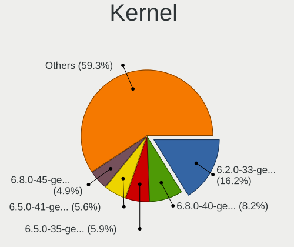

| Version           | Computers | Percent |
|-------------------|-----------|---------|
| 6.2.0-33-generic  | 110       | 16.18%  |
| 6.8.0-40-generic  | 56        | 8.24%   |
| 6.5.0-35-generic  | 40        | 5.88%   |
| 6.5.0-41-generic  | 38        | 5.59%   |
| 6.8.0-45-generic  | 33        | 4.85%   |
| 6.5.0-28-generic  | 33        | 4.85%   |
| 6.5.0-26-generic  | 29        | 4.26%   |
| 6.8.0-49-generic  | 28        | 4.12%   |
| 6.8.0-48-generic  | 28        | 4.12%   |
| 6.8.0-47-generic  | 25        | 3.68%   |
| 6.2.0-36-generic  | 22        | 3.24%   |
| 6.5.0-27-generic  | 19        | 2.79%   |
| 6.2.0-39-generic  | 18        | 2.65%   |
| 6.5.0-21-generic  | 17        | 2.5%    |
| 6.2.0-34-generic  | 16        | 2.35%   |
| 6.5.0-45-generic  | 15        | 2.21%   |
| 6.5.0-44-generic  | 15        | 2.21%   |
| 6.5.0-15-generic  | 15        | 2.21%   |
| 6.5.0-25-generic  | 14        | 2.06%   |
| 6.2.0-37-generic  | 14        | 2.06%   |
| 6.2.0-35-generic  | 13        | 1.91%   |
| 6.5.0-14-generic  | 11        | 1.62%   |
| 6.8.0-52-generic  | 10        | 1.47%   |
| 6.5.0-18-generic  | 7         | 1.03%   |
| 6.8.0-60-generic  | 6         | 0.88%   |
| 6.8.0-51-generic  | 6         | 0.88%   |
| 6.5.0-17-generic  | 4         | 0.59%   |
| 6.8.0-87-generic  | 3         | 0.44%   |
| 6.8.0-50-generic  | 3         | 0.44%   |
| 6.8.0-83-generic  | 2         | 0.29%   |
| 6.8.0-64-generic  | 2         | 0.29%   |
| 6.8.0-59-generic  | 2         | 0.29%   |
| 6.2.0-26-generic  | 2         | 0.29%   |
| 5.19.0-41-generic | 2         | 0.29%   |
| 5.15.0-58-generic | 2         | 0.29%   |
| 6.8.8-surface-1   | 1         | 0.15%   |
| 6.8.0-85-generic  | 1         | 0.15%   |
| 6.8.0-79-generic  | 1         | 0.15%   |
| 6.8.0-65-generic  | 1         | 0.15%   |
| 6.8.0-58-generic  | 1         | 0.15%   |

Kernel Family
-------------

Linux kernel without a distro release

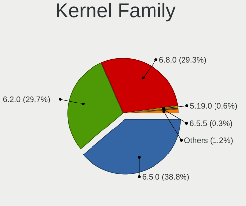

| Version | Computers | Percent |
|---------|-----------|---------|
| 6.5.0   | 252       | 38.83%  |
| 6.2.0   | 193       | 29.74%  |
| 6.8.0   | 190       | 29.28%  |
| 5.19.0  | 4         | 0.62%   |
| 6.5.5   | 2         | 0.31%   |
| 5.15.0  | 2         | 0.31%   |
| 6.8.8   | 1         | 0.15%   |
| 6.7.3   | 1         | 0.15%   |
| 6.7.10  | 1         | 0.15%   |
| 6.5.7   | 1         | 0.15%   |
| 6.13.6  | 1         | 0.15%   |
| 5.17.15 | 1         | 0.15%   |

Kernel Major Ver.
-----------------

Linux kernel major version

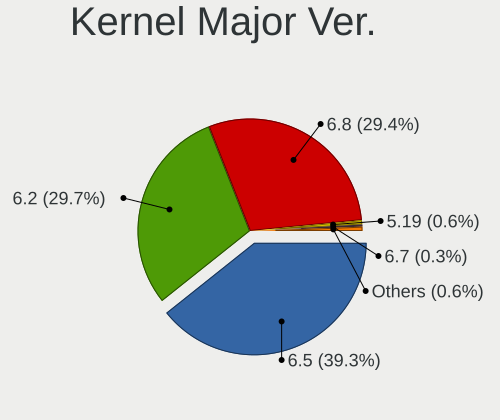

| Version | Computers | Percent |
|---------|-----------|---------|
| 6.5     | 255       | 39.29%  |
| 6.2     | 193       | 29.74%  |
| 6.8     | 191       | 29.43%  |
| 5.19    | 4         | 0.62%   |
| 6.7     | 2         | 0.31%   |
| 5.15    | 2         | 0.31%   |
| 6.13    | 1         | 0.15%   |
| 5.17    | 1         | 0.15%   |

Arch
----

OS architecture (x86_64, i586, etc.)

| Name   | Computers | Percent |
|--------|-----------|---------|
| x86_64 | 626       | 100%    |

DE
--

Desktop Environment

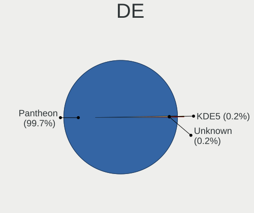

| Name     | Computers | Percent |
|----------|-----------|---------|
| Pantheon | 624       | 99.68%  |
| KDE5     | 1         | 0.16%   |
| Unknown  | 1         | 0.16%   |

Display Server
--------------

X11 or Wayland

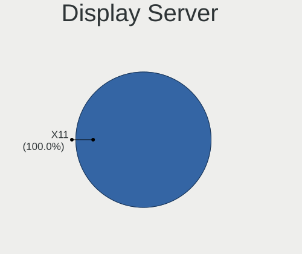

| Name | Computers | Percent |
|------|-----------|---------|
| X11  | 626       | 100%    |

Display Manager
---------------

SDDM, LightDM, etc.

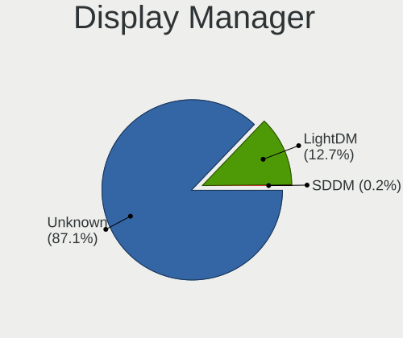

| Name    | Computers | Percent |
|---------|-----------|---------|
| Unknown | 549       | 87.14%  |
| LightDM | 80        | 12.7%   |
| SDDM    | 1         | 0.16%   |

OS Lang
-------

Language

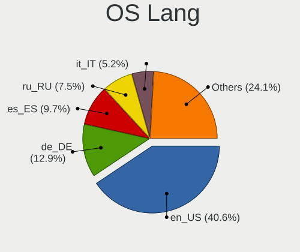

| Lang    | Computers | Percent |
|---------|-----------|---------|
| en_US   | 256       | 40.63%  |
| de_DE   | 81        | 12.86%  |
| es_ES   | 61        | 9.68%   |
| ru_RU   | 47        | 7.46%   |
| it_IT   | 33        | 5.24%   |
| fr_FR   | 28        | 4.44%   |
| pt_BR   | 23        | 3.65%   |
| en_GB   | 21        | 3.33%   |
| pl_PL   | 15        | 2.38%   |
| nl_NL   | 8         | 1.27%   |
| sv_SE   | 7         | 1.11%   |
| hu_HU   | 7         | 1.11%   |
| tr_TR   | 4         | 0.63%   |
| pt_PT   | 4         | 0.63%   |
| de_CH   | 4         | 0.63%   |
| cs_CZ   | 4         | 0.63%   |
| nb_NO   | 3         | 0.48%   |
| uk_UA   | 2         | 0.32%   |
| ja_JP   | 2         | 0.32%   |
| id_ID   | 2         | 0.32%   |
| fi_FI   | 2         | 0.32%   |
| en_CA   | 2         | 0.32%   |
| en_AU   | 2         | 0.32%   |
| da_DK   | 2         | 0.32%   |
| zh_TW   | 1         | 0.16%   |
| zh_CN   | 1         | 0.16%   |
| lv_LV   | 1         | 0.16%   |
| hr_HR   | 1         | 0.16%   |
| fr_CA   | 1         | 0.16%   |
| et_EE   | 1         | 0.16%   |
| es_AR   | 1         | 0.16%   |
| el_GR   | 1         | 0.16%   |
| ar_EG   | 1         | 0.16%   |
| Unknown | 1         | 0.16%   |

Boot Mode
---------

EFI or BIOS

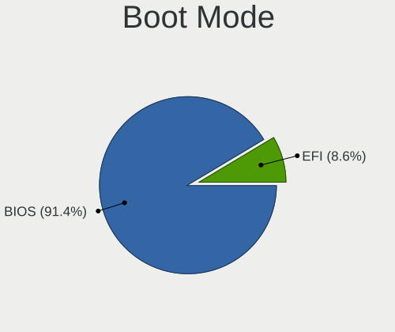

| Mode | Computers | Percent |
|------|-----------|---------|
| BIOS | 576       | 91.43%  |
| EFI  | 54        | 8.57%   |

Filesystem
----------

Type of filesystem

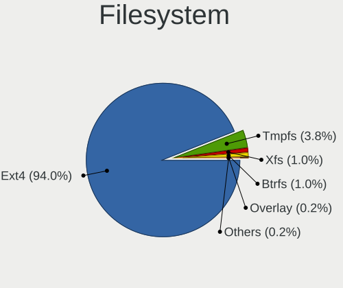

| Type    | Computers | Percent |
|---------|-----------|---------|
| Ext4    | 592       | 93.97%  |
| Tmpfs   | 24        | 3.81%   |
| Xfs     | 6         | 0.95%   |
| Btrfs   | 6         | 0.95%   |
| Overlay | 1         | 0.16%   |
| Ext2    | 1         | 0.16%   |

Part. scheme
------------

Scheme of partitioning

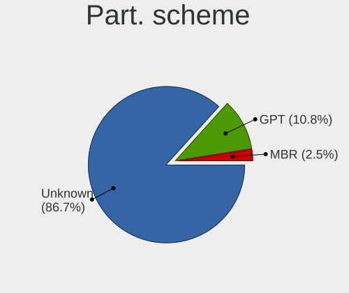

| Type    | Computers | Percent |
|---------|-----------|---------|
| Unknown | 548       | 86.71%  |
| GPT     | 68        | 10.76%  |
| MBR     | 16        | 2.53%   |

Dual Boot with Linux/BSD
------------------------

Hosting more than one Linux/BSD

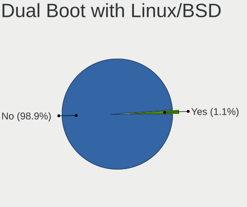

| Dual boot | Computers | Percent |
|-----------|-----------|---------|
| No        | 620       | 98.88%  |
| Yes       | 7         | 1.12%   |

Dual Boot (Win)
---------------

Hosting Linux and Windows

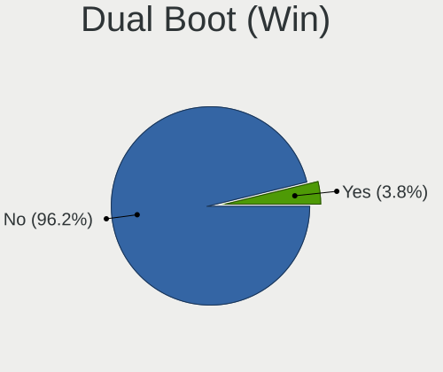

| Dual boot | Computers | Percent |
|-----------|-----------|---------|
| No        | 606       | 96.19%  |
| Yes       | 24        | 3.81%   |

Board
-----

Vendor
------

Motherboard manufacturer

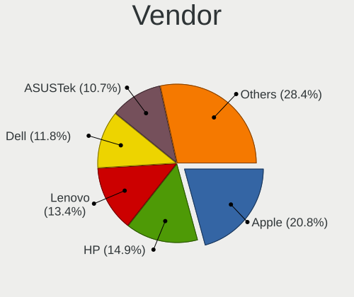

| Name                                 | Computers | Percent |
|--------------------------------------|-----------|---------|
| Apple                                | 130       | 20.77%  |
| Hewlett-Packard                      | 93        | 14.86%  |
| Lenovo                               | 84        | 13.42%  |
| Dell                                 | 74        | 11.82%  |
| ASUSTek Computer                     | 67        | 10.7%   |
| Acer                                 | 24        | 3.83%   |
| Gigabyte Technology                  | 18        | 2.88%   |
| MSI                                  | 15        | 2.4%    |
| HUAWEI                               | 12        | 1.92%   |
| ASRock                               | 12        | 1.92%   |
| Samsung Electronics                  | 10        | 1.6%    |
| Intel                                | 8         | 1.28%   |
| Unknown                              | 7         | 1.12%   |
| Sony                                 | 6         | 0.96%   |
| Google                               | 5         | 0.8%    |
| Fujitsu                              | 5         | 0.8%    |
| Toshiba                              | 4         | 0.64%   |
| Medion                               | 4         | 0.64%   |
| Microsoft                            | 3         | 0.48%   |
| Alienware                            | 3         | 0.48%   |
| Positivo                             | 2         | 0.32%   |
| MACHINIST                            | 2         | 0.32%   |
| ECS                                  | 2         | 0.32%   |
| Chuwi                                | 2         | 0.32%   |
| AZW                                  | 2         | 0.32%   |
| Winnovo                              | 1         | 0.16%   |
| UNOWHY                               | 1         | 0.16%   |
| UMAX                                 | 1         | 0.16%   |
| TUXEDO                               | 1         | 0.16%   |
| Timi                                 | 1         | 0.16%   |
| THTF                                 | 1         | 0.16%   |
| Thomson                              | 1         | 0.16%   |
| TECNO Mobile Limited                 | 1         | 0.16%   |
| TECNO                                | 1         | 0.16%   |
| Teclast                              | 1         | 0.16%   |
| Star Labs                            | 1         | 0.16%   |
| Shenzhen Meigao Electronic Equipment | 1         | 0.16%   |
| realme                               | 1         | 0.16%   |
| Pegatron                             | 1         | 0.16%   |
| Packard Bell                         | 1         | 0.16%   |

Model
-----

Motherboard model

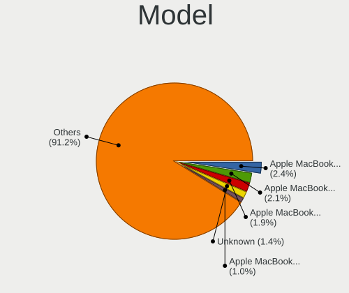

| Name                              | Computers | Percent |
|-----------------------------------|-----------|---------|
| Apple MacBookPro8,1               | 15        | 2.4%    |
| Apple MacBookPro9,2               | 13        | 2.08%   |
| Apple MacBookAir7,2               | 12        | 1.92%   |
| Unknown                           | 9         | 1.44%   |
| Apple MacBookPro7,1               | 6         | 0.96%   |
| HP Pavilion 17                    | 4         | 0.64%   |
| Apple Macmini6,1                  | 4         | 0.64%   |
| Apple MacBookPro6,2               | 4         | 0.64%   |
| HUAWEI BOM-WXX9                   | 3         | 0.48%   |
| HP ProBook 450 G3                 | 3         | 0.48%   |
| ASUS PRIME A320M-K                | 3         | 0.48%   |
| ASUS All Series                   | 3         | 0.48%   |
| Apple MacBookPro9,1               | 3         | 0.48%   |
| Apple MacBookPro8,2               | 3         | 0.48%   |
| Apple MacBookPro5,5               | 3         | 0.48%   |
| Apple MacBookPro11,1              | 3         | 0.48%   |
| Apple MacBookAir3,1               | 3         | 0.48%   |
| Apple iMac7,1                     | 3         | 0.48%   |
| Apple iMac14,1                    | 3         | 0.48%   |
| Apple iMac12,2                    | 3         | 0.48%   |
| Toshiba Satellite L50-B           | 2         | 0.32%   |
| MSI MS-7A63                       | 2         | 0.32%   |
| Lenovo IdeaPad Slim 3 15IAH8 83ER | 2         | 0.32%   |
| HUAWEI NBLB-WAX9N                 | 2         | 0.32%   |
| HUAWEI KLVL-WXX9                  | 2         | 0.32%   |
| HUAWEI BOD-WXX9                   | 2         | 0.32%   |
| HP ProDesk 600 G1 SFF             | 2         | 0.32%   |
| HP ProBook 440 G8 Notebook PC     | 2         | 0.32%   |
| HP Pavilion Sleekbook 15 PC       | 2         | 0.32%   |
| HP Pavilion dv6                   | 2         | 0.32%   |
| HP Laptop 15s-eq2xxx              | 2         | 0.32%   |
| HP ENVY 17                        | 2         | 0.32%   |
| HP EliteBook 840 G1               | 2         | 0.32%   |
| HP 15                             | 2         | 0.32%   |
| Google Nospike                    | 2         | 0.32%   |
| Dell OptiPlex 9020                | 2         | 0.32%   |
| Dell Latitude E7440               | 2         | 0.32%   |
| Dell Latitude E7240               | 2         | 0.32%   |
| Dell Latitude E6520               | 2         | 0.32%   |
| Dell Latitude E6420               | 2         | 0.32%   |

Model Family
------------

Motherboard model prefix

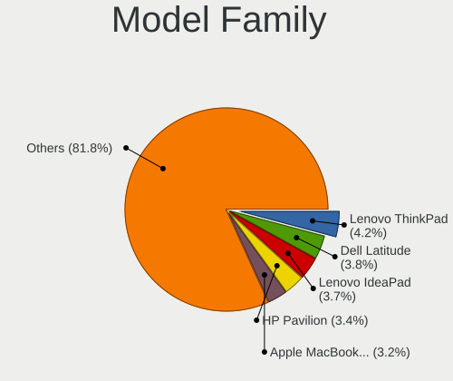

| Name               | Computers | Percent |
|--------------------|-----------|---------|
| Lenovo ThinkPad    | 26        | 4.15%   |
| Dell Latitude      | 24        | 3.83%   |
| Lenovo IdeaPad     | 23        | 3.67%   |
| HP Pavilion        | 21        | 3.35%   |
| Apple MacBookPro8  | 20        | 3.19%   |
| Acer Aspire        | 18        | 2.88%   |
| HP ProBook         | 17        | 2.72%   |
| Dell Inspiron      | 17        | 2.72%   |
| Apple MacBookPro9  | 16        | 2.56%   |
| HP EliteBook       | 13        | 2.08%   |
| Apple MacBookAir7  | 12        | 1.92%   |
| Dell OptiPlex      | 10        | 1.6%    |
| Apple MacBookPro5  | 10        | 1.6%    |
| HP Compaq          | 9         | 1.44%   |
| Unknown            | 9         | 1.44%   |
| Lenovo ThinkCentre | 8         | 1.28%   |
| ASUS PRIME         | 8         | 1.28%   |
| ASUS VivoBook      | 7         | 1.12%   |
| Apple MacBookPro11 | 7         | 1.12%   |
| HP Laptop          | 6         | 0.96%   |
| Dell XPS           | 6         | 0.96%   |
| Dell Precision     | 6         | 0.96%   |
| ASUS ROG           | 6         | 0.96%   |
| Apple MacBookPro7  | 6         | 0.96%   |
| Apple iMac14       | 6         | 0.96%   |
| Lenovo Yoga        | 5         | 0.8%    |
| Apple Macmini6     | 5         | 0.8%    |
| Toshiba Satellite  | 4         | 0.64%   |
| HP ENVY            | 4         | 0.64%   |
| Dell Vostro        | 4         | 0.64%   |
| Apple MacBookPro6  | 4         | 0.64%   |
| Apple iMac12       | 4         | 0.64%   |
| Microsoft Surface  | 3         | 0.48%   |
| HUAWEI BOM-WXX9    | 3         | 0.48%   |
| HP ProDesk         | 3         | 0.48%   |
| HP 15              | 3         | 0.48%   |
| Fujitsu LIFEBOOK   | 3         | 0.48%   |
| ASUS Zenbook       | 3         | 0.48%   |
| ASUS TUF           | 3         | 0.48%   |
| ASUS All           | 3         | 0.48%   |

MFG Year
--------

Motherboard manufacture year

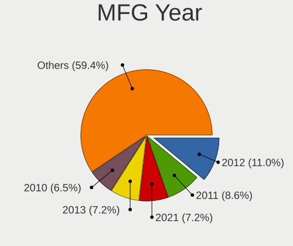

| Year | Computers | Percent |
|------|-----------|---------|
| 2012 | 69        | 11.02%  |
| 2011 | 54        | 8.63%   |
| 2021 | 45        | 7.19%   |
| 2013 | 45        | 7.19%   |
| 2010 | 41        | 6.55%   |
| 2014 | 40        | 6.39%   |
| 2018 | 39        | 6.23%   |
| 2016 | 36        | 5.75%   |
| 2020 | 34        | 5.43%   |
| 2015 | 33        | 5.27%   |
| 2009 | 32        | 5.11%   |
| 2017 | 31        | 4.95%   |
| 2019 | 28        | 4.47%   |
| 2023 | 26        | 4.15%   |
| 2022 | 25        | 3.99%   |
| 2008 | 22        | 3.51%   |
| 2006 | 13        | 2.08%   |
| 2024 | 6         | 0.96%   |
| 2007 | 6         | 0.96%   |
| 2025 | 1         | 0.16%   |

Form Factor
-----------

Physical design of the computer

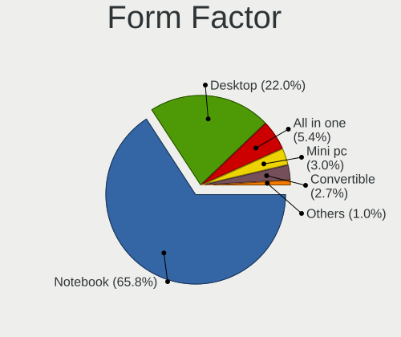

| Name        | Computers | Percent |
|-------------|-----------|---------|
| Notebook    | 412       | 65.81%  |
| Desktop     | 138       | 22.04%  |
| All in one  | 34        | 5.43%   |
| Mini pc     | 19        | 3.04%   |
| Convertible | 17        | 2.72%   |
| Tablet      | 5         | 0.8%    |
| Server      | 1         | 0.16%   |

Secure Boot
-----------

Enabled or disabled

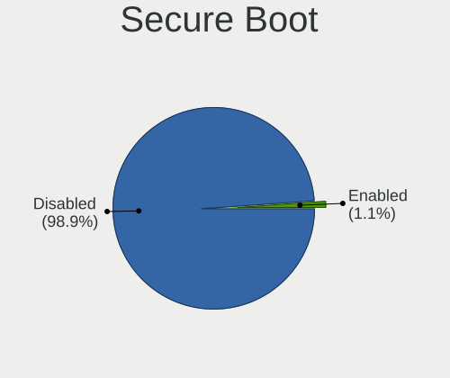

| State    | Computers | Percent |
|----------|-----------|---------|
| Disabled | 619       | 98.88%  |
| Enabled  | 7         | 1.12%   |

Coreboot
--------

Have coreboot on board

| Used | Computers | Percent |
|------|-----------|---------|
| No   | 620       | 99.04%  |
| Yes  | 6         | 0.96%   |

RAM Size
--------

Total RAM memory

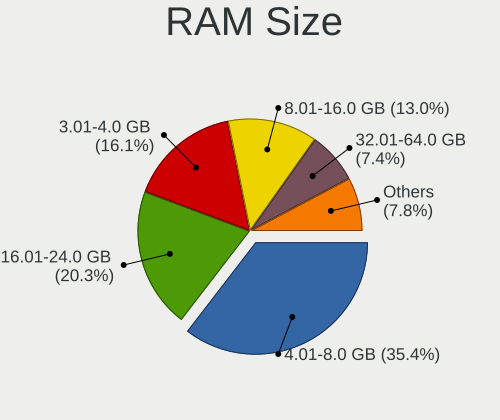

| Size in GB  | Computers | Percent |
|-------------|-----------|---------|
| 4.01-8.0    | 224       | 35.44%  |
| 16.01-24.0  | 128       | 20.25%  |
| 3.01-4.0    | 102       | 16.14%  |
| 8.01-16.0   | 82        | 12.97%  |
| 32.01-64.0  | 47        | 7.44%   |
| 1.01-2.0    | 14        | 2.22%   |
| 2.01-3.0    | 13        | 2.06%   |
| 24.01-32.0  | 12        | 1.9%    |
| 64.01-256.0 | 10        | 1.58%   |

RAM Used
--------

Used RAM memory

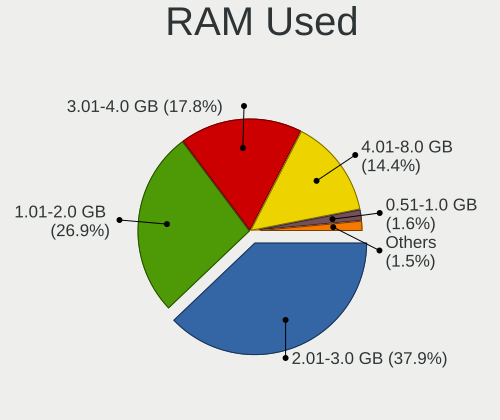

| Used GB   | Computers | Percent |
|-----------|-----------|---------|
| 2.01-3.0  | 258       | 37.89%  |
| 1.01-2.0  | 183       | 26.87%  |
| 3.01-4.0  | 121       | 17.77%  |
| 4.01-8.0  | 98        | 14.39%  |
| 0.51-1.0  | 11        | 1.62%   |
| 8.01-16.0 | 10        | 1.47%   |

Total Drives
------------

Number of drives on board

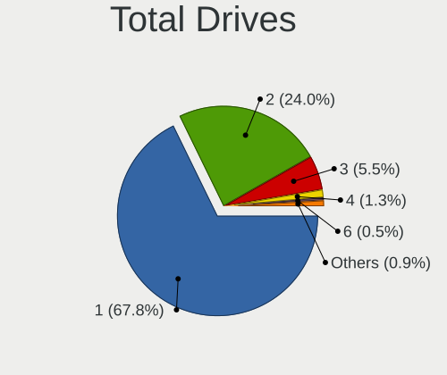

| Drives | Computers | Percent |
|--------|-----------|---------|
| 1      | 429       | 67.77%  |
| 2      | 152       | 24.01%  |
| 3      | 35        | 5.53%   |
| 4      | 8         | 1.26%   |
| 6      | 3         | 0.47%   |
| 9      | 2         | 0.32%   |
| 5      | 2         | 0.32%   |
| 7      | 1         | 0.16%   |
| 0      | 1         | 0.16%   |

Has CD-ROM
----------

Has CD-ROM on board

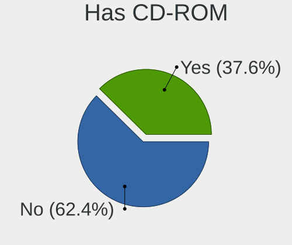

| Presented | Computers | Percent |
|-----------|-----------|---------|
| No        | 393       | 62.38%  |
| Yes       | 237       | 37.62%  |

Has Ethernet
------------

Has Ethernet on board

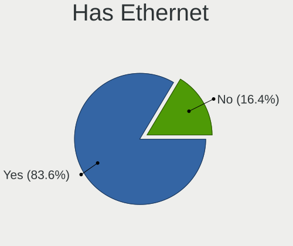

| Presented | Computers | Percent |
|-----------|-----------|---------|
| Yes       | 524       | 83.57%  |
| No        | 103       | 16.43%  |

Has WiFi
--------

Has WiFi module

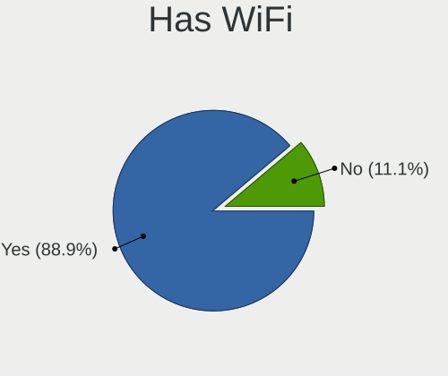

| Presented | Computers | Percent |
|-----------|-----------|---------|
| Yes       | 558       | 88.85%  |
| No        | 70        | 11.15%  |

Has Bluetooth
-------------

Has Bluetooth module

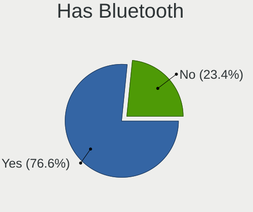

| Presented | Computers | Percent |
|-----------|-----------|---------|
| Yes       | 481       | 76.59%  |
| No        | 147       | 23.41%  |

Location
--------

Country
-------

Geographic location (country)

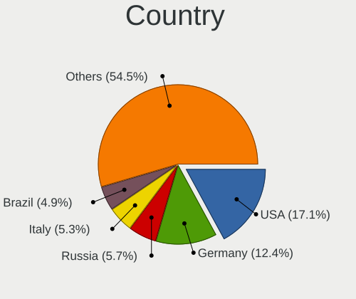

| Country         | Computers | Percent |
|-----------------|-----------|---------|
| USA             | 107       | 17.07%  |
| Germany         | 78        | 12.44%  |
| Russia          | 36        | 5.74%   |
| Italy           | 33        | 5.26%   |
| Brazil          | 31        | 4.94%   |
| France          | 21        | 3.35%   |
| Spain           | 20        | 3.19%   |
| Mexico          | 20        | 3.19%   |
| UK              | 19        | 3.03%   |
| Poland          | 19        | 3.03%   |
| Netherlands     | 15        | 2.39%   |
| Canada          | 13        | 2.07%   |
| Switzerland     | 11        | 1.75%   |
| Sweden          | 11        | 1.75%   |
| Indonesia       | 11        | 1.75%   |
| India           | 11        | 1.75%   |
| Hungary         | 11        | 1.75%   |
| Austria         | 10        | 1.59%   |
| Argentina       | 10        | 1.59%   |
| Australia       | 8         | 1.28%   |
| Chile           | 7         | 1.12%   |
| Romania         | 5         | 0.8%    |
| Morocco         | 5         | 0.8%    |
| Greece          | 5         | 0.8%    |
| Finland         | 5         | 0.8%    |
| Czechia         | 5         | 0.8%    |
| Ukraine         | 4         | 0.64%   |
| Turkey          | 4         | 0.64%   |
| Portugal        | 4         | 0.64%   |
| Norway          | 4         | 0.64%   |
| Israel          | 4         | 0.64%   |
| Colombia        | 4         | 0.64%   |
| Vietnam         | 3         | 0.48%   |
| The Netherlands | 3         | 0.48%   |
| South Africa    | 3         | 0.48%   |
| New Zealand     | 3         | 0.48%   |
| Malaysia        | 3         | 0.48%   |
| Egypt           | 3         | 0.48%   |
| Denmark         | 3         | 0.48%   |
| Bulgaria        | 3         | 0.48%   |

City
----

Geographic location (city)

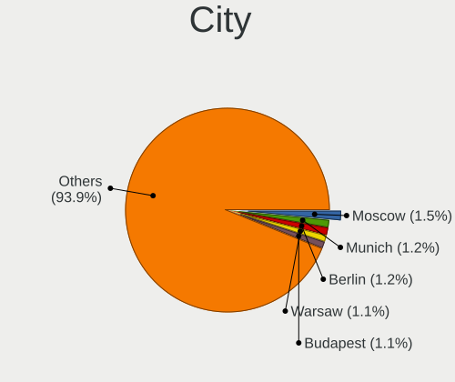

| City           | Computers | Percent |
|----------------|-----------|---------|
| Moscow         | 10        | 1.52%   |
| Munich         | 8         | 1.22%   |
| Berlin         | 8         | 1.22%   |
| Warsaw         | 7         | 1.07%   |
| Budapest       | 7         | 1.07%   |
| Los Angeles    | 6         | 0.91%   |
| Santiago       | 5         | 0.76%   |
| Melbourne      | 5         | 0.76%   |
| Madrid         | 5         | 0.76%   |
| St Petersburg  | 4         | 0.61%   |
| Rio de Janeiro | 4         | 0.61%   |
| Vienna         | 3         | 0.46%   |
| Stockholm      | 3         | 0.46%   |
| San Jose       | 3         | 0.46%   |
| Rome           | 3         | 0.46%   |
| Prague         | 3         | 0.46%   |
| Phoenix        | 3         | 0.46%   |
| Petah Tikva    | 3         | 0.46%   |
| Paris          | 3         | 0.46%   |
| Naples         | 3         | 0.46%   |
| Morwell        | 3         | 0.46%   |
| Milan          | 3         | 0.46%   |
| Mérida        | 3         | 0.46%   |
| London         | 3         | 0.46%   |
| Jakarta        | 3         | 0.46%   |
| Helsinki       | 3         | 0.46%   |
| Hamburg        | 3         | 0.46%   |
| Delhi          | 3         | 0.46%   |
| Curitiba       | 3         | 0.46%   |
| Cuernavaca     | 3         | 0.46%   |
| Athens         | 3         | 0.46%   |
| Zurich         | 2         | 0.3%    |
| Zamora         | 2         | 0.3%    |
| Yekaterinburg  | 2         | 0.3%    |
| Vitebsk        | 2         | 0.3%    |
| Valencia       | 2         | 0.3%    |
| Turin          | 2         | 0.3%    |
| Temuco         | 2         | 0.3%    |
| Seattle        | 2         | 0.3%    |
| Schorndorf     | 2         | 0.3%    |

Drives
------

Drive Vendor
------------

Hard drive vendors

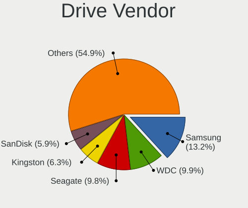

| Vendor                       | Computers | Drives | Percent |
|------------------------------|-----------|--------|---------|
| Samsung Electronics          | 112       | 147    | 13.22%  |
| WDC                          | 84        | 108    | 9.92%   |
| Seagate                      | 83        | 104    | 9.8%    |
| Kingston                     | 53        | 66     | 6.26%   |
| SanDisk                      | 50        | 61     | 5.9%    |
| Apple                        | 50        | 57     | 5.9%    |
| Toshiba                      | 46        | 55     | 5.43%   |
| Crucial                      | 37        | 43     | 4.37%   |
| Unknown                      | 31        | 39     | 3.66%   |
| SK hynix                     | 22        | 25     | 2.6%    |
| Hitachi                      | 19        | 21     | 2.24%   |
| Intel                        | 18        | 28     | 2.13%   |
| China                        | 16        | 28     | 1.89%   |
| Micron Technology            | 12        | 13     | 1.42%   |
| HGST                         | 12        | 16     | 1.42%   |
| KIOXIA                       | 11        | 15     | 1.3%    |
| A-DATA Technology            | 10        | 11     | 1.18%   |
| Unknown                      | 10        | 11     | 1.18%   |
| Silicon Motion               | 9         | 13     | 1.06%   |
| Phison Electronics           | 8         | 8      | 0.94%   |
| LITEON                       | 8         | 8      | 0.94%   |
| Patriot                      | 7         | 8      | 0.83%   |
| Intenso                      | 7         | 8      | 0.83%   |
| Transcend                    | 6         | 7      | 0.71%   |
| Micron/Crucial Technology    | 6         | 7      | 0.71%   |
| MAXIO Technology (Hangzhou)  | 5         | 7      | 0.59%   |
| SPCC                         | 4         | 4      | 0.47%   |
| PNY                          | 4         | 4      | 0.47%   |
| Kingston Technology Company  | 4         | 4      | 0.47%   |
| Gigabyte Technology          | 4         | 4      | 0.47%   |
| ADATA Technology             | 4         | 6      | 0.47%   |
| Shenzhen Longsys Electronics | 3         | 3      | 0.35%   |
| Phison                       | 3         | 3      | 0.35%   |
| OWC                          | 3         | 3      | 0.35%   |
| Netac                        | 3         | 3      | 0.35%   |
| Maxtor                       | 3         | 3      | 0.35%   |
| Lexar                        | 3         | 3      | 0.35%   |
| JMicron Technology           | 3         | 3      | 0.35%   |
| GOODRAM                      | 3         | 4      | 0.35%   |
| Fanxiang                     | 3         | 3      | 0.35%   |

Drive Model
-----------

Hard drive models

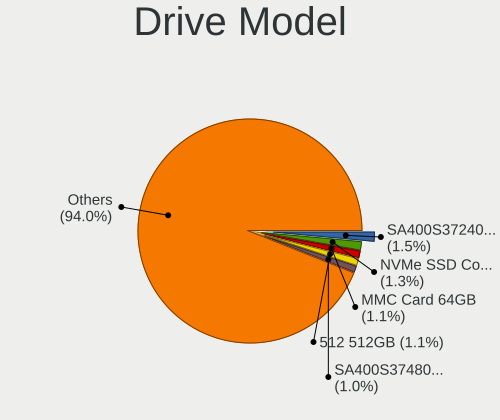

| Model                                                 | Computers | Percent |
|-------------------------------------------------------|-----------|---------|
| Kingston SA400S37240G 240GB SSD                       | 13        | 1.45%   |
| Samsung NVMe SSD Controller SM981/PM981/PM983 1TB     | 12        | 1.34%   |
| Unknown MMC Card  64GB                                | 10        | 1.12%   |
| Unknown                                               | 10        | 1.12%   |
| Kingston SA400S37480G 480GB SSD                       | 9         | 1.01%   |
| Apple SSD SM0128G 121GB                               | 8         | 0.89%   |
| Seagate ST500DM002-1BD142 500GB                       | 7         | 0.78%   |
| Seagate ST1000LM035-1RK172 1TB                        | 7         | 0.78%   |
| Samsung SSD 860 EVO 500GB                             | 7         | 0.78%   |
| Crucial CT500MX500SSD1 500GB                          | 7         | 0.78%   |
| Crucial CT240BX500SSD1 240GB                          | 7         | 0.78%   |
| Silicon Motion SM2263EN/SM2263XT SSD Controller 512GB | 6         | 0.67%   |
| Samsung SSD 850 EVO 500GB                             | 6         | 0.67%   |
| Kingston SA400S37120G 120GB SSD                       | 6         | 0.67%   |
| Seagate ST500LT012-1DG142 500GB                       | 5         | 0.56%   |
| Samsung NVMe SSD Controller SM961/PM961/SM963 1024GB  | 5         | 0.56%   |
| Apple HDD HTS541010A9E662 1TB                         | 5         | 0.56%   |
| WDC WDS240G2G0A-00JH30 240GB SSD                      | 4         | 0.45%   |
| WDC WD10EZEX-22MFCA0 1TB                              | 4         | 0.45%   |
| Unknown MMC Card  128GB                               | 4         | 0.45%   |
| Toshiba MQ01ABD100 1TB                                | 4         | 0.45%   |
| SK hynix BC501 NVMe Solid State Drive 512GB           | 4         | 0.45%   |
| Seagate ST1000LM024 HN-M101MBB 1TB                    | 4         | 0.45%   |
| Sandisk WD_BLACK SN770 1TB                            | 4         | 0.45%   |
| SanDisk SSD PLUS 240GB                                | 4         | 0.45%   |
| Samsung SSD 870 EVO 1TB                               | 4         | 0.45%   |
| Samsung SSD 850 EVO 250GB                             | 4         | 0.45%   |
| Samsung NVMe SSD Controller PM9A1/PM9A3/980PRO 1TB    | 4         | 0.45%   |
| Phison PS5013 E13 NVMe Controller 500GB               | 4         | 0.45%   |
| HGST HTS721010A9E630 1TB                              | 4         | 0.45%   |
| Crucial CT1000BX500SSD1 1TB                           | 4         | 0.45%   |
| China SSD 128GB                                       | 4         | 0.45%   |
| Apple HDD HTS545050A7E362 500GB                       | 4         | 0.45%   |
| WDC WDS120G2G0A-00JH30 120GB SSD                      | 3         | 0.34%   |
| Unknown MMC Card  32GB                                | 3         | 0.34%   |
| Unknown MMC Card  16GB                                | 3         | 0.34%   |
| Toshiba MQ01ABF050 500GB                              | 3         | 0.34%   |
| SK hynix PC611 NVMe 1TB                               | 3         | 0.34%   |
| Seagate ST500LM021-1KJ152 500GB                       | 3         | 0.34%   |
| Seagate ST3250318AS 250GB                             | 3         | 0.34%   |

HDD Vendor
----------

Hard disk drive vendors

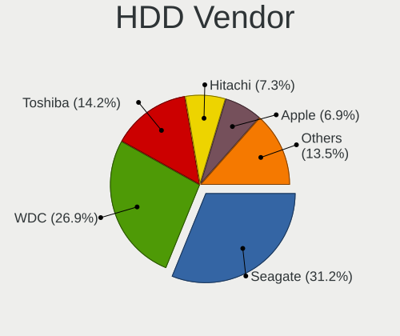

| Vendor              | Computers | Drives | Percent |
|---------------------|-----------|--------|---------|
| Seagate             | 81        | 102    | 31.15%  |
| WDC                 | 70        | 87     | 26.92%  |
| Toshiba             | 37        | 45     | 14.23%  |
| Hitachi             | 19        | 21     | 7.31%   |
| Apple               | 18        | 21     | 6.92%   |
| HGST                | 12        | 16     | 4.62%   |
| Samsung Electronics | 8         | 9      | 3.08%   |
| Maxtor              | 3         | 3      | 1.15%   |
| Unknown             | 2         | 2      | 0.77%   |
| JMicron Technology  | 2         | 2      | 0.77%   |
| Fujitsu             | 2         | 2      | 0.77%   |
| TO Exter            | 1         | 1      | 0.38%   |
| SSK                 | 1         | 2      | 0.38%   |
| Hewlett-Packard     | 1         | 1      | 0.38%   |
| FC-1307             | 1         | 1      | 0.38%   |
| External            | 1         | 1      | 0.38%   |
| Unknown             | 1         | 1      | 0.38%   |

SSD Vendor
----------

Solid state drive vendors

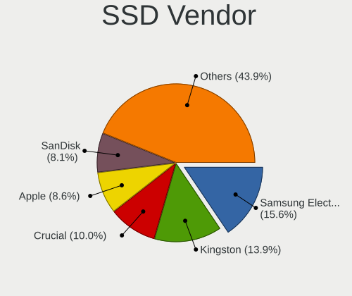

| Vendor              | Computers | Drives | Percent |
|---------------------|-----------|--------|---------|
| Samsung Electronics | 56        | 76     | 15.56%  |
| Kingston            | 50        | 63     | 13.89%  |
| Crucial             | 36        | 42     | 10%     |
| Apple               | 31        | 33     | 8.61%   |
| SanDisk             | 29        | 35     | 8.06%   |
| WDC                 | 17        | 20     | 4.72%   |
| China               | 16        | 28     | 4.44%   |
| Intel               | 11        | 18     | 3.06%   |
| LITEON              | 8         | 8      | 2.22%   |
| A-DATA Technology   | 8         | 9      | 2.22%   |
| Patriot             | 7         | 8      | 1.94%   |
| Intenso             | 7         | 8      | 1.94%   |
| Transcend           | 6         | 7      | 1.67%   |
| Unknown             | 6         | 6      | 1.67%   |
| SK hynix            | 5         | 5      | 1.39%   |
| SPCC                | 4         | 4      | 1.11%   |
| PNY                 | 4         | 4      | 1.11%   |
| Micron Technology   | 4         | 4      | 1.11%   |
| Toshiba             | 3         | 3      | 0.83%   |
| OWC                 | 3         | 3      | 0.83%   |
| Lexar               | 3         | 3      | 0.83%   |
| GOODRAM             | 3         | 4      | 0.83%   |
| Gigabyte Technology | 3         | 3      | 0.83%   |
| XrayDisk            | 2         | 4      | 0.56%   |
| Team                | 2         | 2      | 0.56%   |
| SABRENT             | 2         | 2      | 0.56%   |
| NGFF                | 2         | 2      | 0.56%   |
| Netac               | 2         | 2      | 0.56%   |
| LITEONIT            | 2         | 2      | 0.56%   |
| KingSpec            | 2         | 3      | 0.56%   |
| ASMT                | 2         | 2      | 0.56%   |
| Apacer              | 2         | 2      | 0.56%   |
| XUM                 | 1         | 1      | 0.28%   |
| WALRAM              | 1         | 1      | 0.28%   |
| Verbatim            | 1         | 1      | 0.28%   |
| Timetec             | 1         | 1      | 0.28%   |
| Teclast             | 1         | 1      | 0.28%   |
| Seagate             | 1         | 1      | 0.28%   |
| Plextor             | 1         | 1      | 0.28%   |
| OCZ-VERTEX2         | 1         | 1      | 0.28%   |

Drive Kind
----------

HDD or SSD

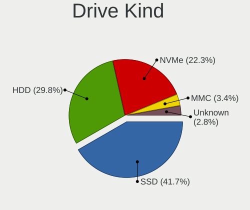

| Kind    | Computers | Drives | Percent |
|---------|-----------|--------|---------|
| SSD     | 323       | 440    | 41.68%  |
| HDD     | 231       | 317    | 29.81%  |
| NVMe    | 173       | 225    | 22.32%  |
| MMC     | 26        | 34     | 3.35%   |
| Unknown | 22        | 34     | 2.84%   |

Drive Connector
---------------

SATA, SAS, NVMe, etc.

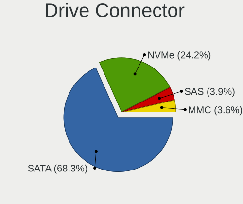

| Type | Computers | Drives | Percent |
|------|-----------|--------|---------|
| SATA | 489       | 758    | 68.3%   |
| NVMe | 173       | 224    | 24.16%  |
| SAS  | 28        | 34     | 3.91%   |
| MMC  | 26        | 34     | 3.63%   |

Drive Size
----------

Size of hard drive

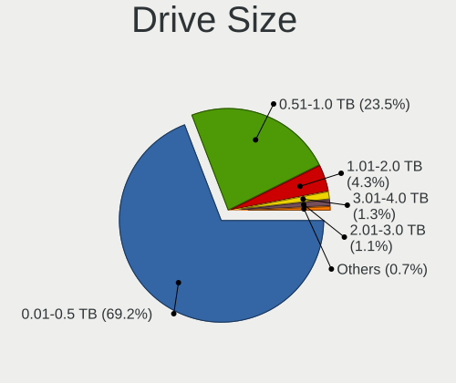

| Size in TB | Computers | Drives | Percent |
|------------|-----------|--------|---------|
| 0.01-0.5   | 386       | 530    | 69.18%  |
| 0.51-1.0   | 131       | 171    | 23.48%  |
| 1.01-2.0   | 24        | 34     | 4.3%    |
| 3.01-4.0   | 7         | 8      | 1.25%   |
| 2.01-3.0   | 6         | 8      | 1.08%   |
| 4.01-10.0  | 3         | 5      | 0.54%   |
| 10.01-20.0 | 1         | 1      | 0.18%   |

Space Total
-----------

Amount of disk space available on the file system

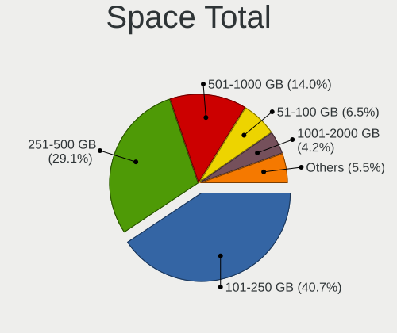

| Size in GB     | Computers | Percent |
|----------------|-----------|---------|
| 101-250        | 261       | 40.65%  |
| 251-500        | 187       | 29.13%  |
| 501-1000       | 90        | 14.02%  |
| 51-100         | 42        | 6.54%   |
| 1001-2000      | 27        | 4.21%   |
| 21-50          | 15        | 2.34%   |
| More than 3000 | 8         | 1.25%   |
| 2001-3000      | 7         | 1.09%   |
| 1-20           | 4         | 0.62%   |
| Unknown        | 1         | 0.16%   |

Space Used
----------

Amount of used disk space

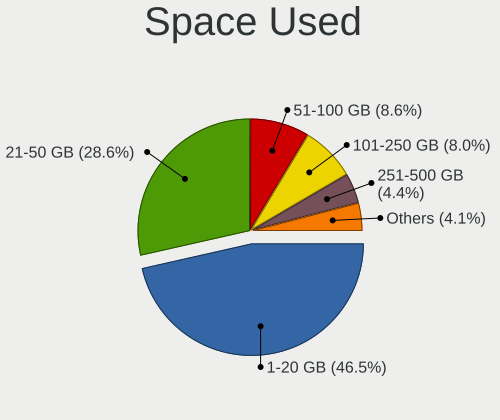

| Used GB        | Computers | Percent |
|----------------|-----------|---------|
| 1-20           | 309       | 46.47%  |
| 21-50          | 190       | 28.57%  |
| 51-100         | 57        | 8.57%   |
| 101-250        | 53        | 7.97%   |
| 251-500        | 29        | 4.36%   |
| 501-1000       | 14        | 2.11%   |
| 1001-2000      | 9         | 1.35%   |
| 2001-3000      | 2         | 0.3%    |
| More than 3000 | 1         | 0.15%   |
| Unknown        | 1         | 0.15%   |

Malfunc. Drives
---------------

Drive models with a malfunction

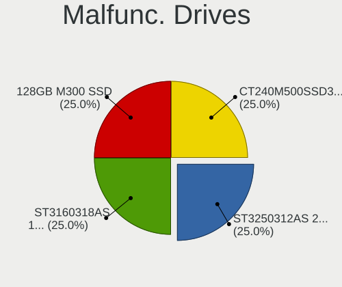

| Model                                       | Computers | Drives | Percent |
|---------------------------------------------|-----------|--------|---------|
| WDC WDS120G2G0A-00JH30 120GB SSD            | 1         | 1      | 9.09%   |
| Seagate ST3250820AS 250GB                   | 1         | 1      | 9.09%   |
| Seagate ST3250312AS 250GB                   | 1         | 1      | 9.09%   |
| Seagate ST3160318AS 160GB                   | 1         | 1      | 9.09%   |
| Seagate ST1000LM035-1RK172 1TB              | 1         | 1      | 9.09%   |
| Samsung Electronics HM320II 320GB           | 1         | 1      | 9.09%   |
| LS 128GB M300                               | 1         | 1      | 9.09%   |
| Intel SSDPEKKF512G7H BTPY71141D7T512F 512GB | 1         | 1      | 9.09%   |
| Crucial CT240M500SSD3 240GB                 | 1         | 1      | 9.09%   |
| BIWIN SSD 64GB                              | 1         | 1      | 9.09%   |
| Apple HDD ST1000DM003 1TB                   | 1         | 1      | 9.09%   |

Malfunc. Drive Vendor
---------------------

Vendors of faulty drives

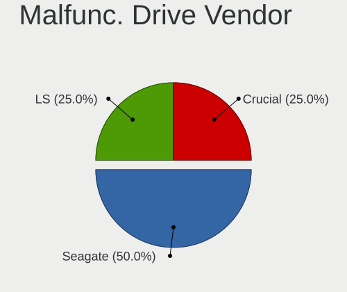

| Vendor              | Computers | Drives | Percent |
|---------------------|-----------|--------|---------|
| Seagate             | 4         | 4      | 36.36%  |
| WDC                 | 1         | 1      | 9.09%   |
| Samsung Electronics | 1         | 1      | 9.09%   |
| LS                  | 1         | 1      | 9.09%   |
| Intel               | 1         | 1      | 9.09%   |
| Crucial             | 1         | 1      | 9.09%   |
| BIWIN               | 1         | 1      | 9.09%   |
| Apple               | 1         | 1      | 9.09%   |

Malfunc. HDD Vendor
-------------------

Vendors of faulty HDD drives

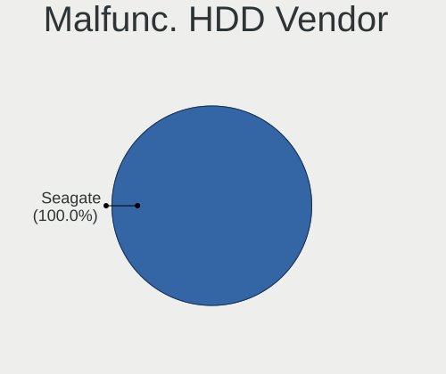

| Vendor              | Computers | Drives | Percent |
|---------------------|-----------|--------|---------|
| Seagate             | 4         | 4      | 66.67%  |
| Samsung Electronics | 1         | 1      | 16.67%  |
| Apple               | 1         | 1      | 16.67%  |

Malfunc. Drive Kind
-------------------

Kinds of faulty drives

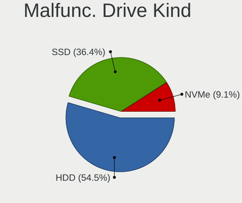

| Kind | Computers | Drives | Percent |
|------|-----------|--------|---------|
| HDD  | 6         | 6      | 54.55%  |
| SSD  | 4         | 4      | 36.36%  |
| NVMe | 1         | 1      | 9.09%   |

Failed Drives
-------------

Failed drive models

Zero info for selected period =(

Failed Drive Vendor
-------------------

Failed drive vendors

Zero info for selected period =(

Drive Status
------------

Number of failed and malfunc. drives

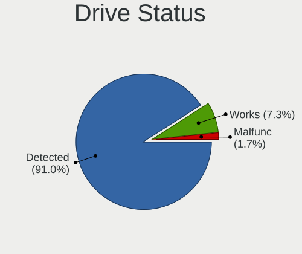

| Status   | Computers | Drives | Percent |
|----------|-----------|--------|---------|
| Detected | 583       | 969    | 90.95%  |
| Works    | 47        | 70     | 7.33%   |
| Malfunc  | 11        | 11     | 1.72%   |

Storage controller
------------------

Storage Vendor
--------------

Storage controller vendors

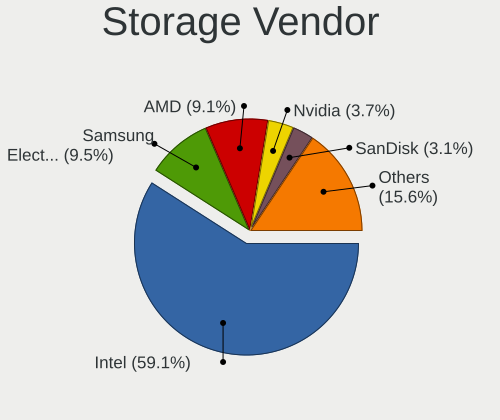

| Vendor                         | Computers | Percent |
|--------------------------------|-----------|---------|
| Intel                          | 443       | 59.07%  |
| Samsung Electronics            | 71        | 9.47%   |
| AMD                            | 68        | 9.07%   |
| Nvidia                         | 28        | 3.73%   |
| SanDisk                        | 23        | 3.07%   |
| SK hynix                       | 16        | 2.13%   |
| Phison Electronics             | 11        | 1.47%   |
| KIOXIA                         | 11        | 1.47%   |
| Silicon Motion                 | 10        | 1.33%   |
| Toshiba America Info Systems   | 8         | 1.07%   |
| Micron Technology              | 8         | 1.07%   |
| Micron/Crucial Technology      | 7         | 0.93%   |
| Kingston Technology Company    | 7         | 0.93%   |
| ASMedia Technology             | 6         | 0.8%    |
| ADATA Technology               | 6         | 0.8%    |
| MAXIO Technology (Hangzhou)    | 5         | 0.67%   |
| Marvell Technology Group       | 4         | 0.53%   |
| Union Memory (Shenzhen)        | 3         | 0.4%    |
| Shenzhen Longsys Electronics   | 3         | 0.4%    |
| Yangtze Memory Technologies    | 2         | 0.27%   |
| Realtek Semiconductor          | 2         | 0.27%   |
| JMicron Technology             | 2         | 0.27%   |
| Solidigm                       | 1         | 0.13%   |
| Solid State Storage Technology | 1         | 0.13%   |
| Silicon Image                  | 1         | 0.13%   |
| Lite-On Technology             | 1         | 0.13%   |
| INNOGRIT                       | 1         | 0.13%   |
| Apple                          | 1         | 0.13%   |

Storage Model
-------------

Storage controller models

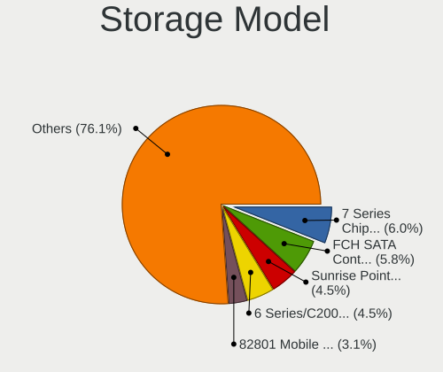

| Model                                                                          | Computers | Percent |
|--------------------------------------------------------------------------------|-----------|---------|
| Intel 7 Series Chipset Family 6-port SATA Controller [AHCI mode]               | 49        | 6%      |
| AMD FCH SATA Controller [AHCI mode]                                            | 47        | 5.75%   |
| Intel Sunrise Point-LP SATA Controller [AHCI mode]                             | 37        | 4.53%   |
| Intel 6 Series/C200 Series Chipset Family 6 port Mobile SATA AHCI Controller   | 37        | 4.53%   |
| Intel 82801 Mobile SATA Controller [RAID mode]                                 | 25        | 3.06%   |
| Intel 8 Series/C220 Series Chipset Family 6-port SATA Controller 1 [AHCI mode] | 25        | 3.06%   |
| Intel 8 Series SATA Controller 1 [AHCI mode]                                   | 19        | 2.33%   |
| Nvidia MCP79 AHCI Controller                                                   | 17        | 2.08%   |
| Intel Volume Management Device NVMe RAID Controller                            | 17        | 2.08%   |
| Samsung NVMe SSD Controller SM981/PM981/PM983                                  | 16        | 1.96%   |
| Samsung NVMe SSD Controller 980 (DRAM-less)                                    | 16        | 1.96%   |
| Intel 6 Series/C200 Series Chipset Family 6 port Desktop SATA AHCI Controller  | 16        | 1.96%   |
| Intel Celeron/Pentium Silver Processor SATA Controller                         | 15        | 1.84%   |
| Intel 5 Series/3400 Series Chipset 4 port SATA AHCI Controller                 | 13        | 1.59%   |
| Samsung S4LN058A01[SSUBX] AHCI SSD Controller (Apple slot)                     | 12        | 1.47%   |
| Intel 82801IBM/IEM (ICH9M/ICH9M-E) 4 port SATA Controller [AHCI mode]          | 12        | 1.47%   |
| Intel Tiger Lake-LP SATA Controller                                            | 11        | 1.35%   |
| Intel 82801HM/HEM (ICH8M/ICH8M-E) IDE Controller                               | 11        | 1.35%   |
| Intel 7 Series/C210 Series Chipset Family 6-port SATA Controller [AHCI mode]   | 11        | 1.35%   |
| SanDisk WD SN560/SN740/SN770/SN5000 NVMe SSD                                   | 10        | 1.22%   |
| Nvidia MCP89 SATA Controller (AHCI mode)                                       | 10        | 1.22%   |
| Intel Q170/Q150/B150/H170/H110/Z170/CM236 Chipset SATA Controller [AHCI Mode]  | 10        | 1.22%   |
| Intel 82801HM/HEM (ICH8M/ICH8M-E) SATA Controller [AHCI mode]                  | 10        | 1.22%   |
| Intel 5 Series/3400 Series Chipset 6 port SATA AHCI Controller                 | 10        | 1.22%   |
| Intel SATA Controller [RAID mode]                                              | 9         | 1.1%    |
| Intel NM10/ICH7 Family SATA Controller [IDE mode]                              | 9         | 1.1%    |
| Intel 82801G (ICH7 Family) IDE Controller                                      | 9         | 1.1%    |
| Intel Wildcat Point-LP SATA Controller [AHCI Mode]                             | 8         | 0.98%   |
| Intel Comet Lake SATA AHCI Controller                                          | 8         | 0.98%   |
| Intel 200 Series PCH SATA controller [AHCI mode]                               | 8         | 0.98%   |
| AMD SB7x0/SB8x0/SB9x0 SATA Controller [AHCI mode]                              | 8         | 0.98%   |
| Silicon Motion SM2263EN/SM2263XT (DRAM-less) NVMe SSD Controllers              | 7         | 0.86%   |
| Intel HM170/QM170 Chipset SATA Controller [AHCI Mode]                          | 7         | 0.86%   |
| Intel Cannon Lake PCH SATA AHCI Controller                                     | 7         | 0.86%   |
| SK hynix Gold P31/BC711/PC711 NVMe Solid State Drive                           | 6         | 0.73%   |
| Samsung S4LN053X01 AHCI SSD Controller(Apple slot)                             | 6         | 0.73%   |
| Samsung NVMe SSD Controller SM961/PM961/SM963                                  | 6         | 0.73%   |
| Phison PS5013-E13 PCIe3 NVMe Controller (DRAM-less)                            | 6         | 0.73%   |
| KIOXIA NVMe SSD Controller BG4 (DRAM-less)                                     | 6         | 0.73%   |
| Intel Cannon Lake Mobile PCH SATA AHCI Controller                              | 6         | 0.73%   |

Storage Kind
------------

Kind of storage controller (IDE, SATA, NVMe, SAS, ...)

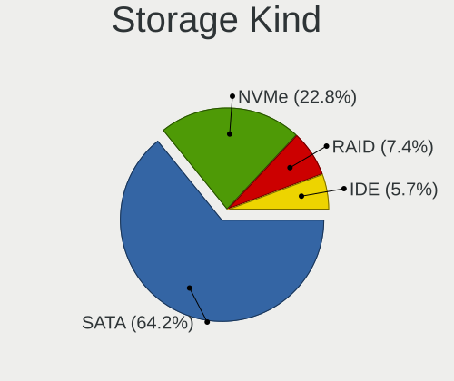

| Kind | Computers | Percent |
|------|-----------|---------|
| SATA | 487       | 64.16%  |
| NVMe | 173       | 22.79%  |
| RAID | 56        | 7.38%   |
| IDE  | 43        | 5.67%   |

Processor
---------

CPU Vendor
----------

Processor vendors

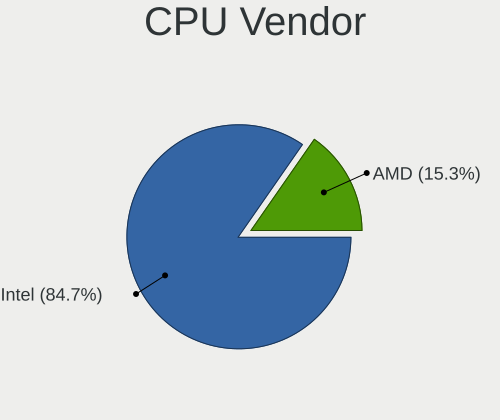

| Vendor | Computers | Percent |
|--------|-----------|---------|
| Intel  | 530       | 84.66%  |
| AMD    | 96        | 15.34%  |

CPU Model
---------

Processor models

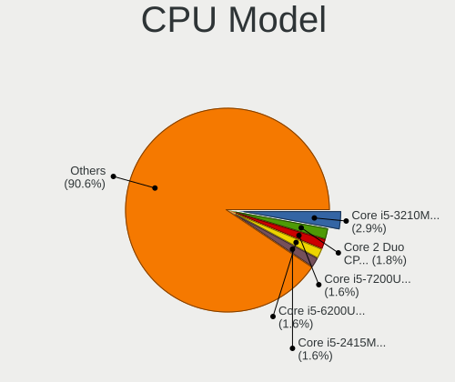

| Model                                   | Computers | Percent |
|-----------------------------------------|-----------|---------|
| Intel Core i5-3210M CPU @ 2.50GHz       | 18        | 2.87%   |
| Intel Core 2 Duo CPU P8600 @ 2.40GHz    | 11        | 1.75%   |
| Intel Core i5-7200U CPU @ 2.50GHz       | 10        | 1.59%   |
| Intel Core i5-6200U CPU @ 2.30GHz       | 10        | 1.59%   |
| Intel Core i5-2415M CPU @ 2.30GHz       | 10        | 1.59%   |
| Intel 11th Gen Core i5-1135G7 @ 2.40GHz | 10        | 1.59%   |
| Intel Core i5-5250U CPU @ 1.60GHz       | 8         | 1.28%   |
| Intel Core i7-2600 CPU @ 3.40GHz        | 6         | 0.96%   |
| Intel Core i7-7700HQ CPU @ 2.80GHz      | 5         | 0.8%    |
| Intel Core i7-2760QM CPU @ 2.40GHz      | 5         | 0.8%    |
| Intel Core i5-8300H CPU @ 2.30GHz       | 5         | 0.8%    |
| Intel Core i5-4210U CPU @ 1.70GHz       | 5         | 0.8%    |
| AMD Ryzen 7 5700U with Radeon Graphics  | 5         | 0.8%    |
| Intel Core i7-6700HQ CPU @ 2.60GHz      | 4         | 0.64%   |
| Intel Core i7-4700MQ CPU @ 2.40GHz      | 4         | 0.64%   |
| Intel Core i7-3720QM CPU @ 2.60GHz      | 4         | 0.64%   |
| Intel Core i5-2520M CPU @ 2.50GHz       | 4         | 0.64%   |
| Intel Core i5-2410M CPU @ 2.30GHz       | 4         | 0.64%   |
| Intel Core i5-2400 CPU @ 3.10GHz        | 4         | 0.64%   |
| Intel Core i5-10210U CPU @ 1.60GHz      | 4         | 0.64%   |
| Intel Core i3-4005U CPU @ 1.70GHz       | 4         | 0.64%   |
| Intel Core i3 CPU M 370 @ 2.40GHz       | 4         | 0.64%   |
| Intel Core 2 Duo CPU P7550 @ 2.26GHz    | 4         | 0.64%   |
| Intel Celeron N4020 CPU @ 1.10GHz       | 4         | 0.64%   |
| AMD Ryzen 5 5500U with Radeon Graphics  | 4         | 0.64%   |
| Intel Core i7-8650U CPU @ 1.90GHz       | 3         | 0.48%   |
| Intel Core i7-8550U CPU @ 1.80GHz       | 3         | 0.48%   |
| Intel Core i7-6500U CPU @ 2.50GHz       | 3         | 0.48%   |
| Intel Core i7-5650U CPU @ 2.20GHz       | 3         | 0.48%   |
| Intel Core i7-4600U CPU @ 2.10GHz       | 3         | 0.48%   |
| Intel Core i7-2677M CPU @ 1.80GHz       | 3         | 0.48%   |
| Intel Core i5-8250U CPU @ 1.60GHz       | 3         | 0.48%   |
| Intel Core i5-4590 CPU @ 3.30GHz        | 3         | 0.48%   |
| Intel Core i5-4570R CPU @ 2.70GHz       | 3         | 0.48%   |
| Intel Core i5-4300U CPU @ 1.90GHz       | 3         | 0.48%   |
| Intel Core i5-3470 CPU @ 3.20GHz        | 3         | 0.48%   |
| Intel Core i5-3320M CPU @ 2.60GHz       | 3         | 0.48%   |
| Intel Core i5-3230M CPU @ 2.60GHz       | 3         | 0.48%   |
| Intel Core i5-2450M CPU @ 2.50GHz       | 3         | 0.48%   |
| Intel Core i5-2435M CPU @ 2.40GHz       | 3         | 0.48%   |

CPU Model Family
----------------

Processor model prefix

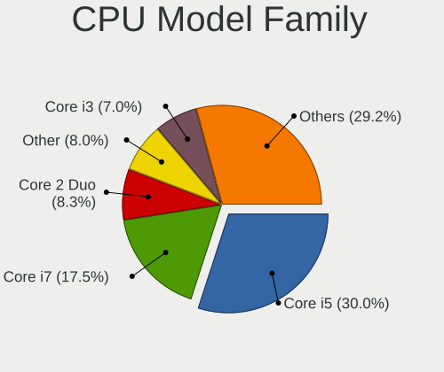

| Model                   | Computers | Percent |
|-------------------------|-----------|---------|
| Intel Core i5           | 188       | 29.98%  |
| Intel Core i7           | 110       | 17.54%  |
| Intel Core 2 Duo        | 52        | 8.29%   |
| Other                   | 50        | 7.97%   |
| Intel Core i3           | 44        | 7.02%   |
| Intel Celeron           | 29        | 4.63%   |
| AMD Ryzen 5             | 25        | 3.99%   |
| AMD Ryzen 7             | 17        | 2.71%   |
| Intel Xeon              | 16        | 2.55%   |
| Intel Pentium           | 15        | 2.39%   |
| Intel Pentium Dual-Core | 8         | 1.28%   |
| AMD Ryzen 3             | 8         | 1.28%   |
| AMD Ryzen 9             | 7         | 1.12%   |
| AMD A4                  | 7         | 1.12%   |
| AMD FX                  | 6         | 0.96%   |
| AMD A6                  | 6         | 0.96%   |
| Intel Pentium Silver    | 4         | 0.64%   |
| Intel Atom              | 4         | 0.64%   |
| Intel Core 2 Quad       | 3         | 0.48%   |
| AMD V140                | 3         | 0.48%   |
| Intel Pentium Dual      | 2         | 0.32%   |
| Intel Core 2            | 2         | 0.32%   |
| AMD E2                  | 2         | 0.32%   |
| AMD A8                  | 2         | 0.32%   |
| AMD A12                 | 2         | 0.32%   |
| Intel Pentium Gold      | 1         | 0.16%   |
| Intel Pentium D         | 1         | 0.16%   |
| Intel Core m7           | 1         | 0.16%   |
| Intel Core m5           | 1         | 0.16%   |
| Intel Core m3           | 1         | 0.16%   |
| Intel Core i9           | 1         | 0.16%   |
| Intel Core 2 Extreme    | 1         | 0.16%   |
| Intel Celeron Dual-Core | 1         | 0.16%   |
| AMD Turion II Dual-Core | 1         | 0.16%   |
| AMD Ryzen 5 PRO         | 1         | 0.16%   |
| AMD Ryzen 3 PRO         | 1         | 0.16%   |
| AMD PRO A8              | 1         | 0.16%   |
| AMD PRO A10             | 1         | 0.16%   |
| AMD Phenom II X4        | 1         | 0.16%   |
| AMD A10                 | 1         | 0.16%   |

CPU Cores
---------

Number of processor cores

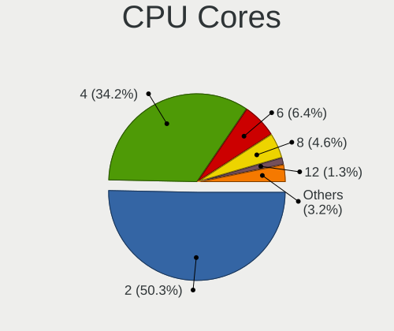

| Number | Computers | Percent |
|--------|-----------|---------|
| 2      | 315       | 50.32%  |
| 4      | 214       | 34.19%  |
| 6      | 40        | 6.39%   |
| 8      | 29        | 4.63%   |
| 12     | 8         | 1.28%   |
| 1      | 7         | 1.12%   |
| 16     | 4         | 0.64%   |
| 10     | 4         | 0.64%   |
| 14     | 3         | 0.48%   |
| 20     | 1         | 0.16%   |
| 18     | 1         | 0.16%   |

CPU Sockets
-----------

Number of sockets

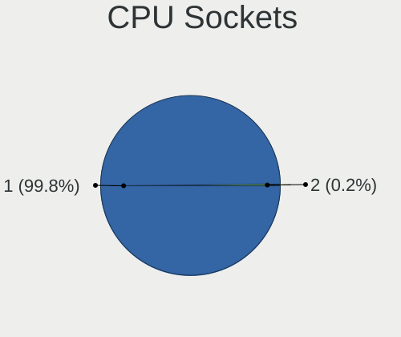

| Number | Computers | Percent |
|--------|-----------|---------|
| 1      | 625       | 99.84%  |
| 2      | 1         | 0.16%   |

CPU Threads
-----------

Threads per core (Hyper-Threading)

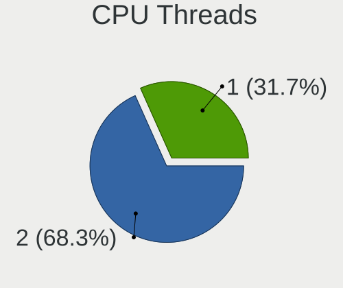

| Number | Computers | Percent |
|--------|-----------|---------|
| 2      | 429       | 68.31%  |
| 1      | 199       | 31.69%  |

CPU Op-Modes
------------

CPU Operation Modes (32-bit, 64-bit)

| Op mode        | Computers | Percent |
|----------------|-----------|---------|
| 32-bit, 64-bit | 626       | 100%    |

CPU Microcode
-------------

Microcode number

| Number     | Computers | Percent |
|------------|-----------|---------|
| Unknown    | 613       | 97.61%  |
| 0x08608104 | 2         | 0.32%   |
| 0x08608103 | 2         | 0.32%   |
| 0x806e9    | 1         | 0.16%   |
| 0x806c1    | 1         | 0.16%   |
| 0x306a9    | 1         | 0.16%   |
| 0x0a704104 | 1         | 0.16%   |
| 0x0a404102 | 1         | 0.16%   |
| 0x0a20102b | 1         | 0.16%   |
| 0x08701021 | 1         | 0.16%   |
| 0x08108109 | 1         | 0.16%   |
| 0x06006704 | 1         | 0.16%   |
| 0x06001119 | 1         | 0.16%   |
| 0x05000119 | 1         | 0.16%   |

CPU Microarch
-------------

Microarchitecture

| Name             | Computers | Percent |
|------------------|-----------|---------|
| KabyLake         | 75        | 11.96%  |
| Haswell          | 68        | 10.85%  |
| SandyBridge      | 66        | 10.53%  |
| IvyBridge        | 62        | 9.89%   |
| Penryn           | 56        | 8.93%   |
| Unknown          | 42        | 6.7%    |
| Skylake          | 38        | 6.06%   |
| Westmere         | 25        | 3.99%   |
| TigerLake        | 22        | 3.51%   |
| Broadwell        | 22        | 3.51%   |
| Goldmont plus    | 17        | 2.71%   |
| Zen 3            | 16        | 2.55%   |
| Zen+             | 14        | 2.23%   |
| Core             | 13        | 2.07%   |
| CometLake        | 10        | 1.59%   |
| Silvermont       | 9         | 1.44%   |
| IceLake          | 9         | 1.44%   |
| Excavator        | 8         | 1.28%   |
| Zen 2            | 7         | 1.12%   |
| Zen              | 6         | 0.96%   |
| Puma             | 6         | 0.96%   |
| Piledriver       | 6         | 0.96%   |
| K10              | 5         | 0.8%    |
| Goldmont         | 5         | 0.8%    |
| Nehalem          | 3         | 0.48%   |
| K10 Llano        | 3         | 0.48%   |
| Jaguar           | 3         | 0.48%   |
| Alderlake Hybrid | 3         | 0.48%   |
| Bulldozer        | 2         | 0.32%   |
| Bonnell          | 2         | 0.32%   |
| Bobcat           | 2         | 0.32%   |
| Steamroller      | 1         | 0.16%   |
| NetBurst         | 1         | 0.16%   |

Graphics
--------

GPU Vendor
----------

Vendors of graphics cards

| Vendor            | Computers | Percent |
|-------------------|-----------|---------|
| Intel             | 417       | 56.43%  |
| Nvidia            | 175       | 23.68%  |
| AMD               | 146       | 19.76%  |
| ASPEED Technology | 1         | 0.14%   |

GPU Model
---------

Graphics card models

| Model                                                                       | Computers | Percent |
|-----------------------------------------------------------------------------|-----------|---------|
| Intel 2nd Generation Core Processor Family Integrated Graphics Controller   | 60        | 7.91%   |
| Intel 3rd Gen Core processor Graphics Controller                            | 44        | 5.8%    |
| Intel Haswell-ULT Integrated Graphics Controller                            | 28        | 3.69%   |
| Intel Skylake-U GT2 [HD Graphics 520]                                       | 19        | 2.5%    |
| Intel TigerLake-LP GT2 [Iris Xe Graphics]                                   | 17        | 2.24%   |
| Intel Core Processor Integrated Graphics Controller                         | 16        | 2.11%   |
| Intel Kaby Lake-U GT2 [HD Graphics 620]                                     | 15        | 1.98%   |
| Nvidia C79 [GeForce 9400M]                                                  | 14        | 1.84%   |
| Intel GeminiLake [UHD Graphics 600]                                         | 13        | 1.71%   |
| Intel Broadwell-U GT3 [HD Graphics 6000]                                    | 13        | 1.71%   |
| Intel 4th Gen Core Processor Integrated Graphics Controller                 | 12        | 1.58%   |
| AMD Picasso/Raven 2 [Radeon Vega Series / Radeon Vega Mobile Series]        | 12        | 1.58%   |
| Nvidia MCP89 [GeForce 320M]                                                 | 11        | 1.45%   |
| Intel Xeon E3-1200 v3/4th Gen Core Processor Integrated Graphics Controller | 10        | 1.32%   |
| Intel Kaby Lake-R GT2 [UHD Graphics 620]                                    | 10        | 1.32%   |
| AMD Lucienne                                                                | 10        | 1.32%   |
| Intel Mobile 4 Series Chipset Integrated Graphics Controller                | 8         | 1.05%   |
| Intel CometLake-U GT2 [UHD Graphics]                                        | 8         | 1.05%   |
| Intel CoffeeLake-H GT2 [UHD Graphics 630]                                   | 7         | 0.92%   |
| AMD Ellesmere [Radeon RX 470/480/570/570X/580/580X/590]                     | 7         | 0.92%   |
| Nvidia TU117M [GeForce GTX 1650 Mobile / Max-Q]                             | 6         | 0.79%   |
| Nvidia GF117M [GeForce 610M/710M/810M/820M / GT 620M/625M/630M/720M]        | 6         | 0.79%   |
| Nvidia G96CM [GeForce 9600M GT]                                             | 6         | 0.79%   |
| Intel Mobile GM965/GL960 Integrated Graphics Controller (secondary)         | 6         | 0.79%   |
| Intel Mobile GM965/GL960 Integrated Graphics Controller (primary)           | 6         | 0.79%   |
| Intel Kaby Lake-H GT2 [HD Graphics 630]                                     | 6         | 0.79%   |
| Intel Broadwell-U GT2 [HD Graphics 5500]                                    | 6         | 0.79%   |
| Intel Atom Processor Z36xxx/Z37xxx Series Graphics & Display                | 6         | 0.79%   |
| Nvidia GT216M [GeForce GT 330M]                                             | 5         | 0.66%   |
| Nvidia GK208B [GeForce GT 710]                                              | 5         | 0.66%   |
| Intel Tiger Lake-LP GT2 [UHD Graphics G4]                                   | 5         | 0.66%   |
| Intel Apollo Lake GT1 [HD Graphics 500]                                     | 5         | 0.66%   |
| AMD Lexa PRO [Radeon 540/540X/550/550X / RX 540X/550/550X]                  | 5         | 0.66%   |
| AMD Cezanne [Radeon Vega Series / Radeon Vega Mobile Series]                | 5         | 0.66%   |
| Nvidia GP107M [GeForce GTX 1050 Mobile]                                     | 4         | 0.53%   |
| Nvidia GP107 [GeForce GTX 1050 Ti]                                          | 4         | 0.53%   |
| Intel WhiskeyLake-U GT2 [UHD Graphics 620]                                  | 4         | 0.53%   |
| Intel Skylake-S GT2 [HD Graphics 530]                                       | 4         | 0.53%   |
| Intel Raptor Lake-P [Iris Xe Graphics]                                      | 4         | 0.53%   |
| Intel GeminiLake [UHD Graphics 605]                                         | 4         | 0.53%   |

GPU Combo
---------

Combinations of graphics cards

| Name            | Computers | Percent |
|-----------------|-----------|---------|
| 1 x Intel       | 312       | 49.68%  |
| 1 x AMD         | 108       | 17.2%   |
| 1 x Nvidia      | 97        | 15.45%  |
| Intel + Nvidia  | 66        | 10.51%  |
| Intel + AMD     | 26        | 4.14%   |
| AMD + Nvidia    | 6         | 0.96%   |
| 2 x Nvidia      | 5         | 0.8%    |
| 2 x AMD         | 5         | 0.8%    |
| Other           | 2         | 0.32%   |
| Nvidia + ASPEED | 1         | 0.16%   |

GPU Driver
----------

Free vs proprietary

| Driver      | Computers | Percent |
|-------------|-----------|---------|
| Free        | 590       | 93.65%  |
| Proprietary | 24        | 3.81%   |
| Unknown     | 16        | 2.54%   |

GPU Memory
----------

Total video memory

| Size in GB | Computers | Percent |
|------------|-----------|---------|
| Unknown    | 590       | 93.5%   |
| 0.01-0.5   | 13        | 2.06%   |
| 3.01-4.0   | 9         | 1.43%   |
| 0.51-1.0   | 7         | 1.11%   |
| 7.01-8.0   | 6         | 0.95%   |
| 1.01-2.0   | 5         | 0.79%   |
| 8.01-16.0  | 1         | 0.16%   |

Monitor
-------

Monitor Vendor
--------------

Monitor vendors

| Vendor                  | Computers | Percent |
|-------------------------|-----------|---------|
| Apple                   | 119       | 18.09%  |
| Samsung Electronics     | 68        | 10.33%  |
| AU Optronics            | 65        | 9.88%   |
| BOE                     | 64        | 9.73%   |
| LG Display              | 55        | 8.36%   |
| Chimei Innolux          | 53        | 8.05%   |
| Goldstar                | 29        | 4.41%   |
| Dell                    | 18        | 2.74%   |
| Acer                    | 15        | 2.28%   |
| Hewlett-Packard         | 14        | 2.13%   |
| Sharp                   | 13        | 1.98%   |
| Chi Mei Optoelectronics | 12        | 1.82%   |
| AOC                     | 12        | 1.82%   |
| Philips                 | 10        | 1.52%   |
| Lenovo                  | 9         | 1.37%   |
| InfoVision              | 6         | 0.91%   |
| ASUSTek Computer        | 6         | 0.91%   |
| PANDA                   | 5         | 0.76%   |
| Panasonic               | 5         | 0.76%   |
| HKC                     | 5         | 0.76%   |
| BenQ                    | 5         | 0.76%   |
| Sony                    | 4         | 0.61%   |
| Vizio                   | 3         | 0.46%   |
| ViewSonic               | 3         | 0.46%   |
| Unknown (XXX)           | 3         | 0.46%   |
| Mi                      | 3         | 0.46%   |
| HannStar                | 3         | 0.46%   |
| Ancor Communications    | 3         | 0.46%   |
| Vestel Elektronik       | 2         | 0.3%    |
| Toshiba                 | 2         | 0.3%    |
| SAC                     | 2         | 0.3%    |
| NEC Computers           | 2         | 0.3%    |
| MSI                     | 2         | 0.3%    |
| Gateway                 | 2         | 0.3%    |
| Fujitsu Siemens         | 2         | 0.3%    |
| Eizo                    | 2         | 0.3%    |
| Denver                  | 2         | 0.3%    |
| CVT                     | 2         | 0.3%    |
| Westinghouse            | 1         | 0.15%   |
| Vita                    | 1         | 0.15%   |

Monitor Model
-------------

Monitor models

| Model                                                                    | Computers | Percent |
|--------------------------------------------------------------------------|-----------|---------|
| Apple LCD Monitor APP9CC3 1280x800 286x179mm 13.3-inch                   | 12        | 1.79%   |
| Apple Color LCD APP9CC7 1280x800 286x179mm 13.3-inch                     | 11        | 1.64%   |
| Apple LCD Monitor APP9CC5 1280x800 286x179mm 13.3-inch                   | 7         | 1.04%   |
| Apple LCD Monitor APP9CA3 1440x900 331x207mm 15.4-inch                   | 6         | 0.9%    |
| BOE LCD Monitor BOE0872 1920x1080 344x194mm 15.5-inch                    | 5         | 0.75%   |
| Apple iMac APPA012 1920x1080 475x267mm 21.5-inch                         | 5         | 0.75%   |
| Apple Color LCD APPA01B 1440x900 286x179mm 13.3-inch                     | 5         | 0.75%   |
| Apple Color LCD APP9CF0 1440x900 290x180mm 13.4-inch                     | 5         | 0.75%   |
| Samsung Electronics C27F390 SAM0D32 1920x1080 598x336mm 27.0-inch        | 4         | 0.6%    |
| Apple Color LCD APP9CDF 1440x900 286x179mm 13.3-inch                     | 4         | 0.6%    |
| Apple Color LCD APP9CA4 1440x900 331x207mm 15.4-inch                     | 4         | 0.6%    |
| LG Display LCD Monitor LGD045C 1366x768 345x194mm 15.6-inch              | 3         | 0.45%   |
| LG Display LCD Monitor LGD039F 1366x768 345x194mm 15.6-inch              | 3         | 0.45%   |
| Goldstar FULL HD GSM5B55 1920x1080 480x270mm 21.7-inch                   | 3         | 0.45%   |
| Chimei Innolux LCD Monitor CMN1404 1920x1080 309x173mm 13.9-inch         | 3         | 0.45%   |
| Chi Mei Optoelectronics LCD Monitor CMO15A7 1366x768 344x193mm 15.5-inch | 3         | 0.45%   |
| BOE LCD Monitor BOE0877 1920x1080 309x173mm 13.9-inch                    | 3         | 0.45%   |
| AU Optronics LCD Monitor AUO38ED 1920x1080 344x193mm 15.5-inch           | 3         | 0.45%   |
| Apple LCD Monitor APP9CCB 1280x800 286x179mm 13.3-inch                   | 3         | 0.45%   |
| Apple iMac APPB005 2560x1440 597x336mm 27.0-inch                         | 3         | 0.45%   |
| Apple iMac APPA007 2560x1440 597x336mm 27.0-inch                         | 3         | 0.45%   |
| Apple Color LCD APP9CF2 1366x768 256x144mm 11.6-inch                     | 3         | 0.45%   |
| Apple Color LCD APP9C6C 1920x1200 520x320mm 24.0-inch                    | 3         | 0.45%   |
| Vestel Elektronik 40UHD_LCD_TV VES3700 3840x2160 880x500mm 39.8-inch     | 2         | 0.3%    |
| Unknown (XXX) Union TV XXX2841 1920x1080 1209x680mm 54.6-inch            | 2         | 0.3%    |
| Sharp LCD Monitor SHP149A 1920x1080 344x194mm 15.5-inch                  | 2         | 0.3%    |
| Samsung Electronics LCD Monitor SEC5441 1280x800 331x207mm 15.4-inch     | 2         | 0.3%    |
| Samsung Electronics LCD Monitor SEC3152 1366x768 344x194mm 15.5-inch     | 2         | 0.3%    |
| Samsung Electronics LCD Monitor SDC4852 1366x768 344x194mm 15.5-inch     | 2         | 0.3%    |
| Samsung Electronics LCD Monitor SDC4171 2880x1800 302x189mm 14.0-inch    | 2         | 0.3%    |
| PANDA LCD Monitor NCP004D 1920x1080 344x194mm 15.5-inch                  | 2         | 0.3%    |
| Panasonic VVX11F009G00 MEI96A2 1920x1080 344x193mm 15.5-inch             | 2         | 0.3%    |
| LG Display LCD Monitor LGD0521 1920x1080 309x174mm 14.0-inch             | 2         | 0.3%    |
| LG Display LCD Monitor LGD03EA 1920x1080 309x174mm 14.0-inch             | 2         | 0.3%    |
| LG Display LCD Monitor LGD03DC 1366x768 277x156mm 12.5-inch              | 2         | 0.3%    |
| LG Display LCD Monitor LGD0395 1366x768 344x194mm 15.5-inch              | 2         | 0.3%    |
| LG Display LCD Monitor LGD0372 1600x900 382x215mm 17.3-inch              | 2         | 0.3%    |
| LG Display LCD Monitor LGD02E3 1366x768 344x194mm 15.5-inch              | 2         | 0.3%    |
| LG Display LCD Monitor LGD02D1 1600x900 382x215mm 17.3-inch              | 2         | 0.3%    |
| HKC 22N1 HKCB215 1920x1080 476x268mm 21.5-inch                           | 2         | 0.3%    |

Monitor Resolution
------------------

Monitor screen resolution

| Resolution         | Computers | Percent |
|--------------------|-----------|---------|
| 1920x1080 (FHD)    | 236       | 37.28%  |
| 1366x768 (WXGA)    | 132       | 20.85%  |
| 1280x800 (WXGA)    | 49        | 7.74%   |
| 3840x2160 (4K)     | 43        | 6.79%   |
| 1440x900 (WXGA+)   | 31        | 4.9%    |
| 1600x900 (HD+)     | 28        | 4.42%   |
| 2560x1440 (QHD)    | 26        | 4.11%   |
| 1920x1200 (WUXGA)  | 18        | 2.84%   |
| 1680x1050 (WSXGA+) | 15        | 2.37%   |
| 2560x1600          | 8         | 1.26%   |
| 2880x1800          | 7         | 1.11%   |
| 2560x1080          | 6         | 0.95%   |
| 1280x1024 (SXGA)   | 6         | 0.95%   |
| 2160x1440          | 5         | 0.79%   |
| 3440x1440          | 4         | 0.63%   |
| 3840x2400          | 2         | 0.32%   |
| 3200x1800 (QHD+)   | 2         | 0.32%   |
| 1920x540           | 2         | 0.32%   |
| 1280x720 (HD)      | 2         | 0.32%   |
| 1024x600           | 2         | 0.32%   |
| 3840x1200          | 1         | 0.16%   |
| 3840x1080          | 1         | 0.16%   |
| 3072x1920          | 1         | 0.16%   |
| 2880x1620          | 1         | 0.16%   |
| 2400x1600          | 1         | 0.16%   |
| 2288x1287          | 1         | 0.16%   |
| 1600x2560          | 1         | 0.16%   |
| 1400x1050          | 1         | 0.16%   |
| 1360x768           | 1         | 0.16%   |

Monitor Diagonal
----------------

Diagonal size in inches

| Inches  | Computers | Percent |
|---------|-----------|---------|
| 15      | 162       | 24.55%  |
| 13      | 122       | 18.48%  |
| 14      | 60        | 9.09%   |
| 27      | 49        | 7.42%   |
| 17      | 40        | 6.06%   |
| 24      | 30        | 4.55%   |
| 21      | 30        | 4.55%   |
| 23      | 29        | 4.39%   |
| 31      | 20        | 3.03%   |
| 11      | 13        | 1.97%   |
| 12      | 10        | 1.52%   |
| 54      | 8         | 1.21%   |
| 19      | 8         | 1.21%   |
| 18      | 8         | 1.21%   |
| 34      | 7         | 1.06%   |
| 22      | 7         | 1.06%   |
| 16      | 7         | 1.06%   |
| 32      | 6         | 0.91%   |
| 26      | 6         | 0.91%   |
| 84      | 5         | 0.76%   |
| 40      | 5         | 0.76%   |
| 20      | 5         | 0.76%   |
| 72      | 3         | 0.45%   |
| 49      | 3         | 0.45%   |
| Unknown | 3         | 0.45%   |
| 63      | 2         | 0.3%    |
| 43      | 2         | 0.3%    |
| 42      | 2         | 0.3%    |
| 10      | 2         | 0.3%    |
| 142     | 1         | 0.15%   |
| 64      | 1         | 0.15%   |
| 55      | 1         | 0.15%   |
| 46      | 1         | 0.15%   |
| 35      | 1         | 0.15%   |
| 28      | 1         | 0.15%   |

Monitor Width
-------------

Physical width

| Width in mm    | Computers | Percent |
|----------------|-----------|---------|
| 301-350        | 262       | 39.88%  |
| 201-300        | 113       | 17.2%   |
| 501-600        | 109       | 16.59%  |
| 401-500        | 56        | 8.52%   |
| 351-400        | 44        | 6.7%    |
| 601-700        | 23        | 3.5%    |
| 1001-1500      | 16        | 2.44%   |
| 701-800        | 13        | 1.98%   |
| 1501-2000      | 8         | 1.22%   |
| 801-900        | 6         | 0.91%   |
| 901-1000       | 3         | 0.46%   |
| Unknown        | 3         | 0.46%   |
| More than 2000 | 1         | 0.15%   |

Aspect Ratio
------------

Proportional relationship between the width and the height

| Ratio   | Computers | Percent |
|---------|-----------|---------|
| 16/9    | 454       | 74.67%  |
| 16/10   | 129       | 21.22%  |
| 21/9    | 8         | 1.32%   |
| 5/4     | 6         | 0.99%   |
| 3/2     | 6         | 0.99%   |
| 32/9    | 2         | 0.33%   |
| 3.20    | 1         | 0.16%   |
| 1.00    | 1         | 0.16%   |
| Unknown | 1         | 0.16%   |

Monitor Area
------------

Area in inch²

| Area in inch² | Computers | Percent |
|----------------|-----------|---------|
| 101-110        | 161       | 24.58%  |
| 81-90          | 144       | 21.98%  |
| 201-250        | 74        | 11.3%   |
| 301-350        | 51        | 7.79%   |
| 71-80          | 36        | 5.5%    |
| 351-500        | 35        | 5.34%   |
| 121-130        | 28        | 4.27%   |
| 151-200        | 22        | 3.36%   |
| More than 1000 | 21        | 3.21%   |
| 51-60          | 13        | 1.98%   |
| 251-300        | 13        | 1.98%   |
| 501-1000       | 12        | 1.83%   |
| 141-150        | 11        | 1.68%   |
| 61-70          | 10        | 1.53%   |
| 131-140        | 9         | 1.37%   |
| 111-120        | 7         | 1.07%   |
| 91-100         | 3         | 0.46%   |
| Unknown        | 3         | 0.46%   |
| 41-50          | 2         | 0.31%   |

Pixel Density
-------------

Pixels per inch

| Density       | Computers | Percent |
|---------------|-----------|---------|
| 101-120       | 229       | 35.29%  |
| 121-160       | 175       | 26.96%  |
| 51-100        | 164       | 25.27%  |
| 161-240       | 46        | 7.09%   |
| 1-50          | 20        | 3.08%   |
| More than 240 | 12        | 1.85%   |
| Unknown       | 3         | 0.46%   |

Multiple Monitors
-----------------

Total monitors connected

| Total | Computers | Percent |
|-------|-----------|---------|
| 1     | 545       | 85.96%  |
| 2     | 74        | 11.67%  |
| 0     | 13        | 2.05%   |
| 3     | 2         | 0.32%   |

Network
-------

Net Controller Vendor
---------------------

Controller vendors

| Vendor                            | Computers | Percent |
|-----------------------------------|-----------|---------|
| Realtek Semiconductor             | 294       | 29.85%  |
| Intel                             | 247       | 25.08%  |
| Broadcom                          | 160       | 16.24%  |
| Qualcomm Atheros                  | 90        | 9.14%   |
| Broadcom Limited                  | 35        | 3.55%   |
| MediaTek                          | 20        | 2.03%   |
| Nvidia                            | 18        | 1.83%   |
| Marvell Technology Group          | 17        | 1.73%   |
| Ralink Technology                 | 13        | 1.32%   |
| TP-Link                           | 12        | 1.22%   |
| Samsung Electronics               | 11        | 1.12%   |
| ASIX Electronics                  | 8         | 0.81%   |
| Xiaomi                            | 7         | 0.71%   |
| Ralink                            | 5         | 0.51%   |
| Hewlett-Packard                   | 5         | 0.51%   |
| Apple                             | 4         | 0.41%   |
| Sierra Wireless                   | 3         | 0.3%    |
| Qualcomm Atheros Communications   | 3         | 0.3%    |
| Ericsson Business Mobile Networks | 3         | 0.3%    |
| Dell                              | 3         | 0.3%    |
| D-Link System                     | 3         | 0.3%    |
| NetGear                           | 2         | 0.2%    |
| ICS Advent                        | 2         | 0.2%    |
| Google                            | 2         | 0.2%    |
| ASUSTek Computer                  | 2         | 0.2%    |
| ZyDAS                             | 1         | 0.1%    |
| U-Blox                            | 1         | 0.1%    |
| Shenzhen Goodix Technology        | 1         | 0.1%    |
| Qualcomm                          | 1         | 0.1%    |
| OPPO Electronics                  | 1         | 0.1%    |
| Oculus VR                         | 1         | 0.1%    |
| Microsoft                         | 1         | 0.1%    |
| Mercucys                          | 1         | 0.1%    |
| JMicron Technology                | 1         | 0.1%    |
| Huawei Technologies               | 1         | 0.1%    |
| Edimax Technology                 | 1         | 0.1%    |
| D-Link                            | 1         | 0.1%    |
| Bose                              | 1         | 0.1%    |
| Belkin Components                 | 1         | 0.1%    |
| Attansic Technology               | 1         | 0.1%    |

Net Controller Model
--------------------

Controller models

| Model                                                                  | Computers | Percent |
|------------------------------------------------------------------------|-----------|---------|
| Realtek RTL8111/8168/8211/8411 PCI Express Gigabit Ethernet Controller | 171       | 14.6%   |
| Realtek RTL810xE PCI Express Fast Ethernet controller                  | 43        | 3.67%   |
| Broadcom BCM4331 802.11a/b/g/n                                         | 43        | 3.67%   |
| Broadcom NetXtreme BCM57765 Gigabit Ethernet PCIe                      | 42        | 3.59%   |
| Broadcom BCM4322 802.11a/b/g/n Wireless LAN Controller                 | 22        | 1.88%   |
| Intel 82579LM Gigabit Network Connection (Lewisville)                  | 20        | 1.71%   |
| Broadcom NetXtreme BCM57766 Gigabit Ethernet PCIe                      | 19        | 1.62%   |
| Realtek RTL8821CE 802.11ac PCIe Wireless Network Adapter               | 18        | 1.54%   |
| Broadcom Limited BCM4360 802.11ac Dual Band Wireless Network Adapter   | 18        | 1.54%   |
| Nvidia MCP79 Ethernet                                                  | 17        | 1.45%   |
| Intel Wireless 8265 / 8275                                             | 17        | 1.45%   |
| Realtek RTL8822CE 802.11ac PCIe Wireless Network Adapter               | 16        | 1.37%   |
| Intel Wireless 7265                                                    | 15        | 1.28%   |
| Intel Wireless 7260                                                    | 15        | 1.28%   |
| Intel Wi-Fi 6 AX201                                                    | 15        | 1.28%   |
| Broadcom BCM43224 802.11a/b/g/n                                        | 15        | 1.28%   |
| Qualcomm Atheros AR9485 Wireless Network Adapter                       | 14        | 1.2%    |
| Intel Wireless 3165                                                    | 13        | 1.11%   |
| Broadcom NetXtreme BCM5764M Gigabit Ethernet PCIe                      | 13        | 1.11%   |
| Intel Ethernet Connection I217-LM                                      | 12        | 1.02%   |
| Broadcom BCM43142 802.11b/g/n                                          | 12        | 1.02%   |
| Qualcomm Atheros QCA9565 / AR9565 Wireless Network Adapter             | 11        | 0.94%   |
| Qualcomm Atheros AR9285 Wireless Network Adapter (PCI-Express)         | 11        | 0.94%   |
| Intel Wireless 8260                                                    | 11        | 0.94%   |
| Broadcom BCM4360 802.11ac Dual Band Wireless Network Adapter           | 11        | 0.94%   |
| Broadcom BCM4313 802.11bgn Wireless Network Adapter                    | 11        | 0.94%   |
| Realtek RTL8188EUS 802.11n Wireless Network Adapter                    | 10        | 0.85%   |
| Realtek RTL8153 Gigabit Ethernet Adapter                               | 10        | 0.85%   |
| Samsung Galaxy series, misc. (tethering mode)                          | 9         | 0.77%   |
| Realtek RTL8125 2.5GbE Controller                                      | 9         | 0.77%   |
| Qualcomm Atheros QCA9377 802.11ac Wireless Network Adapter             | 9         | 0.77%   |
| Intel Comet Lake PCH-LP CNVi WiFi                                      | 9         | 0.77%   |
| Realtek 802.11ac NIC                                                   | 8         | 0.68%   |
| Ralink MT7601U Wireless Adapter                                        | 8         | 0.68%   |
| Intel Ethernet Connection I218-LM                                      | 8         | 0.68%   |
| Intel Centrino Advanced-N 6205 [Taylor Peak]                           | 8         | 0.68%   |
| Broadcom BCM4321 802.11a/b/g/n                                         | 8         | 0.68%   |
| Realtek RTL88x2bu [AC1200 Techkey]                                     | 7         | 0.6%    |
| Realtek RTL8723BE PCIe Wireless Network Adapter                        | 7         | 0.6%    |
| Qualcomm Atheros QCA6174 802.11ac Wireless Network Adapter             | 7         | 0.6%    |

Wireless Vendor
---------------

Wireless vendors

| Vendor                          | Computers | Percent |
|---------------------------------|-----------|---------|
| Intel                           | 181       | 29.97%  |
| Broadcom                        | 144       | 23.84%  |
| Realtek Semiconductor           | 102       | 16.89%  |
| Qualcomm Atheros                | 74        | 12.25%  |
| Broadcom Limited                | 30        | 4.97%   |
| MediaTek                        | 18        | 2.98%   |
| Ralink Technology               | 13        | 2.15%   |
| TP-Link                         | 12        | 1.99%   |
| Ralink                          | 5         | 0.83%   |
| Sierra Wireless                 | 3         | 0.5%    |
| Qualcomm Atheros Communications | 3         | 0.5%    |
| Marvell Technology Group        | 3         | 0.5%    |
| D-Link System                   | 3         | 0.5%    |
| NetGear                         | 2         | 0.33%   |
| Dell                            | 2         | 0.33%   |
| ASUSTek Computer                | 2         | 0.33%   |
| ZyDAS                           | 1         | 0.17%   |
| Qualcomm                        | 1         | 0.17%   |
| Mercucys                        | 1         | 0.17%   |
| Hewlett-Packard                 | 1         | 0.17%   |
| Edimax Technology               | 1         | 0.17%   |
| D-Link                          | 1         | 0.17%   |
| Belkin Components               | 1         | 0.17%   |

Wireless Model
--------------

Wireless models

| Model                                                                | Computers | Percent |
|----------------------------------------------------------------------|-----------|---------|
| Broadcom BCM4331 802.11a/b/g/n                                       | 43        | 7.1%    |
| Broadcom BCM4322 802.11a/b/g/n Wireless LAN Controller               | 22        | 3.63%   |
| Realtek RTL8821CE 802.11ac PCIe Wireless Network Adapter             | 18        | 2.97%   |
| Broadcom Limited BCM4360 802.11ac Dual Band Wireless Network Adapter | 18        | 2.97%   |
| Intel Wireless 8265 / 8275                                           | 17        | 2.81%   |
| Realtek RTL8822CE 802.11ac PCIe Wireless Network Adapter             | 16        | 2.64%   |
| Intel Wireless 7265                                                  | 15        | 2.48%   |
| Intel Wireless 7260                                                  | 15        | 2.48%   |
| Intel Wi-Fi 6 AX201                                                  | 15        | 2.48%   |
| Broadcom BCM43224 802.11a/b/g/n                                      | 15        | 2.48%   |
| Qualcomm Atheros AR9485 Wireless Network Adapter                     | 14        | 2.31%   |
| Intel Wireless 3165                                                  | 13        | 2.15%   |
| Broadcom BCM43142 802.11b/g/n                                        | 12        | 1.98%   |
| Qualcomm Atheros QCA9565 / AR9565 Wireless Network Adapter           | 11        | 1.82%   |
| Qualcomm Atheros AR9285 Wireless Network Adapter (PCI-Express)       | 11        | 1.82%   |
| Intel Wireless 8260                                                  | 11        | 1.82%   |
| Broadcom BCM4360 802.11ac Dual Band Wireless Network Adapter         | 11        | 1.82%   |
| Broadcom BCM4313 802.11bgn Wireless Network Adapter                  | 11        | 1.82%   |
| Realtek RTL8188EUS 802.11n Wireless Network Adapter                  | 10        | 1.65%   |
| Qualcomm Atheros QCA9377 802.11ac Wireless Network Adapter           | 9         | 1.49%   |
| Intel Comet Lake PCH-LP CNVi WiFi                                    | 9         | 1.49%   |
| Realtek 802.11ac NIC                                                 | 8         | 1.32%   |
| Ralink MT7601U Wireless Adapter                                      | 8         | 1.32%   |
| Intel Centrino Advanced-N 6205 [Taylor Peak]                         | 8         | 1.32%   |
| Broadcom BCM4321 802.11a/b/g/n                                       | 8         | 1.32%   |
| Realtek RTL88x2bu [AC1200 Techkey]                                   | 7         | 1.16%   |
| Realtek RTL8723BE PCIe Wireless Network Adapter                      | 7         | 1.16%   |
| Qualcomm Atheros QCA6174 802.11ac Wireless Network Adapter           | 7         | 1.16%   |
| Qualcomm Atheros AR9462 Wireless Network Adapter                     | 7         | 1.16%   |
| Intel Wireless 3160                                                  | 7         | 1.16%   |
| Qualcomm Atheros AR928X Wireless Network Adapter (PCI-Express)       | 6         | 0.99%   |
| Intel Wi-Fi 6E(802.11ax) AX210/AX1675* 2x2 [Typhoon Peak]            | 6         | 0.99%   |
| Intel Wi-Fi 6 AX200                                                  | 6         | 0.99%   |
| Intel Gemini Lake PCH CNVi WiFi                                      | 6         | 0.99%   |
| Broadcom BCM4312 802.11b/g LP-PHY                                    | 6         | 0.99%   |
| Realtek RTL8188FTV 802.11b/g/n 1T1R 2.4G WLAN Adapter                | 5         | 0.83%   |
| MediaTek MT7921 802.11ax PCIe Wireless Network Adapter [Filogic 330] | 5         | 0.83%   |
| MediaTek MT7902 802.11ax PCIe Wireless Network Adapter [Filogic 310] | 5         | 0.83%   |
| Intel Dual Band Wireless-AC 3168NGW [Stone Peak]                     | 5         | 0.83%   |
| Intel Centrino Advanced-N 6235                                       | 5         | 0.83%   |

Ethernet Vendor
---------------

Ethernet vendors

| Vendor                   | Computers | Percent |
|--------------------------|-----------|---------|
| Realtek Semiconductor    | 237       | 43.33%  |
| Intel                    | 124       | 22.67%  |
| Broadcom                 | 81        | 14.81%  |
| Qualcomm Atheros         | 26        | 4.75%   |
| Nvidia                   | 18        | 3.29%   |
| Marvell Technology Group | 14        | 2.56%   |
| Samsung Electronics      | 11        | 2.01%   |
| ASIX Electronics         | 8         | 1.46%   |
| Xiaomi                   | 7         | 1.28%   |
| Broadcom Limited         | 5         | 0.91%   |
| Apple                    | 4         | 0.73%   |
| MediaTek                 | 2         | 0.37%   |
| ICS Advent               | 2         | 0.37%   |
| Google                   | 2         | 0.37%   |
| OPPO Electronics         | 1         | 0.18%   |
| Microsoft                | 1         | 0.18%   |
| JMicron Technology       | 1         | 0.18%   |
| Huawei Technologies      | 1         | 0.18%   |
| Attansic Technology      | 1         | 0.18%   |
| Aquantia                 | 1         | 0.18%   |

Ethernet Model
--------------

Ethernet models

| Model                                                                          | Computers | Percent |
|--------------------------------------------------------------------------------|-----------|---------|
| Realtek RTL8111/8168/8211/8411 PCI Express Gigabit Ethernet Controller         | 171       | 30.92%  |
| Realtek RTL810xE PCI Express Fast Ethernet controller                          | 43        | 7.78%   |
| Broadcom NetXtreme BCM57765 Gigabit Ethernet PCIe                              | 42        | 7.59%   |
| Intel 82579LM Gigabit Network Connection (Lewisville)                          | 20        | 3.62%   |
| Broadcom NetXtreme BCM57766 Gigabit Ethernet PCIe                              | 19        | 3.44%   |
| Nvidia MCP79 Ethernet                                                          | 17        | 3.07%   |
| Broadcom NetXtreme BCM5764M Gigabit Ethernet PCIe                              | 13        | 2.35%   |
| Intel Ethernet Connection I217-LM                                              | 12        | 2.17%   |
| Realtek RTL8153 Gigabit Ethernet Adapter                                       | 10        | 1.81%   |
| Samsung Galaxy series, misc. (tethering mode)                                  | 9         | 1.63%   |
| Realtek RTL8125 2.5GbE Controller                                              | 9         | 1.63%   |
| Intel Ethernet Connection I218-LM                                              | 8         | 1.45%   |
| Marvell Group 88E8058 PCI-E Gigabit Ethernet Controller                        | 7         | 1.27%   |
| ASIX AX88179 Gigabit Ethernet                                                  | 7         | 1.27%   |
| Intel I211 Gigabit Network Connection                                          | 5         | 0.9%    |
| Intel Ethernet Connection (4) I219-LM                                          | 5         | 0.9%    |
| Intel Ethernet Connection (2) I219-V                                           | 5         | 0.9%    |
| Intel 82579V Gigabit Network Connection                                        | 5         | 0.9%    |
| Xiaomi Mi/Redmi series (RNDIS)                                                 | 4         | 0.72%   |
| Qualcomm Atheros Killer E2400 Gigabit Ethernet Controller                      | 4         | 0.72%   |
| Intel Ethernet Controller I225-V                                               | 4         | 0.72%   |
| Intel Ethernet Connection I219-V                                               | 4         | 0.72%   |
| Intel Ethernet Connection I219-LM                                              | 4         | 0.72%   |
| Intel Ethernet Connection (7) I219-V                                           | 4         | 0.72%   |
| Intel Ethernet Connection (4) I219-V                                           | 4         | 0.72%   |
| Intel 82577LM Gigabit Network Connection                                       | 4         | 0.72%   |
| Apple Ethernet Adapter [A1277]                                                 | 4         | 0.72%   |
| Xiaomi Mi/Redmi series (RNDIS + ADB)                                           | 3         | 0.54%   |
| Qualcomm Atheros AR8161 Gigabit Ethernet                                       | 3         | 0.54%   |
| Marvell Group Yukon Optima 88E8059 [PCIe Gigabit Ethernet Controller with AVB] | 3         | 0.54%   |
| Intel Ethernet Connection I217-V                                               | 3         | 0.54%   |
| Intel Ethernet Connection (5) I219-LM                                          | 3         | 0.54%   |
| Samsung GT-I9070 (network tethering, USB debugging enabled)                    | 2         | 0.36%   |
| Realtek RTL8152 Fast Ethernet Adapter                                          | 2         | 0.36%   |
| Realtek Killer E2600 GbE Controller                                            | 2         | 0.36%   |
| Qualcomm Atheros QCA8172 Fast Ethernet                                         | 2         | 0.36%   |
| Qualcomm Atheros QCA8171 Gigabit Ethernet                                      | 2         | 0.36%   |
| Qualcomm Atheros Killer E220x Gigabit Ethernet Controller                      | 2         | 0.36%   |
| Qualcomm Atheros AR8162 Fast Ethernet                                          | 2         | 0.36%   |
| Qualcomm Atheros AR8152 v1.1 Fast Ethernet                                     | 2         | 0.36%   |

Net Controller Kind
-------------------

Ethernet, WiFi or modem

| Kind     | Computers | Percent |
|----------|-----------|---------|
| WiFi     | 558       | 51.29%  |
| Ethernet | 518       | 47.61%  |
| Modem    | 12        | 1.1%    |

Used Controller
---------------

Currently used network controller

| Kind     | Computers | Percent |
|----------|-----------|---------|
| WiFi     | 408       | 63.65%  |
| Ethernet | 233       | 36.35%  |

NICs
----

Total network controllers on board

| Total | Computers | Percent |
|-------|-----------|---------|
| 2     | 381       | 60.86%  |
| 1     | 227       | 36.26%  |
| 3     | 10        | 1.6%    |
| 0     | 6         | 0.96%   |
| 4     | 2         | 0.32%   |

IPv6
----

IPv6 vs IPv4

| Used | Computers | Percent |
|------|-----------|---------|
| No   | 430       | 67.5%   |
| Yes  | 207       | 32.5%   |

Bluetooth
---------

Bluetooth Vendor
----------------

Controller vendors

| Vendor                          | Computers | Percent |
|---------------------------------|-----------|---------|
| Intel                           | 159       | 32.65%  |
| Apple                           | 127       | 26.08%  |
| Realtek Semiconductor           | 53        | 10.88%  |
| Qualcomm Atheros Communications | 32        | 6.57%   |
| Broadcom                        | 17        | 3.49%   |
| IMC Networks                    | 16        | 3.29%   |
| Cambridge Silicon Radio         | 15        | 3.08%   |
| Foxconn / Hon Hai               | 14        | 2.87%   |
| Hewlett-Packard                 | 9         | 1.85%   |
| Lite-On Technology              | 7         | 1.44%   |
| Dell                            | 7         | 1.44%   |
| Realtek                         | 6         | 1.23%   |
| TP-Link                         | 4         | 0.82%   |
| MediaTek                        | 3         | 0.62%   |
| Marvell Semiconductor           | 3         | 0.62%   |
| Foxconn International           | 3         | 0.62%   |
| ASUSTek Computer                | 3         | 0.62%   |
| Toshiba                         | 2         | 0.41%   |
| Ralink                          | 2         | 0.41%   |
| Ralink Technology               | 1         | 0.21%   |
| Opticis                         | 1         | 0.21%   |
| Askey Computer                  | 1         | 0.21%   |
| Actions                         | 1         | 0.21%   |
| Unknown                         | 1         | 0.21%   |

Bluetooth Model
---------------

Controller models

| Model                                               | Computers | Percent |
|-----------------------------------------------------|-----------|---------|
| Intel Bluetooth wireless interface                  | 78        | 16.02%  |
| Apple Bluetooth Host Controller                     | 61        | 12.53%  |
| Apple Bluetooth USB Host Controller                 | 45        | 9.24%   |
| Realtek Bluetooth Radio                             | 43        | 8.83%   |
| Intel AX201 Bluetooth                               | 28        | 5.75%   |
| Intel Bluetooth 9460/9560 Jefferson Peak (JfP)      | 21        | 4.31%   |
| Cambridge Silicon Radio Bluetooth Dongle (HCI mode) | 15        | 3.08%   |
| Apple Built-in Bluetooth 2.0+EDR HCI                | 14        | 2.87%   |
| Qualcomm Atheros  Bluetooth Device                  | 13        | 2.67%   |
| IMC Networks Wireless_Device                        | 8         | 1.64%   |
| Intel Bluetooth Device                              | 7         | 1.44%   |
| Apple Bluetooth HCI                                 | 7         | 1.44%   |
| Realtek Bluetooth Radio                             | 6         | 1.23%   |
| Qualcomm Atheros AR3012 Bluetooth 4.0               | 6         | 1.23%   |
| Intel Centrino Bluetooth Wireless Transceiver       | 6         | 1.23%   |
| Intel AX210 Bluetooth                               | 6         | 1.23%   |
| Intel AX200 Bluetooth                               | 6         | 1.23%   |
| HP Broadcom 2070 Bluetooth Combo                    | 6         | 1.23%   |
| Intel Wireless-AC 3168 Bluetooth                    | 5         | 1.03%   |
| Dell DW375 Bluetooth Module                         | 5         | 1.03%   |
| TP-Link TP-T@- UB500 Adapter                        | 4         | 0.82%   |
| Qualcomm Atheros QCA61x4 Bluetooth 4.0              | 4         | 0.82%   |
| Qualcomm Atheros AR3011 Bluetooth                   | 4         | 0.82%   |
| Broadcom BCM43142A0 Bluetooth Device                | 4         | 0.82%   |
| Realtek RTL8821A Bluetooth                          | 3         | 0.62%   |
| Realtek  Bluetooth 4.2 Adapter                      | 3         | 0.62%   |
| MediaTek Wireless_Device                            | 3         | 0.62%   |
| HP Bluetooth 2.0 Interface [Broadcom BCM2045]       | 3         | 0.62%   |
| Foxconn International BCM43142A0 Bluetooth module   | 3         | 0.62%   |
| Foxconn / Hon Hai Wireless_Device                   | 3         | 0.62%   |
| Foxconn / Hon Hai Bluetooth Device                  | 3         | 0.62%   |
| Broadcom HP Portable SoftSailing                    | 3         | 0.62%   |
| Broadcom BCM2070 Bluetooth Device                   | 3         | 0.62%   |
| Broadcom BCM2070 Bluetooth 2.1 + EDR                | 3         | 0.62%   |
| Realtek RTL8822BE Bluetooth 4.2 Adapter             | 2         | 0.41%   |
| Ralink RT3290 Bluetooth                             | 2         | 0.41%   |
| Qualcomm Atheros Bluetooth USB Host Controller      | 2         | 0.41%   |
| Marvell Bluetooth and Wireless LAN Composite        | 2         | 0.41%   |
| Lite-On Wireless_Device                             | 2         | 0.41%   |
| Lite-On Bluetooth Device                            | 2         | 0.41%   |

Sound
-----

Sound Vendor
------------

Sound card vendors

| Vendor                                       | Computers | Percent |
|----------------------------------------------|-----------|---------|
| Intel                                        | 495       | 59.93%  |
| Nvidia                                       | 138       | 16.71%  |
| AMD                                          | 136       | 16.46%  |
| C-Media Electronics                          | 9         | 1.09%   |
| Logitech                                     | 5         | 0.61%   |
| Texas Instruments                            | 3         | 0.36%   |
| GN Netcom                                    | 3         | 0.36%   |
| Generalplus Technology                       | 3         | 0.36%   |
| M-Audio                                      | 2         | 0.24%   |
| JMTek                                        | 2         | 0.24%   |
| Guillemot                                    | 2         | 0.24%   |
| fifine Microphones                           | 2         | 0.24%   |
| Corsair                                      | 2         | 0.24%   |
| Zoran Co. Personal Media Division (Nogatech) | 1         | 0.12%   |
| Yealink Network Technology                   | 1         | 0.12%   |
| Thesycon Systemsoftware & Consulting         | 1         | 0.12%   |
| TerraTec Electronic                          | 1         | 0.12%   |
| SteelSeries ApS                              | 1         | 0.12%   |
| Realtek Semiconductor                        | 1         | 0.12%   |
| Razer USA                                    | 1         | 0.12%   |
| Micro Star International                     | 1         | 0.12%   |
| liyuany                                      | 1         | 0.12%   |
| Lenovo                                       | 1         | 0.12%   |
| KTMicro                                      | 1         | 0.12%   |
| Kingston Technology                          | 1         | 0.12%   |
| JBL                                          | 1         | 0.12%   |
| Huawei Technologies                          | 1         | 0.12%   |
| Hewlett-Packard                              | 1         | 0.12%   |
| ESI                                          | 1         | 0.12%   |
| Dell                                         | 1         | 0.12%   |
| Creative Technology                          | 1         | 0.12%   |
| Creative Labs                                | 1         | 0.12%   |
| Cambridge Silicon Radio                      | 1         | 0.12%   |
| BEHRINGER International                      | 1         | 0.12%   |
| Barco Display Systems                        | 1         | 0.12%   |
| Apple                                        | 1         | 0.12%   |
| Actions Semiconductor                        | 1         | 0.12%   |

Sound Model
-----------

Sound card models

| Model                                                                      | Computers | Percent |
|----------------------------------------------------------------------------|-----------|---------|
| Intel 7 Series/C216 Chipset Family High Definition Audio Controller        | 65        | 6.62%   |
| Intel 6 Series/C200 Series Chipset Family High Definition Audio Controller | 60        | 6.11%   |
| Intel Sunrise Point-LP HD Audio                                            | 54        | 5.5%    |
| AMD Ryzen HD Audio Controller                                              | 42        | 4.28%   |
| Intel 8 Series/C220 Series Chipset High Definition Audio Controller        | 35        | 3.56%   |
| Intel Haswell-ULT HD Audio Controller                                      | 28        | 2.85%   |
| Intel 8 Series HD Audio Controller                                         | 28        | 2.85%   |
| Intel 5 Series/3400 Series Chipset High Definition Audio                   | 25        | 2.55%   |
| Intel Xeon E3-1200 v3/4th Gen Core Processor HD Audio Controller           | 23        | 2.34%   |
| AMD Renoir/Cezanne HDMI/DP Audio Controller                                | 23        | 2.34%   |
| Intel Tiger Lake-LP Smart Sound Technology Audio Controller                | 22        | 2.24%   |
| Intel Broadwell-U Audio Controller                                         | 21        | 2.14%   |
| Intel Wildcat Point-LP High Definition Audio Controller                    | 20        | 2.04%   |
| AMD FCH Azalia Controller                                                  | 18        | 1.83%   |
| Nvidia MCP79 High Definition Audio                                         | 17        | 1.73%   |
| Intel Celeron/Pentium Silver Processor High Definition Audio               | 17        | 1.73%   |
| Intel Cannon Lake PCH cAVS                                                 | 16        | 1.63%   |
| Intel 82801I (ICH9 Family) HD Audio Controller                             | 16        | 1.63%   |
| AMD Raven/Raven2/Fenghuang HDMI/DP Audio Controller                        | 15        | 1.53%   |
| Intel 100 Series/C230 Series Chipset Family HD Audio Controller            | 13        | 1.32%   |
| AMD Kabini HDMI/DP Audio                                                   | 13        | 1.32%   |
| Intel NM10/ICH7 Family High Definition Audio Controller                    | 12        | 1.22%   |
| Nvidia MCP89 High Definition Audio                                         | 11        | 1.12%   |
| Intel 82801H (ICH8 Family) HD Audio Controller                             | 11        | 1.12%   |
| Nvidia GK208 HDMI/DP Audio Controller                                      | 10        | 1.02%   |
| Intel 200 Series PCH HD Audio                                              | 10        | 1.02%   |
| AMD Starship/Matisse HD Audio Controller                                   | 10        | 1.02%   |
| AMD SBx00 Azalia (Intel HDA)                                               | 10        | 1.02%   |
| AMD Ellesmere HDMI Audio [Radeon RX 470/480 / 570/580/590]                 | 10        | 1.02%   |
| Nvidia GK107 HDMI Audio Controller                                         | 9         | 0.92%   |
| Intel Comet Lake PCH-LP cAVS                                               | 9         | 0.92%   |
| Nvidia GP107GL High Definition Audio Controller                            | 8         | 0.81%   |
| Nvidia GP106 High Definition Audio Controller                              | 8         | 0.81%   |
| AMD Family 15h (Models 60h-6fh) Audio Controller                           | 8         | 0.81%   |
| Nvidia GT216 HDMI Audio Controller                                         | 7         | 0.71%   |
| AMD Baffin HDMI/DP Audio [Radeon RX 550 640SP / RX 560/560X]               | 7         | 0.71%   |
| Nvidia High Definition Audio Controller                                    | 6         | 0.61%   |
| Intel Tiger Lake-H HD Audio Controller                                     | 6         | 0.61%   |
| Intel Ice Lake-LP Smart Sound Technology Audio Controller                  | 6         | 0.61%   |
| Intel CM238 HD Audio Controller                                            | 6         | 0.61%   |

Memory
------

Memory Vendor
-------------

Memory module vendors

| Vendor              | Computers | Percent |
|---------------------|-----------|---------|
| Samsung Electronics | 23        | 22.55%  |
| SK hynix            | 16        | 15.69%  |
| Micron Technology   | 15        | 14.71%  |
| Kingston            | 13        | 12.75%  |
| Crucial             | 8         | 7.84%   |
| Unknown             | 6         | 5.88%   |
| Corsair             | 4         | 3.92%   |
| Unknown (ABCD)      | 3         | 2.94%   |
| Ramaxel Technology  | 3         | 2.94%   |
| Elpida              | 3         | 2.94%   |
| Timetec             | 2         | 1.96%   |
| Nanya Technology    | 2         | 1.96%   |
| Unknown (0x0C26)    | 1         | 0.98%   |
| Transcend           | 1         | 0.98%   |
| ASint Technology    | 1         | 0.98%   |
| A-DATA Technology   | 1         | 0.98%   |

Memory Model
------------

Memory module models

| Model                                                            | Computers | Percent |
|------------------------------------------------------------------|-----------|---------|
| Unknown (ABCD) RAM 123456789012345678 2GB SODIMM LPDDR4 2400MT/s | 3         | 2.7%    |
| SK hynix RAM Module 8GB SODIMM DDR3 1600MT/s                     | 2         | 1.8%    |
| SK hynix RAM Module 2GB SODIMM DDR3 1333MT/s                     | 2         | 1.8%    |
| SK hynix RAM HMT351S6CFR8C-PB 4096MB SODIMM DDR3 1600MT/s        | 2         | 1.8%    |
| Samsung RAM M471A1G44AB0-CWE 8GB Row Of Chips DDR4 3200MT/s      | 2         | 1.8%    |
| Micron RAM Module 4GB SODIMM DDR3 1600MT/s                       | 2         | 1.8%    |
| Unknown RAM Module 8GB SODIMM DDR4 2667MT/s                      | 1         | 0.9%    |
| Unknown RAM Module 8GB DIMM DDR4 2667MT/s                        | 1         | 0.9%    |
| Unknown RAM Module 4GB SODIMM DDR4 2667MT/s                      | 1         | 0.9%    |
| Unknown RAM Module 4GB SODIMM DDR4 2133MT/s                      | 1         | 0.9%    |
| Unknown RAM Module 4GB SODIMM DDR3 667MT/s                       | 1         | 0.9%    |
| Unknown RAM Module 2GB SODIMM DDR3                               | 1         | 0.9%    |
| Unknown RAM Module 1GB SODIMM DDR3                               | 1         | 0.9%    |
| Unknown RAM Module 16GB SODIMM DDR4 2667MT/s                     | 1         | 0.9%    |
| Unknown RAM Module 16GB DIMM DDR4 2667MT/s                       | 1         | 0.9%    |
| Unknown (0x0C26) RAM TIMETEC-SD4-2666 16GB SODIMM DDR4 2667MT/s  | 1         | 0.9%    |
| Transcend RAM JM800QSU-2G 2GB SODIMM DDR2 975MT/s                | 1         | 0.9%    |
| Timetec RAM U8G-1333 8GB DIMM DDR3 1333MT/s                      | 1         | 0.9%    |
| Timetec RAM Module 8GB SODIMM DDR3 1333MT/s                      | 1         | 0.9%    |
| SK hynix RAM HMT451S6DFR8A-PB 4GB SODIMM DDR3 1600MT/s           | 1         | 0.9%    |
| SK hynix RAM HMT451S6AFR8A-PB 4GB SODIMM DDR3 1600MT/s           | 1         | 0.9%    |
| SK hynix RAM HMT425S6AFR6A-PB 2GB SODIMM DDR3 3200MT/s           | 1         | 0.9%    |
| SK hynix RAM HMT41GS6AFR8A-PB 8GiB SODIMM DDR3 2667MT/s          | 1         | 0.9%    |
| SK hynix RAM HMT351S6EFR8A-PB 4GB SODIMM DDR3 1600MT/s           | 1         | 0.9%    |
| SK hynix RAM HMT325S6CFR8C-PB 2GB SODIMM DDR3 1600MT/s           | 1         | 0.9%    |
| SK hynix RAM HMAA1GS6CMR8N-VK 8GB SODIMM DDR4 2667MT/s           | 1         | 0.9%    |
| SK hynix RAM HMA851S6CJR6N-VK 4GB Row Of Chips DDR4 2667MT/s     | 1         | 0.9%    |
| SK hynix RAM HMA81GS6DJR8N-XN 8GB SODIMM DDR4 3200MT/s           | 1         | 0.9%    |
| SK hynix RAM H9HCNNNCPMMLXR-NEE 8GB SODIMM LPDDR4 4266MT/s       | 1         | 0.9%    |
| SK hynix RAM H9CCNNNBJTALAR-NUD 4GB LPDDR3 1867MT/s              | 1         | 0.9%    |
| Samsung RAM Module 8GB SODIMM DDR4 2133MT/s                      | 1         | 0.9%    |
| Samsung RAM Module 8GB DIMM DDR3 1333MT/s                        | 1         | 0.9%    |
| Samsung RAM Module 2GB SODIMM DDR3 1333MT/s                      | 1         | 0.9%    |
| Samsung RAM Module 2GB SODIMM DDR3 1067MT/s                      | 1         | 0.9%    |
| Samsung RAM M471B5273DH0-CH9 4GB SODIMM DDR3 1600MT/s            | 1         | 0.9%    |
| Samsung RAM M471B5273DH0-CH9 4GB DIMM DDR3 1333MT/s              | 1         | 0.9%    |
| Samsung RAM M471B5173EB0-YK0 4GB SODIMM DDR3 1600MT/s            | 1         | 0.9%    |
| Samsung RAM M471B5173DB0-YK0 4GB SODIMM DDR3 1600MT/s            | 1         | 0.9%    |
| Samsung RAM M471A5244CB0-CWE 4GB SODIMM DDR4 3200MT/s            | 1         | 0.9%    |
| Samsung RAM M471A5244CB0-CTD 4GB SODIMM DDR4 3266MT/s            | 1         | 0.9%    |

Memory Kind
-----------

Memory module kinds

| Kind   | Computers | Percent |
|--------|-----------|---------|
| DDR3   | 38        | 44.71%  |
| DDR4   | 31        | 36.47%  |
| LPDDR4 | 5         | 5.88%   |
| LPDDR3 | 3         | 3.53%   |
| DDR2   | 3         | 3.53%   |
| SDRAM  | 2         | 2.35%   |
| LPDDR5 | 2         | 2.35%   |
| DDR5   | 1         | 1.18%   |

Memory Form Factor
------------------

Physical design of the memory module

| Name         | Computers | Percent |
|--------------|-----------|---------|
| SODIMM       | 60        | 69.77%  |
| DIMM         | 15        | 17.44%  |
| Row Of Chips | 10        | 11.63%  |
| Unknown      | 1         | 1.16%   |

Memory Size
-----------

Memory module size

| Size  | Computers | Percent |
|-------|-----------|---------|
| 8192  | 39        | 40.63%  |
| 4096  | 27        | 28.13%  |
| 2048  | 16        | 16.67%  |
| 16384 | 9         | 9.38%   |
| 1024  | 4         | 4.17%   |
| 32768 | 1         | 1.04%   |

Memory Speed
------------

Memory module speed

| Speed   | Computers | Percent |
|---------|-----------|---------|
| 1600    | 18        | 19.78%  |
| 2667    | 13        | 14.29%  |
| 1333    | 11        | 12.09%  |
| 3200    | 10        | 10.99%  |
| 2400    | 8         | 8.79%   |
| 2133    | 5         | 5.49%   |
| 1067    | 3         | 3.3%    |
| 1867    | 2         | 2.2%    |
| 1334    | 2         | 2.2%    |
| 800     | 2         | 2.2%    |
| 667     | 2         | 2.2%    |
| 7500    | 1         | 1.1%    |
| 6400    | 1         | 1.1%    |
| 4800    | 1         | 1.1%    |
| 4267    | 1         | 1.1%    |
| 4266    | 1         | 1.1%    |
| 3733    | 1         | 1.1%    |
| 3600    | 1         | 1.1%    |
| 3266    | 1         | 1.1%    |
| 2933    | 1         | 1.1%    |
| 2048    | 1         | 1.1%    |
| 1866    | 1         | 1.1%    |
| 1800    | 1         | 1.1%    |
| 1639    | 1         | 1.1%    |
| 975     | 1         | 1.1%    |
| Unknown | 1         | 1.1%    |

Printers & scanners
-------------------

Printer Vendor
--------------

Printer device vendors

| Vendor                | Computers | Percent |
|-----------------------|-----------|---------|
| Hewlett-Packard       | 3         | 23.08%  |
| Canon                 | 3         | 23.08%  |
| Samsung Electronics   | 2         | 15.38%  |
| Lexmark International | 2         | 15.38%  |
| Brother Industries    | 2         | 15.38%  |
| PM                    | 1         | 7.69%   |

Printer Model
-------------

Printer device models

| Model                                      | Computers | Percent |
|--------------------------------------------|-----------|---------|
| Samsung M288x Series                       | 1         | 7.69%   |
| Samsung M2070 Series                       | 1         | 7.69%   |
| PM PM241-BT                                | 1         | 7.69%   |
| Lexmark International InkJet Color Printer | 1         | 7.69%   |
| Lexmark International f+ imaging M40adn    | 1         | 7.69%   |
| HP LaserJet 1020                           | 1         | 7.69%   |
| HP Deskjet 3520 series                     | 1         | 7.69%   |
| HP DeskJet 2700 series                     | 1         | 7.69%   |
| Canon LiDE 400                             | 1         | 7.69%   |
| Canon LiDE 300                             | 1         | 7.69%   |
| Canon LBP3360                              | 1         | 7.69%   |
| Brother HL-2250DN Laser Printer            | 1         | 7.69%   |
| Brother HL-1110 series                     | 1         | 7.69%   |

Scanner Vendor
--------------

Scanner device vendors

| Vendor      | Computers | Percent |
|-------------|-----------|---------|
| Seiko Epson | 1         | 50%     |
| Canon       | 1         | 50%     |

Scanner Model
-------------

Scanner device models

| Model                              | Computers | Percent |
|------------------------------------|-----------|---------|
| Seiko Epson ES-H300 [GT-2500]      | 1         | 50%     |
| Canon CanoScan N670U/N676U/LiDE 20 | 1         | 50%     |

Camera
------

Camera Vendor
-------------

Camera device vendors

| Vendor                                 | Computers | Percent |
|----------------------------------------|-----------|---------|
| Apple                                  | 104       | 23.48%  |
| Chicony Electronics                    | 59        | 13.32%  |
| Microdia                               | 36        | 8.13%   |
| Realtek Semiconductor                  | 27        | 6.09%   |
| IMC Networks                           | 27        | 6.09%   |
| Sunplus Innovation Technology          | 22        | 4.97%   |
| Quanta                                 | 21        | 4.74%   |
| Cheng Uei Precision Industry (Foxlink) | 19        | 4.29%   |
| Bison Electronics                      | 19        | 4.29%   |
| Suyin                                  | 15        | 3.39%   |
| Syntek                                 | 12        | 2.71%   |
| Logitech                               | 11        | 2.48%   |
| Silicon Motion                         | 9         | 2.03%   |
| Lite-On Technology                     | 9         | 2.03%   |
| Luxvisions Innotech Limited            | 6         | 1.35%   |
| Samsung Electronics                    | 5         | 1.13%   |
| Ricoh                                  | 4         | 0.9%    |
| Alcor Micro                            | 4         | 0.9%    |
| SunplusIT                              | 3         | 0.68%   |
| Sonix Technology                       | 3         | 0.68%   |
| Primax Electronics                     | 3         | 0.68%   |
| Microsoft                              | 3         | 0.68%   |
| GEMBIRD                                | 3         | 0.68%   |
| ShineTech                              | 2         | 0.45%   |
| MacroSilicon                           | 2         | 0.45%   |
| Y Media                                | 1         | 0.23%   |
| Trust                                  | 1         | 0.23%   |
| Sunplus Technology                     | 1         | 0.23%   |
| Razer USA                              | 1         | 0.23%   |
| Pixart Imaging                         | 1         | 0.23%   |
| OYT Tech                               | 1         | 0.23%   |
| LG Electronics                         | 1         | 0.23%   |
| Jieli Technology                       | 1         | 0.23%   |
| Goodong Industry                       | 1         | 0.23%   |
| Generalplus Technology                 | 1         | 0.23%   |
| Foxconn / Hon Hai                      | 1         | 0.23%   |
| Denron                                 | 1         | 0.23%   |
| ALi                                    | 1         | 0.23%   |
| Acer                                   | 1         | 0.23%   |
| Unknown                                | 1         | 0.23%   |

Camera Model
------------

Camera device models

| Model                                                       | Computers | Percent |
|-------------------------------------------------------------|-----------|---------|
| Apple FaceTime HD Camera                                    | 36        | 8.02%   |
| Apple Built-in iSight                                       | 35        | 7.8%    |
| Apple FaceTime HD Camera (Built-in)                         | 19        | 4.23%   |
| Microdia Integrated_Webcam_HD                               | 12        | 2.67%   |
| Chicony Integrated Camera                                   | 11        | 2.45%   |
| Apple iPhone 5/5C/5S/6/SE/7/8/X                             | 11        | 2.45%   |
| IMC Networks USB2.0 HD UVC WebCam                           | 10        | 2.23%   |
| Realtek Integrated_Webcam_HD                                | 9         | 2%      |
| IMC Networks Integrated Camera                              | 6         | 1.34%   |
| Chicony HP Truevision HD                                    | 6         | 1.34%   |
| Apple FaceTime Camera                                       | 6         | 1.34%   |
| Microdia Integrated Webcam                                  | 5         | 1.11%   |
| Bison Integrated Camera                                     | 5         | 1.11%   |
| Syntek Integrated Camera                                    | 4         | 0.89%   |
| Sunplus Integrated_Webcam_HD                                | 4         | 0.89%   |
| Samsung Galaxy series, misc. (MTP mode)                     | 4         | 0.89%   |
| Realtek USB Camera                                          | 4         | 0.89%   |
| Quanta HD User Facing                                       | 4         | 0.89%   |
| Luxvisions Innotech Limited HP HD Camera                    | 4         | 0.89%   |
| Logitech HD Pro Webcam C920                                 | 4         | 0.89%   |
| Chicony Integrated Camera (1280x720@30)                     | 4         | 0.89%   |
| Chicony HP Truevision HD camera                             | 4         | 0.89%   |
| Chicony HD WebCam                                           | 4         | 0.89%   |
| Chicony EasyCamera                                          | 4         | 0.89%   |
| Syntek Lenovo EasyCamera                                    | 3         | 0.67%   |
| Syntek EasyCamera                                           | 3         | 0.67%   |
| Suyin HP Truevision HD                                      | 3         | 0.67%   |
| Sunplus Integrated Camera                                   | 3         | 0.67%   |
| Ricoh Laptop_Integrated_Webcam_FHD                          | 3         | 0.67%   |
| Realtek Integrated Webcam HD                                | 3         | 0.67%   |
| Quanta ov9734_techfront_camera                              | 3         | 0.67%   |
| Quanta HP Webcam                                            | 3         | 0.67%   |
| Quanta HD Camera                                            | 3         | 0.67%   |
| Microdia Sonix USB 2.0 Camera                               | 3         | 0.67%   |
| Lite-On Integrated Camera                                   | 3         | 0.67%   |
| Bison SunplusIT Integrated Camera                           | 3         | 0.67%   |
| Bison Lenovo EasyCamera                                     | 3         | 0.67%   |
| Suyin HD WebCam                                             | 2         | 0.45%   |
| Suyin 1.3M WebCam (notebook emachines E730, Acer sub-brand) | 2         | 0.45%   |
| Sunplus Laptop Integrated Webcam FHD                        | 2         | 0.45%   |

Security
--------

Fingerprint Vendor
------------------

Fingerprint sensor vendors

| Vendor                     | Computers | Percent |
|----------------------------|-----------|---------|
| Validity Sensors           | 25        | 49.02%  |
| Synaptics                  | 10        | 19.61%  |
| Shenzhen Goodix Technology | 9         | 17.65%  |
| Upek                       | 3         | 5.88%   |
| AuthenTec                  | 3         | 5.88%   |
| LighTuning Technology      | 1         | 1.96%   |

Fingerprint Model
-----------------

Fingerprint sensor models

| Model                                                                      | Computers | Percent |
|----------------------------------------------------------------------------|-----------|---------|
| Shenzhen Goodix  Fingerprint Device                                        | 8         | 15.69%  |
| Validity Sensors VFS495 Fingerprint Reader                                 | 6         | 11.76%  |
| Validity Sensors VFS 5011 fingerprint sensor                               | 4         | 7.84%   |
| Validity Sensors VFS471 Fingerprint Reader                                 | 3         | 5.88%   |
| Upek Biometric Touchchip/Touchstrip Fingerprint Sensor                     | 3         | 5.88%   |
| Validity Sensors VFS5011 Fingerprint Reader                                | 2         | 3.92%   |
| Validity Sensors VFS451 Fingerprint Reader                                 | 2         | 3.92%   |
| Validity Sensors Synaptics WBDI                                            | 2         | 3.92%   |
| Validity Sensors Swipe Fingerprint Sensor                                  | 2         | 3.92%   |
| Synaptics  FS7604 Touch Fingerprint Sensor with PurePrint                  | 2         | 3.92%   |
| Synaptics Metallica MOH Touch Fingerprint Reader                           | 2         | 3.92%   |
| Synaptics Metallica MIS Touch Fingerprint Reader                           | 2         | 3.92%   |
| AuthenTec AES2810                                                          | 2         | 3.92%   |
| Validity Sensors VFS7552 Touch Fingerprint Sensor                          | 1         | 1.96%   |
| Validity Sensors VFS491                                                    | 1         | 1.96%   |
| Validity Sensors VFS101 Fingerprint Reader                                 | 1         | 1.96%   |
| Validity Sensors Synaptics VFS7552 Touch Fingerprint Sensor with PurePrint | 1         | 1.96%   |
| Synaptics WBDI                                                             | 1         | 1.96%   |
| Synaptics UWP WBDI Device                                                  | 1         | 1.96%   |
| Synaptics Prometheus MIS Touch Fingerprint Reader                          | 1         | 1.96%   |
| Synaptics Fingerprint scanner                                              | 1         | 1.96%   |
| Shenzhen Goodix FingerPrint                                                | 1         | 1.96%   |
| LighTuning ES603 Swipe Fingerprint Sensor                                  | 1         | 1.96%   |
| AuthenTec AES2501 Fingerprint Sensor                                       | 1         | 1.96%   |

Chipcard Vendor
---------------

Chipcard module vendors

| Vendor               | Computers | Percent |
|----------------------|-----------|---------|
| Broadcom             | 20        | 64.52%  |
| Alcor Micro          | 6         | 19.35%  |
| Upek                 | 1         | 3.23%   |
| SCM Microsystems     | 1         | 3.23%   |
| O2 Micro             | 1         | 3.23%   |
| Lenovo               | 1         | 3.23%   |
| Feitian Technologies | 1         | 3.23%   |

Chipcard Model
--------------

Chipcard module models

| Model                                                                        | Computers | Percent |
|------------------------------------------------------------------------------|-----------|---------|
| Broadcom BCM5880 Secure Applications Processor                               | 6         | 19.35%  |
| Alcor Micro AU9540 Smartcard Reader                                          | 6         | 19.35%  |
| Broadcom BCM5880 Secure Applications Processor with fingerprint swipe sensor | 5         | 16.13%  |
| Broadcom 5880                                                                | 5         | 16.13%  |
| Broadcom BCM58200 ControlVault 3 (FingerPrint sensor + Contacted SmartCard)  | 3         | 9.68%   |
| Upek TouchChip Fingerprint Coprocessor (WBF advanced mode)                   | 1         | 3.23%   |
| SCM Microsystems SCR3340 - ExpressCard54 Smart Card Reader                   | 1         | 3.23%   |
| O2 Micro OZ776 CCID Smartcard Reader                                         | 1         | 3.23%   |
| Lenovo Integrated Smart Card Reader                                          | 1         | 3.23%   |
| Feitian Technologies SCR301                                                  | 1         | 3.23%   |
| Broadcom 58200                                                               | 1         | 3.23%   |

Unsupported
-----------

Unsupported Devices
-------------------

Total unsupported devices on board

| Total | Computers | Percent |
|-------|-----------|---------|
| 0     | 406       | 64.24%  |
| 1     | 180       | 28.48%  |
| 2     | 41        | 6.49%   |
| 3     | 3         | 0.47%   |
| 9     | 1         | 0.16%   |
| 4     | 1         | 0.16%   |

Unsupported Device Types
------------------------

Types of unsupported devices

| Type                     | Computers | Percent |
|--------------------------|-----------|---------|
| Net/wireless             | 91        | 32.85%  |
| Fingerprint reader       | 51        | 18.41%  |
| Graphics card            | 41        | 14.8%   |
| Multimedia controller    | 34        | 12.27%  |
| Chipcard                 | 30        | 10.83%  |
| Storage                  | 7         | 2.53%   |
| Sound                    | 4         | 1.44%   |
| Camera                   | 4         | 1.44%   |
| Bluetooth                | 4         | 1.44%   |
| Unassigned class         | 3         | 1.08%   |
| Net/ethernet             | 2         | 0.72%   |
| Communication controller | 2         | 0.72%   |
| Storage/ata              | 1         | 0.36%   |
| Network                  | 1         | 0.36%   |
| Modem                    | 1         | 0.36%   |
| Card reader              | 1         | 0.36%   |

