Elementary 7.1 - Tested Hardware & Statistics (Desktops)
--------------------------------------------------------

A project to collect tested hardware configurations for Elementary 7.1.

Anyone can contribute to this report by the [hw-probe](https://github.com/linuxhw/hw-probe) tool:

    sudo -E hw-probe -all -upload

Please contribute! Especially if your hardware is rare.

Contents
--------

* [ Test Cases ](#test-cases)

* [ System ](#system)
  - [ Kernel                   ](#kernel)
  - [ Kernel Family            ](#kernel-family)
  - [ Kernel Major Ver.        ](#kernel-major-ver)
  - [ Arch                     ](#arch)
  - [ DE                       ](#de)
  - [ Display Server           ](#display-server)
  - [ Display Manager          ](#display-manager)
  - [ OS Lang                  ](#os-lang)
  - [ Boot Mode                ](#boot-mode)
  - [ Filesystem               ](#filesystem)
  - [ Part. scheme             ](#part-scheme)
  - [ Dual Boot with Linux/BSD ](#dual-boot-with-linuxbsd)
  - [ Dual Boot (Win)          ](#dual-boot-win)

* [ Board ](#board)
  - [ Vendor                   ](#vendor)
  - [ Model                    ](#model)
  - [ Model Family             ](#model-family)
  - [ MFG Year                 ](#mfg-year)
  - [ Form Factor              ](#form-factor)
  - [ Secure Boot              ](#secure-boot)
  - [ Coreboot                 ](#coreboot)
  - [ RAM Size                 ](#ram-size)
  - [ RAM Used                 ](#ram-used)
  - [ Total Drives             ](#total-drives)
  - [ Has CD-ROM               ](#has-cd-rom)
  - [ Has Ethernet             ](#has-ethernet)
  - [ Has WiFi                 ](#has-wifi)
  - [ Has Bluetooth            ](#has-bluetooth)

* [ Location ](#location)
  - [ Country                  ](#country)
  - [ City                     ](#city)

* [ Drives ](#drives)
  - [ Drive Vendor             ](#drive-vendor)
  - [ Drive Model              ](#drive-model)
  - [ HDD Vendor               ](#hdd-vendor)
  - [ SSD Vendor               ](#ssd-vendor)
  - [ Drive Kind               ](#drive-kind)
  - [ Drive Connector          ](#drive-connector)
  - [ Drive Size               ](#drive-size)
  - [ Space Total              ](#space-total)
  - [ Space Used               ](#space-used)
  - [ Malfunc. Drives          ](#malfunc-drives)
  - [ Malfunc. Drive Vendor    ](#malfunc-drive-vendor)
  - [ Malfunc. HDD Vendor      ](#malfunc-hdd-vendor)
  - [ Malfunc. Drive Kind      ](#malfunc-drive-kind)
  - [ Failed Drives            ](#failed-drives)
  - [ Failed Drive Vendor      ](#failed-drive-vendor)
  - [ Drive Status             ](#drive-status)

* [ Storage controller ](#storage-controller)
  - [ Storage Vendor           ](#storage-vendor)
  - [ Storage Model            ](#storage-model)
  - [ Storage Kind             ](#storage-kind)

* [ Processor ](#processor)
  - [ CPU Vendor               ](#cpu-vendor)
  - [ CPU Model                ](#cpu-model)
  - [ CPU Model Family         ](#cpu-model-family)
  - [ CPU Cores                ](#cpu-cores)
  - [ CPU Sockets              ](#cpu-sockets)
  - [ CPU Threads              ](#cpu-threads)
  - [ CPU Op-Modes             ](#cpu-op-modes)
  - [ CPU Microcode            ](#cpu-microcode)
  - [ CPU Microarch            ](#cpu-microarch)

* [ Graphics ](#graphics)
  - [ GPU Vendor               ](#gpu-vendor)
  - [ GPU Model                ](#gpu-model)
  - [ GPU Combo                ](#gpu-combo)
  - [ GPU Driver               ](#gpu-driver)
  - [ GPU Memory               ](#gpu-memory)

* [ Monitor ](#monitor)
  - [ Monitor Vendor           ](#monitor-vendor)
  - [ Monitor Model            ](#monitor-model)
  - [ Monitor Resolution       ](#monitor-resolution)
  - [ Monitor Diagonal         ](#monitor-diagonal)
  - [ Monitor Width            ](#monitor-width)
  - [ Aspect Ratio             ](#aspect-ratio)
  - [ Monitor Area             ](#monitor-area)
  - [ Pixel Density            ](#pixel-density)
  - [ Multiple Monitors        ](#multiple-monitors)

* [ Network ](#network)
  - [ Net Controller Vendor    ](#net-controller-vendor)
  - [ Net Controller Model     ](#net-controller-model)
  - [ Wireless Vendor          ](#wireless-vendor)
  - [ Wireless Model           ](#wireless-model)
  - [ Ethernet Vendor          ](#ethernet-vendor)
  - [ Ethernet Model           ](#ethernet-model)
  - [ Net Controller Kind      ](#net-controller-kind)
  - [ Used Controller          ](#used-controller)
  - [ NICs                     ](#nics)
  - [ IPv6                     ](#ipv6)

* [ Bluetooth ](#bluetooth)
  - [ Bluetooth Vendor         ](#bluetooth-vendor)
  - [ Bluetooth Model          ](#bluetooth-model)

* [ Sound ](#sound)
  - [ Sound Vendor             ](#sound-vendor)
  - [ Sound Model              ](#sound-model)

* [ Memory ](#memory)
  - [ Memory Vendor            ](#memory-vendor)
  - [ Memory Model             ](#memory-model)
  - [ Memory Kind              ](#memory-kind)
  - [ Memory Form Factor       ](#memory-form-factor)
  - [ Memory Size              ](#memory-size)
  - [ Memory Speed             ](#memory-speed)

* [ Printers & scanners ](#printers--scanners)
  - [ Printer Vendor           ](#printer-vendor)
  - [ Printer Model            ](#printer-model)
  - [ Scanner Vendor           ](#scanner-vendor)
  - [ Scanner Model            ](#scanner-model)

* [ Camera ](#camera)
  - [ Camera Vendor            ](#camera-vendor)
  - [ Camera Model             ](#camera-model)

* [ Security ](#security)
  - [ Fingerprint Vendor       ](#fingerprint-vendor)
  - [ Fingerprint Model        ](#fingerprint-model)
  - [ Chipcard Vendor          ](#chipcard-vendor)
  - [ Chipcard Model           ](#chipcard-model)

* [ Unsupported ](#unsupported)
  - [ Unsupported Devices      ](#unsupported-devices)
  - [ Unsupported Device Types ](#unsupported-device-types)

Test Cases
----------

Total: 196

| Vendor        | Model                       | Probe                                                      | Date         |
|---------------|-----------------------------|------------------------------------------------------------|--------------|
| Dell          | 0MWYPT A00                  | [98cc5ad973](https://linux-hardware.org/?probe=98cc5ad973) | Dec 22, 2024 |
| Dell          | 0MWYPT A00                  | [dd73af7555](https://linux-hardware.org/?probe=dd73af7555) | Dec 22, 2024 |
| Gigabyte      | Z77-D3H                     | [9a64691207](https://linux-hardware.org/?probe=9a64691207) | Dec 17, 2024 |
| Huanan        | X99-F8 GAMING V5.0          | [28d3412139](https://linux-hardware.org/?probe=28d3412139) | Dec 17, 2024 |
| Intel         | Unknown                     | [fcbbdc5c06](https://linux-hardware.org/?probe=fcbbdc5c06) | Dec 16, 2024 |
| Dell          | 0F6X5P A00                  | [059cf0cd47](https://linux-hardware.org/?probe=059cf0cd47) | Dec 15, 2024 |
| Fujitsu Si... | D2824-A1 S26361-D2824-A1    | [ffa565d696](https://linux-hardware.org/?probe=ffa565d696) | Dec 02, 2024 |
| Intel         | D945GCL AAD75361-301        | [f04b1a58c2](https://linux-hardware.org/?probe=f04b1a58c2) | Dec 01, 2024 |
| Intel         | D945GCL AAD75361-301        | [fc715bb336](https://linux-hardware.org/?probe=fc715bb336) | Dec 01, 2024 |
| Huanan        | X99-F8 GAMING V5.0          | [dbc6940414](https://linux-hardware.org/?probe=dbc6940414) | Nov 29, 2024 |
| HP            | 3647h                       | [de1eb15f76](https://linux-hardware.org/?probe=de1eb15f76) | Nov 28, 2024 |
| Lenovo        | ThinkCentre M81 7517A2F     | [51de0395d0](https://linux-hardware.org/?probe=51de0395d0) | Nov 27, 2024 |
| Lenovo        | ThinkCentre M81 7517A2F     | [6ae2f479e0](https://linux-hardware.org/?probe=6ae2f479e0) | Nov 26, 2024 |
| ASUSTek       | ROG STRIX X570-E GAMING     | [0b3205081d](https://linux-hardware.org/?probe=0b3205081d) | Nov 22, 2024 |
| ASRock        | 945GCM-S                    | [c1060979e3](https://linux-hardware.org/?probe=c1060979e3) | Nov 21, 2024 |
| ASRock        | X570 Phantom Gaming 4       | [b5f2062c2c](https://linux-hardware.org/?probe=b5f2062c2c) | Nov 18, 2024 |
| HP            | 1998                        | [021e8262ce](https://linux-hardware.org/?probe=021e8262ce) | Nov 16, 2024 |
| HP            | 212B                        | [35097b8ab0](https://linux-hardware.org/?probe=35097b8ab0) | Nov 15, 2024 |
| ASUSTek       | PRIME B365M-A               | [fc06ee6598](https://linux-hardware.org/?probe=fc06ee6598) | Nov 10, 2024 |
| MSI           | Z390-A PRO                  | [68c27eb24c](https://linux-hardware.org/?probe=68c27eb24c) | Nov 10, 2024 |
| MSI           | Z390-A PRO                  | [a6930afc53](https://linux-hardware.org/?probe=a6930afc53) | Nov 10, 2024 |
| Gigabyte      | B550 UD AC-Y1               | [f146362156](https://linux-hardware.org/?probe=f146362156) | Nov 04, 2024 |
| ASRock        | Z390 Phantom Gaming-ITX/... | [0e0a0fd3c5](https://linux-hardware.org/?probe=0e0a0fd3c5) | Oct 30, 2024 |
| ASRock        | B450M Steel Legend          | [ee7a3727e4](https://linux-hardware.org/?probe=ee7a3727e4) | Oct 23, 2024 |
| ASUSTek       | PRIME B365M-A               | [25dc97604a](https://linux-hardware.org/?probe=25dc97604a) | Oct 22, 2024 |
| ASUSTek       | PRIME B460-PLUS             | [c16cede43b](https://linux-hardware.org/?probe=c16cede43b) | Oct 18, 2024 |
| ASUSTek       | TUF Gaming Z690-PLUS WIF... | [043f4904ae](https://linux-hardware.org/?probe=043f4904ae) | Oct 15, 2024 |
| ASRock        | B450M Steel Legend          | [0615e499e7](https://linux-hardware.org/?probe=0615e499e7) | Oct 13, 2024 |
| Dell          | 0P096C A00                  | [29a648fa32](https://linux-hardware.org/?probe=29a648fa32) | Oct 05, 2024 |
| Dell          | 0P096C A00                  | [5a4a3dac5c](https://linux-hardware.org/?probe=5a4a3dac5c) | Oct 05, 2024 |
| Intel         | JSL MRD                     | [6be233c711](https://linux-hardware.org/?probe=6be233c711) | Oct 02, 2024 |
| MSI           | Z270 GAMING PRO CARBON      | [add5dd6115](https://linux-hardware.org/?probe=add5dd6115) | Sep 29, 2024 |
| Intel         | IPC-ADN2L                   | [7aaa04ef0f](https://linux-hardware.org/?probe=7aaa04ef0f) | Sep 27, 2024 |
| MSI           | Z97S SLI Krait Edition      | [a44bd15d85](https://linux-hardware.org/?probe=a44bd15d85) | Sep 17, 2024 |
| MSI           | Z97S SLI Krait Edition      | [f73ff9c739](https://linux-hardware.org/?probe=f73ff9c739) | Sep 16, 2024 |
| Lenovo        | SHARKBAY NOK                | [7a6f092e7a](https://linux-hardware.org/?probe=7a6f092e7a) | Sep 13, 2024 |
| ASUSTek       | ET2700I                     | [0faf2541ce](https://linux-hardware.org/?probe=0faf2541ce) | Sep 11, 2024 |
| Intel         | IPC-ADN2L                   | [274c57803d](https://linux-hardware.org/?probe=274c57803d) | Sep 09, 2024 |
| Pegatron      | 2A94h                       | [5a721a5edc](https://linux-hardware.org/?probe=5a721a5edc) | Sep 08, 2024 |
| Gigabyte      | H81M-S2H                    | [8c3768316c](https://linux-hardware.org/?probe=8c3768316c) | Sep 05, 2024 |
| Lenovo        | ThinkCentre Edge71 1607R... | [29cdb0e2f5](https://linux-hardware.org/?probe=29cdb0e2f5) | Sep 02, 2024 |
| ASRock        | J5040-ITX                   | [fcfa738334](https://linux-hardware.org/?probe=fcfa738334) | Sep 01, 2024 |
| MSI           | H77MA-G43                   | [73df0e9be3](https://linux-hardware.org/?probe=73df0e9be3) | Aug 28, 2024 |
| MSI           | H77MA-G43                   | [c3687b0959](https://linux-hardware.org/?probe=c3687b0959) | Aug 28, 2024 |
| Gigabyte      | Z790 UD                     | [fd328d5314](https://linux-hardware.org/?probe=fd328d5314) | Aug 28, 2024 |
| Gigabyte      | Z790 UD                     | [01f402c213](https://linux-hardware.org/?probe=01f402c213) | Aug 28, 2024 |
| ASUSTek       | ET2700I                     | [46b00a17dd](https://linux-hardware.org/?probe=46b00a17dd) | Aug 28, 2024 |
| ASUSTek       | ET2700I                     | [69b47ec3cd](https://linux-hardware.org/?probe=69b47ec3cd) | Aug 28, 2024 |
| ASRock        | B450M/ac R2.0               | [0946b4faad](https://linux-hardware.org/?probe=0946b4faad) | Aug 28, 2024 |
| Pegatron      | 2A94h                       | [6ec199373b](https://linux-hardware.org/?probe=6ec199373b) | Aug 25, 2024 |
| ASRock        | B450M/ac R2.0               | [0026cbe5e3](https://linux-hardware.org/?probe=0026cbe5e3) | Aug 25, 2024 |
| HP            | 1495                        | [76595d0137](https://linux-hardware.org/?probe=76595d0137) | Aug 24, 2024 |
| HP            | 1495                        | [d7f96fb46e](https://linux-hardware.org/?probe=d7f96fb46e) | Aug 24, 2024 |
| Dell          | 0PU052                      | [95f1504d6a](https://linux-hardware.org/?probe=95f1504d6a) | Aug 22, 2024 |
| Dell          | 0VG93V A00                  | [b81443c816](https://linux-hardware.org/?probe=b81443c816) | Aug 18, 2024 |
| ASRock        | H61M-VG3                    | [a377e590da](https://linux-hardware.org/?probe=a377e590da) | Aug 18, 2024 |
| Dell          | 0VG93V A00                  | [c6be5f6727](https://linux-hardware.org/?probe=c6be5f6727) | Aug 17, 2024 |
| ASUSTek       | B85M-E/BR                   | [9b3874ab72](https://linux-hardware.org/?probe=9b3874ab72) | Aug 13, 2024 |
| ASRock        | B450M Steel Legend          | [48b9938f65](https://linux-hardware.org/?probe=48b9938f65) | Aug 08, 2024 |
| ASRock        | H81M-DGS R2.0               | [d3e0797e5b](https://linux-hardware.org/?probe=d3e0797e5b) | Aug 07, 2024 |
| ASRock        | H81M-DGS R2.0               | [2b569bdccd](https://linux-hardware.org/?probe=2b569bdccd) | Aug 07, 2024 |
| Gigabyte      | H81M-S2H                    | [66bcb40057](https://linux-hardware.org/?probe=66bcb40057) | Aug 05, 2024 |
| Gigabyte      | H81M-S2H                    | [dcf87ade71](https://linux-hardware.org/?probe=dcf87ade71) | Aug 03, 2024 |
| ASUSTek       | P5G41-M LX                  | [b3b334d874](https://linux-hardware.org/?probe=b3b334d874) | Aug 01, 2024 |
| Dell          | 0MG3PY A00                  | [558c13f467](https://linux-hardware.org/?probe=558c13f467) | Aug 01, 2024 |
| ASUSTek       | SABERTOOTH 990FX R2.0       | [1d828595b9](https://linux-hardware.org/?probe=1d828595b9) | Jul 30, 2024 |
| AZW           | MINI S                      | [d8754c0201](https://linux-hardware.org/?probe=d8754c0201) | Jul 25, 2024 |
| Gigabyte      | H310M H x.x                 | [c89938fbbb](https://linux-hardware.org/?probe=c89938fbbb) | Jul 25, 2024 |
| ASRock        | B360M-HDV                   | [94cbafc49e](https://linux-hardware.org/?probe=94cbafc49e) | Jul 24, 2024 |
| ASUSTek       | ProArt X670E-CREATOR WIF... | [2c279e3d69](https://linux-hardware.org/?probe=2c279e3d69) | Jul 22, 2024 |
| Gigabyte      | B550 AORUS ELITE            | [8f90dcefce](https://linux-hardware.org/?probe=8f90dcefce) | Jul 19, 2024 |
| ASUSTek       | P8B75-M LX                  | [7c793c4a04](https://linux-hardware.org/?probe=7c793c4a04) | Jul 18, 2024 |
| ASUSTek       | P8B75-M LX                  | [64685a555f](https://linux-hardware.org/?probe=64685a555f) | Jul 18, 2024 |
| AMI           | Intel                       | [461763ad20](https://linux-hardware.org/?probe=461763ad20) | Jul 17, 2024 |
| Lenovo        | MAHOBAY 0B98401 PRO         | [a675a84975](https://linux-hardware.org/?probe=a675a84975) | Jul 12, 2024 |
| Lenovo        | MAHOBAY 0B98401 PRO         | [d7d8b022c8](https://linux-hardware.org/?probe=d7d8b022c8) | Jul 12, 2024 |
| ASRock        | A320M-HDV R4.0              | [be9af5afe2](https://linux-hardware.org/?probe=be9af5afe2) | Jul 08, 2024 |
| Dell          | 0K240Y A03                  | [fd2e6133c8](https://linux-hardware.org/?probe=fd2e6133c8) | Jul 07, 2024 |
| Dell          | 0K240Y A03                  | [7409d9aee8](https://linux-hardware.org/?probe=7409d9aee8) | Jul 07, 2024 |
| Dell          | 0K240Y A03                  | [25538a3377](https://linux-hardware.org/?probe=25538a3377) | Jul 06, 2024 |
| ASUSTek       | SABERTOOTH 990FX R2.0       | [605b774f63](https://linux-hardware.org/?probe=605b774f63) | Jul 02, 2024 |
| ASUSTek       | H110M-A/M.2                 | [ef55e011c4](https://linux-hardware.org/?probe=ef55e011c4) | Jun 28, 2024 |
| MSI           | B365M PRO-VDH               | [bf340a8641](https://linux-hardware.org/?probe=bf340a8641) | Jun 25, 2024 |
| ECS           | H110M-C3D/C3V               | [0029341c8c](https://linux-hardware.org/?probe=0029341c8c) | Jun 18, 2024 |
| MSI           | MS-7267                     | [59fc27aa13](https://linux-hardware.org/?probe=59fc27aa13) | Jun 17, 2024 |
| MSI           | MS-7267                     | [02fc0d7625](https://linux-hardware.org/?probe=02fc0d7625) | Jun 17, 2024 |
| ASUSTek       | ROG STRIX B450-F GAMING     | [f5a682fbe7](https://linux-hardware.org/?probe=f5a682fbe7) | Jun 16, 2024 |
| ASUSTek       | 970 PRO GAMING/AURA         | [8d51939a60](https://linux-hardware.org/?probe=8d51939a60) | Jun 16, 2024 |
| ASUSTek       | 970 PRO GAMING/AURA         | [8eac8a90fb](https://linux-hardware.org/?probe=8eac8a90fb) | Jun 15, 2024 |
| Gigabyte      | B760M DS3H AX DDR4          | [b1067e137b](https://linux-hardware.org/?probe=b1067e137b) | Jun 11, 2024 |
| Gigabyte      | GA-990FX-GAMING             | [af3d2280af](https://linux-hardware.org/?probe=af3d2280af) | Jun 10, 2024 |
| Dell          | 00V62H A01                  | [6cc3abff8f](https://linux-hardware.org/?probe=6cc3abff8f) | Jun 06, 2024 |
| ASUSTek       | PRIME H510M-K R2.0          | [2f2a24345a](https://linux-hardware.org/?probe=2f2a24345a) | Jun 05, 2024 |
| ASUSTek       | PRIME H510M-K R2.0          | [a15ecb15f8](https://linux-hardware.org/?probe=a15ecb15f8) | Jun 05, 2024 |
| ASUSTek       | H110M-A/M.2                 | [0e706f4bcd](https://linux-hardware.org/?probe=0e706f4bcd) | May 30, 2024 |
| Gigabyte      | H310M H x.x                 | [6c986e95fa](https://linux-hardware.org/?probe=6c986e95fa) | May 17, 2024 |
| Lenovo        | ThinkCentre A58 761179G     | [0f92c56231](https://linux-hardware.org/?probe=0f92c56231) | May 17, 2024 |
| Dell          | 08VX12 A00                  | [da62c2beb8](https://linux-hardware.org/?probe=da62c2beb8) | May 14, 2024 |
| ASUSTek       | STRIX Z270F GAMING          | [2fadb82e07](https://linux-hardware.org/?probe=2fadb82e07) | May 14, 2024 |
| Dell          | 0GY6Y8 A02                  | [7982277925](https://linux-hardware.org/?probe=7982277925) | May 13, 2024 |
| ASUSTek       | PRIME B460M-K               | [fea6956058](https://linux-hardware.org/?probe=fea6956058) | May 08, 2024 |
| ASUSTek       | PRIME H510M-A               | [e475e36ab0](https://linux-hardware.org/?probe=e475e36ab0) | May 06, 2024 |
| ASUSTek       | PRIME A320M-K               | [0f43840d58](https://linux-hardware.org/?probe=0f43840d58) | May 06, 2024 |
| HP            | 0B4Ch D                     | [29d73efd4a](https://linux-hardware.org/?probe=29d73efd4a) | Apr 30, 2024 |
| ASUSTek       | PRIME A320M-K               | [022ece0282](https://linux-hardware.org/?probe=022ece0282) | Apr 30, 2024 |
| Medion        | MS-7797                     | [a72c95890e](https://linux-hardware.org/?probe=a72c95890e) | Apr 28, 2024 |
| Gigabyte      | B250M-D2VX-SI-CF            | [5c277491cf](https://linux-hardware.org/?probe=5c277491cf) | Apr 27, 2024 |
| ASUSTek       | TUF X470-PLUS GAMING        | [6609c77480](https://linux-hardware.org/?probe=6609c77480) | Apr 26, 2024 |
| ASUSTek       | P8H77-M PRO                 | [ee55351883](https://linux-hardware.org/?probe=ee55351883) | Apr 25, 2024 |
| ASUSTek       | PRIME H510M-A               | [c12789125b](https://linux-hardware.org/?probe=c12789125b) | Apr 24, 2024 |
| Medion        | MS-7797                     | [810a7d7810](https://linux-hardware.org/?probe=810a7d7810) | Apr 22, 2024 |
| ECS           | H110M-C3D/C3V               | [7fffccead5](https://linux-hardware.org/?probe=7fffccead5) | Apr 17, 2024 |
| Dell          | 0D24M8 A02                  | [96b0ae2f86](https://linux-hardware.org/?probe=96b0ae2f86) | Apr 16, 2024 |
| Gigabyte      | F2A68HM-S1                  | [32237e05f1](https://linux-hardware.org/?probe=32237e05f1) | Apr 15, 2024 |
| Medion        | Z370H4-EM                   | [39cb6c0afb](https://linux-hardware.org/?probe=39cb6c0afb) | Apr 13, 2024 |
| MSI           | MEG Z590 UNIFY              | [88f634c670](https://linux-hardware.org/?probe=88f634c670) | Apr 11, 2024 |
| MSI           | MEG Z590 UNIFY              | [2336b3cd38](https://linux-hardware.org/?probe=2336b3cd38) | Apr 11, 2024 |
| HP            | 18E7                        | [467ac72efe](https://linux-hardware.org/?probe=467ac72efe) | Apr 07, 2024 |
| Gigabyte      | 945GME-DS2                  | [37085a5c3f](https://linux-hardware.org/?probe=37085a5c3f) | Apr 06, 2024 |
| HP            | 18E7                        | [9dadc64d70](https://linux-hardware.org/?probe=9dadc64d70) | Apr 03, 2024 |
| ASUSTek       | EX-B150M-V3                 | [0c643b047e](https://linux-hardware.org/?probe=0c643b047e) | Apr 01, 2024 |
| ASUSTek       | EX-B150M-V3                 | [c6772f244f](https://linux-hardware.org/?probe=c6772f244f) | Apr 01, 2024 |
| ASUSTek       | P8H77-M PRO                 | [f30dd46998](https://linux-hardware.org/?probe=f30dd46998) | Mar 29, 2024 |
| MSI           | MAG B660M MORTAR WIFI DD... | [a87aa51bf9](https://linux-hardware.org/?probe=a87aa51bf9) | Mar 29, 2024 |
| Lenovo        | ThinkCentre Edge91 1895B... | [991944129e](https://linux-hardware.org/?probe=991944129e) | Mar 26, 2024 |
| Gigabyte      | A320M-S2H-CF                | [30717fbd15](https://linux-hardware.org/?probe=30717fbd15) | Mar 25, 2024 |
| ASUSTek       | M4A87TD/USB3                | [9a817cbe67](https://linux-hardware.org/?probe=9a817cbe67) | Mar 24, 2024 |
| ASUSTek       | H81M-P PLUS                 | [92aa3b7c70](https://linux-hardware.org/?probe=92aa3b7c70) | Mar 24, 2024 |
| ASUSTek       | H81M-P PLUS                 | [57ee067ff2](https://linux-hardware.org/?probe=57ee067ff2) | Mar 24, 2024 |
| Unknown       | Unknown                     | [5af36d3a4e](https://linux-hardware.org/?probe=5af36d3a4e) | Mar 22, 2024 |
| ASRock        | X570 Extreme4               | [f7bd9e9cce](https://linux-hardware.org/?probe=f7bd9e9cce) | Mar 21, 2024 |
| Dell          | 0D24M8 A02                  | [70a8364913](https://linux-hardware.org/?probe=70a8364913) | Mar 11, 2024 |
| Dell          | 0M6C7G A00                  | [666c6ad495](https://linux-hardware.org/?probe=666c6ad495) | Mar 10, 2024 |
| Biostar       | B350GT5                     | [61f8cce525](https://linux-hardware.org/?probe=61f8cce525) | Mar 08, 2024 |
| Fujitsu       | D3233-A1 S26361-D3233-A1    | [16b3359307](https://linux-hardware.org/?probe=16b3359307) | Mar 07, 2024 |
| Fujitsu       | D3233-A1 S26361-D3233-A1    | [4d569e557d](https://linux-hardware.org/?probe=4d569e557d) | Mar 07, 2024 |
| Acer          | FIH57                       | [4b9a9a43f3](https://linux-hardware.org/?probe=4b9a9a43f3) | Mar 02, 2024 |
| HP            | 8434 11                     | [aa98b6327d](https://linux-hardware.org/?probe=aa98b6327d) | Mar 02, 2024 |
| HP            | 8434 11                     | [5b25b65016](https://linux-hardware.org/?probe=5b25b65016) | Mar 01, 2024 |
| Apple         | Mac-F221BEC8                | [10c92b676a](https://linux-hardware.org/?probe=10c92b676a) | Feb 29, 2024 |
| Dell          | 0D24M8 A02                  | [d67f57356b](https://linux-hardware.org/?probe=d67f57356b) | Feb 28, 2024 |
| Intel         | X79Turbo V1.x               | [09f942e7f4](https://linux-hardware.org/?probe=09f942e7f4) | Feb 26, 2024 |
| Gigabyte      | AB350-Gaming 3-CF           | [082b9f50ab](https://linux-hardware.org/?probe=082b9f50ab) | Feb 23, 2024 |
| ASUSTek       | P5G41T-M LX3                | [fd10cd8983](https://linux-hardware.org/?probe=fd10cd8983) | Feb 09, 2024 |
| ASUSTek       | P5G41T-M LX3                | [ae6f0a23e2](https://linux-hardware.org/?probe=ae6f0a23e2) | Feb 09, 2024 |
| ASUSTek       | P8Z68-V PRO GEN3            | [d099546e70](https://linux-hardware.org/?probe=d099546e70) | Feb 07, 2024 |
| Intel         | X79Turbo V1.x               | [35c4b20053](https://linux-hardware.org/?probe=35c4b20053) | Feb 07, 2024 |
| ASRock        | B75M-DGS R2.0               | [cff86cc0d9](https://linux-hardware.org/?probe=cff86cc0d9) | Jan 27, 2024 |
| Dell          | 00V62H A01                  | [83f7e8b344](https://linux-hardware.org/?probe=83f7e8b344) | Jan 24, 2024 |
| Gigabyte      | EP43-UD3L                   | [6a2153a6b9](https://linux-hardware.org/?probe=6a2153a6b9) | Jan 21, 2024 |
| Dell          | 00V62H A01                  | [7104f7e7cf](https://linux-hardware.org/?probe=7104f7e7cf) | Jan 21, 2024 |
| Gigabyte      | B560M DS3H                  | [8ffb8f68ca](https://linux-hardware.org/?probe=8ffb8f68ca) | Jan 19, 2024 |
| Gigabyte      | EP43-UD3L                   | [8dc280e4fc](https://linux-hardware.org/?probe=8dc280e4fc) | Jan 13, 2024 |
| ASRock        | Z390 Phantom Gaming-ITX/... | [62374d5cbd](https://linux-hardware.org/?probe=62374d5cbd) | Jan 11, 2024 |
| ASRock        | Z390 Phantom Gaming-ITX/... | [f24b7483b8](https://linux-hardware.org/?probe=f24b7483b8) | Jan 11, 2024 |
| HP            | 3397                        | [3339eb00ce](https://linux-hardware.org/?probe=3339eb00ce) | Jan 03, 2024 |
| HP            | 0AA8h                       | [49435a98d1](https://linux-hardware.org/?probe=49435a98d1) | Dec 19, 2023 |
| HP            | 3397                        | [7b379848f1](https://linux-hardware.org/?probe=7b379848f1) | Dec 16, 2023 |
| HP            | 0AA8h                       | [5264c3d3e1](https://linux-hardware.org/?probe=5264c3d3e1) | Dec 16, 2023 |
| HP            | 0AA8h                       | [e20c0fc21b](https://linux-hardware.org/?probe=e20c0fc21b) | Dec 16, 2023 |
| ECS           | G41T-M                      | [a0017f196c](https://linux-hardware.org/?probe=a0017f196c) | Dec 14, 2023 |
| ASUSTek       | Z97-AR                      | [70936627e8](https://linux-hardware.org/?probe=70936627e8) | Dec 05, 2023 |
| Fujitsu       | D3221-A1 S26361-D3221-A1    | [cfc7698579](https://linux-hardware.org/?probe=cfc7698579) | Dec 04, 2023 |
| ASUSTek       | PRIME A320M-K               | [5bbcf82cf2](https://linux-hardware.org/?probe=5bbcf82cf2) | Nov 30, 2023 |
| Fujitsu       | D3221-A1 S26361-D3221-A1    | [541efb8e16](https://linux-hardware.org/?probe=541efb8e16) | Nov 24, 2023 |
| Dell          | 0XPDFK A01                  | [8b3abafe9b](https://linux-hardware.org/?probe=8b3abafe9b) | Nov 19, 2023 |
| Gigabyte      | B550M DS3H                  | [8def310709](https://linux-hardware.org/?probe=8def310709) | Nov 16, 2023 |
| Dell          | 03KWTV A00                  | [794f73f426](https://linux-hardware.org/?probe=794f73f426) | Nov 16, 2023 |
| ASUSTek       | PRIME A320M-K               | [5ddcb0cf64](https://linux-hardware.org/?probe=5ddcb0cf64) | Nov 15, 2023 |
| Intel         | DH67BL AAG10189-206         | [334569cac2](https://linux-hardware.org/?probe=334569cac2) | Nov 15, 2023 |
| MSI           | H77MA-G43                   | [f191f17f2a](https://linux-hardware.org/?probe=f191f17f2a) | Nov 14, 2023 |
| Gigabyte      | B550M DS3H                  | [882de5a591](https://linux-hardware.org/?probe=882de5a591) | Nov 13, 2023 |
| MSI           | H77MA-G43                   | [a814c93afe](https://linux-hardware.org/?probe=a814c93afe) | Nov 09, 2023 |
| HC Technol... | HCAR5000-MI                 | [ab41e88ca3](https://linux-hardware.org/?probe=ab41e88ca3) | Nov 07, 2023 |
| ASUSTek       | PRIME A320M-K               | [99b0c9edcf](https://linux-hardware.org/?probe=99b0c9edcf) | Nov 06, 2023 |
| ASUSTek       | H110M-A/M.2                 | [2cc662a279](https://linux-hardware.org/?probe=2cc662a279) | Nov 05, 2023 |
| Dell          | 0T7D40 A00                  | [2053de6443](https://linux-hardware.org/?probe=2053de6443) | Nov 05, 2023 |
| Dell          | 0T7D40 A00                  | [a81d5bbd02](https://linux-hardware.org/?probe=a81d5bbd02) | Nov 03, 2023 |
| ASUSTek       | ROG STRIX B360-F GAMING     | [72a5b8f06a](https://linux-hardware.org/?probe=72a5b8f06a) | Nov 02, 2023 |
| Dell          | 0J3C2F A00                  | [a9ed160c1c](https://linux-hardware.org/?probe=a9ed160c1c) | Nov 01, 2023 |
| Lenovo        | 36F7 SDK0J40700 WIN 3258... | [b5e0b9a020](https://linux-hardware.org/?probe=b5e0b9a020) | Oct 27, 2023 |
| Lenovo        | 36F7 SDK0J40700 WIN 3258... | [38ed4f25af](https://linux-hardware.org/?probe=38ed4f25af) | Oct 27, 2023 |
| MACHINIST     | H81M-PRO S1 V2.0            | [b9ec438e43](https://linux-hardware.org/?probe=b9ec438e43) | Oct 27, 2023 |
| ASUSTek       | ROG STRIX X570-E GAMING ... | [3b82b142b1](https://linux-hardware.org/?probe=3b82b142b1) | Oct 26, 2023 |
| ASUSTek       | P5G41-M LX2/GB              | [ffc0782186](https://linux-hardware.org/?probe=ffc0782186) | Oct 23, 2023 |
| Gigabyte      | B560M DS3H                  | [2100dab18e](https://linux-hardware.org/?probe=2100dab18e) | Oct 23, 2023 |
| Acer          | G33T-AM                     | [7b42f4db1d](https://linux-hardware.org/?probe=7b42f4db1d) | Oct 23, 2023 |
| Acer          | G33T-AM                     | [70f67a6f11](https://linux-hardware.org/?probe=70f67a6f11) | Oct 22, 2023 |
| MACHINIST     | X79 Z9-D7 V1.2              | [7ad6760006](https://linux-hardware.org/?probe=7ad6760006) | Oct 19, 2023 |
| MACHINIST     | X79 Z9-D7 V1.2              | [bc7e7d2817](https://linux-hardware.org/?probe=bc7e7d2817) | Oct 17, 2023 |
| MSI           | Z270 GAMING PRO CARBON      | [47f6f3760d](https://linux-hardware.org/?probe=47f6f3760d) | Oct 17, 2023 |
| MSI           | Z270 GAMING PRO CARBON      | [23c3f61285](https://linux-hardware.org/?probe=23c3f61285) | Oct 14, 2023 |
| ASUSTek       | P8H61-MX R2.0               | [a654820b23](https://linux-hardware.org/?probe=a654820b23) | Oct 13, 2023 |
| Dell          | 0GTK4K A02                  | [05d87a2b59](https://linux-hardware.org/?probe=05d87a2b59) | Oct 08, 2023 |
| Dell          | 0GTK4K A02                  | [7480d29d9f](https://linux-hardware.org/?probe=7480d29d9f) | Oct 07, 2023 |
| ASUSTek       | P5G41T-M LX                 | [21ec0f4129](https://linux-hardware.org/?probe=21ec0f4129) | Oct 06, 2023 |

System
------

Kernel
------

Version of the Linux kernel

| Version              | Desktops | Percent |
|----------------------|----------|---------|
| 6.2.0-33-generic     | 18       | 12.77%  |
| 6.5.0-26-generic     | 12       | 8.51%   |
| 6.8.0-40-generic     | 11       | 7.8%    |
| 6.5.0-35-generic     | 10       | 7.09%   |
| 6.8.0-49-generic     | 8        | 5.67%   |
| 6.2.0-36-generic     | 8        | 5.67%   |
| 6.5.0-41-generic     | 7        | 4.96%   |
| 6.5.0-28-generic     | 7        | 4.96%   |
| 6.2.0-35-generic     | 6        | 4.26%   |
| 6.8.0-48-generic     | 5        | 3.55%   |
| 6.8.0-45-generic     | 5        | 3.55%   |
| 6.5.0-44-generic     | 5        | 3.55%   |
| 6.2.0-39-generic     | 5        | 3.55%   |
| 6.5.0-45-generic     | 4        | 2.84%   |
| 6.5.0-27-generic     | 4        | 2.84%   |
| 6.5.0-15-generic     | 4        | 2.84%   |
| 6.8.0-47-generic     | 3        | 2.13%   |
| 6.5.0-21-generic     | 3        | 2.13%   |
| 6.2.0-37-generic     | 3        | 2.13%   |
| 6.2.0-34-generic     | 3        | 2.13%   |
| 6.5.0-25-generic     | 2        | 1.42%   |
| 6.5.0-18-generic     | 2        | 1.42%   |
| 6.5.0-14-generic     | 2        | 1.42%   |
| 6.8.0-44-generic     | 1        | 0.71%   |
| 6.7.10-x64v3-xanmod1 | 1        | 0.71%   |
| 6.2.0-060200-generic | 1        | 0.71%   |
| 5.19.0-41-generic    | 1        | 0.71%   |

Kernel Family
-------------

Linux kernel without a distro release

| Version | Desktops | Percent |
|---------|----------|---------|
| 6.5.0   | 58       | 42.65%  |
| 6.2.0   | 44       | 32.35%  |
| 6.8.0   | 32       | 23.53%  |
| 6.7.10  | 1        | 0.74%   |
| 5.19.0  | 1        | 0.74%   |

Kernel Major Ver.
-----------------

Linux kernel major version

| Version | Desktops | Percent |
|---------|----------|---------|
| 6.5     | 58       | 42.65%  |
| 6.2     | 44       | 32.35%  |
| 6.8     | 32       | 23.53%  |
| 6.7     | 1        | 0.74%   |
| 5.19    | 1        | 0.74%   |

Arch
----

OS architecture (x86_64, i586, etc.)

| Name   | Desktops | Percent |
|--------|----------|---------|
| x86_64 | 129      | 100%    |

DE
--

Desktop Environment

| Name     | Desktops | Percent |
|----------|----------|---------|
| Pantheon | 129      | 100%    |

Display Server
--------------

X11 or Wayland

| Name | Desktops | Percent |
|------|----------|---------|
| X11  | 129      | 100%    |

Display Manager
---------------

SDDM, LightDM, etc.

| Name    | Desktops | Percent |
|---------|----------|---------|
| Unknown | 117      | 90%     |
| LightDM | 13       | 10%     |

OS Lang
-------

Language

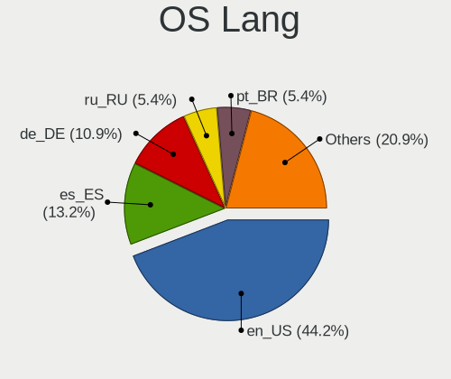

| Lang  | Desktops | Percent |
|-------|----------|---------|
| en_US | 57       | 44.19%  |
| es_ES | 17       | 13.18%  |
| de_DE | 14       | 10.85%  |
| ru_RU | 7        | 5.43%   |
| pt_BR | 7        | 5.43%   |
| it_IT | 4        | 3.1%    |
| hu_HU | 4        | 3.1%    |
| en_GB | 4        | 3.1%    |
| sv_SE | 3        | 2.33%   |
| pl_PL | 3        | 2.33%   |
| fr_FR | 3        | 2.33%   |
| pt_PT | 1        | 0.78%   |
| ja_JP | 1        | 0.78%   |
| en_CA | 1        | 0.78%   |
| en_AU | 1        | 0.78%   |
| de_CH | 1        | 0.78%   |
| cs_CZ | 1        | 0.78%   |

Boot Mode
---------

EFI or BIOS

| Mode | Desktops | Percent |
|------|----------|---------|
| BIOS | 124      | 95.38%  |
| EFI  | 6        | 4.62%   |

Filesystem
----------

Type of filesystem

| Type  | Desktops | Percent |
|-------|----------|---------|
| Ext4  | 123      | 94.62%  |
| Tmpfs | 3        | 2.31%   |
| Xfs   | 2        | 1.54%   |
| Btrfs | 2        | 1.54%   |

Part. scheme
------------

Scheme of partitioning

| Type    | Desktops | Percent |
|---------|----------|---------|
| Unknown | 117      | 90%     |
| GPT     | 8        | 6.15%   |
| MBR     | 5        | 3.85%   |

Dual Boot with Linux/BSD
------------------------

Hosting more than one Linux/BSD

| Dual boot | Desktops | Percent |
|-----------|----------|---------|
| No        | 128      | 99.22%  |
| Yes       | 1        | 0.78%   |

Dual Boot (Win)
---------------

Hosting Linux and Windows

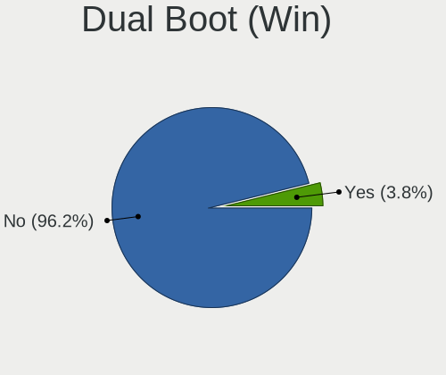

| Dual boot | Desktops | Percent |
|-----------|----------|---------|
| No        | 125      | 96.15%  |
| Yes       | 5        | 3.85%   |

Board
-----

Vendor
------

Motherboard manufacturer

| Name                | Desktops | Percent |
|---------------------|----------|---------|
| ASUSTek Computer    | 33       | 25.58%  |
| Dell                | 18       | 13.95%  |
| Gigabyte Technology | 16       | 12.4%   |
| ASRock              | 11       | 8.53%   |
| Hewlett-Packard     | 10       | 7.75%   |
| MSI                 | 9        | 6.98%   |
| Lenovo              | 7        | 5.43%   |
| Intel               | 6        | 4.65%   |
| Medion              | 2        | 1.55%   |
| MACHINIST           | 2        | 1.55%   |
| Fujitsu             | 2        | 1.55%   |
| ECS                 | 2        | 1.55%   |
| Acer                | 2        | 1.55%   |
| Pegatron            | 1        | 0.78%   |
| Huanan              | 1        | 0.78%   |
| HC Technology.      | 1        | 0.78%   |
| Fujitsu Siemens     | 1        | 0.78%   |
| Biostar             | 1        | 0.78%   |
| AZW                 | 1        | 0.78%   |
| Apple               | 1        | 0.78%   |
| AMI                 | 1        | 0.78%   |
| Unknown             | 1        | 0.78%   |

Model
-----

Motherboard model

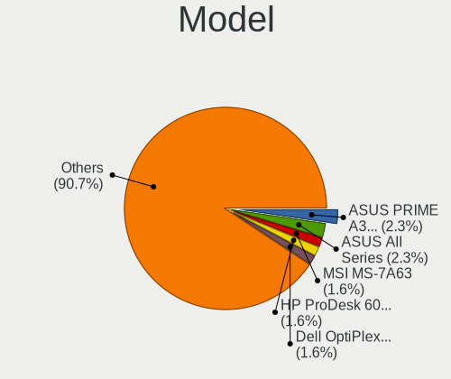

| Name                                    | Desktops | Percent |
|-----------------------------------------|----------|---------|
| ASUS PRIME A320M-K                      | 3        | 2.33%   |
| ASUS All Series                         | 3        | 2.33%   |
| MSI MS-7A63                             | 2        | 1.55%   |
| HP ProDesk 600 G1 SFF                   | 2        | 1.55%   |
| Dell OptiPlex 9020                      | 2        | 1.55%   |
| ASUS SABERTOOTH 990FX R2.0              | 2        | 1.55%   |
| Unknown                                 | 2        | 1.55%   |
| Pegatron Pro 3010 Microtower PC         | 1        | 0.78%   |
| MSI MS-7D42                             | 1        | 0.78%   |
| MSI MS-7D38                             | 1        | 0.78%   |
| MSI MS-7C39                             | 1        | 0.78%   |
| MSI MS-7B98                             | 1        | 0.78%   |
| MSI MS-7922                             | 1        | 0.78%   |
| MSI MS-7756                             | 1        | 0.78%   |
| MSI MS-7267                             | 1        | 0.78%   |
| Medion Z370H4-EM                        | 1        | 0.78%   |
| Medion MS-7797                          | 1        | 0.78%   |
| MACHINIST X79 Z9-D7 V1.2                | 1        | 0.78%   |
| MACHINIST H81M-PRO S1 V2.0              | 1        | 0.78%   |
| Lenovo ThinkCentre M92p 3227A4Y         | 1        | 0.78%   |
| Lenovo ThinkCentre M81 7517A2F          | 1        | 0.78%   |
| Lenovo ThinkCentre M73 10AYS06600       | 1        | 0.78%   |
| Lenovo ThinkCentre Edge91 1895B3G       | 1        | 0.78%   |
| Lenovo ThinkCentre Edge71 1607R3G       | 1        | 0.78%   |
| Lenovo ThinkCentre A58 761179G          | 1        | 0.78%   |
| Lenovo IdeaCentre 310S-08ASR 90G90073GE | 1        | 0.78%   |
| Intel X79                               | 1        | 0.78%   |
| Intel T5226                             | 1        | 0.78%   |
| Intel Nobilis                           | 1        | 0.78%   |
| Intel Jasper Lake Client Platform       | 1        | 0.78%   |
| Intel IPC-ADN2L                         | 1        | 0.78%   |
| Huanan X99-F8 GAMING V5.0               | 1        | 0.78%   |
| HP Z440 Workstation                     | 1        | 0.78%   |
| HP Z400 Workstation                     | 1        | 0.78%   |
| HP EliteDesk 800 G1 SFF                 | 1        | 0.78%   |
| HP Compaq Elite 8300 SFF                | 1        | 0.78%   |
| HP Compaq dc7800 Small Form Factor      | 1        | 0.78%   |
| HP Compaq 8200 Elite SFF PC             | 1        | 0.78%   |
| HP Compaq 8000 Elite CMT PC             | 1        | 0.78%   |
| HP 285 G3 MT Business PC                | 1        | 0.78%   |

Model Family
------------

Motherboard model prefix

| Name               | Desktops | Percent |
|--------------------|----------|---------|
| Dell OptiPlex      | 10       | 7.75%   |
| ASUS PRIME         | 8        | 6.2%    |
| Lenovo ThinkCentre | 6        | 4.65%   |
| HP Compaq          | 4        | 3.1%    |
| ASUS ROG           | 4        | 3.1%    |
| Dell Precision     | 3        | 2.33%   |
| ASUS All           | 3        | 2.33%   |
| MSI MS-7A63        | 2        | 1.55%   |
| HP ProDesk         | 2        | 1.55%   |
| Gigabyte B550      | 2        | 1.55%   |
| Fujitsu ESPRIMO    | 2        | 1.55%   |
| ASUS TUF           | 2        | 1.55%   |
| ASUS SABERTOOTH    | 2        | 1.55%   |
| ASUS P5G41T-M      | 2        | 1.55%   |
| ASRock B450M       | 2        | 1.55%   |
| Acer Aspire        | 2        | 1.55%   |
| Unknown            | 2        | 1.55%   |
| Pegatron Pro       | 1        | 0.78%   |
| MSI MS-7D42        | 1        | 0.78%   |
| MSI MS-7D38        | 1        | 0.78%   |
| MSI MS-7C39        | 1        | 0.78%   |
| MSI MS-7B98        | 1        | 0.78%   |
| MSI MS-7922        | 1        | 0.78%   |
| MSI MS-7756        | 1        | 0.78%   |
| MSI MS-7267        | 1        | 0.78%   |
| Medion Z370H4-EM   | 1        | 0.78%   |
| Medion MS-7797     | 1        | 0.78%   |
| MACHINIST X79      | 1        | 0.78%   |
| MACHINIST H81M-PRO | 1        | 0.78%   |
| Lenovo IdeaCentre  | 1        | 0.78%   |
| Intel X79          | 1        | 0.78%   |
| Intel T5226        | 1        | 0.78%   |
| Intel Nobilis      | 1        | 0.78%   |
| Intel Jasper       | 1        | 0.78%   |
| Intel IPC-ADN2L    | 1        | 0.78%   |
| Huanan X99-F8      | 1        | 0.78%   |
| HP Z440            | 1        | 0.78%   |
| HP Z400            | 1        | 0.78%   |
| HP EliteDesk       | 1        | 0.78%   |
| HP 285             | 1        | 0.78%   |

MFG Year
--------

Motherboard manufacture year

| Year | Desktops | Percent |
|------|----------|---------|
| 2018 | 13       | 10.08%  |
| 2013 | 10       | 7.75%   |
| 2012 | 10       | 7.75%   |
| 2017 | 9        | 6.98%   |
| 2011 | 9        | 6.98%   |
| 2021 | 8        | 6.2%    |
| 2019 | 8        | 6.2%    |
| 2009 | 8        | 6.2%    |
| 2022 | 7        | 5.43%   |
| 2020 | 7        | 5.43%   |
| 2016 | 7        | 5.43%   |
| 2014 | 7        | 5.43%   |
| 2023 | 6        | 4.65%   |
| 2010 | 6        | 4.65%   |
| 2007 | 5        | 3.88%   |
| 2015 | 4        | 3.1%    |
| 2024 | 2        | 1.55%   |
| 2008 | 2        | 1.55%   |
| 2006 | 1        | 0.78%   |

Form Factor
-----------

Physical design of the computer

| Name    | Desktops | Percent |
|---------|----------|---------|
| Desktop | 129      | 100%    |

Secure Boot
-----------

Enabled or disabled

| State    | Desktops | Percent |
|----------|----------|---------|
| Disabled | 128      | 99.22%  |
| Enabled  | 1        | 0.78%   |

Coreboot
--------

Have coreboot on board

| Used | Desktops | Percent |
|------|----------|---------|
| No   | 129      | 100%    |

RAM Size
--------

Total RAM memory

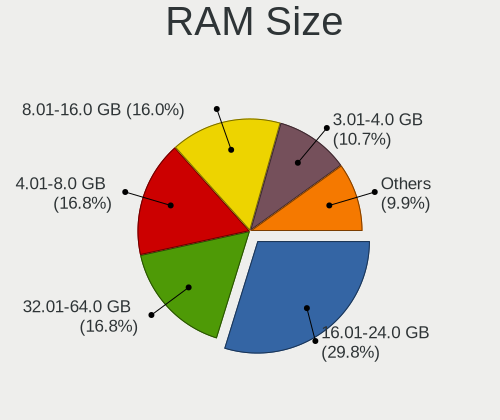

| Size in GB  | Desktops | Percent |
|-------------|----------|---------|
| 16.01-24.0  | 39       | 29.77%  |
| 4.01-8.0    | 22       | 16.79%  |
| 32.01-64.0  | 22       | 16.79%  |
| 8.01-16.0   | 21       | 16.03%  |
| 3.01-4.0    | 14       | 10.69%  |
| 64.01-256.0 | 6        | 4.58%   |
| 1.01-2.0    | 3        | 2.29%   |
| 24.01-32.0  | 2        | 1.53%   |
| 2.01-3.0    | 2        | 1.53%   |

RAM Used
--------

Used RAM memory

| Used GB   | Desktops | Percent |
|-----------|----------|---------|
| 2.01-3.0  | 42       | 29.79%  |
| 1.01-2.0  | 40       | 28.37%  |
| 4.01-8.0  | 30       | 21.28%  |
| 3.01-4.0  | 25       | 17.73%  |
| 8.01-16.0 | 3        | 2.13%   |
| 0.51-1.0  | 1        | 0.71%   |

Total Drives
------------

Number of drives on board

| Drives | Desktops | Percent |
|--------|----------|---------|
| 2      | 48       | 36.09%  |
| 1      | 47       | 35.34%  |
| 3      | 24       | 18.05%  |
| 4      | 6        | 4.51%   |
| 6      | 3        | 2.26%   |
| 9      | 2        | 1.5%    |
| 5      | 2        | 1.5%    |
| 7      | 1        | 0.75%   |

Has CD-ROM
----------

Has CD-ROM on board

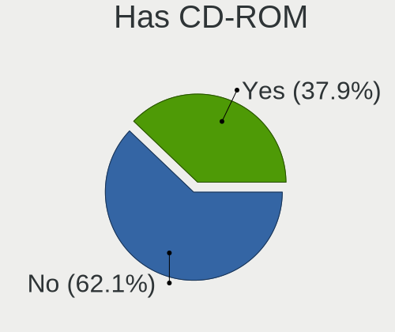

| Presented | Desktops | Percent |
|-----------|----------|---------|
| No        | 82       | 62.12%  |
| Yes       | 50       | 37.88%  |

Has Ethernet
------------

Has Ethernet on board

| Presented | Desktops | Percent |
|-----------|----------|---------|
| Yes       | 126      | 97.67%  |
| No        | 3        | 2.33%   |

Has WiFi
--------

Has WiFi module

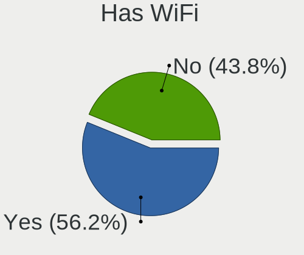

| Presented | Desktops | Percent |
|-----------|----------|---------|
| Yes       | 73       | 56.15%  |
| No        | 57       | 43.85%  |

Has Bluetooth
-------------

Has Bluetooth module

| Presented | Desktops | Percent |
|-----------|----------|---------|
| No        | 85       | 65.38%  |
| Yes       | 45       | 34.62%  |

Location
--------

Country
-------

Geographic location (country)

| Country                | Desktops | Percent |
|------------------------|----------|---------|
| USA                    | 21       | 16.15%  |
| Germany                | 11       | 8.46%   |
| Brazil                 | 8        | 6.15%   |
| Spain                  | 6        | 4.62%   |
| Poland                 | 6        | 4.62%   |
| Mexico                 | 6        | 4.62%   |
| UK                     | 5        | 3.85%   |
| Russia                 | 5        | 3.85%   |
| Italy                  | 5        | 3.85%   |
| Argentina              | 5        | 3.85%   |
| Hungary                | 4        | 3.08%   |
| France                 | 3        | 2.31%   |
| Canada                 | 3        | 2.31%   |
| Austria                | 3        | 2.31%   |
| Australia              | 3        | 2.31%   |
| Sweden                 | 2        | 1.54%   |
| Portugal               | 2        | 1.54%   |
| Netherlands            | 2        | 1.54%   |
| Israel                 | 2        | 1.54%   |
| Greece                 | 2        | 1.54%   |
| Czechia                | 2        | 1.54%   |
| Bosnia and Herzegovina | 2        | 1.54%   |
| Vietnam                | 1        | 0.77%   |
| Venezuela              | 1        | 0.77%   |
| UAE                    | 1        | 0.77%   |
| The Netherlands        | 1        | 0.77%   |
| Switzerland            | 1        | 0.77%   |
| South Africa           | 1        | 0.77%   |
| Romania                | 1        | 0.77%   |
| Philippines            | 1        | 0.77%   |
| Paraguay               | 1        | 0.77%   |
| Pakistan               | 1        | 0.77%   |
| New Zealand            | 1        | 0.77%   |
| Morocco                | 1        | 0.77%   |
| Malaysia               | 1        | 0.77%   |
| Kyrgyzstan             | 1        | 0.77%   |
| Kazakhstan             | 1        | 0.77%   |
| Japan                  | 1        | 0.77%   |
| Indonesia              | 1        | 0.77%   |
| India                  | 1        | 0.77%   |

City
----

Geographic location (city)

| City                     | Desktops | Percent |
|--------------------------|----------|---------|
| Warsaw                   | 3        | 2.21%   |
| Moscow                   | 3        | 2.21%   |
| Berlin                   | 3        | 2.21%   |
| Sarajevo                 | 2        | 1.47%   |
| Petah Tikva              | 2        | 1.47%   |
| Munich                   | 2        | 1.47%   |
| Morwell                  | 2        | 1.47%   |
| Mérida                  | 2        | 1.47%   |
| Melbourne                | 2        | 1.47%   |
| Madrid                   | 2        | 1.47%   |
| Los Angeles              | 2        | 1.47%   |
| London                   | 2        | 1.47%   |
| Budapest                 | 2        | 1.47%   |
| Athens                   | 2        | 1.47%   |
| Zwickau                  | 1        | 0.74%   |
| Zapopan                  | 1        | 0.74%   |
| Zamora                   | 1        | 0.74%   |
| Winterthur               | 1        | 0.74%   |
| Villa Allende            | 1        | 0.74%   |
| Vila Nova de Famalicao   | 1        | 0.74%   |
| Victoria                 | 1        | 0.74%   |
| Van Vleck                | 1        | 0.74%   |
| Uppsala                  | 1        | 0.74%   |
| Ummendorf                | 1        | 0.74%   |
| Toyama                   | 1        | 0.74%   |
| Toronto                  | 1        | 0.74%   |
| Tahitotfalu              | 1        | 0.74%   |
| Strasbourg               | 1        | 0.74%   |
| Spokane                  | 1        | 0.74%   |
| Silver City              | 1        | 0.74%   |
| Siegburg                 | 1        | 0.74%   |
| Seneca                   | 1        | 0.74%   |
| Seattle                  | 1        | 0.74%   |
| Scorzè                  | 1        | 0.74%   |
| Sao Bernardo do Campo    | 1        | 0.74%   |
| Santiago                 | 1        | 0.74%   |
| Santa Maria Chimalhuacan | 1        | 0.74%   |
| San Diego                | 1        | 0.74%   |
| Salem                    | 1        | 0.74%   |
| Ruhland                  | 1        | 0.74%   |

Drives
------

Drive Vendor
------------

Hard drive vendors

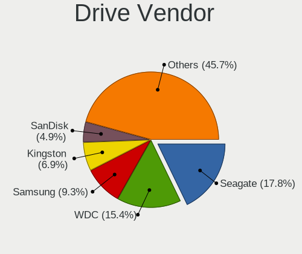

| Vendor                       | Desktops | Drives | Percent |
|------------------------------|----------|--------|---------|
| Seagate                      | 44       | 59     | 17.81%  |
| WDC                          | 38       | 52     | 15.38%  |
| Samsung Electronics          | 23       | 37     | 9.31%   |
| Kingston                     | 17       | 22     | 6.88%   |
| SanDisk                      | 12       | 16     | 4.86%   |
| Crucial                      | 10       | 12     | 4.05%   |
| Toshiba                      | 9        | 11     | 3.64%   |
| China                        | 9        | 16     | 3.64%   |
| Micron/Crucial Technology    | 5        | 6      | 2.02%   |
| Micron Technology            | 5        | 5      | 2.02%   |
| Intel                        | 5        | 9      | 2.02%   |
| MAXIO Technology (Hangzhou)  | 4        | 6      | 1.62%   |
| Transcend                    | 3        | 3      | 1.21%   |
| Silicon Motion               | 3        | 4      | 1.21%   |
| Patriot                      | 3        | 4      | 1.21%   |
| Maxtor                       | 3        | 3      | 1.21%   |
| Hitachi                      | 3        | 3      | 1.21%   |
| HGST                         | 3        | 3      | 1.21%   |
| ADATA Technology             | 3        | 4      | 1.21%   |
| A-DATA Technology            | 3        | 4      | 1.21%   |
| Unknown                      | 2        | 5      | 0.81%   |
| SK hynix                     | 2        | 2      | 0.81%   |
| Realtek Semiconductor        | 2        | 2      | 0.81%   |
| PNY                          | 2        | 2      | 0.81%   |
| KingFast                     | 2        | 2      | 0.81%   |
| Intenso                      | 2        | 3      | 0.81%   |
| Gigabyte Technology          | 2        | 2      | 0.81%   |
| Unknown                      | 2        | 2      | 0.81%   |
| XrayDisk                     | 1        | 1      | 0.4%    |
| WALRAM                       | 1        | 2      | 0.4%    |
| Veno                         | 1        | 1      | 0.4%    |
| Team                         | 1        | 1      | 0.4%    |
| SPCC                         | 1        | 1      | 0.4%    |
| Shenzhen Longsys Electronics | 1        | 1      | 0.4%    |
| SABRENT                      | 1        | 1      | 0.4%    |
| Plextor                      | 1        | 1      | 0.4%    |
| Phison Electronics           | 1        | 1      | 0.4%    |
| OCZ-VERTEX2                  | 1        | 1      | 0.4%    |
| Netac                        | 1        | 1      | 0.4%    |
| Min Yi U                     | 1        | 1      | 0.4%    |

Drive Model
-----------

Hard drive models

| Model                                                             | Desktops | Percent |
|-------------------------------------------------------------------|----------|---------|
| Seagate ST500DM002-1BD142 500GB                                   | 6        | 2.18%   |
| Kingston SA400S37240G 240GB SSD                                   | 5        | 1.82%   |
| Samsung NVMe SSD Controller SM981/PM981/PM983 512GB               | 4        | 1.45%   |
| Kingston SA400S37480G 480GB SSD                                   | 4        | 1.45%   |
| WDC WD10EZEX-22MFCA0 1TB                                          | 3        | 1.09%   |
| Silicon Motion SM2263EN/SM2263XT SSD Controller 256GB             | 3        | 1.09%   |
| Seagate ST1000DM010-2EP102 1TB                                    | 3        | 1.09%   |
| Samsung SSD 860 EVO 500GB                                         | 3        | 1.09%   |
| China SSD 128GB                                                   | 3        | 1.09%   |
| WDC WD5000AZRX-00A8LB0 500GB                                      | 2        | 0.73%   |
| WDC WD3200AAJS-00L7A0 320GB                                       | 2        | 0.73%   |
| WDC WD10EZEX-60WN4A0 1TB                                          | 2        | 0.73%   |
| WDC WD10EZEX-21M2NA0 1TB                                          | 2        | 0.73%   |
| Toshiba HDWD110 1TB                                               | 2        | 0.73%   |
| Toshiba DT01ACA050 500GB                                          | 2        | 0.73%   |
| Seagate ST3250318AS 250GB                                         | 2        | 0.73%   |
| Seagate ST31000524AS 1TB                                          | 2        | 0.73%   |
| Seagate ST3000DM008-2DM166 3TB                                    | 2        | 0.73%   |
| Seagate ST1000DM003-9YN162 1TB                                    | 2        | 0.73%   |
| SanDisk SSD PLUS 1000GB                                           | 2        | 0.73%   |
| Samsung NVMe SSD Controller PM9A1/PM9A3/980PRO 512GB              | 2        | 0.73%   |
| Micron/Crucial P2 NVMe PCIe SSD 500GB                             | 2        | 0.73%   |
| MAXIO (Hangzhou) NVMe SSD Controller MAP1202 512GB                | 2        | 0.73%   |
| Gigabyte GP-GSTFS31120GNTD 120GB                                  | 2        | 0.73%   |
| Crucial CT500MX500SSD1 500GB                                      | 2        | 0.73%   |
| Crucial CT240BX500SSD1 240GB                                      | 2        | 0.73%   |
| ADATA XPG SX8200 Pro PCIe Gen3x4 M.2 2280 Solid State Drive 256GB | 2        | 0.73%   |
| Unknown                                                           | 2        | 0.73%   |
| XrayDisk 512GB SSD                                                | 1        | 0.36%   |
| WDC WDS250G1B0B-00AS40 250GB SSD                                  | 1        | 0.36%   |
| WDC WDS240G2G0A-00JH30 240GB SSD                                  | 1        | 0.36%   |
| WDC WDS240G1G0A-00SS50 240GB SSD                                  | 1        | 0.36%   |
| WDC WDS200T2B0A-00SM50 2TB SSD                                    | 1        | 0.36%   |
| WDC WDS120G2G0A-00JH30 120GB SSD                                  | 1        | 0.36%   |
| WDC WDBNCE5000PNC 500GB SSD                                       | 1        | 0.36%   |
| WDC WD800JD-00MSA1 80GB                                           | 1        | 0.36%   |
| WDC WD7502AAEX-00Y9A0 752GB                                       | 1        | 0.36%   |
| WDC WD5003ABYX-01WERA2 500GB                                      | 1        | 0.36%   |
| WDC WD5000LUCT-63Y8HY0 500GB                                      | 1        | 0.36%   |
| WDC WD5000AAKX-75U6AA0 500GB                                      | 1        | 0.36%   |

HDD Vendor
----------

Hard disk drive vendors

| Vendor              | Desktops | Drives | Percent |
|---------------------|----------|--------|---------|
| Seagate             | 44       | 59     | 42.31%  |
| WDC                 | 35       | 46     | 33.65%  |
| Toshiba             | 8        | 10     | 7.69%   |
| Samsung Electronics | 4        | 5      | 3.85%   |
| Maxtor              | 3        | 3      | 2.88%   |
| Hitachi             | 3        | 3      | 2.88%   |
| HGST                | 3        | 3      | 2.88%   |
| SABRENT             | 1        | 1      | 0.96%   |
| Hewlett-Packard     | 1        | 1      | 0.96%   |
| FC-1307             | 1        | 1      | 0.96%   |
| Unknown             | 1        | 1      | 0.96%   |

SSD Vendor
----------

Solid state drive vendors

| Vendor              | Desktops | Drives | Percent |
|---------------------|----------|--------|---------|
| Kingston            | 16       | 21     | 17.02%  |
| Samsung Electronics | 10       | 18     | 10.64%  |
| Crucial             | 9        | 11     | 9.57%   |
| China               | 9        | 16     | 9.57%   |
| SanDisk             | 7        | 8      | 7.45%   |
| WDC                 | 5        | 6      | 5.32%   |
| Transcend           | 3        | 3      | 3.19%   |
| Patriot             | 3        | 4      | 3.19%   |
| Intel               | 3        | 6      | 3.19%   |
| A-DATA Technology   | 3        | 4      | 3.19%   |
| PNY                 | 2        | 2      | 2.13%   |
| Micron Technology   | 2        | 2      | 2.13%   |
| Intenso             | 2        | 3      | 2.13%   |
| Gigabyte Technology | 2        | 2      | 2.13%   |
| XrayDisk            | 1        | 1      | 1.06%   |
| WALRAM              | 1        | 1      | 1.06%   |
| Toshiba             | 1        | 1      | 1.06%   |
| Team                | 1        | 1      | 1.06%   |
| SPCC                | 1        | 1      | 1.06%   |
| SK hynix            | 1        | 1      | 1.06%   |
| Plextor             | 1        | 1      | 1.06%   |
| OCZ-VERTEX2         | 1        | 1      | 1.06%   |
| Netac               | 1        | 1      | 1.06%   |
| Min Yi U            | 1        | 1      | 1.06%   |
| LITEON              | 1        | 1      | 1.06%   |
| KIOXIA-EXCERIA      | 1        | 2      | 1.06%   |
| KingSpec            | 1        | 1      | 1.06%   |
| GeIL                | 1        | 1      | 1.06%   |
| ETOPSO              | 1        | 1      | 1.06%   |
| AGI                 | 1        | 1      | 1.06%   |
| 2.5"                | 1        | 1      | 1.06%   |
| Unknown             | 1        | 1      | 1.06%   |

Drive Kind
----------

HDD or SSD

| Kind    | Desktops | Drives | Percent |
|---------|----------|--------|---------|
| HDD     | 81       | 133    | 40.1%   |
| SSD     | 76       | 125    | 37.62%  |
| NVMe    | 38       | 57     | 18.81%  |
| Unknown | 7        | 13     | 3.47%   |

Drive Connector
---------------

SATA, SAS, NVMe, etc.

| Type | Desktops | Drives | Percent |
|------|----------|--------|---------|
| SATA | 117      | 262    | 72.67%  |
| NVMe | 38       | 57     | 23.6%   |
| SAS  | 6        | 9      | 3.73%   |

Drive Size
----------

Size of hard drive

| Size in TB | Desktops | Drives | Percent |
|------------|----------|--------|---------|
| 0.01-0.5   | 90       | 157    | 56.96%  |
| 0.51-1.0   | 40       | 62     | 25.32%  |
| 1.01-2.0   | 15       | 22     | 9.49%   |
| 2.01-3.0   | 5        | 6      | 3.16%   |
| 3.01-4.0   | 4        | 5      | 2.53%   |
| 4.01-10.0  | 3        | 5      | 1.9%    |
| 10.01-20.0 | 1        | 1      | 0.63%   |

Space Total
-----------

Amount of disk space available on the file system

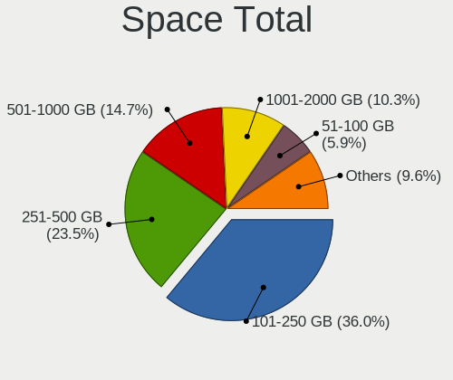

| Size in GB     | Desktops | Percent |
|----------------|----------|---------|
| 101-250        | 49       | 36.03%  |
| 251-500        | 32       | 23.53%  |
| 501-1000       | 20       | 14.71%  |
| 1001-2000      | 14       | 10.29%  |
| 51-100         | 8        | 5.88%   |
| More than 3000 | 5        | 3.68%   |
| 2001-3000      | 5        | 3.68%   |
| 21-50          | 2        | 1.47%   |
| 1-20           | 1        | 0.74%   |

Space Used
----------

Amount of used disk space

| Used GB        | Desktops | Percent |
|----------------|----------|---------|
| 1-20           | 53       | 38.13%  |
| 21-50          | 37       | 26.62%  |
| 101-250        | 13       | 9.35%   |
| 51-100         | 11       | 7.91%   |
| 1001-2000      | 8        | 5.76%   |
| 501-1000       | 8        | 5.76%   |
| 251-500        | 7        | 5.04%   |
| More than 3000 | 1        | 0.72%   |
| 2001-3000      | 1        | 0.72%   |

Malfunc. Drives
---------------

Drive models with a malfunction

| Model                            | Desktops | Drives | Percent |
|----------------------------------|----------|--------|---------|
| WDC WDS120G2G0A-00JH30 120GB SSD | 1        | 1      | 25%     |
| Seagate ST3250820AS 250GB        | 1        | 1      | 25%     |
| Seagate ST3250312AS 250GB        | 1        | 1      | 25%     |
| Seagate ST3160318AS 160GB        | 1        | 1      | 25%     |

Malfunc. Drive Vendor
---------------------

Vendors of faulty drives

| Vendor  | Desktops | Drives | Percent |
|---------|----------|--------|---------|
| Seagate | 3        | 3      | 75%     |
| WDC     | 1        | 1      | 25%     |

Malfunc. HDD Vendor
-------------------

Vendors of faulty HDD drives

| Vendor  | Desktops | Drives | Percent |
|---------|----------|--------|---------|
| Seagate | 3        | 3      | 100%    |

Malfunc. Drive Kind
-------------------

Kinds of faulty drives

| Kind | Desktops | Drives | Percent |
|------|----------|--------|---------|
| HDD  | 3        | 3      | 75%     |
| SSD  | 1        | 1      | 25%     |

Failed Drives
-------------

Failed drive models

Zero info for selected period =(

Failed Drive Vendor
-------------------

Failed drive vendors

Zero info for selected period =(

Drive Status
------------

Number of failed and malfunc. drives

| Status   | Desktops | Drives | Percent |
|----------|----------|--------|---------|
| Detected | 121      | 309    | 90.3%   |
| Works    | 9        | 15     | 6.72%   |
| Malfunc  | 4        | 4      | 2.99%   |

Storage controller
------------------

Storage Vendor
--------------

Storage controller vendors

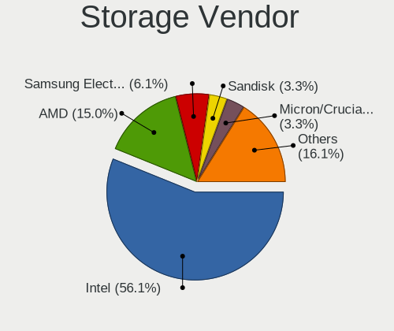

| Vendor                       | Desktops | Percent |
|------------------------------|----------|---------|
| Intel                        | 101      | 56.11%  |
| AMD                          | 27       | 15%     |
| Samsung Electronics          | 11       | 6.11%   |
| Sandisk                      | 6        | 3.33%   |
| Micron/Crucial Technology    | 6        | 3.33%   |
| MAXIO Technology (Hangzhou)  | 4        | 2.22%   |
| ASMedia Technology           | 4        | 2.22%   |
| Silicon Motion               | 3        | 1.67%   |
| Micron Technology            | 3        | 1.67%   |
| ADATA Technology             | 3        | 1.67%   |
| Realtek Semiconductor        | 2        | 1.11%   |
| Kingston Technology Company  | 2        | 1.11%   |
| JMicron Technology           | 2        | 1.11%   |
| SK hynix                     | 1        | 0.56%   |
| Silicon Image                | 1        | 0.56%   |
| Shenzhen Longsys Electronics | 1        | 0.56%   |
| Phison Electronics           | 1        | 0.56%   |
| Marvell Technology Group     | 1        | 0.56%   |
| INNOGRIT                     | 1        | 0.56%   |

Storage Model
-------------

Storage controller models

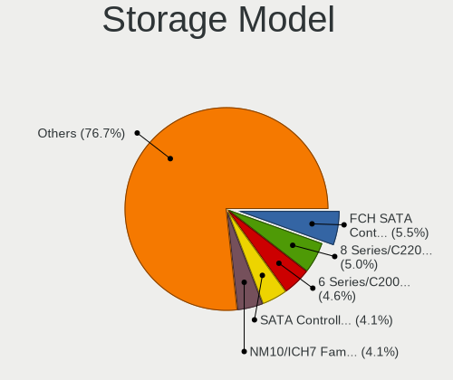

| Model                                                                          | Desktops | Percent |
|--------------------------------------------------------------------------------|----------|---------|
| AMD FCH SATA Controller [AHCI mode]                                            | 12       | 5.48%   |
| Intel 8 Series/C220 Series Chipset Family 6-port SATA Controller 1 [AHCI mode] | 11       | 5.02%   |
| Intel 6 Series/C200 Series Chipset Family 6 port Desktop SATA AHCI Controller  | 10       | 4.57%   |
| Intel SATA Controller [RAID mode]                                              | 9        | 4.11%   |
| Intel NM10/ICH7 Family SATA Controller [IDE mode]                              | 9        | 4.11%   |
| Intel 82801G (ICH7 Family) IDE Controller                                      | 8        | 3.65%   |
| Intel 7 Series/C210 Series Chipset Family 6-port SATA Controller [AHCI mode]   | 7        | 3.2%    |
| Intel 200 Series PCH SATA controller [AHCI mode]                               | 7        | 3.2%    |
| AMD A320 Chipset SATA Controller [AHCI mode]                                   | 5        | 2.28%   |
| Samsung NVMe SSD Controller SM981/PM981/PM983                                  | 4        | 1.83%   |
| Intel Q170/Q150/B150/H170/H110/Z170/CM236 Chipset SATA Controller [AHCI Mode]  | 4        | 1.83%   |
| Intel Cannon Lake PCH SATA AHCI Controller                                     | 4        | 1.83%   |
| Intel Alder Lake-S PCH SATA Controller [AHCI Mode]                             | 4        | 1.83%   |
| Intel 500 Series Chipset Family SATA AHCI Controller                           | 4        | 1.83%   |
| ASMedia ASM1061/ASM1062 Serial ATA Controller                                  | 4        | 1.83%   |
| AMD SB7x0/SB8x0/SB9x0 SATA Controller [AHCI mode]                              | 4        | 1.83%   |
| AMD 400 Series Chipset SATA Controller                                         | 4        | 1.83%   |
| Silicon Motion SM2263EN/SM2263XT (DRAM-less) NVMe SSD Controllers              | 3        | 1.37%   |
| SanDisk Ultra 3D / WD Blue SN570 NVMe SSD (DRAM-less)                          | 3        | 1.37%   |
| Samsung NVMe SSD Controller 980 (DRAM-less)                                    | 3        | 1.37%   |
| Intel C610/X99 series chipset sSATA Controller [AHCI mode]                     | 3        | 1.37%   |
| Intel 7 Series/C210 Series Chipset Family 4-port SATA Controller [IDE mode]    | 3        | 1.37%   |
| Intel 7 Series/C210 Series Chipset Family 2-port SATA Controller [IDE mode]    | 3        | 1.37%   |
| AMD 500 Series Chipset SATA Controller                                         | 3        | 1.37%   |
| AMD 300 Series Chipset SATA Controller                                         | 3        | 1.37%   |
| Sandisk WD Black SN850X NVMe SSD                                               | 2        | 0.91%   |
| Samsung NVMe SSD Controller PM9A1/PM9A3/980PRO                                 | 2        | 0.91%   |
| Micron/Crucial P5 Plus NVMe PCIe SSD                                           | 2        | 0.91%   |
| Micron/Crucial P2 [Nick P2] / P3 / P3 Plus NVMe PCIe SSD (DRAM-less)           | 2        | 0.91%   |
| Micron 2400 NVMe SSD (DRAM-less)                                               | 2        | 0.91%   |
| MAXIO (Hangzhou) NVMe SSD Controller MAP1602 (DRAM-less)                       | 2        | 0.91%   |
| MAXIO (Hangzhou) NVMe SSD Controller MAP1202 (DRAM-less)                       | 2        | 0.91%   |
| JMicron JMB368 IDE controller                                                  | 2        | 0.91%   |
| Intel Volume Management Device NVMe RAID Controller                            | 2        | 0.91%   |
| Intel Raptor Lake SATA AHCI Controller                                         | 2        | 0.91%   |
| Intel Jasper Lake SATA AHCI Controller                                         | 2        | 0.91%   |
| Intel Comet Lake SATA AHCI Controller                                          | 2        | 0.91%   |
| Intel Celeron/Pentium Silver Processor SATA Controller                         | 2        | 0.91%   |
| Intel 9 Series Chipset Family SATA Controller [AHCI Mode]                      | 2        | 0.91%   |
| Intel 82Q35 Express PT IDER Controller                                         | 2        | 0.91%   |

Storage Kind
------------

Kind of storage controller (IDE, SATA, NVMe, SAS, ...)

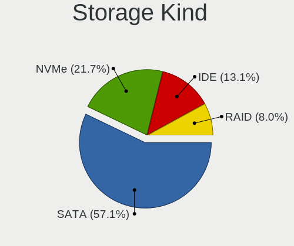

| Kind | Desktops | Percent |
|------|----------|---------|
| SATA | 100      | 57.14%  |
| NVMe | 38       | 21.71%  |
| IDE  | 23       | 13.14%  |
| RAID | 14       | 8%      |

Processor
---------

CPU Vendor
----------

Processor vendors

| Vendor | Desktops | Percent |
|--------|----------|---------|
| Intel  | 102      | 79.07%  |
| AMD    | 27       | 20.93%  |

CPU Model
---------

Processor models

| Model                                       | Desktops | Percent |
|---------------------------------------------|----------|---------|
| Intel Core i7-2600 CPU @ 3.40GHz            | 3        | 2.31%   |
| Intel Core i5-4590 CPU @ 3.30GHz            | 3        | 2.31%   |
| Intel Core i5-2400 CPU @ 3.10GHz            | 3        | 2.31%   |
| AMD Ryzen 9 5900X 12-Core Processor         | 3        | 2.31%   |
| Intel Core i5-4570 CPU @ 3.20GHz            | 2        | 1.54%   |
| Intel Core i5-3470 CPU @ 3.20GHz            | 2        | 1.54%   |
| Intel Core i3-3220 CPU @ 3.30GHz            | 2        | 1.54%   |
| Intel Core 2 Quad CPU Q6600 @ 2.40GHz       | 2        | 1.54%   |
| Intel 11th Gen Core i5-11400 @ 2.60GHz      | 2        | 1.54%   |
| AMD Ryzen 9 5950X 16-Core Processor         | 2        | 1.54%   |
| AMD Ryzen 5 3600 6-Core Processor           | 2        | 1.54%   |
| AMD Ryzen 3 2200G with Radeon Vega Graphics | 2        | 1.54%   |
| AMD FX-9590 Eight-Core Processor            | 2        | 1.54%   |
| Intel Xeon E-2224G CPU @ 3.50GHz            | 1        | 0.77%   |
| Intel Xeon CPU X5670 @ 2.93GHz              | 1        | 0.77%   |
| Intel Xeon CPU X3440 @ 2.53GHz              | 1        | 0.77%   |
| Intel Xeon CPU W3540 @ 2.93GHz              | 1        | 0.77%   |
| Intel Xeon CPU W3520 @ 2.67GHz              | 1        | 0.77%   |
| Intel Xeon CPU E5-2696 v3 @ 2.30GHz         | 1        | 0.77%   |
| Intel Xeon CPU E5-2650 v2 @ 2.60GHz         | 1        | 0.77%   |
| Intel Xeon CPU E5-2643 0 @ 3.30GHz          | 1        | 0.77%   |
| Intel Xeon CPU E5-1650 v4 @ 3.60GHz         | 1        | 0.77%   |
| Intel Xeon CPU E5-1650 v3 @ 3.50GHz         | 1        | 0.77%   |
| Intel Xeon CPU E3-1280 V2 @ 3.60GHz         | 1        | 0.77%   |
| Intel Xeon CPU E3-1245 v5 @ 3.50GHz         | 1        | 0.77%   |
| Intel Xeon CPU E3-1230 V2 @ 3.30GHz         | 1        | 0.77%   |
| Intel Xeon CPU E3-1220 v5 @ 3.00GHz         | 1        | 0.77%   |
| Intel Pentium Silver J5040 CPU @ 2.00GHz    | 1        | 0.77%   |
| Intel Pentium Gold G5400 CPU @ 3.70GHz      | 1        | 0.77%   |
| Intel Pentium Dual-Core CPU E6700 @ 3.20GHz | 1        | 0.77%   |
| Intel Pentium Dual-Core CPU E6300 @ 2.80GHz | 1        | 0.77%   |
| Intel Pentium Dual-Core CPU E5700 @ 3.00GHz | 1        | 0.77%   |
| Intel Pentium Dual-Core CPU E5400 @ 2.70GHz | 1        | 0.77%   |
| Intel Pentium Dual CPU E2160 @ 1.80GHz      | 1        | 0.77%   |
| Intel Pentium D CPU 3.00GHz                 | 1        | 0.77%   |
| Intel Pentium CPU G4400 @ 3.30GHz           | 1        | 0.77%   |
| Intel Pentium CPU G3258 @ 3.20GHz           | 1        | 0.77%   |
| Intel N95                                   | 1        | 0.77%   |
| Intel Core i7-9700K CPU @ 3.60GHz           | 1        | 0.77%   |
| Intel Core i7-9700 CPU @ 3.00GHz            | 1        | 0.77%   |

CPU Model Family
----------------

Processor model prefix

| Model                   | Desktops | Percent |
|-------------------------|----------|---------|
| Intel Core i5           | 25       | 19.23%  |
| Intel Core i7           | 18       | 13.85%  |
| Intel Xeon              | 14       | 10.77%  |
| Intel Core i3           | 13       | 10%     |
| Other                   | 10       | 7.69%   |
| Intel Core 2 Duo        | 7        | 5.38%   |
| AMD Ryzen 5             | 7        | 5.38%   |
| AMD Ryzen 9             | 6        | 4.62%   |
| Intel Pentium Dual-Core | 4        | 3.08%   |
| AMD FX                  | 4        | 3.08%   |
| Intel Core 2 Quad       | 3        | 2.31%   |
| Intel Celeron           | 3        | 2.31%   |
| AMD Ryzen 7             | 3        | 2.31%   |
| AMD Ryzen 3             | 3        | 2.31%   |
| Intel Pentium           | 2        | 1.54%   |
| Intel Pentium Silver    | 1        | 0.77%   |
| Intel Pentium Gold      | 1        | 0.77%   |
| Intel Pentium Dual      | 1        | 0.77%   |
| Intel Pentium D         | 1        | 0.77%   |
| Intel Core 2            | 1        | 0.77%   |
| AMD PRO A8              | 1        | 0.77%   |
| AMD Phenom II X4        | 1        | 0.77%   |
| AMD A6                  | 1        | 0.77%   |

CPU Cores
---------

Number of processor cores

| Number | Desktops | Percent |
|--------|----------|---------|
| 4      | 63       | 48.84%  |
| 2      | 27       | 20.93%  |
| 6      | 16       | 12.4%   |
| 8      | 9        | 6.98%   |
| 12     | 5        | 3.88%   |
| 16     | 4        | 3.1%    |
| 1      | 2        | 1.55%   |
| 20     | 1        | 0.78%   |
| 18     | 1        | 0.78%   |
| 10     | 1        | 0.78%   |

CPU Sockets
-----------

Number of sockets

| Number | Desktops | Percent |
|--------|----------|---------|
| 1      | 128      | 99.22%  |
| 2      | 1        | 0.78%   |

CPU Threads
-----------

Threads per core (Hyper-Threading)

| Number | Desktops | Percent |
|--------|----------|---------|
| 2      | 69       | 53.08%  |
| 1      | 61       | 46.92%  |

CPU Op-Modes
------------

CPU Operation Modes (32-bit, 64-bit)

| Op mode        | Desktops | Percent |
|----------------|----------|---------|
| 32-bit, 64-bit | 129      | 100%    |

CPU Microcode
-------------

Microcode number

| Number     | Desktops | Percent |
|------------|----------|---------|
| Unknown    | 126      | 96.92%  |
| 0x306a9    | 1        | 0.77%   |
| 0x0a20102b | 1        | 0.77%   |
| 0x08701021 | 1        | 0.77%   |
| 0x06006704 | 1        | 0.77%   |

CPU Microarch
-------------

Microarchitecture

| Name             | Desktops | Percent |
|------------------|----------|---------|
| Haswell          | 17       | 13.18%  |
| Unknown          | 13       | 10.08%  |
| KabyLake         | 12       | 9.3%    |
| SandyBridge      | 11       | 8.53%   |
| IvyBridge        | 11       | 8.53%   |
| Penryn           | 9        | 6.98%   |
| Skylake          | 8        | 6.2%    |
| Zen 3            | 7        | 5.43%   |
| Core             | 7        | 5.43%   |
| CometLake        | 5        | 3.88%   |
| Zen+             | 4        | 3.1%    |
| Piledriver       | 4        | 3.1%    |
| Zen 2            | 3        | 2.33%   |
| Zen              | 3        | 2.33%   |
| Nehalem          | 3        | 2.33%   |
| Westmere         | 2        | 1.55%   |
| Goldmont plus    | 2        | 1.55%   |
| Excavator        | 2        | 1.55%   |
| NetBurst         | 1        | 0.78%   |
| K10              | 1        | 0.78%   |
| IceLake          | 1        | 0.78%   |
| Bulldozer        | 1        | 0.78%   |
| Broadwell        | 1        | 0.78%   |
| Alderlake Hybrid | 1        | 0.78%   |

Graphics
--------

GPU Vendor
----------

Vendors of graphics cards

| Vendor | Desktops | Percent |
|--------|----------|---------|
| Nvidia | 58       | 40.56%  |
| Intel  | 56       | 39.16%  |
| AMD    | 29       | 20.28%  |

GPU Model
---------

Graphics card models

| Model                                                                       | Desktops | Percent |
|-----------------------------------------------------------------------------|----------|---------|
| Intel Xeon E3-1200 v3/4th Gen Core Processor Integrated Graphics Controller | 10       | 6.85%   |
| Intel 2nd Generation Core Processor Family Integrated Graphics Controller   | 7        | 4.79%   |
| Nvidia GK208B [GeForce GT 710]                                              | 5        | 3.42%   |
| Nvidia GP107 [GeForce GTX 1050 Ti]                                          | 4        | 2.74%   |
| Intel HD Graphics 530                                                       | 4        | 2.74%   |
| Intel 4 Series Chipset Integrated Graphics Controller                       | 4        | 2.74%   |
| Nvidia GK208B [GeForce GT 730]                                              | 3        | 2.05%   |
| Nvidia GK107 [GeForce GTX 650]                                              | 3        | 2.05%   |
| Intel CometLake-S GT2 [UHD Graphics 630]                                    | 3        | 2.05%   |
| Intel CoffeeLake-S GT2 [UHD Graphics 630]                                   | 3        | 2.05%   |
| Intel 82945G/GZ Integrated Graphics Controller                              | 3        | 2.05%   |
| AMD Lexa PRO [Radeon 540/540X/550/550X / RX 540X/550/550X]                  | 3        | 2.05%   |
| AMD Ellesmere [Radeon RX 470/480/570/570X/580/580X/590]                     | 3        | 2.05%   |
| Nvidia TU104 [GeForce RTX 2070 SUPER]                                       | 2        | 1.37%   |
| Nvidia GP108 [GeForce GT 1030]                                              | 2        | 1.37%   |
| Nvidia GP107 [GeForce GTX 1050]                                             | 2        | 1.37%   |
| Nvidia GP106 [GeForce GTX 1060 6GB]                                         | 2        | 1.37%   |
| Nvidia GP106 [GeForce GTX 1060 3GB]                                         | 2        | 1.37%   |
| Nvidia GP104 [GeForce GTX 1070]                                             | 2        | 1.37%   |
| Nvidia GM204 [GeForce GTX 970]                                              | 2        | 1.37%   |
| Nvidia GA104 [GeForce RTX 3060 Ti]                                          | 2        | 1.37%   |
| Intel Xeon E3-1200 v2/3rd Gen Core processor Graphics Controller            | 2        | 1.37%   |
| Intel Raptor Lake-S GT1 [UHD Graphics 770]                                  | 2        | 1.37%   |
| Intel JasperLake [UHD Graphics]                                             | 2        | 1.37%   |
| Intel IvyBridge GT2 [HD Graphics 4000]                                      | 2        | 1.37%   |
| AMD Vega 10 XL/XT [Radeon RX Vega 56/64]                                    | 2        | 1.37%   |
| AMD Polaris 20 XL [Radeon RX 580 2048SP]                                    | 2        | 1.37%   |
| AMD Navi 10 [Radeon RX 5600 OEM/5600 XT / 5700/5700 XT]                     | 2        | 1.37%   |
| AMD Baffin [Radeon RX 550 640SP / RX 560/560X]                              | 2        | 1.37%   |
| Nvidia TU117 [GeForce GTX 1650]                                             | 1        | 0.68%   |
| Nvidia TU116 [GeForce GTX 1660 SUPER]                                       | 1        | 0.68%   |
| Nvidia TU116 [GeForce GTX 1650 SUPER]                                       | 1        | 0.68%   |
| Nvidia TU106 [GeForce RTX 2060 SUPER]                                       | 1        | 0.68%   |
| Nvidia GT218 [GeForce G210]                                                 | 1        | 0.68%   |
| Nvidia GT218 [GeForce 310]                                                  | 1        | 0.68%   |
| Nvidia GT218 [GeForce 210]                                                  | 1        | 0.68%   |
| Nvidia GP106GL [Quadro P2000]                                               | 1        | 0.68%   |
| Nvidia GP104 [GeForce GTX 1070 Ti]                                          | 1        | 0.68%   |
| Nvidia GM206 [GeForce GTX 960]                                              | 1        | 0.68%   |
| Nvidia GM107 [GeForce GTX 750]                                              | 1        | 0.68%   |

GPU Combo
---------

Combinations of graphics cards

| Name           | Desktops | Percent |
|----------------|----------|---------|
| 1 x Nvidia     | 51       | 39.23%  |
| 1 x Intel      | 45       | 34.62%  |
| 1 x AMD        | 27       | 20.77%  |
| Intel + Nvidia | 5        | 3.85%   |
| 2 x AMD        | 1        | 0.77%   |
| AMD + Nvidia   | 1        | 0.77%   |

GPU Driver
----------

Free vs proprietary

| Driver      | Desktops | Percent |
|-------------|----------|---------|
| Free        | 110      | 83.97%  |
| Proprietary | 14       | 10.69%  |
| Unknown     | 7        | 5.34%   |

GPU Memory
----------

Total video memory

| Size in GB | Desktops | Percent |
|------------|----------|---------|
| Unknown    | 115      | 87.79%  |
| 3.01-4.0   | 5        | 3.82%   |
| 7.01-8.0   | 4        | 3.05%   |
| 0.51-1.0   | 3        | 2.29%   |
| 1.01-2.0   | 2        | 1.53%   |
| 8.01-16.0  | 1        | 0.76%   |
| 0.01-0.5   | 1        | 0.76%   |

Monitor
-------

Monitor Vendor
--------------

Monitor vendors

| Vendor               | Desktops | Percent |
|----------------------|----------|---------|
| Goldstar             | 19       | 15.32%  |
| Samsung Electronics  | 15       | 12.1%   |
| Dell                 | 12       | 9.68%   |
| Hewlett-Packard      | 10       | 8.06%   |
| Acer                 | 10       | 8.06%   |
| Philips              | 8        | 6.45%   |
| AOC                  | 8        | 6.45%   |
| BenQ                 | 4        | 3.23%   |
| Vizio                | 3        | 2.42%   |
| Ancor Communications | 3        | 2.42%   |
| ViewSonic            | 2        | 1.61%   |
| Sony                 | 2        | 1.61%   |
| NEC Computers        | 2        | 1.61%   |
| Lenovo               | 2        | 1.61%   |
| HKC                  | 2        | 1.61%   |
| Denver               | 2        | 1.61%   |
| ASUSTek Computer     | 2        | 1.61%   |
| Vestel Elektronik    | 1        | 0.81%   |
| Unknown (XXX)        | 1        | 0.81%   |
| Unknown              | 1        | 0.81%   |
| Skyworth             | 1        | 0.81%   |
| Sharp                | 1        | 0.81%   |
| SAC                  | 1        | 0.81%   |
| S2-Tek               | 1        | 0.81%   |
| RTK                  | 1        | 0.81%   |
| Panasonic            | 1        | 0.81%   |
| MSI                  | 1        | 0.81%   |
| Mi                   | 1        | 0.81%   |
| Medion               | 1        | 0.81%   |
| LTM                  | 1        | 0.81%   |
| Kogan                | 1        | 0.81%   |
| JHW                  | 1        | 0.81%   |
| HannStar             | 1        | 0.81%   |
| Eizo                 | 1        | 0.81%   |
| CVT                  | 1        | 0.81%   |

Monitor Model
-------------

Monitor models

| Model                                                                  | Desktops | Percent |
|------------------------------------------------------------------------|----------|---------|
| Samsung Electronics C27F390 SAM0D32 1920x1080 600x340mm 27.2-inch      | 4        | 3.05%   |
| HKC 22N1 HKCB215 1920x1080 476x268mm 21.5-inch                         | 2        | 1.53%   |
| Goldstar FULL HD GSM5B55 1920x1080 480x270mm 21.7-inch                 | 2        | 1.53%   |
| AOC 27G1G4 AOC2701 1920x1080 598x336mm 27.0-inch                       | 2        | 1.53%   |
| Vizio E421VO VIZ0070 1920x1080 930x523mm 42.0-inch                     | 1        | 0.76%   |
| Vizio E320-B2 VIZ0095 1360x768 477x268mm 21.5-inch                     | 1        | 0.76%   |
| Vizio D32f-E1 VIZ1027 1920x1080 698x392mm 31.5-inch                    | 1        | 0.76%   |
| ViewSonic VX2770 SERIES VSC3A2C 1920x1080 597x336mm 27.0-inch          | 1        | 0.76%   |
| ViewSonic VA1931 Series VSCAC25 1366x768 410x230mm 18.5-inch           | 1        | 0.76%   |
| Vestel Elektronik 49FHD_LCD_TV VES3700 1920x1080 1280x720mm 57.8-inch  | 1        | 0.76%   |
| Unknown LCD Monitor FFFF 2288x1287 2550x2550mm 142.0-inch              | 1        | 0.76%   |
| Unknown (XXX) Union TV XXX2841 1920x1080 1209x680mm 54.6-inch          | 1        | 0.76%   |
| Sony TV SNYEF03 1600x900                                               | 1        | 0.76%   |
| Sony TV *00 SNYA204 3840x2160 1218x685mm 55.0-inch                     | 1        | 0.76%   |
| Skyworth CP9687 SII9687 1920x1080 708x398mm 32.0-inch                  | 1        | 0.76%   |
| Sharp LCD SHP0FF0 1360x768                                             | 1        | 0.76%   |
| Samsung Electronics SyncMaster SAM0467 1920x1200 518x324mm 24.1-inch   | 1        | 0.76%   |
| Samsung Electronics SyncMaster SAM0423 1920x1080                       | 1        | 0.76%   |
| Samsung Electronics S24F350 SAM0D21 1920x1080 521x293mm 23.5-inch      | 1        | 0.76%   |
| Samsung Electronics S19D300 SAM0B36 1366x768 410x230mm 18.5-inch       | 1        | 0.76%   |
| Samsung Electronics LS32A70 SAM7166 3840x2160 698x393mm 31.5-inch      | 1        | 0.76%   |
| Samsung Electronics LF27T850 SAM704F 2560x1440 597x336mm 27.0-inch     | 1        | 0.76%   |
| Samsung Electronics LF27T35 SAM707F 1920x1080 598x337mm 27.0-inch      | 1        | 0.76%   |
| Samsung Electronics LF24T35 SAM707D 1920x1080 528x297mm 23.9-inch      | 1        | 0.76%   |
| Samsung Electronics LCD Monitor SAM7106 1920x1080 1210x680mm 54.6-inch | 1        | 0.76%   |
| Samsung Electronics LCD Monitor SAM0902 1920x1080 700x390mm 31.5-inch  | 1        | 0.76%   |
| Samsung Electronics LCD Monitor SAM0900 1366x768 700x390mm 31.5-inch   | 1        | 0.76%   |
| Samsung Electronics C49J89x SAM0F21 3840x1080 1196x336mm 48.9-inch     | 1        | 0.76%   |
| SAC DP1 SAC0027 1920x1080 597x336mm 27.0-inch                          | 1        | 0.76%   |
| S2-Tek TV STK531A 1920x1080 930x530mm 42.1-inch                        | 1        | 0.76%   |
| RTK LCD Monitor RTK1D1A 1920x1080 1020x570mm 46.0-inch                 | 1        | 0.76%   |
| Philips PHL 276E9Q PHLC17B 1920x1080 598x336mm 27.0-inch               | 1        | 0.76%   |
| Philips PHL 274E5 PHLC0C8 1920x1080 598x336mm 27.0-inch                | 1        | 0.76%   |
| Philips PHL 271V8 PHLC213 1920x1080 598x336mm 27.0-inch                | 1        | 0.76%   |
| Philips PHL 243V5 PHLC0D1 1920x1080 521x293mm 23.5-inch                | 1        | 0.76%   |
| Philips PHL 241V8 PHLC212 1920x1080 527x296mm 23.8-inch                | 1        | 0.76%   |
| Philips 244E PHLC036 1920x1080 521x293mm 23.5-inch                     | 1        | 0.76%   |
| Philips 226V4 PHLC0B1 1920x1080 477x268mm 21.5-inch                    | 1        | 0.76%   |
| Philips 170S PHL081E 1280x1024 338x270mm 17.0-inch                     | 1        | 0.76%   |
| Panasonic TV MEIA065 1280x720 1434x806mm 64.8-inch                     | 1        | 0.76%   |

Monitor Resolution
------------------

Monitor screen resolution

| Resolution         | Desktops | Percent |
|--------------------|----------|---------|
| 1920x1080 (FHD)    | 65       | 54.17%  |
| 3840x2160 (4K)     | 12       | 10%     |
| 2560x1440 (QHD)    | 10       | 8.33%   |
| 1366x768 (WXGA)    | 9        | 7.5%    |
| 1680x1050 (WSXGA+) | 5        | 4.17%   |
| 2560x1080          | 3        | 2.5%    |
| 1440x900 (WXGA+)   | 3        | 2.5%    |
| 1280x1024 (SXGA)   | 3        | 2.5%    |
| 1920x1200 (WUXGA)  | 2        | 1.67%   |
| 3840x1200          | 1        | 0.83%   |
| 3840x1080          | 1        | 0.83%   |
| 3440x1440          | 1        | 0.83%   |
| 2288x1287          | 1        | 0.83%   |
| 1920x540           | 1        | 0.83%   |
| 1600x900 (HD+)     | 1        | 0.83%   |
| 1360x768           | 1        | 0.83%   |
| 1280x720 (HD)      | 1        | 0.83%   |

Monitor Diagonal
----------------

Diagonal size in inches

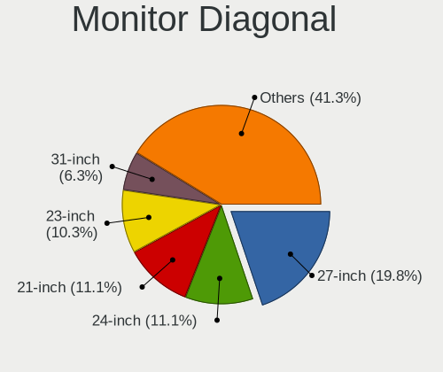

| Inches  | Desktops | Percent |
|---------|----------|---------|
| 27      | 25       | 19.84%  |
| 24      | 14       | 11.11%  |
| 21      | 14       | 11.11%  |
| 23      | 13       | 10.32%  |
| 31      | 8        | 6.35%   |
| 40      | 5        | 3.97%   |
| 18      | 5        | 3.97%   |
| 54      | 4        | 3.17%   |
| 34      | 4        | 3.17%   |
| 22      | 4        | 3.17%   |
| 19      | 4        | 3.17%   |
| 49      | 3        | 2.38%   |
| 26      | 3        | 2.38%   |
| 17      | 3        | 2.38%   |
| 72      | 2        | 1.59%   |
| 42      | 2        | 1.59%   |
| 32      | 2        | 1.59%   |
| 20      | 2        | 1.59%   |
| Unknown | 2        | 1.59%   |
| 142     | 1        | 0.79%   |
| 84      | 1        | 0.79%   |
| 64      | 1        | 0.79%   |
| 55      | 1        | 0.79%   |
| 46      | 1        | 0.79%   |
| 43      | 1        | 0.79%   |
| 15      | 1        | 0.79%   |

Monitor Width
-------------

Physical width

| Width in mm    | Desktops | Percent |
|----------------|----------|---------|
| 501-600        | 52       | 41.94%  |
| 401-500        | 30       | 24.19%  |
| 1001-1500      | 10       | 8.06%   |
| 601-700        | 9        | 7.26%   |
| 701-800        | 6        | 4.84%   |
| 801-900        | 5        | 4.03%   |
| 301-350        | 4        | 3.23%   |
| 1501-2000      | 3        | 2.42%   |
| 901-1000       | 2        | 1.61%   |
| Unknown        | 2        | 1.61%   |
| More than 2000 | 1        | 0.81%   |

Aspect Ratio
------------

Proportional relationship between the width and the height

| Ratio | Desktops | Percent |
|-------|----------|---------|
| 16/9  | 94       | 81.74%  |
| 16/10 | 10       | 8.7%    |
| 21/9  | 4        | 3.48%   |
| 5/4   | 3        | 2.61%   |
| 32/9  | 2        | 1.74%   |
| 3.20  | 1        | 0.87%   |
| 1.00  | 1        | 0.87%   |

Monitor Area
------------

Area in inch²

| Area in inch² | Desktops | Percent |
|----------------|----------|---------|
| 201-250        | 35       | 28.46%  |
| 301-350        | 26       | 21.14%  |
| 351-500        | 14       | 11.38%  |
| 151-200        | 11       | 8.94%   |
| 501-1000       | 11       | 8.94%   |
| More than 1000 | 10       | 8.13%   |
| 141-150        | 8        | 6.5%    |
| 251-300        | 5        | 4.07%   |
| Unknown        | 2        | 1.63%   |
| 101-110        | 1        | 0.81%   |

Pixel Density
-------------

Pixels per inch

| Density | Desktops | Percent |
|---------|----------|---------|
| 51-100  | 77       | 64.71%  |
| 101-120 | 24       | 20.17%  |
| 1-50    | 12       | 10.08%  |
| 161-240 | 2        | 1.68%   |
| 121-160 | 2        | 1.68%   |
| Unknown | 2        | 1.68%   |

Multiple Monitors
-----------------

Total monitors connected

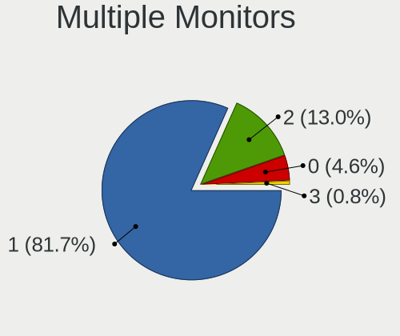

| Total | Desktops | Percent |
|-------|----------|---------|
| 1     | 107      | 81.68%  |
| 2     | 17       | 12.98%  |
| 0     | 6        | 4.58%   |
| 3     | 1        | 0.76%   |

Network
-------

Net Controller Vendor
---------------------

Controller vendors

| Vendor                   | Desktops | Percent |
|--------------------------|----------|---------|
| Realtek Semiconductor    | 85       | 42.71%  |
| Intel                    | 59       | 29.65%  |
| TP-Link                  | 8        | 4.02%   |
| Qualcomm Atheros         | 8        | 4.02%   |
| Broadcom                 | 7        | 3.52%   |
| Ralink Technology        | 6        | 3.02%   |
| MediaTek                 | 5        | 2.51%   |
| Xiaomi                   | 2        | 1.01%   |
| Ralink                   | 2        | 1.01%   |
| NetGear                  | 2        | 1.01%   |
| Marvell Technology Group | 2        | 1.01%   |
| ASIX Electronics         | 2        | 1.01%   |
| Samsung Electronics      | 1        | 0.5%    |
| OPPO Electronics         | 1        | 0.5%    |
| Oculus VR                | 1        | 0.5%    |
| Mercucys                 | 1        | 0.5%    |
| ICS Advent               | 1        | 0.5%    |
| Google                   | 1        | 0.5%    |
| D-Link System            | 1        | 0.5%    |
| Broadcom Limited         | 1        | 0.5%    |
| Belkin Components        | 1        | 0.5%    |
| ASUSTek Computer         | 1        | 0.5%    |
| Aquantia                 | 1        | 0.5%    |

Net Controller Model
--------------------

Controller models

| Model                                                                  | Desktops | Percent |
|------------------------------------------------------------------------|----------|---------|
| Realtek RTL8111/8168/8211/8411 PCI Express Gigabit Ethernet Controller | 60       | 26.67%  |
| Realtek RTL8821CE 802.11ac PCIe Wireless Network Adapter               | 8        | 3.56%   |
| Realtek RTL8125 2.5GbE Controller                                      | 7        | 3.11%   |
| Intel Ethernet Connection I217-LM                                      | 7        | 3.11%   |
| Intel 82579LM Gigabit Network Connection (Lewisville)                  | 7        | 3.11%   |
| Realtek RTL8188EUS 802.11n Wireless Network Adapter                    | 5        | 2.22%   |
| Intel I211 Gigabit Network Connection                                  | 5        | 2.22%   |
| Intel Ethernet Connection (2) I219-V                                   | 5        | 2.22%   |
| Realtek RTL8188FTV 802.11b/g/n 1T1R 2.4G WLAN Adapter                  | 4        | 1.78%   |
| Realtek RTL810xE PCI Express Fast Ethernet controller                  | 4        | 1.78%   |
| Ralink MT7601U Wireless Adapter                                        | 4        | 1.78%   |
| Intel Ethernet Controller I225-V                                       | 4        | 1.78%   |
| Intel Ethernet Connection (7) I219-V                                   | 4        | 1.78%   |
| Realtek 802.11ac NIC                                                   | 3        | 1.33%   |
| Intel Wi-Fi 6E(802.11ax) AX210/AX1675* 2x2 [Typhoon Peak]              | 3        | 1.33%   |
| Xiaomi Mi/Redmi series (RNDIS)                                         | 2        | 0.89%   |
| TP-Link 802.11ac NIC                                                   | 2        | 0.89%   |
| Realtek RTL88x2bu [AC1200 Techkey]                                     | 2        | 0.89%   |
| Ralink MT7610U ("Archer T2U" 2.4G+5G WLAN Adapter                      | 2        | 0.89%   |
| Qualcomm Atheros AR8151 v2.0 Gigabit Ethernet                          | 2        | 0.89%   |
| NetGear A6100 AC600 DB Wireless Adapter [Realtek RTL8811AU]            | 2        | 0.89%   |
| MediaTek MT7921K (RZ608) Wi-Fi 6E 80MHz                                | 2        | 0.89%   |
| Intel Ethernet Connection I217-V                                       | 2        | 0.89%   |
| Intel Alder Lake-S PCH CNVi WiFi                                       | 2        | 0.89%   |
| Intel 82579V Gigabit Network Connection                                | 2        | 0.89%   |
| Intel 82566DM-2 Gigabit Network Connection                             | 2        | 0.89%   |
| Broadcom BCM4360 802.11ac Dual Band Wireless Network Adapter           | 2        | 0.89%   |
| TP-Link TL-WN823N v2/v3 [Realtek RTL8192EU]                            | 1        | 0.44%   |
| TP-Link TL-WN821N v5/v6 [RTL8192EU]                                    | 1        | 0.44%   |
| TP-Link RTL8812AU Archer T4U 802.11ac                                  | 1        | 0.44%   |
| TP-Link Archer T4U ver.3                                               | 1        | 0.44%   |
| TP-Link Archer T2U PLUS [RTL8821AU]                                    | 1        | 0.44%   |
| TP-Link AC600 wireless Realtek RTL8811AU [Archer T2U Nano]             | 1        | 0.44%   |
| Samsung Galaxy series, misc. (tethering mode)                          | 1        | 0.44%   |
| Realtek RTL8852BE PCIe 802.11ax Wireless Network Controller            | 1        | 0.44%   |
| Realtek RTL8812AU 802.11a/b/g/n/ac 2T2R DB WLAN Adapter                | 1        | 0.44%   |
| Realtek RTL8812AE 802.11ac PCIe Wireless Network Adapter               | 1        | 0.44%   |
| Realtek RTL8192EU 802.11b/g/n WLAN Adapter                             | 1        | 0.44%   |
| Realtek RTL8192EE PCIe Wireless Network Adapter                        | 1        | 0.44%   |
| Realtek RTL8188CUS 802.11n WLAN Adapter                                | 1        | 0.44%   |

Wireless Vendor
---------------

Wireless vendors

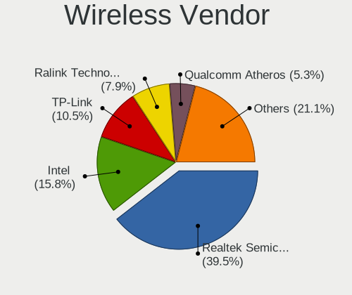

| Vendor                | Desktops | Percent |
|-----------------------|----------|---------|
| Realtek Semiconductor | 30       | 39.47%  |
| Intel                 | 12       | 15.79%  |
| TP-Link               | 8        | 10.53%  |
| Ralink Technology     | 6        | 7.89%   |
| Qualcomm Atheros      | 4        | 5.26%   |
| Broadcom              | 4        | 5.26%   |
| MediaTek              | 3        | 3.95%   |
| Ralink                | 2        | 2.63%   |
| NetGear               | 2        | 2.63%   |
| Mercucys              | 1        | 1.32%   |
| D-Link System         | 1        | 1.32%   |
| Broadcom Limited      | 1        | 1.32%   |
| Belkin Components     | 1        | 1.32%   |
| ASUSTek Computer      | 1        | 1.32%   |

Wireless Model
--------------

Wireless models

| Model                                                          | Desktops | Percent |
|----------------------------------------------------------------|----------|---------|
| Realtek RTL8821CE 802.11ac PCIe Wireless Network Adapter       | 8        | 10.39%  |
| Realtek RTL8188EUS 802.11n Wireless Network Adapter            | 5        | 6.49%   |
| Realtek RTL8188FTV 802.11b/g/n 1T1R 2.4G WLAN Adapter          | 4        | 5.19%   |
| Ralink MT7601U Wireless Adapter                                | 4        | 5.19%   |
| Realtek 802.11ac NIC                                           | 3        | 3.9%    |
| Intel Wi-Fi 6E(802.11ax) AX210/AX1675* 2x2 [Typhoon Peak]      | 3        | 3.9%    |
| TP-Link 802.11ac NIC                                           | 2        | 2.6%    |
| Realtek RTL88x2bu [AC1200 Techkey]                             | 2        | 2.6%    |
| Ralink MT7610U ("Archer T2U" 2.4G+5G WLAN Adapter              | 2        | 2.6%    |
| NetGear A6100 AC600 DB Wireless Adapter [Realtek RTL8811AU]    | 2        | 2.6%    |
| MediaTek MT7921K (RZ608) Wi-Fi 6E 80MHz                        | 2        | 2.6%    |
| Intel Alder Lake-S PCH CNVi WiFi                               | 2        | 2.6%    |
| Broadcom BCM4360 802.11ac Dual Band Wireless Network Adapter   | 2        | 2.6%    |
| TP-Link TL-WN823N v2/v3 [Realtek RTL8192EU]                    | 1        | 1.3%    |
| TP-Link TL-WN821N v5/v6 [RTL8192EU]                            | 1        | 1.3%    |
| TP-Link RTL8812AU Archer T4U 802.11ac                          | 1        | 1.3%    |
| TP-Link Archer T4U ver.3                                       | 1        | 1.3%    |
| TP-Link Archer T2U PLUS [RTL8821AU]                            | 1        | 1.3%    |
| TP-Link AC600 wireless Realtek RTL8811AU [Archer T2U Nano]     | 1        | 1.3%    |
| Realtek RTL8852BE PCIe 802.11ax Wireless Network Controller    | 1        | 1.3%    |
| Realtek RTL8812AU 802.11a/b/g/n/ac 2T2R DB WLAN Adapter        | 1        | 1.3%    |
| Realtek RTL8812AE 802.11ac PCIe Wireless Network Adapter       | 1        | 1.3%    |
| Realtek RTL8192EU 802.11b/g/n WLAN Adapter                     | 1        | 1.3%    |
| Realtek RTL8192EE PCIe Wireless Network Adapter                | 1        | 1.3%    |
| Realtek RTL8188CUS 802.11n WLAN Adapter                        | 1        | 1.3%    |
| Realtek RTL8187 Wireless Adapter                               | 1        | 1.3%    |
| Realtek RTL-8185 IEEE 802.11a/b/g Wireless LAN Controller      | 1        | 1.3%    |
| Realtek 802.11ac WLAN Adapter                                  | 1        | 1.3%    |
| Ralink RT5392 PCIe Wireless Network Adapter                    | 1        | 1.3%    |
| Ralink RT3060 Wireless 802.11n 1T/1R                           | 1        | 1.3%    |
| Qualcomm Atheros AR9485 Wireless Network Adapter               | 1        | 1.3%    |
| Qualcomm Atheros AR928X Wireless Network Adapter (PCI-Express) | 1        | 1.3%    |
| Qualcomm Atheros AR9287 Wireless Network Adapter (PCI-Express) | 1        | 1.3%    |
| Qualcomm Atheros AR9285 Wireless Network Adapter (PCI-Express) | 1        | 1.3%    |
| Mercucys 802.11n NIC                                           | 1        | 1.3%    |
| MediaTek MT7612U 802.11a/b/g/n/ac Wireless Adapter             | 1        | 1.3%    |
| Intel Wireless 7265                                            | 1        | 1.3%    |
| Intel Wireless 7260                                            | 1        | 1.3%    |
| Intel Wireless 3160                                            | 1        | 1.3%    |
| Intel Wi-Fi 6 AX200                                            | 1        | 1.3%    |

Ethernet Vendor
---------------

Ethernet vendors

| Vendor                   | Desktops | Percent |
|--------------------------|----------|---------|
| Realtek Semiconductor    | 72       | 49.66%  |
| Intel                    | 52       | 35.86%  |
| Qualcomm Atheros         | 5        | 3.45%   |
| Broadcom                 | 3        | 2.07%   |
| Xiaomi                   | 2        | 1.38%   |
| MediaTek                 | 2        | 1.38%   |
| Marvell Technology Group | 2        | 1.38%   |
| ASIX Electronics         | 2        | 1.38%   |
| Samsung Electronics      | 1        | 0.69%   |
| OPPO Electronics         | 1        | 0.69%   |
| ICS Advent               | 1        | 0.69%   |
| Google                   | 1        | 0.69%   |
| Aquantia                 | 1        | 0.69%   |

Ethernet Model
--------------

Ethernet models

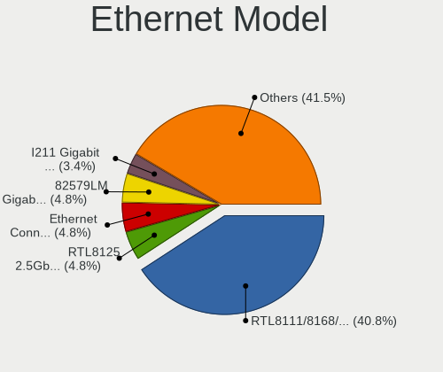

| Model                                                                  | Desktops | Percent |
|------------------------------------------------------------------------|----------|---------|
| Realtek RTL8111/8168/8211/8411 PCI Express Gigabit Ethernet Controller | 60       | 40.82%  |
| Realtek RTL8125 2.5GbE Controller                                      | 7        | 4.76%   |
| Intel Ethernet Connection I217-LM                                      | 7        | 4.76%   |
| Intel 82579LM Gigabit Network Connection (Lewisville)                  | 7        | 4.76%   |
| Intel I211 Gigabit Network Connection                                  | 5        | 3.4%    |
| Intel Ethernet Connection (2) I219-V                                   | 5        | 3.4%    |
| Realtek RTL810xE PCI Express Fast Ethernet controller                  | 4        | 2.72%   |
| Intel Ethernet Controller I225-V                                       | 4        | 2.72%   |
| Intel Ethernet Connection (7) I219-V                                   | 4        | 2.72%   |
| Xiaomi Mi/Redmi series (RNDIS)                                         | 2        | 1.36%   |
| Qualcomm Atheros AR8151 v2.0 Gigabit Ethernet                          | 2        | 1.36%   |
| Intel Ethernet Connection I217-V                                       | 2        | 1.36%   |
| Intel 82579V Gigabit Network Connection                                | 2        | 1.36%   |
| Intel 82566DM-2 Gigabit Network Connection                             | 2        | 1.36%   |
| Samsung Galaxy series, misc. (tethering mode)                          | 1        | 0.68%   |
| Realtek RTL8169 PCI Gigabit Ethernet Controller                        | 1        | 0.68%   |
| Realtek RTL-8100/8101L/8139 PCI Fast Ethernet Adapter                  | 1        | 0.68%   |
| Realtek Killer E2600 GbE Controller                                    | 1        | 0.68%   |
| Qualcomm Atheros Killer E2400 Gigabit Ethernet Controller              | 1        | 0.68%   |
| Qualcomm Atheros Attansic L2 Fast Ethernet                             | 1        | 0.68%   |
| Qualcomm Atheros AR8131 Gigabit Ethernet                               | 1        | 0.68%   |
| OPPO OnePlus Nord 4                                                    | 1        | 0.68%   |
| MediaTek MT7922 802.11ax PCI Express Wireless Network Adapter          | 1        | 0.68%   |
| MediaTek Infinix SMART 5                                               | 1        | 0.68%   |
| Marvell Group 88E8057 PCI-E Gigabit Ethernet Controller                | 1        | 0.68%   |
| Marvell Group 88E8001 Gigabit Ethernet Controller                      | 1        | 0.68%   |
| Intel PRO/100 VE Network Connection                                    | 1        | 0.68%   |
| Intel Ethernet Controller I226-V                                       | 1        | 0.68%   |
| Intel Ethernet Connection (7) I219-LM                                  | 1        | 0.68%   |
| Intel Ethernet Connection (5) I219-LM                                  | 1        | 0.68%   |
| Intel Ethernet Connection (2) I219-LM                                  | 1        | 0.68%   |
| Intel Ethernet Connection (2) I218-V                                   | 1        | 0.68%   |
| Intel Ethernet Connection (2) I218-LM                                  | 1        | 0.68%   |
| Intel Ethernet Connection (14) I219-V                                  | 1        | 0.68%   |
| Intel Ethernet Connection (14) I219-LM                                 | 1        | 0.68%   |
| Intel 82578DC Gigabit Network Connection                               | 1        | 0.68%   |
| Intel 82574L Gigabit Network Connection                                | 1        | 0.68%   |
| Intel 82567LM-3 Gigabit Network Connection                             | 1        | 0.68%   |
| Intel 82567LF-3 Gigabit Network Connection                             | 1        | 0.68%   |
| Intel 82566DC-2 Gigabit Network Connection                             | 1        | 0.68%   |

Net Controller Kind
-------------------

Ethernet, WiFi or modem

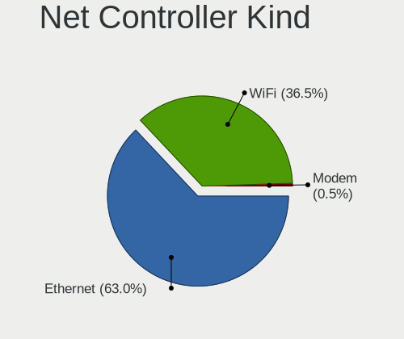

| Kind     | Desktops | Percent |
|----------|----------|---------|
| Ethernet | 126      | 63%     |
| WiFi     | 73       | 36.5%   |
| Modem    | 1        | 0.5%    |

Used Controller
---------------

Currently used network controller

| Kind     | Desktops | Percent |
|----------|----------|---------|
| Ethernet | 93       | 68.38%  |
| WiFi     | 43       | 31.62%  |

NICs
----

Total network controllers on board

| Total | Desktops | Percent |
|-------|----------|---------|
| 1     | 86       | 66.67%  |
| 2     | 35       | 27.13%  |
| 3     | 6        | 4.65%   |
| 4     | 1        | 0.78%   |
| 0     | 1        | 0.78%   |

IPv6
----

IPv6 vs IPv4

| Used | Desktops | Percent |
|------|----------|---------|
| No   | 87       | 65.91%  |
| Yes  | 45       | 34.09%  |

Bluetooth
---------

Bluetooth Vendor
----------------

Controller vendors

| Vendor                          | Desktops | Percent |
|---------------------------------|----------|---------|
| Realtek Semiconductor           | 13       | 28.26%  |
| Intel                           | 12       | 26.09%  |
| Cambridge Silicon Radio         | 8        | 17.39%  |
| TP-Link                         | 3        | 6.52%   |
| MediaTek                        | 2        | 4.35%   |
| ASUSTek Computer                | 2        | 4.35%   |
| Qualcomm Atheros Communications | 1        | 2.17%   |
| IMC Networks                    | 1        | 2.17%   |
| Foxconn / Hon Hai               | 1        | 2.17%   |
| Apple                           | 1        | 2.17%   |
| Actions                         | 1        | 2.17%   |
| Unknown                         | 1        | 2.17%   |

Bluetooth Model
---------------

Controller models

| Model                                               | Desktops | Percent |
|-----------------------------------------------------|----------|---------|
| Realtek Bluetooth Radio                             | 12       | 26.09%  |
| Cambridge Silicon Radio Bluetooth Dongle (HCI mode) | 8        | 17.39%  |
| TP-Link TP-Link Bluetooth USB Adapter               | 3        | 6.52%   |
| Intel Bluetooth wireless interface                  | 3        | 6.52%   |
| Intel AX210 Bluetooth                               | 3        | 6.52%   |
| MediaTek Wireless_Device                            | 2        | 4.35%   |
| Intel AX201 Bluetooth                               | 2        | 4.35%   |
| ASUS Broadcom BCM20702A0 Bluetooth                  | 2        | 4.35%   |
| Realtek Bluetooth 5.3 Radio                         | 1        | 2.17%   |
| Qualcomm Atheros AR3011 Bluetooth                   | 1        | 2.17%   |
| Intel Wireless-AC 3168 Bluetooth                    | 1        | 2.17%   |
| Intel Bluetooth 9460/9560 Jefferson Peak (JfP)      | 1        | 2.17%   |
| Intel AX211 Bluetooth                               | 1        | 2.17%   |
| Intel AX200 Bluetooth                               | 1        | 2.17%   |
| IMC Networks Bluetooth Radio                        | 1        | 2.17%   |
| Foxconn / Hon Hai Wireless_Device                   | 1        | 2.17%   |
| Apple Built-in Bluetooth 2.0+EDR HCI                | 1        | 2.17%   |
| Actions general adapter                             | 1        | 2.17%   |
| Unknown                                             | 1        | 2.17%   |

Sound
-----

Sound Vendor
------------

Sound card vendors

| Vendor                                       | Desktops | Percent |
|----------------------------------------------|----------|---------|
| Intel                                        | 100      | 44.64%  |
| Nvidia                                       | 55       | 24.55%  |
| AMD                                          | 40       | 17.86%  |
| C-Media Electronics                          | 6        | 2.68%   |
| Logitech                                     | 3        | 1.34%   |
| Texas Instruments                            | 2        | 0.89%   |
| M-Audio                                      | 2        | 0.89%   |
| Corsair                                      | 2        | 0.89%   |
| Zoran Co. Personal Media Division (Nogatech) | 1        | 0.45%   |
| Razer USA                                    | 1        | 0.45%   |
| Micro Star International                     | 1        | 0.45%   |
| KTMicro                                      | 1        | 0.45%   |
| JMTek                                        | 1        | 0.45%   |
| GN Netcom                                    | 1        | 0.45%   |
| Generalplus Technology                       | 1        | 0.45%   |
| fifine Microphones                           | 1        | 0.45%   |
| ESI                                          | 1        | 0.45%   |
| Dell                                         | 1        | 0.45%   |
| Creative Labs                                | 1        | 0.45%   |
| Cambridge Silicon Radio                      | 1        | 0.45%   |
| Barco Display Systems                        | 1        | 0.45%   |
| Actions Semiconductor                        | 1        | 0.45%   |

Sound Model
-----------

Sound card models

| Model                                                                      | Desktops | Percent |
|----------------------------------------------------------------------------|----------|---------|
| Intel 8 Series/C220 Series Chipset High Definition Audio Controller        | 12       | 4.76%   |
| Intel 6 Series/C200 Series Chipset Family High Definition Audio Controller | 12       | 4.76%   |
| Intel Xeon E3-1200 v3/4th Gen Core Processor HD Audio Controller           | 11       | 4.37%   |
| Intel NM10/ICH7 Family High Definition Audio Controller                    | 9        | 3.57%   |
| Intel 7 Series/C216 Chipset Family High Definition Audio Controller        | 9        | 3.57%   |
| Intel 200 Series PCH HD Audio                                              | 9        | 3.57%   |
| AMD Starship/Matisse HD Audio Controller                                   | 9        | 3.57%   |
| Nvidia GK208 HDMI/DP Audio Controller                                      | 8        | 3.17%   |
| AMD Family 17h/19h/1ah HD Audio Controller                                 | 7        | 2.78%   |
| Nvidia GP107GL High Definition Audio Controller                            | 6        | 2.38%   |
| Intel Cannon Lake PCH cAVS                                                 | 6        | 2.38%   |
| AMD Baffin HDMI/DP Audio [Radeon RX 550 640SP / RX 560/560X]               | 6        | 2.38%   |
| Nvidia GP106 High Definition Audio Controller                              | 5        | 1.98%   |
| Intel 82801JI (ICH10 Family) HD Audio Controller                           | 5        | 1.98%   |
| Intel 100 Series/C230 Series Chipset Family HD Audio Controller            | 5        | 1.98%   |
| AMD SBx00 Azalia (Intel HDA)                                               | 5        | 1.98%   |
| AMD Ellesmere HDMI Audio [Radeon RX 470/480 / 570/580/590]                 | 5        | 1.98%   |
| Nvidia GA104 High Definition Audio Controller                              | 4        | 1.59%   |
| Intel Alder Lake-S HD Audio Controller                                     | 4        | 1.59%   |
| Nvidia High Definition Audio Controller                                    | 3        | 1.19%   |
| Nvidia GP104 High Definition Audio Controller                              | 3        | 1.19%   |
| Nvidia GK107 HDMI Audio Controller                                         | 3        | 1.19%   |
| Nvidia GA102 High Definition Audio Controller                              | 3        | 1.19%   |
| Intel 82801I (ICH9 Family) HD Audio Controller                             | 3        | 1.19%   |
| AMD Family 17h (Models 00h-0fh) HD Audio Controller                        | 3        | 1.19%   |
| Nvidia TU116 High Definition Audio Controller                              | 2        | 0.79%   |
| Nvidia TU104 HD Audio Controller                                           | 2        | 0.79%   |
| Nvidia GP108 High Definition Audio Controller                              | 2        | 0.79%   |
| Nvidia GM204 High Definition Audio Controller                              | 2        | 0.79%   |
| Nvidia GM107 High Definition Audio Controller [GeForce 940MX]              | 2        | 0.79%   |
| Nvidia GK106 HDMI Audio Controller                                         | 2        | 0.79%   |
| Nvidia GF116 High Definition Audio Controller                              | 2        | 0.79%   |
| Logitech H390 headset with microphone                                      | 2        | 0.79%   |
| Intel Tiger Lake-H HD Audio Controller                                     | 2        | 0.79%   |
| Intel Smart Sound Technology (SST) Audio Controller                        | 2        | 0.79%   |
| Intel Raptor Lake High Definition Audio Controller                         | 2        | 0.79%   |
| Intel Jasper Lake HD Audio                                                 | 2        | 0.79%   |
| Intel Comet Lake PCH-V cAVS                                                | 2        | 0.79%   |
| Intel Celeron/Pentium Silver Processor High Definition Audio               | 2        | 0.79%   |
| Intel C610/X99 series chipset HD Audio Controller                          | 2        | 0.79%   |

Memory
------

Memory Vendor
-------------

Memory module vendors

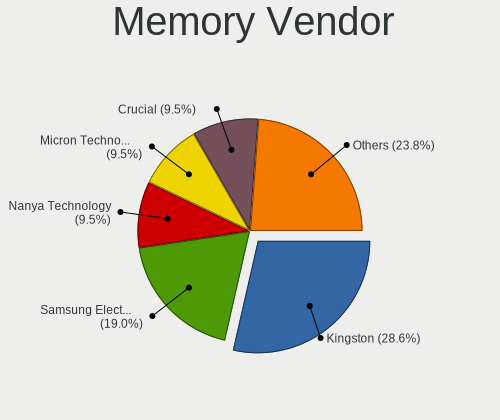

| Vendor              | Desktops | Percent |
|---------------------|----------|---------|
| Kingston            | 6        | 28.57%  |
| Samsung Electronics | 4        | 19.05%  |
| Nanya Technology    | 2        | 9.52%   |
| Micron Technology   | 2        | 9.52%   |
| Crucial             | 2        | 9.52%   |
| Unknown             | 1        | 4.76%   |
| Transcend           | 1        | 4.76%   |
| Timetec             | 1        | 4.76%   |
| Ramaxel Technology  | 1        | 4.76%   |
| Corsair             | 1        | 4.76%   |

Memory Model
------------

Memory module models

| Model                                                   | Desktops | Percent |
|---------------------------------------------------------|----------|---------|
| Unknown RAM Module 8GB DIMM DDR4 2667MT/s               | 1        | 4.55%   |
| Unknown RAM Module 16GB DIMM DDR4 2667MT/s              | 1        | 4.55%   |
| Transcend RAM JM800QSU-2G 2GB SODIMM DDR2 800MT/s       | 1        | 4.55%   |
| Timetec RAM U8G-1333 8GB DIMM DDR3 1333MT/s             | 1        | 4.55%   |
| Samsung RAM Module 8GB DIMM DDR3 1333MT/s               | 1        | 4.55%   |
| Samsung RAM M471B5273DH0-CH9 4GB DIMM DDR3 1333MT/s     | 1        | 4.55%   |
| Samsung RAM M471A1K43CB1-CTD 16GB DIMM DDR4 2667MT/s    | 1        | 4.55%   |
| Samsung RAM M4 70T2864QZ3-CE6 1GB SODIMM DDR2 1639MT/s  | 1        | 4.55%   |
| Ramaxel RAM RMUA5110ME78HAF-2666 8GB DIMM DDR4 2667MT/s | 1        | 4.55%   |
| Nanya RAM NT2GC64B8HA0NF-CG 2GB DIMM DDR3 1333MT/s      | 1        | 4.55%   |
| Nanya RAM NT2GC64B88B0NF-CG 2GB DIMM DDR3 1333MT/s      | 1        | 4.55%   |
| Micron RAM 8KTF51264AZ-1G6E1 4GB DIMM DDR3 1600MT/s     | 1        | 4.55%   |
| Micron RAM 18ASF2G72AZ-2G3B1 16GB DIMM DDR4 2400MT/s    | 1        | 4.55%   |
| Kingston RAM Module 2GB DIMM DDR2 667MT/s               | 1        | 4.55%   |
| Kingston RAM KTW149-ELD 1GB DIMM 1333MT/s               | 1        | 4.55%   |
| Kingston RAM KF3200C16D4/8GX 8GB DIMM DDR4 3600MT/s     | 1        | 4.55%   |
| Kingston RAM HX318C10F/8 8GB DIMM DDR3 1866MT/s         | 1        | 4.55%   |
| Kingston RAM 99U5474-016.A00LF 4GB DIMM DDR3 1333MT/s   | 1        | 4.55%   |
| Kingston RAM 99U5471-030.A00LF 8GB DIMM DDR3 1333MT/s   | 1        | 4.55%   |
| Crucial RAM CT8G4DFRA266.C8FE 8GB DIMM DDR4 2933MT/s    | 1        | 4.55%   |
| Crucial RAM BLS8G3D1609DS1S00. 8GB DIMM DDR3 1800MT/s   | 1        | 4.55%   |
| Corsair RAM CMW16GX4M2C3200C16 8GB DIMM DDR4 3733MT/s   | 1        | 4.55%   |

Memory Kind
-----------

Memory module kinds

| Kind  | Desktops | Percent |
|-------|----------|---------|
| DDR3  | 8        | 50%     |
| DDR4  | 6        | 37.5%   |
| SDRAM | 1        | 6.25%   |
| DDR2  | 1        | 6.25%   |

Memory Form Factor
------------------

Physical design of the memory module

| Name   | Desktops | Percent |
|--------|----------|---------|
| DIMM   | 15       | 93.75%  |
| SODIMM | 1        | 6.25%   |

Memory Size
-----------

Memory module size

| Size  | Desktops | Percent |
|-------|----------|---------|
| 8192  | 8        | 42.11%  |
| 2048  | 4        | 21.05%  |
| 4096  | 3        | 15.79%  |
| 16384 | 2        | 10.53%  |
| 1024  | 2        | 10.53%  |

Memory Speed
------------

Memory module speed

| Speed | Desktops | Percent |
|-------|----------|---------|
| 1333  | 4        | 23.53%  |
| 2667  | 2        | 11.76%  |
| 1600  | 2        | 11.76%  |
| 3733  | 1        | 5.88%   |
| 3600  | 1        | 5.88%   |
| 2933  | 1        | 5.88%   |
| 2400  | 1        | 5.88%   |
| 1866  | 1        | 5.88%   |
| 1800  | 1        | 5.88%   |
| 1639  | 1        | 5.88%   |
| 975   | 1        | 5.88%   |
| 667   | 1        | 5.88%   |

Printers & scanners
-------------------

Printer Vendor
--------------

Printer device vendors

| Vendor                | Desktops | Percent |
|-----------------------|----------|---------|
| Hewlett-Packard       | 3        | 37.5%   |
| Samsung Electronics   | 2        | 25%     |
| QUIN                  | 1        | 12.5%   |
| Lexmark International | 1        | 12.5%   |
| Canon                 | 1        | 12.5%   |

Printer Model
-------------

Printer device models

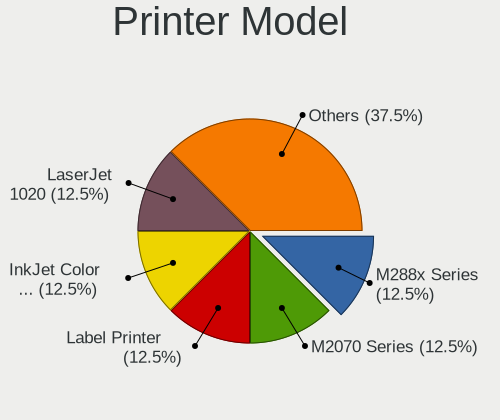

| Model                                      | Desktops | Percent |
|--------------------------------------------|----------|---------|
| Samsung M288x Series                       | 1        | 12.5%   |
| Samsung M2070 Series                       | 1        | 12.5%   |
| QUIN Label Printer                         | 1        | 12.5%   |
| Lexmark International InkJet Color Printer | 1        | 12.5%   |
| HP LaserJet 1020                           | 1        | 12.5%   |
| HP Deskjet 3520 series                     | 1        | 12.5%   |
| HP DeskJet 2700 series                     | 1        | 12.5%   |
| Canon CanoScan LiDE 300                    | 1        | 12.5%   |

Scanner Vendor
--------------

Scanner device vendors

| Vendor | Desktops | Percent |
|--------|----------|---------|
| Canon  | 1        | 100%    |

Scanner Model
-------------

Scanner device models

| Model                              | Desktops | Percent |
|------------------------------------|----------|---------|
| Canon CanoScan N670U/N676U/LiDE 20 | 1        | 100%    |

Camera
------

Camera Vendor
-------------

Camera device vendors

| Vendor                        | Desktops | Percent |
|-------------------------------|----------|---------|
| Logitech                      | 9        | 39.13%  |
| Microsoft                     | 2        | 8.7%    |
| GEMBIRD                       | 2        | 8.7%    |
| UltraSemi                     | 1        | 4.35%   |
| Trust                         | 1        | 4.35%   |
| Syntek                        | 1        | 4.35%   |
| Sunplus Innovation Technology | 1        | 4.35%   |
| Samsung Electronics           | 1        | 4.35%   |
| Pixart Imaging                | 1        | 4.35%   |
| Microdia                      | 1        | 4.35%   |
| Jieli Technology              | 1        | 4.35%   |
| Generalplus Technology        | 1        | 4.35%   |
| Apple                         | 1        | 4.35%   |

Camera Model
------------

Camera device models

| Model                                   | Desktops | Percent |
|-----------------------------------------|----------|---------|
| Logitech HD Pro Webcam C920             | 4        | 17.39%  |
| Logitech C922 Pro Stream Webcam         | 2        | 8.7%    |
| GEMBIRD USB2.0 PC CAMERA                | 2        | 8.7%    |
| UltraSemi USB3 Video                    | 1        | 4.35%   |
| Trust Trust USB Camera                  | 1        | 4.35%   |
| Syntek USB Video Device                 | 1        | 4.35%   |
| Sunplus USB 2.0 Camera                  | 1        | 4.35%   |
| Samsung Galaxy series, misc. (MTP mode) | 1        | 4.35%   |
| Pixart Imaging GE 1.3 MP MiniCam Pro    | 1        | 4.35%   |
| Microsoft LifeCam VX-800                | 1        | 4.35%   |
| Microsoft LifeCam HD-3000               | 1        | 4.35%   |
| Microdia Integrated Camera              | 1        | 4.35%   |
| Logitech Webcam C600                    | 1        | 4.35%   |
| Logitech QuickCam Pro 9000              | 1        | 4.35%   |
| Logitech Logitech Webcam C925e          | 1        | 4.35%   |
| Jieli USB PHY 2.0                       | 1        | 4.35%   |
| Generalplus GENERAL WEBCAM              | 1        | 4.35%   |
| Apple iPhone 5/5C/5S/6/SE/7/8/X/XR      | 1        | 4.35%   |

Security
--------

Fingerprint Vendor
------------------

Fingerprint sensor vendors

Zero info for selected period =(

Fingerprint Model
-----------------

Fingerprint sensor models

Zero info for selected period =(

Chipcard Vendor
---------------

Chipcard module vendors

| Vendor               | Desktops | Percent |
|----------------------|----------|---------|
| Feitian Technologies | 1        | 50%     |
| Alcor Micro          | 1        | 50%     |

Chipcard Model
--------------

Chipcard module models

| Model                               | Desktops | Percent |
|-------------------------------------|----------|---------|
| Feitian Technologies SCR301         | 1        | 50%     |
| Alcor Micro AU9540 Smartcard Reader | 1        | 50%     |

Unsupported
-----------

Unsupported Devices
-------------------

Total unsupported devices on board

| Total | Desktops | Percent |
|-------|----------|---------|
| 0     | 106      | 80.3%   |
| 1     | 22       | 16.67%  |
| 2     | 4        | 3.03%   |

Unsupported Device Types
------------------------

Types of unsupported devices

| Type                     | Desktops | Percent |
|--------------------------|----------|---------|
| Net/wireless             | 11       | 35.48%  |
| Graphics card            | 10       | 32.26%  |
| Unassigned class         | 3        | 9.68%   |
| Multimedia controller    | 2        | 6.45%   |
| Chipcard                 | 2        | 6.45%   |
| Sound                    | 1        | 3.23%   |
| Communication controller | 1        | 3.23%   |
| Card reader              | 1        | 3.23%   |

