Elementary 7.1 - Tested Hardware & Statistics (Desktops)
--------------------------------------------------------

A project to collect tested hardware configurations for Elementary 7.1.

Anyone can contribute to this report by the [hw-probe](https://github.com/linuxhw/hw-probe) tool:

    sudo -E hw-probe -all -upload

Please contribute! Especially if your hardware is rare.

Contents
--------

* [ Test Cases ](#test-cases)

* [ System ](#system)
  - [ Kernel                   ](#kernel)
  - [ Kernel Family            ](#kernel-family)
  - [ Kernel Major Ver.        ](#kernel-major-ver)
  - [ Arch                     ](#arch)
  - [ DE                       ](#de)
  - [ Display Server           ](#display-server)
  - [ Display Manager          ](#display-manager)
  - [ OS Lang                  ](#os-lang)
  - [ Boot Mode                ](#boot-mode)
  - [ Filesystem               ](#filesystem)
  - [ Part. scheme             ](#part-scheme)
  - [ Dual Boot with Linux/BSD ](#dual-boot-with-linuxbsd)
  - [ Dual Boot (Win)          ](#dual-boot-win)

* [ Board ](#board)
  - [ Vendor                   ](#vendor)
  - [ Model                    ](#model)
  - [ Model Family             ](#model-family)
  - [ MFG Year                 ](#mfg-year)
  - [ Form Factor              ](#form-factor)
  - [ Secure Boot              ](#secure-boot)
  - [ Coreboot                 ](#coreboot)
  - [ RAM Size                 ](#ram-size)
  - [ RAM Used                 ](#ram-used)
  - [ Total Drives             ](#total-drives)
  - [ Has CD-ROM               ](#has-cd-rom)
  - [ Has Ethernet             ](#has-ethernet)
  - [ Has WiFi                 ](#has-wifi)
  - [ Has Bluetooth            ](#has-bluetooth)

* [ Location ](#location)
  - [ Country                  ](#country)
  - [ City                     ](#city)

* [ Drives ](#drives)
  - [ Drive Vendor             ](#drive-vendor)
  - [ Drive Model              ](#drive-model)
  - [ HDD Vendor               ](#hdd-vendor)
  - [ SSD Vendor               ](#ssd-vendor)
  - [ Drive Kind               ](#drive-kind)
  - [ Drive Connector          ](#drive-connector)
  - [ Drive Size               ](#drive-size)
  - [ Space Total              ](#space-total)
  - [ Space Used               ](#space-used)
  - [ Malfunc. Drives          ](#malfunc-drives)
  - [ Malfunc. Drive Vendor    ](#malfunc-drive-vendor)
  - [ Malfunc. HDD Vendor      ](#malfunc-hdd-vendor)
  - [ Malfunc. Drive Kind      ](#malfunc-drive-kind)
  - [ Failed Drives            ](#failed-drives)
  - [ Failed Drive Vendor      ](#failed-drive-vendor)
  - [ Drive Status             ](#drive-status)

* [ Storage controller ](#storage-controller)
  - [ Storage Vendor           ](#storage-vendor)
  - [ Storage Model            ](#storage-model)
  - [ Storage Kind             ](#storage-kind)

* [ Processor ](#processor)
  - [ CPU Vendor               ](#cpu-vendor)
  - [ CPU Model                ](#cpu-model)
  - [ CPU Model Family         ](#cpu-model-family)
  - [ CPU Cores                ](#cpu-cores)
  - [ CPU Sockets              ](#cpu-sockets)
  - [ CPU Threads              ](#cpu-threads)
  - [ CPU Op-Modes             ](#cpu-op-modes)
  - [ CPU Microcode            ](#cpu-microcode)
  - [ CPU Microarch            ](#cpu-microarch)

* [ Graphics ](#graphics)
  - [ GPU Vendor               ](#gpu-vendor)
  - [ GPU Model                ](#gpu-model)
  - [ GPU Combo                ](#gpu-combo)
  - [ GPU Driver               ](#gpu-driver)
  - [ GPU Memory               ](#gpu-memory)

* [ Monitor ](#monitor)
  - [ Monitor Vendor           ](#monitor-vendor)
  - [ Monitor Model            ](#monitor-model)
  - [ Monitor Resolution       ](#monitor-resolution)
  - [ Monitor Diagonal         ](#monitor-diagonal)
  - [ Monitor Width            ](#monitor-width)
  - [ Aspect Ratio             ](#aspect-ratio)
  - [ Monitor Area             ](#monitor-area)
  - [ Pixel Density            ](#pixel-density)
  - [ Multiple Monitors        ](#multiple-monitors)

* [ Network ](#network)
  - [ Net Controller Vendor    ](#net-controller-vendor)
  - [ Net Controller Model     ](#net-controller-model)
  - [ Wireless Vendor          ](#wireless-vendor)
  - [ Wireless Model           ](#wireless-model)
  - [ Ethernet Vendor          ](#ethernet-vendor)
  - [ Ethernet Model           ](#ethernet-model)
  - [ Net Controller Kind      ](#net-controller-kind)
  - [ Used Controller          ](#used-controller)
  - [ NICs                     ](#nics)
  - [ IPv6                     ](#ipv6)

* [ Bluetooth ](#bluetooth)
  - [ Bluetooth Vendor         ](#bluetooth-vendor)
  - [ Bluetooth Model          ](#bluetooth-model)

* [ Sound ](#sound)
  - [ Sound Vendor             ](#sound-vendor)
  - [ Sound Model              ](#sound-model)

* [ Memory ](#memory)
  - [ Memory Vendor            ](#memory-vendor)
  - [ Memory Model             ](#memory-model)
  - [ Memory Kind              ](#memory-kind)
  - [ Memory Form Factor       ](#memory-form-factor)
  - [ Memory Size              ](#memory-size)
  - [ Memory Speed             ](#memory-speed)

* [ Printers & scanners ](#printers--scanners)
  - [ Printer Vendor           ](#printer-vendor)
  - [ Printer Model            ](#printer-model)
  - [ Scanner Vendor           ](#scanner-vendor)
  - [ Scanner Model            ](#scanner-model)

* [ Camera ](#camera)
  - [ Camera Vendor            ](#camera-vendor)
  - [ Camera Model             ](#camera-model)

* [ Security ](#security)
  - [ Fingerprint Vendor       ](#fingerprint-vendor)
  - [ Fingerprint Model        ](#fingerprint-model)
  - [ Chipcard Vendor          ](#chipcard-vendor)
  - [ Chipcard Model           ](#chipcard-model)

* [ Unsupported ](#unsupported)
  - [ Unsupported Devices      ](#unsupported-devices)
  - [ Unsupported Device Types ](#unsupported-device-types)

Test Cases
----------

Total: 96

| Vendor        | Model                       | Probe                                                      | Date         |
|---------------|-----------------------------|------------------------------------------------------------|--------------|
| ASUSTek       | PRIME B460M-K               | [fea6956058](https://linux-hardware.org/?probe=fea6956058) | May 08, 2024 |
| ASUSTek       | PRIME H510M-A               | [e475e36ab0](https://linux-hardware.org/?probe=e475e36ab0) | May 06, 2024 |
| ASUSTek       | PRIME A320M-K               | [0f43840d58](https://linux-hardware.org/?probe=0f43840d58) | May 06, 2024 |
| HP            | 0B4Ch D                     | [29d73efd4a](https://linux-hardware.org/?probe=29d73efd4a) | Apr 30, 2024 |
| ASUSTek       | PRIME A320M-K               | [022ece0282](https://linux-hardware.org/?probe=022ece0282) | Apr 30, 2024 |
| Medion        | MS-7797                     | [a72c95890e](https://linux-hardware.org/?probe=a72c95890e) | Apr 28, 2024 |
| Gigabyte      | B250M-D2VX-SI-CF            | [5c277491cf](https://linux-hardware.org/?probe=5c277491cf) | Apr 27, 2024 |
| ASUSTek       | TUF X470-PLUS GAMING        | [6609c77480](https://linux-hardware.org/?probe=6609c77480) | Apr 26, 2024 |
| ASUSTek       | P8H77-M PRO                 | [ee55351883](https://linux-hardware.org/?probe=ee55351883) | Apr 25, 2024 |
| ASUSTek       | PRIME H510M-A               | [c12789125b](https://linux-hardware.org/?probe=c12789125b) | Apr 24, 2024 |
| Medion        | MS-7797                     | [810a7d7810](https://linux-hardware.org/?probe=810a7d7810) | Apr 22, 2024 |
| ECS           | H110M-C3D/C3V               | [7fffccead5](https://linux-hardware.org/?probe=7fffccead5) | Apr 17, 2024 |
| Dell          | 0D24M8 A02                  | [96b0ae2f86](https://linux-hardware.org/?probe=96b0ae2f86) | Apr 16, 2024 |
| Gigabyte      | F2A68HM-S1                  | [32237e05f1](https://linux-hardware.org/?probe=32237e05f1) | Apr 15, 2024 |
| Medion        | Z370H4-EM                   | [39cb6c0afb](https://linux-hardware.org/?probe=39cb6c0afb) | Apr 13, 2024 |
| MSI           | MEG Z590 UNIFY              | [88f634c670](https://linux-hardware.org/?probe=88f634c670) | Apr 11, 2024 |
| MSI           | MEG Z590 UNIFY              | [2336b3cd38](https://linux-hardware.org/?probe=2336b3cd38) | Apr 11, 2024 |
| HP            | 18E7                        | [467ac72efe](https://linux-hardware.org/?probe=467ac72efe) | Apr 07, 2024 |
| Gigabyte      | 945GME-DS2                  | [37085a5c3f](https://linux-hardware.org/?probe=37085a5c3f) | Apr 06, 2024 |
| HP            | 18E7                        | [9dadc64d70](https://linux-hardware.org/?probe=9dadc64d70) | Apr 03, 2024 |
| ASUSTek       | EX-B150M-V3                 | [0c643b047e](https://linux-hardware.org/?probe=0c643b047e) | Apr 01, 2024 |
| ASUSTek       | EX-B150M-V3                 | [c6772f244f](https://linux-hardware.org/?probe=c6772f244f) | Apr 01, 2024 |
| ASUSTek       | P8H77-M PRO                 | [f30dd46998](https://linux-hardware.org/?probe=f30dd46998) | Mar 29, 2024 |
| MSI           | MAG B660M MORTAR WIFI DD... | [a87aa51bf9](https://linux-hardware.org/?probe=a87aa51bf9) | Mar 29, 2024 |
| Lenovo        | ThinkCentre Edge91 1895B... | [991944129e](https://linux-hardware.org/?probe=991944129e) | Mar 26, 2024 |
| Gigabyte      | A320M-S2H-CF                | [30717fbd15](https://linux-hardware.org/?probe=30717fbd15) | Mar 25, 2024 |
| ASUSTek       | M4A87TD/USB3                | [9a817cbe67](https://linux-hardware.org/?probe=9a817cbe67) | Mar 24, 2024 |
| ASUSTek       | H81M-P PLUS                 | [92aa3b7c70](https://linux-hardware.org/?probe=92aa3b7c70) | Mar 24, 2024 |
| ASUSTek       | H81M-P PLUS                 | [57ee067ff2](https://linux-hardware.org/?probe=57ee067ff2) | Mar 24, 2024 |
| Unknown       | Unknown                     | [5af36d3a4e](https://linux-hardware.org/?probe=5af36d3a4e) | Mar 22, 2024 |
| ASRock        | X570 Extreme4               | [f7bd9e9cce](https://linux-hardware.org/?probe=f7bd9e9cce) | Mar 21, 2024 |
| Dell          | 0D24M8 A02                  | [70a8364913](https://linux-hardware.org/?probe=70a8364913) | Mar 11, 2024 |
| Dell          | 0M6C7G A00                  | [666c6ad495](https://linux-hardware.org/?probe=666c6ad495) | Mar 10, 2024 |
| Biostar       | B350GT5                     | [61f8cce525](https://linux-hardware.org/?probe=61f8cce525) | Mar 08, 2024 |
| Fujitsu       | D3233-A1 S26361-D3233-A1    | [16b3359307](https://linux-hardware.org/?probe=16b3359307) | Mar 07, 2024 |
| Fujitsu       | D3233-A1 S26361-D3233-A1    | [4d569e557d](https://linux-hardware.org/?probe=4d569e557d) | Mar 07, 2024 |
| Acer          | FIH57                       | [4b9a9a43f3](https://linux-hardware.org/?probe=4b9a9a43f3) | Mar 02, 2024 |
| HP            | 8434 11                     | [aa98b6327d](https://linux-hardware.org/?probe=aa98b6327d) | Mar 02, 2024 |
| HP            | 8434 11                     | [5b25b65016](https://linux-hardware.org/?probe=5b25b65016) | Mar 01, 2024 |
| Apple         | Mac-F221BEC8                | [10c92b676a](https://linux-hardware.org/?probe=10c92b676a) | Feb 29, 2024 |
| Dell          | 0D24M8 A02                  | [d67f57356b](https://linux-hardware.org/?probe=d67f57356b) | Feb 28, 2024 |
| Intel         | X79Turbo V1.x               | [09f942e7f4](https://linux-hardware.org/?probe=09f942e7f4) | Feb 26, 2024 |
| Gigabyte      | AB350-Gaming 3-CF           | [082b9f50ab](https://linux-hardware.org/?probe=082b9f50ab) | Feb 23, 2024 |
| ASUSTek       | P5G41T-M LX3                | [fd10cd8983](https://linux-hardware.org/?probe=fd10cd8983) | Feb 09, 2024 |
| ASUSTek       | P5G41T-M LX3                | [ae6f0a23e2](https://linux-hardware.org/?probe=ae6f0a23e2) | Feb 09, 2024 |
| ASUSTek       | P8Z68-V PRO GEN3            | [d099546e70](https://linux-hardware.org/?probe=d099546e70) | Feb 07, 2024 |
| Intel         | X79Turbo V1.x               | [35c4b20053](https://linux-hardware.org/?probe=35c4b20053) | Feb 07, 2024 |
| ASRock        | B75M-DGS R2.0               | [cff86cc0d9](https://linux-hardware.org/?probe=cff86cc0d9) | Jan 27, 2024 |
| Dell          | 00V62H A01                  | [83f7e8b344](https://linux-hardware.org/?probe=83f7e8b344) | Jan 24, 2024 |
| Gigabyte      | EP43-UD3L                   | [6a2153a6b9](https://linux-hardware.org/?probe=6a2153a6b9) | Jan 21, 2024 |
| Dell          | 00V62H A01                  | [7104f7e7cf](https://linux-hardware.org/?probe=7104f7e7cf) | Jan 21, 2024 |
| Gigabyte      | B560M DS3H                  | [8ffb8f68ca](https://linux-hardware.org/?probe=8ffb8f68ca) | Jan 19, 2024 |
| Gigabyte      | EP43-UD3L                   | [8dc280e4fc](https://linux-hardware.org/?probe=8dc280e4fc) | Jan 13, 2024 |
| ASRock        | Z390 Phantom Gaming-ITX/... | [62374d5cbd](https://linux-hardware.org/?probe=62374d5cbd) | Jan 11, 2024 |
| ASRock        | Z390 Phantom Gaming-ITX/... | [f24b7483b8](https://linux-hardware.org/?probe=f24b7483b8) | Jan 11, 2024 |
| HP            | 3397                        | [3339eb00ce](https://linux-hardware.org/?probe=3339eb00ce) | Jan 03, 2024 |
| HP            | 0AA8h                       | [49435a98d1](https://linux-hardware.org/?probe=49435a98d1) | Dec 19, 2023 |
| HP            | 3397                        | [7b379848f1](https://linux-hardware.org/?probe=7b379848f1) | Dec 16, 2023 |
| HP            | 0AA8h                       | [5264c3d3e1](https://linux-hardware.org/?probe=5264c3d3e1) | Dec 16, 2023 |
| HP            | 0AA8h                       | [e20c0fc21b](https://linux-hardware.org/?probe=e20c0fc21b) | Dec 16, 2023 |
| ECS           | G41T-M                      | [a0017f196c](https://linux-hardware.org/?probe=a0017f196c) | Dec 14, 2023 |
| ASUSTek       | Z97-AR                      | [70936627e8](https://linux-hardware.org/?probe=70936627e8) | Dec 05, 2023 |
| Fujitsu       | D3221-A1 S26361-D3221-A1    | [cfc7698579](https://linux-hardware.org/?probe=cfc7698579) | Dec 04, 2023 |
| ASUSTek       | PRIME A320M-K               | [5bbcf82cf2](https://linux-hardware.org/?probe=5bbcf82cf2) | Nov 30, 2023 |
| Fujitsu       | D3221-A1 S26361-D3221-A1    | [541efb8e16](https://linux-hardware.org/?probe=541efb8e16) | Nov 24, 2023 |
| Dell          | 0XPDFK A01                  | [8b3abafe9b](https://linux-hardware.org/?probe=8b3abafe9b) | Nov 19, 2023 |
| Gigabyte      | B550M DS3H                  | [8def310709](https://linux-hardware.org/?probe=8def310709) | Nov 16, 2023 |
| Dell          | 03KWTV A00                  | [794f73f426](https://linux-hardware.org/?probe=794f73f426) | Nov 16, 2023 |
| ASUSTek       | PRIME A320M-K               | [5ddcb0cf64](https://linux-hardware.org/?probe=5ddcb0cf64) | Nov 15, 2023 |
| Intel         | DH67BL AAG10189-206         | [334569cac2](https://linux-hardware.org/?probe=334569cac2) | Nov 15, 2023 |
| MSI           | H77MA-G43                   | [f191f17f2a](https://linux-hardware.org/?probe=f191f17f2a) | Nov 14, 2023 |
| Gigabyte      | B550M DS3H                  | [882de5a591](https://linux-hardware.org/?probe=882de5a591) | Nov 13, 2023 |
| MSI           | H77MA-G43                   | [a814c93afe](https://linux-hardware.org/?probe=a814c93afe) | Nov 09, 2023 |
| HC Technol... | HCAR5000-MI                 | [ab41e88ca3](https://linux-hardware.org/?probe=ab41e88ca3) | Nov 07, 2023 |
| ASUSTek       | PRIME A320M-K               | [99b0c9edcf](https://linux-hardware.org/?probe=99b0c9edcf) | Nov 06, 2023 |
| ASUSTek       | H110M-A/M.2                 | [2cc662a279](https://linux-hardware.org/?probe=2cc662a279) | Nov 05, 2023 |
| Dell          | 0T7D40 A00                  | [2053de6443](https://linux-hardware.org/?probe=2053de6443) | Nov 05, 2023 |
| Dell          | 0T7D40 A00                  | [a81d5bbd02](https://linux-hardware.org/?probe=a81d5bbd02) | Nov 03, 2023 |
| ASUSTek       | ROG STRIX B360-F GAMING     | [72a5b8f06a](https://linux-hardware.org/?probe=72a5b8f06a) | Nov 02, 2023 |
| Dell          | 0J3C2F A00                  | [a9ed160c1c](https://linux-hardware.org/?probe=a9ed160c1c) | Nov 01, 2023 |
| Lenovo        | 36F7 SDK0J40700 WIN 3258... | [b5e0b9a020](https://linux-hardware.org/?probe=b5e0b9a020) | Oct 27, 2023 |
| Lenovo        | 36F7 SDK0J40700 WIN 3258... | [38ed4f25af](https://linux-hardware.org/?probe=38ed4f25af) | Oct 27, 2023 |
| MACHINIST     | H81M-PRO S1 V2.0            | [b9ec438e43](https://linux-hardware.org/?probe=b9ec438e43) | Oct 27, 2023 |
| ASUSTek       | ROG STRIX X570-E GAMING ... | [3b82b142b1](https://linux-hardware.org/?probe=3b82b142b1) | Oct 26, 2023 |
| ASUSTek       | P5G41-M LX2/GB              | [ffc0782186](https://linux-hardware.org/?probe=ffc0782186) | Oct 23, 2023 |
| Gigabyte      | B560M DS3H                  | [2100dab18e](https://linux-hardware.org/?probe=2100dab18e) | Oct 23, 2023 |
| Acer          | G33T-AM                     | [7b42f4db1d](https://linux-hardware.org/?probe=7b42f4db1d) | Oct 23, 2023 |
| Acer          | G33T-AM                     | [70f67a6f11](https://linux-hardware.org/?probe=70f67a6f11) | Oct 22, 2023 |
| MACHINIST     | X79 Z9-D7 V1.2              | [7ad6760006](https://linux-hardware.org/?probe=7ad6760006) | Oct 19, 2023 |
| MACHINIST     | X79 Z9-D7 V1.2              | [bc7e7d2817](https://linux-hardware.org/?probe=bc7e7d2817) | Oct 17, 2023 |
| MSI           | Z270 GAMING PRO CARBON      | [47f6f3760d](https://linux-hardware.org/?probe=47f6f3760d) | Oct 17, 2023 |
| MSI           | Z270 GAMING PRO CARBON      | [23c3f61285](https://linux-hardware.org/?probe=23c3f61285) | Oct 14, 2023 |
| ASUSTek       | P8H61-MX R2.0               | [a654820b23](https://linux-hardware.org/?probe=a654820b23) | Oct 13, 2023 |
| Dell          | 0GTK4K A02                  | [05d87a2b59](https://linux-hardware.org/?probe=05d87a2b59) | Oct 08, 2023 |
| Dell          | 0GTK4K A02                  | [7480d29d9f](https://linux-hardware.org/?probe=7480d29d9f) | Oct 07, 2023 |
| ASUSTek       | P5G41T-M LX                 | [21ec0f4129](https://linux-hardware.org/?probe=21ec0f4129) | Oct 06, 2023 |

System
------

Kernel
------

Version of the Linux kernel

| Version              | Desktops | Percent |
|----------------------|----------|---------|
| 6.5.0-26-generic     | 12       | 17.14%  |
| 6.2.0-33-generic     | 9        | 12.86%  |
| 6.2.0-36-generic     | 8        | 11.43%  |
| 6.5.0-28-generic     | 6        | 8.57%   |
| 6.2.0-35-generic     | 6        | 8.57%   |
| 6.2.0-39-generic     | 5        | 7.14%   |
| 6.5.0-27-generic     | 4        | 5.71%   |
| 6.5.0-21-generic     | 3        | 4.29%   |
| 6.5.0-15-generic     | 3        | 4.29%   |
| 6.2.0-34-generic     | 3        | 4.29%   |
| 6.5.0-25-generic     | 2        | 2.86%   |
| 6.5.0-18-generic     | 2        | 2.86%   |
| 6.5.0-14-generic     | 2        | 2.86%   |
| 6.2.0-37-generic     | 2        | 2.86%   |
| 6.7.10-x64v3-xanmod1 | 1        | 1.43%   |
| 6.2.0-060200-generic | 1        | 1.43%   |
| 5.19.0-41-generic    | 1        | 1.43%   |

Kernel Family
-------------

Linux kernel without a distro release

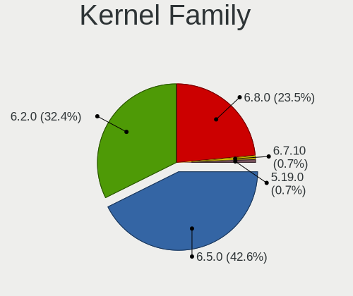

| Version | Desktops | Percent |
|---------|----------|---------|
| 6.2.0   | 34       | 50%     |
| 6.5.0   | 32       | 47.06%  |
| 6.7.10  | 1        | 1.47%   |
| 5.19.0  | 1        | 1.47%   |

Kernel Major Ver.
-----------------

Linux kernel major version

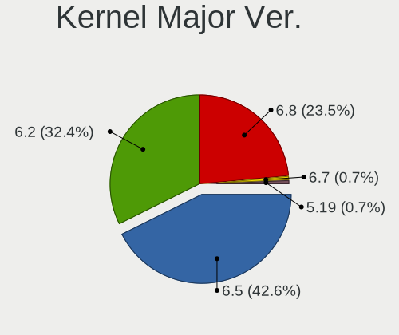

| Version | Desktops | Percent |
|---------|----------|---------|
| 6.2     | 34       | 50%     |
| 6.5     | 32       | 47.06%  |
| 6.7     | 1        | 1.47%   |
| 5.19    | 1        | 1.47%   |

Arch
----

OS architecture (x86_64, i586, etc.)

| Name   | Desktops | Percent |
|--------|----------|---------|
| x86_64 | 66       | 100%    |

DE
--

Desktop Environment

| Name     | Desktops | Percent |
|----------|----------|---------|
| Pantheon | 66       | 100%    |

Display Server
--------------

X11 or Wayland

| Name | Desktops | Percent |
|------|----------|---------|
| X11  | 66       | 100%    |

Display Manager
---------------

SDDM, LightDM, etc.

| Name    | Desktops | Percent |
|---------|----------|---------|
| Unknown | 60       | 90.91%  |
| LightDM | 6        | 9.09%   |

OS Lang
-------

Language

| Lang  | Desktops | Percent |
|-------|----------|---------|
| en_US | 32       | 48.48%  |
| es_ES | 9        | 13.64%  |
| de_DE | 8        | 12.12%  |
| ru_RU | 3        | 4.55%   |
| pl_PL | 3        | 4.55%   |
| hu_HU | 2        | 3.03%   |
| sv_SE | 1        | 1.52%   |
| pt_PT | 1        | 1.52%   |
| pt_BR | 1        | 1.52%   |
| it_IT | 1        | 1.52%   |
| fr_FR | 1        | 1.52%   |
| en_GB | 1        | 1.52%   |
| en_AU | 1        | 1.52%   |
| de_CH | 1        | 1.52%   |
| cs_CZ | 1        | 1.52%   |

Boot Mode
---------

EFI or BIOS

| Mode | Desktops | Percent |
|------|----------|---------|
| BIOS | 65       | 98.48%  |
| EFI  | 1        | 1.52%   |

Filesystem
----------

Type of filesystem

| Type  | Desktops | Percent |
|-------|----------|---------|
| Ext4  | 64       | 95.52%  |
| Btrfs | 2        | 2.99%   |
| Tmpfs | 1        | 1.49%   |

Part. scheme
------------

Scheme of partitioning

| Type    | Desktops | Percent |
|---------|----------|---------|
| Unknown | 60       | 90.91%  |
| MBR     | 3        | 4.55%   |
| GPT     | 3        | 4.55%   |

Dual Boot with Linux/BSD
------------------------

Hosting more than one Linux/BSD

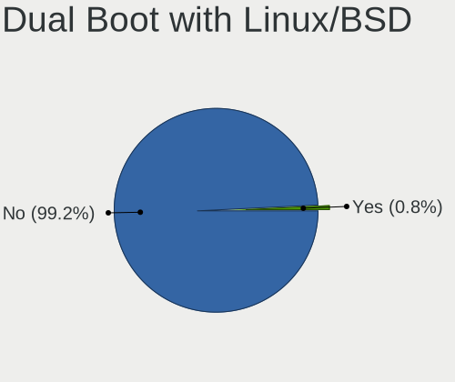

| Dual boot | Desktops | Percent |
|-----------|----------|---------|
| No        | 65       | 98.48%  |
| Yes       | 1        | 1.52%   |

Dual Boot (Win)
---------------

Hosting Linux and Windows

| Dual boot | Desktops | Percent |
|-----------|----------|---------|
| No        | 63       | 95.45%  |
| Yes       | 3        | 4.55%   |

Board
-----

Vendor
------

Motherboard manufacturer

| Name                | Desktops | Percent |
|---------------------|----------|---------|
| ASUSTek Computer    | 19       | 28.79%  |
| Gigabyte Technology | 8        | 12.12%  |
| Dell                | 8        | 12.12%  |
| Hewlett-Packard     | 6        | 9.09%   |
| MSI                 | 4        | 6.06%   |
| ASRock              | 3        | 4.55%   |
| Medion              | 2        | 3.03%   |
| MACHINIST           | 2        | 3.03%   |
| Lenovo              | 2        | 3.03%   |
| Intel               | 2        | 3.03%   |
| Fujitsu             | 2        | 3.03%   |
| ECS                 | 2        | 3.03%   |
| Acer                | 2        | 3.03%   |
| HC Technology.      | 1        | 1.52%   |
| Biostar             | 1        | 1.52%   |
| Apple               | 1        | 1.52%   |
| Unknown             | 1        | 1.52%   |

Model
-----

Motherboard model

| Name                                    | Desktops | Percent |
|-----------------------------------------|----------|---------|
| ASUS PRIME A320M-K                      | 3        | 4.55%   |
| HP ProDesk 600 G1 SFF                   | 2        | 3.03%   |
| ASUS All Series                         | 2        | 3.03%   |
| MSI MS-7D42                             | 1        | 1.52%   |
| MSI MS-7D38                             | 1        | 1.52%   |
| MSI MS-7A63                             | 1        | 1.52%   |
| MSI MS-7756                             | 1        | 1.52%   |
| Medion Z370H4-EM                        | 1        | 1.52%   |
| Medion MS-7797                          | 1        | 1.52%   |
| MACHINIST X79 Z9-D7 V1.2                | 1        | 1.52%   |
| MACHINIST H81M-PRO S1 V2.0              | 1        | 1.52%   |
| Lenovo ThinkCentre Edge91 1895B3G       | 1        | 1.52%   |
| Lenovo IdeaCentre 310S-08ASR 90G90073GE | 1        | 1.52%   |
| Intel X79                               | 1        | 1.52%   |
| Intel Nobilis                           | 1        | 1.52%   |
| HP Z400 Workstation                     | 1        | 1.52%   |
| HP Compaq Elite 8300 SFF                | 1        | 1.52%   |
| HP Compaq dc7800 Small Form Factor      | 1        | 1.52%   |
| HP 285 G3 MT Business PC                | 1        | 1.52%   |
| HC Technology. HCAR5000-MI              | 1        | 1.52%   |
| Gigabyte F2A68HM-S1                     | 1        | 1.52%   |
| Gigabyte EP43-UD3L                      | 1        | 1.52%   |
| Gigabyte B560M DS3H                     | 1        | 1.52%   |
| Gigabyte B550M DS3H                     | 1        | 1.52%   |
| Gigabyte B250M-D2VX-SI                  | 1        | 1.52%   |
| Gigabyte AB350-Gaming 3                 | 1        | 1.52%   |
| Gigabyte A320M-S2H                      | 1        | 1.52%   |
| Gigabyte 945GME-DS2                     | 1        | 1.52%   |
| Fujitsu ESPRIMO Q920                    | 1        | 1.52%   |
| Fujitsu ESPRIMO E720                    | 1        | 1.52%   |
| ECS H110M-C3D/C3V                       | 1        | 1.52%   |
| ECS G41T-M                              | 1        | 1.52%   |
| Dell Precision WorkStation T3500        | 1        | 1.52%   |
| Dell PowerEdge T40                      | 1        | 1.52%   |
| Dell OptiPlex 9020                      | 1        | 1.52%   |
| Dell OptiPlex 790                       | 1        | 1.52%   |
| Dell OptiPlex 7050                      | 1        | 1.52%   |
| Dell OptiPlex 5040                      | 1        | 1.52%   |
| Dell OptiPlex 3060                      | 1        | 1.52%   |
| Dell G5 5000                            | 1        | 1.52%   |

Model Family
------------

Motherboard model prefix

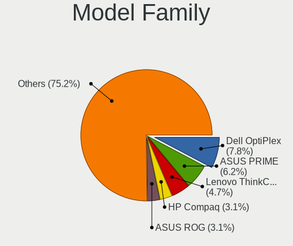

| Name                       | Desktops | Percent |
|----------------------------|----------|---------|
| Dell OptiPlex              | 5        | 7.58%   |
| ASUS PRIME                 | 5        | 7.58%   |
| HP ProDesk                 | 2        | 3.03%   |
| HP Compaq                  | 2        | 3.03%   |
| Fujitsu ESPRIMO            | 2        | 3.03%   |
| ASUS ROG                   | 2        | 3.03%   |
| ASUS P5G41T-M              | 2        | 3.03%   |
| ASUS All                   | 2        | 3.03%   |
| Acer Aspire                | 2        | 3.03%   |
| MSI MS-7D42                | 1        | 1.52%   |
| MSI MS-7D38                | 1        | 1.52%   |
| MSI MS-7A63                | 1        | 1.52%   |
| MSI MS-7756                | 1        | 1.52%   |
| Medion Z370H4-EM           | 1        | 1.52%   |
| Medion MS-7797             | 1        | 1.52%   |
| MACHINIST X79              | 1        | 1.52%   |
| MACHINIST H81M-PRO         | 1        | 1.52%   |
| Lenovo ThinkCentre         | 1        | 1.52%   |
| Lenovo IdeaCentre          | 1        | 1.52%   |
| Intel X79                  | 1        | 1.52%   |
| Intel Nobilis              | 1        | 1.52%   |
| HP Z400                    | 1        | 1.52%   |
| HP 285                     | 1        | 1.52%   |
| HC Technology. HCAR5000-MI | 1        | 1.52%   |
| Gigabyte F2A68HM-S1        | 1        | 1.52%   |
| Gigabyte EP43-UD3L         | 1        | 1.52%   |
| Gigabyte B560M             | 1        | 1.52%   |
| Gigabyte B550M             | 1        | 1.52%   |
| Gigabyte B250M-D2VX-SI     | 1        | 1.52%   |
| Gigabyte AB350-Gaming      | 1        | 1.52%   |
| Gigabyte A320M-S2H         | 1        | 1.52%   |
| Gigabyte 945GME-DS2        | 1        | 1.52%   |
| ECS H110M-C3D              | 1        | 1.52%   |
| ECS G41T-M                 | 1        | 1.52%   |
| Dell Precision             | 1        | 1.52%   |
| Dell PowerEdge             | 1        | 1.52%   |
| Dell G5                    | 1        | 1.52%   |
| Biostar B350GT5            | 1        | 1.52%   |
| ASUS TUF                   | 1        | 1.52%   |
| ASUS P8Z68-V               | 1        | 1.52%   |

MFG Year
--------

Motherboard manufacture year

| Year | Desktops | Percent |
|------|----------|---------|
| 2018 | 9        | 13.64%  |
| 2021 | 7        | 10.61%  |
| 2017 | 6        | 9.09%   |
| 2010 | 6        | 9.09%   |
| 2012 | 5        | 7.58%   |
| 2014 | 4        | 6.06%   |
| 2013 | 4        | 6.06%   |
| 2011 | 4        | 6.06%   |
| 2009 | 4        | 6.06%   |
| 2022 | 3        | 4.55%   |
| 2020 | 3        | 4.55%   |
| 2019 | 3        | 4.55%   |
| 2016 | 3        | 4.55%   |
| 2007 | 3        | 4.55%   |
| 2015 | 2        | 3.03%   |

Form Factor
-----------

Physical design of the computer

| Name    | Desktops | Percent |
|---------|----------|---------|
| Desktop | 66       | 100%    |

Secure Boot
-----------

Enabled or disabled

| State    | Desktops | Percent |
|----------|----------|---------|
| Disabled | 65       | 98.48%  |
| Enabled  | 1        | 1.52%   |

Coreboot
--------

Have coreboot on board

| Used | Desktops | Percent |
|------|----------|---------|
| No   | 66       | 100%    |

RAM Size
--------

Total RAM memory

| Size in GB  | Desktops | Percent |
|-------------|----------|---------|
| 16.01-24.0  | 24       | 35.29%  |
| 4.01-8.0    | 14       | 20.59%  |
| 8.01-16.0   | 11       | 16.18%  |
| 32.01-64.0  | 9        | 13.24%  |
| 3.01-4.0    | 6        | 8.82%   |
| 1.01-2.0    | 2        | 2.94%   |
| 24.01-32.0  | 1        | 1.47%   |
| 64.01-256.0 | 1        | 1.47%   |

RAM Used
--------

Used RAM memory

| Used GB   | Desktops | Percent |
|-----------|----------|---------|
| 1.01-2.0  | 23       | 31.51%  |
| 2.01-3.0  | 21       | 28.77%  |
| 4.01-8.0  | 15       | 20.55%  |
| 3.01-4.0  | 11       | 15.07%  |
| 8.01-16.0 | 2        | 2.74%   |
| 0.51-1.0  | 1        | 1.37%   |

Total Drives
------------

Number of drives on board

| Drives | Desktops | Percent |
|--------|----------|---------|
| 2      | 32       | 47.06%  |
| 1      | 21       | 30.88%  |
| 3      | 13       | 19.12%  |
| 6      | 2        | 2.94%   |

Has CD-ROM
----------

Has CD-ROM on board

| Presented | Desktops | Percent |
|-----------|----------|---------|
| No        | 37       | 55.22%  |
| Yes       | 30       | 44.78%  |

Has Ethernet
------------

Has Ethernet on board

| Presented | Desktops | Percent |
|-----------|----------|---------|
| Yes       | 64       | 96.97%  |
| No        | 2        | 3.03%   |

Has WiFi
--------

Has WiFi module

| Presented | Desktops | Percent |
|-----------|----------|---------|
| Yes       | 35       | 52.24%  |
| No        | 32       | 47.76%  |

Has Bluetooth
-------------

Has Bluetooth module

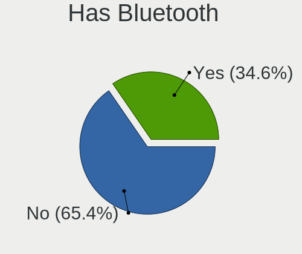

| Presented | Desktops | Percent |
|-----------|----------|---------|
| No        | 42       | 62.69%  |
| Yes       | 25       | 37.31%  |

Location
--------

Country
-------

Geographic location (country)

| Country                | Desktops | Percent |
|------------------------|----------|---------|
| USA                    | 11       | 16.42%  |
| Germany                | 5        | 7.46%   |
| Spain                  | 4        | 5.97%   |
| Russia                 | 4        | 5.97%   |
| Poland                 | 4        | 5.97%   |
| UK                     | 3        | 4.48%   |
| Mexico                 | 3        | 4.48%   |
| Austria                | 3        | 4.48%   |
| Argentina              | 3        | 4.48%   |
| Israel                 | 2        | 2.99%   |
| Hungary                | 2        | 2.99%   |
| Czechia                | 2        | 2.99%   |
| Canada                 | 2        | 2.99%   |
| Brazil                 | 2        | 2.99%   |
| Bosnia and Herzegovina | 2        | 2.99%   |
| UAE                    | 1        | 1.49%   |
| Sweden                 | 1        | 1.49%   |
| Portugal               | 1        | 1.49%   |
| Philippines            | 1        | 1.49%   |
| Paraguay               | 1        | 1.49%   |
| Pakistan               | 1        | 1.49%   |
| Netherlands            | 1        | 1.49%   |
| Morocco                | 1        | 1.49%   |
| Malaysia               | 1        | 1.49%   |
| Italy                  | 1        | 1.49%   |
| Indonesia              | 1        | 1.49%   |
| Greece                 | 1        | 1.49%   |
| Denmark                | 1        | 1.49%   |
| Belgium                | 1        | 1.49%   |
| Australia              | 1        | 1.49%   |

City
----

Geographic location (city)

| City                  | Desktops | Percent |
|-----------------------|----------|---------|
| Moscow                | 3        | 4.35%   |
| Warsaw                | 2        | 2.9%    |
| Sarajevo              | 2        | 2.9%    |
| Petah Tikva           | 2        | 2.9%    |
| Los Angeles           | 2        | 2.9%    |
| Zapopan               | 1        | 1.45%   |
| Zamora                | 1        | 1.45%   |
| Victoria              | 1        | 1.45%   |
| Van Vleck             | 1        | 1.45%   |
| Uppsala               | 1        | 1.45%   |
| Ummendorf             | 1        | 1.45%   |
| Toronto               | 1        | 1.45%   |
| Tahitotfalu           | 1        | 1.45%   |
| Spokane               | 1        | 1.45%   |
| Siegburg              | 1        | 1.45%   |
| Seattle               | 1        | 1.45%   |
| Sao Bernardo do Campo | 1        | 1.45%   |
| Rome                  | 1        | 1.45%   |
| Rio Grande            | 1        | 1.45%   |
| Resistencia           | 1        | 1.45%   |
| Redding               | 1        | 1.45%   |
| Prague                | 1        | 1.45%   |
| Ponte de Lima         | 1        | 1.45%   |
| Polomolok             | 1        | 1.45%   |
| Nivelles              | 1        | 1.45%   |
| Niterói              | 1        | 1.45%   |
| New Egypt             | 1        | 1.45%   |
| Nagykanizsa           | 1        | 1.45%   |
| Naaldwijk             | 1        | 1.45%   |
| Munich                | 1        | 1.45%   |
| Mikhaylovsk           | 1        | 1.45%   |
| Mérida               | 1        | 1.45%   |
| Melbourne             | 1        | 1.45%   |
| Malang                | 1        | 1.45%   |
| Madrid                | 1        | 1.45%   |
| Loxstedt              | 1        | 1.45%   |
| London                | 1        | 1.45%   |
| Lanus                 | 1        | 1.45%   |
| Kuala Lumpur          | 1        | 1.45%   |
| Krakow                | 1        | 1.45%   |

Drives
------

Drive Vendor
------------

Hard drive vendors

| Vendor                       | Desktops | Drives | Percent |
|------------------------------|----------|--------|---------|
| WDC                          | 22       | 27     | 18.49%  |
| Seagate                      | 19       | 21     | 15.97%  |
| Samsung Electronics          | 13       | 19     | 10.92%  |
| Kingston                     | 7        | 10     | 5.88%   |
| SanDisk                      | 6        | 6      | 5.04%   |
| Crucial                      | 5        | 6      | 4.2%    |
| China                        | 5        | 8      | 4.2%    |
| Toshiba                      | 4        | 5      | 3.36%   |
| Intel                        | 3        | 5      | 2.52%   |
| Transcend                    | 2        | 2      | 1.68%   |
| SK hynix                     | 2        | 2      | 1.68%   |
| Patriot                      | 2        | 3      | 1.68%   |
| Micron/Crucial Technology    | 2        | 3      | 1.68%   |
| MAXIO Technology (Hangzhou)  | 2        | 3      | 1.68%   |
| Hitachi                      | 2        | 2      | 1.68%   |
| HGST                         | 2        | 2      | 1.68%   |
| Gigabyte Technology          | 2        | 2      | 1.68%   |
| XrayDisk                     | 1        | 1      | 0.84%   |
| SPCC                         | 1        | 1      | 0.84%   |
| Silicon Motion               | 1        | 1      | 0.84%   |
| Shenzhen Longsys Electronics | 1        | 1      | 0.84%   |
| Plextor                      | 1        | 1      | 0.84%   |
| OCZ-VERTEX2                  | 1        | 1      | 0.84%   |
| Netac                        | 1        | 1      | 0.84%   |
| Micron Technology            | 1        | 1      | 0.84%   |
| Maxtor                       | 1        | 1      | 0.84%   |
| KIOXIA-EXCERIA               | 1        | 2      | 0.84%   |
| KingSpec                     | 1        | 1      | 0.84%   |
| KingFast                     | 1        | 1      | 0.84%   |
| Intenso                      | 1        | 2      | 0.84%   |
| FSPEED                       | 1        | 2      | 0.84%   |
| FC-1307                      | 1        | 1      | 0.84%   |
| ETOPSO                       | 1        | 1      | 0.84%   |
| AGI                          | 1        | 1      | 0.84%   |
| A-DATA Technology            | 1        | 1      | 0.84%   |
| Unknown                      | 1        | 1      | 0.84%   |

Drive Model
-----------

Hard drive models

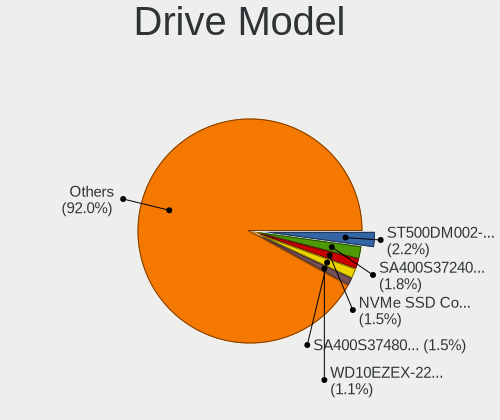

| Model                                              | Desktops | Percent |
|----------------------------------------------------|----------|---------|
| Seagate ST500DM002-1BD142 500GB                    | 3        | 2.33%   |
| Samsung NVMe SSD Controller SM981/PM981/PM983 1TB  | 3        | 2.33%   |
| Kingston SA400S37240G 240GB SSD                    | 3        | 2.33%   |
| WDC WD3200AAJS-00L7A0 320GB                        | 2        | 1.55%   |
| WDC WD10EZEX-60WN4A0 1TB                           | 2        | 1.55%   |
| Toshiba DT01ACA050 500GB                           | 2        | 1.55%   |
| Seagate ST3000DM008-2DM166 3TB                     | 2        | 1.55%   |
| Samsung NVMe SSD Controller PM9A1/PM9A3/980PRO 1TB | 2        | 1.55%   |
| MAXIO (Hangzhou) NVMe SSD Controller MAP1202 256GB | 2        | 1.55%   |
| Gigabyte GP-GSTFS31120GNTD 120GB SSD               | 2        | 1.55%   |
| Crucial CT240BX500SSD1 240GB                       | 2        | 1.55%   |
| China SSD 128GB                                    | 2        | 1.55%   |
| XrayDisk 512GB SSD                                 | 1        | 0.78%   |
| WDC WDS200T2B0A-00SM50 2TB SSD                     | 1        | 0.78%   |
| WDC WDBNCE5000PNC 500GB SSD                        | 1        | 0.78%   |
| WDC WD800JD-00MSA1 80GB                            | 1        | 0.78%   |
| WDC WD7502AAEX-00Y9A0 752GB                        | 1        | 0.78%   |
| WDC WD5003ABYX-01WERA2 500GB                       | 1        | 0.78%   |
| WDC WD5000AZRX-00A8LB0 500GB                       | 1        | 0.78%   |
| WDC WD5000AAKX-75U6AA0 500GB                       | 1        | 0.78%   |
| WDC WD5000AAKX-22ERMA0 500GB                       | 1        | 0.78%   |
| WDC WD50 00AZLX-60K2TA0 500GB                      | 1        | 0.78%   |
| WDC WD20EZRZ-22Z5HB0 2TB                           | 1        | 0.78%   |
| WDC WD20EZRZ-00Z5HB0 2TB                           | 1        | 0.78%   |
| WDC WD20EZRX-00D8PB0 2TB                           | 1        | 0.78%   |
| WDC WD1600AAJS-60M0A0 160GB                        | 1        | 0.78%   |
| WDC WD10JPVX-22JC3T0 1TB                           | 1        | 0.78%   |
| WDC WD10EZEX-75WN4A1 1TB                           | 1        | 0.78%   |
| WDC WD10EZEX-22MFCA0 1TB                           | 1        | 0.78%   |
| WDC WD10EZEX-21M2NA0 1TB                           | 1        | 0.78%   |
| WDC WD10EZEX-08WN4A0 1TB                           | 1        | 0.78%   |
| WDC WD1002FAEX-00Z3A0 1TB                          | 1        | 0.78%   |
| WDC WD1001FALS-41Y6A1 1TB                          | 1        | 0.78%   |
| Transcend TS500GSSD220Q 500GB                      | 1        | 0.78%   |
| Transcend TS128GSSD320 128GB                       | 1        | 0.78%   |
| Toshiba HDWD110 1TB                                | 1        | 0.78%   |
| Toshiba DT01ACA300 3TB                             | 1        | 0.78%   |
| SPCC Solid State Disk 256GB                        | 1        | 0.78%   |
| SK hynix SC311 SATA 128GB SSD                      | 1        | 0.78%   |
| SK hynix PC611 NVMe 1TB                            | 1        | 0.78%   |

HDD Vendor
----------

Hard disk drive vendors

| Vendor              | Desktops | Drives | Percent |
|---------------------|----------|--------|---------|
| WDC                 | 20       | 25     | 39.22%  |
| Seagate             | 19       | 21     | 37.25%  |
| Toshiba             | 4        | 5      | 7.84%   |
| Samsung Electronics | 2        | 3      | 3.92%   |
| Hitachi             | 2        | 2      | 3.92%   |
| HGST                | 2        | 2      | 3.92%   |
| Maxtor              | 1        | 1      | 1.96%   |
| FC-1307             | 1        | 1      | 1.96%   |

SSD Vendor
----------

Solid state drive vendors

| Vendor              | Desktops | Drives | Percent |
|---------------------|----------|--------|---------|
| Kingston            | 7        | 10     | 14.58%  |
| Samsung Electronics | 5        | 8      | 10.42%  |
| Crucial             | 5        | 6      | 10.42%  |
| China               | 5        | 8      | 10.42%  |
| SanDisk             | 3        | 3      | 6.25%   |
| WDC                 | 2        | 2      | 4.17%   |
| Transcend           | 2        | 2      | 4.17%   |
| Patriot             | 2        | 3      | 4.17%   |
| Intel               | 2        | 4      | 4.17%   |
| Gigabyte Technology | 2        | 2      | 4.17%   |
| XrayDisk            | 1        | 1      | 2.08%   |
| SPCC                | 1        | 1      | 2.08%   |
| SK hynix            | 1        | 1      | 2.08%   |
| Plextor             | 1        | 1      | 2.08%   |
| OCZ-VERTEX2         | 1        | 1      | 2.08%   |
| Netac               | 1        | 1      | 2.08%   |
| Micron Technology   | 1        | 1      | 2.08%   |
| KIOXIA-EXCERIA      | 1        | 2      | 2.08%   |
| KingSpec            | 1        | 1      | 2.08%   |
| Intenso             | 1        | 2      | 2.08%   |
| ETOPSO              | 1        | 1      | 2.08%   |
| AGI                 | 1        | 1      | 2.08%   |
| A-DATA Technology   | 1        | 1      | 2.08%   |

Drive Kind
----------

HDD or SSD

| Kind    | Desktops | Drives | Percent |
|---------|----------|--------|---------|
| HDD     | 43       | 60     | 41.75%  |
| SSD     | 41       | 63     | 39.81%  |
| NVMe    | 16       | 21     | 15.53%  |
| Unknown | 3        | 4      | 2.91%   |

Drive Connector
---------------

SATA, SAS, NVMe, etc.

| Type | Desktops | Drives | Percent |
|------|----------|--------|---------|
| SATA | 62       | 125    | 77.5%   |
| NVMe | 16       | 21     | 20%     |
| SAS  | 2        | 2      | 2.5%    |

Drive Size
----------

Size of hard drive

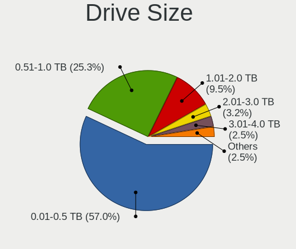

| Size in TB | Desktops | Drives | Percent |
|------------|----------|--------|---------|
| 0.01-0.5   | 46       | 79     | 56.79%  |
| 0.51-1.0   | 20       | 25     | 24.69%  |
| 1.01-2.0   | 11       | 15     | 13.58%  |
| 2.01-3.0   | 3        | 3      | 3.7%    |
| 3.01-4.0   | 1        | 1      | 1.23%   |

Space Total
-----------

Amount of disk space available on the file system

| Size in GB     | Desktops | Percent |
|----------------|----------|---------|
| 101-250        | 21       | 30%     |
| 251-500        | 15       | 21.43%  |
| 501-1000       | 13       | 18.57%  |
| 1001-2000      | 9        | 12.86%  |
| 51-100         | 5        | 7.14%   |
| 2001-3000      | 4        | 5.71%   |
| More than 3000 | 1        | 1.43%   |
| 21-50          | 1        | 1.43%   |
| 1-20           | 1        | 1.43%   |

Space Used
----------

Amount of used disk space

| Used GB   | Desktops | Percent |
|-----------|----------|---------|
| 1-20      | 28       | 40%     |
| 21-50     | 16       | 22.86%  |
| 501-1000  | 6        | 8.57%   |
| 251-500   | 5        | 7.14%   |
| 101-250   | 5        | 7.14%   |
| 1001-2000 | 5        | 7.14%   |
| 51-100    | 5        | 7.14%   |

Malfunc. Drives
---------------

Drive models with a malfunction

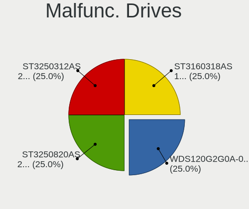

| Model                     | Desktops | Drives | Percent |
|---------------------------|----------|--------|---------|
| Seagate ST3250312AS 250GB | 1        | 1      | 50%     |
| Seagate ST3160318AS 160GB | 1        | 1      | 50%     |

Malfunc. Drive Vendor
---------------------

Vendors of faulty drives

| Vendor  | Desktops | Drives | Percent |
|---------|----------|--------|---------|
| Seagate | 2        | 2      | 100%    |

Malfunc. HDD Vendor
-------------------

Vendors of faulty HDD drives

| Vendor  | Desktops | Drives | Percent |
|---------|----------|--------|---------|
| Seagate | 2        | 2      | 100%    |

Malfunc. Drive Kind
-------------------

Kinds of faulty drives

| Kind | Desktops | Drives | Percent |
|------|----------|--------|---------|
| HDD  | 2        | 2      | 100%    |

Failed Drives
-------------

Failed drive models

Zero info for selected period =(

Failed Drive Vendor
-------------------

Failed drive vendors

Zero info for selected period =(

Drive Status
------------

Number of failed and malfunc. drives

| Status   | Desktops | Drives | Percent |
|----------|----------|--------|---------|
| Detected | 61       | 137    | 89.71%  |
| Works    | 5        | 9      | 7.35%   |
| Malfunc  | 2        | 2      | 2.94%   |

Storage controller
------------------

Storage Vendor
--------------

Storage controller vendors

| Vendor                       | Desktops | Percent |
|------------------------------|----------|---------|
| Intel                        | 51       | 58.62%  |
| AMD                          | 15       | 17.24%  |
| Samsung Electronics          | 7        | 8.05%   |
| SanDisk                      | 3        | 3.45%   |
| Micron/Crucial Technology    | 2        | 2.3%    |
| MAXIO Technology (Hangzhou)  | 2        | 2.3%    |
| JMicron Technology           | 2        | 2.3%    |
| SK hynix                     | 1        | 1.15%   |
| Silicon Motion               | 1        | 1.15%   |
| Shenzhen Longsys Electronics | 1        | 1.15%   |
| Marvell Technology Group     | 1        | 1.15%   |
| ASMedia Technology           | 1        | 1.15%   |

Storage Model
-------------

Storage controller models

| Model                                                                          | Desktops | Percent |
|--------------------------------------------------------------------------------|----------|---------|
| AMD FCH SATA Controller [AHCI mode]                                            | 10       | 9.35%   |
| Intel 8 Series/C220 Series Chipset Family 6-port SATA Controller 1 [AHCI mode] | 6        | 5.61%   |
| Intel SATA Controller [RAID mode]                                              | 5        | 4.67%   |
| Intel NM10/ICH7 Family SATA Controller [IDE mode]                              | 5        | 4.67%   |
| Intel 6 Series/C200 Series Chipset Family 6 port Desktop SATA AHCI Controller  | 5        | 4.67%   |
| Intel Q170/Q150/B150/H170/H110/Z170/CM236 Chipset SATA Controller [AHCI Mode]  | 4        | 3.74%   |
| Intel 82801G (ICH7 Family) IDE Controller                                      | 4        | 3.74%   |
| Intel 7 Series/C210 Series Chipset Family 6-port SATA Controller [AHCI mode]   | 4        | 3.74%   |
| AMD FCH SATA Controller D                                                      | 4        | 3.74%   |
| Samsung NVMe SSD Controller SM981/PM981/PM983                                  | 3        | 2.8%    |
| Intel 500 Series Chipset Family SATA AHCI Controller                           | 3        | 2.8%    |
| Intel 200 Series PCH SATA controller [AHCI mode]                               | 3        | 2.8%    |
| AMD 300 Series Chipset SATA Controller                                         | 3        | 2.8%    |
| Samsung NVMe SSD Controller PM9A1/PM9A3/980PRO                                 | 2        | 1.87%   |
| Micron/Crucial P5 Plus NVMe PCIe SSD                                           | 2        | 1.87%   |
| MAXIO (Hangzhou) NVMe SSD Controller MAP1202 (DRAM-less)                       | 2        | 1.87%   |
| JMicron JMB368 IDE controller                                                  | 2        | 1.87%   |
| Intel Cannon Lake PCH SATA AHCI Controller                                     | 2        | 1.87%   |
| Intel 82801JI (ICH10 Family) 4 port SATA IDE Controller #1                     | 2        | 1.87%   |
| Intel 82801JI (ICH10 Family) 2 port SATA IDE Controller #2                     | 2        | 1.87%   |
| Intel 7 Series/C210 Series Chipset Family 4-port SATA Controller [IDE mode]    | 2        | 1.87%   |
| Intel 7 Series/C210 Series Chipset Family 2-port SATA Controller [IDE mode]    | 2        | 1.87%   |
| SK hynix PC611 NVMe Solid State Drive                                          | 1        | 0.93%   |
| Silicon Motion SM2263EN/SM2263XT (DRAM-less) NVMe SSD Controllers              | 1        | 0.93%   |
| Shenzhen Longsys SM2263EN/SM2263XT-based OEM NVME SSD (DRAM-less)              | 1        | 0.93%   |
| SanDisk WD Black SN770 / PC SN740 256GB / PC SN560 (DRAM-less) NVMe SSD        | 1        | 0.93%   |
| SanDisk Ultra 3D / WD Blue SN570 NVMe SSD (DRAM-less)                          | 1        | 0.93%   |
| SanDisk Extreme Pro / WD Black 2018/SN750/PC SN720 NVMe SSD                    | 1        | 0.93%   |
| Samsung NVMe SSD Controller SM951/PM951                                        | 1        | 0.93%   |
| Samsung NVMe SSD Controller 980 (DRAM-less)                                    | 1        | 0.93%   |
| Marvell Group 88SE9172 SATA III 6Gb/s RAID Controller                          | 1        | 0.93%   |
| Intel SSD 660P Series                                                          | 1        | 0.93%   |
| Intel Comet Lake SATA AHCI Controller                                          | 1        | 0.93%   |
| Intel Celeron/Pentium Silver Processor SATA Controller                         | 1        | 0.93%   |
| Intel C600/X79 series chipset 6-Port SATA AHCI Controller                      | 1        | 0.93%   |
| Intel Alder Lake-S PCH SATA Controller [AHCI Mode]                             | 1        | 0.93%   |
| Intel 9 Series Chipset Family SATA Controller [AHCI Mode]                      | 1        | 0.93%   |
| Intel 82Q35 Express PT IDER Controller                                         | 1        | 0.93%   |
| Intel 82801JI (ICH10 Family) SATA AHCI Controller                              | 1        | 0.93%   |
| Intel 82801IR/IO/IH (ICH9R/DO/DH) 4 port SATA Controller [IDE mode]            | 1        | 0.93%   |

Storage Kind
------------

Kind of storage controller (IDE, SATA, NVMe, SAS, ...)

| Kind | Desktops | Percent |
|------|----------|---------|
| SATA | 49       | 58.33%  |
| NVMe | 16       | 19.05%  |
| IDE  | 13       | 15.48%  |
| RAID | 6        | 7.14%   |

Processor
---------

CPU Vendor
----------

Processor vendors

| Vendor | Desktops | Percent |
|--------|----------|---------|
| Intel  | 51       | 77.27%  |
| AMD    | 15       | 22.73%  |

CPU Model
---------

Processor models

| Model                                       | Desktops | Percent |
|---------------------------------------------|----------|---------|
| Intel Core i5-2400 CPU @ 3.10GHz            | 3        | 4.55%   |
| Intel Core i5-4590 CPU @ 3.30GHz            | 2        | 3.03%   |
| Intel Core i5-3470 CPU @ 3.20GHz            | 2        | 3.03%   |
| Intel Core 2 Quad CPU Q6600 @ 2.40GHz       | 2        | 3.03%   |
| AMD Ryzen 3 2200G with Radeon Vega Graphics | 2        | 3.03%   |
| Intel Xeon E-2224G CPU @ 3.50GHz            | 1        | 1.52%   |
| Intel Xeon CPU X5670 @ 2.93GHz              | 1        | 1.52%   |
| Intel Xeon CPU W3540 @ 2.93GHz              | 1        | 1.52%   |
| Intel Xeon CPU W3520 @ 2.67GHz              | 1        | 1.52%   |
| Intel Xeon CPU E5-2650 v2 @ 2.60GHz         | 1        | 1.52%   |
| Intel Xeon CPU E5-2643 0 @ 3.30GHz          | 1        | 1.52%   |
| Intel Xeon CPU E3-1220 v5 @ 3.00GHz         | 1        | 1.52%   |
| Intel Pentium Dual-Core CPU E5700 @ 3.00GHz | 1        | 1.52%   |
| Intel Pentium Dual-Core CPU E5400 @ 2.70GHz | 1        | 1.52%   |
| Intel Pentium Dual CPU E2160 @ 1.80GHz      | 1        | 1.52%   |
| Intel Pentium CPU G4400 @ 3.30GHz           | 1        | 1.52%   |
| Intel Core i7-8700K CPU @ 3.70GHz           | 1        | 1.52%   |
| Intel Core i7-7700 CPU @ 3.60GHz            | 1        | 1.52%   |
| Intel Core i7-6700K CPU @ 4.00GHz           | 1        | 1.52%   |
| Intel Core i7-6700 CPU @ 3.40GHz            | 1        | 1.52%   |
| Intel Core i7-4790K CPU @ 4.00GHz           | 1        | 1.52%   |
| Intel Core i7-4770 CPU @ 3.40GHz            | 1        | 1.52%   |
| Intel Core i7-3770S CPU @ 3.10GHz           | 1        | 1.52%   |
| Intel Core i7-2600 CPU @ 3.40GHz            | 1        | 1.52%   |
| Intel Core i7-10700F CPU @ 2.90GHz          | 1        | 1.52%   |
| Intel Core i7-10700 CPU @ 2.90GHz           | 1        | 1.52%   |
| Intel Core i5-8400 CPU @ 2.80GHz            | 1        | 1.52%   |
| Intel Core i5-4670 CPU @ 3.40GHz            | 1        | 1.52%   |
| Intel Core i5-4590T CPU @ 2.00GHz           | 1        | 1.52%   |
| Intel Core i5-4570 CPU @ 3.20GHz            | 1        | 1.52%   |
| Intel Core i5-3450 CPU @ 3.10GHz            | 1        | 1.52%   |
| Intel Core i5-2300 CPU @ 2.80GHz            | 1        | 1.52%   |
| Intel Core i3-8100T CPU @ 3.10GHz           | 1        | 1.52%   |
| Intel Core i3-8100 CPU @ 3.60GHz            | 1        | 1.52%   |
| Intel Core i3-6100T CPU @ 3.20GHz           | 1        | 1.52%   |
| Intel Core i3-6100 CPU @ 3.70GHz            | 1        | 1.52%   |
| Intel Core i3-4170 CPU @ 3.70GHz            | 1        | 1.52%   |
| Intel Core i3-3220 CPU @ 3.30GHz            | 1        | 1.52%   |
| Intel Core i3-10100 CPU @ 3.60GHz           | 1        | 1.52%   |
| Intel Core i3 CPU 530 @ 2.93GHz             | 1        | 1.52%   |

CPU Model Family
----------------

Processor model prefix

| Model                   | Desktops | Percent |
|-------------------------|----------|---------|
| Intel Core i5           | 13       | 19.7%   |
| Intel Core i7           | 10       | 15.15%  |
| Intel Core i3           | 8        | 12.12%  |
| Intel Xeon              | 7        | 10.61%  |
| AMD Ryzen 5             | 5        | 7.58%   |
| Other                   | 4        | 6.06%   |
| Intel Core 2 Quad       | 3        | 4.55%   |
| AMD Ryzen 3             | 3        | 4.55%   |
| Intel Pentium Dual-Core | 2        | 3.03%   |
| AMD Ryzen 9             | 2        | 3.03%   |
| Intel Pentium Dual      | 1        | 1.52%   |
| Intel Pentium           | 1        | 1.52%   |
| Intel Core 2 Duo        | 1        | 1.52%   |
| Intel Core 2            | 1        | 1.52%   |
| Intel Celeron           | 1        | 1.52%   |
| AMD Ryzen 7             | 1        | 1.52%   |
| AMD PRO A8              | 1        | 1.52%   |
| AMD Phenom II X4        | 1        | 1.52%   |
| AMD A6                  | 1        | 1.52%   |

CPU Cores
---------

Number of processor cores

| Number | Desktops | Percent |
|--------|----------|---------|
| 4      | 37       | 56.06%  |
| 2      | 13       | 19.7%   |
| 6      | 7        | 10.61%  |
| 8      | 5        | 7.58%   |
| 12     | 2        | 3.03%   |
| 16     | 1        | 1.52%   |
| 1      | 1        | 1.52%   |

CPU Sockets
-----------

Number of sockets

| Number | Desktops | Percent |
|--------|----------|---------|
| 1      | 65       | 98.48%  |
| 2      | 1        | 1.52%   |

CPU Threads
-----------

Threads per core (Hyper-Threading)

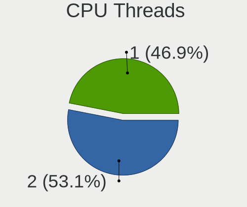

| Number | Desktops | Percent |
|--------|----------|---------|
| 1      | 35       | 53.03%  |
| 2      | 31       | 46.97%  |

CPU Op-Modes
------------

CPU Operation Modes (32-bit, 64-bit)

| Op mode        | Desktops | Percent |
|----------------|----------|---------|
| 32-bit, 64-bit | 66       | 100%    |

CPU Microcode
-------------

Microcode number

| Number     | Desktops | Percent |
|------------|----------|---------|
| Unknown    | 64       | 96.97%  |
| 0x306a9    | 1        | 1.52%   |
| 0x06006704 | 1        | 1.52%   |

CPU Microarch
-------------

Microarchitecture

| Name          | Desktops | Percent |
|---------------|----------|---------|
| Haswell       | 8        | 12.12%  |
| Skylake       | 6        | 9.09%   |
| SandyBridge   | 6        | 9.09%   |
| KabyLake      | 6        | 9.09%   |
| IvyBridge     | 6        | 9.09%   |
| Zen+          | 4        | 6.06%   |
| Penryn        | 4        | 6.06%   |
| Core          | 4        | 6.06%   |
| Unknown       | 4        | 6.06%   |
| Zen 3         | 3        | 4.55%   |
| CometLake     | 3        | 4.55%   |
| Zen           | 2        | 3.03%   |
| Westmere      | 2        | 3.03%   |
| Nehalem       | 2        | 3.03%   |
| Excavator     | 2        | 3.03%   |
| Zen 2         | 1        | 1.52%   |
| Piledriver    | 1        | 1.52%   |
| K10           | 1        | 1.52%   |
| Goldmont plus | 1        | 1.52%   |

Graphics
--------

GPU Vendor
----------

Vendors of graphics cards

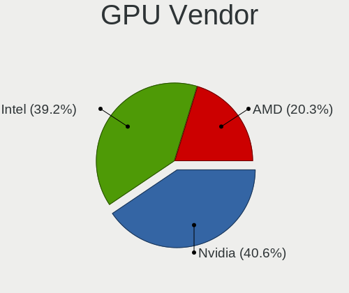

| Vendor | Desktops | Percent |
|--------|----------|---------|
| Nvidia | 32       | 45.71%  |
| Intel  | 22       | 31.43%  |
| AMD    | 16       | 22.86%  |

GPU Model
---------

Graphics card models

| Model                                                                       | Desktops | Percent |
|-----------------------------------------------------------------------------|----------|---------|
| Intel Xeon E3-1200 v3/4th Gen Core Processor Integrated Graphics Controller | 5        | 6.94%   |
| Nvidia GK208B [GeForce GT 710]                                              | 3        | 4.17%   |
| Nvidia GK107 [GeForce GTX 650]                                              | 3        | 4.17%   |
| Intel HD Graphics 530                                                       | 3        | 4.17%   |
| Intel 2nd Generation Core Processor Family Integrated Graphics Controller   | 3        | 4.17%   |
| Nvidia GP107 [GeForce GTX 1050 Ti]                                          | 2        | 2.78%   |
| Nvidia GP104 [GeForce GTX 1070]                                             | 2        | 2.78%   |
| Nvidia GM204 [GeForce GTX 970]                                              | 2        | 2.78%   |
| Nvidia GK208B [GeForce GT 730]                                              | 2        | 2.78%   |
| Intel CometLake-S GT2 [UHD Graphics 630]                                    | 2        | 2.78%   |
| Intel CoffeeLake-S GT2 [UHD Graphics 630]                                   | 2        | 2.78%   |
| Intel 4 Series Chipset Integrated Graphics Controller                       | 2        | 2.78%   |
| AMD Vega 10 XL/XT [Radeon RX Vega 56/64]                                    | 2        | 2.78%   |
| AMD Ellesmere [Radeon RX 470/480/570/570X/580/580X/590]                     | 2        | 2.78%   |
| Nvidia TU117 [GeForce GTX 1650]                                             | 1        | 1.39%   |
| Nvidia TU116 [GeForce GTX 1660 SUPER]                                       | 1        | 1.39%   |
| Nvidia TU104 [GeForce RTX 2070 SUPER]                                       | 1        | 1.39%   |
| Nvidia GT218 [GeForce 310]                                                  | 1        | 1.39%   |
| Nvidia GT218 [GeForce 210]                                                  | 1        | 1.39%   |
| Nvidia GP108 [GeForce GT 1030]                                              | 1        | 1.39%   |
| Nvidia GP106 [GeForce GTX 1060 6GB]                                         | 1        | 1.39%   |
| Nvidia GP106 [GeForce GTX 1060 3GB]                                         | 1        | 1.39%   |
| Nvidia GP104 [GeForce GTX 1070 Ti]                                          | 1        | 1.39%   |
| Nvidia GM206 [GeForce GTX 960]                                              | 1        | 1.39%   |
| Nvidia GK106 [GeForce GTX 650 OEM]                                          | 1        | 1.39%   |
| Nvidia GF119 [GeForce GT 610]                                               | 1        | 1.39%   |
| Nvidia GF116 [GeForce GTX 550 Ti]                                           | 1        | 1.39%   |
| Nvidia GF110 [GeForce GTX 580]                                              | 1        | 1.39%   |
| Nvidia GA106 [Geforce RTX 3050]                                             | 1        | 1.39%   |
| Nvidia GA104 [GeForce RTX 3060 Ti]                                          | 1        | 1.39%   |
| Nvidia GA102 [GeForce RTX 3090]                                             | 1        | 1.39%   |
| Nvidia G98 [Quadro NVS 295]                                                 | 1        | 1.39%   |
| Nvidia G84 [GeForce 8600 GT]                                                | 1        | 1.39%   |
| Intel HD Graphics 630                                                       | 1        | 1.39%   |
| Intel HD Graphics 510                                                       | 1        | 1.39%   |
| Intel GeminiLake [UHD Graphics 600]                                         | 1        | 1.39%   |
| Intel CoffeeLake-S GT2 [UHD Graphics P630]                                  | 1        | 1.39%   |
| Intel 82Q35 Express Integrated Graphics Controller                          | 1        | 1.39%   |
| AMD Wani [Radeon R5/R6/R7 Graphics]                                         | 1        | 1.39%   |
| AMD Tahiti XT [Radeon HD 7970/8970 OEM / R9 280X]                           | 1        | 1.39%   |

GPU Combo
---------

Combinations of graphics cards

| Name           | Desktops | Percent |
|----------------|----------|---------|
| 1 x Nvidia     | 30       | 44.78%  |
| 1 x Intel      | 19       | 28.36%  |
| 1 x AMD        | 15       | 22.39%  |
| Intel + Nvidia | 2        | 2.99%   |
| 2 x AMD        | 1        | 1.49%   |

GPU Driver
----------

Free vs proprietary

| Driver      | Desktops | Percent |
|-------------|----------|---------|
| Free        | 57       | 85.07%  |
| Proprietary | 5        | 7.46%   |
| Unknown     | 5        | 7.46%   |

GPU Memory
----------

Total video memory

| Size in GB | Desktops | Percent |
|------------|----------|---------|
| Unknown    | 58       | 87.88%  |
| 3.01-4.0   | 4        | 6.06%   |
| 7.01-8.0   | 2        | 3.03%   |
| 0.51-1.0   | 1        | 1.52%   |
| 0.01-0.5   | 1        | 1.52%   |

Monitor
-------

Monitor Vendor
--------------

Monitor vendors

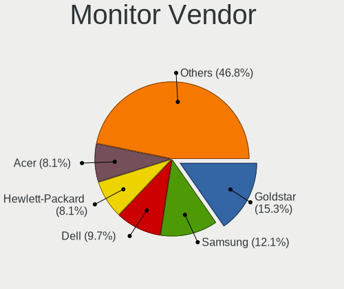

| Vendor               | Desktops | Percent |
|----------------------|----------|---------|
| Goldstar             | 10       | 15.38%  |
| Hewlett-Packard      | 8        | 12.31%  |
| Samsung Electronics  | 7        | 10.77%  |
| Philips              | 6        | 9.23%   |
| Dell                 | 6        | 9.23%   |
| Acer                 | 6        | 9.23%   |
| BenQ                 | 3        | 4.62%   |
| Vizio                | 2        | 3.08%   |
| NEC Computers        | 2        | 3.08%   |
| AOC                  | 2        | 3.08%   |
| Ancor Communications | 2        | 3.08%   |
| Vestel Elektronik    | 1        | 1.54%   |
| Skyworth             | 1        | 1.54%   |
| Sharp                | 1        | 1.54%   |
| SAC                  | 1        | 1.54%   |
| S2-Tek               | 1        | 1.54%   |
| RTK                  | 1        | 1.54%   |
| Medion               | 1        | 1.54%   |
| LTM                  | 1        | 1.54%   |
| Kogan                | 1        | 1.54%   |
| HKC                  | 1        | 1.54%   |
| Eizo                 | 1        | 1.54%   |

Monitor Model
-------------

Monitor models

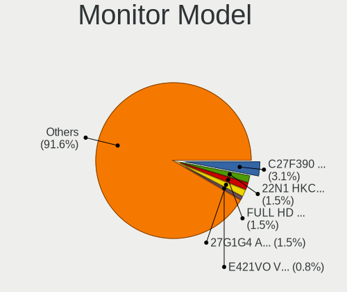

| Model                                                                  | Desktops | Percent |
|------------------------------------------------------------------------|----------|---------|
| Samsung Electronics C27F390 SAM0D32 1920x1080 598x336mm 27.0-inch      | 2        | 2.9%    |
| Vizio E370VL VIZ0070 1920x1080 820x461mm 37.0-inch                     | 1        | 1.45%   |
| Vizio D40f-G9 VIZ1027 1920x1080 477x268mm 21.5-inch                    | 1        | 1.45%   |
| Vestel Elektronik 22W_LCD_TV VES3700 1920x540                          | 1        | 1.45%   |
| Skyworth CP9687 SII9687 1920x1080 708x398mm 32.0-inch                  | 1        | 1.45%   |
| Sharp LCD SHP0FF0 1360x768                                             | 1        | 1.45%   |
| Samsung Electronics SyncMaster SAM0423 1920x1080                       | 1        | 1.45%   |
| Samsung Electronics S24F350 SAM0D21 1920x1080 521x293mm 23.5-inch      | 1        | 1.45%   |
| Samsung Electronics S19D300 SAM0B36 1366x768 410x230mm 18.5-inch       | 1        | 1.45%   |
| Samsung Electronics LF27T35 SAM707F 1920x1080 598x337mm 27.0-inch      | 1        | 1.45%   |
| Samsung Electronics LCD Monitor SAM7106 1920x1080 1210x680mm 54.6-inch | 1        | 1.45%   |
| Samsung Electronics C49J89x SAM0F21 3840x1080 1196x336mm 48.9-inch     | 1        | 1.45%   |
| SAC DP1 SAC0027 1920x1080 597x336mm 27.0-inch                          | 1        | 1.45%   |
| S2-Tek TV STK531A 1920x1080 930x530mm 42.1-inch                        | 1        | 1.45%   |
| RTK LCD Monitor RTK1D1A 1920x1080 1020x570mm 46.0-inch                 | 1        | 1.45%   |
| Philips PHL 276E9Q PHLC17B 1920x1080 600x340mm 27.2-inch               | 1        | 1.45%   |
| Philips PHL 274E5 PHLC0C8 1920x1080 598x336mm 27.0-inch                | 1        | 1.45%   |
| Philips PHL 243V5 PHLC0D1 1920x1080 521x293mm 23.5-inch                | 1        | 1.45%   |
| Philips PHL 241V8 PHLC212 1920x1080 527x296mm 23.8-inch                | 1        | 1.45%   |
| Philips 244E PHLC036 1920x1080 521x293mm 23.5-inch                     | 1        | 1.45%   |
| Philips 226V4 PHLC0B1 1920x1080 477x268mm 21.5-inch                    | 1        | 1.45%   |
| NEC Computers LCD224WM NEC6733 1680x1050 474x296mm 22.0-inch           | 1        | 1.45%   |
| NEC Computers EA221WM NEC673D 1680x1050 474x296mm 22.0-inch            | 1        | 1.45%   |
| Medion MD21274 MED36B5 1920x1080 598x336mm 27.0-inch                   | 1        | 1.45%   |
| LTM LONTIUM LTM0401 1920x1080 890x500mm 40.2-inch                      | 1        | 1.45%   |
| Kogan KAMN27QF7TA KGN0270 2560x1440 698x393mm 31.5-inch                | 1        | 1.45%   |
| HKC 22N1 HKCB215 1920x1080 476x268mm 21.5-inch                         | 1        | 1.45%   |
| Hewlett-Packard V214a HPN3490 1920x1080 458x258mm 20.7-inch            | 1        | 1.45%   |
| Hewlett-Packard P22v G5 HPN3813 1920x1080 478x260mm 21.4-inch          | 1        | 1.45%   |
| Hewlett-Packard ENVY 27 HPN3367 3840x2160 597x336mm 27.0-inch          | 1        | 1.45%   |
| Hewlett-Packard 27mq HPN3671 2560x1440 597x336mm 27.0-inch             | 1        | 1.45%   |
| Hewlett-Packard 27f HPN354C 1920x1080 598x336mm 27.0-inch              | 1        | 1.45%   |
| Hewlett-Packard 2711 HWP2941 1920x1080 600x340mm 27.2-inch             | 1        | 1.45%   |
| Hewlett-Packard 24fw HPN3545 1920x1080 527x296mm 23.8-inch             | 1        | 1.45%   |
| Hewlett-Packard 22xi HWP302E 1920x1080 480x270mm 21.7-inch             | 1        | 1.45%   |
| Hewlett-Packard 22er HWP331B 1920x1080 476x268mm 21.5-inch             | 1        | 1.45%   |
| Goldstar W2443 GSM571B 1920x1080 474x296mm 22.0-inch                   | 1        | 1.45%   |
| Goldstar W2361 GSM56F9 1920x1080 474x296mm 22.0-inch                   | 1        | 1.45%   |
| Goldstar ULTRAGEAR GSM5C08 1920x1080 530x300mm 24.0-inch               | 1        | 1.45%   |
| Goldstar SIGNAGE GSM9E77 1920x1080 1215x686mm 54.9-inch                | 1        | 1.45%   |

Monitor Resolution
------------------

Monitor screen resolution

| Resolution         | Desktops | Percent |
|--------------------|----------|---------|
| 1920x1080 (FHD)    | 36       | 59.02%  |
| 3840x2160 (4K)     | 5        | 8.2%    |
| 2560x1440 (QHD)    | 5        | 8.2%    |
| 1366x768 (WXGA)    | 4        | 6.56%   |
| 1680x1050 (WSXGA+) | 2        | 3.28%   |
| 1440x900 (WXGA+)   | 2        | 3.28%   |
| 1280x1024 (SXGA)   | 2        | 3.28%   |
| 3840x1080          | 1        | 1.64%   |
| 3440x1440          | 1        | 1.64%   |
| 2560x1080          | 1        | 1.64%   |
| 1920x540           | 1        | 1.64%   |
| 1360x768           | 1        | 1.64%   |

Monitor Diagonal
----------------

Diagonal size in inches

| Inches  | Desktops | Percent |
|---------|----------|---------|
| 27      | 16       | 23.53%  |
| 23      | 8        | 11.76%  |
| 21      | 8        | 11.76%  |
| 24      | 5        | 7.35%   |
| 40      | 3        | 4.41%   |
| 22      | 3        | 4.41%   |
| 18      | 3        | 4.41%   |
| 54      | 2        | 2.94%   |
| 49      | 2        | 2.94%   |
| 42      | 2        | 2.94%   |
| 34      | 2        | 2.94%   |
| 26      | 2        | 2.94%   |
| 19      | 2        | 2.94%   |
| 17      | 2        | 2.94%   |
| Unknown | 2        | 2.94%   |
| 84      | 1        | 1.47%   |
| 55      | 1        | 1.47%   |
| 46      | 1        | 1.47%   |
| 32      | 1        | 1.47%   |
| 31      | 1        | 1.47%   |
| 20      | 1        | 1.47%   |

Monitor Width
-------------

Physical width

| Width in mm | Desktops | Percent |
|-------------|----------|---------|
| 501-600     | 28       | 42.42%  |
| 401-500     | 18       | 27.27%  |
| 1001-1500   | 5        | 7.58%   |
| 801-900     | 3        | 4.55%   |
| 701-800     | 3        | 4.55%   |
| 601-700     | 2        | 3.03%   |
| 301-350     | 2        | 3.03%   |
| 901-1000    | 2        | 3.03%   |
| Unknown     | 2        | 3.03%   |
| 1501-2000   | 1        | 1.52%   |

Aspect Ratio
------------

Proportional relationship between the width and the height

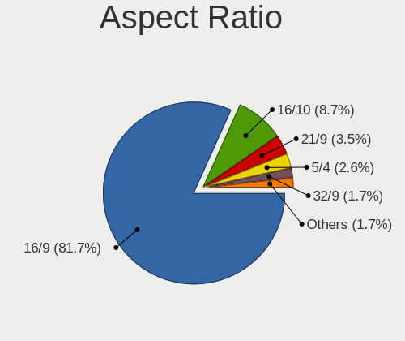

| Ratio | Desktops | Percent |
|-------|----------|---------|
| 16/9  | 49       | 83.05%  |
| 16/10 | 5        | 8.47%   |
| 5/4   | 2        | 3.39%   |
| 21/9  | 2        | 3.39%   |
| 32/9  | 1        | 1.69%   |

Monitor Area
------------

Area in inch²

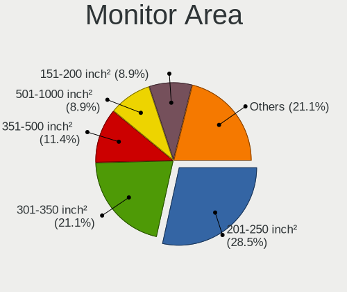

| Area in inch² | Desktops | Percent |
|----------------|----------|---------|
| 201-250        | 20       | 30.77%  |
| 301-350        | 17       | 26.15%  |
| 501-1000       | 7        | 10.77%  |
| 151-200        | 5        | 7.69%   |
| 141-150        | 5        | 7.69%   |
| More than 1000 | 4        | 6.15%   |
| 351-500        | 4        | 6.15%   |
| Unknown        | 2        | 3.08%   |
| 251-300        | 1        | 1.54%   |

Pixel Density
-------------

Pixels per inch

| Density | Desktops | Percent |
|---------|----------|---------|
| 51-100  | 39       | 63.93%  |
| 101-120 | 15       | 24.59%  |
| 1-50    | 4        | 6.56%   |
| Unknown | 2        | 3.28%   |
| 161-240 | 1        | 1.64%   |

Multiple Monitors
-----------------

Total monitors connected

| Total | Desktops | Percent |
|-------|----------|---------|
| 1     | 52       | 77.61%  |
| 2     | 9        | 13.43%  |
| 0     | 5        | 7.46%   |
| 3     | 1        | 1.49%   |

Network
-------

Net Controller Vendor
---------------------

Controller vendors

| Vendor                   | Desktops | Percent |
|--------------------------|----------|---------|
| Realtek Semiconductor    | 40       | 40%     |
| Intel                    | 32       | 32%     |
| TP-Link                  | 5        | 5%      |
| Ralink Technology        | 4        | 4%      |
| Broadcom                 | 4        | 4%      |
| Qualcomm Atheros         | 3        | 3%      |
| NetGear                  | 2        | 2%      |
| MediaTek                 | 2        | 2%      |
| ASIX Electronics         | 2        | 2%      |
| Ralink                   | 1        | 1%      |
| Mercucys                 | 1        | 1%      |
| Marvell Technology Group | 1        | 1%      |
| ICS Advent               | 1        | 1%      |
| Google                   | 1        | 1%      |
| D-Link System            | 1        | 1%      |

Net Controller Model
--------------------

Controller models

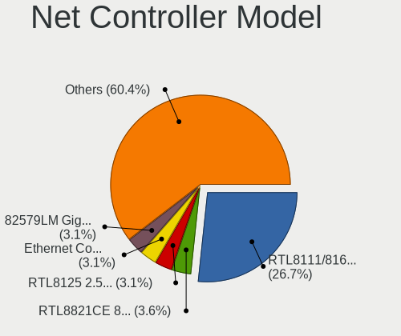

| Model                                                                  | Desktops | Percent |
|------------------------------------------------------------------------|----------|---------|
| Realtek RTL8111/8168/8211/8411 PCI Express Gigabit Ethernet Controller | 29       | 26.36%  |
| Intel Ethernet Connection I217-LM                                      | 4        | 3.64%   |
| Realtek RTL8821CE 802.11ac PCIe Wireless Network Adapter               | 3        | 2.73%   |
| Ralink MT7601U Wireless Adapter                                        | 3        | 2.73%   |
| Intel Ethernet Connection (2) I219-V                                   | 3        | 2.73%   |
| Intel 82579LM Gigabit Network Connection (Lewisville)                  | 3        | 2.73%   |
| Realtek RTL8188FTV 802.11b/g/n 1T1R 2.4G WLAN Adapter                  | 2        | 1.82%   |
| Realtek RTL8188EUS 802.11n Wireless Network Adapter                    | 2        | 1.82%   |
| Realtek RTL8125 2.5GbE Controller                                      | 2        | 1.82%   |
| NetGear A6100 AC600 DB Wireless Adapter [Realtek RTL8811AU]            | 2        | 1.82%   |
| Intel Wi-Fi 6E(802.11ax) AX210/AX1675* 2x2 [Typhoon Peak]              | 2        | 1.82%   |
| Intel I211 Gigabit Network Connection                                  | 2        | 1.82%   |
| Intel Ethernet Controller I225-V                                       | 2        | 1.82%   |
| Intel Ethernet Connection (7) I219-V                                   | 2        | 1.82%   |
| Intel 82579V Gigabit Network Connection                                | 2        | 1.82%   |
| TP-Link TL-WN823N v2/v3 [Realtek RTL8192EU]                            | 1        | 0.91%   |
| TP-Link TL-WN821N v5/v6 [RTL8192EU]                                    | 1        | 0.91%   |
| TP-Link RTL8812AU Archer T4U 802.11ac                                  | 1        | 0.91%   |
| TP-Link Archer T2U PLUS [RTL8821AU]                                    | 1        | 0.91%   |
| TP-Link 802.11ac NIC                                                   | 1        | 0.91%   |
| Realtek RTL88x2bu [AC1200 Techkey]                                     | 1        | 0.91%   |
| Realtek RTL8812AE 802.11ac PCIe Wireless Network Adapter               | 1        | 0.91%   |
| Realtek RTL8188CUS 802.11n WLAN Adapter                                | 1        | 0.91%   |
| Realtek RTL810xE PCI Express Fast Ethernet controller                  | 1        | 0.91%   |
| Realtek RTL-8100/8101L/8139 PCI Fast Ethernet Adapter                  | 1        | 0.91%   |
| Realtek Killer E2600 GbE Controller                                    | 1        | 0.91%   |
| Realtek 802.11ax WLAN Adapter                                          | 1        | 0.91%   |
| Realtek 802.11ac NIC                                                   | 1        | 0.91%   |
| Ralink MT7610U ("Archer T2U" 2.4G+5G WLAN Adapter                      | 1        | 0.91%   |
| Ralink RT3060 Wireless 802.11n 1T/1R                                   | 1        | 0.91%   |
| Qualcomm Atheros Attansic L2 Fast Ethernet                             | 1        | 0.91%   |
| Qualcomm Atheros AR9485 Wireless Network Adapter                       | 1        | 0.91%   |
| Qualcomm Atheros AR8151 v2.0 Gigabit Ethernet                          | 1        | 0.91%   |
| Qualcomm Atheros AR8131 Gigabit Ethernet                               | 1        | 0.91%   |
| Mercucys 802.11n NIC                                                   | 1        | 0.91%   |
| MediaTek RMX3085                                                       | 1        | 0.91%   |
| MediaTek MT7921K (RZ608) Wi-Fi 6E 80MHz                                | 1        | 0.91%   |
| Marvell Group 88E8001 Gigabit Ethernet Controller                      | 1        | 0.91%   |
| Intel Wireless 7260                                                    | 1        | 0.91%   |
| Intel Wireless 3160                                                    | 1        | 0.91%   |

Wireless Vendor
---------------

Wireless vendors

| Vendor                | Desktops | Percent |
|-----------------------|----------|---------|
| Realtek Semiconductor | 12       | 32.43%  |
| Intel                 | 7        | 18.92%  |
| TP-Link               | 5        | 13.51%  |
| Ralink Technology     | 4        | 10.81%  |
| NetGear               | 2        | 5.41%   |
| Broadcom              | 2        | 5.41%   |
| Ralink                | 1        | 2.7%    |
| Qualcomm Atheros      | 1        | 2.7%    |
| Mercucys              | 1        | 2.7%    |
| MediaTek              | 1        | 2.7%    |
| D-Link System         | 1        | 2.7%    |

Wireless Model
--------------

Wireless models

| Model                                                                       | Desktops | Percent |
|-----------------------------------------------------------------------------|----------|---------|
| Realtek RTL8821CE 802.11ac PCIe Wireless Network Adapter                    | 3        | 8.11%   |
| Ralink MT7601U Wireless Adapter                                             | 3        | 8.11%   |
| Realtek RTL8188FTV 802.11b/g/n 1T1R 2.4G WLAN Adapter                       | 2        | 5.41%   |
| Realtek RTL8188EUS 802.11n Wireless Network Adapter                         | 2        | 5.41%   |
| NetGear A6100 AC600 DB Wireless Adapter [Realtek RTL8811AU]                 | 2        | 5.41%   |
| Intel Wi-Fi 6E(802.11ax) AX210/AX1675* 2x2 [Typhoon Peak]                   | 2        | 5.41%   |
| TP-Link TL-WN823N v2/v3 [Realtek RTL8192EU]                                 | 1        | 2.7%    |
| TP-Link TL-WN821N v5/v6 [RTL8192EU]                                         | 1        | 2.7%    |
| TP-Link RTL8812AU Archer T4U 802.11ac                                       | 1        | 2.7%    |
| TP-Link Archer T2U PLUS [RTL8821AU]                                         | 1        | 2.7%    |
| TP-Link 802.11ac NIC                                                        | 1        | 2.7%    |
| Realtek RTL88x2bu [AC1200 Techkey]                                          | 1        | 2.7%    |
| Realtek RTL8812AE 802.11ac PCIe Wireless Network Adapter                    | 1        | 2.7%    |
| Realtek RTL8188CUS 802.11n WLAN Adapter                                     | 1        | 2.7%    |
| Realtek 802.11ax WLAN Adapter                                               | 1        | 2.7%    |
| Realtek 802.11ac NIC                                                        | 1        | 2.7%    |
| Ralink MT7610U ("Archer T2U" 2.4G+5G WLAN Adapter                           | 1        | 2.7%    |
| Ralink RT3060 Wireless 802.11n 1T/1R                                        | 1        | 2.7%    |
| Qualcomm Atheros AR9485 Wireless Network Adapter                            | 1        | 2.7%    |
| Mercucys 802.11n NIC                                                        | 1        | 2.7%    |
| MediaTek MT7921K (RZ608) Wi-Fi 6E 80MHz                                     | 1        | 2.7%    |
| Intel Wireless 7260                                                         | 1        | 2.7%    |
| Intel Wireless 3160                                                         | 1        | 2.7%    |
| Intel Comet Lake PCH CNVi WiFi                                              | 1        | 2.7%    |
| Intel Cannon Lake PCH CNVi WiFi                                             | 1        | 2.7%    |
| Intel Alder Lake-S PCH CNVi WiFi                                            | 1        | 2.7%    |
| D-Link System DWA-130 802.11n Wireless N Adapter(rev.E) [Realtek RTL8191SU] | 1        | 2.7%    |
| Broadcom BCM4360 802.11ac Dual Band Wireless Network Adapter                | 1        | 2.7%    |
| Broadcom BCM4322 802.11a/b/g/n Wireless LAN Controller                      | 1        | 2.7%    |

Ethernet Vendor
---------------

Ethernet vendors

| Vendor                   | Desktops | Percent |
|--------------------------|----------|---------|
| Realtek Semiconductor    | 33       | 45.83%  |
| Intel                    | 28       | 38.89%  |
| Qualcomm Atheros         | 3        | 4.17%   |
| Broadcom                 | 2        | 2.78%   |
| ASIX Electronics         | 2        | 2.78%   |
| MediaTek                 | 1        | 1.39%   |
| Marvell Technology Group | 1        | 1.39%   |
| ICS Advent               | 1        | 1.39%   |
| Google                   | 1        | 1.39%   |

Ethernet Model
--------------

Ethernet models

| Model                                                                  | Desktops | Percent |
|------------------------------------------------------------------------|----------|---------|
| Realtek RTL8111/8168/8211/8411 PCI Express Gigabit Ethernet Controller | 29       | 39.73%  |
| Intel Ethernet Connection I217-LM                                      | 4        | 5.48%   |
| Intel Ethernet Connection (2) I219-V                                   | 3        | 4.11%   |
| Intel 82579LM Gigabit Network Connection (Lewisville)                  | 3        | 4.11%   |
| Realtek RTL8125 2.5GbE Controller                                      | 2        | 2.74%   |
| Intel I211 Gigabit Network Connection                                  | 2        | 2.74%   |
| Intel Ethernet Controller I225-V                                       | 2        | 2.74%   |
| Intel Ethernet Connection (7) I219-V                                   | 2        | 2.74%   |
| Intel 82579V Gigabit Network Connection                                | 2        | 2.74%   |
| Realtek RTL810xE PCI Express Fast Ethernet controller                  | 1        | 1.37%   |
| Realtek RTL-8100/8101L/8139 PCI Fast Ethernet Adapter                  | 1        | 1.37%   |
| Realtek Killer E2600 GbE Controller                                    | 1        | 1.37%   |
| Qualcomm Atheros Attansic L2 Fast Ethernet                             | 1        | 1.37%   |
| Qualcomm Atheros AR8151 v2.0 Gigabit Ethernet                          | 1        | 1.37%   |
| Qualcomm Atheros AR8131 Gigabit Ethernet                               | 1        | 1.37%   |
| MediaTek RMX3085                                                       | 1        | 1.37%   |
| Marvell Group 88E8001 Gigabit Ethernet Controller                      | 1        | 1.37%   |
| Intel Ethernet Controller I226-V                                       | 1        | 1.37%   |
| Intel Ethernet Connection I217-V                                       | 1        | 1.37%   |
| Intel Ethernet Connection (7) I219-LM                                  | 1        | 1.37%   |
| Intel Ethernet Connection (5) I219-LM                                  | 1        | 1.37%   |
| Intel Ethernet Connection (2) I218-V                                   | 1        | 1.37%   |
| Intel Ethernet Connection (14) I219-V                                  | 1        | 1.37%   |
| Intel 82578DC Gigabit Network Connection                               | 1        | 1.37%   |
| Intel 82574L Gigabit Network Connection                                | 1        | 1.37%   |
| Intel 82566DM-2 Gigabit Network Connection                             | 1        | 1.37%   |
| Intel 82566DC-2 Gigabit Network Connection                             | 1        | 1.37%   |
| ICS Advent DM9601 Fast Ethernet Adapter                                | 1        | 1.37%   |
| Google Pixel 7 Pro                                                     | 1        | 1.37%   |
| Broadcom NetXtreme BCM5764M Gigabit Ethernet PCIe                      | 1        | 1.37%   |
| Broadcom NetXtreme BCM5761 Gigabit Ethernet PCIe                       | 1        | 1.37%   |
| ASIX AX88772B                                                          | 1        | 1.37%   |
| ASIX AX88179 Gigabit Ethernet                                          | 1        | 1.37%   |

Net Controller Kind
-------------------

Ethernet, WiFi or modem

| Kind     | Desktops | Percent |
|----------|----------|---------|
| Ethernet | 64       | 64.65%  |
| WiFi     | 35       | 35.35%  |

Used Controller
---------------

Currently used network controller

| Kind     | Desktops | Percent |
|----------|----------|---------|
| Ethernet | 47       | 68.12%  |
| WiFi     | 22       | 31.88%  |

NICs
----

Total network controllers on board

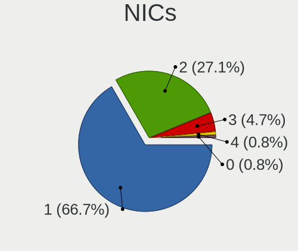

| Total | Desktops | Percent |
|-------|----------|---------|
| 1     | 48       | 72.73%  |
| 2     | 14       | 21.21%  |
| 3     | 3        | 4.55%   |
| 0     | 1        | 1.52%   |

IPv6
----

IPv6 vs IPv4

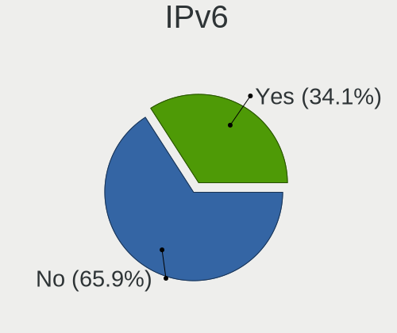

| Used | Desktops | Percent |
|------|----------|---------|
| No   | 44       | 64.71%  |
| Yes  | 24       | 35.29%  |

Bluetooth
---------

Bluetooth Vendor
----------------

Controller vendors

| Vendor                          | Desktops | Percent |
|---------------------------------|----------|---------|
| Intel                           | 7        | 28%     |
| Realtek Semiconductor           | 6        | 24%     |
| Cambridge Silicon Radio         | 4        | 16%     |
| TP-Link                         | 3        | 12%     |
| Qualcomm Atheros Communications | 1        | 4%      |
| MediaTek                        | 1        | 4%      |
| ASUSTek Computer                | 1        | 4%      |
| Apple                           | 1        | 4%      |
| Actions                         | 1        | 4%      |

Bluetooth Model
---------------

Controller models

| Model                                               | Desktops | Percent |
|-----------------------------------------------------|----------|---------|
| Realtek Bluetooth Radio                             | 6        | 24%     |
| Cambridge Silicon Radio Bluetooth Dongle (HCI mode) | 4        | 16%     |
| TP-Link UB500 Adapter                               | 3        | 12%     |
| Intel Bluetooth wireless interface                  | 2        | 8%      |
| Intel AX210 Bluetooth                               | 2        | 8%      |
| Intel AX201 Bluetooth                               | 2        | 8%      |
| Qualcomm Atheros AR3011 Bluetooth                   | 1        | 4%      |
| MediaTek Wireless_Device                            | 1        | 4%      |
| Intel Bluetooth 9460/9560 Jefferson Peak (JfP)      | 1        | 4%      |
| ASUS Broadcom BCM20702A0 Bluetooth                  | 1        | 4%      |
| Apple Built-in Bluetooth 2.0+EDR HCI                | 1        | 4%      |
| Actions general adapter                             | 1        | 4%      |

Sound
-----

Sound Vendor
------------

Sound card vendors

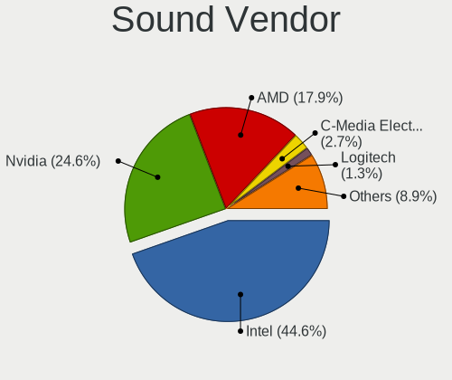

| Vendor                   | Desktops | Percent |
|--------------------------|----------|---------|
| Intel                    | 50       | 45.05%  |
| Nvidia                   | 30       | 27.03%  |
| AMD                      | 21       | 18.92%  |
| C-Media Electronics      | 2        | 1.8%    |
| Texas Instruments        | 1        | 0.9%    |
| Micro Star International | 1        | 0.9%    |
| Logitech                 | 1        | 0.9%    |
| GN Netcom                | 1        | 0.9%    |
| Dell                     | 1        | 0.9%    |
| Corsair                  | 1        | 0.9%    |
| Cambridge Silicon Radio  | 1        | 0.9%    |
| Actions Semiconductor    | 1        | 0.9%    |

Sound Model
-----------

Sound card models

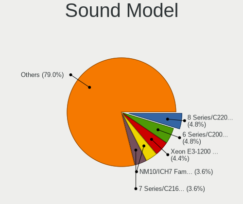

| Model                                                                      | Desktops | Percent |
|----------------------------------------------------------------------------|----------|---------|
| Intel 8 Series/C220 Series Chipset High Definition Audio Controller        | 6        | 4.72%   |
| Intel 6 Series/C200 Series Chipset Family High Definition Audio Controller | 6        | 4.72%   |
| AMD Family 17h/19h HD Audio Controller                                     | 6        | 4.72%   |
| Nvidia GK208 HDMI/DP Audio Controller                                      | 5        | 3.94%   |
| Intel Xeon E3-1200 v3/4th Gen Core Processor HD Audio Controller           | 5        | 3.94%   |
| Intel NM10/ICH7 Family High Definition Audio Controller                    | 5        | 3.94%   |
| Intel 7 Series/C216 Chipset Family High Definition Audio Controller        | 5        | 3.94%   |
| Intel Cannon Lake PCH cAVS                                                 | 4        | 3.15%   |
| Intel 82801JI (ICH10 Family) HD Audio Controller                           | 4        | 3.15%   |
| Intel 200 Series PCH HD Audio                                              | 4        | 3.15%   |
| Intel 100 Series/C230 Series Chipset Family HD Audio Controller            | 4        | 3.15%   |
| Nvidia GP104 High Definition Audio Controller                              | 3        | 2.36%   |
| Nvidia GK107 HDMI Audio Controller                                         | 3        | 2.36%   |
| AMD Starship/Matisse HD Audio Controller                                   | 3        | 2.36%   |
| AMD Ellesmere HDMI Audio [Radeon RX 470/480 / 570/580/590]                 | 3        | 2.36%   |
| Nvidia High Definition Audio Controller                                    | 2        | 1.57%   |
| Nvidia GP107GL High Definition Audio Controller                            | 2        | 1.57%   |
| Nvidia GP106 High Definition Audio Controller                              | 2        | 1.57%   |
| Nvidia GM204 High Definition Audio Controller                              | 2        | 1.57%   |
| Intel Tiger Lake-H HD Audio Controller                                     | 2        | 1.57%   |
| Intel 82801I (ICH9 Family) HD Audio Controller                             | 2        | 1.57%   |
| AMD Vega 10 HDMI Audio [Radeon Vega 56/64]                                 | 2        | 1.57%   |
| AMD Renoir Radeon High Definition Audio Controller                         | 2        | 1.57%   |
| AMD Raven/Raven2/Fenghuang HDMI/DP Audio Controller                        | 2        | 1.57%   |
| AMD Family 17h (Models 00h-0fh) HD Audio Controller                        | 2        | 1.57%   |
| AMD Family 15h (Models 60h-6fh) Audio Controller                           | 2        | 1.57%   |
| Texas Instruments PCM2901 Audio Codec                                      | 1        | 0.79%   |
| Nvidia TU116 High Definition Audio Controller                              | 1        | 0.79%   |
| Nvidia TU107 GeForce GTX 1650 High Definition Audio Controller             | 1        | 0.79%   |
| Nvidia TU104 HD Audio Controller                                           | 1        | 0.79%   |
| Nvidia GP108 High Definition Audio Controller                              | 1        | 0.79%   |
| Nvidia GM206 High Definition Audio Controller                              | 1        | 0.79%   |
| Nvidia GK106 HDMI Audio Controller                                         | 1        | 0.79%   |
| Nvidia GF119 HDMI Audio Controller                                         | 1        | 0.79%   |
| Nvidia GF116 High Definition Audio Controller                              | 1        | 0.79%   |
| Nvidia GF110 High Definition Audio Controller                              | 1        | 0.79%   |
| Nvidia GA106 High Definition Audio Controller                              | 1        | 0.79%   |
| Nvidia GA104 High Definition Audio Controller                              | 1        | 0.79%   |
| Nvidia GA102 High Definition Audio Controller                              | 1        | 0.79%   |
| Micro Star International USB Audio                                         | 1        | 0.79%   |

Memory
------

Memory Vendor
-------------

Memory module vendors

| Vendor             | Desktops | Percent |
|--------------------|----------|---------|
| Kingston           | 3        | 37.5%   |
| Nanya Technology   | 2        | 25%     |
| Crucial            | 2        | 25%     |
| Ramaxel Technology | 1        | 12.5%   |

Memory Model
------------

Memory module models

| Model                                                   | Desktops | Percent |
|---------------------------------------------------------|----------|---------|
| Ramaxel RAM RMUA5110ME78HAF-2666 8GB DIMM DDR4 2667MT/s | 1        | 12.5%   |
| Nanya RAM NT2GC64B8HA0NF-CG 2GB DIMM DDR3 1333MT/s      | 1        | 12.5%   |
| Nanya RAM NT2GC64B88B0NF-CG 2GB DIMM DDR3 1333MT/s      | 1        | 12.5%   |
| Kingston RAM Module 2GB DIMM DDR2 667MT/s               | 1        | 12.5%   |
| Kingston RAM KTW149-ELD 1GB DIMM DDR3 1333MT/s          | 1        | 12.5%   |
| Kingston RAM HX318C10F/8 8GB DIMM DDR3 1600MT/s         | 1        | 12.5%   |
| Crucial RAM CT8G4DFRA266.C8FE 8GB DIMM DDR4 2933MT/s    | 1        | 12.5%   |
| Crucial RAM BLS8G3D1609DS1S00. 8GB DIMM DDR3 1800MT/s   | 1        | 12.5%   |

Memory Kind
-----------

Memory module kinds

| Kind | Desktops | Percent |
|------|----------|---------|
| DDR3 | 4        | 57.14%  |
| DDR4 | 2        | 28.57%  |
| DDR2 | 1        | 14.29%  |

Memory Form Factor
------------------

Physical design of the memory module

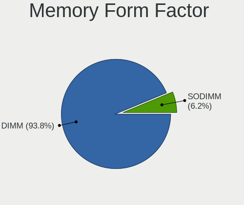

| Name | Desktops | Percent |
|------|----------|---------|
| DIMM | 7        | 100%    |

Memory Size
-----------

Memory module size

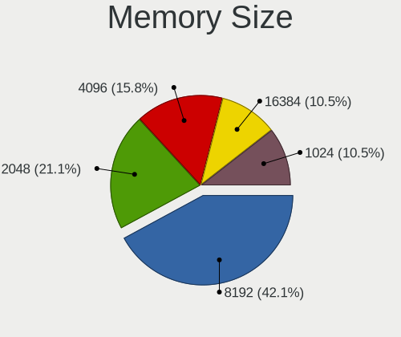

| Size | Desktops | Percent |
|------|----------|---------|
| 8192 | 4        | 50%     |
| 2048 | 3        | 37.5%   |
| 1024 | 1        | 12.5%   |

Memory Speed
------------

Memory module speed

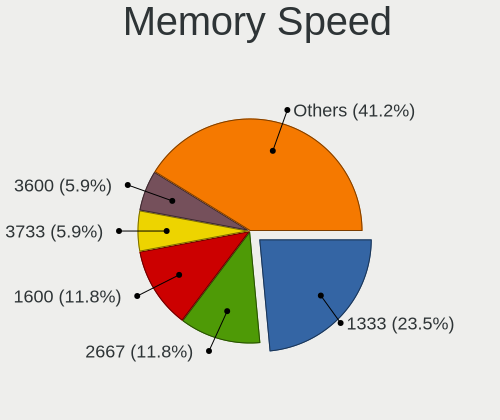

| Speed | Desktops | Percent |
|-------|----------|---------|
| 1333  | 2        | 28.57%  |
| 2933  | 1        | 14.29%  |
| 2667  | 1        | 14.29%  |
| 1800  | 1        | 14.29%  |
| 1600  | 1        | 14.29%  |
| 667   | 1        | 14.29%  |

Printers & scanners
-------------------

Printer Vendor
--------------

Printer device vendors

| Vendor              | Desktops | Percent |
|---------------------|----------|---------|
| Samsung Electronics | 1        | 33.33%  |
| Hewlett-Packard     | 1        | 33.33%  |
| Canon               | 1        | 33.33%  |

Printer Model
-------------

Printer device models

| Model                  | Desktops | Percent |
|------------------------|----------|---------|
| Samsung M2070 Series   | 1        | 33.33%  |
| HP Deskjet 3520 series | 1        | 33.33%  |
| Canon LiDE 300         | 1        | 33.33%  |

Scanner Vendor
--------------

Scanner device vendors

Zero info for selected period =(

Scanner Model
-------------

Scanner device models

Zero info for selected period =(

Camera
------

Camera Vendor
-------------

Camera device vendors

| Vendor              | Desktops | Percent |
|---------------------|----------|---------|
| Logitech            | 4        | 33.33%  |
| Trust               | 1        | 8.33%   |
| Samsung Electronics | 1        | 8.33%   |
| Pixart Imaging      | 1        | 8.33%   |
| Microsoft           | 1        | 8.33%   |
| Microdia            | 1        | 8.33%   |
| MacroSilicon        | 1        | 8.33%   |
| GEMBIRD             | 1        | 8.33%   |
| Apple               | 1        | 8.33%   |

Camera Model
------------

Camera device models

| Model                                   | Desktops | Percent |
|-----------------------------------------|----------|---------|
| Logitech C922 Pro Stream Webcam         | 2        | 16.67%  |
| Trust USB Camera                        | 1        | 8.33%   |
| Samsung Galaxy series, misc. (MTP mode) | 1        | 8.33%   |
| Pixart Imaging GE 1.3 MP MiniCam Pro    | 1        | 8.33%   |
| Microsoft LifeCam HD-3000               | 1        | 8.33%   |
| Microdia Integrated Camera              | 1        | 8.33%   |
| MacroSilicon USB3. 0 capture            | 1        | 8.33%   |
| Logitech Webcam C925e                   | 1        | 8.33%   |
| Logitech Webcam C600                    | 1        | 8.33%   |
| GEMBIRD USB2.0 PC CAMERA                | 1        | 8.33%   |
| Apple iPhone 5/5C/5S/6/SE/7/8/X         | 1        | 8.33%   |

Security
--------

Fingerprint Vendor
------------------

Fingerprint sensor vendors

Zero info for selected period =(

Fingerprint Model
-----------------

Fingerprint sensor models

Zero info for selected period =(

Chipcard Vendor
---------------

Chipcard module vendors

Zero info for selected period =(

Chipcard Model
--------------

Chipcard module models

Zero info for selected period =(

Unsupported
-----------

Unsupported Devices
-------------------

Total unsupported devices on board

| Total | Desktops | Percent |
|-------|----------|---------|
| 0     | 58       | 85.29%  |
| 1     | 10       | 14.71%  |

Unsupported Device Types
------------------------

Types of unsupported devices

| Type                  | Desktops | Percent |
|-----------------------|----------|---------|
| Graphics card         | 5        | 50%     |
| Net/wireless          | 3        | 30%     |
| Multimedia controller | 1        | 10%     |
| Card reader           | 1        | 10%     |

