Elementary 7.1 - Tested Hardware & Statistics (Notebooks)
---------------------------------------------------------

A project to collect tested hardware configurations for Elementary 7.1.

Anyone can contribute to this report by the [hw-probe](https://github.com/linuxhw/hw-probe) tool:

    sudo -E hw-probe -all -upload

Please contribute! Especially if your hardware is rare.

Contents
--------

* [ Test Cases ](#test-cases)

* [ System ](#system)
  - [ Kernel                   ](#kernel)
  - [ Kernel Family            ](#kernel-family)
  - [ Kernel Major Ver.        ](#kernel-major-ver)
  - [ Arch                     ](#arch)
  - [ DE                       ](#de)
  - [ Display Server           ](#display-server)
  - [ Display Manager          ](#display-manager)
  - [ OS Lang                  ](#os-lang)
  - [ Boot Mode                ](#boot-mode)
  - [ Filesystem               ](#filesystem)
  - [ Part. scheme             ](#part-scheme)
  - [ Dual Boot with Linux/BSD ](#dual-boot-with-linuxbsd)
  - [ Dual Boot (Win)          ](#dual-boot-win)

* [ Board ](#board)
  - [ Vendor                   ](#vendor)
  - [ Model                    ](#model)
  - [ Model Family             ](#model-family)
  - [ MFG Year                 ](#mfg-year)
  - [ Form Factor              ](#form-factor)
  - [ Secure Boot              ](#secure-boot)
  - [ Coreboot                 ](#coreboot)
  - [ RAM Size                 ](#ram-size)
  - [ RAM Used                 ](#ram-used)
  - [ Total Drives             ](#total-drives)
  - [ Has CD-ROM               ](#has-cd-rom)
  - [ Has Ethernet             ](#has-ethernet)
  - [ Has WiFi                 ](#has-wifi)
  - [ Has Bluetooth            ](#has-bluetooth)

* [ Location ](#location)
  - [ Country                  ](#country)
  - [ City                     ](#city)

* [ Drives ](#drives)
  - [ Drive Vendor             ](#drive-vendor)
  - [ Drive Model              ](#drive-model)
  - [ HDD Vendor               ](#hdd-vendor)
  - [ SSD Vendor               ](#ssd-vendor)
  - [ Drive Kind               ](#drive-kind)
  - [ Drive Connector          ](#drive-connector)
  - [ Drive Size               ](#drive-size)
  - [ Space Total              ](#space-total)
  - [ Space Used               ](#space-used)
  - [ Malfunc. Drives          ](#malfunc-drives)
  - [ Malfunc. Drive Vendor    ](#malfunc-drive-vendor)
  - [ Malfunc. HDD Vendor      ](#malfunc-hdd-vendor)
  - [ Malfunc. Drive Kind      ](#malfunc-drive-kind)
  - [ Failed Drives            ](#failed-drives)
  - [ Failed Drive Vendor      ](#failed-drive-vendor)
  - [ Drive Status             ](#drive-status)

* [ Storage controller ](#storage-controller)
  - [ Storage Vendor           ](#storage-vendor)
  - [ Storage Model            ](#storage-model)
  - [ Storage Kind             ](#storage-kind)

* [ Processor ](#processor)
  - [ CPU Vendor               ](#cpu-vendor)
  - [ CPU Model                ](#cpu-model)
  - [ CPU Model Family         ](#cpu-model-family)
  - [ CPU Cores                ](#cpu-cores)
  - [ CPU Sockets              ](#cpu-sockets)
  - [ CPU Threads              ](#cpu-threads)
  - [ CPU Op-Modes             ](#cpu-op-modes)
  - [ CPU Microcode            ](#cpu-microcode)
  - [ CPU Microarch            ](#cpu-microarch)

* [ Graphics ](#graphics)
  - [ GPU Vendor               ](#gpu-vendor)
  - [ GPU Model                ](#gpu-model)
  - [ GPU Combo                ](#gpu-combo)
  - [ GPU Driver               ](#gpu-driver)
  - [ GPU Memory               ](#gpu-memory)

* [ Monitor ](#monitor)
  - [ Monitor Vendor           ](#monitor-vendor)
  - [ Monitor Model            ](#monitor-model)
  - [ Monitor Resolution       ](#monitor-resolution)
  - [ Monitor Diagonal         ](#monitor-diagonal)
  - [ Monitor Width            ](#monitor-width)
  - [ Aspect Ratio             ](#aspect-ratio)
  - [ Monitor Area             ](#monitor-area)
  - [ Pixel Density            ](#pixel-density)
  - [ Multiple Monitors        ](#multiple-monitors)

* [ Network ](#network)
  - [ Net Controller Vendor    ](#net-controller-vendor)
  - [ Net Controller Model     ](#net-controller-model)
  - [ Wireless Vendor          ](#wireless-vendor)
  - [ Wireless Model           ](#wireless-model)
  - [ Ethernet Vendor          ](#ethernet-vendor)
  - [ Ethernet Model           ](#ethernet-model)
  - [ Net Controller Kind      ](#net-controller-kind)
  - [ Used Controller          ](#used-controller)
  - [ NICs                     ](#nics)
  - [ IPv6                     ](#ipv6)

* [ Bluetooth ](#bluetooth)
  - [ Bluetooth Vendor         ](#bluetooth-vendor)
  - [ Bluetooth Model          ](#bluetooth-model)

* [ Sound ](#sound)
  - [ Sound Vendor             ](#sound-vendor)
  - [ Sound Model              ](#sound-model)

* [ Memory ](#memory)
  - [ Memory Vendor            ](#memory-vendor)
  - [ Memory Model             ](#memory-model)
  - [ Memory Kind              ](#memory-kind)
  - [ Memory Form Factor       ](#memory-form-factor)
  - [ Memory Size              ](#memory-size)
  - [ Memory Speed             ](#memory-speed)

* [ Printers & scanners ](#printers--scanners)
  - [ Printer Vendor           ](#printer-vendor)
  - [ Printer Model            ](#printer-model)
  - [ Scanner Vendor           ](#scanner-vendor)
  - [ Scanner Model            ](#scanner-model)

* [ Camera ](#camera)
  - [ Camera Vendor            ](#camera-vendor)
  - [ Camera Model             ](#camera-model)

* [ Security ](#security)
  - [ Fingerprint Vendor       ](#fingerprint-vendor)
  - [ Fingerprint Model        ](#fingerprint-model)
  - [ Chipcard Vendor          ](#chipcard-vendor)
  - [ Chipcard Model           ](#chipcard-model)

* [ Unsupported ](#unsupported)
  - [ Unsupported Devices      ](#unsupported-devices)
  - [ Unsupported Device Types ](#unsupported-device-types)

Test Cases
----------

Total: 534

| Vendor        | Model                       | Probe                                                      | Date         |
|---------------|-----------------------------|------------------------------------------------------------|--------------|
| Samsung       | 900X3C/900X4C/900X4D        | [cbe6ed9631](https://linux-hardware.org/?probe=cbe6ed9631) | Jan 05, 2025 |
| NEC Comput... | PC-LL750MSW                 | [55d20a7230](https://linux-hardware.org/?probe=55d20a7230) | Dec 27, 2024 |
| Dell          | XPS 15 9550                 | [f1502af093](https://linux-hardware.org/?probe=f1502af093) | Dec 23, 2024 |
| Dell          | Precision 5530              | [3292cf1103](https://linux-hardware.org/?probe=3292cf1103) | Dec 18, 2024 |
| ASUSTek       | X751MA                      | [016d948a0c](https://linux-hardware.org/?probe=016d948a0c) | Dec 17, 2024 |
| HP            | Laptop 17-by3xxx            | [cb8341eaca](https://linux-hardware.org/?probe=cb8341eaca) | Dec 17, 2024 |
| HP            | ProBook 6570b               | [70dbe6620b](https://linux-hardware.org/?probe=70dbe6620b) | Dec 14, 2024 |
| Acer          | Aspire A515-48M             | [1bd13cf77f](https://linux-hardware.org/?probe=1bd13cf77f) | Dec 14, 2024 |
| Unknown       | Unknown                     | [2e17fa2c66](https://linux-hardware.org/?probe=2e17fa2c66) | Dec 12, 2024 |
| ASUSTek       | X550CL                      | [e471757e1c](https://linux-hardware.org/?probe=e471757e1c) | Dec 11, 2024 |
| Microtech     | ebookPro                    | [4e6f89ca56](https://linux-hardware.org/?probe=4e6f89ca56) | Dec 10, 2024 |
| Lenovo        | ThinkPad L380 20M6S11800    | [fc797d558c](https://linux-hardware.org/?probe=fc797d558c) | Dec 08, 2024 |
| Unknown       | Unknown                     | [bd30f7f45d](https://linux-hardware.org/?probe=bd30f7f45d) | Dec 08, 2024 |
| Dell          | Latitude 3340               | [07c627667a](https://linux-hardware.org/?probe=07c627667a) | Dec 07, 2024 |
| Apple         | MacBook4,1                  | [915a1dbb22](https://linux-hardware.org/?probe=915a1dbb22) | Dec 04, 2024 |
| HP            | EliteBook 2170p             | [39de9fd95f](https://linux-hardware.org/?probe=39de9fd95f) | Dec 04, 2024 |
| Apple         | MacBookAir3,1               | [8517a48127](https://linux-hardware.org/?probe=8517a48127) | Dec 03, 2024 |
| Dell          | Inspiron 5567               | [085d5938c0](https://linux-hardware.org/?probe=085d5938c0) | Dec 03, 2024 |
| Dell          | Inspiron 5567               | [99cb99a15c](https://linux-hardware.org/?probe=99cb99a15c) | Dec 03, 2024 |
| Toshiba       | Satellite L50-B             | [f0195c6929](https://linux-hardware.org/?probe=f0195c6929) | Dec 02, 2024 |
| Apple         | MacBookPro12,1              | [deda79f6f5](https://linux-hardware.org/?probe=deda79f6f5) | Dec 01, 2024 |
| Toshiba       | Satellite L50-B             | [344eaec320](https://linux-hardware.org/?probe=344eaec320) | Nov 29, 2024 |
| Apple         | MacBookPro8,1               | [a817c04b09](https://linux-hardware.org/?probe=a817c04b09) | Nov 29, 2024 |
| Dell          | Latitude 5420               | [9e6c2d1825](https://linux-hardware.org/?probe=9e6c2d1825) | Nov 28, 2024 |
| Acer          | Aspire E3-111               | [f90ddc6433](https://linux-hardware.org/?probe=f90ddc6433) | Nov 26, 2024 |
| Apple         | MacBookAir6,1               | [a42587525c](https://linux-hardware.org/?probe=a42587525c) | Nov 25, 2024 |
| Apple         | MacBookAir6,1               | [1d464cc8ce](https://linux-hardware.org/?probe=1d464cc8ce) | Nov 25, 2024 |
| Lenovo        | IdeaPad Slim 3 15IAH8 83... | [d24fd529d4](https://linux-hardware.org/?probe=d24fd529d4) | Nov 25, 2024 |
| Lenovo        | ThinkPad L380 20M6S11800    | [d7914ef50d](https://linux-hardware.org/?probe=d7914ef50d) | Nov 22, 2024 |
| ASUSTek       | ASUS TUF Gaming F17 FX70... | [8ecfb38136](https://linux-hardware.org/?probe=8ecfb38136) | Nov 22, 2024 |
| HP            | Pavilion Sleekbook 15 PC    | [c785c1f7dd](https://linux-hardware.org/?probe=c785c1f7dd) | Nov 21, 2024 |
| HP            | ProBook 6560b               | [72ddcb1cf2](https://linux-hardware.org/?probe=72ddcb1cf2) | Nov 20, 2024 |
| HP            | Laptop 17-cn0xxx            | [058f6bf1ac](https://linux-hardware.org/?probe=058f6bf1ac) | Nov 20, 2024 |
| HP            | Laptop 17-cn0xxx            | [541dd7b9fb](https://linux-hardware.org/?probe=541dd7b9fb) | Nov 19, 2024 |
| Apple         | MacBookPro5,5               | [3f2eff0083](https://linux-hardware.org/?probe=3f2eff0083) | Nov 18, 2024 |
| Lenovo        | ThinkPad X260 20F5A2FXTH    | [8609525ceb](https://linux-hardware.org/?probe=8609525ceb) | Nov 18, 2024 |
| Apple         | MacBookPro7,1               | [7d86d39596](https://linux-hardware.org/?probe=7d86d39596) | Nov 17, 2024 |
| Apple         | MacBookPro5,5               | [001f8b1280](https://linux-hardware.org/?probe=001f8b1280) | Nov 17, 2024 |
| Lenovo        | ThinkPad L470 W10DG 20JU... | [8715440da3](https://linux-hardware.org/?probe=8715440da3) | Nov 17, 2024 |
| Dell          | Inspiron N5030              | [acf692231b](https://linux-hardware.org/?probe=acf692231b) | Nov 17, 2024 |
| ASUSTek       | ASUS TUF Gaming F17 FX70... | [0d4cb9a88f](https://linux-hardware.org/?probe=0d4cb9a88f) | Nov 16, 2024 |
| Lenovo        | G50-80 80L0                 | [d31664cad1](https://linux-hardware.org/?probe=d31664cad1) | Nov 15, 2024 |
| Apple         | MacBookPro8,2               | [0259216292](https://linux-hardware.org/?probe=0259216292) | Nov 15, 2024 |
| Apple         | MacBookPro9,2               | [7029186fa5](https://linux-hardware.org/?probe=7029186fa5) | Nov 14, 2024 |
| Apple         | MacBookPro8,1               | [2f0fa7a4fa](https://linux-hardware.org/?probe=2f0fa7a4fa) | Nov 11, 2024 |
| Apple         | MacBookPro5,2               | [a0db5bcf03](https://linux-hardware.org/?probe=a0db5bcf03) | Nov 08, 2024 |
| Acer          | Aspire E5-771               | [9b889ed10a](https://linux-hardware.org/?probe=9b889ed10a) | Nov 08, 2024 |
| Apple         | MacBookPro8,1               | [0b5989c295](https://linux-hardware.org/?probe=0b5989c295) | Nov 06, 2024 |
| Lenovo        | G580 20150                  | [71249fccac](https://linux-hardware.org/?probe=71249fccac) | Nov 06, 2024 |
| Lenovo        | G580 20150                  | [ebcff700e9](https://linux-hardware.org/?probe=ebcff700e9) | Nov 06, 2024 |
| LTD Delovo... | 15Y                         | [5553e46796](https://linux-hardware.org/?probe=5553e46796) | Nov 04, 2024 |
| LTD Delovo... | 15Y                         | [0187f0b5ab](https://linux-hardware.org/?probe=0187f0b5ab) | Nov 04, 2024 |
| Samsung       | 940XFG                      | [8d09e8db06](https://linux-hardware.org/?probe=8d09e8db06) | Nov 04, 2024 |
| HUAWEI        | BOM-WXX9                    | [f0b28bde30](https://linux-hardware.org/?probe=f0b28bde30) | Nov 03, 2024 |
| Dell          | Latitude 7420               | [2454ee0dbb](https://linux-hardware.org/?probe=2454ee0dbb) | Nov 03, 2024 |
| Lenovo        | G700 20251                  | [3af4ad6599](https://linux-hardware.org/?probe=3af4ad6599) | Nov 01, 2024 |
| Acer          | Aspire V3-772               | [9d4e69ab29](https://linux-hardware.org/?probe=9d4e69ab29) | Nov 01, 2024 |
| Acer          | Aspire V3-772               | [a48e5acfb4](https://linux-hardware.org/?probe=a48e5acfb4) | Nov 01, 2024 |
| HP            | ProBook 4535s               | [f66c124f3a](https://linux-hardware.org/?probe=f66c124f3a) | Oct 31, 2024 |
| Apple         | MacBookPro8,1               | [3fe4d1a80a](https://linux-hardware.org/?probe=3fe4d1a80a) | Oct 31, 2024 |
| ASUSTek       | K46CB                       | [e081c9ab8c](https://linux-hardware.org/?probe=e081c9ab8c) | Oct 30, 2024 |
| Apple         | MacBookPro9,2               | [91eb0db216](https://linux-hardware.org/?probe=91eb0db216) | Oct 30, 2024 |
| HP            | Laptop 15s-eq2xxx           | [1755d407c9](https://linux-hardware.org/?probe=1755d407c9) | Oct 29, 2024 |
| HP            | Compaq 15                   | [fd2b849a08](https://linux-hardware.org/?probe=fd2b849a08) | Oct 28, 2024 |
| Apple         | MacBookPro9,2               | [59f6758081](https://linux-hardware.org/?probe=59f6758081) | Oct 25, 2024 |
| Apple         | MacBookAir7,2               | [73fb34d315](https://linux-hardware.org/?probe=73fb34d315) | Oct 25, 2024 |
| HUAWEI        | BOD-WXX9                    | [c4829d7d0c](https://linux-hardware.org/?probe=c4829d7d0c) | Oct 25, 2024 |
| HUAWEI        | BOHB-WAX9                   | [e114c5afe5](https://linux-hardware.org/?probe=e114c5afe5) | Oct 24, 2024 |
| Dell          | Latitude 7370               | [355bbe7ecc](https://linux-hardware.org/?probe=355bbe7ecc) | Oct 24, 2024 |
| Apple         | MacBookAir7,2               | [92672f3d2c](https://linux-hardware.org/?probe=92672f3d2c) | Oct 23, 2024 |
| Apple         | MacBookAir7,2               | [8bbb5c5a53](https://linux-hardware.org/?probe=8bbb5c5a53) | Oct 23, 2024 |
| HP            | ProBook 6465b               | [3afb9ebed6](https://linux-hardware.org/?probe=3afb9ebed6) | Oct 23, 2024 |
| Lenovo        | ThinkPad T470s 20HFCTO1W... | [18058066d2](https://linux-hardware.org/?probe=18058066d2) | Oct 22, 2024 |
| Apple         | MacBookAir4,1               | [a899fd963a](https://linux-hardware.org/?probe=a899fd963a) | Oct 22, 2024 |
| Apple         | MacBookAir4,1               | [6c25a578b8](https://linux-hardware.org/?probe=6c25a578b8) | Oct 22, 2024 |
| Sony          | VPCEJ1Z1E                   | [d1da65abb4](https://linux-hardware.org/?probe=d1da65abb4) | Oct 22, 2024 |
| Lenovo        | V15-ADA 82C7                | [76d8c86d01](https://linux-hardware.org/?probe=76d8c86d01) | Oct 22, 2024 |
| HUAWEI        | KLVL-WXX9                   | [faeb5479f8](https://linux-hardware.org/?probe=faeb5479f8) | Oct 21, 2024 |
| HUAWEI        | NBLB-WAX9N                  | [e188597923](https://linux-hardware.org/?probe=e188597923) | Oct 19, 2024 |
| Apple         | MacBookAir7,2               | [f63adab3c7](https://linux-hardware.org/?probe=f63adab3c7) | Oct 19, 2024 |
| Fujitsu       | LIFEBOOK A530               | [afb324991b](https://linux-hardware.org/?probe=afb324991b) | Oct 18, 2024 |
| Fujitsu       | LIFEBOOK A530               | [3337802835](https://linux-hardware.org/?probe=3337802835) | Oct 18, 2024 |
| Apple         | MacBookPro8,1               | [83508d3840](https://linux-hardware.org/?probe=83508d3840) | Oct 17, 2024 |
| Samsung       | 940XFG                      | [741f7a6544](https://linux-hardware.org/?probe=741f7a6544) | Oct 17, 2024 |
| Apple         | MacBook6,1                  | [d3b5f5da93](https://linux-hardware.org/?probe=d3b5f5da93) | Oct 17, 2024 |
| HP            | Laptop 15s-eq2xxx           | [d0ac53c68a](https://linux-hardware.org/?probe=d0ac53c68a) | Oct 16, 2024 |
| Acer          | Aspire 7736                 | [be7f2e237f](https://linux-hardware.org/?probe=be7f2e237f) | Oct 15, 2024 |
| ASUSTek       | X555LPB                     | [2f3f2073da](https://linux-hardware.org/?probe=2f3f2073da) | Oct 14, 2024 |
| Acer          | Aspire 7736                 | [96c83e0281](https://linux-hardware.org/?probe=96c83e0281) | Oct 14, 2024 |
| Apple         | MacBookPro8,1               | [d2d644c166](https://linux-hardware.org/?probe=d2d644c166) | Oct 13, 2024 |
| Lenovo        | ThinkPad L380 20M6S11800    | [cee555c4f8](https://linux-hardware.org/?probe=cee555c4f8) | Oct 13, 2024 |
| Apple         | MacBookPro8,3               | [030dbaca80](https://linux-hardware.org/?probe=030dbaca80) | Oct 13, 2024 |
| Positivo      | VJF154                      | [dbd1be19a4](https://linux-hardware.org/?probe=dbd1be19a4) | Oct 12, 2024 |
| Positivo      | VJF154                      | [11a95affa0](https://linux-hardware.org/?probe=11a95affa0) | Oct 12, 2024 |
| Sony          | VPCEJ1Z1E                   | [627da18a5d](https://linux-hardware.org/?probe=627da18a5d) | Oct 12, 2024 |
| Apple         | MacBookPro8,3               | [8a25a02400](https://linux-hardware.org/?probe=8a25a02400) | Oct 12, 2024 |
| HP            | Compaq 6530b (GW688AV)      | [2db6bf65e8](https://linux-hardware.org/?probe=2db6bf65e8) | Oct 12, 2024 |
| HP            | Compaq 6530b (GW688AV)      | [a9cb352415](https://linux-hardware.org/?probe=a9cb352415) | Oct 12, 2024 |
| Apple         | MacBookPro8,3               | [ca109e5057](https://linux-hardware.org/?probe=ca109e5057) | Oct 12, 2024 |
| Lenovo        | ThinkPad X270 W10DG 20K5... | [08d25ef16b](https://linux-hardware.org/?probe=08d25ef16b) | Oct 12, 2024 |
| Lenovo        | ThinkPad X270 W10DG 20K5... | [6c5d0a8a4b](https://linux-hardware.org/?probe=6c5d0a8a4b) | Oct 12, 2024 |
| HP            | 15                          | [812b65f0fe](https://linux-hardware.org/?probe=812b65f0fe) | Oct 11, 2024 |
| Apple         | MacBook6,1                  | [3623e327b2](https://linux-hardware.org/?probe=3623e327b2) | Oct 11, 2024 |
| HP            | EliteBook 830 G5            | [64cebe30ad](https://linux-hardware.org/?probe=64cebe30ad) | Oct 10, 2024 |
| Lenovo        | V15 G3 ABA 82TV             | [bf025aaa26](https://linux-hardware.org/?probe=bf025aaa26) | Oct 08, 2024 |
| Lenovo        | ThinkPad L380 20M6S11800    | [ecf4696b37](https://linux-hardware.org/?probe=ecf4696b37) | Oct 07, 2024 |
| Apple         | MacBookAir3,1               | [01cd6549a5](https://linux-hardware.org/?probe=01cd6549a5) | Oct 06, 2024 |
| Apple         | MacBookPro9,2               | [0f138dcac0](https://linux-hardware.org/?probe=0f138dcac0) | Oct 06, 2024 |
| HP            | EliteBook 830 G5            | [c8c6a6269b](https://linux-hardware.org/?probe=c8c6a6269b) | Oct 06, 2024 |
| ARCELIK       | 1M7-GNB1595B6I7             | [cbf522f76a](https://linux-hardware.org/?probe=cbf522f76a) | Oct 05, 2024 |
| Sony          | VPCEC3L1E                   | [748694aa38](https://linux-hardware.org/?probe=748694aa38) | Oct 05, 2024 |
| Positivo      | VJF154                      | [70bb906734](https://linux-hardware.org/?probe=70bb906734) | Oct 04, 2024 |
| Dell          | Latitude E6520              | [5af0de6a9c](https://linux-hardware.org/?probe=5af0de6a9c) | Oct 04, 2024 |
| Dell          | Precision 5530              | [7d736763e8](https://linux-hardware.org/?probe=7d736763e8) | Oct 04, 2024 |
| Alienware     | 17 R3                       | [b22f85d157](https://linux-hardware.org/?probe=b22f85d157) | Oct 03, 2024 |
| Samsung       | 900X3F                      | [12e6b46207](https://linux-hardware.org/?probe=12e6b46207) | Oct 03, 2024 |
| Samsung       | 900X3F                      | [5b7f51059a](https://linux-hardware.org/?probe=5b7f51059a) | Oct 03, 2024 |
| HP            | G60                         | [b2cbfa9c26](https://linux-hardware.org/?probe=b2cbfa9c26) | Oct 02, 2024 |
| HP            | Laptop 15-bw0xx             | [1046a844db](https://linux-hardware.org/?probe=1046a844db) | Sep 30, 2024 |
| ASUSTek       | VivoBook_ASUSLaptop X140... | [bfd414e273](https://linux-hardware.org/?probe=bfd414e273) | Sep 30, 2024 |
| Dell          | Inspiron N5110              | [39053cddd2](https://linux-hardware.org/?probe=39053cddd2) | Sep 29, 2024 |
| Apple         | MacBookPro5,1               | [ea1547836b](https://linux-hardware.org/?probe=ea1547836b) | Sep 27, 2024 |
| Apple         | MacBookAir3,1               | [ce465db6d8](https://linux-hardware.org/?probe=ce465db6d8) | Sep 26, 2024 |
| realme        | RMNBXXXX                    | [a56e71a36d](https://linux-hardware.org/?probe=a56e71a36d) | Sep 25, 2024 |
| Lenovo        | IdeaPad 5 14ARE05 81YM      | [eb1144d5d0](https://linux-hardware.org/?probe=eb1144d5d0) | Sep 23, 2024 |
| Apple         | MacBookPro9,2               | [d02c3ea8d2](https://linux-hardware.org/?probe=d02c3ea8d2) | Sep 22, 2024 |
| Apple         | MacBookPro9,2               | [de3ad3dcb2](https://linux-hardware.org/?probe=de3ad3dcb2) | Sep 22, 2024 |
| Acer          | Aspire E5-511G              | [eb212c1295](https://linux-hardware.org/?probe=eb212c1295) | Sep 21, 2024 |
| Samsung       | 900X3J                      | [84b81dc973](https://linux-hardware.org/?probe=84b81dc973) | Sep 19, 2024 |
| Apple         | MacBook6,1                  | [754a9d1a14](https://linux-hardware.org/?probe=754a9d1a14) | Sep 19, 2024 |
| Acer          | Nitro AN515-52              | [0bc35e551d](https://linux-hardware.org/?probe=0bc35e551d) | Sep 18, 2024 |
| Apple         | MacBookPro9,2               | [e386b9f60a](https://linux-hardware.org/?probe=e386b9f60a) | Sep 18, 2024 |
| Lenovo        | ThinkPad L380 20M6S11800    | [22c790176f](https://linux-hardware.org/?probe=22c790176f) | Sep 18, 2024 |
| Lenovo        | G400 20235                  | [96ebcfea10](https://linux-hardware.org/?probe=96ebcfea10) | Sep 18, 2024 |
| Acer          | Aspire E5-511G              | [0b1a846a69](https://linux-hardware.org/?probe=0b1a846a69) | Sep 17, 2024 |
| HP            | EliteBook 840 G1            | [a2f78f9d5a](https://linux-hardware.org/?probe=a2f78f9d5a) | Sep 17, 2024 |
| HP            | Pavilion 17                 | [fb7884d776](https://linux-hardware.org/?probe=fb7884d776) | Sep 16, 2024 |
| HP            | Pavilion dv6700             | [79316bc8bf](https://linux-hardware.org/?probe=79316bc8bf) | Sep 16, 2024 |
| Acer          | Aspire 5750                 | [d030037b8b](https://linux-hardware.org/?probe=d030037b8b) | Sep 14, 2024 |
| Acer          | Aspire 7745G                | [76a55f9bb1](https://linux-hardware.org/?probe=76a55f9bb1) | Sep 14, 2024 |
| Dell          | Inspiron 3721               | [dd0fd36c69](https://linux-hardware.org/?probe=dd0fd36c69) | Sep 14, 2024 |
| Lenovo        | V14 G2 ITL 82KA             | [156f5f004e](https://linux-hardware.org/?probe=156f5f004e) | Sep 13, 2024 |
| Apple         | MacBookPro11,3              | [ce91008479](https://linux-hardware.org/?probe=ce91008479) | Sep 13, 2024 |
| Dell          | XPS 13 9343                 | [ca52ff1c29](https://linux-hardware.org/?probe=ca52ff1c29) | Sep 13, 2024 |
| Alienware     | 17 R3                       | [d95edb94cd](https://linux-hardware.org/?probe=d95edb94cd) | Sep 13, 2024 |
| Toshiba       | Satellite L50-B             | [bb130f4634](https://linux-hardware.org/?probe=bb130f4634) | Sep 11, 2024 |
| Acer          | Aspire 5750                 | [0c7144d06b](https://linux-hardware.org/?probe=0c7144d06b) | Sep 10, 2024 |
| Lenovo        | IdeaPad 110-15ACL 80TJ      | [cd6caa40b8](https://linux-hardware.org/?probe=cd6caa40b8) | Sep 10, 2024 |
| Lenovo        | B590 20206                  | [38ef54ca0c](https://linux-hardware.org/?probe=38ef54ca0c) | Sep 09, 2024 |
| Lenovo        | B590 20206                  | [3e57e1486e](https://linux-hardware.org/?probe=3e57e1486e) | Sep 09, 2024 |
| Sony          | SVF15A1B4E                  | [08c43f2d50](https://linux-hardware.org/?probe=08c43f2d50) | Sep 09, 2024 |
| Dell          | Inspiron 3721               | [8c75a1af97](https://linux-hardware.org/?probe=8c75a1af97) | Sep 05, 2024 |
| Dell          | Inspiron 3721               | [8a051dce97](https://linux-hardware.org/?probe=8a051dce97) | Sep 03, 2024 |
| Dell          | Latitude 5510               | [634228ff35](https://linux-hardware.org/?probe=634228ff35) | Sep 02, 2024 |
| Apple         | MacBookPro9,1               | [41e0375932](https://linux-hardware.org/?probe=41e0375932) | Sep 02, 2024 |
| Apple         | MacBookPro8,1               | [c1c6557769](https://linux-hardware.org/?probe=c1c6557769) | Sep 01, 2024 |
| Apple         | MacBookPro6,2               | [7a30d49834](https://linux-hardware.org/?probe=7a30d49834) | Sep 01, 2024 |
| Lenovo        | G50-70 20351                | [8175aeac94](https://linux-hardware.org/?probe=8175aeac94) | Aug 31, 2024 |
| Apple         | MacBookPro9,2               | [60e3c48bbc](https://linux-hardware.org/?probe=60e3c48bbc) | Aug 30, 2024 |
| ASUSTek       | TP300LA                     | [55fb687fea](https://linux-hardware.org/?probe=55fb687fea) | Aug 30, 2024 |
| Dell          | Latitude E5420              | [1aa4784afb](https://linux-hardware.org/?probe=1aa4784afb) | Aug 29, 2024 |
| ASUSTek       | 1015PX                      | [b83d98a551](https://linux-hardware.org/?probe=b83d98a551) | Aug 29, 2024 |
| ASUSTek       | TUF Gaming FX505GT_FX505... | [9f47f2b01b](https://linux-hardware.org/?probe=9f47f2b01b) | Aug 29, 2024 |
| Gigabyte      | G5 GD                       | [2840fa5a43](https://linux-hardware.org/?probe=2840fa5a43) | Aug 27, 2024 |
| Lenovo        | IdeaPad 3 17ITL6 82H9       | [2aa427ea2b](https://linux-hardware.org/?probe=2aa427ea2b) | Aug 27, 2024 |
| Lenovo        | IdeaPad 330-15AST 81D6      | [a0dc16409e](https://linux-hardware.org/?probe=a0dc16409e) | Aug 26, 2024 |
| Apple         | MacBookPro5,1               | [5add020da3](https://linux-hardware.org/?probe=5add020da3) | Aug 25, 2024 |
| Toshiba       | Satellite C660D             | [fb51658e06](https://linux-hardware.org/?probe=fb51658e06) | Aug 23, 2024 |
| MSI           | GF63 8RC                    | [ea6d76ec59](https://linux-hardware.org/?probe=ea6d76ec59) | Aug 23, 2024 |
| Apple         | MacBook4,1                  | [b366ec9d80](https://linux-hardware.org/?probe=b366ec9d80) | Aug 23, 2024 |
| Apple         | MacBookPro8,1               | [a8f4d7f114](https://linux-hardware.org/?probe=a8f4d7f114) | Aug 22, 2024 |
| Apple         | MacBookPro8,1               | [de194919c2](https://linux-hardware.org/?probe=de194919c2) | Aug 21, 2024 |
| Dell          | XPS 13 9343                 | [e9a7ac7834](https://linux-hardware.org/?probe=e9a7ac7834) | Aug 21, 2024 |
| Apple         | MacBookPro11,5              | [b31f952991](https://linux-hardware.org/?probe=b31f952991) | Aug 19, 2024 |
| Dell          | Inspiron 15-3567            | [5040de05ac](https://linux-hardware.org/?probe=5040de05ac) | Aug 18, 2024 |
| Apple         | MacBookPro8,1               | [b7eb460f7e](https://linux-hardware.org/?probe=b7eb460f7e) | Aug 17, 2024 |
| Apple         | MacBookPro8,1               | [dc84101f95](https://linux-hardware.org/?probe=dc84101f95) | Aug 17, 2024 |
| Lenovo        | Legion Y530-15ICH 81FV      | [2ffa4f7ffc](https://linux-hardware.org/?probe=2ffa4f7ffc) | Aug 15, 2024 |
| Dell          | G15 5510                    | [bd868cf551](https://linux-hardware.org/?probe=bd868cf551) | Aug 15, 2024 |
| Apple         | MacBookAir1,1               | [46b20c4ffe](https://linux-hardware.org/?probe=46b20c4ffe) | Aug 10, 2024 |
| Apple         | MacBookAir4,2               | [463b931271](https://linux-hardware.org/?probe=463b931271) | Aug 08, 2024 |
| HP            | G56                         | [28f40c35e9](https://linux-hardware.org/?probe=28f40c35e9) | Aug 07, 2024 |
| HP            | Compaq 6730b (KE717AV)      | [c6ce1872c3](https://linux-hardware.org/?probe=c6ce1872c3) | Aug 07, 2024 |
| Lenovo        | ThinkPad P1 Gen 6 21FV00... | [9359d579a1](https://linux-hardware.org/?probe=9359d579a1) | Aug 07, 2024 |
| Lenovo        | Unknown                     | [f228fbc5ba](https://linux-hardware.org/?probe=f228fbc5ba) | Aug 04, 2024 |
| HP            | ProBook 440 G8 Notebook ... | [bb3e675ece](https://linux-hardware.org/?probe=bb3e675ece) | Aug 04, 2024 |
| Lenovo        | G400 20235                  | [ffa298e6de](https://linux-hardware.org/?probe=ffa298e6de) | Aug 03, 2024 |
| Lenovo        | B50-80 80EW                 | [39cd7e2e3c](https://linux-hardware.org/?probe=39cd7e2e3c) | Aug 03, 2024 |
| Lenovo        | ThinkPad T480 20L6S0HG00    | [641f0fa927](https://linux-hardware.org/?probe=641f0fa927) | Aug 03, 2024 |
| Lenovo        | IdeaPad 1 14ADA7 82R0       | [6332bb4a7c](https://linux-hardware.org/?probe=6332bb4a7c) | Jul 29, 2024 |
| HUAWEI        | BOM-WXX9                    | [00af61adcc](https://linux-hardware.org/?probe=00af61adcc) | Jul 29, 2024 |
| Google        | Dratini                     | [8bb5dafec1](https://linux-hardware.org/?probe=8bb5dafec1) | Jul 28, 2024 |
| MSI           | GP63 Leopard 8RE            | [fd419bc9ef](https://linux-hardware.org/?probe=fd419bc9ef) | Jul 27, 2024 |
| Unknown       | Unknown                     | [350031c0ed](https://linux-hardware.org/?probe=350031c0ed) | Jul 27, 2024 |
| Apple         | MacBookAir4,2               | [9d37505b50](https://linux-hardware.org/?probe=9d37505b50) | Jul 26, 2024 |
| Lenovo        | G460 20041                  | [67670a0f4a](https://linux-hardware.org/?probe=67670a0f4a) | Jul 25, 2024 |
| Lenovo        | ThinkPad T490s 20NYS12E0... | [1e7a4734ce](https://linux-hardware.org/?probe=1e7a4734ce) | Jul 25, 2024 |
| Lenovo        | ThinkPad T490s 20NYS12E0... | [c80f2e729d](https://linux-hardware.org/?probe=c80f2e729d) | Jul 23, 2024 |
| Lenovo        | B50-80 80EW                 | [1896ed136c](https://linux-hardware.org/?probe=1896ed136c) | Jul 23, 2024 |
| Apple         | MacBookPro6,2               | [72c27fa1c1](https://linux-hardware.org/?probe=72c27fa1c1) | Jul 23, 2024 |
| HP            | ENVY 17                     | [8d586d3909](https://linux-hardware.org/?probe=8d586d3909) | Jul 22, 2024 |
| HP            | ENVY 17                     | [f97fdd96f8](https://linux-hardware.org/?probe=f97fdd96f8) | Jul 22, 2024 |
| HP            | Pavilion 17                 | [ea65b65978](https://linux-hardware.org/?probe=ea65b65978) | Jul 22, 2024 |
| Sony          | VPCEB2H4E                   | [144fb934d0](https://linux-hardware.org/?probe=144fb934d0) | Jul 22, 2024 |
| Apple         | MacBookPro6,2               | [298b035882](https://linux-hardware.org/?probe=298b035882) | Jul 22, 2024 |
| HP            | ProBook 450 G3              | [2bac99deff](https://linux-hardware.org/?probe=2bac99deff) | Jul 21, 2024 |
| Lenovo        | G460 20041                  | [2baabb5540](https://linux-hardware.org/?probe=2baabb5540) | Jul 20, 2024 |
| HP            | 250 G5 Notebook PC          | [687e56399a](https://linux-hardware.org/?probe=687e56399a) | Jul 20, 2024 |
| Lenovo        | ThinkPad E480 20KN009QGE    | [96b86c74c8](https://linux-hardware.org/?probe=96b86c74c8) | Jul 19, 2024 |
| Dell          | Inspiron 3580               | [8ef4654d8c](https://linux-hardware.org/?probe=8ef4654d8c) | Jul 18, 2024 |
| Dell          | Inspiron 3583               | [dccbf42cb3](https://linux-hardware.org/?probe=dccbf42cb3) | Jul 16, 2024 |
| Apple         | MacBookPro9,2               | [4f3c1e544b](https://linux-hardware.org/?probe=4f3c1e544b) | Jul 15, 2024 |
| Apple         | MacBookPro8,1               | [e673ae4869](https://linux-hardware.org/?probe=e673ae4869) | Jul 14, 2024 |
| Apple         | MacBookPro8,1               | [20850127a9](https://linux-hardware.org/?probe=20850127a9) | Jul 14, 2024 |
| Lenovo        | IdeaPad 1 14ADA7 82R0       | [4da9ebe6b5](https://linux-hardware.org/?probe=4da9ebe6b5) | Jul 13, 2024 |
| Dell          | Inspiron 3580               | [7a2073b0b4](https://linux-hardware.org/?probe=7a2073b0b4) | Jul 13, 2024 |
| Apple         | MacBook6,1                  | [54ed747270](https://linux-hardware.org/?probe=54ed747270) | Jul 13, 2024 |
| HP            | G42                         | [1ab8c40d0d](https://linux-hardware.org/?probe=1ab8c40d0d) | Jul 11, 2024 |
| Apple         | MacBookPro9,1               | [5e25885998](https://linux-hardware.org/?probe=5e25885998) | Jul 09, 2024 |
| Lenovo        | LOQ 16APH8 82XU             | [fdb5740619](https://linux-hardware.org/?probe=fdb5740619) | Jul 08, 2024 |
| Lenovo        | LOQ 16APH8 82XU             | [344a3a1381](https://linux-hardware.org/?probe=344a3a1381) | Jul 08, 2024 |
| Lenovo        | ThinkPad E480 20KN003TUS    | [389c663679](https://linux-hardware.org/?probe=389c663679) | Jul 08, 2024 |
| Lenovo        | ThinkPad E480 20KN003TUS    | [72dc55770d](https://linux-hardware.org/?probe=72dc55770d) | Jul 08, 2024 |
| Apple         | MacBookPro8,3               | [7f3622744d](https://linux-hardware.org/?probe=7f3622744d) | Jul 07, 2024 |
| Apple         | MacBookPro8,3               | [bb167dd1e3](https://linux-hardware.org/?probe=bb167dd1e3) | Jul 07, 2024 |
| Compaq        | Presario CQ-17              | [ac298b1a45](https://linux-hardware.org/?probe=ac298b1a45) | Jul 04, 2024 |
| Dell          | Precision 7720              | [26f2413f41](https://linux-hardware.org/?probe=26f2413f41) | Jul 04, 2024 |
| Lenovo        | Y520-15IKBA 80WY            | [e3fc209866](https://linux-hardware.org/?probe=e3fc209866) | Jul 03, 2024 |
| Apple         | MacBookPro7,1               | [22f634f998](https://linux-hardware.org/?probe=22f634f998) | Jul 02, 2024 |
| Lenovo        | IdeaPad Slim 3 15IAH8 83... | [e09d0fb605](https://linux-hardware.org/?probe=e09d0fb605) | Jul 01, 2024 |
| Lenovo        | IdeaPad Slim 3 15IAH8 83... | [f91526c63f](https://linux-hardware.org/?probe=f91526c63f) | Jul 01, 2024 |
| HP            | Pavilion dv6                | [25259c90d4](https://linux-hardware.org/?probe=25259c90d4) | Jun 27, 2024 |
| ASUSTek       | ROG Zephyrus G14 GA401QM... | [bed62e6b3c](https://linux-hardware.org/?probe=bed62e6b3c) | Jun 26, 2024 |
| Lenovo        | IdeaPad 1 14ADA7 82R0       | [c8bce44bed](https://linux-hardware.org/?probe=c8bce44bed) | Jun 26, 2024 |
| Samsung       | 305V4A/305V5A               | [e4f376bd36](https://linux-hardware.org/?probe=e4f376bd36) | Jun 26, 2024 |
| Apple         | MacBookPro5,5               | [85c379a6a8](https://linux-hardware.org/?probe=85c379a6a8) | Jun 25, 2024 |
| Dell          | Latitude E4310              | [c2303e5967](https://linux-hardware.org/?probe=c2303e5967) | Jun 25, 2024 |
| Dell          | Latitude E4310              | [f985372e98](https://linux-hardware.org/?probe=f985372e98) | Jun 25, 2024 |
| HP            | Pavilion dv2000 (GM691LA... | [de1b028bbb](https://linux-hardware.org/?probe=de1b028bbb) | Jun 24, 2024 |
| ASUSTek       | K42F                        | [384052ea34](https://linux-hardware.org/?probe=384052ea34) | Jun 24, 2024 |
| ASUSTek       | K42F                        | [7978cdf8b4](https://linux-hardware.org/?probe=7978cdf8b4) | Jun 24, 2024 |
| HP            | Pavilion Gaming Laptop 1... | [6e291c60fd](https://linux-hardware.org/?probe=6e291c60fd) | Jun 22, 2024 |
| Acer          | Aspire A515-54              | [14565c27bf](https://linux-hardware.org/?probe=14565c27bf) | Jun 22, 2024 |
| Lenovo        | ThinkPad T530 2392CTO       | [e7921f65ce](https://linux-hardware.org/?probe=e7921f65ce) | Jun 20, 2024 |
| Dell          | Latitude E7440              | [5fc427cc24](https://linux-hardware.org/?probe=5fc427cc24) | Jun 20, 2024 |
| Dell          | Inspiron N4010              | [dad60b8122](https://linux-hardware.org/?probe=dad60b8122) | Jun 20, 2024 |
| Apple         | MacBookPro9,2               | [59ab2f562b](https://linux-hardware.org/?probe=59ab2f562b) | Jun 19, 2024 |
| Apple         | MacBookPro9,2               | [c2e291249c](https://linux-hardware.org/?probe=c2e291249c) | Jun 19, 2024 |
| Apple         | MacBookAir7,2               | [e381ac4c82](https://linux-hardware.org/?probe=e381ac4c82) | Jun 19, 2024 |
| Lenovo        | ThinkPad T440p 20AN00DEU... | [f476dc9a4c](https://linux-hardware.org/?probe=f476dc9a4c) | Jun 18, 2024 |
| Dell          | System XPS L502X            | [58023857ae](https://linux-hardware.org/?probe=58023857ae) | Jun 17, 2024 |
| ASUSTek       | ROG Zephyrus G14 GA401QM... | [14aecfba4d](https://linux-hardware.org/?probe=14aecfba4d) | Jun 16, 2024 |
| Dell          | Latitude 5424 Rugged        | [8ce01f0186](https://linux-hardware.org/?probe=8ce01f0186) | Jun 16, 2024 |
| Dell          | XPS 15 9500                 | [36b06bd4db](https://linux-hardware.org/?probe=36b06bd4db) | Jun 15, 2024 |
| HP            | Pavilion Gaming Laptop 1... | [e2f4b2305a](https://linux-hardware.org/?probe=e2f4b2305a) | Jun 15, 2024 |
| ASUSTek       | G750JS                      | [1be0b00e6a](https://linux-hardware.org/?probe=1be0b00e6a) | Jun 15, 2024 |
| Dell          | Latitude 5424 Rugged        | [2286699120](https://linux-hardware.org/?probe=2286699120) | Jun 14, 2024 |
| Chuwi         | UBook XPro                  | [1a9ca58ced](https://linux-hardware.org/?probe=1a9ca58ced) | Jun 13, 2024 |
| ASUSTek       | K501UX                      | [ccf68ea2d8](https://linux-hardware.org/?probe=ccf68ea2d8) | Jun 13, 2024 |
| Myway         | U1306i                      | [a029a374de](https://linux-hardware.org/?probe=a029a374de) | Jun 12, 2024 |
| HP            | EliteBook 8460p             | [ef3581ab2b](https://linux-hardware.org/?probe=ef3581ab2b) | Jun 12, 2024 |
| Google        | Nospike                     | [da6fe22637](https://linux-hardware.org/?probe=da6fe22637) | Jun 12, 2024 |
| Google        | Nospike                     | [86096b4ac8](https://linux-hardware.org/?probe=86096b4ac8) | Jun 11, 2024 |
| Apple         | MacBookPro7,1               | [cbccdbbf42](https://linux-hardware.org/?probe=cbccdbbf42) | Jun 10, 2024 |
| HP            | Compaq Presario CQ61        | [ab0cc4ab6b](https://linux-hardware.org/?probe=ab0cc4ab6b) | Jun 09, 2024 |
| Lenovo        | IdeaPad Gaming 3 15IHU6 ... | [f30cff4982](https://linux-hardware.org/?probe=f30cff4982) | Jun 09, 2024 |
| Lenovo        | IdeaPad 710S-13ISK 80SW     | [2bde6824fc](https://linux-hardware.org/?probe=2bde6824fc) | Jun 09, 2024 |
| ASUSTek       | X45U                        | [21e364e5a7](https://linux-hardware.org/?probe=21e364e5a7) | Jun 07, 2024 |
| Dell          | Latitude E6440              | [74814a37e4](https://linux-hardware.org/?probe=74814a37e4) | Jun 05, 2024 |
| HP            | ProBook 450 G3              | [14d13ac22c](https://linux-hardware.org/?probe=14d13ac22c) | Jun 03, 2024 |
| Lenovo        | V580c 20160                 | [7895c2caac](https://linux-hardware.org/?probe=7895c2caac) | Jun 03, 2024 |
| ASUSTek       | X555LAB                     | [93f930012f](https://linux-hardware.org/?probe=93f930012f) | Jun 02, 2024 |
| HP            | ProBook 445 G8 Notebook ... | [a627db0998](https://linux-hardware.org/?probe=a627db0998) | Jun 02, 2024 |
| Apple         | MacBookAir5,2               | [11cbeead14](https://linux-hardware.org/?probe=11cbeead14) | May 31, 2024 |
| Dell          | Latitude E6320              | [356970f66c](https://linux-hardware.org/?probe=356970f66c) | May 30, 2024 |
| Apple         | MacBookPro8,1               | [b545c96334](https://linux-hardware.org/?probe=b545c96334) | May 28, 2024 |
| HP            | 15 Notebook PC              | [640586659d](https://linux-hardware.org/?probe=640586659d) | May 24, 2024 |
| HP            | 15 Notebook PC              | [174405df46](https://linux-hardware.org/?probe=174405df46) | May 24, 2024 |
| Apple         | MacBookPro8,2               | [2919242003](https://linux-hardware.org/?probe=2919242003) | May 23, 2024 |
| HP            | ProBook 450 G3              | [5a3bf3b0e5](https://linux-hardware.org/?probe=5a3bf3b0e5) | May 23, 2024 |
| Apple         | MacBookPro5,3               | [67d2c0a830](https://linux-hardware.org/?probe=67d2c0a830) | May 23, 2024 |
| Apple         | MacBookPro5,3               | [8789f1352d](https://linux-hardware.org/?probe=8789f1352d) | May 23, 2024 |
| Dell          | Inspiron 3442               | [3fa98588d7](https://linux-hardware.org/?probe=3fa98588d7) | May 20, 2024 |
| HP            | ProBook 440 G8 Notebook ... | [e010a46aaa](https://linux-hardware.org/?probe=e010a46aaa) | May 20, 2024 |
| Apple         | MacBookPro9,1               | [81ca91875c](https://linux-hardware.org/?probe=81ca91875c) | May 19, 2024 |
| Apple         | MacBookPro9,1               | [9af9e45749](https://linux-hardware.org/?probe=9af9e45749) | May 19, 2024 |
| Lenovo        | IdeaPad 310-15IKB 80TV      | [ef53a24225](https://linux-hardware.org/?probe=ef53a24225) | May 19, 2024 |
| Lenovo        | U41-70 80JV                 | [5570ce9cbf](https://linux-hardware.org/?probe=5570ce9cbf) | May 18, 2024 |
| HP            | Compaq 6730b (KE717AV)      | [3832c9ecea](https://linux-hardware.org/?probe=3832c9ecea) | May 14, 2024 |
| HP            | Victus by Gaming Laptop ... | [2b749bf5c4](https://linux-hardware.org/?probe=2b749bf5c4) | May 14, 2024 |
| HP            | Pavilion 17                 | [1a80d822d4](https://linux-hardware.org/?probe=1a80d822d4) | May 14, 2024 |
| HP            | Pavilion g4                 | [e4d725eba3](https://linux-hardware.org/?probe=e4d725eba3) | May 11, 2024 |
| Apple         | MacBookPro9,2               | [5b949515c2](https://linux-hardware.org/?probe=5b949515c2) | May 11, 2024 |
| Dell          | Latitude E6320              | [3d34ee9056](https://linux-hardware.org/?probe=3d34ee9056) | May 10, 2024 |
| Dell          | Inspiron 3481               | [78cf24846f](https://linux-hardware.org/?probe=78cf24846f) | May 09, 2024 |
| Packard Be... | EasyNote LM81               | [0ea4d18648](https://linux-hardware.org/?probe=0ea4d18648) | May 06, 2024 |
| Samsung       | 550XDA                      | [1ea7dfb8ae](https://linux-hardware.org/?probe=1ea7dfb8ae) | May 06, 2024 |
| Apple         | MacBookPro11,4              | [3c0f7c8c00](https://linux-hardware.org/?probe=3c0f7c8c00) | May 06, 2024 |
| HP            | EliteBook 830 G5            | [7ad59bc402](https://linux-hardware.org/?probe=7ad59bc402) | May 05, 2024 |
| HP            | EliteBook 830 G5            | [a88155be11](https://linux-hardware.org/?probe=a88155be11) | May 05, 2024 |
| Lenovo        | IdeaPad S340-14API 81NB     | [80f71c25c1](https://linux-hardware.org/?probe=80f71c25c1) | May 05, 2024 |
| Apple         | MacBookAir4,1               | [2e67b6ba22](https://linux-hardware.org/?probe=2e67b6ba22) | May 04, 2024 |
| Lenovo        | ThinkPad T530 2429HR5       | [c5640e6fae](https://linux-hardware.org/?probe=c5640e6fae) | May 04, 2024 |
| Dell          | Latitude 5490               | [b31473028c](https://linux-hardware.org/?probe=b31473028c) | May 04, 2024 |
| Packard Be... | EasyNote LM81               | [44ead9f439](https://linux-hardware.org/?probe=44ead9f439) | May 03, 2024 |
| Google        | Nospike                     | [549d690ae1](https://linux-hardware.org/?probe=549d690ae1) | May 02, 2024 |
| Dell          | Latitude 5490               | [c83e9f5562](https://linux-hardware.org/?probe=c83e9f5562) | May 01, 2024 |
| Lenovo        | IdeaPad P400 Touch 20211    | [cacd80cba3](https://linux-hardware.org/?probe=cacd80cba3) | May 01, 2024 |
| HP            | ProBook 470 G5              | [8ba873e85d](https://linux-hardware.org/?probe=8ba873e85d) | Apr 30, 2024 |
| MSI           | GT62VR 6RE                  | [b7768b7ee9](https://linux-hardware.org/?probe=b7768b7ee9) | Apr 28, 2024 |
| HP            | EliteBook 8440p             | [0dbed15c85](https://linux-hardware.org/?probe=0dbed15c85) | Apr 27, 2024 |
| HUAWEI        | KPL-W0X                     | [0ce65136da](https://linux-hardware.org/?probe=0ce65136da) | Apr 27, 2024 |
| Apple         | MacBook5,1                  | [8da3b01d13](https://linux-hardware.org/?probe=8da3b01d13) | Apr 26, 2024 |
| HP            | EliteBook 745 G4            | [f38a6451f0](https://linux-hardware.org/?probe=f38a6451f0) | Apr 24, 2024 |
| HP            | Pavilion dv6                | [c8d73c3a23](https://linux-hardware.org/?probe=c8d73c3a23) | Apr 24, 2024 |
| HP            | Pavilion dv6                | [08f01fc7ed](https://linux-hardware.org/?probe=08f01fc7ed) | Apr 24, 2024 |
| Acer          | Aspire A515-43              | [ff74a6262e](https://linux-hardware.org/?probe=ff74a6262e) | Apr 23, 2024 |
| Apple         | MacBookAir7,2               | [674850b624](https://linux-hardware.org/?probe=674850b624) | Apr 23, 2024 |
| Apple         | MacBookAir7,2               | [c7cbc009ef](https://linux-hardware.org/?probe=c7cbc009ef) | Apr 23, 2024 |
| Acer          | Aspire 5750G                | [39ed7553a3](https://linux-hardware.org/?probe=39ed7553a3) | Apr 23, 2024 |
| TECNO         | MEGABOOK T1                 | [01fc56cf5b](https://linux-hardware.org/?probe=01fc56cf5b) | Apr 22, 2024 |
| Apple         | MacBookPro11,1              | [3f4e9ae066](https://linux-hardware.org/?probe=3f4e9ae066) | Apr 21, 2024 |
| Apple         | MacBookPro11,1              | [e70b7338c2](https://linux-hardware.org/?probe=e70b7338c2) | Apr 21, 2024 |
| Acer          | Aspire 5750                 | [9e2621b213](https://linux-hardware.org/?probe=9e2621b213) | Apr 21, 2024 |
| ASUSTek       | VivoBook_ASUSLaptop X580... | [8740fd113c](https://linux-hardware.org/?probe=8740fd113c) | Apr 19, 2024 |
| HP            | Pavilion Notebook           | [8b925ca8f0](https://linux-hardware.org/?probe=8b925ca8f0) | Apr 19, 2024 |
| ASUSTek       | K42F                        | [d127923f98](https://linux-hardware.org/?probe=d127923f98) | Apr 17, 2024 |
| HP            | Pavilion x2 Detachable      | [9e5556a266](https://linux-hardware.org/?probe=9e5556a266) | Apr 17, 2024 |
| Apple         | MacBookPro16,1              | [40fd2c63cb](https://linux-hardware.org/?probe=40fd2c63cb) | Apr 16, 2024 |
| DEPO Compu... | W25CEW                      | [6653a2975d](https://linux-hardware.org/?probe=6653a2975d) | Apr 15, 2024 |
| Apple         | MacBookPro9,2               | [5a62c14a1f](https://linux-hardware.org/?probe=5a62c14a1f) | Apr 14, 2024 |
| Apple         | MacBookPro9,2               | [97f0209510](https://linux-hardware.org/?probe=97f0209510) | Apr 14, 2024 |
| Acer          | Aspire 6935                 | [d26ee0494f](https://linux-hardware.org/?probe=d26ee0494f) | Apr 13, 2024 |
| Apple         | MacBookPro8,2               | [e57c02860c](https://linux-hardware.org/?probe=e57c02860c) | Apr 13, 2024 |
| Acer          | Aspire 5750                 | [f64263bd19](https://linux-hardware.org/?probe=f64263bd19) | Apr 12, 2024 |
| Apple         | MacBookAir7,2               | [569f9614a5](https://linux-hardware.org/?probe=569f9614a5) | Apr 12, 2024 |
| HP            | ProBook 6360b               | [81b9d0706b](https://linux-hardware.org/?probe=81b9d0706b) | Apr 11, 2024 |
| Apple         | MacBookPro8,2               | [461d5dfd8d](https://linux-hardware.org/?probe=461d5dfd8d) | Apr 11, 2024 |
| Lenovo        | ThinkPad E480 20KN003TUS    | [35b206d8f8](https://linux-hardware.org/?probe=35b206d8f8) | Apr 10, 2024 |
| HP            | EliteBook 745 G4            | [0d92302707](https://linux-hardware.org/?probe=0d92302707) | Apr 09, 2024 |
| Apple         | MacBookPro8,1               | [ac137b7cb7](https://linux-hardware.org/?probe=ac137b7cb7) | Apr 09, 2024 |
| Apple         | MacBookPro8,1               | [e964beb301](https://linux-hardware.org/?probe=e964beb301) | Apr 09, 2024 |
| Apple         | MacBookPro5,4               | [3ab1d66e10](https://linux-hardware.org/?probe=3ab1d66e10) | Apr 08, 2024 |
| Lenovo        | Yoga 900S-12ISK 80ML        | [9099f440bc](https://linux-hardware.org/?probe=9099f440bc) | Apr 08, 2024 |
| Apple         | MacBookPro8,1               | [7efef6a0ae](https://linux-hardware.org/?probe=7efef6a0ae) | Apr 07, 2024 |
| Apple         | MacBookPro8,1               | [d28398beb7](https://linux-hardware.org/?probe=d28398beb7) | Apr 07, 2024 |
| Dell          | XPS 15 9570                 | [ccdb5dcad9](https://linux-hardware.org/?probe=ccdb5dcad9) | Apr 07, 2024 |
| Apple         | MacBookPro9,2               | [a90b694613](https://linux-hardware.org/?probe=a90b694613) | Apr 06, 2024 |
| Acer          | Aspire 5750                 | [27d64e5b3c](https://linux-hardware.org/?probe=27d64e5b3c) | Apr 05, 2024 |
| Apple         | MacBookPro8,1               | [733d6c6e2b](https://linux-hardware.org/?probe=733d6c6e2b) | Apr 05, 2024 |
| Lenovo        | ThinkPad E480 20KN003TUS    | [3d64dfc3a9](https://linux-hardware.org/?probe=3d64dfc3a9) | Apr 04, 2024 |
| Acer          | Aspire 5750                 | [e2cef27ef8](https://linux-hardware.org/?probe=e2cef27ef8) | Apr 03, 2024 |
| HP            | Pavilion dv7                | [483e1957a4](https://linux-hardware.org/?probe=483e1957a4) | Apr 02, 2024 |
| Lenovo        | Yoga Pro 7 14APH8 82Y8      | [fe5490324f](https://linux-hardware.org/?probe=fe5490324f) | Apr 01, 2024 |
| HP            | Pavilion dv7                | [a86e8cccf5](https://linux-hardware.org/?probe=a86e8cccf5) | Mar 31, 2024 |
| ASUSTek       | ASUS TUF Gaming F15 FX50... | [b68181d354](https://linux-hardware.org/?probe=b68181d354) | Mar 29, 2024 |
| Dell          | Inspiron 5423               | [0c6c4c6a58](https://linux-hardware.org/?probe=0c6c4c6a58) | Mar 29, 2024 |
| Lenovo        | ThinkPad W500 40623CG       | [71c868292f](https://linux-hardware.org/?probe=71c868292f) | Mar 27, 2024 |
| Lenovo        | ThinkPad W500 40623CG       | [01d1ef9c31](https://linux-hardware.org/?probe=01d1ef9c31) | Mar 26, 2024 |
| Lenovo        | ThinkPad T410 2537CQ7       | [8b91ec68dd](https://linux-hardware.org/?probe=8b91ec68dd) | Mar 26, 2024 |
| Lenovo        | ThinkPad T450s 20BX0011G... | [3e86099c28](https://linux-hardware.org/?probe=3e86099c28) | Mar 26, 2024 |
| Lenovo        | ThinkPad T450s 20BX0011G... | [598015ca49](https://linux-hardware.org/?probe=598015ca49) | Mar 24, 2024 |
| Samsung       | 535U3C                      | [6b29450ac6](https://linux-hardware.org/?probe=6b29450ac6) | Mar 23, 2024 |
| HUAWEI        | BOM-WXX9                    | [20d2290d1c](https://linux-hardware.org/?probe=20d2290d1c) | Mar 23, 2024 |
| HUAWEI        | NBLB-WAX9N                  | [e5c5d49216](https://linux-hardware.org/?probe=e5c5d49216) | Mar 22, 2024 |
| HP            | ProBook 450 G3              | [a32e851ddd](https://linux-hardware.org/?probe=a32e851ddd) | Mar 21, 2024 |
| HP            | ENVY 17                     | [0ee4da384d](https://linux-hardware.org/?probe=0ee4da384d) | Mar 20, 2024 |
| MSI           | GE70 2QE                    | [31b45c6de7](https://linux-hardware.org/?probe=31b45c6de7) | Mar 17, 2024 |
| HP            | Laptop 17-by3xxx            | [430290e97d](https://linux-hardware.org/?probe=430290e97d) | Mar 17, 2024 |
| Dell          | Latitude E6420              | [dc953135d3](https://linux-hardware.org/?probe=dc953135d3) | Mar 16, 2024 |
| Dell          | Latitude E7240              | [d159f296d4](https://linux-hardware.org/?probe=d159f296d4) | Mar 16, 2024 |
| ASUSTek       | X541UAK                     | [4b33512569](https://linux-hardware.org/?probe=4b33512569) | Mar 16, 2024 |
| Dell          | Latitude E7470              | [4addfb5619](https://linux-hardware.org/?probe=4addfb5619) | Mar 14, 2024 |
| Dell          | Latitude E7470              | [fbf1fe3963](https://linux-hardware.org/?probe=fbf1fe3963) | Mar 14, 2024 |
| Acer          | Aspire E5-573G              | [36653be57c](https://linux-hardware.org/?probe=36653be57c) | Mar 13, 2024 |
| ASUSTek       | X555LAB                     | [8b2310099c](https://linux-hardware.org/?probe=8b2310099c) | Mar 13, 2024 |
| Lenovo        | V15 G2 ITL 82KB             | [cfb2591a20](https://linux-hardware.org/?probe=cfb2591a20) | Mar 12, 2024 |
| Lenovo        | V15 G2 ITL 82KB             | [9160e106f1](https://linux-hardware.org/?probe=9160e106f1) | Mar 12, 2024 |
| Apple         | MacBookAir7,2               | [89b268f1f8](https://linux-hardware.org/?probe=89b268f1f8) | Mar 11, 2024 |
| HP            | Pavilion Laptop 15-cs0xx... | [22f1633f40](https://linux-hardware.org/?probe=22f1633f40) | Mar 09, 2024 |
| ASUSTek       | X541UAK                     | [8b527dc9c9](https://linux-hardware.org/?probe=8b527dc9c9) | Mar 09, 2024 |
| HP            | ENVY Notebook               | [6ab7868737](https://linux-hardware.org/?probe=6ab7868737) | Mar 08, 2024 |
| Apple         | MacBookPro11,2              | [486387c7ef](https://linux-hardware.org/?probe=486387c7ef) | Mar 08, 2024 |
| Apple         | MacBookAir7,2               | [f701ce67f5](https://linux-hardware.org/?probe=f701ce67f5) | Mar 07, 2024 |
| Apple         | MacBookAir7,2               | [4c046066f7](https://linux-hardware.org/?probe=4c046066f7) | Mar 05, 2024 |
| Lenovo        | ThinkPad X250 20CLS3NA00    | [ecea244114](https://linux-hardware.org/?probe=ecea244114) | Mar 03, 2024 |
| Unknown       | Unknown                     | [2ca2d631cc](https://linux-hardware.org/?probe=2ca2d631cc) | Mar 02, 2024 |
| HP            | ENVY Laptop 13-ad1xx        | [d7d8cc5cc7](https://linux-hardware.org/?probe=d7d8cc5cc7) | Mar 02, 2024 |
| HP            | ProBook 4540s               | [46cdfe37d6](https://linux-hardware.org/?probe=46cdfe37d6) | Mar 02, 2024 |
| HP            | ProBook 4540s               | [ec5752452f](https://linux-hardware.org/?probe=ec5752452f) | Mar 02, 2024 |
| Apple         | MacBookPro5,4               | [681e76d909](https://linux-hardware.org/?probe=681e76d909) | Feb 29, 2024 |
| Apple         | MacBookPro5,4               | [ca45519759](https://linux-hardware.org/?probe=ca45519759) | Feb 29, 2024 |
| UNOWHY        | Y13G011S4EI                 | [f785899192](https://linux-hardware.org/?probe=f785899192) | Feb 29, 2024 |
| Lenovo        | IdeaPad 1 15ALC7 82R4       | [11a760c545](https://linux-hardware.org/?probe=11a760c545) | Feb 28, 2024 |
| HP            | 15                          | [6fb113d856](https://linux-hardware.org/?probe=6fb113d856) | Feb 28, 2024 |
| Dell          | Inspiron 5567               | [9a57de6e15](https://linux-hardware.org/?probe=9a57de6e15) | Feb 27, 2024 |
| Lenovo        | ThinkPad X1 Carbon 2nd 2... | [49ac7f8a77](https://linux-hardware.org/?probe=49ac7f8a77) | Feb 27, 2024 |
| Apple         | MacBookPro9,2               | [7167de20ce](https://linux-hardware.org/?probe=7167de20ce) | Feb 27, 2024 |
| HUAWEI        | KLVL-WXX9                   | [b1c31d32ab](https://linux-hardware.org/?probe=b1c31d32ab) | Feb 27, 2024 |
| ASUSTek       | X441UA                      | [1185900ace](https://linux-hardware.org/?probe=1185900ace) | Feb 26, 2024 |
| Lenovo        | IdeaPad S400 Touch VIUS3    | [61e571e08f](https://linux-hardware.org/?probe=61e571e08f) | Feb 26, 2024 |
| Acer          | TravelMate P256-MG          | [abcfd5362f](https://linux-hardware.org/?probe=abcfd5362f) | Feb 25, 2024 |
| Lenovo        | IdeaPad 3 14ADA05 81W0      | [ca33f4c1c6](https://linux-hardware.org/?probe=ca33f4c1c6) | Feb 25, 2024 |
| HP            | Pavilion Laptop 15-cd0xx    | [6d31b35e19](https://linux-hardware.org/?probe=6d31b35e19) | Feb 25, 2024 |
| Apple         | MacBook5,1                  | [be026cabc8](https://linux-hardware.org/?probe=be026cabc8) | Feb 24, 2024 |
| Acer          | Swift SF314-43              | [56b060901d](https://linux-hardware.org/?probe=56b060901d) | Feb 23, 2024 |
| HP            | Pavilion Laptop 15-cd0xx    | [83bf2661f0](https://linux-hardware.org/?probe=83bf2661f0) | Feb 23, 2024 |
| Apple         | MacBookAir7,2               | [627c4721b6](https://linux-hardware.org/?probe=627c4721b6) | Feb 21, 2024 |
| Lenovo        | IdeaPad 1 15AMN7 82X5       | [96fb9606bf](https://linux-hardware.org/?probe=96fb9606bf) | Feb 20, 2024 |
| Lenovo        | IdeaPad 1 15AMN7 82X5       | [520188b3c6](https://linux-hardware.org/?probe=520188b3c6) | Feb 20, 2024 |
| HP            | ProBook 450 G1              | [ba02f5d2ae](https://linux-hardware.org/?probe=ba02f5d2ae) | Feb 18, 2024 |
| Apple         | MacBookAir6,1               | [f11ff820e7](https://linux-hardware.org/?probe=f11ff820e7) | Feb 18, 2024 |
| Lenovo        | IdeaPad 3 15IGL05 81WQ      | [b5bad706ef](https://linux-hardware.org/?probe=b5bad706ef) | Feb 15, 2024 |
| HP            | 245 G8                      | [c66563da68](https://linux-hardware.org/?probe=c66563da68) | Feb 14, 2024 |
| Dell          | Vostro 1540                 | [ed9ed14ad8](https://linux-hardware.org/?probe=ed9ed14ad8) | Feb 14, 2024 |
| HP            | ZBook 15                    | [bcb41f3b4c](https://linux-hardware.org/?probe=bcb41f3b4c) | Feb 14, 2024 |
| MSI           | GF72VR 7RF                  | [8fb108b426](https://linux-hardware.org/?probe=8fb108b426) | Feb 13, 2024 |
| Lenovo        | IdeaPad 320-15ABR 80XS      | [d1856c355f](https://linux-hardware.org/?probe=d1856c355f) | Feb 08, 2024 |
| ASUSTek       | VivoBook_ASUSLaptop X170... | [498af1a9a2](https://linux-hardware.org/?probe=498af1a9a2) | Feb 06, 2024 |
| Teclast       | F7                          | [04b33deb97](https://linux-hardware.org/?probe=04b33deb97) | Feb 04, 2024 |
| Lenovo        | ThinkPad T14s Gen 2i 20W... | [fdc21a05c2](https://linux-hardware.org/?probe=fdc21a05c2) | Feb 02, 2024 |
| Acer          | AOD255                      | [43304c651c](https://linux-hardware.org/?probe=43304c651c) | Feb 01, 2024 |
| HUAWEI        | BOD-WXX9                    | [d1a7f0cddb](https://linux-hardware.org/?probe=d1a7f0cddb) | Jan 31, 2024 |
| HP            | Pavilion g6                 | [acd0ae9c04](https://linux-hardware.org/?probe=acd0ae9c04) | Jan 31, 2024 |
| Apple         | MacBookPro7,1               | [973c263365](https://linux-hardware.org/?probe=973c263365) | Jan 30, 2024 |
| Fujitsu       | LIFEBOOK E734               | [7b3a60ae2d](https://linux-hardware.org/?probe=7b3a60ae2d) | Jan 30, 2024 |
| Acer          | Aspire E5-571               | [6ebe6ae5be](https://linux-hardware.org/?probe=6ebe6ae5be) | Jan 28, 2024 |
| Lenovo        | ThinkPad L440 20AT0030MD    | [1c0f2e8a2f](https://linux-hardware.org/?probe=1c0f2e8a2f) | Jan 26, 2024 |
| Dell          | Latitude E7240              | [d8e5d4a8da](https://linux-hardware.org/?probe=d8e5d4a8da) | Jan 25, 2024 |
| ASUSTek       | VivoBook_ASUSLaptop X150... | [81338699ce](https://linux-hardware.org/?probe=81338699ce) | Jan 25, 2024 |
| ASUSTek       | VivoBook_ASUSLaptop X150... | [9f021a2102](https://linux-hardware.org/?probe=9f021a2102) | Jan 25, 2024 |
| Samsung       | RC410/RC510/RC710           | [34369cc7eb](https://linux-hardware.org/?probe=34369cc7eb) | Jan 25, 2024 |
| Samsung       | RC410/RC510/RC710           | [d48bdbaec0](https://linux-hardware.org/?probe=d48bdbaec0) | Jan 24, 2024 |
| Acer          | Aspire E5-573G              | [14eec10d5e](https://linux-hardware.org/?probe=14eec10d5e) | Jan 24, 2024 |
| Lenovo        | IdeaPad 330S-15IKB 81F5     | [3361cf9ae9](https://linux-hardware.org/?probe=3361cf9ae9) | Jan 23, 2024 |
| Lenovo        | ThinkPad T480 20L6S3ED18    | [63d8796a60](https://linux-hardware.org/?probe=63d8796a60) | Jan 20, 2024 |
| Lenovo        | ThinkPad X1 Carbon 2nd 2... | [86d22c9b40](https://linux-hardware.org/?probe=86d22c9b40) | Jan 17, 2024 |
| Apple         | MacBook6,1                  | [641df770ba](https://linux-hardware.org/?probe=641df770ba) | Jan 17, 2024 |
| Apple         | MacBookPro9,2               | [7cf8b59aee](https://linux-hardware.org/?probe=7cf8b59aee) | Jan 10, 2024 |
| Apple         | MacBook5,1                  | [75835b3764](https://linux-hardware.org/?probe=75835b3764) | Jan 09, 2024 |
| Lenovo        | ThinkPad T470 20JNS08H00    | [c3a6a2da37](https://linux-hardware.org/?probe=c3a6a2da37) | Jan 09, 2024 |
| Apple         | MacBook5,1                  | [3a4a960ff8](https://linux-hardware.org/?probe=3a4a960ff8) | Jan 06, 2024 |
| Apple         | MacBookPro7,1               | [75fc0fa74a](https://linux-hardware.org/?probe=75fc0fa74a) | Jan 06, 2024 |
| TECNO Mobi... | MEGABOOK T14TA              | [deadd2cf3d](https://linux-hardware.org/?probe=deadd2cf3d) | Jan 05, 2024 |
| HP            | Laptop 17-by3xxx            | [32486bf070](https://linux-hardware.org/?probe=32486bf070) | Jan 04, 2024 |
| Dell          | Latitude E7440              | [75ba78537c](https://linux-hardware.org/?probe=75ba78537c) | Jan 03, 2024 |
| Positivo      | C4128A-15                   | [52bd86685b](https://linux-hardware.org/?probe=52bd86685b) | Jan 03, 2024 |
| Medion        | E11202                      | [cb45690620](https://linux-hardware.org/?probe=cb45690620) | Jan 01, 2024 |
| HP            | EliteBook 840 G1            | [9ab6343dd7](https://linux-hardware.org/?probe=9ab6343dd7) | Jan 01, 2024 |
| Lenovo        | ThinkPad T470 20JNS08H00    | [0120368c3a](https://linux-hardware.org/?probe=0120368c3a) | Jan 01, 2024 |
| Positivo      | C4128A-15                   | [6416d967b8](https://linux-hardware.org/?probe=6416d967b8) | Dec 30, 2023 |
| Positivo      | C4128A-15                   | [bd9afc6d73](https://linux-hardware.org/?probe=bd9afc6d73) | Dec 30, 2023 |
| Lenovo        | IdeaPad 110-14ISK 80UC      | [a55f917cf6](https://linux-hardware.org/?probe=a55f917cf6) | Dec 29, 2023 |
| Medion        | E11202                      | [9db140d63c](https://linux-hardware.org/?probe=9db140d63c) | Dec 28, 2023 |
| HP            | Laptop 15-dw3xxx            | [76305a2c98](https://linux-hardware.org/?probe=76305a2c98) | Dec 28, 2023 |
| Acer          | Swift SFX14-41G             | [d39de69e1b](https://linux-hardware.org/?probe=d39de69e1b) | Dec 27, 2023 |
| THTF          | WUJIE 14                    | [c402523a2c](https://linux-hardware.org/?probe=c402523a2c) | Dec 25, 2023 |
| THTF          | WUJIE 14                    | [39ee354a27](https://linux-hardware.org/?probe=39ee354a27) | Dec 25, 2023 |
| Medion        | E11202                      | [af0c7baf03](https://linux-hardware.org/?probe=af0c7baf03) | Dec 22, 2023 |
| ASUSTek       | X555LAB                     | [8a8a35c616](https://linux-hardware.org/?probe=8a8a35c616) | Dec 21, 2023 |
| Acer          | Aspire 4736Z                | [38866fae79](https://linux-hardware.org/?probe=38866fae79) | Dec 17, 2023 |
| Dell          | Precision 7560              | [0f83098df3](https://linux-hardware.org/?probe=0f83098df3) | Dec 15, 2023 |
| ASUSTek       | VivoBook_ASUSLaptop M160... | [abc0a9283d](https://linux-hardware.org/?probe=abc0a9283d) | Dec 14, 2023 |
| ASUSTek       | X75A1                       | [e7d274ca96](https://linux-hardware.org/?probe=e7d274ca96) | Dec 13, 2023 |
| Lenovo        | ThinkPad T470 20JNS08H00    | [4d416a35fa](https://linux-hardware.org/?probe=4d416a35fa) | Dec 12, 2023 |
| Sony          | SVE11115ELW                 | [68fa8c6081](https://linux-hardware.org/?probe=68fa8c6081) | Dec 10, 2023 |
| Sony          | SVE11115ELW                 | [567787c7d3](https://linux-hardware.org/?probe=567787c7d3) | Dec 10, 2023 |
| Lenovo        | IdeaPad 330S-15IKB 81F5     | [5a75d4827a](https://linux-hardware.org/?probe=5a75d4827a) | Dec 10, 2023 |
| Lenovo        | ThinkPad P51s 20HBCTO1WW    | [4c18329d9d](https://linux-hardware.org/?probe=4c18329d9d) | Dec 09, 2023 |
| HP            | Laptop 15-dw3xxx            | [8167f60069](https://linux-hardware.org/?probe=8167f60069) | Dec 05, 2023 |
| Dell          | Inspiron 15-3552            | [8ca2d01e7c](https://linux-hardware.org/?probe=8ca2d01e7c) | Dec 05, 2023 |
| Acer          | Aspire 4736Z                | [844b16d408](https://linux-hardware.org/?probe=844b16d408) | Dec 03, 2023 |
| HP            | EliteBook 840 G3            | [fa8d37e46b](https://linux-hardware.org/?probe=fa8d37e46b) | Nov 30, 2023 |
| UMAX          | VisionBook 14Wr Plus        | [a0d4963838](https://linux-hardware.org/?probe=a0d4963838) | Nov 28, 2023 |
| HP            | EliteBook 845 G7 Noteboo... | [cf1e883f11](https://linux-hardware.org/?probe=cf1e883f11) | Nov 25, 2023 |
| Samsung       | RF510/RF410/RF710           | [a642075264](https://linux-hardware.org/?probe=a642075264) | Nov 25, 2023 |
| Apple         | MacBookPro5,5               | [a2d556bc01](https://linux-hardware.org/?probe=a2d556bc01) | Nov 20, 2023 |
| Apple         | MacBookPro5,5               | [cdc6379993](https://linux-hardware.org/?probe=cdc6379993) | Nov 19, 2023 |
| Apple         | MacBookPro5,5               | [840adf8528](https://linux-hardware.org/?probe=840adf8528) | Nov 19, 2023 |
| HP            | OMEN by Laptop              | [886c5bc9a6](https://linux-hardware.org/?probe=886c5bc9a6) | Nov 19, 2023 |
| HP            | OMEN by Laptop              | [bcd7007cde](https://linux-hardware.org/?probe=bcd7007cde) | Nov 19, 2023 |
| Fujitsu       | LIFEBOOK E780               | [d3a64f5368](https://linux-hardware.org/?probe=d3a64f5368) | Nov 16, 2023 |
| Unknown       | Unknown                     | [66296a4edd](https://linux-hardware.org/?probe=66296a4edd) | Nov 12, 2023 |
| Alienware     | 15 R3                       | [c920563c0b](https://linux-hardware.org/?probe=c920563c0b) | Nov 12, 2023 |
| HP            | 245 G8                      | [0b471d312a](https://linux-hardware.org/?probe=0b471d312a) | Nov 11, 2023 |
| HP            | 245 G8                      | [b29efc88ec](https://linux-hardware.org/?probe=b29efc88ec) | Nov 11, 2023 |
| HP            | Pavilion Sleekbook 15 PC    | [9b881d355c](https://linux-hardware.org/?probe=9b881d355c) | Nov 09, 2023 |
| Dell          | Vostro 3500                 | [860fc63d0d](https://linux-hardware.org/?probe=860fc63d0d) | Nov 09, 2023 |
| Lenovo        | IdeaPad 320-15AST 80XV      | [5c39f44ed5](https://linux-hardware.org/?probe=5c39f44ed5) | Nov 08, 2023 |
| Dell          | G7 7500                     | [91adca1093](https://linux-hardware.org/?probe=91adca1093) | Nov 07, 2023 |
| Timi          | Redmi G 2022                | [f8cecbac55](https://linux-hardware.org/?probe=f8cecbac55) | Nov 07, 2023 |
| ASUSTek       | X555LAB                     | [2d3d09097d](https://linux-hardware.org/?probe=2d3d09097d) | Nov 06, 2023 |
| Dell          | G7 7500                     | [3678c5437b](https://linux-hardware.org/?probe=3678c5437b) | Nov 06, 2023 |
| Apple         | MacBookPro11,1              | [2d84377719](https://linux-hardware.org/?probe=2d84377719) | Nov 06, 2023 |
| HP            | 245 G8                      | [e9c1cc78b8](https://linux-hardware.org/?probe=e9c1cc78b8) | Nov 06, 2023 |
| HP            | ProBook 6545b               | [a81427fffa](https://linux-hardware.org/?probe=a81427fffa) | Nov 05, 2023 |
| Acer          | Aspire E5-551G              | [f8e737dbde](https://linux-hardware.org/?probe=f8e737dbde) | Nov 03, 2023 |
| HONOR         | NMH-WDX9                    | [11e32e2482](https://linux-hardware.org/?probe=11e32e2482) | Nov 03, 2023 |
| Alienware     | 14                          | [3d3be9ce75](https://linux-hardware.org/?probe=3d3be9ce75) | Nov 01, 2023 |
| ASUSTek       | Zenbook UM3402YA_UM3402Y... | [e25974d32d](https://linux-hardware.org/?probe=e25974d32d) | Oct 31, 2023 |
| Dell          | Inspiron 1545               | [5a1d90c1a7](https://linux-hardware.org/?probe=5a1d90c1a7) | Oct 30, 2023 |
| ASUSTek       | Zenbook UX3402VA_UX3402V... | [300d56f39e](https://linux-hardware.org/?probe=300d56f39e) | Oct 29, 2023 |
| ASUSTek       | Zenbook UX3402VA_UX3402V... | [29a362f501](https://linux-hardware.org/?probe=29a362f501) | Oct 29, 2023 |
| Apple         | MacBook7,1                  | [61b133ac1e](https://linux-hardware.org/?probe=61b133ac1e) | Oct 27, 2023 |
| Dell          | Latitude E6520              | [dbbca588de](https://linux-hardware.org/?probe=dbbca588de) | Oct 26, 2023 |
| ASUSTek       | X555LAB                     | [a8b1ad0f53](https://linux-hardware.org/?probe=a8b1ad0f53) | Oct 25, 2023 |
| Dell          | Latitude E6400              | [250c9ddcfe](https://linux-hardware.org/?probe=250c9ddcfe) | Oct 24, 2023 |
| Apple         | MacBookPro6,2               | [89f29afb19](https://linux-hardware.org/?probe=89f29afb19) | Oct 24, 2023 |
| Dell          | Latitude E6520              | [c2fd0014ab](https://linux-hardware.org/?probe=c2fd0014ab) | Oct 23, 2023 |
| ASUSTek       | VivoBook_ASUSLaptop X512... | [3431e88cbe](https://linux-hardware.org/?probe=3431e88cbe) | Oct 22, 2023 |
| Google        | Cave                        | [287887d308](https://linux-hardware.org/?probe=287887d308) | Oct 20, 2023 |
| Lenovo        | IdeaPad 5 14ITL05 82FE      | [b11aafb048](https://linux-hardware.org/?probe=b11aafb048) | Oct 20, 2023 |
| HP            | Pavilion 17                 | [855c6109eb](https://linux-hardware.org/?probe=855c6109eb) | Oct 20, 2023 |
| Apple         | MacBookPro6,2               | [036b6067b8](https://linux-hardware.org/?probe=036b6067b8) | Oct 18, 2023 |
| Apple         | MacBookPro5,3               | [1e3660c797](https://linux-hardware.org/?probe=1e3660c797) | Oct 17, 2023 |
| Apple         | MacBookPro5,3               | [3dde86d447](https://linux-hardware.org/?probe=3dde86d447) | Oct 17, 2023 |
| Dell          | Inspiron 1545               | [87edaec977](https://linux-hardware.org/?probe=87edaec977) | Oct 17, 2023 |
| Acer          | Nitro AN517-54              | [2f6c2f44d3](https://linux-hardware.org/?probe=2f6c2f44d3) | Oct 15, 2023 |
| Lenovo        | IdeaPad 330S-15IKB 81F5     | [de2f74b12a](https://linux-hardware.org/?probe=de2f74b12a) | Oct 13, 2023 |
| Lenovo        | B570 1068FRG                | [e912de748b](https://linux-hardware.org/?probe=e912de748b) | Oct 11, 2023 |
| Dell          | Vostro 1510                 | [6324053514](https://linux-hardware.org/?probe=6324053514) | Oct 10, 2023 |
| HP            | EliteBook 2570p             | [c41bac6f71](https://linux-hardware.org/?probe=c41bac6f71) | Oct 09, 2023 |
| HP            | Pavilion 15                 | [0c8f955052](https://linux-hardware.org/?probe=0c8f955052) | Oct 08, 2023 |
| Lenovo        | ThinkPad T440p 20AN0069U... | [ccc23328e5](https://linux-hardware.org/?probe=ccc23328e5) | Oct 07, 2023 |
| Dell          | Vostro 1510                 | [39ee83fbf5](https://linux-hardware.org/?probe=39ee83fbf5) | Oct 06, 2023 |
| HUAWEI        | NBLK-WAX9X                  | [a49cef1179](https://linux-hardware.org/?probe=a49cef1179) | Oct 04, 2023 |
| Apple         | MacBookPro7,1               | [d88817f79c](https://linux-hardware.org/?probe=d88817f79c) | Oct 02, 2023 |
| Lenovo        | IdeaPad 330S-15IKB 81F5     | [d91dd7bed6](https://linux-hardware.org/?probe=d91dd7bed6) | Oct 02, 2023 |
| Dell          | Latitude E7270              | [bf1def4fc3](https://linux-hardware.org/?probe=bf1def4fc3) | Oct 01, 2023 |
| Apple         | MacBookAir7,2               | [0a667d66b7](https://linux-hardware.org/?probe=0a667d66b7) | Sep 26, 2023 |
| Apple         | MacBookAir7,2               | [15f8d0107f](https://linux-hardware.org/?probe=15f8d0107f) | Sep 26, 2023 |
| Apple         | MacBookPro11,1              | [e9478deeae](https://linux-hardware.org/?probe=e9478deeae) | Sep 23, 2023 |
| HP            | EliteBook 8570p             | [ca346761d3](https://linux-hardware.org/?probe=ca346761d3) | Sep 23, 2023 |
| ASUSTek       | TUF Gaming FX505GT_FX505... | [c8bbae1068](https://linux-hardware.org/?probe=c8bbae1068) | Sep 20, 2023 |

...

See full list of test cases in the file [Test_Cases.md](</Dist/Elementary_7.1/Notebook/Test_Cases.md>).

System
------

Kernel
------

Version of the Linux kernel

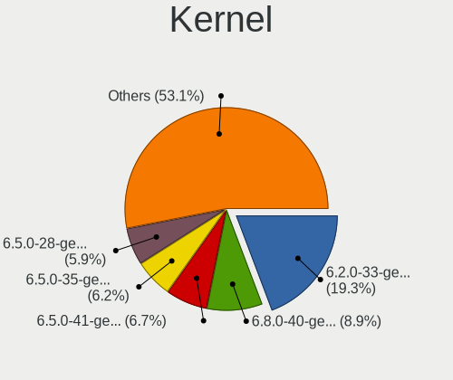

| Version              | Notebooks | Percent |
|----------------------|-----------|---------|
| 6.2.0-33-generic     | 78        | 19.26%  |
| 6.8.0-40-generic     | 36        | 8.89%   |
| 6.5.0-41-generic     | 27        | 6.67%   |
| 6.5.0-35-generic     | 25        | 6.17%   |
| 6.5.0-28-generic     | 24        | 5.93%   |
| 6.8.0-45-generic     | 21        | 5.19%   |
| 6.8.0-48-generic     | 17        | 4.2%    |
| 6.8.0-47-generic     | 17        | 4.2%    |
| 6.8.0-49-generic     | 14        | 3.46%   |
| 6.5.0-27-generic     | 13        | 3.21%   |
| 6.5.0-26-generic     | 13        | 3.21%   |
| 6.5.0-21-generic     | 11        | 2.72%   |
| 6.2.0-39-generic     | 11        | 2.72%   |
| 6.5.0-15-generic     | 10        | 2.47%   |
| 6.2.0-36-generic     | 10        | 2.47%   |
| 6.2.0-34-generic     | 10        | 2.47%   |
| 6.5.0-44-generic     | 9         | 2.22%   |
| 6.5.0-25-generic     | 9         | 2.22%   |
| 6.2.0-37-generic     | 9         | 2.22%   |
| 6.5.0-45-generic     | 8         | 1.98%   |
| 6.5.0-14-generic     | 6         | 1.48%   |
| 6.2.0-35-generic     | 6         | 1.48%   |
| 6.5.0-18-generic     | 5         | 1.23%   |
| 6.5.0-17-generic     | 4         | 0.99%   |
| 6.2.0-26-generic     | 2         | 0.49%   |
| 6.8.0-50-generic     | 1         | 0.25%   |
| 6.7.3-060703-generic | 1         | 0.25%   |
| 6.5.7-060507-generic | 1         | 0.25%   |
| 6.5.5-x64v3-xanmod1  | 1         | 0.25%   |
| 6.5.0-1027-oem       | 1         | 0.25%   |
| 6.5.0-1025-oem       | 1         | 0.25%   |
| 5.19.0-50-generic    | 1         | 0.25%   |
| 5.19.0-46-generic    | 1         | 0.25%   |
| 5.19.0-41-generic    | 1         | 0.25%   |
| 5.15.0-58-generic    | 1         | 0.25%   |

Kernel Family
-------------

Linux kernel without a distro release

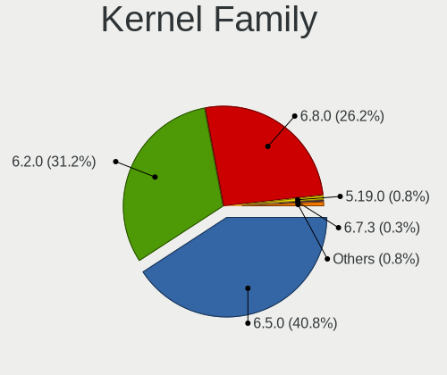

| Version | Notebooks | Percent |
|---------|-----------|---------|
| 6.5.0   | 162       | 40.81%  |
| 6.2.0   | 124       | 31.23%  |
| 6.8.0   | 104       | 26.2%   |
| 5.19.0  | 3         | 0.76%   |
| 6.7.3   | 1         | 0.25%   |
| 6.5.7   | 1         | 0.25%   |
| 6.5.5   | 1         | 0.25%   |
| 5.15.0  | 1         | 0.25%   |

Kernel Major Ver.
-----------------

Linux kernel major version

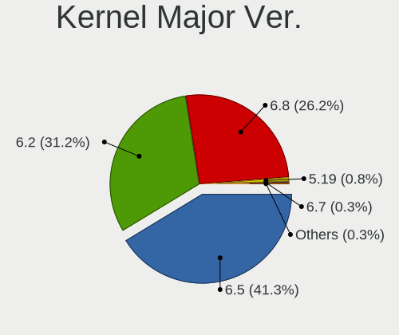

| Version | Notebooks | Percent |
|---------|-----------|---------|
| 6.5     | 164       | 41.31%  |
| 6.2     | 124       | 31.23%  |
| 6.8     | 104       | 26.2%   |
| 5.19    | 3         | 0.76%   |
| 6.7     | 1         | 0.25%   |
| 5.15    | 1         | 0.25%   |

Arch
----

OS architecture (x86_64, i586, etc.)

| Name   | Notebooks | Percent |
|--------|-----------|---------|
| x86_64 | 387       | 100%    |

DE
--

Desktop Environment

| Name     | Notebooks | Percent |
|----------|-----------|---------|
| Pantheon | 385       | 99.48%  |
| KDE5     | 1         | 0.26%   |
| Unknown  | 1         | 0.26%   |

Display Server
--------------

X11 or Wayland

| Name | Notebooks | Percent |
|------|-----------|---------|
| X11  | 387       | 100%    |

Display Manager
---------------

SDDM, LightDM, etc.

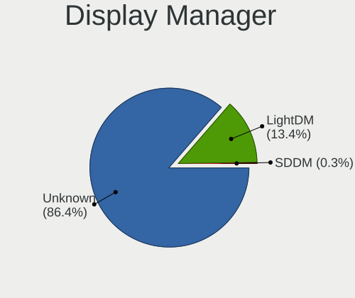

| Name    | Notebooks | Percent |
|---------|-----------|---------|
| Unknown | 336       | 86.38%  |
| LightDM | 52        | 13.37%  |
| SDDM    | 1         | 0.26%   |

OS Lang
-------

Language

| Lang    | Notebooks | Percent |
|---------|-----------|---------|
| en_US   | 154       | 39.79%  |
| de_DE   | 50        | 12.92%  |
| ru_RU   | 37        | 9.56%   |
| es_ES   | 36        | 9.3%    |
| it_IT   | 23        | 5.94%   |
| pt_BR   | 15        | 3.88%   |
| fr_FR   | 14        | 3.62%   |
| en_GB   | 11        | 2.84%   |
| pl_PL   | 9         | 2.33%   |
| tr_TR   | 4         | 1.03%   |
| nl_NL   | 4         | 1.03%   |
| cs_CZ   | 3         | 0.78%   |
| uk_UA   | 2         | 0.52%   |
| sv_SE   | 2         | 0.52%   |
| pt_PT   | 2         | 0.52%   |
| id_ID   | 2         | 0.52%   |
| fi_FI   | 2         | 0.52%   |
| de_CH   | 2         | 0.52%   |
| da_DK   | 2         | 0.52%   |
| zh_TW   | 1         | 0.26%   |
| zh_CN   | 1         | 0.26%   |
| nb_NO   | 1         | 0.26%   |
| ja_JP   | 1         | 0.26%   |
| hu_HU   | 1         | 0.26%   |
| hr_HR   | 1         | 0.26%   |
| fr_CA   | 1         | 0.26%   |
| et_EE   | 1         | 0.26%   |
| es_AR   | 1         | 0.26%   |
| en_AU   | 1         | 0.26%   |
| el_GR   | 1         | 0.26%   |
| ar_EG   | 1         | 0.26%   |
| Unknown | 1         | 0.26%   |

Boot Mode
---------

EFI or BIOS

| Mode | Notebooks | Percent |
|------|-----------|---------|
| BIOS | 353       | 90.98%  |
| EFI  | 35        | 9.02%   |

Filesystem
----------

Type of filesystem

| Type    | Notebooks | Percent |
|---------|-----------|---------|
| Ext4    | 363       | 93.32%  |
| Tmpfs   | 17        | 4.37%   |
| Xfs     | 4         | 1.03%   |
| Btrfs   | 4         | 1.03%   |
| Overlay | 1         | 0.26%   |

Part. scheme
------------

Scheme of partitioning

| Type    | Notebooks | Percent |
|---------|-----------|---------|
| Unknown | 335       | 85.9%   |
| GPT     | 44        | 11.28%  |
| MBR     | 11        | 2.82%   |

Dual Boot with Linux/BSD
------------------------

Hosting more than one Linux/BSD

| Dual boot | Notebooks | Percent |
|-----------|-----------|---------|
| No        | 383       | 98.97%  |
| Yes       | 4         | 1.03%   |

Dual Boot (Win)
---------------

Hosting Linux and Windows

| Dual boot | Notebooks | Percent |
|-----------|-----------|---------|
| No        | 374       | 96.14%  |
| Yes       | 15        | 3.86%   |

Board
-----

Vendor
------

Motherboard manufacturer

| Name                 | Notebooks | Percent |
|----------------------|-----------|---------|
| Apple                | 88        | 22.74%  |
| Hewlett-Packard      | 69        | 17.83%  |
| Lenovo               | 66        | 17.05%  |
| Dell                 | 48        | 12.4%   |
| ASUSTek Computer     | 26        | 6.72%   |
| Acer                 | 22        | 5.68%   |
| HUAWEI               | 12        | 3.1%    |
| Samsung Electronics  | 9         | 2.33%   |
| Sony                 | 4         | 1.03%   |
| MSI                  | 4         | 1.03%   |
| Google               | 4         | 1.03%   |
| Unknown              | 4         | 1.03%   |
| Toshiba              | 3         | 0.78%   |
| Fujitsu              | 3         | 0.78%   |
| Alienware            | 3         | 0.78%   |
| Positivo             | 2         | 0.52%   |
| UNOWHY               | 1         | 0.26%   |
| UMAX                 | 1         | 0.26%   |
| Timi                 | 1         | 0.26%   |
| THTF                 | 1         | 0.26%   |
| TECNO Mobile Limited | 1         | 0.26%   |
| TECNO                | 1         | 0.26%   |
| Teclast              | 1         | 0.26%   |
| realme               | 1         | 0.26%   |
| Packard Bell         | 1         | 0.26%   |
| NEC Computers        | 1         | 0.26%   |
| Myway                | 1         | 0.26%   |
| Microtech            | 1         | 0.26%   |
| Medion               | 1         | 0.26%   |
| LTD Delovoy Office   | 1         | 0.26%   |
| HONOR                | 1         | 0.26%   |
| Gigabyte Technology  | 1         | 0.26%   |
| DEPO Computers       | 1         | 0.26%   |
| Compaq               | 1         | 0.26%   |
| Chuwi                | 1         | 0.26%   |
| ARCELIK              | 1         | 0.26%   |

Model
-----

Motherboard model

| Name                              | Notebooks | Percent |
|-----------------------------------|-----------|---------|
| Apple MacBookPro9,2               | 12        | 3.1%    |
| Apple MacBookPro8,1               | 12        | 3.1%    |
| Apple MacBookAir7,2               | 11        | 2.84%   |
| Apple MacBookPro7,1               | 6         | 1.55%   |
| Unknown                           | 5         | 1.29%   |
| HP Pavilion 17                    | 4         | 1.03%   |
| Apple MacBookPro6,2               | 4         | 1.03%   |
| HUAWEI BOM-WXX9                   | 3         | 0.78%   |
| HP ProBook 450 G3                 | 3         | 0.78%   |
| Apple MacBookPro9,1               | 3         | 0.78%   |
| Apple MacBookPro8,2               | 3         | 0.78%   |
| Apple MacBookPro5,5               | 3         | 0.78%   |
| Apple MacBookPro11,1              | 3         | 0.78%   |
| Apple MacBookAir3,1               | 3         | 0.78%   |
| Toshiba Satellite L50-B           | 2         | 0.52%   |
| Lenovo IdeaPad Slim 3 15IAH8 83ER | 2         | 0.52%   |
| HUAWEI NBLB-WAX9N                 | 2         | 0.52%   |
| HUAWEI KLVL-WXX9                  | 2         | 0.52%   |
| HUAWEI BOD-WXX9                   | 2         | 0.52%   |
| HP ProBook 440 G8 Notebook PC     | 2         | 0.52%   |
| HP Pavilion Sleekbook 15 PC       | 2         | 0.52%   |
| HP Pavilion dv6                   | 2         | 0.52%   |
| HP Laptop 15s-eq2xxx              | 2         | 0.52%   |
| HP ENVY 17                        | 2         | 0.52%   |
| HP EliteBook 840 G1               | 2         | 0.52%   |
| HP 15                             | 2         | 0.52%   |
| Google Nospike                    | 2         | 0.52%   |
| Dell Latitude E7440               | 2         | 0.52%   |
| Dell Latitude E7240               | 2         | 0.52%   |
| Dell Latitude E6520               | 2         | 0.52%   |
| Dell Inspiron 5567                | 2         | 0.52%   |
| Apple MacBookPro8,3               | 2         | 0.52%   |
| Apple MacBookPro5,4               | 2         | 0.52%   |
| Apple MacBookPro5,3               | 2         | 0.52%   |
| Apple MacBookPro5,1               | 2         | 0.52%   |
| Apple MacBookAir6,1               | 2         | 0.52%   |
| Apple MacBookAir4,1               | 2         | 0.52%   |
| Apple MacBook6,1                  | 2         | 0.52%   |
| Apple MacBook5,1                  | 2         | 0.52%   |
| Apple MacBook4,1                  | 2         | 0.52%   |

Model Family
------------

Motherboard model prefix

| Name               | Notebooks | Percent |
|--------------------|-----------|---------|
| Lenovo ThinkPad    | 24        | 6.2%    |
| Lenovo IdeaPad     | 22        | 5.68%   |
| Dell Latitude      | 21        | 5.43%   |
| HP Pavilion        | 19        | 4.91%   |
| Apple MacBookPro8  | 17        | 4.39%   |
| Acer Aspire        | 16        | 4.13%   |
| HP ProBook         | 15        | 3.88%   |
| Apple MacBookPro9  | 15        | 3.88%   |
| Dell Inspiron      | 14        | 3.62%   |
| HP EliteBook       | 11        | 2.84%   |
| Apple MacBookAir7  | 11        | 2.84%   |
| Apple MacBookPro5  | 10        | 2.58%   |
| Apple MacBookPro11 | 7         | 1.81%   |
| ASUS VivoBook      | 6         | 1.55%   |
| Apple MacBookPro7  | 6         | 1.55%   |
| HP Laptop          | 5         | 1.29%   |
| Unknown            | 5         | 1.29%   |
| HP ENVY            | 4         | 1.03%   |
| HP Compaq          | 4         | 1.03%   |
| Dell XPS           | 4         | 1.03%   |
| Apple MacBookPro6  | 4         | 1.03%   |
| Toshiba Satellite  | 3         | 0.78%   |
| HUAWEI BOM-WXX9    | 3         | 0.78%   |
| HP 15              | 3         | 0.78%   |
| Fujitsu LIFEBOOK   | 3         | 0.78%   |
| Dell Vostro        | 3         | 0.78%   |
| Dell Precision     | 3         | 0.78%   |
| Apple MacBookAir4  | 3         | 0.78%   |
| Apple MacBookAir3  | 3         | 0.78%   |
| Lenovo Yoga        | 2         | 0.52%   |
| HUAWEI NBLB-WAX9N  | 2         | 0.52%   |
| HUAWEI KLVL-WXX9   | 2         | 0.52%   |
| HUAWEI BOD-WXX9    | 2         | 0.52%   |
| Google Nospike     | 2         | 0.52%   |
| ASUS Zenbook       | 2         | 0.52%   |
| ASUS ASUS          | 2         | 0.52%   |
| Apple MacBookAir6  | 2         | 0.52%   |
| Apple MacBook6     | 2         | 0.52%   |
| Apple MacBook5     | 2         | 0.52%   |
| Apple MacBook4     | 2         | 0.52%   |

MFG Year
--------

Motherboard manufacture year

| Year | Notebooks | Percent |
|------|-----------|---------|
| 2012 | 47        | 12.14%  |
| 2011 | 34        | 8.79%   |
| 2010 | 34        | 8.79%   |
| 2013 | 33        | 8.53%   |
| 2021 | 32        | 8.27%   |
| 2014 | 25        | 6.46%   |
| 2020 | 22        | 5.68%   |
| 2018 | 22        | 5.68%   |
| 2017 | 20        | 5.17%   |
| 2016 | 19        | 4.91%   |
| 2009 | 19        | 4.91%   |
| 2023 | 16        | 4.13%   |
| 2015 | 15        | 3.88%   |
| 2022 | 13        | 3.36%   |
| 2008 | 13        | 3.36%   |
| 2007 | 12        | 3.1%    |
| 2019 | 9         | 2.33%   |
| 2024 | 2         | 0.52%   |

Form Factor
-----------

Physical design of the computer

| Name     | Notebooks | Percent |
|----------|-----------|---------|
| Notebook | 387       | 100%    |

Secure Boot
-----------

Enabled or disabled

| State    | Notebooks | Percent |
|----------|-----------|---------|
| Disabled | 382       | 98.71%  |
| Enabled  | 5         | 1.29%   |

Coreboot
--------

Have coreboot on board

| Used | Notebooks | Percent |
|------|-----------|---------|
| No   | 383       | 98.97%  |
| Yes  | 4         | 1.03%   |

RAM Size
--------

Total RAM memory

| Size in GB  | Notebooks | Percent |
|-------------|-----------|---------|
| 4.01-8.0    | 169       | 43.44%  |
| 3.01-4.0    | 68        | 17.48%  |
| 16.01-24.0  | 67        | 17.22%  |
| 8.01-16.0   | 45        | 11.57%  |
| 32.01-64.0  | 16        | 4.11%   |
| 1.01-2.0    | 10        | 2.57%   |
| 2.01-3.0    | 9         | 2.31%   |
| 24.01-32.0  | 3         | 0.77%   |
| 64.01-256.0 | 2         | 0.51%   |

RAM Used
--------

Used RAM memory

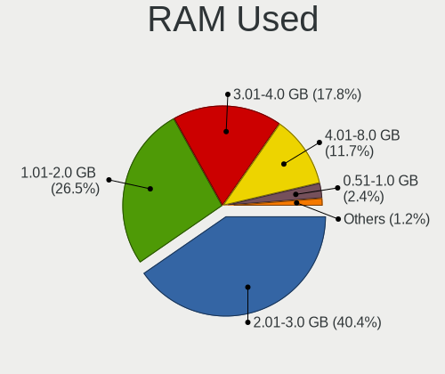

| Used GB   | Notebooks | Percent |
|-----------|-----------|---------|
| 2.01-3.0  | 166       | 40.39%  |
| 1.01-2.0  | 109       | 26.52%  |
| 3.01-4.0  | 73        | 17.76%  |
| 4.01-8.0  | 48        | 11.68%  |
| 0.51-1.0  | 10        | 2.43%   |
| 8.01-16.0 | 5         | 1.22%   |

Total Drives
------------

Number of drives on board

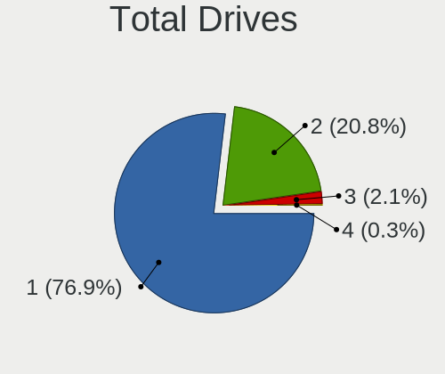

| Drives | Notebooks | Percent |
|--------|-----------|---------|
| 1      | 299       | 76.86%  |
| 2      | 81        | 20.82%  |
| 3      | 8         | 2.06%   |
| 4      | 1         | 0.26%   |

Has CD-ROM
----------

Has CD-ROM on board

| Presented | Notebooks | Percent |
|-----------|-----------|---------|
| No        | 236       | 60.98%  |
| Yes       | 151       | 39.02%  |

Has Ethernet
------------

Has Ethernet on board

| Presented | Notebooks | Percent |
|-----------|-----------|---------|
| Yes       | 305       | 78.61%  |
| No        | 83        | 21.39%  |

Has WiFi
--------

Has WiFi module

| Presented | Notebooks | Percent |
|-----------|-----------|---------|
| Yes       | 384       | 99.22%  |
| No        | 3         | 0.78%   |

Has Bluetooth
-------------

Has Bluetooth module

| Presented | Notebooks | Percent |
|-----------|-----------|---------|
| Yes       | 343       | 88.63%  |
| No        | 44        | 11.37%  |

Location
--------

Country
-------

Geographic location (country)

| Country      | Notebooks | Percent |
|--------------|-----------|---------|
| USA          | 65        | 16.8%   |
| Germany      | 51        | 13.18%  |
| Russia       | 29        | 7.49%   |
| Italy        | 23        | 5.94%   |
| Brazil       | 20        | 5.17%   |
| Spain        | 12        | 3.1%    |
| France       | 11        | 2.84%   |
| Poland       | 9         | 2.33%   |
| Netherlands  | 9         | 2.33%   |
| Mexico       | 9         | 2.33%   |
| Indonesia    | 9         | 2.33%   |
| UK           | 8         | 2.07%   |
| India        | 8         | 2.07%   |
| Canada       | 7         | 1.81%   |
| Switzerland  | 5         | 1.29%   |
| Sweden       | 5         | 1.29%   |
| Chile        | 5         | 1.29%   |
| Austria      | 5         | 1.29%   |
| Ukraine      | 4         | 1.03%   |
| Turkey       | 4         | 1.03%   |
| Romania      | 4         | 1.03%   |
| Morocco      | 4         | 1.03%   |
| Hungary      | 4         | 1.03%   |
| Finland      | 4         | 1.03%   |
| Colombia     | 4         | 1.03%   |
| Australia    | 4         | 1.03%   |
| Argentina    | 4         | 1.03%   |
| Greece       | 3         | 0.78%   |
| Czechia      | 3         | 0.78%   |
| Bulgaria     | 3         | 0.78%   |
| Belarus      | 3         | 0.78%   |
| Vietnam      | 2         | 0.52%   |
| Thailand     | 2         | 0.52%   |
| South Africa | 2         | 0.52%   |
| Serbia       | 2         | 0.52%   |
| Puerto Rico  | 2         | 0.52%   |
| Portugal     | 2         | 0.52%   |
| Peru         | 2         | 0.52%   |
| Norway       | 2         | 0.52%   |
| New Zealand  | 2         | 0.52%   |

City
----

Geographic location (city)

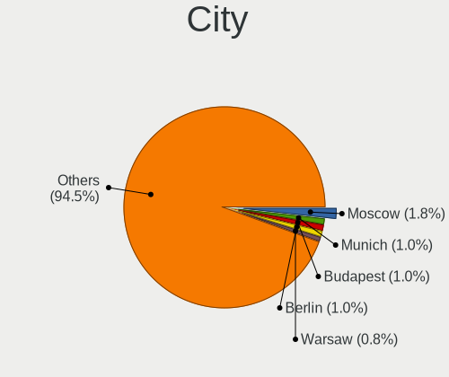

| City             | Notebooks | Percent |
|------------------|-----------|---------|
| Moscow           | 7         | 1.75%   |
| Munich           | 4         | 1%      |
| Budapest         | 4         | 1%      |
| Berlin           | 4         | 1%      |
| Warsaw           | 3         | 0.75%   |
| St Petersburg    | 3         | 0.75%   |
| Santiago         | 3         | 0.75%   |
| Rio de Janeiro   | 3         | 0.75%   |
| Paris            | 3         | 0.75%   |
| Naples           | 3         | 0.75%   |
| Los Angeles      | 3         | 0.75%   |
| Hamburg          | 3         | 0.75%   |
| Yekaterinburg    | 2         | 0.5%    |
| Vitebsk          | 2         | 0.5%    |
| Vienna           | 2         | 0.5%    |
| Temuco           | 2         | 0.5%    |
| Stockholm        | 2         | 0.5%    |
| Sarasota         | 2         | 0.5%    |
| San Jose         | 2         | 0.5%    |
| Rosenheim        | 2         | 0.5%    |
| Rome             | 2         | 0.5%    |
| Prague           | 2         | 0.5%    |
| Perm             | 2         | 0.5%    |
| Oslo             | 2         | 0.5%    |
| Milan            | 2         | 0.5%    |
| Melbourne        | 2         | 0.5%    |
| Maeikiai       | 2         | 0.5%    |
| Madrid           | 2         | 0.5%    |
| Lima             | 2         | 0.5%    |
| Jakarta          | 2         | 0.5%    |
| Istanbul         | 2         | 0.5%    |
| Ho Chi Minh City | 2         | 0.5%    |
| Helsinki         | 2         | 0.5%    |
| Groningen        | 2         | 0.5%    |
| Delhi            | 2         | 0.5%    |
| Cuernavaca       | 2         | 0.5%    |
| Cleveland        | 2         | 0.5%    |
| Chelyabinsk      | 2         | 0.5%    |
| Bogot          | 2         | 0.5%    |
| Bochum           | 2         | 0.5%    |

Drives
------

Drive Vendor
------------

Hard drive vendors

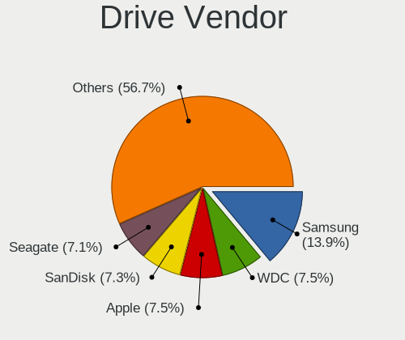

| Vendor                       | Notebooks | Drives | Percent |
|------------------------------|-----------|--------|---------|
| Samsung Electronics          | 65        | 75     | 13.95%  |
| WDC                          | 35        | 41     | 7.51%   |
| Apple                        | 35        | 36     | 7.51%   |
| SanDisk                      | 34        | 39     | 7.3%    |
| Seagate                      | 33        | 34     | 7.08%   |
| Toshiba                      | 32        | 37     | 6.87%   |
| Kingston                     | 27        | 31     | 5.79%   |
| Crucial                      | 22        | 24     | 4.72%   |
| Unknown                      | 21        | 25     | 4.51%   |
| SK hynix                     | 13        | 15     | 2.79%   |
| Hitachi                      | 13        | 14     | 2.79%   |
| Intel                        | 12        | 16     | 2.58%   |
| KIOXIA                       | 9         | 11     | 1.93%   |
| HGST                         | 8         | 9      | 1.72%   |
| China                        | 6         | 8      | 1.29%   |
| A-DATA Technology            | 6         | 6      | 1.29%   |
| Unknown                      | 6         | 7      | 1.29%   |
| Silicon Motion               | 5         | 5      | 1.07%   |
| Phison Electronics           | 5         | 5      | 1.07%   |
| Micron Technology            | 5         | 6      | 1.07%   |
| LITEON                       | 5         | 5      | 1.07%   |
| Intenso                      | 4         | 4      | 0.86%   |
| SPCC                         | 3         | 3      | 0.64%   |
| Phison                       | 3         | 3      | 0.64%   |
| Lexar                        | 3         | 3      | 0.64%   |
| Fanxiang                     | 3         | 3      | 0.64%   |
| Yangtze Memory Technologies  | 2         | 2      | 0.43%   |
| Union Memory                 | 2         | 3      | 0.43%   |
| Transcend                    | 2         | 3      | 0.43%   |
| Shenzhen Longsys Electronics | 2         | 2      | 0.43%   |
| PNY                          | 2         | 2      | 0.43%   |
| Patriot                      | 2         | 2      | 0.43%   |
| OWC                          | 2         | 2      | 0.43%   |
| Netac                        | 2         | 2      | 0.43%   |
| LITEONIT                     | 2         | 2      | 0.43%   |
| Kingston Technology Company  | 2         | 2      | 0.43%   |
| Gigabyte Technology          | 2         | 2      | 0.43%   |
| Fujitsu                      | 2         | 2      | 0.43%   |
| Apacer                       | 2         | 2      | 0.43%   |
| XrayDisk                     | 1         | 2      | 0.21%   |

Drive Model
-----------

Hard drive models

| Model                                               | Notebooks | Percent |
|-----------------------------------------------------|-----------|---------|
| Unknown MMC Card  64GB                              | 8         | 1.68%   |
| Apple SSD SM0128G 121GB                             | 8         | 1.68%   |
| Seagate ST1000LM035-1RK172 1TB                      | 6         | 1.26%   |
| Kingston SA400S37240G 240GB SSD                     | 6         | 1.26%   |
| Unknown                                             | 6         | 1.26%   |
| Seagate ST500LT012-1DG142 500GB                     | 5         | 1.05%   |
| Samsung NVMe SSD Controller SM981/PM981/PM983 512GB | 5         | 1.05%   |
| Kingston SA400S37120G 120GB SSD                     | 5         | 1.05%   |
| Toshiba MQ01ABD100 1TB                              | 4         | 0.84%   |
| Samsung SSD 860 EVO 500GB                           | 4         | 0.84%   |
| Samsung SSD 850 EVO 500GB                           | 4         | 0.84%   |
| Phison PS5013 E13 NVMe Controller 512GB             | 4         | 0.84%   |
| HGST HTS721010A9E630 1TB                            | 4         | 0.84%   |
| Crucial CT240BX500SSD1 240GB                        | 4         | 0.84%   |
| WDC WDS240G2G0A-00JH30 240GB SSD                    | 3         | 0.63%   |
| Toshiba MQ01ABF050 500GB                            | 3         | 0.63%   |
| SK hynix BC501 NVMe Solid State Drive 512GB         | 3         | 0.63%   |
| Seagate ST1000LM024 HN-M101MBB 1TB                  | 3         | 0.63%   |
| Sandisk WD_BLACK SN770 1TB                          | 3         | 0.63%   |
| Sandisk WD Blue SN550 NVMe SSD 256GB                | 3         | 0.63%   |
| Samsung SSD 870 EVO 1TB                             | 3         | 0.63%   |
| Samsung SSD 860 EVO 250GB                           | 3         | 0.63%   |
| Samsung NVMe SSD Controller SM961/PM961/SM963 256GB | 3         | 0.63%   |
| Kingston SA400S37480G 480GB SSD                     | 3         | 0.63%   |
| Crucial CT500MX500SSD1 500GB                        | 3         | 0.63%   |
| Crucial CT1000BX500SSD1 1TB                         | 3         | 0.63%   |
| Apple SSD SM256C 256GB                              | 3         | 0.63%   |
| Apple HDD HTS545050A7E362 500GB                     | 3         | 0.63%   |
| WDC WDS120G2G0A-00JH30 120GB SSD                    | 2         | 0.42%   |
| WDC WD5000LPCX-21VHAT0 500GB                        | 2         | 0.42%   |
| WDC WD10JPVX-60JC3T1 1TB                            | 2         | 0.42%   |
| Unknown NVMe SSD Drive 512GB                        | 2         | 0.42%   |
| Unknown MMC Card  32GB                              | 2         | 0.42%   |
| Unknown MMC Card  16GB                              | 2         | 0.42%   |
| Unknown MMC Card  128GB                             | 2         | 0.42%   |
| Toshiba THNSFJ256GCSU 256GB SSD                     | 2         | 0.42%   |
| Toshiba MQ01ACF050 500GB                            | 2         | 0.42%   |
| Toshiba MK7559GSXF 752GB                            | 2         | 0.42%   |
| Toshiba MK5065GSXF 500GB                            | 2         | 0.42%   |
| SPCC Solid State Disk 512GB                         | 2         | 0.42%   |

HDD Vendor
----------

Hard disk drive vendors

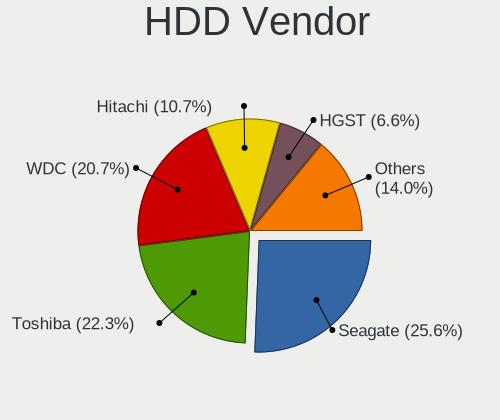

| Vendor              | Notebooks | Drives | Percent |
|---------------------|-----------|--------|---------|
| Seagate             | 31        | 32     | 25.62%  |
| Toshiba             | 27        | 32     | 22.31%  |
| WDC                 | 25        | 27     | 20.66%  |
| Hitachi             | 13        | 14     | 10.74%  |
| HGST                | 8         | 9      | 6.61%   |
| Apple               | 7         | 7      | 5.79%   |
| Samsung Electronics | 3         | 3      | 2.48%   |
| Fujitsu             | 2         | 2      | 1.65%   |
| Unknown             | 1         | 1      | 0.83%   |
| TO Exter            | 1         | 1      | 0.83%   |
| SABRENT             | 1         | 1      | 0.83%   |
| JMicron Technology  | 1         | 1      | 0.83%   |
| ASMT                | 1         | 1      | 0.83%   |

SSD Vendor
----------

Solid state drive vendors

| Vendor              | Notebooks | Drives | Percent |
|---------------------|-----------|--------|---------|
| Samsung Electronics | 36        | 41     | 17.31%  |
| Apple               | 27        | 28     | 12.98%  |
| Kingston            | 25        | 29     | 12.02%  |
| Crucial             | 22        | 24     | 10.58%  |
| SanDisk             | 20        | 23     | 9.62%   |
| WDC                 | 11        | 13     | 5.29%   |
| Intel               | 7         | 10     | 3.37%   |
| China               | 6         | 8      | 2.88%   |
| LITEON              | 5         | 5      | 2.4%    |
| Intenso             | 4         | 4      | 1.92%   |
| A-DATA Technology   | 4         | 4      | 1.92%   |
| SPCC                | 3         | 3      | 1.44%   |
| Lexar               | 3         | 3      | 1.44%   |
| Unknown             | 3         | 3      | 1.44%   |
| Transcend           | 2         | 3      | 0.96%   |
| Toshiba             | 2         | 2      | 0.96%   |
| SK hynix            | 2         | 2      | 0.96%   |
| PNY                 | 2         | 2      | 0.96%   |
| Patriot             | 2         | 2      | 0.96%   |
| OWC                 | 2         | 2      | 0.96%   |
| LITEONIT            | 2         | 2      | 0.96%   |
| Apacer              | 2         | 2      | 0.96%   |
| XrayDisk            | 1         | 2      | 0.48%   |
| Verbatim            | 1         | 1      | 0.48%   |
| Teclast             | 1         | 1      | 0.48%   |
| Seagate             | 1         | 1      | 0.48%   |
| OCZ                 | 1         | 1      | 0.48%   |
| NGFF                | 1         | 1      | 0.48%   |
| Netac               | 1         | 1      | 0.48%   |
| Micron Technology   | 1         | 1      | 0.48%   |
| LS                  | 1         | 1      | 0.48%   |
| HUSKY               | 1         | 1      | 0.48%   |
| Hewlett-Packard     | 1         | 2      | 0.48%   |
| GOODRAM             | 1         | 1      | 0.48%   |
| Gigabyte Technology | 1         | 1      | 0.48%   |
| Fanxiang            | 1         | 1      | 0.48%   |
| Emtec               | 1         | 2      | 0.48%   |
| BIWIN               | 1         | 1      | 0.48%   |

Drive Kind
----------

HDD or SSD

| Kind    | Notebooks | Drives | Percent |
|---------|-----------|--------|---------|
| SSD     | 194       | 234    | 43.79%  |
| HDD     | 115       | 131    | 25.96%  |
| NVMe    | 102       | 120    | 23.02%  |
| MMC     | 19        | 25     | 4.29%   |
| Unknown | 13        | 14     | 2.93%   |

Drive Connector
---------------

SATA, SAS, NVMe, etc.

| Type | Notebooks | Drives | Percent |
|------|-----------|--------|---------|
| SATA | 295       | 368    | 69.09%  |
| NVMe | 102       | 120    | 23.89%  |
| MMC  | 19        | 25     | 4.45%   |
| SAS  | 11        | 11     | 2.58%   |

Drive Size
----------

Size of hard drive

| Size in TB | Notebooks | Drives | Percent |
|------------|-----------|--------|---------|
| 0.01-0.5   | 234       | 276    | 75%     |
| 0.51-1.0   | 70        | 80     | 22.44%  |
| 1.01-2.0   | 8         | 9      | 2.56%   |

Space Total
-----------

Amount of disk space available on the file system

| Size in GB     | Notebooks | Percent |
|----------------|-----------|---------|
| 101-250        | 167       | 42.71%  |
| 251-500        | 115       | 29.41%  |
| 501-1000       | 56        | 14.32%  |
| 51-100         | 27        | 6.91%   |
| 21-50          | 12        | 3.07%   |
| 1001-2000      | 8         | 2.05%   |
| More than 3000 | 2         | 0.51%   |
| 1-20           | 2         | 0.51%   |
| 2001-3000      | 1         | 0.26%   |
| Unknown        | 1         | 0.26%   |

Space Used
----------

Amount of used disk space

| Used GB   | Notebooks | Percent |
|-----------|-----------|---------|
| 1-20      | 204       | 50.87%  |
| 21-50     | 115       | 28.68%  |
| 51-100    | 32        | 7.98%   |
| 101-250   | 29        | 7.23%   |
| 251-500   | 17        | 4.24%   |
| 501-1000  | 2         | 0.5%    |
| 2001-3000 | 1         | 0.25%   |
| Unknown   | 1         | 0.25%   |

Malfunc. Drives
---------------

Drive models with a malfunction

| Model                                       | Notebooks | Drives | Percent |
|---------------------------------------------|-----------|--------|---------|
| Seagate ST1000LM035-1RK172 1TB              | 1         | 1      | 16.67%  |
| Samsung Electronics HM320II 320GB           | 1         | 1      | 16.67%  |
| LS 128GB M300                               | 1         | 1      | 16.67%  |
| Intel SSDPEKKF512G7H BTPY71141D7T512F 512GB | 1         | 1      | 16.67%  |
| Crucial CT240M500SSD3 240GB                 | 1         | 1      | 16.67%  |
| BIWIN SSD 64GB                              | 1         | 1      | 16.67%  |

Malfunc. Drive Vendor
---------------------

Vendors of faulty drives

| Vendor              | Notebooks | Drives | Percent |
|---------------------|-----------|--------|---------|
| Seagate             | 1         | 1      | 16.67%  |
| Samsung Electronics | 1         | 1      | 16.67%  |
| LS                  | 1         | 1      | 16.67%  |
| Intel               | 1         | 1      | 16.67%  |
| Crucial             | 1         | 1      | 16.67%  |
| BIWIN               | 1         | 1      | 16.67%  |

Malfunc. HDD Vendor
-------------------

Vendors of faulty HDD drives

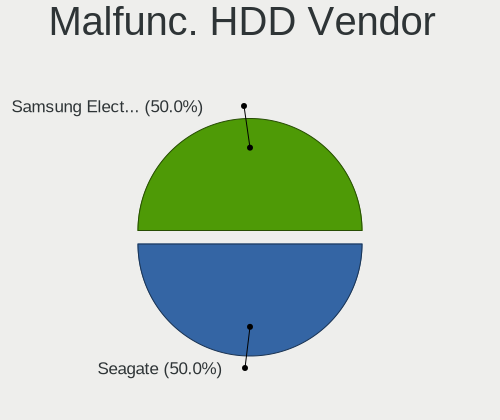

| Vendor              | Notebooks | Drives | Percent |
|---------------------|-----------|--------|---------|
| Seagate             | 1         | 1      | 50%     |
| Samsung Electronics | 1         | 1      | 50%     |

Malfunc. Drive Kind
-------------------

Kinds of faulty drives

| Kind | Notebooks | Drives | Percent |
|------|-----------|--------|---------|
| SSD  | 3         | 3      | 50%     |
| HDD  | 2         | 2      | 33.33%  |
| NVMe | 1         | 1      | 16.67%  |

Failed Drives
-------------

Failed drive models

Zero info for selected period =(

Failed Drive Vendor
-------------------

Failed drive vendors

Zero info for selected period =(

Drive Status
------------

Number of failed and malfunc. drives

| Status   | Notebooks | Drives | Percent |
|----------|-----------|--------|---------|
| Detected | 359       | 482    | 91.12%  |
| Works    | 29        | 36     | 7.36%   |
| Malfunc  | 6         | 6      | 1.52%   |

Storage controller
------------------

Storage Vendor
--------------

Storage controller vendors

| Vendor                       | Notebooks | Percent |
|------------------------------|-----------|---------|
| Intel                        | 266       | 60.45%  |
| Samsung Electronics          | 42        | 9.55%   |
| AMD                          | 30        | 6.82%   |
| Nvidia                       | 24        | 5.45%   |
| SanDisk                      | 15        | 3.41%   |
| SK hynix                     | 11        | 2.5%    |
| KIOXIA                       | 9         | 2.05%   |
| Phison Electronics           | 8         | 1.82%   |
| Silicon Motion               | 6         | 1.36%   |
| Toshiba America Info Systems | 5         | 1.14%   |
| Micron Technology            | 4         | 0.91%   |
| Kingston Technology Company  | 4         | 0.91%   |
| Union Memory (Shenzhen)      | 3         | 0.68%   |
| Yangtze Memory Technologies  | 2         | 0.45%   |
| Shenzhen Longsys Electronics | 2         | 0.45%   |
| ADATA Technology             | 2         | 0.45%   |
| Solidigm                     | 1         | 0.23%   |
| Micron/Crucial Technology    | 1         | 0.23%   |
| MAXIO Technology (Hangzhou)  | 1         | 0.23%   |
| Marvell Technology Group     | 1         | 0.23%   |
| Lite-On Technology           | 1         | 0.23%   |
| ASMedia Technology           | 1         | 0.23%   |
| Apple                        | 1         | 0.23%   |

Storage Model
-------------

Storage controller models

| Model                                                                          | Notebooks | Percent |
|--------------------------------------------------------------------------------|-----------|---------|
| Intel 7 Series Chipset Family 6-port SATA Controller [AHCI mode]               | 38        | 8.24%   |
| Intel Sunrise Point-LP SATA Controller [AHCI mode]                             | 33        | 7.16%   |
| Intel 6 Series/C200 Series Chipset Family 6 port Mobile SATA AHCI Controller   | 33        | 7.16%   |
| AMD FCH SATA Controller [AHCI mode]                                            | 26        | 5.64%   |
| Intel 82801 Mobile SATA Controller [RAID mode]                                 | 20        | 4.34%   |
| Intel 8 Series SATA Controller 1 [AHCI mode]                                   | 17        | 3.69%   |
| Nvidia MCP79 AHCI Controller                                                   | 14        | 3.04%   |
| Intel 5 Series/3400 Series Chipset 4 port SATA AHCI Controller                 | 13        | 2.82%   |
| Samsung NVMe SSD Controller 980 (DRAM-less)                                    | 12        | 2.6%    |
| Samsung S4LN058A01[SSUBX] AHCI SSD Controller (Apple slot)                     | 11        | 2.39%   |
| Intel Volume Management Device NVMe RAID Controller                            | 11        | 2.39%   |
| Intel Tiger Lake-LP SATA Controller                                            | 11        | 2.39%   |
| Intel 82801IBM/IEM (ICH9M/ICH9M-E) 4 port SATA Controller [AHCI mode]          | 11        | 2.39%   |
| Nvidia MCP89 SATA Controller (AHCI mode)                                       | 9         | 1.95%   |
| Intel 8 Series/C220 Series Chipset Family 6-port SATA Controller 1 [AHCI mode] | 9         | 1.95%   |
| Intel Wildcat Point-LP SATA Controller [AHCI Mode]                             | 8         | 1.74%   |
| Intel Celeron/Pentium Silver Processor SATA Controller                         | 8         | 1.74%   |
| SanDisk WD Black SN770 / PC SN740 256GB / PC SN560 (DRAM-less) NVMe SSD        | 7         | 1.52%   |
| Intel 5 Series/3400 Series Chipset 6 port SATA AHCI Controller                 | 7         | 1.52%   |
| Samsung NVMe SSD Controller SM981/PM981/PM983                                  | 6         | 1.3%    |
| Phison PS5013-E13 PCIe3 NVMe Controller (DRAM-less)                            | 6         | 1.3%    |
| Intel Comet Lake SATA AHCI Controller                                          | 6         | 1.3%    |
| Intel Cannon Lake Mobile PCH SATA AHCI Controller                              | 6         | 1.3%    |
| KIOXIA NVMe SSD Controller BG4 (DRAM-less)                                     | 5         | 1.08%   |
| Intel HM170/QM170 Chipset SATA Controller [AHCI Mode]                          | 5         | 1.08%   |
| Intel Atom Processor E3800 Series SATA AHCI Controller                         | 5         | 1.08%   |
| Intel 82801HM/HEM (ICH8M/ICH8M-E) IDE Controller                               | 5         | 1.08%   |
| SK hynix Gold P31/BC711/PC711 NVMe Solid State Drive                           | 4         | 0.87%   |
| Samsung S4LN053X01 AHCI SSD Controller(Apple slot)                             | 4         | 0.87%   |
| Intel 82801HM/HEM (ICH8M/ICH8M-E) SATA Controller [AHCI mode]                  | 4         | 0.87%   |
| AMD SB7x0/SB8x0/SB9x0 SATA Controller [AHCI mode]                              | 4         | 0.87%   |
| SK hynix BC501 NVMe Solid State Drive                                          | 3         | 0.65%   |
| Silicon Motion SM2263EN/SM2263XT (DRAM-less) NVMe SSD Controllers              | 3         | 0.65%   |
| SanDisk Ultra 3D / WD PC SN530, IX SN530, Blue SN550 NVMe SSD (DRAM-less)      | 3         | 0.65%   |
| Samsung NVMe SSD Controller SM961/PM961/SM963                                  | 3         | 0.65%   |
| KIOXIA NVMe SSD Controller BG5 (DRAM-less)                                     | 3         | 0.65%   |
| Intel SSD 670p Series [Keystone Harbor]                                        | 3         | 0.65%   |
| Intel Celeron N3350/Pentium N4200/Atom E3900 Series SATA AHCI Controller       | 3         | 0.65%   |
| Yangtze Memory PC005 NVMe SSD                                                  | 2         | 0.43%   |
| Toshiba America Info Systems XG6 NVMe SSD Controller                           | 2         | 0.43%   |

Storage Kind
------------

Kind of storage controller (IDE, SATA, NVMe, SAS, ...)

| Kind | Notebooks | Percent |
|------|-----------|---------|
| SATA | 302       | 67.11%  |
| NVMe | 102       | 22.67%  |
| RAID | 33        | 7.33%   |
| IDE  | 13        | 2.89%   |

Processor
---------

CPU Vendor
----------

Processor vendors

| Vendor | Notebooks | Percent |
|--------|-----------|---------|
| Intel  | 332       | 85.79%  |
| AMD    | 55        | 14.21%  |

CPU Model
---------

Processor models

| Model                                         | Notebooks | Percent |
|-----------------------------------------------|-----------|---------|
| Intel Core i5-3210M CPU @ 2.50GHz             | 11        | 2.84%   |
| Intel Core 2 Duo CPU P8600 @ 2.40GHz          | 10        | 2.58%   |
| Intel 11th Gen Core i5-1135G7 @ 2.40GHz       | 9         | 2.33%   |
| Intel Core i5-6200U CPU @ 2.30GHz             | 8         | 2.07%   |
| Intel Core i5-7200U CPU @ 2.50GHz             | 7         | 1.81%   |
| Intel Core i5-5250U CPU @ 1.60GHz             | 7         | 1.81%   |
| Intel Core i5-2415M CPU @ 2.30GHz             | 7         | 1.81%   |
| Intel Core i7-7700HQ CPU @ 2.80GHz            | 5         | 1.29%   |
| Intel Core i5-8300H CPU @ 2.30GHz             | 5         | 1.29%   |
| AMD Ryzen 7 5700U with Radeon Graphics        | 5         | 1.29%   |
| Intel Core i7-4700MQ CPU @ 2.40GHz            | 4         | 1.03%   |
| Intel Core i7-2760QM CPU @ 2.40GHz            | 4         | 1.03%   |
| Intel Core i5-4210U CPU @ 1.70GHz             | 4         | 1.03%   |
| Intel Core i5-2520M CPU @ 2.50GHz             | 4         | 1.03%   |
| Intel Core i5-2410M CPU @ 2.30GHz             | 4         | 1.03%   |
| Intel Core i3-4005U CPU @ 1.70GHz             | 4         | 1.03%   |
| Intel Core i3 CPU M 370 @ 2.40GHz             | 4         | 1.03%   |
| Intel Core 2 Duo CPU P7550 @ 2.26GHz          | 4         | 1.03%   |
| Intel Core i7-8650U CPU @ 1.90GHz             | 3         | 0.78%   |
| Intel Core i7-8550U CPU @ 1.80GHz             | 3         | 0.78%   |
| Intel Core i7-6700HQ CPU @ 2.60GHz            | 3         | 0.78%   |
| Intel Core i7-6500U CPU @ 2.50GHz             | 3         | 0.78%   |
| Intel Core i7-5650U CPU @ 2.20GHz             | 3         | 0.78%   |
| Intel Core i7-4600U CPU @ 2.10GHz             | 3         | 0.78%   |
| Intel Core i7-3720QM CPU @ 2.60GHz            | 3         | 0.78%   |
| Intel Core i7-2677M CPU @ 1.80GHz             | 3         | 0.78%   |
| Intel Core i5-8250U CPU @ 1.60GHz             | 3         | 0.78%   |
| Intel Core i5-3320M CPU @ 2.60GHz             | 3         | 0.78%   |
| Intel Core i5-2450M CPU @ 2.50GHz             | 3         | 0.78%   |
| Intel Core i5-2435M CPU @ 2.40GHz             | 3         | 0.78%   |
| Intel Core i5-10210U CPU @ 1.60GHz            | 3         | 0.78%   |
| Intel Core i5 CPU M 520 @ 2.40GHz             | 3         | 0.78%   |
| Intel Core 2 Duo CPU P8700 @ 2.53GHz          | 3         | 0.78%   |
| Intel Celeron N4020 CPU @ 1.10GHz             | 3         | 0.78%   |
| AMD V140 Processor                            | 3         | 0.78%   |
| AMD Ryzen 5 5500U with Radeon Graphics        | 3         | 0.78%   |
| AMD Ryzen 5 3500U with Radeon Vega Mobile Gfx | 3         | 0.78%   |
| Intel Core i7-7500U CPU @ 2.70GHz             | 2         | 0.52%   |
| Intel Core i7-5600U CPU @ 2.60GHz             | 2         | 0.52%   |
| Intel Core i7-5500U CPU @ 2.40GHz             | 2         | 0.52%   |

CPU Model Family
----------------

Processor model prefix

| Model                   | Notebooks | Percent |
|-------------------------|-----------|---------|
| Intel Core i5           | 118       | 30.49%  |
| Intel Core i7           | 77        | 19.9%   |
| Intel Core 2 Duo        | 35        | 9.04%   |
| Other                   | 32        | 8.27%   |
| Intel Core i3           | 28        | 7.24%   |
| Intel Celeron           | 19        | 4.91%   |
| AMD Ryzen 5             | 14        | 3.62%   |
| AMD Ryzen 7             | 11        | 2.84%   |
| Intel Pentium           | 10        | 2.58%   |
| AMD A4                  | 6         | 1.55%   |
| Intel Pentium Dual-Core | 4         | 1.03%   |
| AMD Ryzen 3             | 4         | 1.03%   |
| Intel Atom              | 3         | 0.78%   |
| AMD V140                | 3         | 0.78%   |
| AMD A6                  | 3         | 0.78%   |
| Intel Pentium Silver    | 2         | 0.52%   |
| AMD E2                  | 2         | 0.52%   |
| AMD A8                  | 2         | 0.52%   |
| AMD A12                 | 2         | 0.52%   |
| Intel Xeon              | 1         | 0.26%   |
| Intel Pentium Dual      | 1         | 0.26%   |
| Intel Core m7           | 1         | 0.26%   |
| Intel Core m5           | 1         | 0.26%   |
| Intel Core m3           | 1         | 0.26%   |
| Intel Core 2            | 1         | 0.26%   |
| Intel Celeron Dual-Core | 1         | 0.26%   |
| AMD Turion II Dual-Core | 1         | 0.26%   |
| AMD Ryzen 9             | 1         | 0.26%   |
| AMD Ryzen 5 PRO         | 1         | 0.26%   |
| AMD PRO A10             | 1         | 0.26%   |
| AMD FX                  | 1         | 0.26%   |

CPU Cores
---------

Number of processor cores

| Number | Notebooks | Percent |
|--------|-----------|---------|
| 2      | 240       | 62.02%  |
| 4      | 103       | 26.61%  |
| 6      | 19        | 4.91%   |
| 8      | 16        | 4.13%   |
| 1      | 5         | 1.29%   |
| 12     | 2         | 0.52%   |
| 14     | 1         | 0.26%   |
| 10     | 1         | 0.26%   |

CPU Sockets
-----------

Number of sockets

| Number | Notebooks | Percent |
|--------|-----------|---------|
| 1      | 387       | 100%    |

CPU Threads
-----------

Threads per core (Hyper-Threading)

| Number | Notebooks | Percent |
|--------|-----------|---------|
| 2      | 293       | 75.71%  |
| 1      | 94        | 24.29%  |

CPU Op-Modes
------------

CPU Operation Modes (32-bit, 64-bit)

| Op mode        | Notebooks | Percent |
|----------------|-----------|---------|
| 32-bit, 64-bit | 387       | 100%    |

CPU Microcode
-------------

Microcode number

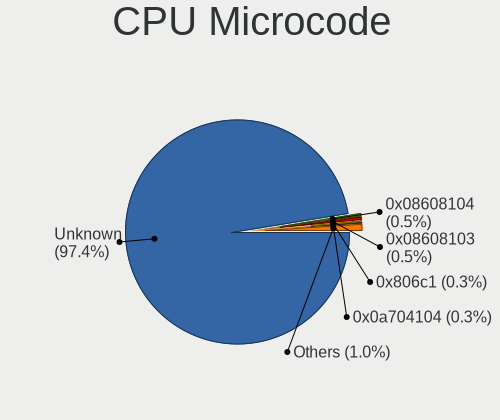

| Number     | Notebooks | Percent |
|------------|-----------|---------|
| Unknown    | 378       | 97.42%  |
| 0x08608104 | 2         | 0.52%   |
| 0x08608103 | 2         | 0.52%   |
| 0x806c1    | 1         | 0.26%   |
| 0x0a704104 | 1         | 0.26%   |
| 0x0a404102 | 1         | 0.26%   |
| 0x08108109 | 1         | 0.26%   |
| 0x06001119 | 1         | 0.26%   |
| 0x05000119 | 1         | 0.26%   |

CPU Microarch
-------------

Microarchitecture

| Name             | Notebooks | Percent |
|------------------|-----------|---------|
| KabyLake         | 45        | 11.63%  |
| SandyBridge      | 42        | 10.85%  |
| Haswell          | 41        | 10.59%  |
| Penryn           | 39        | 10.08%  |
| IvyBridge        | 37        | 9.56%   |
| Skylake          | 24        | 6.2%    |
| Unknown          | 23        | 5.94%   |
| Westmere         | 21        | 5.43%   |
| TigerLake        | 19        | 4.91%   |
| Broadwell        | 19        | 4.91%   |
| Goldmont plus    | 10        | 2.58%   |
| Silvermont       | 7         | 1.81%   |
| Zen+             | 6         | 1.55%   |
| Zen 3            | 6         | 1.55%   |
| Excavator        | 6         | 1.55%   |
| IceLake          | 5         | 1.29%   |
| Zen 2            | 4         | 1.03%   |
| Puma             | 4         | 1.03%   |
| K10              | 4         | 1.03%   |
| CometLake        | 4         | 1.03%   |
| K10 Llano        | 3         | 0.78%   |
| Goldmont         | 3         | 0.78%   |
| Core             | 3         | 0.78%   |
| Zen              | 2         | 0.52%   |
| Jaguar           | 2         | 0.52%   |
| Bonnell          | 2         | 0.52%   |
| Bobcat           | 2         | 0.52%   |
| Alderlake Hybrid | 2         | 0.52%   |
| Steamroller      | 1         | 0.26%   |
| Piledriver       | 1         | 0.26%   |

Graphics
--------

GPU Vendor
----------

Vendors of graphics cards

| Vendor | Notebooks | Percent |
|--------|-----------|---------|
| Intel  | 289       | 61.1%   |
| Nvidia | 99        | 20.93%  |
| AMD    | 85        | 17.97%  |

GPU Model
---------

Graphics card models

| Model                                                                         | Notebooks | Percent |
|-------------------------------------------------------------------------------|-----------|---------|
| Intel 2nd Generation Core Processor Family Integrated Graphics Controller     | 40        | 8.2%    |
| Intel 3rd Gen Core processor Graphics Controller                              | 35        | 7.17%   |
| Intel Haswell-ULT Integrated Graphics Controller                              | 24        | 4.92%   |
| Intel Skylake GT2 [HD Graphics 520]                                           | 17        | 3.48%   |
| Intel Core Processor Integrated Graphics Controller                           | 16        | 3.28%   |
| Intel TigerLake-LP GT2 [Iris Xe Graphics]                                     | 15        | 3.07%   |
| Nvidia C79 [GeForce 9400M]                                                    | 14        | 2.87%   |
| Intel HD Graphics 620                                                         | 12        | 2.46%   |
| Intel HD Graphics 6000                                                        | 12        | 2.46%   |
| Intel 4th Gen Core Processor Integrated Graphics Controller                   | 11        | 2.25%   |
| Nvidia MCP89 [GeForce 320M]                                                   | 10        | 2.05%   |
| Intel UHD Graphics 620                                                        | 10        | 2.05%   |
| AMD Lucienne                                                                  | 9         | 1.84%   |
| Intel Mobile 4 Series Chipset Integrated Graphics Controller                  | 8         | 1.64%   |
| Intel GeminiLake [UHD Graphics 600]                                           | 8         | 1.64%   |
| Intel CoffeeLake-H GT2 [UHD Graphics 630]                                     | 7         | 1.43%   |
| AMD Picasso/Raven 2 [Radeon Vega Series / Radeon Vega Mobile Series]          | 7         | 1.43%   |
| Nvidia TU117M [GeForce GTX 1650 Mobile / Max-Q]                               | 6         | 1.23%   |
| Nvidia GF117M [GeForce 610M/710M/810M/820M / GT 620M/625M/630M/720M]          | 6         | 1.23%   |
| Nvidia G96CM [GeForce 9600M GT]                                               | 6         | 1.23%   |
| Intel HD Graphics 5500                                                        | 6         | 1.23%   |
| Intel CometLake-U GT2 [UHD Graphics]                                          | 6         | 1.23%   |
| Nvidia GT216M [GeForce GT 330M]                                               | 5         | 1.02%   |
| Intel Mobile GM965/GL960 Integrated Graphics Controller (secondary)           | 5         | 1.02%   |
| Intel Mobile GM965/GL960 Integrated Graphics Controller (primary)             | 5         | 1.02%   |
| Intel HD Graphics 630                                                         | 5         | 1.02%   |
| Intel Atom Processor Z36xxx/Z37xxx Series Graphics & Display                  | 5         | 1.02%   |
| Nvidia GP107M [GeForce GTX 1050 Mobile]                                       | 4         | 0.82%   |
| Intel Tiger Lake-LP GT2 [UHD Graphics G4]                                     | 4         | 0.82%   |
| Intel CometLake-H GT2 [UHD Graphics]                                          | 4         | 0.82%   |
| AMD Sun XT [Radeon HD 8670A/8670M/8690M / R5 M330 / M430 / Radeon 520 Mobile] | 4         | 0.82%   |
| AMD RS880M [Mobility Radeon HD 4225/4250]                                     | 4         | 0.82%   |
| AMD Renoir [Radeon Vega Series / Radeon Vega Mobile Series]                   | 4         | 0.82%   |
| Nvidia GK107M [GeForce GT 650M Mac Edition]                                   | 3         | 0.61%   |
| Intel WhiskeyLake-U GT2 [UHD Graphics 620]                                    | 3         | 0.61%   |
| Intel TigerLake-H GT1 [UHD Graphics]                                          | 3         | 0.61%   |
| Intel Raptor Lake-P [Iris Xe Graphics]                                        | 3         | 0.61%   |
| Intel HD Graphics 515                                                         | 3         | 0.61%   |
| Intel HD Graphics 500                                                         | 3         | 0.61%   |
| AMD Whistler [Radeon HD 6730M/6770M/7690M XT]                                 | 3         | 0.61%   |

GPU Combo
---------

Combinations of graphics cards

| Name           | Notebooks | Percent |
|----------------|-----------|---------|
| 1 x Intel      | 206       | 53.23%  |
| Intel + Nvidia | 55        | 14.21%  |
| 1 x AMD        | 51        | 13.18%  |
| 1 x Nvidia     | 34        | 8.79%   |
| Intel + AMD    | 25        | 6.46%   |
| 2 x Nvidia     | 5         | 1.29%   |
| AMD + Nvidia   | 5         | 1.29%   |
| 2 x AMD        | 4         | 1.03%   |
| Other          | 2         | 0.52%   |

GPU Driver
----------

Free vs proprietary

| Driver      | Notebooks | Percent |
|-------------|-----------|---------|
| Free        | 367       | 94.83%  |
| Proprietary | 13        | 3.36%   |
| Unknown     | 7         | 1.81%   |

GPU Memory
----------

Total video memory

| Size in GB | Notebooks | Percent |
|------------|-----------|---------|
| Unknown    | 367       | 94.59%  |
| 0.01-0.5   | 12        | 3.09%   |
| 0.51-1.0   | 4         | 1.03%   |
| 1.01-2.0   | 3         | 0.77%   |
| 7.01-8.0   | 1         | 0.26%   |
| 3.01-4.0   | 1         | 0.26%   |

Monitor
-------

Monitor Vendor
--------------

Monitor vendors

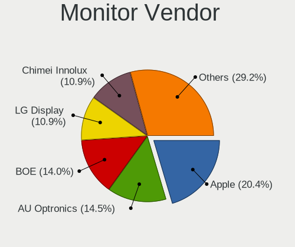

| Vendor                  | Notebooks | Percent |
|-------------------------|-----------|---------|
| Apple                   | 86        | 20.43%  |
| AU Optronics            | 61        | 14.49%  |
| BOE                     | 59        | 14.01%  |
| LG Display              | 46        | 10.93%  |
| Chimei Innolux          | 46        | 10.93%  |
| Samsung Electronics     | 41        | 9.74%   |
| Chi Mei Optoelectronics | 12        | 2.85%   |
| Sharp                   | 8         | 1.9%    |
| Lenovo                  | 7         | 1.66%   |
| PANDA                   | 4         | 0.95%   |
| InfoVision              | 4         | 0.95%   |
| Dell                    | 4         | 0.95%   |
| Acer                    | 4         | 0.95%   |
| Goldstar                | 3         | 0.71%   |
| Unknown (XXX)           | 2         | 0.48%   |
| Toshiba                 | 2         | 0.48%   |
| Sony                    | 2         | 0.48%   |
| Mi                      | 2         | 0.48%   |
| HKC                     | 2         | 0.48%   |
| HannStar                | 2         | 0.48%   |
| Fujitsu Siemens         | 2         | 0.48%   |
| Westinghouse            | 1         | 0.24%   |
| Vita                    | 1         | 0.24%   |
| ViewSonic               | 1         | 0.24%   |
| VIE                     | 1         | 0.24%   |
| Vestel Elektronik       | 1         | 0.24%   |
| TMX                     | 1         | 0.24%   |
| Quanta Display          | 1         | 0.24%   |
| QIA                     | 1         | 0.24%   |
| Panasonic               | 1         | 0.24%   |
| LG Philips              | 1         | 0.24%   |
| KDB                     | 1         | 0.24%   |
| ITE                     | 1         | 0.24%   |
| InnoLux Display         | 1         | 0.24%   |
| HJW                     | 1         | 0.24%   |
| HGC                     | 1         | 0.24%   |
| Hewlett-Packard         | 1         | 0.24%   |
| Gigabyte Technology     | 1         | 0.24%   |
| CTO                     | 1         | 0.24%   |
| CPT                     | 1         | 0.24%   |

Monitor Model
-------------

Monitor models

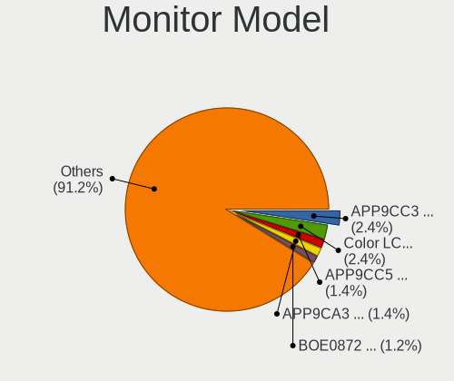

| Model                                                                    | Notebooks | Percent |
|--------------------------------------------------------------------------|-----------|---------|
| Apple LCD Monitor APP9CC3 1280x800 286x179mm 13.3-inch                   | 10        | 2.37%   |
| Apple Color LCD APP9CC7 1280x800 286x179mm 13.3-inch                     | 10        | 2.37%   |
| Apple LCD Monitor APP9CC5 1280x800 286x179mm 13.3-inch                   | 6         | 1.42%   |
| Apple LCD Monitor APP9CA3 1440x900 331x207mm 15.4-inch                   | 6         | 1.42%   |
| BOE LCD Monitor BOE0872 1920x1080 344x194mm 15.5-inch                    | 5         | 1.18%   |
| Apple Color LCD APPA01B 1440x900 286x179mm 13.3-inch                     | 5         | 1.18%   |
| Apple Color LCD APP9CF0 1440x900 290x180mm 13.4-inch                     | 4         | 0.95%   |
| Apple Color LCD APP9CDF 1440x900 286x179mm 13.3-inch                     | 4         | 0.95%   |
| Apple Color LCD APP9CA4 1440x900 331x207mm 15.4-inch                     | 4         | 0.95%   |
| Chimei Innolux LCD Monitor CMN1404 1920x1080 309x173mm 13.9-inch         | 3         | 0.71%   |
| Chi Mei Optoelectronics LCD Monitor CMO15A7 1366x768 344x193mm 15.5-inch | 3         | 0.71%   |
| BOE LCD Monitor BOE0877 1920x1080 309x173mm 13.9-inch                    | 3         | 0.71%   |
| AU Optronics LCD Monitor AUO38ED 1920x1080 344x193mm 15.5-inch           | 3         | 0.71%   |
| Apple LCD Monitor APP9CCB 1280x800 286x179mm 13.3-inch                   | 3         | 0.71%   |
| Apple Color LCD APP9CF2 1366x768 256x144mm 11.6-inch                     | 3         | 0.71%   |
| Sharp LCD Monitor SHP149A 1920x1080 344x194mm 15.5-inch                  | 2         | 0.47%   |
| Samsung Electronics LCD Monitor SEC5441 1280x800 286x179mm 13.3-inch     | 2         | 0.47%   |
| Samsung Electronics LCD Monitor SEC3152 1366x768 344x194mm 15.5-inch     | 2         | 0.47%   |
| Samsung Electronics LCD Monitor SDC4852 1366x768 344x194mm 15.5-inch     | 2         | 0.47%   |
| Samsung Electronics LCD Monitor SDC4171 2880x1800 302x189mm 14.0-inch    | 2         | 0.47%   |
| PANDA LCD Monitor NCP004D 1920x1080 344x194mm 15.5-inch                  | 2         | 0.47%   |
| LG Display LCD Monitor LGD0521 1920x1080 309x174mm 14.0-inch             | 2         | 0.47%   |
| LG Display LCD Monitor LGD045C 1366x768 345x194mm 15.6-inch              | 2         | 0.47%   |
| LG Display LCD Monitor LGD03EA 1920x1080 309x174mm 14.0-inch             | 2         | 0.47%   |
| LG Display LCD Monitor LGD03DC 1366x768 277x156mm 12.5-inch              | 2         | 0.47%   |
| LG Display LCD Monitor LGD039F 1366x768 345x194mm 15.6-inch              | 2         | 0.47%   |
| LG Display LCD Monitor LGD0395 1366x768 344x194mm 15.5-inch              | 2         | 0.47%   |
| LG Display LCD Monitor LGD0372 1600x900 382x215mm 17.3-inch              | 2         | 0.47%   |
| LG Display LCD Monitor LGD02E3 1366x768 344x194mm 15.5-inch              | 2         | 0.47%   |
| LG Display LCD Monitor LGD02D1 1600x900 382x215mm 17.3-inch              | 2         | 0.47%   |
| Chimei Innolux LCD Monitor CMN15E7 1920x1080 344x193mm 15.5-inch         | 2         | 0.47%   |
| Chimei Innolux LCD Monitor CMN15DC 1366x768 344x193mm 15.5-inch          | 2         | 0.47%   |
| Chimei Innolux LCD Monitor CMN15DB 1366x768 344x193mm 15.5-inch          | 2         | 0.47%   |
| Chimei Innolux LCD Monitor CMN15BE 1366x768 344x193mm 15.5-inch          | 2         | 0.47%   |
| Chimei Innolux LCD Monitor CMN15AB 1366x768 344x193mm 15.5-inch          | 2         | 0.47%   |
| Chimei Innolux LCD Monitor CMN14D4 1920x1080 309x173mm 13.9-inch         | 2         | 0.47%   |
| Chimei Innolux LCD Monitor CMN14C9 1920x1080 309x173mm 13.9-inch         | 2         | 0.47%   |
| Chi Mei Optoelectronics LCD Monitor CMO1711 1600x900 382x215mm 17.3-inch | 2         | 0.47%   |
| BOE LCD Monitor BOE0893 2160x1440 296x197mm 14.0-inch                    | 2         | 0.47%   |
| BOE LCD Monitor BOE0808 1366x768 344x194mm 15.5-inch                     | 2         | 0.47%   |

Monitor Resolution
------------------

Monitor screen resolution

| Resolution         | Notebooks | Percent |
|--------------------|-----------|---------|
| 1920x1080 (FHD)    | 131       | 32.59%  |
| 1366x768 (WXGA)    | 112       | 27.86%  |
| 1280x800 (WXGA)    | 45        | 11.19%  |
| 1440x900 (WXGA+)   | 27        | 6.72%   |
| 1600x900 (HD+)     | 25        | 6.22%   |
| 3840x2160 (4K)     | 11        | 2.74%   |
| 1920x1200 (WUXGA)  | 10        | 2.49%   |
| 2880x1800          | 7         | 1.74%   |
| 2560x1440 (QHD)    | 7         | 1.74%   |
| 2560x1600          | 6         | 1.49%   |
| 1680x1050 (WSXGA+) | 5         | 1.24%   |
| 2160x1440          | 4         | 1%      |
| 3440x1440          | 2         | 0.5%    |
| 1280x1024 (SXGA)   | 2         | 0.5%    |
| 1024x600           | 2         | 0.5%    |
| 3840x2400          | 1         | 0.25%   |
| 3200x1800 (QHD+)   | 1         | 0.25%   |
| 3072x1920          | 1         | 0.25%   |
| 2560x1080          | 1         | 0.25%   |
| 1920x540           | 1         | 0.25%   |
| 1400x1050          | 1         | 0.25%   |

Monitor Diagonal
----------------

Diagonal size in inches

| Inches | Notebooks | Percent |
|--------|-----------|---------|
| 15     | 153       | 36.34%  |
| 13     | 107       | 25.42%  |
| 14     | 51        | 12.11%  |
| 17     | 34        | 8.08%   |
| 12     | 10        | 2.38%   |
| 11     | 10        | 2.38%   |
| 27     | 9         | 2.14%   |
| 23     | 8         | 1.9%    |
| 24     | 6         | 1.43%   |
| 16     | 6         | 1.43%   |
| 21     | 4         | 0.95%   |
| 84     | 3         | 0.71%   |
| 54     | 3         | 0.71%   |
| 31     | 3         | 0.71%   |
| 19     | 3         | 0.71%   |
| 34     | 2         | 0.48%   |
| 32     | 2         | 0.48%   |
| 10     | 2         | 0.48%   |
| 72     | 1         | 0.24%   |
| 35     | 1         | 0.24%   |
| 26     | 1         | 0.24%   |
| 22     | 1         | 0.24%   |
| 18     | 1         | 0.24%   |

Monitor Width
-------------

Physical width

| Width in mm | Notebooks | Percent |
|-------------|-----------|---------|
| 301-350     | 238       | 56.67%  |
| 201-300     | 97        | 23.1%   |
| 351-400     | 40        | 9.52%   |
| 501-600     | 23        | 5.48%   |
| 401-500     | 7         | 1.67%   |
| 701-800     | 4         | 0.95%   |
| 1501-2000   | 4         | 0.95%   |
| 601-700     | 3         | 0.71%   |
| 1001-1500   | 3         | 0.71%   |
| 801-900     | 1         | 0.24%   |

Aspect Ratio
------------

Proportional relationship between the width and the height

| Ratio | Notebooks | Percent |
|-------|-----------|---------|
| 16/9  | 281       | 71.87%  |
| 16/10 | 100       | 25.58%  |
| 3/2   | 5         | 1.28%   |
| 21/9  | 3         | 0.77%   |
| 5/4   | 2         | 0.51%   |

Monitor Area
------------

Area in inch

| Area in inch | Notebooks | Percent |
|----------------|-----------|---------|
| 101-110        | 152       | 36.1%   |
| 81-90          | 127       | 30.17%  |
| 71-80          | 29        | 6.89%   |
| 121-130        | 25        | 5.94%   |
| 201-250        | 15        | 3.56%   |
| 61-70          | 10        | 2.38%   |
| 51-60          | 10        | 2.38%   |
| 301-350        | 9         | 2.14%   |
| 131-140        | 9         | 2.14%   |
| 351-500        | 8         | 1.9%    |
| More than 1000 | 7         | 1.66%   |
| 111-120        | 6         | 1.43%   |
| 151-200        | 5         | 1.19%   |
| 251-300        | 3         | 0.71%   |
| 91-100         | 3         | 0.71%   |
| 41-50          | 2         | 0.48%   |
| 141-150        | 1         | 0.24%   |

Pixel Density
-------------

Pixels per inch

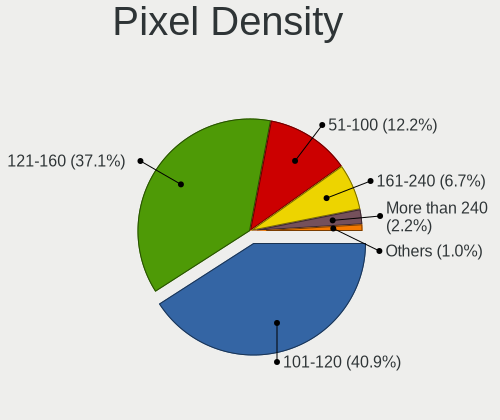

| Density       | Notebooks | Percent |
|---------------|-----------|---------|
| 101-120       | 171       | 40.91%  |
| 121-160       | 155       | 37.08%  |
| 51-100        | 51        | 12.2%   |
| 161-240       | 28        | 6.7%    |
| More than 240 | 9         | 2.15%   |
| 1-50          | 4         | 0.96%   |

Multiple Monitors
-----------------

Total monitors connected

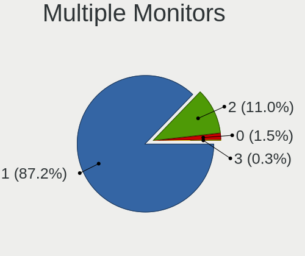

| Total | Notebooks | Percent |
|-------|-----------|---------|
| 1     | 341       | 87.21%  |
| 2     | 43        | 11%     |
| 0     | 6         | 1.53%   |
| 3     | 1         | 0.26%   |

Network
-------

Net Controller Vendor
---------------------

Controller vendors

| Vendor                            | Notebooks | Percent |
|-----------------------------------|-----------|---------|
| Realtek Semiconductor             | 171       | 27.67%  |
| Intel                             | 147       | 23.79%  |
| Broadcom                          | 111       | 17.96%  |
| Qualcomm Atheros                  | 66        | 10.68%  |
| Broadcom Limited                  | 30        | 4.85%   |
| Nvidia                            | 15        | 2.43%   |
| MediaTek                          | 14        | 2.27%   |
| Samsung Electronics               | 9         | 1.46%   |
| Marvell Technology Group          | 7         | 1.13%   |
| Ralink Technology                 | 6         | 0.97%   |
| Xiaomi                            | 4         | 0.65%   |
| Hewlett-Packard                   | 4         | 0.65%   |
| TP-Link                           | 3         | 0.49%   |
| Sierra Wireless                   | 3         | 0.49%   |
| Ralink                            | 3         | 0.49%   |
| Qualcomm Atheros Communications   | 3         | 0.49%   |
| Ericsson Business Mobile Networks | 3         | 0.49%   |
| Dell                              | 3         | 0.49%   |
| Apple                             | 3         | 0.49%   |
| D-Link System                     | 2         | 0.32%   |
| ASIX Electronics                  | 2         | 0.32%   |
| ZyDAS                             | 1         | 0.16%   |
| U-Blox                            | 1         | 0.16%   |
| Qualcomm                          | 1         | 0.16%   |
| JMicron Technology                | 1         | 0.16%   |
| Edimax Technology                 | 1         | 0.16%   |
| D-Link                            | 1         | 0.16%   |
| Bose                              | 1         | 0.16%   |
| Attansic Technology               | 1         | 0.16%   |
| ASUSTek Computer                  | 1         | 0.16%   |

Net Controller Model
--------------------

Controller models

| Model                                                                  | Notebooks | Percent |
|------------------------------------------------------------------------|-----------|---------|
| Realtek RTL8111/8168/8211/8411 PCI Express Gigabit Ethernet Controller | 84        | 11.38%  |
| Realtek RTL810xE PCI Express Fast Ethernet controller                  | 39        | 5.28%   |
| Broadcom NetXtreme BCM57765 Gigabit Ethernet PCIe                      | 32        | 4.34%   |
| Broadcom BCM4331 802.11a/b/g/n                                         | 32        | 4.34%   |
| Broadcom BCM4322 802.11a/b/g/n Wireless LAN Controller                 | 19        | 2.57%   |
| Realtek RTL8822CE 802.11ac PCIe Wireless Network Adapter               | 16        | 2.17%   |
| Broadcom Limited BCM4360 802.11ac Dual Band Wireless Network Adapter   | 16        | 2.17%   |
| Nvidia MCP79 Ethernet                                                  | 14        | 1.9%    |
| Intel Wireless 7260                                                    | 14        | 1.9%    |
| Broadcom BCM43224 802.11a/b/g/n                                        | 14        | 1.9%    |
| Intel Wireless 8265 / 8275                                             | 12        | 1.63%   |
| Intel Wi-Fi 6 AX201                                                    | 12        | 1.63%   |
| Qualcomm Atheros QCA9565 / AR9565 Wireless Network Adapter             | 11        | 1.49%   |
| Intel Wireless 7265                                                    | 11        | 1.49%   |
| Intel Wireless 3165                                                    | 11        | 1.49%   |
| Broadcom BCM43142 802.11b/g/n                                          | 11        | 1.49%   |
| Broadcom BCM4313 802.11bgn Wireless Network Adapter                    | 11        | 1.49%   |
| Qualcomm Atheros AR9285 Wireless Network Adapter (PCI-Express)         | 10        | 1.36%   |
| Intel Wireless 8260                                                    | 10        | 1.36%   |
| Intel 82579LM Gigabit Network Connection (Lewisville)                  | 10        | 1.36%   |
| Broadcom NetXtreme BCM5764M Gigabit Ethernet PCIe                      | 10        | 1.36%   |
| Qualcomm Atheros AR9485 Wireless Network Adapter                       | 9         | 1.22%   |
| Realtek RTL8821CE 802.11ac PCIe Wireless Network Adapter               | 8         | 1.08%   |
| Realtek RTL8153 Gigabit Ethernet Adapter                               | 8         | 1.08%   |
| Qualcomm Atheros QCA9377 802.11ac Wireless Network Adapter             | 8         | 1.08%   |
| Intel Ethernet Connection I218-LM                                      | 8         | 1.08%   |
| Samsung Galaxy series, misc. (tethering mode)                          | 7         | 0.95%   |
| Intel Centrino Advanced-N 6205 [Taylor Peak]                           | 7         | 0.95%   |
| Qualcomm Atheros AR9462 Wireless Network Adapter                       | 6         | 0.81%   |
| Intel Wireless 3160                                                    | 6         | 0.81%   |
| Intel Comet Lake PCH-LP CNVi WiFi                                      | 6         | 0.81%   |
| Broadcom BCM4312 802.11b/g LP-PHY                                      | 6         | 0.81%   |
| Realtek RTL8723BE PCIe Wireless Network Adapter                        | 5         | 0.68%   |
| Realtek RTL8188EUS 802.11n Wireless Network Adapter                    | 5         | 0.68%   |
| Qualcomm Atheros QCA6174 802.11ac Wireless Network Adapter             | 5         | 0.68%   |
| MediaTek MT7921 802.11ax PCI Express Wireless Network Adapter          | 5         | 0.68%   |
| Intel Ethernet Connection I217-LM                                      | 5         | 0.68%   |
| Intel Ethernet Connection (4) I219-LM                                  | 5         | 0.68%   |
| Realtek RTL88x2bu [AC1200 Techkey]                                     | 4         | 0.54%   |
| Ralink MT7601U Wireless Adapter                                        | 4         | 0.54%   |

Wireless Vendor
---------------

Wireless vendors

| Vendor                          | Notebooks | Percent |
|---------------------------------|-----------|---------|
| Intel                           | 136       | 32.3%   |
| Broadcom                        | 107       | 25.42%  |
| Realtek Semiconductor           | 58        | 13.78%  |
| Qualcomm Atheros                | 54        | 12.83%  |
| Broadcom Limited                | 25        | 5.94%   |
| MediaTek                        | 13        | 3.09%   |
| Ralink Technology               | 6         | 1.43%   |
| TP-Link                         | 3         | 0.71%   |
| Sierra Wireless                 | 3         | 0.71%   |
| Ralink                          | 3         | 0.71%   |
| Qualcomm Atheros Communications | 3         | 0.71%   |
| Dell                            | 2         | 0.48%   |
| D-Link System                   | 2         | 0.48%   |
| ZyDAS                           | 1         | 0.24%   |
| Qualcomm                        | 1         | 0.24%   |
| Hewlett-Packard                 | 1         | 0.24%   |
| Edimax Technology               | 1         | 0.24%   |
| D-Link                          | 1         | 0.24%   |
| ASUSTek Computer                | 1         | 0.24%   |

Wireless Model
--------------

Wireless models

| Model                                                                | Notebooks | Percent |
|----------------------------------------------------------------------|-----------|---------|
| Broadcom BCM4331 802.11a/b/g/n                                       | 32        | 7.58%   |
| Broadcom BCM4322 802.11a/b/g/n Wireless LAN Controller               | 19        | 4.5%    |
| Realtek RTL8822CE 802.11ac PCIe Wireless Network Adapter             | 16        | 3.79%   |
| Broadcom Limited BCM4360 802.11ac Dual Band Wireless Network Adapter | 16        | 3.79%   |
| Intel Wireless 7260                                                  | 14        | 3.32%   |
| Broadcom BCM43224 802.11a/b/g/n                                      | 14        | 3.32%   |
| Intel Wireless 8265 / 8275                                           | 12        | 2.84%   |
| Intel Wi-Fi 6 AX201                                                  | 12        | 2.84%   |
| Qualcomm Atheros QCA9565 / AR9565 Wireless Network Adapter           | 11        | 2.61%   |
| Intel Wireless 7265                                                  | 11        | 2.61%   |
| Intel Wireless 3165                                                  | 11        | 2.61%   |
| Broadcom BCM43142 802.11b/g/n                                        | 11        | 2.61%   |
| Broadcom BCM4313 802.11bgn Wireless Network Adapter                  | 11        | 2.61%   |
| Qualcomm Atheros AR9285 Wireless Network Adapter (PCI-Express)       | 10        | 2.37%   |
| Intel Wireless 8260                                                  | 10        | 2.37%   |
| Qualcomm Atheros AR9485 Wireless Network Adapter                     | 9         | 2.13%   |
| Realtek RTL8821CE 802.11ac PCIe Wireless Network Adapter             | 8         | 1.9%    |
| Qualcomm Atheros QCA9377 802.11ac Wireless Network Adapter           | 8         | 1.9%    |
| Intel Centrino Advanced-N 6205 [Taylor Peak]                         | 7         | 1.66%   |
| Qualcomm Atheros AR9462 Wireless Network Adapter                     | 6         | 1.42%   |
| Intel Wireless 3160                                                  | 6         | 1.42%   |
| Intel Comet Lake PCH-LP CNVi WiFi                                    | 6         | 1.42%   |
| Broadcom BCM4312 802.11b/g LP-PHY                                    | 6         | 1.42%   |
| Realtek RTL8723BE PCIe Wireless Network Adapter                      | 5         | 1.18%   |
| Realtek RTL8188EUS 802.11n Wireless Network Adapter                  | 5         | 1.18%   |
| Qualcomm Atheros QCA6174 802.11ac Wireless Network Adapter           | 5         | 1.18%   |
| MediaTek MT7921 802.11ax PCI Express Wireless Network Adapter        | 5         | 1.18%   |
| Realtek RTL88x2bu [AC1200 Techkey]                                   | 4         | 0.95%   |
| Ralink MT7601U Wireless Adapter                                      | 4         | 0.95%   |
| MediaTek Wi-Fi 6E MT7902 Wireless Network Adapter                    | 4         | 0.95%   |
| Intel Gemini Lake PCH CNVi WiFi                                      | 4         | 0.95%   |
| Intel Centrino Wireless-N 1000 [Condor Peak]                         | 4         | 0.95%   |
| Intel Centrino Advanced-N 6235                                       | 4         | 0.95%   |
| Realtek RTL8852BE PCIe 802.11ax Wireless Network Controller          | 3         | 0.71%   |
| Realtek RTL8822BE 802.11a/b/g/n/ac WiFi adapter                      | 3         | 0.71%   |
| Realtek RTL8821AE 802.11ac PCIe Wireless Network Adapter             | 3         | 0.71%   |
| Intel Tiger Lake PCH CNVi WiFi                                       | 3         | 0.71%   |
| Intel Raptor Lake PCH CNVi WiFi                                      | 3         | 0.71%   |
| Intel Dual Band Wireless-AC 3168NGW [Stone Peak]                     | 3         | 0.71%   |
| Intel Comet Lake PCH CNVi WiFi                                       | 3         | 0.71%   |

Ethernet Vendor
---------------

Ethernet vendors

| Vendor                   | Notebooks | Percent |
|--------------------------|-----------|---------|
| Realtek Semiconductor    | 134       | 44.08%  |
| Intel                    | 58        | 19.08%  |
| Broadcom                 | 46        | 15.13%  |
| Qualcomm Atheros         | 20        | 6.58%   |
| Nvidia                   | 15        | 4.93%   |
| Samsung Electronics      | 7         | 2.3%    |
| Marvell Technology Group | 7         | 2.3%    |
| Broadcom Limited         | 5         | 1.64%   |
| Xiaomi                   | 4         | 1.32%   |
| Apple                    | 3         | 0.99%   |
| ASIX Electronics         | 2         | 0.66%   |
| MediaTek                 | 1         | 0.33%   |
| JMicron Technology       | 1         | 0.33%   |
| Attansic Technology      | 1         | 0.33%   |

Ethernet Model
--------------

Ethernet models

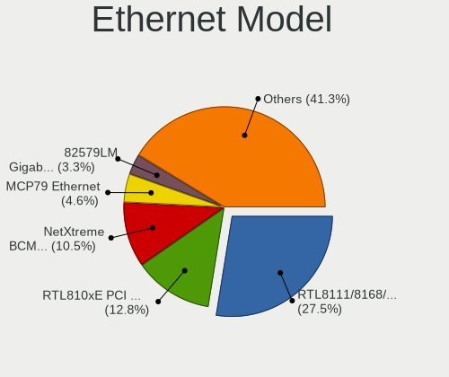

| Model                                                                          | Notebooks | Percent |
|--------------------------------------------------------------------------------|-----------|---------|
| Realtek RTL8111/8168/8211/8411 PCI Express Gigabit Ethernet Controller         | 84        | 27.54%  |
| Realtek RTL810xE PCI Express Fast Ethernet controller                          | 39        | 12.79%  |
| Broadcom NetXtreme BCM57765 Gigabit Ethernet PCIe                              | 32        | 10.49%  |
| Nvidia MCP79 Ethernet                                                          | 14        | 4.59%   |
| Intel 82579LM Gigabit Network Connection (Lewisville)                          | 10        | 3.28%   |
| Broadcom NetXtreme BCM5764M Gigabit Ethernet PCIe                              | 10        | 3.28%   |
| Realtek RTL8153 Gigabit Ethernet Adapter                                       | 8         | 2.62%   |
| Intel Ethernet Connection I218-LM                                              | 8         | 2.62%   |
| Samsung Galaxy series, misc. (tethering mode)                                  | 7         | 2.3%    |
| Intel Ethernet Connection I217-LM                                              | 5         | 1.64%   |
| Intel Ethernet Connection (4) I219-LM                                          | 5         | 1.64%   |
| Intel Ethernet Connection I219-V                                               | 4         | 1.31%   |
| Intel 82577LM Gigabit Network Connection                                       | 4         | 1.31%   |
| Qualcomm Atheros Killer E2400 Gigabit Ethernet Controller                      | 3         | 0.98%   |
| Marvell Group Yukon Optima 88E8059 [PCIe Gigabit Ethernet Controller with AVB] | 3         | 0.98%   |
| Intel Ethernet Connection I219-LM                                              | 3         | 0.98%   |
| Intel Ethernet Connection (4) I219-V                                           | 3         | 0.98%   |
| Intel 82579V Gigabit Network Connection                                        | 3         | 0.98%   |
| Apple Ethernet Adapter [A1277]                                                 | 3         | 0.98%   |
| Xiaomi Mi/Redmi series (RNDIS)                                                 | 2         | 0.66%   |
| Xiaomi Mi/Redmi series (RNDIS + ADB)                                           | 2         | 0.66%   |
| Qualcomm Atheros QCA8172 Fast Ethernet                                         | 2         | 0.66%   |
| Qualcomm Atheros QCA8171 Gigabit Ethernet                                      | 2         | 0.66%   |
| Qualcomm Atheros Killer E220x Gigabit Ethernet Controller                      | 2         | 0.66%   |
| Qualcomm Atheros AR8162 Fast Ethernet                                          | 2         | 0.66%   |
| Qualcomm Atheros AR8161 Gigabit Ethernet                                       | 2         | 0.66%   |
| Qualcomm Atheros AR8152 v1.1 Fast Ethernet                                     | 2         | 0.66%   |
| Qualcomm Atheros AR8121/AR8113/AR8114 Gigabit or Fast Ethernet                 | 2         | 0.66%   |
| Marvell Group 88E8058 PCI-E Gigabit Ethernet Controller                        | 2         | 0.66%   |
| Intel Ethernet Connection (3) I218-LM                                          | 2         | 0.66%   |
| Intel Ethernet Connection (13) I219-LM                                         | 2         | 0.66%   |
| Intel 82567LM Gigabit Network Connection                                       | 2         | 0.66%   |
| Broadcom NetLink BCM57785 Gigabit Ethernet PCIe                                | 2         | 0.66%   |
| Broadcom Limited NetLink BCM5787M Gigabit Ethernet PCI Express                 | 2         | 0.66%   |
| ASIX AX88179 Gigabit Ethernet                                                  | 2         | 0.66%   |
| Realtek RTL8152 Fast Ethernet Adapter                                          | 1         | 0.33%   |
| Realtek RTL8125 2.5GbE Controller                                              | 1         | 0.33%   |
| Realtek Killer E2600 GbE Controller                                            | 1         | 0.33%   |
| Realtek Killer E2500 Gigabit Ethernet Controller                               | 1         | 0.33%   |
| Qualcomm Atheros Killer E2500 Gigabit Ethernet Controller                      | 1         | 0.33%   |

Net Controller Kind
-------------------

Ethernet, WiFi or modem

| Kind     | Notebooks | Percent |
|----------|-----------|---------|
| WiFi     | 384       | 55.33%  |
| Ethernet | 299       | 43.08%  |
| Modem    | 11        | 1.59%   |

Used Controller
---------------

Currently used network controller

| Kind     | Notebooks | Percent |
|----------|-----------|---------|
| WiFi     | 301       | 77.98%  |
| Ethernet | 85        | 22.02%  |

NICs
----

Total network controllers on board

| Total | Notebooks | Percent |
|-------|-----------|---------|
| 2     | 276       | 71.32%  |
| 1     | 108       | 27.91%  |
| 0     | 2         | 0.52%   |
| 3     | 1         | 0.26%   |

IPv6
----

IPv6 vs IPv4

| Used | Notebooks | Percent |
|------|-----------|---------|
| No   | 268       | 68.72%  |
| Yes  | 122       | 31.28%  |

Bluetooth
---------

Bluetooth Vendor
----------------

Controller vendors

| Vendor                          | Notebooks | Percent |
|---------------------------------|-----------|---------|
| Intel                           | 114       | 33.04%  |
| Apple                           | 87        | 25.22%  |
| Realtek Semiconductor           | 35        | 10.14%  |
| Qualcomm Atheros Communications | 25        | 7.25%   |
| Broadcom                        | 16        | 4.64%   |
| IMC Networks                    | 13        | 3.77%   |
| Foxconn / Hon Hai               | 12        | 3.48%   |
| Hewlett-Packard                 | 9         | 2.61%   |
| Lite-On Technology              | 7         | 2.03%   |
| Realtek                         | 6         | 1.74%   |
| Dell                            | 6         | 1.74%   |
| Cambridge Silicon Radio         | 5         | 1.45%   |
| Foxconn International           | 3         | 0.87%   |
| Ralink                          | 2         | 0.58%   |
| Toshiba                         | 1         | 0.29%   |
| Ralink Technology               | 1         | 0.29%   |
| Opticis                         | 1         | 0.29%   |
| MediaTek                        | 1         | 0.29%   |
| Askey Computer                  | 1         | 0.29%   |

Bluetooth Model
---------------

Controller models

| Model                                                                               | Notebooks | Percent |
|-------------------------------------------------------------------------------------|-----------|---------|
| Intel Bluetooth wireless interface                                                  | 63        | 18.26%  |
| Apple Bluetooth Host Controller                                                     | 48        | 13.91%  |
| Apple Bluetooth USB Host Controller                                                 | 33        | 9.57%   |
| Realtek Bluetooth Radio                                                             | 21        | 6.09%   |
| Intel AX201 Bluetooth                                                               | 19        | 5.51%   |
| Intel Bluetooth 9460/9560 Jefferson Peak (JfP)                                      | 16        | 4.64%   |
| Qualcomm Atheros  Bluetooth Device                                                  | 11        | 3.19%   |
| IMC Networks Wireless_Device                                                        | 7         | 2.03%   |
| Realtek 802.11ac WLAN Adapter                                                       | 6         | 1.74%   |
| Realtek Bluetooth Radio                                                             | 6         | 1.74%   |
| HP Broadcom 2070 Bluetooth Combo                                                    | 6         | 1.74%   |
| Qualcomm Atheros AR3012 Bluetooth 4.0                                               | 5         | 1.45%   |
| Intel Centrino Bluetooth Wireless Transceiver                                       | 5         | 1.45%   |
| Cambridge Silicon Radio Bluetooth Dongle (HCI mode)                                 | 5         | 1.45%   |
| Dell DW375 Bluetooth Module                                                         | 4         | 1.16%   |
| Broadcom BCM43142A0 Bluetooth Device                                                | 4         | 1.16%   |
| Apple Built-in Bluetooth 2.0+EDR HCI                                                | 4         | 1.16%   |
| Realtek RTL8821A Bluetooth                                                          | 3         | 0.87%   |
| Qualcomm Atheros QCA61x4 Bluetooth 4.0                                              | 3         | 0.87%   |
| Qualcomm Atheros AR3011 Bluetooth                                                   | 3         | 0.87%   |
| Intel Wireless-AC 3168 Bluetooth                                                    | 3         | 0.87%   |
| Intel AX211 Bluetooth                                                               | 3         | 0.87%   |
| HP Bluetooth 2.0 Interface [Broadcom BCM2045]                                       | 3         | 0.87%   |
| Foxconn International BCM43142A0 Bluetooth module                                   | 3         | 0.87%   |
| Foxconn / Hon Hai Bluetooth Device                                                  | 3         | 0.87%   |
| Broadcom BCM2070 Bluetooth Device                                                   | 3         | 0.87%   |
| Broadcom BCM2070 Bluetooth 2.1 + EDR                                                | 3         | 0.87%   |
| Realtek RTL8822BE Bluetooth 4.2 Adapter                                             | 2         | 0.58%   |
| Realtek  Bluetooth 4.2 Adapter                                                      | 2         | 0.58%   |
| Ralink RT3290 Bluetooth                                                             | 2         | 0.58%   |
| Lite-On Wireless_Device                                                             | 2         | 0.58%   |
| Lite-On Bluetooth Device                                                            | 2         | 0.58%   |
| Intel AX210 Bluetooth                                                               | 2         | 0.58%   |
| Intel AX200 Bluetooth                                                               | 2         | 0.58%   |
| IMC Networks BCM20702A0                                                             | 2         | 0.58%   |
| Foxconn / Hon Hai Wireless_Device                                                   | 2         | 0.58%   |
| Foxconn / Hon Hai Foxconn T77H114 BCM2070 [Single-Chip Bluetooth 2.1 + EDR Adapter] | 2         | 0.58%   |
| Dell Wireless 365 Bluetooth                                                         | 2         | 0.58%   |
| Broadcom HP Portable SoftSailing                                                    | 2         | 0.58%   |
| Broadcom BCM20702 Bluetooth 4.0 [ThinkPad]                                          | 2         | 0.58%   |

Sound
-----

Sound Vendor
------------

Sound card vendors

| Vendor                               | Notebooks | Percent |
|--------------------------------------|-----------|---------|
| Intel                                | 306       | 66.09%  |
| AMD                                  | 70        | 15.12%  |
| Nvidia                               | 69        | 14.9%   |
| Logitech                             | 2         | 0.43%   |
| Generalplus Technology               | 2         | 0.43%   |
| Thesycon Systemsoftware & Consulting | 1         | 0.22%   |
| Texas Instruments                    | 1         | 0.22%   |
| TerraTec Electronic                  | 1         | 0.22%   |
| Realtek Semiconductor                | 1         | 0.22%   |
| Lenovo                               | 1         | 0.22%   |
| Kingston Technology                  | 1         | 0.22%   |
| JMTek                                | 1         | 0.22%   |
| JBL                                  | 1         | 0.22%   |
| Huawei Technologies                  | 1         | 0.22%   |
| Guillemot                            | 1         | 0.22%   |
| GN Netcom                            | 1         | 0.22%   |
| fifine Microphones                   | 1         | 0.22%   |
| C-Media Electronics                  | 1         | 0.22%   |
| Apple                                | 1         | 0.22%   |

Sound Model
-----------

Sound card models

| Model                                                                      | Notebooks | Percent |
|----------------------------------------------------------------------------|-----------|---------|
| Intel Sunrise Point-LP HD Audio                                            | 44        | 7.77%   |
| Intel 7 Series/C216 Chipset Family High Definition Audio Controller        | 41        | 7.24%   |
| Intel 6 Series/C200 Series Chipset Family High Definition Audio Controller | 38        | 6.71%   |
| AMD Family 17h/19h/1ah HD Audio Controller                                 | 27        | 4.77%   |
| Intel Haswell-ULT HD Audio Controller                                      | 24        | 4.24%   |
| Intel 8 Series HD Audio Controller                                         | 24        | 4.24%   |
| Intel 5 Series/3400 Series Chipset High Definition Audio                   | 21        | 3.71%   |
| Intel Wildcat Point-LP High Definition Audio Controller                    | 19        | 3.36%   |
| Intel Tiger Lake-LP Smart Sound Technology Audio Controller                | 19        | 3.36%   |
| Intel Broadwell-U Audio Controller                                         | 19        | 3.36%   |
| AMD Renoir Radeon High Definition Audio Controller                         | 19        | 3.36%   |
| Intel 8 Series/C220 Series Chipset High Definition Audio Controller        | 17        | 3%      |
| Nvidia MCP79 High Definition Audio                                         | 14        | 2.47%   |
| AMD FCH Azalia Controller                                                  | 13        | 2.3%    |
| Intel 82801I (ICH9 Family) HD Audio Controller                             | 12        | 2.12%   |
| Intel Xeon E3-1200 v3/4th Gen Core Processor HD Audio Controller           | 11        | 1.94%   |
| Nvidia MCP89 High Definition Audio                                         | 10        | 1.77%   |
| Intel Celeron/Pentium Silver Processor High Definition Audio               | 10        | 1.77%   |
| AMD Kabini HDMI/DP Audio                                                   | 9         | 1.59%   |
| AMD Raven/Raven2/Fenghuang HDMI/DP Audio Controller                        | 8         | 1.41%   |
| Intel Cannon Lake PCH cAVS                                                 | 7         | 1.24%   |
| Nvidia GT216 HDMI Audio Controller                                         | 6         | 1.06%   |
| Intel Comet Lake PCH-LP cAVS                                               | 6         | 1.06%   |
| AMD Family 15h (Models 60h-6fh) Audio Controller                           | 6         | 1.06%   |
| Nvidia GK107 HDMI Audio Controller                                         | 5         | 0.88%   |
| Nvidia GF108 High Definition Audio Controller                              | 5         | 0.88%   |
| Intel CM238 HD Audio Controller                                            | 5         | 0.88%   |
| Intel Atom Processor Z36xxx/Z37xxx Series High Definition Audio Controller | 5         | 0.88%   |
| Intel 82801H (ICH8 Family) HD Audio Controller                             | 5         | 0.88%   |
| Nvidia TU107 GeForce GTX 1650 High Definition Audio Controller             | 4         | 0.71%   |
| Intel Tiger Lake-H HD Audio Controller                                     | 4         | 0.71%   |
| Intel Raptor Lake-P/U/H cAVS                                               | 4         | 0.71%   |
| Intel Comet Lake PCH cAVS                                                  | 4         | 0.71%   |
| Intel Alder Lake PCH-P High Definition Audio Controller                    | 4         | 0.71%   |
| AMD Turks HDMI Audio [Radeon HD 6500/6600 / 6700M Series]                  | 4         | 0.71%   |
| AMD SBx00 Azalia (Intel HDA)                                               | 4         | 0.71%   |
| AMD Rembrandt Radeon High Definition Audio Controller                      | 4         | 0.71%   |
| Nvidia High Definition Audio Controller                                    | 3         | 0.53%   |
| Nvidia GP106 High Definition Audio Controller                              | 3         | 0.53%   |
| Nvidia GF119 HDMI Audio Controller                                         | 3         | 0.53%   |

Memory
------

Memory Vendor
-------------

Memory module vendors

| Vendor              | Notebooks | Percent |
|---------------------|-----------|---------|
| Samsung Electronics | 18        | 28.57%  |
| SK hynix            | 11        | 17.46%  |
| Micron Technology   | 9         | 14.29%  |
| Kingston            | 6         | 9.52%   |
| Crucial             | 5         | 7.94%   |
| Unknown             | 3         | 4.76%   |
| Elpida              | 3         | 4.76%   |
| Corsair             | 3         | 4.76%   |
| Unknown (ABCD)      | 2         | 3.17%   |
| Timetec             | 1         | 1.59%   |
| Ramaxel Technology  | 1         | 1.59%   |
| A-DATA Technology   | 1         | 1.59%   |

Memory Model
------------

Memory module models

| Model                                                            | Notebooks | Percent |
|------------------------------------------------------------------|-----------|---------|
| Unknown (ABCD) RAM 123456789012345678 2GB SODIMM LPDDR3 2400MT/s | 2         | 2.9%    |
| SK hynix RAM HMT351S6CFR8C-PB 4GB SODIMM DDR3 1600MT/s           | 2         | 2.9%    |
| Samsung RAM M471A1G44AB0-CWE 8GB Row Of Chips DDR4 3200MT/s      | 2         | 2.9%    |
| Unknown RAM Module 4GB SODIMM DDR4 2667MT/s                      | 1         | 1.45%   |
| Unknown RAM Module 4GB SODIMM DDR3 667MT/s                       | 1         | 1.45%   |
| Unknown RAM Module 2GB SODIMM DDR3                               | 1         | 1.45%   |
| Unknown RAM Module 1GB SODIMM DDR3                               | 1         | 1.45%   |
| Unknown RAM Module 16GB SODIMM DDR4 2667MT/s                     | 1         | 1.45%   |
| Timetec RAM Module 8GB SODIMM DDR3 1333MT/s                      | 1         | 1.45%   |
| SK hynix RAM Module 8GB SODIMM DDR3 1600MT/s                     | 1         | 1.45%   |
| SK hynix RAM Module 2GB SODIMM DDR3 1333MT/s                     | 1         | 1.45%   |
| SK hynix RAM HMT451S6DFR8A-PB 4GB SODIMM DDR3 1600MT/s           | 1         | 1.45%   |
| SK hynix RAM HMT451S6AFR8A-PB 4GB SODIMM DDR3 1600MT/s           | 1         | 1.45%   |
| SK hynix RAM HMT41GS6AFR8A-PB 8GB SODIMM DDR3 2667MT/s           | 1         | 1.45%   |
| SK hynix RAM HMT351S6EFR8A-PB 4GB SODIMM DDR3 1600MT/s           | 1         | 1.45%   |
| SK hynix RAM HMT325S6CFR8C-PB 2048MB SODIMM DDR3 1600MT/s        | 1         | 1.45%   |
| SK hynix RAM HMA851S6CJR6N-VK 4GB Row Of Chips DDR4 2667MT/s     | 1         | 1.45%   |
| SK hynix RAM HMA81GS6DJR8N-XN 8GB SODIMM DDR4 3200MT/s           | 1         | 1.45%   |
| SK hynix RAM H9HCNNNCPMMLXR-NEE 8GB SODIMM LPDDR4 4266MT/s       | 1         | 1.45%   |
| Samsung RAM Module 8GB SODIMM DDR4 2133MT/s                      | 1         | 1.45%   |
| Samsung RAM Module 2GB SODIMM DDR3 1333MT/s                      | 1         | 1.45%   |
| Samsung RAM Module 2GB SODIMM DDR3 1067MT/s                      | 1         | 1.45%   |
| Samsung RAM M471B5273DH0-CH9 4GB SODIMM DDR3 1334MT/s            | 1         | 1.45%   |
| Samsung RAM M471B5173EB0-YK0 4GB SODIMM DDR3 1600MT/s            | 1         | 1.45%   |
| Samsung RAM M471A5244CB0-CWE 4096MB SODIMM DDR4 3200MT/s         | 1         | 1.45%   |
| Samsung RAM M471A5244CB0-CTD 4GB SODIMM DDR4 3266MT/s            | 1         | 1.45%   |
| Samsung RAM M471A5244CB0-CRC 4GB SODIMM DDR4 2667MT/s            | 1         | 1.45%   |
| Samsung RAM M471A5143SB1-CRC 4GB SODIMM DDR4 2400MT/s            | 1         | 1.45%   |
| Samsung RAM M471A2K43EB1-CWE 16GB SODIMM DDR4 3200MT/s           | 1         | 1.45%   |
| Samsung RAM M471A1K43EB1-CWE 8GB SODIMM DDR4 3200MT/s            | 1         | 1.45%   |
| Samsung RAM M471A1K43DB1-CTD 8GB SODIMM DDR4 2667MT/s            | 1         | 1.45%   |
| Samsung RAM M471A1G44BB0-CWE 8GB Row Of Chips DDR4 3200MT/s      | 1         | 1.45%   |
| Samsung RAM M425R1GB4BB0-CQKOD 8GB SODIMM DDR5 4800MT/s          | 1         | 1.45%   |
| Samsung RAM M4 70T5663EH3-CF7 2GB SODIMM DDR2 975MT/s            | 1         | 1.45%   |
| Samsung RAM M04GD08P1333C9 4GB SODIMM DDR3 667MT/s               | 1         | 1.45%   |
| Samsung RAM K4E6E304EB-EGCG 4GB Row Of Chips LPDDR3 2133MT/s     | 1         | 1.45%   |
| Samsung RAM K4E6E304EB-EGCF 4GB Row Of Chips LPDDR3 1867MT/s     | 1         | 1.45%   |
| Ramaxel RAM RMN1740EC48D8W-800 2GB SODIMM DDR2 800MT/s           | 1         | 1.45%   |
| Micron RAM MT62F2G32D4DS-026 WT 8192MB Row Of Chips 7500MT/s     | 1         | 1.45%   |
| Micron RAM MT62F1G32D4DR-031 2GB Row Of Chips LPDDR5 6400MT/s    | 1         | 1.45%   |

Memory Kind
-----------

Memory module kinds

| Kind   | Notebooks | Percent |
|--------|-----------|---------|
| DDR3   | 24        | 45.28%  |
| DDR4   | 18        | 33.96%  |
| LPDDR4 | 3         | 5.66%   |
| LPDDR5 | 2         | 3.77%   |
| LPDDR3 | 2         | 3.77%   |
| DDR2   | 2         | 3.77%   |
| SDRAM  | 1         | 1.89%   |
| DDR5   | 1         | 1.89%   |

Memory Form Factor
------------------

Physical design of the memory module

| Name         | Notebooks | Percent |
|--------------|-----------|---------|
| SODIMM       | 45        | 83.33%  |
| Row Of Chips | 9         | 16.67%  |

Memory Size
-----------

Memory module size

| Size  | Notebooks | Percent |
|-------|-----------|---------|
| 8192  | 25        | 42.37%  |
| 4096  | 18        | 30.51%  |
| 2048  | 9         | 15.25%  |
| 16384 | 5         | 8.47%   |
| 1024  | 2         | 3.39%   |

Memory Speed
------------

Memory module speed

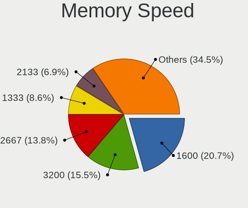

| Speed   | Notebooks | Percent |
|---------|-----------|---------|
| 1600    | 12        | 20.69%  |
| 3200    | 9         | 15.52%  |
| 2667    | 8         | 13.79%  |
| 1333    | 5         | 8.62%   |
| 2133    | 4         | 6.9%    |
| 2400    | 3         | 5.17%   |
| 1334    | 3         | 5.17%   |
| 1067    | 3         | 5.17%   |
| 800     | 2         | 3.45%   |
| 7500    | 1         | 1.72%   |
| 6400    | 1         | 1.72%   |
| 4800    | 1         | 1.72%   |
| 4266    | 1         | 1.72%   |
| 3266    | 1         | 1.72%   |
| 2048    | 1         | 1.72%   |
| 1867    | 1         | 1.72%   |
| 667     | 1         | 1.72%   |
| Unknown | 1         | 1.72%   |

Printers & scanners
-------------------

Printer Vendor
--------------

Printer device vendors

| Vendor                | Notebooks | Percent |
|-----------------------|-----------|---------|
| Lexmark International | 1         | 33.33%  |
| Canon                 | 1         | 33.33%  |
| Brother Industries    | 1         | 33.33%  |

Printer Model
-------------

Printer device models

| Model                                   | Notebooks | Percent |
|-----------------------------------------|-----------|---------|
| Lexmark International f+ imaging M40adn | 1         | 33.33%  |
| Canon LBP3360                           | 1         | 33.33%  |
| Brother HL-1110 series                  | 1         | 33.33%  |

Scanner Vendor
--------------

Scanner device vendors

Zero info for selected period =(

Scanner Model
-------------

Scanner device models

Zero info for selected period =(

Camera
------

Camera Vendor
-------------

Camera device vendors

| Vendor                                 | Notebooks | Percent |
|----------------------------------------|-----------|---------|
| Apple                                  | 71        | 20.58%  |
| Chicony Electronics                    | 55        | 15.94%  |
| Microdia                               | 29        | 8.41%   |
| IMC Networks                           | 23        | 6.67%   |
| Realtek Semiconductor                  | 21        | 6.09%   |
| Sunplus Innovation Technology          | 20        | 5.8%    |
| Quanta                                 | 19        | 5.51%   |
| Cheng Uei Precision Industry (Foxlink) | 15        | 4.35%   |
| Bison Electronics                      | 15        | 4.35%   |
| Suyin                                  | 14        | 4.06%   |
| Syntek                                 | 10        | 2.9%    |
| Lite-On Technology                     | 9         | 2.61%   |
| Silicon Motion                         | 8         | 2.32%   |
| Ricoh                                  | 4         | 1.16%   |
| Luxvisions Innotech Limited            | 4         | 1.16%   |
| SunplusIT                              | 3         | 0.87%   |
| Sonix Technology                       | 3         | 0.87%   |
| Alcor Micro                            | 3         | 0.87%   |
| Acer                                   | 3         | 0.87%   |
| ShineTech                              | 2         | 0.58%   |
| Samsung Electronics                    | 2         | 0.58%   |
| Primax Electronics                     | 2         | 0.58%   |
| Y Media                                | 1         | 0.29%   |
| Sunplus Technology                     | 1         | 0.29%   |
| OYT Tech                               | 1         | 0.29%   |
| MacroSilicon                           | 1         | 0.29%   |
| Logitech                               | 1         | 0.29%   |
| LG Electronics                         | 1         | 0.29%   |
| Goodong Industry                       | 1         | 0.29%   |
| GEMBIRD                                | 1         | 0.29%   |
| ALi                                    | 1         | 0.29%   |
| Unknown                                | 1         | 0.29%   |

Camera Model
------------

Camera device models

| Model                                                       | Notebooks | Percent |
|-------------------------------------------------------------|-----------|---------|
| Apple FaceTime HD Camera                                    | 32        | 9.17%   |
| Apple Built-in iSight                                       | 25        | 7.16%   |
| Microdia Integrated_Webcam_HD                               | 11        | 3.15%   |
| Chicony Integrated Camera                                   | 11        | 3.15%   |
| Apple iPhone 5/5C/5S/6/SE/7/8/X/XR                          | 10        | 2.87%   |
| Realtek Integrated_Webcam_HD                                | 7         | 2.01%   |
| IMC Networks USB2.0 HD UVC WebCam                           | 7         | 2.01%   |
| Chicony HP Truevision HD                                    | 6         | 1.72%   |
| Apple FaceTime Camera                                       | 6         | 1.72%   |
| Microdia Integrated Webcam                                  | 5         | 1.43%   |
| IMC Networks Integrated Camera                              | 5         | 1.43%   |
| Syntek Integrated Camera                                    | 4         | 1.15%   |
| Sunplus Integrated_Webcam_HD                                | 4         | 1.15%   |
| Quanta HD User Facing                                       | 4         | 1.15%   |
| Chicony Integrated Camera (1280x720@30)                     | 4         | 1.15%   |
| Chicony HP Truevision HD camera                             | 4         | 1.15%   |
| Chicony HD WebCam                                           | 4         | 1.15%   |
| Bison Integrated Camera                                     | 4         | 1.15%   |
| Syntek EasyCamera                                           | 3         | 0.86%   |
| Suyin HP Truevision HD                                      | 3         | 0.86%   |
| Ricoh Laptop_Integrated_Webcam_FHD                          | 3         | 0.86%   |
| Realtek USB Camera                                          | 3         | 0.86%   |
| Quanta ov9734_techfront_camera                              | 3         | 0.86%   |
| Quanta HP Webcam                                            | 3         | 0.86%   |
| Quanta HD Camera                                            | 3         | 0.86%   |
| Luxvisions Innotech Limited HP HD Camera                    | 3         | 0.86%   |
| Lite-On Integrated Camera                                   | 3         | 0.86%   |
| Chicony EasyCamera                                          | 3         | 0.86%   |
| Bison SunplusIT Integrated Camera                           | 3         | 0.86%   |
| Bison Lenovo EasyCamera                                     | 3         | 0.86%   |
| Syntek Lenovo EasyCamera                                    | 2         | 0.57%   |
| Suyin HD WebCam                                             | 2         | 0.57%   |
| Suyin 1.3M WebCam (notebook emachines E730, Acer sub-brand) | 2         | 0.57%   |
| Sunplus HP Universal Camera                                 | 2         | 0.57%   |
| Sunplus HP HD Webcam [Fixed]                                | 2         | 0.57%   |
| Sunplus DICOTA 4K                                           | 2         | 0.57%   |
| Sunplus Asus Webcam                                         | 2         | 0.57%   |
| Silicon Motion Webcam SC-13HDL11624N [Namuga Co., Ltd.]     | 2         | 0.57%   |
| ShineTech USB2.0 HD UVC WebCam                              | 2         | 0.57%   |
| Samsung Galaxy series, misc. (MTP mode)                     | 2         | 0.57%   |

Security
--------

Fingerprint Vendor
------------------

Fingerprint sensor vendors

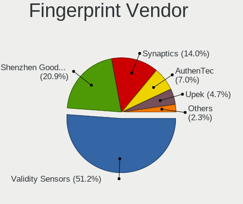

| Vendor                     | Notebooks | Percent |
|----------------------------|-----------|---------|
| Validity Sensors           | 22        | 51.16%  |
| Shenzhen Goodix Technology | 9         | 20.93%  |
| Synaptics                  | 6         | 13.95%  |
| AuthenTec                  | 3         | 6.98%   |
| Upek                       | 2         | 4.65%   |
| LighTuning Technology      | 1         | 2.33%   |

Fingerprint Model
-----------------

Fingerprint sensor models

| Model                                                                      | Notebooks | Percent |
|----------------------------------------------------------------------------|-----------|---------|
| Shenzhen Goodix  Fingerprint Device                                        | 8         | 18.6%   |
| Validity Sensors VFS495 Fingerprint Reader                                 | 6         | 13.95%  |
| Validity Sensors VFS 5011 fingerprint sensor                               | 4         | 9.3%    |
| Validity Sensors VFS471 Fingerprint Reader                                 | 3         | 6.98%   |
| Validity Sensors VFS451 Fingerprint Reader                                 | 2         | 4.65%   |
| Validity Sensors Swipe Fingerprint Sensor                                  | 2         | 4.65%   |
| Upek Biometric Touchchip/Touchstrip Fingerprint Sensor                     | 2         | 4.65%   |
| Synaptics Metallica MOH Touch Fingerprint Reader                           | 2         | 4.65%   |
| Synaptics Metallica MIS Touch Fingerprint Reader                           | 2         | 4.65%   |
| AuthenTec AES2810                                                          | 2         | 4.65%   |
| Validity Sensors VFS5011 Fingerprint Reader                                | 1         | 2.33%   |
| Validity Sensors VFS491                                                    | 1         | 2.33%   |
| Validity Sensors VFS101 Fingerprint Reader                                 | 1         | 2.33%   |
| Validity Sensors Synaptics WBDI                                            | 1         | 2.33%   |
| Validity Sensors Synaptics VFS7552 Touch Fingerprint Sensor with PurePrint | 1         | 2.33%   |
| Synaptics UWP WBDI Device                                                  | 1         | 2.33%   |
| Synaptics  FS7604 Touch Fingerprint Sensor with PurePrint                  | 1         | 2.33%   |
| Shenzhen Goodix FingerPrint                                                | 1         | 2.33%   |
| LighTuning ES603 Swipe Fingerprint Sensor                                  | 1         | 2.33%   |
| AuthenTec AES2501 Fingerprint Sensor                                       | 1         | 2.33%   |

Chipcard Vendor
---------------

Chipcard module vendors

| Vendor           | Notebooks | Percent |
|------------------|-----------|---------|
| Broadcom         | 19        | 67.86%  |
| Alcor Micro      | 5         | 17.86%  |
| Upek             | 1         | 3.57%   |
| SCM Microsystems | 1         | 3.57%   |
| O2 Micro         | 1         | 3.57%   |
| Lenovo           | 1         | 3.57%   |

Chipcard Model
--------------

Chipcard module models

| Model                                                                        | Notebooks | Percent |
|------------------------------------------------------------------------------|-----------|---------|
| Broadcom BCM5880 Secure Applications Processor with fingerprint swipe sensor | 5         | 17.86%  |
| Broadcom BCM5880 Secure Applications Processor                               | 5         | 17.86%  |
| Broadcom 5880                                                                | 5         | 17.86%  |
| Alcor Micro AU9540 Smartcard Reader                                          | 5         | 17.86%  |
| Broadcom 58200                                                               | 4         | 14.29%  |
| Upek TouchChip Fingerprint Coprocessor (WBF advanced mode)                   | 1         | 3.57%   |
| SCM Microsystems SCR3340 - ExpressCard54 Smart Card Reader                   | 1         | 3.57%   |
| O2 Micro OZ776 CCID Smartcard Reader                                         | 1         | 3.57%   |
| Lenovo Integrated Smart Card Reader                                          | 1         | 3.57%   |

Unsupported
-----------

Unsupported Devices
-------------------

Total unsupported devices on board

| Total | Notebooks | Percent |
|-------|-----------|---------|
| 0     | 223       | 57.33%  |
| 1     | 132       | 33.93%  |
| 2     | 31        | 7.97%   |
| 3     | 2         | 0.51%   |
| 9     | 1         | 0.26%   |

Unsupported Device Types
------------------------

Types of unsupported devices

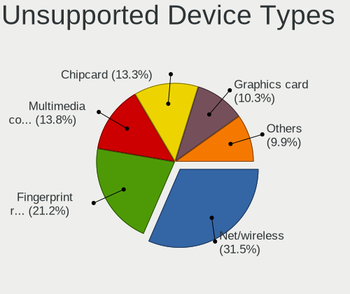

| Type                  | Notebooks | Percent |
|-----------------------|-----------|---------|
| Net/wireless          | 64        | 31.53%  |
| Fingerprint reader    | 43        | 21.18%  |
| Multimedia controller | 28        | 13.79%  |
| Chipcard              | 27        | 13.3%   |
| Graphics card         | 21        | 10.34%  |
| Storage               | 6         | 2.96%   |
| Camera                | 4         | 1.97%   |
| Bluetooth             | 4         | 1.97%   |
| Sound                 | 2         | 0.99%   |
| Storage/ata           | 1         | 0.49%   |
| Network               | 1         | 0.49%   |
| Net/ethernet          | 1         | 0.49%   |
| Modem                 | 1         | 0.49%   |

