Elementary 7.1 - Tested Hardware & Statistics
---------------------------------------------

A project to collect tested hardware configurations for Elementary 7.1.

Anyone can contribute to this report by the [hw-probe](https://github.com/linuxhw/hw-probe) tool:

    sudo -E hw-probe -all -upload

Please contribute! Especially if your hardware is rare.

This is a report for all computer types. See also reports for [desktops](/Dist/Elementary_7.1/Desktop/README.md) and [notebooks](/Dist/Elementary_7.1/Notebook/README.md).

Contents
--------

* [ Test Cases ](#test-cases)

* [ System ](#system)
  - [ Kernel                   ](#kernel)
  - [ Kernel Family            ](#kernel-family)
  - [ Kernel Major Ver.        ](#kernel-major-ver)
  - [ Arch                     ](#arch)
  - [ DE                       ](#de)
  - [ Display Server           ](#display-server)
  - [ Display Manager          ](#display-manager)
  - [ OS Lang                  ](#os-lang)
  - [ Boot Mode                ](#boot-mode)
  - [ Filesystem               ](#filesystem)
  - [ Part. scheme             ](#part-scheme)
  - [ Dual Boot with Linux/BSD ](#dual-boot-with-linuxbsd)
  - [ Dual Boot (Win)          ](#dual-boot-win)

* [ Board ](#board)
  - [ Vendor                   ](#vendor)
  - [ Model                    ](#model)
  - [ Model Family             ](#model-family)
  - [ MFG Year                 ](#mfg-year)
  - [ Form Factor              ](#form-factor)
  - [ Secure Boot              ](#secure-boot)
  - [ Coreboot                 ](#coreboot)
  - [ RAM Size                 ](#ram-size)
  - [ RAM Used                 ](#ram-used)
  - [ Total Drives             ](#total-drives)
  - [ Has CD-ROM               ](#has-cd-rom)
  - [ Has Ethernet             ](#has-ethernet)
  - [ Has WiFi                 ](#has-wifi)
  - [ Has Bluetooth            ](#has-bluetooth)

* [ Location ](#location)
  - [ Country                  ](#country)
  - [ City                     ](#city)

* [ Drives ](#drives)
  - [ Drive Vendor             ](#drive-vendor)
  - [ Drive Model              ](#drive-model)
  - [ HDD Vendor               ](#hdd-vendor)
  - [ SSD Vendor               ](#ssd-vendor)
  - [ Drive Kind               ](#drive-kind)
  - [ Drive Connector          ](#drive-connector)
  - [ Drive Size               ](#drive-size)
  - [ Space Total              ](#space-total)
  - [ Space Used               ](#space-used)
  - [ Malfunc. Drives          ](#malfunc-drives)
  - [ Malfunc. Drive Vendor    ](#malfunc-drive-vendor)
  - [ Malfunc. HDD Vendor      ](#malfunc-hdd-vendor)
  - [ Malfunc. Drive Kind      ](#malfunc-drive-kind)
  - [ Failed Drives            ](#failed-drives)
  - [ Failed Drive Vendor      ](#failed-drive-vendor)
  - [ Drive Status             ](#drive-status)

* [ Storage controller ](#storage-controller)
  - [ Storage Vendor           ](#storage-vendor)
  - [ Storage Model            ](#storage-model)
  - [ Storage Kind             ](#storage-kind)

* [ Processor ](#processor)
  - [ CPU Vendor               ](#cpu-vendor)
  - [ CPU Model                ](#cpu-model)
  - [ CPU Model Family         ](#cpu-model-family)
  - [ CPU Cores                ](#cpu-cores)
  - [ CPU Sockets              ](#cpu-sockets)
  - [ CPU Threads              ](#cpu-threads)
  - [ CPU Op-Modes             ](#cpu-op-modes)
  - [ CPU Microcode            ](#cpu-microcode)
  - [ CPU Microarch            ](#cpu-microarch)

* [ Graphics ](#graphics)
  - [ GPU Vendor               ](#gpu-vendor)
  - [ GPU Model                ](#gpu-model)
  - [ GPU Combo                ](#gpu-combo)
  - [ GPU Driver               ](#gpu-driver)
  - [ GPU Memory               ](#gpu-memory)

* [ Monitor ](#monitor)
  - [ Monitor Vendor           ](#monitor-vendor)
  - [ Monitor Model            ](#monitor-model)
  - [ Monitor Resolution       ](#monitor-resolution)
  - [ Monitor Diagonal         ](#monitor-diagonal)
  - [ Monitor Width            ](#monitor-width)
  - [ Aspect Ratio             ](#aspect-ratio)
  - [ Monitor Area             ](#monitor-area)
  - [ Pixel Density            ](#pixel-density)
  - [ Multiple Monitors        ](#multiple-monitors)

* [ Network ](#network)
  - [ Net Controller Vendor    ](#net-controller-vendor)
  - [ Net Controller Model     ](#net-controller-model)
  - [ Wireless Vendor          ](#wireless-vendor)
  - [ Wireless Model           ](#wireless-model)
  - [ Ethernet Vendor          ](#ethernet-vendor)
  - [ Ethernet Model           ](#ethernet-model)
  - [ Net Controller Kind      ](#net-controller-kind)
  - [ Used Controller          ](#used-controller)
  - [ NICs                     ](#nics)
  - [ IPv6                     ](#ipv6)

* [ Bluetooth ](#bluetooth)
  - [ Bluetooth Vendor         ](#bluetooth-vendor)
  - [ Bluetooth Model          ](#bluetooth-model)

* [ Sound ](#sound)
  - [ Sound Vendor             ](#sound-vendor)
  - [ Sound Model              ](#sound-model)

* [ Memory ](#memory)
  - [ Memory Vendor            ](#memory-vendor)
  - [ Memory Model             ](#memory-model)
  - [ Memory Kind              ](#memory-kind)
  - [ Memory Form Factor       ](#memory-form-factor)
  - [ Memory Size              ](#memory-size)
  - [ Memory Speed             ](#memory-speed)

* [ Printers & scanners ](#printers--scanners)
  - [ Printer Vendor           ](#printer-vendor)
  - [ Printer Model            ](#printer-model)
  - [ Scanner Vendor           ](#scanner-vendor)
  - [ Scanner Model            ](#scanner-model)

* [ Camera ](#camera)
  - [ Camera Vendor            ](#camera-vendor)
  - [ Camera Model             ](#camera-model)

* [ Security ](#security)
  - [ Fingerprint Vendor       ](#fingerprint-vendor)
  - [ Fingerprint Model        ](#fingerprint-model)
  - [ Chipcard Vendor          ](#chipcard-vendor)
  - [ Chipcard Model           ](#chipcard-model)

* [ Unsupported ](#unsupported)
  - [ Unsupported Devices      ](#unsupported-devices)
  - [ Unsupported Device Types ](#unsupported-device-types)

Test Cases
----------

Total: 382

| Vendor        | Model                       | Form-Factor | Probe                                                      | Date         |
|---------------|-----------------------------|-------------|------------------------------------------------------------|--------------|
| Dell          | Inspiron 3481               | Notebook    | [78cf24846f](https://linux-hardware.org/?probe=78cf24846f) | May 09, 2024 |
| ASUSTek       | PRIME B460M-K               | Desktop     | [fea6956058](https://linux-hardware.org/?probe=fea6956058) | May 08, 2024 |
| ASUSTek       | PRIME H510M-A               | Desktop     | [e475e36ab0](https://linux-hardware.org/?probe=e475e36ab0) | May 06, 2024 |
| Packard Be... | EasyNote LM81               | Notebook    | [0ea4d18648](https://linux-hardware.org/?probe=0ea4d18648) | May 06, 2024 |
| Samsung       | 550XDA                      | Notebook    | [1ea7dfb8ae](https://linux-hardware.org/?probe=1ea7dfb8ae) | May 06, 2024 |
| ASUSTek       | PRIME A320M-K               | Desktop     | [0f43840d58](https://linux-hardware.org/?probe=0f43840d58) | May 06, 2024 |
| Apple         | MacBookPro11,4              | Notebook    | [3c0f7c8c00](https://linux-hardware.org/?probe=3c0f7c8c00) | May 06, 2024 |
| HP            | EliteBook 830 G5            | Notebook    | [7ad59bc402](https://linux-hardware.org/?probe=7ad59bc402) | May 05, 2024 |
| HP            | EliteBook 830 G5            | Notebook    | [a88155be11](https://linux-hardware.org/?probe=a88155be11) | May 05, 2024 |
| Lenovo        | IdeaPad S340-14API 81NB     | Notebook    | [80f71c25c1](https://linux-hardware.org/?probe=80f71c25c1) | May 05, 2024 |
| Apple         | MacBookAir4,1               | Notebook    | [2e67b6ba22](https://linux-hardware.org/?probe=2e67b6ba22) | May 04, 2024 |
| Samsung       | DP700A7D-S04IT SEC_SW_RE... | All in one  | [7ddb4bb85e](https://linux-hardware.org/?probe=7ddb4bb85e) | May 04, 2024 |
| Lenovo        | ThinkPad T530 2429HR5       | Notebook    | [c5640e6fae](https://linux-hardware.org/?probe=c5640e6fae) | May 04, 2024 |
| Dell          | Latitude 5490               | Notebook    | [b31473028c](https://linux-hardware.org/?probe=b31473028c) | May 04, 2024 |
| Packard Be... | EasyNote LM81               | Notebook    | [44ead9f439](https://linux-hardware.org/?probe=44ead9f439) | May 03, 2024 |
| Google        | Nospike                     | Notebook    | [549d690ae1](https://linux-hardware.org/?probe=549d690ae1) | May 02, 2024 |
| Samsung       | DP700A7D-S04IT SEC_SW_RE... | All in one  | [3ba7fa0ef2](https://linux-hardware.org/?probe=3ba7fa0ef2) | May 01, 2024 |
| Dell          | Latitude 5490               | Notebook    | [c83e9f5562](https://linux-hardware.org/?probe=c83e9f5562) | May 01, 2024 |
| Lenovo        | IdeaPad P400 Touch 20211    | Notebook    | [cacd80cba3](https://linux-hardware.org/?probe=cacd80cba3) | May 01, 2024 |
| HP            | ProBook 470 G5              | Notebook    | [8ba873e85d](https://linux-hardware.org/?probe=8ba873e85d) | Apr 30, 2024 |
| HP            | 0B4Ch D                     | Desktop     | [29d73efd4a](https://linux-hardware.org/?probe=29d73efd4a) | Apr 30, 2024 |
| ASUSTek       | PRIME A320M-K               | Desktop     | [022ece0282](https://linux-hardware.org/?probe=022ece0282) | Apr 30, 2024 |
| MSI           | GT62VR 6RE                  | Notebook    | [b7768b7ee9](https://linux-hardware.org/?probe=b7768b7ee9) | Apr 28, 2024 |
| Medion        | MS-7797                     | Desktop     | [a72c95890e](https://linux-hardware.org/?probe=a72c95890e) | Apr 28, 2024 |
| HP            | EliteBook 8440p             | Notebook    | [0dbed15c85](https://linux-hardware.org/?probe=0dbed15c85) | Apr 27, 2024 |
| Gigabyte      | B250M-D2VX-SI-CF            | Desktop     | [5c277491cf](https://linux-hardware.org/?probe=5c277491cf) | Apr 27, 2024 |
| HUAWEI        | KPL-W0X                     | Notebook    | [0ce65136da](https://linux-hardware.org/?probe=0ce65136da) | Apr 27, 2024 |
| Apple         | Mac-942B59F58194171B iMa... | All in one  | [803b388305](https://linux-hardware.org/?probe=803b388305) | Apr 26, 2024 |
| Apple         | Mac-942B59F58194171B iMa... | All in one  | [3471ca7905](https://linux-hardware.org/?probe=3471ca7905) | Apr 26, 2024 |
| Apple         | MacBook5,1                  | Notebook    | [8da3b01d13](https://linux-hardware.org/?probe=8da3b01d13) | Apr 26, 2024 |
| ASUSTek       | TUF X470-PLUS GAMING        | Desktop     | [6609c77480](https://linux-hardware.org/?probe=6609c77480) | Apr 26, 2024 |
| MSI           | MS-B090                     | All in one  | [06780aaa5b](https://linux-hardware.org/?probe=06780aaa5b) | Apr 26, 2024 |
| ASUSTek       | P8H77-M PRO                 | Desktop     | [ee55351883](https://linux-hardware.org/?probe=ee55351883) | Apr 25, 2024 |
| HP            | EliteBook 745 G4            | Notebook    | [f38a6451f0](https://linux-hardware.org/?probe=f38a6451f0) | Apr 24, 2024 |
| ASUSTek       | PRIME H510M-A               | Desktop     | [c12789125b](https://linux-hardware.org/?probe=c12789125b) | Apr 24, 2024 |
| HP            | Pavilion dv6                | Notebook    | [c8d73c3a23](https://linux-hardware.org/?probe=c8d73c3a23) | Apr 24, 2024 |
| HP            | Pavilion dv6                | Notebook    | [08f01fc7ed](https://linux-hardware.org/?probe=08f01fc7ed) | Apr 24, 2024 |
| Acer          | Aspire A515-43              | Notebook    | [ff74a6262e](https://linux-hardware.org/?probe=ff74a6262e) | Apr 23, 2024 |
| Apple         | MacBookAir7,2               | Notebook    | [674850b624](https://linux-hardware.org/?probe=674850b624) | Apr 23, 2024 |
| Apple         | MacBookAir7,2               | Notebook    | [c7cbc009ef](https://linux-hardware.org/?probe=c7cbc009ef) | Apr 23, 2024 |
| Acer          | Aspire 5750G                | Notebook    | [39ed7553a3](https://linux-hardware.org/?probe=39ed7553a3) | Apr 23, 2024 |
| TECNO         | MEGABOOK T1                 | Notebook    | [01fc56cf5b](https://linux-hardware.org/?probe=01fc56cf5b) | Apr 22, 2024 |
| Medion        | MS-7797                     | Desktop     | [810a7d7810](https://linux-hardware.org/?probe=810a7d7810) | Apr 22, 2024 |
| Apple         | MacBookPro11,1              | Notebook    | [3f4e9ae066](https://linux-hardware.org/?probe=3f4e9ae066) | Apr 21, 2024 |
| Apple         | MacBookPro11,1              | Notebook    | [e70b7338c2](https://linux-hardware.org/?probe=e70b7338c2) | Apr 21, 2024 |
| Acer          | Aspire 5750                 | Notebook    | [9e2621b213](https://linux-hardware.org/?probe=9e2621b213) | Apr 21, 2024 |
| ASUSTek       | VivoBook_ASUSLaptop X580... | Notebook    | [8740fd113c](https://linux-hardware.org/?probe=8740fd113c) | Apr 19, 2024 |
| HP            | Pavilion Notebook           | Notebook    | [8b925ca8f0](https://linux-hardware.org/?probe=8b925ca8f0) | Apr 19, 2024 |
| ECS           | H110M-C3D/C3V               | Desktop     | [7fffccead5](https://linux-hardware.org/?probe=7fffccead5) | Apr 17, 2024 |
| ASUSTek       | K42F                        | Notebook    | [d127923f98](https://linux-hardware.org/?probe=d127923f98) | Apr 17, 2024 |
| HP            | Pavilion x2 Detachable      | Notebook    | [9e5556a266](https://linux-hardware.org/?probe=9e5556a266) | Apr 17, 2024 |
| Apple         | Mac-031B6874CF7F642A iMa... | All in one  | [847e24305d](https://linux-hardware.org/?probe=847e24305d) | Apr 16, 2024 |
| Apple         | MacBookPro16,1              | Notebook    | [40fd2c63cb](https://linux-hardware.org/?probe=40fd2c63cb) | Apr 16, 2024 |
| Dell          | 0D24M8 A02                  | Desktop     | [96b0ae2f86](https://linux-hardware.org/?probe=96b0ae2f86) | Apr 16, 2024 |
| Gigabyte      | F2A68HM-S1                  | Desktop     | [32237e05f1](https://linux-hardware.org/?probe=32237e05f1) | Apr 15, 2024 |
| DEPO Compu... | W25CEW                      | Notebook    | [6653a2975d](https://linux-hardware.org/?probe=6653a2975d) | Apr 15, 2024 |
| Apple         | Mac-031B6874CF7F642A iMa... | All in one  | [0018ad80c4](https://linux-hardware.org/?probe=0018ad80c4) | Apr 14, 2024 |
| Apple         | MacBookPro9,2               | Notebook    | [5a62c14a1f](https://linux-hardware.org/?probe=5a62c14a1f) | Apr 14, 2024 |
| Apple         | MacBookPro9,2               | Notebook    | [97f0209510](https://linux-hardware.org/?probe=97f0209510) | Apr 14, 2024 |
| Medion        | Z370H4-EM                   | Desktop     | [39cb6c0afb](https://linux-hardware.org/?probe=39cb6c0afb) | Apr 13, 2024 |
| Acer          | Aspire 6935                 | Notebook    | [d26ee0494f](https://linux-hardware.org/?probe=d26ee0494f) | Apr 13, 2024 |
| Apple         | MacBookPro8,2               | Notebook    | [e57c02860c](https://linux-hardware.org/?probe=e57c02860c) | Apr 13, 2024 |
| Acer          | Aspire 5750                 | Notebook    | [f64263bd19](https://linux-hardware.org/?probe=f64263bd19) | Apr 12, 2024 |
| Apple         | MacBookAir7,2               | Notebook    | [569f9614a5](https://linux-hardware.org/?probe=569f9614a5) | Apr 12, 2024 |
| HP            | ProBook 6360b               | Notebook    | [81b9d0706b](https://linux-hardware.org/?probe=81b9d0706b) | Apr 11, 2024 |
| Apple         | MacBookPro8,2               | Notebook    | [461d5dfd8d](https://linux-hardware.org/?probe=461d5dfd8d) | Apr 11, 2024 |
| MSI           | MEG Z590 UNIFY              | Desktop     | [88f634c670](https://linux-hardware.org/?probe=88f634c670) | Apr 11, 2024 |
| MSI           | MEG Z590 UNIFY              | Desktop     | [2336b3cd38](https://linux-hardware.org/?probe=2336b3cd38) | Apr 11, 2024 |
| HP            | 2B13 A01                    | All in one  | [30160f86ab](https://linux-hardware.org/?probe=30160f86ab) | Apr 10, 2024 |
| Lenovo        | ThinkPad E480 20KN003TUS    | Notebook    | [35b206d8f8](https://linux-hardware.org/?probe=35b206d8f8) | Apr 10, 2024 |
| HP            | EliteBook 745 G4            | Notebook    | [0d92302707](https://linux-hardware.org/?probe=0d92302707) | Apr 09, 2024 |
| Apple         | MacBookPro8,1               | Notebook    | [ac137b7cb7](https://linux-hardware.org/?probe=ac137b7cb7) | Apr 09, 2024 |
| Apple         | MacBookPro8,1               | Notebook    | [e964beb301](https://linux-hardware.org/?probe=e964beb301) | Apr 09, 2024 |
| Apple         | MacBookPro5,4               | Notebook    | [3ab1d66e10](https://linux-hardware.org/?probe=3ab1d66e10) | Apr 08, 2024 |
| Lenovo        | Yoga 900S-12ISK 80ML        | Notebook    | [9099f440bc](https://linux-hardware.org/?probe=9099f440bc) | Apr 08, 2024 |
| Apple         | MacBookPro8,1               | Notebook    | [7efef6a0ae](https://linux-hardware.org/?probe=7efef6a0ae) | Apr 07, 2024 |
| Apple         | MacBookPro8,1               | Notebook    | [d28398beb7](https://linux-hardware.org/?probe=d28398beb7) | Apr 07, 2024 |
| Dell          | XPS 15 9570                 | Notebook    | [ccdb5dcad9](https://linux-hardware.org/?probe=ccdb5dcad9) | Apr 07, 2024 |
| HP            | 18E7                        | Desktop     | [467ac72efe](https://linux-hardware.org/?probe=467ac72efe) | Apr 07, 2024 |
| Apple         | MacBookPro9,2               | Notebook    | [a90b694613](https://linux-hardware.org/?probe=a90b694613) | Apr 06, 2024 |
| Gigabyte      | 945GME-DS2                  | Desktop     | [37085a5c3f](https://linux-hardware.org/?probe=37085a5c3f) | Apr 06, 2024 |
| Acer          | Aspire 5750                 | Notebook    | [27d64e5b3c](https://linux-hardware.org/?probe=27d64e5b3c) | Apr 05, 2024 |
| Apple         | MacBookPro8,1               | Notebook    | [733d6c6e2b](https://linux-hardware.org/?probe=733d6c6e2b) | Apr 05, 2024 |
| Lenovo        | MIIX 310-10ICR 80SG         | Tablet      | [8603f205ba](https://linux-hardware.org/?probe=8603f205ba) | Apr 05, 2024 |
| Lenovo        | ThinkPad E480 20KN003TUS    | Notebook    | [3d64dfc3a9](https://linux-hardware.org/?probe=3d64dfc3a9) | Apr 04, 2024 |
| Acer          | Aspire 5750                 | Notebook    | [e2cef27ef8](https://linux-hardware.org/?probe=e2cef27ef8) | Apr 03, 2024 |
| HP            | 18E7                        | Desktop     | [9dadc64d70](https://linux-hardware.org/?probe=9dadc64d70) | Apr 03, 2024 |
| HP            | Pavilion dv7                | Notebook    | [483e1957a4](https://linux-hardware.org/?probe=483e1957a4) | Apr 02, 2024 |
| Lenovo        | Yoga Pro 7 14APH8 82Y8      | Notebook    | [fe5490324f](https://linux-hardware.org/?probe=fe5490324f) | Apr 01, 2024 |
| ASUSTek       | EX-B150M-V3                 | Desktop     | [0c643b047e](https://linux-hardware.org/?probe=0c643b047e) | Apr 01, 2024 |
| ASUSTek       | EX-B150M-V3                 | Desktop     | [c6772f244f](https://linux-hardware.org/?probe=c6772f244f) | Apr 01, 2024 |
| HP            | Pavilion dv7                | Notebook    | [a86e8cccf5](https://linux-hardware.org/?probe=a86e8cccf5) | Mar 31, 2024 |
| Apple         | Mac-81E3E92DD6088272 iMa... | All in one  | [6cec34e881](https://linux-hardware.org/?probe=6cec34e881) | Mar 30, 2024 |
| Apple         | Mac-942B59F58194171B iMa... | All in one  | [c010c5876b](https://linux-hardware.org/?probe=c010c5876b) | Mar 30, 2024 |
| ASUSTek       | P8H77-M PRO                 | Desktop     | [f30dd46998](https://linux-hardware.org/?probe=f30dd46998) | Mar 29, 2024 |
| ASUSTek       | ASUS TUF Gaming F15 FX50... | Notebook    | [b68181d354](https://linux-hardware.org/?probe=b68181d354) | Mar 29, 2024 |
| Dell          | Inspiron 5423               | Notebook    | [0c6c4c6a58](https://linux-hardware.org/?probe=0c6c4c6a58) | Mar 29, 2024 |
| MSI           | MAG B660M MORTAR WIFI DD... | Desktop     | [a87aa51bf9](https://linux-hardware.org/?probe=a87aa51bf9) | Mar 29, 2024 |
| Lenovo        | ThinkPad W500 40623CG       | Notebook    | [71c868292f](https://linux-hardware.org/?probe=71c868292f) | Mar 27, 2024 |
| Lenovo        | ThinkPad W500 40623CG       | Notebook    | [01d1ef9c31](https://linux-hardware.org/?probe=01d1ef9c31) | Mar 26, 2024 |
| Lenovo        | ThinkPad T410 2537CQ7       | Notebook    | [8b91ec68dd](https://linux-hardware.org/?probe=8b91ec68dd) | Mar 26, 2024 |
| Lenovo        | ThinkPad T450s 20BX0011G... | Notebook    | [3e86099c28](https://linux-hardware.org/?probe=3e86099c28) | Mar 26, 2024 |
| Lenovo        | ThinkCentre Edge91 1895B... | Desktop     | [991944129e](https://linux-hardware.org/?probe=991944129e) | Mar 26, 2024 |
| Chuwi         | LarkBox Pro                 | Mini pc     | [e9afd87037](https://linux-hardware.org/?probe=e9afd87037) | Mar 25, 2024 |
| Gigabyte      | A320M-S2H-CF                | Desktop     | [30717fbd15](https://linux-hardware.org/?probe=30717fbd15) | Mar 25, 2024 |
| Chuwi         | LarkBox Pro                 | Mini pc     | [42ab03e71f](https://linux-hardware.org/?probe=42ab03e71f) | Mar 25, 2024 |
| ASUSTek       | M4A87TD/USB3                | Desktop     | [9a817cbe67](https://linux-hardware.org/?probe=9a817cbe67) | Mar 24, 2024 |
| Lenovo        | ThinkPad T450s 20BX0011G... | Notebook    | [598015ca49](https://linux-hardware.org/?probe=598015ca49) | Mar 24, 2024 |
| ASUSTek       | H81M-P PLUS                 | Desktop     | [92aa3b7c70](https://linux-hardware.org/?probe=92aa3b7c70) | Mar 24, 2024 |
| ASUSTek       | H81M-P PLUS                 | Desktop     | [57ee067ff2](https://linux-hardware.org/?probe=57ee067ff2) | Mar 24, 2024 |
| Samsung       | 535U3C                      | Notebook    | [6b29450ac6](https://linux-hardware.org/?probe=6b29450ac6) | Mar 23, 2024 |
| HUAWEI        | BOM-WXX9                    | Notebook    | [20d2290d1c](https://linux-hardware.org/?probe=20d2290d1c) | Mar 23, 2024 |
| HUAWEI        | NBLB-WAX9N                  | Notebook    | [e5c5d49216](https://linux-hardware.org/?probe=e5c5d49216) | Mar 22, 2024 |
| Unknown       | Unknown                     | Desktop     | [5af36d3a4e](https://linux-hardware.org/?probe=5af36d3a4e) | Mar 22, 2024 |
| Apple         | Mac-942B59F58194171B iMa... | All in one  | [89e6d122a0](https://linux-hardware.org/?probe=89e6d122a0) | Mar 22, 2024 |
| ASRock        | X570 Extreme4               | Desktop     | [f7bd9e9cce](https://linux-hardware.org/?probe=f7bd9e9cce) | Mar 21, 2024 |
| ASUSTek       | ROG Flow Z13 GZ301ZC_GZ3... | Tablet      | [4769499461](https://linux-hardware.org/?probe=4769499461) | Mar 21, 2024 |
| HP            | ProBook 450 G3              | Notebook    | [a32e851ddd](https://linux-hardware.org/?probe=a32e851ddd) | Mar 21, 2024 |
| Unknown       | AM02                        | Mini pc     | [ad3f00a84a](https://linux-hardware.org/?probe=ad3f00a84a) | Mar 20, 2024 |
| HP            | ENVY 17                     | Notebook    | [0ee4da384d](https://linux-hardware.org/?probe=0ee4da384d) | Mar 20, 2024 |
| ASUSTek       | ROG Flow Z13 GZ301ZC_GZ3... | Tablet      | [78bd592741](https://linux-hardware.org/?probe=78bd592741) | Mar 17, 2024 |
| MSI           | GE70 2QE                    | Notebook    | [31b45c6de7](https://linux-hardware.org/?probe=31b45c6de7) | Mar 17, 2024 |
| HP            | Laptop 17-by3xxx            | Notebook    | [430290e97d](https://linux-hardware.org/?probe=430290e97d) | Mar 17, 2024 |
| Dell          | Latitude E6420              | Notebook    | [dc953135d3](https://linux-hardware.org/?probe=dc953135d3) | Mar 16, 2024 |
| Dell          | Latitude E7240              | Notebook    | [d159f296d4](https://linux-hardware.org/?probe=d159f296d4) | Mar 16, 2024 |
| ASUSTek       | X541UAK                     | Notebook    | [4b33512569](https://linux-hardware.org/?probe=4b33512569) | Mar 16, 2024 |
| Apple         | Mac-F2268CC8                | All in one  | [d90e75a37d](https://linux-hardware.org/?probe=d90e75a37d) | Mar 15, 2024 |
| Dell          | Latitude E7470              | Notebook    | [4addfb5619](https://linux-hardware.org/?probe=4addfb5619) | Mar 14, 2024 |
| Dell          | Latitude E7470              | Notebook    | [fbf1fe3963](https://linux-hardware.org/?probe=fbf1fe3963) | Mar 14, 2024 |
| Acer          | Aspire E5-573G              | Notebook    | [36653be57c](https://linux-hardware.org/?probe=36653be57c) | Mar 13, 2024 |
| ASUSTek       | X555LAB                     | Notebook    | [8b2310099c](https://linux-hardware.org/?probe=8b2310099c) | Mar 13, 2024 |
| Lenovo        | V15 G2 ITL 82KB             | Notebook    | [cfb2591a20](https://linux-hardware.org/?probe=cfb2591a20) | Mar 12, 2024 |
| Lenovo        | V15 G2 ITL 82KB             | Notebook    | [9160e106f1](https://linux-hardware.org/?probe=9160e106f1) | Mar 12, 2024 |
| Dell          | 0D24M8 A02                  | Desktop     | [70a8364913](https://linux-hardware.org/?probe=70a8364913) | Mar 11, 2024 |
| Apple         | MacBookAir7,2               | Notebook    | [89b268f1f8](https://linux-hardware.org/?probe=89b268f1f8) | Mar 11, 2024 |
| HP            | EliteBook x360 1030 G7 N... | Convertible | [0f0640b2bf](https://linux-hardware.org/?probe=0f0640b2bf) | Mar 10, 2024 |
| Dell          | 0M6C7G A00                  | Desktop     | [666c6ad495](https://linux-hardware.org/?probe=666c6ad495) | Mar 10, 2024 |
| HP            | Pavilion Laptop 15-cs0xx... | Notebook    | [22f1633f40](https://linux-hardware.org/?probe=22f1633f40) | Mar 09, 2024 |
| ASUSTek       | X541UAK                     | Notebook    | [8b527dc9c9](https://linux-hardware.org/?probe=8b527dc9c9) | Mar 09, 2024 |
| HP            | ENVY Notebook               | Notebook    | [6ab7868737](https://linux-hardware.org/?probe=6ab7868737) | Mar 08, 2024 |
| Biostar       | B350GT5                     | Desktop     | [61f8cce525](https://linux-hardware.org/?probe=61f8cce525) | Mar 08, 2024 |
| Apple         | MacBookPro11,2              | Notebook    | [486387c7ef](https://linux-hardware.org/?probe=486387c7ef) | Mar 08, 2024 |
| Unknown       | AM02                        | Mini pc     | [3a7ef0d16c](https://linux-hardware.org/?probe=3a7ef0d16c) | Mar 08, 2024 |
| Fujitsu       | D3233-A1 S26361-D3233-A1    | Desktop     | [16b3359307](https://linux-hardware.org/?probe=16b3359307) | Mar 07, 2024 |
| Fujitsu       | D3233-A1 S26361-D3233-A1    | Desktop     | [4d569e557d](https://linux-hardware.org/?probe=4d569e557d) | Mar 07, 2024 |
| Apple         | MacBookAir7,2               | Notebook    | [f701ce67f5](https://linux-hardware.org/?probe=f701ce67f5) | Mar 07, 2024 |
| Apple         | MacBookAir7,2               | Notebook    | [4c046066f7](https://linux-hardware.org/?probe=4c046066f7) | Mar 05, 2024 |
| Lenovo        | ThinkPad X250 20CLS3NA00    | Notebook    | [ecea244114](https://linux-hardware.org/?probe=ecea244114) | Mar 03, 2024 |
| Unknown       | Unknown                     | Notebook    | [2ca2d631cc](https://linux-hardware.org/?probe=2ca2d631cc) | Mar 02, 2024 |
| Acer          | FIH57                       | Desktop     | [4b9a9a43f3](https://linux-hardware.org/?probe=4b9a9a43f3) | Mar 02, 2024 |
| HP            | Pavilion x360 Convertibl... | Convertible | [54ddd297a5](https://linux-hardware.org/?probe=54ddd297a5) | Mar 02, 2024 |
| HP            | ENVY Laptop 13-ad1xx        | Notebook    | [d7d8cc5cc7](https://linux-hardware.org/?probe=d7d8cc5cc7) | Mar 02, 2024 |
| ASUSTek       | Zenbook UP6502ZD_Q539ZD     | Convertible | [23bb682fb2](https://linux-hardware.org/?probe=23bb682fb2) | Mar 02, 2024 |
| HP            | ProBook 4540s               | Notebook    | [46cdfe37d6](https://linux-hardware.org/?probe=46cdfe37d6) | Mar 02, 2024 |
| HP            | ProBook 4540s               | Notebook    | [ec5752452f](https://linux-hardware.org/?probe=ec5752452f) | Mar 02, 2024 |
| HP            | 8434 11                     | Desktop     | [aa98b6327d](https://linux-hardware.org/?probe=aa98b6327d) | Mar 02, 2024 |
| HP            | 8434 11                     | Desktop     | [5b25b65016](https://linux-hardware.org/?probe=5b25b65016) | Mar 01, 2024 |
| Apple         | Mac-F221BEC8                | Desktop     | [10c92b676a](https://linux-hardware.org/?probe=10c92b676a) | Feb 29, 2024 |
| Apple         | MacBookPro5,4               | Notebook    | [681e76d909](https://linux-hardware.org/?probe=681e76d909) | Feb 29, 2024 |
| Apple         | MacBookPro5,4               | Notebook    | [ca45519759](https://linux-hardware.org/?probe=ca45519759) | Feb 29, 2024 |
| UNOWHY        | Y13G011S4EI                 | Notebook    | [f785899192](https://linux-hardware.org/?probe=f785899192) | Feb 29, 2024 |
| Lenovo        | IdeaPad 1 15ALC7 82R4       | Notebook    | [11a760c545](https://linux-hardware.org/?probe=11a760c545) | Feb 28, 2024 |
| HP            | 15                          | Notebook    | [6fb113d856](https://linux-hardware.org/?probe=6fb113d856) | Feb 28, 2024 |
| Dell          | 0D24M8 A02                  | Desktop     | [d67f57356b](https://linux-hardware.org/?probe=d67f57356b) | Feb 28, 2024 |
| Dell          | Inspiron 5567               | Notebook    | [9a57de6e15](https://linux-hardware.org/?probe=9a57de6e15) | Feb 27, 2024 |
| Apple         | Mac-8ED6AF5B48C039E1 Mac... | Mini pc     | [55a45151a3](https://linux-hardware.org/?probe=55a45151a3) | Feb 27, 2024 |
| Apple         | Mac-8ED6AF5B48C039E1 Mac... | Mini pc     | [9b5af4edf6](https://linux-hardware.org/?probe=9b5af4edf6) | Feb 27, 2024 |
| Lenovo        | ThinkPad X1 Carbon 2nd 2... | Notebook    | [49ac7f8a77](https://linux-hardware.org/?probe=49ac7f8a77) | Feb 27, 2024 |
| Apple         | MacBookPro9,2               | Notebook    | [7167de20ce](https://linux-hardware.org/?probe=7167de20ce) | Feb 27, 2024 |
| HUAWEI        | KLVL-WXX9                   | Notebook    | [b1c31d32ab](https://linux-hardware.org/?probe=b1c31d32ab) | Feb 27, 2024 |
| Intel         | X79Turbo V1.x               | Desktop     | [09f942e7f4](https://linux-hardware.org/?probe=09f942e7f4) | Feb 26, 2024 |
| ASUSTek       | X441UA                      | Notebook    | [1185900ace](https://linux-hardware.org/?probe=1185900ace) | Feb 26, 2024 |
| Lenovo        | IdeaPad S400 Touch VIUS3    | Notebook    | [61e571e08f](https://linux-hardware.org/?probe=61e571e08f) | Feb 26, 2024 |
| Acer          | TravelMate P256-MG          | Notebook    | [abcfd5362f](https://linux-hardware.org/?probe=abcfd5362f) | Feb 25, 2024 |
| Lenovo        | IdeaPad 3 14ADA05 81W0      | Notebook    | [ca33f4c1c6](https://linux-hardware.org/?probe=ca33f4c1c6) | Feb 25, 2024 |
| HP            | Pavilion Laptop 15-cd0xx    | Notebook    | [6d31b35e19](https://linux-hardware.org/?probe=6d31b35e19) | Feb 25, 2024 |
| ASUSTek       | Zenbook UP6502ZD_Q539ZD     | Convertible | [773d48d7bc](https://linux-hardware.org/?probe=773d48d7bc) | Feb 25, 2024 |
| Apple         | MacBook5,1                  | Notebook    | [be026cabc8](https://linux-hardware.org/?probe=be026cabc8) | Feb 24, 2024 |
| Gigabyte      | AB350-Gaming 3-CF           | Desktop     | [082b9f50ab](https://linux-hardware.org/?probe=082b9f50ab) | Feb 23, 2024 |
| Acer          | Swift SF314-43              | Notebook    | [56b060901d](https://linux-hardware.org/?probe=56b060901d) | Feb 23, 2024 |
| HP            | Pavilion Laptop 15-cd0xx    | Notebook    | [83bf2661f0](https://linux-hardware.org/?probe=83bf2661f0) | Feb 23, 2024 |
| Apple         | MacBookAir7,2               | Notebook    | [627c4721b6](https://linux-hardware.org/?probe=627c4721b6) | Feb 21, 2024 |
| Lenovo        | IdeaPad 1 15AMN7 82X5       | Notebook    | [96fb9606bf](https://linux-hardware.org/?probe=96fb9606bf) | Feb 20, 2024 |
| Lenovo        | IdeaPad 1 15AMN7 82X5       | Notebook    | [520188b3c6](https://linux-hardware.org/?probe=520188b3c6) | Feb 20, 2024 |
| HP            | ProBook 450 G1              | Notebook    | [ba02f5d2ae](https://linux-hardware.org/?probe=ba02f5d2ae) | Feb 18, 2024 |
| Apple         | MacBookAir6,1               | Notebook    | [f11ff820e7](https://linux-hardware.org/?probe=f11ff820e7) | Feb 18, 2024 |
| Lenovo        | IdeaPad 3 15IGL05 81WQ      | Notebook    | [b5bad706ef](https://linux-hardware.org/?probe=b5bad706ef) | Feb 15, 2024 |
| HP            | 245 G8                      | Notebook    | [c66563da68](https://linux-hardware.org/?probe=c66563da68) | Feb 14, 2024 |
| Dell          | Vostro 1540                 | Notebook    | [ed9ed14ad8](https://linux-hardware.org/?probe=ed9ed14ad8) | Feb 14, 2024 |
| HP            | ZBook 15                    | Notebook    | [bcb41f3b4c](https://linux-hardware.org/?probe=bcb41f3b4c) | Feb 14, 2024 |
| MSI           | GF72VR 7RF                  | Notebook    | [8fb108b426](https://linux-hardware.org/?probe=8fb108b426) | Feb 13, 2024 |
| ASUSTek       | P5G41T-M LX3                | Desktop     | [fd10cd8983](https://linux-hardware.org/?probe=fd10cd8983) | Feb 09, 2024 |
| ASUSTek       | P5G41T-M LX3                | Desktop     | [ae6f0a23e2](https://linux-hardware.org/?probe=ae6f0a23e2) | Feb 09, 2024 |
| Lenovo        | IdeaPad 320-15ABR 80XS      | Notebook    | [d1856c355f](https://linux-hardware.org/?probe=d1856c355f) | Feb 08, 2024 |
| ASUSTek       | P8Z68-V PRO GEN3            | Desktop     | [d099546e70](https://linux-hardware.org/?probe=d099546e70) | Feb 07, 2024 |
| Intel         | X79Turbo V1.x               | Desktop     | [35c4b20053](https://linux-hardware.org/?probe=35c4b20053) | Feb 07, 2024 |
| Shenzhen M... | F7BSD                       | Mini pc     | [80270fd106](https://linux-hardware.org/?probe=80270fd106) | Feb 07, 2024 |
| Shenzhen M... | F7BSD                       | Mini pc     | [5136f59a7b](https://linux-hardware.org/?probe=5136f59a7b) | Feb 07, 2024 |
| ASUSTek       | VivoBook_ASUSLaptop X170... | Notebook    | [498af1a9a2](https://linux-hardware.org/?probe=498af1a9a2) | Feb 06, 2024 |
| Apple         | Mac-F2208EC8                | Mini pc     | [ba8a28b37e](https://linux-hardware.org/?probe=ba8a28b37e) | Feb 06, 2024 |
| Microsoft     | Surface Book 2              | Tablet      | [0434a0132b](https://linux-hardware.org/?probe=0434a0132b) | Feb 06, 2024 |
| Teclast       | F7                          | Notebook    | [04b33deb97](https://linux-hardware.org/?probe=04b33deb97) | Feb 04, 2024 |
| Lenovo        | ThinkPad T14s Gen 2i 20W... | Notebook    | [fdc21a05c2](https://linux-hardware.org/?probe=fdc21a05c2) | Feb 02, 2024 |
| Acer          | AOD255                      | Notebook    | [43304c651c](https://linux-hardware.org/?probe=43304c651c) | Feb 01, 2024 |
| HUAWEI        | BOD-WXX9                    | Notebook    | [d1a7f0cddb](https://linux-hardware.org/?probe=d1a7f0cddb) | Jan 31, 2024 |
| HP            | Pavilion g6                 | Notebook    | [acd0ae9c04](https://linux-hardware.org/?probe=acd0ae9c04) | Jan 31, 2024 |
| Apple         | MacBookPro7,1               | Notebook    | [973c263365](https://linux-hardware.org/?probe=973c263365) | Jan 30, 2024 |
| Fujitsu       | LIFEBOOK E734               | Notebook    | [7b3a60ae2d](https://linux-hardware.org/?probe=7b3a60ae2d) | Jan 30, 2024 |
| Acer          | Aspire E5-571               | Notebook    | [6ebe6ae5be](https://linux-hardware.org/?probe=6ebe6ae5be) | Jan 28, 2024 |
| ASRock        | B75M-DGS R2.0               | Desktop     | [cff86cc0d9](https://linux-hardware.org/?probe=cff86cc0d9) | Jan 27, 2024 |
| Lenovo        | ThinkPad L440 20AT0030MD    | Notebook    | [1c0f2e8a2f](https://linux-hardware.org/?probe=1c0f2e8a2f) | Jan 26, 2024 |
| Dell          | Latitude E7240              | Notebook    | [d8e5d4a8da](https://linux-hardware.org/?probe=d8e5d4a8da) | Jan 25, 2024 |
| ASUSTek       | VivoBook_ASUSLaptop X150... | Notebook    | [81338699ce](https://linux-hardware.org/?probe=81338699ce) | Jan 25, 2024 |
| ASUSTek       | VivoBook_ASUSLaptop X150... | Notebook    | [9f021a2102](https://linux-hardware.org/?probe=9f021a2102) | Jan 25, 2024 |
| Samsung       | RC410/RC510/RC710           | Notebook    | [34369cc7eb](https://linux-hardware.org/?probe=34369cc7eb) | Jan 25, 2024 |
| Dell          | 00V62H A01                  | Desktop     | [83f7e8b344](https://linux-hardware.org/?probe=83f7e8b344) | Jan 24, 2024 |
| Samsung       | RC410/RC510/RC710           | Notebook    | [d48bdbaec0](https://linux-hardware.org/?probe=d48bdbaec0) | Jan 24, 2024 |
| Acer          | Aspire E5-573G              | Notebook    | [14eec10d5e](https://linux-hardware.org/?probe=14eec10d5e) | Jan 24, 2024 |
| Lenovo        | IdeaPad 330S-15IKB 81F5     | Notebook    | [3361cf9ae9](https://linux-hardware.org/?probe=3361cf9ae9) | Jan 23, 2024 |
| Gigabyte      | EP43-UD3L                   | Desktop     | [6a2153a6b9](https://linux-hardware.org/?probe=6a2153a6b9) | Jan 21, 2024 |
| Dell          | 00V62H A01                  | Desktop     | [7104f7e7cf](https://linux-hardware.org/?probe=7104f7e7cf) | Jan 21, 2024 |
| Lenovo        | ThinkPad T480 20L6S3ED18    | Notebook    | [63d8796a60](https://linux-hardware.org/?probe=63d8796a60) | Jan 20, 2024 |
| Gigabyte      | B560M DS3H                  | Desktop     | [8ffb8f68ca](https://linux-hardware.org/?probe=8ffb8f68ca) | Jan 19, 2024 |
| Lenovo        | ThinkPad X1 Carbon 2nd 2... | Notebook    | [86d22c9b40](https://linux-hardware.org/?probe=86d22c9b40) | Jan 17, 2024 |
| Apple         | MacBook6,1                  | Notebook    | [641df770ba](https://linux-hardware.org/?probe=641df770ba) | Jan 17, 2024 |
| Apple         | Mac-35C5E08120C7EEAF Mac... | Mini pc     | [5489e559cd](https://linux-hardware.org/?probe=5489e559cd) | Jan 14, 2024 |
| Gigabyte      | EP43-UD3L                   | Desktop     | [8dc280e4fc](https://linux-hardware.org/?probe=8dc280e4fc) | Jan 13, 2024 |
| Apple         | Mac-942B59F58194171B iMa... | All in one  | [ab653ac7ff](https://linux-hardware.org/?probe=ab653ac7ff) | Jan 11, 2024 |
| ASRock        | Z390 Phantom Gaming-ITX/... | Desktop     | [62374d5cbd](https://linux-hardware.org/?probe=62374d5cbd) | Jan 11, 2024 |
| ASRock        | Z390 Phantom Gaming-ITX/... | Desktop     | [f24b7483b8](https://linux-hardware.org/?probe=f24b7483b8) | Jan 11, 2024 |
| Apple         | Mac-00BE6ED71E35EB86 iMa... | All in one  | [3b77d9a786](https://linux-hardware.org/?probe=3b77d9a786) | Jan 11, 2024 |
| Apple         | MacBookPro9,2               | Notebook    | [7cf8b59aee](https://linux-hardware.org/?probe=7cf8b59aee) | Jan 10, 2024 |
| Apple         | MacBook5,1                  | Notebook    | [75835b3764](https://linux-hardware.org/?probe=75835b3764) | Jan 09, 2024 |
| Lenovo        | ThinkPad T470 20JNS08H00    | Notebook    | [c3a6a2da37](https://linux-hardware.org/?probe=c3a6a2da37) | Jan 09, 2024 |
| Dell          | XPS 13 7390 2-in-1          | Convertible | [0f75efabe9](https://linux-hardware.org/?probe=0f75efabe9) | Jan 08, 2024 |
| Apple         | MacBook5,1                  | Notebook    | [3a4a960ff8](https://linux-hardware.org/?probe=3a4a960ff8) | Jan 06, 2024 |
| Apple         | MacBookPro7,1               | Notebook    | [75fc0fa74a](https://linux-hardware.org/?probe=75fc0fa74a) | Jan 06, 2024 |
| TECNO Mobi... | MEGABOOK T14TA              | Notebook    | [deadd2cf3d](https://linux-hardware.org/?probe=deadd2cf3d) | Jan 05, 2024 |
| HP            | Laptop 17-by3xxx            | Notebook    | [32486bf070](https://linux-hardware.org/?probe=32486bf070) | Jan 04, 2024 |
| Dell          | Latitude E7440              | Notebook    | [75ba78537c](https://linux-hardware.org/?probe=75ba78537c) | Jan 03, 2024 |
| Positivo      | C4128A-15                   | Notebook    | [52bd86685b](https://linux-hardware.org/?probe=52bd86685b) | Jan 03, 2024 |
| HP            | 3397                        | Desktop     | [3339eb00ce](https://linux-hardware.org/?probe=3339eb00ce) | Jan 03, 2024 |
| Medion        | E11202                      | Notebook    | [cb45690620](https://linux-hardware.org/?probe=cb45690620) | Jan 01, 2024 |
| HP            | EliteBook 840 G1            | Notebook    | [9ab6343dd7](https://linux-hardware.org/?probe=9ab6343dd7) | Jan 01, 2024 |
| Lenovo        | ThinkPad T470 20JNS08H00    | Notebook    | [0120368c3a](https://linux-hardware.org/?probe=0120368c3a) | Jan 01, 2024 |
| Apple         | Mac-F42386C8 PVT            | All in one  | [4e8ac17eb6](https://linux-hardware.org/?probe=4e8ac17eb6) | Dec 31, 2023 |
| Microsoft     | Surface Book 2              | Tablet      | [4351871367](https://linux-hardware.org/?probe=4351871367) | Dec 30, 2023 |
| Positivo      | C4128A-15                   | Notebook    | [6416d967b8](https://linux-hardware.org/?probe=6416d967b8) | Dec 30, 2023 |
| Positivo      | C4128A-15                   | Notebook    | [bd9afc6d73](https://linux-hardware.org/?probe=bd9afc6d73) | Dec 30, 2023 |
| Lenovo        | IdeaPad 110-14ISK 80UC      | Notebook    | [a55f917cf6](https://linux-hardware.org/?probe=a55f917cf6) | Dec 29, 2023 |
| Medion        | E11202                      | Notebook    | [9db140d63c](https://linux-hardware.org/?probe=9db140d63c) | Dec 28, 2023 |
| HP            | Laptop 15-dw3xxx            | Notebook    | [76305a2c98](https://linux-hardware.org/?probe=76305a2c98) | Dec 28, 2023 |
| Lenovo        | Yoga 910-13IKB 80VF         | Convertible | [de165da202](https://linux-hardware.org/?probe=de165da202) | Dec 27, 2023 |
| Acer          | Swift SFX14-41G             | Notebook    | [d39de69e1b](https://linux-hardware.org/?probe=d39de69e1b) | Dec 27, 2023 |
| THTF          | WUJIE 14                    | Notebook    | [c402523a2c](https://linux-hardware.org/?probe=c402523a2c) | Dec 25, 2023 |
| THTF          | WUJIE 14                    | Notebook    | [39ee354a27](https://linux-hardware.org/?probe=39ee354a27) | Dec 25, 2023 |
| Medion        | E11202                      | Notebook    | [af0c7baf03](https://linux-hardware.org/?probe=af0c7baf03) | Dec 22, 2023 |
| ASUSTek       | X555LAB                     | Notebook    | [8a8a35c616](https://linux-hardware.org/?probe=8a8a35c616) | Dec 21, 2023 |
| HP            | 0AA8h                       | Desktop     | [49435a98d1](https://linux-hardware.org/?probe=49435a98d1) | Dec 19, 2023 |
| Acer          | Aspire 4736Z                | Notebook    | [38866fae79](https://linux-hardware.org/?probe=38866fae79) | Dec 17, 2023 |
| HP            | 3397                        | Desktop     | [7b379848f1](https://linux-hardware.org/?probe=7b379848f1) | Dec 16, 2023 |
| HP            | 0AA8h                       | Desktop     | [5264c3d3e1](https://linux-hardware.org/?probe=5264c3d3e1) | Dec 16, 2023 |
| HP            | 0AA8h                       | Desktop     | [e20c0fc21b](https://linux-hardware.org/?probe=e20c0fc21b) | Dec 16, 2023 |
| Dell          | Precision 7560              | Notebook    | [0f83098df3](https://linux-hardware.org/?probe=0f83098df3) | Dec 15, 2023 |
| ASUSTek       | VivoBook_ASUSLaptop M160... | Notebook    | [abc0a9283d](https://linux-hardware.org/?probe=abc0a9283d) | Dec 14, 2023 |
| ECS           | G41T-M                      | Desktop     | [a0017f196c](https://linux-hardware.org/?probe=a0017f196c) | Dec 14, 2023 |
| ASUSTek       | X75A1                       | Notebook    | [e7d274ca96](https://linux-hardware.org/?probe=e7d274ca96) | Dec 13, 2023 |
| Lenovo        | ThinkPad T470 20JNS08H00    | Notebook    | [4d416a35fa](https://linux-hardware.org/?probe=4d416a35fa) | Dec 12, 2023 |
| Sony          | SVE11115ELW                 | Notebook    | [68fa8c6081](https://linux-hardware.org/?probe=68fa8c6081) | Dec 10, 2023 |
| Sony          | SVE11115ELW                 | Notebook    | [567787c7d3](https://linux-hardware.org/?probe=567787c7d3) | Dec 10, 2023 |
| Lenovo        | IdeaPad 330S-15IKB 81F5     | Notebook    | [5a75d4827a](https://linux-hardware.org/?probe=5a75d4827a) | Dec 10, 2023 |
| Lenovo        | ThinkPad P51s 20HBCTO1WW    | Notebook    | [4c18329d9d](https://linux-hardware.org/?probe=4c18329d9d) | Dec 09, 2023 |
| HP            | Laptop 15-dw3xxx            | Notebook    | [8167f60069](https://linux-hardware.org/?probe=8167f60069) | Dec 05, 2023 |
| Dell          | Inspiron 15-3552            | Notebook    | [8ca2d01e7c](https://linux-hardware.org/?probe=8ca2d01e7c) | Dec 05, 2023 |
| ASUSTek       | Z97-AR                      | Desktop     | [70936627e8](https://linux-hardware.org/?probe=70936627e8) | Dec 05, 2023 |
| Fujitsu       | D3221-A1 S26361-D3221-A1    | Desktop     | [cfc7698579](https://linux-hardware.org/?probe=cfc7698579) | Dec 04, 2023 |
| Acer          | Aspire 4736Z                | Notebook    | [844b16d408](https://linux-hardware.org/?probe=844b16d408) | Dec 03, 2023 |
| ASUSTek       | PRIME A320M-K               | Desktop     | [5bbcf82cf2](https://linux-hardware.org/?probe=5bbcf82cf2) | Nov 30, 2023 |
| HP            | EliteBook 840 G3            | Notebook    | [fa8d37e46b](https://linux-hardware.org/?probe=fa8d37e46b) | Nov 30, 2023 |
| UMAX          | VisionBook 14Wr Plus        | Notebook    | [a0d4963838](https://linux-hardware.org/?probe=a0d4963838) | Nov 28, 2023 |
| HP            | EliteBook 845 G7 Noteboo... | Notebook    | [cf1e883f11](https://linux-hardware.org/?probe=cf1e883f11) | Nov 25, 2023 |
| Samsung       | RF510/RF410/RF710           | Notebook    | [a642075264](https://linux-hardware.org/?probe=a642075264) | Nov 25, 2023 |
| Apple         | Mac-FFE5EF870D7BA81A iMa... | All in one  | [862134fc6e](https://linux-hardware.org/?probe=862134fc6e) | Nov 24, 2023 |
| Fujitsu       | D3221-A1 S26361-D3221-A1    | Desktop     | [541efb8e16](https://linux-hardware.org/?probe=541efb8e16) | Nov 24, 2023 |
| Apple         | MacBookPro5,5               | Notebook    | [a2d556bc01](https://linux-hardware.org/?probe=a2d556bc01) | Nov 20, 2023 |
| Apple         | MacBookPro5,5               | Notebook    | [cdc6379993](https://linux-hardware.org/?probe=cdc6379993) | Nov 19, 2023 |
| Apple         | MacBookPro5,5               | Notebook    | [840adf8528](https://linux-hardware.org/?probe=840adf8528) | Nov 19, 2023 |
| HP            | OMEN by Laptop              | Notebook    | [886c5bc9a6](https://linux-hardware.org/?probe=886c5bc9a6) | Nov 19, 2023 |
| Dell          | 0XPDFK A01                  | Desktop     | [8b3abafe9b](https://linux-hardware.org/?probe=8b3abafe9b) | Nov 19, 2023 |
| HP            | OMEN by Laptop              | Notebook    | [bcd7007cde](https://linux-hardware.org/?probe=bcd7007cde) | Nov 19, 2023 |
| Apple         | Mac-942B5BF58194151B        | All in one  | [5a27242e70](https://linux-hardware.org/?probe=5a27242e70) | Nov 18, 2023 |
| Gigabyte      | B550M DS3H                  | Desktop     | [8def310709](https://linux-hardware.org/?probe=8def310709) | Nov 16, 2023 |
| Fujitsu       | LIFEBOOK E780               | Notebook    | [d3a64f5368](https://linux-hardware.org/?probe=d3a64f5368) | Nov 16, 2023 |
| Dell          | 03KWTV A00                  | Desktop     | [794f73f426](https://linux-hardware.org/?probe=794f73f426) | Nov 16, 2023 |
| ASUSTek       | PRIME A320M-K               | Desktop     | [5ddcb0cf64](https://linux-hardware.org/?probe=5ddcb0cf64) | Nov 15, 2023 |
| Intel         | DH67BL AAG10189-206         | Desktop     | [334569cac2](https://linux-hardware.org/?probe=334569cac2) | Nov 15, 2023 |
| MSI           | H77MA-G43                   | Desktop     | [f191f17f2a](https://linux-hardware.org/?probe=f191f17f2a) | Nov 14, 2023 |
| HP            | Pavilion x360 Convertibl... | Convertible | [88c5f988d8](https://linux-hardware.org/?probe=88c5f988d8) | Nov 13, 2023 |
| Gigabyte      | B550M DS3H                  | Desktop     | [882de5a591](https://linux-hardware.org/?probe=882de5a591) | Nov 13, 2023 |
| Unknown       | Unknown                     | Notebook    | [66296a4edd](https://linux-hardware.org/?probe=66296a4edd) | Nov 12, 2023 |
| Alienware     | 15 R3                       | Notebook    | [c920563c0b](https://linux-hardware.org/?probe=c920563c0b) | Nov 12, 2023 |
| Apple         | Mac-031AEE4D24BFF0B1 Mac... | Mini pc     | [a49fe13ac0](https://linux-hardware.org/?probe=a49fe13ac0) | Nov 11, 2023 |
| HP            | 245 G8                      | Notebook    | [0b471d312a](https://linux-hardware.org/?probe=0b471d312a) | Nov 11, 2023 |
| HP            | 245 G8                      | Notebook    | [b29efc88ec](https://linux-hardware.org/?probe=b29efc88ec) | Nov 11, 2023 |
| HP            | Pavilion Sleekbook 15 PC    | Notebook    | [9b881d355c](https://linux-hardware.org/?probe=9b881d355c) | Nov 09, 2023 |
| Dell          | Vostro 3500                 | Notebook    | [860fc63d0d](https://linux-hardware.org/?probe=860fc63d0d) | Nov 09, 2023 |
| MSI           | H77MA-G43                   | Desktop     | [a814c93afe](https://linux-hardware.org/?probe=a814c93afe) | Nov 09, 2023 |
| Lenovo        | IdeaPad 320-15AST 80XV      | Notebook    | [5c39f44ed5](https://linux-hardware.org/?probe=5c39f44ed5) | Nov 08, 2023 |
| Dell          | G7 7500                     | Notebook    | [91adca1093](https://linux-hardware.org/?probe=91adca1093) | Nov 07, 2023 |
| Timi          | Redmi G 2022                | Notebook    | [f8cecbac55](https://linux-hardware.org/?probe=f8cecbac55) | Nov 07, 2023 |
| HC Technol... | HCAR5000-MI                 | Desktop     | [ab41e88ca3](https://linux-hardware.org/?probe=ab41e88ca3) | Nov 07, 2023 |
| Apple         | Mac-942B59F58194171B iMa... | All in one  | [d90141a70e](https://linux-hardware.org/?probe=d90141a70e) | Nov 06, 2023 |
| ASUSTek       | X555LAB                     | Notebook    | [2d3d09097d](https://linux-hardware.org/?probe=2d3d09097d) | Nov 06, 2023 |
| Dell          | G7 7500                     | Notebook    | [3678c5437b](https://linux-hardware.org/?probe=3678c5437b) | Nov 06, 2023 |
| ASUSTek       | PRIME A320M-K               | Desktop     | [99b0c9edcf](https://linux-hardware.org/?probe=99b0c9edcf) | Nov 06, 2023 |
| Apple         | MacBookPro11,1              | Notebook    | [2d84377719](https://linux-hardware.org/?probe=2d84377719) | Nov 06, 2023 |
| HP            | 245 G8                      | Notebook    | [e9c1cc78b8](https://linux-hardware.org/?probe=e9c1cc78b8) | Nov 06, 2023 |
| HP            | ProBook 6545b               | Notebook    | [a81427fffa](https://linux-hardware.org/?probe=a81427fffa) | Nov 05, 2023 |
| ASUSTek       | H110M-A/M.2                 | Desktop     | [2cc662a279](https://linux-hardware.org/?probe=2cc662a279) | Nov 05, 2023 |
| Dell          | 0T7D40 A00                  | Desktop     | [2053de6443](https://linux-hardware.org/?probe=2053de6443) | Nov 05, 2023 |
| Acer          | Aspire E5-551G              | Notebook    | [f8e737dbde](https://linux-hardware.org/?probe=f8e737dbde) | Nov 03, 2023 |
| HONOR         | NMH-WDX9                    | Notebook    | [11e32e2482](https://linux-hardware.org/?probe=11e32e2482) | Nov 03, 2023 |
| Dell          | 0T7D40 A00                  | Desktop     | [a81d5bbd02](https://linux-hardware.org/?probe=a81d5bbd02) | Nov 03, 2023 |
| ASUSTek       | ROG STRIX B360-F GAMING     | Desktop     | [72a5b8f06a](https://linux-hardware.org/?probe=72a5b8f06a) | Nov 02, 2023 |
| Alienware     | 14                          | Notebook    | [3d3be9ce75](https://linux-hardware.org/?probe=3d3be9ce75) | Nov 01, 2023 |
| Dell          | 0J3C2F A00                  | Desktop     | [a9ed160c1c](https://linux-hardware.org/?probe=a9ed160c1c) | Nov 01, 2023 |
| ASUSTek       | Zenbook UM3402YA_UM3402Y... | Notebook    | [e25974d32d](https://linux-hardware.org/?probe=e25974d32d) | Oct 31, 2023 |
| Dell          | Inspiron 1545               | Notebook    | [5a1d90c1a7](https://linux-hardware.org/?probe=5a1d90c1a7) | Oct 30, 2023 |
| Apple         | Mac-942B59F58194171B iMa... | All in one  | [a115d38855](https://linux-hardware.org/?probe=a115d38855) | Oct 29, 2023 |
| ASUSTek       | Zenbook UX3402VA_UX3402V... | Notebook    | [300d56f39e](https://linux-hardware.org/?probe=300d56f39e) | Oct 29, 2023 |
| ASUSTek       | Zenbook UX3402VA_UX3402V... | Notebook    | [29a362f501](https://linux-hardware.org/?probe=29a362f501) | Oct 29, 2023 |
| Lenovo        | 36F7 SDK0J40700 WIN 3258... | Desktop     | [b5e0b9a020](https://linux-hardware.org/?probe=b5e0b9a020) | Oct 27, 2023 |
| Lenovo        | 36F7 SDK0J40700 WIN 3258... | Desktop     | [38ed4f25af](https://linux-hardware.org/?probe=38ed4f25af) | Oct 27, 2023 |
| Apple         | MacBook7,1                  | Notebook    | [61b133ac1e](https://linux-hardware.org/?probe=61b133ac1e) | Oct 27, 2023 |
| MACHINIST     | H81M-PRO S1 V2.0            | Desktop     | [b9ec438e43](https://linux-hardware.org/?probe=b9ec438e43) | Oct 27, 2023 |
| ASUSTek       | ROG STRIX X570-E GAMING ... | Desktop     | [3b82b142b1](https://linux-hardware.org/?probe=3b82b142b1) | Oct 26, 2023 |
| Dell          | Latitude E6520              | Notebook    | [dbbca588de](https://linux-hardware.org/?probe=dbbca588de) | Oct 26, 2023 |
| ASUSTek       | X555LAB                     | Notebook    | [a8b1ad0f53](https://linux-hardware.org/?probe=a8b1ad0f53) | Oct 25, 2023 |
| Dell          | Latitude E6400              | Notebook    | [250c9ddcfe](https://linux-hardware.org/?probe=250c9ddcfe) | Oct 24, 2023 |
| Apple         | MacBookPro6,2               | Notebook    | [89f29afb19](https://linux-hardware.org/?probe=89f29afb19) | Oct 24, 2023 |
| ASUSTek       | P5G41-M LX2/GB              | Desktop     | [ffc0782186](https://linux-hardware.org/?probe=ffc0782186) | Oct 23, 2023 |
| Gigabyte      | B560M DS3H                  | Desktop     | [2100dab18e](https://linux-hardware.org/?probe=2100dab18e) | Oct 23, 2023 |
| Dell          | Latitude E6520              | Notebook    | [c2fd0014ab](https://linux-hardware.org/?probe=c2fd0014ab) | Oct 23, 2023 |
| Acer          | G33T-AM                     | Desktop     | [7b42f4db1d](https://linux-hardware.org/?probe=7b42f4db1d) | Oct 23, 2023 |
| Acer          | G33T-AM                     | Desktop     | [70f67a6f11](https://linux-hardware.org/?probe=70f67a6f11) | Oct 22, 2023 |
| ASUSTek       | VivoBook_ASUSLaptop X512... | Notebook    | [3431e88cbe](https://linux-hardware.org/?probe=3431e88cbe) | Oct 22, 2023 |
| Google        | Cave                        | Notebook    | [287887d308](https://linux-hardware.org/?probe=287887d308) | Oct 20, 2023 |
| Lenovo        | IdeaPad 5 14ITL05 82FE      | Notebook    | [b11aafb048](https://linux-hardware.org/?probe=b11aafb048) | Oct 20, 2023 |
| HP            | Pavilion 17                 | Notebook    | [855c6109eb](https://linux-hardware.org/?probe=855c6109eb) | Oct 20, 2023 |
| MACHINIST     | X79 Z9-D7 V1.2              | Desktop     | [7ad6760006](https://linux-hardware.org/?probe=7ad6760006) | Oct 19, 2023 |
| Apple         | MacBookPro6,2               | Notebook    | [036b6067b8](https://linux-hardware.org/?probe=036b6067b8) | Oct 18, 2023 |
| MACHINIST     | X79 Z9-D7 V1.2              | Desktop     | [bc7e7d2817](https://linux-hardware.org/?probe=bc7e7d2817) | Oct 17, 2023 |
| Apple         | MacBookPro5,3               | Notebook    | [1e3660c797](https://linux-hardware.org/?probe=1e3660c797) | Oct 17, 2023 |
| Apple         | MacBookPro5,3               | Notebook    | [3dde86d447](https://linux-hardware.org/?probe=3dde86d447) | Oct 17, 2023 |
| Dell          | Inspiron 1545               | Notebook    | [87edaec977](https://linux-hardware.org/?probe=87edaec977) | Oct 17, 2023 |
| MSI           | Z270 GAMING PRO CARBON      | Desktop     | [47f6f3760d](https://linux-hardware.org/?probe=47f6f3760d) | Oct 17, 2023 |
| Dell          | 01Y1CJ A00                  | Mini pc     | [f01b625d01](https://linux-hardware.org/?probe=f01b625d01) | Oct 16, 2023 |
| Acer          | Nitro AN517-54              | Notebook    | [2f6c2f44d3](https://linux-hardware.org/?probe=2f6c2f44d3) | Oct 15, 2023 |
| MSI           | Z270 GAMING PRO CARBON      | Desktop     | [23c3f61285](https://linux-hardware.org/?probe=23c3f61285) | Oct 14, 2023 |
| ASUSTek       | P8H61-MX R2.0               | Desktop     | [a654820b23](https://linux-hardware.org/?probe=a654820b23) | Oct 13, 2023 |
| Lenovo        | IdeaPad 330S-15IKB 81F5     | Notebook    | [de2f74b12a](https://linux-hardware.org/?probe=de2f74b12a) | Oct 13, 2023 |
| Apple         | Mac-27ADBB7B4CEE8E61 iMa... | All in one  | [a5d87b55d9](https://linux-hardware.org/?probe=a5d87b55d9) | Oct 12, 2023 |
| Lenovo        | B570 1068FRG                | Notebook    | [e912de748b](https://linux-hardware.org/?probe=e912de748b) | Oct 11, 2023 |
| Dell          | Vostro 1510                 | Notebook    | [6324053514](https://linux-hardware.org/?probe=6324053514) | Oct 10, 2023 |
| Apple         | Mac-AA95B1DDAB278B95 iMa... | All in one  | [7bbfda81b1](https://linux-hardware.org/?probe=7bbfda81b1) | Oct 10, 2023 |
| HP            | EliteBook 2570p             | Notebook    | [c41bac6f71](https://linux-hardware.org/?probe=c41bac6f71) | Oct 09, 2023 |
| HP            | Pavilion 15                 | Notebook    | [0c8f955052](https://linux-hardware.org/?probe=0c8f955052) | Oct 08, 2023 |
| Dell          | 0GTK4K A02                  | Desktop     | [05d87a2b59](https://linux-hardware.org/?probe=05d87a2b59) | Oct 08, 2023 |
| Dell          | 0GTK4K A02                  | Desktop     | [7480d29d9f](https://linux-hardware.org/?probe=7480d29d9f) | Oct 07, 2023 |
| Lenovo        | ThinkPad T440p 20AN0069U... | Notebook    | [ccc23328e5](https://linux-hardware.org/?probe=ccc23328e5) | Oct 07, 2023 |
| Dell          | Vostro 1510                 | Notebook    | [39ee83fbf5](https://linux-hardware.org/?probe=39ee83fbf5) | Oct 06, 2023 |
| ASUSTek       | P5G41T-M LX                 | Desktop     | [21ec0f4129](https://linux-hardware.org/?probe=21ec0f4129) | Oct 06, 2023 |
| HUAWEI        | NBLK-WAX9X                  | Notebook    | [a49cef1179](https://linux-hardware.org/?probe=a49cef1179) | Oct 04, 2023 |
| Apple         | MacBookPro7,1               | Notebook    | [d88817f79c](https://linux-hardware.org/?probe=d88817f79c) | Oct 02, 2023 |
| Lenovo        | IdeaPad 330S-15IKB 81F5     | Notebook    | [d91dd7bed6](https://linux-hardware.org/?probe=d91dd7bed6) | Oct 02, 2023 |
| Dell          | Latitude E7270              | Notebook    | [bf1def4fc3](https://linux-hardware.org/?probe=bf1def4fc3) | Oct 01, 2023 |
| Apple         | MacBookAir7,2               | Notebook    | [0a667d66b7](https://linux-hardware.org/?probe=0a667d66b7) | Sep 26, 2023 |
| Apple         | MacBookAir7,2               | Notebook    | [15f8d0107f](https://linux-hardware.org/?probe=15f8d0107f) | Sep 26, 2023 |
| Apple         | MacBookPro11,1              | Notebook    | [e9478deeae](https://linux-hardware.org/?probe=e9478deeae) | Sep 23, 2023 |
| Apple         | Mac-AA95B1DDAB278B95 iMa... | All in one  | [9229686681](https://linux-hardware.org/?probe=9229686681) | Sep 23, 2023 |
| HP            | EliteBook 8570p             | Notebook    | [ca346761d3](https://linux-hardware.org/?probe=ca346761d3) | Sep 23, 2023 |
| ASUSTek       | TUF Gaming FX505GT_FX505... | Notebook    | [c8bbae1068](https://linux-hardware.org/?probe=c8bbae1068) | Sep 20, 2023 |

System
------

Kernel
------

Version of the Linux kernel

| Version              | Computers | Percent |
|----------------------|-----------|---------|
| 6.2.0-33-generic     | 58        | 20%     |
| 6.5.0-26-generic     | 29        | 10%     |
| 6.5.0-28-generic     | 27        | 9.31%   |
| 6.2.0-36-generic     | 22        | 7.59%   |
| 6.2.0-39-generic     | 18        | 6.21%   |
| 6.5.0-27-generic     | 17        | 5.86%   |
| 6.5.0-21-generic     | 17        | 5.86%   |
| 6.2.0-34-generic     | 16        | 5.52%   |
| 6.5.0-15-generic     | 14        | 4.83%   |
| 6.5.0-25-generic     | 13        | 4.48%   |
| 6.2.0-35-generic     | 13        | 4.48%   |
| 6.2.0-37-generic     | 12        | 4.14%   |
| 6.5.0-14-generic     | 11        | 3.79%   |
| 6.5.0-18-generic     | 7         | 2.41%   |
| 6.5.0-17-generic     | 4         | 1.38%   |
| 6.2.0-26-generic     | 2         | 0.69%   |
| 6.7.3-060703-generic | 1         | 0.34%   |
| 6.7.10-x64v3-xanmod1 | 1         | 0.34%   |
| 6.5.7-060507-generic | 1         | 0.34%   |
| 6.5.5-x64v3-xanmod1  | 1         | 0.34%   |
| 6.5.5-060505-generic | 1         | 0.34%   |
| 6.2.0-060200-generic | 1         | 0.34%   |
| 5.19.0-50-generic    | 1         | 0.34%   |
| 5.19.0-46-generic    | 1         | 0.34%   |
| 5.19.0-41-generic    | 1         | 0.34%   |
| 5.15.0-58-generic    | 1         | 0.34%   |

Kernel Family
-------------

Linux kernel without a distro release

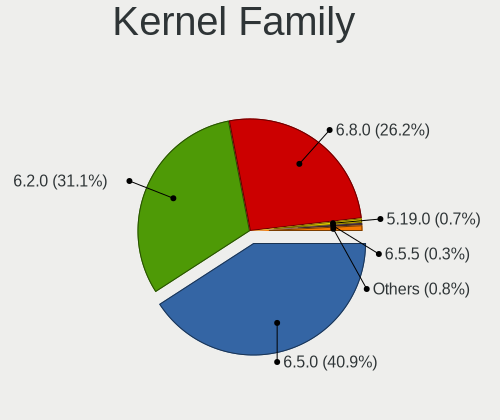

| Version | Computers | Percent |
|---------|-----------|---------|
| 6.2.0   | 139       | 48.77%  |
| 6.5.0   | 137       | 48.07%  |
| 5.19.0  | 3         | 1.05%   |
| 6.5.5   | 2         | 0.7%    |
| 6.7.3   | 1         | 0.35%   |
| 6.7.10  | 1         | 0.35%   |
| 6.5.7   | 1         | 0.35%   |
| 5.15.0  | 1         | 0.35%   |

Kernel Major Ver.
-----------------

Linux kernel major version

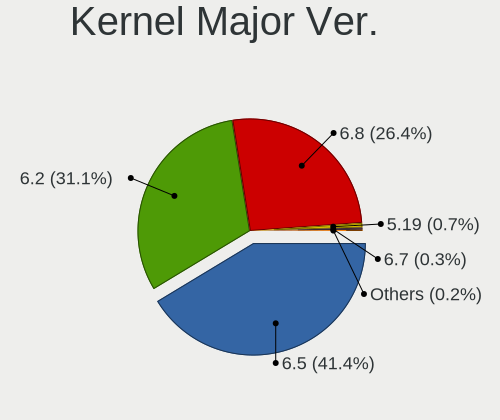

| Version | Computers | Percent |
|---------|-----------|---------|
| 6.5     | 140       | 49.12%  |
| 6.2     | 139       | 48.77%  |
| 5.19    | 3         | 1.05%   |
| 6.7     | 2         | 0.7%    |
| 5.15    | 1         | 0.35%   |

Arch
----

OS architecture (x86_64, i586, etc.)

| Name   | Computers | Percent |
|--------|-----------|---------|
| x86_64 | 276       | 100%    |

DE
--

Desktop Environment

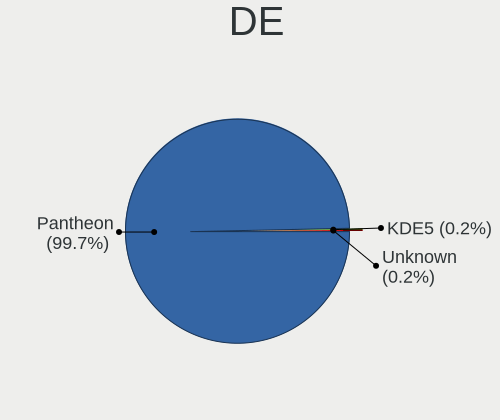

| Name     | Computers | Percent |
|----------|-----------|---------|
| Pantheon | 274       | 99.28%  |
| KDE5     | 1         | 0.36%   |
| Unknown  | 1         | 0.36%   |

Display Server
--------------

X11 or Wayland

| Name | Computers | Percent |
|------|-----------|---------|
| X11  | 276       | 100%    |

Display Manager
---------------

SDDM, LightDM, etc.

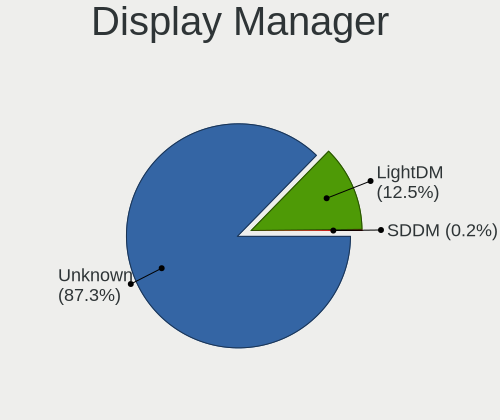

| Name    | Computers | Percent |
|---------|-----------|---------|
| Unknown | 229       | 82.67%  |
| LightDM | 47        | 16.97%  |
| SDDM    | 1         | 0.36%   |

OS Lang
-------

Language

| Lang    | Computers | Percent |
|---------|-----------|---------|
| en_US   | 115       | 41.52%  |
| de_DE   | 29        | 10.47%  |
| ru_RU   | 26        | 9.39%   |
| es_ES   | 23        | 8.3%    |
| it_IT   | 20        | 7.22%   |
| fr_FR   | 12        | 4.33%   |
| pt_BR   | 8         | 2.89%   |
| en_GB   | 7         | 2.53%   |
| pl_PL   | 6         | 2.17%   |
| nl_NL   | 5         | 1.81%   |
| sv_SE   | 4         | 1.44%   |
| de_CH   | 3         | 1.08%   |
| tr_TR   | 2         | 0.72%   |
| pt_PT   | 2         | 0.72%   |
| hu_HU   | 2         | 0.72%   |
| fi_FI   | 2         | 0.72%   |
| cs_CZ   | 2         | 0.72%   |
| nb_NO   | 1         | 0.36%   |
| id_ID   | 1         | 0.36%   |
| fr_CA   | 1         | 0.36%   |
| es_AR   | 1         | 0.36%   |
| en_AU   | 1         | 0.36%   |
| el_GR   | 1         | 0.36%   |
| da_DK   | 1         | 0.36%   |
| ar_EG   | 1         | 0.36%   |
| Unknown | 1         | 0.36%   |

Boot Mode
---------

EFI or BIOS

| Mode | Computers | Percent |
|------|-----------|---------|
| BIOS | 247       | 89.17%  |
| EFI  | 30        | 10.83%  |

Filesystem
----------

Type of filesystem

| Type    | Computers | Percent |
|---------|-----------|---------|
| Ext4    | 256       | 92.42%  |
| Tmpfs   | 14        | 5.05%   |
| Btrfs   | 4         | 1.44%   |
| Xfs     | 1         | 0.36%   |
| Overlay | 1         | 0.36%   |
| Ext2    | 1         | 0.36%   |

Part. scheme
------------

Scheme of partitioning

| Type    | Computers | Percent |
|---------|-----------|---------|
| Unknown | 228       | 82.31%  |
| GPT     | 39        | 14.08%  |
| MBR     | 10        | 3.61%   |

Dual Boot with Linux/BSD
------------------------

Hosting more than one Linux/BSD

| Dual boot | Computers | Percent |
|-----------|-----------|---------|
| No        | 272       | 98.55%  |
| Yes       | 4         | 1.45%   |

Dual Boot (Win)
---------------

Hosting Linux and Windows

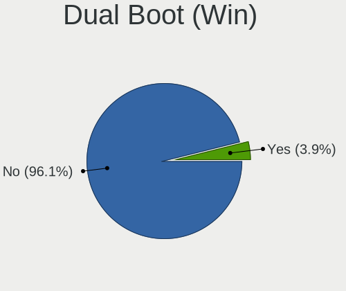

| Dual boot | Computers | Percent |
|-----------|-----------|---------|
| No        | 263       | 94.95%  |
| Yes       | 14        | 5.05%   |

Board
-----

Vendor
------

Motherboard manufacturer

| Name                                 | Computers | Percent |
|--------------------------------------|-----------|---------|
| Apple                                | 53        | 19.2%   |
| Hewlett-Packard                      | 42        | 15.22%  |
| ASUSTek Computer                     | 35        | 12.68%  |
| Lenovo                               | 33        | 11.96%  |
| Dell                                 | 30        | 10.87%  |
| Acer                                 | 15        | 5.43%   |
| MSI                                  | 8         | 2.9%    |
| Gigabyte Technology                  | 8         | 2.9%    |
| HUAWEI                               | 6         | 2.17%   |
| Samsung Electronics                  | 5         | 1.81%   |
| Fujitsu                              | 4         | 1.45%   |
| Unknown                              | 4         | 1.45%   |
| Medion                               | 3         | 1.09%   |
| ASRock                               | 3         | 1.09%   |
| MACHINIST                            | 2         | 0.72%   |
| Intel                                | 2         | 0.72%   |
| Google                               | 2         | 0.72%   |
| ECS                                  | 2         | 0.72%   |
| Alienware                            | 2         | 0.72%   |
| UNOWHY                               | 1         | 0.36%   |
| UMAX                                 | 1         | 0.36%   |
| Timi                                 | 1         | 0.36%   |
| THTF                                 | 1         | 0.36%   |
| TECNO Mobile Limited                 | 1         | 0.36%   |
| TECNO                                | 1         | 0.36%   |
| Teclast                              | 1         | 0.36%   |
| Sony                                 | 1         | 0.36%   |
| Shenzhen Meigao Electronic Equipment | 1         | 0.36%   |
| Positivo                             | 1         | 0.36%   |
| Packard Bell                         | 1         | 0.36%   |
| Microsoft                            | 1         | 0.36%   |
| HONOR                                | 1         | 0.36%   |
| HC Technology.                       | 1         | 0.36%   |
| DEPO Computers                       | 1         | 0.36%   |
| Chuwi                                | 1         | 0.36%   |
| Biostar                              | 1         | 0.36%   |

Model
-----

Motherboard model

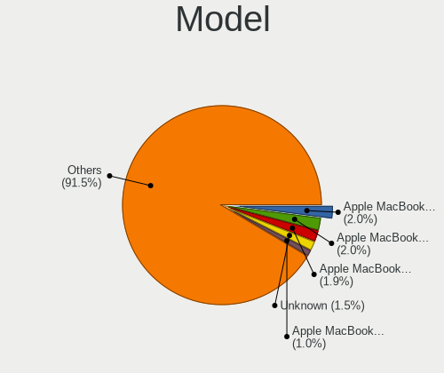

| Name                                              | Computers | Percent |
|---------------------------------------------------|-----------|---------|
| Apple MacBookAir7,2                               | 7         | 2.54%   |
| Apple MacBookPro9,2                               | 4         | 1.45%   |
| Unknown                                           | 4         | 1.45%   |
| ASUS PRIME A320M-K                                | 3         | 1.09%   |
| Apple MacBookPro7,1                               | 3         | 1.09%   |
| Apple MacBookPro11,1                              | 3         | 1.09%   |
| Apple iMac12,2                                    | 3         | 1.09%   |
| HP ProDesk 600 G1 SFF                             | 2         | 0.72%   |
| Dell Latitude E7240                               | 2         | 0.72%   |
| ASUS All Series                                   | 2         | 0.72%   |
| Apple MacBookPro8,1                               | 2         | 0.72%   |
| Apple MacBookPro6,2                               | 2         | 0.72%   |
| Apple MacBookPro5,4                               | 2         | 0.72%   |
| Apple MacBook5,1                                  | 2         | 0.72%   |
| Apple iMac19,1                                    | 2         | 0.72%   |
| UNOWHY Y13G011S4EI                                | 1         | 0.36%   |
| UMAX VisionBook 14Wr Plus                         | 1         | 0.36%   |
| Timi Redmi G 2022                                 | 1         | 0.36%   |
| THTF WUJIE 14                                     | 1         | 0.36%   |
| TECNO Mobile Limited MEGABOOK T14TA               | 1         | 0.36%   |
| TECNO MEGABOOK T1                                 | 1         | 0.36%   |
| Teclast F7                                        | 1         | 0.36%   |
| Sony SVE11115ELW                                  | 1         | 0.36%   |
| Shenzhen Meigao Electronic Equipment Venus series | 1         | 0.36%   |
| Samsung RF510/RF410/RF710                         | 1         | 0.36%   |
| Samsung RC410/RC510/RC710                         | 1         | 0.36%   |
| Samsung DP700A3D/DM700A3D/DB701A3D/DP700A7D       | 1         | 0.36%   |
| Samsung 550XDA                                    | 1         | 0.36%   |
| Samsung 535U3C                                    | 1         | 0.36%   |
| Positivo C4128A-15                                | 1         | 0.36%   |
| Packard Bell EasyNote LM81                        | 1         | 0.36%   |
| MSI MS-B09012                                     | 1         | 0.36%   |
| MSI MS-7D42                                       | 1         | 0.36%   |
| MSI MS-7D38                                       | 1         | 0.36%   |
| MSI MS-7A63                                       | 1         | 0.36%   |
| MSI MS-7756                                       | 1         | 0.36%   |
| MSI GT62VR 6RE                                    | 1         | 0.36%   |
| MSI GF72VR 7RF                                    | 1         | 0.36%   |
| MSI GE70 2QE                                      | 1         | 0.36%   |
| Microsoft Surface Book 2                          | 1         | 0.36%   |

Model Family
------------

Motherboard model prefix

| Name               | Computers | Percent |
|--------------------|-----------|---------|
| Lenovo ThinkPad    | 13        | 4.71%   |
| Lenovo IdeaPad     | 12        | 4.35%   |
| HP Pavilion        | 12        | 4.35%   |
| Acer Aspire        | 10        | 3.62%   |
| HP EliteBook       | 9         | 3.26%   |
| Dell Latitude      | 9         | 3.26%   |
| Apple MacBookAir7  | 7         | 2.54%   |
| HP ProBook         | 6         | 2.17%   |
| Dell OptiPlex      | 5         | 1.81%   |
| Dell Inspiron      | 5         | 1.81%   |
| ASUS VivoBook      | 5         | 1.81%   |
| ASUS PRIME         | 5         | 1.81%   |
| Apple MacBookPro11 | 5         | 1.81%   |
| Apple MacBookPro9  | 4         | 1.45%   |
| Apple MacBookPro5  | 4         | 1.45%   |
| Apple iMac12       | 4         | 1.45%   |
| Unknown            | 4         | 1.45%   |
| Lenovo Yoga        | 3         | 1.09%   |
| HP ENVY            | 3         | 1.09%   |
| Dell Vostro        | 3         | 1.09%   |
| ASUS Zenbook       | 3         | 1.09%   |
| ASUS ROG           | 3         | 1.09%   |
| Apple MacBookPro8  | 3         | 1.09%   |
| Apple MacBookPro7  | 3         | 1.09%   |
| Apple iMac14       | 3         | 1.09%   |
| HP ProDesk         | 2         | 0.72%   |
| HP Compaq          | 2         | 0.72%   |
| Fujitsu LIFEBOOK   | 2         | 0.72%   |
| Fujitsu ESPRIMO    | 2         | 0.72%   |
| Dell XPS           | 2         | 0.72%   |
| Dell Precision     | 2         | 0.72%   |
| ASUS TUF           | 2         | 0.72%   |
| ASUS P5G41T-M      | 2         | 0.72%   |
| ASUS All           | 2         | 0.72%   |
| Apple MacBookPro6  | 2         | 0.72%   |
| Apple MacBook5     | 2         | 0.72%   |
| Apple iMac19       | 2         | 0.72%   |
| Acer Swift         | 2         | 0.72%   |
| UNOWHY Y13G011S4EI | 1         | 0.36%   |
| UMAX VisionBook    | 1         | 0.36%   |

MFG Year
--------

Motherboard manufacture year

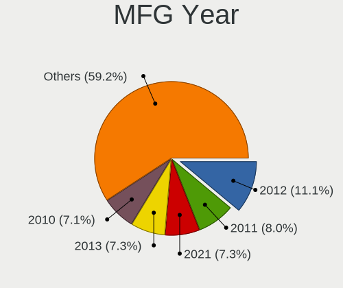

| Year | Computers | Percent |
|------|-----------|---------|
| 2018 | 23        | 8.33%   |
| 2012 | 23        | 8.33%   |
| 2021 | 22        | 7.97%   |
| 2010 | 21        | 7.61%   |
| 2014 | 20        | 7.25%   |
| 2013 | 19        | 6.88%   |
| 2011 | 19        | 6.88%   |
| 2020 | 16        | 5.8%    |
| 2017 | 16        | 5.8%    |
| 2009 | 16        | 5.8%    |
| 2016 | 15        | 5.43%   |
| 2022 | 14        | 5.07%   |
| 2015 | 13        | 4.71%   |
| 2023 | 11        | 3.99%   |
| 2019 | 11        | 3.99%   |
| 2007 | 10        | 3.62%   |
| 2008 | 7         | 2.54%   |

Form Factor
-----------

Physical design of the computer

| Name        | Computers | Percent |
|-------------|-----------|---------|
| Notebook    | 177       | 64.13%  |
| Desktop     | 66        | 23.91%  |
| All in one  | 16        | 5.8%    |
| Mini pc     | 8         | 2.9%    |
| Convertible | 6         | 2.17%   |
| Tablet      | 3         | 1.09%   |

Secure Boot
-----------

Enabled or disabled

| State    | Computers | Percent |
|----------|-----------|---------|
| Disabled | 272       | 98.55%  |
| Enabled  | 4         | 1.45%   |

Coreboot
--------

Have coreboot on board

| Used | Computers | Percent |
|------|-----------|---------|
| No   | 274       | 99.28%  |
| Yes  | 2         | 0.72%   |

RAM Size
--------

Total RAM memory

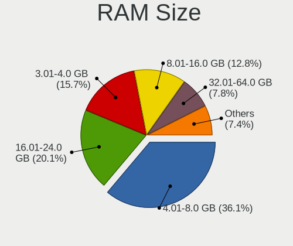

| Size in GB  | Computers | Percent |
|-------------|-----------|---------|
| 4.01-8.0    | 103       | 36.92%  |
| 16.01-24.0  | 63        | 22.58%  |
| 3.01-4.0    | 44        | 15.77%  |
| 8.01-16.0   | 34        | 12.19%  |
| 32.01-64.0  | 17        | 6.09%   |
| 1.01-2.0    | 6         | 2.15%   |
| 2.01-3.0    | 5         | 1.79%   |
| 24.01-32.0  | 4         | 1.43%   |
| 64.01-256.0 | 3         | 1.08%   |

RAM Used
--------

Used RAM memory

| Used GB   | Computers | Percent |
|-----------|-----------|---------|
| 2.01-3.0  | 99        | 33.79%  |
| 1.01-2.0  | 83        | 28.33%  |
| 3.01-4.0  | 52        | 17.75%  |
| 4.01-8.0  | 47        | 16.04%  |
| 8.01-16.0 | 6         | 2.05%   |
| 0.51-1.0  | 6         | 2.05%   |

Total Drives
------------

Number of drives on board

| Drives | Computers | Percent |
|--------|-----------|---------|
| 1      | 178       | 63.8%   |
| 2      | 82        | 29.39%  |
| 3      | 15        | 5.38%   |
| 6      | 2         | 0.72%   |
| 4      | 1         | 0.36%   |
| 0      | 1         | 0.36%   |

Has CD-ROM
----------

Has CD-ROM on board

| Presented | Computers | Percent |
|-----------|-----------|---------|
| No        | 176       | 63.54%  |
| Yes       | 101       | 36.46%  |

Has Ethernet
------------

Has Ethernet on board

| Presented | Computers | Percent |
|-----------|-----------|---------|
| Yes       | 224       | 81.16%  |
| No        | 52        | 18.84%  |

Has WiFi
--------

Has WiFi module

| Presented | Computers | Percent |
|-----------|-----------|---------|
| Yes       | 242       | 87.36%  |
| No        | 35        | 12.64%  |

Has Bluetooth
-------------

Has Bluetooth module

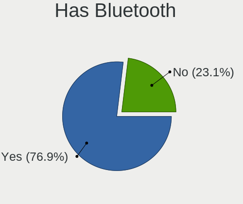

| Presented | Computers | Percent |
|-----------|-----------|---------|
| Yes       | 205       | 74.01%  |
| No        | 72        | 25.99%  |

Location
--------

Country
-------

Geographic location (country)

| Country                | Computers | Percent |
|------------------------|-----------|---------|
| USA                    | 44        | 15.88%  |
| Germany                | 27        | 9.75%   |
| Russia                 | 22        | 7.94%   |
| Italy                  | 21        | 7.58%   |
| Brazil                 | 13        | 4.69%   |
| Spain                  | 9         | 3.25%   |
| France                 | 9         | 3.25%   |
| Netherlands            | 8         | 2.89%   |
| Mexico                 | 8         | 2.89%   |
| Poland                 | 7         | 2.53%   |
| Canada                 | 7         | 2.53%   |
| Austria                | 7         | 2.53%   |
| Switzerland            | 6         | 2.17%   |
| Indonesia              | 6         | 2.17%   |
| Argentina              | 6         | 2.17%   |
| UK                     | 5         | 1.81%   |
| Sweden                 | 5         | 1.81%   |
| Hungary                | 4         | 1.44%   |
| Greece                 | 4         | 1.44%   |
| Australia              | 4         | 1.44%   |
| Israel                 | 3         | 1.08%   |
| Czechia                | 3         | 1.08%   |
| Belarus                | 3         | 1.08%   |
| Vietnam                | 2         | 0.72%   |
| Turkey                 | 2         | 0.72%   |
| The Netherlands        | 2         | 0.72%   |
| Romania                | 2         | 0.72%   |
| Portugal               | 2         | 0.72%   |
| Peru                   | 2         | 0.72%   |
| New Zealand            | 2         | 0.72%   |
| Morocco                | 2         | 0.72%   |
| Malaysia               | 2         | 0.72%   |
| Lithuania              | 2         | 0.72%   |
| India                  | 2         | 0.72%   |
| Finland                | 2         | 0.72%   |
| Denmark                | 2         | 0.72%   |
| Bosnia and Herzegovina | 2         | 0.72%   |
| Belgium                | 2         | 0.72%   |
| Ukraine                | 1         | 0.36%   |
| UAE                    | 1         | 0.36%   |

City
----

Geographic location (city)

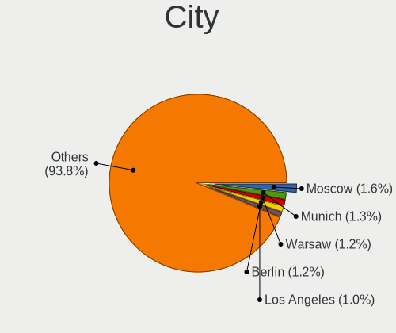

| City              | Computers | Percent |
|-------------------|-----------|---------|
| Moscow            | 8         | 2.83%   |
| Warsaw            | 3         | 1.06%   |
| Munich            | 3         | 1.06%   |
| Los Angeles       | 3         | 1.06%   |
| Zurich            | 2         | 0.71%   |
| Zamora            | 2         | 0.71%   |
| Vitebsk           | 2         | 0.71%   |
| Vienna            | 2         | 0.71%   |
| St Petersburg     | 2         | 0.71%   |
| Sarajevo          | 2         | 0.71%   |
| Rio Grande        | 2         | 0.71%   |
| Prague            | 2         | 0.71%   |
| Petah Tikva       | 2         | 0.71%   |
| Paris             | 2         | 0.71%   |
| Naples            | 2         | 0.71%   |
| Montreal          | 2         | 0.71%   |
| Milano            | 2         | 0.71%   |
| Milan             | 2         | 0.71%   |
| Maeikiai        | 2         | 0.71%   |
| Lima              | 2         | 0.71%   |
| Ho Chi Minh City  | 2         | 0.71%   |
| Groningen         | 2         | 0.71%   |
| Grand Rapids      | 2         | 0.71%   |
| Eindhoven         | 2         | 0.71%   |
| Cleveland         | 2         | 0.71%   |
| Budapest          | 2         | 0.71%   |
| Bremen            | 2         | 0.71%   |
| Berlin            | 2         | 0.71%   |
| Athens            | 2         | 0.71%   |
| A Corua         | 2         | 0.71%   |
| Zhodzina          | 1         | 0.35%   |
| Zapopan           | 1         | 0.35%   |
| Yuzhno-Sakhalinsk | 1         | 0.35%   |
| Yerevan           | 1         | 0.35%   |
| Yekaterinburg     | 1         | 0.35%   |
| Wuerselen         | 1         | 0.35%   |
| Westerville       | 1         | 0.35%   |
| Wellington        | 1         | 0.35%   |
| Votorantim        | 1         | 0.35%   |
| Victoria          | 1         | 0.35%   |

Drives
------

Drive Vendor
------------

Hard drive vendors

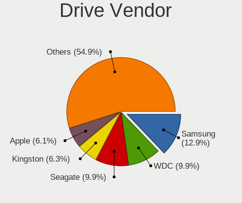

| Vendor                       | Computers | Drives | Percent |
|------------------------------|-----------|--------|---------|
| Samsung Electronics          | 47        | 58     | 12.47%  |
| WDC                          | 38        | 46     | 10.08%  |
| Seagate                      | 33        | 35     | 8.75%   |
| Kingston                     | 24        | 30     | 6.37%   |
| Apple                        | 24        | 24     | 6.37%   |
| Toshiba                      | 22        | 26     | 5.84%   |
| SanDisk                      | 22        | 24     | 5.84%   |
| Unknown                      | 15        | 18     | 3.98%   |
| Intel                        | 14        | 18     | 3.71%   |
| SK hynix                     | 11        | 12     | 2.92%   |
| Crucial                      | 11        | 13     | 2.92%   |
| Hitachi                      | 10        | 10     | 2.65%   |
| China                        | 8         | 11     | 2.12%   |
| KIOXIA                       | 7         | 8      | 1.86%   |
| HGST                         | 7         | 8      | 1.86%   |
| A-DATA Technology            | 6         | 6      | 1.59%   |
| Transcend                    | 5         | 6      | 1.33%   |
| SPCC                         | 4         | 4      | 1.06%   |
| Micron Technology            | 4         | 4      | 1.06%   |
| Gigabyte Technology          | 4         | 4      | 1.06%   |
| Unknown                      | 4         | 5      | 1.06%   |
| Patriot                      | 3         | 4      | 0.8%    |
| MAXIO Technology (Hangzhou)  | 3         | 4      | 0.8%    |
| Intenso                      | 3         | 4      | 0.8%    |
| Fanxiang                     | 3         | 3      | 0.8%    |
| Yangtze Memory Technologies  | 2         | 2      | 0.53%   |
| XrayDisk                     | 2         | 3      | 0.53%   |
| Silicon Motion               | 2         | 2      | 0.53%   |
| Shenzhen Longsys Electronics | 2         | 2      | 0.53%   |
| PNY                          | 2         | 2      | 0.53%   |
| NGFF                         | 2         | 2      | 0.53%   |
| Micron/Crucial Technology    | 2         | 3      | 0.53%   |
| LITEON                       | 2         | 2      | 0.53%   |
| TS-RDF2                      | 1         | 1      | 0.27%   |
| Timetec                      | 1         | 1      | 0.27%   |
| Teclast                      | 1         | 1      | 0.27%   |
| TECHBYTE                     | 1         | 1      | 0.27%   |
| SSK                          | 1         | 3      | 0.27%   |
| SABRENT                      | 1         | 1      | 0.27%   |
| Plextor                      | 1         | 1      | 0.27%   |

Drive Model
-----------

Hard drive models

| Model                                              | Computers | Percent |
|----------------------------------------------------|-----------|---------|
| Kingston SA400S37240G 240GB SSD                    | 9         | 2.3%    |
| Samsung NVMe SSD Controller SM981/PM981/PM983 1TB  | 8         | 2.04%   |
| Unknown MMC Card  64GB                             | 7         | 1.79%   |
| Apple SSD SM0128G 121GB                            | 6         | 1.53%   |
| Seagate ST500DM002-1BD142 500GB                    | 4         | 1.02%   |
| Kingston SA400S37480G 480GB SSD                    | 4         | 1.02%   |
| Kingston SA400S37120G 120GB SSD                    | 4         | 1.02%   |
| Unknown                                            | 4         | 1.02%   |
| Toshiba MQ01ABD100 1TB                             | 3         | 0.77%   |
| Seagate ST500LT012-1DG142 500GB                    | 3         | 0.77%   |
| Seagate ST1000LM035-1RK172 1TB                     | 3         | 0.77%   |
| Sandisk WD_BLACK SN770 1TB                         | 3         | 0.77%   |
| Samsung SSD 860 EVO 500GB                          | 3         | 0.77%   |
| Samsung SSD 850 EVO 500GB                          | 3         | 0.77%   |
| Samsung NVMe SSD Controller SM951/PM951 256GB      | 3         | 0.77%   |
| MAXIO (Hangzhou) NVMe SSD Controller MAP1202 256GB | 3         | 0.77%   |
| HGST HTS721010A9E630 1TB                           | 3         | 0.77%   |
| Gigabyte GP-GSTFS31120GNTD 120GB SSD               | 3         | 0.77%   |
| Crucial CT240BX500SSD1 240GB                       | 3         | 0.77%   |
| China SSD 128GB                                    | 3         | 0.77%   |
| Apple SSD SM0256F 256GB                            | 3         | 0.77%   |
| WDC WDS240G2G0A-00JH30 240GB SSD                   | 2         | 0.51%   |
| WDC WD3200AAJS-00L7A0 320GB                        | 2         | 0.51%   |
| WDC WD10EZEX-60WN4A0 1TB                           | 2         | 0.51%   |
| WDC WD10EZEX-22MFCA0 1TB                           | 2         | 0.51%   |
| Unknown NVMe SSD Drive 512GB                       | 2         | 0.51%   |
| Unknown MMC Card  16GB                             | 2         | 0.51%   |
| Unknown MMC Card  128GB                            | 2         | 0.51%   |
| Toshiba THNSFJ256GCSU 256GB SSD                    | 2         | 0.51%   |
| Toshiba DT01ACA050 500GB                           | 2         | 0.51%   |
| SPCC Solid State Disk 512GB                        | 2         | 0.51%   |
| SK hynix PC611 NVMe 1TB                            | 2         | 0.51%   |
| SK hynix BC501 NVMe Solid State Drive 512GB        | 2         | 0.51%   |
| Seagate ST3000DM008-2DM166 3TB                     | 2         | 0.51%   |
| Sandisk WD Blue SN550 NVMe SSD 2TB                 | 2         | 0.51%   |
| SanDisk SD8SN8U-128G-1006 128GB SSD                | 2         | 0.51%   |
| Sandisk PC SN520 NVMe SSD 512GB                    | 2         | 0.51%   |
| Samsung SSD 850 EVO 250GB                          | 2         | 0.51%   |
| Samsung NVMe SSD Controller PM9A1/PM9A3/980PRO 1TB | 2         | 0.51%   |
| Samsung MZVLQ512HALU-000H1 512GB                   | 2         | 0.51%   |

HDD Vendor
----------

Hard disk drive vendors

| Vendor              | Computers | Drives | Percent |
|---------------------|-----------|--------|---------|
| WDC                 | 32        | 37     | 28.83%  |
| Seagate             | 32        | 34     | 28.83%  |
| Toshiba             | 17        | 21     | 15.32%  |
| Hitachi             | 10        | 10     | 9.01%   |
| HGST                | 7         | 8      | 6.31%   |
| Apple               | 7         | 7      | 6.31%   |
| Samsung Electronics | 3         | 4      | 2.7%    |
| SABRENT             | 1         | 1      | 0.9%    |
| Maxtor              | 1         | 1      | 0.9%    |
| FC-1307             | 1         | 1      | 0.9%    |

SSD Vendor
----------

Solid state drive vendors

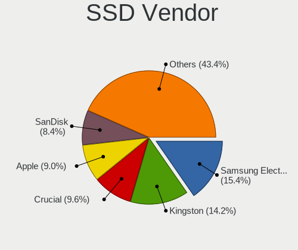

| Vendor              | Computers | Drives | Percent |
|---------------------|-----------|--------|---------|
| Kingston            | 23        | 29     | 14.38%  |
| Samsung Electronics | 21        | 27     | 13.13%  |
| Apple               | 15        | 15     | 9.38%   |
| SanDisk             | 12        | 13     | 7.5%    |
| Crucial             | 11        | 13     | 6.88%   |
| Intel               | 8         | 11     | 5%      |
| China               | 8         | 11     | 5%      |
| WDC                 | 6         | 8      | 3.75%   |
| Transcend           | 5         | 6      | 3.13%   |
| A-DATA Technology   | 5         | 5      | 3.13%   |
| SPCC                | 4         | 4      | 2.5%    |
| SK hynix            | 3         | 3      | 1.88%   |
| Patriot             | 3         | 4      | 1.88%   |
| Intenso             | 3         | 4      | 1.88%   |
| Gigabyte Technology | 3         | 3      | 1.88%   |
| XrayDisk            | 2         | 3      | 1.25%   |
| Toshiba             | 2         | 2      | 1.25%   |
| PNY                 | 2         | 2      | 1.25%   |
| NGFF                | 2         | 2      | 1.25%   |
| LITEON              | 2         | 2      | 1.25%   |
| Unknown             | 2         | 2      | 1.25%   |
| Timetec             | 1         | 1      | 0.63%   |
| Teclast             | 1         | 1      | 0.63%   |
| SSK                 | 1         | 2      | 0.63%   |
| Seagate             | 1         | 1      | 0.63%   |
| Plextor             | 1         | 1      | 0.63%   |
| OWC                 | 1         | 1      | 0.63%   |
| OCZ-VERTEX2         | 1         | 1      | 0.63%   |
| Netac               | 1         | 1      | 0.63%   |
| Micron Technology   | 1         | 1      | 0.63%   |
| LS                  | 1         | 1      | 0.63%   |
| Lexar               | 1         | 1      | 0.63%   |
| KIOXIA-EXCERIA      | 1         | 2      | 0.63%   |
| KingSpec            | 1         | 1      | 0.63%   |
| Hewlett-Packard     | 1         | 2      | 0.63%   |
| Fanxiang            | 1         | 1      | 0.63%   |
| ETOPSO              | 1         | 1      | 0.63%   |
| Apacer              | 1         | 1      | 0.63%   |
| AGI                 | 1         | 1      | 0.63%   |

Drive Kind
----------

HDD or SSD

| Kind    | Computers | Drives | Percent |
|---------|-----------|--------|---------|
| SSD     | 145       | 190    | 41.43%  |
| HDD     | 102       | 124    | 29.14%  |
| NVMe    | 80        | 94     | 22.86%  |
| MMC     | 13        | 18     | 3.71%   |
| Unknown | 10        | 11     | 2.86%   |

Drive Connector
---------------

SATA, SAS, NVMe, etc.

| Type | Computers | Drives | Percent |
|------|-----------|--------|---------|
| SATA | 213       | 316    | 67.83%  |
| NVMe | 80        | 93     | 25.48%  |
| MMC  | 13        | 18     | 4.14%   |
| SAS  | 8         | 10     | 2.55%   |

Drive Size
----------

Size of hard drive

| Size in TB | Computers | Drives | Percent |
|------------|-----------|--------|---------|
| 0.01-0.5   | 168       | 221    | 68.02%  |
| 0.51-1.0   | 61        | 70     | 24.7%   |
| 1.01-2.0   | 14        | 19     | 5.67%   |
| 2.01-3.0   | 3         | 3      | 1.21%   |
| 3.01-4.0   | 1         | 1      | 0.4%    |

Space Total
-----------

Amount of disk space available on the file system

| Size in GB     | Computers | Percent |
|----------------|-----------|---------|
| 101-250        | 115       | 40.21%  |
| 251-500        | 72        | 25.17%  |
| 501-1000       | 47        | 16.43%  |
| 51-100         | 19        | 6.64%   |
| 1001-2000      | 16        | 5.59%   |
| 21-50          | 7         | 2.45%   |
| 2001-3000      | 4         | 1.4%    |
| 1-20           | 3         | 1.05%   |
| More than 3000 | 2         | 0.7%    |
| Unknown        | 1         | 0.35%   |

Space Used
----------

Amount of used disk space

| Used GB   | Computers | Percent |
|-----------|-----------|---------|
| 1-20      | 132       | 45.99%  |
| 21-50     | 80        | 27.87%  |
| 101-250   | 22        | 7.67%   |
| 51-100    | 22        | 7.67%   |
| 251-500   | 17        | 5.92%   |
| 501-1000  | 7         | 2.44%   |
| 1001-2000 | 5         | 1.74%   |
| 2001-3000 | 1         | 0.35%   |
| Unknown   | 1         | 0.35%   |

Malfunc. Drives
---------------

Drive models with a malfunction

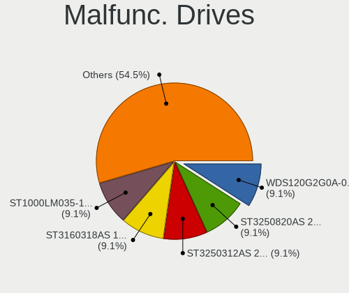

| Model                                       | Computers | Drives | Percent |
|---------------------------------------------|-----------|--------|---------|
| Seagate ST3250312AS 250GB                   | 1         | 1      | 16.67%  |
| Seagate ST3160318AS 160GB                   | 1         | 1      | 16.67%  |
| Seagate ST1000LM035-1RK172 1TB              | 1         | 1      | 16.67%  |
| LS 128GB M300 SSD                           | 1         | 1      | 16.67%  |
| Intel SSDPEKKF512G7H BTPY71141D7T512F 512GB | 1         | 1      | 16.67%  |
| Crucial CT240M500SSD3 240GB                 | 1         | 1      | 16.67%  |

Malfunc. Drive Vendor
---------------------

Vendors of faulty drives

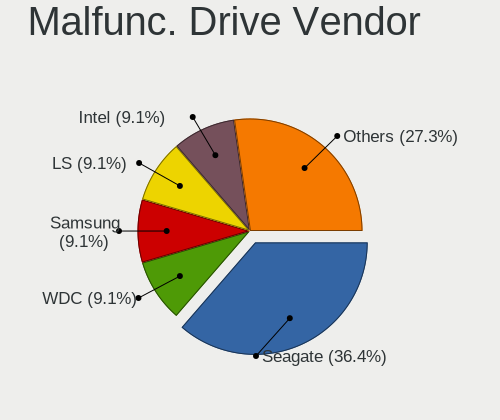

| Vendor  | Computers | Drives | Percent |
|---------|-----------|--------|---------|
| Seagate | 3         | 3      | 50%     |
| LS      | 1         | 1      | 16.67%  |
| Intel   | 1         | 1      | 16.67%  |
| Crucial | 1         | 1      | 16.67%  |

Malfunc. HDD Vendor
-------------------

Vendors of faulty HDD drives

| Vendor  | Computers | Drives | Percent |
|---------|-----------|--------|---------|
| Seagate | 3         | 3      | 100%    |

Malfunc. Drive Kind
-------------------

Kinds of faulty drives

| Kind | Computers | Drives | Percent |
|------|-----------|--------|---------|
| HDD  | 3         | 3      | 50%     |
| SSD  | 2         | 2      | 33.33%  |
| NVMe | 1         | 1      | 16.67%  |

Failed Drives
-------------

Failed drive models

Zero info for selected period =(

Failed Drive Vendor
-------------------

Failed drive vendors

Zero info for selected period =(

Drive Status
------------

Number of failed and malfunc. drives

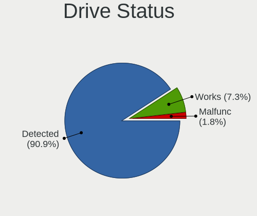

| Status   | Computers | Drives | Percent |
|----------|-----------|--------|---------|
| Detected | 245       | 390    | 87.19%  |
| Works    | 30        | 41     | 10.68%  |
| Malfunc  | 6         | 6      | 2.14%   |

Storage controller
------------------

Storage Vendor
--------------

Storage controller vendors

| Vendor                       | Computers | Percent |
|------------------------------|-----------|---------|
| Intel                        | 186       | 56.53%  |
| Samsung Electronics          | 36        | 10.94%  |
| AMD                          | 35        | 10.64%  |
| Nvidia                       | 13        | 3.95%   |
| SanDisk                      | 11        | 3.34%   |
| SK hynix                     | 8         | 2.43%   |
| KIOXIA                       | 7         | 2.13%   |
| Toshiba America Info Systems | 4         | 1.22%   |
| Silicon Motion               | 3         | 0.91%   |
| Micron Technology            | 3         | 0.91%   |
| MAXIO Technology (Hangzhou)  | 3         | 0.91%   |
| Yangtze Memory Technologies  | 2         | 0.61%   |
| Shenzhen Longsys Electronics | 2         | 0.61%   |
| Phison Electronics           | 2         | 0.61%   |
| Micron/Crucial Technology    | 2         | 0.61%   |
| Marvell Technology Group     | 2         | 0.61%   |
| Kingston Technology Company  | 2         | 0.61%   |
| JMicron Technology           | 2         | 0.61%   |
| ASMedia Technology           | 2         | 0.61%   |
| Solidigm                     | 1         | 0.3%    |
| Lite-On Technology           | 1         | 0.3%    |
| Apple                        | 1         | 0.3%    |
| ADATA Technology             | 1         | 0.3%    |

Storage Model
-------------

Storage controller models

| Model                                                                          | Computers | Percent |
|--------------------------------------------------------------------------------|-----------|---------|
| AMD FCH SATA Controller [AHCI mode]                                            | 28        | 7.84%   |
| Intel Sunrise Point-LP SATA Controller [AHCI mode]                             | 16        | 4.48%   |
| Intel 7 Series Chipset Family 6-port SATA Controller [AHCI mode]               | 16        | 4.48%   |
| Intel 8 Series/C220 Series Chipset Family 6-port SATA Controller 1 [AHCI mode] | 14        | 3.92%   |
| Intel 82801 Mobile SATA Controller [RAID mode]                                 | 10        | 2.8%    |
| Samsung NVMe SSD Controller SM981/PM981/PM983                                  | 9         | 2.52%   |
| Intel 6 Series/C200 Series Chipset Family 6 port Desktop SATA AHCI Controller  | 9         | 2.52%   |
| Nvidia MCP79 AHCI Controller                                                   | 8         | 2.24%   |
| Intel Celeron/Pentium Silver Processor SATA Controller                         | 8         | 2.24%   |
| Intel 8 Series SATA Controller 1 [AHCI mode]                                   | 8         | 2.24%   |
| Intel 6 Series/C200 Series Chipset Family 6 port Mobile SATA AHCI Controller   | 8         | 2.24%   |
| Samsung S4LN058A01[SSUBX] AHCI SSD Controller (Apple slot)                     | 7         | 1.96%   |
| Intel 5 Series/3400 Series Chipset 6 port SATA AHCI Controller                 | 7         | 1.96%   |
| Intel Q170/Q150/B150/H170/H110/Z170/CM236 Chipset SATA Controller [AHCI Mode]  | 6         | 1.68%   |
| Intel 7 Series/C210 Series Chipset Family 6-port SATA Controller [AHCI mode]   | 6         | 1.68%   |
| Samsung NVMe SSD Controller 980 (DRAM-less)                                    | 5         | 1.4%    |
| Nvidia MCP89 SATA Controller (AHCI mode)                                       | 5         | 1.4%    |
| KIOXIA NVMe SSD Controller BG4 (DRAM-less)                                     | 5         | 1.4%    |
| Intel SATA Controller [RAID mode]                                              | 5         | 1.4%    |
| Intel NM10/ICH7 Family SATA Controller [IDE mode]                              | 5         | 1.4%    |
| Intel 5 Series/3400 Series Chipset 4 port SATA AHCI Controller                 | 5         | 1.4%    |
| SanDisk WD Black SN770 / PC SN740 256GB / PC SN560 (DRAM-less) NVMe SSD        | 4         | 1.12%   |
| Samsung S4LN053X01 AHCI SSD Controller(Apple slot)                             | 4         | 1.12%   |
| Intel Wildcat Point-LP SATA Controller [AHCI Mode]                             | 4         | 1.12%   |
| Intel Volume Management Device NVMe RAID Controller                            | 4         | 1.12%   |
| Intel Tiger Lake-LP SATA Controller                                            | 4         | 1.12%   |
| Intel Cannon Lake PCH SATA AHCI Controller                                     | 4         | 1.12%   |
| Intel 82801IBM/IEM (ICH9M/ICH9M-E) 4 port SATA Controller [AHCI mode]          | 4         | 1.12%   |
| Intel 82801G (ICH7 Family) IDE Controller                                      | 4         | 1.12%   |
| AMD FCH SATA Controller D                                                      | 4         | 1.12%   |
| Samsung NVMe SSD Controller SM951/PM951                                        | 3         | 0.84%   |
| MAXIO (Hangzhou) NVMe SSD Controller MAP1202 (DRAM-less)                       | 3         | 0.84%   |
| Intel SSD 670p Series [Keystone Harbor]                                        | 3         | 0.84%   |
| Intel HM170/QM170 Chipset SATA Controller [AHCI Mode]                          | 3         | 0.84%   |
| Intel 500 Series Chipset Family SATA AHCI Controller                           | 3         | 0.84%   |
| Intel 200 Series PCH SATA controller [AHCI mode]                               | 3         | 0.84%   |
| AMD 300 Series Chipset SATA Controller                                         | 3         | 0.84%   |
| Yangtze Memory PC005 NVMe SSD                                                  | 2         | 0.56%   |
| Toshiba America Info Systems XG6 NVMe SSD Controller                           | 2         | 0.56%   |
| SK hynix PC611 NVMe Solid State Drive                                          | 2         | 0.56%   |

Storage Kind
------------

Kind of storage controller (IDE, SATA, NVMe, SAS, ...)

| Kind | Computers | Percent |
|------|-----------|---------|
| SATA | 208       | 63.22%  |
| NVMe | 80        | 24.32%  |
| RAID | 22        | 6.69%   |
| IDE  | 19        | 5.78%   |

Processor
---------

CPU Vendor
----------

Processor vendors

| Vendor | Computers | Percent |
|--------|-----------|---------|
| Intel  | 228       | 82.61%  |
| AMD    | 48        | 17.39%  |

CPU Model
---------

Processor models

| Model                                         | Computers | Percent |
|-----------------------------------------------|-----------|---------|
| Intel Core 2 Duo CPU P8600 @ 2.40GHz          | 7         | 2.54%   |
| Intel Core i5-5250U CPU @ 1.60GHz             | 4         | 1.45%   |
| Intel Core i5-3210M CPU @ 2.50GHz             | 4         | 1.45%   |
| AMD Ryzen 5 5500U with Radeon Graphics        | 4         | 1.45%   |
| Intel Core i7-7700HQ CPU @ 2.80GHz            | 3         | 1.09%   |
| Intel Core i7-2600 CPU @ 3.40GHz              | 3         | 1.09%   |
| Intel Core i5-8250U CPU @ 1.60GHz             | 3         | 1.09%   |
| Intel Core i5-7200U CPU @ 2.50GHz             | 3         | 1.09%   |
| Intel Core i5-6200U CPU @ 2.30GHz             | 3         | 1.09%   |
| Intel Core i5-4210U CPU @ 1.70GHz             | 3         | 1.09%   |
| Intel Core i5-2415M CPU @ 2.30GHz             | 3         | 1.09%   |
| Intel Core i5-2400 CPU @ 3.10GHz              | 3         | 1.09%   |
| Intel Core i5 CPU M 520 @ 2.40GHz             | 3         | 1.09%   |
| Intel Celeron J4125 CPU @ 2.00GHz             | 3         | 1.09%   |
| Intel 11th Gen Core i5-1135G7 @ 2.40GHz       | 3         | 1.09%   |
| AMD Ryzen 5 3500U with Radeon Vega Mobile Gfx | 3         | 1.09%   |
| AMD Ryzen 3 3200U with Radeon Vega Mobile Gfx | 3         | 1.09%   |
| Intel Core i7-8550U CPU @ 1.80GHz             | 2         | 0.72%   |
| Intel Core i7-5650U CPU @ 2.20GHz             | 2         | 0.72%   |
| Intel Core i7-5600U CPU @ 2.60GHz             | 2         | 0.72%   |
| Intel Core i7-4700MQ CPU @ 2.40GHz            | 2         | 0.72%   |
| Intel Core i7-4600U CPU @ 2.10GHz             | 2         | 0.72%   |
| Intel Core i7-3632QM CPU @ 2.20GHz            | 2         | 0.72%   |
| Intel Core i5-8300H CPU @ 2.30GHz             | 2         | 0.72%   |
| Intel Core i5-6300U CPU @ 2.40GHz             | 2         | 0.72%   |
| Intel Core i5-5350U CPU @ 1.80GHz             | 2         | 0.72%   |
| Intel Core i5-4670 CPU @ 3.40GHz              | 2         | 0.72%   |
| Intel Core i5-4590 CPU @ 3.30GHz              | 2         | 0.72%   |
| Intel Core i5-4278U CPU @ 2.60GHz             | 2         | 0.72%   |
| Intel Core i5-3470 CPU @ 3.20GHz              | 2         | 0.72%   |
| Intel Core i5-3320M CPU @ 2.60GHz             | 2         | 0.72%   |
| Intel Core i5-2430M CPU @ 2.40GHz             | 2         | 0.72%   |
| Intel Core i5-2410M CPU @ 2.30GHz             | 2         | 0.72%   |
| Intel Core i5-1035G1 CPU @ 1.00GHz            | 2         | 0.72%   |
| Intel Core i5 CPU M 430 @ 2.27GHz             | 2         | 0.72%   |
| Intel Core i3-6006U CPU @ 2.00GHz             | 2         | 0.72%   |
| Intel Core 2 Quad CPU Q6600 @ 2.40GHz         | 2         | 0.72%   |
| Intel Core 2 Duo CPU T9400 @ 2.53GHz          | 2         | 0.72%   |
| Intel Core 2 Duo CPU P8700 @ 2.53GHz          | 2         | 0.72%   |
| Intel Core 2 Duo CPU P7550 @ 2.26GHz          | 2         | 0.72%   |

CPU Model Family
----------------

Processor model prefix

| Model                   | Computers | Percent |
|-------------------------|-----------|---------|
| Intel Core i5           | 83        | 30.07%  |
| Intel Core i7           | 48        | 17.39%  |
| Intel Core i3           | 20        | 7.25%   |
| Intel Core 2 Duo        | 20        | 7.25%   |
| Other                   | 18        | 6.52%   |
| AMD Ryzen 5             | 15        | 5.43%   |
| Intel Celeron           | 13        | 4.71%   |
| Intel Xeon              | 8         | 2.9%    |
| AMD Ryzen 7             | 8         | 2.9%    |
| AMD Ryzen 3             | 6         | 2.17%   |
| Intel Pentium           | 5         | 1.81%   |
| Intel Core 2 Quad       | 3         | 1.09%   |
| Intel Atom              | 3         | 1.09%   |
| AMD A6                  | 3         | 1.09%   |
| Intel Pentium Dual-Core | 2         | 0.72%   |
| AMD Ryzen 9             | 2         | 0.72%   |
| AMD A4                  | 2         | 0.72%   |
| Intel Pentium Silver    | 1         | 0.36%   |
| Intel Pentium Dual      | 1         | 0.36%   |
| Intel Core m7           | 1         | 0.36%   |
| Intel Core m3           | 1         | 0.36%   |
| Intel Core i9           | 1         | 0.36%   |
| Intel Core 2            | 1         | 0.36%   |
| Intel Celeron Dual-Core | 1         | 0.36%   |
| AMD V140                | 1         | 0.36%   |
| AMD Turion II Dual-Core | 1         | 0.36%   |
| AMD Ryzen 5 PRO         | 1         | 0.36%   |
| AMD PRO A8              | 1         | 0.36%   |
| AMD PRO A10             | 1         | 0.36%   |
| AMD Phenom II X4        | 1         | 0.36%   |
| AMD FX                  | 1         | 0.36%   |
| AMD E2                  | 1         | 0.36%   |
| AMD A8                  | 1         | 0.36%   |
| AMD A12                 | 1         | 0.36%   |

CPU Cores
---------

Number of processor cores

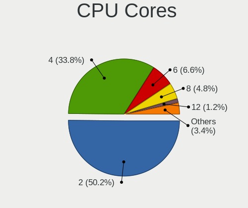

| Number | Computers | Percent |
|--------|-----------|---------|
| 2      | 133       | 48.19%  |
| 4      | 99        | 35.87%  |
| 6      | 19        | 6.88%   |
| 8      | 14        | 5.07%   |
| 1      | 4         | 1.45%   |
| 12     | 3         | 1.09%   |
| 14     | 2         | 0.72%   |
| 16     | 1         | 0.36%   |
| 10     | 1         | 0.36%   |

CPU Sockets
-----------

Number of sockets

| Number | Computers | Percent |
|--------|-----------|---------|
| 1      | 275       | 99.64%  |
| 2      | 1         | 0.36%   |

CPU Threads
-----------

Threads per core (Hyper-Threading)

| Number | Computers | Percent |
|--------|-----------|---------|
| 2      | 186       | 67.39%  |
| 1      | 90        | 32.61%  |

CPU Op-Modes
------------

CPU Operation Modes (32-bit, 64-bit)

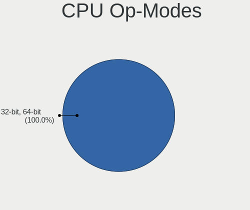

| Op mode        | Computers | Percent |
|----------------|-----------|---------|
| 32-bit, 64-bit | 276       | 100%    |

CPU Microcode
-------------

Microcode number

| Number     | Computers | Percent |
|------------|-----------|---------|
| Unknown    | 266       | 96.03%  |
| 0x08608104 | 2         | 0.72%   |
| 0x806c1    | 1         | 0.36%   |
| 0x306a9    | 1         | 0.36%   |
| 0x0a704104 | 1         | 0.36%   |
| 0x0a404102 | 1         | 0.36%   |
| 0x08608103 | 1         | 0.36%   |
| 0x08108109 | 1         | 0.36%   |
| 0x06006704 | 1         | 0.36%   |
| 0x06001119 | 1         | 0.36%   |
| 0x05000119 | 1         | 0.36%   |

CPU Microarch
-------------

Microarchitecture

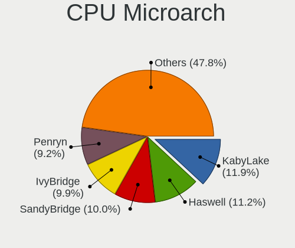

| Name             | Computers | Percent |
|------------------|-----------|---------|
| Haswell          | 35        | 12.68%  |
| KabyLake         | 31        | 11.23%  |
| SandyBridge      | 25        | 9.06%   |
| Penryn           | 23        | 8.33%   |
| IvyBridge        | 21        | 7.61%   |
| Skylake          | 18        | 6.52%   |
| Unknown          | 17        | 6.16%   |
| Westmere         | 13        | 4.71%   |
| Broadwell        | 12        | 4.35%   |
| Zen+             | 10        | 3.62%   |
| Goldmont plus    | 9         | 3.26%   |
| TigerLake        | 8         | 2.9%    |
| Zen 3            | 6         | 2.17%   |
| Excavator        | 6         | 2.17%   |
| CometLake        | 6         | 2.17%   |
| IceLake          | 5         | 1.81%   |
| Core             | 5         | 1.81%   |
| Zen 2            | 3         | 1.09%   |
| Zen              | 3         | 1.09%   |
| Silvermont       | 3         | 1.09%   |
| K10              | 3         | 1.09%   |
| Piledriver       | 2         | 0.72%   |
| Nehalem          | 2         | 0.72%   |
| Jaguar           | 2         | 0.72%   |
| Goldmont         | 2         | 0.72%   |
| Alderlake Hybrid | 2         | 0.72%   |
| Steamroller      | 1         | 0.36%   |
| Puma             | 1         | 0.36%   |
| Bonnell          | 1         | 0.36%   |
| Bobcat           | 1         | 0.36%   |

Graphics
--------

GPU Vendor
----------

Vendors of graphics cards

| Vendor | Computers | Percent |
|--------|-----------|---------|
| Intel  | 170       | 53.46%  |
| Nvidia | 83        | 26.1%   |
| AMD    | 65        | 20.44%  |

GPU Model
---------

Graphics card models

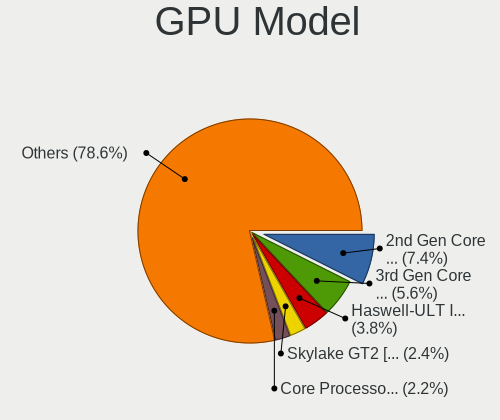

| Model                                                                                    | Computers | Percent |
|------------------------------------------------------------------------------------------|-----------|---------|
| Intel 2nd Generation Core Processor Family Integrated Graphics Controller                | 22        | 6.77%   |
| Intel Haswell-ULT Integrated Graphics Controller                                         | 15        | 4.62%   |
| Intel 3rd Gen Core processor Graphics Controller                                         | 13        | 4%      |
| Intel Skylake GT2 [HD Graphics 520]                                                      | 8         | 2.46%   |
| Intel HD Graphics 620                                                                    | 8         | 2.46%   |
| Intel HD Graphics 6000                                                                   | 8         | 2.46%   |
| Intel GeminiLake [UHD Graphics 600]                                                      | 8         | 2.46%   |
| Intel Core Processor Integrated Graphics Controller                                      | 8         | 2.46%   |
| Nvidia C79 [GeForce 9400M]                                                               | 7         | 2.15%   |
| AMD Picasso/Raven 2 [Radeon Vega Series / Radeon Vega Mobile Series]                     | 7         | 2.15%   |
| Intel UHD Graphics 620                                                                   | 6         | 1.85%   |
| Intel 4th Gen Core Processor Integrated Graphics Controller                              | 6         | 1.85%   |
| AMD Lucienne                                                                             | 6         | 1.85%   |
| Nvidia MCP89 [GeForce 320M]                                                              | 5         | 1.54%   |
| Intel Xeon E3-1200 v3/4th Gen Core Processor Integrated Graphics Controller              | 5         | 1.54%   |
| Intel TigerLake-LP GT2 [Iris Xe Graphics]                                                | 5         | 1.54%   |
| Intel HD Graphics 630                                                                    | 4         | 1.23%   |
| Nvidia TU117M [GeForce GTX 1650 Mobile / Max-Q]                                          | 3         | 0.92%   |
| Nvidia GT216M [GeForce GT 330M]                                                          | 3         | 0.92%   |
| Nvidia GK208B [GeForce GT 710]                                                           | 3         | 0.92%   |
| Nvidia GK107 [GeForce GTX 650]                                                           | 3         | 0.92%   |
| Intel Tiger Lake-LP GT2 [UHD Graphics G4]                                                | 3         | 0.92%   |
| Intel Mobile 4 Series Chipset Integrated Graphics Controller                             | 3         | 0.92%   |
| Intel HD Graphics 5500                                                                   | 3         | 0.92%   |
| Intel HD Graphics 530                                                                    | 3         | 0.92%   |
| Intel CoffeeLake-H GT2 [UHD Graphics 630]                                                | 3         | 0.92%   |
| Intel Atom/Celeron/Pentium Processor x5-E8000/J3xxx/N3xxx Integrated Graphics Controller | 3         | 0.92%   |
| AMD Wani [Radeon R5/R6/R7 Graphics]                                                      | 3         | 0.92%   |
| AMD Stoney [Radeon R2/R3/R4/R5 Graphics]                                                 | 3         | 0.92%   |
| AMD Ellesmere [Radeon RX 470/480/570/570X/580/580X/590]                                  | 3         | 0.92%   |
| Nvidia GP107M [GeForce GTX 1050 Mobile]                                                  | 2         | 0.62%   |
| Nvidia GP107 [GeForce GTX 1050 Ti]                                                       | 2         | 0.62%   |
| Nvidia GP104 [GeForce GTX 1070]                                                          | 2         | 0.62%   |
| Nvidia GM206 [GeForce GTX 960]                                                           | 2         | 0.62%   |
| Nvidia GM204 [GeForce GTX 970]                                                           | 2         | 0.62%   |
| Nvidia GM108M [GeForce 840M]                                                             | 2         | 0.62%   |
| Nvidia GK208B [GeForce GT 730]                                                           | 2         | 0.62%   |
| Nvidia G96CM [GeForce 9600M GT]                                                          | 2         | 0.62%   |
| Intel Raptor Lake-P [Iris Xe Graphics]                                                   | 2         | 0.62%   |
| Intel Iris Plus Graphics G1 (Ice Lake)                                                   | 2         | 0.62%   |

GPU Combo
---------

Combinations of graphics cards

| Name           | Computers | Percent |
|----------------|-----------|---------|
| 1 x Intel      | 131       | 47.29%  |
| 1 x Nvidia     | 55        | 19.86%  |
| 1 x AMD        | 52        | 18.77%  |
| Intel + Nvidia | 25        | 9.03%   |
| Intel + AMD    | 7         | 2.53%   |
| 2 x AMD        | 3         | 1.08%   |
| AMD + Nvidia   | 2         | 0.72%   |
| Other          | 1         | 0.36%   |
| 2 x Nvidia     | 1         | 0.36%   |

GPU Driver
----------

Free vs proprietary

| Driver      | Computers | Percent |
|-------------|-----------|---------|
| Free        | 254       | 91.7%   |
| Proprietary | 14        | 5.05%   |
| Unknown     | 9         | 3.25%   |

GPU Memory
----------

Total video memory

| Size in GB | Computers | Percent |
|------------|-----------|---------|
| Unknown    | 255       | 92.06%  |
| 0.01-0.5   | 10        | 3.61%   |
| 3.01-4.0   | 5         | 1.81%   |
| 7.01-8.0   | 3         | 1.08%   |
| 0.51-1.0   | 3         | 1.08%   |
| 1.01-2.0   | 1         | 0.36%   |

Monitor
-------

Monitor Vendor
--------------

Monitor vendors

| Vendor                  | Computers | Percent |
|-------------------------|-----------|---------|
| Apple                   | 47        | 16.15%  |
| AU Optronics            | 34        | 11.68%  |
| Samsung Electronics     | 30        | 10.31%  |
| LG Display              | 25        | 8.59%   |
| BOE                     | 25        | 8.59%   |
| Chimei Innolux          | 23        | 7.9%    |
| Goldstar                | 15        | 5.15%   |
| Hewlett-Packard         | 10        | 3.44%   |
| Dell                    | 8         | 2.75%   |
| Acer                    | 8         | 2.75%   |
| Philips                 | 7         | 2.41%   |
| Sharp                   | 5         | 1.72%   |
| HKC                     | 4         | 1.37%   |
| Chi Mei Optoelectronics | 4         | 1.37%   |
| Lenovo                  | 3         | 1.03%   |
| BenQ                    | 3         | 1.03%   |
| Vizio                   | 2         | 0.69%   |
| Vestel Elektronik       | 2         | 0.69%   |
| Toshiba                 | 2         | 0.69%   |
| PANDA                   | 2         | 0.69%   |
| NEC Computers           | 2         | 0.69%   |
| Mi                      | 2         | 0.69%   |
| InfoVision              | 2         | 0.69%   |
| AOC                     | 2         | 0.69%   |
| Ancor Communications    | 2         | 0.69%   |
| ViewSonic               | 1         | 0.34%   |
| VIE                     | 1         | 0.34%   |
| Unknown (XXX)           | 1         | 0.34%   |
| TMX                     | 1         | 0.34%   |
| Skyworth                | 1         | 0.34%   |
| SAC                     | 1         | 0.34%   |
| S2-Tek                  | 1         | 0.34%   |
| RTK                     | 1         | 0.34%   |
| Panasonic               | 1         | 0.34%   |
| MSI                     | 1         | 0.34%   |
| Medion                  | 1         | 0.34%   |
| LTM                     | 1         | 0.34%   |
| Kogan                   | 1         | 0.34%   |
| KDB                     | 1         | 0.34%   |
| ITE                     | 1         | 0.34%   |

Monitor Model
-------------

Monitor models

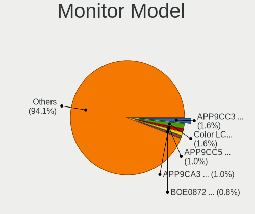

| Model                                                                 | Computers | Percent |
|-----------------------------------------------------------------------|-----------|---------|
| BOE LCD Monitor BOE0877 1920x1080 309x173mm 13.9-inch                 | 3         | 1.02%   |
| Apple LCD Monitor APP9CC5 1280x800 286x179mm 13.3-inch                | 3         | 1.02%   |
| Apple LCD Monitor APP9CC3 1280x800 286x179mm 13.3-inch                | 3         | 1.02%   |
| Apple LCD Monitor APP9CA3 1440x900 331x207mm 15.4-inch                | 3         | 1.02%   |
| Apple iMac APPA012 1920x1080 475x267mm 21.5-inch                      | 3         | 1.02%   |
| Apple iMac APPA007 2560x1440 597x336mm 27.0-inch                      | 3         | 1.02%   |
| Apple Color LCD APP9CF0 1440x900 290x180mm 13.4-inch                  | 3         | 1.02%   |
| Apple Color LCD APP9CC7 1280x800 286x179mm 13.3-inch                  | 3         | 1.02%   |
| Vestel Elektronik 22W_LCD_TV VES3700 1920x540                         | 2         | 0.68%   |
| Samsung Electronics LCD Monitor SEC5441 1366x768 344x194mm 15.5-inch  | 2         | 0.68%   |
| Samsung Electronics LCD Monitor SDC4171 2880x1800 302x189mm 14.0-inch | 2         | 0.68%   |
| Samsung Electronics C27F390 SAM0D32 1920x1080 598x336mm 27.0-inch     | 2         | 0.68%   |
| LG Display LCD Monitor LGD03EA 1920x1080 309x174mm 14.0-inch          | 2         | 0.68%   |
| LG Display LCD Monitor LGD03DC 1366x768 277x156mm 12.5-inch           | 2         | 0.68%   |
| LG Display LCD Monitor LGD039F 1366x768 345x194mm 15.6-inch           | 2         | 0.68%   |
| LG Display LCD Monitor LGD0395 1366x768 344x194mm 15.5-inch           | 2         | 0.68%   |
| LG Display LCD Monitor LGD02E3 1366x768 344x194mm 15.5-inch           | 2         | 0.68%   |
| Goldstar HDR WFHD GSM7714 2560x1080 798x334mm 34.1-inch               | 2         | 0.68%   |
| BOE LCD Monitor BOE0697 1366x768 309x173mm 13.9-inch                  | 2         | 0.68%   |
| AU Optronics LCD Monitor AUO38ED 1920x1080 344x193mm 15.5-inch        | 2         | 0.68%   |
| AU Optronics LCD Monitor AUO133D 1920x1080 309x173mm 13.9-inch        | 2         | 0.68%   |
| Apple LCD Monitor APP9C89 1280x800 286x179mm 13.3-inch                | 2         | 0.68%   |
| Apple iMac APPAE25 3840x2160 597x336mm 27.0-inch                      | 2         | 0.68%   |
| Apple Color LCD APPA01B 1440x900 286x179mm 13.3-inch                  | 2         | 0.68%   |
| Apple Color LCD APPA018 2560x1600 286x179mm 13.3-inch                 | 2         | 0.68%   |
| Apple Color LCD APP9CF3 1366x768 260x140mm 11.6-inch                  | 2         | 0.68%   |
| Apple Color LCD APP9CDF 1440x900 286x179mm 13.3-inch                  | 2         | 0.68%   |
| Vizio E370VL VIZ0070 1920x1080 820x461mm 37.0-inch                    | 1         | 0.34%   |
| Vizio D40f-G9 VIZ1027 1920x1080 477x268mm 21.5-inch                   | 1         | 0.34%   |
| ViewSonic VX2450 SERIES VSCE226 1920x1080 525x297mm 23.7-inch         | 1         | 0.34%   |
| VIE R270Q144 VIE2700 2560x1440 598x336mm 27.0-inch                    | 1         | 0.34%   |
| Unknown (XXX) Union TV XXX2841 1920x1080 1209x680mm 54.6-inch         | 1         | 0.34%   |
| Toshiba TV TSB0108 1360x768 698x393mm 31.5-inch                       | 1         | 0.34%   |
| Toshiba TV TSB0100 1920x1080 580x320mm 26.1-inch                      | 1         | 0.34%   |
| TMX TL160ADMP11-0 TMX1601 2560x1600 345x215mm 16.0-inch               | 1         | 0.34%   |
| Skyworth CP9687 SII9687 1920x1080 708x398mm 32.0-inch                 | 1         | 0.34%   |
| Sharp LQ134N1JW54 SHP154F 1920x1200 288x180mm 13.4-inch               | 1         | 0.34%   |
| Sharp LCD SHP0FF0 1360x768                                            | 1         | 0.34%   |
| Sharp LCD Monitor SHP14A8 3840x2400 288x180mm 13.4-inch               | 1         | 0.34%   |
| Sharp LCD Monitor SHP149A 1920x1080 344x194mm 15.5-inch               | 1         | 0.34%   |

Monitor Resolution
------------------

Monitor screen resolution

| Resolution         | Computers | Percent |
|--------------------|-----------|---------|
| 1920x1080 (FHD)    | 111       | 39.64%  |
| 1366x768 (WXGA)    | 59        | 21.07%  |
| 3840x2160 (4K)     | 19        | 6.79%   |
| 2560x1440 (QHD)    | 17        | 6.07%   |
| 1440x900 (WXGA+)   | 15        | 5.36%   |
| 1280x800 (WXGA)    | 15        | 5.36%   |
| 1600x900 (HD+)     | 8         | 2.86%   |
| 2560x1600          | 5         | 1.79%   |
| 1920x1200 (WUXGA)  | 5         | 1.79%   |
| 2880x1800          | 4         | 1.43%   |
| 1680x1050 (WSXGA+) | 4         | 1.43%   |
| 1280x1024 (SXGA)   | 4         | 1.43%   |
| 2560x1080          | 3         | 1.07%   |
| 3440x1440          | 2         | 0.71%   |
| 1920x540           | 2         | 0.71%   |
| 3840x2400          | 1         | 0.36%   |
| 3840x1080          | 1         | 0.36%   |
| 3072x1920          | 1         | 0.36%   |
| 2880x1620          | 1         | 0.36%   |
| 2160x1440          | 1         | 0.36%   |
| 1360x768           | 1         | 0.36%   |
| 1024x600           | 1         | 0.36%   |

Monitor Diagonal
----------------

Diagonal size in inches

| Inches  | Computers | Percent |
|---------|-----------|---------|
| 15      | 71        | 24.23%  |
| 13      | 52        | 17.75%  |
| 27      | 30        | 10.24%  |
| 14      | 25        | 8.53%   |
| 23      | 15        | 5.12%   |
| 21      | 15        | 5.12%   |
| 17      | 15        | 5.12%   |
| 24      | 8         | 2.73%   |
| 12      | 8         | 2.73%   |
| 34      | 5         | 1.71%   |
| 84      | 4         | 1.37%   |
| 31      | 4         | 1.37%   |
| 26      | 4         | 1.37%   |
| 22      | 4         | 1.37%   |
| 19      | 4         | 1.37%   |
| 11      | 4         | 1.37%   |
| 54      | 3         | 1.02%   |
| 40      | 3         | 1.02%   |
| 18      | 3         | 1.02%   |
| 16      | 3         | 1.02%   |
| 49      | 2         | 0.68%   |
| 42      | 2         | 0.68%   |
| Unknown | 2         | 0.68%   |
| 72      | 1         | 0.34%   |
| 55      | 1         | 0.34%   |
| 46      | 1         | 0.34%   |
| 43      | 1         | 0.34%   |
| 32      | 1         | 0.34%   |
| 20      | 1         | 0.34%   |
| 10      | 1         | 0.34%   |

Monitor Width
-------------

Physical width

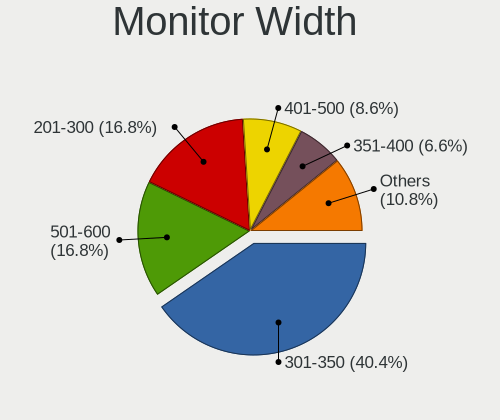

| Width in mm | Computers | Percent |
|-------------|-----------|---------|
| 301-350     | 118       | 40.55%  |
| 501-600     | 54        | 18.56%  |
| 201-300     | 45        | 15.46%  |
| 401-500     | 26        | 8.93%   |
| 351-400     | 18        | 6.19%   |
| 701-800     | 6         | 2.06%   |
| 1001-1500   | 6         | 2.06%   |
| 601-700     | 5         | 1.72%   |
| 1501-2000   | 5         | 1.72%   |
| 801-900     | 3         | 1.03%   |
| 901-1000    | 3         | 1.03%   |
| Unknown     | 2         | 0.69%   |

Aspect Ratio
------------

Proportional relationship between the width and the height

| Ratio | Computers | Percent |
|-------|-----------|---------|
| 16/9  | 205       | 76.78%  |
| 16/10 | 51        | 19.1%   |
| 21/9  | 5         | 1.87%   |
| 5/4   | 4         | 1.5%    |
| 32/9  | 1         | 0.37%   |
| 3/2   | 1         | 0.37%   |

Monitor Area
------------

Area in inch

| Area in inch | Computers | Percent |
|----------------|-----------|---------|
| 101-110        | 71        | 24.48%  |
| 81-90          | 60        | 20.69%  |
| 201-250        | 36        | 12.41%  |
| 301-350        | 31        | 10.69%  |
| 71-80          | 15        | 5.17%   |
| 351-500        | 10        | 3.45%   |
| 121-130        | 10        | 3.45%   |
| More than 1000 | 9         | 3.1%    |
| 61-70          | 8         | 2.76%   |
| 151-200        | 8         | 2.76%   |
| 501-1000       | 8         | 2.76%   |
| 141-150        | 5         | 1.72%   |
| 51-60          | 4         | 1.38%   |
| 251-300        | 4         | 1.38%   |
| 131-140        | 3         | 1.03%   |
| 111-120        | 3         | 1.03%   |
| 91-100         | 2         | 0.69%   |
| Unknown        | 2         | 0.69%   |
| 41-50          | 1         | 0.34%   |

Pixel Density
-------------

Pixels per inch

| Density       | Computers | Percent |
|---------------|-----------|---------|
| 101-120       | 95        | 33.33%  |
| 121-160       | 75        | 26.32%  |
| 51-100        | 73        | 25.61%  |
| 161-240       | 26        | 9.12%   |
| More than 240 | 8         | 2.81%   |
| 1-50          | 6         | 2.11%   |
| Unknown       | 2         | 0.7%    |

Multiple Monitors
-----------------

Total monitors connected

| Total | Computers | Percent |
|-------|-----------|---------|
| 1     | 234       | 83.87%  |
| 2     | 35        | 12.54%  |
| 0     | 9         | 3.23%   |
| 3     | 1         | 0.36%   |

Network
-------

Net Controller Vendor
---------------------

Controller vendors

| Vendor                            | Computers | Percent |
|-----------------------------------|-----------|---------|
| Realtek Semiconductor             | 113       | 26.4%   |
| Intel                             | 113       | 26.4%   |
| Broadcom                          | 60        | 14.02%  |
| Qualcomm Atheros                  | 41        | 9.58%   |
| Broadcom Limited                  | 19        | 4.44%   |
| MediaTek                          | 11        | 2.57%   |
| Nvidia                            | 9         | 2.1%    |
| TP-Link                           | 7         | 1.64%   |
| Ralink Technology                 | 7         | 1.64%   |
| Samsung Electronics               | 6         | 1.4%    |
| Marvell Technology Group          | 6         | 1.4%    |
| ASIX Electronics                  | 5         | 1.17%   |
| Qualcomm Atheros Communications   | 3         | 0.7%    |
| Hewlett-Packard                   | 3         | 0.7%    |
| Ericsson Business Mobile Networks | 3         | 0.7%    |
| Xiaomi                            | 2         | 0.47%   |
| Sierra Wireless                   | 2         | 0.47%   |
| Ralink                            | 2         | 0.47%   |
| NetGear                           | 2         | 0.47%   |
| D-Link System                     | 2         | 0.47%   |
| ZyDAS                             | 1         | 0.23%   |
| Qualcomm                          | 1         | 0.23%   |
| Microsoft                         | 1         | 0.23%   |
| Mercucys                          | 1         | 0.23%   |
| JMicron Technology                | 1         | 0.23%   |
| ICS Advent                        | 1         | 0.23%   |
| Huawei Technologies               | 1         | 0.23%   |
| Google                            | 1         | 0.23%   |
| Dell                              | 1         | 0.23%   |
| D-Link                            | 1         | 0.23%   |
| ASUSTek Computer                  | 1         | 0.23%   |
| Apple                             | 1         | 0.23%   |

Net Controller Model
--------------------

Controller models

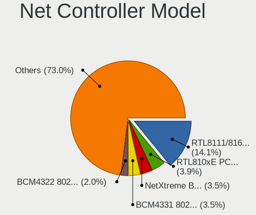

| Model                                                                  | Computers | Percent |
|------------------------------------------------------------------------|-----------|---------|
| Realtek RTL8111/8168/8211/8411 PCI Express Gigabit Ethernet Controller | 66        | 13.15%  |
| Realtek RTL810xE PCI Express Fast Ethernet controller                  | 15        | 2.99%   |
| Broadcom NetXtreme BCM57765 Gigabit Ethernet PCIe                      | 13        | 2.59%   |
| Broadcom Limited BCM4360 802.11ac Dual Band Wireless Network Adapter   | 12        | 2.39%   |
| Broadcom BCM4322 802.11a/b/g/n Wireless LAN Controller                 | 11        | 2.19%   |
| Intel Wireless 7265                                                    | 10        | 1.99%   |
| Intel Wireless 8265 / 8275                                             | 9         | 1.79%   |
| Intel Wireless 7260                                                    | 9         | 1.79%   |
| Broadcom NetXtreme BCM57766 Gigabit Ethernet PCIe                      | 9         | 1.79%   |
| Broadcom BCM4331 802.11a/b/g/n                                         | 9         | 1.79%   |
| Nvidia MCP79 Ethernet                                                  | 8         | 1.59%   |
| Intel 82579LM Gigabit Network Connection (Lewisville)                  | 8         | 1.59%   |
| Realtek RTL8821CE 802.11ac PCIe Wireless Network Adapter               | 7         | 1.39%   |
| Qualcomm Atheros AR9485 Wireless Network Adapter                       | 7         | 1.39%   |
| Intel Ethernet Connection I217-LM                                      | 7         | 1.39%   |
| Realtek RTL8822CE 802.11ac PCIe Wireless Network Adapter               | 6         | 1.2%    |
| Intel Wireless 3165                                                    | 6         | 1.2%    |
| Broadcom NetXtreme BCM5764M Gigabit Ethernet PCIe                      | 6         | 1.2%    |
| Broadcom BCM43224 802.11a/b/g/n                                        | 6         | 1.2%    |
| Ralink MT7601U Wireless Adapter                                        | 5         | 1%      |
| Qualcomm Atheros QCA9565 / AR9565 Wireless Network Adapter             | 5         | 1%      |
| Qualcomm Atheros QCA6174 802.11ac Wireless Network Adapter             | 5         | 1%      |
| Intel Wi-Fi 6E(802.11ax) AX210/AX1675* 2x2 [Typhoon Peak]              | 5         | 1%      |
| Intel Wi-Fi 6 AX201                                                    | 5         | 1%      |
| Intel Ethernet Connection I218-LM                                      | 5         | 1%      |
| Broadcom BCM4360 802.11ac Dual Band Wireless Network Adapter           | 5         | 1%      |
| Samsung Galaxy series, misc. (tethering mode)                          | 4         | 0.8%    |
| Realtek RTL8125 2.5GbE Controller                                      | 4         | 0.8%    |
| Qualcomm Atheros QCA9377 802.11ac Wireless Network Adapter             | 4         | 0.8%    |
| Qualcomm Atheros AR93xx Wireless Network Adapter                       | 4         | 0.8%    |
| Intel Wireless 8260                                                    | 4         | 0.8%    |
| Intel Gemini Lake PCH CNVi WiFi                                        | 4         | 0.8%    |
| Intel 82579V Gigabit Network Connection                                | 4         | 0.8%    |
| ASIX AX88179 Gigabit Ethernet                                          | 4         | 0.8%    |
| Realtek RTL8822BE 802.11a/b/g/n/ac WiFi adapter                        | 3         | 0.6%    |
| Realtek RTL8188FTV 802.11b/g/n 1T1R 2.4G WLAN Adapter                  | 3         | 0.6%    |
| Realtek RTL8188EUS 802.11n Wireless Network Adapter                    | 3         | 0.6%    |
| Qualcomm Atheros AR9462 Wireless Network Adapter                       | 3         | 0.6%    |
| Qualcomm Atheros AR9285 Wireless Network Adapter (PCI-Express)         | 3         | 0.6%    |
| MediaTek Wi-Fi 6E MT7902 Wireless Network Adapter                      | 3         | 0.6%    |

Wireless Vendor
---------------

Wireless vendors

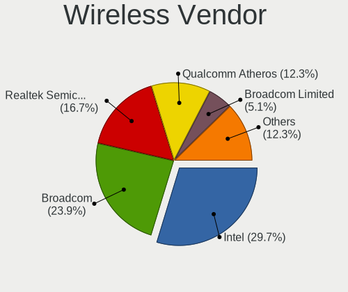

| Vendor                          | Computers | Percent |
|---------------------------------|-----------|---------|
| Intel                           | 82        | 31.06%  |
| Broadcom                        | 49        | 18.56%  |
| Realtek Semiconductor           | 37        | 14.02%  |
| Qualcomm Atheros                | 35        | 13.26%  |
| Broadcom Limited                | 18        | 6.82%   |
| MediaTek                        | 10        | 3.79%   |
| TP-Link                         | 7         | 2.65%   |
| Ralink Technology               | 7         | 2.65%   |
| Qualcomm Atheros Communications | 3         | 1.14%   |
| Sierra Wireless                 | 2         | 0.76%   |
| Ralink                          | 2         | 0.76%   |
| NetGear                         | 2         | 0.76%   |
| D-Link System                   | 2         | 0.76%   |
| ZyDAS                           | 1         | 0.38%   |
| Qualcomm                        | 1         | 0.38%   |
| Mercucys                        | 1         | 0.38%   |
| Marvell Technology Group        | 1         | 0.38%   |
| Hewlett-Packard                 | 1         | 0.38%   |
| Dell                            | 1         | 0.38%   |
| D-Link                          | 1         | 0.38%   |
| ASUSTek Computer                | 1         | 0.38%   |

Wireless Model
--------------

Wireless models

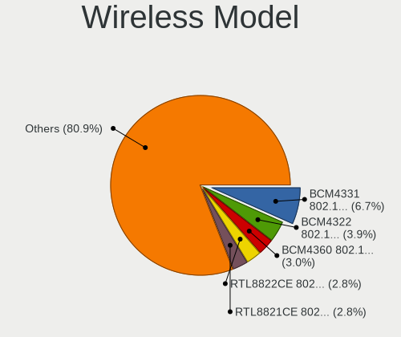

| Model                                                                | Computers | Percent |
|----------------------------------------------------------------------|-----------|---------|
| Broadcom Limited BCM4360 802.11ac Dual Band Wireless Network Adapter | 12        | 4.53%   |
| Broadcom BCM4322 802.11a/b/g/n Wireless LAN Controller               | 11        | 4.15%   |
| Intel Wireless 7265                                                  | 10        | 3.77%   |
| Intel Wireless 8265 / 8275                                           | 9         | 3.4%    |
| Intel Wireless 7260                                                  | 9         | 3.4%    |
| Broadcom BCM4331 802.11a/b/g/n                                       | 9         | 3.4%    |
| Realtek RTL8821CE 802.11ac PCIe Wireless Network Adapter             | 7         | 2.64%   |
| Qualcomm Atheros AR9485 Wireless Network Adapter                     | 7         | 2.64%   |
| Realtek RTL8822CE 802.11ac PCIe Wireless Network Adapter             | 6         | 2.26%   |
| Intel Wireless 3165                                                  | 6         | 2.26%   |
| Broadcom BCM43224 802.11a/b/g/n                                      | 6         | 2.26%   |
| Ralink MT7601U Wireless Adapter                                      | 5         | 1.89%   |
| Qualcomm Atheros QCA9565 / AR9565 Wireless Network Adapter           | 5         | 1.89%   |
| Qualcomm Atheros QCA6174 802.11ac Wireless Network Adapter           | 5         | 1.89%   |
| Intel Wi-Fi 6E(802.11ax) AX210/AX1675* 2x2 [Typhoon Peak]            | 5         | 1.89%   |
| Intel Wi-Fi 6 AX201                                                  | 5         | 1.89%   |
| Broadcom BCM4360 802.11ac Dual Band Wireless Network Adapter         | 5         | 1.89%   |
| Qualcomm Atheros QCA9377 802.11ac Wireless Network Adapter           | 4         | 1.51%   |
| Qualcomm Atheros AR93xx Wireless Network Adapter                     | 4         | 1.51%   |
| Intel Wireless 8260                                                  | 4         | 1.51%   |
| Intel Gemini Lake PCH CNVi WiFi                                      | 4         | 1.51%   |
| Realtek RTL8822BE 802.11a/b/g/n/ac WiFi adapter                      | 3         | 1.13%   |
| Realtek RTL8188FTV 802.11b/g/n 1T1R 2.4G WLAN Adapter                | 3         | 1.13%   |
| Realtek RTL8188EUS 802.11n Wireless Network Adapter                  | 3         | 1.13%   |
| Qualcomm Atheros AR9462 Wireless Network Adapter                     | 3         | 1.13%   |
| Qualcomm Atheros AR9285 Wireless Network Adapter (PCI-Express)       | 3         | 1.13%   |
| MediaTek Wi-Fi 6E MT7902 Wireless Network Adapter                    | 3         | 1.13%   |
| MediaTek MT7921 802.11ax PCI Express Wireless Network Adapter        | 3         | 1.13%   |
| Intel Comet Lake PCH-LP CNVi WiFi                                    | 3         | 1.13%   |
| Intel Centrino Advanced-N 6205 [Taylor Peak]                         | 3         | 1.13%   |
| Broadcom BCM4364 802.11ac Wireless Network Adapter                   | 3         | 1.13%   |
| Broadcom BCM43142 802.11b/g/n                                        | 3         | 1.13%   |
| Broadcom BCM4313 802.11bgn Wireless Network Adapter                  | 3         | 1.13%   |
| TP-Link TL-WN823N v2/v3 [Realtek RTL8192EU]                          | 2         | 0.75%   |
| Realtek RTL8852BE PCIe 802.11ax Wireless Network Controller          | 2         | 0.75%   |
| Realtek RTL8821AE 802.11ac PCIe Wireless Network Adapter             | 2         | 0.75%   |
| Realtek 802.11ac NIC                                                 | 2         | 0.75%   |
| Qualcomm Atheros AR9271 802.11n                                      | 2         | 0.75%   |
| Qualcomm Atheros AR928X Wireless Network Adapter (PCI-Express)       | 2         | 0.75%   |
| Qualcomm Atheros AR9287 Wireless Network Adapter (PCI-Express)       | 2         | 0.75%   |

Ethernet Vendor
---------------

Ethernet vendors

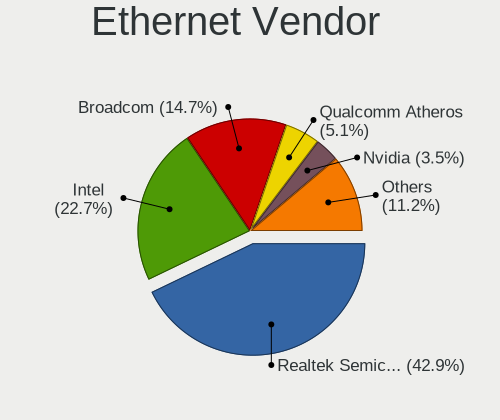

| Vendor                   | Computers | Percent |
|--------------------------|-----------|---------|
| Realtek Semiconductor    | 89        | 38.7%   |
| Intel                    | 61        | 26.52%  |
| Broadcom                 | 32        | 13.91%  |
| Qualcomm Atheros         | 13        | 5.65%   |
| Nvidia                   | 9         | 3.91%   |
| Samsung Electronics      | 6         | 2.61%   |
| Marvell Technology Group | 5         | 2.17%   |
| ASIX Electronics         | 5         | 2.17%   |
| Xiaomi                   | 2         | 0.87%   |
| Microsoft                | 1         | 0.43%   |
| MediaTek                 | 1         | 0.43%   |
| JMicron Technology       | 1         | 0.43%   |
| ICS Advent               | 1         | 0.43%   |
| Huawei Technologies      | 1         | 0.43%   |
| Google                   | 1         | 0.43%   |
| Broadcom Limited         | 1         | 0.43%   |
| Apple                    | 1         | 0.43%   |

Ethernet Model
--------------

Ethernet models

| Model                                                                  | Computers | Percent |
|------------------------------------------------------------------------|-----------|---------|
| Realtek RTL8111/8168/8211/8411 PCI Express Gigabit Ethernet Controller | 66        | 28.45%  |
| Realtek RTL810xE PCI Express Fast Ethernet controller                  | 15        | 6.47%   |
| Broadcom NetXtreme BCM57765 Gigabit Ethernet PCIe                      | 13        | 5.6%    |
| Broadcom NetXtreme BCM57766 Gigabit Ethernet PCIe                      | 9         | 3.88%   |
| Nvidia MCP79 Ethernet                                                  | 8         | 3.45%   |
| Intel 82579LM Gigabit Network Connection (Lewisville)                  | 8         | 3.45%   |
| Intel Ethernet Connection I217-LM                                      | 7         | 3.02%   |
| Broadcom NetXtreme BCM5764M Gigabit Ethernet PCIe                      | 6         | 2.59%   |
| Intel Ethernet Connection I218-LM                                      | 5         | 2.16%   |
| Samsung Galaxy series, misc. (tethering mode)                          | 4         | 1.72%   |
| Realtek RTL8125 2.5GbE Controller                                      | 4         | 1.72%   |
| Intel 82579V Gigabit Network Connection                                | 4         | 1.72%   |
| ASIX AX88179 Gigabit Ethernet                                          | 4         | 1.72%   |
| Intel Ethernet Connection I219-LM                                      | 3         | 1.29%   |
| Intel Ethernet Connection (4) I219-LM                                  | 3         | 1.29%   |
| Intel Ethernet Connection (2) I219-V                                   | 3         | 1.29%   |
| Intel 82577LM Gigabit Network Connection                               | 3         | 1.29%   |
| Samsung GT-I9070 (network tethering, USB debugging enabled)            | 2         | 0.86%   |
| Realtek RTL8153 Gigabit Ethernet Adapter                               | 2         | 0.86%   |
| Realtek Killer E2600 GbE Controller                                    | 2         | 0.86%   |
| Qualcomm Atheros Killer E2400 Gigabit Ethernet Controller              | 2         | 0.86%   |
| Qualcomm Atheros Killer E220x Gigabit Ethernet Controller              | 2         | 0.86%   |
| Qualcomm Atheros AR8121/AR8113/AR8114 Gigabit or Fast Ethernet         | 2         | 0.86%   |
| Intel I211 Gigabit Network Connection                                  | 2         | 0.86%   |
| Intel Ethernet Controller I225-V                                       | 2         | 0.86%   |
| Intel Ethernet Connection I217-V                                       | 2         | 0.86%   |
| Intel Ethernet Connection (7) I219-V                                   | 2         | 0.86%   |
| Intel Ethernet Connection (3) I218-LM                                  | 2         | 0.86%   |
| Intel 82567LM Gigabit Network Connection                               | 2         | 0.86%   |
| Broadcom NetLink BCM57785 Gigabit Ethernet PCIe                        | 2         | 0.86%   |
| Xiaomi Mi/Redmi series (RNDIS)                                         | 1         | 0.43%   |
| Xiaomi Mi/Redmi series (RNDIS + ADB)                                   | 1         | 0.43%   |
| Realtek RTL-8100/8101L/8139 PCI Fast Ethernet Adapter                  | 1         | 0.43%   |
| Realtek Killer E2500 Gigabit Ethernet Controller                       | 1         | 0.43%   |
| Qualcomm Atheros Killer E2500 Gigabit Ethernet Controller              | 1         | 0.43%   |
| Qualcomm Atheros Attansic L2 Fast Ethernet                             | 1         | 0.43%   |
| Qualcomm Atheros AR8162 Fast Ethernet                                  | 1         | 0.43%   |
| Qualcomm Atheros AR8161 Gigabit Ethernet                               | 1         | 0.43%   |
| Qualcomm Atheros AR8152 v1.1 Fast Ethernet                             | 1         | 0.43%   |
| Qualcomm Atheros AR8151 v2.0 Gigabit Ethernet                          | 1         | 0.43%   |

Net Controller Kind
-------------------

Ethernet, WiFi or modem

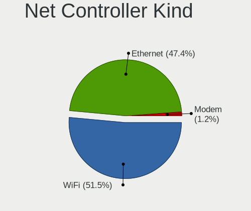

| Kind     | Computers | Percent |
|----------|-----------|---------|
| WiFi     | 242       | 51.82%  |
| Ethernet | 220       | 47.11%  |
| Modem    | 5         | 1.07%   |

Used Controller
---------------

Currently used network controller

| Kind     | Computers | Percent |
|----------|-----------|---------|
| WiFi     | 184       | 64.79%  |
| Ethernet | 100       | 35.21%  |

NICs
----

Total network controllers on board

| Total | Computers | Percent |
|-------|-----------|---------|
| 2     | 153       | 55.43%  |
| 1     | 115       | 41.67%  |
| 3     | 5         | 1.81%   |
| 0     | 3         | 1.09%   |

IPv6
----

IPv6 vs IPv4

| Used | Computers | Percent |
|------|-----------|---------|
| No   | 184       | 66.19%  |
| Yes  | 94        | 33.81%  |

Bluetooth
---------

Bluetooth Vendor
----------------

Controller vendors

| Vendor                          | Computers | Percent |
|---------------------------------|-----------|---------|
| Intel                           | 70        | 34.15%  |
| Apple                           | 50        | 24.39%  |
| Realtek Semiconductor           | 22        | 10.73%  |
| Qualcomm Atheros Communications | 14        | 6.83%   |
| Broadcom                        | 8         | 3.9%    |
| Lite-On Technology              | 6         | 2.93%   |
| IMC Networks                    | 6         | 2.93%   |
| Cambridge Silicon Radio         | 6         | 2.93%   |
| Foxconn / Hon Hai               | 5         | 2.44%   |
| TP-Link                         | 3         | 1.46%   |
| Realtek                         | 3         | 1.46%   |
| Hewlett-Packard                 | 3         | 1.46%   |
| Dell                            | 2         | 0.98%   |
| Toshiba                         | 1         | 0.49%   |
| Ralink Technology               | 1         | 0.49%   |
| Opticis                         | 1         | 0.49%   |
| MediaTek                        | 1         | 0.49%   |
| Marvell Semiconductor           | 1         | 0.49%   |
| ASUSTek Computer                | 1         | 0.49%   |
| Actions                         | 1         | 0.49%   |

Bluetooth Model
---------------

Controller models

| Model                                               | Computers | Percent |
|-----------------------------------------------------|-----------|---------|
| Apple Bluetooth Host Controller                     | 27        | 13.17%  |
| Intel Bluetooth wireless interface                  | 26        | 12.68%  |
| Realtek Bluetooth Radio                             | 15        | 7.32%   |
| Apple Bluetooth USB Host Controller                 | 15        | 7.32%   |
| Intel Bluetooth Device                              | 11        | 5.37%   |
| Intel Bluetooth 9460/9560 Jefferson Peak (JfP)      | 10        | 4.88%   |
| Intel AX201 Bluetooth                               | 10        | 4.88%   |
| Apple Built-in Bluetooth 2.0+EDR HCI                | 7         | 3.41%   |
| Cambridge Silicon Radio Bluetooth Dongle (HCI mode) | 6         | 2.93%   |
| Qualcomm Atheros  Bluetooth Device                  | 5         | 2.44%   |
| Intel AX210 Bluetooth                               | 5         | 2.44%   |
| Qualcomm Atheros QCA61x4 Bluetooth 4.0              | 4         | 1.95%   |
| IMC Networks Wireless_Device                        | 4         | 1.95%   |
| TP-Link UB500 Adapter                               | 3         | 1.46%   |
| Realtek Bluetooth Radio                             | 3         | 1.46%   |
| Intel AX211 Bluetooth                               | 3         | 1.46%   |
| HP Broadcom 2070 Bluetooth Combo                    | 3         | 1.46%   |
| Realtek RTL8822BE Bluetooth 4.2 Adapter             | 2         | 0.98%   |
| Realtek RTL8821A Bluetooth                          | 2         | 0.98%   |
| Qualcomm Atheros AR3012 Bluetooth 4.0               | 2         | 0.98%   |
| Lite-On Wireless_Device                             | 2         | 0.98%   |
| Lite-On Bluetooth Device                            | 2         | 0.98%   |
| Intel Wireless-AC 3168 Bluetooth                    | 2         | 0.98%   |
| Intel Centrino Bluetooth Wireless Transceiver       | 2         | 0.98%   |
| IMC Networks BCM20702A0                             | 2         | 0.98%   |
| Dell DW375 Bluetooth Module                         | 2         | 0.98%   |
| Broadcom HP Portable SoftSailing                    | 2         | 0.98%   |
| Toshiba Atheros AR3012 Bluetooth                    | 1         | 0.49%   |
| Realtek RTL8723A Bluetooth                          | 1         | 0.49%   |
| Realtek  Bluetooth 4.2 Adapter                      | 1         | 0.49%   |
| Realtek 802.11ac WLAN Adapter                       | 1         | 0.49%   |
| Ralink CSR BS8510                                   | 1         | 0.49%   |
| Qualcomm Atheros Bluetooth USB Host Controller      | 1         | 0.49%   |
| Qualcomm Atheros AR3012 Bluetooth                   | 1         | 0.49%   |
| Qualcomm Atheros AR3011 Bluetooth                   | 1         | 0.49%   |
| Opticis Bluetooth Radio                             | 1         | 0.49%   |
| MediaTek Wireless_Device                            | 1         | 0.49%   |
| Marvell Bluetooth and Wireless LAN Composite        | 1         | 0.49%   |
| Lite-On BCM43142A0                                  | 1         | 0.49%   |
| Lite-On Atheros AR3012 Bluetooth                    | 1         | 0.49%   |

Sound
-----

Sound Vendor
------------

Sound card vendors

| Vendor                               | Computers | Percent |
|--------------------------------------|-----------|---------|
| Intel                                | 211       | 57.97%  |
| Nvidia                               | 68        | 18.68%  |
| AMD                                  | 64        | 17.58%  |
| C-Media Electronics                  | 4         | 1.1%    |
| GN Netcom                            | 2         | 0.55%   |
| Yealink Network Technology           | 1         | 0.27%   |
| Thesycon Systemsoftware & Consulting | 1         | 0.27%   |
| Texas Instruments                    | 1         | 0.27%   |
| Micro Star International             | 1         | 0.27%   |
| Logitech                             | 1         | 0.27%   |
| Kingston Technology                  | 1         | 0.27%   |
| JMTek                                | 1         | 0.27%   |
| JBL                                  | 1         | 0.27%   |
| Huawei Technologies                  | 1         | 0.27%   |
| Guillemot                            | 1         | 0.27%   |
| Dell                                 | 1         | 0.27%   |
| Corsair                              | 1         | 0.27%   |
| Cambridge Silicon Radio              | 1         | 0.27%   |
| Apple                                | 1         | 0.27%   |
| Actions Semiconductor                | 1         | 0.27%   |

Sound Model
-----------

Sound card models

| Model                                                                      | Computers | Percent |
|----------------------------------------------------------------------------|-----------|---------|
| AMD Family 17h/19h HD Audio Controller                                     | 25        | 5.59%   |
| Intel Sunrise Point-LP HD Audio                                            | 24        | 5.37%   |
| Intel 7 Series/C216 Chipset Family High Definition Audio Controller        | 23        | 5.15%   |
| Intel 6 Series/C200 Series Chipset Family High Definition Audio Controller | 22        | 4.92%   |
| Intel 8 Series/C220 Series Chipset High Definition Audio Controller        | 18        | 4.03%   |
| Intel Haswell-ULT HD Audio Controller                                      | 15        | 3.36%   |
| Intel 8 Series HD Audio Controller                                         | 15        | 3.36%   |
| Intel Broadwell-U Audio Controller                                         | 12        | 2.68%   |
| Intel 5 Series/3400 Series Chipset High Definition Audio                   | 12        | 2.68%   |
| AMD Renoir Radeon High Definition Audio Controller                         | 12        | 2.68%   |
| Intel Xeon E3-1200 v3/4th Gen Core Processor HD Audio Controller           | 11        | 2.46%   |
| Intel Wildcat Point-LP High Definition Audio Controller                    | 11        | 2.46%   |
| Intel Celeron/Pentium Silver Processor High Definition Audio               | 9         | 2.01%   |
| Intel Cannon Lake PCH cAVS                                                 | 9         | 2.01%   |
| AMD Raven/Raven2/Fenghuang HDMI/DP Audio Controller                        | 9         | 2.01%   |
| Nvidia MCP79 High Definition Audio                                         | 8         | 1.79%   |
| Intel Tiger Lake-LP Smart Sound Technology Audio Controller                | 8         | 1.79%   |
| Intel 82801I (ICH9 Family) HD Audio Controller                             | 7         | 1.57%   |
| AMD FCH Azalia Controller                                                  | 7         | 1.57%   |
| Nvidia GK208 HDMI/DP Audio Controller                                      | 6         | 1.34%   |
| Intel NM10/ICH7 Family High Definition Audio Controller                    | 6         | 1.34%   |
| Intel 100 Series/C230 Series Chipset Family HD Audio Controller            | 6         | 1.34%   |
| AMD Kabini HDMI/DP Audio                                                   | 6         | 1.34%   |
| AMD Family 15h (Models 60h-6fh) Audio Controller                           | 6         | 1.34%   |
| Nvidia MCP89 High Definition Audio                                         | 5         | 1.12%   |
| Nvidia TU107 GeForce GTX 1650 High Definition Audio Controller             | 4         | 0.89%   |
| Nvidia High Definition Audio Controller                                    | 4         | 0.89%   |
| Nvidia GT216 HDMI Audio Controller                                         | 4         | 0.89%   |
| Nvidia GP106 High Definition Audio Controller                              | 4         | 0.89%   |
| Nvidia GP104 High Definition Audio Controller                              | 4         | 0.89%   |
| Nvidia GK107 HDMI Audio Controller                                         | 4         | 0.89%   |
| Intel Tiger Lake-H HD Audio Controller                                     | 4         | 0.89%   |
| Intel Ice Lake-LP Smart Sound Technology Audio Controller                  | 4         | 0.89%   |
| Intel 82801JI (ICH10 Family) HD Audio Controller                           | 4         | 0.89%   |
| Intel 200 Series PCH HD Audio                                              | 4         | 0.89%   |
| AMD Rembrandt Radeon High Definition Audio Controller                      | 4         | 0.89%   |
| AMD Ellesmere HDMI Audio [Radeon RX 470/480 / 570/580/590]                 | 4         | 0.89%   |
| Nvidia GP107GL High Definition Audio Controller                            | 3         | 0.67%   |
| Nvidia GK106 HDMI Audio Controller                                         | 3         | 0.67%   |
| Intel Crystal Well HD Audio Controller                                     | 3         | 0.67%   |

Memory
------

Memory Vendor
-------------

Memory module vendors

| Vendor              | Computers | Percent |
|---------------------|-----------|---------|
| Samsung Electronics | 13        | 22.41%  |
| SK hynix            | 9         | 15.52%  |
| Micron Technology   | 8         | 13.79%  |
| Kingston            | 7         | 12.07%  |
| Crucial             | 5         | 8.62%   |
| Unknown             | 4         | 6.9%    |
| Elpida              | 3         | 5.17%   |
| Unknown (ABCD)      | 2         | 3.45%   |
| Ramaxel Technology  | 2         | 3.45%   |
| Nanya Technology    | 2         | 3.45%   |
| Corsair             | 2         | 3.45%   |
| Timetec             | 1         | 1.72%   |

Memory Model
------------

Memory module models

| Model                                                            | Computers | Percent |
|------------------------------------------------------------------|-----------|---------|
| Unknown (ABCD) RAM 123456789012345678 2GB SODIMM LPDDR4 2400MT/s | 2         | 3.23%   |
| SK hynix RAM Module 8GB SODIMM DDR3 1600MT/s                     | 2         | 3.23%   |
| Unknown RAM Module 4GB SODIMM DDR4 2667MT/s                      | 1         | 1.61%   |
| Unknown RAM Module 4GB SODIMM DDR4 2133MT/s                      | 1         | 1.61%   |
| Unknown RAM Module 4GB SODIMM DDR3 667MT/s                       | 1         | 1.61%   |
| Unknown RAM Module 2GB SODIMM DDR3                               | 1         | 1.61%   |
| Unknown RAM Module 1GB SODIMM DDR3                               | 1         | 1.61%   |
| Unknown RAM Module 16GB SODIMM DDR4 2667MT/s                     | 1         | 1.61%   |
| Timetec RAM Module 8GB SODIMM DDR3 1333MT/s                      | 1         | 1.61%   |
| SK hynix RAM HMT451S6DFR8A-PB 4GB SODIMM DDR3 1600MT/s           | 1         | 1.61%   |
| SK hynix RAM HMT451S6AFR8A-PB 4096MB SODIMM DDR3 1600MT/s        | 1         | 1.61%   |
| SK hynix RAM HMT351S6EFR8A-PB 4GB SODIMM DDR3 1600MT/s           | 1         | 1.61%   |
| SK hynix RAM HMT351S6CFR8C-PB 4GB SODIMM DDR3 1600MT/s           | 1         | 1.61%   |
| SK hynix RAM HMT325S6CFR8C-PB 2GB SODIMM DDR3 1600MT/s           | 1         | 1.61%   |
| SK hynix RAM HMA851S6CJR6N-VK 4GB Row Of Chips DDR4 2667MT/s     | 1         | 1.61%   |
| SK hynix RAM HMA81GS6DJR8N-XN 8GB SODIMM DDR4 3200MT/s           | 1         | 1.61%   |
| SK hynix RAM H9HCNNNCPMMLXR-NEE 8GB SODIMM LPDDR4 4266MT/s       | 1         | 1.61%   |
| Samsung RAM Module 8GB SODIMM DDR4 2133MT/s                      | 1         | 1.61%   |
| Samsung RAM Module 2GB SODIMM DDR3 1067MT/s                      | 1         | 1.61%   |
| Samsung RAM M471B5173EB0-YK0 4GB SODIMM DDR3 1600MT/s            | 1         | 1.61%   |
| Samsung RAM M471A5244CB0-CWE 4GB SODIMM DDR4 3200MT/s            | 1         | 1.61%   |
| Samsung RAM M471A5244CB0-CRC 4GB SODIMM DDR4 2667MT/s            | 1         | 1.61%   |
| Samsung RAM M471A2K43EB1-CWE 16GB SODIMM DDR4 3200MT/s           | 1         | 1.61%   |
| Samsung RAM M471A1K43EB1-CWE 8GB SODIMM DDR4 3200MT/s            | 1         | 1.61%   |
| Samsung RAM M471A1K43DB1-CTD 8GB SODIMM DDR4 2667MT/s            | 1         | 1.61%   |
| Samsung RAM M471A1G44BB0-CWE 8GB Row Of Chips DDR4 3200MT/s      | 1         | 1.61%   |
| Samsung RAM M471A1G44AB0-CWE 8GB Row Of Chips DDR4 3200MT/s      | 1         | 1.61%   |
| Samsung RAM M425R1GB4BB0-CQKOD 8GB SODIMM DDR5 4800MT/s          | 1         | 1.61%   |
| Samsung RAM M4 70T5663EH3-CF7 2GB SODIMM DDR2 975MT/s            | 1         | 1.61%   |
| Samsung RAM M04GD08P1333C9 4GB SODIMM DDR3 667MT/s               | 1         | 1.61%   |
| Samsung RAM K4E6E304EB-EGCF 4GB Row Of Chips LPDDR3 1867MT/s     | 1         | 1.61%   |
| Ramaxel RAM RMUA5110ME78HAF-2666 8GB DIMM DDR4 2667MT/s          | 1         | 1.61%   |
| Ramaxel RAM RMN1740EC48D8W-800 2GB SODIMM DDR2 800MT/s           | 1         | 1.61%   |
| Nanya RAM NT2GC64B8HA0NF-CG 2GB DIMM DDR3 1333MT/s               | 1         | 1.61%   |
| Nanya RAM NT2GC64B88B0NF-CG 2GB DIMM DDR3 1333MT/s               | 1         | 1.61%   |
| Micron RAM MT62F2G32D4DS-026 WT 8GB Row Of Chips LPDDR5 6400MT/s | 1         | 1.61%   |
| Micron RAM MT62F1G32D4DR-031 2GB Row Of Chips LPDDR5 6400MT/s    | 1         | 1.61%   |
| Micron RAM MT41K256M16LY-107 2GB SODIMM DDR3 1600MT/s            | 1         | 1.61%   |
| Micron RAM 4ATF51264HZ-2G3AZ 4GB SODIMM DDR4 2133MT/s            | 1         | 1.61%   |
| Micron RAM 4ATF1G64HZ-3G2F1 8GB SODIMM DDR4 3200MT/s             | 1         | 1.61%   |

Memory Kind
-----------

Memory module kinds

| Kind   | Computers | Percent |
|--------|-----------|---------|
| DDR3   | 21        | 43.75%  |
| DDR4   | 17        | 35.42%  |
| LPDDR4 | 3         | 6.25%   |
| LPDDR5 | 2         | 4.17%   |
| DDR2   | 2         | 4.17%   |
| SDRAM  | 1         | 2.08%   |
| LPDDR3 | 1         | 2.08%   |
| DDR5   | 1         | 2.08%   |

Memory Form Factor
------------------

Physical design of the memory module

| Name         | Computers | Percent |
|--------------|-----------|---------|
| SODIMM       | 36        | 73.47%  |
| DIMM         | 7         | 14.29%  |
| Row Of Chips | 6         | 12.24%  |

Memory Size
-----------

Memory module size

| Size  | Computers | Percent |
|-------|-----------|---------|
| 8192  | 23        | 43.4%   |
| 4096  | 13        | 24.53%  |
| 2048  | 9         | 16.98%  |
| 16384 | 6         | 11.32%  |
| 1024  | 2         | 3.77%   |

Memory Speed
------------

Memory module speed

| Speed   | Computers | Percent |
|---------|-----------|---------|
| 1600    | 12        | 23.53%  |
| 2667    | 8         | 15.69%  |
| 3200    | 6         | 11.76%  |
| 2133    | 4         | 7.84%   |
| 1333    | 4         | 7.84%   |
| 6400    | 2         | 3.92%   |
| 2400    | 2         | 3.92%   |
| 1067    | 2         | 3.92%   |
| 667     | 2         | 3.92%   |
| 4800    | 1         | 1.96%   |
| 4266    | 1         | 1.96%   |
| 2933    | 1         | 1.96%   |
| 2048    | 1         | 1.96%   |
| 1867    | 1         | 1.96%   |
| 1800    | 1         | 1.96%   |
| 1334    | 1         | 1.96%   |
| 800     | 1         | 1.96%   |
| Unknown | 1         | 1.96%   |

Printers & scanners
-------------------

Printer Vendor
--------------

Printer device vendors

| Vendor                | Computers | Percent |
|-----------------------|-----------|---------|
| Samsung Electronics   | 1         | 25%     |
| Lexmark International | 1         | 25%     |
| Hewlett-Packard       | 1         | 25%     |
| Canon                 | 1         | 25%     |

Printer Model
-------------

Printer device models

| Model                                   | Computers | Percent |
|-----------------------------------------|-----------|---------|
| Samsung M2070 Series                    | 1         | 25%     |
| Lexmark International f+ imaging M40adn | 1         | 25%     |
| HP Deskjet 3520 series                  | 1         | 25%     |
| Canon LiDE 300                          | 1         | 25%     |

Scanner Vendor
--------------

Scanner device vendors

| Vendor      | Computers | Percent |
|-------------|-----------|---------|
| Seiko Epson | 1         | 100%    |

Scanner Model
-------------

Scanner device models

| Model                         | Computers | Percent |
|-------------------------------|-----------|---------|
| Seiko Epson ES-H300 [GT-2500] | 1         | 100%    |

Camera
------

Camera Vendor
-------------

Camera device vendors

| Vendor                                 | Computers | Percent |
|----------------------------------------|-----------|---------|
| Apple                                  | 38        | 20.54%  |
| Chicony Electronics                    | 24        | 12.97%  |
| IMC Networks                           | 15        | 8.11%   |
| Microdia                               | 13        | 7.03%   |
| Cheng Uei Precision Industry (Foxlink) | 11        | 5.95%   |
| Realtek Semiconductor                  | 9         | 4.86%   |
| Quanta                                 | 9         | 4.86%   |
| Suyin                                  | 6         | 3.24%   |
| Sunplus Innovation Technology          | 6         | 3.24%   |
| Bison Electronics                      | 6         | 3.24%   |
| Logitech                               | 5         | 2.7%    |
| Lite-On Technology                     | 5         | 2.7%    |
| Syntek                                 | 4         | 2.16%   |
| Silicon Motion                         | 3         | 1.62%   |
| Ricoh                                  | 3         | 1.62%   |
| SunplusIT                              | 2         | 1.08%   |
| Sonix Technology                       | 2         | 1.08%   |
| ShineTech                              | 2         | 1.08%   |
| Samsung Electronics                    | 2         | 1.08%   |
| MacroSilicon                           | 2         | 1.08%   |
| Luxvisions Innotech Limited            | 2         | 1.08%   |
| GEMBIRD                                | 2         | 1.08%   |
| Alcor Micro                            | 2         | 1.08%   |
| Y Media                                | 1         | 0.54%   |
| Trust                                  | 1         | 0.54%   |
| Sunplus Technology                     | 1         | 0.54%   |
| Razer USA                              | 1         | 0.54%   |
| Primax Electronics                     | 1         | 0.54%   |
| Pixart Imaging                         | 1         | 0.54%   |
| OYT Tech                               | 1         | 0.54%   |
| Microsoft                              | 1         | 0.54%   |
| LG Electronics                         | 1         | 0.54%   |
| Goodong Industry                       | 1         | 0.54%   |
| ALi                                    | 1         | 0.54%   |
| Unknown                                | 1         | 0.54%   |

Camera Model
------------

Camera device models

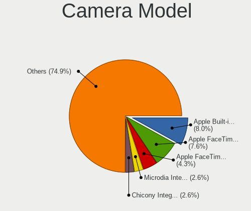

| Model                                                           | Computers | Percent |
|-----------------------------------------------------------------|-----------|---------|
| Apple Built-in iSight                                           | 14        | 7.49%   |
| Apple FaceTime HD Camera (Built-in)                             | 11        | 5.88%   |
| IMC Networks USB2.0 HD UVC WebCam                               | 8         | 4.28%   |
| Apple FaceTime HD Camera                                        | 7         | 3.74%   |
| Apple iPhone 5/5C/5S/6/SE/7/8/X                                 | 6         | 3.21%   |
| Microdia Integrated_Webcam_HD                                   | 4         | 2.14%   |
| Microdia Integrated Webcam                                      | 4         | 2.14%   |
| Chicony Integrated Camera                                       | 4         | 2.14%   |
| Syntek Integrated Camera                                        | 3         | 1.6%    |
| Realtek Integrated_Webcam_HD                                    | 3         | 1.6%    |
| Quanta HD User Facing                                           | 3         | 1.6%    |
| IMC Networks Integrated Camera                                  | 3         | 1.6%    |
| Chicony HP Truevision HD camera                                 | 3         | 1.6%    |
| Chicony EasyCamera                                              | 3         | 1.6%    |
| ShineTech USB2.0 HD UVC WebCam                                  | 2         | 1.07%   |
| Samsung Galaxy series, misc. (MTP mode)                         | 2         | 1.07%   |
| Ricoh Laptop_Integrated_Webcam_FHD                              | 2         | 1.07%   |
| Realtek USB Camera                                              | 2         | 1.07%   |
| Quanta HD Camera                                                | 2         | 1.07%   |
| Microdia USB 2.0 Camera                                         | 2         | 1.07%   |
| Logitech C922 Pro Stream Webcam                                 | 2         | 1.07%   |
| Lite-On HP HD Camera                                            | 2         | 1.07%   |
| Chicony HP Truevision HD                                        | 2         | 1.07%   |
| Chicony HD WebCam                                               | 2         | 1.07%   |
| Cheng Uei Precision Industry (Foxlink) HP Wide Vision HD Camera | 2         | 1.07%   |
| Bison SunplusIT Integrated Camera                               | 2         | 1.07%   |
| Bison Integrated Camera                                         | 2         | 1.07%   |
| Y Media USB Camera                                              | 1         | 0.53%   |
| Trust USB Camera                                                | 1         | 0.53%   |
| Syntek EasyCamera                                               | 1         | 0.53%   |
| Suyin HP webcam [dv6-1190en]                                    | 1         | 0.53%   |
| Suyin HP Truevision HD                                          | 1         | 0.53%   |
| Suyin HD WebCam                                                 | 1         | 0.53%   |
| Suyin HD Video WebCam                                           | 1         | 0.53%   |
| Suyin Acer/HP Integrated Webcam [CN0314]                        | 1         | 0.53%   |
| Suyin 1.3M WebCam (notebook emachines E730, Acer sub-brand)     | 1         | 0.53%   |
| SunplusIT XiaoMi Webcam                                         | 1         | 0.53%   |
| SunplusIT USB Camera                                            | 1         | 0.53%   |
| Sunplus 1.3M WebCam                                             | 1         | 0.53%   |
| Sunplus PC Camera                                               | 1         | 0.53%   |

Security
--------

Fingerprint Vendor
------------------

Fingerprint sensor vendors

| Vendor                     | Computers | Percent |
|----------------------------|-----------|---------|
| Validity Sensors           | 17        | 56.67%  |
| Synaptics                  | 6         | 20%     |
| Shenzhen Goodix Technology | 4         | 13.33%  |
| Upek                       | 1         | 3.33%   |
| LighTuning Technology      | 1         | 3.33%   |
| AuthenTec                  | 1         | 3.33%   |

Fingerprint Model
-----------------

Fingerprint sensor models

| Model                                                                      | Computers | Percent |
|----------------------------------------------------------------------------|-----------|---------|
| Validity Sensors VFS495 Fingerprint Reader                                 | 5         | 16.67%  |
| Shenzhen Goodix  Fingerprint Device                                        | 4         | 13.33%  |
| Validity Sensors VFS 5011 fingerprint sensor                               | 3         | 10%     |
| Validity Sensors VFS451 Fingerprint Reader                                 | 2         | 6.67%   |
| Validity Sensors Swipe Fingerprint Sensor                                  | 2         | 6.67%   |
| Synaptics  FS7604 Touch Fingerprint Sensor with PurePrint                  | 2         | 6.67%   |
| Validity Sensors VFS491                                                    | 1         | 3.33%   |
| Validity Sensors VFS471 Fingerprint Reader                                 | 1         | 3.33%   |
| Validity Sensors VFS101 Fingerprint Reader                                 | 1         | 3.33%   |
| Validity Sensors Synaptics WBDI                                            | 1         | 3.33%   |
| Validity Sensors Synaptics VFS7552 Touch Fingerprint Sensor with PurePrint | 1         | 3.33%   |
| Upek Biometric Touchchip/Touchstrip Fingerprint Sensor                     | 1         | 3.33%   |
| Synaptics UWP WBDI Device                                                  | 1         | 3.33%   |
| Synaptics Metallica MOH Touch Fingerprint Reader                           | 1         | 3.33%   |
| Synaptics Metallica MIS Touch Fingerprint Reader                           | 1         | 3.33%   |
| Synaptics Fingerprint scanner                                              | 1         | 3.33%   |
| LighTuning ES603 Swipe Fingerprint Sensor                                  | 1         | 3.33%   |
| AuthenTec AES2810                                                          | 1         | 3.33%   |

Chipcard Vendor
---------------

Chipcard module vendors

| Vendor      | Computers | Percent |
|-------------|-----------|---------|
| Broadcom    | 8         | 61.54%  |
| Alcor Micro | 2         | 15.38%  |
| Upek        | 1         | 7.69%   |
| O2 Micro    | 1         | 7.69%   |
| Lenovo      | 1         | 7.69%   |

Chipcard Model
--------------

Chipcard module models

| Model                                                                        | Computers | Percent |
|------------------------------------------------------------------------------|-----------|---------|
| Broadcom BCM5880 Secure Applications Processor with fingerprint swipe sensor | 3         | 23.08%  |
| Broadcom BCM5880 Secure Applications Processor                               | 2         | 15.38%  |
| Broadcom 5880                                                                | 2         | 15.38%  |
| Alcor Micro AU9540 Smartcard Reader                                          | 2         | 15.38%  |
| Upek TouchChip Fingerprint Coprocessor (WBF advanced mode)                   | 1         | 7.69%   |
| O2 Micro OZ776 CCID Smartcard Reader                                         | 1         | 7.69%   |
| Lenovo Integrated Smart Card Reader                                          | 1         | 7.69%   |
| Broadcom 58200                                                               | 1         | 7.69%   |

Unsupported
-----------

Unsupported Devices
-------------------

Total unsupported devices on board

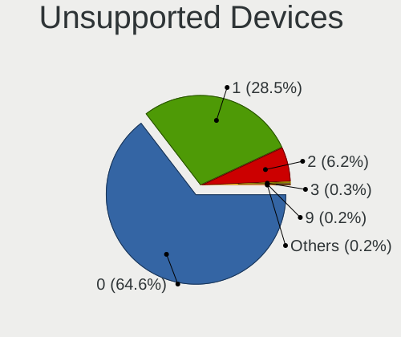

| Total | Computers | Percent |
|-------|-----------|---------|
| 0     | 180       | 64.52%  |
| 1     | 78        | 27.96%  |
| 2     | 20        | 7.17%   |
| 3     | 1         | 0.36%   |

Unsupported Device Types
------------------------

Types of unsupported devices

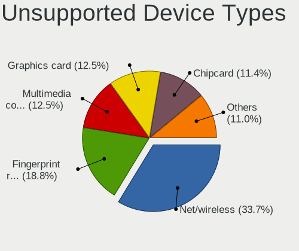

| Type                  | Computers | Percent |
|-----------------------|-----------|---------|
| Net/wireless          | 33        | 27.73%  |
| Fingerprint reader    | 30        | 25.21%  |
| Multimedia controller | 19        | 15.97%  |
| Graphics card         | 12        | 10.08%  |
| Chipcard              | 12        | 10.08%  |
| Storage               | 4         | 3.36%   |
| Camera                | 3         | 2.52%   |
| Sound                 | 2         | 1.68%   |
| Network               | 1         | 0.84%   |
| Modem                 | 1         | 0.84%   |
| Card reader           | 1         | 0.84%   |
| Bluetooth             | 1         | 0.84%   |

