Elementary 7.1 - Tested Hardware & Statistics
---------------------------------------------

A project to collect tested hardware configurations for Elementary 7.1.

Anyone can contribute to this report by the [hw-probe](https://github.com/linuxhw/hw-probe) tool:

    sudo -E hw-probe -all -upload

Please contribute! Especially if your hardware is rare.

This is a report for all computer types. See also reports for [desktops](/Dist/Elementary_7.1/Desktop/README.md) and [notebooks](/Dist/Elementary_7.1/Notebook/README.md).

Contents
--------

* [ Test Cases ](#test-cases)

* [ System ](#system)
  - [ Kernel                   ](#kernel)
  - [ Kernel Family            ](#kernel-family)
  - [ Kernel Major Ver.        ](#kernel-major-ver)
  - [ Arch                     ](#arch)
  - [ DE                       ](#de)
  - [ Display Server           ](#display-server)
  - [ Display Manager          ](#display-manager)
  - [ OS Lang                  ](#os-lang)
  - [ Boot Mode                ](#boot-mode)
  - [ Filesystem               ](#filesystem)
  - [ Part. scheme             ](#part-scheme)
  - [ Dual Boot with Linux/BSD ](#dual-boot-with-linuxbsd)
  - [ Dual Boot (Win)          ](#dual-boot-win)

* [ Board ](#board)
  - [ Vendor                   ](#vendor)
  - [ Model                    ](#model)
  - [ Model Family             ](#model-family)
  - [ MFG Year                 ](#mfg-year)
  - [ Form Factor              ](#form-factor)
  - [ Secure Boot              ](#secure-boot)
  - [ Coreboot                 ](#coreboot)
  - [ RAM Size                 ](#ram-size)
  - [ RAM Used                 ](#ram-used)
  - [ Total Drives             ](#total-drives)
  - [ Has CD-ROM               ](#has-cd-rom)
  - [ Has Ethernet             ](#has-ethernet)
  - [ Has WiFi                 ](#has-wifi)
  - [ Has Bluetooth            ](#has-bluetooth)

* [ Location ](#location)
  - [ Country                  ](#country)
  - [ City                     ](#city)

* [ Drives ](#drives)
  - [ Drive Vendor             ](#drive-vendor)
  - [ Drive Model              ](#drive-model)
  - [ HDD Vendor               ](#hdd-vendor)
  - [ SSD Vendor               ](#ssd-vendor)
  - [ Drive Kind               ](#drive-kind)
  - [ Drive Connector          ](#drive-connector)
  - [ Drive Size               ](#drive-size)
  - [ Space Total              ](#space-total)
  - [ Space Used               ](#space-used)
  - [ Malfunc. Drives          ](#malfunc-drives)
  - [ Malfunc. Drive Vendor    ](#malfunc-drive-vendor)
  - [ Malfunc. HDD Vendor      ](#malfunc-hdd-vendor)
  - [ Malfunc. Drive Kind      ](#malfunc-drive-kind)
  - [ Failed Drives            ](#failed-drives)
  - [ Failed Drive Vendor      ](#failed-drive-vendor)
  - [ Drive Status             ](#drive-status)

* [ Storage controller ](#storage-controller)
  - [ Storage Vendor           ](#storage-vendor)
  - [ Storage Model            ](#storage-model)
  - [ Storage Kind             ](#storage-kind)

* [ Processor ](#processor)
  - [ CPU Vendor               ](#cpu-vendor)
  - [ CPU Model                ](#cpu-model)
  - [ CPU Model Family         ](#cpu-model-family)
  - [ CPU Cores                ](#cpu-cores)
  - [ CPU Sockets              ](#cpu-sockets)
  - [ CPU Threads              ](#cpu-threads)
  - [ CPU Op-Modes             ](#cpu-op-modes)
  - [ CPU Microcode            ](#cpu-microcode)
  - [ CPU Microarch            ](#cpu-microarch)

* [ Graphics ](#graphics)
  - [ GPU Vendor               ](#gpu-vendor)
  - [ GPU Model                ](#gpu-model)
  - [ GPU Combo                ](#gpu-combo)
  - [ GPU Driver               ](#gpu-driver)
  - [ GPU Memory               ](#gpu-memory)

* [ Monitor ](#monitor)
  - [ Monitor Vendor           ](#monitor-vendor)
  - [ Monitor Model            ](#monitor-model)
  - [ Monitor Resolution       ](#monitor-resolution)
  - [ Monitor Diagonal         ](#monitor-diagonal)
  - [ Monitor Width            ](#monitor-width)
  - [ Aspect Ratio             ](#aspect-ratio)
  - [ Monitor Area             ](#monitor-area)
  - [ Pixel Density            ](#pixel-density)
  - [ Multiple Monitors        ](#multiple-monitors)

* [ Network ](#network)
  - [ Net Controller Vendor    ](#net-controller-vendor)
  - [ Net Controller Model     ](#net-controller-model)
  - [ Wireless Vendor          ](#wireless-vendor)
  - [ Wireless Model           ](#wireless-model)
  - [ Ethernet Vendor          ](#ethernet-vendor)
  - [ Ethernet Model           ](#ethernet-model)
  - [ Net Controller Kind      ](#net-controller-kind)
  - [ Used Controller          ](#used-controller)
  - [ NICs                     ](#nics)
  - [ IPv6                     ](#ipv6)

* [ Bluetooth ](#bluetooth)
  - [ Bluetooth Vendor         ](#bluetooth-vendor)
  - [ Bluetooth Model          ](#bluetooth-model)

* [ Sound ](#sound)
  - [ Sound Vendor             ](#sound-vendor)
  - [ Sound Model              ](#sound-model)

* [ Memory ](#memory)
  - [ Memory Vendor            ](#memory-vendor)
  - [ Memory Model             ](#memory-model)
  - [ Memory Kind              ](#memory-kind)
  - [ Memory Form Factor       ](#memory-form-factor)
  - [ Memory Size              ](#memory-size)
  - [ Memory Speed             ](#memory-speed)

* [ Printers & scanners ](#printers--scanners)
  - [ Printer Vendor           ](#printer-vendor)
  - [ Printer Model            ](#printer-model)
  - [ Scanner Vendor           ](#scanner-vendor)
  - [ Scanner Model            ](#scanner-model)

* [ Camera ](#camera)
  - [ Camera Vendor            ](#camera-vendor)
  - [ Camera Model             ](#camera-model)

* [ Security ](#security)
  - [ Fingerprint Vendor       ](#fingerprint-vendor)
  - [ Fingerprint Model        ](#fingerprint-model)
  - [ Chipcard Vendor          ](#chipcard-vendor)
  - [ Chipcard Model           ](#chipcard-model)

* [ Unsupported ](#unsupported)
  - [ Unsupported Devices      ](#unsupported-devices)
  - [ Unsupported Device Types ](#unsupported-device-types)

Test Cases
----------

Total: 180

| Vendor        | Model                       | Form-Factor | Probe                                                      | Date         |
|---------------|-----------------------------|-------------|------------------------------------------------------------|--------------|
| Lenovo        | ThinkPad T14s Gen 2i 20W... | Notebook    | [fdc21a05c2](https://linux-hardware.org/?probe=fdc21a05c2) | Feb 02, 2024 |
| Acer          | AOD255                      | Notebook    | [43304c651c](https://linux-hardware.org/?probe=43304c651c) | Feb 01, 2024 |
| HUAWEI        | BOD-WXX9                    | Notebook    | [d1a7f0cddb](https://linux-hardware.org/?probe=d1a7f0cddb) | Jan 31, 2024 |
| HP            | Pavilion g6                 | Notebook    | [acd0ae9c04](https://linux-hardware.org/?probe=acd0ae9c04) | Jan 31, 2024 |
| Apple         | MacBookPro7,1               | Notebook    | [973c263365](https://linux-hardware.org/?probe=973c263365) | Jan 30, 2024 |
| Fujitsu       | LIFEBOOK E734               | Notebook    | [7b3a60ae2d](https://linux-hardware.org/?probe=7b3a60ae2d) | Jan 30, 2024 |
| Acer          | Aspire E5-571               | Notebook    | [6ebe6ae5be](https://linux-hardware.org/?probe=6ebe6ae5be) | Jan 28, 2024 |
| ASRock        | B75M-DGS R2.0               | Desktop     | [cff86cc0d9](https://linux-hardware.org/?probe=cff86cc0d9) | Jan 27, 2024 |
| Lenovo        | ThinkPad L440 20AT0030MD    | Notebook    | [1c0f2e8a2f](https://linux-hardware.org/?probe=1c0f2e8a2f) | Jan 26, 2024 |
| Dell          | Latitude E7240              | Notebook    | [d8e5d4a8da](https://linux-hardware.org/?probe=d8e5d4a8da) | Jan 25, 2024 |
| ASUSTek       | VivoBook_ASUSLaptop X150... | Notebook    | [81338699ce](https://linux-hardware.org/?probe=81338699ce) | Jan 25, 2024 |
| ASUSTek       | VivoBook_ASUSLaptop X150... | Notebook    | [9f021a2102](https://linux-hardware.org/?probe=9f021a2102) | Jan 25, 2024 |
| Samsung       | RC410/RC510/RC710           | Notebook    | [34369cc7eb](https://linux-hardware.org/?probe=34369cc7eb) | Jan 25, 2024 |
| Dell          | 00V62H A01                  | Desktop     | [83f7e8b344](https://linux-hardware.org/?probe=83f7e8b344) | Jan 24, 2024 |
| Samsung       | RC410/RC510/RC710           | Notebook    | [d48bdbaec0](https://linux-hardware.org/?probe=d48bdbaec0) | Jan 24, 2024 |
| Acer          | Aspire E5-573G              | Notebook    | [14eec10d5e](https://linux-hardware.org/?probe=14eec10d5e) | Jan 24, 2024 |
| Lenovo        | IdeaPad 330S-15IKB 81F5     | Notebook    | [3361cf9ae9](https://linux-hardware.org/?probe=3361cf9ae9) | Jan 23, 2024 |
| Gigabyte      | EP43-UD3L                   | Desktop     | [6a2153a6b9](https://linux-hardware.org/?probe=6a2153a6b9) | Jan 21, 2024 |
| Dell          | 00V62H A01                  | Desktop     | [7104f7e7cf](https://linux-hardware.org/?probe=7104f7e7cf) | Jan 21, 2024 |
| Lenovo        | ThinkPad T480 20L6S3ED18    | Notebook    | [63d8796a60](https://linux-hardware.org/?probe=63d8796a60) | Jan 20, 2024 |
| Gigabyte      | B560M DS3H                  | Desktop     | [8ffb8f68ca](https://linux-hardware.org/?probe=8ffb8f68ca) | Jan 19, 2024 |
| Lenovo        | ThinkPad X1 Carbon 2nd 2... | Notebook    | [86d22c9b40](https://linux-hardware.org/?probe=86d22c9b40) | Jan 17, 2024 |
| Apple         | MacBook6,1                  | Notebook    | [641df770ba](https://linux-hardware.org/?probe=641df770ba) | Jan 17, 2024 |
| Apple         | Mac-35C5E08120C7EEAF Mac... | Mini pc     | [5489e559cd](https://linux-hardware.org/?probe=5489e559cd) | Jan 14, 2024 |
| Gigabyte      | EP43-UD3L                   | Desktop     | [8dc280e4fc](https://linux-hardware.org/?probe=8dc280e4fc) | Jan 13, 2024 |
| Apple         | Mac-942B59F58194171B iMa... | All in one  | [ab653ac7ff](https://linux-hardware.org/?probe=ab653ac7ff) | Jan 11, 2024 |
| ASRock        | Z390 Phantom Gaming-ITX/... | Desktop     | [62374d5cbd](https://linux-hardware.org/?probe=62374d5cbd) | Jan 11, 2024 |
| ASRock        | Z390 Phantom Gaming-ITX/... | Desktop     | [f24b7483b8](https://linux-hardware.org/?probe=f24b7483b8) | Jan 11, 2024 |
| Apple         | Mac-00BE6ED71E35EB86 iMa... | All in one  | [3b77d9a786](https://linux-hardware.org/?probe=3b77d9a786) | Jan 11, 2024 |
| Apple         | MacBookPro9,2               | Notebook    | [7cf8b59aee](https://linux-hardware.org/?probe=7cf8b59aee) | Jan 10, 2024 |
| Apple         | MacBook5,1                  | Notebook    | [75835b3764](https://linux-hardware.org/?probe=75835b3764) | Jan 09, 2024 |
| Lenovo        | ThinkPad T470 20JNS08H00    | Notebook    | [c3a6a2da37](https://linux-hardware.org/?probe=c3a6a2da37) | Jan 09, 2024 |
| Dell          | XPS 13 7390 2-in-1          | Convertible | [0f75efabe9](https://linux-hardware.org/?probe=0f75efabe9) | Jan 08, 2024 |
| Apple         | MacBook5,1                  | Notebook    | [3a4a960ff8](https://linux-hardware.org/?probe=3a4a960ff8) | Jan 06, 2024 |
| Apple         | MacBookPro7,1               | Notebook    | [75fc0fa74a](https://linux-hardware.org/?probe=75fc0fa74a) | Jan 06, 2024 |
| TECNO Mobi... | MEGABOOK T14TA              | Notebook    | [deadd2cf3d](https://linux-hardware.org/?probe=deadd2cf3d) | Jan 05, 2024 |
| HP            | Laptop 17-by3xxx            | Notebook    | [32486bf070](https://linux-hardware.org/?probe=32486bf070) | Jan 04, 2024 |
| Dell          | Latitude E7440              | Notebook    | [75ba78537c](https://linux-hardware.org/?probe=75ba78537c) | Jan 03, 2024 |
| Positivo      | C4128A-15                   | Notebook    | [52bd86685b](https://linux-hardware.org/?probe=52bd86685b) | Jan 03, 2024 |
| HP            | 3397                        | Desktop     | [3339eb00ce](https://linux-hardware.org/?probe=3339eb00ce) | Jan 03, 2024 |
| Medion        | E11202                      | Notebook    | [cb45690620](https://linux-hardware.org/?probe=cb45690620) | Jan 01, 2024 |
| HP            | EliteBook 840 G1            | Notebook    | [9ab6343dd7](https://linux-hardware.org/?probe=9ab6343dd7) | Jan 01, 2024 |
| Lenovo        | ThinkPad T470 20JNS08H00    | Notebook    | [0120368c3a](https://linux-hardware.org/?probe=0120368c3a) | Jan 01, 2024 |
| Apple         | Mac-F42386C8 PVT            | All in one  | [4e8ac17eb6](https://linux-hardware.org/?probe=4e8ac17eb6) | Dec 31, 2023 |
| Microsoft     | Surface Book 2              | Tablet      | [4351871367](https://linux-hardware.org/?probe=4351871367) | Dec 30, 2023 |
| Positivo      | C4128A-15                   | Notebook    | [6416d967b8](https://linux-hardware.org/?probe=6416d967b8) | Dec 30, 2023 |
| Positivo      | C4128A-15                   | Notebook    | [bd9afc6d73](https://linux-hardware.org/?probe=bd9afc6d73) | Dec 30, 2023 |
| Lenovo        | IdeaPad 110-14ISK 80UC      | Notebook    | [a55f917cf6](https://linux-hardware.org/?probe=a55f917cf6) | Dec 29, 2023 |
| Medion        | E11202                      | Notebook    | [9db140d63c](https://linux-hardware.org/?probe=9db140d63c) | Dec 28, 2023 |
| HP            | Laptop 15-dw3xxx            | Notebook    | [76305a2c98](https://linux-hardware.org/?probe=76305a2c98) | Dec 28, 2023 |
| Lenovo        | Yoga 910-13IKB 80VF         | Convertible | [de165da202](https://linux-hardware.org/?probe=de165da202) | Dec 27, 2023 |
| Acer          | Swift SFX14-41G             | Notebook    | [d39de69e1b](https://linux-hardware.org/?probe=d39de69e1b) | Dec 27, 2023 |
| THTF          | WUJIE 14                    | Notebook    | [c402523a2c](https://linux-hardware.org/?probe=c402523a2c) | Dec 25, 2023 |
| THTF          | WUJIE 14                    | Notebook    | [39ee354a27](https://linux-hardware.org/?probe=39ee354a27) | Dec 25, 2023 |
| Medion        | E11202                      | Notebook    | [af0c7baf03](https://linux-hardware.org/?probe=af0c7baf03) | Dec 22, 2023 |
| ASUSTek       | X555LAB                     | Notebook    | [8a8a35c616](https://linux-hardware.org/?probe=8a8a35c616) | Dec 21, 2023 |
| HP            | 0AA8h                       | Desktop     | [49435a98d1](https://linux-hardware.org/?probe=49435a98d1) | Dec 19, 2023 |
| Acer          | Aspire 4736Z                | Notebook    | [38866fae79](https://linux-hardware.org/?probe=38866fae79) | Dec 17, 2023 |
| HP            | 3397                        | Desktop     | [7b379848f1](https://linux-hardware.org/?probe=7b379848f1) | Dec 16, 2023 |
| HP            | 0AA8h                       | Desktop     | [5264c3d3e1](https://linux-hardware.org/?probe=5264c3d3e1) | Dec 16, 2023 |
| HP            | 0AA8h                       | Desktop     | [e20c0fc21b](https://linux-hardware.org/?probe=e20c0fc21b) | Dec 16, 2023 |
| Dell          | Precision 7560              | Notebook    | [0f83098df3](https://linux-hardware.org/?probe=0f83098df3) | Dec 15, 2023 |
| ASUSTek       | VivoBook_ASUSLaptop M160... | Notebook    | [abc0a9283d](https://linux-hardware.org/?probe=abc0a9283d) | Dec 14, 2023 |
| ECS           | G41T-M                      | Desktop     | [a0017f196c](https://linux-hardware.org/?probe=a0017f196c) | Dec 14, 2023 |
| ASUSTek       | X75A1                       | Notebook    | [e7d274ca96](https://linux-hardware.org/?probe=e7d274ca96) | Dec 13, 2023 |
| Lenovo        | ThinkPad T470 20JNS08H00    | Notebook    | [4d416a35fa](https://linux-hardware.org/?probe=4d416a35fa) | Dec 12, 2023 |
| Sony          | SVE11115ELW                 | Notebook    | [68fa8c6081](https://linux-hardware.org/?probe=68fa8c6081) | Dec 10, 2023 |
| Sony          | SVE11115ELW                 | Notebook    | [567787c7d3](https://linux-hardware.org/?probe=567787c7d3) | Dec 10, 2023 |
| Lenovo        | IdeaPad 330S-15IKB 81F5     | Notebook    | [5a75d4827a](https://linux-hardware.org/?probe=5a75d4827a) | Dec 10, 2023 |
| Lenovo        | ThinkPad P51s 20HBCTO1WW    | Notebook    | [4c18329d9d](https://linux-hardware.org/?probe=4c18329d9d) | Dec 09, 2023 |
| HP            | Laptop 15-dw3xxx            | Notebook    | [8167f60069](https://linux-hardware.org/?probe=8167f60069) | Dec 05, 2023 |
| Dell          | Inspiron 15-3552            | Notebook    | [8ca2d01e7c](https://linux-hardware.org/?probe=8ca2d01e7c) | Dec 05, 2023 |
| ASUSTek       | Z97-AR                      | Desktop     | [70936627e8](https://linux-hardware.org/?probe=70936627e8) | Dec 05, 2023 |
| Fujitsu       | D3221-A1 S26361-D3221-A1    | Desktop     | [cfc7698579](https://linux-hardware.org/?probe=cfc7698579) | Dec 04, 2023 |
| Acer          | Aspire 4736Z                | Notebook    | [844b16d408](https://linux-hardware.org/?probe=844b16d408) | Dec 03, 2023 |
| ASUSTek       | PRIME A320M-K               | Desktop     | [5bbcf82cf2](https://linux-hardware.org/?probe=5bbcf82cf2) | Nov 30, 2023 |
| HP            | EliteBook 840 G3            | Notebook    | [fa8d37e46b](https://linux-hardware.org/?probe=fa8d37e46b) | Nov 30, 2023 |
| UMAX          | VisionBook 14Wr Plus        | Notebook    | [a0d4963838](https://linux-hardware.org/?probe=a0d4963838) | Nov 28, 2023 |
| HP            | EliteBook 845 G7 Noteboo... | Notebook    | [cf1e883f11](https://linux-hardware.org/?probe=cf1e883f11) | Nov 25, 2023 |
| Samsung       | RF510/RF410/RF710           | Notebook    | [a642075264](https://linux-hardware.org/?probe=a642075264) | Nov 25, 2023 |
| Apple         | Mac-FFE5EF870D7BA81A iMa... | All in one  | [862134fc6e](https://linux-hardware.org/?probe=862134fc6e) | Nov 24, 2023 |
| Fujitsu       | D3221-A1 S26361-D3221-A1    | Desktop     | [541efb8e16](https://linux-hardware.org/?probe=541efb8e16) | Nov 24, 2023 |
| Apple         | MacBookPro5,5               | Notebook    | [a2d556bc01](https://linux-hardware.org/?probe=a2d556bc01) | Nov 20, 2023 |
| Apple         | MacBookPro5,5               | Notebook    | [cdc6379993](https://linux-hardware.org/?probe=cdc6379993) | Nov 19, 2023 |
| Apple         | MacBookPro5,5               | Notebook    | [840adf8528](https://linux-hardware.org/?probe=840adf8528) | Nov 19, 2023 |
| HP            | OMEN by Laptop              | Notebook    | [886c5bc9a6](https://linux-hardware.org/?probe=886c5bc9a6) | Nov 19, 2023 |
| Dell          | 0XPDFK A01                  | Desktop     | [8b3abafe9b](https://linux-hardware.org/?probe=8b3abafe9b) | Nov 19, 2023 |
| HP            | OMEN by Laptop              | Notebook    | [bcd7007cde](https://linux-hardware.org/?probe=bcd7007cde) | Nov 19, 2023 |
| Apple         | Mac-942B5BF58194151B        | All in one  | [5a27242e70](https://linux-hardware.org/?probe=5a27242e70) | Nov 18, 2023 |
| Gigabyte      | B550M DS3H                  | Desktop     | [8def310709](https://linux-hardware.org/?probe=8def310709) | Nov 16, 2023 |
| Fujitsu       | LIFEBOOK E780               | Notebook    | [d3a64f5368](https://linux-hardware.org/?probe=d3a64f5368) | Nov 16, 2023 |
| Dell          | 03KWTV A00                  | Desktop     | [794f73f426](https://linux-hardware.org/?probe=794f73f426) | Nov 16, 2023 |
| ASUSTek       | PRIME A320M-K               | Desktop     | [5ddcb0cf64](https://linux-hardware.org/?probe=5ddcb0cf64) | Nov 15, 2023 |
| Intel         | DH67BL AAG10189-206         | Desktop     | [334569cac2](https://linux-hardware.org/?probe=334569cac2) | Nov 15, 2023 |
| MSI           | H77MA-G43                   | Desktop     | [f191f17f2a](https://linux-hardware.org/?probe=f191f17f2a) | Nov 14, 2023 |
| HP            | Pavilion x360 Convertibl... | Convertible | [88c5f988d8](https://linux-hardware.org/?probe=88c5f988d8) | Nov 13, 2023 |
| Gigabyte      | B550M DS3H                  | Desktop     | [882de5a591](https://linux-hardware.org/?probe=882de5a591) | Nov 13, 2023 |
| Unknown       | Unknown                     | Notebook    | [66296a4edd](https://linux-hardware.org/?probe=66296a4edd) | Nov 12, 2023 |
| Alienware     | 15 R3                       | Notebook    | [c920563c0b](https://linux-hardware.org/?probe=c920563c0b) | Nov 12, 2023 |
| Apple         | Mac-031AEE4D24BFF0B1 Mac... | Mini pc     | [a49fe13ac0](https://linux-hardware.org/?probe=a49fe13ac0) | Nov 11, 2023 |
| HP            | 245 G8                      | Notebook    | [0b471d312a](https://linux-hardware.org/?probe=0b471d312a) | Nov 11, 2023 |
| HP            | 245 G8                      | Notebook    | [b29efc88ec](https://linux-hardware.org/?probe=b29efc88ec) | Nov 11, 2023 |
| HP            | Pavilion Sleekbook 15 PC    | Notebook    | [9b881d355c](https://linux-hardware.org/?probe=9b881d355c) | Nov 09, 2023 |
| Dell          | Vostro 3500                 | Notebook    | [860fc63d0d](https://linux-hardware.org/?probe=860fc63d0d) | Nov 09, 2023 |
| MSI           | H77MA-G43                   | Desktop     | [a814c93afe](https://linux-hardware.org/?probe=a814c93afe) | Nov 09, 2023 |
| Lenovo        | IdeaPad 320-15AST 80XV      | Notebook    | [5c39f44ed5](https://linux-hardware.org/?probe=5c39f44ed5) | Nov 08, 2023 |
| Dell          | G7 7500                     | Notebook    | [91adca1093](https://linux-hardware.org/?probe=91adca1093) | Nov 07, 2023 |
| Timi          | Redmi G 2022                | Notebook    | [f8cecbac55](https://linux-hardware.org/?probe=f8cecbac55) | Nov 07, 2023 |
| HC Technol... | HCAR5000-MI                 | Desktop     | [ab41e88ca3](https://linux-hardware.org/?probe=ab41e88ca3) | Nov 07, 2023 |
| Apple         | Mac-942B59F58194171B iMa... | All in one  | [d90141a70e](https://linux-hardware.org/?probe=d90141a70e) | Nov 06, 2023 |
| ASUSTek       | X555LAB                     | Notebook    | [2d3d09097d](https://linux-hardware.org/?probe=2d3d09097d) | Nov 06, 2023 |
| Dell          | G7 7500                     | Notebook    | [3678c5437b](https://linux-hardware.org/?probe=3678c5437b) | Nov 06, 2023 |
| ASUSTek       | PRIME A320M-K               | Desktop     | [99b0c9edcf](https://linux-hardware.org/?probe=99b0c9edcf) | Nov 06, 2023 |
| Apple         | MacBookPro11,1              | Notebook    | [2d84377719](https://linux-hardware.org/?probe=2d84377719) | Nov 06, 2023 |
| HP            | 245 G8                      | Notebook    | [e9c1cc78b8](https://linux-hardware.org/?probe=e9c1cc78b8) | Nov 06, 2023 |
| HP            | ProBook 6545b               | Notebook    | [a81427fffa](https://linux-hardware.org/?probe=a81427fffa) | Nov 05, 2023 |
| ASUSTek       | H110M-A/M.2                 | Desktop     | [2cc662a279](https://linux-hardware.org/?probe=2cc662a279) | Nov 05, 2023 |
| Dell          | 0T7D40 A00                  | Desktop     | [2053de6443](https://linux-hardware.org/?probe=2053de6443) | Nov 05, 2023 |
| Acer          | Aspire E5-551G              | Notebook    | [f8e737dbde](https://linux-hardware.org/?probe=f8e737dbde) | Nov 03, 2023 |
| HONOR         | NMH-WDX9                    | Notebook    | [11e32e2482](https://linux-hardware.org/?probe=11e32e2482) | Nov 03, 2023 |
| Dell          | 0T7D40 A00                  | Desktop     | [a81d5bbd02](https://linux-hardware.org/?probe=a81d5bbd02) | Nov 03, 2023 |
| ASUSTek       | ROG STRIX B360-F GAMING     | Desktop     | [72a5b8f06a](https://linux-hardware.org/?probe=72a5b8f06a) | Nov 02, 2023 |
| Alienware     | 14                          | Notebook    | [3d3be9ce75](https://linux-hardware.org/?probe=3d3be9ce75) | Nov 01, 2023 |
| Dell          | 0J3C2F A00                  | Desktop     | [a9ed160c1c](https://linux-hardware.org/?probe=a9ed160c1c) | Nov 01, 2023 |
| ASUSTek       | Zenbook UM3402YA_UM3402Y... | Notebook    | [e25974d32d](https://linux-hardware.org/?probe=e25974d32d) | Oct 31, 2023 |
| Dell          | Inspiron 1545               | Notebook    | [5a1d90c1a7](https://linux-hardware.org/?probe=5a1d90c1a7) | Oct 30, 2023 |
| Apple         | Mac-942B59F58194171B iMa... | All in one  | [a115d38855](https://linux-hardware.org/?probe=a115d38855) | Oct 29, 2023 |
| ASUSTek       | Zenbook UX3402VA_UX3402V... | Notebook    | [300d56f39e](https://linux-hardware.org/?probe=300d56f39e) | Oct 29, 2023 |
| ASUSTek       | Zenbook UX3402VA_UX3402V... | Notebook    | [29a362f501](https://linux-hardware.org/?probe=29a362f501) | Oct 29, 2023 |
| Lenovo        | 36F7 SDK0J40700 WIN 3258... | Desktop     | [b5e0b9a020](https://linux-hardware.org/?probe=b5e0b9a020) | Oct 27, 2023 |
| Lenovo        | 36F7 SDK0J40700 WIN 3258... | Desktop     | [38ed4f25af](https://linux-hardware.org/?probe=38ed4f25af) | Oct 27, 2023 |
| Apple         | MacBook7,1                  | Notebook    | [61b133ac1e](https://linux-hardware.org/?probe=61b133ac1e) | Oct 27, 2023 |
| MACHINIST     | H81M-PRO S1 V2.0            | Desktop     | [b9ec438e43](https://linux-hardware.org/?probe=b9ec438e43) | Oct 27, 2023 |
| ASUSTek       | ROG STRIX X570-E GAMING ... | Desktop     | [3b82b142b1](https://linux-hardware.org/?probe=3b82b142b1) | Oct 26, 2023 |
| Dell          | Latitude E6520              | Notebook    | [dbbca588de](https://linux-hardware.org/?probe=dbbca588de) | Oct 26, 2023 |
| ASUSTek       | X555LAB                     | Notebook    | [a8b1ad0f53](https://linux-hardware.org/?probe=a8b1ad0f53) | Oct 25, 2023 |
| Dell          | Latitude E6400              | Notebook    | [250c9ddcfe](https://linux-hardware.org/?probe=250c9ddcfe) | Oct 24, 2023 |
| Apple         | MacBookPro6,2               | Notebook    | [89f29afb19](https://linux-hardware.org/?probe=89f29afb19) | Oct 24, 2023 |
| ASUSTek       | P5G41-M LX2/GB              | Desktop     | [ffc0782186](https://linux-hardware.org/?probe=ffc0782186) | Oct 23, 2023 |
| Gigabyte      | B560M DS3H                  | Desktop     | [2100dab18e](https://linux-hardware.org/?probe=2100dab18e) | Oct 23, 2023 |
| Dell          | Latitude E6520              | Notebook    | [c2fd0014ab](https://linux-hardware.org/?probe=c2fd0014ab) | Oct 23, 2023 |
| Acer          | G33T-AM                     | Desktop     | [7b42f4db1d](https://linux-hardware.org/?probe=7b42f4db1d) | Oct 23, 2023 |
| Acer          | G33T-AM                     | Desktop     | [70f67a6f11](https://linux-hardware.org/?probe=70f67a6f11) | Oct 22, 2023 |
| ASUSTek       | VivoBook_ASUSLaptop X512... | Notebook    | [3431e88cbe](https://linux-hardware.org/?probe=3431e88cbe) | Oct 22, 2023 |
| Google        | Cave                        | Notebook    | [287887d308](https://linux-hardware.org/?probe=287887d308) | Oct 20, 2023 |
| Lenovo        | IdeaPad 5 14ITL05 82FE      | Notebook    | [b11aafb048](https://linux-hardware.org/?probe=b11aafb048) | Oct 20, 2023 |
| HP            | Pavilion 17                 | Notebook    | [855c6109eb](https://linux-hardware.org/?probe=855c6109eb) | Oct 20, 2023 |
| MACHINIST     | X79 Z9-D7 V1.2              | Desktop     | [7ad6760006](https://linux-hardware.org/?probe=7ad6760006) | Oct 19, 2023 |
| Apple         | MacBookPro6,2               | Notebook    | [036b6067b8](https://linux-hardware.org/?probe=036b6067b8) | Oct 18, 2023 |
| MACHINIST     | X79 Z9-D7 V1.2              | Desktop     | [bc7e7d2817](https://linux-hardware.org/?probe=bc7e7d2817) | Oct 17, 2023 |
| Apple         | MacBookPro5,3               | Notebook    | [1e3660c797](https://linux-hardware.org/?probe=1e3660c797) | Oct 17, 2023 |
| Apple         | MacBookPro5,3               | Notebook    | [3dde86d447](https://linux-hardware.org/?probe=3dde86d447) | Oct 17, 2023 |
| Dell          | Inspiron 1545               | Notebook    | [87edaec977](https://linux-hardware.org/?probe=87edaec977) | Oct 17, 2023 |
| MSI           | Z270 GAMING PRO CARBON      | Desktop     | [47f6f3760d](https://linux-hardware.org/?probe=47f6f3760d) | Oct 17, 2023 |
| Dell          | 01Y1CJ A00                  | Mini pc     | [f01b625d01](https://linux-hardware.org/?probe=f01b625d01) | Oct 16, 2023 |
| Acer          | Nitro AN517-54              | Notebook    | [2f6c2f44d3](https://linux-hardware.org/?probe=2f6c2f44d3) | Oct 15, 2023 |
| MSI           | Z270 GAMING PRO CARBON      | Desktop     | [23c3f61285](https://linux-hardware.org/?probe=23c3f61285) | Oct 14, 2023 |
| ASUSTek       | P8H61-MX R2.0               | Desktop     | [a654820b23](https://linux-hardware.org/?probe=a654820b23) | Oct 13, 2023 |
| Lenovo        | IdeaPad 330S-15IKB 81F5     | Notebook    | [de2f74b12a](https://linux-hardware.org/?probe=de2f74b12a) | Oct 13, 2023 |
| Apple         | Mac-27ADBB7B4CEE8E61 iMa... | All in one  | [a5d87b55d9](https://linux-hardware.org/?probe=a5d87b55d9) | Oct 12, 2023 |
| Lenovo        | B570 1068FRG                | Notebook    | [e912de748b](https://linux-hardware.org/?probe=e912de748b) | Oct 11, 2023 |
| Dell          | Vostro 1510                 | Notebook    | [6324053514](https://linux-hardware.org/?probe=6324053514) | Oct 10, 2023 |
| Apple         | Mac-AA95B1DDAB278B95 iMa... | All in one  | [7bbfda81b1](https://linux-hardware.org/?probe=7bbfda81b1) | Oct 10, 2023 |
| HP            | EliteBook 2570p             | Notebook    | [c41bac6f71](https://linux-hardware.org/?probe=c41bac6f71) | Oct 09, 2023 |
| HP            | Pavilion 15                 | Notebook    | [0c8f955052](https://linux-hardware.org/?probe=0c8f955052) | Oct 08, 2023 |
| Dell          | 0GTK4K A02                  | Desktop     | [05d87a2b59](https://linux-hardware.org/?probe=05d87a2b59) | Oct 08, 2023 |
| Dell          | 0GTK4K A02                  | Desktop     | [7480d29d9f](https://linux-hardware.org/?probe=7480d29d9f) | Oct 07, 2023 |
| Lenovo        | ThinkPad T440p 20AN0069U... | Notebook    | [ccc23328e5](https://linux-hardware.org/?probe=ccc23328e5) | Oct 07, 2023 |
| Dell          | Vostro 1510                 | Notebook    | [39ee83fbf5](https://linux-hardware.org/?probe=39ee83fbf5) | Oct 06, 2023 |
| ASUSTek       | P5G41T-M LX                 | Desktop     | [21ec0f4129](https://linux-hardware.org/?probe=21ec0f4129) | Oct 06, 2023 |
| HUAWEI        | NBLK-WAX9X                  | Notebook    | [a49cef1179](https://linux-hardware.org/?probe=a49cef1179) | Oct 04, 2023 |
| Apple         | MacBookPro7,1               | Notebook    | [d88817f79c](https://linux-hardware.org/?probe=d88817f79c) | Oct 02, 2023 |
| Lenovo        | IdeaPad 330S-15IKB 81F5     | Notebook    | [d91dd7bed6](https://linux-hardware.org/?probe=d91dd7bed6) | Oct 02, 2023 |
| Dell          | Latitude E7270              | Notebook    | [bf1def4fc3](https://linux-hardware.org/?probe=bf1def4fc3) | Oct 01, 2023 |
| Apple         | MacBookAir7,2               | Notebook    | [0a667d66b7](https://linux-hardware.org/?probe=0a667d66b7) | Sep 26, 2023 |
| Apple         | MacBookAir7,2               | Notebook    | [15f8d0107f](https://linux-hardware.org/?probe=15f8d0107f) | Sep 26, 2023 |
| Apple         | MacBookPro11,1              | Notebook    | [e9478deeae](https://linux-hardware.org/?probe=e9478deeae) | Sep 23, 2023 |
| Apple         | Mac-AA95B1DDAB278B95 iMa... | All in one  | [9229686681](https://linux-hardware.org/?probe=9229686681) | Sep 23, 2023 |
| HP            | EliteBook 8570p             | Notebook    | [ca346761d3](https://linux-hardware.org/?probe=ca346761d3) | Sep 23, 2023 |
| ASUSTek       | TUF Gaming FX505GT_FX505... | Notebook    | [c8bbae1068](https://linux-hardware.org/?probe=c8bbae1068) | Sep 20, 2023 |

System
------

Kernel
------

Version of the Linux kernel

| Version              | Computers | Percent |
|----------------------|-----------|---------|
| 6.2.0-33-generic     | 30        | 22.06%  |
| 6.2.0-36-generic     | 22        | 16.18%  |
| 6.2.0-39-generic     | 18        | 13.24%  |
| 6.2.0-34-generic     | 15        | 11.03%  |
| 6.2.0-35-generic     | 14        | 10.29%  |
| 6.2.0-37-generic     | 12        | 8.82%   |
| 6.5.0-14-generic     | 11        | 8.09%   |
| 6.5.0-15-generic     | 7         | 5.15%   |
| 6.2.0-26-generic     | 2         | 1.47%   |
| 6.5.5-x64v3-xanmod1  | 1         | 0.74%   |
| 6.5.5-060505-generic | 1         | 0.74%   |
| 6.2.0-060200-generic | 1         | 0.74%   |
| 5.19.0-41-generic    | 1         | 0.74%   |
| 5.15.0-58-generic    | 1         | 0.74%   |

Kernel Family
-------------

Linux kernel without a distro release

| Version | Computers | Percent |
|---------|-----------|---------|
| 6.2.0   | 111       | 83.46%  |
| 6.5.0   | 18        | 13.53%  |
| 6.5.5   | 2         | 1.5%    |
| 5.19.0  | 1         | 0.75%   |
| 5.15.0  | 1         | 0.75%   |

Kernel Major Ver.
-----------------

Linux kernel major version

| Version | Computers | Percent |
|---------|-----------|---------|
| 6.2     | 111       | 83.46%  |
| 6.5     | 20        | 15.04%  |
| 5.19    | 1         | 0.75%   |
| 5.15    | 1         | 0.75%   |

Arch
----

OS architecture (x86_64, i586, etc.)

| Name   | Computers | Percent |
|--------|-----------|---------|
| x86_64 | 131       | 100%    |

DE
--

Desktop Environment

| Name     | Computers | Percent |
|----------|-----------|---------|
| Pantheon | 131       | 100%    |

Display Server
--------------

X11 or Wayland

| Name | Computers | Percent |
|------|-----------|---------|
| X11  | 131       | 100%    |

Display Manager
---------------

SDDM, LightDM, etc.

| Name    | Computers | Percent |
|---------|-----------|---------|
| Unknown | 102       | 77.86%  |
| LightDM | 29        | 22.14%  |

OS Lang
-------

Language

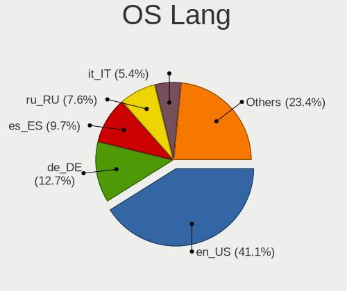

| Lang  | Computers | Percent |
|-------|-----------|---------|
| en_US | 59        | 45.04%  |
| de_DE | 15        | 11.45%  |
| ru_RU | 13        | 9.92%   |
| es_ES | 9         | 6.87%   |
| it_IT | 8         | 6.11%   |
| fr_FR | 6         | 4.58%   |
| pl_PL | 3         | 2.29%   |
| tr_TR | 2         | 1.53%   |
| pt_BR | 2         | 1.53%   |
| nl_NL | 2         | 1.53%   |
| fi_FI | 2         | 1.53%   |
| de_CH | 2         | 1.53%   |
| pt_PT | 1         | 0.76%   |
| hu_HU | 1         | 0.76%   |
| fr_CA | 1         | 0.76%   |
| en_GB | 1         | 0.76%   |
| en_AU | 1         | 0.76%   |
| da_DK | 1         | 0.76%   |
| cs_CZ | 1         | 0.76%   |
| ar_EG | 1         | 0.76%   |

Boot Mode
---------

EFI or BIOS

| Mode | Computers | Percent |
|------|-----------|---------|
| BIOS | 115       | 87.79%  |
| EFI  | 16        | 12.21%  |

Filesystem
----------

Type of filesystem

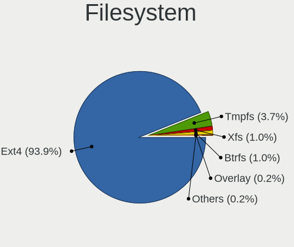

| Type    | Computers | Percent |
|---------|-----------|---------|
| Ext4    | 118       | 89.39%  |
| Tmpfs   | 9         | 6.82%   |
| Btrfs   | 3         | 2.27%   |
| Overlay | 1         | 0.76%   |
| Ext2    | 1         | 0.76%   |

Part. scheme
------------

Scheme of partitioning

| Type    | Computers | Percent |
|---------|-----------|---------|
| Unknown | 102       | 77.86%  |
| GPT     | 22        | 16.79%  |
| MBR     | 7         | 5.34%   |

Dual Boot with Linux/BSD
------------------------

Hosting more than one Linux/BSD

| Dual boot | Computers | Percent |
|-----------|-----------|---------|
| No        | 128       | 97.71%  |
| Yes       | 3         | 2.29%   |

Dual Boot (Win)
---------------

Hosting Linux and Windows

| Dual boot | Computers | Percent |
|-----------|-----------|---------|
| No        | 119       | 90.84%  |
| Yes       | 12        | 9.16%   |

Board
-----

Vendor
------

Motherboard manufacturer

| Name                 | Computers | Percent |
|----------------------|-----------|---------|
| Apple                | 25        | 19.08%  |
| Dell                 | 19        | 14.5%   |
| ASUSTek Computer     | 17        | 12.98%  |
| Hewlett-Packard      | 16        | 12.21%  |
| Lenovo               | 14        | 10.69%  |
| Acer                 | 8         | 6.11%   |
| Gigabyte Technology  | 3         | 2.29%   |
| Fujitsu              | 3         | 2.29%   |
| Samsung Electronics  | 2         | 1.53%   |
| MSI                  | 2         | 1.53%   |
| MACHINIST            | 2         | 1.53%   |
| HUAWEI               | 2         | 1.53%   |
| ASRock               | 2         | 1.53%   |
| Alienware            | 2         | 1.53%   |
| UMAX                 | 1         | 0.76%   |
| Timi                 | 1         | 0.76%   |
| THTF                 | 1         | 0.76%   |
| TECNO Mobile Limited | 1         | 0.76%   |
| Sony                 | 1         | 0.76%   |
| Positivo             | 1         | 0.76%   |
| Microsoft            | 1         | 0.76%   |
| Medion               | 1         | 0.76%   |
| Intel                | 1         | 0.76%   |
| HONOR                | 1         | 0.76%   |
| HC Technology.       | 1         | 0.76%   |
| Google               | 1         | 0.76%   |
| ECS                  | 1         | 0.76%   |
| Unknown              | 1         | 0.76%   |

Model
-----

Motherboard model

| Name                                     | Computers | Percent |
|------------------------------------------|-----------|---------|
| Apple MacBookPro7,1                      | 3         | 2.29%   |
| ASUS PRIME A320M-K                       | 2         | 1.53%   |
| Apple MacBookPro6,2                      | 2         | 1.53%   |
| Apple MacBookPro11,1                     | 2         | 1.53%   |
| Apple iMac19,1                           | 2         | 1.53%   |
| Apple iMac12,2                           | 2         | 1.53%   |
| UMAX VisionBook 14Wr Plus                | 1         | 0.76%   |
| Timi Redmi G 2022                        | 1         | 0.76%   |
| THTF WUJIE 14                            | 1         | 0.76%   |
| TECNO Mobile Limited MEGABOOK T14TA      | 1         | 0.76%   |
| Sony SVE11115ELW                         | 1         | 0.76%   |
| Samsung RF510/RF410/RF710                | 1         | 0.76%   |
| Samsung RC410/RC510/RC710                | 1         | 0.76%   |
| Positivo C4128A-15                       | 1         | 0.76%   |
| MSI MS-7A63                              | 1         | 0.76%   |
| MSI MS-7756                              | 1         | 0.76%   |
| Microsoft Surface Book 2                 | 1         | 0.76%   |
| Medion E11202                            | 1         | 0.76%   |
| MACHINIST X79 Z9-D7 V1.2                 | 1         | 0.76%   |
| MACHINIST H81M-PRO S1 V2.0               | 1         | 0.76%   |
| Lenovo Yoga 910-13IKB 80VF               | 1         | 0.76%   |
| Lenovo ThinkPad X1 Carbon 2nd 20A8S2G103 | 1         | 0.76%   |
| Lenovo ThinkPad T480 20L6S3ED18          | 1         | 0.76%   |
| Lenovo ThinkPad T470 20JNS08H00          | 1         | 0.76%   |
| Lenovo ThinkPad T440p 20AN0069US         | 1         | 0.76%   |
| Lenovo ThinkPad T14s Gen 2i 20WM01SCUS   | 1         | 0.76%   |
| Lenovo ThinkPad P51s 20HBCTO1WW          | 1         | 0.76%   |
| Lenovo ThinkPad L440 20AT0030MD          | 1         | 0.76%   |
| Lenovo IdeaPad 5 14ITL05 82FE            | 1         | 0.76%   |
| Lenovo IdeaPad 330S-15IKB 81F5           | 1         | 0.76%   |
| Lenovo IdeaPad 320-15AST 80XV            | 1         | 0.76%   |
| Lenovo IdeaPad 110-14ISK 80UC            | 1         | 0.76%   |
| Lenovo IdeaCentre 310S-08ASR 90G90073GE  | 1         | 0.76%   |
| Lenovo B570 1068FRG                      | 1         | 0.76%   |
| Intel Nobilis                            | 1         | 0.76%   |
| HUAWEI NBLK-WAX9X                        | 1         | 0.76%   |
| HUAWEI BOD-WXX9                          | 1         | 0.76%   |
| HONOR NMH-WDX9                           | 1         | 0.76%   |
| HP ProBook 6545b                         | 1         | 0.76%   |
| HP Pavilion x360 Convertible 15-er0xxx   | 1         | 0.76%   |

Model Family
------------

Motherboard model prefix

| Name                          | Computers | Percent |
|-------------------------------|-----------|---------|
| Lenovo ThinkPad               | 7         | 5.34%   |
| HP Pavilion                   | 5         | 3.82%   |
| HP EliteBook                  | 5         | 3.82%   |
| Dell Latitude                 | 5         | 3.82%   |
| Acer Aspire                   | 5         | 3.82%   |
| Lenovo IdeaPad                | 4         | 3.05%   |
| Dell OptiPlex                 | 4         | 3.05%   |
| ASUS VivoBook                 | 3         | 2.29%   |
| Apple MacBookPro7             | 3         | 2.29%   |
| Apple iMac12                  | 3         | 2.29%   |
| HP Compaq                     | 2         | 1.53%   |
| Fujitsu LIFEBOOK              | 2         | 1.53%   |
| Dell Vostro                   | 2         | 1.53%   |
| Dell Precision                | 2         | 1.53%   |
| Dell Inspiron                 | 2         | 1.53%   |
| ASUS Zenbook                  | 2         | 1.53%   |
| ASUS ROG                      | 2         | 1.53%   |
| ASUS PRIME                    | 2         | 1.53%   |
| Apple MacBookPro6             | 2         | 1.53%   |
| Apple MacBookPro5             | 2         | 1.53%   |
| Apple MacBookPro11            | 2         | 1.53%   |
| Apple iMac19                  | 2         | 1.53%   |
| UMAX VisionBook               | 1         | 0.76%   |
| Timi Redmi                    | 1         | 0.76%   |
| THTF WUJIE                    | 1         | 0.76%   |
| TECNO Mobile Limited MEGABOOK | 1         | 0.76%   |
| Sony SVE11115ELW              | 1         | 0.76%   |
| Samsung RF510                 | 1         | 0.76%   |
| Samsung RC410                 | 1         | 0.76%   |
| Positivo C4128A-15            | 1         | 0.76%   |
| MSI MS-7A63                   | 1         | 0.76%   |
| MSI MS-7756                   | 1         | 0.76%   |
| Microsoft Surface             | 1         | 0.76%   |
| Medion E11202                 | 1         | 0.76%   |
| MACHINIST X79                 | 1         | 0.76%   |
| MACHINIST H81M-PRO            | 1         | 0.76%   |
| Lenovo Yoga                   | 1         | 0.76%   |
| Lenovo IdeaCentre             | 1         | 0.76%   |
| Lenovo B570                   | 1         | 0.76%   |
| Intel Nobilis                 | 1         | 0.76%   |

MFG Year
--------

Motherboard manufacture year

| Year | Computers | Percent |
|------|-----------|---------|
| 2021 | 13        | 9.92%   |
| 2014 | 11        | 8.4%    |
| 2010 | 11        | 8.4%    |
| 2018 | 10        | 7.63%   |
| 2012 | 10        | 7.63%   |
| 2009 | 10        | 7.63%   |
| 2013 | 9         | 6.87%   |
| 2011 | 9         | 6.87%   |
| 2020 | 7         | 5.34%   |
| 2016 | 7         | 5.34%   |
| 2023 | 6         | 4.58%   |
| 2019 | 6         | 4.58%   |
| 2022 | 5         | 3.82%   |
| 2017 | 5         | 3.82%   |
| 2015 | 5         | 3.82%   |
| 2008 | 4         | 3.05%   |
| 2007 | 3         | 2.29%   |

Form Factor
-----------

Physical design of the computer

| Name        | Computers | Percent |
|-------------|-----------|---------|
| Notebook    | 83        | 63.36%  |
| Desktop     | 32        | 24.43%  |
| All in one  | 9         | 6.87%   |
| Convertible | 3         | 2.29%   |
| Mini pc     | 3         | 2.29%   |
| Tablet      | 1         | 0.76%   |

Secure Boot
-----------

Enabled or disabled

| State    | Computers | Percent |
|----------|-----------|---------|
| Disabled | 127       | 96.95%  |
| Enabled  | 4         | 3.05%   |

Coreboot
--------

Have coreboot on board

| Used | Computers | Percent |
|------|-----------|---------|
| No   | 130       | 99.24%  |
| Yes  | 1         | 0.76%   |

RAM Size
--------

Total RAM memory

| Size in GB  | Computers | Percent |
|-------------|-----------|---------|
| 4.01-8.0    | 47        | 35.61%  |
| 16.01-24.0  | 29        | 21.97%  |
| 3.01-4.0    | 24        | 18.18%  |
| 8.01-16.0   | 12        | 9.09%   |
| 32.01-64.0  | 8         | 6.06%   |
| 2.01-3.0    | 4         | 3.03%   |
| 64.01-256.0 | 3         | 2.27%   |
| 1.01-2.0    | 3         | 2.27%   |
| 24.01-32.0  | 2         | 1.52%   |

RAM Used
--------

Used RAM memory

| Used GB   | Computers | Percent |
|-----------|-----------|---------|
| 2.01-3.0  | 48        | 35.04%  |
| 3.01-4.0  | 31        | 22.63%  |
| 1.01-2.0  | 30        | 21.9%   |
| 4.01-8.0  | 21        | 15.33%  |
| 0.51-1.0  | 4         | 2.92%   |
| 8.01-16.0 | 3         | 2.19%   |

Total Drives
------------

Number of drives on board

| Drives | Computers | Percent |
|--------|-----------|---------|
| 1      | 77        | 57.89%  |
| 2      | 49        | 36.84%  |
| 3      | 6         | 4.51%   |
| 4      | 1         | 0.75%   |

Has CD-ROM
----------

Has CD-ROM on board

| Presented | Computers | Percent |
|-----------|-----------|---------|
| No        | 87        | 65.91%  |
| Yes       | 45        | 34.09%  |

Has Ethernet
------------

Has Ethernet on board

| Presented | Computers | Percent |
|-----------|-----------|---------|
| Yes       | 110       | 83.97%  |
| No        | 21        | 16.03%  |

Has WiFi
--------

Has WiFi module

| Presented | Computers | Percent |
|-----------|-----------|---------|
| Yes       | 114       | 87.02%  |
| No        | 17        | 12.98%  |

Has Bluetooth
-------------

Has Bluetooth module

| Presented | Computers | Percent |
|-----------|-----------|---------|
| Yes       | 93        | 70.99%  |
| No        | 38        | 29.01%  |

Location
--------

Country
-------

Geographic location (country)

| Country                | Computers | Percent |
|------------------------|-----------|---------|
| USA                    | 23        | 17.56%  |
| Germany                | 13        | 9.92%   |
| Russia                 | 12        | 9.16%   |
| Italy                  | 8         | 6.11%   |
| Canada                 | 6         | 4.58%   |
| Brazil                 | 5         | 3.82%   |
| Switzerland            | 4         | 3.05%   |
| Netherlands            | 4         | 3.05%   |
| Mexico                 | 4         | 3.05%   |
| France                 | 4         | 3.05%   |
| Poland                 | 3         | 2.29%   |
| Austria                | 3         | 2.29%   |
| Argentina              | 3         | 2.29%   |
| UK                     | 2         | 1.53%   |
| Turkey                 | 2         | 1.53%   |
| Spain                  | 2         | 1.53%   |
| Morocco                | 2         | 1.53%   |
| Israel                 | 2         | 1.53%   |
| Greece                 | 2         | 1.53%   |
| Finland                | 2         | 1.53%   |
| Bosnia and Herzegovina | 2         | 1.53%   |
| Belarus                | 2         | 1.53%   |
| Australia              | 2         | 1.53%   |
| Ukraine                | 1         | 0.76%   |
| Thailand               | 1         | 0.76%   |
| Sweden                 | 1         | 0.76%   |
| Slovakia               | 1         | 0.76%   |
| Romania                | 1         | 0.76%   |
| Puerto Rico            | 1         | 0.76%   |
| Portugal               | 1         | 0.76%   |
| Malaysia               | 1         | 0.76%   |
| Kazakhstan             | 1         | 0.76%   |
| India                  | 1         | 0.76%   |
| Hungary                | 1         | 0.76%   |
| Ecuador                | 1         | 0.76%   |
| Denmark                | 1         | 0.76%   |
| Czechia                | 1         | 0.76%   |
| Colombia               | 1         | 0.76%   |
| Chile                  | 1         | 0.76%   |
| Belgium                | 1         | 0.76%   |

City
----

Geographic location (city)

| City              | Computers | Percent |
|-------------------|-----------|---------|
| Moscow            | 5         | 3.73%   |
| Munich            | 3         | 2.24%   |
| Warsaw            | 2         | 1.49%   |
| Vienna            | 2         | 1.49%   |
| Sarajevo          | 2         | 1.49%   |
| Petah Tikva       | 2         | 1.49%   |
| Bremen            | 2         | 1.49%   |
| Zurich            | 1         | 0.75%   |
| Zhodzina          | 1         | 0.75%   |
| Zamora            | 1         | 0.75%   |
| Yuzhno-Sakhalinsk | 1         | 0.75%   |
| Yerevan           | 1         | 0.75%   |
| Yekaterinburg     | 1         | 0.75%   |
| Vitebsk           | 1         | 0.75%   |
| Victoria          | 1         | 0.75%   |
| Van Vleck         | 1         | 0.75%   |
| Valby             | 1         | 0.75%   |
| Ummendorf         | 1         | 0.75%   |
| Turku             | 1         | 0.75%   |
| Toronto           | 1         | 0.75%   |
| Tahitotfalu       | 1         | 0.75%   |
| Staten Island     | 1         | 0.75%   |
| Sohlde            | 1         | 0.75%   |
| Sochi             | 1         | 0.75%   |
| Sebastian         | 1         | 0.75%   |
| Savannah          | 1         | 0.75%   |
| Sainte-Therese    | 1         | 0.75%   |
| Saint-Lambert     | 1         | 0.75%   |
| Rostock           | 1         | 0.75%   |
| Rome              | 1         | 0.75%   |
| Rio Grande        | 1         | 0.75%   |
| Resistencia       | 1         | 0.75%   |
| Redding           | 1         | 0.75%   |
| Puebla City       | 1         | 0.75%   |
| Prague            | 1         | 0.75%   |
| Ponte de Lima     | 1         | 0.75%   |
| Phoenix           | 1         | 0.75%   |
| Petaling Jaya     | 1         | 0.75%   |
| Pelion            | 1         | 0.75%   |
| Ptrai           | 1         | 0.75%   |

Drives
------

Drive Vendor
------------

Hard drive vendors

| Vendor                       | Computers | Drives | Percent |
|------------------------------|-----------|--------|---------|
| Samsung Electronics          | 27        | 31     | 14.75%  |
| WDC                          | 20        | 26     | 10.93%  |
| Seagate                      | 17        | 19     | 9.29%   |
| Toshiba                      | 10        | 12     | 5.46%   |
| Apple                        | 10        | 10     | 5.46%   |
| Sandisk                      | 9         | 11     | 4.92%   |
| Kingston                     | 7         | 9      | 3.83%   |
| Hitachi                      | 7         | 7      | 3.83%   |
| Unknown                      | 6         | 9      | 3.28%   |
| Intel                        | 6         | 6      | 3.28%   |
| Crucial                      | 6         | 7      | 3.28%   |
| SK hynix                     | 5         | 5      | 2.73%   |
| KIOXIA                       | 4         | 4      | 2.19%   |
| HGST                         | 4         | 4      | 2.19%   |
| China                        | 4         | 4      | 2.19%   |
| Gigabyte Technology          | 3         | 3      | 1.64%   |
| XrayDisk                     | 2         | 3      | 1.09%   |
| Transcend                    | 2         | 3      | 1.09%   |
| SPCC                         | 2         | 2      | 1.09%   |
| MAXIO Technology (Hangzhou)  | 2         | 3      | 1.09%   |
| Fanxiang                     | 2         | 2      | 1.09%   |
| A-DATA Technology            | 2         | 2      | 1.09%   |
| Unknown                      | 2         | 3      | 1.09%   |
| TS-RDF2                      | 1         | 1      | 0.55%   |
| Timetec                      | 1         | 1      | 0.55%   |
| SSK                          | 1         | 3      | 0.55%   |
| Shenzhen Longsys Electronics | 1         | 1      | 0.55%   |
| PNY                          | 1         | 1      | 0.55%   |
| Plextor                      | 1         | 1      | 0.55%   |
| Phison Electronics           | 1         | 1      | 0.55%   |
| Patriot                      | 1         | 1      | 0.55%   |
| NGFF                         | 1         | 1      | 0.55%   |
| Netac                        | 1         | 1      | 0.55%   |
| Micron/Crucial Technology    | 1         | 2      | 0.55%   |
| Micron Technology            | 1         | 1      | 0.55%   |
| Maxtor                       | 1         | 1      | 0.55%   |
| LS                           | 1         | 1      | 0.55%   |
| LITEON                       | 1         | 1      | 0.55%   |
| Lite-On Technology           | 1         | 1      | 0.55%   |
| KIOXIA-EXCERIA               | 1         | 2      | 0.55%   |

Drive Model
-----------

Hard drive models

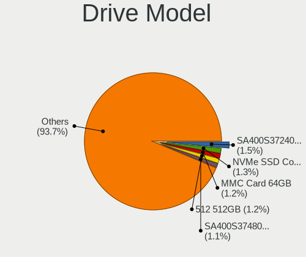

| Model                                              | Computers | Percent |
|----------------------------------------------------|-----------|---------|
| Seagate ST500DM002-1BD142 500GB                    | 4         | 2.08%   |
| Samsung NVMe SSD Controller SM981/PM981/PM983 1TB  | 4         | 2.08%   |
| Unknown MMC Card  64GB                             | 3         | 1.56%   |
| WDC WDS240G2G0A-00JH30 240GB SSD                   | 2         | 1.04%   |
| Seagate ST500LT012-1DG142 500GB                    | 2         | 1.04%   |
| Sandisk WD_BLACK SN770 1TB                         | 2         | 1.04%   |
| Samsung SSD 860 EVO 500GB                          | 2         | 1.04%   |
| Samsung SSD 850 EVO 500GB                          | 2         | 1.04%   |
| Samsung MZVL4512HBLU-00BTW 512GB                   | 2         | 1.04%   |
| MAXIO (Hangzhou) NVMe SSD Controller MAP1202 512GB | 2         | 1.04%   |
| Kingston SUV500MS480G 480GB SSD                    | 2         | 1.04%   |
| Kingston SA400S37120G 120GB SSD                    | 2         | 1.04%   |
| HGST HTS721010A9E630 1TB                           | 2         | 1.04%   |
| HGST HTS545050A7E680 500GB                         | 2         | 1.04%   |
| Gigabyte GP-GSTFS31120GNTD 120GB SSD               | 2         | 1.04%   |
| Crucial CT1000MX500SSD1 1TB                        | 2         | 1.04%   |
| China SSD 128GB                                    | 2         | 1.04%   |
| Apple HDD ST1000DM003 1TB                          | 2         | 1.04%   |
| Apple HDD HTS541010A9E662 1TB                      | 2         | 1.04%   |
| Unknown                                            | 2         | 1.04%   |
| XrayDisk 512GB SSD                                 | 1         | 0.52%   |
| XrayDisk 256GB SSD                                 | 1         | 0.52%   |
| WDC WDS240G2G0B-00EPW0 240GB SSD                   | 1         | 0.52%   |
| WDC WDS200T2B0A-00SM50 2TB SSD                     | 1         | 0.52%   |
| WDC WDBNCE5000PNC 500GB SSD                        | 1         | 0.52%   |
| WDC WD800JD-00MSA1 80GB                            | 1         | 0.52%   |
| WDC WD6400BPVT-22HXZT3 640GB                       | 1         | 0.52%   |
| WDC WD5000LPVX-00V0TT0 500GB                       | 1         | 0.52%   |
| WDC WD5000BPVT-24HXZT3 500GB                       | 1         | 0.52%   |
| WDC WD50 00AZLX-60K2TA0 500GB                      | 1         | 0.52%   |
| WDC WD2500BEKT-60PVMT0 250GB                       | 1         | 0.52%   |
| WDC WD20EZRZ-22Z5HB0 2TB                           | 1         | 0.52%   |
| WDC WD1600BEKT-08PVMT1 160GB                       | 1         | 0.52%   |
| WDC WD1600AAJS-60M0A0 160GB                        | 1         | 0.52%   |
| WDC WD10SPZX-21Z10T0 1TB                           | 1         | 0.52%   |
| WDC WD10JPVX-22JC3T0 1TB                           | 1         | 0.52%   |
| WDC WD10EZEX-60WN4A0 1TB                           | 1         | 0.52%   |
| WDC WD10EZEX-22MFCA0 1TB                           | 1         | 0.52%   |
| WDC WD10EZEX-21M2NA0 1TB                           | 1         | 0.52%   |
| WDC WD10EZEX-08WN4A0 1TB                           | 1         | 0.52%   |

HDD Vendor
----------

Hard disk drive vendors

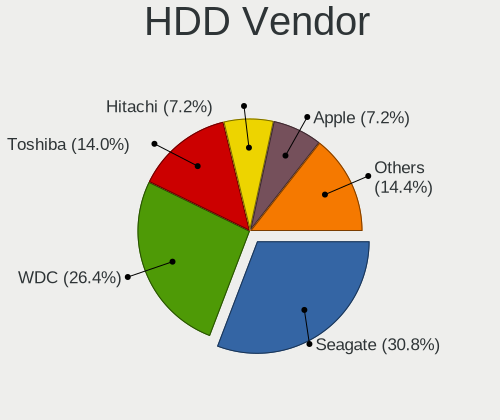

| Vendor              | Computers | Drives | Percent |
|---------------------|-----------|--------|---------|
| Seagate             | 17        | 19     | 26.98%  |
| WDC                 | 15        | 19     | 23.81%  |
| Toshiba             | 9         | 11     | 14.29%  |
| Hitachi             | 7         | 7      | 11.11%  |
| Apple               | 5         | 5      | 7.94%   |
| HGST                | 4         | 4      | 6.35%   |
| Samsung Electronics | 3         | 4      | 4.76%   |
| SSK                 | 1         | 2      | 1.59%   |
| Maxtor              | 1         | 1      | 1.59%   |
| FC-1307             | 1         | 1      | 1.59%   |

SSD Vendor
----------

Solid state drive vendors

| Vendor              | Computers | Drives | Percent |
|---------------------|-----------|--------|---------|
| Samsung Electronics | 12        | 14     | 17.39%  |
| Kingston            | 7         | 9      | 10.14%  |
| Crucial             | 6         | 7      | 8.7%    |
| WDC                 | 5         | 7      | 7.25%   |
| SanDisk             | 5         | 6      | 7.25%   |
| China               | 4         | 4      | 5.8%    |
| Apple               | 4         | 4      | 5.8%    |
| Intel               | 3         | 3      | 4.35%   |
| XrayDisk            | 2         | 3      | 2.9%    |
| Transcend           | 2         | 3      | 2.9%    |
| SPCC                | 2         | 2      | 2.9%    |
| Gigabyte Technology | 2         | 2      | 2.9%    |
| Timetec             | 1         | 1      | 1.45%   |
| SK hynix            | 1         | 1      | 1.45%   |
| PNY                 | 1         | 1      | 1.45%   |
| Plextor             | 1         | 1      | 1.45%   |
| Patriot             | 1         | 1      | 1.45%   |
| NGFF                | 1         | 1      | 1.45%   |
| Netac               | 1         | 1      | 1.45%   |
| LS                  | 1         | 1      | 1.45%   |
| LITEON              | 1         | 1      | 1.45%   |
| KIOXIA-EXCERIA      | 1         | 2      | 1.45%   |
| KingSpec            | 1         | 1      | 1.45%   |
| Intenso             | 1         | 1      | 1.45%   |
| Hewlett-Packard     | 1         | 1      | 1.45%   |
| A-DATA Technology   | 1         | 1      | 1.45%   |
| Unknown             | 1         | 1      | 1.45%   |

Drive Kind
----------

HDD or SSD

| Kind    | Computers | Drives | Percent |
|---------|-----------|--------|---------|
| SSD     | 65        | 80     | 38.46%  |
| HDD     | 57        | 73     | 33.73%  |
| NVMe    | 37        | 45     | 21.89%  |
| MMC     | 5         | 10     | 2.96%   |
| Unknown | 5         | 5      | 2.96%   |

Drive Connector
---------------

SATA, SAS, NVMe, etc.

| Type | Computers | Drives | Percent |
|------|-----------|--------|---------|
| SATA | 101       | 152    | 68.24%  |
| NVMe | 37        | 44     | 25%     |
| SAS  | 5         | 7      | 3.38%   |
| MMC  | 5         | 10     | 3.38%   |

Drive Size
----------

Size of hard drive

| Size in TB | Computers | Drives | Percent |
|------------|-----------|--------|---------|
| 0.01-0.5   | 83        | 111    | 69.75%  |
| 0.51-1.0   | 29        | 35     | 24.37%  |
| 1.01-2.0   | 5         | 5      | 4.2%    |
| 2.01-3.0   | 2         | 2      | 1.68%   |

Space Total
-----------

Amount of disk space available on the file system

| Size in GB     | Computers | Percent |
|----------------|-----------|---------|
| 101-250        | 48        | 35.82%  |
| 251-500        | 35        | 26.12%  |
| 501-1000       | 20        | 14.93%  |
| 51-100         | 13        | 9.7%    |
| 1001-2000      | 10        | 7.46%   |
| 2001-3000      | 3         | 2.24%   |
| More than 3000 | 2         | 1.49%   |
| 21-50          | 2         | 1.49%   |
| 1-20           | 1         | 0.75%   |

Space Used
----------

Amount of used disk space

| Used GB   | Computers | Percent |
|-----------|-----------|---------|
| 1-20      | 59        | 44.03%  |
| 21-50     | 41        | 30.6%   |
| 251-500   | 9         | 6.72%   |
| 51-100    | 9         | 6.72%   |
| 101-250   | 7         | 5.22%   |
| 1001-2000 | 4         | 2.99%   |
| 501-1000  | 4         | 2.99%   |
| 2001-3000 | 1         | 0.75%   |

Malfunc. Drives
---------------

Drive models with a malfunction

| Model                       | Computers | Drives | Percent |
|-----------------------------|-----------|--------|---------|
| Seagate ST3250312AS 250GB   | 1         | 1      | 25%     |
| Seagate ST3160318AS 160GB   | 1         | 1      | 25%     |
| LS 128GB M300 SSD           | 1         | 1      | 25%     |
| Crucial CT240M500SSD3 240GB | 1         | 1      | 25%     |

Malfunc. Drive Vendor
---------------------

Vendors of faulty drives

| Vendor  | Computers | Drives | Percent |
|---------|-----------|--------|---------|
| Seagate | 2         | 2      | 50%     |
| LS      | 1         | 1      | 25%     |
| Crucial | 1         | 1      | 25%     |

Malfunc. HDD Vendor
-------------------

Vendors of faulty HDD drives

| Vendor  | Computers | Drives | Percent |
|---------|-----------|--------|---------|
| Seagate | 2         | 2      | 100%    |

Malfunc. Drive Kind
-------------------

Kinds of faulty drives

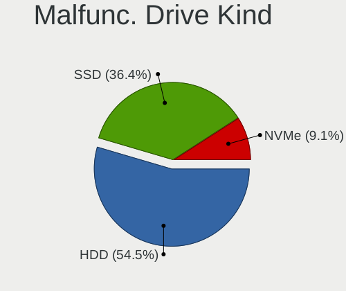

| Kind | Computers | Drives | Percent |
|------|-----------|--------|---------|
| SSD  | 2         | 2      | 50%     |
| HDD  | 2         | 2      | 50%     |

Failed Drives
-------------

Failed drive models

Zero info for selected period =(

Failed Drive Vendor
-------------------

Failed drive vendors

Zero info for selected period =(

Drive Status
------------

Number of failed and malfunc. drives

| Status   | Computers | Drives | Percent |
|----------|-----------|--------|---------|
| Detected | 111       | 180    | 82.84%  |
| Works    | 19        | 29     | 14.18%  |
| Malfunc  | 4         | 4      | 2.99%   |

Storage controller
------------------

Storage Vendor
--------------

Storage controller vendors

| Vendor                       | Computers | Percent |
|------------------------------|-----------|---------|
| Intel                        | 92        | 59.74%  |
| Samsung Electronics          | 16        | 10.39%  |
| AMD                          | 14        | 9.09%   |
| Nvidia                       | 8         | 5.19%   |
| SK hynix                     | 4         | 2.6%    |
| SanDisk                      | 4         | 2.6%    |
| KIOXIA                       | 4         | 2.6%    |
| Phison Electronics           | 2         | 1.3%    |
| MAXIO Technology (Hangzhou)  | 2         | 1.3%    |
| Toshiba America Info Systems | 1         | 0.65%   |
| Shenzhen Longsys Electronics | 1         | 0.65%   |
| Micron/Crucial Technology    | 1         | 0.65%   |
| Micron Technology            | 1         | 0.65%   |
| Lite-On Technology           | 1         | 0.65%   |
| Kingston Technology Company  | 1         | 0.65%   |
| JMicron Technology           | 1         | 0.65%   |
| ADATA Technology             | 1         | 0.65%   |

Storage Model
-------------

Storage controller models

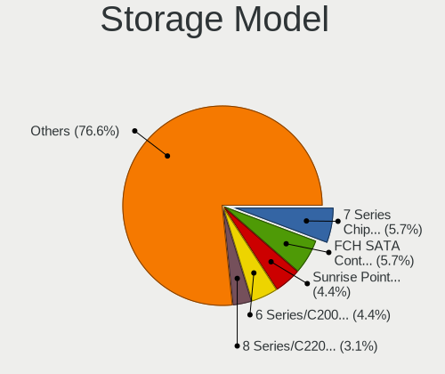

| Model                                                                          | Computers | Percent |
|--------------------------------------------------------------------------------|-----------|---------|
| AMD FCH SATA Controller [AHCI mode]                                            | 12        | 6.98%   |
| Intel 8 Series/C220 Series Chipset Family 6-port SATA Controller 1 [AHCI mode] | 6         | 3.49%   |
| Intel 8 Series SATA Controller 1 [AHCI mode]                                   | 6         | 3.49%   |
| Intel 7 Series Chipset Family 6-port SATA Controller [AHCI mode]               | 6         | 3.49%   |
| Samsung NVMe SSD Controller SM981/PM981/PM983                                  | 5         | 2.91%   |
| Intel Sunrise Point-LP SATA Controller [AHCI mode]                             | 5         | 2.91%   |
| Intel 82801 Mobile SATA Controller [RAID mode]                                 | 5         | 2.91%   |
| Intel 6 Series/C200 Series Chipset Family 6 port Desktop SATA AHCI Controller  | 5         | 2.91%   |
| Nvidia MCP89 SATA Controller (AHCI mode)                                       | 4         | 2.33%   |
| Nvidia MCP79 AHCI Controller                                                   | 4         | 2.33%   |
| Intel Cannon Lake PCH SATA AHCI Controller                                     | 4         | 2.33%   |
| Intel 7 Series/C210 Series Chipset Family 6-port SATA Controller [AHCI mode]   | 4         | 2.33%   |
| Intel 5 Series/3400 Series Chipset 4 port SATA AHCI Controller                 | 4         | 2.33%   |
| KIOXIA NVMe SSD Controller BG4 (DRAM-less)                                     | 3         | 1.74%   |
| Intel SATA Controller [RAID mode]                                              | 3         | 1.74%   |
| Intel Q170/Q150/B150/H170/H110/Z170/CM236 Chipset SATA Controller [AHCI Mode]  | 3         | 1.74%   |
| Intel NM10/ICH7 Family SATA Controller [IDE mode]                              | 3         | 1.74%   |
| Intel Celeron/Pentium Silver Processor SATA Controller                         | 3         | 1.74%   |
| Intel 82801G (ICH7 Family) IDE Controller                                      | 3         | 1.74%   |
| SanDisk WD Black SN770 / PC SN740 256GB / PC SN560 (DRAM-less) NVMe SSD        | 2         | 1.16%   |
| Samsung S4LN053X01 AHCI SSD Controller(Apple slot)                             | 2         | 1.16%   |
| Samsung NVMe SSD Controller SM961/PM961/SM963                                  | 2         | 1.16%   |
| Samsung NVMe SSD Controller PM9B1 (DRAM-less)                                  | 2         | 1.16%   |
| Samsung NVMe SSD Controller 980 (DRAM-less)                                    | 2         | 1.16%   |
| Phison PS5013-E13 PCIe3 NVMe Controller (DRAM-less)                            | 2         | 1.16%   |
| MAXIO (Hangzhou) NVMe SSD Controller MAP1202 (DRAM-less)                       | 2         | 1.16%   |
| Intel Wildcat Point-LP SATA Controller [AHCI Mode]                             | 2         | 1.16%   |
| Intel Volume Management Device NVMe RAID Controller                            | 2         | 1.16%   |
| Intel Tiger Lake-LP SATA Controller                                            | 2         | 1.16%   |
| Intel SSD 670p Series [Keystone Harbor]                                        | 2         | 1.16%   |
| Intel 9 Series Chipset Family SATA Controller [AHCI Mode]                      | 2         | 1.16%   |
| Intel 82801JI (ICH10 Family) 4 port SATA IDE Controller #1                     | 2         | 1.16%   |
| Intel 82801JI (ICH10 Family) 2 port SATA IDE Controller #2                     | 2         | 1.16%   |
| Intel 82801IBM/IEM (ICH9M/ICH9M-E) 4 port SATA Controller [AHCI mode]          | 2         | 1.16%   |
| Intel 82801HM/HEM (ICH8M/ICH8M-E) SATA Controller [AHCI mode]                  | 2         | 1.16%   |
| Intel 82801HM/HEM (ICH8M/ICH8M-E) IDE Controller                               | 2         | 1.16%   |
| AMD FCH SATA Controller D                                                      | 2         | 1.16%   |
| Toshiba America Info Systems XG6 NVMe SSD Controller                           | 1         | 0.58%   |
| SK hynix PC611 NVMe Solid State Drive                                          | 1         | 0.58%   |
| SK hynix Gold P31/BC711/PC711 NVMe Solid State Drive                           | 1         | 0.58%   |

Storage Kind
------------

Kind of storage controller (IDE, SATA, NVMe, SAS, ...)

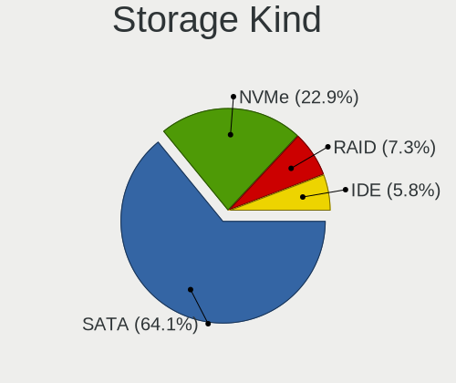

| Kind | Computers | Percent |
|------|-----------|---------|
| SATA | 94        | 60.26%  |
| NVMe | 37        | 23.72%  |
| IDE  | 14        | 8.97%   |
| RAID | 11        | 7.05%   |

Processor
---------

CPU Vendor
----------

Processor vendors

| Vendor | Computers | Percent |
|--------|-----------|---------|
| Intel  | 111       | 84.73%  |
| AMD    | 20        | 15.27%  |

CPU Model
---------

Processor models

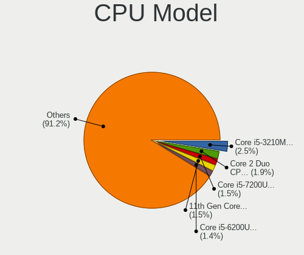

| Model                                         | Computers | Percent |
|-----------------------------------------------|-----------|---------|
| Intel Core 2 Duo CPU P8600 @ 2.40GHz          | 4         | 3.05%   |
| Intel Core i5-4210U CPU @ 1.70GHz             | 3         | 2.29%   |
| AMD Ryzen 5 5500U with Radeon Graphics        | 3         | 2.29%   |
| Intel Core i7-7700HQ CPU @ 2.80GHz            | 2         | 1.53%   |
| Intel Core i7-4600U CPU @ 2.10GHz             | 2         | 1.53%   |
| Intel Core i5-6300U CPU @ 2.40GHz             | 2         | 1.53%   |
| Intel Core i5-4590 CPU @ 3.30GHz              | 2         | 1.53%   |
| Intel Core i5-3320M CPU @ 2.60GHz             | 2         | 1.53%   |
| Intel Core i5-3210M CPU @ 2.50GHz             | 2         | 1.53%   |
| Intel Core i5-2400 CPU @ 3.10GHz              | 2         | 1.53%   |
| Intel Core i5 CPU M 520 @ 2.40GHz             | 2         | 1.53%   |
| Intel Core 2 Duo CPU P7550 @ 2.26GHz          | 2         | 1.53%   |
| Intel 11th Gen Core i5-1135G7 @ 2.40GHz       | 2         | 1.53%   |
| AMD Ryzen 5 3500U with Radeon Vega Mobile Gfx | 2         | 1.53%   |
| AMD Ryzen 3 2200G with Radeon Vega Graphics   | 2         | 1.53%   |
| Intel Xeon W-11855M CPU @ 3.20GHz             | 1         | 0.76%   |
| Intel Xeon E-2224G CPU @ 3.50GHz              | 1         | 0.76%   |
| Intel Xeon CPU W3540 @ 2.93GHz                | 1         | 0.76%   |
| Intel Xeon CPU E5-2643 0 @ 3.30GHz            | 1         | 0.76%   |
| Intel Pentium Dual-Core CPU E5700 @ 3.00GHz   | 1         | 0.76%   |
| Intel Pentium Dual-Core CPU E5400 @ 2.70GHz   | 1         | 0.76%   |
| Intel Pentium Dual CPU E2160 @ 1.80GHz        | 1         | 0.76%   |
| Intel Pentium CPU B980 @ 2.40GHz              | 1         | 0.76%   |
| Intel Pentium CPU B950 @ 2.10GHz              | 1         | 0.76%   |
| Intel Pentium CPU 987 @ 1.50GHz               | 1         | 0.76%   |
| Intel Core m3-6Y30 CPU @ 0.90GHz              | 1         | 0.76%   |
| Intel Core i9-9900K CPU @ 3.60GHz             | 1         | 0.76%   |
| Intel Core i7-8700K CPU @ 3.70GHz             | 1         | 0.76%   |
| Intel Core i7-8650U CPU @ 1.90GHz             | 1         | 0.76%   |
| Intel Core i7-8550U CPU @ 1.80GHz             | 1         | 0.76%   |
| Intel Core i7-7700 CPU @ 3.60GHz              | 1         | 0.76%   |
| Intel Core i7-7600U CPU @ 2.80GHz             | 1         | 0.76%   |
| Intel Core i7-6700K CPU @ 4.00GHz             | 1         | 0.76%   |
| Intel Core i7-6700 CPU @ 3.40GHz              | 1         | 0.76%   |
| Intel Core i7-4800MQ CPU @ 2.70GHz            | 1         | 0.76%   |
| Intel Core i7-4770 CPU @ 3.40GHz              | 1         | 0.76%   |
| Intel Core i7-4712MQ CPU @ 2.30GHz            | 1         | 0.76%   |
| Intel Core i7-4578U CPU @ 3.00GHz             | 1         | 0.76%   |
| Intel Core i7-3770S CPU @ 3.10GHz             | 1         | 0.76%   |
| Intel Core i7-2600 CPU @ 3.40GHz              | 1         | 0.76%   |

CPU Model Family
----------------

Processor model prefix

| Model                   | Computers | Percent |
|-------------------------|-----------|---------|
| Intel Core i5           | 40        | 30.53%  |
| Intel Core i7           | 20        | 15.27%  |
| Intel Core 2 Duo        | 13        | 9.92%   |
| Other                   | 10        | 7.63%   |
| Intel Core i3           | 8         | 6.11%   |
| AMD Ryzen 5             | 8         | 6.11%   |
| Intel Celeron           | 5         | 3.82%   |
| Intel Xeon              | 4         | 3.05%   |
| Intel Pentium           | 3         | 2.29%   |
| Intel Pentium Dual-Core | 2         | 1.53%   |
| Intel Core 2 Quad       | 2         | 1.53%   |
| AMD Ryzen 7             | 2         | 1.53%   |
| AMD Ryzen 3             | 2         | 1.53%   |
| Intel Pentium Dual      | 1         | 0.76%   |
| Intel Core m3           | 1         | 0.76%   |
| Intel Core i9           | 1         | 0.76%   |
| Intel Celeron Dual-Core | 1         | 0.76%   |
| Intel Atom              | 1         | 0.76%   |
| AMD Turion II Dual-Core | 1         | 0.76%   |
| AMD Ryzen 9             | 1         | 0.76%   |
| AMD Ryzen 5 PRO         | 1         | 0.76%   |
| AMD FX                  | 1         | 0.76%   |
| AMD E2                  | 1         | 0.76%   |
| AMD A6                  | 1         | 0.76%   |
| AMD A4                  | 1         | 0.76%   |

CPU Cores
---------

Number of processor cores

| Number | Computers | Percent |
|--------|-----------|---------|
| 2      | 64        | 48.85%  |
| 4      | 47        | 35.88%  |
| 6      | 12        | 9.16%   |
| 8      | 5         | 3.82%   |
| 16     | 1         | 0.76%   |
| 12     | 1         | 0.76%   |
| 1      | 1         | 0.76%   |

CPU Sockets
-----------

Number of sockets

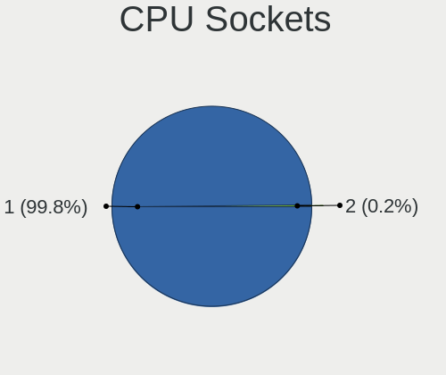

| Number | Computers | Percent |
|--------|-----------|---------|
| 1      | 131       | 100%    |

CPU Threads
-----------

Threads per core (Hyper-Threading)

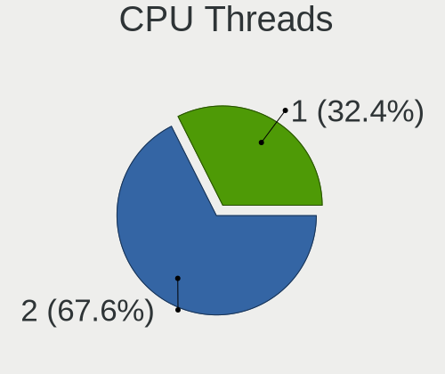

| Number | Computers | Percent |
|--------|-----------|---------|
| 2      | 80        | 61.07%  |
| 1      | 51        | 38.93%  |

CPU Op-Modes
------------

CPU Operation Modes (32-bit, 64-bit)

| Op mode        | Computers | Percent |
|----------------|-----------|---------|
| 32-bit, 64-bit | 131       | 100%    |

CPU Microcode
-------------

Microcode number

| Number     | Computers | Percent |
|------------|-----------|---------|
| Unknown    | 125       | 95.42%  |
| 0x306a9    | 1         | 0.76%   |
| 0x0a404102 | 1         | 0.76%   |
| 0x08608104 | 1         | 0.76%   |
| 0x08108109 | 1         | 0.76%   |
| 0x06006704 | 1         | 0.76%   |
| 0x05000119 | 1         | 0.76%   |

CPU Microarch
-------------

Microarchitecture

| Name             | Computers | Percent |
|------------------|-----------|---------|
| Haswell          | 19        | 14.5%   |
| Penryn           | 16        | 12.21%  |
| KabyLake         | 15        | 11.45%  |
| SandyBridge      | 12        | 9.16%   |
| IvyBridge        | 8         | 6.11%   |
| Skylake          | 7         | 5.34%   |
| TigerLake        | 6         | 4.58%   |
| Unknown          | 6         | 4.58%   |
| Zen 3            | 5         | 3.82%   |
| Westmere         | 5         | 3.82%   |
| IceLake          | 4         | 3.05%   |
| Broadwell        | 4         | 3.05%   |
| Goldmont plus    | 3         | 2.29%   |
| Core             | 3         | 2.29%   |
| Zen+             | 2         | 1.53%   |
| Zen              | 2         | 1.53%   |
| Excavator        | 2         | 1.53%   |
| CometLake        | 2         | 1.53%   |
| Zen 2            | 1         | 0.76%   |
| Steamroller      | 1         | 0.76%   |
| Silvermont       | 1         | 0.76%   |
| Nehalem          | 1         | 0.76%   |
| K10              | 1         | 0.76%   |
| Jaguar           | 1         | 0.76%   |
| Goldmont         | 1         | 0.76%   |
| Bonnell          | 1         | 0.76%   |
| Bobcat           | 1         | 0.76%   |
| Alderlake Hybrid | 1         | 0.76%   |

Graphics
--------

GPU Vendor
----------

Vendors of graphics cards

| Vendor | Computers | Percent |
|--------|-----------|---------|
| Intel  | 81        | 52.94%  |
| Nvidia | 43        | 28.1%   |
| AMD    | 29        | 18.95%  |

GPU Model
---------

Graphics card models

| Model                                                                       | Computers | Percent |
|-----------------------------------------------------------------------------|-----------|---------|
| Intel Haswell-ULT Integrated Graphics Controller                            | 10        | 6.41%   |
| Intel 2nd Generation Core Processor Family Integrated Graphics Controller   | 10        | 6.41%   |
| Nvidia MCP89 [GeForce 320M]                                                 | 4         | 2.56%   |
| Nvidia C79 [GeForce 9400M]                                                  | 4         | 2.56%   |
| Intel TigerLake-LP GT2 [Iris Xe Graphics]                                   | 4         | 2.56%   |
| Intel Skylake GT2 [HD Graphics 520]                                         | 4         | 2.56%   |
| Intel Core Processor Integrated Graphics Controller                         | 4         | 2.56%   |
| Intel 3rd Gen Core processor Graphics Controller                            | 4         | 2.56%   |
| Nvidia GT216M [GeForce GT 330M]                                             | 3         | 1.92%   |
| Nvidia GK208B [GeForce GT 710]                                              | 3         | 1.92%   |
| Intel HD Graphics 630                                                       | 3         | 1.92%   |
| Intel HD Graphics 620                                                       | 3         | 1.92%   |
| Intel GeminiLake [UHD Graphics 600]                                         | 3         | 1.92%   |
| Intel 4th Gen Core Processor Integrated Graphics Controller                 | 3         | 1.92%   |
| AMD Lucienne                                                                | 3         | 1.92%   |
| Nvidia TU117M [GeForce GTX 1650 Mobile / Max-Q]                             | 2         | 1.28%   |
| Nvidia GP107 [GeForce GTX 1050 Ti]                                          | 2         | 1.28%   |
| Nvidia GP104 [GeForce GTX 1070]                                             | 2         | 1.28%   |
| Intel Xeon E3-1200 v3/4th Gen Core Processor Integrated Graphics Controller | 2         | 1.28%   |
| Intel UHD Graphics 620                                                      | 2         | 1.28%   |
| Intel Tiger Lake-LP GT2 [UHD Graphics G4]                                   | 2         | 1.28%   |
| Intel Mobile 4 Series Chipset Integrated Graphics Controller                | 2         | 1.28%   |
| Intel HD Graphics 6000                                                      | 2         | 1.28%   |
| Intel 4 Series Chipset Integrated Graphics Controller                       | 2         | 1.28%   |
| AMD Stoney [Radeon R2/R3/R4/R5 Graphics]                                    | 2         | 1.28%   |
| AMD Picasso/Raven 2 [Radeon Vega Series / Radeon Vega Mobile Series]        | 2         | 1.28%   |
| AMD Cezanne [Radeon Vega Series / Radeon Vega Mobile Series]                | 2         | 1.28%   |
| AMD Barcelo                                                                 | 2         | 1.28%   |
| Nvidia TU117 [GeForce GTX 1650]                                             | 1         | 0.64%   |
| Nvidia TU106M [GeForce RTX 2070 Mobile / Max-Q Refresh]                     | 1         | 0.64%   |
| Nvidia GT218M [GeForce 315M]                                                | 1         | 0.64%   |
| Nvidia GP108M [GeForce MX150]                                               | 1         | 0.64%   |
| Nvidia GP108 [GeForce GT 1030]                                              | 1         | 0.64%   |
| Nvidia GP107M [GeForce GTX 1050 Mobile]                                     | 1         | 0.64%   |
| Nvidia GP106BM [GeForce GTX 1060 Mobile 6GB]                                | 1         | 0.64%   |
| Nvidia GP104 [GeForce GTX 1070 Ti]                                          | 1         | 0.64%   |
| Nvidia GM206 [GeForce GTX 960]                                              | 1         | 0.64%   |
| Nvidia GM108M [GeForce 940M]                                                | 1         | 0.64%   |
| Nvidia GM108M [GeForce 840M]                                                | 1         | 0.64%   |
| Nvidia GM108GLM [Quadro M520 Mobile]                                        | 1         | 0.64%   |

GPU Combo
---------

Combinations of graphics cards

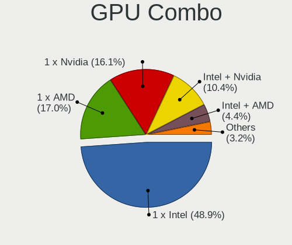

| Name           | Computers | Percent |
|----------------|-----------|---------|
| 1 x Intel      | 61        | 46.56%  |
| 1 x Nvidia     | 26        | 19.85%  |
| 1 x AMD        | 24        | 18.32%  |
| Intel + Nvidia | 14        | 10.69%  |
| Intel + AMD    | 2         | 1.53%   |
| AMD + Nvidia   | 2         | 1.53%   |
| 2 x Nvidia     | 1         | 0.76%   |
| 2 x AMD        | 1         | 0.76%   |

GPU Driver
----------

Free vs proprietary

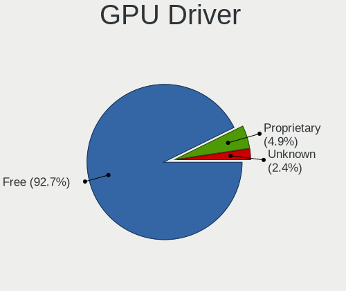

| Driver      | Computers | Percent |
|-------------|-----------|---------|
| Free        | 117       | 89.31%  |
| Proprietary | 10        | 7.63%   |
| Unknown     | 4         | 3.05%   |

GPU Memory
----------

Total video memory

| Size in GB | Computers | Percent |
|------------|-----------|---------|
| Unknown    | 118       | 90.08%  |
| 0.01-0.5   | 5         | 3.82%   |
| 3.01-4.0   | 4         | 3.05%   |
| 7.01-8.0   | 2         | 1.53%   |
| 0.51-1.0   | 2         | 1.53%   |

Monitor
-------

Monitor Vendor
--------------

Monitor vendors

| Vendor                  | Computers | Percent |
|-------------------------|-----------|---------|
| AU Optronics            | 22        | 15.94%  |
| Apple                   | 22        | 15.94%  |
| Samsung Electronics     | 15        | 10.87%  |
| LG Display              | 11        | 7.97%   |
| Chimei Innolux          | 9         | 6.52%   |
| BOE                     | 9         | 6.52%   |
| Goldstar                | 8         | 5.8%    |
| Hewlett-Packard         | 7         | 5.07%   |
| Philips                 | 4         | 2.9%    |
| Acer                    | 4         | 2.9%    |
| Dell                    | 3         | 2.17%   |
| Vizio                   | 2         | 1.45%   |
| Mi                      | 2         | 1.45%   |
| HKC                     | 2         | 1.45%   |
| BenQ                    | 2         | 1.45%   |
| TMX                     | 1         | 0.72%   |
| Skyworth                | 1         | 0.72%   |
| Sharp                   | 1         | 0.72%   |
| PANDA                   | 1         | 0.72%   |
| Panasonic               | 1         | 0.72%   |
| NEC Computers           | 1         | 0.72%   |
| MSI                     | 1         | 0.72%   |
| Medion                  | 1         | 0.72%   |
| LTM                     | 1         | 0.72%   |
| Kogan                   | 1         | 0.72%   |
| KDB                     | 1         | 0.72%   |
| Fujitsu Siemens         | 1         | 0.72%   |
| CVT                     | 1         | 0.72%   |
| CTO                     | 1         | 0.72%   |
| Chi Mei Optoelectronics | 1         | 0.72%   |
| Ancor Communications    | 1         | 0.72%   |

Monitor Model
-------------

Monitor models

| Model                                                                 | Computers | Percent |
|-----------------------------------------------------------------------|-----------|---------|
| Samsung Electronics LCD Monitor SEC5441 1366x768 344x194mm 15.5-inch  | 2         | 1.44%   |
| Samsung Electronics LCD Monitor SDC4171 2880x1800 302x189mm 14.0-inch | 2         | 1.44%   |
| LG Display LCD Monitor LGD03EA 1920x1080 309x174mm 14.0-inch          | 2         | 1.44%   |
| BOE LCD Monitor BOE0877 1920x1080 309x173mm 13.9-inch                 | 2         | 1.44%   |
| Apple LCD Monitor APP9CC3 1280x800 286x179mm 13.3-inch                | 2         | 1.44%   |
| Apple iMac APPAE25 3840x2160 597x336mm 27.0-inch                      | 2         | 1.44%   |
| Apple iMac APPA007 2560x1440 597x336mm 27.0-inch                      | 2         | 1.44%   |
| Vizio E370VL VIZ0070 1920x1080 820x461mm 37.0-inch                    | 1         | 0.72%   |
| Vizio D32f-E1 VIZ1027 1920x1080 698x392mm 31.5-inch                   | 1         | 0.72%   |
| TMX TL160ADMP11-0 TMX1601 2560x1600 345x215mm 16.0-inch               | 1         | 0.72%   |
| Skyworth CP9687 SII9687 1920x1080 708x398mm 32.0-inch                 | 1         | 0.72%   |
| Sharp LCD Monitor SHP14A8 3840x2400 288x180mm 13.4-inch               | 1         | 0.72%   |
| Samsung Electronics SyncMaster SAM0423 1920x1080                      | 1         | 0.72%   |
| Samsung Electronics SyncMaster SAM0247 1280x1024 376x301mm 19.0-inch  | 1         | 0.72%   |
| Samsung Electronics S19D300 SAM0B36 1366x768 410x230mm 18.5-inch      | 1         | 0.72%   |
| Samsung Electronics LS27A600U SAM7172 2560x1440 600x340mm 27.2-inch   | 1         | 0.72%   |
| Samsung Electronics LCD Monitor SEC5442 1440x900 367x230mm 17.1-inch  | 1         | 0.72%   |
| Samsung Electronics LCD Monitor SEC5341 1366x768 344x193mm 15.5-inch  | 1         | 0.72%   |
| Samsung Electronics LCD Monitor SEC3659 1600x900 344x194mm 15.5-inch  | 1         | 0.72%   |
| Samsung Electronics LCD Monitor SEC364A 1366x768 344x194mm 15.5-inch  | 1         | 0.72%   |
| Samsung Electronics LCD Monitor SEC3050 1366x768 309x174mm 14.0-inch  | 1         | 0.72%   |
| Samsung Electronics LCD Monitor SDC3654 1600x900 382x215mm 17.3-inch  | 1         | 0.72%   |
| Samsung Electronics C27F390 SAM0D32 1920x1080 598x336mm 27.0-inch     | 1         | 0.72%   |
| Philips PHL 276E9Q PHLC17B 1920x1080 600x340mm 27.2-inch              | 1         | 0.72%   |
| Philips PHL 243V5 PHLC0D1 1920x1080 521x293mm 23.5-inch               | 1         | 0.72%   |
| Philips 244E PHLC036 1920x1080 521x293mm 23.5-inch                    | 1         | 0.72%   |
| Philips 226V4 PHLC0B1 1920x1080 477x268mm 21.5-inch                   | 1         | 0.72%   |
| PANDA LCD Monitor NCP0036 1920x1080 344x194mm 15.5-inch               | 1         | 0.72%   |
| Panasonic VVX14P048M00 MEI96A2 3000x2000 285x190mm 13.5-inch          | 1         | 0.72%   |
| NEC Computers LCD224WM NEC6733 1680x1050 474x296mm 22.0-inch          | 1         | 0.72%   |
| MSI G32C4 MSI3DA6 1920x1080 698x393mm 31.5-inch                       | 1         | 0.72%   |
| Mi Monitor XMI3447 3440x1440 797x334mm 34.0-inch                      | 1         | 0.72%   |
| Mi 27 NFGL XMIB004 1920x1080 598x336mm 27.0-inch                      | 1         | 0.72%   |
| Medion MD21274 MED36B5 1920x1080 598x336mm 27.0-inch                  | 1         | 0.72%   |
| LTM LONTIUM LTM0401 1920x1080 890x500mm 40.2-inch                     | 1         | 0.72%   |
| LG Display LCD Monitor LGD0521 1920x1080 309x174mm 14.0-inch          | 1         | 0.72%   |
| LG Display LCD Monitor LGD051E 3840x2160 309x174mm 14.0-inch          | 1         | 0.72%   |
| LG Display LCD Monitor LGD0418 2560x1440 310x174mm 14.0-inch          | 1         | 0.72%   |
| LG Display LCD Monitor LGD03DC 1366x768 277x156mm 12.5-inch           | 1         | 0.72%   |
| LG Display LCD Monitor LGD03D7 1366x768 310x174mm 14.0-inch           | 1         | 0.72%   |

Monitor Resolution
------------------

Monitor screen resolution

| Resolution         | Computers | Percent |
|--------------------|-----------|---------|
| 1920x1080 (FHD)    | 49        | 36.57%  |
| 1366x768 (WXGA)    | 30        | 22.39%  |
| 3840x2160 (4K)     | 10        | 7.46%   |
| 2560x1440 (QHD)    | 8         | 5.97%   |
| 1280x800 (WXGA)    | 8         | 5.97%   |
| 1440x900 (WXGA+)   | 5         | 3.73%   |
| 1600x900 (HD+)     | 4         | 2.99%   |
| 2560x1600          | 3         | 2.24%   |
| 1920x1200 (WUXGA)  | 3         | 2.24%   |
| 1680x1050 (WSXGA+) | 3         | 2.24%   |
| 1280x1024 (SXGA)   | 3         | 2.24%   |
| 2880x1800          | 2         | 1.49%   |
| 2560x1080          | 2         | 1.49%   |
| 3840x2400          | 1         | 0.75%   |
| 3440x1440          | 1         | 0.75%   |
| 1920x540           | 1         | 0.75%   |
| 1024x600           | 1         | 0.75%   |

Monitor Diagonal
----------------

Diagonal size in inches

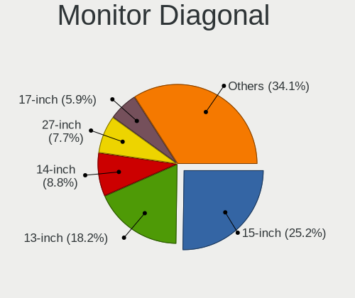

| Inches  | Computers | Percent |
|---------|-----------|---------|
| 15      | 32        | 23.02%  |
| 13      | 21        | 15.11%  |
| 27      | 17        | 12.23%  |
| 14      | 14        | 10.07%  |
| 17      | 7         | 5.04%   |
| 23      | 6         | 4.32%   |
| 21      | 6         | 4.32%   |
| 12      | 5         | 3.6%    |
| 24      | 4         | 2.88%   |
| 34      | 3         | 2.16%   |
| 26      | 3         | 2.16%   |
| 22      | 3         | 2.16%   |
| 19      | 3         | 2.16%   |
| 40      | 2         | 1.44%   |
| 31      | 2         | 1.44%   |
| 18      | 2         | 1.44%   |
| 16      | 2         | 1.44%   |
| 11      | 2         | 1.44%   |
| 49      | 1         | 0.72%   |
| 42      | 1         | 0.72%   |
| 32      | 1         | 0.72%   |
| 10      | 1         | 0.72%   |
| Unknown | 1         | 0.72%   |

Monitor Width
-------------

Physical width

| Width in mm | Computers | Percent |
|-------------|-----------|---------|
| 301-350     | 57        | 41.3%   |
| 501-600     | 27        | 19.57%  |
| 201-300     | 19        | 13.77%  |
| 401-500     | 13        | 9.42%   |
| 351-400     | 10        | 7.25%   |
| 701-800     | 4         | 2.9%    |
| 601-700     | 3         | 2.17%   |
| 801-900     | 2         | 1.45%   |
| 1001-1500   | 1         | 0.72%   |
| 901-1000    | 1         | 0.72%   |
| Unknown     | 1         | 0.72%   |

Aspect Ratio
------------

Proportional relationship between the width and the height

| Ratio | Computers | Percent |
|-------|-----------|---------|
| 16/9  | 98        | 75.38%  |
| 16/10 | 26        | 20%     |
| 5/4   | 3         | 2.31%   |
| 21/9  | 3         | 2.31%   |

Monitor Area
------------

Area in inch

| Area in inch | Computers | Percent |
|----------------|-----------|---------|
| 101-110        | 32        | 23.19%  |
| 81-90          | 30        | 21.74%  |
| 301-350        | 18        | 13.04%  |
| 201-250        | 16        | 11.59%  |
| 351-500        | 6         | 4.35%   |
| 61-70          | 5         | 3.62%   |
| 121-130        | 5         | 3.62%   |
| 71-80          | 4         | 2.9%    |
| 151-200        | 4         | 2.9%    |
| 251-300        | 3         | 2.17%   |
| 141-150        | 3         | 2.17%   |
| 501-1000       | 3         | 2.17%   |
| 51-60          | 2         | 1.45%   |
| 111-120        | 2         | 1.45%   |
| More than 1000 | 1         | 0.72%   |
| 41-50          | 1         | 0.72%   |
| 131-140        | 1         | 0.72%   |
| 91-100         | 1         | 0.72%   |
| Unknown        | 1         | 0.72%   |

Pixel Density
-------------

Pixels per inch

| Density       | Computers | Percent |
|---------------|-----------|---------|
| 101-120       | 43        | 32.33%  |
| 51-100        | 36        | 27.07%  |
| 121-160       | 34        | 25.56%  |
| 161-240       | 11        | 8.27%   |
| More than 240 | 7         | 5.26%   |
| 1-50          | 1         | 0.75%   |
| Unknown       | 1         | 0.75%   |

Multiple Monitors
-----------------

Total monitors connected

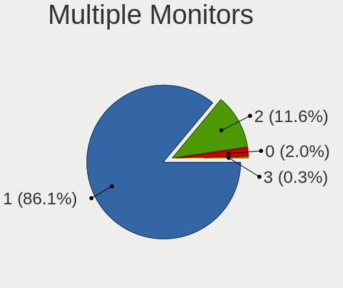

| Total | Computers | Percent |
|-------|-----------|---------|
| 1     | 113       | 85.61%  |
| 2     | 15        | 11.36%  |
| 0     | 4         | 3.03%   |

Network
-------

Net Controller Vendor
---------------------

Controller vendors

| Vendor                            | Computers | Percent |
|-----------------------------------|-----------|---------|
| Intel                             | 51        | 25.5%   |
| Realtek Semiconductor             | 49        | 24.5%   |
| Broadcom                          | 33        | 16.5%   |
| Qualcomm Atheros                  | 18        | 9%      |
| MediaTek                          | 6         | 3%      |
| Broadcom Limited                  | 6         | 3%      |
| Nvidia                            | 5         | 2.5%    |
| Marvell Technology Group          | 5         | 2.5%    |
| Samsung Electronics               | 4         | 2%      |
| TP-Link                           | 3         | 1.5%    |
| Ralink Technology                 | 3         | 1.5%    |
| Hewlett-Packard                   | 3         | 1.5%    |
| Qualcomm Atheros Communications   | 2         | 1%      |
| D-Link System                     | 2         | 1%      |
| ASIX Electronics                  | 2         | 1%      |
| Xiaomi                            | 1         | 0.5%    |
| Sierra Wireless                   | 1         | 0.5%    |
| Ralink                            | 1         | 0.5%    |
| Qualcomm                          | 1         | 0.5%    |
| NetGear                           | 1         | 0.5%    |
| ICS Advent                        | 1         | 0.5%    |
| Ericsson Business Mobile Networks | 1         | 0.5%    |
| Dell                              | 1         | 0.5%    |

Net Controller Model
--------------------

Controller models

| Model                                                                  | Computers | Percent |
|------------------------------------------------------------------------|-----------|---------|
| Realtek RTL8111/8168/8211/8411 PCI Express Gigabit Ethernet Controller | 28        | 11.52%  |
| Intel Wireless 7260                                                    | 7         | 2.88%   |
| Broadcom NetXtreme BCM57766 Gigabit Ethernet PCIe                      | 7         | 2.88%   |
| Realtek RTL8821CE 802.11ac PCIe Wireless Network Adapter               | 6         | 2.47%   |
| Realtek RTL810xE PCI Express Fast Ethernet controller                  | 6         | 2.47%   |
| Broadcom BCM4322 802.11a/b/g/n Wireless LAN Controller                 | 6         | 2.47%   |
| Qualcomm Atheros AR9485 Wireless Network Adapter                       | 5         | 2.06%   |
| Intel 82579LM Gigabit Network Connection (Lewisville)                  | 5         | 2.06%   |
| Broadcom NetXtreme BCM5764M Gigabit Ethernet PCIe                      | 5         | 2.06%   |
| Nvidia MCP79 Ethernet                                                  | 4         | 1.65%   |
| Intel Wireless 8265 / 8275                                             | 4         | 1.65%   |
| Intel Wireless 7265                                                    | 4         | 1.65%   |
| Intel Wi-Fi 6 AX201                                                    | 4         | 1.65%   |
| Intel Ethernet Connection I218-LM                                      | 4         | 1.65%   |
| Broadcom NetXtreme BCM57765 Gigabit Ethernet PCIe                      | 4         | 1.65%   |
| Broadcom Limited BCM4360 802.11ac Dual Band Wireless Network Adapter   | 4         | 1.65%   |
| Broadcom BCM43224 802.11a/b/g/n                                        | 4         | 1.65%   |
| Samsung Galaxy series, misc. (tethering mode)                          | 3         | 1.23%   |
| Ralink MT7601U Wireless Adapter                                        | 3         | 1.23%   |
| Qualcomm Atheros AR93xx Wireless Network Adapter                       | 3         | 1.23%   |
| Intel Wireless 8260                                                    | 3         | 1.23%   |
| Intel Ethernet Connection I217-LM                                      | 3         | 1.23%   |
| Intel Ethernet Connection (2) I219-V                                   | 3         | 1.23%   |
| Broadcom BCM43142 802.11b/g/n                                          | 3         | 1.23%   |
| Realtek RTL8822CE 802.11ac PCIe Wireless Network Adapter               | 2         | 0.82%   |
| Realtek RTL8821AE 802.11ac PCIe Wireless Network Adapter               | 2         | 0.82%   |
| Realtek RTL8188EUS 802.11n Wireless Network Adapter                    | 2         | 0.82%   |
| Realtek RTL8125 2.5GbE Controller                                      | 2         | 0.82%   |
| Qualcomm Atheros QCA9377 802.11ac Wireless Network Adapter             | 2         | 0.82%   |
| Qualcomm Atheros QCA6174 802.11ac Wireless Network Adapter             | 2         | 0.82%   |
| Qualcomm Atheros AR9285 Wireless Network Adapter (PCI-Express)         | 2         | 0.82%   |
| MediaTek Wi-Fi 6E MT7902 Wireless Network Adapter                      | 2         | 0.82%   |
| Intel Wi-Fi 6E(802.11ax) AX210/AX1675* 2x2 [Typhoon Peak]              | 2         | 0.82%   |
| Intel Ethernet Connection I219-LM                                      | 2         | 0.82%   |
| Intel Ethernet Connection I217-V                                       | 2         | 0.82%   |
| Intel Ethernet Connection (7) I219-V                                   | 2         | 0.82%   |
| Intel Ethernet Connection (4) I219-LM                                  | 2         | 0.82%   |
| Intel Centrino Advanced-N 6205 [Taylor Peak]                           | 2         | 0.82%   |
| Intel Cannon Lake PCH CNVi WiFi                                        | 2         | 0.82%   |
| HP un2430 Mobile Broadband Module                                      | 2         | 0.82%   |

Wireless Vendor
---------------

Wireless vendors

| Vendor                            | Computers | Percent |
|-----------------------------------|-----------|---------|
| Intel                             | 35        | 28%     |
| Broadcom                          | 27        | 21.6%   |
| Realtek Semiconductor             | 17        | 13.6%   |
| Qualcomm Atheros                  | 16        | 12.8%   |
| MediaTek                          | 6         | 4.8%    |
| Broadcom Limited                  | 6         | 4.8%    |
| TP-Link                           | 3         | 2.4%    |
| Ralink Technology                 | 3         | 2.4%    |
| Qualcomm Atheros Communications   | 2         | 1.6%    |
| D-Link System                     | 2         | 1.6%    |
| Sierra Wireless                   | 1         | 0.8%    |
| Ralink                            | 1         | 0.8%    |
| Qualcomm                          | 1         | 0.8%    |
| NetGear                           | 1         | 0.8%    |
| Marvell Technology Group          | 1         | 0.8%    |
| Hewlett-Packard                   | 1         | 0.8%    |
| Ericsson Business Mobile Networks | 1         | 0.8%    |
| Dell                              | 1         | 0.8%    |

Wireless Model
--------------

Wireless models

| Model                                                                | Computers | Percent |
|----------------------------------------------------------------------|-----------|---------|
| Intel Wireless 7260                                                  | 7         | 5.56%   |
| Realtek RTL8821CE 802.11ac PCIe Wireless Network Adapter             | 6         | 4.76%   |
| Broadcom BCM4322 802.11a/b/g/n Wireless LAN Controller               | 6         | 4.76%   |
| Qualcomm Atheros AR9485 Wireless Network Adapter                     | 5         | 3.97%   |
| Intel Wireless 8265 / 8275                                           | 4         | 3.17%   |
| Intel Wireless 7265                                                  | 4         | 3.17%   |
| Intel Wi-Fi 6 AX201                                                  | 4         | 3.17%   |
| Broadcom Limited BCM4360 802.11ac Dual Band Wireless Network Adapter | 4         | 3.17%   |
| Broadcom BCM43224 802.11a/b/g/n                                      | 4         | 3.17%   |
| Ralink MT7601U Wireless Adapter                                      | 3         | 2.38%   |
| Qualcomm Atheros AR93xx Wireless Network Adapter                     | 3         | 2.38%   |
| Intel Wireless 8260                                                  | 3         | 2.38%   |
| Broadcom BCM43142 802.11b/g/n                                        | 3         | 2.38%   |
| Realtek RTL8822CE 802.11ac PCIe Wireless Network Adapter             | 2         | 1.59%   |
| Realtek RTL8821AE 802.11ac PCIe Wireless Network Adapter             | 2         | 1.59%   |
| Realtek RTL8188EUS 802.11n Wireless Network Adapter                  | 2         | 1.59%   |
| Qualcomm Atheros QCA9377 802.11ac Wireless Network Adapter           | 2         | 1.59%   |
| Qualcomm Atheros QCA6174 802.11ac Wireless Network Adapter           | 2         | 1.59%   |
| Qualcomm Atheros AR9285 Wireless Network Adapter (PCI-Express)       | 2         | 1.59%   |
| MediaTek Wi-Fi 6E MT7902 Wireless Network Adapter                    | 2         | 1.59%   |
| Intel Wi-Fi 6E(802.11ax) AX210/AX1675* 2x2 [Typhoon Peak]            | 2         | 1.59%   |
| Intel Centrino Advanced-N 6205 [Taylor Peak]                         | 2         | 1.59%   |
| Intel Cannon Lake PCH CNVi WiFi                                      | 2         | 1.59%   |
| Broadcom BCM4364 802.11ac Wireless Network Adapter                   | 2         | 1.59%   |
| Broadcom BCM4360 802.11ac Dual Band Wireless Network Adapter         | 2         | 1.59%   |
| Broadcom BCM4331 802.11a/b/g/n                                       | 2         | 1.59%   |
| Broadcom BCM4313 802.11bgn Wireless Network Adapter                  | 2         | 1.59%   |
| Broadcom BCM4312 802.11b/g LP-PHY                                    | 2         | 1.59%   |
| TP-Link TL-WN823N v2/v3 [Realtek RTL8192EU]                          | 1         | 0.79%   |
| TP-Link TL-WN722N v2/v3 [Realtek RTL8188EUS]                         | 1         | 0.79%   |
| TP-Link RTL8812AU Archer T4U 802.11ac                                | 1         | 0.79%   |
| Sierra Wireless EM7305 Modem                                         | 1         | 0.79%   |
| Realtek RTL8852BE PCIe 802.11ax Wireless Network Controller          | 1         | 0.79%   |
| Realtek RTL8812AE 802.11ac PCIe Wireless Network Adapter             | 1         | 0.79%   |
| Realtek RTL8192CU 802.11n WLAN Adapter                               | 1         | 0.79%   |
| Realtek 802.11n WLAN Adapter                                         | 1         | 0.79%   |
| Realtek 802.11ac NIC                                                 | 1         | 0.79%   |
| Ralink RT3060 Wireless 802.11n 1T/1R                                 | 1         | 0.79%   |
| Qualcomm QCNFA765 Wireless Network Adapter                           | 1         | 0.79%   |
| Qualcomm Atheros QCA9565 / AR9565 Wireless Network Adapter           | 1         | 0.79%   |

Ethernet Vendor
---------------

Ethernet vendors

| Vendor                   | Computers | Percent |
|--------------------------|-----------|---------|
| Realtek Semiconductor    | 39        | 33.91%  |
| Intel                    | 35        | 30.43%  |
| Broadcom                 | 17        | 14.78%  |
| Qualcomm Atheros         | 7         | 6.09%   |
| Nvidia                   | 5         | 4.35%   |
| Samsung Electronics      | 4         | 3.48%   |
| Marvell Technology Group | 4         | 3.48%   |
| ASIX Electronics         | 2         | 1.74%   |
| Xiaomi                   | 1         | 0.87%   |
| ICS Advent               | 1         | 0.87%   |

Ethernet Model
--------------

Ethernet models

| Model                                                                          | Computers | Percent |
|--------------------------------------------------------------------------------|-----------|---------|
| Realtek RTL8111/8168/8211/8411 PCI Express Gigabit Ethernet Controller         | 28        | 24.35%  |
| Broadcom NetXtreme BCM57766 Gigabit Ethernet PCIe                              | 7         | 6.09%   |
| Realtek RTL810xE PCI Express Fast Ethernet controller                          | 6         | 5.22%   |
| Intel 82579LM Gigabit Network Connection (Lewisville)                          | 5         | 4.35%   |
| Broadcom NetXtreme BCM5764M Gigabit Ethernet PCIe                              | 5         | 4.35%   |
| Nvidia MCP79 Ethernet                                                          | 4         | 3.48%   |
| Intel Ethernet Connection I218-LM                                              | 4         | 3.48%   |
| Broadcom NetXtreme BCM57765 Gigabit Ethernet PCIe                              | 4         | 3.48%   |
| Samsung Galaxy series, misc. (tethering mode)                                  | 3         | 2.61%   |
| Intel Ethernet Connection I217-LM                                              | 3         | 2.61%   |
| Intel Ethernet Connection (2) I219-V                                           | 3         | 2.61%   |
| Realtek RTL8125 2.5GbE Controller                                              | 2         | 1.74%   |
| Intel Ethernet Connection I219-LM                                              | 2         | 1.74%   |
| Intel Ethernet Connection I217-V                                               | 2         | 1.74%   |
| Intel Ethernet Connection (7) I219-V                                           | 2         | 1.74%   |
| Intel Ethernet Connection (4) I219-LM                                          | 2         | 1.74%   |
| Xiaomi Mi/Redmi series (RNDIS + ADB)                                           | 1         | 0.87%   |
| Samsung GT-I9070 (network tethering, USB debugging enabled)                    | 1         | 0.87%   |
| Realtek RTL8153 Gigabit Ethernet Adapter                                       | 1         | 0.87%   |
| Realtek Killer E2600 GbE Controller                                            | 1         | 0.87%   |
| Realtek Killer E2500 Gigabit Ethernet Controller                               | 1         | 0.87%   |
| Qualcomm Atheros Killer E2500 Gigabit Ethernet Controller                      | 1         | 0.87%   |
| Qualcomm Atheros Killer E220x Gigabit Ethernet Controller                      | 1         | 0.87%   |
| Qualcomm Atheros Attansic L2 Fast Ethernet                                     | 1         | 0.87%   |
| Qualcomm Atheros AR8161 Gigabit Ethernet                                       | 1         | 0.87%   |
| Qualcomm Atheros AR8152 v1.1 Fast Ethernet                                     | 1         | 0.87%   |
| Qualcomm Atheros AR8131 Gigabit Ethernet                                       | 1         | 0.87%   |
| Qualcomm Atheros AR8121/AR8113/AR8114 Gigabit or Fast Ethernet                 | 1         | 0.87%   |
| Nvidia MCP89 Ethernet                                                          | 1         | 0.87%   |
| Marvell Group Yukon Optima 88E8059 [PCIe Gigabit Ethernet Controller with AVB] | 1         | 0.87%   |
| Marvell Group 88E8072 PCI-E Gigabit Ethernet Controller                        | 1         | 0.87%   |
| Marvell Group 88E8058 PCI-E Gigabit Ethernet Controller                        | 1         | 0.87%   |
| Marvell Group 88E8040 PCI-E Fast Ethernet Controller                           | 1         | 0.87%   |
| Intel I211 Gigabit Network Connection                                          | 1         | 0.87%   |
| Intel Ethernet Controller I226-V                                               | 1         | 0.87%   |
| Intel Ethernet Connection I219-V                                               | 1         | 0.87%   |
| Intel Ethernet Connection (7) I219-LM                                          | 1         | 0.87%   |
| Intel Ethernet Connection (2) I218-V                                           | 1         | 0.87%   |
| Intel Ethernet Connection (14) I219-LM                                         | 1         | 0.87%   |
| Intel Ethernet Connection (13) I219-LM                                         | 1         | 0.87%   |

Net Controller Kind
-------------------

Ethernet, WiFi or modem

| Kind     | Computers | Percent |
|----------|-----------|---------|
| WiFi     | 114       | 50.44%  |
| Ethernet | 110       | 48.67%  |
| Modem    | 2         | 0.88%   |

Used Controller
---------------

Currently used network controller

| Kind     | Computers | Percent |
|----------|-----------|---------|
| WiFi     | 89        | 64.96%  |
| Ethernet | 48        | 35.04%  |

NICs
----

Total network controllers on board

| Total | Computers | Percent |
|-------|-----------|---------|
| 2     | 76        | 58.02%  |
| 1     | 51        | 38.93%  |
| 3     | 3         | 2.29%   |
| 0     | 1         | 0.76%   |

IPv6
----

IPv6 vs IPv4

| Used | Computers | Percent |
|------|-----------|---------|
| No   | 84        | 64.12%  |
| Yes  | 47        | 35.88%  |

Bluetooth
---------

Bluetooth Vendor
----------------

Controller vendors

| Vendor                          | Computers | Percent |
|---------------------------------|-----------|---------|
| Intel                           | 29        | 31.18%  |
| Apple                           | 23        | 24.73%  |
| Realtek Semiconductor           | 11        | 11.83%  |
| Qualcomm Atheros Communications | 4         | 4.3%    |
| Foxconn / Hon Hai               | 4         | 4.3%    |
| Broadcom                        | 4         | 4.3%    |
| IMC Networks                    | 3         | 3.23%   |
| Cambridge Silicon Radio         | 3         | 3.23%   |
| TP-Link                         | 2         | 2.15%   |
| Lite-On Technology              | 2         | 2.15%   |
| Toshiba                         | 1         | 1.08%   |
| Realtek                         | 1         | 1.08%   |
| Opticis                         | 1         | 1.08%   |
| MediaTek                        | 1         | 1.08%   |
| Marvell Semiconductor           | 1         | 1.08%   |
| Hewlett-Packard                 | 1         | 1.08%   |
| Dell                            | 1         | 1.08%   |
| ASUSTek Computer                | 1         | 1.08%   |

Bluetooth Model
---------------

Controller models

| Model                                               | Computers | Percent |
|-----------------------------------------------------|-----------|---------|
| Intel Bluetooth wireless interface                  | 16        | 17.2%   |
| Apple Bluetooth Host Controller                     | 14        | 15.05%  |
| Realtek Bluetooth Radio                             | 10        | 10.75%  |
| Intel AX201 Bluetooth                               | 6         | 6.45%   |
| Apple Bluetooth USB Host Controller                 | 5         | 5.38%   |
| Intel Bluetooth 9460/9560 Jefferson Peak (JfP)      | 3         | 3.23%   |
| Cambridge Silicon Radio Bluetooth Dongle (HCI mode) | 3         | 3.23%   |
| Apple Built-in Bluetooth 2.0+EDR HCI                | 3         | 3.23%   |
| TP-Link UB500 Adapter                               | 2         | 2.15%   |
| Qualcomm Atheros  Bluetooth Device                  | 2         | 2.15%   |
| Qualcomm Atheros QCA61x4 Bluetooth 4.0              | 2         | 2.15%   |
| Intel AX210 Bluetooth                               | 2         | 2.15%   |
| IMC Networks Wireless_Device                        | 2         | 2.15%   |
| Broadcom HP Portable SoftSailing                    | 2         | 2.15%   |
| Toshiba Atheros AR3012 Bluetooth                    | 1         | 1.08%   |
| Realtek  Bluetooth 4.2 Adapter                      | 1         | 1.08%   |
| Realtek Bluetooth Radio                             | 1         | 1.08%   |
| Opticis Bluetooth Radio                             | 1         | 1.08%   |
| MediaTek Wireless_Device                            | 1         | 1.08%   |
| Marvell Bluetooth and Wireless LAN Composite        | 1         | 1.08%   |
| Lite-On Wireless_Device                             | 1         | 1.08%   |
| Lite-On BCM43142A0                                  | 1         | 1.08%   |
| Intel Bluetooth Device                              | 1         | 1.08%   |
| Intel AX200 Bluetooth                               | 1         | 1.08%   |
| IMC Networks BCM20702A0                             | 1         | 1.08%   |
| HP Broadcom 2070 Bluetooth Combo                    | 1         | 1.08%   |
| Foxconn / Hon Hai BT                                | 1         | 1.08%   |
| Foxconn / Hon Hai Bluetooth USB Host Controller     | 1         | 1.08%   |
| Foxconn / Hon Hai Bluetooth Device                  | 1         | 1.08%   |
| Foxconn / Hon Hai BCM43142A0 broadcom bluetooth     | 1         | 1.08%   |
| Dell DW375 Bluetooth Module                         | 1         | 1.08%   |
| Broadcom BCM43142A0 Bluetooth Device                | 1         | 1.08%   |
| Broadcom BCM2070 Bluetooth Device                   | 1         | 1.08%   |
| ASUS Broadcom BCM20702A0 Bluetooth                  | 1         | 1.08%   |
| Apple Bluetooth HCI                                 | 1         | 1.08%   |

Sound
-----

Sound Vendor
------------

Sound card vendors

| Vendor                               | Computers | Percent |
|--------------------------------------|-----------|---------|
| Intel                                | 103       | 57.87%  |
| Nvidia                               | 36        | 20.22%  |
| AMD                                  | 29        | 16.29%  |
| C-Media Electronics                  | 3         | 1.69%   |
| Yealink Network Technology           | 1         | 0.56%   |
| Thesycon Systemsoftware & Consulting | 1         | 0.56%   |
| Logitech                             | 1         | 0.56%   |
| Kingston Technology                  | 1         | 0.56%   |
| JBL                                  | 1         | 0.56%   |
| Huawei Technologies                  | 1         | 0.56%   |
| Guillemot                            | 1         | 0.56%   |

Sound Model
-----------

Sound card models

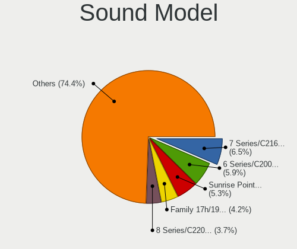

| Model                                                                      | Computers | Percent |
|----------------------------------------------------------------------------|-----------|---------|
| AMD Family 17h/19h HD Audio Controller                                     | 13        | 6.05%   |
| Intel Sunrise Point-LP HD Audio                                            | 10        | 4.65%   |
| Intel Haswell-ULT HD Audio Controller                                      | 10        | 4.65%   |
| Intel 8 Series HD Audio Controller                                         | 10        | 4.65%   |
| Intel 7 Series/C216 Chipset Family High Definition Audio Controller        | 10        | 4.65%   |
| Intel 6 Series/C200 Series Chipset Family High Definition Audio Controller | 9         | 4.19%   |
| Intel 8 Series/C220 Series Chipset High Definition Audio Controller        | 8         | 3.72%   |
| AMD Renoir Radeon High Definition Audio Controller                         | 8         | 3.72%   |
| Intel Cannon Lake PCH cAVS                                                 | 7         | 3.26%   |
| Intel Tiger Lake-LP Smart Sound Technology Audio Controller                | 6         | 2.79%   |
| Intel Xeon E3-1200 v3/4th Gen Core Processor HD Audio Controller           | 5         | 2.33%   |
| Intel 82801I (ICH9 Family) HD Audio Controller                             | 5         | 2.33%   |
| Intel 5 Series/3400 Series Chipset High Definition Audio                   | 5         | 2.33%   |
| Nvidia MCP89 High Definition Audio                                         | 4         | 1.86%   |
| Nvidia MCP79 High Definition Audio                                         | 4         | 1.86%   |
| Nvidia GK208 HDMI/DP Audio Controller                                      | 4         | 1.86%   |
| Intel NM10/ICH7 Family High Definition Audio Controller                    | 4         | 1.86%   |
| Intel Broadwell-U Audio Controller                                         | 4         | 1.86%   |
| Nvidia TU107 GeForce GTX 1650 High Definition Audio Controller             | 3         | 1.4%    |
| Nvidia GT216 HDMI Audio Controller                                         | 3         | 1.4%    |
| Nvidia GP107GL High Definition Audio Controller                            | 3         | 1.4%    |
| Nvidia GP104 High Definition Audio Controller                              | 3         | 1.4%    |
| Intel Wildcat Point-LP High Definition Audio Controller                    | 3         | 1.4%    |
| Intel Ice Lake-LP Smart Sound Technology Audio Controller                  | 3         | 1.4%    |
| Intel Celeron/Pentium Silver Processor High Definition Audio               | 3         | 1.4%    |
| AMD Raven/Raven2/Fenghuang HDMI/DP Audio Controller                        | 3         | 1.4%    |
| AMD FCH Azalia Controller                                                  | 3         | 1.4%    |
| Intel Tiger Lake-H HD Audio Controller                                     | 2         | 0.93%   |
| Intel CM238 HD Audio Controller                                            | 2         | 0.93%   |
| Intel 9 Series Chipset Family HD Audio Controller                          | 2         | 0.93%   |
| Intel 82801JI (ICH10 Family) HD Audio Controller                           | 2         | 0.93%   |
| Intel 82801H (ICH8 Family) HD Audio Controller                             | 2         | 0.93%   |
| Intel 100 Series/C230 Series Chipset Family HD Audio Controller            | 2         | 0.93%   |
| AMD Vega 10 HDMI Audio [Radeon Vega 56/64]                                 | 2         | 0.93%   |
| AMD Turks HDMI Audio [Radeon HD 6500/6600 / 6700M Series]                  | 2         | 0.93%   |
| AMD High Definition Audio Controller                                       | 2         | 0.93%   |
| AMD Family 15h (Models 60h-6fh) Audio Controller                           | 2         | 0.93%   |
| Yealink Network Technology Yealink UH36                                    | 1         | 0.47%   |
| Thesycon Systemsoftware & Consulting D50s                                  | 1         | 0.47%   |
| Nvidia TU106 High Definition Audio Controller                              | 1         | 0.47%   |

Memory
------

Memory Vendor
-------------

Memory module vendors

| Vendor              | Computers | Percent |
|---------------------|-----------|---------|
| Samsung Electronics | 5         | 17.24%  |
| Kingston            | 5         | 17.24%  |
| SK hynix            | 4         | 13.79%  |
| Micron Technology   | 3         | 10.34%  |
| Crucial             | 3         | 10.34%  |
| Unknown             | 2         | 6.9%    |
| Ramaxel Technology  | 2         | 6.9%    |
| Elpida              | 2         | 6.9%    |
| Unknown (ABCD)      | 1         | 3.45%   |
| Nanya Technology    | 1         | 3.45%   |
| Corsair             | 1         | 3.45%   |

Memory Model
------------

Memory module models

| Model                                                               | Computers | Percent |
|---------------------------------------------------------------------|-----------|---------|
| Unknown RAM Module 4GB SODIMM DDR4 2133MT/s                         | 1         | 3.33%   |
| Unknown RAM Module 2GB SODIMM DDR3                                  | 1         | 3.33%   |
| Unknown RAM Module 1GB SODIMM DDR3                                  | 1         | 3.33%   |
| Unknown (ABCD) RAM 123456789012345678 2048MB SODIMM LPDDR4 2400MT/s | 1         | 3.33%   |
| SK hynix RAM Module 8GB SODIMM DDR3 1600MT/s                        | 1         | 3.33%   |
| SK hynix RAM HMT451S6DFR8A-PB 4GB SODIMM DDR3 1600MT/s              | 1         | 3.33%   |
| SK hynix RAM HMA851S6CJR6N-VK 4GB Row Of Chips DDR4 2667MT/s        | 1         | 3.33%   |
| SK hynix RAM HMA81GS6DJR8N-XN 8GB SODIMM DDR4 3200MT/s              | 1         | 3.33%   |
| Samsung RAM Module 2GB SODIMM DDR3 1067MT/s                         | 1         | 3.33%   |
| Samsung RAM M471A2K43EB1-CWE 16GB SODIMM DDR4 3200MT/s              | 1         | 3.33%   |
| Samsung RAM M471A1K43DB1-CTD 8GB SODIMM DDR4 2667MT/s               | 1         | 3.33%   |
| Samsung RAM M425R1GB4BB0-CQKOD 8GB SODIMM DDR5 4800MT/s             | 1         | 3.33%   |
| Samsung RAM M4 70T5663EH3-CF7 2GB SODIMM DDR 975MT/s                | 1         | 3.33%   |
| Ramaxel RAM RMUA5110ME78HAF-2666 8GB DIMM DDR4 2667MT/s             | 1         | 3.33%   |
| Ramaxel RAM RMN1740EC48D8W-800 2GB SODIMM DDR2 800MT/s              | 1         | 3.33%   |
| Nanya RAM NT2GC64B88B0NF-CG 2GB DIMM DDR3 1333MT/s                  | 1         | 3.33%   |
| Micron RAM MT62F1G32D4DR-031 8GB Row Of Chips LPDDR5 6400MT/s       | 1         | 3.33%   |
| Micron RAM 16KTF1G64HZ-1G6E1 8GB SODIMM DDR3 1600MT/s               | 1         | 3.33%   |
| Micron RAM 16ATF2G64HZ-2G6E3 16GB SODIMM DDR4 2667MT/s              | 1         | 3.33%   |
| Kingston RAM Module 2GB DIMM DDR2 667MT/s                           | 1         | 3.33%   |
| Kingston RAM KTW149-ELD 1GB DIMM DDR3 1333MT/s                      | 1         | 3.33%   |
| Kingston RAM HX318C10F/8 8GB DIMM DDR3 1600MT/s                     | 1         | 3.33%   |
| Kingston RAM HX316LS9IB/8 8GB SODIMM DDR3 1600MT/s                  | 1         | 3.33%   |
| Kingston RAM 99U5428-063.A00LF 8GB SODIMM DDR3 2667MT/s             | 1         | 3.33%   |
| Elpida RAM Module 2GB SODIMM DDR3 1600MT/s                          | 1         | 3.33%   |
| Elpida RAM EBJ40UG8EFU0-GN-F 4GB SODIMM DDR3 1600MT/s               | 1         | 3.33%   |
| Crucial RAM CT8G4SFS832A.M8FR 8GB SODIMM DDR4 3200MT/s              | 1         | 3.33%   |
| Crucial RAM CT102464BF832B 16GB SODIMM DDR4 3200MT/s                | 1         | 3.33%   |
| Crucial RAM BLS8G3D1609DS1S00. 8GB DIMM DDR3 1800MT/s               | 1         | 3.33%   |
| Corsair RAM Module 4GB SODIMM DDR3 1067MT/s                         | 1         | 3.33%   |

Memory Kind
-----------

Memory module kinds

| Kind   | Computers | Percent |
|--------|-----------|---------|
| DDR3   | 12        | 44.44%  |
| DDR4   | 9         | 33.33%  |
| DDR2   | 2         | 7.41%   |
| SDRAM  | 1         | 3.7%    |
| LPDDR5 | 1         | 3.7%    |
| LPDDR4 | 1         | 3.7%    |
| DDR5   | 1         | 3.7%    |

Memory Form Factor
------------------

Physical design of the memory module

| Name         | Computers | Percent |
|--------------|-----------|---------|
| SODIMM       | 19        | 73.08%  |
| DIMM         | 5         | 19.23%  |
| Row Of Chips | 2         | 7.69%   |

Memory Size
-----------

Memory module size

| Size  | Computers | Percent |
|-------|-----------|---------|
| 8192  | 12        | 41.38%  |
| 2048  | 6         | 20.69%  |
| 4096  | 5         | 17.24%  |
| 16384 | 4         | 13.79%  |
| 1024  | 2         | 6.9%    |

Memory Speed
------------

Memory module speed

| Speed   | Computers | Percent |
|---------|-----------|---------|
| 1600    | 7         | 25.93%  |
| 2667    | 5         | 18.52%  |
| 3200    | 3         | 11.11%  |
| 1067    | 2         | 7.41%   |
| 6400    | 1         | 3.7%    |
| 4800    | 1         | 3.7%    |
| 2400    | 1         | 3.7%    |
| 2133    | 1         | 3.7%    |
| 2048    | 1         | 3.7%    |
| 1800    | 1         | 3.7%    |
| 1333    | 1         | 3.7%    |
| 800     | 1         | 3.7%    |
| 667     | 1         | 3.7%    |
| Unknown | 1         | 3.7%    |

Printers & scanners
-------------------

Printer Vendor
--------------

Printer device vendors

| Vendor              | Computers | Percent |
|---------------------|-----------|---------|
| Samsung Electronics | 1         | 50%     |
| Canon               | 1         | 50%     |

Printer Model
-------------

Printer device models

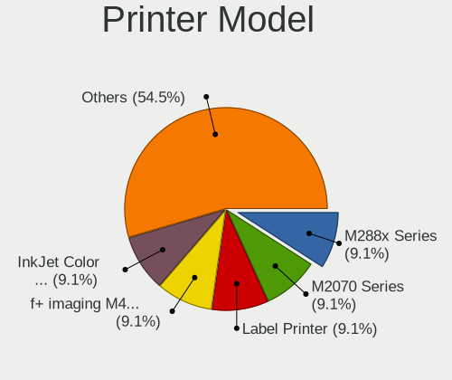

| Model                   | Computers | Percent |
|-------------------------|-----------|---------|
| Samsung M2070 Series    | 1         | 50%     |
| Canon CanoScan LiDE 300 | 1         | 50%     |

Scanner Vendor
--------------

Scanner device vendors

| Vendor      | Computers | Percent |
|-------------|-----------|---------|
| Seiko Epson | 1         | 100%    |

Scanner Model
-------------

Scanner device models

| Model                         | Computers | Percent |
|-------------------------------|-----------|---------|
| Seiko Epson ES-H300 [GT-2500] | 1         | 100%    |

Camera
------

Camera Vendor
-------------

Camera device vendors

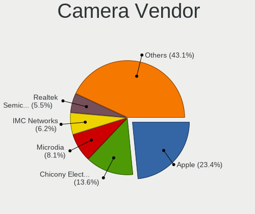

| Vendor                                 | Computers | Percent |
|----------------------------------------|-----------|---------|
| Apple                                  | 20        | 21.74%  |
| Chicony Electronics                    | 15        | 16.3%   |
| Microdia                               | 8         | 8.7%    |
| IMC Networks                           | 7         | 7.61%   |
| Realtek Semiconductor                  | 4         | 4.35%   |
| Cheng Uei Precision Industry (Foxlink) | 4         | 4.35%   |
| Suyin                                  | 3         | 3.26%   |
| Sunplus Innovation Technology          | 3         | 3.26%   |
| Quanta                                 | 3         | 3.26%   |
| Sonix Technology                       | 2         | 2.17%   |
| Ricoh                                  | 2         | 2.17%   |
| MacroSilicon                           | 2         | 2.17%   |
| Luxvisions Innotech Limited            | 2         | 2.17%   |
| Logitech                               | 2         | 2.17%   |
| GEMBIRD                                | 2         | 2.17%   |
| Bison Electronics                      | 2         | 2.17%   |
| Trust                                  | 1         | 1.09%   |
| SunplusIT                              | 1         | 1.09%   |
| Silicon Motion                         | 1         | 1.09%   |
| ShineTech                              | 1         | 1.09%   |
| Samsung Electronics                    | 1         | 1.09%   |
| Razer USA                              | 1         | 1.09%   |
| OYT Tech                               | 1         | 1.09%   |
| Lite-On Technology                     | 1         | 1.09%   |
| ALi                                    | 1         | 1.09%   |
| Acer                                   | 1         | 1.09%   |
| Unknown                                | 1         | 1.09%   |

Camera Model
------------

Camera device models

| Model                                                | Computers | Percent |
|------------------------------------------------------|-----------|---------|
| Apple Built-in iSight                                | 10        | 10.87%  |
| Apple FaceTime HD Camera (Built-in)                  | 8         | 8.7%    |
| IMC Networks USB2.0 HD UVC WebCam                    | 5         | 5.43%   |
| Microdia Integrated Webcam                           | 4         | 4.35%   |
| Chicony EasyCamera                                   | 3         | 3.26%   |
| Realtek Integrated_Webcam_HD                         | 2         | 2.17%   |
| Quanta HD User Facing                                | 2         | 2.17%   |
| Chicony Integrated Camera                            | 2         | 2.17%   |
| Chicony HP TrueVision HD Camera                      | 2         | 2.17%   |
| Chicony HD WebCam                                    | 2         | 2.17%   |
| Trust USB Camera                                     | 1         | 1.09%   |
| Suyin HP Truevision HD                               | 1         | 1.09%   |
| Suyin HD WebCam                                      | 1         | 1.09%   |
| Suyin Acer/HP Integrated Webcam [CN0314]             | 1         | 1.09%   |
| SunplusIT XiaoMi Webcam                              | 1         | 1.09%   |
| Sunplus Laptop Integrated Webcam FHD                 | 1         | 1.09%   |
| Sunplus FHD Camera Microphone                        | 1         | 1.09%   |
| Sunplus Asus Webcam                                  | 1         | 1.09%   |
| Sonix USB2.0 FHD UVC WebCam                          | 1         | 1.09%   |
| Sonix Usb Camera                                     | 1         | 1.09%   |
| Silicon Motion WebCam SCB-0370N                      | 1         | 1.09%   |
| ShineTech USB2.0 HD UVC WebCam                       | 1         | 1.09%   |
| Samsung Galaxy series, misc. (MTP mode)              | 1         | 1.09%   |
| Ricoh USB2.0 Camera                                  | 1         | 1.09%   |
| Ricoh Laptop_Integrated_Webcam_FHD                   | 1         | 1.09%   |
| Realtek USB Camera                                   | 1         | 1.09%   |
| Realtek Integrated Webcam HD                         | 1         | 1.09%   |
| Razer USA Gaming Webcam [Kiyo]                       | 1         | 1.09%   |
| Quanta HD Camera                                     | 1         | 1.09%   |
| OYT Tech OYV1RDFF1                                   | 1         | 1.09%   |
| Microdia USB 2.0 Camera                              | 1         | 1.09%   |
| Microdia Sonix USB 2.0 Camera                        | 1         | 1.09%   |
| Microdia Sonix Integrated Webcam                     | 1         | 1.09%   |
| Microdia Integrated_Webcam_HD                        | 1         | 1.09%   |
| MacroSilicon USB3. 0 capture                         | 1         | 1.09%   |
| MacroSilicon MS210x Video Grabber [EasierCAP]        | 1         | 1.09%   |
| Luxvisions Innotech Limited HP Wide Vision HD Camera | 1         | 1.09%   |
| Luxvisions Innotech Limited HP HD Camera             | 1         | 1.09%   |
| Logitech Webcam C925e                                | 1         | 1.09%   |
| Logitech C922 Pro Stream Webcam                      | 1         | 1.09%   |

Security
--------

Fingerprint Vendor
------------------

Fingerprint sensor vendors

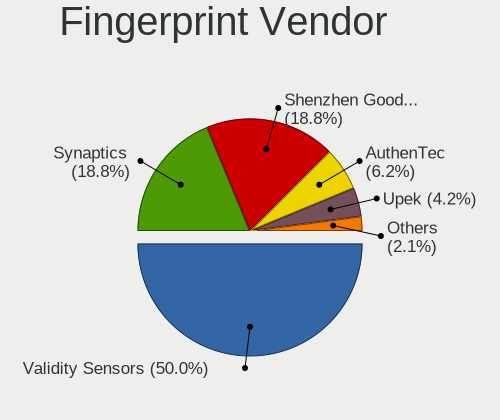

| Vendor                     | Computers | Percent |
|----------------------------|-----------|---------|
| Validity Sensors           | 5         | 45.45%  |
| Synaptics                  | 3         | 27.27%  |
| Shenzhen Goodix Technology | 2         | 18.18%  |
| LighTuning Technology      | 1         | 9.09%   |

Fingerprint Model
-----------------

Fingerprint sensor models

| Model                                                     | Computers | Percent |
|-----------------------------------------------------------|-----------|---------|
| Shenzhen Goodix  Fingerprint Device                       | 2         | 18.18%  |
| Validity Sensors VFS495 Fingerprint Reader                | 1         | 9.09%   |
| Validity Sensors VFS491                                   | 1         | 9.09%   |
| Validity Sensors VFS451 Fingerprint Reader                | 1         | 9.09%   |
| Validity Sensors VFS 5011 fingerprint sensor              | 1         | 9.09%   |
| Validity Sensors Synaptics WBDI                           | 1         | 9.09%   |
| Synaptics UWP WBDI Device                                 | 1         | 9.09%   |
| Synaptics  FS7604 Touch Fingerprint Sensor with PurePrint | 1         | 9.09%   |
| Synaptics Metallica MIS Touch Fingerprint Reader          | 1         | 9.09%   |
| LighTuning ES603 Swipe Fingerprint Sensor                 | 1         | 9.09%   |

Chipcard Vendor
---------------

Chipcard module vendors

| Vendor      | Computers | Percent |
|-------------|-----------|---------|
| Broadcom    | 5         | 71.43%  |
| O2 Micro    | 1         | 14.29%  |
| Alcor Micro | 1         | 14.29%  |

Chipcard Model
--------------

Chipcard module models

| Model                                                                        | Computers | Percent |
|------------------------------------------------------------------------------|-----------|---------|
| Broadcom BCM5880 Secure Applications Processor with fingerprint swipe sensor | 2         | 28.57%  |
| Broadcom BCM5880 Secure Applications Processor                               | 2         | 28.57%  |
| O2 Micro OZ776 CCID Smartcard Reader                                         | 1         | 14.29%  |
| Broadcom 58200                                                               | 1         | 14.29%  |
| Alcor Micro AU9540 Smartcard Reader                                          | 1         | 14.29%  |

Unsupported
-----------

Unsupported Devices
-------------------

Total unsupported devices on board

| Total | Computers | Percent |
|-------|-----------|---------|
| 0     | 87        | 66.41%  |
| 1     | 34        | 25.95%  |
| 2     | 9         | 6.87%   |
| 3     | 1         | 0.76%   |

Unsupported Device Types
------------------------

Types of unsupported devices

| Type                  | Computers | Percent |
|-----------------------|-----------|---------|
| Net/wireless          | 15        | 27.78%  |
| Fingerprint reader    | 11        | 20.37%  |
| Multimedia controller | 9         | 16.67%  |
| Chipcard              | 7         | 12.96%  |
| Graphics card         | 6         | 11.11%  |
| Storage               | 3         | 5.56%   |
| Network               | 1         | 1.85%   |
| Camera                | 1         | 1.85%   |
| Bluetooth             | 1         | 1.85%   |

