Elementary 7 - Tested Hardware & Statistics (Desktops)
------------------------------------------------------

A project to collect tested hardware configurations for Elementary 7.

Anyone can contribute to this report by the [hw-probe](https://github.com/linuxhw/hw-probe) tool:

    sudo -E hw-probe -all -upload

Please contribute! Especially if your hardware is rare.

Contents
--------

* [ Test Cases ](#test-cases)

* [ System ](#system)
  - [ Kernel                   ](#kernel)
  - [ Kernel Family            ](#kernel-family)
  - [ Kernel Major Ver.        ](#kernel-major-ver)
  - [ Arch                     ](#arch)
  - [ DE                       ](#de)
  - [ Display Server           ](#display-server)
  - [ Display Manager          ](#display-manager)
  - [ OS Lang                  ](#os-lang)
  - [ Boot Mode                ](#boot-mode)
  - [ Filesystem               ](#filesystem)
  - [ Part. scheme             ](#part-scheme)
  - [ Dual Boot with Linux/BSD ](#dual-boot-with-linuxbsd)
  - [ Dual Boot (Win)          ](#dual-boot-win)

* [ Board ](#board)
  - [ Vendor                   ](#vendor)
  - [ Model                    ](#model)
  - [ Model Family             ](#model-family)
  - [ MFG Year                 ](#mfg-year)
  - [ Form Factor              ](#form-factor)
  - [ Secure Boot              ](#secure-boot)
  - [ Coreboot                 ](#coreboot)
  - [ RAM Size                 ](#ram-size)
  - [ RAM Used                 ](#ram-used)
  - [ Total Drives             ](#total-drives)
  - [ Has CD-ROM               ](#has-cd-rom)
  - [ Has Ethernet             ](#has-ethernet)
  - [ Has WiFi                 ](#has-wifi)
  - [ Has Bluetooth            ](#has-bluetooth)

* [ Location ](#location)
  - [ Country                  ](#country)
  - [ City                     ](#city)

* [ Drives ](#drives)
  - [ Drive Vendor             ](#drive-vendor)
  - [ Drive Model              ](#drive-model)
  - [ HDD Vendor               ](#hdd-vendor)
  - [ SSD Vendor               ](#ssd-vendor)
  - [ Drive Kind               ](#drive-kind)
  - [ Drive Connector          ](#drive-connector)
  - [ Drive Size               ](#drive-size)
  - [ Space Total              ](#space-total)
  - [ Space Used               ](#space-used)
  - [ Malfunc. Drives          ](#malfunc-drives)
  - [ Malfunc. Drive Vendor    ](#malfunc-drive-vendor)
  - [ Malfunc. HDD Vendor      ](#malfunc-hdd-vendor)
  - [ Malfunc. Drive Kind      ](#malfunc-drive-kind)
  - [ Failed Drives            ](#failed-drives)
  - [ Failed Drive Vendor      ](#failed-drive-vendor)
  - [ Drive Status             ](#drive-status)

* [ Storage controller ](#storage-controller)
  - [ Storage Vendor           ](#storage-vendor)
  - [ Storage Model            ](#storage-model)
  - [ Storage Kind             ](#storage-kind)

* [ Processor ](#processor)
  - [ CPU Vendor               ](#cpu-vendor)
  - [ CPU Model                ](#cpu-model)
  - [ CPU Model Family         ](#cpu-model-family)
  - [ CPU Cores                ](#cpu-cores)
  - [ CPU Sockets              ](#cpu-sockets)
  - [ CPU Threads              ](#cpu-threads)
  - [ CPU Op-Modes             ](#cpu-op-modes)
  - [ CPU Microcode            ](#cpu-microcode)
  - [ CPU Microarch            ](#cpu-microarch)

* [ Graphics ](#graphics)
  - [ GPU Vendor               ](#gpu-vendor)
  - [ GPU Model                ](#gpu-model)
  - [ GPU Combo                ](#gpu-combo)
  - [ GPU Driver               ](#gpu-driver)
  - [ GPU Memory               ](#gpu-memory)

* [ Monitor ](#monitor)
  - [ Monitor Vendor           ](#monitor-vendor)
  - [ Monitor Model            ](#monitor-model)
  - [ Monitor Resolution       ](#monitor-resolution)
  - [ Monitor Diagonal         ](#monitor-diagonal)
  - [ Monitor Width            ](#monitor-width)
  - [ Aspect Ratio             ](#aspect-ratio)
  - [ Monitor Area             ](#monitor-area)
  - [ Pixel Density            ](#pixel-density)
  - [ Multiple Monitors        ](#multiple-monitors)

* [ Network ](#network)
  - [ Net Controller Vendor    ](#net-controller-vendor)
  - [ Net Controller Model     ](#net-controller-model)
  - [ Wireless Vendor          ](#wireless-vendor)
  - [ Wireless Model           ](#wireless-model)
  - [ Ethernet Vendor          ](#ethernet-vendor)
  - [ Ethernet Model           ](#ethernet-model)
  - [ Net Controller Kind      ](#net-controller-kind)
  - [ Used Controller          ](#used-controller)
  - [ NICs                     ](#nics)
  - [ IPv6                     ](#ipv6)

* [ Bluetooth ](#bluetooth)
  - [ Bluetooth Vendor         ](#bluetooth-vendor)
  - [ Bluetooth Model          ](#bluetooth-model)

* [ Sound ](#sound)
  - [ Sound Vendor             ](#sound-vendor)
  - [ Sound Model              ](#sound-model)

* [ Memory ](#memory)
  - [ Memory Vendor            ](#memory-vendor)
  - [ Memory Model             ](#memory-model)
  - [ Memory Kind              ](#memory-kind)
  - [ Memory Form Factor       ](#memory-form-factor)
  - [ Memory Size              ](#memory-size)
  - [ Memory Speed             ](#memory-speed)

* [ Printers & scanners ](#printers--scanners)
  - [ Printer Vendor           ](#printer-vendor)
  - [ Printer Model            ](#printer-model)
  - [ Scanner Vendor           ](#scanner-vendor)
  - [ Scanner Model            ](#scanner-model)

* [ Camera ](#camera)
  - [ Camera Vendor            ](#camera-vendor)
  - [ Camera Model             ](#camera-model)

* [ Security ](#security)
  - [ Fingerprint Vendor       ](#fingerprint-vendor)
  - [ Fingerprint Model        ](#fingerprint-model)
  - [ Chipcard Vendor          ](#chipcard-vendor)
  - [ Chipcard Model           ](#chipcard-model)

* [ Unsupported ](#unsupported)
  - [ Unsupported Devices      ](#unsupported-devices)
  - [ Unsupported Device Types ](#unsupported-device-types)

Test Cases
----------

Total: 62

| Vendor    | Model                       | Probe                                                      | Date         |
|-----------|-----------------------------|------------------------------------------------------------|--------------|
| Gigabyte  | H81M-S2V                    | [38ae545c1c](https://linux-hardware.org/?probe=38ae545c1c) | Jun 23, 2023 |
| MSI       | B450M PRO-M2 V2             | [4f5e2f9201](https://linux-hardware.org/?probe=4f5e2f9201) | Jun 21, 2023 |
| Pegatron  | IPMIP-GS                    | [fb51893272](https://linux-hardware.org/?probe=fb51893272) | Jun 15, 2023 |
| ECS       | G41T-M                      | [2c148573fc](https://linux-hardware.org/?probe=2c148573fc) | Jun 11, 2023 |
| ASUSTek   | ROG STRIX B350-F GAMING     | [08114e8a97](https://linux-hardware.org/?probe=08114e8a97) | Jun 10, 2023 |
| ASUSTek   | PRIME B450-PLUS             | [93555cfd25](https://linux-hardware.org/?probe=93555cfd25) | Jun 10, 2023 |
| ASUSTek   | PRIME B450-PLUS             | [2e6d82c14f](https://linux-hardware.org/?probe=2e6d82c14f) | Jun 10, 2023 |
| MSI       | MPG Z390 GAMING PRO CARB... | [ddefeff960](https://linux-hardware.org/?probe=ddefeff960) | Jun 08, 2023 |
| MSI       | MPG Z390 GAMING PRO CARB... | [77fe6db865](https://linux-hardware.org/?probe=77fe6db865) | Jun 06, 2023 |
| Gigabyte  | GA-E6010N                   | [563074319d](https://linux-hardware.org/?probe=563074319d) | May 31, 2023 |
| Lenovo    | 36C5 SDK0Q55724 WIN 3273... | [01076d8e8b](https://linux-hardware.org/?probe=01076d8e8b) | May 30, 2023 |
| ASUSTek   | ROG STRIX B350-F GAMING     | [16b9dfbbe0](https://linux-hardware.org/?probe=16b9dfbbe0) | May 29, 2023 |
| ASUSTek   | PRIME B450-PLUS             | [e29fb14e81](https://linux-hardware.org/?probe=e29fb14e81) | May 26, 2023 |
| ASUSTek   | PRIME B450-PLUS             | [84d0d9807f](https://linux-hardware.org/?probe=84d0d9807f) | May 26, 2023 |
| ASUSTek   | P8H61-MX R2.0               | [3776285fc1](https://linux-hardware.org/?probe=3776285fc1) | May 16, 2023 |
| HP        | 1998                        | [b806151d9f](https://linux-hardware.org/?probe=b806151d9f) | May 12, 2023 |
| Intel     | JSL MRD                     | [76ff5c3bd7](https://linux-hardware.org/?probe=76ff5c3bd7) | May 05, 2023 |
| Dell      | 02N3WF A02                  | [3f10b3ca43](https://linux-hardware.org/?probe=3f10b3ca43) | May 04, 2023 |
| HP        | 1998                        | [6f816ac95a](https://linux-hardware.org/?probe=6f816ac95a) | Apr 29, 2023 |
| HP        | 8055                        | [a897208085](https://linux-hardware.org/?probe=a897208085) | Apr 26, 2023 |
| ASRock    | B660M-C                     | [849fc5d462](https://linux-hardware.org/?probe=849fc5d462) | Apr 25, 2023 |
| Gigabyte  | H410M H V3                  | [8fd18554d1](https://linux-hardware.org/?probe=8fd18554d1) | Apr 24, 2023 |
| MACHINIST | E5-MR9A PRO V1.1            | [eebce73217](https://linux-hardware.org/?probe=eebce73217) | Apr 23, 2023 |
| ASUSTek   | PRIME Z390-A                | [50a18b5e94](https://linux-hardware.org/?probe=50a18b5e94) | Apr 19, 2023 |
| Foxconn   | A76GMV                      | [bafa62c759](https://linux-hardware.org/?probe=bafa62c759) | Apr 18, 2023 |
| Foxconn   | A76GMV                      | [f129cb2de1](https://linux-hardware.org/?probe=f129cb2de1) | Apr 18, 2023 |
| ASUSTek   | PRIME Z390-A                | [e311d21def](https://linux-hardware.org/?probe=e311d21def) | Apr 13, 2023 |
| Lenovo    | 36F7 SDK0J40700 WIN 3258... | [8e05a5e529](https://linux-hardware.org/?probe=8e05a5e529) | Apr 13, 2023 |
| Gigabyte  | Z270-Gaming K3              | [0c03014734](https://linux-hardware.org/?probe=0c03014734) | Apr 12, 2023 |
| MSI       | B450M PRO-M2 MAX            | [5a83c18a3e](https://linux-hardware.org/?probe=5a83c18a3e) | Apr 01, 2023 |
| MSI       | B450M PRO-M2 MAX            | [94f75ee798](https://linux-hardware.org/?probe=94f75ee798) | Apr 01, 2023 |
| Unknown   | Unknown                     | [fb22157f03](https://linux-hardware.org/?probe=fb22157f03) | Mar 28, 2023 |
| AZW       | U59                         | [7674bb8dc9](https://linux-hardware.org/?probe=7674bb8dc9) | Mar 27, 2023 |
| ASUSTek   | M4A785TD-V EVO              | [1674c37cf9](https://linux-hardware.org/?probe=1674c37cf9) | Mar 16, 2023 |
| HP        | 805A                        | [5401e12606](https://linux-hardware.org/?probe=5401e12606) | Mar 14, 2023 |
| HP        | 3033h                       | [ab5e388ea9](https://linux-hardware.org/?probe=ab5e388ea9) | Mar 14, 2023 |
| HP        | 3033h                       | [38ac77726b](https://linux-hardware.org/?probe=38ac77726b) | Mar 13, 2023 |
| MSI       | B450 TOMAHAWK MAX           | [39d0e8595c](https://linux-hardware.org/?probe=39d0e8595c) | Mar 12, 2023 |
| MSI       | B365M PRO-VH                | [023f42d6d1](https://linux-hardware.org/?probe=023f42d6d1) | Mar 12, 2023 |
| Inventec  | Z CLASS A02                 | [c45e770987](https://linux-hardware.org/?probe=c45e770987) | Mar 06, 2023 |
| ASUSTek   | BT6130                      | [dabd3e0232](https://linux-hardware.org/?probe=dabd3e0232) | Mar 01, 2023 |
| Unknown   | Unknown                     | [1c5f8fef49](https://linux-hardware.org/?probe=1c5f8fef49) | Feb 28, 2023 |
| ASUSTek   | ROG STRIX Z690-A GAMING ... | [216ad20179](https://linux-hardware.org/?probe=216ad20179) | Feb 28, 2023 |
| Acer      | Predator G3620              | [72f3382b60](https://linux-hardware.org/?probe=72f3382b60) | Feb 27, 2023 |
| Gigabyte  | Z77X-UD5H                   | [2071bc50ce](https://linux-hardware.org/?probe=2071bc50ce) | Feb 27, 2023 |
| Gigabyte  | Z77X-UD5H                   | [472c035387](https://linux-hardware.org/?probe=472c035387) | Feb 27, 2023 |
| Dell      | 07PR60 A01                  | [c071b7ef1c](https://linux-hardware.org/?probe=c071b7ef1c) | Feb 27, 2023 |
| ASUSTek   | TUF X470-PLUS GAMING        | [ce9dda227f](https://linux-hardware.org/?probe=ce9dda227f) | Feb 25, 2023 |
| Gigabyte  | B550 AORUS ELITE            | [13a132516b](https://linux-hardware.org/?probe=13a132516b) | Feb 18, 2023 |
| ASUSTek   | TUF X470-PLUS GAMING        | [76ab936a75](https://linux-hardware.org/?probe=76ab936a75) | Feb 16, 2023 |
| ASUSTek   | H110M-A/M.2                 | [68f0415788](https://linux-hardware.org/?probe=68f0415788) | Feb 16, 2023 |
| ASUSTek   | H110M-A/M.2                 | [2560ba7644](https://linux-hardware.org/?probe=2560ba7644) | Feb 16, 2023 |
| Foxconn   | 2ADA                        | [e0f89bbca1](https://linux-hardware.org/?probe=e0f89bbca1) | Feb 16, 2023 |
| HP        | 805D                        | [217784712c](https://linux-hardware.org/?probe=217784712c) | Feb 14, 2023 |
| MSI       | B85-G43 GAMING              | [b2b66e40e1](https://linux-hardware.org/?probe=b2b66e40e1) | Feb 14, 2023 |
| ASUSTek   | TUF X470-PLUS GAMING        | [f0899499e5](https://linux-hardware.org/?probe=f0899499e5) | Feb 13, 2023 |
| ASUSTek   | H110M-A/M.2                 | [76711a4e32](https://linux-hardware.org/?probe=76711a4e32) | Feb 10, 2023 |
| ASUSTek   | H110M-A/M.2                 | [73b3c1c661](https://linux-hardware.org/?probe=73b3c1c661) | Feb 06, 2023 |
| Gigabyte  | F2A88XM-DS2                 | [d9313ff1c1](https://linux-hardware.org/?probe=d9313ff1c1) | Feb 05, 2023 |
| ASUSTek   | P7P55 LX                    | [3786e7a211](https://linux-hardware.org/?probe=3786e7a211) | Feb 04, 2023 |
| ASUSTek   | Z170 PRO GAMING             | [c2a4529e33](https://linux-hardware.org/?probe=c2a4529e33) | Jan 30, 2023 |
| Unknown   | HX90                        | [af144f98b6](https://linux-hardware.org/?probe=af144f98b6) | Jan 05, 2023 |

System
------

Kernel
------

Version of the Linux kernel

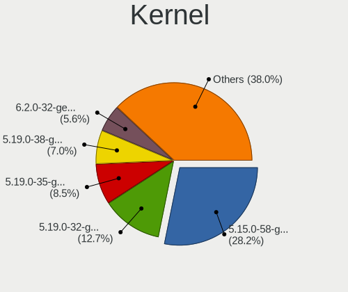

| Version           | Desktops | Percent |
|-------------------|----------|---------|
| 5.19.0-32-generic | 9        | 19.57%  |
| 5.15.0-58-generic | 9        | 19.57%  |
| 5.19.0-35-generic | 6        | 13.04%  |
| 5.19.0-38-generic | 5        | 10.87%  |
| 5.19.0-41-generic | 4        | 8.7%    |
| 5.15.0-60-generic | 4        | 8.7%    |
| 5.19.0-43-generic | 3        | 6.52%   |
| 5.19.0-42-generic | 3        | 6.52%   |
| 5.19.0-40-generic | 2        | 4.35%   |
| 5.15.0-56-generic | 1        | 2.17%   |

Kernel Family
-------------

Linux kernel without a distro release

| Version | Desktops | Percent |
|---------|----------|---------|
| 5.19.0  | 30       | 68.18%  |
| 5.15.0  | 14       | 31.82%  |

Kernel Major Ver.
-----------------

Linux kernel major version

| Version | Desktops | Percent |
|---------|----------|---------|
| 5.19    | 30       | 68.18%  |
| 5.15    | 14       | 31.82%  |

Arch
----

OS architecture (x86_64, i586, etc.)

| Name   | Desktops | Percent |
|--------|----------|---------|
| x86_64 | 44       | 100%    |

DE
--

Desktop Environment

| Name     | Desktops | Percent |
|----------|----------|---------|
| Pantheon | 44       | 100%    |

Display Server
--------------

X11 or Wayland

| Name | Desktops | Percent |
|------|----------|---------|
| X11  | 44       | 100%    |

Display Manager
---------------

SDDM, LightDM, etc.

| Name    | Desktops | Percent |
|---------|----------|---------|
| Unknown | 37       | 84.09%  |
| LightDM | 7        | 15.91%  |

OS Lang
-------

Language

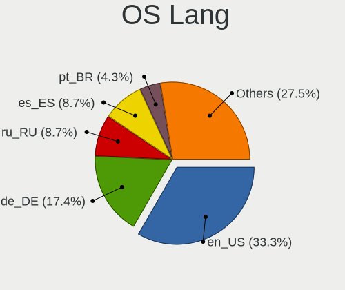

| Lang  | Desktops | Percent |
|-------|----------|---------|
| en_US | 17       | 37.78%  |
| de_DE | 6        | 13.33%  |
| es_ES | 4        | 8.89%   |
| pt_BR | 3        | 6.67%   |
| ru_RU | 2        | 4.44%   |
| it_IT | 2        | 4.44%   |
| tr_TR | 1        | 2.22%   |
| sv_SE | 1        | 2.22%   |
| pt_PT | 1        | 2.22%   |
| pl_PL | 1        | 2.22%   |
| nl_NL | 1        | 2.22%   |
| ja_JP | 1        | 2.22%   |
| fr_FR | 1        | 2.22%   |
| fi_FI | 1        | 2.22%   |
| en_CA | 1        | 2.22%   |
| en_AU | 1        | 2.22%   |
| cs_CZ | 1        | 2.22%   |

Boot Mode
---------

EFI or BIOS

| Mode | Desktops | Percent |
|------|----------|---------|
| BIOS | 41       | 93.18%  |
| EFI  | 3        | 6.82%   |

Filesystem
----------

Type of filesystem

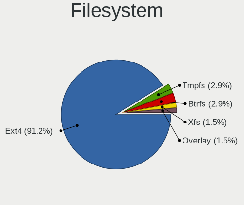

| Type  | Desktops | Percent |
|-------|----------|---------|
| Ext4  | 40       | 90.91%  |
| Btrfs | 2        | 4.55%   |
| Xfs   | 1        | 2.27%   |
| Tmpfs | 1        | 2.27%   |

Part. scheme
------------

Scheme of partitioning

| Type    | Desktops | Percent |
|---------|----------|---------|
| Unknown | 37       | 84.09%  |
| GPT     | 5        | 11.36%  |
| MBR     | 2        | 4.55%   |

Dual Boot with Linux/BSD
------------------------

Hosting more than one Linux/BSD

| Dual boot | Desktops | Percent |
|-----------|----------|---------|
| No        | 43       | 97.73%  |
| Yes       | 1        | 2.27%   |

Dual Boot (Win)
---------------

Hosting Linux and Windows

| Dual boot | Desktops | Percent |
|-----------|----------|---------|
| No        | 42       | 95.45%  |
| Yes       | 2        | 4.55%   |

Board
-----

Vendor
------

Motherboard manufacturer

| Name                | Desktops | Percent |
|---------------------|----------|---------|
| ASUSTek Computer    | 12       | 27.27%  |
| Gigabyte Technology | 7        | 15.91%  |
| MSI                 | 5        | 11.36%  |
| Hewlett-Packard     | 5        | 11.36%  |
| Foxconn             | 2        | 4.55%   |
| Dell                | 2        | 4.55%   |
| Unknown             | 2        | 4.55%   |
| Pegatron            | 1        | 2.27%   |
| MACHINIST           | 1        | 2.27%   |
| Lenovo              | 1        | 2.27%   |
| Inventec            | 1        | 2.27%   |
| Intel               | 1        | 2.27%   |
| ECS                 | 1        | 2.27%   |
| AZW                 | 1        | 2.27%   |
| ASRock              | 1        | 2.27%   |
| Acer                | 1        | 2.27%   |

Model
-----

Motherboard model

| Name                                    | Desktops | Percent |
|-----------------------------------------|----------|---------|
| ASUS H110M-A/M.2                        | 2        | 4.55%   |
| Unknown                                 | 2        | 4.55%   |
| Pegatron IPMIP-GS                       | 1        | 2.27%   |
| MSI MS-7C31                             | 1        | 2.27%   |
| MSI MS-7C02                             | 1        | 2.27%   |
| MSI MS-7B84                             | 1        | 2.27%   |
| MSI MS-7B17                             | 1        | 2.27%   |
| MSI MS-7816                             | 1        | 2.27%   |
| MACHINIST E5-MR9A PRO V1.1              | 1        | 2.27%   |
| Lenovo IdeaCentre 510S-08IKL 90GB00E3IN | 1        | 2.27%   |
| Inventec Z CLASS                        | 1        | 2.27%   |
| Intel Jasper Lake Client Platform       | 1        | 2.27%   |
| HP ProDesk 600 G2 SFF                   | 1        | 2.27%   |
| HP EliteDesk 800 G2 DM 35W              | 1        | 2.27%   |
| HP EliteDesk 705 G2 MT                  | 1        | 2.27%   |
| HP Compaq dc7900 Ultra-Slim Desktop     | 1        | 2.27%   |
| HP 1998                                 | 1        | 2.27%   |
| Gigabyte Z77X-UD5H                      | 1        | 2.27%   |
| Gigabyte Z270-Gaming K3                 | 1        | 2.27%   |
| Gigabyte H81M-S2V                       | 1        | 2.27%   |
| Gigabyte H410M H V3                     | 1        | 2.27%   |
| Gigabyte GA-E6010N                      | 1        | 2.27%   |
| Gigabyte F2A88XM-DS2                    | 1        | 2.27%   |
| Gigabyte B550 AORUS ELITE               | 1        | 2.27%   |
| Foxconn A76GMV                          | 1        | 2.27%   |
| Foxconn 400-034                         | 1        | 2.27%   |
| ECS G41T-M                              | 1        | 2.27%   |
| Dell OptiPlex 3070                      | 1        | 2.27%   |
| Dell Inspiron 5675                      | 1        | 2.27%   |
| AZW U59                                 | 1        | 2.27%   |
| ASUS Z170 PRO GAMING                    | 1        | 2.27%   |
| ASUS TUF X470-PLUS GAMING               | 1        | 2.27%   |
| ASUS ROG STRIX Z690-A GAMING WIFI D4    | 1        | 2.27%   |
| ASUS ROG STRIX B350-F GAMING            | 1        | 2.27%   |
| ASUS PRIME Z390-A                       | 1        | 2.27%   |
| ASUS PRIME B450-PLUS                    | 1        | 2.27%   |
| ASUS P8H61-MX R2.0                      | 1        | 2.27%   |
| ASUS P7P55 LX                           | 1        | 2.27%   |
| ASUS M4A785TD-V EVO                     | 1        | 2.27%   |
| ASUS BT6130-8                           | 1        | 2.27%   |

Model Family
------------

Motherboard model prefix

| Name                 | Desktops | Percent |
|----------------------|----------|---------|
| HP EliteDesk         | 2        | 4.55%   |
| ASUS ROG             | 2        | 4.55%   |
| ASUS PRIME           | 2        | 4.55%   |
| ASUS H110M-A         | 2        | 4.55%   |
| Unknown              | 2        | 4.55%   |
| Pegatron IPMIP-GS    | 1        | 2.27%   |
| MSI MS-7C31          | 1        | 2.27%   |
| MSI MS-7C02          | 1        | 2.27%   |
| MSI MS-7B84          | 1        | 2.27%   |
| MSI MS-7B17          | 1        | 2.27%   |
| MSI MS-7816          | 1        | 2.27%   |
| MACHINIST E5-MR9A    | 1        | 2.27%   |
| Lenovo IdeaCentre    | 1        | 2.27%   |
| Inventec Z           | 1        | 2.27%   |
| Intel Jasper         | 1        | 2.27%   |
| HP ProDesk           | 1        | 2.27%   |
| HP Compaq            | 1        | 2.27%   |
| HP 1998              | 1        | 2.27%   |
| Gigabyte Z77X-UD5H   | 1        | 2.27%   |
| Gigabyte Z270-Gaming | 1        | 2.27%   |
| Gigabyte H81M-S2V    | 1        | 2.27%   |
| Gigabyte H410M       | 1        | 2.27%   |
| Gigabyte GA-E6010N   | 1        | 2.27%   |
| Gigabyte F2A88XM-DS2 | 1        | 2.27%   |
| Gigabyte B550        | 1        | 2.27%   |
| Foxconn A76GMV       | 1        | 2.27%   |
| Foxconn 400-034      | 1        | 2.27%   |
| ECS G41T-M           | 1        | 2.27%   |
| Dell OptiPlex        | 1        | 2.27%   |
| Dell Inspiron        | 1        | 2.27%   |
| AZW U59              | 1        | 2.27%   |
| ASUS Z170            | 1        | 2.27%   |
| ASUS TUF             | 1        | 2.27%   |
| ASUS P8H61-MX        | 1        | 2.27%   |
| ASUS P7P55           | 1        | 2.27%   |
| ASUS M4A785TD-V      | 1        | 2.27%   |
| ASUS BT6130-8        | 1        | 2.27%   |
| ASRock B660M-C       | 1        | 2.27%   |
| Acer Predator        | 1        | 2.27%   |

MFG Year
--------

Motherboard manufacture year

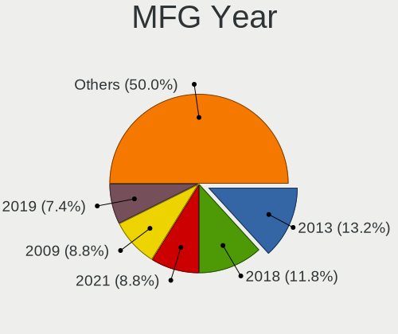

| Year | Desktops | Percent |
|------|----------|---------|
| 2013 | 5        | 11.36%  |
| 2012 | 5        | 11.36%  |
| 2021 | 4        | 9.09%   |
| 2018 | 4        | 9.09%   |
| 2016 | 4        | 9.09%   |
| 2020 | 3        | 6.82%   |
| 2019 | 3        | 6.82%   |
| 2015 | 3        | 6.82%   |
| 2009 | 3        | 6.82%   |
| 2022 | 2        | 4.55%   |
| 2017 | 2        | 4.55%   |
| 2010 | 2        | 4.55%   |
| 2008 | 2        | 4.55%   |
| 2023 | 1        | 2.27%   |
| 2014 | 1        | 2.27%   |

Form Factor
-----------

Physical design of the computer

| Name    | Desktops | Percent |
|---------|----------|---------|
| Desktop | 44       | 100%    |

Secure Boot
-----------

Enabled or disabled

| State    | Desktops | Percent |
|----------|----------|---------|
| Disabled | 44       | 100%    |

Coreboot
--------

Have coreboot on board

| Used | Desktops | Percent |
|------|----------|---------|
| No   | 44       | 100%    |

RAM Size
--------

Total RAM memory

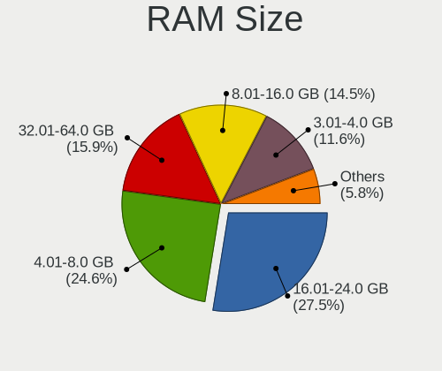

| Size in GB  | Desktops | Percent |
|-------------|----------|---------|
| 4.01-8.0    | 13       | 29.55%  |
| 16.01-24.0  | 10       | 22.73%  |
| 8.01-16.0   | 7        | 15.91%  |
| 32.01-64.0  | 6        | 13.64%  |
| 3.01-4.0    | 5        | 11.36%  |
| 24.01-32.0  | 1        | 2.27%   |
| 64.01-256.0 | 1        | 2.27%   |
| 1.01-2.0    | 1        | 2.27%   |

RAM Used
--------

Used RAM memory

| Used GB   | Desktops | Percent |
|-----------|----------|---------|
| 2.01-3.0  | 23       | 50%     |
| 1.01-2.0  | 11       | 23.91%  |
| 3.01-4.0  | 8        | 17.39%  |
| 4.01-8.0  | 3        | 6.52%   |
| 8.01-16.0 | 1        | 2.17%   |

Total Drives
------------

Number of drives on board

| Drives | Desktops | Percent |
|--------|----------|---------|
| 1      | 18       | 40.91%  |
| 2      | 16       | 36.36%  |
| 3      | 5        | 11.36%  |
| 5      | 3        | 6.82%   |
| 4      | 2        | 4.55%   |

Has CD-ROM
----------

Has CD-ROM on board

| Presented | Desktops | Percent |
|-----------|----------|---------|
| No        | 30       | 68.18%  |
| Yes       | 14       | 31.82%  |

Has Ethernet
------------

Has Ethernet on board

| Presented | Desktops | Percent |
|-----------|----------|---------|
| Yes       | 44       | 100%    |

Has WiFi
--------

Has WiFi module

| Presented | Desktops | Percent |
|-----------|----------|---------|
| No        | 23       | 52.27%  |
| Yes       | 21       | 47.73%  |

Has Bluetooth
-------------

Has Bluetooth module

| Presented | Desktops | Percent |
|-----------|----------|---------|
| No        | 23       | 52.27%  |
| Yes       | 21       | 47.73%  |

Location
--------

Country
-------

Geographic location (country)

| Country     | Desktops | Percent |
|-------------|----------|---------|
| Germany     | 8        | 18.18%  |
| USA         | 7        | 15.91%  |
| Brazil      | 4        | 9.09%   |
| Spain       | 3        | 6.82%   |
| Russia      | 3        | 6.82%   |
| Netherlands | 2        | 4.55%   |
| Italy       | 2        | 4.55%   |
| India       | 2        | 4.55%   |
| Turkey      | 1        | 2.27%   |
| Sweden      | 1        | 2.27%   |
| Portugal    | 1        | 2.27%   |
| Mexico      | 1        | 2.27%   |
| Japan       | 1        | 2.27%   |
| Greece      | 1        | 2.27%   |
| France      | 1        | 2.27%   |
| Finland     | 1        | 2.27%   |
| Czechia     | 1        | 2.27%   |
| Chile       | 1        | 2.27%   |
| Canada      | 1        | 2.27%   |
| Australia   | 1        | 2.27%   |
| Argentina   | 1        | 2.27%   |

City
----

Geographic location (city)

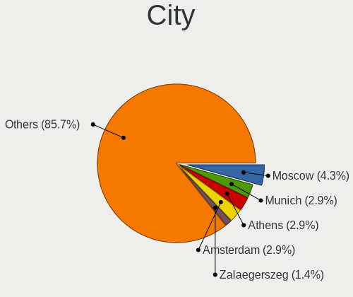

| City              | Desktops | Percent |
|-------------------|----------|---------|
| West Jordan       | 1        | 2.22%   |
| Viareggio         | 1        | 2.22%   |
| Valencia          | 1        | 2.22%   |
| Tucson            | 1        | 2.22%   |
| Stuttgart         | 1        | 2.22%   |
| Stockholm         | 1        | 2.22%   |
| Steti             | 1        | 2.22%   |
| St Petersburg     | 1        | 2.22%   |
| Sao Paulo         | 1        | 2.22%   |
| Santiago          | 1        | 2.22%   |
| Sandim            | 1        | 2.22%   |
| San Marcos        | 1        | 2.22%   |
| Piea              | 1        | 2.22%   |
| Ojicho            | 1        | 2.22%   |
| Nossen            | 1        | 2.22%   |
| New York          | 1        | 2.22%   |
| Munich            | 1        | 2.22%   |
| Mumbai            | 1        | 2.22%   |
| Moscow            | 1        | 2.22%   |
| Morehead City     | 1        | 2.22%   |
| Monsummano Terme  | 1        | 2.22%   |
| Melbourne         | 1        | 2.22%   |
| Madrid            | 1        | 2.22%   |
| Los Montesinos    | 1        | 2.22%   |
| Lorena            | 1        | 2.22%   |
| Las Vegas         | 1        | 2.22%   |
| Lanus             | 1        | 2.22%   |
| Lagerdorf         | 1        | 2.22%   |
| Laberweinting     | 1        | 2.22%   |
| Juazeiro do Norte | 1        | 2.22%   |
| Irvine            | 1        | 2.22%   |
| Hürth            | 1        | 2.22%   |
| Helsinki          | 1        | 2.22%   |
| Hamm              | 1        | 2.22%   |
| Faridabad         | 1        | 2.22%   |
| Cuernavaca        | 1        | 2.22%   |
| Cheboksary        | 1        | 2.22%   |
| Casteljaloux      | 1        | 2.22%   |
| Brampton          | 1        | 2.22%   |
| Braganca          | 1        | 2.22%   |

Drives
------

Drive Vendor
------------

Hard drive vendors

| Vendor                      | Desktops | Drives | Percent |
|-----------------------------|----------|--------|---------|
| WDC                         | 15       | 15     | 18.75%  |
| Seagate                     | 10       | 15     | 12.5%   |
| Samsung Electronics         | 8        | 12     | 10%     |
| Sandisk                     | 5        | 6      | 6.25%   |
| Toshiba                     | 4        | 5      | 5%      |
| Kingston                    | 4        | 4      | 5%      |
| Hitachi                     | 3        | 4      | 3.75%   |
| Crucial                     | 3        | 4      | 3.75%   |
| Team                        | 2        | 3      | 2.5%    |
| PNY                         | 2        | 2      | 2.5%    |
| Netac                       | 2        | 3      | 2.5%    |
| Micron/Crucial Technology   | 2        | 2      | 2.5%    |
| China                       | 2        | 2      | 2.5%    |
| A-DATA Technology           | 2        | 2      | 2.5%    |
| Yeestor                     | 1        | 1      | 1.25%   |
| XrayDisk                    | 1        | 1      | 1.25%   |
| Silicon Motion              | 1        | 1      | 1.25%   |
| SD                          | 1        | 1      | 1.25%   |
| NGFF                        | 1        | 1      | 1.25%   |
| Micron Technology           | 1        | 1      | 1.25%   |
| MAXIO Technology (Hangzhou) | 1        | 1      | 1.25%   |
| LuminouTek                  | 1        | 1      | 1.25%   |
| LITEONIT                    | 1        | 1      | 1.25%   |
| KingDian                    | 1        | 2      | 1.25%   |
| Intenso                     | 1        | 2      | 1.25%   |
| HS-SSD-E100                 | 1        | 2      | 1.25%   |
| Hewlett-Packard             | 1        | 1      | 1.25%   |
| Corsair                     | 1        | 1      | 1.25%   |
| Apacer                      | 1        | 1      | 1.25%   |
| Unknown                     | 1        | 1      | 1.25%   |

Drive Model
-----------

Hard drive models

| Model                                                 | Desktops | Percent |
|-------------------------------------------------------|----------|---------|
| WDC WD10EZEX-60WN4A0 1TB                              | 3        | 3.41%   |
| Kingston SA400S37240G 240GB SSD                       | 3        | 3.41%   |
| WDC WD10EZEX-08WN4A0 1TB                              | 2        | 2.27%   |
| Samsung SSD 850 EVO 250GB                             | 2        | 2.27%   |
| Samsung NVMe SSD Controller SM981/PM981/PM983 250GB   | 2        | 2.27%   |
| Yeestor 512GB                                         | 1        | 1.14%   |
| XrayDisk 512GB SSD                                    | 1        | 1.14%   |
| WDC WDS480G2G0C-00AJM0 480GB                          | 1        | 1.14%   |
| WDC WDS240G2G0A-00JH30 240GB SSD                      | 1        | 1.14%   |
| WDC WDS100T2B0A-00SM50 1TB SSD                        | 1        | 1.14%   |
| WDC WD40EZRZ-00GXCB0 4TB                              | 1        | 1.14%   |
| WDC WD2500JB-55GVA0 250GB                             | 1        | 1.14%   |
| WDC WD10PURZ-85U8XY0 1TB                              | 1        | 1.14%   |
| WDC WD10EZEX-60ZF5A0 1TB                              | 1        | 1.14%   |
| WDC WD10EZEX-00BN5A0 1TB                              | 1        | 1.14%   |
| WDC WD10EZEX-00BBHA0 1TB                              | 1        | 1.14%   |
| WDC WD1002FBYS-18W8B0 1TB                             | 1        | 1.14%   |
| Toshiba MQ01ABD100 1TB                                | 1        | 1.14%   |
| Toshiba DT01ACA200 2TB                                | 1        | 1.14%   |
| Toshiba DT01ACA100 1TB                                | 1        | 1.14%   |
| Toshiba DT01ACA050 500GB                              | 1        | 1.14%   |
| Team T253X2001T 1TB SSD                               | 1        | 1.14%   |
| Team T253X1480G 480GB SSD                             | 1        | 1.14%   |
| Team L3 SSD 240GB                                     | 1        | 1.14%   |
| Silicon Motion SM2263EN/SM2263XT SSD Controller 256GB | 1        | 1.14%   |
| Seagate ST9500325AS 500GB                             | 1        | 1.14%   |
| Seagate ST750LM022 HN-M750MBB 752GB                   | 1        | 1.14%   |
| Seagate ST500LM012 HN-M500MBB 500GB                   | 1        | 1.14%   |
| Seagate ST4000DM004-2CV104 4TB                        | 1        | 1.14%   |
| Seagate ST3500418AS 500GB                             | 1        | 1.14%   |
| Seagate ST31000528AS 1TB                              | 1        | 1.14%   |
| Seagate ST2000DM008-2FR102 2TB                        | 1        | 1.14%   |
| Seagate ST1000VT001-1RE172 1TB                        | 1        | 1.14%   |
| Seagate ST1000DM003-9YN162 1TB                        | 1        | 1.14%   |
| Seagate ST1000DM003-1ER162 1TB                        | 1        | 1.14%   |
| Seagate M3 1TB                                        | 1        | 1.14%   |
| Seagate BarraCuda Q1 SSD ZA960CV10001 960GB           | 1        | 1.14%   |
| Seagate BarraCuda 120 SSD ZA500CM10003 500GB          | 1        | 1.14%   |
| SD Ultra 3D 1TB                                       | 1        | 1.14%   |
| Sandisk WD_BLACK SN750 SE 500GB                       | 1        | 1.14%   |

HDD Vendor
----------

Hard disk drive vendors

| Vendor              | Desktops | Drives | Percent |
|---------------------|----------|--------|---------|
| WDC                 | 12       | 12     | 41.38%  |
| Seagate             | 9        | 12     | 31.03%  |
| Toshiba             | 4        | 5      | 13.79%  |
| Hitachi             | 3        | 4      | 10.34%  |
| Samsung Electronics | 1        | 1      | 3.45%   |

SSD Vendor
----------

Solid state drive vendors

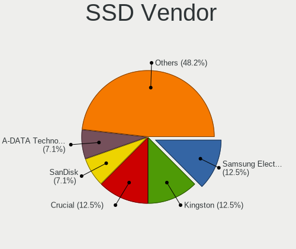

| Vendor              | Desktops | Drives | Percent |
|---------------------|----------|--------|---------|
| Samsung Electronics | 5        | 7      | 13.51%  |
| Kingston            | 4        | 4      | 10.81%  |
| Crucial             | 3        | 4      | 8.11%   |
| WDC                 | 2        | 2      | 5.41%   |
| Team                | 2        | 3      | 5.41%   |
| Seagate             | 2        | 2      | 5.41%   |
| SanDisk             | 2        | 3      | 5.41%   |
| PNY                 | 2        | 2      | 5.41%   |
| China               | 2        | 2      | 5.41%   |
| A-DATA Technology   | 2        | 2      | 5.41%   |
| XrayDisk            | 1        | 1      | 2.7%    |
| NGFF                | 1        | 1      | 2.7%    |
| Netac               | 1        | 1      | 2.7%    |
| Micron Technology   | 1        | 1      | 2.7%    |
| LITEONIT            | 1        | 1      | 2.7%    |
| KingDian            | 1        | 2      | 2.7%    |
| Intenso             | 1        | 2      | 2.7%    |
| HS-SSD-E100         | 1        | 1      | 2.7%    |
| Hewlett-Packard     | 1        | 1      | 2.7%    |
| Corsair             | 1        | 1      | 2.7%    |
| Apacer              | 1        | 1      | 2.7%    |

Drive Kind
----------

HDD or SSD

| Kind    | Desktops | Drives | Percent |
|---------|----------|--------|---------|
| SSD     | 34       | 44     | 46.58%  |
| HDD     | 22       | 34     | 30.14%  |
| NVMe    | 10       | 12     | 13.7%   |
| Unknown | 7        | 8      | 9.59%   |

Drive Connector
---------------

SATA, SAS, NVMe, etc.

| Type | Desktops | Drives | Percent |
|------|----------|--------|---------|
| SATA | 43       | 84     | 78.18%  |
| NVMe | 10       | 12     | 18.18%  |
| SAS  | 2        | 2      | 3.64%   |

Drive Size
----------

Size of hard drive

| Size in TB | Desktops | Drives | Percent |
|------------|----------|--------|---------|
| 0.01-0.5   | 31       | 44     | 56.36%  |
| 0.51-1.0   | 20       | 29     | 36.36%  |
| 3.01-4.0   | 2        | 2      | 3.64%   |
| 1.01-2.0   | 2        | 3      | 3.64%   |

Space Total
-----------

Amount of disk space available on the file system

| Size in GB | Desktops | Percent |
|------------|----------|---------|
| 101-250    | 21       | 47.73%  |
| 501-1000   | 12       | 27.27%  |
| 251-500    | 7        | 15.91%  |
| 21-50      | 1        | 2.27%   |
| 2001-3000  | 1        | 2.27%   |
| 1001-2000  | 1        | 2.27%   |
| 51-100     | 1        | 2.27%   |

Space Used
----------

Amount of used disk space

| Used GB   | Desktops | Percent |
|-----------|----------|---------|
| 1-20      | 19       | 43.18%  |
| 21-50     | 11       | 25%     |
| 51-100    | 7        | 15.91%  |
| 101-250   | 5        | 11.36%  |
| 251-500   | 1        | 2.27%   |
| 1001-2000 | 1        | 2.27%   |

Malfunc. Drives
---------------

Drive models with a malfunction

| Model                         | Desktops | Drives | Percent |
|-------------------------------|----------|--------|---------|
| Hitachi HTS725050A7E630 500GB | 1        | 1      | 100%    |

Malfunc. Drive Vendor
---------------------

Vendors of faulty drives

| Vendor  | Desktops | Drives | Percent |
|---------|----------|--------|---------|
| Hitachi | 1        | 1      | 100%    |

Malfunc. HDD Vendor
-------------------

Vendors of faulty HDD drives

| Vendor  | Desktops | Drives | Percent |
|---------|----------|--------|---------|
| Hitachi | 1        | 1      | 100%    |

Malfunc. Drive Kind
-------------------

Kinds of faulty drives

| Kind | Desktops | Drives | Percent |
|------|----------|--------|---------|
| HDD  | 1        | 1      | 100%    |

Failed Drives
-------------

Failed drive models

Zero info for selected period =(

Failed Drive Vendor
-------------------

Failed drive vendors

Zero info for selected period =(

Drive Status
------------

Number of failed and malfunc. drives

| Status   | Desktops | Drives | Percent |
|----------|----------|--------|---------|
| Detected | 40       | 89     | 85.11%  |
| Works    | 6        | 8      | 12.77%  |
| Malfunc  | 1        | 1      | 2.13%   |

Storage controller
------------------

Storage Vendor
--------------

Storage controller vendors

| Vendor                      | Desktops | Percent |
|-----------------------------|----------|---------|
| Intel                       | 30       | 51.72%  |
| AMD                         | 14       | 24.14%  |
| SanDisk                     | 3        | 5.17%   |
| Samsung Electronics         | 3        | 5.17%   |
| Micron/Crucial Technology   | 2        | 3.45%   |
| Marvell Technology Group    | 2        | 3.45%   |
| ASMedia Technology          | 2        | 3.45%   |
| Silicon Motion              | 1        | 1.72%   |
| MAXIO Technology (Hangzhou) | 1        | 1.72%   |

Storage Model
-------------

Storage controller models

| Model                                                                                   | Desktops | Percent |
|-----------------------------------------------------------------------------------------|----------|---------|
| AMD FCH SATA Controller [AHCI mode]                                                     | 10       | 13.89%  |
| Intel Q170/Q150/B150/H170/H110/Z170/CM236 Chipset SATA Controller [AHCI Mode]           | 5        | 6.94%   |
| Intel 8 Series/C220 Series Chipset Family 6-port SATA Controller 1 [AHCI mode]          | 4        | 5.56%   |
| AMD 400 Series Chipset SATA Controller                                                  | 4        | 5.56%   |
| Intel Cannon Lake PCH SATA AHCI Controller                                              | 3        | 4.17%   |
| Intel 200 Series PCH SATA controller [AHCI mode]                                        | 3        | 4.17%   |
| SanDisk Non-Volatile memory controller                                                  | 2        | 2.78%   |
| Samsung NVMe SSD Controller SM981/PM981/PM983                                           | 2        | 2.78%   |
| Intel Jasper Lake SATA AHCI Controller                                                  | 2        | 2.78%   |
| Intel Alder Lake-S PCH SATA Controller [AHCI Mode]                                      | 2        | 2.78%   |
| Intel 7 Series/C210 Series Chipset Family 6-port SATA Controller [AHCI mode]            | 2        | 2.78%   |
| Intel 6 Series/C200 Series Chipset Family 6 port Desktop SATA AHCI Controller           | 2        | 2.78%   |
| ASMedia ASM1062 Serial ATA Controller                                                   | 2        | 2.78%   |
| AMD SB7x0/SB8x0/SB9x0 SATA Controller [IDE mode]                                        | 2        | 2.78%   |
| AMD SB7x0/SB8x0/SB9x0 IDE Controller                                                    | 2        | 2.78%   |
| Silicon Motion SM2263EN/SM2263XT SSD Controller                                         | 1        | 1.39%   |
| SanDisk WD Blue SN550 NVMe SSD                                                          | 1        | 1.39%   |
| Samsung NVMe SSD Controller SM961/PM961/SM963                                           | 1        | 1.39%   |
| Samsung NVMe SSD Controller PM9A1/PM9A3/980PRO                                          | 1        | 1.39%   |
| Micron/Crucial P2 NVMe PCIe SSD                                                         | 1        | 1.39%   |
| Micron/Crucial P1 NVMe PCIe SSD                                                         | 1        | 1.39%   |
| MAXIO (Hangzhou) NVMe SSD Controller MAP1202                                            | 1        | 1.39%   |
| Marvell Group 88SE9172 SATA 6Gb/s Controller                                            | 1        | 1.39%   |
| Marvell Group 88SE9128 PCIe SATA 6 Gb/s RAID controller                                 | 1        | 1.39%   |
| Intel Volume Management Device NVMe RAID Controller                                     | 1        | 1.39%   |
| Intel NM10/ICH7 Family SATA Controller [IDE mode]                                       | 1        | 1.39%   |
| Intel Celeron/Pentium Silver Processor SATA Controller                                  | 1        | 1.39%   |
| Intel 82801JD/DO (ICH10 Family) SATA AHCI Controller                                    | 1        | 1.39%   |
| Intel 82801G (ICH7 Family) IDE Controller                                               | 1        | 1.39%   |
| Intel 6 Series/C200 Series Chipset Family Desktop SATA Controller (IDE mode, ports 4-5) | 1        | 1.39%   |
| Intel 6 Series/C200 Series Chipset Family Desktop SATA Controller (IDE mode, ports 0-3) | 1        | 1.39%   |
| Intel 500 Series Chipset Family SATA AHCI Controller                                    | 1        | 1.39%   |
| Intel 5 Series/3400 Series Chipset 6 port SATA AHCI Controller                          | 1        | 1.39%   |
| Intel 5 Series/3400 Series Chipset 4 port SATA IDE Controller                           | 1        | 1.39%   |
| Intel 5 Series/3400 Series Chipset 2 port SATA IDE Controller                           | 1        | 1.39%   |
| Intel 4 Series Chipset PT IDER Controller                                               | 1        | 1.39%   |
| AMD X370 Series Chipset SATA Controller                                                 | 1        | 1.39%   |
| AMD SB7x0/SB8x0/SB9x0 SATA Controller [AHCI mode]                                       | 1        | 1.39%   |
| AMD 500 Series Chipset SATA Controller                                                  | 1        | 1.39%   |
| AMD 300 Series Chipset SATA Controller                                                  | 1        | 1.39%   |

Storage Kind
------------

Kind of storage controller (IDE, SATA, NVMe, SAS, ...)

| Kind | Desktops | Percent |
|------|----------|---------|
| SATA | 41       | 71.93%  |
| NVMe | 9        | 15.79%  |
| IDE  | 6        | 10.53%  |
| RAID | 1        | 1.75%   |

Processor
---------

CPU Vendor
----------

Processor vendors

| Vendor | Desktops | Percent |
|--------|----------|---------|
| Intel  | 30       | 68.18%  |
| AMD    | 14       | 31.82%  |

CPU Model
---------

Processor models

| Model                                       | Desktops | Percent |
|---------------------------------------------|----------|---------|
| Intel Core i9-9900K CPU @ 3.60GHz           | 2        | 4.55%   |
| Intel Celeron N5105 @ 2.00GHz               | 2        | 4.55%   |
| Intel Xeon CPU E5-2670 v3 @ 2.30GHz         | 1        | 2.27%   |
| Intel Pentium CPU G2020 @ 2.90GHz           | 1        | 2.27%   |
| Intel Core i7-7700 CPU @ 3.60GHz            | 1        | 2.27%   |
| Intel Core i7-6700T CPU @ 2.80GHz           | 1        | 2.27%   |
| Intel Core i7-6700K CPU @ 4.00GHz           | 1        | 2.27%   |
| Intel Core i7-3770S CPU @ 3.10GHz           | 1        | 2.27%   |
| Intel Core i7-3770K CPU @ 3.50GHz           | 1        | 2.27%   |
| Intel Core i7-3770 CPU @ 3.40GHz            | 1        | 2.27%   |
| Intel Core i5-9400T CPU @ 1.80GHz           | 1        | 2.27%   |
| Intel Core i5-7500T CPU @ 2.70GHz           | 1        | 2.27%   |
| Intel Core i5-6600 CPU @ 3.30GHz            | 1        | 2.27%   |
| Intel Core i5-4590 CPU @ 3.30GHz            | 1        | 2.27%   |
| Intel Core i5-3470 CPU @ 3.20GHz            | 1        | 2.27%   |
| Intel Core i5-10400F CPU @ 2.90GHz          | 1        | 2.27%   |
| Intel Core i5 CPU 760 @ 2.80GHz             | 1        | 2.27%   |
| Intel Core i5 CPU 650 @ 3.20GHz             | 1        | 2.27%   |
| Intel Core i3-9100 CPU @ 3.60GHz            | 1        | 2.27%   |
| Intel Core i3-7100 CPU @ 3.90GHz            | 1        | 2.27%   |
| Intel Core i3-6100 CPU @ 3.70GHz            | 1        | 2.27%   |
| Intel Core i3-4160 CPU @ 3.60GHz            | 1        | 2.27%   |
| Intel Core i3-4150 CPU @ 3.50GHz            | 1        | 2.27%   |
| Intel Core 2 Duo CPU E8400 @ 3.00GHz        | 1        | 2.27%   |
| Intel Core 2 Duo CPU E7500 @ 2.93GHz        | 1        | 2.27%   |
| Intel Celeron J4125 CPU @ 2.00GHz           | 1        | 2.27%   |
| Intel 12th Gen Core i7-12700K               | 1        | 2.27%   |
| Intel 12th Gen Core i7-12700F               | 1        | 2.27%   |
| AMD Sempron 145 Processor                   | 1        | 2.27%   |
| AMD Ryzen 9 5900HX with Radeon Graphics     | 1        | 2.27%   |
| AMD Ryzen 7 1700X Eight-Core Processor      | 1        | 2.27%   |
| AMD Ryzen 5 PRO 4650G with Radeon Graphics  | 1        | 2.27%   |
| AMD Ryzen 5 5600G with Radeon Graphics      | 1        | 2.27%   |
| AMD Ryzen 5 3600 6-Core Processor           | 1        | 2.27%   |
| AMD Ryzen 5 2600X Six-Core Processor        | 1        | 2.27%   |
| AMD Ryzen 3 2200G with Radeon Vega Graphics | 1        | 2.27%   |
| AMD PRO A6-8550B R5, 6 Compute Cores 2C+4G  | 1        | 2.27%   |
| AMD Phenom II X6 1055T Processor            | 1        | 2.27%   |
| AMD G-T56N Processor                        | 1        | 2.27%   |
| AMD E1-6010 APU with AMD Radeon R2 Graphics | 1        | 2.27%   |

CPU Model Family
----------------

Processor model prefix

| Model            | Desktops | Percent |
|------------------|----------|---------|
| Intel Core i5    | 8        | 18.18%  |
| Intel Core i7    | 6        | 13.64%  |
| Intel Core i3    | 5        | 11.36%  |
| Other            | 3        | 6.82%   |
| Intel Celeron    | 3        | 6.82%   |
| AMD Ryzen 5      | 3        | 6.82%   |
| Intel Core i9    | 2        | 4.55%   |
| Intel Core 2 Duo | 2        | 4.55%   |
| Intel Xeon       | 1        | 2.27%   |
| Intel Pentium    | 1        | 2.27%   |
| AMD Sempron      | 1        | 2.27%   |
| AMD Ryzen 9      | 1        | 2.27%   |
| AMD Ryzen 7      | 1        | 2.27%   |
| AMD Ryzen 5 PRO  | 1        | 2.27%   |
| AMD Ryzen 3      | 1        | 2.27%   |
| AMD Phenom II X6 | 1        | 2.27%   |
| AMD G            | 1        | 2.27%   |
| AMD E1           | 1        | 2.27%   |
| AMD Athlon       | 1        | 2.27%   |
| AMD A8           | 1        | 2.27%   |

CPU Cores
---------

Number of processor cores

| Number | Desktops | Percent |
|--------|----------|---------|
| 4      | 16       | 35.56%  |
| 2      | 11       | 24.44%  |
| 6      | 7        | 15.56%  |
| 8      | 4        | 8.89%   |
| 12     | 3        | 6.67%   |
| 1      | 3        | 6.67%   |
| 5      | 1        | 2.22%   |

CPU Sockets
-----------

Number of sockets

| Number | Desktops | Percent |
|--------|----------|---------|
| 1      | 44       | 100%    |

CPU Threads
-----------

Threads per core (Hyper-Threading)

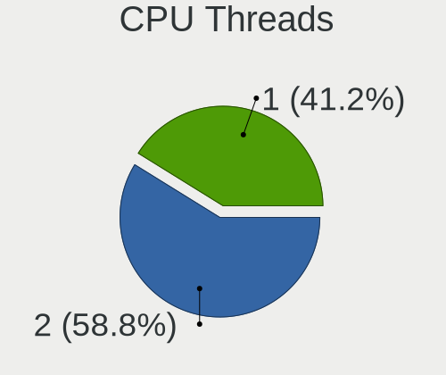

| Number | Desktops | Percent |
|--------|----------|---------|
| 2      | 26       | 59.09%  |
| 1      | 18       | 40.91%  |

CPU Op-Modes
------------

CPU Operation Modes (32-bit, 64-bit)

| Op mode        | Desktops | Percent |
|----------------|----------|---------|
| 32-bit, 64-bit | 44       | 100%    |

CPU Microcode
-------------

Microcode number

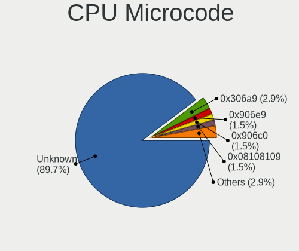

| Number     | Desktops | Percent |
|------------|----------|---------|
| Unknown    | 37       | 84.09%  |
| 0x306a9    | 2        | 4.55%   |
| 0x906e9    | 1        | 2.27%   |
| 0x906c0    | 1        | 2.27%   |
| 0x08108109 | 1        | 2.27%   |
| 0x07030106 | 1        | 2.27%   |
| 0x010000c8 | 1        | 2.27%   |

CPU Microarch
-------------

Microarchitecture

| Name          | Desktops | Percent |
|---------------|----------|---------|
| KabyLake      | 7        | 15.91%  |
| IvyBridge     | 5        | 11.36%  |
| Skylake       | 4        | 9.09%   |
| Haswell       | 4        | 9.09%   |
| Unknown       | 3        | 6.82%   |
| Zen+          | 2        | 4.55%   |
| Zen 3         | 2        | 4.55%   |
| Zen 2         | 2        | 4.55%   |
| Zen           | 2        | 4.55%   |
| Steamroller   | 2        | 4.55%   |
| Penryn        | 2        | 4.55%   |
| K10           | 2        | 4.55%   |
| Westmere      | 1        | 2.27%   |
| Tremont       | 1        | 2.27%   |
| Puma          | 1        | 2.27%   |
| Nehalem       | 1        | 2.27%   |
| Goldmont plus | 1        | 2.27%   |
| CometLake     | 1        | 2.27%   |
| Bobcat        | 1        | 2.27%   |

Graphics
--------

GPU Vendor
----------

Vendors of graphics cards

| Vendor | Desktops | Percent |
|--------|----------|---------|
| AMD    | 17       | 36.96%  |
| Intel  | 15       | 32.61%  |
| Nvidia | 14       | 30.43%  |

GPU Model
---------

Graphics card models

| Model                                                                       | Desktops | Percent |
|-----------------------------------------------------------------------------|----------|---------|
| Nvidia GK107 [GeForce GT 640]                                               | 2        | 4.17%   |
| Intel JasperLake [UHD Graphics]                                             | 2        | 4.17%   |
| Intel HD Graphics 630                                                       | 2        | 4.17%   |
| Intel HD Graphics 530                                                       | 2        | 4.17%   |
| Intel CoffeeLake-S GT2 [UHD Graphics 630]                                   | 2        | 4.17%   |
| AMD Navi 23 [Radeon RX 6600/6600 XT/6600M]                                  | 2        | 4.17%   |
| AMD Ellesmere [Radeon RX 470/480/570/570X/580/580X/590]                     | 2        | 4.17%   |
| AMD Cezanne [Radeon Vega Series / Radeon Vega Mobile Series]                | 2        | 4.17%   |
| Nvidia TU117 [GeForce GTX 1650]                                             | 1        | 2.08%   |
| Nvidia TU116 [GeForce GTX 1660 SUPER]                                       | 1        | 2.08%   |
| Nvidia TU104 [GeForce RTX 2080 SUPER]                                       | 1        | 2.08%   |
| Nvidia GT218 [GeForce 210]                                                  | 1        | 2.08%   |
| Nvidia GP108 [GeForce GT 1030]                                              | 1        | 2.08%   |
| Nvidia GP107 [GeForce GTX 1050]                                             | 1        | 2.08%   |
| Nvidia GP104 [GeForce GTX 1070]                                             | 1        | 2.08%   |
| Nvidia GK107 [GeForce GTX 650]                                              | 1        | 2.08%   |
| Nvidia GA104 [GeForce RTX 3070]                                             | 1        | 2.08%   |
| Nvidia GA104 [GeForce RTX 3060 Ti Lite Hash Rate]                           | 1        | 2.08%   |
| Nvidia GA103 [GeForce RTX 3060 Ti]                                          | 1        | 2.08%   |
| Nvidia G84 [GeForce 8600 GT]                                                | 1        | 2.08%   |
| Intel Xeon E3-1200 v3/4th Gen Core Processor Integrated Graphics Controller | 1        | 2.08%   |
| Intel Xeon E3-1200 v2/3rd Gen Core processor Graphics Controller            | 1        | 2.08%   |
| Intel IvyBridge GT2 [HD Graphics 4000]                                      | 1        | 2.08%   |
| Intel GeminiLake [UHD Graphics 600]                                         | 1        | 2.08%   |
| Intel Core Processor Integrated Graphics Controller                         | 1        | 2.08%   |
| Intel 4th Generation Core Processor Family Integrated Graphics Controller   | 1        | 2.08%   |
| Intel 4 Series Chipset Integrated Graphics Controller                       | 1        | 2.08%   |
| AMD Wrestler [Radeon HD 6320]                                               | 1        | 2.08%   |
| AMD RV535 [Radeon X1650 PRO] (Secondary)                                    | 1        | 2.08%   |
| AMD RV535 [Radeon X1650 PRO]                                                | 1        | 2.08%   |
| AMD RS880 [Radeon HD 4200]                                                  | 1        | 2.08%   |
| AMD RS780L [Radeon 3000]                                                    | 1        | 2.08%   |
| AMD Raven Ridge [Radeon Vega Series / Radeon Vega Mobile Series]            | 1        | 2.08%   |
| AMD Picasso/Raven 2 [Radeon Vega Series / Radeon Vega Mobile Series]        | 1        | 2.08%   |
| AMD Oland [Radeon HD 8570 / R5 430 OEM / R7 240/340 / Radeon 520 OEM]       | 1        | 2.08%   |
| AMD Navi 10 [Radeon RX 5600 OEM/5600 XT / 5700/5700 XT]                     | 1        | 2.08%   |
| AMD Mullins [Radeon R2 Graphics]                                            | 1        | 2.08%   |
| AMD Kaveri [Radeon R7 Graphics]                                             | 1        | 2.08%   |
| AMD Kaveri [Radeon R5 Graphics]                                             | 1        | 2.08%   |
| AMD Curacao PRO [Radeon R7 370 / R9 270/370 OEM]                            | 1        | 2.08%   |

GPU Combo
---------

Combinations of graphics cards

| Name            | Desktops | Percent |
|-----------------|----------|---------|
| 1 x AMD         | 15       | 34.09%  |
| 1 x Nvidia      | 13       | 29.55%  |
| 1 x Intel       | 13       | 29.55%  |
| 2 x AMD         | 1        | 2.27%   |
| Intel + 2 x AMD | 1        | 2.27%   |
| Intel + Nvidia  | 1        | 2.27%   |

GPU Driver
----------

Free vs proprietary

| Driver      | Desktops | Percent |
|-------------|----------|---------|
| Free        | 39       | 88.64%  |
| Proprietary | 5        | 11.36%  |

GPU Memory
----------

Total video memory

| Size in GB | Desktops | Percent |
|------------|----------|---------|
| Unknown    | 38       | 86.36%  |
| 7.01-8.0   | 2        | 4.55%   |
| 0.51-1.0   | 2        | 4.55%   |
| 1.01-2.0   | 1        | 2.27%   |
| 0.01-0.5   | 1        | 2.27%   |

Monitor
-------

Monitor Vendor
--------------

Monitor vendors

| Vendor               | Desktops | Percent |
|----------------------|----------|---------|
| Samsung Electronics  | 7        | 14.89%  |
| Goldstar             | 7        | 14.89%  |
| Hewlett-Packard      | 3        | 6.38%   |
| Dell                 | 3        | 6.38%   |
| Acer                 | 3        | 6.38%   |
| Sceptre Tech         | 2        | 4.26%   |
| Philips              | 2        | 4.26%   |
| BenQ                 | 2        | 4.26%   |
| ___                  | 1        | 2.13%   |
| Vizio                | 1        | 2.13%   |
| Unknown              | 1        | 2.13%   |
| Sony                 | 1        | 2.13%   |
| Positivo             | 1        | 2.13%   |
| NSL                  | 1        | 2.13%   |
| MYS                  | 1        | 2.13%   |
| MSI                  | 1        | 2.13%   |
| Lenovo               | 1        | 2.13%   |
| Kogan                | 1        | 2.13%   |
| Hitachi              | 1        | 2.13%   |
| HannStar             | 1        | 2.13%   |
| Fujitsu Siemens      | 1        | 2.13%   |
| Eizo                 | 1        | 2.13%   |
| CVT                  | 1        | 2.13%   |
| ASUSTek Computer     | 1        | 2.13%   |
| AOC                  | 1        | 2.13%   |
| Ancor Communications | 1        | 2.13%   |

Monitor Model
-------------

Monitor models

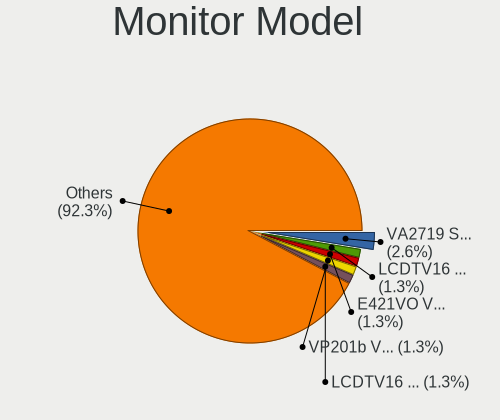

| Model                                                                | Desktops | Percent |
|----------------------------------------------------------------------|----------|---------|
| ___ LCDTV16 ___3393 1366x768                                         | 1        | 2%      |
| Vizio E221VA VIZ0070 1920x1080 476x268mm 21.5-inch                   | 1        | 2%      |
| Unknown LCDTV16 3393 1920x1080 1600x900mm 72.3-inch                  | 1        | 2%      |
| Sony TV SNY7A02 1360x768 708x398mm 32.0-inch                         | 1        | 2%      |
| Sceptre Tech Sceptre Q27 SPT0AD2 2560x1440 597x336mm 27.0-inch       | 1        | 2%      |
| Sceptre Tech E24 SPT099D 1920x1080 521x293mm 23.5-inch               | 1        | 2%      |
| Samsung Electronics SyncMaster SAM05CC 1920x1080 530x300mm 24.0-inch | 1        | 2%      |
| Samsung Electronics SMB2030HD SAM0709 1600x900 443x249mm 20.0-inch   | 1        | 2%      |
| Samsung Electronics S27A950D SAM079F 1920x1080 598x336mm 27.0-inch   | 1        | 2%      |
| Samsung Electronics S24E450 SAM0C7F 1920x1080 521x293mm 23.5-inch    | 1        | 2%      |
| Samsung Electronics S19D300 SAM0B36 1366x768 410x230mm 18.5-inch     | 1        | 2%      |
| Samsung Electronics LS27AG55x SAM71E0 2560x1440 597x336mm 27.0-inch  | 1        | 2%      |
| Samsung Electronics C32F391 SAM0D34 1920x1080 698x393mm 31.5-inch    | 1        | 2%      |
| Positivo MC35120QWQHD NON3503 3440x1440 819x346mm 35.0-inch          | 1        | 2%      |
| Philips PHL 243V7 PHLC155 1920x1080 527x296mm 23.8-inch              | 1        | 2%      |
| Philips 220TS PHLC06B 1920x1080 477x268mm 21.5-inch                  | 1        | 2%      |
| NSL RGB-27QHD NSL2711 2560x1440 597x336mm 27.0-inch                  | 1        | 2%      |
| MYS LCD Monitor MYS1700 1280x1024 360x240mm 17.0-inch                | 1        | 2%      |
| MSI G241 MSI3BA4 1920x1080 527x296mm 23.8-inch                       | 1        | 2%      |
| Lenovo LI2215sD LEN65CC 1920x1080 476x267mm 21.5-inch                | 1        | 2%      |
| Kogan KAMN27QF7TA KGN0270 2560x1440 698x393mm 31.5-inch              | 1        | 2%      |
| Hitachi HISENSE HEC0030 3840x2160 1095x616mm 49.5-inch               | 1        | 2%      |
| Hewlett-Packard ZR30w HWP286C 2560x1600 641x400mm 29.7-inch          | 1        | 2%      |
| Hewlett-Packard VH240a HPN3499 1920x1080 527x296mm 23.8-inch         | 1        | 2%      |
| Hewlett-Packard E231 HWP3063 1920x1080 510x287mm 23.0-inch           | 1        | 2%      |
| HannStar HSG1074 HSP0019 1920x1080 543x305mm 24.5-inch               | 1        | 2%      |
| Goldstar W1953 GSM4BA7 1360x768 406x229mm 18.4-inch                  | 1        | 2%      |
| Goldstar W1943 GSM4BAD 1360x768 406x229mm 18.4-inch                  | 1        | 2%      |
| Goldstar ULTRAGEAR GSM7766 2560x1440 697x392mm 31.5-inch             | 1        | 2%      |
| Goldstar HDR WFHD GSM5BA0 2560x1080 798x334mm 34.1-inch              | 1        | 2%      |
| Goldstar FULL HD GSM5B54 1920x1080 480x270mm 21.7-inch               | 1        | 2%      |
| Goldstar E2260 GSM57E0 1920x1080 477x268mm 21.5-inch                 | 1        | 2%      |
| Goldstar 27MP35 GSM5A86 1920x1080 598x337mm 27.0-inch                | 1        | 2%      |
| Goldstar 22EN33 GSM597C 1920x1080 480x270mm 21.7-inch                | 1        | 2%      |
| Fujitsu Siemens B27T-7 LED FUS083D 1920x1080 598x336mm 27.0-inch     | 1        | 2%      |
| Eizo LCD Monitor EV2456 1920x1200                                    | 1        | 2%      |
| Dell U2410 DELF016 1920x1200 518x324mm 24.1-inch                     | 1        | 2%      |
| Dell P2213 DELF043 1680x1050 470x300mm 22.0-inch                     | 1        | 2%      |
| Dell LCD Monitor LNK0001 1920x1080 256x192mm 12.6-inch               | 1        | 2%      |
| Dell E1914H DELD03A 1366x768 410x230mm 18.5-inch                     | 1        | 2%      |

Monitor Resolution
------------------

Monitor screen resolution

| Resolution         | Desktops | Percent |
|--------------------|----------|---------|
| 1920x1080 (FHD)    | 25       | 53.19%  |
| 2560x1440 (QHD)    | 6        | 12.77%  |
| 1366x768 (WXGA)    | 3        | 6.38%   |
| 3440x1440          | 2        | 4.26%   |
| 1920x1200 (WUXGA)  | 2        | 4.26%   |
| 1360x768           | 2        | 4.26%   |
| 1280x1024 (SXGA)   | 2        | 4.26%   |
| 3840x2160 (4K)     | 1        | 2.13%   |
| 2560x1600          | 1        | 2.13%   |
| 2560x1080          | 1        | 2.13%   |
| 1680x1050 (WSXGA+) | 1        | 2.13%   |
| 1600x900 (HD+)     | 1        | 2.13%   |

Monitor Diagonal
----------------

Diagonal size in inches

| Inches  | Desktops | Percent |
|---------|----------|---------|
| 24      | 9        | 18.37%  |
| 27      | 7        | 14.29%  |
| 21      | 6        | 12.24%  |
| 23      | 4        | 8.16%   |
| 18      | 4        | 8.16%   |
| 31      | 3        | 6.12%   |
| 34      | 2        | 4.08%   |
| Unknown | 2        | 4.08%   |
| 84      | 1        | 2.04%   |
| 72      | 1        | 2.04%   |
| 42      | 1        | 2.04%   |
| 35      | 1        | 2.04%   |
| 32      | 1        | 2.04%   |
| 29      | 1        | 2.04%   |
| 26      | 1        | 2.04%   |
| 22      | 1        | 2.04%   |
| 20      | 1        | 2.04%   |
| 19      | 1        | 2.04%   |
| 17      | 1        | 2.04%   |
| 14      | 1        | 2.04%   |

Monitor Width
-------------

Physical width

| Width in mm | Desktops | Percent |
|-------------|----------|---------|
| 501-600     | 19       | 40.43%  |
| 401-500     | 12       | 25.53%  |
| 601-700     | 4        | 8.51%   |
| 701-800     | 3        | 6.38%   |
| 351-400     | 2        | 4.26%   |
| 1501-2000   | 2        | 4.26%   |
| Unknown     | 2        | 4.26%   |
| 801-900     | 1        | 2.13%   |
| 201-300     | 1        | 2.13%   |
| 901-1000    | 1        | 2.13%   |

Aspect Ratio
------------

Proportional relationship between the width and the height

| Ratio   | Desktops | Percent |
|---------|----------|---------|
| 16/9    | 35       | 76.09%  |
| 16/10   | 4        | 8.7%    |
| 21/9    | 3        | 6.52%   |
| 6/5     | 1        | 2.17%   |
| 4/3     | 1        | 2.17%   |
| 3/2     | 1        | 2.17%   |
| Unknown | 1        | 2.17%   |

Monitor Area
------------

Area in inch²

| Area in inch² | Desktops | Percent |
|----------------|----------|---------|
| 201-250        | 15       | 31.25%  |
| 351-500        | 8        | 16.67%  |
| 301-350        | 7        | 14.58%  |
| 151-200        | 4        | 8.33%   |
| 141-150        | 4        | 8.33%   |
| 251-300        | 3        | 6.25%   |
| More than 1000 | 2        | 4.17%   |
| Unknown        | 2        | 4.17%   |
| 131-140        | 1        | 2.08%   |
| 101-110        | 1        | 2.08%   |
| 501-1000       | 1        | 2.08%   |

Pixel Density
-------------

Pixels per inch

| Density | Desktops | Percent |
|---------|----------|---------|
| 51-100  | 28       | 63.64%  |
| 101-120 | 11       | 25%     |
| 1-50    | 2        | 4.55%   |
| Unknown | 2        | 4.55%   |
| 121-160 | 1        | 2.27%   |

Multiple Monitors
-----------------

Total monitors connected

| Total | Desktops | Percent |
|-------|----------|---------|
| 1     | 36       | 81.82%  |
| 2     | 8        | 18.18%  |

Network
-------

Net Controller Vendor
---------------------

Controller vendors

| Vendor                   | Desktops | Percent |
|--------------------------|----------|---------|
| Realtek Semiconductor    | 22       | 33.85%  |
| Intel                    | 20       | 30.77%  |
| Qualcomm Atheros         | 7        | 10.77%  |
| Broadcom                 | 3        | 4.62%   |
| Xiaomi                   | 2        | 3.08%   |
| TP-Link                  | 2        | 3.08%   |
| Marvell Technology Group | 2        | 3.08%   |
| Samsung Electronics      | 1        | 1.54%   |
| Ralink                   | 1        | 1.54%   |
| Qualcomm                 | 1        | 1.54%   |
| MediaTek                 | 1        | 1.54%   |
| Linksys                  | 1        | 1.54%   |
| Huawei Technologies      | 1        | 1.54%   |
| ASUSTek Computer         | 1        | 1.54%   |

Net Controller Model
--------------------

Controller models

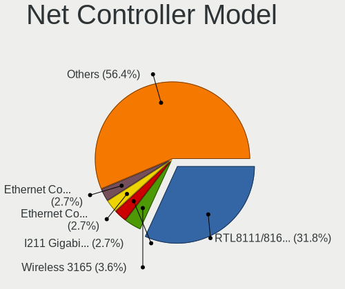

| Model                                                             | Desktops | Percent |
|-------------------------------------------------------------------|----------|---------|
| Realtek RTL8111/8168/8411 PCI Express Gigabit Ethernet Controller | 20       | 27.03%  |
| Intel Ethernet Controller I225-V                                  | 3        | 4.05%   |
| Intel Ethernet Connection (2) I219-V                              | 3        | 4.05%   |
| Realtek RTL88x2bu [AC1200 Techkey]                                | 2        | 2.7%    |
| Intel Wireless 3165                                               | 2        | 2.7%    |
| Intel Wi-Fi 6 AX210/AX211/AX411 160MHz                            | 2        | 2.7%    |
| Intel Ethernet Connection (7) I219-V                              | 2        | 2.7%    |
| Intel Ethernet Connection (2) I219-LM                             | 2        | 2.7%    |
| Intel Alder Lake-S PCH CNVi WiFi                                  | 2        | 2.7%    |
| Intel 82579V Gigabit Network Connection                           | 2        | 2.7%    |
| Xiaomi Mi/Redmi series (RNDIS)                                    | 1        | 1.35%   |
| Xiaomi Mi/Redmi series (RNDIS + ADB)                              | 1        | 1.35%   |
| TP-Link UE300 10/100/1000 LAN (ethernet mode) [Realtek RTL8153]   | 1        | 1.35%   |
| TP-Link TL-WN722N v2/v3 [Realtek RTL8188EUS]                      | 1        | 1.35%   |
| Samsung GT-I9070 (network tethering, USB debugging enabled)       | 1        | 1.35%   |
| Realtek RTL8821CE 802.11ac PCIe Wireless Network Adapter          | 1        | 1.35%   |
| Realtek RTL8125 2.5GbE Controller                                 | 1        | 1.35%   |
| Ralink RT3090 Wireless 802.11n 1T/1R PCIe                         | 1        | 1.35%   |
| Qualcomm Nokia G400 5G                                            | 1        | 1.35%   |
| Qualcomm Atheros QCA9377 802.11ac Wireless Network Adapter        | 1        | 1.35%   |
| Qualcomm Atheros QCA6174 802.11ac Wireless Network Adapter        | 1        | 1.35%   |
| Qualcomm Atheros Killer E2500 Gigabit Ethernet Controller         | 1        | 1.35%   |
| Qualcomm Atheros Killer E220x Gigabit Ethernet Controller         | 1        | 1.35%   |
| Qualcomm Atheros Attansic L2 Fast Ethernet                        | 1        | 1.35%   |
| Qualcomm Atheros AR9485 Wireless Network Adapter                  | 1        | 1.35%   |
| Qualcomm Atheros AR93xx Wireless Network Adapter                  | 1        | 1.35%   |
| Qualcomm Atheros AR8161 Gigabit Ethernet                          | 1        | 1.35%   |
| MediaTek MT7921K (RZ608) Wi-Fi 6E 80MHz                           | 1        | 1.35%   |
| Marvell Group Libertas 802.11b/g Wireless LAN Client Adapter      | 1        | 1.35%   |
| Marvell Group 88w8335 [Libertas] 802.11b/g Wireless               | 1        | 1.35%   |
| Linksys AE1200 802.11bgn Wireless Adapter [Broadcom BCM43235]     | 1        | 1.35%   |
| Intel Wireless 8260                                               | 1        | 1.35%   |
| Intel Wi-Fi 6 AX200                                               | 1        | 1.35%   |
| Intel I211 Gigabit Network Connection                             | 1        | 1.35%   |
| Intel Ethernet Connection I217-LM                                 | 1        | 1.35%   |
| Intel Ethernet Connection (17) I219-V                             | 1        | 1.35%   |
| Intel Ethernet Connection (14) I219-V                             | 1        | 1.35%   |
| Intel 82578DC Gigabit Network Connection                          | 1        | 1.35%   |
| Intel 82567LM-3 Gigabit Network Connection                        | 1        | 1.35%   |
| Huawei LLD-L21                                                    | 1        | 1.35%   |

Wireless Vendor
---------------

Wireless vendors

| Vendor                   | Desktops | Percent |
|--------------------------|----------|---------|
| Intel                    | 8        | 34.78%  |
| Qualcomm Atheros         | 4        | 17.39%  |
| Realtek Semiconductor    | 3        | 13.04%  |
| Marvell Technology Group | 2        | 8.7%    |
| TP-Link                  | 1        | 4.35%   |
| Ralink                   | 1        | 4.35%   |
| MediaTek                 | 1        | 4.35%   |
| Linksys                  | 1        | 4.35%   |
| Broadcom                 | 1        | 4.35%   |
| ASUSTek Computer         | 1        | 4.35%   |

Wireless Model
--------------

Wireless models

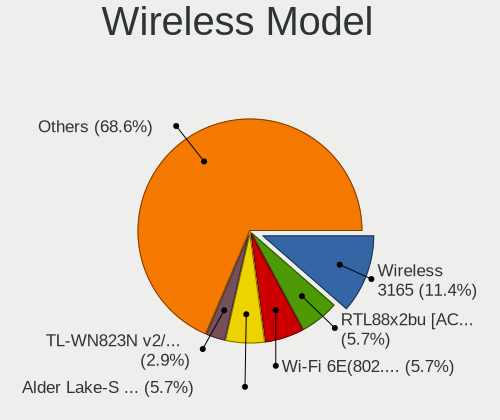

| Model                                                         | Desktops | Percent |
|---------------------------------------------------------------|----------|---------|
| Realtek RTL88x2bu [AC1200 Techkey]                            | 2        | 8.7%    |
| Intel Wireless 3165                                           | 2        | 8.7%    |
| Intel Wi-Fi 6 AX210/AX211/AX411 160MHz                        | 2        | 8.7%    |
| Intel Alder Lake-S PCH CNVi WiFi                              | 2        | 8.7%    |
| TP-Link TL-WN722N v2/v3 [Realtek RTL8188EUS]                  | 1        | 4.35%   |
| Realtek RTL8821CE 802.11ac PCIe Wireless Network Adapter      | 1        | 4.35%   |
| Ralink RT3090 Wireless 802.11n 1T/1R PCIe                     | 1        | 4.35%   |
| Qualcomm Atheros QCA9377 802.11ac Wireless Network Adapter    | 1        | 4.35%   |
| Qualcomm Atheros QCA6174 802.11ac Wireless Network Adapter    | 1        | 4.35%   |
| Qualcomm Atheros AR9485 Wireless Network Adapter              | 1        | 4.35%   |
| Qualcomm Atheros AR93xx Wireless Network Adapter              | 1        | 4.35%   |
| MediaTek MT7921K (RZ608) Wi-Fi 6E 80MHz                       | 1        | 4.35%   |
| Marvell Group Libertas 802.11b/g Wireless LAN Client Adapter  | 1        | 4.35%   |
| Marvell Group 88w8335 [Libertas] 802.11b/g Wireless           | 1        | 4.35%   |
| Linksys AE1200 802.11bgn Wireless Adapter [Broadcom BCM43235] | 1        | 4.35%   |
| Intel Wireless 8260                                           | 1        | 4.35%   |
| Intel Wi-Fi 6 AX200                                           | 1        | 4.35%   |
| Broadcom BCM4360 802.11ac Wireless Network Adapter            | 1        | 4.35%   |
| ASUS 802.11ac WLAN Adapter                                    | 1        | 4.35%   |

Ethernet Vendor
---------------

Ethernet vendors

| Vendor                | Desktops | Percent |
|-----------------------|----------|---------|
| Realtek Semiconductor | 21       | 42%     |
| Intel                 | 18       | 36%     |
| Qualcomm Atheros      | 4        | 8%      |
| Xiaomi                | 2        | 4%      |
| Broadcom              | 2        | 4%      |
| TP-Link               | 1        | 2%      |
| Qualcomm              | 1        | 2%      |
| Huawei Technologies   | 1        | 2%      |

Ethernet Model
--------------

Ethernet models

| Model                                                             | Desktops | Percent |
|-------------------------------------------------------------------|----------|---------|
| Realtek RTL8111/8168/8411 PCI Express Gigabit Ethernet Controller | 20       | 40%     |
| Intel Ethernet Controller I225-V                                  | 3        | 6%      |
| Intel Ethernet Connection (2) I219-V                              | 3        | 6%      |
| Intel Ethernet Connection (7) I219-V                              | 2        | 4%      |
| Intel Ethernet Connection (2) I219-LM                             | 2        | 4%      |
| Intel 82579V Gigabit Network Connection                           | 2        | 4%      |
| Xiaomi Mi/Redmi series (RNDIS)                                    | 1        | 2%      |
| Xiaomi Mi/Redmi series (RNDIS + ADB)                              | 1        | 2%      |
| TP-Link UE300 10/100/1000 LAN (ethernet mode) [Realtek RTL8153]   | 1        | 2%      |
| Realtek RTL8125 2.5GbE Controller                                 | 1        | 2%      |
| Qualcomm Nokia G400 5G                                            | 1        | 2%      |
| Qualcomm Atheros Killer E2500 Gigabit Ethernet Controller         | 1        | 2%      |
| Qualcomm Atheros Killer E220x Gigabit Ethernet Controller         | 1        | 2%      |
| Qualcomm Atheros Attansic L2 Fast Ethernet                        | 1        | 2%      |
| Qualcomm Atheros AR8161 Gigabit Ethernet                          | 1        | 2%      |
| Intel I211 Gigabit Network Connection                             | 1        | 2%      |
| Intel Ethernet Connection I217-LM                                 | 1        | 2%      |
| Intel Ethernet Connection (17) I219-V                             | 1        | 2%      |
| Intel Ethernet Connection (14) I219-V                             | 1        | 2%      |
| Intel 82578DC Gigabit Network Connection                          | 1        | 2%      |
| Intel 82567LM-3 Gigabit Network Connection                        | 1        | 2%      |
| Huawei LLD-L21                                                    | 1        | 2%      |
| Broadcom NetXtreme II BCM5706 Gigabit Ethernet                    | 1        | 2%      |
| Broadcom NetXtreme BCM5762 Gigabit Ethernet PCIe                  | 1        | 2%      |

Net Controller Kind
-------------------

Ethernet, WiFi or modem

| Kind     | Desktops | Percent |
|----------|----------|---------|
| Ethernet | 45       | 67.16%  |
| WiFi     | 21       | 31.34%  |
| Modem    | 1        | 1.49%   |

Used Controller
---------------

Currently used network controller

| Kind     | Desktops | Percent |
|----------|----------|---------|
| Ethernet | 33       | 76.74%  |
| WiFi     | 10       | 23.26%  |

NICs
----

Total network controllers on board

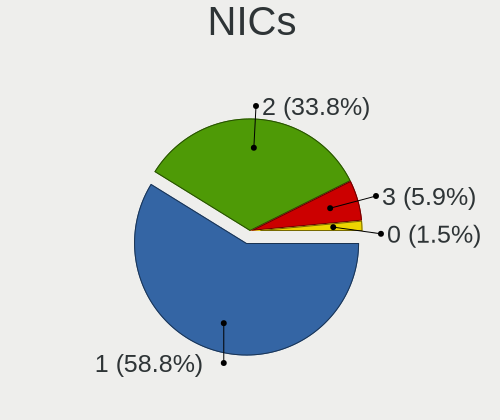

| Total | Desktops | Percent |
|-------|----------|---------|
| 1     | 23       | 52.27%  |
| 2     | 17       | 38.64%  |
| 3     | 3        | 6.82%   |
| 0     | 1        | 2.27%   |

IPv6
----

IPv6 vs IPv4

| Used | Desktops | Percent |
|------|----------|---------|
| No   | 25       | 56.82%  |
| Yes  | 19       | 43.18%  |

Bluetooth
---------

Bluetooth Vendor
----------------

Controller vendors

| Vendor                          | Desktops | Percent |
|---------------------------------|----------|---------|
| Intel                           | 8        | 38.1%   |
| Cambridge Silicon Radio         | 5        | 23.81%  |
| Realtek Semiconductor           | 2        | 9.52%   |
| Qualcomm Atheros Communications | 2        | 9.52%   |
| ASUSTek Computer                | 2        | 9.52%   |
| MediaTek                        | 1        | 4.76%   |
| Broadcom                        | 1        | 4.76%   |

Bluetooth Model
---------------

Controller models

| Model                                               | Desktops | Percent |
|-----------------------------------------------------|----------|---------|
| Cambridge Silicon Radio Bluetooth Dongle (HCI mode) | 5        | 23.81%  |
| Intel Bluetooth wireless interface                  | 3        | 14.29%  |
| Realtek Bluetooth Radio                             | 2        | 9.52%   |
| Qualcomm Atheros  Bluetooth Device                  | 2        | 9.52%   |
| Intel AX210 Bluetooth                               | 2        | 9.52%   |
| MediaTek Wireless_Device                            | 1        | 4.76%   |
| Intel Bluetooth 9460/9560 Jefferson Peak (JfP)      | 1        | 4.76%   |
| Intel AX201 Bluetooth                               | 1        | 4.76%   |
| Intel AX200 Bluetooth                               | 1        | 4.76%   |
| Broadcom Bluetooth 3.0 USB Dongle                   | 1        | 4.76%   |
| ASUS Broadcom BCM20702A0 Bluetooth                  | 1        | 4.76%   |
| ASUS ASUS USB-BT500                                 | 1        | 4.76%   |

Sound
-----

Sound Vendor
------------

Sound card vendors

| Vendor                   | Desktops | Percent |
|--------------------------|----------|---------|
| Intel                    | 30       | 40%     |
| AMD                      | 18       | 24%     |
| Nvidia                   | 13       | 17.33%  |
| C-Media Electronics      | 5        | 6.67%   |
| Logitech                 | 3        | 4%      |
| Razer USA                | 1        | 1.33%   |
| Nordic Semiconductor ASA | 1        | 1.33%   |
| KTMicro                  | 1        | 1.33%   |
| Goldvish                 | 1        | 1.33%   |
| Creative Labs            | 1        | 1.33%   |
| ASUSTek Computer         | 1        | 1.33%   |

Sound Model
-----------

Sound card models

| Model                                                                      | Desktops | Percent |
|----------------------------------------------------------------------------|----------|---------|
| Intel 100 Series/C230 Series Chipset Family HD Audio Controller            | 5        | 5.75%   |
| Intel 8 Series/C220 Series Chipset High Definition Audio Controller        | 4        | 4.6%    |
| C-Media Electronics Audio Adapter (Unitek Y-247A)                          | 4        | 4.6%    |
| AMD Family 17h/19h HD Audio Controller                                     | 4        | 4.6%    |
| Nvidia GK107 HDMI Audio Controller                                         | 3        | 3.45%   |
| Intel Cannon Lake PCH cAVS                                                 | 3        | 3.45%   |
| Intel 6 Series/C200 Series Chipset Family High Definition Audio Controller | 3        | 3.45%   |
| Intel 200 Series PCH HD Audio                                              | 3        | 3.45%   |
| AMD SBx00 Azalia (Intel HDA)                                               | 3        | 3.45%   |
| AMD Renoir Radeon High Definition Audio Controller                         | 3        | 3.45%   |
| AMD FCH Azalia Controller                                                  | 3        | 3.45%   |
| Nvidia GA104 High Definition Audio Controller                              | 2        | 2.3%    |
| Intel Xeon E3-1200 v3/4th Gen Core Processor HD Audio Controller           | 2        | 2.3%    |
| Intel Jasper Lake HD Audio                                                 | 2        | 2.3%    |
| Intel Alder Lake-S HD Audio Controller                                     | 2        | 2.3%    |
| Intel 7 Series/C216 Chipset Family High Definition Audio Controller        | 2        | 2.3%    |
| Intel 5 Series/3400 Series Chipset High Definition Audio                   | 2        | 2.3%    |
| AMD Raven/Raven2/Fenghuang HDMI/DP Audio Controller                        | 2        | 2.3%    |
| AMD Oland/Hainan/Cape Verde/Pitcairn HDMI Audio [Radeon HD 7000 Series]    | 2        | 2.3%    |
| AMD Navi 21/23 HDMI/DP Audio Controller                                    | 2        | 2.3%    |
| AMD Ellesmere HDMI Audio [Radeon RX 470/480 / 570/580/590]                 | 2        | 2.3%    |
| Razer USA Razer Barracuda X                                                | 1        | 1.15%   |
| Nvidia TU116 High Definition Audio Controller                              | 1        | 1.15%   |
| Nvidia TU107 GeForce GTX 1650 High Definition Audio Controller             | 1        | 1.15%   |
| Nvidia TU104 HD Audio Controller                                           | 1        | 1.15%   |
| Nvidia High Definition Audio Controller                                    | 1        | 1.15%   |
| Nvidia GP108 High Definition Audio Controller                              | 1        | 1.15%   |
| Nvidia GP107GL High Definition Audio Controller                            | 1        | 1.15%   |
| Nvidia GP104 High Definition Audio Controller                              | 1        | 1.15%   |
| Nvidia Audio device                                                        | 1        | 1.15%   |
| Nordic Semiconductor ASA BLE Remote                                        | 1        | 1.15%   |
| Logitech [G533 Wireless Headset Dongle]                                    | 1        | 1.15%   |
| Logitech Logi Z407                                                         | 1        | 1.15%   |
| Logitech G432 Gaming Headset                                               | 1        | 1.15%   |
| KTMicro KT USB Audio                                                       | 1        | 1.15%   |
| Intel Smart Sound Technology (SST) Audio Controller                        | 1        | 1.15%   |
| Intel NM10/ICH7 Family High Definition Audio Controller                    | 1        | 1.15%   |
| Intel Celeron/Pentium Silver Processor High Definition Audio               | 1        | 1.15%   |
| Intel 82801JD/DO (ICH10 Family) HD Audio Controller                        | 1        | 1.15%   |
| Goldvish H210                                                              | 1        | 1.15%   |

Memory
------

Memory Vendor
-------------

Memory module vendors

| Vendor              | Desktops | Percent |
|---------------------|----------|---------|
| Kingston            | 3        | 30%     |
| Unknown (0x5846)    | 1        | 10%     |
| Samsung Electronics | 1        | 10%     |
| CSX                 | 1        | 10%     |
| Corsair             | 1        | 10%     |
| Apacer              | 1        | 10%     |
| A-DATA Technology   | 1        | 10%     |
| Unknown             | 1        | 10%     |

Memory Model
------------

Memory module models

| Model                                                         | Desktops | Percent |
|---------------------------------------------------------------|----------|---------|
| Unknown (0x5846) RAM DDR4 NB 8G 2666 8GB SODIMM DDR4 2667MT/s | 1        | 10%     |
| Samsung RAM M378B5273CH0-CK0 4096MB DIMM DDR3 2000MT/s        | 1        | 10%     |
| Kingston RAM HX426C16FB/4 4GB DIMM DDR4 2800MT/s              | 1        | 10%     |
| Kingston RAM HX318C10F/8 8GB DIMM DDR3 1600MT/s               | 1        | 10%     |
| Kingston RAM ASU16D3LU1KBG/4G 4GB DIMM DDR3 3200MT/s          | 1        | 10%     |
| CSX RAM V01D3L82GB26826813 2GB DIMM 1066MT/s                  | 1        | 10%     |
| Corsair RAM CMK8GX4M1A2400C16 8GB DIMM DDR4 2800MT/s          | 1        | 10%     |
| Apacer RAM 78.CAGP7.C7Z0B 8GB DIMM DDR4 2400MT/s              | 1        | 10%     |
| A-DATA RAM Module 4GB DIMM DDR3 1600MT/s                      | 1        | 10%     |
| Unknown                                                       | 1        | 10%     |

Memory Kind
-----------

Memory module kinds

| Kind    | Desktops | Percent |
|---------|----------|---------|
| DDR4    | 3        | 37.5%   |
| DDR3    | 3        | 37.5%   |
| SDRAM   | 1        | 12.5%   |
| Unknown | 1        | 12.5%   |

Memory Form Factor
------------------

Physical design of the memory module

| Name   | Desktops | Percent |
|--------|----------|---------|
| DIMM   | 6        | 85.71%  |
| SODIMM | 1        | 14.29%  |

Memory Size
-----------

Memory module size

| Size | Desktops | Percent |
|------|----------|---------|
| 8192 | 4        | 50%     |
| 4096 | 3        | 37.5%   |
| 2048 | 1        | 12.5%   |

Memory Speed
------------

Memory module speed

| Speed | Desktops | Percent |
|-------|----------|---------|
| 2800  | 2        | 20%     |
| 1600  | 2        | 20%     |
| 3200  | 1        | 10%     |
| 2667  | 1        | 10%     |
| 2400  | 1        | 10%     |
| 2000  | 1        | 10%     |
| 1066  | 1        | 10%     |
| 533   | 1        | 10%     |

Printers & scanners
-------------------

Printer Vendor
--------------

Printer device vendors

| Vendor              | Desktops | Percent |
|---------------------|----------|---------|
| Samsung Electronics | 1        | 50%     |
| Canon               | 1        | 50%     |

Printer Model
-------------

Printer device models

| Model                | Desktops | Percent |
|----------------------|----------|---------|
| Samsung M2020 Series | 1        | 50%     |
| Canon MF4320-4350    | 1        | 50%     |

Scanner Vendor
--------------

Scanner device vendors

Zero info for selected period =(

Scanner Model
-------------

Scanner device models

Zero info for selected period =(

Camera
------

Camera Vendor
-------------

Camera device vendors

| Vendor                        | Desktops | Percent |
|-------------------------------|----------|---------|
| Sunplus Innovation Technology | 1        | 33.33%  |
| Generalplus Technology        | 1        | 33.33%  |
| Apple                         | 1        | 33.33%  |

Camera Model
------------

Camera device models

| Model                           | Desktops | Percent |
|---------------------------------|----------|---------|
| Sunplus FHD Camera Microphone   | 1        | 33.33%  |
| Generalplus WEB CAM             | 1        | 33.33%  |
| Apple iPhone 5/5C/5S/6/SE/7/8/X | 1        | 33.33%  |

Security
--------

Fingerprint Vendor
------------------

Fingerprint sensor vendors

Zero info for selected period =(

Fingerprint Model
-----------------

Fingerprint sensor models

Zero info for selected period =(

Chipcard Vendor
---------------

Chipcard module vendors

| Vendor      | Desktops | Percent |
|-------------|----------|---------|
| Alcor Micro | 1        | 100%    |

Chipcard Model
--------------

Chipcard module models

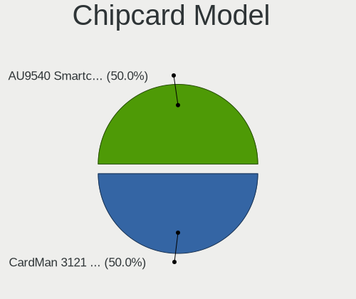

| Model                               | Desktops | Percent |
|-------------------------------------|----------|---------|
| Alcor Micro AU9540 Smartcard Reader | 1        | 100%    |

Unsupported
-----------

Unsupported Devices
-------------------

Total unsupported devices on board

| Total | Desktops | Percent |
|-------|----------|---------|
| 0     | 35       | 79.55%  |
| 1     | 8        | 18.18%  |
| 2     | 1        | 2.27%   |

Unsupported Device Types
------------------------

Types of unsupported devices

| Type                  | Desktops | Percent |
|-----------------------|----------|---------|
| Net/wireless          | 4        | 40%     |
| Network               | 1        | 10%     |
| Net/ethernet          | 1        | 10%     |
| Multimedia controller | 1        | 10%     |
| Graphics card         | 1        | 10%     |
| Chipcard              | 1        | 10%     |
| Card reader           | 1        | 10%     |

