Elementary 7 - Tested Hardware & Statistics (Desktops)
------------------------------------------------------

A project to collect tested hardware configurations for Elementary 7.

Anyone can contribute to this report by the [hw-probe](https://github.com/linuxhw/hw-probe) tool:

    sudo -E hw-probe -all -upload

Please contribute! Especially if your hardware is rare.

Contents
--------

* [ Test Cases ](#test-cases)

* [ System ](#system)
  - [ Kernel                   ](#kernel)
  - [ Kernel Family            ](#kernel-family)
  - [ Kernel Major Ver.        ](#kernel-major-ver)
  - [ Arch                     ](#arch)
  - [ DE                       ](#de)
  - [ Display Server           ](#display-server)
  - [ Display Manager          ](#display-manager)
  - [ OS Lang                  ](#os-lang)
  - [ Boot Mode                ](#boot-mode)
  - [ Filesystem               ](#filesystem)
  - [ Part. scheme             ](#part-scheme)
  - [ Dual Boot with Linux/BSD ](#dual-boot-with-linuxbsd)
  - [ Dual Boot (Win)          ](#dual-boot-win)

* [ Board ](#board)
  - [ Vendor                   ](#vendor)
  - [ Model                    ](#model)
  - [ Model Family             ](#model-family)
  - [ MFG Year                 ](#mfg-year)
  - [ Form Factor              ](#form-factor)
  - [ Secure Boot              ](#secure-boot)
  - [ Coreboot                 ](#coreboot)
  - [ RAM Size                 ](#ram-size)
  - [ RAM Used                 ](#ram-used)
  - [ Total Drives             ](#total-drives)
  - [ Has CD-ROM               ](#has-cd-rom)
  - [ Has Ethernet             ](#has-ethernet)
  - [ Has WiFi                 ](#has-wifi)
  - [ Has Bluetooth            ](#has-bluetooth)

* [ Location ](#location)
  - [ Country                  ](#country)
  - [ City                     ](#city)

* [ Drives ](#drives)
  - [ Drive Vendor             ](#drive-vendor)
  - [ Drive Model              ](#drive-model)
  - [ HDD Vendor               ](#hdd-vendor)
  - [ SSD Vendor               ](#ssd-vendor)
  - [ Drive Kind               ](#drive-kind)
  - [ Drive Connector          ](#drive-connector)
  - [ Drive Size               ](#drive-size)
  - [ Space Total              ](#space-total)
  - [ Space Used               ](#space-used)
  - [ Malfunc. Drives          ](#malfunc-drives)
  - [ Malfunc. Drive Vendor    ](#malfunc-drive-vendor)
  - [ Malfunc. HDD Vendor      ](#malfunc-hdd-vendor)
  - [ Malfunc. Drive Kind      ](#malfunc-drive-kind)
  - [ Failed Drives            ](#failed-drives)
  - [ Failed Drive Vendor      ](#failed-drive-vendor)
  - [ Drive Status             ](#drive-status)

* [ Storage controller ](#storage-controller)
  - [ Storage Vendor           ](#storage-vendor)
  - [ Storage Model            ](#storage-model)
  - [ Storage Kind             ](#storage-kind)

* [ Processor ](#processor)
  - [ CPU Vendor               ](#cpu-vendor)
  - [ CPU Model                ](#cpu-model)
  - [ CPU Model Family         ](#cpu-model-family)
  - [ CPU Cores                ](#cpu-cores)
  - [ CPU Sockets              ](#cpu-sockets)
  - [ CPU Threads              ](#cpu-threads)
  - [ CPU Op-Modes             ](#cpu-op-modes)
  - [ CPU Microcode            ](#cpu-microcode)
  - [ CPU Microarch            ](#cpu-microarch)

* [ Graphics ](#graphics)
  - [ GPU Vendor               ](#gpu-vendor)
  - [ GPU Model                ](#gpu-model)
  - [ GPU Combo                ](#gpu-combo)
  - [ GPU Driver               ](#gpu-driver)
  - [ GPU Memory               ](#gpu-memory)

* [ Monitor ](#monitor)
  - [ Monitor Vendor           ](#monitor-vendor)
  - [ Monitor Model            ](#monitor-model)
  - [ Monitor Resolution       ](#monitor-resolution)
  - [ Monitor Diagonal         ](#monitor-diagonal)
  - [ Monitor Width            ](#monitor-width)
  - [ Aspect Ratio             ](#aspect-ratio)
  - [ Monitor Area             ](#monitor-area)
  - [ Pixel Density            ](#pixel-density)
  - [ Multiple Monitors        ](#multiple-monitors)

* [ Network ](#network)
  - [ Net Controller Vendor    ](#net-controller-vendor)
  - [ Net Controller Model     ](#net-controller-model)
  - [ Wireless Vendor          ](#wireless-vendor)
  - [ Wireless Model           ](#wireless-model)
  - [ Ethernet Vendor          ](#ethernet-vendor)
  - [ Ethernet Model           ](#ethernet-model)
  - [ Net Controller Kind      ](#net-controller-kind)
  - [ Used Controller          ](#used-controller)
  - [ NICs                     ](#nics)
  - [ IPv6                     ](#ipv6)

* [ Bluetooth ](#bluetooth)
  - [ Bluetooth Vendor         ](#bluetooth-vendor)
  - [ Bluetooth Model          ](#bluetooth-model)

* [ Sound ](#sound)
  - [ Sound Vendor             ](#sound-vendor)
  - [ Sound Model              ](#sound-model)

* [ Memory ](#memory)
  - [ Memory Vendor            ](#memory-vendor)
  - [ Memory Model             ](#memory-model)
  - [ Memory Kind              ](#memory-kind)
  - [ Memory Form Factor       ](#memory-form-factor)
  - [ Memory Size              ](#memory-size)
  - [ Memory Speed             ](#memory-speed)

* [ Printers & scanners ](#printers--scanners)
  - [ Printer Vendor           ](#printer-vendor)
  - [ Printer Model            ](#printer-model)
  - [ Scanner Vendor           ](#scanner-vendor)
  - [ Scanner Model            ](#scanner-model)

* [ Camera ](#camera)
  - [ Camera Vendor            ](#camera-vendor)
  - [ Camera Model             ](#camera-model)

* [ Security ](#security)
  - [ Fingerprint Vendor       ](#fingerprint-vendor)
  - [ Fingerprint Model        ](#fingerprint-model)
  - [ Chipcard Vendor          ](#chipcard-vendor)
  - [ Chipcard Model           ](#chipcard-model)

* [ Unsupported ](#unsupported)
  - [ Unsupported Devices      ](#unsupported-devices)
  - [ Unsupported Device Types ](#unsupported-device-types)

Test Cases
----------

Total: 99

| Vendor    | Model                       | Probe                                                      | Date         |
|-----------|-----------------------------|------------------------------------------------------------|--------------|
| Dell      | 0F6X5P A00                  | [f9eae65d13](https://linux-hardware.org/?probe=f9eae65d13) | Dec 14, 2024 |
| ASRock    | B450M Pro4                  | [41cbe4313e](https://linux-hardware.org/?probe=41cbe4313e) | Nov 06, 2024 |
| Jetway    | TI61M5                      | [dff0fcc796](https://linux-hardware.org/?probe=dff0fcc796) | Nov 25, 2023 |
| Jetway    | TI61M5                      | [968d83ba14](https://linux-hardware.org/?probe=968d83ba14) | Nov 21, 2023 |
| ASUSTek   | P8H61-MX R2.0               | [b756b81d33](https://linux-hardware.org/?probe=b756b81d33) | Oct 12, 2023 |
| Gigabyte  | H110M-S2H-CF                | [3513d5bcf3](https://linux-hardware.org/?probe=3513d5bcf3) | Sep 28, 2023 |
| Gigabyte  | GA-MA790XT-UD4P             | [945e2bc260](https://linux-hardware.org/?probe=945e2bc260) | Sep 24, 2023 |
| HP        | 2ADC                        | [b4794f247b](https://linux-hardware.org/?probe=b4794f247b) | Sep 21, 2023 |
| HP        | 2ADC                        | [7e9eb06b31](https://linux-hardware.org/?probe=7e9eb06b31) | Sep 21, 2023 |
| ASUSTek   | PRIME X370-PRO              | [603ddfc4cf](https://linux-hardware.org/?probe=603ddfc4cf) | Sep 18, 2023 |
| ASUSTek   | VM42                        | [ca9a3b42d0](https://linux-hardware.org/?probe=ca9a3b42d0) | Sep 17, 2023 |
| ASUSTek   | M3A78-CM                    | [5a47ad5c25](https://linux-hardware.org/?probe=5a47ad5c25) | Sep 15, 2023 |
| ASUSTek   | M3A78-CM                    | [876175ae24](https://linux-hardware.org/?probe=876175ae24) | Sep 15, 2023 |
| ASUSTek   | PRIME B660-PLUS D4          | [b4c93a8e2e](https://linux-hardware.org/?probe=b4c93a8e2e) | Sep 12, 2023 |
| Lenovo    | NO DPK                      | [0a25a3d2af](https://linux-hardware.org/?probe=0a25a3d2af) | Sep 12, 2023 |
| Gigabyte  | 970A-DS3P                   | [ef1d9bfdab](https://linux-hardware.org/?probe=ef1d9bfdab) | Sep 08, 2023 |
| Gigabyte  | 970A-DS3P                   | [2ce7b78a76](https://linux-hardware.org/?probe=2ce7b78a76) | Sep 06, 2023 |
| Dell      | 0J3C2F A00                  | [9374424bbd](https://linux-hardware.org/?probe=9374424bbd) | Aug 30, 2023 |
| MSI       | B450 TOMAHAWK MAX II        | [2a2adfdc2e](https://linux-hardware.org/?probe=2a2adfdc2e) | Aug 30, 2023 |
| ASRock    | X370 Pro4                   | [190a0f1eee](https://linux-hardware.org/?probe=190a0f1eee) | Aug 23, 2023 |
| HP        | 18E7                        | [0bd07157fb](https://linux-hardware.org/?probe=0bd07157fb) | Aug 20, 2023 |
| ASUSTek   | P8Z68-V PRO GEN3            | [d05585906d](https://linux-hardware.org/?probe=d05585906d) | Aug 18, 2023 |
| Gigabyte  | B560M H                     | [663f9e62db](https://linux-hardware.org/?probe=663f9e62db) | Aug 08, 2023 |
| Acer      | Aspire TC-710 V:1.1         | [f6af1382fd](https://linux-hardware.org/?probe=f6af1382fd) | Aug 08, 2023 |
| Dell      | 0NKW6Y A02                  | [09ae57bb9a](https://linux-hardware.org/?probe=09ae57bb9a) | Aug 05, 2023 |
| Dell      | 0NKW6Y A02                  | [21460cac53](https://linux-hardware.org/?probe=21460cac53) | Aug 05, 2023 |
| Pegatron  | 2A94h                       | [9d5490fb82](https://linux-hardware.org/?probe=9d5490fb82) | Aug 04, 2023 |
| MSI       | A320M-A PRO MAX             | [36dda4bbfa](https://linux-hardware.org/?probe=36dda4bbfa) | Jul 28, 2023 |
| MSI       | A320M-A PRO MAX             | [10fa87c167](https://linux-hardware.org/?probe=10fa87c167) | Jul 28, 2023 |
| ASRock    | X570 Extreme4               | [5b1a74fc68](https://linux-hardware.org/?probe=5b1a74fc68) | Jul 27, 2023 |
| Acer      | Aspire TC-380               | [94f5f10ff2](https://linux-hardware.org/?probe=94f5f10ff2) | Jul 14, 2023 |
| Wortmann  | TERRA_PC                    | [60ece53188](https://linux-hardware.org/?probe=60ece53188) | Jul 13, 2023 |
| ASRock    | X370 Pro4                   | [4e8926a95b](https://linux-hardware.org/?probe=4e8926a95b) | Jul 11, 2023 |
| Lenovo    | 3106 SDK0J40697 WIN 3305... | [784f886357](https://linux-hardware.org/?probe=784f886357) | Jul 10, 2023 |
| Apple     | Mac-F221BEC8                | [881754a433](https://linux-hardware.org/?probe=881754a433) | Jul 09, 2023 |
| Alienware | 07HV66 A00                  | [41d4d9ae84](https://linux-hardware.org/?probe=41d4d9ae84) | Jul 05, 2023 |
| Alienware | 07HV66 A00                  | [2712110727](https://linux-hardware.org/?probe=2712110727) | Jul 05, 2023 |
| Gigabyte  | H81M-S2V                    | [38ae545c1c](https://linux-hardware.org/?probe=38ae545c1c) | Jun 23, 2023 |
| MSI       | B450M PRO-M2 V2             | [4f5e2f9201](https://linux-hardware.org/?probe=4f5e2f9201) | Jun 21, 2023 |
| Pegatron  | IPMIP-GS                    | [fb51893272](https://linux-hardware.org/?probe=fb51893272) | Jun 15, 2023 |
| ECS       | G41T-M                      | [2c148573fc](https://linux-hardware.org/?probe=2c148573fc) | Jun 11, 2023 |
| ASUSTek   | ROG STRIX B350-F GAMING     | [08114e8a97](https://linux-hardware.org/?probe=08114e8a97) | Jun 10, 2023 |
| ASUSTek   | PRIME B450-PLUS             | [93555cfd25](https://linux-hardware.org/?probe=93555cfd25) | Jun 10, 2023 |
| ASUSTek   | PRIME B450-PLUS             | [2e6d82c14f](https://linux-hardware.org/?probe=2e6d82c14f) | Jun 10, 2023 |
| MSI       | MPG Z390 GAMING PRO CARB... | [ddefeff960](https://linux-hardware.org/?probe=ddefeff960) | Jun 08, 2023 |
| MSI       | MPG Z390 GAMING PRO CARB... | [77fe6db865](https://linux-hardware.org/?probe=77fe6db865) | Jun 06, 2023 |
| Gigabyte  | GA-E6010N                   | [563074319d](https://linux-hardware.org/?probe=563074319d) | May 31, 2023 |
| Lenovo    | 3106 SDK0J40697 WIN 3305... | [01076d8e8b](https://linux-hardware.org/?probe=01076d8e8b) | May 30, 2023 |
| ASUSTek   | ROG STRIX B350-F GAMING     | [16b9dfbbe0](https://linux-hardware.org/?probe=16b9dfbbe0) | May 29, 2023 |
| ASUSTek   | PRIME B450-PLUS             | [e29fb14e81](https://linux-hardware.org/?probe=e29fb14e81) | May 26, 2023 |
| ASUSTek   | PRIME B450-PLUS             | [84d0d9807f](https://linux-hardware.org/?probe=84d0d9807f) | May 26, 2023 |
| ASUSTek   | P8H61-MX R2.0               | [3776285fc1](https://linux-hardware.org/?probe=3776285fc1) | May 16, 2023 |
| HP        | 1998                        | [b806151d9f](https://linux-hardware.org/?probe=b806151d9f) | May 12, 2023 |
| Intel     | JSL MRD                     | [76ff5c3bd7](https://linux-hardware.org/?probe=76ff5c3bd7) | May 05, 2023 |
| Dell      | 02N3WF A02                  | [3f10b3ca43](https://linux-hardware.org/?probe=3f10b3ca43) | May 04, 2023 |
| HP        | 1998                        | [6f816ac95a](https://linux-hardware.org/?probe=6f816ac95a) | Apr 29, 2023 |
| HP        | 8055                        | [a897208085](https://linux-hardware.org/?probe=a897208085) | Apr 26, 2023 |
| ASRock    | B660M-C                     | [849fc5d462](https://linux-hardware.org/?probe=849fc5d462) | Apr 25, 2023 |
| Gigabyte  | H410M H V3                  | [8fd18554d1](https://linux-hardware.org/?probe=8fd18554d1) | Apr 24, 2023 |
| MACHINIST | E5-MR9A PRO V1.1            | [eebce73217](https://linux-hardware.org/?probe=eebce73217) | Apr 23, 2023 |
| ASUSTek   | PRIME Z390-A                | [50a18b5e94](https://linux-hardware.org/?probe=50a18b5e94) | Apr 19, 2023 |
| Foxconn   | A76GMV                      | [bafa62c759](https://linux-hardware.org/?probe=bafa62c759) | Apr 18, 2023 |
| Foxconn   | A76GMV                      | [f129cb2de1](https://linux-hardware.org/?probe=f129cb2de1) | Apr 18, 2023 |
| ASUSTek   | PRIME Z390-A                | [e311d21def](https://linux-hardware.org/?probe=e311d21def) | Apr 13, 2023 |
| Lenovo    | 36F7 SDK0J40700 WIN 3258... | [8e05a5e529](https://linux-hardware.org/?probe=8e05a5e529) | Apr 13, 2023 |
| Gigabyte  | Z270-Gaming K3              | [0c03014734](https://linux-hardware.org/?probe=0c03014734) | Apr 12, 2023 |
| MSI       | B450M PRO-M2 MAX            | [5a83c18a3e](https://linux-hardware.org/?probe=5a83c18a3e) | Apr 01, 2023 |
| MSI       | B450M PRO-M2 MAX            | [94f75ee798](https://linux-hardware.org/?probe=94f75ee798) | Apr 01, 2023 |
| Unknown   | Unknown                     | [fb22157f03](https://linux-hardware.org/?probe=fb22157f03) | Mar 28, 2023 |
| AZW       | U59                         | [7674bb8dc9](https://linux-hardware.org/?probe=7674bb8dc9) | Mar 27, 2023 |
| ASUSTek   | M4A785TD-V EVO              | [1674c37cf9](https://linux-hardware.org/?probe=1674c37cf9) | Mar 16, 2023 |
| HP        | 805A                        | [5401e12606](https://linux-hardware.org/?probe=5401e12606) | Mar 14, 2023 |
| HP        | 3033h                       | [ab5e388ea9](https://linux-hardware.org/?probe=ab5e388ea9) | Mar 14, 2023 |
| HP        | 3033h                       | [38ac77726b](https://linux-hardware.org/?probe=38ac77726b) | Mar 13, 2023 |
| MSI       | B450 TOMAHAWK MAX           | [39d0e8595c](https://linux-hardware.org/?probe=39d0e8595c) | Mar 12, 2023 |
| MSI       | B365M PRO-VH                | [023f42d6d1](https://linux-hardware.org/?probe=023f42d6d1) | Mar 12, 2023 |
| Inventec  | Z CLASS A02                 | [c45e770987](https://linux-hardware.org/?probe=c45e770987) | Mar 06, 2023 |
| ASUSTek   | BT6130                      | [dabd3e0232](https://linux-hardware.org/?probe=dabd3e0232) | Mar 01, 2023 |
| Unknown   | Unknown                     | [1c5f8fef49](https://linux-hardware.org/?probe=1c5f8fef49) | Feb 28, 2023 |
| ASUSTek   | ROG STRIX Z690-A GAMING ... | [216ad20179](https://linux-hardware.org/?probe=216ad20179) | Feb 28, 2023 |
| Acer      | Predator G3620              | [72f3382b60](https://linux-hardware.org/?probe=72f3382b60) | Feb 27, 2023 |
| Gigabyte  | Z77X-UD5H                   | [2071bc50ce](https://linux-hardware.org/?probe=2071bc50ce) | Feb 27, 2023 |
| Gigabyte  | Z77X-UD5H                   | [472c035387](https://linux-hardware.org/?probe=472c035387) | Feb 27, 2023 |
| Dell      | 07PR60 A01                  | [c071b7ef1c](https://linux-hardware.org/?probe=c071b7ef1c) | Feb 27, 2023 |
| ASUSTek   | TUF X470-PLUS GAMING        | [ce9dda227f](https://linux-hardware.org/?probe=ce9dda227f) | Feb 25, 2023 |
| Gigabyte  | B550 AORUS ELITE            | [13a132516b](https://linux-hardware.org/?probe=13a132516b) | Feb 18, 2023 |
| ASUSTek   | TUF X470-PLUS GAMING        | [76ab936a75](https://linux-hardware.org/?probe=76ab936a75) | Feb 16, 2023 |
| ASUSTek   | H110M-A/M.2                 | [68f0415788](https://linux-hardware.org/?probe=68f0415788) | Feb 16, 2023 |
| ASUSTek   | H110M-A/M.2                 | [2560ba7644](https://linux-hardware.org/?probe=2560ba7644) | Feb 16, 2023 |
| Foxconn   | 2ADA                        | [e0f89bbca1](https://linux-hardware.org/?probe=e0f89bbca1) | Feb 16, 2023 |
| HP        | 805D                        | [217784712c](https://linux-hardware.org/?probe=217784712c) | Feb 14, 2023 |
| MSI       | B85-G43 GAMING              | [b2b66e40e1](https://linux-hardware.org/?probe=b2b66e40e1) | Feb 14, 2023 |
| ASUSTek   | TUF X470-PLUS GAMING        | [f0899499e5](https://linux-hardware.org/?probe=f0899499e5) | Feb 13, 2023 |
| ASUSTek   | H110M-A/M.2                 | [76711a4e32](https://linux-hardware.org/?probe=76711a4e32) | Feb 10, 2023 |
| ASUSTek   | H110M-A/M.2                 | [73b3c1c661](https://linux-hardware.org/?probe=73b3c1c661) | Feb 06, 2023 |
| Gigabyte  | F2A88XM-DS2                 | [d9313ff1c1](https://linux-hardware.org/?probe=d9313ff1c1) | Feb 05, 2023 |
| ASUSTek   | P7P55 LX                    | [3786e7a211](https://linux-hardware.org/?probe=3786e7a211) | Feb 04, 2023 |
| ASUSTek   | Z170 PRO GAMING             | [c2a4529e33](https://linux-hardware.org/?probe=c2a4529e33) | Jan 30, 2023 |
| Unknown   | HX90                        | [af144f98b6](https://linux-hardware.org/?probe=af144f98b6) | Jan 05, 2023 |

System
------

Kernel
------

Version of the Linux kernel

| Version             | Desktops | Percent |
|---------------------|----------|---------|
| 5.15.0-58-generic   | 20       | 28.17%  |
| 5.19.0-32-generic   | 9        | 12.68%  |
| 5.19.0-35-generic   | 6        | 8.45%   |
| 5.19.0-38-generic   | 5        | 7.04%   |
| 6.2.0-32-generic    | 4        | 5.63%   |
| 6.2.0-26-generic    | 4        | 5.63%   |
| 5.19.0-46-generic   | 4        | 5.63%   |
| 5.19.0-41-generic   | 4        | 5.63%   |
| 5.15.0-60-generic   | 4        | 5.63%   |
| 5.19.0-43-generic   | 3        | 4.23%   |
| 5.19.0-42-generic   | 3        | 4.23%   |
| 5.19.0-40-generic   | 2        | 2.82%   |
| 6.4.5-x64v3-xanmod1 | 1        | 1.41%   |
| 6.11.5              | 1        | 1.41%   |
| 5.15.0-56-generic   | 1        | 1.41%   |

Kernel Family
-------------

Linux kernel without a distro release

| Version | Desktops | Percent |
|---------|----------|---------|
| 5.19.0  | 34       | 49.28%  |
| 5.15.0  | 25       | 36.23%  |
| 6.2.0   | 8        | 11.59%  |
| 6.4.5   | 1        | 1.45%   |
| 6.11.5  | 1        | 1.45%   |

Kernel Major Ver.
-----------------

Linux kernel major version

| Version | Desktops | Percent |
|---------|----------|---------|
| 5.19    | 34       | 49.28%  |
| 5.15    | 25       | 36.23%  |
| 6.2     | 8        | 11.59%  |
| 6.4     | 1        | 1.45%   |
| 6.11    | 1        | 1.45%   |

Arch
----

OS architecture (x86_64, i586, etc.)

| Name   | Desktops | Percent |
|--------|----------|---------|
| x86_64 | 68       | 100%    |

DE
--

Desktop Environment

| Name     | Desktops | Percent |
|----------|----------|---------|
| Pantheon | 68       | 100%    |

Display Server
--------------

X11 or Wayland

| Name | Desktops | Percent |
|------|----------|---------|
| X11  | 68       | 100%    |

Display Manager
---------------

SDDM, LightDM, etc.

| Name    | Desktops | Percent |
|---------|----------|---------|
| Unknown | 58       | 85.29%  |
| LightDM | 10       | 14.71%  |

OS Lang
-------

Language

| Lang  | Desktops | Percent |
|-------|----------|---------|
| en_US | 23       | 33.33%  |
| de_DE | 12       | 17.39%  |
| ru_RU | 6        | 8.7%    |
| es_ES | 6        | 8.7%    |
| pt_BR | 3        | 4.35%   |
| pl_PL | 3        | 4.35%   |
| it_IT | 3        | 4.35%   |
| en_CA | 3        | 4.35%   |
| tr_TR | 1        | 1.45%   |
| sv_SE | 1        | 1.45%   |
| pt_PT | 1        | 1.45%   |
| nl_NL | 1        | 1.45%   |
| ja_JP | 1        | 1.45%   |
| hu_HU | 1        | 1.45%   |
| fr_FR | 1        | 1.45%   |
| fi_FI | 1        | 1.45%   |
| en_AU | 1        | 1.45%   |
| cs_CZ | 1        | 1.45%   |

Boot Mode
---------

EFI or BIOS

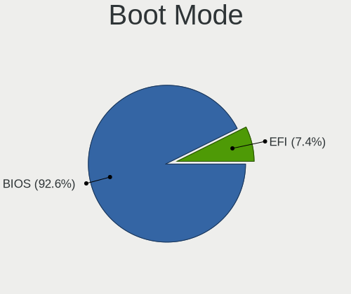

| Mode | Desktops | Percent |
|------|----------|---------|
| BIOS | 63       | 92.65%  |
| EFI  | 5        | 7.35%   |

Filesystem
----------

Type of filesystem

| Type    | Desktops | Percent |
|---------|----------|---------|
| Ext4    | 62       | 91.18%  |
| Tmpfs   | 2        | 2.94%   |
| Btrfs   | 2        | 2.94%   |
| Xfs     | 1        | 1.47%   |
| Overlay | 1        | 1.47%   |

Part. scheme
------------

Scheme of partitioning

| Type    | Desktops | Percent |
|---------|----------|---------|
| Unknown | 58       | 85.29%  |
| GPT     | 8        | 11.76%  |
| MBR     | 2        | 2.94%   |

Dual Boot with Linux/BSD
------------------------

Hosting more than one Linux/BSD

| Dual boot | Desktops | Percent |
|-----------|----------|---------|
| No        | 67       | 98.53%  |
| Yes       | 1        | 1.47%   |

Dual Boot (Win)
---------------

Hosting Linux and Windows

| Dual boot | Desktops | Percent |
|-----------|----------|---------|
| No        | 64       | 94.12%  |
| Yes       | 4        | 5.88%   |

Board
-----

Vendor
------

Motherboard manufacturer

| Name                | Desktops | Percent |
|---------------------|----------|---------|
| ASUSTek Computer    | 16       | 23.53%  |
| Gigabyte Technology | 11       | 16.18%  |
| Hewlett-Packard     | 7        | 10.29%  |
| MSI                 | 6        | 8.82%   |
| Dell                | 4        | 5.88%   |
| ASRock              | 4        | 5.88%   |
| Acer                | 3        | 4.41%   |
| Pegatron            | 2        | 2.94%   |
| Lenovo              | 2        | 2.94%   |
| Foxconn             | 2        | 2.94%   |
| Unknown             | 2        | 2.94%   |
| Wortmann AG         | 1        | 1.47%   |
| MACHINIST           | 1        | 1.47%   |
| Jetway              | 1        | 1.47%   |
| Inventec            | 1        | 1.47%   |
| Intel               | 1        | 1.47%   |
| ECS                 | 1        | 1.47%   |
| AZW                 | 1        | 1.47%   |
| Apple               | 1        | 1.47%   |
| Alienware           | 1        | 1.47%   |

Model
-----

Motherboard model

| Name                                | Desktops | Percent |
|-------------------------------------|----------|---------|
| Dell OptiPlex 790                   | 2        | 2.94%   |
| ASUS H110M-A/M.2                    | 2        | 2.94%   |
| Unknown                             | 2        | 2.94%   |
| Wortmann AG TERRA_PC                | 1        | 1.47%   |
| Pegatron Pro 3010 Microtower PC     | 1        | 1.47%   |
| Pegatron IPMIP-GS                   | 1        | 1.47%   |
| MSI MS-7C52                         | 1        | 1.47%   |
| MSI MS-7C31                         | 1        | 1.47%   |
| MSI MS-7C02                         | 1        | 1.47%   |
| MSI MS-7B84                         | 1        | 1.47%   |
| MSI MS-7B17                         | 1        | 1.47%   |
| MSI MS-7816                         | 1        | 1.47%   |
| MACHINIST E5-MR9A PRO V1.1          | 1        | 1.47%   |
| Lenovo ThinkCentre M910s 10MLS05C00 | 1        | 1.47%   |
| Lenovo ThinkCentre M72e 35983Y5     | 1        | 1.47%   |
| Jetway TI61M5                       | 1        | 1.47%   |
| Inventec Z CLASS                    | 1        | 1.47%   |
| Intel Jasper Lake Client Platform   | 1        | 1.47%   |
| HP ProDesk 600 G2 SFF               | 1        | 1.47%   |
| HP ProDesk 600 G1 SFF               | 1        | 1.47%   |
| HP EliteDesk 800 G2 DM 35W          | 1        | 1.47%   |
| HP EliteDesk 705 G2 MT              | 1        | 1.47%   |
| HP Compaq dc7900 Ultra-Slim Desktop | 1        | 1.47%   |
| HP 2ADC                             | 1        | 1.47%   |
| HP 1998                             | 1        | 1.47%   |
| Gigabyte Z77X-UD5H                  | 1        | 1.47%   |
| Gigabyte Z270-Gaming K3             | 1        | 1.47%   |
| Gigabyte H81M-S2V                   | 1        | 1.47%   |
| Gigabyte H410M H V3                 | 1        | 1.47%   |
| Gigabyte H110M-S2H                  | 1        | 1.47%   |
| Gigabyte GA-MA790XT-UD4P            | 1        | 1.47%   |
| Gigabyte GA-E6010N                  | 1        | 1.47%   |
| Gigabyte F2A88XM-DS2                | 1        | 1.47%   |
| Gigabyte B560M H                    | 1        | 1.47%   |
| Gigabyte B550 AORUS ELITE           | 1        | 1.47%   |
| Gigabyte 970A-DS3P                  | 1        | 1.47%   |
| Foxconn A76GMV                      | 1        | 1.47%   |
| Foxconn 400-034                     | 1        | 1.47%   |
| ECS G41T-M                          | 1        | 1.47%   |
| Dell OptiPlex 3070                  | 1        | 1.47%   |

Model Family
------------

Motherboard model prefix

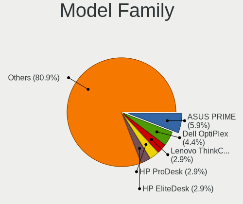

| Name                     | Desktops | Percent |
|--------------------------|----------|---------|
| ASUS PRIME               | 4        | 5.88%   |
| Dell OptiPlex            | 3        | 4.41%   |
| Lenovo ThinkCentre       | 2        | 2.94%   |
| HP ProDesk               | 2        | 2.94%   |
| HP EliteDesk             | 2        | 2.94%   |
| ASUS ROG                 | 2        | 2.94%   |
| ASUS H110M-A             | 2        | 2.94%   |
| Acer Aspire              | 2        | 2.94%   |
| Unknown                  | 2        | 2.94%   |
| Wortmann AG TERRA        | 1        | 1.47%   |
| Pegatron Pro             | 1        | 1.47%   |
| Pegatron IPMIP-GS        | 1        | 1.47%   |
| MSI MS-7C52              | 1        | 1.47%   |
| MSI MS-7C31              | 1        | 1.47%   |
| MSI MS-7C02              | 1        | 1.47%   |
| MSI MS-7B84              | 1        | 1.47%   |
| MSI MS-7B17              | 1        | 1.47%   |
| MSI MS-7816              | 1        | 1.47%   |
| MACHINIST E5-MR9A        | 1        | 1.47%   |
| Jetway TI61M5            | 1        | 1.47%   |
| Inventec Z               | 1        | 1.47%   |
| Intel Jasper             | 1        | 1.47%   |
| HP Compaq                | 1        | 1.47%   |
| HP 2ADC                  | 1        | 1.47%   |
| HP 1998                  | 1        | 1.47%   |
| Gigabyte Z77X-UD5H       | 1        | 1.47%   |
| Gigabyte Z270-Gaming     | 1        | 1.47%   |
| Gigabyte H81M-S2V        | 1        | 1.47%   |
| Gigabyte H410M           | 1        | 1.47%   |
| Gigabyte H110M-S2H       | 1        | 1.47%   |
| Gigabyte GA-MA790XT-UD4P | 1        | 1.47%   |
| Gigabyte GA-E6010N       | 1        | 1.47%   |
| Gigabyte F2A88XM-DS2     | 1        | 1.47%   |
| Gigabyte B560M           | 1        | 1.47%   |
| Gigabyte B550            | 1        | 1.47%   |
| Gigabyte 970A-DS3P       | 1        | 1.47%   |
| Foxconn A76GMV           | 1        | 1.47%   |
| Foxconn 400-034          | 1        | 1.47%   |
| ECS G41T-M               | 1        | 1.47%   |
| Dell Inspiron            | 1        | 1.47%   |

MFG Year
--------

Motherboard manufacture year

| Year | Desktops | Percent |
|------|----------|---------|
| 2013 | 9        | 13.24%  |
| 2018 | 8        | 11.76%  |
| 2021 | 6        | 8.82%   |
| 2009 | 6        | 8.82%   |
| 2019 | 5        | 7.35%   |
| 2016 | 5        | 7.35%   |
| 2012 | 5        | 7.35%   |
| 2017 | 4        | 5.88%   |
| 2015 | 4        | 5.88%   |
| 2014 | 3        | 4.41%   |
| 2011 | 3        | 4.41%   |
| 2008 | 3        | 4.41%   |
| 2022 | 2        | 2.94%   |
| 2020 | 2        | 2.94%   |
| 2010 | 2        | 2.94%   |
| 2023 | 1        | 1.47%   |

Form Factor
-----------

Physical design of the computer

| Name    | Desktops | Percent |
|---------|----------|---------|
| Desktop | 68       | 100%    |

Secure Boot
-----------

Enabled or disabled

| State    | Desktops | Percent |
|----------|----------|---------|
| Disabled | 68       | 100%    |

Coreboot
--------

Have coreboot on board

| Used | Desktops | Percent |
|------|----------|---------|
| No   | 68       | 100%    |

RAM Size
--------

Total RAM memory

| Size in GB  | Desktops | Percent |
|-------------|----------|---------|
| 16.01-24.0  | 19       | 27.54%  |
| 4.01-8.0    | 17       | 24.64%  |
| 32.01-64.0  | 11       | 15.94%  |
| 8.01-16.0   | 10       | 14.49%  |
| 3.01-4.0    | 8        | 11.59%  |
| 64.01-256.0 | 2        | 2.9%    |
| 24.01-32.0  | 1        | 1.45%   |
| 1.01-2.0    | 1        | 1.45%   |

RAM Used
--------

Used RAM memory

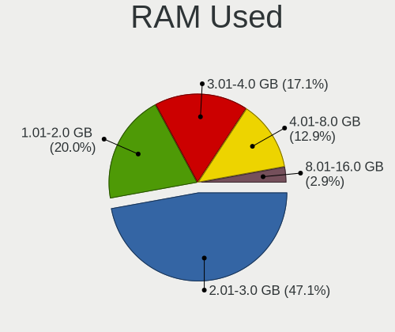

| Used GB   | Desktops | Percent |
|-----------|----------|---------|
| 2.01-3.0  | 33       | 47.14%  |
| 1.01-2.0  | 14       | 20%     |
| 3.01-4.0  | 12       | 17.14%  |
| 4.01-8.0  | 9        | 12.86%  |
| 8.01-16.0 | 2        | 2.86%   |

Total Drives
------------

Number of drives on board

| Drives | Desktops | Percent |
|--------|----------|---------|
| 2      | 26       | 38.24%  |
| 1      | 25       | 36.76%  |
| 3      | 9        | 13.24%  |
| 5      | 4        | 5.88%   |
| 4      | 4        | 5.88%   |

Has CD-ROM
----------

Has CD-ROM on board

| Presented | Desktops | Percent |
|-----------|----------|---------|
| No        | 43       | 62.32%  |
| Yes       | 26       | 37.68%  |

Has Ethernet
------------

Has Ethernet on board

| Presented | Desktops | Percent |
|-----------|----------|---------|
| Yes       | 68       | 100%    |

Has WiFi
--------

Has WiFi module

| Presented | Desktops | Percent |
|-----------|----------|---------|
| No        | 38       | 55.88%  |
| Yes       | 30       | 44.12%  |

Has Bluetooth
-------------

Has Bluetooth module

| Presented | Desktops | Percent |
|-----------|----------|---------|
| No        | 41       | 60.29%  |
| Yes       | 27       | 39.71%  |

Location
--------

Country
-------

Geographic location (country)

| Country     | Desktops | Percent |
|-------------|----------|---------|
| Germany     | 13       | 19.12%  |
| USA         | 10       | 14.71%  |
| Russia      | 6        | 8.82%   |
| Italy       | 5        | 7.35%   |
| Brazil      | 4        | 5.88%   |
| Spain       | 3        | 4.41%   |
| Netherlands | 3        | 4.41%   |
| Canada      | 3        | 4.41%   |
| Venezuela   | 2        | 2.94%   |
| India       | 2        | 2.94%   |
| Greece      | 2        | 2.94%   |
| Ukraine     | 1        | 1.47%   |
| Turkey      | 1        | 1.47%   |
| Sweden      | 1        | 1.47%   |
| Portugal    | 1        | 1.47%   |
| Poland      | 1        | 1.47%   |
| Mexico      | 1        | 1.47%   |
| Japan       | 1        | 1.47%   |
| Hungary     | 1        | 1.47%   |
| France      | 1        | 1.47%   |
| Finland     | 1        | 1.47%   |
| Czechia     | 1        | 1.47%   |
| Chile       | 1        | 1.47%   |
| Austria     | 1        | 1.47%   |
| Australia   | 1        | 1.47%   |
| Argentina   | 1        | 1.47%   |

City
----

Geographic location (city)

| City             | Desktops | Percent |
|------------------|----------|---------|
| Moscow           | 3        | 4.29%   |
| Munich           | 2        | 2.86%   |
| Athens           | 2        | 2.86%   |
| Amsterdam        | 2        | 2.86%   |
| Zalaegerszeg     | 1        | 1.43%   |
| Yorktown         | 1        | 1.43%   |
| West Jordan      | 1        | 1.43%   |
| Warsaw           | 1        | 1.43%   |
| Vienna           | 1        | 1.43%   |
| Viareggio        | 1        | 1.43%   |
| Valencia         | 1        | 1.43%   |
| Tucson           | 1        | 1.43%   |
| Stuttgart        | 1        | 1.43%   |
| Stockholm        | 1        | 1.43%   |
| Steti            | 1        | 1.43%   |
| St Petersburg    | 1        | 1.43%   |
| Spokane          | 1        | 1.43%   |
| Sorel-Tracy      | 1        | 1.43%   |
| Saskatoon        | 1        | 1.43%   |
| Sao Paulo        | 1        | 1.43%   |
| Santiago         | 1        | 1.43%   |
| Sandim           | 1        | 1.43%   |
| San Marcos       | 1        | 1.43%   |
| Roetgen          | 1        | 1.43%   |
| Plauen           | 1        | 1.43%   |
| Pisa             | 1        | 1.43%   |
| Piea             | 1        | 1.43%   |
| Padova           | 1        | 1.43%   |
| Ojicho           | 1        | 1.43%   |
| Nuremberg        | 1        | 1.43%   |
| Nossen           | 1        | 1.43%   |
| New York         | 1        | 1.43%   |
| Mumbai           | 1        | 1.43%   |
| Morehead City    | 1        | 1.43%   |
| Monsummano Terme | 1        | 1.43%   |
| Milano           | 1        | 1.43%   |
| Melbourne        | 1        | 1.43%   |
| Mariupol         | 1        | 1.43%   |
| Maracaibo        | 1        | 1.43%   |
| Madrid           | 1        | 1.43%   |

Drives
------

Drive Vendor
------------

Hard drive vendors

| Vendor                      | Desktops | Drives | Percent |
|-----------------------------|----------|--------|---------|
| WDC                         | 26       | 31     | 20.97%  |
| Samsung Electronics         | 14       | 22     | 11.29%  |
| Seagate                     | 13       | 19     | 10.48%  |
| Toshiba                     | 8        | 10     | 6.45%   |
| Sandisk                     | 7        | 8      | 5.65%   |
| Kingston                    | 7        | 7      | 5.65%   |
| Crucial                     | 7        | 9      | 5.65%   |
| Hitachi                     | 4        | 5      | 3.23%   |
| A-DATA Technology           | 4        | 4      | 3.23%   |
| Team                        | 2        | 3      | 1.61%   |
| PNY                         | 2        | 2      | 1.61%   |
| Netac                       | 2        | 3      | 1.61%   |
| Micron/Crucial Technology   | 2        | 2      | 1.61%   |
| China                       | 2        | 2      | 1.61%   |
| Unknown                     | 2        | 2      | 1.61%   |
| Yeestor                     | 1        | 1      | 0.81%   |
| XrayDisk                    | 1        | 1      | 0.81%   |
| Verbatim                    | 1        | 1      | 0.81%   |
| Unknown                     | 1        | 1      | 0.81%   |
| Silicon Motion              | 1        | 1      | 0.81%   |
| SD                          | 1        | 1      | 0.81%   |
| Realtek Semiconductor       | 1        | 2      | 0.81%   |
| OCZ-VERTEX2                 | 1        | 1      | 0.81%   |
| NGFF                        | 1        | 1      | 0.81%   |
| Micron Technology           | 1        | 1      | 0.81%   |
| MediaTek                    | 1        | 1      | 0.81%   |
| MAXIO Technology (Hangzhou) | 1        | 1      | 0.81%   |
| LuminouTek                  | 1        | 1      | 0.81%   |
| LITEONIT                    | 1        | 1      | 0.81%   |
| Lexar                       | 1        | 1      | 0.81%   |
| KingDian                    | 1        | 2      | 0.81%   |
| Intenso                     | 1        | 2      | 0.81%   |
| HS-SSD-E100                 | 1        | 2      | 0.81%   |
| Hewlett-Packard             | 1        | 1      | 0.81%   |
| GLOWAY                      | 1        | 1      | 0.81%   |
| Corsair                     | 1        | 1      | 0.81%   |
| Apacer                      | 1        | 1      | 0.81%   |

Drive Model
-----------

Hard drive models

| Model                                               | Desktops | Percent |
|-----------------------------------------------------|----------|---------|
| Kingston SA400S37240G 240GB SSD                     | 5        | 3.68%   |
| WDC WD10EZEX-60WN4A0 1TB                            | 3        | 2.21%   |
| WDC WD10EZEX-08WN4A0 1TB                            | 3        | 2.21%   |
| Samsung NVMe SSD Controller SM981/PM981/PM983 512GB | 3        | 2.21%   |
| WDC WD10EZEX-21WN4A0 1TB                            | 2        | 1.47%   |
| Toshiba MQ01ABD100 1TB                              | 2        | 1.47%   |
| Toshiba DT01ACA200 2TB                              | 2        | 1.47%   |
| Toshiba DT01ACA050 500GB                            | 2        | 1.47%   |
| Seagate ST4000DM004-2CV104 4TB                      | 2        | 1.47%   |
| Samsung SSD 850 EVO 250GB                           | 2        | 1.47%   |
| Crucial CT500MX500SSD1 500GB                        | 2        | 1.47%   |
| Crucial CT240BX500SSD1 240GB                        | 2        | 1.47%   |
| Crucial CT128MX100SSD1 128GB                        | 2        | 1.47%   |
| Unknown                                             | 2        | 1.47%   |
| Yeestor 512GB                                       | 1        | 0.74%   |
| XrayDisk 512GB SSD                                  | 1        | 0.74%   |
| WDC WDS500G2B0A-00SM50 500GB SSD                    | 1        | 0.74%   |
| WDC WDS480G2G0C-00AJM0 480GB                        | 1        | 0.74%   |
| WDC WDS240G2G0A-00JH30 240GB SSD                    | 1        | 0.74%   |
| WDC WDS100T2B0A-00SM50 1TB SSD                      | 1        | 0.74%   |
| WDC WD6400AAKS-22A7B2 640GB                         | 1        | 0.74%   |
| WDC WD5000AAKS-00V6A0 500GB                         | 1        | 0.74%   |
| WDC WD5000AAKS-00UU3A0 500GB                        | 1        | 0.74%   |
| WDC WD40EZRZ-00GXCB0 4TB                            | 1        | 0.74%   |
| WDC WD3200AAKX-001CA0 320GB                         | 1        | 0.74%   |
| WDC WD2500JB-55GVA0 250GB                           | 1        | 0.74%   |
| WDC WD2500AAJS-08L7A0 250GB                         | 1        | 0.74%   |
| WDC WD20EZRX-22D8PB0 2TB                            | 1        | 0.74%   |
| WDC WD20EZRX-00D8PB0 2TB                            | 1        | 0.74%   |
| WDC WD20EZBX-00AYRA0 2TB                            | 1        | 0.74%   |
| WDC WD10PURZ-85U8XY0 1TB                            | 1        | 0.74%   |
| WDC WD10EZEX-60ZF5A0 1TB                            | 1        | 0.74%   |
| WDC WD10EZEX-00BN5A0 1TB                            | 1        | 0.74%   |
| WDC WD10EZEX-00BBHA0 1TB                            | 1        | 0.74%   |
| WDC WD1002FBYS-18W8B0 1TB                           | 1        | 0.74%   |
| Verbatim Vi550 S3 SSD 512GB                         | 1        | 0.74%   |
| Unknown SD/MMC/MS PRO 128GB                         | 1        | 0.74%   |
| Toshiba XG4 NVMe SSD Controller 512GB               | 1        | 0.74%   |
| Toshiba HDWD110 1TB                                 | 1        | 0.74%   |
| Toshiba DT01ACA100 1TB                              | 1        | 0.74%   |

HDD Vendor
----------

Hard disk drive vendors

| Vendor              | Desktops | Drives | Percent |
|---------------------|----------|--------|---------|
| WDC                 | 22       | 26     | 44%     |
| Seagate             | 12       | 16     | 24%     |
| Toshiba             | 8        | 9      | 16%     |
| Hitachi             | 4        | 5      | 8%      |
| Samsung Electronics | 3        | 3      | 6%      |
| Unknown             | 1        | 1      | 2%      |

SSD Vendor
----------

Solid state drive vendors

| Vendor              | Desktops | Drives | Percent |
|---------------------|----------|--------|---------|
| Samsung Electronics | 7        | 12     | 12.5%   |
| Kingston            | 7        | 7      | 12.5%   |
| Crucial             | 7        | 9      | 12.5%   |
| SanDisk             | 4        | 5      | 7.14%   |
| A-DATA Technology   | 4        | 4      | 7.14%   |
| WDC                 | 3        | 4      | 5.36%   |
| Team                | 2        | 3      | 3.57%   |
| Seagate             | 2        | 2      | 3.57%   |
| PNY                 | 2        | 2      | 3.57%   |
| China               | 2        | 2      | 3.57%   |
| XrayDisk            | 1        | 1      | 1.79%   |
| Verbatim            | 1        | 1      | 1.79%   |
| SD                  | 1        | 1      | 1.79%   |
| OCZ-VERTEX2         | 1        | 1      | 1.79%   |
| NGFF                | 1        | 1      | 1.79%   |
| Netac               | 1        | 1      | 1.79%   |
| Micron Technology   | 1        | 1      | 1.79%   |
| LITEONIT            | 1        | 1      | 1.79%   |
| KingDian            | 1        | 2      | 1.79%   |
| Intenso             | 1        | 2      | 1.79%   |
| HS-SSD-E100         | 1        | 1      | 1.79%   |
| Hewlett-Packard     | 1        | 1      | 1.79%   |
| GLOWAY              | 1        | 1      | 1.79%   |
| Corsair             | 1        | 1      | 1.79%   |
| Apacer              | 1        | 1      | 1.79%   |
| Unknown             | 1        | 1      | 1.79%   |

Drive Kind
----------

HDD or SSD

| Kind    | Desktops | Drives | Percent |
|---------|----------|--------|---------|
| SSD     | 50       | 68     | 44.25%  |
| HDD     | 40       | 60     | 35.4%   |
| NVMe    | 16       | 19     | 14.16%  |
| Unknown | 7        | 8      | 6.19%   |

Drive Connector
---------------

SATA, SAS, NVMe, etc.

| Type | Desktops | Drives | Percent |
|------|----------|--------|---------|
| SATA | 67       | 130    | 76.14%  |
| NVMe | 16       | 19     | 18.18%  |
| SAS  | 5        | 6      | 5.68%   |

Drive Size
----------

Size of hard drive

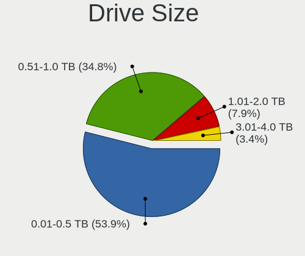

| Size in TB | Desktops | Drives | Percent |
|------------|----------|--------|---------|
| 0.01-0.5   | 48       | 71     | 53.93%  |
| 0.51-1.0   | 31       | 46     | 34.83%  |
| 1.01-2.0   | 7        | 8      | 7.87%   |
| 3.01-4.0   | 3        | 3      | 3.37%   |

Space Total
-----------

Amount of disk space available on the file system

| Size in GB     | Desktops | Percent |
|----------------|----------|---------|
| 101-250        | 29       | 42.65%  |
| 251-500        | 15       | 22.06%  |
| 501-1000       | 15       | 22.06%  |
| 2001-3000      | 2        | 2.94%   |
| 1001-2000      | 2        | 2.94%   |
| 51-100         | 2        | 2.94%   |
| More than 3000 | 1        | 1.47%   |
| 21-50          | 1        | 1.47%   |
| 1-20           | 1        | 1.47%   |

Space Used
----------

Amount of used disk space

| Used GB   | Desktops | Percent |
|-----------|----------|---------|
| 1-20      | 26       | 37.68%  |
| 21-50     | 19       | 27.54%  |
| 51-100    | 10       | 14.49%  |
| 101-250   | 8        | 11.59%  |
| 251-500   | 4        | 5.8%    |
| 1001-2000 | 1        | 1.45%   |
| 501-1000  | 1        | 1.45%   |

Malfunc. Drives
---------------

Drive models with a malfunction

| Model                         | Desktops | Drives | Percent |
|-------------------------------|----------|--------|---------|
| Hitachi HTS725050A7E630 500GB | 1        | 1      | 100%    |

Malfunc. Drive Vendor
---------------------

Vendors of faulty drives

| Vendor  | Desktops | Drives | Percent |
|---------|----------|--------|---------|
| Hitachi | 1        | 1      | 100%    |

Malfunc. HDD Vendor
-------------------

Vendors of faulty HDD drives

| Vendor  | Desktops | Drives | Percent |
|---------|----------|--------|---------|
| Hitachi | 1        | 1      | 100%    |

Malfunc. Drive Kind
-------------------

Kinds of faulty drives

| Kind | Desktops | Drives | Percent |
|------|----------|--------|---------|
| HDD  | 1        | 1      | 100%    |

Failed Drives
-------------

Failed drive models

Zero info for selected period =(

Failed Drive Vendor
-------------------

Failed drive vendors

Zero info for selected period =(

Drive Status
------------

Number of failed and malfunc. drives

| Status   | Desktops | Drives | Percent |
|----------|----------|--------|---------|
| Detected | 65       | 143    | 89.04%  |
| Works    | 7        | 11     | 9.59%   |
| Malfunc  | 1        | 1      | 1.37%   |

Storage controller
------------------

Storage Vendor
--------------

Storage controller vendors

| Vendor                       | Desktops | Percent |
|------------------------------|----------|---------|
| Intel                        | 45       | 50%     |
| AMD                          | 23       | 25.56%  |
| Samsung Electronics          | 6        | 6.67%   |
| SanDisk                      | 3        | 3.33%   |
| ASMedia Technology           | 3        | 3.33%   |
| Micron/Crucial Technology    | 2        | 2.22%   |
| MAXIO Technology (Hangzhou)  | 2        | 2.22%   |
| Marvell Technology Group     | 2        | 2.22%   |
| Toshiba America Info Systems | 1        | 1.11%   |
| Silicon Motion               | 1        | 1.11%   |
| Realtek Semiconductor        | 1        | 1.11%   |
| JMicron Technology           | 1        | 1.11%   |

Storage Model
-------------

Storage controller models

| Model                                                                          | Desktops | Percent |
|--------------------------------------------------------------------------------|----------|---------|
| AMD FCH SATA Controller [AHCI mode]                                            | 15       | 13.39%  |
| Intel Q170/Q150/B150/H170/H110/Z170/CM236 Chipset SATA Controller [AHCI Mode]  | 7        | 6.25%   |
| Intel 6 Series/C200 Series Chipset Family 6 port Desktop SATA AHCI Controller  | 7        | 6.25%   |
| Intel 8 Series/C220 Series Chipset Family 6-port SATA Controller 1 [AHCI mode] | 5        | 4.46%   |
| AMD SB7x0/SB8x0/SB9x0 IDE Controller                                           | 5        | 4.46%   |
| AMD 400 Series Chipset SATA Controller                                         | 5        | 4.46%   |
| Intel 200 Series PCH SATA controller [AHCI mode]                               | 4        | 3.57%   |
| AMD SB7x0/SB8x0/SB9x0 SATA Controller [IDE mode]                               | 4        | 3.57%   |
| Samsung NVMe SSD Controller SM981/PM981/PM983                                  | 3        | 2.68%   |
| Intel Cannon Lake PCH SATA AHCI Controller                                     | 3        | 2.68%   |
| Intel Alder Lake-S PCH SATA Controller [AHCI Mode]                             | 3        | 2.68%   |
| ASMedia ASM1061/ASM1062 Serial ATA Controller                                  | 3        | 2.68%   |
| AMD X370 Series Chipset SATA Controller                                        | 3        | 2.68%   |
| MAXIO (Hangzhou) NVMe SSD Controller MAP1202 (DRAM-less)                       | 2        | 1.79%   |
| Intel Volume Management Device NVMe RAID Controller                            | 2        | 1.79%   |
| Intel Jasper Lake SATA AHCI Controller                                         | 2        | 1.79%   |
| Intel 82801JI (ICH10 Family) SATA AHCI Controller                              | 2        | 1.79%   |
| Intel 7 Series/C210 Series Chipset Family 6-port SATA Controller [AHCI mode]   | 2        | 1.79%   |
| Intel 500 Series Chipset Family SATA AHCI Controller                           | 2        | 1.79%   |
| AMD SB7x0/SB8x0/SB9x0 SATA Controller [AHCI mode]                              | 2        | 1.79%   |
| AMD 300 Series Chipset SATA Controller                                         | 2        | 1.79%   |
| Toshiba America Info Systems XG4 NVMe SSD Controller                           | 1        | 0.89%   |
| Silicon Motion SM2263EN/SM2263XT (DRAM-less) NVMe SSD Controllers              | 1        | 0.89%   |
| SanDisk WD Green SN350 240GB (DRAM-less) / SN560E NVMe SSD                     | 1        | 0.89%   |
| SanDisk Ultra 3D / WD PC SN530, IX SN530, Blue SN550 NVMe SSD (DRAM-less)      | 1        | 0.89%   |
| SanDisk PC SN735 / WD_BLACK SN750 SE NVMe SSD (DRAM-less)                      | 1        | 0.89%   |
| Samsung NVMe SSD Controller SM961/PM961/SM963                                  | 1        | 0.89%   |
| Samsung NVMe SSD Controller PM9B1 (DRAM-less)                                  | 1        | 0.89%   |
| Samsung NVMe SSD Controller PM9A1/PM9A3/980PRO                                 | 1        | 0.89%   |
| Samsung NVMe SSD Controller 980 (DRAM-less)                                    | 1        | 0.89%   |
| Realtek RTS5763DL NVMe SSD Controller (DRAM-less)                              | 1        | 0.89%   |
| Micron/Crucial P2 [Nick P2] / P3 / P3 Plus NVMe PCIe SSD (DRAM-less)           | 1        | 0.89%   |
| Micron/Crucial P1 NVMe PCIe SSD[Frampton]                                      | 1        | 0.89%   |
| Marvell Group 88SE9172 SATA 6Gb/s Controller                                   | 1        | 0.89%   |
| Marvell Group 88SE9128 PCIe SATA 6 Gb/s RAID controller                        | 1        | 0.89%   |
| JMicron JMB363 SATA/IDE Controller                                             | 1        | 0.89%   |
| Intel NM10/ICH7 Family SATA Controller [IDE mode]                              | 1        | 0.89%   |
| Intel Celeron/Pentium Silver Processor SATA Controller                         | 1        | 0.89%   |
| Intel 82801JD/DO (ICH10 Family) SATA AHCI Controller                           | 1        | 0.89%   |
| Intel 82801G (ICH7 Family) IDE Controller                                      | 1        | 0.89%   |

Storage Kind
------------

Kind of storage controller (IDE, SATA, NVMe, SAS, ...)

| Kind | Desktops | Percent |
|------|----------|---------|
| SATA | 65       | 71.43%  |
| NVMe | 15       | 16.48%  |
| IDE  | 9        | 9.89%   |
| RAID | 2        | 2.2%    |

Processor
---------

CPU Vendor
----------

Processor vendors

| Vendor | Desktops | Percent |
|--------|----------|---------|
| Intel  | 45       | 66.18%  |
| AMD    | 23       | 33.82%  |

CPU Model
---------

Processor models

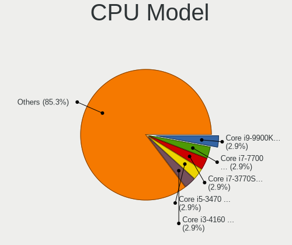

| Model                                       | Desktops | Percent |
|---------------------------------------------|----------|---------|
| Intel Core i9-9900K CPU @ 3.60GHz           | 2        | 2.94%   |
| Intel Core i7-7700 CPU @ 3.60GHz            | 2        | 2.94%   |
| Intel Core i7-3770S CPU @ 3.10GHz           | 2        | 2.94%   |
| Intel Core i5-3470 CPU @ 3.20GHz            | 2        | 2.94%   |
| Intel Core i3-4160 CPU @ 3.60GHz            | 2        | 2.94%   |
| Intel Celeron N5105 @ 2.00GHz               | 2        | 2.94%   |
| Intel Xeon CPU W3520 @ 2.67GHz              | 1        | 1.47%   |
| Intel Xeon CPU E5-2670 v3 @ 2.30GHz         | 1        | 1.47%   |
| Intel Pentium Dual-Core CPU E6300 @ 2.80GHz | 1        | 1.47%   |
| Intel Pentium CPU G2020 @ 2.90GHz           | 1        | 1.47%   |
| Intel Core i7-6700T CPU @ 2.80GHz           | 1        | 1.47%   |
| Intel Core i7-6700K CPU @ 4.00GHz           | 1        | 1.47%   |
| Intel Core i7-6700 CPU @ 3.40GHz            | 1        | 1.47%   |
| Intel Core i7-3770K CPU @ 3.50GHz           | 1        | 1.47%   |
| Intel Core i7-3770 CPU @ 3.40GHz            | 1        | 1.47%   |
| Intel Core i5-9400T CPU @ 1.80GHz           | 1        | 1.47%   |
| Intel Core i5-7500T CPU @ 2.70GHz           | 1        | 1.47%   |
| Intel Core i5-7400 CPU @ 3.00GHz            | 1        | 1.47%   |
| Intel Core i5-6600 CPU @ 3.30GHz            | 1        | 1.47%   |
| Intel Core i5-4590 CPU @ 3.30GHz            | 1        | 1.47%   |
| Intel Core i5-2500S CPU @ 2.70GHz           | 1        | 1.47%   |
| Intel Core i5-2500 CPU @ 3.30GHz            | 1        | 1.47%   |
| Intel Core i5-2400 CPU @ 3.10GHz            | 1        | 1.47%   |
| Intel Core i5-10400F CPU @ 2.90GHz          | 1        | 1.47%   |
| Intel Core i5 CPU 760 @ 2.80GHz             | 1        | 1.47%   |
| Intel Core i5 CPU 650 @ 3.20GHz             | 1        | 1.47%   |
| Intel Core i3-9100 CPU @ 3.60GHz            | 1        | 1.47%   |
| Intel Core i3-7100 CPU @ 3.90GHz            | 1        | 1.47%   |
| Intel Core i3-6100 CPU @ 3.70GHz            | 1        | 1.47%   |
| Intel Core i3-4150 CPU @ 3.50GHz            | 1        | 1.47%   |
| Intel Core 2 Duo CPU E8400 @ 3.00GHz        | 1        | 1.47%   |
| Intel Core 2 Duo CPU E7500 @ 2.93GHz        | 1        | 1.47%   |
| Intel Celeron J4125 CPU @ 2.00GHz           | 1        | 1.47%   |
| Intel Celeron CPU 1007U @ 1.50GHz           | 1        | 1.47%   |
| Intel Celeron 2957U @ 1.40GHz               | 1        | 1.47%   |
| Intel 12th Gen Core i7-12700K               | 1        | 1.47%   |
| Intel 12th Gen Core i7-12700F               | 1        | 1.47%   |
| Intel 12th Gen Core i3-12100F               | 1        | 1.47%   |
| Intel 11th Gen Core i5-11400 @ 2.60GHz      | 1        | 1.47%   |
| AMD Sempron 145 Processor                   | 1        | 1.47%   |

CPU Model Family
----------------

Processor model prefix

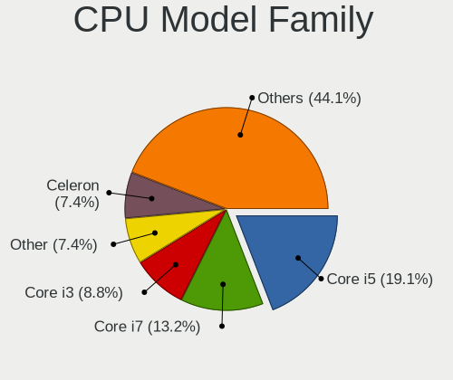

| Model                   | Desktops | Percent |
|-------------------------|----------|---------|
| Intel Core i5           | 13       | 19.12%  |
| Intel Core i7           | 9        | 13.24%  |
| Intel Core i3           | 6        | 8.82%   |
| Other                   | 5        | 7.35%   |
| Intel Celeron           | 5        | 7.35%   |
| AMD Ryzen 7             | 4        | 5.88%   |
| AMD Ryzen 5             | 4        | 5.88%   |
| Intel Xeon              | 2        | 2.94%   |
| Intel Core i9           | 2        | 2.94%   |
| Intel Core 2 Duo        | 2        | 2.94%   |
| AMD Ryzen 9             | 2        | 2.94%   |
| AMD A8                  | 2        | 2.94%   |
| Intel Pentium Dual-Core | 1        | 1.47%   |
| Intel Pentium           | 1        | 1.47%   |
| AMD Sempron             | 1        | 1.47%   |
| AMD Ryzen 5 PRO         | 1        | 1.47%   |
| AMD Ryzen 3             | 1        | 1.47%   |
| AMD Phenom II X6        | 1        | 1.47%   |
| AMD Phenom II X4        | 1        | 1.47%   |
| AMD G                   | 1        | 1.47%   |
| AMD FX                  | 1        | 1.47%   |
| AMD E1                  | 1        | 1.47%   |
| AMD Athlon 64 X2        | 1        | 1.47%   |
| AMD Athlon              | 1        | 1.47%   |

CPU Cores
---------

Number of processor cores

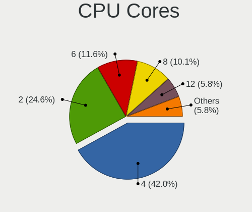

| Number | Desktops | Percent |
|--------|----------|---------|
| 4      | 29       | 42.03%  |
| 2      | 17       | 24.64%  |
| 6      | 8        | 11.59%  |
| 8      | 7        | 10.14%  |
| 12     | 4        | 5.8%    |
| 1      | 3        | 4.35%   |
| 5      | 1        | 1.45%   |

CPU Sockets
-----------

Number of sockets

| Number | Desktops | Percent |
|--------|----------|---------|
| 1      | 68       | 100%    |

CPU Threads
-----------

Threads per core (Hyper-Threading)

| Number | Desktops | Percent |
|--------|----------|---------|
| 2      | 40       | 58.82%  |
| 1      | 28       | 41.18%  |

CPU Op-Modes
------------

CPU Operation Modes (32-bit, 64-bit)

| Op mode        | Desktops | Percent |
|----------------|----------|---------|
| 32-bit, 64-bit | 68       | 100%    |

CPU Microcode
-------------

Microcode number

| Number     | Desktops | Percent |
|------------|----------|---------|
| Unknown    | 61       | 89.71%  |
| 0x306a9    | 2        | 2.94%   |
| 0x906e9    | 1        | 1.47%   |
| 0x906c0    | 1        | 1.47%   |
| 0x08108109 | 1        | 1.47%   |
| 0x07030106 | 1        | 1.47%   |
| 0x010000c8 | 1        | 1.47%   |

CPU Microarch
-------------

Microarchitecture

| Name          | Desktops | Percent |
|---------------|----------|---------|
| KabyLake      | 9        | 13.24%  |
| IvyBridge     | 8        | 11.76%  |
| Haswell       | 6        | 8.82%   |
| Skylake       | 5        | 7.35%   |
| Unknown       | 5        | 7.35%   |
| Zen 3         | 4        | 5.88%   |
| Zen+          | 3        | 4.41%   |
| Zen 2         | 3        | 4.41%   |
| Zen           | 3        | 4.41%   |
| SandyBridge   | 3        | 4.41%   |
| Penryn        | 3        | 4.41%   |
| K10           | 3        | 4.41%   |
| Steamroller   | 2        | 2.94%   |
| Nehalem       | 2        | 2.94%   |
| Westmere      | 1        | 1.47%   |
| Tremont       | 1        | 1.47%   |
| Puma          | 1        | 1.47%   |
| Piledriver    | 1        | 1.47%   |
| K8 Hammer     | 1        | 1.47%   |
| Goldmont plus | 1        | 1.47%   |
| Excavator     | 1        | 1.47%   |
| CometLake     | 1        | 1.47%   |
| Bobcat        | 1        | 1.47%   |

Graphics
--------

GPU Vendor
----------

Vendors of graphics cards

| Vendor | Desktops | Percent |
|--------|----------|---------|
| Nvidia | 25       | 34.25%  |
| Intel  | 24       | 32.88%  |
| AMD    | 24       | 32.88%  |

GPU Model
---------

Graphics card models

| Model                                                                       | Desktops | Percent |
|-----------------------------------------------------------------------------|----------|---------|
| Intel HD Graphics 630                                                       | 3        | 4%      |
| Intel HD Graphics 530                                                       | 3        | 4%      |
| AMD Ellesmere [Radeon RX 470/480/570/570X/580/580X/590]                     | 3        | 4%      |
| Nvidia GP108 [GeForce GT 1030]                                              | 2        | 2.67%   |
| Nvidia GK107 [GeForce GTX 650]                                              | 2        | 2.67%   |
| Nvidia GK107 [GeForce GT 640]                                               | 2        | 2.67%   |
| Intel JasperLake [UHD Graphics]                                             | 2        | 2.67%   |
| Intel CoffeeLake-S GT2 [UHD Graphics 630]                                   | 2        | 2.67%   |
| Intel 4th Generation Core Processor Family Integrated Graphics Controller   | 2        | 2.67%   |
| Intel 4 Series Chipset Integrated Graphics Controller                       | 2        | 2.67%   |
| Intel 2nd Generation Core Processor Family Integrated Graphics Controller   | 2        | 2.67%   |
| AMD Navi 23 [Radeon RX 6600/6600 XT/6600M]                                  | 2        | 2.67%   |
| AMD Navi 10 [Radeon RX 5600 OEM/5600 XT / 5700/5700 XT]                     | 2        | 2.67%   |
| AMD Cezanne [Radeon Vega Series / Radeon Vega Mobile Series]                | 2        | 2.67%   |
| Nvidia TU117 [GeForce GTX 1650]                                             | 1        | 1.33%   |
| Nvidia TU116 [GeForce GTX 1660 SUPER]                                       | 1        | 1.33%   |
| Nvidia TU116 [GeForce GTX 1650 SUPER]                                       | 1        | 1.33%   |
| Nvidia TU104 [GeForce RTX 2080 SUPER]                                       | 1        | 1.33%   |
| Nvidia GT218 [GeForce 210]                                                  | 1        | 1.33%   |
| Nvidia GP107 [GeForce GTX 1050]                                             | 1        | 1.33%   |
| Nvidia GP107 [GeForce GTX 1050 Ti]                                          | 1        | 1.33%   |
| Nvidia GP104 [GeForce GTX 1080]                                             | 1        | 1.33%   |
| Nvidia GP104 [GeForce GTX 1070]                                             | 1        | 1.33%   |
| Nvidia GM204 [GeForce GTX 970]                                              | 1        | 1.33%   |
| Nvidia GK208B [GeForce GT 730]                                              | 1        | 1.33%   |
| Nvidia GK110B [GeForce GTX 780 Ti]                                          | 1        | 1.33%   |
| Nvidia GF119 [GeForce GT 610]                                               | 1        | 1.33%   |
| Nvidia GF108 [GeForce GT 430]                                               | 1        | 1.33%   |
| Nvidia GA104 [GeForce RTX 3070]                                             | 1        | 1.33%   |
| Nvidia GA104 [GeForce RTX 3060 Ti Lite Hash Rate]                           | 1        | 1.33%   |
| Nvidia GA103 [GeForce RTX 3060 Ti]                                          | 1        | 1.33%   |
| Nvidia G96C [GeForce GT 120]                                                | 1        | 1.33%   |
| Nvidia G84 [GeForce 8600 GT]                                                | 1        | 1.33%   |
| Intel Xeon E3-1200 v3/4th Gen Core Processor Integrated Graphics Controller | 1        | 1.33%   |
| Intel Xeon E3-1200 v2/3rd Gen Core processor Graphics Controller            | 1        | 1.33%   |
| Intel RocketLake-S GT1 [UHD Graphics 730]                                   | 1        | 1.33%   |
| Intel IvyBridge GT2 [HD Graphics 4000]                                      | 1        | 1.33%   |
| Intel Haswell-ULT Integrated Graphics Controller                            | 1        | 1.33%   |
| Intel GeminiLake [UHD Graphics 600]                                         | 1        | 1.33%   |
| Intel Core Processor Integrated Graphics Controller                         | 1        | 1.33%   |

GPU Combo
---------

Combinations of graphics cards

| Name            | Desktops | Percent |
|-----------------|----------|---------|
| 1 x Nvidia      | 23       | 33.82%  |
| 1 x AMD         | 22       | 32.35%  |
| 1 x Intel       | 20       | 29.41%  |
| 2 x AMD         | 1        | 1.47%   |
| Intel + 2 x AMD | 1        | 1.47%   |
| Intel + Nvidia  | 1        | 1.47%   |

GPU Driver
----------

Free vs proprietary

| Driver      | Desktops | Percent |
|-------------|----------|---------|
| Free        | 63       | 92.65%  |
| Proprietary | 5        | 7.35%   |

GPU Memory
----------

Total video memory

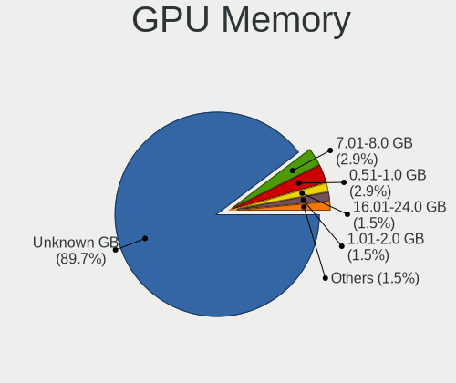

| Size in GB | Desktops | Percent |
|------------|----------|---------|
| Unknown    | 61       | 89.71%  |
| 7.01-8.0   | 2        | 2.94%   |
| 0.51-1.0   | 2        | 2.94%   |
| 16.01-24.0 | 1        | 1.47%   |
| 1.01-2.0   | 1        | 1.47%   |
| 0.01-0.5   | 1        | 1.47%   |

Monitor
-------

Monitor Vendor
--------------

Monitor vendors

| Vendor               | Desktops | Percent |
|----------------------|----------|---------|
| Goldstar             | 12       | 16.44%  |
| Samsung Electronics  | 10       | 13.7%   |
| Acer                 | 6        | 8.22%   |
| Hewlett-Packard      | 4        | 5.48%   |
| Dell                 | 4        | 5.48%   |
| ViewSonic            | 3        | 4.11%   |
| AOC                  | 3        | 4.11%   |
| Sceptre Tech         | 2        | 2.74%   |
| Philips              | 2        | 2.74%   |
| NEC Computers        | 2        | 2.74%   |
| Lenovo               | 2        | 2.74%   |
| Fujitsu Siemens      | 2        | 2.74%   |
| BenQ                 | 2        | 2.74%   |
| ASUSTek Computer     | 2        | 2.74%   |
| ___                  | 1        | 1.37%   |
| Vizio                | 1        | 1.37%   |
| Unknown              | 1        | 1.37%   |
| Sony                 | 1        | 1.37%   |
| Sharp                | 1        | 1.37%   |
| Seiki                | 1        | 1.37%   |
| RCA                  | 1        | 1.37%   |
| Positivo             | 1        | 1.37%   |
| NSL                  | 1        | 1.37%   |
| MYS                  | 1        | 1.37%   |
| MSI                  | 1        | 1.37%   |
| Kogan                | 1        | 1.37%   |
| Hitachi              | 1        | 1.37%   |
| HannStar             | 1        | 1.37%   |
| Eizo                 | 1        | 1.37%   |
| CVT                  | 1        | 1.37%   |
| Ancor Communications | 1        | 1.37%   |

Monitor Model
-------------

Monitor models

| Model                                                                  | Desktops | Percent |
|------------------------------------------------------------------------|----------|---------|
| ViewSonic VA2719 Series VSCC132 1920x1080 598x336mm 27.0-inch          | 2        | 2.56%   |
| ___ LCDTV16 ___3393 1920x1080                                          | 1        | 1.28%   |
| Vizio E421VO VIZ0070 1920x1080 930x523mm 42.0-inch                     | 1        | 1.28%   |
| ViewSonic VP201b VSC6911 1600x1200 408x306mm 20.1-inch                 | 1        | 1.28%   |
| Unknown LCDTV16 3393 1920x1080 1600x900mm 72.3-inch                    | 1        | 1.28%   |
| Sony TV SNY7A02 1360x768 708x398mm 32.0-inch                           | 1        | 1.28%   |
| Sharp HDMI SHP1048 1920x1080 820x460mm 37.0-inch                       | 1        | 1.28%   |
| Seiki SC32FI SEK3201 1680x1050 698x392mm 31.5-inch                     | 1        | 1.28%   |
| Sceptre Tech Sceptre Q27 SPT0AD2 2560x1440 597x336mm 27.0-inch         | 1        | 1.28%   |
| Sceptre Tech E248W-1920 SPT099D 1920x1080 443x249mm 20.0-inch          | 1        | 1.28%   |
| Samsung Electronics SyncMaster SAM05CC 1920x1080 530x300mm 24.0-inch   | 1        | 1.28%   |
| Samsung Electronics SyncMaster SAM0059 2048x1536 312x234mm 15.4-inch   | 1        | 1.28%   |
| Samsung Electronics SMB2030HD SAM0709 1600x900 443x249mm 20.0-inch     | 1        | 1.28%   |
| Samsung Electronics S27A950D SAM079F 1920x1080 598x336mm 27.0-inch     | 1        | 1.28%   |
| Samsung Electronics S24E650C SAM0CD7 1920x1080 521x293mm 23.5-inch     | 1        | 1.28%   |
| Samsung Electronics S24E450 SAM0C7F 1920x1080 521x293mm 23.5-inch      | 1        | 1.28%   |
| Samsung Electronics S19D300 SAM0B36 1366x768 410x230mm 18.5-inch       | 1        | 1.28%   |
| Samsung Electronics LS27AG55x SAM71E0 2560x1440 597x336mm 27.0-inch    | 1        | 1.28%   |
| Samsung Electronics LCD Monitor SAM0A7A 1920x1080 1060x626mm 48.5-inch | 1        | 1.28%   |
| Samsung Electronics C49J89x SAM0F21 3840x1080 1196x336mm 48.9-inch     | 1        | 1.28%   |
| Samsung Electronics C32F391 SAM0D34 1920x1080 698x393mm 31.5-inch      | 1        | 1.28%   |
| RCA RTR3261-B-CA RCA0B01 1920x1080 698x392mm 31.5-inch                 | 1        | 1.28%   |
| Positivo MC35120QWQHD NON3503 3440x1440 819x346mm 35.0-inch            | 1        | 1.28%   |
| Philips PHL 243V7 PHLC155 1920x1080 527x296mm 23.8-inch                | 1        | 1.28%   |
| Philips 220TS PHLC06B 1920x1080 477x268mm 21.5-inch                    | 1        | 1.28%   |
| NSL RGB-27QHD NSL2711 2560x1440 597x336mm 27.0-inch                    | 1        | 1.28%   |
| NEC Computers EA234WMi NEC691E 1920x1080 509x286mm 23.0-inch           | 1        | 1.28%   |
| NEC Computers EA221WM NEC673D 1680x1050 474x296mm 22.0-inch            | 1        | 1.28%   |
| MYS LCD Monitor MYS1700 1280x1024 360x240mm 17.0-inch                  | 1        | 1.28%   |
| MSI G241 MSI3BA4 1920x1080 527x296mm 23.8-inch                         | 1        | 1.28%   |
| Lenovo LI2215sD LEN65CC 1920x1080 476x267mm 21.5-inch                  | 1        | 1.28%   |
| Lenovo L197 Wide LEN1152 1440x900 410x257mm 19.1-inch                  | 1        | 1.28%   |
| Kogan KAMN27PQFTA KGN0270 2560x1440 600x330mm 27.0-inch                | 1        | 1.28%   |
| Hitachi HISENSE HEC0030 3840x2160 1872x1053mm 84.6-inch                | 1        | 1.28%   |
| Hewlett-Packard ZR30w HWP286C 2560x1600 641x400mm 29.7-inch            | 1        | 1.28%   |
| Hewlett-Packard VH240a HPN3499 1920x1080 527x296mm 23.8-inch           | 1        | 1.28%   |
| Hewlett-Packard E231 HWP3063 1920x1080 509x286mm 23.0-inch             | 1        | 1.28%   |
| Hewlett-Packard All-in-One HWP4270 1920x1080 598x336mm 27.0-inch       | 1        | 1.28%   |
| HannStar HSG1074 HSP0019 1920x1080 543x305mm 24.5-inch                 | 1        | 1.28%   |
| Goldstar W1953 GSM4BA7 1360x768 406x229mm 18.4-inch                    | 1        | 1.28%   |

Monitor Resolution
------------------

Monitor screen resolution

| Resolution         | Desktops | Percent |
|--------------------|----------|---------|
| 1920x1080 (FHD)    | 36       | 48.65%  |
| 2560x1440 (QHD)    | 6        | 8.11%   |
| 1680x1050 (WSXGA+) | 4        | 5.41%   |
| 1280x1024 (SXGA)   | 4        | 5.41%   |
| 3840x2160 (4K)     | 3        | 4.05%   |
| 3440x1440          | 3        | 4.05%   |
| 1920x1200 (WUXGA)  | 3        | 4.05%   |
| 1366x768 (WXGA)    | 3        | 4.05%   |
| 1360x768           | 3        | 4.05%   |
| 2560x1080          | 2        | 2.7%    |
| 1440x900 (WXGA+)   | 2        | 2.7%    |
| 3840x1080          | 1        | 1.35%   |
| 2560x1600          | 1        | 1.35%   |
| 2048x1536          | 1        | 1.35%   |
| 1600x900 (HD+)     | 1        | 1.35%   |
| 1600x1200          | 1        | 1.35%   |

Monitor Diagonal
----------------

Diagonal size in inches

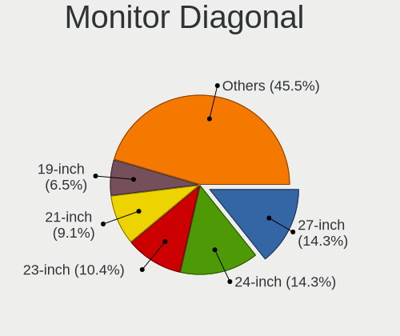

| Inches  | Desktops | Percent |
|---------|----------|---------|
| 27      | 11       | 14.29%  |
| 24      | 11       | 14.29%  |
| 23      | 8        | 10.39%  |
| 21      | 7        | 9.09%   |
| 19      | 5        | 6.49%   |
| 34      | 4        | 5.19%   |
| 31      | 4        | 5.19%   |
| 22      | 4        | 5.19%   |
| 18      | 4        | 5.19%   |
| 42      | 2        | 2.6%    |
| 20      | 2        | 2.6%    |
| Unknown | 2        | 2.6%    |
| 84      | 1        | 1.3%    |
| 72      | 1        | 1.3%    |
| 60      | 1        | 1.3%    |
| 49      | 1        | 1.3%    |
| 48      | 1        | 1.3%    |
| 36      | 1        | 1.3%    |
| 35      | 1        | 1.3%    |
| 32      | 1        | 1.3%    |
| 29      | 1        | 1.3%    |
| 26      | 1        | 1.3%    |
| 17      | 1        | 1.3%    |
| 15      | 1        | 1.3%    |
| 14      | 1        | 1.3%    |

Monitor Width
-------------

Physical width

| Width in mm | Desktops | Percent |
|-------------|----------|---------|
| 501-600     | 28       | 38.36%  |
| 401-500     | 18       | 24.66%  |
| 701-800     | 6        | 8.22%   |
| 601-700     | 5        | 6.85%   |
| 351-400     | 4        | 5.48%   |
| 1001-1500   | 3        | 4.11%   |
| 1501-2000   | 2        | 2.74%   |
| 901-1000    | 2        | 2.74%   |
| Unknown     | 2        | 2.74%   |
| 801-900     | 1        | 1.37%   |
| 301-350     | 1        | 1.37%   |
| 201-300     | 1        | 1.37%   |

Aspect Ratio
------------

Proportional relationship between the width and the height

| Ratio   | Desktops | Percent |
|---------|----------|---------|
| 16/9    | 49       | 68.06%  |
| 16/10   | 9        | 12.5%   |
| 21/9    | 5        | 6.94%   |
| 4/3     | 3        | 4.17%   |
| 5/4     | 2        | 2.78%   |
| 6/5     | 1        | 1.39%   |
| 32/9    | 1        | 1.39%   |
| 3/2     | 1        | 1.39%   |
| Unknown | 1        | 1.39%   |

Monitor Area
------------

Area in inch

| Area in inch | Desktops | Percent |
|----------------|----------|---------|
| 201-250        | 23       | 30.26%  |
| 351-500        | 11       | 14.47%  |
| 301-350        | 11       | 14.47%  |
| 151-200        | 10       | 13.16%  |
| More than 1000 | 4        | 5.26%   |
| 251-300        | 4        | 5.26%   |
| 141-150        | 4        | 5.26%   |
| 501-1000       | 4        | 5.26%   |
| Unknown        | 2        | 2.63%   |
| 131-140        | 1        | 1.32%   |
| 111-120        | 1        | 1.32%   |
| 101-110        | 1        | 1.32%   |

Pixel Density
-------------

Pixels per inch

| Density | Desktops | Percent |
|---------|----------|---------|
| 51-100  | 46       | 65.71%  |
| 101-120 | 14       | 20%     |
| 1-50    | 5        | 7.14%   |
| 121-160 | 2        | 2.86%   |
| Unknown | 2        | 2.86%   |
| 161-240 | 1        | 1.43%   |

Multiple Monitors
-----------------

Total monitors connected

| Total | Desktops | Percent |
|-------|----------|---------|
| 1     | 55       | 80.88%  |
| 2     | 12       | 17.65%  |
| 3     | 1        | 1.47%   |

Network
-------

Net Controller Vendor
---------------------

Controller vendors

| Vendor                   | Desktops | Percent |
|--------------------------|----------|---------|
| Realtek Semiconductor    | 40       | 41.24%  |
| Intel                    | 29       | 29.9%   |
| Qualcomm Atheros         | 8        | 8.25%   |
| TP-Link                  | 4        | 4.12%   |
| Broadcom                 | 4        | 4.12%   |
| Xiaomi                   | 2        | 2.06%   |
| Marvell Technology Group | 2        | 2.06%   |
| Samsung Electronics      | 1        | 1.03%   |
| Ralink Technology        | 1        | 1.03%   |
| Ralink                   | 1        | 1.03%   |
| Qualcomm                 | 1        | 1.03%   |
| MediaTek                 | 1        | 1.03%   |
| Linksys                  | 1        | 1.03%   |
| Huawei Technologies      | 1        | 1.03%   |
| ASUSTek Computer         | 1        | 1.03%   |

Net Controller Model
--------------------

Controller models

| Model                                                                  | Desktops | Percent |
|------------------------------------------------------------------------|----------|---------|
| Realtek RTL8111/8168/8211/8411 PCI Express Gigabit Ethernet Controller | 35       | 31.82%  |
| Intel Wireless 3165                                                    | 4        | 3.64%   |
| Intel I211 Gigabit Network Connection                                  | 3        | 2.73%   |
| Intel Ethernet Controller I225-V                                       | 3        | 2.73%   |
| Intel Ethernet Connection (2) I219-V                                   | 3        | 2.73%   |
| Realtek RTL88x2bu [AC1200 Techkey]                                     | 2        | 1.82%   |
| Realtek RTL8125 2.5GbE Controller                                      | 2        | 1.82%   |
| Intel Wi-Fi 6E(802.11ax) AX210/AX1675* 2x2 [Typhoon Peak]              | 2        | 1.82%   |
| Intel Ethernet Connection I217-LM                                      | 2        | 1.82%   |
| Intel Ethernet Connection (7) I219-V                                   | 2        | 1.82%   |
| Intel Ethernet Connection (2) I219-LM                                  | 2        | 1.82%   |
| Intel Alder Lake-S PCH CNVi WiFi                                       | 2        | 1.82%   |
| Intel 82579V Gigabit Network Connection                                | 2        | 1.82%   |
| Intel 82579LM Gigabit Network Connection (Lewisville)                  | 2        | 1.82%   |
| Xiaomi Mi/Redmi series (RNDIS)                                         | 1        | 0.91%   |
| Xiaomi Mi/Redmi series (RNDIS + ADB)                                   | 1        | 0.91%   |
| TP-Link UE300 10/100/1000 LAN (ethernet mode) [Realtek RTL8153]        | 1        | 0.91%   |
| TP-Link TL-WN823N v2/v3 [Realtek RTL8192EU]                            | 1        | 0.91%   |
| TP-Link TL-WN722N v2/v3 [Realtek RTL8188EUS]                           | 1        | 0.91%   |
| TP-Link Archer T4U ver.3                                               | 1        | 0.91%   |
| Samsung GT-I9070 (network tethering, USB debugging enabled)            | 1        | 0.91%   |
| Realtek RTL8821CE 802.11ac PCIe Wireless Network Adapter               | 1        | 0.91%   |
| Realtek RTL8821AE 802.11ac PCIe Wireless Network Adapter               | 1        | 0.91%   |
| Realtek RTL8188SU 802.11n WLAN Adapter                                 | 1        | 0.91%   |
| Realtek RTL8188CE 802.11b/g/n WiFi Adapter                             | 1        | 0.91%   |
| Realtek RTL810xE PCI Express Fast Ethernet controller                  | 1        | 0.91%   |
| Realtek 802.11ac NIC                                                   | 1        | 0.91%   |
| Ralink MT7601U Wireless Adapter                                        | 1        | 0.91%   |
| Ralink RT3090 Wireless 802.11n 1T/1R PCIe                              | 1        | 0.91%   |
| Qualcomm Atheros QCA9377 802.11ac Wireless Network Adapter             | 1        | 0.91%   |
| Qualcomm Atheros QCA6174 802.11ac Wireless Network Adapter             | 1        | 0.91%   |
| Qualcomm Atheros Killer E2500 Gigabit Ethernet Controller              | 1        | 0.91%   |
| Qualcomm Atheros Killer E2400 Gigabit Ethernet Controller              | 1        | 0.91%   |
| Qualcomm Atheros Killer E220x Gigabit Ethernet Controller              | 1        | 0.91%   |
| Qualcomm Atheros Attansic L2 Fast Ethernet                             | 1        | 0.91%   |
| Qualcomm Atheros AR9485 Wireless Network Adapter                       | 1        | 0.91%   |
| Qualcomm Atheros AR93xx Wireless Network Adapter                       | 1        | 0.91%   |
| Qualcomm Atheros AR8161 Gigabit Ethernet                               | 1        | 0.91%   |
| Qualcomm Airtel 4G                                                     | 1        | 0.91%   |
| MediaTek MT7921K (RZ608) Wi-Fi 6E 80MHz                                | 1        | 0.91%   |

Wireless Vendor
---------------

Wireless vendors

| Vendor                   | Desktops | Percent |
|--------------------------|----------|---------|
| Intel                    | 11       | 32.35%  |
| Realtek Semiconductor    | 7        | 20.59%  |
| Qualcomm Atheros         | 4        | 11.76%  |
| TP-Link                  | 3        | 8.82%   |
| Marvell Technology Group | 2        | 5.88%   |
| Broadcom                 | 2        | 5.88%   |
| Ralink Technology        | 1        | 2.94%   |
| Ralink                   | 1        | 2.94%   |
| MediaTek                 | 1        | 2.94%   |
| Linksys                  | 1        | 2.94%   |
| ASUSTek Computer         | 1        | 2.94%   |

Wireless Model
--------------

Wireless models

| Model                                                         | Desktops | Percent |
|---------------------------------------------------------------|----------|---------|
| Intel Wireless 3165                                           | 4        | 11.43%  |
| Realtek RTL88x2bu [AC1200 Techkey]                            | 2        | 5.71%   |
| Intel Wi-Fi 6E(802.11ax) AX210/AX1675* 2x2 [Typhoon Peak]     | 2        | 5.71%   |
| Intel Alder Lake-S PCH CNVi WiFi                              | 2        | 5.71%   |
| TP-Link TL-WN823N v2/v3 [Realtek RTL8192EU]                   | 1        | 2.86%   |
| TP-Link TL-WN722N v2/v3 [Realtek RTL8188EUS]                  | 1        | 2.86%   |
| TP-Link Archer T4U ver.3                                      | 1        | 2.86%   |
| Realtek RTL8821CE 802.11ac PCIe Wireless Network Adapter      | 1        | 2.86%   |
| Realtek RTL8821AE 802.11ac PCIe Wireless Network Adapter      | 1        | 2.86%   |
| Realtek RTL8188SU 802.11n WLAN Adapter                        | 1        | 2.86%   |
| Realtek RTL8188CE 802.11b/g/n WiFi Adapter                    | 1        | 2.86%   |
| Realtek 802.11ac NIC                                          | 1        | 2.86%   |
| Ralink MT7601U Wireless Adapter                               | 1        | 2.86%   |
| Ralink RT3090 Wireless 802.11n 1T/1R PCIe                     | 1        | 2.86%   |
| Qualcomm Atheros QCA9377 802.11ac Wireless Network Adapter    | 1        | 2.86%   |
| Qualcomm Atheros QCA6174 802.11ac Wireless Network Adapter    | 1        | 2.86%   |
| Qualcomm Atheros AR9485 Wireless Network Adapter              | 1        | 2.86%   |
| Qualcomm Atheros AR93xx Wireless Network Adapter              | 1        | 2.86%   |
| MediaTek MT7921K (RZ608) Wi-Fi 6E 80MHz                       | 1        | 2.86%   |
| Marvell Group Libertas 802.11b/g Wireless LAN Client Adapter  | 1        | 2.86%   |
| Marvell Group 88w8335 [Libertas] 802.11b/g Wireless           | 1        | 2.86%   |
| Linksys AE1200 802.11bgn Wireless Adapter [Broadcom BCM43235] | 1        | 2.86%   |
| Intel Wireless 8260                                           | 1        | 2.86%   |
| Intel Wireless 7260                                           | 1        | 2.86%   |
| Intel Wi-Fi 6 AX200                                           | 1        | 2.86%   |
| Intel Wi-Fi 5(802.11ac) Wireless-AC 9x6x [Thunder Peak]       | 1        | 2.86%   |
| Broadcom BCM4360 802.11ac Dual Band Wireless Network Adapter  | 1        | 2.86%   |
| Broadcom BCM43228 802.11a/b/g/n                               | 1        | 2.86%   |
| ASUS 802.11ac WLAN Adapter                                    | 1        | 2.86%   |

Ethernet Vendor
---------------

Ethernet vendors

| Vendor                | Desktops | Percent |
|-----------------------|----------|---------|
| Realtek Semiconductor | 38       | 51.35%  |
| Intel                 | 24       | 32.43%  |
| Qualcomm Atheros      | 5        | 6.76%   |
| Xiaomi                | 2        | 2.7%    |
| Broadcom              | 2        | 2.7%    |
| TP-Link               | 1        | 1.35%   |
| Qualcomm              | 1        | 1.35%   |
| Huawei Technologies   | 1        | 1.35%   |

Ethernet Model
--------------

Ethernet models

| Model                                                                  | Desktops | Percent |
|------------------------------------------------------------------------|----------|---------|
| Realtek RTL8111/8168/8211/8411 PCI Express Gigabit Ethernet Controller | 35       | 47.3%   |
| Intel I211 Gigabit Network Connection                                  | 3        | 4.05%   |
| Intel Ethernet Controller I225-V                                       | 3        | 4.05%   |
| Intel Ethernet Connection (2) I219-V                                   | 3        | 4.05%   |
| Realtek RTL8125 2.5GbE Controller                                      | 2        | 2.7%    |
| Intel Ethernet Connection I217-LM                                      | 2        | 2.7%    |
| Intel Ethernet Connection (7) I219-V                                   | 2        | 2.7%    |
| Intel Ethernet Connection (2) I219-LM                                  | 2        | 2.7%    |
| Intel 82579V Gigabit Network Connection                                | 2        | 2.7%    |
| Intel 82579LM Gigabit Network Connection (Lewisville)                  | 2        | 2.7%    |
| Xiaomi Mi/Redmi series (RNDIS)                                         | 1        | 1.35%   |
| Xiaomi Mi/Redmi series (RNDIS + ADB)                                   | 1        | 1.35%   |
| TP-Link UE300 10/100/1000 LAN (ethernet mode) [Realtek RTL8153]        | 1        | 1.35%   |
| Realtek RTL810xE PCI Express Fast Ethernet controller                  | 1        | 1.35%   |
| Qualcomm Atheros Killer E2500 Gigabit Ethernet Controller              | 1        | 1.35%   |
| Qualcomm Atheros Killer E2400 Gigabit Ethernet Controller              | 1        | 1.35%   |
| Qualcomm Atheros Killer E220x Gigabit Ethernet Controller              | 1        | 1.35%   |
| Qualcomm Atheros Attansic L2 Fast Ethernet                             | 1        | 1.35%   |
| Qualcomm Atheros AR8161 Gigabit Ethernet                               | 1        | 1.35%   |
| Qualcomm Airtel 4G                                                     | 1        | 1.35%   |
| Intel Ethernet Connection (17) I219-V                                  | 1        | 1.35%   |
| Intel Ethernet Connection (14) I219-V                                  | 1        | 1.35%   |
| Intel 82578DC Gigabit Network Connection                               | 1        | 1.35%   |
| Intel 82574L Gigabit Network Connection                                | 1        | 1.35%   |
| Intel 82567LM-3 Gigabit Network Connection                             | 1        | 1.35%   |
| Huawei FOA-LX9                                                         | 1        | 1.35%   |
| Broadcom NetXtreme II BCM5706 Gigabit Ethernet                         | 1        | 1.35%   |
| Broadcom NetXtreme BCM5762 Gigabit Ethernet PCIe                       | 1        | 1.35%   |

Net Controller Kind
-------------------

Ethernet, WiFi or modem

| Kind     | Desktops | Percent |
|----------|----------|---------|
| Ethernet | 69       | 69%     |
| WiFi     | 30       | 30%     |
| Modem    | 1        | 1%      |

Used Controller
---------------

Currently used network controller

| Kind     | Desktops | Percent |
|----------|----------|---------|
| Ethernet | 51       | 76.12%  |
| WiFi     | 16       | 23.88%  |

NICs
----

Total network controllers on board

| Total | Desktops | Percent |
|-------|----------|---------|
| 1     | 40       | 58.82%  |
| 2     | 23       | 33.82%  |
| 3     | 4        | 5.88%   |
| 0     | 1        | 1.47%   |

IPv6
----

IPv6 vs IPv4

| Used | Desktops | Percent |
|------|----------|---------|
| No   | 43       | 63.24%  |
| Yes  | 25       | 36.76%  |

Bluetooth
---------

Bluetooth Vendor
----------------

Controller vendors

| Vendor                          | Desktops | Percent |
|---------------------------------|----------|---------|
| Intel                           | 11       | 40.74%  |
| Cambridge Silicon Radio         | 5        | 18.52%  |
| ASUSTek Computer                | 3        | 11.11%  |
| Realtek Semiconductor           | 2        | 7.41%   |
| Qualcomm Atheros Communications | 2        | 7.41%   |
| Broadcom                        | 2        | 7.41%   |
| MediaTek                        | 1        | 3.7%    |
| Apple                           | 1        | 3.7%    |

Bluetooth Model
---------------

Controller models

| Model                                               | Desktops | Percent |
|-----------------------------------------------------|----------|---------|
| Intel Bluetooth wireless interface                  | 6        | 22.22%  |
| Cambridge Silicon Radio Bluetooth Dongle (HCI mode) | 5        | 18.52%  |
| Realtek Bluetooth Radio                             | 2        | 7.41%   |
| Qualcomm Atheros  Bluetooth Device                  | 2        | 7.41%   |
| Intel AX210 Bluetooth                               | 2        | 7.41%   |
| MediaTek Wireless_Device                            | 1        | 3.7%    |
| Intel Bluetooth 9460/9560 Jefferson Peak (JfP)      | 1        | 3.7%    |
| Intel AX201 Bluetooth                               | 1        | 3.7%    |
| Intel AX200 Bluetooth                               | 1        | 3.7%    |
| Broadcom HP Portable Bumble Bee                     | 1        | 3.7%    |
| Broadcom Bluetooth 3.0 Dongle                       | 1        | 3.7%    |
| ASUS Broadcom BCM20702A0 Bluetooth                  | 1        | 3.7%    |
| ASUS Bluetooth Radio                                | 1        | 3.7%    |
| ASUS ASUS USB-BT500                                 | 1        | 3.7%    |
| Apple Built-in Bluetooth 2.0+EDR HCI                | 1        | 3.7%    |

Sound
-----

Sound Vendor
------------

Sound card vendors

| Vendor                   | Desktops | Percent |
|--------------------------|----------|---------|
| Intel                    | 45       | 39.82%  |
| AMD                      | 28       | 24.78%  |
| Nvidia                   | 23       | 20.35%  |
| C-Media Electronics      | 7        | 6.19%   |
| Logitech                 | 3        | 2.65%   |
| Samson Technologies      | 1        | 0.88%   |
| Razer USA                | 1        | 0.88%   |
| Nordic Semiconductor ASA | 1        | 0.88%   |
| KTMicro                  | 1        | 0.88%   |
| Goldvish                 | 1        | 0.88%   |
| Creative Labs            | 1        | 0.88%   |
| ASUSTek Computer         | 1        | 0.88%   |

Sound Model
-----------

Sound card models

| Model                                                                      | Desktops | Percent |
|----------------------------------------------------------------------------|----------|---------|
| Intel 6 Series/C200 Series Chipset Family High Definition Audio Controller | 8        | 6.06%   |
| Intel 100 Series/C230 Series Chipset Family HD Audio Controller            | 7        | 5.3%    |
| AMD SBx00 Azalia (Intel HDA)                                               | 6        | 4.55%   |
| Intel 8 Series/C220 Series Chipset High Definition Audio Controller        | 5        | 3.79%   |
| AMD Family 17h/19h/1ah HD Audio Controller                                 | 5        | 3.79%   |
| Nvidia GK107 HDMI Audio Controller                                         | 4        | 3.03%   |
| Intel 200 Series PCH HD Audio                                              | 4        | 3.03%   |
| C-Media Electronics Audio Adapter (Unitek Y-247A)                          | 4        | 3.03%   |
| AMD Starship/Matisse HD Audio Controller                                   | 4        | 3.03%   |
| Intel Xeon E3-1200 v3/4th Gen Core Processor HD Audio Controller           | 3        | 2.27%   |
| Intel Cannon Lake PCH cAVS                                                 | 3        | 2.27%   |
| Intel Alder Lake-S HD Audio Controller                                     | 3        | 2.27%   |
| Intel 7 Series/C216 Chipset Family High Definition Audio Controller        | 3        | 2.27%   |
| AMD Renoir Radeon High Definition Audio Controller                         | 3        | 2.27%   |
| AMD Navi 10 HDMI Audio                                                     | 3        | 2.27%   |
| AMD FCH Azalia Controller                                                  | 3        | 2.27%   |
| AMD Ellesmere HDMI Audio [Radeon RX 470/480 / 570/580/590]                 | 3        | 2.27%   |
| Nvidia TU116 High Definition Audio Controller                              | 2        | 1.52%   |
| Nvidia GP108 High Definition Audio Controller                              | 2        | 1.52%   |
| Nvidia GP107GL High Definition Audio Controller                            | 2        | 1.52%   |
| Nvidia GP104 High Definition Audio Controller                              | 2        | 1.52%   |
| Nvidia GA104 High Definition Audio Controller                              | 2        | 1.52%   |
| Intel Jasper Lake HD Audio                                                 | 2        | 1.52%   |
| Intel 82801JI (ICH10 Family) HD Audio Controller                           | 2        | 1.52%   |
| Intel 5 Series/3400 Series Chipset High Definition Audio                   | 2        | 1.52%   |
| AMD Raven/Raven2/Fenghuang HDMI/DP Audio Controller                        | 2        | 1.52%   |
| AMD Oland/Hainan/Cape Verde/Pitcairn HDMI Audio [Radeon HD 7000 Series]    | 2        | 1.52%   |
| AMD Navi 21/23 HDMI/DP Audio Controller                                    | 2        | 1.52%   |
| AMD Kabini HDMI/DP Audio                                                   | 2        | 1.52%   |
| AMD Family 17h (Models 00h-0fh) HD Audio Controller                        | 2        | 1.52%   |
| Samson Technologies GoMic compact condenser mic                            | 1        | 0.76%   |
| Razer USA Razer Barracuda X                                                | 1        | 0.76%   |
| Nvidia TU107 GeForce GTX 1650 High Definition Audio Controller             | 1        | 0.76%   |
| Nvidia TU104 HD Audio Controller                                           | 1        | 0.76%   |
| Nvidia High Definition Audio Controller                                    | 1        | 0.76%   |
| Nvidia GM204 High Definition Audio Controller                              | 1        | 0.76%   |
| Nvidia GK208 HDMI/DP Audio Controller                                      | 1        | 0.76%   |
| Nvidia GK110 High Definition Audio Controller                              | 1        | 0.76%   |
| Nvidia GF119 HDMI Audio Controller                                         | 1        | 0.76%   |
| Nvidia GF108 High Definition Audio Controller                              | 1        | 0.76%   |

Memory
------

Memory Vendor
-------------

Memory module vendors

| Vendor              | Desktops | Percent |
|---------------------|----------|---------|
| Kingston            | 4        | 30.77%  |
| Samsung Electronics | 3        | 23.08%  |
| Unknown (0x5846)    | 1        | 7.69%   |
| CSX                 | 1        | 7.69%   |
| Corsair             | 1        | 7.69%   |
| Apacer              | 1        | 7.69%   |
| A-DATA Technology   | 1        | 7.69%   |
| Unknown             | 1        | 7.69%   |

Memory Model
------------

Memory module models

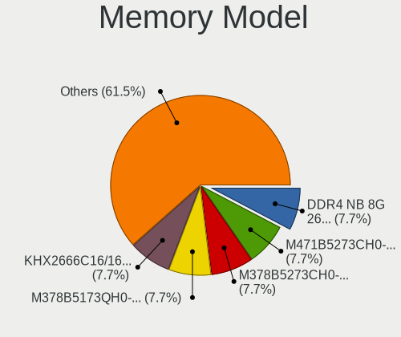

| Model                                                         | Desktops | Percent |
|---------------------------------------------------------------|----------|---------|
| Unknown (0x5846) RAM DDR4 NB 8G 2666 8GB SODIMM DDR4 2667MT/s | 1        | 7.69%   |
| Samsung RAM M471B5273CH0-CK0 4GB SODIMM DDR3 1600MT/s         | 1        | 7.69%   |
| Samsung RAM M378B5273CH0-CK0 4GB DIMM DDR3 2000MT/s           | 1        | 7.69%   |
| Samsung RAM M378B5173QH0-YK0 4GB DIMM DDR3                    | 1        | 7.69%   |
| Kingston RAM KHX2666C16/16G 16GB DIMM DDR4 3200MT/s           | 1        | 7.69%   |
| Kingston RAM HX426C16FB/4 4GB DIMM DDR4 2800MT/s              | 1        | 7.69%   |
| Kingston RAM HX318C10F/8 8GB DIMM DDR3 1866MT/s               | 1        | 7.69%   |
| Kingston RAM ASU16D3LU1KBG/4G 4096MB DIMM DDR3 3200MT/s       | 1        | 7.69%   |
| CSX RAM V01D3L82GB26826813 2GB DIMM DDR3 1333MT/s             | 1        | 7.69%   |
| Corsair RAM CMK8GX4M1A2400C16 8GB DIMM DDR4 3066MT/s          | 1        | 7.69%   |
| Apacer RAM 78.CAGP7.C7Z0B 8GB DIMM DDR4 2400MT/s              | 1        | 7.69%   |
| A-DATA RAM Module 4GB DIMM DDR3 1600MT/s                      | 1        | 7.69%   |
| Unknown                                                       | 1        | 7.69%   |

Memory Kind
-----------

Memory module kinds

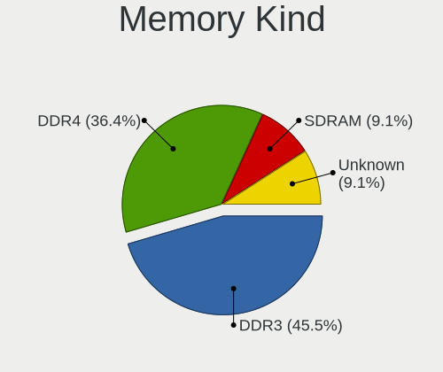

| Kind    | Desktops | Percent |
|---------|----------|---------|
| DDR3    | 5        | 45.45%  |
| DDR4    | 4        | 36.36%  |
| SDRAM   | 1        | 9.09%   |
| Unknown | 1        | 9.09%   |

Memory Form Factor
------------------

Physical design of the memory module

| Name   | Desktops | Percent |
|--------|----------|---------|
| DIMM   | 8        | 80%     |
| SODIMM | 2        | 20%     |

Memory Size
-----------

Memory module size

| Size  | Desktops | Percent |
|-------|----------|---------|
| 4096  | 5        | 45.45%  |
| 8192  | 4        | 36.36%  |
| 16384 | 1        | 9.09%   |
| 2048  | 1        | 9.09%   |

Memory Speed
------------

Memory module speed

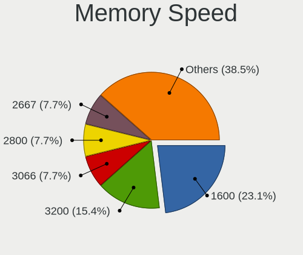

| Speed | Desktops | Percent |
|-------|----------|---------|
| 1600  | 3        | 23.08%  |
| 3200  | 2        | 15.38%  |
| 3066  | 1        | 7.69%   |
| 2800  | 1        | 7.69%   |
| 2667  | 1        | 7.69%   |
| 2400  | 1        | 7.69%   |
| 2000  | 1        | 7.69%   |
| 1866  | 1        | 7.69%   |
| 1333  | 1        | 7.69%   |
| 533   | 1        | 7.69%   |

Printers & scanners
-------------------

Printer Vendor
--------------

Printer device vendors

| Vendor              | Desktops | Percent |
|---------------------|----------|---------|
| Samsung Electronics | 1        | 25%     |
| Hewlett-Packard     | 1        | 25%     |
| Canon               | 1        | 25%     |
| Brother Industries  | 1        | 25%     |

Printer Model
-------------

Printer device models

| Model                        | Desktops | Percent |
|------------------------------|----------|---------|
| Samsung M2020 Series         | 1        | 25%     |
| HP Smart Tank 580-590 series | 1        | 25%     |
| Canon MF4320-4350            | 1        | 25%     |
| Brother MFC-J5330DW          | 1        | 25%     |

Scanner Vendor
--------------

Scanner device vendors

| Vendor | Desktops | Percent |
|--------|----------|---------|
| Canon  | 1        | 100%    |

Scanner Model
-------------

Scanner device models

| Model                  | Desktops | Percent |
|------------------------|----------|---------|
| Canon CanoScan LIDE 25 | 1        | 100%    |

Camera
------

Camera Vendor
-------------

Camera device vendors

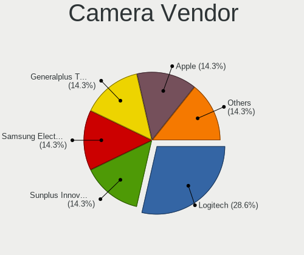

| Vendor                        | Desktops | Percent |
|-------------------------------|----------|---------|
| Logitech                      | 2        | 28.57%  |
| Sunplus Innovation Technology | 1        | 14.29%  |
| Samsung Electronics           | 1        | 14.29%  |
| Generalplus Technology        | 1        | 14.29%  |
| AVerMedia Technologies        | 1        | 14.29%  |
| Apple                         | 1        | 14.29%  |

Camera Model
------------

Camera device models

| Model                                   | Desktops | Percent |
|-----------------------------------------|----------|---------|
| Sunplus DICOTA 4K                       | 1        | 14.29%  |
| Samsung Galaxy series, misc. (MTP mode) | 1        | 14.29%  |
| Logitech Webcam C270                    | 1        | 14.29%  |
| Logitech HD Pro Webcam C920             | 1        | 14.29%  |
| Generalplus GENERAL WEBCAM              | 1        | 14.29%  |
| AVerMedia USB Device                    | 1        | 14.29%  |
| Apple iPhone 5/5C/5S/6/SE/7/8/X/XR      | 1        | 14.29%  |

Security
--------

Fingerprint Vendor
------------------

Fingerprint sensor vendors

Zero info for selected period =(

Fingerprint Model
-----------------

Fingerprint sensor models

Zero info for selected period =(

Chipcard Vendor
---------------

Chipcard module vendors

| Vendor      | Desktops | Percent |
|-------------|----------|---------|
| OmniKey     | 1        | 50%     |
| Alcor Micro | 1        | 50%     |

Chipcard Model
--------------

Chipcard module models

| Model                                   | Desktops | Percent |
|-----------------------------------------|----------|---------|
| OmniKey CardMan 3121 (HID Technologies) | 1        | 50%     |
| Alcor Micro AU9540 Smartcard Reader     | 1        | 50%     |

Unsupported
-----------

Unsupported Devices
-------------------

Total unsupported devices on board

| Total | Desktops | Percent |
|-------|----------|---------|
| 0     | 56       | 82.35%  |
| 1     | 9        | 13.24%  |
| 2     | 3        | 4.41%   |

Unsupported Device Types
------------------------

Types of unsupported devices

| Type                  | Desktops | Percent |
|-----------------------|----------|---------|
| Net/wireless          | 7        | 50%     |
| Chipcard              | 2        | 14.29%  |
| Network               | 1        | 7.14%   |
| Net/ethernet          | 1        | 7.14%   |
| Multimedia controller | 1        | 7.14%   |
| Graphics card         | 1        | 7.14%   |
| Card reader           | 1        | 7.14%   |

