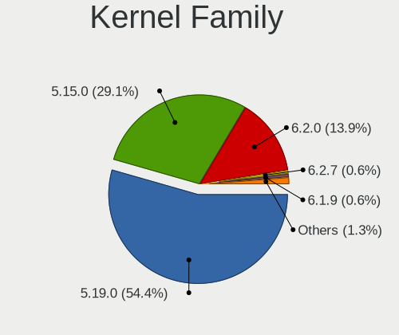
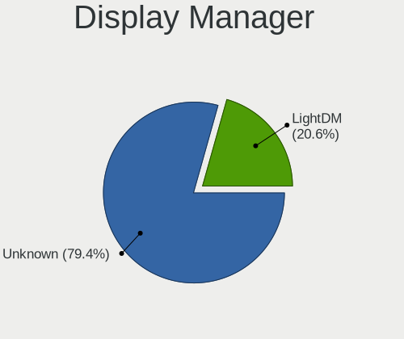
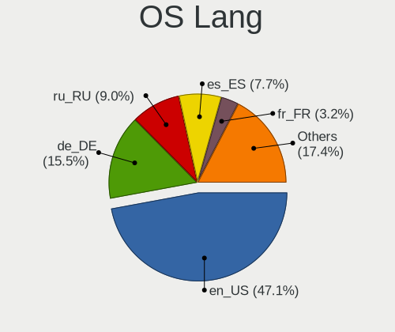
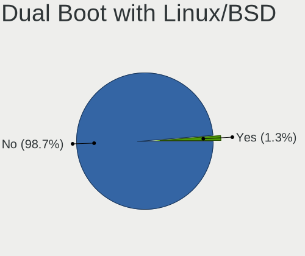
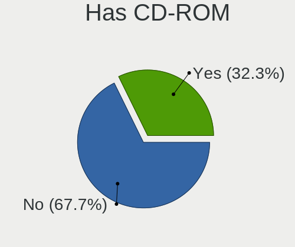
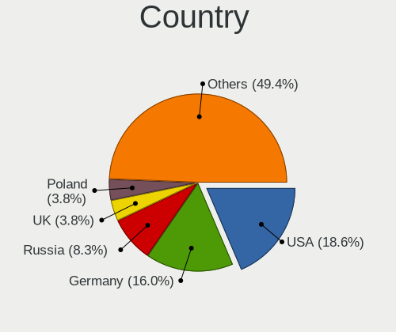
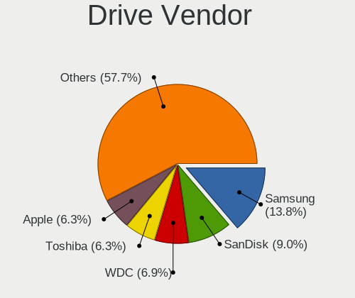
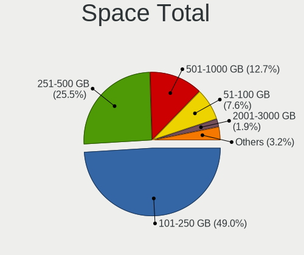
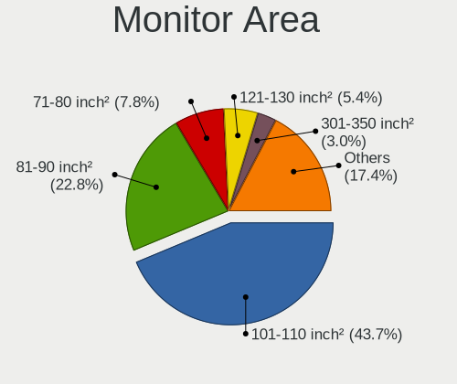
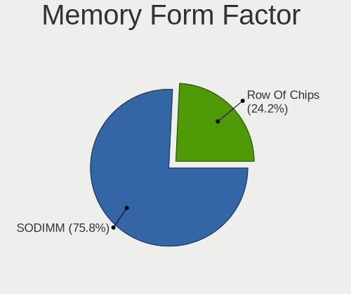

Elementary 7 - Tested Hardware & Statistics (Notebooks)
-------------------------------------------------------

A project to collect tested hardware configurations for Elementary 7.

Anyone can contribute to this report by the [hw-probe](https://github.com/linuxhw/hw-probe) tool:

    sudo -E hw-probe -all -upload

Please contribute! Especially if your hardware is rare.

Contents
--------

* [ Test Cases ](#test-cases)

* [ System ](#system)
  - [ Kernel                   ](#kernel)
  - [ Kernel Family            ](#kernel-family)
  - [ Kernel Major Ver.        ](#kernel-major-ver)
  - [ Arch                     ](#arch)
  - [ DE                       ](#de)
  - [ Display Server           ](#display-server)
  - [ Display Manager          ](#display-manager)
  - [ OS Lang                  ](#os-lang)
  - [ Boot Mode                ](#boot-mode)
  - [ Filesystem               ](#filesystem)
  - [ Part. scheme             ](#part-scheme)
  - [ Dual Boot with Linux/BSD ](#dual-boot-with-linuxbsd)
  - [ Dual Boot (Win)          ](#dual-boot-win)

* [ Board ](#board)
  - [ Vendor                   ](#vendor)
  - [ Model                    ](#model)
  - [ Model Family             ](#model-family)
  - [ MFG Year                 ](#mfg-year)
  - [ Form Factor              ](#form-factor)
  - [ Secure Boot              ](#secure-boot)
  - [ Coreboot                 ](#coreboot)
  - [ RAM Size                 ](#ram-size)
  - [ RAM Used                 ](#ram-used)
  - [ Total Drives             ](#total-drives)
  - [ Has CD-ROM               ](#has-cd-rom)
  - [ Has Ethernet             ](#has-ethernet)
  - [ Has WiFi                 ](#has-wifi)
  - [ Has Bluetooth            ](#has-bluetooth)

* [ Location ](#location)
  - [ Country                  ](#country)
  - [ City                     ](#city)

* [ Drives ](#drives)
  - [ Drive Vendor             ](#drive-vendor)
  - [ Drive Model              ](#drive-model)
  - [ HDD Vendor               ](#hdd-vendor)
  - [ SSD Vendor               ](#ssd-vendor)
  - [ Drive Kind               ](#drive-kind)
  - [ Drive Connector          ](#drive-connector)
  - [ Drive Size               ](#drive-size)
  - [ Space Total              ](#space-total)
  - [ Space Used               ](#space-used)
  - [ Malfunc. Drives          ](#malfunc-drives)
  - [ Malfunc. Drive Vendor    ](#malfunc-drive-vendor)
  - [ Malfunc. HDD Vendor      ](#malfunc-hdd-vendor)
  - [ Malfunc. Drive Kind      ](#malfunc-drive-kind)
  - [ Failed Drives            ](#failed-drives)
  - [ Failed Drive Vendor      ](#failed-drive-vendor)
  - [ Drive Status             ](#drive-status)

* [ Storage controller ](#storage-controller)
  - [ Storage Vendor           ](#storage-vendor)
  - [ Storage Model            ](#storage-model)
  - [ Storage Kind             ](#storage-kind)

* [ Processor ](#processor)
  - [ CPU Vendor               ](#cpu-vendor)
  - [ CPU Model                ](#cpu-model)
  - [ CPU Model Family         ](#cpu-model-family)
  - [ CPU Cores                ](#cpu-cores)
  - [ CPU Sockets              ](#cpu-sockets)
  - [ CPU Threads              ](#cpu-threads)
  - [ CPU Op-Modes             ](#cpu-op-modes)
  - [ CPU Microcode            ](#cpu-microcode)
  - [ CPU Microarch            ](#cpu-microarch)

* [ Graphics ](#graphics)
  - [ GPU Vendor               ](#gpu-vendor)
  - [ GPU Model                ](#gpu-model)
  - [ GPU Combo                ](#gpu-combo)
  - [ GPU Driver               ](#gpu-driver)
  - [ GPU Memory               ](#gpu-memory)

* [ Monitor ](#monitor)
  - [ Monitor Vendor           ](#monitor-vendor)
  - [ Monitor Model            ](#monitor-model)
  - [ Monitor Resolution       ](#monitor-resolution)
  - [ Monitor Diagonal         ](#monitor-diagonal)
  - [ Monitor Width            ](#monitor-width)
  - [ Aspect Ratio             ](#aspect-ratio)
  - [ Monitor Area             ](#monitor-area)
  - [ Pixel Density            ](#pixel-density)
  - [ Multiple Monitors        ](#multiple-monitors)

* [ Network ](#network)
  - [ Net Controller Vendor    ](#net-controller-vendor)
  - [ Net Controller Model     ](#net-controller-model)
  - [ Wireless Vendor          ](#wireless-vendor)
  - [ Wireless Model           ](#wireless-model)
  - [ Ethernet Vendor          ](#ethernet-vendor)
  - [ Ethernet Model           ](#ethernet-model)
  - [ Net Controller Kind      ](#net-controller-kind)
  - [ Used Controller          ](#used-controller)
  - [ NICs                     ](#nics)
  - [ IPv6                     ](#ipv6)

* [ Bluetooth ](#bluetooth)
  - [ Bluetooth Vendor         ](#bluetooth-vendor)
  - [ Bluetooth Model          ](#bluetooth-model)

* [ Sound ](#sound)
  - [ Sound Vendor             ](#sound-vendor)
  - [ Sound Model              ](#sound-model)

* [ Memory ](#memory)
  - [ Memory Vendor            ](#memory-vendor)
  - [ Memory Model             ](#memory-model)
  - [ Memory Kind              ](#memory-kind)
  - [ Memory Form Factor       ](#memory-form-factor)
  - [ Memory Size              ](#memory-size)
  - [ Memory Speed             ](#memory-speed)

* [ Printers & scanners ](#printers--scanners)
  - [ Printer Vendor           ](#printer-vendor)
  - [ Printer Model            ](#printer-model)
  - [ Scanner Vendor           ](#scanner-vendor)
  - [ Scanner Model            ](#scanner-model)

* [ Camera ](#camera)
  - [ Camera Vendor            ](#camera-vendor)
  - [ Camera Model             ](#camera-model)

* [ Security ](#security)
  - [ Fingerprint Vendor       ](#fingerprint-vendor)
  - [ Fingerprint Model        ](#fingerprint-model)
  - [ Chipcard Vendor          ](#chipcard-vendor)
  - [ Chipcard Model           ](#chipcard-model)

* [ Unsupported ](#unsupported)
  - [ Unsupported Devices      ](#unsupported-devices)
  - [ Unsupported Device Types ](#unsupported-device-types)

Test Cases
----------

Total: 107

| Vendor        | Model                       | Probe                                                      | Date         |
|---------------|-----------------------------|------------------------------------------------------------|--------------|
| MSI           | GE62VR 6RF                  | [97acececd3](https://linux-hardware.org/?probe=97acececd3) | Apr 28, 2023 |
| Apple         | MacBookPro5,2               | [c188ae4d7d](https://linux-hardware.org/?probe=c188ae4d7d) | Apr 28, 2023 |
| HP            | Pavilion Laptop 15-cw1xx... | [7aa3832621](https://linux-hardware.org/?probe=7aa3832621) | Apr 28, 2023 |
| MSI           | GE62VR 6RF                  | [2a9fcae8c3](https://linux-hardware.org/?probe=2a9fcae8c3) | Apr 28, 2023 |
| HUAWEI        | BOD-WXX9                    | [0f8543fc85](https://linux-hardware.org/?probe=0f8543fc85) | Apr 27, 2023 |
| ASUSTek       | ASUS TUF Gaming A15 FA50... | [6704ecd3d3](https://linux-hardware.org/?probe=6704ecd3d3) | Apr 27, 2023 |
| ASUSTek       | ASUS TUF Gaming A15 FA50... | [4e8b00c534](https://linux-hardware.org/?probe=4e8b00c534) | Apr 27, 2023 |
| MSI           | PE70 6QE                    | [87c8761eff](https://linux-hardware.org/?probe=87c8761eff) | Apr 27, 2023 |
| HP            | 250 G8 Notebook PC          | [b03cd2f2d2](https://linux-hardware.org/?probe=b03cd2f2d2) | Apr 26, 2023 |
| MSI           | PE70 6QE                    | [53dd8334ac](https://linux-hardware.org/?probe=53dd8334ac) | Apr 26, 2023 |
| Lenovo        | G580 20150                  | [5d8b07dbbd](https://linux-hardware.org/?probe=5d8b07dbbd) | Apr 25, 2023 |
| Dell          | Latitude E4300              | [f58f44d242](https://linux-hardware.org/?probe=f58f44d242) | Apr 22, 2023 |
| Lenovo        | V14 G2 ITL 82KA             | [763953fb60](https://linux-hardware.org/?probe=763953fb60) | Apr 22, 2023 |
| HP            | Pavilion g6                 | [4d60e2b7da](https://linux-hardware.org/?probe=4d60e2b7da) | Apr 17, 2023 |
| Dell          | XPS 15 9510                 | [94bf014457](https://linux-hardware.org/?probe=94bf014457) | Apr 17, 2023 |
| Dell          | XPS 15 9510                 | [2ebc6a2f61](https://linux-hardware.org/?probe=2ebc6a2f61) | Apr 17, 2023 |
| Apple         | MacBookPro9,2               | [ff6dbdcc10](https://linux-hardware.org/?probe=ff6dbdcc10) | Apr 15, 2023 |
| MSI           | PE70 6QE                    | [936a7d1fe3](https://linux-hardware.org/?probe=936a7d1fe3) | Apr 15, 2023 |
| Dell          | Latitude 5420               | [4c6427b3fc](https://linux-hardware.org/?probe=4c6427b3fc) | Apr 14, 2023 |
| Apple         | MacBookAir3,2               | [c750ece414](https://linux-hardware.org/?probe=c750ece414) | Apr 12, 2023 |
| Dell          | Latitude E5570              | [81eaf54f19](https://linux-hardware.org/?probe=81eaf54f19) | Apr 07, 2023 |
| Apple         | MacBookPro10,1              | [473a8c1d7b](https://linux-hardware.org/?probe=473a8c1d7b) | Apr 05, 2023 |
| Apple         | MacBookPro10,1              | [56079f49e3](https://linux-hardware.org/?probe=56079f49e3) | Apr 04, 2023 |
| HUAWEI        | BOD-WXX9                    | [3f9238067d](https://linux-hardware.org/?probe=3f9238067d) | Apr 04, 2023 |
| HP            | Pavilion 15                 | [1a3e968dff](https://linux-hardware.org/?probe=1a3e968dff) | Apr 03, 2023 |
| Lenovo        | ThinkPad X1 Carbon 3rd 2... | [f7f207f61c](https://linux-hardware.org/?probe=f7f207f61c) | Apr 02, 2023 |
| HP            | 255 G7 Notebook PC          | [e06d57c27a](https://linux-hardware.org/?probe=e06d57c27a) | Apr 01, 2023 |
| HUAWEI        | NBD-WXX9                    | [d4c718bdab](https://linux-hardware.org/?probe=d4c718bdab) | Apr 01, 2023 |
| HP            | Pavilion Laptop 15-eh0xx... | [a967e73159](https://linux-hardware.org/?probe=a967e73159) | Mar 30, 2023 |
| Dell          | Latitude E7440              | [1159c854cd](https://linux-hardware.org/?probe=1159c854cd) | Mar 29, 2023 |
| HP            | 255 G7 Notebook PC          | [a9a8004509](https://linux-hardware.org/?probe=a9a8004509) | Mar 29, 2023 |
| HP            | 255 G7 Notebook PC          | [1dccfbe9f4](https://linux-hardware.org/?probe=1dccfbe9f4) | Mar 29, 2023 |
| Dell          | Latitude 5420               | [d714c46c4f](https://linux-hardware.org/?probe=d714c46c4f) | Mar 29, 2023 |
| Toshiba       | TECRA Z40-C                 | [39995c1c00](https://linux-hardware.org/?probe=39995c1c00) | Mar 24, 2023 |
| Dell          | Latitude E7440              | [1a986dbeb8](https://linux-hardware.org/?probe=1a986dbeb8) | Mar 24, 2023 |
| HONOR         | HYM-WXX                     | [df318ed208](https://linux-hardware.org/?probe=df318ed208) | Mar 21, 2023 |
| Fujitsu       | LIFEBOOK AH530              | [e40cf4f577](https://linux-hardware.org/?probe=e40cf4f577) | Mar 18, 2023 |
| Dell          | Latitude E5570              | [a15d1b43ca](https://linux-hardware.org/?probe=a15d1b43ca) | Mar 17, 2023 |
| Dell          | Latitude E5570              | [dd07b0c3b3](https://linux-hardware.org/?probe=dd07b0c3b3) | Mar 17, 2023 |
| Dell          | G3 3590                     | [9ef42643d8](https://linux-hardware.org/?probe=9ef42643d8) | Mar 16, 2023 |
| Fujitsu       | LIFEBOOK E744               | [03e5d43f27](https://linux-hardware.org/?probe=03e5d43f27) | Mar 15, 2023 |
| Fujitsu       | LIFEBOOK E744               | [4c49d73583](https://linux-hardware.org/?probe=4c49d73583) | Mar 15, 2023 |
| Apple         | MacBookPro5,5               | [c6ff6d14a0](https://linux-hardware.org/?probe=c6ff6d14a0) | Mar 15, 2023 |
| Acer          | Aspire V3-771               | [28f8273eb5](https://linux-hardware.org/?probe=28f8273eb5) | Mar 15, 2023 |
| MSI           | GT72 2QE                    | [b3c4766473](https://linux-hardware.org/?probe=b3c4766473) | Mar 12, 2023 |
| Lenovo        | ThinkPad X240 20AMS0XP0S    | [a2ee9a2818](https://linux-hardware.org/?probe=a2ee9a2818) | Mar 12, 2023 |
| Fujitsu       | LIFEBOOK A359               | [0fa1ebbc11](https://linux-hardware.org/?probe=0fa1ebbc11) | Mar 11, 2023 |
| Fujitsu       | LIFEBOOK A359               | [f977012127](https://linux-hardware.org/?probe=f977012127) | Mar 11, 2023 |
| Apple         | MacBookPro11,2              | [fce6120754](https://linux-hardware.org/?probe=fce6120754) | Mar 11, 2023 |
| Acer          | Aspire A715-72G             | [32b2d1b194](https://linux-hardware.org/?probe=32b2d1b194) | Mar 11, 2023 |
| Lenovo        | Legion 5 15ARH05H 82B1      | [82b5297ab8](https://linux-hardware.org/?probe=82b5297ab8) | Mar 11, 2023 |
| Toshiba       | TECRA Z40-C                 | [a4ba2ff90e](https://linux-hardware.org/?probe=a4ba2ff90e) | Mar 10, 2023 |
| MSI           | CX61 2PC                    | [cb9f5fa992](https://linux-hardware.org/?probe=cb9f5fa992) | Mar 10, 2023 |
| Sony          | VPCEH2C5E                   | [adf4a69310](https://linux-hardware.org/?probe=adf4a69310) | Mar 07, 2023 |
| Sony          | VPCEH2C5E                   | [9e5b625dda](https://linux-hardware.org/?probe=9e5b625dda) | Mar 07, 2023 |
| GPU Compan... | GWTN156-11                  | [5afd8e3f42](https://linux-hardware.org/?probe=5afd8e3f42) | Mar 04, 2023 |
| ASUSTek       | ZenBook UX425EA_UX425EA     | [817b72f78f](https://linux-hardware.org/?probe=817b72f78f) | Mar 02, 2023 |
| ASUSTek       | ZenBook S UX391UA           | [053c6d5368](https://linux-hardware.org/?probe=053c6d5368) | Mar 02, 2023 |
| Lenovo        | ThinkPad X13 Gen 1 20T3S... | [fa757fb12a](https://linux-hardware.org/?probe=fa757fb12a) | Mar 01, 2023 |
| HP            | ProBook 450 15.6 inch G9... | [1025a9748f](https://linux-hardware.org/?probe=1025a9748f) | Mar 01, 2023 |
| GPU Compan... | GWTN156-11                  | [e189c60b09](https://linux-hardware.org/?probe=e189c60b09) | Mar 01, 2023 |
| GPU Compan... | GWTN156-11                  | [3883ba28c7](https://linux-hardware.org/?probe=3883ba28c7) | Mar 01, 2023 |
| Apple         | MacBookAir3,1               | [573644760d](https://linux-hardware.org/?probe=573644760d) | Feb 28, 2023 |
| Fujitsu       | LIFEBOOK E744               | [e331c5e257](https://linux-hardware.org/?probe=e331c5e257) | Feb 27, 2023 |
| Acer          | Aspire E5-771               | [73c974942f](https://linux-hardware.org/?probe=73c974942f) | Feb 26, 2023 |
| ASUSTek       | VivoBook_ASUSLaptop X513... | [a66f75c107](https://linux-hardware.org/?probe=a66f75c107) | Feb 26, 2023 |
| ASUSTek       | ZenBook UX425EA_UX425EA     | [50a16e7924](https://linux-hardware.org/?probe=50a16e7924) | Feb 25, 2023 |
| HP            | ProBook 430 G4              | [b815c24c07](https://linux-hardware.org/?probe=b815c24c07) | Feb 24, 2023 |
| HP            | ProBook 430 G4              | [e578b951f9](https://linux-hardware.org/?probe=e578b951f9) | Feb 24, 2023 |
| HP            | ProBook 430 G4              | [0dc5add67b](https://linux-hardware.org/?probe=0dc5add67b) | Feb 24, 2023 |
| Lenovo        | ThinkPad T400s 2808D9G      | [b101883e65](https://linux-hardware.org/?probe=b101883e65) | Feb 24, 2023 |
| Lenovo        | V14 G2 ITL 82KA             | [0a3d750f36](https://linux-hardware.org/?probe=0a3d750f36) | Feb 23, 2023 |
| ASUSTek       | ZenBook UX425EA_UX425EA     | [ddd8c34644](https://linux-hardware.org/?probe=ddd8c34644) | Feb 22, 2023 |
| Lenovo        | ThinkPad T440p 20AWS38H0... | [c79a8f48f9](https://linux-hardware.org/?probe=c79a8f48f9) | Feb 20, 2023 |
| Lenovo        | V14 G2 ITL 82KA             | [7ee9e59831](https://linux-hardware.org/?probe=7ee9e59831) | Feb 20, 2023 |
| HP            | OMEN by Laptop 17-ck0xxx    | [2751aac3e0](https://linux-hardware.org/?probe=2751aac3e0) | Feb 16, 2023 |
| Lenovo        | ThinkPad E560 20EV003DSP    | [535eda0feb](https://linux-hardware.org/?probe=535eda0feb) | Feb 16, 2023 |
| HP            | 550                         | [81b67f211d](https://linux-hardware.org/?probe=81b67f211d) | Feb 15, 2023 |
| Dell          | XPS 15 9560                 | [150c1de326](https://linux-hardware.org/?probe=150c1de326) | Feb 15, 2023 |
| Apple         | MacBook4,1                  | [e8a460c42c](https://linux-hardware.org/?probe=e8a460c42c) | Feb 15, 2023 |
| Apple         | MacBook4,1                  | [a92df0196e](https://linux-hardware.org/?probe=a92df0196e) | Feb 15, 2023 |
| HP            | EliteBook 8460p             | [92ab9b2e0d](https://linux-hardware.org/?probe=92ab9b2e0d) | Feb 14, 2023 |
| Acer          | Aspire V3-771               | [f22c83d683](https://linux-hardware.org/?probe=f22c83d683) | Feb 14, 2023 |
| HP            | OMEN by Laptop 17-ck0xxx    | [12431d8083](https://linux-hardware.org/?probe=12431d8083) | Feb 14, 2023 |
| Acer          | Extensa 5230                | [f27f478fa5](https://linux-hardware.org/?probe=f27f478fa5) | Feb 12, 2023 |
| Lenovo        | ThinkPad E560 20EV003DSP    | [97bf2aa6a5](https://linux-hardware.org/?probe=97bf2aa6a5) | Feb 12, 2023 |
| ASUSTek       | ZenBook UX434FAC_UX434FA... | [a1d85b3098](https://linux-hardware.org/?probe=a1d85b3098) | Feb 10, 2023 |
| Lenovo        | IdeaPad 320-15ABR 80XS      | [9de542dff7](https://linux-hardware.org/?probe=9de542dff7) | Feb 09, 2023 |
| ASUSTek       | ZenBook UX434FAC_UX434FA... | [6e8ed5d5d6](https://linux-hardware.org/?probe=6e8ed5d5d6) | Feb 09, 2023 |
| Lenovo        | ThinkPad E560 20EV003DSP    | [27731362e2](https://linux-hardware.org/?probe=27731362e2) | Feb 09, 2023 |
| HP            | Laptop 15-dy2xxx            | [b906f960a0](https://linux-hardware.org/?probe=b906f960a0) | Feb 08, 2023 |
| HP            | Laptop 14-bs0xx             | [c3607bb4c2](https://linux-hardware.org/?probe=c3607bb4c2) | Feb 07, 2023 |
| HP            | Laptop 17-by3xxx            | [07ea9d3c2f](https://linux-hardware.org/?probe=07ea9d3c2f) | Feb 06, 2023 |
| Acer          | Aspire E5-575G              | [30e2a88930](https://linux-hardware.org/?probe=30e2a88930) | Feb 05, 2023 |
| Acer          | Aspire 8935G                | [10f8560601](https://linux-hardware.org/?probe=10f8560601) | Feb 05, 2023 |
| Acer          | Aspire 8935G                | [be37cc70f5](https://linux-hardware.org/?probe=be37cc70f5) | Feb 05, 2023 |
| Toshiba       | Satellite C660              | [8d67e1438d](https://linux-hardware.org/?probe=8d67e1438d) | Feb 05, 2023 |
| Apple         | MacBookPro11,3              | [8bdb86b164](https://linux-hardware.org/?probe=8bdb86b164) | Feb 04, 2023 |
| Apple         | MacBookPro8,3               | [9d397c2187](https://linux-hardware.org/?probe=9d397c2187) | Feb 04, 2023 |
| Apple         | MacBookPro8,3               | [7b676dec23](https://linux-hardware.org/?probe=7b676dec23) | Feb 04, 2023 |
| Dell          | Vostro 3460                 | [8aa57f1d6d](https://linux-hardware.org/?probe=8aa57f1d6d) | Feb 03, 2023 |
| Dell          | Vostro 3460                 | [78919f6127](https://linux-hardware.org/?probe=78919f6127) | Feb 03, 2023 |
| Alienware     | x17 R2                      | [474a70c148](https://linux-hardware.org/?probe=474a70c148) | Feb 03, 2023 |
| Sony          | SVF1521O4E                  | [e2d47879d4](https://linux-hardware.org/?probe=e2d47879d4) | Feb 02, 2023 |
| Lenovo        | ThinkPad X230 23259S9       | [3d9e74535f](https://linux-hardware.org/?probe=3d9e74535f) | Feb 01, 2023 |
| Star Labs     | StarBook                    | [784ae24356](https://linux-hardware.org/?probe=784ae24356) | Jan 15, 2023 |
| Lenovo        | ThinkPad T495 20NKS01W02    | [cc7b02033a](https://linux-hardware.org/?probe=cc7b02033a) | Dec 24, 2022 |

System
------

Kernel
------

Version of the Linux kernel

| Version              | Notebooks | Percent |
|----------------------|-----------|---------|
| 5.15.0-58-generic    | 21        | 28.77%  |
| 5.19.0-35-generic    | 17        | 23.29%  |
| 5.19.0-32-generic    | 12        | 16.44%  |
| 5.19.0-38-generic    | 9         | 12.33%  |
| 5.19.0-40-generic    | 4         | 5.48%   |
| 5.15.0-60-generic    | 4         | 5.48%   |
| 5.19.0-41-generic    | 2         | 2.74%   |
| 6.2.7-060207-generic | 1         | 1.37%   |
| 6.1.9-060109-generic | 1         | 1.37%   |
| 6.1.6-060106-generic | 1         | 1.37%   |
| 5.15.0-56-generic    | 1         | 1.37%   |

Kernel Family
-------------

Linux kernel without a distro release

| Version | Notebooks | Percent |
|---------|-----------|---------|
| 5.19.0  | 41        | 58.57%  |
| 5.15.0  | 26        | 37.14%  |
| 6.2.7   | 1         | 1.43%   |
| 6.1.9   | 1         | 1.43%   |
| 6.1.6   | 1         | 1.43%   |

Kernel Major Ver.
-----------------

Linux kernel major version

| Version | Notebooks | Percent |
|---------|-----------|---------|
| 5.19    | 41        | 58.57%  |
| 5.15    | 26        | 37.14%  |
| 6.1     | 2         | 2.86%   |
| 6.2     | 1         | 1.43%   |

Arch
----

OS architecture (x86_64, i586, etc.)

| Name   | Notebooks | Percent |
|--------|-----------|---------|
| x86_64 | 69        | 100%    |

DE
--

Desktop Environment

| Name     | Notebooks | Percent |
|----------|-----------|---------|
| Pantheon | 69        | 100%    |

Display Server
--------------

X11 or Wayland

| Name | Notebooks | Percent |
|------|-----------|---------|
| X11  | 69        | 100%    |

Display Manager
---------------

SDDM, LightDM, etc.

| Name    | Notebooks | Percent |
|---------|-----------|---------|
| Unknown | 57        | 82.61%  |
| LightDM | 12        | 17.39%  |

OS Lang
-------

Language

| Lang  | Notebooks | Percent |
|-------|-----------|---------|
| en_US | 30        | 43.48%  |
| de_DE | 12        | 17.39%  |
| ru_RU | 5         | 7.25%   |
| es_ES | 4         | 5.8%    |
| fr_FR | 3         | 4.35%   |
| en_GB | 3         | 4.35%   |
| sv_SE | 2         | 2.9%    |
| pl_PL | 2         | 2.9%    |
| uk_UA | 1         | 1.45%   |
| pt_BR | 1         | 1.45%   |
| nb_NO | 1         | 1.45%   |
| it_IT | 1         | 1.45%   |
| hu_HU | 1         | 1.45%   |
| en_AU | 1         | 1.45%   |
| el_GR | 1         | 1.45%   |
| da_DK | 1         | 1.45%   |

Boot Mode
---------

EFI or BIOS

| Mode | Notebooks | Percent |
|------|-----------|---------|
| BIOS | 60        | 86.96%  |
| EFI  | 9         | 13.04%  |

Filesystem
----------

Type of filesystem

| Type  | Notebooks | Percent |
|-------|-----------|---------|
| Ext4  | 67        | 95.71%  |
| Xfs   | 1         | 1.43%   |
| Tmpfs | 1         | 1.43%   |
| Btrfs | 1         | 1.43%   |

Part. scheme
------------

Scheme of partitioning

| Type    | Notebooks | Percent |
|---------|-----------|---------|
| Unknown | 57        | 82.61%  |
| GPT     | 11        | 15.94%  |
| MBR     | 1         | 1.45%   |

Dual Boot with Linux/BSD
------------------------

Hosting more than one Linux/BSD

| Dual boot | Notebooks | Percent |
|-----------|-----------|---------|
| No        | 69        | 100%    |

Dual Boot (Win)
---------------

Hosting Linux and Windows

| Dual boot | Notebooks | Percent |
|-----------|-----------|---------|
| No        | 66        | 95.65%  |
| Yes       | 3         | 4.35%   |

Board
-----

Vendor
------

Motherboard manufacturer

| Name             | Notebooks | Percent |
|------------------|-----------|---------|
| Lenovo           | 12        | 17.39%  |
| Hewlett-Packard  | 12        | 17.39%  |
| Apple            | 10        | 14.49%  |
| Dell             | 8         | 11.59%  |
| ASUSTek Computer | 5         | 7.25%   |
| Acer             | 5         | 7.25%   |
| MSI              | 4         | 5.8%    |
| Fujitsu          | 3         | 4.35%   |
| Toshiba          | 2         | 2.9%    |
| Sony             | 2         | 2.9%    |
| HUAWEI           | 2         | 2.9%    |
| Star Labs        | 1         | 1.45%   |
| HONOR            | 1         | 1.45%   |
| GPU Company      | 1         | 1.45%   |
| Alienware        | 1         | 1.45%   |

Model
-----

Motherboard model

| Name                                     | Notebooks | Percent |
|------------------------------------------|-----------|---------|
| HP 255 G7 Notebook PC                    | 2         | 2.9%    |
| Toshiba TECRA Z40-C                      | 1         | 1.45%   |
| Toshiba Satellite C660                   | 1         | 1.45%   |
| Star Labs StarBook                       | 1         | 1.45%   |
| Sony VPCEH2C5E                           | 1         | 1.45%   |
| Sony SVF1521O4E                          | 1         | 1.45%   |
| MSI PE70 6QE                             | 1         | 1.45%   |
| MSI GT72 2QE                             | 1         | 1.45%   |
| MSI GE62VR 6RF                           | 1         | 1.45%   |
| MSI CX61 2PC                             | 1         | 1.45%   |
| Lenovo V14 G2 ITL 82KA                   | 1         | 1.45%   |
| Lenovo ThinkPad X240 20AMS0XP0S          | 1         | 1.45%   |
| Lenovo ThinkPad X230 23259S9             | 1         | 1.45%   |
| Lenovo ThinkPad X13 Gen 1 20T3S3SH0U     | 1         | 1.45%   |
| Lenovo ThinkPad X1 Carbon 3rd 20BSCTO1WW | 1         | 1.45%   |
| Lenovo ThinkPad T495 20NKS01W02          | 1         | 1.45%   |
| Lenovo ThinkPad T440p 20AWS38H0G         | 1         | 1.45%   |
| Lenovo ThinkPad T400s 2808D9G            | 1         | 1.45%   |
| Lenovo ThinkPad E560 20EV003DSP          | 1         | 1.45%   |
| Lenovo Legion 5 15ARH05H 82B1            | 1         | 1.45%   |
| Lenovo IdeaPad 320-15ABR 80XS            | 1         | 1.45%   |
| Lenovo G580 20150                        | 1         | 1.45%   |
| HUAWEI NBD-WXX9                          | 1         | 1.45%   |
| HUAWEI BOD-WXX9                          | 1         | 1.45%   |
| HONOR HYM-WXX                            | 1         | 1.45%   |
| HP ProBook 450 15.6 inch G9 Notebook PC  | 1         | 1.45%   |
| HP Pavilion Laptop 15-eh0xxx             | 1         | 1.45%   |
| HP Pavilion Laptop 15-cw1xxx             | 1         | 1.45%   |
| HP Pavilion g6                           | 1         | 1.45%   |
| HP Pavilion 15                           | 1         | 1.45%   |
| HP OMEN by Laptop 17-ck0xxx              | 1         | 1.45%   |
| HP Laptop 17-by3xxx                      | 1         | 1.45%   |
| HP Laptop 14-bs0xx                       | 1         | 1.45%   |
| HP 550                                   | 1         | 1.45%   |
| HP 250 G8 Notebook PC                    | 1         | 1.45%   |
| GPU Company GWTN156-11                   | 1         | 1.45%   |
| Fujitsu LIFEBOOK E744                    | 1         | 1.45%   |
| Fujitsu LIFEBOOK AH530                   | 1         | 1.45%   |
| Fujitsu LIFEBOOK A359                    | 1         | 1.45%   |
| Dell XPS 15 9560                         | 1         | 1.45%   |

Model Family
------------

Motherboard model prefix

| Name                   | Notebooks | Percent |
|------------------------|-----------|---------|
| Lenovo ThinkPad        | 8         | 11.59%  |
| Acer Aspire            | 5         | 7.25%   |
| HP Pavilion            | 4         | 5.8%    |
| Dell Latitude          | 4         | 5.8%    |
| Fujitsu LIFEBOOK       | 3         | 4.35%   |
| ASUS ZenBook           | 3         | 4.35%   |
| HP Laptop              | 2         | 2.9%    |
| HP 255                 | 2         | 2.9%    |
| Dell XPS               | 2         | 2.9%    |
| Apple MacBookPro5      | 2         | 2.9%    |
| Apple MacBookPro11     | 2         | 2.9%    |
| Apple MacBookAir3      | 2         | 2.9%    |
| Toshiba TECRA          | 1         | 1.45%   |
| Toshiba Satellite      | 1         | 1.45%   |
| Star Labs StarBook     | 1         | 1.45%   |
| Sony VPCEH2C5E         | 1         | 1.45%   |
| Sony SVF1521O4E        | 1         | 1.45%   |
| MSI PE70               | 1         | 1.45%   |
| MSI GT72               | 1         | 1.45%   |
| MSI GE62VR             | 1         | 1.45%   |
| MSI CX61               | 1         | 1.45%   |
| Lenovo V14             | 1         | 1.45%   |
| Lenovo Legion          | 1         | 1.45%   |
| Lenovo IdeaPad         | 1         | 1.45%   |
| Lenovo G580            | 1         | 1.45%   |
| HUAWEI NBD-WXX9        | 1         | 1.45%   |
| HUAWEI BOD-WXX9        | 1         | 1.45%   |
| HONOR HYM-WXX          | 1         | 1.45%   |
| HP ProBook             | 1         | 1.45%   |
| HP OMEN                | 1         | 1.45%   |
| HP 550                 | 1         | 1.45%   |
| HP 250                 | 1         | 1.45%   |
| GPU Company GWTN156-11 | 1         | 1.45%   |
| Dell Vostro            | 1         | 1.45%   |
| Dell G3                | 1         | 1.45%   |
| ASUS VivoBook          | 1         | 1.45%   |
| ASUS ASUS              | 1         | 1.45%   |
| Apple MacBookPro9      | 1         | 1.45%   |
| Apple MacBookPro8      | 1         | 1.45%   |
| Apple MacBookPro10     | 1         | 1.45%   |

MFG Year
--------

Motherboard manufacture year

| Year | Notebooks | Percent |
|------|-----------|---------|
| 2020 | 8         | 11.59%  |
| 2021 | 7         | 10.14%  |
| 2012 | 7         | 10.14%  |
| 2016 | 6         | 8.7%    |
| 2022 | 5         | 7.25%   |
| 2013 | 5         | 7.25%   |
| 2019 | 4         | 5.8%    |
| 2015 | 4         | 5.8%    |
| 2014 | 4         | 5.8%    |
| 2010 | 4         | 5.8%    |
| 2009 | 4         | 5.8%    |
| 2018 | 3         | 4.35%   |
| 2017 | 3         | 4.35%   |
| 2008 | 3         | 4.35%   |
| 2023 | 1         | 1.45%   |
| 2011 | 1         | 1.45%   |

Form Factor
-----------

Physical design of the computer

| Name     | Notebooks | Percent |
|----------|-----------|---------|
| Notebook | 69        | 100%    |

Secure Boot
-----------

Enabled or disabled

| State    | Notebooks | Percent |
|----------|-----------|---------|
| Disabled | 65        | 94.2%   |
| Enabled  | 4         | 5.8%    |

Coreboot
--------

Have coreboot on board

| Used | Notebooks | Percent |
|------|-----------|---------|
| No   | 68        | 98.55%  |
| Yes  | 1         | 1.45%   |

RAM Size
--------

Total RAM memory

| Size in GB  | Notebooks | Percent |
|-------------|-----------|---------|
| 4.01-8.0    | 21        | 30.43%  |
| 8.01-16.0   | 14        | 20.29%  |
| 3.01-4.0    | 13        | 18.84%  |
| 16.01-24.0  | 13        | 18.84%  |
| 32.01-64.0  | 4         | 5.8%    |
| 1.01-2.0    | 2         | 2.9%    |
| 2.01-3.0    | 1         | 1.45%   |
| 64.01-256.0 | 1         | 1.45%   |

RAM Used
--------

Used RAM memory

| Used GB   | Notebooks | Percent |
|-----------|-----------|---------|
| 2.01-3.0  | 27        | 37.5%   |
| 1.01-2.0  | 19        | 26.39%  |
| 3.01-4.0  | 13        | 18.06%  |
| 4.01-8.0  | 11        | 15.28%  |
| 8.01-16.0 | 1         | 1.39%   |
| 0.51-1.0  | 1         | 1.39%   |

Total Drives
------------

Number of drives on board

| Drives | Notebooks | Percent |
|--------|-----------|---------|
| 1      | 53        | 75.71%  |
| 2      | 16        | 22.86%  |
| 4      | 1         | 1.43%   |

Has CD-ROM
----------

Has CD-ROM on board

| Presented | Notebooks | Percent |
|-----------|-----------|---------|
| No        | 41        | 59.42%  |
| Yes       | 28        | 40.58%  |

Has Ethernet
------------

Has Ethernet on board

| Presented | Notebooks | Percent |
|-----------|-----------|---------|
| Yes       | 54        | 78.26%  |
| No        | 15        | 21.74%  |

Has WiFi
--------

Has WiFi module

| Presented | Notebooks | Percent |
|-----------|-----------|---------|
| Yes       | 69        | 100%    |

Has Bluetooth
-------------

Has Bluetooth module

| Presented | Notebooks | Percent |
|-----------|-----------|---------|
| Yes       | 60        | 86.96%  |
| No        | 9         | 13.04%  |

Location
--------

Country
-------

Geographic location (country)

| Country      | Notebooks | Percent |
|--------------|-----------|---------|
| USA          | 14        | 20.29%  |
| Germany      | 13        | 18.84%  |
| Russia       | 4         | 5.8%    |
| Poland       | 4         | 5.8%    |
| UK           | 3         | 4.35%   |
| France       | 3         | 4.35%   |
| Thailand     | 2         | 2.9%    |
| Spain        | 2         | 2.9%    |
| Norway       | 2         | 2.9%    |
| Australia    | 2         | 2.9%    |
| Tunisia      | 1         | 1.45%   |
| Sweden       | 1         | 1.45%   |
| South Africa | 1         | 1.45%   |
| Puerto Rico  | 1         | 1.45%   |
| Netherlands  | 1         | 1.45%   |
| Mexico       | 1         | 1.45%   |
| Kazakhstan   | 1         | 1.45%   |
| Italy        | 1         | 1.45%   |
| Israel       | 1         | 1.45%   |
| Ireland      | 1         | 1.45%   |
| Hungary      | 1         | 1.45%   |
| Greece       | 1         | 1.45%   |
| Georgia      | 1         | 1.45%   |
| Denmark      | 1         | 1.45%   |
| Cyprus       | 1         | 1.45%   |
| China        | 1         | 1.45%   |
| Canada       | 1         | 1.45%   |
| Brazil       | 1         | 1.45%   |
| Belgium      | 1         | 1.45%   |
| Albania      | 1         | 1.45%   |

City
----

Geographic location (city)

| City           | Notebooks | Percent |
|----------------|-----------|---------|
| Warsaw         | 2         | 2.86%   |
| Berlin         | 2         | 2.86%   |
| Bangkok        | 2         | 2.86%   |
| Zhuantang      | 1         | 1.43%   |
| Wuppertal      | 1         | 1.43%   |
| Wilster        | 1         | 1.43%   |
| West Monroe    | 1         | 1.43%   |
| Wellingborough | 1         | 1.43%   |
| Wauconda       | 1         | 1.43%   |
| Vigo           | 1         | 1.43%   |
| Twickenham     | 1         | 1.43%   |
| Tunis          | 1         | 1.43%   |
| Tuam           | 1         | 1.43%   |
| Tromsø        | 1         | 1.43%   |
| Tower City     | 1         | 1.43%   |
| Tirana         | 1         | 1.43%   |
| Tel Aviv       | 1         | 1.43%   |
| Tbilisi        | 1         | 1.43%   |
| Stuttgart      | 1         | 1.43%   |
| Stockholm      | 1         | 1.43%   |
| St Petersburg  | 1         | 1.43%   |
| Soborg         | 1         | 1.43%   |
| Sarasota       | 1         | 1.43%   |
| Salzgitter     | 1         | 1.43%   |
| Roosendaal     | 1         | 1.43%   |
| Pforzheim      | 1         | 1.43%   |
| Perth          | 1         | 1.43%   |
| Pécs          | 1         | 1.43%   |
| Odessa         | 1         | 1.43%   |
| Oaxaca City    | 1         | 1.43%   |
| Novosibirsk    | 1         | 1.43%   |
| Nicosia        | 1         | 1.43%   |
| Nesso          | 1         | 1.43%   |
| Moscow         | 1         | 1.43%   |
| Miami          | 1         | 1.43%   |
| Melbourne      | 1         | 1.43%   |
| Mahlstetten    | 1         | 1.43%   |
| Madrid         | 1         | 1.43%   |
| Lyngdal        | 1         | 1.43%   |
| Lublin         | 1         | 1.43%   |

Drives
------

Drive Vendor
------------

Hard drive vendors

| Vendor                      | Notebooks | Drives | Percent |
|-----------------------------|-----------|--------|---------|
| Samsung Electronics         | 11        | 12     | 12.79%  |
| Toshiba                     | 7         | 9      | 8.14%   |
| WDC                         | 6         | 6      | 6.98%   |
| Sandisk                     | 6         | 7      | 6.98%   |
| Crucial                     | 6         | 7      | 6.98%   |
| Seagate                     | 5         | 6      | 5.81%   |
| Kingston                    | 5         | 5      | 5.81%   |
| Apple                       | 5         | 5      | 5.81%   |
| Unknown                     | 4         | 4      | 4.65%   |
| SK hynix                    | 2         | 3      | 2.33%   |
| Phison Electronics          | 2         | 2      | 2.33%   |
| Micron Technology           | 2         | 2      | 2.33%   |
| Intenso                     | 2         | 3      | 2.33%   |
| HGST                        | 2         | 2      | 2.33%   |
| USB 3.0                     | 1         | 1      | 1.16%   |
| Union Memory                | 1         | 2      | 1.16%   |
| T-FORCE                     | 1         | 1      | 1.16%   |
| Star Drive                  | 1         | 1      | 1.16%   |
| SPCC                        | 1         | 1      | 1.16%   |
| Solid State Storage         | 1         | 1      | 1.16%   |
| Silicon Motion              | 1         | 1      | 1.16%   |
| Realtek Semiconductor       | 1         | 2      | 1.16%   |
| OWC                         | 1         | 1      | 1.16%   |
| LITEON                      | 1         | 1      | 1.16%   |
| KIOXIA                      | 1         | 1      | 1.16%   |
| Kingston Technology Company | 1         | 1      | 1.16%   |
| JMicron Technology          | 1         | 1      | 1.16%   |
| JetFlash                    | 1         | 1      | 1.16%   |
| Intel                       | 1         | 2      | 1.16%   |
| Inland                      | 1         | 1      | 1.16%   |
| Hitachi                     | 1         | 1      | 1.16%   |
| GeIL                        | 1         | 1      | 1.16%   |
| Fujitsu                     | 1         | 1      | 1.16%   |
| Biwin Storage Technology    | 1         | 1      | 1.16%   |
| ASMT                        | 1         | 1      | 1.16%   |

Drive Model
-----------

Hard drive models

| Model                                              | Notebooks | Percent |
|----------------------------------------------------|-----------|---------|
| Unknown MMC Card  32GB                             | 2         | 2.27%   |
| Seagate Expansion 4TB                              | 2         | 2.27%   |
| Phison E12 NVMe Controller 512GB                   | 2         | 2.27%   |
| Kingston SA400S37240G 240GB SSD                    | 2         | 2.27%   |
| HGST HTS721010A9E630 1TB                           | 2         | 2.27%   |
| Crucial CT250MX500SSD1 250GB                       | 2         | 2.27%   |
| WDC WDS500G2B0A-00SM50 500GB SSD                   | 1         | 1.14%   |
| WDC WDS240G2G0B-00EPW0 240GB SSD                   | 1         | 1.14%   |
| WDC WDS240G2G0A-00JH30 240GB SSD                   | 1         | 1.14%   |
| WDC WDS100T2B0B-00YS70 1TB SSD                     | 1         | 1.14%   |
| WDC WD10SPCX-08S8TT0 1TB                           | 1         | 1.14%   |
| WDC WD10JPVX-22JC3T0 1TB                           | 1         | 1.14%   |
| USB 3.0 Device 250GB                               | 1         | 1.14%   |
| Unknown MMC Card  7GB                              | 1         | 1.14%   |
| Unknown MMC Card  128GB                            | 1         | 1.14%   |
| Union Memory UMIS RPJTJ512MEE1OWX 512GB            | 1         | 1.14%   |
| Toshiba THNSNK128GVN8 M.2 2280 128GB SSD           | 1         | 1.14%   |
| Toshiba THNSNJ128GCSU 128GB SSD                    | 1         | 1.14%   |
| Toshiba THNSNJ128G8NU 128GB SSD                    | 1         | 1.14%   |
| Toshiba THNS128GG4BAAA-NonFDE 128GB SSD            | 1         | 1.14%   |
| Toshiba NVMe Controller 512GB                      | 1         | 1.14%   |
| Toshiba MQ01ABF050 500GB                           | 1         | 1.14%   |
| Toshiba MQ01ABD100 1TB                             | 1         | 1.14%   |
| T-FORCE 2TB                                        | 1         | 1.14%   |
| Star Drive PCIe SSD 480GB                          | 1         | 1.14%   |
| SPCC Solid State Disk 512GB                        | 1         | 1.14%   |
| Solid State Storage CL1-3D512-Q11 NVMe SSSTC 512GB | 1         | 1.14%   |
| SK hynix PC711 NVMe 1TB                            | 1         | 1.14%   |
| SK hynix HFM512GD3JX013N 512GB                     | 1         | 1.14%   |
| Silicon Motion PCIe-8 SSD 256GB                    | 1         | 1.14%   |
| Seagate ST9500325AS 500GB                          | 1         | 1.14%   |
| Seagate ST2000LM015-2E8174 2TB                     | 1         | 1.14%   |
| Seagate ST2000LM003 HN-M201RAD 2TB                 | 1         | 1.14%   |
| Seagate Photo Drive 2TB                            | 1         | 1.14%   |
| Sandisk WD Black SN850 1TB                         | 1         | 1.14%   |
| Sandisk WD Black SN750 / PC SN730 NVMe SSD 512GB   | 1         | 1.14%   |
| SanDisk SSD PLUS 480GB                             | 1         | 1.14%   |
| SanDisk SSD G5 BICS4 1TB                           | 1         | 1.14%   |
| SanDisk SDSSDH3 500G                               | 1         | 1.14%   |
| Sandisk PC SN530 NVMe WDC 256GB                    | 1         | 1.14%   |

HDD Vendor
----------

Hard disk drive vendors

| Vendor             | Notebooks | Drives | Percent |
|--------------------|-----------|--------|---------|
| Seagate            | 4         | 5      | 28.57%  |
| WDC                | 2         | 2      | 14.29%  |
| Toshiba            | 2         | 2      | 14.29%  |
| HGST               | 2         | 2      | 14.29%  |
| JMicron Technology | 1         | 1      | 7.14%   |
| Hitachi            | 1         | 1      | 7.14%   |
| Fujitsu            | 1         | 1      | 7.14%   |
| ASMT               | 1         | 1      | 7.14%   |

SSD Vendor
----------

Solid state drive vendors

| Vendor              | Notebooks | Drives | Percent |
|---------------------|-----------|--------|---------|
| Samsung Electronics | 6         | 7      | 15.79%  |
| Crucial             | 6         | 7      | 15.79%  |
| Kingston            | 5         | 5      | 13.16%  |
| Apple               | 5         | 5      | 13.16%  |
| WDC                 | 4         | 4      | 10.53%  |
| Toshiba             | 4         | 6      | 10.53%  |
| SanDisk             | 3         | 3      | 7.89%   |
| SPCC                | 1         | 1      | 2.63%   |
| OWC                 | 1         | 1      | 2.63%   |
| LITEON              | 1         | 1      | 2.63%   |
| Intenso             | 1         | 2      | 2.63%   |
| Inland              | 1         | 1      | 2.63%   |

Drive Kind
----------

HDD or SSD

| Kind    | Notebooks | Drives | Percent |
|---------|-----------|--------|---------|
| SSD     | 35        | 43     | 44.3%   |
| NVMe    | 23        | 29     | 29.11%  |
| HDD     | 11        | 15     | 13.92%  |
| Unknown | 6         | 6      | 7.59%   |
| MMC     | 4         | 4      | 5.06%   |

Drive Connector
---------------

SATA, SAS, NVMe, etc.

| Type | Notebooks | Drives | Percent |
|------|-----------|--------|---------|
| SATA | 47        | 56     | 58.02%  |
| NVMe | 23        | 29     | 28.4%   |
| SAS  | 7         | 8      | 8.64%   |
| MMC  | 4         | 4      | 4.94%   |

Drive Size
----------

Size of hard drive

| Size in TB | Notebooks | Drives | Percent |
|------------|-----------|--------|---------|
| 0.01-0.5   | 33        | 39     | 64.71%  |
| 0.51-1.0   | 12        | 13     | 23.53%  |
| 1.01-2.0   | 4         | 4      | 7.84%   |
| 3.01-4.0   | 2         | 2      | 3.92%   |

Space Total
-----------

Amount of disk space available on the file system

| Size in GB     | Notebooks | Percent |
|----------------|-----------|---------|
| 101-250        | 31        | 44.29%  |
| 251-500        | 19        | 27.14%  |
| 501-1000       | 11        | 15.71%  |
| 51-100         | 6         | 8.57%   |
| More than 3000 | 1         | 1.43%   |
| 2001-3000      | 1         | 1.43%   |
| 1001-2000      | 1         | 1.43%   |

Space Used
----------

Amount of used disk space

| Used GB        | Notebooks | Percent |
|----------------|-----------|---------|
| 1-20           | 36        | 50.7%   |
| 21-50          | 13        | 18.31%  |
| 101-250        | 11        | 15.49%  |
| 51-100         | 9         | 12.68%  |
| More than 3000 | 1         | 1.41%   |
| 1001-2000      | 1         | 1.41%   |

Malfunc. Drives
---------------

Drive models with a malfunction

Zero info for selected period =(

Malfunc. Drive Vendor
---------------------

Vendors of faulty drives

Zero info for selected period =(

Malfunc. HDD Vendor
-------------------

Vendors of faulty HDD drives

Zero info for selected period =(

Malfunc. Drive Kind
-------------------

Kinds of faulty drives

Zero info for selected period =(

Failed Drives
-------------

Failed drive models

Zero info for selected period =(

Failed Drive Vendor
-------------------

Failed drive vendors

Zero info for selected period =(

Drive Status
------------

Number of failed and malfunc. drives

| Status   | Notebooks | Drives | Percent |
|----------|-----------|--------|---------|
| Detected | 63        | 90     | 90%     |
| Works    | 7         | 7      | 10%     |

Storage controller
------------------

Storage Vendor
--------------

Storage controller vendors

| Vendor                         | Notebooks | Percent |
|--------------------------------|-----------|---------|
| Intel                          | 45        | 56.96%  |
| Samsung Electronics            | 7         | 8.86%   |
| AMD                            | 5         | 6.33%   |
| Nvidia                         | 4         | 5.06%   |
| SanDisk                        | 3         | 3.8%    |
| Phison Electronics             | 3         | 3.8%    |
| SK hynix                       | 2         | 2.53%   |
| Micron Technology              | 2         | 2.53%   |
| Union Memory (Shenzhen)        | 1         | 1.27%   |
| Toshiba America Info Systems   | 1         | 1.27%   |
| Solid State Storage Technology | 1         | 1.27%   |
| Silicon Motion                 | 1         | 1.27%   |
| Realtek Semiconductor          | 1         | 1.27%   |
| KIOXIA                         | 1         | 1.27%   |
| Kingston Technology Company    | 1         | 1.27%   |
| Biwin Storage Technology       | 1         | 1.27%   |

Storage Model
-------------

Storage controller models

| Model                                                                            | Notebooks | Percent |
|----------------------------------------------------------------------------------|-----------|---------|
| Intel 7 Series Chipset Family 6-port SATA Controller [AHCI mode]                 | 7         | 8.33%   |
| Intel Volume Management Device NVMe RAID Controller                              | 6         | 7.14%   |
| Intel 82801 Mobile SATA Controller [RAID mode]                                   | 5         | 5.95%   |
| AMD FCH SATA Controller [AHCI mode]                                              | 5         | 5.95%   |
| Intel Sunrise Point-LP SATA Controller [AHCI mode]                               | 4         | 4.76%   |
| Intel HM170/QM170 Chipset SATA Controller [AHCI Mode]                            | 3         | 3.57%   |
| Intel 8 Series/C220 Series Chipset Family 6-port SATA Controller 1 [AHCI mode]   | 3         | 3.57%   |
| Intel 8 Series SATA Controller 1 [AHCI mode]                                     | 3         | 3.57%   |
| SK hynix Gold P31/PC711 NVMe Solid State Drive                                   | 2         | 2.38%   |
| Samsung NVMe SSD Controller PM9A1/PM9A3/980PRO                                   | 2         | 2.38%   |
| Samsung Apple PCIe SSD                                                           | 2         | 2.38%   |
| Phison E12 NVMe Controller                                                       | 2         | 2.38%   |
| Nvidia MCP89 SATA Controller (AHCI mode)                                         | 2         | 2.38%   |
| Nvidia MCP79 AHCI Controller                                                     | 2         | 2.38%   |
| Micron NVMe Storage Controller                                                   | 2         | 2.38%   |
| Intel Tiger Lake-LP SATA Controller                                              | 2         | 2.38%   |
| Intel Celeron/Pentium Silver Processor SATA Controller                           | 2         | 2.38%   |
| Intel Cannon Lake Mobile PCH SATA AHCI Controller                                | 2         | 2.38%   |
| Intel 82801IBM/IEM (ICH9M/ICH9M-E) 4 port SATA Controller [AHCI mode]            | 2         | 2.38%   |
| Intel 82801HM/HEM (ICH8M/ICH8M-E) SATA Controller [AHCI mode]                    | 2         | 2.38%   |
| Intel 82801HM/HEM (ICH8M/ICH8M-E) IDE Controller                                 | 2         | 2.38%   |
| Intel 6 Series/C200 Series Chipset Family 6 port Mobile SATA AHCI Controller     | 2         | 2.38%   |
| Intel 5 Series/3400 Series Chipset 4 port SATA AHCI Controller                   | 2         | 2.38%   |
| Union Memory (Shenzhen) Non-Volatile memory controller                           | 1         | 1.19%   |
| Toshiba America Info Systems NVMe Controller                                     | 1         | 1.19%   |
| Solid State Storage Non-Volatile memory controller                               | 1         | 1.19%   |
| Silicon Motion Non-Volatile memory controller                                    | 1         | 1.19%   |
| SanDisk WD PC SN810 / Black SN850 NVMe SSD                                       | 1         | 1.19%   |
| SanDisk WD Black SN750 / PC SN730 NVMe SSD                                       | 1         | 1.19%   |
| SanDisk Non-Volatile memory controller                                           | 1         | 1.19%   |
| Samsung NVMe SSD Controller SM981/PM981/PM983                                    | 1         | 1.19%   |
| Samsung NVMe SSD Controller PM9B1                                                | 1         | 1.19%   |
| Samsung NVMe SSD Controller 980                                                  | 1         | 1.19%   |
| Realtek NVMe Controller                                                          | 1         | 1.19%   |
| Phison E18 PCIe4 NVMe Controller                                                 | 1         | 1.19%   |
| KIOXIA NVMe SSD Controller BG4                                                   | 1         | 1.19%   |
| Kingston Company Company Non-Volatile memory controller                          | 1         | 1.19%   |
| Intel Wildcat Point-LP SATA Controller [AHCI Mode]                               | 1         | 1.19%   |
| Intel SSD 660P Series                                                            | 1         | 1.19%   |
| Intel Atom/Celeron/Pentium Processor x5-E8000/J3xxx/N3xxx Series SATA Controller | 1         | 1.19%   |

Storage Kind
------------

Kind of storage controller (IDE, SATA, NVMe, SAS, ...)

| Kind | Notebooks | Percent |
|------|-----------|---------|
| SATA | 47        | 56.63%  |
| NVMe | 23        | 27.71%  |
| RAID | 11        | 13.25%  |
| IDE  | 2         | 2.41%   |

Processor
---------

CPU Vendor
----------

Processor vendors

| Vendor | Notebooks | Percent |
|--------|-----------|---------|
| Intel  | 59        | 85.51%  |
| AMD    | 10        | 14.49%  |

CPU Model
---------

Processor models

| Model                                    | Notebooks | Percent |
|------------------------------------------|-----------|---------|
| Intel Core i7-6700HQ CPU @ 2.60GHz       | 2         | 2.9%    |
| Intel Core i3-3120M CPU @ 2.50GHz        | 2         | 2.9%    |
| Intel 11th Gen Core i7-1165G7 @ 2.80GHz  | 2         | 2.9%    |
| Intel 11th Gen Core i3-1115G4 @ 3.00GHz  | 2         | 2.9%    |
| Intel Pentium Silver N5030 CPU @ 1.10GHz | 1         | 1.45%   |
| Intel Pentium CPU P6200 @ 2.13GHz        | 1         | 1.45%   |
| Intel Core i7-9750H CPU @ 2.60GHz        | 1         | 1.45%   |
| Intel Core i7-8550U CPU @ 1.80GHz        | 1         | 1.45%   |
| Intel Core i7-6500U CPU @ 2.50GHz        | 1         | 1.45%   |
| Intel Core i7-5600U CPU @ 2.60GHz        | 1         | 1.45%   |
| Intel Core i7-4870HQ CPU @ 2.50GHz       | 1         | 1.45%   |
| Intel Core i7-4750HQ CPU @ 2.00GHz       | 1         | 1.45%   |
| Intel Core i7-4712MQ CPU @ 2.30GHz       | 1         | 1.45%   |
| Intel Core i7-4710HQ CPU @ 2.50GHz       | 1         | 1.45%   |
| Intel Core i7-4600U CPU @ 2.10GHz        | 1         | 1.45%   |
| Intel Core i7-4510U CPU @ 2.00GHz        | 1         | 1.45%   |
| Intel Core i7-3720QM CPU @ 2.60GHz       | 1         | 1.45%   |
| Intel Core i7-2720QM CPU @ 2.20GHz       | 1         | 1.45%   |
| Intel Core i7-10510U CPU @ 1.80GHz       | 1         | 1.45%   |
| Intel Core i5-8300H CPU @ 2.30GHz        | 1         | 1.45%   |
| Intel Core i5-8250U CPU @ 1.60GHz        | 1         | 1.45%   |
| Intel Core i5-7300HQ CPU @ 2.50GHz       | 1         | 1.45%   |
| Intel Core i5-7200U CPU @ 2.50GHz        | 1         | 1.45%   |
| Intel Core i5-6300U CPU @ 2.40GHz        | 1         | 1.45%   |
| Intel Core i5-6200U CPU @ 2.30GHz        | 1         | 1.45%   |
| Intel Core i5-4300U CPU @ 1.90GHz        | 1         | 1.45%   |
| Intel Core i5-4300M CPU @ 2.60GHz        | 1         | 1.45%   |
| Intel Core i5-4210M CPU @ 2.60GHz        | 1         | 1.45%   |
| Intel Core i5-3337U CPU @ 1.80GHz        | 1         | 1.45%   |
| Intel Core i5-3320M CPU @ 2.60GHz        | 1         | 1.45%   |
| Intel Core i5-3230M CPU @ 2.60GHz        | 1         | 1.45%   |
| Intel Core i5-3210M CPU @ 2.50GHz        | 1         | 1.45%   |
| Intel Core i5-2430M CPU @ 2.40GHz        | 1         | 1.45%   |
| Intel Core i5-1035G1 CPU @ 1.00GHz       | 1         | 1.45%   |
| Intel Core i5-10310U CPU @ 1.70GHz       | 1         | 1.45%   |
| Intel Core i3-4005U CPU @ 1.70GHz        | 1         | 1.45%   |
| Intel Core i3 CPU M 380 @ 2.53GHz        | 1         | 1.45%   |
| Intel Core 2 Duo CPU U9400 @ 1.40GHz     | 1         | 1.45%   |
| Intel Core 2 Duo CPU T9600 @ 2.80GHz     | 1         | 1.45%   |
| Intel Core 2 Duo CPU T8300 @ 2.40GHz     | 1         | 1.45%   |

CPU Model Family
----------------

Processor model prefix

| Model                | Notebooks | Percent |
|----------------------|-----------|---------|
| Intel Core i5        | 16        | 23.19%  |
| Intel Core i7        | 15        | 21.74%  |
| Other                | 11        | 15.94%  |
| Intel Core 2 Duo     | 8         | 11.59%  |
| Intel Core i3        | 4         | 5.8%    |
| Intel Celeron        | 3         | 4.35%   |
| AMD Ryzen 7          | 2         | 2.9%    |
| AMD Ryzen 5          | 2         | 2.9%    |
| Intel Pentium Silver | 1         | 1.45%   |
| Intel Pentium        | 1         | 1.45%   |
| AMD Ryzen 5 PRO      | 1         | 1.45%   |
| AMD Ryzen 3          | 1         | 1.45%   |
| AMD Athlon           | 1         | 1.45%   |
| AMD A6               | 1         | 1.45%   |
| AMD A4               | 1         | 1.45%   |
| AMD A12              | 1         | 1.45%   |

CPU Cores
---------

Number of processor cores

| Number | Notebooks | Percent |
|--------|-----------|---------|
| 2      | 35        | 50.72%  |
| 4      | 22        | 31.88%  |
| 8      | 4         | 5.8%    |
| 6      | 2         | 2.9%    |
| 1      | 2         | 2.9%    |
| 14     | 1         | 1.45%   |
| 12     | 1         | 1.45%   |
| 10     | 1         | 1.45%   |
| 5      | 1         | 1.45%   |

CPU Sockets
-----------

Number of sockets

| Number | Notebooks | Percent |
|--------|-----------|---------|
| 1      | 69        | 100%    |

CPU Threads
-----------

Threads per core (Hyper-Threading)

| Number | Notebooks | Percent |
|--------|-----------|---------|
| 2      | 51        | 73.91%  |
| 1      | 18        | 26.09%  |

CPU Op-Modes
------------

CPU Operation Modes (32-bit, 64-bit)

| Op mode        | Notebooks | Percent |
|----------------|-----------|---------|
| 32-bit, 64-bit | 69        | 100%    |

CPU Microcode
-------------

Microcode number

| Number     | Notebooks | Percent |
|------------|-----------|---------|
| Unknown    | 56        | 80%     |
| 0x806d1    | 2         | 2.86%   |
| 0x806c1    | 2         | 2.86%   |
| 0x0a50000c | 2         | 2.86%   |
| 0x906a4    | 1         | 1.43%   |
| 0x906a3    | 1         | 1.43%   |
| 0x806ec    | 1         | 1.43%   |
| 0x806ea    | 1         | 1.43%   |
| 0x706e5    | 1         | 1.43%   |
| 0x40661    | 1         | 1.43%   |
| 0x40651    | 1         | 1.43%   |
| 0x10676    | 1         | 1.43%   |

CPU Microarch
-------------

Microarchitecture

| Name             | Notebooks | Percent |
|------------------|-----------|---------|
| Haswell          | 10        | 14.49%  |
| Penryn           | 8         | 11.59%  |
| KabyLake         | 8         | 11.59%  |
| IvyBridge        | 7         | 10.14%  |
| TigerLake        | 6         | 8.7%    |
| Skylake          | 5         | 7.25%   |
| Zen+             | 3         | 4.35%   |
| Zen 3            | 2         | 2.9%    |
| Zen 2            | 2         | 2.9%    |
| Westmere         | 2         | 2.9%    |
| SandyBridge      | 2         | 2.9%    |
| Icelake          | 2         | 2.9%    |
| Goldmont plus    | 2         | 2.9%    |
| Excavator        | 2         | 2.9%    |
| Alderlake Hybrid | 2         | 2.9%    |
| Unknown          | 2         | 2.9%    |
| Silvermont       | 1         | 1.45%   |
| Piledriver       | 1         | 1.45%   |
| Core             | 1         | 1.45%   |
| Broadwell        | 1         | 1.45%   |

Graphics
--------

GPU Vendor
----------

Vendors of graphics cards

| Vendor | Notebooks | Percent |
|--------|-----------|---------|
| Intel  | 52        | 59.77%  |
| Nvidia | 23        | 26.44%  |
| AMD    | 12        | 13.79%  |

GPU Model
---------

Graphics card models

| Model                                                                | Notebooks | Percent |
|----------------------------------------------------------------------|-----------|---------|
| Intel 3rd Gen Core processor Graphics Controller                     | 7         | 7.78%   |
| Intel TigerLake-LP GT2 [Iris Xe Graphics]                            | 4         | 4.44%   |
| Intel Haswell-ULT Integrated Graphics Controller                     | 4         | 4.44%   |
| Nvidia GF117M [GeForce 610M/710M/810M/820M / GT 620M/625M/630M/720M] | 3         | 3.33%   |
| Intel Skylake GT2 [HD Graphics 520]                                  | 3         | 3.33%   |
| Intel Mobile 4 Series Chipset Integrated Graphics Controller         | 3         | 3.33%   |
| Intel 4th Gen Core Processor Integrated Graphics Controller          | 3         | 3.33%   |
| AMD Picasso/Raven 2 [Radeon Vega Series / Radeon Vega Mobile Series] | 3         | 3.33%   |
| Nvidia MCP89 [GeForce 320M]                                          | 2         | 2.22%   |
| Nvidia GP107M [GeForce GTX 1050 Mobile]                              | 2         | 2.22%   |
| Nvidia C79 [GeForce 9400M]                                           | 2         | 2.22%   |
| Intel UHD Graphics 620                                               | 2         | 2.22%   |
| Intel TigerLake-H GT1 [UHD Graphics]                                 | 2         | 2.22%   |
| Intel Tiger Lake-LP GT2 [UHD Graphics G4]                            | 2         | 2.22%   |
| Intel HD Graphics 530                                                | 2         | 2.22%   |
| Intel Core Processor Integrated Graphics Controller                  | 2         | 2.22%   |
| Intel CometLake-U GT2 [UHD Graphics]                                 | 2         | 2.22%   |
| Intel CoffeeLake-H GT2 [UHD Graphics 630]                            | 2         | 2.22%   |
| Intel Alder Lake-P Integrated Graphics Controller                    | 2         | 2.22%   |
| AMD Renoir                                                           | 2         | 2.22%   |
| AMD Cezanne [Radeon Vega Series / Radeon Vega Mobile Series]         | 2         | 2.22%   |
| Nvidia TU116M [GeForce GTX 1660 Ti Mobile]                           | 1         | 1.11%   |
| Nvidia TU106M [GeForce RTX 2060 Mobile]                              | 1         | 1.11%   |
| Nvidia GP106M [GeForce GTX 1060 Mobile]                              | 1         | 1.11%   |
| Nvidia GM204M [GeForce GTX 980M]                                     | 1         | 1.11%   |
| Nvidia GM108M [GeForce 840M]                                         | 1         | 1.11%   |
| Nvidia GM107M [GeForce GTX 960M]                                     | 1         | 1.11%   |
| Nvidia GM107M [GeForce GTX 950M]                                     | 1         | 1.11%   |
| Nvidia GK107M [GeForce GT 750M Mac Edition]                          | 1         | 1.11%   |
| Nvidia GK107M [GeForce GT 650M Mac Edition]                          | 1         | 1.11%   |
| Nvidia GF119M [GeForce 410M]                                         | 1         | 1.11%   |
| Nvidia GA107M [GeForce RTX 3050 Ti Mobile]                           | 1         | 1.11%   |
| Nvidia GA106M [GeForce RTX 3060 Mobile / Max-Q]                      | 1         | 1.11%   |
| Nvidia GA104M [GeForce RTX 3070 Mobile / Max-Q]                      | 1         | 1.11%   |
| Nvidia GA103M [GeForce RTX 3080 Ti Laptop GPU]                       | 1         | 1.11%   |
| Nvidia G96CM [GeForce 9600M GT]                                      | 1         | 1.11%   |
| Intel Mobile GME965/GLE960 Integrated Graphics Controller            | 1         | 1.11%   |
| Intel Mobile GM965/GL960 Integrated Graphics Controller (secondary)  | 1         | 1.11%   |
| Intel Mobile GM965/GL960 Integrated Graphics Controller (primary)    | 1         | 1.11%   |
| Intel Iris Plus Graphics G1 (Ice Lake)                               | 1         | 1.11%   |

GPU Combo
---------

Combinations of graphics cards

| Name           | Notebooks | Percent |
|----------------|-----------|---------|
| 1 x Intel      | 36        | 52.17%  |
| Intel + Nvidia | 14        | 20.29%  |
| 1 x AMD        | 7         | 10.14%  |
| 1 x Nvidia     | 6         | 8.7%    |
| Intel + AMD    | 2         | 2.9%    |
| AMD + Nvidia   | 2         | 2.9%    |
| 2 x Nvidia     | 1         | 1.45%   |
| 2 x AMD        | 1         | 1.45%   |

GPU Driver
----------

Free vs proprietary

| Driver      | Notebooks | Percent |
|-------------|-----------|---------|
| Free        | 65        | 94.2%   |
| Proprietary | 3         | 4.35%   |
| Unknown     | 1         | 1.45%   |

GPU Memory
----------

Total video memory

| Size in GB | Notebooks | Percent |
|------------|-----------|---------|
| Unknown    | 66        | 95.65%  |
| 3.01-4.0   | 1         | 1.45%   |
| 1.01-2.0   | 1         | 1.45%   |
| 0.01-0.5   | 1         | 1.45%   |

Monitor
-------

Monitor Vendor
--------------

Monitor vendors

| Vendor                  | Notebooks | Percent |
|-------------------------|-----------|---------|
| LG Display              | 14        | 17.72%  |
| BOE                     | 11        | 13.92%  |
| AU Optronics            | 11        | 13.92%  |
| Apple                   | 10        | 12.66%  |
| Chimei Innolux          | 9         | 11.39%  |
| Samsung Electronics     | 5         | 6.33%   |
| Sharp                   | 2         | 2.53%   |
| Lenovo                  | 2         | 2.53%   |
| Goldstar                | 2         | 2.53%   |
| Dell                    | 2         | 2.53%   |
| Toshiba                 | 1         | 1.27%   |
| Philips                 | 1         | 1.27%   |
| PANDA                   | 1         | 1.27%   |
| Panasonic               | 1         | 1.27%   |
| Mi                      | 1         | 1.27%   |
| LG Philips              | 1         | 1.27%   |
| Hewlett-Packard         | 1         | 1.27%   |
| CPT                     | 1         | 1.27%   |
| Cisco                   | 1         | 1.27%   |
| Chi Mei Optoelectronics | 1         | 1.27%   |
| BenQ                    | 1         | 1.27%   |

Monitor Model
-------------

Monitor models

| Model                                                                     | Notebooks | Percent |
|---------------------------------------------------------------------------|-----------|---------|
| LG Display LCD Monitor LGD04A7 1920x1080 344x194mm 15.5-inch              | 3         | 3.8%    |
| Chimei Innolux LCD Monitor CMN15DB 1366x768 344x193mm 15.5-inch           | 3         | 3.8%    |
| LG Display LCD Monitor LGD046D 1920x1080 309x174mm 14.0-inch              | 2         | 2.53%   |
| Chimei Innolux LCD Monitor CMN1735 1920x1080 381x214mm 17.2-inch          | 2         | 2.53%   |
| Toshiba ScreenXpert TSB8888 1080x2160                                     | 1         | 1.27%   |
| Sharp LCD Monitor SHP14D0 3840x2400 336x210mm 15.6-inch                   | 1         | 1.27%   |
| Sharp LCD Monitor SHP1453 1920x1080 346x194mm 15.6-inch                   | 1         | 1.27%   |
| Samsung Electronics U32J59x SAM0F33 3840x2160 697x392mm 31.5-inch         | 1         | 1.27%   |
| Samsung Electronics LCD Monitor SEC5641 1366x768 344x193mm 15.5-inch      | 1         | 1.27%   |
| Samsung Electronics LCD Monitor SEC5441 1366x768 344x194mm 15.5-inch      | 1         | 1.27%   |
| Samsung Electronics LCD Monitor SEC3150 1366x768 344x193mm 15.5-inch      | 1         | 1.27%   |
| Samsung Electronics LCD Monitor SDC4161 1920x1080 344x194mm 15.5-inch     | 1         | 1.27%   |
| Philips FTV PHL01EA 1920x1080 1440x810mm 65.0-inch                        | 1         | 1.27%   |
| PANDA LCD Monitor NCP004D 1920x1080 344x194mm 15.5-inch                   | 1         | 1.27%   |
| Panasonic TV MEIA296 1280x1024 698x392mm 31.5-inch                        | 1         | 1.27%   |
| Mi Monitor XMI3444 3440x1440 797x334mm 34.0-inch                          | 1         | 1.27%   |
| LG Philips LCD Monitor LPLB900 1280x800 330x210mm 15.4-inch               | 1         | 1.27%   |
| LG Display LCD Monitor LGD4601 1280x800 286x179mm 13.3-inch               | 1         | 1.27%   |
| LG Display LCD Monitor LGD068D 1920x1080 309x174mm 14.0-inch              | 1         | 1.27%   |
| LG Display LCD Monitor LGD060A 1920x1080 294x165mm 13.3-inch              | 1         | 1.27%   |
| LG Display LCD Monitor LGD0419 2560x1440 310x174mm 14.0-inch              | 1         | 1.27%   |
| LG Display LCD Monitor LGD03EA 1920x1080 309x174mm 14.0-inch              | 1         | 1.27%   |
| LG Display LCD Monitor LGD035C 1366x768 309x174mm 14.0-inch               | 1         | 1.27%   |
| LG Display LCD Monitor LGD034D 1366x768 344x194mm 15.5-inch               | 1         | 1.27%   |
| LG Display LCD Monitor LGD02D8 1366x768 277x156mm 12.5-inch               | 1         | 1.27%   |
| LG Display LCD Monitor LGD0259 1920x1080 345x194mm 15.6-inch              | 1         | 1.27%   |
| Lenovo LEN S22e-19 LEN61C9 1920x1080 476x268mm 21.5-inch                  | 1         | 1.27%   |
| Lenovo LCD Monitor LEN4036 1440x900 304x190mm 14.1-inch                   | 1         | 1.27%   |
| Hewlett-Packard 27fw HPN3607 1920x1080 598x336mm 27.0-inch                | 1         | 1.27%   |
| Goldstar IPS FULLHD GSM5AB8 1920x1080 480x270mm 21.7-inch                 | 1         | 1.27%   |
| Goldstar FULL HD GSM5B55 1920x1080 480x270mm 21.7-inch                    | 1         | 1.27%   |
| Dell S2740L DELA08E 1920x1080 598x336mm 27.0-inch                         | 1         | 1.27%   |
| Dell 1908FP DEL4025 1280x1024 376x301mm 19.0-inch                         | 1         | 1.27%   |
| CPT LCD Monitor CPT14C7 1366x768 344x194mm 15.5-inch                      | 1         | 1.27%   |
| Cisco CS-DESKPRO-1 CIS0107 3840x2160 598x336mm 27.0-inch                  | 1         | 1.27%   |
| Chimei Innolux LCD Monitor CMN175E 1920x1080 381x214mm 17.2-inch          | 1         | 1.27%   |
| Chimei Innolux LCD Monitor CMN1728 1600x900 382x215mm 17.3-inch           | 1         | 1.27%   |
| Chimei Innolux LCD Monitor CMN15BC 1366x768 344x193mm 15.5-inch           | 1         | 1.27%   |
| Chimei Innolux LCD Monitor CMN14F2 1920x1080 309x173mm 13.9-inch          | 1         | 1.27%   |
| Chi Mei Optoelectronics LCD Monitor CMO1807 1920x1080 408x230mm 18.4-inch | 1         | 1.27%   |

Monitor Resolution
------------------

Monitor screen resolution

| Resolution        | Notebooks | Percent |
|-------------------|-----------|---------|
| 1920x1080 (FHD)   | 32        | 43.84%  |
| 1366x768 (WXGA)   | 18        | 24.66%  |
| 1280x800 (WXGA)   | 5         | 6.85%   |
| 3840x2160 (4K)    | 4         | 5.48%   |
| 2880x1800         | 3         | 4.11%   |
| 1920x1200 (WUXGA) | 2         | 2.74%   |
| 1600x900 (HD+)    | 2         | 2.74%   |
| 1440x900 (WXGA+)  | 2         | 2.74%   |
| 1280x1024 (SXGA)  | 2         | 2.74%   |
| 3840x2400         | 1         | 1.37%   |
| 3440x1440         | 1         | 1.37%   |
| 2560x1440 (QHD)   | 1         | 1.37%   |

Monitor Diagonal
----------------

Diagonal size in inches

| Inches  | Notebooks | Percent |
|---------|-----------|---------|
| 15      | 32        | 40.51%  |
| 14      | 11        | 13.92%  |
| 17      | 9         | 11.39%  |
| 13      | 9         | 11.39%  |
| 27      | 3         | 3.8%    |
| 21      | 3         | 3.8%    |
| 84      | 1         | 1.27%   |
| 65      | 1         | 1.27%   |
| 34      | 1         | 1.27%   |
| 31      | 1         | 1.27%   |
| 26      | 1         | 1.27%   |
| 24      | 1         | 1.27%   |
| 19      | 1         | 1.27%   |
| 18      | 1         | 1.27%   |
| 16      | 1         | 1.27%   |
| 12      | 1         | 1.27%   |
| 11      | 1         | 1.27%   |
| Unknown | 1         | 1.27%   |

Monitor Width
-------------

Physical width

| Width in mm | Notebooks | Percent |
|-------------|-----------|---------|
| 301-350     | 44        | 55.7%   |
| 351-400     | 12        | 15.19%  |
| 201-300     | 9         | 11.39%  |
| 501-600     | 5         | 6.33%   |
| 401-500     | 4         | 5.06%   |
| 701-800     | 1         | 1.27%   |
| 601-700     | 1         | 1.27%   |
| 1501-2000   | 1         | 1.27%   |
| 1001-1500   | 1         | 1.27%   |
| Unknown     | 1         | 1.27%   |

Aspect Ratio
------------

Proportional relationship between the width and the height

| Ratio   | Notebooks | Percent |
|---------|-----------|---------|
| 16/9    | 54        | 77.14%  |
| 16/10   | 12        | 17.14%  |
| 5/4     | 1         | 1.43%   |
| 4/3     | 1         | 1.43%   |
| 21/9    | 1         | 1.43%   |
| Unknown | 1         | 1.43%   |

Monitor Area
------------

Area in inch²

| Area in inch² | Notebooks | Percent |
|----------------|-----------|---------|
| 101-110        | 33        | 42.31%  |
| 81-90          | 14        | 17.95%  |
| 71-80          | 6         | 7.69%   |
| 121-130        | 6         | 7.69%   |
| 301-350        | 4         | 5.13%   |
| 201-250        | 3         | 3.85%   |
| 131-140        | 3         | 3.85%   |
| More than 1000 | 2         | 2.56%   |
| 351-500        | 2         | 2.56%   |
| 61-70          | 1         | 1.28%   |
| 51-60          | 1         | 1.28%   |
| 151-200        | 1         | 1.28%   |
| 141-150        | 1         | 1.28%   |
| Unknown        | 1         | 1.28%   |

Pixel Density
-------------

Pixels per inch

| Density       | Notebooks | Percent |
|---------------|-----------|---------|
| 121-160       | 35        | 46.05%  |
| 101-120       | 24        | 31.58%  |
| 51-100        | 9         | 11.84%  |
| 161-240       | 5         | 6.58%   |
| More than 240 | 1         | 1.32%   |
| 1-50          | 1         | 1.32%   |
| Unknown       | 1         | 1.32%   |

Multiple Monitors
-----------------

Total monitors connected

| Total | Notebooks | Percent |
|-------|-----------|---------|
| 1     | 57        | 82.61%  |
| 2     | 10        | 14.49%  |
| 3     | 1         | 1.45%   |
| 0     | 1         | 1.45%   |

Network
-------

Net Controller Vendor
---------------------

Controller vendors

| Vendor                            | Notebooks | Percent |
|-----------------------------------|-----------|---------|
| Intel                             | 31        | 29.52%  |
| Realtek Semiconductor             | 30        | 28.57%  |
| Qualcomm Atheros                  | 14        | 13.33%  |
| Broadcom                          | 14        | 13.33%  |
| Samsung Electronics               | 2         | 1.9%    |
| Nvidia                            | 2         | 1.9%    |
| Ericsson Business Mobile Networks | 2         | 1.9%    |
| Dell                              | 2         | 1.9%    |
| Broadcom Limited                  | 2         | 1.9%    |
| Xiaomi                            | 1         | 0.95%   |
| Ralink Technology                 | 1         | 0.95%   |
| Qualcomm                          | 1         | 0.95%   |
| Motorola PCS                      | 1         | 0.95%   |
| Marvell Technology Group          | 1         | 0.95%   |
| ASIX Electronics                  | 1         | 0.95%   |

Net Controller Model
--------------------

Controller models

| Model                                                             | Notebooks | Percent |
|-------------------------------------------------------------------|-----------|---------|
| Realtek RTL8111/8168/8411 PCI Express Gigabit Ethernet Controller | 21        | 15.56%  |
| Realtek RTL8821CE 802.11ac PCIe Wireless Network Adapter          | 6         | 4.44%   |
| Intel Wi-Fi 6 AX201                                               | 5         | 3.7%    |
| Intel Wireless 7260                                               | 4         | 2.96%   |
| Realtek RTL810xE PCI Express Fast Ethernet controller             | 3         | 2.22%   |
| Qualcomm Atheros QCA6174 802.11ac Wireless Network Adapter        | 3         | 2.22%   |
| Intel Wireless 8260                                               | 3         | 2.22%   |
| Broadcom BCM43142 802.11b/g/n                                     | 3         | 2.22%   |
| Samsung Galaxy series, misc. (tethering mode)                     | 2         | 1.48%   |
| Realtek RTL8153 Gigabit Ethernet Adapter                          | 2         | 1.48%   |
| Qualcomm Atheros QCA9377 802.11ac Wireless Network Adapter        | 2         | 1.48%   |
| Qualcomm Atheros AR9285 Wireless Network Adapter (PCI-Express)    | 2         | 1.48%   |
| Qualcomm Atheros AR8161 Gigabit Ethernet                          | 2         | 1.48%   |
| Nvidia MCP79 Ethernet                                             | 2         | 1.48%   |
| Intel Wireless 7265                                               | 2         | 1.48%   |
| Intel Wireless 3165                                               | 2         | 1.48%   |
| Intel Wi-Fi 6 AX210/AX211/AX411 160MHz                            | 2         | 1.48%   |
| Intel Wi-Fi 6 AX200                                               | 2         | 1.48%   |
| Intel Ultimate N WiFi Link 5300                                   | 2         | 1.48%   |
| Intel Ethernet Connection I219-V                                  | 2         | 1.48%   |
| Intel Ethernet Connection I218-LM                                 | 2         | 1.48%   |
| Intel Comet Lake PCH-LP CNVi WiFi                                 | 2         | 1.48%   |
| Intel 82567LM Gigabit Network Connection                          | 2         | 1.48%   |
| Broadcom NetXtreme BCM57765 Gigabit Ethernet PCIe                 | 2         | 1.48%   |
| Broadcom BCM4360 802.11ac Wireless Network Adapter                | 2         | 1.48%   |
| Broadcom BCM4331 802.11a/b/g/n                                    | 2         | 1.48%   |
| Broadcom BCM43224 802.11a/b/g/n                                   | 2         | 1.48%   |
| Broadcom BCM4322 802.11a/b/g/n Wireless LAN Controller            | 2         | 1.48%   |
| Xiaomi Mi/Redmi series (RNDIS)                                    | 1         | 0.74%   |
| Realtek RTL8852BE PCIe 802.11ax Wireless Network Controller       | 1         | 0.74%   |
| Realtek RTL8822CE 802.11ac PCIe Wireless Network Adapter          | 1         | 0.74%   |
| Realtek RTL8821AE 802.11ac PCIe Wireless Network Adapter          | 1         | 0.74%   |
| Realtek RTL8723DE Wireless Network Adapter                        | 1         | 0.74%   |
| Realtek RTL8723BE PCIe Wireless Network Adapter                   | 1         | 0.74%   |
| Realtek RTL8723AE PCIe Wireless Network Adapter                   | 1         | 0.74%   |
| Realtek RTL8188CE 802.11b/g/n WiFi Adapter                        | 1         | 0.74%   |
| Realtek Killer E3000 2.5GbE Controller                            | 1         | 0.74%   |
| Realtek 802.11n WLAN Adapter                                      | 1         | 0.74%   |
| Ralink RT2070 Wireless Adapter                                    | 1         | 0.74%   |
| Qualcomm QCNFA765 Wireless Network Adapter                        | 1         | 0.74%   |

Wireless Vendor
---------------

Wireless vendors

| Vendor                | Notebooks | Percent |
|-----------------------|-----------|---------|
| Intel                 | 30        | 42.25%  |
| Realtek Semiconductor | 14        | 19.72%  |
| Broadcom              | 13        | 18.31%  |
| Qualcomm Atheros      | 10        | 14.08%  |
| Ralink Technology     | 1         | 1.41%   |
| Qualcomm              | 1         | 1.41%   |
| Dell                  | 1         | 1.41%   |
| Broadcom Limited      | 1         | 1.41%   |

Wireless Model
--------------

Wireless models

| Model                                                          | Notebooks | Percent |
|----------------------------------------------------------------|-----------|---------|
| Realtek RTL8821CE 802.11ac PCIe Wireless Network Adapter       | 6         | 8.45%   |
| Intel Wi-Fi 6 AX201                                            | 5         | 7.04%   |
| Intel Wireless 7260                                            | 4         | 5.63%   |
| Qualcomm Atheros QCA6174 802.11ac Wireless Network Adapter     | 3         | 4.23%   |
| Intel Wireless 8260                                            | 3         | 4.23%   |
| Broadcom BCM43142 802.11b/g/n                                  | 3         | 4.23%   |
| Qualcomm Atheros QCA9377 802.11ac Wireless Network Adapter     | 2         | 2.82%   |
| Qualcomm Atheros AR9285 Wireless Network Adapter (PCI-Express) | 2         | 2.82%   |
| Intel Wireless 7265                                            | 2         | 2.82%   |
| Intel Wireless 3165                                            | 2         | 2.82%   |
| Intel Wi-Fi 6 AX210/AX211/AX411 160MHz                         | 2         | 2.82%   |
| Intel Wi-Fi 6 AX200                                            | 2         | 2.82%   |
| Intel Ultimate N WiFi Link 5300                                | 2         | 2.82%   |
| Intel Comet Lake PCH-LP CNVi WiFi                              | 2         | 2.82%   |
| Broadcom BCM4360 802.11ac Wireless Network Adapter             | 2         | 2.82%   |
| Broadcom BCM4331 802.11a/b/g/n                                 | 2         | 2.82%   |
| Broadcom BCM43224 802.11a/b/g/n                                | 2         | 2.82%   |
| Broadcom BCM4322 802.11a/b/g/n Wireless LAN Controller         | 2         | 2.82%   |
| Realtek RTL8852BE PCIe 802.11ax Wireless Network Controller    | 1         | 1.41%   |
| Realtek RTL8822CE 802.11ac PCIe Wireless Network Adapter       | 1         | 1.41%   |
| Realtek RTL8821AE 802.11ac PCIe Wireless Network Adapter       | 1         | 1.41%   |
| Realtek RTL8723DE Wireless Network Adapter                     | 1         | 1.41%   |
| Realtek RTL8723BE PCIe Wireless Network Adapter                | 1         | 1.41%   |
| Realtek RTL8723AE PCIe Wireless Network Adapter                | 1         | 1.41%   |
| Realtek RTL8188CE 802.11b/g/n WiFi Adapter                     | 1         | 1.41%   |
| Realtek 802.11n WLAN Adapter                                   | 1         | 1.41%   |
| Ralink RT2070 Wireless Adapter                                 | 1         | 1.41%   |
| Qualcomm QCNFA765 Wireless Network Adapter                     | 1         | 1.41%   |
| Qualcomm Atheros QCA9565 / AR9565 Wireless Network Adapter     | 1         | 1.41%   |
| Qualcomm Atheros AR9485 Wireless Network Adapter               | 1         | 1.41%   |
| Qualcomm Atheros AR9462 Wireless Network Adapter               | 1         | 1.41%   |
| Intel Wireless-AC 9260                                         | 1         | 1.41%   |
| Intel Wireless 8265 / 8275                                     | 1         | 1.41%   |
| Intel WiFi Link 5100                                           | 1         | 1.41%   |
| Intel Tiger Lake PCH CNVi WiFi                                 | 1         | 1.41%   |
| Intel Centrino Advanced-N 6205 [Taylor Peak]                   | 1         | 1.41%   |
| Intel Alder Lake-P PCH CNVi WiFi                               | 1         | 1.41%   |
| Dell DW5811e Snapdragon™ X7 LTE                           | 1         | 1.41%   |
| Broadcom Limited BCM4331 802.11a/b/g/n                         | 1         | 1.41%   |
| Broadcom BCM4321 802.11a/b/g/n                                 | 1         | 1.41%   |

Ethernet Vendor
---------------

Ethernet vendors

| Vendor                   | Notebooks | Percent |
|--------------------------|-----------|---------|
| Realtek Semiconductor    | 27        | 45%     |
| Intel                    | 14        | 23.33%  |
| Qualcomm Atheros         | 7         | 11.67%  |
| Broadcom                 | 4         | 6.67%   |
| Samsung Electronics      | 2         | 3.33%   |
| Nvidia                   | 2         | 3.33%   |
| Xiaomi                   | 1         | 1.67%   |
| Marvell Technology Group | 1         | 1.67%   |
| Broadcom Limited         | 1         | 1.67%   |
| ASIX Electronics         | 1         | 1.67%   |

Ethernet Model
--------------

Ethernet models

| Model                                                             | Notebooks | Percent |
|-------------------------------------------------------------------|-----------|---------|
| Realtek RTL8111/8168/8411 PCI Express Gigabit Ethernet Controller | 21        | 35%     |
| Realtek RTL810xE PCI Express Fast Ethernet controller             | 3         | 5%      |
| Samsung Galaxy series, misc. (tethering mode)                     | 2         | 3.33%   |
| Realtek RTL8153 Gigabit Ethernet Adapter                          | 2         | 3.33%   |
| Qualcomm Atheros AR8161 Gigabit Ethernet                          | 2         | 3.33%   |
| Nvidia MCP79 Ethernet                                             | 2         | 3.33%   |
| Intel Ethernet Connection I219-V                                  | 2         | 3.33%   |
| Intel Ethernet Connection I218-LM                                 | 2         | 3.33%   |
| Intel 82567LM Gigabit Network Connection                          | 2         | 3.33%   |
| Broadcom NetXtreme BCM57765 Gigabit Ethernet PCIe                 | 2         | 3.33%   |
| Xiaomi Mi/Redmi series (RNDIS)                                    | 1         | 1.67%   |
| Realtek Killer E3000 2.5GbE Controller                            | 1         | 1.67%   |
| Qualcomm Atheros QCA8171 Gigabit Ethernet                         | 1         | 1.67%   |
| Qualcomm Atheros Killer E2400 Gigabit Ethernet Controller         | 1         | 1.67%   |
| Qualcomm Atheros Killer E220x Gigabit Ethernet Controller         | 1         | 1.67%   |
| Qualcomm Atheros AR8162 Fast Ethernet                             | 1         | 1.67%   |
| Qualcomm Atheros AR8151 v2.0 Gigabit Ethernet                     | 1         | 1.67%   |
| Marvell Group 88E8058 PCI-E Gigabit Ethernet Controller           | 1         | 1.67%   |
| Intel Ethernet Connection I219-LM                                 | 1         | 1.67%   |
| Intel Ethernet Connection I217-V                                  | 1         | 1.67%   |
| Intel Ethernet Connection I217-LM                                 | 1         | 1.67%   |
| Intel Ethernet Connection (3) I218-LM                             | 1         | 1.67%   |
| Intel Ethernet Connection (13) I219-LM                            | 1         | 1.67%   |
| Intel Ethernet Connection (10) I219-LM                            | 1         | 1.67%   |
| Intel 82579LM Gigabit Network Connection (Lewisville)             | 1         | 1.67%   |
| Intel 82562GT 10/100 Network Connection                           | 1         | 1.67%   |
| Broadcom NetXtreme BCM57786 Gigabit Ethernet PCIe                 | 1         | 1.67%   |
| Broadcom NetXtreme BCM57762 Gigabit Ethernet PCIe                 | 1         | 1.67%   |
| Broadcom Limited NetLink BCM5784M Gigabit Ethernet PCIe           | 1         | 1.67%   |
| ASIX AX88179 Gigabit Ethernet                                     | 1         | 1.67%   |

Net Controller Kind
-------------------

Ethernet, WiFi or modem

| Kind     | Notebooks | Percent |
|----------|-----------|---------|
| WiFi     | 69        | 54.33%  |
| Ethernet | 54        | 42.52%  |
| Modem    | 3         | 2.36%   |
| Unknown  | 1         | 0.79%   |

Used Controller
---------------

Currently used network controller

| Kind     | Notebooks | Percent |
|----------|-----------|---------|
| WiFi     | 51        | 73.91%  |
| Ethernet | 18        | 26.09%  |

NICs
----

Total network controllers on board

| Total | Notebooks | Percent |
|-------|-----------|---------|
| 2     | 53        | 76.81%  |
| 1     | 14        | 20.29%  |
| 3     | 1         | 1.45%   |
| 0     | 1         | 1.45%   |

IPv6
----

IPv6 vs IPv4

| Used | Notebooks | Percent |
|------|-----------|---------|
| No   | 51        | 73.91%  |
| Yes  | 18        | 26.09%  |

Bluetooth
---------

Bluetooth Vendor
----------------

Controller vendors

| Vendor                          | Notebooks | Percent |
|---------------------------------|-----------|---------|
| Intel                           | 25        | 41.67%  |
| Realtek Semiconductor           | 11        | 18.33%  |
| Apple                           | 9         | 15%     |
| Qualcomm Atheros Communications | 4         | 6.67%   |
| Lite-On Technology              | 3         | 5%      |
| Broadcom                        | 3         | 5%      |
| Foxconn / Hon Hai               | 2         | 3.33%   |
| Toshiba                         | 1         | 1.67%   |
| IMC Networks                    | 1         | 1.67%   |
| Askey Computer                  | 1         | 1.67%   |

Bluetooth Model
---------------

Controller models

| Model                                              | Notebooks | Percent |
|----------------------------------------------------|-----------|---------|
| Intel Bluetooth wireless interface                 | 11        | 18.33%  |
| Intel AX201 Bluetooth                              | 8         | 13.33%  |
| Realtek  Bluetooth 4.2 Adapter                     | 7         | 11.67%  |
| Apple Bluetooth Host Controller                    | 5         | 8.33%   |
| Realtek Bluetooth Radio                            | 3         | 5%      |
| Apple Bluetooth USB Host Controller                | 3         | 5%      |
| Qualcomm Atheros  Bluetooth Device                 | 2         | 3.33%   |
| Lite-On Bluetooth Device                           | 2         | 3.33%   |
| Intel AX210 Bluetooth                              | 2         | 3.33%   |
| Intel AX200 Bluetooth                              | 2         | 3.33%   |
| Toshiba Bluetooth Device                           | 1         | 1.67%   |
| Realtek RTL8821A Bluetooth                         | 1         | 1.67%   |
| Qualcomm Atheros AR3012 Bluetooth 4.0              | 1         | 1.67%   |
| Qualcomm Atheros AR3011 Bluetooth                  | 1         | 1.67%   |
| Lite-On Qualcomm Atheros QCA9377 Bluetooth         | 1         | 1.67%   |
| Intel Wireless-AC 9260 Bluetooth Adapter           | 1         | 1.67%   |
| Intel Bluetooth Device                             | 1         | 1.67%   |
| IMC Networks Bluetooth                             | 1         | 1.67%   |
| Foxconn / Hon Hai Bluetooth Device                 | 1         | 1.67%   |
| Foxconn / Hon Hai BCM43142A0                       | 1         | 1.67%   |
| Broadcom BCM43142A0 Bluetooth Device               | 1         | 1.67%   |
| Broadcom BCM20702 Bluetooth 4.0 [ThinkPad]         | 1         | 1.67%   |
| Broadcom BCM2045B (BDC-2.1) [Bluetooth Controller] | 1         | 1.67%   |
| Askey Bluetooth Device                             | 1         | 1.67%   |
| Apple Bluetooth HCI                                | 1         | 1.67%   |

Sound
-----

Sound Vendor
------------

Sound card vendors

| Vendor                 | Notebooks | Percent |
|------------------------|-----------|---------|
| Intel                  | 55        | 65.48%  |
| Nvidia                 | 15        | 17.86%  |
| AMD                    | 11        | 13.1%   |
| Logitech               | 1         | 1.19%   |
| Generalplus Technology | 1         | 1.19%   |
| C-Media Electronics    | 1         | 1.19%   |

Sound Model
-----------

Sound card models

| Model                                                                                             | Notebooks | Percent |
|---------------------------------------------------------------------------------------------------|-----------|---------|
| Intel 7 Series/C216 Chipset Family High Definition Audio Controller                               | 7         | 6.86%   |
| AMD Family 17h/19h HD Audio Controller                                                            | 7         | 6.86%   |
| Intel Tiger Lake-LP Smart Sound Technology Audio Controller                                       | 6         | 5.88%   |
| Intel Sunrise Point-LP HD Audio                                                                   | 6         | 5.88%   |
| Intel 8 Series/C220 Series Chipset High Definition Audio Controller                               | 6         | 5.88%   |
| Intel Haswell-ULT HD Audio Controller                                                             | 4         | 3.92%   |
| Intel 8 Series HD Audio Controller                                                                | 4         | 3.92%   |
| Intel Xeon E3-1200 v3/4th Gen Core Processor HD Audio Controller                                  | 3         | 2.94%   |
| Intel Alder Lake PCH-P High Definition Audio Controller                                           | 3         | 2.94%   |
| Intel 82801I (ICH9 Family) HD Audio Controller                                                    | 3         | 2.94%   |
| AMD Renoir Radeon High Definition Audio Controller                                                | 3         | 2.94%   |
| AMD Raven/Raven2/Fenghuang HDMI/DP Audio Controller                                               | 3         | 2.94%   |
| Nvidia MCP89 High Definition Audio                                                                | 2         | 1.96%   |
| Nvidia MCP79 High Definition Audio                                                                | 2         | 1.96%   |
| Nvidia GK107 HDMI Audio Controller                                                                | 2         | 1.96%   |
| Intel Tiger Lake-H HD Audio Controller                                                            | 2         | 1.96%   |
| Intel Comet Lake PCH-LP cAVS                                                                      | 2         | 1.96%   |
| Intel Celeron/Pentium Silver Processor High Definition Audio                                      | 2         | 1.96%   |
| Intel Cannon Lake PCH cAVS                                                                        | 2         | 1.96%   |
| Intel 82801H (ICH8 Family) HD Audio Controller                                                    | 2         | 1.96%   |
| Intel 6 Series/C200 Series Chipset Family High Definition Audio Controller                        | 2         | 1.96%   |
| Intel 5 Series/3400 Series Chipset High Definition Audio                                          | 2         | 1.96%   |
| Intel 100 Series/C230 Series Chipset Family HD Audio Controller                                   | 2         | 1.96%   |
| AMD Family 15h (Models 60h-6fh) Audio Controller                                                  | 2         | 1.96%   |
| Nvidia TU116 High Definition Audio Controller                                                     | 1         | 0.98%   |
| Nvidia TU106 High Definition Audio Controller                                                     | 1         | 0.98%   |
| Nvidia GP107GL High Definition Audio Controller                                                   | 1         | 0.98%   |
| Nvidia GP106 High Definition Audio Controller                                                     | 1         | 0.98%   |
| Nvidia GM204 High Definition Audio Controller                                                     | 1         | 0.98%   |
| Nvidia GF119 HDMI Audio Controller                                                                | 1         | 0.98%   |
| Nvidia GA106 High Definition Audio Controller                                                     | 1         | 0.98%   |
| Nvidia GA104 High Definition Audio Controller                                                     | 1         | 0.98%   |
| Nvidia Audio device                                                                               | 1         | 0.98%   |
| Logitech PRO X Wireless Gaming Headset                                                            | 1         | 0.98%   |
| Intel Wildcat Point-LP High Definition Audio Controller                                           | 1         | 0.98%   |
| Intel Ice Lake-LP Smart Sound Technology Audio Controller                                         | 1         | 0.98%   |
| Intel Crystal Well HD Audio Controller                                                            | 1         | 0.98%   |
| Intel CM238 HD Audio Controller                                                                   | 1         | 0.98%   |
| Intel Broadwell-U Audio Controller                                                                | 1         | 0.98%   |
| Intel Atom/Celeron/Pentium Processor x5-E8000/J3xxx/N3xxx Series High Definition Audio Controller | 1         | 0.98%   |

Memory
------

Memory Vendor
-------------

Memory module vendors

| Vendor              | Notebooks | Percent |
|---------------------|-----------|---------|
| Samsung Electronics | 8         | 47.06%  |
| SK hynix            | 4         | 23.53%  |
| Micron Technology   | 2         | 11.76%  |
| Ramaxel Technology  | 1         | 5.88%   |
| pqi                 | 1         | 5.88%   |
| GSkill              | 1         | 5.88%   |

Memory Model
------------

Memory module models

| Model                                                        | Notebooks | Percent |
|--------------------------------------------------------------|-----------|---------|
| Samsung RAM U6E3S4AA-MGCR 4GB Row Of Chips LPDDR4 4267MT/s   | 2         | 11.76%  |
| SK hynix RAM Module 8GB SODIMM DDR3 1600MT/s                 | 1         | 5.88%   |
| SK hynix RAM HMAA4GS6CJR8N-XN 32GB SODIMM DDR4 3200MT/s      | 1         | 5.88%   |
| SK hynix RAM HMA81GS6CJR8N-XN 8GB SODIMM DDR4 3200MT/s       | 1         | 5.88%   |
| SK hynix RAM HMA81GS6CJR8N-VK 8GB SODIMM DDR4 2667MT/s       | 1         | 5.88%   |
| Samsung RAM M471B1G73QH0-YK0 8GB SODIMM DDR3 1867MT/s        | 1         | 5.88%   |
| Samsung RAM M471A5244CB0-CWE 4GB Row Of Chips DDR4 3200MT/s  | 1         | 5.88%   |
| Samsung RAM M471A1K43DB1-CTD 8GB SODIMM DDR4 2667MT/s        | 1         | 5.88%   |
| Samsung RAM M471A1G44AB0-CWE 8GB SODIMM DDR4 3200MT/s        | 1         | 5.88%   |
| Samsung RAM M471A1G44AB0-CWE 8GB Row Of Chips DDR4 3200MT/s  | 1         | 5.88%   |
| Samsung RAM K4E6E304EC-EGCG 4GB Row Of Chips LPDDR3 2133MT/s | 1         | 5.88%   |
| Ramaxel RAM Module 16GB SODIMM DDR4 3200MT/s                 | 1         | 5.88%   |
| pqi RAM Module 2GB SODIMM DDR2 667MT/s                       | 1         | 5.88%   |
| Micron RAM 4ATF51264HZ-3G2J1 4GB SODIMM DDR4 3200MT/s        | 1         | 5.88%   |
| Micron RAM 16ATF4G64HZ-3G2E2 32GB SODIMM DDR4 3200MT/s       | 1         | 5.88%   |
| GSkill RAM F4-3200C22-16GRS 16GB SODIMM DDR4 3200MT/s        | 1         | 5.88%   |

Memory Kind
-----------

Memory module kinds

| Kind   | Notebooks | Percent |
|--------|-----------|---------|
| DDR4   | 9         | 60%     |
| LPDDR4 | 2         | 13.33%  |
| DDR3   | 2         | 13.33%  |
| LPDDR3 | 1         | 6.67%   |
| DDR2   | 1         | 6.67%   |

Memory Form Factor
------------------

Physical design of the memory module

| Name         | Notebooks | Percent |
|--------------|-----------|---------|
| SODIMM       | 11        | 68.75%  |
| Row Of Chips | 5         | 31.25%  |

Memory Size
-----------

Memory module size

| Size  | Notebooks | Percent |
|-------|-----------|---------|
| 8192  | 8         | 50%     |
| 4096  | 4         | 25%     |
| 16384 | 2         | 12.5%   |
| 32768 | 1         | 6.25%   |
| 2048  | 1         | 6.25%   |

Memory Speed
------------

Memory module speed

| Speed | Notebooks | Percent |
|-------|-----------|---------|
| 3200  | 7         | 46.67%  |
| 2667  | 3         | 20%     |
| 4267  | 2         | 13.33%  |
| 2133  | 1         | 6.67%   |
| 1600  | 1         | 6.67%   |
| 667   | 1         | 6.67%   |

Printers & scanners
-------------------

Printer Vendor
--------------

Printer device vendors

| Vendor          | Notebooks | Percent |
|-----------------|-----------|---------|
| Hewlett-Packard | 1         | 100%    |

Printer Model
-------------

Printer device models

| Model                              | Notebooks | Percent |
|------------------------------------|-----------|---------|
| HP DeskJet 2620 All-in-One Printer | 1         | 100%    |

Scanner Vendor
--------------

Scanner device vendors

Zero info for selected period =(

Scanner Model
-------------

Scanner device models

Zero info for selected period =(

Camera
------

Camera Vendor
-------------

Camera device vendors

| Vendor                                 | Notebooks | Percent |
|----------------------------------------|-----------|---------|
| Chicony Electronics                    | 13        | 20.97%  |
| Microdia                               | 8         | 12.9%   |
| Apple                                  | 8         | 12.9%   |
| Quanta                                 | 6         | 9.68%   |
| IMC Networks                           | 6         | 9.68%   |
| Sunplus Innovation Technology          | 3         | 4.84%   |
| Syntek                                 | 2         | 3.23%   |
| Realtek Semiconductor                  | 2         | 3.23%   |
| Cheng Uei Precision Industry (Foxlink) | 2         | 3.23%   |
| Bison Electronics                      | 2         | 3.23%   |
| Acer                                   | 2         | 3.23%   |
| Suyin                                  | 1         | 1.61%   |
| SunplusIT                              | 1         | 1.61%   |
| Samsung Electronics                    | 1         | 1.61%   |
| Logitech                               | 1         | 1.61%   |
| Lenovo                                 | 1         | 1.61%   |
| Intel                                  | 1         | 1.61%   |
| Cisco Systems                          | 1         | 1.61%   |
| Alcor Micro                            | 1         | 1.61%   |

Camera Model
------------

Camera device models

| Model                                    | Notebooks | Percent |
|------------------------------------------|-----------|---------|
| Chicony Integrated Camera                | 4         | 6.35%   |
| Microdia Integrated_Webcam_HD            | 3         | 4.76%   |
| IMC Networks USB2.0 HD UVC WebCam        | 3         | 4.76%   |
| Quanta HD Webcam                         | 2         | 3.17%   |
| Microdia Integrated Webcam               | 2         | 3.17%   |
| Chicony HP TrueVision HD Camera          | 2         | 3.17%   |
| Apple iPhone 5/5C/5S/6/SE/7/8/X          | 2         | 3.17%   |
| Apple FaceTime HD Camera                 | 2         | 3.17%   |
| Apple FaceTime Camera                    | 2         | 3.17%   |
| Apple Built-in iSight                    | 2         | 3.17%   |
| Syntek Lenovo EasyCamera                 | 1         | 1.59%   |
| Syntek EasyCamera                        | 1         | 1.59%   |
| Suyin HD Video WebCam                    | 1         | 1.59%   |
| SunplusIT HD Camera                      | 1         | 1.59%   |
| Sunplus MTD Camera                       | 1         | 1.59%   |
| Sunplus HD Webcam                        | 1         | 1.59%   |
| Sunplus Dell E5570 integrated webcam     | 1         | 1.59%   |
| Samsung Galaxy series, misc. (MTP mode)  | 1         | 1.59%   |
| Realtek Integrated_Webcam_HD             | 1         | 1.59%   |
| Realtek HP Webcam                        | 1         | 1.59%   |
| Quanta USB2.0 HD UVC WebCam              | 1         | 1.59%   |
| Quanta ov9734_techfront_camera           | 1         | 1.59%   |
| Quanta HP Wide Vision HD Camera          | 1         | 1.59%   |
| Quanta HP Webcam                         | 1         | 1.59%   |
| Microdia Webcam Vitade AF                | 1         | 1.59%   |
| Microdia USB 2.0 Camera                  | 1         | 1.59%   |
| Microdia Integrated_Webcam_2M            | 1         | 1.59%   |
| Logitech C922 Pro Stream Webcam          | 1         | 1.59%   |
| Lenovo Integrated Webcam [R5U877]        | 1         | 1.59%   |
| Intel RealSense 3D Camera (Front F200)   | 1         | 1.59%   |
| IMC Networks USB2.0 HD IR UVC WebCam     | 1         | 1.59%   |
| IMC Networks Integrated Camera           | 1         | 1.59%   |
| IMC Networks HD Camera                   | 1         | 1.59%   |
| Cisco Systems Desk Pro Web Camera        | 1         | 1.59%   |
| Chicony TOSHIBA Web Camera - FHD         | 1         | 1.59%   |
| Chicony Sony Visual Communication Camera | 1         | 1.59%   |
| Chicony HP Wide Vision HD Camera         | 1         | 1.59%   |
| Chicony HP Webcam                        | 1         | 1.59%   |
| Chicony HP Truevision HD                 | 1         | 1.59%   |
| Chicony HP HD Camera                     | 1         | 1.59%   |

Security
--------

Fingerprint Vendor
------------------

Fingerprint sensor vendors

| Vendor                     | Notebooks | Percent |
|----------------------------|-----------|---------|
| Validity Sensors           | 5         | 33.33%  |
| Shenzhen Goodix Technology | 4         | 26.67%  |
| Synaptics                  | 2         | 13.33%  |
| Elan Microelectronics      | 2         | 13.33%  |
| Upek                       | 1         | 6.67%   |
| LighTuning Technology      | 1         | 6.67%   |

Fingerprint Model
-----------------

Fingerprint sensor models

| Model                                                  | Notebooks | Percent |
|--------------------------------------------------------|-----------|---------|
| Shenzhen Goodix  Fingerprint Device                    | 3         | 20%     |
| Validity Sensors VFS 5011 fingerprint sensor           | 2         | 13.33%  |
| Synaptics Prometheus MIS Touch Fingerprint Reader      | 2         | 13.33%  |
| Validity Sensors VFS7552 Touch Fingerprint Sensor      | 1         | 6.67%   |
| Validity Sensors VFS5011 Fingerprint Reader            | 1         | 6.67%   |
| Validity Sensors VFS Fingerprint sensor                | 1         | 6.67%   |
| Upek Biometric Touchchip/Touchstrip Fingerprint Sensor | 1         | 6.67%   |
| Shenzhen Goodix Fingerprint Reader                     | 1         | 6.67%   |
| LighTuning Fingerprint Reader                          | 1         | 6.67%   |
| Elan ELAN:Fingerprint                                  | 1         | 6.67%   |
| Elan ELAN:ARM-M4                                       | 1         | 6.67%   |

Chipcard Vendor
---------------

Chipcard module vendors

| Vendor      | Notebooks | Percent |
|-------------|-----------|---------|
| Broadcom    | 2         | 40%     |
| Upek        | 1         | 20%     |
| O2 Micro    | 1         | 20%     |
| Alcor Micro | 1         | 20%     |

Chipcard Model
--------------

Chipcard module models

| Model                                                                        | Notebooks | Percent |
|------------------------------------------------------------------------------|-----------|---------|
| Upek TouchChip Fingerprint Coprocessor (WBF advanced mode)                   | 1         | 20%     |
| O2 Micro OZ776 CCID Smartcard Reader                                         | 1         | 20%     |
| Broadcom BCM5880 Secure Applications Processor with fingerprint swipe sensor | 1         | 20%     |
| Broadcom BCM5880 Secure Applications Processor                               | 1         | 20%     |
| Alcor Micro AU9540 Smartcard Reader                                          | 1         | 20%     |

Unsupported
-----------

Unsupported Devices
-------------------

Total unsupported devices on board

| Total | Notebooks | Percent |
|-------|-----------|---------|
| 0     | 39        | 56.52%  |
| 1     | 24        | 34.78%  |
| 2     | 6         | 8.7%    |

Unsupported Device Types
------------------------

Types of unsupported devices

| Type                  | Notebooks | Percent |
|-----------------------|-----------|---------|
| Fingerprint reader    | 14        | 38.89%  |
| Net/wireless          | 6         | 16.67%  |
| Graphics card         | 5         | 13.89%  |
| Chipcard              | 5         | 13.89%  |
| Multimedia controller | 4         | 11.11%  |
| Storage               | 1         | 2.78%   |
| Net/ethernet          | 1         | 2.78%   |

