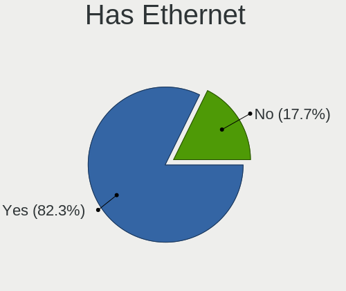
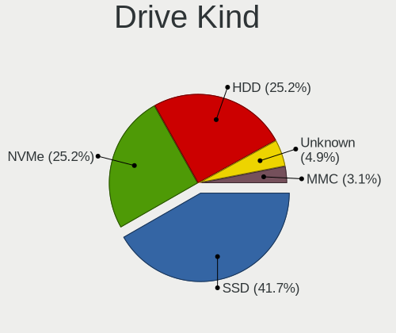
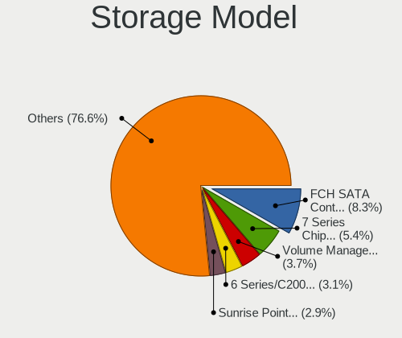
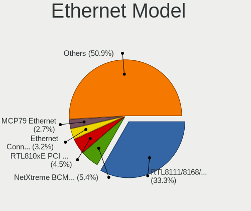
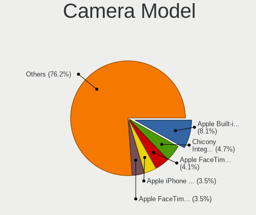
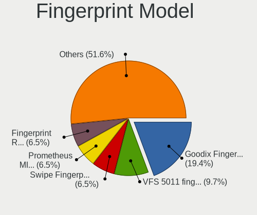
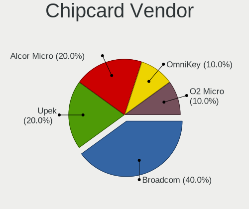
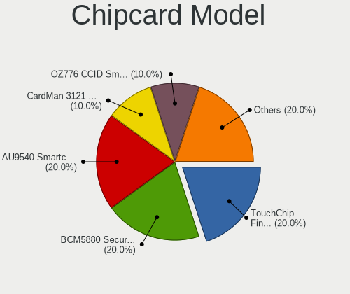

Elementary 7 - Tested Hardware & Statistics
-------------------------------------------

A project to collect tested hardware configurations for Elementary 7.

Anyone can contribute to this report by the [hw-probe](https://github.com/linuxhw/hw-probe) tool:

    sudo -E hw-probe -all -upload

Please contribute! Especially if your hardware is rare.

This is a report for all computer types. See also reports for [desktops](/Dist/Elementary_7/Desktop/README.md) and [notebooks](/Dist/Elementary_7/Notebook/README.md).

Contents
--------

* [ Test Cases ](#test-cases)

* [ System ](#system)
  - [ Kernel                   ](#kernel)
  - [ Kernel Family            ](#kernel-family)
  - [ Kernel Major Ver.        ](#kernel-major-ver)
  - [ Arch                     ](#arch)
  - [ DE                       ](#de)
  - [ Display Server           ](#display-server)
  - [ Display Manager          ](#display-manager)
  - [ OS Lang                  ](#os-lang)
  - [ Boot Mode                ](#boot-mode)
  - [ Filesystem               ](#filesystem)
  - [ Part. scheme             ](#part-scheme)
  - [ Dual Boot with Linux/BSD ](#dual-boot-with-linuxbsd)
  - [ Dual Boot (Win)          ](#dual-boot-win)

* [ Board ](#board)
  - [ Vendor                   ](#vendor)
  - [ Model                    ](#model)
  - [ Model Family             ](#model-family)
  - [ MFG Year                 ](#mfg-year)
  - [ Form Factor              ](#form-factor)
  - [ Secure Boot              ](#secure-boot)
  - [ Coreboot                 ](#coreboot)
  - [ RAM Size                 ](#ram-size)
  - [ RAM Used                 ](#ram-used)
  - [ Total Drives             ](#total-drives)
  - [ Has CD-ROM               ](#has-cd-rom)
  - [ Has Ethernet             ](#has-ethernet)
  - [ Has WiFi                 ](#has-wifi)
  - [ Has Bluetooth            ](#has-bluetooth)

* [ Location ](#location)
  - [ Country                  ](#country)
  - [ City                     ](#city)

* [ Drives ](#drives)
  - [ Drive Vendor             ](#drive-vendor)
  - [ Drive Model              ](#drive-model)
  - [ HDD Vendor               ](#hdd-vendor)
  - [ SSD Vendor               ](#ssd-vendor)
  - [ Drive Kind               ](#drive-kind)
  - [ Drive Connector          ](#drive-connector)
  - [ Drive Size               ](#drive-size)
  - [ Space Total              ](#space-total)
  - [ Space Used               ](#space-used)
  - [ Malfunc. Drives          ](#malfunc-drives)
  - [ Malfunc. Drive Vendor    ](#malfunc-drive-vendor)
  - [ Malfunc. HDD Vendor      ](#malfunc-hdd-vendor)
  - [ Malfunc. Drive Kind      ](#malfunc-drive-kind)
  - [ Failed Drives            ](#failed-drives)
  - [ Failed Drive Vendor      ](#failed-drive-vendor)
  - [ Drive Status             ](#drive-status)

* [ Storage controller ](#storage-controller)
  - [ Storage Vendor           ](#storage-vendor)
  - [ Storage Model            ](#storage-model)
  - [ Storage Kind             ](#storage-kind)

* [ Processor ](#processor)
  - [ CPU Vendor               ](#cpu-vendor)
  - [ CPU Model                ](#cpu-model)
  - [ CPU Model Family         ](#cpu-model-family)
  - [ CPU Cores                ](#cpu-cores)
  - [ CPU Sockets              ](#cpu-sockets)
  - [ CPU Threads              ](#cpu-threads)
  - [ CPU Op-Modes             ](#cpu-op-modes)
  - [ CPU Microcode            ](#cpu-microcode)
  - [ CPU Microarch            ](#cpu-microarch)

* [ Graphics ](#graphics)
  - [ GPU Vendor               ](#gpu-vendor)
  - [ GPU Model                ](#gpu-model)
  - [ GPU Combo                ](#gpu-combo)
  - [ GPU Driver               ](#gpu-driver)
  - [ GPU Memory               ](#gpu-memory)

* [ Monitor ](#monitor)
  - [ Monitor Vendor           ](#monitor-vendor)
  - [ Monitor Model            ](#monitor-model)
  - [ Monitor Resolution       ](#monitor-resolution)
  - [ Monitor Diagonal         ](#monitor-diagonal)
  - [ Monitor Width            ](#monitor-width)
  - [ Aspect Ratio             ](#aspect-ratio)
  - [ Monitor Area             ](#monitor-area)
  - [ Pixel Density            ](#pixel-density)
  - [ Multiple Monitors        ](#multiple-monitors)

* [ Network ](#network)
  - [ Net Controller Vendor    ](#net-controller-vendor)
  - [ Net Controller Model     ](#net-controller-model)
  - [ Wireless Vendor          ](#wireless-vendor)
  - [ Wireless Model           ](#wireless-model)
  - [ Ethernet Vendor          ](#ethernet-vendor)
  - [ Ethernet Model           ](#ethernet-model)
  - [ Net Controller Kind      ](#net-controller-kind)
  - [ Used Controller          ](#used-controller)
  - [ NICs                     ](#nics)
  - [ IPv6                     ](#ipv6)

* [ Bluetooth ](#bluetooth)
  - [ Bluetooth Vendor         ](#bluetooth-vendor)
  - [ Bluetooth Model          ](#bluetooth-model)

* [ Sound ](#sound)
  - [ Sound Vendor             ](#sound-vendor)
  - [ Sound Model              ](#sound-model)

* [ Memory ](#memory)
  - [ Memory Vendor            ](#memory-vendor)
  - [ Memory Model             ](#memory-model)
  - [ Memory Kind              ](#memory-kind)
  - [ Memory Form Factor       ](#memory-form-factor)
  - [ Memory Size              ](#memory-size)
  - [ Memory Speed             ](#memory-speed)

* [ Printers & scanners ](#printers--scanners)
  - [ Printer Vendor           ](#printer-vendor)
  - [ Printer Model            ](#printer-model)
  - [ Scanner Vendor           ](#scanner-vendor)
  - [ Scanner Model            ](#scanner-model)

* [ Camera ](#camera)
  - [ Camera Vendor            ](#camera-vendor)
  - [ Camera Model             ](#camera-model)

* [ Security ](#security)
  - [ Fingerprint Vendor       ](#fingerprint-vendor)
  - [ Fingerprint Model        ](#fingerprint-model)
  - [ Chipcard Vendor          ](#chipcard-vendor)
  - [ Chipcard Model           ](#chipcard-model)

* [ Unsupported ](#unsupported)
  - [ Unsupported Devices      ](#unsupported-devices)
  - [ Unsupported Device Types ](#unsupported-device-types)

Test Cases
----------

Total: 245

| Vendor        | Model                       | Form-Factor | Probe                                                      | Date         |
|---------------|-----------------------------|-------------|------------------------------------------------------------|--------------|
| HP            | Laptop 17-by3xxx            | Notebook    | [8bfe14749f](https://linux-hardware.org/?probe=8bfe14749f) | Jun 30, 2023 |
| Lenovo        | ThinkPad T430 2349OB6       | Notebook    | [f2f66bb9d0](https://linux-hardware.org/?probe=f2f66bb9d0) | Jun 29, 2023 |
| Apple         | Mac-F2238AC8                | All in one  | [d73388baab](https://linux-hardware.org/?probe=d73388baab) | Jun 28, 2023 |
| Dell          | Inspiron 3501               | Notebook    | [afc9f56d8d](https://linux-hardware.org/?probe=afc9f56d8d) | Jun 28, 2023 |
| Dell          | Latitude E5470              | Notebook    | [e10153b4c9](https://linux-hardware.org/?probe=e10153b4c9) | Jun 23, 2023 |
| Gigabyte      | H81M-S2V                    | Desktop     | [38ae545c1c](https://linux-hardware.org/?probe=38ae545c1c) | Jun 23, 2023 |
| Toshiba       | TECRA R850                  | Notebook    | [a75e6d35da](https://linux-hardware.org/?probe=a75e6d35da) | Jun 21, 2023 |
| MSI           | B450M PRO-M2 V2             | Desktop     | [4f5e2f9201](https://linux-hardware.org/?probe=4f5e2f9201) | Jun 21, 2023 |
| Lenovo        | IdeaPad 3 15IGL05 81WQ      | Notebook    | [293b8783a3](https://linux-hardware.org/?probe=293b8783a3) | Jun 20, 2023 |
| Lenovo        | IdeaPad 3 15IGL05 81WQ      | Notebook    | [2f452cfce0](https://linux-hardware.org/?probe=2f452cfce0) | Jun 20, 2023 |
| Lenovo        | ThinkPad Edge E330 3354A... | Notebook    | [f49534dfa4](https://linux-hardware.org/?probe=f49534dfa4) | Jun 19, 2023 |
| ASUSTek       | X555LA                      | Notebook    | [a57885e16c](https://linux-hardware.org/?probe=a57885e16c) | Jun 18, 2023 |
| Pegatron      | IPMIP-GS                    | Desktop     | [fb51893272](https://linux-hardware.org/?probe=fb51893272) | Jun 15, 2023 |
| ASUSTek       | X555LA                      | Notebook    | [782fa74afe](https://linux-hardware.org/?probe=782fa74afe) | Jun 14, 2023 |
| Razer         | Blade Stealth               | Notebook    | [f218e04a1c](https://linux-hardware.org/?probe=f218e04a1c) | Jun 14, 2023 |
| Apple         | Mac-F4238CC8 PVT            | All in one  | [d675395634](https://linux-hardware.org/?probe=d675395634) | Jun 11, 2023 |
| ECS           | G41T-M                      | Desktop     | [2c148573fc](https://linux-hardware.org/?probe=2c148573fc) | Jun 11, 2023 |
| ASUSTek       | ROG STRIX B350-F GAMING     | Desktop     | [08114e8a97](https://linux-hardware.org/?probe=08114e8a97) | Jun 10, 2023 |
| ASUSTek       | PRIME B450-PLUS             | Desktop     | [93555cfd25](https://linux-hardware.org/?probe=93555cfd25) | Jun 10, 2023 |
| ASUSTek       | PRIME B450-PLUS             | Desktop     | [2e6d82c14f](https://linux-hardware.org/?probe=2e6d82c14f) | Jun 10, 2023 |
| Apple         | Mac-F65AE981FFA204ED Mac... | Mini pc     | [604f40e700](https://linux-hardware.org/?probe=604f40e700) | Jun 09, 2023 |
| Apple         | Mac-F65AE981FFA204ED Mac... | Mini pc     | [d001c4cf1c](https://linux-hardware.org/?probe=d001c4cf1c) | Jun 09, 2023 |
| Apple         | MacBookPro8,1               | Notebook    | [d487214e2a](https://linux-hardware.org/?probe=d487214e2a) | Jun 08, 2023 |
| MSI           | MPG Z390 GAMING PRO CARB... | Desktop     | [ddefeff960](https://linux-hardware.org/?probe=ddefeff960) | Jun 08, 2023 |
| Apple         | MacBookPro11,1              | Notebook    | [6c62565787](https://linux-hardware.org/?probe=6c62565787) | Jun 07, 2023 |
| ASUSTek       | G750JM                      | Notebook    | [b2281ad2cb](https://linux-hardware.org/?probe=b2281ad2cb) | Jun 06, 2023 |
| MSI           | MPG Z390 GAMING PRO CARB... | Desktop     | [77fe6db865](https://linux-hardware.org/?probe=77fe6db865) | Jun 06, 2023 |
| Toshiba       | TECRA Z40-C                 | Notebook    | [1ebf23281e](https://linux-hardware.org/?probe=1ebf23281e) | Jun 04, 2023 |
| Apple         | MacBookAir7,2               | Notebook    | [274b78cda3](https://linux-hardware.org/?probe=274b78cda3) | Jun 03, 2023 |
| Apple         | MacBookAir7,2               | Notebook    | [119fd5249f](https://linux-hardware.org/?probe=119fd5249f) | Jun 03, 2023 |
| HUAWEI        | BOD-WXX9                    | Notebook    | [532dea434a](https://linux-hardware.org/?probe=532dea434a) | Jun 02, 2023 |
| HP            | G62                         | Notebook    | [f2600c2f4b](https://linux-hardware.org/?probe=f2600c2f4b) | Jun 01, 2023 |
| Lenovo        | ThinkPad T460 20FMS08H00    | Notebook    | [71208c2344](https://linux-hardware.org/?probe=71208c2344) | Jun 01, 2023 |
| Lenovo        | ThinkBook 13s G3 ACN 20Y... | Notebook    | [827e0203ac](https://linux-hardware.org/?probe=827e0203ac) | May 31, 2023 |
| Gigabyte      | GA-E6010N                   | Desktop     | [563074319d](https://linux-hardware.org/?probe=563074319d) | May 31, 2023 |
| Lenovo        | 36C5 SDK0Q55724 WIN 3273... | Desktop     | [01076d8e8b](https://linux-hardware.org/?probe=01076d8e8b) | May 30, 2023 |
| ASUSTek       | X550WA                      | Notebook    | [864236b0c9](https://linux-hardware.org/?probe=864236b0c9) | May 29, 2023 |
| PCBOX         | Kant                        | Notebook    | [1e2f772d05](https://linux-hardware.org/?probe=1e2f772d05) | May 29, 2023 |
| ASUSTek       | ROG STRIX B350-F GAMING     | Desktop     | [16b9dfbbe0](https://linux-hardware.org/?probe=16b9dfbbe0) | May 29, 2023 |
| HP            | ProBook 440 G6              | Notebook    | [35d14ed328](https://linux-hardware.org/?probe=35d14ed328) | May 29, 2023 |
| HP            | ProBook 440 G6              | Notebook    | [36a3563566](https://linux-hardware.org/?probe=36a3563566) | May 29, 2023 |
| Chuwi         | UBook Pro                   | Tablet      | [190fe84e14](https://linux-hardware.org/?probe=190fe84e14) | May 27, 2023 |
| ASUSTek       | PRIME B450-PLUS             | Desktop     | [e29fb14e81](https://linux-hardware.org/?probe=e29fb14e81) | May 26, 2023 |
| ASUSTek       | PRIME B450-PLUS             | Desktop     | [84d0d9807f](https://linux-hardware.org/?probe=84d0d9807f) | May 26, 2023 |
| HP            | ProBook 4540s               | Notebook    | [124c8183a8](https://linux-hardware.org/?probe=124c8183a8) | May 26, 2023 |
| Acer          | Aspire 7750G                | Notebook    | [1ddb5fe9a0](https://linux-hardware.org/?probe=1ddb5fe9a0) | May 26, 2023 |
| Dell          | Precision 5530              | Notebook    | [702b4d7914](https://linux-hardware.org/?probe=702b4d7914) | May 26, 2023 |
| Dell          | Latitude E5470              | Notebook    | [6054d2ee2b](https://linux-hardware.org/?probe=6054d2ee2b) | May 25, 2023 |
| Unknown       | Unknown                     | Tablet      | [8a83b799d5](https://linux-hardware.org/?probe=8a83b799d5) | May 24, 2023 |
| Acer          | Aspire 7750G                | Notebook    | [4ddad1d733](https://linux-hardware.org/?probe=4ddad1d733) | May 24, 2023 |
| HP            | ProBook 4310s               | Notebook    | [1a32d434c0](https://linux-hardware.org/?probe=1a32d434c0) | May 21, 2023 |
| Acer          | Aspire 7750G                | Notebook    | [61ebf173dc](https://linux-hardware.org/?probe=61ebf173dc) | May 21, 2023 |
| HP            | Laptop 17-by3xxx            | Notebook    | [7f15c1b9e3](https://linux-hardware.org/?probe=7f15c1b9e3) | May 21, 2023 |
| ASUSTek       | ZenBook UX325EA_UX325EA     | Notebook    | [ff730fcbf6](https://linux-hardware.org/?probe=ff730fcbf6) | May 20, 2023 |
| HP            | Pavilion Notebook           | Notebook    | [73d62695e4](https://linux-hardware.org/?probe=73d62695e4) | May 18, 2023 |
| HP            | Pavilion Notebook           | Notebook    | [56aa17165e](https://linux-hardware.org/?probe=56aa17165e) | May 18, 2023 |
| HP            | ProBook 4310s               | Notebook    | [dfcb51e697](https://linux-hardware.org/?probe=dfcb51e697) | May 17, 2023 |
| HP            | EliteBook 840 14 inch G9... | Notebook    | [004f548439](https://linux-hardware.org/?probe=004f548439) | May 17, 2023 |
| Lenovo        | IdeaPad 3 15ALC6 82KU       | Notebook    | [8fb1a89166](https://linux-hardware.org/?probe=8fb1a89166) | May 17, 2023 |
| ASUSTek       | P8H61-MX R2.0               | Desktop     | [3776285fc1](https://linux-hardware.org/?probe=3776285fc1) | May 16, 2023 |
| Samsung       | 300E4A/300E5A/300E7A/343... | Notebook    | [155b921e10](https://linux-hardware.org/?probe=155b921e10) | May 13, 2023 |
| HP            | 1998                        | Desktop     | [b806151d9f](https://linux-hardware.org/?probe=b806151d9f) | May 12, 2023 |
| Microsoft     | Surface Pro 7               | Tablet      | [81e3161a34](https://linux-hardware.org/?probe=81e3161a34) | May 11, 2023 |
| Acer          | Aspire E3-111               | Notebook    | [1060697095](https://linux-hardware.org/?probe=1060697095) | May 10, 2023 |
| HP            | Laptop 15s-eq0xxx           | Notebook    | [58000b3a57](https://linux-hardware.org/?probe=58000b3a57) | May 09, 2023 |
| HUAWEI        | NBLB-WAX9N                  | Notebook    | [1b0786ec5e](https://linux-hardware.org/?probe=1b0786ec5e) | May 07, 2023 |
| HONOR         | BMH-WCX9                    | Notebook    | [ea0b55ed61](https://linux-hardware.org/?probe=ea0b55ed61) | May 07, 2023 |
| HONOR         | BMH-WCX9                    | Notebook    | [df06b3c5b3](https://linux-hardware.org/?probe=df06b3c5b3) | May 07, 2023 |
| MSI           | GE62VR 6RF                  | Notebook    | [bac71eb24d](https://linux-hardware.org/?probe=bac71eb24d) | May 06, 2023 |
| Lenovo        | ThinkPad P51s 20HB001TUS    | Notebook    | [eac4ebdef0](https://linux-hardware.org/?probe=eac4ebdef0) | May 06, 2023 |
| Lenovo        | IdeaPad 320-15IKB 80XL      | Notebook    | [834d2304aa](https://linux-hardware.org/?probe=834d2304aa) | May 06, 2023 |
| Intel         | JSL MRD                     | Desktop     | [76ff5c3bd7](https://linux-hardware.org/?probe=76ff5c3bd7) | May 05, 2023 |
| Clevo         | NL41MU2                     | Notebook    | [6a80029392](https://linux-hardware.org/?probe=6a80029392) | May 05, 2023 |
| ASUSTek       | VivoBook_ASUSLaptop X510... | Notebook    | [fe61386871](https://linux-hardware.org/?probe=fe61386871) | May 05, 2023 |
| ASUSTek       | VivoBook_ASUSLaptop X510... | Notebook    | [764f38bb65](https://linux-hardware.org/?probe=764f38bb65) | May 05, 2023 |
| Dell          | 02N3WF A02                  | Desktop     | [3f10b3ca43](https://linux-hardware.org/?probe=3f10b3ca43) | May 04, 2023 |
| HP            | ProBook 450 G6              | Notebook    | [c5927045a3](https://linux-hardware.org/?probe=c5927045a3) | May 04, 2023 |
| HP            | 1998                        | Desktop     | [6f816ac95a](https://linux-hardware.org/?probe=6f816ac95a) | Apr 29, 2023 |
| MSI           | GE62VR 6RF                  | Notebook    | [97acececd3](https://linux-hardware.org/?probe=97acececd3) | Apr 28, 2023 |
| Apple         | MacBookPro5,2               | Notebook    | [c188ae4d7d](https://linux-hardware.org/?probe=c188ae4d7d) | Apr 28, 2023 |
| HP            | Pavilion Laptop 15-cw1xx... | Notebook    | [7aa3832621](https://linux-hardware.org/?probe=7aa3832621) | Apr 28, 2023 |
| MSI           | GE62VR 6RF                  | Notebook    | [2a9fcae8c3](https://linux-hardware.org/?probe=2a9fcae8c3) | Apr 28, 2023 |
| HUAWEI        | BOD-WXX9                    | Notebook    | [0f8543fc85](https://linux-hardware.org/?probe=0f8543fc85) | Apr 27, 2023 |
| ASUSTek       | ASUS TUF Gaming A15 FA50... | Notebook    | [6704ecd3d3](https://linux-hardware.org/?probe=6704ecd3d3) | Apr 27, 2023 |
| ASUSTek       | ASUS TUF Gaming A15 FA50... | Notebook    | [4e8b00c534](https://linux-hardware.org/?probe=4e8b00c534) | Apr 27, 2023 |
| MSI           | PE70 6QE                    | Notebook    | [87c8761eff](https://linux-hardware.org/?probe=87c8761eff) | Apr 27, 2023 |
| HP            | 250 G8 Notebook PC          | Notebook    | [b03cd2f2d2](https://linux-hardware.org/?probe=b03cd2f2d2) | Apr 26, 2023 |
| MSI           | PE70 6QE                    | Notebook    | [53dd8334ac](https://linux-hardware.org/?probe=53dd8334ac) | Apr 26, 2023 |
| HP            | 8055                        | Desktop     | [a897208085](https://linux-hardware.org/?probe=a897208085) | Apr 26, 2023 |
| Lenovo        | G580 20150                  | Notebook    | [5d8b07dbbd](https://linux-hardware.org/?probe=5d8b07dbbd) | Apr 25, 2023 |
| ASRock        | B660M-C                     | Desktop     | [849fc5d462](https://linux-hardware.org/?probe=849fc5d462) | Apr 25, 2023 |
| Gigabyte      | H410M H V3                  | Desktop     | [8fd18554d1](https://linux-hardware.org/?probe=8fd18554d1) | Apr 24, 2023 |
| MACHINIST     | E5-MR9A PRO V1.1            | Desktop     | [eebce73217](https://linux-hardware.org/?probe=eebce73217) | Apr 23, 2023 |
| Dell          | Latitude E4300              | Notebook    | [f58f44d242](https://linux-hardware.org/?probe=f58f44d242) | Apr 22, 2023 |
| Lenovo        | V14 G2 ITL 82KA             | Notebook    | [763953fb60](https://linux-hardware.org/?probe=763953fb60) | Apr 22, 2023 |
| ASUSTek       | PRIME Z390-A                | Desktop     | [50a18b5e94](https://linux-hardware.org/?probe=50a18b5e94) | Apr 19, 2023 |
| Foxconn       | A76GMV                      | Desktop     | [bafa62c759](https://linux-hardware.org/?probe=bafa62c759) | Apr 18, 2023 |
| Foxconn       | A76GMV                      | Desktop     | [f129cb2de1](https://linux-hardware.org/?probe=f129cb2de1) | Apr 18, 2023 |
| HP            | Pavilion g6                 | Notebook    | [4d60e2b7da](https://linux-hardware.org/?probe=4d60e2b7da) | Apr 17, 2023 |
| Dell          | XPS 15 9510                 | Notebook    | [94bf014457](https://linux-hardware.org/?probe=94bf014457) | Apr 17, 2023 |
| Dell          | XPS 15 9510                 | Notebook    | [2ebc6a2f61](https://linux-hardware.org/?probe=2ebc6a2f61) | Apr 17, 2023 |
| Apple         | MacBookPro9,2               | Notebook    | [ff6dbdcc10](https://linux-hardware.org/?probe=ff6dbdcc10) | Apr 15, 2023 |
| Apple         | Mac-942B5BF58194151B        | All in one  | [845e7bfdd1](https://linux-hardware.org/?probe=845e7bfdd1) | Apr 15, 2023 |
| MSI           | PE70 6QE                    | Notebook    | [936a7d1fe3](https://linux-hardware.org/?probe=936a7d1fe3) | Apr 15, 2023 |
| Dell          | Latitude 5420               | Notebook    | [4c6427b3fc](https://linux-hardware.org/?probe=4c6427b3fc) | Apr 14, 2023 |
| ASUSTek       | PRIME Z390-A                | Desktop     | [e311d21def](https://linux-hardware.org/?probe=e311d21def) | Apr 13, 2023 |
| Lenovo        | 36F7 SDK0J40700 WIN 3258... | Desktop     | [8e05a5e529](https://linux-hardware.org/?probe=8e05a5e529) | Apr 13, 2023 |
| Gigabyte      | Z270-Gaming K3              | Desktop     | [0c03014734](https://linux-hardware.org/?probe=0c03014734) | Apr 12, 2023 |
| Apple         | MacBookAir3,2               | Notebook    | [c750ece414](https://linux-hardware.org/?probe=c750ece414) | Apr 12, 2023 |
| Dell          | Latitude E5570              | Notebook    | [81eaf54f19](https://linux-hardware.org/?probe=81eaf54f19) | Apr 07, 2023 |
| Lenovo        | Aptio CRB SDK0F82993 WIN    | Mini pc     | [5c12ed53b7](https://linux-hardware.org/?probe=5c12ed53b7) | Apr 05, 2023 |
| Lenovo        | Aptio CRB SDK0F82993 WIN    | Mini pc     | [6896e5d9e2](https://linux-hardware.org/?probe=6896e5d9e2) | Apr 05, 2023 |
| Apple         | MacBookPro10,1              | Notebook    | [473a8c1d7b](https://linux-hardware.org/?probe=473a8c1d7b) | Apr 05, 2023 |
| Apple         | MacBookPro10,1              | Notebook    | [56079f49e3](https://linux-hardware.org/?probe=56079f49e3) | Apr 04, 2023 |
| HUAWEI        | BOD-WXX9                    | Notebook    | [3f9238067d](https://linux-hardware.org/?probe=3f9238067d) | Apr 04, 2023 |
| HP            | Pavilion 15                 | Notebook    | [1a3e968dff](https://linux-hardware.org/?probe=1a3e968dff) | Apr 03, 2023 |
| Apple         | Mac-F227BEC8 PVT            | All in one  | [d3bd81c4fd](https://linux-hardware.org/?probe=d3bd81c4fd) | Apr 02, 2023 |
| Lenovo        | ThinkPad X1 Carbon 3rd 2... | Notebook    | [f7f207f61c](https://linux-hardware.org/?probe=f7f207f61c) | Apr 02, 2023 |
| HP            | 255 G7 Notebook PC          | Notebook    | [e06d57c27a](https://linux-hardware.org/?probe=e06d57c27a) | Apr 01, 2023 |
| HUAWEI        | NBD-WXX9                    | Notebook    | [d4c718bdab](https://linux-hardware.org/?probe=d4c718bdab) | Apr 01, 2023 |
| MSI           | B450M PRO-M2 MAX            | Desktop     | [5a83c18a3e](https://linux-hardware.org/?probe=5a83c18a3e) | Apr 01, 2023 |
| MSI           | B450M PRO-M2 MAX            | Desktop     | [94f75ee798](https://linux-hardware.org/?probe=94f75ee798) | Apr 01, 2023 |
| ASUSTek       | Zenbook UN5401QAB_UN5401... | Convertible | [448d1a491c](https://linux-hardware.org/?probe=448d1a491c) | Mar 31, 2023 |
| HP            | Pavilion Laptop 15-eh0xx... | Notebook    | [a967e73159](https://linux-hardware.org/?probe=a967e73159) | Mar 30, 2023 |
| Dell          | Latitude E7440              | Notebook    | [1159c854cd](https://linux-hardware.org/?probe=1159c854cd) | Mar 29, 2023 |
| HP            | 255 G7 Notebook PC          | Notebook    | [a9a8004509](https://linux-hardware.org/?probe=a9a8004509) | Mar 29, 2023 |
| HP            | 255 G7 Notebook PC          | Notebook    | [1dccfbe9f4](https://linux-hardware.org/?probe=1dccfbe9f4) | Mar 29, 2023 |
| Dell          | Latitude 5420               | Notebook    | [d714c46c4f](https://linux-hardware.org/?probe=d714c46c4f) | Mar 29, 2023 |
| Unknown       | Unknown                     | Desktop     | [fb22157f03](https://linux-hardware.org/?probe=fb22157f03) | Mar 28, 2023 |
| Apple         | Mac-F2218EA9                | All in one  | [5590ec1365](https://linux-hardware.org/?probe=5590ec1365) | Mar 28, 2023 |
| AZW           | U59                         | Desktop     | [7674bb8dc9](https://linux-hardware.org/?probe=7674bb8dc9) | Mar 27, 2023 |
| Toshiba       | TECRA Z40-C                 | Notebook    | [39995c1c00](https://linux-hardware.org/?probe=39995c1c00) | Mar 24, 2023 |
| Dell          | Latitude E7440              | Notebook    | [1a986dbeb8](https://linux-hardware.org/?probe=1a986dbeb8) | Mar 24, 2023 |
| HONOR         | HYM-WXX                     | Notebook    | [df318ed208](https://linux-hardware.org/?probe=df318ed208) | Mar 21, 2023 |
| Fujitsu       | LIFEBOOK AH530              | Notebook    | [e40cf4f577](https://linux-hardware.org/?probe=e40cf4f577) | Mar 18, 2023 |
| Dell          | Latitude E5570              | Notebook    | [a15d1b43ca](https://linux-hardware.org/?probe=a15d1b43ca) | Mar 17, 2023 |
| Dell          | Latitude E5570              | Notebook    | [dd07b0c3b3](https://linux-hardware.org/?probe=dd07b0c3b3) | Mar 17, 2023 |
| Dell          | G3 3590                     | Notebook    | [9ef42643d8](https://linux-hardware.org/?probe=9ef42643d8) | Mar 16, 2023 |
| ASUSTek       | M4A785TD-V EVO              | Desktop     | [1674c37cf9](https://linux-hardware.org/?probe=1674c37cf9) | Mar 16, 2023 |
| Fujitsu       | LIFEBOOK E744               | Notebook    | [03e5d43f27](https://linux-hardware.org/?probe=03e5d43f27) | Mar 15, 2023 |
| Fujitsu       | LIFEBOOK E744               | Notebook    | [4c49d73583](https://linux-hardware.org/?probe=4c49d73583) | Mar 15, 2023 |
| Apple         | MacBookPro5,5               | Notebook    | [c6ff6d14a0](https://linux-hardware.org/?probe=c6ff6d14a0) | Mar 15, 2023 |
| Acer          | Aspire V3-771               | Notebook    | [28f8273eb5](https://linux-hardware.org/?probe=28f8273eb5) | Mar 15, 2023 |
| HP            | 805A                        | Desktop     | [5401e12606](https://linux-hardware.org/?probe=5401e12606) | Mar 14, 2023 |
| HP            | 3033h                       | Desktop     | [ab5e388ea9](https://linux-hardware.org/?probe=ab5e388ea9) | Mar 14, 2023 |
| HP            | 3033h                       | Desktop     | [38ac77726b](https://linux-hardware.org/?probe=38ac77726b) | Mar 13, 2023 |
| MSI           | B450 TOMAHAWK MAX           | Desktop     | [39d0e8595c](https://linux-hardware.org/?probe=39d0e8595c) | Mar 12, 2023 |
| MSI           | GT72 2QE                    | Notebook    | [b3c4766473](https://linux-hardware.org/?probe=b3c4766473) | Mar 12, 2023 |
| Lenovo        | ThinkPad X240 20AMS0XP0S    | Notebook    | [a2ee9a2818](https://linux-hardware.org/?probe=a2ee9a2818) | Mar 12, 2023 |
| MSI           | B365M PRO-VH                | Desktop     | [023f42d6d1](https://linux-hardware.org/?probe=023f42d6d1) | Mar 12, 2023 |
| Fujitsu       | LIFEBOOK A359               | Notebook    | [0fa1ebbc11](https://linux-hardware.org/?probe=0fa1ebbc11) | Mar 11, 2023 |
| Fujitsu       | LIFEBOOK A359               | Notebook    | [f977012127](https://linux-hardware.org/?probe=f977012127) | Mar 11, 2023 |
| Apple         | MacBookPro11,2              | Notebook    | [fce6120754](https://linux-hardware.org/?probe=fce6120754) | Mar 11, 2023 |
| Acer          | Aspire A715-72G             | Notebook    | [32b2d1b194](https://linux-hardware.org/?probe=32b2d1b194) | Mar 11, 2023 |
| Lenovo        | Legion 5 15ARH05H 82B1      | Notebook    | [82b5297ab8](https://linux-hardware.org/?probe=82b5297ab8) | Mar 11, 2023 |
| Toshiba       | TECRA Z40-C                 | Notebook    | [a4ba2ff90e](https://linux-hardware.org/?probe=a4ba2ff90e) | Mar 10, 2023 |
| MSI           | CX61 2PC                    | Notebook    | [cb9f5fa992](https://linux-hardware.org/?probe=cb9f5fa992) | Mar 10, 2023 |
| Sony          | VPCEH2C5E                   | Notebook    | [adf4a69310](https://linux-hardware.org/?probe=adf4a69310) | Mar 07, 2023 |
| Sony          | VPCEH2C5E                   | Notebook    | [9e5b625dda](https://linux-hardware.org/?probe=9e5b625dda) | Mar 07, 2023 |
| Microsoft     | Surface Pro 7               | Tablet      | [3547dd712b](https://linux-hardware.org/?probe=3547dd712b) | Mar 07, 2023 |
| Inventec      | Z CLASS A02                 | Desktop     | [c45e770987](https://linux-hardware.org/?probe=c45e770987) | Mar 06, 2023 |
| Microsoft     | Surface Pro 7               | Tablet      | [4ecfeecd31](https://linux-hardware.org/?probe=4ecfeecd31) | Mar 06, 2023 |
| GPU Compan... | GWTN156-11                  | Notebook    | [5afd8e3f42](https://linux-hardware.org/?probe=5afd8e3f42) | Mar 04, 2023 |
| Microsoft     | Surface Book                | Tablet      | [cc3ad3e0d2](https://linux-hardware.org/?probe=cc3ad3e0d2) | Mar 02, 2023 |
| ASUSTek       | ZenBook UX425EA_UX425EA     | Notebook    | [817b72f78f](https://linux-hardware.org/?probe=817b72f78f) | Mar 02, 2023 |
| ASUSTek       | ZenBook S UX391UA           | Notebook    | [053c6d5368](https://linux-hardware.org/?probe=053c6d5368) | Mar 02, 2023 |
| Microsoft     | Surface Book                | Tablet      | [d58385d1e6](https://linux-hardware.org/?probe=d58385d1e6) | Mar 01, 2023 |
| Lenovo        | ThinkPad X13 Gen 1 20T3S... | Notebook    | [fa757fb12a](https://linux-hardware.org/?probe=fa757fb12a) | Mar 01, 2023 |
| HP            | ProBook 450 15.6 inch G9... | Notebook    | [1025a9748f](https://linux-hardware.org/?probe=1025a9748f) | Mar 01, 2023 |
| ASUSTek       | BT6130                      | Desktop     | [dabd3e0232](https://linux-hardware.org/?probe=dabd3e0232) | Mar 01, 2023 |
| GPU Compan... | GWTN156-11                  | Notebook    | [e189c60b09](https://linux-hardware.org/?probe=e189c60b09) | Mar 01, 2023 |
| GPU Compan... | GWTN156-11                  | Notebook    | [3883ba28c7](https://linux-hardware.org/?probe=3883ba28c7) | Mar 01, 2023 |
| Unknown       | Unknown                     | Desktop     | [1c5f8fef49](https://linux-hardware.org/?probe=1c5f8fef49) | Feb 28, 2023 |
| ASUSTek       | ROG STRIX Z690-A GAMING ... | Desktop     | [216ad20179](https://linux-hardware.org/?probe=216ad20179) | Feb 28, 2023 |
| Apple         | MacBookAir3,1               | Notebook    | [573644760d](https://linux-hardware.org/?probe=573644760d) | Feb 28, 2023 |
| Apple         | Mac-942B5BF58194151B        | All in one  | [371a95fb3d](https://linux-hardware.org/?probe=371a95fb3d) | Feb 28, 2023 |
| Fujitsu       | LIFEBOOK E744               | Notebook    | [e331c5e257](https://linux-hardware.org/?probe=e331c5e257) | Feb 27, 2023 |
| Acer          | Predator G3620              | Desktop     | [72f3382b60](https://linux-hardware.org/?probe=72f3382b60) | Feb 27, 2023 |
| Gigabyte      | Z77X-UD5H                   | Desktop     | [2071bc50ce](https://linux-hardware.org/?probe=2071bc50ce) | Feb 27, 2023 |
| Gigabyte      | Z77X-UD5H                   | Desktop     | [472c035387](https://linux-hardware.org/?probe=472c035387) | Feb 27, 2023 |
| Dell          | 07PR60 A01                  | Desktop     | [c071b7ef1c](https://linux-hardware.org/?probe=c071b7ef1c) | Feb 27, 2023 |
| Acer          | Aspire E5-771               | Notebook    | [73c974942f](https://linux-hardware.org/?probe=73c974942f) | Feb 26, 2023 |
| ASUSTek       | VivoBook_ASUSLaptop X513... | Notebook    | [a66f75c107](https://linux-hardware.org/?probe=a66f75c107) | Feb 26, 2023 |
| ASUSTek       | TUF X470-PLUS GAMING        | Desktop     | [ce9dda227f](https://linux-hardware.org/?probe=ce9dda227f) | Feb 25, 2023 |
| ASUSTek       | ZenBook UX425EA_UX425EA     | Notebook    | [50a16e7924](https://linux-hardware.org/?probe=50a16e7924) | Feb 25, 2023 |
| HP            | ProBook 430 G4              | Notebook    | [b815c24c07](https://linux-hardware.org/?probe=b815c24c07) | Feb 24, 2023 |
| HP            | ProBook 430 G4              | Notebook    | [e578b951f9](https://linux-hardware.org/?probe=e578b951f9) | Feb 24, 2023 |
| HP            | ProBook 430 G4              | Notebook    | [0dc5add67b](https://linux-hardware.org/?probe=0dc5add67b) | Feb 24, 2023 |
| Lenovo        | ThinkPad T400s 2808D9G      | Notebook    | [b101883e65](https://linux-hardware.org/?probe=b101883e65) | Feb 24, 2023 |
| Dell          | 0GDJXY A00                  | All in one  | [6db3a90234](https://linux-hardware.org/?probe=6db3a90234) | Feb 24, 2023 |
| Lenovo        | V14 G2 ITL 82KA             | Notebook    | [0a3d750f36](https://linux-hardware.org/?probe=0a3d750f36) | Feb 23, 2023 |
| ASUSTek       | ZenBook UX425EA_UX425EA     | Notebook    | [ddd8c34644](https://linux-hardware.org/?probe=ddd8c34644) | Feb 22, 2023 |
| Lenovo        | ThinkPad T440p 20AWS38H0... | Notebook    | [c79a8f48f9](https://linux-hardware.org/?probe=c79a8f48f9) | Feb 20, 2023 |
| Lenovo        | V14 G2 ITL 82KA             | Notebook    | [7ee9e59831](https://linux-hardware.org/?probe=7ee9e59831) | Feb 20, 2023 |
| Gigabyte      | B550 AORUS ELITE            | Desktop     | [13a132516b](https://linux-hardware.org/?probe=13a132516b) | Feb 18, 2023 |
| HP            | OMEN by Laptop 17-ck0xxx    | Notebook    | [2751aac3e0](https://linux-hardware.org/?probe=2751aac3e0) | Feb 16, 2023 |
| ASUSTek       | TUF X470-PLUS GAMING        | Desktop     | [76ab936a75](https://linux-hardware.org/?probe=76ab936a75) | Feb 16, 2023 |
| ASUSTek       | H110M-A/M.2                 | Desktop     | [68f0415788](https://linux-hardware.org/?probe=68f0415788) | Feb 16, 2023 |
| ASUSTek       | H110M-A/M.2                 | Desktop     | [2560ba7644](https://linux-hardware.org/?probe=2560ba7644) | Feb 16, 2023 |
| Foxconn       | 2ADA                        | Desktop     | [e0f89bbca1](https://linux-hardware.org/?probe=e0f89bbca1) | Feb 16, 2023 |
| Lenovo        | ThinkPad E560 20EV003DSP    | Notebook    | [535eda0feb](https://linux-hardware.org/?probe=535eda0feb) | Feb 16, 2023 |
| HP            | 550                         | Notebook    | [81b67f211d](https://linux-hardware.org/?probe=81b67f211d) | Feb 15, 2023 |
| Dell          | XPS 15 9560                 | Notebook    | [150c1de326](https://linux-hardware.org/?probe=150c1de326) | Feb 15, 2023 |
| Apple         | MacBook4,1                  | Notebook    | [e8a460c42c](https://linux-hardware.org/?probe=e8a460c42c) | Feb 15, 2023 |
| Apple         | MacBook4,1                  | Notebook    | [a92df0196e](https://linux-hardware.org/?probe=a92df0196e) | Feb 15, 2023 |
| HP            | EliteBook 8460p             | Notebook    | [92ab9b2e0d](https://linux-hardware.org/?probe=92ab9b2e0d) | Feb 14, 2023 |
| HP            | 805D                        | Desktop     | [217784712c](https://linux-hardware.org/?probe=217784712c) | Feb 14, 2023 |
| Acer          | Aspire V3-771               | Notebook    | [f22c83d683](https://linux-hardware.org/?probe=f22c83d683) | Feb 14, 2023 |
| HP            | OMEN by Laptop 17-ck0xxx    | Notebook    | [12431d8083](https://linux-hardware.org/?probe=12431d8083) | Feb 14, 2023 |
| MSI           | B85-G43 GAMING              | Desktop     | [b2b66e40e1](https://linux-hardware.org/?probe=b2b66e40e1) | Feb 14, 2023 |
| ASUSTek       | TUF X470-PLUS GAMING        | Desktop     | [f0899499e5](https://linux-hardware.org/?probe=f0899499e5) | Feb 13, 2023 |
| Lenovo        | Yoga 6 13ALC7 82UD          | Convertible | [537d29b0d5](https://linux-hardware.org/?probe=537d29b0d5) | Feb 12, 2023 |
| Acer          | Extensa 5230                | Notebook    | [f27f478fa5](https://linux-hardware.org/?probe=f27f478fa5) | Feb 12, 2023 |
| Lenovo        | ThinkPad E560 20EV003DSP    | Notebook    | [97bf2aa6a5](https://linux-hardware.org/?probe=97bf2aa6a5) | Feb 12, 2023 |
| ASUSTek       | ZenBook UX434FAC_UX434FA... | Notebook    | [a1d85b3098](https://linux-hardware.org/?probe=a1d85b3098) | Feb 10, 2023 |
| ASUSTek       | H110M-A/M.2                 | Desktop     | [76711a4e32](https://linux-hardware.org/?probe=76711a4e32) | Feb 10, 2023 |
| Lenovo        | IdeaPad 320-15ABR 80XS      | Notebook    | [9de542dff7](https://linux-hardware.org/?probe=9de542dff7) | Feb 09, 2023 |
| ASUSTek       | ZenBook UX434FAC_UX434FA... | Notebook    | [6e8ed5d5d6](https://linux-hardware.org/?probe=6e8ed5d5d6) | Feb 09, 2023 |
| Lenovo        | ThinkPad E560 20EV003DSP    | Notebook    | [27731362e2](https://linux-hardware.org/?probe=27731362e2) | Feb 09, 2023 |
| HP            | Laptop 15-dy2xxx            | Notebook    | [b906f960a0](https://linux-hardware.org/?probe=b906f960a0) | Feb 08, 2023 |
| Apple         | Mac-F42386C8 PVT            | All in one  | [1e6a345b00](https://linux-hardware.org/?probe=1e6a345b00) | Feb 07, 2023 |
| HP            | Laptop 14-bs0xx             | Notebook    | [c3607bb4c2](https://linux-hardware.org/?probe=c3607bb4c2) | Feb 07, 2023 |
| ASUSTek       | H110M-A/M.2                 | Desktop     | [73b3c1c661](https://linux-hardware.org/?probe=73b3c1c661) | Feb 06, 2023 |
| HP            | Laptop 17-by3xxx            | Notebook    | [07ea9d3c2f](https://linux-hardware.org/?probe=07ea9d3c2f) | Feb 06, 2023 |
| Gigabyte      | F2A88XM-DS2                 | Desktop     | [d9313ff1c1](https://linux-hardware.org/?probe=d9313ff1c1) | Feb 05, 2023 |
| Acer          | Aspire E5-575G              | Notebook    | [30e2a88930](https://linux-hardware.org/?probe=30e2a88930) | Feb 05, 2023 |
| Acer          | Aspire 8935G                | Notebook    | [10f8560601](https://linux-hardware.org/?probe=10f8560601) | Feb 05, 2023 |
| Acer          | Aspire 8935G                | Notebook    | [be37cc70f5](https://linux-hardware.org/?probe=be37cc70f5) | Feb 05, 2023 |
| Toshiba       | Satellite C660              | Notebook    | [8d67e1438d](https://linux-hardware.org/?probe=8d67e1438d) | Feb 05, 2023 |
| Apple         | MacBookPro11,3              | Notebook    | [8bdb86b164](https://linux-hardware.org/?probe=8bdb86b164) | Feb 04, 2023 |
| ASUSTek       | P7P55 LX                    | Desktop     | [3786e7a211](https://linux-hardware.org/?probe=3786e7a211) | Feb 04, 2023 |
| Apple         | MacBookPro8,3               | Notebook    | [9d397c2187](https://linux-hardware.org/?probe=9d397c2187) | Feb 04, 2023 |
| Apple         | MacBookPro8,3               | Notebook    | [7b676dec23](https://linux-hardware.org/?probe=7b676dec23) | Feb 04, 2023 |
| Dell          | Vostro 3460                 | Notebook    | [8aa57f1d6d](https://linux-hardware.org/?probe=8aa57f1d6d) | Feb 03, 2023 |
| Dell          | Vostro 3460                 | Notebook    | [78919f6127](https://linux-hardware.org/?probe=78919f6127) | Feb 03, 2023 |
| Alienware     | x17 R2                      | Notebook    | [474a70c148](https://linux-hardware.org/?probe=474a70c148) | Feb 03, 2023 |
| Apple         | Mac-AA95B1DDAB278B95 iMa... | All in one  | [42c3899a37](https://linux-hardware.org/?probe=42c3899a37) | Feb 02, 2023 |
| Sony          | SVF1521O4E                  | Notebook    | [e2d47879d4](https://linux-hardware.org/?probe=e2d47879d4) | Feb 02, 2023 |
| Dell          | XPS 13 7390 2-in-1          | Convertible | [fdf7b5e80e](https://linux-hardware.org/?probe=fdf7b5e80e) | Feb 02, 2023 |
| Lenovo        | ThinkPad X230 23259S9       | Notebook    | [3d9e74535f](https://linux-hardware.org/?probe=3d9e74535f) | Feb 01, 2023 |
| Dell          | 0GDJXY A00                  | All in one  | [1ce7db78c1](https://linux-hardware.org/?probe=1ce7db78c1) | Feb 01, 2023 |
| ASUSTek       | Z170 PRO GAMING             | Desktop     | [c2a4529e33](https://linux-hardware.org/?probe=c2a4529e33) | Jan 30, 2023 |
| Star Labs     | StarBook                    | Notebook    | [784ae24356](https://linux-hardware.org/?probe=784ae24356) | Jan 15, 2023 |
| Unknown       | HX90                        | Desktop     | [af144f98b6](https://linux-hardware.org/?probe=af144f98b6) | Jan 05, 2023 |
| Lenovo        | ThinkPad T495 20NKS01W02    | Notebook    | [cc7b02033a](https://linux-hardware.org/?probe=cc7b02033a) | Dec 24, 2022 |

System
------

Kernel
------

Version of the Linux kernel

| Version                | Computers | Percent |
|------------------------|-----------|---------|
| 5.15.0-58-generic      | 45        | 25.71%  |
| 5.19.0-41-generic      | 23        | 13.14%  |
| 5.19.0-35-generic      | 23        | 13.14%  |
| 5.19.0-32-generic      | 22        | 12.57%  |
| 5.19.0-38-generic      | 16        | 9.14%   |
| 5.19.0-43-generic      | 12        | 6.86%   |
| 5.15.0-60-generic      | 9         | 5.14%   |
| 5.19.0-40-generic      | 6         | 3.43%   |
| 5.19.0-42-generic      | 5         | 2.86%   |
| 5.19.0-45-generic      | 3         | 1.71%   |
| 5.19.0-46-generic      | 2         | 1.14%   |
| 5.15.0-56-generic      | 2         | 1.14%   |
| 6.2.8-3-liquorix-amd64 | 1         | 0.57%   |
| 6.2.7-060207-generic   | 1         | 0.57%   |
| 6.2.2-surface          | 1         | 0.57%   |
| 6.2.14-surface         | 1         | 0.57%   |
| 6.1.9-060109-generic   | 1         | 0.57%   |
| 6.1.6-060106-generic   | 1         | 0.57%   |
| 6.1.0-1013-oem         | 1         | 0.57%   |

Kernel Family
-------------

Linux kernel without a distro release

| Version | Computers | Percent |
|---------|-----------|---------|
| 5.19.0  | 105       | 62.5%   |
| 5.15.0  | 56        | 33.33%  |
| 6.2.8   | 1         | 0.6%    |
| 6.2.7   | 1         | 0.6%    |
| 6.2.2   | 1         | 0.6%    |
| 6.2.14  | 1         | 0.6%    |
| 6.1.9   | 1         | 0.6%    |
| 6.1.6   | 1         | 0.6%    |
| 6.1.0   | 1         | 0.6%    |

Kernel Major Ver.
-----------------

Linux kernel major version

| Version | Computers | Percent |
|---------|-----------|---------|
| 5.19    | 105       | 62.87%  |
| 5.15    | 56        | 33.53%  |
| 6.2     | 3         | 1.8%    |
| 6.1     | 3         | 1.8%    |

Arch
----

OS architecture (x86_64, i586, etc.)

| Name   | Computers | Percent |
|--------|-----------|---------|
| x86_64 | 165       | 100%    |

DE
--

Desktop Environment

| Name     | Computers | Percent |
|----------|-----------|---------|
| Pantheon | 165       | 100%    |

Display Server
--------------

X11 or Wayland

| Name | Computers | Percent |
|------|-----------|---------|
| X11  | 165       | 100%    |

Display Manager
---------------

SDDM, LightDM, etc.

| Name    | Computers | Percent |
|---------|-----------|---------|
| Unknown | 132       | 80%     |
| LightDM | 33        | 20%     |

OS Lang
-------

Language

| Lang  | Computers | Percent |
|-------|-----------|---------|
| en_US | 69        | 41.57%  |
| de_DE | 27        | 16.27%  |
| ru_RU | 13        | 7.83%   |
| es_ES | 13        | 7.83%   |
| fr_FR | 6         | 3.61%   |
| en_GB | 5         | 3.01%   |
| pt_BR | 4         | 2.41%   |
| pl_PL | 4         | 2.41%   |
| it_IT | 4         | 2.41%   |
| sv_SE | 3         | 1.81%   |
| tr_TR | 2         | 1.2%    |
| pt_PT | 2         | 1.2%    |
| nl_NL | 2         | 1.2%    |
| en_AU | 2         | 1.2%    |
| uk_UA | 1         | 0.6%    |
| sk_SK | 1         | 0.6%    |
| nb_NO | 1         | 0.6%    |
| ja_JP | 1         | 0.6%    |
| hu_HU | 1         | 0.6%    |
| fi_FI | 1         | 0.6%    |
| en_CA | 1         | 0.6%    |
| el_GR | 1         | 0.6%    |
| da_DK | 1         | 0.6%    |
| cs_CZ | 1         | 0.6%    |

Boot Mode
---------

EFI or BIOS

| Mode | Computers | Percent |
|------|-----------|---------|
| BIOS | 143       | 86.67%  |
| EFI  | 22        | 13.33%  |

Filesystem
----------

Type of filesystem

| Type    | Computers | Percent |
|---------|-----------|---------|
| Ext4    | 155       | 93.37%  |
| Tmpfs   | 5         | 3.01%   |
| Btrfs   | 3         | 1.81%   |
| Xfs     | 2         | 1.2%    |
| Overlay | 1         | 0.6%    |

Part. scheme
------------

Scheme of partitioning

| Type    | Computers | Percent |
|---------|-----------|---------|
| Unknown | 132       | 80%     |
| GPT     | 28        | 16.97%  |
| MBR     | 5         | 3.03%   |

Dual Boot with Linux/BSD
------------------------

Hosting more than one Linux/BSD

| Dual boot | Computers | Percent |
|-----------|-----------|---------|
| No        | 163       | 98.79%  |
| Yes       | 2         | 1.21%   |

Dual Boot (Win)
---------------

Hosting Linux and Windows

| Dual boot | Computers | Percent |
|-----------|-----------|---------|
| No        | 153       | 92.73%  |
| Yes       | 12        | 7.27%   |

Board
-----

Vendor
------

Motherboard manufacturer

| Name                | Computers | Percent |
|---------------------|-----------|---------|
| Hewlett-Packard     | 25        | 15.15%  |
| Lenovo              | 23        | 13.94%  |
| ASUSTek Computer    | 23        | 13.94%  |
| Apple               | 21        | 12.73%  |
| Dell                | 14        | 8.48%   |
| MSI                 | 9         | 5.45%   |
| Acer                | 8         | 4.85%   |
| Gigabyte Technology | 7         | 4.24%   |
| HUAWEI              | 4         | 2.42%   |
| Toshiba             | 3         | 1.82%   |
| Fujitsu             | 3         | 1.82%   |
| Unknown             | 3         | 1.82%   |
| Sony                | 2         | 1.21%   |
| HONOR               | 2         | 1.21%   |
| Foxconn             | 2         | 1.21%   |
| Star Labs           | 1         | 0.61%   |
| Samsung Electronics | 1         | 0.61%   |
| Razer               | 1         | 0.61%   |
| Pegatron            | 1         | 0.61%   |
| PCBOX               | 1         | 0.61%   |
| Microsoft           | 1         | 0.61%   |
| MACHINIST           | 1         | 0.61%   |
| Inventec            | 1         | 0.61%   |
| Intel               | 1         | 0.61%   |
| GPU Company         | 1         | 0.61%   |
| ECS                 | 1         | 0.61%   |
| Clevo               | 1         | 0.61%   |
| Chuwi               | 1         | 0.61%   |
| AZW                 | 1         | 0.61%   |
| ASRock              | 1         | 0.61%   |
| Alienware           | 1         | 0.61%   |

Model
-----

Motherboard model

| Name                                       | Computers | Percent |
|--------------------------------------------|-----------|---------|
| Unknown                                    | 3         | 1.82%   |
| HUAWEI BOD-WXX9                            | 2         | 1.21%   |
| HP 255 G7 Notebook PC                      | 2         | 1.21%   |
| ASUS H110M-A/M.2                           | 2         | 1.21%   |
| Apple iMac7,1                              | 2         | 1.21%   |
| Apple iMac12,1                             | 2         | 1.21%   |
| Toshiba TECRA Z40-C                        | 1         | 0.61%   |
| Toshiba TECRA R850                         | 1         | 0.61%   |
| Toshiba Satellite C660                     | 1         | 0.61%   |
| Star Labs StarBook                         | 1         | 0.61%   |
| Sony VPCEH2C5E                             | 1         | 0.61%   |
| Sony SVF1521O4E                            | 1         | 0.61%   |
| Samsung 300E4A/300E5A/300E7A/3430EA/3530EA | 1         | 0.61%   |
| Razer Blade Stealth                        | 1         | 0.61%   |
| Pegatron IPMIP-GS                          | 1         | 0.61%   |
| PCBOX Kant                                 | 1         | 0.61%   |
| MSI PE70 6QE                               | 1         | 0.61%   |
| MSI MS-7C31                                | 1         | 0.61%   |
| MSI MS-7C02                                | 1         | 0.61%   |
| MSI MS-7B84                                | 1         | 0.61%   |
| MSI MS-7B17                                | 1         | 0.61%   |
| MSI MS-7816                                | 1         | 0.61%   |
| MSI GT72 2QE                               | 1         | 0.61%   |
| MSI GE62VR 6RF                             | 1         | 0.61%   |
| MSI CX61 2PC                               | 1         | 0.61%   |
| Microsoft Surface Pro 7                    | 1         | 0.61%   |
| MACHINIST E5-MR9A PRO V1.1                 | 1         | 0.61%   |
| Lenovo Yoga 6 13ALC7 82UD                  | 1         | 0.61%   |
| Lenovo V14 G2 ITL 82KA                     | 1         | 0.61%   |
| Lenovo ThinkPad X240 20AMS0XP0S            | 1         | 0.61%   |
| Lenovo ThinkPad X230 23259S9               | 1         | 0.61%   |
| Lenovo ThinkPad X13 Gen 1 20T3S3SH0U       | 1         | 0.61%   |
| Lenovo ThinkPad X1 Carbon 3rd 20BSCTO1WW   | 1         | 0.61%   |
| Lenovo ThinkPad T495 20NKS01W02            | 1         | 0.61%   |
| Lenovo ThinkPad T460 20FMS08H00            | 1         | 0.61%   |
| Lenovo ThinkPad T440p 20AWS38H0G           | 1         | 0.61%   |
| Lenovo ThinkPad T430 2349OB6               | 1         | 0.61%   |
| Lenovo ThinkPad T400s 2808D9G              | 1         | 0.61%   |
| Lenovo ThinkPad P51s 20HB001TUS            | 1         | 0.61%   |
| Lenovo ThinkPad Edge E330 3354AHG          | 1         | 0.61%   |

Model Family
------------

Motherboard model prefix

| Name               | Computers | Percent |
|--------------------|-----------|---------|
| Lenovo ThinkPad    | 12        | 7.27%   |
| Acer Aspire        | 7         | 4.24%   |
| HP ProBook         | 5         | 3.03%   |
| HP Pavilion        | 5         | 3.03%   |
| Dell Latitude      | 5         | 3.03%   |
| ASUS ZenBook       | 5         | 3.03%   |
| Lenovo IdeaPad     | 4         | 2.42%   |
| HP Laptop          | 3         | 1.82%   |
| Fujitsu LIFEBOOK   | 3         | 1.82%   |
| Dell XPS           | 3         | 1.82%   |
| Apple MacBookPro11 | 3         | 1.82%   |
| Unknown            | 3         | 1.82%   |
| Toshiba TECRA      | 2         | 1.21%   |
| HUAWEI BOD-WXX9    | 2         | 1.21%   |
| HP EliteDesk       | 2         | 1.21%   |
| HP 255             | 2         | 1.21%   |
| Dell Inspiron      | 2         | 1.21%   |
| ASUS VivoBook      | 2         | 1.21%   |
| ASUS ROG           | 2         | 1.21%   |
| ASUS PRIME         | 2         | 1.21%   |
| ASUS H110M-A       | 2         | 1.21%   |
| Apple MacBookPro5  | 2         | 1.21%   |
| Apple MacBookAir3  | 2         | 1.21%   |
| Apple iMac7        | 2         | 1.21%   |
| Apple iMac12       | 2         | 1.21%   |
| Toshiba Satellite  | 1         | 0.61%   |
| Star Labs StarBook | 1         | 0.61%   |
| Sony VPCEH2C5E     | 1         | 0.61%   |
| Sony SVF1521O4E    | 1         | 0.61%   |
| Samsung 300E4A     | 1         | 0.61%   |
| Razer Blade        | 1         | 0.61%   |
| Pegatron IPMIP-GS  | 1         | 0.61%   |
| PCBOX Kant         | 1         | 0.61%   |
| MSI PE70           | 1         | 0.61%   |
| MSI MS-7C31        | 1         | 0.61%   |
| MSI MS-7C02        | 1         | 0.61%   |
| MSI MS-7B84        | 1         | 0.61%   |
| MSI MS-7B17        | 1         | 0.61%   |
| MSI MS-7816        | 1         | 0.61%   |
| MSI GT72           | 1         | 0.61%   |

MFG Year
--------

Motherboard manufacture year

| Year | Computers | Percent |
|------|-----------|---------|
| 2019 | 16        | 9.7%    |
| 2020 | 15        | 9.09%   |
| 2012 | 15        | 9.09%   |
| 2021 | 14        | 8.48%   |
| 2022 | 12        | 7.27%   |
| 2016 | 12        | 7.27%   |
| 2015 | 11        | 6.67%   |
| 2014 | 11        | 6.67%   |
| 2018 | 10        | 6.06%   |
| 2013 | 10        | 6.06%   |
| 2009 | 9         | 5.45%   |
| 2010 | 8         | 4.85%   |
| 2008 | 7         | 4.24%   |
| 2017 | 6         | 3.64%   |
| 2011 | 6         | 3.64%   |
| 2023 | 2         | 1.21%   |
| 2007 | 1         | 0.61%   |

Form Factor
-----------

Physical design of the computer

| Name        | Computers | Percent |
|-------------|-----------|---------|
| Notebook    | 105       | 63.64%  |
| Desktop     | 44        | 26.67%  |
| All in one  | 8         | 4.85%   |
| Tablet      | 3         | 1.82%   |
| Convertible | 3         | 1.82%   |
| Mini pc     | 2         | 1.21%   |

Secure Boot
-----------

Enabled or disabled

| State    | Computers | Percent |
|----------|-----------|---------|
| Disabled | 159       | 96.36%  |
| Enabled  | 6         | 3.64%   |

Coreboot
--------

Have coreboot on board

| Used | Computers | Percent |
|------|-----------|---------|
| No   | 164       | 99.39%  |
| Yes  | 1         | 0.61%   |

RAM Size
--------

Total RAM memory

| Size in GB  | Computers | Percent |
|-------------|-----------|---------|
| 4.01-8.0    | 52        | 31.52%  |
| 8.01-16.0   | 34        | 20.61%  |
| 16.01-24.0  | 32        | 19.39%  |
| 3.01-4.0    | 26        | 15.76%  |
| 32.01-64.0  | 13        | 7.88%   |
| 64.01-256.0 | 3         | 1.82%   |
| 1.01-2.0    | 3         | 1.82%   |
| 24.01-32.0  | 1         | 0.61%   |
| 2.01-3.0    | 1         | 0.61%   |

RAM Used
--------

Used RAM memory

| Used GB   | Computers | Percent |
|-----------|-----------|---------|
| 2.01-3.0  | 83        | 47.43%  |
| 1.01-2.0  | 35        | 20%     |
| 3.01-4.0  | 30        | 17.14%  |
| 4.01-8.0  | 23        | 13.14%  |
| 8.01-16.0 | 3         | 1.71%   |
| 0.51-1.0  | 1         | 0.57%   |

Total Drives
------------

Number of drives on board

| Drives | Computers | Percent |
|--------|-----------|---------|
| 1      | 114       | 68.67%  |
| 2      | 41        | 24.7%   |
| 3      | 5         | 3.01%   |
| 5      | 3         | 1.81%   |
| 4      | 3         | 1.81%   |

Has CD-ROM
----------

Has CD-ROM on board

| Presented | Computers | Percent |
|-----------|-----------|---------|
| No        | 107       | 64.85%  |
| Yes       | 58        | 35.15%  |

Has Ethernet
------------

Has Ethernet on board

| Presented | Computers | Percent |
|-----------|-----------|---------|
| Yes       | 136       | 82.42%  |
| No        | 29        | 17.58%  |

Has WiFi
--------

Has WiFi module

| Presented | Computers | Percent |
|-----------|-----------|---------|
| Yes       | 142       | 86.06%  |
| No        | 23        | 13.94%  |

Has Bluetooth
-------------

Has Bluetooth module

| Presented | Computers | Percent |
|-----------|-----------|---------|
| Yes       | 126       | 76.36%  |
| No        | 39        | 23.64%  |

Location
--------

Country
-------

Geographic location (country)

| Country      | Computers | Percent |
|--------------|-----------|---------|
| Germany      | 32        | 19.39%  |
| USA          | 30        | 18.18%  |
| Russia       | 12        | 7.27%   |
| Spain        | 6         | 3.64%   |
| France       | 6         | 3.64%   |
| UK           | 5         | 3.03%   |
| Poland       | 5         | 3.03%   |
| Netherlands  | 5         | 3.03%   |
| Brazil       | 5         | 3.03%   |
| Italy        | 4         | 2.42%   |
| India        | 4         | 2.42%   |
| Portugal     | 3         | 1.82%   |
| Mexico       | 3         | 1.82%   |
| Australia    | 3         | 1.82%   |
| Turkey       | 2         | 1.21%   |
| Thailand     | 2         | 1.21%   |
| Sweden       | 2         | 1.21%   |
| Norway       | 2         | 1.21%   |
| Israel       | 2         | 1.21%   |
| Ireland      | 2         | 1.21%   |
| Greece       | 2         | 1.21%   |
| Czechia      | 2         | 1.21%   |
| China        | 2         | 1.21%   |
| Canada       | 2         | 1.21%   |
| Argentina    | 2         | 1.21%   |
| Tunisia      | 1         | 0.61%   |
| South Africa | 1         | 0.61%   |
| Slovakia     | 1         | 0.61%   |
| Saudi Arabia | 1         | 0.61%   |
| Puerto Rico  | 1         | 0.61%   |
| Kazakhstan   | 1         | 0.61%   |
| Japan        | 1         | 0.61%   |
| Indonesia    | 1         | 0.61%   |
| Hungary      | 1         | 0.61%   |
| Hong Kong    | 1         | 0.61%   |
| Georgia      | 1         | 0.61%   |
| Finland      | 1         | 0.61%   |
| Ecuador      | 1         | 0.61%   |
| Denmark      | 1         | 0.61%   |
| Cyprus       | 1         | 0.61%   |

City
----

Geographic location (city)

| City                    | Computers | Percent |
|-------------------------|-----------|---------|
| Moscow                  | 5         | 2.94%   |
| Stuttgart               | 3         | 1.76%   |
| Berlin                  | 3         | 1.76%   |
| Warsaw                  | 2         | 1.18%   |
| Stockholm               | 2         | 1.18%   |
| St Petersburg           | 2         | 1.18%   |
| Munich                  | 2         | 1.18%   |
| Melbourne               | 2         | 1.18%   |
| Madrid                  | 2         | 1.18%   |
| Las Vegas               | 2         | 1.18%   |
| Hamm                    | 2         | 1.18%   |
| Brampton                | 2         | 1.18%   |
| Bangkok                 | 2         | 1.18%   |
| Aubagne                 | 2         | 1.18%   |
| Athens                  | 2         | 1.18%   |
| Znojmo                  | 1         | 0.59%   |
| Zhuantang               | 1         | 0.59%   |
| Worcestershire          | 1         | 0.59%   |
| Wilster                 | 1         | 0.59%   |
| Wiesbaden               | 1         | 0.59%   |
| West Jordan             | 1         | 0.59%   |
| Villingen-Schwenningen  | 1         | 0.59%   |
| Villefranche-sur-Sane | 1         | 0.59%   |
| Vigo                    | 1         | 0.59%   |
| Vienna                  | 1         | 0.59%   |
| Viareggio               | 1         | 0.59%   |
| Valencia                | 1         | 0.59%   |
| Twickenham              | 1         | 0.59%   |
| Tucson                  | 1         | 0.59%   |
| Tuam                    | 1         | 0.59%   |
| Troms                 | 1         | 0.59%   |
| Troisdorf               | 1         | 0.59%   |
| Torres Vedras           | 1         | 0.59%   |
| Tirana                  | 1         | 0.59%   |
| The Hague               | 1         | 0.59%   |
| Tel Aviv                | 1         | 0.59%   |
| Tbilisi                 | 1         | 0.59%   |
| Steti                   | 1         | 0.59%   |
| Spaichingen             | 1         | 0.59%   |
| Slavyansk-na-Kubani     | 1         | 0.59%   |

Drives
------

Drive Vendor
------------

Hard drive vendors

| Vendor                         | Computers | Drives | Percent |
|--------------------------------|-----------|--------|---------|
| WDC                            | 29        | 30     | 12.72%  |
| Samsung Electronics            | 27        | 32     | 11.84%  |
| Seagate                        | 18        | 24     | 7.89%   |
| SanDisk                        | 17        | 19     | 7.46%   |
| Crucial                        | 14        | 16     | 6.14%   |
| Toshiba                        | 12        | 15     | 5.26%   |
| Kingston                       | 10        | 12     | 4.39%   |
| Apple                          | 9         | 9      | 3.95%   |
| Unknown                        | 7         | 8      | 3.07%   |
| Hitachi                        | 7         | 8      | 3.07%   |
| China                          | 5         | 5      | 2.19%   |
| PNY                            | 4         | 4      | 1.75%   |
| KIOXIA                         | 4         | 7      | 1.75%   |
| Intel                          | 4         | 5      | 1.75%   |
| SK hynix                       | 3         | 4      | 1.32%   |
| Phison Electronics             | 3         | 3      | 1.32%   |
| Netac                          | 3         | 4      | 1.32%   |
| Micron Technology              | 3         | 3      | 1.32%   |
| Intenso                        | 3         | 5      | 1.32%   |
| Team                           | 2         | 3      | 0.88%   |
| Silicon Motion                 | 2         | 2      | 0.88%   |
| Micron/Crucial Technology      | 2         | 2      | 0.88%   |
| JMicron Technology             | 2         | 2      | 0.88%   |
| HGST                           | 2         | 3      | 0.88%   |
| Fujitsu                        | 2         | 2      | 0.88%   |
| A-DATA Technology              | 2         | 2      | 0.88%   |
| Yeestor                        | 1         | 1      | 0.44%   |
| XrayDisk                       | 1         | 1      | 0.44%   |
| USB 3.0                        | 1         | 1      | 0.44%   |
| Union Memory                   | 1         | 2      | 0.44%   |
| T-FORCE                        | 1         | 1      | 0.44%   |
| Star Drive                     | 1         | 1      | 0.44%   |
| SPCC                           | 1         | 1      | 0.44%   |
| Solid State Storage Technology | 1         | 1      | 0.44%   |
| Solid State Storage            | 1         | 1      | 0.44%   |
| SD                             | 1         | 1      | 0.44%   |
| Realtek Semiconductor          | 1         | 2      | 0.44%   |
| OWC                            | 1         | 1      | 0.44%   |
| NGFF                           | 1         | 1      | 0.44%   |
| MAXIO Technology (Hangzhou)    | 1         | 1      | 0.44%   |

Drive Model
-----------

Hard drive models

| Model                                               | Computers | Percent |
|-----------------------------------------------------|-----------|---------|
| Samsung NVMe SSD Controller SM981/PM981/PM983 250GB | 5         | 2.1%    |
| Kingston SA400S37240G 240GB SSD                     | 5         | 2.1%    |
| WDC WD10EZEX-60WN4A0 1TB                            | 4         | 1.68%   |
| Unknown MMC Card  7GB                               | 3         | 1.26%   |
| Samsung NVMe SSD Controller PM9A1/PM9A3/980PRO 2TB  | 3         | 1.26%   |
| Phison E12 NVMe Controller 1TB                      | 3         | 1.26%   |
| Crucial CT240BX500SSD1 240GB                        | 3         | 1.26%   |
| WDC WDS240G2G0A-00JH30 240GB SSD                    | 2         | 0.84%   |
| WDC WD10EZEX-08WN4A0 1TB                            | 2         | 0.84%   |
| Unknown MMC Card  32GB                              | 2         | 0.84%   |
| Toshiba MQ01ABD100 1TB                              | 2         | 0.84%   |
| Seagate ST9500325AS 500GB                           | 2         | 0.84%   |
| Seagate Expansion 1TB                               | 2         | 0.84%   |
| Sandisk WD Blue SN550 NVMe SSD 1TB                  | 2         | 0.84%   |
| Sandisk WD Black SN750 / PC SN730 NVMe SSD 500GB    | 2         | 0.84%   |
| SanDisk SDSSDA240G 240GB                            | 2         | 0.84%   |
| Samsung SSD 860 EVO 1TB                             | 2         | 0.84%   |
| Samsung SSD 850 EVO 250GB                           | 2         | 0.84%   |
| Samsung NVMe SSD Controller SM961/PM961/SM963 256GB | 2         | 0.84%   |
| Intenso SSD SATAIII 512GB                           | 2         | 0.84%   |
| HGST HTS721010A9E630 1TB                            | 2         | 0.84%   |
| Crucial CT500MX500SSD1 500GB                        | 2         | 0.84%   |
| Crucial CT250MX500SSD1 250GB                        | 2         | 0.84%   |
| Crucial CT1000MX500SSD1 1TB                         | 2         | 0.84%   |
| Yeestor 512GB                                       | 1         | 0.42%   |
| XrayDisk 512GB SSD                                  | 1         | 0.42%   |
| WDC WDS500G2B0A-00SM50 500GB SSD                    | 1         | 0.42%   |
| WDC WDS480G2G0C-00AJM0 480GB                        | 1         | 0.42%   |
| WDC WDS240G2G0B-00EPW0 240GB SSD                    | 1         | 0.42%   |
| WDC WDS100T2B0B-00YS70 1TB SSD                      | 1         | 0.42%   |
| WDC WDS100T2B0A-00SM50 1TB SSD                      | 1         | 0.42%   |
| WDC WD5000LPVX-80V0TT0 500GB                        | 1         | 0.42%   |
| WDC WD5000LPVX-22V0TT0 500GB                        | 1         | 0.42%   |
| WDC WD5000AAKX-08U6AA0 500GB                        | 1         | 0.42%   |
| WDC WD40EZRZ-00GXCB0 4TB                            | 1         | 0.42%   |
| WDC WD2500JB-55GVA0 250GB                           | 1         | 0.42%   |
| WDC WD10SPZX-24Z10T0 1TB                            | 1         | 0.42%   |
| WDC WD10SPCX-08S8TT0 1TB                            | 1         | 0.42%   |
| WDC WD10PURZ-85U8XY0 1TB                            | 1         | 0.42%   |
| WDC WD10JPVX-22JC3T0 1TB                            | 1         | 0.42%   |

HDD Vendor
----------

Hard disk drive vendors

| Vendor              | Computers | Drives | Percent |
|---------------------|-----------|--------|---------|
| WDC                 | 19        | 19     | 33.93%  |
| Seagate             | 16        | 20     | 28.57%  |
| Toshiba             | 7         | 8      | 12.5%   |
| Hitachi             | 7         | 8      | 12.5%   |
| HGST                | 2         | 3      | 3.57%   |
| Fujitsu             | 2         | 2      | 3.57%   |
| Samsung Electronics | 1         | 1      | 1.79%   |
| ASMT                | 1         | 1      | 1.79%   |
| Apple               | 1         | 1      | 1.79%   |

SSD Vendor
----------

Solid state drive vendors

| Vendor              | Computers | Drives | Percent |
|---------------------|-----------|--------|---------|
| Crucial             | 14        | 16     | 14.58%  |
| Samsung Electronics | 12        | 15     | 12.5%   |
| Kingston            | 10        | 12     | 10.42%  |
| SanDisk             | 9         | 10     | 9.38%   |
| Apple               | 7         | 7      | 7.29%   |
| WDC                 | 6         | 7      | 6.25%   |
| China               | 5         | 5      | 5.21%   |
| Toshiba             | 4         | 6      | 4.17%   |
| PNY                 | 4         | 4      | 4.17%   |
| Team                | 2         | 3      | 2.08%   |
| Seagate             | 2         | 2      | 2.08%   |
| Netac               | 2         | 2      | 2.08%   |
| Intenso             | 2         | 4      | 2.08%   |
| A-DATA Technology   | 2         | 2      | 2.08%   |
| XrayDisk            | 1         | 1      | 1.04%   |
| SPCC                | 1         | 1      | 1.04%   |
| OWC                 | 1         | 1      | 1.04%   |
| NGFF                | 1         | 1      | 1.04%   |
| Micron Technology   | 1         | 1      | 1.04%   |
| MaiChai             | 1         | 1      | 1.04%   |
| LITEONIT            | 1         | 1      | 1.04%   |
| LITEON              | 1         | 1      | 1.04%   |
| KingDian            | 1         | 2      | 1.04%   |
| Intel               | 1         | 1      | 1.04%   |
| Inland              | 1         | 1      | 1.04%   |
| HS-SSD-E100         | 1         | 1      | 1.04%   |
| Hewlett-Packard     | 1         | 1      | 1.04%   |
| Corsair             | 1         | 1      | 1.04%   |
| Apacer              | 1         | 1      | 1.04%   |

Drive Kind
----------

HDD or SSD

| Kind    | Computers | Drives | Percent |
|---------|-----------|--------|---------|
| SSD     | 89        | 111    | 41.59%  |
| NVMe    | 56        | 67     | 26.17%  |
| HDD     | 47        | 63     | 21.96%  |
| Unknown | 15        | 16     | 7.01%   |
| MMC     | 7         | 8      | 3.27%   |

Drive Connector
---------------

SATA, SAS, NVMe, etc.

| Type | Computers | Drives | Percent |
|------|-----------|--------|---------|
| SATA | 121       | 179    | 62.37%  |
| NVMe | 55        | 66     | 28.35%  |
| SAS  | 11        | 12     | 5.67%   |
| MMC  | 7         | 8      | 3.61%   |

Drive Size
----------

Size of hard drive

| Size in TB | Computers | Drives | Percent |
|------------|-----------|--------|---------|
| 0.01-0.5   | 86        | 107    | 62.32%  |
| 0.51-1.0   | 40        | 54     | 28.99%  |
| 1.01-2.0   | 10        | 11     | 7.25%   |
| 3.01-4.0   | 2         | 2      | 1.45%   |

Space Total
-----------

Amount of disk space available on the file system

| Size in GB     | Computers | Percent |
|----------------|-----------|---------|
| 101-250        | 76        | 45.51%  |
| 251-500        | 41        | 24.55%  |
| 501-1000       | 32        | 19.16%  |
| 51-100         | 10        | 5.99%   |
| 1001-2000      | 3         | 1.8%    |
| 2001-3000      | 2         | 1.2%    |
| More than 3000 | 1         | 0.6%    |
| 21-50          | 1         | 0.6%    |
| 1-20           | 1         | 0.6%    |

Space Used
----------

Amount of used disk space

| Used GB        | Computers | Percent |
|----------------|-----------|---------|
| 1-20           | 83        | 48.82%  |
| 21-50          | 40        | 23.53%  |
| 101-250        | 21        | 12.35%  |
| 51-100         | 19        | 11.18%  |
| 251-500        | 4         | 2.35%   |
| 1001-2000      | 2         | 1.18%   |
| More than 3000 | 1         | 0.59%   |

Malfunc. Drives
---------------

Drive models with a malfunction

| Model                         | Computers | Drives | Percent |
|-------------------------------|-----------|--------|---------|
| Hitachi HTS725050A7E630 500GB | 1         | 1      | 100%    |

Malfunc. Drive Vendor
---------------------

Vendors of faulty drives

| Vendor  | Computers | Drives | Percent |
|---------|-----------|--------|---------|
| Hitachi | 1         | 1      | 100%    |

Malfunc. HDD Vendor
-------------------

Vendors of faulty HDD drives

| Vendor  | Computers | Drives | Percent |
|---------|-----------|--------|---------|
| Hitachi | 1         | 1      | 100%    |

Malfunc. Drive Kind
-------------------

Kinds of faulty drives

| Kind | Computers | Drives | Percent |
|------|-----------|--------|---------|
| HDD  | 1         | 1      | 100%    |

Failed Drives
-------------

Failed drive models

Zero info for selected period =(

Failed Drive Vendor
-------------------

Failed drive vendors

Zero info for selected period =(

Drive Status
------------

Number of failed and malfunc. drives

| Status   | Computers | Drives | Percent |
|----------|-----------|--------|---------|
| Detected | 146       | 236    | 85.38%  |
| Works    | 24        | 28     | 14.04%  |
| Malfunc  | 1         | 1      | 0.58%   |

Storage controller
------------------

Storage Vendor
--------------

Storage controller vendors

| Vendor                         | Computers | Percent |
|--------------------------------|-----------|---------|
| Intel                          | 110       | 55%     |
| AMD                            | 24        | 12%     |
| Samsung Electronics            | 19        | 9.5%    |
| SanDisk                        | 11        | 5.5%    |
| Nvidia                         | 5         | 2.5%    |
| Phison Electronics             | 4         | 2%      |
| KIOXIA                         | 4         | 2%      |
| SK hynix                       | 3         | 1.5%    |
| Marvell Technology Group       | 3         | 1.5%    |
| Solid State Storage Technology | 2         | 1%      |
| Silicon Motion                 | 2         | 1%      |
| Micron/Crucial Technology      | 2         | 1%      |
| Micron Technology              | 2         | 1%      |
| ASMedia Technology             | 2         | 1%      |
| Union Memory (Shenzhen)        | 1         | 0.5%    |
| Toshiba America Info Systems   | 1         | 0.5%    |
| Realtek Semiconductor          | 1         | 0.5%    |
| MAXIO Technology (Hangzhou)    | 1         | 0.5%    |
| Kingston Technology Company    | 1         | 0.5%    |
| INNOGRIT                       | 1         | 0.5%    |
| Biwin Storage Technology       | 1         | 0.5%    |

Storage Model
-------------

Storage controller models

| Model                                                                          | Computers | Percent |
|--------------------------------------------------------------------------------|-----------|---------|
| AMD FCH SATA Controller [AHCI mode]                                            | 19        | 8.52%   |
| Intel 7 Series Chipset Family 6-port SATA Controller [AHCI mode]               | 11        | 4.93%   |
| Intel Volume Management Device NVMe RAID Controller                            | 8         | 3.59%   |
| Intel 8 Series/C220 Series Chipset Family 6-port SATA Controller 1 [AHCI mode] | 8         | 3.59%   |
| Samsung NVMe SSD Controller SM981/PM981/PM983                                  | 6         | 2.69%   |
| Intel Sunrise Point-LP SATA Controller [AHCI mode]                             | 6         | 2.69%   |
| Intel Celeron/Pentium Silver Processor SATA Controller                         | 6         | 2.69%   |
| Intel Q170/Q150/B150/H170/H110/Z170/CM236 Chipset SATA Controller [AHCI Mode]  | 5         | 2.24%   |
| Intel 82801HM/HEM (ICH8M/ICH8M-E) SATA Controller [AHCI mode]                  | 5         | 2.24%   |
| Intel 82801HM/HEM (ICH8M/ICH8M-E) IDE Controller                               | 5         | 2.24%   |
| Intel 82801 Mobile SATA Controller [RAID mode]                                 | 5         | 2.24%   |
| Intel 6 Series/C200 Series Chipset Family 6 port Mobile SATA AHCI Controller   | 5         | 2.24%   |
| Samsung NVMe SSD Controller PM9A1/PM9A3/980PRO                                 | 4         | 1.79%   |
| Intel Cannon Lake PCH SATA AHCI Controller                                     | 4         | 1.79%   |
| Intel 8 Series SATA Controller 1 [AHCI mode]                                   | 4         | 1.79%   |
| Intel 6 Series/C200 Series Chipset Family 6 port Desktop SATA AHCI Controller  | 4         | 1.79%   |
| AMD 400 Series Chipset SATA Controller                                         | 4         | 1.79%   |
| SK hynix Gold P31/BC711/PC711 NVMe Solid State Drive                           | 3         | 1.35%   |
| Samsung NVMe SSD Controller SM961/PM961/SM963                                  | 3         | 1.35%   |
| Samsung NVMe SSD Controller 980                                                | 3         | 1.35%   |
| Phison E12 NVMe Controller                                                     | 3         | 1.35%   |
| Nvidia MCP79 AHCI Controller                                                   | 3         | 1.35%   |
| KIOXIA NVMe SSD Controller BG4                                                 | 3         | 1.35%   |
| Intel Tiger Lake-LP SATA Controller                                            | 3         | 1.35%   |
| Intel HM170/QM170 Chipset SATA Controller [AHCI Mode]                          | 3         | 1.35%   |
| Intel Cannon Lake Mobile PCH SATA AHCI Controller                              | 3         | 1.35%   |
| Intel Atom Processor E3800 Series SATA AHCI Controller                         | 3         | 1.35%   |
| Intel 82801IBM/IEM (ICH9M/ICH9M-E) 4 port SATA Controller [AHCI mode]          | 3         | 1.35%   |
| Intel 5 Series/3400 Series Chipset 4 port SATA AHCI Controller                 | 3         | 1.35%   |
| Intel 200 Series PCH SATA controller [AHCI mode]                               | 3         | 1.35%   |
| Solid State Storage CL1-3D256-Q11 NVMe SSD M.2                                 | 2         | 0.9%    |
| SanDisk WD Blue SN550 NVMe SSD                                                 | 2         | 0.9%    |
| SanDisk WD Blue SN500 / PC SN520 NVMe SSD                                      | 2         | 0.9%    |
| SanDisk WD Black SN750 / PC SN730 NVMe SSD                                     | 2         | 0.9%    |
| SanDisk Non-Volatile memory controller                                         | 2         | 0.9%    |
| Samsung Apple PCIe SSD                                                         | 2         | 0.9%    |
| Nvidia MCP89 SATA Controller (AHCI mode)                                       | 2         | 0.9%    |
| Micron NVMe Storage Controller                                                 | 2         | 0.9%    |
| Intel SSD 660P Series                                                          | 2         | 0.9%    |
| Intel Jasper Lake SATA AHCI Controller                                         | 2         | 0.9%    |

Storage Kind
------------

Kind of storage controller (IDE, SATA, NVMe, SAS, ...)

| Kind | Computers | Percent |
|------|-----------|---------|
| SATA | 128       | 61.84%  |
| NVMe | 54        | 26.09%  |
| RAID | 14        | 6.76%   |
| IDE  | 11        | 5.31%   |

Processor
---------

CPU Vendor
----------

Processor vendors

| Vendor | Computers | Percent |
|--------|-----------|---------|
| Intel  | 132       | 80%     |
| AMD    | 33        | 20%     |

CPU Model
---------

Processor models

| Model                                           | Computers | Percent |
|-------------------------------------------------|-----------|---------|
| Intel Core i9-9900K CPU @ 3.60GHz               | 3         | 1.82%   |
| Intel 11th Gen Core i5-1135G7 @ 2.40GHz         | 3         | 1.82%   |
| Intel 11th Gen Core i3-1115G4 @ 3.00GHz         | 3         | 1.82%   |
| Intel Core i7-6700HQ CPU @ 2.60GHz              | 2         | 1.21%   |
| Intel Core i5-8265U CPU @ 1.60GHz               | 2         | 1.21%   |
| Intel Core i5-7200U CPU @ 2.50GHz               | 2         | 1.21%   |
| Intel Core i5-6300U CPU @ 2.40GHz               | 2         | 1.21%   |
| Intel Core i5-3320M CPU @ 2.60GHz               | 2         | 1.21%   |
| Intel Core i5-3210M CPU @ 2.50GHz               | 2         | 1.21%   |
| Intel Core i5-1035G1 CPU @ 1.00GHz              | 2         | 1.21%   |
| Intel Core i3-3120M CPU @ 2.50GHz               | 2         | 1.21%   |
| Intel Celeron N5105 @ 2.00GHz                   | 2         | 1.21%   |
| Intel Celeron N4020 CPU @ 1.10GHz               | 2         | 1.21%   |
| Intel Celeron J4125 CPU @ 2.00GHz               | 2         | 1.21%   |
| Intel 11th Gen Core i7-1165G7 @ 2.80GHz         | 2         | 1.21%   |
| AMD Ryzen 7 5700U with Radeon Graphics          | 2         | 1.21%   |
| AMD A12-9720P RADEON R7, 12 COMPUTE CORES 4C+8G | 2         | 1.21%   |
| Intel Xeon CPU E5-2670 v3 @ 2.30GHz             | 1         | 0.61%   |
| Intel Pentium Silver N5030 CPU @ 1.10GHz        | 1         | 0.61%   |
| Intel Pentium CPU P6200 @ 2.13GHz               | 1         | 0.61%   |
| Intel Pentium CPU N3540 @ 2.16GHz               | 1         | 0.61%   |
| Intel Pentium CPU J2900 @ 2.41GHz               | 1         | 0.61%   |
| Intel Pentium CPU G2020 @ 2.90GHz               | 1         | 0.61%   |
| Intel Core i7-9750H CPU @ 2.60GHz               | 1         | 0.61%   |
| Intel Core i7-8850H CPU @ 2.60GHz               | 1         | 0.61%   |
| Intel Core i7-8565U CPU @ 1.80GHz               | 1         | 0.61%   |
| Intel Core i7-8550U CPU @ 1.80GHz               | 1         | 0.61%   |
| Intel Core i7-7700 CPU @ 3.60GHz                | 1         | 0.61%   |
| Intel Core i7-7500U CPU @ 2.70GHz               | 1         | 0.61%   |
| Intel Core i7-6820HQ CPU @ 2.70GHz              | 1         | 0.61%   |
| Intel Core i7-6700T CPU @ 2.80GHz               | 1         | 0.61%   |
| Intel Core i7-6700K CPU @ 4.00GHz               | 1         | 0.61%   |
| Intel Core i7-6500U CPU @ 2.50GHz               | 1         | 0.61%   |
| Intel Core i7-5600U CPU @ 2.60GHz               | 1         | 0.61%   |
| Intel Core i7-4870HQ CPU @ 2.50GHz              | 1         | 0.61%   |
| Intel Core i7-4750HQ CPU @ 2.00GHz              | 1         | 0.61%   |
| Intel Core i7-4712MQ CPU @ 2.30GHz              | 1         | 0.61%   |
| Intel Core i7-4710HQ CPU @ 2.50GHz              | 1         | 0.61%   |
| Intel Core i7-4700HQ CPU @ 2.40GHz              | 1         | 0.61%   |
| Intel Core i7-4600U CPU @ 2.10GHz               | 1         | 0.61%   |

CPU Model Family
----------------

Processor model prefix

| Model                | Computers | Percent |
|----------------------|-----------|---------|
| Intel Core i5        | 41        | 24.85%  |
| Intel Core i7        | 30        | 18.18%  |
| Other                | 18        | 10.91%  |
| Intel Core 2 Duo     | 15        | 9.09%   |
| Intel Core i3        | 10        | 6.06%   |
| Intel Celeron        | 10        | 6.06%   |
| AMD Ryzen 7          | 7         | 4.24%   |
| AMD Ryzen 5          | 7         | 4.24%   |
| Intel Pentium        | 4         | 2.42%   |
| Intel Core i9        | 3         | 1.82%   |
| AMD Ryzen 5 PRO      | 2         | 1.21%   |
| AMD Ryzen 3          | 2         | 1.21%   |
| AMD Athlon           | 2         | 1.21%   |
| AMD A8               | 2         | 1.21%   |
| AMD A4               | 2         | 1.21%   |
| AMD A12              | 2         | 1.21%   |
| Intel Xeon           | 1         | 0.61%   |
| Intel Pentium Silver | 1         | 0.61%   |
| AMD Sempron          | 1         | 0.61%   |
| AMD Ryzen 9          | 1         | 0.61%   |
| AMD Phenom II X6     | 1         | 0.61%   |
| AMD G                | 1         | 0.61%   |
| AMD E1               | 1         | 0.61%   |
| AMD A6               | 1         | 0.61%   |

CPU Cores
---------

Number of processor cores

| Number | Computers | Percent |
|--------|-----------|---------|
| 2      | 69        | 41.57%  |
| 4      | 59        | 35.54%  |
| 8      | 13        | 7.83%   |
| 6      | 11        | 6.63%   |
| 1      | 5         | 3.01%   |
| 12     | 4         | 2.41%   |
| 10     | 2         | 1.2%    |
| 5      | 2         | 1.2%    |
| 14     | 1         | 0.6%    |

CPU Sockets
-----------

Number of sockets

| Number | Computers | Percent |
|--------|-----------|---------|
| 1      | 165       | 100%    |

CPU Threads
-----------

Threads per core (Hyper-Threading)

| Number | Computers | Percent |
|--------|-----------|---------|
| 2      | 115       | 69.7%   |
| 1      | 50        | 30.3%   |

CPU Op-Modes
------------

CPU Operation Modes (32-bit, 64-bit)

| Op mode        | Computers | Percent |
|----------------|-----------|---------|
| 32-bit, 64-bit | 165       | 100%    |

CPU Microcode
-------------

Microcode number

| Number     | Computers | Percent |
|------------|-----------|---------|
| Unknown    | 132       | 79.52%  |
| 0x806ec    | 3         | 1.81%   |
| 0x806c1    | 3         | 1.81%   |
| 0x906a4    | 2         | 1.2%    |
| 0x806d1    | 2         | 1.2%    |
| 0x706e5    | 2         | 1.2%    |
| 0x306a9    | 2         | 1.2%    |
| 0x0a50000c | 2         | 1.2%    |
| 0x906ec    | 1         | 0.6%    |
| 0x906e9    | 1         | 0.6%    |
| 0x906c0    | 1         | 0.6%    |
| 0x906a3    | 1         | 0.6%    |
| 0x806eb    | 1         | 0.6%    |
| 0x806ea    | 1         | 0.6%    |
| 0x706a8    | 1         | 0.6%    |
| 0x706a1    | 1         | 0.6%    |
| 0x40661    | 1         | 0.6%    |
| 0x40651    | 1         | 0.6%    |
| 0x206a7    | 1         | 0.6%    |
| 0x1067a    | 1         | 0.6%    |
| 0x10676    | 1         | 0.6%    |
| 0x0a50000d | 1         | 0.6%    |
| 0x08108109 | 1         | 0.6%    |
| 0x07030106 | 1         | 0.6%    |
| 0x0600611a | 1         | 0.6%    |
| 0x010000c8 | 1         | 0.6%    |

CPU Microarch
-------------

Microarchitecture

| Name             | Computers | Percent |
|------------------|-----------|---------|
| KabyLake         | 23        | 13.94%  |
| Haswell          | 17        | 10.3%   |
| IvyBridge        | 16        | 9.7%    |
| Penryn           | 13        | 7.88%   |
| Skylake          | 11        | 6.67%   |
| TigerLake        | 9         | 5.45%   |
| Unknown          | 8         | 4.85%   |
| SandyBridge      | 7         | 4.24%   |
| Zen+             | 6         | 3.64%   |
| Zen 3            | 6         | 3.64%   |
| Goldmont plus    | 6         | 3.64%   |
| Westmere         | 5         | 3.03%   |
| Icelake          | 5         | 3.03%   |
| Zen 2            | 4         | 2.42%   |
| Silvermont       | 4         | 2.42%   |
| Puma             | 3         | 1.82%   |
| Excavator        | 3         | 1.82%   |
| Core             | 3         | 1.82%   |
| Alderlake Hybrid | 3         | 1.82%   |
| Zen              | 2         | 1.21%   |
| Steamroller      | 2         | 1.21%   |
| K10              | 2         | 1.21%   |
| Broadwell        | 2         | 1.21%   |
| Tremont          | 1         | 0.61%   |
| Piledriver       | 1         | 0.61%   |
| Nehalem          | 1         | 0.61%   |
| CometLake        | 1         | 0.61%   |
| Bobcat           | 1         | 0.61%   |

Graphics
--------

GPU Vendor
----------

Vendors of graphics cards

| Vendor | Computers | Percent |
|--------|-----------|---------|
| Intel  | 101       | 51.79%  |
| AMD    | 48        | 24.62%  |
| Nvidia | 46        | 23.59%  |

GPU Model
---------

Graphics card models

| Model                                                                                 | Computers | Percent |
|---------------------------------------------------------------------------------------|-----------|---------|
| Intel 3rd Gen Core processor Graphics Controller                                      | 11        | 5.47%   |
| Intel TigerLake-LP GT2 [Iris Xe Graphics]                                             | 6         | 2.99%   |
| Intel Haswell-ULT Integrated Graphics Controller                                      | 6         | 2.99%   |
| AMD Cezanne [Radeon Vega Series / Radeon Vega Mobile Series]                          | 6         | 2.99%   |
| Intel HD Graphics 530                                                                 | 5         | 2.49%   |
| Intel GeminiLake [UHD Graphics 600]                                                   | 5         | 2.49%   |
| Intel 2nd Generation Core Processor Family Integrated Graphics Controller             | 5         | 2.49%   |
| AMD Picasso/Raven 2 [Radeon Vega Series / Radeon Vega Mobile Series]                  | 5         | 2.49%   |
| Intel Skylake GT2 [HD Graphics 520]                                                   | 4         | 1.99%   |
| Intel Core Processor Integrated Graphics Controller                                   | 4         | 1.99%   |
| Intel 4th Gen Core Processor Integrated Graphics Controller                           | 4         | 1.99%   |
| Nvidia GF117M [GeForce 610M/710M/810M/820M / GT 620M/625M/630M/720M]                  | 3         | 1.49%   |
| Intel WhiskeyLake-U GT2 [UHD Graphics 620]                                            | 3         | 1.49%   |
| Intel Tiger Lake-LP GT2 [UHD Graphics G4]                                             | 3         | 1.49%   |
| Intel Mobile 4 Series Chipset Integrated Graphics Controller                          | 3         | 1.49%   |
| Intel HD Graphics 630                                                                 | 3         | 1.49%   |
| Intel HD Graphics 620                                                                 | 3         | 1.49%   |
| Intel CometLake-U GT2 [UHD Graphics]                                                  | 3         | 1.49%   |
| Intel CoffeeLake-H GT2 [UHD Graphics 630]                                             | 3         | 1.49%   |
| AMD Lucienne                                                                          | 3         | 1.49%   |
| Nvidia MCP89 [GeForce 320M]                                                           | 2         | 1%      |
| Nvidia GP107M [GeForce GTX 1050 Mobile]                                               | 2         | 1%      |
| Nvidia GK107 [GeForce GT 640]                                                         | 2         | 1%      |
| Nvidia C79 [GeForce 9400M]                                                            | 2         | 1%      |
| Intel UHD Graphics 620                                                                | 2         | 1%      |
| Intel TigerLake-H GT1 [UHD Graphics]                                                  | 2         | 1%      |
| Intel JasperLake [UHD Graphics]                                                       | 2         | 1%      |
| Intel Iris Plus Graphics G1 (Ice Lake)                                                | 2         | 1%      |
| Intel CoffeeLake-S GT2 [UHD Graphics 630]                                             | 2         | 1%      |
| Intel Atom Processor Z36xxx/Z37xxx Series Graphics & Display                          | 2         | 1%      |
| Intel Alder Lake-P Integrated Graphics Controller                                     | 2         | 1%      |
| AMD Whistler [Radeon HD 6630M/6650M/6750M/7670M/7690M]                                | 2         | 1%      |
| AMD Wani [Radeon R5/R6/R7 Graphics]                                                   | 2         | 1%      |
| AMD Topaz XT [Radeon R7 M260/M265 / M340/M360 / M440/M445 / 530/535 / 620/625 Mobile] | 2         | 1%      |
| AMD Renoir                                                                            | 2         | 1%      |
| AMD Navi 23 [Radeon RX 6600/6600 XT/6600M]                                            | 2         | 1%      |
| AMD Ellesmere [Radeon RX 470/480/570/570X/580/580X/590]                               | 2         | 1%      |
| Nvidia TU117 [GeForce GTX 1650]                                                       | 1         | 0.5%    |
| Nvidia TU116M [GeForce GTX 1660 Ti Mobile]                                            | 1         | 0.5%    |
| Nvidia TU116 [GeForce GTX 1660 SUPER]                                                 | 1         | 0.5%    |

GPU Combo
---------

Combinations of graphics cards

| Name            | Computers | Percent |
|-----------------|-----------|---------|
| 1 x Intel       | 73        | 44.24%  |
| 1 x AMD         | 38        | 23.03%  |
| 1 x Nvidia      | 22        | 13.33%  |
| Intel + Nvidia  | 21        | 12.73%  |
| Intel + AMD     | 4         | 2.42%   |
| 2 x AMD         | 3         | 1.82%   |
| AMD + Nvidia    | 2         | 1.21%   |
| 2 x Nvidia      | 1         | 0.61%   |
| Intel + 2 x AMD | 1         | 0.61%   |

GPU Driver
----------

Free vs proprietary

| Driver      | Computers | Percent |
|-------------|-----------|---------|
| Free        | 154       | 93.33%  |
| Proprietary | 9         | 5.45%   |
| Unknown     | 2         | 1.21%   |

GPU Memory
----------

Total video memory

| Size in GB | Computers | Percent |
|------------|-----------|---------|
| Unknown    | 152       | 92.12%  |
| 7.01-8.0   | 3         | 1.82%   |
| 1.01-2.0   | 3         | 1.82%   |
| 0.51-1.0   | 3         | 1.82%   |
| 0.01-0.5   | 3         | 1.82%   |
| 3.01-4.0   | 1         | 0.61%   |

Monitor
-------

Monitor Vendor
--------------

Monitor vendors

| Vendor                  | Computers | Percent |
|-------------------------|-----------|---------|
| LG Display              | 22        | 12.29%  |
| Apple                   | 20        | 11.17%  |
| BOE                     | 19        | 10.61%  |
| AU Optronics            | 17        | 9.5%    |
| Samsung Electronics     | 16        | 8.94%   |
| Chimei Innolux          | 13        | 7.26%   |
| Goldstar                | 9         | 5.03%   |
| Dell                    | 8         | 4.47%   |
| Sharp                   | 6         | 3.35%   |
| Hewlett-Packard         | 4         | 2.23%   |
| Philips                 | 3         | 1.68%   |
| PANDA                   | 3         | 1.68%   |
| Lenovo                  | 3         | 1.68%   |
| BenQ                    | 3         | 1.68%   |
| Acer                    | 3         | 1.68%   |
| Vizio                   | 2         | 1.12%   |
| Sceptre Tech            | 2         | 1.12%   |
| Chi Mei Optoelectronics | 2         | 1.12%   |
| ___                     | 1         | 0.56%   |
| Unknown                 | 1         | 0.56%   |
| Toshiba                 | 1         | 0.56%   |
| Sony                    | 1         | 0.56%   |
| Positivo                | 1         | 0.56%   |
| Panasonic               | 1         | 0.56%   |
| NSL                     | 1         | 0.56%   |
| MYS                     | 1         | 0.56%   |
| MSI                     | 1         | 0.56%   |
| Mi                      | 1         | 0.56%   |
| LG Philips              | 1         | 0.56%   |
| Kogan                   | 1         | 0.56%   |
| InfoVision              | 1         | 0.56%   |
| Idek Iiyama             | 1         | 0.56%   |
| Hitachi                 | 1         | 0.56%   |
| HannStar                | 1         | 0.56%   |
| Fujitsu Siemens         | 1         | 0.56%   |
| Eizo                    | 1         | 0.56%   |
| CVT                     | 1         | 0.56%   |
| CPT                     | 1         | 0.56%   |
| Cisco                   | 1         | 0.56%   |
| ASUSTek Computer        | 1         | 0.56%   |

Monitor Model
-------------

Monitor models

| Model                                                                 | Computers | Percent |
|-----------------------------------------------------------------------|-----------|---------|
| LG Display LCD Monitor LGD04A7 1920x1080 344x194mm 15.5-inch          | 3         | 1.63%   |
| Chimei Innolux LCD Monitor CMN15DB 1366x768 344x193mm 15.5-inch       | 3         | 1.63%   |
| LG Display LCD Monitor LGD046D 1920x1080 309x174mm 14.0-inch          | 2         | 1.09%   |
| Chimei Innolux LCD Monitor CMN1735 1920x1080 382x215mm 17.3-inch      | 2         | 1.09%   |
| BOE LCD Monitor BOE0877 1920x1080 309x173mm 13.9-inch                 | 2         | 1.09%   |
| BOE LCD Monitor BOE0872 1920x1080 344x194mm 15.5-inch                 | 2         | 1.09%   |
| BOE LCD Monitor BOE0675 1366x768 344x194mm 15.5-inch                  | 2         | 1.09%   |
| Apple iMac APPA00C 1920x1080 475x267mm 21.5-inch                      | 2         | 1.09%   |
| Apple Color LCD APP9C6C 1920x1200 520x320mm 24.0-inch                 | 2         | 1.09%   |
| ___ LCDTV16 ___3393 1366x768                                          | 1         | 0.54%   |
| Vizio E420VL VIZ0057 1920x1080 930x520mm 41.9-inch                    | 1         | 0.54%   |
| Vizio E221VA VIZ0070 1920x1080 476x268mm 21.5-inch                    | 1         | 0.54%   |
| Unknown LCDTV16 3393 1920x1080 1600x900mm 72.3-inch                   | 1         | 0.54%   |
| Toshiba ScreenXpert TSB8888 1080x2160                                 | 1         | 0.54%   |
| Sony TV SNY7A02 1360x768 708x398mm 32.0-inch                          | 1         | 0.54%   |
| Sharp LCD Monitor SHP14D0 3840x2400 336x210mm 15.6-inch               | 1         | 0.54%   |
| Sharp LCD Monitor SHP14B8 1920x1080 294x165mm 13.3-inch               | 1         | 0.54%   |
| Sharp LCD Monitor SHP14AF 1920x1200 288x180mm 13.4-inch               | 1         | 0.54%   |
| Sharp LCD Monitor SHP149A 1920x1080 344x194mm 15.5-inch               | 1         | 0.54%   |
| Sharp LCD Monitor SHP1482 2880x1920 259x173mm 12.3-inch               | 1         | 0.54%   |
| Sharp LCD Monitor SHP1453 1920x1080 346x194mm 15.6-inch               | 1         | 0.54%   |
| Sceptre Tech Sceptre Q27 SPT0AD2 2560x1440 597x336mm 27.0-inch        | 1         | 0.54%   |
| Sceptre Tech E24 SPT099D 1920x1080 521x293mm 23.5-inch                | 1         | 0.54%   |
| Samsung Electronics U32J59x SAM0F33 3840x2160 697x392mm 31.5-inch     | 1         | 0.54%   |
| Samsung Electronics SyncMaster SAM05CC 1920x1080 530x300mm 24.0-inch  | 1         | 0.54%   |
| Samsung Electronics SMB2030HD SAM0709 1600x900 443x249mm 20.0-inch    | 1         | 0.54%   |
| Samsung Electronics S27A950D SAM079F 1920x1080 598x336mm 27.0-inch    | 1         | 0.54%   |
| Samsung Electronics S24E450 SAM0C7F 1920x1080 521x293mm 23.5-inch     | 1         | 0.54%   |
| Samsung Electronics S19D300 SAM0B36 1366x768 410x230mm 18.5-inch      | 1         | 0.54%   |
| Samsung Electronics LS27AG55x SAM71E0 2560x1440 597x336mm 27.0-inch   | 1         | 0.54%   |
| Samsung Electronics LCD Monitor SEC5641 1366x768 344x193mm 15.5-inch  | 1         | 0.54%   |
| Samsung Electronics LCD Monitor SEC5441 1366x768 293x165mm 13.2-inch  | 1         | 0.54%   |
| Samsung Electronics LCD Monitor SEC4249 1366x768 309x174mm 14.0-inch  | 1         | 0.54%   |
| Samsung Electronics LCD Monitor SEC3150 1366x768 344x193mm 15.5-inch  | 1         | 0.54%   |
| Samsung Electronics LCD Monitor SDC4E51 1366x768 344x194mm 15.5-inch  | 1         | 0.54%   |
| Samsung Electronics LCD Monitor SDC4161 1920x1080 344x194mm 15.5-inch | 1         | 0.54%   |
| Samsung Electronics LCD Monitor SDC4158 1920x1080 294x165mm 13.3-inch | 1         | 0.54%   |
| Samsung Electronics LCD Monitor SDC4154 2880x1800 302x189mm 14.0-inch | 1         | 0.54%   |
| Samsung Electronics LCD Monitor SAM0C26 1920x1080 700x390mm 31.5-inch | 1         | 0.54%   |
| Samsung Electronics C32F391 SAM0D34 1920x1080 698x393mm 31.5-inch     | 1         | 0.54%   |

Monitor Resolution
------------------

Monitor screen resolution

| Resolution         | Computers | Percent |
|--------------------|-----------|---------|
| 1920x1080 (FHD)    | 80        | 45.98%  |
| 1366x768 (WXGA)    | 34        | 19.54%  |
| 1920x1200 (WUXGA)  | 9         | 5.17%   |
| 2560x1440 (QHD)    | 7         | 4.02%   |
| 3840x2160 (4K)     | 6         | 3.45%   |
| 1600x900 (HD+)     | 5         | 2.87%   |
| 1280x800 (WXGA)    | 5         | 2.87%   |
| 2880x1800          | 4         | 2.3%    |
| 1280x1024 (SXGA)   | 4         | 2.3%    |
| 3440x1440          | 3         | 1.72%   |
| 1680x1050 (WSXGA+) | 3         | 1.72%   |
| 1440x900 (WXGA+)   | 3         | 1.72%   |
| 2560x1600          | 2         | 1.15%   |
| 1360x768           | 2         | 1.15%   |
| 3840x2400          | 1         | 0.57%   |
| 3360x1080          | 1         | 0.57%   |
| 2880x1920          | 1         | 0.57%   |
| 2736x1824          | 1         | 0.57%   |
| 2560x1080          | 1         | 0.57%   |
| 1920x1280          | 1         | 0.57%   |
| Unknown            | 1         | 0.57%   |

Monitor Diagonal
----------------

Diagonal size in inches

| Inches  | Computers | Percent |
|---------|-----------|---------|
| 15      | 48        | 26.52%  |
| 13      | 21        | 11.6%   |
| 14      | 18        | 9.94%   |
| 24      | 14        | 7.73%   |
| 21      | 12        | 6.63%   |
| 17      | 12        | 6.63%   |
| 27      | 11        | 6.08%   |
| 18      | 5         | 2.76%   |
| 31      | 4         | 2.21%   |
| 23      | 4         | 2.21%   |
| 12      | 4         | 2.21%   |
| Unknown | 4         | 2.21%   |
| 34      | 3         | 1.66%   |
| 20      | 3         | 1.66%   |
| 84      | 2         | 1.1%    |
| 26      | 2         | 1.1%    |
| 19      | 2         | 1.1%    |
| 11      | 2         | 1.1%    |
| 72      | 1         | 0.55%   |
| 65      | 1         | 0.55%   |
| 60      | 1         | 0.55%   |
| 54      | 1         | 0.55%   |
| 42      | 1         | 0.55%   |
| 35      | 1         | 0.55%   |
| 32      | 1         | 0.55%   |
| 29      | 1         | 0.55%   |
| 22      | 1         | 0.55%   |
| 16      | 1         | 0.55%   |

Monitor Width
-------------

Physical width

| Width in mm | Computers | Percent |
|-------------|-----------|---------|
| 301-350     | 69        | 38.55%  |
| 501-600     | 29        | 16.2%   |
| 201-300     | 23        | 12.85%  |
| 401-500     | 21        | 11.73%  |
| 351-400     | 16        | 8.94%   |
| 601-700     | 5         | 2.79%   |
| 701-800     | 4         | 2.23%   |
| Unknown     | 4         | 2.23%   |
| 1501-2000   | 3         | 1.68%   |
| 1001-1500   | 3         | 1.68%   |
| 801-900     | 1         | 0.56%   |
| 901-1000    | 1         | 0.56%   |

Aspect Ratio
------------

Proportional relationship between the width and the height

| Ratio   | Computers | Percent |
|---------|-----------|---------|
| 16/9    | 126       | 75%     |
| 16/10   | 27        | 16.07%  |
| 3/2     | 4         | 2.38%   |
| 21/9    | 4         | 2.38%   |
| Unknown | 3         | 1.79%   |
| 4/3     | 2         | 1.19%   |
| 6/5     | 1         | 0.6%    |
| 5/4     | 1         | 0.6%    |

Monitor Area
------------

Area in inch

| Area in inch | Computers | Percent |
|----------------|-----------|---------|
| 101-110        | 50        | 27.93%  |
| 81-90          | 24        | 13.41%  |
| 201-250        | 21        | 11.73%  |
| 71-80          | 15        | 8.38%   |
| 301-350        | 12        | 6.7%    |
| 351-500        | 10        | 5.59%   |
| 151-200        | 8         | 4.47%   |
| 121-130        | 8         | 4.47%   |
| More than 1000 | 6         | 3.35%   |
| 251-300        | 6         | 3.35%   |
| 141-150        | 5         | 2.79%   |
| 131-140        | 4         | 2.23%   |
| Unknown        | 4         | 2.23%   |
| 61-70          | 3         | 1.68%   |
| 51-60          | 2         | 1.12%   |
| 501-1000       | 1         | 0.56%   |

Pixel Density
-------------

Pixels per inch

| Density       | Computers | Percent |
|---------------|-----------|---------|
| 121-160       | 54        | 31.21%  |
| 101-120       | 49        | 28.32%  |
| 51-100        | 45        | 26.01%  |
| 161-240       | 13        | 7.51%   |
| 1-50          | 5         | 2.89%   |
| Unknown       | 4         | 2.31%   |
| More than 240 | 3         | 1.73%   |

Multiple Monitors
-----------------

Total monitors connected

| Total | Computers | Percent |
|-------|-----------|---------|
| 1     | 140       | 84.34%  |
| 2     | 23        | 13.86%  |
| 0     | 2         | 1.2%    |
| 3     | 1         | 0.6%    |

Network
-------

Net Controller Vendor
---------------------

Controller vendors

| Vendor                            | Computers | Percent |
|-----------------------------------|-----------|---------|
| Intel                             | 74        | 28.91%  |
| Realtek Semiconductor             | 72        | 28.13%  |
| Qualcomm Atheros                  | 31        | 12.11%  |
| Broadcom                          | 30        | 11.72%  |
| Marvell Technology Group          | 7         | 2.73%   |
| Samsung Electronics               | 4         | 1.56%   |
| Broadcom Limited                  | 4         | 1.56%   |
| Xiaomi                            | 3         | 1.17%   |
| Ralink Technology                 | 3         | 1.17%   |
| Qualcomm                          | 3         | 1.17%   |
| Nvidia                            | 3         | 1.17%   |
| Huawei Technologies               | 3         | 1.17%   |
| TP-Link                           | 2         | 0.78%   |
| NetGear                           | 2         | 0.78%   |
| MediaTek                          | 2         | 0.78%   |
| Ericsson Business Mobile Networks | 2         | 0.78%   |
| Dell                              | 2         | 0.78%   |
| ASIX Electronics                  | 2         | 0.78%   |
| ZTE WCDMA Technologies MSM        | 1         | 0.39%   |
| Sierra Wireless                   | 1         | 0.39%   |
| Ralink                            | 1         | 0.39%   |
| OPPO Electronics                  | 1         | 0.39%   |
| Motorola PCS                      | 1         | 0.39%   |
| Linksys                           | 1         | 0.39%   |
| ASUSTek Computer                  | 1         | 0.39%   |

Net Controller Model
--------------------

Controller models

| Model                                                             | Computers | Percent |
|-------------------------------------------------------------------|-----------|---------|
| Realtek RTL8111/8168/8411 PCI Express Gigabit Ethernet Controller | 50        | 16.39%  |
| Realtek RTL8821CE 802.11ac PCIe Wireless Network Adapter          | 9         | 2.95%   |
| Intel Wi-Fi 6 AX201                                               | 8         | 2.62%   |
| Realtek RTL810xE PCI Express Fast Ethernet controller             | 7         | 2.3%    |
| Intel Wireless 8260                                               | 6         | 1.97%   |
| Qualcomm Atheros QCA6174 802.11ac Wireless Network Adapter        | 5         | 1.64%   |
| Intel Wi-Fi 6 AX200                                               | 5         | 1.64%   |
| Realtek RTL8153 Gigabit Ethernet Adapter                          | 4         | 1.31%   |
| Qualcomm Atheros QCA9377 802.11ac Wireless Network Adapter        | 4         | 1.31%   |
| Marvell Group 88E8058 PCI-E Gigabit Ethernet Controller           | 4         | 1.31%   |
| Intel Wireless 7260                                               | 4         | 1.31%   |
| Intel Wireless 3165                                               | 4         | 1.31%   |
| Intel Wi-Fi 6 AX210/AX211/AX411 160MHz                            | 4         | 1.31%   |
| Broadcom NetXtreme BCM57765 Gigabit Ethernet PCIe                 | 4         | 1.31%   |
| Broadcom BCM4322 802.11a/b/g/n Wireless LAN Controller            | 4         | 1.31%   |
| Broadcom BCM4321 802.11a/b/g/n                                    | 4         | 1.31%   |
| Broadcom BCM43142 802.11b/g/n                                     | 4         | 1.31%   |
| Samsung Galaxy series, misc. (tethering mode)                     | 3         | 0.98%   |
| Qualcomm Atheros AR9485 Wireless Network Adapter                  | 3         | 0.98%   |
| Qualcomm Atheros AR93xx Wireless Network Adapter                  | 3         | 0.98%   |
| Qualcomm Atheros AR8161 Gigabit Ethernet                          | 3         | 0.98%   |
| Nvidia MCP79 Ethernet                                             | 3         | 0.98%   |
| Intel Ice Lake-LP PCH CNVi WiFi                                   | 3         | 0.98%   |
| Intel Ethernet Controller I225-V                                  | 3         | 0.98%   |
| Intel Ethernet Connection (2) I219-V                              | 3         | 0.98%   |
| Intel Ethernet Connection (2) I219-LM                             | 3         | 0.98%   |
| Intel Comet Lake PCH-LP CNVi WiFi                                 | 3         | 0.98%   |
| Intel Cannon Point-LP CNVi [Wireless-AC]                          | 3         | 0.98%   |
| Intel 82579LM Gigabit Network Connection (Lewisville)             | 3         | 0.98%   |
| Broadcom BCM4360 802.11ac Wireless Network Adapter                | 3         | 0.98%   |
| Broadcom BCM4331 802.11a/b/g/n                                    | 3         | 0.98%   |
| Xiaomi Mi/Redmi series (RNDIS)                                    | 2         | 0.66%   |
| Realtek RTL88x2bu [AC1200 Techkey]                                | 2         | 0.66%   |
| Realtek RTL8852BE PCIe 802.11ax Wireless Network Controller       | 2         | 0.66%   |
| Realtek RTL8822CE 802.11ac PCIe Wireless Network Adapter          | 2         | 0.66%   |
| Realtek RTL8723BE PCIe Wireless Network Adapter                   | 2         | 0.66%   |
| Ralink RT5370 Wireless Adapter                                    | 2         | 0.66%   |
| Qualcomm QCNFA765 Wireless Network Adapter                        | 2         | 0.66%   |
| Qualcomm Atheros QCA9565 / AR9565 Wireless Network Adapter        | 2         | 0.66%   |
| Qualcomm Atheros QCA8171 Gigabit Ethernet                         | 2         | 0.66%   |

Wireless Vendor
---------------

Wireless vendors

| Vendor                   | Computers | Percent |
|--------------------------|-----------|---------|
| Intel                    | 60        | 40%     |
| Realtek Semiconductor    | 24        | 16%     |
| Broadcom                 | 24        | 16%     |
| Qualcomm Atheros         | 23        | 15.33%  |
| Ralink Technology        | 3         | 2%      |
| Broadcom Limited         | 3         | 2%      |
| Qualcomm                 | 2         | 1.33%   |
| MediaTek                 | 2         | 1.33%   |
| Marvell Technology Group | 2         | 1.33%   |
| TP-Link                  | 1         | 0.67%   |
| Sierra Wireless          | 1         | 0.67%   |
| Ralink                   | 1         | 0.67%   |
| NetGear                  | 1         | 0.67%   |
| Linksys                  | 1         | 0.67%   |
| Dell                     | 1         | 0.67%   |
| ASUSTek Computer         | 1         | 0.67%   |

Wireless Model
--------------

Wireless models

| Model                                                          | Computers | Percent |
|----------------------------------------------------------------|-----------|---------|
| Realtek RTL8821CE 802.11ac PCIe Wireless Network Adapter       | 9         | 6%      |
| Intel Wi-Fi 6 AX201                                            | 8         | 5.33%   |
| Intel Wireless 8260                                            | 6         | 4%      |
| Qualcomm Atheros QCA6174 802.11ac Wireless Network Adapter     | 5         | 3.33%   |
| Intel Wi-Fi 6 AX200                                            | 5         | 3.33%   |
| Qualcomm Atheros QCA9377 802.11ac Wireless Network Adapter     | 4         | 2.67%   |
| Intel Wireless 7260                                            | 4         | 2.67%   |
| Intel Wireless 3165                                            | 4         | 2.67%   |
| Intel Wi-Fi 6 AX210/AX211/AX411 160MHz                         | 4         | 2.67%   |
| Broadcom BCM4322 802.11a/b/g/n Wireless LAN Controller         | 4         | 2.67%   |
| Broadcom BCM4321 802.11a/b/g/n                                 | 4         | 2.67%   |
| Broadcom BCM43142 802.11b/g/n                                  | 4         | 2.67%   |
| Qualcomm Atheros AR9485 Wireless Network Adapter               | 3         | 2%      |
| Qualcomm Atheros AR93xx Wireless Network Adapter               | 3         | 2%      |
| Intel Ice Lake-LP PCH CNVi WiFi                                | 3         | 2%      |
| Intel Comet Lake PCH-LP CNVi WiFi                              | 3         | 2%      |
| Intel Cannon Point-LP CNVi [Wireless-AC]                       | 3         | 2%      |
| Broadcom BCM4360 802.11ac Wireless Network Adapter             | 3         | 2%      |
| Broadcom BCM4331 802.11a/b/g/n                                 | 3         | 2%      |
| Realtek RTL88x2bu [AC1200 Techkey]                             | 2         | 1.33%   |
| Realtek RTL8852BE PCIe 802.11ax Wireless Network Controller    | 2         | 1.33%   |
| Realtek RTL8822CE 802.11ac PCIe Wireless Network Adapter       | 2         | 1.33%   |
| Realtek RTL8723BE PCIe Wireless Network Adapter                | 2         | 1.33%   |
| Ralink RT5370 Wireless Adapter                                 | 2         | 1.33%   |
| Qualcomm QCNFA765 Wireless Network Adapter                     | 2         | 1.33%   |
| Qualcomm Atheros QCA9565 / AR9565 Wireless Network Adapter     | 2         | 1.33%   |
| Qualcomm Atheros AR9462 Wireless Network Adapter               | 2         | 1.33%   |
| Qualcomm Atheros AR9285 Wireless Network Adapter (PCI-Express) | 2         | 1.33%   |
| Intel Wireless-AC 9260                                         | 2         | 1.33%   |
| Intel Wireless 8265 / 8275                                     | 2         | 1.33%   |
| Intel Wireless 7265                                            | 2         | 1.33%   |
| Intel Ultimate N WiFi Link 5300                                | 2         | 1.33%   |
| Intel Alder Lake-S PCH CNVi WiFi                               | 2         | 1.33%   |
| Intel Alder Lake-P PCH CNVi WiFi                               | 2         | 1.33%   |
| Broadcom Limited BCM4360 802.11ac Wireless Network Adapter     | 2         | 1.33%   |
| Broadcom BCM43224 802.11a/b/g/n                                | 2         | 1.33%   |
| TP-Link TL-WN722N v2/v3 [Realtek RTL8188EUS]                   | 1         | 0.67%   |
| Sierra Wireless EM7455                                         | 1         | 0.67%   |
| Realtek RTL8822BE 802.11a/b/g/n/ac WiFi adapter                | 1         | 0.67%   |
| Realtek RTL8821AE 802.11ac PCIe Wireless Network Adapter       | 1         | 0.67%   |

Ethernet Vendor
---------------

Ethernet vendors

| Vendor                     | Computers | Percent |
|----------------------------|-----------|---------|
| Realtek Semiconductor      | 63        | 42%     |
| Intel                      | 38        | 25.33%  |
| Qualcomm Atheros           | 13        | 8.67%   |
| Broadcom                   | 11        | 7.33%   |
| Marvell Technology Group   | 5         | 3.33%   |
| Xiaomi                     | 3         | 2%      |
| Samsung Electronics        | 3         | 2%      |
| Nvidia                     | 3         | 2%      |
| Huawei Technologies        | 3         | 2%      |
| ASIX Electronics           | 2         | 1.33%   |
| ZTE WCDMA Technologies MSM | 1         | 0.67%   |
| TP-Link                    | 1         | 0.67%   |
| Qualcomm                   | 1         | 0.67%   |
| OPPO Electronics           | 1         | 0.67%   |
| NetGear                    | 1         | 0.67%   |
| Broadcom Limited           | 1         | 0.67%   |

Ethernet Model
--------------

Ethernet models

| Model                                                             | Computers | Percent |
|-------------------------------------------------------------------|-----------|---------|
| Realtek RTL8111/8168/8411 PCI Express Gigabit Ethernet Controller | 50        | 33.33%  |
| Realtek RTL810xE PCI Express Fast Ethernet controller             | 7         | 4.67%   |
| Realtek RTL8153 Gigabit Ethernet Adapter                          | 4         | 2.67%   |
| Marvell Group 88E8058 PCI-E Gigabit Ethernet Controller           | 4         | 2.67%   |
| Broadcom NetXtreme BCM57765 Gigabit Ethernet PCIe                 | 4         | 2.67%   |
| Samsung Galaxy series, misc. (tethering mode)                     | 3         | 2%      |
| Qualcomm Atheros AR8161 Gigabit Ethernet                          | 3         | 2%      |
| Nvidia MCP79 Ethernet                                             | 3         | 2%      |
| Intel Ethernet Controller I225-V                                  | 3         | 2%      |
| Intel Ethernet Connection (2) I219-V                              | 3         | 2%      |
| Intel Ethernet Connection (2) I219-LM                             | 3         | 2%      |
| Intel 82579LM Gigabit Network Connection (Lewisville)             | 3         | 2%      |
| Xiaomi Mi/Redmi series (RNDIS)                                    | 2         | 1.33%   |
| Qualcomm Atheros QCA8171 Gigabit Ethernet                         | 2         | 1.33%   |
| Qualcomm Atheros Killer E220x Gigabit Ethernet Controller         | 2         | 1.33%   |
| Qualcomm Atheros AR8151 v2.0 Gigabit Ethernet                     | 2         | 1.33%   |
| Intel Ethernet Connection I219-V                                  | 2         | 1.33%   |
| Intel Ethernet Connection I219-LM                                 | 2         | 1.33%   |
| Intel Ethernet Connection I218-LM                                 | 2         | 1.33%   |
| Intel Ethernet Connection I217-LM                                 | 2         | 1.33%   |
| Intel Ethernet Connection (7) I219-V                              | 2         | 1.33%   |
| Intel 82579V Gigabit Network Connection                           | 2         | 1.33%   |
| Intel 82567LM Gigabit Network Connection                          | 2         | 1.33%   |
| Huawei LLD-L21                                                    | 2         | 1.33%   |
| Broadcom NetXtreme BCM57766 Gigabit Ethernet PCIe                 | 2         | 1.33%   |
| ZTE WCDMA MSM Android                                             | 1         | 0.67%   |
| Xiaomi Mi/Redmi series (RNDIS + ADB)                              | 1         | 0.67%   |
| TP-Link UE300 10/100/1000 LAN (ethernet mode) [Realtek RTL8153]   | 1         | 0.67%   |
| Realtek RTL8125 2.5GbE Controller                                 | 1         | 0.67%   |
| Realtek Killer E3000 2.5GbE Controller                            | 1         | 0.67%   |
| Qualcomm Nokia G400 5G                                            | 1         | 0.67%   |
| Qualcomm Atheros Killer E2500 Gigabit Ethernet Controller         | 1         | 0.67%   |
| Qualcomm Atheros Killer E2400 Gigabit Ethernet Controller         | 1         | 0.67%   |
| Qualcomm Atheros Attansic L2 Fast Ethernet                        | 1         | 0.67%   |
| Qualcomm Atheros AR8162 Fast Ethernet                             | 1         | 0.67%   |
| OPPO CPH2411                                                      | 1         | 0.67%   |
| NetGear LB1120-100NAS                                             | 1         | 0.67%   |
| Marvell Group 88E8072 PCI-E Gigabit Ethernet Controller           | 1         | 0.67%   |
| Intel I211 Gigabit Network Connection                             | 1         | 0.67%   |
| Intel Ethernet Connection I217-V                                  | 1         | 0.67%   |

Net Controller Kind
-------------------

Ethernet, WiFi or modem

| Kind     | Computers | Percent |
|----------|-----------|---------|
| WiFi     | 142       | 50%     |
| Ethernet | 137       | 48.24%  |
| Modem    | 4         | 1.41%   |
| Unknown  | 1         | 0.35%   |

Used Controller
---------------

Currently used network controller

| Kind     | Computers | Percent |
|----------|-----------|---------|
| WiFi     | 104       | 61.9%   |
| Ethernet | 64        | 38.1%   |

NICs
----

Total network controllers on board

| Total | Computers | Percent |
|-------|-----------|---------|
| 2     | 99        | 60%     |
| 1     | 60        | 36.36%  |
| 3     | 4         | 2.42%   |
| 0     | 2         | 1.21%   |

IPv6
----

IPv6 vs IPv4

| Used | Computers | Percent |
|------|-----------|---------|
| No   | 111       | 67.27%  |
| Yes  | 54        | 32.73%  |

Bluetooth
---------

Bluetooth Vendor
----------------

Controller vendors

| Vendor                          | Computers | Percent |
|---------------------------------|-----------|---------|
| Intel                           | 54        | 42.86%  |
| Apple                           | 19        | 15.08%  |
| Realtek Semiconductor           | 18        | 14.29%  |
| Qualcomm Atheros Communications | 9         | 7.14%   |
| Cambridge Silicon Radio         | 5         | 3.97%   |
| Lite-On Technology              | 4         | 3.17%   |
| Foxconn / Hon Hai               | 4         | 3.17%   |
| Broadcom                        | 4         | 3.17%   |
| IMC Networks                    | 3         | 2.38%   |
| ASUSTek Computer                | 2         | 1.59%   |
| Toshiba                         | 1         | 0.79%   |
| MediaTek                        | 1         | 0.79%   |
| Hewlett-Packard                 | 1         | 0.79%   |
| Askey Computer                  | 1         | 0.79%   |

Bluetooth Model
---------------

Controller models

| Model                                               | Computers | Percent |
|-----------------------------------------------------|-----------|---------|
| Intel Bluetooth wireless interface                  | 17        | 13.49%  |
| Intel AX201 Bluetooth                               | 14        | 11.11%  |
| Realtek Bluetooth Radio                             | 9         | 7.14%   |
| Realtek  Bluetooth 4.2 Adapter                      | 8         | 6.35%   |
| Intel Bluetooth 9460/9560 Jefferson Peak (JfP)      | 7         | 5.56%   |
| Apple Bluetooth Host Controller                     | 6         | 4.76%   |
| Qualcomm Atheros  Bluetooth Device                  | 5         | 3.97%   |
| Intel AX200 Bluetooth                               | 5         | 3.97%   |
| Cambridge Silicon Radio Bluetooth Dongle (HCI mode) | 5         | 3.97%   |
| Apple Bluetooth USB Host Controller                 | 5         | 3.97%   |
| Intel AX210 Bluetooth                               | 4         | 3.17%   |
| Apple Built-in Bluetooth 2.0+EDR HCI                | 4         | 3.17%   |
| Apple Bluetooth HCI                                 | 4         | 3.17%   |
| Foxconn / Hon Hai Bluetooth Device                  | 3         | 2.38%   |
| Qualcomm Atheros AR3011 Bluetooth                   | 2         | 1.59%   |
| Lite-On Bluetooth Device                            | 2         | 1.59%   |
| Intel Wireless-AC 9260 Bluetooth Adapter            | 2         | 1.59%   |
| Intel Centrino Advanced-N 6230 Bluetooth adapter    | 2         | 1.59%   |
| Intel Bluetooth Device                              | 2         | 1.59%   |
| Toshiba Bluetooth Device                            | 1         | 0.79%   |
| Realtek RTL8821A Bluetooth                          | 1         | 0.79%   |
| Qualcomm Atheros QCA61x4 Bluetooth 4.0              | 1         | 0.79%   |
| Qualcomm Atheros AR3012 Bluetooth 4.0               | 1         | 0.79%   |
| MediaTek Wireless_Device                            | 1         | 0.79%   |
| Lite-On Qualcomm Atheros QCA9377 Bluetooth          | 1         | 0.79%   |
| Lite-On Broadcom BCM43142A0 Bluetooth Device        | 1         | 0.79%   |
| Intel Centrino Bluetooth Wireless Transceiver       | 1         | 0.79%   |
| IMC Networks Bluetooth Radio                        | 1         | 0.79%   |
| IMC Networks Bluetooth                              | 1         | 0.79%   |
| IMC Networks BCM20702A0                             | 1         | 0.79%   |
| HP Broadcom 2070 Bluetooth Combo                    | 1         | 0.79%   |
| Foxconn / Hon Hai BCM43142A0                        | 1         | 0.79%   |
| Broadcom Bluetooth 3.0 USB Dongle                   | 1         | 0.79%   |
| Broadcom BCM43142A0 Bluetooth Device                | 1         | 0.79%   |
| Broadcom BCM20702 Bluetooth 4.0 [ThinkPad]          | 1         | 0.79%   |
| Broadcom BCM2045B (BDC-2.1) [Bluetooth Controller]  | 1         | 0.79%   |
| ASUS Broadcom BCM20702A0 Bluetooth                  | 1         | 0.79%   |
| ASUS ASUS USB-BT500                                 | 1         | 0.79%   |
| Askey Bluetooth Device                              | 1         | 0.79%   |

Sound
-----

Sound Vendor
------------

Sound card vendors

| Vendor                   | Computers | Percent |
|--------------------------|-----------|---------|
| Intel                    | 127       | 56.95%  |
| AMD                      | 45        | 20.18%  |
| Nvidia                   | 30        | 13.45%  |
| C-Media Electronics      | 7         | 3.14%   |
| Logitech                 | 4         | 1.79%   |
| Realtek Semiconductor    | 1         | 0.45%   |
| Razer USA                | 1         | 0.45%   |
| Nordic Semiconductor ASA | 1         | 0.45%   |
| KTMicro                  | 1         | 0.45%   |
| Hewlett-Packard          | 1         | 0.45%   |
| Goldvish                 | 1         | 0.45%   |
| GN Netcom                | 1         | 0.45%   |
| Generalplus Technology   | 1         | 0.45%   |
| Creative Labs            | 1         | 0.45%   |
| ASUSTek Computer         | 1         | 0.45%   |

Sound Model
-----------

Sound card models

| Model                                                                      | Computers | Percent |
|----------------------------------------------------------------------------|-----------|---------|
| AMD Family 17h/19h HD Audio Controller                                     | 17        | 6.39%   |
| Intel 7 Series/C216 Chipset Family High Definition Audio Controller        | 13        | 4.89%   |
| Intel 8 Series/C220 Series Chipset High Definition Audio Controller        | 11        | 4.14%   |
| AMD Renoir Radeon High Definition Audio Controller                         | 11        | 4.14%   |
| Intel 6 Series/C200 Series Chipset Family High Definition Audio Controller | 10        | 3.76%   |
| Intel Tiger Lake-LP Smart Sound Technology Audio Controller                | 9         | 3.38%   |
| Intel Sunrise Point-LP HD Audio                                            | 9         | 3.38%   |
| Intel 100 Series/C230 Series Chipset Family HD Audio Controller            | 8         | 3.01%   |
| Intel Cannon Lake PCH cAVS                                                 | 7         | 2.63%   |
| Intel Xeon E3-1200 v3/4th Gen Core Processor HD Audio Controller           | 6         | 2.26%   |
| Intel Haswell-ULT HD Audio Controller                                      | 6         | 2.26%   |
| Intel Celeron/Pentium Silver Processor High Definition Audio               | 6         | 2.26%   |
| Intel 8 Series HD Audio Controller                                         | 6         | 2.26%   |
| Intel 5 Series/3400 Series Chipset High Definition Audio                   | 6         | 2.26%   |
| AMD Raven/Raven2/Fenghuang HDMI/DP Audio Controller                        | 6         | 2.26%   |
| AMD FCH Azalia Controller                                                  | 6         | 2.26%   |
| Nvidia GK107 HDMI Audio Controller                                         | 5         | 1.88%   |
| Intel 82801H (ICH8 Family) HD Audio Controller                             | 5         | 1.88%   |
| AMD Kabini HDMI/DP Audio                                                   | 5         | 1.88%   |
| Intel Ice Lake-LP Smart Sound Technology Audio Controller                  | 4         | 1.5%    |
| Intel Alder Lake PCH-P High Definition Audio Controller                    | 4         | 1.5%    |
| Intel 82801I (ICH9 Family) HD Audio Controller                             | 4         | 1.5%    |
| C-Media Electronics Audio Adapter (Unitek Y-247A)                          | 4         | 1.5%    |
| Nvidia MCP79 High Definition Audio                                         | 3         | 1.13%   |
| Nvidia GA104 High Definition Audio Controller                              | 3         | 1.13%   |
| Intel Comet Lake PCH-LP cAVS                                               | 3         | 1.13%   |
| Intel Cannon Point-LP High Definition Audio Controller                     | 3         | 1.13%   |
| Intel Atom Processor Z36xxx/Z37xxx Series High Definition Audio Controller | 3         | 1.13%   |
| Intel 200 Series PCH HD Audio                                              | 3         | 1.13%   |
| AMD Turks HDMI Audio [Radeon HD 6500/6600 / 6700M Series]                  | 3         | 1.13%   |
| AMD SBx00 Azalia (Intel HDA)                                               | 3         | 1.13%   |
| AMD Family 15h (Models 60h-6fh) Audio Controller                           | 3         | 1.13%   |
| Nvidia TU116 High Definition Audio Controller                              | 2         | 0.75%   |
| Nvidia MCP89 High Definition Audio                                         | 2         | 0.75%   |
| Nvidia GP107GL High Definition Audio Controller                            | 2         | 0.75%   |
| Nvidia GF119 HDMI Audio Controller                                         | 2         | 0.75%   |
| Nvidia Audio device                                                        | 2         | 0.75%   |
| Intel Wildcat Point-LP High Definition Audio Controller                    | 2         | 0.75%   |
| Intel Tiger Lake-H HD Audio Controller                                     | 2         | 0.75%   |
| Intel Jasper Lake HD Audio                                                 | 2         | 0.75%   |

Memory
------

Memory Vendor
-------------

Memory module vendors

| Vendor              | Computers | Percent |
|---------------------|-----------|---------|
| Samsung Electronics | 12        | 30%     |
| Micron Technology   | 8         | 20%     |
| SK hynix            | 6         | 15%     |
| Kingston            | 3         | 7.5%    |
| Unknown (ABCD)      | 1         | 2.5%    |
| Unknown (0x5846)    | 1         | 2.5%    |
| Ramaxel Technology  | 1         | 2.5%    |
| pqi                 | 1         | 2.5%    |
| GSkill              | 1         | 2.5%    |
| CSX                 | 1         | 2.5%    |
| Crucial             | 1         | 2.5%    |
| Corsair             | 1         | 2.5%    |
| Apacer              | 1         | 2.5%    |
| A-DATA Technology   | 1         | 2.5%    |
| Unknown             | 1         | 2.5%    |

Memory Model
------------

Memory module models

| Model                                                            | Computers | Percent |
|------------------------------------------------------------------|-----------|---------|
| Samsung RAM U6E3S4AA-MGCR 1GB Row Of Chips LPDDR4 4267MT/s       | 2         | 5%      |
| Unknown (ABCD) RAM 123456789012345678 3GB SODIMM LPDDR4 2400MT/s | 1         | 2.5%    |
| Unknown (0x5846) RAM DDR4 NB 8G 2666 8GB SODIMM DDR4 2667MT/s    | 1         | 2.5%    |
| SK hynix RAM Module 8GB SODIMM DDR4 2667MT/s                     | 1         | 2.5%    |
| SK hynix RAM Module 8GB SODIMM DDR3 1600MT/s                     | 1         | 2.5%    |
| SK hynix RAM HMT125S6BFR8C-H9 2GB SODIMM DDR3 1333MT/s           | 1         | 2.5%    |
| SK hynix RAM HMAA4GS6CJR8N-XN 32GB SODIMM DDR4 3200MT/s          | 1         | 2.5%    |
| SK hynix RAM HMA81GS6CJR8N-XN 8GB SODIMM DDR4 3200MT/s           | 1         | 2.5%    |
| SK hynix RAM HMA81GS6CJR8N-VK 8192MB SODIMM DDR4 2667MT/s        | 1         | 2.5%    |
| Samsung RAM UBE3D4AA-MGCR 2GB Row Of Chips LPDDR4 4267MT/s       | 1         | 2.5%    |
| Samsung RAM Module 4GB Row Of Chips DDR4 2400MT/s                | 1         | 2.5%    |
| Samsung RAM Module 16GB SODIMM DDR5 4800MT/s                     | 1         | 2.5%    |
| Samsung RAM M471B1G73QH0-YK0 8GB SODIMM DDR3 1867MT/s            | 1         | 2.5%    |
| Samsung RAM M471A5244CB0-CWE 4GB Row Of Chips DDR4 3200MT/s      | 1         | 2.5%    |
| Samsung RAM M471A1K43DB1-CTD 8GB SODIMM DDR4 2667MT/s            | 1         | 2.5%    |
| Samsung RAM M471A1G44AB0-CWE 8GB SODIMM DDR4 3200MT/s            | 1         | 2.5%    |
| Samsung RAM M471A1G44AB0-CWE 8GB Row Of Chips DDR4 3200MT/s      | 1         | 2.5%    |
| Samsung RAM M378B5273CH0-CK0 4096MB DIMM DDR3 2000MT/s           | 1         | 2.5%    |
| Samsung RAM K4E6E304EC-EGCG 4GB Row Of Chips LPDDR3 2133MT/s     | 1         | 2.5%    |
| Ramaxel RAM Module 16GB SODIMM DDR4 3200MT/s                     | 1         | 2.5%    |
| pqi RAM Module 2GB SODIMM DDR2 667MT/s                           | 1         | 2.5%    |
| Micron RAM MT53E1G32D4NQ-046 8GB Row Of Chips LPDDR4 4267MT/s    | 1         | 2.5%    |
| Micron RAM MT53E1G32D2NP-046 8GB Row Of Chips LPDDR4 4267MT/s    | 1         | 2.5%    |
| Micron RAM Module 8GB SODIMM DDR4 2667MT/s                       | 1         | 2.5%    |
| Micron RAM 8ATF1G64HZ-2G6E1 8GB SODIMM DDR4 2667MT/s             | 1         | 2.5%    |
| Micron RAM 4ATF51264HZ-3G2J1 4GB SODIMM DDR4 3200MT/s            | 1         | 2.5%    |
| Micron RAM 4ATF1G64HZ-3G2E1 8GB SODIMM DDR4 3200MT/s             | 1         | 2.5%    |
| Micron RAM 16ATF4G64HZ-3G2E2 32GB SODIMM DDR4 3200MT/s           | 1         | 2.5%    |
| Micron RAM 16ATF2G64HZ-2G6E3 16GB SODIMM DDR4 2667MT/s           | 1         | 2.5%    |
| Kingston RAM HX426C16FB/4 4GB DIMM DDR4 2800MT/s                 | 1         | 2.5%    |
| Kingston RAM HX318C10F/8 8GB DIMM DDR3 1600MT/s                  | 1         | 2.5%    |
| Kingston RAM ASU16D3LU1KBG/4G 4GB DIMM DDR3 3200MT/s             | 1         | 2.5%    |
| GSkill RAM F4-3200C22-16GRS 16GB SODIMM DDR4 3200MT/s            | 1         | 2.5%    |
| CSX RAM V01D3L82GB26826813 2GB DIMM 1066MT/s                     | 1         | 2.5%    |
| Crucial RAM CT102464BF160B.M16 8GB SODIMM DDR3 1600MT/s          | 1         | 2.5%    |
| Corsair RAM CMK8GX4M1A2400C16 8GB DIMM DDR4 2800MT/s             | 1         | 2.5%    |
| Apacer RAM 78.CAGP7.C7Z0B 8GB DIMM DDR4 2400MT/s                 | 1         | 2.5%    |
| A-DATA RAM Module 4GB DIMM DDR3 1600MT/s                         | 1         | 2.5%    |
| Unknown                                                          | 1         | 2.5%    |

Memory Kind
-----------

Memory module kinds

| Kind    | Computers | Percent |
|---------|-----------|---------|
| DDR4    | 18        | 50%     |
| DDR3    | 7         | 19.44%  |
| LPDDR4  | 6         | 16.67%  |
| SDRAM   | 1         | 2.78%   |
| LPDDR3  | 1         | 2.78%   |
| DDR5    | 1         | 2.78%   |
| DDR2    | 1         | 2.78%   |
| Unknown | 1         | 2.78%   |

Memory Form Factor
------------------

Physical design of the memory module

| Name         | Computers | Percent |
|--------------|-----------|---------|
| SODIMM       | 21        | 58.33%  |
| Row Of Chips | 9         | 25%     |
| DIMM         | 6         | 16.67%  |

Memory Size
-----------

Memory module size

| Size  | Computers | Percent |
|-------|-----------|---------|
| 8192  | 21        | 56.76%  |
| 4096  | 8         | 21.62%  |
| 16384 | 4         | 10.81%  |
| 2048  | 3         | 8.11%   |
| 32768 | 1         | 2.7%    |

Memory Speed
------------

Memory module speed

| Speed | Computers | Percent |
|-------|-----------|---------|
| 3200  | 9         | 23.68%  |
| 2667  | 8         | 21.05%  |
| 4267  | 5         | 13.16%  |
| 1600  | 4         | 10.53%  |
| 2400  | 3         | 7.89%   |
| 2800  | 2         | 5.26%   |
| 4800  | 1         | 2.63%   |
| 2133  | 1         | 2.63%   |
| 2000  | 1         | 2.63%   |
| 1333  | 1         | 2.63%   |
| 1066  | 1         | 2.63%   |
| 667   | 1         | 2.63%   |
| 533   | 1         | 2.63%   |

Printers & scanners
-------------------

Printer Vendor
--------------

Printer device vendors

| Vendor              | Computers | Percent |
|---------------------|-----------|---------|
| Samsung Electronics | 1         | 33.33%  |
| Hewlett-Packard     | 1         | 33.33%  |
| Canon               | 1         | 33.33%  |

Printer Model
-------------

Printer device models

| Model                              | Computers | Percent |
|------------------------------------|-----------|---------|
| Samsung M2020 Series               | 1         | 33.33%  |
| HP DeskJet 2620 All-in-One Printer | 1         | 33.33%  |
| Canon MF4320-4350                  | 1         | 33.33%  |

Scanner Vendor
--------------

Scanner device vendors

| Vendor      | Computers | Percent |
|-------------|-----------|---------|
| Seiko Epson | 1         | 50%     |
| Canon       | 1         | 50%     |

Scanner Model
-------------

Scanner device models

| Model                         | Computers | Percent |
|-------------------------------|-----------|---------|
| Seiko Epson ES-H300 [GT-2500] | 1         | 50%     |
| Canon CanoScan LiDE 100       | 1         | 50%     |

Camera
------

Camera Vendor
-------------

Camera device vendors

| Vendor                                 | Computers | Percent |
|----------------------------------------|-----------|---------|
| Chicony Electronics                    | 21        | 18.75%  |
| Apple                                  | 17        | 15.18%  |
| IMC Networks                           | 12        | 10.71%  |
| Quanta                                 | 11        | 9.82%   |
| Microdia                               | 10        | 8.93%   |
| Realtek Semiconductor                  | 9         | 8.04%   |
| Bison Electronics                      | 6         | 5.36%   |
| Sunplus Innovation Technology          | 4         | 3.57%   |
| Syntek                                 | 2         | 1.79%   |
| Samsung Electronics                    | 2         | 1.79%   |
| Generalplus Technology                 | 2         | 1.79%   |
| Cheng Uei Precision Industry (Foxlink) | 2         | 1.79%   |
| Acer                                   | 2         | 1.79%   |
| Suyin                                  | 1         | 0.89%   |
| SunplusIT                              | 1         | 0.89%   |
| Sunplus Technology                     | 1         | 0.89%   |
| Silicon Motion                         | 1         | 0.89%   |
| Luxvisions Innotech Limited            | 1         | 0.89%   |
| Logitech                               | 1         | 0.89%   |
| Lite-On Technology                     | 1         | 0.89%   |
| Lenovo                                 | 1         | 0.89%   |
| Intel                                  | 1         | 0.89%   |
| Cubeternet                             | 1         | 0.89%   |
| Cisco Systems                          | 1         | 0.89%   |
| Alcor Micro                            | 1         | 0.89%   |

Camera Model
------------

Camera device models

| Model                                | Computers | Percent |
|--------------------------------------|-----------|---------|
| Apple Built-in iSight                | 7         | 6.14%   |
| Chicony Integrated Camera            | 6         | 5.26%   |
| Microdia Integrated_Webcam_HD        | 4         | 3.51%   |
| IMC Networks USB2.0 HD UVC WebCam    | 4         | 3.51%   |
| Apple FaceTime HD Camera (Built-in)  | 4         | 3.51%   |
| Realtek Integrated_Webcam_HD         | 3         | 2.63%   |
| IMC Networks Integrated Camera       | 3         | 2.63%   |
| Apple iPhone 5/5C/5S/6/SE/7/8/X      | 3         | 2.63%   |
| Samsung Galaxy A5 (MTP)              | 2         | 1.75%   |
| Quanta USB2.0 HD UVC WebCam          | 2         | 1.75%   |
| Quanta HP HD Camera                  | 2         | 1.75%   |
| Microdia Webcam Vitade AF            | 2         | 1.75%   |
| Microdia Integrated Webcam           | 2         | 1.75%   |
| IMC Networks HD Camera               | 2         | 1.75%   |
| Chicony HP TrueVision HD Camera      | 2         | 1.75%   |
| Chicony HP Truevision HD             | 2         | 1.75%   |
| Apple FaceTime HD Camera             | 2         | 1.75%   |
| Apple FaceTime Camera                | 2         | 1.75%   |
| Syntek Lenovo EasyCamera             | 1         | 0.88%   |
| Syntek EasyCamera                    | 1         | 0.88%   |
| Suyin Acer HD Crystal Eye webcam     | 1         | 0.88%   |
| SunplusIT HD Camera                  | 1         | 0.88%   |
| Sunplus 1.3M HD WebCam               | 1         | 0.88%   |
| Sunplus HD WebCam                    | 1         | 0.88%   |
| Sunplus FHD Camera Microphone        | 1         | 0.88%   |
| Sunplus Dell E5570 integrated webcam | 1         | 0.88%   |
| Sunplus Camera                       | 1         | 0.88%   |
| Silicon Motion WebCam SC-03FFL11939N | 1         | 0.88%   |
| Realtek USB Camera                   | 1         | 0.88%   |
| Realtek HP Webcam                    | 1         | 0.88%   |
| Realtek Front Camera                 | 1         | 0.88%   |
| Realtek EasyCamera                   | 1         | 0.88%   |
| Realtek Back Camera                  | 1         | 0.88%   |
| Realtek Acer 640 x 480 laptop camera | 1         | 0.88%   |
| Realtek 2SF022                       | 1         | 0.88%   |
| Quanta VGA WebCam                    | 1         | 0.88%   |
| Quanta ov9734_techfront_camera       | 1         | 0.88%   |
| Quanta HP Wide Vision HD Camera      | 1         | 0.88%   |
| Quanta HP Webcam                     | 1         | 0.88%   |
| Quanta HP TrueVision HD Camera       | 1         | 0.88%   |

Security
--------

Fingerprint Vendor
------------------

Fingerprint sensor vendors

| Vendor                     | Computers | Percent |
|----------------------------|-----------|---------|
| Validity Sensors           | 8         | 30.77%  |
| Shenzhen Goodix Technology | 8         | 30.77%  |
| Synaptics                  | 4         | 15.38%  |
| Elan Microelectronics      | 3         | 11.54%  |
| Upek                       | 1         | 3.85%   |
| LighTuning Technology      | 1         | 3.85%   |
| AuthenTec                  | 1         | 3.85%   |

Fingerprint Model
-----------------

Fingerprint sensor models

| Model                                                                      | Computers | Percent |
|----------------------------------------------------------------------------|-----------|---------|
| Shenzhen Goodix  Fingerprint Device                                        | 6         | 23.08%  |
| Validity Sensors VFS 5011 fingerprint sensor                               | 3         | 11.54%  |
| Synaptics Prometheus MIS Touch Fingerprint Reader                          | 2         | 7.69%   |
| Shenzhen Goodix Fingerprint Reader                                         | 2         | 7.69%   |
| Elan ELAN:Fingerprint                                                      | 2         | 7.69%   |
| Validity Sensors VFS7552 Touch Fingerprint Sensor                          | 1         | 3.85%   |
| Validity Sensors VFS5011 Fingerprint Reader                                | 1         | 3.85%   |
| Validity Sensors VFS Fingerprint sensor                                    | 1         | 3.85%   |
| Validity Sensors Synaptics WBDI                                            | 1         | 3.85%   |
| Validity Sensors Synaptics VFS7552 Touch Fingerprint Sensor with PurePrint | 1         | 3.85%   |
| Upek Biometric Touchchip/Touchstrip Fingerprint Sensor                     | 1         | 3.85%   |
| Synaptics  VFS7552 Touch Fingerprint Sensor with PurePrint                 | 1         | 3.85%   |
| Synaptics FS7604 Touch Fingerprint Sensor with PurePrint                   | 1         | 3.85%   |
| LighTuning Fingerprint Reader                                              | 1         | 3.85%   |
| Elan ELAN:ARM-M4                                                           | 1         | 3.85%   |
| AuthenTec Fingerprint Sensor                                               | 1         | 3.85%   |

Chipcard Vendor
---------------

Chipcard module vendors

| Vendor      | Computers | Percent |
|-------------|-----------|---------|
| Broadcom    | 3         | 42.86%  |
| Alcor Micro | 2         | 28.57%  |
| Upek        | 1         | 14.29%  |
| O2 Micro    | 1         | 14.29%  |

Chipcard Model
--------------

Chipcard module models

| Model                                                                        | Computers | Percent |
|------------------------------------------------------------------------------|-----------|---------|
| Alcor Micro AU9540 Smartcard Reader                                          | 2         | 28.57%  |
| Upek TouchChip Fingerprint Coprocessor (WBF advanced mode)                   | 1         | 14.29%  |
| O2 Micro OZ776 CCID Smartcard Reader                                         | 1         | 14.29%  |
| Broadcom BCM5880 Secure Applications Processor with fingerprint swipe sensor | 1         | 14.29%  |
| Broadcom BCM5880 Secure Applications Processor                               | 1         | 14.29%  |
| Broadcom 5880                                                                | 1         | 14.29%  |

Unsupported
-----------

Unsupported Devices
-------------------

Total unsupported devices on board

| Total | Computers | Percent |
|-------|-----------|---------|
| 0     | 104       | 63.03%  |
| 1     | 51        | 30.91%  |
| 2     | 10        | 6.06%   |

Unsupported Device Types
------------------------

Types of unsupported devices

| Type                     | Computers | Percent |
|--------------------------|-----------|---------|
| Fingerprint reader       | 25        | 35.21%  |
| Net/wireless             | 14        | 19.72%  |
| Multimedia controller    | 13        | 18.31%  |
| Chipcard                 | 7         | 9.86%   |
| Graphics card            | 6         | 8.45%   |
| Net/ethernet             | 2         | 2.82%   |
| Storage                  | 1         | 1.41%   |
| Network                  | 1         | 1.41%   |
| Communication controller | 1         | 1.41%   |
| Card reader              | 1         | 1.41%   |

