Elementary 8 - Tested Hardware & Statistics
-------------------------------------------

A project to collect tested hardware configurations for Elementary 8.

Anyone can contribute to this report by the [hw-probe](https://github.com/linuxhw/hw-probe) tool:

    sudo -E hw-probe -all -upload

Please contribute! Especially if your hardware is rare.

This is a report for all computer types. See also reports for [desktops](/Dist/Elementary_8/Desktop/README.md) and [notebooks](/Dist/Elementary_8/Notebook/README.md).

Contents
--------

* [ Test Cases ](#test-cases)

* [ System ](#system)
  - [ Kernel                   ](#kernel)
  - [ Kernel Family            ](#kernel-family)
  - [ Kernel Major Ver.        ](#kernel-major-ver)
  - [ Arch                     ](#arch)
  - [ DE                       ](#de)
  - [ Display Server           ](#display-server)
  - [ Display Manager          ](#display-manager)
  - [ OS Lang                  ](#os-lang)
  - [ Boot Mode                ](#boot-mode)
  - [ Filesystem               ](#filesystem)
  - [ Part. scheme             ](#part-scheme)
  - [ Dual Boot with Linux/BSD ](#dual-boot-with-linuxbsd)
  - [ Dual Boot (Win)          ](#dual-boot-win)

* [ Board ](#board)
  - [ Vendor                   ](#vendor)
  - [ Model                    ](#model)
  - [ Model Family             ](#model-family)
  - [ MFG Year                 ](#mfg-year)
  - [ Form Factor              ](#form-factor)
  - [ Secure Boot              ](#secure-boot)
  - [ Coreboot                 ](#coreboot)
  - [ RAM Size                 ](#ram-size)
  - [ RAM Used                 ](#ram-used)
  - [ Total Drives             ](#total-drives)
  - [ Has CD-ROM               ](#has-cd-rom)
  - [ Has Ethernet             ](#has-ethernet)
  - [ Has WiFi                 ](#has-wifi)
  - [ Has Bluetooth            ](#has-bluetooth)

* [ Location ](#location)
  - [ Country                  ](#country)
  - [ City                     ](#city)

* [ Drives ](#drives)
  - [ Drive Vendor             ](#drive-vendor)
  - [ Drive Model              ](#drive-model)
  - [ HDD Vendor               ](#hdd-vendor)
  - [ SSD Vendor               ](#ssd-vendor)
  - [ Drive Kind               ](#drive-kind)
  - [ Drive Connector          ](#drive-connector)
  - [ Drive Size               ](#drive-size)
  - [ Space Total              ](#space-total)
  - [ Space Used               ](#space-used)
  - [ Malfunc. Drives          ](#malfunc-drives)
  - [ Malfunc. Drive Vendor    ](#malfunc-drive-vendor)
  - [ Malfunc. HDD Vendor      ](#malfunc-hdd-vendor)
  - [ Malfunc. Drive Kind      ](#malfunc-drive-kind)
  - [ Failed Drives            ](#failed-drives)
  - [ Failed Drive Vendor      ](#failed-drive-vendor)
  - [ Drive Status             ](#drive-status)

* [ Storage controller ](#storage-controller)
  - [ Storage Vendor           ](#storage-vendor)
  - [ Storage Model            ](#storage-model)
  - [ Storage Kind             ](#storage-kind)

* [ Processor ](#processor)
  - [ CPU Vendor               ](#cpu-vendor)
  - [ CPU Model                ](#cpu-model)
  - [ CPU Model Family         ](#cpu-model-family)
  - [ CPU Cores                ](#cpu-cores)
  - [ CPU Sockets              ](#cpu-sockets)
  - [ CPU Threads              ](#cpu-threads)
  - [ CPU Op-Modes             ](#cpu-op-modes)
  - [ CPU Microcode            ](#cpu-microcode)
  - [ CPU Microarch            ](#cpu-microarch)

* [ Graphics ](#graphics)
  - [ GPU Vendor               ](#gpu-vendor)
  - [ GPU Model                ](#gpu-model)
  - [ GPU Combo                ](#gpu-combo)
  - [ GPU Driver               ](#gpu-driver)
  - [ GPU Memory               ](#gpu-memory)

* [ Monitor ](#monitor)
  - [ Monitor Vendor           ](#monitor-vendor)
  - [ Monitor Model            ](#monitor-model)
  - [ Monitor Resolution       ](#monitor-resolution)
  - [ Monitor Diagonal         ](#monitor-diagonal)
  - [ Monitor Width            ](#monitor-width)
  - [ Aspect Ratio             ](#aspect-ratio)
  - [ Monitor Area             ](#monitor-area)
  - [ Pixel Density            ](#pixel-density)
  - [ Multiple Monitors        ](#multiple-monitors)

* [ Network ](#network)
  - [ Net Controller Vendor    ](#net-controller-vendor)
  - [ Net Controller Model     ](#net-controller-model)
  - [ Wireless Vendor          ](#wireless-vendor)
  - [ Wireless Model           ](#wireless-model)
  - [ Ethernet Vendor          ](#ethernet-vendor)
  - [ Ethernet Model           ](#ethernet-model)
  - [ Net Controller Kind      ](#net-controller-kind)
  - [ Used Controller          ](#used-controller)
  - [ NICs                     ](#nics)
  - [ IPv6                     ](#ipv6)

* [ Bluetooth ](#bluetooth)
  - [ Bluetooth Vendor         ](#bluetooth-vendor)
  - [ Bluetooth Model          ](#bluetooth-model)

* [ Sound ](#sound)
  - [ Sound Vendor             ](#sound-vendor)
  - [ Sound Model              ](#sound-model)

* [ Memory ](#memory)
  - [ Memory Vendor            ](#memory-vendor)
  - [ Memory Model             ](#memory-model)
  - [ Memory Kind              ](#memory-kind)
  - [ Memory Form Factor       ](#memory-form-factor)
  - [ Memory Size              ](#memory-size)
  - [ Memory Speed             ](#memory-speed)

* [ Printers & scanners ](#printers--scanners)
  - [ Printer Vendor           ](#printer-vendor)
  - [ Printer Model            ](#printer-model)
  - [ Scanner Vendor           ](#scanner-vendor)
  - [ Scanner Model            ](#scanner-model)

* [ Camera ](#camera)
  - [ Camera Vendor            ](#camera-vendor)
  - [ Camera Model             ](#camera-model)

* [ Security ](#security)
  - [ Fingerprint Vendor       ](#fingerprint-vendor)
  - [ Fingerprint Model        ](#fingerprint-model)
  - [ Chipcard Vendor          ](#chipcard-vendor)
  - [ Chipcard Model           ](#chipcard-model)

* [ Unsupported ](#unsupported)
  - [ Unsupported Devices      ](#unsupported-devices)
  - [ Unsupported Device Types ](#unsupported-device-types)

Test Cases
----------

Total: 640

| Vendor        | Model                       | Form-Factor | Probe                                                      | Date         |
|---------------|-----------------------------|-------------|------------------------------------------------------------|--------------|
| HP            | 15 Notebook PC              | Notebook    | [15a218e733](https://linux-hardware.org/?probe=15a218e733) | Dec 31, 2025 |
| Lenovo        | LOQ 15APH8 82XT             | Notebook    | [f58d4c35ba](https://linux-hardware.org/?probe=f58d4c35ba) | Dec 31, 2025 |
| Apple         | Mac-F2218FC8                | All in one  | [fe8980429f](https://linux-hardware.org/?probe=fe8980429f) | Dec 30, 2025 |
| IceWhale T... | ZBB001-BK30032 ZMB          | Desktop     | [89a72c23bf](https://linux-hardware.org/?probe=89a72c23bf) | Dec 29, 2025 |
| Dell          | Latitude E5550              | Notebook    | [636764d2b2](https://linux-hardware.org/?probe=636764d2b2) | Dec 28, 2025 |
| Apple         | Mac-F2268DC8                | All in one  | [ebcb061bf0](https://linux-hardware.org/?probe=ebcb061bf0) | Dec 26, 2025 |
| ASUSTek       | K93SV                       | Notebook    | [45c8a2efd7](https://linux-hardware.org/?probe=45c8a2efd7) | Dec 25, 2025 |
| Dell          | XPS 15 9530                 | Notebook    | [3d19ddb3ef](https://linux-hardware.org/?probe=3d19ddb3ef) | Dec 25, 2025 |
| Dell          | XPS 15 9530                 | Notebook    | [75e5963f66](https://linux-hardware.org/?probe=75e5963f66) | Dec 25, 2025 |
| Dell          | 0773VG A00                  | Desktop     | [04673177d3](https://linux-hardware.org/?probe=04673177d3) | Dec 24, 2025 |
| ASUSTek       | K93SV                       | Notebook    | [468f690e44](https://linux-hardware.org/?probe=468f690e44) | Dec 23, 2025 |
| Casper        | W7x0S                       | Notebook    | [2620e4e75d](https://linux-hardware.org/?probe=2620e4e75d) | Dec 21, 2025 |
| Timi          | TM1701                      | Notebook    | [e791021e4c](https://linux-hardware.org/?probe=e791021e4c) | Dec 20, 2025 |
| Lenovo        | G50-80 80L0                 | Notebook    | [0fdc5cbe39](https://linux-hardware.org/?probe=0fdc5cbe39) | Dec 20, 2025 |
| Apple         | Mac-F2268CC8                | All in one  | [3641b82491](https://linux-hardware.org/?probe=3641b82491) | Dec 19, 2025 |
| Acer          | Veriton Z4640G              | All in one  | [b93898c75e](https://linux-hardware.org/?probe=b93898c75e) | Dec 18, 2025 |
| Apple         | MacBookPro8,1               | Notebook    | [68c7d0358e](https://linux-hardware.org/?probe=68c7d0358e) | Dec 17, 2025 |
| Apple         | MacBookPro11,1              | Notebook    | [df8461eb0e](https://linux-hardware.org/?probe=df8461eb0e) | Dec 17, 2025 |
| HP            | Victus by Gaming Laptop ... | Notebook    | [96d1e843c6](https://linux-hardware.org/?probe=96d1e843c6) | Dec 17, 2025 |
| Dell          | Latitude 5580               | Notebook    | [3c615a7827](https://linux-hardware.org/?probe=3c615a7827) | Dec 16, 2025 |
| Dell          | Vostro1710                  | Notebook    | [c89e03644c](https://linux-hardware.org/?probe=c89e03644c) | Dec 15, 2025 |
| Acer          | Aspire E1-572               | Notebook    | [baad0ebb61](https://linux-hardware.org/?probe=baad0ebb61) | Dec 15, 2025 |
| Dell          | Latitude 5580               | Notebook    | [577d0c916a](https://linux-hardware.org/?probe=577d0c916a) | Dec 15, 2025 |
| HP            | Pavilion dv6                | Notebook    | [eff37a462b](https://linux-hardware.org/?probe=eff37a462b) | Dec 12, 2025 |
| HP            | Laptop 15-bs1xx             | Notebook    | [7f123d305e](https://linux-hardware.org/?probe=7f123d305e) | Dec 12, 2025 |
| Apple         | MacBookPro9,1               | Notebook    | [551fe38305](https://linux-hardware.org/?probe=551fe38305) | Dec 08, 2025 |
| Apple         | MacBookPro8,1               | Notebook    | [dc1e0eff2b](https://linux-hardware.org/?probe=dc1e0eff2b) | Dec 07, 2025 |
| Apple         | MacBookPro8,1               | Notebook    | [a077455bdc](https://linux-hardware.org/?probe=a077455bdc) | Dec 07, 2025 |
| HP            | ProBook 455 G8 Notebook ... | Notebook    | [0ea33de05c](https://linux-hardware.org/?probe=0ea33de05c) | Dec 07, 2025 |
| Lenovo        | MAHOBAY NO DPK              | Desktop     | [479ecf2419](https://linux-hardware.org/?probe=479ecf2419) | Dec 06, 2025 |
| Apple         | MacBookPro9,2               | Notebook    | [6a37e56e72](https://linux-hardware.org/?probe=6a37e56e72) | Dec 05, 2025 |
| Apple         | MacBookPro9,2               | Notebook    | [f54a4a4f69](https://linux-hardware.org/?probe=f54a4a4f69) | Dec 05, 2025 |
| Biostar       | H61MLV2                     | Desktop     | [d6a9c79bdd](https://linux-hardware.org/?probe=d6a9c79bdd) | Dec 05, 2025 |
| Apple         | MacBookPro8,1               | Notebook    | [eb6e2fa808](https://linux-hardware.org/?probe=eb6e2fa808) | Dec 04, 2025 |
| Dell          | Latitude 7480               | Notebook    | [d8dd6efc6f](https://linux-hardware.org/?probe=d8dd6efc6f) | Dec 03, 2025 |
| HP            | EliteBook 845 G7 Noteboo... | Notebook    | [25c8c68d2b](https://linux-hardware.org/?probe=25c8c68d2b) | Dec 03, 2025 |
| Dell          | Vostro1710                  | Notebook    | [03fd0bc5e8](https://linux-hardware.org/?probe=03fd0bc5e8) | Dec 02, 2025 |
| ASUSTek       | PRIME B450M-A II            | Desktop     | [9e77f10d86](https://linux-hardware.org/?probe=9e77f10d86) | Dec 02, 2025 |
| Dell          | Latitude 7480               | Notebook    | [791cf3c99f](https://linux-hardware.org/?probe=791cf3c99f) | Dec 02, 2025 |
| ASUSTek       | PRIME B450M-A II            | Desktop     | [a110c5abe4](https://linux-hardware.org/?probe=a110c5abe4) | Dec 02, 2025 |
| ASUSTek       | UX303LB                     | Notebook    | [4926819f4f](https://linux-hardware.org/?probe=4926819f4f) | Nov 30, 2025 |
| ASUSTek       | UX303LB                     | Notebook    | [8bc2e68390](https://linux-hardware.org/?probe=8bc2e68390) | Nov 30, 2025 |
| Dell          | XPS 15 9500                 | Notebook    | [a2bf61d881](https://linux-hardware.org/?probe=a2bf61d881) | Nov 30, 2025 |
| Lenovo        | IdeaPad 530S-15IKB 81EV     | Notebook    | [679084cf58](https://linux-hardware.org/?probe=679084cf58) | Nov 29, 2025 |
| ASUSTek       | CM6870                      | Desktop     | [c626fb7e6a](https://linux-hardware.org/?probe=c626fb7e6a) | Nov 29, 2025 |
| Lenovo        | ThinkPad T14 Gen 4 21HES... | Notebook    | [9c47040b32](https://linux-hardware.org/?probe=9c47040b32) | Nov 29, 2025 |
| Lenovo        | ThinkPad T14 Gen 4 21HES... | Notebook    | [4a51a30c0c](https://linux-hardware.org/?probe=4a51a30c0c) | Nov 29, 2025 |
| Apple         | MacBookAir5,2               | Notebook    | [313ee19aab](https://linux-hardware.org/?probe=313ee19aab) | Nov 27, 2025 |
| Intel         | H55                         | Desktop     | [64547cb270](https://linux-hardware.org/?probe=64547cb270) | Nov 24, 2025 |
| HP            | Laptop 15-bs1xx             | Notebook    | [38eaee6ffe](https://linux-hardware.org/?probe=38eaee6ffe) | Nov 24, 2025 |
| Lenovo        | IdeaPad 1 15AMN7 82VG       | Notebook    | [02bb00984c](https://linux-hardware.org/?probe=02bb00984c) | Nov 23, 2025 |
| Dell          | Inspiron 3541               | Notebook    | [3b7290f600](https://linux-hardware.org/?probe=3b7290f600) | Nov 23, 2025 |
| Dell          | Inspiron 3541               | Notebook    | [14add25ddb](https://linux-hardware.org/?probe=14add25ddb) | Nov 23, 2025 |
| Intel         | H55                         | Desktop     | [03919b1a0c](https://linux-hardware.org/?probe=03919b1a0c) | Nov 22, 2025 |
| Timi          | TM1701                      | Notebook    | [9298267905](https://linux-hardware.org/?probe=9298267905) | Nov 22, 2025 |
| Apple         | MacBookPro7,1               | Notebook    | [435b4312b6](https://linux-hardware.org/?probe=435b4312b6) | Nov 21, 2025 |
| Apple         | MacBookAir7,2               | Notebook    | [21479e5252](https://linux-hardware.org/?probe=21479e5252) | Nov 21, 2025 |
| Apple         | MacBookPro7,1               | Notebook    | [7312ab1846](https://linux-hardware.org/?probe=7312ab1846) | Nov 21, 2025 |
| Lenovo        | ThinkPad T490 20N2004HAD    | Notebook    | [673ef1ec1f](https://linux-hardware.org/?probe=673ef1ec1f) | Nov 20, 2025 |
| Acer          | Aspire 5755                 | Notebook    | [2d5f49bf19](https://linux-hardware.org/?probe=2d5f49bf19) | Nov 20, 2025 |
| Google        | Kefka                       | Notebook    | [18a8d258c8](https://linux-hardware.org/?probe=18a8d258c8) | Nov 19, 2025 |
| ASUSTek       | ROG STRIX X870E-E GAMING... | Desktop     | [715c8abc74](https://linux-hardware.org/?probe=715c8abc74) | Nov 18, 2025 |
| ASUSTek       | ROG STRIX X870E-E GAMING... | Desktop     | [e757512b85](https://linux-hardware.org/?probe=e757512b85) | Nov 18, 2025 |
| Dell          | Inspiron 15-3567            | Notebook    | [79b85f3ced](https://linux-hardware.org/?probe=79b85f3ced) | Nov 18, 2025 |
| Lenovo        | IdeaPad Y500 20193          | Notebook    | [ab107435ca](https://linux-hardware.org/?probe=ab107435ca) | Nov 18, 2025 |
| Apple         | Mac-031B6874CF7F642A iMa... | All in one  | [9a20fcf071](https://linux-hardware.org/?probe=9a20fcf071) | Nov 17, 2025 |
| Apple         | MacBookPro11,2              | Notebook    | [097647805e](https://linux-hardware.org/?probe=097647805e) | Nov 17, 2025 |
| Dell          | Latitude E5470              | Notebook    | [8fd76cb9e2](https://linux-hardware.org/?probe=8fd76cb9e2) | Nov 17, 2025 |
| Dell          | Latitude E5470              | Notebook    | [1d15cc30a6](https://linux-hardware.org/?probe=1d15cc30a6) | Nov 17, 2025 |
| Chuwi         | CoreBook X                  | Notebook    | [e938f7de5a](https://linux-hardware.org/?probe=e938f7de5a) | Nov 16, 2025 |
| Timi          | TM1701                      | Notebook    | [bc38ca3830](https://linux-hardware.org/?probe=bc38ca3830) | Nov 15, 2025 |
| Lenovo        | ThinkPad T490 20N2004HAD    | Notebook    | [50eec0b73e](https://linux-hardware.org/?probe=50eec0b73e) | Nov 14, 2025 |
| ASRock        | M3A UCC                     | Desktop     | [731a345406](https://linux-hardware.org/?probe=731a345406) | Nov 13, 2025 |
| HP            | Pavilion 14                 | Notebook    | [777782644a](https://linux-hardware.org/?probe=777782644a) | Nov 10, 2025 |
| Lenovo        | Yoga Pro 16 IAH10 83L0      | Notebook    | [a8872c086c](https://linux-hardware.org/?probe=a8872c086c) | Nov 09, 2025 |
| HP            | Pavilion 17                 | Notebook    | [97d0bd94a2](https://linux-hardware.org/?probe=97d0bd94a2) | Nov 08, 2025 |
| Dell          | Venue 11 Pro 7140           | Notebook    | [b7005bcb7d](https://linux-hardware.org/?probe=b7005bcb7d) | Nov 08, 2025 |
| Apple         | Mac-F42C88C8 Proto1         | Desktop     | [aac0546a3d](https://linux-hardware.org/?probe=aac0546a3d) | Nov 08, 2025 |
| Dell          | Latitude 7275               | Tablet      | [d2c54226ce](https://linux-hardware.org/?probe=d2c54226ce) | Nov 07, 2025 |
| Dell          | Latitude 7275               | Tablet      | [4a75725427](https://linux-hardware.org/?probe=4a75725427) | Nov 07, 2025 |
| HP            | Pavilion dv6                | Notebook    | [f031d90e6c](https://linux-hardware.org/?probe=f031d90e6c) | Nov 05, 2025 |
| Lenovo        | IdeaPad 1 15AMN7 82VG       | Notebook    | [d53eb4c9f3](https://linux-hardware.org/?probe=d53eb4c9f3) | Nov 05, 2025 |
| Apple         | MacBookPro9,2               | Notebook    | [711674bf50](https://linux-hardware.org/?probe=711674bf50) | Nov 05, 2025 |
| Apple         | MacBookPro9,2               | Notebook    | [f454fbffa6](https://linux-hardware.org/?probe=f454fbffa6) | Nov 04, 2025 |
| HP            | Pavilion dv6                | Notebook    | [4fb3464b2f](https://linux-hardware.org/?probe=4fb3464b2f) | Nov 03, 2025 |
| Timi          | Mi NoteBook Ultra           | Notebook    | [73b9f7cc41](https://linux-hardware.org/?probe=73b9f7cc41) | Nov 02, 2025 |
| Dell          | Latitude 5320               | Notebook    | [8b12054048](https://linux-hardware.org/?probe=8b12054048) | Nov 02, 2025 |
| Thomson       | N14C4WH64                   | Notebook    | [1c383dd8ff](https://linux-hardware.org/?probe=1c383dd8ff) | Nov 02, 2025 |
| AZW           | U55                         | Mini pc     | [931b3c4023](https://linux-hardware.org/?probe=931b3c4023) | Nov 01, 2025 |
| ASRock        | B650 LiveMixer              | Desktop     | [4c9c02fe5f](https://linux-hardware.org/?probe=4c9c02fe5f) | Oct 31, 2025 |
| Apple         | MacBookPro8,1               | Notebook    | [232acaf17b](https://linux-hardware.org/?probe=232acaf17b) | Oct 31, 2025 |
| Apple         | Mac-35C5E08120C7EEAF Mac... | Mini pc     | [c9f8bcf04c](https://linux-hardware.org/?probe=c9f8bcf04c) | Oct 30, 2025 |
| NEC Comput... | PC-VK24LXZCE                | Notebook    | [423e99f492](https://linux-hardware.org/?probe=423e99f492) | Oct 30, 2025 |
| AiStone       | X4SP4NAL                    | Notebook    | [0ba7202723](https://linux-hardware.org/?probe=0ba7202723) | Oct 28, 2025 |
| Toshiba       | PORTEGE Z20t-B              | Notebook    | [c89b53f809](https://linux-hardware.org/?probe=c89b53f809) | Oct 28, 2025 |
| Acer          | Aspire E5-571G              | Notebook    | [b1a8be9b38](https://linux-hardware.org/?probe=b1a8be9b38) | Oct 26, 2025 |
| HP            | Pavilion 14                 | Notebook    | [e9c2f6c104](https://linux-hardware.org/?probe=e9c2f6c104) | Oct 26, 2025 |
| Lenovo        | IdeaPad 5 15ITL05 82FG      | Notebook    | [2089a12776](https://linux-hardware.org/?probe=2089a12776) | Oct 26, 2025 |
| ASUSTek       | TUF B450-PLUS GAMING        | Desktop     | [0bce74370a](https://linux-hardware.org/?probe=0bce74370a) | Oct 24, 2025 |
| Apple         | Mac-8ED6AF5B48C039E1 Mac... | Mini pc     | [c160c8268d](https://linux-hardware.org/?probe=c160c8268d) | Oct 22, 2025 |
| HP            | Pavilion 14                 | Notebook    | [17eefe70ce](https://linux-hardware.org/?probe=17eefe70ce) | Oct 21, 2025 |
| Microsoft     | Surface Pro 4               | Tablet      | [6d669763c6](https://linux-hardware.org/?probe=6d669763c6) | Oct 21, 2025 |
| Microsoft     | Surface Pro 4               | Tablet      | [606505f29a](https://linux-hardware.org/?probe=606505f29a) | Oct 21, 2025 |
| Gigabyte      | B760M DS3H DDR4             | Desktop     | [d47e2c04ff](https://linux-hardware.org/?probe=d47e2c04ff) | Oct 20, 2025 |
| ASUSTek       | VivoBook_ASUSLaptop X150... | Notebook    | [4eeb3ec1c1](https://linux-hardware.org/?probe=4eeb3ec1c1) | Oct 20, 2025 |
| Huanan        | X79-4MT (INTEL Xeon E5/C... | Desktop     | [0835c7c585](https://linux-hardware.org/?probe=0835c7c585) | Oct 20, 2025 |
| Dell          | 0XHGV1 A00                  | Desktop     | [d0fff0ec6e](https://linux-hardware.org/?probe=d0fff0ec6e) | Oct 19, 2025 |
| HP            | 198E                        | Desktop     | [8dfae8405a](https://linux-hardware.org/?probe=8dfae8405a) | Oct 19, 2025 |
| Lenovo        | ThinkPad Yoga 11e 3rd Ge... | Notebook    | [6ec3d409c6](https://linux-hardware.org/?probe=6ec3d409c6) | Oct 18, 2025 |
| Apple         | Mac-F4238CC8 PVT            | All in one  | [f36ab90a13](https://linux-hardware.org/?probe=f36ab90a13) | Oct 17, 2025 |
| MSI           | H170A GAMING PRO            | Desktop     | [54178d60d8](https://linux-hardware.org/?probe=54178d60d8) | Oct 16, 2025 |
| ASUSTek       | ASUS EXPERTBOOK P5405CSA    | Notebook    | [9546ac0511](https://linux-hardware.org/?probe=9546ac0511) | Oct 15, 2025 |
| Lenovo        | IdeaPad 5 15ITL05 82FG      | Notebook    | [ee2874cf10](https://linux-hardware.org/?probe=ee2874cf10) | Oct 15, 2025 |
| ASRock        | B850I Lightning WiFi        | Desktop     | [05ba465541](https://linux-hardware.org/?probe=05ba465541) | Oct 15, 2025 |
| HP            | Pavilion dv6                | Notebook    | [66f3b1f2e0](https://linux-hardware.org/?probe=66f3b1f2e0) | Oct 14, 2025 |
| OEM           | Unknown                     | Desktop     | [7cf476e7d5](https://linux-hardware.org/?probe=7cf476e7d5) | Oct 13, 2025 |
| MSI           | H170A GAMING PRO            | Desktop     | [714ce241a1](https://linux-hardware.org/?probe=714ce241a1) | Oct 13, 2025 |
| HP            | Pavilion g6                 | Notebook    | [57b550a6dc](https://linux-hardware.org/?probe=57b550a6dc) | Oct 10, 2025 |
| GPD           | P2 MAX                      | Notebook    | [8199ae0920](https://linux-hardware.org/?probe=8199ae0920) | Oct 10, 2025 |
| Apple         | MacBookPro10,1              | Notebook    | [e011121814](https://linux-hardware.org/?probe=e011121814) | Oct 07, 2025 |
| HP            | Laptop 15s-fq1xxx           | Notebook    | [a54f167e56](https://linux-hardware.org/?probe=a54f167e56) | Oct 06, 2025 |
| HP            | Laptop 15s-fq1xxx           | Notebook    | [11541f7d00](https://linux-hardware.org/?probe=11541f7d00) | Oct 06, 2025 |
| Intel         | NUC7i3DNB J57625-513        | Mini pc     | [22565cd1ae](https://linux-hardware.org/?probe=22565cd1ae) | Oct 04, 2025 |
| Dell          | Inspiron 7558               | Notebook    | [2e86658229](https://linux-hardware.org/?probe=2e86658229) | Oct 04, 2025 |
| Apple         | MacBook5,1                  | Notebook    | [28277351fb](https://linux-hardware.org/?probe=28277351fb) | Oct 04, 2025 |
| Sony          | SVF14415CLW                 | Notebook    | [b952b4f37a](https://linux-hardware.org/?probe=b952b4f37a) | Oct 03, 2025 |
| Alienware     | 15 R3                       | Notebook    | [1a9c18a905](https://linux-hardware.org/?probe=1a9c18a905) | Oct 02, 2025 |
| Apple         | Mac-00BE6ED71E35EB86 iMa... | All in one  | [02fb5fc4d0](https://linux-hardware.org/?probe=02fb5fc4d0) | Oct 01, 2025 |
| Apple         | MacBookAir4,1               | Notebook    | [8b9a9abff8](https://linux-hardware.org/?probe=8b9a9abff8) | Sep 30, 2025 |
| Unknown       | Unknown                     | Notebook    | [6177830fc2](https://linux-hardware.org/?probe=6177830fc2) | Sep 28, 2025 |
| Unknown       | Unknown                     | Notebook    | [5f042fc8a2](https://linux-hardware.org/?probe=5f042fc8a2) | Sep 28, 2025 |
| ASUSTek       | PRIME H310M-E R2.0/BR       | Desktop     | [de64494634](https://linux-hardware.org/?probe=de64494634) | Sep 27, 2025 |
| Lenovo        | ThinkPad T430 2349G4G       | Notebook    | [97f9cad42a](https://linux-hardware.org/?probe=97f9cad42a) | Sep 27, 2025 |
| Gigabyte      | 945GCM-S2C                  | Desktop     | [58f87f9fe5](https://linux-hardware.org/?probe=58f87f9fe5) | Sep 27, 2025 |
| Apple         | MacBook5,1                  | Notebook    | [2ae8722b75](https://linux-hardware.org/?probe=2ae8722b75) | Sep 26, 2025 |
| Apple         | MacBook5,1                  | Notebook    | [b45d8858f1](https://linux-hardware.org/?probe=b45d8858f1) | Sep 26, 2025 |
| Proline       | V1165C4                     | Notebook    | [4a0d7d946a](https://linux-hardware.org/?probe=4a0d7d946a) | Sep 25, 2025 |
| Proline       | V1165C4                     | Notebook    | [cfc2c58da9](https://linux-hardware.org/?probe=cfc2c58da9) | Sep 25, 2025 |
| HP            | ProBook 450 G6              | Notebook    | [aed4d96c7f](https://linux-hardware.org/?probe=aed4d96c7f) | Sep 25, 2025 |
| HP            | ProBook 450 G6              | Notebook    | [8b7bff69be](https://linux-hardware.org/?probe=8b7bff69be) | Sep 25, 2025 |
| MSI           | PRO B650M-A WIFI            | Desktop     | [b813af4e2c](https://linux-hardware.org/?probe=b813af4e2c) | Sep 24, 2025 |
| eMachines     | G730                        | Notebook    | [a2ef1e57ba](https://linux-hardware.org/?probe=a2ef1e57ba) | Sep 24, 2025 |
| MSI           | PRO B650M-A WIFI            | Desktop     | [9e761287ba](https://linux-hardware.org/?probe=9e761287ba) | Sep 24, 2025 |
| ASUSTek       | P8B75-V                     | Desktop     | [55a17b8069](https://linux-hardware.org/?probe=55a17b8069) | Sep 22, 2025 |
| ASUSTek       | P8B75-V                     | Desktop     | [5017ed6516](https://linux-hardware.org/?probe=5017ed6516) | Sep 22, 2025 |
| Pegatron      | A15                         | Notebook    | [68690e3c1c](https://linux-hardware.org/?probe=68690e3c1c) | Sep 22, 2025 |
| Gigabyte      | 945GCM-S2C                  | Desktop     | [9f6dce5f59](https://linux-hardware.org/?probe=9f6dce5f59) | Sep 21, 2025 |
| Acer          | Aspire E1-571G              | Notebook    | [59066ba058](https://linux-hardware.org/?probe=59066ba058) | Sep 21, 2025 |
| Acer          | Aspire E1-571G              | Notebook    | [6d1ba185b3](https://linux-hardware.org/?probe=6d1ba185b3) | Sep 21, 2025 |
| Lenovo        | Legion y540 15IRH 81SX      | Notebook    | [25fff34c25](https://linux-hardware.org/?probe=25fff34c25) | Sep 21, 2025 |
| HP            | 198E                        | Desktop     | [cfe7648075](https://linux-hardware.org/?probe=cfe7648075) | Sep 20, 2025 |
| Lenovo        | ThinkPad P14s Gen 5 AMD ... | Notebook    | [8818091701](https://linux-hardware.org/?probe=8818091701) | Sep 15, 2025 |
| Dell          | 0YJMC0 A02                  | Desktop     | [cbdc17bf9f](https://linux-hardware.org/?probe=cbdc17bf9f) | Sep 14, 2025 |
| Lenovo        | B590 20208                  | Notebook    | [8d909bb349](https://linux-hardware.org/?probe=8d909bb349) | Sep 12, 2025 |
| Apple         | MacBookAir5,2               | Notebook    | [16f403a6e1](https://linux-hardware.org/?probe=16f403a6e1) | Sep 12, 2025 |
| Positivo      | N4340                       | Notebook    | [fa5b180e90](https://linux-hardware.org/?probe=fa5b180e90) | Sep 10, 2025 |
| Positivo      | N4340                       | Notebook    | [09080bb232](https://linux-hardware.org/?probe=09080bb232) | Sep 10, 2025 |
| Apple         | MacBookPro11,2              | Notebook    | [d18d63f46a](https://linux-hardware.org/?probe=d18d63f46a) | Sep 08, 2025 |
| Apple         | MacBookPro12,1              | Notebook    | [e3d8342efd](https://linux-hardware.org/?probe=e3d8342efd) | Sep 07, 2025 |
| Apple         | MacBookPro11,2              | Notebook    | [e67eeef57c](https://linux-hardware.org/?probe=e67eeef57c) | Sep 03, 2025 |
| Acer          | Aspire 4739                 | Notebook    | [2144d6fb23](https://linux-hardware.org/?probe=2144d6fb23) | Sep 03, 2025 |
| Dell          | Latitude E5420              | Notebook    | [622d7ea264](https://linux-hardware.org/?probe=622d7ea264) | Sep 02, 2025 |
| Dell          | 0YJMC0 A02                  | Desktop     | [e9f6bbf8b4](https://linux-hardware.org/?probe=e9f6bbf8b4) | Sep 01, 2025 |
| MAXSUN        | MS-MoDT 12450H ITX WIFI ... | Desktop     | [e5fc66ced9](https://linux-hardware.org/?probe=e5fc66ced9) | Sep 01, 2025 |
| Acer          | Aspire 7540                 | Notebook    | [d622492cf3](https://linux-hardware.org/?probe=d622492cf3) | Aug 30, 2025 |
| Pegatron      | A15                         | Notebook    | [ee67a9066e](https://linux-hardware.org/?probe=ee67a9066e) | Aug 30, 2025 |
| ZOTAC         | ZBOX-CI527/CI547            | Mini pc     | [1606348598](https://linux-hardware.org/?probe=1606348598) | Aug 29, 2025 |
| Dell          | Inspiron N5110              | Notebook    | [f21399e094](https://linux-hardware.org/?probe=f21399e094) | Aug 26, 2025 |
| ZOTAC         | ZBOX-CI527/CI547            | Mini pc     | [e06f470c77](https://linux-hardware.org/?probe=e06f470c77) | Aug 26, 2025 |
| HP            | Laptop 15-dy2xxx            | Notebook    | [c88d8b09bf](https://linux-hardware.org/?probe=c88d8b09bf) | Aug 24, 2025 |
| HP            | 1497                        | Desktop     | [e80f663d27](https://linux-hardware.org/?probe=e80f663d27) | Aug 24, 2025 |
| HP            | 1497                        | Desktop     | [6a610b0d64](https://linux-hardware.org/?probe=6a610b0d64) | Aug 24, 2025 |
| Lenovo        | ThinkPad T530 23595JU       | Notebook    | [9d62dd71ce](https://linux-hardware.org/?probe=9d62dd71ce) | Aug 23, 2025 |
| Lenovo        | ThinkPad T530 23595JU       | Notebook    | [d1a6eb1eb1](https://linux-hardware.org/?probe=d1a6eb1eb1) | Aug 23, 2025 |
| Pegatron      | IPM41-D3                    | Desktop     | [d411498552](https://linux-hardware.org/?probe=d411498552) | Aug 23, 2025 |
| ASUSTek       | ProArt B760-CREATOR D4      | Desktop     | [7e96a291c7](https://linux-hardware.org/?probe=7e96a291c7) | Aug 23, 2025 |
| Pegatron      | IPM41-D3                    | Desktop     | [422732bfd6](https://linux-hardware.org/?probe=422732bfd6) | Aug 21, 2025 |
| Apple         | MacBookPro8,1               | Notebook    | [d932ad5888](https://linux-hardware.org/?probe=d932ad5888) | Aug 20, 2025 |
| Dell          | Vostro 1015                 | Notebook    | [768a7d4849](https://linux-hardware.org/?probe=768a7d4849) | Aug 18, 2025 |
| Unknown       | Unknown                     | Desktop     | [1c3d5ce606](https://linux-hardware.org/?probe=1c3d5ce606) | Aug 17, 2025 |
| Toshiba       | Satellite U840              | Notebook    | [5d9ded6b5e](https://linux-hardware.org/?probe=5d9ded6b5e) | Aug 15, 2025 |
| Intel         | DH55HC AAE70933-504         | Desktop     | [0fdf5fa883](https://linux-hardware.org/?probe=0fdf5fa883) | Aug 15, 2025 |
| HP            | 83EC                        | Desktop     | [e31cc86909](https://linux-hardware.org/?probe=e31cc86909) | Aug 14, 2025 |
| HP            | 83EC                        | Desktop     | [5cbe94892f](https://linux-hardware.org/?probe=5cbe94892f) | Aug 14, 2025 |
| Lenovo        | IdeaPad 100S-14IBR 80R9     | Notebook    | [f22865b542](https://linux-hardware.org/?probe=f22865b542) | Aug 13, 2025 |
| MAXSUN        | MS-MoDT 12450H ITX WIFI ... | Desktop     | [4b97e2df68](https://linux-hardware.org/?probe=4b97e2df68) | Aug 13, 2025 |
| ASUSTek       | PRIME H110M2/FPT            | Desktop     | [9dff3c78bb](https://linux-hardware.org/?probe=9dff3c78bb) | Aug 12, 2025 |
| HP            | 1495                        | Desktop     | [870edad545](https://linux-hardware.org/?probe=870edad545) | Aug 12, 2025 |
| Dell          | Latitude E7470              | Notebook    | [0ca5330918](https://linux-hardware.org/?probe=0ca5330918) | Aug 11, 2025 |
| ASUSTek       | X406UAR                     | Notebook    | [b817bc940d](https://linux-hardware.org/?probe=b817bc940d) | Aug 11, 2025 |
| HP            | Laptop 15s-eq0xxx           | Notebook    | [fb1d1e0705](https://linux-hardware.org/?probe=fb1d1e0705) | Aug 11, 2025 |
| Dell          | Latitude E6320              | Notebook    | [724cbbacb6](https://linux-hardware.org/?probe=724cbbacb6) | Aug 10, 2025 |
| Microsoft     | Surface 3                   | Tablet      | [0288a2cefe](https://linux-hardware.org/?probe=0288a2cefe) | Aug 09, 2025 |
| Apple         | Mac-F2268CC8                | All in one  | [1eb0681b5c](https://linux-hardware.org/?probe=1eb0681b5c) | Aug 05, 2025 |
| Acer          | Aspire A515-45              | Notebook    | [ae5ea08bd6](https://linux-hardware.org/?probe=ae5ea08bd6) | Aug 05, 2025 |
| Apple         | MacBookAir7,2               | Notebook    | [4009991bb8](https://linux-hardware.org/?probe=4009991bb8) | Aug 05, 2025 |
| Apple         | MacBookAir7,2               | Notebook    | [aeff5dd520](https://linux-hardware.org/?probe=aeff5dd520) | Aug 05, 2025 |
| Apple         | Mac-F2268CC8                | All in one  | [5a6771f762](https://linux-hardware.org/?probe=5a6771f762) | Aug 04, 2025 |
| Gigabyte      | X570 AORUS ELITE            | Desktop     | [77e60f03ef](https://linux-hardware.org/?probe=77e60f03ef) | Aug 04, 2025 |
| Apple         | MacBookPro11,5              | Notebook    | [16ad2ffc69](https://linux-hardware.org/?probe=16ad2ffc69) | Aug 04, 2025 |
| Lenovo        | IdeaPad 3 15ARE05 81W4      | Notebook    | [87d2be3cec](https://linux-hardware.org/?probe=87d2be3cec) | Aug 02, 2025 |
| HP            | Notebook                    | Notebook    | [2860a347b6](https://linux-hardware.org/?probe=2860a347b6) | Aug 01, 2025 |
| HP            | Notebook                    | Notebook    | [bd44fff337](https://linux-hardware.org/?probe=bd44fff337) | Aug 01, 2025 |
| Apple         | MacBookPro11,5              | Notebook    | [45e006e8f0](https://linux-hardware.org/?probe=45e006e8f0) | Aug 01, 2025 |
| Apple         | MacBookAir7,2               | Notebook    | [2b0e8cc054](https://linux-hardware.org/?probe=2b0e8cc054) | Aug 01, 2025 |
| ASUSTek       | K93SV                       | Notebook    | [972fc344be](https://linux-hardware.org/?probe=972fc344be) | Jul 31, 2025 |
| Apple         | MacBookAir7,2               | Notebook    | [85f6fbba81](https://linux-hardware.org/?probe=85f6fbba81) | Jul 31, 2025 |
| Notebook      | W35xSS_370SS                | Notebook    | [aad43c31b1](https://linux-hardware.org/?probe=aad43c31b1) | Jul 31, 2025 |
| ASUSTek       | CM6870                      | Desktop     | [02973bf4ae](https://linux-hardware.org/?probe=02973bf4ae) | Jul 31, 2025 |
| Apple         | Mac-FC02E91DDD3FA6A4 iMa... | All in one  | [0528bca40a](https://linux-hardware.org/?probe=0528bca40a) | Jul 30, 2025 |
| HP            | 1495                        | Desktop     | [d40b21b085](https://linux-hardware.org/?probe=d40b21b085) | Jul 30, 2025 |
| Dell          | XPS L412Z                   | Notebook    | [f7afa8d724](https://linux-hardware.org/?probe=f7afa8d724) | Jul 27, 2025 |
| ASUSTek       | TUF Gaming Z790-PLUS D4     | Desktop     | [6cd807c3c7](https://linux-hardware.org/?probe=6cd807c3c7) | Jul 27, 2025 |
| ASUSTek       | PRIME B550M-K               | Desktop     | [e78bc0db73](https://linux-hardware.org/?probe=e78bc0db73) | Jul 27, 2025 |
| Trigkey       | Key N                       | Mini pc     | [9f88b86afa](https://linux-hardware.org/?probe=9f88b86afa) | Jul 27, 2025 |
| Biostar       | G41-M7                      | Desktop     | [1f6d011ff4](https://linux-hardware.org/?probe=1f6d011ff4) | Jul 26, 2025 |
| HP            | 0B4Ch D                     | Desktop     | [3ab2a33cab](https://linux-hardware.org/?probe=3ab2a33cab) | Jul 25, 2025 |
| Unknown       | Unknown                     | Desktop     | [a298dd6726](https://linux-hardware.org/?probe=a298dd6726) | Jul 24, 2025 |
| Microsoft     | Surface Laptop              | Tablet      | [8b13f66f66](https://linux-hardware.org/?probe=8b13f66f66) | Jul 24, 2025 |
| Apple         | Mac-FFE5EF870D7BA81A iMa... | All in one  | [09be4abb3c](https://linux-hardware.org/?probe=09be4abb3c) | Jul 24, 2025 |
| Lenovo        | V330-14IGM 81B3             | Notebook    | [1f8b2fa7d1](https://linux-hardware.org/?probe=1f8b2fa7d1) | Jul 23, 2025 |
| Google        | Joxer                       | Notebook    | [bc774d1258](https://linux-hardware.org/?probe=bc774d1258) | Jul 23, 2025 |
| Apple         | Mac-F2268DC8                | All in one  | [d264c36dc0](https://linux-hardware.org/?probe=d264c36dc0) | Jul 23, 2025 |
| Dell          | Inspiron 5520               | Notebook    | [53d6949846](https://linux-hardware.org/?probe=53d6949846) | Jul 22, 2025 |
| Toshiba       | Intel H61 Express Chipse... | All in one  | [468d5e2edc](https://linux-hardware.org/?probe=468d5e2edc) | Jul 21, 2025 |
| Medion        | S5610                       | Notebook    | [82d257e335](https://linux-hardware.org/?probe=82d257e335) | Jul 21, 2025 |
| Dell          | 00V62H A01                  | Desktop     | [5a65caa05f](https://linux-hardware.org/?probe=5a65caa05f) | Jul 21, 2025 |
| Apple         | MacBookPro11,1              | Notebook    | [42ab6e3bd2](https://linux-hardware.org/?probe=42ab6e3bd2) | Jul 20, 2025 |
| Lenovo        | ThinkPad P15 Gen 1 20ST0... | Notebook    | [57d34f4fce](https://linux-hardware.org/?probe=57d34f4fce) | Jul 20, 2025 |
| HP            | 8169                        | Desktop     | [0d335d8068](https://linux-hardware.org/?probe=0d335d8068) | Jul 19, 2025 |
| Sony          | SVE14A27CLS                 | Notebook    | [2b6cf71203](https://linux-hardware.org/?probe=2b6cf71203) | Jul 18, 2025 |
| Lenovo        | ThinkPad P15 Gen 1 20ST0... | Notebook    | [8b1d790084](https://linux-hardware.org/?probe=8b1d790084) | Jul 17, 2025 |
| Lenovo        | Legion Y740-17IRHg 81UJ     | Notebook    | [2f713fce4d](https://linux-hardware.org/?probe=2f713fce4d) | Jul 16, 2025 |
| Lenovo        | Legion Y740-17IRHg 81UJ     | Notebook    | [44bb83c372](https://linux-hardware.org/?probe=44bb83c372) | Jul 16, 2025 |
| HP            | EliteBook x360 1030 G4      | Convertible | [e2a9fb598f](https://linux-hardware.org/?probe=e2a9fb598f) | Jul 16, 2025 |
| Apple         | MacBookPro9,2               | Notebook    | [2dd8366e0b](https://linux-hardware.org/?probe=2dd8366e0b) | Jul 15, 2025 |
| HP            | Pavilion dv6                | Notebook    | [13a04e6371](https://linux-hardware.org/?probe=13a04e6371) | Jul 15, 2025 |
| Intel         | H81                         | Desktop     | [05f057c7d1](https://linux-hardware.org/?probe=05f057c7d1) | Jul 14, 2025 |
| Intel         | NUC7i3BNB J22859-309        | Mini pc     | [a38fb52a4a](https://linux-hardware.org/?probe=a38fb52a4a) | Jul 13, 2025 |
| Apple         | Mac-942B5BF58194151B        | All in one  | [c6d988bf9e](https://linux-hardware.org/?probe=c6d988bf9e) | Jul 13, 2025 |
| Positivo      | POS-PIH81DL                 | Desktop     | [4837b80079](https://linux-hardware.org/?probe=4837b80079) | Jul 12, 2025 |
| Gigabyte      | X79-UD3                     | Desktop     | [059ea5dfe8](https://linux-hardware.org/?probe=059ea5dfe8) | Jul 12, 2025 |
| Lenovo        | G505 20240                  | Notebook    | [db89bc9e33](https://linux-hardware.org/?probe=db89bc9e33) | Jul 12, 2025 |
| Intel         | H81                         | Desktop     | [338632b69c](https://linux-hardware.org/?probe=338632b69c) | Jul 11, 2025 |
| Lenovo        | ThinkPad P15 Gen 1 20ST0... | Notebook    | [7bc74950ff](https://linux-hardware.org/?probe=7bc74950ff) | Jul 10, 2025 |
| Apple         | Mac-942B59F58194171B iMa... | All in one  | [db25025716](https://linux-hardware.org/?probe=db25025716) | Jul 10, 2025 |
| ASUSTek       | X450EA                      | Notebook    | [1ec63ddd6b](https://linux-hardware.org/?probe=1ec63ddd6b) | Jul 10, 2025 |
| Acer          | Aspire C27-1700             | All in one  | [99b4949742](https://linux-hardware.org/?probe=99b4949742) | Jul 10, 2025 |
| MSI           | MPG Z790 EDGE TI MAX WIF... | Desktop     | [77d77a702d](https://linux-hardware.org/?probe=77d77a702d) | Jul 10, 2025 |
| Apple         | MacBookPro7,1               | Notebook    | [a90c9e156d](https://linux-hardware.org/?probe=a90c9e156d) | Jul 09, 2025 |
| Dell          | 0M9KCM A02                  | Desktop     | [c05464dda3](https://linux-hardware.org/?probe=c05464dda3) | Jul 08, 2025 |
| HP            | 0B4Ch D                     | Desktop     | [459fae43ed](https://linux-hardware.org/?probe=459fae43ed) | Jul 06, 2025 |
| HP            | 0B4Ch D                     | Desktop     | [36e98b328d](https://linux-hardware.org/?probe=36e98b328d) | Jul 06, 2025 |
| Apple         | MacBookPro11,1              | Notebook    | [2da9644a1f](https://linux-hardware.org/?probe=2da9644a1f) | Jul 05, 2025 |
| Apple         | MacBookPro11,1              | Notebook    | [2952563cb5](https://linux-hardware.org/?probe=2952563cb5) | Jul 05, 2025 |
| Lenovo        | IdeaPad Gaming 3 15IMH05... | Notebook    | [1e777ac3b2](https://linux-hardware.org/?probe=1e777ac3b2) | Jul 05, 2025 |
| HP            | 0AECh D                     | Desktop     | [957baad019](https://linux-hardware.org/?probe=957baad019) | Jul 05, 2025 |
| Apple         | Mac-F42386C8 PVT            | All in one  | [7178039d89](https://linux-hardware.org/?probe=7178039d89) | Jul 03, 2025 |
| Apple         | Mac-F42386C8 PVT            | All in one  | [7712467a87](https://linux-hardware.org/?probe=7712467a87) | Jul 03, 2025 |
| ASUSTek       | K55A                        | Notebook    | [f540fa0209](https://linux-hardware.org/?probe=f540fa0209) | Jul 01, 2025 |
| MSI           | X470 GAMING PLUS MAX        | Desktop     | [06e7cc2c95](https://linux-hardware.org/?probe=06e7cc2c95) | Jul 01, 2025 |
| HP            | EliteBook 8770w             | Notebook    | [32840687a2](https://linux-hardware.org/?probe=32840687a2) | Jul 01, 2025 |
| Apple         | MacBook8,1                  | Notebook    | [1a8a0dadc4](https://linux-hardware.org/?probe=1a8a0dadc4) | Jul 01, 2025 |
| Google        | Frostflow                   | Notebook    | [f960b3c8fc](https://linux-hardware.org/?probe=f960b3c8fc) | Jun 29, 2025 |
| ASUSTek       | VivoBook_ASUSLaptop X510... | Notebook    | [89fce5afd8](https://linux-hardware.org/?probe=89fce5afd8) | Jun 28, 2025 |
| Gigabyte      | B450M GAMING                | Desktop     | [78e88aacc8](https://linux-hardware.org/?probe=78e88aacc8) | Jun 27, 2025 |
| Acer          | Aspire A315-24PT            | Notebook    | [96ed77cc5b](https://linux-hardware.org/?probe=96ed77cc5b) | Jun 26, 2025 |
| Acer          | Aspire A315-24PT            | Notebook    | [3b65852f6c](https://linux-hardware.org/?probe=3b65852f6c) | Jun 26, 2025 |
| HP            | 255 15.6 inch G10 Notebo... | Notebook    | [c1d5a9441e](https://linux-hardware.org/?probe=c1d5a9441e) | Jun 26, 2025 |
| Apple         | Mac-4BC72D62AD45599E Mac... | Mini pc     | [dee212f5d9](https://linux-hardware.org/?probe=dee212f5d9) | Jun 24, 2025 |
| Apple         | MacBook5,1                  | Notebook    | [3b40a9285e](https://linux-hardware.org/?probe=3b40a9285e) | Jun 24, 2025 |
| Apple         | Mac-4BC72D62AD45599E Mac... | Mini pc     | [bf396ea58d](https://linux-hardware.org/?probe=bf396ea58d) | Jun 24, 2025 |
| HP            | Notebook                    | Notebook    | [9b254818da](https://linux-hardware.org/?probe=9b254818da) | Jun 23, 2025 |
| Apple         | MacBookPro11,3              | Notebook    | [ac2010480b](https://linux-hardware.org/?probe=ac2010480b) | Jun 23, 2025 |
| Apple         | MacBookAir6,2               | Notebook    | [d285c790b0](https://linux-hardware.org/?probe=d285c790b0) | Jun 23, 2025 |
| Apple         | Mac-F2268CC8                | All in one  | [e8428584a2](https://linux-hardware.org/?probe=e8428584a2) | Jun 23, 2025 |
| HP            | 255 15.6 inch G10 Notebo... | Notebook    | [985bc51e87](https://linux-hardware.org/?probe=985bc51e87) | Jun 22, 2025 |
| Gigabyte      | EX58-UD3R                   | Desktop     | [11cd8d00eb](https://linux-hardware.org/?probe=11cd8d00eb) | Jun 22, 2025 |
| Lenovo        | ThinkPad E14 Gen 4 21EBC... | Notebook    | [f3ca605115](https://linux-hardware.org/?probe=f3ca605115) | Jun 20, 2025 |
| Sony          | SVE15133CNW                 | Notebook    | [82e61cb2c7](https://linux-hardware.org/?probe=82e61cb2c7) | Jun 18, 2025 |
| MSI           | X299 GAMING PRO CARBON      | Desktop     | [624e16050d](https://linux-hardware.org/?probe=624e16050d) | Jun 18, 2025 |
| Lenovo        | 3136 SDK0J40697 WIN 3305... | Mini pc     | [179aecdd4f](https://linux-hardware.org/?probe=179aecdd4f) | Jun 17, 2025 |
| HP            | 14                          | Notebook    | [652477232e](https://linux-hardware.org/?probe=652477232e) | Jun 17, 2025 |
| HP            | 635                         | Notebook    | [479d8459c0](https://linux-hardware.org/?probe=479d8459c0) | Jun 17, 2025 |
| HP            | ProBook 440 G4              | Notebook    | [64ab630b9c](https://linux-hardware.org/?probe=64ab630b9c) | Jun 15, 2025 |
| ASUSTek       | PRIME B550M-A WIFI II       | Desktop     | [b045f74b75](https://linux-hardware.org/?probe=b045f74b75) | Jun 15, 2025 |
| Apple         | MacBookPro9,1               | Notebook    | [77b85c37ed](https://linux-hardware.org/?probe=77b85c37ed) | Jun 15, 2025 |
| Lenovo        | IdeaPad 500-15ISK 80NT      | Notebook    | [38351db67b](https://linux-hardware.org/?probe=38351db67b) | Jun 14, 2025 |
| Apple         | MacBookPro11,1              | Notebook    | [96435d53d9](https://linux-hardware.org/?probe=96435d53d9) | Jun 14, 2025 |
| HP            | 8265                        | Desktop     | [330c6a4a61](https://linux-hardware.org/?probe=330c6a4a61) | Jun 13, 2025 |
| Lenovo        | IdeaPad 500-15ISK 80NT      | Notebook    | [ff8ea04712](https://linux-hardware.org/?probe=ff8ea04712) | Jun 13, 2025 |
| Lenovo        | IdeaPad 500-15ISK 80NT      | Notebook    | [d2724d6f18](https://linux-hardware.org/?probe=d2724d6f18) | Jun 12, 2025 |
| Lenovo        | 3136 SDK0J40697 WIN 3305... | Mini pc     | [3798659222](https://linux-hardware.org/?probe=3798659222) | Jun 10, 2025 |
| Microsoft     | Surface Pro 3               | Tablet      | [5174f9b7e7](https://linux-hardware.org/?probe=5174f9b7e7) | Jun 10, 2025 |
| Apple         | MacBook5,1                  | Notebook    | [f3336d6280](https://linux-hardware.org/?probe=f3336d6280) | Jun 09, 2025 |
| Sony          | VPCCB2S1E                   | Notebook    | [2bded87a77](https://linux-hardware.org/?probe=2bded87a77) | Jun 09, 2025 |
| Sony          | VPCCB2S1E                   | Notebook    | [d71077fe64](https://linux-hardware.org/?probe=d71077fe64) | Jun 09, 2025 |
| Apple         | MacBookAir7,2               | Notebook    | [9e33c3ae46](https://linux-hardware.org/?probe=9e33c3ae46) | Jun 08, 2025 |
| Toshiba       | Satellite C660              | Notebook    | [909792452b](https://linux-hardware.org/?probe=909792452b) | Jun 07, 2025 |
| Apple         | MacBookAir5,2               | Notebook    | [2c06794b01](https://linux-hardware.org/?probe=2c06794b01) | Jun 05, 2025 |
| Alienware     | M11x                        | Notebook    | [28e13fa7d6](https://linux-hardware.org/?probe=28e13fa7d6) | Jun 04, 2025 |
| HP            | Unknown                     | Notebook    | [c6f2e73a9e](https://linux-hardware.org/?probe=c6f2e73a9e) | Jun 03, 2025 |
| Apple         | MacBookAir6,2               | Notebook    | [6db04e9ade](https://linux-hardware.org/?probe=6db04e9ade) | Jun 02, 2025 |
| ASUSTek       | PRIME Z590-P                | Desktop     | [4cd3dc7b78](https://linux-hardware.org/?probe=4cd3dc7b78) | Jun 01, 2025 |
| Dell          | Vostro 3300                 | Notebook    | [e24f84ce5c](https://linux-hardware.org/?probe=e24f84ce5c) | Jun 01, 2025 |
| MSI           | Z390-A PRO                  | Desktop     | [6353bbffb5](https://linux-hardware.org/?probe=6353bbffb5) | Jun 01, 2025 |
| HP            | 8184 X4                     | Desktop     | [2902fda187](https://linux-hardware.org/?probe=2902fda187) | Jun 01, 2025 |
| MSI           | Z77A-G43                    | Desktop     | [bb580382c5](https://linux-hardware.org/?probe=bb580382c5) | May 30, 2025 |
| Lenovo        | ThinkPad X1 Carbon 3448A... | Notebook    | [205c33e738](https://linux-hardware.org/?probe=205c33e738) | May 30, 2025 |
| MSI           | Modern 14 C7M               | Notebook    | [d0a3efc2a4](https://linux-hardware.org/?probe=d0a3efc2a4) | May 30, 2025 |
| Positivo      | Mobile                      | Notebook    | [a6cde8e043](https://linux-hardware.org/?probe=a6cde8e043) | May 30, 2025 |
| HP            | Laptop 17-cp2xxx            | Notebook    | [73c78eed44](https://linux-hardware.org/?probe=73c78eed44) | May 29, 2025 |
| Apple         | MacBookPro10,1              | Notebook    | [643474230c](https://linux-hardware.org/?probe=643474230c) | May 29, 2025 |
| Apple         | MacBookPro10,1              | Notebook    | [a132a12adb](https://linux-hardware.org/?probe=a132a12adb) | May 28, 2025 |
| HP            | Pavilion Laptop 15-cw1xx... | Notebook    | [7f1edd5b3f](https://linux-hardware.org/?probe=7f1edd5b3f) | May 27, 2025 |
| Apple         | Mac-F226BEC8 PVT            | All in one  | [c942d87784](https://linux-hardware.org/?probe=c942d87784) | May 27, 2025 |
| ASRock        | B760M-ITX/D4 WiFi           | Desktop     | [19fb1a3c33](https://linux-hardware.org/?probe=19fb1a3c33) | May 27, 2025 |
| Dell          | Latitude E6420              | Notebook    | [42d5692ec5](https://linux-hardware.org/?probe=42d5692ec5) | May 26, 2025 |
| HP            | ProBook x360 11 G5 EE       | Convertible | [ac660129d6](https://linux-hardware.org/?probe=ac660129d6) | May 25, 2025 |
| ASRock        | B850M-X WiFi                | Desktop     | [b33d0756d7](https://linux-hardware.org/?probe=b33d0756d7) | May 24, 2025 |
| ASRock        | B850M-X WiFi                | Desktop     | [8ea3eb0e6a](https://linux-hardware.org/?probe=8ea3eb0e6a) | May 24, 2025 |
| Gigabyte      | X58-USB3                    | Desktop     | [704b2100ab](https://linux-hardware.org/?probe=704b2100ab) | May 24, 2025 |
| Gigabyte      | X58-USB3                    | Desktop     | [27786c7b04](https://linux-hardware.org/?probe=27786c7b04) | May 24, 2025 |
| ASUSTek       | PRIME B760M-A WIFI D4       | Desktop     | [9f67585ccd](https://linux-hardware.org/?probe=9f67585ccd) | May 23, 2025 |
| Apple         | Mac-031AEE4D24BFF0B1 Mac... | Mini pc     | [2726c953cf](https://linux-hardware.org/?probe=2726c953cf) | May 22, 2025 |
| ASUSTek       | PRIME B550M-A               | Desktop     | [96bbce6853](https://linux-hardware.org/?probe=96bbce6853) | May 22, 2025 |
| HONOR         | BMH-WDX9                    | Notebook    | [3b0953da0c](https://linux-hardware.org/?probe=3b0953da0c) | May 21, 2025 |
| HONOR         | BMH-WDX9                    | Notebook    | [21b8d516ed](https://linux-hardware.org/?probe=21b8d516ed) | May 21, 2025 |
| Dell          | Latitude E5570              | Notebook    | [4644f38290](https://linux-hardware.org/?probe=4644f38290) | May 19, 2025 |
| Gigabyte      | G31M-ES2L                   | Desktop     | [f53bf88296](https://linux-hardware.org/?probe=f53bf88296) | May 18, 2025 |
| HP            | ProBook 650 G3              | Notebook    | [063bdc9c85](https://linux-hardware.org/?probe=063bdc9c85) | May 16, 2025 |
| Apple         | Mac-F4238CC8 PVT            | All in one  | [9029bac7ad](https://linux-hardware.org/?probe=9029bac7ad) | May 16, 2025 |
| Apple         | Mac-F4238CC8 PVT            | All in one  | [54908bc09b](https://linux-hardware.org/?probe=54908bc09b) | May 16, 2025 |
| HP            | 240 G4 Notebook PC          | Notebook    | [8b2fecec4b](https://linux-hardware.org/?probe=8b2fecec4b) | May 16, 2025 |
| HP            | Pavilion dm4                | Notebook    | [00223b4a35](https://linux-hardware.org/?probe=00223b4a35) | May 15, 2025 |
| HP            | ProBook 430 G5              | Notebook    | [9c40451ead](https://linux-hardware.org/?probe=9c40451ead) | May 14, 2025 |
| Apple         | Mac-35C5E08120C7EEAF Mac... | Mini pc     | [e0cab703f0](https://linux-hardware.org/?probe=e0cab703f0) | May 14, 2025 |
| Apple         | MacBookPro5,5               | Notebook    | [2b7f0d49ad](https://linux-hardware.org/?probe=2b7f0d49ad) | May 13, 2025 |
| Acer          | Aspire ES1-521              | Notebook    | [51356a260c](https://linux-hardware.org/?probe=51356a260c) | May 13, 2025 |
| Acer          | Aspire ES1-521              | Notebook    | [82ce3477e5](https://linux-hardware.org/?probe=82ce3477e5) | May 13, 2025 |
| Apple         | MacBookPro9,2               | Notebook    | [aa8390baa6](https://linux-hardware.org/?probe=aa8390baa6) | May 13, 2025 |
| ASUSTek       | ASUS Zenbook S 16 UM5606... | Notebook    | [f117b0e455](https://linux-hardware.org/?probe=f117b0e455) | May 12, 2025 |
| Dell          | Latitude E6520              | Notebook    | [baa6186588](https://linux-hardware.org/?probe=baa6186588) | May 12, 2025 |
| Apple         | Mac-00BE6ED71E35EB86 iMa... | All in one  | [3d7b307b03](https://linux-hardware.org/?probe=3d7b307b03) | May 11, 2025 |
| MSI           | MAG Z590 TOMAHAWK WIFI      | Desktop     | [a01996b9ce](https://linux-hardware.org/?probe=a01996b9ce) | May 10, 2025 |
| Lenovo        | SDK0J40705 WIN 342503991... | Desktop     | [566728e595](https://linux-hardware.org/?probe=566728e595) | May 10, 2025 |
| HP            | EliteBook 2570p             | Notebook    | [3102539d4d](https://linux-hardware.org/?probe=3102539d4d) | May 07, 2025 |
| Acer          | Swift SF713-51              | Notebook    | [e37cd51aa0](https://linux-hardware.org/?probe=e37cd51aa0) | May 06, 2025 |
| HP            | 83E2                        | Desktop     | [45ae65d295](https://linux-hardware.org/?probe=45ae65d295) | May 06, 2025 |
| Apple         | MacBookPro9,2               | Notebook    | [43142d40aa](https://linux-hardware.org/?probe=43142d40aa) | May 05, 2025 |
| Sony          | VPCCW1S1E                   | Notebook    | [6766f4cf01](https://linux-hardware.org/?probe=6766f4cf01) | May 05, 2025 |
| HP            | ENVY 17                     | Notebook    | [817cef050a](https://linux-hardware.org/?probe=817cef050a) | May 04, 2025 |
| TongFang      | Standard                    | Notebook    | [5d358787ca](https://linux-hardware.org/?probe=5d358787ca) | May 04, 2025 |
| TongFang      | Standard                    | Notebook    | [06e06c45c0](https://linux-hardware.org/?probe=06e06c45c0) | May 04, 2025 |
| Unknown       | K16                         | Notebook    | [668e7a80bf](https://linux-hardware.org/?probe=668e7a80bf) | May 03, 2025 |
| Fujitsu       | LIFEBOOK U772               | Notebook    | [5d1ae06d47](https://linux-hardware.org/?probe=5d1ae06d47) | May 02, 2025 |
| Fujitsu       | LIFEBOOK U772               | Notebook    | [6ca8928193](https://linux-hardware.org/?probe=6ca8928193) | May 02, 2025 |
| HP            | EliteBook 2570p             | Notebook    | [eaeaf4f57d](https://linux-hardware.org/?probe=eaeaf4f57d) | May 02, 2025 |
| Samsung       | SBB-DA                      | Notebook    | [227f005e60](https://linux-hardware.org/?probe=227f005e60) | May 01, 2025 |
| Samsung       | SBB-DA                      | Notebook    | [0f6e59728c](https://linux-hardware.org/?probe=0f6e59728c) | Apr 30, 2025 |
| Acer          | Aspire A315-41G             | Notebook    | [c398a7ed29](https://linux-hardware.org/?probe=c398a7ed29) | Apr 27, 2025 |
| Acer          | Aspire V3-571               | Notebook    | [3d4aef7438](https://linux-hardware.org/?probe=3d4aef7438) | Apr 26, 2025 |
| NEC Comput... | MS-7479MH                   | Desktop     | [2263a0ef49](https://linux-hardware.org/?probe=2263a0ef49) | Apr 26, 2025 |
| Sony          | SVJ20236CXW                 | Notebook    | [ecbc00414b](https://linux-hardware.org/?probe=ecbc00414b) | Apr 26, 2025 |
| ASRock        | X58 Extreme6                | Desktop     | [24161c8dff](https://linux-hardware.org/?probe=24161c8dff) | Apr 25, 2025 |
| HP            | Laptop 15-fd0xxx            | Notebook    | [9093a619c7](https://linux-hardware.org/?probe=9093a619c7) | Apr 25, 2025 |
| Samsung       | 750XDA                      | Notebook    | [daa961232a](https://linux-hardware.org/?probe=daa961232a) | Apr 24, 2025 |
| Samsung       | 750XDA                      | Notebook    | [3f300c8d3d](https://linux-hardware.org/?probe=3f300c8d3d) | Apr 24, 2025 |
| Gigabyte      | H97-HD3                     | Desktop     | [95ef8ff863](https://linux-hardware.org/?probe=95ef8ff863) | Apr 23, 2025 |
| Apple         | Mac-F226BEC8 PVT            | All in one  | [4c7638e9b6](https://linux-hardware.org/?probe=4c7638e9b6) | Apr 23, 2025 |
| Apple         | Mac-F226BEC8 PVT            | All in one  | [6f5ee2f252](https://linux-hardware.org/?probe=6f5ee2f252) | Apr 23, 2025 |
| HP            | Pavilion Laptop 15-eg0xx... | Notebook    | [c8ee1f92ba](https://linux-hardware.org/?probe=c8ee1f92ba) | Apr 23, 2025 |
| ASUSTek       | Vivobook Go E1504FA_E150... | Notebook    | [ffe6a7e1d6](https://linux-hardware.org/?probe=ffe6a7e1d6) | Apr 22, 2025 |
| Sony          | SVJ20236CXW                 | Notebook    | [420898862c](https://linux-hardware.org/?probe=420898862c) | Apr 21, 2025 |
| ASUSTek       | PRIME B760M-AJ D4           | Desktop     | [e9f4177ebc](https://linux-hardware.org/?probe=e9f4177ebc) | Apr 21, 2025 |
| Lenovo        | G70-70 80HW                 | Notebook    | [59676e322d](https://linux-hardware.org/?probe=59676e322d) | Apr 21, 2025 |
| Apple         | Mac-BE088AF8C5EB4FA2 iMa... | All in one  | [88da2c6ce2](https://linux-hardware.org/?probe=88da2c6ce2) | Apr 20, 2025 |
| Apple         | Mac-4BC72D62AD45599E Mac... | Mini pc     | [5f136d1672](https://linux-hardware.org/?probe=5f136d1672) | Apr 19, 2025 |
| ASRock        | H81M-HDS R2.0               | Desktop     | [f305fbfa16](https://linux-hardware.org/?probe=f305fbfa16) | Apr 19, 2025 |
| Dell          | Inspiron 1525               | Notebook    | [c02590fff8](https://linux-hardware.org/?probe=c02590fff8) | Apr 19, 2025 |
| MSI           | H510M PLUS V3               | Desktop     | [dce1906518](https://linux-hardware.org/?probe=dce1906518) | Apr 18, 2025 |
| HP            | 3397                        | Desktop     | [a98b71652e](https://linux-hardware.org/?probe=a98b71652e) | Apr 18, 2025 |
| Dell          | Latitude E7470              | Notebook    | [5d70f86783](https://linux-hardware.org/?probe=5d70f86783) | Apr 18, 2025 |
| Dell          | Latitude E7470              | Notebook    | [1c6dcea31c](https://linux-hardware.org/?probe=1c6dcea31c) | Apr 18, 2025 |
| Dell          | Inspiron 1525               | Notebook    | [f5e08a7a78](https://linux-hardware.org/?probe=f5e08a7a78) | Apr 16, 2025 |
| Gigabyte      | Z390 UD                     | Desktop     | [1753f52781](https://linux-hardware.org/?probe=1753f52781) | Apr 15, 2025 |
| HP            | Laptop 15-fc0xxx            | Notebook    | [edb5e85937](https://linux-hardware.org/?probe=edb5e85937) | Apr 13, 2025 |
| Lenovo        | ThinkPad X1 Yoga 3rd 20L... | Convertible | [73b4f5b9e1](https://linux-hardware.org/?probe=73b4f5b9e1) | Apr 13, 2025 |
| Dell          | Latitude E6500              | Notebook    | [756c367ddc](https://linux-hardware.org/?probe=756c367ddc) | Apr 13, 2025 |
| ECS           | A790GXM-AD3                 | Desktop     | [791013e3d7](https://linux-hardware.org/?probe=791013e3d7) | Apr 12, 2025 |
| ASUSTek       | B85M-E                      | Desktop     | [40978b1318](https://linux-hardware.org/?probe=40978b1318) | Apr 12, 2025 |
| Acer          | Switch SA5-271              | Tablet      | [a3d57b9806](https://linux-hardware.org/?probe=a3d57b9806) | Apr 09, 2025 |
| ASUSTek       | D320MT-K                    | Desktop     | [00fa5036d1](https://linux-hardware.org/?probe=00fa5036d1) | Apr 09, 2025 |
| HUAWEI        | MRC-WX0                     | Notebook    | [4007d809cb](https://linux-hardware.org/?probe=4007d809cb) | Apr 07, 2025 |
| Apple         | MacBookPro6,2               | Notebook    | [feb743c270](https://linux-hardware.org/?probe=feb743c270) | Apr 06, 2025 |
| Kanji         | KJ-NTB1001                  | Notebook    | [04da5ff6d2](https://linux-hardware.org/?probe=04da5ff6d2) | Apr 06, 2025 |
| ASUSTek       | ROG STRIX Z370-F GAMING     | Desktop     | [36fbf4f170](https://linux-hardware.org/?probe=36fbf4f170) | Apr 06, 2025 |
| ASUSTek       | ROG STRIX Z370-F GAMING     | Desktop     | [4c6474d7fa](https://linux-hardware.org/?probe=4c6474d7fa) | Apr 06, 2025 |
| Dell          | Latitude E5550              | Notebook    | [2f0c001219](https://linux-hardware.org/?probe=2f0c001219) | Apr 05, 2025 |
| Samsung       | 750XGK                      | Notebook    | [92f6215d81](https://linux-hardware.org/?probe=92f6215d81) | Apr 04, 2025 |
| Dell          | Vostro 5581                 | Notebook    | [f218978bf3](https://linux-hardware.org/?probe=f218978bf3) | Apr 04, 2025 |
| Lenovo        | ThinkPad SL510 2847CZU      | Notebook    | [a6daef060e](https://linux-hardware.org/?probe=a6daef060e) | Apr 03, 2025 |
| HP            | Presario CQ42               | Notebook    | [6c3e4078ad](https://linux-hardware.org/?probe=6c3e4078ad) | Apr 03, 2025 |
| Lenovo        | G50-70 20351                | Notebook    | [416ae54e4f](https://linux-hardware.org/?probe=416ae54e4f) | Apr 02, 2025 |
| Dell          | 0C96W1 A03                  | Desktop     | [0105def95d](https://linux-hardware.org/?probe=0105def95d) | Apr 02, 2025 |
| Lenovo        | G50-70 20351                | Notebook    | [e78beaea72](https://linux-hardware.org/?probe=e78beaea72) | Mar 31, 2025 |
| Fujitsu       | LIFEBOOK U728               | Notebook    | [bf5f9d0bd7](https://linux-hardware.org/?probe=bf5f9d0bd7) | Mar 29, 2025 |
| Lenovo        | ThinkPad E16 Gen 1 21JT0... | Notebook    | [2fa9f94e9e](https://linux-hardware.org/?probe=2fa9f94e9e) | Mar 29, 2025 |
| ZOTAC         | ZBOXNANO-VD01               | Mini pc     | [c80f99ccac](https://linux-hardware.org/?probe=c80f99ccac) | Mar 28, 2025 |
| Lenovo        | IdeaPad C340-14IML 81TK     | Convertible | [1fa2a5162e](https://linux-hardware.org/?probe=1fa2a5162e) | Mar 27, 2025 |
| Dell          | XPS L701X                   | Notebook    | [8fc24251a6](https://linux-hardware.org/?probe=8fc24251a6) | Mar 26, 2025 |
| HP            | G62                         | Notebook    | [3657b456c2](https://linux-hardware.org/?probe=3657b456c2) | Mar 25, 2025 |
| Microsoft     | Surface 3                   | Tablet      | [1471c40608](https://linux-hardware.org/?probe=1471c40608) | Mar 25, 2025 |
| Lenovo        | MAHOBAY Win8 STD MM DPK ... | Desktop     | [ed4a144bef](https://linux-hardware.org/?probe=ed4a144bef) | Mar 24, 2025 |
| Apple         | Mac-F2268DC8                | All in one  | [6b8b2eccee](https://linux-hardware.org/?probe=6b8b2eccee) | Mar 24, 2025 |
| Dell          | Latitude 9330               | Convertible | [0d3d460a17](https://linux-hardware.org/?probe=0d3d460a17) | Mar 23, 2025 |
| HP            | EliteBook 8440p             | Notebook    | [cd1f9ebd2d](https://linux-hardware.org/?probe=cd1f9ebd2d) | Mar 23, 2025 |
| Apple         | Mac-35C5E08120C7EEAF Mac... | Mini pc     | [a82f199083](https://linux-hardware.org/?probe=a82f199083) | Mar 23, 2025 |
| Lenovo        | IdeaPad 330-15IKB 81DE      | Notebook    | [6b1af2a5b7](https://linux-hardware.org/?probe=6b1af2a5b7) | Mar 22, 2025 |
| Acer          | Aspire E5-571G              | Notebook    | [c5b57bccce](https://linux-hardware.org/?probe=c5b57bccce) | Mar 21, 2025 |
| Acer          | Aspire E5-571G              | Notebook    | [463ced67dd](https://linux-hardware.org/?probe=463ced67dd) | Mar 21, 2025 |
| Apple         | Mac-F226BEC8 PVT            | All in one  | [c4f42ccf48](https://linux-hardware.org/?probe=c4f42ccf48) | Mar 21, 2025 |
| Apple         | Mac-F226BEC8 PVT            | All in one  | [0103a16415](https://linux-hardware.org/?probe=0103a16415) | Mar 21, 2025 |
| Acer          | Aspire E1-531               | Notebook    | [d7352bf64a](https://linux-hardware.org/?probe=d7352bf64a) | Mar 21, 2025 |
| ASUSTek       | K93SV                       | Notebook    | [73a0b56351](https://linux-hardware.org/?probe=73a0b56351) | Mar 19, 2025 |
| Lenovo        | G50-80 80L0                 | Notebook    | [0f2e61271e](https://linux-hardware.org/?probe=0f2e61271e) | Mar 19, 2025 |
| Gigabyte      | H110M-S2H-CF                | Desktop     | [01d7534529](https://linux-hardware.org/?probe=01d7534529) | Mar 18, 2025 |
| HP            | Laptop 15-dw3xxx            | Notebook    | [d3f5528817](https://linux-hardware.org/?probe=d3f5528817) | Mar 17, 2025 |
| Apple         | Mac-63001698E7A34814 iMa... | All in one  | [3261531083](https://linux-hardware.org/?probe=3261531083) | Mar 17, 2025 |
| Apple         | Mac-63001698E7A34814 iMa... | All in one  | [dddf857184](https://linux-hardware.org/?probe=dddf857184) | Mar 17, 2025 |
| Apple         | Mac-63001698E7A34814 iMa... | All in one  | [7a3b2936b3](https://linux-hardware.org/?probe=7a3b2936b3) | Mar 17, 2025 |
| Apple         | Mac-F2218EA9                | All in one  | [168fc1bca1](https://linux-hardware.org/?probe=168fc1bca1) | Mar 16, 2025 |
| Dell          | Latitude 7490               | Notebook    | [fd9f8b4136](https://linux-hardware.org/?probe=fd9f8b4136) | Mar 16, 2025 |
| Intel         | NUC12WSBi5 M46425-303       | Mini pc     | [e5dcbff2b6](https://linux-hardware.org/?probe=e5dcbff2b6) | Mar 15, 2025 |
| Lenovo        | Z50-70 20354                | Notebook    | [097d7e970a](https://linux-hardware.org/?probe=097d7e970a) | Mar 14, 2025 |
| Lenovo        | G50-80 80L0                 | Notebook    | [b9326709c0](https://linux-hardware.org/?probe=b9326709c0) | Mar 13, 2025 |
| Infinix       | INBOOK X2 SLIM              | Notebook    | [4cdf6fc06b](https://linux-hardware.org/?probe=4cdf6fc06b) | Mar 12, 2025 |
| Apple         | Mac-F2218EA9                | All in one  | [f38b1683be](https://linux-hardware.org/?probe=f38b1683be) | Mar 12, 2025 |
| Toshiba       | Satellite L50D-B            | Notebook    | [ddd4722bd9](https://linux-hardware.org/?probe=ddd4722bd9) | Mar 12, 2025 |
| Apple         | MacBookAir4,2               | Notebook    | [d016461357](https://linux-hardware.org/?probe=d016461357) | Mar 10, 2025 |
| Google        | Morphius                    | Notebook    | [4583655d0a](https://linux-hardware.org/?probe=4583655d0a) | Mar 10, 2025 |
| Lenovo        | IdeaPad Pro 5 16APH8 83A... | Notebook    | [388597b49e](https://linux-hardware.org/?probe=388597b49e) | Mar 09, 2025 |
| Lenovo        | ThinkPad T14s Gen 1 20T0... | Notebook    | [dd1188499d](https://linux-hardware.org/?probe=dd1188499d) | Mar 09, 2025 |
| MSI           | PS42 8RB                    | Notebook    | [78230fb07b](https://linux-hardware.org/?probe=78230fb07b) | Mar 09, 2025 |
| ACCENT        | SMART 140                   | Notebook    | [dc5161eba0](https://linux-hardware.org/?probe=dc5161eba0) | Mar 09, 2025 |
| HP            | Pavilion g7                 | Notebook    | [832283d8a1](https://linux-hardware.org/?probe=832283d8a1) | Mar 08, 2025 |
| Lenovo        | IdeaPad Pro 5 16APH8 83A... | Notebook    | [64a94d8784](https://linux-hardware.org/?probe=64a94d8784) | Mar 08, 2025 |
| Acer          | TravelMate Spin B311RN-3... | Convertible | [a1f0eec4bf](https://linux-hardware.org/?probe=a1f0eec4bf) | Mar 08, 2025 |
| HP            | ENVY x360 Convertible 13... | Convertible | [dcf10ec46a](https://linux-hardware.org/?probe=dcf10ec46a) | Mar 07, 2025 |
| HP            | OMEN by Laptop              | Notebook    | [62ec362c9e](https://linux-hardware.org/?probe=62ec362c9e) | Mar 07, 2025 |
| HP            | OMEN by Laptop              | Notebook    | [88e4bd362c](https://linux-hardware.org/?probe=88e4bd362c) | Mar 07, 2025 |
| Acer          | Aspire A515-46              | Notebook    | [70b67664c7](https://linux-hardware.org/?probe=70b67664c7) | Mar 06, 2025 |
| ASUSTek       | X751LD                      | Notebook    | [18516d05b3](https://linux-hardware.org/?probe=18516d05b3) | Mar 06, 2025 |
| Dell          | Precision M4800             | Notebook    | [77bd8a8709](https://linux-hardware.org/?probe=77bd8a8709) | Mar 05, 2025 |
| Samsung       | RV410/RV510/S3510/E3510     | Notebook    | [247af323ec](https://linux-hardware.org/?probe=247af323ec) | Mar 04, 2025 |
| Dell          | 0WR7PY A01                  | Desktop     | [bc78df3255](https://linux-hardware.org/?probe=bc78df3255) | Mar 01, 2025 |
| HUAWEI        | MACHD-WXX9                  | Notebook    | [53e7ec6bd5](https://linux-hardware.org/?probe=53e7ec6bd5) | Mar 01, 2025 |
| MSI           | PRO A620M-E                 | Desktop     | [bd6c9835d7](https://linux-hardware.org/?probe=bd6c9835d7) | Feb 28, 2025 |
| Apple         | MacBookAir6,2               | Notebook    | [d59756e98b](https://linux-hardware.org/?probe=d59756e98b) | Feb 28, 2025 |
| Lenovo        | G50-80 80L0                 | Notebook    | [0381a48ff6](https://linux-hardware.org/?probe=0381a48ff6) | Feb 27, 2025 |
| Apple         | Mac-F2238BAE iMac11,3       | All in one  | [0de213192e](https://linux-hardware.org/?probe=0de213192e) | Feb 26, 2025 |
| Dell          | Precision 5530              | Notebook    | [40c558699b](https://linux-hardware.org/?probe=40c558699b) | Feb 26, 2025 |
| Dell          | Precision 5530              | Notebook    | [eb8a047c35](https://linux-hardware.org/?probe=eb8a047c35) | Feb 26, 2025 |
| Lenovo        | IdeaPad 110-15IBR 80T7      | Notebook    | [f6cd9296cf](https://linux-hardware.org/?probe=f6cd9296cf) | Feb 25, 2025 |
| Lenovo        | 0x30F617AA NOK              | Desktop     | [3ecccff26d](https://linux-hardware.org/?probe=3ecccff26d) | Feb 25, 2025 |
| Lenovo        | G560 20042                  | Notebook    | [c4003cae51](https://linux-hardware.org/?probe=c4003cae51) | Feb 24, 2025 |
| Lenovo        | G560 20042                  | Notebook    | [728057bf55](https://linux-hardware.org/?probe=728057bf55) | Feb 24, 2025 |
| Dell          | 0WR7PY A01                  | Desktop     | [fe278f1e68](https://linux-hardware.org/?probe=fe278f1e68) | Feb 24, 2025 |
| Apple         | Mac-031AEE4D24BFF0B1 Mac... | Mini pc     | [40358ecb17](https://linux-hardware.org/?probe=40358ecb17) | Feb 23, 2025 |
| Onda TLC      | Oliver Book A1              | Tablet      | [ba565faa60](https://linux-hardware.org/?probe=ba565faa60) | Feb 23, 2025 |
| Biostar       | A58MD                       | Desktop     | [79d6ec6b7a](https://linux-hardware.org/?probe=79d6ec6b7a) | Feb 22, 2025 |
| HP            | Laptop 14-ck0xxx            | Notebook    | [5fab8982a9](https://linux-hardware.org/?probe=5fab8982a9) | Feb 21, 2025 |
| ASUSTek       | X201EP                      | Notebook    | [ef79469334](https://linux-hardware.org/?probe=ef79469334) | Feb 21, 2025 |
| Apple         | Mac-F2268CC8                | All in one  | [bdecd50139](https://linux-hardware.org/?probe=bdecd50139) | Feb 21, 2025 |
| Acer          | TravelMate B113             | Notebook    | [c39a4b0239](https://linux-hardware.org/?probe=c39a4b0239) | Feb 20, 2025 |
| Acer          | TravelMate B113             | Notebook    | [449d7ffd1c](https://linux-hardware.org/?probe=449d7ffd1c) | Feb 19, 2025 |
| Apple         | Mac-F2218EA9                | All in one  | [f837d32eee](https://linux-hardware.org/?probe=f837d32eee) | Feb 17, 2025 |
| Lenovo        | ThinkPad T530 23595JU       | Notebook    | [6aa540def5](https://linux-hardware.org/?probe=6aa540def5) | Feb 17, 2025 |
| Acer          | Swift SF114-34              | Notebook    | [1a20c83b5f](https://linux-hardware.org/?probe=1a20c83b5f) | Feb 14, 2025 |
| Apple         | Mac-031AEE4D24BFF0B1 Mac... | Mini pc     | [51336fd7e0](https://linux-hardware.org/?probe=51336fd7e0) | Feb 13, 2025 |
| MSI           | GL65 Leopard 10SCXK         | Notebook    | [eceec59e78](https://linux-hardware.org/?probe=eceec59e78) | Feb 13, 2025 |
| ASUSTek       | X751LD                      | Notebook    | [02b451f50a](https://linux-hardware.org/?probe=02b451f50a) | Feb 13, 2025 |
| ASUSTek       | Vivobook Go E1504FA_E150... | Notebook    | [018d6a2976](https://linux-hardware.org/?probe=018d6a2976) | Feb 11, 2025 |
| Lenovo        | ThinkPad A475 20KMS05X1A    | Notebook    | [de9c7d0e0d](https://linux-hardware.org/?probe=de9c7d0e0d) | Feb 09, 2025 |
| Apple         | MacBookPro10,2              | Notebook    | [cac68d80c4](https://linux-hardware.org/?probe=cac68d80c4) | Feb 08, 2025 |
| Lenovo        | SDK0E50510 WIN              | Desktop     | [809dfbac41](https://linux-hardware.org/?probe=809dfbac41) | Feb 07, 2025 |
| HP            | Compaq 6735b                | Notebook    | [18b728a0f3](https://linux-hardware.org/?probe=18b728a0f3) | Feb 05, 2025 |
| Intel         | D946GZIS AAD66165-502       | Desktop     | [d3539a4af6](https://linux-hardware.org/?probe=d3539a4af6) | Feb 04, 2025 |
| ASUSTek       | M5A78L-M/USB3               | Desktop     | [52786de2ac](https://linux-hardware.org/?probe=52786de2ac) | Feb 03, 2025 |
| HUAWEI        | MACHD-WXX9                  | Notebook    | [1ad66896cc](https://linux-hardware.org/?probe=1ad66896cc) | Feb 02, 2025 |
| Apple         | Mac-AA95B1DDAB278B95 iMa... | All in one  | [d00a2ec04e](https://linux-hardware.org/?probe=d00a2ec04e) | Feb 02, 2025 |
| HP            | ZBook 15                    | Notebook    | [e7809c4c4d](https://linux-hardware.org/?probe=e7809c4c4d) | Feb 01, 2025 |
| Apple         | MacBookPro8,3               | Notebook    | [cb543048e9](https://linux-hardware.org/?probe=cb543048e9) | Feb 01, 2025 |
| Alienware     | 15 R3                       | Notebook    | [b4c03288d7](https://linux-hardware.org/?probe=b4c03288d7) | Jan 31, 2025 |
| BESSTAR Te... | GB7B                        | Mini pc     | [82f71048ae](https://linux-hardware.org/?probe=82f71048ae) | Jan 30, 2025 |
| Dell          | System Vostro 3750          | Notebook    | [d51079ff85](https://linux-hardware.org/?probe=d51079ff85) | Jan 28, 2025 |
| Apple         | Mac-942B59F58194171B iMa... | All in one  | [c6364f1e5c](https://linux-hardware.org/?probe=c6364f1e5c) | Jan 27, 2025 |
| Apple         | Mac-942B59F58194171B iMa... | All in one  | [ae91f051ec](https://linux-hardware.org/?probe=ae91f051ec) | Jan 27, 2025 |
| Lenovo        | ThinkPad Yoga 11e 3rd Ge... | Notebook    | [0079d4634b](https://linux-hardware.org/?probe=0079d4634b) | Jan 26, 2025 |
| ASUSTek       | M5A78L-M/USB3               | Desktop     | [7f6ddaaa50](https://linux-hardware.org/?probe=7f6ddaaa50) | Jan 25, 2025 |
| Lenovo        | Z710 20250                  | Notebook    | [c5c8052d20](https://linux-hardware.org/?probe=c5c8052d20) | Jan 25, 2025 |
| Acer          | Veriton N4640G              | Desktop     | [d6ef6686cb](https://linux-hardware.org/?probe=d6ef6686cb) | Jan 24, 2025 |
| OEM           | X79-Turbo                   | Desktop     | [15b2eded0d](https://linux-hardware.org/?probe=15b2eded0d) | Jan 23, 2025 |
| Apple         | MacBookAir6,2               | Notebook    | [340a1c98c0](https://linux-hardware.org/?probe=340a1c98c0) | Jan 23, 2025 |
| Acer          | Aspire 5750ZG               | Notebook    | [b55d95dc40](https://linux-hardware.org/?probe=b55d95dc40) | Jan 23, 2025 |
| Acer          | Aspire 5750ZG               | Notebook    | [fa9b739c95](https://linux-hardware.org/?probe=fa9b739c95) | Jan 23, 2025 |
| HP            | ProBook 440 G1              | Notebook    | [f06739d6c0](https://linux-hardware.org/?probe=f06739d6c0) | Jan 21, 2025 |
| Apple         | Mac-35C5E08120C7EEAF Mac... | Mini pc     | [e46469150e](https://linux-hardware.org/?probe=e46469150e) | Jan 21, 2025 |
| Toshiba       | Satellite Pro C50-A-1MX     | Notebook    | [5e87f5ed4b](https://linux-hardware.org/?probe=5e87f5ed4b) | Jan 20, 2025 |
| Lenovo        | IdeaPad 310-15IKB 80TV      | Notebook    | [71486dacb8](https://linux-hardware.org/?probe=71486dacb8) | Jan 18, 2025 |
| MSI           | PRO B650M-A WIFI            | Desktop     | [5c60cb5bbf](https://linux-hardware.org/?probe=5c60cb5bbf) | Jan 17, 2025 |
| HP            | EliteBook 840 G2            | Notebook    | [fa0fd7dffc](https://linux-hardware.org/?probe=fa0fd7dffc) | Jan 17, 2025 |
| Samsung       | 300E4A/300E5A/300E7A/343... | Notebook    | [fd586e36f3](https://linux-hardware.org/?probe=fd586e36f3) | Jan 15, 2025 |
| HP            | Notebook                    | Notebook    | [f011276919](https://linux-hardware.org/?probe=f011276919) | Jan 15, 2025 |
| Apple         | MacBookAir7,2               | Notebook    | [1c4187a80e](https://linux-hardware.org/?probe=1c4187a80e) | Jan 15, 2025 |
| Dell          | 09M8Y8 A01                  | Desktop     | [fb46c2e3a4](https://linux-hardware.org/?probe=fb46c2e3a4) | Jan 14, 2025 |
| Dell          | 09M8Y8 A01                  | Desktop     | [e9d0c75a0c](https://linux-hardware.org/?probe=e9d0c75a0c) | Jan 14, 2025 |
| Apple         | MacBookAir6,2               | Notebook    | [47815cfe5b](https://linux-hardware.org/?probe=47815cfe5b) | Jan 14, 2025 |
| Apple         | MacBookPro10,1              | Notebook    | [86cc3c8042](https://linux-hardware.org/?probe=86cc3c8042) | Jan 14, 2025 |
| ASUSTek       | Vivobook Go E1504FA_E150... | Notebook    | [bc2fc5f436](https://linux-hardware.org/?probe=bc2fc5f436) | Jan 13, 2025 |
| HP            | Notebook                    | Notebook    | [3b15487100](https://linux-hardware.org/?probe=3b15487100) | Jan 12, 2025 |
| Toshiba       | Satellite C50-B             | Notebook    | [6030ba6297](https://linux-hardware.org/?probe=6030ba6297) | Jan 12, 2025 |
| Apple         | Mac-42FD25EABCABB274 iMa... | All in one  | [2cc9d00747](https://linux-hardware.org/?probe=2cc9d00747) | Jan 12, 2025 |
| Apple         | Mac-42FD25EABCABB274 iMa... | All in one  | [ef02e1e9f9](https://linux-hardware.org/?probe=ef02e1e9f9) | Jan 12, 2025 |
| Dell          | Latitude E7470              | Notebook    | [06c5f3289c](https://linux-hardware.org/?probe=06c5f3289c) | Jan 11, 2025 |
| Shenzhen M... | F7BSC                       | Mini pc     | [c52dd861ff](https://linux-hardware.org/?probe=c52dd861ff) | Jan 11, 2025 |
| HONOR         | NBR-WAX9                    | Notebook    | [243ef437b7](https://linux-hardware.org/?probe=243ef437b7) | Jan 10, 2025 |
| HP            | 83E8                        | Desktop     | [c6edbdb9e8](https://linux-hardware.org/?probe=c6edbdb9e8) | Jan 10, 2025 |
| Toshiba       | Satellite C50-B             | Notebook    | [ecea6f880e](https://linux-hardware.org/?probe=ecea6f880e) | Jan 10, 2025 |
| Panasonic     | CF-31SFLEC1M                | Notebook    | [d3a94176d7](https://linux-hardware.org/?probe=d3a94176d7) | Jan 10, 2025 |
| ASRock        | B650M-H/M.2+                | Desktop     | [44990dc3cf](https://linux-hardware.org/?probe=44990dc3cf) | Jan 09, 2025 |
| Acer          | Nitro AN515-47              | Notebook    | [6382503044](https://linux-hardware.org/?probe=6382503044) | Jan 09, 2025 |
| Gigabyte      | MRHM3AP                     | Desktop     | [38c0271497](https://linux-hardware.org/?probe=38c0271497) | Jan 08, 2025 |
| Apple         | MacBookPro5,4               | Notebook    | [38c695b157](https://linux-hardware.org/?probe=38c695b157) | Jan 07, 2025 |
| Dell          | Latitude 5580               | Notebook    | [7bc4688d7d](https://linux-hardware.org/?probe=7bc4688d7d) | Jan 07, 2025 |
| Apple         | Mac-F2208EC8                | Mini pc     | [e1afcdc469](https://linux-hardware.org/?probe=e1afcdc469) | Jan 07, 2025 |
| HUAWEI        | MACHD-WXX9                  | Notebook    | [f10a2b06fd](https://linux-hardware.org/?probe=f10a2b06fd) | Jan 06, 2025 |
| MSI           | G31TM-P21                   | Desktop     | [7f868dd6f9](https://linux-hardware.org/?probe=7f868dd6f9) | Jan 06, 2025 |
| Digma Pro     | Minimax U1 DPP5-8CXN01      | Mini pc     | [c6d2f011fa](https://linux-hardware.org/?probe=c6d2f011fa) | Jan 05, 2025 |
| Dell          | Inspiron 1545               | Notebook    | [6d5ccbb5f9](https://linux-hardware.org/?probe=6d5ccbb5f9) | Jan 05, 2025 |
| Dell          | XPS L412Z                   | Notebook    | [d8b969a9e6](https://linux-hardware.org/?probe=d8b969a9e6) | Jan 05, 2025 |
| Dell          | XPS L412Z                   | Notebook    | [f4cfef6dcc](https://linux-hardware.org/?probe=f4cfef6dcc) | Jan 05, 2025 |
| Apple         | MacBook3,1                  | Notebook    | [be78213991](https://linux-hardware.org/?probe=be78213991) | Jan 05, 2025 |
| ASUSTek       | PRIME H310M-E R2.0          | Desktop     | [79752b904b](https://linux-hardware.org/?probe=79752b904b) | Jan 04, 2025 |
| HUAWEI        | BoDE-WXX9                   | Notebook    | [d5f19c64ad](https://linux-hardware.org/?probe=d5f19c64ad) | Jan 04, 2025 |
| Apple         | MacBookPro7,1               | Notebook    | [7961299452](https://linux-hardware.org/?probe=7961299452) | Jan 04, 2025 |
| Dell          | Latitude E5430 non-vPro     | Notebook    | [bbf6d05761](https://linux-hardware.org/?probe=bbf6d05761) | Jan 03, 2025 |
| Apple         | MacBookPro8,1               | Notebook    | [c208215b7f](https://linux-hardware.org/?probe=c208215b7f) | Jan 03, 2025 |
| Dell          | Latitude E5430 non-vPro     | Notebook    | [7b1adcdde1](https://linux-hardware.org/?probe=7b1adcdde1) | Jan 03, 2025 |
| HUAWEI        | BoDE-WXX9                   | Notebook    | [cacf1ad26f](https://linux-hardware.org/?probe=cacf1ad26f) | Jan 02, 2025 |
| Lenovo        | G585 20137                  | Notebook    | [f7dac7bbad](https://linux-hardware.org/?probe=f7dac7bbad) | Jan 02, 2025 |
| Intel         | H61                         | Desktop     | [0f76193421](https://linux-hardware.org/?probe=0f76193421) | Jan 02, 2025 |
| Medion        | Akoya E6240T                | Notebook    | [dc4b306a46](https://linux-hardware.org/?probe=dc4b306a46) | Jan 02, 2025 |
| Dell          | Latitude 5400               | Notebook    | [7a418a2cca](https://linux-hardware.org/?probe=7a418a2cca) | Jan 01, 2025 |
| HUAWEI        | MACHD-WXX9                  | Notebook    | [f7cc7cc8d1](https://linux-hardware.org/?probe=f7cc7cc8d1) | Jan 01, 2025 |
| MSI           | A88XM-E35 V2                | Desktop     | [d3df8a394a](https://linux-hardware.org/?probe=d3df8a394a) | Dec 30, 2024 |
| HP            | Laptop 15s-fq1xxx           | Notebook    | [1de7d2e8fb](https://linux-hardware.org/?probe=1de7d2e8fb) | Dec 30, 2024 |
| ASUSTek       | H110M-D                     | Desktop     | [a61b42dd42](https://linux-hardware.org/?probe=a61b42dd42) | Dec 29, 2024 |
| ASUSTek       | X555LDB                     | Notebook    | [f11b5b7320](https://linux-hardware.org/?probe=f11b5b7320) | Dec 29, 2024 |
| Lenovo        | IdeaPad Y560                | Notebook    | [e36139662d](https://linux-hardware.org/?probe=e36139662d) | Dec 28, 2024 |
| HP            | EliteBook 830 G5            | Notebook    | [3dd541f1a9](https://linux-hardware.org/?probe=3dd541f1a9) | Dec 28, 2024 |
| HP            | ProBook 645 G2              | Notebook    | [b57a3a877b](https://linux-hardware.org/?probe=b57a3a877b) | Dec 27, 2024 |
| Dell          | Inspiron 15-3552            | Notebook    | [1d01677080](https://linux-hardware.org/?probe=1d01677080) | Dec 27, 2024 |
| Packard Be... | EasyNote TJ75               | Notebook    | [7a5bc8251a](https://linux-hardware.org/?probe=7a5bc8251a) | Dec 27, 2024 |
| Packard Be... | EasyNote TJ75               | Notebook    | [b46109e7f3](https://linux-hardware.org/?probe=b46109e7f3) | Dec 27, 2024 |
| Sony          | SVF14213CLB                 | Notebook    | [dbcabf3c36](https://linux-hardware.org/?probe=dbcabf3c36) | Dec 27, 2024 |
| Pegatron      | A15                         | Notebook    | [2649401416](https://linux-hardware.org/?probe=2649401416) | Dec 26, 2024 |
| ASRock        | X570 Extreme4               | Desktop     | [65cad1da61](https://linux-hardware.org/?probe=65cad1da61) | Dec 26, 2024 |
| Apple         | Mac-031B6874CF7F642A iMa... | All in one  | [8230b0cf45](https://linux-hardware.org/?probe=8230b0cf45) | Dec 25, 2024 |
| Apple         | MacBookPro10,1              | Notebook    | [4225950551](https://linux-hardware.org/?probe=4225950551) | Dec 25, 2024 |
| Lenovo        | IdeaPad Slim 5 14AHP9 83... | Notebook    | [d1227bd0de](https://linux-hardware.org/?probe=d1227bd0de) | Dec 25, 2024 |
| Apple         | Mac-031B6874CF7F642A iMa... | All in one  | [4c23073f21](https://linux-hardware.org/?probe=4c23073f21) | Dec 25, 2024 |
| HP            | Laptop 15-dy5xxx            | Notebook    | [2729b6a19c](https://linux-hardware.org/?probe=2729b6a19c) | Dec 25, 2024 |
| Gigabyte      | B85M-HD3                    | Desktop     | [83d5947a2c](https://linux-hardware.org/?probe=83d5947a2c) | Dec 24, 2024 |
| Gigabyte      | B560 DS3H AC-Y1             | Desktop     | [4e79bebde8](https://linux-hardware.org/?probe=4e79bebde8) | Dec 24, 2024 |
| Gigabyte      | B360 AORUS GAMING 3 WIFI... | Desktop     | [89e8e5ad41](https://linux-hardware.org/?probe=89e8e5ad41) | Dec 24, 2024 |
| Acer          | Aspire 5755G                | Notebook    | [d824794995](https://linux-hardware.org/?probe=d824794995) | Dec 23, 2024 |
| Samsung       | SR58P                       | Notebook    | [70e6a978b7](https://linux-hardware.org/?probe=70e6a978b7) | Dec 23, 2024 |
| Dell          | Latitude E6520              | Notebook    | [2bae6e63bb](https://linux-hardware.org/?probe=2bae6e63bb) | Dec 23, 2024 |
| MSI           | PRO B760M-P DDR4            | Desktop     | [a649caaa82](https://linux-hardware.org/?probe=a649caaa82) | Dec 23, 2024 |
| Acer          | Aspire ES1-571              | Notebook    | [cb4b9da83f](https://linux-hardware.org/?probe=cb4b9da83f) | Dec 22, 2024 |
| MSI           | PRO B760-P WIFI DDR4        | Desktop     | [59c289d5b9](https://linux-hardware.org/?probe=59c289d5b9) | Dec 22, 2024 |
| Acer          | Aspire ES1-571              | Notebook    | [48537b040b](https://linux-hardware.org/?probe=48537b040b) | Dec 22, 2024 |
| Apple         | MacBookAir7,2               | Notebook    | [762ab31569](https://linux-hardware.org/?probe=762ab31569) | Dec 22, 2024 |
| Gigabyte      | B560 DS3H AC-Y1             | Desktop     | [4c934647d2](https://linux-hardware.org/?probe=4c934647d2) | Dec 21, 2024 |
| ASUSTek       | X555LDB                     | Notebook    | [783e6ed502](https://linux-hardware.org/?probe=783e6ed502) | Dec 20, 2024 |
| AWOW          | NY PC BOX                   | Mini pc     | [d787dd8103](https://linux-hardware.org/?probe=d787dd8103) | Dec 20, 2024 |
| Dell          | 00V62H A01                  | Desktop     | [8e8317c6a6](https://linux-hardware.org/?probe=8e8317c6a6) | Dec 19, 2024 |
| ASUSTek       | UX30                        | Notebook    | [d75f3afdf6](https://linux-hardware.org/?probe=d75f3afdf6) | Dec 18, 2024 |
| ASUSTek       | P8H67-M PRO                 | Desktop     | [987844d0b8](https://linux-hardware.org/?probe=987844d0b8) | Dec 17, 2024 |
| HP            | 8266                        | Desktop     | [ccd7d6b235](https://linux-hardware.org/?probe=ccd7d6b235) | Dec 17, 2024 |
| GEEKOM        | A8                          | Desktop     | [821fae98e5](https://linux-hardware.org/?probe=821fae98e5) | Dec 17, 2024 |
| HP            | Pavilion dv6                | Notebook    | [89ec19d64a](https://linux-hardware.org/?probe=89ec19d64a) | Dec 17, 2024 |
| Pegatron      | A15                         | Notebook    | [266dd27eba](https://linux-hardware.org/?probe=266dd27eba) | Dec 16, 2024 |
| HP            | 83E8                        | Desktop     | [77d40d025a](https://linux-hardware.org/?probe=77d40d025a) | Dec 16, 2024 |
| Apple         | Mac-77EB7D7DAF985301 iMa... | All in one  | [f521816a4d](https://linux-hardware.org/?probe=f521816a4d) | Dec 16, 2024 |
| Lenovo        | ThinkPad X1 Carbon Gen 8... | Notebook    | [abfa48ae27](https://linux-hardware.org/?probe=abfa48ae27) | Dec 15, 2024 |
| Lenovo        | ThinkPad X1 Carbon Gen 8... | Notebook    | [256e4c3f4a](https://linux-hardware.org/?probe=256e4c3f4a) | Dec 15, 2024 |
| Apple         | Mac-35C5E08120C7EEAF Mac... | Mini pc     | [4a2f8153d2](https://linux-hardware.org/?probe=4a2f8153d2) | Dec 14, 2024 |
| Dell          | Inspiron 5547               | Notebook    | [4427bcded0](https://linux-hardware.org/?probe=4427bcded0) | Dec 14, 2024 |
| Dell          | Inspiron 5547               | Notebook    | [5641fb7941](https://linux-hardware.org/?probe=5641fb7941) | Dec 14, 2024 |
| HP            | 8299                        | Desktop     | [44a762b74e](https://linux-hardware.org/?probe=44a762b74e) | Dec 14, 2024 |
| HP            | 8299                        | Desktop     | [f0c7982d81](https://linux-hardware.org/?probe=f0c7982d81) | Dec 14, 2024 |
| Acer          | Aspire 8730                 | Notebook    | [8c0f6ed012](https://linux-hardware.org/?probe=8c0f6ed012) | Dec 14, 2024 |
| ASUSTek       | PRIME B450M-A               | Desktop     | [262a2aa975](https://linux-hardware.org/?probe=262a2aa975) | Dec 13, 2024 |
| Acer          | Aspire 8730                 | Notebook    | [1ab4a28fcf](https://linux-hardware.org/?probe=1ab4a28fcf) | Dec 13, 2024 |
| Samsung       | 950XCJ/951XCJ/950XCR        | Notebook    | [37664cf5d9](https://linux-hardware.org/?probe=37664cf5d9) | Dec 13, 2024 |
| Sony          | SVS1313V9RB                 | Notebook    | [52421e92ce](https://linux-hardware.org/?probe=52421e92ce) | Dec 12, 2024 |
| Sony          | SVS1313V9RB                 | Notebook    | [53c77f8751](https://linux-hardware.org/?probe=53c77f8751) | Dec 12, 2024 |
| Chuwi         | UBook                       | Notebook    | [08e88467cb](https://linux-hardware.org/?probe=08e88467cb) | Dec 12, 2024 |
| Apple         | Mac-F2268DC8                | All in one  | [ad8b7d1b8f](https://linux-hardware.org/?probe=ad8b7d1b8f) | Dec 12, 2024 |
| Apple         | Mac-F2268DC8                | All in one  | [6b05e8feb0](https://linux-hardware.org/?probe=6b05e8feb0) | Dec 12, 2024 |
| ASUSTek       | VivoBook_ASUSLaptop X150... | Notebook    | [8444dbbcc1](https://linux-hardware.org/?probe=8444dbbcc1) | Dec 10, 2024 |
| Acer          | Swift SF314-56G             | Notebook    | [64815f9248](https://linux-hardware.org/?probe=64815f9248) | Dec 09, 2024 |
| Intel         | NUC7i3BNB J22859-309        | Mini pc     | [9319560a05](https://linux-hardware.org/?probe=9319560a05) | Dec 09, 2024 |
| HP            | 82C0                        | Mini pc     | [f6987473a1](https://linux-hardware.org/?probe=f6987473a1) | Dec 07, 2024 |
| SK hynix      | 10WWA464B                   | Tablet      | [56ca392159](https://linux-hardware.org/?probe=56ca392159) | Dec 07, 2024 |
| eMachines     | eME732Z                     | Notebook    | [1c64772130](https://linux-hardware.org/?probe=1c64772130) | Dec 06, 2024 |
| Panasonic     | CF-52PFP54QL                | Notebook    | [bcafd21454](https://linux-hardware.org/?probe=bcafd21454) | Dec 06, 2024 |
| Apple         | Mac-35C5E08120C7EEAF Mac... | Mini pc     | [3c0b439ef8](https://linux-hardware.org/?probe=3c0b439ef8) | Dec 06, 2024 |
| Apple         | MacBookAir3,1               | Notebook    | [477a7b324b](https://linux-hardware.org/?probe=477a7b324b) | Dec 06, 2024 |
| HUAWEI        | BC11HGSA0 V100R003          | Server      | [ea4033794a](https://linux-hardware.org/?probe=ea4033794a) | Dec 05, 2024 |
| Lenovo        | IdeaPad S205 1038D8G        | Notebook    | [78b460173f](https://linux-hardware.org/?probe=78b460173f) | Dec 05, 2024 |
| Chuwi         | UBook                       | Notebook    | [ddba94874a](https://linux-hardware.org/?probe=ddba94874a) | Dec 04, 2024 |
| HP            | Pavilion dv7                | Notebook    | [8d22c82b8d](https://linux-hardware.org/?probe=8d22c82b8d) | Dec 04, 2024 |
| Intel         | B75 V1.1                    | Desktop     | [d6aad9d651](https://linux-hardware.org/?probe=d6aad9d651) | Dec 03, 2024 |
| Apple         | Mac-F2268DC8                | All in one  | [c2dd28599e](https://linux-hardware.org/?probe=c2dd28599e) | Dec 03, 2024 |
| Dell          | 00V62H A01                  | Desktop     | [a12ee189e3](https://linux-hardware.org/?probe=a12ee189e3) | Dec 02, 2024 |
| Intel         | X99-P4 V5.11                | Desktop     | [b5079a1a8d](https://linux-hardware.org/?probe=b5079a1a8d) | Dec 02, 2024 |
| Intel         | NUC5i5RYB H40999-504        | Mini pc     | [dde09fe131](https://linux-hardware.org/?probe=dde09fe131) | Dec 01, 2024 |
| Apple         | MacBookPro8,1               | Notebook    | [424834b527](https://linux-hardware.org/?probe=424834b527) | Dec 01, 2024 |
| ASRock        | H310CM-HG4                  | Desktop     | [86f4d79f62](https://linux-hardware.org/?probe=86f4d79f62) | Dec 01, 2024 |
| ASUSTek       | K93SV                       | Notebook    | [53af6a8e17](https://linux-hardware.org/?probe=53af6a8e17) | Nov 30, 2024 |
| Intel         | NUC8BEB J72693-306          | Mini pc     | [7b063d3dd7](https://linux-hardware.org/?probe=7b063d3dd7) | Nov 30, 2024 |
| Intel         | NUC8BEB J72693-306          | Mini pc     | [b69d5786a5](https://linux-hardware.org/?probe=b69d5786a5) | Nov 30, 2024 |
| Dell          | Inspiron N5010              | Notebook    | [f7578fb476](https://linux-hardware.org/?probe=f7578fb476) | Nov 29, 2024 |
| HP            | Pavilion dv7                | Notebook    | [1ae9d9a604](https://linux-hardware.org/?probe=1ae9d9a604) | Nov 29, 2024 |
| MicroByte     | ezbook                      | Notebook    | [167d9d082a](https://linux-hardware.org/?probe=167d9d082a) | Nov 28, 2024 |
| Google        | Delbin                      | Notebook    | [e4f8dab394](https://linux-hardware.org/?probe=e4f8dab394) | Nov 27, 2024 |
| Lenovo        | ThinkPad P15 Gen 2i 20YQ... | Notebook    | [7e022f0097](https://linux-hardware.org/?probe=7e022f0097) | Nov 27, 2024 |

...

See full list of test cases in the file [Test_Cases.md](</Dist/Elementary_8/All/Test_Cases.md>).

System
------

Kernel
------

Version of the Linux kernel

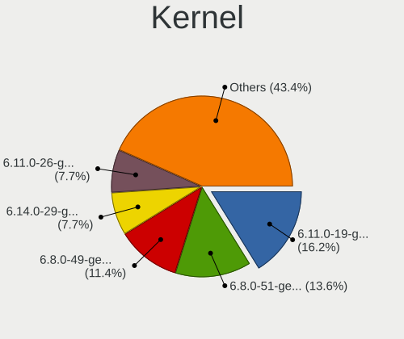

| Version              | Computers | Percent |
|----------------------|-----------|---------|
| 6.11.0-19-generic    | 82        | 16.17%  |
| 6.8.0-51-generic     | 69        | 13.61%  |
| 6.8.0-49-generic     | 58        | 11.44%  |
| 6.14.0-29-generic    | 39        | 7.69%   |
| 6.11.0-26-generic    | 39        | 7.69%   |
| 6.11.0-29-generic    | 20        | 3.94%   |
| 6.11.0-25-generic    | 20        | 3.94%   |
| 6.11.0-17-generic    | 20        | 3.94%   |
| 6.14.0-33-generic    | 19        | 3.75%   |
| 6.11.0-21-generic    | 19        | 3.75%   |
| 6.11.0-24-generic    | 18        | 3.55%   |
| 6.14.0-36-generic    | 15        | 2.96%   |
| 6.14.0-27-generic    | 14        | 2.76%   |
| 6.14.0-24-generic    | 14        | 2.76%   |
| 6.14.0-37-generic    | 13        | 2.56%   |
| 6.14.0-35-generic    | 11        | 2.17%   |
| 6.8.0-52-generic     | 10        | 1.97%   |
| 6.8.0-50-generic     | 9         | 1.78%   |
| 6.14.0-34-generic    | 6         | 1.18%   |
| 6.11.0-28-generic    | 4         | 0.79%   |
| 6.14.0-32-generic    | 3         | 0.59%   |
| 6.14.0-28-generic    | 2         | 0.39%   |
| 6.8.0-1017-oem       | 1         | 0.2%    |
| 6.16.0-amdfix        | 1         | 0.2%    |
| 6.12.6-x64v3-xanmod1 | 1         | 0.2%    |

Kernel Family
-------------

Linux kernel without a distro release

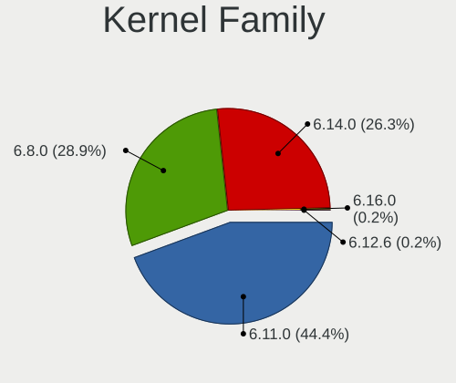

| Version | Computers | Percent |
|---------|-----------|---------|
| 6.11.0  | 221       | 44.38%  |
| 6.8.0   | 144       | 28.92%  |
| 6.14.0  | 131       | 26.31%  |
| 6.16.0  | 1         | 0.2%    |
| 6.12.6  | 1         | 0.2%    |

Kernel Major Ver.
-----------------

Linux kernel major version

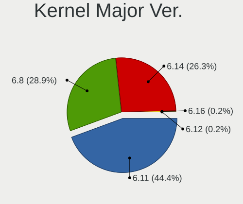

| Version | Computers | Percent |
|---------|-----------|---------|
| 6.11    | 221       | 44.38%  |
| 6.8     | 144       | 28.92%  |
| 6.14    | 131       | 26.31%  |
| 6.16    | 1         | 0.2%    |
| 6.12    | 1         | 0.2%    |

Arch
----

OS architecture (x86_64, i586, etc.)

| Name   | Computers | Percent |
|--------|-----------|---------|
| x86_64 | 483       | 100%    |

DE
--

Desktop Environment

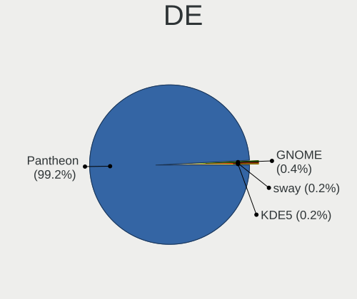

| Name     | Computers | Percent |
|----------|-----------|---------|
| Pantheon | 479       | 99.17%  |
| GNOME    | 2         | 0.41%   |
| sway     | 1         | 0.21%   |
| KDE5     | 1         | 0.21%   |

Display Server
--------------

X11 or Wayland

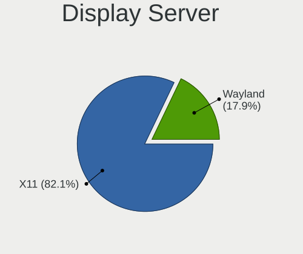

| Name    | Computers | Percent |
|---------|-----------|---------|
| X11     | 399       | 82.1%   |
| Wayland | 87        | 17.9%   |

Display Manager
---------------

SDDM, LightDM, etc.

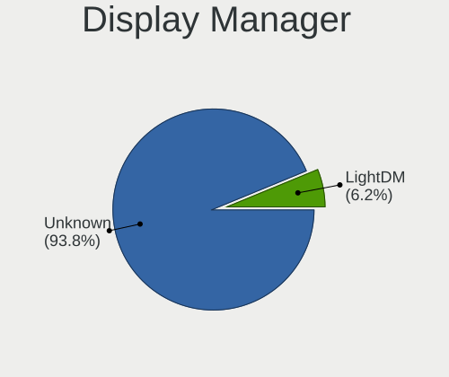

| Name    | Computers | Percent |
|---------|-----------|---------|
| Unknown | 453       | 93.79%  |
| LightDM | 30        | 6.21%   |

OS Lang
-------

Language

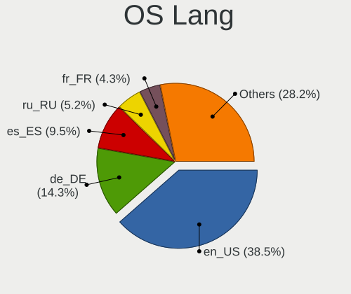

| Lang  | Computers | Percent |
|-------|-----------|---------|
| en_US | 186       | 38.51%  |
| de_DE | 69        | 14.29%  |
| es_ES | 46        | 9.52%   |
| ru_RU | 25        | 5.18%   |
| fr_FR | 21        | 4.35%   |
| pt_BR | 18        | 3.73%   |
| pl_PL | 18        | 3.73%   |
| it_IT | 18        | 3.73%   |
| nl_NL | 13        | 2.69%   |
| en_GB | 13        | 2.69%   |
| en_CA | 6         | 1.24%   |
| en_AU | 6         | 1.24%   |
| tr_TR | 5         | 1.04%   |
| hu_HU | 5         | 1.04%   |
| sv_SE | 3         | 0.62%   |
| pt_PT | 3         | 0.62%   |
| nb_NO | 3         | 0.62%   |
| ja_JP | 3         | 0.62%   |
| de_CH | 3         | 0.62%   |
| zh_CN | 2         | 0.41%   |
| el_GR | 2         | 0.41%   |
| da_DK | 2         | 0.41%   |
| cs_CZ | 2         | 0.41%   |
| bg_BG | 2         | 0.41%   |
| vi_VN | 1         | 0.21%   |
| uk_UA | 1         | 0.21%   |
| ko_KR | 1         | 0.21%   |
| id_ID | 1         | 0.21%   |
| hr_HR | 1         | 0.21%   |
| fr_CA | 1         | 0.21%   |
| fi_FI | 1         | 0.21%   |
| C     | 1         | 0.21%   |
| ar_EG | 1         | 0.21%   |

Boot Mode
---------

EFI or BIOS

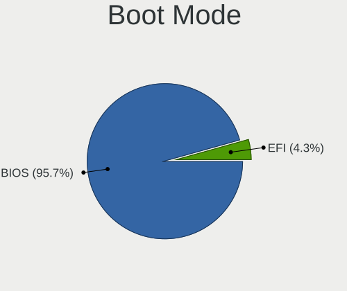

| Mode | Computers | Percent |
|------|-----------|---------|
| BIOS | 462       | 95.65%  |
| EFI  | 21        | 4.35%   |

Filesystem
----------

Type of filesystem

| Type    | Computers | Percent |
|---------|-----------|---------|
| Ext4    | 471       | 97.52%  |
| Btrfs   | 5         | 1.04%   |
| Tmpfs   | 3         | 0.62%   |
| Overlay | 3         | 0.62%   |
| Xfs     | 1         | 0.21%   |

Part. scheme
------------

Scheme of partitioning

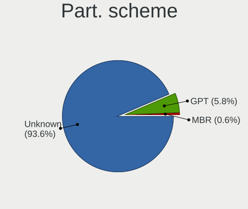

| Type    | Computers | Percent |
|---------|-----------|---------|
| Unknown | 453       | 93.6%   |
| GPT     | 28        | 5.79%   |
| MBR     | 3         | 0.62%   |

Dual Boot with Linux/BSD
------------------------

Hosting more than one Linux/BSD

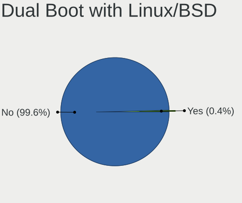

| Dual boot | Computers | Percent |
|-----------|-----------|---------|
| No        | 481       | 99.59%  |
| Yes       | 2         | 0.41%   |

Dual Boot (Win)
---------------

Hosting Linux and Windows

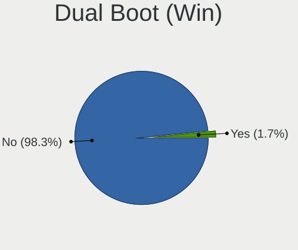

| Dual boot | Computers | Percent |
|-----------|-----------|---------|
| No        | 475       | 98.34%  |
| Yes       | 8         | 1.66%   |

Board
-----

Vendor
------

Motherboard manufacturer

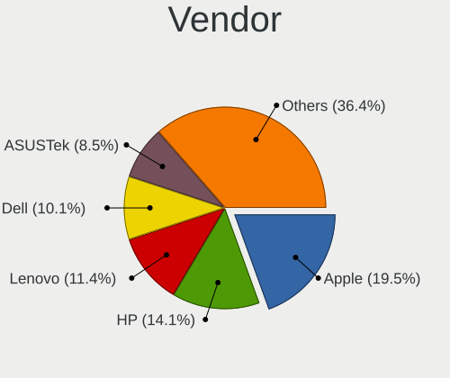

| Name                                 | Computers | Percent |
|--------------------------------------|-----------|---------|
| Apple                                | 94        | 19.46%  |
| Hewlett-Packard                      | 68        | 14.08%  |
| Lenovo                               | 55        | 11.39%  |
| Dell                                 | 49        | 10.14%  |
| ASUSTek Computer                     | 41        | 8.49%   |
| Acer                                 | 27        | 5.59%   |
| MSI                                  | 18        | 3.73%   |
| Gigabyte Technology                  | 15        | 3.11%   |
| Intel                                | 12        | 2.48%   |
| ASRock                               | 10        | 2.07%   |
| Sony                                 | 8         | 1.66%   |
| Toshiba                              | 7         | 1.45%   |
| Samsung Electronics                  | 7         | 1.45%   |
| Microsoft                            | 5         | 1.04%   |
| Google                               | 5         | 1.04%   |
| HUAWEI                               | 4         | 0.83%   |
| Unknown                              | 4         | 0.83%   |
| Positivo                             | 3         | 0.62%   |
| Biostar                              | 3         | 0.62%   |
| ZOTAC                                | 2         | 0.41%   |
| Timi                                 | 2         | 0.41%   |
| Pegatron                             | 2         | 0.41%   |
| Panasonic                            | 2         | 0.41%   |
| OEM                                  | 2         | 0.41%   |
| NEC Computers                        | 2         | 0.41%   |
| Medion                               | 2         | 0.41%   |
| HONOR                                | 2         | 0.41%   |
| Fujitsu                              | 2         | 0.41%   |
| eMachines                            | 2         | 0.41%   |
| Chuwi                                | 2         | 0.41%   |
| Alienware                            | 2         | 0.41%   |
| Trigkey                              | 1         | 0.21%   |
| TongFang                             | 1         | 0.21%   |
| Thomson                              | 1         | 0.21%   |
| SK hynix                             | 1         | 0.21%   |
| Shenzhen Meigao Electronic Equipment | 1         | 0.21%   |
| Proline                              | 1         | 0.21%   |
| Packard Bell                         | 1         | 0.21%   |
| Onda TLC                             | 1         | 0.21%   |
| Notebook                             | 1         | 0.21%   |

Model
-----

Motherboard model

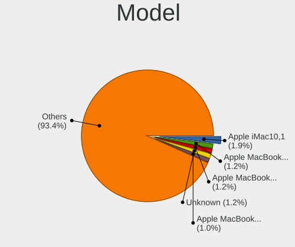

| Name                             | Computers | Percent |
|----------------------------------|-----------|---------|
| Apple iMac10,1                   | 9         | 1.86%   |
| Apple MacBookPro8,1              | 6         | 1.24%   |
| Apple MacBookAir7,2              | 6         | 1.24%   |
| Unknown                          | 6         | 1.24%   |
| Apple MacBookPro9,2              | 5         | 1.04%   |
| HP Pavilion dv6                  | 4         | 0.83%   |
| Apple Macmini7,1                 | 4         | 0.83%   |
| Apple MacBookPro10,1             | 4         | 0.83%   |
| HP Notebook                      | 3         | 0.62%   |
| Dell Latitude E7470              | 3         | 0.62%   |
| ASUS Vivobook Go E1504FA_E1504FA | 3         | 0.62%   |
| Apple MacBookPro7,1              | 3         | 0.62%   |
| Apple MacBookPro11,1             | 3         | 0.62%   |
| Apple MacBookAir6,2              | 3         | 0.62%   |
| Apple MacBook5,1                 | 3         | 0.62%   |
| Apple iMac8,1                    | 3         | 0.62%   |
| Apple iMac7,1                    | 3         | 0.62%   |
| MSI MS-7D77                      | 2         | 0.41%   |
| Microsoft Surface 3              | 2         | 0.41%   |
| Lenovo IdeaPad 500-15ISK 80NT    | 2         | 0.41%   |
| Lenovo IdeaPad 1 15AMN7 82VG     | 2         | 0.41%   |
| Dell OptiPlex 7010               | 2         | 0.41%   |
| Dell Latitude E5550              | 2         | 0.41%   |
| Dell Latitude 5580               | 2         | 0.41%   |
| ASUS M5A78L-M/USB3               | 2         | 0.41%   |
| Apple Macmini6,1                 | 2         | 0.41%   |
| Apple Macmini5,2                 | 2         | 0.41%   |
| Apple MacBookPro9,1              | 2         | 0.41%   |
| Apple MacBookPro11,2             | 2         | 0.41%   |
| Apple MacBookAir5,2              | 2         | 0.41%   |
| Apple iMac9,1                    | 2         | 0.41%   |
| Apple iMac14,1                   | 2         | 0.41%   |
| Apple iMac12,2                   | 2         | 0.41%   |
| Acer Aspire E5-571G              | 2         | 0.41%   |
| ZOTAC ZBOXNANO-VD01              | 1         | 0.21%   |
| ZOTAC ZBOX-CI527/CI547           | 1         | 0.21%   |
| Trigkey Key N                    | 1         | 0.21%   |
| Toshiba Satellite U840           | 1         | 0.21%   |
| Toshiba Satellite Pro C50-A-1MX  | 1         | 0.21%   |
| Toshiba Satellite L50D-B         | 1         | 0.21%   |

Model Family
------------

Motherboard model prefix

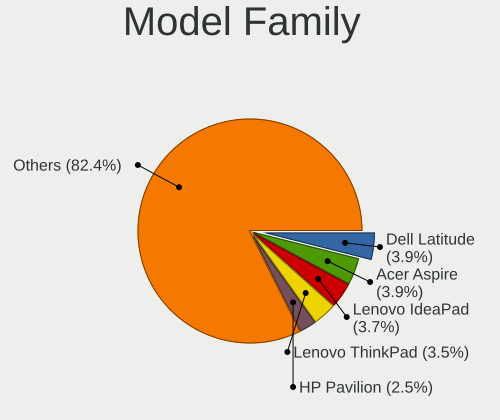

| Name               | Computers | Percent |
|--------------------|-----------|---------|
| Dell Latitude      | 19        | 3.93%   |
| Acer Aspire        | 19        | 3.93%   |
| Lenovo IdeaPad     | 18        | 3.73%   |
| Lenovo ThinkPad    | 17        | 3.52%   |
| HP Pavilion        | 12        | 2.48%   |
| HP Laptop          | 10        | 2.07%   |
| Dell Inspiron      | 10        | 2.07%   |
| ASUS PRIME         | 10        | 2.07%   |
| Apple iMac10       | 9         | 1.86%   |
| HP ProBook         | 8         | 1.66%   |
| HP EliteBook       | 7         | 1.45%   |
| Dell OptiPlex      | 7         | 1.45%   |
| Apple MacBookPro9  | 7         | 1.45%   |
| Apple MacBookPro8  | 7         | 1.45%   |
| Apple MacBookPro11 | 7         | 1.45%   |
| ASUS VivoBook      | 6         | 1.24%   |
| Apple MacBookAir7  | 6         | 1.24%   |
| Unknown            | 6         | 1.24%   |
| Toshiba Satellite  | 5         | 1.04%   |
| Microsoft Surface  | 5         | 1.04%   |
| HP EliteDesk       | 5         | 1.04%   |
| Apple MacBookPro10 | 5         | 1.04%   |
| Lenovo ThinkCentre | 4         | 0.83%   |
| HP Compaq          | 4         | 0.83%   |
| Dell XPS           | 4         | 0.83%   |
| Apple Macmini7     | 4         | 0.83%   |
| HP ProDesk         | 3         | 0.62%   |
| HP Notebook        | 3         | 0.62%   |
| Dell Vostro        | 3         | 0.62%   |
| Dell Precision     | 3         | 0.62%   |
| Apple Macmini5     | 3         | 0.62%   |
| Apple MacBookPro7  | 3         | 0.62%   |
| Apple MacBookAir6  | 3         | 0.62%   |
| Apple MacBook5     | 3         | 0.62%   |
| Apple iMac8        | 3         | 0.62%   |
| Apple iMac7        | 3         | 0.62%   |
| Apple iMac14       | 3         | 0.62%   |
| Apple iMac12       | 3         | 0.62%   |
| Acer Swift         | 3         | 0.62%   |
| MSI MS-7D77        | 2         | 0.41%   |

MFG Year
--------

Motherboard manufacture year

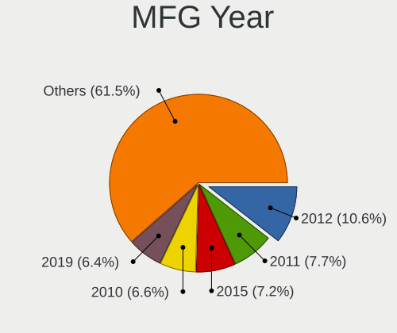

| Year | Computers | Percent |
|------|-----------|---------|
| 2012 | 51        | 10.56%  |
| 2011 | 37        | 7.66%   |
| 2015 | 35        | 7.25%   |
| 2010 | 32        | 6.63%   |
| 2019 | 31        | 6.42%   |
| 2013 | 30        | 6.21%   |
| 2022 | 29        | 6%      |
| 2018 | 29        | 6%      |
| 2020 | 28        | 5.8%    |
| 2009 | 27        | 5.59%   |
| 2014 | 25        | 5.18%   |
| 2017 | 22        | 4.55%   |
| 2023 | 20        | 4.14%   |
| 2016 | 20        | 4.14%   |
| 2008 | 19        | 3.93%   |
| 2021 | 16        | 3.31%   |
| 2024 | 15        | 3.11%   |
| 2025 | 6         | 1.24%   |
| 2006 | 6         | 1.24%   |
| 2007 | 5         | 1.04%   |

Form Factor
-----------

Physical design of the computer

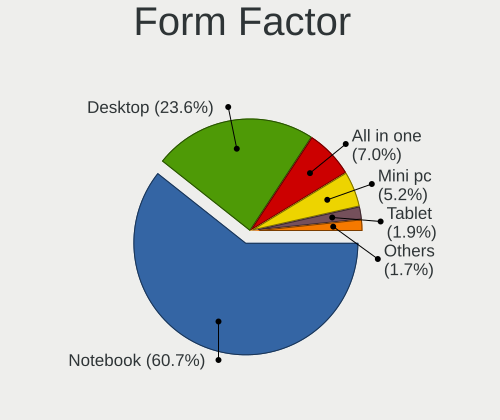

| Name        | Computers | Percent |
|-------------|-----------|---------|
| Notebook    | 293       | 60.66%  |
| Desktop     | 114       | 23.6%   |
| All in one  | 34        | 7.04%   |
| Mini pc     | 25        | 5.18%   |
| Tablet      | 9         | 1.86%   |
| Convertible | 7         | 1.45%   |
| Server      | 1         | 0.21%   |

Secure Boot
-----------

Enabled or disabled

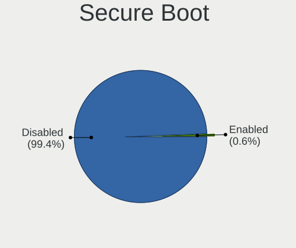

| State    | Computers | Percent |
|----------|-----------|---------|
| Disabled | 480       | 99.38%  |
| Enabled  | 3         | 0.62%   |

Coreboot
--------

Have coreboot on board

| Used | Computers | Percent |
|------|-----------|---------|
| No   | 478       | 98.96%  |
| Yes  | 5         | 1.04%   |

RAM Size
--------

Total RAM memory

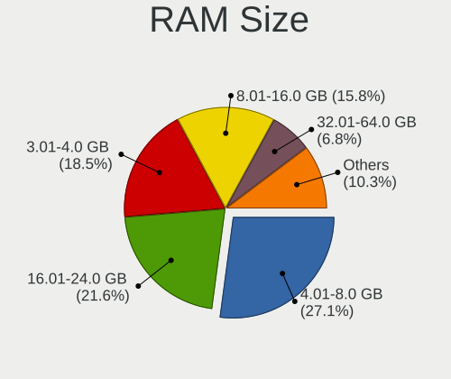

| Size in GB  | Computers | Percent |
|-------------|-----------|---------|
| 4.01-8.0    | 132       | 27.1%   |
| 16.01-24.0  | 105       | 21.56%  |
| 3.01-4.0    | 90        | 18.48%  |
| 8.01-16.0   | 77        | 15.81%  |
| 32.01-64.0  | 33        | 6.78%   |
| 24.01-32.0  | 21        | 4.31%   |
| 64.01-256.0 | 13        | 2.67%   |
| 1.01-2.0    | 9         | 1.85%   |
| 2.01-3.0    | 7         | 1.44%   |

RAM Used
--------

Used RAM memory

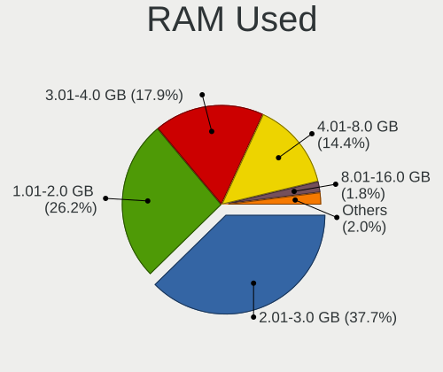

| Used GB    | Computers | Percent |
|------------|-----------|---------|
| 2.01-3.0   | 191       | 37.67%  |
| 1.01-2.0   | 133       | 26.23%  |
| 3.01-4.0   | 91        | 17.95%  |
| 4.01-8.0   | 73        | 14.4%   |
| 8.01-16.0  | 9         | 1.78%   |
| 0.51-1.0   | 9         | 1.78%   |
| 16.01-24.0 | 1         | 0.2%    |

Total Drives
------------

Number of drives on board

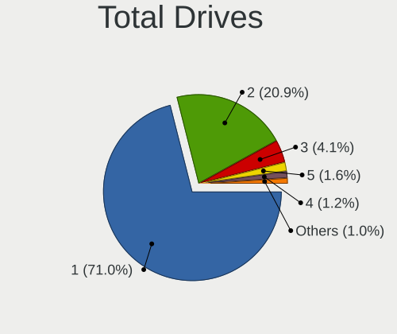

| Drives | Computers | Percent |
|--------|-----------|---------|
| 1      | 346       | 71.05%  |
| 2      | 102       | 20.94%  |
| 3      | 20        | 4.11%   |
| 5      | 8         | 1.64%   |
| 4      | 6         | 1.23%   |
| 6      | 3         | 0.62%   |
| 7      | 1         | 0.21%   |
| 0      | 1         | 0.21%   |

Has CD-ROM
----------

Has CD-ROM on board

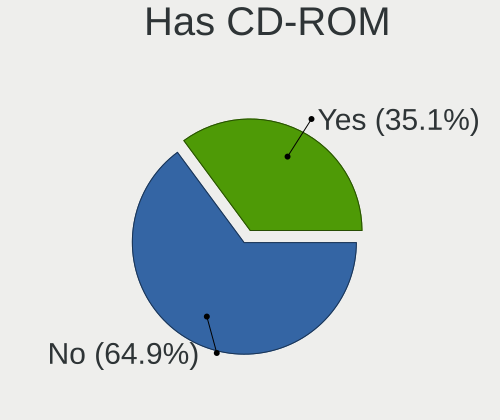

| Presented | Computers | Percent |
|-----------|-----------|---------|
| No        | 314       | 64.88%  |
| Yes       | 170       | 35.12%  |

Has Ethernet
------------

Has Ethernet on board

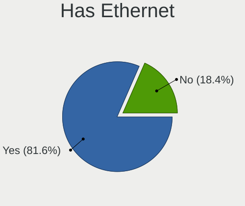

| Presented | Computers | Percent |
|-----------|-----------|---------|
| Yes       | 394       | 81.57%  |
| No        | 89        | 18.43%  |

Has WiFi
--------

Has WiFi module

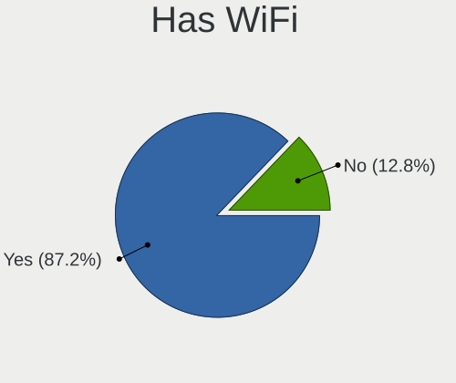

| Presented | Computers | Percent |
|-----------|-----------|---------|
| Yes       | 421       | 87.16%  |
| No        | 62        | 12.84%  |

Has Bluetooth
-------------

Has Bluetooth module

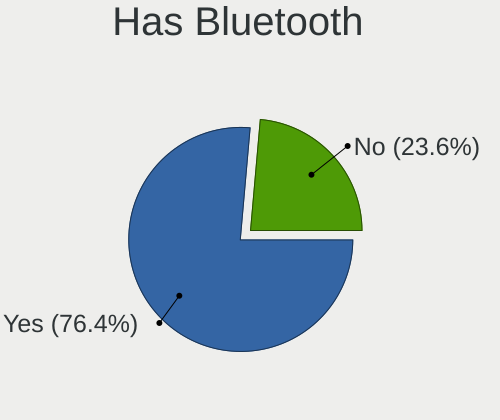

| Presented | Computers | Percent |
|-----------|-----------|---------|
| Yes       | 369       | 76.4%   |
| No        | 114       | 23.6%   |

Location
--------

Country
-------

Geographic location (country)

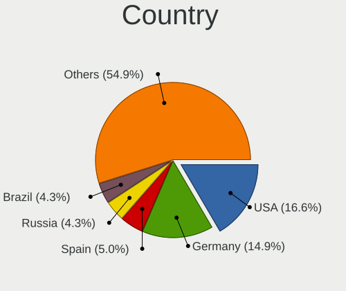

| Country      | Computers | Percent |
|--------------|-----------|---------|
| USA          | 80        | 16.56%  |
| Germany      | 72        | 14.91%  |
| Spain        | 24        | 4.97%   |
| Russia       | 21        | 4.35%   |
| Brazil       | 21        | 4.35%   |
| UK           | 20        | 4.14%   |
| Canada       | 20        | 4.14%   |
| Italy        | 19        | 3.93%   |
| France       | 18        | 3.73%   |
| Poland       | 17        | 3.52%   |
| Netherlands  | 13        | 2.69%   |
| Australia    | 13        | 2.69%   |
| India        | 12        | 2.48%   |
| Mexico       | 9         | 1.86%   |
| Belgium      | 7         | 1.45%   |
| Portugal     | 6         | 1.24%   |
| Indonesia    | 6         | 1.24%   |
| Argentina    | 6         | 1.24%   |
| Turkey       | 4         | 0.83%   |
| Switzerland  | 4         | 0.83%   |
| South Africa | 4         | 0.83%   |
| Slovakia     | 4         | 0.83%   |
| Romania      | 4         | 0.83%   |
| Japan        | 4         | 0.83%   |
| Hungary      | 4         | 0.83%   |
| Colombia     | 4         | 0.83%   |
| Bulgaria     | 4         | 0.83%   |
| Vietnam      | 3         | 0.62%   |
| Thailand     | 3         | 0.62%   |
| Sweden       | 3         | 0.62%   |
| Norway       | 3         | 0.62%   |
| Finland      | 3         | 0.62%   |
| China        | 3         | 0.62%   |
| Austria      | 3         | 0.62%   |
| Venezuela    | 2         | 0.41%   |
| Ukraine      | 2         | 0.41%   |
| Saudi Arabia | 2         | 0.41%   |
| Malaysia     | 2         | 0.41%   |
| Israel       | 2         | 0.41%   |
| Ireland      | 2         | 0.41%   |

City
----

Geographic location (city)

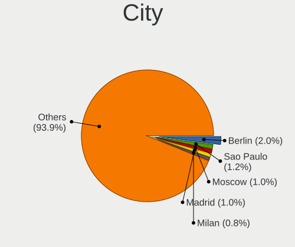

| City              | Computers | Percent |
|-------------------|-----------|---------|
| Berlin            | 10        | 2.04%   |
| Sao Paulo         | 6         | 1.23%   |
| Moscow            | 5         | 1.02%   |
| Madrid            | 5         | 1.02%   |
| Milan             | 4         | 0.82%   |
| Melbourne         | 4         | 0.82%   |
| St Petersburg     | 3         | 0.61%   |
| Rome              | 3         | 0.61%   |
| Phoenix           | 3         | 0.61%   |
| Overijse          | 3         | 0.61%   |
| Oslo              | 3         | 0.61%   |
| Nuremberg         | 3         | 0.61%   |
| Johannesburg      | 3         | 0.61%   |
| Istanbul          | 3         | 0.61%   |
| Gdansk            | 3         | 0.61%   |
| Frankfurt am Main | 3         | 0.61%   |
| Chicago           | 3         | 0.61%   |
| Brisbane          | 3         | 0.61%   |
| Zurich            | 2         | 0.41%   |
| Wroclaw           | 2         | 0.41%   |
| West Ham          | 2         | 0.41%   |
| Warsaw            | 2         | 0.41%   |
| Traunstein        | 2         | 0.41%   |
| Toronto           | 2         | 0.41%   |
| Tel Aviv          | 2         | 0.41%   |
| Tampere           | 2         | 0.41%   |
| Seveso            | 2         | 0.41%   |
| Seattle           | 2         | 0.41%   |
| Santiago          | 2         | 0.41%   |
| Porto             | 2         | 0.41%   |
| Pazardzhik        | 2         | 0.41%   |
| Oklahoma City     | 2         | 0.41%   |
| New York          | 2         | 0.41%   |
| Munich            | 2         | 0.41%   |
| Medellín         | 2         | 0.41%   |
| Mannheim          | 2         | 0.41%   |
| Manchester        | 2         | 0.41%   |
| Krakow            | 2         | 0.41%   |
| Ho Chi Minh City  | 2         | 0.41%   |
| Hassela           | 2         | 0.41%   |

Drives
------

Drive Vendor
------------

Hard drive vendors

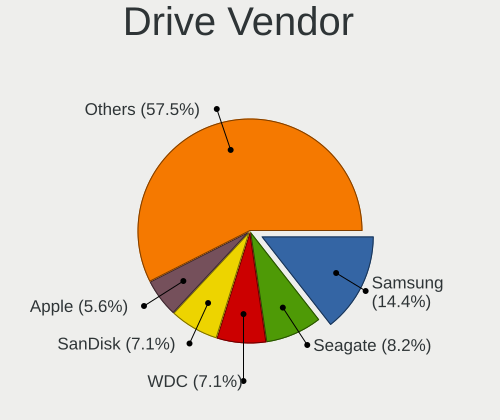

| Vendor                       | Computers | Drives | Percent |
|------------------------------|-----------|--------|---------|
| Samsung Electronics          | 93        | 119    | 14.44%  |
| Seagate                      | 53        | 59     | 8.23%   |
| WDC                          | 46        | 54     | 7.14%   |
| SanDisk                      | 46        | 52     | 7.14%   |
| Apple                        | 36        | 43     | 5.59%   |
| Toshiba                      | 33        | 37     | 5.12%   |
| Kingston                     | 33        | 38     | 5.12%   |
| Unknown                      | 26        | 27     | 4.04%   |
| Crucial                      | 22        | 25     | 3.42%   |
| SK hynix                     | 15        | 16     | 2.33%   |
| Hitachi                      | 13        | 14     | 2.02%   |
| Silicon Motion               | 11        | 12     | 1.71%   |
| China                        | 11        | 14     | 1.71%   |
| HGST                         | 10        | 12     | 1.55%   |
| Micron/Crucial Technology    | 9         | 10     | 1.4%    |
| MAXIO Technology (Hangzhou)  | 9         | 10     | 1.4%    |
| Intel                        | 9         | 10     | 1.4%    |
| JMicron Technology           | 8         | 8      | 1.24%   |
| A-DATA Technology            | 8         | 8      | 1.24%   |
| PNY                          | 7         | 9      | 1.09%   |
| Micron Technology            | 6         | 6      | 0.93%   |
| KIOXIA                       | 5         | 5      | 0.78%   |
| Kingston Technology Company  | 5         | 5      | 0.78%   |
| Fanxiang                     | 5         | 5      | 0.78%   |
| SPCC                         | 4         | 4      | 0.62%   |
| Shenzhen Longsys Electronics | 4         | 5      | 0.62%   |
| Realtek Semiconductor        | 4         | 4      | 0.62%   |
| Phison Electronics           | 4         | 4      | 0.62%   |
| KingSpec                     | 4         | 5      | 0.62%   |
| WALRAM                       | 3         | 3      | 0.47%   |
| Team                         | 3         | 3      | 0.47%   |
| SABRENT                      | 3         | 3      | 0.47%   |
| Patriot                      | 3         | 3      | 0.47%   |
| OCZ                          | 3         | 4      | 0.47%   |
| Hewlett-Packard              | 3         | 3      | 0.47%   |
| GOODRAM                      | 3         | 3      | 0.47%   |
| ADATA Technology             | 3         | 3      | 0.47%   |
| Unknown                      | 3         | 3      | 0.47%   |
| Verbatim                     | 2         | 2      | 0.31%   |
| Transcend                    | 2         | 2      | 0.31%   |

Drive Model
-----------

Hard drive models

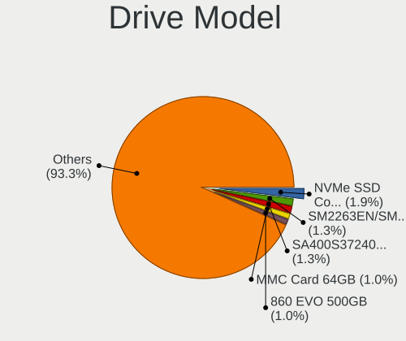

| Model                                                 | Computers | Percent |
|-------------------------------------------------------|-----------|---------|
| Samsung NVMe SSD Controller SM981/PM981/PM983 1TB     | 13        | 1.93%   |
| Silicon Motion SM2263EN/SM2263XT SSD Controller 512GB | 9         | 1.34%   |
| Kingston SA400S37240G 240GB SSD                       | 9         | 1.34%   |
| Unknown MMC Card  64GB                                | 7         | 1.04%   |
| Samsung SSD 860 EVO 500GB                             | 7         | 1.04%   |
| Unknown MMC Card  128GB                               | 6         | 0.89%   |
| Apple SSD SM0256F 256GB                               | 6         | 0.89%   |
| Samsung NVMe SSD Controller SM961/PM961/SM963 1024GB  | 5         | 0.74%   |
| MAXIO (Hangzhou) NVMe SSD Controller MAP1202 2TB      | 5         | 0.74%   |
| Kingston SA400S37480G 480GB SSD                       | 5         | 0.74%   |
| Crucial CT240BX500SSD1 240GB                          | 5         | 0.74%   |
| Apple SSD SM0128G 121GB                               | 5         | 0.74%   |
| WDC WD5000LPVX-22V0TT0 500GB                          | 4         | 0.59%   |
| Unknown SD/MMC/MS PRO 2GB                             | 4         | 0.59%   |
| Unknown MMC Card  16GB                                | 4         | 0.59%   |
| Seagate ST500LT012-1DG142 500GB                       | 4         | 0.59%   |
| Seagate ST31000528AS 1TB                              | 4         | 0.59%   |
| Sandisk WD Blue SN550 NVMe SSD 1024GB                 | 4         | 0.59%   |
| Samsung SSD 850 EVO 500GB                             | 4         | 0.59%   |
| Samsung SSD 850 EVO 250GB                             | 4         | 0.59%   |
| Samsung SSD 850 EVO 120GB                             | 4         | 0.59%   |
| Samsung SSD 840 EVO 250GB                             | 4         | 0.59%   |
| JMicron Tech 250GB                                    | 4         | 0.59%   |
| WDC WDS240G2G0A-00JH30 240GB SSD                      | 3         | 0.45%   |
| Unknown MMC Card  32GB                                | 3         | 0.45%   |
| Toshiba MQ04ABF100 1TB                                | 3         | 0.45%   |
| Toshiba MQ01ABF050 500GB                              | 3         | 0.45%   |
| Toshiba MQ01ABD100 1TB                                | 3         | 0.45%   |
| Toshiba BG3 NVMe SSD Controller 256GB                 | 3         | 0.45%   |
| Seagate ST1000LM024 HN-M101MBB 1TB                    | 3         | 0.45%   |
| Seagate Expansion 2TB                                 | 3         | 0.45%   |
| SanDisk NVMe SSD Drive 1TB                            | 3         | 0.45%   |
| Samsung NVMe SSD Controller PM9A1/PM9A3/980PRO 1TB    | 3         | 0.45%   |
| Micron/Crucial P2 NVMe PCIe SSD 2TB                   | 3         | 0.45%   |
| Kingston SV300S37A240G 240GB SSD                      | 3         | 0.45%   |
| HGST HTS545050A7E380 500GB                            | 3         | 0.45%   |
| China SSD 256GB                                       | 3         | 0.45%   |
| Apple SSD SM0256G 256GB                               | 3         | 0.45%   |
| Unknown                                               | 3         | 0.45%   |
| WDC WD5000LPCX-21VHAT0 500GB                          | 2         | 0.3%    |

HDD Vendor
----------

Hard disk drive vendors

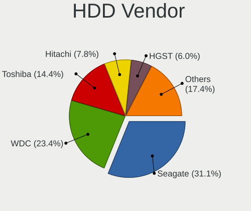

| Vendor              | Computers | Drives | Percent |
|---------------------|-----------|--------|---------|
| Seagate             | 52        | 58     | 31.14%  |
| WDC                 | 39        | 44     | 23.35%  |
| Toshiba             | 24        | 27     | 14.37%  |
| Hitachi             | 13        | 14     | 7.78%   |
| HGST                | 10        | 12     | 5.99%   |
| Apple               | 8         | 8      | 4.79%   |
| Samsung Electronics | 5         | 5      | 2.99%   |
| Unknown             | 4         | 4      | 2.4%    |
| JMicron Technology  | 2         | 2      | 1.2%    |
| Fujitsu             | 2         | 2      | 1.2%    |
| WALRAM              | 1         | 1      | 0.6%    |
| USB                 | 1         | 1      | 0.6%    |
| T-FORCE             | 1         | 1      | 0.6%    |
| Shenzhen            | 1         | 1      | 0.6%    |
| PRO Z               | 1         | 2      | 0.6%    |
| NETAPP              | 1         | 1      | 0.6%    |
| Maxtor              | 1         | 1      | 0.6%    |
| ExcelStor           | 1         | 1      | 0.6%    |

SSD Vendor
----------

Solid state drive vendors

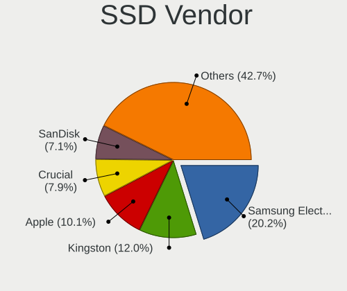

| Vendor              | Computers | Drives | Percent |
|---------------------|-----------|--------|---------|
| Samsung Electronics | 54        | 66     | 20.22%  |
| Kingston            | 32        | 36     | 11.99%  |
| Apple               | 27        | 33     | 10.11%  |
| Crucial             | 21        | 24     | 7.87%   |
| SanDisk             | 19        | 22     | 7.12%   |
| China               | 10        | 13     | 3.75%   |
| WDC                 | 8         | 9      | 3%      |
| PNY                 | 7         | 9      | 2.62%   |
| A-DATA Technology   | 7         | 7      | 2.62%   |
| SPCC                | 4         | 4      | 1.5%    |
| SK hynix            | 4         | 4      | 1.5%    |
| KingSpec            | 4         | 5      | 1.5%    |
| Toshiba             | 3         | 3      | 1.12%   |
| Team                | 3         | 3      | 1.12%   |
| Patriot             | 3         | 3      | 1.12%   |
| OCZ                 | 3         | 4      | 1.12%   |
| Intel               | 3         | 3      | 1.12%   |
| Hewlett-Packard     | 3         | 3      | 1.12%   |
| GOODRAM             | 3         | 3      | 1.12%   |
| Verbatim            | 2         | 2      | 0.75%   |
| Transcend           | 2         | 2      | 0.75%   |
| SABRENT             | 2         | 2      | 0.75%   |
| NGFF                | 2         | 2      | 0.75%   |
| Lexar               | 2         | 3      | 0.75%   |
| KingDian            | 2         | 2      | 0.75%   |
| JMicron Technology  | 2         | 2      | 0.75%   |
| Intenso             | 2         | 2      | 0.75%   |
| Aura                | 2         | 2      | 0.75%   |
| Apacer              | 2         | 4      | 0.75%   |
| Unknown             | 2         | 2      | 0.75%   |
| Zheino              | 1         | 1      | 0.37%   |
| Vi550               | 1         | 1      | 0.37%   |
| sk600               | 1         | 1      | 0.37%   |
| Seagate             | 1         | 1      | 0.37%   |
| PUSKILL             | 1         | 1      | 0.37%   |
| PNY CS13            | 1         | 1      | 0.37%   |
| Plextor             | 1         | 1      | 0.37%   |
| OCZ-VERTEX2         | 1         | 1      | 0.37%   |
| Netac               | 1         | 1      | 0.37%   |
| Micron Technology   | 1         | 1      | 0.37%   |

Drive Kind
----------

HDD or SSD

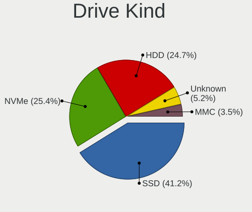

| Kind    | Computers | Drives | Percent |
|---------|-----------|--------|---------|
| SSD     | 245       | 310    | 41.18%  |
| NVMe    | 151       | 186    | 25.38%  |
| HDD     | 147       | 185    | 24.71%  |
| Unknown | 31        | 34     | 5.21%   |
| MMC     | 21        | 22     | 3.53%   |

Drive Connector
---------------

SATA, SAS, NVMe, etc.

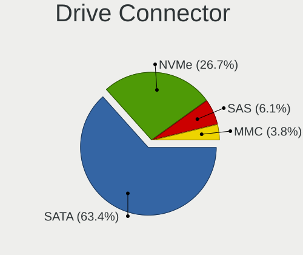

| Type | Computers | Drives | Percent |
|------|-----------|--------|---------|
| SATA | 351       | 494    | 63.36%  |
| NVMe | 148       | 182    | 26.71%  |
| SAS  | 34        | 39     | 6.14%   |
| MMC  | 21        | 22     | 3.79%   |

Drive Size
----------

Size of hard drive

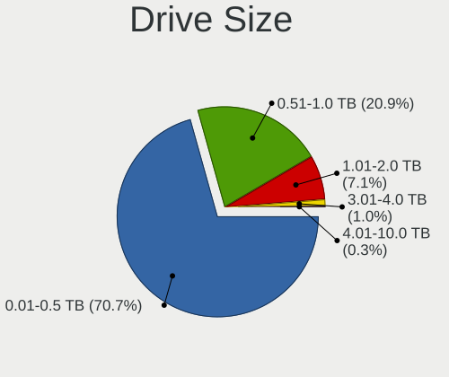

| Size in TB | Computers | Drives | Percent |
|------------|-----------|--------|---------|
| 0.01-0.5   | 277       | 356    | 70.66%  |
| 0.51-1.0   | 82        | 102    | 20.92%  |
| 1.01-2.0   | 28        | 31     | 7.14%   |
| 3.01-4.0   | 4         | 4      | 1.02%   |
| 4.01-10.0  | 1         | 2      | 0.26%   |

Space Total
-----------

Amount of disk space available on the file system

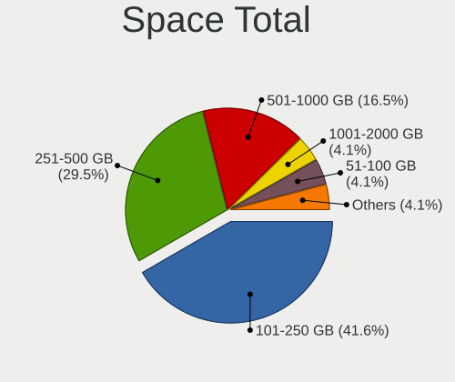

| Size in GB     | Computers | Percent |
|----------------|-----------|---------|
| 101-250        | 202       | 41.65%  |
| 251-500        | 143       | 29.48%  |
| 501-1000       | 80        | 16.49%  |
| 1001-2000      | 20        | 4.12%   |
| 51-100         | 20        | 4.12%   |
| 21-50          | 8         | 1.65%   |
| More than 3000 | 6         | 1.24%   |
| 2001-3000      | 4         | 0.82%   |
| 1-20           | 2         | 0.41%   |

Space Used
----------

Amount of used disk space

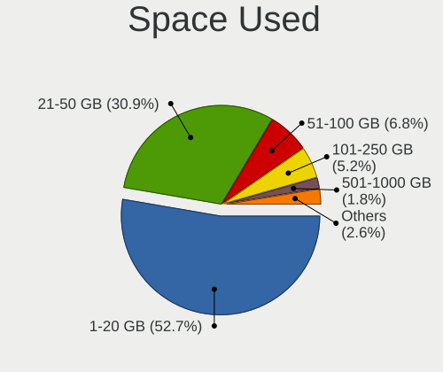

| Used GB   | Computers | Percent |
|-----------|-----------|---------|
| 1-20      | 263       | 52.71%  |
| 21-50     | 154       | 30.86%  |
| 51-100    | 34        | 6.81%   |
| 101-250   | 26        | 5.21%   |
| 501-1000  | 9         | 1.8%    |
| 251-500   | 8         | 1.6%    |
| 1001-2000 | 3         | 0.6%    |
| 2001-3000 | 2         | 0.4%    |

Malfunc. Drives
---------------

Drive models with a malfunction

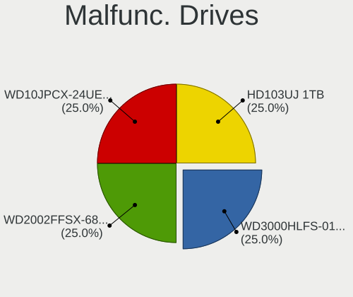

| Model                           | Computers | Drives | Percent |
|---------------------------------|-----------|--------|---------|
| WDC WD3000HLFS-01G6U0 304GB     | 1         | 1      | 25%     |
| WDC WD2002FFSX-68PF8N0 2TB      | 1         | 1      | 25%     |
| WDC WD10JPCX-24UE4T0 1TB        | 1         | 1      | 25%     |
| Samsung Electronics HD103UJ 1TB | 1         | 1      | 25%     |

Malfunc. Drive Vendor
---------------------

Vendors of faulty drives

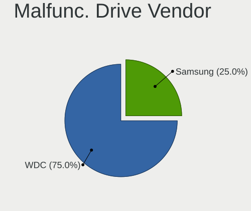

| Vendor              | Computers | Drives | Percent |
|---------------------|-----------|--------|---------|
| WDC                 | 3         | 3      | 75%     |
| Samsung Electronics | 1         | 1      | 25%     |

Malfunc. HDD Vendor
-------------------

Vendors of faulty HDD drives

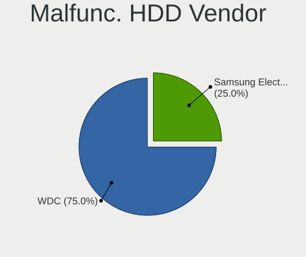

| Vendor              | Computers | Drives | Percent |
|---------------------|-----------|--------|---------|
| WDC                 | 3         | 3      | 75%     |
| Samsung Electronics | 1         | 1      | 25%     |

Malfunc. Drive Kind
-------------------

Kinds of faulty drives

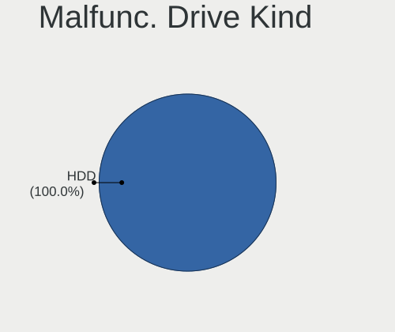

| Kind | Computers | Drives | Percent |
|------|-----------|--------|---------|
| HDD  | 3         | 4      | 100%    |

Failed Drives
-------------

Failed drive models

Zero info for selected period =(

Failed Drive Vendor
-------------------

Failed drive vendors

Zero info for selected period =(

Drive Status
------------

Number of failed and malfunc. drives

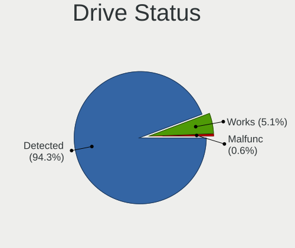

| Status   | Computers | Drives | Percent |
|----------|-----------|--------|---------|
| Detected | 461       | 694    | 94.27%  |
| Works    | 25        | 39     | 5.11%   |
| Malfunc  | 3         | 4      | 0.61%   |

Storage controller
------------------

Storage Vendor
--------------

Storage controller vendors

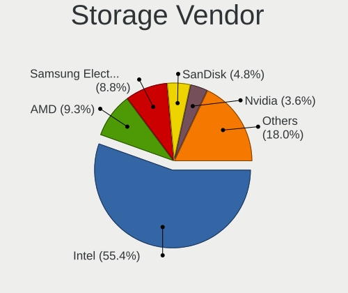

| Vendor                           | Computers | Percent |
|----------------------------------|-----------|---------|
| Intel                            | 321       | 55.44%  |
| AMD                              | 54        | 9.33%   |
| Samsung Electronics              | 51        | 8.81%   |
| SanDisk                          | 28        | 4.84%   |
| Nvidia                           | 21        | 3.63%   |
| SK hynix                         | 11        | 1.9%    |
| Silicon Motion                   | 11        | 1.9%    |
| Micron/Crucial Technology        | 10        | 1.73%   |
| MAXIO Technology (Hangzhou)      | 9         | 1.55%   |
| Toshiba America Info Systems     | 7         | 1.21%   |
| Kingston Technology Company      | 6         | 1.04%   |
| Phison Electronics               | 5         | 0.86%   |
| Micron Technology                | 5         | 0.86%   |
| KIOXIA                           | 5         | 0.86%   |
| Shenzhen Longsys Electronics     | 4         | 0.69%   |
| Realtek Semiconductor            | 4         | 0.69%   |
| Marvell Technology Group         | 4         | 0.69%   |
| VIA Technologies                 | 3         | 0.52%   |
| JMicron Technology               | 3         | 0.52%   |
| ADATA Technology                 | 3         | 0.52%   |
| Solid State Storage Technology   | 2         | 0.35%   |
| ASMedia Technology               | 2         | 0.35%   |
| Yangtze Memory Technologies      | 1         | 0.17%   |
| Union Memory (Shenzhen)          | 1         | 0.17%   |
| Silicon Integrated Systems [SiS] | 1         | 0.17%   |
| Shenzhen Techwinsemi Technology  | 1         | 0.17%   |
| LSI Logic / Symbios Logic        | 1         | 0.17%   |
| INNOGRIT                         | 1         | 0.17%   |
| Hosin Global Electronics         | 1         | 0.17%   |
| Broadcom / LSI                   | 1         | 0.17%   |
| Biwin Storage Technology         | 1         | 0.17%   |
| Apple                            | 1         | 0.17%   |

Storage Model
-------------

Storage controller models

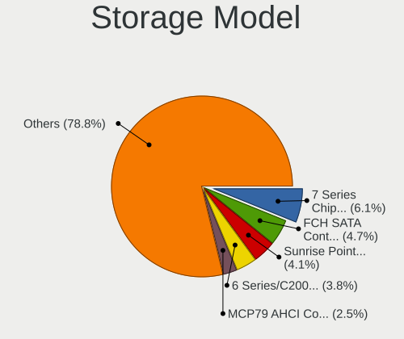

| Model                                                                                   | Computers | Percent |
|-----------------------------------------------------------------------------------------|-----------|---------|
| Intel 7 Series Chipset Family 6-port SATA Controller [AHCI mode]                        | 39        | 6.13%   |
| AMD FCH SATA Controller [AHCI mode]                                                     | 30        | 4.72%   |
| Intel Sunrise Point-LP SATA Controller [AHCI mode]                                      | 26        | 4.09%   |
| Intel 6 Series/C200 Series Chipset Family 6 port Mobile SATA AHCI Controller            | 24        | 3.77%   |
| Nvidia MCP79 AHCI Controller                                                            | 16        | 2.52%   |
| Samsung NVMe SSD Controller SM981/PM981/PM983                                           | 14        | 2.2%    |
| Intel 8 Series SATA Controller 1 [AHCI mode]                                            | 14        | 2.2%    |
| Intel 82801IBM/IEM (ICH9M/ICH9M-E) 4 port SATA Controller [AHCI mode]                   | 13        | 2.04%   |
| Intel 8 Series/C220 Series Chipset Family 6-port SATA Controller 1 [AHCI mode]          | 13        | 2.04%   |
| Intel Wildcat Point-LP SATA Controller [AHCI Mode]                                      | 12        | 1.89%   |
| Intel SATA Controller [RAID mode]                                                       | 12        | 1.89%   |
| Intel 82801 Mobile SATA Controller [RAID mode]                                          | 12        | 1.89%   |
| Intel Q170/Q150/B150/H170/H110/Z170/CM236 Chipset SATA Controller [AHCI Mode]           | 11        | 1.73%   |
| Intel Volume Management Device NVMe RAID Controller                                     | 10        | 1.57%   |
| Intel Celeron/Pentium Silver Processor SATA Controller                                  | 10        | 1.57%   |
| Silicon Motion SM2263EN/SM2263XT (DRAM-less) NVMe SSD Controllers                       | 9         | 1.42%   |
| Intel Raptor Lake SATA AHCI Controller                                                  | 9         | 1.42%   |
| Intel 82801HM/HEM (ICH8M/ICH8M-E) SATA Controller [AHCI mode]                           | 9         | 1.42%   |
| Intel 82801HM/HEM (ICH8M/ICH8M-E) IDE Controller                                        | 9         | 1.42%   |
| Intel 7 Series/C210 Series Chipset Family 6-port SATA Controller [AHCI mode]            | 9         | 1.42%   |
| Samsung S4LN058A01[SSUBX] AHCI SSD Controller (Apple slot)                              | 8         | 1.26%   |
| Intel Cannon Lake PCH SATA AHCI Controller                                              | 8         | 1.26%   |
| Intel 6 Series/C200 Series Chipset Family 6 port Desktop SATA AHCI Controller           | 8         | 1.26%   |
| Intel 5 Series/3400 Series Chipset 4 port SATA AHCI Controller                          | 8         | 1.26%   |
| AMD 600 Series Chipset SATA Controller                                                  | 8         | 1.26%   |
| Samsung S4LN053X01 AHCI SSD Controller(Apple slot)                                      | 7         | 1.1%    |
| Intel 5 Series/3400 Series Chipset 6 port SATA AHCI Controller                          | 7         | 1.1%    |
| Samsung NVMe SSD Controller SM961/PM961/SM963                                           | 6         | 0.94%   |
| Intel NM10/ICH7 Family SATA Controller [IDE mode]                                       | 6         | 0.94%   |
| Samsung NVMe SSD Controller 980 (DRAM-less)                                             | 5         | 0.79%   |
| Nvidia MCP89 SATA Controller (AHCI mode)                                                | 5         | 0.79%   |
| MAXIO (Hangzhou) NVMe SSD Controller MAP1202 (DRAM-less)                                | 5         | 0.79%   |
| Intel 6 Series/C200 Series Chipset Family Desktop SATA Controller (IDE mode, ports 4-5) | 5         | 0.79%   |
| Intel 6 Series/C200 Series Chipset Family Desktop SATA Controller (IDE mode, ports 0-3) | 5         | 0.79%   |
| Intel 200 Series PCH SATA controller [AHCI mode]                                        | 5         | 0.79%   |
| AMD SB7x0/SB8x0/SB9x0 SATA Controller [AHCI mode]                                       | 5         | 0.79%   |
| AMD 400 Series Chipset SATA Controller                                                  | 5         | 0.79%   |
| SanDisk WD SN560/SN740/SN770/SN5000 NVMe SSD                                            | 4         | 0.63%   |
| SanDisk Ultra 3D / WD PC SN530, IX SN530, Blue SN550 NVMe SSD (DRAM-less)               | 4         | 0.63%   |
| Samsung NVMe SSD Controller PM9B1 (DRAM-less)                                           | 4         | 0.63%   |

Storage Kind
------------

Kind of storage controller (IDE, SATA, NVMe, SAS, ...)

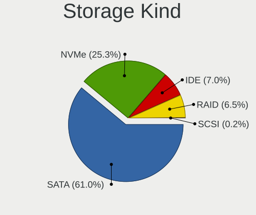

| Kind | Computers | Percent |
|------|-----------|---------|
| SATA | 357       | 61.03%  |
| NVMe | 148       | 25.3%   |
| IDE  | 41        | 7.01%   |
| RAID | 38        | 6.5%    |
| SCSI | 1         | 0.17%   |

Processor
---------

CPU Vendor
----------

Processor vendors

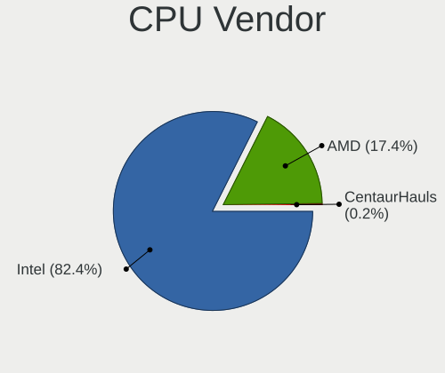

| Vendor       | Computers | Percent |
|--------------|-----------|---------|
| Intel        | 398       | 82.4%   |
| AMD          | 84        | 17.39%  |
| CentaurHauls | 1         | 0.21%   |

CPU Model
---------

Processor models

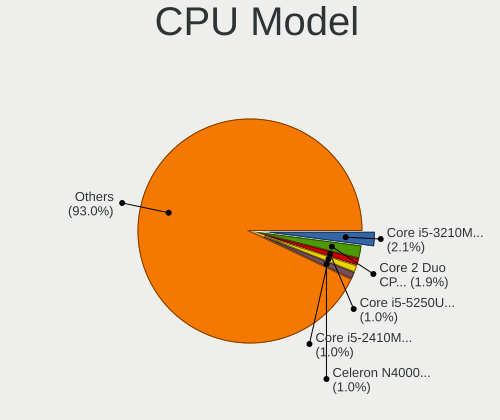

| Model                                         | Computers | Percent |
|-----------------------------------------------|-----------|---------|
| Intel Core i5-3210M CPU @ 2.50GHz             | 10        | 2.07%   |
| Intel Core 2 Duo CPU E7600 @ 3.06GHz          | 9         | 1.86%   |
| Intel Core i5-5250U CPU @ 1.60GHz             | 5         | 1.03%   |
| Intel Core i5-2410M CPU @ 2.30GHz             | 5         | 1.03%   |
| Intel Celeron N4000 CPU @ 1.10GHz             | 5         | 1.03%   |
| AMD Ryzen 5 7520U with Radeon Graphics        | 5         | 1.03%   |
| Intel Core i7-8550U CPU @ 1.80GHz             | 4         | 0.83%   |
| Intel Core i7-3615QM CPU @ 2.30GHz            | 4         | 0.83%   |
| Intel Core i5-8250U CPU @ 1.60GHz             | 4         | 0.83%   |
| Intel Core i5-6300U CPU @ 2.40GHz             | 4         | 0.83%   |
| Intel Core i5-4278U CPU @ 2.60GHz             | 4         | 0.83%   |
| Intel Core i5-4260U CPU @ 1.40GHz             | 4         | 0.83%   |
| Intel Core i5-2435M CPU @ 2.40GHz             | 4         | 0.83%   |
| Intel Core 2 Duo CPU P8600 @ 2.40GHz          | 4         | 0.83%   |
| Intel 11th Gen Core i3-1115G4 @ 3.00GHz       | 4         | 0.83%   |
| Intel Core i7-8565U CPU @ 1.80GHz             | 3         | 0.62%   |
| Intel Core i7-5500U CPU @ 2.40GHz             | 3         | 0.62%   |
| Intel Core i7-4510U CPU @ 2.00GHz             | 3         | 0.62%   |
| Intel Core i7-3770 CPU @ 3.40GHz              | 3         | 0.62%   |
| Intel Core i5-8500 CPU @ 3.00GHz              | 3         | 0.62%   |
| Intel Core i5-3320M CPU @ 2.60GHz             | 3         | 0.62%   |
| Intel Core i5-3317U CPU @ 1.70GHz             | 3         | 0.62%   |
| Intel Core i5-2415M CPU @ 2.30GHz             | 3         | 0.62%   |
| Intel Core i3-7100U CPU @ 2.40GHz             | 3         | 0.62%   |
| Intel Core i3-6100U CPU @ 2.30GHz             | 3         | 0.62%   |
| Intel Core 2 Duo CPU P8700 @ 2.53GHz          | 3         | 0.62%   |
| Intel Core 2 Duo CPU P7350 @ 2.00GHz          | 3         | 0.62%   |
| Intel 12th Gen Core i5-12400F                 | 3         | 0.62%   |
| Intel 12th Gen Core i5-1235U                  | 3         | 0.62%   |
| Intel 11th Gen Core i5-1135G7 @ 2.40GHz       | 3         | 0.62%   |
| AMD Ryzen 5 3500U with Radeon Vega Mobile Gfx | 3         | 0.62%   |
| Intel Pentium Silver N5030 CPU @ 1.10GHz      | 2         | 0.41%   |
| Intel Pentium CPU P6200 @ 2.13GHz             | 2         | 0.41%   |
| Intel Pentium CPU N3710 @ 1.60GHz             | 2         | 0.41%   |
| Intel N95                                     | 2         | 0.41%   |
| Intel Genuine CPU U7300 @ 1.30GHz             | 2         | 0.41%   |
| Intel Core i7-8700 CPU @ 3.20GHz              | 2         | 0.41%   |
| Intel Core i7-8665U CPU @ 1.90GHz             | 2         | 0.41%   |
| Intel Core i7-6700 CPU @ 3.40GHz              | 2         | 0.41%   |
| Intel Core i7-3820QM CPU @ 2.70GHz            | 2         | 0.41%   |

CPU Model Family
----------------

Processor model prefix

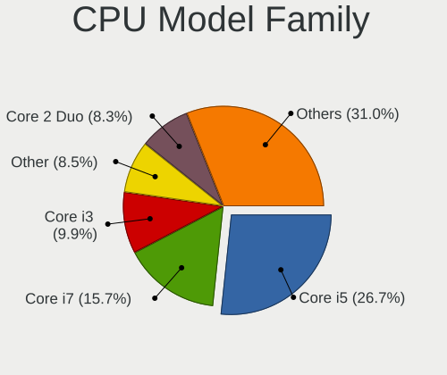

| Model                                | Computers | Percent |
|--------------------------------------|-----------|---------|
| Intel Core i5                        | 129       | 26.65%  |
| Intel Core i7                        | 76        | 15.7%   |
| Intel Core i3                        | 48        | 9.92%   |
| Other                                | 41        | 8.47%   |
| Intel Core 2 Duo                     | 40        | 8.26%   |
| AMD Ryzen 5                          | 23        | 4.75%   |
| Intel Celeron                        | 22        | 4.55%   |
| AMD Ryzen 7                          | 15        | 3.1%    |
| Intel Xeon                           | 9         | 1.86%   |
| Intel Pentium                        | 9         | 1.86%   |
| AMD Ryzen 9                          | 6         | 1.24%   |
| AMD A8                               | 5         | 1.03%   |
| Intel Core i9                        | 4         | 0.83%   |
| Intel Atom                           | 4         | 0.83%   |
| AMD Ryzen 3                          | 4         | 0.83%   |
| AMD A10                              | 4         | 0.83%   |
| Intel Pentium Silver                 | 3         | 0.62%   |
| Intel Pentium Dual-Core              | 3         | 0.62%   |
| Intel Pentium Dual                   | 3         | 0.62%   |
| Intel Core M                         | 3         | 0.62%   |
| AMD E                                | 3         | 0.62%   |
| Intel Genuine                        | 2         | 0.41%   |
| Intel Core m3                        | 2         | 0.41%   |
| Intel Core                           | 2         | 0.41%   |
| AMD Ryzen 5 PRO                      | 2         | 0.41%   |
| AMD PRO A10                          | 2         | 0.41%   |
| AMD Phenom II X4                     | 2         | 0.41%   |
| AMD FX                               | 2         | 0.41%   |
| AMD E1                               | 2         | 0.41%   |
| Intel Core m5                        | 1         | 0.21%   |
| Intel Core 2 Extreme                 | 1         | 0.21%   |
| Intel Celeron Dual-Core              | 1         | 0.21%   |
| CentaurHauls VIA Nano                | 1         | 0.21%   |
| AMD Turion II Ultra Dual-Core Mobile | 1         | 0.21%   |
| AMD Turion II Dual-Core              | 1         | 0.21%   |
| AMD Turion II                        | 1         | 0.21%   |
| AMD Turion                           | 1         | 0.21%   |
| AMD Ryzen 7 PRO                      | 1         | 0.21%   |
| AMD PRO A8                           | 1         | 0.21%   |
| AMD E2                               | 1         | 0.21%   |

CPU Cores
---------

Number of processor cores

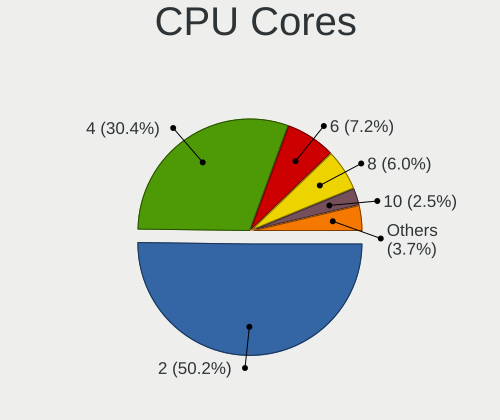

| Number | Computers | Percent |
|--------|-----------|---------|
| 2      | 243       | 50.21%  |
| 4      | 147       | 30.37%  |
| 6      | 35        | 7.23%   |
| 8      | 29        | 5.99%   |
| 10     | 12        | 2.48%   |
| 12     | 9         | 1.86%   |
| 16     | 3         | 0.62%   |
| 14     | 2         | 0.41%   |
| 28     | 1         | 0.21%   |
| 24     | 1         | 0.21%   |
| 3      | 1         | 0.21%   |
| 1      | 1         | 0.21%   |

CPU Sockets
-----------

Number of sockets

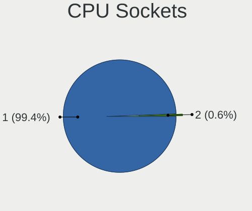

| Number | Computers | Percent |
|--------|-----------|---------|
| 1      | 480       | 99.38%  |
| 2      | 3         | 0.62%   |

CPU Threads
-----------

Threads per core (Hyper-Threading)

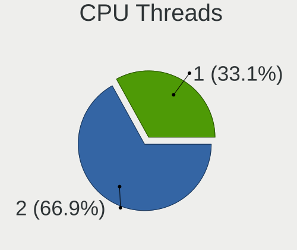

| Number | Computers | Percent |
|--------|-----------|---------|
| 2      | 324       | 66.94%  |
| 1      | 160       | 33.06%  |

CPU Op-Modes
------------

CPU Operation Modes (32-bit, 64-bit)

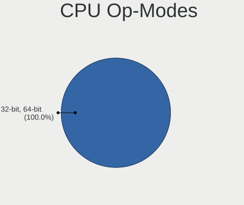

| Op mode        | Computers | Percent |
|----------------|-----------|---------|
| 32-bit, 64-bit | 483       | 100%    |

CPU Microcode
-------------

Microcode number

| Number  | Computers | Percent |
|---------|-----------|---------|
| Unknown | 483       | 100%    |

CPU Microarch
-------------

Microarchitecture

| Name               | Computers | Percent |
|--------------------|-----------|---------|
| KabyLake           | 61        | 12.63%  |
| IvyBridge          | 55        | 11.39%  |
| Unknown            | 53        | 10.97%  |
| Haswell            | 45        | 9.32%   |
| SandyBridge        | 43        | 8.9%    |
| Penryn             | 43        | 8.9%    |
| Skylake            | 24        | 4.97%   |
| Broadwell          | 24        | 4.97%   |
| Westmere           | 16        | 3.31%   |
| Zen 3              | 11        | 2.28%   |
| TigerLake          | 11        | 2.28%   |
| Goldmont plus      | 11        | 2.28%   |
| Silvermont         | 10        | 2.07%   |
| Core               | 9         | 1.86%   |
| Zen 2              | 7         | 1.45%   |
| CometLake          | 7         | 1.45%   |
| Zen+               | 6         | 1.24%   |
| Puma               | 6         | 1.24%   |
| Nehalem            | 6         | 1.24%   |
| Excavator          | 6         | 1.24%   |
| K10                | 5         | 1.04%   |
| Piledriver         | 4         | 0.83%   |
| Goldmont           | 3         | 0.62%   |
| Bobcat             | 3         | 0.62%   |
| Zen                | 2         | 0.41%   |
| Steamroller        | 2         | 0.41%   |
| Jaguar             | 2         | 0.41%   |
| Icelake            | 2         | 0.41%   |
| Alderlake Hybrid   | 2         | 0.41%   |
| Lunarlake Hybrid   | 1         | 0.21%   |
| K8 & K10 hybrid    | 1         | 0.21%   |
| K10 Llano          | 1         | 0.21%   |
| ArrowLake-H Hybrid | 1         | 0.21%   |

Graphics
--------

GPU Vendor
----------

Vendors of graphics cards

| Vendor              | Computers | Percent |
|---------------------|-----------|---------|
| Intel               | 304       | 54.19%  |
| Nvidia              | 128       | 22.82%  |
| AMD                 | 126       | 22.46%  |
| VIA Technologies    | 2         | 0.36%   |
| Huawei Technologies | 1         | 0.18%   |

GPU Model
---------

Graphics card models

| Model                                                                                    | Computers | Percent |
|------------------------------------------------------------------------------------------|-----------|---------|
| Intel 2nd Generation Core Processor Family Integrated Graphics Controller                | 42        | 7.37%   |
| Intel 3rd Gen Core processor Graphics Controller                                         | 35        | 6.14%   |
| Intel Haswell-ULT Integrated Graphics Controller                                         | 20        | 3.51%   |
| Intel Skylake-U GT2 [HD Graphics 520]                                                    | 12        | 2.11%   |
| Intel Core Processor Integrated Graphics Controller                                      | 11        | 1.93%   |
| Intel Broadwell-U GT2 [HD Graphics 5500]                                                 | 11        | 1.93%   |
| Intel Kaby Lake-R GT2 [UHD Graphics 620]                                                 | 10        | 1.75%   |
| Intel Kaby Lake-U GT2 [HD Graphics 620]                                                  | 9         | 1.58%   |
| Intel GeminiLake [UHD Graphics 600]                                                      | 9         | 1.58%   |
| AMD Mendocino [Radeon 610M]                                                              | 9         | 1.58%   |
| Intel Mobile 4 Series Chipset Integrated Graphics Controller                             | 8         | 1.4%    |
| Intel Atom/Celeron/Pentium Processor x5-E8000/J3xxx/N3xxx Integrated Graphics Controller | 8         | 1.4%    |
| Intel TigerLake-LP GT2 [Iris Xe Graphics]                                                | 7         | 1.23%   |
| Intel CoffeeLake-S GT2 [UHD Graphics 630]                                                | 7         | 1.23%   |
| Intel Broadwell-U GT3 [HD Graphics 6000]                                                 | 7         | 1.23%   |
| Nvidia GK107M [GeForce GT 650M Mac Edition]                                              | 6         | 1.05%   |
| Intel WhiskeyLake-U GT2 [UHD Graphics 620]                                               | 6         | 1.05%   |
| Intel CometLake-U GT2 [UHD Graphics]                                                     | 6         | 1.05%   |
| AMD Wani [Radeon R5/R6/R7 Graphics]                                                      | 6         | 1.05%   |
| Nvidia MCP89 [GeForce 320M]                                                              | 5         | 0.88%   |
| Nvidia GF117M [GeForce 610M/710M/810M/820M / GT 620M/625M/630M/720M]                     | 5         | 0.88%   |
| Nvidia C79 [GeForce 9400M]                                                               | 5         | 0.88%   |
| AMD Whistler [Radeon HD 6630M/6650M/6750M/7670M/7690M]                                   | 5         | 0.88%   |
| AMD RV730/M96-XT [Mobility Radeon HD 4670]                                               | 5         | 0.88%   |
| AMD Picasso/Raven 2 [Radeon Vega Series / Radeon Vega Mobile Series]                     | 5         | 0.88%   |
| Nvidia MCP7A [GeForce 9400]                                                              | 4         | 0.7%    |
| Intel Tiger Lake-LP GT2 [UHD Graphics G4]                                                | 4         | 0.7%    |
| Intel Skylake-S GT2 [HD Graphics 530]                                                    | 4         | 0.7%    |
| Intel Kaby Lake-S GT2 [HD Graphics 630]                                                  | 4         | 0.7%    |
| Intel 4th Generation Core Processor Family Integrated Graphics Controller                | 4         | 0.7%    |
| Intel 4th Gen Core Processor Integrated Graphics Controller                              | 4         | 0.7%    |
| AMD Topaz XT [Radeon R7 M260/M265 / M340/M360 / M440/M445 / 530/535 / 620/625 Mobile]    | 4         | 0.7%    |
| AMD RV630/M76 [Mobility Radeon HD 2600 XT/2700]                                          | 4         | 0.7%    |
| AMD Phoenix1                                                                             | 4         | 0.7%    |
| AMD Mullins [Radeon R4/R5 Graphics]                                                      | 4         | 0.7%    |
| AMD Ellesmere [Radeon RX 470/480/570/570X/580/580X/590]                                  | 4         | 0.7%    |
| AMD Barcelo                                                                              | 4         | 0.7%    |
| Nvidia TU117M [GeForce GTX 1650 Mobile / Max-Q]                                          | 3         | 0.53%   |
| Nvidia GP108M [GeForce MX250]                                                            | 3         | 0.53%   |
| Nvidia GP108M [GeForce MX150]                                                            | 3         | 0.53%   |

GPU Combo
---------

Combinations of graphics cards

| Name                    | Computers | Percent |
|-------------------------|-----------|---------|
| 1 x Intel               | 236       | 48.86%  |
| 1 x AMD                 | 101       | 20.91%  |
| 1 x Nvidia              | 71        | 14.7%   |
| Intel + Nvidia          | 48        | 9.94%   |
| Intel + AMD             | 9         | 1.86%   |
| AMD + Nvidia            | 9         | 1.86%   |
| 2 x AMD                 | 6         | 1.24%   |
| 1 x VIA                 | 2         | 0.41%   |
| 1 x Huawei Technologies | 1         | 0.21%   |

GPU Driver
----------

Free vs proprietary

| Driver      | Computers | Percent |
|-------------|-----------|---------|
| Free        | 438       | 90.68%  |
| Proprietary | 31        | 6.42%   |
| Unknown     | 14        | 2.9%    |

GPU Memory
----------

Total video memory

| Size in GB | Computers | Percent |
|------------|-----------|---------|
| Unknown    | 455       | 94.01%  |
| 7.01-8.0   | 6         | 1.24%   |
| 1.01-2.0   | 6         | 1.24%   |
| 8.01-16.0  | 5         | 1.03%   |
| 3.01-4.0   | 4         | 0.83%   |
| 0.51-1.0   | 4         | 0.83%   |
| 0.01-0.5   | 2         | 0.41%   |
| 5.01-6.0   | 1         | 0.21%   |
| 2.01-3.0   | 1         | 0.21%   |

Monitor
-------

Monitor Vendor
--------------

Monitor vendors

| Vendor                  | Computers | Percent |
|-------------------------|-----------|---------|
| Apple                   | 82        | 16.87%  |
| AU Optronics            | 61        | 12.55%  |
| LG Display              | 54        | 11.11%  |
| Samsung Electronics     | 45        | 9.26%   |
| BOE                     | 43        | 8.85%   |
| Chimei Innolux          | 32        | 6.58%   |
| Goldstar                | 16        | 3.29%   |
| Dell                    | 14        | 2.88%   |
| Hewlett-Packard         | 11        | 2.26%   |
| BenQ                    | 10        | 2.06%   |
| AOC                     | 9         | 1.85%   |
| Philips                 | 8         | 1.65%   |
| Lenovo                  | 7         | 1.44%   |
| Acer                    | 7         | 1.44%   |
| Panasonic               | 5         | 1.03%   |
| MSI                     | 5         | 1.03%   |
| Iiyama                  | 5         | 1.03%   |
| ViewSonic               | 4         | 0.82%   |
| Sharp                   | 4         | 0.82%   |
| Chi Mei Optoelectronics | 4         | 0.82%   |
| ASUSTek Computer        | 4         | 0.82%   |
| Insignia                | 3         | 0.62%   |
| CSOT                    | 3         | 0.62%   |
| Ancor Communications    | 3         | 0.62%   |
| Sony                    | 2         | 0.41%   |
| PANDA                   | 2         | 0.41%   |
| NEC Computers           | 2         | 0.41%   |
| ITE                     | 2         | 0.41%   |
| HKC                     | 2         | 0.41%   |
| HannStar                | 2         | 0.41%   |
| DENON                   | 2         | 0.41%   |
| WST                     | 1         | 0.21%   |
| Vizio                   | 1         | 0.21%   |
| Unknown (XXX)           | 1         | 0.21%   |
| Unknown                 | 1         | 0.21%   |
| TR_                     | 1         | 0.21%   |
| TMX                     | 1         | 0.21%   |
| SKG                     | 1         | 0.21%   |
| SGT                     | 1         | 0.21%   |
| Sceptre Tech            | 1         | 0.21%   |

Monitor Model
-------------

Monitor models

| Model                                                                | Computers | Percent |
|----------------------------------------------------------------------|-----------|---------|
| Apple Color LCD APP9CF0 1440x900 290x180mm 13.4-inch                 | 7         | 1.41%   |
| LG Display LCD Monitor LGD033A 1366x768 344x194mm 15.5-inch          | 5         | 1.01%   |
| Apple iMac APPA012 1920x1080 475x267mm 21.5-inch                     | 5         | 1.01%   |
| Apple Color LCD APP9CB5 2560x1440 597x336mm 27.0-inch                | 5         | 1.01%   |
| LG Display LCD Monitor LGD0456 1366x768 344x194mm 15.5-inch          | 4         | 0.8%    |
| Apple Color LCD APP9CBC 1920x1080 475x267mm 21.5-inch                | 4         | 0.8%    |
| Apple Color LCD APP9C6B 1680x1050 433x270mm 20.1-inch                | 4         | 0.8%    |
| LG Display LCD Monitor LGD038E 1366x768 344x194mm 15.5-inch          | 3         | 0.6%    |
| Chimei Innolux LCD Monitor CMN15E7 1920x1080 344x193mm 15.5-inch     | 3         | 0.6%    |
| AU Optronics LCD Monitor AUO405C 1366x768 256x144mm 11.6-inch        | 3         | 0.6%    |
| AU Optronics LCD Monitor AUO22EC 1366x768 344x193mm 15.5-inch        | 3         | 0.6%    |
| AU Optronics LCD Monitor AUO20EC 1366x768 344x193mm 15.5-inch        | 3         | 0.6%    |
| AU Optronics LCD Monitor AUO10EC 1366x768 344x193mm 15.5-inch        | 3         | 0.6%    |
| Apple LCD Monitor APP9CCB 1280x800 286x179mm 13.3-inch               | 3         | 0.6%    |
| Apple LCD Monitor APP9CC3 1280x800 286x179mm 13.3-inch               | 3         | 0.6%    |
| Apple Color LCD APPA01B 1440x900 286x179mm 13.3-inch                 | 3         | 0.6%    |
| Apple Color LCD APPA019 2880x1800 331x207mm 15.4-inch                | 3         | 0.6%    |
| Apple Color LCD APPA00E 2880x1800 331x207mm 15.4-inch                | 3         | 0.6%    |
| Apple Color LCD APP9CC9 1280x800 286x178mm 13.3-inch                 | 3         | 0.6%    |
| Apple Color LCD APP9CC7 1280x800 286x179mm 13.3-inch                 | 3         | 0.6%    |
| Samsung Electronics S24E390 SAM0C1A 1920x1080 521x293mm 23.5-inch    | 2         | 0.4%    |
| Samsung Electronics LU28R55 SAM1015 3840x2160 632x360mm 28.6-inch    | 2         | 0.4%    |
| Samsung Electronics LCD Monitor SEC3152 1366x768 344x194mm 15.5-inch | 2         | 0.4%    |
| Samsung Electronics LCD Monitor SDC3654 1600x900 382x215mm 17.3-inch | 2         | 0.4%    |
| Panasonic TV MEIA296 1920x1080 698x392mm 31.5-inch                   | 2         | 0.4%    |
| MSI G27C7 MSI3CC6 1920x1080 597x336mm 27.0-inch                      | 2         | 0.4%    |
| LG Display LCD Monitor LGD062E 1920x1080 344x194mm 15.5-inch         | 2         | 0.4%    |
| LG Display LCD Monitor LGD02DF 1600x900 310x174mm 14.0-inch          | 2         | 0.4%    |
| LG Display LCD Monitor LGD02DC 1366x768 344x194mm 15.5-inch          | 2         | 0.4%    |
| LG Display LCD Monitor LGD01E9 1920x1080 345x194mm 15.6-inch         | 2         | 0.4%    |
| Lenovo LEN LT2452pwC LEN1144 1920x1080 518x324mm 24.1-inch           | 2         | 0.4%    |
| Insignia TV BBY3223 1920x1080 697x392mm 31.5-inch                    | 2         | 0.4%    |
| HannStar LCD Monitor HSD0001 1920x1080 309x174mm 14.0-inch           | 2         | 0.4%    |
| Goldstar HDR WFHD GSM7714 2560x1080 798x334mm 34.1-inch              | 2         | 0.4%    |
| DENON AVR DON0070 3840x2160                                          | 2         | 0.4%    |
| Chimei Innolux LCD Monitor CMN15F5 1920x1080 344x193mm 15.5-inch     | 2         | 0.4%    |
| Chimei Innolux LCD Monitor CMN14D4 1920x1080 309x173mm 13.9-inch     | 2         | 0.4%    |
| Chimei Innolux LCD Monitor CMN14C3 1366x768 309x173mm 13.9-inch      | 2         | 0.4%    |
| Chimei Innolux LCD Monitor CMN142B 1920x1080 309x173mm 13.9-inch     | 2         | 0.4%    |
| BOE LCD Monitor BOE0A56 1920x1080 344x194mm 15.5-inch                | 2         | 0.4%    |

Monitor Resolution
------------------

Monitor screen resolution

| Resolution         | Computers | Percent |
|--------------------|-----------|---------|
| 1920x1080 (FHD)    | 191       | 39.87%  |
| 1366x768 (WXGA)    | 103       | 21.5%   |
| 3840x2160 (4K)     | 29        | 6.05%   |
| 1280x800 (WXGA)    | 21        | 4.38%   |
| 2560x1440 (QHD)    | 19        | 3.97%   |
| 1600x900 (HD+)     | 19        | 3.97%   |
| 1440x900 (WXGA+)   | 18        | 3.76%   |
| 1680x1050 (WSXGA+) | 13        | 2.71%   |
| 1920x1200 (WUXGA)  | 11        | 2.3%    |
| 2880x1800          | 10        | 2.09%   |
| 2560x1600          | 8         | 1.67%   |
| 2560x1080          | 6         | 1.25%   |
| 1280x1024 (SXGA)   | 6         | 1.25%   |
| 3440x1440          | 5         | 1.04%   |
| 2160x1440          | 3         | 0.63%   |
| 1920x540           | 3         | 0.63%   |
| 1360x768           | 3         | 0.63%   |
| Unknown            | 2         | 0.42%   |
| 3840x1080          | 1         | 0.21%   |
| 3280x1080          | 1         | 0.21%   |
| 3200x2000          | 1         | 0.21%   |
| 3000x2000          | 1         | 0.21%   |
| 2736x1824          | 1         | 0.21%   |
| 2304x1440          | 1         | 0.21%   |
| 1680x945           | 1         | 0.21%   |
| 1280x720 (HD)      | 1         | 0.21%   |
| 1024x768 (XGA)     | 1         | 0.21%   |

Monitor Diagonal
----------------

Diagonal size in inches

| Inches  | Computers | Percent |
|---------|-----------|---------|
| 15      | 138       | 28.28%  |
| 13      | 73        | 14.96%  |
| 27      | 37        | 7.58%   |
| 14      | 32        | 6.56%   |
| 24      | 26        | 5.33%   |
| 23      | 26        | 5.33%   |
| 21      | 25        | 5.12%   |
| 17      | 19        | 3.89%   |
| 31      | 13        | 2.66%   |
| 11      | 12        | 2.46%   |
| 20      | 11        | 2.25%   |
| 18      | 9         | 1.84%   |
| 34      | 7         | 1.43%   |
| 12      | 7         | 1.43%   |
| 22      | 6         | 1.23%   |
| 32      | 5         | 1.02%   |
| 19      | 5         | 1.02%   |
| Unknown | 5         | 1.02%   |
| 54      | 4         | 0.82%   |
| 16      | 4         | 0.82%   |
| 84      | 3         | 0.61%   |
| 74      | 3         | 0.61%   |
| 28      | 3         | 0.61%   |
| 26      | 3         | 0.61%   |
| 65      | 2         | 0.41%   |
| 63      | 2         | 0.41%   |
| 25      | 2         | 0.41%   |
| 72      | 1         | 0.2%    |
| 64      | 1         | 0.2%    |
| 57      | 1         | 0.2%    |
| 49      | 1         | 0.2%    |
| 40      | 1         | 0.2%    |
| 36      | 1         | 0.2%    |

Monitor Width
-------------

Physical width

| Width in mm | Computers | Percent |
|-------------|-----------|---------|
| 301-350     | 200       | 41.15%  |
| 501-600     | 90        | 18.52%  |
| 201-300     | 69        | 14.2%   |
| 401-500     | 53        | 10.91%  |
| 351-400     | 19        | 3.91%   |
| 601-700     | 18        | 3.7%    |
| 701-800     | 13        | 2.67%   |
| 1001-1500   | 11        | 2.26%   |
| 1501-2000   | 7         | 1.44%   |
| Unknown     | 5         | 1.03%   |
| 901-1000    | 1         | 0.21%   |

Aspect Ratio
------------

Proportional relationship between the width and the height

| Ratio   | Computers | Percent |
|---------|-----------|---------|
| 16/9    | 344       | 74.78%  |
| 16/10   | 90        | 19.57%  |
| 21/9    | 9         | 1.96%   |
| 5/4     | 7         | 1.52%   |
| 3/2     | 4         | 0.87%   |
| Unknown | 4         | 0.87%   |
| 4/3     | 1         | 0.22%   |
| 32/9    | 1         | 0.22%   |

Monitor Area
------------

Area in inch²

| Area in inch² | Computers | Percent |
|----------------|-----------|---------|
| 101-110        | 136       | 27.93%  |
| 81-90          | 78        | 16.02%  |
| 201-250        | 70        | 14.37%  |
| 301-350        | 39        | 8.01%   |
| 71-80          | 26        | 5.34%   |
| 351-500        | 26        | 5.34%   |
| 151-200        | 21        | 4.31%   |
| More than 1000 | 17        | 3.49%   |
| 251-300        | 14        | 2.87%   |
| 51-60          | 12        | 2.46%   |
| 121-130        | 12        | 2.46%   |
| 141-150        | 11        | 2.26%   |
| 61-70          | 7         | 1.44%   |
| 111-120        | 6         | 1.23%   |
| Unknown        | 5         | 1.03%   |
| 131-140        | 3         | 0.62%   |
| 501-1000       | 3         | 0.62%   |
| 91-100         | 1         | 0.21%   |

Pixel Density
-------------

Pixels per inch

| Density       | Computers | Percent |
|---------------|-----------|---------|
| 101-120       | 157       | 32.85%  |
| 121-160       | 134       | 28.03%  |
| 51-100        | 127       | 26.57%  |
| 161-240       | 39        | 8.16%   |
| 1-50          | 12        | 2.51%   |
| Unknown       | 5         | 1.05%   |
| More than 240 | 4         | 0.84%   |

Multiple Monitors
-----------------

Total monitors connected

| Total | Computers | Percent |
|-------|-----------|---------|
| 1     | 443       | 91.53%  |
| 2     | 39        | 8.06%   |
| 4     | 1         | 0.21%   |
| 3     | 1         | 0.21%   |

Network
-------

Net Controller Vendor
---------------------

Controller vendors

| Vendor                                | Computers | Percent |
|---------------------------------------|-----------|---------|
| Realtek Semiconductor                 | 219       | 29.55%  |
| Intel                                 | 175       | 23.62%  |
| Broadcom                              | 112       | 15.11%  |
| Qualcomm Atheros                      | 67        | 9.04%   |
| Broadcom Limited                      | 34        | 4.59%   |
| MediaTek                              | 26        | 3.51%   |
| Marvell Technology Group              | 17        | 2.29%   |
| Nvidia                                | 16        | 2.16%   |
| TP-Link                               | 14        | 1.89%   |
| Samsung Electronics                   | 7         | 0.94%   |
| ASIX Electronics                      | 7         | 0.94%   |
| Ralink                                | 5         | 0.67%   |
| Qualcomm                              | 5         | 0.67%   |
| Sierra Wireless                       | 3         | 0.4%    |
| Ralink Technology                     | 3         | 0.4%    |
| Xiaomi                                | 2         | 0.27%   |
| VIA Technologies                      | 2         | 0.27%   |
| Qualcomm Atheros Communications       | 2         | 0.27%   |
| NetGear                               | 2         | 0.27%   |
| Dell                                  | 2         | 0.27%   |
| 802.11g Adapter [Linksys WUSB54GC v3] | 2         | 0.27%   |
| Wacom                                 | 1         | 0.13%   |
| Realtek                               | 1         | 0.13%   |
| Qualcomm Technologies                 | 1         | 0.13%   |
| OnePlus Technology (Shenzhen)         | 1         | 0.13%   |
| Motorola PCS                          | 1         | 0.13%   |
| Motorcomm Microelectronics.           | 1         | 0.13%   |
| Microsoft                             | 1         | 0.13%   |
| Lenovo                                | 1         | 0.13%   |
| ICS Advent                            | 1         | 0.13%   |
| Huawei Technologies                   | 1         | 0.13%   |
| Google                                | 1         | 0.13%   |
| Edimax Technology                     | 1         | 0.13%   |
| D-Link System                         | 1         | 0.13%   |
| BUFFALO                               | 1         | 0.13%   |
| Belkin Components                     | 1         | 0.13%   |
| AVM                                   | 1         | 0.13%   |
| ASUSTek Computer                      | 1         | 0.13%   |
| Aquantia                              | 1         | 0.13%   |
| Unknown                               | 1         | 0.13%   |

Net Controller Model
--------------------

Controller models

| Model                                                                  | Computers | Percent |
|------------------------------------------------------------------------|-----------|---------|
| Realtek RTL8111/8168/8211/8411 PCI Express Gigabit Ethernet Controller | 135       | 15.43%  |
| Realtek RTL810xE PCI Express Fast Ethernet controller                  | 33        | 3.77%   |
| Broadcom NetXtreme BCM57765 Gigabit Ethernet PCIe                      | 21        | 2.4%    |
| Intel Wireless 7265                                                    | 18        | 2.06%   |
| Intel 82579LM Gigabit Network Connection (Lewisville)                  | 18        | 2.06%   |
| Broadcom BCM4331 802.11a/b/g/n                                         | 18        | 2.06%   |
| Broadcom Limited BCM4360 802.11ac Dual Band Wireless Network Adapter   | 17        | 1.94%   |
| Realtek RTL8125 2.5GbE Controller                                      | 16        | 1.83%   |
| Nvidia MCP79 Ethernet                                                  | 16        | 1.83%   |
| Broadcom NetXtreme BCM57766 Gigabit Ethernet PCIe                      | 16        | 1.83%   |
| Qualcomm Atheros QCA9565 / AR9565 Wireless Network Adapter             | 13        | 1.49%   |
| Qualcomm Atheros AR928X Wireless Network Adapter (PCI-Express)         | 11        | 1.26%   |
| Intel Wireless 8265 / 8275                                             | 11        | 1.26%   |
| Realtek RTL8821CE 802.11ac PCIe Wireless Network Adapter               | 10        | 1.14%   |
| Broadcom BCM4322 802.11a/b/g/n Wireless LAN Controller                 | 10        | 1.14%   |
| MediaTek MT7922 802.11ax PCI Express Wireless Network Adapter          | 9         | 1.03%   |
| Qualcomm Atheros AR9485 Wireless Network Adapter                       | 8         | 0.91%   |
| Qualcomm Atheros AR9285 Wireless Network Adapter (PCI-Express)         | 8         | 0.91%   |
| MediaTek MT7921 802.11ax PCIe Wireless Network Adapter [Filogic 330]   | 8         | 0.91%   |
| Intel Wi-Fi 6 AX201                                                    | 8         | 0.91%   |
| Intel Dual Band Wireless-AC 3165 Plus Bluetooth                        | 8         | 0.91%   |
| Broadcom NetXtreme BCM5764M Gigabit Ethernet PCIe                      | 8         | 0.91%   |
| Broadcom Limited BCM4331 802.11a/b/g/n                                 | 8         | 0.91%   |
| Broadcom BCM4360 802.11ac Dual Band Wireless Network Adapter           | 8         | 0.91%   |
| Broadcom BCM43224 802.11a/b/g/n                                        | 8         | 0.91%   |
| Broadcom BCM4313 802.11bgn Wireless Network Adapter                    | 8         | 0.91%   |
| Realtek RTL8188FTV 802.11b/g/n 1T1R 2.4G WLAN Adapter                  | 7         | 0.8%    |
| Realtek RTL8153 Gigabit Ethernet Adapter                               | 7         | 0.8%    |
| Realtek 802.11ac NIC                                                   | 7         | 0.8%    |
| Marvell Group 88E8058 PCI-E Gigabit Ethernet Controller                | 7         | 0.8%    |
| Intel Wi-Fi 6 AX200                                                    | 7         | 0.8%    |
| Broadcom NetLink BCM57785 Gigabit Ethernet PCIe                        | 7         | 0.8%    |
| Broadcom BCM4321 802.11a/b/g/n                                         | 7         | 0.8%    |
| Broadcom BCM43142 802.11b/g/n                                          | 7         | 0.8%    |
| ASIX AX88179 Gigabit Ethernet                                          | 7         | 0.8%    |
| Samsung Galaxy series, misc. (tethering mode)                          | 6         | 0.69%   |
| Realtek RTL8852BE PCIe 802.11ax Wireless Network Controller            | 6         | 0.69%   |
| Realtek RTL8822CE 802.11ac PCIe Wireless Network Adapter               | 6         | 0.69%   |
| Intel Wi-Fi 6E(802.11ax) AX210/AX1675* 2x2 [Typhoon Peak]              | 6         | 0.69%   |
| Intel Centrino Advanced-N 6205 [Taylor Peak]                           | 6         | 0.69%   |

Wireless Vendor
---------------

Wireless vendors

| Vendor                                | Computers | Percent |
|---------------------------------------|-----------|---------|
| Intel                                 | 135       | 30.82%  |
| Broadcom                              | 82        | 18.72%  |
| Realtek Semiconductor                 | 60        | 13.7%   |
| Qualcomm Atheros                      | 59        | 13.47%  |
| Broadcom Limited                      | 31        | 7.08%   |
| MediaTek                              | 23        | 5.25%   |
| TP-Link                               | 14        | 3.2%    |
| Ralink                                | 5         | 1.14%   |
| Marvell Technology Group              | 5         | 1.14%   |
| Sierra Wireless                       | 3         | 0.68%   |
| Ralink Technology                     | 3         | 0.68%   |
| Qualcomm Atheros Communications       | 2         | 0.46%   |
| Qualcomm                              | 2         | 0.46%   |
| NetGear                               | 2         | 0.46%   |
| 802.11g Adapter [Linksys WUSB54GC v3] | 2         | 0.46%   |
| Wacom                                 | 1         | 0.23%   |
| Realtek                               | 1         | 0.23%   |
| Microsoft                             | 1         | 0.23%   |
| Edimax Technology                     | 1         | 0.23%   |
| Dell                                  | 1         | 0.23%   |
| D-Link System                         | 1         | 0.23%   |
| BUFFALO                               | 1         | 0.23%   |
| Belkin Components                     | 1         | 0.23%   |
| AVM                                   | 1         | 0.23%   |
| ASUSTek Computer                      | 1         | 0.23%   |

Wireless Model
--------------

Wireless models

| Model                                                                | Computers | Percent |
|----------------------------------------------------------------------|-----------|---------|
| Intel Wireless 7265                                                  | 18        | 4.05%   |
| Broadcom BCM4331 802.11a/b/g/n                                       | 18        | 4.05%   |
| Broadcom Limited BCM4360 802.11ac Dual Band Wireless Network Adapter | 17        | 3.83%   |
| Qualcomm Atheros QCA9565 / AR9565 Wireless Network Adapter           | 13        | 2.93%   |
| Qualcomm Atheros AR928X Wireless Network Adapter (PCI-Express)       | 11        | 2.48%   |
| Intel Wireless 8265 / 8275                                           | 11        | 2.48%   |
| Realtek RTL8821CE 802.11ac PCIe Wireless Network Adapter             | 10        | 2.25%   |
| Broadcom BCM4322 802.11a/b/g/n Wireless LAN Controller               | 10        | 2.25%   |
| Qualcomm Atheros AR9485 Wireless Network Adapter                     | 8         | 1.8%    |
| Qualcomm Atheros AR9285 Wireless Network Adapter (PCI-Express)       | 8         | 1.8%    |
| MediaTek MT7921 802.11ax PCIe Wireless Network Adapter [Filogic 330] | 8         | 1.8%    |
| Intel Wi-Fi 6 AX201                                                  | 8         | 1.8%    |
| Intel Dual Band Wireless-AC 3165 Plus Bluetooth                      | 8         | 1.8%    |
| Broadcom Limited BCM4331 802.11a/b/g/n                               | 8         | 1.8%    |
| Broadcom BCM4360 802.11ac Dual Band Wireless Network Adapter         | 8         | 1.8%    |
| Broadcom BCM43224 802.11a/b/g/n                                      | 8         | 1.8%    |
| Broadcom BCM4313 802.11bgn Wireless Network Adapter                  | 8         | 1.8%    |
| Realtek RTL8188FTV 802.11b/g/n 1T1R 2.4G WLAN Adapter                | 7         | 1.58%   |
| Realtek 802.11ac NIC                                                 | 7         | 1.58%   |
| MediaTek MT7922 802.11ax PCI Express Wireless Network Adapter        | 7         | 1.58%   |
| Intel Wi-Fi 6 AX200                                                  | 7         | 1.58%   |
| Broadcom BCM4321 802.11a/b/g/n                                       | 7         | 1.58%   |
| Broadcom BCM43142 802.11b/g/n                                        | 7         | 1.58%   |
| Realtek RTL8822CE 802.11ac PCIe Wireless Network Adapter             | 6         | 1.35%   |
| Intel Wi-Fi 6E(802.11ax) AX210/AX1675* 2x2 [Typhoon Peak]            | 6         | 1.35%   |
| Intel Centrino Advanced-N 6205 [Taylor Peak]                         | 6         | 1.35%   |
| MediaTek MT7902 802.11ax PCIe Wireless Network Adapter [Filogic 310] | 5         | 1.13%   |
| Marvell Group 88W8897 [AVASTAR] 802.11ac Wireless                    | 5         | 1.13%   |
| Intel Wireless 3165                                                  | 5         | 1.13%   |
| Intel Comet Lake PCH-LP CNVi WiFi                                    | 5         | 1.13%   |
| Intel Cannon Point-LP CNVi [Wireless-AC]                             | 5         | 1.13%   |
| Realtek RTL8852BE PCIe 802.11ax Wireless Network Controller          | 4         | 0.9%    |
| Realtek RTL8822BE 802.11a/b/g/n/ac WiFi adapter                      | 4         | 0.9%    |
| Realtek RTL8723BE PCIe Wireless Network Adapter                      | 4         | 0.9%    |
| Realtek RTL8188EUS 802.11n Wireless Network Adapter                  | 4         | 0.9%    |
| Qualcomm Atheros QCA6174 802.11ac Wireless Network Adapter           | 4         | 0.9%    |
| Intel Wireless 8260                                                  | 4         | 0.9%    |
| Intel Comet Lake PCH CNVi WiFi                                       | 4         | 0.9%    |
| Intel Centrino Wireless-N 2230                                       | 4         | 0.9%    |
| Intel Centrino Wireless-N 1030 [Rainbow Peak]                        | 4         | 0.9%    |

Ethernet Vendor
---------------

Ethernet vendors

| Vendor                        | Computers | Percent |
|-------------------------------|-----------|---------|
| Realtek Semiconductor         | 188       | 44.98%  |
| Intel                         | 82        | 19.62%  |
| Broadcom                      | 66        | 15.79%  |
| Nvidia                        | 16        | 3.83%   |
| Qualcomm Atheros              | 15        | 3.59%   |
| Marvell Technology Group      | 12        | 2.87%   |
| Samsung Electronics           | 7         | 1.67%   |
| ASIX Electronics              | 7         | 1.67%   |
| MediaTek                      | 5         | 1.2%    |
| Qualcomm                      | 3         | 0.72%   |
| Broadcom Limited              | 3         | 0.72%   |
| Xiaomi                        | 2         | 0.48%   |
| VIA Technologies              | 2         | 0.48%   |
| Qualcomm Technologies         | 1         | 0.24%   |
| OnePlus Technology (Shenzhen) | 1         | 0.24%   |
| Motorola PCS                  | 1         | 0.24%   |
| Motorcomm Microelectronics.   | 1         | 0.24%   |
| Lenovo                        | 1         | 0.24%   |
| ICS Advent                    | 1         | 0.24%   |
| Huawei Technologies           | 1         | 0.24%   |
| Google                        | 1         | 0.24%   |
| Aquantia                      | 1         | 0.24%   |
| Unknown                       | 1         | 0.24%   |

Ethernet Model
--------------

Ethernet models

| Model                                                                  | Computers | Percent |
|------------------------------------------------------------------------|-----------|---------|
| Realtek RTL8111/8168/8211/8411 PCI Express Gigabit Ethernet Controller | 135       | 31.4%   |
| Realtek RTL810xE PCI Express Fast Ethernet controller                  | 33        | 7.67%   |
| Broadcom NetXtreme BCM57765 Gigabit Ethernet PCIe                      | 21        | 4.88%   |
| Intel 82579LM Gigabit Network Connection (Lewisville)                  | 18        | 4.19%   |
| Realtek RTL8125 2.5GbE Controller                                      | 16        | 3.72%   |
| Nvidia MCP79 Ethernet                                                  | 16        | 3.72%   |
| Broadcom NetXtreme BCM57766 Gigabit Ethernet PCIe                      | 16        | 3.72%   |
| Broadcom NetXtreme BCM5764M Gigabit Ethernet PCIe                      | 8         | 1.86%   |
| Realtek RTL8153 Gigabit Ethernet Adapter                               | 7         | 1.63%   |
| Marvell Group 88E8058 PCI-E Gigabit Ethernet Controller                | 7         | 1.63%   |
| Broadcom NetLink BCM57785 Gigabit Ethernet PCIe                        | 7         | 1.63%   |
| ASIX AX88179 Gigabit Ethernet                                          | 7         | 1.63%   |
| Samsung Galaxy series, misc. (tethering mode)                          | 6         | 1.4%    |
| Broadcom NetXtreme BCM57786 Gigabit Ethernet PCIe                      | 6         | 1.4%    |
| Intel Ethernet Connection I219-LM                                      | 5         | 1.16%   |
| Intel Ethernet Connection (4) I219-LM                                  | 5         | 1.16%   |
| Qualcomm Atheros AR8151 v2.0 Gigabit Ethernet                          | 4         | 0.93%   |
| Intel Ethernet Controller I225-V                                       | 4         | 0.93%   |
| Intel Ethernet Connection (7) I219-LM                                  | 4         | 0.93%   |
| Intel Ethernet Connection (2) I219-V                                   | 4         | 0.93%   |
| Marvell Group 88E8040 PCI-E Fast Ethernet Controller                   | 3         | 0.7%    |
| Intel Ethernet Connection I217-LM                                      | 3         | 0.7%    |
| Intel Ethernet Connection (7) I219-V                                   | 3         | 0.7%    |
| Intel Ethernet Connection (5) I219-LM                                  | 3         | 0.7%    |
| Intel Ethernet Connection (4) I219-V                                   | 3         | 0.7%    |
| Intel Ethernet Connection (3) I218-LM                                  | 3         | 0.7%    |
| Intel Ethernet Connection (2) I219-LM                                  | 3         | 0.7%    |
| Xiaomi Mi/Redmi series (RNDIS)                                         | 2         | 0.47%   |
| Realtek RTL8852BE PCIe 802.11ax Wireless Network Controller            | 2         | 0.47%   |
| Qualcomm Atheros QCA8171 Gigabit Ethernet                              | 2         | 0.47%   |
| Qualcomm Atheros AR8152 v2.0 Fast Ethernet                             | 2         | 0.47%   |
| Qualcomm Atheros AR8131 Gigabit Ethernet                               | 2         | 0.47%   |
| MediaTek MT7922 802.11ax PCI Express Wireless Network Adapter          | 2         | 0.47%   |
| MediaTek Infinix HOT 50i                                               | 2         | 0.47%   |
| Intel I211 Gigabit Network Connection                                  | 2         | 0.47%   |
| Intel Ethernet Connection (3) I218-V                                   | 2         | 0.47%   |
| Intel Alder Lake-P PCH CNVi WiFi                                       | 2         | 0.47%   |
| Intel 82579V Gigabit Network Connection                                | 2         | 0.47%   |
| Intel 82577LM Gigabit Network Connection                               | 2         | 0.47%   |
| Broadcom NetXtreme BCM5762 Gigabit Ethernet PCIe                       | 2         | 0.47%   |

Net Controller Kind
-------------------

Ethernet, WiFi or modem

| Kind     | Computers | Percent |
|----------|-----------|---------|
| WiFi     | 421       | 51.59%  |
| Ethernet | 394       | 48.28%  |
| Modem    | 1         | 0.12%   |

Used Controller
---------------

Currently used network controller

| Kind     | Computers | Percent |
|----------|-----------|---------|
| WiFi     | 356       | 68.86%  |
| Ethernet | 161       | 31.14%  |

NICs
----

Total network controllers on board

| Total | Computers | Percent |
|-------|-----------|---------|
| 2     | 292       | 60.46%  |
| 1     | 179       | 37.06%  |
| 0     | 7         | 1.45%   |
| 3     | 5         | 1.04%   |

IPv6
----

IPv6 vs IPv4

| Used | Computers | Percent |
|------|-----------|---------|
| No   | 284       | 58.68%  |
| Yes  | 200       | 41.32%  |

Bluetooth
---------

Bluetooth Vendor
----------------

Controller vendors

| Vendor                          | Computers | Percent |
|---------------------------------|-----------|---------|
| Intel                           | 121       | 32.61%  |
| Apple                           | 92        | 24.8%   |
| Realtek Semiconductor           | 36        | 9.7%    |
| Foxconn / Hon Hai               | 21        | 5.66%   |
| Qualcomm Atheros Communications | 16        | 4.31%   |
| IMC Networks                    | 16        | 4.31%   |
| Broadcom                        | 12        | 3.23%   |
| Cambridge Silicon Radio         | 11        | 2.96%   |
| Lite-On Technology              | 9         | 2.43%   |
| Dell                            | 7         | 1.89%   |
| MediaTek                        | 6         | 1.62%   |
| Marvell Semiconductor           | 5         | 1.35%   |
| Unknown                         | 5         | 1.35%   |
| Toshiba                         | 4         | 1.08%   |
| Ralink                          | 2         | 0.54%   |
| Hewlett-Packard                 | 2         | 0.54%   |
| Alps Electric                   | 2         | 0.54%   |
| USI                             | 1         | 0.27%   |
| TP-Link                         | 1         | 0.27%   |
| ASUSTek Computer                | 1         | 0.27%   |
| Actions                         | 1         | 0.27%   |

Bluetooth Model
---------------

Controller models

| Model                                               | Computers | Percent |
|-----------------------------------------------------|-----------|---------|
| Intel Bluetooth wireless interface                  | 51        | 13.75%  |
| Apple Bluetooth Host Controller                     | 42        | 11.32%  |
| Realtek Bluetooth Radio                             | 24        | 6.47%   |
| Apple Bluetooth USB Host Controller                 | 23        | 6.2%    |
| Apple Built-in Bluetooth 2.0+EDR HCI                | 19        | 5.12%   |
| Intel AX201 Bluetooth                               | 18        | 4.85%   |
| Intel Bluetooth 9460/9560 Jefferson Peak (JfP)      | 16        | 4.31%   |
| Cambridge Silicon Radio Bluetooth Dongle (HCI mode) | 11        | 2.96%   |
| IMC Networks Wireless_Device                        | 10        | 2.7%    |
| Intel Bluetooth Device                              | 8         | 2.16%   |
| Apple Bluetooth HCI                                 | 8         | 2.16%   |
| Qualcomm Atheros  Bluetooth Device                  | 7         | 1.89%   |
| Intel AX200 Bluetooth                               | 7         | 1.89%   |
| MediaTek Wireless_Device                            | 6         | 1.62%   |
| Intel Centrino Bluetooth Wireless Transceiver       | 6         | 1.62%   |
| Intel Centrino Advanced-N 6230 Bluetooth adapter    | 6         | 1.62%   |
| Intel AX210 Bluetooth                               | 6         | 1.62%   |
| Foxconn / Hon Hai Bluetooth Device                  | 6         | 1.62%   |
| Realtek  Bluetooth 4.2 Adapter                      | 5         | 1.35%   |
| Unknown                                             | 5         | 1.35%   |
| Marvell Bluetooth and Wireless LAN Composite        | 4         | 1.08%   |
| IMC Networks Bluetooth Radio                        | 4         | 1.08%   |
| Foxconn / Hon Hai Wireless_Device                   | 4         | 1.08%   |
| Dell DW375 Bluetooth Module                         | 4         | 1.08%   |
| Qualcomm Atheros AR3012 Bluetooth 4.0               | 3         | 0.81%   |
| Qualcomm Atheros AR3011 Bluetooth                   | 3         | 0.81%   |
| Lite-On Wireless_Device                             | 3         | 0.81%   |
| Lite-On Atheros AR3012 Bluetooth                    | 3         | 0.81%   |
| Foxconn / Hon Hai Broadcom Bluetooth 2.1 Device     | 3         | 0.81%   |
| Broadcom BCM43142A0 Bluetooth Device                | 3         | 0.81%   |
| Realtek Bluetooth 5.4 Radio                         | 2         | 0.54%   |
| Realtek Bluetooth 5.3 Radio                         | 2         | 0.54%   |
| Ralink RT3290 Bluetooth                             | 2         | 0.54%   |
| Intel Wireless-AC 3168 Bluetooth                    | 2         | 0.54%   |
| Foxconn / Hon Hai MediaTek Bluetooth Adapter        | 2         | 0.54%   |
| Foxconn / Hon Hai Bluetooth USB Host Controller     | 2         | 0.54%   |
| Broadcom HP Portable SoftSailing                    | 2         | 0.54%   |
| Broadcom BCM20702A0 Bluetooth 4.0                   | 2         | 0.54%   |
| Broadcom BCM20702 Bluetooth 4.0 [ThinkPad]          | 2         | 0.54%   |
| USI Bluetooth Device                                | 1         | 0.27%   |

Sound
-----

Sound Vendor
------------

Sound card vendors

| Vendor                                       | Computers | Percent |
|----------------------------------------------|-----------|---------|
| Intel                                        | 370       | 58.64%  |
| AMD                                          | 119       | 18.86%  |
| Nvidia                                       | 101       | 16.01%  |
| C-Media Electronics                          | 7         | 1.11%   |
| Generalplus Technology                       | 4         | 0.63%   |
| VIA Technologies                             | 3         | 0.48%   |
| Logitech                                     | 3         | 0.48%   |
| Texas Instruments                            | 2         | 0.32%   |
| Plantronics                                  | 2         | 0.32%   |
| Micro Star International                     | 2         | 0.32%   |
| Creative Labs                                | 2         | 0.32%   |
| Zoran Co. Personal Media Division (Nogatech) | 1         | 0.16%   |
| Yamaha                                       | 1         | 0.16%   |
| Thesycon Systemsoftware & Consulting         | 1         | 0.16%   |
| Realtek Semiconductor                        | 1         | 0.16%   |
| Nordic Semiconductor ASA                     | 1         | 0.16%   |
| MUTEC                                        | 1         | 0.16%   |
| Kingston Technology                          | 1         | 0.16%   |
| JMTek                                        | 1         | 0.16%   |
| Hewlett-Packard                              | 1         | 0.16%   |
| GN Netcom                                    | 1         | 0.16%   |
| CMTECK                                       | 1         | 0.16%   |
| Cambridge Silicon Radio                      | 1         | 0.16%   |
| Cambridge Audio                              | 1         | 0.16%   |
| BEHRINGER International                      | 1         | 0.16%   |
| ASUSTek Computer                             | 1         | 0.16%   |
| Areson Technology                            | 1         | 0.16%   |

Sound Model
-----------

Sound card models

| Model                                                                                             | Computers | Percent |
|---------------------------------------------------------------------------------------------------|-----------|---------|
| Intel 7 Series/C216 Chipset Family High Definition Audio Controller                               | 54        | 7.03%   |
| AMD Ryzen HD Audio Controller                                                                     | 43        | 5.6%    |
| Intel 6 Series/C200 Series Chipset Family High Definition Audio Controller                        | 42        | 5.47%   |
| Intel Sunrise Point-LP HD Audio                                                                   | 37        | 4.82%   |
| AMD Radeon High Definition Audio Controller                                                       | 24        | 3.13%   |
| Intel Broadwell-U Audio Controller                                                                | 23        | 2.99%   |
| Intel 8 Series/C220 Series Chipset High Definition Audio Controller                               | 22        | 2.86%   |
| Intel Wildcat Point-LP High Definition Audio Controller                                           | 21        | 2.73%   |
| Intel Haswell-ULT HD Audio Controller                                                             | 21        | 2.73%   |
| Intel 8 Series HD Audio Controller                                                                | 21        | 2.73%   |
| Intel 5 Series/3400 Series Chipset High Definition Audio                                          | 17        | 2.21%   |
| Nvidia MCP79 High Definition Audio                                                                | 16        | 2.08%   |
| AMD Kabini HDMI/DP Audio                                                                          | 14        | 1.82%   |
| AMD FCH Azalia Controller                                                                         | 14        | 1.82%   |
| Intel 82801I (ICH9 Family) HD Audio Controller                                                    | 13        | 1.69%   |
| AMD Renoir/Cezanne HDMI/DP Audio Controller                                                       | 13        | 1.69%   |
| Nvidia GK107 HDMI Audio Controller                                                                | 12        | 1.56%   |
| Intel Cannon Lake PCH cAVS                                                                        | 12        | 1.56%   |
| Intel 100 Series/C230 Series Chipset Family HD Audio Controller                                   | 12        | 1.56%   |
| Intel Tiger Lake-LP Smart Sound Technology Audio Controller                                       | 11        | 1.43%   |
| Intel Celeron/Pentium Silver Processor High Definition Audio                                      | 11        | 1.43%   |
| AMD SBx00 Azalia (Intel HDA)                                                                      | 11        | 1.43%   |
| Intel Xeon E3-1200 v3/4th Gen Core Processor HD Audio Controller                                  | 10        | 1.3%    |
| Intel Raptor Lake High Definition Audio Controller                                                | 9         | 1.17%   |
| Intel 82801H (ICH8 Family) HD Audio Controller                                                    | 9         | 1.17%   |
| AMD RV710/730 HDMI Audio [Radeon HD 4000 series]                                                  | 8         | 1.04%   |
| Intel Cannon Point-LP High Definition Audio Controller                                            | 7         | 0.91%   |
| Intel Alder Lake PCH-P High Definition Audio Controller                                           | 7         | 0.91%   |
| Intel 200 Series PCH HD Audio                                                                     | 7         | 0.91%   |
| AMD Starship/Matisse HD Audio Controller                                                          | 7         | 0.91%   |
| AMD Raven/Raven2/Fenghuang HDMI/DP Audio Controller                                               | 7         | 0.91%   |
| Nvidia GP107GL High Definition Audio Controller                                                   | 6         | 0.78%   |
| Intel NM10/ICH7 Family High Definition Audio Controller                                           | 6         | 0.78%   |
| Intel Comet Lake PCH-LP cAVS                                                                      | 6         | 0.78%   |
| AMD Family 15h (Models 60h-6fh) Audio Controller                                                  | 6         | 0.78%   |
| Nvidia MCP89 High Definition Audio                                                                | 5         | 0.65%   |
| Nvidia GF108 High Definition Audio Controller                                                     | 5         | 0.65%   |
| Intel Crystal Well HD Audio Controller                                                            | 5         | 0.65%   |
| Intel Comet Lake PCH cAVS                                                                         | 5         | 0.65%   |
| Intel Atom/Celeron/Pentium Processor x5-E8000/J3xxx/N3xxx Series High Definition Audio Controller | 5         | 0.65%   |

Memory
------

Memory Vendor
-------------

Memory module vendors

| Vendor                       | Computers | Percent |
|------------------------------|-----------|---------|
| Samsung Electronics          | 8         | 17.78%  |
| SK hynix                     | 7         | 15.56%  |
| Micron Technology            | 7         | 15.56%  |
| Kingston                     | 6         | 13.33%  |
| Crucial                      | 3         | 6.67%   |
| Corsair                      | 3         | 6.67%   |
| Unknown                      | 2         | 4.44%   |
| Ramaxel Technology           | 2         | 4.44%   |
| Transcend                    | 1         | 2.22%   |
| Team                         | 1         | 2.22%   |
| Smart                        | 1         | 2.22%   |
| Patriot Memory (PDP Systems) | 1         | 2.22%   |
| Elpida                       | 1         | 2.22%   |
| AMD                          | 1         | 2.22%   |
| Unknown                      | 1         | 2.22%   |

Memory Model
------------

Memory module models

| Model                                                                | Computers | Percent |
|----------------------------------------------------------------------|-----------|---------|
| Unknown RAM Module 8GB SODIMM DDR3 1600MT/s                          | 1         | 2.22%   |
| Unknown RAM Module 2GB DIMM SDRAM 800MT/s                            | 1         | 2.22%   |
| Transcend RAM JM2666HSE-16G 16GB Row Of Chips DDR4 2667MT/s          | 1         | 2.22%   |
| Team RAM TEAMGROUP-UD3 8GB DIMM DDR3 1600MT/s                        | 1         | 2.22%   |
| Smart RAM SH5641G8FJ8NWRNSQG 8GB SODIMM DDR3 1600MT/s                | 1         | 2.22%   |
| SK hynix RAM Module 8GB Row Of Chips LPDDR3 2133MT/s                 | 1         | 2.22%   |
| SK hynix RAM Module 8GB DIMM DDR4 2667MT/s                           | 1         | 2.22%   |
| SK hynix RAM Module 4GB SODIMM DDR3 1600MT/s                         | 1         | 2.22%   |
| SK hynix RAM HMT41GS6BFR8C-PB 8GB SODIMM DDR3 1600MT/s               | 1         | 2.22%   |
| SK hynix RAM HMA851U6AFR6N-UH 4GB DIMM DDR4 2400MT/s                 | 1         | 2.22%   |
| SK hynix RAM HMA81GS6AFR8N-UH 8GB SODIMM DDR4 2667MT/s               | 1         | 2.22%   |
| SK hynix RAM H58G66AK6BX070 4GB Row Of Chips LPDDR5 6400MT/s         | 1         | 2.22%   |
| Samsung RAM UBE3D4AA-MGCR 2GB Row Of Chips LPDDR4 4267MT/s           | 1         | 2.22%   |
| Samsung RAM Module 2GB SODIMM DDR3 1067MT/s                          | 1         | 2.22%   |
| Samsung RAM M471B5173DB0-YK0 4GB SODIMM DDR3 1600MT/s                | 1         | 2.22%   |
| Samsung RAM M471A5244CB0-CWE 4GB Row Of Chips DDR4 3200MT/s          | 1         | 2.22%   |
| Samsung RAM M471A2G44BM0-CWE 16GB SODIMM DDR4 3200MT/s               | 1         | 2.22%   |
| Samsung RAM M425R2GA3PB0-CWMOD 16GiB SODIMM DDR5 5600MT/s            | 1         | 2.22%   |
| Samsung RAM M393A2G40DB0-CPB 16GB DIMM DDR4 2133MT/s                 | 1         | 2.22%   |
| Samsung RAM K3KL9L90CM-MGCT 8GB SODIMM LPDDR5 7500MT/s               | 1         | 2.22%   |
| Ramaxel RAM RMSA3260NA78HAF-2666 8GB SODIMM DDR4 2667MT/s            | 1         | 2.22%   |
| Ramaxel RAM RMSA3260ME78HAF-2666 8GB SODIMM DDR4 2667MT/s            | 1         | 2.22%   |
| Patriot Memory (PDP Systems) RAM 3200 Series 16GB DIMM DDR4 3200MT/s | 1         | 2.22%   |
| Micron RAM MT52L512M32D2PF-09 4GB Row Of Chips LPDDR3 2133MT/s       | 1         | 2.22%   |
| Micron RAM Module 8GB SODIMM DDR3 1600MT/s                           | 1         | 2.22%   |
| Micron RAM Module 4GB Row Of Chips LPDDR5 8533MT/s                   | 1         | 2.22%   |
| Micron RAM Module 16GB SODIMM DDR4 3200MT/s                          | 1         | 2.22%   |
| Micron RAM 4ATF51264HZ-2G3AZ 4GB SODIMM DDR4 2133MT/s                | 1         | 2.22%   |
| Micron RAM 16ATF2G64HZ-2G6E3 16GB SODIMM DDR4 2667MT/s               | 1         | 2.22%   |
| Micron RAM 16ATF2G64AZ-3G2J1 16GB DIMM DDR4 3200MT/s                 | 1         | 2.22%   |
| Kingston RAM Module 4GB SODIMM DDR3 1333MT/s                         | 1         | 2.22%   |
| Kingston RAM KCRXJ6-MIE 16GB SODIMM DDR4 2667MT/s                    | 1         | 2.22%   |
| Kingston RAM HP32D4S2S1MF-8 8GB SODIMM DDR4 3200MT/s                 | 1         | 2.22%   |
| Kingston RAM HP16D3LS1KFG/4G 4GB SODIMM DDR3 1600MT/s                | 1         | 2.22%   |
| Kingston RAM 99U5428-042.A00G 4GB SODIMM DDR3 1333MT/s               | 1         | 2.22%   |
| Kingston RAM 9905622-057.A00G 4096MB DIMM DDR4 2133MT/s              | 1         | 2.22%   |
| Elpida RAM EBJ41UF8BCS0-DJ-F 4GB SODIMM DDR3 1334MT/s                | 1         | 2.22%   |
| Crucial RAM Module 8GB SODIMM DDR3 1600MT/s                          | 1         | 2.22%   |
| Crucial RAM CT8G4SFS824A.C8FBD1 8GB SODIMM DDR4 2667MT/s             | 1         | 2.22%   |
| Crucial RAM CT16G4SFRA32A.M16FRS 16GB SODIMM DDR4 3200MT/s           | 1         | 2.22%   |

Memory Kind
-----------

Memory module kinds

| Kind   | Computers | Percent |
|--------|-----------|---------|
| DDR4   | 18        | 47.37%  |
| DDR3   | 10        | 26.32%  |
| LPDDR5 | 3         | 7.89%   |
| LPDDR3 | 2         | 5.26%   |
| DDR5   | 2         | 5.26%   |
| SDRAM  | 1         | 2.63%   |
| LPDDR4 | 1         | 2.63%   |
| DRAM   | 1         | 2.63%   |

Memory Form Factor
------------------

Physical design of the memory module

| Name         | Computers | Percent |
|--------------|-----------|---------|
| SODIMM       | 23        | 60.53%  |
| DIMM         | 9         | 23.68%  |
| Row Of Chips | 6         | 15.79%  |

Memory Size
-----------

Memory module size

| Size  | Computers | Percent |
|-------|-----------|---------|
| 8192  | 14        | 35.9%   |
| 16384 | 12        | 30.77%  |
| 4096  | 10        | 25.64%  |
| 2048  | 2         | 5.13%   |
| 32768 | 1         | 2.56%   |

Memory Speed
------------

Memory module speed

| Speed | Computers | Percent |
|-------|-----------|---------|
| 2667  | 8         | 18.6%   |
| 3200  | 7         | 16.28%  |
| 1600  | 7         | 16.28%  |
| 2133  | 5         | 11.63%  |
| 1333  | 3         | 6.98%   |
| 3600  | 2         | 4.65%   |
| 2400  | 2         | 4.65%   |
| 8533  | 1         | 2.33%   |
| 7500  | 1         | 2.33%   |
| 7200  | 1         | 2.33%   |
| 6400  | 1         | 2.33%   |
| 5600  | 1         | 2.33%   |
| 4267  | 1         | 2.33%   |
| 1334  | 1         | 2.33%   |
| 1067  | 1         | 2.33%   |
| 800   | 1         | 2.33%   |

Printers & scanners
-------------------

Printer Vendor
--------------

Printer device vendors

| Vendor              | Computers | Percent |
|---------------------|-----------|---------|
| Seiko Epson         | 2         | 40%     |
| Brother Industries  | 2         | 40%     |
| Samsung Electronics | 1         | 20%     |

Printer Model
-------------

Printer device models

| Model                            | Computers | Percent |
|----------------------------------|-----------|---------|
| Seiko Epson XP-4100 Series       | 1         | 20%     |
| Seiko Epson EPSON WF-3520 Series | 1         | 20%     |
| Samsung M2070 Series             | 1         | 20%     |
| Brother MFC-8440                 | 1         | 20%     |
| Brother HL-5450DN series         | 1         | 20%     |

Scanner Vendor
--------------

Scanner device vendors

Zero info for selected period =(

Scanner Model
-------------

Scanner device models

Zero info for selected period =(

Camera
------

Camera Vendor
-------------

Camera device vendors

| Vendor                                 | Computers | Percent |
|----------------------------------------|-----------|---------|
| Apple                                  | 66        | 20.5%   |
| Chicony Electronics                    | 44        | 13.66%  |
| Realtek Semiconductor                  | 26        | 8.07%   |
| Bison Electronics                      | 23        | 7.14%   |
| Sunplus Innovation Technology          | 19        | 5.9%    |
| Microdia                               | 17        | 5.28%   |
| Quanta                                 | 13        | 4.04%   |
| IMC Networks                           | 12        | 3.73%   |
| Suyin                                  | 11        | 3.42%   |
| Luxvisions Innotech Limited            | 11        | 3.42%   |
| Cheng Uei Precision Industry (Foxlink) | 11        | 3.42%   |
| Syntek                                 | 9         | 2.8%    |
| Alcor Micro                            | 6         | 1.86%   |
| Ricoh                                  | 5         | 1.55%   |
| Logitech                               | 5         | 1.55%   |
| Silicon Motion                         | 4         | 1.24%   |
| Lite-On Technology                     | 4         | 1.24%   |
| ShineTech                              | 3         | 0.93%   |
| Samsung Electronics                    | 3         | 0.93%   |
| Microsoft                              | 3         | 0.93%   |
| Z-Star Microelectronics                | 2         | 0.62%   |
| Lenovo                                 | 2         | 0.62%   |
| Jiangxi Shinetech Optical              | 2         | 0.62%   |
| Intel                                  | 2         | 0.62%   |
| icSpring                               | 2         | 0.62%   |
| Unknown                                | 2         | 0.62%   |
| WaveRider Communications               | 1         | 0.31%   |
| USB 4K Camera                          | 1         | 0.31%   |
| SunplusIT                              | 1         | 0.31%   |
| Sonix Technology                       | 1         | 0.31%   |
| Shine-optics                           | 1         | 0.31%   |
| Shenzhen Kingcome Optoelectronic       | 1         | 0.31%   |
| Remo Tech                              | 1         | 0.31%   |
| kingcome                               | 1         | 0.31%   |
| Importek                               | 1         | 0.31%   |
| HYGD-XH--241023                        | 1         | 0.31%   |
| HRY                                    | 1         | 0.31%   |
| Generalplus Technology                 | 1         | 0.31%   |
| Foxconn / Hon Hai                      | 1         | 0.31%   |
| eMPIA Technology                       | 1         | 0.31%   |

Camera Model
------------

Camera device models

| Model                                                | Computers | Percent |
|------------------------------------------------------|-----------|---------|
| Apple Built-in iSight                                | 27        | 8.28%   |
| Apple FaceTime HD Camera (Built-in)                  | 20        | 6.13%   |
| Apple FaceTime HD Camera                             | 14        | 4.29%   |
| Chicony Integrated Camera                            | 8         | 2.45%   |
| Sunplus Integrated_Webcam_HD                         | 7         | 2.15%   |
| Syntek Integrated Camera                             | 5         | 1.53%   |
| Microdia Integrated_Webcam_HD                        | 5         | 1.53%   |
| Chicony HD WebCam                                    | 5         | 1.53%   |
| IMC Networks Integrated Camera                       | 4         | 1.23%   |
| Bison Lenovo EasyCamera                              | 4         | 1.23%   |
| Bison Integrated Camera                              | 4         | 1.23%   |
| Samsung Galaxy series, misc. (MTP mode)              | 3         | 0.92%   |
| Realtek USB2.0 camera                                | 3         | 0.92%   |
| Realtek Integrated Webcam HD                         | 3         | 0.92%   |
| Quanta HD User Facing                                | 3         | 0.92%   |
| Luxvisions Innotech Limited HP True Vision HD Camera | 3         | 0.92%   |
| IMC Networks USB2.0 HD UVC WebCam                    | 3         | 0.92%   |
| Apple FaceTime Camera                                | 3         | 0.92%   |
| Unknown                                              | 3         | 0.92%   |
| Syntek Lenovo EasyCamera                             | 2         | 0.61%   |
| Suyin HP Integrated Webcam                           | 2         | 0.61%   |
| Suyin Acer/HP Integrated Webcam [CN0314]             | 2         | 0.61%   |
| Sunplus Laptop_Integrated_Webcam_FHD                 | 2         | 0.61%   |
| Sunplus Laptop Integrated Webcam HD                  | 2         | 0.61%   |
| Sunplus HD WebCam                                    | 2         | 0.61%   |
| ShineTech USB2.0 HD UVC WebCam                       | 2         | 0.61%   |
| Ricoh USB2.0 Camera                                  | 2         | 0.61%   |
| Realtek USB Camera                                   | 2         | 0.61%   |
| Realtek Integrated_Webcam_HD                         | 2         | 0.61%   |
| Realtek HP "Truevision HD" laptop camera             | 2         | 0.61%   |
| Realtek Acer 640 x 480 laptop camera                 | 2         | 0.61%   |
| Quanta HP TrueVision HD Camera                       | 2         | 0.61%   |
| Quanta HP HD Camera                                  | 2         | 0.61%   |
| Microsoft LifeCam HD-3000                            | 2         | 0.61%   |
| Microdia Integrated Webcam                           | 2         | 0.61%   |
| Luxvisions Innotech Limited Integrated RGB Camera    | 2         | 0.61%   |
| Luxvisions Innotech Limited Integrated Camera        | 2         | 0.61%   |
| Luxvisions Innotech Limited HP TrueVision HD Camera  | 2         | 0.61%   |
| Intel RealSense 3D Camera (Front F200)               | 2         | 0.61%   |
| IMC Networks ov9734_azurewave_camera                 | 2         | 0.61%   |

Security
--------

Fingerprint Vendor
------------------

Fingerprint sensor vendors

| Vendor                     | Computers | Percent |
|----------------------------|-----------|---------|
| Validity Sensors           | 10        | 29.41%  |
| Synaptics                  | 10        | 29.41%  |
| Shenzhen Goodix Technology | 5         | 14.71%  |
| AuthenTec                  | 3         | 8.82%   |
| LighTuning Technology      | 2         | 5.88%   |
| Elan Microelectronics      | 2         | 5.88%   |
| Samsung Electronics        | 1         | 2.94%   |
| Microsoft                  | 1         | 2.94%   |

Fingerprint Model
-----------------

Fingerprint sensor models

| Model                                                                      | Computers | Percent |
|----------------------------------------------------------------------------|-----------|---------|
| Synaptics Prometheus MIS Touch Fingerprint Reader                          | 5         | 14.71%  |
| Shenzhen Goodix  FingerPrint Device                                        | 3         | 8.82%   |
| Validity Sensors VFS495 Fingerprint Reader                                 | 2         | 5.88%   |
| Validity Sensors Swipe Fingerprint Sensor                                  | 2         | 5.88%   |
| Validity Sensors Fingerprint scanner                                       | 2         | 5.88%   |
| Elan ELAN:Fingerprint                                                      | 2         | 5.88%   |
| Validity Sensors VFS491                                                    | 1         | 2.94%   |
| Validity Sensors VFS101 Fingerprint Reader                                 | 1         | 2.94%   |
| Validity Sensors Synaptics WBDI                                            | 1         | 2.94%   |
| Validity Sensors Synaptics VFS7552 Touch Fingerprint Sensor with PurePrint | 1         | 2.94%   |
| Synaptics WBDI Fingerprint Reader USB 086                                  | 1         | 2.94%   |
| Synaptics UWP WBDI                                                         | 1         | 2.94%   |
| Synaptics  WBDI                                                            | 1         | 2.94%   |
| Synaptics Metallica MIS Touch Fingerprint Reader                           | 1         | 2.94%   |
| Synaptics Fingerprint reader [HP G6]                                       | 1         | 2.94%   |
| Shenzhen Goodix Fingerprint Reader                                         | 1         | 2.94%   |
| Shenzhen Goodix FingerPrint                                                | 1         | 2.94%   |
| Samsung Fingerprint Sensor Device - 730B                                   | 1         | 2.94%   |
| Microsoft Fingerprint Reader                                               | 1         | 2.94%   |
| LighTuning ES603 Swipe Fingerprint Sensor                                  | 1         | 2.94%   |
| LighTuning EgisTec Touch Fingerprint Sensor                                | 1         | 2.94%   |
| AuthenTec Fingerprint Sensor                                               | 1         | 2.94%   |
| AuthenTec AES2810                                                          | 1         | 2.94%   |
| AuthenTec AES1600                                                          | 1         | 2.94%   |

Chipcard Vendor
---------------

Chipcard module vendors

| Vendor               | Computers | Percent |
|----------------------|-----------|---------|
| Broadcom             | 13        | 65%     |
| Alcor Micro          | 4         | 20%     |
| Upek                 | 2         | 10%     |
| Jing-Mold Enterprise | 1         | 5%      |

Chipcard Model
--------------

Chipcard module models

| Model                                                                       | Computers | Percent |
|-----------------------------------------------------------------------------|-----------|---------|
| Broadcom BCM5880 Secure Applications Processor                              | 6         | 30%     |
| Broadcom 5880                                                               | 5         | 25%     |
| Alcor Micro AU9540 Smartcard Reader                                         | 4         | 20%     |
| Upek TouchChip Fingerprint Coprocessor (WBF advanced mode)                  | 2         | 10%     |
| Broadcom BCM58200 ControlVault 3 (FingerPrint sensor + Contacted SmartCard) | 2         | 10%     |
| Jing-Mold Enterprise HP USB Business Slim Smartcard CCID Keyboard           | 1         | 5%      |

Unsupported
-----------

Unsupported Devices
-------------------

Total unsupported devices on board

| Total | Computers | Percent |
|-------|-----------|---------|
| 0     | 348       | 71.75%  |
| 1     | 117       | 24.12%  |
| 2     | 19        | 3.92%   |
| 3     | 1         | 0.21%   |

Unsupported Device Types
------------------------

Types of unsupported devices

| Type                     | Computers | Percent |
|--------------------------|-----------|---------|
| Fingerprint reader       | 33        | 20.89%  |
| Graphics card            | 32        | 20.25%  |
| Multimedia controller    | 26        | 16.46%  |
| Net/wireless             | 25        | 15.82%  |
| Chipcard                 | 19        | 12.03%  |
| Net/ethernet             | 8         | 5.06%   |
| Storage                  | 4         | 2.53%   |
| Unassigned class         | 2         | 1.27%   |
| Sound                    | 2         | 1.27%   |
| Communication controller | 2         | 1.27%   |
| Bluetooth                | 2         | 1.27%   |
| Storage/raid             | 1         | 0.63%   |
| Flash memory             | 1         | 0.63%   |
| Camera                   | 1         | 0.63%   |

