Elementary 8 - Tested Hardware & Statistics (Desktops)
------------------------------------------------------

A project to collect tested hardware configurations for Elementary 8.

Anyone can contribute to this report by the [hw-probe](https://github.com/linuxhw/hw-probe) tool:

    sudo -E hw-probe -all -upload

Please contribute! Especially if your hardware is rare.

Contents
--------

* [ Test Cases ](#test-cases)

* [ System ](#system)
  - [ Kernel                   ](#kernel)
  - [ Kernel Family            ](#kernel-family)
  - [ Kernel Major Ver.        ](#kernel-major-ver)
  - [ Arch                     ](#arch)
  - [ DE                       ](#de)
  - [ Display Server           ](#display-server)
  - [ Display Manager          ](#display-manager)
  - [ OS Lang                  ](#os-lang)
  - [ Boot Mode                ](#boot-mode)
  - [ Filesystem               ](#filesystem)
  - [ Part. scheme             ](#part-scheme)
  - [ Dual Boot with Linux/BSD ](#dual-boot-with-linuxbsd)
  - [ Dual Boot (Win)          ](#dual-boot-win)

* [ Board ](#board)
  - [ Vendor                   ](#vendor)
  - [ Model                    ](#model)
  - [ Model Family             ](#model-family)
  - [ MFG Year                 ](#mfg-year)
  - [ Form Factor              ](#form-factor)
  - [ Secure Boot              ](#secure-boot)
  - [ Coreboot                 ](#coreboot)
  - [ RAM Size                 ](#ram-size)
  - [ RAM Used                 ](#ram-used)
  - [ Total Drives             ](#total-drives)
  - [ Has CD-ROM               ](#has-cd-rom)
  - [ Has Ethernet             ](#has-ethernet)
  - [ Has WiFi                 ](#has-wifi)
  - [ Has Bluetooth            ](#has-bluetooth)

* [ Location ](#location)
  - [ Country                  ](#country)
  - [ City                     ](#city)

* [ Drives ](#drives)
  - [ Drive Vendor             ](#drive-vendor)
  - [ Drive Model              ](#drive-model)
  - [ HDD Vendor               ](#hdd-vendor)
  - [ SSD Vendor               ](#ssd-vendor)
  - [ Drive Kind               ](#drive-kind)
  - [ Drive Connector          ](#drive-connector)
  - [ Drive Size               ](#drive-size)
  - [ Space Total              ](#space-total)
  - [ Space Used               ](#space-used)
  - [ Malfunc. Drives          ](#malfunc-drives)
  - [ Malfunc. Drive Vendor    ](#malfunc-drive-vendor)
  - [ Malfunc. HDD Vendor      ](#malfunc-hdd-vendor)
  - [ Malfunc. Drive Kind      ](#malfunc-drive-kind)
  - [ Failed Drives            ](#failed-drives)
  - [ Failed Drive Vendor      ](#failed-drive-vendor)
  - [ Drive Status             ](#drive-status)

* [ Storage controller ](#storage-controller)
  - [ Storage Vendor           ](#storage-vendor)
  - [ Storage Model            ](#storage-model)
  - [ Storage Kind             ](#storage-kind)

* [ Processor ](#processor)
  - [ CPU Vendor               ](#cpu-vendor)
  - [ CPU Model                ](#cpu-model)
  - [ CPU Model Family         ](#cpu-model-family)
  - [ CPU Cores                ](#cpu-cores)
  - [ CPU Sockets              ](#cpu-sockets)
  - [ CPU Threads              ](#cpu-threads)
  - [ CPU Op-Modes             ](#cpu-op-modes)
  - [ CPU Microcode            ](#cpu-microcode)
  - [ CPU Microarch            ](#cpu-microarch)

* [ Graphics ](#graphics)
  - [ GPU Vendor               ](#gpu-vendor)
  - [ GPU Model                ](#gpu-model)
  - [ GPU Combo                ](#gpu-combo)
  - [ GPU Driver               ](#gpu-driver)
  - [ GPU Memory               ](#gpu-memory)

* [ Monitor ](#monitor)
  - [ Monitor Vendor           ](#monitor-vendor)
  - [ Monitor Model            ](#monitor-model)
  - [ Monitor Resolution       ](#monitor-resolution)
  - [ Monitor Diagonal         ](#monitor-diagonal)
  - [ Monitor Width            ](#monitor-width)
  - [ Aspect Ratio             ](#aspect-ratio)
  - [ Monitor Area             ](#monitor-area)
  - [ Pixel Density            ](#pixel-density)
  - [ Multiple Monitors        ](#multiple-monitors)

* [ Network ](#network)
  - [ Net Controller Vendor    ](#net-controller-vendor)
  - [ Net Controller Model     ](#net-controller-model)
  - [ Wireless Vendor          ](#wireless-vendor)
  - [ Wireless Model           ](#wireless-model)
  - [ Ethernet Vendor          ](#ethernet-vendor)
  - [ Ethernet Model           ](#ethernet-model)
  - [ Net Controller Kind      ](#net-controller-kind)
  - [ Used Controller          ](#used-controller)
  - [ NICs                     ](#nics)
  - [ IPv6                     ](#ipv6)

* [ Bluetooth ](#bluetooth)
  - [ Bluetooth Vendor         ](#bluetooth-vendor)
  - [ Bluetooth Model          ](#bluetooth-model)

* [ Sound ](#sound)
  - [ Sound Vendor             ](#sound-vendor)
  - [ Sound Model              ](#sound-model)

* [ Memory ](#memory)
  - [ Memory Vendor            ](#memory-vendor)
  - [ Memory Model             ](#memory-model)
  - [ Memory Kind              ](#memory-kind)
  - [ Memory Form Factor       ](#memory-form-factor)
  - [ Memory Size              ](#memory-size)
  - [ Memory Speed             ](#memory-speed)

* [ Printers & scanners ](#printers--scanners)
  - [ Printer Vendor           ](#printer-vendor)
  - [ Printer Model            ](#printer-model)
  - [ Scanner Vendor           ](#scanner-vendor)
  - [ Scanner Model            ](#scanner-model)

* [ Camera ](#camera)
  - [ Camera Vendor            ](#camera-vendor)
  - [ Camera Model             ](#camera-model)

* [ Security ](#security)
  - [ Fingerprint Vendor       ](#fingerprint-vendor)
  - [ Fingerprint Model        ](#fingerprint-model)
  - [ Chipcard Vendor          ](#chipcard-vendor)
  - [ Chipcard Model           ](#chipcard-model)

* [ Unsupported ](#unsupported)
  - [ Unsupported Devices      ](#unsupported-devices)
  - [ Unsupported Device Types ](#unsupported-device-types)

Test Cases
----------

Total: 143

| Vendor        | Model                       | Probe                                                      | Date         |
|---------------|-----------------------------|------------------------------------------------------------|--------------|
| IceWhale T... | ZBB001-BK30032 ZMB          | [89a72c23bf](https://linux-hardware.org/?probe=89a72c23bf) | Dec 29, 2025 |
| Dell          | 0773VG A00                  | [04673177d3](https://linux-hardware.org/?probe=04673177d3) | Dec 24, 2025 |
| Lenovo        | MAHOBAY NO DPK              | [479ecf2419](https://linux-hardware.org/?probe=479ecf2419) | Dec 06, 2025 |
| Biostar       | H61MLV2                     | [d6a9c79bdd](https://linux-hardware.org/?probe=d6a9c79bdd) | Dec 05, 2025 |
| ASUSTek       | PRIME B450M-A II            | [9e77f10d86](https://linux-hardware.org/?probe=9e77f10d86) | Dec 02, 2025 |
| ASUSTek       | PRIME B450M-A II            | [a110c5abe4](https://linux-hardware.org/?probe=a110c5abe4) | Dec 02, 2025 |
| ASUSTek       | CM6870                      | [c626fb7e6a](https://linux-hardware.org/?probe=c626fb7e6a) | Nov 29, 2025 |
| Intel         | H55                         | [64547cb270](https://linux-hardware.org/?probe=64547cb270) | Nov 24, 2025 |
| Intel         | H55                         | [03919b1a0c](https://linux-hardware.org/?probe=03919b1a0c) | Nov 22, 2025 |
| ASUSTek       | ROG STRIX X870E-E GAMING... | [715c8abc74](https://linux-hardware.org/?probe=715c8abc74) | Nov 18, 2025 |
| ASUSTek       | ROG STRIX X870E-E GAMING... | [e757512b85](https://linux-hardware.org/?probe=e757512b85) | Nov 18, 2025 |
| ASRock        | M3A UCC                     | [731a345406](https://linux-hardware.org/?probe=731a345406) | Nov 13, 2025 |
| Apple         | Mac-F42C88C8 Proto1         | [aac0546a3d](https://linux-hardware.org/?probe=aac0546a3d) | Nov 08, 2025 |
| ASRock        | B650 LiveMixer              | [4c9c02fe5f](https://linux-hardware.org/?probe=4c9c02fe5f) | Oct 31, 2025 |
| ASUSTek       | TUF B450-PLUS GAMING        | [0bce74370a](https://linux-hardware.org/?probe=0bce74370a) | Oct 24, 2025 |
| Gigabyte      | B760M DS3H DDR4             | [d47e2c04ff](https://linux-hardware.org/?probe=d47e2c04ff) | Oct 20, 2025 |
| Huanan        | X79-4MT (INTEL Xeon E5/C... | [0835c7c585](https://linux-hardware.org/?probe=0835c7c585) | Oct 20, 2025 |
| Dell          | 0XHGV1 A00                  | [d0fff0ec6e](https://linux-hardware.org/?probe=d0fff0ec6e) | Oct 19, 2025 |
| HP            | 198E                        | [8dfae8405a](https://linux-hardware.org/?probe=8dfae8405a) | Oct 19, 2025 |
| MSI           | H170A GAMING PRO            | [54178d60d8](https://linux-hardware.org/?probe=54178d60d8) | Oct 16, 2025 |
| ASRock        | B850I Lightning WiFi        | [05ba465541](https://linux-hardware.org/?probe=05ba465541) | Oct 15, 2025 |
| OEM           | Unknown                     | [7cf476e7d5](https://linux-hardware.org/?probe=7cf476e7d5) | Oct 13, 2025 |
| MSI           | H170A GAMING PRO            | [714ce241a1](https://linux-hardware.org/?probe=714ce241a1) | Oct 13, 2025 |
| ASUSTek       | PRIME H310M-E R2.0/BR       | [de64494634](https://linux-hardware.org/?probe=de64494634) | Sep 27, 2025 |
| Gigabyte      | 945GCM-S2C                  | [58f87f9fe5](https://linux-hardware.org/?probe=58f87f9fe5) | Sep 27, 2025 |
| MSI           | PRO B650M-A WIFI            | [b813af4e2c](https://linux-hardware.org/?probe=b813af4e2c) | Sep 24, 2025 |
| MSI           | PRO B650M-A WIFI            | [9e761287ba](https://linux-hardware.org/?probe=9e761287ba) | Sep 24, 2025 |
| ASUSTek       | P8B75-V                     | [55a17b8069](https://linux-hardware.org/?probe=55a17b8069) | Sep 22, 2025 |
| ASUSTek       | P8B75-V                     | [5017ed6516](https://linux-hardware.org/?probe=5017ed6516) | Sep 22, 2025 |
| Gigabyte      | 945GCM-S2C                  | [9f6dce5f59](https://linux-hardware.org/?probe=9f6dce5f59) | Sep 21, 2025 |
| HP            | 198E                        | [cfe7648075](https://linux-hardware.org/?probe=cfe7648075) | Sep 20, 2025 |
| Dell          | 0YJMC0 A02                  | [cbdc17bf9f](https://linux-hardware.org/?probe=cbdc17bf9f) | Sep 14, 2025 |
| Dell          | 0YJMC0 A02                  | [e9f6bbf8b4](https://linux-hardware.org/?probe=e9f6bbf8b4) | Sep 01, 2025 |
| MAXSUN        | MS-MoDT 12450H ITX WIFI ... | [e5fc66ced9](https://linux-hardware.org/?probe=e5fc66ced9) | Sep 01, 2025 |
| HP            | 1497                        | [e80f663d27](https://linux-hardware.org/?probe=e80f663d27) | Aug 24, 2025 |
| HP            | 1497                        | [6a610b0d64](https://linux-hardware.org/?probe=6a610b0d64) | Aug 24, 2025 |
| Pegatron      | IPM41-D3                    | [d411498552](https://linux-hardware.org/?probe=d411498552) | Aug 23, 2025 |
| ASUSTek       | ProArt B760-CREATOR D4      | [7e96a291c7](https://linux-hardware.org/?probe=7e96a291c7) | Aug 23, 2025 |
| Pegatron      | IPM41-D3                    | [422732bfd6](https://linux-hardware.org/?probe=422732bfd6) | Aug 21, 2025 |
| Unknown       | Unknown                     | [1c3d5ce606](https://linux-hardware.org/?probe=1c3d5ce606) | Aug 17, 2025 |
| Intel         | DH55HC AAE70933-504         | [0fdf5fa883](https://linux-hardware.org/?probe=0fdf5fa883) | Aug 15, 2025 |
| HP            | 83EC                        | [e31cc86909](https://linux-hardware.org/?probe=e31cc86909) | Aug 14, 2025 |
| HP            | 83EC                        | [5cbe94892f](https://linux-hardware.org/?probe=5cbe94892f) | Aug 14, 2025 |
| MAXSUN        | MS-MoDT 12450H ITX WIFI ... | [4b97e2df68](https://linux-hardware.org/?probe=4b97e2df68) | Aug 13, 2025 |
| ASUSTek       | PRIME H110M2/FPT            | [9dff3c78bb](https://linux-hardware.org/?probe=9dff3c78bb) | Aug 12, 2025 |
| HP            | 1495                        | [870edad545](https://linux-hardware.org/?probe=870edad545) | Aug 12, 2025 |
| Gigabyte      | X570 AORUS ELITE            | [77e60f03ef](https://linux-hardware.org/?probe=77e60f03ef) | Aug 04, 2025 |
| ASUSTek       | CM6870                      | [02973bf4ae](https://linux-hardware.org/?probe=02973bf4ae) | Jul 31, 2025 |
| HP            | 1495                        | [d40b21b085](https://linux-hardware.org/?probe=d40b21b085) | Jul 30, 2025 |
| ASUSTek       | TUF Gaming Z790-PLUS D4     | [6cd807c3c7](https://linux-hardware.org/?probe=6cd807c3c7) | Jul 27, 2025 |
| ASUSTek       | PRIME B550M-K               | [e78bc0db73](https://linux-hardware.org/?probe=e78bc0db73) | Jul 27, 2025 |
| Biostar       | G41-M7                      | [1f6d011ff4](https://linux-hardware.org/?probe=1f6d011ff4) | Jul 26, 2025 |
| HP            | 0B4Ch D                     | [3ab2a33cab](https://linux-hardware.org/?probe=3ab2a33cab) | Jul 25, 2025 |
| Unknown       | Unknown                     | [a298dd6726](https://linux-hardware.org/?probe=a298dd6726) | Jul 24, 2025 |
| Dell          | 00V62H A01                  | [5a65caa05f](https://linux-hardware.org/?probe=5a65caa05f) | Jul 21, 2025 |
| HP            | 8169                        | [0d335d8068](https://linux-hardware.org/?probe=0d335d8068) | Jul 19, 2025 |
| Intel         | H81                         | [05f057c7d1](https://linux-hardware.org/?probe=05f057c7d1) | Jul 14, 2025 |
| Positivo      | POS-PIH81DL                 | [4837b80079](https://linux-hardware.org/?probe=4837b80079) | Jul 12, 2025 |
| Gigabyte      | X79-UD3                     | [059ea5dfe8](https://linux-hardware.org/?probe=059ea5dfe8) | Jul 12, 2025 |
| Intel         | H81                         | [338632b69c](https://linux-hardware.org/?probe=338632b69c) | Jul 11, 2025 |
| MSI           | MPG Z790 EDGE TI MAX WIF... | [77d77a702d](https://linux-hardware.org/?probe=77d77a702d) | Jul 10, 2025 |
| Dell          | 0M9KCM A02                  | [c05464dda3](https://linux-hardware.org/?probe=c05464dda3) | Jul 08, 2025 |
| HP            | 0B4Ch D                     | [459fae43ed](https://linux-hardware.org/?probe=459fae43ed) | Jul 06, 2025 |
| HP            | 0B4Ch D                     | [36e98b328d](https://linux-hardware.org/?probe=36e98b328d) | Jul 06, 2025 |
| HP            | 0AECh D                     | [957baad019](https://linux-hardware.org/?probe=957baad019) | Jul 05, 2025 |
| MSI           | X470 GAMING PLUS MAX        | [06e7cc2c95](https://linux-hardware.org/?probe=06e7cc2c95) | Jul 01, 2025 |
| Gigabyte      | B450M GAMING                | [78e88aacc8](https://linux-hardware.org/?probe=78e88aacc8) | Jun 27, 2025 |
| Gigabyte      | EX58-UD3R                   | [11cd8d00eb](https://linux-hardware.org/?probe=11cd8d00eb) | Jun 22, 2025 |
| MSI           | X299 GAMING PRO CARBON      | [624e16050d](https://linux-hardware.org/?probe=624e16050d) | Jun 18, 2025 |
| ASUSTek       | PRIME B550M-A WIFI II       | [b045f74b75](https://linux-hardware.org/?probe=b045f74b75) | Jun 15, 2025 |
| HP            | 8265                        | [330c6a4a61](https://linux-hardware.org/?probe=330c6a4a61) | Jun 13, 2025 |
| ASUSTek       | PRIME Z590-P                | [4cd3dc7b78](https://linux-hardware.org/?probe=4cd3dc7b78) | Jun 01, 2025 |
| MSI           | Z390-A PRO                  | [6353bbffb5](https://linux-hardware.org/?probe=6353bbffb5) | Jun 01, 2025 |
| HP            | 8184 X4                     | [2902fda187](https://linux-hardware.org/?probe=2902fda187) | Jun 01, 2025 |
| MSI           | Z77A-G43                    | [bb580382c5](https://linux-hardware.org/?probe=bb580382c5) | May 30, 2025 |
| ASRock        | B760M-ITX/D4 WiFi           | [19fb1a3c33](https://linux-hardware.org/?probe=19fb1a3c33) | May 27, 2025 |
| ASRock        | B850M-X WiFi                | [b33d0756d7](https://linux-hardware.org/?probe=b33d0756d7) | May 24, 2025 |
| ASRock        | B850M-X WiFi                | [8ea3eb0e6a](https://linux-hardware.org/?probe=8ea3eb0e6a) | May 24, 2025 |
| Gigabyte      | X58-USB3                    | [704b2100ab](https://linux-hardware.org/?probe=704b2100ab) | May 24, 2025 |
| Gigabyte      | X58-USB3                    | [27786c7b04](https://linux-hardware.org/?probe=27786c7b04) | May 24, 2025 |
| ASUSTek       | PRIME B760M-A WIFI D4       | [9f67585ccd](https://linux-hardware.org/?probe=9f67585ccd) | May 23, 2025 |
| ASUSTek       | PRIME B550M-A               | [96bbce6853](https://linux-hardware.org/?probe=96bbce6853) | May 22, 2025 |
| Gigabyte      | G31M-ES2L                   | [f53bf88296](https://linux-hardware.org/?probe=f53bf88296) | May 18, 2025 |
| MSI           | MAG Z590 TOMAHAWK WIFI      | [a01996b9ce](https://linux-hardware.org/?probe=a01996b9ce) | May 10, 2025 |
| Lenovo        | SDK0J40705 WIN 342503991... | [566728e595](https://linux-hardware.org/?probe=566728e595) | May 10, 2025 |
| HP            | 83E2                        | [45ae65d295](https://linux-hardware.org/?probe=45ae65d295) | May 06, 2025 |
| NEC Comput... | MS-7479MH                   | [2263a0ef49](https://linux-hardware.org/?probe=2263a0ef49) | Apr 26, 2025 |
| ASRock        | X58 Extreme6                | [24161c8dff](https://linux-hardware.org/?probe=24161c8dff) | Apr 25, 2025 |
| Gigabyte      | H97-HD3                     | [95ef8ff863](https://linux-hardware.org/?probe=95ef8ff863) | Apr 23, 2025 |
| ASUSTek       | PRIME B760M-AJ D4           | [e9f4177ebc](https://linux-hardware.org/?probe=e9f4177ebc) | Apr 21, 2025 |
| ASRock        | H81M-HDS R2.0               | [f305fbfa16](https://linux-hardware.org/?probe=f305fbfa16) | Apr 19, 2025 |
| MSI           | H510M PLUS V3               | [dce1906518](https://linux-hardware.org/?probe=dce1906518) | Apr 18, 2025 |
| HP            | 3397                        | [a98b71652e](https://linux-hardware.org/?probe=a98b71652e) | Apr 18, 2025 |
| Gigabyte      | Z390 UD                     | [1753f52781](https://linux-hardware.org/?probe=1753f52781) | Apr 15, 2025 |
| ECS           | A790GXM-AD3                 | [791013e3d7](https://linux-hardware.org/?probe=791013e3d7) | Apr 12, 2025 |
| ASUSTek       | B85M-E                      | [40978b1318](https://linux-hardware.org/?probe=40978b1318) | Apr 12, 2025 |
| ASUSTek       | D320MT-K                    | [00fa5036d1](https://linux-hardware.org/?probe=00fa5036d1) | Apr 09, 2025 |
| ASUSTek       | ROG STRIX Z370-F GAMING     | [36fbf4f170](https://linux-hardware.org/?probe=36fbf4f170) | Apr 06, 2025 |
| ASUSTek       | ROG STRIX Z370-F GAMING     | [4c6474d7fa](https://linux-hardware.org/?probe=4c6474d7fa) | Apr 06, 2025 |
| Dell          | 0C96W1 A03                  | [0105def95d](https://linux-hardware.org/?probe=0105def95d) | Apr 02, 2025 |
| Lenovo        | MAHOBAY Win8 STD MM DPK ... | [ed4a144bef](https://linux-hardware.org/?probe=ed4a144bef) | Mar 24, 2025 |
| Gigabyte      | H110M-S2H-CF                | [01d7534529](https://linux-hardware.org/?probe=01d7534529) | Mar 18, 2025 |
| Dell          | 0WR7PY A01                  | [bc78df3255](https://linux-hardware.org/?probe=bc78df3255) | Mar 01, 2025 |
| MSI           | PRO A620M-E                 | [bd6c9835d7](https://linux-hardware.org/?probe=bd6c9835d7) | Feb 28, 2025 |
| Lenovo        | 0x30F617AA NOK              | [3ecccff26d](https://linux-hardware.org/?probe=3ecccff26d) | Feb 25, 2025 |
| Dell          | 0WR7PY A01                  | [fe278f1e68](https://linux-hardware.org/?probe=fe278f1e68) | Feb 24, 2025 |
| Biostar       | A58MD                       | [79d6ec6b7a](https://linux-hardware.org/?probe=79d6ec6b7a) | Feb 22, 2025 |
| Lenovo        | SDK0E50510 WIN              | [809dfbac41](https://linux-hardware.org/?probe=809dfbac41) | Feb 07, 2025 |
| Intel         | D946GZIS AAD66165-502       | [d3539a4af6](https://linux-hardware.org/?probe=d3539a4af6) | Feb 04, 2025 |
| ASUSTek       | M5A78L-M/USB3               | [52786de2ac](https://linux-hardware.org/?probe=52786de2ac) | Feb 03, 2025 |
| ASUSTek       | M5A78L-M/USB3               | [7f6ddaaa50](https://linux-hardware.org/?probe=7f6ddaaa50) | Jan 25, 2025 |
| Acer          | Veriton N4640G              | [d6ef6686cb](https://linux-hardware.org/?probe=d6ef6686cb) | Jan 24, 2025 |
| OEM           | X79-Turbo                   | [15b2eded0d](https://linux-hardware.org/?probe=15b2eded0d) | Jan 23, 2025 |
| MSI           | PRO B650M-A WIFI            | [5c60cb5bbf](https://linux-hardware.org/?probe=5c60cb5bbf) | Jan 17, 2025 |
| Dell          | 09M8Y8 A01                  | [fb46c2e3a4](https://linux-hardware.org/?probe=fb46c2e3a4) | Jan 14, 2025 |
| Dell          | 09M8Y8 A01                  | [e9d0c75a0c](https://linux-hardware.org/?probe=e9d0c75a0c) | Jan 14, 2025 |
| HP            | 83E8                        | [c6edbdb9e8](https://linux-hardware.org/?probe=c6edbdb9e8) | Jan 10, 2025 |
| ASRock        | B650M-H/M.2+                | [44990dc3cf](https://linux-hardware.org/?probe=44990dc3cf) | Jan 09, 2025 |
| Gigabyte      | MRHM3AP                     | [38c0271497](https://linux-hardware.org/?probe=38c0271497) | Jan 08, 2025 |
| MSI           | G31TM-P21                   | [7f868dd6f9](https://linux-hardware.org/?probe=7f868dd6f9) | Jan 06, 2025 |
| ASUSTek       | PRIME H310M-E R2.0          | [79752b904b](https://linux-hardware.org/?probe=79752b904b) | Jan 04, 2025 |
| Intel         | H61                         | [0f76193421](https://linux-hardware.org/?probe=0f76193421) | Jan 02, 2025 |
| MSI           | A88XM-E35 V2                | [d3df8a394a](https://linux-hardware.org/?probe=d3df8a394a) | Dec 30, 2024 |
| ASUSTek       | H110M-D                     | [a61b42dd42](https://linux-hardware.org/?probe=a61b42dd42) | Dec 29, 2024 |
| ASRock        | X570 Extreme4               | [65cad1da61](https://linux-hardware.org/?probe=65cad1da61) | Dec 26, 2024 |
| Gigabyte      | B85M-HD3                    | [83d5947a2c](https://linux-hardware.org/?probe=83d5947a2c) | Dec 24, 2024 |
| Gigabyte      | B560 DS3H AC-Y1             | [4e79bebde8](https://linux-hardware.org/?probe=4e79bebde8) | Dec 24, 2024 |
| Gigabyte      | B360 AORUS GAMING 3 WIFI... | [89e8e5ad41](https://linux-hardware.org/?probe=89e8e5ad41) | Dec 24, 2024 |
| MSI           | PRO B760M-P DDR4            | [a649caaa82](https://linux-hardware.org/?probe=a649caaa82) | Dec 23, 2024 |
| MSI           | PRO B760-P WIFI DDR4        | [59c289d5b9](https://linux-hardware.org/?probe=59c289d5b9) | Dec 22, 2024 |
| Gigabyte      | B560 DS3H AC-Y1             | [4c934647d2](https://linux-hardware.org/?probe=4c934647d2) | Dec 21, 2024 |
| Dell          | 00V62H A01                  | [8e8317c6a6](https://linux-hardware.org/?probe=8e8317c6a6) | Dec 19, 2024 |
| ASUSTek       | P8H67-M PRO                 | [987844d0b8](https://linux-hardware.org/?probe=987844d0b8) | Dec 17, 2024 |
| HP            | 8266                        | [ccd7d6b235](https://linux-hardware.org/?probe=ccd7d6b235) | Dec 17, 2024 |
| GEEKOM        | A8                          | [821fae98e5](https://linux-hardware.org/?probe=821fae98e5) | Dec 17, 2024 |
| HP            | 83E8                        | [77d40d025a](https://linux-hardware.org/?probe=77d40d025a) | Dec 16, 2024 |
| HP            | 8299                        | [44a762b74e](https://linux-hardware.org/?probe=44a762b74e) | Dec 14, 2024 |
| HP            | 8299                        | [f0c7982d81](https://linux-hardware.org/?probe=f0c7982d81) | Dec 14, 2024 |
| ASUSTek       | PRIME B450M-A               | [262a2aa975](https://linux-hardware.org/?probe=262a2aa975) | Dec 13, 2024 |
| Intel         | B75 V1.1                    | [d6aad9d651](https://linux-hardware.org/?probe=d6aad9d651) | Dec 03, 2024 |
| Dell          | 00V62H A01                  | [a12ee189e3](https://linux-hardware.org/?probe=a12ee189e3) | Dec 02, 2024 |
| Intel         | X99-P4 V5.11                | [b5079a1a8d](https://linux-hardware.org/?probe=b5079a1a8d) | Dec 02, 2024 |
| ASRock        | H310CM-HG4                  | [86f4d79f62](https://linux-hardware.org/?probe=86f4d79f62) | Dec 01, 2024 |

System
------

Kernel
------

Version of the Linux kernel

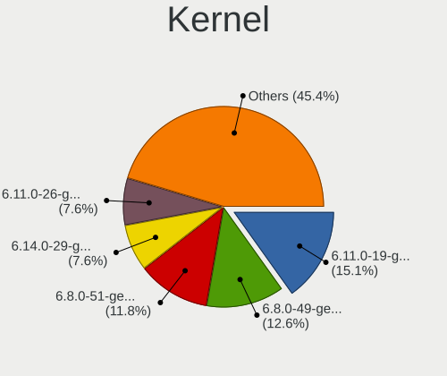

| Version              | Desktops | Percent |
|----------------------|----------|---------|
| 6.11.0-19-generic    | 18       | 15.13%  |
| 6.8.0-49-generic     | 15       | 12.61%  |
| 6.8.0-51-generic     | 14       | 11.76%  |
| 6.14.0-29-generic    | 9        | 7.56%   |
| 6.11.0-26-generic    | 9        | 7.56%   |
| 6.11.0-29-generic    | 7        | 5.88%   |
| 6.11.0-24-generic    | 6        | 5.04%   |
| 6.8.0-50-generic     | 5        | 4.2%    |
| 6.14.0-27-generic    | 5        | 4.2%    |
| 6.11.0-21-generic    | 5        | 4.2%    |
| 6.14.0-33-generic    | 4        | 3.36%   |
| 6.11.0-25-generic    | 4        | 3.36%   |
| 6.14.0-24-generic    | 3        | 2.52%   |
| 6.8.0-52-generic     | 2        | 1.68%   |
| 6.14.0-37-generic    | 2        | 1.68%   |
| 6.14.0-35-generic    | 2        | 1.68%   |
| 6.14.0-28-generic    | 2        | 1.68%   |
| 6.11.0-28-generic    | 2        | 1.68%   |
| 6.11.0-17-generic    | 2        | 1.68%   |
| 6.14.0-36-generic    | 1        | 0.84%   |
| 6.14.0-34-generic    | 1        | 0.84%   |
| 6.12.6-x64v3-xanmod1 | 1        | 0.84%   |

Kernel Family
-------------

Linux kernel without a distro release

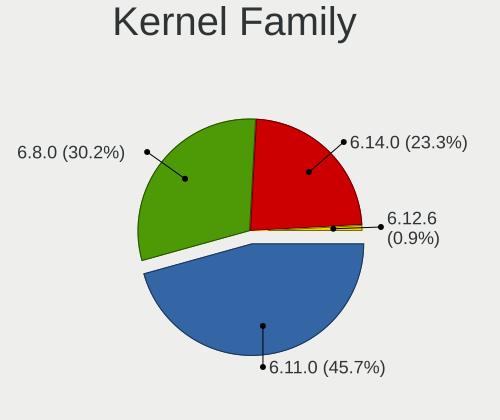

| Version | Desktops | Percent |
|---------|----------|---------|
| 6.11.0  | 53       | 45.69%  |
| 6.8.0   | 35       | 30.17%  |
| 6.14.0  | 27       | 23.28%  |
| 6.12.6  | 1        | 0.86%   |

Kernel Major Ver.
-----------------

Linux kernel major version

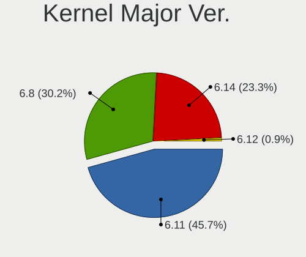

| Version | Desktops | Percent |
|---------|----------|---------|
| 6.11    | 53       | 45.69%  |
| 6.8     | 35       | 30.17%  |
| 6.14    | 27       | 23.28%  |
| 6.12    | 1        | 0.86%   |

Arch
----

OS architecture (x86_64, i586, etc.)

| Name   | Desktops | Percent |
|--------|----------|---------|
| x86_64 | 114      | 100%    |

DE
--

Desktop Environment

| Name     | Desktops | Percent |
|----------|----------|---------|
| Pantheon | 114      | 100%    |

Display Server
--------------

X11 or Wayland

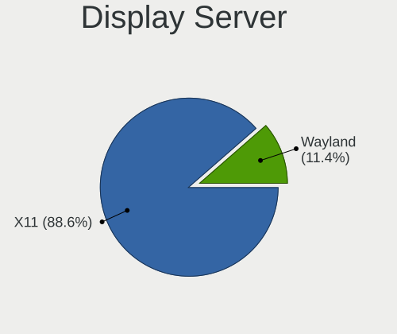

| Name    | Desktops | Percent |
|---------|----------|---------|
| X11     | 101      | 88.6%   |
| Wayland | 13       | 11.4%   |

Display Manager
---------------

SDDM, LightDM, etc.

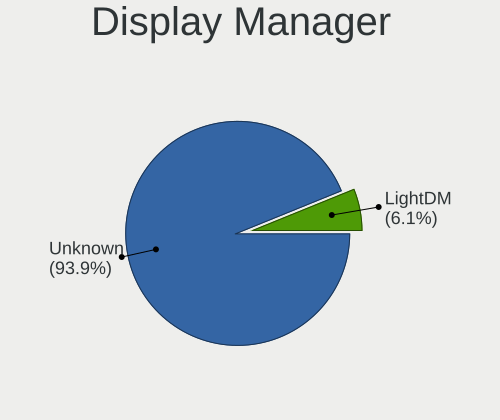

| Name    | Desktops | Percent |
|---------|----------|---------|
| Unknown | 107      | 93.86%  |
| LightDM | 7        | 6.14%   |

OS Lang
-------

Language

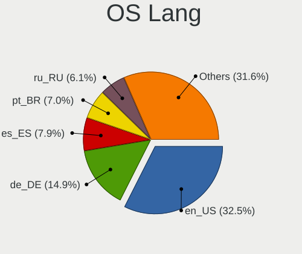

| Lang  | Desktops | Percent |
|-------|----------|---------|
| en_US | 37       | 32.46%  |
| de_DE | 17       | 14.91%  |
| es_ES | 9        | 7.89%   |
| pt_BR | 8        | 7.02%   |
| ru_RU | 7        | 6.14%   |
| pl_PL | 6        | 5.26%   |
| fr_FR | 6        | 5.26%   |
| it_IT | 5        | 4.39%   |
| ja_JP | 3        | 2.63%   |
| hu_HU | 3        | 2.63%   |
| en_GB | 3        | 2.63%   |
| en_AU | 2        | 1.75%   |
| el_GR | 2        | 1.75%   |
| tr_TR | 1        | 0.88%   |
| pt_PT | 1        | 0.88%   |
| nl_NL | 1        | 0.88%   |
| fr_CA | 1        | 0.88%   |
| da_DK | 1        | 0.88%   |
| C     | 1        | 0.88%   |

Boot Mode
---------

EFI or BIOS

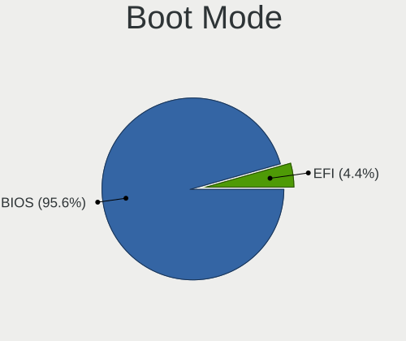

| Mode | Desktops | Percent |
|------|----------|---------|
| BIOS | 109      | 95.61%  |
| EFI  | 5        | 4.39%   |

Filesystem
----------

Type of filesystem

| Type | Desktops | Percent |
|------|----------|---------|
| Ext4 | 114      | 100%    |

Part. scheme
------------

Scheme of partitioning

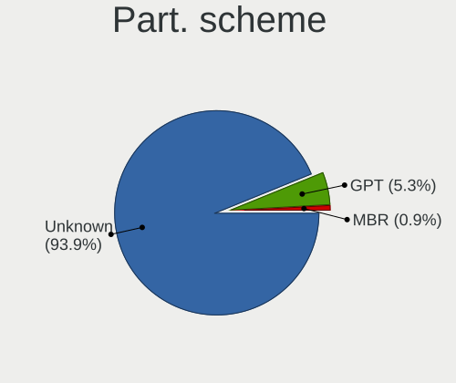

| Type    | Desktops | Percent |
|---------|----------|---------|
| Unknown | 107      | 93.86%  |
| GPT     | 6        | 5.26%   |
| MBR     | 1        | 0.88%   |

Dual Boot with Linux/BSD
------------------------

Hosting more than one Linux/BSD

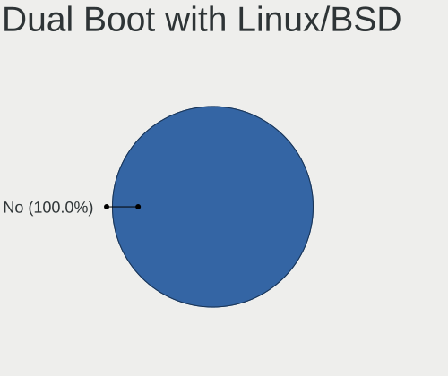

| Dual boot | Desktops | Percent |
|-----------|----------|---------|
| No        | 114      | 100%    |

Dual Boot (Win)
---------------

Hosting Linux and Windows

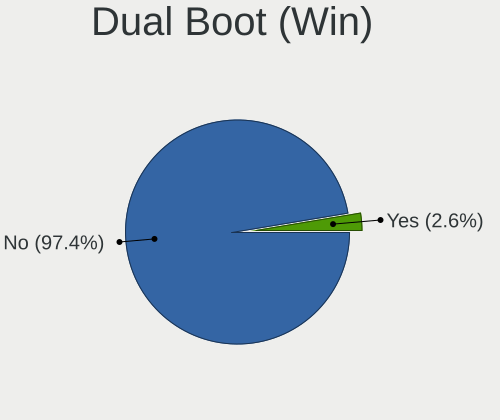

| Dual boot | Desktops | Percent |
|-----------|----------|---------|
| No        | 111      | 97.37%  |
| Yes       | 3        | 2.63%   |

Board
-----

Vendor
------

Motherboard manufacturer

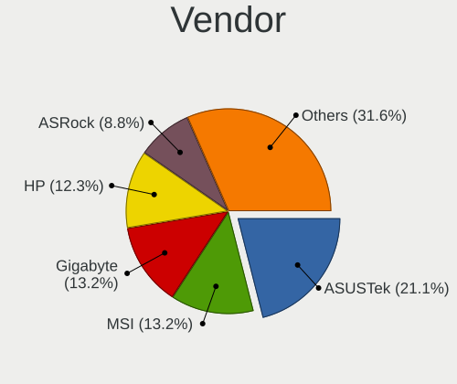

| Name                | Desktops | Percent |
|---------------------|----------|---------|
| ASUSTek Computer    | 24       | 21.05%  |
| MSI                 | 15       | 13.16%  |
| Gigabyte Technology | 15       | 13.16%  |
| Hewlett-Packard     | 14       | 12.28%  |
| ASRock              | 10       | 8.77%   |
| Dell                | 8        | 7.02%   |
| Intel               | 7        | 6.14%   |
| Lenovo              | 5        | 4.39%   |
| Biostar             | 3        | 2.63%   |
| OEM                 | 2        | 1.75%   |
| Positivo            | 1        | 0.88%   |
| Pegatron            | 1        | 0.88%   |
| NEC Computers       | 1        | 0.88%   |
| MAXSUN              | 1        | 0.88%   |
| IceWhale Technology | 1        | 0.88%   |
| Huanan              | 1        | 0.88%   |
| GEEKOM              | 1        | 0.88%   |
| ECS                 | 1        | 0.88%   |
| Apple               | 1        | 0.88%   |
| Acer                | 1        | 0.88%   |
| Unknown             | 1        | 0.88%   |

Model
-----

Motherboard model

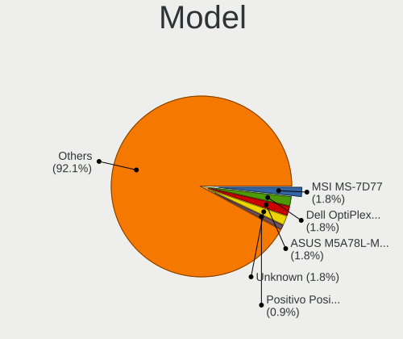

| Name                                                                | Desktops | Percent |
|---------------------------------------------------------------------|----------|---------|
| MSI MS-7D77                                                         | 2        | 1.75%   |
| Dell OptiPlex 7010                                                  | 2        | 1.75%   |
| ASUS M5A78L-M/USB3                                                  | 2        | 1.75%   |
| Unknown                                                             | 2        | 1.75%   |
| Positivo Positivo Master D380                                       | 1        | 0.88%   |
| Pegatron HCL Desktop                                                | 1        | 0.88%   |
| OEM X79-Turbo                                                       | 1        | 0.88%   |
| NEC Computers PC-MK33LBZCD                                          | 1        | 0.88%   |
| MSI MS-7E28                                                         | 1        | 0.88%   |
| MSI MS-7E25                                                         | 1        | 0.88%   |
| MSI MS-7E05                                                         | 1        | 0.88%   |
| MSI MS-7E02                                                         | 1        | 0.88%   |
| MSI MS-7D98                                                         | 1        | 0.88%   |
| MSI MS-7D08                                                         | 1        | 0.88%   |
| MSI MS-7B98                                                         | 1        | 0.88%   |
| MSI MS-7B79                                                         | 1        | 0.88%   |
| MSI MS-7A95                                                         | 1        | 0.88%   |
| MSI MS-7978                                                         | 1        | 0.88%   |
| MSI MS-7758                                                         | 1        | 0.88%   |
| MSI MS-7721                                                         | 1        | 0.88%   |
| MSI MS-7529                                                         | 1        | 0.88%   |
| MAXSUN MS-MoDT 12450H ITX WIFI                                      | 1        | 0.88%   |
| Lenovo ThinkCentre M92P 3237A1U                                     | 1        | 0.88%   |
| Lenovo ThinkCentre E73 10DS0015IX                                   | 1        | 0.88%   |
| Lenovo ThinkCentre E73 10AW008PMX                                   | 1        | 0.88%   |
| Lenovo S510 10L0A01UTA                                              | 1        | 0.88%   |
| Lenovo H520S 10093                                                  | 1        | 0.88%   |
| Intel X99-P4 V5.11                                                  | 1        | 0.88%   |
| Intel H81                                                           | 1        | 0.88%   |
| Intel H61                                                           | 1        | 0.88%   |
| Intel H55                                                           | 1        | 0.88%   |
| Intel DH55HC AAE70933-504                                           | 1        | 0.88%   |
| Intel D946GZIS AAD66165-502                                         | 1        | 0.88%   |
| Intel B75                                                           | 1        | 0.88%   |
| IceWhale ZBB001-BK30032 ZMB                                         | 1        | 0.88%   |
| Huanan X79-4MT (INTEL Xeon E5/Core i7 DMI2 - C600/C200 Chipset V1.0 | 1        | 0.88%   |
| HP Z800 Workstation                                                 | 1        | 0.88%   |
| HP Z400 Workstation                                                 | 1        | 0.88%   |
| HP ProDesk 600 G4 MT                                                | 1        | 0.88%   |
| HP ProDesk 600 G2 DM                                                | 1        | 0.88%   |

Model Family
------------

Motherboard model prefix

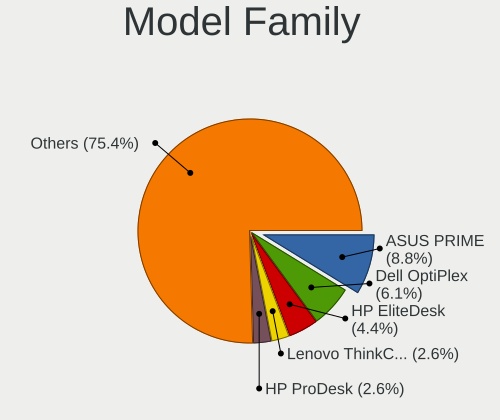

| Name                       | Desktops | Percent |
|----------------------------|----------|---------|
| ASUS PRIME                 | 10       | 8.77%   |
| Dell OptiPlex              | 7        | 6.14%   |
| HP EliteDesk               | 5        | 4.39%   |
| Lenovo ThinkCentre         | 3        | 2.63%   |
| HP ProDesk                 | 3        | 2.63%   |
| HP Compaq                  | 3        | 2.63%   |
| MSI MS-7D77                | 2        | 1.75%   |
| ASUS TUF                   | 2        | 1.75%   |
| ASUS ROG                   | 2        | 1.75%   |
| ASUS M5A78L-M              | 2        | 1.75%   |
| Unknown                    | 2        | 1.75%   |
| Positivo Positivo          | 1        | 0.88%   |
| Pegatron HCL               | 1        | 0.88%   |
| OEM X79-Turbo              | 1        | 0.88%   |
| NEC Computers PC-MK33LBZCD | 1        | 0.88%   |
| MSI MS-7E28                | 1        | 0.88%   |
| MSI MS-7E25                | 1        | 0.88%   |
| MSI MS-7E05                | 1        | 0.88%   |
| MSI MS-7E02                | 1        | 0.88%   |
| MSI MS-7D98                | 1        | 0.88%   |
| MSI MS-7D08                | 1        | 0.88%   |
| MSI MS-7B98                | 1        | 0.88%   |
| MSI MS-7B79                | 1        | 0.88%   |
| MSI MS-7A95                | 1        | 0.88%   |
| MSI MS-7978                | 1        | 0.88%   |
| MSI MS-7758                | 1        | 0.88%   |
| MSI MS-7721                | 1        | 0.88%   |
| MSI MS-7529                | 1        | 0.88%   |
| MAXSUN MS-MoDT             | 1        | 0.88%   |
| Lenovo S510                | 1        | 0.88%   |
| Lenovo H520S               | 1        | 0.88%   |
| Intel X99-P4               | 1        | 0.88%   |
| Intel H81                  | 1        | 0.88%   |
| Intel H61                  | 1        | 0.88%   |
| Intel H55                  | 1        | 0.88%   |
| Intel DH55HC               | 1        | 0.88%   |
| Intel D946GZIS             | 1        | 0.88%   |
| Intel B75                  | 1        | 0.88%   |
| IceWhale ZBB001-BK30032    | 1        | 0.88%   |
| Huanan X79-4MT             | 1        | 0.88%   |

MFG Year
--------

Motherboard manufacture year

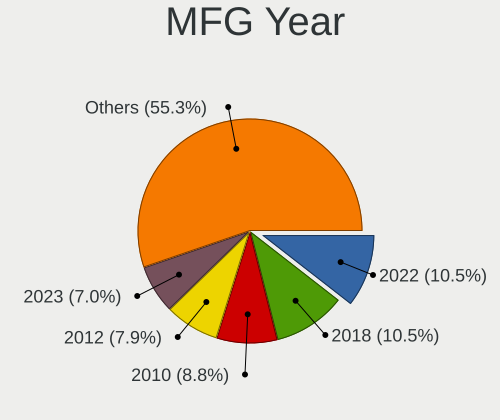

| Year | Desktops | Percent |
|------|----------|---------|
| 2022 | 12       | 10.53%  |
| 2018 | 12       | 10.53%  |
| 2010 | 10       | 8.77%   |
| 2012 | 9        | 7.89%   |
| 2023 | 8        | 7.02%   |
| 2013 | 8        | 7.02%   |
| 2019 | 7        | 6.14%   |
| 2011 | 7        | 6.14%   |
| 2024 | 5        | 4.39%   |
| 2020 | 5        | 4.39%   |
| 2017 | 5        | 4.39%   |
| 2016 | 5        | 4.39%   |
| 2015 | 5        | 4.39%   |
| 2014 | 4        | 3.51%   |
| 2021 | 3        | 2.63%   |
| 2009 | 3        | 2.63%   |
| 2025 | 2        | 1.75%   |
| 2008 | 2        | 1.75%   |
| 2007 | 2        | 1.75%   |

Form Factor
-----------

Physical design of the computer

| Name    | Desktops | Percent |
|---------|----------|---------|
| Desktop | 114      | 100%    |

Secure Boot
-----------

Enabled or disabled

| State    | Desktops | Percent |
|----------|----------|---------|
| Disabled | 114      | 100%    |

Coreboot
--------

Have coreboot on board

| Used | Desktops | Percent |
|------|----------|---------|
| No   | 114      | 100%    |

RAM Size
--------

Total RAM memory

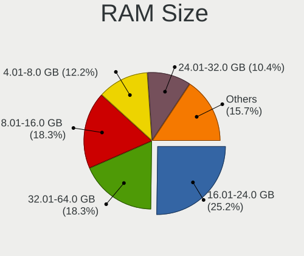

| Size in GB  | Desktops | Percent |
|-------------|----------|---------|
| 16.01-24.0  | 29       | 25.22%  |
| 32.01-64.0  | 21       | 18.26%  |
| 8.01-16.0   | 21       | 18.26%  |
| 4.01-8.0    | 14       | 12.17%  |
| 24.01-32.0  | 12       | 10.43%  |
| 64.01-256.0 | 9        | 7.83%   |
| 3.01-4.0    | 8        | 6.96%   |
| 1.01-2.0    | 1        | 0.87%   |

RAM Used
--------

Used RAM memory

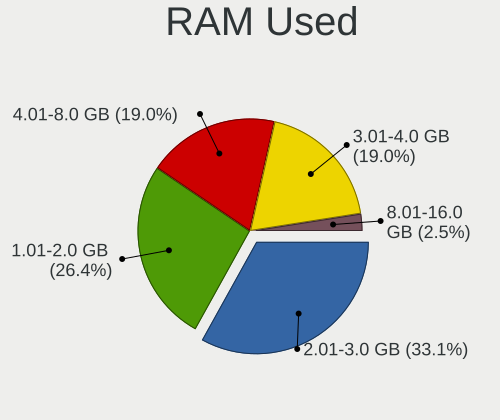

| Used GB   | Desktops | Percent |
|-----------|----------|---------|
| 2.01-3.0  | 40       | 33.06%  |
| 1.01-2.0  | 32       | 26.45%  |
| 4.01-8.0  | 23       | 19.01%  |
| 3.01-4.0  | 23       | 19.01%  |
| 8.01-16.0 | 3        | 2.48%   |

Total Drives
------------

Number of drives on board

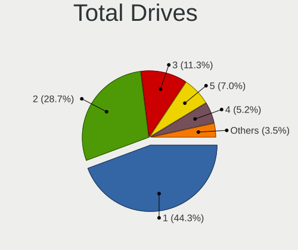

| Drives | Desktops | Percent |
|--------|----------|---------|
| 1      | 51       | 44.35%  |
| 2      | 33       | 28.7%   |
| 3      | 13       | 11.3%   |
| 5      | 8        | 6.96%   |
| 4      | 6        | 5.22%   |
| 6      | 3        | 2.61%   |
| 7      | 1        | 0.87%   |

Has CD-ROM
----------

Has CD-ROM on board

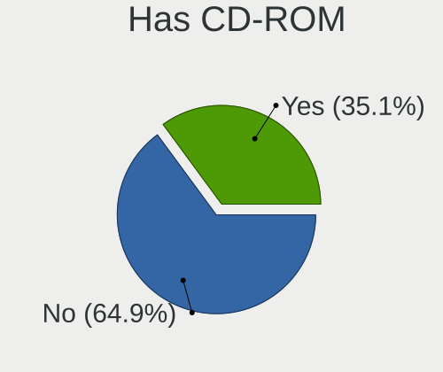

| Presented | Desktops | Percent |
|-----------|----------|---------|
| No        | 74       | 64.91%  |
| Yes       | 40       | 35.09%  |

Has Ethernet
------------

Has Ethernet on board

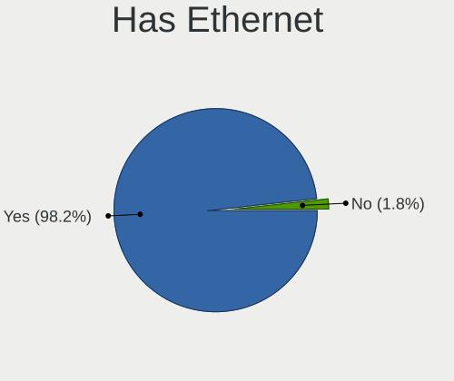

| Presented | Desktops | Percent |
|-----------|----------|---------|
| Yes       | 112      | 98.25%  |
| No        | 2        | 1.75%   |

Has WiFi
--------

Has WiFi module

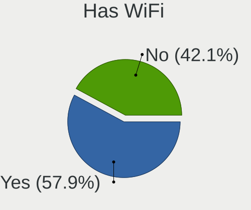

| Presented | Desktops | Percent |
|-----------|----------|---------|
| Yes       | 66       | 57.89%  |
| No        | 48       | 42.11%  |

Has Bluetooth
-------------

Has Bluetooth module

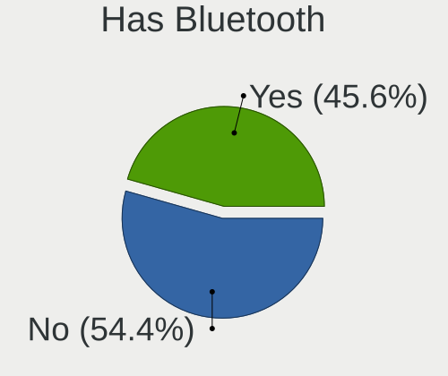

| Presented | Desktops | Percent |
|-----------|----------|---------|
| No        | 62       | 54.39%  |
| Yes       | 52       | 45.61%  |

Location
--------

Country
-------

Geographic location (country)

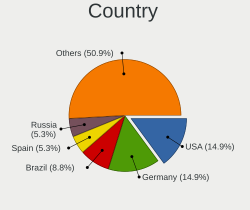

| Country     | Desktops | Percent |
|-------------|----------|---------|
| USA         | 17       | 14.91%  |
| Germany     | 17       | 14.91%  |
| Brazil      | 10       | 8.77%   |
| Spain       | 6        | 5.26%   |
| Russia      | 6        | 5.26%   |
| Poland      | 6        | 5.26%   |
| Italy       | 5        | 4.39%   |
| France      | 5        | 4.39%   |
| Canada      | 5        | 4.39%   |
| UK          | 3        | 2.63%   |
| Netherlands | 3        | 2.63%   |
| Japan       | 3        | 2.63%   |
| Hungary     | 3        | 2.63%   |
| Australia   | 3        | 2.63%   |
| Mexico      | 2        | 1.75%   |
| Israel      | 2        | 1.75%   |
| India       | 2        | 1.75%   |
| Vietnam     | 1        | 0.88%   |
| UAE         | 1        | 0.88%   |
| Turkey      | 1        | 0.88%   |
| Thailand    | 1        | 0.88%   |
| Switzerland | 1        | 0.88%   |
| Portugal    | 1        | 0.88%   |
| Mauritius   | 1        | 0.88%   |
| Indonesia   | 1        | 0.88%   |
| Greece      | 1        | 0.88%   |
| Denmark     | 1        | 0.88%   |
| Colombia    | 1        | 0.88%   |
| China       | 1        | 0.88%   |
| Cambodia    | 1        | 0.88%   |
| Belgium     | 1        | 0.88%   |
| Austria     | 1        | 0.88%   |
| Argentina   | 1        | 0.88%   |

City
----

Geographic location (city)

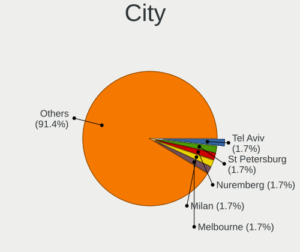

| City           | Desktops | Percent |
|----------------|----------|---------|
| Tel Aviv       | 2        | 1.72%   |
| St Petersburg  | 2        | 1.72%   |
| Nuremberg      | 2        | 1.72%   |
| Milan          | 2        | 1.72%   |
| Melbourne      | 2        | 1.72%   |
| Đông Hà     | 1        | 0.86%   |
| Zuidlaren      | 1        | 0.86%   |
| Winnipeg       | 1        | 0.86%   |
| Wiesbaden      | 1        | 0.86%   |
| Warsaw         | 1        | 0.86%   |
| Vergeze        | 1        | 0.86%   |
| Valladolid     | 1        | 0.86%   |
| Towanda        | 1        | 0.86%   |
| Tours          | 1        | 0.86%   |
| Toronto        | 1        | 0.86%   |
| Toms River     | 1        | 0.86%   |
| Teresina       | 1        | 0.86%   |
| Telgate        | 1        | 0.86%   |
| Sydney         | 1        | 0.86%   |
| Stoney Point   | 1        | 0.86%   |
| Stone Mountain | 1        | 0.86%   |
| Spokane        | 1        | 0.86%   |
| Soemmerda      | 1        | 0.86%   |
| Shawinigan     | 1        | 0.86%   |
| Shanghai       | 1        | 0.86%   |
| Seveso         | 1        | 0.86%   |
| Serres         | 1        | 0.86%   |
| Sarmanovo      | 1        | 0.86%   |
| Sao Paulo      | 1        | 0.86%   |
| Sao Goncalo    | 1        | 0.86%   |
| Rostov-on-Don  | 1        | 0.86%   |
| Roncador       | 1        | 0.86%   |
| Roding         | 1        | 0.86%   |
| Real de Gandia | 1        | 0.86%   |
| Praia Grande   | 1        | 0.86%   |
| Porto          | 1        | 0.86%   |
| Poitiers       | 1        | 0.86%   |
| Phnom Penh     | 1        | 0.86%   |
| Petah Tikva    | 1        | 0.86%   |
| Perugia        | 1        | 0.86%   |

Drives
------

Drive Vendor
------------

Hard drive vendors

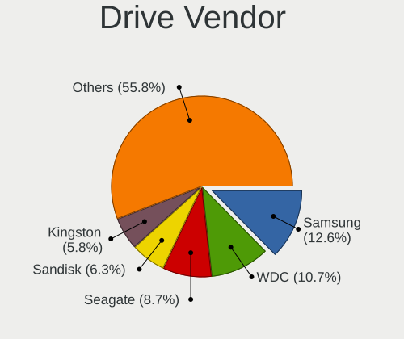

| Vendor                       | Desktops | Drives | Percent |
|------------------------------|----------|--------|---------|
| Samsung Electronics          | 26       | 40     | 12.62%  |
| WDC                          | 22       | 29     | 10.68%  |
| Seagate                      | 18       | 22     | 8.74%   |
| Sandisk                      | 13       | 16     | 6.31%   |
| Kingston                     | 12       | 15     | 5.83%   |
| Toshiba                      | 11       | 14     | 5.34%   |
| Crucial                      | 7        | 10     | 3.4%    |
| China                        | 7        | 10     | 3.4%    |
| Silicon Motion               | 6        | 7      | 2.91%   |
| PNY                          | 5        | 7      | 2.43%   |
| Micron/Crucial Technology    | 5        | 6      | 2.43%   |
| MAXIO Technology (Hangzhou)  | 5        | 6      | 2.43%   |
| Hitachi                      | 5        | 5      | 2.43%   |
| Intel                        | 4        | 4      | 1.94%   |
| JMicron Technology           | 3        | 3      | 1.46%   |
| Unknown                      | 2        | 2      | 0.97%   |
| Shenzhen Longsys Electronics | 2        | 2      | 0.97%   |
| Realtek Semiconductor        | 2        | 2      | 0.97%   |
| Kingston Technology Company  | 2        | 2      | 0.97%   |
| ICY BOX                      | 2        | 2      | 0.97%   |
| HS-SSD-E100                  | 2        | 3      | 0.97%   |
| HGST                         | 2        | 2      | 0.97%   |
| Hewlett-Packard              | 2        | 2      | 0.97%   |
| Fanxiang                     | 2        | 2      | 0.97%   |
| Corsair                      | 2        | 3      | 0.97%   |
| A-DATA Technology            | 2        | 2      | 0.97%   |
| Zheino                       | 1        | 1      | 0.49%   |
| XrayDisk                     | 1        | 1      | 0.49%   |
| Wdxsky                       | 1        | 1      | 0.49%   |
| Verbatim                     | 1        | 1      | 0.49%   |
| Team                         | 1        | 1      | 0.49%   |
| SPCC                         | 1        | 1      | 0.49%   |
| SP                           | 1        | 1      | 0.49%   |
| PUSKILL                      | 1        | 1      | 0.49%   |
| PRO Z                        | 1        | 2      | 0.49%   |
| POLION                       | 1        | 1      | 0.49%   |
| Plextor                      | 1        | 1      | 0.49%   |
| Patriot                      | 1        | 1      | 0.49%   |
| OCZ-VERTEX2                  | 1        | 1      | 0.49%   |
| OCZ                          | 1        | 2      | 0.49%   |

Drive Model
-----------

Hard drive models

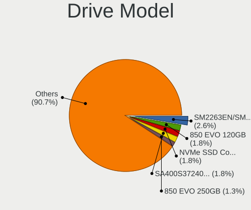

| Model                                                 | Desktops | Percent |
|-------------------------------------------------------|----------|---------|
| Silicon Motion SM2263EN/SM2263XT SSD Controller 512GB | 6        | 2.64%   |
| Samsung SSD 850 EVO 120GB                             | 4        | 1.76%   |
| Samsung NVMe SSD Controller SM981/PM981/PM983 1TB     | 4        | 1.76%   |
| Kingston SA400S37240G 240GB SSD                       | 4        | 1.76%   |
| Samsung SSD 850 EVO 250GB                             | 3        | 1.32%   |
| WDC WDS240G2G0A-00JH30 240GB SSD                      | 2        | 0.88%   |
| WDC WD5000LPVX-22V0TT0 500GB                          | 2        | 0.88%   |
| WDC WD10EZEX-00BN5A0 1TB                              | 2        | 0.88%   |
| Toshiba MQ01ABD100 1TB                                | 2        | 0.88%   |
| Toshiba DT01ACA100 1TB                                | 2        | 0.88%   |
| Toshiba DT01ACA050 500GB                              | 2        | 0.88%   |
| Seagate ST31000528AS 1TB                              | 2        | 0.88%   |
| Samsung SSD 860 EVO 500GB                             | 2        | 0.88%   |
| Samsung SSD 840 EVO 250GB                             | 2        | 0.88%   |
| Samsung NVMe SSD Controller PM9A1/PM9A3/980PRO 1TB    | 2        | 0.88%   |
| Samsung HD501LJ 500GB                                 | 2        | 0.88%   |
| Micron/Crucial P2 NVMe PCIe SSD 2TB                   | 2        | 0.88%   |
| Micron/Crucial CT2000P3PSSD8 2TB                      | 2        | 0.88%   |
| Kingston SV300S37A240G 240GB SSD                      | 2        | 0.88%   |
| Kingston SA400S37480G 480GB SSD                       | 2        | 0.88%   |
| Kingston SA400S37120G 120GB SSD                       | 2        | 0.88%   |
| JMicron Tech 250GB                                    | 2        | 0.88%   |
| HP SSD S700 250GB                                     | 2        | 0.88%   |
| Crucial CT240BX500SSD1 240GB                          | 2        | 0.88%   |
| China SSD 1TB                                         | 2        | 0.88%   |
| Zheino CHN 25SATAA3 240 240GB SSD                     | 1        | 0.44%   |
| XrayDisk 512GB                                        | 1        | 0.44%   |
| Wdxsky M720k/512 512GB                                | 1        | 0.44%   |
| WDC WDS100T1B0A-00H9H0 1TB SSD                        | 1        | 0.44%   |
| WDC WD5000AAKX-75U6AA0 500GB                          | 1        | 0.44%   |
| WDC WD5000AAKX-07U6AA0 500GB                          | 1        | 0.44%   |
| WDC WD5000AAKS-00A7B0 500GB                           | 1        | 0.44%   |
| WDC WD5000AADS-00S9B0 500GB                           | 1        | 0.44%   |
| WDC WD3200BPVT-00JJ5T0 320GB                          | 1        | 0.44%   |
| WDC WD3000HLFS-01G6U0 304GB                           | 1        | 0.44%   |
| WDC WD20EZRX-00DC0B0 2TB                              | 1        | 0.44%   |
| WDC WD20EZRX-00D8PB0 2TB                              | 1        | 0.44%   |
| WDC WD2003FZEX-00SRLA0 2TB                            | 1        | 0.44%   |
| WDC WD2002FFSX-68PF8N0 2TB                            | 1        | 0.44%   |
| WDC WD1600BEVT-00A1TT0 160GB                          | 1        | 0.44%   |

HDD Vendor
----------

Hard disk drive vendors

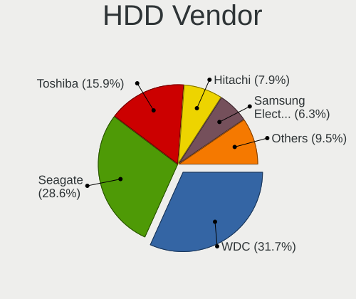

| Vendor              | Desktops | Drives | Percent |
|---------------------|----------|--------|---------|
| WDC                 | 20       | 25     | 31.75%  |
| Seagate             | 18       | 22     | 28.57%  |
| Toshiba             | 10       | 12     | 15.87%  |
| Hitachi             | 5        | 5      | 7.94%   |
| Samsung Electronics | 4        | 4      | 6.35%   |
| HGST                | 2        | 2      | 3.17%   |
| PRO Z               | 1        | 2      | 1.59%   |
| Maxtor              | 1        | 1      | 1.59%   |
| JMicron Technology  | 1        | 1      | 1.59%   |
| ExcelStor           | 1        | 1      | 1.59%   |

SSD Vendor
----------

Solid state drive vendors

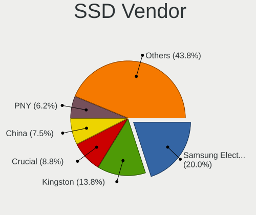

| Vendor              | Desktops | Drives | Percent |
|---------------------|----------|--------|---------|
| Samsung Electronics | 16       | 23     | 20%     |
| Kingston            | 11       | 13     | 13.75%  |
| Crucial             | 7        | 10     | 8.75%   |
| China               | 6        | 9      | 7.5%    |
| PNY                 | 5        | 7      | 6.25%   |
| WDC                 | 3        | 3      | 3.75%   |
| SanDisk             | 3        | 4      | 3.75%   |
| Intel               | 2        | 2      | 2.5%    |
| Hewlett-Packard     | 2        | 2      | 2.5%    |
| A-DATA Technology   | 2        | 2      | 2.5%    |
| Zheino              | 1        | 1      | 1.25%   |
| Verbatim            | 1        | 1      | 1.25%   |
| Toshiba             | 1        | 1      | 1.25%   |
| Team                | 1        | 1      | 1.25%   |
| SPCC                | 1        | 1      | 1.25%   |
| PUSKILL             | 1        | 1      | 1.25%   |
| Plextor             | 1        | 1      | 1.25%   |
| Patriot             | 1        | 1      | 1.25%   |
| OCZ-VERTEX2         | 1        | 1      | 1.25%   |
| OCZ                 | 1        | 2      | 1.25%   |
| Netac               | 1        | 1      | 1.25%   |
| Lexar               | 1        | 2      | 1.25%   |
| Intenso             | 1        | 1      | 1.25%   |
| INNOVATION IT       | 1        | 1      | 1.25%   |
| HUSKY               | 1        | 1      | 1.25%   |
| GOODRAM             | 1        | 1      | 1.25%   |
| Emtec               | 1        | 2      | 1.25%   |
| DEXP                | 1        | 1      | 1.25%   |
| Corsair             | 1        | 2      | 1.25%   |
| ASL                 | 1        | 1      | 1.25%   |
| Apacer              | 1        | 1      | 1.25%   |
| AGI                 | 1        | 2      | 1.25%   |
| Unknown             | 1        | 1      | 1.25%   |

Drive Kind
----------

HDD or SSD

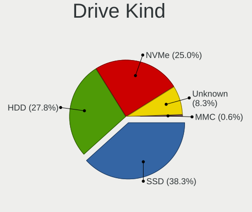

| Kind    | Desktops | Drives | Percent |
|---------|----------|--------|---------|
| SSD     | 69       | 103    | 38.33%  |
| HDD     | 50       | 75     | 27.78%  |
| NVMe    | 45       | 63     | 25%     |
| Unknown | 15       | 17     | 8.33%   |
| MMC     | 1        | 1      | 0.56%   |

Drive Connector
---------------

SATA, SAS, NVMe, etc.

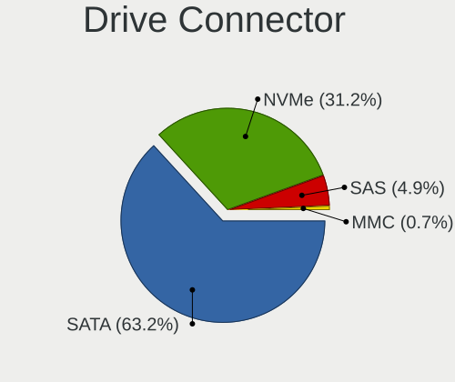

| Type | Desktops | Drives | Percent |
|------|----------|--------|---------|
| SATA | 91       | 186    | 63.19%  |
| NVMe | 45       | 63     | 31.25%  |
| SAS  | 7        | 9      | 4.86%   |
| MMC  | 1        | 1      | 0.69%   |

Drive Size
----------

Size of hard drive

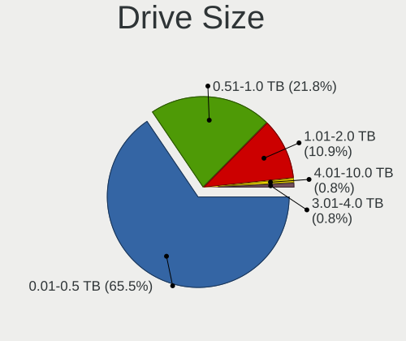

| Size in TB | Desktops | Drives | Percent |
|------------|----------|--------|---------|
| 0.01-0.5   | 78       | 118    | 65.55%  |
| 0.51-1.0   | 26       | 41     | 21.85%  |
| 1.01-2.0   | 13       | 16     | 10.92%  |
| 3.01-4.0   | 1        | 1      | 0.84%   |
| 4.01-10.0  | 1        | 2      | 0.84%   |

Space Total
-----------

Amount of disk space available on the file system

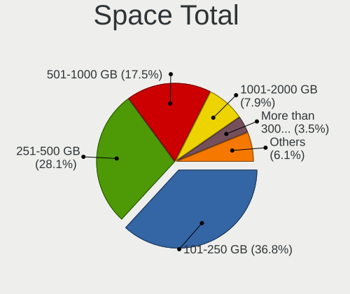

| Size in GB     | Desktops | Percent |
|----------------|----------|---------|
| 101-250        | 42       | 36.84%  |
| 251-500        | 32       | 28.07%  |
| 501-1000       | 20       | 17.54%  |
| 1001-2000      | 9        | 7.89%   |
| More than 3000 | 4        | 3.51%   |
| 2001-3000      | 3        | 2.63%   |
| 51-100         | 3        | 2.63%   |
| 21-50          | 1        | 0.88%   |

Space Used
----------

Amount of used disk space

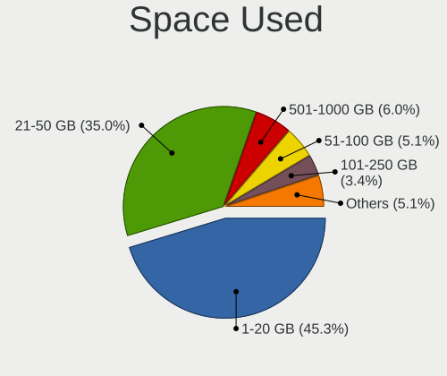

| Used GB   | Desktops | Percent |
|-----------|----------|---------|
| 1-20      | 53       | 45.3%   |
| 21-50     | 41       | 35.04%  |
| 501-1000  | 7        | 5.98%   |
| 51-100    | 6        | 5.13%   |
| 101-250   | 4        | 3.42%   |
| 251-500   | 3        | 2.56%   |
| 2001-3000 | 2        | 1.71%   |
| 1001-2000 | 1        | 0.85%   |

Malfunc. Drives
---------------

Drive models with a malfunction

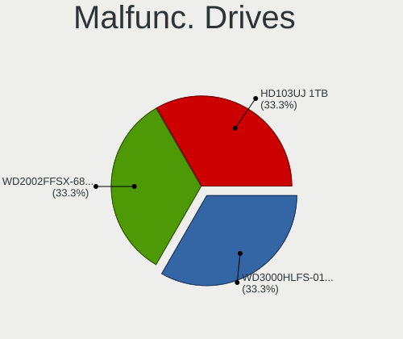

| Model                           | Desktops | Drives | Percent |
|---------------------------------|----------|--------|---------|
| WDC WD3000HLFS-01G6U0 304GB     | 1        | 1      | 33.33%  |
| WDC WD2002FFSX-68PF8N0 2TB      | 1        | 1      | 33.33%  |
| Samsung Electronics HD103UJ 1TB | 1        | 1      | 33.33%  |

Malfunc. Drive Vendor
---------------------

Vendors of faulty drives

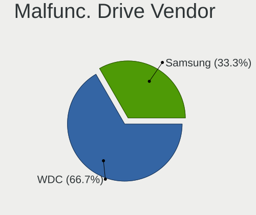

| Vendor              | Desktops | Drives | Percent |
|---------------------|----------|--------|---------|
| WDC                 | 2        | 2      | 66.67%  |
| Samsung Electronics | 1        | 1      | 33.33%  |

Malfunc. HDD Vendor
-------------------

Vendors of faulty HDD drives

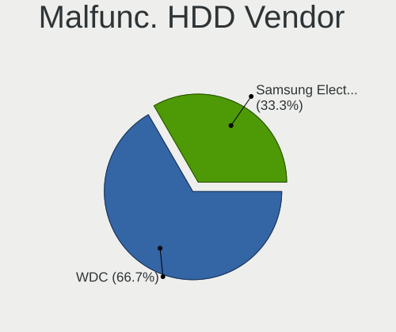

| Vendor              | Desktops | Drives | Percent |
|---------------------|----------|--------|---------|
| WDC                 | 2        | 2      | 66.67%  |
| Samsung Electronics | 1        | 1      | 33.33%  |

Malfunc. Drive Kind
-------------------

Kinds of faulty drives

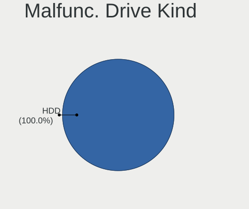

| Kind | Desktops | Drives | Percent |
|------|----------|--------|---------|
| HDD  | 2        | 3      | 100%    |

Failed Drives
-------------

Failed drive models

Zero info for selected period =(

Failed Drive Vendor
-------------------

Failed drive vendors

Zero info for selected period =(

Drive Status
------------

Number of failed and malfunc. drives

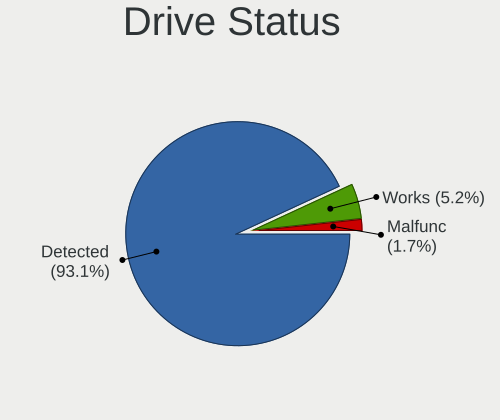

| Status   | Desktops | Drives | Percent |
|----------|----------|--------|---------|
| Detected | 108      | 240    | 93.1%   |
| Works    | 6        | 16     | 5.17%   |
| Malfunc  | 2        | 3      | 1.72%   |

Storage controller
------------------

Storage Vendor
--------------

Storage controller vendors

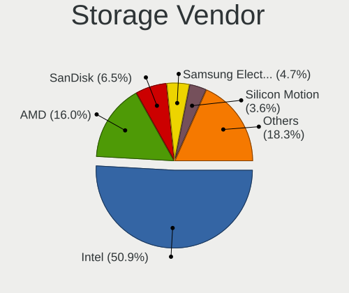

| Vendor                       | Desktops | Percent |
|------------------------------|----------|---------|
| Intel                        | 86       | 50.89%  |
| AMD                          | 27       | 15.98%  |
| SanDisk                      | 11       | 6.51%   |
| Samsung Electronics          | 8        | 4.73%   |
| Silicon Motion               | 6        | 3.55%   |
| Micron/Crucial Technology    | 5        | 2.96%   |
| MAXIO Technology (Hangzhou)  | 5        | 2.96%   |
| Kingston Technology Company  | 3        | 1.78%   |
| Shenzhen Longsys Electronics | 2        | 1.18%   |
| Realtek Semiconductor        | 2        | 1.18%   |
| Marvell Technology Group     | 2        | 1.18%   |
| ASMedia Technology           | 2        | 1.18%   |
| VIA Technologies             | 1        | 0.59%   |
| Toshiba America Info Systems | 1        | 0.59%   |
| Phison Electronics           | 1        | 0.59%   |
| Micron Technology            | 1        | 0.59%   |
| LSI Logic / Symbios Logic    | 1        | 0.59%   |
| KIOXIA                       | 1        | 0.59%   |
| JMicron Technology           | 1        | 0.59%   |
| INNOGRIT                     | 1        | 0.59%   |
| Hosin Global Electronics     | 1        | 0.59%   |
| ADATA Technology             | 1        | 0.59%   |

Storage Model
-------------

Storage controller models

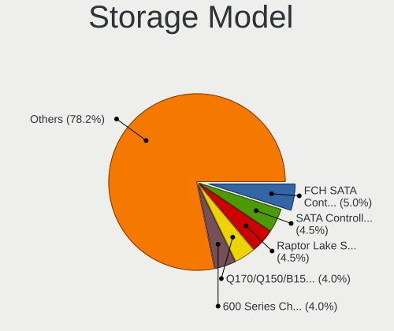

| Model                                                                                                              | Desktops | Percent |
|--------------------------------------------------------------------------------------------------------------------|----------|---------|
| AMD FCH SATA Controller [AHCI mode]                                                                                | 10       | 4.95%   |
| Intel SATA Controller [RAID mode]                                                                                  | 9        | 4.46%   |
| Intel Raptor Lake SATA AHCI Controller                                                                             | 9        | 4.46%   |
| Intel Q170/Q150/B150/H170/H110/Z170/CM236 Chipset SATA Controller [AHCI Mode]                                      | 8        | 3.96%   |
| AMD 600 Series Chipset SATA Controller                                                                             | 8        | 3.96%   |
| Intel 8 Series/C220 Series Chipset Family 6-port SATA Controller 1 [AHCI mode]                                     | 7        | 3.47%   |
| Intel 7 Series/C210 Series Chipset Family 6-port SATA Controller [AHCI mode]                                       | 7        | 3.47%   |
| Silicon Motion SM2263EN/SM2263XT (DRAM-less) NVMe SSD Controllers                                                  | 6        | 2.97%   |
| Intel NM10/ICH7 Family SATA Controller [IDE mode]                                                                  | 6        | 2.97%   |
| Intel Cannon Lake PCH SATA AHCI Controller                                                                         | 5        | 2.48%   |
| Intel 6 Series/C200 Series Chipset Family 6 port Desktop SATA AHCI Controller                                      | 5        | 2.48%   |
| Intel 200 Series PCH SATA controller [AHCI mode]                                                                   | 5        | 2.48%   |
| AMD 400 Series Chipset SATA Controller                                                                             | 5        | 2.48%   |
| Samsung NVMe SSD Controller SM981/PM981/PM983                                                                      | 4        | 1.98%   |
| MAXIO (Hangzhou) NVMe SSD Controller MAP1602 (DRAM-less)                                                           | 4        | 1.98%   |
| Intel 6 Series/C200 Series Chipset Family Desktop SATA Controller (IDE mode, ports 4-5)                            | 4        | 1.98%   |
| Intel 6 Series/C200 Series Chipset Family Desktop SATA Controller (IDE mode, ports 0-3)                            | 4        | 1.98%   |
| Micron/Crucial P3 Plus NVMe PCIe SSD (DRAM-less)                                                                   | 3        | 1.49%   |
| Intel Volume Management Device NVMe RAID Controller                                                                | 3        | 1.49%   |
| Intel 82801JI (ICH10 Family) 4 port SATA IDE Controller #1                                                         | 3        | 1.49%   |
| Intel 82801JI (ICH10 Family) 2 port SATA IDE Controller #2                                                         | 3        | 1.49%   |
| Intel 82801G (ICH7 Family) IDE Controller                                                                          | 3        | 1.49%   |
| AMD SB7x0/SB8x0/SB9x0 SATA Controller [IDE mode]                                                                   | 3        | 1.49%   |
| AMD SB7x0/SB8x0/SB9x0 IDE Controller                                                                               | 3        | 1.49%   |
| AMD 500 Series Chipset SATA Controller                                                                             | 3        | 1.49%   |
| SanDisk WD Blue SN570 NVMe SSD 2TB                                                                                 | 2        | 0.99%   |
| SanDisk Ultra 3D / WD Blue SN570 NVMe SSD (DRAM-less)                                                              | 2        | 0.99%   |
| Samsung NVMe SSD Controller S4LV008[Pascal]                                                                        | 2        | 0.99%   |
| Samsung NVMe SSD Controller PM9A1/PM9A3/980PRO                                                                     | 2        | 0.99%   |
| Micron/Crucial P2 [Nick P2] / P3 / P3 Plus NVMe PCIe SSD (DRAM-less)                                               | 2        | 0.99%   |
| Intel 500 Series Chipset Family SATA AHCI Controller                                                               | 2        | 0.99%   |
| ASMedia ASM1061/ASM1062 Serial ATA Controller                                                                      | 2        | 0.99%   |
| AMD 300 Series Chipset SATA Controller                                                                             | 2        | 0.99%   |
| VIA VT6415 PATA IDE Host Controller                                                                                | 1        | 0.5%    |
| Toshiba America Info Systems XG5 NVMe SSD Controller                                                               | 1        | 0.5%    |
| Shenzhen Longsys Lexar NM790 / Patriot Viper VP4300 Lite NVMe SSD (DRAM-less)                                      | 1        | 0.5%    |
| Shenzhen Longsys FORESEE XP1000 / Lexar Professional CFexpress Type B Gold series, NM620 PCIe NVME SSD (DRAM-less) | 1        | 0.5%    |
| Sandisk WD_BLACK SN7100/WD PC SN7100S M.2 2280 NVMe SSD (DRAM-less)                                                | 1        | 0.5%    |
| SanDisk WD SN560/SN740/SN770/SN5000 NVMe SSD                                                                       | 1        | 0.5%    |
| SanDisk WD PC SN810 / Black SN850 NVMe SSD                                                                         | 1        | 0.5%    |

Storage Kind
------------

Kind of storage controller (IDE, SATA, NVMe, SAS, ...)

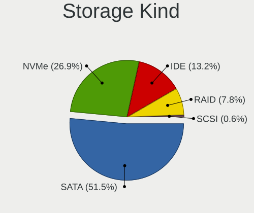

| Kind | Desktops | Percent |
|------|----------|---------|
| SATA | 86       | 51.5%   |
| NVMe | 45       | 26.95%  |
| IDE  | 22       | 13.17%  |
| RAID | 13       | 7.78%   |
| SCSI | 1        | 0.6%    |

Processor
---------

CPU Vendor
----------

Processor vendors

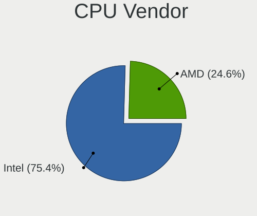

| Vendor | Desktops | Percent |
|--------|----------|---------|
| Intel  | 86       | 75.44%  |
| AMD    | 28       | 24.56%  |

CPU Model
---------

Processor models

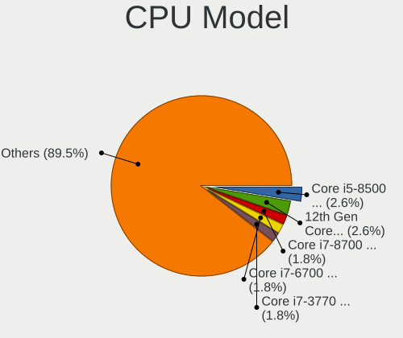

| Model                                       | Desktops | Percent |
|---------------------------------------------|----------|---------|
| Intel Core i5-8500 CPU @ 3.00GHz            | 3        | 2.63%   |
| Intel 12th Gen Core i5-12400F               | 3        | 2.63%   |
| Intel Core i7-8700 CPU @ 3.20GHz            | 2        | 1.75%   |
| Intel Core i7-6700 CPU @ 3.40GHz            | 2        | 1.75%   |
| Intel Core i7-3770 CPU @ 3.40GHz            | 2        | 1.75%   |
| Intel Core i7 CPU 950 @ 3.07GHz             | 2        | 1.75%   |
| Intel Core i5-8400 CPU @ 2.80GHz            | 2        | 1.75%   |
| Intel Core i5-3570 CPU @ 3.40GHz            | 2        | 1.75%   |
| Intel Core i5-3330 CPU @ 3.00GHz            | 2        | 1.75%   |
| Intel Core i5-2500 CPU @ 3.30GHz            | 2        | 1.75%   |
| Intel Core i3-4130 CPU @ 3.40GHz            | 2        | 1.75%   |
| Intel Core 2 Duo CPU E7500 @ 2.93GHz        | 2        | 1.75%   |
| AMD Phenom II X4 955 Processor              | 2        | 1.75%   |
| Intel Xeon CPU X5675 @ 3.07GHz              | 1        | 0.88%   |
| Intel Xeon CPU E5462 @ 2.80GHz              | 1        | 0.88%   |
| Intel Xeon CPU E5-2660 v3 @ 2.60GHz         | 1        | 0.88%   |
| Intel Xeon CPU E5-2660 v2 @ 2.20GHz         | 1        | 0.88%   |
| Intel Xeon CPU E5-2650 v2 @ 2.60GHz         | 1        | 0.88%   |
| Intel Xeon CPU E5-1650 v2 @ 3.50GHz         | 1        | 0.88%   |
| Intel Pentium Dual-Core CPU E5300 @ 2.60GHz | 1        | 0.88%   |
| Intel Pentium CPU G4400 @ 3.30GHz           | 1        | 0.88%   |
| Intel Pentium CPU G2020 @ 2.90GHz           | 1        | 0.88%   |
| Intel N95                                   | 1        | 0.88%   |
| Intel Core i9-7940X CPU @ 3.10GHz           | 1        | 0.88%   |
| Intel Core i9-14900K                        | 1        | 0.88%   |
| Intel Core i9-10900K CPU @ 3.70GHz          | 1        | 0.88%   |
| Intel Core i7-9700F CPU @ 3.00GHz           | 1        | 0.88%   |
| Intel Core i7-6700T CPU @ 2.80GHz           | 1        | 0.88%   |
| Intel Core i7-4930K CPU @ 3.40GHz           | 1        | 0.88%   |
| Intel Core i7-4790 CPU @ 3.60GHz            | 1        | 0.88%   |
| Intel Core i7-3770S CPU @ 3.10GHz           | 1        | 0.88%   |
| Intel Core i7-10700 CPU @ 2.90GHz           | 1        | 0.88%   |
| Intel Core i7 CPU 930 @ 2.80GHz             | 1        | 0.88%   |
| Intel Core i7 CPU 920 @ 2.67GHz             | 1        | 0.88%   |
| Intel Core i7 CPU 870 @ 2.93GHz             | 1        | 0.88%   |
| Intel Core i5-9400F CPU @ 2.90GHz           | 1        | 0.88%   |
| Intel Core i5-9400 CPU @ 2.90GHz            | 1        | 0.88%   |
| Intel Core i5-7600 CPU @ 3.50GHz            | 1        | 0.88%   |
| Intel Core i5-7500 CPU @ 3.40GHz            | 1        | 0.88%   |
| Intel Core i5-7400 CPU @ 3.00GHz            | 1        | 0.88%   |

CPU Model Family
----------------

Processor model prefix

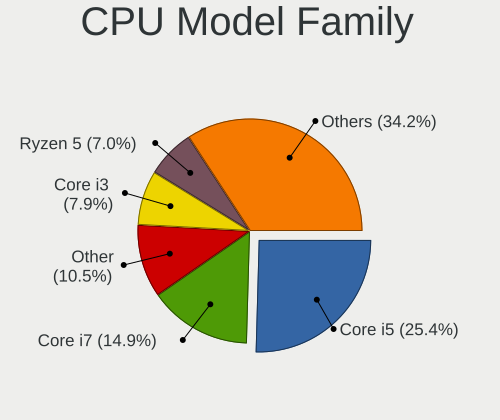

| Model                   | Desktops | Percent |
|-------------------------|----------|---------|
| Intel Core i5           | 29       | 25.44%  |
| Intel Core i7           | 17       | 14.91%  |
| Other                   | 12       | 10.53%  |
| Intel Core i3           | 9        | 7.89%   |
| AMD Ryzen 5             | 8        | 7.02%   |
| Intel Xeon              | 6        | 5.26%   |
| AMD Ryzen 7             | 6        | 5.26%   |
| Intel Core 2 Duo        | 5        | 4.39%   |
| AMD Ryzen 9             | 5        | 4.39%   |
| Intel Core i9           | 3        | 2.63%   |
| Intel Pentium           | 2        | 1.75%   |
| AMD PRO A10             | 2        | 1.75%   |
| AMD Phenom II X4        | 2        | 1.75%   |
| AMD FX                  | 2        | 1.75%   |
| Intel Pentium Dual-Core | 1        | 0.88%   |
| Intel Celeron           | 1        | 0.88%   |
| Intel Atom              | 1        | 0.88%   |
| AMD Ryzen 5 PRO         | 1        | 0.88%   |
| AMD A8                  | 1        | 0.88%   |
| AMD A10                 | 1        | 0.88%   |

CPU Cores
---------

Number of processor cores

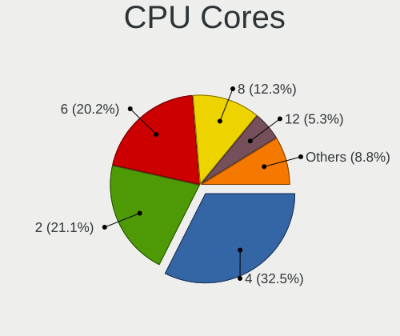

| Number | Desktops | Percent |
|--------|----------|---------|
| 4      | 37       | 32.46%  |
| 2      | 24       | 21.05%  |
| 6      | 23       | 20.18%  |
| 8      | 14       | 12.28%  |
| 12     | 6        | 5.26%   |
| 10     | 5        | 4.39%   |
| 16     | 2        | 1.75%   |
| 24     | 1        | 0.88%   |
| 14     | 1        | 0.88%   |
| 3      | 1        | 0.88%   |

CPU Sockets
-----------

Number of sockets

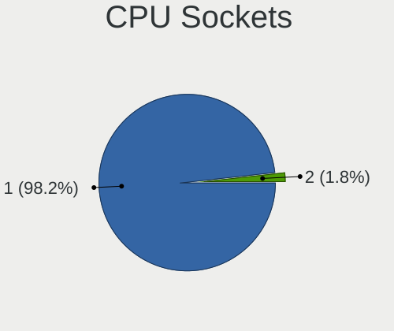

| Number | Desktops | Percent |
|--------|----------|---------|
| 1      | 112      | 98.25%  |
| 2      | 2        | 1.75%   |

CPU Threads
-----------

Threads per core (Hyper-Threading)

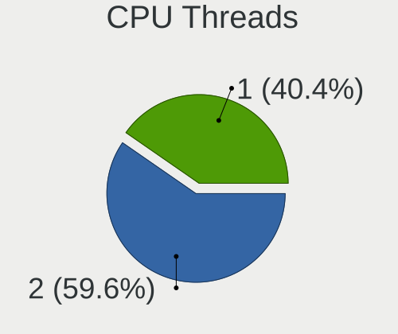

| Number | Desktops | Percent |
|--------|----------|---------|
| 2      | 68       | 59.65%  |
| 1      | 46       | 40.35%  |

CPU Op-Modes
------------

CPU Operation Modes (32-bit, 64-bit)

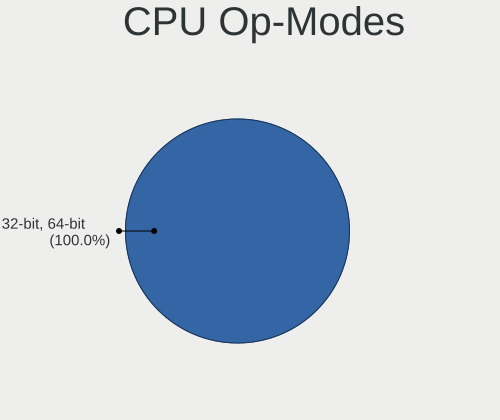

| Op mode        | Desktops | Percent |
|----------------|----------|---------|
| 32-bit, 64-bit | 114      | 100%    |

CPU Microcode
-------------

Microcode number

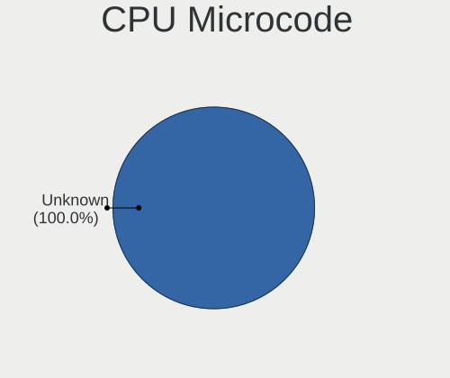

| Number  | Desktops | Percent |
|---------|----------|---------|
| Unknown | 114      | 100%    |

CPU Microarch
-------------

Microarchitecture

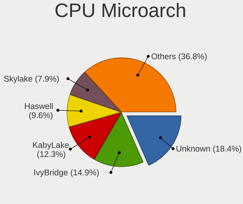

| Name        | Desktops | Percent |
|-------------|----------|---------|
| Unknown     | 21       | 18.42%  |
| IvyBridge   | 17       | 14.91%  |
| KabyLake    | 14       | 12.28%  |
| Haswell     | 11       | 9.65%   |
| Skylake     | 9        | 7.89%   |
| Zen 3       | 5        | 4.39%   |
| SandyBridge | 5        | 4.39%   |
| Penryn      | 5        | 4.39%   |
| Nehalem     | 5        | 4.39%   |
| Zen 2       | 4        | 3.51%   |
| Piledriver  | 3        | 2.63%   |
| CometLake   | 3        | 2.63%   |
| Westmere    | 2        | 1.75%   |
| K10         | 2        | 1.75%   |
| Excavator   | 2        | 1.75%   |
| Core        | 2        | 1.75%   |
| Zen+        | 1        | 0.88%   |
| Zen         | 1        | 0.88%   |
| Steamroller | 1        | 0.88%   |
| Goldmont    | 1        | 0.88%   |

Graphics
--------

GPU Vendor
----------

Vendors of graphics cards

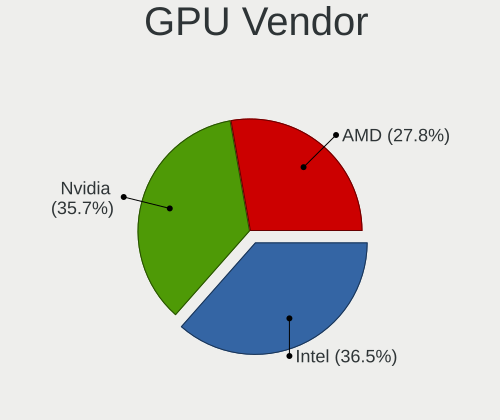

| Vendor | Desktops | Percent |
|--------|----------|---------|
| Intel  | 46       | 36.51%  |
| Nvidia | 45       | 35.71%  |
| AMD    | 35       | 27.78%  |

GPU Model
---------

Graphics card models

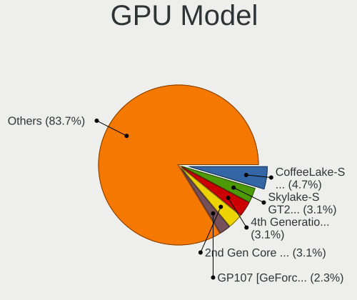

| Model                                                                       | Desktops | Percent |
|-----------------------------------------------------------------------------|----------|---------|
| Intel CoffeeLake-S GT2 [UHD Graphics 630]                                   | 6        | 4.65%   |
| Intel Skylake-S GT2 [HD Graphics 530]                                       | 4        | 3.1%    |
| Intel 4th Generation Core Processor Family Integrated Graphics Controller   | 4        | 3.1%    |
| Intel 2nd Generation Core Processor Family Integrated Graphics Controller   | 4        | 3.1%    |
| Nvidia GP107 [GeForce GTX 1050 Ti]                                          | 3        | 2.33%   |
| Intel Xeon E3-1200 v3/4th Gen Core Processor Integrated Graphics Controller | 3        | 2.33%   |
| Intel Xeon E3-1200 v2/3rd Gen Core processor Graphics Controller            | 3        | 2.33%   |
| Intel Kaby Lake-S GT2 [HD Graphics 630]                                     | 3        | 2.33%   |
| AMD Raphael                                                                 | 3        | 2.33%   |
| AMD Granite Ridge [Radeon Graphics]                                         | 3        | 2.33%   |
| AMD Ellesmere [Radeon RX 470/480/570/570X/580/580X/590]                     | 3        | 2.33%   |
| Nvidia GP108 [GeForce GT 1030]                                              | 2        | 1.55%   |
| Nvidia GP106 [GeForce GTX 1060 6GB]                                         | 2        | 1.55%   |
| Nvidia GM206 [GeForce GTX 960]                                              | 2        | 1.55%   |
| Nvidia GK208B [GeForce GT 710]                                              | 2        | 1.55%   |
| Nvidia GA106 [GeForce RTX 3060 Lite Hash Rate]                              | 2        | 1.55%   |
| Nvidia GA104 [GeForce RTX 3060 Ti Lite Hash Rate]                           | 2        | 1.55%   |
| Nvidia AD107 [GeForce RTX 4060]                                             | 2        | 1.55%   |
| Nvidia AD104 [GeForce RTX 4070 Ti]                                          | 2        | 1.55%   |
| Intel IvyBridge GT2 [HD Graphics 4000]                                      | 2        | 1.55%   |
| Intel CometLake-S GT2 [UHD Graphics 630]                                    | 2        | 1.55%   |
| Intel 4 Series Chipset Integrated Graphics Controller                       | 2        | 1.55%   |
| Intel 3rd Gen Core processor Graphics Controller                            | 2        | 1.55%   |
| AMD Wani [Radeon R5/R6/R7 Graphics]                                         | 2        | 1.55%   |
| AMD Navi 10 [Radeon RX 5600 OEM/5600 XT / 5700/5700 XT]                     | 2        | 1.55%   |
| AMD Caicos [Radeon HD 6450/7450/8450 / R5 230 OEM]                          | 2        | 1.55%   |
| Nvidia TU116 [GeForce GTX 1650 SUPER]                                       | 1        | 0.78%   |
| Nvidia GT218 [GeForce 210]                                                  | 1        | 0.78%   |
| Nvidia GT216 [GeForce 315]                                                  | 1        | 0.78%   |
| Nvidia GP107 [GeForce GTX 1050]                                             | 1        | 0.78%   |
| Nvidia GP106 [GeForce GTX 1060 3GB]                                         | 1        | 0.78%   |
| Nvidia GP104 [GeForce GTX 1080]                                             | 1        | 0.78%   |
| Nvidia GP104 [GeForce GTX 1070]                                             | 1        | 0.78%   |
| Nvidia GM107 [GeForce GTX 750 Ti]                                           | 1        | 0.78%   |
| Nvidia GK208B [GeForce GT 730]                                              | 1        | 0.78%   |
| Nvidia GK107 [GeForce GTX 650]                                              | 1        | 0.78%   |
| Nvidia GF119 [GeForce GT 610]                                               | 1        | 0.78%   |
| Nvidia GF119 [GeForce GT 520]                                               | 1        | 0.78%   |
| Nvidia GF116 [GeForce GTX 550 Ti]                                           | 1        | 0.78%   |
| Nvidia GF114 [GeForce GTX 560]                                              | 1        | 0.78%   |

GPU Combo
---------

Combinations of graphics cards

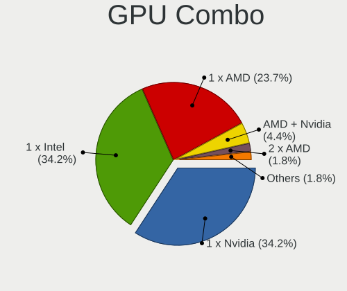

| Name           | Desktops | Percent |
|----------------|----------|---------|
| 1 x Nvidia     | 39       | 34.21%  |
| 1 x Intel      | 39       | 34.21%  |
| 1 x AMD        | 27       | 23.68%  |
| AMD + Nvidia   | 5        | 4.39%   |
| 2 x AMD        | 2        | 1.75%   |
| Intel + Nvidia | 1        | 0.88%   |
| Intel + AMD    | 1        | 0.88%   |

GPU Driver
----------

Free vs proprietary

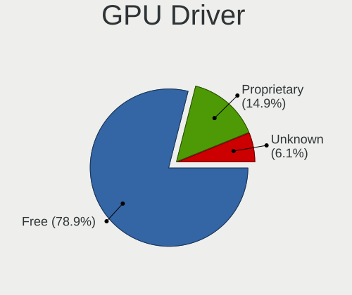

| Driver      | Desktops | Percent |
|-------------|----------|---------|
| Free        | 90       | 78.95%  |
| Proprietary | 17       | 14.91%  |
| Unknown     | 7        | 6.14%   |

GPU Memory
----------

Total video memory

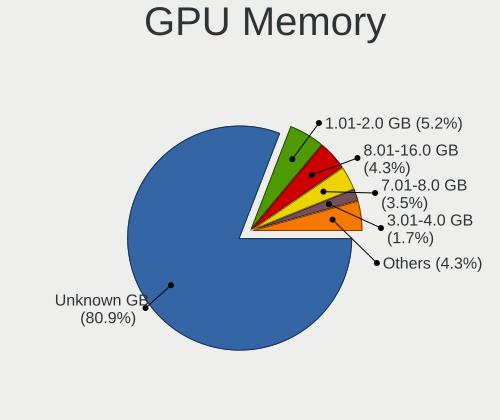

| Size in GB | Desktops | Percent |
|------------|----------|---------|
| Unknown    | 93       | 80.87%  |
| 1.01-2.0   | 6        | 5.22%   |
| 8.01-16.0  | 5        | 4.35%   |
| 7.01-8.0   | 4        | 3.48%   |
| 3.01-4.0   | 2        | 1.74%   |
| 0.51-1.0   | 2        | 1.74%   |
| 5.01-6.0   | 1        | 0.87%   |
| 2.01-3.0   | 1        | 0.87%   |
| 0.01-0.5   | 1        | 0.87%   |

Monitor
-------

Monitor Vendor
--------------

Monitor vendors

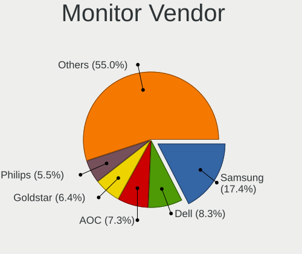

| Vendor               | Desktops | Percent |
|----------------------|----------|---------|
| Samsung Electronics  | 19       | 17.43%  |
| Dell                 | 9        | 8.26%   |
| AOC                  | 8        | 7.34%   |
| Goldstar             | 7        | 6.42%   |
| Philips              | 6        | 5.5%    |
| Hewlett-Packard      | 6        | 5.5%    |
| BenQ                 | 5        | 4.59%   |
| ViewSonic            | 4        | 3.67%   |
| MSI                  | 4        | 3.67%   |
| Iiyama               | 4        | 3.67%   |
| Lenovo               | 3        | 2.75%   |
| Acer                 | 3        | 2.75%   |
| Panasonic            | 2        | 1.83%   |
| NEC Computers        | 2        | 1.83%   |
| ITE                  | 2        | 1.83%   |
| ASUSTek Computer     | 2        | 1.83%   |
| Ancor Communications | 2        | 1.83%   |
| Unknown (XXX)        | 1        | 0.92%   |
| Unknown              | 1        | 0.92%   |
| Sony                 | 1        | 0.92%   |
| SKG                  | 1        | 0.92%   |
| Sharp                | 1        | 0.92%   |
| Sceptre Tech         | 1        | 0.92%   |
| SANSUI               | 1        | 0.92%   |
| Roku                 | 1        | 0.92%   |
| Philco               | 1        | 0.92%   |
| Onkyo                | 1        | 0.92%   |
| LG Electronics       | 1        | 0.92%   |
| KON                  | 1        | 0.92%   |
| Insignia             | 1        | 0.92%   |
| HUAWEI               | 1        | 0.92%   |
| HGC                  | 1        | 0.92%   |
| HCG                  | 1        | 0.92%   |
| Fujitsu              | 1        | 0.92%   |
| Eizo                 | 1        | 0.92%   |
| Denver               | 1        | 0.92%   |
| DENON                | 1        | 0.92%   |
| Unknown              | 1        | 0.92%   |

Monitor Model
-------------

Monitor models

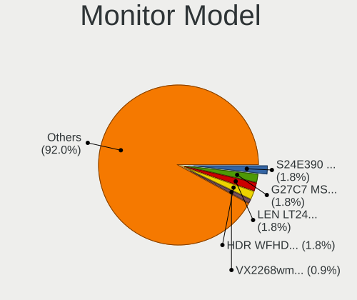

| Model                                                                  | Desktops | Percent |
|------------------------------------------------------------------------|----------|---------|
| Samsung Electronics S24E390 SAM0C1A 1920x1080 521x293mm 23.5-inch      | 2        | 1.77%   |
| MSI G27C7 MSI3CC6 1920x1080 597x336mm 27.0-inch                        | 2        | 1.77%   |
| Lenovo LEN LT2452pwC LEN1144 1920x1080 518x324mm 24.1-inch             | 2        | 1.77%   |
| Goldstar HDR WFHD GSM7714 2560x1080 798x334mm 34.1-inch                | 2        | 1.77%   |
| ViewSonic VX2268wm VSC0E23 1680x1050 474x296mm 22.0-inch               | 1        | 0.88%   |
| ViewSonic VS2747-FHD VSCD841 1920x1080 597x336mm 27.0-inch             | 1        | 0.88%   |
| ViewSonic VA2407 Series VSC8C31 1920x1080 521x293mm 23.5-inch          | 1        | 0.88%   |
| ViewSonic VA1938 Series VSC0626 1366x768 410x230mm 18.5-inch           | 1        | 0.88%   |
| Unknown LCD Monitor SAMSUNG 3840x2160                                  | 1        | 0.88%   |
| Unknown (XXX) VGA XXX0001 1366x768 410x230mm 18.5-inch                 | 1        | 0.88%   |
| Sony TV *30 SNYC105 3840x2160 1439x809mm 65.0-inch                     | 1        | 0.88%   |
| SKG DEXP DF24N2 SKG2413 1920x1080 597x336mm 27.0-inch                  | 1        | 0.88%   |
| Sharp PN-S655 SHP219B 1920x1080 1428x804mm 64.5-inch                   | 1        | 0.88%   |
| Sceptre Tech Sceptre O34 SPT8542 3440x1440 797x334mm 34.0-inch         | 1        | 0.88%   |
| SANSUI MF24X3AC XEC1519 1920x1080 527x296mm 23.8-inch                  | 1        | 0.88%   |
| Samsung Electronics U32J59x SAM0F34 3840x2160 697x392mm 31.5-inch      | 1        | 0.88%   |
| Samsung Electronics SyncMaster SAM027F 1680x1050 474x296mm 22.0-inch   | 1        | 0.88%   |
| Samsung Electronics SyncMaster SAM01B7 1280x1024 340x270mm 17.1-inch   | 1        | 0.88%   |
| Samsung Electronics SyncMaster SAM0192 1280x1024 338x270mm 17.0-inch   | 1        | 0.88%   |
| Samsung Electronics SMT27A550 SAM07B8 1920x1080 598x336mm 27.0-inch    | 1        | 0.88%   |
| Samsung Electronics SMBX2231 SAM076D 1920x1080 477x268mm 21.5-inch     | 1        | 0.88%   |
| Samsung Electronics SMBX2231 SAM076C 1920x1080 477x268mm 21.5-inch     | 1        | 0.88%   |
| Samsung Electronics SA300/SA350 SAM0793 1920x1080 531x299mm 24.0-inch  | 1        | 0.88%   |
| Samsung Electronics S27E650 SAM0CC9 1920x1080 598x336mm 27.0-inch      | 1        | 0.88%   |
| Samsung Electronics S22F350 SAM0D1A 1920x1080 477x268mm 21.5-inch      | 1        | 0.88%   |
| Samsung Electronics LU28R55 SAM1015 3840x2160 632x360mm 28.6-inch      | 1        | 0.88%   |
| Samsung Electronics LF24T35 SAM707D 1920x1080 528x297mm 23.9-inch      | 1        | 0.88%   |
| Samsung Electronics LCD Monitor SAM735B 3840x2160 1210x680mm 54.6-inch | 1        | 0.88%   |
| Samsung Electronics LCD Monitor SAM7032 1920x1080 1210x680mm 54.6-inch | 1        | 0.88%   |
| Samsung Electronics LCD Monitor SAM0C39 1920x1080 885x498mm 40.0-inch  | 1        | 0.88%   |
| Samsung Electronics LCD Monitor SAM0A7C 1366x768 698x393mm 31.5-inch   | 1        | 0.88%   |
| Samsung Electronics LC27G5xT SAM7079 2560x1440 597x336mm 27.0-inch     | 1        | 0.88%   |
| Samsung Electronics C49J89x SAM0F21 3840x1080 1196x336mm 48.9-inch     | 1        | 0.88%   |
| Samsung Electronics C32F391 SAM0D34 1920x1080 698x393mm 31.5-inch      | 1        | 0.88%   |
| Roku TV RKU7824 3840x2160 800x450mm 36.1-inch                          | 1        | 0.88%   |
| Philips PHL 241V8 PHLC212 1920x1080 527x296mm 23.8-inch                | 1        | 0.88%   |
| Philips PHL 223V5 PHLC0CF 1920x1080 477x268mm 21.5-inch                | 1        | 0.88%   |
| Philips PHL 221B6Q PHL08DF 1920x1080 477x268mm 21.5-inch               | 1        | 0.88%   |
| Philips 273EL PHLC07C 1920x1080 598x336mm 27.0-inch                    | 1        | 0.88%   |
| Philips 24M1N3200ZA PHLC276 1920x1080 527x296mm 23.8-inch              | 1        | 0.88%   |

Monitor Resolution
------------------

Monitor screen resolution

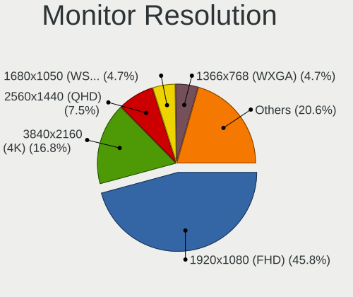

| Resolution         | Desktops | Percent |
|--------------------|----------|---------|
| 1920x1080 (FHD)    | 49       | 45.79%  |
| 3840x2160 (4K)     | 18       | 16.82%  |
| 2560x1440 (QHD)    | 8        | 7.48%   |
| 1680x1050 (WSXGA+) | 5        | 4.67%   |
| 1366x768 (WXGA)    | 5        | 4.67%   |
| 3440x1440          | 4        | 3.74%   |
| 1280x1024 (SXGA)   | 4        | 3.74%   |
| 1600x900 (HD+)     | 3        | 2.8%    |
| 2560x1080          | 2        | 1.87%   |
| 1920x1200 (WUXGA)  | 2        | 1.87%   |
| 1440x900 (WXGA+)   | 2        | 1.87%   |
| 3840x1080          | 1        | 0.93%   |
| 3280x1080          | 1        | 0.93%   |
| 1920x540           | 1        | 0.93%   |
| 1280x720 (HD)      | 1        | 0.93%   |
| Unknown            | 1        | 0.93%   |

Monitor Diagonal
----------------

Diagonal size in inches

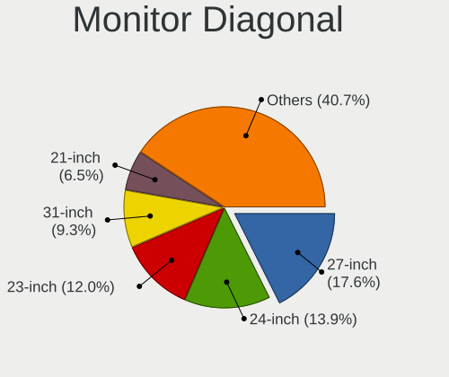

| Inches  | Desktops | Percent |
|---------|----------|---------|
| 27      | 19       | 17.59%  |
| 24      | 15       | 13.89%  |
| 23      | 13       | 12.04%  |
| 31      | 10       | 9.26%   |
| 21      | 7        | 6.48%   |
| 22      | 5        | 4.63%   |
| 18      | 4        | 3.7%    |
| 17      | 4        | 3.7%    |
| 54      | 3        | 2.78%   |
| 34      | 3        | 2.78%   |
| 20      | 3        | 2.78%   |
| Unknown | 3        | 2.78%   |
| 84      | 2        | 1.85%   |
| 65      | 2        | 1.85%   |
| 63      | 2        | 1.85%   |
| 26      | 2        | 1.85%   |
| 19      | 2        | 1.85%   |
| 74      | 1        | 0.93%   |
| 64      | 1        | 0.93%   |
| 57      | 1        | 0.93%   |
| 49      | 1        | 0.93%   |
| 40      | 1        | 0.93%   |
| 36      | 1        | 0.93%   |
| 32      | 1        | 0.93%   |
| 28      | 1        | 0.93%   |
| 25      | 1        | 0.93%   |

Monitor Width
-------------

Physical width

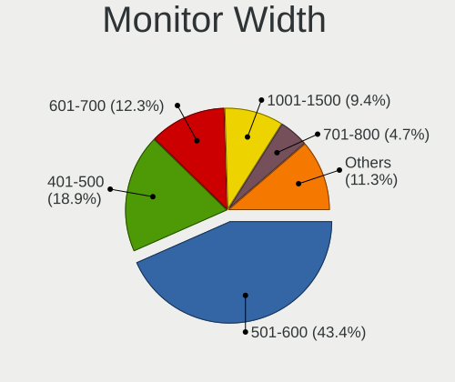

| Width in mm | Desktops | Percent |
|-------------|----------|---------|
| 501-600     | 46       | 43.4%   |
| 401-500     | 20       | 18.87%  |
| 601-700     | 13       | 12.26%  |
| 1001-1500   | 10       | 9.43%   |
| 701-800     | 5        | 4.72%   |
| 301-350     | 4        | 3.77%   |
| 1501-2000   | 3        | 2.83%   |
| Unknown     | 3        | 2.83%   |
| 351-400     | 1        | 0.94%   |
| 901-1000    | 1        | 0.94%   |

Aspect Ratio
------------

Proportional relationship between the width and the height

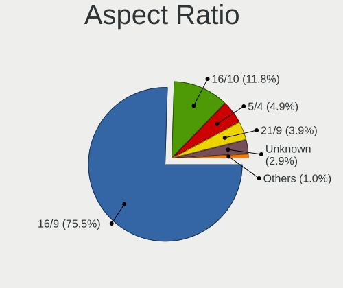

| Ratio   | Desktops | Percent |
|---------|----------|---------|
| 16/9    | 77       | 75.49%  |
| 16/10   | 12       | 11.76%  |
| 5/4     | 5        | 4.9%    |
| 21/9    | 4        | 3.92%   |
| Unknown | 3        | 2.94%   |
| 32/9    | 1        | 0.98%   |

Monitor Area
------------

Area in inch²

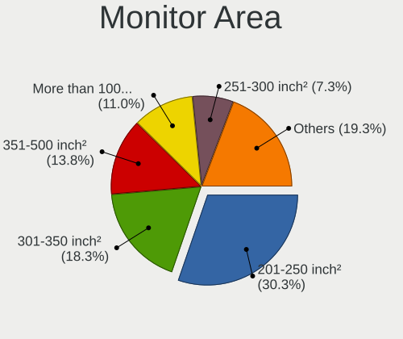

| Area in inch² | Desktops | Percent |
|----------------|----------|---------|
| 201-250        | 33       | 30.28%  |
| 301-350        | 20       | 18.35%  |
| 351-500        | 15       | 13.76%  |
| More than 1000 | 12       | 11.01%  |
| 251-300        | 8        | 7.34%   |
| 151-200        | 8        | 7.34%   |
| 141-150        | 7        | 6.42%   |
| 501-1000       | 3        | 2.75%   |
| Unknown        | 3        | 2.75%   |

Pixel Density
-------------

Pixels per inch

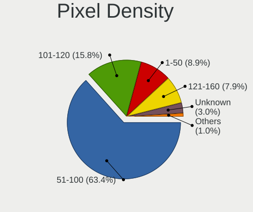

| Density | Desktops | Percent |
|---------|----------|---------|
| 51-100  | 64       | 63.37%  |
| 101-120 | 16       | 15.84%  |
| 1-50    | 9        | 8.91%   |
| 121-160 | 8        | 7.92%   |
| Unknown | 3        | 2.97%   |
| 161-240 | 1        | 0.99%   |

Multiple Monitors
-----------------

Total monitors connected

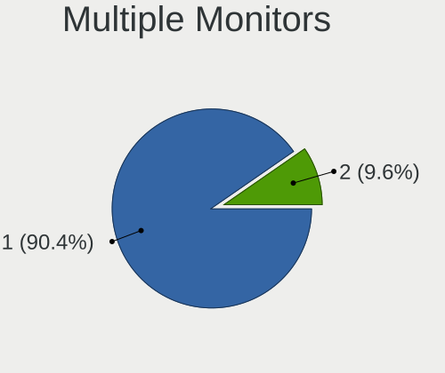

| Total | Desktops | Percent |
|-------|----------|---------|
| 1     | 103      | 90.35%  |
| 2     | 11       | 9.65%   |

Network
-------

Net Controller Vendor
---------------------

Controller vendors

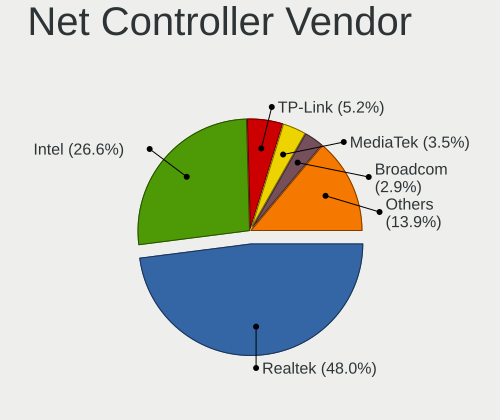

| Vendor                                | Desktops | Percent |
|---------------------------------------|----------|---------|
| Realtek Semiconductor                 | 83       | 47.98%  |
| Intel                                 | 46       | 26.59%  |
| TP-Link                               | 9        | 5.2%    |
| MediaTek                              | 6        | 3.47%   |
| Broadcom                              | 5        | 2.89%   |
| Qualcomm Atheros                      | 3        | 1.73%   |
| Samsung Electronics                   | 2        | 1.16%   |
| Ralink Technology                     | 2        | 1.16%   |
| Qualcomm                              | 2        | 1.16%   |
| NetGear                               | 2        | 1.16%   |
| Realtek                               | 1        | 0.58%   |
| Qualcomm Technologies                 | 1        | 0.58%   |
| Qualcomm Atheros Communications       | 1        | 0.58%   |
| Microsoft                             | 1        | 0.58%   |
| Edimax Technology                     | 1        | 0.58%   |
| D-Link System                         | 1        | 0.58%   |
| BUFFALO                               | 1        | 0.58%   |
| Broadcom Limited                      | 1        | 0.58%   |
| Belkin Components                     | 1        | 0.58%   |
| ASIX Electronics                      | 1        | 0.58%   |
| Aquantia                              | 1        | 0.58%   |
| 802.11g Adapter [Linksys WUSB54GC v3] | 1        | 0.58%   |
| Unknown                               | 1        | 0.58%   |

Net Controller Model
--------------------

Controller models

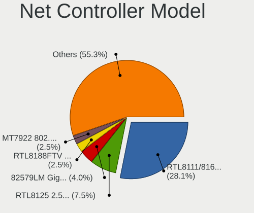

| Model                                                                  | Desktops | Percent |
|------------------------------------------------------------------------|----------|---------|
| Realtek RTL8111/8168/8211/8411 PCI Express Gigabit Ethernet Controller | 56       | 28.14%  |
| Realtek RTL8125 2.5GbE Controller                                      | 15       | 7.54%   |
| Intel 82579LM Gigabit Network Connection (Lewisville)                  | 8        | 4.02%   |
| Realtek RTL8188FTV 802.11b/g/n 1T1R 2.4G WLAN Adapter                  | 5        | 2.51%   |
| MediaTek MT7922 802.11ax PCI Express Wireless Network Adapter          | 5        | 2.51%   |
| Realtek RTL8188EUS 802.11n Wireless Network Adapter                    | 4        | 2.01%   |
| Realtek RTL810xE PCI Express Fast Ethernet controller                  | 4        | 2.01%   |
| Realtek 802.11ac NIC                                                   | 4        | 2.01%   |
| Intel Wireless 7265                                                    | 4        | 2.01%   |
| Intel Wi-Fi 6E(802.11ax) AX210/AX1675* 2x2 [Typhoon Peak]              | 4        | 2.01%   |
| Intel Ethernet Connection (2) I219-V                                   | 4        | 2.01%   |
| Realtek RTL88x2bu [AC1200 Techkey]                                     | 3        | 1.51%   |
| Realtek RTL8153 Gigabit Ethernet Adapter                               | 3        | 1.51%   |
| Intel Wi-Fi 6 AX200                                                    | 3        | 1.51%   |
| Intel Ethernet Connection (7) I219-V                                   | 3        | 1.51%   |
| Intel Ethernet Connection (7) I219-LM                                  | 3        | 1.51%   |
| Intel 700 Series Chipset CNVi WiFi                                     | 3        | 1.51%   |
| TP-Link Archer T4U v2 [Realtek RTL8812AU]                              | 2        | 1.01%   |
| TP-Link AC600 wireless Realtek RTL8811AU [Archer T2U Nano]             | 2        | 1.01%   |
| Samsung Galaxy series, misc. (tethering mode)                          | 2        | 1.01%   |
| Realtek RTL8821CE 802.11ac PCIe Wireless Network Adapter               | 2        | 1.01%   |
| Realtek RTL8188CE 802.11b/g/n WiFi Adapter                             | 2        | 1.01%   |
| Intel I211 Gigabit Network Connection                                  | 2        | 1.01%   |
| Intel Ethernet Controller I225-V                                       | 2        | 1.01%   |
| Intel Ethernet Connection (5) I219-LM                                  | 2        | 1.01%   |
| Intel Dual Band Wireless-AC 3165 Plus Bluetooth                        | 2        | 1.01%   |
| Broadcom NetXtreme BCM5764M Gigabit Ethernet PCIe                      | 2        | 1.01%   |
| Broadcom NetXtreme BCM5762 Gigabit Ethernet PCIe                       | 2        | 1.01%   |
| TP-Link TL-WN823N v2/v3 [Realtek RTL8192EU]                            | 1        | 0.5%    |
| TP-Link TL-WN821N v5/v6 [RTL8192EU]                                    | 1        | 0.5%    |
| TP-Link Archer T3U [Realtek RTL8812BU]                                 | 1        | 0.5%    |
| TP-Link 802.11ac WLAN Adapter                                          | 1        | 0.5%    |
| TP-Link 802.11ac NIC                                                   | 1        | 0.5%    |
| Realtek RTL8852BE PCIe 802.11ax Wireless Network Controller            | 1        | 0.5%    |
| Realtek RTL8192SU 802.11n WLAN Adapter                                 | 1        | 0.5%    |
| Realtek RTL8126 5GbE Controller                                        | 1        | 0.5%    |
| Realtek Killer E3000 2.5GbE Controller                                 | 1        | 0.5%    |
| Realtek 802.11ax WLAN Adapter                                          | 1        | 0.5%    |
| Ralink RT5370 Wireless Adapter                                         | 1        | 0.5%    |
| Ralink RT2870/RT3070 Wireless Adapter                                  | 1        | 0.5%    |

Wireless Vendor
---------------

Wireless vendors

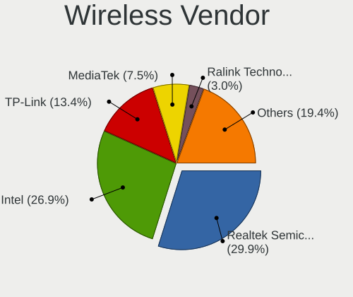

| Vendor                                | Desktops | Percent |
|---------------------------------------|----------|---------|
| Realtek Semiconductor                 | 20       | 29.85%  |
| Intel                                 | 18       | 26.87%  |
| TP-Link                               | 9        | 13.43%  |
| MediaTek                              | 5        | 7.46%   |
| Ralink Technology                     | 2        | 2.99%   |
| Qualcomm Atheros                      | 2        | 2.99%   |
| NetGear                               | 2        | 2.99%   |
| Realtek                               | 1        | 1.49%   |
| Qualcomm Atheros Communications       | 1        | 1.49%   |
| Microsoft                             | 1        | 1.49%   |
| Edimax Technology                     | 1        | 1.49%   |
| D-Link System                         | 1        | 1.49%   |
| BUFFALO                               | 1        | 1.49%   |
| Broadcom Limited                      | 1        | 1.49%   |
| Belkin Components                     | 1        | 1.49%   |
| 802.11g Adapter [Linksys WUSB54GC v3] | 1        | 1.49%   |

Wireless Model
--------------

Wireless models

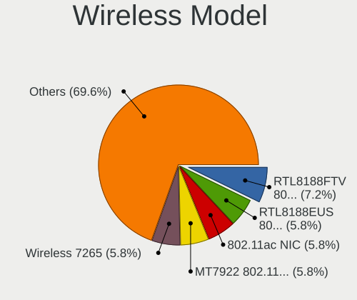

| Model                                                                                               | Desktops | Percent |
|-----------------------------------------------------------------------------------------------------|----------|---------|
| Realtek RTL8188FTV 802.11b/g/n 1T1R 2.4G WLAN Adapter                                               | 5        | 7.25%   |
| Realtek RTL8188EUS 802.11n Wireless Network Adapter                                                 | 4        | 5.8%    |
| Realtek 802.11ac NIC                                                                                | 4        | 5.8%    |
| MediaTek MT7922 802.11ax PCI Express Wireless Network Adapter                                       | 4        | 5.8%    |
| Intel Wireless 7265                                                                                 | 4        | 5.8%    |
| Intel Wi-Fi 6E(802.11ax) AX210/AX1675* 2x2 [Typhoon Peak]                                           | 4        | 5.8%    |
| Realtek RTL88x2bu [AC1200 Techkey]                                                                  | 3        | 4.35%   |
| Intel Wi-Fi 6 AX200                                                                                 | 3        | 4.35%   |
| Intel 700 Series Chipset CNVi WiFi                                                                  | 3        | 4.35%   |
| TP-Link Archer T4U v2 [Realtek RTL8812AU]                                                           | 2        | 2.9%    |
| TP-Link AC600 wireless Realtek RTL8811AU [Archer T2U Nano]                                          | 2        | 2.9%    |
| Realtek RTL8821CE 802.11ac PCIe Wireless Network Adapter                                            | 2        | 2.9%    |
| Realtek RTL8188CE 802.11b/g/n WiFi Adapter                                                          | 2        | 2.9%    |
| Intel Dual Band Wireless-AC 3165 Plus Bluetooth                                                     | 2        | 2.9%    |
| TP-Link TL-WN823N v2/v3 [Realtek RTL8192EU]                                                         | 1        | 1.45%   |
| TP-Link TL-WN821N v5/v6 [RTL8192EU]                                                                 | 1        | 1.45%   |
| TP-Link Archer T3U [Realtek RTL8812BU]                                                              | 1        | 1.45%   |
| TP-Link 802.11ac WLAN Adapter                                                                       | 1        | 1.45%   |
| TP-Link 802.11ac NIC                                                                                | 1        | 1.45%   |
| Realtek RTL8852BE PCIe 802.11ax Wireless Network Controller                                         | 1        | 1.45%   |
| Realtek RTL8192SU 802.11n WLAN Adapter                                                              | 1        | 1.45%   |
| Realtek 802.11ax WLAN Adapter                                                                       | 1        | 1.45%   |
| Ralink RT5370 Wireless Adapter                                                                      | 1        | 1.45%   |
| Ralink RT2870/RT3070 Wireless Adapter                                                               | 1        | 1.45%   |
| Qualcomm Atheros AR9271 802.11n                                                                     | 1        | 1.45%   |
| Qualcomm Atheros AR9485 Wireless Network Adapter                                                    | 1        | 1.45%   |
| Qualcomm Atheros AR9227 Wireless Network Adapter                                                    | 1        | 1.45%   |
| NetGear WNA1100 Wireless-N 150 [Atheros AR9271]                                                     | 1        | 1.45%   |
| NetGear A6210                                                                                       | 1        | 1.45%   |
| Microsoft Xbox Wireless Adapter for Windows                                                         | 1        | 1.45%   |
| MediaTek MT7927 802.11be 320MHz 2x2 PCIe Wireless Network Adapter [Filogic 380]                     | 1        | 1.45%   |
| Intel Wireless 7260                                                                                 | 1        | 1.45%   |
| Intel Cannon Lake PCH CNVi WiFi                                                                     | 1        | 1.45%   |
| Edimax EW-7811Un 802.11n Wireless Adapter [Realtek RTL8188CUS]                                      | 1        | 1.45%   |
| D-Link System AirPlus G DWL-G122 Wireless Adapter(rev.C1) [Ralink RT2571W]                          | 1        | 1.45%   |
| BUFFALO 802.11ac NIC                                                                                | 1        | 1.45%   |
| Broadcom Limited BCM43225 802.11b/g/n                                                               | 1        | 1.45%   |
| Belkin Components F6D4050 N150 Enhanced Wireless Network Adapter v2000 [Ralink RT3070]              | 1        | 1.45%   |
| 802.11g Adapter [Linksys WUSB54GC v3] WUSB100 v2 RangePlus Wireless Network Adapter [Ralink RT3070] | 1        | 1.45%   |

Ethernet Vendor
---------------

Ethernet vendors

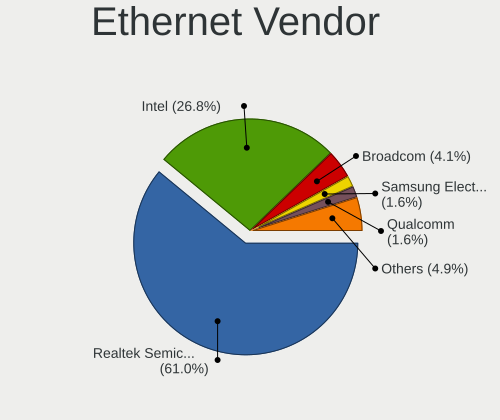

| Vendor                | Desktops | Percent |
|-----------------------|----------|---------|
| Realtek Semiconductor | 75       | 60.98%  |
| Intel                 | 33       | 26.83%  |
| Broadcom              | 5        | 4.07%   |
| Samsung Electronics   | 2        | 1.63%   |
| Qualcomm              | 2        | 1.63%   |
| Qualcomm Technologies | 1        | 0.81%   |
| Qualcomm Atheros      | 1        | 0.81%   |
| MediaTek              | 1        | 0.81%   |
| ASIX Electronics      | 1        | 0.81%   |
| Aquantia              | 1        | 0.81%   |
| Unknown               | 1        | 0.81%   |

Ethernet Model
--------------

Ethernet models

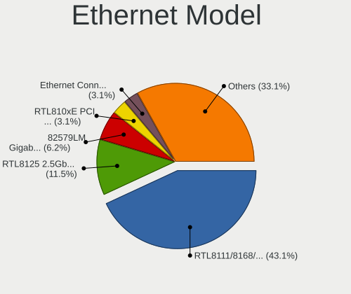

| Model                                                                           | Desktops | Percent |
|---------------------------------------------------------------------------------|----------|---------|
| Realtek RTL8111/8168/8211/8411 PCI Express Gigabit Ethernet Controller          | 56       | 43.08%  |
| Realtek RTL8125 2.5GbE Controller                                               | 15       | 11.54%  |
| Intel 82579LM Gigabit Network Connection (Lewisville)                           | 8        | 6.15%   |
| Realtek RTL810xE PCI Express Fast Ethernet controller                           | 4        | 3.08%   |
| Intel Ethernet Connection (2) I219-V                                            | 4        | 3.08%   |
| Realtek RTL8153 Gigabit Ethernet Adapter                                        | 3        | 2.31%   |
| Intel Ethernet Connection (7) I219-V                                            | 3        | 2.31%   |
| Intel Ethernet Connection (7) I219-LM                                           | 3        | 2.31%   |
| Samsung Galaxy series, misc. (tethering mode)                                   | 2        | 1.54%   |
| Intel I211 Gigabit Network Connection                                           | 2        | 1.54%   |
| Intel Ethernet Controller I225-V                                                | 2        | 1.54%   |
| Intel Ethernet Connection (5) I219-LM                                           | 2        | 1.54%   |
| Broadcom NetXtreme BCM5764M Gigabit Ethernet PCIe                               | 2        | 1.54%   |
| Broadcom NetXtreme BCM5762 Gigabit Ethernet PCIe                                | 2        | 1.54%   |
| Realtek RTL8126 5GbE Controller                                                 | 1        | 0.77%   |
| Realtek Killer E3000 2.5GbE Controller                                          | 1        | 0.77%   |
| Qualcomm YUPIK-QRD _SN:AC1D5909                                                 | 1        | 0.77%   |
| Qualcomm WCN785x Wi-Fi 7(802.11be) 320MHz 2x2 [FastConnect 7800]                | 1        | 0.77%   |
| Qualcomm Nokia X30 5G                                                           | 1        | 0.77%   |
| Qualcomm Atheros AR8131 Gigabit Ethernet                                        | 1        | 0.77%   |
| MediaTek MT7922 802.11ax PCI Express Wireless Network Adapter                   | 1        | 0.77%   |
| Intel PRO/100 VE Network Connection                                             | 1        | 0.77%   |
| Intel I210 Gigabit Network Connection                                           | 1        | 0.77%   |
| Intel Ethernet Controller I226-V                                                | 1        | 0.77%   |
| Intel Ethernet Controller I219-V                                                | 1        | 0.77%   |
| Intel Ethernet Connection I217-LM                                               | 1        | 0.77%   |
| Intel Ethernet Connection (2) I219-LM                                           | 1        | 0.77%   |
| Intel Alder Lake-P PCH CNVi WiFi                                                | 1        | 0.77%   |
| Intel 82579V Gigabit Network Connection                                         | 1        | 0.77%   |
| Intel 82578DC Gigabit Network Connection                                        | 1        | 0.77%   |
| Intel 82574L Gigabit Network Connection                                         | 1        | 0.77%   |
| Intel 80003ES2LAN Gigabit Ethernet Controller (Copper)                          | 1        | 0.77%   |
| Broadcom NetLink BCM57781 Gigabit Ethernet PCIe                                 | 1        | 0.77%   |
| ASIX AX88179 Gigabit Ethernet                                                   | 1        | 0.77%   |
| Aquantia AQtion AQC113CS NBase-T/IEEE 802.3an Ethernet Controller [Antigua 10G] | 1        | 0.77%   |
| Unknown                                                                         | 1        | 0.77%   |

Net Controller Kind
-------------------

Ethernet, WiFi or modem

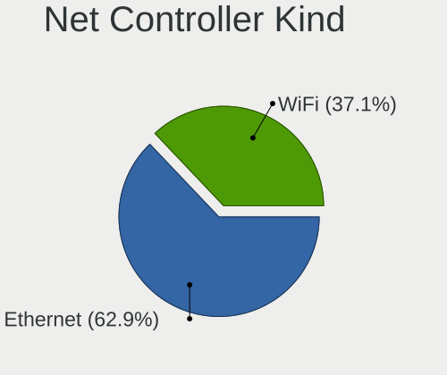

| Kind     | Desktops | Percent |
|----------|----------|---------|
| Ethernet | 112      | 62.92%  |
| WiFi     | 66       | 37.08%  |

Used Controller
---------------

Currently used network controller

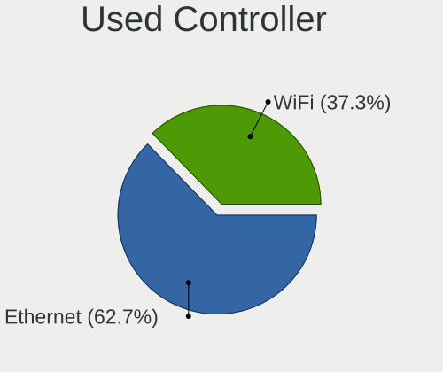

| Kind     | Desktops | Percent |
|----------|----------|---------|
| Ethernet | 79       | 62.7%   |
| WiFi     | 47       | 37.3%   |

NICs
----

Total network controllers on board

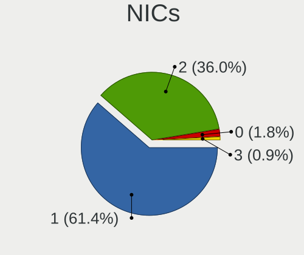

| Total | Desktops | Percent |
|-------|----------|---------|
| 1     | 70       | 61.4%   |
| 2     | 41       | 35.96%  |
| 0     | 2        | 1.75%   |
| 3     | 1        | 0.88%   |

IPv6
----

IPv6 vs IPv4

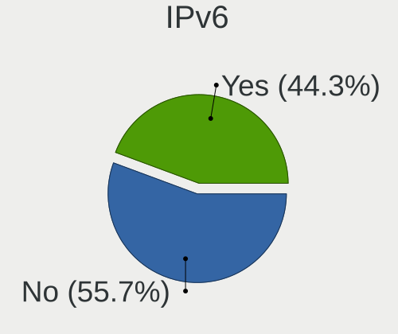

| Used | Desktops | Percent |
|------|----------|---------|
| No   | 64       | 55.65%  |
| Yes  | 51       | 44.35%  |

Bluetooth
---------

Bluetooth Vendor
----------------

Controller vendors

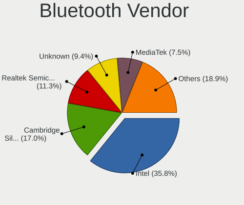

| Vendor                  | Desktops | Percent |
|-------------------------|----------|---------|
| Intel                   | 19       | 35.85%  |
| Cambridge Silicon Radio | 9        | 16.98%  |
| Realtek Semiconductor   | 6        | 11.32%  |
| Unknown                 | 5        | 9.43%   |
| MediaTek                | 4        | 7.55%   |
| IMC Networks            | 3        | 5.66%   |
| Foxconn / Hon Hai       | 2        | 3.77%   |
| Broadcom                | 2        | 3.77%   |
| TP-Link                 | 1        | 1.89%   |
| Apple                   | 1        | 1.89%   |
| Actions                 | 1        | 1.89%   |

Bluetooth Model
---------------

Controller models

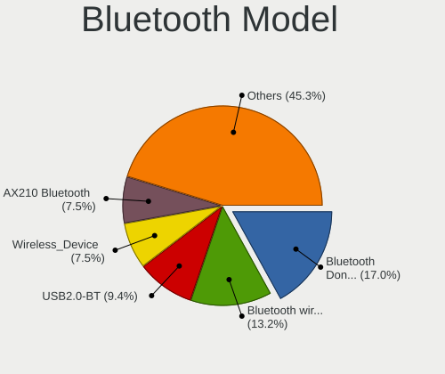

| Model                                               | Desktops | Percent |
|-----------------------------------------------------|----------|---------|
| Cambridge Silicon Radio Bluetooth Dongle (HCI mode) | 9        | 16.98%  |
| Intel Bluetooth wireless interface                  | 7        | 13.21%  |
| Unknown                                             | 5        | 9.43%   |
| MediaTek Wireless_Device                            | 4        | 7.55%   |
| Intel AX210 Bluetooth                               | 4        | 7.55%   |
| Intel AX200 Bluetooth                               | 3        | 5.66%   |
| Realtek Bluetooth Radio                             | 2        | 3.77%   |
| Realtek Bluetooth 5.4 Radio                         | 2        | 3.77%   |
| Realtek Bluetooth 5.3 Radio                         | 2        | 3.77%   |
| Intel Bluetooth Device                              | 2        | 3.77%   |
| Intel Bluetooth 9460/9560 Jefferson Peak (JfP)      | 2        | 3.77%   |
| IMC Networks Bluetooth Radio                        | 2        | 3.77%   |
| TP-Link TP-T@- UB500 Adapter                        | 1        | 1.89%   |
| Intel AX201 Bluetooth                               | 1        | 1.89%   |
| IMC Networks Wireless_Device                        | 1        | 1.89%   |
| Foxconn / Hon Hai Wireless_Device                   | 1        | 1.89%   |
| Foxconn / Hon Hai Bluetooth Device                  | 1        | 1.89%   |
| Broadcom BCM20702A0 Bluetooth 4.0                   | 1        | 1.89%   |
| Broadcom BCM2045 Bluetooth                          | 1        | 1.89%   |
| Apple Bluetooth HCI                                 | 1        | 1.89%   |
| Actions general adapter                             | 1        | 1.89%   |

Sound
-----

Sound Vendor
------------

Sound card vendors

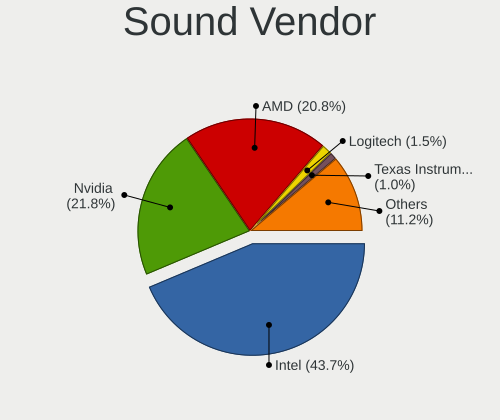

| Vendor                                       | Desktops | Percent |
|----------------------------------------------|----------|---------|
| Intel                                        | 86       | 43.65%  |
| Nvidia                                       | 43       | 21.83%  |
| AMD                                          | 41       | 20.81%  |
| Logitech                                     | 3        | 1.52%   |
| Texas Instruments                            | 2        | 1.02%   |
| Plantronics                                  | 2        | 1.02%   |
| Micro Star International                     | 2        | 1.02%   |
| Generalplus Technology                       | 2        | 1.02%   |
| Creative Labs                                | 2        | 1.02%   |
| C-Media Electronics                          | 2        | 1.02%   |
| Zoran Co. Personal Media Division (Nogatech) | 1        | 0.51%   |
| VIA Technologies                             | 1        | 0.51%   |
| Thesycon Systemsoftware & Consulting         | 1        | 0.51%   |
| Kingston Technology                          | 1        | 0.51%   |
| JMTek                                        | 1        | 0.51%   |
| Hewlett-Packard                              | 1        | 0.51%   |
| GN Netcom                                    | 1        | 0.51%   |
| CMTECK                                       | 1        | 0.51%   |
| Cambridge Silicon Radio                      | 1        | 0.51%   |
| BEHRINGER International                      | 1        | 0.51%   |
| ASUSTek Computer                             | 1        | 0.51%   |
| Areson Technology                            | 1        | 0.51%   |

Sound Model
-----------

Sound card models

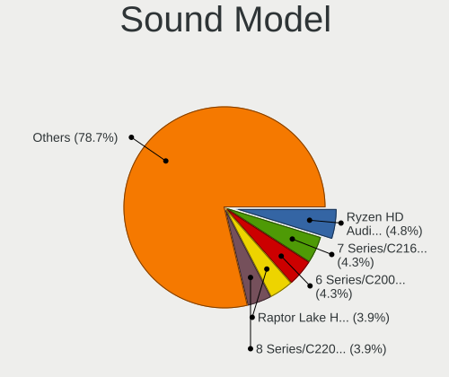

| Model                                                                                           | Desktops | Percent |
|-------------------------------------------------------------------------------------------------|----------|---------|
| AMD Ryzen HD Audio Controller                                                                   | 11       | 4.78%   |
| Intel 7 Series/C216 Chipset Family High Definition Audio Controller                             | 10       | 4.35%   |
| Intel 6 Series/C200 Series Chipset Family High Definition Audio Controller                      | 10       | 4.35%   |
| Intel Raptor Lake High Definition Audio Controller                                              | 9        | 3.91%   |
| Intel 8 Series/C220 Series Chipset High Definition Audio Controller                             | 9        | 3.91%   |
| AMD Radeon High Definition Audio Controller                                                     | 9        | 3.91%   |
| Intel 100 Series/C230 Series Chipset Family HD Audio Controller                                 | 8        | 3.48%   |
| Intel Cannon Lake PCH cAVS                                                                      | 7        | 3.04%   |
| Intel 200 Series PCH HD Audio                                                                   | 7        | 3.04%   |
| AMD Starship/Matisse HD Audio Controller                                                        | 7        | 3.04%   |
| Intel Xeon E3-1200 v3/4th Gen Core Processor HD Audio Controller                                | 6        | 2.61%   |
| Intel NM10/ICH7 Family High Definition Audio Controller                                         | 6        | 2.61%   |
| Intel 82801JI (ICH10 Family) HD Audio Controller                                                | 5        | 2.17%   |
| Nvidia GP107GL High Definition Audio Controller                                                 | 4        | 1.74%   |
| Nvidia AD104 High Definition Audio Controller                                                   | 4        | 1.74%   |
| AMD SBx00 Azalia (Intel HDA)                                                                    | 4        | 1.74%   |
| AMD Ellesmere HDMI Audio [Radeon RX 470/480 / 570/580/590]                                      | 4        | 1.74%   |
| Nvidia GP106 High Definition Audio Controller                                                   | 3        | 1.3%    |
| Nvidia GK208 HDMI/DP Audio Controller                                                           | 3        | 1.3%    |
| Nvidia GA104 High Definition Audio Controller                                                   | 3        | 1.3%    |
| AMD Oland/Hainan/Cape Verde/Pitcairn HDMI Audio [Radeon HD 7000 Series]                         | 3        | 1.3%    |
| AMD Baffin HDMI/DP Audio [Radeon RX 550 640SP / RX 560/560X]                                    | 3        | 1.3%    |
| Nvidia GP108 High Definition Audio Controller                                                   | 2        | 0.87%   |
| Nvidia GP104 High Definition Audio Controller                                                   | 2        | 0.87%   |
| Nvidia GM206 High Definition Audio Controller                                                   | 2        | 0.87%   |
| Nvidia GF119 HDMI Audio Controller                                                              | 2        | 0.87%   |
| Nvidia GF108 High Definition Audio Controller                                                   | 2        | 0.87%   |
| Nvidia GB206 High Definition Audio Controller                                                   | 2        | 0.87%   |
| Nvidia GB203 High Definition Audio Controller                                                   | 2        | 0.87%   |
| Nvidia GA106 High Definition Audio Controller                                                   | 2        | 0.87%   |
| Nvidia AD107 High Definition Audio Controller                                                   | 2        | 0.87%   |
| Micro Star International USB Audio                                                              | 2        | 0.87%   |
| Intel Smart Sound Technology (SST) Audio Controller                                             | 2        | 0.87%   |
| Intel C600/X79 series chipset High Definition Audio Controller                                  | 2        | 0.87%   |
| Intel 5 Series/3400 Series Chipset High Definition Audio                                        | 2        | 0.87%   |
| Generalplus Technology USB Audio Device                                                         | 2        | 0.87%   |
| Creative Labs CA0132 Sound Core3D [Sound Blaster Recon3D / Z-Series / Sound BlasterX AE-5 Plus] | 2        | 0.87%   |
| AMD Renoir/Cezanne HDMI/DP Audio Controller                                                     | 2        | 0.87%   |
| AMD Navi 31 HDMI/DP Audio                                                                       | 2        | 0.87%   |
| AMD Navi 10 HDMI Audio                                                                          | 2        | 0.87%   |

Memory
------

Memory Vendor
-------------

Memory module vendors

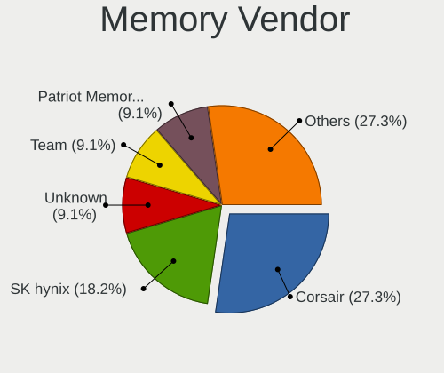

| Vendor                       | Desktops | Percent |
|------------------------------|----------|---------|
| Corsair                      | 3        | 27.27%  |
| SK hynix                     | 2        | 18.18%  |
| Unknown                      | 1        | 9.09%   |
| Team                         | 1        | 9.09%   |
| Patriot Memory (PDP Systems) | 1        | 9.09%   |
| Micron Technology            | 1        | 9.09%   |
| Kingston                     | 1        | 9.09%   |
| Unknown                      | 1        | 9.09%   |

Memory Model
------------

Memory module models

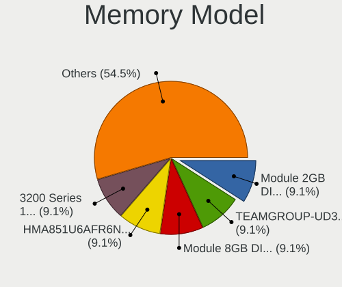

| Model                                                                | Desktops | Percent |
|----------------------------------------------------------------------|----------|---------|
| Unknown RAM Module 2GB DIMM SDRAM 800MT/s                            | 1        | 9.09%   |
| Team RAM TEAMGROUP-UD3 8GB DIMM DDR3 1600MT/s                        | 1        | 9.09%   |
| SK hynix RAM Module 8GB DIMM DDR4 2667MT/s                           | 1        | 9.09%   |
| SK hynix RAM HMA851U6AFR6N-UH 4GB DIMM DDR4 2400MT/s                 | 1        | 9.09%   |
| Patriot Memory (PDP Systems) RAM 3200 Series 16GB DIMM DDR4 3200MT/s | 1        | 9.09%   |
| Micron RAM 16ATF2G64AZ-3G2J1 16GB DIMM DDR4 3200MT/s                 | 1        | 9.09%   |
| Kingston RAM 9905622-057.A00G 4096MB DIMM DDR4 2133MT/s              | 1        | 9.09%   |
| Corsair RAM CMZ16GX3M2A18 8GB DIMM DDR3 1333MT/s                     | 1        | 9.09%   |
| Corsair RAM CMK64GX4M2E3200C16 32GB DIMM DDR4 3600MT/s               | 1        | 9.09%   |
| Corsair RAM CMK16GX4M2B3000C15 8GB DIMM DDR4 3600MT/s                | 1        | 9.09%   |
| Unknown                                                              | 1        | 9.09%   |

Memory Kind
-----------

Memory module kinds

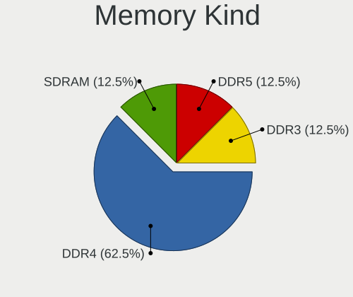

| Kind  | Desktops | Percent |
|-------|----------|---------|
| DDR4  | 5        | 62.5%   |
| SDRAM | 1        | 12.5%   |
| DDR5  | 1        | 12.5%   |
| DDR3  | 1        | 12.5%   |

Memory Form Factor
------------------

Physical design of the memory module

| Name | Desktops | Percent |
|------|----------|---------|
| DIMM | 8        | 100%    |

Memory Size
-----------

Memory module size

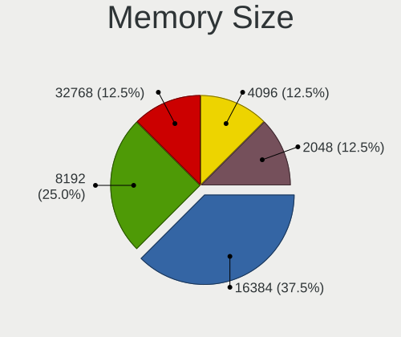

| Size  | Desktops | Percent |
|-------|----------|---------|
| 16384 | 3        | 37.5%   |
| 8192  | 2        | 25%     |
| 32768 | 1        | 12.5%   |
| 4096  | 1        | 12.5%   |
| 2048  | 1        | 12.5%   |

Memory Speed
------------

Memory module speed

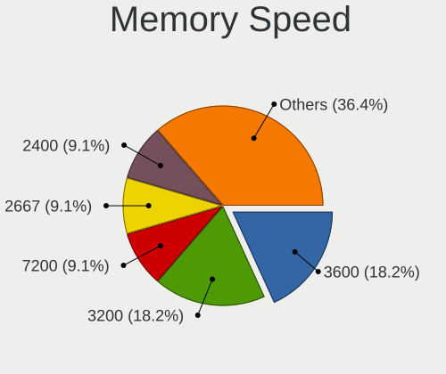

| Speed | Desktops | Percent |
|-------|----------|---------|
| 3600  | 2        | 18.18%  |
| 3200  | 2        | 18.18%  |
| 7200  | 1        | 9.09%   |
| 2667  | 1        | 9.09%   |
| 2400  | 1        | 9.09%   |
| 2133  | 1        | 9.09%   |
| 1600  | 1        | 9.09%   |
| 1333  | 1        | 9.09%   |
| 800   | 1        | 9.09%   |

Printers & scanners
-------------------

Printer Vendor
--------------

Printer device vendors

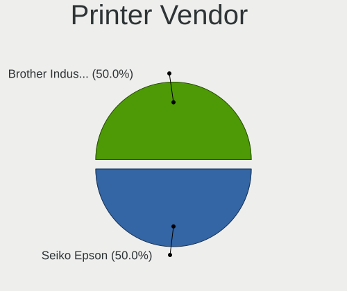

| Vendor             | Desktops | Percent |
|--------------------|----------|---------|
| Seiko Epson        | 1        | 50%     |
| Brother Industries | 1        | 50%     |

Printer Model
-------------

Printer device models

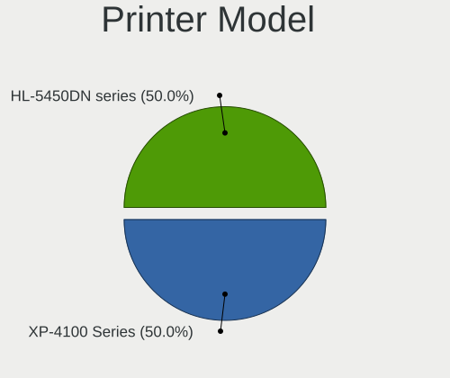

| Model                      | Desktops | Percent |
|----------------------------|----------|---------|
| Seiko Epson XP-4100 Series | 1        | 50%     |
| Brother HL-5450DN series   | 1        | 50%     |

Scanner Vendor
--------------

Scanner device vendors

Zero info for selected period =(

Scanner Model
-------------

Scanner device models

Zero info for selected period =(

Camera
------

Camera Vendor
-------------

Camera device vendors

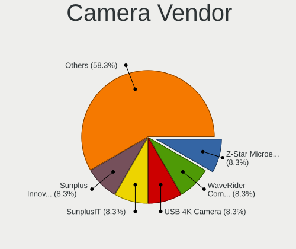

| Vendor                        | Desktops | Percent |
|-------------------------------|----------|---------|
| Z-Star Microelectronics       | 1        | 8.33%   |
| WaveRider Communications      | 1        | 8.33%   |
| USB 4K Camera                 | 1        | 8.33%   |
| SunplusIT                     | 1        | 8.33%   |
| Sunplus Innovation Technology | 1        | 8.33%   |
| Samsung Electronics           | 1        | 8.33%   |
| Realtek Semiconductor         | 1        | 8.33%   |
| Microsoft                     | 1        | 8.33%   |
| Microdia                      | 1        | 8.33%   |
| Logitech                      | 1        | 8.33%   |
| Lenovo                        | 1        | 8.33%   |
| Alcor Micro                   | 1        | 8.33%   |

Camera Model
------------

Camera device models

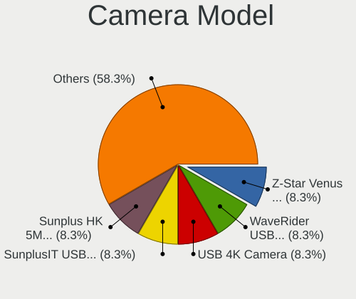

| Model                                   | Desktops | Percent |
|-----------------------------------------|----------|---------|
| Z-Star Venus USB2.0 Camera              | 1        | 8.33%   |
| WaveRider USB 2.0 Camera                | 1        | 8.33%   |
| USB 4K Camera                           | 1        | 8.33%   |
| SunplusIT USB IR Camera                 | 1        | 8.33%   |
| Sunplus HK 5M WebCAM                    | 1        | 8.33%   |
| Samsung Galaxy series, misc. (MTP mode) | 1        | 8.33%   |
| Realtek USB 2.0 Camera                  | 1        | 8.33%   |
| Microsoft LifeCam HD-3000               | 1        | 8.33%   |
| Microdia CyberTrack H7                  | 1        | 8.33%   |
| Logitech Webcam C600                    | 1        | 8.33%   |
| Lenovo Lenovo Performance Camera        | 1        | 8.33%   |
| Alcor Micro USB HD Camera               | 1        | 8.33%   |

Security
--------

Fingerprint Vendor
------------------

Fingerprint sensor vendors

Zero info for selected period =(

Fingerprint Model
-----------------

Fingerprint sensor models

Zero info for selected period =(

Chipcard Vendor
---------------

Chipcard module vendors

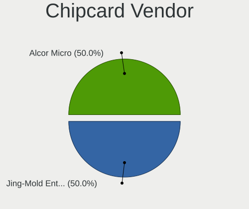

| Vendor               | Desktops | Percent |
|----------------------|----------|---------|
| Jing-Mold Enterprise | 1        | 50%     |
| Alcor Micro          | 1        | 50%     |

Chipcard Model
--------------

Chipcard module models

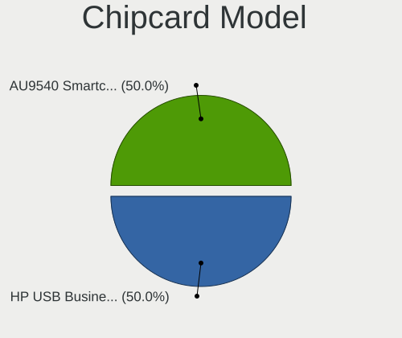

| Model                                                             | Desktops | Percent |
|-------------------------------------------------------------------|----------|---------|
| Jing-Mold Enterprise HP USB Business Slim Smartcard CCID Keyboard | 1        | 50%     |
| Alcor Micro AU9540 Smartcard Reader                               | 1        | 50%     |

Unsupported
-----------

Unsupported Devices
-------------------

Total unsupported devices on board

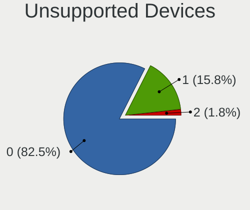

| Total | Desktops | Percent |
|-------|----------|---------|
| 0     | 94       | 82.46%  |
| 1     | 18       | 15.79%  |
| 2     | 2        | 1.75%   |

Unsupported Device Types
------------------------

Types of unsupported devices

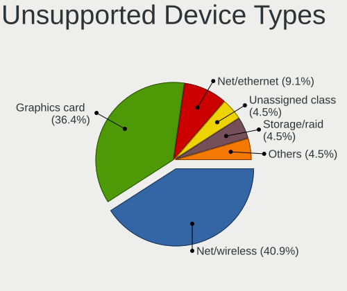

| Type             | Desktops | Percent |
|------------------|----------|---------|
| Net/wireless     | 9        | 40.91%  |
| Graphics card    | 8        | 36.36%  |
| Net/ethernet     | 2        | 9.09%   |
| Unassigned class | 1        | 4.55%   |
| Storage/raid     | 1        | 4.55%   |
| Chipcard         | 1        | 4.55%   |

