Elementary 8 - Tested Hardware & Statistics (Notebooks)
-------------------------------------------------------

A project to collect tested hardware configurations for Elementary 8.

Anyone can contribute to this report by the [hw-probe](https://github.com/linuxhw/hw-probe) tool:

    sudo -E hw-probe -all -upload

Please contribute! Especially if your hardware is rare.

Contents
--------

* [ Test Cases ](#test-cases)

* [ System ](#system)
  - [ Kernel                   ](#kernel)
  - [ Kernel Family            ](#kernel-family)
  - [ Kernel Major Ver.        ](#kernel-major-ver)
  - [ Arch                     ](#arch)
  - [ DE                       ](#de)
  - [ Display Server           ](#display-server)
  - [ Display Manager          ](#display-manager)
  - [ OS Lang                  ](#os-lang)
  - [ Boot Mode                ](#boot-mode)
  - [ Filesystem               ](#filesystem)
  - [ Part. scheme             ](#part-scheme)
  - [ Dual Boot with Linux/BSD ](#dual-boot-with-linuxbsd)
  - [ Dual Boot (Win)          ](#dual-boot-win)

* [ Board ](#board)
  - [ Vendor                   ](#vendor)
  - [ Model                    ](#model)
  - [ Model Family             ](#model-family)
  - [ MFG Year                 ](#mfg-year)
  - [ Form Factor              ](#form-factor)
  - [ Secure Boot              ](#secure-boot)
  - [ Coreboot                 ](#coreboot)
  - [ RAM Size                 ](#ram-size)
  - [ RAM Used                 ](#ram-used)
  - [ Total Drives             ](#total-drives)
  - [ Has CD-ROM               ](#has-cd-rom)
  - [ Has Ethernet             ](#has-ethernet)
  - [ Has WiFi                 ](#has-wifi)
  - [ Has Bluetooth            ](#has-bluetooth)

* [ Location ](#location)
  - [ Country                  ](#country)
  - [ City                     ](#city)

* [ Drives ](#drives)
  - [ Drive Vendor             ](#drive-vendor)
  - [ Drive Model              ](#drive-model)
  - [ HDD Vendor               ](#hdd-vendor)
  - [ SSD Vendor               ](#ssd-vendor)
  - [ Drive Kind               ](#drive-kind)
  - [ Drive Connector          ](#drive-connector)
  - [ Drive Size               ](#drive-size)
  - [ Space Total              ](#space-total)
  - [ Space Used               ](#space-used)
  - [ Malfunc. Drives          ](#malfunc-drives)
  - [ Malfunc. Drive Vendor    ](#malfunc-drive-vendor)
  - [ Malfunc. HDD Vendor      ](#malfunc-hdd-vendor)
  - [ Malfunc. Drive Kind      ](#malfunc-drive-kind)
  - [ Failed Drives            ](#failed-drives)
  - [ Failed Drive Vendor      ](#failed-drive-vendor)
  - [ Drive Status             ](#drive-status)

* [ Storage controller ](#storage-controller)
  - [ Storage Vendor           ](#storage-vendor)
  - [ Storage Model            ](#storage-model)
  - [ Storage Kind             ](#storage-kind)

* [ Processor ](#processor)
  - [ CPU Vendor               ](#cpu-vendor)
  - [ CPU Model                ](#cpu-model)
  - [ CPU Model Family         ](#cpu-model-family)
  - [ CPU Cores                ](#cpu-cores)
  - [ CPU Sockets              ](#cpu-sockets)
  - [ CPU Threads              ](#cpu-threads)
  - [ CPU Op-Modes             ](#cpu-op-modes)
  - [ CPU Microcode            ](#cpu-microcode)
  - [ CPU Microarch            ](#cpu-microarch)

* [ Graphics ](#graphics)
  - [ GPU Vendor               ](#gpu-vendor)
  - [ GPU Model                ](#gpu-model)
  - [ GPU Combo                ](#gpu-combo)
  - [ GPU Driver               ](#gpu-driver)
  - [ GPU Memory               ](#gpu-memory)

* [ Monitor ](#monitor)
  - [ Monitor Vendor           ](#monitor-vendor)
  - [ Monitor Model            ](#monitor-model)
  - [ Monitor Resolution       ](#monitor-resolution)
  - [ Monitor Diagonal         ](#monitor-diagonal)
  - [ Monitor Width            ](#monitor-width)
  - [ Aspect Ratio             ](#aspect-ratio)
  - [ Monitor Area             ](#monitor-area)
  - [ Pixel Density            ](#pixel-density)
  - [ Multiple Monitors        ](#multiple-monitors)

* [ Network ](#network)
  - [ Net Controller Vendor    ](#net-controller-vendor)
  - [ Net Controller Model     ](#net-controller-model)
  - [ Wireless Vendor          ](#wireless-vendor)
  - [ Wireless Model           ](#wireless-model)
  - [ Ethernet Vendor          ](#ethernet-vendor)
  - [ Ethernet Model           ](#ethernet-model)
  - [ Net Controller Kind      ](#net-controller-kind)
  - [ Used Controller          ](#used-controller)
  - [ NICs                     ](#nics)
  - [ IPv6                     ](#ipv6)

* [ Bluetooth ](#bluetooth)
  - [ Bluetooth Vendor         ](#bluetooth-vendor)
  - [ Bluetooth Model          ](#bluetooth-model)

* [ Sound ](#sound)
  - [ Sound Vendor             ](#sound-vendor)
  - [ Sound Model              ](#sound-model)

* [ Memory ](#memory)
  - [ Memory Vendor            ](#memory-vendor)
  - [ Memory Model             ](#memory-model)
  - [ Memory Kind              ](#memory-kind)
  - [ Memory Form Factor       ](#memory-form-factor)
  - [ Memory Size              ](#memory-size)
  - [ Memory Speed             ](#memory-speed)

* [ Printers & scanners ](#printers--scanners)
  - [ Printer Vendor           ](#printer-vendor)
  - [ Printer Model            ](#printer-model)
  - [ Scanner Vendor           ](#scanner-vendor)
  - [ Scanner Model            ](#scanner-model)

* [ Camera ](#camera)
  - [ Camera Vendor            ](#camera-vendor)
  - [ Camera Model             ](#camera-model)

* [ Security ](#security)
  - [ Fingerprint Vendor       ](#fingerprint-vendor)
  - [ Fingerprint Model        ](#fingerprint-model)
  - [ Chipcard Vendor          ](#chipcard-vendor)
  - [ Chipcard Model           ](#chipcard-model)

* [ Unsupported ](#unsupported)
  - [ Unsupported Devices      ](#unsupported-devices)
  - [ Unsupported Device Types ](#unsupported-device-types)

Test Cases
----------

Total: 63

| Vendor        | Model                       | Probe                                                      | Date         |
|---------------|-----------------------------|------------------------------------------------------------|--------------|
| HUAWEI        | MACHD-WXX9                  | [f10a2b06fd](https://linux-hardware.org/?probe=f10a2b06fd) | Jan 06, 2025 |
| Dell          | Inspiron 1545               | [6d5ccbb5f9](https://linux-hardware.org/?probe=6d5ccbb5f9) | Jan 05, 2025 |
| Dell          | XPS L412Z                   | [d8b969a9e6](https://linux-hardware.org/?probe=d8b969a9e6) | Jan 05, 2025 |
| Dell          | XPS L412Z                   | [f4cfef6dcc](https://linux-hardware.org/?probe=f4cfef6dcc) | Jan 05, 2025 |
| Apple         | MacBook3,1                  | [be78213991](https://linux-hardware.org/?probe=be78213991) | Jan 05, 2025 |
| HUAWEI        | BoDE-WXX9                   | [d5f19c64ad](https://linux-hardware.org/?probe=d5f19c64ad) | Jan 04, 2025 |
| Apple         | MacBookPro7,1               | [7961299452](https://linux-hardware.org/?probe=7961299452) | Jan 04, 2025 |
| Dell          | Latitude E5430 non-vPro     | [bbf6d05761](https://linux-hardware.org/?probe=bbf6d05761) | Jan 03, 2025 |
| Apple         | MacBookPro8,1               | [c208215b7f](https://linux-hardware.org/?probe=c208215b7f) | Jan 03, 2025 |
| Dell          | Latitude E5430 non-vPro     | [7b1adcdde1](https://linux-hardware.org/?probe=7b1adcdde1) | Jan 03, 2025 |
| HUAWEI        | BoDE-WXX9                   | [cacf1ad26f](https://linux-hardware.org/?probe=cacf1ad26f) | Jan 02, 2025 |
| Lenovo        | G585 20137                  | [f7dac7bbad](https://linux-hardware.org/?probe=f7dac7bbad) | Jan 02, 2025 |
| Medion        | Akoya E6240T                | [dc4b306a46](https://linux-hardware.org/?probe=dc4b306a46) | Jan 02, 2025 |
| Dell          | Latitude 5400               | [7a418a2cca](https://linux-hardware.org/?probe=7a418a2cca) | Jan 01, 2025 |
| HUAWEI        | MACHD-WXX9                  | [f7cc7cc8d1](https://linux-hardware.org/?probe=f7cc7cc8d1) | Jan 01, 2025 |
| HP            | Laptop 15s-fq1xxx           | [1de7d2e8fb](https://linux-hardware.org/?probe=1de7d2e8fb) | Dec 30, 2024 |
| ASUSTek       | X555LDB                     | [f11b5b7320](https://linux-hardware.org/?probe=f11b5b7320) | Dec 29, 2024 |
| Lenovo        | IdeaPad Y560                | [e36139662d](https://linux-hardware.org/?probe=e36139662d) | Dec 28, 2024 |
| HP            | EliteBook 830 G5            | [3dd541f1a9](https://linux-hardware.org/?probe=3dd541f1a9) | Dec 28, 2024 |
| HP            | ProBook 645 G2              | [b57a3a877b](https://linux-hardware.org/?probe=b57a3a877b) | Dec 27, 2024 |
| Dell          | Inspiron 15-3552            | [1d01677080](https://linux-hardware.org/?probe=1d01677080) | Dec 27, 2024 |
| Packard Be... | EasyNote TJ75               | [7a5bc8251a](https://linux-hardware.org/?probe=7a5bc8251a) | Dec 27, 2024 |
| Packard Be... | EasyNote TJ75               | [b46109e7f3](https://linux-hardware.org/?probe=b46109e7f3) | Dec 27, 2024 |
| Sony          | SVF14213CLB                 | [dbcabf3c36](https://linux-hardware.org/?probe=dbcabf3c36) | Dec 27, 2024 |
| Pegatron      | A15                         | [2649401416](https://linux-hardware.org/?probe=2649401416) | Dec 26, 2024 |
| Apple         | MacBookPro10,1              | [4225950551](https://linux-hardware.org/?probe=4225950551) | Dec 25, 2024 |
| Lenovo        | IdeaPad Slim 5 14AHP9 83... | [d1227bd0de](https://linux-hardware.org/?probe=d1227bd0de) | Dec 25, 2024 |
| HP            | Laptop 15-dy5xxx            | [2729b6a19c](https://linux-hardware.org/?probe=2729b6a19c) | Dec 25, 2024 |
| Acer          | Aspire 5755G                | [d824794995](https://linux-hardware.org/?probe=d824794995) | Dec 23, 2024 |
| Samsung       | SR58P                       | [70e6a978b7](https://linux-hardware.org/?probe=70e6a978b7) | Dec 23, 2024 |
| Dell          | Latitude E6520              | [2bae6e63bb](https://linux-hardware.org/?probe=2bae6e63bb) | Dec 23, 2024 |
| Acer          | Aspire ES1-571              | [cb4b9da83f](https://linux-hardware.org/?probe=cb4b9da83f) | Dec 22, 2024 |
| Acer          | Aspire ES1-571              | [48537b040b](https://linux-hardware.org/?probe=48537b040b) | Dec 22, 2024 |
| Apple         | MacBookAir7,2               | [762ab31569](https://linux-hardware.org/?probe=762ab31569) | Dec 22, 2024 |
| ASUSTek       | X555LDB                     | [783e6ed502](https://linux-hardware.org/?probe=783e6ed502) | Dec 20, 2024 |
| ASUSTek       | UX30                        | [d75f3afdf6](https://linux-hardware.org/?probe=d75f3afdf6) | Dec 18, 2024 |
| HP            | Pavilion dv6                | [89ec19d64a](https://linux-hardware.org/?probe=89ec19d64a) | Dec 17, 2024 |
| Pegatron      | A15                         | [266dd27eba](https://linux-hardware.org/?probe=266dd27eba) | Dec 16, 2024 |
| Lenovo        | ThinkPad X1 Carbon Gen 8... | [abfa48ae27](https://linux-hardware.org/?probe=abfa48ae27) | Dec 15, 2024 |
| Lenovo        | ThinkPad X1 Carbon Gen 8... | [256e4c3f4a](https://linux-hardware.org/?probe=256e4c3f4a) | Dec 15, 2024 |
| Dell          | Inspiron 5547               | [4427bcded0](https://linux-hardware.org/?probe=4427bcded0) | Dec 14, 2024 |
| Dell          | Inspiron 5547               | [5641fb7941](https://linux-hardware.org/?probe=5641fb7941) | Dec 14, 2024 |
| Acer          | Aspire 8730                 | [8c0f6ed012](https://linux-hardware.org/?probe=8c0f6ed012) | Dec 14, 2024 |
| Acer          | Aspire 8730                 | [1ab4a28fcf](https://linux-hardware.org/?probe=1ab4a28fcf) | Dec 13, 2024 |
| Samsung       | 950XCJ/951XCJ/950XCR        | [37664cf5d9](https://linux-hardware.org/?probe=37664cf5d9) | Dec 13, 2024 |
| Sony          | SVS1313V9RB                 | [52421e92ce](https://linux-hardware.org/?probe=52421e92ce) | Dec 12, 2024 |
| Sony          | SVS1313V9RB                 | [53c77f8751](https://linux-hardware.org/?probe=53c77f8751) | Dec 12, 2024 |
| Chuwi         | UBook                       | [08e88467cb](https://linux-hardware.org/?probe=08e88467cb) | Dec 12, 2024 |
| ASUSTek       | VivoBook_ASUSLaptop X150... | [8444dbbcc1](https://linux-hardware.org/?probe=8444dbbcc1) | Dec 10, 2024 |
| Acer          | Swift SF314-56G             | [64815f9248](https://linux-hardware.org/?probe=64815f9248) | Dec 09, 2024 |
| eMachines     | eME732Z                     | [1c64772130](https://linux-hardware.org/?probe=1c64772130) | Dec 06, 2024 |
| Panasonic     | CF-52PFP54QL                | [bcafd21454](https://linux-hardware.org/?probe=bcafd21454) | Dec 06, 2024 |
| Apple         | MacBookAir3,1               | [477a7b324b](https://linux-hardware.org/?probe=477a7b324b) | Dec 06, 2024 |
| Lenovo        | IdeaPad S205 1038D8G        | [78b460173f](https://linux-hardware.org/?probe=78b460173f) | Dec 05, 2024 |
| Chuwi         | UBook                       | [ddba94874a](https://linux-hardware.org/?probe=ddba94874a) | Dec 04, 2024 |
| HP            | Pavilion dv7                | [8d22c82b8d](https://linux-hardware.org/?probe=8d22c82b8d) | Dec 04, 2024 |
| Apple         | MacBookPro8,1               | [424834b527](https://linux-hardware.org/?probe=424834b527) | Dec 01, 2024 |
| ASUSTek       | K93SV                       | [53af6a8e17](https://linux-hardware.org/?probe=53af6a8e17) | Nov 30, 2024 |
| Dell          | Inspiron N5010              | [f7578fb476](https://linux-hardware.org/?probe=f7578fb476) | Nov 29, 2024 |
| HP            | Pavilion dv7                | [1ae9d9a604](https://linux-hardware.org/?probe=1ae9d9a604) | Nov 29, 2024 |
| MicroByte     | ezbook                      | [167d9d082a](https://linux-hardware.org/?probe=167d9d082a) | Nov 28, 2024 |
| Google        | Delbin                      | [e4f8dab394](https://linux-hardware.org/?probe=e4f8dab394) | Nov 27, 2024 |
| Lenovo        | ThinkPad P15 Gen 2i 20YQ... | [7e022f0097](https://linux-hardware.org/?probe=7e022f0097) | Nov 27, 2024 |

System
------

Kernel
------

Version of the Linux kernel

| Version          | Notebooks | Percent |
|------------------|-----------|---------|
| 6.8.0-51-generic | 28        | 57.14%  |
| 6.8.0-49-generic | 17        | 34.69%  |
| 6.8.0-50-generic | 3         | 6.12%   |
| 6.8.0-1017-oem   | 1         | 2.04%   |

Kernel Family
-------------

Linux kernel without a distro release

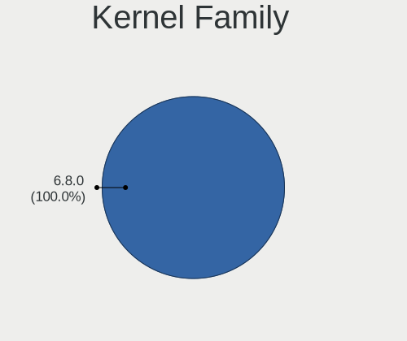

| Version | Notebooks | Percent |
|---------|-----------|---------|
| 6.8.0   | 49        | 100%    |

Kernel Major Ver.
-----------------

Linux kernel major version

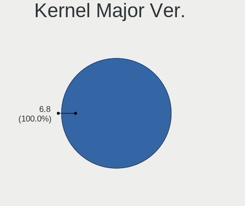

| Version | Notebooks | Percent |
|---------|-----------|---------|
| 6.8     | 49        | 100%    |

Arch
----

OS architecture (x86_64, i586, etc.)

| Name   | Notebooks | Percent |
|--------|-----------|---------|
| x86_64 | 49        | 100%    |

DE
--

Desktop Environment

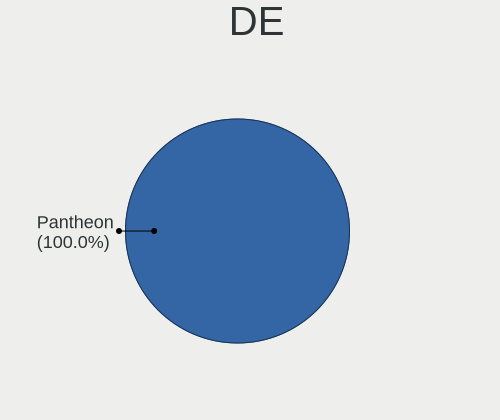

| Name     | Notebooks | Percent |
|----------|-----------|---------|
| Pantheon | 49        | 100%    |

Display Server
--------------

X11 or Wayland

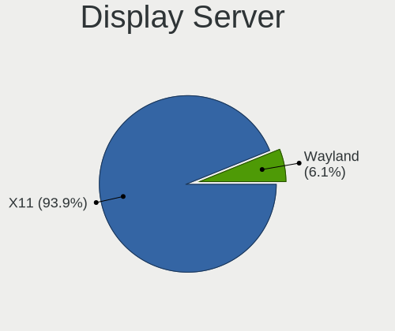

| Name    | Notebooks | Percent |
|---------|-----------|---------|
| X11     | 46        | 93.88%  |
| Wayland | 3         | 6.12%   |

Display Manager
---------------

SDDM, LightDM, etc.

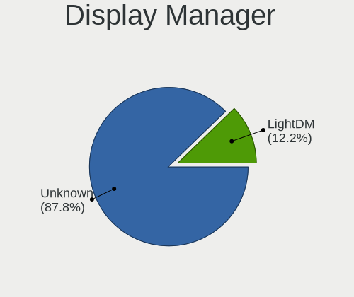

| Name    | Notebooks | Percent |
|---------|-----------|---------|
| Unknown | 43        | 87.76%  |
| LightDM | 6         | 12.24%  |

OS Lang
-------

Language

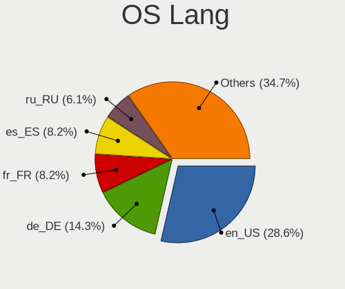

| Lang  | Notebooks | Percent |
|-------|-----------|---------|
| en_US | 14        | 28.57%  |
| de_DE | 7         | 14.29%  |
| fr_FR | 4         | 8.16%   |
| es_ES | 4         | 8.16%   |
| ru_RU | 3         | 6.12%   |
| pl_PL | 2         | 4.08%   |
| nl_NL | 2         | 4.08%   |
| it_IT | 2         | 4.08%   |
| bg_BG | 2         | 4.08%   |
| uk_UA | 1         | 2.04%   |
| tr_TR | 1         | 2.04%   |
| sv_SE | 1         | 2.04%   |
| pt_BR | 1         | 2.04%   |
| ko_KR | 1         | 2.04%   |
| hu_HU | 1         | 2.04%   |
| en_GB | 1         | 2.04%   |
| en_CA | 1         | 2.04%   |
| da_DK | 1         | 2.04%   |

Boot Mode
---------

EFI or BIOS

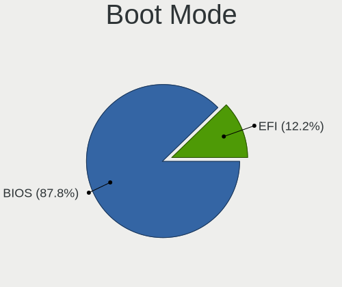

| Mode | Notebooks | Percent |
|------|-----------|---------|
| BIOS | 43        | 87.76%  |
| EFI  | 6         | 12.24%  |

Filesystem
----------

Type of filesystem

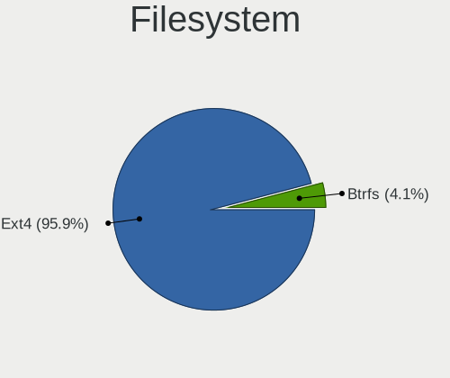

| Type  | Notebooks | Percent |
|-------|-----------|---------|
| Ext4  | 47        | 95.92%  |
| Btrfs | 2         | 4.08%   |

Part. scheme
------------

Scheme of partitioning

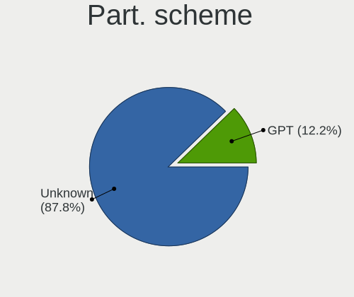

| Type    | Notebooks | Percent |
|---------|-----------|---------|
| Unknown | 43        | 87.76%  |
| GPT     | 6         | 12.24%  |

Dual Boot with Linux/BSD
------------------------

Hosting more than one Linux/BSD

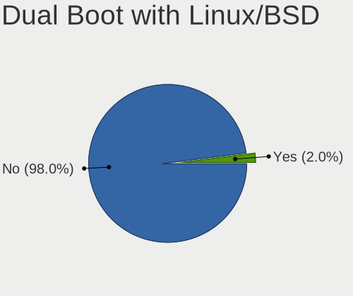

| Dual boot | Notebooks | Percent |
|-----------|-----------|---------|
| No        | 48        | 97.96%  |
| Yes       | 1         | 2.04%   |

Dual Boot (Win)
---------------

Hosting Linux and Windows

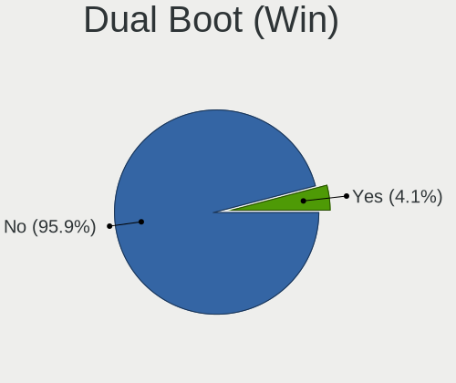

| Dual boot | Notebooks | Percent |
|-----------|-----------|---------|
| No        | 47        | 95.92%  |
| Yes       | 2         | 4.08%   |

Board
-----

Vendor
------

Motherboard manufacturer

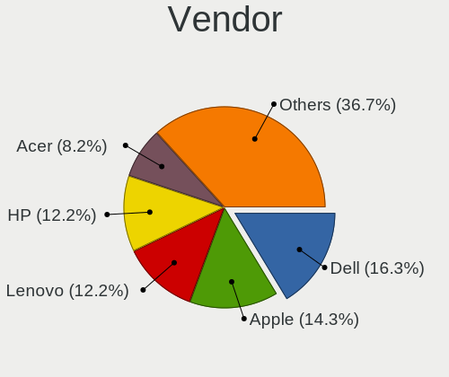

| Name                | Notebooks | Percent |
|---------------------|-----------|---------|
| Dell                | 8         | 16.33%  |
| Apple               | 7         | 14.29%  |
| Lenovo              | 6         | 12.24%  |
| Hewlett-Packard     | 6         | 12.24%  |
| ASUSTek Computer    | 4         | 8.16%   |
| Acer                | 4         | 8.16%   |
| Sony                | 2         | 4.08%   |
| Samsung Electronics | 2         | 4.08%   |
| HUAWEI              | 2         | 4.08%   |
| Pegatron            | 1         | 2.04%   |
| Panasonic           | 1         | 2.04%   |
| Packard Bell        | 1         | 2.04%   |
| MicroByte           | 1         | 2.04%   |
| Medion              | 1         | 2.04%   |
| Google              | 1         | 2.04%   |
| eMachines           | 1         | 2.04%   |
| Chuwi               | 1         | 2.04%   |

Model
-----

Motherboard model

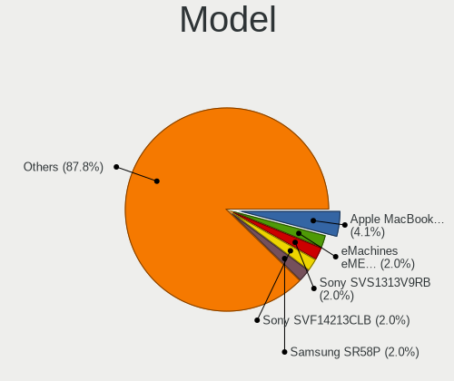

| Name                                       | Notebooks | Percent |
|--------------------------------------------|-----------|---------|
| Apple MacBookPro8,1                        | 2         | 4.08%   |
| Sony SVS1313V9RB                           | 1         | 2.04%   |
| Sony SVF14213CLB                           | 1         | 2.04%   |
| Samsung SR58P                              | 1         | 2.04%   |
| Samsung 950XCJ/951XCJ/950XCR               | 1         | 2.04%   |
| Pegatron A15                               | 1         | 2.04%   |
| Panasonic CF-52PFP54QL                     | 1         | 2.04%   |
| Packard Bell EasyNote TJ75                 | 1         | 2.04%   |
| MicroByte ezbook                           | 1         | 2.04%   |
| Medion Akoya E6240T                        | 1         | 2.04%   |
| Lenovo ThinkPad X1 Carbon Gen 8 20U90030US | 1         | 2.04%   |
| Lenovo ThinkPad P15 Gen 2i 20YQ0014FR      | 1         | 2.04%   |
| Lenovo IdeaPad Y560                        | 1         | 2.04%   |
| Lenovo IdeaPad Slim 5 14AHP9 83DB          | 1         | 2.04%   |
| Lenovo IdeaPad S205 1038D8G                | 1         | 2.04%   |
| Lenovo G585 20137                          | 1         | 2.04%   |
| HUAWEI MACHD-WXX9                          | 1         | 2.04%   |
| HUAWEI BoDE-WXX9                           | 1         | 2.04%   |
| HP ProBook 645 G2                          | 1         | 2.04%   |
| HP Pavilion dv7                            | 1         | 2.04%   |
| HP Pavilion dv6                            | 1         | 2.04%   |
| HP Laptop 15s-fq1xxx                       | 1         | 2.04%   |
| HP Laptop 15-dy5xxx                        | 1         | 2.04%   |
| HP EliteBook 830 G5                        | 1         | 2.04%   |
| Google Delbin                              | 1         | 2.04%   |
| eMachines eME732Z                          | 1         | 2.04%   |
| Dell XPS L412Z                             | 1         | 2.04%   |
| Dell Latitude E6520                        | 1         | 2.04%   |
| Dell Latitude E5430 non-vPro               | 1         | 2.04%   |
| Dell Latitude 5400                         | 1         | 2.04%   |
| Dell Inspiron N5010                        | 1         | 2.04%   |
| Dell Inspiron 5547                         | 1         | 2.04%   |
| Dell Inspiron 1545                         | 1         | 2.04%   |
| Dell Inspiron 15-3552                      | 1         | 2.04%   |
| Chuwi UBook                                | 1         | 2.04%   |
| ASUS X555LDB                               | 1         | 2.04%   |
| ASUS VivoBook_ASUSLaptop X1502ZA_X1502ZA   | 1         | 2.04%   |
| ASUS UX30                                  | 1         | 2.04%   |
| ASUS K93SV                                 | 1         | 2.04%   |
| Apple MacBookPro7,1                        | 1         | 2.04%   |

Model Family
------------

Motherboard model prefix

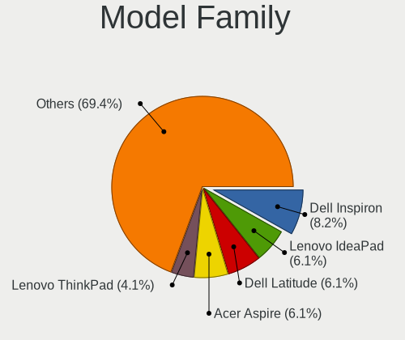

| Name                   | Notebooks | Percent |
|------------------------|-----------|---------|
| Dell Inspiron          | 4         | 8.16%   |
| Lenovo IdeaPad         | 3         | 6.12%   |
| Dell Latitude          | 3         | 6.12%   |
| Acer Aspire            | 3         | 6.12%   |
| Lenovo ThinkPad        | 2         | 4.08%   |
| HP Pavilion            | 2         | 4.08%   |
| HP Laptop              | 2         | 4.08%   |
| Apple MacBookPro8      | 2         | 4.08%   |
| Sony SVS1313V9RB       | 1         | 2.04%   |
| Sony SVF14213CLB       | 1         | 2.04%   |
| Samsung SR58P          | 1         | 2.04%   |
| Samsung 950XCJ         | 1         | 2.04%   |
| Pegatron A15           | 1         | 2.04%   |
| Panasonic CF-52PFP54QL | 1         | 2.04%   |
| Packard Bell EasyNote  | 1         | 2.04%   |
| MicroByte ezbook       | 1         | 2.04%   |
| Medion Akoya           | 1         | 2.04%   |
| Lenovo G585            | 1         | 2.04%   |
| HUAWEI MACHD-WXX9      | 1         | 2.04%   |
| HUAWEI BoDE-WXX9       | 1         | 2.04%   |
| HP ProBook             | 1         | 2.04%   |
| HP EliteBook           | 1         | 2.04%   |
| Google Delbin          | 1         | 2.04%   |
| eMachines eME732Z      | 1         | 2.04%   |
| Dell XPS               | 1         | 2.04%   |
| Chuwi UBook            | 1         | 2.04%   |
| ASUS X555LDB           | 1         | 2.04%   |
| ASUS VivoBook          | 1         | 2.04%   |
| ASUS UX30              | 1         | 2.04%   |
| ASUS K93SV             | 1         | 2.04%   |
| Apple MacBookPro7      | 1         | 2.04%   |
| Apple MacBookPro10     | 1         | 2.04%   |
| Apple MacBookAir7      | 1         | 2.04%   |
| Apple MacBookAir3      | 1         | 2.04%   |
| Apple MacBook3         | 1         | 2.04%   |
| Acer Swift             | 1         | 2.04%   |

MFG Year
--------

Motherboard manufacture year

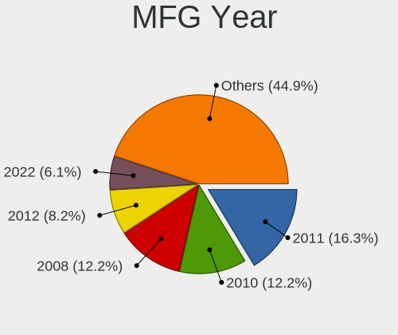

| Year | Notebooks | Percent |
|------|-----------|---------|
| 2011 | 8         | 16.33%  |
| 2010 | 6         | 12.24%  |
| 2008 | 6         | 12.24%  |
| 2012 | 4         | 8.16%   |
| 2022 | 3         | 6.12%   |
| 2021 | 3         | 6.12%   |
| 2019 | 3         | 6.12%   |
| 2020 | 2         | 4.08%   |
| 2018 | 2         | 4.08%   |
| 2015 | 2         | 4.08%   |
| 2014 | 2         | 4.08%   |
| 2013 | 2         | 4.08%   |
| 2009 | 2         | 4.08%   |
| 2024 | 1         | 2.04%   |
| 2023 | 1         | 2.04%   |
| 2016 | 1         | 2.04%   |
| 2007 | 1         | 2.04%   |

Form Factor
-----------

Physical design of the computer

| Name     | Notebooks | Percent |
|----------|-----------|---------|
| Notebook | 49        | 100%    |

Secure Boot
-----------

Enabled or disabled

| State    | Notebooks | Percent |
|----------|-----------|---------|
| Disabled | 49        | 100%    |

Coreboot
--------

Have coreboot on board

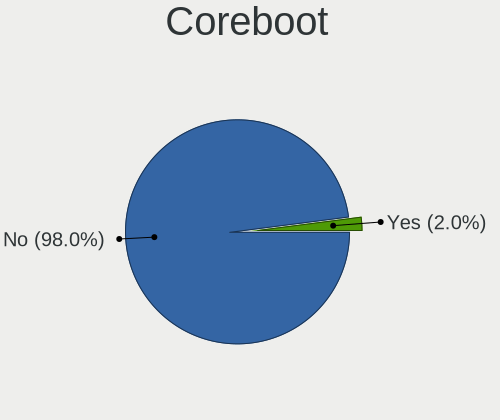

| Used | Notebooks | Percent |
|------|-----------|---------|
| No   | 48        | 97.96%  |
| Yes  | 1         | 2.04%   |

RAM Size
--------

Total RAM memory

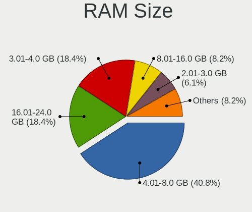

| Size in GB  | Notebooks | Percent |
|-------------|-----------|---------|
| 4.01-8.0    | 20        | 40.82%  |
| 3.01-4.0    | 9         | 18.37%  |
| 16.01-24.0  | 9         | 18.37%  |
| 8.01-16.0   | 4         | 8.16%   |
| 2.01-3.0    | 3         | 6.12%   |
| 1.01-2.0    | 2         | 4.08%   |
| 24.01-32.0  | 1         | 2.04%   |
| 64.01-256.0 | 1         | 2.04%   |

RAM Used
--------

Used RAM memory

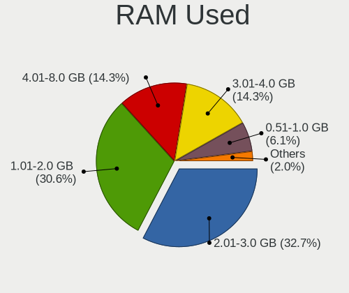

| Used GB   | Notebooks | Percent |
|-----------|-----------|---------|
| 2.01-3.0  | 16        | 32.65%  |
| 1.01-2.0  | 15        | 30.61%  |
| 4.01-8.0  | 7         | 14.29%  |
| 3.01-4.0  | 7         | 14.29%  |
| 0.51-1.0  | 3         | 6.12%   |
| 8.01-16.0 | 1         | 2.04%   |

Total Drives
------------

Number of drives on board

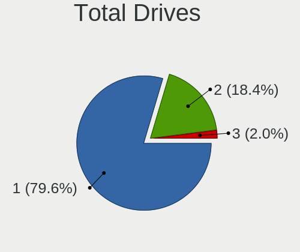

| Drives | Notebooks | Percent |
|--------|-----------|---------|
| 1      | 39        | 79.59%  |
| 2      | 9         | 18.37%  |
| 3      | 1         | 2.04%   |

Has CD-ROM
----------

Has CD-ROM on board

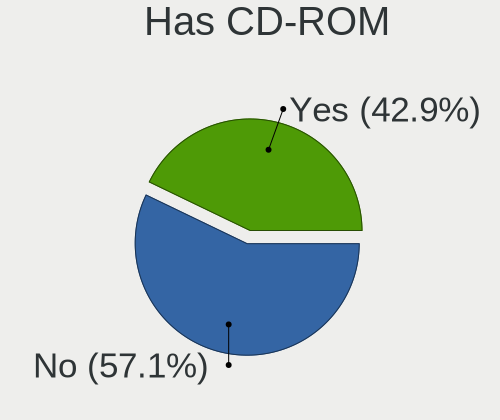

| Presented | Notebooks | Percent |
|-----------|-----------|---------|
| No        | 28        | 57.14%  |
| Yes       | 21        | 42.86%  |

Has Ethernet
------------

Has Ethernet on board

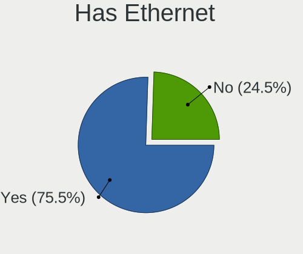

| Presented | Notebooks | Percent |
|-----------|-----------|---------|
| Yes       | 37        | 75.51%  |
| No        | 12        | 24.49%  |

Has WiFi
--------

Has WiFi module

| Presented | Notebooks | Percent |
|-----------|-----------|---------|
| Yes       | 47        | 95.92%  |
| No        | 2         | 4.08%   |

Has Bluetooth
-------------

Has Bluetooth module

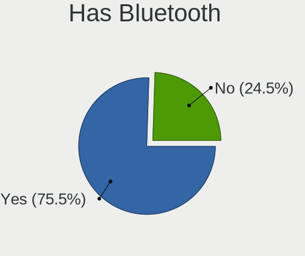

| Presented | Notebooks | Percent |
|-----------|-----------|---------|
| Yes       | 37        | 75.51%  |
| No        | 12        | 24.49%  |

Location
--------

Country
-------

Geographic location (country)

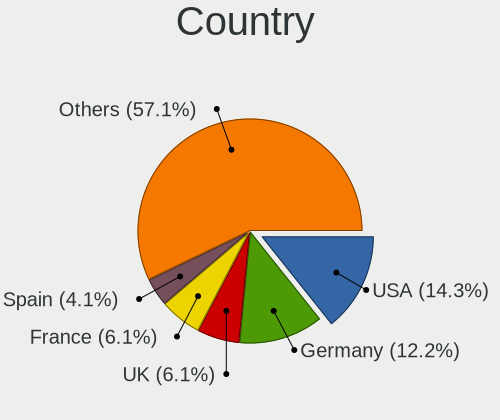

| Country         | Notebooks | Percent |
|-----------------|-----------|---------|
| USA             | 7         | 14.29%  |
| Germany         | 6         | 12.24%  |
| UK              | 3         | 6.12%   |
| France          | 3         | 6.12%   |
| Spain           | 2         | 4.08%   |
| Russia          | 2         | 4.08%   |
| Poland          | 2         | 4.08%   |
| Mexico          | 2         | 4.08%   |
| Italy           | 2         | 4.08%   |
| Canada          | 2         | 4.08%   |
| Bulgaria        | 2         | 4.08%   |
| Ukraine         | 1         | 2.04%   |
| Türkiye        | 1         | 2.04%   |
| Turkey          | 1         | 2.04%   |
| The Netherlands | 1         | 2.04%   |
| Thailand        | 1         | 2.04%   |
| Sweden          | 1         | 2.04%   |
| South Korea     | 1         | 2.04%   |
| Slovakia        | 1         | 2.04%   |
| Serbia          | 1         | 2.04%   |
| Portugal        | 1         | 2.04%   |
| Latvia          | 1         | 2.04%   |
| Indonesia       | 1         | 2.04%   |
| Faroe Islands   | 1         | 2.04%   |
| Brazil          | 1         | 2.04%   |
| Belgium         | 1         | 2.04%   |
| Australia       | 1         | 2.04%   |

City
----

Geographic location (city)

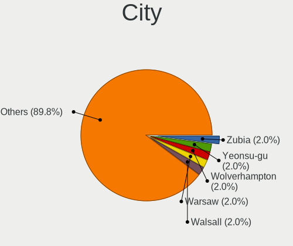

| City                   | Notebooks | Percent |
|------------------------|-----------|---------|
| Zubia                  | 1         | 2.04%   |
| Yeonsu-gu              | 1         | 2.04%   |
| Wolverhampton          | 1         | 2.04%   |
| Warsaw                 | 1         | 2.04%   |
| Walsall                | 1         | 2.04%   |
| Trnava                 | 1         | 2.04%   |
| Tórshavn              | 1         | 2.04%   |
| Terrebonne             | 1         | 2.04%   |
| Sofia                  | 1         | 2.04%   |
| Seth                   | 1         | 2.04%   |
| Sainte-Therese         | 1         | 2.04%   |
| Saint-Cyr-au-Mont-d'Or | 1         | 2.04%   |
| Rosny-sous-Bois        | 1         | 2.04%   |
| Rome                   | 1         | 2.04%   |
| Riga                   | 1         | 2.04%   |
| Querétaro City        | 1         | 2.04%   |
| Porto                  | 1         | 2.04%   |
| Pontevedra             | 1         | 2.04%   |
| Pazardzhik             | 1         | 2.04%   |
| Overijse               | 1         | 2.04%   |
| Odesa                  | 1         | 2.04%   |
| Novosibirsk            | 1         | 2.04%   |
| Nashville              | 1         | 2.04%   |
| Naples                 | 1         | 2.04%   |
| Munich                 | 1         | 2.04%   |
| Los Angeles            | 1         | 2.04%   |
| London                 | 1         | 2.04%   |
| Krasnoznamensk         | 1         | 2.04%   |
| Istanbul               | 1         | 2.04%   |
| Hassela                | 1         | 2.04%   |
| Goiânia               | 1         | 2.04%   |
| Gdansk                 | 1         | 2.04%   |
| Fulda                  | 1         | 2.04%   |
| Frankfurt am Main      | 1         | 2.04%   |
| El Paso                | 1         | 2.04%   |
| Culiacán              | 1         | 2.04%   |
| Colmar                 | 1         | 2.04%   |
| Charlotte              | 1         | 2.04%   |
| Cedar Rapids           | 1         | 2.04%   |
| Breda                  | 1         | 2.04%   |

Drives
------

Drive Vendor
------------

Hard drive vendors

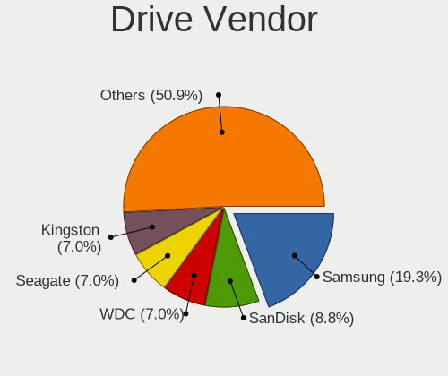

| Vendor                      | Notebooks | Drives | Percent |
|-----------------------------|-----------|--------|---------|
| Samsung Electronics         | 11        | 12     | 19.3%   |
| SanDisk                     | 5         | 5      | 8.77%   |
| WDC                         | 4         | 4      | 7.02%   |
| Seagate                     | 4         | 4      | 7.02%   |
| Kingston                    | 4         | 4      | 7.02%   |
| Toshiba                     | 3         | 3      | 5.26%   |
| Apple                       | 3         | 3      | 5.26%   |
| Unknown                     | 2         | 2      | 3.51%   |
| Hitachi                     | 2         | 2      | 3.51%   |
| WALRAM                      | 1         | 1      | 1.75%   |
| SPCC                        | 1         | 1      | 1.75%   |
| SK hynix                    | 1         | 1      | 1.75%   |
| Silicon Motion              | 1         | 1      | 1.75%   |
| Realtek Semiconductor       | 1         | 1      | 1.75%   |
| Micron Technology           | 1         | 1      | 1.75%   |
| MAXIO Technology (Hangzhou) | 1         | 1      | 1.75%   |
| KIOXIA                      | 1         | 1      | 1.75%   |
| KingSpec                    | 1         | 2      | 1.75%   |
| KingDian                    | 1         | 1      | 1.75%   |
| HGST                        | 1         | 1      | 1.75%   |
| GOODRAM                     | 1         | 1      | 1.75%   |
| Fujitsu                     | 1         | 1      | 1.75%   |
| Fanxiang                    | 1         | 1      | 1.75%   |
| Crucial                     | 1         | 1      | 1.75%   |
| BIWIN                       | 1         | 1      | 1.75%   |
| Apacer                      | 1         | 1      | 1.75%   |
| A-DATA Technology           | 1         | 1      | 1.75%   |
| 2-Power                     | 1         | 2      | 1.75%   |

Drive Model
-----------

Hard drive models

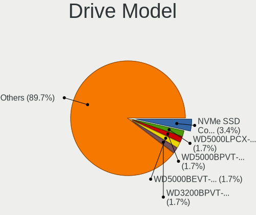

| Model                                               | Notebooks | Percent |
|-----------------------------------------------------|-----------|---------|
| Samsung NVMe SSD Controller SM981/PM981/PM983 512GB | 2         | 3.45%   |
| WDC WD5000LPCX-21VHAT0 500GB                        | 1         | 1.72%   |
| WDC WD5000BPVT-22HXZT3 500GB                        | 1         | 1.72%   |
| WDC WD5000BEVT-22ZAT0 500GB                         | 1         | 1.72%   |
| WDC WD3200BPVT-24JJ5T0 320GB                        | 1         | 1.72%   |
| WALRAM 512GB                                        | 1         | 1.72%   |
| Unknown MMC Card  393GB                             | 1         | 1.72%   |
| Unknown MMC Card  16GB                              | 1         | 1.72%   |
| Toshiba MQ04ABF100 1TB                              | 1         | 1.72%   |
| Toshiba MQ01ABD075 752GB                            | 1         | 1.72%   |
| Toshiba KXG6AZNV512G 512GB                          | 1         | 1.72%   |
| SPCC Solid State Disk 64GB                          | 1         | 1.72%   |
| SK hynix BC501 NVMe Solid State Drive 512GB         | 1         | 1.72%   |
| Silicon Motion PCIe-4 SSD 256GB                     | 1         | 1.72%   |
| Seagate ST9160412ASG 160GB                          | 1         | 1.72%   |
| Seagate ST9160310AS 160GB                           | 1         | 1.72%   |
| Seagate ST500LM000-1EJ162 500GB                     | 1         | 1.72%   |
| Seagate Expansion 1TB                               | 1         | 1.72%   |
| Sandisk WD Blue SN550 NVMe SSD 256GB                | 1         | 1.72%   |
| SanDisk SSD PLUS 240GB                              | 1         | 1.72%   |
| SanDisk SSD PLUS 1000GB                             | 1         | 1.72%   |
| SanDisk SDSSDH3 500G                                | 1         | 1.72%   |
| SanDisk NVMe SSD Drive 1TB                          | 1         | 1.72%   |
| Samsung SSD 980 PRO 2TB                             | 1         | 1.72%   |
| Samsung SSD 980 PRO 1TB                             | 1         | 1.72%   |
| Samsung SSD 970 EVO Plus 500GB                      | 1         | 1.72%   |
| Samsung SSD 870 EVO 250GB                           | 1         | 1.72%   |
| Samsung SSD 860 EVO 500GB                           | 1         | 1.72%   |
| Samsung SSD 850 EVO 250GB                           | 1         | 1.72%   |
| Samsung NVMe SSD Controller SM961/PM961/SM963 256GB | 1         | 1.72%   |
| Samsung MZNLN128HAHQ-000H1 128GB SSD                | 1         | 1.72%   |
| Samsung MZ7TY128HDHP-000L1 128GB SSD                | 1         | 1.72%   |
| Samsung MZ7LF192HCGS-000L1 192GB SSD                | 1         | 1.72%   |
| Realtek Fanxiang S501 512GB                         | 1         | 1.72%   |
| Micron 2400_MTFDKBA512QFM 512GB                     | 1         | 1.72%   |
| MAXIO (Hangzhou) NVMe SSD Controller MAP1202 512GB  | 1         | 1.72%   |
| KIOXIA KBG50ZNV256G 256GB                           | 1         | 1.72%   |
| Kingston SV300S37A240G 240GB SSD                    | 1         | 1.72%   |
| Kingston SUV400S37120G 120GB SSD                    | 1         | 1.72%   |
| Kingston SA400S37480G 480GB SSD                     | 1         | 1.72%   |

HDD Vendor
----------

Hard disk drive vendors

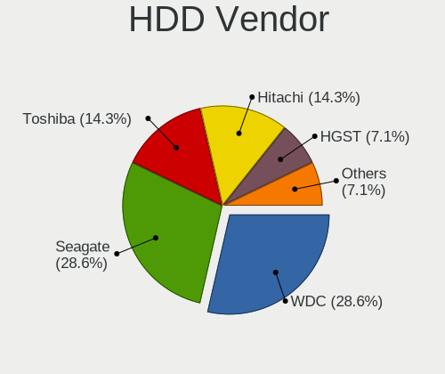

| Vendor  | Notebooks | Drives | Percent |
|---------|-----------|--------|---------|
| WDC     | 4         | 4      | 28.57%  |
| Seagate | 4         | 4      | 28.57%  |
| Toshiba | 2         | 2      | 14.29%  |
| Hitachi | 2         | 2      | 14.29%  |
| HGST    | 1         | 1      | 7.14%   |
| Fujitsu | 1         | 1      | 7.14%   |

SSD Vendor
----------

Solid state drive vendors

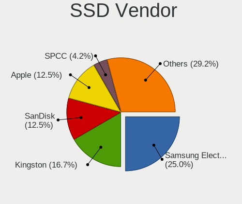

| Vendor              | Notebooks | Drives | Percent |
|---------------------|-----------|--------|---------|
| Samsung Electronics | 6         | 6      | 25%     |
| Kingston            | 4         | 4      | 16.67%  |
| SanDisk             | 3         | 3      | 12.5%   |
| Apple               | 3         | 3      | 12.5%   |
| SPCC                | 1         | 1      | 4.17%   |
| KingSpec            | 1         | 2      | 4.17%   |
| KingDian            | 1         | 1      | 4.17%   |
| GOODRAM             | 1         | 1      | 4.17%   |
| BIWIN               | 1         | 1      | 4.17%   |
| Apacer              | 1         | 1      | 4.17%   |
| A-DATA Technology   | 1         | 1      | 4.17%   |
| 2-Power             | 1         | 2      | 4.17%   |

Drive Kind
----------

HDD or SSD

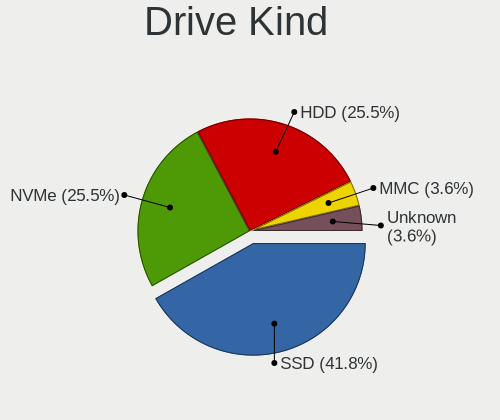

| Kind    | Notebooks | Drives | Percent |
|---------|-----------|--------|---------|
| SSD     | 23        | 26     | 41.82%  |
| NVMe    | 14        | 16     | 25.45%  |
| HDD     | 14        | 14     | 25.45%  |
| MMC     | 2         | 2      | 3.64%   |
| Unknown | 2         | 2      | 3.64%   |

Drive Connector
---------------

SATA, SAS, NVMe, etc.

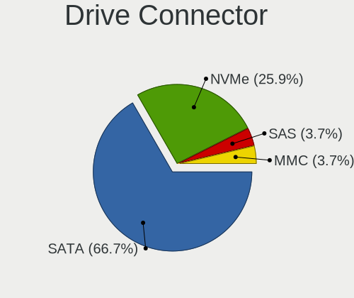

| Type | Notebooks | Drives | Percent |
|------|-----------|--------|---------|
| SATA | 36        | 40     | 66.67%  |
| NVMe | 14        | 16     | 25.93%  |
| SAS  | 2         | 2      | 3.7%    |
| MMC  | 2         | 2      | 3.7%    |

Drive Size
----------

Size of hard drive

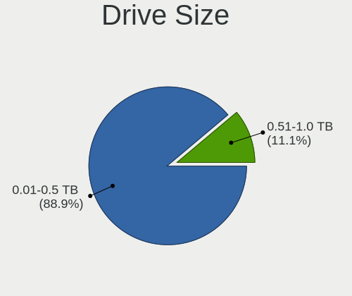

| Size in TB | Notebooks | Drives | Percent |
|------------|-----------|--------|---------|
| 0.01-0.5   | 32        | 35     | 88.89%  |
| 0.51-1.0   | 4         | 5      | 11.11%  |

Space Total
-----------

Amount of disk space available on the file system

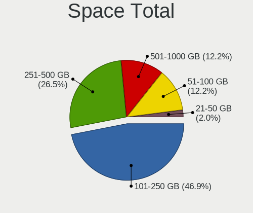

| Size in GB | Notebooks | Percent |
|------------|-----------|---------|
| 101-250    | 23        | 46.94%  |
| 251-500    | 13        | 26.53%  |
| 501-1000   | 6         | 12.24%  |
| 51-100     | 6         | 12.24%  |
| 21-50      | 1         | 2.04%   |

Space Used
----------

Amount of used disk space

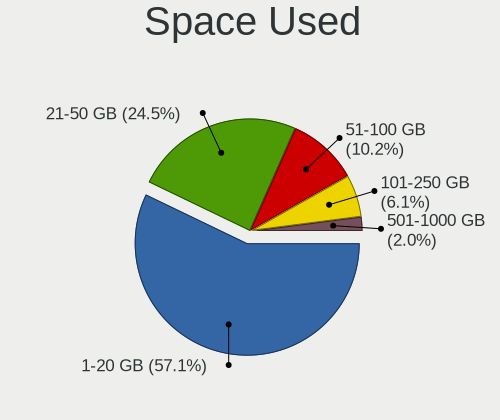

| Used GB  | Notebooks | Percent |
|----------|-----------|---------|
| 1-20     | 28        | 57.14%  |
| 21-50    | 12        | 24.49%  |
| 51-100   | 5         | 10.2%   |
| 101-250  | 3         | 6.12%   |
| 501-1000 | 1         | 2.04%   |

Malfunc. Drives
---------------

Drive models with a malfunction

Zero info for selected period =(

Malfunc. Drive Vendor
---------------------

Vendors of faulty drives

Zero info for selected period =(

Malfunc. HDD Vendor
-------------------

Vendors of faulty HDD drives

Zero info for selected period =(

Malfunc. Drive Kind
-------------------

Kinds of faulty drives

Zero info for selected period =(

Failed Drives
-------------

Failed drive models

Zero info for selected period =(

Failed Drive Vendor
-------------------

Failed drive vendors

Zero info for selected period =(

Drive Status
------------

Number of failed and malfunc. drives

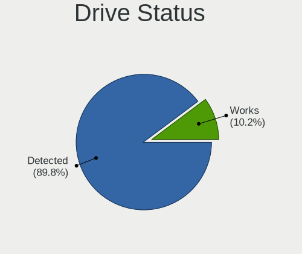

| Status   | Notebooks | Drives | Percent |
|----------|-----------|--------|---------|
| Detected | 44        | 53     | 89.8%   |
| Works    | 5         | 7      | 10.2%   |

Storage controller
------------------

Storage Vendor
--------------

Storage controller vendors

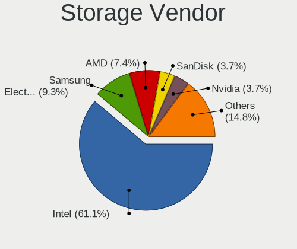

| Vendor                       | Notebooks | Percent |
|------------------------------|-----------|---------|
| Intel                        | 33        | 61.11%  |
| Samsung Electronics          | 5         | 9.26%   |
| AMD                          | 4         | 7.41%   |
| SanDisk                      | 2         | 3.7%    |
| Nvidia                       | 2         | 3.7%    |
| Toshiba America Info Systems | 1         | 1.85%   |
| SK hynix                     | 1         | 1.85%   |
| Silicon Motion               | 1         | 1.85%   |
| Realtek Semiconductor        | 1         | 1.85%   |
| Micron/Crucial Technology    | 1         | 1.85%   |
| Micron Technology            | 1         | 1.85%   |
| MAXIO Technology (Hangzhou)  | 1         | 1.85%   |
| KIOXIA                       | 1         | 1.85%   |

Storage Model
-------------

Storage controller models

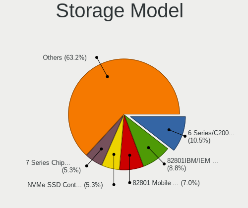

| Model                                                                            | Notebooks | Percent |
|----------------------------------------------------------------------------------|-----------|---------|
| Intel 6 Series/C200 Series Chipset Family 6 port Mobile SATA AHCI Controller     | 6         | 10.53%  |
| Intel 82801IBM/IEM (ICH9M/ICH9M-E) 4 port SATA Controller [AHCI mode]            | 5         | 8.77%   |
| Intel 82801 Mobile SATA Controller [RAID mode]                                   | 4         | 7.02%   |
| Samsung NVMe SSD Controller SM981/PM981/PM983                                    | 3         | 5.26%   |
| Intel 7 Series Chipset Family 6-port SATA Controller [AHCI mode]                 | 3         | 5.26%   |
| Intel 5 Series/3400 Series Chipset 4 port SATA AHCI Controller                   | 3         | 5.26%   |
| Nvidia MCP89 SATA Controller (AHCI mode)                                         | 2         | 3.51%   |
| Intel 8 Series SATA Controller 1 [AHCI mode]                                     | 2         | 3.51%   |
| Intel 5 Series/3400 Series Chipset 6 port SATA AHCI Controller                   | 2         | 3.51%   |
| AMD FCH SATA Controller [AHCI mode]                                              | 2         | 3.51%   |
| Toshiba America Info Systems XG6 NVMe SSD Controller                             | 1         | 1.75%   |
| SK hynix BC501 NVMe Solid State Drive                                            | 1         | 1.75%   |
| Silicon Motion Non-Volatile memory controller                                    | 1         | 1.75%   |
| Sandisk WD PC SN740 NVMe SSD 512GB (DRAM-less)                                   | 1         | 1.75%   |
| SanDisk Ultra 3D / WD PC SN530, IX SN530, Blue SN550 NVMe SSD (DRAM-less)        | 1         | 1.75%   |
| Samsung NVMe SSD Controller SM961/PM961/SM963                                    | 1         | 1.75%   |
| Samsung NVMe SSD Controller PM9A1/PM9A3/980PRO                                   | 1         | 1.75%   |
| Realtek RTS5765DL NVMe SSD Controller (DRAM-less)                                | 1         | 1.75%   |
| Micron/Crucial P2 [Nick P2] / P3 / P3 Plus NVMe PCIe SSD (DRAM-less)             | 1         | 1.75%   |
| Micron 2400 NVMe SSD (DRAM-less)                                                 | 1         | 1.75%   |
| MAXIO (Hangzhou) NVMe SSD Controller MAP1202 (DRAM-less)                         | 1         | 1.75%   |
| KIOXIA NVMe SSD Controller BG5 (DRAM-less)                                       | 1         | 1.75%   |
| Intel Wildcat Point-LP SATA Controller [AHCI Mode]                               | 1         | 1.75%   |
| Intel Volume Management Device NVMe RAID Controller                              | 1         | 1.75%   |
| Intel Sunrise Point-LP SATA Controller [AHCI mode]                               | 1         | 1.75%   |
| Intel Celeron N3350/Pentium N4200/Atom E3900 Series SATA AHCI Controller         | 1         | 1.75%   |
| Intel Cannon Point-LP SATA Controller [AHCI Mode]                                | 1         | 1.75%   |
| Intel Atom/Celeron/Pentium Processor x5-E8000/J3xxx/N3xxx Series SATA Controller | 1         | 1.75%   |
| Intel Atom Processor E3800 Series SATA AHCI Controller                           | 1         | 1.75%   |
| Intel 82801IBM/IEM (ICH9M/ICH9M-E) 2 port SATA Controller [IDE mode]             | 1         | 1.75%   |
| Intel 82801HM/HEM (ICH8M/ICH8M-E) SATA Controller [AHCI mode]                    | 1         | 1.75%   |
| Intel 82801HM/HEM (ICH8M/ICH8M-E) IDE Controller                                 | 1         | 1.75%   |
| AMD SB7x0/SB8x0/SB9x0 SATA Controller [AHCI mode]                                | 1         | 1.75%   |
| AMD SB600 Non-Raid-5 SATA                                                        | 1         | 1.75%   |
| AMD SB600 IDE                                                                    | 1         | 1.75%   |

Storage Kind
------------

Kind of storage controller (IDE, SATA, NVMe, SAS, ...)

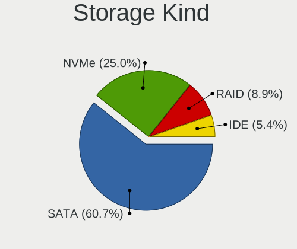

| Kind | Notebooks | Percent |
|------|-----------|---------|
| SATA | 34        | 60.71%  |
| NVMe | 14        | 25%     |
| RAID | 5         | 8.93%   |
| IDE  | 3         | 5.36%   |

Processor
---------

CPU Vendor
----------

Processor vendors

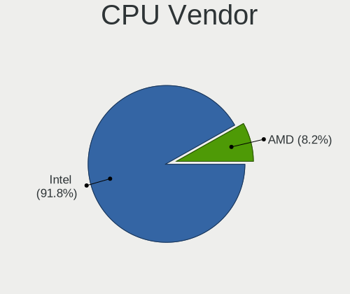

| Vendor | Notebooks | Percent |
|--------|-----------|---------|
| Intel  | 45        | 91.84%  |
| AMD    | 4         | 8.16%   |

CPU Model
---------

Processor models

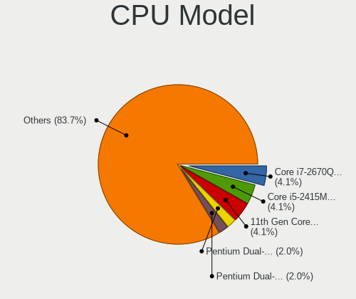

| Model                                       | Notebooks | Percent |
|---------------------------------------------|-----------|---------|
| Intel Core i7-2670QM CPU @ 2.20GHz          | 2         | 4.08%   |
| Intel Core i5-2415M CPU @ 2.30GHz           | 2         | 4.08%   |
| Intel 11th Gen Core i3-1115G4 @ 3.00GHz     | 2         | 4.08%   |
| Intel Pentium Dual-Core CPU T4400 @ 2.20GHz | 1         | 2.04%   |
| Intel Pentium Dual-Core CPU T4200 @ 2.00GHz | 1         | 2.04%   |
| Intel Pentium Dual CPU T2330 @ 1.60GHz      | 1         | 2.04%   |
| Intel Pentium CPU N3710 @ 1.60GHz           | 1         | 2.04%   |
| Intel Genuine CPU U7300 @ 1.30GHz           | 1         | 2.04%   |
| Intel Core m3-6Y30 CPU @ 0.90GHz            | 1         | 2.04%   |
| Intel Core i7-8665U CPU @ 1.90GHz           | 1         | 2.04%   |
| Intel Core i7-8565U CPU @ 1.80GHz           | 1         | 2.04%   |
| Intel Core i7-8550U CPU @ 1.80GHz           | 1         | 2.04%   |
| Intel Core i7-4510U CPU @ 2.00GHz           | 1         | 2.04%   |
| Intel Core i7-3615QM CPU @ 2.30GHz          | 1         | 2.04%   |
| Intel Core i7-3540M CPU @ 3.00GHz           | 1         | 2.04%   |
| Intel Core i7-1065G7 CPU @ 1.30GHz          | 1         | 2.04%   |
| Intel Core i7-10610U CPU @ 1.80GHz          | 1         | 2.04%   |
| Intel Core i7 CPU M 620 @ 2.67GHz           | 1         | 2.04%   |
| Intel Core i5-5250U CPU @ 1.60GHz           | 1         | 2.04%   |
| Intel Core i5-2430M CPU @ 2.40GHz           | 1         | 2.04%   |
| Intel Core i5-2410M CPU @ 2.30GHz           | 1         | 2.04%   |
| Intel Core i5-10210U CPU @ 1.60GHz          | 1         | 2.04%   |
| Intel Core i5 CPU M 560 @ 2.67GHz           | 1         | 2.04%   |
| Intel Core i5 CPU M 520 @ 2.40GHz           | 1         | 2.04%   |
| Intel Core i5 CPU M 430 @ 2.27GHz           | 1         | 2.04%   |
| Intel Core i3-5010U CPU @ 2.10GHz           | 1         | 2.04%   |
| Intel Core i3-3227U CPU @ 1.90GHz           | 1         | 2.04%   |
| Intel Core i3-2328M CPU @ 2.20GHz           | 1         | 2.04%   |
| Intel Core i3 CPU M 380 @ 2.53GHz           | 1         | 2.04%   |
| Intel Core 2 Duo CPU U9400 @ 1.40GHz        | 1         | 2.04%   |
| Intel Core 2 Duo CPU T7300 @ 2.00GHz        | 1         | 2.04%   |
| Intel Core 2 Duo CPU T6500 @ 2.10GHz        | 1         | 2.04%   |
| Intel Core 2 Duo CPU P8700 @ 2.53GHz        | 1         | 2.04%   |
| Intel Core 2 Duo CPU P8600 @ 2.40GHz        | 1         | 2.04%   |
| Intel Celeron CPU N3450 @ 1.10GHz           | 1         | 2.04%   |
| Intel Celeron CPU N2910 @ 1.60GHz           | 1         | 2.04%   |
| Intel Celeron CPU B830 @ 1.80GHz            | 1         | 2.04%   |
| Intel Celeron 2957U @ 1.40GHz               | 1         | 2.04%   |
| Intel 12th Gen Core i5-12500H               | 1         | 2.04%   |
| Intel 12th Gen Core i3-1215U                | 1         | 2.04%   |

CPU Model Family
----------------

Processor model prefix

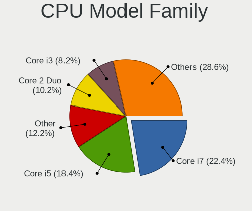

| Model                   | Notebooks | Percent |
|-------------------------|-----------|---------|
| Intel Core i7           | 11        | 22.45%  |
| Intel Core i5           | 9         | 18.37%  |
| Other                   | 6         | 12.24%  |
| Intel Core 2 Duo        | 5         | 10.2%   |
| Intel Core i3           | 4         | 8.16%   |
| Intel Celeron           | 4         | 8.16%   |
| Intel Pentium Dual-Core | 2         | 4.08%   |
| AMD E                   | 2         | 4.08%   |
| Intel Pentium Dual      | 1         | 2.04%   |
| Intel Pentium           | 1         | 2.04%   |
| Intel Genuine           | 1         | 2.04%   |
| Intel Core m3           | 1         | 2.04%   |
| AMD Ryzen 7             | 1         | 2.04%   |
| AMD PRO A8              | 1         | 2.04%   |

CPU Cores
---------

Number of processor cores

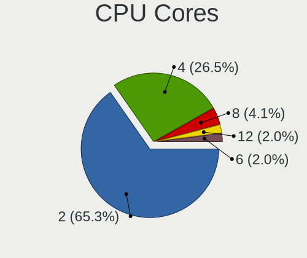

| Number | Notebooks | Percent |
|--------|-----------|---------|
| 2      | 32        | 65.31%  |
| 4      | 13        | 26.53%  |
| 8      | 2         | 4.08%   |
| 12     | 1         | 2.04%   |
| 6      | 1         | 2.04%   |

CPU Sockets
-----------

Number of sockets

| Number | Notebooks | Percent |
|--------|-----------|---------|
| 1      | 49        | 100%    |

CPU Threads
-----------

Threads per core (Hyper-Threading)

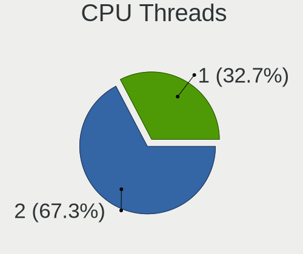

| Number | Notebooks | Percent |
|--------|-----------|---------|
| 2      | 33        | 67.35%  |
| 1      | 16        | 32.65%  |

CPU Op-Modes
------------

CPU Operation Modes (32-bit, 64-bit)

| Op mode        | Notebooks | Percent |
|----------------|-----------|---------|
| 32-bit, 64-bit | 49        | 100%    |

CPU Microcode
-------------

Microcode number

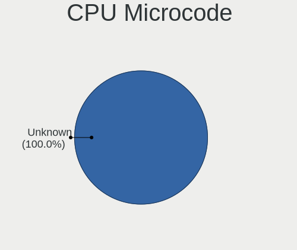

| Number  | Notebooks | Percent |
|---------|-----------|---------|
| Unknown | 49        | 100%    |

CPU Microarch
-------------

Microarchitecture

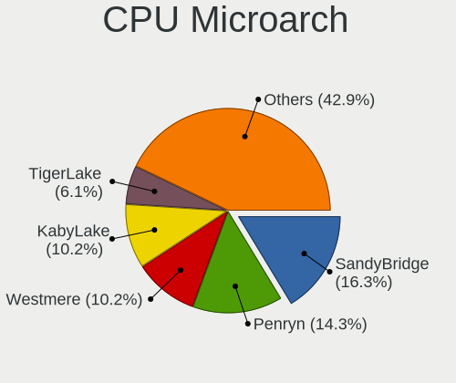

| Name             | Notebooks | Percent |
|------------------|-----------|---------|
| SandyBridge      | 8         | 16.33%  |
| Penryn           | 7         | 14.29%  |
| Westmere         | 5         | 10.2%   |
| KabyLake         | 5         | 10.2%   |
| TigerLake        | 3         | 6.12%   |
| IvyBridge        | 3         | 6.12%   |
| Silvermont       | 2         | 4.08%   |
| IceLake          | 2         | 4.08%   |
| Haswell          | 2         | 4.08%   |
| Core             | 2         | 4.08%   |
| Broadwell        | 2         | 4.08%   |
| Bobcat           | 2         | 4.08%   |
| Alderlake Hybrid | 2         | 4.08%   |
| Skylake          | 1         | 2.04%   |
| Goldmont         | 1         | 2.04%   |
| Excavator        | 1         | 2.04%   |
| Unknown          | 1         | 2.04%   |

Graphics
--------

GPU Vendor
----------

Vendors of graphics cards

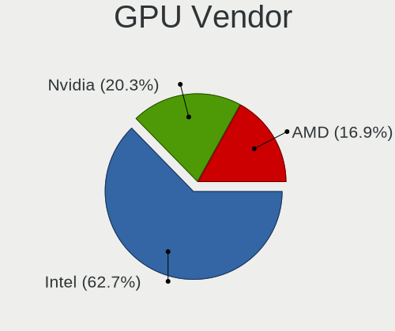

| Vendor | Notebooks | Percent |
|--------|-----------|---------|
| Intel  | 37        | 62.71%  |
| Nvidia | 12        | 20.34%  |
| AMD    | 10        | 16.95%  |

GPU Model
---------

Graphics card models

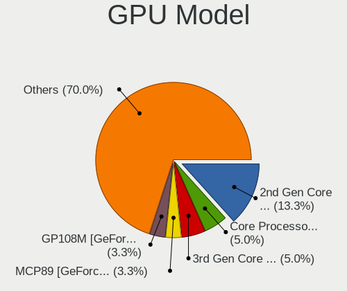

| Model                                                                                    | Notebooks | Percent |
|------------------------------------------------------------------------------------------|-----------|---------|
| Intel 2nd Generation Core Processor Family Integrated Graphics Controller                | 8         | 13.33%  |
| Intel Core Processor Integrated Graphics Controller                                      | 3         | 5%      |
| Intel 3rd Gen Core processor Graphics Controller                                         | 3         | 5%      |
| Nvidia MCP89 [GeForce 320M]                                                              | 2         | 3.33%   |
| Nvidia GP108M [GeForce MX250]                                                            | 2         | 3.33%   |
| Intel WhiskeyLake-U GT2 [UHD Graphics 620]                                               | 2         | 3.33%   |
| Intel Tiger Lake-LP GT2 [UHD Graphics G4]                                                | 2         | 3.33%   |
| Intel Mobile 4 Series Chipset Integrated Graphics Controller                             | 2         | 3.33%   |
| Intel Haswell-ULT Integrated Graphics Controller                                         | 2         | 3.33%   |
| Intel CometLake-U GT2 [UHD Graphics]                                                     | 2         | 3.33%   |
| AMD RV710/M92 [Mobility Radeon HD 4530/4570/5145/530v/540v/545v]                         | 2         | 3.33%   |
| Nvidia TU117GLM [T1200 Laptop GPU]                                                       | 1         | 1.67%   |
| Nvidia GK107M [GeForce GT 650M Mac Edition]                                              | 1         | 1.67%   |
| Nvidia GK107M [GeForce GT 640M LE]                                                       | 1         | 1.67%   |
| Nvidia GF119M [NVS 4200M]                                                                | 1         | 1.67%   |
| Nvidia GF119M [GeForce GT 520M]                                                          | 1         | 1.67%   |
| Nvidia GF117M [GeForce 610M/710M/810M/820M / GT 620M/625M/630M/720M]                     | 1         | 1.67%   |
| Nvidia GF108M [GeForce GT 540M]                                                          | 1         | 1.67%   |
| Nvidia G96CM [GeForce 9600M GT]                                                          | 1         | 1.67%   |
| Intel UHD Graphics 620                                                                   | 1         | 1.67%   |
| Intel TigerLake-LP GT2 [Iris Xe Graphics]                                                | 1         | 1.67%   |
| Intel TigerLake-H GT1 [UHD Graphics]                                                     | 1         | 1.67%   |
| Intel Mobile GM965/GL960 Integrated Graphics Controller (secondary)                      | 1         | 1.67%   |
| Intel Mobile GM965/GL960 Integrated Graphics Controller (primary)                        | 1         | 1.67%   |
| Intel Iris Plus Graphics G7                                                              | 1         | 1.67%   |
| Intel HD Graphics 6000                                                                   | 1         | 1.67%   |
| Intel HD Graphics 5500                                                                   | 1         | 1.67%   |
| Intel HD Graphics 515                                                                    | 1         | 1.67%   |
| Intel HD Graphics 500                                                                    | 1         | 1.67%   |
| Intel Atom/Celeron/Pentium Processor x5-E8000/J3xxx/N3xxx Integrated Graphics Controller | 1         | 1.67%   |
| Intel Atom Processor Z36xxx/Z37xxx Series Graphics & Display                             | 1         | 1.67%   |
| Intel Alder Lake-UP3 GT1 [UHD Graphics]                                                  | 1         | 1.67%   |
| Intel Alder Lake-P Integrated Graphics Controller                                        | 1         | 1.67%   |
| AMD Wrestler [Radeon HD 6320]                                                            | 1         | 1.67%   |
| AMD Wrestler [Radeon HD 6310]                                                            | 1         | 1.67%   |
| AMD Wani [Radeon R5/R6/R7 Graphics]                                                      | 1         | 1.67%   |
| AMD Topaz XT [Radeon R7 M260/M265 / M340/M360 / M440/M445 / 530/535 / 620/625 Mobile]    | 1         | 1.67%   |
| AMD RS600M [Radeon Xpress 1250]                                                          | 1         | 1.67%   |
| AMD Phoenix3                                                                             | 1         | 1.67%   |
| AMD Park [Mobility Radeon HD 5430/5450/5470]                                             | 1         | 1.67%   |

GPU Combo
---------

Combinations of graphics cards

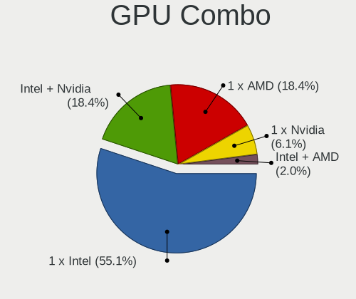

| Name           | Notebooks | Percent |
|----------------|-----------|---------|
| 1 x Intel      | 27        | 55.1%   |
| Intel + Nvidia | 9         | 18.37%  |
| 1 x AMD        | 9         | 18.37%  |
| 1 x Nvidia     | 3         | 6.12%   |
| Intel + AMD    | 1         | 2.04%   |

GPU Driver
----------

Free vs proprietary

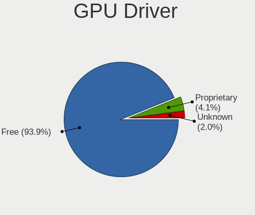

| Driver      | Notebooks | Percent |
|-------------|-----------|---------|
| Free        | 46        | 93.88%  |
| Proprietary | 2         | 4.08%   |
| Unknown     | 1         | 2.04%   |

GPU Memory
----------

Total video memory

| Size in GB | Notebooks | Percent |
|------------|-----------|---------|
| Unknown    | 48        | 97.96%  |
| 3.01-4.0   | 1         | 2.04%   |

Monitor
-------

Monitor Vendor
--------------

Monitor vendors

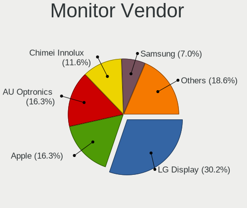

| Vendor                  | Notebooks | Percent |
|-------------------------|-----------|---------|
| LG Display              | 13        | 30.23%  |
| AU Optronics            | 7         | 16.28%  |
| Apple                   | 7         | 16.28%  |
| Chimei Innolux          | 5         | 11.63%  |
| Samsung Electronics     | 3         | 6.98%   |
| BOE                     | 3         | 6.98%   |
| Chi Mei Optoelectronics | 2         | 4.65%   |
| PANDA                   | 1         | 2.33%   |
| CS_                     | 1         | 2.33%   |
| CSO                     | 1         | 2.33%   |

Monitor Model
-------------

Monitor models

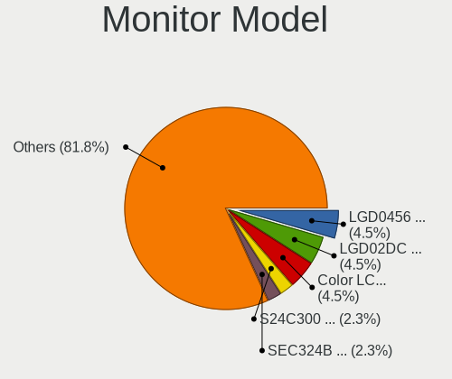

| Model                                                                     | Notebooks | Percent |
|---------------------------------------------------------------------------|-----------|---------|
| LG Display LCD Monitor LGD0456 1366x768 344x194mm 15.5-inch               | 2         | 4.55%   |
| LG Display LCD Monitor LGD02DC 1366x768 344x194mm 15.5-inch               | 2         | 4.55%   |
| Apple Color LCD APP9CC9 1280x800 286x178mm 13.3-inch                      | 2         | 4.55%   |
| Samsung Electronics S24C300 SAM0A28 1920x1080 531x299mm 24.0-inch         | 1         | 2.27%   |
| Samsung Electronics LCD Monitor SEC324B 1440x900 367x230mm 17.1-inch      | 1         | 2.27%   |
| Samsung Electronics LCD Monitor SEC3245 1366x768 344x194mm 15.5-inch      | 1         | 2.27%   |
| Samsung Electronics LCD Monitor SDC4187 1920x1200 302x189mm 14.0-inch     | 1         | 2.27%   |
| PANDA LCD Monitor NCP0046 1920x1080 344x194mm 15.5-inch                   | 1         | 2.27%   |
| LG Display LCD Monitor LGD6E01 1366x768 344x194mm 15.5-inch               | 1         | 2.27%   |
| LG Display LCD Monitor LGD2298 1366x768 345x194mm 15.6-inch               | 1         | 2.27%   |
| LG Display LCD Monitor LGD045E 1366x768 309x174mm 14.0-inch               | 1         | 2.27%   |
| LG Display LCD Monitor LGD0353 1366x768 345x194mm 15.6-inch               | 1         | 2.27%   |
| LG Display LCD Monitor LGD033A 1366x768 340x190mm 15.3-inch               | 1         | 2.27%   |
| LG Display LCD Monitor LGD0327 1366x768 309x174mm 14.0-inch               | 1         | 2.27%   |
| LG Display LCD Monitor LGD031D 1366x768 256x144mm 11.6-inch               | 1         | 2.27%   |
| LG Display LCD Monitor LGD02E3 1366x768 344x194mm 15.5-inch               | 1         | 2.27%   |
| LG Display LCD Monitor LGD02DF 1600x900 310x174mm 14.0-inch               | 1         | 2.27%   |
| CS_ LCD Monitor CS_5211 1920x1080 519x324mm 24.1-inch                     | 1         | 2.27%   |
| CSO LCD Monitor CSO1309 3000x2000 293x195mm 13.9-inch                     | 1         | 2.27%   |
| Chimei Innolux LCD Monitor CMN15F5 1920x1080 344x193mm 15.5-inch          | 1         | 2.27%   |
| Chimei Innolux LCD Monitor CMN15E7 1920x1080 344x193mm 15.5-inch          | 1         | 2.27%   |
| Chimei Innolux LCD Monitor CMN1520 1920x1080 344x193mm 15.5-inch          | 1         | 2.27%   |
| Chimei Innolux LCD Monitor CMN14E9 1920x1080 309x173mm 13.9-inch          | 1         | 2.27%   |
| Chimei Innolux LCD Monitor CMN14D4 1920x1080 309x173mm 13.9-inch          | 1         | 2.27%   |
| Chi Mei Optoelectronics LCD Monitor CMO1807 1920x1080 408x230mm 18.4-inch | 1         | 2.27%   |
| Chi Mei Optoelectronics LCD Monitor CMO1592 1366x768 350x190mm 15.7-inch  | 1         | 2.27%   |
| BOE LCD Monitor BOE0949 1366x768 344x194mm 15.5-inch                      | 1         | 2.27%   |
| BOE LCD Monitor BOE0889 1920x1080 344x194mm 15.5-inch                     | 1         | 2.27%   |
| BOE LCD Monitor BOE0872 1920x1080 344x194mm 15.5-inch                     | 1         | 2.27%   |
| AU Optronics LCD Monitor AUO472D 1920x1080 293x165mm 13.2-inch            | 1         | 2.27%   |
| AU Optronics LCD Monitor AUO42EC 1366x768 344x193mm 15.5-inch             | 1         | 2.27%   |
| AU Optronics LCD Monitor AUO418D 1920x1080 309x174mm 14.0-inch            | 1         | 2.27%   |
| AU Optronics LCD Monitor AUO312C 1366x768 293x164mm 13.2-inch             | 1         | 2.27%   |
| AU Optronics LCD Monitor AUO223C 1366x768 309x173mm 13.9-inch             | 1         | 2.27%   |
| AU Optronics LCD Monitor AUO10ED 1920x1080 344x193mm 15.5-inch            | 1         | 2.27%   |
| AU Optronics LCD Monitor AUO102C 1366x768 293x164mm 13.2-inch             | 1         | 2.27%   |
| Apple LCD Monitor APP9CCB 1280x800 286x179mm 13.3-inch                    | 1         | 2.27%   |
| Apple Color LCD APPA00E 2880x1800 331x207mm 15.4-inch                     | 1         | 2.27%   |
| Apple Color LCD APP9CF2 1366x768 256x144mm 11.6-inch                      | 1         | 2.27%   |
| Apple Color LCD APP9CF0 1440x900 290x180mm 13.4-inch                      | 1         | 2.27%   |

Monitor Resolution
------------------

Monitor screen resolution

| Resolution       | Notebooks | Percent |
|------------------|-----------|---------|
| 1366x768 (WXGA)  | 19        | 43.18%  |
| 1920x1080 (FHD)  | 14        | 31.82%  |
| 1280x800 (WXGA)  | 4         | 9.09%   |
| 2880x1800        | 2         | 4.55%   |
| 1600x900 (HD+)   | 2         | 4.55%   |
| 3000x2000        | 1         | 2.27%   |
| 1680x945         | 1         | 2.27%   |
| 1440x900 (WXGA+) | 1         | 2.27%   |

Monitor Diagonal
----------------

Diagonal size in inches

| Inches | Notebooks | Percent |
|--------|-----------|---------|
| 15     | 21        | 47.73%  |
| 13     | 12        | 27.27%  |
| 14     | 4         | 9.09%   |
| 24     | 2         | 4.55%   |
| 18     | 2         | 4.55%   |
| 11     | 2         | 4.55%   |
| 16     | 1         | 2.27%   |

Monitor Width
-------------

Physical width

| Width in mm | Notebooks | Percent |
|-------------|-----------|---------|
| 301-350     | 29        | 65.91%  |
| 201-300     | 11        | 25%     |
| 501-600     | 2         | 4.55%   |
| 401-500     | 2         | 4.55%   |

Aspect Ratio
------------

Proportional relationship between the width and the height

| Ratio | Notebooks | Percent |
|-------|-----------|---------|
| 16/9  | 35        | 79.55%  |
| 16/10 | 8         | 18.18%  |
| 3/2   | 1         | 2.27%   |

Monitor Area
------------

Area in inch²

| Area in inch² | Notebooks | Percent |
|----------------|-----------|---------|
| 101-110        | 21        | 47.73%  |
| 81-90          | 10        | 22.73%  |
| 71-80          | 6         | 13.64%  |
| 51-60          | 2         | 4.55%   |
| 141-150        | 2         | 4.55%   |
| 251-300        | 1         | 2.27%   |
| 201-250        | 1         | 2.27%   |
| 111-120        | 1         | 2.27%   |

Pixel Density
-------------

Pixels per inch

| Density       | Notebooks | Percent |
|---------------|-----------|---------|
| 101-120       | 22        | 50%     |
| 121-160       | 14        | 31.82%  |
| 51-100        | 4         | 9.09%   |
| 161-240       | 3         | 6.82%   |
| More than 240 | 1         | 2.27%   |

Multiple Monitors
-----------------

Total monitors connected

| Total | Notebooks | Percent |
|-------|-----------|---------|
| 1     | 48        | 97.96%  |
| 2     | 1         | 2.04%   |

Network
-------

Net Controller Vendor
---------------------

Controller vendors

| Vendor                   | Notebooks | Percent |
|--------------------------|-----------|---------|
| Intel                    | 18        | 24.32%  |
| Realtek Semiconductor    | 15        | 20.27%  |
| Broadcom                 | 13        | 17.57%  |
| Qualcomm Atheros         | 11        | 14.86%  |
| Broadcom Limited         | 7         | 9.46%   |
| Ralink                   | 3         | 4.05%   |
| Marvell Technology Group | 3         | 4.05%   |
| MediaTek                 | 2         | 2.7%    |
| Lenovo                   | 1         | 1.35%   |
| ASIX Electronics         | 1         | 1.35%   |

Net Controller Model
--------------------

Controller models

| Model                                                                   | Notebooks | Percent |
|-------------------------------------------------------------------------|-----------|---------|
| Realtek RTL8111/8168/8211/8411 PCI Express Gigabit Ethernet Controller  | 8         | 9.41%   |
| Realtek RTL810xE PCI Express Fast Ethernet controller                   | 5         | 5.88%   |
| Qualcomm Atheros AR9285 Wireless Network Adapter (PCI-Express)          | 4         | 4.71%   |
| Intel Wi-Fi 6 AX201                                                     | 3         | 3.53%   |
| Qualcomm Atheros QCA9565 / AR9565 Wireless Network Adapter              | 2         | 2.35%   |
| Qualcomm Atheros AR8151 v2.0 Gigabit Ethernet                           | 2         | 2.35%   |
| Intel Comet Lake PCH-LP CNVi WiFi                                       | 2         | 2.35%   |
| Intel Cannon Point-LP CNVi [Wireless-AC]                                | 2         | 2.35%   |
| Broadcom NetXtreme BCM57765 Gigabit Ethernet PCIe                       | 2         | 2.35%   |
| Broadcom NetXtreme BCM5764M Gigabit Ethernet PCIe                       | 2         | 2.35%   |
| Broadcom Limited NetLink BCM57780 Gigabit Ethernet PCIe                 | 2         | 2.35%   |
| Broadcom BCM4331 802.11a/b/g/n                                          | 2         | 2.35%   |
| Realtek RTL8822CE 802.11ac PCIe Wireless Network Adapter                | 1         | 1.18%   |
| Realtek RTL8821CE 802.11ac PCIe Wireless Network Adapter                | 1         | 1.18%   |
| Realtek RTL8723BE PCIe Wireless Network Adapter                         | 1         | 1.18%   |
| Ralink RT3290 Wireless 802.11n 1T/1R PCIe                               | 1         | 1.18%   |
| Ralink RT3091 Wireless 802.11n 1T/2R PCIe                               | 1         | 1.18%   |
| Ralink RT3090 Wireless 802.11n 1T/1R PCIe                               | 1         | 1.18%   |
| Qualcomm Atheros AR928X Wireless Network Adapter (PCI-Express)          | 1         | 1.18%   |
| Qualcomm Atheros AR9287 Wireless Network Adapter (PCI-Express)          | 1         | 1.18%   |
| Qualcomm Atheros AR8131 Gigabit Ethernet                                | 1         | 1.18%   |
| Qualcomm Atheros AR242x / AR542x Wireless Network Adapter (PCI-Express) | 1         | 1.18%   |
| MediaTek MT7922 802.11ax PCI Express Wireless Network Adapter           | 1         | 1.18%   |
| MediaTek MT7921 802.11ax PCI Express Wireless Network Adapter           | 1         | 1.18%   |
| Marvell Group 88E8058 PCI-E Gigabit Ethernet Controller                 | 1         | 1.18%   |
| Marvell Group 88E8040 PCI-E Fast Ethernet Controller                    | 1         | 1.18%   |
| Marvell Group 88E8039 PCI-E Fast Ethernet Controller                    | 1         | 1.18%   |
| Lenovo Lenovo USB-C to LAN                                              | 1         | 1.18%   |
| Intel Wireless 8265 / 8275                                              | 1         | 1.18%   |
| Intel Wireless 3165                                                     | 1         | 1.18%   |
| Intel WiFi Link 5100                                                    | 1         | 1.18%   |
| Intel Wi-Fi 6E(802.11ax) AX210/AX1675* 2x2 [Typhoon Peak]               | 1         | 1.18%   |
| Intel PRO/Wireless 5100 AGN [Shiloh] Network Connection                 | 1         | 1.18%   |
| Intel Ice Lake-LP PCH CNVi WiFi                                         | 1         | 1.18%   |
| Intel Ethernet Controller I225-V                                        | 1         | 1.18%   |
| Intel Ethernet Connection (6) I219-LM                                   | 1         | 1.18%   |
| Intel Ethernet Connection (4) I219-V                                    | 1         | 1.18%   |
| Intel Ethernet Connection (10) I219-LM                                  | 1         | 1.18%   |
| Intel Centrino Wireless-N 1000 [Condor Peak]                            | 1         | 1.18%   |
| Intel Centrino Advanced-N 6235                                          | 1         | 1.18%   |

Wireless Vendor
---------------

Wireless vendors

| Vendor                | Notebooks | Percent |
|-----------------------|-----------|---------|
| Intel                 | 17        | 36.17%  |
| Qualcomm Atheros      | 9         | 19.15%  |
| Broadcom              | 9         | 19.15%  |
| Broadcom Limited      | 5         | 10.64%  |
| Realtek Semiconductor | 3         | 6.38%   |
| Ralink                | 3         | 6.38%   |
| MediaTek              | 1         | 2.13%   |

Wireless Model
--------------

Wireless models

| Model                                                                   | Notebooks | Percent |
|-------------------------------------------------------------------------|-----------|---------|
| Qualcomm Atheros AR9285 Wireless Network Adapter (PCI-Express)          | 4         | 8.51%   |
| Intel Wi-Fi 6 AX201                                                     | 3         | 6.38%   |
| Qualcomm Atheros QCA9565 / AR9565 Wireless Network Adapter              | 2         | 4.26%   |
| Intel Comet Lake PCH-LP CNVi WiFi                                       | 2         | 4.26%   |
| Intel Cannon Point-LP CNVi [Wireless-AC]                                | 2         | 4.26%   |
| Broadcom BCM4331 802.11a/b/g/n                                          | 2         | 4.26%   |
| Realtek RTL8822CE 802.11ac PCIe Wireless Network Adapter                | 1         | 2.13%   |
| Realtek RTL8821CE 802.11ac PCIe Wireless Network Adapter                | 1         | 2.13%   |
| Realtek RTL8723BE PCIe Wireless Network Adapter                         | 1         | 2.13%   |
| Ralink RT3290 Wireless 802.11n 1T/1R PCIe                               | 1         | 2.13%   |
| Ralink RT3091 Wireless 802.11n 1T/2R PCIe                               | 1         | 2.13%   |
| Ralink RT3090 Wireless 802.11n 1T/1R PCIe                               | 1         | 2.13%   |
| Qualcomm Atheros AR928X Wireless Network Adapter (PCI-Express)          | 1         | 2.13%   |
| Qualcomm Atheros AR9287 Wireless Network Adapter (PCI-Express)          | 1         | 2.13%   |
| Qualcomm Atheros AR242x / AR542x Wireless Network Adapter (PCI-Express) | 1         | 2.13%   |
| MediaTek MT7921 802.11ax PCI Express Wireless Network Adapter           | 1         | 2.13%   |
| Intel Wireless 8265 / 8275                                              | 1         | 2.13%   |
| Intel Wireless 3165                                                     | 1         | 2.13%   |
| Intel WiFi Link 5100                                                    | 1         | 2.13%   |
| Intel Wi-Fi 6E(802.11ax) AX210/AX1675* 2x2 [Typhoon Peak]               | 1         | 2.13%   |
| Intel PRO/Wireless 5100 AGN [Shiloh] Network Connection                 | 1         | 2.13%   |
| Intel Ice Lake-LP PCH CNVi WiFi                                         | 1         | 2.13%   |
| Intel Centrino Wireless-N 1000 [Condor Peak]                            | 1         | 2.13%   |
| Intel Centrino Advanced-N 6235                                          | 1         | 2.13%   |
| Intel Centrino Advanced-N 6230 [Rainbow Peak]                           | 1         | 2.13%   |
| Intel Centrino Advanced-N 6200                                          | 1         | 2.13%   |
| Broadcom Limited BCM4360 802.11ac Dual Band Wireless Network Adapter    | 1         | 2.13%   |
| Broadcom Limited BCM4331 802.11a/b/g/n                                  | 1         | 2.13%   |
| Broadcom Limited BCM43228 802.11a/b/g/n                                 | 1         | 2.13%   |
| Broadcom Limited BCM43142 802.11b/g/n                                   | 1         | 2.13%   |
| Broadcom Limited BCM4312 802.11b/g LP-PHY                               | 1         | 2.13%   |
| Broadcom BCM43228 802.11a/b/g/n                                         | 1         | 2.13%   |
| Broadcom BCM43224 802.11a/b/g/n                                         | 1         | 2.13%   |
| Broadcom BCM4322 802.11a/b/g/n Wireless LAN Controller                  | 1         | 2.13%   |
| Broadcom BCM4321 802.11a/b/g/n                                          | 1         | 2.13%   |
| Broadcom BCM43142 802.11b/g/n                                           | 1         | 2.13%   |
| Broadcom BCM4313 802.11bgn Wireless Network Adapter                     | 1         | 2.13%   |
| Broadcom BCM4312 802.11b/g LP-PHY                                       | 1         | 2.13%   |

Ethernet Vendor
---------------

Ethernet vendors

| Vendor                   | Notebooks | Percent |
|--------------------------|-----------|---------|
| Realtek Semiconductor    | 13        | 34.21%  |
| Broadcom                 | 8         | 21.05%  |
| Intel                    | 6         | 15.79%  |
| Qualcomm Atheros         | 3         | 7.89%   |
| Marvell Technology Group | 3         | 7.89%   |
| Broadcom Limited         | 2         | 5.26%   |
| MediaTek                 | 1         | 2.63%   |
| Lenovo                   | 1         | 2.63%   |
| ASIX Electronics         | 1         | 2.63%   |

Ethernet Model
--------------

Ethernet models

| Model                                                                  | Notebooks | Percent |
|------------------------------------------------------------------------|-----------|---------|
| Realtek RTL8111/8168/8211/8411 PCI Express Gigabit Ethernet Controller | 8         | 21.05%  |
| Realtek RTL810xE PCI Express Fast Ethernet controller                  | 5         | 13.16%  |
| Qualcomm Atheros AR8151 v2.0 Gigabit Ethernet                          | 2         | 5.26%   |
| Broadcom NetXtreme BCM57765 Gigabit Ethernet PCIe                      | 2         | 5.26%   |
| Broadcom NetXtreme BCM5764M Gigabit Ethernet PCIe                      | 2         | 5.26%   |
| Broadcom Limited NetLink BCM57780 Gigabit Ethernet PCIe                | 2         | 5.26%   |
| Qualcomm Atheros AR8131 Gigabit Ethernet                               | 1         | 2.63%   |
| MediaTek MT7922 802.11ax PCI Express Wireless Network Adapter          | 1         | 2.63%   |
| Marvell Group 88E8058 PCI-E Gigabit Ethernet Controller                | 1         | 2.63%   |
| Marvell Group 88E8040 PCI-E Fast Ethernet Controller                   | 1         | 2.63%   |
| Marvell Group 88E8039 PCI-E Fast Ethernet Controller                   | 1         | 2.63%   |
| Lenovo Lenovo USB-C to LAN                                             | 1         | 2.63%   |
| Intel Ethernet Controller I225-V                                       | 1         | 2.63%   |
| Intel Ethernet Connection (6) I219-LM                                  | 1         | 2.63%   |
| Intel Ethernet Connection (4) I219-V                                   | 1         | 2.63%   |
| Intel Ethernet Connection (10) I219-LM                                 | 1         | 2.63%   |
| Intel 82579LM Gigabit Network Connection (Lewisville)                  | 1         | 2.63%   |
| Intel 82577LM Gigabit Network Connection                               | 1         | 2.63%   |
| Broadcom NetXtreme BCM57786 Gigabit Ethernet PCIe                      | 1         | 2.63%   |
| Broadcom NetXtreme BCM5761 Gigabit Ethernet PCIe                       | 1         | 2.63%   |
| Broadcom NetLink BCM57785 Gigabit Ethernet PCIe                        | 1         | 2.63%   |
| Broadcom NetLink BCM57780 Gigabit Ethernet PCIe                        | 1         | 2.63%   |
| ASIX AX88179 Gigabit Ethernet                                          | 1         | 2.63%   |

Net Controller Kind
-------------------

Ethernet, WiFi or modem

| Kind     | Notebooks | Percent |
|----------|-----------|---------|
| WiFi     | 47        | 55.95%  |
| Ethernet | 37        | 44.05%  |

Used Controller
---------------

Currently used network controller

| Kind     | Notebooks | Percent |
|----------|-----------|---------|
| WiFi     | 43        | 84.31%  |
| Ethernet | 8         | 15.69%  |

NICs
----

Total network controllers on board

| Total | Notebooks | Percent |
|-------|-----------|---------|
| 2     | 34        | 69.39%  |
| 1     | 15        | 30.61%  |

IPv6
----

IPv6 vs IPv4

| Used | Notebooks | Percent |
|------|-----------|---------|
| No   | 26        | 53.06%  |
| Yes  | 23        | 46.94%  |

Bluetooth
---------

Bluetooth Vendor
----------------

Controller vendors

| Vendor                          | Notebooks | Percent |
|---------------------------------|-----------|---------|
| Intel                           | 11        | 29.73%  |
| Apple                           | 7         | 18.92%  |
| Foxconn / Hon Hai               | 4         | 10.81%  |
| Realtek Semiconductor           | 3         | 8.11%   |
| Qualcomm Atheros Communications | 3         | 8.11%   |
| IMC Networks                    | 2         | 5.41%   |
| Broadcom                        | 2         | 5.41%   |
| Ralink                          | 1         | 2.7%    |
| Lite-On Technology              | 1         | 2.7%    |
| Dell                            | 1         | 2.7%    |
| ASUSTek Computer                | 1         | 2.7%    |
| Alps Electric                   | 1         | 2.7%    |

Bluetooth Model
---------------

Controller models

| Model                                            | Notebooks | Percent |
|--------------------------------------------------|-----------|---------|
| Intel AX201 Bluetooth                            | 6         | 16.22%  |
| Apple Bluetooth Host Controller                  | 4         | 10.81%  |
| Realtek Bluetooth Radio                          | 3         | 8.11%   |
| Qualcomm Atheros  Bluetooth Device               | 2         | 5.41%   |
| Intel Bluetooth 9460/9560 Jefferson Peak (JfP)   | 2         | 5.41%   |
| Foxconn / Hon Hai Broadcom Bluetooth 2.1 Device  | 2         | 5.41%   |
| Apple Bluetooth USB Host Controller              | 2         | 5.41%   |
| Ralink RT3290 Bluetooth                          | 1         | 2.7%    |
| Qualcomm Atheros AR3011 Bluetooth                | 1         | 2.7%    |
| Lite-On Broadcom BCM43142A0 Bluetooth Device     | 1         | 2.7%    |
| Intel Centrino Advanced-N 6230 Bluetooth adapter | 1         | 2.7%    |
| Intel Bluetooth wireless interface               | 1         | 2.7%    |
| Intel AX210 Bluetooth                            | 1         | 2.7%    |
| IMC Networks Wireless_Device                     | 1         | 2.7%    |
| IMC Networks Bluetooth Radio                     | 1         | 2.7%    |
| Foxconn / Hon Hai Wireless_Device                | 1         | 2.7%    |
| Foxconn / Hon Hai BCM43142A0                     | 1         | 2.7%    |
| Dell DW375 Bluetooth Module                      | 1         | 2.7%    |
| Broadcom BCM20702A0 Bluetooth 4.0                | 1         | 2.7%    |
| Broadcom BCM20702A0                              | 1         | 2.7%    |
| ASUS BT-253 Bluetooth Adapter                    | 1         | 2.7%    |
| Apple Bluetooth HCI                              | 1         | 2.7%    |
| Alps Electric UGTZ4 Bluetooth                    | 1         | 2.7%    |

Sound
-----

Sound Vendor
------------

Sound card vendors

| Vendor | Notebooks | Percent |
|--------|-----------|---------|
| Intel  | 42        | 72.41%  |
| AMD    | 9         | 15.52%  |
| Nvidia | 7         | 12.07%  |

Sound Model
-----------

Sound card models

| Model                                                                                             | Notebooks | Percent |
|---------------------------------------------------------------------------------------------------|-----------|---------|
| Intel 6 Series/C200 Series Chipset Family High Definition Audio Controller                        | 7         | 10.61%  |
| Intel 82801I (ICH9 Family) HD Audio Controller                                                    | 5         | 7.58%   |
| Intel 5 Series/3400 Series Chipset High Definition Audio                                          | 5         | 7.58%   |
| Intel 7 Series/C216 Chipset Family High Definition Audio Controller                               | 4         | 6.06%   |
| Intel Tiger Lake-LP Smart Sound Technology Audio Controller                                       | 3         | 4.55%   |
| Nvidia MCP89 High Definition Audio                                                                | 2         | 3.03%   |
| Nvidia GF119 HDMI Audio Controller                                                                | 2         | 3.03%   |
| Intel Wildcat Point-LP High Definition Audio Controller                                           | 2         | 3.03%   |
| Intel Sunrise Point-LP HD Audio                                                                   | 2         | 3.03%   |
| Intel Haswell-ULT HD Audio Controller                                                             | 2         | 3.03%   |
| Intel Comet Lake PCH-LP cAVS                                                                      | 2         | 3.03%   |
| Intel Cannon Point-LP High Definition Audio Controller                                            | 2         | 3.03%   |
| Intel Broadwell-U Audio Controller                                                                | 2         | 3.03%   |
| Intel Alder Lake PCH-P High Definition Audio Controller                                           | 2         | 3.03%   |
| Intel 8 Series HD Audio Controller                                                                | 2         | 3.03%   |
| AMD SBx00 Azalia (Intel HDA)                                                                      | 2         | 3.03%   |
| AMD RV710/730 HDMI Audio [Radeon HD 4000 series]                                                  | 2         | 3.03%   |
| Nvidia TU107 GeForce GTX 1650 High Definition Audio Controller                                    | 1         | 1.52%   |
| Nvidia GK107 HDMI Audio Controller                                                                | 1         | 1.52%   |
| Nvidia GF108 High Definition Audio Controller                                                     | 1         | 1.52%   |
| Intel USB2.0 Device                                                                               | 1         | 1.52%   |
| Intel Tiger Lake-H HD Audio Controller                                                            | 1         | 1.52%   |
| Intel Ice Lake-LP Smart Sound Technology Audio Controller                                         | 1         | 1.52%   |
| Intel Celeron N3350/Pentium N4200/Atom E3900 Series Audio Cluster                                 | 1         | 1.52%   |
| Intel Atom/Celeron/Pentium Processor x5-E8000/J3xxx/N3xxx Series High Definition Audio Controller | 1         | 1.52%   |
| Intel Atom Processor Z36xxx/Z37xxx Series High Definition Audio Controller                        | 1         | 1.52%   |
| Intel 82801H (ICH8 Family) HD Audio Controller                                                    | 1         | 1.52%   |
| AMD Wrestler HDMI Audio                                                                           | 1         | 1.52%   |
| AMD Rembrandt Radeon High Definition Audio Controller                                             | 1         | 1.52%   |
| AMD Redwood HDMI Audio [Radeon HD 5000 Series]                                                    | 1         | 1.52%   |
| AMD Kabini HDMI/DP Audio                                                                          | 1         | 1.52%   |
| AMD FCH Azalia Controller                                                                         | 1         | 1.52%   |
| AMD Family 17h/19h/1ah HD Audio Controller                                                        | 1         | 1.52%   |
| AMD Family 15h (Models 60h-6fh) Audio Controller                                                  | 1         | 1.52%   |
| AMD Cedar HDMI Audio [Radeon HD 5400/6300/7300 Series]                                            | 1         | 1.52%   |

Memory
------

Memory Vendor
-------------

Memory module vendors

| Vendor              | Notebooks | Percent |
|---------------------|-----------|---------|
| SK hynix            | 2         | 28.57%  |
| Samsung Electronics | 2         | 28.57%  |
| Smart               | 1         | 14.29%  |
| Kingston            | 1         | 14.29%  |
| Crucial             | 1         | 14.29%  |

Memory Model
------------

Memory module models

| Model                                                      | Notebooks | Percent |
|------------------------------------------------------------|-----------|---------|
| Smart RAM SH5641G8FJ8NWRNSQG 8GB SODIMM DDR3 1600MT/s      | 1         | 14.29%  |
| SK hynix RAM Module 8GB Row Of Chips LPDDR3 2133MT/s       | 1         | 14.29%  |
| SK hynix RAM Module 4GB SODIMM DDR3 1600MT/s               | 1         | 14.29%  |
| Samsung RAM M471A2G44BM0-CWE 16GB SODIMM DDR4 3200MT/s     | 1         | 14.29%  |
| Samsung RAM K3KL9L90CM-MGCT 8GB SODIMM LPDDR5 7500MT/s     | 1         | 14.29%  |
| Kingston RAM HP32D4S2S1MF-8 8GB SODIMM DDR4 3200MT/s       | 1         | 14.29%  |
| Crucial RAM CT16G4SFRA32A.M16FRS 16GB SODIMM DDR4 3200MT/s | 1         | 14.29%  |

Memory Kind
-----------

Memory module kinds

| Kind   | Notebooks | Percent |
|--------|-----------|---------|
| DDR4   | 3         | 42.86%  |
| DDR3   | 2         | 28.57%  |
| LPDDR5 | 1         | 14.29%  |
| LPDDR3 | 1         | 14.29%  |

Memory Form Factor
------------------

Physical design of the memory module

| Name         | Notebooks | Percent |
|--------------|-----------|---------|
| SODIMM       | 6         | 85.71%  |
| Row Of Chips | 1         | 14.29%  |

Memory Size
-----------

Memory module size

| Size  | Notebooks | Percent |
|-------|-----------|---------|
| 8192  | 4         | 57.14%  |
| 16384 | 2         | 28.57%  |
| 4096  | 1         | 14.29%  |

Memory Speed
------------

Memory module speed

| Speed | Notebooks | Percent |
|-------|-----------|---------|
| 3200  | 3         | 42.86%  |
| 1600  | 2         | 28.57%  |
| 7500  | 1         | 14.29%  |
| 2133  | 1         | 14.29%  |

Printers & scanners
-------------------

Printer Vendor
--------------

Printer device vendors

Zero info for selected period =(

Printer Model
-------------

Printer device models

Zero info for selected period =(

Scanner Vendor
--------------

Scanner device vendors

Zero info for selected period =(

Scanner Model
-------------

Scanner device models

Zero info for selected period =(

Camera
------

Camera Vendor
-------------

Camera device vendors

| Vendor                                 | Notebooks | Percent |
|----------------------------------------|-----------|---------|
| Chicony Electronics                    | 6         | 13.64%  |
| Apple                                  | 6         | 13.64%  |
| Bison Electronics                      | 4         | 9.09%   |
| Suyin                                  | 3         | 6.82%   |
| Sunplus Innovation Technology          | 3         | 6.82%   |
| Realtek Semiconductor                  | 3         | 6.82%   |
| Microdia                               | 3         | 6.82%   |
| Luxvisions Innotech Limited            | 3         | 6.82%   |
| Ricoh                                  | 2         | 4.55%   |
| IMC Networks                           | 2         | 4.55%   |
| Cheng Uei Precision Industry (Foxlink) | 2         | 4.55%   |
| Syntek                                 | 1         | 2.27%   |
| Shine-optics                           | 1         | 2.27%   |
| Shenzhen Kingcome Optoelectronic       | 1         | 2.27%   |
| Samsung Electronics                    | 1         | 2.27%   |
| Quanta                                 | 1         | 2.27%   |
| Alcor Micro                            | 1         | 2.27%   |
| Acer                                   | 1         | 2.27%   |

Camera Model
------------

Camera device models

| Model                                               | Notebooks | Percent |
|-----------------------------------------------------|-----------|---------|
| Luxvisions Innotech Limited HP TrueVision HD Camera | 2         | 4.55%   |
| Bison HP Webcam                                     | 2         | 4.55%   |
| Apple FaceTime HD Camera                            | 2         | 4.55%   |
| Syntek Laptop_Integrated_Webcam_1.3M                | 1         | 2.27%   |
| Suyin Lenovo EasyCamera Integrated Webcam           | 1         | 2.27%   |
| Suyin Integrated_Webcam_HD                          | 1         | 2.27%   |
| Suyin Acer/HP Integrated Webcam [CN0314]            | 1         | 2.27%   |
| Sunplus USB2.0 Camera                               | 1         | 2.27%   |
| Sunplus Integrated_Webcam_HD                        | 1         | 2.27%   |
| Sunplus HD User Facing                              | 1         | 2.27%   |
| Shine-optics USB2.0 HD UVC WebCam                   | 1         | 2.27%   |
| Shenzhen Kingcome Optoelectronic 720p HD Camera     | 1         | 2.27%   |
| Samsung Galaxy series, misc. (MTP mode)             | 1         | 2.27%   |
| Ricoh Laptop_Integrated_Webcam_FHD                  | 1         | 2.27%   |
| Ricoh Integrated Webcam                             | 1         | 2.27%   |
| Realtek USB2.0 camera                               | 1         | 2.27%   |
| Realtek USB Camera                                  | 1         | 2.27%   |
| Realtek Acer 640 x 480 laptop camera                | 1         | 2.27%   |
| Quanta USB2.0 HD UVC WebCam                         | 1         | 2.27%   |
| Microdia Integrated_Webcam_HD                       | 1         | 2.27%   |
| Microdia Integrated Webcam                          | 1         | 2.27%   |
| Microdia 1.3 MPixel Integrated Webcam               | 1         | 2.27%   |
| Luxvisions Innotech Limited Integrated RGB Camera   | 1         | 2.27%   |
| IMC Networks ov9734_azurewave_camera                | 1         | 2.27%   |
| IMC Networks Integrated Camera                      | 1         | 2.27%   |
| Chicony USB2.0 VGA UVC WebCam                       | 1         | 2.27%   |
| Chicony USB 2.0 Camera                              | 1         | 2.27%   |
| Chicony Lenovo EasyCamera                           | 1         | 2.27%   |
| Chicony CKF8156                                     | 1         | 2.27%   |
| Chicony Acer CrystalEye Webcam                      | 1         | 2.27%   |
| Chicony 1.3M HD WebCam                              | 1         | 2.27%   |
| Cheng Uei Precision Industry (Foxlink) HP HD Camera | 1         | 2.27%   |
| Cheng Uei Precision Industry (Foxlink) HD Camera    | 1         | 2.27%   |
| Bison Lenovo Integrated Webcam                      | 1         | 2.27%   |
| Bison Front Camera                                  | 1         | 2.27%   |
| Apple iPhone 5/5C/5S/6/SE/7/8/X/XR                  | 1         | 2.27%   |
| Apple FaceTime HD Camera (Built-in)                 | 1         | 2.27%   |
| Apple FaceTime Camera                               | 1         | 2.27%   |
| Apple Built-in iSight                               | 1         | 2.27%   |
| Alcor Micro ASUS USB2.0 WebCam                      | 1         | 2.27%   |

Security
--------

Fingerprint Vendor
------------------

Fingerprint sensor vendors

| Vendor                     | Notebooks | Percent |
|----------------------------|-----------|---------|
| Validity Sensors           | 3         | 37.5%   |
| Synaptics                  | 2         | 25%     |
| Shenzhen Goodix Technology | 1         | 12.5%   |
| Samsung Electronics        | 1         | 12.5%   |
| LighTuning Technology      | 1         | 12.5%   |

Fingerprint Model
-----------------

Fingerprint sensor models

| Model                                                                      | Notebooks | Percent |
|----------------------------------------------------------------------------|-----------|---------|
| Synaptics Prometheus MIS Touch Fingerprint Reader                          | 2         | 25%     |
| Validity Sensors VFS495 Fingerprint Reader                                 | 1         | 12.5%   |
| Validity Sensors VFS101 Fingerprint Reader                                 | 1         | 12.5%   |
| Validity Sensors Synaptics VFS7552 Touch Fingerprint Sensor with PurePrint | 1         | 12.5%   |
| Shenzhen Goodix  Fingerprint Device                                        | 1         | 12.5%   |
| Samsung Fingerprint Sensor Device - 730B                                   | 1         | 12.5%   |
| LighTuning EgisTec Touch Fingerprint Sensor                                | 1         | 12.5%   |

Chipcard Vendor
---------------

Chipcard module vendors

| Vendor      | Notebooks | Percent |
|-------------|-----------|---------|
| Broadcom    | 2         | 66.67%  |
| Alcor Micro | 1         | 33.33%  |

Chipcard Model
--------------

Chipcard module models

| Model                                          | Notebooks | Percent |
|------------------------------------------------|-----------|---------|
| Broadcom BCM5880 Secure Applications Processor | 1         | 33.33%  |
| Broadcom 58200                                 | 1         | 33.33%  |
| Alcor Micro AU9540 Smartcard Reader            | 1         | 33.33%  |

Unsupported
-----------

Unsupported Devices
-------------------

Total unsupported devices on board

| Total | Notebooks | Percent |
|-------|-----------|---------|
| 0     | 35        | 71.43%  |
| 1     | 11        | 22.45%  |
| 2     | 3         | 6.12%   |

Unsupported Device Types
------------------------

Types of unsupported devices

| Type                  | Notebooks | Percent |
|-----------------------|-----------|---------|
| Fingerprint reader    | 8         | 47.06%  |
| Chipcard              | 3         | 17.65%  |
| Graphics card         | 2         | 11.76%  |
| Storage               | 1         | 5.88%   |
| Net/ethernet          | 1         | 5.88%   |
| Multimedia controller | 1         | 5.88%   |
| Bluetooth             | 1         | 5.88%   |

