Elementary 8 - Tested Hardware & Statistics (Notebooks)
-------------------------------------------------------

A project to collect tested hardware configurations for Elementary 8.

Anyone can contribute to this report by the [hw-probe](https://github.com/linuxhw/hw-probe) tool:

    sudo -E hw-probe -all -upload

Please contribute! Especially if your hardware is rare.

Contents
--------

* [ Test Cases ](#test-cases)

* [ System ](#system)
  - [ Kernel                   ](#kernel)
  - [ Kernel Family            ](#kernel-family)
  - [ Kernel Major Ver.        ](#kernel-major-ver)
  - [ Arch                     ](#arch)
  - [ DE                       ](#de)
  - [ Display Server           ](#display-server)
  - [ Display Manager          ](#display-manager)
  - [ OS Lang                  ](#os-lang)
  - [ Boot Mode                ](#boot-mode)
  - [ Filesystem               ](#filesystem)
  - [ Part. scheme             ](#part-scheme)
  - [ Dual Boot with Linux/BSD ](#dual-boot-with-linuxbsd)
  - [ Dual Boot (Win)          ](#dual-boot-win)

* [ Board ](#board)
  - [ Vendor                   ](#vendor)
  - [ Model                    ](#model)
  - [ Model Family             ](#model-family)
  - [ MFG Year                 ](#mfg-year)
  - [ Form Factor              ](#form-factor)
  - [ Secure Boot              ](#secure-boot)
  - [ Coreboot                 ](#coreboot)
  - [ RAM Size                 ](#ram-size)
  - [ RAM Used                 ](#ram-used)
  - [ Total Drives             ](#total-drives)
  - [ Has CD-ROM               ](#has-cd-rom)
  - [ Has Ethernet             ](#has-ethernet)
  - [ Has WiFi                 ](#has-wifi)
  - [ Has Bluetooth            ](#has-bluetooth)

* [ Location ](#location)
  - [ Country                  ](#country)
  - [ City                     ](#city)

* [ Drives ](#drives)
  - [ Drive Vendor             ](#drive-vendor)
  - [ Drive Model              ](#drive-model)
  - [ HDD Vendor               ](#hdd-vendor)
  - [ SSD Vendor               ](#ssd-vendor)
  - [ Drive Kind               ](#drive-kind)
  - [ Drive Connector          ](#drive-connector)
  - [ Drive Size               ](#drive-size)
  - [ Space Total              ](#space-total)
  - [ Space Used               ](#space-used)
  - [ Malfunc. Drives          ](#malfunc-drives)
  - [ Malfunc. Drive Vendor    ](#malfunc-drive-vendor)
  - [ Malfunc. HDD Vendor      ](#malfunc-hdd-vendor)
  - [ Malfunc. Drive Kind      ](#malfunc-drive-kind)
  - [ Failed Drives            ](#failed-drives)
  - [ Failed Drive Vendor      ](#failed-drive-vendor)
  - [ Drive Status             ](#drive-status)

* [ Storage controller ](#storage-controller)
  - [ Storage Vendor           ](#storage-vendor)
  - [ Storage Model            ](#storage-model)
  - [ Storage Kind             ](#storage-kind)

* [ Processor ](#processor)
  - [ CPU Vendor               ](#cpu-vendor)
  - [ CPU Model                ](#cpu-model)
  - [ CPU Model Family         ](#cpu-model-family)
  - [ CPU Cores                ](#cpu-cores)
  - [ CPU Sockets              ](#cpu-sockets)
  - [ CPU Threads              ](#cpu-threads)
  - [ CPU Op-Modes             ](#cpu-op-modes)
  - [ CPU Microcode            ](#cpu-microcode)
  - [ CPU Microarch            ](#cpu-microarch)

* [ Graphics ](#graphics)
  - [ GPU Vendor               ](#gpu-vendor)
  - [ GPU Model                ](#gpu-model)
  - [ GPU Combo                ](#gpu-combo)
  - [ GPU Driver               ](#gpu-driver)
  - [ GPU Memory               ](#gpu-memory)

* [ Monitor ](#monitor)
  - [ Monitor Vendor           ](#monitor-vendor)
  - [ Monitor Model            ](#monitor-model)
  - [ Monitor Resolution       ](#monitor-resolution)
  - [ Monitor Diagonal         ](#monitor-diagonal)
  - [ Monitor Width            ](#monitor-width)
  - [ Aspect Ratio             ](#aspect-ratio)
  - [ Monitor Area             ](#monitor-area)
  - [ Pixel Density            ](#pixel-density)
  - [ Multiple Monitors        ](#multiple-monitors)

* [ Network ](#network)
  - [ Net Controller Vendor    ](#net-controller-vendor)
  - [ Net Controller Model     ](#net-controller-model)
  - [ Wireless Vendor          ](#wireless-vendor)
  - [ Wireless Model           ](#wireless-model)
  - [ Ethernet Vendor          ](#ethernet-vendor)
  - [ Ethernet Model           ](#ethernet-model)
  - [ Net Controller Kind      ](#net-controller-kind)
  - [ Used Controller          ](#used-controller)
  - [ NICs                     ](#nics)
  - [ IPv6                     ](#ipv6)

* [ Bluetooth ](#bluetooth)
  - [ Bluetooth Vendor         ](#bluetooth-vendor)
  - [ Bluetooth Model          ](#bluetooth-model)

* [ Sound ](#sound)
  - [ Sound Vendor             ](#sound-vendor)
  - [ Sound Model              ](#sound-model)

* [ Memory ](#memory)
  - [ Memory Vendor            ](#memory-vendor)
  - [ Memory Model             ](#memory-model)
  - [ Memory Kind              ](#memory-kind)
  - [ Memory Form Factor       ](#memory-form-factor)
  - [ Memory Size              ](#memory-size)
  - [ Memory Speed             ](#memory-speed)

* [ Printers & scanners ](#printers--scanners)
  - [ Printer Vendor           ](#printer-vendor)
  - [ Printer Model            ](#printer-model)
  - [ Scanner Vendor           ](#scanner-vendor)
  - [ Scanner Model            ](#scanner-model)

* [ Camera ](#camera)
  - [ Camera Vendor            ](#camera-vendor)
  - [ Camera Model             ](#camera-model)

* [ Security ](#security)
  - [ Fingerprint Vendor       ](#fingerprint-vendor)
  - [ Fingerprint Model        ](#fingerprint-model)
  - [ Chipcard Vendor          ](#chipcard-vendor)
  - [ Chipcard Model           ](#chipcard-model)

* [ Unsupported ](#unsupported)
  - [ Unsupported Devices      ](#unsupported-devices)
  - [ Unsupported Device Types ](#unsupported-device-types)

Test Cases
----------

Total: 397

| Vendor        | Model                       | Probe                                                      | Date         |
|---------------|-----------------------------|------------------------------------------------------------|--------------|
| HP            | 15 Notebook PC              | [15a218e733](https://linux-hardware.org/?probe=15a218e733) | Dec 31, 2025 |
| Lenovo        | LOQ 15APH8 82XT             | [f58d4c35ba](https://linux-hardware.org/?probe=f58d4c35ba) | Dec 31, 2025 |
| Dell          | Latitude E5550              | [636764d2b2](https://linux-hardware.org/?probe=636764d2b2) | Dec 28, 2025 |
| ASUSTek       | K93SV                       | [45c8a2efd7](https://linux-hardware.org/?probe=45c8a2efd7) | Dec 25, 2025 |
| Dell          | XPS 15 9530                 | [3d19ddb3ef](https://linux-hardware.org/?probe=3d19ddb3ef) | Dec 25, 2025 |
| Dell          | XPS 15 9530                 | [75e5963f66](https://linux-hardware.org/?probe=75e5963f66) | Dec 25, 2025 |
| ASUSTek       | K93SV                       | [468f690e44](https://linux-hardware.org/?probe=468f690e44) | Dec 23, 2025 |
| Casper        | W7x0S                       | [2620e4e75d](https://linux-hardware.org/?probe=2620e4e75d) | Dec 21, 2025 |
| Timi          | TM1701                      | [e791021e4c](https://linux-hardware.org/?probe=e791021e4c) | Dec 20, 2025 |
| Lenovo        | G50-80 80L0                 | [0fdc5cbe39](https://linux-hardware.org/?probe=0fdc5cbe39) | Dec 20, 2025 |
| Apple         | MacBookPro8,1               | [68c7d0358e](https://linux-hardware.org/?probe=68c7d0358e) | Dec 17, 2025 |
| Apple         | MacBookPro11,1              | [df8461eb0e](https://linux-hardware.org/?probe=df8461eb0e) | Dec 17, 2025 |
| HP            | Victus by Gaming Laptop ... | [96d1e843c6](https://linux-hardware.org/?probe=96d1e843c6) | Dec 17, 2025 |
| Dell          | Latitude 5580               | [3c615a7827](https://linux-hardware.org/?probe=3c615a7827) | Dec 16, 2025 |
| Dell          | Vostro1710                  | [c89e03644c](https://linux-hardware.org/?probe=c89e03644c) | Dec 15, 2025 |
| Acer          | Aspire E1-572               | [baad0ebb61](https://linux-hardware.org/?probe=baad0ebb61) | Dec 15, 2025 |
| Dell          | Latitude 5580               | [577d0c916a](https://linux-hardware.org/?probe=577d0c916a) | Dec 15, 2025 |
| HP            | Pavilion dv6                | [eff37a462b](https://linux-hardware.org/?probe=eff37a462b) | Dec 12, 2025 |
| HP            | Laptop 15-bs1xx             | [7f123d305e](https://linux-hardware.org/?probe=7f123d305e) | Dec 12, 2025 |
| Apple         | MacBookPro9,1               | [551fe38305](https://linux-hardware.org/?probe=551fe38305) | Dec 08, 2025 |
| Apple         | MacBookPro8,1               | [dc1e0eff2b](https://linux-hardware.org/?probe=dc1e0eff2b) | Dec 07, 2025 |
| Apple         | MacBookPro8,1               | [a077455bdc](https://linux-hardware.org/?probe=a077455bdc) | Dec 07, 2025 |
| HP            | ProBook 455 G8 Notebook ... | [0ea33de05c](https://linux-hardware.org/?probe=0ea33de05c) | Dec 07, 2025 |
| Apple         | MacBookPro9,2               | [6a37e56e72](https://linux-hardware.org/?probe=6a37e56e72) | Dec 05, 2025 |
| Apple         | MacBookPro9,2               | [f54a4a4f69](https://linux-hardware.org/?probe=f54a4a4f69) | Dec 05, 2025 |
| Apple         | MacBookPro8,1               | [eb6e2fa808](https://linux-hardware.org/?probe=eb6e2fa808) | Dec 04, 2025 |
| Dell          | Latitude 7480               | [d8dd6efc6f](https://linux-hardware.org/?probe=d8dd6efc6f) | Dec 03, 2025 |
| HP            | EliteBook 845 G7 Noteboo... | [25c8c68d2b](https://linux-hardware.org/?probe=25c8c68d2b) | Dec 03, 2025 |
| Dell          | Vostro1710                  | [03fd0bc5e8](https://linux-hardware.org/?probe=03fd0bc5e8) | Dec 02, 2025 |
| Dell          | Latitude 7480               | [791cf3c99f](https://linux-hardware.org/?probe=791cf3c99f) | Dec 02, 2025 |
| ASUSTek       | UX303LB                     | [4926819f4f](https://linux-hardware.org/?probe=4926819f4f) | Nov 30, 2025 |
| ASUSTek       | UX303LB                     | [8bc2e68390](https://linux-hardware.org/?probe=8bc2e68390) | Nov 30, 2025 |
| Dell          | XPS 15 9500                 | [a2bf61d881](https://linux-hardware.org/?probe=a2bf61d881) | Nov 30, 2025 |
| Lenovo        | IdeaPad 530S-15IKB 81EV     | [679084cf58](https://linux-hardware.org/?probe=679084cf58) | Nov 29, 2025 |
| Lenovo        | ThinkPad T14 Gen 4 21HES... | [9c47040b32](https://linux-hardware.org/?probe=9c47040b32) | Nov 29, 2025 |
| Lenovo        | ThinkPad T14 Gen 4 21HES... | [4a51a30c0c](https://linux-hardware.org/?probe=4a51a30c0c) | Nov 29, 2025 |
| Apple         | MacBookAir5,2               | [313ee19aab](https://linux-hardware.org/?probe=313ee19aab) | Nov 27, 2025 |
| HP            | Laptop 15-bs1xx             | [38eaee6ffe](https://linux-hardware.org/?probe=38eaee6ffe) | Nov 24, 2025 |
| Lenovo        | IdeaPad 1 15AMN7 82VG       | [02bb00984c](https://linux-hardware.org/?probe=02bb00984c) | Nov 23, 2025 |
| Dell          | Inspiron 3541               | [3b7290f600](https://linux-hardware.org/?probe=3b7290f600) | Nov 23, 2025 |
| Dell          | Inspiron 3541               | [14add25ddb](https://linux-hardware.org/?probe=14add25ddb) | Nov 23, 2025 |
| Timi          | TM1701                      | [9298267905](https://linux-hardware.org/?probe=9298267905) | Nov 22, 2025 |
| Apple         | MacBookPro7,1               | [435b4312b6](https://linux-hardware.org/?probe=435b4312b6) | Nov 21, 2025 |
| Apple         | MacBookAir7,2               | [21479e5252](https://linux-hardware.org/?probe=21479e5252) | Nov 21, 2025 |
| Apple         | MacBookPro7,1               | [7312ab1846](https://linux-hardware.org/?probe=7312ab1846) | Nov 21, 2025 |
| Lenovo        | ThinkPad T490 20N2004HAD    | [673ef1ec1f](https://linux-hardware.org/?probe=673ef1ec1f) | Nov 20, 2025 |
| Acer          | Aspire 5755                 | [2d5f49bf19](https://linux-hardware.org/?probe=2d5f49bf19) | Nov 20, 2025 |
| Google        | Kefka                       | [18a8d258c8](https://linux-hardware.org/?probe=18a8d258c8) | Nov 19, 2025 |
| Dell          | Inspiron 15-3567            | [79b85f3ced](https://linux-hardware.org/?probe=79b85f3ced) | Nov 18, 2025 |
| Lenovo        | IdeaPad Y500 20193          | [ab107435ca](https://linux-hardware.org/?probe=ab107435ca) | Nov 18, 2025 |
| Apple         | MacBookPro11,2              | [097647805e](https://linux-hardware.org/?probe=097647805e) | Nov 17, 2025 |
| Dell          | Latitude E5470              | [8fd76cb9e2](https://linux-hardware.org/?probe=8fd76cb9e2) | Nov 17, 2025 |
| Dell          | Latitude E5470              | [1d15cc30a6](https://linux-hardware.org/?probe=1d15cc30a6) | Nov 17, 2025 |
| Chuwi         | CoreBook X                  | [e938f7de5a](https://linux-hardware.org/?probe=e938f7de5a) | Nov 16, 2025 |
| Timi          | TM1701                      | [bc38ca3830](https://linux-hardware.org/?probe=bc38ca3830) | Nov 15, 2025 |
| Lenovo        | ThinkPad T490 20N2004HAD    | [50eec0b73e](https://linux-hardware.org/?probe=50eec0b73e) | Nov 14, 2025 |
| HP            | Pavilion 14                 | [777782644a](https://linux-hardware.org/?probe=777782644a) | Nov 10, 2025 |
| Lenovo        | Yoga Pro 16 IAH10 83L0      | [a8872c086c](https://linux-hardware.org/?probe=a8872c086c) | Nov 09, 2025 |
| HP            | Pavilion 17                 | [97d0bd94a2](https://linux-hardware.org/?probe=97d0bd94a2) | Nov 08, 2025 |
| Dell          | Venue 11 Pro 7140           | [b7005bcb7d](https://linux-hardware.org/?probe=b7005bcb7d) | Nov 08, 2025 |
| HP            | Pavilion dv6                | [f031d90e6c](https://linux-hardware.org/?probe=f031d90e6c) | Nov 05, 2025 |
| Lenovo        | IdeaPad 1 15AMN7 82VG       | [d53eb4c9f3](https://linux-hardware.org/?probe=d53eb4c9f3) | Nov 05, 2025 |
| Apple         | MacBookPro9,2               | [711674bf50](https://linux-hardware.org/?probe=711674bf50) | Nov 05, 2025 |
| Apple         | MacBookPro9,2               | [f454fbffa6](https://linux-hardware.org/?probe=f454fbffa6) | Nov 04, 2025 |
| HP            | Pavilion dv6                | [4fb3464b2f](https://linux-hardware.org/?probe=4fb3464b2f) | Nov 03, 2025 |
| Timi          | Mi NoteBook Ultra           | [73b9f7cc41](https://linux-hardware.org/?probe=73b9f7cc41) | Nov 02, 2025 |
| Dell          | Latitude 5320               | [8b12054048](https://linux-hardware.org/?probe=8b12054048) | Nov 02, 2025 |
| Thomson       | N14C4WH64                   | [1c383dd8ff](https://linux-hardware.org/?probe=1c383dd8ff) | Nov 02, 2025 |
| Apple         | MacBookPro8,1               | [232acaf17b](https://linux-hardware.org/?probe=232acaf17b) | Oct 31, 2025 |
| NEC Comput... | PC-VK24LXZCE                | [423e99f492](https://linux-hardware.org/?probe=423e99f492) | Oct 30, 2025 |
| AiStone       | X4SP4NAL                    | [0ba7202723](https://linux-hardware.org/?probe=0ba7202723) | Oct 28, 2025 |
| Toshiba       | PORTEGE Z20t-B              | [c89b53f809](https://linux-hardware.org/?probe=c89b53f809) | Oct 28, 2025 |
| Acer          | Aspire E5-571G              | [b1a8be9b38](https://linux-hardware.org/?probe=b1a8be9b38) | Oct 26, 2025 |
| HP            | Pavilion 14                 | [e9c2f6c104](https://linux-hardware.org/?probe=e9c2f6c104) | Oct 26, 2025 |
| Lenovo        | IdeaPad 5 15ITL05 82FG      | [2089a12776](https://linux-hardware.org/?probe=2089a12776) | Oct 26, 2025 |
| HP            | Pavilion 14                 | [17eefe70ce](https://linux-hardware.org/?probe=17eefe70ce) | Oct 21, 2025 |
| ASUSTek       | VivoBook_ASUSLaptop X150... | [4eeb3ec1c1](https://linux-hardware.org/?probe=4eeb3ec1c1) | Oct 20, 2025 |
| Lenovo        | ThinkPad Yoga 11e 3rd Ge... | [6ec3d409c6](https://linux-hardware.org/?probe=6ec3d409c6) | Oct 18, 2025 |
| ASUSTek       | ASUS EXPERTBOOK P5405CSA    | [9546ac0511](https://linux-hardware.org/?probe=9546ac0511) | Oct 15, 2025 |
| Lenovo        | IdeaPad 5 15ITL05 82FG      | [ee2874cf10](https://linux-hardware.org/?probe=ee2874cf10) | Oct 15, 2025 |
| HP            | Pavilion dv6                | [66f3b1f2e0](https://linux-hardware.org/?probe=66f3b1f2e0) | Oct 14, 2025 |
| HP            | Pavilion g6                 | [57b550a6dc](https://linux-hardware.org/?probe=57b550a6dc) | Oct 10, 2025 |
| GPD           | P2 MAX                      | [8199ae0920](https://linux-hardware.org/?probe=8199ae0920) | Oct 10, 2025 |
| Apple         | MacBookPro10,1              | [e011121814](https://linux-hardware.org/?probe=e011121814) | Oct 07, 2025 |
| HP            | Laptop 15s-fq1xxx           | [a54f167e56](https://linux-hardware.org/?probe=a54f167e56) | Oct 06, 2025 |
| HP            | Laptop 15s-fq1xxx           | [11541f7d00](https://linux-hardware.org/?probe=11541f7d00) | Oct 06, 2025 |
| Dell          | Inspiron 7558               | [2e86658229](https://linux-hardware.org/?probe=2e86658229) | Oct 04, 2025 |
| Apple         | MacBook5,1                  | [28277351fb](https://linux-hardware.org/?probe=28277351fb) | Oct 04, 2025 |
| Sony          | SVF14415CLW                 | [b952b4f37a](https://linux-hardware.org/?probe=b952b4f37a) | Oct 03, 2025 |
| Alienware     | 15 R3                       | [1a9c18a905](https://linux-hardware.org/?probe=1a9c18a905) | Oct 02, 2025 |
| Apple         | MacBookAir4,1               | [8b9a9abff8](https://linux-hardware.org/?probe=8b9a9abff8) | Sep 30, 2025 |
| Unknown       | Unknown                     | [6177830fc2](https://linux-hardware.org/?probe=6177830fc2) | Sep 28, 2025 |
| Unknown       | Unknown                     | [5f042fc8a2](https://linux-hardware.org/?probe=5f042fc8a2) | Sep 28, 2025 |
| Lenovo        | ThinkPad T430 2349G4G       | [97f9cad42a](https://linux-hardware.org/?probe=97f9cad42a) | Sep 27, 2025 |
| Apple         | MacBook5,1                  | [2ae8722b75](https://linux-hardware.org/?probe=2ae8722b75) | Sep 26, 2025 |
| Apple         | MacBook5,1                  | [b45d8858f1](https://linux-hardware.org/?probe=b45d8858f1) | Sep 26, 2025 |
| Proline       | V1165C4                     | [4a0d7d946a](https://linux-hardware.org/?probe=4a0d7d946a) | Sep 25, 2025 |
| Proline       | V1165C4                     | [cfc2c58da9](https://linux-hardware.org/?probe=cfc2c58da9) | Sep 25, 2025 |
| HP            | ProBook 450 G6              | [aed4d96c7f](https://linux-hardware.org/?probe=aed4d96c7f) | Sep 25, 2025 |
| HP            | ProBook 450 G6              | [8b7bff69be](https://linux-hardware.org/?probe=8b7bff69be) | Sep 25, 2025 |
| eMachines     | G730                        | [a2ef1e57ba](https://linux-hardware.org/?probe=a2ef1e57ba) | Sep 24, 2025 |
| Pegatron      | A15                         | [68690e3c1c](https://linux-hardware.org/?probe=68690e3c1c) | Sep 22, 2025 |
| Acer          | Aspire E1-571G              | [59066ba058](https://linux-hardware.org/?probe=59066ba058) | Sep 21, 2025 |
| Acer          | Aspire E1-571G              | [6d1ba185b3](https://linux-hardware.org/?probe=6d1ba185b3) | Sep 21, 2025 |
| Lenovo        | Legion y540 15IRH 81SX      | [25fff34c25](https://linux-hardware.org/?probe=25fff34c25) | Sep 21, 2025 |
| Lenovo        | ThinkPad P14s Gen 5 AMD ... | [8818091701](https://linux-hardware.org/?probe=8818091701) | Sep 15, 2025 |
| Lenovo        | B590 20208                  | [8d909bb349](https://linux-hardware.org/?probe=8d909bb349) | Sep 12, 2025 |
| Apple         | MacBookAir5,2               | [16f403a6e1](https://linux-hardware.org/?probe=16f403a6e1) | Sep 12, 2025 |
| Positivo      | N4340                       | [fa5b180e90](https://linux-hardware.org/?probe=fa5b180e90) | Sep 10, 2025 |
| Positivo      | N4340                       | [09080bb232](https://linux-hardware.org/?probe=09080bb232) | Sep 10, 2025 |
| Apple         | MacBookPro11,2              | [d18d63f46a](https://linux-hardware.org/?probe=d18d63f46a) | Sep 08, 2025 |
| Apple         | MacBookPro12,1              | [e3d8342efd](https://linux-hardware.org/?probe=e3d8342efd) | Sep 07, 2025 |
| Apple         | MacBookPro11,2              | [e67eeef57c](https://linux-hardware.org/?probe=e67eeef57c) | Sep 03, 2025 |
| Acer          | Aspire 4739                 | [2144d6fb23](https://linux-hardware.org/?probe=2144d6fb23) | Sep 03, 2025 |
| Dell          | Latitude E5420              | [622d7ea264](https://linux-hardware.org/?probe=622d7ea264) | Sep 02, 2025 |
| Acer          | Aspire 7540                 | [d622492cf3](https://linux-hardware.org/?probe=d622492cf3) | Aug 30, 2025 |
| Pegatron      | A15                         | [ee67a9066e](https://linux-hardware.org/?probe=ee67a9066e) | Aug 30, 2025 |
| Dell          | Inspiron N5110              | [f21399e094](https://linux-hardware.org/?probe=f21399e094) | Aug 26, 2025 |
| HP            | Laptop 15-dy2xxx            | [c88d8b09bf](https://linux-hardware.org/?probe=c88d8b09bf) | Aug 24, 2025 |
| Lenovo        | ThinkPad T530 23595JU       | [9d62dd71ce](https://linux-hardware.org/?probe=9d62dd71ce) | Aug 23, 2025 |
| Lenovo        | ThinkPad T530 23595JU       | [d1a6eb1eb1](https://linux-hardware.org/?probe=d1a6eb1eb1) | Aug 23, 2025 |
| Apple         | MacBookPro8,1               | [d932ad5888](https://linux-hardware.org/?probe=d932ad5888) | Aug 20, 2025 |
| Dell          | Vostro 1015                 | [768a7d4849](https://linux-hardware.org/?probe=768a7d4849) | Aug 18, 2025 |
| Toshiba       | Satellite U840              | [5d9ded6b5e](https://linux-hardware.org/?probe=5d9ded6b5e) | Aug 15, 2025 |
| Lenovo        | IdeaPad 100S-14IBR 80R9     | [f22865b542](https://linux-hardware.org/?probe=f22865b542) | Aug 13, 2025 |
| Dell          | Latitude E7470              | [0ca5330918](https://linux-hardware.org/?probe=0ca5330918) | Aug 11, 2025 |
| ASUSTek       | X406UAR                     | [b817bc940d](https://linux-hardware.org/?probe=b817bc940d) | Aug 11, 2025 |
| HP            | Laptop 15s-eq0xxx           | [fb1d1e0705](https://linux-hardware.org/?probe=fb1d1e0705) | Aug 11, 2025 |
| Dell          | Latitude E6320              | [724cbbacb6](https://linux-hardware.org/?probe=724cbbacb6) | Aug 10, 2025 |
| Acer          | Aspire A515-45              | [ae5ea08bd6](https://linux-hardware.org/?probe=ae5ea08bd6) | Aug 05, 2025 |
| Apple         | MacBookAir7,2               | [4009991bb8](https://linux-hardware.org/?probe=4009991bb8) | Aug 05, 2025 |
| Apple         | MacBookAir7,2               | [aeff5dd520](https://linux-hardware.org/?probe=aeff5dd520) | Aug 05, 2025 |
| Apple         | MacBookPro11,5              | [16ad2ffc69](https://linux-hardware.org/?probe=16ad2ffc69) | Aug 04, 2025 |
| Lenovo        | IdeaPad 3 15ARE05 81W4      | [87d2be3cec](https://linux-hardware.org/?probe=87d2be3cec) | Aug 02, 2025 |
| HP            | Notebook                    | [2860a347b6](https://linux-hardware.org/?probe=2860a347b6) | Aug 01, 2025 |
| HP            | Notebook                    | [bd44fff337](https://linux-hardware.org/?probe=bd44fff337) | Aug 01, 2025 |
| Apple         | MacBookPro11,5              | [45e006e8f0](https://linux-hardware.org/?probe=45e006e8f0) | Aug 01, 2025 |
| Apple         | MacBookAir7,2               | [2b0e8cc054](https://linux-hardware.org/?probe=2b0e8cc054) | Aug 01, 2025 |
| ASUSTek       | K93SV                       | [972fc344be](https://linux-hardware.org/?probe=972fc344be) | Jul 31, 2025 |
| Apple         | MacBookAir7,2               | [85f6fbba81](https://linux-hardware.org/?probe=85f6fbba81) | Jul 31, 2025 |
| Notebook      | W35xSS_370SS                | [aad43c31b1](https://linux-hardware.org/?probe=aad43c31b1) | Jul 31, 2025 |
| Dell          | XPS L412Z                   | [f7afa8d724](https://linux-hardware.org/?probe=f7afa8d724) | Jul 27, 2025 |
| Lenovo        | V330-14IGM 81B3             | [1f8b2fa7d1](https://linux-hardware.org/?probe=1f8b2fa7d1) | Jul 23, 2025 |
| Google        | Joxer                       | [bc774d1258](https://linux-hardware.org/?probe=bc774d1258) | Jul 23, 2025 |
| Dell          | Inspiron 5520               | [53d6949846](https://linux-hardware.org/?probe=53d6949846) | Jul 22, 2025 |
| Medion        | S5610                       | [82d257e335](https://linux-hardware.org/?probe=82d257e335) | Jul 21, 2025 |
| Apple         | MacBookPro11,1              | [42ab6e3bd2](https://linux-hardware.org/?probe=42ab6e3bd2) | Jul 20, 2025 |
| Lenovo        | ThinkPad P15 Gen 1 20ST0... | [57d34f4fce](https://linux-hardware.org/?probe=57d34f4fce) | Jul 20, 2025 |
| Sony          | SVE14A27CLS                 | [2b6cf71203](https://linux-hardware.org/?probe=2b6cf71203) | Jul 18, 2025 |
| Lenovo        | ThinkPad P15 Gen 1 20ST0... | [8b1d790084](https://linux-hardware.org/?probe=8b1d790084) | Jul 17, 2025 |
| Lenovo        | Legion Y740-17IRHg 81UJ     | [2f713fce4d](https://linux-hardware.org/?probe=2f713fce4d) | Jul 16, 2025 |
| Lenovo        | Legion Y740-17IRHg 81UJ     | [44bb83c372](https://linux-hardware.org/?probe=44bb83c372) | Jul 16, 2025 |
| Apple         | MacBookPro9,2               | [2dd8366e0b](https://linux-hardware.org/?probe=2dd8366e0b) | Jul 15, 2025 |
| HP            | Pavilion dv6                | [13a04e6371](https://linux-hardware.org/?probe=13a04e6371) | Jul 15, 2025 |
| Lenovo        | G505 20240                  | [db89bc9e33](https://linux-hardware.org/?probe=db89bc9e33) | Jul 12, 2025 |
| Lenovo        | ThinkPad P15 Gen 1 20ST0... | [7bc74950ff](https://linux-hardware.org/?probe=7bc74950ff) | Jul 10, 2025 |
| ASUSTek       | X450EA                      | [1ec63ddd6b](https://linux-hardware.org/?probe=1ec63ddd6b) | Jul 10, 2025 |
| Apple         | MacBookPro7,1               | [a90c9e156d](https://linux-hardware.org/?probe=a90c9e156d) | Jul 09, 2025 |
| Apple         | MacBookPro11,1              | [2da9644a1f](https://linux-hardware.org/?probe=2da9644a1f) | Jul 05, 2025 |
| Apple         | MacBookPro11,1              | [2952563cb5](https://linux-hardware.org/?probe=2952563cb5) | Jul 05, 2025 |
| Lenovo        | IdeaPad Gaming 3 15IMH05... | [1e777ac3b2](https://linux-hardware.org/?probe=1e777ac3b2) | Jul 05, 2025 |
| ASUSTek       | K55A                        | [f540fa0209](https://linux-hardware.org/?probe=f540fa0209) | Jul 01, 2025 |
| HP            | EliteBook 8770w             | [32840687a2](https://linux-hardware.org/?probe=32840687a2) | Jul 01, 2025 |
| Apple         | MacBook8,1                  | [1a8a0dadc4](https://linux-hardware.org/?probe=1a8a0dadc4) | Jul 01, 2025 |
| Google        | Frostflow                   | [f960b3c8fc](https://linux-hardware.org/?probe=f960b3c8fc) | Jun 29, 2025 |
| ASUSTek       | VivoBook_ASUSLaptop X510... | [89fce5afd8](https://linux-hardware.org/?probe=89fce5afd8) | Jun 28, 2025 |
| Acer          | Aspire A315-24PT            | [96ed77cc5b](https://linux-hardware.org/?probe=96ed77cc5b) | Jun 26, 2025 |
| Acer          | Aspire A315-24PT            | [3b65852f6c](https://linux-hardware.org/?probe=3b65852f6c) | Jun 26, 2025 |
| HP            | 255 15.6 inch G10 Notebo... | [c1d5a9441e](https://linux-hardware.org/?probe=c1d5a9441e) | Jun 26, 2025 |
| Apple         | MacBook5,1                  | [3b40a9285e](https://linux-hardware.org/?probe=3b40a9285e) | Jun 24, 2025 |
| HP            | Notebook                    | [9b254818da](https://linux-hardware.org/?probe=9b254818da) | Jun 23, 2025 |
| Apple         | MacBookPro11,3              | [ac2010480b](https://linux-hardware.org/?probe=ac2010480b) | Jun 23, 2025 |
| Apple         | MacBookAir6,2               | [d285c790b0](https://linux-hardware.org/?probe=d285c790b0) | Jun 23, 2025 |
| HP            | 255 15.6 inch G10 Notebo... | [985bc51e87](https://linux-hardware.org/?probe=985bc51e87) | Jun 22, 2025 |
| Lenovo        | ThinkPad E14 Gen 4 21EBC... | [f3ca605115](https://linux-hardware.org/?probe=f3ca605115) | Jun 20, 2025 |
| Sony          | SVE15133CNW                 | [82e61cb2c7](https://linux-hardware.org/?probe=82e61cb2c7) | Jun 18, 2025 |
| HP            | 14                          | [652477232e](https://linux-hardware.org/?probe=652477232e) | Jun 17, 2025 |
| HP            | 635                         | [479d8459c0](https://linux-hardware.org/?probe=479d8459c0) | Jun 17, 2025 |
| HP            | ProBook 440 G4              | [64ab630b9c](https://linux-hardware.org/?probe=64ab630b9c) | Jun 15, 2025 |
| Apple         | MacBookPro9,1               | [77b85c37ed](https://linux-hardware.org/?probe=77b85c37ed) | Jun 15, 2025 |
| Lenovo        | IdeaPad 500-15ISK 80NT      | [38351db67b](https://linux-hardware.org/?probe=38351db67b) | Jun 14, 2025 |
| Apple         | MacBookPro11,1              | [96435d53d9](https://linux-hardware.org/?probe=96435d53d9) | Jun 14, 2025 |
| Lenovo        | IdeaPad 500-15ISK 80NT      | [ff8ea04712](https://linux-hardware.org/?probe=ff8ea04712) | Jun 13, 2025 |
| Lenovo        | IdeaPad 500-15ISK 80NT      | [d2724d6f18](https://linux-hardware.org/?probe=d2724d6f18) | Jun 12, 2025 |
| Apple         | MacBook5,1                  | [f3336d6280](https://linux-hardware.org/?probe=f3336d6280) | Jun 09, 2025 |
| Sony          | VPCCB2S1E                   | [2bded87a77](https://linux-hardware.org/?probe=2bded87a77) | Jun 09, 2025 |
| Sony          | VPCCB2S1E                   | [d71077fe64](https://linux-hardware.org/?probe=d71077fe64) | Jun 09, 2025 |
| Apple         | MacBookAir7,2               | [9e33c3ae46](https://linux-hardware.org/?probe=9e33c3ae46) | Jun 08, 2025 |
| Toshiba       | Satellite C660              | [909792452b](https://linux-hardware.org/?probe=909792452b) | Jun 07, 2025 |
| Apple         | MacBookAir5,2               | [2c06794b01](https://linux-hardware.org/?probe=2c06794b01) | Jun 05, 2025 |
| Alienware     | M11x                        | [28e13fa7d6](https://linux-hardware.org/?probe=28e13fa7d6) | Jun 04, 2025 |
| HP            | Unknown                     | [c6f2e73a9e](https://linux-hardware.org/?probe=c6f2e73a9e) | Jun 03, 2025 |
| Apple         | MacBookAir6,2               | [6db04e9ade](https://linux-hardware.org/?probe=6db04e9ade) | Jun 02, 2025 |
| Dell          | Vostro 3300                 | [e24f84ce5c](https://linux-hardware.org/?probe=e24f84ce5c) | Jun 01, 2025 |
| Lenovo        | ThinkPad X1 Carbon 3448A... | [205c33e738](https://linux-hardware.org/?probe=205c33e738) | May 30, 2025 |
| MSI           | Modern 14 C7M               | [d0a3efc2a4](https://linux-hardware.org/?probe=d0a3efc2a4) | May 30, 2025 |
| Positivo      | Mobile                      | [a6cde8e043](https://linux-hardware.org/?probe=a6cde8e043) | May 30, 2025 |
| HP            | Laptop 17-cp2xxx            | [73c78eed44](https://linux-hardware.org/?probe=73c78eed44) | May 29, 2025 |
| Apple         | MacBookPro10,1              | [643474230c](https://linux-hardware.org/?probe=643474230c) | May 29, 2025 |
| Apple         | MacBookPro10,1              | [a132a12adb](https://linux-hardware.org/?probe=a132a12adb) | May 28, 2025 |
| HP            | Pavilion Laptop 15-cw1xx... | [7f1edd5b3f](https://linux-hardware.org/?probe=7f1edd5b3f) | May 27, 2025 |
| Dell          | Latitude E6420              | [42d5692ec5](https://linux-hardware.org/?probe=42d5692ec5) | May 26, 2025 |
| HONOR         | BMH-WDX9                    | [3b0953da0c](https://linux-hardware.org/?probe=3b0953da0c) | May 21, 2025 |
| HONOR         | BMH-WDX9                    | [21b8d516ed](https://linux-hardware.org/?probe=21b8d516ed) | May 21, 2025 |
| Dell          | Latitude E5570              | [4644f38290](https://linux-hardware.org/?probe=4644f38290) | May 19, 2025 |
| HP            | ProBook 650 G3              | [063bdc9c85](https://linux-hardware.org/?probe=063bdc9c85) | May 16, 2025 |
| HP            | 240 G4 Notebook PC          | [8b2fecec4b](https://linux-hardware.org/?probe=8b2fecec4b) | May 16, 2025 |
| HP            | Pavilion dm4                | [00223b4a35](https://linux-hardware.org/?probe=00223b4a35) | May 15, 2025 |
| HP            | ProBook 430 G5              | [9c40451ead](https://linux-hardware.org/?probe=9c40451ead) | May 14, 2025 |
| Apple         | MacBookPro5,5               | [2b7f0d49ad](https://linux-hardware.org/?probe=2b7f0d49ad) | May 13, 2025 |
| Acer          | Aspire ES1-521              | [51356a260c](https://linux-hardware.org/?probe=51356a260c) | May 13, 2025 |
| Acer          | Aspire ES1-521              | [82ce3477e5](https://linux-hardware.org/?probe=82ce3477e5) | May 13, 2025 |
| Apple         | MacBookPro9,2               | [aa8390baa6](https://linux-hardware.org/?probe=aa8390baa6) | May 13, 2025 |
| ASUSTek       | ASUS Zenbook S 16 UM5606... | [f117b0e455](https://linux-hardware.org/?probe=f117b0e455) | May 12, 2025 |
| Dell          | Latitude E6520              | [baa6186588](https://linux-hardware.org/?probe=baa6186588) | May 12, 2025 |
| HP            | EliteBook 2570p             | [3102539d4d](https://linux-hardware.org/?probe=3102539d4d) | May 07, 2025 |
| Acer          | Swift SF713-51              | [e37cd51aa0](https://linux-hardware.org/?probe=e37cd51aa0) | May 06, 2025 |
| Apple         | MacBookPro9,2               | [43142d40aa](https://linux-hardware.org/?probe=43142d40aa) | May 05, 2025 |
| Sony          | VPCCW1S1E                   | [6766f4cf01](https://linux-hardware.org/?probe=6766f4cf01) | May 05, 2025 |
| HP            | ENVY 17                     | [817cef050a](https://linux-hardware.org/?probe=817cef050a) | May 04, 2025 |
| TongFang      | Standard                    | [5d358787ca](https://linux-hardware.org/?probe=5d358787ca) | May 04, 2025 |
| TongFang      | Standard                    | [06e06c45c0](https://linux-hardware.org/?probe=06e06c45c0) | May 04, 2025 |
| Unknown       | K16                         | [668e7a80bf](https://linux-hardware.org/?probe=668e7a80bf) | May 03, 2025 |
| Fujitsu       | LIFEBOOK U772               | [5d1ae06d47](https://linux-hardware.org/?probe=5d1ae06d47) | May 02, 2025 |
| Fujitsu       | LIFEBOOK U772               | [6ca8928193](https://linux-hardware.org/?probe=6ca8928193) | May 02, 2025 |
| HP            | EliteBook 2570p             | [eaeaf4f57d](https://linux-hardware.org/?probe=eaeaf4f57d) | May 02, 2025 |
| Samsung       | SBB-DA                      | [227f005e60](https://linux-hardware.org/?probe=227f005e60) | May 01, 2025 |
| Samsung       | SBB-DA                      | [0f6e59728c](https://linux-hardware.org/?probe=0f6e59728c) | Apr 30, 2025 |
| Acer          | Aspire A315-41G             | [c398a7ed29](https://linux-hardware.org/?probe=c398a7ed29) | Apr 27, 2025 |
| Acer          | Aspire V3-571               | [3d4aef7438](https://linux-hardware.org/?probe=3d4aef7438) | Apr 26, 2025 |
| Sony          | SVJ20236CXW                 | [ecbc00414b](https://linux-hardware.org/?probe=ecbc00414b) | Apr 26, 2025 |
| HP            | Laptop 15-fd0xxx            | [9093a619c7](https://linux-hardware.org/?probe=9093a619c7) | Apr 25, 2025 |
| Samsung       | 750XDA                      | [daa961232a](https://linux-hardware.org/?probe=daa961232a) | Apr 24, 2025 |
| Samsung       | 750XDA                      | [3f300c8d3d](https://linux-hardware.org/?probe=3f300c8d3d) | Apr 24, 2025 |
| HP            | Pavilion Laptop 15-eg0xx... | [c8ee1f92ba](https://linux-hardware.org/?probe=c8ee1f92ba) | Apr 23, 2025 |
| ASUSTek       | Vivobook Go E1504FA_E150... | [ffe6a7e1d6](https://linux-hardware.org/?probe=ffe6a7e1d6) | Apr 22, 2025 |
| Sony          | SVJ20236CXW                 | [420898862c](https://linux-hardware.org/?probe=420898862c) | Apr 21, 2025 |
| Lenovo        | G70-70 80HW                 | [59676e322d](https://linux-hardware.org/?probe=59676e322d) | Apr 21, 2025 |
| Dell          | Inspiron 1525               | [c02590fff8](https://linux-hardware.org/?probe=c02590fff8) | Apr 19, 2025 |
| Dell          | Latitude E7470              | [5d70f86783](https://linux-hardware.org/?probe=5d70f86783) | Apr 18, 2025 |
| Dell          | Latitude E7470              | [1c6dcea31c](https://linux-hardware.org/?probe=1c6dcea31c) | Apr 18, 2025 |
| Dell          | Inspiron 1525               | [f5e08a7a78](https://linux-hardware.org/?probe=f5e08a7a78) | Apr 16, 2025 |
| HP            | Laptop 15-fc0xxx            | [edb5e85937](https://linux-hardware.org/?probe=edb5e85937) | Apr 13, 2025 |
| Dell          | Latitude E6500              | [756c367ddc](https://linux-hardware.org/?probe=756c367ddc) | Apr 13, 2025 |
| HUAWEI        | MRC-WX0                     | [4007d809cb](https://linux-hardware.org/?probe=4007d809cb) | Apr 07, 2025 |
| Apple         | MacBookPro6,2               | [feb743c270](https://linux-hardware.org/?probe=feb743c270) | Apr 06, 2025 |
| Kanji         | KJ-NTB1001                  | [04da5ff6d2](https://linux-hardware.org/?probe=04da5ff6d2) | Apr 06, 2025 |
| Dell          | Latitude E5550              | [2f0c001219](https://linux-hardware.org/?probe=2f0c001219) | Apr 05, 2025 |
| Samsung       | 750XGK                      | [92f6215d81](https://linux-hardware.org/?probe=92f6215d81) | Apr 04, 2025 |
| Dell          | Vostro 5581                 | [f218978bf3](https://linux-hardware.org/?probe=f218978bf3) | Apr 04, 2025 |
| Lenovo        | ThinkPad SL510 2847CZU      | [a6daef060e](https://linux-hardware.org/?probe=a6daef060e) | Apr 03, 2025 |
| HP            | Presario CQ42               | [6c3e4078ad](https://linux-hardware.org/?probe=6c3e4078ad) | Apr 03, 2025 |
| Lenovo        | G50-70 20351                | [416ae54e4f](https://linux-hardware.org/?probe=416ae54e4f) | Apr 02, 2025 |
| Lenovo        | G50-70 20351                | [e78beaea72](https://linux-hardware.org/?probe=e78beaea72) | Mar 31, 2025 |
| Fujitsu       | LIFEBOOK U728               | [bf5f9d0bd7](https://linux-hardware.org/?probe=bf5f9d0bd7) | Mar 29, 2025 |
| Lenovo        | ThinkPad E16 Gen 1 21JT0... | [2fa9f94e9e](https://linux-hardware.org/?probe=2fa9f94e9e) | Mar 29, 2025 |
| Dell          | XPS L701X                   | [8fc24251a6](https://linux-hardware.org/?probe=8fc24251a6) | Mar 26, 2025 |
| HP            | G62                         | [3657b456c2](https://linux-hardware.org/?probe=3657b456c2) | Mar 25, 2025 |
| HP            | EliteBook 8440p             | [cd1f9ebd2d](https://linux-hardware.org/?probe=cd1f9ebd2d) | Mar 23, 2025 |
| Lenovo        | IdeaPad 330-15IKB 81DE      | [6b1af2a5b7](https://linux-hardware.org/?probe=6b1af2a5b7) | Mar 22, 2025 |
| Acer          | Aspire E5-571G              | [c5b57bccce](https://linux-hardware.org/?probe=c5b57bccce) | Mar 21, 2025 |
| Acer          | Aspire E5-571G              | [463ced67dd](https://linux-hardware.org/?probe=463ced67dd) | Mar 21, 2025 |
| Acer          | Aspire E1-531               | [d7352bf64a](https://linux-hardware.org/?probe=d7352bf64a) | Mar 21, 2025 |
| ASUSTek       | K93SV                       | [73a0b56351](https://linux-hardware.org/?probe=73a0b56351) | Mar 19, 2025 |
| Lenovo        | G50-80 80L0                 | [0f2e61271e](https://linux-hardware.org/?probe=0f2e61271e) | Mar 19, 2025 |
| HP            | Laptop 15-dw3xxx            | [d3f5528817](https://linux-hardware.org/?probe=d3f5528817) | Mar 17, 2025 |
| Dell          | Latitude 7490               | [fd9f8b4136](https://linux-hardware.org/?probe=fd9f8b4136) | Mar 16, 2025 |
| Lenovo        | Z50-70 20354                | [097d7e970a](https://linux-hardware.org/?probe=097d7e970a) | Mar 14, 2025 |
| Lenovo        | G50-80 80L0                 | [b9326709c0](https://linux-hardware.org/?probe=b9326709c0) | Mar 13, 2025 |
| Infinix       | INBOOK X2 SLIM              | [4cdf6fc06b](https://linux-hardware.org/?probe=4cdf6fc06b) | Mar 12, 2025 |
| Toshiba       | Satellite L50D-B            | [ddd4722bd9](https://linux-hardware.org/?probe=ddd4722bd9) | Mar 12, 2025 |
| Apple         | MacBookAir4,2               | [d016461357](https://linux-hardware.org/?probe=d016461357) | Mar 10, 2025 |
| Google        | Morphius                    | [4583655d0a](https://linux-hardware.org/?probe=4583655d0a) | Mar 10, 2025 |
| Lenovo        | IdeaPad Pro 5 16APH8 83A... | [388597b49e](https://linux-hardware.org/?probe=388597b49e) | Mar 09, 2025 |
| Lenovo        | ThinkPad T14s Gen 1 20T0... | [dd1188499d](https://linux-hardware.org/?probe=dd1188499d) | Mar 09, 2025 |
| MSI           | PS42 8RB                    | [78230fb07b](https://linux-hardware.org/?probe=78230fb07b) | Mar 09, 2025 |
| ACCENT        | SMART 140                   | [dc5161eba0](https://linux-hardware.org/?probe=dc5161eba0) | Mar 09, 2025 |
| HP            | Pavilion g7                 | [832283d8a1](https://linux-hardware.org/?probe=832283d8a1) | Mar 08, 2025 |
| Lenovo        | IdeaPad Pro 5 16APH8 83A... | [64a94d8784](https://linux-hardware.org/?probe=64a94d8784) | Mar 08, 2025 |
| HP            | OMEN by Laptop              | [62ec362c9e](https://linux-hardware.org/?probe=62ec362c9e) | Mar 07, 2025 |
| HP            | OMEN by Laptop              | [88e4bd362c](https://linux-hardware.org/?probe=88e4bd362c) | Mar 07, 2025 |
| Acer          | Aspire A515-46              | [70b67664c7](https://linux-hardware.org/?probe=70b67664c7) | Mar 06, 2025 |
| ASUSTek       | X751LD                      | [18516d05b3](https://linux-hardware.org/?probe=18516d05b3) | Mar 06, 2025 |
| Dell          | Precision M4800             | [77bd8a8709](https://linux-hardware.org/?probe=77bd8a8709) | Mar 05, 2025 |
| Samsung       | RV410/RV510/S3510/E3510     | [247af323ec](https://linux-hardware.org/?probe=247af323ec) | Mar 04, 2025 |
| HUAWEI        | MACHD-WXX9                  | [53e7ec6bd5](https://linux-hardware.org/?probe=53e7ec6bd5) | Mar 01, 2025 |
| Apple         | MacBookAir6,2               | [d59756e98b](https://linux-hardware.org/?probe=d59756e98b) | Feb 28, 2025 |
| Lenovo        | G50-80 80L0                 | [0381a48ff6](https://linux-hardware.org/?probe=0381a48ff6) | Feb 27, 2025 |
| Dell          | Precision 5530              | [40c558699b](https://linux-hardware.org/?probe=40c558699b) | Feb 26, 2025 |
| Dell          | Precision 5530              | [eb8a047c35](https://linux-hardware.org/?probe=eb8a047c35) | Feb 26, 2025 |
| Lenovo        | IdeaPad 110-15IBR 80T7      | [f6cd9296cf](https://linux-hardware.org/?probe=f6cd9296cf) | Feb 25, 2025 |
| Lenovo        | G560 20042                  | [c4003cae51](https://linux-hardware.org/?probe=c4003cae51) | Feb 24, 2025 |
| Lenovo        | G560 20042                  | [728057bf55](https://linux-hardware.org/?probe=728057bf55) | Feb 24, 2025 |
| HP            | Laptop 14-ck0xxx            | [5fab8982a9](https://linux-hardware.org/?probe=5fab8982a9) | Feb 21, 2025 |
| ASUSTek       | X201EP                      | [ef79469334](https://linux-hardware.org/?probe=ef79469334) | Feb 21, 2025 |
| Acer          | TravelMate B113             | [c39a4b0239](https://linux-hardware.org/?probe=c39a4b0239) | Feb 20, 2025 |
| Acer          | TravelMate B113             | [449d7ffd1c](https://linux-hardware.org/?probe=449d7ffd1c) | Feb 19, 2025 |
| Lenovo        | ThinkPad T530 23595JU       | [6aa540def5](https://linux-hardware.org/?probe=6aa540def5) | Feb 17, 2025 |
| Acer          | Swift SF114-34              | [1a20c83b5f](https://linux-hardware.org/?probe=1a20c83b5f) | Feb 14, 2025 |
| MSI           | GL65 Leopard 10SCXK         | [eceec59e78](https://linux-hardware.org/?probe=eceec59e78) | Feb 13, 2025 |
| ASUSTek       | X751LD                      | [02b451f50a](https://linux-hardware.org/?probe=02b451f50a) | Feb 13, 2025 |
| ASUSTek       | Vivobook Go E1504FA_E150... | [018d6a2976](https://linux-hardware.org/?probe=018d6a2976) | Feb 11, 2025 |
| Lenovo        | ThinkPad A475 20KMS05X1A    | [de9c7d0e0d](https://linux-hardware.org/?probe=de9c7d0e0d) | Feb 09, 2025 |
| Apple         | MacBookPro10,2              | [cac68d80c4](https://linux-hardware.org/?probe=cac68d80c4) | Feb 08, 2025 |
| HP            | Compaq 6735b                | [18b728a0f3](https://linux-hardware.org/?probe=18b728a0f3) | Feb 05, 2025 |
| HUAWEI        | MACHD-WXX9                  | [1ad66896cc](https://linux-hardware.org/?probe=1ad66896cc) | Feb 02, 2025 |
| HP            | ZBook 15                    | [e7809c4c4d](https://linux-hardware.org/?probe=e7809c4c4d) | Feb 01, 2025 |
| Apple         | MacBookPro8,3               | [cb543048e9](https://linux-hardware.org/?probe=cb543048e9) | Feb 01, 2025 |
| Alienware     | 15 R3                       | [b4c03288d7](https://linux-hardware.org/?probe=b4c03288d7) | Jan 31, 2025 |
| Dell          | System Vostro 3750          | [d51079ff85](https://linux-hardware.org/?probe=d51079ff85) | Jan 28, 2025 |
| Lenovo        | ThinkPad Yoga 11e 3rd Ge... | [0079d4634b](https://linux-hardware.org/?probe=0079d4634b) | Jan 26, 2025 |
| Lenovo        | Z710 20250                  | [c5c8052d20](https://linux-hardware.org/?probe=c5c8052d20) | Jan 25, 2025 |
| Apple         | MacBookAir6,2               | [340a1c98c0](https://linux-hardware.org/?probe=340a1c98c0) | Jan 23, 2025 |
| Acer          | Aspire 5750ZG               | [b55d95dc40](https://linux-hardware.org/?probe=b55d95dc40) | Jan 23, 2025 |
| Acer          | Aspire 5750ZG               | [fa9b739c95](https://linux-hardware.org/?probe=fa9b739c95) | Jan 23, 2025 |
| HP            | ProBook 440 G1              | [f06739d6c0](https://linux-hardware.org/?probe=f06739d6c0) | Jan 21, 2025 |
| Toshiba       | Satellite Pro C50-A-1MX     | [5e87f5ed4b](https://linux-hardware.org/?probe=5e87f5ed4b) | Jan 20, 2025 |
| Lenovo        | IdeaPad 310-15IKB 80TV      | [71486dacb8](https://linux-hardware.org/?probe=71486dacb8) | Jan 18, 2025 |
| HP            | EliteBook 840 G2            | [fa0fd7dffc](https://linux-hardware.org/?probe=fa0fd7dffc) | Jan 17, 2025 |
| Samsung       | 300E4A/300E5A/300E7A/343... | [fd586e36f3](https://linux-hardware.org/?probe=fd586e36f3) | Jan 15, 2025 |
| HP            | Notebook                    | [f011276919](https://linux-hardware.org/?probe=f011276919) | Jan 15, 2025 |
| Apple         | MacBookAir7,2               | [1c4187a80e](https://linux-hardware.org/?probe=1c4187a80e) | Jan 15, 2025 |
| Apple         | MacBookAir6,2               | [47815cfe5b](https://linux-hardware.org/?probe=47815cfe5b) | Jan 14, 2025 |
| Apple         | MacBookPro10,1              | [86cc3c8042](https://linux-hardware.org/?probe=86cc3c8042) | Jan 14, 2025 |
| ASUSTek       | Vivobook Go E1504FA_E150... | [bc2fc5f436](https://linux-hardware.org/?probe=bc2fc5f436) | Jan 13, 2025 |
| HP            | Notebook                    | [3b15487100](https://linux-hardware.org/?probe=3b15487100) | Jan 12, 2025 |
| Toshiba       | Satellite C50-B             | [6030ba6297](https://linux-hardware.org/?probe=6030ba6297) | Jan 12, 2025 |
| Dell          | Latitude E7470              | [06c5f3289c](https://linux-hardware.org/?probe=06c5f3289c) | Jan 11, 2025 |
| HONOR         | NBR-WAX9                    | [243ef437b7](https://linux-hardware.org/?probe=243ef437b7) | Jan 10, 2025 |
| Toshiba       | Satellite C50-B             | [ecea6f880e](https://linux-hardware.org/?probe=ecea6f880e) | Jan 10, 2025 |
| Panasonic     | CF-31SFLEC1M                | [d3a94176d7](https://linux-hardware.org/?probe=d3a94176d7) | Jan 10, 2025 |
| Acer          | Nitro AN515-47              | [6382503044](https://linux-hardware.org/?probe=6382503044) | Jan 09, 2025 |
| Apple         | MacBookPro5,4               | [38c695b157](https://linux-hardware.org/?probe=38c695b157) | Jan 07, 2025 |
| Dell          | Latitude 5580               | [7bc4688d7d](https://linux-hardware.org/?probe=7bc4688d7d) | Jan 07, 2025 |
| HUAWEI        | MACHD-WXX9                  | [f10a2b06fd](https://linux-hardware.org/?probe=f10a2b06fd) | Jan 06, 2025 |
| Dell          | Inspiron 1545               | [6d5ccbb5f9](https://linux-hardware.org/?probe=6d5ccbb5f9) | Jan 05, 2025 |
| Dell          | XPS L412Z                   | [d8b969a9e6](https://linux-hardware.org/?probe=d8b969a9e6) | Jan 05, 2025 |
| Dell          | XPS L412Z                   | [f4cfef6dcc](https://linux-hardware.org/?probe=f4cfef6dcc) | Jan 05, 2025 |
| Apple         | MacBook3,1                  | [be78213991](https://linux-hardware.org/?probe=be78213991) | Jan 05, 2025 |
| HUAWEI        | BoDE-WXX9                   | [d5f19c64ad](https://linux-hardware.org/?probe=d5f19c64ad) | Jan 04, 2025 |
| Apple         | MacBookPro7,1               | [7961299452](https://linux-hardware.org/?probe=7961299452) | Jan 04, 2025 |
| Dell          | Latitude E5430 non-vPro     | [bbf6d05761](https://linux-hardware.org/?probe=bbf6d05761) | Jan 03, 2025 |
| Apple         | MacBookPro8,1               | [c208215b7f](https://linux-hardware.org/?probe=c208215b7f) | Jan 03, 2025 |
| Dell          | Latitude E5430 non-vPro     | [7b1adcdde1](https://linux-hardware.org/?probe=7b1adcdde1) | Jan 03, 2025 |
| HUAWEI        | BoDE-WXX9                   | [cacf1ad26f](https://linux-hardware.org/?probe=cacf1ad26f) | Jan 02, 2025 |
| Lenovo        | G585 20137                  | [f7dac7bbad](https://linux-hardware.org/?probe=f7dac7bbad) | Jan 02, 2025 |
| Medion        | Akoya E6240T                | [dc4b306a46](https://linux-hardware.org/?probe=dc4b306a46) | Jan 02, 2025 |
| Dell          | Latitude 5400               | [7a418a2cca](https://linux-hardware.org/?probe=7a418a2cca) | Jan 01, 2025 |
| HUAWEI        | MACHD-WXX9                  | [f7cc7cc8d1](https://linux-hardware.org/?probe=f7cc7cc8d1) | Jan 01, 2025 |
| HP            | Laptop 15s-fq1xxx           | [1de7d2e8fb](https://linux-hardware.org/?probe=1de7d2e8fb) | Dec 30, 2024 |
| ASUSTek       | X555LDB                     | [f11b5b7320](https://linux-hardware.org/?probe=f11b5b7320) | Dec 29, 2024 |
| Lenovo        | IdeaPad Y560                | [e36139662d](https://linux-hardware.org/?probe=e36139662d) | Dec 28, 2024 |
| HP            | EliteBook 830 G5            | [3dd541f1a9](https://linux-hardware.org/?probe=3dd541f1a9) | Dec 28, 2024 |
| HP            | ProBook 645 G2              | [b57a3a877b](https://linux-hardware.org/?probe=b57a3a877b) | Dec 27, 2024 |
| Dell          | Inspiron 15-3552            | [1d01677080](https://linux-hardware.org/?probe=1d01677080) | Dec 27, 2024 |
| Packard Be... | EasyNote TJ75               | [7a5bc8251a](https://linux-hardware.org/?probe=7a5bc8251a) | Dec 27, 2024 |
| Packard Be... | EasyNote TJ75               | [b46109e7f3](https://linux-hardware.org/?probe=b46109e7f3) | Dec 27, 2024 |
| Sony          | SVF14213CLB                 | [dbcabf3c36](https://linux-hardware.org/?probe=dbcabf3c36) | Dec 27, 2024 |
| Pegatron      | A15                         | [2649401416](https://linux-hardware.org/?probe=2649401416) | Dec 26, 2024 |
| Apple         | MacBookPro10,1              | [4225950551](https://linux-hardware.org/?probe=4225950551) | Dec 25, 2024 |
| Lenovo        | IdeaPad Slim 5 14AHP9 83... | [d1227bd0de](https://linux-hardware.org/?probe=d1227bd0de) | Dec 25, 2024 |
| HP            | Laptop 15-dy5xxx            | [2729b6a19c](https://linux-hardware.org/?probe=2729b6a19c) | Dec 25, 2024 |
| Acer          | Aspire 5755G                | [d824794995](https://linux-hardware.org/?probe=d824794995) | Dec 23, 2024 |
| Samsung       | SR58P                       | [70e6a978b7](https://linux-hardware.org/?probe=70e6a978b7) | Dec 23, 2024 |
| Dell          | Latitude E6520              | [2bae6e63bb](https://linux-hardware.org/?probe=2bae6e63bb) | Dec 23, 2024 |
| Acer          | Aspire ES1-571              | [cb4b9da83f](https://linux-hardware.org/?probe=cb4b9da83f) | Dec 22, 2024 |
| Acer          | Aspire ES1-571              | [48537b040b](https://linux-hardware.org/?probe=48537b040b) | Dec 22, 2024 |
| Apple         | MacBookAir7,2               | [762ab31569](https://linux-hardware.org/?probe=762ab31569) | Dec 22, 2024 |
| ASUSTek       | X555LDB                     | [783e6ed502](https://linux-hardware.org/?probe=783e6ed502) | Dec 20, 2024 |
| ASUSTek       | UX30                        | [d75f3afdf6](https://linux-hardware.org/?probe=d75f3afdf6) | Dec 18, 2024 |
| HP            | Pavilion dv6                | [89ec19d64a](https://linux-hardware.org/?probe=89ec19d64a) | Dec 17, 2024 |
| Pegatron      | A15                         | [266dd27eba](https://linux-hardware.org/?probe=266dd27eba) | Dec 16, 2024 |
| Lenovo        | ThinkPad X1 Carbon Gen 8... | [abfa48ae27](https://linux-hardware.org/?probe=abfa48ae27) | Dec 15, 2024 |
| Lenovo        | ThinkPad X1 Carbon Gen 8... | [256e4c3f4a](https://linux-hardware.org/?probe=256e4c3f4a) | Dec 15, 2024 |
| Dell          | Inspiron 5547               | [4427bcded0](https://linux-hardware.org/?probe=4427bcded0) | Dec 14, 2024 |
| Dell          | Inspiron 5547               | [5641fb7941](https://linux-hardware.org/?probe=5641fb7941) | Dec 14, 2024 |
| Acer          | Aspire 8730                 | [8c0f6ed012](https://linux-hardware.org/?probe=8c0f6ed012) | Dec 14, 2024 |
| Acer          | Aspire 8730                 | [1ab4a28fcf](https://linux-hardware.org/?probe=1ab4a28fcf) | Dec 13, 2024 |
| Samsung       | 950XCJ/951XCJ/950XCR        | [37664cf5d9](https://linux-hardware.org/?probe=37664cf5d9) | Dec 13, 2024 |
| Sony          | SVS1313V9RB                 | [52421e92ce](https://linux-hardware.org/?probe=52421e92ce) | Dec 12, 2024 |
| Sony          | SVS1313V9RB                 | [53c77f8751](https://linux-hardware.org/?probe=53c77f8751) | Dec 12, 2024 |
| Chuwi         | UBook                       | [08e88467cb](https://linux-hardware.org/?probe=08e88467cb) | Dec 12, 2024 |
| ASUSTek       | VivoBook_ASUSLaptop X150... | [8444dbbcc1](https://linux-hardware.org/?probe=8444dbbcc1) | Dec 10, 2024 |
| Acer          | Swift SF314-56G             | [64815f9248](https://linux-hardware.org/?probe=64815f9248) | Dec 09, 2024 |
| eMachines     | eME732Z                     | [1c64772130](https://linux-hardware.org/?probe=1c64772130) | Dec 06, 2024 |
| Panasonic     | CF-52PFP54QL                | [bcafd21454](https://linux-hardware.org/?probe=bcafd21454) | Dec 06, 2024 |
| Apple         | MacBookAir3,1               | [477a7b324b](https://linux-hardware.org/?probe=477a7b324b) | Dec 06, 2024 |
| Lenovo        | IdeaPad S205 1038D8G        | [78b460173f](https://linux-hardware.org/?probe=78b460173f) | Dec 05, 2024 |
| Chuwi         | UBook                       | [ddba94874a](https://linux-hardware.org/?probe=ddba94874a) | Dec 04, 2024 |
| HP            | Pavilion dv7                | [8d22c82b8d](https://linux-hardware.org/?probe=8d22c82b8d) | Dec 04, 2024 |
| Apple         | MacBookPro8,1               | [424834b527](https://linux-hardware.org/?probe=424834b527) | Dec 01, 2024 |
| ASUSTek       | K93SV                       | [53af6a8e17](https://linux-hardware.org/?probe=53af6a8e17) | Nov 30, 2024 |
| Dell          | Inspiron N5010              | [f7578fb476](https://linux-hardware.org/?probe=f7578fb476) | Nov 29, 2024 |
| HP            | Pavilion dv7                | [1ae9d9a604](https://linux-hardware.org/?probe=1ae9d9a604) | Nov 29, 2024 |
| MicroByte     | ezbook                      | [167d9d082a](https://linux-hardware.org/?probe=167d9d082a) | Nov 28, 2024 |
| Google        | Delbin                      | [e4f8dab394](https://linux-hardware.org/?probe=e4f8dab394) | Nov 27, 2024 |
| Lenovo        | ThinkPad P15 Gen 2i 20YQ... | [7e022f0097](https://linux-hardware.org/?probe=7e022f0097) | Nov 27, 2024 |

System
------

Kernel
------

Version of the Linux kernel

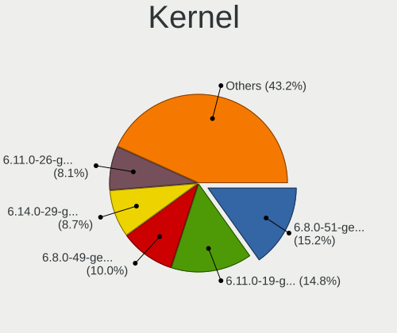

| Version           | Notebooks | Percent |
|-------------------|-----------|---------|
| 6.8.0-51-generic  | 47        | 15.16%  |
| 6.11.0-19-generic | 46        | 14.84%  |
| 6.8.0-49-generic  | 31        | 10%     |
| 6.14.0-29-generic | 27        | 8.71%   |
| 6.11.0-26-generic | 25        | 8.06%   |
| 6.14.0-36-generic | 14        | 4.52%   |
| 6.11.0-25-generic | 14        | 4.52%   |
| 6.11.0-17-generic | 13        | 4.19%   |
| 6.14.0-33-generic | 12        | 3.87%   |
| 6.11.0-21-generic | 11        | 3.55%   |
| 6.11.0-29-generic | 10        | 3.23%   |
| 6.11.0-24-generic | 10        | 3.23%   |
| 6.14.0-37-generic | 9         | 2.9%    |
| 6.14.0-27-generic | 9         | 2.9%    |
| 6.14.0-35-generic | 7         | 2.26%   |
| 6.8.0-52-generic  | 6         | 1.94%   |
| 6.14.0-24-generic | 6         | 1.94%   |
| 6.14.0-34-generic | 5         | 1.61%   |
| 6.8.0-50-generic  | 3         | 0.97%   |
| 6.14.0-32-generic | 2         | 0.65%   |
| 6.8.0-1017-oem    | 1         | 0.32%   |
| 6.16.0-amdfix     | 1         | 0.32%   |
| 6.11.0-28-generic | 1         | 0.32%   |

Kernel Family
-------------

Linux kernel without a distro release

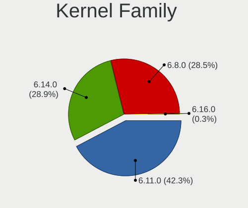

| Version | Notebooks | Percent |
|---------|-----------|---------|
| 6.11.0  | 129       | 42.3%   |
| 6.14.0  | 88        | 28.85%  |
| 6.8.0   | 87        | 28.52%  |
| 6.16.0  | 1         | 0.33%   |

Kernel Major Ver.
-----------------

Linux kernel major version

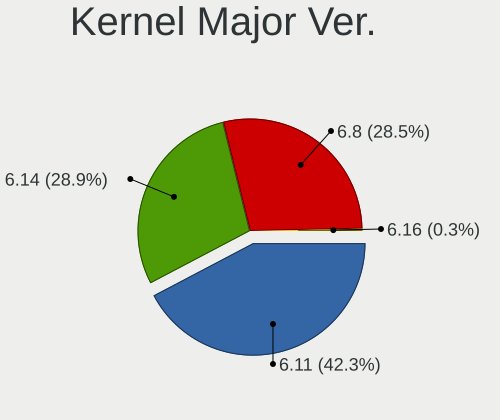

| Version | Notebooks | Percent |
|---------|-----------|---------|
| 6.11    | 129       | 42.3%   |
| 6.14    | 88        | 28.85%  |
| 6.8     | 87        | 28.52%  |
| 6.16    | 1         | 0.33%   |

Arch
----

OS architecture (x86_64, i586, etc.)

| Name   | Notebooks | Percent |
|--------|-----------|---------|
| x86_64 | 293       | 100%    |

DE
--

Desktop Environment

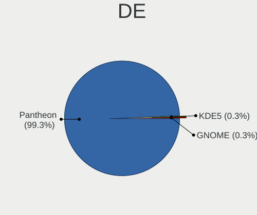

| Name     | Notebooks | Percent |
|----------|-----------|---------|
| Pantheon | 291       | 99.32%  |
| KDE5     | 1         | 0.34%   |
| GNOME    | 1         | 0.34%   |

Display Server
--------------

X11 or Wayland

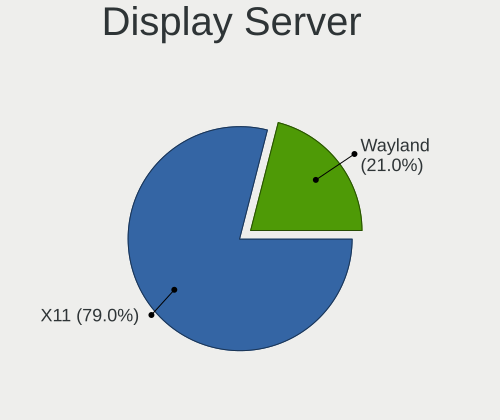

| Name    | Notebooks | Percent |
|---------|-----------|---------|
| X11     | 233       | 78.98%  |
| Wayland | 62        | 21.02%  |

Display Manager
---------------

SDDM, LightDM, etc.

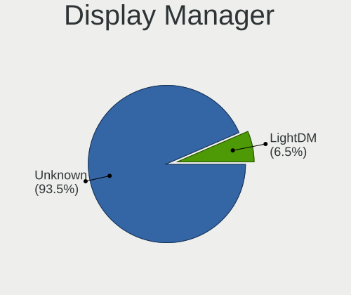

| Name    | Notebooks | Percent |
|---------|-----------|---------|
| Unknown | 274       | 93.52%  |
| LightDM | 19        | 6.48%   |

OS Lang
-------

Language

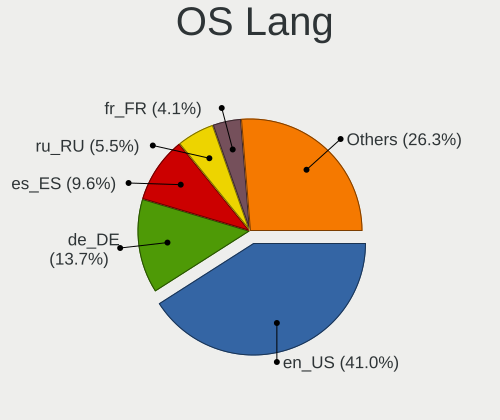

| Lang  | Notebooks | Percent |
|-------|-----------|---------|
| en_US | 120       | 40.96%  |
| de_DE | 40        | 13.65%  |
| es_ES | 28        | 9.56%   |
| ru_RU | 16        | 5.46%   |
| fr_FR | 12        | 4.1%    |
| pl_PL | 11        | 3.75%   |
| it_IT | 10        | 3.41%   |
| pt_BR | 9         | 3.07%   |
| nl_NL | 7         | 2.39%   |
| en_GB | 7         | 2.39%   |
| en_CA | 6         | 2.05%   |
| tr_TR | 3         | 1.02%   |
| nb_NO | 3         | 1.02%   |
| en_AU | 3         | 1.02%   |
| sv_SE | 2         | 0.68%   |
| hu_HU | 2         | 0.68%   |
| bg_BG | 2         | 0.68%   |
| zh_CN | 1         | 0.34%   |
| vi_VN | 1         | 0.34%   |
| uk_UA | 1         | 0.34%   |
| pt_PT | 1         | 0.34%   |
| ko_KR | 1         | 0.34%   |
| id_ID | 1         | 0.34%   |
| hr_HR | 1         | 0.34%   |
| fi_FI | 1         | 0.34%   |
| de_CH | 1         | 0.34%   |
| da_DK | 1         | 0.34%   |
| cs_CZ | 1         | 0.34%   |
| ar_EG | 1         | 0.34%   |

Boot Mode
---------

EFI or BIOS

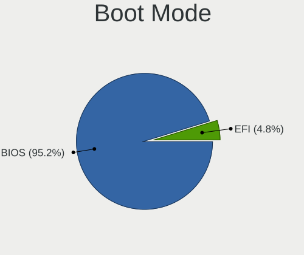

| Mode | Notebooks | Percent |
|------|-----------|---------|
| BIOS | 279       | 95.22%  |
| EFI  | 14        | 4.78%   |

Filesystem
----------

Type of filesystem

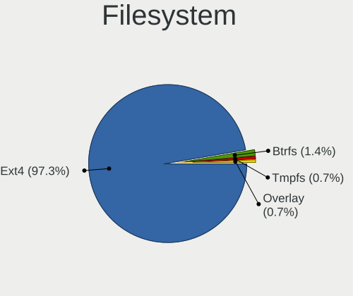

| Type    | Notebooks | Percent |
|---------|-----------|---------|
| Ext4    | 285       | 97.27%  |
| Btrfs   | 4         | 1.37%   |
| Tmpfs   | 2         | 0.68%   |
| Overlay | 2         | 0.68%   |

Part. scheme
------------

Scheme of partitioning

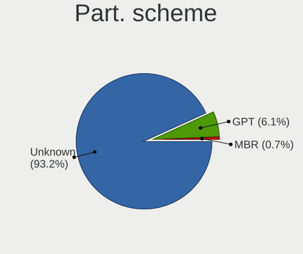

| Type    | Notebooks | Percent |
|---------|-----------|---------|
| Unknown | 274       | 93.2%   |
| GPT     | 18        | 6.12%   |
| MBR     | 2         | 0.68%   |

Dual Boot with Linux/BSD
------------------------

Hosting more than one Linux/BSD

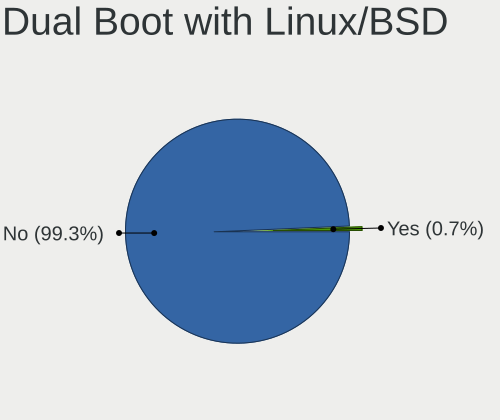

| Dual boot | Notebooks | Percent |
|-----------|-----------|---------|
| No        | 291       | 99.32%  |
| Yes       | 2         | 0.68%   |

Dual Boot (Win)
---------------

Hosting Linux and Windows

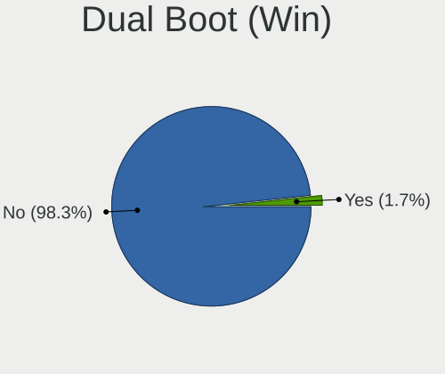

| Dual boot | Notebooks | Percent |
|-----------|-----------|---------|
| No        | 288       | 98.29%  |
| Yes       | 5         | 1.71%   |

Board
-----

Vendor
------

Motherboard manufacturer

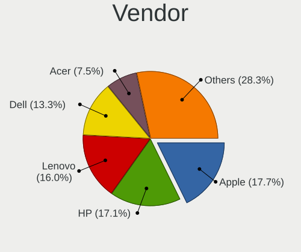

| Name                | Notebooks | Percent |
|---------------------|-----------|---------|
| Apple               | 52        | 17.75%  |
| Hewlett-Packard     | 50        | 17.06%  |
| Lenovo              | 47        | 16.04%  |
| Dell                | 39        | 13.31%  |
| Acer                | 22        | 7.51%   |
| ASUSTek Computer    | 17        | 5.8%    |
| Sony                | 8         | 2.73%   |
| Samsung Electronics | 7         | 2.39%   |
| Toshiba             | 6         | 2.05%   |
| Google              | 5         | 1.71%   |
| MSI                 | 3         | 1.02%   |
| HUAWEI              | 3         | 1.02%   |
| Unknown             | 3         | 1.02%   |
| Timi                | 2         | 0.68%   |
| Positivo            | 2         | 0.68%   |
| Panasonic           | 2         | 0.68%   |
| Medion              | 2         | 0.68%   |
| HONOR               | 2         | 0.68%   |
| Fujitsu             | 2         | 0.68%   |
| eMachines           | 2         | 0.68%   |
| Chuwi               | 2         | 0.68%   |
| Alienware           | 2         | 0.68%   |
| TongFang            | 1         | 0.34%   |
| Thomson             | 1         | 0.34%   |
| Proline             | 1         | 0.34%   |
| Pegatron            | 1         | 0.34%   |
| Packard Bell        | 1         | 0.34%   |
| Notebook            | 1         | 0.34%   |
| NEC Computers       | 1         | 0.34%   |
| MicroByte           | 1         | 0.34%   |
| Kanji               | 1         | 0.34%   |
| Infinix             | 1         | 0.34%   |
| GPD                 | 1         | 0.34%   |
| AiStone             | 1         | 0.34%   |
| ACCENT              | 1         | 0.34%   |

Model
-----

Motherboard model

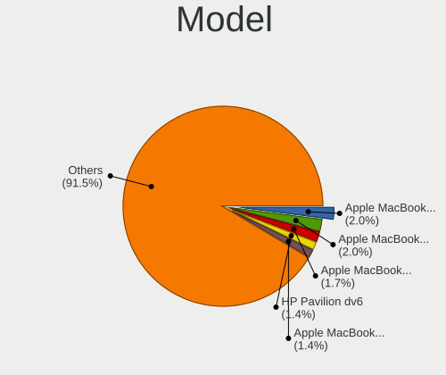

| Name                             | Notebooks | Percent |
|----------------------------------|-----------|---------|
| Apple MacBookPro8,1              | 6         | 2.05%   |
| Apple MacBookAir7,2              | 6         | 2.05%   |
| Apple MacBookPro9,2              | 5         | 1.71%   |
| HP Pavilion dv6                  | 4         | 1.37%   |
| Apple MacBookPro10,1             | 4         | 1.37%   |
| Unknown                          | 4         | 1.37%   |
| HP Notebook                      | 3         | 1.02%   |
| Dell Latitude E7470              | 3         | 1.02%   |
| ASUS Vivobook Go E1504FA_E1504FA | 3         | 1.02%   |
| Apple MacBookPro7,1              | 3         | 1.02%   |
| Apple MacBookPro11,1             | 3         | 1.02%   |
| Apple MacBookAir6,2              | 3         | 1.02%   |
| Apple MacBook5,1                 | 3         | 1.02%   |
| Lenovo IdeaPad 500-15ISK 80NT    | 2         | 0.68%   |
| Lenovo IdeaPad 1 15AMN7 82VG     | 2         | 0.68%   |
| Dell Latitude E5550              | 2         | 0.68%   |
| Dell Latitude 5580               | 2         | 0.68%   |
| Apple MacBookPro9,1              | 2         | 0.68%   |
| Apple MacBookPro11,2             | 2         | 0.68%   |
| Apple MacBookAir5,2              | 2         | 0.68%   |
| Acer Aspire E5-571G              | 2         | 0.68%   |
| Toshiba Satellite U840           | 1         | 0.34%   |
| Toshiba Satellite Pro C50-A-1MX  | 1         | 0.34%   |
| Toshiba Satellite L50D-B         | 1         | 0.34%   |
| Toshiba Satellite C660           | 1         | 0.34%   |
| Toshiba Satellite C50-B          | 1         | 0.34%   |
| Toshiba PORTEGE Z20t-B           | 1         | 0.34%   |
| TongFang Standard                | 1         | 0.34%   |
| Timi TM1701                      | 1         | 0.34%   |
| Timi Mi NoteBook Ultra           | 1         | 0.34%   |
| Thomson N14C4WH64                | 1         | 0.34%   |
| Sony VPCCW1S1E                   | 1         | 0.34%   |
| Sony VPCCB2S1E                   | 1         | 0.34%   |
| Sony SVS1313V9RB                 | 1         | 0.34%   |
| Sony SVJ20236CXW                 | 1         | 0.34%   |
| Sony SVF14415CLW                 | 1         | 0.34%   |
| Sony SVF14213CLB                 | 1         | 0.34%   |
| Sony SVE15133CNW                 | 1         | 0.34%   |
| Sony SVE14A27CLS                 | 1         | 0.34%   |
| Samsung SR58P                    | 1         | 0.34%   |

Model Family
------------

Motherboard model prefix

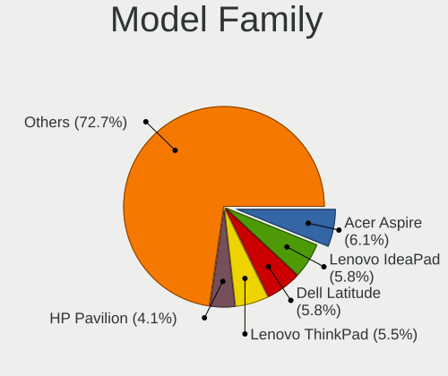

| Name               | Notebooks | Percent |
|--------------------|-----------|---------|
| Acer Aspire        | 18        | 6.14%   |
| Lenovo IdeaPad     | 17        | 5.8%    |
| Dell Latitude      | 17        | 5.8%    |
| Lenovo ThinkPad    | 16        | 5.46%   |
| HP Pavilion        | 12        | 4.1%    |
| HP Laptop          | 10        | 3.41%   |
| Dell Inspiron      | 10        | 3.41%   |
| HP ProBook         | 7         | 2.39%   |
| Apple MacBookPro9  | 7         | 2.39%   |
| Apple MacBookPro8  | 7         | 2.39%   |
| Apple MacBookPro11 | 7         | 2.39%   |
| HP EliteBook       | 6         | 2.05%   |
| ASUS Vivobook      | 6         | 2.05%   |
| Apple MacBookAir7  | 6         | 2.05%   |
| Toshiba Satellite  | 5         | 1.71%   |
| Apple MacBookPro10 | 5         | 1.71%   |
| Dell XPS           | 4         | 1.37%   |
| Unknown            | 4         | 1.37%   |
| HP Notebook        | 3         | 1.02%   |
| Dell Vostro        | 3         | 1.02%   |
| Apple MacBookPro7  | 3         | 1.02%   |
| Apple MacBookAir6  | 3         | 1.02%   |
| Apple MacBook5     | 3         | 1.02%   |
| Acer Swift         | 3         | 1.02%   |
| Lenovo Legion      | 2         | 0.68%   |
| Fujitsu LIFEBOOK   | 2         | 0.68%   |
| Dell Precision     | 2         | 0.68%   |
| ASUS ASUS          | 2         | 0.68%   |
| Apple MacBookPro5  | 2         | 0.68%   |
| Apple MacBookAir5  | 2         | 0.68%   |
| Apple MacBookAir4  | 2         | 0.68%   |
| Toshiba PORTEGE    | 1         | 0.34%   |
| TongFang Standard  | 1         | 0.34%   |
| Timi TM1701        | 1         | 0.34%   |
| Timi Mi            | 1         | 0.34%   |
| Thomson N14C4WH64  | 1         | 0.34%   |
| Sony VPCCW1S1E     | 1         | 0.34%   |
| Sony VPCCB2S1E     | 1         | 0.34%   |
| Sony SVS1313V9RB   | 1         | 0.34%   |
| Sony SVJ20236CXW   | 1         | 0.34%   |

MFG Year
--------

Motherboard manufacture year

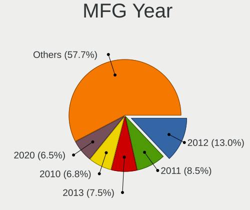

| Year | Notebooks | Percent |
|------|-----------|---------|
| 2012 | 38        | 12.97%  |
| 2011 | 25        | 8.53%   |
| 2013 | 22        | 7.51%   |
| 2010 | 20        | 6.83%   |
| 2020 | 19        | 6.48%   |
| 2014 | 19        | 6.48%   |
| 2015 | 18        | 6.14%   |
| 2019 | 14        | 4.78%   |
| 2018 | 14        | 4.78%   |
| 2022 | 13        | 4.44%   |
| 2017 | 13        | 4.44%   |
| 2009 | 13        | 4.44%   |
| 2008 | 13        | 4.44%   |
| 2021 | 11        | 3.75%   |
| 2016 | 11        | 3.75%   |
| 2023 | 10        | 3.41%   |
| 2024 | 9         | 3.07%   |
| 2006 | 6         | 2.05%   |
| 2025 | 4         | 1.37%   |
| 2007 | 1         | 0.34%   |

Form Factor
-----------

Physical design of the computer

| Name     | Notebooks | Percent |
|----------|-----------|---------|
| Notebook | 293       | 100%    |

Secure Boot
-----------

Enabled or disabled

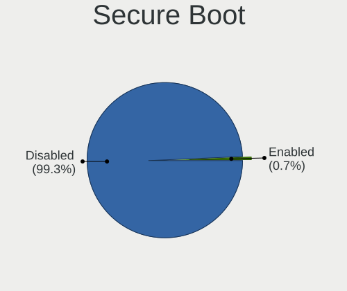

| State    | Notebooks | Percent |
|----------|-----------|---------|
| Disabled | 291       | 99.32%  |
| Enabled  | 2         | 0.68%   |

Coreboot
--------

Have coreboot on board

| Used | Notebooks | Percent |
|------|-----------|---------|
| No   | 288       | 98.29%  |
| Yes  | 5         | 1.71%   |

RAM Size
--------

Total RAM memory

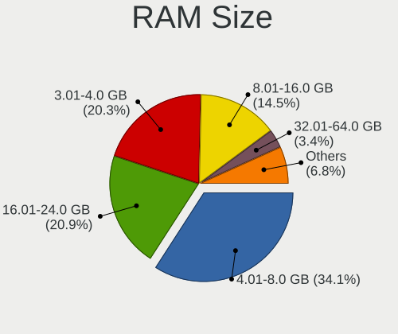

| Size in GB  | Notebooks | Percent |
|-------------|-----------|---------|
| 4.01-8.0    | 101       | 34.12%  |
| 16.01-24.0  | 62        | 20.95%  |
| 3.01-4.0    | 60        | 20.27%  |
| 8.01-16.0   | 43        | 14.53%  |
| 32.01-64.0  | 10        | 3.38%   |
| 24.01-32.0  | 7         | 2.36%   |
| 1.01-2.0    | 7         | 2.36%   |
| 2.01-3.0    | 5         | 1.69%   |
| 64.01-256.0 | 1         | 0.34%   |

RAM Used
--------

Used RAM memory

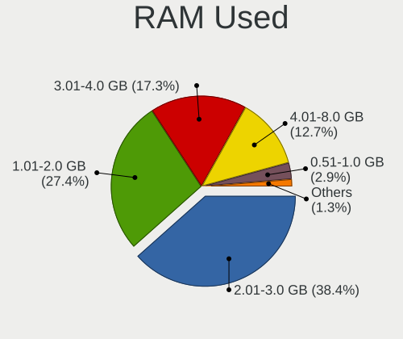

| Used GB    | Notebooks | Percent |
|------------|-----------|---------|
| 2.01-3.0   | 118       | 38.44%  |
| 1.01-2.0   | 84        | 27.36%  |
| 3.01-4.0   | 53        | 17.26%  |
| 4.01-8.0   | 39        | 12.7%   |
| 0.51-1.0   | 9         | 2.93%   |
| 8.01-16.0  | 3         | 0.98%   |
| 16.01-24.0 | 1         | 0.33%   |

Total Drives
------------

Number of drives on board

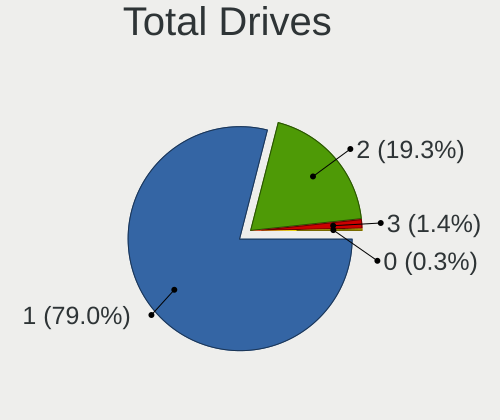

| Drives | Notebooks | Percent |
|--------|-----------|---------|
| 1      | 233       | 78.98%  |
| 2      | 57        | 19.32%  |
| 3      | 4         | 1.36%   |
| 0      | 1         | 0.34%   |

Has CD-ROM
----------

Has CD-ROM on board

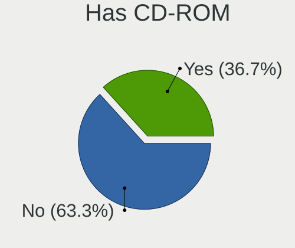

| Presented | Notebooks | Percent |
|-----------|-----------|---------|
| No        | 186       | 63.27%  |
| Yes       | 108       | 36.73%  |

Has Ethernet
------------

Has Ethernet on board

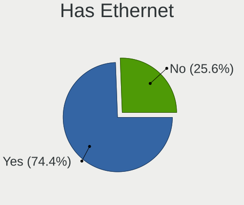

| Presented | Notebooks | Percent |
|-----------|-----------|---------|
| Yes       | 218       | 74.4%   |
| No        | 75        | 25.6%   |

Has WiFi
--------

Has WiFi module

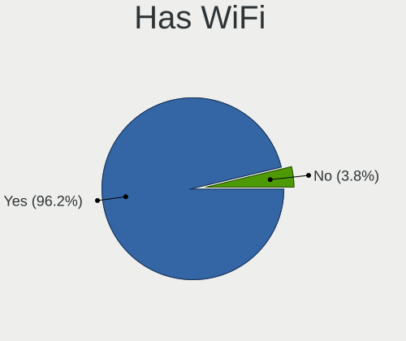

| Presented | Notebooks | Percent |
|-----------|-----------|---------|
| Yes       | 282       | 96.25%  |
| No        | 11        | 3.75%   |

Has Bluetooth
-------------

Has Bluetooth module

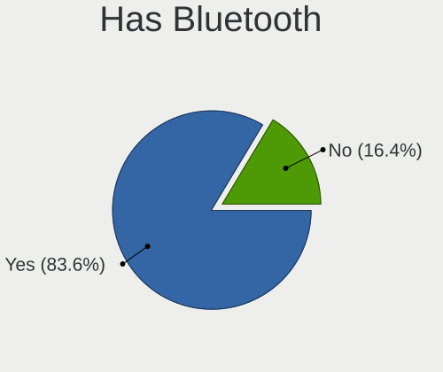

| Presented | Notebooks | Percent |
|-----------|-----------|---------|
| Yes       | 245       | 83.62%  |
| No        | 48        | 16.38%  |

Location
--------

Country
-------

Geographic location (country)

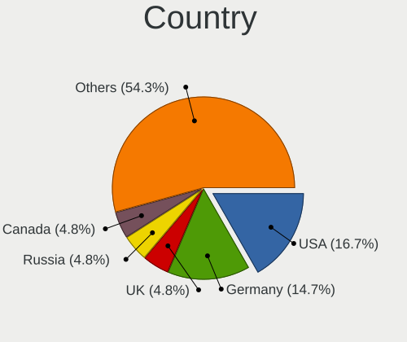

| Country         | Notebooks | Percent |
|-----------------|-----------|---------|
| USA             | 49        | 16.72%  |
| Germany         | 43        | 14.68%  |
| UK              | 14        | 4.78%   |
| Russia          | 14        | 4.78%   |
| Canada          | 14        | 4.78%   |
| Spain           | 12        | 4.1%    |
| Italy           | 11        | 3.75%   |
| Poland          | 10        | 3.41%   |
| India           | 10        | 3.41%   |
| France          | 10        | 3.41%   |
| Brazil          | 10        | 3.41%   |
| Australia       | 7         | 2.39%   |
| Netherlands     | 6         | 2.05%   |
| Mexico          | 5         | 1.71%   |
| Argentina       | 5         | 1.71%   |
| Indonesia       | 4         | 1.37%   |
| Belgium         | 4         | 1.37%   |
| South Africa    | 3         | 1.02%   |
| Romania         | 3         | 1.02%   |
| Portugal        | 3         | 1.02%   |
| Norway          | 3         | 1.02%   |
| Finland         | 3         | 1.02%   |
| Colombia        | 3         | 1.02%   |
| Bulgaria        | 3         | 1.02%   |
| Vietnam         | 2         | 0.68%   |
| Venezuela       | 2         | 0.68%   |
| Ukraine         | 2         | 0.68%   |
| Turkey          | 2         | 0.68%   |
| Thailand        | 2         | 0.68%   |
| Sweden          | 2         | 0.68%   |
| Slovakia        | 2         | 0.68%   |
| Saudi Arabia    | 2         | 0.68%   |
| Malaysia        | 2         | 0.68%   |
| Ireland         | 2         | 0.68%   |
| Türkiye        | 1         | 0.34%   |
| Tunisia         | 1         | 0.34%   |
| The Netherlands | 1         | 0.34%   |
| Taiwan          | 1         | 0.34%   |
| Switzerland     | 1         | 0.34%   |
| South Korea     | 1         | 0.34%   |

City
----

Geographic location (city)

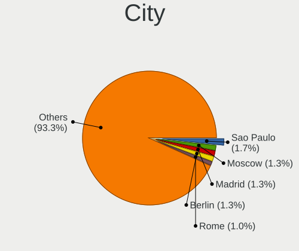

| City              | Notebooks | Percent |
|-------------------|-----------|---------|
| Sao Paulo         | 5         | 1.68%   |
| Moscow            | 4         | 1.35%   |
| Madrid            | 4         | 1.35%   |
| Berlin            | 4         | 1.35%   |
| Rome              | 3         | 1.01%   |
| Phoenix           | 3         | 1.01%   |
| Oslo              | 3         | 1.01%   |
| Frankfurt am Main | 3         | 1.01%   |
| Wroclaw           | 2         | 0.67%   |
| West Ham          | 2         | 0.67%   |
| Traunstein        | 2         | 0.67%   |
| Tampere           | 2         | 0.67%   |
| Overijse          | 2         | 0.67%   |
| Oklahoma City     | 2         | 0.67%   |
| Milan             | 2         | 0.67%   |
| Johannesburg      | 2         | 0.67%   |
| Istanbul          | 2         | 0.67%   |
| Ho Chi Minh City  | 2         | 0.67%   |
| Gilbert           | 2         | 0.67%   |
| Gdansk            | 2         | 0.67%   |
| Faridabad         | 2         | 0.67%   |
| Chicago           | 2         | 0.67%   |
| Cedar Rapids      | 2         | 0.67%   |
| Caracas           | 2         | 0.67%   |
| Brisbane          | 2         | 0.67%   |
| Adelaide          | 2         | 0.67%   |
| Zwaag             | 1         | 0.34%   |
| Zurich            | 1         | 0.34%   |
| Zubia             | 1         | 0.34%   |
| Yeonsu-gu         | 1         | 0.34%   |
| Yekaterinburg     | 1         | 0.34%   |
| Worms             | 1         | 0.34%   |
| Woodstock         | 1         | 0.34%   |
| Wolverhampton     | 1         | 0.34%   |
| Witten            | 1         | 0.34%   |
| White River       | 1         | 0.34%   |
| Wedemark          | 1         | 0.34%   |
| Washington        | 1         | 0.34%   |
| Warsaw            | 1         | 0.34%   |
| Walsall           | 1         | 0.34%   |

Drives
------

Drive Vendor
------------

Hard drive vendors

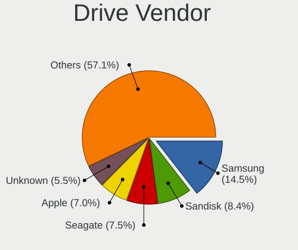

| Vendor                       | Notebooks | Drives | Percent |
|------------------------------|-----------|--------|---------|
| Samsung Electronics          | 50        | 62     | 14.49%  |
| Sandisk                      | 29        | 32     | 8.41%   |
| Seagate                      | 26        | 28     | 7.54%   |
| Apple                        | 24        | 29     | 6.96%   |
| Unknown                      | 19        | 20     | 5.51%   |
| WDC                          | 18        | 19     | 5.22%   |
| Toshiba                      | 18        | 19     | 5.22%   |
| Kingston                     | 16        | 18     | 4.64%   |
| SK hynix                     | 14        | 15     | 4.06%   |
| Crucial                      | 13        | 13     | 3.77%   |
| HGST                         | 7         | 9      | 2.03%   |
| Hitachi                      | 6         | 7      | 1.74%   |
| A-DATA Technology            | 5         | 5      | 1.45%   |
| Phison Electronics           | 4         | 4      | 1.16%   |
| Micron Technology            | 4         | 4      | 1.16%   |
| MAXIO Technology (Hangzhou)  | 4         | 4      | 1.16%   |
| KIOXIA                       | 4         | 4      | 1.16%   |
| KingSpec                     | 4         | 5      | 1.16%   |
| Silicon Motion               | 3         | 3      | 0.87%   |
| Micron/Crucial Technology    | 3         | 3      | 0.87%   |
| JMicron Technology           | 3         | 3      | 0.87%   |
| Intel                        | 3         | 3      | 0.87%   |
| Fanxiang                     | 3         | 3      | 0.87%   |
| Transcend                    | 2         | 2      | 0.58%   |
| Team                         | 2         | 2      | 0.58%   |
| T-FORCE                      | 2         | 2      | 0.58%   |
| SPCC                         | 2         | 2      | 0.58%   |
| Shenzhen Longsys Electronics | 2         | 3      | 0.58%   |
| SABRENT                      | 2         | 2      | 0.58%   |
| Patriot                      | 2         | 2      | 0.58%   |
| Kingston Technology Company  | 2         | 2      | 0.58%   |
| KingDian                     | 2         | 2      | 0.58%   |
| Fujitsu                      | 2         | 2      | 0.58%   |
| China                        | 2         | 2      | 0.58%   |
| Aura                         | 2         | 2      | 0.58%   |
| ADATA Technology             | 2         | 2      | 0.58%   |
| Unknown                      | 2         | 2      | 0.58%   |
| Yangtze Memory Technologies  | 1         | 1      | 0.29%   |
| Wicgtyp                      | 1         | 2      | 0.29%   |
| Wdstars                      | 1         | 1      | 0.29%   |

Drive Model
-----------

Hard drive models

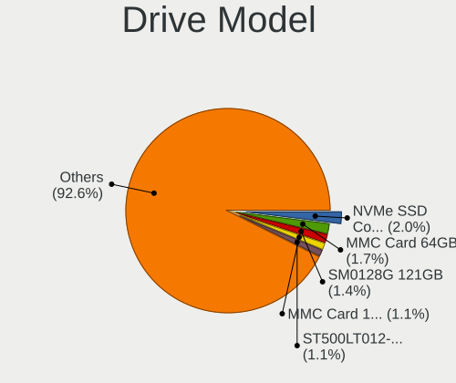

| Model                                                | Notebooks | Percent |
|------------------------------------------------------|-----------|---------|
| Samsung NVMe SSD Controller SM981/PM981/PM983 1TB    | 7         | 1.99%   |
| Unknown MMC Card  64GB                               | 6         | 1.7%    |
| Apple SSD SM0128G 121GB                              | 5         | 1.42%   |
| Unknown MMC Card  128GB                              | 4         | 1.14%   |
| Seagate ST500LT012-1DG142 500GB                      | 4         | 1.14%   |
| MAXIO (Hangzhou) NVMe SSD Controller MAP1202 2TB     | 4         | 1.14%   |
| Apple SSD SM0256F 256GB                              | 4         | 1.14%   |
| Unknown SD/MMC/MS PRO 2GB                            | 3         | 0.85%   |
| Unknown MMC Card  16GB                               | 3         | 0.85%   |
| Toshiba MQ01ABF050 500GB                             | 3         | 0.85%   |
| Seagate ST1000LM024 HN-M101MBB 1TB                   | 3         | 0.85%   |
| Sandisk WD Blue SN550 NVMe SSD 1024GB                | 3         | 0.85%   |
| SanDisk NVMe SSD Drive 1TB                           | 3         | 0.85%   |
| Samsung SSD 860 EVO 500GB                            | 3         | 0.85%   |
| Samsung NVMe SSD Controller SM961/PM961/SM963 1024GB | 3         | 0.85%   |
| Kingston SA400S37480G 480GB SSD                      | 3         | 0.85%   |
| Kingston SA400S37240G 240GB SSD                      | 3         | 0.85%   |
| Crucial CT240BX500SSD1 240GB                         | 3         | 0.85%   |
| Apple SSD SM0256G 256GB                              | 3         | 0.85%   |
| WDC WD5000LPVX-22V0TT0 500GB                         | 2         | 0.57%   |
| WDC WD5000LPCX-21VHAT0 500GB                         | 2         | 0.57%   |
| Unknown MMC Card  32GB                               | 2         | 0.57%   |
| Toshiba XG6 NVMe SSD Controller 1024GB               | 2         | 0.57%   |
| Toshiba MQ04ABF100 1TB                               | 2         | 0.57%   |
| Toshiba MQ01ABD075 752GB                             | 2         | 0.57%   |
| SK hynix SC311 SATA 512GB SSD                        | 2         | 0.57%   |
| SK hynix BC501 NVMe Solid State Drive 512GB          | 2         | 0.57%   |
| Seagate ST500LM012 HN-M500MBB 500GB                  | 2         | 0.57%   |
| Seagate Expansion 2TB                                | 2         | 0.57%   |
| Sandisk WD Black SN750 / PC SN730 NVMe SSD 500GB     | 2         | 0.57%   |
| SanDisk SSD PLUS 1000GB                              | 2         | 0.57%   |
| Samsung SSD PM871 2.5 7mm 256GB                      | 2         | 0.57%   |
| Samsung SSD 850 EVO 500GB                            | 2         | 0.57%   |
| Samsung SSD 840 EVO 250GB                            | 2         | 0.57%   |
| Samsung MZVL4512HBLU-00BTW 512GB                     | 2         | 0.57%   |
| Samsung MZNTY128HDHP-000L1 128GB SSD                 | 2         | 0.57%   |
| SABRENT Disk 4TB                                     | 2         | 0.57%   |
| JMicron Tech 250GB                                   | 2         | 0.57%   |
| HGST HTS545050A7E380 500GB                           | 2         | 0.57%   |
| Fujitsu MJA2250BH G2 250GB                           | 2         | 0.57%   |

HDD Vendor
----------

Hard disk drive vendors

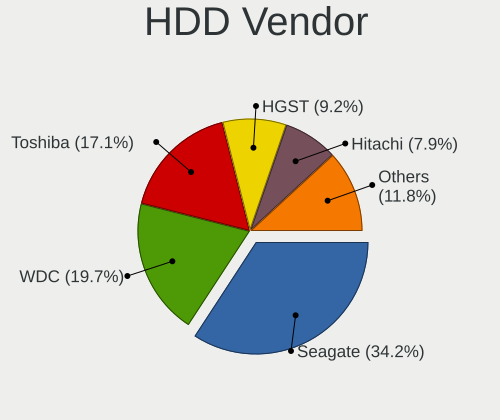

| Vendor              | Notebooks | Drives | Percent |
|---------------------|-----------|--------|---------|
| Seagate             | 26        | 28     | 34.21%  |
| WDC                 | 15        | 15     | 19.74%  |
| Toshiba             | 13        | 14     | 17.11%  |
| HGST                | 7         | 9      | 9.21%   |
| Hitachi             | 6         | 7      | 7.89%   |
| Unknown             | 3         | 3      | 3.95%   |
| Fujitsu             | 2         | 2      | 2.63%   |
| USB                 | 1         | 1      | 1.32%   |
| T-FORCE             | 1         | 1      | 1.32%   |
| Samsung Electronics | 1         | 1      | 1.32%   |
| Apple               | 1         | 1      | 1.32%   |

SSD Vendor
----------

Solid state drive vendors

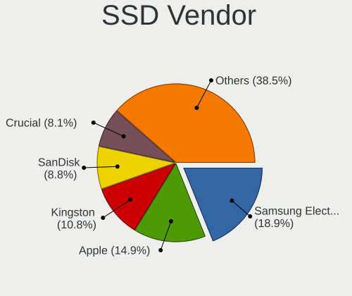

| Vendor              | Notebooks | Drives | Percent |
|---------------------|-----------|--------|---------|
| Samsung Electronics | 28        | 33     | 18.92%  |
| Apple               | 22        | 27     | 14.86%  |
| Kingston            | 16        | 18     | 10.81%  |
| SanDisk             | 13        | 15     | 8.78%   |
| Crucial             | 12        | 12     | 8.11%   |
| A-DATA Technology   | 5         | 5      | 3.38%   |
| KingSpec            | 4         | 5      | 2.7%    |
| WDC                 | 3         | 4      | 2.03%   |
| SK hynix            | 3         | 3      | 2.03%   |
| Transcend           | 2         | 2      | 1.35%   |
| Team                | 2         | 2      | 1.35%   |
| SPCC                | 2         | 2      | 1.35%   |
| SABRENT             | 2         | 2      | 1.35%   |
| Patriot             | 2         | 2      | 1.35%   |
| KingDian            | 2         | 2      | 1.35%   |
| China               | 2         | 2      | 1.35%   |
| Aura                | 2         | 2      | 1.35%   |
| Vi550               | 1         | 1      | 0.68%   |
| Verbatim            | 1         | 1      | 0.68%   |
| Toshiba             | 1         | 1      | 0.68%   |
| sk600               | 1         | 1      | 0.68%   |
| PNY                 | 1         | 1      | 0.68%   |
| OCZ                 | 1         | 1      | 0.68%   |
| NGFF                | 1         | 1      | 0.68%   |
| Micron Technology   | 1         | 1      | 0.68%   |
| MG                  | 1         | 1      | 0.68%   |
| LITEONIT            | 1         | 1      | 0.68%   |
| LITEON              | 1         | 1      | 0.68%   |
| Lexar               | 1         | 1      | 0.68%   |
| JMicron Technology  | 1         | 1      | 0.68%   |
| Intenso             | 1         | 1      | 0.68%   |
| Intel               | 1         | 1      | 0.68%   |
| Hewlett-Packard     | 1         | 1      | 0.68%   |
| HEORIADY            | 1         | 1      | 0.68%   |
| GOODRAM             | 1         | 1      | 0.68%   |
| Foxline             | 1         | 1      | 0.68%   |
| Fanxiang            | 1         | 1      | 0.68%   |
| ESSENCORE           | 1         | 1      | 0.68%   |
| EAGET               | 1         | 1      | 0.68%   |
| BIWIN               | 1         | 1      | 0.68%   |

Drive Kind
----------

HDD or SSD

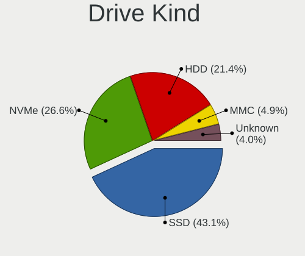

| Kind    | Notebooks | Drives | Percent |
|---------|-----------|--------|---------|
| SSD     | 141       | 167    | 43.12%  |
| NVMe    | 87        | 102    | 26.61%  |
| HDD     | 70        | 82     | 21.41%  |
| MMC     | 16        | 17     | 4.89%   |
| Unknown | 13        | 14     | 3.98%   |

Drive Connector
---------------

SATA, SAS, NVMe, etc.

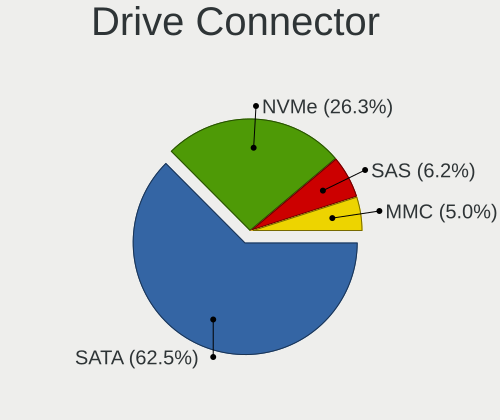

| Type | Notebooks | Drives | Percent |
|------|-----------|--------|---------|
| SATA | 202       | 244    | 62.54%  |
| NVMe | 85        | 99     | 26.32%  |
| SAS  | 20        | 22     | 6.19%   |
| MMC  | 16        | 17     | 4.95%   |

Drive Size
----------

Size of hard drive

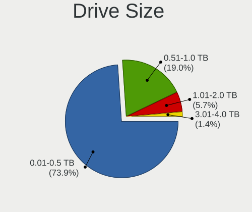

| Size in TB | Notebooks | Drives | Percent |
|------------|-----------|--------|---------|
| 0.01-0.5   | 156       | 190    | 73.93%  |
| 0.51-1.0   | 40        | 44     | 18.96%  |
| 1.01-2.0   | 12        | 12     | 5.69%   |
| 3.01-4.0   | 3         | 3      | 1.42%   |

Space Total
-----------

Amount of disk space available on the file system

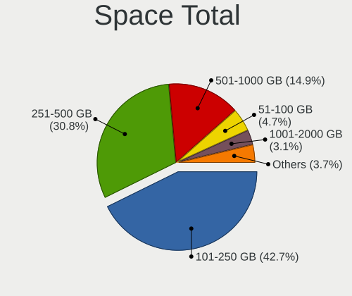

| Size in GB     | Notebooks | Percent |
|----------------|-----------|---------|
| 101-250        | 126       | 42.71%  |
| 251-500        | 91        | 30.85%  |
| 501-1000       | 44        | 14.92%  |
| 51-100         | 14        | 4.75%   |
| 1001-2000      | 9         | 3.05%   |
| 21-50          | 7         | 2.37%   |
| More than 3000 | 2         | 0.68%   |
| 2001-3000      | 1         | 0.34%   |
| 1-20           | 1         | 0.34%   |

Space Used
----------

Amount of used disk space

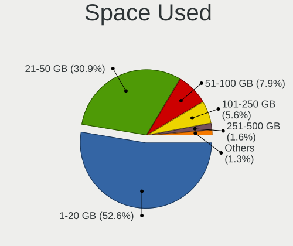

| Used GB   | Notebooks | Percent |
|-----------|-----------|---------|
| 1-20      | 160       | 52.63%  |
| 21-50     | 94        | 30.92%  |
| 51-100    | 24        | 7.89%   |
| 101-250   | 17        | 5.59%   |
| 251-500   | 5         | 1.64%   |
| 1001-2000 | 2         | 0.66%   |
| 501-1000  | 2         | 0.66%   |

Malfunc. Drives
---------------

Drive models with a malfunction

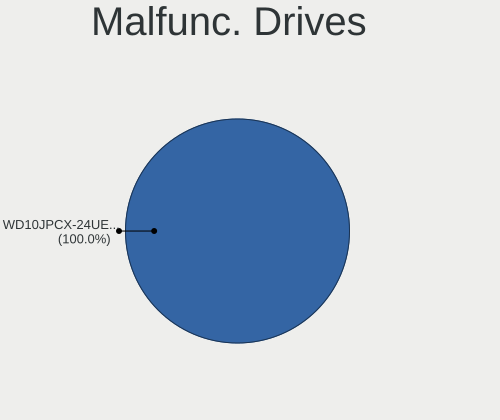

| Model                    | Notebooks | Drives | Percent |
|--------------------------|-----------|--------|---------|
| WDC WD10JPCX-24UE4T0 1TB | 1         | 1      | 100%    |

Malfunc. Drive Vendor
---------------------

Vendors of faulty drives

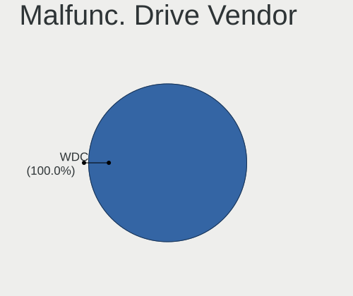

| Vendor | Notebooks | Drives | Percent |
|--------|-----------|--------|---------|
| WDC    | 1         | 1      | 100%    |

Malfunc. HDD Vendor
-------------------

Vendors of faulty HDD drives

| Vendor | Notebooks | Drives | Percent |
|--------|-----------|--------|---------|
| WDC    | 1         | 1      | 100%    |

Malfunc. Drive Kind
-------------------

Kinds of faulty drives

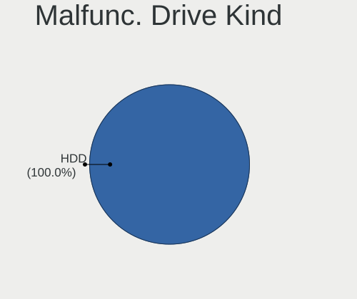

| Kind | Notebooks | Drives | Percent |
|------|-----------|--------|---------|
| HDD  | 1         | 1      | 100%    |

Failed Drives
-------------

Failed drive models

Zero info for selected period =(

Failed Drive Vendor
-------------------

Failed drive vendors

Zero info for selected period =(

Drive Status
------------

Number of failed and malfunc. drives

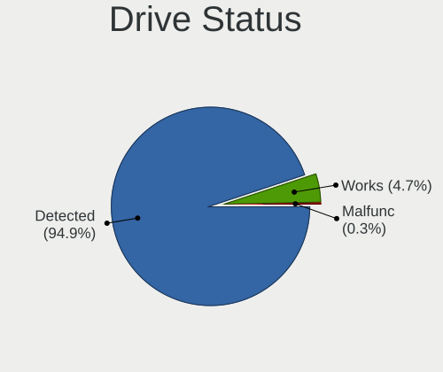

| Status   | Notebooks | Drives | Percent |
|----------|-----------|--------|---------|
| Detected | 280       | 364    | 94.92%  |
| Works    | 14        | 17     | 4.75%   |
| Malfunc  | 1         | 1      | 0.34%   |

Storage controller
------------------

Storage Vendor
--------------

Storage controller vendors

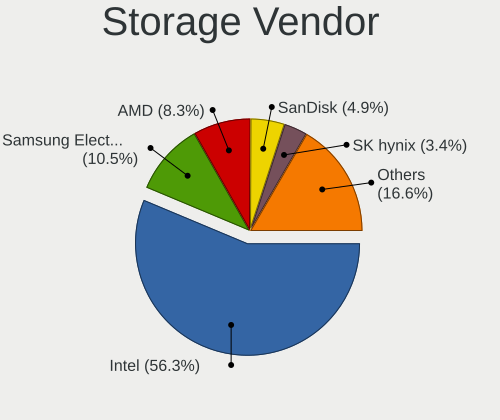

| Vendor                           | Notebooks | Percent |
|----------------------------------|-----------|---------|
| Intel                            | 183       | 56.31%  |
| Samsung Electronics              | 34        | 10.46%  |
| AMD                              | 27        | 8.31%   |
| SanDisk                          | 16        | 4.92%   |
| SK hynix                         | 11        | 3.38%   |
| Nvidia                           | 9         | 2.77%   |
| Toshiba America Info Systems     | 4         | 1.23%   |
| Phison Electronics               | 4         | 1.23%   |
| Micron/Crucial Technology        | 4         | 1.23%   |
| MAXIO Technology (Hangzhou)      | 4         | 1.23%   |
| KIOXIA                           | 4         | 1.23%   |
| Silicon Motion                   | 3         | 0.92%   |
| Micron Technology                | 3         | 0.92%   |
| Solid State Storage Technology   | 2         | 0.62%   |
| Shenzhen Longsys Electronics     | 2         | 0.62%   |
| Kingston Technology Company      | 2         | 0.62%   |
| JMicron Technology               | 2         | 0.62%   |
| ADATA Technology                 | 2         | 0.62%   |
| Yangtze Memory Technologies      | 1         | 0.31%   |
| VIA Technologies                 | 1         | 0.31%   |
| Union Memory (Shenzhen)          | 1         | 0.31%   |
| Silicon Integrated Systems [SiS] | 1         | 0.31%   |
| Shenzhen Techwinsemi Technology  | 1         | 0.31%   |
| Realtek Semiconductor            | 1         | 0.31%   |
| Marvell Technology Group         | 1         | 0.31%   |
| Biwin Storage Technology         | 1         | 0.31%   |
| Apple                            | 1         | 0.31%   |

Storage Model
-------------

Storage controller models

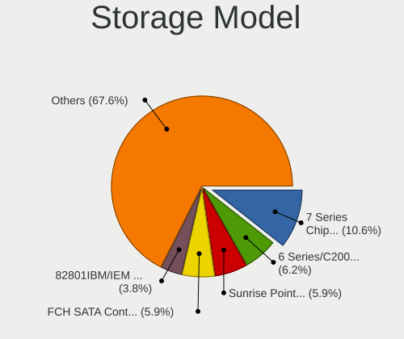

| Model                                                                            | Notebooks | Percent |
|----------------------------------------------------------------------------------|-----------|---------|
| Intel 7 Series Chipset Family 6-port SATA Controller [AHCI mode]                 | 36        | 10.62%  |
| Intel 6 Series/C200 Series Chipset Family 6 port Mobile SATA AHCI Controller     | 21        | 6.19%   |
| Intel Sunrise Point-LP SATA Controller [AHCI mode]                               | 20        | 5.9%    |
| AMD FCH SATA Controller [AHCI mode]                                              | 20        | 5.9%    |
| Intel 82801IBM/IEM (ICH9M/ICH9M-E) 4 port SATA Controller [AHCI mode]            | 13        | 3.83%   |
| Intel 82801 Mobile SATA Controller [RAID mode]                                   | 12        | 3.54%   |
| Intel 8 Series SATA Controller 1 [AHCI mode]                                     | 10        | 2.95%   |
| Intel Wildcat Point-LP SATA Controller [AHCI Mode]                               | 9         | 2.65%   |
| Samsung S4LN058A01[SSUBX] AHCI SSD Controller (Apple slot)                       | 8         | 2.36%   |
| Samsung NVMe SSD Controller SM981/PM981/PM983                                    | 8         | 2.36%   |
| Intel 5 Series/3400 Series Chipset 4 port SATA AHCI Controller                   | 8         | 2.36%   |
| Intel Celeron/Pentium Silver Processor SATA Controller                           | 6         | 1.77%   |
| Samsung S4LN053X01 AHCI SSD Controller(Apple slot)                               | 5         | 1.47%   |
| Nvidia MCP79 AHCI Controller                                                     | 5         | 1.47%   |
| Intel Volume Management Device NVMe RAID Controller                              | 5         | 1.47%   |
| Intel 5 Series/3400 Series Chipset 6 port SATA AHCI Controller                   | 5         | 1.47%   |
| AMD SB7x0/SB8x0/SB9x0 SATA Controller [AHCI mode]                                | 5         | 1.47%   |
| Samsung NVMe SSD Controller PM9B1 (DRAM-less)                                    | 4         | 1.18%   |
| Nvidia MCP89 SATA Controller (AHCI mode)                                         | 4         | 1.18%   |
| MAXIO (Hangzhou) NVMe SSD Controller MAP1202 (DRAM-less)                         | 4         | 1.18%   |
| Intel Atom/Celeron/Pentium Processor x5-E8000/J3xxx/N3xxx Series SATA Controller | 4         | 1.18%   |
| Toshiba America Info Systems XG6 NVMe SSD Controller                             | 3         | 0.88%   |
| SanDisk WD SN560/SN740/SN770/SN5000 NVMe SSD                                     | 3         | 0.88%   |
| SanDisk Ultra 3D / WD PC SN530, IX SN530, Blue SN550 NVMe SSD (DRAM-less)        | 3         | 0.88%   |
| Samsung NVMe SSD Controller SM961/PM961/SM963                                    | 3         | 0.88%   |
| Samsung NVMe SSD Controller 980 (DRAM-less)                                      | 3         | 0.88%   |
| Micron 2400 NVMe SSD (DRAM-less)                                                 | 3         | 0.88%   |
| Intel Tiger Lake-LP SATA Controller                                              | 3         | 0.88%   |
| Intel Cannon Point-LP SATA Controller [AHCI Mode]                                | 3         | 0.88%   |
| Intel Cannon Lake Mobile PCH SATA AHCI Controller                                | 3         | 0.88%   |
| Intel 82801HM/HEM (ICH8M/ICH8M-E) SATA Controller [AHCI mode]                    | 3         | 0.88%   |
| Intel 82801HM/HEM (ICH8M/ICH8M-E) IDE Controller                                 | 3         | 0.88%   |
| Intel 8 Series/C220 Series Chipset Family 6-port SATA Controller 1 [AHCI mode]   | 3         | 0.88%   |
| Solid State Storage CL1-3D256-Q11 NVMe SSD M.2                                   | 2         | 0.59%   |
| SK hynix PC601 NVMe Solid State Drive                                            | 2         | 0.59%   |
| SK hynix Gold P31/BC711/PC711 NVMe Solid State Drive                             | 2         | 0.59%   |
| SK hynix BC901 NVMe Solid State Drive (DRAM-less)                                | 2         | 0.59%   |
| SK hynix BC501 NVMe Solid State Drive                                            | 2         | 0.59%   |
| Sandisk WD PC SN740 NVMe SSD 512GB (DRAM-less)                                   | 2         | 0.59%   |
| SanDisk Extreme Pro / WD Black SN750 / PC SN730 / Red SN700 NVMe SSD             | 2         | 0.59%   |

Storage Kind
------------

Kind of storage controller (IDE, SATA, NVMe, SAS, ...)

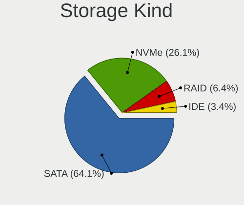

| Kind | Notebooks | Percent |
|------|-----------|---------|
| SATA | 209       | 64.11%  |
| NVMe | 85        | 26.07%  |
| RAID | 21        | 6.44%   |
| IDE  | 11        | 3.37%   |

Processor
---------

CPU Vendor
----------

Processor vendors

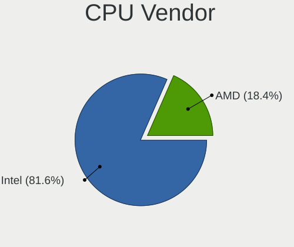

| Vendor | Notebooks | Percent |
|--------|-----------|---------|
| Intel  | 239       | 81.57%  |
| AMD    | 54        | 18.43%  |

CPU Model
---------

Processor models

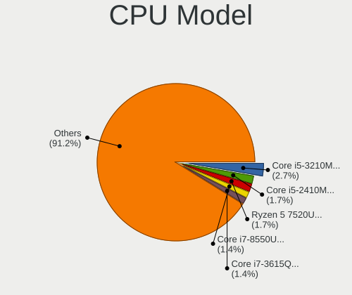

| Model                                   | Notebooks | Percent |
|-----------------------------------------|-----------|---------|
| Intel Core i5-3210M CPU @ 2.50GHz       | 8         | 2.72%   |
| Intel Core i5-2410M CPU @ 2.30GHz       | 5         | 1.7%    |
| AMD Ryzen 5 7520U with Radeon Graphics  | 5         | 1.7%    |
| Intel Core i7-8550U CPU @ 1.80GHz       | 4         | 1.36%   |
| Intel Core i7-3615QM CPU @ 2.30GHz      | 4         | 1.36%   |
| Intel Core i5-8250U CPU @ 1.60GHz       | 4         | 1.36%   |
| Intel Core i5-5250U CPU @ 1.60GHz       | 4         | 1.36%   |
| Intel Core i5-2435M CPU @ 2.40GHz       | 4         | 1.36%   |
| Intel Celeron N4000 CPU @ 1.10GHz       | 4         | 1.36%   |
| Intel 11th Gen Core i3-1115G4 @ 3.00GHz | 4         | 1.36%   |
| Intel Core i7-8565U CPU @ 1.80GHz       | 3         | 1.02%   |
| Intel Core i7-5500U CPU @ 2.40GHz       | 3         | 1.02%   |
| Intel Core i7-4510U CPU @ 2.00GHz       | 3         | 1.02%   |
| Intel Core i5-6300U CPU @ 2.40GHz       | 3         | 1.02%   |
| Intel Core i5-3320M CPU @ 2.60GHz       | 3         | 1.02%   |
| Intel Core 2 Duo CPU P8700 @ 2.53GHz    | 3         | 1.02%   |
| Intel Core 2 Duo CPU P8600 @ 2.40GHz    | 3         | 1.02%   |
| Intel Core 2 Duo CPU P7350 @ 2.00GHz    | 3         | 1.02%   |
| Intel 11th Gen Core i5-1135G7 @ 2.40GHz | 3         | 1.02%   |
| Intel Pentium CPU P6200 @ 2.13GHz       | 2         | 0.68%   |
| Intel Pentium CPU N3710 @ 1.60GHz       | 2         | 0.68%   |
| Intel Genuine CPU U7300 @ 1.30GHz       | 2         | 0.68%   |
| Intel Core i7-3820QM CPU @ 2.70GHz      | 2         | 0.68%   |
| Intel Core i7-3630QM CPU @ 2.40GHz      | 2         | 0.68%   |
| Intel Core i7-3540M CPU @ 3.00GHz       | 2         | 0.68%   |
| Intel Core i7-2720QM CPU @ 2.20GHz      | 2         | 0.68%   |
| Intel Core i7-2670QM CPU @ 2.20GHz      | 2         | 0.68%   |
| Intel Core i5-7200U CPU @ 2.50GHz       | 2         | 0.68%   |
| Intel Core i5-5350U CPU @ 1.80GHz       | 2         | 0.68%   |
| Intel Core i5-5300U CPU @ 2.30GHz       | 2         | 0.68%   |
| Intel Core i5-5200U CPU @ 2.20GHz       | 2         | 0.68%   |
| Intel Core i5-4278U CPU @ 2.60GHz       | 2         | 0.68%   |
| Intel Core i5-4260U CPU @ 1.40GHz       | 2         | 0.68%   |
| Intel Core i5-3427U CPU @ 1.80GHz       | 2         | 0.68%   |
| Intel Core i5-3337U CPU @ 1.80GHz       | 2         | 0.68%   |
| Intel Core i5-3317U CPU @ 1.70GHz       | 2         | 0.68%   |
| Intel Core i5-2430M CPU @ 2.40GHz       | 2         | 0.68%   |
| Intel Core i5-2415M CPU @ 2.30GHz       | 2         | 0.68%   |
| Intel Core i5-10300H CPU @ 2.50GHz      | 2         | 0.68%   |
| Intel Core i5-10210U CPU @ 1.60GHz      | 2         | 0.68%   |

CPU Model Family
----------------

Processor model prefix

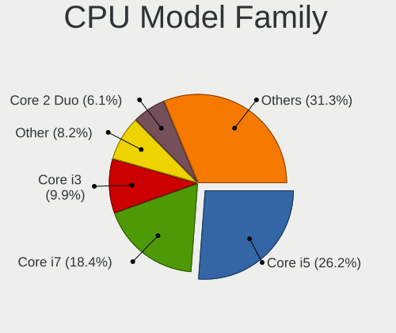

| Model                                | Notebooks | Percent |
|--------------------------------------|-----------|---------|
| Intel Core i5                        | 77        | 26.19%  |
| Intel Core i7                        | 54        | 18.37%  |
| Intel Core i3                        | 29        | 9.86%   |
| Other                                | 24        | 8.16%   |
| Intel Core 2 Duo                     | 18        | 6.12%   |
| Intel Celeron                        | 17        | 5.78%   |
| AMD Ryzen 5                          | 14        | 4.76%   |
| AMD Ryzen 7                          | 9         | 3.06%   |
| Intel Pentium                        | 7         | 2.38%   |
| AMD Ryzen 3                          | 4         | 1.36%   |
| AMD A8                               | 4         | 1.36%   |
| Intel Pentium Dual                   | 3         | 1.02%   |
| Intel Core M                         | 3         | 1.02%   |
| AMD E                                | 3         | 1.02%   |
| AMD A10                              | 3         | 1.02%   |
| Intel Pentium Dual-Core              | 2         | 0.68%   |
| Intel Genuine                        | 2         | 0.68%   |
| Intel Core m3                        | 2         | 0.68%   |
| Intel Core                           | 2         | 0.68%   |
| AMD E1                               | 2         | 0.68%   |
| Intel Xeon                           | 1         | 0.34%   |
| Intel Pentium Silver                 | 1         | 0.34%   |
| Intel Celeron Dual-Core              | 1         | 0.34%   |
| Intel Atom                           | 1         | 0.34%   |
| AMD Turion II Ultra Dual-Core Mobile | 1         | 0.34%   |
| AMD Turion II Dual-Core              | 1         | 0.34%   |
| AMD Turion II                        | 1         | 0.34%   |
| AMD Turion                           | 1         | 0.34%   |
| AMD Ryzen 7 PRO                      | 1         | 0.34%   |
| AMD Ryzen 5 PRO                      | 1         | 0.34%   |
| AMD PRO A8                           | 1         | 0.34%   |
| AMD E2                               | 1         | 0.34%   |
| AMD Athlon                           | 1         | 0.34%   |
| AMD A6                               | 1         | 0.34%   |
| AMD A4                               | 1         | 0.34%   |

CPU Cores
---------

Number of processor cores

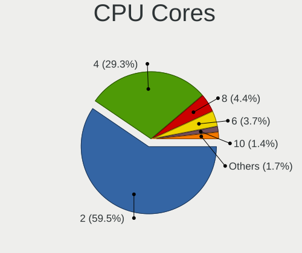

| Number | Notebooks | Percent |
|--------|-----------|---------|
| 2      | 175       | 59.52%  |
| 4      | 86        | 29.25%  |
| 8      | 13        | 4.42%   |
| 6      | 11        | 3.74%   |
| 10     | 4         | 1.36%   |
| 12     | 2         | 0.68%   |
| 16     | 1         | 0.34%   |
| 14     | 1         | 0.34%   |
| 1      | 1         | 0.34%   |

CPU Sockets
-----------

Number of sockets

| Number | Notebooks | Percent |
|--------|-----------|---------|
| 1      | 293       | 100%    |

CPU Threads
-----------

Threads per core (Hyper-Threading)

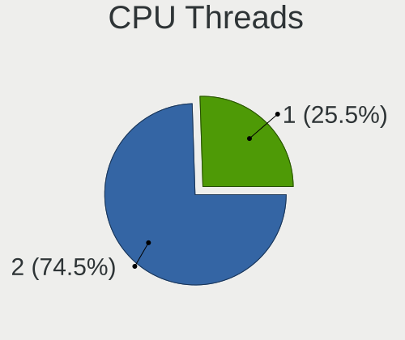

| Number | Notebooks | Percent |
|--------|-----------|---------|
| 2      | 219       | 74.49%  |
| 1      | 75        | 25.51%  |

CPU Op-Modes
------------

CPU Operation Modes (32-bit, 64-bit)

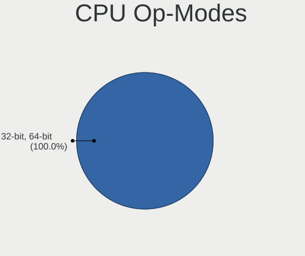

| Op mode        | Notebooks | Percent |
|----------------|-----------|---------|
| 32-bit, 64-bit | 293       | 100%    |

CPU Microcode
-------------

Microcode number

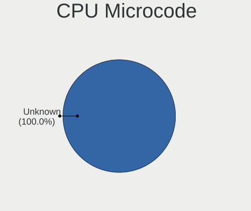

| Number  | Notebooks | Percent |
|---------|-----------|---------|
| Unknown | 293       | 100%    |

CPU Microarch
-------------

Microarchitecture

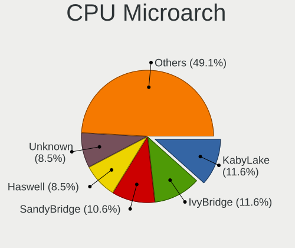

| Name               | Notebooks | Percent |
|--------------------|-----------|---------|
| KabyLake           | 34        | 11.6%   |
| IvyBridge          | 34        | 11.6%   |
| SandyBridge        | 31        | 10.58%  |
| Haswell            | 25        | 8.53%   |
| Unknown            | 25        | 8.53%   |
| Penryn             | 23        | 7.85%   |
| Broadwell          | 19        | 6.48%   |
| Westmere           | 13        | 4.44%   |
| TigerLake          | 11        | 3.75%   |
| Skylake            | 11        | 3.75%   |
| Silvermont         | 8         | 2.73%   |
| Zen 3              | 6         | 2.05%   |
| Puma               | 6         | 2.05%   |
| Goldmont plus      | 6         | 2.05%   |
| Zen+               | 4         | 1.37%   |
| Excavator          | 4         | 1.37%   |
| Core               | 4         | 1.37%   |
| CometLake          | 4         | 1.37%   |
| Zen 2              | 3         | 1.02%   |
| K10                | 3         | 1.02%   |
| Bobcat             | 3         | 1.02%   |
| Jaguar             | 2         | 0.68%   |
| Icelake            | 2         | 0.68%   |
| Goldmont           | 2         | 0.68%   |
| Alderlake Hybrid   | 2         | 0.68%   |
| Zen                | 1         | 0.34%   |
| Steamroller        | 1         | 0.34%   |
| Piledriver         | 1         | 0.34%   |
| Nehalem            | 1         | 0.34%   |
| Lunarlake Hybrid   | 1         | 0.34%   |
| K8 & K10 hybrid    | 1         | 0.34%   |
| K10 Llano          | 1         | 0.34%   |
| ArrowLake-H Hybrid | 1         | 0.34%   |

Graphics
--------

GPU Vendor
----------

Vendors of graphics cards

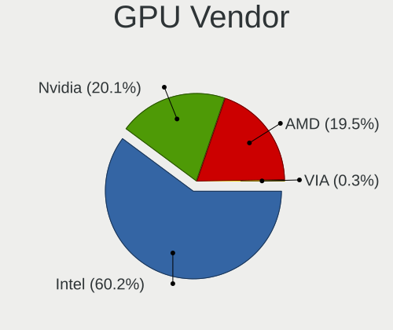

| Vendor           | Notebooks | Percent |
|------------------|-----------|---------|
| Intel            | 213       | 60.17%  |
| Nvidia           | 71        | 20.06%  |
| AMD              | 69        | 19.49%  |
| VIA Technologies | 1         | 0.28%   |

GPU Model
---------

Graphics card models

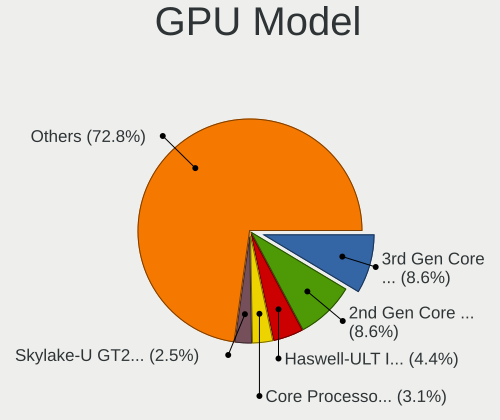

| Model                                                                                    | Notebooks | Percent |
|------------------------------------------------------------------------------------------|-----------|---------|
| Intel 3rd Gen Core processor Graphics Controller                                         | 31        | 8.61%   |
| Intel 2nd Generation Core Processor Family Integrated Graphics Controller                | 31        | 8.61%   |
| Intel Haswell-ULT Integrated Graphics Controller                                         | 16        | 4.44%   |
| Intel Core Processor Integrated Graphics Controller                                      | 11        | 3.06%   |
| Intel Skylake-U GT2 [HD Graphics 520]                                                    | 9         | 2.5%    |
| Intel Kaby Lake-R GT2 [UHD Graphics 620]                                                 | 9         | 2.5%    |
| Intel Broadwell-U GT2 [HD Graphics 5500]                                                 | 9         | 2.5%    |
| AMD Mendocino [Radeon 610M]                                                              | 9         | 2.5%    |
| Intel Mobile 4 Series Chipset Integrated Graphics Controller                             | 8         | 2.22%   |
| Intel TigerLake-LP GT2 [Iris Xe Graphics]                                                | 7         | 1.94%   |
| Nvidia GK107M [GeForce GT 650M Mac Edition]                                              | 6         | 1.67%   |
| Intel GeminiLake [UHD Graphics 600]                                                      | 6         | 1.67%   |
| Intel Broadwell-U GT3 [HD Graphics 6000]                                                 | 6         | 1.67%   |
| Intel Atom/Celeron/Pentium Processor x5-E8000/J3xxx/N3xxx Integrated Graphics Controller | 6         | 1.67%   |
| Nvidia GF117M [GeForce 610M/710M/810M/820M / GT 620M/625M/630M/720M]                     | 5         | 1.39%   |
| Nvidia C79 [GeForce 9400M]                                                               | 5         | 1.39%   |
| Intel WhiskeyLake-U GT2 [UHD Graphics 620]                                               | 5         | 1.39%   |
| Intel Kaby Lake-U GT2 [HD Graphics 620]                                                  | 5         | 1.39%   |
| Intel CometLake-U GT2 [UHD Graphics]                                                     | 5         | 1.39%   |
| Nvidia MCP89 [GeForce 320M]                                                              | 4         | 1.11%   |
| Intel Tiger Lake-LP GT2 [UHD Graphics G4]                                                | 4         | 1.11%   |
| Intel 4th Gen Core Processor Integrated Graphics Controller                              | 4         | 1.11%   |
| AMD Wani [Radeon R5/R6/R7 Graphics]                                                      | 4         | 1.11%   |
| AMD Topaz XT [Radeon R7 M260/M265 / M340/M360 / M440/M445 / 530/535 / 620/625 Mobile]    | 4         | 1.11%   |
| AMD Picasso/Raven 2 [Radeon Vega Series / Radeon Vega Mobile Series]                     | 4         | 1.11%   |
| AMD Mullins [Radeon R4/R5 Graphics]                                                      | 4         | 1.11%   |
| AMD Barcelo                                                                              | 4         | 1.11%   |
| Nvidia TU117M [GeForce GTX 1650 Mobile / Max-Q]                                          | 3         | 0.83%   |
| Nvidia GP108M [GeForce MX250]                                                            | 3         | 0.83%   |
| Nvidia GP108M [GeForce MX150]                                                            | 3         | 0.83%   |
| Nvidia GM108M [GeForce 840M]                                                             | 3         | 0.83%   |
| Intel Raptor Lake-P [Iris Xe Graphics]                                                   | 3         | 0.83%   |
| Intel Kaby Lake-H GT2 [HD Graphics 630]                                                  | 3         | 0.83%   |
| Intel Crystal Well Integrated Graphics Controller                                        | 3         | 0.83%   |
| Intel CometLake-H GT2 [UHD Graphics]                                                     | 3         | 0.83%   |
| Intel Broadwell-Y GT2 [HD Graphics 5300]                                                 | 3         | 0.83%   |
| AMD Seymour [Radeon HD 6400M/7400M Series]                                               | 3         | 0.83%   |
| AMD RV710/M92 [Mobility Radeon HD 4530/4570/5145/530v/540v/545v]                         | 3         | 0.83%   |
| AMD Renoir [Radeon Vega Series / Radeon Vega Mobile Series]                              | 3         | 0.83%   |
| AMD Lucienne                                                                             | 3         | 0.83%   |

GPU Combo
---------

Combinations of graphics cards

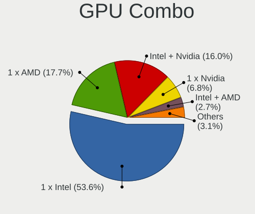

| Name           | Notebooks | Percent |
|----------------|-----------|---------|
| 1 x Intel      | 157       | 53.58%  |
| 1 x AMD        | 52        | 17.75%  |
| Intel + Nvidia | 47        | 16.04%  |
| 1 x Nvidia     | 20        | 6.83%   |
| Intel + AMD    | 8         | 2.73%   |
| 2 x AMD        | 4         | 1.37%   |
| AMD + Nvidia   | 4         | 1.37%   |
| 1 x VIA        | 1         | 0.34%   |

GPU Driver
----------

Free vs proprietary

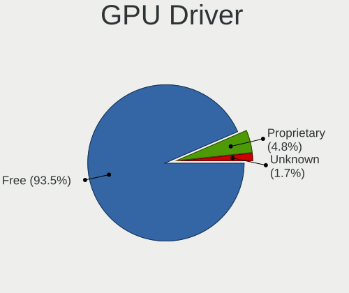

| Driver      | Notebooks | Percent |
|-------------|-----------|---------|
| Free        | 274       | 93.52%  |
| Proprietary | 14        | 4.78%   |
| Unknown     | 5         | 1.71%   |

GPU Memory
----------

Total video memory

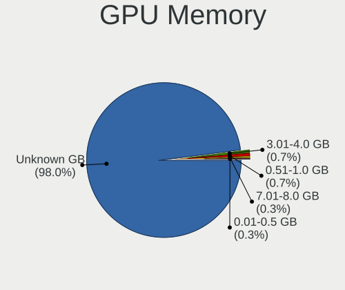

| Size in GB | Notebooks | Percent |
|------------|-----------|---------|
| Unknown    | 287       | 97.95%  |
| 3.01-4.0   | 2         | 0.68%   |
| 0.51-1.0   | 2         | 0.68%   |
| 7.01-8.0   | 1         | 0.34%   |
| 0.01-0.5   | 1         | 0.34%   |

Monitor
-------

Monitor Vendor
--------------

Monitor vendors

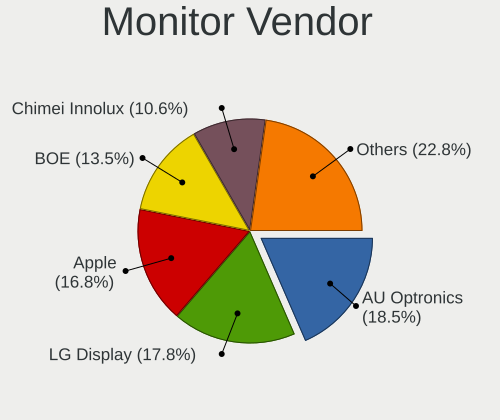

| Vendor                  | Notebooks | Percent |
|-------------------------|-----------|---------|
| AU Optronics            | 56        | 18.48%  |
| LG Display              | 54        | 17.82%  |
| Apple                   | 51        | 16.83%  |
| BOE                     | 41        | 13.53%  |
| Chimei Innolux          | 32        | 10.56%  |
| Samsung Electronics     | 20        | 6.6%    |
| Lenovo                  | 4         | 1.32%   |
| Goldstar                | 4         | 1.32%   |
| Chi Mei Optoelectronics | 4         | 1.32%   |
| Hewlett-Packard         | 3         | 0.99%   |
| CSOT                    | 3         | 0.99%   |
| BenQ                    | 3         | 0.99%   |
| Sharp                   | 2         | 0.66%   |
| PANDA                   | 2         | 0.66%   |
| HKC                     | 2         | 0.66%   |
| HannStar                | 2         | 0.66%   |
| Dell                    | 2         | 0.66%   |
| Acer                    | 2         | 0.66%   |
| Vizio                   | 1         | 0.33%   |
| TR_                     | 1         | 0.33%   |
| TMX                     | 1         | 0.33%   |
| SGT                     | 1         | 0.33%   |
| Panasonic               | 1         | 0.33%   |
| LG Philips              | 1         | 0.33%   |
| KDC                     | 1         | 0.33%   |
| KDB                     | 1         | 0.33%   |
| Insignia                | 1         | 0.33%   |
| DENON                   | 1         | 0.33%   |
| CTV                     | 1         | 0.33%   |
| CS_                     | 1         | 0.33%   |
| CSW                     | 1         | 0.33%   |
| CSO                     | 1         | 0.33%   |
| ASUSTek Computer        | 1         | 0.33%   |
| Ancor Communications    | 1         | 0.33%   |

Monitor Model
-------------

Monitor models

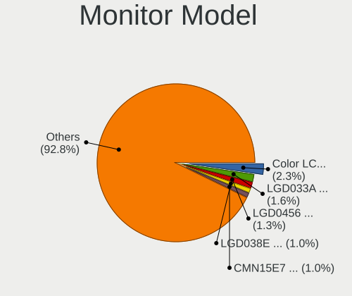

| Model                                                                | Notebooks | Percent |
|----------------------------------------------------------------------|-----------|---------|
| Apple Color LCD APP9CF0 1440x900 290x180mm 13.4-inch                 | 7         | 2.3%    |
| LG Display LCD Monitor LGD033A 1366x768 344x194mm 15.5-inch          | 5         | 1.64%   |
| LG Display LCD Monitor LGD0456 1366x768 344x194mm 15.5-inch          | 4         | 1.31%   |
| LG Display LCD Monitor LGD038E 1366x768 344x194mm 15.5-inch          | 3         | 0.98%   |
| Chimei Innolux LCD Monitor CMN15E7 1920x1080 344x193mm 15.5-inch     | 3         | 0.98%   |
| AU Optronics LCD Monitor AUO405C 1366x768 256x144mm 11.6-inch        | 3         | 0.98%   |
| AU Optronics LCD Monitor AUO22EC 1366x768 344x193mm 15.5-inch        | 3         | 0.98%   |
| AU Optronics LCD Monitor AUO20EC 1366x768 344x193mm 15.5-inch        | 3         | 0.98%   |
| AU Optronics LCD Monitor AUO10EC 1366x768 344x193mm 15.5-inch        | 3         | 0.98%   |
| Apple LCD Monitor APP9CCB 1280x800 286x179mm 13.3-inch               | 3         | 0.98%   |
| Apple LCD Monitor APP9CC3 1280x800 286x179mm 13.3-inch               | 3         | 0.98%   |
| Apple Color LCD APPA01B 1440x900 286x179mm 13.3-inch                 | 3         | 0.98%   |
| Apple Color LCD APPA019 2880x1800 331x207mm 15.4-inch                | 3         | 0.98%   |
| Apple Color LCD APPA00E 2880x1800 331x207mm 15.4-inch                | 3         | 0.98%   |
| Apple Color LCD APP9CC9 1280x800 286x178mm 13.3-inch                 | 3         | 0.98%   |
| Apple Color LCD APP9CC7 1280x800 286x179mm 13.3-inch                 | 3         | 0.98%   |
| Samsung Electronics LCD Monitor SEC3152 1366x768 344x194mm 15.5-inch | 2         | 0.66%   |
| Samsung Electronics LCD Monitor SDC3654 1600x900 382x215mm 17.3-inch | 2         | 0.66%   |
| LG Display LCD Monitor LGD062E 1920x1080 344x194mm 15.5-inch         | 2         | 0.66%   |
| LG Display LCD Monitor LGD02DF 1600x900 310x174mm 14.0-inch          | 2         | 0.66%   |
| LG Display LCD Monitor LGD02DC 1366x768 344x194mm 15.5-inch          | 2         | 0.66%   |
| LG Display LCD Monitor LGD01E9 1920x1080 345x194mm 15.6-inch         | 2         | 0.66%   |
| HannStar LCD Monitor HSD0001 1920x1080 309x174mm 14.0-inch           | 2         | 0.66%   |
| Chimei Innolux LCD Monitor CMN15F5 1920x1080 344x193mm 15.5-inch     | 2         | 0.66%   |
| Chimei Innolux LCD Monitor CMN14D4 1920x1080 309x173mm 13.9-inch     | 2         | 0.66%   |
| Chimei Innolux LCD Monitor CMN14C3 1366x768 309x173mm 13.9-inch      | 2         | 0.66%   |
| Chimei Innolux LCD Monitor CMN142B 1920x1080 309x173mm 13.9-inch     | 2         | 0.66%   |
| BOE LCD Monitor BOE0A56 1920x1080 344x194mm 15.5-inch                | 2         | 0.66%   |
| BOE LCD Monitor BOE0949 1366x768 344x194mm 15.5-inch                 | 2         | 0.66%   |
| BOE LCD Monitor BOE0872 1920x1080 344x194mm 15.5-inch                | 2         | 0.66%   |
| BOE LCD Monitor BOE084D 1920x1080 344x193mm 15.5-inch                | 2         | 0.66%   |
| BOE LCD Monitor BOE0653 1920x1080 309x173mm 13.9-inch                | 2         | 0.66%   |
| AU Optronics LCD Monitor AUO48EC 1366x768 344x193mm 15.5-inch        | 2         | 0.66%   |
| AU Optronics LCD Monitor AUO26EC 1366x768 344x193mm 15.5-inch        | 2         | 0.66%   |
| AU Optronics LCD Monitor AUO11ED 1920x1080 344x193mm 15.5-inch       | 2         | 0.66%   |
| Apple LCD Monitor APP9CC5 1280x800 286x179mm 13.3-inch               | 2         | 0.66%   |
| Apple LCD Monitor APP9C89 1280x800 286x179mm 13.3-inch               | 2         | 0.66%   |
| Apple Color LCD APPA020 2560x1600 286x179mm 13.3-inch                | 2         | 0.66%   |
| Apple Color LCD APP9CDF 1440x900 286x179mm 13.3-inch                 | 2         | 0.66%   |
| Apple Color LCD APP9CA4 1440x900 331x207mm 15.4-inch                 | 2         | 0.66%   |

Monitor Resolution
------------------

Monitor screen resolution

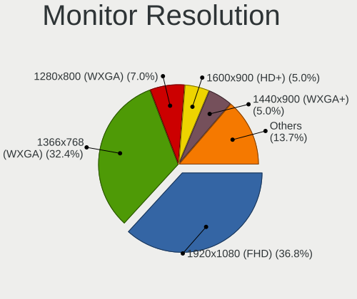

| Resolution         | Notebooks | Percent |
|--------------------|-----------|---------|
| 1920x1080 (FHD)    | 110       | 36.79%  |
| 1366x768 (WXGA)    | 97        | 32.44%  |
| 1280x800 (WXGA)    | 21        | 7.02%   |
| 1600x900 (HD+)     | 15        | 5.02%   |
| 1440x900 (WXGA+)   | 15        | 5.02%   |
| 2880x1800          | 10        | 3.34%   |
| 2560x1600          | 7         | 2.34%   |
| 1920x1200 (WUXGA)  | 7         | 2.34%   |
| 3840x2160 (4K)     | 3         | 1%      |
| 2560x1440 (QHD)    | 2         | 0.67%   |
| 1680x1050 (WSXGA+) | 2         | 0.67%   |
| 1360x768           | 2         | 0.67%   |
| 3200x2000          | 1         | 0.33%   |
| 3000x2000          | 1         | 0.33%   |
| 2560x1080          | 1         | 0.33%   |
| 2304x1440          | 1         | 0.33%   |
| 2160x1440          | 1         | 0.33%   |
| 1920x540           | 1         | 0.33%   |
| 1680x945           | 1         | 0.33%   |
| Unknown            | 1         | 0.33%   |

Monitor Diagonal
----------------

Diagonal size in inches

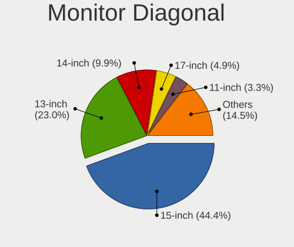

| Inches  | Notebooks | Percent |
|---------|-----------|---------|
| 15      | 135       | 44.41%  |
| 13      | 70        | 23.03%  |
| 14      | 30        | 9.87%   |
| 17      | 15        | 4.93%   |
| 11      | 10        | 3.29%   |
| 24      | 8         | 2.63%   |
| 23      | 8         | 2.63%   |
| 18      | 4         | 1.32%   |
| 16      | 4         | 1.32%   |
| 12      | 4         | 1.32%   |
| 74      | 2         | 0.66%   |
| 32      | 2         | 0.66%   |
| 31      | 2         | 0.66%   |
| 21      | 2         | 0.66%   |
| Unknown | 2         | 0.66%   |
| 34      | 1         | 0.33%   |
| 27      | 1         | 0.33%   |
| 25      | 1         | 0.33%   |
| 22      | 1         | 0.33%   |
| 20      | 1         | 0.33%   |
| 19      | 1         | 0.33%   |

Monitor Width
-------------

Physical width

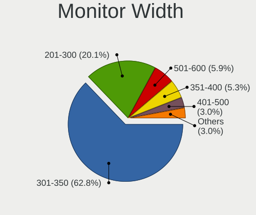

| Width in mm | Notebooks | Percent |
|-------------|-----------|---------|
| 301-350     | 191       | 62.83%  |
| 201-300     | 61        | 20.07%  |
| 501-600     | 18        | 5.92%   |
| 351-400     | 16        | 5.26%   |
| 401-500     | 9         | 2.96%   |
| 701-800     | 3         | 0.99%   |
| 601-700     | 2         | 0.66%   |
| 1501-2000   | 2         | 0.66%   |
| Unknown     | 2         | 0.66%   |

Aspect Ratio
------------

Proportional relationship between the width and the height

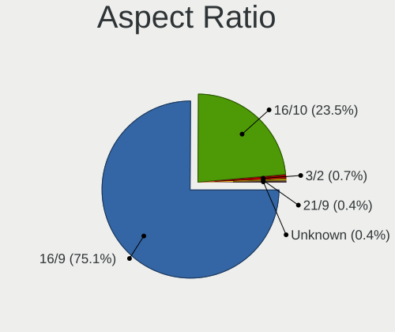

| Ratio   | Notebooks | Percent |
|---------|-----------|---------|
| 16/9    | 214       | 75.09%  |
| 16/10   | 67        | 23.51%  |
| 3/2     | 2         | 0.7%    |
| 21/9    | 1         | 0.35%   |
| Unknown | 1         | 0.35%   |

Monitor Area
------------

Area in inch²

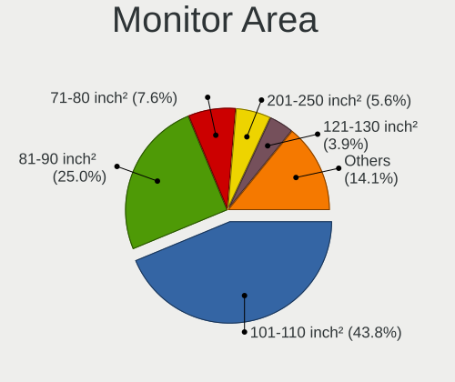

| Area in inch² | Notebooks | Percent |
|----------------|-----------|---------|
| 101-110        | 133       | 43.75%  |
| 81-90          | 76        | 25%     |
| 71-80          | 23        | 7.57%   |
| 201-250        | 17        | 5.59%   |
| 121-130        | 12        | 3.95%   |
| 51-60          | 10        | 3.29%   |
| 111-120        | 6         | 1.97%   |
| 351-500        | 5         | 1.64%   |
| 61-70          | 4         | 1.32%   |
| 141-150        | 4         | 1.32%   |
| 251-300        | 3         | 0.99%   |
| 131-140        | 3         | 0.99%   |
| More than 1000 | 2         | 0.66%   |
| 151-200        | 2         | 0.66%   |
| Unknown        | 2         | 0.66%   |
| 301-350        | 1         | 0.33%   |
| 91-100         | 1         | 0.33%   |

Pixel Density
-------------

Pixels per inch

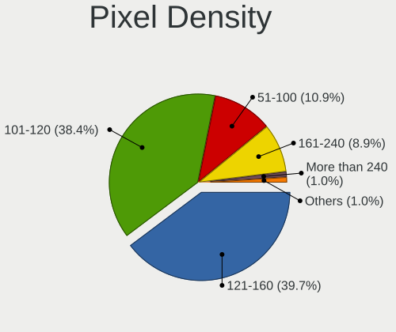

| Density       | Notebooks | Percent |
|---------------|-----------|---------|
| 121-160       | 120       | 39.74%  |
| 101-120       | 116       | 38.41%  |
| 51-100        | 33        | 10.93%  |
| 161-240       | 27        | 8.94%   |
| More than 240 | 3         | 0.99%   |
| Unknown       | 2         | 0.66%   |
| 1-50          | 1         | 0.33%   |

Multiple Monitors
-----------------

Total monitors connected

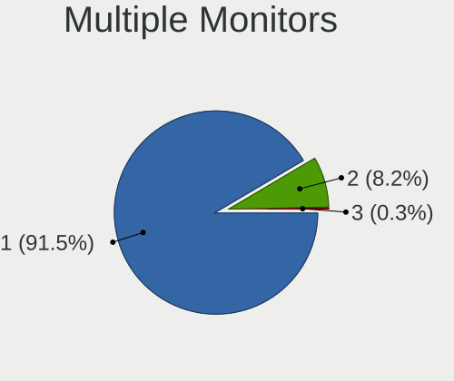

| Total | Notebooks | Percent |
|-------|-----------|---------|
| 1     | 269       | 91.5%   |
| 2     | 24        | 8.16%   |
| 3     | 1         | 0.34%   |

Network
-------

Net Controller Vendor
---------------------

Controller vendors

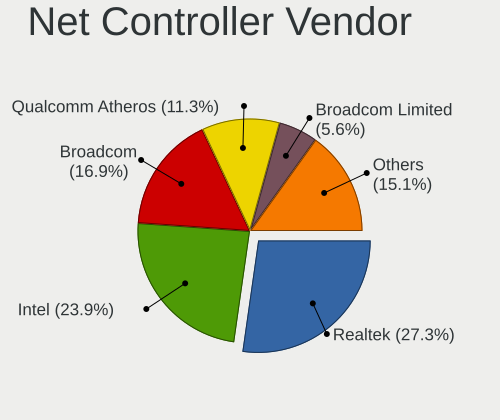

| Vendor                        | Notebooks | Percent |
|-------------------------------|-----------|---------|
| Realtek Semiconductor         | 121       | 27.25%  |
| Intel                         | 106       | 23.87%  |
| Broadcom                      | 75        | 16.89%  |
| Qualcomm Atheros              | 50        | 11.26%  |
| Broadcom Limited              | 25        | 5.63%   |
| MediaTek                      | 20        | 4.5%    |
| Marvell Technology Group      | 6         | 1.35%   |
| Ralink                        | 5         | 1.13%   |
| Nvidia                        | 5         | 1.13%   |
| Samsung Electronics           | 4         | 0.9%    |
| ASIX Electronics              | 4         | 0.9%    |
| TP-Link                       | 3         | 0.68%   |
| Sierra Wireless               | 3         | 0.68%   |
| Xiaomi                        | 2         | 0.45%   |
| Qualcomm                      | 2         | 0.45%   |
| Dell                          | 2         | 0.45%   |
| Wacom                         | 1         | 0.23%   |
| VIA Technologies              | 1         | 0.23%   |
| OnePlus Technology (Shenzhen) | 1         | 0.23%   |
| Motorola PCS                  | 1         | 0.23%   |
| Motorcomm Microelectronics.   | 1         | 0.23%   |
| Lenovo                        | 1         | 0.23%   |
| ICS Advent                    | 1         | 0.23%   |
| Huawei Technologies           | 1         | 0.23%   |
| Google                        | 1         | 0.23%   |
| AVM                           | 1         | 0.23%   |
| ASUSTek Computer              | 1         | 0.23%   |

Net Controller Model
--------------------

Controller models

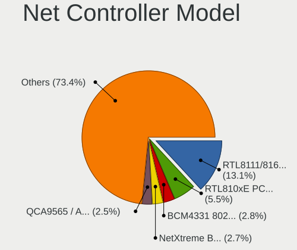

| Model                                                                  | Notebooks | Percent |
|------------------------------------------------------------------------|-----------|---------|
| Realtek RTL8111/8168/8211/8411 PCI Express Gigabit Ethernet Controller | 69        | 13.09%  |
| Realtek RTL810xE PCI Express Fast Ethernet controller                  | 29        | 5.5%    |
| Broadcom BCM4331 802.11a/b/g/n                                         | 15        | 2.85%   |
| Broadcom NetXtreme BCM57765 Gigabit Ethernet PCIe                      | 14        | 2.66%   |
| Qualcomm Atheros QCA9565 / AR9565 Wireless Network Adapter             | 13        | 2.47%   |
| Broadcom Limited BCM4360 802.11ac Dual Band Wireless Network Adapter   | 13        | 2.47%   |
| Intel Wireless 7265                                                    | 12        | 2.28%   |
| Intel 82579LM Gigabit Network Connection (Lewisville)                  | 9         | 1.71%   |
| Qualcomm Atheros AR9285 Wireless Network Adapter (PCI-Express)         | 8         | 1.52%   |
| MediaTek MT7921 802.11ax PCIe Wireless Network Adapter [Filogic 330]   | 8         | 1.52%   |
| Intel Wi-Fi 6 AX201                                                    | 8         | 1.52%   |
| Broadcom BCM4322 802.11a/b/g/n Wireless LAN Controller                 | 8         | 1.52%   |
| Broadcom BCM4313 802.11bgn Wireless Network Adapter                    | 8         | 1.52%   |
| Qualcomm Atheros AR9485 Wireless Network Adapter                       | 7         | 1.33%   |
| Intel Wireless 8265 / 8275                                             | 7         | 1.33%   |
| Broadcom NetLink BCM57785 Gigabit Ethernet PCIe                        | 7         | 1.33%   |
| Broadcom BCM43224 802.11a/b/g/n                                        | 7         | 1.33%   |
| Broadcom BCM43142 802.11b/g/n                                          | 7         | 1.33%   |
| Realtek RTL8822CE 802.11ac PCIe Wireless Network Adapter               | 6         | 1.14%   |
| Realtek RTL8821CE 802.11ac PCIe Wireless Network Adapter               | 6         | 1.14%   |
| Intel Dual Band Wireless-AC 3165 Plus Bluetooth                        | 6         | 1.14%   |
| Intel Centrino Advanced-N 6205 [Taylor Peak]                           | 6         | 1.14%   |
| Broadcom NetXtreme BCM57786 Gigabit Ethernet PCIe                      | 6         | 1.14%   |
| Nvidia MCP79 Ethernet                                                  | 5         | 0.95%   |
| MediaTek MT7902 802.11ax PCIe Wireless Network Adapter [Filogic 310]   | 5         | 0.95%   |
| Intel Comet Lake PCH-LP CNVi WiFi                                      | 5         | 0.95%   |
| Broadcom NetXtreme BCM5764M Gigabit Ethernet PCIe                      | 5         | 0.95%   |
| Realtek RTL8852BE PCIe 802.11ax Wireless Network Controller            | 4         | 0.76%   |
| Realtek RTL8723BE PCIe Wireless Network Adapter                        | 4         | 0.76%   |
| Qualcomm Atheros AR8151 v2.0 Gigabit Ethernet                          | 4         | 0.76%   |
| MediaTek MT7922 802.11ax PCI Express Wireless Network Adapter          | 4         | 0.76%   |
| Intel Ethernet Connection (4) I219-LM                                  | 4         | 0.76%   |
| Intel Comet Lake PCH CNVi WiFi                                         | 4         | 0.76%   |
| Intel Centrino Wireless-N 2230                                         | 4         | 0.76%   |
| Intel Centrino Wireless-N 1030 [Rainbow Peak]                          | 4         | 0.76%   |
| Intel Cannon Point-LP CNVi [Wireless-AC]                               | 4         | 0.76%   |
| Broadcom Limited BCM4331 802.11a/b/g/n                                 | 4         | 0.76%   |
| Broadcom BCM4312 802.11b/g LP-PHY                                      | 4         | 0.76%   |
| ASIX AX88179 Gigabit Ethernet                                          | 4         | 0.76%   |
| Samsung Galaxy series, misc. (tethering mode)                          | 3         | 0.57%   |

Wireless Vendor
---------------

Wireless vendors

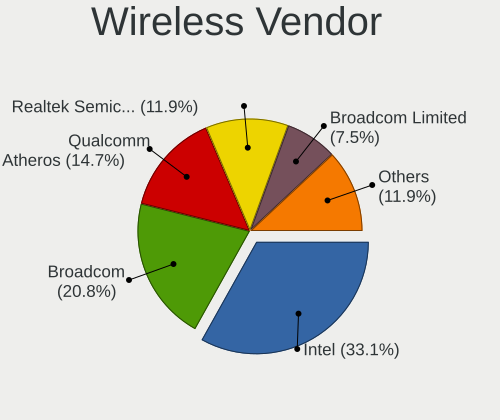

| Vendor                | Notebooks | Percent |
|-----------------------|-----------|---------|
| Intel                 | 97        | 33.11%  |
| Broadcom              | 61        | 20.82%  |
| Qualcomm Atheros      | 43        | 14.68%  |
| Realtek Semiconductor | 35        | 11.95%  |
| Broadcom Limited      | 22        | 7.51%   |
| MediaTek              | 18        | 6.14%   |
| Ralink                | 5         | 1.71%   |
| TP-Link               | 3         | 1.02%   |
| Sierra Wireless       | 3         | 1.02%   |
| Qualcomm              | 2         | 0.68%   |
| Wacom                 | 1         | 0.34%   |
| Dell                  | 1         | 0.34%   |
| AVM                   | 1         | 0.34%   |
| ASUSTek Computer      | 1         | 0.34%   |

Wireless Model
--------------

Wireless models

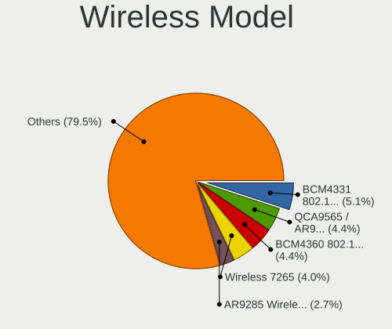

| Model                                                                   | Notebooks | Percent |
|-------------------------------------------------------------------------|-----------|---------|
| Broadcom BCM4331 802.11a/b/g/n                                          | 15        | 5.05%   |
| Qualcomm Atheros QCA9565 / AR9565 Wireless Network Adapter              | 13        | 4.38%   |
| Broadcom Limited BCM4360 802.11ac Dual Band Wireless Network Adapter    | 13        | 4.38%   |
| Intel Wireless 7265                                                     | 12        | 4.04%   |
| Qualcomm Atheros AR9285 Wireless Network Adapter (PCI-Express)          | 8         | 2.69%   |
| MediaTek MT7921 802.11ax PCIe Wireless Network Adapter [Filogic 330]    | 8         | 2.69%   |
| Intel Wi-Fi 6 AX201                                                     | 8         | 2.69%   |
| Broadcom BCM4322 802.11a/b/g/n Wireless LAN Controller                  | 8         | 2.69%   |
| Broadcom BCM4313 802.11bgn Wireless Network Adapter                     | 8         | 2.69%   |
| Qualcomm Atheros AR9485 Wireless Network Adapter                        | 7         | 2.36%   |
| Intel Wireless 8265 / 8275                                              | 7         | 2.36%   |
| Broadcom BCM43224 802.11a/b/g/n                                         | 7         | 2.36%   |
| Broadcom BCM43142 802.11b/g/n                                           | 7         | 2.36%   |
| Realtek RTL8822CE 802.11ac PCIe Wireless Network Adapter                | 6         | 2.02%   |
| Realtek RTL8821CE 802.11ac PCIe Wireless Network Adapter                | 6         | 2.02%   |
| Intel Dual Band Wireless-AC 3165 Plus Bluetooth                         | 6         | 2.02%   |
| Intel Centrino Advanced-N 6205 [Taylor Peak]                            | 6         | 2.02%   |
| MediaTek MT7902 802.11ax PCIe Wireless Network Adapter [Filogic 310]    | 5         | 1.68%   |
| Intel Comet Lake PCH-LP CNVi WiFi                                       | 5         | 1.68%   |
| Realtek RTL8723BE PCIe Wireless Network Adapter                         | 4         | 1.35%   |
| Intel Comet Lake PCH CNVi WiFi                                          | 4         | 1.35%   |
| Intel Centrino Wireless-N 2230                                          | 4         | 1.35%   |
| Intel Centrino Wireless-N 1030 [Rainbow Peak]                           | 4         | 1.35%   |
| Intel Cannon Point-LP CNVi [Wireless-AC]                                | 4         | 1.35%   |
| Broadcom Limited BCM4331 802.11a/b/g/n                                  | 4         | 1.35%   |
| Broadcom BCM4312 802.11b/g LP-PHY                                       | 4         | 1.35%   |
| Realtek RTL8852BE PCIe 802.11ax Wireless Network Controller             | 3         | 1.01%   |
| Realtek RTL8822BE 802.11a/b/g/n/ac WiFi adapter                         | 3         | 1.01%   |
| Realtek 802.11n WLAN Adapter                                            | 3         | 1.01%   |
| Qualcomm Atheros QCA6174 802.11ac Wireless Network Adapter              | 3         | 1.01%   |
| Qualcomm Atheros AR9462 Wireless Network Adapter                        | 3         | 1.01%   |
| Qualcomm Atheros AR9287 Wireless Network Adapter (PCI-Express)          | 3         | 1.01%   |
| Qualcomm Atheros AR242x / AR542x Wireless Network Adapter (PCI-Express) | 3         | 1.01%   |
| MediaTek MT7922 802.11ax PCI Express Wireless Network Adapter           | 3         | 1.01%   |
| Intel Wireless 8260                                                     | 3         | 1.01%   |
| Intel Wireless 3160                                                     | 3         | 1.01%   |
| Intel WiFi Link 5100                                                    | 3         | 1.01%   |
| Intel Centrino Wireless-N 1000 [Condor Peak]                            | 3         | 1.01%   |
| Intel Centrino Advanced-N 6235                                          | 3         | 1.01%   |
| Broadcom Limited BCM4312 802.11b/g LP-PHY                               | 3         | 1.01%   |

Ethernet Vendor
---------------

Ethernet vendors

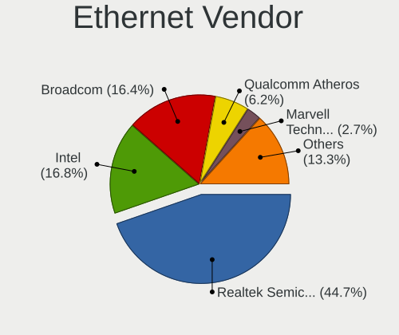

| Vendor                        | Notebooks | Percent |
|-------------------------------|-----------|---------|
| Realtek Semiconductor         | 101       | 44.69%  |
| Intel                         | 38        | 16.81%  |
| Broadcom                      | 37        | 16.37%  |
| Qualcomm Atheros              | 14        | 6.19%   |
| Marvell Technology Group      | 6         | 2.65%   |
| Nvidia                        | 5         | 2.21%   |
| Samsung Electronics           | 4         | 1.77%   |
| MediaTek                      | 4         | 1.77%   |
| ASIX Electronics              | 4         | 1.77%   |
| Broadcom Limited              | 3         | 1.33%   |
| Xiaomi                        | 2         | 0.88%   |
| VIA Technologies              | 1         | 0.44%   |
| OnePlus Technology (Shenzhen) | 1         | 0.44%   |
| Motorola PCS                  | 1         | 0.44%   |
| Motorcomm Microelectronics.   | 1         | 0.44%   |
| Lenovo                        | 1         | 0.44%   |
| ICS Advent                    | 1         | 0.44%   |
| Huawei Technologies           | 1         | 0.44%   |
| Google                        | 1         | 0.44%   |

Ethernet Model
--------------

Ethernet models

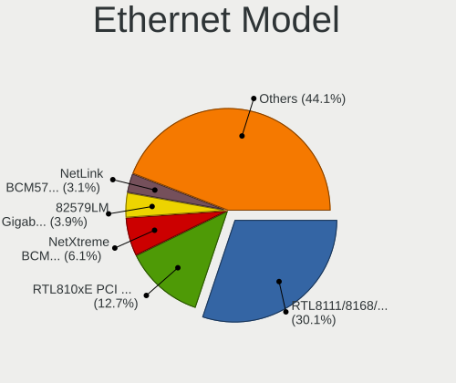

| Model                                                                  | Notebooks | Percent |
|------------------------------------------------------------------------|-----------|---------|
| Realtek RTL8111/8168/8211/8411 PCI Express Gigabit Ethernet Controller | 69        | 30.13%  |
| Realtek RTL810xE PCI Express Fast Ethernet controller                  | 29        | 12.66%  |
| Broadcom NetXtreme BCM57765 Gigabit Ethernet PCIe                      | 14        | 6.11%   |
| Intel 82579LM Gigabit Network Connection (Lewisville)                  | 9         | 3.93%   |
| Broadcom NetLink BCM57785 Gigabit Ethernet PCIe                        | 7         | 3.06%   |
| Broadcom NetXtreme BCM57786 Gigabit Ethernet PCIe                      | 6         | 2.62%   |
| Nvidia MCP79 Ethernet                                                  | 5         | 2.18%   |
| Broadcom NetXtreme BCM5764M Gigabit Ethernet PCIe                      | 5         | 2.18%   |
| Qualcomm Atheros AR8151 v2.0 Gigabit Ethernet                          | 4         | 1.75%   |
| Intel Ethernet Connection (4) I219-LM                                  | 4         | 1.75%   |
| ASIX AX88179 Gigabit Ethernet                                          | 4         | 1.75%   |
| Samsung Galaxy series, misc. (tethering mode)                          | 3         | 1.31%   |
| Marvell Group 88E8040 PCI-E Fast Ethernet Controller                   | 3         | 1.31%   |
| Intel Ethernet Connection I219-LM                                      | 3         | 1.31%   |
| Intel Ethernet Connection (3) I218-LM                                  | 3         | 1.31%   |
| Xiaomi Mi/Redmi series (RNDIS)                                         | 2         | 0.87%   |
| Realtek RTL8153 Gigabit Ethernet Adapter                               | 2         | 0.87%   |
| Qualcomm Atheros QCA8171 Gigabit Ethernet                              | 2         | 0.87%   |
| Qualcomm Atheros AR8152 v2.0 Fast Ethernet                             | 2         | 0.87%   |
| MediaTek Infinix HOT 50i                                               | 2         | 0.87%   |
| Intel Ethernet Connection I217-LM                                      | 2         | 0.87%   |
| Intel Ethernet Connection (4) I219-V                                   | 2         | 0.87%   |
| Intel 82577LM Gigabit Network Connection                               | 2         | 0.87%   |
| Broadcom NetLink BCM57780 Gigabit Ethernet PCIe                        | 2         | 0.87%   |
| Broadcom Limited NetLink BCM57780 Gigabit Ethernet PCIe                | 2         | 0.87%   |
| VIA VT6102/VT6103 [Rhine-II]                                           | 1         | 0.44%   |
| Samsung GT-I9070 (network tethering, USB debugging enabled)            | 1         | 0.44%   |
| Realtek RTL8852CE PCIe 802.11ax Wireless Network Controller            | 1         | 0.44%   |
| Realtek RTL8852BE PCIe 802.11ax Wireless Network Controller            | 1         | 0.44%   |
| Realtek RTL8152 Fast Ethernet Adapter                                  | 1         | 0.44%   |
| Qualcomm Atheros QCA8172 Fast Ethernet                                 | 1         | 0.44%   |
| Qualcomm Atheros Killer E2500 Gigabit Ethernet Controller              | 1         | 0.44%   |
| Qualcomm Atheros AR8162 Fast Ethernet                                  | 1         | 0.44%   |
| Qualcomm Atheros AR8161 Gigabit Ethernet                               | 1         | 0.44%   |
| Qualcomm Atheros AR8132 Fast Ethernet                                  | 1         | 0.44%   |
| Qualcomm Atheros AR8131 Gigabit Ethernet                               | 1         | 0.44%   |
| OnePlus (Shenzhen) BE2029                                              | 1         | 0.44%   |
| Motorola PCS moto g100 pro                                             | 1         | 0.44%   |
| Motorcomm Microelectronics. YT6801 Gigabit Ethernet Controller         | 1         | 0.44%   |
| MediaTek MT7922 802.11ax PCI Express Wireless Network Adapter          | 1         | 0.44%   |

Net Controller Kind
-------------------

Ethernet, WiFi or modem

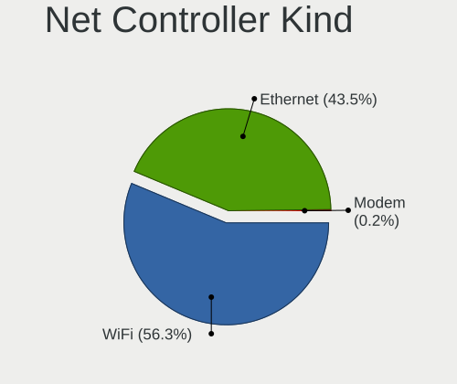

| Kind     | Notebooks | Percent |
|----------|-----------|---------|
| WiFi     | 282       | 56.29%  |
| Ethernet | 218       | 43.51%  |
| Modem    | 1         | 0.2%    |

Used Controller
---------------

Currently used network controller

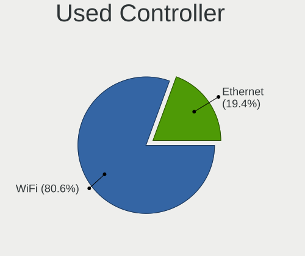

| Kind     | Notebooks | Percent |
|----------|-----------|---------|
| WiFi     | 245       | 80.59%  |
| Ethernet | 59        | 19.41%  |

NICs
----

Total network controllers on board

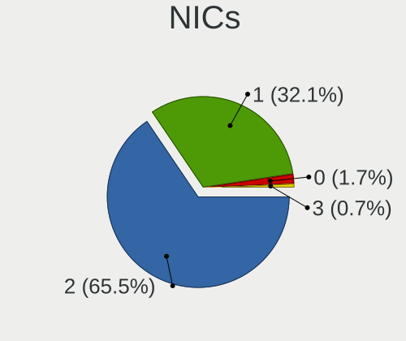

| Total | Notebooks | Percent |
|-------|-----------|---------|
| 2     | 192       | 65.53%  |
| 1     | 94        | 32.08%  |
| 0     | 5         | 1.71%   |
| 3     | 2         | 0.68%   |

IPv6
----

IPv6 vs IPv4

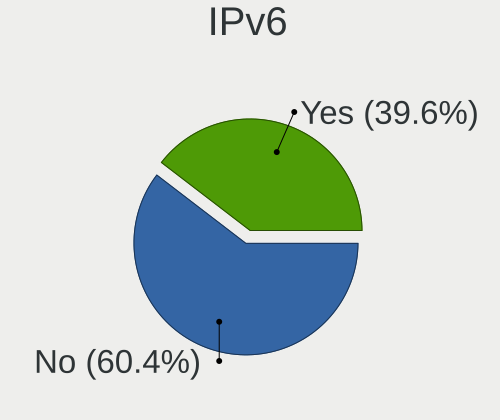

| Used | Notebooks | Percent |
|------|-----------|---------|
| No   | 177       | 60.41%  |
| Yes  | 116       | 39.59%  |

Bluetooth
---------

Bluetooth Vendor
----------------

Controller vendors

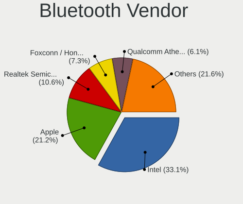

| Vendor                          | Notebooks | Percent |
|---------------------------------|-----------|---------|
| Intel                           | 81        | 33.06%  |
| Apple                           | 52        | 21.22%  |
| Realtek Semiconductor           | 26        | 10.61%  |
| Foxconn / Hon Hai               | 18        | 7.35%   |
| Qualcomm Atheros Communications | 15        | 6.12%   |
| IMC Networks                    | 13        | 5.31%   |
| Broadcom                        | 10        | 4.08%   |
| Lite-On Technology              | 9         | 3.67%   |
| Dell                            | 7         | 2.86%   |
| Toshiba                         | 3         | 1.22%   |
| Ralink                          | 2         | 0.82%   |
| MediaTek                        | 2         | 0.82%   |
| Hewlett-Packard                 | 2         | 0.82%   |
| Alps Electric                   | 2         | 0.82%   |
| USI                             | 1         | 0.41%   |
| Cambridge Silicon Radio         | 1         | 0.41%   |
| ASUSTek Computer                | 1         | 0.41%   |

Bluetooth Model
---------------

Controller models

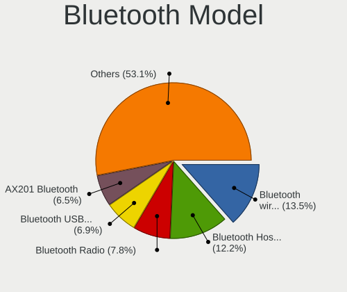

| Model                                            | Notebooks | Percent |
|--------------------------------------------------|-----------|---------|
| Intel Bluetooth wireless interface               | 33        | 13.47%  |
| Apple Bluetooth Host Controller                  | 30        | 12.24%  |
| Realtek Bluetooth Radio                          | 19        | 7.76%   |
| Apple Bluetooth USB Host Controller              | 17        | 6.94%   |
| Intel AX201 Bluetooth                            | 16        | 6.53%   |
| Intel Bluetooth 9460/9560 Jefferson Peak (JfP)   | 10        | 4.08%   |
| IMC Networks Wireless_Device                     | 9         | 3.67%   |
| Qualcomm Atheros  Bluetooth Device               | 6         | 2.45%   |
| Intel Centrino Bluetooth Wireless Transceiver    | 6         | 2.45%   |
| Intel Centrino Advanced-N 6230 Bluetooth adapter | 6         | 2.45%   |
| Realtek  Bluetooth 4.2 Adapter                   | 4         | 1.63%   |
| Intel Bluetooth Device                           | 4         | 1.63%   |
| Foxconn / Hon Hai Bluetooth Device               | 4         | 1.63%   |
| Dell DW375 Bluetooth Module                      | 4         | 1.63%   |
| Apple Built-in Bluetooth 2.0+EDR HCI             | 4         | 1.63%   |
| Qualcomm Atheros AR3012 Bluetooth 4.0            | 3         | 1.22%   |
| Qualcomm Atheros AR3011 Bluetooth                | 3         | 1.22%   |
| Lite-On Wireless_Device                          | 3         | 1.22%   |
| Lite-On Atheros AR3012 Bluetooth                 | 3         | 1.22%   |
| Foxconn / Hon Hai Wireless_Device                | 3         | 1.22%   |
| Foxconn / Hon Hai Broadcom Bluetooth 2.1 Device  | 3         | 1.22%   |
| Broadcom BCM43142A0 Bluetooth Device             | 3         | 1.22%   |
| Ralink RT3290 Bluetooth                          | 2         | 0.82%   |
| MediaTek Wireless_Device                         | 2         | 0.82%   |
| Intel Wireless-AC 3168 Bluetooth                 | 2         | 0.82%   |
| Intel AX200 Bluetooth                            | 2         | 0.82%   |
| IMC Networks Bluetooth Radio                     | 2         | 0.82%   |
| Foxconn / Hon Hai MediaTek Bluetooth Adapter     | 2         | 0.82%   |
| Foxconn / Hon Hai Bluetooth USB Host Controller  | 2         | 0.82%   |
| Broadcom HP Portable SoftSailing                 | 2         | 0.82%   |
| Broadcom BCM20702 Bluetooth 4.0 [ThinkPad]       | 2         | 0.82%   |
| USI Bluetooth Device                             | 1         | 0.41%   |
| Toshiba Bluetooth Device                         | 1         | 0.41%   |
| Toshiba BCM43142A0                               | 1         | 0.41%   |
| Toshiba Atheros AR3012 Bluetooth                 | 1         | 0.41%   |
| Realtek RTL8822BE Bluetooth 4.2 Adapter          | 1         | 0.41%   |
| Realtek RTL8821A Bluetooth                       | 1         | 0.41%   |
| Realtek RTL8723B Bluetooth                       | 1         | 0.41%   |
| Qualcomm Atheros QCA61x4 Bluetooth 4.0           | 1         | 0.41%   |
| Qualcomm Atheros AR9462 Bluetooth                | 1         | 0.41%   |

Sound
-----

Sound Vendor
------------

Sound card vendors

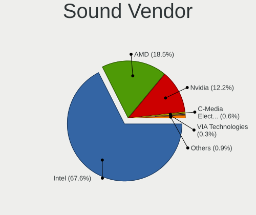

| Vendor                   | Notebooks | Percent |
|--------------------------|-----------|---------|
| Intel                    | 227       | 67.56%  |
| AMD                      | 62        | 18.45%  |
| Nvidia                   | 41        | 12.2%   |
| C-Media Electronics      | 2         | 0.6%    |
| VIA Technologies         | 1         | 0.3%    |
| Realtek Semiconductor    | 1         | 0.3%    |
| Nordic Semiconductor ASA | 1         | 0.3%    |
| Cambridge Audio          | 1         | 0.3%    |

Sound Model
-----------

Sound card models

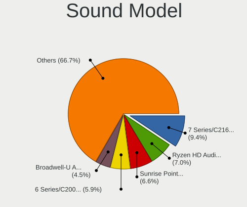

| Model                                                                                             | Notebooks | Percent |
|---------------------------------------------------------------------------------------------------|-----------|---------|
| Intel 7 Series/C216 Chipset Family High Definition Audio Controller                               | 40        | 9.39%   |
| AMD Ryzen HD Audio Controller                                                                     | 30        | 7.04%   |
| Intel Sunrise Point-LP HD Audio                                                                   | 28        | 6.57%   |
| Intel 6 Series/C200 Series Chipset Family High Definition Audio Controller                        | 25        | 5.87%   |
| Intel Broadwell-U Audio Controller                                                                | 19        | 4.46%   |
| Intel Wildcat Point-LP High Definition Audio Controller                                           | 18        | 4.23%   |
| Intel Haswell-ULT HD Audio Controller                                                             | 16        | 3.76%   |
| Intel 8 Series HD Audio Controller                                                                | 16        | 3.76%   |
| Intel 5 Series/3400 Series Chipset High Definition Audio                                          | 14        | 3.29%   |
| AMD Radeon High Definition Audio Controller                                                       | 14        | 3.29%   |
| Intel 82801I (ICH9 Family) HD Audio Controller                                                    | 13        | 3.05%   |
| AMD Kabini HDMI/DP Audio                                                                          | 12        | 2.82%   |
| AMD FCH Azalia Controller                                                                         | 12        | 2.82%   |
| Intel Tiger Lake-LP Smart Sound Technology Audio Controller                                       | 11        | 2.58%   |
| AMD Renoir/Cezanne HDMI/DP Audio Controller                                                       | 11        | 2.58%   |
| Nvidia GK107 HDMI Audio Controller                                                                | 9         | 2.11%   |
| Intel 8 Series/C220 Series Chipset High Definition Audio Controller                               | 9         | 2.11%   |
| AMD SBx00 Azalia (Intel HDA)                                                                      | 7         | 1.64%   |
| Intel Celeron/Pentium Silver Processor High Definition Audio                                      | 6         | 1.41%   |
| Nvidia MCP79 High Definition Audio                                                                | 5         | 1.17%   |
| Intel Comet Lake PCH-LP cAVS                                                                      | 5         | 1.17%   |
| Intel Cannon Point-LP High Definition Audio Controller                                            | 5         | 1.17%   |
| Intel Atom/Celeron/Pentium Processor x5-E8000/J3xxx/N3xxx Series High Definition Audio Controller | 5         | 1.17%   |
| AMD Raven/Raven2/Fenghuang HDMI/DP Audio Controller                                               | 5         | 1.17%   |
| Nvidia TU107 GeForce GTX 1650 High Definition Audio Controller                                    | 4         | 0.94%   |
| Nvidia MCP89 High Definition Audio                                                                | 4         | 0.94%   |
| Intel Xeon E3-1200 v3/4th Gen Core Processor HD Audio Controller                                  | 4         | 0.94%   |
| Intel Raptor Lake-P/U/H cAVS                                                                      | 4         | 0.94%   |
| Intel Comet Lake PCH cAVS                                                                         | 4         | 0.94%   |
| AMD Family 15h (Models 60h-6fh) Audio Controller                                                  | 4         | 0.94%   |
| Nvidia GF108 High Definition Audio Controller                                                     | 3         | 0.7%    |
| Intel Crystal Well HD Audio Controller                                                            | 3         | 0.7%    |
| Intel CM238 HD Audio Controller                                                                   | 3         | 0.7%    |
| Intel Cannon Lake PCH cAVS                                                                        | 3         | 0.7%    |
| Intel Alder Lake PCH-P High Definition Audio Controller                                           | 3         | 0.7%    |
| Intel 82801H (ICH8 Family) HD Audio Controller                                                    | 3         | 0.7%    |
| AMD RV710/730 HDMI Audio [Radeon HD 4000 series]                                                  | 3         | 0.7%    |
| Nvidia GT216 HDMI Audio Controller                                                                | 2         | 0.47%   |
| Nvidia GP107GL High Definition Audio Controller                                                   | 2         | 0.47%   |
| Nvidia GF119 HDMI Audio Controller                                                                | 2         | 0.47%   |

Memory
------

Memory Vendor
-------------

Memory module vendors

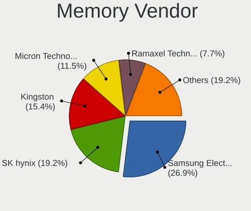

| Vendor              | Notebooks | Percent |
|---------------------|-----------|---------|
| Samsung Electronics | 7         | 26.92%  |
| SK hynix            | 5         | 19.23%  |
| Kingston            | 4         | 15.38%  |
| Micron Technology   | 3         | 11.54%  |
| Ramaxel Technology  | 2         | 7.69%   |
| Crucial             | 2         | 7.69%   |
| Transcend           | 1         | 3.85%   |
| Smart               | 1         | 3.85%   |
| Elpida              | 1         | 3.85%   |

Memory Model
------------

Memory module models

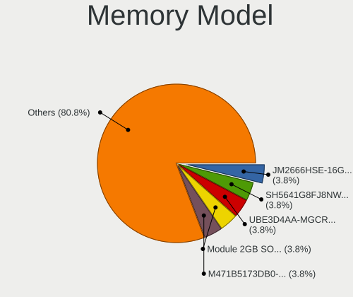

| Model                                                        | Notebooks | Percent |
|--------------------------------------------------------------|-----------|---------|
| Transcend RAM JM2666HSE-16G 16GB Row Of Chips DDR4 2667MT/s  | 1         | 3.85%   |
| Smart RAM SH5641G8FJ8NWRNSQG 8GB SODIMM DDR3 1600MT/s        | 1         | 3.85%   |
| SK hynix RAM Module 8GB Row Of Chips LPDDR3 2133MT/s         | 1         | 3.85%   |
| SK hynix RAM Module 4GB SODIMM DDR3 1600MT/s                 | 1         | 3.85%   |
| SK hynix RAM HMT41GS6BFR8C-PB 8GB SODIMM DDR3 1600MT/s       | 1         | 3.85%   |
| SK hynix RAM HMA81GS6AFR8N-UH 8GB SODIMM DDR4 2667MT/s       | 1         | 3.85%   |
| SK hynix RAM H58G66AK6BX070 4GB Row Of Chips LPDDR5 6400MT/s | 1         | 3.85%   |
| Samsung RAM UBE3D4AA-MGCR 2GB Row Of Chips LPDDR4 4267MT/s   | 1         | 3.85%   |
| Samsung RAM Module 2GB SODIMM DDR3 1067MT/s                  | 1         | 3.85%   |
| Samsung RAM M471B5173DB0-YK0 4GB SODIMM DDR3 1600MT/s        | 1         | 3.85%   |
| Samsung RAM M471A5244CB0-CWE 4GB Row Of Chips DDR4 3200MT/s  | 1         | 3.85%   |
| Samsung RAM M471A2G44BM0-CWE 16GB SODIMM DDR4 3200MT/s       | 1         | 3.85%   |
| Samsung RAM M425R2GA3PB0-CWMOD 16GiB SODIMM DDR5 5600MT/s    | 1         | 3.85%   |
| Samsung RAM K3KL9L90CM-MGCT 8GB SODIMM LPDDR5 7500MT/s       | 1         | 3.85%   |
| Ramaxel RAM RMSA3260NA78HAF-2666 8GB SODIMM DDR4 2667MT/s    | 1         | 3.85%   |
| Ramaxel RAM RMSA3260ME78HAF-2666 8GB SODIMM DDR4 2667MT/s    | 1         | 3.85%   |
| Micron RAM Module 4GB Row Of Chips LPDDR5 8533MT/s           | 1         | 3.85%   |
| Micron RAM Module 16GB SODIMM DDR4 3200MT/s                  | 1         | 3.85%   |
| Micron RAM 4ATF51264HZ-2G3AZ 4GB SODIMM DDR4 2133MT/s        | 1         | 3.85%   |
| Kingston RAM KCRXJ6-MIE 16GB SODIMM DDR4 2667MT/s            | 1         | 3.85%   |
| Kingston RAM HP32D4S2S1MF-8 8GB SODIMM DDR4 3200MT/s         | 1         | 3.85%   |
| Kingston RAM HP16D3LS1KFG/4G 4GB SODIMM DDR3 1600MT/s        | 1         | 3.85%   |
| Kingston RAM 99U5428-042.A00G 4GB SODIMM DDR3 1333MT/s       | 1         | 3.85%   |
| Elpida RAM EBJ41UF8BCS0-DJ-F 4GB SODIMM DDR3 1334MT/s        | 1         | 3.85%   |
| Crucial RAM Module 8GB SODIMM DDR3 1600MT/s                  | 1         | 3.85%   |
| Crucial RAM CT16G4SFRA32A.M16FRS 16GB SODIMM DDR4 3200MT/s   | 1         | 3.85%   |

Memory Kind
-----------

Memory module kinds

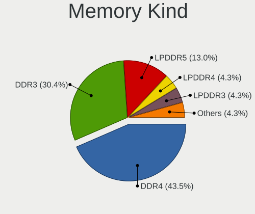

| Kind   | Notebooks | Percent |
|--------|-----------|---------|
| DDR4   | 10        | 43.48%  |
| DDR3   | 7         | 30.43%  |
| LPDDR5 | 3         | 13.04%  |
| LPDDR4 | 1         | 4.35%   |
| LPDDR3 | 1         | 4.35%   |
| DDR5   | 1         | 4.35%   |

Memory Form Factor
------------------

Physical design of the memory module

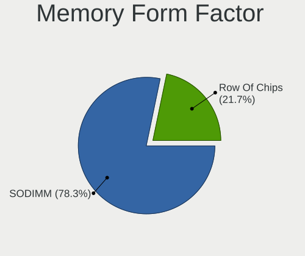

| Name         | Notebooks | Percent |
|--------------|-----------|---------|
| SODIMM       | 18        | 78.26%  |
| Row Of Chips | 5         | 21.74%  |

Memory Size
-----------

Memory module size

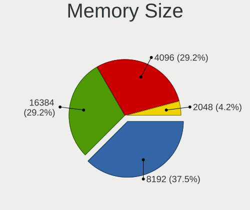

| Size  | Notebooks | Percent |
|-------|-----------|---------|
| 8192  | 9         | 37.5%   |
| 16384 | 7         | 29.17%  |
| 4096  | 7         | 29.17%  |
| 2048  | 1         | 4.17%   |

Memory Speed
------------

Memory module speed

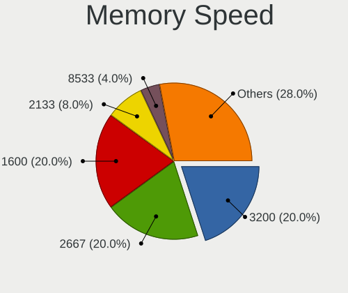

| Speed | Notebooks | Percent |
|-------|-----------|---------|
| 3200  | 5         | 20%     |
| 2667  | 5         | 20%     |
| 1600  | 5         | 20%     |
| 2133  | 2         | 8%      |
| 8533  | 1         | 4%      |
| 7500  | 1         | 4%      |
| 6400  | 1         | 4%      |
| 5600  | 1         | 4%      |
| 4267  | 1         | 4%      |
| 1334  | 1         | 4%      |
| 1333  | 1         | 4%      |
| 1067  | 1         | 4%      |

Printers & scanners
-------------------

Printer Vendor
--------------

Printer device vendors

Zero info for selected period =(

Printer Model
-------------

Printer device models

Zero info for selected period =(

Scanner Vendor
--------------

Scanner device vendors

Zero info for selected period =(

Scanner Model
-------------

Scanner device models

Zero info for selected period =(

Camera
------

Camera Vendor
-------------

Camera device vendors

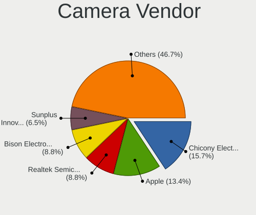

| Vendor                                 | Notebooks | Percent |
|----------------------------------------|-----------|---------|
| Chicony Electronics                    | 41        | 15.71%  |
| Apple                                  | 35        | 13.41%  |
| Realtek Semiconductor                  | 23        | 8.81%   |
| Bison Electronics                      | 23        | 8.81%   |
| Sunplus Innovation Technology          | 17        | 6.51%   |
| Microdia                               | 15        | 5.75%   |
| Suyin                                  | 11        | 4.21%   |
| Quanta                                 | 11        | 4.21%   |
| Luxvisions Innotech Limited            | 11        | 4.21%   |
| IMC Networks                           | 11        | 4.21%   |
| Cheng Uei Precision Industry (Foxlink) | 10        | 3.83%   |
| Syntek                                 | 9         | 3.45%   |
| Ricoh                                  | 5         | 1.92%   |
| Alcor Micro                            | 5         | 1.92%   |
| Silicon Motion                         | 4         | 1.53%   |
| Lite-On Technology                     | 4         | 1.53%   |
| ShineTech                              | 3         | 1.15%   |
| Samsung Electronics                    | 2         | 0.77%   |
| Intel                                  | 2         | 0.77%   |
| icSpring                               | 2         | 0.77%   |
| Unknown                                | 2         | 0.77%   |
| Z-Star Microelectronics                | 1         | 0.38%   |
| Sonix Technology                       | 1         | 0.38%   |
| Shine-optics                           | 1         | 0.38%   |
| Shenzhen Kingcome Optoelectronic       | 1         | 0.38%   |
| Remo Tech                              | 1         | 0.38%   |
| Logitech                               | 1         | 0.38%   |
| Lenovo                                 | 1         | 0.38%   |
| kingcome                               | 1         | 0.38%   |
| Jiangxi Shinetech Optical              | 1         | 0.38%   |
| Importek                               | 1         | 0.38%   |
| HYGD-XH--241023                        | 1         | 0.38%   |
| Generalplus Technology                 | 1         | 0.38%   |
| Foxconn / Hon Hai                      | 1         | 0.38%   |
| eMPIA Technology                       | 1         | 0.38%   |
| BillionPixels                          | 1         | 0.38%   |

Camera Model
------------

Camera device models

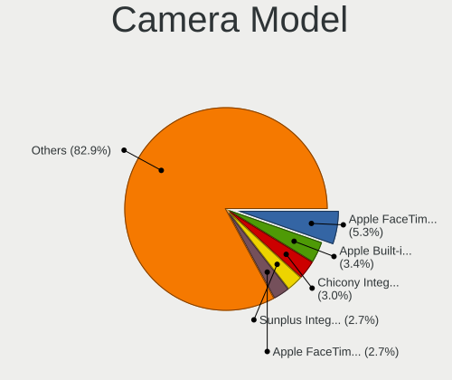

| Model                                                | Notebooks | Percent |
|------------------------------------------------------|-----------|---------|
| Apple FaceTime HD Camera                             | 14        | 5.32%   |
| Apple Built-in iSight                                | 9         | 3.42%   |
| Chicony Integrated Camera                            | 8         | 3.04%   |
| Sunplus Integrated_Webcam_HD                         | 7         | 2.66%   |
| Apple FaceTime HD Camera (Built-in)                  | 7         | 2.66%   |
| Syntek Integrated Camera                             | 5         | 1.9%    |
| Microdia Integrated_Webcam_HD                        | 5         | 1.9%    |
| Chicony HD WebCam                                    | 5         | 1.9%    |
| Bison Lenovo EasyCamera                              | 4         | 1.52%   |
| Bison Integrated Camera                              | 4         | 1.52%   |
| Realtek Integrated Webcam HD                         | 3         | 1.14%   |
| Luxvisions Innotech Limited HP True Vision HD Camera | 3         | 1.14%   |
| IMC Networks USB2.0 HD UVC WebCam                    | 3         | 1.14%   |
| IMC Networks Integrated Camera                       | 3         | 1.14%   |
| Apple FaceTime Camera                                | 3         | 1.14%   |
| Unknown                                              | 3         | 1.14%   |
| Syntek Lenovo EasyCamera                             | 2         | 0.76%   |
| Suyin HP Integrated Webcam                           | 2         | 0.76%   |
| Suyin Acer/HP Integrated Webcam [CN0314]             | 2         | 0.76%   |
| Sunplus Laptop_Integrated_Webcam_FHD                 | 2         | 0.76%   |
| Sunplus Laptop Integrated Webcam HD                  | 2         | 0.76%   |
| Sunplus HD WebCam                                    | 2         | 0.76%   |
| ShineTech USB2.0 HD UVC WebCam                       | 2         | 0.76%   |
| Samsung Galaxy series, misc. (MTP mode)              | 2         | 0.76%   |
| Ricoh USB2.0 Camera                                  | 2         | 0.76%   |
| Realtek USB2.0 camera                                | 2         | 0.76%   |
| Realtek Integrated_Webcam_HD                         | 2         | 0.76%   |
| Realtek HP "Truevision HD" laptop camera             | 2         | 0.76%   |
| Realtek Acer 640 x 480 laptop camera                 | 2         | 0.76%   |
| Quanta HP TrueVision HD Camera                       | 2         | 0.76%   |
| Quanta HD User Facing                                | 2         | 0.76%   |
| Microdia Integrated Webcam                           | 2         | 0.76%   |
| Luxvisions Innotech Limited Integrated RGB Camera    | 2         | 0.76%   |
| Luxvisions Innotech Limited Integrated Camera        | 2         | 0.76%   |
| Luxvisions Innotech Limited HP TrueVision HD Camera  | 2         | 0.76%   |
| Intel RealSense 3D Camera (Front F200)               | 2         | 0.76%   |
| IMC Networks ov9734_azurewave_camera                 | 2         | 0.76%   |
| icSpring camera                                      | 2         | 0.76%   |
| Chicony Lenovo EasyCamera                            | 2         | 0.76%   |
| Chicony HP TrueVision HD Camera                      | 2         | 0.76%   |

Security
--------

Fingerprint Vendor
------------------

Fingerprint sensor vendors

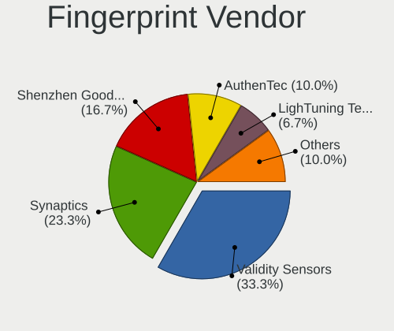

| Vendor                     | Notebooks | Percent |
|----------------------------|-----------|---------|
| Validity Sensors           | 10        | 33.33%  |
| Synaptics                  | 7         | 23.33%  |
| Shenzhen Goodix Technology | 5         | 16.67%  |
| AuthenTec                  | 3         | 10%     |
| LighTuning Technology      | 2         | 6.67%   |
| Elan Microelectronics      | 2         | 6.67%   |
| Samsung Electronics        | 1         | 3.33%   |

Fingerprint Model
-----------------

Fingerprint sensor models

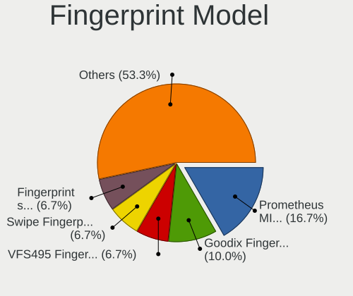

| Model                                                                      | Notebooks | Percent |
|----------------------------------------------------------------------------|-----------|---------|
| Synaptics Prometheus MIS Touch Fingerprint Reader                          | 5         | 16.67%  |
| Shenzhen Goodix  FingerPrint Device                                        | 3         | 10%     |
| Validity Sensors VFS495 Fingerprint Reader                                 | 2         | 6.67%   |
| Validity Sensors Swipe Fingerprint Sensor                                  | 2         | 6.67%   |
| Validity Sensors Fingerprint scanner                                       | 2         | 6.67%   |
| Elan ELAN:Fingerprint                                                      | 2         | 6.67%   |
| Validity Sensors VFS491                                                    | 1         | 3.33%   |
| Validity Sensors VFS101 Fingerprint Reader                                 | 1         | 3.33%   |
| Validity Sensors Synaptics WBDI                                            | 1         | 3.33%   |
| Validity Sensors Synaptics VFS7552 Touch Fingerprint Sensor with PurePrint | 1         | 3.33%   |
| Synaptics WBDI Fingerprint Reader USB 086                                  | 1         | 3.33%   |
| Synaptics  WBDI                                                            | 1         | 3.33%   |
| Shenzhen Goodix Fingerprint Reader                                         | 1         | 3.33%   |
| Shenzhen Goodix FingerPrint                                                | 1         | 3.33%   |
| Samsung Fingerprint Sensor Device - 730B                                   | 1         | 3.33%   |
| LighTuning ES603 Swipe Fingerprint Sensor                                  | 1         | 3.33%   |
| LighTuning EgisTec Touch Fingerprint Sensor                                | 1         | 3.33%   |
| AuthenTec Fingerprint Sensor                                               | 1         | 3.33%   |
| AuthenTec AES2810                                                          | 1         | 3.33%   |
| AuthenTec AES1600                                                          | 1         | 3.33%   |

Chipcard Vendor
---------------

Chipcard module vendors

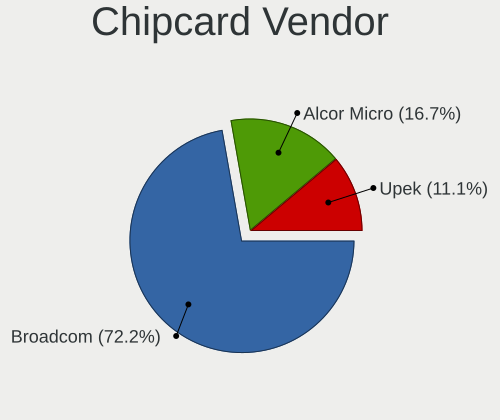

| Vendor      | Notebooks | Percent |
|-------------|-----------|---------|
| Broadcom    | 13        | 72.22%  |
| Alcor Micro | 3         | 16.67%  |
| Upek        | 2         | 11.11%  |

Chipcard Model
--------------

Chipcard module models

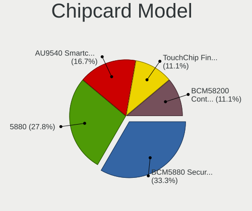

| Model                                                                       | Notebooks | Percent |
|-----------------------------------------------------------------------------|-----------|---------|
| Broadcom BCM5880 Secure Applications Processor                              | 6         | 33.33%  |
| Broadcom 5880                                                               | 5         | 27.78%  |
| Alcor Micro AU9540 Smartcard Reader                                         | 3         | 16.67%  |
| Upek TouchChip Fingerprint Coprocessor (WBF advanced mode)                  | 2         | 11.11%  |
| Broadcom BCM58200 ControlVault 3 (FingerPrint sensor + Contacted SmartCard) | 2         | 11.11%  |

Unsupported
-----------

Unsupported Devices
-------------------

Total unsupported devices on board

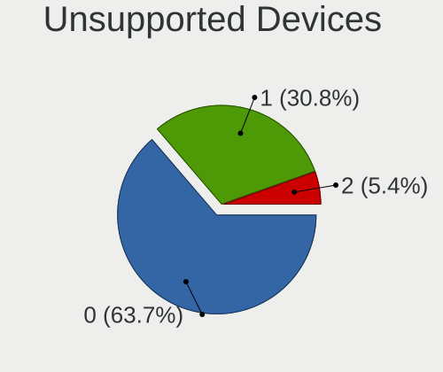

| Total | Notebooks | Percent |
|-------|-----------|---------|
| 0     | 188       | 63.73%  |
| 1     | 91        | 30.85%  |
| 2     | 16        | 5.42%   |

Unsupported Device Types
------------------------

Types of unsupported devices

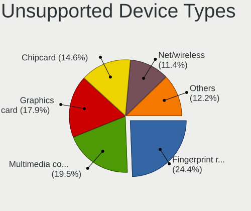

| Type                     | Notebooks | Percent |
|--------------------------|-----------|---------|
| Fingerprint reader       | 30        | 24.39%  |
| Multimedia controller    | 24        | 19.51%  |
| Graphics card            | 22        | 17.89%  |
| Chipcard                 | 18        | 14.63%  |
| Net/wireless             | 14        | 11.38%  |
| Net/ethernet             | 6         | 4.88%   |
| Storage                  | 4         | 3.25%   |
| Bluetooth                | 2         | 1.63%   |
| Flash memory             | 1         | 0.81%   |
| Communication controller | 1         | 0.81%   |
| Camera                   | 1         | 0.81%   |

