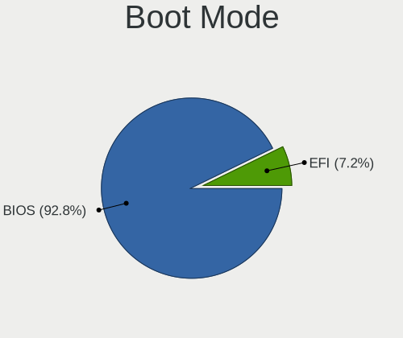
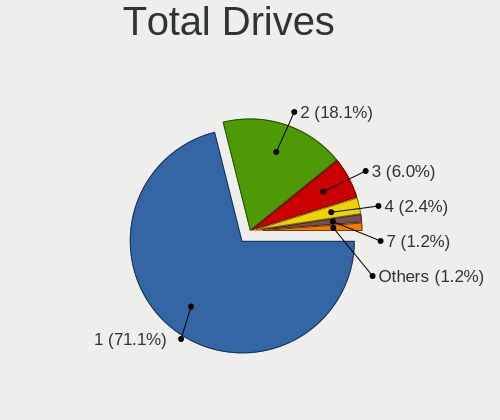
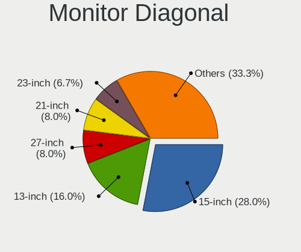

Elementary 8 - Tested Hardware & Statistics
-------------------------------------------

A project to collect tested hardware configurations for Elementary 8.

Anyone can contribute to this report by the [hw-probe](https://github.com/linuxhw/hw-probe) tool:

    sudo -E hw-probe -all -upload

Please contribute! Especially if your hardware is rare.

This is a report for all computer types. See also reports for [desktops](/Dist/Elementary_8/Desktop/README.md) and [notebooks](/Dist/Elementary_8/Notebook/README.md).

Contents
--------

* [ Test Cases ](#test-cases)

* [ System ](#system)
  - [ Kernel                   ](#kernel)
  - [ Kernel Family            ](#kernel-family)
  - [ Kernel Major Ver.        ](#kernel-major-ver)
  - [ Arch                     ](#arch)
  - [ DE                       ](#de)
  - [ Display Server           ](#display-server)
  - [ Display Manager          ](#display-manager)
  - [ OS Lang                  ](#os-lang)
  - [ Boot Mode                ](#boot-mode)
  - [ Filesystem               ](#filesystem)
  - [ Part. scheme             ](#part-scheme)
  - [ Dual Boot with Linux/BSD ](#dual-boot-with-linuxbsd)
  - [ Dual Boot (Win)          ](#dual-boot-win)

* [ Board ](#board)
  - [ Vendor                   ](#vendor)
  - [ Model                    ](#model)
  - [ Model Family             ](#model-family)
  - [ MFG Year                 ](#mfg-year)
  - [ Form Factor              ](#form-factor)
  - [ Secure Boot              ](#secure-boot)
  - [ Coreboot                 ](#coreboot)
  - [ RAM Size                 ](#ram-size)
  - [ RAM Used                 ](#ram-used)
  - [ Total Drives             ](#total-drives)
  - [ Has CD-ROM               ](#has-cd-rom)
  - [ Has Ethernet             ](#has-ethernet)
  - [ Has WiFi                 ](#has-wifi)
  - [ Has Bluetooth            ](#has-bluetooth)

* [ Location ](#location)
  - [ Country                  ](#country)
  - [ City                     ](#city)

* [ Drives ](#drives)
  - [ Drive Vendor             ](#drive-vendor)
  - [ Drive Model              ](#drive-model)
  - [ HDD Vendor               ](#hdd-vendor)
  - [ SSD Vendor               ](#ssd-vendor)
  - [ Drive Kind               ](#drive-kind)
  - [ Drive Connector          ](#drive-connector)
  - [ Drive Size               ](#drive-size)
  - [ Space Total              ](#space-total)
  - [ Space Used               ](#space-used)
  - [ Malfunc. Drives          ](#malfunc-drives)
  - [ Malfunc. Drive Vendor    ](#malfunc-drive-vendor)
  - [ Malfunc. HDD Vendor      ](#malfunc-hdd-vendor)
  - [ Malfunc. Drive Kind      ](#malfunc-drive-kind)
  - [ Failed Drives            ](#failed-drives)
  - [ Failed Drive Vendor      ](#failed-drive-vendor)
  - [ Drive Status             ](#drive-status)

* [ Storage controller ](#storage-controller)
  - [ Storage Vendor           ](#storage-vendor)
  - [ Storage Model            ](#storage-model)
  - [ Storage Kind             ](#storage-kind)

* [ Processor ](#processor)
  - [ CPU Vendor               ](#cpu-vendor)
  - [ CPU Model                ](#cpu-model)
  - [ CPU Model Family         ](#cpu-model-family)
  - [ CPU Cores                ](#cpu-cores)
  - [ CPU Sockets              ](#cpu-sockets)
  - [ CPU Threads              ](#cpu-threads)
  - [ CPU Op-Modes             ](#cpu-op-modes)
  - [ CPU Microcode            ](#cpu-microcode)
  - [ CPU Microarch            ](#cpu-microarch)

* [ Graphics ](#graphics)
  - [ GPU Vendor               ](#gpu-vendor)
  - [ GPU Model                ](#gpu-model)
  - [ GPU Combo                ](#gpu-combo)
  - [ GPU Driver               ](#gpu-driver)
  - [ GPU Memory               ](#gpu-memory)

* [ Monitor ](#monitor)
  - [ Monitor Vendor           ](#monitor-vendor)
  - [ Monitor Model            ](#monitor-model)
  - [ Monitor Resolution       ](#monitor-resolution)
  - [ Monitor Diagonal         ](#monitor-diagonal)
  - [ Monitor Width            ](#monitor-width)
  - [ Aspect Ratio             ](#aspect-ratio)
  - [ Monitor Area             ](#monitor-area)
  - [ Pixel Density            ](#pixel-density)
  - [ Multiple Monitors        ](#multiple-monitors)

* [ Network ](#network)
  - [ Net Controller Vendor    ](#net-controller-vendor)
  - [ Net Controller Model     ](#net-controller-model)
  - [ Wireless Vendor          ](#wireless-vendor)
  - [ Wireless Model           ](#wireless-model)
  - [ Ethernet Vendor          ](#ethernet-vendor)
  - [ Ethernet Model           ](#ethernet-model)
  - [ Net Controller Kind      ](#net-controller-kind)
  - [ Used Controller          ](#used-controller)
  - [ NICs                     ](#nics)
  - [ IPv6                     ](#ipv6)

* [ Bluetooth ](#bluetooth)
  - [ Bluetooth Vendor         ](#bluetooth-vendor)
  - [ Bluetooth Model          ](#bluetooth-model)

* [ Sound ](#sound)
  - [ Sound Vendor             ](#sound-vendor)
  - [ Sound Model              ](#sound-model)

* [ Memory ](#memory)
  - [ Memory Vendor            ](#memory-vendor)
  - [ Memory Model             ](#memory-model)
  - [ Memory Kind              ](#memory-kind)
  - [ Memory Form Factor       ](#memory-form-factor)
  - [ Memory Size              ](#memory-size)
  - [ Memory Speed             ](#memory-speed)

* [ Printers & scanners ](#printers--scanners)
  - [ Printer Vendor           ](#printer-vendor)
  - [ Printer Model            ](#printer-model)
  - [ Scanner Vendor           ](#scanner-vendor)
  - [ Scanner Model            ](#scanner-model)

* [ Camera ](#camera)
  - [ Camera Vendor            ](#camera-vendor)
  - [ Camera Model             ](#camera-model)

* [ Security ](#security)
  - [ Fingerprint Vendor       ](#fingerprint-vendor)
  - [ Fingerprint Model        ](#fingerprint-model)
  - [ Chipcard Vendor          ](#chipcard-vendor)
  - [ Chipcard Model           ](#chipcard-model)

* [ Unsupported ](#unsupported)
  - [ Unsupported Devices      ](#unsupported-devices)
  - [ Unsupported Device Types ](#unsupported-device-types)

Test Cases
----------

Total: 104

| Vendor        | Model                       | Form-Factor | Probe                                                      | Date         |
|---------------|-----------------------------|-------------|------------------------------------------------------------|--------------|
| HUAWEI        | MACHD-WXX9                  | Notebook    | [f10a2b06fd](https://linux-hardware.org/?probe=f10a2b06fd) | Jan 06, 2025 |
| MSI           | G31TM-P21                   | Desktop     | [7f868dd6f9](https://linux-hardware.org/?probe=7f868dd6f9) | Jan 06, 2025 |
| Digma Pro     | Minimax U1 DPP5-8CXN01      | Mini pc     | [c6d2f011fa](https://linux-hardware.org/?probe=c6d2f011fa) | Jan 05, 2025 |
| Dell          | Inspiron 1545               | Notebook    | [6d5ccbb5f9](https://linux-hardware.org/?probe=6d5ccbb5f9) | Jan 05, 2025 |
| Dell          | XPS L412Z                   | Notebook    | [d8b969a9e6](https://linux-hardware.org/?probe=d8b969a9e6) | Jan 05, 2025 |
| Dell          | XPS L412Z                   | Notebook    | [f4cfef6dcc](https://linux-hardware.org/?probe=f4cfef6dcc) | Jan 05, 2025 |
| Apple         | MacBook3,1                  | Notebook    | [be78213991](https://linux-hardware.org/?probe=be78213991) | Jan 05, 2025 |
| ASUSTek       | PRIME H310M-E R2.0          | Desktop     | [79752b904b](https://linux-hardware.org/?probe=79752b904b) | Jan 04, 2025 |
| HUAWEI        | BoDE-WXX9                   | Notebook    | [d5f19c64ad](https://linux-hardware.org/?probe=d5f19c64ad) | Jan 04, 2025 |
| Apple         | MacBookPro7,1               | Notebook    | [7961299452](https://linux-hardware.org/?probe=7961299452) | Jan 04, 2025 |
| Dell          | Latitude E5430 non-vPro     | Notebook    | [bbf6d05761](https://linux-hardware.org/?probe=bbf6d05761) | Jan 03, 2025 |
| Apple         | MacBookPro8,1               | Notebook    | [c208215b7f](https://linux-hardware.org/?probe=c208215b7f) | Jan 03, 2025 |
| Dell          | Latitude E5430 non-vPro     | Notebook    | [7b1adcdde1](https://linux-hardware.org/?probe=7b1adcdde1) | Jan 03, 2025 |
| HUAWEI        | BoDE-WXX9                   | Notebook    | [cacf1ad26f](https://linux-hardware.org/?probe=cacf1ad26f) | Jan 02, 2025 |
| Lenovo        | G585 20137                  | Notebook    | [f7dac7bbad](https://linux-hardware.org/?probe=f7dac7bbad) | Jan 02, 2025 |
| Intel         | H61                         | Desktop     | [0f76193421](https://linux-hardware.org/?probe=0f76193421) | Jan 02, 2025 |
| Medion        | Akoya E6240T                | Notebook    | [dc4b306a46](https://linux-hardware.org/?probe=dc4b306a46) | Jan 02, 2025 |
| Dell          | Latitude 5400               | Notebook    | [7a418a2cca](https://linux-hardware.org/?probe=7a418a2cca) | Jan 01, 2025 |
| HUAWEI        | MACHD-WXX9                  | Notebook    | [f7cc7cc8d1](https://linux-hardware.org/?probe=f7cc7cc8d1) | Jan 01, 2025 |
| MSI           | A88XM-E35 V2                | Desktop     | [d3df8a394a](https://linux-hardware.org/?probe=d3df8a394a) | Dec 30, 2024 |
| HP            | Laptop 15s-fq1xxx           | Notebook    | [1de7d2e8fb](https://linux-hardware.org/?probe=1de7d2e8fb) | Dec 30, 2024 |
| ASUSTek       | H110M-D                     | Desktop     | [a61b42dd42](https://linux-hardware.org/?probe=a61b42dd42) | Dec 29, 2024 |
| ASUSTek       | X555LDB                     | Notebook    | [f11b5b7320](https://linux-hardware.org/?probe=f11b5b7320) | Dec 29, 2024 |
| Lenovo        | IdeaPad Y560                | Notebook    | [e36139662d](https://linux-hardware.org/?probe=e36139662d) | Dec 28, 2024 |
| HP            | EliteBook 830 G5            | Notebook    | [3dd541f1a9](https://linux-hardware.org/?probe=3dd541f1a9) | Dec 28, 2024 |
| HP            | ProBook 645 G2              | Notebook    | [b57a3a877b](https://linux-hardware.org/?probe=b57a3a877b) | Dec 27, 2024 |
| Dell          | Inspiron 15-3552            | Notebook    | [1d01677080](https://linux-hardware.org/?probe=1d01677080) | Dec 27, 2024 |
| Packard Be... | EasyNote TJ75               | Notebook    | [7a5bc8251a](https://linux-hardware.org/?probe=7a5bc8251a) | Dec 27, 2024 |
| Packard Be... | EasyNote TJ75               | Notebook    | [b46109e7f3](https://linux-hardware.org/?probe=b46109e7f3) | Dec 27, 2024 |
| Sony          | SVF14213CLB                 | Notebook    | [dbcabf3c36](https://linux-hardware.org/?probe=dbcabf3c36) | Dec 27, 2024 |
| Pegatron      | A15                         | Notebook    | [2649401416](https://linux-hardware.org/?probe=2649401416) | Dec 26, 2024 |
| ASRock        | X570 Extreme4               | Desktop     | [65cad1da61](https://linux-hardware.org/?probe=65cad1da61) | Dec 26, 2024 |
| Apple         | Mac-031B6874CF7F642A iMa... | All in one  | [8230b0cf45](https://linux-hardware.org/?probe=8230b0cf45) | Dec 25, 2024 |
| Apple         | MacBookPro10,1              | Notebook    | [4225950551](https://linux-hardware.org/?probe=4225950551) | Dec 25, 2024 |
| Lenovo        | IdeaPad Slim 5 14AHP9 83... | Notebook    | [d1227bd0de](https://linux-hardware.org/?probe=d1227bd0de) | Dec 25, 2024 |
| Apple         | Mac-031B6874CF7F642A iMa... | All in one  | [4c23073f21](https://linux-hardware.org/?probe=4c23073f21) | Dec 25, 2024 |
| HP            | Laptop 15-dy5xxx            | Notebook    | [2729b6a19c](https://linux-hardware.org/?probe=2729b6a19c) | Dec 25, 2024 |
| Gigabyte      | B85M-HD3                    | Desktop     | [83d5947a2c](https://linux-hardware.org/?probe=83d5947a2c) | Dec 24, 2024 |
| Gigabyte      | B560 DS3H AC-Y1             | Desktop     | [4e79bebde8](https://linux-hardware.org/?probe=4e79bebde8) | Dec 24, 2024 |
| Gigabyte      | B360 AORUS GAMING 3 WIFI... | Desktop     | [89e8e5ad41](https://linux-hardware.org/?probe=89e8e5ad41) | Dec 24, 2024 |
| Acer          | Aspire 5755G                | Notebook    | [d824794995](https://linux-hardware.org/?probe=d824794995) | Dec 23, 2024 |
| Samsung       | SR58P                       | Notebook    | [70e6a978b7](https://linux-hardware.org/?probe=70e6a978b7) | Dec 23, 2024 |
| Dell          | Latitude E6520              | Notebook    | [2bae6e63bb](https://linux-hardware.org/?probe=2bae6e63bb) | Dec 23, 2024 |
| MSI           | PRO B760M-P DDR4            | Desktop     | [a649caaa82](https://linux-hardware.org/?probe=a649caaa82) | Dec 23, 2024 |
| Acer          | Aspire ES1-571              | Notebook    | [cb4b9da83f](https://linux-hardware.org/?probe=cb4b9da83f) | Dec 22, 2024 |
| MSI           | PRO B760-P WIFI DDR4        | Desktop     | [59c289d5b9](https://linux-hardware.org/?probe=59c289d5b9) | Dec 22, 2024 |
| Acer          | Aspire ES1-571              | Notebook    | [48537b040b](https://linux-hardware.org/?probe=48537b040b) | Dec 22, 2024 |
| Apple         | MacBookAir7,2               | Notebook    | [762ab31569](https://linux-hardware.org/?probe=762ab31569) | Dec 22, 2024 |
| Gigabyte      | B560 DS3H AC-Y1             | Desktop     | [4c934647d2](https://linux-hardware.org/?probe=4c934647d2) | Dec 21, 2024 |
| ASUSTek       | X555LDB                     | Notebook    | [783e6ed502](https://linux-hardware.org/?probe=783e6ed502) | Dec 20, 2024 |
| AWOW          | NY PC BOX                   | Mini pc     | [d787dd8103](https://linux-hardware.org/?probe=d787dd8103) | Dec 20, 2024 |
| Dell          | 00V62H A01                  | Desktop     | [8e8317c6a6](https://linux-hardware.org/?probe=8e8317c6a6) | Dec 19, 2024 |
| ASUSTek       | UX30                        | Notebook    | [d75f3afdf6](https://linux-hardware.org/?probe=d75f3afdf6) | Dec 18, 2024 |
| ASUSTek       | P8H67-M PRO                 | Desktop     | [987844d0b8](https://linux-hardware.org/?probe=987844d0b8) | Dec 17, 2024 |
| HP            | 8266                        | Desktop     | [ccd7d6b235](https://linux-hardware.org/?probe=ccd7d6b235) | Dec 17, 2024 |
| GEEKOM        | A8                          | Desktop     | [821fae98e5](https://linux-hardware.org/?probe=821fae98e5) | Dec 17, 2024 |
| HP            | Pavilion dv6                | Notebook    | [89ec19d64a](https://linux-hardware.org/?probe=89ec19d64a) | Dec 17, 2024 |
| Pegatron      | A15                         | Notebook    | [266dd27eba](https://linux-hardware.org/?probe=266dd27eba) | Dec 16, 2024 |
| HP            | 83E8                        | Desktop     | [77d40d025a](https://linux-hardware.org/?probe=77d40d025a) | Dec 16, 2024 |
| Apple         | Mac-77EB7D7DAF985301 iMa... | All in one  | [f521816a4d](https://linux-hardware.org/?probe=f521816a4d) | Dec 16, 2024 |
| Lenovo        | ThinkPad X1 Carbon Gen 8... | Notebook    | [abfa48ae27](https://linux-hardware.org/?probe=abfa48ae27) | Dec 15, 2024 |
| Lenovo        | ThinkPad X1 Carbon Gen 8... | Notebook    | [256e4c3f4a](https://linux-hardware.org/?probe=256e4c3f4a) | Dec 15, 2024 |
| Apple         | Mac-35C5E08120C7EEAF Mac... | Mini pc     | [4a2f8153d2](https://linux-hardware.org/?probe=4a2f8153d2) | Dec 14, 2024 |
| Dell          | Inspiron 5547               | Notebook    | [4427bcded0](https://linux-hardware.org/?probe=4427bcded0) | Dec 14, 2024 |
| Dell          | Inspiron 5547               | Notebook    | [5641fb7941](https://linux-hardware.org/?probe=5641fb7941) | Dec 14, 2024 |
| HP            | 8299                        | Desktop     | [44a762b74e](https://linux-hardware.org/?probe=44a762b74e) | Dec 14, 2024 |
| HP            | 8299                        | Desktop     | [f0c7982d81](https://linux-hardware.org/?probe=f0c7982d81) | Dec 14, 2024 |
| Acer          | Aspire 8730                 | Notebook    | [8c0f6ed012](https://linux-hardware.org/?probe=8c0f6ed012) | Dec 14, 2024 |
| ASUSTek       | PRIME B450M-A               | Desktop     | [262a2aa975](https://linux-hardware.org/?probe=262a2aa975) | Dec 13, 2024 |
| Acer          | Aspire 8730                 | Notebook    | [1ab4a28fcf](https://linux-hardware.org/?probe=1ab4a28fcf) | Dec 13, 2024 |
| Samsung       | 950XCJ/951XCJ/950XCR        | Notebook    | [37664cf5d9](https://linux-hardware.org/?probe=37664cf5d9) | Dec 13, 2024 |
| Sony          | SVS1313V9RB                 | Notebook    | [52421e92ce](https://linux-hardware.org/?probe=52421e92ce) | Dec 12, 2024 |
| Sony          | SVS1313V9RB                 | Notebook    | [53c77f8751](https://linux-hardware.org/?probe=53c77f8751) | Dec 12, 2024 |
| Chuwi         | UBook                       | Notebook    | [08e88467cb](https://linux-hardware.org/?probe=08e88467cb) | Dec 12, 2024 |
| Apple         | Mac-F2268DC8                | All in one  | [ad8b7d1b8f](https://linux-hardware.org/?probe=ad8b7d1b8f) | Dec 12, 2024 |
| Apple         | Mac-F2268DC8                | All in one  | [6b05e8feb0](https://linux-hardware.org/?probe=6b05e8feb0) | Dec 12, 2024 |
| ASUSTek       | VivoBook_ASUSLaptop X150... | Notebook    | [8444dbbcc1](https://linux-hardware.org/?probe=8444dbbcc1) | Dec 10, 2024 |
| Acer          | Swift SF314-56G             | Notebook    | [64815f9248](https://linux-hardware.org/?probe=64815f9248) | Dec 09, 2024 |
| Intel         | NUC7i3BNB J22859-309        | Mini pc     | [9319560a05](https://linux-hardware.org/?probe=9319560a05) | Dec 09, 2024 |
| HP            | 82C0                        | Mini pc     | [f6987473a1](https://linux-hardware.org/?probe=f6987473a1) | Dec 07, 2024 |
| SK hynix      | 10WWA464B                   | Tablet      | [56ca392159](https://linux-hardware.org/?probe=56ca392159) | Dec 07, 2024 |
| eMachines     | eME732Z                     | Notebook    | [1c64772130](https://linux-hardware.org/?probe=1c64772130) | Dec 06, 2024 |
| Panasonic     | CF-52PFP54QL                | Notebook    | [bcafd21454](https://linux-hardware.org/?probe=bcafd21454) | Dec 06, 2024 |
| Apple         | Mac-35C5E08120C7EEAF Mac... | Mini pc     | [3c0b439ef8](https://linux-hardware.org/?probe=3c0b439ef8) | Dec 06, 2024 |
| Apple         | MacBookAir3,1               | Notebook    | [477a7b324b](https://linux-hardware.org/?probe=477a7b324b) | Dec 06, 2024 |
| HUAWEI        | BC11HGSA0 V100R003          | Server      | [ea4033794a](https://linux-hardware.org/?probe=ea4033794a) | Dec 05, 2024 |
| Lenovo        | IdeaPad S205 1038D8G        | Notebook    | [78b460173f](https://linux-hardware.org/?probe=78b460173f) | Dec 05, 2024 |
| Chuwi         | UBook                       | Notebook    | [ddba94874a](https://linux-hardware.org/?probe=ddba94874a) | Dec 04, 2024 |
| HP            | Pavilion dv7                | Notebook    | [8d22c82b8d](https://linux-hardware.org/?probe=8d22c82b8d) | Dec 04, 2024 |
| Intel         | B75 V1.1                    | Desktop     | [d6aad9d651](https://linux-hardware.org/?probe=d6aad9d651) | Dec 03, 2024 |
| Apple         | Mac-F2268DC8                | All in one  | [c2dd28599e](https://linux-hardware.org/?probe=c2dd28599e) | Dec 03, 2024 |
| Dell          | 00V62H A01                  | Desktop     | [a12ee189e3](https://linux-hardware.org/?probe=a12ee189e3) | Dec 02, 2024 |
| Intel         | X99-P4 V5.11                | Desktop     | [b5079a1a8d](https://linux-hardware.org/?probe=b5079a1a8d) | Dec 02, 2024 |
| Intel         | NUC5i5RYB H40999-504        | Mini pc     | [dde09fe131](https://linux-hardware.org/?probe=dde09fe131) | Dec 01, 2024 |
| Apple         | MacBookPro8,1               | Notebook    | [424834b527](https://linux-hardware.org/?probe=424834b527) | Dec 01, 2024 |
| ASRock        | H310CM-HG4                  | Desktop     | [86f4d79f62](https://linux-hardware.org/?probe=86f4d79f62) | Dec 01, 2024 |
| ASUSTek       | K93SV                       | Notebook    | [53af6a8e17](https://linux-hardware.org/?probe=53af6a8e17) | Nov 30, 2024 |
| Intel         | NUC8BEB J72693-306          | Mini pc     | [7b063d3dd7](https://linux-hardware.org/?probe=7b063d3dd7) | Nov 30, 2024 |
| Intel         | NUC8BEB J72693-306          | Mini pc     | [b69d5786a5](https://linux-hardware.org/?probe=b69d5786a5) | Nov 30, 2024 |
| Dell          | Inspiron N5010              | Notebook    | [f7578fb476](https://linux-hardware.org/?probe=f7578fb476) | Nov 29, 2024 |
| HP            | Pavilion dv7                | Notebook    | [1ae9d9a604](https://linux-hardware.org/?probe=1ae9d9a604) | Nov 29, 2024 |
| MicroByte     | ezbook                      | Notebook    | [167d9d082a](https://linux-hardware.org/?probe=167d9d082a) | Nov 28, 2024 |
| Google        | Delbin                      | Notebook    | [e4f8dab394](https://linux-hardware.org/?probe=e4f8dab394) | Nov 27, 2024 |
| Lenovo        | ThinkPad P15 Gen 2i 20YQ... | Notebook    | [7e022f0097](https://linux-hardware.org/?probe=7e022f0097) | Nov 27, 2024 |

System
------

Kernel
------

Version of the Linux kernel

| Version              | Computers | Percent |
|----------------------|-----------|---------|
| 6.8.0-51-generic     | 39        | 46.99%  |
| 6.8.0-49-generic     | 33        | 39.76%  |
| 6.8.0-50-generic     | 9         | 10.84%  |
| 6.8.0-1017-oem       | 1         | 1.2%    |
| 6.12.6-x64v3-xanmod1 | 1         | 1.2%    |

Kernel Family
-------------

Linux kernel without a distro release

| Version | Computers | Percent |
|---------|-----------|---------|
| 6.8.0   | 82        | 98.8%   |
| 6.12.6  | 1         | 1.2%    |

Kernel Major Ver.
-----------------

Linux kernel major version

| Version | Computers | Percent |
|---------|-----------|---------|
| 6.8     | 82        | 98.8%   |
| 6.12    | 1         | 1.2%    |

Arch
----

OS architecture (x86_64, i586, etc.)

| Name   | Computers | Percent |
|--------|-----------|---------|
| x86_64 | 83        | 100%    |

DE
--

Desktop Environment

| Name     | Computers | Percent |
|----------|-----------|---------|
| Pantheon | 82        | 98.8%   |
| GNOME    | 1         | 1.2%    |

Display Server
--------------

X11 or Wayland

| Name    | Computers | Percent |
|---------|-----------|---------|
| X11     | 78        | 93.98%  |
| Wayland | 5         | 6.02%   |

Display Manager
---------------

SDDM, LightDM, etc.

| Name    | Computers | Percent |
|---------|-----------|---------|
| Unknown | 75        | 90.36%  |
| LightDM | 8         | 9.64%   |

OS Lang
-------

Language

| Lang  | Computers | Percent |
|-------|-----------|---------|
| en_US | 22        | 26.51%  |
| de_DE | 14        | 16.87%  |
| es_ES | 9         | 10.84%  |
| ru_RU | 7         | 8.43%   |
| fr_FR | 6         | 7.23%   |
| nl_NL | 4         | 4.82%   |
| pt_BR | 3         | 3.61%   |
| it_IT | 3         | 3.61%   |
| pl_PL | 2         | 2.41%   |
| hu_HU | 2         | 2.41%   |
| bg_BG | 2         | 2.41%   |
| uk_UA | 1         | 1.2%    |
| tr_TR | 1         | 1.2%    |
| sv_SE | 1         | 1.2%    |
| ko_KR | 1         | 1.2%    |
| fr_CA | 1         | 1.2%    |
| en_GB | 1         | 1.2%    |
| en_CA | 1         | 1.2%    |
| da_DK | 1         | 1.2%    |
| cs_CZ | 1         | 1.2%    |

Boot Mode
---------

EFI or BIOS

| Mode | Computers | Percent |
|------|-----------|---------|
| BIOS | 77        | 92.77%  |
| EFI  | 6         | 7.23%   |

Filesystem
----------

Type of filesystem

| Type  | Computers | Percent |
|-------|-----------|---------|
| Ext4  | 81        | 97.59%  |
| Btrfs | 2         | 2.41%   |

Part. scheme
------------

Scheme of partitioning

| Type    | Computers | Percent |
|---------|-----------|---------|
| Unknown | 75        | 90.36%  |
| GPT     | 7         | 8.43%   |
| MBR     | 1         | 1.2%    |

Dual Boot with Linux/BSD
------------------------

Hosting more than one Linux/BSD

| Dual boot | Computers | Percent |
|-----------|-----------|---------|
| No        | 82        | 98.8%   |
| Yes       | 1         | 1.2%    |

Dual Boot (Win)
---------------

Hosting Linux and Windows

| Dual boot | Computers | Percent |
|-----------|-----------|---------|
| No        | 81        | 97.59%  |
| Yes       | 2         | 2.41%   |

Board
-----

Vendor
------

Motherboard manufacturer

| Name                | Computers | Percent |
|---------------------|-----------|---------|
| Apple               | 12        | 14.46%  |
| Hewlett-Packard     | 10        | 12.05%  |
| Dell                | 9         | 10.84%  |
| ASUSTek Computer    | 8         | 9.64%   |
| Lenovo              | 6         | 7.23%   |
| Intel               | 6         | 7.23%   |
| MSI                 | 4         | 4.82%   |
| Acer                | 4         | 4.82%   |
| HUAWEI              | 3         | 3.61%   |
| Gigabyte Technology | 3         | 3.61%   |
| Sony                | 2         | 2.41%   |
| Samsung Electronics | 2         | 2.41%   |
| ASRock              | 2         | 2.41%   |
| SK hynix            | 1         | 1.2%    |
| Pegatron            | 1         | 1.2%    |
| Panasonic           | 1         | 1.2%    |
| Packard Bell        | 1         | 1.2%    |
| MicroByte           | 1         | 1.2%    |
| Medion              | 1         | 1.2%    |
| Google              | 1         | 1.2%    |
| GEEKOM              | 1         | 1.2%    |
| eMachines           | 1         | 1.2%    |
| Digma Pro           | 1         | 1.2%    |
| Chuwi               | 1         | 1.2%    |
| AWOW                | 1         | 1.2%    |

Model
-----

Motherboard model

| Name                                       | Computers | Percent |
|--------------------------------------------|-----------|---------|
| Apple MacBookPro8,1                        | 2         | 2.41%   |
| Apple iMac10,1                             | 2         | 2.41%   |
| Sony SVS1313V9RB                           | 1         | 1.2%    |
| Sony SVF14213CLB                           | 1         | 1.2%    |
| SK hynix 10WWA464B                         | 1         | 1.2%    |
| Samsung SR58P                              | 1         | 1.2%    |
| Samsung 950XCJ/951XCJ/950XCR               | 1         | 1.2%    |
| Pegatron A15                               | 1         | 1.2%    |
| Panasonic CF-52PFP54QL                     | 1         | 1.2%    |
| Packard Bell EasyNote TJ75                 | 1         | 1.2%    |
| MSI MS-7E02                                | 1         | 1.2%    |
| MSI MS-7D98                                | 1         | 1.2%    |
| MSI MS-7721                                | 1         | 1.2%    |
| MSI MS-7529                                | 1         | 1.2%    |
| MicroByte ezbook                           | 1         | 1.2%    |
| Medion Akoya E6240T                        | 1         | 1.2%    |
| Lenovo ThinkPad X1 Carbon Gen 8 20U90030US | 1         | 1.2%    |
| Lenovo ThinkPad P15 Gen 2i 20YQ0014FR      | 1         | 1.2%    |
| Lenovo IdeaPad Y560                        | 1         | 1.2%    |
| Lenovo IdeaPad Slim 5 14AHP9 83DB          | 1         | 1.2%    |
| Lenovo IdeaPad S205 1038D8G                | 1         | 1.2%    |
| Lenovo G585 20137                          | 1         | 1.2%    |
| Intel X99-P4 V5.11                         | 1         | 1.2%    |
| Intel TERRA_PC                             | 1         | 1.2%    |
| Intel NUC8i3BEH                            | 1         | 1.2%    |
| Intel NUC7i3BNK                            | 1         | 1.2%    |
| Intel H61                                  | 1         | 1.2%    |
| Intel B75                                  | 1         | 1.2%    |
| HUAWEI RH2288H V3                          | 1         | 1.2%    |
| HUAWEI MACHD-WXX9                          | 1         | 1.2%    |
| HUAWEI BoDE-WXX9                           | 1         | 1.2%    |
| HP Z2 Mini G3 Workstation                  | 1         | 1.2%    |
| HP ProBook 645 G2                          | 1         | 1.2%    |
| HP Pavilion dv7                            | 1         | 1.2%    |
| HP Pavilion dv6                            | 1         | 1.2%    |
| HP Laptop 15s-fq1xxx                       | 1         | 1.2%    |
| HP Laptop 15-dy5xxx                        | 1         | 1.2%    |
| HP EliteDesk 800 G3 SFF                    | 1         | 1.2%    |
| HP EliteDesk 705 G4 SFF                    | 1         | 1.2%    |
| HP EliteDesk 705 G3 Desktop Mini           | 1         | 1.2%    |

Model Family
------------

Motherboard model prefix

| Name                   | Computers | Percent |
|------------------------|-----------|---------|
| Dell Inspiron          | 4         | 4.82%   |
| Lenovo IdeaPad         | 3         | 3.61%   |
| HP EliteDesk           | 3         | 3.61%   |
| Dell Latitude          | 3         | 3.61%   |
| Acer Aspire            | 3         | 3.61%   |
| Lenovo ThinkPad        | 2         | 2.41%   |
| HP Pavilion            | 2         | 2.41%   |
| HP Laptop              | 2         | 2.41%   |
| ASUS PRIME             | 2         | 2.41%   |
| Apple MacBookPro8      | 2         | 2.41%   |
| Apple iMac14           | 2         | 2.41%   |
| Apple iMac10           | 2         | 2.41%   |
| Sony SVS1313V9RB       | 1         | 1.2%    |
| Sony SVF14213CLB       | 1         | 1.2%    |
| SK hynix 10WWA464B     | 1         | 1.2%    |
| Samsung SR58P          | 1         | 1.2%    |
| Samsung 950XCJ         | 1         | 1.2%    |
| Pegatron A15           | 1         | 1.2%    |
| Panasonic CF-52PFP54QL | 1         | 1.2%    |
| Packard Bell EasyNote  | 1         | 1.2%    |
| MSI MS-7E02            | 1         | 1.2%    |
| MSI MS-7D98            | 1         | 1.2%    |
| MSI MS-7721            | 1         | 1.2%    |
| MSI MS-7529            | 1         | 1.2%    |
| MicroByte ezbook       | 1         | 1.2%    |
| Medion Akoya           | 1         | 1.2%    |
| Lenovo G585            | 1         | 1.2%    |
| Intel X99-P4           | 1         | 1.2%    |
| Intel TERRA            | 1         | 1.2%    |
| Intel NUC8i3BEH        | 1         | 1.2%    |
| Intel NUC7i3BNK        | 1         | 1.2%    |
| Intel H61              | 1         | 1.2%    |
| Intel B75              | 1         | 1.2%    |
| HUAWEI RH2288H         | 1         | 1.2%    |
| HUAWEI MACHD-WXX9      | 1         | 1.2%    |
| HUAWEI BoDE-WXX9       | 1         | 1.2%    |
| HP Z2                  | 1         | 1.2%    |
| HP ProBook             | 1         | 1.2%    |
| HP EliteBook           | 1         | 1.2%    |
| Google Delbin          | 1         | 1.2%    |

MFG Year
--------

Motherboard manufacture year

| Year | Computers | Percent |
|------|-----------|---------|
| 2015 | 8         | 9.64%   |
| 2011 | 8         | 9.64%   |
| 2019 | 7         | 8.43%   |
| 2018 | 7         | 8.43%   |
| 2010 | 7         | 8.43%   |
| 2008 | 6         | 7.23%   |
| 2022 | 5         | 6.02%   |
| 2017 | 5         | 6.02%   |
| 2009 | 5         | 6.02%   |
| 2021 | 4         | 4.82%   |
| 2013 | 4         | 4.82%   |
| 2012 | 4         | 4.82%   |
| 2024 | 3         | 3.61%   |
| 2020 | 3         | 3.61%   |
| 2014 | 3         | 3.61%   |
| 2023 | 2         | 2.41%   |
| 2016 | 1         | 1.2%    |
| 2007 | 1         | 1.2%    |

Form Factor
-----------

Physical design of the computer

| Name       | Computers | Percent |
|------------|-----------|---------|
| Notebook   | 49        | 59.04%  |
| Desktop    | 21        | 25.3%   |
| Mini pc    | 7         | 8.43%   |
| All in one | 4         | 4.82%   |
| Tablet     | 1         | 1.2%    |
| Server     | 1         | 1.2%    |

Secure Boot
-----------

Enabled or disabled

| State    | Computers | Percent |
|----------|-----------|---------|
| Disabled | 83        | 100%    |

Coreboot
--------

Have coreboot on board

| Used | Computers | Percent |
|------|-----------|---------|
| No   | 82        | 98.8%   |
| Yes  | 1         | 1.2%    |

RAM Size
--------

Total RAM memory

| Size in GB  | Computers | Percent |
|-------------|-----------|---------|
| 4.01-8.0    | 24        | 28.92%  |
| 16.01-24.0  | 23        | 27.71%  |
| 3.01-4.0    | 12        | 14.46%  |
| 8.01-16.0   | 11        | 13.25%  |
| 32.01-64.0  | 3         | 3.61%   |
| 2.01-3.0    | 3         | 3.61%   |
| 64.01-256.0 | 3         | 3.61%   |
| 24.01-32.0  | 2         | 2.41%   |
| 1.01-2.0    | 2         | 2.41%   |

RAM Used
--------

Used RAM memory

| Used GB   | Computers | Percent |
|-----------|-----------|---------|
| 2.01-3.0  | 27        | 32.53%  |
| 1.01-2.0  | 26        | 31.33%  |
| 4.01-8.0  | 13        | 15.66%  |
| 3.01-4.0  | 13        | 15.66%  |
| 0.51-1.0  | 3         | 3.61%   |
| 8.01-16.0 | 1         | 1.2%    |

Total Drives
------------

Number of drives on board

| Drives | Computers | Percent |
|--------|-----------|---------|
| 1      | 59        | 71.08%  |
| 2      | 15        | 18.07%  |
| 3      | 5         | 6.02%   |
| 4      | 2         | 2.41%   |
| 7      | 1         | 1.2%    |
| 5      | 1         | 1.2%    |

Has CD-ROM
----------

Has CD-ROM on board

| Presented | Computers | Percent |
|-----------|-----------|---------|
| No        | 54        | 65.06%  |
| Yes       | 29        | 34.94%  |

Has Ethernet
------------

Has Ethernet on board

| Presented | Computers | Percent |
|-----------|-----------|---------|
| Yes       | 70        | 84.34%  |
| No        | 13        | 15.66%  |

Has WiFi
--------

Has WiFi module

| Presented | Computers | Percent |
|-----------|-----------|---------|
| Yes       | 73        | 87.95%  |
| No        | 10        | 12.05%  |

Has Bluetooth
-------------

Has Bluetooth module

| Presented | Computers | Percent |
|-----------|-----------|---------|
| Yes       | 58        | 69.88%  |
| No        | 25        | 30.12%  |

Location
--------

Country
-------

Geographic location (country)

| Country         | Computers | Percent |
|-----------------|-----------|---------|
| USA             | 13        | 15.66%  |
| Germany         | 12        | 14.46%  |
| Spain           | 5         | 6.02%   |
| Russia          | 5         | 6.02%   |
| France          | 5         | 6.02%   |
| UK              | 4         | 4.82%   |
| Brazil          | 4         | 4.82%   |
| Mexico          | 3         | 3.61%   |
| Italy           | 3         | 3.61%   |
| Canada          | 3         | 3.61%   |
| Slovakia        | 2         | 2.41%   |
| Portugal        | 2         | 2.41%   |
| Poland          | 2         | 2.41%   |
| Bulgaria        | 2         | 2.41%   |
| Belgium         | 2         | 2.41%   |
| Ukraine         | 1         | 1.2%    |
| Türkiye        | 1         | 1.2%    |
| Turkey          | 1         | 1.2%    |
| The Netherlands | 1         | 1.2%    |
| Thailand        | 1         | 1.2%    |
| Sweden          | 1         | 1.2%    |
| South Korea     | 1         | 1.2%    |
| Serbia          | 1         | 1.2%    |
| Netherlands     | 1         | 1.2%    |
| Latvia          | 1         | 1.2%    |
| Indonesia       | 1         | 1.2%    |
| Hungary         | 1         | 1.2%    |
| Faroe Islands   | 1         | 1.2%    |
| Czechia         | 1         | 1.2%    |
| Bolivia         | 1         | 1.2%    |
| Australia       | 1         | 1.2%    |

City
----

Geographic location (city)

| City                   | Computers | Percent |
|------------------------|-----------|---------|
| Mannheim               | 2         | 2.41%   |
| Zwijndrecht            | 1         | 1.2%    |
| Zubia                  | 1         | 1.2%    |
| Yeonsu-gu              | 1         | 1.2%    |
| Wolverhampton          | 1         | 1.2%    |
| Warsaw                 | 1         | 1.2%    |
| Walsall                | 1         | 1.2%    |
| Trnava                 | 1         | 1.2%    |
| Tours                  | 1         | 1.2%    |
| Tórshavn              | 1         | 1.2%    |
| Terrebonne             | 1         | 1.2%    |
| Sofia                  | 1         | 1.2%    |
| Shawinigan             | 1         | 1.2%    |
| Seveso                 | 1         | 1.2%    |
| Seth                   | 1         | 1.2%    |
| Sarmanovo              | 1         | 1.2%    |
| Santa Cruz             | 1         | 1.2%    |
| San Jose de Gracia     | 1         | 1.2%    |
| San Francisco          | 1         | 1.2%    |
| Sainte-Therese         | 1         | 1.2%    |
| Saint-Cyr-au-Mont-d'Or | 1         | 1.2%    |
| Rosny-sous-Bois        | 1         | 1.2%    |
| Roncador               | 1         | 1.2%    |
| Rome                   | 1         | 1.2%    |
| Riga                   | 1         | 1.2%    |
| Querétaro City        | 1         | 1.2%    |
| Porto                  | 1         | 1.2%    |
| Pontevedra             | 1         | 1.2%    |
| Pazardzhik             | 1         | 1.2%    |
| Paris                  | 1         | 1.2%    |
| Palma                  | 1         | 1.2%    |
| Overijse               | 1         | 1.2%    |
| Orekhovo-Zuyevo        | 1         | 1.2%    |
| Odesa                  | 1         | 1.2%    |
| Novosibirsk            | 1         | 1.2%    |
| Norwich                | 1         | 1.2%    |
| Ninove                 | 1         | 1.2%    |
| New York               | 1         | 1.2%    |
| Nashville              | 1         | 1.2%    |
| Naples                 | 1         | 1.2%    |

Drives
------

Drive Vendor
------------

Hard drive vendors

| Vendor                      | Computers | Drives | Percent |
|-----------------------------|-----------|--------|---------|
| Samsung Electronics         | 18        | 20     | 15.38%  |
| Kingston                    | 10        | 11     | 8.55%   |
| WDC                         | 9         | 9      | 7.69%   |
| Seagate                     | 9         | 10     | 7.69%   |
| Toshiba                     | 8         | 8      | 6.84%   |
| SanDisk                     | 6         | 6      | 5.13%   |
| Apple                       | 5         | 5      | 4.27%   |
| Silicon Motion              | 4         | 4      | 3.42%   |
| Unknown                     | 3         | 3      | 2.56%   |
| Crucial                     | 3         | 3      | 2.56%   |
| Realtek Semiconductor       | 2         | 2      | 1.71%   |
| MAXIO Technology (Hangzhou) | 2         | 2      | 1.71%   |
| KIOXIA                      | 2         | 2      | 1.71%   |
| Hitachi                     | 2         | 2      | 1.71%   |
| GOODRAM                     | 2         | 2      | 1.71%   |
| Fanxiang                    | 2         | 2      | 1.71%   |
| A-DATA Technology           | 2         | 2      | 1.71%   |
| XrayDisk                    | 1         | 1      | 0.85%   |
| WALRAM                      | 1         | 1      | 0.85%   |
| Team                        | 1         | 1      | 0.85%   |
| SPCC                        | 1         | 1      | 0.85%   |
| SK hynix                    | 1         | 1      | 0.85%   |
| Shenzhen                    | 1         | 1      | 0.85%   |
| PRO Z                       | 1         | 2      | 0.85%   |
| PNY                         | 1         | 1      | 0.85%   |
| OCZ-VERTEX2                 | 1         | 1      | 0.85%   |
| NETAPP                      | 1         | 1      | 0.85%   |
| Netac                       | 1         | 1      | 0.85%   |
| Micron/Crucial Technology   | 1         | 1      | 0.85%   |
| Micron Technology           | 1         | 1      | 0.85%   |
| Kingston Technology Company | 1         | 1      | 0.85%   |
| KingSpec                    | 1         | 2      | 0.85%   |
| KingDian                    | 1         | 1      | 0.85%   |
| JMicron Technology          | 1         | 1      | 0.85%   |
| Intel                       | 1         | 1      | 0.85%   |
| HUSKY                       | 1         | 1      | 0.85%   |
| HS-SSD-E100                 | 1         | 1      | 0.85%   |
| HGST                        | 1         | 1      | 0.85%   |
| Fujitsu                     | 1         | 1      | 0.85%   |
| Emtec                       | 1         | 1      | 0.85%   |

Drive Model
-----------

Hard drive models

| Model                                                 | Computers | Percent |
|-------------------------------------------------------|-----------|---------|
| Kingston SA400S37240G 240GB SSD                       | 4         | 3.36%   |
| Silicon Motion SM2263EN/SM2263XT SSD Controller 256GB | 3         | 2.52%   |
| Samsung NVMe SSD Controller SM981/PM981/PM983 512GB   | 3         | 2.52%   |
| Seagate ST500LM000-1EJ162 500GB                       | 2         | 1.68%   |
| Samsung NVMe SSD Controller SM961/PM961/SM963 256GB   | 2         | 1.68%   |
| MAXIO (Hangzhou) NVMe SSD Controller MAP1202 512GB    | 2         | 1.68%   |
| Kingston SV300S37A240G 240GB SSD                      | 2         | 1.68%   |
| Apple SSD SM0256F 256GB                               | 2         | 1.68%   |
| XrayDisk 512GB                                        | 1         | 0.84%   |
| WDC WDS240G2G0A-00JH30 240GB SSD                      | 1         | 0.84%   |
| WDC WD5000LPCX-21VHAT0 500GB                          | 1         | 0.84%   |
| WDC WD5000BPVT-22HXZT3 500GB                          | 1         | 0.84%   |
| WDC WD5000BEVT-22ZAT0 500GB                           | 1         | 0.84%   |
| WDC WD3200BPVT-24JJ5T0 320GB                          | 1         | 0.84%   |
| WDC WD3200BPVT-00JJ5T0 320GB                          | 1         | 0.84%   |
| WDC WD20EZRX-00DC0B0 2TB                              | 1         | 0.84%   |
| WDC WD20EZRX-00D8PB0 2TB                              | 1         | 0.84%   |
| WDC WD10EARS-22Y5B1 1TB                               | 1         | 0.84%   |
| WALRAM 512GB                                          | 1         | 0.84%   |
| Unknown MMC Card  64GB                                | 1         | 0.84%   |
| Unknown MMC Card  393GB                               | 1         | 0.84%   |
| Unknown MMC Card  16GB                                | 1         | 0.84%   |
| Toshiba TR200 240GB SSD                               | 1         | 0.84%   |
| Toshiba MQ04ABF100 1TB                                | 1         | 0.84%   |
| Toshiba MQ01ACF050 500GB                              | 1         | 0.84%   |
| Toshiba MQ01ABF032 320GB                              | 1         | 0.84%   |
| Toshiba MQ01ABD075 752GB                              | 1         | 0.84%   |
| Toshiba KXG6AZNV512G 512GB                            | 1         | 0.84%   |
| Toshiba KXG50ZNV512G 512GB                            | 1         | 0.84%   |
| Toshiba DT01ACA100 1TB                                | 1         | 0.84%   |
| Team T253256GB SSD                                    | 1         | 0.84%   |
| SPCC Solid State Disk 64GB                            | 1         | 0.84%   |
| SK hynix BC501 NVMe Solid State Drive 512GB           | 1         | 0.84%   |
| Silicon Motion PCIe-4 SSD 256GB                       | 1         | 0.84%   |
| Shenzhen YongzhenWeiye 480GB                          | 1         | 0.84%   |
| Seagate ST9160412ASG 160GB                            | 1         | 0.84%   |
| Seagate ST9160310AS 160GB                             | 1         | 0.84%   |
| Seagate ST500DM002-1BD142 500GB                       | 1         | 0.84%   |
| Seagate ST4000DM004-2CV104 4TB                        | 1         | 0.84%   |
| Seagate ST1000LM048-2E7172 1TB                        | 1         | 0.84%   |

HDD Vendor
----------

Hard disk drive vendors

| Vendor             | Computers | Drives | Percent |
|--------------------|-----------|--------|---------|
| Seagate            | 9         | 10     | 31.03%  |
| WDC                | 8         | 8      | 27.59%  |
| Toshiba            | 5         | 5      | 17.24%  |
| Hitachi            | 2         | 2      | 6.9%    |
| Shenzhen           | 1         | 1      | 3.45%   |
| NETAPP             | 1         | 1      | 3.45%   |
| JMicron Technology | 1         | 1      | 3.45%   |
| HGST               | 1         | 1      | 3.45%   |
| Fujitsu            | 1         | 1      | 3.45%   |

SSD Vendor
----------

Solid state drive vendors

| Vendor              | Computers | Drives | Percent |
|---------------------|-----------|--------|---------|
| Samsung Electronics | 11        | 12     | 22.45%  |
| Kingston            | 10        | 11     | 20.41%  |
| Apple               | 5         | 5      | 10.2%   |
| SanDisk             | 3         | 3      | 6.12%   |
| GOODRAM             | 2         | 2      | 4.08%   |
| Crucial             | 2         | 2      | 4.08%   |
| WDC                 | 1         | 1      | 2.04%   |
| Toshiba             | 1         | 1      | 2.04%   |
| Team                | 1         | 1      | 2.04%   |
| SPCC                | 1         | 1      | 2.04%   |
| PNY                 | 1         | 1      | 2.04%   |
| OCZ-VERTEX2         | 1         | 1      | 2.04%   |
| Netac               | 1         | 1      | 2.04%   |
| KingSpec            | 1         | 2      | 2.04%   |
| KingDian            | 1         | 1      | 2.04%   |
| HUSKY               | 1         | 1      | 2.04%   |
| Emtec               | 1         | 1      | 2.04%   |
| China               | 1         | 1      | 2.04%   |
| BIWIN               | 1         | 1      | 2.04%   |
| Apacer              | 1         | 1      | 2.04%   |
| A-DATA Technology   | 1         | 1      | 2.04%   |
| 2-Power             | 1         | 2      | 2.04%   |

Drive Kind
----------

HDD or SSD

| Kind    | Computers | Drives | Percent |
|---------|-----------|--------|---------|
| SSD     | 45        | 53     | 41.67%  |
| NVMe    | 27        | 31     | 25%     |
| HDD     | 27        | 30     | 25%     |
| Unknown | 6         | 7      | 5.56%   |
| MMC     | 3         | 3      | 2.78%   |

Drive Connector
---------------

SATA, SAS, NVMe, etc.

| Type | Computers | Drives | Percent |
|------|-----------|--------|---------|
| SATA | 63        | 83     | 64.29%  |
| NVMe | 27        | 31     | 27.55%  |
| SAS  | 5         | 7      | 5.1%    |
| MMC  | 3         | 3      | 3.06%   |

Drive Size
----------

Size of hard drive

| Size in TB | Computers | Drives | Percent |
|------------|-----------|--------|---------|
| 0.01-0.5   | 56        | 63     | 78.87%  |
| 0.51-1.0   | 11        | 16     | 15.49%  |
| 1.01-2.0   | 3         | 3      | 4.23%   |
| 3.01-4.0   | 1         | 1      | 1.41%   |

Space Total
-----------

Amount of disk space available on the file system

| Size in GB | Computers | Percent |
|------------|-----------|---------|
| 101-250    | 36        | 43.37%  |
| 251-500    | 25        | 30.12%  |
| 501-1000   | 9         | 10.84%  |
| 51-100     | 9         | 10.84%  |
| 21-50      | 2         | 2.41%   |
| 1001-2000  | 2         | 2.41%   |

Space Used
----------

Amount of used disk space

| Used GB  | Computers | Percent |
|----------|-----------|---------|
| 1-20     | 51        | 61.45%  |
| 21-50    | 21        | 25.3%   |
| 51-100   | 5         | 6.02%   |
| 101-250  | 3         | 3.61%   |
| 501-1000 | 2         | 2.41%   |
| 251-500  | 1         | 1.2%    |

Malfunc. Drives
---------------

Drive models with a malfunction

Zero info for selected period =(

Malfunc. Drive Vendor
---------------------

Vendors of faulty drives

Zero info for selected period =(

Malfunc. HDD Vendor
-------------------

Vendors of faulty HDD drives

Zero info for selected period =(

Malfunc. Drive Kind
-------------------

Kinds of faulty drives

Zero info for selected period =(

Failed Drives
-------------

Failed drive models

Zero info for selected period =(

Failed Drive Vendor
-------------------

Failed drive vendors

Zero info for selected period =(

Drive Status
------------

Number of failed and malfunc. drives

| Status   | Computers | Drives | Percent |
|----------|-----------|--------|---------|
| Detected | 76        | 114    | 90.48%  |
| Works    | 8         | 10     | 9.52%   |

Storage controller
------------------

Storage Vendor
--------------

Storage controller vendors

| Vendor                       | Computers | Percent |
|------------------------------|-----------|---------|
| Intel                        | 57        | 55.34%  |
| Samsung Electronics          | 9         | 8.74%   |
| AMD                          | 9         | 8.74%   |
| Silicon Motion               | 4         | 3.88%   |
| Nvidia                       | 4         | 3.88%   |
| Sandisk                      | 3         | 2.91%   |
| Toshiba America Info Systems | 2         | 1.94%   |
| Realtek Semiconductor        | 2         | 1.94%   |
| Micron/Crucial Technology    | 2         | 1.94%   |
| MAXIO Technology (Hangzhou)  | 2         | 1.94%   |
| KIOXIA                       | 2         | 1.94%   |
| VIA Technologies             | 1         | 0.97%   |
| SK hynix                     | 1         | 0.97%   |
| Micron Technology            | 1         | 0.97%   |
| Kingston Technology Company  | 1         | 0.97%   |
| Broadcom / LSI               | 1         | 0.97%   |
| ASMedia Technology           | 1         | 0.97%   |
| ADATA Technology             | 1         | 0.97%   |

Storage Model
-------------

Storage controller models

| Model                                                                          | Computers | Percent |
|--------------------------------------------------------------------------------|-----------|---------|
| AMD FCH SATA Controller [AHCI mode]                                            | 7         | 6.31%   |
| Intel 6 Series/C200 Series Chipset Family 6 port Mobile SATA AHCI Controller   | 6         | 5.41%   |
| Intel 82801IBM/IEM (ICH9M/ICH9M-E) 4 port SATA Controller [AHCI mode]          | 5         | 4.5%    |
| Samsung NVMe SSD Controller SM981/PM981/PM983                                  | 4         | 3.6%    |
| Intel 82801 Mobile SATA Controller [RAID mode]                                 | 4         | 3.6%    |
| Silicon Motion SM2263EN/SM2263XT (DRAM-less) NVMe SSD Controllers              | 3         | 2.7%    |
| Intel Wildcat Point-LP SATA Controller [AHCI Mode]                             | 3         | 2.7%    |
| Intel 7 Series Chipset Family 6-port SATA Controller [AHCI mode]               | 3         | 2.7%    |
| Intel 5 Series/3400 Series Chipset 4 port SATA AHCI Controller                 | 3         | 2.7%    |
| Intel 200 Series PCH SATA controller [AHCI mode]                               | 3         | 2.7%    |
| Samsung S4LN053X01 AHCI SSD Controller(Apple slot)                             | 2         | 1.8%    |
| Samsung NVMe SSD Controller SM961/PM961/SM963                                  | 2         | 1.8%    |
| Nvidia MCP89 SATA Controller (AHCI mode)                                       | 2         | 1.8%    |
| Nvidia MCP79 AHCI Controller                                                   | 2         | 1.8%    |
| MAXIO (Hangzhou) NVMe SSD Controller MAP1202 (DRAM-less)                       | 2         | 1.8%    |
| Intel Sunrise Point-LP SATA Controller [AHCI mode]                             | 2         | 1.8%    |
| Intel SATA Controller [RAID mode]                                              | 2         | 1.8%    |
| Intel Raptor Lake SATA AHCI Controller                                         | 2         | 1.8%    |
| Intel Cannon Point-LP SATA Controller [AHCI Mode]                              | 2         | 1.8%    |
| Intel C610/X99 series chipset 6-Port SATA Controller [AHCI mode]               | 2         | 1.8%    |
| Intel 8 Series/C220 Series Chipset Family 6-port SATA Controller 1 [AHCI mode] | 2         | 1.8%    |
| Intel 8 Series SATA Controller 1 [AHCI mode]                                   | 2         | 1.8%    |
| Intel 6 Series/C200 Series Chipset Family 6 port Desktop SATA AHCI Controller  | 2         | 1.8%    |
| Intel 5 Series/3400 Series Chipset 6 port SATA AHCI Controller                 | 2         | 1.8%    |
| VIA VT6415 PATA IDE Host Controller                                            | 1         | 0.9%    |
| Toshiba America Info Systems XG6 NVMe SSD Controller                           | 1         | 0.9%    |
| Toshiba America Info Systems XG5 NVMe SSD Controller                           | 1         | 0.9%    |
| SK hynix BC501 NVMe Solid State Drive                                          | 1         | 0.9%    |
| Silicon Motion Non-Volatile memory controller                                  | 1         | 0.9%    |
| Sandisk WD PC SN740 NVMe SSD 512GB (DRAM-less)                                 | 1         | 0.9%    |
| SanDisk WD Blue SN570 NVMe SSD 2TB                                             | 1         | 0.9%    |
| SanDisk Ultra 3D / WD PC SN530, IX SN530, Blue SN550 NVMe SSD (DRAM-less)      | 1         | 0.9%    |
| Samsung NVMe SSD Controller PM9A1/PM9A3/980PRO                                 | 1         | 0.9%    |
| Realtek RTS5765DL NVMe SSD Controller (DRAM-less)                              | 1         | 0.9%    |
| Realtek RTS5763DL NVMe SSD Controller (DRAM-less)                              | 1         | 0.9%    |
| Micron/Crucial P3 Plus NVMe PCIe SSD (DRAM-less)                               | 1         | 0.9%    |
| Micron/Crucial P2 [Nick P2] / P3 / P3 Plus NVMe PCIe SSD (DRAM-less)           | 1         | 0.9%    |
| Micron 2400 NVMe SSD (DRAM-less)                                               | 1         | 0.9%    |
| KIOXIA NVMe SSD Controller BG5 (DRAM-less)                                     | 1         | 0.9%    |
| KIOXIA Exceria Plus G3 NVMe SSD (DRAM-less)                                    | 1         | 0.9%    |

Storage Kind
------------

Kind of storage controller (IDE, SATA, NVMe, SAS, ...)

| Kind | Computers | Percent |
|------|-----------|---------|
| SATA | 63        | 60.58%  |
| NVMe | 27        | 25.96%  |
| RAID | 9         | 8.65%   |
| IDE  | 5         | 4.81%   |

Processor
---------

CPU Vendor
----------

Processor vendors

| Vendor | Computers | Percent |
|--------|-----------|---------|
| Intel  | 73        | 87.95%  |
| AMD    | 10        | 12.05%  |

CPU Model
---------

Processor models

| Model                                       | Computers | Percent |
|---------------------------------------------|-----------|---------|
| Intel Core i7-2670QM CPU @ 2.20GHz          | 2         | 2.41%   |
| Intel Core i5-5250U CPU @ 1.60GHz           | 2         | 2.41%   |
| Intel Core i5-2415M CPU @ 2.30GHz           | 2         | 2.41%   |
| Intel Core 2 Duo CPU E7600 @ 3.06GHz        | 2         | 2.41%   |
| Intel 11th Gen Core i3-1115G4 @ 3.00GHz     | 2         | 2.41%   |
| Intel Xeon CPU E5-2680 v4 @ 2.40GHz         | 1         | 1.2%    |
| Intel Xeon CPU E5-2660 v3 @ 2.60GHz         | 1         | 1.2%    |
| Intel Xeon CPU E3-1225 v5 @ 3.30GHz         | 1         | 1.2%    |
| Intel Pentium Dual-Core CPU T4400 @ 2.20GHz | 1         | 1.2%    |
| Intel Pentium Dual-Core CPU T4200 @ 2.00GHz | 1         | 1.2%    |
| Intel Pentium Dual CPU T2330 @ 1.60GHz      | 1         | 1.2%    |
| Intel Pentium CPU N3710 @ 1.60GHz           | 1         | 1.2%    |
| Intel Pentium CPU G4400 @ 3.30GHz           | 1         | 1.2%    |
| Intel Genuine CPU U7300 @ 1.30GHz           | 1         | 1.2%    |
| Intel Core m3-6Y30 CPU @ 0.90GHz            | 1         | 1.2%    |
| Intel Core i7-8665U CPU @ 1.90GHz           | 1         | 1.2%    |
| Intel Core i7-8565U CPU @ 1.80GHz           | 1         | 1.2%    |
| Intel Core i7-8550U CPU @ 1.80GHz           | 1         | 1.2%    |
| Intel Core i7-4510U CPU @ 2.00GHz           | 1         | 1.2%    |
| Intel Core i7-3770S CPU @ 3.10GHz           | 1         | 1.2%    |
| Intel Core i7-3615QM CPU @ 2.30GHz          | 1         | 1.2%    |
| Intel Core i7-3540M CPU @ 3.00GHz           | 1         | 1.2%    |
| Intel Core i7-1065G7 CPU @ 1.30GHz          | 1         | 1.2%    |
| Intel Core i7-10610U CPU @ 1.80GHz          | 1         | 1.2%    |
| Intel Core i7 CPU M 620 @ 2.67GHz           | 1         | 1.2%    |
| Intel Core i5-9400 CPU @ 2.90GHz            | 1         | 1.2%    |
| Intel Core i5-8500 CPU @ 3.00GHz            | 1         | 1.2%    |
| Intel Core i5-8400 CPU @ 2.80GHz            | 1         | 1.2%    |
| Intel Core i5-7500 CPU @ 3.40GHz            | 1         | 1.2%    |
| Intel Core i5-4690 CPU @ 3.50GHz            | 1         | 1.2%    |
| Intel Core i5-4570S CPU @ 2.90GHz           | 1         | 1.2%    |
| Intel Core i5-4570R CPU @ 2.70GHz           | 1         | 1.2%    |
| Intel Core i5-4430 CPU @ 3.00GHz            | 1         | 1.2%    |
| Intel Core i5-4278U CPU @ 2.60GHz           | 1         | 1.2%    |
| Intel Core i5-3330 CPU @ 3.00GHz            | 1         | 1.2%    |
| Intel Core i5-2500 CPU @ 3.30GHz            | 1         | 1.2%    |
| Intel Core i5-2430M CPU @ 2.40GHz           | 1         | 1.2%    |
| Intel Core i5-2410M CPU @ 2.30GHz           | 1         | 1.2%    |
| Intel Core i5-10210U CPU @ 1.60GHz          | 1         | 1.2%    |
| Intel Core i5 CPU M 560 @ 2.67GHz           | 1         | 1.2%    |

CPU Model Family
----------------

Processor model prefix

| Model                   | Computers | Percent |
|-------------------------|-----------|---------|
| Intel Core i5           | 21        | 25.3%   |
| Intel Core i7           | 12        | 14.46%  |
| Other                   | 10        | 12.05%  |
| Intel Core 2 Duo        | 8         | 9.64%   |
| Intel Core i3           | 7         | 8.43%   |
| Intel Celeron           | 5         | 6.02%   |
| Intel Xeon              | 3         | 3.61%   |
| Intel Pentium Dual-Core | 2         | 2.41%   |
| Intel Pentium           | 2         | 2.41%   |
| AMD Ryzen 9             | 2         | 2.41%   |
| AMD E                   | 2         | 2.41%   |
| Intel Pentium Dual      | 1         | 1.2%    |
| Intel Genuine           | 1         | 1.2%    |
| Intel Core m3           | 1         | 1.2%    |
| AMD Ryzen 7             | 1         | 1.2%    |
| AMD Ryzen 5 PRO         | 1         | 1.2%    |
| AMD Ryzen 5             | 1         | 1.2%    |
| AMD PRO A8              | 1         | 1.2%    |
| AMD PRO A10             | 1         | 1.2%    |
| AMD A8                  | 1         | 1.2%    |

CPU Cores
---------

Number of processor cores

| Number | Computers | Percent |
|--------|-----------|---------|
| 2      | 44        | 53.01%  |
| 4      | 23        | 27.71%  |
| 6      | 6         | 7.23%   |
| 8      | 4         | 4.82%   |
| 10     | 3         | 3.61%   |
| 12     | 2         | 2.41%   |
| 28     | 1         | 1.2%    |

CPU Sockets
-----------

Number of sockets

| Number | Computers | Percent |
|--------|-----------|---------|
| 1      | 82        | 98.8%   |
| 2      | 1         | 1.2%    |

CPU Threads
-----------

Threads per core (Hyper-Threading)

| Number | Computers | Percent |
|--------|-----------|---------|
| 2      | 51        | 61.45%  |
| 1      | 32        | 38.55%  |

CPU Op-Modes
------------

CPU Operation Modes (32-bit, 64-bit)

| Op mode        | Computers | Percent |
|----------------|-----------|---------|
| 32-bit, 64-bit | 83        | 100%    |

CPU Microcode
-------------

Microcode number

| Number  | Computers | Percent |
|---------|-----------|---------|
| Unknown | 83        | 100%    |

CPU Microarch
-------------

Microarchitecture

| Name             | Computers | Percent |
|------------------|-----------|---------|
| KabyLake         | 11        | 13.25%  |
| Penryn           | 10        | 12.05%  |
| SandyBridge      | 9         | 10.84%  |
| Haswell          | 8         | 9.64%   |
| Unknown          | 6         | 7.23%   |
| Westmere         | 5         | 6.02%   |
| IvyBridge        | 5         | 6.02%   |
| Broadwell        | 5         | 6.02%   |
| TigerLake        | 3         | 3.61%   |
| Skylake          | 3         | 3.61%   |
| Zen 3            | 2         | 2.41%   |
| Silvermont       | 2         | 2.41%   |
| IceLake          | 2         | 2.41%   |
| Excavator        | 2         | 2.41%   |
| Core             | 2         | 2.41%   |
| Bobcat           | 2         | 2.41%   |
| Alderlake Hybrid | 2         | 2.41%   |
| Zen              | 1         | 1.2%    |
| Steamroller      | 1         | 1.2%    |
| Goldmont plus    | 1         | 1.2%    |
| Goldmont         | 1         | 1.2%    |

Graphics
--------

GPU Vendor
----------

Vendors of graphics cards

| Vendor              | Computers | Percent |
|---------------------|-----------|---------|
| Intel               | 53        | 55.21%  |
| Nvidia              | 21        | 21.88%  |
| AMD                 | 21        | 21.88%  |
| Huawei Technologies | 1         | 1.04%   |

GPU Model
---------

Graphics card models

| Model                                                                       | Computers | Percent |
|-----------------------------------------------------------------------------|-----------|---------|
| Intel 2nd Generation Core Processor Family Integrated Graphics Controller   | 9         | 9.28%   |
| Intel Haswell-ULT Integrated Graphics Controller                            | 3         | 3.09%   |
| Intel Core Processor Integrated Graphics Controller                         | 3         | 3.09%   |
| Intel 3rd Gen Core processor Graphics Controller                            | 3         | 3.09%   |
| Nvidia MCP89 [GeForce 320M]                                                 | 2         | 2.06%   |
| Nvidia GP108M [GeForce MX250]                                               | 2         | 2.06%   |
| Intel Xeon E3-1200 v3/4th Gen Core Processor Integrated Graphics Controller | 2         | 2.06%   |
| Intel WhiskeyLake-U GT2 [UHD Graphics 620]                                  | 2         | 2.06%   |
| Intel Tiger Lake-LP GT2 [UHD Graphics G4]                                   | 2         | 2.06%   |
| Intel Mobile 4 Series Chipset Integrated Graphics Controller                | 2         | 2.06%   |
| Intel HD Graphics 6000                                                      | 2         | 2.06%   |
| Intel HD Graphics 5500                                                      | 2         | 2.06%   |
| Intel CometLake-U GT2 [UHD Graphics]                                        | 2         | 2.06%   |
| Intel CoffeeLake-S GT2 [UHD Graphics 630]                                   | 2         | 2.06%   |
| AMD Wani [Radeon R5/R6/R7 Graphics]                                         | 2         | 2.06%   |
| AMD RV730/M96-XT [Mobility Radeon HD 4670]                                  | 2         | 2.06%   |
| AMD RV710/M92 [Mobility Radeon HD 4530/4570/5145/530v/540v/545v]            | 2         | 2.06%   |
| AMD Phoenix3                                                                | 2         | 2.06%   |
| AMD Ellesmere [Radeon RX 470/480/570/570X/580/580X/590]                     | 2         | 2.06%   |
| Nvidia TU117GLM [T1200 Laptop GPU]                                          | 1         | 1.03%   |
| Nvidia TU116 [GeForce GTX 1650 SUPER]                                       | 1         | 1.03%   |
| Nvidia GT218 [GeForce 210]                                                  | 1         | 1.03%   |
| Nvidia GP108 [GeForce GT 1030]                                              | 1         | 1.03%   |
| Nvidia GP104 [GeForce GTX 1080]                                             | 1         | 1.03%   |
| Nvidia GM107GLM [Quadro M620 Mobile]                                        | 1         | 1.03%   |
| Nvidia GK107M [GeForce GT 750M Mac Edition]                                 | 1         | 1.03%   |
| Nvidia GK107M [GeForce GT 650M Mac Edition]                                 | 1         | 1.03%   |
| Nvidia GK107M [GeForce GT 640M LE]                                          | 1         | 1.03%   |
| Nvidia GF119M [NVS 4200M]                                                   | 1         | 1.03%   |
| Nvidia GF119M [GeForce GT 520M]                                             | 1         | 1.03%   |
| Nvidia GF117M [GeForce 610M/710M/810M/820M / GT 620M/625M/630M/720M]        | 1         | 1.03%   |
| Nvidia GF116 [GeForce GTX 550 Ti]                                           | 1         | 1.03%   |
| Nvidia GF108M [GeForce GT 540M]                                             | 1         | 1.03%   |
| Nvidia GF108 [GeForce GT 630]                                               | 1         | 1.03%   |
| Nvidia GA106 [GeForce RTX 3060 Lite Hash Rate]                              | 1         | 1.03%   |
| Nvidia G96CM [GeForce 9600M GT]                                             | 1         | 1.03%   |
| Intel UHD Graphics 620                                                      | 1         | 1.03%   |
| Intel TigerLake-LP GT2 [Iris Xe Graphics]                                   | 1         | 1.03%   |
| Intel TigerLake-H GT1 [UHD Graphics]                                        | 1         | 1.03%   |
| Intel Mobile GM965/GL960 Integrated Graphics Controller (secondary)         | 1         | 1.03%   |

GPU Combo
---------

Combinations of graphics cards

| Name                    | Computers | Percent |
|-------------------------|-----------|---------|
| 1 x Intel               | 41        | 49.4%   |
| 1 x AMD                 | 18        | 21.69%  |
| 1 x Nvidia              | 10        | 12.05%  |
| Intel + Nvidia          | 10        | 12.05%  |
| Intel + AMD             | 2         | 2.41%   |
| 1 x Huawei Technologies | 1         | 1.2%    |
| AMD + Nvidia            | 1         | 1.2%    |

GPU Driver
----------

Free vs proprietary

| Driver      | Computers | Percent |
|-------------|-----------|---------|
| Free        | 76        | 91.57%  |
| Unknown     | 4         | 4.82%   |
| Proprietary | 3         | 3.61%   |

GPU Memory
----------

Total video memory

| Size in GB | Computers | Percent |
|------------|-----------|---------|
| Unknown    | 80        | 96.39%  |
| 3.01-4.0   | 1         | 1.2%    |
| 8.01-16.0  | 1         | 1.2%    |
| 0.01-0.5   | 1         | 1.2%    |

Monitor
-------

Monitor Vendor
--------------

Monitor vendors

| Vendor                  | Computers | Percent |
|-------------------------|-----------|---------|
| LG Display              | 13        | 17.57%  |
| Apple                   | 11        | 14.86%  |
| Samsung Electronics     | 7         | 9.46%   |
| AU Optronics            | 7         | 9.46%   |
| Chimei Innolux          | 5         | 6.76%   |
| Goldstar                | 4         | 5.41%   |
| BOE                     | 3         | 4.05%   |
| Philips                 | 2         | 2.7%    |
| Insignia                | 2         | 2.7%    |
| Dell                    | 2         | 2.7%    |
| Chi Mei Optoelectronics | 2         | 2.7%    |
| ViewSonic               | 1         | 1.35%   |
| Sceptre Tech            | 1         | 1.35%   |
| PANDA                   | 1         | 1.35%   |
| Panasonic               | 1         | 1.35%   |
| MSI                     | 1         | 1.35%   |
| Lenovo                  | 1         | 1.35%   |
| KON                     | 1         | 1.35%   |
| Iiyama                  | 1         | 1.35%   |
| Hewlett-Packard         | 1         | 1.35%   |
| DENON                   | 1         | 1.35%   |
| CS_                     | 1         | 1.35%   |
| CSO                     | 1         | 1.35%   |
| BenQ                    | 1         | 1.35%   |
| ASUSTek Computer        | 1         | 1.35%   |
| AOC                     | 1         | 1.35%   |
| Ancor Communications    | 1         | 1.35%   |

Monitor Model
-------------

Monitor models

| Model                                                                  | Computers | Percent |
|------------------------------------------------------------------------|-----------|---------|
| LG Display LCD Monitor LGD0456 1366x768 344x194mm 15.5-inch            | 2         | 2.63%   |
| LG Display LCD Monitor LGD02DC 1366x768 344x194mm 15.5-inch            | 2         | 2.63%   |
| Goldstar HDR WFHD GSM7714 2560x1080 798x334mm 34.1-inch                | 2         | 2.63%   |
| Apple iMac APPA012 1920x1080 475x267mm 21.5-inch                       | 2         | 2.63%   |
| Apple Color LCD APP9CC9 1280x800 286x178mm 13.3-inch                   | 2         | 2.63%   |
| Apple Color LCD APP9CB5 2560x1440 600x340mm 27.2-inch                  | 2         | 2.63%   |
| ViewSonic VA2407 Series VSC8C31 1920x1080 521x293mm 23.5-inch          | 1         | 1.32%   |
| Sceptre Tech Sceptre O34 SPT8542 3440x1440 797x334mm 34.0-inch         | 1         | 1.32%   |
| Samsung Electronics SyncMaster SAM027F 1680x1050 474x296mm 22.0-inch   | 1         | 1.32%   |
| Samsung Electronics S24C300 SAM0A28 1920x1080 531x299mm 24.0-inch      | 1         | 1.32%   |
| Samsung Electronics LS24C33xG SAM7435 1920x1080 527x296mm 23.8-inch    | 1         | 1.32%   |
| Samsung Electronics LCD Monitor SEC324B 1440x900 367x230mm 17.1-inch   | 1         | 1.32%   |
| Samsung Electronics LCD Monitor SEC3245 1366x768 344x194mm 15.5-inch   | 1         | 1.32%   |
| Samsung Electronics LCD Monitor SDC4187 1920x1200 302x189mm 14.0-inch  | 1         | 1.32%   |
| Samsung Electronics LCD Monitor SAM735B 3840x2160 1420x800mm 64.2-inch | 1         | 1.32%   |
| Samsung Electronics C49J89x SAM0F21 3840x1080 1196x336mm 48.9-inch     | 1         | 1.32%   |
| Philips PHL 221B6Q PHL08DF 1920x1080 477x268mm 21.5-inch               | 1         | 1.32%   |
| Philips 236V4 PHLC0B3 1920x1080 510x287mm 23.0-inch                    | 1         | 1.32%   |
| PANDA LCD Monitor NCP0046 1920x1080 344x194mm 15.5-inch                | 1         | 1.32%   |
| Panasonic TV MEIA296 1920x1080 698x392mm 31.5-inch                     | 1         | 1.32%   |
| MSI MP2412 MSI4BA9 1920x1080 530x290mm 23.8-inch                       | 1         | 1.32%   |
| LG Display LCD Monitor LGD6E01 1366x768 344x194mm 15.5-inch            | 1         | 1.32%   |
| LG Display LCD Monitor LGD2298 1366x768 345x194mm 15.6-inch            | 1         | 1.32%   |
| LG Display LCD Monitor LGD045E 1366x768 309x174mm 14.0-inch            | 1         | 1.32%   |
| LG Display LCD Monitor LGD0353 1366x768 345x194mm 15.6-inch            | 1         | 1.32%   |
| LG Display LCD Monitor LGD033A 1366x768 340x190mm 15.3-inch            | 1         | 1.32%   |
| LG Display LCD Monitor LGD0327 1366x768 309x174mm 14.0-inch            | 1         | 1.32%   |
| LG Display LCD Monitor LGD031D 1366x768 256x144mm 11.6-inch            | 1         | 1.32%   |
| LG Display LCD Monitor LGD02E3 1366x768 344x194mm 15.5-inch            | 1         | 1.32%   |
| LG Display LCD Monitor LGD02DF 1600x900 310x174mm 14.0-inch            | 1         | 1.32%   |
| Lenovo LEN L171p LEN24C9 1280x1024 338x270mm 17.0-inch                 | 1         | 1.32%   |
| KON TV_MONITOR KON0030 3840x2160 708x398mm 32.0-inch                   | 1         | 1.32%   |
| Insignia TV BBY3223 1920x1080 697x392mm 31.5-inch                      | 1         | 1.32%   |
| Insignia DX-22L150A11 BBY2211 1360x768 480x268mm 21.6-inch             | 1         | 1.32%   |
| Iiyama PLG2888UH IVM710D 3840x2160 621x341mm 27.9-inch                 | 1         | 1.32%   |
| Hewlett-Packard S2231 HWP2906 1920x1080 477x268mm 21.5-inch            | 1         | 1.32%   |
| Goldstar IPS236 GSM580D 1920x1080 510x290mm 23.1-inch                  | 1         | 1.32%   |
| Goldstar HDR 4K GSM7706 3840x2160 600x340mm 27.2-inch                  | 1         | 1.32%   |
| DENON AVR DON0070 3840x2160 708x398mm 32.0-inch                        | 1         | 1.32%   |
| Dell P2210 DEL404E 1680x1050 474x296mm 22.0-inch                       | 1         | 1.32%   |

Monitor Resolution
------------------

Monitor screen resolution

| Resolution         | Computers | Percent |
|--------------------|-----------|---------|
| 1920x1080 (FHD)    | 26        | 34.67%  |
| 1366x768 (WXGA)    | 19        | 25.33%  |
| 3840x2160 (4K)     | 7         | 9.33%   |
| 1280x800 (WXGA)    | 4         | 5.33%   |
| 1600x900 (HD+)     | 3         | 4%      |
| 2880x1800          | 2         | 2.67%   |
| 2560x1440 (QHD)    | 2         | 2.67%   |
| 2560x1080          | 2         | 2.67%   |
| 1680x1050 (WSXGA+) | 2         | 2.67%   |
| 3840x1080          | 1         | 1.33%   |
| 3440x1440          | 1         | 1.33%   |
| 3000x2000          | 1         | 1.33%   |
| 1680x945           | 1         | 1.33%   |
| 1440x900 (WXGA+)   | 1         | 1.33%   |
| 1360x768           | 1         | 1.33%   |
| 1280x720 (HD)      | 1         | 1.33%   |
| 1280x1024 (SXGA)   | 1         | 1.33%   |

Monitor Diagonal
----------------

Diagonal size in inches

| Inches | Computers | Percent |
|--------|-----------|---------|
| 15     | 21        | 28%     |
| 13     | 12        | 16%     |
| 27     | 6         | 8%      |
| 21     | 6         | 8%      |
| 23     | 5         | 6.67%   |
| 14     | 4         | 5.33%   |
| 34     | 3         | 4%      |
| 32     | 2         | 2.67%   |
| 24     | 2         | 2.67%   |
| 22     | 2         | 2.67%   |
| 18     | 2         | 2.67%   |
| 11     | 2         | 2.67%   |
| 84     | 1         | 1.33%   |
| 64     | 1         | 1.33%   |
| 49     | 1         | 1.33%   |
| 31     | 1         | 1.33%   |
| 20     | 1         | 1.33%   |
| 19     | 1         | 1.33%   |
| 17     | 1         | 1.33%   |
| 16     | 1         | 1.33%   |

Monitor Width
-------------

Physical width

| Width in mm | Computers | Percent |
|-------------|-----------|---------|
| 301-350     | 30        | 40%     |
| 501-600     | 11        | 14.67%  |
| 401-500     | 11        | 14.67%  |
| 201-300     | 11        | 14.67%  |
| 701-800     | 5         | 6.67%   |
| 601-700     | 3         | 4%      |
| 1001-1500   | 2         | 2.67%   |
| 351-400     | 1         | 1.33%   |
| 1501-2000   | 1         | 1.33%   |

Aspect Ratio
------------

Proportional relationship between the width and the height

| Ratio | Computers | Percent |
|-------|-----------|---------|
| 16/9  | 58        | 77.33%  |
| 16/10 | 10        | 13.33%  |
| 21/9  | 3         | 4%      |
| 5/4   | 2         | 2.67%   |
| 32/9  | 1         | 1.33%   |
| 3/2   | 1         | 1.33%   |

Monitor Area
------------

Area in inch²

| Area in inch² | Computers | Percent |
|----------------|-----------|---------|
| 101-110        | 21        | 28%     |
| 201-250        | 12        | 16%     |
| 81-90          | 10        | 13.33%  |
| 71-80          | 6         | 8%      |
| 351-500        | 6         | 8%      |
| 301-350        | 6         | 8%      |
| 151-200        | 4         | 5.33%   |
| 141-150        | 3         | 4%      |
| More than 1000 | 2         | 2.67%   |
| 51-60          | 2         | 2.67%   |
| 251-300        | 1         | 1.33%   |
| 111-120        | 1         | 1.33%   |
| 501-1000       | 1         | 1.33%   |

Pixel Density
-------------

Pixels per inch

| Density       | Computers | Percent |
|---------------|-----------|---------|
| 101-120       | 30        | 40.54%  |
| 51-100        | 23        | 31.08%  |
| 121-160       | 16        | 21.62%  |
| 161-240       | 4         | 5.41%   |
| More than 240 | 1         | 1.35%   |

Multiple Monitors
-----------------

Total monitors connected

| Total | Computers | Percent |
|-------|-----------|---------|
| 1     | 80        | 96.39%  |
| 2     | 3         | 3.61%   |

Network
-------

Net Controller Vendor
---------------------

Controller vendors

| Vendor                          | Computers | Percent |
|---------------------------------|-----------|---------|
| Realtek Semiconductor           | 34        | 27.64%  |
| Intel                           | 31        | 25.2%   |
| Broadcom                        | 17        | 13.82%  |
| Qualcomm Atheros                | 14        | 11.38%  |
| Broadcom Limited                | 8         | 6.5%    |
| Ralink                          | 3         | 2.44%   |
| MediaTek                        | 3         | 2.44%   |
| Marvell Technology Group        | 3         | 2.44%   |
| TP-Link                         | 2         | 1.63%   |
| Qualcomm Atheros Communications | 2         | 1.63%   |
| Nvidia                          | 2         | 1.63%   |
| Lenovo                          | 1         | 0.81%   |
| Edimax Technology               | 1         | 0.81%   |
| Belkin Components               | 1         | 0.81%   |
| ASIX Electronics                | 1         | 0.81%   |

Net Controller Model
--------------------

Controller models

| Model                                                                   | Computers | Percent |
|-------------------------------------------------------------------------|-----------|---------|
| Realtek RTL8111/8168/8211/8411 PCI Express Gigabit Ethernet Controller  | 23        | 15.75%  |
| Realtek RTL810xE PCI Express Fast Ethernet controller                   | 6         | 4.11%   |
| Qualcomm Atheros AR9285 Wireless Network Adapter (PCI-Express)          | 4         | 2.74%   |
| Realtek RTL8821CE 802.11ac PCIe Wireless Network Adapter                | 3         | 2.05%   |
| Qualcomm Atheros AR928X Wireless Network Adapter (PCI-Express)          | 3         | 2.05%   |
| Intel Wireless 8265 / 8275                                              | 3         | 2.05%   |
| Intel Wireless 7265                                                     | 3         | 2.05%   |
| Intel Wi-Fi 6 AX201                                                     | 3         | 2.05%   |
| Intel Cannon Point-LP CNVi [Wireless-AC]                                | 3         | 2.05%   |
| Broadcom NetXtreme BCM57766 Gigabit Ethernet PCIe                       | 3         | 2.05%   |
| Realtek RTL8125 2.5GbE Controller                                       | 2         | 1.37%   |
| Qualcomm Atheros QCA9565 / AR9565 Wireless Network Adapter              | 2         | 1.37%   |
| Qualcomm Atheros AR9271 802.11n                                         | 2         | 1.37%   |
| Qualcomm Atheros AR8151 v2.0 Gigabit Ethernet                           | 2         | 1.37%   |
| Nvidia MCP79 Ethernet                                                   | 2         | 1.37%   |
| MediaTek MT7922 802.11ax PCI Express Wireless Network Adapter           | 2         | 1.37%   |
| Intel Wireless 3165                                                     | 2         | 1.37%   |
| Intel Ethernet Connection (4) I219-V                                    | 2         | 1.37%   |
| Intel Comet Lake PCH-LP CNVi WiFi                                       | 2         | 1.37%   |
| Broadcom NetXtreme BCM57765 Gigabit Ethernet PCIe                       | 2         | 1.37%   |
| Broadcom NetXtreme BCM5764M Gigabit Ethernet PCIe                       | 2         | 1.37%   |
| Broadcom Limited NetLink BCM57780 Gigabit Ethernet PCIe                 | 2         | 1.37%   |
| Broadcom Limited BCM4360 802.11ac Dual Band Wireless Network Adapter    | 2         | 1.37%   |
| Broadcom BCM4360 802.11ac Dual Band Wireless Network Adapter            | 2         | 1.37%   |
| Broadcom BCM4331 802.11a/b/g/n                                          | 2         | 1.37%   |
| TP-Link TL-WN821N v5/v6 [RTL8192EU]                                     | 1         | 0.68%   |
| TP-Link AC600 wireless Realtek RTL8811AU [Archer T2U Nano]              | 1         | 0.68%   |
| Realtek RTL8852BE PCIe 802.11ax Wireless Network Controller             | 1         | 0.68%   |
| Realtek RTL8822CE 802.11ac PCIe Wireless Network Adapter                | 1         | 0.68%   |
| Realtek RTL8723BE PCIe Wireless Network Adapter                         | 1         | 0.68%   |
| Realtek RTL8188CE 802.11b/g/n WiFi Adapter                              | 1         | 0.68%   |
| Realtek RTL8153 Gigabit Ethernet Adapter                                | 1         | 0.68%   |
| Realtek 802.11ac NIC                                                    | 1         | 0.68%   |
| Ralink RT3290 Wireless 802.11n 1T/1R PCIe                               | 1         | 0.68%   |
| Ralink RT3091 Wireless 802.11n 1T/2R PCIe                               | 1         | 0.68%   |
| Ralink RT3090 Wireless 802.11n 1T/1R PCIe                               | 1         | 0.68%   |
| Qualcomm Atheros AR9287 Wireless Network Adapter (PCI-Express)          | 1         | 0.68%   |
| Qualcomm Atheros AR9227 Wireless Network Adapter                        | 1         | 0.68%   |
| Qualcomm Atheros AR8131 Gigabit Ethernet                                | 1         | 0.68%   |
| Qualcomm Atheros AR242x / AR542x Wireless Network Adapter (PCI-Express) | 1         | 0.68%   |

Wireless Vendor
---------------

Wireless vendors

| Vendor                          | Computers | Percent |
|---------------------------------|-----------|---------|
| Intel                           | 26        | 35.14%  |
| Qualcomm Atheros                | 12        | 16.22%  |
| Broadcom                        | 11        | 14.86%  |
| Realtek Semiconductor           | 8         | 10.81%  |
| Broadcom Limited                | 6         | 8.11%   |
| Ralink                          | 3         | 4.05%   |
| TP-Link                         | 2         | 2.7%    |
| Qualcomm Atheros Communications | 2         | 2.7%    |
| MediaTek                        | 2         | 2.7%    |
| Edimax Technology               | 1         | 1.35%   |
| Belkin Components               | 1         | 1.35%   |

Wireless Model
--------------

Wireless models

| Model                                                                   | Computers | Percent |
|-------------------------------------------------------------------------|-----------|---------|
| Qualcomm Atheros AR9285 Wireless Network Adapter (PCI-Express)          | 4         | 5.41%   |
| Realtek RTL8821CE 802.11ac PCIe Wireless Network Adapter                | 3         | 4.05%   |
| Qualcomm Atheros AR928X Wireless Network Adapter (PCI-Express)          | 3         | 4.05%   |
| Intel Wireless 8265 / 8275                                              | 3         | 4.05%   |
| Intel Wireless 7265                                                     | 3         | 4.05%   |
| Intel Wi-Fi 6 AX201                                                     | 3         | 4.05%   |
| Intel Cannon Point-LP CNVi [Wireless-AC]                                | 3         | 4.05%   |
| Qualcomm Atheros QCA9565 / AR9565 Wireless Network Adapter              | 2         | 2.7%    |
| Qualcomm Atheros AR9271 802.11n                                         | 2         | 2.7%    |
| Intel Wireless 3165                                                     | 2         | 2.7%    |
| Intel Comet Lake PCH-LP CNVi WiFi                                       | 2         | 2.7%    |
| Broadcom Limited BCM4360 802.11ac Dual Band Wireless Network Adapter    | 2         | 2.7%    |
| Broadcom BCM4360 802.11ac Dual Band Wireless Network Adapter            | 2         | 2.7%    |
| Broadcom BCM4331 802.11a/b/g/n                                          | 2         | 2.7%    |
| TP-Link TL-WN821N v5/v6 [RTL8192EU]                                     | 1         | 1.35%   |
| TP-Link AC600 wireless Realtek RTL8811AU [Archer T2U Nano]              | 1         | 1.35%   |
| Realtek RTL8852BE PCIe 802.11ax Wireless Network Controller             | 1         | 1.35%   |
| Realtek RTL8822CE 802.11ac PCIe Wireless Network Adapter                | 1         | 1.35%   |
| Realtek RTL8723BE PCIe Wireless Network Adapter                         | 1         | 1.35%   |
| Realtek RTL8188CE 802.11b/g/n WiFi Adapter                              | 1         | 1.35%   |
| Realtek 802.11ac NIC                                                    | 1         | 1.35%   |
| Ralink RT3290 Wireless 802.11n 1T/1R PCIe                               | 1         | 1.35%   |
| Ralink RT3091 Wireless 802.11n 1T/2R PCIe                               | 1         | 1.35%   |
| Ralink RT3090 Wireless 802.11n 1T/1R PCIe                               | 1         | 1.35%   |
| Qualcomm Atheros AR9287 Wireless Network Adapter (PCI-Express)          | 1         | 1.35%   |
| Qualcomm Atheros AR9227 Wireless Network Adapter                        | 1         | 1.35%   |
| Qualcomm Atheros AR242x / AR542x Wireless Network Adapter (PCI-Express) | 1         | 1.35%   |
| MediaTek MT7922 802.11ax PCI Express Wireless Network Adapter           | 1         | 1.35%   |
| MediaTek MT7921 802.11ax PCI Express Wireless Network Adapter           | 1         | 1.35%   |
| Intel WiFi Link 5100                                                    | 1         | 1.35%   |
| Intel Wi-Fi 6E(802.11ax) AX210/AX1675* 2x2 [Typhoon Peak]               | 1         | 1.35%   |
| Intel Raptor Lake-S PCH CNVi WiFi                                       | 1         | 1.35%   |
| Intel PRO/Wireless 5100 AGN [Shiloh] Network Connection                 | 1         | 1.35%   |
| Intel Ice Lake-LP PCH CNVi WiFi                                         | 1         | 1.35%   |
| Intel Centrino Wireless-N 1000 [Condor Peak]                            | 1         | 1.35%   |
| Intel Centrino Advanced-N 6235                                          | 1         | 1.35%   |
| Intel Centrino Advanced-N 6230 [Rainbow Peak]                           | 1         | 1.35%   |
| Intel Centrino Advanced-N 6200                                          | 1         | 1.35%   |
| Intel Cannon Lake PCH CNVi WiFi                                         | 1         | 1.35%   |
| Edimax EW-7811Un 802.11n Wireless Adapter [Realtek RTL8188CUS]          | 1         | 1.35%   |

Ethernet Vendor
---------------

Ethernet vendors

| Vendor                   | Computers | Percent |
|--------------------------|-----------|---------|
| Realtek Semiconductor    | 32        | 45.07%  |
| Intel                    | 14        | 19.72%  |
| Broadcom                 | 12        | 16.9%   |
| Qualcomm Atheros         | 3         | 4.23%   |
| Marvell Technology Group | 3         | 4.23%   |
| Nvidia                   | 2         | 2.82%   |
| Broadcom Limited         | 2         | 2.82%   |
| MediaTek                 | 1         | 1.41%   |
| Lenovo                   | 1         | 1.41%   |
| ASIX Electronics         | 1         | 1.41%   |

Ethernet Model
--------------

Ethernet models

| Model                                                                  | Computers | Percent |
|------------------------------------------------------------------------|-----------|---------|
| Realtek RTL8111/8168/8211/8411 PCI Express Gigabit Ethernet Controller | 23        | 31.94%  |
| Realtek RTL810xE PCI Express Fast Ethernet controller                  | 6         | 8.33%   |
| Broadcom NetXtreme BCM57766 Gigabit Ethernet PCIe                      | 3         | 4.17%   |
| Realtek RTL8125 2.5GbE Controller                                      | 2         | 2.78%   |
| Qualcomm Atheros AR8151 v2.0 Gigabit Ethernet                          | 2         | 2.78%   |
| Nvidia MCP79 Ethernet                                                  | 2         | 2.78%   |
| Intel Ethernet Connection (4) I219-V                                   | 2         | 2.78%   |
| Broadcom NetXtreme BCM57765 Gigabit Ethernet PCIe                      | 2         | 2.78%   |
| Broadcom NetXtreme BCM5764M Gigabit Ethernet PCIe                      | 2         | 2.78%   |
| Broadcom Limited NetLink BCM57780 Gigabit Ethernet PCIe                | 2         | 2.78%   |
| Realtek RTL8153 Gigabit Ethernet Adapter                               | 1         | 1.39%   |
| Qualcomm Atheros AR8131 Gigabit Ethernet                               | 1         | 1.39%   |
| MediaTek MT7922 802.11ax PCI Express Wireless Network Adapter          | 1         | 1.39%   |
| Marvell Group 88E8058 PCI-E Gigabit Ethernet Controller                | 1         | 1.39%   |
| Marvell Group 88E8040 PCI-E Fast Ethernet Controller                   | 1         | 1.39%   |
| Marvell Group 88E8039 PCI-E Fast Ethernet Controller                   | 1         | 1.39%   |
| Lenovo Lenovo USB-C to LAN                                             | 1         | 1.39%   |
| Intel I350 Gigabit Network Connection                                  | 1         | 1.39%   |
| Intel I211 Gigabit Network Connection                                  | 1         | 1.39%   |
| Intel I210 Gigabit Network Connection                                  | 1         | 1.39%   |
| Intel Ethernet Controller I225-V                                       | 1         | 1.39%   |
| Intel Ethernet Connection I217-LM                                      | 1         | 1.39%   |
| Intel Ethernet Connection (7) I219-V                                   | 1         | 1.39%   |
| Intel Ethernet Connection (6) I219-LM                                  | 1         | 1.39%   |
| Intel Ethernet Connection (5) I219-LM                                  | 1         | 1.39%   |
| Intel Ethernet Connection (3) I218-V                                   | 1         | 1.39%   |
| Intel Ethernet Connection (2) I219-LM                                  | 1         | 1.39%   |
| Intel Ethernet Connection (10) I219-LM                                 | 1         | 1.39%   |
| Intel 82579LM Gigabit Network Connection (Lewisville)                  | 1         | 1.39%   |
| Intel 82577LM Gigabit Network Connection                               | 1         | 1.39%   |
| Broadcom NetXtreme BCM57786 Gigabit Ethernet PCIe                      | 1         | 1.39%   |
| Broadcom NetXtreme BCM5762 Gigabit Ethernet PCIe                       | 1         | 1.39%   |
| Broadcom NetXtreme BCM5761 Gigabit Ethernet PCIe                       | 1         | 1.39%   |
| Broadcom NetLink BCM57785 Gigabit Ethernet PCIe                        | 1         | 1.39%   |
| Broadcom NetLink BCM57780 Gigabit Ethernet PCIe                        | 1         | 1.39%   |
| ASIX AX88179 Gigabit Ethernet                                          | 1         | 1.39%   |

Net Controller Kind
-------------------

Ethernet, WiFi or modem

| Kind     | Computers | Percent |
|----------|-----------|---------|
| WiFi     | 73        | 51.05%  |
| Ethernet | 70        | 48.95%  |

Used Controller
---------------

Currently used network controller

| Kind     | Computers | Percent |
|----------|-----------|---------|
| WiFi     | 65        | 73.86%  |
| Ethernet | 23        | 26.14%  |

NICs
----

Total network controllers on board

| Total | Computers | Percent |
|-------|-----------|---------|
| 2     | 54        | 65.06%  |
| 1     | 29        | 34.94%  |

IPv6
----

IPv6 vs IPv4

| Used | Computers | Percent |
|------|-----------|---------|
| No   | 43        | 51.81%  |
| Yes  | 40        | 48.19%  |

Bluetooth
---------

Bluetooth Vendor
----------------

Controller vendors

| Vendor                          | Computers | Percent |
|---------------------------------|-----------|---------|
| Intel                           | 20        | 34.48%  |
| Apple                           | 12        | 20.69%  |
| Realtek Semiconductor           | 5         | 8.62%   |
| IMC Networks                    | 4         | 6.9%    |
| Foxconn / Hon Hai               | 4         | 6.9%    |
| Qualcomm Atheros Communications | 3         | 5.17%   |
| Cambridge Silicon Radio         | 2         | 3.45%   |
| Broadcom                        | 2         | 3.45%   |
| Ralink                          | 1         | 1.72%   |
| Lite-On Technology              | 1         | 1.72%   |
| Dell                            | 1         | 1.72%   |
| ASUSTek Computer                | 1         | 1.72%   |
| Alps Electric                   | 1         | 1.72%   |
| Unknown                         | 1         | 1.72%   |

Bluetooth Model
---------------

Controller models

| Model                                               | Computers | Percent |
|-----------------------------------------------------|-----------|---------|
| Intel Bluetooth wireless interface                  | 7         | 12.07%  |
| Apple Bluetooth Host Controller                     | 7         | 12.07%  |
| Intel AX201 Bluetooth                               | 6         | 10.34%  |
| Realtek Bluetooth Radio                             | 5         | 8.62%   |
| Intel Bluetooth 9460/9560 Jefferson Peak (JfP)      | 4         | 6.9%    |
| Qualcomm Atheros  Bluetooth Device                  | 2         | 3.45%   |
| IMC Networks Wireless_Device                        | 2         | 3.45%   |
| IMC Networks Bluetooth Radio                        | 2         | 3.45%   |
| Foxconn / Hon Hai Broadcom Bluetooth 2.1 Device     | 2         | 3.45%   |
| Cambridge Silicon Radio Bluetooth Dongle (HCI mode) | 2         | 3.45%   |
| Apple Built-in Bluetooth 2.0+EDR HCI                | 2         | 3.45%   |
| Apple Bluetooth USB Host Controller                 | 2         | 3.45%   |
| Ralink RT3290 Bluetooth                             | 1         | 1.72%   |
| Qualcomm Atheros AR3011 Bluetooth                   | 1         | 1.72%   |
| Lite-On Broadcom BCM43142A0 Bluetooth Device        | 1         | 1.72%   |
| Intel Centrino Advanced-N 6230 Bluetooth adapter    | 1         | 1.72%   |
| Intel AX211 Bluetooth                               | 1         | 1.72%   |
| Intel AX210 Bluetooth                               | 1         | 1.72%   |
| Foxconn / Hon Hai Wireless_Device                   | 1         | 1.72%   |
| Foxconn / Hon Hai BCM43142A0                        | 1         | 1.72%   |
| Dell DW375 Bluetooth Module                         | 1         | 1.72%   |
| Broadcom BCM20702A0 Bluetooth 4.0                   | 1         | 1.72%   |
| Broadcom BCM20702A0                                 | 1         | 1.72%   |
| ASUS BT-253 Bluetooth Adapter                       | 1         | 1.72%   |
| Apple Bluetooth HCI                                 | 1         | 1.72%   |
| Alps Electric UGTZ4 Bluetooth                       | 1         | 1.72%   |
| Unknown                                             | 1         | 1.72%   |

Sound
-----

Sound Vendor
------------

Sound card vendors

| Vendor                  | Computers | Percent |
|-------------------------|-----------|---------|
| Intel                   | 67        | 57.26%  |
| AMD                     | 20        | 17.09%  |
| Nvidia                  | 18        | 15.38%  |
| C-Media Electronics     | 3         | 2.56%   |
| Creative Labs           | 2         | 1.71%   |
| Texas Instruments       | 1         | 0.85%   |
| Kingston Technology     | 1         | 0.85%   |
| Hewlett-Packard         | 1         | 0.85%   |
| GN Netcom               | 1         | 0.85%   |
| Generalplus Technology  | 1         | 0.85%   |
| CMTECK                  | 1         | 0.85%   |
| Cambridge Silicon Radio | 1         | 0.85%   |

Sound Model
-----------

Sound card models

| Model                                                                                           | Computers | Percent |
|-------------------------------------------------------------------------------------------------|-----------|---------|
| Intel 6 Series/C200 Series Chipset Family High Definition Audio Controller                      | 9         | 6.52%   |
| Intel 82801I (ICH9 Family) HD Audio Controller                                                  | 5         | 3.62%   |
| Intel 7 Series/C216 Chipset Family High Definition Audio Controller                             | 5         | 3.62%   |
| Intel 5 Series/3400 Series Chipset High Definition Audio                                        | 5         | 3.62%   |
| Intel Wildcat Point-LP High Definition Audio Controller                                         | 4         | 2.9%    |
| Intel Broadwell-U Audio Controller                                                              | 4         | 2.9%    |
| Intel 8 Series/C220 Series Chipset High Definition Audio Controller                             | 4         | 2.9%    |
| AMD RV710/730 HDMI Audio [Radeon HD 4000 series]                                                | 4         | 2.9%    |
| AMD Family 17h/19h/1ah HD Audio Controller                                                      | 4         | 2.9%    |
| Intel Tiger Lake-LP Smart Sound Technology Audio Controller                                     | 3         | 2.17%   |
| Intel Sunrise Point-LP HD Audio                                                                 | 3         | 2.17%   |
| Intel Haswell-ULT HD Audio Controller                                                           | 3         | 2.17%   |
| Intel Cannon Point-LP High Definition Audio Controller                                          | 3         | 2.17%   |
| Intel Alder Lake PCH-P High Definition Audio Controller                                         | 3         | 2.17%   |
| Intel 8 Series HD Audio Controller                                                              | 3         | 2.17%   |
| Intel 200 Series PCH HD Audio                                                                   | 3         | 2.17%   |
| Nvidia MCP89 High Definition Audio                                                              | 2         | 1.45%   |
| Nvidia MCP79 High Definition Audio                                                              | 2         | 1.45%   |
| Nvidia GK107 HDMI Audio Controller                                                              | 2         | 1.45%   |
| Nvidia GF119 HDMI Audio Controller                                                              | 2         | 1.45%   |
| Nvidia GF108 High Definition Audio Controller                                                   | 2         | 1.45%   |
| Intel Xeon E3-1200 v3/4th Gen Core Processor HD Audio Controller                                | 2         | 1.45%   |
| Intel Tiger Lake-H HD Audio Controller                                                          | 2         | 1.45%   |
| Intel Raptor Lake High Definition Audio Controller                                              | 2         | 1.45%   |
| Intel Comet Lake PCH-LP cAVS                                                                    | 2         | 1.45%   |
| Intel 100 Series/C230 Series Chipset Family HD Audio Controller                                 | 2         | 1.45%   |
| Creative Labs CA0132 Sound Core3D [Sound Blaster Recon3D / Z-Series / Sound BlasterX AE-5 Plus] | 2         | 1.45%   |
| AMD SBx00 Azalia (Intel HDA)                                                                    | 2         | 1.45%   |
| AMD Rembrandt Radeon High Definition Audio Controller                                           | 2         | 1.45%   |
| AMD Kabini HDMI/DP Audio                                                                        | 2         | 1.45%   |
| AMD FCH Azalia Controller                                                                       | 2         | 1.45%   |
| AMD Family 15h (Models 60h-6fh) Audio Controller                                                | 2         | 1.45%   |
| AMD Ellesmere HDMI Audio [Radeon RX 470/480 / 570/580/590]                                      | 2         | 1.45%   |
| Texas Instruments PCM2901 Audio Codec                                                           | 1         | 0.72%   |
| Nvidia TU116 High Definition Audio Controller                                                   | 1         | 0.72%   |
| Nvidia TU107 GeForce GTX 1650 High Definition Audio Controller                                  | 1         | 0.72%   |
| Nvidia High Definition Audio Controller                                                         | 1         | 0.72%   |
| Nvidia GP108 High Definition Audio Controller                                                   | 1         | 0.72%   |
| Nvidia GP104 High Definition Audio Controller                                                   | 1         | 0.72%   |
| Nvidia GM107 High Definition Audio Controller [GeForce 940MX]                                   | 1         | 0.72%   |

Memory
------

Memory Vendor
-------------

Memory module vendors

| Vendor              | Computers | Percent |
|---------------------|-----------|---------|
| Samsung Electronics | 3         | 30%     |
| SK hynix            | 2         | 20%     |
| Unknown             | 1         | 10%     |
| Smart               | 1         | 10%     |
| Kingston            | 1         | 10%     |
| Crucial             | 1         | 10%     |
| AMD                 | 1         | 10%     |

Memory Model
------------

Memory module models

| Model                                                      | Computers | Percent |
|------------------------------------------------------------|-----------|---------|
| Unknown RAM Module 2GB DIMM SDRAM 800MT/s                  | 1         | 10%     |
| Smart RAM SH5641G8FJ8NWRNSQG 8GB SODIMM DDR3 1600MT/s      | 1         | 10%     |
| SK hynix RAM Module 8GB Row Of Chips LPDDR3 2133MT/s       | 1         | 10%     |
| SK hynix RAM Module 4GB SODIMM DDR3 1600MT/s               | 1         | 10%     |
| Samsung RAM M471A2G44BM0-CWE 16GB SODIMM DDR4 3200MT/s     | 1         | 10%     |
| Samsung RAM M393A2G40DB0-CPB 16GB DIMM DDR4 2133MT/s       | 1         | 10%     |
| Samsung RAM K3KL9L90CM-MGCT 8GB SODIMM LPDDR5 7500MT/s     | 1         | 10%     |
| Kingston RAM HP32D4S2S1MF-8 8GB SODIMM DDR4 3200MT/s       | 1         | 10%     |
| Crucial RAM CT16G4SFRA32A.M16FRS 16GB SODIMM DDR4 3200MT/s | 1         | 10%     |
| AMD RAM R748G2400S2S 8GB SODIMM DDR4 2400MT/s              | 1         | 10%     |

Memory Kind
-----------

Memory module kinds

| Kind   | Computers | Percent |
|--------|-----------|---------|
| DDR4   | 4         | 40%     |
| DDR3   | 2         | 20%     |
| SDRAM  | 1         | 10%     |
| LPDDR5 | 1         | 10%     |
| LPDDR3 | 1         | 10%     |
| DRAM   | 1         | 10%     |

Memory Form Factor
------------------

Physical design of the memory module

| Name         | Computers | Percent |
|--------------|-----------|---------|
| SODIMM       | 7         | 70%     |
| DIMM         | 2         | 20%     |
| Row Of Chips | 1         | 10%     |

Memory Size
-----------

Memory module size

| Size  | Computers | Percent |
|-------|-----------|---------|
| 8192  | 5         | 50%     |
| 16384 | 3         | 30%     |
| 4096  | 1         | 10%     |
| 2048  | 1         | 10%     |

Memory Speed
------------

Memory module speed

| Speed | Computers | Percent |
|-------|-----------|---------|
| 3200  | 3         | 30%     |
| 2133  | 2         | 20%     |
| 1600  | 2         | 20%     |
| 7500  | 1         | 10%     |
| 2400  | 1         | 10%     |
| 800   | 1         | 10%     |

Printers & scanners
-------------------

Printer Vendor
--------------

Printer device vendors

| Vendor              | Computers | Percent |
|---------------------|-----------|---------|
| Seiko Epson         | 1         | 50%     |
| Samsung Electronics | 1         | 50%     |

Printer Model
-------------

Printer device models

| Model                      | Computers | Percent |
|----------------------------|-----------|---------|
| Seiko Epson XP-4100 Series | 1         | 50%     |
| Samsung M2070 Series       | 1         | 50%     |

Scanner Vendor
--------------

Scanner device vendors

Zero info for selected period =(

Scanner Model
-------------

Scanner device models

Zero info for selected period =(

Camera
------

Camera Vendor
-------------

Camera device vendors

| Vendor                                 | Computers | Percent |
|----------------------------------------|-----------|---------|
| Apple                                  | 10        | 18.87%  |
| Chicony Electronics                    | 6         | 11.32%  |
| Microdia                               | 5         | 9.43%   |
| Bison Electronics                      | 4         | 7.55%   |
| Suyin                                  | 3         | 5.66%   |
| Sunplus Innovation Technology          | 3         | 5.66%   |
| Realtek Semiconductor                  | 3         | 5.66%   |
| Luxvisions Innotech Limited            | 3         | 5.66%   |
| Ricoh                                  | 2         | 3.77%   |
| IMC Networks                           | 2         | 3.77%   |
| Cheng Uei Precision Industry (Foxlink) | 2         | 3.77%   |
| WaveRider Communications               | 1         | 1.89%   |
| USB 4K Camera                          | 1         | 1.89%   |
| Syntek                                 | 1         | 1.89%   |
| SunplusIT                              | 1         | 1.89%   |
| Shine-optics                           | 1         | 1.89%   |
| Shenzhen Kingcome Optoelectronic       | 1         | 1.89%   |
| Samsung Electronics                    | 1         | 1.89%   |
| Quanta                                 | 1         | 1.89%   |
| Alcor Micro                            | 1         | 1.89%   |
| Acer                                   | 1         | 1.89%   |

Camera Model
------------

Camera device models

| Model                                               | Computers | Percent |
|-----------------------------------------------------|-----------|---------|
| Apple FaceTime HD Camera (Built-in)                 | 3         | 5.56%   |
| Apple Built-in iSight                               | 3         | 5.56%   |
| Luxvisions Innotech Limited HP TrueVision HD Camera | 2         | 3.7%    |
| Bison HP Webcam                                     | 2         | 3.7%    |
| Apple FaceTime HD Camera                            | 2         | 3.7%    |
| WaveRider USB 2.0 Camera                            | 1         | 1.85%   |
| USB 4K Camera                                       | 1         | 1.85%   |
| Syntek Laptop_Integrated_Webcam_1.3M                | 1         | 1.85%   |
| Suyin Lenovo EasyCamera Integrated Webcam           | 1         | 1.85%   |
| Suyin Integrated_Webcam_HD                          | 1         | 1.85%   |
| Suyin Acer/HP Integrated Webcam [CN0314]            | 1         | 1.85%   |
| SunplusIT USB IR Camera                             | 1         | 1.85%   |
| Sunplus USB2.0 Camera                               | 1         | 1.85%   |
| Sunplus Integrated_Webcam_HD                        | 1         | 1.85%   |
| Sunplus HD User Facing                              | 1         | 1.85%   |
| Shine-optics USB2.0 HD UVC WebCam                   | 1         | 1.85%   |
| Shenzhen Kingcome Optoelectronic 720p HD Camera     | 1         | 1.85%   |
| Samsung Galaxy series, misc. (MTP mode)             | 1         | 1.85%   |
| Ricoh Laptop_Integrated_Webcam_FHD                  | 1         | 1.85%   |
| Ricoh Integrated Webcam                             | 1         | 1.85%   |
| Realtek USB2.0 camera                               | 1         | 1.85%   |
| Realtek USB Camera                                  | 1         | 1.85%   |
| Realtek Acer 640 x 480 laptop camera                | 1         | 1.85%   |
| Quanta USB2.0 HD UVC WebCam                         | 1         | 1.85%   |
| Microdia Webcam Vitade AF                           | 1         | 1.85%   |
| Microdia USB 2.0 Camera                             | 1         | 1.85%   |
| Microdia Streaming Camera W8GS                      | 1         | 1.85%   |
| Microdia Integrated_Webcam_HD                       | 1         | 1.85%   |
| Microdia Integrated Webcam                          | 1         | 1.85%   |
| Microdia 1.3 MPixel Integrated Webcam               | 1         | 1.85%   |
| Luxvisions Innotech Limited Integrated RGB Camera   | 1         | 1.85%   |
| IMC Networks ov9734_azurewave_camera                | 1         | 1.85%   |
| IMC Networks Integrated Camera                      | 1         | 1.85%   |
| Chicony USB2.0 VGA UVC WebCam                       | 1         | 1.85%   |
| Chicony USB 2.0 Camera                              | 1         | 1.85%   |
| Chicony Lenovo EasyCamera                           | 1         | 1.85%   |
| Chicony CKF8156                                     | 1         | 1.85%   |
| Chicony Acer CrystalEye Webcam                      | 1         | 1.85%   |
| Chicony 1.3M HD WebCam                              | 1         | 1.85%   |
| Cheng Uei Precision Industry (Foxlink) HP HD Camera | 1         | 1.85%   |

Security
--------

Fingerprint Vendor
------------------

Fingerprint sensor vendors

| Vendor                     | Computers | Percent |
|----------------------------|-----------|---------|
| Validity Sensors           | 3         | 37.5%   |
| Synaptics                  | 2         | 25%     |
| Shenzhen Goodix Technology | 1         | 12.5%   |
| Samsung Electronics        | 1         | 12.5%   |
| LighTuning Technology      | 1         | 12.5%   |

Fingerprint Model
-----------------

Fingerprint sensor models

| Model                                                                      | Computers | Percent |
|----------------------------------------------------------------------------|-----------|---------|
| Synaptics Prometheus MIS Touch Fingerprint Reader                          | 2         | 25%     |
| Validity Sensors VFS495 Fingerprint Reader                                 | 1         | 12.5%   |
| Validity Sensors VFS101 Fingerprint Reader                                 | 1         | 12.5%   |
| Validity Sensors Synaptics VFS7552 Touch Fingerprint Sensor with PurePrint | 1         | 12.5%   |
| Shenzhen Goodix  Fingerprint Device                                        | 1         | 12.5%   |
| Samsung Fingerprint Sensor Device - 730B                                   | 1         | 12.5%   |
| LighTuning EgisTec Touch Fingerprint Sensor                                | 1         | 12.5%   |

Chipcard Vendor
---------------

Chipcard module vendors

| Vendor      | Computers | Percent |
|-------------|-----------|---------|
| Broadcom    | 2         | 66.67%  |
| Alcor Micro | 1         | 33.33%  |

Chipcard Model
--------------

Chipcard module models

| Model                                          | Computers | Percent |
|------------------------------------------------|-----------|---------|
| Broadcom BCM5880 Secure Applications Processor | 1         | 33.33%  |
| Broadcom 58200                                 | 1         | 33.33%  |
| Alcor Micro AU9540 Smartcard Reader            | 1         | 33.33%  |

Unsupported
-----------

Unsupported Devices
-------------------

Total unsupported devices on board

| Total | Computers | Percent |
|-------|-----------|---------|
| 0     | 63        | 75.9%   |
| 1     | 16        | 19.28%  |
| 2     | 3         | 3.61%   |
| 3     | 1         | 1.2%    |

Unsupported Device Types
------------------------

Types of unsupported devices

| Type                     | Computers | Percent |
|--------------------------|-----------|---------|
| Fingerprint reader       | 8         | 32%     |
| Graphics card            | 5         | 20%     |
| Chipcard                 | 3         | 12%     |
| Unassigned class         | 2         | 8%      |
| Storage/raid             | 1         | 4%      |
| Storage                  | 1         | 4%      |
| Net/wireless             | 1         | 4%      |
| Net/ethernet             | 1         | 4%      |
| Multimedia controller    | 1         | 4%      |
| Communication controller | 1         | 4%      |
| Bluetooth                | 1         | 4%      |

