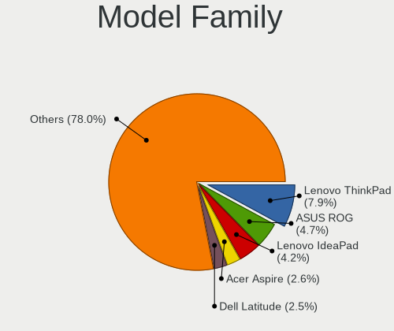
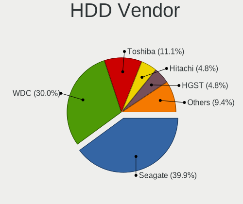
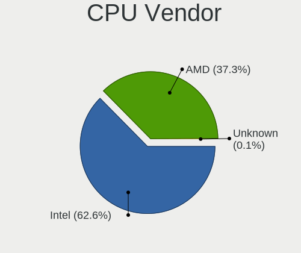
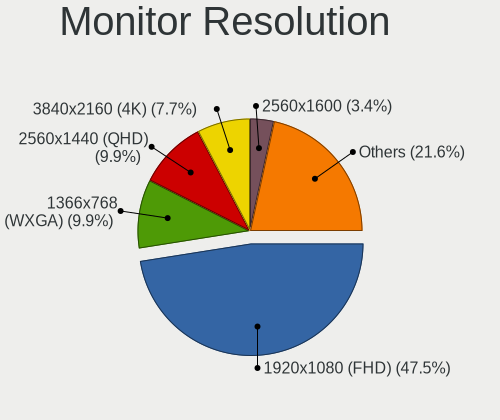
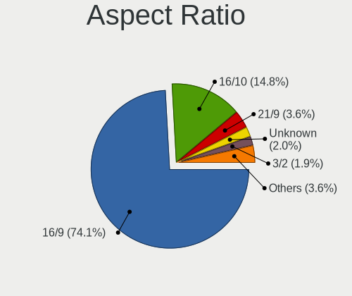
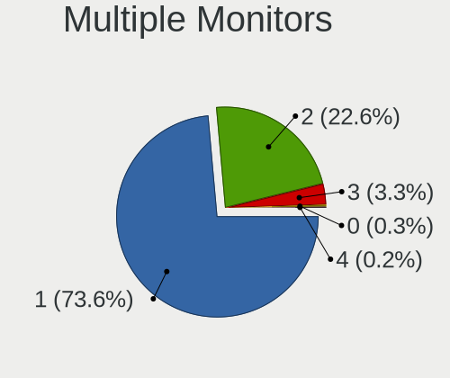
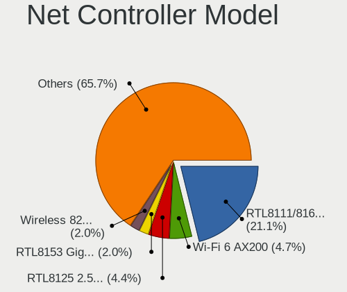
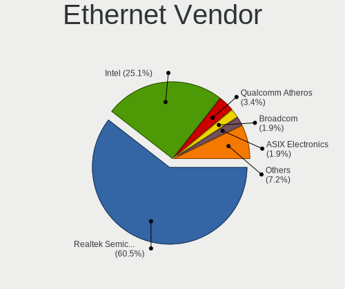
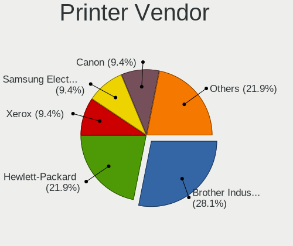

EndeavourOS - Tested Hardware & Statistics
------------------------------------------

A project to collect tested hardware configurations for EndeavourOS.

Anyone can contribute to this report by the [hw-probe](https://github.com/linuxhw/hw-probe) tool:

    sudo -E hw-probe -all -upload

Please submit a probe of your configuration if it's not presented on the page or is rare.

This is a report for all computer types. See also reports for [desktops](/Dist/EndeavourOS/Desktop/README.md) and [notebooks](/Dist/EndeavourOS/Notebook/README.md).

Full-feature report is available here: https://linux-hardware.org/?view=trends

Contents
--------

* [ Test Cases ](#test-cases)

* [ System ](#system)
  - [ Kernel                   ](#kernel)
  - [ Kernel Family            ](#kernel-family)
  - [ Kernel Major Ver.        ](#kernel-major-ver)
  - [ Arch                     ](#arch)
  - [ DE                       ](#de)
  - [ Display Server           ](#display-server)
  - [ Display Manager          ](#display-manager)
  - [ OS Lang                  ](#os-lang)
  - [ Boot Mode                ](#boot-mode)
  - [ Filesystem               ](#filesystem)
  - [ Part. scheme             ](#part-scheme)
  - [ Dual Boot with Linux/BSD ](#dual-boot-with-linuxbsd)
  - [ Dual Boot (Win)          ](#dual-boot-win)

* [ Board ](#board)
  - [ Vendor                   ](#vendor)
  - [ Model                    ](#model)
  - [ Model Family             ](#model-family)
  - [ MFG Year                 ](#mfg-year)
  - [ Form Factor              ](#form-factor)
  - [ Secure Boot              ](#secure-boot)
  - [ Coreboot                 ](#coreboot)
  - [ RAM Size                 ](#ram-size)
  - [ RAM Used                 ](#ram-used)
  - [ Total Drives             ](#total-drives)
  - [ Has CD-ROM               ](#has-cd-rom)
  - [ Has Ethernet             ](#has-ethernet)
  - [ Has WiFi                 ](#has-wifi)
  - [ Has Bluetooth            ](#has-bluetooth)

* [ Location ](#location)
  - [ Country                  ](#country)
  - [ City                     ](#city)

* [ Drives ](#drives)
  - [ Drive Vendor             ](#drive-vendor)
  - [ Drive Model              ](#drive-model)
  - [ HDD Vendor               ](#hdd-vendor)
  - [ SSD Vendor               ](#ssd-vendor)
  - [ Drive Kind               ](#drive-kind)
  - [ Drive Connector          ](#drive-connector)
  - [ Drive Size               ](#drive-size)
  - [ Space Total              ](#space-total)
  - [ Space Used               ](#space-used)
  - [ Malfunc. Drives          ](#malfunc-drives)
  - [ Malfunc. Drive Vendor    ](#malfunc-drive-vendor)
  - [ Malfunc. HDD Vendor      ](#malfunc-hdd-vendor)
  - [ Malfunc. Drive Kind      ](#malfunc-drive-kind)
  - [ Failed Drives            ](#failed-drives)
  - [ Failed Drive Vendor      ](#failed-drive-vendor)
  - [ Drive Status             ](#drive-status)

* [ Storage controller ](#storage-controller)
  - [ Storage Vendor           ](#storage-vendor)
  - [ Storage Model            ](#storage-model)
  - [ Storage Kind             ](#storage-kind)

* [ Processor ](#processor)
  - [ CPU Vendor               ](#cpu-vendor)
  - [ CPU Model                ](#cpu-model)
  - [ CPU Model Family         ](#cpu-model-family)
  - [ CPU Cores                ](#cpu-cores)
  - [ CPU Sockets              ](#cpu-sockets)
  - [ CPU Threads              ](#cpu-threads)
  - [ CPU Op-Modes             ](#cpu-op-modes)
  - [ CPU Microcode            ](#cpu-microcode)
  - [ CPU Microarch            ](#cpu-microarch)

* [ Graphics ](#graphics)
  - [ GPU Vendor               ](#gpu-vendor)
  - [ GPU Model                ](#gpu-model)
  - [ GPU Combo                ](#gpu-combo)
  - [ GPU Driver               ](#gpu-driver)
  - [ GPU Memory               ](#gpu-memory)

* [ Monitor ](#monitor)
  - [ Monitor Vendor           ](#monitor-vendor)
  - [ Monitor Model            ](#monitor-model)
  - [ Monitor Resolution       ](#monitor-resolution)
  - [ Monitor Diagonal         ](#monitor-diagonal)
  - [ Monitor Width            ](#monitor-width)
  - [ Aspect Ratio             ](#aspect-ratio)
  - [ Monitor Area             ](#monitor-area)
  - [ Pixel Density            ](#pixel-density)
  - [ Multiple Monitors        ](#multiple-monitors)

* [ Network ](#network)
  - [ Net Controller Vendor    ](#net-controller-vendor)
  - [ Net Controller Model     ](#net-controller-model)
  - [ Wireless Vendor          ](#wireless-vendor)
  - [ Wireless Model           ](#wireless-model)
  - [ Ethernet Vendor          ](#ethernet-vendor)
  - [ Ethernet Model           ](#ethernet-model)
  - [ Net Controller Kind      ](#net-controller-kind)
  - [ Used Controller          ](#used-controller)
  - [ NICs                     ](#nics)
  - [ IPv6                     ](#ipv6)

* [ Bluetooth ](#bluetooth)
  - [ Bluetooth Vendor         ](#bluetooth-vendor)
  - [ Bluetooth Model          ](#bluetooth-model)

* [ Sound ](#sound)
  - [ Sound Vendor             ](#sound-vendor)
  - [ Sound Model              ](#sound-model)

* [ Memory ](#memory)
  - [ Memory Vendor            ](#memory-vendor)
  - [ Memory Model             ](#memory-model)
  - [ Memory Kind              ](#memory-kind)
  - [ Memory Form Factor       ](#memory-form-factor)
  - [ Memory Size              ](#memory-size)
  - [ Memory Speed             ](#memory-speed)

* [ Printers & scanners ](#printers--scanners)
  - [ Printer Vendor           ](#printer-vendor)
  - [ Printer Model            ](#printer-model)
  - [ Scanner Vendor           ](#scanner-vendor)
  - [ Scanner Model            ](#scanner-model)

* [ Camera ](#camera)
  - [ Camera Vendor            ](#camera-vendor)
  - [ Camera Model             ](#camera-model)

* [ Security ](#security)
  - [ Fingerprint Vendor       ](#fingerprint-vendor)
  - [ Fingerprint Model        ](#fingerprint-model)
  - [ Chipcard Vendor          ](#chipcard-vendor)
  - [ Chipcard Model           ](#chipcard-model)

* [ Unsupported ](#unsupported)
  - [ Unsupported Devices      ](#unsupported-devices)
  - [ Unsupported Device Types ](#unsupported-device-types)

Test Cases
----------

| Vendor        | Model                       | Form-Factor | Probe                                                      | Date         |
|---------------|-----------------------------|-------------|------------------------------------------------------------|--------------|
| Dell          | Precision 5560              | Notebook    | [04cb5954e9](https://linux-hardware.org/?probe=04cb5954e9) | Dec 31, 2021 |
| Lenovo        | ThinkPad E480 20KQ000EBR    | Notebook    | [e4d3f29412](https://linux-hardware.org/?probe=e4d3f29412) | Dec 30, 2021 |
| LattePanda    | Alpha                       | Desktop     | [497e370fc3](https://linux-hardware.org/?probe=497e370fc3) | Dec 26, 2021 |
| LattePanda    | Alpha                       | Desktop     | [442f08d351](https://linux-hardware.org/?probe=442f08d351) | Dec 24, 2021 |
| Lenovo        | Yoga Slim 7 Pro 14ACH5 8... | Notebook    | [deb1a17957](https://linux-hardware.org/?probe=deb1a17957) | Dec 23, 2021 |
| Gigabyte      | H110N-CF                    | Desktop     | [17067982ca](https://linux-hardware.org/?probe=17067982ca) | Dec 23, 2021 |
| Unknown       | Intel X79                   | Desktop     | [767fb84ac9](https://linux-hardware.org/?probe=767fb84ac9) | Dec 17, 2021 |
| Dell          | Inspiron 5558               | Notebook    | [16daa16444](https://linux-hardware.org/?probe=16daa16444) | Dec 16, 2021 |
| Acer          | Aspire 5250                 | Notebook    | [b4a48e5350](https://linux-hardware.org/?probe=b4a48e5350) | Dec 15, 2021 |
| Lenovo        | V14 G2 ITL 82NM             | Notebook    | [939be3ba51](https://linux-hardware.org/?probe=939be3ba51) | Dec 10, 2021 |
| Unknown       | Unknown                     | Notebook    | [2070780ca9](https://linux-hardware.org/?probe=2070780ca9) | Dec 07, 2021 |
| Unknown       | Unknown                     | Notebook    | [0555569b70](https://linux-hardware.org/?probe=0555569b70) | Nov 24, 2021 |
| Apple         | MacBookAir7,2               | Notebook    | [df651ff7ad](https://linux-hardware.org/?probe=df651ff7ad) | Nov 23, 2021 |
| HP            | 15 TS                       | Notebook    | [50a260e4dc](https://linux-hardware.org/?probe=50a260e4dc) | Nov 21, 2021 |
| ASUSTek       | TUF GAMING FX504GD_FX80G... | Notebook    | [a3d3e0eecd](https://linux-hardware.org/?probe=a3d3e0eecd) | Nov 20, 2021 |
| ASUSTek       | Maximus VIII HERO           | Desktop     | [22ce2703b9](https://linux-hardware.org/?probe=22ce2703b9) | Nov 07, 2021 |
| Gigabyte      | X570 AORUS ULTRA            | Desktop     | [cef9098008](https://linux-hardware.org/?probe=cef9098008) | Oct 14, 2021 |
| Gigabyte      | X570 AORUS ULTRA            | Desktop     | [718bd26737](https://linux-hardware.org/?probe=718bd26737) | Oct 14, 2021 |
| Dell          | Latitude E4300              | Notebook    | [c486155f48](https://linux-hardware.org/?probe=c486155f48) | Oct 10, 2021 |
| Dell          | Latitude E4300              | Notebook    | [52e0d626fa](https://linux-hardware.org/?probe=52e0d626fa) | Oct 10, 2021 |
| Gigabyte      | B550 VISION D               | Desktop     | [e8a2ba9952](https://linux-hardware.org/?probe=e8a2ba9952) | Oct 03, 2021 |
| MSI           | G41M-P33 Combo              | Desktop     | [ec8e63e96e](https://linux-hardware.org/?probe=ec8e63e96e) | Oct 01, 2021 |
| HP            | Pavilion dv6                | Notebook    | [2a6a76f702](https://linux-hardware.org/?probe=2a6a76f702) | Sep 26, 2021 |
| Dell          | Precision 3560              | Notebook    | [d9b527db16](https://linux-hardware.org/?probe=d9b527db16) | Sep 22, 2021 |
| Dynabook      | Satellite Pro C50-E-109     | Notebook    | [0fe0fa66d6](https://linux-hardware.org/?probe=0fe0fa66d6) | Sep 14, 2021 |
| Dynabook      | Satellite Pro C50-E-109     | Notebook    | [d5e170957e](https://linux-hardware.org/?probe=d5e170957e) | Sep 14, 2021 |
| MSI           | B450M PRO-VDH MAX           | Desktop     | [33cee010e8](https://linux-hardware.org/?probe=33cee010e8) | Sep 12, 2021 |
| Lenovo        | Legion Y545 81Q6            | Notebook    | [167df4c15e](https://linux-hardware.org/?probe=167df4c15e) | Sep 09, 2021 |
| Lenovo        | Yoga 520-14IKB 80X8         | Convertible | [4c8282bb42](https://linux-hardware.org/?probe=4c8282bb42) | Aug 16, 2021 |
| MSI           | B450M PRO-VDH MAX           | Desktop     | [fe3d61f4d6](https://linux-hardware.org/?probe=fe3d61f4d6) | Aug 09, 2021 |
| MSI           | B450M PRO-VDH MAX           | Desktop     | [8e9d51a941](https://linux-hardware.org/?probe=8e9d51a941) | Aug 07, 2021 |
| Lenovo        | ThinkPad X220 Tablet 429... | Notebook    | [b5b8bac74a](https://linux-hardware.org/?probe=b5b8bac74a) | Jul 26, 2021 |
| ASUSTek       | ROG Zephyrus G14 GA401II... | Notebook    | [7cdf389d4c](https://linux-hardware.org/?probe=7cdf389d4c) | Jul 22, 2021 |
| ASUSTek       | ROG Strix G731GT_GL731GT    | Notebook    | [4421b175f7](https://linux-hardware.org/?probe=4421b175f7) | Jul 16, 2021 |
| Lenovo        | Yoga 520-14IKB 80X8         | Convertible | [8d7689bceb](https://linux-hardware.org/?probe=8d7689bceb) | Jul 14, 2021 |
| Acer          | Nitro AN515-54              | Notebook    | [3be93cbc0c](https://linux-hardware.org/?probe=3be93cbc0c) | Jul 03, 2021 |
| Pine Micro... | Pine64 Pinebook Pro         | Notebook    | [fd48c4cd51](https://linux-hardware.org/?probe=fd48c4cd51) | Jul 02, 2021 |
| Pine Micro... | Pine64 Pinebook Pro         | Notebook    | [81ccc0c89d](https://linux-hardware.org/?probe=81ccc0c89d) | Jun 29, 2021 |
| Pine Micro... | Pine64 Pinebook Pro         | Notebook    | [d2f1ec957f](https://linux-hardware.org/?probe=d2f1ec957f) | Jun 27, 2021 |
| HP            | EliteBook Revolve 810       | Notebook    | [24758ed5b3](https://linux-hardware.org/?probe=24758ed5b3) | May 31, 2021 |
| Lenovo        | ThinkPad T440s 20ARS3490... | Notebook    | [4c600416f9](https://linux-hardware.org/?probe=4c600416f9) | May 28, 2021 |
| Dell          | Inspiron 7386               | Convertible | [42442e4d61](https://linux-hardware.org/?probe=42442e4d61) | May 20, 2021 |
| Notebook      | NS50MU                      | Notebook    | [8e08645823](https://linux-hardware.org/?probe=8e08645823) | May 19, 2021 |
| HP            | 2B36                        | Desktop     | [62135f1e45](https://linux-hardware.org/?probe=62135f1e45) | May 19, 2021 |
| Dell          | Inspiron 7386               | Convertible | [c6f4d6de84](https://linux-hardware.org/?probe=c6f4d6de84) | May 17, 2021 |
| HP            | EliteBook 2170p             | Notebook    | [6e4a5f9c76](https://linux-hardware.org/?probe=6e4a5f9c76) | May 13, 2021 |
| ASRock        | A300M-STX                   | Desktop     | [fc96347868](https://linux-hardware.org/?probe=fc96347868) | May 12, 2021 |
| TUXEDO        | Pulse 15 Gen1               | Notebook    | [ec0cb83241](https://linux-hardware.org/?probe=ec0cb83241) | May 10, 2021 |
| Lenovo        | ThinkPad T440s 20ARS3490... | Notebook    | [b3a5056cbf](https://linux-hardware.org/?probe=b3a5056cbf) | May 07, 2021 |
| ASUSTek       | ROG Strix G712LV_G712LV     | Notebook    | [365c656e4a](https://linux-hardware.org/?probe=365c656e4a) | May 05, 2021 |
| Lenovo        | ThinkPad T61 7659W1W        | Notebook    | [c366a3e7a2](https://linux-hardware.org/?probe=c366a3e7a2) | May 01, 2021 |
| HP            | Stream Laptop 14-CB1xxx     | Notebook    | [b27160a3cb](https://linux-hardware.org/?probe=b27160a3cb) | Apr 29, 2021 |
| Lenovo        | E31-80 80MX                 | Notebook    | [8aedfd9f4c](https://linux-hardware.org/?probe=8aedfd9f4c) | Apr 21, 2021 |
| Lenovo        | ThinkPad X140e 20BL000BU... | Notebook    | [eabc0fa5e5](https://linux-hardware.org/?probe=eabc0fa5e5) | Apr 21, 2021 |
| ASUSTek       | STRIX B250F GAMING          | Desktop     | [8276e1fb2f](https://linux-hardware.org/?probe=8276e1fb2f) | Apr 20, 2021 |
| ASUSTek       | K30AD_M31AD_M51AD_M32AD     | Desktop     | [cf4d5786e5](https://linux-hardware.org/?probe=cf4d5786e5) | Apr 19, 2021 |
| Lenovo        | SHARKBAY NOK                | Desktop     | [0685ce717e](https://linux-hardware.org/?probe=0685ce717e) | Apr 16, 2021 |
| Gigabyte      | B450 AORUS M                | Desktop     | [d53c2a8b0e](https://linux-hardware.org/?probe=d53c2a8b0e) | Apr 11, 2021 |
| Dell          | 0080PM A00                  | Desktop     | [efc9497e6d](https://linux-hardware.org/?probe=efc9497e6d) | Apr 08, 2021 |
| MSI           | X370 GAMING PRO CARBON      | Desktop     | [08f8da317e](https://linux-hardware.org/?probe=08f8da317e) | Apr 03, 2021 |
| Lenovo        | IdeaPad Y700-15ISK 80NV     | Notebook    | [9e5b4c92f4](https://linux-hardware.org/?probe=9e5b4c92f4) | Apr 01, 2021 |
| Gigabyte      | Z390 GAMING SLI-CF          | Desktop     | [90f906f5f9](https://linux-hardware.org/?probe=90f906f5f9) | Mar 31, 2021 |
| Gigabyte      | Z390 GAMING SLI-CF          | Desktop     | [b2fa0502d0](https://linux-hardware.org/?probe=b2fa0502d0) | Mar 31, 2021 |
| Lenovo        | IdeaPad Y700-15ISK 80NV     | Notebook    | [269185aba1](https://linux-hardware.org/?probe=269185aba1) | Mar 28, 2021 |
| Dell          | Latitude 5300               | Notebook    | [efd4a051e5](https://linux-hardware.org/?probe=efd4a051e5) | Mar 23, 2021 |
| MSI           | X370 GAMING PRO CARBON      | Desktop     | [7c5776953c](https://linux-hardware.org/?probe=7c5776953c) | Mar 15, 2021 |
| Lenovo        | ThinkPad Yoga 460 20ELS0... | Convertible | [4983586fe5](https://linux-hardware.org/?probe=4983586fe5) | Mar 12, 2021 |
| Gigabyte      | AERO 15XV8                  | Notebook    | [c4ecc96eae](https://linux-hardware.org/?probe=c4ecc96eae) | Feb 19, 2021 |
| Apple         | MacBookPro7,1               | Notebook    | [1bd84f7c03](https://linux-hardware.org/?probe=1bd84f7c03) | Feb 13, 2021 |
| ASUSTek       | GL503VM                     | Notebook    | [72f95227fd](https://linux-hardware.org/?probe=72f95227fd) | Feb 11, 2021 |
| ASUSTek       | GL503VM                     | Notebook    | [130e9bdb5c](https://linux-hardware.org/?probe=130e9bdb5c) | Feb 11, 2021 |
| ASUSTek       | H81-PLUS                    | Desktop     | [75fc956099](https://linux-hardware.org/?probe=75fc956099) | Feb 10, 2021 |
| ASUSTek       | VivoBook_ASUSLaptop X412... | Notebook    | [4f64a771ff](https://linux-hardware.org/?probe=4f64a771ff) | Feb 01, 2021 |
| ASUSTek       | VivoBook_ASUSLaptop X412... | Notebook    | [4d8f4f66c7](https://linux-hardware.org/?probe=4d8f4f66c7) | Jan 31, 2021 |
| ASUSTek       | T102HA                      | Tablet      | [4b469e2e7e](https://linux-hardware.org/?probe=4b469e2e7e) | Jan 23, 2021 |
| ASUSTek       | T102HA                      | Tablet      | [7e927a72ec](https://linux-hardware.org/?probe=7e927a72ec) | Jan 21, 2021 |
| ASUSTek       | T102HA                      | Tablet      | [dac6f95caa](https://linux-hardware.org/?probe=dac6f95caa) | Jan 21, 2021 |
| Apple         | Mac-27ADBB7B4CEE8E61 iMa... | All in one  | [43b3323a07](https://linux-hardware.org/?probe=43b3323a07) | Jan 18, 2021 |
| ASUSTek       | ROG Zephyrus G15 GA502IV... | Notebook    | [929b0edb33](https://linux-hardware.org/?probe=929b0edb33) | Jan 11, 2021 |
| Lenovo        | IdeaPad 310-15ISK 80SM      | Notebook    | [6499961dbf](https://linux-hardware.org/?probe=6499961dbf) | Jan 09, 2021 |
| Lenovo        | IdeaPad 310-15ISK 80SM      | Notebook    | [2df429a577](https://linux-hardware.org/?probe=2df429a577) | Jan 06, 2021 |
| ASUSTek       | T102HA                      | Tablet      | [5df2e0f87d](https://linux-hardware.org/?probe=5df2e0f87d) | Jan 06, 2021 |
| ASUSTek       | Maximus VIII HERO           | Desktop     | [4d27980548](https://linux-hardware.org/?probe=4d27980548) | Dec 27, 2020 |
| ASUSTek       | Maximus VIII HERO           | Desktop     | [08895b552f](https://linux-hardware.org/?probe=08895b552f) | Dec 27, 2020 |
| Lenovo        | IdeaPad FLEX-14API 81SS     | Notebook    | [f2b808bdd1](https://linux-hardware.org/?probe=f2b808bdd1) | Dec 24, 2020 |
| HP            | 1905                        | Desktop     | [63771015f5](https://linux-hardware.org/?probe=63771015f5) | Dec 22, 2020 |
| HP            | EliteBook Revolve 810       | Notebook    | [b6b29c8237](https://linux-hardware.org/?probe=b6b29c8237) | Dec 17, 2020 |
| Alienware     | 14                          | Notebook    | [3211a0e18d](https://linux-hardware.org/?probe=3211a0e18d) | Dec 12, 2020 |
| HP            | 255 G7 Notebook PC          | Notebook    | [75384533dc](https://linux-hardware.org/?probe=75384533dc) | Dec 06, 2020 |
| HP            | 255 G7 Notebook PC          | Notebook    | [7e7ad00d75](https://linux-hardware.org/?probe=7e7ad00d75) | Dec 01, 2020 |
| HP            | 255 G7 Notebook PC          | Notebook    | [7e75c8dc00](https://linux-hardware.org/?probe=7e75c8dc00) | Dec 01, 2020 |
| HP            | 255 G7 Notebook PC          | Notebook    | [2381ec1bad](https://linux-hardware.org/?probe=2381ec1bad) | Nov 30, 2020 |
| ASUSTek       | X550CL                      | Notebook    | [5315051a75](https://linux-hardware.org/?probe=5315051a75) | Nov 21, 2020 |
| Lenovo        | Legion Y530-15ICH 81FV      | Notebook    | [2a4a52111f](https://linux-hardware.org/?probe=2a4a52111f) | Nov 21, 2020 |
| Dell          | 0KRC95 A02                  | Desktop     | [af91587001](https://linux-hardware.org/?probe=af91587001) | Nov 19, 2020 |
| ASUSTek       | ROG Zephyrus G14 GA401IV... | Notebook    | [1a46306857](https://linux-hardware.org/?probe=1a46306857) | Nov 16, 2020 |
| Dell          | 0KRC95 A02                  | Desktop     | [6471eccd57](https://linux-hardware.org/?probe=6471eccd57) | Nov 11, 2020 |
| ASUSTek       | ROG Zephyrus G14 GA401IV... | Notebook    | [650cf712bb](https://linux-hardware.org/?probe=650cf712bb) | Nov 08, 2020 |
| ASUSTek       | ROG Zephyrus G14 GA401IV... | Notebook    | [9737ecaee9](https://linux-hardware.org/?probe=9737ecaee9) | Nov 06, 2020 |
| Gigabyte      | H270-HD3-CF                 | Desktop     | [fa6d538a50](https://linux-hardware.org/?probe=fa6d538a50) | Oct 31, 2020 |
| HP            | 8455                        | Desktop     | [0671b6f4da](https://linux-hardware.org/?probe=0671b6f4da) | Oct 27, 2020 |
| HP            | Laptop 14-dk1xxx            | Notebook    | [5cdfdbceae](https://linux-hardware.org/?probe=5cdfdbceae) | Oct 26, 2020 |
| HP            | Laptop 14-dk1xxx            | Notebook    | [130d636b9e](https://linux-hardware.org/?probe=130d636b9e) | Oct 26, 2020 |
| HP            | 8455                        | Desktop     | [e37d606b6b](https://linux-hardware.org/?probe=e37d606b6b) | Oct 26, 2020 |
| HUAWEI        | BOHK-WAX9X                  | Notebook    | [3e19ade739](https://linux-hardware.org/?probe=3e19ade739) | Oct 25, 2020 |
| Microsoft     | Surface Laptop              | Tablet      | [26578393cc](https://linux-hardware.org/?probe=26578393cc) | Oct 15, 2020 |
| Dell          | Inspiron 3493               | Notebook    | [502cfa6428](https://linux-hardware.org/?probe=502cfa6428) | Oct 15, 2020 |
| Dell          | Inspiron 3493               | Notebook    | [459870a593](https://linux-hardware.org/?probe=459870a593) | Oct 14, 2020 |
| Lenovo        | MIIX 510-12ISK 80U1         | Tablet      | [eab288b1e2](https://linux-hardware.org/?probe=eab288b1e2) | Oct 13, 2020 |
| Lenovo        | IdeaPad FLEX-14API 81SS     | Notebook    | [2abc472e43](https://linux-hardware.org/?probe=2abc472e43) | Oct 08, 2020 |
| Acer          | Aspire E5-573               | Notebook    | [89237e04fc](https://linux-hardware.org/?probe=89237e04fc) | Oct 04, 2020 |
| MSI           | MS-7366                     | Desktop     | [ada828f120](https://linux-hardware.org/?probe=ada828f120) | Sep 29, 2020 |
| Dell          | G3 3579                     | Notebook    | [6853280510](https://linux-hardware.org/?probe=6853280510) | Sep 28, 2020 |
| ASUSTek       | P8P67 DELUXE                | Desktop     | [ba15c37977](https://linux-hardware.org/?probe=ba15c37977) | Sep 28, 2020 |
| Lenovo        | Yoga S740-14IIL 81RS        | Notebook    | [f12775338c](https://linux-hardware.org/?probe=f12775338c) | Sep 27, 2020 |
| MSI           | MS-7366                     | Desktop     | [9938e6501b](https://linux-hardware.org/?probe=9938e6501b) | Sep 24, 2020 |
| Gigabyte      | B450 AORUS M                | Desktop     | [34f1896f7e](https://linux-hardware.org/?probe=34f1896f7e) | Sep 23, 2020 |
| HP            | 1497                        | Desktop     | [7cb2cee563](https://linux-hardware.org/?probe=7cb2cee563) | Sep 19, 2020 |
| Lenovo        | Yoga S740-14IIL 81RS        | Notebook    | [41b9e8cb16](https://linux-hardware.org/?probe=41b9e8cb16) | Sep 15, 2020 |
| Biostar       | G31-M7 TE                   | Desktop     | [0ae18cfc51](https://linux-hardware.org/?probe=0ae18cfc51) | May 05, 2020 |
| Notebook      | W65KJ1_KK1                  | Notebook    | [924a887f7d](https://linux-hardware.org/?probe=924a887f7d) | Dec 09, 2019 |
| HP            | Spectre x360 Convertible... | Convertible | [90c646de9c](https://linux-hardware.org/?probe=90c646de9c) | Sep 13, 2019 |
| Dell          | Inspiron 7520               | Notebook    | [3477d2f29e](https://linux-hardware.org/?probe=3477d2f29e) | Sep 10, 2019 |
| Dell          | Inspiron 7520               | Notebook    | [80bdb92976](https://linux-hardware.org/?probe=80bdb92976) | Sep 10, 2019 |

System
------

Kernel
------

Version of the Linux kernel

| Version                | Computers | Percent |
|------------------------|-----------|---------|
| 5.9.14-arch1-1         | 3         | 3.41%   |
| 5.9.10-arch1-1         | 2         | 2.27%   |
| 5.9.1-arch1-1          | 2         | 2.27%   |
| 5.8.12-arch1-1         | 2         | 2.27%   |
| 5.8.10-arch1-1         | 2         | 2.27%   |
| 5.15.8-arch1-1         | 2         | 2.27%   |
| 5.15.10-arch1-1        | 2         | 2.27%   |
| 5.14.8-arch1-1         | 2         | 2.27%   |
| 5.12.1-arch1-1         | 2         | 2.27%   |
| 5.11.16-arch1-1        | 2         | 2.27%   |
| 5.11.15-arch1-2        | 2         | 2.27%   |
| 5.11.11-arch1-1        | 2         | 2.27%   |
| 5.9.9-arch1-1          | 1         | 1.14%   |
| 5.9.8-arch1-1          | 1         | 1.14%   |
| 5.9.6-zen1-1-zen       | 1         | 1.14%   |
| 5.9.2-arch1-1          | 1         | 1.14%   |
| 5.9.13-arch1-1         | 1         | 1.14%   |
| 5.9.11-arch2-1         | 1         | 1.14%   |
| 5.9.1-zen2-1-zen       | 1         | 1.14%   |
| 5.9.0-arch1-1          | 1         | 1.14%   |
| 5.8.8-arch1-1          | 1         | 1.14%   |
| 5.8.7-zen1-1-zen-anbox | 1         | 1.14%   |
| 5.8.14-arch1-1-surface | 1         | 1.14%   |
| 5.8.14-arch1-1         | 1         | 1.14%   |
| 5.8.13-arch1-1         | 1         | 1.14%   |
| 5.6.10-arch1-1         | 1         | 1.14%   |
| 5.4.2-arch1-1          | 1         | 1.14%   |
| 5.2.14-arch1-1-ARCH    | 1         | 1.14%   |
| 5.15.7-arch1-1         | 1         | 1.14%   |
| 5.15.6-zen2-1-zen      | 1         | 1.14%   |
| 5.15.6-arch2-1         | 1         | 1.14%   |
| 5.15.4-arch1-1         | 1         | 1.14%   |
| 5.15.2-zen1-1-zen      | 1         | 1.14%   |
| 5.15.2-arch1-1         | 1         | 1.14%   |
| 5.15.12-xanmod1-1      | 1         | 1.14%   |
| 5.15.11-arch2-1        | 1         | 1.14%   |
| 5.14.6-zen1-1-zen      | 1         | 1.14%   |
| 5.14.3-arch1-1         | 1         | 1.14%   |
| 5.14.2-arch1-2         | 1         | 1.14%   |
| 5.14.15-arch1-1        | 1         | 1.14%   |
| 5.14.11-zen1-1-zen     | 1         | 1.14%   |
| 5.14.10-arch1-1        | 1         | 1.14%   |
| 5.13.8-arch1-1         | 1         | 1.14%   |
| 5.13.4-xanmod1-1       | 1         | 1.14%   |
| 5.13.13-arch1-1        | 1         | 1.14%   |
| 5.13.10-zen1-1-zen     | 1         | 1.14%   |
| 5.13.0-1-MANJARO-ARM   | 1         | 1.14%   |
| 5.12.4-zen1-2-zen      | 1         | 1.14%   |
| 5.12.3-arch1-1         | 1         | 1.14%   |
| 5.12.15-arch1-1        | 1         | 1.14%   |
| 5.12.14-arch1-1        | 1         | 1.14%   |
| 5.12.13-arch1-2        | 1         | 1.14%   |
| 5.12.13-1-MANJARO-ARM  | 1         | 1.14%   |
| 5.11.8-arch1-1         | 1         | 1.14%   |
| 5.11.6-arch1-1         | 1         | 1.14%   |
| 5.11.5-arch1-1         | 1         | 1.14%   |
| 5.11.15-zen1-2-zen     | 1         | 1.14%   |
| 5.11.14-zen1-1-zen     | 1         | 1.14%   |
| 5.11.14-arch1-1        | 1         | 1.14%   |
| 5.11.12-arch1-1        | 1         | 1.14%   |

Kernel Family
-------------

Linux kernel without a distro release

| Version | Computers | Percent |
|---------|-----------|---------|
| 5.9.14  | 3         | 3.41%   |
| 5.9.1   | 3         | 3.41%   |
| 5.11.15 | 3         | 3.41%   |
| 5.11.11 | 3         | 3.41%   |
| 5.9.10  | 2         | 2.27%   |
| 5.8.14  | 2         | 2.27%   |
| 5.8.12  | 2         | 2.27%   |
| 5.8.10  | 2         | 2.27%   |
| 5.15.8  | 2         | 2.27%   |
| 5.15.6  | 2         | 2.27%   |
| 5.15.2  | 2         | 2.27%   |
| 5.15.10 | 2         | 2.27%   |
| 5.14.8  | 2         | 2.27%   |
| 5.12.13 | 2         | 2.27%   |
| 5.12.1  | 2         | 2.27%   |
| 5.11.16 | 2         | 2.27%   |
| 5.11.14 | 2         | 2.27%   |
| 5.11.10 | 2         | 2.27%   |
| 5.9.9   | 1         | 1.14%   |
| 5.9.8   | 1         | 1.14%   |
| 5.9.6   | 1         | 1.14%   |
| 5.9.2   | 1         | 1.14%   |
| 5.9.13  | 1         | 1.14%   |
| 5.9.11  | 1         | 1.14%   |
| 5.9.0   | 1         | 1.14%   |
| 5.8.8   | 1         | 1.14%   |
| 5.8.7   | 1         | 1.14%   |
| 5.8.13  | 1         | 1.14%   |
| 5.6.10  | 1         | 1.14%   |
| 5.4.2   | 1         | 1.14%   |
| 5.2.14  | 1         | 1.14%   |
| 5.15.7  | 1         | 1.14%   |
| 5.15.4  | 1         | 1.14%   |
| 5.15.12 | 1         | 1.14%   |
| 5.15.11 | 1         | 1.14%   |
| 5.14.6  | 1         | 1.14%   |
| 5.14.3  | 1         | 1.14%   |
| 5.14.2  | 1         | 1.14%   |
| 5.14.15 | 1         | 1.14%   |
| 5.14.11 | 1         | 1.14%   |
| 5.14.10 | 1         | 1.14%   |
| 5.13.8  | 1         | 1.14%   |
| 5.13.4  | 1         | 1.14%   |
| 5.13.13 | 1         | 1.14%   |
| 5.13.10 | 1         | 1.14%   |
| 5.13.0  | 1         | 1.14%   |
| 5.12.4  | 1         | 1.14%   |
| 5.12.3  | 1         | 1.14%   |
| 5.12.15 | 1         | 1.14%   |
| 5.12.14 | 1         | 1.14%   |
| 5.11.8  | 1         | 1.14%   |
| 5.11.6  | 1         | 1.14%   |
| 5.11.5  | 1         | 1.14%   |
| 5.11.12 | 1         | 1.14%   |
| 5.10.88 | 1         | 1.14%   |
| 5.10.7  | 1         | 1.14%   |
| 5.10.68 | 1         | 1.14%   |
| 5.10.6  | 1         | 1.14%   |
| 5.10.4  | 1         | 1.14%   |
| 5.10.35 | 1         | 1.14%   |

Kernel Major Ver.
-----------------

Linux kernel major version

| Version | Computers | Percent |
|---------|-----------|---------|
| 5.9     | 14        | 16.47%  |
| 5.11    | 14        | 16.47%  |
| 5.15    | 12        | 14.12%  |
| 5.10    | 10        | 11.76%  |
| 5.8     | 9         | 10.59%  |
| 5.14    | 8         | 9.41%   |
| 5.12    | 8         | 9.41%   |
| 5.13    | 5         | 5.88%   |
| 5.6     | 1         | 1.18%   |
| 5.4     | 1         | 1.18%   |
| 5.2     | 1         | 1.18%   |
| 4.19    | 1         | 1.18%   |
| Unknown | 1         | 1.18%   |

Arch
----

OS architecture (x86_64, i586, etc.)

| Name    | Computers | Percent |
|---------|-----------|---------|
| x86_64  | 78        | 98.73%  |
| aarch64 | 1         | 1.27%   |

DE
--

Desktop Environment

| Name       | Computers | Percent |
|------------|-----------|---------|
| GNOME      | 27        | 31.76%  |
| XFCE       | 18        | 21.18%  |
| KDE        | 18        | 21.18%  |
| KDE5       | 6         | 7.06%   |
| X-Cinnamon | 5         | 5.88%   |
| Unknown    | 5         | 5.88%   |
| i3         | 2         | 2.35%   |
| sway       | 1         | 1.18%   |
| MATE       | 1         | 1.18%   |
| LXQt       | 1         | 1.18%   |
| Budgie     | 1         | 1.18%   |

Display Server
--------------

X11 or Wayland

| Name    | Computers | Percent |
|---------|-----------|---------|
| X11     | 66        | 81.48%  |
| Wayland | 14        | 17.28%  |
| Unknown | 1         | 1.23%   |

Display Manager
---------------

SDDM, LightDM, etc.

| Name    | Computers | Percent |
|---------|-----------|---------|
| Unknown | 75        | 94.94%  |
| TDM     | 2         | 2.53%   |
| SDDM    | 1         | 1.27%   |
| GDM     | 1         | 1.27%   |

OS Lang
-------

Language

| Lang    | Computers | Percent |
|---------|-----------|---------|
| en_US   | 32        | 40.51%  |
| it_IT   | 6         | 7.59%   |
| fr_FR   | 5         | 6.33%   |
| de_DE   | 5         | 6.33%   |
| en_GB   | 4         | 5.06%   |
| en_CA   | 3         | 3.8%    |
| Unknown | 3         | 3.8%    |
| sv_SE   | 2         | 2.53%   |
| pt_BR   | 2         | 2.53%   |
| en_DK   | 2         | 2.53%   |
| tr_TR   | 1         | 1.27%   |
| sl_SI   | 1         | 1.27%   |
| ru_UA   | 1         | 1.27%   |
| pt_PT   | 1         | 1.27%   |
| pl_PL   | 1         | 1.27%   |
| nl_NL   | 1         | 1.27%   |
| hr_HR   | 1         | 1.27%   |
| es_MX   | 1         | 1.27%   |
| es_GT   | 1         | 1.27%   |
| es_ES   | 1         | 1.27%   |
| es_AR   | 1         | 1.27%   |
| en_NZ   | 1         | 1.27%   |
| en_IN   | 1         | 1.27%   |
| en_AU   | 1         | 1.27%   |
| cs_CZ   | 1         | 1.27%   |

Boot Mode
---------

EFI or BIOS

| Mode | Computers | Percent |
|------|-----------|---------|
| BIOS | 67        | 80.72%  |
| EFI  | 16        | 19.28%  |

Filesystem
----------

Type of filesystem

| Type    | Computers | Percent |
|---------|-----------|---------|
| Ext4    | 53        | 67.09%  |
| Btrfs   | 24        | 30.38%  |
| Unknown | 2         | 2.53%   |

Part. scheme
------------

Scheme of partitioning

| Type    | Computers | Percent |
|---------|-----------|---------|
| Unknown | 73        | 91.25%  |
| GPT     | 6         | 7.5%    |
| MBR     | 1         | 1.25%   |

Dual Boot with Linux/BSD
------------------------

Hosting more than one Linux/BSD

| Dual boot | Computers | Percent |
|-----------|-----------|---------|
| No        | 78        | 98.73%  |
| Yes       | 1         | 1.27%   |

Dual Boot (Win)
---------------

Hosting Linux and Windows

| Dual boot | Computers | Percent |
|-----------|-----------|---------|
| No        | 75        | 93.75%  |
| Yes       | 5         | 6.25%   |

Board
-----

Vendor
------

Motherboard manufacturer

| Name                | Computers | Percent |
|---------------------|-----------|---------|
| Lenovo              | 18        | 22.78%  |
| ASUSTek Computer    | 12        | 15.19%  |
| Hewlett-Packard     | 11        | 13.92%  |
| Dell                | 10        | 12.66%  |
| Gigabyte Technology | 7         | 8.86%   |
| MSI                 | 4         | 5.06%   |
| Acer                | 3         | 3.8%    |
| Apple               | 2         | 2.53%   |
| Unknown             | 2         | 2.53%   |
| TUXEDO              | 1         | 1.27%   |
| Pine Microsystems   | 1         | 1.27%   |
| Notebook            | 1         | 1.27%   |
| Microsoft           | 1         | 1.27%   |
| LattePanda          | 1         | 1.27%   |
| HUAWEI              | 1         | 1.27%   |
| Dynabook            | 1         | 1.27%   |
| Biostar             | 1         | 1.27%   |
| ASRock              | 1         | 1.27%   |
| Alienware           | 1         | 1.27%   |

Model
-----

Motherboard model

| Name                                   | Computers | Percent |
|----------------------------------------|-----------|---------|
| HP 255 G7 Notebook PC                  | 2         | 2.53%   |
| Unknown                                | 2         | 2.53%   |
| TUXEDO Pulse 15 Gen1                   | 1         | 1.27%   |
| Pine Microsystems Pine64 Pinebook Pro  | 1         | 1.27%   |
| Notebook W65KJ1_KK1                    | 1         | 1.27%   |
| MSI MS-7A38                            | 1         | 1.27%   |
| MSI MS-7A32                            | 1         | 1.27%   |
| MSI MS-7592                            | 1         | 1.27%   |
| MSI MS-7366                            | 1         | 1.27%   |
| Microsoft Surface Laptop               | 1         | 1.27%   |
| Lenovo Yoga Slim 7 Pro 14ACH5 82MS     | 1         | 1.27%   |
| Lenovo Yoga S740-14IIL 81RS            | 1         | 1.27%   |
| Lenovo Yoga 520-14IKB 80X8             | 1         | 1.27%   |
| Lenovo V14 G2 ITL 82NM                 | 1         | 1.27%   |
| Lenovo ThinkPad Yoga 460 20ELS0FJ01    | 1         | 1.27%   |
| Lenovo ThinkPad X220 Tablet 4294CT0    | 1         | 1.27%   |
| Lenovo ThinkPad X140e 20BL000BUS       | 1         | 1.27%   |
| Lenovo ThinkPad T61 7659W1W            | 1         | 1.27%   |
| Lenovo ThinkPad T440s 20ARS34900       | 1         | 1.27%   |
| Lenovo ThinkPad E480 20KQ000EBR        | 1         | 1.27%   |
| Lenovo ThinkCentre M93p 10AAS03T00     | 1         | 1.27%   |
| Lenovo MIIX 510-12ISK 80U1             | 1         | 1.27%   |
| Lenovo Legion Y545 81Q6                | 1         | 1.27%   |
| Lenovo Legion Y530-15ICH 81FV          | 1         | 1.27%   |
| Lenovo IdeaPad Y700-15ISK 80NV         | 1         | 1.27%   |
| Lenovo IdeaPad FLEX-14API 81SS         | 1         | 1.27%   |
| Lenovo IdeaPad 310-15ISK 80SM          | 1         | 1.27%   |
| Lenovo E31-80 80MX                     | 1         | 1.27%   |
| LattePanda Alpha                       | 1         | 1.27%   |
| HUAWEI BOHK-WAX9X                      | 1         | 1.27%   |
| HP Z230 Tower Workstation              | 1         | 1.27%   |
| HP Z2 Tower G4 Workstation             | 1         | 1.27%   |
| HP Spectre x360 Convertible 13-ap0xxx  | 1         | 1.27%   |
| HP Pavilion dv6                        | 1         | 1.27%   |
| HP Laptop 14-dk1xxx                    | 1         | 1.27%   |
| HP EliteBook Revolve 810               | 1         | 1.27%   |
| HP EliteBook 2170p                     | 1         | 1.27%   |
| HP 700-502ng                           | 1         | 1.27%   |
| HP 15 TS                               | 1         | 1.27%   |
| Gigabyte Z390 GAMING SLI               | 1         | 1.27%   |
| Gigabyte X570 AORUS ULTRA              | 1         | 1.27%   |
| Gigabyte H270-HD3                      | 1         | 1.27%   |
| Gigabyte H110N                         | 1         | 1.27%   |
| Gigabyte B550 VISION D                 | 1         | 1.27%   |
| Gigabyte B450 AORUS M                  | 1         | 1.27%   |
| Gigabyte AERO 15XV8                    | 1         | 1.27%   |
| Dynabook Satellite Pro C50-E-109       | 1         | 1.27%   |
| Dell Wyse 7040                         | 1         | 1.27%   |
| Dell Precision 5560                    | 1         | 1.27%   |
| Dell Precision 3560                    | 1         | 1.27%   |
| Dell OptiPlex 7010                     | 1         | 1.27%   |
| Dell Latitude E4300                    | 1         | 1.27%   |
| Dell Latitude 5300                     | 1         | 1.27%   |
| Dell Inspiron 7520                     | 1         | 1.27%   |
| Dell Inspiron 5558                     | 1         | 1.27%   |
| Dell Inspiron 3493                     | 1         | 1.27%   |
| Dell G3 3579                           | 1         | 1.27%   |
| Biostar G31-M7 TE                      | 1         | 1.27%   |
| ASUS X550CL                            | 1         | 1.27%   |
| ASUS VivoBook_ASUSLaptop X412DA_X412DA | 1         | 1.27%   |

Model Family
------------

Motherboard model prefix

| Name                     | Computers | Percent |
|--------------------------|-----------|---------|
| Lenovo ThinkPad          | 6         | 7.59%   |
| Lenovo Yoga              | 3         | 3.8%    |
| Lenovo IdeaPad           | 3         | 3.8%    |
| Dell Inspiron            | 3         | 3.8%    |
| ASUS ROG                 | 3         | 3.8%    |
| Lenovo Legion            | 2         | 2.53%   |
| HP EliteBook             | 2         | 2.53%   |
| HP 255                   | 2         | 2.53%   |
| Dell Precision           | 2         | 2.53%   |
| Dell Latitude            | 2         | 2.53%   |
| Acer Aspire              | 2         | 2.53%   |
| Unknown                  | 2         | 2.53%   |
| TUXEDO Pulse             | 1         | 1.27%   |
| Pine Microsystems Pine64 | 1         | 1.27%   |
| Notebook W65KJ1          | 1         | 1.27%   |
| MSI MS-7A38              | 1         | 1.27%   |
| MSI MS-7A32              | 1         | 1.27%   |
| MSI MS-7592              | 1         | 1.27%   |
| MSI MS-7366              | 1         | 1.27%   |
| Microsoft Surface        | 1         | 1.27%   |
| Lenovo V14               | 1         | 1.27%   |
| Lenovo ThinkCentre       | 1         | 1.27%   |
| Lenovo MIIX              | 1         | 1.27%   |
| Lenovo E31-80            | 1         | 1.27%   |
| LattePanda Alpha         | 1         | 1.27%   |
| HUAWEI BOHK-WAX9X        | 1         | 1.27%   |
| HP Z230                  | 1         | 1.27%   |
| HP Z2                    | 1         | 1.27%   |
| HP Spectre               | 1         | 1.27%   |
| HP Pavilion              | 1         | 1.27%   |
| HP Laptop                | 1         | 1.27%   |
| HP 700-502ng             | 1         | 1.27%   |
| HP 15                    | 1         | 1.27%   |
| Gigabyte Z390            | 1         | 1.27%   |
| Gigabyte X570            | 1         | 1.27%   |
| Gigabyte H270-HD3        | 1         | 1.27%   |
| Gigabyte H110N           | 1         | 1.27%   |
| Gigabyte B550            | 1         | 1.27%   |
| Gigabyte B450            | 1         | 1.27%   |
| Gigabyte AERO            | 1         | 1.27%   |
| Dynabook Satellite       | 1         | 1.27%   |
| Dell Wyse                | 1         | 1.27%   |
| Dell OptiPlex            | 1         | 1.27%   |
| Dell G3                  | 1         | 1.27%   |
| Biostar G31-M7           | 1         | 1.27%   |
| ASUS X550CL              | 1         | 1.27%   |
| ASUS VivoBook            | 1         | 1.27%   |
| ASUS TUF                 | 1         | 1.27%   |
| ASUS STRIX               | 1         | 1.27%   |
| ASUS P8P67               | 1         | 1.27%   |
| ASUS Maximus             | 1         | 1.27%   |
| ASUS K30AD               | 1         | 1.27%   |
| ASUS GL503VM             | 1         | 1.27%   |
| ASUS All                 | 1         | 1.27%   |
| ASRock A300M-STX         | 1         | 1.27%   |
| Apple MacBookAir7        | 1         | 1.27%   |
| Apple iMac14             | 1         | 1.27%   |
| Alienware 14             | 1         | 1.27%   |
| Acer Nitro               | 1         | 1.27%   |

MFG Year
--------

Motherboard manufacture year

| Year    | Computers | Percent |
|---------|-----------|---------|
| 2019    | 23        | 29.11%  |
| 2021    | 14        | 17.72%  |
| 2020    | 8         | 10.13%  |
| 2017    | 7         | 8.86%   |
| 2014    | 7         | 8.86%   |
| 2018    | 4         | 5.06%   |
| 2016    | 4         | 5.06%   |
| 2011    | 4         | 5.06%   |
| 2015    | 2         | 2.53%   |
| 2013    | 2         | 2.53%   |
| 2012    | 1         | 1.27%   |
| 2009    | 1         | 1.27%   |
| 2007    | 1         | 1.27%   |
| Unknown | 1         | 1.27%   |

Form Factor
-----------

Physical design of the computer

| Name        | Computers | Percent |
|-------------|-----------|---------|
| Notebook    | 48        | 60.76%  |
| Desktop     | 25        | 31.65%  |
| Convertible | 3         | 3.8%    |
| Tablet      | 2         | 2.53%   |
| All in one  | 1         | 1.27%   |

Secure Boot
-----------

Enabled or disabled

| State    | Computers | Percent |
|----------|-----------|---------|
| Disabled | 79        | 100%    |

Coreboot
--------

Have coreboot on board

| Used | Computers | Percent |
|------|-----------|---------|
| No   | 79        | 100%    |

RAM Size
--------

Total RAM memory

| Size in GB  | Computers | Percent |
|-------------|-----------|---------|
| 4.01-8.0    | 22        | 27.85%  |
| 16.01-24.0  | 16        | 20.25%  |
| 8.01-16.0   | 16        | 20.25%  |
| 3.01-4.0    | 9         | 11.39%  |
| 32.01-64.0  | 8         | 10.13%  |
| 24.01-32.0  | 6         | 7.59%   |
| 64.01-256.0 | 2         | 2.53%   |

RAM Used
--------

Used RAM memory

| Used GB    | Computers | Percent |
|------------|-----------|---------|
| 1.01-2.0   | 27        | 31.4%   |
| 2.01-3.0   | 24        | 27.91%  |
| 4.01-8.0   | 17        | 19.77%  |
| 3.01-4.0   | 11        | 12.79%  |
| 0.51-1.0   | 3         | 3.49%   |
| 16.01-24.0 | 2         | 2.33%   |
| 8.01-16.0  | 2         | 2.33%   |

Total Drives
------------

Number of drives on board

| Drives | Computers | Percent |
|--------|-----------|---------|
| 1      | 38        | 46.91%  |
| 2      | 29        | 35.8%   |
| 4      | 6         | 7.41%   |
| 3      | 3         | 3.7%    |
| 5      | 2         | 2.47%   |
| 7      | 1         | 1.23%   |
| 6      | 1         | 1.23%   |
| 0      | 1         | 1.23%   |

Has CD-ROM
----------

Has CD-ROM on board

| Presented | Computers | Percent |
|-----------|-----------|---------|
| No        | 59        | 74.68%  |
| Yes       | 20        | 25.32%  |

Has Ethernet
------------

Has Ethernet on board

| Presented | Computers | Percent |
|-----------|-----------|---------|
| Yes       | 66        | 83.54%  |
| No        | 13        | 16.46%  |

Has WiFi
--------

Has WiFi module

| Presented | Computers | Percent |
|-----------|-----------|---------|
| Yes       | 63        | 78.75%  |
| No        | 17        | 21.25%  |

Has Bluetooth
-------------

Has Bluetooth module

| Presented | Computers | Percent |
|-----------|-----------|---------|
| Yes       | 64        | 81.01%  |
| No        | 15        | 18.99%  |

Location
--------

Country
-------

Geographic location (country)

| Country      | Computers | Percent |
|--------------|-----------|---------|
| USA          | 15        | 18.99%  |
| Germany      | 11        | 13.92%  |
| Italy        | 6         | 7.59%   |
| France       | 5         | 6.33%   |
| Brazil       | 4         | 5.06%   |
| UK           | 3         | 3.8%    |
| Canada       | 3         | 3.8%    |
| Bahrain      | 3         | 3.8%    |
| Ukraine      | 2         | 2.53%   |
| Sweden       | 2         | 2.53%   |
| Slovenia     | 2         | 2.53%   |
| Netherlands  | 2         | 2.53%   |
| Denmark      | 2         | 2.53%   |
| Turkey       | 1         | 1.27%   |
| Spain        | 1         | 1.27%   |
| South Korea  | 1         | 1.27%   |
| Saudi Arabia | 1         | 1.27%   |
| Russia       | 1         | 1.27%   |
| Romania      | 1         | 1.27%   |
| Portugal     | 1         | 1.27%   |
| Poland       | 1         | 1.27%   |
| New Zealand  | 1         | 1.27%   |
| Morocco      | 1         | 1.27%   |
| Mexico       | 1         | 1.27%   |
| India        | 1         | 1.27%   |
| Guatemala    | 1         | 1.27%   |
| Greece       | 1         | 1.27%   |
| Finland      | 1         | 1.27%   |
| Czechia      | 1         | 1.27%   |
| Croatia      | 1         | 1.27%   |
| Australia    | 1         | 1.27%   |
| Argentina    | 1         | 1.27%   |

City
----

Geographic location (city)

| City                | Computers | Percent |
|---------------------|-----------|---------|
| Manama              | 3         | 3.61%   |
| S??o Paulo          | 2         | 2.41%   |
| Leipzig             | 2         | 2.41%   |
| Hamburg             | 2         | 2.41%   |
| Florence            | 2         | 2.41%   |
| Chicago             | 2         | 2.41%   |
| Berlin              | 2         | 2.41%   |
| Zapopan             | 1         | 1.2%    |
| West Haddon         | 1         | 1.2%    |
| Wellington          | 1         | 1.2%    |
| Vrbovec             | 1         | 1.2%    |
| Victoria            | 1         | 1.2%    |
| Turku               | 1         | 1.2%    |
| Turin               | 1         | 1.2%    |
| Toronto             | 1         | 1.2%    |
| Stuttgart           | 1         | 1.2%    |
| Stockholm           | 1         | 1.2%    |
| Silverdale          | 1         | 1.2%    |
| Sheboygan           | 1         | 1.2%    |
| Senonches           | 1         | 1.2%    |
| Sant'Agata de' Goti | 1         | 1.2%    |
| Salvador            | 1         | 1.2%    |
| Saeffle             | 1         | 1.2%    |
| Rognaix             | 1         | 1.2%    |
| Rogasovci           | 1         | 1.2%    |
| Prague              | 1         | 1.2%    |
| Paris               | 1         | 1.2%    |
| Oldenburg           | 1         | 1.2%    |
| Odense              | 1         | 1.2%    |
| Novyy Rozdil        | 1         | 1.2%    |
| Norwich             | 1         | 1.2%    |
| New Iberia          | 1         | 1.2%    |
| New Bedford         | 1         | 1.2%    |
| Moscow              | 1         | 1.2%    |
| Montreal            | 1         | 1.2%    |
| Monrovia            | 1         | 1.2%    |
| Menlo Park          | 1         | 1.2%    |
| Melbourne           | 1         | 1.2%    |
| Marrakesh           | 1         | 1.2%    |
| Manaus              | 1         | 1.2%    |
| Ljubljana           | 1         | 1.2%    |
| Le Pradet           | 1         | 1.2%    |
| Kyiv                | 1         | 1.2%    |
| Kidbrooke           | 1         | 1.2%    |
| Jubail              | 1         | 1.2%    |
| Jenison             | 1         | 1.2%    |
| Ioannina            | 1         | 1.2%    |
| Iasi                | 1         | 1.2%    |
| Hoevelaken          | 1         | 1.2%    |
| Guatemala City      | 1         | 1.2%    |
| Gothenburg          | 1         | 1.2%    |
| Germantown          | 1         | 1.2%    |
| Fuveau              | 1         | 1.2%    |
| Frankfurt am Main   | 1         | 1.2%    |
| Frankenthal         | 1         | 1.2%    |
| Follo               | 1         | 1.2%    |
| Flint               | 1         | 1.2%    |
| Erie                | 1         | 1.2%    |
| Ellensburg          | 1         | 1.2%    |
| Doetinchem          | 1         | 1.2%    |

Drives
------

Drive Vendor
------------

Hard drive vendors

| Vendor                         | Computers | Drives | Percent |
|--------------------------------|-----------|--------|---------|
| Samsung Electronics            | 29        | 48     | 22.66%  |
| WDC                            | 18        | 29     | 14.06%  |
| Seagate                        | 14        | 22     | 10.94%  |
| Unknown                        | 7         | 9      | 5.47%   |
| Toshiba                        | 7         | 8      | 5.47%   |
| Sandisk                        | 6         | 7      | 4.69%   |
| Kingston                       | 5         | 8      | 3.91%   |
| Crucial                        | 5         | 9      | 3.91%   |
| Phison                         | 4         | 5      | 3.13%   |
| Intel                          | 4         | 4      | 3.13%   |
| Micron Technology              | 3         | 3      | 2.34%   |
| JMicron                        | 3         | 3      | 2.34%   |
| HGST                           | 3         | 3      | 2.34%   |
| Solid State Storage Technology | 2         | 2      | 1.56%   |
| SK Hynix                       | 2         | 2      | 1.56%   |
| LITEONIT                       | 2         | 3      | 1.56%   |
| Union Memory (Shenzhen)        | 1         | 1      | 0.78%   |
| Team                           | 1         | 2      | 0.78%   |
| Realtek                        | 1         | 1      | 0.78%   |
| Mushkin                        | 1         | 1      | 0.78%   |
| Micron/Crucial Technology      | 1         | 1      | 0.78%   |
| LITEON                         | 1         | 1      | 0.78%   |
| Lite-On                        | 1         | 1      | 0.78%   |
| KIOXIA                         | 1         | 1      | 0.78%   |
| KingDian                       | 1         | 1      | 0.78%   |
| Hitachi                        | 1         | 1      | 0.78%   |
| Gigabyte Technology            | 1         | 1      | 0.78%   |
| FORESEE                        | 1         | 1      | 0.78%   |
| Apple                          | 1         | 1      | 0.78%   |
| A-DATA Technology              | 1         | 1      | 0.78%   |

Drive Model
-----------

Hard drive models

| Model                                        | Computers | Percent |
|----------------------------------------------|-----------|---------|
| Samsung SSD 860 EVO 1TB                      | 5         | 3.38%   |
| Samsung SSD 850 EVO 500GB                    | 3         | 2.03%   |
| Samsung NVMe SSD Drive 512GB                 | 3         | 2.03%   |
| WDC WD10EZEX-60WN4A1 1TB                     | 2         | 1.35%   |
| WDC WD10EZEX-22MFCA0 1TB                     | 2         | 1.35%   |
| Unknown MMC Card  64GB                       | 2         | 1.35%   |
| Unknown MMC Card  128GB                      | 2         | 1.35%   |
| Toshiba THNSNJ256GCSU 256GB SSD              | 2         | 1.35%   |
| Solid State Storage NVMe SSD Drive 256GB     | 2         | 1.35%   |
| Seagate ST95005620AS 500GB                   | 2         | 1.35%   |
| Seagate ST4000DM004-2CV104 4TB               | 2         | 1.35%   |
| Seagate ST2000DM006-2DM164 2TB               | 2         | 1.35%   |
| Seagate ST1000LM035-1RK172 1TB               | 2         | 1.35%   |
| Seagate ST1000DM010-2EP102 1TB               | 2         | 1.35%   |
| Sandisk NVMe SSD Drive 500GB                 | 2         | 1.35%   |
| Samsung SSD SM841 2.5 7mm 128GB              | 2         | 1.35%   |
| Samsung SSD 840 EVO 250GB                    | 2         | 1.35%   |
| Samsung NVMe SSD Drive 1TB                   | 2         | 1.35%   |
| Samsung MZNLN256HAJQ-000H1 256GB SSD         | 2         | 1.35%   |
| Intel NVMe SSD Drive 512GB                   | 2         | 1.35%   |
| Crucial CT500MX500SSD1 500GB                 | 2         | 1.35%   |
| WDC WDS480G2G0B-00EPW0 480GB SSD             | 1         | 0.68%   |
| WDC WDS240G2G0A-00JH30 240GB SSD             | 1         | 0.68%   |
| WDC WDS120G1G0A-00SS50 120GB SSD             | 1         | 0.68%   |
| WDC WD7500BPVT-75A1YT0 752GB                 | 1         | 0.68%   |
| WDC WD5000LPCX-24C6HT0 500GB                 | 1         | 0.68%   |
| WDC WD5000AZLX-75K2TA0 500GB                 | 1         | 0.68%   |
| WDC WD40EZRZ-00GXCB0 4TB                     | 1         | 0.68%   |
| WDC WD3200AAJS-00L7A0 320GB                  | 1         | 0.68%   |
| WDC WD20PURZ-85GU6Y0 2TB                     | 1         | 0.68%   |
| WDC WD20EZRZ-00Z5HB0 2TB                     | 1         | 0.68%   |
| WDC WD1600BEVT-22ZCT0 160GB                  | 1         | 0.68%   |
| WDC WD10SPZX-24Z10T0 1TB                     | 1         | 0.68%   |
| WDC WD10SPZX-24Z10 1TB                       | 1         | 0.68%   |
| WDC WD10SPZX-21Z10T0 1TB                     | 1         | 0.68%   |
| WDC WD10JPVX-22JC3T0 1TB                     | 1         | 0.68%   |
| WDC WD10JPCX-24UE4T0 1TB                     | 1         | 0.68%   |
| WDC WD10EZEX-75M2NA0 1TB                     | 1         | 0.68%   |
| WDC WD10EZEX-60M2NA0 1TB                     | 1         | 0.68%   |
| WDC WD10EZEX-08WN4A0 1TB                     | 1         | 0.68%   |
| WDC WD10EZEX-00BN5A0 1TB                     | 1         | 0.68%   |
| WDC WD10EACS-00D6B1 1TB                      | 1         | 0.68%   |
| Unknown SD/MMC/MS PRO 7GB                    | 1         | 0.68%   |
| Unknown MMC Card  7GB                        | 1         | 0.68%   |
| Unknown MMC Card  4GB                        | 1         | 0.68%   |
| Union Memory (Shenzhen) NVMe SSD Drive 128GB | 1         | 0.68%   |
| Toshiba THNSN0256GTYA 256GB                  | 1         | 0.68%   |
| Toshiba NVMe SSD Drive 512GB                 | 1         | 0.68%   |
| Toshiba MK5061GSYN 500GB                     | 1         | 0.68%   |
| Toshiba KSG60ZMV256G M.2 2280 256GB SSD      | 1         | 0.68%   |
| Toshiba DT01ACA050 500GB                     | 1         | 0.68%   |
| Team T253E2001T 1024GB SSD                   | 1         | 0.68%   |
| SK Hynix NVMe SSD Drive 512GB                | 1         | 0.68%   |
| SK Hynix NVMe SSD Drive 1024GB               | 1         | 0.68%   |
| Seagate ST500LT012-1DG142 500GB              | 1         | 0.68%   |
| Seagate ST500LM000-1EJ162 500GB              | 1         | 0.68%   |
| Seagate ST500DM002-1BD142 500GB              | 1         | 0.68%   |
| Seagate ST2000DM001-1ER164 2TB               | 1         | 0.68%   |
| Seagate ST1000VM002-1CT162 1TB               | 1         | 0.68%   |
| Seagate ST1000LM049-2GH172 1TB               | 1         | 0.68%   |

HDD Vendor
----------

Hard disk drive vendors

| Vendor              | Computers | Drives | Percent |
|---------------------|-----------|--------|---------|
| WDC                 | 17        | 26     | 42.5%   |
| Seagate             | 14        | 22     | 35%     |
| HGST                | 3         | 3      | 7.5%    |
| Toshiba             | 2         | 2      | 5%      |
| Unknown             | 1         | 1      | 2.5%    |
| Samsung Electronics | 1         | 2      | 2.5%    |
| JMicron             | 1         | 1      | 2.5%    |
| Hitachi             | 1         | 1      | 2.5%    |

SSD Vendor
----------

Solid state drive vendors

| Vendor              | Computers | Drives | Percent |
|---------------------|-----------|--------|---------|
| Samsung Electronics | 23        | 35     | 44.23%  |
| Crucial             | 5         | 9      | 9.62%   |
| Toshiba             | 3         | 4      | 5.77%   |
| Kingston            | 3         | 5      | 5.77%   |
| WDC                 | 2         | 3      | 3.85%   |
| SanDisk             | 2         | 2      | 3.85%   |
| Micron Technology   | 2         | 2      | 3.85%   |
| LITEONIT            | 2         | 3      | 3.85%   |
| Team                | 1         | 2      | 1.92%   |
| PHISON              | 1         | 1      | 1.92%   |
| Mushkin             | 1         | 1      | 1.92%   |
| LITEON              | 1         | 1      | 1.92%   |
| KingDian            | 1         | 1      | 1.92%   |
| JMicron             | 1         | 1      | 1.92%   |
| Gigabyte Technology | 1         | 1      | 1.92%   |
| FORESEE             | 1         | 1      | 1.92%   |
| Apple               | 1         | 1      | 1.92%   |
| A-DATA Technology   | 1         | 1      | 1.92%   |

Drive Kind
----------

HDD or SSD

| Kind    | Computers | Drives | Percent |
|---------|-----------|--------|---------|
| SSD     | 45        | 74     | 39.13%  |
| HDD     | 34        | 58     | 29.57%  |
| NVMe    | 29        | 39     | 25.22%  |
| MMC     | 6         | 8      | 5.22%   |
| Unknown | 1         | 1      | 0.87%   |

Drive Connector
---------------

SATA, SAS, NVMe, etc.

| Type | Computers | Drives | Percent |
|------|-----------|--------|---------|
| SATA | 63        | 127    | 60%     |
| NVMe | 29        | 38     | 27.62%  |
| SAS  | 7         | 7      | 6.67%   |
| MMC  | 6         | 8      | 5.71%   |

Drive Size
----------

Size of hard drive

| Size in TB | Computers | Drives | Percent |
|------------|-----------|--------|---------|
| 0.01-0.5   | 45        | 70     | 52.94%  |
| 0.51-1.0   | 28        | 45     | 32.94%  |
| 1.01-2.0   | 8         | 11     | 9.41%   |
| 3.01-4.0   | 3         | 5      | 3.53%   |
| 4.01-10.0  | 1         | 1      | 1.18%   |

Space Total
-----------

Amount of disk space available on the file system

| Size in GB     | Computers | Percent |
|----------------|-----------|---------|
| 101-250        | 23        | 28.05%  |
| 251-500        | 13        | 15.85%  |
| 1001-2000      | 12        | 14.63%  |
| 501-1000       | 10        | 12.2%   |
| Unknown        | 10        | 12.2%   |
| 51-100         | 5         | 6.1%    |
| 21-50          | 4         | 4.88%   |
| 2001-3000      | 3         | 3.66%   |
| More than 3000 | 2         | 2.44%   |

Space Used
----------

Amount of used disk space

| Used GB        | Computers | Percent |
|----------------|-----------|---------|
| 1-20           | 22        | 25.58%  |
| 101-250        | 15        | 17.44%  |
| 51-100         | 12        | 13.95%  |
| 21-50          | 10        | 11.63%  |
| Unknown        | 10        | 11.63%  |
| 251-500        | 8         | 9.3%    |
| 501-1000       | 5         | 5.81%   |
| 1001-2000      | 3         | 3.49%   |
| More than 3000 | 1         | 1.16%   |

Malfunc. Drives
---------------

Drive models with a malfunction

Zero info for selected period =(

Malfunc. Drive Vendor
---------------------

Vendors of faulty drives

Zero info for selected period =(

Malfunc. HDD Vendor
-------------------

Vendors of faulty HDD drives

Zero info for selected period =(

Malfunc. Drive Kind
-------------------

Kinds of faulty drives

Zero info for selected period =(

Failed Drives
-------------

Failed drive models

Zero info for selected period =(

Failed Drive Vendor
-------------------

Failed drive vendors

Zero info for selected period =(

Drive Status
------------

Number of failed and malfunc. drives

| Status   | Computers | Drives | Percent |
|----------|-----------|--------|---------|
| Detected | 74        | 162    | 90.24%  |
| Works    | 8         | 18     | 9.76%   |

Storage controller
------------------

Storage Vendor
--------------

Storage controller vendors

| Vendor                         | Computers | Percent |
|--------------------------------|-----------|---------|
| Intel                          | 51        | 51.52%  |
| AMD                            | 14        | 14.14%  |
| Samsung Electronics            | 9         | 9.09%   |
| Sandisk                        | 4         | 4.04%   |
| Phison Electronics             | 3         | 3.03%   |
| Toshiba America Info Systems   | 2         | 2.02%   |
| Solid State Storage Technology | 2         | 2.02%   |
| SK Hynix                       | 2         | 2.02%   |
| Kingston Technology Company    | 2         | 2.02%   |
| ASMedia Technology             | 2         | 2.02%   |
| Union Memory (Shenzhen)        | 1         | 1.01%   |
| Nvidia                         | 1         | 1.01%   |
| Micron/Crucial Technology      | 1         | 1.01%   |
| Micron Technology              | 1         | 1.01%   |
| Marvell Technology Group       | 1         | 1.01%   |
| Lite-On Technology             | 1         | 1.01%   |
| KIOXIA                         | 1         | 1.01%   |
| JMicron Technology             | 1         | 1.01%   |

Storage Model
-------------

Storage controller models

| Model                                                                            | Computers | Percent |
|----------------------------------------------------------------------------------|-----------|---------|
| AMD FCH SATA Controller [AHCI mode]                                              | 11        | 10%     |
| Samsung NVMe SSD Controller SM981/PM981/PM983                                    | 7         | 6.36%   |
| Intel 82801 Mobile SATA Controller [RAID mode]                                   | 7         | 6.36%   |
| Intel Sunrise Point-LP SATA Controller [AHCI mode]                               | 6         | 5.45%   |
| Intel Q170/Q150/B150/H170/H110/Z170/CM236 Chipset SATA Controller [AHCI Mode]    | 4         | 3.64%   |
| Intel Cannon Lake Mobile PCH SATA AHCI Controller                                | 4         | 3.64%   |
| Intel 8 Series/C220 Series Chipset Family 6-port SATA Controller 1 [AHCI mode]   | 4         | 3.64%   |
| Sandisk WD Black SN750 / PC SN730 NVMe SSD                                       | 3         | 2.73%   |
| Intel 7 Series Chipset Family 6-port SATA Controller [AHCI mode]                 | 3         | 2.73%   |
| Solid State Storage Non-Volatile memory controller                               | 2         | 1.82%   |
| Intel SSD 660P Series                                                            | 2         | 1.82%   |
| Intel SATA Controller [RAID mode]                                                | 2         | 1.82%   |
| Intel NM10/ICH7 Family SATA Controller [IDE mode]                                | 2         | 1.82%   |
| Intel 82801G (ICH7 Family) IDE Controller                                        | 2         | 1.82%   |
| Intel 8 Series SATA Controller 1 [AHCI mode]                                     | 2         | 1.82%   |
| Intel 6 Series/C200 Series Chipset Family 6 port Mobile SATA AHCI Controller     | 2         | 1.82%   |
| Intel 200 Series PCH SATA controller [AHCI mode]                                 | 2         | 1.82%   |
| ASMedia ASM1062 Serial ATA Controller                                            | 2         | 1.82%   |
| AMD 400 Series Chipset SATA Controller                                           | 2         | 1.82%   |
| Union Memory (Shenzhen) Non-Volatile memory controller                           | 1         | 0.91%   |
| Toshiba America Info Systems Toshiba America Info Non-Volatile memory controller | 1         | 0.91%   |
| Toshiba America Info Systems BG3 NVMe SSD Controller                             | 1         | 0.91%   |
| SK Hynix Non-Volatile memory controller                                          | 1         | 0.91%   |
| SK Hynix Gold P31 SSD                                                            | 1         | 0.91%   |
| Sandisk WD Blue SN550 NVMe SSD                                                   | 1         | 0.91%   |
| Sandisk WD Black 2018/SN750 / PC SN720 NVMe SSD                                  | 1         | 0.91%   |
| Samsung NVMe SSD Controller SM951/PM951                                          | 1         | 0.91%   |
| Samsung Electronics SATA controller                                              | 1         | 0.91%   |
| Phison E7 NVMe Controller                                                        | 1         | 0.91%   |
| Phison E18 PCIe4 NVMe Controller                                                 | 1         | 0.91%   |
| Phison E12 NVMe Controller                                                       | 1         | 0.91%   |
| Nvidia MCP73 SATA Controller (IDE mode)                                          | 1         | 0.91%   |
| Nvidia MCP73 IDE Controller                                                      | 1         | 0.91%   |
| Micron/Crucial P1 NVMe PCIe SSD                                                  | 1         | 0.91%   |
| Micron Non-Volatile memory controller                                            | 1         | 0.91%   |
| Marvell Group 88SE9128 PCIe SATA 6 Gb/s RAID controller with HyperDuo            | 1         | 0.91%   |
| Lite-On NVMe Controller                                                          | 1         | 0.91%   |
| KIOXIA Non-Volatile memory controller                                            | 1         | 0.91%   |
| Kingston Company KC2000 NVMe SSD                                                 | 1         | 0.91%   |
| Kingston Company A2000 NVMe SSD                                                  | 1         | 0.91%   |
| JMicron JMB362 SATA Controller                                                   | 1         | 0.91%   |
| Intel Wildcat Point-LP SATA Controller [AHCI Mode]                               | 1         | 0.91%   |
| Intel Volume Management Device NVMe RAID Controller                              | 1         | 0.91%   |
| Intel Tiger Lake-LP SATA Controller [AHCI mode]                                  | 1         | 0.91%   |
| Intel Non-Volatile memory controller                                             | 1         | 0.91%   |
| Intel Mobile PM965/GM965 PT IDER Controller                                      | 1         | 0.91%   |
| Intel Ice Lake-LP SATA Controller [AHCI mode]                                    | 1         | 0.91%   |
| Intel HM170/QM170 Chipset SATA Controller [AHCI Mode]                            | 1         | 0.91%   |
| Intel Cannon Lake PCH SATA AHCI Controller                                       | 1         | 0.91%   |
| Intel C600/X79 series chipset 6-Port SATA AHCI Controller                        | 1         | 0.91%   |
| Intel Atom Processor E3800 Series SATA AHCI Controller                           | 1         | 0.91%   |
| Intel 9 Series Chipset Family SATA Controller [AHCI Mode]                        | 1         | 0.91%   |
| Intel 82801HM/HEM (ICH8M/ICH8M-E) SATA Controller [AHCI mode]                    | 1         | 0.91%   |
| Intel 82801HM/HEM (ICH8M/ICH8M-E) IDE Controller                                 | 1         | 0.91%   |
| Intel 7 Series/C210 Series Chipset Family 6-port SATA Controller [AHCI mode]     | 1         | 0.91%   |
| Intel 6 Series/C200 Series Chipset Family 6 port Desktop SATA AHCI Controller    | 1         | 0.91%   |
| Intel 400 Series Chipset Family SATA AHCI Controller                             | 1         | 0.91%   |
| AMD X370 Series Chipset SATA Controller                                          | 1         | 0.91%   |
| AMD Starship/Matisse Chipset SATA Controller [AHCI mode]                         | 1         | 0.91%   |
| AMD SB7x0/SB8x0/SB9x0 SATA Controller [AHCI mode]                                | 1         | 0.91%   |

Storage Kind
------------

Kind of storage controller (IDE, SATA, NVMe, SAS, ...)

| Kind | Computers | Percent |
|------|-----------|---------|
| SATA | 55        | 57.29%  |
| NVMe | 28        | 29.17%  |
| RAID | 9         | 9.38%   |
| IDE  | 4         | 4.17%   |

Processor
---------

CPU Vendor
----------

Processor vendors

| Vendor | Computers | Percent |
|--------|-----------|---------|
| Intel  | 61        | 77.22%  |
| AMD    | 17        | 21.52%  |
| ARM    | 1         | 1.27%   |

CPU Model
---------

Processor models

| Model                                         | Computers | Percent |
|-----------------------------------------------|-----------|---------|
| Intel Core i5-7400 CPU @ 3.00GHz              | 3         | 3.8%    |
| Intel Core i5-6200U CPU @ 2.30GHz             | 3         | 3.8%    |
| Intel Core i7-9750H CPU @ 2.60GHz             | 2         | 2.53%   |
| Intel Core i7-8750H CPU @ 2.20GHz             | 2         | 2.53%   |
| Intel Core i7-4790 CPU @ 3.60GHz              | 2         | 2.53%   |
| Intel Core i5-8300H CPU @ 2.30GHz             | 2         | 2.53%   |
| Intel Core i5-7200U CPU @ 2.50GHz             | 2         | 2.53%   |
| AMD Ryzen 9 5900X 12-Core Processor           | 2         | 2.53%   |
| AMD Ryzen 5 3400G with Radeon Vega Graphics   | 2         | 2.53%   |
| AMD A4-9125 RADEON R3, 4 COMPUTE CORES 2C+2G  | 2         | 2.53%   |
| Intel Xeon CPU E5-1650 0 @ 3.20GHz            | 1         | 1.27%   |
| Intel Xeon CPU E3-1240 V2 @ 3.40GHz           | 1         | 1.27%   |
| Intel Pentium Dual-Core CPU E5400 @ 2.70GHz   | 1         | 1.27%   |
| Intel Pentium CPU N3540 @ 2.16GHz             | 1         | 1.27%   |
| Intel Core m3-8100Y CPU @ 1.10GHz             | 1         | 1.27%   |
| Intel Core i7-8565U CPU @ 1.80GHz             | 1         | 1.27%   |
| Intel Core i7-8550U CPU @ 1.80GHz             | 1         | 1.27%   |
| Intel Core i7-7700HQ CPU @ 2.80GHz            | 1         | 1.27%   |
| Intel Core i7-6700K CPU @ 4.00GHz             | 1         | 1.27%   |
| Intel Core i7-6700HQ CPU @ 2.60GHz            | 1         | 1.27%   |
| Intel Core i7-4771 CPU @ 3.50GHz              | 1         | 1.27%   |
| Intel Core i7-4600U CPU @ 2.10GHz             | 1         | 1.27%   |
| Intel Core i7-3770K CPU @ 3.50GHz             | 1         | 1.27%   |
| Intel Core i7-3632QM CPU @ 2.20GHz            | 1         | 1.27%   |
| Intel Core i7-10750H CPU @ 2.60GHz            | 1         | 1.27%   |
| Intel Core i7-1065G7 CPU @ 1.30GHz            | 1         | 1.27%   |
| Intel Core i5-9600K CPU @ 3.70GHz             | 1         | 1.27%   |
| Intel Core i5-9300H CPU @ 2.40GHz             | 1         | 1.27%   |
| Intel Core i5-8500 CPU @ 3.00GHz              | 1         | 1.27%   |
| Intel Core i5-8365U CPU @ 1.60GHz             | 1         | 1.27%   |
| Intel Core i5-6500TE CPU @ 2.30GHz            | 1         | 1.27%   |
| Intel Core i5-6500 CPU @ 3.20GHz              | 1         | 1.27%   |
| Intel Core i5-6300U CPU @ 2.40GHz             | 1         | 1.27%   |
| Intel Core i5-5250U CPU @ 1.60GHz             | 1         | 1.27%   |
| Intel Core i5-4570T CPU @ 2.90GHz             | 1         | 1.27%   |
| Intel Core i5-4460S CPU @ 2.90GHz             | 1         | 1.27%   |
| Intel Core i5-4210M CPU @ 2.60GHz             | 1         | 1.27%   |
| Intel Core i5-3437U CPU @ 1.90GHz             | 1         | 1.27%   |
| Intel Core i5-3427U CPU @ 1.80GHz             | 1         | 1.27%   |
| Intel Core i5-2520M CPU @ 2.50GHz             | 1         | 1.27%   |
| Intel Core i5-1035G4 CPU @ 1.10GHz            | 1         | 1.27%   |
| Intel Core i3-8130U CPU @ 2.20GHz             | 1         | 1.27%   |
| Intel Core i3-5015U CPU @ 2.10GHz             | 1         | 1.27%   |
| Intel Core i3-4005U CPU @ 1.70GHz             | 1         | 1.27%   |
| Intel Core i3-3217U CPU @ 1.80GHz             | 1         | 1.27%   |
| Intel Core i3-2350M CPU @ 2.30GHz             | 1         | 1.27%   |
| Intel Core 2 Quad CPU Q6600 @ 2.40GHz         | 1         | 1.27%   |
| Intel Core 2 Duo CPU T7100 @ 1.80GHz          | 1         | 1.27%   |
| Intel Core 2 Duo CPU P9400 @ 2.40GHz          | 1         | 1.27%   |
| Intel Core 2 Duo CPU E4500 @ 2.20GHz          | 1         | 1.27%   |
| Intel Celeron CPU G1840 @ 2.80GHz             | 1         | 1.27%   |
| Intel 11th Gen Core i7-1185G7 @ 3.00GHz       | 1         | 1.27%   |
| Intel 11th Gen Core i7-11850H @ 2.50GHz       | 1         | 1.27%   |
| Intel 11th Gen Core i7-1160G7 @ 1.20GHz       | 1         | 1.27%   |
| Intel 11th Gen Core i5-1135G7 @ 2.40GHz       | 1         | 1.27%   |
| ARM Processor                                 | 1         | 1.27%   |
| AMD Ryzen 9 5900HX with Radeon Graphics       | 1         | 1.27%   |
| AMD Ryzen 7 4800HS with Radeon Graphics       | 1         | 1.27%   |
| AMD Ryzen 7 4800H with Radeon Graphics        | 1         | 1.27%   |
| AMD Ryzen 7 3700U with Radeon Vega Mobile Gfx | 1         | 1.27%   |

CPU Model Family
----------------

Processor model prefix

| Model                   | Computers | Percent |
|-------------------------|-----------|---------|
| Intel Core i5           | 25        | 31.65%  |
| Intel Core i7           | 17        | 21.52%  |
| Other                   | 5         | 6.33%   |
| Intel Core i3           | 5         | 6.33%   |
| AMD Ryzen 5             | 5         | 6.33%   |
| Intel Core 2 Duo        | 3         | 3.8%    |
| AMD Ryzen 9             | 3         | 3.8%    |
| AMD Ryzen 7             | 3         | 3.8%    |
| AMD A4                  | 3         | 3.8%    |
| Intel Xeon              | 2         | 2.53%   |
| AMD Ryzen 3             | 2         | 2.53%   |
| Intel Pentium Dual-Core | 1         | 1.27%   |
| Intel Pentium           | 1         | 1.27%   |
| Intel Core m3           | 1         | 1.27%   |
| Intel Core 2 Quad       | 1         | 1.27%   |
| Intel Celeron           | 1         | 1.27%   |
| AMD E                   | 1         | 1.27%   |

CPU Cores
---------

Number of processor cores

| Number | Computers | Percent |
|--------|-----------|---------|
| 4      | 34        | 43.04%  |
| 2      | 29        | 36.71%  |
| 6      | 10        | 12.66%  |
| 8      | 4         | 5.06%   |
| 12     | 2         | 2.53%   |

CPU Sockets
-----------

Number of sockets

| Number | Computers | Percent |
|--------|-----------|---------|
| 1      | 78        | 98.73%  |
| 2      | 1         | 1.27%   |

CPU Threads
-----------

Threads per core (Hyper-Threading)

| Number | Computers | Percent |
|--------|-----------|---------|
| 2      | 58        | 73.42%  |
| 1      | 21        | 26.58%  |

CPU Op-Modes
------------

CPU Operation Modes (32-bit, 64-bit)

| Op mode        | Computers | Percent |
|----------------|-----------|---------|
| 32-bit, 64-bit | 76        | 96.2%   |
| Unknown        | 2         | 2.53%   |
| 64-bit         | 1         | 1.27%   |

CPU Microcode
-------------

Microcode number

| Number     | Computers | Percent |
|------------|-----------|---------|
| Unknown    | 55        | 67.07%  |
| 0x306a9    | 5         | 6.1%    |
| 0x906ea    | 4         | 4.88%   |
| 0x08108109 | 3         | 3.66%   |
| 0x806e9    | 2         | 2.44%   |
| 0x706e5    | 2         | 2.44%   |
| 0x906e9    | 1         | 1.22%   |
| 0x806eb    | 1         | 1.22%   |
| 0x806ea    | 1         | 1.22%   |
| 0x6fd      | 1         | 1.22%   |
| 0x506e3    | 1         | 1.22%   |
| 0x406e3    | 1         | 1.22%   |
| 0x40651    | 1         | 1.22%   |
| 0x306c3    | 1         | 1.22%   |
| 0x0a201009 | 1         | 1.22%   |
| 0x08108102 | 1         | 1.22%   |
| 0x06006705 | 1         | 1.22%   |

CPU Microarch
-------------

Microarchitecture

| Name        | Computers | Percent |
|-------------|-----------|---------|
| KabyLake    | 20        | 25.32%  |
| Haswell     | 9         | 11.39%  |
| Skylake     | 8         | 10.13%  |
| Zen+        | 6         | 7.59%   |
| IvyBridge   | 6         | 7.59%   |
| Zen 3       | 3         | 3.8%    |
| Zen 2       | 3         | 3.8%    |
| TigerLake   | 3         | 3.8%    |
| SandyBridge | 3         | 3.8%    |
| Core        | 3         | 3.8%    |
| Penryn      | 2         | 2.53%   |
| IceLake     | 2         | 2.53%   |
| Excavator   | 2         | 2.53%   |
| Broadwell   | 2         | 2.53%   |
| Unknown     | 2         | 2.53%   |
| Zen         | 1         | 1.27%   |
| Silvermont  | 1         | 1.27%   |
| Jaguar      | 1         | 1.27%   |
| CometLake   | 1         | 1.27%   |
| Bobcat      | 1         | 1.27%   |

Graphics
--------

GPU Vendor
----------

Vendors of graphics cards

| Vendor | Computers | Percent |
|--------|-----------|---------|
| Intel  | 46        | 47.42%  |
| Nvidia | 30        | 30.93%  |
| AMD    | 21        | 21.65%  |

GPU Model
---------

Graphics card models

| Model                                                                       | Computers | Percent |
|-----------------------------------------------------------------------------|-----------|---------|
| Intel CoffeeLake-H GT2 [UHD Graphics 630]                                   | 7         | 7.14%   |
| AMD Picasso/Raven 2 [Radeon Vega Series / Radeon Vega Mobile Series]        | 6         | 6.12%   |
| Intel Skylake GT2 [HD Graphics 520]                                         | 4         | 4.08%   |
| Intel 3rd Gen Core processor Graphics Controller                            | 4         | 4.08%   |
| Nvidia GP107 [GeForce GTX 1050 Ti]                                          | 3         | 3.06%   |
| AMD Ellesmere [Radeon RX 470/480/570/570X/580/580X/590]                     | 3         | 3.06%   |
| Nvidia GP107M [GeForce GTX 1050 Mobile]                                     | 2         | 2.04%   |
| Intel Xeon E3-1200 v3/4th Gen Core Processor Integrated Graphics Controller | 2         | 2.04%   |
| Intel WhiskeyLake-U GT2 [UHD Graphics 620]                                  | 2         | 2.04%   |
| Intel UHD Graphics 620                                                      | 2         | 2.04%   |
| Intel TigerLake-LP GT2 [Iris Xe Graphics]                                   | 2         | 2.04%   |
| Intel HD Graphics 620                                                       | 2         | 2.04%   |
| Intel HD Graphics 530                                                       | 2         | 2.04%   |
| Intel Haswell-ULT Integrated Graphics Controller                            | 2         | 2.04%   |
| Intel 2nd Generation Core Processor Family Integrated Graphics Controller   | 2         | 2.04%   |
| AMD Stoney [Radeon R2/R3/R4/R5 Graphics]                                    | 2         | 2.04%   |
| AMD Renoir                                                                  | 2         | 2.04%   |
| AMD Navi 14 [Radeon RX 5500/5500M / Pro 5500M]                              | 2         | 2.04%   |
| Nvidia TU117M [GeForce GTX 1650 Mobile / Max-Q]                             | 1         | 1.02%   |
| Nvidia TU117GLM [T1200 Laptop GPU]                                          | 1         | 1.02%   |
| Nvidia TU117GLM [Quadro T500 Mobile]                                        | 1         | 1.02%   |
| Nvidia TU116M [GeForce GTX 1660 Ti Mobile]                                  | 1         | 1.02%   |
| Nvidia TU106M [GeForce RTX 2060 Mobile]                                     | 1         | 1.02%   |
| Nvidia TU106M [GeForce RTX 2060 Max-Q]                                      | 1         | 1.02%   |
| Nvidia GP108M [GeForce MX250]                                               | 1         | 1.02%   |
| Nvidia GP107M [GeForce GTX 1050 Ti Mobile]                                  | 1         | 1.02%   |
| Nvidia GP107M [GeForce GTX 1050 3 GB Max-Q]                                 | 1         | 1.02%   |
| Nvidia GP107GL [Quadro P400]                                                | 1         | 1.02%   |
| Nvidia GP107 [GeForce GTX 1050]                                             | 1         | 1.02%   |
| Nvidia GP106M [GeForce GTX 1060 Mobile]                                     | 1         | 1.02%   |
| Nvidia GM108M [GeForce 940MX]                                               | 1         | 1.02%   |
| Nvidia GM108M [GeForce 920MX]                                               | 1         | 1.02%   |
| Nvidia GM107M [GeForce GTX 960M]                                            | 1         | 1.02%   |
| Nvidia GM107 [GeForce GTX 745]                                              | 1         | 1.02%   |
| Nvidia GK208B [GeForce GT 710]                                              | 1         | 1.02%   |
| Nvidia GK107M [GeForce GT 750M]                                             | 1         | 1.02%   |
| Nvidia GK104M [GeForce GTX 780M Mac Edition]                                | 1         | 1.02%   |
| Nvidia GF119 [NVS 310]                                                      | 1         | 1.02%   |
| Nvidia GF117M [GeForce 610M/710M/810M/820M / GT 620M/625M/630M/720M]        | 1         | 1.02%   |
| Nvidia GF104 [GeForce GTX 460]                                              | 1         | 1.02%   |
| Nvidia GA104 [GeForce RTX 3060 Ti Lite Hash Rate]                           | 1         | 1.02%   |
| Nvidia GA102 [GeForce RTX 3080]                                             | 1         | 1.02%   |
| Nvidia G84 [GeForce 8600 GT]                                                | 1         | 1.02%   |
| Intel UHD Graphics 615                                                      | 1         | 1.02%   |
| Intel TigerLake-H GT1 [UHD Graphics]                                        | 1         | 1.02%   |
| Intel Tiger Lake Iris Xe Graphics                                           | 1         | 1.02%   |
| Intel Mobile GM965/GL960 Integrated Graphics Controller (secondary)         | 1         | 1.02%   |
| Intel Mobile GM965/GL960 Integrated Graphics Controller (primary)           | 1         | 1.02%   |
| Intel Mobile 4 Series Chipset Integrated Graphics Controller                | 1         | 1.02%   |
| Intel Iris Plus Graphics G7                                                 | 1         | 1.02%   |
| Intel Iris Plus Graphics G4 (Ice Lake)                                      | 1         | 1.02%   |
| Intel HD Graphics 630                                                       | 1         | 1.02%   |
| Intel HD Graphics 6000                                                      | 1         | 1.02%   |
| Intel HD Graphics 5500                                                      | 1         | 1.02%   |
| Intel CometLake-H GT2 [UHD Graphics]                                        | 1         | 1.02%   |
| Intel Atom Processor Z36xxx/Z37xxx Series Graphics & Display                | 1         | 1.02%   |
| Intel 82G33/G31 Express Integrated Graphics Controller                      | 1         | 1.02%   |
| Intel 4th Gen Core Processor Integrated Graphics Controller                 | 1         | 1.02%   |
| Intel 4 Series Chipset Integrated Graphics Controller                       | 1         | 1.02%   |
| AMD Wrestler [Radeon HD 6310]                                               | 1         | 1.02%   |

GPU Combo
---------

Combinations of graphics cards

| Name           | Computers | Percent |
|----------------|-----------|---------|
| 1 x Intel      | 28        | 35.44%  |
| 1 x AMD        | 18        | 22.78%  |
| Intel + Nvidia | 15        | 18.99%  |
| 1 x Nvidia     | 14        | 17.72%  |
| Intel + AMD    | 2         | 2.53%   |
| Other          | 1         | 1.27%   |
| AMD + Nvidia   | 1         | 1.27%   |

GPU Driver
----------

Free vs proprietary

| Driver      | Computers | Percent |
|-------------|-----------|---------|
| Free        | 58        | 72.5%   |
| Proprietary | 21        | 26.25%  |
| Unknown     | 1         | 1.25%   |

GPU Memory
----------

Total video memory

| Size in GB | Computers | Percent |
|------------|-----------|---------|
| Unknown    | 58        | 70.73%  |
| 1.01-2.0   | 8         | 9.76%   |
| 3.01-4.0   | 6         | 7.32%   |
| 7.01-8.0   | 4         | 4.88%   |
| 0.01-0.5   | 3         | 3.66%   |
| 2.01-3.0   | 1         | 1.22%   |
| 8.01-16.0  | 1         | 1.22%   |
| 0.51-1.0   | 1         | 1.22%   |

Monitor
-------

Monitor Vendor
--------------

Monitor vendors

| Vendor                  | Computers | Percent |
|-------------------------|-----------|---------|
| AU Optronics            | 17        | 18.68%  |
| Samsung Electronics     | 8         | 8.79%   |
| LG Display              | 8         | 8.79%   |
| Dell                    | 8         | 8.79%   |
| Chimei Innolux          | 7         | 7.69%   |
| BOE                     | 5         | 5.49%   |
| AOC                     | 5         | 5.49%   |
| Sharp                   | 3         | 3.3%    |
| Philips                 | 3         | 3.3%    |
| Acer                    | 3         | 3.3%    |
| ViewSonic               | 2         | 2.2%    |
| Sony                    | 2         | 2.2%    |
| LG Electronics          | 2         | 2.2%    |
| Lenovo Group Limited    | 2         | 2.2%    |
| InfoVision              | 2         | 2.2%    |
| Apple                   | 2         | 2.2%    |
| Sun                     | 1         | 1.1%    |
| Pixio                   | 1         | 1.1%    |
| PANDA                   | 1         | 1.1%    |
| Panasonic               | 1         | 1.1%    |
| Lenovo                  | 1         | 1.1%    |
| HPN                     | 1         | 1.1%    |
| Hewlett-Packard         | 1         | 1.1%    |
| Goldstar                | 1         | 1.1%    |
| Gateway                 | 1         | 1.1%    |
| CSO                     | 1         | 1.1%    |
| Chi Mei Optoelectronics | 1         | 1.1%    |
| Unknown                 | 1         | 1.1%    |

Monitor Model
-------------

Monitor models

| Model                                                                    | Computers | Percent |
|--------------------------------------------------------------------------|-----------|---------|
| Samsung Electronics S24D590 SAM0B47 1920x1080 520x290mm 23.4-inch        | 2         | 2.11%   |
| Dell U2412M DELA07B 1920x1200 518x324mm 24.1-inch                        | 2         | 2.11%   |
| Chimei Innolux LCD Monitor CMN15DB 1366x768 344x193mm 15.5-inch          | 2         | 2.11%   |
| AOC 24B1W AOC2401 1920x1080 521x293mm 23.5-inch                          | 2         | 2.11%   |
| ViewSonic VX2457 VSCB931 1920x1080 520x290mm 23.4-inch                   | 1         | 1.05%   |
| ViewSonic LCD Monitor VX2250 SERIES                                      | 1         | 1.05%   |
| Sun SCEI MONITOR SCE0301 1920x1080 522x294mm 23.6-inch                   | 1         | 1.05%   |
| Sony TV SNYA301 1920x1080 1600x900mm 72.3-inch                           | 1         | 1.05%   |
| Sony BW8 MS_9001 1600x2560 113x181mm 8.4-inch                            | 1         | 1.05%   |
| Sharp LQ156M1JW16 SHP14F4 1920x1080 344x194mm 15.5-inch                  | 1         | 1.05%   |
| Sharp LQ156M1JW01 SHP14C3 1920x1080 344x194mm 15.5-inch                  | 1         | 1.05%   |
| Sharp LCD Monitor SHP1516 3840x2400 336x210mm 15.6-inch                  | 1         | 1.05%   |
| Samsung Electronics U28E590 SAM0C4D 3840x2160 607x345mm 27.5-inch        | 1         | 1.05%   |
| Samsung Electronics SyncMaster SAM02B6 1920x1200 518x324mm 24.1-inch     | 1         | 1.05%   |
| Samsung Electronics SMBX2350 SAM071D 1920x1080 509x286mm 23.0-inch       | 1         | 1.05%   |
| Samsung Electronics S24B300 SAM08B4 1920x1080 521x293mm 23.5-inch        | 1         | 1.05%   |
| Samsung Electronics LCD Monitor SEC5448 1920x1080 344x194mm 15.5-inch    | 1         | 1.05%   |
| Samsung Electronics LCD Monitor SEC3953 1366x768 256x144mm 11.6-inch     | 1         | 1.05%   |
| Samsung Electronics LCD Monitor SAM0C26 1920x1080 1209x680mm 54.6-inch   | 1         | 1.05%   |
| Samsung Electronics LCD Monitor LU28R55 9840x3840                        | 1         | 1.05%   |
| Samsung Electronics LCD Monitor LU28R55                                  | 1         | 1.05%   |
| Pixio DP ICB270E 2560x1440 768x432mm 34.7-inch                           | 1         | 1.05%   |
| Philips PHL 436M6VBP PHLC179 3840x2160 941x529mm 42.5-inch               | 1         | 1.05%   |
| Philips PHL 276E8V PHLC18F 3840x2160 597x336mm 27.0-inch                 | 1         | 1.05%   |
| Philips PHL 243V5 PHLC0D1 1920x1080 521x293mm 23.5-inch                  | 1         | 1.05%   |
| PANDA LCD Monitor NCP0035 1920x1080 309x174mm 14.0-inch                  | 1         | 1.05%   |
| Panasonic VVX13F009G00 MEI96A2 1920x1080 290x170mm 13.2-inch             | 1         | 1.05%   |
| LG Electronics LCD Monitor LG HDR QHD 2560x1440                          | 1         | 1.05%   |
| LG Electronics LCD Monitor E1940 1360x768                                | 1         | 1.05%   |
| LG Display LCD Monitor LGD0683 1920x1080 344x194mm 15.5-inch             | 1         | 1.05%   |
| LG Display LCD Monitor LGD065B 1920x1080 382x215mm 17.3-inch             | 1         | 1.05%   |
| LG Display LCD Monitor LGD05E5 1920x1080 344x194mm 15.5-inch             | 1         | 1.05%   |
| LG Display LCD Monitor LGD05C0 1920x1080 344x194mm 15.5-inch             | 1         | 1.05%   |
| LG Display LCD Monitor LGD053F 1920x1080 344x194mm 15.5-inch             | 1         | 1.05%   |
| LG Display LCD Monitor LGD0533 1920x1080 344x194mm 15.5-inch             | 1         | 1.05%   |
| LG Display LCD Monitor LGD02DC 1366x768 344x194mm 15.5-inch              | 1         | 1.05%   |
| LG Display LCD Monitor LGD02D8 1366x768 277x156mm 12.5-inch              | 1         | 1.05%   |
| Lenovo LCD Monitor LEN4033 1440x900 304x190mm 14.1-inch                  | 1         | 1.05%   |
| Lenovo Group Limited LCD Monitor LEN LT2452pwC 1920x1200                 | 1         | 1.05%   |
| Lenovo Group Limited LCD Monitor L24q-10 2560x1440                       | 1         | 1.05%   |
| InfoVision LCD Monitor IVO0535 1920x1080 294x165mm 13.3-inch             | 1         | 1.05%   |
| InfoVision LCD Monitor IVO0533 1366x768 293x164mm 13.2-inch              | 1         | 1.05%   |
| HPN LCD Monitor HP P244 1920x1080                                        | 1         | 1.05%   |
| Hewlett-Packard LCD Monitor 2009 1600x900                                | 1         | 1.05%   |
| Goldstar 27GL650F GSM5B71 1920x1080 530x300mm 24.0-inch                  | 1         | 1.05%   |
| Gateway EV730 GWY1B6B 1280x1024 315x230mm 15.4-inch                      | 1         | 1.05%   |
| Dell U2414H DELA0A3 1920x1080 530x300mm 24.0-inch                        | 1         | 1.05%   |
| Dell U2412M DELA07A 1920x1200 518x324mm 24.1-inch                        | 1         | 1.05%   |
| Dell ST2420L DELA068 1920x1080 531x299mm 24.0-inch                       | 1         | 1.05%   |
| Dell SE198WFP DELF004 1440x900 408x255mm 18.9-inch                       | 1         | 1.05%   |
| Dell 2208WFP DEL403C 1680x1050 473x296mm 22.0-inch                       | 1         | 1.05%   |
| Dell 1908FP DEL4026 1280x1024 376x301mm 19.0-inch                        | 1         | 1.05%   |
| CSO LCD Monitor CSO1402 2880x1800 302x188mm 14.0-inch                    | 1         | 1.05%   |
| Chimei Innolux LCD Monitor CMN15F4 1920x1080 344x193mm 15.5-inch         | 1         | 1.05%   |
| Chimei Innolux LCD Monitor CMN15DC 1366x768 344x193mm 15.5-inch          | 1         | 1.05%   |
| Chimei Innolux LCD Monitor CMN14D6 1366x768 309x173mm 13.9-inch          | 1         | 1.05%   |
| Chimei Innolux LCD Monitor CMN14C3 1366x768 309x173mm 13.9-inch          | 1         | 1.05%   |
| Chimei Innolux LCD Monitor CMN1492 1366x768 309x173mm 13.9-inch          | 1         | 1.05%   |
| Chi Mei Optoelectronics LCD Monitor CMO15A2 1366x768 344x193mm 15.5-inch | 1         | 1.05%   |
| BOE LCD Monitor BOE084D 1920x1080 344x193mm 15.5-inch                    | 1         | 1.05%   |

Monitor Resolution
------------------

Monitor screen resolution

| Resolution         | Computers | Percent |
|--------------------|-----------|---------|
| 1920x1080 (FHD)    | 35        | 38.04%  |
| 1366x768 (WXGA)    | 22        | 23.91%  |
| 3840x2160 (4K)     | 5         | 5.43%   |
| 2560x1440 (QHD)    | 5         | 5.43%   |
| 1920x1200 (WUXGA)  | 5         | 5.43%   |
| Unknown            | 4         | 4.35%   |
| 1440x900 (WXGA+)   | 3         | 3.26%   |
| 1280x1024 (SXGA)   | 2         | 2.17%   |
| 9840x3840          | 1         | 1.09%   |
| 3840x2400          | 1         | 1.09%   |
| 3840x1440          | 1         | 1.09%   |
| 3520x1080          | 1         | 1.09%   |
| 2880x1920          | 1         | 1.09%   |
| 2880x1800          | 1         | 1.09%   |
| 2560x1600          | 1         | 1.09%   |
| 1680x1050 (WSXGA+) | 1         | 1.09%   |
| 1600x900 (HD+)     | 1         | 1.09%   |
| 1360x768           | 1         | 1.09%   |
| 1280x800 (WXGA)    | 1         | 1.09%   |

Monitor Diagonal
----------------

Diagonal size in inches

| Inches  | Computers | Percent |
|---------|-----------|---------|
| 15      | 25        | 27.47%  |
| 13      | 13        | 14.29%  |
| Unknown | 10        | 10.99%  |
| 24      | 8         | 8.79%   |
| 23      | 6         | 6.59%   |
| 27      | 5         | 5.49%   |
| 14      | 5         | 5.49%   |
| 17      | 3         | 3.3%    |
| 11      | 3         | 3.3%    |
| 19      | 2         | 2.2%    |
| 18      | 2         | 2.2%    |
| 72      | 1         | 1.1%    |
| 60      | 1         | 1.1%    |
| 57      | 1         | 1.1%    |
| 42      | 1         | 1.1%    |
| 34      | 1         | 1.1%    |
| 22      | 1         | 1.1%    |
| 21      | 1         | 1.1%    |
| 12      | 1         | 1.1%    |
| 8       | 1         | 1.1%    |

Monitor Width
-------------

Physical width

| Width in mm | Computers | Percent |
|-------------|-----------|---------|
| 301-350     | 38        | 43.18%  |
| 501-600     | 16        | 18.18%  |
| Unknown     | 10        | 11.36%  |
| 201-300     | 9         | 10.23%  |
| 401-500     | 4         | 4.55%   |
| 351-400     | 4         | 4.55%   |
| 1001-1500   | 2         | 2.27%   |
| 701-800     | 1         | 1.14%   |
| 601-700     | 1         | 1.14%   |
| 1501-2000   | 1         | 1.14%   |
| 101-200     | 1         | 1.14%   |
| 901-1000    | 1         | 1.14%   |

Aspect Ratio
------------

Proportional relationship between the width and the height

| Ratio   | Computers | Percent |
|---------|-----------|---------|
| 16/9    | 57        | 68.67%  |
| 16/10   | 13        | 15.66%  |
| Unknown | 10        | 12.05%  |
| 5/4     | 1         | 1.2%    |
| 4/3     | 1         | 1.2%    |
| 0.62    | 1         | 1.2%    |

Monitor Area
------------

Area in inch

| Area in inch | Computers | Percent |
|----------------|-----------|---------|
| 101-110        | 24        | 26.37%  |
| 81-90          | 14        | 15.38%  |
| 201-250        | 10        | 10.99%  |
| Unknown        | 10        | 10.99%  |
| 251-300        | 6         | 6.59%   |
| 301-350        | 5         | 5.49%   |
| 71-80          | 4         | 4.4%    |
| More than 1000 | 3         | 3.3%    |
| 51-60          | 3         | 3.3%    |
| 121-130        | 3         | 3.3%    |
| 151-200        | 2         | 2.2%    |
| 141-150        | 2         | 2.2%    |
| 501-1000       | 2         | 2.2%    |
| 61-70          | 1         | 1.1%    |
| 1-40           | 1         | 1.1%    |
| 111-120        | 1         | 1.1%    |

Pixel Density
-------------

Pixels per inch

| Density       | Computers | Percent |
|---------------|-----------|---------|
| 121-160       | 27        | 30.68%  |
| 101-120       | 21        | 23.86%  |
| 51-100        | 20        | 22.73%  |
| Unknown       | 10        | 11.36%  |
| More than 240 | 4         | 4.55%   |
| 1-50          | 3         | 3.41%   |
| 161-240       | 3         | 3.41%   |

Multiple Monitors
-----------------

Total monitors connected

| Total | Computers | Percent |
|-------|-----------|---------|
| 1     | 63        | 79.75%  |
| 2     | 13        | 16.46%  |
| 3     | 3         | 3.8%    |

Network
-------

Net Controller Vendor
---------------------

Controller vendors

| Vendor                   | Computers | Percent |
|--------------------------|-----------|---------|
| Intel                    | 48        | 39.34%  |
| Realtek Semiconductor    | 46        | 37.7%   |
| Qualcomm Atheros         | 10        | 8.2%    |
| Ralink Technology        | 2         | 1.64%   |
| Ralink                   | 2         | 1.64%   |
| Hewlett-Packard          | 2         | 1.64%   |
| D-Link                   | 2         | 1.64%   |
| Broadcom                 | 2         | 1.64%   |
| Sierra Wireless          | 1         | 0.82%   |
| Nvidia                   | 1         | 0.82%   |
| MEDIATEK                 | 1         | 0.82%   |
| Marvell Technology Group | 1         | 0.82%   |
| InterBiometrics          | 1         | 0.82%   |
| Exar                     | 1         | 0.82%   |
| Broadcom Limited         | 1         | 0.82%   |
| ASIX Electronics         | 1         | 0.82%   |

Net Controller Model
--------------------

Controller models

| Model                                                             | Computers | Percent |
|-------------------------------------------------------------------|-----------|---------|
| Realtek RTL8111/8168/8411 PCI Express Gigabit Ethernet Controller | 35        | 25%     |
| Intel Wi-Fi 6 AX200                                               | 6         | 4.29%   |
| Realtek RTL810xE PCI Express Fast Ethernet controller             | 5         | 3.57%   |
| Qualcomm Atheros QCA9377 802.11ac Wireless Network Adapter        | 5         | 3.57%   |
| Intel Cannon Lake PCH CNVi WiFi                                   | 4         | 2.86%   |
| Intel 82579LM Gigabit Network Connection (Lewisville)             | 4         | 2.86%   |
| Realtek RTL8821CE 802.11ac PCIe Wireless Network Adapter          | 3         | 2.14%   |
| Intel Wireless 8265 / 8275                                        | 3         | 2.14%   |
| Intel Wireless 7260                                               | 3         | 2.14%   |
| Intel Wi-Fi 6 AX201                                               | 3         | 2.14%   |
| Intel I211 Gigabit Network Connection                             | 3         | 2.14%   |
| Intel Ethernet Connection (2) I219-V                              | 3         | 2.14%   |
| Realtek RTL8153 Gigabit Ethernet Adapter                          | 2         | 1.43%   |
| Ralink RT3062 Wireless 802.11n 2T/2R                              | 2         | 1.43%   |
| Qualcomm Atheros AR9485 Wireless Network Adapter                  | 2         | 1.43%   |
| Intel Wireless 8260                                               | 2         | 1.43%   |
| Intel Ethernet Connection I217-LM                                 | 2         | 1.43%   |
| Intel Dual Band Wireless-AC 3165 Plus Bluetooth                   | 2         | 1.43%   |
| Intel Centrino Advanced-N 6235                                    | 2         | 1.43%   |
| Intel Cannon Point-LP CNVi [Wireless-AC]                          | 2         | 1.43%   |
| HP un2430 Mobile Broadband Module                                 | 2         | 1.43%   |
| D-Link 802.11ac NIC                                               | 2         | 1.43%   |
| Sierra Wireless EM7455                                            | 1         | 0.71%   |
| Realtek RTL8852AE 802.11ax PCIe Wireless Network Adapter          | 1         | 0.71%   |
| Realtek RTL8822CE 802.11ac PCIe Wireless Network Adapter          | 1         | 0.71%   |
| Realtek RTL8822BE 802.11a/b/g/n/ac WiFi adapter                   | 1         | 0.71%   |
| Realtek RTL8821AE 802.11ac PCIe Wireless Network Adapter          | 1         | 0.71%   |
| Realtek RTL8188EUS 802.11n Wireless Network Adapter               | 1         | 0.71%   |
| Ralink RT5572 Wireless Adapter                                    | 1         | 0.71%   |
| Ralink RT2870 Wireless Adapter                                    | 1         | 0.71%   |
| Qualcomm Atheros QCA9565 / AR9565 Wireless Network Adapter        | 1         | 0.71%   |
| Qualcomm Atheros QCA6174 802.11ac Wireless Network Adapter        | 1         | 0.71%   |
| Qualcomm Atheros Killer E220x Gigabit Ethernet Controller         | 1         | 0.71%   |
| Qualcomm Atheros AR8152 v2.0 Fast Ethernet                        | 1         | 0.71%   |
| Nvidia MCP73 Ethernet                                             | 1         | 0.71%   |
| MEDIATEK MT7630e 802.11bgn Wireless Network Adapter               | 1         | 0.71%   |
| Marvell Group 88W8897 [AVASTAR] 802.11ac Wireless                 | 1         | 0.71%   |
| InterBiometrics Dygma Shortcut Keyboard                           | 1         | 0.71%   |
| Intel Wireless-AC 9260                                            | 1         | 0.71%   |
| Intel Wireless 3165                                               | 1         | 0.71%   |
| Intel Wireless 3160                                               | 1         | 0.71%   |
| Intel Tiger Lake PCH CNVi WiFi                                    | 1         | 0.71%   |
| Intel PRO/Wireless 5100 AGN [Shiloh] Network Connection           | 1         | 0.71%   |
| Intel PRO/Wireless 3945ABG [Golan] Network Connection             | 1         | 0.71%   |
| Intel Ice Lake-LP PCH CNVi WiFi                                   | 1         | 0.71%   |
| Intel Ethernet Connection I219-LM                                 | 1         | 0.71%   |
| Intel Ethernet Connection I218-LM                                 | 1         | 0.71%   |
| Intel Ethernet Connection I217-V                                  | 1         | 0.71%   |
| Intel Ethernet Connection (7) I219-V                              | 1         | 0.71%   |
| Intel Ethernet Connection (7) I219-LM                             | 1         | 0.71%   |
| Intel Ethernet Connection (2) I219-LM                             | 1         | 0.71%   |
| Intel Ethernet Connection (13) I219-LM                            | 1         | 0.71%   |
| Intel Dual Band Wireless-AC 3168NGW [Stone Peak]                  | 1         | 0.71%   |
| Intel Comet Lake PCH CNVi WiFi                                    | 1         | 0.71%   |
| Intel Centrino Wireless-N 2230                                    | 1         | 0.71%   |
| Intel Centrino Advanced-N 6205 [Taylor Peak]                      | 1         | 0.71%   |
| Intel 82579V Gigabit Network Connection                           | 1         | 0.71%   |
| Intel 82567LM Gigabit Network Connection                          | 1         | 0.71%   |
| Intel 82566MM Gigabit Network Connection                          | 1         | 0.71%   |
| Exar XR21V1410 USB-UART IC                                        | 1         | 0.71%   |

Wireless Vendor
---------------

Wireless vendors

| Vendor                   | Computers | Percent |
|--------------------------|-----------|---------|
| Intel                    | 38        | 57.58%  |
| Qualcomm Atheros         | 9         | 13.64%  |
| Realtek Semiconductor    | 7         | 10.61%  |
| Ralink Technology        | 2         | 3.03%   |
| Ralink                   | 2         | 3.03%   |
| D-Link                   | 2         | 3.03%   |
| Broadcom                 | 2         | 3.03%   |
| Sierra Wireless          | 1         | 1.52%   |
| MEDIATEK                 | 1         | 1.52%   |
| Marvell Technology Group | 1         | 1.52%   |
| Broadcom Limited         | 1         | 1.52%   |

Wireless Model
--------------

Wireless models

| Model                                                      | Computers | Percent |
|------------------------------------------------------------|-----------|---------|
| Intel Wi-Fi 6 AX200                                        | 6         | 8.96%   |
| Qualcomm Atheros QCA9377 802.11ac Wireless Network Adapter | 5         | 7.46%   |
| Intel Cannon Lake PCH CNVi WiFi                            | 4         | 5.97%   |
| Realtek RTL8821CE 802.11ac PCIe Wireless Network Adapter   | 3         | 4.48%   |
| Intel Wireless 8265 / 8275                                 | 3         | 4.48%   |
| Intel Wireless 7260                                        | 3         | 4.48%   |
| Intel Wi-Fi 6 AX201                                        | 3         | 4.48%   |
| Ralink RT3062 Wireless 802.11n 2T/2R                       | 2         | 2.99%   |
| Qualcomm Atheros AR9485 Wireless Network Adapter           | 2         | 2.99%   |
| Intel Wireless 8260                                        | 2         | 2.99%   |
| Intel Dual Band Wireless-AC 3165 Plus Bluetooth            | 2         | 2.99%   |
| Intel Centrino Advanced-N 6235                             | 2         | 2.99%   |
| Intel Cannon Point-LP CNVi [Wireless-AC]                   | 2         | 2.99%   |
| D-Link 802.11ac NIC                                        | 2         | 2.99%   |
| Sierra Wireless EM7455                                     | 1         | 1.49%   |
| Realtek RTL8852AE 802.11ax PCIe Wireless Network Adapter   | 1         | 1.49%   |
| Realtek RTL8822CE 802.11ac PCIe Wireless Network Adapter   | 1         | 1.49%   |
| Realtek RTL8822BE 802.11a/b/g/n/ac WiFi adapter            | 1         | 1.49%   |
| Realtek RTL8821AE 802.11ac PCIe Wireless Network Adapter   | 1         | 1.49%   |
| Realtek RTL8188EUS 802.11n Wireless Network Adapter        | 1         | 1.49%   |
| Ralink RT5572 Wireless Adapter                             | 1         | 1.49%   |
| Ralink RT2870 Wireless Adapter                             | 1         | 1.49%   |
| Qualcomm Atheros QCA9565 / AR9565 Wireless Network Adapter | 1         | 1.49%   |
| Qualcomm Atheros QCA6174 802.11ac Wireless Network Adapter | 1         | 1.49%   |
| MEDIATEK MT7630e 802.11bgn Wireless Network Adapter        | 1         | 1.49%   |
| Marvell Group 88W8897 [AVASTAR] 802.11ac Wireless          | 1         | 1.49%   |
| Intel Wireless-AC 9260                                     | 1         | 1.49%   |
| Intel Wireless 3165                                        | 1         | 1.49%   |
| Intel Wireless 3160                                        | 1         | 1.49%   |
| Intel Tiger Lake PCH CNVi WiFi                             | 1         | 1.49%   |
| Intel PRO/Wireless 5100 AGN [Shiloh] Network Connection    | 1         | 1.49%   |
| Intel PRO/Wireless 3945ABG [Golan] Network Connection      | 1         | 1.49%   |
| Intel Ice Lake-LP PCH CNVi WiFi                            | 1         | 1.49%   |
| Intel Dual Band Wireless-AC 3168NGW [Stone Peak]           | 1         | 1.49%   |
| Intel Comet Lake PCH CNVi WiFi                             | 1         | 1.49%   |
| Intel Centrino Wireless-N 2230                             | 1         | 1.49%   |
| Intel Centrino Advanced-N 6205 [Taylor Peak]               | 1         | 1.49%   |
| Broadcom Limited BCM4360 802.11ac Wireless Network Adapter | 1         | 1.49%   |
| Broadcom BCM4360 802.11ac Wireless Network Adapter         | 1         | 1.49%   |
| Broadcom BCM4313 802.11bgn Wireless Network Adapter        | 1         | 1.49%   |

Ethernet Vendor
---------------

Ethernet vendors

| Vendor                | Computers | Percent |
|-----------------------|-----------|---------|
| Realtek Semiconductor | 42        | 60.87%  |
| Intel                 | 22        | 31.88%  |
| Qualcomm Atheros      | 2         | 2.9%    |
| Nvidia                | 1         | 1.45%   |
| Broadcom              | 1         | 1.45%   |
| ASIX Electronics      | 1         | 1.45%   |

Ethernet Model
--------------

Ethernet models

| Model                                                             | Computers | Percent |
|-------------------------------------------------------------------|-----------|---------|
| Realtek RTL8111/8168/8411 PCI Express Gigabit Ethernet Controller | 35        | 50.72%  |
| Realtek RTL810xE PCI Express Fast Ethernet controller             | 5         | 7.25%   |
| Intel 82579LM Gigabit Network Connection (Lewisville)             | 4         | 5.8%    |
| Intel I211 Gigabit Network Connection                             | 3         | 4.35%   |
| Intel Ethernet Connection (2) I219-V                              | 3         | 4.35%   |
| Realtek RTL8153 Gigabit Ethernet Adapter                          | 2         | 2.9%    |
| Intel Ethernet Connection I217-LM                                 | 2         | 2.9%    |
| Qualcomm Atheros Killer E220x Gigabit Ethernet Controller         | 1         | 1.45%   |
| Qualcomm Atheros AR8152 v2.0 Fast Ethernet                        | 1         | 1.45%   |
| Nvidia MCP73 Ethernet                                             | 1         | 1.45%   |
| Intel Ethernet Connection I219-LM                                 | 1         | 1.45%   |
| Intel Ethernet Connection I218-LM                                 | 1         | 1.45%   |
| Intel Ethernet Connection I217-V                                  | 1         | 1.45%   |
| Intel Ethernet Connection (7) I219-V                              | 1         | 1.45%   |
| Intel Ethernet Connection (7) I219-LM                             | 1         | 1.45%   |
| Intel Ethernet Connection (2) I219-LM                             | 1         | 1.45%   |
| Intel Ethernet Connection (13) I219-LM                            | 1         | 1.45%   |
| Intel 82579V Gigabit Network Connection                           | 1         | 1.45%   |
| Intel 82567LM Gigabit Network Connection                          | 1         | 1.45%   |
| Intel 82566MM Gigabit Network Connection                          | 1         | 1.45%   |
| Broadcom NetXtreme BCM57766 Gigabit Ethernet PCIe                 | 1         | 1.45%   |
| ASIX AX88772B                                                     | 1         | 1.45%   |

Net Controller Kind
-------------------

Ethernet, WiFi or modem

| Kind     | Computers | Percent |
|----------|-----------|---------|
| Ethernet | 66        | 49.62%  |
| WiFi     | 63        | 47.37%  |
| Modem    | 4         | 3.01%   |

Used Controller
---------------

Currently used network controller

| Kind     | Computers | Percent |
|----------|-----------|---------|
| WiFi     | 63        | 54.31%  |
| Ethernet | 52        | 44.83%  |
| Modem    | 1         | 0.86%   |

NICs
----

Total network controllers on board

| Total | Computers | Percent |
|-------|-----------|---------|
| 2     | 46        | 58.23%  |
| 1     | 30        | 37.97%  |
| 3     | 2         | 2.53%   |
| 0     | 1         | 1.27%   |

IPv6
----

IPv6 vs IPv4

| Used | Computers | Percent |
|------|-----------|---------|
| No   | 66        | 82.5%   |
| Yes  | 14        | 17.5%   |

Bluetooth
---------

Bluetooth Vendor
----------------

Controller vendors

| Vendor                          | Computers | Percent |
|---------------------------------|-----------|---------|
| Intel                           | 35        | 54.69%  |
| Realtek Semiconductor           | 7         | 10.94%  |
| Qualcomm Atheros Communications | 5         | 7.81%   |
| Broadcom                        | 4         | 6.25%   |
| Cambridge Silicon Radio         | 3         | 4.69%   |
| Lite-On Technology              | 2         | 3.13%   |
| ASUSTek Computer                | 2         | 3.13%   |
| Apple                           | 2         | 3.13%   |
| Realtek                         | 1         | 1.56%   |
| Marvell Semiconductor           | 1         | 1.56%   |
| IMC Networks                    | 1         | 1.56%   |
| Foxconn / Hon Hai               | 1         | 1.56%   |

Bluetooth Model
---------------

Controller models

| Model                                               | Computers | Percent |
|-----------------------------------------------------|-----------|---------|
| Intel Bluetooth Device                              | 17        | 26.56%  |
| Intel Bluetooth wireless interface                  | 7         | 10.94%  |
| Intel AX200 Bluetooth                               | 6         | 9.38%   |
| Qualcomm Atheros  Bluetooth Device                  | 5         | 7.81%   |
| Realtek  Bluetooth 4.2 Adapter                      | 3         | 4.69%   |
| Realtek Bluetooth Radio                             | 3         | 4.69%   |
| Intel Centrino Bluetooth Wireless Transceiver       | 3         | 4.69%   |
| Cambridge Silicon Radio Bluetooth Dongle (HCI mode) | 3         | 4.69%   |
| Apple Bluetooth USB Host Controller                 | 2         | 3.13%   |
| Realtek RTL8822BE Bluetooth 4.2 Adapter             | 1         | 1.56%   |
| Realtek Bluetooth Radio                             | 1         | 1.56%   |
| Marvell Bluetooth and Wireless LAN Composite        | 1         | 1.56%   |
| Lite-On Qualcomm Atheros QCA9377 Bluetooth          | 1         | 1.56%   |
| Lite-On Atheros AR3012 Bluetooth                    | 1         | 1.56%   |
| Intel Wireless-AC 9260 Bluetooth Adapter            | 1         | 1.56%   |
| Intel Wireless-AC 3168 Bluetooth                    | 1         | 1.56%   |
| IMC Networks Bluetooth Radio                        | 1         | 1.56%   |
| Foxconn / Hon Hai BT                                | 1         | 1.56%   |
| Broadcom BCM20702A0 Bluetooth 4.0                   | 1         | 1.56%   |
| Broadcom BCM2070 Bluetooth 2.1 + EDR                | 1         | 1.56%   |
| Broadcom BCM2045B (BDC-2.1)                         | 1         | 1.56%   |
| Broadcom BCM2045B (BDC-2) [Bluetooth Controller]    | 1         | 1.56%   |
| ASUS Broadcom BCM20702A0 Bluetooth                  | 1         | 1.56%   |
| ASUS Bluetooth Adapter                              | 1         | 1.56%   |

Sound
-----

Sound Vendor
------------

Sound card vendors

| Vendor                  | Computers | Percent |
|-------------------------|-----------|---------|
| Intel                   | 59        | 50.86%  |
| AMD                     | 23        | 19.83%  |
| Nvidia                  | 22        | 18.97%  |
| Logitech                | 2         | 1.72%   |
| VIA Technologies        | 1         | 0.86%   |
| Tdlasunnic              | 1         | 0.86%   |
| SteelSeries ApS         | 1         | 0.86%   |
| Samson Technologies     | 1         | 0.86%   |
| RODE Microphones        | 1         | 0.86%   |
| Hewlett-Packard         | 1         | 0.86%   |
| GN Netcom               | 1         | 0.86%   |
| Creative Labs           | 1         | 0.86%   |
| Corsair                 | 1         | 0.86%   |
| BEHRINGER International | 1         | 0.86%   |

Sound Model
-----------

Sound card models

| Model                                                                       | Computers | Percent |
|-----------------------------------------------------------------------------|-----------|---------|
| Intel Sunrise Point-LP HD Audio                                             | 9         | 6.57%   |
| Intel Cannon Lake PCH cAVS                                                  | 9         | 6.57%   |
| AMD Family 17h (Models 10h-1fh) HD Audio Controller                         | 9         | 6.57%   |
| Nvidia GP107GL High Definition Audio Controller                             | 8         | 5.84%   |
| Intel 8 Series/C220 Series Chipset High Definition Audio Controller         | 6         | 4.38%   |
| AMD Raven/Raven2/Fenghuang HDMI/DP Audio Controller                         | 6         | 4.38%   |
| Intel 7 Series/C216 Chipset Family High Definition Audio Controller         | 5         | 3.65%   |
| Intel 100 Series/C230 Series Chipset Family HD Audio Controller             | 5         | 3.65%   |
| Intel Xeon E3-1200 v3/4th Gen Core Processor HD Audio Controller            | 3         | 2.19%   |
| Intel Tiger Lake-LP Smart Sound Technology Audio Controller                 | 3         | 2.19%   |
| Intel 6 Series/C200 Series Chipset Family High Definition Audio Controller  | 3         | 2.19%   |
| AMD Starship/Matisse HD Audio Controller                                    | 3         | 2.19%   |
| AMD Renoir Radeon High Definition Audio Controller                          | 3         | 2.19%   |
| AMD Navi 10 HDMI Audio                                                      | 3         | 2.19%   |
| AMD Ellesmere HDMI Audio [Radeon RX 470/480 / 570/580/590]                  | 3         | 2.19%   |
| Nvidia TU106 High Definition Audio Controller                               | 2         | 1.46%   |
| Intel Wildcat Point-LP High Definition Audio Controller                     | 2         | 1.46%   |
| Intel Ice Lake-LP Smart Sound Technology Audio Controller                   | 2         | 1.46%   |
| Intel Haswell-ULT HD Audio Controller                                       | 2         | 1.46%   |
| Intel Cannon Point-LP High Definition Audio Controller                      | 2         | 1.46%   |
| Intel Broadwell-U Audio Controller                                          | 2         | 1.46%   |
| Intel 8 Series HD Audio Controller                                          | 2         | 1.46%   |
| Intel 200 Series PCH HD Audio                                               | 2         | 1.46%   |
| AMD High Definition Audio Controller                                        | 2         | 1.46%   |
| AMD Family 15h (Models 60h-6fh) Audio Controller                            | 2         | 1.46%   |
| VIA Technologies VT1720/24 [Envy24PT/HT] PCI Multi-Channel Audio Controller | 1         | 0.73%   |
| Tdlasunnic Sharkoon Mobile DAC                                              | 1         | 0.73%   |
| SteelSeries ApS Arctis Pro Wireless                                         | 1         | 0.73%   |
| Samson Technologies GoMic compact condenser mic                             | 1         | 0.73%   |
| RODE Microphones RODE NT-USB                                                | 1         | 0.73%   |
| Nvidia TU116 High Definition Audio Controller                               | 1         | 0.73%   |
| Nvidia TU107 GeForce GTX 1650 High Definition Audio Controller              | 1         | 0.73%   |
| Nvidia MCP73 High Definition Audio                                          | 1         | 0.73%   |
| Nvidia GP106 High Definition Audio Controller                               | 1         | 0.73%   |
| Nvidia GM107 High Definition Audio Controller [GeForce 940MX]               | 1         | 0.73%   |
| Nvidia GK208 HDMI/DP Audio Controller                                       | 1         | 0.73%   |
| Nvidia GK107 HDMI Audio Controller                                          | 1         | 0.73%   |
| Nvidia GK104 HDMI Audio Controller                                          | 1         | 0.73%   |
| Nvidia GF119 HDMI Audio Controller                                          | 1         | 0.73%   |
| Nvidia GF104 High Definition Audio Controller                               | 1         | 0.73%   |
| Nvidia GA104 High Definition Audio Controller                               | 1         | 0.73%   |
| Nvidia GA102 High Definition Audio Controller                               | 1         | 0.73%   |
| Logitech USB Headset                                                        | 1         | 0.73%   |
| Logitech PRO                                                                | 1         | 0.73%   |
| Logitech G933 Wireless Headset Dongle                                       | 1         | 0.73%   |
| Intel USB PnP Sound Device                                                  | 1         | 0.73%   |
| Intel Tiger Lake-H HD Audio Controller                                      | 1         | 0.73%   |
| Intel NM10/ICH7 Family High Definition Audio Controller                     | 1         | 0.73%   |
| Intel Comet Lake PCH cAVS                                                   | 1         | 0.73%   |
| Intel CM238 HD Audio Controller                                             | 1         | 0.73%   |
| Intel C600/X79 series chipset High Definition Audio Controller              | 1         | 0.73%   |
| Intel Atom Processor Z36xxx/Z37xxx Series High Definition Audio Controller  | 1         | 0.73%   |
| Intel 9 Series Chipset Family HD Audio Controller                           | 1         | 0.73%   |
| Intel 82801I (ICH9 Family) HD Audio Controller                              | 1         | 0.73%   |
| Intel 82801H (ICH8 Family) HD Audio Controller                              | 1         | 0.73%   |
| Hewlett-Packard S101 Speaker Bar                                            | 1         | 0.73%   |
| GN Netcom Jabra Link 380                                                    | 1         | 0.73%   |
| Creative Labs Sound Core3D [Sound Blaster Recon3D / Z-Series]               | 1         | 0.73%   |
| Corsair HS60 PRO Surround USB Sound Adapter                                 | 1         | 0.73%   |
| BEHRINGER International UMC404HD 192k                                       | 1         | 0.73%   |

Memory
------

Memory Vendor
-------------

Memory module vendors

| Vendor              | Computers | Percent |
|---------------------|-----------|---------|
| SK Hynix            | 2         | 22.22%  |
| Unknown             | 1         | 11.11%  |
| Team                | 1         | 11.11%  |
| Samsung Electronics | 1         | 11.11%  |
| Micron Technology   | 1         | 11.11%  |
| G.Skill             | 1         | 11.11%  |
| Corsair             | 1         | 11.11%  |
| A-DATA Technology   | 1         | 11.11%  |

Memory Model
------------

Memory module models

| Model                                                            | Computers | Percent |
|------------------------------------------------------------------|-----------|---------|
| Unknown RAM Module 4GB SODIMM DDR3 1600MT/s                      | 1         | 11.11%  |
| Team RAM TEAMGROUP-SD4-3200 16GB SODIMM DDR4 3200MT/s            | 1         | 11.11%  |
| SK Hynix RAM HMA81GS6AFR8N-UH 8GB SODIMM DDR4 2667MT/s           | 1         | 11.11%  |
| SK Hynix RAM H9CCNNNBLTBLAR-NUD 4GB Row Of Chips LPDDR3 1867MT/s | 1         | 11.11%  |
| Samsung RAM M471A5244BB0-CPB 4096MB SODIMM DDR4 2400MT/s         | 1         | 11.11%  |
| Micron RAM 8ATF1G64HZ-2G6E1 8GB SODIMM DDR4 2667MT/s             | 1         | 11.11%  |
| G.Skill RAM F4-3600C16-16GTZNC 16384MB DIMM DDR4 3600MT/s        | 1         | 11.11%  |
| Corsair RAM CMZ8GX3M2A1866C9 4GB DIMM DDR3 1867MT/s              | 1         | 11.11%  |
| A-DATA RAM Module 16GB SODIMM DDR4 3200MT/s                      | 1         | 11.11%  |

Memory Kind
-----------

Memory module kinds

| Kind   | Computers | Percent |
|--------|-----------|---------|
| DDR4   | 6         | 66.67%  |
| DDR3   | 2         | 22.22%  |
| LPDDR3 | 1         | 11.11%  |

Memory Form Factor
------------------

Physical design of the memory module

| Name         | Computers | Percent |
|--------------|-----------|---------|
| SODIMM       | 6         | 66.67%  |
| DIMM         | 2         | 22.22%  |
| Row Of Chips | 1         | 11.11%  |

Memory Size
-----------

Memory module size

| Size  | Computers | Percent |
|-------|-----------|---------|
| 8192  | 3         | 33.33%  |
| 4096  | 3         | 33.33%  |
| 16384 | 2         | 22.22%  |
| 32768 | 1         | 11.11%  |

Memory Speed
------------

Memory module speed

| Speed | Computers | Percent |
|-------|-----------|---------|
| 3200  | 2         | 22.22%  |
| 2667  | 2         | 22.22%  |
| 1867  | 2         | 22.22%  |
| 3600  | 1         | 11.11%  |
| 2400  | 1         | 11.11%  |
| 1600  | 1         | 11.11%  |

Printers & scanners
-------------------

Printer Vendor
--------------

Printer device vendors

| Vendor             | Computers | Percent |
|--------------------|-----------|---------|
| Hewlett-Packard    | 1         | 50%     |
| Brother Industries | 1         | 50%     |

Printer Model
-------------

Printer device models

| Model                  | Computers | Percent |
|------------------------|-----------|---------|
| HP DeskJet 2130 series | 1         | 50%     |
| Brother HL-2130 series | 1         | 50%     |

Scanner Vendor
--------------

Scanner device vendors

Zero info for selected period =(

Scanner Model
-------------

Scanner device models

Zero info for selected period =(

Camera
------

Camera Vendor
-------------

Camera device vendors

| Vendor                                 | Computers | Percent |
|----------------------------------------|-----------|---------|
| Chicony Electronics                    | 11        | 23.4%   |
| IMC Networks                           | 6         | 12.77%  |
| Logitech                               | 5         | 10.64%  |
| Syntek                                 | 4         | 8.51%   |
| Microdia                               | 4         | 8.51%   |
| Realtek Semiconductor                  | 3         | 6.38%   |
| Suyin                                  | 2         | 4.26%   |
| Quanta                                 | 2         | 4.26%   |
| Microsoft                              | 2         | 4.26%   |
| Lite-On Technology                     | 2         | 4.26%   |
| Acer                                   | 2         | 4.26%   |
| Sunplus IT                             | 1         | 2.13%   |
| Intel                                  | 1         | 2.13%   |
| Cheng Uei Precision Industry (Foxlink) | 1         | 2.13%   |
| Apple                                  | 1         | 2.13%   |

Camera Model
------------

Camera device models

| Model                                                       | Computers | Percent |
|-------------------------------------------------------------|-----------|---------|
| Realtek Integrated_Webcam_HD                                | 3         | 6.38%   |
| IMC Networks Integrated Camera                              | 3         | 6.38%   |
| Chicony Integrated Camera                                   | 3         | 6.38%   |
| Syntek EasyCamera                                           | 2         | 4.26%   |
| Microsoft LifeCam HD-3000                                   | 2         | 4.26%   |
| Logitech Webcam C270                                        | 2         | 4.26%   |
| Logitech HD Pro Webcam C920                                 | 2         | 4.26%   |
| Lite-On HP Webcam                                           | 2         | 4.26%   |
| IMC Networks USB2.0 HD UVC WebCam                           | 2         | 4.26%   |
| Chicony HD Webcam                                           | 2         | 4.26%   |
| Syntek Lenovo EasyCamera                                    | 1         | 2.13%   |
| Syntek Integrated Camera                                    | 1         | 2.13%   |
| Suyin Integrated_Webcam_HD                                  | 1         | 2.13%   |
| Suyin HP TrueVision HD Integrated Webcam                    | 1         | 2.13%   |
| Sunplus IT AUKEY PC-LM1 USB Camera                          | 1         | 2.13%   |
| Quanta USB2.0 HD UVC WebCam                                 | 1         | 2.13%   |
| Quanta HP TrueVision HD Camera                              | 1         | 2.13%   |
| Microdia Webcam Vitade AF                                   | 1         | 2.13%   |
| Microdia Laptop_Integrated_Webcam_FHD                       | 1         | 2.13%   |
| Microdia Integrated_Webcam_HD                               | 1         | 2.13%   |
| Microdia HP Integrated Webcam                               | 1         | 2.13%   |
| Logitech HD Webcam C525                                     | 1         | 2.13%   |
| Intel RealSense 3D Camera (Front F200)                      | 1         | 2.13%   |
| IMC Networks ov9734_azurewave_camera                        | 1         | 2.13%   |
| Chicony WebCam                                              | 1         | 2.13%   |
| Chicony USB2.0 Camera                                       | 1         | 2.13%   |
| Chicony Lenovo Integrated Camera (0.3MP)                    | 1         | 2.13%   |
| Chicony HP Truevision HD                                    | 1         | 2.13%   |
| Chicony HP HD Webcam [Fixed]                                | 1         | 2.13%   |
| Chicony HD User Facing                                      | 1         | 2.13%   |
| Cheng Uei Precision Industry (Foxlink) HP HD Webcam [Fixed] | 1         | 2.13%   |
| Apple FaceTime HD Camera (Built-in)                         | 1         | 2.13%   |
| Acer SunplusIT Integrated Camera                            | 1         | 2.13%   |
| Acer Integrated Camera                                      | 1         | 2.13%   |

Security
--------

Fingerprint Vendor
------------------

Fingerprint sensor vendors

| Vendor                     | Computers | Percent |
|----------------------------|-----------|---------|
| Synaptics                  | 4         | 50%     |
| Validity Sensors           | 2         | 25%     |
| Upek                       | 1         | 12.5%   |
| Shenzhen Goodix Technology | 1         | 12.5%   |

Fingerprint Model
-----------------

Fingerprint sensor models

| Model                                                  | Computers | Percent |
|--------------------------------------------------------|-----------|---------|
| Unknown                                                | 2         | 25%     |
| Validity Sensors VFS5011 Fingerprint Reader            | 1         | 12.5%   |
| Validity Sensors VFS 5011 fingerprint sensor           | 1         | 12.5%   |
| Upek Biometric Touchchip/Touchstrip Fingerprint Sensor | 1         | 12.5%   |
| Synaptics  WBDI                                        | 1         | 12.5%   |
| Synaptics Metallica MOH Touch Fingerprint Reader       | 1         | 12.5%   |
| Shenzhen Goodix  Fingerprint Device                    | 1         | 12.5%   |

Chipcard Vendor
---------------

Chipcard module vendors

| Vendor      | Computers | Percent |
|-------------|-----------|---------|
| Broadcom    | 3         | 60%     |
| HID Global  | 1         | 20%     |
| Alcor Micro | 1         | 20%     |

Chipcard Model
--------------

Chipcard module models

| Model                                          | Computers | Percent |
|------------------------------------------------|-----------|---------|
| Broadcom 58200                                 | 2         | 40%     |
| HID Global USB Reader V3                       | 1         | 20%     |
| Broadcom BCM5880 Secure Applications Processor | 1         | 20%     |
| Alcor Micro AU9540 Smartcard Reader            | 1         | 20%     |

Unsupported
-----------

Unsupported Devices
-------------------

Total unsupported devices on board

| Total | Computers | Percent |
|-------|-----------|---------|
| 0     | 52        | 63.41%  |
| 1     | 22        | 26.83%  |
| 2     | 8         | 9.76%   |

Unsupported Device Types
------------------------

Types of unsupported devices

| Type                  | Computers | Percent |
|-----------------------|-----------|---------|
| Multimedia controller | 9         | 26.47%  |
| Fingerprint reader    | 8         | 23.53%  |
| Net/ethernet          | 7         | 20.59%  |
| Chipcard              | 5         | 14.71%  |
| Graphics card         | 3         | 8.82%   |
| Bluetooth             | 2         | 5.88%   |

