EndeavourOS - Tested Hardware & Statistics (Desktops)
-----------------------------------------------------

A project to collect tested hardware configurations for EndeavourOS.

Anyone can contribute to this report by the [hw-probe](https://github.com/linuxhw/hw-probe) tool:

    sudo -E hw-probe -all -upload

Please contribute! Especially if your hardware is rare.

Contents
--------

* [ Test Cases ](#test-cases)

* [ System ](#system)
  - [ OS                       ](#os)
  - [ OS Family                ](#os-family)
  - [ Kernel                   ](#kernel)
  - [ Kernel Family            ](#kernel-family)
  - [ Kernel Major Ver.        ](#kernel-major-ver)
  - [ Arch                     ](#arch)
  - [ DE                       ](#de)
  - [ Display Server           ](#display-server)
  - [ Display Manager          ](#display-manager)
  - [ OS Lang                  ](#os-lang)
  - [ Boot Mode                ](#boot-mode)
  - [ Filesystem               ](#filesystem)
  - [ Part. scheme             ](#part-scheme)
  - [ Dual Boot with Linux/BSD ](#dual-boot-with-linuxbsd)
  - [ Dual Boot (Win)          ](#dual-boot-win)

* [ Board ](#board)
  - [ Vendor                   ](#vendor)
  - [ Model                    ](#model)
  - [ Model Family             ](#model-family)
  - [ MFG Year                 ](#mfg-year)
  - [ Form Factor              ](#form-factor)
  - [ Secure Boot              ](#secure-boot)
  - [ Coreboot                 ](#coreboot)
  - [ RAM Size                 ](#ram-size)
  - [ RAM Used                 ](#ram-used)
  - [ Total Drives             ](#total-drives)
  - [ Has CD-ROM               ](#has-cd-rom)
  - [ Has Ethernet             ](#has-ethernet)
  - [ Has WiFi                 ](#has-wifi)
  - [ Has Bluetooth            ](#has-bluetooth)

* [ Location ](#location)
  - [ Country                  ](#country)
  - [ City                     ](#city)

* [ Drives ](#drives)
  - [ Drive Vendor             ](#drive-vendor)
  - [ Drive Model              ](#drive-model)
  - [ HDD Vendor               ](#hdd-vendor)
  - [ SSD Vendor               ](#ssd-vendor)
  - [ Drive Kind               ](#drive-kind)
  - [ Drive Connector          ](#drive-connector)
  - [ Drive Size               ](#drive-size)
  - [ Space Total              ](#space-total)
  - [ Space Used               ](#space-used)
  - [ Malfunc. Drives          ](#malfunc-drives)
  - [ Malfunc. Drive Vendor    ](#malfunc-drive-vendor)
  - [ Malfunc. HDD Vendor      ](#malfunc-hdd-vendor)
  - [ Malfunc. Drive Kind      ](#malfunc-drive-kind)
  - [ Failed Drives            ](#failed-drives)
  - [ Failed Drive Vendor      ](#failed-drive-vendor)
  - [ Drive Status             ](#drive-status)

* [ Storage controller ](#storage-controller)
  - [ Storage Vendor           ](#storage-vendor)
  - [ Storage Model            ](#storage-model)
  - [ Storage Kind             ](#storage-kind)

* [ Processor ](#processor)
  - [ CPU Vendor               ](#cpu-vendor)
  - [ CPU Model                ](#cpu-model)
  - [ CPU Model Family         ](#cpu-model-family)
  - [ CPU Cores                ](#cpu-cores)
  - [ CPU Sockets              ](#cpu-sockets)
  - [ CPU Threads              ](#cpu-threads)
  - [ CPU Op-Modes             ](#cpu-op-modes)
  - [ CPU Microcode            ](#cpu-microcode)
  - [ CPU Microarch            ](#cpu-microarch)

* [ Graphics ](#graphics)
  - [ GPU Vendor               ](#gpu-vendor)
  - [ GPU Model                ](#gpu-model)
  - [ GPU Combo                ](#gpu-combo)
  - [ GPU Driver               ](#gpu-driver)
  - [ GPU Memory               ](#gpu-memory)

* [ Monitor ](#monitor)
  - [ Monitor Vendor           ](#monitor-vendor)
  - [ Monitor Model            ](#monitor-model)
  - [ Monitor Resolution       ](#monitor-resolution)
  - [ Monitor Diagonal         ](#monitor-diagonal)
  - [ Monitor Width            ](#monitor-width)
  - [ Aspect Ratio             ](#aspect-ratio)
  - [ Monitor Area             ](#monitor-area)
  - [ Pixel Density            ](#pixel-density)
  - [ Multiple Monitors        ](#multiple-monitors)

* [ Network ](#network)
  - [ Net Controller Vendor    ](#net-controller-vendor)
  - [ Net Controller Model     ](#net-controller-model)
  - [ Wireless Vendor          ](#wireless-vendor)
  - [ Wireless Model           ](#wireless-model)
  - [ Ethernet Vendor          ](#ethernet-vendor)
  - [ Ethernet Model           ](#ethernet-model)
  - [ Net Controller Kind      ](#net-controller-kind)
  - [ Used Controller          ](#used-controller)
  - [ NICs                     ](#nics)
  - [ IPv6                     ](#ipv6)

* [ Bluetooth ](#bluetooth)
  - [ Bluetooth Vendor         ](#bluetooth-vendor)
  - [ Bluetooth Model          ](#bluetooth-model)

* [ Sound ](#sound)
  - [ Sound Vendor             ](#sound-vendor)
  - [ Sound Model              ](#sound-model)

* [ Memory ](#memory)
  - [ Memory Vendor            ](#memory-vendor)
  - [ Memory Model             ](#memory-model)
  - [ Memory Kind              ](#memory-kind)
  - [ Memory Form Factor       ](#memory-form-factor)
  - [ Memory Size              ](#memory-size)
  - [ Memory Speed             ](#memory-speed)

* [ Printers & scanners ](#printers--scanners)
  - [ Printer Vendor           ](#printer-vendor)
  - [ Printer Model            ](#printer-model)
  - [ Scanner Vendor           ](#scanner-vendor)
  - [ Scanner Model            ](#scanner-model)

* [ Camera ](#camera)
  - [ Camera Vendor            ](#camera-vendor)
  - [ Camera Model             ](#camera-model)

* [ Security ](#security)
  - [ Fingerprint Vendor       ](#fingerprint-vendor)
  - [ Fingerprint Model        ](#fingerprint-model)
  - [ Chipcard Vendor          ](#chipcard-vendor)
  - [ Chipcard Model           ](#chipcard-model)

* [ Unsupported ](#unsupported)
  - [ Unsupported Devices      ](#unsupported-devices)
  - [ Unsupported Device Types ](#unsupported-device-types)

Test Cases
----------

Total: 1227

| Vendor        | Model                       | Probe                                                      | Date         |
|---------------|-----------------------------|------------------------------------------------------------|--------------|
| Gigabyte      | B760M DS3H AX DDR4          | [5aac66aa4f](https://linux-hardware.org/?probe=5aac66aa4f) | Dec 30, 2025 |
| Gigabyte      | B650 AORUS ELITE AX V2      | [f3e3376311](https://linux-hardware.org/?probe=f3e3376311) | Dec 30, 2025 |
| ASUSTek       | SABERTOOTH Z170 MARK 1      | [57678dd0ca](https://linux-hardware.org/?probe=57678dd0ca) | Dec 27, 2025 |
| ASUSTek       | TUF Gaming X570-PLUS_BR     | [519d459930](https://linux-hardware.org/?probe=519d459930) | Dec 25, 2025 |
| MSI           | MAG Z390M MORTAR            | [da8cf0d3e6](https://linux-hardware.org/?probe=da8cf0d3e6) | Dec 24, 2025 |
| ASUSTek       | TUF Gaming B550-PLUS        | [ae0a9f20cd](https://linux-hardware.org/?probe=ae0a9f20cd) | Dec 24, 2025 |
| Gigabyte      | H81M-H                      | [d411be4ea6](https://linux-hardware.org/?probe=d411be4ea6) | Dec 24, 2025 |
| HP            | 1495                        | [672633acf3](https://linux-hardware.org/?probe=672633acf3) | Dec 24, 2025 |
| Gigabyte      | X570 AORUS ELITE            | [5920751209](https://linux-hardware.org/?probe=5920751209) | Dec 21, 2025 |
| ASUSTek       | ROG CROSSHAIR X870E EXTR... | [8dbc448d82](https://linux-hardware.org/?probe=8dbc448d82) | Dec 20, 2025 |
| Gigabyte      | H410M H V3                  | [42573dd434](https://linux-hardware.org/?probe=42573dd434) | Dec 18, 2025 |
| Gigabyte      | H410M H V3                  | [49fd737bca](https://linux-hardware.org/?probe=49fd737bca) | Dec 18, 2025 |
| Gigabyte      | X870E AORUS MASTER          | [bceeaa913f](https://linux-hardware.org/?probe=bceeaa913f) | Dec 17, 2025 |
| Gigabyte      | H81M-H                      | [b7c896084d](https://linux-hardware.org/?probe=b7c896084d) | Dec 16, 2025 |
| ASUSTek       | PRIME B550M-A               | [f30549905c](https://linux-hardware.org/?probe=f30549905c) | Dec 14, 2025 |
| MSI           | PRO Z790-S WIFI             | [6583ef0ee9](https://linux-hardware.org/?probe=6583ef0ee9) | Dec 13, 2025 |
| ASRock        | X870 Riptide WiFi           | [7b8d5fcfd8](https://linux-hardware.org/?probe=7b8d5fcfd8) | Dec 13, 2025 |
| Gigabyte      | X470 AORUS ULTRA GAMING-... | [cbedf8b085](https://linux-hardware.org/?probe=cbedf8b085) | Dec 12, 2025 |
| Intel         | E5-A99 V1.2                 | [eaf4374c3a](https://linux-hardware.org/?probe=eaf4374c3a) | Dec 12, 2025 |
| ASUSTek       | ROG STRIX B550-F GAMING ... | [d2ce74b6c1](https://linux-hardware.org/?probe=d2ce74b6c1) | Dec 09, 2025 |
| MSI           | X670E GAMING PLUS WIFI      | [4aec450cf1](https://linux-hardware.org/?probe=4aec450cf1) | Dec 08, 2025 |
| MSI           | MAG B850 TOMAHAWK MAX WI... | [90a0b5de8c](https://linux-hardware.org/?probe=90a0b5de8c) | Dec 07, 2025 |
| Gigabyte      | B550 AORUS ELITE            | [17136119cf](https://linux-hardware.org/?probe=17136119cf) | Dec 07, 2025 |
| Shenzhen M... | F7BAA                       | [702cdb149b](https://linux-hardware.org/?probe=702cdb149b) | Dec 07, 2025 |
| HP            | 89B4 A                      | [f42b43befa](https://linux-hardware.org/?probe=f42b43befa) | Dec 07, 2025 |
| Gigabyte      | B450M DS3H-CF               | [6f150b390d](https://linux-hardware.org/?probe=6f150b390d) | Dec 07, 2025 |
| Gigabyte      | B450M DS3H-CF               | [237033841d](https://linux-hardware.org/?probe=237033841d) | Dec 07, 2025 |
| Gigabyte      | X570 AORUS ELITE            | [ab72d4ccae](https://linux-hardware.org/?probe=ab72d4ccae) | Dec 07, 2025 |
| MSI           | MAG B550 TOMAHAWK           | [6fb756b678](https://linux-hardware.org/?probe=6fb756b678) | Dec 07, 2025 |
| ASUSTek       | ROG STRIX B850-E GAMING ... | [cadd555fde](https://linux-hardware.org/?probe=cadd555fde) | Dec 07, 2025 |
| MSI           | MPG X870E CARBON WIFI       | [c503a71479](https://linux-hardware.org/?probe=c503a71479) | Dec 06, 2025 |
| ASUSTek       | PRIME H610I-PLUS D4         | [8a75487518](https://linux-hardware.org/?probe=8a75487518) | Dec 06, 2025 |
| Gigabyte      | B650 EAGLE AX               | [06e1a2878e](https://linux-hardware.org/?probe=06e1a2878e) | Dec 06, 2025 |
| MSI           | MS-B0A81                    | [23dfbd8454](https://linux-hardware.org/?probe=23dfbd8454) | Dec 06, 2025 |
| ASUSTek       | TUF B450M-PLUS GAMING       | [add99fc0bd](https://linux-hardware.org/?probe=add99fc0bd) | Dec 06, 2025 |
| Gigabyte      | B650E AORUS MASTER          | [90cafac36d](https://linux-hardware.org/?probe=90cafac36d) | Dec 06, 2025 |
| ASRock        | B650M Pro RS                | [6deb6d0e85](https://linux-hardware.org/?probe=6deb6d0e85) | Dec 06, 2025 |
| MSI           | MPG X570 GAMING PLUS        | [2ced00e86f](https://linux-hardware.org/?probe=2ced00e86f) | Dec 06, 2025 |
| Gigabyte      | AB350-Gaming 3-CF           | [0efe24287c](https://linux-hardware.org/?probe=0efe24287c) | Dec 06, 2025 |
| Gigabyte      | X470 AORUS ULTRA GAMING-... | [f4839e1335](https://linux-hardware.org/?probe=f4839e1335) | Dec 04, 2025 |
| ASUSTek       | PRIME B550M-A               | [90a224f92b](https://linux-hardware.org/?probe=90a224f92b) | Dec 04, 2025 |
| MSI           | PRO B550M-VC WIFI           | [1746c9ac98](https://linux-hardware.org/?probe=1746c9ac98) | Nov 26, 2025 |
| MSI           | MPG B550I GAMING EDGE WI... | [55189d2a94](https://linux-hardware.org/?probe=55189d2a94) | Nov 24, 2025 |
| MSI           | X470 GAMING PLUS            | [49a0f7bd2d](https://linux-hardware.org/?probe=49a0f7bd2d) | Nov 23, 2025 |
| Shenzhen s... | miniPC                      | [4651c1ce07](https://linux-hardware.org/?probe=4651c1ce07) | Nov 21, 2025 |
| Gigabyte      | Z170X-Gaming 7              | [d0b3cb1571](https://linux-hardware.org/?probe=d0b3cb1571) | Nov 21, 2025 |
| ASUSTek       | ROG STRIX H370-I GAMING     | [d2f14e142f](https://linux-hardware.org/?probe=d2f14e142f) | Nov 20, 2025 |
| Shenzhen s... | miniPC                      | [c22da65b80](https://linux-hardware.org/?probe=c22da65b80) | Nov 20, 2025 |
| Unknown       | Unknown                     | [014fd5d7cb](https://linux-hardware.org/?probe=014fd5d7cb) | Nov 20, 2025 |
| Gigabyte      | B550M AORUS ELITE           | [6dade15437](https://linux-hardware.org/?probe=6dade15437) | Nov 19, 2025 |
| MSI           | B360M BAZOOKA               | [b0b7328c6c](https://linux-hardware.org/?probe=b0b7328c6c) | Nov 17, 2025 |
| ASRock        | X870 Riptide WiFi           | [543873753f](https://linux-hardware.org/?probe=543873753f) | Nov 16, 2025 |
| ASRock        | Z790M PG Lightning/D4       | [1cf1060084](https://linux-hardware.org/?probe=1cf1060084) | Nov 16, 2025 |
| ASUSTek       | PRIME X670-P WIFI           | [7e9635a6c4](https://linux-hardware.org/?probe=7e9635a6c4) | Nov 15, 2025 |
| Lenovo        | SHARKBAY 31900058 STD       | [d43a97d75d](https://linux-hardware.org/?probe=d43a97d75d) | Nov 12, 2025 |
| HP            | 18E4                        | [ff31ef1dbc](https://linux-hardware.org/?probe=ff31ef1dbc) | Nov 10, 2025 |
| ASUSTek       | ROG STRIX B550-F GAMING ... | [4bd2812510](https://linux-hardware.org/?probe=4bd2812510) | Nov 10, 2025 |
| ASUSTek       | Z170 PRO GAMING             | [df31c9db42](https://linux-hardware.org/?probe=df31c9db42) | Nov 10, 2025 |
| Gigabyte      | Z97M-D3H                    | [b4baaadf5b](https://linux-hardware.org/?probe=b4baaadf5b) | Nov 07, 2025 |
| MSI           | H81M-E33                    | [589803096b](https://linux-hardware.org/?probe=589803096b) | Nov 07, 2025 |
| Biostar       | A520MH                      | [0153aa3e0e](https://linux-hardware.org/?probe=0153aa3e0e) | Nov 03, 2025 |
| MSI           | X570-A PRO                  | [860e489530](https://linux-hardware.org/?probe=860e489530) | Oct 31, 2025 |
| Gigabyte      | B450 AORUS M                | [3dfd279933](https://linux-hardware.org/?probe=3dfd279933) | Oct 30, 2025 |
| Unknown       | 939Dual-VSTA                | [1aaa21a54a](https://linux-hardware.org/?probe=1aaa21a54a) | Oct 29, 2025 |
| MSI           | B450M PRO-VDH MAX           | [2ecb3b563f](https://linux-hardware.org/?probe=2ecb3b563f) | Oct 29, 2025 |
| Lenovo        | SKYBAY NOK                  | [3a06a07ba8](https://linux-hardware.org/?probe=3a06a07ba8) | Oct 28, 2025 |
| ASUSTek       | Z170-A                      | [3c4f4800eb](https://linux-hardware.org/?probe=3c4f4800eb) | Oct 26, 2025 |
| ASUSTek       | PRIME B450M-A               | [304e97e2b7](https://linux-hardware.org/?probe=304e97e2b7) | Oct 24, 2025 |
| MSI           | MPG Z590 GAMING CARBON W... | [15fbc99049](https://linux-hardware.org/?probe=15fbc99049) | Oct 20, 2025 |
| Dell          | 0T7D40 A01                  | [453b4d9149](https://linux-hardware.org/?probe=453b4d9149) | Oct 20, 2025 |
| ASRock        | FM2A68M-HD+ R2.0            | [2d9fce4150](https://linux-hardware.org/?probe=2d9fce4150) | Oct 18, 2025 |
| ASUSTek       | TUF Gaming B450-PLUS II     | [40b9847f74](https://linux-hardware.org/?probe=40b9847f74) | Oct 18, 2025 |
| MSI           | Z370 GAMING PRO CARBON      | [3554715381](https://linux-hardware.org/?probe=3554715381) | Oct 16, 2025 |
| ASRock        | B450 Steel Legend           | [5caa64c2a3](https://linux-hardware.org/?probe=5caa64c2a3) | Oct 14, 2025 |
| ASRock        | H410M-HDV                   | [8e0ae5c29f](https://linux-hardware.org/?probe=8e0ae5c29f) | Oct 08, 2025 |
| Gigabyte      | B550M AORUS ELITE           | [2a0b752d98](https://linux-hardware.org/?probe=2a0b752d98) | Oct 05, 2025 |
| HP            | 18E4                        | [c6505ff217](https://linux-hardware.org/?probe=c6505ff217) | Oct 04, 2025 |
| ASUSTek       | TX GAMING B650EM WIFI W     | [ffe7230530](https://linux-hardware.org/?probe=ffe7230530) | Oct 04, 2025 |
| MSI           | B450M BAZOOKA MAX WIFI      | [6807cd8456](https://linux-hardware.org/?probe=6807cd8456) | Oct 03, 2025 |
| MSI           | B350M MORTAR                | [db09f4eac8](https://linux-hardware.org/?probe=db09f4eac8) | Sep 28, 2025 |
| Dell          | 0JP3NX A01                  | [e9b36eaceb](https://linux-hardware.org/?probe=e9b36eaceb) | Sep 28, 2025 |
| Gigabyte      | B650M AORUS ELITE AX        | [e04c2db1d1](https://linux-hardware.org/?probe=e04c2db1d1) | Sep 27, 2025 |
| ASUSTek       | ROG STRIX B550-F GAMING     | [14ca479399](https://linux-hardware.org/?probe=14ca479399) | Sep 20, 2025 |
| ASUSTek       | TUF Gaming X570-PLUS        | [3cc98883ba](https://linux-hardware.org/?probe=3cc98883ba) | Sep 19, 2025 |
| MSI           | MPG Z390 GAMING PLUS        | [50cfde4ff3](https://linux-hardware.org/?probe=50cfde4ff3) | Sep 18, 2025 |
| MSI           | MPG X870E CARBON WIFI       | [3c551036df](https://linux-hardware.org/?probe=3c551036df) | Sep 18, 2025 |
| Gigabyte      | X870E AORUS PRO             | [801c3ebe10](https://linux-hardware.org/?probe=801c3ebe10) | Sep 17, 2025 |
| ASRock        | B450M Pro4-F                | [d16a286169](https://linux-hardware.org/?probe=d16a286169) | Sep 15, 2025 |
| Gigabyte      | B760 GAMING X DDR4          | [99aa9bb1e1](https://linux-hardware.org/?probe=99aa9bb1e1) | Sep 14, 2025 |
| Gigabyte      | X670 GAMING X AX V2         | [7f0e2e660b](https://linux-hardware.org/?probe=7f0e2e660b) | Sep 13, 2025 |
| MSI           | B450 TOMAHAWK MAX           | [5c34865960](https://linux-hardware.org/?probe=5c34865960) | Sep 10, 2025 |
| MSI           | PRO Z790-A WIFI             | [cef0fddeb0](https://linux-hardware.org/?probe=cef0fddeb0) | Sep 10, 2025 |
| Unknown       | Unknown                     | [7d8d58cc13](https://linux-hardware.org/?probe=7d8d58cc13) | Sep 07, 2025 |
| Gigabyte      | B550M K                     | [3886909388](https://linux-hardware.org/?probe=3886909388) | Sep 07, 2025 |
| MSI           | MPG B550 GAMING PLUS        | [87d1f6014a](https://linux-hardware.org/?probe=87d1f6014a) | Sep 02, 2025 |
| JGINYUE       | B650I Night Devil Ver:      | [8708dbb004](https://linux-hardware.org/?probe=8708dbb004) | Sep 01, 2025 |
| ASRock        | B450M Pro4-F                | [541035dcb7](https://linux-hardware.org/?probe=541035dcb7) | Aug 31, 2025 |
| ASUSTek       | CROSSHAIR VI HERO           | [b58d1cf5f5](https://linux-hardware.org/?probe=b58d1cf5f5) | Aug 30, 2025 |
| MSI           | MPG Z690 FORCE WIFI         | [1298d7e3a4](https://linux-hardware.org/?probe=1298d7e3a4) | Aug 27, 2025 |
| ASUSTek       | TUF B450M-PRO GAMING        | [d9c5afbaf8](https://linux-hardware.org/?probe=d9c5afbaf8) | Aug 26, 2025 |
| ASUSTek       | PRIME Z390-A                | [3e5b69aa9c](https://linux-hardware.org/?probe=3e5b69aa9c) | Aug 24, 2025 |
| MSI           | MAG B650 TOMAHAWK WIFI      | [572154889e](https://linux-hardware.org/?probe=572154889e) | Aug 24, 2025 |
| Dell          | 03NJH0 A01                  | [e30dbdf574](https://linux-hardware.org/?probe=e30dbdf574) | Aug 22, 2025 |
| MSI           | MAG X670E TOMAHAWK WIFI     | [ef4a6fb557](https://linux-hardware.org/?probe=ef4a6fb557) | Aug 18, 2025 |
| MSI           | MAG X670E TOMAHAWK WIFI     | [79fde0960c](https://linux-hardware.org/?probe=79fde0960c) | Aug 18, 2025 |
| ASUSTek       | PRIME H510M-E               | [de7a2c7065](https://linux-hardware.org/?probe=de7a2c7065) | Aug 15, 2025 |
| HP            | 18E7                        | [66a0d66b89](https://linux-hardware.org/?probe=66a0d66b89) | Aug 11, 2025 |
| Gigabyte      | B550M K                     | [dec0698ad0](https://linux-hardware.org/?probe=dec0698ad0) | Aug 11, 2025 |
| ASUSTek       | ProArt X870E-CREATOR WIF... | [319323ac18](https://linux-hardware.org/?probe=319323ac18) | Aug 11, 2025 |
| ASUSTek       | ProArt X870E-CREATOR WIF... | [a82728869f](https://linux-hardware.org/?probe=a82728869f) | Aug 11, 2025 |
| ASUSTek       | Q170M2                      | [311a54c2a1](https://linux-hardware.org/?probe=311a54c2a1) | Aug 11, 2025 |
| ASUSTek       | Q170M2                      | [d098a7de45](https://linux-hardware.org/?probe=d098a7de45) | Aug 11, 2025 |
| Gigabyte      | X870E AORUS PRO             | [30deeb7910](https://linux-hardware.org/?probe=30deeb7910) | Aug 09, 2025 |
| Gigabyte      | X870E AORUS PRO             | [f7aba75caf](https://linux-hardware.org/?probe=f7aba75caf) | Aug 08, 2025 |
| HP            | 89B5 A                      | [8ec6123c6f](https://linux-hardware.org/?probe=8ec6123c6f) | Aug 08, 2025 |
| ASRock        | X570 Phantom Gaming 4 Wi... | [47408ba7bc](https://linux-hardware.org/?probe=47408ba7bc) | Aug 07, 2025 |
| ASUSTek       | ROG STRIX B550-F GAMING     | [c4da84b8f1](https://linux-hardware.org/?probe=c4da84b8f1) | Jul 31, 2025 |
| Gigabyte      | B450M DS3H-CF               | [28eb6bfc42](https://linux-hardware.org/?probe=28eb6bfc42) | Jul 29, 2025 |
| ASRock        | B650E PG Riptide WiFi       | [eb93a9e012](https://linux-hardware.org/?probe=eb93a9e012) | Jul 27, 2025 |
| Lenovo        | 36C8 SDK0J40700 WIN 3258... | [cb383e2ab3](https://linux-hardware.org/?probe=cb383e2ab3) | Jul 20, 2025 |
| ASUSTek       | Z170-A                      | [98ef480b65](https://linux-hardware.org/?probe=98ef480b65) | Jul 18, 2025 |
| ASUSTek       | ROG STRIX B450-I GAMING     | [00215dc83a](https://linux-hardware.org/?probe=00215dc83a) | Jul 18, 2025 |
| MSI           | MPG Z390 GAMING EDGE AC     | [a3c2a408bc](https://linux-hardware.org/?probe=a3c2a408bc) | Jul 17, 2025 |
| MSI           | A520M-A PRO                 | [3f7d395ae1](https://linux-hardware.org/?probe=3f7d395ae1) | Jul 15, 2025 |
| MSI           | PRO B660M-A WIFI DDR4       | [29ae98ad4b](https://linux-hardware.org/?probe=29ae98ad4b) | Jul 15, 2025 |
| Dell          | 0NW6H5 A00                  | [048c17554f](https://linux-hardware.org/?probe=048c17554f) | Jul 14, 2025 |
| ASUSTek       | ROG CROSSHAIR VIII HERO     | [026f0ad939](https://linux-hardware.org/?probe=026f0ad939) | Jul 12, 2025 |
| ASRock        | B550 Taichi                 | [062dfd0e82](https://linux-hardware.org/?probe=062dfd0e82) | Jul 12, 2025 |
| Dell          | 0F6X5P A00                  | [57fa03fbe6](https://linux-hardware.org/?probe=57fa03fbe6) | Jul 12, 2025 |
| ASUSTek       | Z170-A                      | [a4591102cc](https://linux-hardware.org/?probe=a4591102cc) | Jul 10, 2025 |
| HP            | 843B                        | [66663af03e](https://linux-hardware.org/?probe=66663af03e) | Jul 09, 2025 |
| MSI           | PRO B660M-A WIFI DDR4       | [00c09e1aa6](https://linux-hardware.org/?probe=00c09e1aa6) | Jul 05, 2025 |
| Casper        | NIRVANA DESKTOP             | [a50879b70b](https://linux-hardware.org/?probe=a50879b70b) | Jun 30, 2025 |
| MSI           | MAG Z390 TOMAHAWK           | [ee2b6af7b1](https://linux-hardware.org/?probe=ee2b6af7b1) | Jun 27, 2025 |
| MSI           | MAG X870 TOMAHAWK WIFI      | [2e1ffda6ee](https://linux-hardware.org/?probe=2e1ffda6ee) | Jun 27, 2025 |
| ASUSTek       | TUF Gaming X570-PLUS        | [2b19698ac6](https://linux-hardware.org/?probe=2b19698ac6) | Jun 23, 2025 |
| Dell          | 014GRG A00                  | [5f9f078341](https://linux-hardware.org/?probe=5f9f078341) | Jun 21, 2025 |
| Dell          | 014GRG A00                  | [5b5a5cccfa](https://linux-hardware.org/?probe=5b5a5cccfa) | Jun 21, 2025 |
| ASRock        | B650M Pro RS                | [1bb870649b](https://linux-hardware.org/?probe=1bb870649b) | Jun 19, 2025 |
| MSI           | B450M MORTAR MAX            | [9f2f72488a](https://linux-hardware.org/?probe=9f2f72488a) | Jun 19, 2025 |
| Gigabyte      | X870 AORUS ELITE WIFI7      | [bd98cac170](https://linux-hardware.org/?probe=bd98cac170) | Jun 19, 2025 |
| ASUSTek       | ROG STRIX B550-A GAMING     | [ac957df82d](https://linux-hardware.org/?probe=ac957df82d) | Jun 18, 2025 |
| Intel         | DX58SO AAE29331-501         | [90cc5af59f](https://linux-hardware.org/?probe=90cc5af59f) | Jun 16, 2025 |
| ASUSTek       | Z170 PRO GAMING             | [b5bc469126](https://linux-hardware.org/?probe=b5bc469126) | Jun 16, 2025 |
| MSI           | H410M-A PRO                 | [828b2b15b3](https://linux-hardware.org/?probe=828b2b15b3) | Jun 14, 2025 |
| ASUSTek       | TUF X470-PLUS GAMING        | [0e9c207249](https://linux-hardware.org/?probe=0e9c207249) | Jun 12, 2025 |
| ASUSTek       | PRIME Z690M-PLUS D4         | [e6b99291eb](https://linux-hardware.org/?probe=e6b99291eb) | Jun 11, 2025 |
| GEEKOM        | A5                          | [8e3bc2bfa6](https://linux-hardware.org/?probe=8e3bc2bfa6) | Jun 11, 2025 |
| ASUSTek       | ROG STRIX B550-F GAMING ... | [83ca5f8c86](https://linux-hardware.org/?probe=83ca5f8c86) | Jun 11, 2025 |
| Gigabyte      | B450 AORUS PRO-CF           | [ca4ba4e6d0](https://linux-hardware.org/?probe=ca4ba4e6d0) | Jun 11, 2025 |
| MSI           | MAG X670E TOMAHAWK WIFI     | [56f48a34c2](https://linux-hardware.org/?probe=56f48a34c2) | Jun 11, 2025 |
| ASRock        | B450M/ac                    | [2b3437e909](https://linux-hardware.org/?probe=2b3437e909) | Jun 10, 2025 |
| MSI           | MPG B550 GAMING PLUS        | [4a89545636](https://linux-hardware.org/?probe=4a89545636) | Jun 10, 2025 |
| MSI           | B450M PRO-VDH MAX           | [9944ee585d](https://linux-hardware.org/?probe=9944ee585d) | Jun 10, 2025 |
| Lenovo        | SHARKBAY SDK0E50510 WIN     | [b46df02f7d](https://linux-hardware.org/?probe=b46df02f7d) | Jun 09, 2025 |
| Gigabyte      | B550I AORUS PRO AX          | [02bca4b9dc](https://linux-hardware.org/?probe=02bca4b9dc) | Jun 08, 2025 |
| MSI           | MAG B850 TOMAHAWK MAX WI... | [9ac08d77ab](https://linux-hardware.org/?probe=9ac08d77ab) | Jun 08, 2025 |
| ASUSTek       | Pro WS W680-ACE IPMI        | [cdddab73fd](https://linux-hardware.org/?probe=cdddab73fd) | Jun 08, 2025 |
| ASUSTek       | P5B-V                       | [ac2a7f5a37](https://linux-hardware.org/?probe=ac2a7f5a37) | Jun 07, 2025 |
| Lenovo        | SHARKBAY SDK0E50510 WIN     | [bd4ae26f90](https://linux-hardware.org/?probe=bd4ae26f90) | Jun 07, 2025 |
| MSI           | Z170-A PRO                  | [96e830838c](https://linux-hardware.org/?probe=96e830838c) | Jun 07, 2025 |
| ASRock        | B450M Steel Legend          | [d5e6b03c9c](https://linux-hardware.org/?probe=d5e6b03c9c) | Jun 06, 2025 |
| MSI           | MAG Z690 TOMAHAWK WIFI      | [4ce1ce12b3](https://linux-hardware.org/?probe=4ce1ce12b3) | Jun 06, 2025 |
| ASRock        | B450 Steel Legend           | [e24b6c0e5e](https://linux-hardware.org/?probe=e24b6c0e5e) | Jun 05, 2025 |
| MSI           | PRO B650-VC WIFI III        | [d1d687f3d1](https://linux-hardware.org/?probe=d1d687f3d1) | Jun 03, 2025 |
| MSI           | B350M GAMING PRO            | [ee068db9c5](https://linux-hardware.org/?probe=ee068db9c5) | Jun 02, 2025 |
| Dell          | 0HD5W2 A01                  | [23bcc35b18](https://linux-hardware.org/?probe=23bcc35b18) | May 29, 2025 |
| Gigabyte      | B450M DS3H-CF               | [422a72abb4](https://linux-hardware.org/?probe=422a72abb4) | May 28, 2025 |
| Alienware     | 0PGRP5 A01                  | [cbb696895f](https://linux-hardware.org/?probe=cbb696895f) | May 28, 2025 |
| HP            | 8594                        | [07dd447aa6](https://linux-hardware.org/?probe=07dd447aa6) | May 27, 2025 |
| MSI           | B550-A PRO                  | [ade16bf793](https://linux-hardware.org/?probe=ade16bf793) | May 27, 2025 |
| Gigabyte      | H97M-D3H                    | [a90bac4d66](https://linux-hardware.org/?probe=a90bac4d66) | May 25, 2025 |
| MSI           | MAG X870E TOMAHAWK WIFI     | [98f45442de](https://linux-hardware.org/?probe=98f45442de) | May 24, 2025 |
| ASUSTek       | TUF Gaming X570-PRO         | [ee326e3821](https://linux-hardware.org/?probe=ee326e3821) | May 24, 2025 |
| ASUSTek       | ROG STRIX B850-I GAMING ... | [2381ffbbaf](https://linux-hardware.org/?probe=2381ffbbaf) | May 21, 2025 |
| Gigabyte      | Z390 AORUS PRO WIFI-CF      | [bf99fdfa56](https://linux-hardware.org/?probe=bf99fdfa56) | May 18, 2025 |
| MSI           | B550-A PRO                  | [dcd57f144f](https://linux-hardware.org/?probe=dcd57f144f) | May 17, 2025 |
| Dell          | 014GRG A00                  | [126157f84d](https://linux-hardware.org/?probe=126157f84d) | May 14, 2025 |
| ASRock        | A320M-HDV                   | [667282acad](https://linux-hardware.org/?probe=667282acad) | May 14, 2025 |
| ASRock        | B660M Pro RS                | [f8b335e4f3](https://linux-hardware.org/?probe=f8b335e4f3) | May 12, 2025 |
| MSI           | X670E GAMING PLUS WIFI      | [9329fd977c](https://linux-hardware.org/?probe=9329fd977c) | May 09, 2025 |
| ASUSTek       | ROG Maximus X HERO          | [600fc503bc](https://linux-hardware.org/?probe=600fc503bc) | May 05, 2025 |
| MSI           | Z390-A PRO                  | [6672df2650](https://linux-hardware.org/?probe=6672df2650) | May 05, 2025 |
| ASUSTek       | Z170 PRO GAMING             | [3febdb08e3](https://linux-hardware.org/?probe=3febdb08e3) | May 04, 2025 |
| Dell          | 014GRG A00                  | [cfe6306fac](https://linux-hardware.org/?probe=cfe6306fac) | May 04, 2025 |
| HP            | 18E4                        | [00174810f5](https://linux-hardware.org/?probe=00174810f5) | May 04, 2025 |
| MSI           | Z370 GAMING PRO CARBON      | [6b8fc9d2a8](https://linux-hardware.org/?probe=6b8fc9d2a8) | May 02, 2025 |
| HP            | 18E4                        | [9a05f283a5](https://linux-hardware.org/?probe=9a05f283a5) | Apr 30, 2025 |
| Gigabyte      | B550M AORUS ELITE           | [9c56e30478](https://linux-hardware.org/?probe=9c56e30478) | Apr 29, 2025 |
| MSI           | MAG X570S TORPEDO MAX       | [71e1455ce2](https://linux-hardware.org/?probe=71e1455ce2) | Apr 27, 2025 |
| Gigabyte      | X470 AORUS GAMING 5 WIFI... | [3020ceaa62](https://linux-hardware.org/?probe=3020ceaa62) | Apr 27, 2025 |
| MSI           | B450M-A PRO MAX II          | [947bb7e112](https://linux-hardware.org/?probe=947bb7e112) | Apr 26, 2025 |
| MSI           | MPG B550 GAMING PLUS        | [57afa99d69](https://linux-hardware.org/?probe=57afa99d69) | Apr 25, 2025 |
| MSI           | MPG B550 GAMING PLUS        | [0e2e22bc36](https://linux-hardware.org/?probe=0e2e22bc36) | Apr 25, 2025 |
| MSI           | X670E GAMING PLUS WIFI      | [0ad903cca5](https://linux-hardware.org/?probe=0ad903cca5) | Apr 25, 2025 |
| Gigabyte      | X470 AORUS ULTRA GAMING-... | [61727bf2bd](https://linux-hardware.org/?probe=61727bf2bd) | Apr 23, 2025 |
| ASUSTek       | TUF Gaming X670E-PLUS WI... | [b2e3a1ff20](https://linux-hardware.org/?probe=b2e3a1ff20) | Apr 22, 2025 |
| ASUSTek       | ROG STRIX B450-F GAMING     | [a820252d8e](https://linux-hardware.org/?probe=a820252d8e) | Apr 22, 2025 |
| HP            | 83E2                        | [990f9c2a9b](https://linux-hardware.org/?probe=990f9c2a9b) | Apr 19, 2025 |
| Gigabyte      | B365M D3H-CF                | [91146f79a7](https://linux-hardware.org/?probe=91146f79a7) | Apr 19, 2025 |
| MSI           | Z370 GAMING PRO CARBON      | [2df203164f](https://linux-hardware.org/?probe=2df203164f) | Apr 17, 2025 |
| HP            | 83E1                        | [0ce9e08a6f](https://linux-hardware.org/?probe=0ce9e08a6f) | Apr 15, 2025 |
| ASRock        | X870 Steel Legend WiFi      | [7dc90200ee](https://linux-hardware.org/?probe=7dc90200ee) | Apr 15, 2025 |
| MSI           | MAG B550M MORTAR WIFI       | [0a30a6798f](https://linux-hardware.org/?probe=0a30a6798f) | Apr 13, 2025 |
| AZW           | MINI S                      | [caf0ca32e8](https://linux-hardware.org/?probe=caf0ca32e8) | Apr 13, 2025 |
| HP            | 212B                        | [35c8d27103](https://linux-hardware.org/?probe=35c8d27103) | Apr 13, 2025 |
| ASRock        | B450 Steel Legend           | [769529303d](https://linux-hardware.org/?probe=769529303d) | Apr 13, 2025 |
| HP            | 198E                        | [b1aa4078f7](https://linux-hardware.org/?probe=b1aa4078f7) | Apr 10, 2025 |
| Lenovo        | SHARKBAY SDK0E50510 WIN     | [9bd2b43b4f](https://linux-hardware.org/?probe=9bd2b43b4f) | Apr 09, 2025 |
| Gigabyte      | X570 AORUS MASTER           | [cc90dcefbb](https://linux-hardware.org/?probe=cc90dcefbb) | Apr 06, 2025 |
| MSI           | MPG B550 GAMING PLUS        | [12929f5006](https://linux-hardware.org/?probe=12929f5006) | Mar 30, 2025 |
| Gigabyte      | B450 I AORUS PRO WIFI-CF    | [83e9fed915](https://linux-hardware.org/?probe=83e9fed915) | Mar 28, 2025 |
| Gigabyte      | X870 GAMING WIFI6           | [635647d543](https://linux-hardware.org/?probe=635647d543) | Mar 27, 2025 |
| ASUSTek       | A68HM-K                     | [3bf0f595a3](https://linux-hardware.org/?probe=3bf0f595a3) | Mar 25, 2025 |
| MSI           | MPG B650I EDGE WIFI         | [2cdb560f2c](https://linux-hardware.org/?probe=2cdb560f2c) | Mar 24, 2025 |
| Gigabyte      | B550M K                     | [124211b21d](https://linux-hardware.org/?probe=124211b21d) | Mar 22, 2025 |
| Gigabyte      | Z690 AORUS PRO              | [5da0955903](https://linux-hardware.org/?probe=5da0955903) | Mar 22, 2025 |
| MSI           | PRO Z690-A DDR4             | [00621a4bb2](https://linux-hardware.org/?probe=00621a4bb2) | Mar 22, 2025 |
| MSI           | PRO Z690-A DDR4             | [5f1048f012](https://linux-hardware.org/?probe=5f1048f012) | Mar 22, 2025 |
| Gigabyte      | X570 AORUS ELITE            | [faf7b8082c](https://linux-hardware.org/?probe=faf7b8082c) | Mar 21, 2025 |
| Gigabyte      | B550M K                     | [cd715de407](https://linux-hardware.org/?probe=cd715de407) | Mar 21, 2025 |
| MSI           | Z390-A PRO                  | [c49c97d8f5](https://linux-hardware.org/?probe=c49c97d8f5) | Mar 16, 2025 |
| ASUSTek       | ROG STRIX B850-E GAMING ... | [5d79cc7610](https://linux-hardware.org/?probe=5d79cc7610) | Mar 15, 2025 |
| Gigabyte      | X870 GAMING WIFI6           | [571347c88e](https://linux-hardware.org/?probe=571347c88e) | Mar 15, 2025 |
| Gigabyte      | B360M D3H-CF                | [4f90451623](https://linux-hardware.org/?probe=4f90451623) | Mar 10, 2025 |
| ASUSTek       | M5A97 LE R2.0               | [9467fb3ac2](https://linux-hardware.org/?probe=9467fb3ac2) | Mar 05, 2025 |
| MSI           | B550M PRO-VDH WIFI          | [480a4dbef7](https://linux-hardware.org/?probe=480a4dbef7) | Mar 04, 2025 |
| ASRock        | B650 Steel Legend WiFi      | [afac7d06ba](https://linux-hardware.org/?probe=afac7d06ba) | Mar 04, 2025 |
| HP            | 822A                        | [f1c8231287](https://linux-hardware.org/?probe=f1c8231287) | Mar 03, 2025 |
| ASUSTek       | TUF Gaming X570-PLUS        | [416a9300c1](https://linux-hardware.org/?probe=416a9300c1) | Mar 03, 2025 |
| Gigabyte      | B550M DS3H                  | [b99f2487da](https://linux-hardware.org/?probe=b99f2487da) | Mar 02, 2025 |
| Acer          | Aspire XC-605               | [0b1dfdaf2f](https://linux-hardware.org/?probe=0b1dfdaf2f) | Feb 26, 2025 |
| MSI           | B460M-A PRO                 | [ff1ed4d6f0](https://linux-hardware.org/?probe=ff1ed4d6f0) | Feb 24, 2025 |
| Gigabyte      | X470 AORUS ULTRA GAMING-... | [170c6d4bfb](https://linux-hardware.org/?probe=170c6d4bfb) | Feb 24, 2025 |
| ASUSTek       | G10DK                       | [b7c00baa97](https://linux-hardware.org/?probe=b7c00baa97) | Feb 24, 2025 |
| ASUSTek       | Z170 PRO GAMING             | [c46175bebf](https://linux-hardware.org/?probe=c46175bebf) | Feb 24, 2025 |
| ASRock        | B660M-C                     | [c291b274af](https://linux-hardware.org/?probe=c291b274af) | Feb 22, 2025 |
| ASUSTek       | ROG CROSSHAIR VIII DARK ... | [fb1e769e76](https://linux-hardware.org/?probe=fb1e769e76) | Feb 21, 2025 |
| ASUSTek       | A68HM-K                     | [1058eb6505](https://linux-hardware.org/?probe=1058eb6505) | Feb 19, 2025 |
| MSI           | X470 GAMING PLUS            | [f000f1ba67](https://linux-hardware.org/?probe=f000f1ba67) | Feb 18, 2025 |
| Dell          | 0D24M8 A01                  | [c6a8cebbaa](https://linux-hardware.org/?probe=c6a8cebbaa) | Feb 18, 2025 |
| Dell          | 0D24M8 A01                  | [b42e74427c](https://linux-hardware.org/?probe=b42e74427c) | Feb 18, 2025 |
| MSI           | B460M-A PRO                 | [3e458835db](https://linux-hardware.org/?probe=3e458835db) | Feb 17, 2025 |
| MSI           | B350M MORTAR ARCTIC         | [c84e041feb](https://linux-hardware.org/?probe=c84e041feb) | Feb 15, 2025 |
| MSI           | MAG B550 TOMAHAWK           | [792a660e43](https://linux-hardware.org/?probe=792a660e43) | Feb 12, 2025 |
| ASRock        | X300-ITX                    | [c1908f9eb2](https://linux-hardware.org/?probe=c1908f9eb2) | Feb 12, 2025 |
| ASRock        | X300M-STX                   | [c2bf24c94a](https://linux-hardware.org/?probe=c2bf24c94a) | Feb 12, 2025 |
| Gigabyte      | B550I AORUS PRO AX          | [ab5ab52dc6](https://linux-hardware.org/?probe=ab5ab52dc6) | Feb 11, 2025 |
| Dell          | 014GRG A00                  | [bd780c1010](https://linux-hardware.org/?probe=bd780c1010) | Feb 11, 2025 |
| Dell          | 014GRG A00                  | [802b9bf7ac](https://linux-hardware.org/?probe=802b9bf7ac) | Feb 11, 2025 |
| ASRock        | X670E Pro RS                | [197ad92737](https://linux-hardware.org/?probe=197ad92737) | Feb 11, 2025 |
| ASRock        | B650 PG Lightning           | [8c24c10286](https://linux-hardware.org/?probe=8c24c10286) | Feb 09, 2025 |
| Gigabyte      | B550I AORUS PRO AX          | [f3dcecc193](https://linux-hardware.org/?probe=f3dcecc193) | Feb 08, 2025 |
| Dell          | 03KWTV A02                  | [02616d7ec3](https://linux-hardware.org/?probe=02616d7ec3) | Feb 06, 2025 |
| ASUSTek       | PRIME X570-PRO              | [97599528d9](https://linux-hardware.org/?probe=97599528d9) | Feb 01, 2025 |
| MSI           | X670E GAMING PLUS WIFI      | [366e12605a](https://linux-hardware.org/?probe=366e12605a) | Feb 01, 2025 |
| ASUSTek       | ROG STRIX X570-F GAMING     | [6b4cf1bfa2](https://linux-hardware.org/?probe=6b4cf1bfa2) | Jan 30, 2025 |
| ASRock        | H370 Pro4                   | [b05e9811e8](https://linux-hardware.org/?probe=b05e9811e8) | Jan 29, 2025 |
| ASRock        | H370 Pro4                   | [9258e9f7d8](https://linux-hardware.org/?probe=9258e9f7d8) | Jan 28, 2025 |
| Dell          | 0K240Y A01                  | [5493678ea0](https://linux-hardware.org/?probe=5493678ea0) | Jan 26, 2025 |
| Dell          | 0K240Y A01                  | [5e99cf2969](https://linux-hardware.org/?probe=5e99cf2969) | Jan 24, 2025 |
| ASRock        | Z790 Steel Legend WiFi      | [51da2d8838](https://linux-hardware.org/?probe=51da2d8838) | Jan 23, 2025 |
| Gigabyte      | X570S AORUS PRO AX          | [1e8bfe4cb4](https://linux-hardware.org/?probe=1e8bfe4cb4) | Jan 19, 2025 |
| ASRock        | B560M-C                     | [cd9626313d](https://linux-hardware.org/?probe=cd9626313d) | Jan 19, 2025 |
| ASUSTek       | ROG STRIX Z370-E GAMING     | [cbef60d0d6](https://linux-hardware.org/?probe=cbef60d0d6) | Jan 18, 2025 |
| Gigabyte      | X870E AORUS PRO             | [ea62c8b8a1](https://linux-hardware.org/?probe=ea62c8b8a1) | Jan 17, 2025 |
| ASRock        | B560M-C                     | [9c50073c5a](https://linux-hardware.org/?probe=9c50073c5a) | Jan 16, 2025 |
| MSI           | MAG B550 TOMAHAWK MAX WI... | [4da2e5972b](https://linux-hardware.org/?probe=4da2e5972b) | Jan 16, 2025 |
| Huanan        | X99-ZD4 V2.1                | [c693744977](https://linux-hardware.org/?probe=c693744977) | Jan 09, 2025 |
| HP            | 212B                        | [cb0be774f9](https://linux-hardware.org/?probe=cb0be774f9) | Jan 07, 2025 |
| MSI           | MAG B550M MORTAR MAX WIF... | [f7c8a6c602](https://linux-hardware.org/?probe=f7c8a6c602) | Jan 05, 2025 |
| MSI           | A520M-A PRO                 | [89075d3dce](https://linux-hardware.org/?probe=89075d3dce) | Jan 03, 2025 |
| Lenovo        | SHARKBAY SDK0J40705 WIN ... | [39187b7cd2](https://linux-hardware.org/?probe=39187b7cd2) | Jan 03, 2025 |
| GEEKOM        | A7                          | [cc9ea8ad98](https://linux-hardware.org/?probe=cc9ea8ad98) | Jan 03, 2025 |
| MSI           | MPG Z490 GAMING EDGE WIF... | [88e26cdf08](https://linux-hardware.org/?probe=88e26cdf08) | Jan 02, 2025 |
| MSI           | MAG B650 TOMAHAWK WIFI      | [f3b82ea58b](https://linux-hardware.org/?probe=f3b82ea58b) | Jan 01, 2025 |
| Huanan        | X99-F8 GAMING V5.0          | [e1be4649fa](https://linux-hardware.org/?probe=e1be4649fa) | Dec 29, 2024 |
| GEEKOM        | A7                          | [d9be822a41](https://linux-hardware.org/?probe=d9be822a41) | Dec 28, 2024 |
| Gigabyte      | B550M DS3H                  | [01c866bd0e](https://linux-hardware.org/?probe=01c866bd0e) | Dec 21, 2024 |
| HP            | 3397                        | [624eec907f](https://linux-hardware.org/?probe=624eec907f) | Dec 20, 2024 |
| Dell          | 014GRG A00                  | [a68144eb72](https://linux-hardware.org/?probe=a68144eb72) | Dec 17, 2024 |
| MSI           | B450M MORTAR MAX            | [9ec24ce9ab](https://linux-hardware.org/?probe=9ec24ce9ab) | Dec 14, 2024 |
| MSI           | PRO B550M-VC WIFI           | [e874d8c2e3](https://linux-hardware.org/?probe=e874d8c2e3) | Dec 14, 2024 |
| Gigabyte      | B550 VISION D-P             | [21682474e3](https://linux-hardware.org/?probe=21682474e3) | Dec 12, 2024 |
| ASUSTek       | M4A785-M                    | [f39d1f9a14](https://linux-hardware.org/?probe=f39d1f9a14) | Dec 09, 2024 |
| AZW           | MINI S                      | [a193c5ec9c](https://linux-hardware.org/?probe=a193c5ec9c) | Dec 06, 2024 |
| AZW           | MINI S                      | [533e08a91e](https://linux-hardware.org/?probe=533e08a91e) | Dec 05, 2024 |
| ASUSTek       | TUF Gaming X570-PLUS        | [7e0582c034](https://linux-hardware.org/?probe=7e0582c034) | Dec 02, 2024 |
| ASRock        | A520M-HDV                   | [b29fed8a2b](https://linux-hardware.org/?probe=b29fed8a2b) | Nov 30, 2024 |
| Dell          | 0NW6H5 A00                  | [d2acba356a](https://linux-hardware.org/?probe=d2acba356a) | Nov 30, 2024 |
| ASUSTek       | ROG STRIX X570-E GAMING ... | [7e55f87677](https://linux-hardware.org/?probe=7e55f87677) | Nov 29, 2024 |
| Dell          | 014GRG A00                  | [9f1d4366ae](https://linux-hardware.org/?probe=9f1d4366ae) | Nov 29, 2024 |
| Gigabyte      | B550M AORUS ELITE           | [1c69901961](https://linux-hardware.org/?probe=1c69901961) | Nov 28, 2024 |
| ASUSTek       | M4A785-M                    | [737ff3d411](https://linux-hardware.org/?probe=737ff3d411) | Nov 28, 2024 |
| ASRock        | B650I Lightning WiFi        | [8fb4e1f11a](https://linux-hardware.org/?probe=8fb4e1f11a) | Nov 28, 2024 |
| MSI           | MPG Z390I GAMING EDGE AC    | [a931a49052](https://linux-hardware.org/?probe=a931a49052) | Nov 25, 2024 |
| ASRock        | B550M-HDV/AR                | [bea5bb0acc](https://linux-hardware.org/?probe=bea5bb0acc) | Nov 24, 2024 |
| MSI           | MPG X570 GAMING EDGE WIF... | [3a27b7af40](https://linux-hardware.org/?probe=3a27b7af40) | Nov 22, 2024 |
| Lenovo        | 3768 NO DPK                 | [853c2e946f](https://linux-hardware.org/?probe=853c2e946f) | Nov 21, 2024 |
| Unknown       | adnbsc01                    | [c1941e3d3c](https://linux-hardware.org/?probe=c1941e3d3c) | Nov 21, 2024 |
| HP            | 0B4Ch D                     | [a86441a182](https://linux-hardware.org/?probe=a86441a182) | Nov 20, 2024 |
| MSI           | MAG X570S TOMAHAWK MAX W... | [ac01b2a1d7](https://linux-hardware.org/?probe=ac01b2a1d7) | Nov 19, 2024 |
| Dell          | 014GRG A00                  | [1d7c479df7](https://linux-hardware.org/?probe=1d7c479df7) | Nov 19, 2024 |
| ASUSTek       | P8Z77-V LX                  | [803d07cb2b](https://linux-hardware.org/?probe=803d07cb2b) | Nov 18, 2024 |
| Gigabyte      | P67A-UD3-B3                 | [53d0e13e6d](https://linux-hardware.org/?probe=53d0e13e6d) | Nov 17, 2024 |
| MSI           | X470 GAMING PLUS MAX        | [325fe4ca32](https://linux-hardware.org/?probe=325fe4ca32) | Nov 17, 2024 |
| ASUSTek       | PRIME Z270-K                | [5812ed00f3](https://linux-hardware.org/?probe=5812ed00f3) | Nov 17, 2024 |
| MSI           | B560M PRO-VDH WIFI          | [4fe8b8ac1d](https://linux-hardware.org/?probe=4fe8b8ac1d) | Nov 16, 2024 |
| Gigabyte      | Z97X-Gaming 5               | [e55e051692](https://linux-hardware.org/?probe=e55e051692) | Nov 15, 2024 |
| MSI           | B450M-A PRO MAX             | [4bbab9f1b9](https://linux-hardware.org/?probe=4bbab9f1b9) | Nov 14, 2024 |
| HP            | 18E4                        | [f92165bb21](https://linux-hardware.org/?probe=f92165bb21) | Nov 14, 2024 |
| Gigabyte      | B650 AORUS ELITE AX V2      | [701e086dc6](https://linux-hardware.org/?probe=701e086dc6) | Nov 14, 2024 |
| ASRock        | X570 Phantom Gaming 4       | [eeaf3d5f73](https://linux-hardware.org/?probe=eeaf3d5f73) | Nov 13, 2024 |
| Gigabyte      | Z170MX-Gaming 5             | [8a47e4af0e](https://linux-hardware.org/?probe=8a47e4af0e) | Nov 10, 2024 |
| ASUSTek       | TUF Gaming B550M-PLUS       | [e46bef6af4](https://linux-hardware.org/?probe=e46bef6af4) | Nov 10, 2024 |
| Dell          | 014GRG A00                  | [3bf779ef79](https://linux-hardware.org/?probe=3bf779ef79) | Nov 10, 2024 |
| MSI           | MPG X570 GAMING EDGE WIF... | [14b9181db0](https://linux-hardware.org/?probe=14b9181db0) | Nov 09, 2024 |
| ASRock        | B550M Pro4                  | [d83cc9503a](https://linux-hardware.org/?probe=d83cc9503a) | Nov 09, 2024 |
| MSI           | 760GM-P23                   | [2729dc6c3e](https://linux-hardware.org/?probe=2729dc6c3e) | Nov 08, 2024 |
| HP            | 18E4                        | [f25610c188](https://linux-hardware.org/?probe=f25610c188) | Nov 07, 2024 |
| HP            | 8298                        | [ff6e607a99](https://linux-hardware.org/?probe=ff6e607a99) | Nov 05, 2024 |
| Acer          | Aspire M3420                | [fcaec1aa5d](https://linux-hardware.org/?probe=fcaec1aa5d) | Nov 04, 2024 |
| Huanan        | H81 V2.1                    | [c2ea66a759](https://linux-hardware.org/?probe=c2ea66a759) | Nov 03, 2024 |
| ASUSTek       | TUF Gaming X570-PLUS        | [c5506f592b](https://linux-hardware.org/?probe=c5506f592b) | Nov 02, 2024 |
| ASUSTek       | ROG CROSSHAIR X870E HERO    | [623459de8f](https://linux-hardware.org/?probe=623459de8f) | Nov 02, 2024 |
| ASRock        | B450 Gaming-ITX/ac          | [3139696c49](https://linux-hardware.org/?probe=3139696c49) | Nov 01, 2024 |
| ASUSTek       | TUF Gaming X570-PLUS        | [348a37f351](https://linux-hardware.org/?probe=348a37f351) | Nov 01, 2024 |
| MSI           | MAG B650M MORTAR WIFI       | [8c96dadaba](https://linux-hardware.org/?probe=8c96dadaba) | Oct 30, 2024 |
| ASRock        | B450M Pro4                  | [51a760c162](https://linux-hardware.org/?probe=51a760c162) | Oct 30, 2024 |
| Gigabyte      | H61M-DS2                    | [689b826b4c](https://linux-hardware.org/?probe=689b826b4c) | Oct 29, 2024 |
| Gigabyte      | B460M DS3H                  | [929c2648b4](https://linux-hardware.org/?probe=929c2648b4) | Oct 28, 2024 |
| ASRock        | B75 Pro3-M                  | [cfd685d227](https://linux-hardware.org/?probe=cfd685d227) | Oct 26, 2024 |
| HP            | 212B                        | [6369ec6e2a](https://linux-hardware.org/?probe=6369ec6e2a) | Oct 23, 2024 |
| ASRock        | B550M Pro4                  | [b274c1e19f](https://linux-hardware.org/?probe=b274c1e19f) | Oct 23, 2024 |
| ASUSTek       | PRIME X670E-PRO WIFI        | [91a21d18a4](https://linux-hardware.org/?probe=91a21d18a4) | Oct 22, 2024 |
| MSI           | B550-A PRO                  | [f193e74093](https://linux-hardware.org/?probe=f193e74093) | Oct 22, 2024 |
| Dell          | 0J3C2F A00                  | [8e6ea2aea5](https://linux-hardware.org/?probe=8e6ea2aea5) | Oct 20, 2024 |
| BESSTAR Te... | UM700                       | [4adb7c3490](https://linux-hardware.org/?probe=4adb7c3490) | Oct 19, 2024 |
| ASRock        | B650M-HDV/M.2               | [be17e54973](https://linux-hardware.org/?probe=be17e54973) | Oct 19, 2024 |
| MSI           | MAG B550M MORTAR WIFI       | [41cfa72ca8](https://linux-hardware.org/?probe=41cfa72ca8) | Oct 16, 2024 |
| Gigabyte      | 970A-DS3P                   | [fdadda176b](https://linux-hardware.org/?probe=fdadda176b) | Oct 16, 2024 |
| Lenovo        | 3102 SDK0J40697 WIN 3305... | [d8a7c8652a](https://linux-hardware.org/?probe=d8a7c8652a) | Oct 15, 2024 |
| Acer          | Aspire XC-605               | [eb244529f1](https://linux-hardware.org/?probe=eb244529f1) | Oct 15, 2024 |
| ASRock        | B450M Steel Legend          | [b5c565d986](https://linux-hardware.org/?probe=b5c565d986) | Oct 14, 2024 |
| Gigabyte      | B550I AORUS PRO AX          | [03de88019f](https://linux-hardware.org/?probe=03de88019f) | Oct 13, 2024 |
| ASRock        | B650M Pro RS WiFi           | [f84e73f4ac](https://linux-hardware.org/?probe=f84e73f4ac) | Oct 13, 2024 |
| MSI           | MPG X570 GAMING EDGE WIF... | [45e481e85a](https://linux-hardware.org/?probe=45e481e85a) | Oct 13, 2024 |
| ASUSTek       | M4A785-M                    | [b27e6f5028](https://linux-hardware.org/?probe=b27e6f5028) | Oct 12, 2024 |
| ASUSTek       | Rampage IV BLACK EDITION    | [2ec97504aa](https://linux-hardware.org/?probe=2ec97504aa) | Oct 12, 2024 |
| Biostar       | A320MH PRO                  | [7ec9d0a6fb](https://linux-hardware.org/?probe=7ec9d0a6fb) | Oct 11, 2024 |
| HP            | 18E4                        | [aba6068d59](https://linux-hardware.org/?probe=aba6068d59) | Oct 09, 2024 |
| Acer          | Aspire XC-605               | [a964210bf4](https://linux-hardware.org/?probe=a964210bf4) | Oct 08, 2024 |
| ASRock        | H310M-HDV                   | [b20cb44166](https://linux-hardware.org/?probe=b20cb44166) | Oct 08, 2024 |
| ASUSTek       | ROG STRIX Z390-F GAMING     | [9637b6cfad](https://linux-hardware.org/?probe=9637b6cfad) | Oct 02, 2024 |
| MSI           | MAG B650 TOMAHAWK WIFI      | [9bea800fea](https://linux-hardware.org/?probe=9bea800fea) | Oct 02, 2024 |
| MSI           | MPG Z390 GAMING EDGE AC     | [35eab42f7a](https://linux-hardware.org/?probe=35eab42f7a) | Oct 01, 2024 |
| MSI           | PRO B650M-B                 | [e2d4b7be2a](https://linux-hardware.org/?probe=e2d4b7be2a) | Oct 01, 2024 |
| ASRock        | B650M Pro RS WiFi           | [ec24629761](https://linux-hardware.org/?probe=ec24629761) | Sep 29, 2024 |
| HP            | 1998                        | [66cfdcc9ec](https://linux-hardware.org/?probe=66cfdcc9ec) | Sep 27, 2024 |
| Gigabyte      | X570 AORUS ELITE            | [fe92dee5b5](https://linux-hardware.org/?probe=fe92dee5b5) | Sep 25, 2024 |
| ASRock        | FM2A78M-HD+                 | [4376e816bd](https://linux-hardware.org/?probe=4376e816bd) | Sep 25, 2024 |
| ASRock        | B650M Pro RS WiFi           | [ba4fb8fc09](https://linux-hardware.org/?probe=ba4fb8fc09) | Sep 22, 2024 |
| Gigabyte      | Z390 AORUS PRO-CF           | [13a5f9277f](https://linux-hardware.org/?probe=13a5f9277f) | Sep 21, 2024 |
| Gigabyte      | Z390 AORUS PRO-CF           | [456f1a48d7](https://linux-hardware.org/?probe=456f1a48d7) | Sep 21, 2024 |
| ASRock        | B550M Steel Legend          | [727980ce56](https://linux-hardware.org/?probe=727980ce56) | Sep 19, 2024 |
| Dell          | 018D1Y A00                  | [a1f2dfcebf](https://linux-hardware.org/?probe=a1f2dfcebf) | Sep 18, 2024 |
| Medion        | MS-7800                     | [c1e96ba793](https://linux-hardware.org/?probe=c1e96ba793) | Sep 18, 2024 |
| HP            | 18E4                        | [9776d5aa4a](https://linux-hardware.org/?probe=9776d5aa4a) | Sep 18, 2024 |
| MSI           | B650 GAMING PLUS WIFI       | [4cc12cc658](https://linux-hardware.org/?probe=4cc12cc658) | Sep 16, 2024 |
| HP            | 1589                        | [3db889216b](https://linux-hardware.org/?probe=3db889216b) | Sep 15, 2024 |
| MSI           | X299 GAMING PRO CARBON      | [7a599068c6](https://linux-hardware.org/?probe=7a599068c6) | Sep 13, 2024 |
| ASRock        | B650 LiveMixer              | [b1f81df5c0](https://linux-hardware.org/?probe=b1f81df5c0) | Sep 13, 2024 |
| ASUSTek       | H170M-PLUS                  | [f7d4189909](https://linux-hardware.org/?probe=f7d4189909) | Sep 11, 2024 |
| Acer          | Aspire XC-605               | [95fc647266](https://linux-hardware.org/?probe=95fc647266) | Sep 11, 2024 |
| ASUSTek       | M4A78T-E                    | [934065b321](https://linux-hardware.org/?probe=934065b321) | Sep 09, 2024 |
| ASUSTek       | PRIME B650-PLUS             | [f06e818a57](https://linux-hardware.org/?probe=f06e818a57) | Sep 08, 2024 |
| Dell          | 02YYK5 A01                  | [9f186cbc12](https://linux-hardware.org/?probe=9f186cbc12) | Sep 08, 2024 |
| Gigabyte      | B650M AORUS ELITE AX        | [2ff077e477](https://linux-hardware.org/?probe=2ff077e477) | Sep 08, 2024 |
| MSI           | B450 TOMAHAWK MAX           | [3af340eed6](https://linux-hardware.org/?probe=3af340eed6) | Sep 07, 2024 |
| Gigabyte      | B550M DS3H                  | [f230dbe57b](https://linux-hardware.org/?probe=f230dbe57b) | Sep 07, 2024 |
| MSI           | PRO Z690-A DDR4             | [a903eb8d21](https://linux-hardware.org/?probe=a903eb8d21) | Sep 06, 2024 |
| Gigabyte      | 970A-DS3P                   | [4ab0f3a779](https://linux-hardware.org/?probe=4ab0f3a779) | Sep 06, 2024 |
| Win elemen... | M600                        | [c919e1cf58](https://linux-hardware.org/?probe=c919e1cf58) | Sep 05, 2024 |
| Win elemen... | M600                        | [49c3779835](https://linux-hardware.org/?probe=49c3779835) | Sep 05, 2024 |
| Acer          | Aspire XC-605               | [ebdeb3cda2](https://linux-hardware.org/?probe=ebdeb3cda2) | Sep 03, 2024 |
| HP            | 18E4                        | [cfd0218d87](https://linux-hardware.org/?probe=cfd0218d87) | Sep 03, 2024 |
| Google        | Teemo                       | [c1a3ad519d](https://linux-hardware.org/?probe=c1a3ad519d) | Aug 31, 2024 |
| ASUSTek       | TUF Gaming B550-PLUS        | [664fb0bf5c](https://linux-hardware.org/?probe=664fb0bf5c) | Aug 30, 2024 |
| MSI           | X299 GAMING PRO CARBON      | [b06f182483](https://linux-hardware.org/?probe=b06f182483) | Aug 30, 2024 |
| Dell          | 08NPPY A00                  | [73d12bedde](https://linux-hardware.org/?probe=73d12bedde) | Aug 29, 2024 |
| MSI           | MAG B650 TOMAHAWK WIFI      | [4bfb11dedc](https://linux-hardware.org/?probe=4bfb11dedc) | Aug 29, 2024 |
| MSI           | PRO B550M-VC WIFI           | [86652e28dc](https://linux-hardware.org/?probe=86652e28dc) | Aug 29, 2024 |
| ASUSTek       | PRIME Z690M-PLUS D4         | [f8a3607bca](https://linux-hardware.org/?probe=f8a3607bca) | Aug 28, 2024 |
| Gigabyte      | Z790 GAMING X AX            | [1ea143160c](https://linux-hardware.org/?probe=1ea143160c) | Aug 28, 2024 |
| Lenovo        | 32CB SDK0T76530 WIN 3556... | [5096c46f27](https://linux-hardware.org/?probe=5096c46f27) | Aug 26, 2024 |
| MSI           | B450 GAMING PLUS MAX        | [95dd6fefb6](https://linux-hardware.org/?probe=95dd6fefb6) | Aug 26, 2024 |
| Gigabyte      | Z790 GAMING X AX            | [fe3e647c59](https://linux-hardware.org/?probe=fe3e647c59) | Aug 25, 2024 |
| Gigabyte      | A320M-S2H-CF                | [a89f07f3eb](https://linux-hardware.org/?probe=a89f07f3eb) | Aug 24, 2024 |
| Dell          | 00V62H A00                  | [cbe8fe6bd7](https://linux-hardware.org/?probe=cbe8fe6bd7) | Aug 23, 2024 |
| Gigabyte      | B550M K                     | [5109fb6fa3](https://linux-hardware.org/?probe=5109fb6fa3) | Aug 22, 2024 |
| ASRock        | B450M Pro4                  | [855f97ce2a](https://linux-hardware.org/?probe=855f97ce2a) | Aug 22, 2024 |
| MSI           | B550-A PRO                  | [f364a0d615](https://linux-hardware.org/?probe=f364a0d615) | Aug 19, 2024 |
| ASRock        | B450M Pro4                  | [e9c182ce84](https://linux-hardware.org/?probe=e9c182ce84) | Aug 19, 2024 |
| Gigabyte      | X670 AORUS ELITE AX         | [69a7b8cff5](https://linux-hardware.org/?probe=69a7b8cff5) | Aug 19, 2024 |
| HP            | 18E4                        | [ea4ccb8656](https://linux-hardware.org/?probe=ea4ccb8656) | Aug 18, 2024 |
| Lenovo        | SHARKBAY NOK                | [e1547539b5](https://linux-hardware.org/?probe=e1547539b5) | Aug 18, 2024 |
| Acer          | Aspire XC-605               | [c8b697f0fe](https://linux-hardware.org/?probe=c8b697f0fe) | Aug 16, 2024 |
| MSI           | MAG X570 TOMAHAWK WIFI      | [94ac123c1d](https://linux-hardware.org/?probe=94ac123c1d) | Aug 12, 2024 |
| Acer          | Aspire XC-605               | [cf5cce2c3b](https://linux-hardware.org/?probe=cf5cce2c3b) | Aug 12, 2024 |
| Lenovo        | SHARKBAY NOK                | [252c8e2141](https://linux-hardware.org/?probe=252c8e2141) | Aug 12, 2024 |
| Lenovo        | SHARKBAY NOK                | [ffa9a817fa](https://linux-hardware.org/?probe=ffa9a817fa) | Aug 12, 2024 |
| MSI           | MPG Z590 GAMING CARBON W... | [f3441e7e7d](https://linux-hardware.org/?probe=f3441e7e7d) | Aug 11, 2024 |
| ASRock        | N68C-S UCC                  | [b3529de081](https://linux-hardware.org/?probe=b3529de081) | Aug 11, 2024 |
| MSI           | Z87-G41 PC Mate             | [8f5394ac30](https://linux-hardware.org/?probe=8f5394ac30) | Aug 11, 2024 |
| HP            | 18E4                        | [9517b72bdb](https://linux-hardware.org/?probe=9517b72bdb) | Aug 08, 2024 |
| Gigabyte      | AB350-Gaming 3-CF           | [94a925a890](https://linux-hardware.org/?probe=94a925a890) | Aug 07, 2024 |
| Gigabyte      | X570 AORUS ULTRA            | [f4ee436ce3](https://linux-hardware.org/?probe=f4ee436ce3) | Aug 06, 2024 |
| ASUSTek       | PRIME X670E-PRO WIFI        | [b142fe5011](https://linux-hardware.org/?probe=b142fe5011) | Aug 04, 2024 |
| ASUSTek       | ROG STRIX B550-F GAMING     | [5fa9b544f6](https://linux-hardware.org/?probe=5fa9b544f6) | Aug 04, 2024 |
| ASUSTek       | PRIME B550M-A               | [f44d3a410b](https://linux-hardware.org/?probe=f44d3a410b) | Aug 03, 2024 |
| ASUSTek       | PRIME X670E-PRO WIFI        | [ca761ed6b1](https://linux-hardware.org/?probe=ca761ed6b1) | Aug 02, 2024 |
| MSI           | B550-A PRO                  | [7ba698a628](https://linux-hardware.org/?probe=7ba698a628) | Aug 02, 2024 |
| Gigabyte      | Z490 VISION D               | [b3afd0b55b](https://linux-hardware.org/?probe=b3afd0b55b) | Aug 01, 2024 |
| ASUSTek       | PRIME Z490-A                | [52bf2e16ad](https://linux-hardware.org/?probe=52bf2e16ad) | Aug 01, 2024 |
| MSI           | B85M-E45                    | [0b7dfbd363](https://linux-hardware.org/?probe=0b7dfbd363) | Jul 29, 2024 |
| ASUSTek       | PRIME A320M-K               | [861b1da144](https://linux-hardware.org/?probe=861b1da144) | Jul 28, 2024 |
| Gigabyte      | X570 AORUS PRO WIFI         | [3c706bb452](https://linux-hardware.org/?probe=3c706bb452) | Jul 25, 2024 |
| ASRock        | H170M Pro4                  | [6cc1de4761](https://linux-hardware.org/?probe=6cc1de4761) | Jul 25, 2024 |
| Acer          | Aspire M3420                | [a71b59f797](https://linux-hardware.org/?probe=a71b59f797) | Jul 21, 2024 |
| ASUSTek       | PRIME H510M-A               | [2777674e71](https://linux-hardware.org/?probe=2777674e71) | Jul 21, 2024 |
| MSI           | MAG X570 TOMAHAWK WIFI      | [60e3b62d8e](https://linux-hardware.org/?probe=60e3b62d8e) | Jul 20, 2024 |
| MSI           | X470 GAMING PLUS            | [d055f66e73](https://linux-hardware.org/?probe=d055f66e73) | Jul 18, 2024 |
| ASUSTek       | PRIME B550M-A               | [c6bf3313ac](https://linux-hardware.org/?probe=c6bf3313ac) | Jul 17, 2024 |
| MSI           | B560M BOMBER                | [e3bca7b6c9](https://linux-hardware.org/?probe=e3bca7b6c9) | Jul 17, 2024 |
| Acer          | Aspire XC-605               | [0999261f4e](https://linux-hardware.org/?probe=0999261f4e) | Jul 16, 2024 |
| Gigabyte      | X570 AORUS ELITE WIFI       | [3521962d3c](https://linux-hardware.org/?probe=3521962d3c) | Jul 15, 2024 |
| MSI           | B85M-E45                    | [a8fab1c7ba](https://linux-hardware.org/?probe=a8fab1c7ba) | Jul 15, 2024 |
| ASUSTek       | PRIME H510M-A               | [4e22a1dd53](https://linux-hardware.org/?probe=4e22a1dd53) | Jul 15, 2024 |
| Gigabyte      | B550M AORUS PRO-P           | [04a5d0caff](https://linux-hardware.org/?probe=04a5d0caff) | Jul 14, 2024 |
| MSI           | MPG X570 GAMING PRO CARB... | [2f91ba2337](https://linux-hardware.org/?probe=2f91ba2337) | Jul 14, 2024 |
| ASUSTek       | ROG STRIX B450-F GAMING     | [6330f5f7b8](https://linux-hardware.org/?probe=6330f5f7b8) | Jul 14, 2024 |
| Intel         | DQ57TM AAE70931-402         | [3bcf3ce8b6](https://linux-hardware.org/?probe=3bcf3ce8b6) | Jul 13, 2024 |
| HP            | 18E4                        | [06c1b94fc6](https://linux-hardware.org/?probe=06c1b94fc6) | Jul 10, 2024 |
| AZW           | SER V1                      | [a7d37679b5](https://linux-hardware.org/?probe=a7d37679b5) | Jul 09, 2024 |
| ASUSTek       | TUF Gaming B650-PLUS WIF... | [8a9f0eadaf](https://linux-hardware.org/?probe=8a9f0eadaf) | Jul 06, 2024 |
| ASUSTek       | TUF Gaming X570-PLUS        | [4a8baf600b](https://linux-hardware.org/?probe=4a8baf600b) | Jul 05, 2024 |
| Gigabyte      | AB350-Gaming-CF             | [a72308c7e1](https://linux-hardware.org/?probe=a72308c7e1) | Jul 01, 2024 |
| Dell          | 09KPNV A01                  | [97d504f9d1](https://linux-hardware.org/?probe=97d504f9d1) | Jul 01, 2024 |
| Gigabyte      | X570 AORUS ELITE WIFI       | [8fbb67e632](https://linux-hardware.org/?probe=8fbb67e632) | Jun 28, 2024 |
| MSI           | MAG B550 TOMAHAWK           | [fb71d0793b](https://linux-hardware.org/?probe=fb71d0793b) | Jun 28, 2024 |
| ASUSTek       | PRIME X570-P                | [56c6fbbd6f](https://linux-hardware.org/?probe=56c6fbbd6f) | Jun 28, 2024 |
| HP            | 18E4                        | [7d01b714e6](https://linux-hardware.org/?probe=7d01b714e6) | Jun 25, 2024 |
| Foxconn       | 2ABF                        | [5d8cab03a9](https://linux-hardware.org/?probe=5d8cab03a9) | Jun 23, 2024 |
| MSI           | MAG B550 TOMAHAWK           | [30e1010723](https://linux-hardware.org/?probe=30e1010723) | Jun 20, 2024 |
| ASUSTek       | VM62                        | [98d599f76e](https://linux-hardware.org/?probe=98d599f76e) | Jun 20, 2024 |
| ASUSTek       | Z170-A                      | [183a029a81](https://linux-hardware.org/?probe=183a029a81) | Jun 18, 2024 |
| Gigabyte      | Z270-Gaming 3               | [57218bf21e](https://linux-hardware.org/?probe=57218bf21e) | Jun 18, 2024 |
| Gigabyte      | Z390 AORUS PRO-CF           | [92651b7bcb](https://linux-hardware.org/?probe=92651b7bcb) | Jun 15, 2024 |
| ASRock        | Z590 Phantom Gaming 4       | [d9f4927a1a](https://linux-hardware.org/?probe=d9f4927a1a) | Jun 15, 2024 |
| HP            | 3397                        | [0234ce0498](https://linux-hardware.org/?probe=0234ce0498) | Jun 14, 2024 |
| ASUSTek       | ROG STRIX B660-F GAMING ... | [3832c9f478](https://linux-hardware.org/?probe=3832c9f478) | Jun 14, 2024 |
| ASUSTek       | PRIME B550M-A               | [1877c173ae](https://linux-hardware.org/?probe=1877c173ae) | Jun 13, 2024 |
| ASUSTek       | TUF Gaming B550M-E WIFI     | [1fdc5d83ed](https://linux-hardware.org/?probe=1fdc5d83ed) | Jun 13, 2024 |
| Gigabyte      | B550 AORUS PRO AX           | [efba37c03f](https://linux-hardware.org/?probe=efba37c03f) | Jun 11, 2024 |
| Gigabyte      | Z390 DESIGNARE-CF           | [b6260ad0fc](https://linux-hardware.org/?probe=b6260ad0fc) | Jun 10, 2024 |
| ASUSTek       | TUF Gaming X570-PLUS        | [bbc1b63db8](https://linux-hardware.org/?probe=bbc1b63db8) | Jun 10, 2024 |
| ASUSTek       | ROG STRIX B450-F GAMING     | [82b1c95e79](https://linux-hardware.org/?probe=82b1c95e79) | Jun 09, 2024 |
| Apple         | Mac-F60DEB81FF30ACF6 Mac... | [fe179805ee](https://linux-hardware.org/?probe=fe179805ee) | Jun 09, 2024 |
| MSI           | PRO Z790-P WIFI             | [ef7b5e6d81](https://linux-hardware.org/?probe=ef7b5e6d81) | Jun 08, 2024 |
| MSI           | MPG B550 GAMING PLUS        | [00b5786246](https://linux-hardware.org/?probe=00b5786246) | Jun 08, 2024 |
| HP            | 18E4                        | [2de7534b5a](https://linux-hardware.org/?probe=2de7534b5a) | Jun 07, 2024 |
| Gigabyte      | Z390 DESIGNARE-CF           | [bea691795f](https://linux-hardware.org/?probe=bea691795f) | Jun 05, 2024 |
| ASUSTek       | PRIME Z790-A WIFI           | [b2f29f5cb7](https://linux-hardware.org/?probe=b2f29f5cb7) | Jun 04, 2024 |
| MSI           | MAG X570 TOMAHAWK WIFI      | [86d8db63a6](https://linux-hardware.org/?probe=86d8db63a6) | Jun 03, 2024 |
| ASRock        | X470 Gaming K4              | [e35ba417c8](https://linux-hardware.org/?probe=e35ba417c8) | Jun 02, 2024 |
| MSI           | PRO H410M-B                 | [b920153cc7](https://linux-hardware.org/?probe=b920153cc7) | Jun 02, 2024 |
| ASUSTek       | PRIME B550M-A               | [743e1de387](https://linux-hardware.org/?probe=743e1de387) | Jun 02, 2024 |
| ASUSTek       | ROG CROSSHAIR VIII DARK ... | [92033edd0d](https://linux-hardware.org/?probe=92033edd0d) | Jun 02, 2024 |
| Dell          | 05GD68 A00                  | [fd1a8edda4](https://linux-hardware.org/?probe=fd1a8edda4) | Jun 02, 2024 |
| GEEKOM        | Mini IT13                   | [3812c490f6](https://linux-hardware.org/?probe=3812c490f6) | Jun 01, 2024 |
| MSI           | Z370-A PRO                  | [25e41253a7](https://linux-hardware.org/?probe=25e41253a7) | May 31, 2024 |
| ASUSTek       | PRIME B560-PLUS             | [70ee11a840](https://linux-hardware.org/?probe=70ee11a840) | May 29, 2024 |
| MSI           | MPG Z390 GAMING PLUS        | [ac5d409e60](https://linux-hardware.org/?probe=ac5d409e60) | May 28, 2024 |
| MACHINIST     | E5-V2.82H V1.0              | [5d2991a10f](https://linux-hardware.org/?probe=5d2991a10f) | May 28, 2024 |
| ASRock        | B450M Pro4                  | [9d6f9a18c1](https://linux-hardware.org/?probe=9d6f9a18c1) | May 25, 2024 |
| ASUSTek       | PRIME B450-PLUS             | [b8700b7441](https://linux-hardware.org/?probe=b8700b7441) | May 24, 2024 |
| MSI           | B550-A PRO                  | [d04025e7cd](https://linux-hardware.org/?probe=d04025e7cd) | May 20, 2024 |
| ASUSTek       | PRIME B450-PLUS             | [5556bb1933](https://linux-hardware.org/?probe=5556bb1933) | May 20, 2024 |
| ASRock        | AB350 Pro4                  | [1a597ea65e](https://linux-hardware.org/?probe=1a597ea65e) | May 14, 2024 |
| ASRock        | X570 Taichi Razer Editio... | [f95ceb1a33](https://linux-hardware.org/?probe=f95ceb1a33) | May 13, 2024 |
| ASUSTek       | TUF Gaming A620M-PLUS WI... | [0fdd6d8d04](https://linux-hardware.org/?probe=0fdd6d8d04) | May 12, 2024 |
| MSI           | MPG B550 GAMING PLUS        | [f10e80787e](https://linux-hardware.org/?probe=f10e80787e) | May 12, 2024 |
| ASUSTek       | PRIME B360M-A               | [e08c31b9e2](https://linux-hardware.org/?probe=e08c31b9e2) | May 11, 2024 |
| ASUSTek       | PRIME Z590-A                | [a4ca86bd58](https://linux-hardware.org/?probe=a4ca86bd58) | May 11, 2024 |
| Dell          | 0VHWTR A01                  | [bac52cd94f](https://linux-hardware.org/?probe=bac52cd94f) | May 10, 2024 |
| Huanan        | X58 V1.0                    | [f4d5141ce0](https://linux-hardware.org/?probe=f4d5141ce0) | May 07, 2024 |
| ASUSTek       | TUF Gaming X570-PLUS        | [70346cc510](https://linux-hardware.org/?probe=70346cc510) | May 06, 2024 |
| Huanan        | X58 V1.0                    | [c55f67fac2](https://linux-hardware.org/?probe=c55f67fac2) | May 02, 2024 |
| Win elemen... | M600                        | [ed51b3e831](https://linux-hardware.org/?probe=ed51b3e831) | Apr 30, 2024 |
| Gigabyte      | B450M S2H                   | [28ce6a0f2e](https://linux-hardware.org/?probe=28ce6a0f2e) | Apr 29, 2024 |
| Gigabyte      | B450M S2H                   | [f96e09c9e1](https://linux-hardware.org/?probe=f96e09c9e1) | Apr 29, 2024 |
| ASRock        | Z490 Phantom Gaming 4       | [95011d3e78](https://linux-hardware.org/?probe=95011d3e78) | Apr 27, 2024 |
| MSI           | MAG B460M MORTAR            | [eaf2da7d85](https://linux-hardware.org/?probe=eaf2da7d85) | Apr 27, 2024 |
| MSI           | A320M-A PRO MAX             | [253984e9f3](https://linux-hardware.org/?probe=253984e9f3) | Apr 26, 2024 |
| ASUSTek       | PRIME B560M-A               | [886328abc3](https://linux-hardware.org/?probe=886328abc3) | Apr 25, 2024 |
| ASRock        | Z490 Phantom Gaming 4       | [887025a038](https://linux-hardware.org/?probe=887025a038) | Apr 21, 2024 |
| MSI           | PRO B650-P WIFI             | [a9259df109](https://linux-hardware.org/?probe=a9259df109) | Apr 19, 2024 |
| Gigabyte      | B650 GAMING X AX V2         | [bf309bc034](https://linux-hardware.org/?probe=bf309bc034) | Apr 16, 2024 |
| Gigabyte      | B650M GAMING X AX           | [7a62f23317](https://linux-hardware.org/?probe=7a62f23317) | Apr 14, 2024 |
| MSI           | X299 GAMING PRO CARBON      | [3ae56d9b16](https://linux-hardware.org/?probe=3ae56d9b16) | Apr 11, 2024 |
| MSI           | X299 GAMING PRO CARBON      | [cabbba0b48](https://linux-hardware.org/?probe=cabbba0b48) | Apr 10, 2024 |
| MSI           | A520M-A PRO                 | [bd3db073e2](https://linux-hardware.org/?probe=bd3db073e2) | Apr 09, 2024 |
| MSI           | A520M-A PRO                 | [c1bde6f19b](https://linux-hardware.org/?probe=c1bde6f19b) | Apr 09, 2024 |
| Gigabyte      | Z390 AORUS PRO-CF           | [3ef4683b94](https://linux-hardware.org/?probe=3ef4683b94) | Apr 07, 2024 |
| ASUSTek       | PRIME B250M-A               | [455bdd34ef](https://linux-hardware.org/?probe=455bdd34ef) | Apr 07, 2024 |
| ASUSTek       | TUF Gaming B550M-PLUS WI... | [a88186f61b](https://linux-hardware.org/?probe=a88186f61b) | Apr 07, 2024 |
| Gigabyte      | Z390 AORUS PRO-CF           | [5a9432f73b](https://linux-hardware.org/?probe=5a9432f73b) | Apr 06, 2024 |
| Gigabyte      | X570 AORUS PRO              | [e11774a346](https://linux-hardware.org/?probe=e11774a346) | Apr 05, 2024 |
| ASUSTek       | PRIME B450-PLUS             | [a3ff48e7a2](https://linux-hardware.org/?probe=a3ff48e7a2) | Apr 03, 2024 |
| MSI           | X299 GAMING PRO CARBON      | [03b2438836](https://linux-hardware.org/?probe=03b2438836) | Apr 02, 2024 |
| MSI           | X299 GAMING PRO CARBON      | [d39c4c71eb](https://linux-hardware.org/?probe=d39c4c71eb) | Apr 02, 2024 |
| Gigabyte      | Z390 GAMING X-CF            | [9baccdd577](https://linux-hardware.org/?probe=9baccdd577) | Apr 01, 2024 |
| Gigabyte      | B760M DS3H DDR4             | [3197b1f7d7](https://linux-hardware.org/?probe=3197b1f7d7) | Apr 01, 2024 |
| ASUSTek       | TUF Gaming X670E-PLUS WI... | [391458688f](https://linux-hardware.org/?probe=391458688f) | Mar 30, 2024 |
| ASUSTek       | TUF Gaming X670E-PLUS WI... | [d332c9a931](https://linux-hardware.org/?probe=d332c9a931) | Mar 30, 2024 |
| Dell          | 0K3CM7 A00                  | [eee46a93df](https://linux-hardware.org/?probe=eee46a93df) | Mar 29, 2024 |
| ASUSTek       | TUF Gaming B550M-E WIFI     | [8de5850e62](https://linux-hardware.org/?probe=8de5850e62) | Mar 29, 2024 |
| HP            | 18E4                        | [e47f65729a](https://linux-hardware.org/?probe=e47f65729a) | Mar 23, 2024 |
| Fujitsu       | D3222-A1 S26361-D3222-A1    | [c0ac754a59](https://linux-hardware.org/?probe=c0ac754a59) | Mar 23, 2024 |
| ASUSTek       | TUF Gaming Z790-PLUS WIF... | [d5b83394f2](https://linux-hardware.org/?probe=d5b83394f2) | Mar 19, 2024 |
| Gigabyte      | B650M AORUS ELITE AX        | [514b687126](https://linux-hardware.org/?probe=514b687126) | Mar 19, 2024 |
| Gigabyte      | B550I AORUS PRO AX          | [a9c78a7b8e](https://linux-hardware.org/?probe=a9c78a7b8e) | Mar 18, 2024 |
| ASRock        | B550M Steel Legend          | [a1762528fb](https://linux-hardware.org/?probe=a1762528fb) | Mar 17, 2024 |
| Gigabyte      | B450M S2H                   | [afedd5359e](https://linux-hardware.org/?probe=afedd5359e) | Mar 15, 2024 |
| Medion        | D3F3-EM2                    | [84c6998958](https://linux-hardware.org/?probe=84c6998958) | Mar 13, 2024 |
| ASUSTek       | PRIME A320M-K               | [08974481fa](https://linux-hardware.org/?probe=08974481fa) | Mar 13, 2024 |
| Medion        | D3F3-EM2                    | [919075a65c](https://linux-hardware.org/?probe=919075a65c) | Mar 12, 2024 |
| Gigabyte      | X470 AORUS ULTRA GAMING-... | [5e8ed44258](https://linux-hardware.org/?probe=5e8ed44258) | Mar 12, 2024 |
| MSI           | B450M BAZOOKA               | [b394a621cc](https://linux-hardware.org/?probe=b394a621cc) | Mar 08, 2024 |
| Gigabyte      | X570 AORUS ELITE WIFI       | [e61d5e2891](https://linux-hardware.org/?probe=e61d5e2891) | Mar 08, 2024 |
| MSI           | B75MA-E33                   | [ef665444e1](https://linux-hardware.org/?probe=ef665444e1) | Mar 07, 2024 |
| MSI           | MAG B550M MORTAR            | [31da1b6dc5](https://linux-hardware.org/?probe=31da1b6dc5) | Mar 06, 2024 |
| ASUSTek       | Z97M-PLUS/BR                | [1914f7d53a](https://linux-hardware.org/?probe=1914f7d53a) | Mar 05, 2024 |
| ASUSTek       | PRIME Z790-P WIFI           | [c2f4bb4ca1](https://linux-hardware.org/?probe=c2f4bb4ca1) | Mar 02, 2024 |
| ASUSTek       | PRIME A320M-K               | [4fa18e40f9](https://linux-hardware.org/?probe=4fa18e40f9) | Feb 29, 2024 |
| Dell          | 0WN7Y6 A01                  | [61d8f666ac](https://linux-hardware.org/?probe=61d8f666ac) | Feb 28, 2024 |
| ASUSTek       | PRIME B250M-A               | [9755250230](https://linux-hardware.org/?probe=9755250230) | Feb 27, 2024 |
| Gigabyte      | B550 GAMING X V2            | [82cb00dd96](https://linux-hardware.org/?probe=82cb00dd96) | Feb 27, 2024 |
| Dell          | 0VHWTR A01                  | [3606f71943](https://linux-hardware.org/?probe=3606f71943) | Feb 27, 2024 |
| Gigabyte      | B650 AORUS ELITE AX         | [3fb56d2a04](https://linux-hardware.org/?probe=3fb56d2a04) | Feb 25, 2024 |
| Gigabyte      | B550I AORUS PRO AX          | [3ee0f278e6](https://linux-hardware.org/?probe=3ee0f278e6) | Feb 22, 2024 |
| Gigabyte      | B550I AORUS PRO AX          | [9a1eb808e3](https://linux-hardware.org/?probe=9a1eb808e3) | Feb 22, 2024 |
| MSI           | MAG B550 TOMAHAWK           | [5b33fd0eb1](https://linux-hardware.org/?probe=5b33fd0eb1) | Feb 22, 2024 |
| HP            | 3397                        | [f136cefffa](https://linux-hardware.org/?probe=f136cefffa) | Feb 20, 2024 |
| ASUSTek       | ROG Maximus XI HERO         | [9b01704fd0](https://linux-hardware.org/?probe=9b01704fd0) | Feb 19, 2024 |
| Gigabyte      | B650 AORUS ELITE AX         | [c4b499381f](https://linux-hardware.org/?probe=c4b499381f) | Feb 16, 2024 |
| Gigabyte      | B650M GAMING X AX           | [843ade06e7](https://linux-hardware.org/?probe=843ade06e7) | Feb 16, 2024 |
| ASUSTek       | ROG CROSSHAIR VIII DARK ... | [3103ce546a](https://linux-hardware.org/?probe=3103ce546a) | Feb 14, 2024 |
| ASUSTek       | PRIME A320M-K               | [03140aeb75](https://linux-hardware.org/?probe=03140aeb75) | Feb 14, 2024 |
| MSI           | Z97 GAMING 5                | [1ee5263a83](https://linux-hardware.org/?probe=1ee5263a83) | Feb 11, 2024 |
| ASUSTek       | H81M-C                      | [c24c05480d](https://linux-hardware.org/?probe=c24c05480d) | Feb 11, 2024 |
| Gigabyte      | 970A-UD3P                   | [5f96eaea3b](https://linux-hardware.org/?probe=5f96eaea3b) | Feb 08, 2024 |
| MSI           | PRO Z790-A WIFI             | [40206d47e1](https://linux-hardware.org/?probe=40206d47e1) | Feb 07, 2024 |
| ASUSTek       | ROG STRIX B550-F GAMING     | [b026f0eff6](https://linux-hardware.org/?probe=b026f0eff6) | Feb 04, 2024 |
| ASRock        | X670E Pro RS                | [46e2d314c3](https://linux-hardware.org/?probe=46e2d314c3) | Feb 04, 2024 |
| Unknown       | Unknown                     | [c10ba324df](https://linux-hardware.org/?probe=c10ba324df) | Feb 04, 2024 |
| Intel         | DH61HO AAG62445-102         | [f6db94d707](https://linux-hardware.org/?probe=f6db94d707) | Feb 01, 2024 |
| Intel         | DH61HO AAG62445-102         | [4752f66f57](https://linux-hardware.org/?probe=4752f66f57) | Feb 01, 2024 |
| Biostar       | MCP6P3                      | [cbb6a42f28](https://linux-hardware.org/?probe=cbb6a42f28) | Jan 30, 2024 |
| Biostar       | MCP6P3                      | [55f83d7c17](https://linux-hardware.org/?probe=55f83d7c17) | Jan 30, 2024 |
| Apple         | Mac-F60DEB81FF30ACF6 Mac... | [033b656553](https://linux-hardware.org/?probe=033b656553) | Jan 30, 2024 |
| ASUSTek       | ROG Maximus XI HERO         | [5af523a874](https://linux-hardware.org/?probe=5af523a874) | Jan 29, 2024 |
| Gigabyte      | B550 AORUS ELITE V2         | [e79ecc48d8](https://linux-hardware.org/?probe=e79ecc48d8) | Jan 29, 2024 |
| Gigabyte      | B550 AORUS ELITE V2         | [0a4a1cabfc](https://linux-hardware.org/?probe=0a4a1cabfc) | Jan 29, 2024 |
| Gigabyte      | 970A-UD3P                   | [156193b673](https://linux-hardware.org/?probe=156193b673) | Jan 28, 2024 |
| HP            | 158A                        | [03d463519d](https://linux-hardware.org/?probe=03d463519d) | Jan 27, 2024 |
| ASUSTek       | TUF Gaming Z690-PLUS WIF... | [e691b608fb](https://linux-hardware.org/?probe=e691b608fb) | Jan 24, 2024 |
| MSI           | MPG X670E CARBON WIFI       | [8d46c388c2](https://linux-hardware.org/?probe=8d46c388c2) | Jan 22, 2024 |
| Gigabyte      | B250M-D3H-CF                | [03a6ed21ba](https://linux-hardware.org/?probe=03a6ed21ba) | Jan 22, 2024 |
| Gigabyte      | Z170X-Gaming 7              | [3d7c0f1d64](https://linux-hardware.org/?probe=3d7c0f1d64) | Jan 22, 2024 |
| Gigabyte      | B550I AORUS PRO AX          | [0d82cd43ff](https://linux-hardware.org/?probe=0d82cd43ff) | Jan 22, 2024 |
| Gigabyte      | B550I AORUS PRO AX          | [e47b62e5ed](https://linux-hardware.org/?probe=e47b62e5ed) | Jan 22, 2024 |
| ASUSTek       | M4N78-AM V2                 | [e8953a5a08](https://linux-hardware.org/?probe=e8953a5a08) | Jan 21, 2024 |
| ASUSTek       | TUF Gaming X570-PLUS        | [9b8ccd69ac](https://linux-hardware.org/?probe=9b8ccd69ac) | Jan 17, 2024 |
| Unknown       | X99                         | [7106b28d5f](https://linux-hardware.org/?probe=7106b28d5f) | Jan 16, 2024 |
| Unknown       | X99                         | [c4818c1229](https://linux-hardware.org/?probe=c4818c1229) | Jan 16, 2024 |
| MSI           | MAG Z790 TOMAHAWK WIFI      | [38fedf44ef](https://linux-hardware.org/?probe=38fedf44ef) | Jan 14, 2024 |
| Gigabyte      | B250M-DS3H-CF               | [7f3e95be9c](https://linux-hardware.org/?probe=7f3e95be9c) | Jan 14, 2024 |
| ASUSTek       | ROG STRIX B550-F GAMING ... | [c7e19dad56](https://linux-hardware.org/?probe=c7e19dad56) | Jan 14, 2024 |
| MSI           | B450M MORTAR MAX            | [bcd08b212b](https://linux-hardware.org/?probe=bcd08b212b) | Jan 13, 2024 |
| Gigabyte      | Z790 AORUS ELITE AX         | [0b0fb2477f](https://linux-hardware.org/?probe=0b0fb2477f) | Jan 13, 2024 |
| HP            | 806A                        | [ab302e2dd9](https://linux-hardware.org/?probe=ab302e2dd9) | Jan 11, 2024 |
| Gigabyte      | B450M DS3H-CF               | [f5226841b7](https://linux-hardware.org/?probe=f5226841b7) | Jan 11, 2024 |
| HP            | 18E4                        | [e89784f165](https://linux-hardware.org/?probe=e89784f165) | Jan 05, 2024 |
| ASUSTek       | TUF Gaming X570-PLUS        | [a4d59d675c](https://linux-hardware.org/?probe=a4d59d675c) | Jan 04, 2024 |
| ASUSTek       | PRIME X570-P                | [f7f3e0ddc9](https://linux-hardware.org/?probe=f7f3e0ddc9) | Jan 01, 2024 |
| Dell          | 0YXT71 A02                  | [e08ca6924a](https://linux-hardware.org/?probe=e08ca6924a) | Jan 01, 2024 |
| ASUSTek       | ROG STRIX B550-E GAMING     | [4fb6fd51a2](https://linux-hardware.org/?probe=4fb6fd51a2) | Jan 01, 2024 |
| Huanan        | X58 V1.0                    | [d13c9b1573](https://linux-hardware.org/?probe=d13c9b1573) | Dec 31, 2023 |
| HP            | 212B                        | [6afcd77ad6](https://linux-hardware.org/?probe=6afcd77ad6) | Dec 29, 2023 |
| Gigabyte      | X670 AORUS ELITE AX         | [da58685854](https://linux-hardware.org/?probe=da58685854) | Dec 25, 2023 |
| Gigabyte      | B460M GAMING HD             | [6669971369](https://linux-hardware.org/?probe=6669971369) | Dec 23, 2023 |
| ASUSTek       | TUF Gaming B650-PLUS WIF... | [a7194ce97c](https://linux-hardware.org/?probe=a7194ce97c) | Dec 23, 2023 |
| HP            | 8299                        | [7cb3e71107](https://linux-hardware.org/?probe=7cb3e71107) | Dec 23, 2023 |
| Huanan        | X58 V1.0                    | [ac62468ad1](https://linux-hardware.org/?probe=ac62468ad1) | Dec 21, 2023 |
| MSI           | MAG X570 TOMAHAWK WIFI      | [13b303a58b](https://linux-hardware.org/?probe=13b303a58b) | Dec 21, 2023 |
| MSI           | B85M-G43                    | [f2b41e4ce3](https://linux-hardware.org/?probe=f2b41e4ce3) | Dec 21, 2023 |
| Dell          | 0KV62T A00                  | [b6ca701110](https://linux-hardware.org/?probe=b6ca701110) | Dec 18, 2023 |
| ASUSTek       | STRIX Z270H GAMING          | [74584680bb](https://linux-hardware.org/?probe=74584680bb) | Dec 17, 2023 |
| Gigabyte      | B550M DS3H                  | [50ad2630fb](https://linux-hardware.org/?probe=50ad2630fb) | Dec 16, 2023 |
| MSI           | B550M PRO-VDH WIFI          | [06a409ecda](https://linux-hardware.org/?probe=06a409ecda) | Dec 15, 2023 |
| ASUSTek       | ROG STRIX X670E-E GAMING... | [726676ca8d](https://linux-hardware.org/?probe=726676ca8d) | Dec 13, 2023 |
| ASUSTek       | TUF Gaming B650-PLUS WIF... | [efe4c56706](https://linux-hardware.org/?probe=efe4c56706) | Dec 13, 2023 |
| ASUSTek       | G15DK                       | [b1fb7727ce](https://linux-hardware.org/?probe=b1fb7727ce) | Dec 13, 2023 |
| Gigabyte      | Z390 GAMING X-CF            | [34c5aec887](https://linux-hardware.org/?probe=34c5aec887) | Dec 12, 2023 |
| ASUSTek       | P8B75-M                     | [41f57147de](https://linux-hardware.org/?probe=41f57147de) | Dec 10, 2023 |
| MSI           | MAG Z390 TOMAHAWK           | [242f306b04](https://linux-hardware.org/?probe=242f306b04) | Dec 10, 2023 |
| Gigabyte      | Z170XP-SLI-CF               | [a51f4ce5e5](https://linux-hardware.org/?probe=a51f4ce5e5) | Dec 09, 2023 |
| ASUSTek       | ROG STRIX Z390-E GAMING     | [3bca387137](https://linux-hardware.org/?probe=3bca387137) | Dec 09, 2023 |
| Gigabyte      | B250M-DS3H-CF               | [dd7e60da66](https://linux-hardware.org/?probe=dd7e60da66) | Dec 09, 2023 |
| ASUSTek       | PRIME H510M-A               | [40fae6bc6c](https://linux-hardware.org/?probe=40fae6bc6c) | Dec 08, 2023 |
| Gigabyte      | B250M-DS3H-CF               | [1ce8dbd527](https://linux-hardware.org/?probe=1ce8dbd527) | Dec 08, 2023 |
| Acer          | Aspire TC-885 V:1.1         | [be2c5bcf98](https://linux-hardware.org/?probe=be2c5bcf98) | Dec 07, 2023 |
| ASUSTek       | P8Z77-V LX                  | [1ac83c7edd](https://linux-hardware.org/?probe=1ac83c7edd) | Dec 05, 2023 |
| MSI           | Z370 GAMING PRO CARBON      | [4b1c01f9b4](https://linux-hardware.org/?probe=4b1c01f9b4) | Dec 02, 2023 |
| ASUSTek       | PRIME B760M-A WIFI D4       | [707fd0c687](https://linux-hardware.org/?probe=707fd0c687) | Dec 02, 2023 |
| HP            | 3397                        | [a858c3e80b](https://linux-hardware.org/?probe=a858c3e80b) | Dec 01, 2023 |
| ASUSTek       | ROG STRIX X470-F GAMING     | [a803eec9f3](https://linux-hardware.org/?probe=a803eec9f3) | Nov 30, 2023 |
| MSI           | MAG X570 TOMAHAWK WIFI      | [36fb8bfcab](https://linux-hardware.org/?probe=36fb8bfcab) | Nov 27, 2023 |
| HP            | 3397                        | [ea69fd3531](https://linux-hardware.org/?probe=ea69fd3531) | Nov 25, 2023 |
| ASUSTek       | Z170M-PLUS                  | [5bbefae656](https://linux-hardware.org/?probe=5bbefae656) | Nov 25, 2023 |
| ASUSTek       | TUF Gaming X570-PLUS        | [bfb322c3dc](https://linux-hardware.org/?probe=bfb322c3dc) | Nov 24, 2023 |
| Gigabyte      | B450 AORUS ELITE            | [298883c961](https://linux-hardware.org/?probe=298883c961) | Nov 23, 2023 |
| Gigabyte      | B550M DS3H AC               | [a5406ad359](https://linux-hardware.org/?probe=a5406ad359) | Nov 20, 2023 |
| ASUSTek       | PRIME X670-P                | [03c5ac12be](https://linux-hardware.org/?probe=03c5ac12be) | Nov 20, 2023 |
| ASRock        | Z790M-ITX WiFi              | [2482b30a58](https://linux-hardware.org/?probe=2482b30a58) | Nov 19, 2023 |
| MSI           | B450M PRO-VDH PLUS          | [58e714af7e](https://linux-hardware.org/?probe=58e714af7e) | Nov 16, 2023 |
| MSI           | Z87-G43 GAMING              | [71786a484b](https://linux-hardware.org/?probe=71786a484b) | Nov 16, 2023 |
| MSI           | Z87-G43 GAMING              | [1cf432335c](https://linux-hardware.org/?probe=1cf432335c) | Nov 15, 2023 |
| MSI           | X470 GAMING PLUS MAX        | [0029d3638f](https://linux-hardware.org/?probe=0029d3638f) | Nov 12, 2023 |
| Gigabyte      | B450M DS3H-CF               | [03a619e930](https://linux-hardware.org/?probe=03a619e930) | Nov 11, 2023 |
| Unknown       | Unknown                     | [e4a09ae9d2](https://linux-hardware.org/?probe=e4a09ae9d2) | Nov 10, 2023 |
| Apple         | Mac-F60DEB81FF30ACF6 Mac... | [1aeeebf4b2](https://linux-hardware.org/?probe=1aeeebf4b2) | Nov 10, 2023 |
| ASUSTek       | H97-PRO GAMER               | [26f1a89e53](https://linux-hardware.org/?probe=26f1a89e53) | Nov 10, 2023 |
| ASUSTek       | TUF Gaming X570-PRO         | [2adf99d3df](https://linux-hardware.org/?probe=2adf99d3df) | Nov 09, 2023 |
| ASUSTek       | TUF Gaming Z690-PLUS WIF... | [d95fab9dc1](https://linux-hardware.org/?probe=d95fab9dc1) | Nov 04, 2023 |
| Apple         | Mac-F60DEB81FF30ACF6 Mac... | [b213aefe09](https://linux-hardware.org/?probe=b213aefe09) | Nov 03, 2023 |
| MSI           | MAG B550 TOMAHAWK           | [a08b1cfa29](https://linux-hardware.org/?probe=a08b1cfa29) | Nov 03, 2023 |
| MSI           | B450-A PRO MAX              | [5116fa401d](https://linux-hardware.org/?probe=5116fa401d) | Nov 01, 2023 |
| ASRock        | B450 Pro4 R2.0              | [c950f24711](https://linux-hardware.org/?probe=c950f24711) | Nov 01, 2023 |
| Gigabyte      | P55A-UD3                    | [6af2aaed4e](https://linux-hardware.org/?probe=6af2aaed4e) | Nov 01, 2023 |
| ASRock        | B450M Pro4                  | [0dc16901b7](https://linux-hardware.org/?probe=0dc16901b7) | Nov 01, 2023 |
| MSI           | Z270-A PRO                  | [b4e85014cc](https://linux-hardware.org/?probe=b4e85014cc) | Oct 31, 2023 |
| ASUSTek       | STRIX Z270I GAMING          | [62adc05f6a](https://linux-hardware.org/?probe=62adc05f6a) | Oct 31, 2023 |
| MSI           | PRO B550M-P GEN3            | [413254deb3](https://linux-hardware.org/?probe=413254deb3) | Oct 30, 2023 |
| Fujitsu       | D3430-U1 S26361-D3430-U1    | [0b62ec2df6](https://linux-hardware.org/?probe=0b62ec2df6) | Oct 30, 2023 |
| Gigabyte      | X570 AORUS MASTER           | [3f0259e17b](https://linux-hardware.org/?probe=3f0259e17b) | Oct 30, 2023 |
| ASUSTek       | PRIME H410M-R               | [c9a6bd4217](https://linux-hardware.org/?probe=c9a6bd4217) | Oct 29, 2023 |
| MSI           | H110M PRO-D                 | [96710ad70e](https://linux-hardware.org/?probe=96710ad70e) | Oct 28, 2023 |
| Gigabyte      | Z590 Gaming X               | [86bb741092](https://linux-hardware.org/?probe=86bb741092) | Oct 27, 2023 |
| MSI           | MAG B760 TOMAHAWK WIFI      | [db2952a9d8](https://linux-hardware.org/?probe=db2952a9d8) | Oct 27, 2023 |
| ASUSTek       | PRIME X670E-PRO WIFI        | [6cd6569138](https://linux-hardware.org/?probe=6cd6569138) | Oct 25, 2023 |
| ASUSTek       | Z170M-PLUS                  | [95b5ac0a0e](https://linux-hardware.org/?probe=95b5ac0a0e) | Oct 24, 2023 |
| ASUSTek       | PRIME X670E-PRO WIFI        | [8a67a1a41a](https://linux-hardware.org/?probe=8a67a1a41a) | Oct 24, 2023 |
| Gigabyte      | B550 AORUS ELITE V2         | [79ef1e4f2b](https://linux-hardware.org/?probe=79ef1e4f2b) | Oct 22, 2023 |
| ASUSTek       | TUF Gaming X570-PLUS        | [a5c33d9a5a](https://linux-hardware.org/?probe=a5c33d9a5a) | Oct 22, 2023 |
| ASRock        | B450M/ac R2.0               | [c1313fc22e](https://linux-hardware.org/?probe=c1313fc22e) | Oct 22, 2023 |
| Gigabyte      | B760 GAMING X AX DDR4       | [eb5de485aa](https://linux-hardware.org/?probe=eb5de485aa) | Oct 21, 2023 |
| ASUSTek       | PRIME H410M-R               | [e5362858a0](https://linux-hardware.org/?probe=e5362858a0) | Oct 20, 2023 |
| ASUSTek       | PRIME H410M-R               | [01544384cc](https://linux-hardware.org/?probe=01544384cc) | Oct 20, 2023 |
| Dell          | 0N4YC8 A00                  | [c01a27db62](https://linux-hardware.org/?probe=c01a27db62) | Oct 20, 2023 |
| Dell          | 0N4YC8 A00                  | [8fbbe4eec8](https://linux-hardware.org/?probe=8fbbe4eec8) | Oct 20, 2023 |
| Positivo      | POS-PIG43BC SIM             | [ded7e15a49](https://linux-hardware.org/?probe=ded7e15a49) | Oct 17, 2023 |
| Unknown       | Unknown                     | [172cfdcd26](https://linux-hardware.org/?probe=172cfdcd26) | Oct 16, 2023 |
| ASRock        | X470 Gaming K4              | [740122e9fa](https://linux-hardware.org/?probe=740122e9fa) | Oct 15, 2023 |
| MSI           | MPG B550 GAMING PLUS        | [bc47dea2fe](https://linux-hardware.org/?probe=bc47dea2fe) | Oct 14, 2023 |
| ASUSTek       | TUF Gaming X670E-PLUS WI... | [d44d655589](https://linux-hardware.org/?probe=d44d655589) | Oct 11, 2023 |
| Gigabyte      | Z390 DESIGNARE-CF           | [3df74e5b96](https://linux-hardware.org/?probe=3df74e5b96) | Oct 11, 2023 |
| ASUSTek       | Maximus VIII RANGER         | [e1dc170ad7](https://linux-hardware.org/?probe=e1dc170ad7) | Oct 09, 2023 |
| ASUSTek       | TUF Gaming X670E-PLUS WI... | [5089a21326](https://linux-hardware.org/?probe=5089a21326) | Oct 07, 2023 |
| ASUSTek       | PRIME A320M-K               | [2d73d7e286](https://linux-hardware.org/?probe=2d73d7e286) | Oct 06, 2023 |
| MSI           | MPG X570 GAMING PLUS        | [b992cbe7ae](https://linux-hardware.org/?probe=b992cbe7ae) | Oct 02, 2023 |
| MSI           | MPG X570 GAMING EDGE WIF... | [b5fcc0da7b](https://linux-hardware.org/?probe=b5fcc0da7b) | Oct 02, 2023 |
| ASUSTek       | TUF Gaming B550-PLUS        | [b8068a8e68](https://linux-hardware.org/?probe=b8068a8e68) | Oct 02, 2023 |
| ASUSTek       | PRIME A320M-K               | [cacc534be7](https://linux-hardware.org/?probe=cacc534be7) | Oct 02, 2023 |
| Positivo      | POS-PIH81DI                 | [0e67f3a0f3](https://linux-hardware.org/?probe=0e67f3a0f3) | Sep 29, 2023 |
| ASUSTek       | PRIME B450-PLUS             | [ed68f904fe](https://linux-hardware.org/?probe=ed68f904fe) | Sep 26, 2023 |
| ASUSTek       | PRIME B450-PLUS             | [e24beff974](https://linux-hardware.org/?probe=e24beff974) | Sep 26, 2023 |
| ASUSTek       | TUF Gaming X570-PRO         | [6677b81417](https://linux-hardware.org/?probe=6677b81417) | Sep 26, 2023 |
| ASUSTek       | TUF Gaming X570-PLUS        | [2b371179db](https://linux-hardware.org/?probe=2b371179db) | Sep 25, 2023 |
| ASUSTek       | Z170M-PLUS                  | [2bb252778b](https://linux-hardware.org/?probe=2bb252778b) | Sep 25, 2023 |
| Gigabyte      | B250M-D3H-CF                | [3a965cb7e3](https://linux-hardware.org/?probe=3a965cb7e3) | Sep 22, 2023 |
| ASUSTek       | PRIME B450M-A II            | [90c9ffe2e0](https://linux-hardware.org/?probe=90c9ffe2e0) | Sep 22, 2023 |
| Gigabyte      | X670 AORUS ELITE AX         | [7f327aca42](https://linux-hardware.org/?probe=7f327aca42) | Sep 21, 2023 |
| HP            | 212B                        | [f961d48c51](https://linux-hardware.org/?probe=f961d48c51) | Sep 20, 2023 |
| ASUSTek       | Z170M-PLUS                  | [2b913a2e83](https://linux-hardware.org/?probe=2b913a2e83) | Sep 19, 2023 |
| Dell          | 0M6C7G A00                  | [a93d60a237](https://linux-hardware.org/?probe=a93d60a237) | Sep 17, 2023 |
| ASUSTek       | PRIME H770-PLUS             | [c58fea9225](https://linux-hardware.org/?probe=c58fea9225) | Sep 16, 2023 |
| ASRock        | B450M/ac R2.0               | [804b890928](https://linux-hardware.org/?probe=804b890928) | Sep 15, 2023 |
| MSI           | MEG Z790 GODLIKE            | [ef63882e50](https://linux-hardware.org/?probe=ef63882e50) | Sep 15, 2023 |
| MSI           | MEG Z790 GODLIKE            | [688462f949](https://linux-hardware.org/?probe=688462f949) | Sep 15, 2023 |
| ASUSTek       | ROG Maximus XI EXTREME      | [37efc0526e](https://linux-hardware.org/?probe=37efc0526e) | Sep 09, 2023 |
| ASUSTek       | ROG Maximus XI EXTREME      | [035446631a](https://linux-hardware.org/?probe=035446631a) | Sep 09, 2023 |
| ASUSTek       | PRIME A320M-K               | [178d6df21a](https://linux-hardware.org/?probe=178d6df21a) | Sep 08, 2023 |
| ASRock        | B450M/ac R2.0               | [82266958be](https://linux-hardware.org/?probe=82266958be) | Sep 07, 2023 |
| Unknown       | Unknown                     | [a5506bdc30](https://linux-hardware.org/?probe=a5506bdc30) | Sep 07, 2023 |
| Acer          | Aspire GX-785               | [e33b7b35bf](https://linux-hardware.org/?probe=e33b7b35bf) | Sep 06, 2023 |
| ASUSTek       | ROG CROSSHAIR VIII HERO     | [fafd1b4cf2](https://linux-hardware.org/?probe=fafd1b4cf2) | Sep 06, 2023 |
| Gigabyte      | B550 AORUS ELITE V2         | [38aad324f2](https://linux-hardware.org/?probe=38aad324f2) | Sep 05, 2023 |
| ASUSTek       | PRIME X570-P                | [08dd85e58d](https://linux-hardware.org/?probe=08dd85e58d) | Sep 05, 2023 |
| MSI           | MAG B550M MORTAR            | [3ee4e0f848](https://linux-hardware.org/?probe=3ee4e0f848) | Sep 02, 2023 |
| Gigabyte      | P55A-UD3                    | [d8e4c2da1e](https://linux-hardware.org/?probe=d8e4c2da1e) | Sep 01, 2023 |
| ASRock        | B450M Pro4                  | [4725c2be8e](https://linux-hardware.org/?probe=4725c2be8e) | Sep 01, 2023 |
| MSI           | Z87-G45 GAMING              | [ce1e538f59](https://linux-hardware.org/?probe=ce1e538f59) | Sep 01, 2023 |
| ASUSTek       | M4A88TD-V EVO/USB3          | [578f5e581e](https://linux-hardware.org/?probe=578f5e581e) | Aug 31, 2023 |
| ASUSTek       | TUF Gaming B550-PLUS        | [0bf7d37cc9](https://linux-hardware.org/?probe=0bf7d37cc9) | Aug 30, 2023 |
| ASUSTek       | PRIME Z390-A                | [d238cd036a](https://linux-hardware.org/?probe=d238cd036a) | Aug 27, 2023 |
| ASUSTek       | TUF Gaming X570-PRO         | [01a0f80107](https://linux-hardware.org/?probe=01a0f80107) | Aug 27, 2023 |
| ASUSTek       | PRIME X370-PRO              | [95d23ba555](https://linux-hardware.org/?probe=95d23ba555) | Aug 27, 2023 |
| Unknown       | Unknown                     | [2bbc495ee5](https://linux-hardware.org/?probe=2bbc495ee5) | Aug 25, 2023 |
| HP            | 1589                        | [982f4f1442](https://linux-hardware.org/?probe=982f4f1442) | Aug 24, 2023 |
| ASUSTek       | ROG STRIX B350-F GAMING     | [34a96cbdc8](https://linux-hardware.org/?probe=34a96cbdc8) | Aug 24, 2023 |
| HP            | 18E4                        | [0235c76e04](https://linux-hardware.org/?probe=0235c76e04) | Aug 23, 2023 |
| ASUSTek       | ROG STRIX B350-F GAMING     | [71853f1c36](https://linux-hardware.org/?probe=71853f1c36) | Aug 20, 2023 |
| ASUSTek       | TUF Gaming X570-PLUS        | [e797880ede](https://linux-hardware.org/?probe=e797880ede) | Aug 19, 2023 |
| ASRock        | Z170 Gaming K4              | [867105e269](https://linux-hardware.org/?probe=867105e269) | Aug 18, 2023 |
| HP            | 18E4                        | [4fd89c22ae](https://linux-hardware.org/?probe=4fd89c22ae) | Aug 14, 2023 |
| HP            | 8055                        | [a4c4208546](https://linux-hardware.org/?probe=a4c4208546) | Aug 13, 2023 |
| Dell          | 08NPPY A00                  | [bdc11616d7](https://linux-hardware.org/?probe=bdc11616d7) | Aug 08, 2023 |
| ASRock        | B650 PG Lightning           | [bc55c09547](https://linux-hardware.org/?probe=bc55c09547) | Aug 06, 2023 |
| MSI           | X470 GAMING PLUS            | [0e79a19ed6](https://linux-hardware.org/?probe=0e79a19ed6) | Aug 06, 2023 |
| ASRock        | X570 Taichi                 | [34e27f60e0](https://linux-hardware.org/?probe=34e27f60e0) | Aug 05, 2023 |
| Gigabyte      | H77-DS3H                    | [4c677637c2](https://linux-hardware.org/?probe=4c677637c2) | Aug 04, 2023 |
| ASUSTek       | TUF Gaming X570-PRO         | [a08886d394](https://linux-hardware.org/?probe=a08886d394) | Aug 02, 2023 |
| ASUSTek       | ROG STRIX B450-F GAMING     | [fd9503645f](https://linux-hardware.org/?probe=fd9503645f) | Aug 01, 2023 |
| MSI           | X470 GAMING PLUS            | [9e892c6bc7](https://linux-hardware.org/?probe=9e892c6bc7) | Aug 01, 2023 |
| ASUSTek       | PRIME Z790-A WIFI           | [13a4427208](https://linux-hardware.org/?probe=13a4427208) | Jul 31, 2023 |
| MSI           | MPG B550 GAMING PLUS        | [351ebe5f4f](https://linux-hardware.org/?probe=351ebe5f4f) | Jul 24, 2023 |
| ASUSTek       | ROG STRIX B550-F GAMING     | [a179c222ea](https://linux-hardware.org/?probe=a179c222ea) | Jul 23, 2023 |
| ASUSTek       | ROG STRIX Z690-A GAMING ... | [32fbe34ce0](https://linux-hardware.org/?probe=32fbe34ce0) | Jul 18, 2023 |
| ASUSTek       | ROG STRIX Z370-E GAMING     | [25aef4eda4](https://linux-hardware.org/?probe=25aef4eda4) | Jul 18, 2023 |
| MSI           | B350 TOMAHAWK               | [d589d40102](https://linux-hardware.org/?probe=d589d40102) | Jul 15, 2023 |
| MSI           | B350 TOMAHAWK               | [7e0ff09c1f](https://linux-hardware.org/?probe=7e0ff09c1f) | Jul 15, 2023 |
| MSI           | B150M ECO                   | [84601cd9dc](https://linux-hardware.org/?probe=84601cd9dc) | Jul 14, 2023 |
| Gigabyte      | B550 VISION D-P             | [160af9ddfb](https://linux-hardware.org/?probe=160af9ddfb) | Jul 09, 2023 |
| ASUSTek       | TUF B450-PRO GAMING         | [33e4bac631](https://linux-hardware.org/?probe=33e4bac631) | Jul 05, 2023 |
| ASUSTek       | ROG STRIX B350-F GAMING     | [6df7cc5145](https://linux-hardware.org/?probe=6df7cc5145) | Jul 02, 2023 |
| Daten Tecn... | DH110MXV                    | [83dd07d2a7](https://linux-hardware.org/?probe=83dd07d2a7) | Jul 01, 2023 |
| Gigabyte      | P55A-UD3                    | [1ab74730be](https://linux-hardware.org/?probe=1ab74730be) | Jul 01, 2023 |
| ASRock        | B450M Pro4                  | [b5f1dc88df](https://linux-hardware.org/?probe=b5f1dc88df) | Jul 01, 2023 |
| ASUSTek       | TUF Gaming B550M-E WIFI     | [916b60f6f7](https://linux-hardware.org/?probe=916b60f6f7) | Jun 30, 2023 |
| MSI           | A320M PRO-VH                | [1a84c61bd4](https://linux-hardware.org/?probe=1a84c61bd4) | Jun 27, 2023 |
| MSI           | X570-A PRO                  | [f664b455eb](https://linux-hardware.org/?probe=f664b455eb) | Jun 26, 2023 |
| MSI           | B450M PRO-VDH               | [ed8ee7af2c](https://linux-hardware.org/?probe=ed8ee7af2c) | Jun 19, 2023 |
| ASRock        | Z77 Extreme4                | [78207fbf49](https://linux-hardware.org/?probe=78207fbf49) | Jun 19, 2023 |
| MSI           | B350M MORTAR                | [1050576987](https://linux-hardware.org/?probe=1050576987) | Jun 14, 2023 |
| MSI           | B450 TOMAHAWK               | [e8ed28dba0](https://linux-hardware.org/?probe=e8ed28dba0) | Jun 14, 2023 |
| MSI           | B450 TOMAHAWK               | [507d8cc765](https://linux-hardware.org/?probe=507d8cc765) | Jun 13, 2023 |
| MSI           | B450M PRO-VDH MAX           | [c433d533f0](https://linux-hardware.org/?probe=c433d533f0) | Jun 11, 2023 |
| ASUSTek       | CM6850                      | [33579719ed](https://linux-hardware.org/?probe=33579719ed) | Jun 11, 2023 |
| Dell          | 0DWPVW A00                  | [ffad802816](https://linux-hardware.org/?probe=ffad802816) | Jun 10, 2023 |
| Huanan        | X99-F8 GAMING V2.0          | [a597fc235e](https://linux-hardware.org/?probe=a597fc235e) | Jun 09, 2023 |
| Huanan        | X99-F8 GAMING V2.0          | [6a368b8ecc](https://linux-hardware.org/?probe=6a368b8ecc) | Jun 09, 2023 |
| Dell          | 0D24M8 A00                  | [92fe930ecf](https://linux-hardware.org/?probe=92fe930ecf) | Jun 05, 2023 |
| ASUSTek       | H97-PRO                     | [bfe6623b23](https://linux-hardware.org/?probe=bfe6623b23) | Jun 03, 2023 |
| ASUSTek       | H97-PRO                     | [c3dae64ee6](https://linux-hardware.org/?probe=c3dae64ee6) | Jun 03, 2023 |
| MSI           | MEG X670E ACE               | [8bc281486e](https://linux-hardware.org/?probe=8bc281486e) | May 31, 2023 |
| Gigabyte      | B450 AORUS ELITE            | [2a36e1c1d5](https://linux-hardware.org/?probe=2a36e1c1d5) | May 26, 2023 |
| MSI           | B450 TOMAHAWK MAX           | [b7fbda70d3](https://linux-hardware.org/?probe=b7fbda70d3) | May 23, 2023 |
| HP            | 158A                        | [a605d12e2d](https://linux-hardware.org/?probe=a605d12e2d) | May 23, 2023 |
| HP            | 158A                        | [a1770c45b0](https://linux-hardware.org/?probe=a1770c45b0) | May 23, 2023 |
| Gigabyte      | Z790 UD AX                  | [0cba90ce8e](https://linux-hardware.org/?probe=0cba90ce8e) | May 23, 2023 |
| HP            | 18E4                        | [5601900c8b](https://linux-hardware.org/?probe=5601900c8b) | May 22, 2023 |
| HP            | 18E4                        | [7560196205](https://linux-hardware.org/?probe=7560196205) | May 16, 2023 |
| HP            | 18E4                        | [4dc91feab7](https://linux-hardware.org/?probe=4dc91feab7) | May 14, 2023 |
| Daten Tecn... | DH110MXV                    | [4fd655c0aa](https://linux-hardware.org/?probe=4fd655c0aa) | May 13, 2023 |
| MSI           | X470 GAMING PLUS            | [bc0dacd119](https://linux-hardware.org/?probe=bc0dacd119) | May 13, 2023 |
| HP            | 18E4                        | [2a528dc758](https://linux-hardware.org/?probe=2a528dc758) | May 10, 2023 |
| Lenovo        | SHARKBAY 0B98401 PRO        | [7a1ffd8bd2](https://linux-hardware.org/?probe=7a1ffd8bd2) | May 07, 2023 |
| HP            | 1589                        | [dd3e55b423](https://linux-hardware.org/?probe=dd3e55b423) | May 05, 2023 |
| MSI           | MPG B550 GAMING PLUS        | [8ff62a5045](https://linux-hardware.org/?probe=8ff62a5045) | May 05, 2023 |
| HP            | 18E4                        | [d1344e36dd](https://linux-hardware.org/?probe=d1344e36dd) | May 03, 2023 |
| MSI           | B350 TOMAHAWK               | [16ac84221b](https://linux-hardware.org/?probe=16ac84221b) | May 02, 2023 |
| Daten Tecn... | DH110MXV                    | [96402fa64a](https://linux-hardware.org/?probe=96402fa64a) | May 01, 2023 |
| Gigabyte      | P55A-UD3                    | [07324ae678](https://linux-hardware.org/?probe=07324ae678) | May 01, 2023 |
| ASRock        | B450M Pro4                  | [24363c23cf](https://linux-hardware.org/?probe=24363c23cf) | May 01, 2023 |
| HP            | 18E4                        | [da858ea464](https://linux-hardware.org/?probe=da858ea464) | Apr 30, 2023 |
| Gigabyte      | B365M D3H-CF                | [8c4352985e](https://linux-hardware.org/?probe=8c4352985e) | Apr 29, 2023 |
| Unknown       | Unknown                     | [c27abc2880](https://linux-hardware.org/?probe=c27abc2880) | Apr 17, 2023 |
| MSI           | MAG B650 TOMAHAWK WIFI      | [f6a652b68d](https://linux-hardware.org/?probe=f6a652b68d) | Apr 14, 2023 |
| MSI           | B450M-A PRO MAX             | [07353da9f6](https://linux-hardware.org/?probe=07353da9f6) | Apr 11, 2023 |
| Gigabyte      | B450 AORUS ELITE            | [59db7a4f11](https://linux-hardware.org/?probe=59db7a4f11) | Apr 10, 2023 |
| MSI           | MPG X570 GAMING PLUS        | [01cae1e152](https://linux-hardware.org/?probe=01cae1e152) | Apr 10, 2023 |
| HP            | 18E4                        | [54c681affc](https://linux-hardware.org/?probe=54c681affc) | Apr 10, 2023 |
| MSI           | PRO Z690-A DDR4             | [d1167f66b8](https://linux-hardware.org/?probe=d1167f66b8) | Apr 08, 2023 |
| MSI           | PRO Z690-A DDR4             | [a6c5efe560](https://linux-hardware.org/?probe=a6c5efe560) | Apr 07, 2023 |
| Gigabyte      | H87M-D3H                    | [b9c169025d](https://linux-hardware.org/?probe=b9c169025d) | Apr 05, 2023 |
| Gigabyte      | X570 AORUS ELITE            | [5012c822d7](https://linux-hardware.org/?probe=5012c822d7) | Apr 05, 2023 |
| Gigabyte      | X570 AORUS ELITE            | [33eb81c75e](https://linux-hardware.org/?probe=33eb81c75e) | Apr 05, 2023 |
| MSI           | X470 GAMING PLUS            | [d3a27ee996](https://linux-hardware.org/?probe=d3a27ee996) | Apr 03, 2023 |
| HP            | 18E4                        | [5d10e73e1d](https://linux-hardware.org/?probe=5d10e73e1d) | Mar 26, 2023 |
| Gigabyte      | X470 AORUS ULTRA GAMING-... | [a8d31fc431](https://linux-hardware.org/?probe=a8d31fc431) | Mar 26, 2023 |
| ASUSTek       | STRIX Z270I GAMING          | [4253088a92](https://linux-hardware.org/?probe=4253088a92) | Mar 25, 2023 |
| ASUSTek       | PRIME X670-P WIFI           | [5bd922e142](https://linux-hardware.org/?probe=5bd922e142) | Mar 23, 2023 |
| AZW           | GK35                        | [bd935978b7](https://linux-hardware.org/?probe=bd935978b7) | Mar 22, 2023 |
| MSI           | MAG X570S TORPEDO MAX       | [a3e8bcd9dd](https://linux-hardware.org/?probe=a3e8bcd9dd) | Mar 18, 2023 |
| AZW           | U59                         | [ce6bd37711](https://linux-hardware.org/?probe=ce6bd37711) | Mar 18, 2023 |
| MSI           | 760GMA-P34                  | [b43ea7bb6e](https://linux-hardware.org/?probe=b43ea7bb6e) | Mar 17, 2023 |
| ASUSTek       | ROG STRIX Z390-F GAMING     | [c6ef926aa6](https://linux-hardware.org/?probe=c6ef926aa6) | Mar 17, 2023 |
| ASUSTek       | PRIME H410M-E               | [d95b09eda0](https://linux-hardware.org/?probe=d95b09eda0) | Mar 17, 2023 |
| Unknown       | HX90                        | [51aca581e4](https://linux-hardware.org/?probe=51aca581e4) | Mar 11, 2023 |
| MSI           | B450I GAMING PLUS AC        | [bf6081f2af](https://linux-hardware.org/?probe=bf6081f2af) | Mar 09, 2023 |
| ASUSTek       | ROG STRIX B550-F GAMING     | [0fdb67b9d2](https://linux-hardware.org/?probe=0fdb67b9d2) | Mar 09, 2023 |
| ASUSTek       | ROG STRIX B550-F GAMING     | [2e48f233a0](https://linux-hardware.org/?probe=2e48f233a0) | Mar 09, 2023 |
| Dell          | 0KWVT8 A03                  | [af171db9dc](https://linux-hardware.org/?probe=af171db9dc) | Mar 08, 2023 |
| Dell          | 0GY6Y8 A02                  | [f363dca8ca](https://linux-hardware.org/?probe=f363dca8ca) | Mar 07, 2023 |
| HP            | 8860 A                      | [78c9aa9174](https://linux-hardware.org/?probe=78c9aa9174) | Mar 07, 2023 |
| HP            | 18E4                        | [a277b636c1](https://linux-hardware.org/?probe=a277b636c1) | Mar 05, 2023 |
| HP            | 18E4                        | [8e76736e7e](https://linux-hardware.org/?probe=8e76736e7e) | Mar 02, 2023 |
| Gigabyte      | P55A-UD3                    | [80dca547fc](https://linux-hardware.org/?probe=80dca547fc) | Mar 01, 2023 |
| ASRock        | B450M Pro4                  | [89fb184b09](https://linux-hardware.org/?probe=89fb184b09) | Mar 01, 2023 |
| HP            | 18E4                        | [cab6d807e9](https://linux-hardware.org/?probe=cab6d807e9) | Feb 27, 2023 |
| HP            | 18E4                        | [5c7c3413c9](https://linux-hardware.org/?probe=5c7c3413c9) | Feb 26, 2023 |
| MSI           | MPG B550 GAMING PLUS        | [ccff1403b0](https://linux-hardware.org/?probe=ccff1403b0) | Feb 24, 2023 |
| ASUSTek       | M32CD_A_F_K20CD_K31CD       | [576a0fc8f5](https://linux-hardware.org/?probe=576a0fc8f5) | Feb 23, 2023 |
| ASRock        | B460 Steel Legend           | [e8963c4e59](https://linux-hardware.org/?probe=e8963c4e59) | Feb 21, 2023 |
| MSI           | MPG X570 GAMING EDGE WIF... | [d5f5531b82](https://linux-hardware.org/?probe=d5f5531b82) | Feb 20, 2023 |
| ASUSTek       | PRIME Z390-P                | [09b0c2bf17](https://linux-hardware.org/?probe=09b0c2bf17) | Feb 17, 2023 |
| Gigabyte      | B450M S2H                   | [f594570a77](https://linux-hardware.org/?probe=f594570a77) | Feb 16, 2023 |
| ASUSTek       | BT6130                      | [b0693958a6](https://linux-hardware.org/?probe=b0693958a6) | Feb 15, 2023 |
| ASUSTek       | Maximus VII HERO            | [c84212b39c](https://linux-hardware.org/?probe=c84212b39c) | Feb 15, 2023 |
| MSI           | 760GMA-P34                  | [6c540405e8](https://linux-hardware.org/?probe=6c540405e8) | Feb 15, 2023 |
| Alienware     | 0VDT73 A00                  | [d8ed5d5e88](https://linux-hardware.org/?probe=d8ed5d5e88) | Feb 14, 2023 |
| ASUSTek       | ROG STRIX X570-E GAMING     | [820aa2bf49](https://linux-hardware.org/?probe=820aa2bf49) | Feb 13, 2023 |
| MSI           | X470 GAMING PLUS            | [debdb17904](https://linux-hardware.org/?probe=debdb17904) | Feb 12, 2023 |
| MSI           | 760GMA-P34                  | [05d11c4fe3](https://linux-hardware.org/?probe=05d11c4fe3) | Feb 12, 2023 |
| Dell          | 0Y5FXV A00                  | [692b7eab6b](https://linux-hardware.org/?probe=692b7eab6b) | Feb 08, 2023 |
| ASUSTek       | TUF Gaming Z790-PLUS WIF... | [43c3e4d160](https://linux-hardware.org/?probe=43c3e4d160) | Feb 06, 2023 |
| Gigabyte      | Z690 GAMING X DDR4          | [96847498e3](https://linux-hardware.org/?probe=96847498e3) | Feb 02, 2023 |
| Shenzhen M... | F7BFC                       | [ecf260f299](https://linux-hardware.org/?probe=ecf260f299) | Feb 01, 2023 |
| Gigabyte      | Z690 GAMING X DDR4          | [de7f0840d1](https://linux-hardware.org/?probe=de7f0840d1) | Feb 01, 2023 |
| ASUSTek       | PRIME B550M-A               | [4251ab2f9a](https://linux-hardware.org/?probe=4251ab2f9a) | Feb 01, 2023 |
| MSI           | MPG X570S CARBON MAX WIF... | [55b2bf8aea](https://linux-hardware.org/?probe=55b2bf8aea) | Jan 25, 2023 |
| Gigabyte      | X570 AORUS PRO WIFI         | [76955052a7](https://linux-hardware.org/?probe=76955052a7) | Jan 22, 2023 |
| Gigabyte      | B550 GAMING X V2            | [f1d22db1d7](https://linux-hardware.org/?probe=f1d22db1d7) | Jan 21, 2023 |
| ASUSTek       | PRIME Z690M-PLUS D4         | [2c44f8275e](https://linux-hardware.org/?probe=2c44f8275e) | Jan 17, 2023 |
| ASUSTek       | PRIME B460M-A               | [25cbbcfc98](https://linux-hardware.org/?probe=25cbbcfc98) | Jan 16, 2023 |
| Unknown       | Unknown                     | [2e40c15660](https://linux-hardware.org/?probe=2e40c15660) | Jan 15, 2023 |
| Gigabyte      | B650I AORUS ULTRA           | [154dafff1e](https://linux-hardware.org/?probe=154dafff1e) | Jan 15, 2023 |
| Gigabyte      | B650I AORUS ULTRA           | [ce588e0413](https://linux-hardware.org/?probe=ce588e0413) | Jan 14, 2023 |
| ASUSTek       | PRIME Z390-P                | [425fb5340d](https://linux-hardware.org/?probe=425fb5340d) | Jan 13, 2023 |
| MSI           | B450 GAMING PRO CARBON A... | [4fc1f3aff0](https://linux-hardware.org/?probe=4fc1f3aff0) | Jan 11, 2023 |
| MSI           | B450 TOMAHAWK               | [878c92decc](https://linux-hardware.org/?probe=878c92decc) | Jan 11, 2023 |
| HP            | 18E4                        | [600d82b264](https://linux-hardware.org/?probe=600d82b264) | Jan 11, 2023 |
| HP            | 18E4                        | [3386d53667](https://linux-hardware.org/?probe=3386d53667) | Jan 10, 2023 |
| HP            | 2179                        | [ad75cc2104](https://linux-hardware.org/?probe=ad75cc2104) | Jan 10, 2023 |
| Dell          | 0NRKPK A01                  | [f5bdf45b4a](https://linux-hardware.org/?probe=f5bdf45b4a) | Jan 08, 2023 |
| Dell          | 0J584C A00                  | [c18913a39e](https://linux-hardware.org/?probe=c18913a39e) | Jan 07, 2023 |
| Gigabyte      | B450M DS3H-CF               | [28ed8a48bd](https://linux-hardware.org/?probe=28ed8a48bd) | Jan 06, 2023 |
| Gigabyte      | B450M DS3H-CF               | [4947d17a2b](https://linux-hardware.org/?probe=4947d17a2b) | Jan 06, 2023 |
| ASRock        | AB350 Pro4                  | [b2dfc2437e](https://linux-hardware.org/?probe=b2dfc2437e) | Jan 06, 2023 |
| Intel         | DH61DL AAG14066-205         | [81431f1578](https://linux-hardware.org/?probe=81431f1578) | Jan 06, 2023 |
| ASUSTek       | TUF Gaming X570-PLUS        | [0c84118baf](https://linux-hardware.org/?probe=0c84118baf) | Jan 03, 2023 |
| ASRock        | B450M Pro4                  | [2d0530b779](https://linux-hardware.org/?probe=2d0530b779) | Jan 03, 2023 |
| MSI           | B250M PRO-VD                | [d94e8b5637](https://linux-hardware.org/?probe=d94e8b5637) | Jan 02, 2023 |
| ASUSTek       | M5A99X EVO R2.0             | [b613cd1179](https://linux-hardware.org/?probe=b613cd1179) | Jan 02, 2023 |
| Intel         | DH61DL AAG14066-205         | [8f923bc065](https://linux-hardware.org/?probe=8f923bc065) | Jan 01, 2023 |
| Gigabyte      | P55A-UD3                    | [6def847114](https://linux-hardware.org/?probe=6def847114) | Jan 01, 2023 |
| HP            | 18E4                        | [c83c8341e3](https://linux-hardware.org/?probe=c83c8341e3) | Jan 01, 2023 |
| MSI           | MPG B560I GAMING EDGE WI... | [20eb2d93e2](https://linux-hardware.org/?probe=20eb2d93e2) | Jan 01, 2023 |
| HP            | 18E4                        | [1b1eccbbe1](https://linux-hardware.org/?probe=1b1eccbbe1) | Dec 31, 2022 |
| Gigabyte      | H310M S2 x.x                | [9aba0ac647](https://linux-hardware.org/?probe=9aba0ac647) | Dec 30, 2022 |
| ASUSTek       | TUF Gaming B560M-PLUS       | [b38e3cc51e](https://linux-hardware.org/?probe=b38e3cc51e) | Dec 30, 2022 |
| ASUSTek       | TUF Gaming B560M-PLUS       | [adb13e2649](https://linux-hardware.org/?probe=adb13e2649) | Dec 29, 2022 |
| Gigabyte      | B150M-D2V DDR3-CF           | [cd90f1782c](https://linux-hardware.org/?probe=cd90f1782c) | Dec 26, 2022 |
| Gigabyte      | B150M-D2V DDR3-CF           | [78418bfaa6](https://linux-hardware.org/?probe=78418bfaa6) | Dec 25, 2022 |
| ASUSTek       | M5A78L/USB3                 | [348c431775](https://linux-hardware.org/?probe=348c431775) | Dec 23, 2022 |
| Gigabyte      | X570S AERO G                | [262a879a99](https://linux-hardware.org/?probe=262a879a99) | Dec 19, 2022 |
| HP            | 18E4                        | [26757adc9d](https://linux-hardware.org/?probe=26757adc9d) | Dec 15, 2022 |
| HP            | 18E4                        | [ba6bef79d5](https://linux-hardware.org/?probe=ba6bef79d5) | Dec 15, 2022 |
| Lenovo        | 3188 SDK0J40697 WIN 3305... | [de70f43070](https://linux-hardware.org/?probe=de70f43070) | Dec 14, 2022 |
| HP            | 18E4                        | [00f1e4a14a](https://linux-hardware.org/?probe=00f1e4a14a) | Dec 14, 2022 |
| MSI           | B75MA-E33                   | [65c6c18ffe](https://linux-hardware.org/?probe=65c6c18ffe) | Dec 12, 2022 |
| ASRock        | X300M-STX                   | [97691e3dca](https://linux-hardware.org/?probe=97691e3dca) | Dec 11, 2022 |
| MSI           | MAG B660M BAZOOKA DDR4      | [280f28a486](https://linux-hardware.org/?probe=280f28a486) | Dec 11, 2022 |
| HP            | 18E4                        | [418a689ae5](https://linux-hardware.org/?probe=418a689ae5) | Dec 10, 2022 |
| MSI           | B450M-A PRO MAX             | [46a6e9e722](https://linux-hardware.org/?probe=46a6e9e722) | Dec 07, 2022 |
| HP            | 18E4                        | [e897549786](https://linux-hardware.org/?probe=e897549786) | Dec 06, 2022 |
| HP            | 18E4                        | [b12969b62f](https://linux-hardware.org/?probe=b12969b62f) | Dec 06, 2022 |
| MSI           | MEG Z490 UNIFY              | [b6af703e1a](https://linux-hardware.org/?probe=b6af703e1a) | Nov 28, 2022 |
| Lenovo        | SHARKBAY SDK0E50510 WIN     | [1deadcff69](https://linux-hardware.org/?probe=1deadcff69) | Nov 27, 2022 |
| HP            | 18E4                        | [d72a174606](https://linux-hardware.org/?probe=d72a174606) | Nov 26, 2022 |
| MSI           | MPG X570 GAMING PLUS        | [63521d3e8d](https://linux-hardware.org/?probe=63521d3e8d) | Nov 26, 2022 |
| HP            | 18E4                        | [4a4ac150b6](https://linux-hardware.org/?probe=4a4ac150b6) | Nov 24, 2022 |
| ASRock        | X570M Pro4                  | [2b2778b81a](https://linux-hardware.org/?probe=2b2778b81a) | Nov 24, 2022 |
| ASUSTek       | PRIME B460M-A               | [4ed396ae3f](https://linux-hardware.org/?probe=4ed396ae3f) | Nov 21, 2022 |
| HP            | 18E4                        | [ff954b29c9](https://linux-hardware.org/?probe=ff954b29c9) | Nov 21, 2022 |
| MSI           | B360 GAMING PLUS            | [6552f5cfc9](https://linux-hardware.org/?probe=6552f5cfc9) | Nov 18, 2022 |
| HP            | 18E4                        | [37dd18c268](https://linux-hardware.org/?probe=37dd18c268) | Nov 17, 2022 |
| HP            | 3397                        | [035eb81bdf](https://linux-hardware.org/?probe=035eb81bdf) | Nov 13, 2022 |
| HP            | 18E4                        | [be545cc91f](https://linux-hardware.org/?probe=be545cc91f) | Nov 13, 2022 |
| ASUSTek       | B85M-GAMER                  | [112508759b](https://linux-hardware.org/?probe=112508759b) | Nov 13, 2022 |
| MSI           | MPG X570 GAMING PLUS        | [31cae1e989](https://linux-hardware.org/?probe=31cae1e989) | Nov 04, 2022 |
| HP            | 18E4                        | [66463ac87d](https://linux-hardware.org/?probe=66463ac87d) | Nov 04, 2022 |
| HP            | 18E4                        | [1b1339be3d](https://linux-hardware.org/?probe=1b1339be3d) | Nov 02, 2022 |
| Gigabyte      | P55A-UD3                    | [cd300a0714](https://linux-hardware.org/?probe=cd300a0714) | Nov 01, 2022 |
| ASUSTek       | PRIME B560M-A               | [499932f589](https://linux-hardware.org/?probe=499932f589) | Nov 01, 2022 |
| ASRock        | B450M Pro4                  | [45a2f4473b](https://linux-hardware.org/?probe=45a2f4473b) | Nov 01, 2022 |
| HP            | 18E7                        | [d4a4ad62cb](https://linux-hardware.org/?probe=d4a4ad62cb) | Oct 29, 2022 |
| Acer          | Predator PO3-620            | [e737f3b4bd](https://linux-hardware.org/?probe=e737f3b4bd) | Oct 29, 2022 |
| HP            | 18E4                        | [9d0444b1b8](https://linux-hardware.org/?probe=9d0444b1b8) | Oct 28, 2022 |
| ASRock        | Z270 Killer SLI/ac          | [22ec61d307](https://linux-hardware.org/?probe=22ec61d307) | Oct 28, 2022 |
| Dell          | 040DDP A01                  | [cc0b502ddf](https://linux-hardware.org/?probe=cc0b502ddf) | Oct 25, 2022 |
| ASUSTek       | PRIME X570-PRO              | [3ab5922ddf](https://linux-hardware.org/?probe=3ab5922ddf) | Oct 25, 2022 |
| MSI           | MAG Z490 TOMAHAWK           | [aa4a86445a](https://linux-hardware.org/?probe=aa4a86445a) | Oct 25, 2022 |
| ASRock        | A320M-HDV R4.0              | [17a0e006d0](https://linux-hardware.org/?probe=17a0e006d0) | Oct 25, 2022 |
| Gigabyte      | P35C-DS3R                   | [c6966a0df9](https://linux-hardware.org/?probe=c6966a0df9) | Oct 25, 2022 |
| Gigabyte      | P35C-DS3R                   | [5b4ecfb7e9](https://linux-hardware.org/?probe=5b4ecfb7e9) | Oct 25, 2022 |
| Dell          | 042P49 A02                  | [d9590e8d45](https://linux-hardware.org/?probe=d9590e8d45) | Oct 24, 2022 |
| Medion        | B460H6-EM                   | [9023ea833f](https://linux-hardware.org/?probe=9023ea833f) | Oct 24, 2022 |
| HP            | 18E4                        | [dfbdab6987](https://linux-hardware.org/?probe=dfbdab6987) | Oct 21, 2022 |
| Gigabyte      | H87M-D3H                    | [bda1da1137](https://linux-hardware.org/?probe=bda1da1137) | Oct 20, 2022 |
| Lenovo        | 3111 SDK0J40697 WIN 3305... | [c8997eb831](https://linux-hardware.org/?probe=c8997eb831) | Oct 20, 2022 |
| ASUSTek       | Z170 PRO GAMING             | [01338c4f3c](https://linux-hardware.org/?probe=01338c4f3c) | Oct 19, 2022 |
| ASRock        | B450 Pro4                   | [d7784759fb](https://linux-hardware.org/?probe=d7784759fb) | Oct 19, 2022 |
| MSI           | Z390-A PRO                  | [d79e9be41b](https://linux-hardware.org/?probe=d79e9be41b) | Oct 18, 2022 |
| Gigabyte      | Z390 GAMING X-CF            | [09a4ac981b](https://linux-hardware.org/?probe=09a4ac981b) | Oct 17, 2022 |
| MSI           | B250M PRO-VD                | [28d9942c9f](https://linux-hardware.org/?probe=28d9942c9f) | Oct 17, 2022 |
| MSI           | MPG X570 GAMING PLUS        | [bf1677e47c](https://linux-hardware.org/?probe=bf1677e47c) | Oct 14, 2022 |
| ASUSTek       | PRIME B560M-A               | [c6f57791dc](https://linux-hardware.org/?probe=c6f57791dc) | Oct 12, 2022 |
| Gigabyte      | H81M-S2PV                   | [90661c40a3](https://linux-hardware.org/?probe=90661c40a3) | Oct 12, 2022 |
| HP            | 18E4                        | [6603067eba](https://linux-hardware.org/?probe=6603067eba) | Oct 10, 2022 |
| HP            | 18E4                        | [53c6bf7af4](https://linux-hardware.org/?probe=53c6bf7af4) | Oct 06, 2022 |
| MSI           | MPG X570 GAMING PLUS        | [75e1aeaff5](https://linux-hardware.org/?probe=75e1aeaff5) | Oct 02, 2022 |
| ASUSTek       | PRIME Z390-P                | [81ddb430e3](https://linux-hardware.org/?probe=81ddb430e3) | Sep 28, 2022 |
| MSI           | MPG X570 GAMING EDGE WIF... | [2c69225287](https://linux-hardware.org/?probe=2c69225287) | Sep 27, 2022 |
| ASRock        | B450M-HDV R4.0              | [479dfeae74](https://linux-hardware.org/?probe=479dfeae74) | Sep 25, 2022 |
| Huanan        | X99-8M-F V1.3               | [6e96f4620a](https://linux-hardware.org/?probe=6e96f4620a) | Sep 25, 2022 |
| Huanan        | X99-8M-F V1.3               | [acb677ddeb](https://linux-hardware.org/?probe=acb677ddeb) | Sep 25, 2022 |
| ASRock        | B450 Pro4                   | [fe99b8a461](https://linux-hardware.org/?probe=fe99b8a461) | Sep 25, 2022 |
| ASUSTek       | SABERTOOTH P67              | [164ad85233](https://linux-hardware.org/?probe=164ad85233) | Sep 23, 2022 |
| AZW           | SEi                         | [579b2be420](https://linux-hardware.org/?probe=579b2be420) | Sep 23, 2022 |
| Gigabyte      | GB-BRR7H-4800               | [d0f94bde46](https://linux-hardware.org/?probe=d0f94bde46) | Sep 21, 2022 |
| MSI           | MPG X570 GAMING PLUS        | [f4f33e2362](https://linux-hardware.org/?probe=f4f33e2362) | Sep 20, 2022 |
| ASUSTek       | SABERTOOTH P67              | [579f73fc88](https://linux-hardware.org/?probe=579f73fc88) | Sep 19, 2022 |
| MSI           | MPG B550 GAMING EDGE WIF... | [543fad9f1c](https://linux-hardware.org/?probe=543fad9f1c) | Sep 18, 2022 |
| HP            | 1998                        | [f3ef7a85fe](https://linux-hardware.org/?probe=f3ef7a85fe) | Sep 16, 2022 |
| MSI           | Z170A KRAIT GAMING 3X       | [bfcf5bab5f](https://linux-hardware.org/?probe=bfcf5bab5f) | Sep 12, 2022 |
| MSI           | MPG Z390M GAMING EDGE AC    | [20ead11e02](https://linux-hardware.org/?probe=20ead11e02) | Sep 10, 2022 |
| ASUSTek       | H170M-PLUS                  | [df80ca89ee](https://linux-hardware.org/?probe=df80ca89ee) | Sep 08, 2022 |
| Dell          | 0HMF7C A01                  | [292123f83b](https://linux-hardware.org/?probe=292123f83b) | Sep 03, 2022 |
| ASUSTek       | PRIME H310M-K               | [2fb52eb1a8](https://linux-hardware.org/?probe=2fb52eb1a8) | Sep 03, 2022 |
| MSI           | X570-A PRO                  | [4a7d6a9276](https://linux-hardware.org/?probe=4a7d6a9276) | Sep 01, 2022 |
| Gigabyte      | P55A-UD3                    | [297cab0eb2](https://linux-hardware.org/?probe=297cab0eb2) | Sep 01, 2022 |
| HP            | 18E7                        | [9344f12eea](https://linux-hardware.org/?probe=9344f12eea) | Aug 31, 2022 |
| ASUSTek       | Maximus IX HERO             | [782466213a](https://linux-hardware.org/?probe=782466213a) | Aug 19, 2022 |
| ASRock        | B550M Pro4                  | [9b5ba9f755](https://linux-hardware.org/?probe=9b5ba9f755) | Aug 18, 2022 |
| MSI           | A320M PRO-E                 | [2aa966d8af](https://linux-hardware.org/?probe=2aa966d8af) | Aug 14, 2022 |
| ASUSTek       | PRIME X570-P                | [94579c3a70](https://linux-hardware.org/?probe=94579c3a70) | Aug 13, 2022 |
| AZW           | U59                         | [33aea75ff4](https://linux-hardware.org/?probe=33aea75ff4) | Aug 07, 2022 |
| Gigabyte      | B550M AORUS PRO             | [7a5337e18d](https://linux-hardware.org/?probe=7a5337e18d) | Jul 28, 2022 |
| ASRock        | A320M-HDV R4.0              | [06dd902359](https://linux-hardware.org/?probe=06dd902359) | Jul 23, 2022 |
| MSI           | PRO Z690-A WIFI             | [00f490c5d0](https://linux-hardware.org/?probe=00f490c5d0) | Jul 22, 2022 |
| Gigabyte      | Z690 GAMING X DDR4          | [b3f65d7c35](https://linux-hardware.org/?probe=b3f65d7c35) | Jul 21, 2022 |
| ASUSTek       | TUF Gaming B550-PRO         | [d7e2758b93](https://linux-hardware.org/?probe=d7e2758b93) | Jul 20, 2022 |
| MSI           | MPG X570 GAMING PLUS        | [434edfc4cc](https://linux-hardware.org/?probe=434edfc4cc) | Jul 20, 2022 |
| Samsung       | DeskTop System              | [d0d33ec330](https://linux-hardware.org/?probe=d0d33ec330) | Jul 19, 2022 |
| Samsung       | DeskTop System              | [3af9bcc9cb](https://linux-hardware.org/?probe=3af9bcc9cb) | Jul 19, 2022 |
| ASUSTek       | TUF B450-PLUS GAMING        | [e8156cb24f](https://linux-hardware.org/?probe=e8156cb24f) | Jul 18, 2022 |
| Gigabyte      | B550 AORUS ELITE            | [85a02f5d41](https://linux-hardware.org/?probe=85a02f5d41) | Jul 15, 2022 |
| Gigabyte      | X470 AORUS GAMING 7 WIFI... | [e888c3e118](https://linux-hardware.org/?probe=e888c3e118) | Jul 08, 2022 |
| HP            | 158B                        | [1f3ebf7ecf](https://linux-hardware.org/?probe=1f3ebf7ecf) | Jul 07, 2022 |
| Gigabyte      | N3160TN                     | [b92830b100](https://linux-hardware.org/?probe=b92830b100) | Jul 03, 2022 |
| Gigabyte      | P55A-UD3                    | [36dcdacdb1](https://linux-hardware.org/?probe=36dcdacdb1) | Jul 01, 2022 |
| ASRock        | B450M Pro4                  | [5dd727cd5e](https://linux-hardware.org/?probe=5dd727cd5e) | Jul 01, 2022 |
| ASUSTek       | ROG Maximus Z690 HERO       | [73d9748926](https://linux-hardware.org/?probe=73d9748926) | Jun 29, 2022 |
| MSI           | MAG B550 TOMAHAWK           | [c84ca40dae](https://linux-hardware.org/?probe=c84ca40dae) | Jun 26, 2022 |
| Gigabyte      | B450 AORUS PRO WIFI-CF      | [834bed6eda](https://linux-hardware.org/?probe=834bed6eda) | Jun 21, 2022 |
| MSI           | B450 TOMAHAWK               | [b9a8ce148e](https://linux-hardware.org/?probe=b9a8ce148e) | Jun 21, 2022 |
| ASUSTek       | P8Z77-V                     | [16d7a07f8f](https://linux-hardware.org/?probe=16d7a07f8f) | Jun 20, 2022 |
| Dell          | 040DDP A01                  | [a4091a0526](https://linux-hardware.org/?probe=a4091a0526) | Jun 19, 2022 |
| MSI           | B450 GAMING PRO CARBON A... | [b0cc04798d](https://linux-hardware.org/?probe=b0cc04798d) | Jun 18, 2022 |
| Gigabyte      | B550M AORUS PRO-P           | [ab0ad88b31](https://linux-hardware.org/?probe=ab0ad88b31) | Jun 10, 2022 |
| MSI           | B450 TOMAHAWK               | [ed5235f3f4](https://linux-hardware.org/?probe=ed5235f3f4) | Jun 09, 2022 |
| ASUSTek       | SABERTOOTH X99              | [5c7a9690cf](https://linux-hardware.org/?probe=5c7a9690cf) | Jun 05, 2022 |
| ASUSTek       | H110M-E/M.2                 | [cb5ea65a1d](https://linux-hardware.org/?probe=cb5ea65a1d) | Jun 04, 2022 |
| MSI           | MPG X570 GAMING PLUS        | [4a055cff40](https://linux-hardware.org/?probe=4a055cff40) | Jun 02, 2022 |
| ASRock        | B450 Pro4                   | [394d112de5](https://linux-hardware.org/?probe=394d112de5) | May 31, 2022 |
| Gigabyte      | X470 AORUS GAMING 7 WIFI... | [8306cefd31](https://linux-hardware.org/?probe=8306cefd31) | May 28, 2022 |
| Gigabyte      | B550M AORUS PRO             | [0075e2d9df](https://linux-hardware.org/?probe=0075e2d9df) | May 28, 2022 |
| Dell          | 0K240Y A01                  | [4ef7645f2d](https://linux-hardware.org/?probe=4ef7645f2d) | May 28, 2022 |
| HP            | 0A08h                       | [86c65b6b1f](https://linux-hardware.org/?probe=86c65b6b1f) | May 21, 2022 |
| HP            | 0A08h                       | [18b2ce1297](https://linux-hardware.org/?probe=18b2ce1297) | May 21, 2022 |
| ASRock        | A320M/ac                    | [78ee9c8853](https://linux-hardware.org/?probe=78ee9c8853) | May 20, 2022 |
| HP            | 3647h                       | [eccb82bec8](https://linux-hardware.org/?probe=eccb82bec8) | May 20, 2022 |
| HP            | 8906 SMVB                   | [0bc568827c](https://linux-hardware.org/?probe=0bc568827c) | May 18, 2022 |
| ASUSTek       | ROG CROSSHAIR VIII IMPAC... | [a6a2ef59b0](https://linux-hardware.org/?probe=a6a2ef59b0) | May 11, 2022 |
| MSI           | B75MA-E33                   | [220e04a116](https://linux-hardware.org/?probe=220e04a116) | May 11, 2022 |
| ASUSTek       | P8H77-M                     | [9264c80f15](https://linux-hardware.org/?probe=9264c80f15) | May 05, 2022 |
| Lenovo        | 3111 SDK0J40697 WIN 3305... | [7354dedb38](https://linux-hardware.org/?probe=7354dedb38) | May 03, 2022 |
| ASRock        | B450 Pro4                   | [bcc65ca336](https://linux-hardware.org/?probe=bcc65ca336) | May 03, 2022 |

...

See full list of test cases in the file [Test_Cases.md](</Dist/EndeavourOS/Desktop/Test_Cases.md>).

System
------

OS
--

Installed operating systems

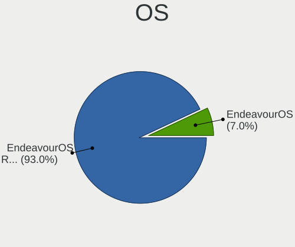

| Name                | Desktops | Percent |
|---------------------|----------|---------|
| EndeavourOS Rolling | 797      | 93%     |
| EndeavourOS         | 60       | 7%      |

OS Family
---------

OS without a version

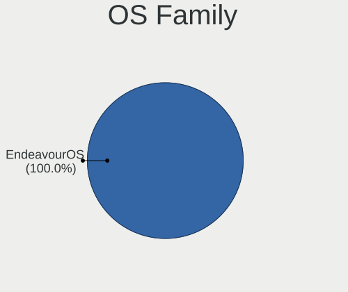

| Name        | Desktops | Percent |
|-------------|----------|---------|
| EndeavourOS | 853      | 100%    |

Kernel
------

Version of the Linux kernel

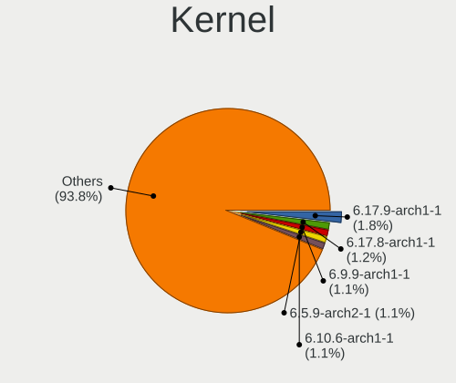

| Version           | Desktops | Percent |
|-------------------|----------|---------|
| 6.17.9-arch1-1    | 19       | 1.83%   |
| 6.17.8-arch1-1    | 12       | 1.15%   |
| 6.9.9-arch1-1     | 11       | 1.06%   |
| 6.5.9-arch2-1     | 11       | 1.06%   |
| 6.10.6-arch1-1    | 11       | 1.06%   |
| 6.4.12-arch1-1    | 10       | 0.96%   |
| 5.15.12-arch1-1   | 10       | 0.96%   |
| 6.11.5-arch1-1    | 9        | 0.87%   |
| 6.6.7-arch1-1     | 8        | 0.77%   |
| 6.15.2-arch1-1    | 8        | 0.77%   |
| 6.14.10-arch1-1   | 8        | 0.77%   |
| 6.13.2-arch1-1    | 8        | 0.77%   |
| 6.11.6-arch1-1    | 8        | 0.77%   |
| 6.10.10-arch1-1   | 8        | 0.77%   |
| 6.1.1-arch1-1     | 8        | 0.77%   |
| 6.17.5-arch1-1    | 7        | 0.67%   |
| 6.14.6-arch1-1    | 7        | 0.67%   |
| 6.9.3-arch1-1     | 6        | 0.58%   |
| 6.8.7-arch1-1     | 6        | 0.58%   |
| 6.6.1-arch1-1     | 6        | 0.58%   |
| 6.17.9-zen1-1-zen | 6        | 0.58%   |
| 6.16.7-arch1-1    | 6        | 0.58%   |
| 6.14.9-arch1-1    | 6        | 0.58%   |
| 6.14.2-arch1-1    | 6        | 0.58%   |
| 6.12.1-arch1-1    | 6        | 0.58%   |
| 5.7.7-arch1-1     | 6        | 0.58%   |
| 6.9.4-arch1-1     | 5        | 0.48%   |
| 6.8.2-arch2-1     | 5        | 0.48%   |
| 6.8.1-arch1-1     | 5        | 0.48%   |
| 6.7.0-arch3-1     | 5        | 0.48%   |
| 6.6.32-1-lts      | 5        | 0.48%   |
| 6.5.8-arch1-1     | 5        | 0.48%   |
| 6.5.7-arch1-1     | 5        | 0.48%   |
| 6.5.3-arch1-1     | 5        | 0.48%   |
| 6.3.9-arch1-1     | 5        | 0.48%   |
| 6.2.2-arch1-1     | 5        | 0.48%   |
| 6.17.7-arch1-1    | 5        | 0.48%   |
| 6.10.8-arch1-1    | 5        | 0.48%   |
| 6.1.12-arch1-1    | 5        | 0.48%   |
| 6.0.2-zen1-1-zen  | 5        | 0.48%   |

Kernel Family
-------------

Linux kernel without a distro release

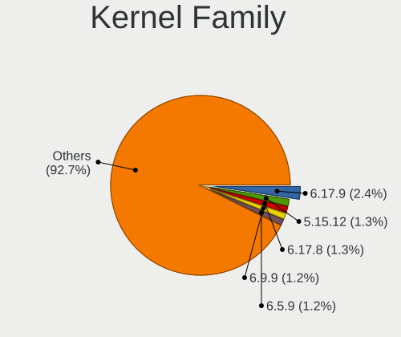

| Version | Desktops | Percent |
|---------|----------|---------|
| 6.17.9  | 25       | 2.41%   |
| 5.15.12 | 14       | 1.35%   |
| 6.17.8  | 13       | 1.25%   |
| 6.9.9   | 12       | 1.16%   |
| 6.5.9   | 12       | 1.16%   |
| 6.4.12  | 12       | 1.16%   |
| 6.10.6  | 12       | 1.16%   |
| 6.11.5  | 11       | 1.06%   |
| 6.1.1   | 11       | 1.06%   |
| 6.11.6  | 10       | 0.96%   |
| 6.0.2   | 10       | 0.96%   |
| 6.9.3   | 9        | 0.87%   |
| 6.6.7   | 9        | 0.87%   |
| 6.5.3   | 9        | 0.87%   |
| 6.14.6  | 9        | 0.87%   |
| 6.10.10 | 9        | 0.87%   |
| 6.8.7   | 8        | 0.77%   |
| 6.6.1   | 8        | 0.77%   |
| 6.15.2  | 8        | 0.77%   |
| 6.14.10 | 8        | 0.77%   |
| 6.13.2  | 8        | 0.77%   |
| 6.7.4   | 7        | 0.67%   |
| 6.2.2   | 7        | 0.67%   |
| 6.17.7  | 7        | 0.67%   |
| 6.17.5  | 7        | 0.67%   |
| 6.16.7  | 7        | 0.67%   |
| 6.14.2  | 7        | 0.67%   |
| 6.12.1  | 7        | 0.67%   |
| 5.17.5  | 7        | 0.67%   |
| 6.8.2   | 6        | 0.58%   |
| 6.8.1   | 6        | 0.58%   |
| 6.7.0   | 6        | 0.58%   |
| 6.5.7   | 6        | 0.58%   |
| 6.14.9  | 6        | 0.58%   |
| 6.13.7  | 6        | 0.58%   |
| 6.12.7  | 6        | 0.58%   |
| 5.7.7   | 6        | 0.58%   |
| 6.9.4   | 5        | 0.48%   |
| 6.8.9   | 5        | 0.48%   |
| 6.7.8   | 5        | 0.48%   |

Kernel Major Ver.
-----------------

Linux kernel major version

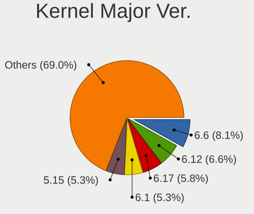

| Version | Desktops | Percent |
|---------|----------|---------|
| 6.6     | 81       | 8.08%   |
| 6.12    | 66       | 6.58%   |
| 6.17    | 58       | 5.78%   |
| 6.1     | 53       | 5.28%   |
| 5.15    | 53       | 5.28%   |
| 6.9     | 47       | 4.69%   |
| 6.10    | 46       | 4.59%   |
| 6.14    | 42       | 4.19%   |
| 6.11    | 42       | 4.19%   |
| 6.5     | 41       | 4.09%   |
| 6.7     | 36       | 3.59%   |
| 6.4     | 36       | 3.59%   |
| 6.0     | 32       | 3.19%   |
| 6.8     | 31       | 3.09%   |
| 6.15    | 31       | 3.09%   |
| 6.13    | 29       | 2.89%   |
| 5.18    | 28       | 2.79%   |
| 6.2     | 27       | 2.69%   |
| 5.16    | 25       | 2.49%   |
| 6.16    | 24       | 2.39%   |
| 5.19    | 22       | 2.19%   |
| 5.17    | 22       | 2.19%   |
| 6.3     | 21       | 2.09%   |
| 5.14    | 17       | 1.69%   |
| 5.10    | 15       | 1.5%    |
| 5.11    | 14       | 1.4%    |
| 5.9     | 13       | 1.3%    |
| 5.12    | 13       | 1.3%    |
| 5.8     | 10       | 1%      |
| 5.7     | 9        | 0.9%    |
| 5.13    | 7        | 0.7%    |
| 6.18    | 5        | 0.5%    |
| 5.6     | 3        | 0.3%    |
| 5.5     | 2        | 0.2%    |
| 5.4     | 1        | 0.1%    |
| Unknown | 1        | 0.1%    |

Arch
----

OS architecture (x86_64, i586, etc.)

| Name   | Desktops | Percent |
|--------|----------|---------|
| x86_64 | 853      | 100%    |

DE
--

Desktop Environment

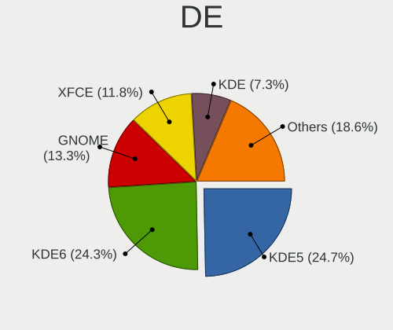

| Name            | Desktops | Percent |
|-----------------|----------|---------|
| KDE5            | 224      | 24.7%   |
| KDE6            | 220      | 24.26%  |
| GNOME           | 121      | 13.34%  |
| XFCE            | 107      | 11.8%   |
| KDE             | 66       | 7.28%   |
| i3              | 36       | 3.97%   |
| X-Cinnamon      | 32       | 3.53%   |
| Hyprland        | 25       | 2.76%   |
| Budgie          | 20       | 2.21%   |
| Unknown         | 16       | 1.76%   |
| Cinnamon        | 9        | 0.99%   |
| sway            | 7        | 0.77%   |
| MATE            | 6        | 0.66%   |
| LXQt            | 4        | 0.44%   |
| LXDE            | 2        | 0.22%   |
| Deepin          | 2        | 0.22%   |
| openbox         | 1        | 0.11%   |
| niri            | 1        | 0.11%   |
| jwm             | 1        | 0.11%   |
| herbstluftwm    | 1        | 0.11%   |
| GTK             | 1        | 0.11%   |
| GNOME Flashback | 1        | 0.11%   |
| GNOME Classic   | 1        | 0.11%   |
| chadwm          | 1        | 0.11%   |
| bspwm           | 1        | 0.11%   |
| awesome         | 1        | 0.11%   |

Display Server
--------------

X11 or Wayland

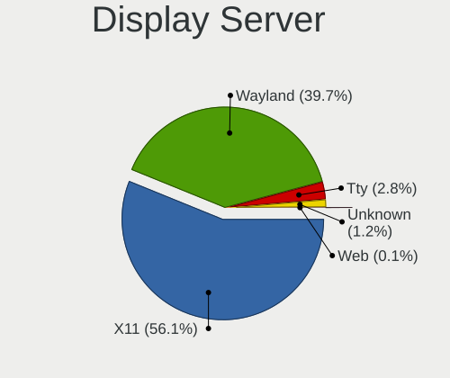

| Name    | Desktops | Percent |
|---------|----------|---------|
| X11     | 498      | 56.14%  |
| Wayland | 352      | 39.68%  |
| Tty     | 25       | 2.82%   |
| Unknown | 11       | 1.24%   |
| Web     | 1        | 0.11%   |

Display Manager
---------------

SDDM, LightDM, etc.

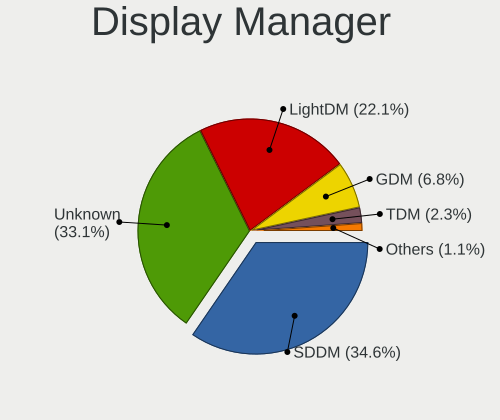

| Name    | Desktops | Percent |
|---------|----------|---------|
| SDDM    | 306      | 34.58%  |
| Unknown | 293      | 33.11%  |
| LightDM | 196      | 22.15%  |
| GDM     | 60       | 6.78%   |
| TDM     | 20       | 2.26%   |
| LY-DM   | 7        | 0.79%   |
| LXDM    | 1        | 0.11%   |
| LEMURS  | 1        | 0.11%   |
| EMPTTY  | 1        | 0.11%   |

OS Lang
-------

Language

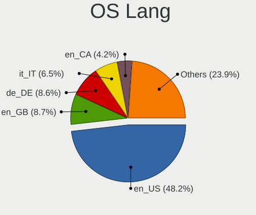

| Lang    | Desktops | Percent |
|---------|----------|---------|
| en_US   | 416      | 48.2%   |
| en_GB   | 75       | 8.69%   |
| de_DE   | 74       | 8.57%   |
| it_IT   | 56       | 6.49%   |
| en_CA   | 36       | 4.17%   |
| ru_RU   | 29       | 3.36%   |
| en_AU   | 20       | 2.32%   |
| es_ES   | 17       | 1.97%   |
| pl_PL   | 14       | 1.62%   |
| pt_BR   | 11       | 1.27%   |
| fr_FR   | 11       | 1.27%   |
| en_IN   | 11       | 1.27%   |
| es_MX   | 10       | 1.16%   |
| Unknown | 8        | 0.93%   |
| sv_SE   | 6        | 0.7%    |
| en_ZA   | 5        | 0.58%   |
| tr_TR   | 4        | 0.46%   |
| nl_NL   | 4        | 0.46%   |
| nl_BE   | 4        | 0.46%   |
| en_DK   | 4        | 0.46%   |
| en_AG   | 4        | 0.46%   |
| pt_PT   | 3        | 0.35%   |
| fi_FI   | 3        | 0.35%   |
| es_AR   | 3        | 0.35%   |
| de_AT   | 3        | 0.35%   |
| hu_HU   | 2        | 0.23%   |
| fr_CA   | 2        | 0.23%   |
| fr_BE   | 2        | 0.23%   |
| es_UY   | 2        | 0.23%   |
| en_SG   | 2        | 0.23%   |
| en_PH   | 2        | 0.23%   |
| en_HK   | 2        | 0.23%   |
| zh_TW   | 1        | 0.12%   |
| zh_CN   | 1        | 0.12%   |
| sl_SI   | 1        | 0.12%   |
| ru_UA   | 1        | 0.12%   |
| ja_JP   | 1        | 0.12%   |
| is      | 1        | 0.12%   |
| es_SV   | 1        | 0.12%   |
| es_GT   | 1        | 0.12%   |

Boot Mode
---------

EFI or BIOS

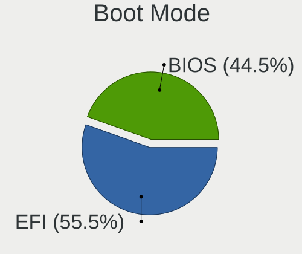

| Mode | Desktops | Percent |
|------|----------|---------|
| EFI  | 483      | 55.45%  |
| BIOS | 388      | 44.55%  |

Filesystem
----------

Type of filesystem

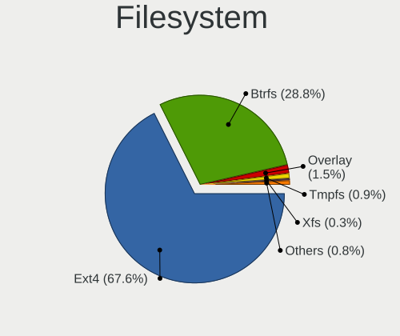

| Type    | Desktops | Percent |
|---------|----------|---------|
| Ext4    | 586      | 67.59%  |
| Btrfs   | 250      | 28.84%  |
| Overlay | 13       | 1.5%    |
| Tmpfs   | 8        | 0.92%   |
| Xfs     | 3        | 0.35%   |
| F2fs    | 3        | 0.35%   |
| Unknown | 2        | 0.23%   |
| Zfs     | 1        | 0.12%   |
| XXX4    | 1        | 0.12%   |

Part. scheme
------------

Scheme of partitioning

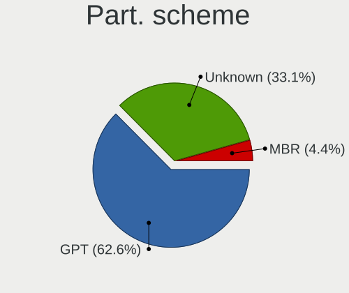

| Type    | Desktops | Percent |
|---------|----------|---------|
| GPT     | 543      | 62.56%  |
| Unknown | 287      | 33.06%  |
| MBR     | 38       | 4.38%   |

Dual Boot with Linux/BSD
------------------------

Hosting more than one Linux/BSD

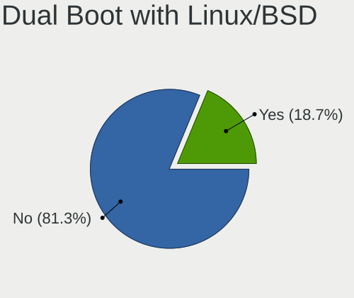

| Dual boot | Desktops | Percent |
|-----------|----------|---------|
| No        | 707      | 81.26%  |
| Yes       | 163      | 18.74%  |

Dual Boot (Win)
---------------

Hosting Linux and Windows

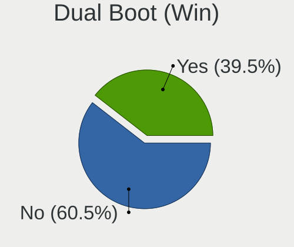

| Dual boot | Desktops | Percent |
|-----------|----------|---------|
| No        | 527      | 60.51%  |
| Yes       | 344      | 39.49%  |

Board
-----

Vendor
------

Motherboard manufacturer

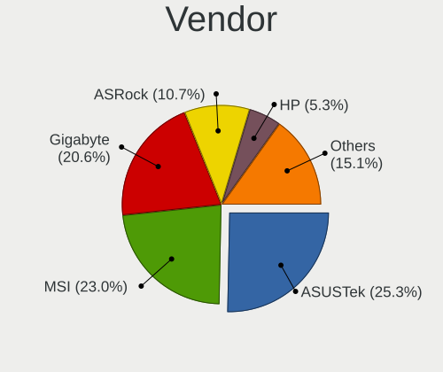

| Name                                 | Desktops | Percent |
|--------------------------------------|----------|---------|
| ASUSTek Computer                     | 216      | 25.32%  |
| MSI                                  | 196      | 22.98%  |
| Gigabyte Technology                  | 176      | 20.63%  |
| ASRock                               | 91       | 10.67%  |
| Hewlett-Packard                      | 45       | 5.28%   |
| Dell                                 | 40       | 4.69%   |
| Lenovo                               | 20       | 2.34%   |
| Unknown                              | 11       | 1.29%   |
| Intel                                | 6        | 0.7%    |
| Huanan                               | 6        | 0.7%    |
| AZW                                  | 6        | 0.7%    |
| Biostar                              | 5        | 0.59%   |
| Acer                                 | 5        | 0.59%   |
| Fujitsu                              | 4        | 0.47%   |
| Medion                               | 3        | 0.35%   |
| GEEKOM                               | 3        | 0.35%   |
| Shenzhen Meigao Electronic Equipment | 2        | 0.23%   |
| Samsung Electronics                  | 2        | 0.23%   |
| Positivo                             | 2        | 0.23%   |
| Alienware                            | 2        | 0.23%   |
| Win element                          | 1        | 0.12%   |
| UMAX                                 | 1        | 0.12%   |
| Shenzhen suqiao computer technology  | 1        | 0.12%   |
| MACHINIST                            | 1        | 0.12%   |
| LattePanda                           | 1        | 0.12%   |
| JGINYUE                              | 1        | 0.12%   |
| Google                               | 1        | 0.12%   |
| Foxconn                              | 1        | 0.12%   |
| Daten Tecnologia                     | 1        | 0.12%   |
| Casper                               | 1        | 0.12%   |
| BESSTAR Tech                         | 1        | 0.12%   |
| Apple                                | 1        | 0.12%   |

Model
-----

Motherboard model

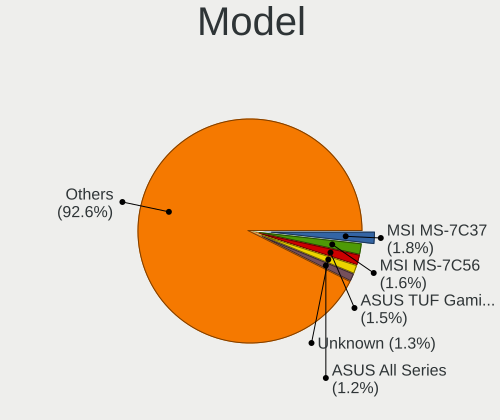

| Name                              | Desktops | Percent |
|-----------------------------------|----------|---------|
| MSI MS-7C37                       | 15       | 1.76%   |
| MSI MS-7C56                       | 14       | 1.64%   |
| ASUS TUF Gaming X570-PLUS         | 13       | 1.52%   |
| Unknown                           | 11       | 1.29%   |
| ASUS All Series                   | 10       | 1.17%   |
| MSI MS-7C91                       | 8        | 0.94%   |
| MSI MS-7A38                       | 8        | 0.94%   |
| ASRock B450M Pro4                 | 8        | 0.94%   |
| MSI MS-7C02                       | 7        | 0.82%   |
| Gigabyte B450M DS3H               | 7        | 0.82%   |
| ASUS ROG STRIX B550-F GAMING      | 7        | 0.82%   |
| MSI MS-7C52                       | 6        | 0.7%    |
| Gigabyte X570 AORUS ELITE         | 6        | 0.7%    |
| Gigabyte X470 AORUS ULTRA GAMING  | 6        | 0.7%    |
| Gigabyte B550I AORUS PRO AX       | 6        | 0.7%    |
| MSI MS-7D75                       | 5        | 0.59%   |
| MSI MS-7C94                       | 5        | 0.59%   |
| MSI MS-7C84                       | 5        | 0.59%   |
| Gigabyte B550 AORUS ELITE V2      | 5        | 0.59%   |
| Gigabyte B450 AORUS ELITE         | 5        | 0.59%   |
| ASUS TUF Gaming B550-PLUS         | 5        | 0.59%   |
| ASUS ROG STRIX X570-E GAMING      | 5        | 0.59%   |
| ASUS ROG STRIX B450-F GAMING      | 5        | 0.59%   |
| ASUS ROG CROSSHAIR VIII DARK HERO | 5        | 0.59%   |
| MSI MS-7D25                       | 4        | 0.47%   |
| MSI MS-7C95                       | 4        | 0.47%   |
| MSI MS-7B86                       | 4        | 0.47%   |
| MSI MS-7B79                       | 4        | 0.47%   |
| HP Compaq Elite 8300 SFF          | 4        | 0.47%   |
| Gigabyte B550M K                  | 4        | 0.47%   |
| Gigabyte B450M S2H                | 4        | 0.47%   |
| Dell OptiPlex 7050                | 4        | 0.47%   |
| Dell OptiPlex 3050                | 4        | 0.47%   |
| ASUS PRIME X570-P                 | 4        | 0.47%   |
| ASRock B550M Steel Legend         | 4        | 0.47%   |
| ASRock B450 Steel Legend          | 4        | 0.47%   |
| ASRock B450 Pro4                  | 4        | 0.47%   |
| MSI MS-7B98                       | 3        | 0.35%   |
| MSI MS-7A37                       | 3        | 0.35%   |
| MSI MS-7850                       | 3        | 0.35%   |

Model Family
------------

Motherboard model prefix

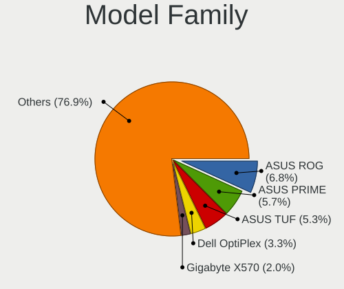

| Name               | Desktops | Percent |
|--------------------|----------|---------|
| ASUS ROG           | 58       | 6.8%    |
| ASUS PRIME         | 49       | 5.74%   |
| ASUS TUF           | 45       | 5.28%   |
| Dell OptiPlex      | 28       | 3.28%   |
| Gigabyte X570      | 17       | 1.99%   |
| Gigabyte B550M     | 16       | 1.88%   |
| MSI MS-7C37        | 15       | 1.76%   |
| MSI MS-7C56        | 14       | 1.64%   |
| ASRock B450M       | 13       | 1.52%   |
| Lenovo ThinkCentre | 12       | 1.41%   |
| Gigabyte B550      | 12       | 1.41%   |
| Gigabyte B450M     | 11       | 1.29%   |
| Gigabyte B450      | 11       | 1.29%   |
| Unknown            | 11       | 1.29%   |
| HP EliteDesk       | 10       | 1.17%   |
| ASUS All           | 10       | 1.17%   |
| ASRock B450        | 10       | 1.17%   |
| MSI MS-7C91        | 8        | 0.94%   |
| MSI MS-7A38        | 8        | 0.94%   |
| Gigabyte Z390      | 8        | 0.94%   |
| Gigabyte X470      | 8        | 0.94%   |
| MSI MS-7C02        | 7        | 0.82%   |
| HP Compaq          | 7        | 0.82%   |
| ASRock B550M       | 7        | 0.82%   |
| MSI MS-7C52        | 6        | 0.7%    |
| Gigabyte B550I     | 6        | 0.7%    |
| MSI MS-7D75        | 5        | 0.59%   |
| MSI MS-7C94        | 5        | 0.59%   |
| MSI MS-7C84        | 5        | 0.59%   |
| HP ProDesk         | 5        | 0.59%   |
| Gigabyte B650      | 5        | 0.59%   |
| MSI MS-7D25        | 4        | 0.47%   |
| MSI MS-7C95        | 4        | 0.47%   |
| MSI MS-7B86        | 4        | 0.47%   |
| MSI MS-7B79        | 4        | 0.47%   |
| HP Pavilion        | 4        | 0.47%   |
| Gigabyte X670      | 4        | 0.47%   |
| Gigabyte B650M     | 4        | 0.47%   |
| Dell Precision     | 4        | 0.47%   |
| ASUS STRIX         | 4        | 0.47%   |

MFG Year
--------

Motherboard manufacture year

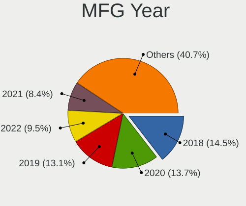

| Year | Desktops | Percent |
|------|----------|---------|
| 2018 | 124      | 14.54%  |
| 2020 | 117      | 13.72%  |
| 2019 | 112      | 13.13%  |
| 2022 | 81       | 9.5%    |
| 2021 | 72       | 8.44%   |
| 2012 | 45       | 5.28%   |
| 2013 | 44       | 5.16%   |
| 2017 | 42       | 4.92%   |
| 2023 | 41       | 4.81%   |
| 2014 | 35       | 4.1%    |
| 2024 | 32       | 3.75%   |
| 2016 | 31       | 3.63%   |
| 2015 | 29       | 3.4%    |
| 2011 | 15       | 1.76%   |
| 2009 | 11       | 1.29%   |
| 2010 | 8        | 0.94%   |
| 2008 | 6        | 0.7%    |
| 2007 | 4        | 0.47%   |
| 2025 | 2        | 0.23%   |
| 2006 | 2        | 0.23%   |

Form Factor
-----------

Physical design of the computer

| Name    | Desktops | Percent |
|---------|----------|---------|
| Desktop | 853      | 100%    |

Secure Boot
-----------

Enabled or disabled

| State    | Desktops | Percent |
|----------|----------|---------|
| Disabled | 834      | 97.66%  |
| Enabled  | 20       | 2.34%   |

Coreboot
--------

Have coreboot on board

| Used | Desktops | Percent |
|------|----------|---------|
| No   | 852      | 99.88%  |
| Yes  | 1        | 0.12%   |

RAM Size
--------

Total RAM memory

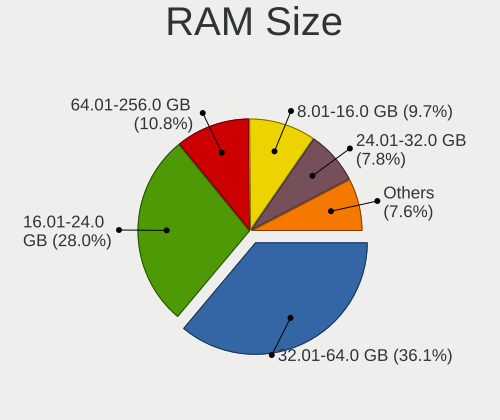

| Size in GB      | Desktops | Percent |
|-----------------|----------|---------|
| 32.01-64.0      | 312      | 36.11%  |
| 16.01-24.0      | 242      | 28.01%  |
| 64.01-256.0     | 93       | 10.76%  |
| 8.01-16.0       | 84       | 9.72%   |
| 24.01-32.0      | 67       | 7.75%   |
| 4.01-8.0        | 39       | 4.51%   |
| 3.01-4.0        | 20       | 2.31%   |
| 1.01-2.0        | 4        | 0.46%   |
| More than 256.0 | 1        | 0.12%   |
| 2.01-3.0        | 1        | 0.12%   |
| Unknown         | 1        | 0.12%   |

RAM Used
--------

Used RAM memory

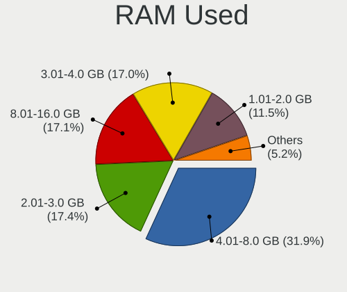

| Used GB    | Desktops | Percent |
|------------|----------|---------|
| 4.01-8.0   | 299      | 31.88%  |
| 2.01-3.0   | 163      | 17.38%  |
| 8.01-16.0  | 160      | 17.06%  |
| 3.01-4.0   | 159      | 16.95%  |
| 1.01-2.0   | 108      | 11.51%  |
| 16.01-24.0 | 26       | 2.77%   |
| 0.51-1.0   | 11       | 1.17%   |
| 24.01-32.0 | 10       | 1.07%   |
| 32.01-64.0 | 1        | 0.11%   |
| Unknown    | 1        | 0.11%   |

Total Drives
------------

Number of drives on board

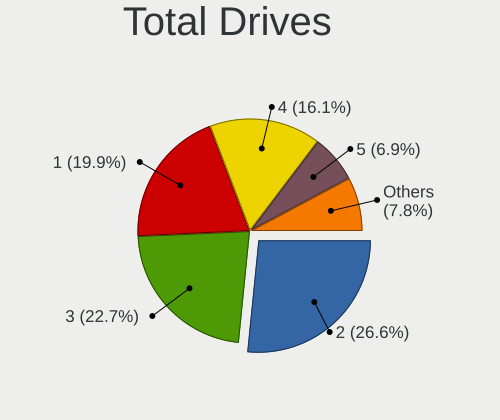

| Drives | Desktops | Percent |
|--------|----------|---------|
| 2      | 239      | 26.59%  |
| 3      | 204      | 22.69%  |
| 1      | 179      | 19.91%  |
| 4      | 145      | 16.13%  |
| 5      | 62       | 6.9%    |
| 6      | 38       | 4.23%   |
| 7      | 16       | 1.78%   |
| 8      | 6        | 0.67%   |
| 9      | 4        | 0.44%   |
| 0      | 4        | 0.44%   |
| 10     | 2        | 0.22%   |

Has CD-ROM
----------

Has CD-ROM on board

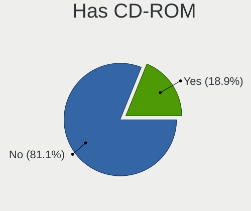

| Presented | Desktops | Percent |
|-----------|----------|---------|
| No        | 697      | 81.14%  |
| Yes       | 162      | 18.86%  |

Has Ethernet
------------

Has Ethernet on board

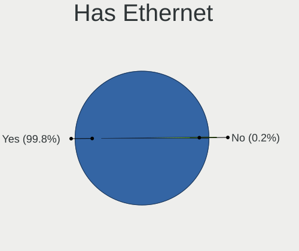

| Presented | Desktops | Percent |
|-----------|----------|---------|
| Yes       | 851      | 99.77%  |
| No        | 2        | 0.23%   |

Has WiFi
--------

Has WiFi module

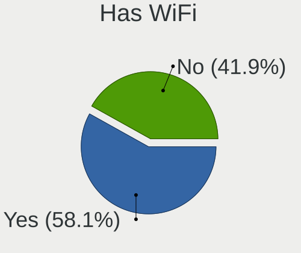

| Presented | Desktops | Percent |
|-----------|----------|---------|
| Yes       | 503      | 58.08%  |
| No        | 363      | 41.92%  |

Has Bluetooth
-------------

Has Bluetooth module

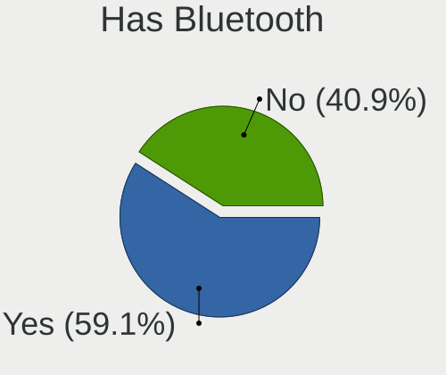

| Presented | Desktops | Percent |
|-----------|----------|---------|
| Yes       | 514      | 59.08%  |
| No        | 356      | 40.92%  |

Location
--------

Country
-------

Geographic location (country)

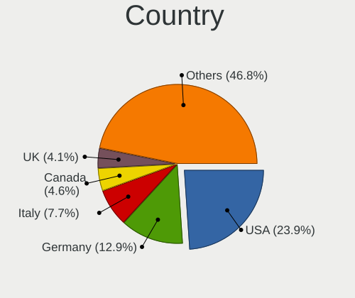

| Country         | Desktops | Percent |
|-----------------|----------|---------|
| USA             | 206      | 23.93%  |
| Germany         | 111      | 12.89%  |
| Italy           | 66       | 7.67%   |
| Canada          | 40       | 4.65%   |
| UK              | 35       | 4.07%   |
| Russia          | 34       | 3.95%   |
| Poland          | 28       | 3.25%   |
| Australia       | 26       | 3.02%   |
| France          | 24       | 2.79%   |
| Spain           | 23       | 2.67%   |
| Sweden          | 20       | 2.32%   |
| Netherlands     | 20       | 2.32%   |
| Brazil          | 18       | 2.09%   |
| India           | 15       | 1.74%   |
| Belgium         | 15       | 1.74%   |
| Mexico          | 14       | 1.63%   |
| Austria         | 14       | 1.63%   |
| Turkey          | 9        | 1.05%   |
| Switzerland     | 9        | 1.05%   |
| Finland         | 8        | 0.93%   |
| Portugal        | 7        | 0.81%   |
| Denmark         | 7        | 0.81%   |
| Czechia         | 7        | 0.81%   |
| Serbia          | 6        | 0.7%    |
| South Africa    | 5        | 0.58%   |
| Norway          | 5        | 0.58%   |
| Indonesia       | 5        | 0.58%   |
| Hungary         | 5        | 0.58%   |
| Slovenia        | 4        | 0.46%   |
| Romania         | 4        | 0.46%   |
| Chile           | 4        | 0.46%   |
| Argentina       | 4        | 0.46%   |
| Malaysia        | 3        | 0.35%   |
| Hong Kong       | 3        | 0.35%   |
| Greece          | 3        | 0.35%   |
| Croatia         | 3        | 0.35%   |
| Belarus         | 3        | 0.35%   |
| Vietnam         | 2        | 0.23%   |
| Uruguay         | 2        | 0.23%   |
| The Netherlands | 2        | 0.23%   |

City
----

Geographic location (city)

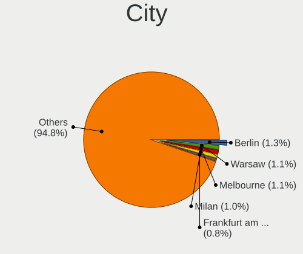

| City                  | Desktops | Percent |
|-----------------------|----------|---------|
| Berlin                | 12       | 1.3%    |
| Warsaw                | 10       | 1.08%   |
| Melbourne             | 10       | 1.08%   |
| Milan                 | 9        | 0.98%   |
| Frankfurt am Main     | 7        | 0.76%   |
| Vienna                | 6        | 0.65%   |
| Sydney                | 6        | 0.65%   |
| New York              | 6        | 0.65%   |
| Moscow                | 6        | 0.65%   |
| Madrid                | 6        | 0.65%   |
| Brisbane              | 6        | 0.65%   |
| Amsterdam             | 6        | 0.65%   |
| Toronto               | 5        | 0.54%   |
| Seattle               | 5        | 0.54%   |
| Mississauga           | 5        | 0.54%   |
| Hamburg               | 5        | 0.54%   |
| Stockholm             | 4        | 0.43%   |
| San Luis Potosí City | 4        | 0.43%   |
| Rome                  | 4        | 0.43%   |
| Ottawa                | 4        | 0.43%   |
| Munich                | 4        | 0.43%   |
| Montreal              | 4        | 0.43%   |
| Leipzig               | 4        | 0.43%   |
| Istanbul              | 4        | 0.43%   |
| Houston               | 4        | 0.43%   |
| Helsinki              | 4        | 0.43%   |
| Bologna               | 4        | 0.43%   |
| Belgrade              | 4        | 0.43%   |
| Watertown             | 3        | 0.33%   |
| Turin                 | 3        | 0.33%   |
| St Petersburg         | 3        | 0.33%   |
| St Louis              | 3        | 0.33%   |
| Sao Paulo             | 3        | 0.33%   |
| Racine                | 3        | 0.33%   |
| Prague                | 3        | 0.33%   |
| Paris                 | 3        | 0.33%   |
| Oldenzaal             | 3        | 0.33%   |
| Los Angeles           | 3        | 0.33%   |
| London                | 3        | 0.33%   |
| Lisbon                | 3        | 0.33%   |

Drives
------

Drive Vendor
------------

Hard drive vendors

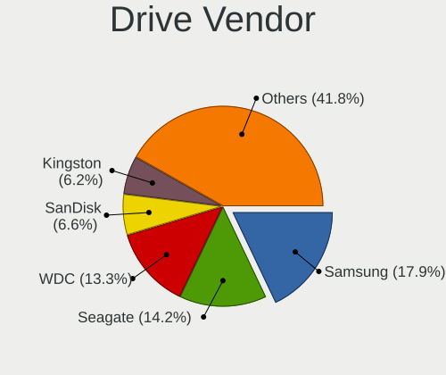

| Vendor                       | Desktops | Drives | Percent |
|------------------------------|----------|--------|---------|
| Samsung Electronics          | 361      | 648    | 17.93%  |
| Seagate                      | 285      | 449    | 14.16%  |
| WDC                          | 267      | 462    | 13.26%  |
| SanDisk                      | 133      | 184    | 6.61%   |
| Kingston                     | 125      | 188    | 6.21%   |
| Crucial                      | 108      | 157    | 5.37%   |
| Toshiba                      | 96       | 141    | 4.77%   |
| Phison Electronics           | 54       | 77     | 2.68%   |
| Micron/Crucial Technology    | 45       | 74     | 2.24%   |
| Kingston Technology Company  | 42       | 52     | 2.09%   |
| Intel                        | 35       | 54     | 1.74%   |
| Hitachi                      | 32       | 42     | 1.59%   |
| SK hynix                     | 25       | 28     | 1.24%   |
| Micron Technology            | 22       | 31     | 1.09%   |
| ADATA Technology             | 19       | 23     | 0.94%   |
| A-DATA Technology            | 19       | 28     | 0.94%   |
| SPCC                         | 18       | 30     | 0.89%   |
| Unknown                      | 17       | 25     | 0.84%   |
| PNY                          | 16       | 29     | 0.79%   |
| HGST                         | 16       | 21     | 0.79%   |
| China                        | 16       | 18     | 0.79%   |
| Silicon Motion               | 15       | 20     | 0.75%   |
| MAXIO Technology (Hangzhou)  | 15       | 21     | 0.75%   |
| Intenso                      | 14       | 19     | 0.7%    |
| Phison                       | 12       | 13     | 0.6%    |
| Realtek Semiconductor        | 9        | 11     | 0.45%   |
| Patriot                      | 9        | 13     | 0.45%   |
| LITEON                       | 8        | 10     | 0.4%    |
| KIOXIA                       | 8        | 8      | 0.4%    |
| Corsair                      | 8        | 8      | 0.4%    |
| Team                         | 7        | 9      | 0.35%   |
| Shenzhen Longsys Electronics | 7        | 9      | 0.35%   |
| OCZ                          | 7        | 7      | 0.35%   |
| JMicron Technology           | 7        | 8      | 0.35%   |
| T-FORCE                      | 6        | 10     | 0.3%    |
| Gigabyte Technology          | 6        | 7      | 0.3%    |
| Transcend                    | 5        | 7      | 0.25%   |
| XPG                          | 4        | 4      | 0.2%    |
| SABRENT                      | 4        | 12     | 0.2%    |
| Netac                        | 4        | 4      | 0.2%    |

Drive Model
-----------

Hard drive models

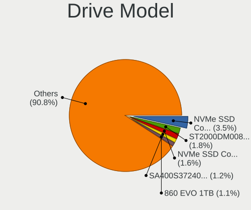

| Model                                                 | Desktops | Percent |
|-------------------------------------------------------|----------|---------|
| Samsung NVMe SSD Controller SM981/PM981/PM983 1TB     | 84       | 3.51%   |
| Seagate ST2000DM008-2FR102 2TB                        | 43       | 1.8%    |
| Samsung NVMe SSD Controller PM9A1/PM9A3/980PRO 1TB    | 38       | 1.59%   |
| Kingston SA400S37240G 240GB SSD                       | 28       | 1.17%   |
| Samsung SSD 860 EVO 1TB                               | 27       | 1.13%   |
| Samsung SSD 860 EVO 500GB                             | 26       | 1.09%   |
| Crucial CT500MX500SSD1 500GB                          | 25       | 1.04%   |
| Seagate ST4000DM004-2CV104 4TB                        | 24       | 1%      |
| Phison E12 NVMe Controller 1TB                        | 23       | 0.96%   |
| WDC WD10EZEX-08WN4A0 1TB                              | 21       | 0.88%   |
| Seagate ST1000DM010-2EP102 1TB                        | 21       | 0.88%   |
| Samsung SSD 850 EVO 250GB                             | 21       | 0.88%   |
| Micron/Crucial P2 NVMe PCIe SSD 2TB                   | 21       | 0.88%   |
| Samsung SSD 870 EVO 1TB                               | 20       | 0.84%   |
| Samsung SSD 980 1TB                                   | 19       | 0.79%   |
| Crucial CT1000MX500SSD1 1TB                           | 19       | 0.79%   |
| Toshiba DT01ACA100 1TB                                | 17       | 0.71%   |
| Samsung SSD 860 EVO 250GB                             | 16       | 0.67%   |
| Phison E16 PCIe4 NVMe Controller 1TB                  | 16       | 0.67%   |
| Seagate ST2000DM006-2DM164 2TB                        | 14       | 0.58%   |
| Samsung SSD 850 EVO 500GB                             | 14       | 0.58%   |
| Kingston SA400S37480G 480GB SSD                       | 14       | 0.58%   |
| Kingston SA400S37120G 120GB SSD                       | 14       | 0.58%   |
| Samsung SSD 870 QVO 1TB                               | 12       | 0.5%    |
| Kingston Company SNV2S1000G 1TB                       | 12       | 0.5%    |
| Crucial CT240BX500SSD1 240GB                          | 12       | 0.5%    |
| Silicon Motion SM2263EN/SM2263XT SSD Controller 512GB | 11       | 0.46%   |
| Sandisk WD Blue SN550 NVMe SSD 1024GB                 | 11       | 0.46%   |
| Sandisk WD Black SN750 / PC SN730 NVMe SSD 500GB      | 11       | 0.46%   |
| Samsung SSD 990 PRO 2TB                               | 11       | 0.46%   |
| WDC WD10EZEX-00BN5A0 1TB                              | 10       | 0.42%   |
| Seagate ST500DM002-1BD142 500GB                       | 10       | 0.42%   |
| Seagate ST1000DM003-1CH162 1TB                        | 10       | 0.42%   |
| Samsung SSD 990 PRO 1TB                               | 10       | 0.42%   |
| Samsung SSD 980 500GB                                 | 10       | 0.42%   |
| Samsung SSD 870 EVO 2TB                               | 10       | 0.42%   |
| Samsung NVMe SSD Controller SM961/PM961/SM963 1024GB  | 10       | 0.42%   |
| WDC WDS100T2B0A-00SM50 1TB SSD                        | 9        | 0.38%   |
| WDC WD40EZRZ-00GXCB0 4TB                              | 9        | 0.38%   |
| Toshiba HDWD110 1TB                                   | 9        | 0.38%   |

HDD Vendor
----------

Hard disk drive vendors

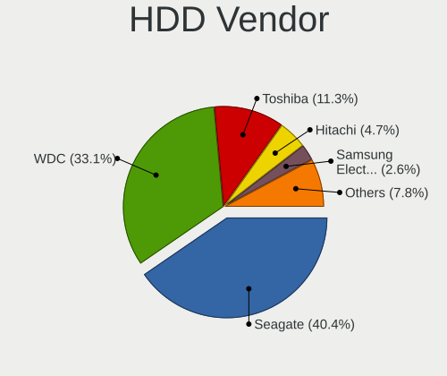

| Vendor              | Desktops | Drives | Percent |
|---------------------|----------|--------|---------|
| Seagate             | 275      | 424    | 40.44%  |
| WDC                 | 225      | 362    | 33.09%  |
| Toshiba             | 77       | 114    | 11.32%  |
| Hitachi             | 32       | 42     | 4.71%   |
| Samsung Electronics | 18       | 42     | 2.65%   |
| HGST                | 16       | 21     | 2.35%   |
| Unknown             | 8        | 8      | 1.18%   |
| Maxtor              | 4        | 5      | 0.59%   |
| JMicron Technology  | 3        | 4      | 0.44%   |
| ASMT                | 3        | 5      | 0.44%   |
| Intenso             | 2        | 2      | 0.29%   |
| Apple               | 2        | 2      | 0.29%   |
| T-FORCE             | 1        | 1      | 0.15%   |
| SSK                 | 1        | 2      | 0.15%   |
| RSH-339             | 1        | 1      | 0.15%   |
| PI-041              | 1        | 1      | 0.15%   |
| MSFT                | 1        | 1      | 0.15%   |
| Maxone              | 1        | 1      | 0.15%   |
| MaxDigital          | 1        | 2      | 0.15%   |
| MARVELL             | 1        | 4      | 0.15%   |
| ICY BOX             | 1        | 1      | 0.15%   |
| HPE                 | 1        | 1      | 0.15%   |
| HGST HTS            | 1        | 1      | 0.15%   |
| H/W                 | 1        | 3      | 0.15%   |
| External            | 1        | 1      | 0.15%   |
| ASMedia             | 1        | 1      | 0.15%   |
| Unknown             | 1        | 1      | 0.15%   |

SSD Vendor
----------

Solid state drive vendors

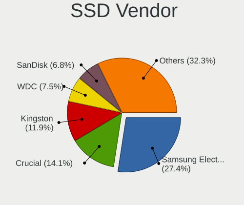

| Vendor              | Desktops | Drives | Percent |
|---------------------|----------|--------|---------|
| Samsung Electronics | 201      | 299    | 27.42%  |
| Crucial             | 103      | 144    | 14.05%  |
| Kingston            | 87       | 133    | 11.87%  |
| WDC                 | 55       | 76     | 7.5%    |
| SanDisk             | 50       | 60     | 6.82%   |
| China               | 16       | 18     | 2.18%   |
| PNY                 | 15       | 28     | 2.05%   |
| Intel               | 15       | 26     | 2.05%   |
| A-DATA Technology   | 15       | 18     | 2.05%   |
| SPCC                | 14       | 25     | 1.91%   |
| Toshiba             | 13       | 17     | 1.77%   |
| Intenso             | 12       | 16     | 1.64%   |
| Micron Technology   | 10       | 14     | 1.36%   |
| SK hynix            | 9        | 10     | 1.23%   |
| Patriot             | 9        | 13     | 1.23%   |
| LITEON              | 8        | 10     | 1.09%   |
| Team                | 7        | 9      | 0.95%   |
| OCZ                 | 7        | 7      | 0.95%   |
| T-FORCE             | 5        | 5      | 0.68%   |
| Gigabyte Technology | 5        | 5      | 0.68%   |
| SABRENT             | 4        | 12     | 0.55%   |
| KingSpec            | 4        | 4      | 0.55%   |
| GOODRAM             | 4        | 4      | 0.55%   |
| Corsair             | 4        | 4      | 0.55%   |
| Transcend           | 3        | 3      | 0.41%   |
| Seagate             | 3        | 16     | 0.41%   |
| Netac               | 3        | 3      | 0.41%   |
| LITEONIT            | 3        | 3      | 0.41%   |
| Hewlett-Packard     | 3        | 6      | 0.41%   |
| Apacer              | 3        | 3      | 0.41%   |
| Timetec             | 2        | 21     | 0.27%   |
| Plextor             | 2        | 6      | 0.27%   |
| Phison              | 2        | 2      | 0.27%   |
| Leven               | 2        | 3      | 0.27%   |
| KIOXIA-EXCERIA      | 2        | 5      | 0.27%   |
| Unknown             | 2        | 2      | 0.27%   |
| ZEB-SD26            | 1        | 1      | 0.14%   |
| XrayDisk            | 1        | 1      | 0.14%   |
| UMAX                | 1        | 1      | 0.14%   |
| TECHLEAF-SSD        | 1        | 1      | 0.14%   |

Drive Kind
----------

HDD or SSD

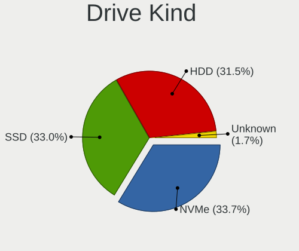

| Kind    | Desktops | Drives | Percent |
|---------|----------|--------|---------|
| NVMe    | 539      | 963    | 33.73%  |
| SSD     | 528      | 1077   | 33.04%  |
| HDD     | 504      | 1053   | 31.54%  |
| Unknown | 27       | 36     | 1.69%   |

Drive Connector
---------------

SATA, SAS, NVMe, etc.

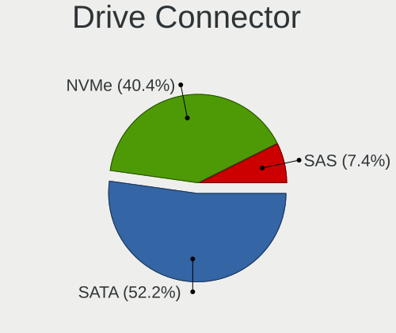

| Type | Desktops | Drives | Percent |
|------|----------|--------|---------|
| SATA | 695      | 2026   | 52.22%  |
| NVMe | 538      | 949    | 40.42%  |
| SAS  | 98       | 154    | 7.36%   |

Drive Size
----------

Size of hard drive

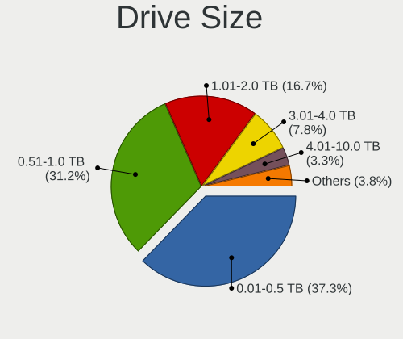

| Size in TB | Desktops | Drives | Percent |
|------------|----------|--------|---------|
| 0.01-0.5   | 444      | 910    | 37.28%  |
| 0.51-1.0   | 371      | 631    | 31.15%  |
| 1.01-2.0   | 199      | 323    | 16.71%  |
| 3.01-4.0   | 93       | 145    | 7.81%   |
| 4.01-10.0  | 39       | 60     | 3.27%   |
| 2.01-3.0   | 35       | 44     | 2.94%   |
| 10.01-20.0 | 9        | 16     | 0.76%   |
| 20.01-50.0 | 1        | 1      | 0.08%   |

Space Total
-----------

Amount of disk space available on the file system

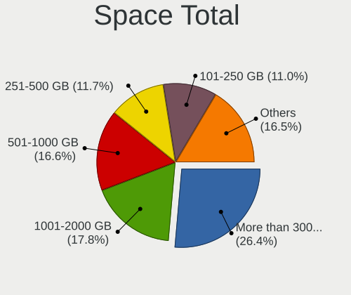

| Size in GB     | Desktops | Percent |
|----------------|----------|---------|
| More than 3000 | 237      | 26.39%  |
| 1001-2000      | 160      | 17.82%  |
| 501-1000       | 149      | 16.59%  |
| 251-500        | 105      | 11.69%  |
| 101-250        | 99       | 11.02%  |
| 2001-3000      | 80       | 8.91%   |
| Unknown        | 30       | 3.34%   |
| 1-20           | 25       | 2.78%   |
| 51-100         | 10       | 1.11%   |
| 21-50          | 3        | 0.33%   |

Space Used
----------

Amount of used disk space

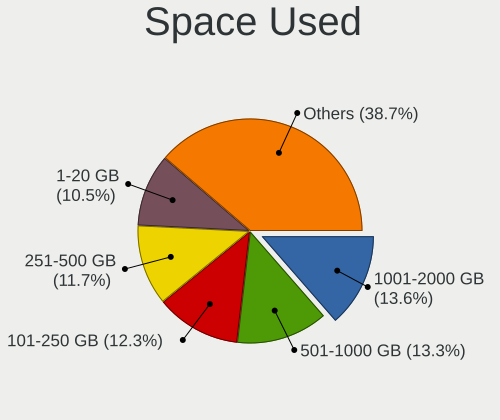

| Used GB        | Desktops | Percent |
|----------------|----------|---------|
| 1001-2000      | 127      | 13.58%  |
| 501-1000       | 124      | 13.26%  |
| 101-250        | 115      | 12.3%   |
| 251-500        | 109      | 11.66%  |
| 1-20           | 98       | 10.48%  |
| 21-50          | 93       | 9.95%   |
| 51-100         | 93       | 9.95%   |
| More than 3000 | 91       | 9.73%   |
| 2001-3000      | 55       | 5.88%   |
| Unknown        | 30       | 3.21%   |

Malfunc. Drives
---------------

Drive models with a malfunction

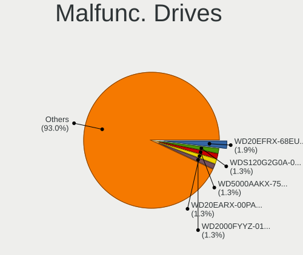

| Model                                                          | Desktops | Drives | Percent |
|----------------------------------------------------------------|----------|--------|---------|
| WDC WD20EFRX-68EUZN0 2TB                                       | 3        | 6      | 1.9%    |
| WDC WDS120G2G0A-00JH30 120GB SSD                               | 2        | 2      | 1.27%   |
| WDC WD5000AAKX-75U6AA0 500GB                                   | 2        | 2      | 1.27%   |
| WDC WD20EARX-00PASB0 2TB                                       | 2        | 2      | 1.27%   |
| WDC WD2000FYYZ-01UL1B2 2TB                                     | 2        | 2      | 1.27%   |
| Toshiba THNSNK128GCS8 SATA 128GB SSD                           | 2        | 2      | 1.27%   |
| Toshiba MQ01ABD100 1TB                                         | 2        | 2      | 1.27%   |
| Toshiba DT01ACA100 1TB                                         | 2        | 2      | 1.27%   |
| Seagate ST500LT012-9WS142 500GB                                | 2        | 3      | 1.27%   |
| Seagate ST500LT012-1DG142 500GB                                | 2        | 2      | 1.27%   |
| Seagate ST500LM021-1KJ152 500GB                                | 2        | 11     | 1.27%   |
| Seagate ST4000DM004-2CV104 4TB                                 | 2        | 2      | 1.27%   |
| Seagate ST4000DM000-1F2168 4TB                                 | 2        | 2      | 1.27%   |
| Seagate ST31000528AS 1TB                                       | 2        | 2      | 1.27%   |
| Seagate ST2000DX002-2DV164 2TB                                 | 2        | 3      | 1.27%   |
| Seagate ST2000DM008-2FR102 2TB                                 | 2        | 2      | 1.27%   |
| Seagate ST2000DM001-9YN164 2TB                                 | 2        | 2      | 1.27%   |
| Seagate ST1000LM024 HN-M101MBB 1TB                             | 2        | 3      | 1.27%   |
| Seagate ST1000DM003-9YN162 1TB                                 | 2        | 2      | 1.27%   |
| Seagate ST1000DM003-1ER162 1TB                                 | 2        | 3      | 1.27%   |
| Samsung Electronics NVMe SSD Controller SM981/PM981/PM983 1TB  | 2        | 7      | 1.27%   |
| Samsung Electronics NVMe SSD Controller PM9A1/PM9A3/980PRO 1TB | 2        | 2      | 1.27%   |
| Samsung Electronics HD502HI 500GB                              | 2        | 2      | 1.27%   |
| Samsung Electronics HD103SI 1TB                                | 2        | 4      | 1.27%   |
| Kingston SV300S37A120G 120GB SSD                               | 2        | 2      | 1.27%   |
| Kingston SA400S37480G 480GB SSD                                | 2        | 2      | 1.27%   |
| Hewlett-Packard VK0480GEQNB 480GB SSD                          | 2        | 5      | 1.27%   |
| Crucial CT1050MX300SSD1 1050GB                                 | 2        | 2      | 1.27%   |
| ZEB-SD26 SSD 256G                                              | 1        | 1      | 0.63%   |
| XPG GAMMIX S11 240GB                                           | 1        | 1      | 0.63%   |
| WDC WDS240G2G0B-00EPW0 240GB SSD                               | 1        | 1      | 0.63%   |
| WDC WDS240G2G0A-00JH30 240GB SSD                               | 1        | 1      | 0.63%   |
| WDC WDS100T2B0A-00SM50 1TB SSD                                 | 1        | 1      | 0.63%   |
| WDC WD6400AAKS-00A7B2 640GB                                    | 1        | 1      | 0.63%   |
| WDC WD5000LPCX-21VHAT0 500GB                                   | 1        | 1      | 0.63%   |
| WDC WD5000AZRX-00A8LB0 500GB                                   | 1        | 1      | 0.63%   |
| WDC WD5000AVDS-63U7B1 500GB                                    | 1        | 1      | 0.63%   |
| WDC WD5000AAKX-00ERMA0 500GB                                   | 1        | 1      | 0.63%   |
| WDC WD5000AAKS-00A7B0 500GB                                    | 1        | 1      | 0.63%   |
| WDC WD5000AADS-00L4B1 500GB                                    | 1        | 1      | 0.63%   |

Malfunc. Drive Vendor
---------------------

Vendors of faulty drives

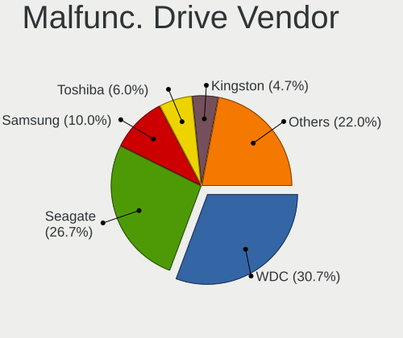

| Vendor                      | Desktops | Drives | Percent |
|-----------------------------|----------|--------|---------|
| WDC                         | 46       | 61     | 30.67%  |
| Seagate                     | 40       | 61     | 26.67%  |
| Samsung Electronics         | 15       | 23     | 10%     |
| Toshiba                     | 9        | 10     | 6%      |
| Kingston                    | 7        | 7      | 4.67%   |
| Hitachi                     | 6        | 6      | 4%      |
| Crucial                     | 5        | 15     | 3.33%   |
| SanDisk                     | 4        | 4      | 2.67%   |
| Intel                       | 2        | 2      | 1.33%   |
| Hewlett-Packard             | 2        | 5      | 1.33%   |
| ZEB-SD26                    | 1        | 1      | 0.67%   |
| XPG                         | 1        | 1      | 0.67%   |
| Transcend                   | 1        | 1      | 0.67%   |
| SK hynix                    | 1        | 1      | 0.67%   |
| Patriot                     | 1        | 1      | 0.67%   |
| OCZ                         | 1        | 1      | 0.67%   |
| Neo                         | 1        | 2      | 0.67%   |
| Micron Technology           | 1        | 1      | 0.67%   |
| Maxtor                      | 1        | 2      | 0.67%   |
| MAXIO Technology (Hangzhou) | 1        | 1      | 0.67%   |
| HGST                        | 1        | 3      | 0.67%   |
| Drevo                       | 1        | 1      | 0.67%   |
| Corsair                     | 1        | 1      | 0.67%   |
| ASMT                        | 1        | 2      | 0.67%   |

Malfunc. HDD Vendor
-------------------

Vendors of faulty HDD drives

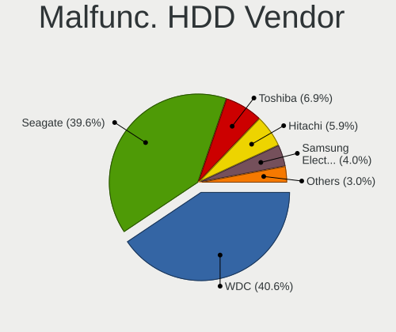

| Vendor              | Desktops | Drives | Percent |
|---------------------|----------|--------|---------|
| WDC                 | 41       | 54     | 40.59%  |
| Seagate             | 40       | 61     | 39.6%   |
| Toshiba             | 7        | 8      | 6.93%   |
| Hitachi             | 6        | 6      | 5.94%   |
| Samsung Electronics | 4        | 6      | 3.96%   |
| Maxtor              | 1        | 2      | 0.99%   |
| HGST                | 1        | 3      | 0.99%   |
| ASMT                | 1        | 2      | 0.99%   |

Malfunc. Drive Kind
-------------------

Kinds of faulty drives

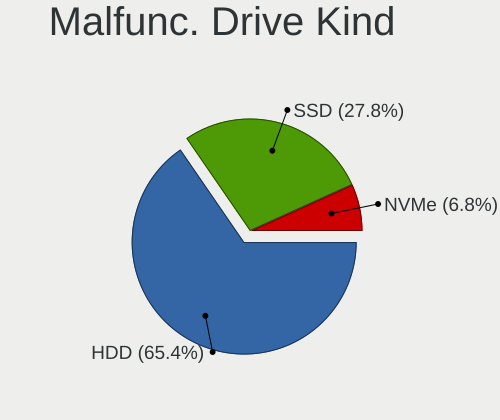

| Kind | Desktops | Drives | Percent |
|------|----------|--------|---------|
| HDD  | 87       | 142    | 65.41%  |
| SSD  | 37       | 57     | 27.82%  |
| NVMe | 9        | 14     | 6.77%   |

Failed Drives
-------------

Failed drive models

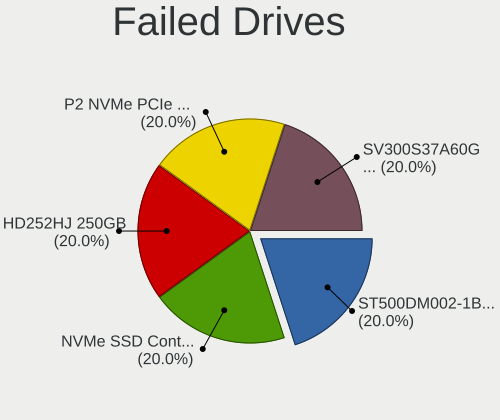

| Model                                                            | Desktops | Drives | Percent |
|------------------------------------------------------------------|----------|--------|---------|
| Seagate ST500DM002-1BC142 500GB                                  | 1        | 1      | 20%     |
| Samsung Electronics NVMe SSD Controller SM961/PM961/SM963 1024GB | 1        | 1      | 20%     |
| Samsung Electronics HD252HJ 250GB                                | 1        | 1      | 20%     |
| Micron/Crucial Technology P2 NVMe PCIe SSD 2TB                   | 1        | 1      | 20%     |
| Kingston SV300S37A60G 64GB SSD                                   | 1        | 1      | 20%     |

Failed Drive Vendor
-------------------

Failed drive vendors

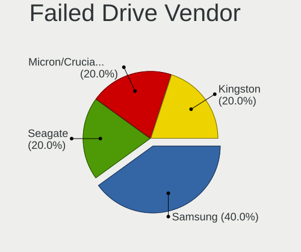

| Vendor                    | Desktops | Drives | Percent |
|---------------------------|----------|--------|---------|
| Samsung Electronics       | 2        | 2      | 40%     |
| Seagate                   | 1        | 1      | 20%     |
| Micron/Crucial Technology | 1        | 1      | 20%     |
| Kingston                  | 1        | 1      | 20%     |

Drive Status
------------

Number of failed and malfunc. drives

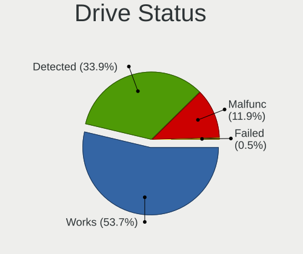

| Status   | Desktops | Drives | Percent |
|----------|----------|--------|---------|
| Works    | 551      | 1790   | 53.7%   |
| Detected | 348      | 1121   | 33.92%  |
| Malfunc  | 122      | 213    | 11.89%  |
| Failed   | 5        | 5      | 0.49%   |

Storage controller
------------------

Storage Vendor
--------------

Storage controller vendors

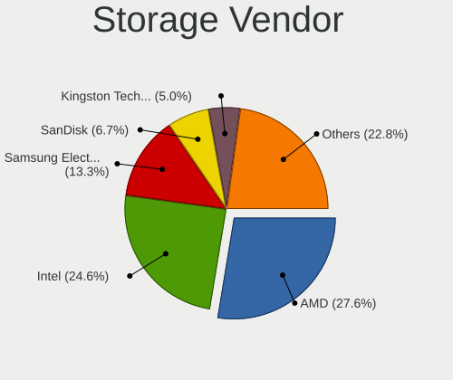

| Vendor                         | Desktops | Percent |
|--------------------------------|----------|---------|
| AMD                            | 446      | 27.6%   |
| Intel                          | 397      | 24.57%  |
| Samsung Electronics            | 215      | 13.3%   |
| SanDisk                        | 108      | 6.68%   |
| Kingston Technology Company    | 81       | 5.01%   |
| ASMedia Technology             | 76       | 4.7%    |
| Phison Electronics             | 72       | 4.46%   |
| Micron/Crucial Technology      | 49       | 3.03%   |
| ADATA Technology               | 23       | 1.42%   |
| Silicon Motion                 | 18       | 1.11%   |
| SK hynix                       | 16       | 0.99%   |
| MAXIO Technology (Hangzhou)    | 16       | 0.99%   |
| Realtek Semiconductor          | 13       | 0.8%    |
| Micron Technology              | 13       | 0.8%    |
| Toshiba America Info Systems   | 10       | 0.62%   |
| Marvell Technology Group       | 9        | 0.56%   |
| KIOXIA                         | 8        | 0.5%    |
| JMicron Technology             | 8        | 0.5%    |
| Shenzhen Longsys Electronics   | 7        | 0.43%   |
| Nvidia                         | 6        | 0.37%   |
| Solidigm                       | 4        | 0.25%   |
| Seagate Technology             | 4        | 0.25%   |
| LSI Logic / Symbios Logic      | 3        | 0.19%   |
| INNOGRIT                       | 3        | 0.19%   |
| Transcend                      | 2        | 0.12%   |
| Nextorage                      | 2        | 0.12%   |
| Broadcom / LSI                 | 2        | 0.12%   |
| VIA Technologies               | 1        | 0.06%   |
| ULi Electronics                | 1        | 0.06%   |
| Solid State Storage Technology | 1        | 0.06%   |
| Biwin Storage Technology       | 1        | 0.06%   |
| Unknown                        | 1        | 0.06%   |

Storage Model
-------------

Storage controller models

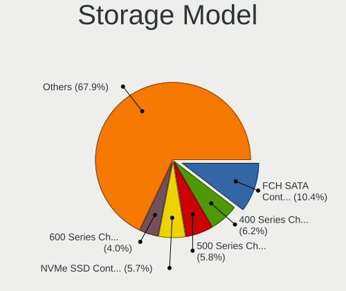

| Model                                                                          | Desktops | Percent |
|--------------------------------------------------------------------------------|----------|---------|
| AMD FCH SATA Controller [AHCI mode]                                            | 191      | 10.4%   |
| AMD 400 Series Chipset SATA Controller                                         | 113      | 6.15%   |
| AMD 500 Series Chipset SATA Controller                                         | 107      | 5.83%   |
| Samsung NVMe SSD Controller SM981/PM981/PM983                                  | 104      | 5.66%   |
| AMD 600 Series Chipset SATA Controller                                         | 74       | 4.03%   |
| ASMedia ASM1061/ASM1062 Serial ATA Controller                                  | 68       | 3.7%    |
| Intel 8 Series/C220 Series Chipset Family 6-port SATA Controller 1 [AHCI mode] | 54       | 2.94%   |
| Samsung NVMe SSD Controller PM9A1/PM9A3/980PRO                                 | 43       | 2.34%   |
| Intel Cannon Lake PCH SATA AHCI Controller                                     | 43       | 2.34%   |
| Intel 200 Series PCH SATA controller [AHCI mode]                               | 41       | 2.23%   |
| Samsung NVMe SSD Controller 980 (DRAM-less)                                    | 36       | 1.96%   |
| Intel Q170/Q150/B150/H170/H110/Z170/CM236 Chipset SATA Controller [AHCI Mode]  | 35       | 1.91%   |
| Phison E12 NVMe Controller                                                     | 31       | 1.69%   |
| Micron/Crucial P2 [Nick P2] / P3 / P3 Plus NVMe PCIe SSD (DRAM-less)           | 27       | 1.47%   |
| Samsung NVMe SSD Controller S4LV008[Pascal]                                    | 26       | 1.42%   |
| Intel Raptor Lake SATA AHCI Controller                                         | 24       | 1.31%   |
| Phison E16 PCIe4 NVMe Controller                                               | 23       | 1.25%   |
| Intel SATA Controller [RAID mode]                                              | 23       | 1.25%   |
| Intel Alder Lake-S PCH SATA Controller [AHCI Mode]                             | 23       | 1.25%   |
| Intel 7 Series/C210 Series Chipset Family 6-port SATA Controller [AHCI mode]   | 23       | 1.25%   |
| Intel 500 Series Chipset Family SATA AHCI Controller                           | 23       | 1.25%   |
| Kingston Company KC3000/FURY Renegade NVMe SSD [E18]                           | 22       | 1.2%    |
| SanDisk Ultra 3D / WD PC SN530, IX SN530, Blue SN550 NVMe SSD (DRAM-less)      | 21       | 1.14%   |
| Sandisk WD Black SN850X NVMe SSD                                               | 20       | 1.09%   |
| SanDisk Extreme Pro / WD Black SN750 / PC SN730 / Red SN700 NVMe SSD           | 17       | 0.93%   |
| Samsung NVMe SSD Controller SM961/PM961/SM963                                  | 16       | 0.87%   |
| Kingston Company NV2 NVMe SSD [SM2267XT] (DRAM-less)                           | 16       | 0.87%   |
| SanDisk Extreme Pro / WD Black 2018/SN750/PC SN720 NVMe SSD                    | 14       | 0.76%   |
| Kingston Company A2000 NVMe SSD [SM2263EN]                                     | 14       | 0.76%   |
| AMD 300 Series Chipset SATA Controller                                         | 14       | 0.76%   |
| Silicon Motion SM2263EN/SM2263XT (DRAM-less) NVMe SSD Controllers              | 13       | 0.71%   |
| AMD A320 Chipset SATA Controller [AHCI mode]                                   | 13       | 0.71%   |
| SanDisk WD SN560/SN740/SN770/SN5000 NVMe SSD                                   | 12       | 0.65%   |
| Intel 9 Series Chipset Family SATA Controller [AHCI Mode]                      | 12       | 0.65%   |
| ADATA XPG SX8200 Pro PCIe Gen3x4 M.2 2280 Solid State Drive                    | 12       | 0.65%   |
| Intel 400 Series Chipset Family SATA AHCI Controller                           | 11       | 0.6%    |
| Micron/Crucial P5 Plus NVMe PCIe SSD                                           | 10       | 0.54%   |
| MAXIO (Hangzhou) NVMe SSD Controller MAP1202 (DRAM-less)                       | 10       | 0.54%   |
| Intel Volume Management Device NVMe RAID Controller                            | 10       | 0.54%   |
| Intel 6 Series/C200 Series Chipset Family 6 port Desktop SATA AHCI Controller  | 10       | 0.54%   |

Storage Kind
------------

Kind of storage controller (IDE, SATA, NVMe, SAS, ...)

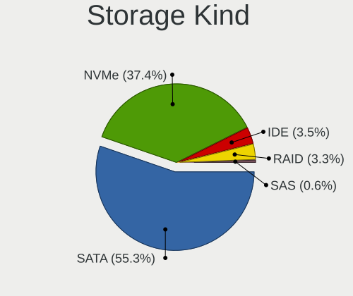

| Kind | Desktops | Percent |
|------|----------|---------|
| SATA | 796      | 55.28%  |
| NVMe | 538      | 37.36%  |
| IDE  | 50       | 3.47%   |
| RAID | 47       | 3.26%   |
| SAS  | 9        | 0.63%   |

Processor
---------

CPU Vendor
----------

Processor vendors

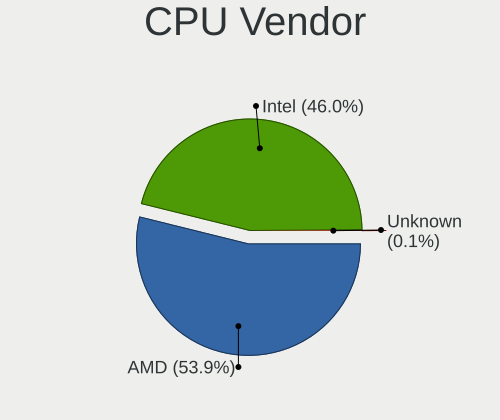

| Vendor  | Desktops | Percent |
|---------|----------|---------|
| AMD     | 460      | 53.86%  |
| Intel   | 393      | 46.02%  |
| Unknown | 1        | 0.12%   |

CPU Model
---------

Processor models

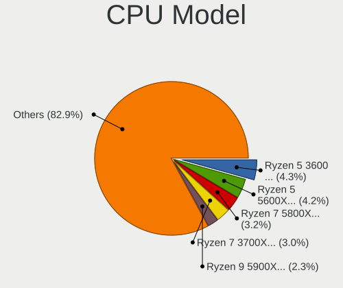

| Model                                       | Desktops | Percent |
|---------------------------------------------|----------|---------|
| AMD Ryzen 5 3600 6-Core Processor           | 37       | 4.33%   |
| AMD Ryzen 5 5600X 6-Core Processor          | 36       | 4.21%   |
| AMD Ryzen 7 5800X 8-Core Processor          | 27       | 3.16%   |
| AMD Ryzen 7 3700X 8-Core Processor          | 26       | 3.04%   |
| AMD Ryzen 9 5900X 12-Core Processor         | 20       | 2.34%   |
| AMD Ryzen 7 5700X 8-Core Processor          | 19       | 2.22%   |
| Intel Core i7-4790 CPU @ 3.60GHz            | 16       | 1.87%   |
| AMD Ryzen 9 3900X 12-Core Processor         | 16       | 1.87%   |
| AMD Ryzen 7 7800X3D 8-Core Processor        | 15       | 1.75%   |
| AMD Ryzen 9 5950X 16-Core Processor         | 13       | 1.52%   |
| AMD Ryzen 7 5800X3D 8-Core Processor        | 12       | 1.4%    |
| AMD Ryzen 7 5700G with Radeon Graphics      | 12       | 1.4%    |
| AMD Ryzen 5 5600G with Radeon Graphics      | 12       | 1.4%    |
| AMD Ryzen 7 7700X 8-Core Processor          | 11       | 1.29%   |
| Intel Core i9-9900K CPU @ 3.60GHz           | 10       | 1.17%   |
| Intel Core i7-6700K CPU @ 4.00GHz           | 10       | 1.17%   |
| AMD Ryzen 5 7600X 6-Core Processor          | 10       | 1.17%   |
| AMD Ryzen 5 1600 Six-Core Processor         | 10       | 1.17%   |
| Intel Core i7-7700 CPU @ 3.60GHz            | 8        | 0.94%   |
| Intel Core i7-10700K CPU @ 3.80GHz          | 8        | 0.94%   |
| Intel Core i5-6600K CPU @ 3.50GHz           | 8        | 0.94%   |
| AMD Ryzen 7 2700X Eight-Core Processor      | 8        | 0.94%   |
| AMD Ryzen 5 5600 6-Core Processor           | 8        | 0.94%   |
| AMD Ryzen 5 3600X 6-Core Processor          | 8        | 0.94%   |
| AMD Ryzen 5 2600 Six-Core Processor         | 8        | 0.94%   |
| Intel Core i5-9600K CPU @ 3.70GHz           | 7        | 0.82%   |
| Intel Core i5-3470 CPU @ 3.20GHz            | 7        | 0.82%   |
| AMD Ryzen 7 9800X3D 8-Core Processor        | 7        | 0.82%   |
| AMD Ryzen 5 3400G with Radeon Vega Graphics | 7        | 0.82%   |
| Intel Core i7-4770 CPU @ 3.40GHz            | 6        | 0.7%    |
| AMD Ryzen 9 7950X 16-Core Processor         | 6        | 0.7%    |
| AMD Ryzen 5 5500                            | 6        | 0.7%    |
| AMD Ryzen 3 2200G with Radeon Vega Graphics | 6        | 0.7%    |
| Intel Core i7-9700K CPU @ 3.60GHz           | 5        | 0.58%   |
| Intel Core i7-8700K CPU @ 3.70GHz           | 5        | 0.58%   |
| Intel Core i7-7700K CPU @ 4.20GHz           | 5        | 0.58%   |
| Intel Core i7-6700 CPU @ 3.40GHz            | 5        | 0.58%   |
| Intel Core i7-4790K CPU @ 4.00GHz           | 5        | 0.58%   |
| Intel Core i7-4770K CPU @ 3.50GHz           | 5        | 0.58%   |
| Intel Core i7-2600 CPU @ 3.40GHz            | 5        | 0.58%   |

CPU Model Family
----------------

Processor model prefix

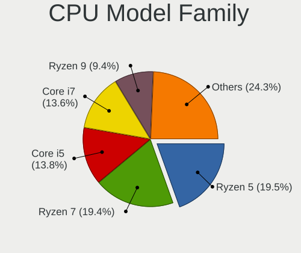

| Model                   | Desktops | Percent |
|-------------------------|----------|---------|
| AMD Ryzen 5             | 167      | 19.53%  |
| AMD Ryzen 7             | 166      | 19.42%  |
| Intel Core i5           | 118      | 13.8%   |
| Intel Core i7           | 116      | 13.57%  |
| AMD Ryzen 9             | 80       | 9.36%   |
| Other                   | 65       | 7.6%    |
| Intel Xeon              | 29       | 3.39%   |
| Intel Core i3           | 24       | 2.81%   |
| Intel Core i9           | 15       | 1.75%   |
| AMD Ryzen 3             | 11       | 1.29%   |
| Intel Celeron           | 9        | 1.05%   |
| AMD FX                  | 8        | 0.94%   |
| Intel Pentium           | 4        | 0.47%   |
| Intel Core 2 Duo        | 4        | 0.47%   |
| AMD A10                 | 4        | 0.47%   |
| Intel Core 2 Quad       | 3        | 0.35%   |
| AMD Ryzen Threadripper  | 3        | 0.35%   |
| AMD Phenom II X6        | 3        | 0.35%   |
| AMD Athlon II X4        | 3        | 0.35%   |
| AMD A8                  | 3        | 0.35%   |
| Intel Pentium Dual-Core | 2        | 0.23%   |
| Intel Pentium Dual      | 2        | 0.23%   |
| AMD Phenom II X4        | 2        | 0.23%   |
| AMD Athlon II X2        | 2        | 0.23%   |
| AMD Athlon              | 2        | 0.23%   |
| Intel Pentium Gold      | 1        | 0.12%   |
| Intel Core m3           | 1        | 0.12%   |
| Intel Core 2            | 1        | 0.12%   |
| AMD Ryzen 5 PRO         | 1        | 0.12%   |
| AMD Phenom II X2        | 1        | 0.12%   |
| AMD E                   | 1        | 0.12%   |
| AMD Athlon X4           | 1        | 0.12%   |
| AMD Athlon II X3        | 1        | 0.12%   |
| AMD Athlon 64           | 1        | 0.12%   |
| AMD A6                  | 1        | 0.12%   |

CPU Cores
---------

Number of processor cores

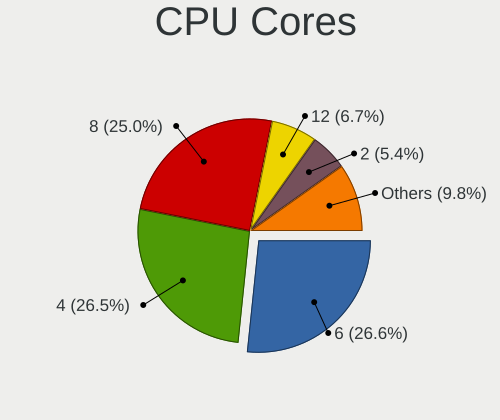

| Number  | Desktops | Percent |
|---------|----------|---------|
| 6       | 228      | 26.64%  |
| 4       | 227      | 26.52%  |
| 8       | 214      | 25%     |
| 12      | 57       | 6.66%   |
| 2       | 46       | 5.37%   |
| 16      | 41       | 4.79%   |
| 14      | 13       | 1.52%   |
| 10      | 13       | 1.52%   |
| 24      | 7        | 0.82%   |
| 3       | 4        | 0.47%   |
| 20      | 2        | 0.23%   |
| 32      | 1        | 0.12%   |
| 5       | 1        | 0.12%   |
| 1       | 1        | 0.12%   |
| Unknown | 1        | 0.12%   |

CPU Sockets
-----------

Number of sockets

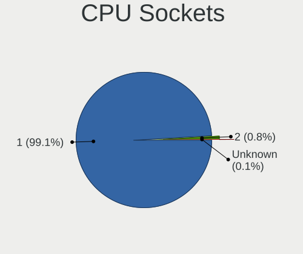

| Number  | Desktops | Percent |
|---------|----------|---------|
| 1       | 847      | 99.06%  |
| 2       | 7        | 0.82%   |
| Unknown | 1        | 0.12%   |

CPU Threads
-----------

Threads per core (Hyper-Threading)

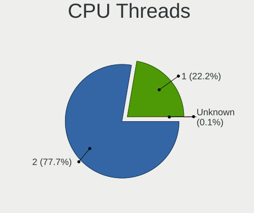

| Number  | Desktops | Percent |
|---------|----------|---------|
| 2       | 665      | 77.69%  |
| 1       | 190      | 22.2%   |
| Unknown | 1        | 0.12%   |

CPU Op-Modes
------------

CPU Operation Modes (32-bit, 64-bit)

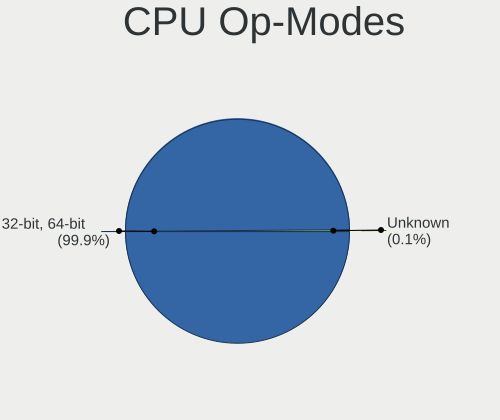

| Op mode        | Desktops | Percent |
|----------------|----------|---------|
| 32-bit, 64-bit | 853      | 99.88%  |
| Unknown        | 1        | 0.12%   |

CPU Microcode
-------------

Microcode number

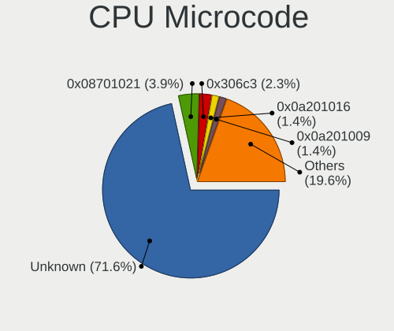

| Number     | Desktops | Percent |
|------------|----------|---------|
| Unknown    | 629      | 71.56%  |
| 0x08701021 | 34       | 3.87%   |
| 0x306c3    | 20       | 2.28%   |
| 0x0a201016 | 12       | 1.37%   |
| 0x0a201009 | 12       | 1.37%   |
| 0x0a20120a | 11       | 1.25%   |
| 0x08701013 | 11       | 1.25%   |
| 0x506e3    | 9        | 1.02%   |
| 0x0800820d | 9        | 1.02%   |
| 0x306a9    | 8        | 0.91%   |
| 0x0a50000c | 8        | 0.91%   |
| 0x906ea    | 7        | 0.8%    |
| 0x08108109 | 7        | 0.8%    |
| 0x08001138 | 7        | 0.8%    |
| 0x906e9    | 6        | 0.68%   |
| 0x0a601203 | 6        | 0.68%   |
| 0xa0655    | 5        | 0.57%   |
| 0x08701030 | 5        | 0.57%   |
| 0x08101016 | 5        | 0.57%   |
| 0xa0653    | 3        | 0.34%   |
| 0x90672    | 3        | 0.34%   |
| 0x106a5    | 3        | 0.34%   |
| 0x0a601206 | 3        | 0.34%   |
| 0x0a20120e | 3        | 0.34%   |
| 0x0a201204 | 3        | 0.34%   |
| 0x0a20102b | 3        | 0.34%   |
| 0x08001137 | 3        | 0.34%   |
| 0x06000852 | 3        | 0.34%   |
| 0xb0671    | 2        | 0.23%   |
| 0xa0671    | 2        | 0.23%   |
| 0x906ec    | 2        | 0.23%   |
| 0x906eb    | 2        | 0.23%   |
| 0x6fd      | 2        | 0.23%   |
| 0x306f2    | 2        | 0.23%   |
| 0x106e5    | 2        | 0.23%   |
| 0x0a50000d | 2        | 0.23%   |
| 0x0a201025 | 2        | 0.23%   |
| 0x906ed    | 1        | 0.11%   |
| 0x706a8    | 1        | 0.11%   |
| 0x706a1    | 1        | 0.11%   |

CPU Microarch
-------------

Microarchitecture

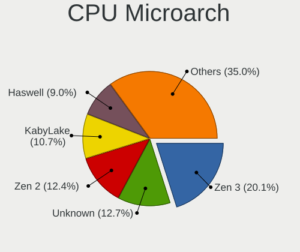

| Name             | Desktops | Percent |
|------------------|----------|---------|
| Zen 3            | 172      | 20.09%  |
| Unknown          | 109      | 12.73%  |
| Zen 2            | 106      | 12.38%  |
| KabyLake         | 92       | 10.75%  |
| Haswell          | 77       | 9%      |
| Skylake          | 40       | 4.67%   |
| Zen+             | 37       | 4.32%   |
| Alderlake Hybrid | 36       | 4.21%   |
| Zen              | 34       | 3.97%   |
| CometLake        | 32       | 3.74%   |
| IvyBridge        | 30       | 3.5%    |
| SandyBridge      | 19       | 2.22%   |
| K10              | 10       | 1.17%   |
| Piledriver       | 9        | 1.05%   |
| Icelake          | 8        | 0.93%   |
| Core             | 8        | 0.93%   |
| Nehalem          | 7        | 0.82%   |
| Penryn           | 6        | 0.7%    |
| Westmere         | 4        | 0.47%   |
| Steamroller      | 3        | 0.35%   |
| Goldmont plus    | 3        | 0.35%   |
| Bulldozer        | 3        | 0.35%   |
| Broadwell        | 3        | 0.35%   |
| Excavator        | 2        | 0.23%   |
| Tremont          | 1        | 0.12%   |
| Silvermont       | 1        | 0.12%   |
| K8 Hammer        | 1        | 0.12%   |
| K10 Llano        | 1        | 0.12%   |
| Gracemont        | 1        | 0.12%   |
| Goldmont         | 1        | 0.12%   |

Graphics
--------

GPU Vendor
----------

Vendors of graphics cards

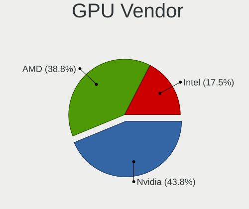

| Vendor | Desktops | Percent |
|--------|----------|---------|
| Nvidia | 419      | 43.78%  |
| AMD    | 371      | 38.77%  |
| Intel  | 167      | 17.45%  |

GPU Model
---------

Graphics card models

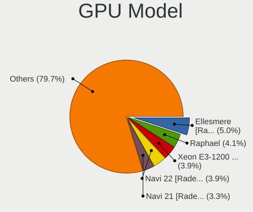

| Model                                                                       | Desktops | Percent |
|-----------------------------------------------------------------------------|----------|---------|
| AMD Ellesmere [Radeon RX 470/480/570/570X/580/580X/590]                     | 51       | 5%      |
| AMD Raphael                                                                 | 42       | 4.11%   |
| Intel Xeon E3-1200 v3/4th Gen Core Processor Integrated Graphics Controller | 40       | 3.92%   |
| AMD Navi 22 [Radeon RX 6700/6700 XT/6750 XT / 6800M/6850M XT]               | 40       | 3.92%   |
| AMD Navi 21 [Radeon RX 6800/6800 XT / 6900 XT]                              | 34       | 3.33%   |
| AMD Navi 23 [Radeon RX 6600/6600 XT/6600M]                                  | 31       | 3.04%   |
| AMD Navi 10 [Radeon RX 5600 OEM/5600 XT / 5700/5700 XT]                     | 25       | 2.45%   |
| Nvidia GP107 [GeForce GTX 1050 Ti]                                          | 22       | 2.15%   |
| AMD Navi 31 [Radeon RX 7900 XT/7900 XTX/7900 GRE/7900M]                     | 22       | 2.15%   |
| AMD Navi 32 [Radeon RX 7700 XT / 7800 XT]                                   | 21       | 2.06%   |
| Nvidia GA106 [GeForce RTX 3060 Lite Hash Rate]                              | 19       | 1.86%   |
| Intel CoffeeLake-S GT2 [UHD Graphics 630]                                   | 17       | 1.67%   |
| Intel Skylake-S GT2 [HD Graphics 530]                                       | 16       | 1.57%   |
| Nvidia GP104 [GeForce GTX 1070]                                             | 15       | 1.47%   |
| AMD Cezanne [Radeon Vega Series / Radeon Vega Mobile Series]                | 15       | 1.47%   |
| Nvidia TU106 [GeForce RTX 2060 Rev. A]                                      | 14       | 1.37%   |
| Nvidia GP106 [GeForce GTX 1060 6GB]                                         | 14       | 1.37%   |
| Nvidia GA104 [GeForce RTX 3060 Ti Lite Hash Rate]                           | 13       | 1.27%   |
| Intel Kaby Lake-S GT2 [HD Graphics 630]                                     | 13       | 1.27%   |
| Nvidia TU104 [GeForce RTX 2070 SUPER]                                       | 12       | 1.18%   |
| Nvidia GA104 [GeForce RTX 3070]                                             | 12       | 1.18%   |
| Nvidia GK208B [GeForce GT 710]                                              | 11       | 1.08%   |
| Nvidia GA102 [GeForce RTX 3080]                                             | 11       | 1.08%   |
| AMD Granite Ridge [Radeon Graphics]                                         | 11       | 1.08%   |
| Nvidia TU116 [GeForce GTX 1660 SUPER]                                       | 10       | 0.98%   |
| Nvidia GP104 [GeForce GTX 1080]                                             | 10       | 0.98%   |
| Intel Alder Lake-S GT1 [UHD Graphics 770]                                   | 10       | 0.98%   |
| AMD Picasso/Raven 2 [Radeon Vega Series / Radeon Vega Mobile Series]        | 9        | 0.88%   |
| AMD Navi 24 [Radeon RX 6400/6500 XT/6500M]                                  | 9        | 0.88%   |
| AMD Lexa PRO [Radeon 540/540X/550/550X / RX 540X/550/550X]                  | 9        | 0.88%   |
| Nvidia TU117 [GeForce GTX 1650]                                             | 8        | 0.78%   |
| Nvidia TU116 [GeForce GTX 1660 Ti]                                          | 8        | 0.78%   |
| Nvidia GP108 [GeForce GT 1030]                                              | 8        | 0.78%   |
| Nvidia AD104 [GeForce RTX 4070 Ti]                                          | 8        | 0.78%   |
| Intel Raptor Lake-S GT1 [UHD Graphics 770]                                  | 8        | 0.78%   |
| Nvidia GP102 [GeForce GTX 1080 Ti]                                          | 7        | 0.69%   |
| Nvidia GM204 [GeForce GTX 970]                                              | 7        | 0.69%   |
| Nvidia GA102 [GeForce RTX 3080 Ti]                                          | 7        | 0.69%   |
| Nvidia GA102 [GeForce RTX 3080 Lite Hash Rate]                              | 7        | 0.69%   |
| Nvidia AD104 [GeForce RTX 4070]                                             | 7        | 0.69%   |

GPU Combo
---------

Combinations of graphics cards

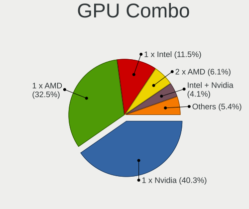

| Name                     | Desktops | Percent |
|--------------------------|----------|---------|
| 1 x Nvidia               | 351      | 40.34%  |
| 1 x AMD                  | 283      | 32.53%  |
| 1 x Intel                | 100      | 11.49%  |
| 2 x AMD                  | 53       | 6.09%   |
| Intel + Nvidia           | 36       | 4.14%   |
| AMD + Nvidia             | 28       | 3.22%   |
| Intel + AMD              | 11       | 1.26%   |
| 2 x Nvidia               | 5        | 0.57%   |
| 2 x Intel                | 1        | 0.11%   |
| 2 x AMD + 1 x Nvidia     | 1        | 0.11%   |
| Intel + AMD + 1 x Nvidia | 1        | 0.11%   |

GPU Driver
----------

Free vs proprietary

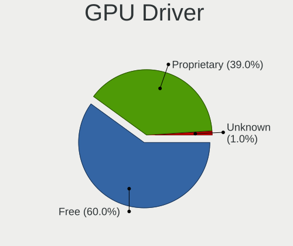

| Driver      | Desktops | Percent |
|-------------|----------|---------|
| Free        | 516      | 60%     |
| Proprietary | 335      | 38.95%  |
| Unknown     | 9        | 1.05%   |

GPU Memory
----------

Total video memory

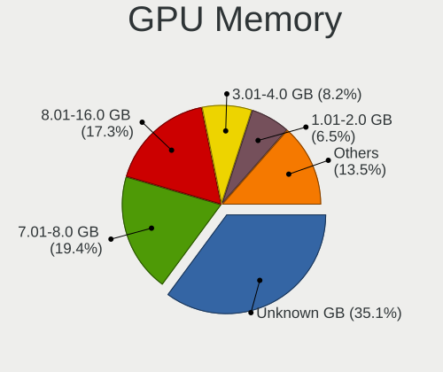

| Size in GB | Desktops | Percent |
|------------|----------|---------|
| Unknown    | 309      | 35.11%  |
| 7.01-8.0   | 171      | 19.43%  |
| 8.01-16.0  | 152      | 17.27%  |
| 3.01-4.0   | 72       | 8.18%   |
| 1.01-2.0   | 57       | 6.48%   |
| 5.01-6.0   | 55       | 6.25%   |
| 16.01-24.0 | 24       | 2.73%   |
| 0.01-0.5   | 22       | 2.5%    |
| 0.51-1.0   | 15       | 1.7%    |
| 2.01-3.0   | 3        | 0.34%   |

Monitor
-------

Monitor Vendor
--------------

Monitor vendors

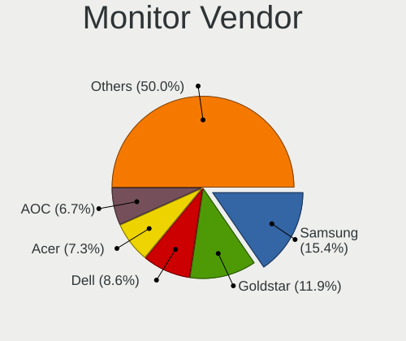

| Vendor               | Desktops | Percent |
|----------------------|----------|---------|
| Samsung Electronics  | 175      | 15.43%  |
| Goldstar             | 135      | 11.9%   |
| Dell                 | 98       | 8.64%   |
| Acer                 | 83       | 7.32%   |
| AOC                  | 76       | 6.7%    |
| Hewlett-Packard      | 60       | 5.29%   |
| BenQ                 | 59       | 5.2%    |
| Ancor Communications | 55       | 4.85%   |
| ASUSTek Computer     | 52       | 4.59%   |
| Philips              | 32       | 2.82%   |
| ViewSonic            | 27       | 2.38%   |
| Gigabyte Technology  | 27       | 2.38%   |
| MSI                  | 25       | 2.2%    |
| Lenovo               | 25       | 2.2%    |
| Unknown              | 16       | 1.41%   |
| Iiyama               | 13       | 1.15%   |
| Vizio                | 9        | 0.79%   |
| Sceptre Tech         | 8        | 0.71%   |
| LG Electronics       | 8        | 0.71%   |
| Eizo                 | 7        | 0.62%   |
| HUAWEI               | 6        | 0.53%   |
| Valve                | 5        | 0.44%   |
| Fujitsu Siemens      | 5        | 0.44%   |
| SKG                  | 4        | 0.35%   |
| SAC                  | 4        | 0.35%   |
| MiTAC                | 4        | 0.35%   |
| Mi                   | 4        | 0.35%   |
| HKC                  | 4        | 0.35%   |
| Hitachi              | 4        | 0.35%   |
| ___                  | 3        | 0.26%   |
| Vestel Elektronik    | 3        | 0.26%   |
| Panasonic            | 3        | 0.26%   |
| NEC Computers        | 3        | 0.26%   |
| Lenovo Group Limited | 3        | 0.26%   |
| HVR                  | 3        | 0.26%   |
| Gateway              | 3        | 0.26%   |
| Denver               | 3        | 0.26%   |
| Unknown              | 3        | 0.26%   |
| Xiaomi               | 2        | 0.18%   |
| Unknown (XXX)        | 2        | 0.18%   |

Monitor Model
-------------

Monitor models

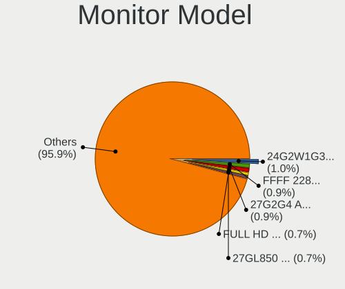

| Model                                                                | Desktops | Percent |
|----------------------------------------------------------------------|----------|---------|
| AOC 24G2W1G3 AOC2402 1920x1080 527x296mm 23.8-inch                   | 12       | 0.99%   |
| Unknown LCD Monitor FFFF 2288x1287 2550x2550mm 142.0-inch            | 11       | 0.91%   |
| AOC 27G2G4 AOC2702 1920x1080 598x336mm 27.0-inch                     | 11       | 0.91%   |
| Goldstar FULL HD GSM5B55 1920x1080 480x270mm 21.7-inch               | 8        | 0.66%   |
| Goldstar 27GL850 GSM5B7F 2560x1440 597x336mm 27.0-inch               | 8        | 0.66%   |
| Samsung Electronics S24F350 SAM0D20 1920x1080 521x293mm 23.5-inch    | 7        | 0.58%   |
| Goldstar ULTRAGEAR GSM5BD3 2560x1440 697x392mm 31.5-inch             | 7        | 0.58%   |
| Samsung Electronics S24D590 SAM0B47 1920x1080 521x293mm 23.5-inch    | 6        | 0.49%   |
| Goldstar LG ULTRAWIDE GSM59F1 2560x1080 670x280mm 28.6-inch          | 6        | 0.49%   |
| AOC 27G1G4 AOC2701 1920x1080 598x336mm 27.0-inch                     | 6        | 0.49%   |
| Valve Index HMD VLV91A8                                              | 5        | 0.41%   |
| Samsung Electronics LC49G95T SAM7053 3840x1080 1193x336mm 48.8-inch  | 5        | 0.41%   |
| Goldstar ULTRAGEAR GSM5BB4 2560x1440 597x336mm 27.0-inch             | 5        | 0.41%   |
| Goldstar HDR WFHD GSM7714 2560x1080 798x334mm 34.1-inch              | 5        | 0.41%   |
| Gigabyte Technology M27Q GBT270D 2560x1440 597x336mm 27.0-inch       | 5        | 0.41%   |
| Gigabyte Technology G27Q GBT2709 2560x1440 598x336mm 27.0-inch       | 5        | 0.41%   |
| BenQ ZOWIE XL LCD BNQ7F33 1920x1080 531x298mm 24.0-inch              | 5        | 0.41%   |
| ASUSTek Computer VG27AQL1A AUS2705 2560x1440 597x336mm 27.0-inch     | 5        | 0.41%   |
| AOC 2260WG5 AOC2260 1920x1080 477x268mm 21.5-inch                    | 5        | 0.41%   |
| Ancor Communications VG248 ACI24A4 1920x1080 531x299mm 24.0-inch     | 5        | 0.41%   |
| Sceptre Tech Sceptre F24 SPT09AB 1920x1080 530x290mm 23.8-inch       | 4        | 0.33%   |
| Samsung Electronics LC32G7xT SAM7058 2560x1440 698x393mm 31.5-inch   | 4        | 0.33%   |
| Samsung Electronics C27F390 SAM0D32 1920x1080 598x336mm 27.0-inch    | 4        | 0.33%   |
| Samsung Electronics C24F390 SAM0D2C 1920x1080 521x293mm 23.5-inch    | 4        | 0.33%   |
| MSI Optix MAG27CQ MSI1462 2560x1440 597x336mm 27.0-inch              | 4        | 0.33%   |
| Goldstar LG ULTRAGEAR GSM5B73 1920x1080 530x300mm 24.0-inch          | 4        | 0.33%   |
| Goldstar LG IPS FULLHD GSM5AB8 1920x1080 480x270mm 21.7-inch         | 4        | 0.33%   |
| Dell U2412M DELA07B 1920x1200 518x324mm 24.1-inch                    | 4        | 0.33%   |
| Dell S2721DGF DEL41D9 2560x1440 597x336mm 27.0-inch                  | 4        | 0.33%   |
| Dell P2419H DELD0D9 1920x1080 527x296mm 23.8-inch                    | 4        | 0.33%   |
| AOC 24B1W1 AOC2401 1920x1080 527x296mm 23.8-inch                     | 4        | 0.33%   |
| AOC 2460G5 AOC246A 1920x1080 531x299mm 24.0-inch                     | 4        | 0.33%   |
| Ancor Communications VS248 ACI2498 1920x1080 531x299mm 24.0-inch     | 4        | 0.33%   |
| Acer AL2216W ACRADA1 1680x1050 474x296mm 22.0-inch                   | 4        | 0.33%   |
| ___ LCDTV16 ___3393 1920x1080                                        | 3        | 0.25%   |
| ViewSonic VX2757 VSCF931 1920x1080 598x336mm 27.0-inch               | 3        | 0.25%   |
| Vestel Elektronik 40UHD_LCD_TV VES3700 3840x2160 880x500mm 39.8-inch | 3        | 0.25%   |
| Unknown LCDTV16 3393 1920x1080 1600x900mm 72.3-inch                  | 3        | 0.25%   |
| Samsung Electronics S24D330 SAM0D92 1920x1080 531x299mm 24.0-inch    | 3        | 0.25%   |
| Samsung Electronics LF24T35 SAM707D 1920x1080 528x297mm 23.9-inch    | 3        | 0.25%   |

Monitor Resolution
------------------

Monitor screen resolution

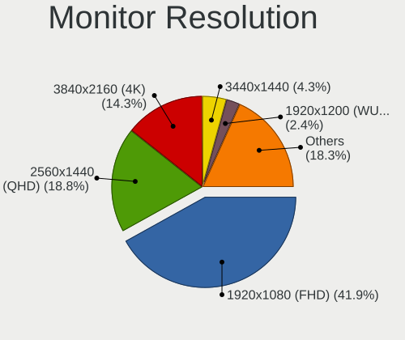

| Resolution         | Desktops | Percent |
|--------------------|----------|---------|
| 1920x1080 (FHD)    | 447      | 41.93%  |
| 2560x1440 (QHD)    | 200      | 18.76%  |
| 3840x2160 (4K)     | 152      | 14.26%  |
| 3440x1440          | 46       | 4.32%   |
| 1920x1200 (WUXGA)  | 26       | 2.44%   |
| 1280x1024 (SXGA)   | 26       | 2.44%   |
| 1680x1050 (WSXGA+) | 25       | 2.35%   |
| 2560x1080          | 21       | 1.97%   |
| 1366x768 (WXGA)    | 20       | 1.88%   |
| 1600x900 (HD+)     | 16       | 1.5%    |
| Unknown            | 16       | 1.5%    |
| 3840x1080          | 13       | 1.22%   |
| 1440x900 (WXGA+)   | 12       | 1.13%   |
| 2288x1287          | 11       | 1.03%   |
| 1600x1200          | 6        | 0.56%   |
| 1024x768 (XGA)     | 5        | 0.47%   |
| 1920x540           | 4        | 0.38%   |
| 3840x1600          | 3        | 0.28%   |
| 1360x768           | 3        | 0.28%   |
| 2560x1600          | 2        | 0.19%   |
| 2160x1200          | 2        | 0.19%   |
| 9840x3840          | 1        | 0.09%   |
| 7040x1440          | 1        | 0.09%   |
| 5760x1080          | 1        | 0.09%   |
| 4480x1440          | 1        | 0.09%   |
| 3840x2560          | 1        | 0.09%   |
| 3840x1200          | 1        | 0.09%   |
| 3520x1080          | 1        | 0.09%   |
| 3360x1440          | 1        | 0.09%   |
| 3200x1080          | 1        | 0.09%   |
| 2880x1700          | 1        | 0.09%   |

Monitor Diagonal
----------------

Diagonal size in inches

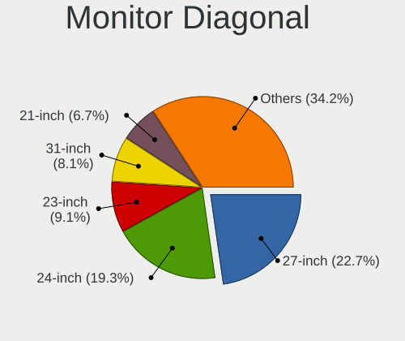

| Inches  | Desktops | Percent |
|---------|----------|---------|
| 27      | 256      | 22.74%  |
| 24      | 217      | 19.27%  |
| 23      | 102      | 9.06%   |
| 31      | 91       | 8.08%   |
| 21      | 75       | 6.66%   |
| 34      | 63       | 5.6%    |
| Unknown | 50       | 4.44%   |
| 22      | 27       | 2.4%    |
| 19      | 27       | 2.4%    |
| 84      | 17       | 1.51%   |
| 18      | 17       | 1.51%   |
| 32      | 15       | 1.33%   |
| 20      | 15       | 1.33%   |
| 17      | 13       | 1.15%   |
| 26      | 12       | 1.07%   |
| 142     | 11       | 0.98%   |
| 15      | 11       | 0.98%   |
| 54      | 10       | 0.89%   |
| 40      | 10       | 0.89%   |
| 48      | 8        | 0.71%   |
| 72      | 7        | 0.62%   |
| 25      | 7        | 0.62%   |
| 63      | 6        | 0.53%   |
| 35      | 5        | 0.44%   |
| 28      | 5        | 0.44%   |
| 46      | 4        | 0.36%   |
| 42      | 4        | 0.36%   |
| 36      | 4        | 0.36%   |
| 33      | 4        | 0.36%   |
| 74      | 3        | 0.27%   |
| 65      | 3        | 0.27%   |
| 52      | 3        | 0.27%   |
| 49      | 3        | 0.27%   |
| 37      | 3        | 0.27%   |
| 14      | 3        | 0.27%   |
| 44      | 2        | 0.18%   |
| 16      | 2        | 0.18%   |
| 99      | 1        | 0.09%   |
| 64      | 1        | 0.09%   |
| 60      | 1        | 0.09%   |

Monitor Width
-------------

Physical width

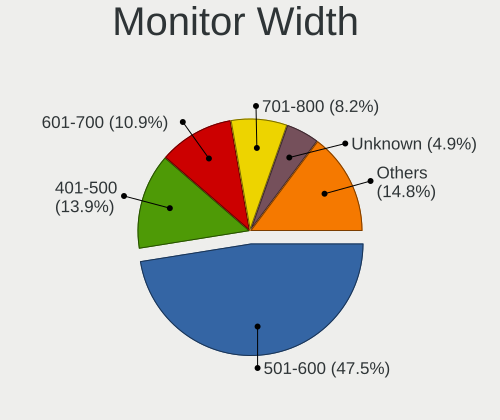

| Width in mm    | Desktops | Percent |
|----------------|----------|---------|
| 501-600        | 489      | 47.48%  |
| 401-500        | 143      | 13.88%  |
| 601-700        | 112      | 10.87%  |
| 701-800        | 84       | 8.16%   |
| Unknown        | 50       | 4.85%   |
| 1001-1500      | 43       | 4.17%   |
| 1501-2000      | 27       | 2.62%   |
| 301-350        | 25       | 2.43%   |
| 801-900        | 19       | 1.84%   |
| 351-400        | 15       | 1.46%   |
| More than 2000 | 12       | 1.17%   |
| 901-1000       | 6        | 0.58%   |
| 201-300        | 5        | 0.49%   |

Aspect Ratio
------------

Proportional relationship between the width and the height

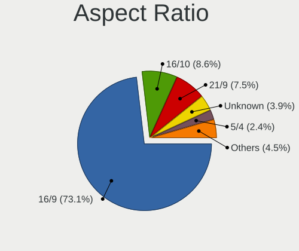

| Ratio   | Desktops | Percent |
|---------|----------|---------|
| 16/9    | 681      | 73.15%  |
| 16/10   | 80       | 8.59%   |
| 21/9    | 70       | 7.52%   |
| Unknown | 36       | 3.87%   |
| 5/4     | 22       | 2.36%   |
| 4/3     | 15       | 1.61%   |
| 32/9    | 12       | 1.29%   |
| 1.00    | 11       | 1.18%   |
| 6/5     | 2        | 0.21%   |
| 3/2     | 1        | 0.11%   |
| 2.00    | 1        | 0.11%   |

Monitor Area
------------

Area in inch²

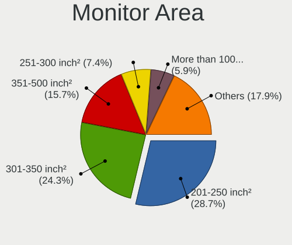

| Area in inch² | Desktops | Percent |
|----------------|----------|---------|
| 201-250        | 314      | 28.73%  |
| 301-350        | 266      | 24.34%  |
| 351-500        | 172      | 15.74%  |
| 251-300        | 81       | 7.41%   |
| More than 1000 | 64       | 5.86%   |
| 151-200        | 55       | 5.03%   |
| Unknown        | 50       | 4.57%   |
| 501-1000       | 44       | 4.03%   |
| 141-150        | 28       | 2.56%   |
| 101-110        | 12       | 1.1%    |
| 111-120        | 2        | 0.18%   |
| 81-90          | 1        | 0.09%   |
| 71-80          | 1        | 0.09%   |
| 61-70          | 1        | 0.09%   |
| 41-50          | 1        | 0.09%   |
| 131-140        | 1        | 0.09%   |

Pixel Density
-------------

Pixels per inch

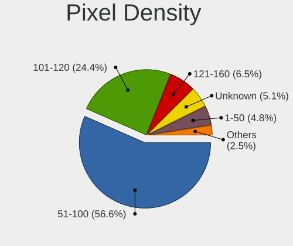

| Density       | Desktops | Percent |
|---------------|----------|---------|
| 51-100        | 563      | 56.58%  |
| 101-120       | 243      | 24.42%  |
| 121-160       | 65       | 6.53%   |
| Unknown       | 51       | 5.13%   |
| 1-50          | 48       | 4.82%   |
| 161-240       | 24       | 2.41%   |
| More than 240 | 1        | 0.1%    |

Multiple Monitors
-----------------

Total monitors connected

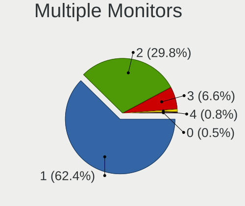

| Total | Desktops | Percent |
|-------|----------|---------|
| 1     | 550      | 62.36%  |
| 2     | 263      | 29.82%  |
| 3     | 58       | 6.58%   |
| 4     | 7        | 0.79%   |
| 0     | 4        | 0.45%   |

Network
-------

Net Controller Vendor
---------------------

Controller vendors

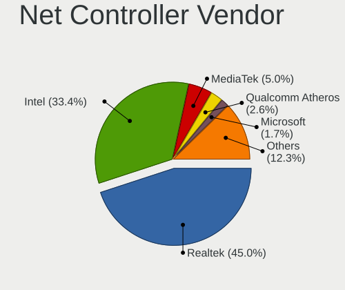

| Vendor                          | Desktops | Percent |
|---------------------------------|----------|---------|
| Realtek Semiconductor           | 585      | 44.97%  |
| Intel                           | 435      | 33.44%  |
| MediaTek                        | 65       | 5%      |
| Qualcomm Atheros                | 34       | 2.61%   |
| Microsoft                       | 22       | 1.69%   |
| Broadcom                        | 22       | 1.69%   |
| TP-Link                         | 21       | 1.61%   |
| Aquantia                        | 12       | 0.92%   |
| Ralink Technology               | 9        | 0.69%   |
| Qualcomm Atheros Communications | 9        | 0.69%   |
| Qualcomm Technologies           | 6        | 0.46%   |
| D-Link                          | 6        | 0.46%   |
| ASIX Electronics                | 6        | 0.46%   |
| Xiaomi                          | 5        | 0.38%   |
| Nvidia                          | 5        | 0.38%   |
| ASUSTek Computer                | 4        | 0.31%   |
| Samsung Electronics             | 3        | 0.23%   |
| Ralink                          | 3        | 0.23%   |
| Qualcomm                        | 3        | 0.23%   |
| OPPO Electronics                | 3        | 0.23%   |
| Oculus VR                       | 3        | 0.23%   |
| Mellanox Technologies           | 3        | 0.23%   |
| Huawei Technologies             | 3        | 0.23%   |
| Google                          | 3        | 0.23%   |
| DisplayLink                     | 3        | 0.23%   |
| Broadcom Limited                | 3        | 0.23%   |
| NetGear                         | 2        | 0.15%   |
| Microchip Technology            | 2        | 0.15%   |
| Linksys                         | 2        | 0.15%   |
| D-Link System                   | 2        | 0.15%   |
| AVM                             | 2        | 0.15%   |
| Wilocity                        | 1        | 0.08%   |
| ULi Electronics                 | 1        | 0.08%   |
| Tenda                           | 1        | 0.08%   |
| Realtek                         | 1        | 0.08%   |
| Raspberry Pi                    | 1        | 0.08%   |
| NetXen Incorporated             | 1        | 0.08%   |
| Motorola PCS                    | 1        | 0.08%   |
| Marvell Technology Group        | 1        | 0.08%   |
| InterBiometrics                 | 1        | 0.08%   |

Net Controller Model
--------------------

Controller models

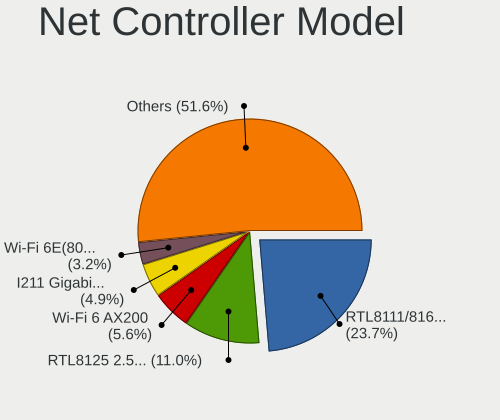

| Model                                                                  | Desktops | Percent |
|------------------------------------------------------------------------|----------|---------|
| Realtek RTL8111/8168/8211/8411 PCI Express Gigabit Ethernet Controller | 366      | 23.66%  |
| Realtek RTL8125 2.5GbE Controller                                      | 170      | 10.99%  |
| Intel Wi-Fi 6 AX200                                                    | 87       | 5.62%   |
| Intel I211 Gigabit Network Connection                                  | 76       | 4.91%   |
| Intel Wi-Fi 6E(802.11ax) AX210/AX1675* 2x2 [Typhoon Peak]              | 50       | 3.23%   |
| Intel Ethernet Controller I225-V                                       | 49       | 3.17%   |
| Intel Ethernet Connection (7) I219-V                                   | 34       | 2.2%    |
| Intel Ethernet Connection (2) I219-V                                   | 34       | 2.2%    |
| MediaTek MT7922 802.11ax PCI Express Wireless Network Adapter          | 31       | 2%      |
| Intel Wi-Fi 5(802.11ac) Wireless-AC 9x6x [Thunder Peak]                | 24       | 1.55%   |
| Intel Ethernet Connection I217-LM                                      | 23       | 1.49%   |
| Intel Dual Band Wireless-AC 3168NGW [Stone Peak]                       | 21       | 1.36%   |
| Intel 82579LM Gigabit Network Connection (Lewisville)                  | 20       | 1.29%   |
| MediaTek MT7921K (RZ608) Wi-Fi 6E 80MHz                                | 18       | 1.16%   |
| Intel 700 Series Chipset CNVi WiFi                                     | 16       | 1.03%   |
| Intel Ethernet Controller I226-V                                       | 12       | 0.78%   |
| Intel Cannon Lake PCH CNVi WiFi                                        | 12       | 0.78%   |
| Realtek RTL8821CE 802.11ac PCIe Wireless Network Adapter               | 11       | 0.71%   |
| Realtek RTL8126 5GbE Controller                                        | 11       | 0.71%   |
| Realtek RTL8852CE PCIe 802.11ax Wireless Network Controller            | 10       | 0.65%   |
| Microsoft Xbox Wireless Adapter for Windows                            | 10       | 0.65%   |
| Realtek 802.11ac NIC                                                   | 9        | 0.58%   |
| Intel Wireless 7265                                                    | 9        | 0.58%   |
| Broadcom BCM4360 802.11ac Dual Band Wireless Network Adapter           | 9        | 0.58%   |
| Realtek RTL88x2bu [AC1200 Techkey]                                     | 8        | 0.52%   |
| Realtek RTL8188EUS 802.11n Wireless Network Adapter                    | 8        | 0.52%   |
| Realtek RTL8153 Gigabit Ethernet Adapter                               | 8        | 0.52%   |
| Qualcomm Atheros Killer E220x Gigabit Ethernet Controller              | 8        | 0.52%   |
| Realtek RTL8192EU 802.11b/g/n WLAN Adapter                             | 7        | 0.45%   |
| Realtek RTL8192EE PCIe Wireless Network Adapter                        | 7        | 0.45%   |
| Intel Ethernet Connection (14) I219-V                                  | 7        | 0.45%   |
| Intel Alder Lake-S PCH CNVi WiFi                                       | 7        | 0.45%   |
| Realtek RTL8852BE PCIe 802.11ax Wireless Network Controller            | 6        | 0.39%   |
| Qualcomm WCN785x Wi-Fi 7(802.11be) 320MHz 2x2 [FastConnect 7800]       | 6        | 0.39%   |
| Microsoft Xbox 360 Wireless Adapter                                    | 6        | 0.39%   |
| Microsoft Wireless XBox Controller Dongle                              | 6        | 0.39%   |
| Intel Wireless 3165                                                    | 6        | 0.39%   |
| Intel Ethernet Connection (5) I219-LM                                  | 6        | 0.39%   |
| Intel Ethernet Connection (2) I219-LM                                  | 6        | 0.39%   |
| Intel Ethernet Connection (2) I218-V                                   | 6        | 0.39%   |

Wireless Vendor
---------------

Wireless vendors

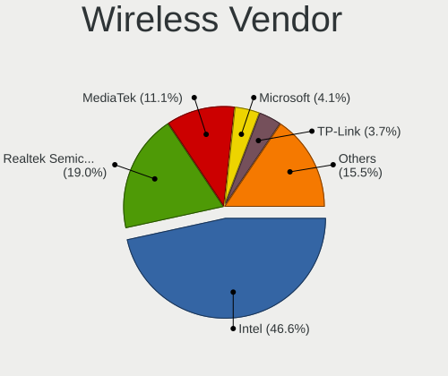

| Vendor                                | Desktops | Percent |
|---------------------------------------|----------|---------|
| Intel                                 | 252      | 46.58%  |
| Realtek Semiconductor                 | 103      | 19.04%  |
| MediaTek                              | 60       | 11.09%  |
| Microsoft                             | 22       | 4.07%   |
| TP-Link                               | 20       | 3.7%    |
| Qualcomm Atheros                      | 18       | 3.33%   |
| Broadcom                              | 18       | 3.33%   |
| Ralink Technology                     | 9        | 1.66%   |
| Qualcomm Atheros Communications       | 9        | 1.66%   |
| D-Link                                | 6        | 1.11%   |
| ASUSTek Computer                      | 4        | 0.74%   |
| Ralink                                | 3        | 0.55%   |
| Qualcomm Technologies                 | 3        | 0.55%   |
| NetGear                               | 2        | 0.37%   |
| Linksys                               | 2        | 0.37%   |
| AVM                                   | 2        | 0.37%   |
| Wilocity                              | 1        | 0.18%   |
| Tenda                                 | 1        | 0.18%   |
| Realtek                               | 1        | 0.18%   |
| IMC Networks                          | 1        | 0.18%   |
| Edimax Technology                     | 1        | 0.18%   |
| D-Link System                         | 1        | 0.18%   |
| Broadcom Limited                      | 1        | 0.18%   |
| 802.11g Adapter [Linksys WUSB54GC v3] | 1        | 0.18%   |

Wireless Model
--------------

Wireless models

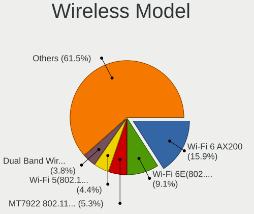

| Model                                                                           | Desktops | Percent |
|---------------------------------------------------------------------------------|----------|---------|
| Intel Wi-Fi 6 AX200                                                             | 87       | 15.88%  |
| Intel Wi-Fi 6E(802.11ax) AX210/AX1675* 2x2 [Typhoon Peak]                       | 50       | 9.12%   |
| MediaTek MT7922 802.11ax PCI Express Wireless Network Adapter                   | 29       | 5.29%   |
| Intel Wi-Fi 5(802.11ac) Wireless-AC 9x6x [Thunder Peak]                         | 24       | 4.38%   |
| Intel Dual Band Wireless-AC 3168NGW [Stone Peak]                                | 21       | 3.83%   |
| MediaTek MT7921K (RZ608) Wi-Fi 6E 80MHz                                         | 18       | 3.28%   |
| Intel 700 Series Chipset CNVi WiFi                                              | 16       | 2.92%   |
| Intel Cannon Lake PCH CNVi WiFi                                                 | 12       | 2.19%   |
| Realtek RTL8821CE 802.11ac PCIe Wireless Network Adapter                        | 11       | 2.01%   |
| Realtek RTL8852CE PCIe 802.11ax Wireless Network Controller                     | 10       | 1.82%   |
| Microsoft Xbox Wireless Adapter for Windows                                     | 10       | 1.82%   |
| Realtek 802.11ac NIC                                                            | 9        | 1.64%   |
| Intel Wireless 7265                                                             | 9        | 1.64%   |
| Broadcom BCM4360 802.11ac Dual Band Wireless Network Adapter                    | 9        | 1.64%   |
| Realtek RTL88x2bu [AC1200 Techkey]                                              | 8        | 1.46%   |
| Realtek RTL8188EUS 802.11n Wireless Network Adapter                             | 8        | 1.46%   |
| Realtek RTL8192EU 802.11b/g/n WLAN Adapter                                      | 7        | 1.28%   |
| Realtek RTL8192EE PCIe Wireless Network Adapter                                 | 7        | 1.28%   |
| Microsoft Xbox 360 Wireless Adapter                                             | 6        | 1.09%   |
| Microsoft Wireless XBox Controller Dongle                                       | 6        | 1.09%   |
| Intel Wireless 3165                                                             | 6        | 1.09%   |
| Realtek RTL8852BE PCIe 802.11ax Wireless Network Controller                     | 5        | 0.91%   |
| Realtek RTL8812AE 802.11ac PCIe Wireless Network Adapter                        | 5        | 0.91%   |
| Qualcomm Atheros AR9271 802.11n                                                 | 5        | 0.91%   |
| Qualcomm Atheros AR9287 Wireless Network Adapter (PCI-Express)                  | 5        | 0.91%   |
| Intel Comet Lake PCH CNVi WiFi                                                  | 5        | 0.91%   |
| Intel Alder Lake-S PCH CNVi WiFi                                                | 5        | 0.91%   |
| Broadcom BCM4352 802.11ac Dual Band Wireless Network Adapter                    | 5        | 0.91%   |
| TP-Link TL-WN722N v2/v3 [Realtek RTL8188EUS]                                    | 4        | 0.73%   |
| Realtek RTL8822BE 802.11a/b/g/n/ac WiFi adapter                                 | 4        | 0.73%   |
| Realtek RTL8821AE 802.11ac PCIe Wireless Network Adapter                        | 4        | 0.73%   |
| Realtek RTL8812AU 802.11a/b/g/n/ac 2T2R DB WLAN Adapter                         | 4        | 0.73%   |
| MediaTek MT7927 802.11be 320MHz 2x2 PCIe Wireless Network Adapter [Filogic 380] | 4        | 0.73%   |
| Intel Wireless 7260                                                             | 4        | 0.73%   |
| Intel Tiger Lake PCH CNVi WiFi                                                  | 4        | 0.73%   |
| Intel Dual Band Wireless-AC 3165 Plus Bluetooth                                 | 4        | 0.73%   |
| TP-Link 802.11ac WLAN Adapter                                                   | 3        | 0.55%   |
| Realtek RTL8821CE PCIe 802.11ac Wireless Network Controller                     | 3        | 0.55%   |
| Realtek RTL8188EE Wireless Network Adapter                                      | 3        | 0.55%   |
| Realtek RTL8188CUS 802.11n WLAN Adapter                                         | 3        | 0.55%   |

Ethernet Vendor
---------------

Ethernet vendors

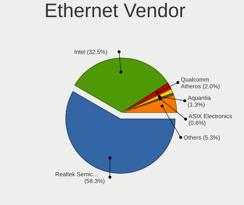

| Vendor                   | Desktops | Percent |
|--------------------------|----------|---------|
| Realtek Semiconductor    | 553      | 58.33%  |
| Intel                    | 308      | 32.49%  |
| Qualcomm Atheros         | 19       | 2%      |
| Aquantia                 | 12       | 1.27%   |
| ASIX Electronics         | 6        | 0.63%   |
| Xiaomi                   | 5        | 0.53%   |
| Nvidia                   | 5        | 0.53%   |
| Broadcom                 | 5        | 0.53%   |
| MediaTek                 | 4        | 0.42%   |
| Samsung Electronics      | 3        | 0.32%   |
| Qualcomm Technologies    | 3        | 0.32%   |
| Qualcomm                 | 3        | 0.32%   |
| OPPO Electronics         | 3        | 0.32%   |
| Mellanox Technologies    | 3        | 0.32%   |
| DisplayLink              | 3        | 0.32%   |
| Huawei Technologies      | 2        | 0.21%   |
| Google                   | 2        | 0.21%   |
| Broadcom Limited         | 2        | 0.21%   |
| ULi Electronics          | 1        | 0.11%   |
| TP-Link                  | 1        | 0.11%   |
| NetXen Incorporated      | 1        | 0.11%   |
| Motorola PCS             | 1        | 0.11%   |
| Marvell Technology Group | 1        | 0.11%   |
| D-Link System            | 1        | 0.11%   |
| Belkin Components        | 1        | 0.11%   |

Ethernet Model
--------------

Ethernet models

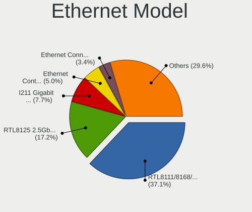

| Model                                                                           | Desktops | Percent |
|---------------------------------------------------------------------------------|----------|---------|
| Realtek RTL8111/8168/8211/8411 PCI Express Gigabit Ethernet Controller          | 366      | 37.08%  |
| Realtek RTL8125 2.5GbE Controller                                               | 170      | 17.22%  |
| Intel I211 Gigabit Network Connection                                           | 76       | 7.7%    |
| Intel Ethernet Controller I225-V                                                | 49       | 4.96%   |
| Intel Ethernet Connection (7) I219-V                                            | 34       | 3.44%   |
| Intel Ethernet Connection (2) I219-V                                            | 34       | 3.44%   |
| Intel Ethernet Connection I217-LM                                               | 23       | 2.33%   |
| Intel 82579LM Gigabit Network Connection (Lewisville)                           | 20       | 2.03%   |
| Intel Ethernet Controller I226-V                                                | 12       | 1.22%   |
| Realtek RTL8126 5GbE Controller                                                 | 11       | 1.11%   |
| Realtek RTL8153 Gigabit Ethernet Adapter                                        | 8        | 0.81%   |
| Qualcomm Atheros Killer E220x Gigabit Ethernet Controller                       | 8        | 0.81%   |
| Intel Ethernet Connection (14) I219-V                                           | 7        | 0.71%   |
| Intel Ethernet Connection (5) I219-LM                                           | 6        | 0.61%   |
| Intel Ethernet Connection (2) I219-LM                                           | 6        | 0.61%   |
| Intel Ethernet Connection (2) I218-V                                            | 6        | 0.61%   |
| Realtek RTL810xE PCI Express Fast Ethernet controller                           | 5        | 0.51%   |
| Intel Ethernet Connection (7) I219-LM                                           | 5        | 0.51%   |
| Intel 82579V Gigabit Network Connection                                         | 5        | 0.51%   |
| Intel 82574L Gigabit Network Connection                                         | 5        | 0.51%   |
| ASIX AX88179 Gigabit Ethernet                                                   | 5        | 0.51%   |
| Realtek USB 10/100/1G/2.5 LAN                                                   | 4        | 0.41%   |
| Realtek RTL8111/8168/8411 PCI Express Gigabit Ethernet Controller               | 4        | 0.41%   |
| Qualcomm Atheros Killer E2400 Gigabit Ethernet Controller                       | 4        | 0.41%   |
| Intel Ethernet Connection I217-V                                                | 4        | 0.41%   |
| Intel Ethernet Connection (17) I219-V                                           | 4        | 0.41%   |
| Intel Ethernet Connection (11) I219-V                                           | 4        | 0.41%   |
| Aquantia AQtion AQC113CS NBase-T/IEEE 802.3an Ethernet Controller [Antigua 10G] | 4        | 0.41%   |
| Xiaomi Mi/Redmi series (RNDIS)                                                  | 3        | 0.3%    |
| Samsung Galaxy series, misc. (tethering mode)                                   | 3        | 0.3%    |
| Realtek Killer E3000 2.5GbE Controller                                          | 3        | 0.3%    |
| Realtek Killer E2600 GbE Controller                                             | 3        | 0.3%    |
| Qualcomm WCN785x Wi-Fi 7(802.11be) 320MHz 2x2 [FastConnect 7800]                | 3        | 0.3%    |
| OPPO Ace 3V                                                                     | 3        | 0.3%    |
| Nvidia MCP61 Ethernet                                                           | 3        | 0.3%    |
| Intel Ethernet Connection (2) I218-LM                                           | 3        | 0.3%    |
| Aquantia AQtion AQC113 NBase-T/IEEE 802.3an Ethernet Controller [Antigua 10G]   | 3        | 0.3%    |
| Aquantia AQtion AQC107 NBase-T/IEEE 802.3an Ethernet Controller [Atlantic 10G]  | 3        | 0.3%    |
| Xiaomi Mi/Redmi series (RNDIS + ADB)                                            | 2        | 0.2%    |
| Qualcomm YUPIK-QRD _SN:AC1D5909                                                 | 2        | 0.2%    |

Net Controller Kind
-------------------

Ethernet, WiFi or modem

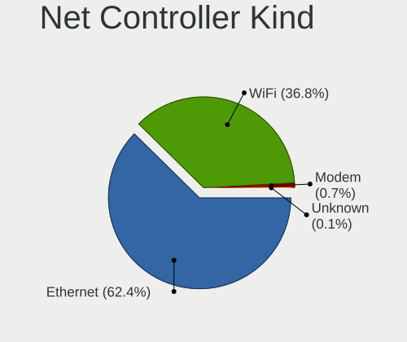

| Kind     | Desktops | Percent |
|----------|----------|---------|
| Ethernet | 850      | 62.36%  |
| WiFi     | 501      | 36.76%  |
| Modem    | 10       | 0.73%   |
| Unknown  | 2        | 0.15%   |

Used Controller
---------------

Currently used network controller

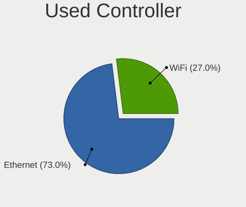

| Kind     | Desktops | Percent |
|----------|----------|---------|
| Ethernet | 658      | 73.03%  |
| WiFi     | 243      | 26.97%  |

NICs
----

Total network controllers on board

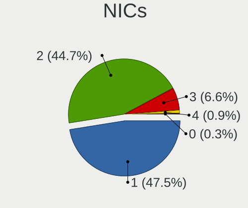

| Total | Desktops | Percent |
|-------|----------|---------|
| 1     | 412      | 47.47%  |
| 2     | 388      | 44.7%   |
| 3     | 57       | 6.57%   |
| 4     | 8        | 0.92%   |
| 0     | 3        | 0.35%   |

IPv6
----

IPv6 vs IPv4

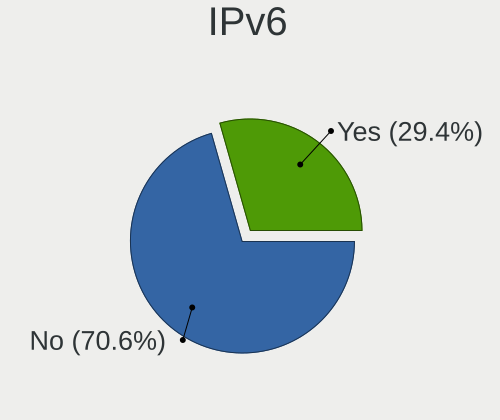

| Used | Desktops | Percent |
|------|----------|---------|
| No   | 617      | 70.59%  |
| Yes  | 257      | 29.41%  |

Bluetooth
---------

Bluetooth Vendor
----------------

Controller vendors

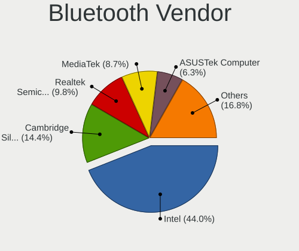

| Vendor                          | Desktops | Percent |
|---------------------------------|----------|---------|
| Intel                           | 238      | 43.99%  |
| Cambridge Silicon Radio         | 78       | 14.42%  |
| Realtek Semiconductor           | 53       | 9.8%    |
| MediaTek                        | 47       | 8.69%   |
| ASUSTek Computer                | 34       | 6.28%   |
| TP-Link                         | 19       | 3.51%   |
| IMC Networks                    | 15       | 2.77%   |
| Foxconn / Hon Hai               | 15       | 2.77%   |
| Broadcom                        | 15       | 2.77%   |
| HTC (High Tech Computer)        | 6        | 1.11%   |
| Actions                         | 4        | 0.74%   |
| Unknown                         | 4        | 0.74%   |
| Realtek                         | 3        | 0.55%   |
| Qualcomm Atheros Communications | 3        | 0.55%   |
| Dynex                           | 2        | 0.37%   |
| Apple                           | 2        | 0.37%   |
| Toshiba                         | 1        | 0.18%   |
| Lite-On Technology              | 1        | 0.18%   |
| Edimax Technology               | 1        | 0.18%   |

Bluetooth Model
---------------

Controller models

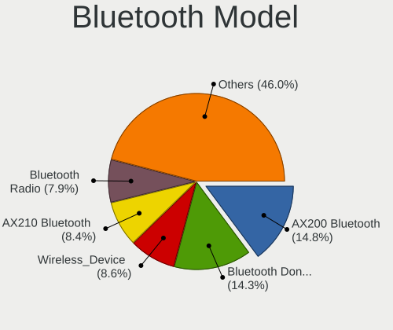

| Model                                                                | Desktops | Percent |
|----------------------------------------------------------------------|----------|---------|
| Intel AX200 Bluetooth                                                | 81       | 14.84%  |
| Cambridge Silicon Radio Bluetooth Dongle (HCI mode)                  | 78       | 14.29%  |
| MediaTek Wireless_Device                                             | 47       | 8.61%   |
| Intel AX210 Bluetooth                                                | 46       | 8.42%   |
| Realtek Bluetooth Radio                                              | 43       | 7.88%   |
| Intel Bluetooth wireless interface                                   | 26       | 4.76%   |
| Intel Wireless-AC 9260 Bluetooth Adapter                             | 23       | 4.21%   |
| Intel Wireless-AC 3168 Bluetooth                                     | 20       | 3.66%   |
| TP-Link TP-T@- UB500 Adapter                                         | 19       | 3.48%   |
| Intel Bluetooth Device                                               | 18       | 3.3%    |
| Intel AX201 Bluetooth                                                | 16       | 2.93%   |
| Intel Bluetooth 9460/9560 Jefferson Peak (JfP)                       | 12       | 2.2%    |
| ASUS Broadcom BCM20702A0 Bluetooth                                   | 11       | 2.01%   |
| ASUS ASUS USB-BT500                                                  | 11       | 2.01%   |
| Broadcom BCM20702A0 Bluetooth 4.0                                    | 10       | 1.83%   |
| Realtek Bluetooth 5.3 Radio                                          | 9        | 1.65%   |
| IMC Networks Bluetooth Radio                                         | 8        | 1.47%   |
| Foxconn / Hon Hai Wireless_Device                                    | 8        | 1.47%   |
| IMC Networks Wireless_Device                                         | 7        | 1.28%   |
| Foxconn / Hon Hai Bluetooth Device                                   | 7        | 1.28%   |
| HTC (High Tech Computer) Vive Hub Bluetooth 4.1 (Broadcom BCM920703) | 6        | 1.1%    |
| ASUS Bluetooth Radio                                                 | 4        | 0.73%   |
| Actions general adapter                                              | 4        | 0.73%   |
| Unknown                                                              | 4        | 0.73%   |
| Realtek Bluetooth Radio                                              | 3        | 0.55%   |
| Qualcomm Atheros  Bluetooth Device                                   | 3        | 0.55%   |
| Realtek  Bluetooth 4.2 Adapter                                       | 2        | 0.37%   |
| Dynex Bluetooth 4.0 Adapter [Broadcom, 1.12, BCM20702A0]             | 2        | 0.37%   |
| Broadcom BCM2045 Bluetooth                                           | 2        | 0.37%   |
| ASUS Bluetooth Device                                                | 2        | 0.37%   |
| ASUS BCM20702A0                                                      | 2        | 0.37%   |
| ASUS 2045 Bluetooth 2.0 Device with trace filter                     | 2        | 0.37%   |
| Apple Bluetooth Host Controller                                      | 2        | 0.37%   |
| Toshiba Atheros AR3012 Bluetooth                                     | 1        | 0.18%   |
| Lite-On Wireless_Device                                              | 1        | 0.18%   |
| Edimax Bluetooth Device                                              | 1        | 0.18%   |
| Broadcom HP Portable Bumble Bee                                      | 1        | 0.18%   |
| Broadcom Bluetooth 3.0 USB Dongle                                    | 1        | 0.18%   |
| Broadcom BCM43142 Bluetooth 4.0                                      | 1        | 0.18%   |
| ASUS Qualcomm Bluetooth 4.1                                          | 1        | 0.18%   |

Sound
-----

Sound Vendor
------------

Sound card vendors

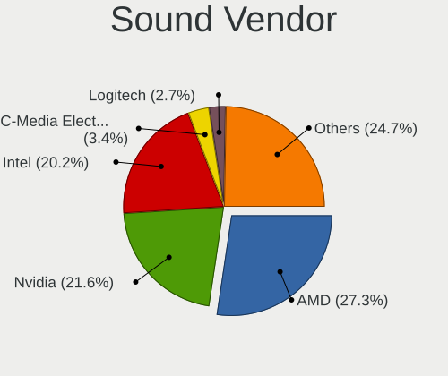

| Vendor                               | Desktops | Percent |
|--------------------------------------|----------|---------|
| AMD                                  | 522      | 27.34%  |
| Nvidia                               | 413      | 21.63%  |
| Intel                                | 386      | 20.22%  |
| C-Media Electronics                  | 65       | 3.4%    |
| Logitech                             | 51       | 2.67%   |
| SteelSeries ApS                      | 40       | 2.1%    |
| Razer USA                            | 27       | 1.41%   |
| Focusrite-Novation                   | 27       | 1.41%   |
| Micro Star International             | 25       | 1.31%   |
| Kingston Technology                  | 25       | 1.31%   |
| Texas Instruments                    | 24       | 1.26%   |
| Creative Labs                        | 19       | 1%      |
| JMTek                                | 18       | 0.94%   |
| Creative Technology                  | 15       | 0.79%   |
| Corsair                              | 12       | 0.63%   |
| ASUSTek Computer                     | 12       | 0.63%   |
| Sony                                 | 11       | 0.58%   |
| Blue Microphones                     | 10       | 0.52%   |
| Valve Software                       | 9        | 0.47%   |
| RODE Microphones                     | 9        | 0.47%   |
| Hewlett-Packard                      | 8        | 0.42%   |
| DSEA A/S                             | 8        | 0.42%   |
| Generalplus Technology               | 7        | 0.37%   |
| BEHRINGER International              | 7        | 0.37%   |
| Thesycon Systemsoftware & Consulting | 6        | 0.31%   |
| KTMicro                              | 6        | 0.31%   |
| Yamaha                               | 5        | 0.26%   |
| Samson Technologies                  | 5        | 0.26%   |
| GN Netcom                            | 5        | 0.26%   |
| FiiO Electronics Technology          | 5        | 0.26%   |
| AKAI Professional M.I.               | 5        | 0.26%   |
| Unknown                              | 5        | 0.26%   |
| Trust                                | 4        | 0.21%   |
| Realtek Semiconductor                | 4        | 0.21%   |
| Mark of the Unicorn                  | 4        | 0.21%   |
| XMOS                                 | 3        | 0.16%   |
| Plantronics                          | 3        | 0.16%   |
| Jieli Technology                     | 3        | 0.16%   |
| Giga-Byte Technology                 | 3        | 0.16%   |
| Elgato Systems                       | 3        | 0.16%   |

Sound Model
-----------

Sound card models

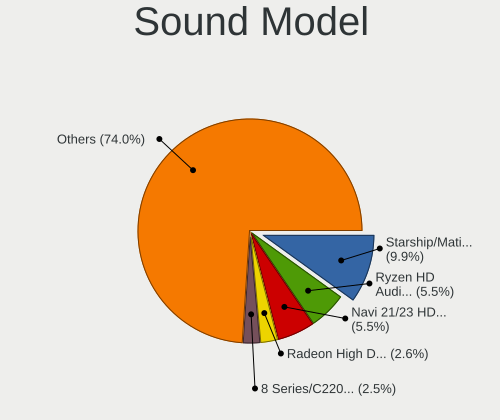

| Model                                                                      | Desktops | Percent |
|----------------------------------------------------------------------------|----------|---------|
| AMD Starship/Matisse HD Audio Controller                                   | 230      | 9.95%   |
| AMD Ryzen HD Audio Controller                                              | 128      | 5.54%   |
| AMD Navi 21/23 HDMI/DP Audio Controller                                    | 127      | 5.49%   |
| AMD Radeon High Definition Audio Controller                                | 59       | 2.55%   |
| Intel 8 Series/C220 Series Chipset High Definition Audio Controller        | 58       | 2.51%   |
| AMD Ellesmere HDMI Audio [Radeon RX 470/480 / 570/580/590]                 | 54       | 2.34%   |
| AMD Navi 31 HDMI/DP Audio                                                  | 49       | 2.12%   |
| Intel Cannon Lake PCH cAVS                                                 | 47       | 2.03%   |
| AMD Family 17h (Models 00h-0fh) HD Audio Controller                        | 47       | 2.03%   |
| Nvidia GA104 High Definition Audio Controller                              | 43       | 1.86%   |
| Intel Xeon E3-1200 v3/4th Gen Core Processor HD Audio Controller           | 43       | 1.86%   |
| Intel 200 Series PCH HD Audio                                              | 43       | 1.86%   |
| Intel 100 Series/C230 Series Chipset Family HD Audio Controller            | 37       | 1.6%    |
| AMD Renoir/Cezanne HDMI/DP Audio Controller                                | 34       | 1.47%   |
| Nvidia GA102 High Definition Audio Controller                              | 33       | 1.43%   |
| AMD Navi 10 HDMI Audio                                                     | 32       | 1.38%   |
| Nvidia TU116 High Definition Audio Controller                              | 31       | 1.34%   |
| Nvidia GP104 High Definition Audio Controller                              | 31       | 1.34%   |
| Nvidia GA106 High Definition Audio Controller                              | 28       | 1.21%   |
| Nvidia GP107GL High Definition Audio Controller                            | 27       | 1.17%   |
| Nvidia TU106 High Definition Audio Controller                              | 25       | 1.08%   |
| Nvidia TU104 HD Audio Controller                                           | 25       | 1.08%   |
| Micro Star International USB Audio                                         | 25       | 1.08%   |
| Intel Raptor Lake High Definition Audio Controller                         | 24       | 1.04%   |
| Intel Alder Lake-S HD Audio Controller                                     | 23       | 0.99%   |
| Intel 7 Series/C216 Chipset Family High Definition Audio Controller        | 23       | 0.99%   |
| Nvidia GP106 High Definition Audio Controller                              | 19       | 0.82%   |
| AMD Baffin HDMI/DP Audio [Radeon RX 550 640SP / RX 560/560X]               | 19       | 0.82%   |
| Texas Instruments PCM2902 Audio Codec                                      | 18       | 0.78%   |
| Nvidia AD104 High Definition Audio Controller                              | 17       | 0.74%   |
| Nvidia GK208 HDMI/DP Audio Controller                                      | 15       | 0.65%   |
| AMD Raven/Raven2/Fenghuang HDMI/DP Audio Controller                        | 15       | 0.65%   |
| Kingston Technology HyperX 7.1 Audio                                       | 14       | 0.61%   |
| Intel Tiger Lake-H HD Audio Controller                                     | 13       | 0.56%   |
| Intel Comet Lake PCH-V cAVS                                                | 13       | 0.56%   |
| Intel 6 Series/C200 Series Chipset Family High Definition Audio Controller | 13       | 0.56%   |
| C-Media Electronics Audio Adapter (Unitek Y-247A)                          | 13       | 0.56%   |
| AMD SBx00 Azalia (Intel HDA)                                               | 13       | 0.56%   |
| Intel 9 Series Chipset Family HD Audio Controller                          | 12       | 0.52%   |
| C-Media Electronics USB Audio Device                                       | 12       | 0.52%   |

Memory
------

Memory Vendor
-------------

Memory module vendors

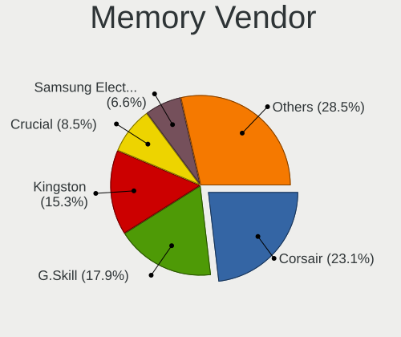

| Vendor                                  | Desktops | Percent |
|-----------------------------------------|----------|---------|
| Corsair                                 | 150      | 23.15%  |
| G.Skill                                 | 116      | 17.9%   |
| Kingston                                | 99       | 15.28%  |
| Crucial                                 | 55       | 8.49%   |
| Samsung Electronics                     | 43       | 6.64%   |
| SK hynix                                | 29       | 4.48%   |
| Unknown                                 | 27       | 4.17%   |
| Team                                    | 26       | 4.01%   |
| Patriot                                 | 15       | 2.31%   |
| A-DATA Technology                       | 15       | 2.31%   |
| Micron Technology                       | 13       | 2.01%   |
| Unknown                                 | 12       | 1.85%   |
| Ramaxel Technology                      | 3        | 0.46%   |
| OLOY                                    | 3        | 0.46%   |
| GOODRAM                                 | 3        | 0.46%   |
| Unifosa                                 | 2        | 0.31%   |
| Neo Forza                               | 2        | 0.31%   |
| Nanya Technology                        | 2        | 0.31%   |
| Lexar                                   | 2        | 0.31%   |
| Golden Empire                           | 2        | 0.31%   |
| Elpida                                  | 2        | 0.31%   |
| Avant                                   | 2        | 0.31%   |
| AMD                                     | 2        | 0.31%   |
| Wilk Elektronik                         | 1        | 0.15%   |
| Wilk                                    | 1        | 0.15%   |
| Unknown (ABCD)                          | 1        | 0.15%   |
| Unknown (0x5846)                        | 1        | 0.15%   |
| Unknown (0x0DD5)                        | 1        | 0.15%   |
| TeamGroup                               | 1        | 0.15%   |
| Strontium                               | 1        | 0.15%   |
| Silicon Power Computer & Communications | 1        | 0.15%   |
| Silicon Power                           | 1        | 0.15%   |
| PNY                                     | 1        | 0.15%   |
| Patriot Memory (PDP Systems)            | 1        | 0.15%   |
| Patriot Memory                          | 1        | 0.15%   |
| MAXSUN                                  | 1        | 0.15%   |
| KLEVV                                   | 1        | 0.15%   |
| Kingmax                                 | 1        | 0.15%   |
| KINGBANK                                | 1        | 0.15%   |
| HMD                                     | 1        | 0.15%   |

Memory Model
------------

Memory module models

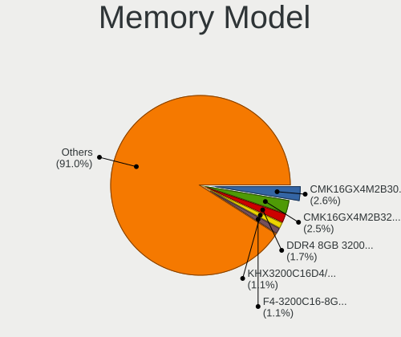

| Model                                                   | Desktops | Percent |
|---------------------------------------------------------|----------|---------|
| Corsair RAM CMK16GX4M2B3000C15 8GB DIMM DDR4 3600MT/s   | 19       | 2.64%   |
| Corsair RAM CMK16GX4M2B3200C16 8GB DIMM DDR4 3600MT/s   | 18       | 2.5%    |
| Unknown                                                 | 12       | 1.67%   |
| Kingston RAM KHX3200C16D4/8GX 8GB DIMM DDR4 3733MT/s    | 8        | 1.11%   |
| G.Skill RAM F4-3200C16-8GVKB 8GB DIMM DDR4 4000MT/s     | 8        | 1.11%   |
| Corsair RAM CMK32GX4M2E3200C16 16GB DIMM DDR4 3600MT/s  | 8        | 1.11%   |
| Kingston RAM KF3200C16D4/16GX 16GB DIMM DDR4 3733MT/s   | 7        | 0.97%   |
| G.Skill RAM F5-6000J3636F16G 16GB DIMM DDR5 6400MT/s    | 7        | 0.97%   |
| G.Skill RAM F5-6000J3040G32G 32GB DIMM DDR5 6200MT/s    | 7        | 0.97%   |
| G.Skill RAM F4-3600C16-16GTZNC 16GiB DIMM DDR4 3600MT/s | 7        | 0.97%   |
| Team RAM TEAMGROUP-UD4-3200 8GB DIMM DDR4 3800MT/s      | 6        | 0.83%   |
| Team RAM TEAMGROUP-UD4-3200 8GB DIMM DDR4 3733MT/s      | 6        | 0.83%   |
| Kingston RAM KF3200C16D4/8GX 8GiB DIMM DDR4 3600MT/s    | 6        | 0.83%   |
| G.Skill RAM F4-3200C16-16GVK 16GB DIMM DDR4 3600MT/s    | 6        | 0.83%   |
| G.Skill RAM F4-3000C16-8GISB 8GB DIMM DDR4 3200MT/s     | 6        | 0.83%   |
| Corsair RAM CMW32GX4M2C3200C16 16GB DIMM DDR4 3400MT/s  | 6        | 0.83%   |
| Corsair RAM CMK16GX4M2D3000C16 8GB DIMM DDR4 3400MT/s   | 6        | 0.83%   |
| Kingston RAM KHX2400C15/8G 8GB DIMM DDR4 3400MT/s       | 5        | 0.69%   |
| Corsair RAM CMK32GX4M2B3200C16 16GB DIMM DDR4 3800MT/s  | 5        | 0.69%   |
| Samsung RAM M378A1K43CB2-CRC 8GB DIMM DDR4 3500MT/s     | 4        | 0.56%   |
| Patriot RAM 3200 C16 Series 8GB DIMM DDR4 3600MT/s      | 4        | 0.56%   |
| Kingston RAM KF3200C16D4/32GX 32GB DIMM DDR4 3933MT/s   | 4        | 0.56%   |
| G.Skill RAM F4-3600C16-16GVKC 16GB DIMM DDR4 3866MT/s   | 4        | 0.56%   |
| G.Skill RAM F4-3200C16-8GIS 8GB DIMM DDR4 3600MT/s      | 4        | 0.56%   |
| G.Skill RAM F4-3200C16-16GIS 16GB DIMM DDR4 3600MT/s    | 4        | 0.56%   |
| Corsair RAM CMW32GX4M2Z3600C18 16GB DIMM DDR4 3733MT/s  | 4        | 0.56%   |
| Corsair RAM CMW16GX4M2C3200C16 8GB DIMM DDR4 3733MT/s   | 4        | 0.56%   |
| A-DATA RAM DDR4 3200 16GB DIMM DDR4 3600MT/s            | 4        | 0.56%   |
| Unknown RAM 3600 C18 Series 16GB DIMM DDR4 2933MT/s     | 3        | 0.42%   |
| SK hynix RAM HMT451U6AFR8C-PB 4GB DIMM DDR3 1600MT/s    | 3        | 0.42%   |
| SK hynix RAM HMA81GU6AFR8N-UH 8GB DIMM DDR4 2400MT/s    | 3        | 0.42%   |
| Samsung RAM M378B5173DB0-CK0 4096MB DIMM DDR3 1600MT/s  | 3        | 0.42%   |
| Samsung RAM M378A1K43CB2-CTD 8GB DIMM DDR4 3266MT/s     | 3        | 0.42%   |
| Samsung RAM M378A1G44AB0-CWE 8GB DIMM DDR4 3200MT/s     | 3        | 0.42%   |
| OLOY RAM CL16-20-20 D4-3200 16GB DIMM DDR4 3200MT/s     | 3        | 0.42%   |
| Micron RAM 8JTF51264AZ-1G6E1 4GB DIMM DDR3 1600MT/s     | 3        | 0.42%   |
| Kingston RAM KHX1600C10D3/8G 8GB DIMM DDR3 2133MT/s     | 3        | 0.42%   |
| Kingston RAM KF560C36-16 16GB DIMM DDR5 6000MT/s        | 3        | 0.42%   |
| Kingston RAM KF3600C18D4/16GX 16GB DIMM DDR4 3733MT/s   | 3        | 0.42%   |
| Kingston RAM KF3600C16D4/16GX 16GB DIMM DDR4 3800MT/s   | 3        | 0.42%   |

Memory Kind
-----------

Memory module kinds

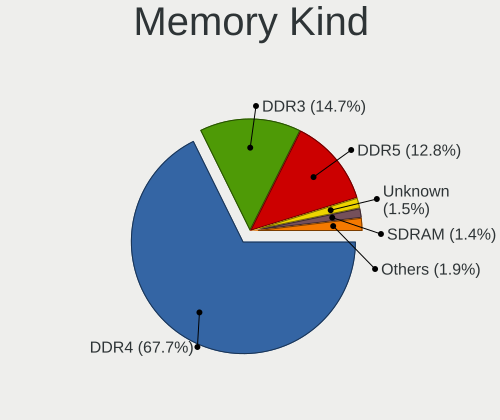

| Kind    | Desktops | Percent |
|---------|----------|---------|
| DDR4    | 396      | 67.69%  |
| DDR3    | 86       | 14.7%   |
| DDR5    | 75       | 12.82%  |
| Unknown | 9        | 1.54%   |
| SDRAM   | 8        | 1.37%   |
| DDR2    | 5        | 0.85%   |
| LPDDR4  | 3        | 0.51%   |
| DDR     | 2        | 0.34%   |
| DRAM    | 1        | 0.17%   |

Memory Form Factor
------------------

Physical design of the memory module

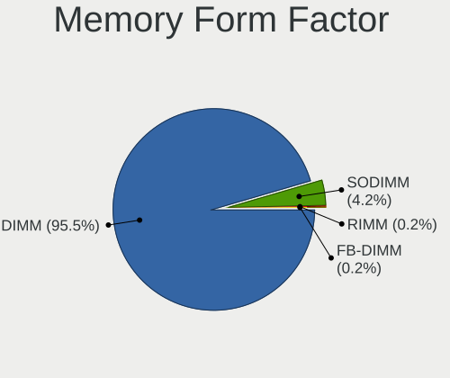

| Name    | Desktops | Percent |
|---------|----------|---------|
| DIMM    | 549      | 95.48%  |
| SODIMM  | 24       | 4.17%   |
| RIMM    | 1        | 0.17%   |
| FB-DIMM | 1        | 0.17%   |

Memory Size
-----------

Memory module size

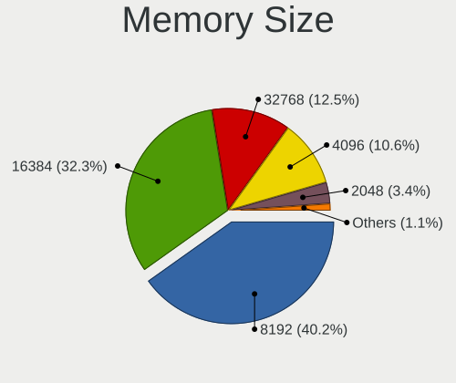

| Size  | Desktops | Percent |
|-------|----------|---------|
| 8192  | 251      | 40.16%  |
| 16384 | 202      | 32.32%  |
| 32768 | 78       | 12.48%  |
| 4096  | 66       | 10.56%  |
| 2048  | 21       | 3.36%   |
| 49152 | 3        | 0.48%   |
| 1024  | 3        | 0.48%   |
| 24576 | 1        | 0.16%   |

Memory Speed
------------

Memory module speed

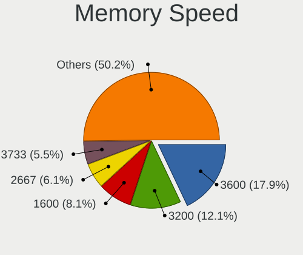

| Speed | Desktops | Percent |
|-------|----------|---------|
| 3600  | 121      | 17.93%  |
| 3200  | 82       | 12.15%  |
| 1600  | 55       | 8.15%   |
| 2667  | 41       | 6.07%   |
| 3733  | 37       | 5.48%   |
| 1333  | 31       | 4.59%   |
| 2400  | 27       | 4%      |
| 6000  | 25       | 3.7%    |
| 3800  | 24       | 3.56%   |
| 2133  | 22       | 3.26%   |
| 3400  | 21       | 3.11%   |
| 4000  | 17       | 2.52%   |
| 4800  | 15       | 2.22%   |
| 3866  | 14       | 2.07%   |
| 6400  | 12       | 1.78%   |
| 3000  | 9        | 1.33%   |
| 5600  | 8        | 1.19%   |
| 6200  | 7        | 1.04%   |
| 1867  | 7        | 1.04%   |
| 2666  | 6        | 0.89%   |
| 1800  | 6        | 0.89%   |
| 800   | 6        | 0.89%   |
| 3466  | 5        | 0.74%   |
| 5200  | 4        | 0.59%   |
| 3933  | 4        | 0.59%   |
| 3500  | 4        | 0.59%   |
| 3100  | 4        | 0.59%   |
| 2800  | 4        | 0.59%   |
| 12800 | 3        | 0.44%   |
| 4333  | 3        | 0.44%   |
| 3666  | 3        | 0.44%   |
| 3266  | 3        | 0.44%   |
| 2933  | 3        | 0.44%   |
| 2733  | 3        | 0.44%   |
| 400   | 3        | 0.44%   |
| 7000  | 2        | 0.3%    |
| 5800  | 2        | 0.3%    |
| 3333  | 2        | 0.3%    |
| 2000  | 2        | 0.3%    |
| 1866  | 2        | 0.3%    |

Printers & scanners
-------------------

Printer Vendor
--------------

Printer device vendors

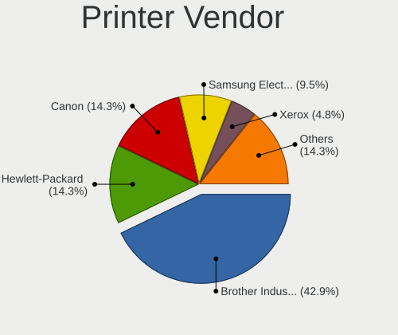

| Vendor              | Desktops | Percent |
|---------------------|----------|---------|
| Brother Industries  | 9        | 42.86%  |
| Hewlett-Packard     | 3        | 14.29%  |
| Canon               | 3        | 14.29%  |
| Samsung Electronics | 2        | 9.52%   |
| Xerox               | 1        | 4.76%   |
| Prolific Technology | 1        | 4.76%   |
| Pantum              | 1        | 4.76%   |
| Maxxter             | 1        | 4.76%   |

Printer Model
-------------

Printer device models

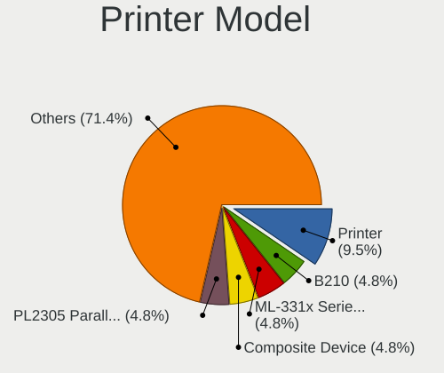

| Model                                | Desktops | Percent |
|--------------------------------------|----------|---------|
| Brother Printer                      | 2        | 9.52%   |
| Xerox B210                           | 1        | 4.76%   |
| Samsung ML-331x Series Laser Printer | 1        | 4.76%   |
| Samsung Composite Device             | 1        | 4.76%   |
| Prolific PL2305 Parallel Port        | 1        | 4.76%   |
| Pantum P2500W series                 | 1        | 4.76%   |
| Maxxter Low Latency MIC              | 1        | 4.76%   |
| HP LaserJet M109-M112                | 1        | 4.76%   |
| HP ENVY 5000 series                  | 1        | 4.76%   |
| HP ColorLaserJet M253-M254           | 1        | 4.76%   |
| Canon PIXMA MG2500 Series            | 1        | 4.76%   |
| Canon MF260 II Series                | 1        | 4.76%   |
| Canon iP4200                         | 1        | 4.76%   |
| Brother MFC-L2710DW series           | 1        | 4.76%   |
| Brother MFC-J4535DW                  | 1        | 4.76%   |
| Brother MFC-J1205W                   | 1        | 4.76%   |
| Brother HL-L2390DW                   | 1        | 4.76%   |
| Brother HL-2130 series               | 1        | 4.76%   |
| Brother DCP-9020CDW                  | 1        | 4.76%   |
| Brother DCP-9015CDW                  | 1        | 4.76%   |

Scanner Vendor
--------------

Scanner device vendors

Zero info for selected period =(

Scanner Model
-------------

Scanner device models

Zero info for selected period =(

Camera
------

Camera Vendor
-------------

Camera device vendors

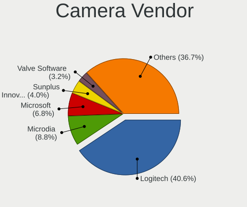

| Vendor                        | Desktops | Percent |
|-------------------------------|----------|---------|
| Logitech                      | 102      | 40.64%  |
| Microdia                      | 22       | 8.76%   |
| Microsoft                     | 17       | 6.77%   |
| Sunplus Innovation Technology | 10       | 3.98%   |
| Valve Software                | 8        | 3.19%   |
| Razer USA                     | 6        | 2.39%   |
| MacroSilicon                  | 5        | 1.99%   |
| Hewlett-Packard               | 5        | 1.99%   |
| Apple                         | 5        | 1.99%   |
| Samsung Electronics           | 4        | 1.59%   |
| Lenovo                        | 4        | 1.59%   |
| Generalplus Technology        | 4        | 1.59%   |
| Creative Technology           | 4        | 1.59%   |
| Trust                         | 3        | 1.2%    |
| Jieli Technology              | 3        | 1.2%    |
| GEMBIRD                       | 3        | 1.2%    |
| Elgato Systems                | 3        | 1.2%    |
| SunplusIT                     | 2        | 0.8%    |
| Realtek Semiconductor         | 2        | 0.8%    |
| Netchip Technology            | 2        | 0.8%    |
| KYE Systems (Mouse Systems)   | 2        | 0.8%    |
| Huawei Technologies           | 2        | 0.8%    |
| Cubeternet                    | 2        | 0.8%    |
| ARC International             | 2        | 0.8%    |
| YGTek                         | 1        | 0.4%    |
| Xiaomi                        | 1        | 0.4%    |
| WCM_USB                       | 1        | 0.4%    |
| WaveRider Communications      | 1        | 0.4%    |
| ValueHD                       | 1        | 0.4%    |
| USB CAMERA                    | 1        | 0.4%    |
| Tobii Technology AB           | 1        | 0.4%    |
| Sunplus IT                    | 1        | 0.4%    |
| Sony                          | 1        | 0.4%    |
| SN0002                        | 1        | 0.4%    |
| Remo Tech                     | 1        | 0.4%    |
| OPPO Electronics              | 1        | 0.4%    |
| Novatek Microelectronics      | 1        | 0.4%    |
| Nikon                         | 1        | 0.4%    |
| Magic Control Technology      | 1        | 0.4%    |
| LG Electronics                | 1        | 0.4%    |

Camera Model
------------

Camera device models

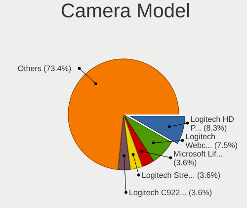

| Model                                                 | Desktops | Percent |
|-------------------------------------------------------|----------|---------|
| Logitech HD Pro Webcam C920                           | 21       | 8.33%   |
| Logitech Webcam C270                                  | 19       | 7.54%   |
| Microsoft LifeCam HD-3000                             | 9        | 3.57%   |
| Logitech StreamCam                                    | 9        | 3.57%   |
| Logitech C922 Pro Stream Webcam                       | 9        | 3.57%   |
| Valve Software 3D Camera                              | 8        | 3.17%   |
| Microdia USB 2.0 Camera                               | 8        | 3.17%   |
| Logitech C920 PRO HD Webcam                           | 8        | 3.17%   |
| Sunplus FULL HD webcam                                | 6        | 2.38%   |
| Microdia Webcam Vitade AF                             | 6        | 2.38%   |
| Logitech BRIO 4K Stream Edition                       | 5        | 1.98%   |
| Apple iPhone 5/5C/5S/6/SE/7/8/X                       | 5        | 1.98%   |
| Samsung Galaxy series, misc. (MTP mode)               | 4        | 1.59%   |
| MacroSilicon USB Video                                | 4        | 1.59%   |
| Logitech Webcam C170                                  | 4        | 1.59%   |
| Logitech HD Webcam C615                               | 4        | 1.59%   |
| Logitech BRIO Ultra HD Webcam                         | 4        | 1.59%   |
| Trust Full HD Webcam                                  | 3        | 1.19%   |
| Razer USA Razer Kiyo Pro                              | 3        | 1.19%   |
| Microsoft LifeCam VX-5000                             | 3        | 1.19%   |
| Microdia CyberTrack H7                                | 3        | 1.19%   |
| Logitech Webcam C310                                  | 3        | 1.19%   |
| Logitech Logitech Webcam C925e                        | 3        | 1.19%   |
| Generalplus GENERAL WEBCAM                            | 3        | 1.19%   |
| Sunplus Integrated Camera                             | 2        | 0.79%   |
| Razer USA Razer Ripsaw HD - Game Capture Card         | 2        | 0.79%   |
| Microsoft LifeCam Cinema                              | 2        | 0.79%   |
| Logitech HD Webcam C525                               | 2        | 0.79%   |
| Logitech CrystalCam                                   | 2        | 0.79%   |
| Logitech Brio 101                                     | 2        | 0.79%   |
| Lenovo Lenovo FHD Webcam Audio                        | 2        | 0.79%   |
| KYE Systems (Mouse Systems) USB 2.0 HD1080P PC Camera | 2        | 0.79%   |
| Jieli USB PHY 2.0                                     | 2        | 0.79%   |
| Huawei HiCamera                                       | 2        | 0.79%   |
| HP Webcam HD 2300                                     | 2        | 0.79%   |
| HP 320 FHD Webcam                                     | 2        | 0.79%   |
| GEMBIRD Generic UVC 1.00 camera [AppoTech AX2311]     | 2        | 0.79%   |
| Creative Live! Cam Chat HD [VF0700/VF0790]            | 2        | 0.79%   |
| ARC International Camera                              | 2        | 0.79%   |
| YGTek Webcam                                          | 1        | 0.4%    |

Security
--------

Fingerprint Vendor
------------------

Fingerprint sensor vendors

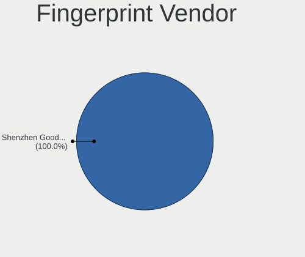

| Vendor                     | Desktops | Percent |
|----------------------------|----------|---------|
| Shenzhen Goodix Technology | 1        | 50%     |
| AuthenTec                  | 1        | 50%     |

Fingerprint Model
-----------------

Fingerprint sensor models

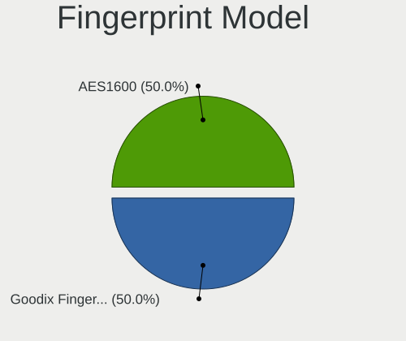

| Model                               | Desktops | Percent |
|-------------------------------------|----------|---------|
| Shenzhen Goodix  Fingerprint Device | 1        | 50%     |
| AuthenTec AES1600                   | 1        | 50%     |

Chipcard Vendor
---------------

Chipcard module vendors

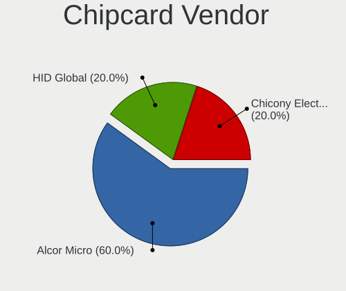

| Vendor              | Desktops | Percent |
|---------------------|----------|---------|
| Alcor Micro         | 3        | 60%     |
| HID Global          | 1        | 20%     |
| Chicony Electronics | 1        | 20%     |

Chipcard Model
--------------

Chipcard module models

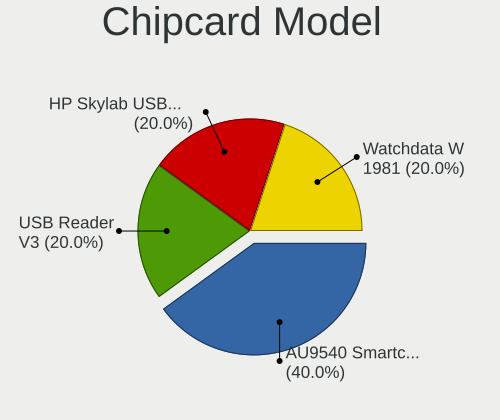

| Model                                                | Desktops | Percent |
|------------------------------------------------------|----------|---------|
| Alcor Micro AU9540 Smartcard Reader                  | 2        | 40%     |
| HID Global USB Reader V3                             | 1        | 20%     |
| Chicony Electronics HP Skylab USB Smartcard Keyboard | 1        | 20%     |
| Alcor Micro Watchdata W 1981                         | 1        | 20%     |

Unsupported
-----------

Unsupported Devices
-------------------

Total unsupported devices on board

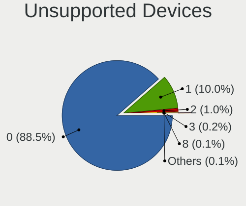

| Total | Desktops | Percent |
|-------|----------|---------|
| 0     | 772      | 88.53%  |
| 1     | 87       | 9.98%   |
| 2     | 9        | 1.03%   |
| 3     | 2        | 0.23%   |
| 8     | 1        | 0.11%   |
| 4     | 1        | 0.11%   |

Unsupported Device Types
------------------------

Types of unsupported devices

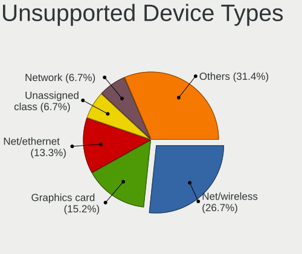

| Type                     | Desktops | Percent |
|--------------------------|----------|---------|
| Net/wireless             | 28       | 26.67%  |
| Graphics card            | 16       | 15.24%  |
| Net/ethernet             | 14       | 13.33%  |
| Unassigned class         | 7        | 6.67%   |
| Network                  | 7        | 6.67%   |
| Multimedia controller    | 6        | 5.71%   |
| Camera                   | 5        | 4.76%   |
| Chipcard                 | 4        | 3.81%   |
| Sound                    | 3        | 2.86%   |
| Bluetooth                | 3        | 2.86%   |
| Storage/raid             | 2        | 1.9%    |
| Storage/nvme             | 2        | 1.9%    |
| Dvb card                 | 2        | 1.9%    |
| Communication controller | 2        | 1.9%    |
| Video                    | 1        | 0.95%   |
| Storage/ata              | 1        | 0.95%   |
| Storage                  | 1        | 0.95%   |
| Fingerprint reader       | 1        | 0.95%   |

