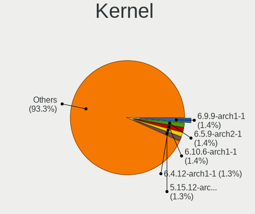
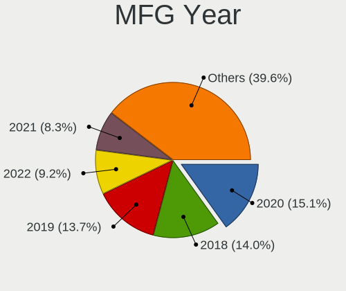
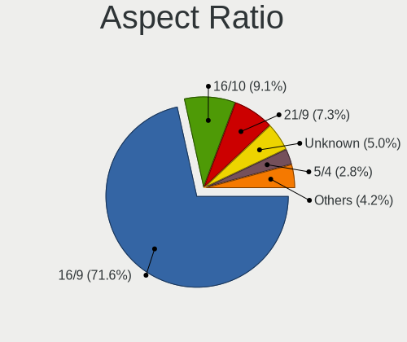
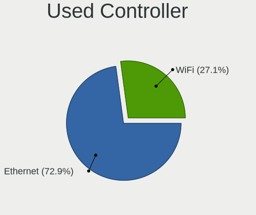
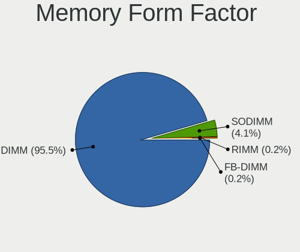

EndeavourOS - Tested Hardware & Statistics (Desktops)
-----------------------------------------------------

A project to collect tested hardware configurations for EndeavourOS.

Anyone can contribute to this report by the [hw-probe](https://github.com/linuxhw/hw-probe) tool:

    sudo -E hw-probe -all -upload

Please contribute! Especially if your hardware is rare.

Contents
--------

* [ Test Cases ](#test-cases)

* [ System ](#system)
  - [ OS                       ](#os)
  - [ OS Family                ](#os-family)
  - [ Kernel                   ](#kernel)
  - [ Kernel Family            ](#kernel-family)
  - [ Kernel Major Ver.        ](#kernel-major-ver)
  - [ Arch                     ](#arch)
  - [ DE                       ](#de)
  - [ Display Server           ](#display-server)
  - [ Display Manager          ](#display-manager)
  - [ OS Lang                  ](#os-lang)
  - [ Boot Mode                ](#boot-mode)
  - [ Filesystem               ](#filesystem)
  - [ Part. scheme             ](#part-scheme)
  - [ Dual Boot with Linux/BSD ](#dual-boot-with-linuxbsd)
  - [ Dual Boot (Win)          ](#dual-boot-win)

* [ Board ](#board)
  - [ Vendor                   ](#vendor)
  - [ Model                    ](#model)
  - [ Model Family             ](#model-family)
  - [ MFG Year                 ](#mfg-year)
  - [ Form Factor              ](#form-factor)
  - [ Secure Boot              ](#secure-boot)
  - [ Coreboot                 ](#coreboot)
  - [ RAM Size                 ](#ram-size)
  - [ RAM Used                 ](#ram-used)
  - [ Total Drives             ](#total-drives)
  - [ Has CD-ROM               ](#has-cd-rom)
  - [ Has Ethernet             ](#has-ethernet)
  - [ Has WiFi                 ](#has-wifi)
  - [ Has Bluetooth            ](#has-bluetooth)

* [ Location ](#location)
  - [ Country                  ](#country)
  - [ City                     ](#city)

* [ Drives ](#drives)
  - [ Drive Vendor             ](#drive-vendor)
  - [ Drive Model              ](#drive-model)
  - [ HDD Vendor               ](#hdd-vendor)
  - [ SSD Vendor               ](#ssd-vendor)
  - [ Drive Kind               ](#drive-kind)
  - [ Drive Connector          ](#drive-connector)
  - [ Drive Size               ](#drive-size)
  - [ Space Total              ](#space-total)
  - [ Space Used               ](#space-used)
  - [ Malfunc. Drives          ](#malfunc-drives)
  - [ Malfunc. Drive Vendor    ](#malfunc-drive-vendor)
  - [ Malfunc. HDD Vendor      ](#malfunc-hdd-vendor)
  - [ Malfunc. Drive Kind      ](#malfunc-drive-kind)
  - [ Failed Drives            ](#failed-drives)
  - [ Failed Drive Vendor      ](#failed-drive-vendor)
  - [ Drive Status             ](#drive-status)

* [ Storage controller ](#storage-controller)
  - [ Storage Vendor           ](#storage-vendor)
  - [ Storage Model            ](#storage-model)
  - [ Storage Kind             ](#storage-kind)

* [ Processor ](#processor)
  - [ CPU Vendor               ](#cpu-vendor)
  - [ CPU Model                ](#cpu-model)
  - [ CPU Model Family         ](#cpu-model-family)
  - [ CPU Cores                ](#cpu-cores)
  - [ CPU Sockets              ](#cpu-sockets)
  - [ CPU Threads              ](#cpu-threads)
  - [ CPU Op-Modes             ](#cpu-op-modes)
  - [ CPU Microcode            ](#cpu-microcode)
  - [ CPU Microarch            ](#cpu-microarch)

* [ Graphics ](#graphics)
  - [ GPU Vendor               ](#gpu-vendor)
  - [ GPU Model                ](#gpu-model)
  - [ GPU Combo                ](#gpu-combo)
  - [ GPU Driver               ](#gpu-driver)
  - [ GPU Memory               ](#gpu-memory)

* [ Monitor ](#monitor)
  - [ Monitor Vendor           ](#monitor-vendor)
  - [ Monitor Model            ](#monitor-model)
  - [ Monitor Resolution       ](#monitor-resolution)
  - [ Monitor Diagonal         ](#monitor-diagonal)
  - [ Monitor Width            ](#monitor-width)
  - [ Aspect Ratio             ](#aspect-ratio)
  - [ Monitor Area             ](#monitor-area)
  - [ Pixel Density            ](#pixel-density)
  - [ Multiple Monitors        ](#multiple-monitors)

* [ Network ](#network)
  - [ Net Controller Vendor    ](#net-controller-vendor)
  - [ Net Controller Model     ](#net-controller-model)
  - [ Wireless Vendor          ](#wireless-vendor)
  - [ Wireless Model           ](#wireless-model)
  - [ Ethernet Vendor          ](#ethernet-vendor)
  - [ Ethernet Model           ](#ethernet-model)
  - [ Net Controller Kind      ](#net-controller-kind)
  - [ Used Controller          ](#used-controller)
  - [ NICs                     ](#nics)
  - [ IPv6                     ](#ipv6)

* [ Bluetooth ](#bluetooth)
  - [ Bluetooth Vendor         ](#bluetooth-vendor)
  - [ Bluetooth Model          ](#bluetooth-model)

* [ Sound ](#sound)
  - [ Sound Vendor             ](#sound-vendor)
  - [ Sound Model              ](#sound-model)

* [ Memory ](#memory)
  - [ Memory Vendor            ](#memory-vendor)
  - [ Memory Model             ](#memory-model)
  - [ Memory Kind              ](#memory-kind)
  - [ Memory Form Factor       ](#memory-form-factor)
  - [ Memory Size              ](#memory-size)
  - [ Memory Speed             ](#memory-speed)

* [ Printers & scanners ](#printers--scanners)
  - [ Printer Vendor           ](#printer-vendor)
  - [ Printer Model            ](#printer-model)
  - [ Scanner Vendor           ](#scanner-vendor)
  - [ Scanner Model            ](#scanner-model)

* [ Camera ](#camera)
  - [ Camera Vendor            ](#camera-vendor)
  - [ Camera Model             ](#camera-model)

* [ Security ](#security)
  - [ Fingerprint Vendor       ](#fingerprint-vendor)
  - [ Fingerprint Model        ](#fingerprint-model)
  - [ Chipcard Vendor          ](#chipcard-vendor)
  - [ Chipcard Model           ](#chipcard-model)

* [ Unsupported ](#unsupported)
  - [ Unsupported Devices      ](#unsupported-devices)
  - [ Unsupported Device Types ](#unsupported-device-types)

Test Cases
----------

Total: 627

| Vendor        | Model                       | Probe                                                      | Date         |
|---------------|-----------------------------|------------------------------------------------------------|--------------|
| Gigabyte      | B460M GAMING HD             | [6669971369](https://linux-hardware.org/?probe=6669971369) | Dec 23, 2023 |
| ASUSTek       | TUF Gaming B650-PLUS WIF... | [a7194ce97c](https://linux-hardware.org/?probe=a7194ce97c) | Dec 23, 2023 |
| HP            | 8299                        | [7cb3e71107](https://linux-hardware.org/?probe=7cb3e71107) | Dec 23, 2023 |
| Huanan        | X58 V1.0                    | [ac62468ad1](https://linux-hardware.org/?probe=ac62468ad1) | Dec 21, 2023 |
| MSI           | MAG X570 TOMAHAWK WIFI      | [13b303a58b](https://linux-hardware.org/?probe=13b303a58b) | Dec 21, 2023 |
| MSI           | B85M-G43                    | [f2b41e4ce3](https://linux-hardware.org/?probe=f2b41e4ce3) | Dec 21, 2023 |
| Dell          | 0KV62T A00                  | [b6ca701110](https://linux-hardware.org/?probe=b6ca701110) | Dec 18, 2023 |
| ASUSTek       | STRIX Z270H GAMING          | [74584680bb](https://linux-hardware.org/?probe=74584680bb) | Dec 17, 2023 |
| Gigabyte      | B550M DS3H                  | [50ad2630fb](https://linux-hardware.org/?probe=50ad2630fb) | Dec 16, 2023 |
| MSI           | B550M PRO-VDH WIFI          | [06a409ecda](https://linux-hardware.org/?probe=06a409ecda) | Dec 15, 2023 |
| ASUSTek       | ROG STRIX X670E-E GAMING... | [726676ca8d](https://linux-hardware.org/?probe=726676ca8d) | Dec 13, 2023 |
| ASUSTek       | TUF Gaming B650-PLUS WIF... | [efe4c56706](https://linux-hardware.org/?probe=efe4c56706) | Dec 13, 2023 |
| ASUSTek       | G15DK                       | [b1fb7727ce](https://linux-hardware.org/?probe=b1fb7727ce) | Dec 13, 2023 |
| Gigabyte      | Z390 GAMING X-CF            | [34c5aec887](https://linux-hardware.org/?probe=34c5aec887) | Dec 12, 2023 |
| ASUSTek       | P8B75-M                     | [41f57147de](https://linux-hardware.org/?probe=41f57147de) | Dec 10, 2023 |
| MSI           | MAG Z390 TOMAHAWK           | [242f306b04](https://linux-hardware.org/?probe=242f306b04) | Dec 10, 2023 |
| Gigabyte      | Z170XP-SLI-CF               | [a51f4ce5e5](https://linux-hardware.org/?probe=a51f4ce5e5) | Dec 09, 2023 |
| ASUSTek       | ROG STRIX Z390-E GAMING     | [3bca387137](https://linux-hardware.org/?probe=3bca387137) | Dec 09, 2023 |
| Gigabyte      | B250M-DS3H-CF               | [dd7e60da66](https://linux-hardware.org/?probe=dd7e60da66) | Dec 09, 2023 |
| ASUSTek       | PRIME H510M-A               | [40fae6bc6c](https://linux-hardware.org/?probe=40fae6bc6c) | Dec 08, 2023 |
| Gigabyte      | B250M-DS3H-CF               | [1ce8dbd527](https://linux-hardware.org/?probe=1ce8dbd527) | Dec 08, 2023 |
| Acer          | Aspire TC-885 V:1.1         | [be2c5bcf98](https://linux-hardware.org/?probe=be2c5bcf98) | Dec 07, 2023 |
| ASUSTek       | P8Z77-V LX                  | [1ac83c7edd](https://linux-hardware.org/?probe=1ac83c7edd) | Dec 05, 2023 |
| MSI           | Z370 GAMING PRO CARBON      | [4b1c01f9b4](https://linux-hardware.org/?probe=4b1c01f9b4) | Dec 02, 2023 |
| ASUSTek       | PRIME B760M-A WIFI D4       | [707fd0c687](https://linux-hardware.org/?probe=707fd0c687) | Dec 02, 2023 |
| HP            | 3397                        | [a858c3e80b](https://linux-hardware.org/?probe=a858c3e80b) | Dec 01, 2023 |
| ASUSTek       | ROG STRIX X470-F GAMING     | [a803eec9f3](https://linux-hardware.org/?probe=a803eec9f3) | Nov 30, 2023 |
| MSI           | MAG X570 TOMAHAWK WIFI      | [36fb8bfcab](https://linux-hardware.org/?probe=36fb8bfcab) | Nov 27, 2023 |
| HP            | 3397                        | [ea69fd3531](https://linux-hardware.org/?probe=ea69fd3531) | Nov 25, 2023 |
| ASUSTek       | Z170M-PLUS                  | [5bbefae656](https://linux-hardware.org/?probe=5bbefae656) | Nov 25, 2023 |
| ASUSTek       | TUF Gaming X570-PLUS        | [bfb322c3dc](https://linux-hardware.org/?probe=bfb322c3dc) | Nov 24, 2023 |
| Gigabyte      | B450 AORUS ELITE            | [298883c961](https://linux-hardware.org/?probe=298883c961) | Nov 23, 2023 |
| Gigabyte      | B550M DS3H AC               | [a5406ad359](https://linux-hardware.org/?probe=a5406ad359) | Nov 20, 2023 |
| ASUSTek       | PRIME X670-P                | [03c5ac12be](https://linux-hardware.org/?probe=03c5ac12be) | Nov 20, 2023 |
| ASRock        | Z790M-ITX WiFi              | [2482b30a58](https://linux-hardware.org/?probe=2482b30a58) | Nov 19, 2023 |
| MSI           | B450M PRO-VDH PLUS          | [58e714af7e](https://linux-hardware.org/?probe=58e714af7e) | Nov 16, 2023 |
| MSI           | Z87-G43 GAMING              | [71786a484b](https://linux-hardware.org/?probe=71786a484b) | Nov 16, 2023 |
| MSI           | Z87-G43 GAMING              | [1cf432335c](https://linux-hardware.org/?probe=1cf432335c) | Nov 15, 2023 |
| MSI           | X470 GAMING PLUS MAX        | [0029d3638f](https://linux-hardware.org/?probe=0029d3638f) | Nov 12, 2023 |
| Gigabyte      | B450M DS3H-CF               | [03a619e930](https://linux-hardware.org/?probe=03a619e930) | Nov 11, 2023 |
| Unknown       | Unknown                     | [e4a09ae9d2](https://linux-hardware.org/?probe=e4a09ae9d2) | Nov 10, 2023 |
| Apple         | Mac-F60DEB81FF30ACF6 Mac... | [1aeeebf4b2](https://linux-hardware.org/?probe=1aeeebf4b2) | Nov 10, 2023 |
| ASUSTek       | H97-PRO GAMER               | [26f1a89e53](https://linux-hardware.org/?probe=26f1a89e53) | Nov 10, 2023 |
| ASUSTek       | TUF Gaming X570-PRO         | [2adf99d3df](https://linux-hardware.org/?probe=2adf99d3df) | Nov 09, 2023 |
| ASUSTek       | TUF Gaming Z690-PLUS WIF... | [d95fab9dc1](https://linux-hardware.org/?probe=d95fab9dc1) | Nov 04, 2023 |
| Apple         | Mac-F60DEB81FF30ACF6 Mac... | [b213aefe09](https://linux-hardware.org/?probe=b213aefe09) | Nov 03, 2023 |
| MSI           | MAG B550 TOMAHAWK           | [a08b1cfa29](https://linux-hardware.org/?probe=a08b1cfa29) | Nov 03, 2023 |
| MSI           | B450-A PRO MAX              | [5116fa401d](https://linux-hardware.org/?probe=5116fa401d) | Nov 01, 2023 |
| ASRock        | B450 Pro4 R2.0              | [c950f24711](https://linux-hardware.org/?probe=c950f24711) | Nov 01, 2023 |
| Gigabyte      | P55A-UD3                    | [6af2aaed4e](https://linux-hardware.org/?probe=6af2aaed4e) | Nov 01, 2023 |
| ASRock        | B450M Pro4                  | [0dc16901b7](https://linux-hardware.org/?probe=0dc16901b7) | Nov 01, 2023 |
| MSI           | Z270-A PRO                  | [b4e85014cc](https://linux-hardware.org/?probe=b4e85014cc) | Oct 31, 2023 |
| ASUSTek       | STRIX Z270I GAMING          | [62adc05f6a](https://linux-hardware.org/?probe=62adc05f6a) | Oct 31, 2023 |
| MSI           | PRO B550M-P GEN3            | [413254deb3](https://linux-hardware.org/?probe=413254deb3) | Oct 30, 2023 |
| Fujitsu       | D3430-U1 S26361-D3430-U1    | [0b62ec2df6](https://linux-hardware.org/?probe=0b62ec2df6) | Oct 30, 2023 |
| Gigabyte      | X570 AORUS MASTER           | [3f0259e17b](https://linux-hardware.org/?probe=3f0259e17b) | Oct 30, 2023 |
| ASUSTek       | PRIME H410M-R               | [c9a6bd4217](https://linux-hardware.org/?probe=c9a6bd4217) | Oct 29, 2023 |
| MSI           | H110M PRO-D                 | [96710ad70e](https://linux-hardware.org/?probe=96710ad70e) | Oct 28, 2023 |
| Gigabyte      | Z590 Gaming X               | [86bb741092](https://linux-hardware.org/?probe=86bb741092) | Oct 27, 2023 |
| MSI           | MAG B760 TOMAHAWK WIFI      | [db2952a9d8](https://linux-hardware.org/?probe=db2952a9d8) | Oct 27, 2023 |
| ASUSTek       | PRIME X670E-PRO WIFI        | [6cd6569138](https://linux-hardware.org/?probe=6cd6569138) | Oct 25, 2023 |
| ASUSTek       | Z170M-PLUS                  | [95b5ac0a0e](https://linux-hardware.org/?probe=95b5ac0a0e) | Oct 24, 2023 |
| ASUSTek       | PRIME X670E-PRO WIFI        | [8a67a1a41a](https://linux-hardware.org/?probe=8a67a1a41a) | Oct 24, 2023 |
| Gigabyte      | B550 AORUS ELITE V2         | [79ef1e4f2b](https://linux-hardware.org/?probe=79ef1e4f2b) | Oct 22, 2023 |
| ASUSTek       | TUF Gaming X570-PLUS        | [a5c33d9a5a](https://linux-hardware.org/?probe=a5c33d9a5a) | Oct 22, 2023 |
| ASRock        | B450M/ac R2.0               | [c1313fc22e](https://linux-hardware.org/?probe=c1313fc22e) | Oct 22, 2023 |
| Gigabyte      | B760 GAMING X AX DDR4       | [eb5de485aa](https://linux-hardware.org/?probe=eb5de485aa) | Oct 21, 2023 |
| ASUSTek       | PRIME H410M-R               | [e5362858a0](https://linux-hardware.org/?probe=e5362858a0) | Oct 20, 2023 |
| ASUSTek       | PRIME H410M-R               | [01544384cc](https://linux-hardware.org/?probe=01544384cc) | Oct 20, 2023 |
| Dell          | 0N4YC8 A00                  | [c01a27db62](https://linux-hardware.org/?probe=c01a27db62) | Oct 20, 2023 |
| Dell          | 0N4YC8 A00                  | [8fbbe4eec8](https://linux-hardware.org/?probe=8fbbe4eec8) | Oct 20, 2023 |
| Positivo      | POS-PIG43BC SIM             | [ded7e15a49](https://linux-hardware.org/?probe=ded7e15a49) | Oct 17, 2023 |
| Unknown       | Unknown                     | [172cfdcd26](https://linux-hardware.org/?probe=172cfdcd26) | Oct 16, 2023 |
| ASRock        | X470 Gaming K4              | [740122e9fa](https://linux-hardware.org/?probe=740122e9fa) | Oct 15, 2023 |
| MSI           | MPG B550 GAMING PLUS        | [bc47dea2fe](https://linux-hardware.org/?probe=bc47dea2fe) | Oct 14, 2023 |
| ASUSTek       | TUF Gaming X670E-PLUS WI... | [d44d655589](https://linux-hardware.org/?probe=d44d655589) | Oct 11, 2023 |
| Gigabyte      | Z390 DESIGNARE-CF           | [3df74e5b96](https://linux-hardware.org/?probe=3df74e5b96) | Oct 11, 2023 |
| ASUSTek       | Maximus VIII RANGER         | [e1dc170ad7](https://linux-hardware.org/?probe=e1dc170ad7) | Oct 09, 2023 |
| ASUSTek       | TUF Gaming X670E-PLUS WI... | [5089a21326](https://linux-hardware.org/?probe=5089a21326) | Oct 07, 2023 |
| ASUSTek       | PRIME A320M-K               | [2d73d7e286](https://linux-hardware.org/?probe=2d73d7e286) | Oct 06, 2023 |
| MSI           | MPG X570 GAMING PLUS        | [b992cbe7ae](https://linux-hardware.org/?probe=b992cbe7ae) | Oct 02, 2023 |
| MSI           | MPG X570 GAMING EDGE WIF... | [b5fcc0da7b](https://linux-hardware.org/?probe=b5fcc0da7b) | Oct 02, 2023 |
| ASUSTek       | TUF Gaming B550-PLUS        | [b8068a8e68](https://linux-hardware.org/?probe=b8068a8e68) | Oct 02, 2023 |
| ASUSTek       | PRIME A320M-K               | [cacc534be7](https://linux-hardware.org/?probe=cacc534be7) | Oct 02, 2023 |
| Positivo      | POS-PIH81DI                 | [0e67f3a0f3](https://linux-hardware.org/?probe=0e67f3a0f3) | Sep 29, 2023 |
| ASUSTek       | PRIME B450-PLUS             | [ed68f904fe](https://linux-hardware.org/?probe=ed68f904fe) | Sep 26, 2023 |
| ASUSTek       | PRIME B450-PLUS             | [e24beff974](https://linux-hardware.org/?probe=e24beff974) | Sep 26, 2023 |
| ASUSTek       | TUF Gaming X570-PRO         | [6677b81417](https://linux-hardware.org/?probe=6677b81417) | Sep 26, 2023 |
| ASUSTek       | TUF Gaming X570-PLUS        | [2b371179db](https://linux-hardware.org/?probe=2b371179db) | Sep 25, 2023 |
| ASUSTek       | Z170M-PLUS                  | [2bb252778b](https://linux-hardware.org/?probe=2bb252778b) | Sep 25, 2023 |
| Gigabyte      | B250M-D3H-CF                | [3a965cb7e3](https://linux-hardware.org/?probe=3a965cb7e3) | Sep 22, 2023 |
| ASUSTek       | PRIME B450M-A II            | [90c9ffe2e0](https://linux-hardware.org/?probe=90c9ffe2e0) | Sep 22, 2023 |
| Gigabyte      | X670 AORUS ELITE AX         | [7f327aca42](https://linux-hardware.org/?probe=7f327aca42) | Sep 21, 2023 |
| HP            | 212B                        | [f961d48c51](https://linux-hardware.org/?probe=f961d48c51) | Sep 20, 2023 |
| ASUSTek       | Z170M-PLUS                  | [2b913a2e83](https://linux-hardware.org/?probe=2b913a2e83) | Sep 19, 2023 |
| Dell          | 0M6C7G A00                  | [a93d60a237](https://linux-hardware.org/?probe=a93d60a237) | Sep 17, 2023 |
| ASUSTek       | PRIME H770-PLUS             | [c58fea9225](https://linux-hardware.org/?probe=c58fea9225) | Sep 16, 2023 |
| ASRock        | B450M/ac R2.0               | [804b890928](https://linux-hardware.org/?probe=804b890928) | Sep 15, 2023 |
| MSI           | MEG Z790 GODLIKE            | [ef63882e50](https://linux-hardware.org/?probe=ef63882e50) | Sep 15, 2023 |
| MSI           | MEG Z790 GODLIKE            | [688462f949](https://linux-hardware.org/?probe=688462f949) | Sep 15, 2023 |
| ASUSTek       | ROG Maximus XI EXTREME      | [37efc0526e](https://linux-hardware.org/?probe=37efc0526e) | Sep 09, 2023 |
| ASUSTek       | ROG Maximus XI EXTREME      | [035446631a](https://linux-hardware.org/?probe=035446631a) | Sep 09, 2023 |
| ASUSTek       | PRIME A320M-K               | [178d6df21a](https://linux-hardware.org/?probe=178d6df21a) | Sep 08, 2023 |
| ASRock        | B450M/ac R2.0               | [82266958be](https://linux-hardware.org/?probe=82266958be) | Sep 07, 2023 |
| Unknown       | Unknown                     | [a5506bdc30](https://linux-hardware.org/?probe=a5506bdc30) | Sep 07, 2023 |
| Acer          | Aspire GX-785               | [e33b7b35bf](https://linux-hardware.org/?probe=e33b7b35bf) | Sep 06, 2023 |
| ASUSTek       | ROG CROSSHAIR VIII HERO     | [fafd1b4cf2](https://linux-hardware.org/?probe=fafd1b4cf2) | Sep 06, 2023 |
| Gigabyte      | B550 AORUS ELITE V2         | [38aad324f2](https://linux-hardware.org/?probe=38aad324f2) | Sep 05, 2023 |
| ASUSTek       | PRIME X570-P                | [08dd85e58d](https://linux-hardware.org/?probe=08dd85e58d) | Sep 05, 2023 |
| MSI           | MAG B550M MORTAR            | [3ee4e0f848](https://linux-hardware.org/?probe=3ee4e0f848) | Sep 02, 2023 |
| Gigabyte      | P55A-UD3                    | [d8e4c2da1e](https://linux-hardware.org/?probe=d8e4c2da1e) | Sep 01, 2023 |
| ASRock        | B450M Pro4                  | [4725c2be8e](https://linux-hardware.org/?probe=4725c2be8e) | Sep 01, 2023 |
| MSI           | Z87-G45 GAMING              | [ce1e538f59](https://linux-hardware.org/?probe=ce1e538f59) | Sep 01, 2023 |
| ASUSTek       | M4A88TD-V EVO/USB3          | [578f5e581e](https://linux-hardware.org/?probe=578f5e581e) | Aug 31, 2023 |
| ASUSTek       | TUF Gaming B550-PLUS        | [0bf7d37cc9](https://linux-hardware.org/?probe=0bf7d37cc9) | Aug 30, 2023 |
| ASUSTek       | PRIME Z390-A                | [d238cd036a](https://linux-hardware.org/?probe=d238cd036a) | Aug 27, 2023 |
| ASUSTek       | TUF Gaming X570-PRO         | [01a0f80107](https://linux-hardware.org/?probe=01a0f80107) | Aug 27, 2023 |
| ASUSTek       | PRIME X370-PRO              | [95d23ba555](https://linux-hardware.org/?probe=95d23ba555) | Aug 27, 2023 |
| Unknown       | Unknown                     | [2bbc495ee5](https://linux-hardware.org/?probe=2bbc495ee5) | Aug 25, 2023 |
| HP            | 1589                        | [982f4f1442](https://linux-hardware.org/?probe=982f4f1442) | Aug 24, 2023 |
| ASUSTek       | ROG STRIX B350-F GAMING     | [34a96cbdc8](https://linux-hardware.org/?probe=34a96cbdc8) | Aug 24, 2023 |
| HP            | 18E4                        | [0235c76e04](https://linux-hardware.org/?probe=0235c76e04) | Aug 23, 2023 |
| ASUSTek       | ROG STRIX B350-F GAMING     | [71853f1c36](https://linux-hardware.org/?probe=71853f1c36) | Aug 20, 2023 |
| ASUSTek       | TUF Gaming X570-PLUS        | [e797880ede](https://linux-hardware.org/?probe=e797880ede) | Aug 19, 2023 |
| ASRock        | Z170 Gaming K4              | [867105e269](https://linux-hardware.org/?probe=867105e269) | Aug 18, 2023 |
| HP            | 18E4                        | [4fd89c22ae](https://linux-hardware.org/?probe=4fd89c22ae) | Aug 14, 2023 |
| HP            | 8055                        | [a4c4208546](https://linux-hardware.org/?probe=a4c4208546) | Aug 13, 2023 |
| Dell          | 08NPPY A00                  | [bdc11616d7](https://linux-hardware.org/?probe=bdc11616d7) | Aug 08, 2023 |
| ASRock        | B650 PG Lightning           | [bc55c09547](https://linux-hardware.org/?probe=bc55c09547) | Aug 06, 2023 |
| MSI           | X470 GAMING PLUS            | [0e79a19ed6](https://linux-hardware.org/?probe=0e79a19ed6) | Aug 06, 2023 |
| ASRock        | X570 Taichi                 | [34e27f60e0](https://linux-hardware.org/?probe=34e27f60e0) | Aug 05, 2023 |
| Gigabyte      | H77-DS3H                    | [4c677637c2](https://linux-hardware.org/?probe=4c677637c2) | Aug 04, 2023 |
| ASUSTek       | TUF Gaming X570-PRO         | [a08886d394](https://linux-hardware.org/?probe=a08886d394) | Aug 02, 2023 |
| ASUSTek       | ROG STRIX B450-F GAMING     | [fd9503645f](https://linux-hardware.org/?probe=fd9503645f) | Aug 01, 2023 |
| MSI           | X470 GAMING PLUS            | [9e892c6bc7](https://linux-hardware.org/?probe=9e892c6bc7) | Aug 01, 2023 |
| ASUSTek       | PRIME Z790-A WIFI           | [13a4427208](https://linux-hardware.org/?probe=13a4427208) | Jul 31, 2023 |
| MSI           | MPG B550 GAMING PLUS        | [351ebe5f4f](https://linux-hardware.org/?probe=351ebe5f4f) | Jul 24, 2023 |
| ASUSTek       | ROG STRIX B550-F GAMING     | [a179c222ea](https://linux-hardware.org/?probe=a179c222ea) | Jul 23, 2023 |
| ASUSTek       | ROG STRIX Z690-A GAMING ... | [32fbe34ce0](https://linux-hardware.org/?probe=32fbe34ce0) | Jul 18, 2023 |
| ASUSTek       | ROG STRIX Z370-E GAMING     | [25aef4eda4](https://linux-hardware.org/?probe=25aef4eda4) | Jul 18, 2023 |
| MSI           | B350 TOMAHAWK               | [d589d40102](https://linux-hardware.org/?probe=d589d40102) | Jul 15, 2023 |
| MSI           | B350 TOMAHAWK               | [7e0ff09c1f](https://linux-hardware.org/?probe=7e0ff09c1f) | Jul 15, 2023 |
| MSI           | B150M ECO                   | [84601cd9dc](https://linux-hardware.org/?probe=84601cd9dc) | Jul 14, 2023 |
| Gigabyte      | B550 VISION D-P             | [160af9ddfb](https://linux-hardware.org/?probe=160af9ddfb) | Jul 09, 2023 |
| ASUSTek       | TUF B450-PRO GAMING         | [33e4bac631](https://linux-hardware.org/?probe=33e4bac631) | Jul 05, 2023 |
| ASUSTek       | ROG STRIX B350-F GAMING     | [6df7cc5145](https://linux-hardware.org/?probe=6df7cc5145) | Jul 02, 2023 |
| Daten Tecn... | DH110MXV                    | [83dd07d2a7](https://linux-hardware.org/?probe=83dd07d2a7) | Jul 01, 2023 |
| Gigabyte      | P55A-UD3                    | [1ab74730be](https://linux-hardware.org/?probe=1ab74730be) | Jul 01, 2023 |
| ASRock        | B450M Pro4                  | [b5f1dc88df](https://linux-hardware.org/?probe=b5f1dc88df) | Jul 01, 2023 |
| ASUSTek       | TUF Gaming B550M-E WIFI     | [916b60f6f7](https://linux-hardware.org/?probe=916b60f6f7) | Jun 30, 2023 |
| MSI           | A320M PRO-VH                | [1a84c61bd4](https://linux-hardware.org/?probe=1a84c61bd4) | Jun 27, 2023 |
| MSI           | X570-A PRO                  | [f664b455eb](https://linux-hardware.org/?probe=f664b455eb) | Jun 26, 2023 |
| Gigabyte      | B550 AORUS ELITE V2         | [7ac67acfed](https://linux-hardware.org/?probe=7ac67acfed) | Jun 21, 2023 |
| MSI           | B450M PRO-VDH               | [ed8ee7af2c](https://linux-hardware.org/?probe=ed8ee7af2c) | Jun 19, 2023 |
| ASRock        | Z77 Extreme4                | [78207fbf49](https://linux-hardware.org/?probe=78207fbf49) | Jun 19, 2023 |
| MSI           | B350M MORTAR                | [1050576987](https://linux-hardware.org/?probe=1050576987) | Jun 14, 2023 |
| MSI           | B450 TOMAHAWK               | [e8ed28dba0](https://linux-hardware.org/?probe=e8ed28dba0) | Jun 14, 2023 |
| MSI           | B450 TOMAHAWK               | [507d8cc765](https://linux-hardware.org/?probe=507d8cc765) | Jun 13, 2023 |
| MSI           | B450M PRO-VDH MAX           | [c433d533f0](https://linux-hardware.org/?probe=c433d533f0) | Jun 11, 2023 |
| ASUSTek       | CM6850                      | [33579719ed](https://linux-hardware.org/?probe=33579719ed) | Jun 11, 2023 |
| Dell          | 0DWPVW A00                  | [ffad802816](https://linux-hardware.org/?probe=ffad802816) | Jun 10, 2023 |
| Huanan        | X99-F8 GAMING V2.0          | [a597fc235e](https://linux-hardware.org/?probe=a597fc235e) | Jun 09, 2023 |
| Huanan        | X99-F8 GAMING V2.0          | [6a368b8ecc](https://linux-hardware.org/?probe=6a368b8ecc) | Jun 09, 2023 |
| Dell          | 0D24M8 A00                  | [92fe930ecf](https://linux-hardware.org/?probe=92fe930ecf) | Jun 05, 2023 |
| ASUSTek       | H97-PRO                     | [bfe6623b23](https://linux-hardware.org/?probe=bfe6623b23) | Jun 03, 2023 |
| ASUSTek       | H97-PRO                     | [c3dae64ee6](https://linux-hardware.org/?probe=c3dae64ee6) | Jun 03, 2023 |
| MSI           | MEG X670E ACE               | [8bc281486e](https://linux-hardware.org/?probe=8bc281486e) | May 31, 2023 |
| Gigabyte      | B450 AORUS ELITE            | [2a36e1c1d5](https://linux-hardware.org/?probe=2a36e1c1d5) | May 26, 2023 |
| MSI           | B450 TOMAHAWK MAX           | [b7fbda70d3](https://linux-hardware.org/?probe=b7fbda70d3) | May 23, 2023 |
| HP            | 158A                        | [a605d12e2d](https://linux-hardware.org/?probe=a605d12e2d) | May 23, 2023 |
| HP            | 158A                        | [a1770c45b0](https://linux-hardware.org/?probe=a1770c45b0) | May 23, 2023 |
| Gigabyte      | Z790 UD AX                  | [0cba90ce8e](https://linux-hardware.org/?probe=0cba90ce8e) | May 23, 2023 |
| HP            | 18E4                        | [5601900c8b](https://linux-hardware.org/?probe=5601900c8b) | May 22, 2023 |
| HP            | 18E4                        | [7560196205](https://linux-hardware.org/?probe=7560196205) | May 16, 2023 |
| HP            | 18E4                        | [4dc91feab7](https://linux-hardware.org/?probe=4dc91feab7) | May 14, 2023 |
| Daten Tecn... | DH110MXV                    | [4fd655c0aa](https://linux-hardware.org/?probe=4fd655c0aa) | May 13, 2023 |
| MSI           | X470 GAMING PLUS            | [bc0dacd119](https://linux-hardware.org/?probe=bc0dacd119) | May 13, 2023 |
| HP            | 18E4                        | [2a528dc758](https://linux-hardware.org/?probe=2a528dc758) | May 10, 2023 |
| Lenovo        | SHARKBAY 0B98401 PRO        | [7a1ffd8bd2](https://linux-hardware.org/?probe=7a1ffd8bd2) | May 07, 2023 |
| HP            | 1589                        | [dd3e55b423](https://linux-hardware.org/?probe=dd3e55b423) | May 05, 2023 |
| MSI           | MPG B550 GAMING PLUS        | [8ff62a5045](https://linux-hardware.org/?probe=8ff62a5045) | May 05, 2023 |
| HP            | 18E4                        | [d1344e36dd](https://linux-hardware.org/?probe=d1344e36dd) | May 03, 2023 |
| MSI           | B350 TOMAHAWK               | [16ac84221b](https://linux-hardware.org/?probe=16ac84221b) | May 02, 2023 |
| Daten Tecn... | DH110MXV                    | [96402fa64a](https://linux-hardware.org/?probe=96402fa64a) | May 01, 2023 |
| Gigabyte      | P55A-UD3                    | [07324ae678](https://linux-hardware.org/?probe=07324ae678) | May 01, 2023 |
| ASRock        | B450M Pro4                  | [24363c23cf](https://linux-hardware.org/?probe=24363c23cf) | May 01, 2023 |
| Gigabyte      | X670 AORUS ELITE AX         | [54f8ed91cf](https://linux-hardware.org/?probe=54f8ed91cf) | Apr 30, 2023 |
| HP            | 18E4                        | [da858ea464](https://linux-hardware.org/?probe=da858ea464) | Apr 30, 2023 |
| Gigabyte      | B365M D3H-CF                | [8c4352985e](https://linux-hardware.org/?probe=8c4352985e) | Apr 29, 2023 |
| Unknown       | Unknown                     | [c27abc2880](https://linux-hardware.org/?probe=c27abc2880) | Apr 17, 2023 |
| MSI           | MAG B650 TOMAHAWK WIFI      | [f6a652b68d](https://linux-hardware.org/?probe=f6a652b68d) | Apr 14, 2023 |
| MSI           | B450M-A PRO MAX             | [07353da9f6](https://linux-hardware.org/?probe=07353da9f6) | Apr 11, 2023 |
| Gigabyte      | B450 AORUS ELITE            | [59db7a4f11](https://linux-hardware.org/?probe=59db7a4f11) | Apr 10, 2023 |
| MSI           | MPG X570 GAMING PLUS        | [01cae1e152](https://linux-hardware.org/?probe=01cae1e152) | Apr 10, 2023 |
| HP            | 18E4                        | [54c681affc](https://linux-hardware.org/?probe=54c681affc) | Apr 10, 2023 |
| MSI           | PRO Z690-A DDR4             | [d1167f66b8](https://linux-hardware.org/?probe=d1167f66b8) | Apr 08, 2023 |
| MSI           | PRO Z690-A DDR4             | [a6c5efe560](https://linux-hardware.org/?probe=a6c5efe560) | Apr 07, 2023 |
| Gigabyte      | H87M-D3H                    | [b9c169025d](https://linux-hardware.org/?probe=b9c169025d) | Apr 05, 2023 |
| Gigabyte      | X570 AORUS ELITE            | [5012c822d7](https://linux-hardware.org/?probe=5012c822d7) | Apr 05, 2023 |
| Gigabyte      | X570 AORUS ELITE            | [33eb81c75e](https://linux-hardware.org/?probe=33eb81c75e) | Apr 05, 2023 |
| MSI           | X470 GAMING PLUS            | [d3a27ee996](https://linux-hardware.org/?probe=d3a27ee996) | Apr 03, 2023 |
| HP            | 18E4                        | [5d10e73e1d](https://linux-hardware.org/?probe=5d10e73e1d) | Mar 26, 2023 |
| Gigabyte      | X470 AORUS ULTRA GAMING-... | [a8d31fc431](https://linux-hardware.org/?probe=a8d31fc431) | Mar 26, 2023 |
| ASUSTek       | STRIX Z270I GAMING          | [4253088a92](https://linux-hardware.org/?probe=4253088a92) | Mar 25, 2023 |
| ASUSTek       | PRIME X670-P WIFI           | [5bd922e142](https://linux-hardware.org/?probe=5bd922e142) | Mar 23, 2023 |
| AZW           | GK35                        | [bd935978b7](https://linux-hardware.org/?probe=bd935978b7) | Mar 22, 2023 |
| MSI           | MAG X570S TORPEDO MAX       | [a3e8bcd9dd](https://linux-hardware.org/?probe=a3e8bcd9dd) | Mar 18, 2023 |
| AZW           | U59                         | [ce6bd37711](https://linux-hardware.org/?probe=ce6bd37711) | Mar 18, 2023 |
| MSI           | 760GMA-P34                  | [b43ea7bb6e](https://linux-hardware.org/?probe=b43ea7bb6e) | Mar 17, 2023 |
| ASUSTek       | ROG STRIX Z390-F GAMING     | [c6ef926aa6](https://linux-hardware.org/?probe=c6ef926aa6) | Mar 17, 2023 |
| ASUSTek       | PRIME H410M-E               | [d95b09eda0](https://linux-hardware.org/?probe=d95b09eda0) | Mar 17, 2023 |
| Unknown       | HX90                        | [51aca581e4](https://linux-hardware.org/?probe=51aca581e4) | Mar 11, 2023 |
| MSI           | B450I GAMING PLUS AC        | [bf6081f2af](https://linux-hardware.org/?probe=bf6081f2af) | Mar 09, 2023 |
| ASUSTek       | ROG STRIX B550-F GAMING     | [0fdb67b9d2](https://linux-hardware.org/?probe=0fdb67b9d2) | Mar 09, 2023 |
| ASUSTek       | ROG STRIX B550-F GAMING     | [2e48f233a0](https://linux-hardware.org/?probe=2e48f233a0) | Mar 09, 2023 |
| Dell          | 0KWVT8 A03                  | [af171db9dc](https://linux-hardware.org/?probe=af171db9dc) | Mar 08, 2023 |
| Dell          | 0GY6Y8 A02                  | [f363dca8ca](https://linux-hardware.org/?probe=f363dca8ca) | Mar 07, 2023 |
| HP            | 8860 A                      | [78c9aa9174](https://linux-hardware.org/?probe=78c9aa9174) | Mar 07, 2023 |
| HP            | 18E4                        | [a277b636c1](https://linux-hardware.org/?probe=a277b636c1) | Mar 05, 2023 |
| HP            | 18E4                        | [8e76736e7e](https://linux-hardware.org/?probe=8e76736e7e) | Mar 02, 2023 |
| Gigabyte      | P55A-UD3                    | [80dca547fc](https://linux-hardware.org/?probe=80dca547fc) | Mar 01, 2023 |
| ASRock        | B450M Pro4                  | [89fb184b09](https://linux-hardware.org/?probe=89fb184b09) | Mar 01, 2023 |
| HP            | 18E4                        | [cab6d807e9](https://linux-hardware.org/?probe=cab6d807e9) | Feb 27, 2023 |
| HP            | 18E4                        | [5c7c3413c9](https://linux-hardware.org/?probe=5c7c3413c9) | Feb 26, 2023 |
| MSI           | MPG B550 GAMING PLUS        | [ccff1403b0](https://linux-hardware.org/?probe=ccff1403b0) | Feb 24, 2023 |
| ASUSTek       | M32CD_A_F_K20CD_K31CD       | [576a0fc8f5](https://linux-hardware.org/?probe=576a0fc8f5) | Feb 23, 2023 |
| ASRock        | B460 Steel Legend           | [e8963c4e59](https://linux-hardware.org/?probe=e8963c4e59) | Feb 21, 2023 |
| MSI           | MPG X570 GAMING EDGE WIF... | [d5f5531b82](https://linux-hardware.org/?probe=d5f5531b82) | Feb 20, 2023 |
| ASUSTek       | PRIME Z390-P                | [09b0c2bf17](https://linux-hardware.org/?probe=09b0c2bf17) | Feb 17, 2023 |
| Gigabyte      | B450M S2H                   | [f594570a77](https://linux-hardware.org/?probe=f594570a77) | Feb 16, 2023 |
| ASUSTek       | BT6130                      | [b0693958a6](https://linux-hardware.org/?probe=b0693958a6) | Feb 15, 2023 |
| ASUSTek       | Maximus VII HERO            | [c84212b39c](https://linux-hardware.org/?probe=c84212b39c) | Feb 15, 2023 |
| MSI           | 760GMA-P34                  | [6c540405e8](https://linux-hardware.org/?probe=6c540405e8) | Feb 15, 2023 |
| Alienware     | 0VDT73 A00                  | [d8ed5d5e88](https://linux-hardware.org/?probe=d8ed5d5e88) | Feb 14, 2023 |
| ASUSTek       | ROG STRIX X570-E GAMING     | [820aa2bf49](https://linux-hardware.org/?probe=820aa2bf49) | Feb 13, 2023 |
| MSI           | X470 GAMING PLUS            | [debdb17904](https://linux-hardware.org/?probe=debdb17904) | Feb 12, 2023 |
| MSI           | 760GMA-P34                  | [05d11c4fe3](https://linux-hardware.org/?probe=05d11c4fe3) | Feb 12, 2023 |
| Dell          | 0Y5FXV A00                  | [692b7eab6b](https://linux-hardware.org/?probe=692b7eab6b) | Feb 08, 2023 |
| ASUSTek       | TUF Gaming Z790-PLUS WIF... | [43c3e4d160](https://linux-hardware.org/?probe=43c3e4d160) | Feb 06, 2023 |
| Gigabyte      | Z690 GAMING X DDR4          | [96847498e3](https://linux-hardware.org/?probe=96847498e3) | Feb 02, 2023 |
| Shenzhen M... | F7BFC                       | [ecf260f299](https://linux-hardware.org/?probe=ecf260f299) | Feb 01, 2023 |
| Gigabyte      | Z690 GAMING X DDR4          | [de7f0840d1](https://linux-hardware.org/?probe=de7f0840d1) | Feb 01, 2023 |
| ASUSTek       | PRIME B550M-A               | [4251ab2f9a](https://linux-hardware.org/?probe=4251ab2f9a) | Feb 01, 2023 |
| MSI           | MPG X570S CARBON MAX WIF... | [55b2bf8aea](https://linux-hardware.org/?probe=55b2bf8aea) | Jan 25, 2023 |
| Gigabyte      | B550 GAMING X V2            | [f1d22db1d7](https://linux-hardware.org/?probe=f1d22db1d7) | Jan 21, 2023 |
| ASUSTek       | PRIME Z690M-PLUS D4         | [2c44f8275e](https://linux-hardware.org/?probe=2c44f8275e) | Jan 17, 2023 |
| ASUSTek       | PRIME B460M-A               | [25cbbcfc98](https://linux-hardware.org/?probe=25cbbcfc98) | Jan 16, 2023 |
| Unknown       | Unknown                     | [2e40c15660](https://linux-hardware.org/?probe=2e40c15660) | Jan 15, 2023 |
| Gigabyte      | B650I AORUS ULTRA           | [154dafff1e](https://linux-hardware.org/?probe=154dafff1e) | Jan 15, 2023 |
| Gigabyte      | B650I AORUS ULTRA           | [ce588e0413](https://linux-hardware.org/?probe=ce588e0413) | Jan 14, 2023 |
| ASUSTek       | PRIME Z390-P                | [425fb5340d](https://linux-hardware.org/?probe=425fb5340d) | Jan 13, 2023 |
| MSI           | B450 GAMING PRO CARBON A... | [4fc1f3aff0](https://linux-hardware.org/?probe=4fc1f3aff0) | Jan 11, 2023 |
| MSI           | B450 TOMAHAWK               | [878c92decc](https://linux-hardware.org/?probe=878c92decc) | Jan 11, 2023 |
| HP            | 18E4                        | [600d82b264](https://linux-hardware.org/?probe=600d82b264) | Jan 11, 2023 |
| HP            | 18E4                        | [3386d53667](https://linux-hardware.org/?probe=3386d53667) | Jan 10, 2023 |
| HP            | 2179                        | [ad75cc2104](https://linux-hardware.org/?probe=ad75cc2104) | Jan 10, 2023 |
| Dell          | 0NRKPK A01                  | [f5bdf45b4a](https://linux-hardware.org/?probe=f5bdf45b4a) | Jan 08, 2023 |
| Dell          | 0J584C A00                  | [c18913a39e](https://linux-hardware.org/?probe=c18913a39e) | Jan 07, 2023 |
| Gigabyte      | B450M DS3H-CF               | [28ed8a48bd](https://linux-hardware.org/?probe=28ed8a48bd) | Jan 06, 2023 |
| Gigabyte      | B450M DS3H-CF               | [4947d17a2b](https://linux-hardware.org/?probe=4947d17a2b) | Jan 06, 2023 |
| ASRock        | AB350 Pro4                  | [b2dfc2437e](https://linux-hardware.org/?probe=b2dfc2437e) | Jan 06, 2023 |
| Intel         | DH61DL AAG14066-205         | [81431f1578](https://linux-hardware.org/?probe=81431f1578) | Jan 06, 2023 |
| ASUSTek       | TUF Gaming X570-PLUS        | [0c84118baf](https://linux-hardware.org/?probe=0c84118baf) | Jan 03, 2023 |
| ASRock        | B450M Pro4                  | [2d0530b779](https://linux-hardware.org/?probe=2d0530b779) | Jan 03, 2023 |
| MSI           | B250M PRO-VD                | [d94e8b5637](https://linux-hardware.org/?probe=d94e8b5637) | Jan 02, 2023 |
| ASUSTek       | M5A99X EVO R2.0             | [b613cd1179](https://linux-hardware.org/?probe=b613cd1179) | Jan 02, 2023 |
| Intel         | DH61DL AAG14066-205         | [8f923bc065](https://linux-hardware.org/?probe=8f923bc065) | Jan 01, 2023 |
| Gigabyte      | P55A-UD3                    | [6def847114](https://linux-hardware.org/?probe=6def847114) | Jan 01, 2023 |
| HP            | 18E4                        | [c83c8341e3](https://linux-hardware.org/?probe=c83c8341e3) | Jan 01, 2023 |
| MSI           | MPG B560I GAMING EDGE WI... | [20eb2d93e2](https://linux-hardware.org/?probe=20eb2d93e2) | Jan 01, 2023 |
| HP            | 18E4                        | [1b1eccbbe1](https://linux-hardware.org/?probe=1b1eccbbe1) | Dec 31, 2022 |
| Gigabyte      | H310M S2 x.x                | [9aba0ac647](https://linux-hardware.org/?probe=9aba0ac647) | Dec 30, 2022 |
| ASUSTek       | TUF Gaming B560M-PLUS       | [b38e3cc51e](https://linux-hardware.org/?probe=b38e3cc51e) | Dec 30, 2022 |
| ASUSTek       | TUF Gaming B560M-PLUS       | [adb13e2649](https://linux-hardware.org/?probe=adb13e2649) | Dec 29, 2022 |
| Gigabyte      | B150M-D2V DDR3-CF           | [cd90f1782c](https://linux-hardware.org/?probe=cd90f1782c) | Dec 26, 2022 |
| Gigabyte      | B150M-D2V DDR3-CF           | [78418bfaa6](https://linux-hardware.org/?probe=78418bfaa6) | Dec 25, 2022 |
| ASUSTek       | M5A78L/USB3                 | [348c431775](https://linux-hardware.org/?probe=348c431775) | Dec 23, 2022 |
| Gigabyte      | X570S AERO G                | [262a879a99](https://linux-hardware.org/?probe=262a879a99) | Dec 19, 2022 |
| HP            | 18E4                        | [26757adc9d](https://linux-hardware.org/?probe=26757adc9d) | Dec 15, 2022 |
| HP            | 18E4                        | [ba6bef79d5](https://linux-hardware.org/?probe=ba6bef79d5) | Dec 15, 2022 |
| Lenovo        | 3188 SDK0J40697 WIN 3305... | [de70f43070](https://linux-hardware.org/?probe=de70f43070) | Dec 14, 2022 |
| HP            | 18E4                        | [00f1e4a14a](https://linux-hardware.org/?probe=00f1e4a14a) | Dec 14, 2022 |
| MSI           | B75MA-E33                   | [65c6c18ffe](https://linux-hardware.org/?probe=65c6c18ffe) | Dec 12, 2022 |
| ASRock        | X300M-STX                   | [97691e3dca](https://linux-hardware.org/?probe=97691e3dca) | Dec 11, 2022 |
| MSI           | MAG B660M BAZOOKA DDR4      | [280f28a486](https://linux-hardware.org/?probe=280f28a486) | Dec 11, 2022 |
| HP            | 18E4                        | [418a689ae5](https://linux-hardware.org/?probe=418a689ae5) | Dec 10, 2022 |
| MSI           | B450M-A PRO MAX             | [46a6e9e722](https://linux-hardware.org/?probe=46a6e9e722) | Dec 07, 2022 |
| HP            | 18E4                        | [e897549786](https://linux-hardware.org/?probe=e897549786) | Dec 06, 2022 |
| HP            | 18E4                        | [b12969b62f](https://linux-hardware.org/?probe=b12969b62f) | Dec 06, 2022 |
| MSI           | MEG Z490 UNIFY              | [b6af703e1a](https://linux-hardware.org/?probe=b6af703e1a) | Nov 28, 2022 |
| Lenovo        | SHARKBAY SDK0E50510 WIN     | [1deadcff69](https://linux-hardware.org/?probe=1deadcff69) | Nov 27, 2022 |
| HP            | 18E4                        | [d72a174606](https://linux-hardware.org/?probe=d72a174606) | Nov 26, 2022 |
| MSI           | MPG X570 GAMING PLUS        | [63521d3e8d](https://linux-hardware.org/?probe=63521d3e8d) | Nov 26, 2022 |
| HP            | 18E4                        | [4a4ac150b6](https://linux-hardware.org/?probe=4a4ac150b6) | Nov 24, 2022 |
| ASRock        | X570M Pro4                  | [2b2778b81a](https://linux-hardware.org/?probe=2b2778b81a) | Nov 24, 2022 |
| ASUSTek       | PRIME B460M-A               | [4ed396ae3f](https://linux-hardware.org/?probe=4ed396ae3f) | Nov 21, 2022 |
| HP            | 18E4                        | [ff954b29c9](https://linux-hardware.org/?probe=ff954b29c9) | Nov 21, 2022 |
| MSI           | B360 GAMING PLUS            | [6552f5cfc9](https://linux-hardware.org/?probe=6552f5cfc9) | Nov 18, 2022 |
| HP            | 18E4                        | [37dd18c268](https://linux-hardware.org/?probe=37dd18c268) | Nov 17, 2022 |
| HP            | 3397                        | [035eb81bdf](https://linux-hardware.org/?probe=035eb81bdf) | Nov 13, 2022 |
| HP            | 18E4                        | [be545cc91f](https://linux-hardware.org/?probe=be545cc91f) | Nov 13, 2022 |
| ASUSTek       | B85M-GAMER                  | [112508759b](https://linux-hardware.org/?probe=112508759b) | Nov 13, 2022 |
| MSI           | MPG X570 GAMING PLUS        | [31cae1e989](https://linux-hardware.org/?probe=31cae1e989) | Nov 04, 2022 |
| HP            | 18E4                        | [66463ac87d](https://linux-hardware.org/?probe=66463ac87d) | Nov 04, 2022 |
| HP            | 18E4                        | [1b1339be3d](https://linux-hardware.org/?probe=1b1339be3d) | Nov 02, 2022 |
| Gigabyte      | P55A-UD3                    | [cd300a0714](https://linux-hardware.org/?probe=cd300a0714) | Nov 01, 2022 |
| ASUSTek       | PRIME B560M-A               | [499932f589](https://linux-hardware.org/?probe=499932f589) | Nov 01, 2022 |
| ASRock        | B450M Pro4                  | [45a2f4473b](https://linux-hardware.org/?probe=45a2f4473b) | Nov 01, 2022 |
| HP            | 18E7                        | [d4a4ad62cb](https://linux-hardware.org/?probe=d4a4ad62cb) | Oct 29, 2022 |
| Acer          | Predator PO3-620            | [e737f3b4bd](https://linux-hardware.org/?probe=e737f3b4bd) | Oct 29, 2022 |
| HP            | 18E4                        | [9d0444b1b8](https://linux-hardware.org/?probe=9d0444b1b8) | Oct 28, 2022 |
| ASRock        | Z270 Killer SLI/ac          | [22ec61d307](https://linux-hardware.org/?probe=22ec61d307) | Oct 28, 2022 |
| Dell          | 040DDP A01                  | [cc0b502ddf](https://linux-hardware.org/?probe=cc0b502ddf) | Oct 25, 2022 |
| ASUSTek       | PRIME X570-PRO              | [3ab5922ddf](https://linux-hardware.org/?probe=3ab5922ddf) | Oct 25, 2022 |
| MSI           | MAG Z490 TOMAHAWK           | [aa4a86445a](https://linux-hardware.org/?probe=aa4a86445a) | Oct 25, 2022 |
| ASRock        | A320M-HDV R4.0              | [17a0e006d0](https://linux-hardware.org/?probe=17a0e006d0) | Oct 25, 2022 |
| Gigabyte      | P35C-DS3R                   | [c6966a0df9](https://linux-hardware.org/?probe=c6966a0df9) | Oct 25, 2022 |
| Gigabyte      | P35C-DS3R                   | [5b4ecfb7e9](https://linux-hardware.org/?probe=5b4ecfb7e9) | Oct 25, 2022 |
| Dell          | 042P49 A02                  | [d9590e8d45](https://linux-hardware.org/?probe=d9590e8d45) | Oct 24, 2022 |
| Medion        | B460H6-EM                   | [9023ea833f](https://linux-hardware.org/?probe=9023ea833f) | Oct 24, 2022 |
| HP            | 18E4                        | [dfbdab6987](https://linux-hardware.org/?probe=dfbdab6987) | Oct 21, 2022 |
| Gigabyte      | H87M-D3H                    | [bda1da1137](https://linux-hardware.org/?probe=bda1da1137) | Oct 20, 2022 |
| Lenovo        | 3111 SDK0J40697 WIN 3305... | [c8997eb831](https://linux-hardware.org/?probe=c8997eb831) | Oct 20, 2022 |
| ASUSTek       | Z170 PRO GAMING             | [01338c4f3c](https://linux-hardware.org/?probe=01338c4f3c) | Oct 19, 2022 |
| ASRock        | B450 Pro4                   | [d7784759fb](https://linux-hardware.org/?probe=d7784759fb) | Oct 19, 2022 |
| MSI           | Z390-A PRO                  | [d79e9be41b](https://linux-hardware.org/?probe=d79e9be41b) | Oct 18, 2022 |
| Gigabyte      | Z390 GAMING X-CF            | [09a4ac981b](https://linux-hardware.org/?probe=09a4ac981b) | Oct 17, 2022 |
| MSI           | B250M PRO-VD                | [28d9942c9f](https://linux-hardware.org/?probe=28d9942c9f) | Oct 17, 2022 |
| MSI           | MPG X570 GAMING PLUS        | [bf1677e47c](https://linux-hardware.org/?probe=bf1677e47c) | Oct 14, 2022 |
| ASUSTek       | PRIME B560M-A               | [c6f57791dc](https://linux-hardware.org/?probe=c6f57791dc) | Oct 12, 2022 |
| Gigabyte      | H81M-S2PV                   | [90661c40a3](https://linux-hardware.org/?probe=90661c40a3) | Oct 12, 2022 |
| HP            | 18E4                        | [6603067eba](https://linux-hardware.org/?probe=6603067eba) | Oct 10, 2022 |
| HP            | 18E4                        | [53c6bf7af4](https://linux-hardware.org/?probe=53c6bf7af4) | Oct 06, 2022 |
| MSI           | MPG X570 GAMING PLUS        | [75e1aeaff5](https://linux-hardware.org/?probe=75e1aeaff5) | Oct 02, 2022 |
| ASUSTek       | PRIME Z390-P                | [81ddb430e3](https://linux-hardware.org/?probe=81ddb430e3) | Sep 28, 2022 |
| MSI           | MPG X570 GAMING EDGE WIF... | [2c69225287](https://linux-hardware.org/?probe=2c69225287) | Sep 27, 2022 |
| ASRock        | B450M-HDV R4.0              | [479dfeae74](https://linux-hardware.org/?probe=479dfeae74) | Sep 25, 2022 |
| Huanan        | X99-8M-F V1.3               | [6e96f4620a](https://linux-hardware.org/?probe=6e96f4620a) | Sep 25, 2022 |
| Huanan        | X99-8M-F V1.3               | [acb677ddeb](https://linux-hardware.org/?probe=acb677ddeb) | Sep 25, 2022 |
| ASRock        | B450 Pro4                   | [fe99b8a461](https://linux-hardware.org/?probe=fe99b8a461) | Sep 25, 2022 |
| ASUSTek       | SABERTOOTH P67              | [164ad85233](https://linux-hardware.org/?probe=164ad85233) | Sep 23, 2022 |
| AZW           | SEi                         | [579b2be420](https://linux-hardware.org/?probe=579b2be420) | Sep 23, 2022 |
| Gigabyte      | GB-BRR7H-4800               | [d0f94bde46](https://linux-hardware.org/?probe=d0f94bde46) | Sep 21, 2022 |
| MSI           | MPG X570 GAMING PLUS        | [f4f33e2362](https://linux-hardware.org/?probe=f4f33e2362) | Sep 20, 2022 |
| ASUSTek       | SABERTOOTH P67              | [579f73fc88](https://linux-hardware.org/?probe=579f73fc88) | Sep 19, 2022 |
| MSI           | MPG B550 GAMING EDGE WIF... | [543fad9f1c](https://linux-hardware.org/?probe=543fad9f1c) | Sep 18, 2022 |
| HP            | 1998                        | [f3ef7a85fe](https://linux-hardware.org/?probe=f3ef7a85fe) | Sep 16, 2022 |
| MSI           | Z170A KRAIT GAMING 3X       | [bfcf5bab5f](https://linux-hardware.org/?probe=bfcf5bab5f) | Sep 12, 2022 |
| MSI           | MPG Z390M GAMING EDGE AC    | [20ead11e02](https://linux-hardware.org/?probe=20ead11e02) | Sep 10, 2022 |
| ASUSTek       | H170M-PLUS                  | [df80ca89ee](https://linux-hardware.org/?probe=df80ca89ee) | Sep 08, 2022 |
| Dell          | 0HMF7C A01                  | [292123f83b](https://linux-hardware.org/?probe=292123f83b) | Sep 03, 2022 |
| ASUSTek       | PRIME H310M-K               | [2fb52eb1a8](https://linux-hardware.org/?probe=2fb52eb1a8) | Sep 03, 2022 |
| MSI           | X570-A PRO                  | [4a7d6a9276](https://linux-hardware.org/?probe=4a7d6a9276) | Sep 01, 2022 |
| Gigabyte      | P55A-UD3                    | [297cab0eb2](https://linux-hardware.org/?probe=297cab0eb2) | Sep 01, 2022 |
| HP            | 18E7                        | [9344f12eea](https://linux-hardware.org/?probe=9344f12eea) | Aug 31, 2022 |
| ASUSTek       | Maximus IX HERO             | [782466213a](https://linux-hardware.org/?probe=782466213a) | Aug 19, 2022 |
| ASRock        | B550M Pro4                  | [9b5ba9f755](https://linux-hardware.org/?probe=9b5ba9f755) | Aug 18, 2022 |
| MSI           | A320M PRO-E                 | [2aa966d8af](https://linux-hardware.org/?probe=2aa966d8af) | Aug 14, 2022 |
| ASUSTek       | PRIME X570-P                | [94579c3a70](https://linux-hardware.org/?probe=94579c3a70) | Aug 13, 2022 |
| AZW           | U59                         | [33aea75ff4](https://linux-hardware.org/?probe=33aea75ff4) | Aug 07, 2022 |
| Gigabyte      | B550M AORUS PRO             | [7a5337e18d](https://linux-hardware.org/?probe=7a5337e18d) | Jul 28, 2022 |
| ASRock        | A320M-HDV R4.0              | [06dd902359](https://linux-hardware.org/?probe=06dd902359) | Jul 23, 2022 |
| MSI           | PRO Z690-A WIFI             | [00f490c5d0](https://linux-hardware.org/?probe=00f490c5d0) | Jul 22, 2022 |
| Gigabyte      | Z690 GAMING X DDR4          | [b3f65d7c35](https://linux-hardware.org/?probe=b3f65d7c35) | Jul 21, 2022 |
| ASUSTek       | TUF Gaming B550-PRO         | [d7e2758b93](https://linux-hardware.org/?probe=d7e2758b93) | Jul 20, 2022 |
| MSI           | MPG X570 GAMING PLUS        | [434edfc4cc](https://linux-hardware.org/?probe=434edfc4cc) | Jul 20, 2022 |
| Samsung       | DeskTop System              | [d0d33ec330](https://linux-hardware.org/?probe=d0d33ec330) | Jul 19, 2022 |
| Samsung       | DeskTop System              | [3af9bcc9cb](https://linux-hardware.org/?probe=3af9bcc9cb) | Jul 19, 2022 |
| ASUSTek       | TUF B450-PLUS GAMING        | [e8156cb24f](https://linux-hardware.org/?probe=e8156cb24f) | Jul 18, 2022 |
| Gigabyte      | B550 AORUS ELITE            | [85a02f5d41](https://linux-hardware.org/?probe=85a02f5d41) | Jul 15, 2022 |
| Gigabyte      | X470 AORUS GAMING 7 WIFI... | [e888c3e118](https://linux-hardware.org/?probe=e888c3e118) | Jul 08, 2022 |
| HP            | 158B                        | [1f3ebf7ecf](https://linux-hardware.org/?probe=1f3ebf7ecf) | Jul 07, 2022 |
| Gigabyte      | N3160TN                     | [b92830b100](https://linux-hardware.org/?probe=b92830b100) | Jul 03, 2022 |
| Gigabyte      | P55A-UD3                    | [36dcdacdb1](https://linux-hardware.org/?probe=36dcdacdb1) | Jul 01, 2022 |
| ASRock        | B450M Pro4                  | [5dd727cd5e](https://linux-hardware.org/?probe=5dd727cd5e) | Jul 01, 2022 |
| ASUSTek       | ROG Maximus Z690 HERO       | [73d9748926](https://linux-hardware.org/?probe=73d9748926) | Jun 29, 2022 |
| MSI           | MAG B550 TOMAHAWK           | [c84ca40dae](https://linux-hardware.org/?probe=c84ca40dae) | Jun 26, 2022 |
| Gigabyte      | B450 AORUS PRO WIFI-CF      | [834bed6eda](https://linux-hardware.org/?probe=834bed6eda) | Jun 21, 2022 |
| MSI           | B450 TOMAHAWK               | [b9a8ce148e](https://linux-hardware.org/?probe=b9a8ce148e) | Jun 21, 2022 |
| ASUSTek       | P8Z77-V                     | [16d7a07f8f](https://linux-hardware.org/?probe=16d7a07f8f) | Jun 20, 2022 |
| Dell          | 040DDP A01                  | [a4091a0526](https://linux-hardware.org/?probe=a4091a0526) | Jun 19, 2022 |
| MSI           | B450 GAMING PRO CARBON A... | [b0cc04798d](https://linux-hardware.org/?probe=b0cc04798d) | Jun 18, 2022 |
| Gigabyte      | B550M AORUS PRO-P           | [ab0ad88b31](https://linux-hardware.org/?probe=ab0ad88b31) | Jun 10, 2022 |
| MSI           | B450 TOMAHAWK               | [ed5235f3f4](https://linux-hardware.org/?probe=ed5235f3f4) | Jun 09, 2022 |
| ASUSTek       | SABERTOOTH X99              | [5c7a9690cf](https://linux-hardware.org/?probe=5c7a9690cf) | Jun 05, 2022 |
| ASUSTek       | H110M-E/M.2                 | [cb5ea65a1d](https://linux-hardware.org/?probe=cb5ea65a1d) | Jun 04, 2022 |
| MSI           | MPG X570 GAMING PLUS        | [4a055cff40](https://linux-hardware.org/?probe=4a055cff40) | Jun 02, 2022 |
| ASRock        | B450 Pro4                   | [394d112de5](https://linux-hardware.org/?probe=394d112de5) | May 31, 2022 |
| Gigabyte      | X470 AORUS GAMING 7 WIFI... | [8306cefd31](https://linux-hardware.org/?probe=8306cefd31) | May 28, 2022 |
| Gigabyte      | B550M AORUS PRO             | [0075e2d9df](https://linux-hardware.org/?probe=0075e2d9df) | May 28, 2022 |
| Dell          | 0K240Y A01                  | [4ef7645f2d](https://linux-hardware.org/?probe=4ef7645f2d) | May 28, 2022 |
| HP            | 0A08h                       | [86c65b6b1f](https://linux-hardware.org/?probe=86c65b6b1f) | May 21, 2022 |
| HP            | 0A08h                       | [18b2ce1297](https://linux-hardware.org/?probe=18b2ce1297) | May 21, 2022 |
| ASRock        | A320M/ac                    | [78ee9c8853](https://linux-hardware.org/?probe=78ee9c8853) | May 20, 2022 |
| HP            | 3647h                       | [eccb82bec8](https://linux-hardware.org/?probe=eccb82bec8) | May 20, 2022 |
| HP            | 8906 SMVB                   | [0bc568827c](https://linux-hardware.org/?probe=0bc568827c) | May 18, 2022 |
| ASUSTek       | ROG CROSSHAIR VIII IMPAC... | [a6a2ef59b0](https://linux-hardware.org/?probe=a6a2ef59b0) | May 11, 2022 |
| MSI           | B75MA-E33                   | [220e04a116](https://linux-hardware.org/?probe=220e04a116) | May 11, 2022 |
| ASUSTek       | P8H77-M                     | [9264c80f15](https://linux-hardware.org/?probe=9264c80f15) | May 05, 2022 |
| Lenovo        | 3111 SDK0J40697 WIN 3305... | [7354dedb38](https://linux-hardware.org/?probe=7354dedb38) | May 03, 2022 |
| ASRock        | B450 Pro4                   | [bcc65ca336](https://linux-hardware.org/?probe=bcc65ca336) | May 03, 2022 |
| ASRock        | B450 Pro4                   | [e40e784775](https://linux-hardware.org/?probe=e40e784775) | May 03, 2022 |
| ASRock        | AB350M Pro4                 | [1d4a595342](https://linux-hardware.org/?probe=1d4a595342) | May 02, 2022 |
| Gigabyte      | P55A-UD3                    | [b212517217](https://linux-hardware.org/?probe=b212517217) | May 01, 2022 |
| ASRock        | B450M Pro4                  | [79a3d8d3f6](https://linux-hardware.org/?probe=79a3d8d3f6) | May 01, 2022 |
| MSI           | MPG X570 GAMING PLUS        | [e45e120b35](https://linux-hardware.org/?probe=e45e120b35) | Apr 29, 2022 |
| ASUSTek       | TUF B450-PRO GAMING         | [4185312ca8](https://linux-hardware.org/?probe=4185312ca8) | Apr 27, 2022 |
| ASUSTek       | TUF B450-PRO GAMING         | [88248eb2e6](https://linux-hardware.org/?probe=88248eb2e6) | Apr 27, 2022 |
| Gigabyte      | B450M DS3H-CF               | [a7eeea4f7c](https://linux-hardware.org/?probe=a7eeea4f7c) | Apr 27, 2022 |
| ASRock        | B560 Pro4                   | [5fdc5a8e7b](https://linux-hardware.org/?probe=5fdc5a8e7b) | Apr 21, 2022 |
| ASUSTek       | PRIME H410M-E               | [583693a1a9](https://linux-hardware.org/?probe=583693a1a9) | Apr 17, 2022 |
| Gigabyte      | Z390 AORUS PRO-CF           | [1a48a9a11d](https://linux-hardware.org/?probe=1a48a9a11d) | Apr 13, 2022 |
| Gigabyte      | B450 AORUS ELITE            | [1ff04268cf](https://linux-hardware.org/?probe=1ff04268cf) | Apr 13, 2022 |
| ASRock        | B560 Pro4                   | [bbaa6e145b](https://linux-hardware.org/?probe=bbaa6e145b) | Apr 12, 2022 |
| Dell          | 0WMJ54 A01                  | [64ac971253](https://linux-hardware.org/?probe=64ac971253) | Apr 10, 2022 |
| ASUSTek       | PRIME Z390-A                | [0127833323](https://linux-hardware.org/?probe=0127833323) | Apr 03, 2022 |
| MSI           | B450M PRO-VDH PLUS          | [b8d47c54c3](https://linux-hardware.org/?probe=b8d47c54c3) | Apr 03, 2022 |
| MSI           | B450M PRO-VDH PLUS          | [53da5b2d7c](https://linux-hardware.org/?probe=53da5b2d7c) | Apr 03, 2022 |
| ASUSTek       | TUF Gaming B550-PLUS        | [a69ec475f7](https://linux-hardware.org/?probe=a69ec475f7) | Apr 03, 2022 |
| ASRock        | B450 Pro4                   | [f9c192cd71](https://linux-hardware.org/?probe=f9c192cd71) | Mar 29, 2022 |
| ASUSTek       | PRIME B450M-A               | [4a8c48df20](https://linux-hardware.org/?probe=4a8c48df20) | Mar 28, 2022 |
| Gigabyte      | B450 GAMING X               | [2d57761ba8](https://linux-hardware.org/?probe=2d57761ba8) | Mar 26, 2022 |
| Lenovo        | ThinkStation C20 426593U    | [50bcf21472](https://linux-hardware.org/?probe=50bcf21472) | Mar 23, 2022 |
| ASUSTek       | ROG STRIX B550-F GAMING     | [59bd959d3e](https://linux-hardware.org/?probe=59bd959d3e) | Mar 19, 2022 |
| ASUSTek       | STRIX Z270F GAMING          | [a0a0ba299e](https://linux-hardware.org/?probe=a0a0ba299e) | Mar 15, 2022 |
| Dell          | 0JP3NX A01                  | [e8f9fb7d24](https://linux-hardware.org/?probe=e8f9fb7d24) | Mar 09, 2022 |
| MSI           | B450M PRO-VDH PLUS          | [4b2fe6657c](https://linux-hardware.org/?probe=4b2fe6657c) | Mar 04, 2022 |
| Gigabyte      | P55A-UD3                    | [677fa0d0a3](https://linux-hardware.org/?probe=677fa0d0a3) | Mar 01, 2022 |
| ASRock        | B450M Pro4                  | [e81420b85c](https://linux-hardware.org/?probe=e81420b85c) | Mar 01, 2022 |
| MSI           | B75MA-P45                   | [35ad54efc7](https://linux-hardware.org/?probe=35ad54efc7) | Feb 26, 2022 |
| Dell          | 0KWVT8 A03                  | [f4bc34ce43](https://linux-hardware.org/?probe=f4bc34ce43) | Feb 23, 2022 |
| ASRock        | B450M Pro4                  | [4f87ec9849](https://linux-hardware.org/?probe=4f87ec9849) | Feb 19, 2022 |
| MSI           | MPG X570 GAMING PLUS        | [7ad21cbc90](https://linux-hardware.org/?probe=7ad21cbc90) | Feb 19, 2022 |
| ASRock        | B450M Pro4                  | [2bfd36f050](https://linux-hardware.org/?probe=2bfd36f050) | Feb 18, 2022 |
| MSI           | B450 TOMAHAWK               | [63d492d4bb](https://linux-hardware.org/?probe=63d492d4bb) | Feb 16, 2022 |
| Gigabyte      | B450 AORUS ELITE            | [a8c18662ff](https://linux-hardware.org/?probe=a8c18662ff) | Feb 10, 2022 |
| ASUSTek       | TUF Gaming X570-PLUS        | [c408e51e91](https://linux-hardware.org/?probe=c408e51e91) | Feb 08, 2022 |
| ASUSTek       | TUF Gaming X570-PRO         | [64e32a1354](https://linux-hardware.org/?probe=64e32a1354) | Feb 02, 2022 |
| HP            | 1905                        | [8014fae46e](https://linux-hardware.org/?probe=8014fae46e) | Feb 02, 2022 |
| ASUSTek       | P8H77-V                     | [467ff5e38f](https://linux-hardware.org/?probe=467ff5e38f) | Jan 31, 2022 |
| MSI           | B75MA-P45                   | [4108d2071b](https://linux-hardware.org/?probe=4108d2071b) | Jan 28, 2022 |
| ASUSTek       | ROG ZENITH EXTREME          | [5c5ac9fe1d](https://linux-hardware.org/?probe=5c5ac9fe1d) | Jan 26, 2022 |
| ASRock        | A320M-HD                    | [215b5c3802](https://linux-hardware.org/?probe=215b5c3802) | Jan 23, 2022 |
| MSI           | B150M ECO                   | [d484e899ef](https://linux-hardware.org/?probe=d484e899ef) | Jan 22, 2022 |
| HP            | 8643 SMVB                   | [56e21b8bd6](https://linux-hardware.org/?probe=56e21b8bd6) | Jan 22, 2022 |
| HP            | 8643 SMVB                   | [6586f2d78f](https://linux-hardware.org/?probe=6586f2d78f) | Jan 22, 2022 |
| ASUSTek       | TUF Gaming B560-PLUS WIF... | [3b7c230363](https://linux-hardware.org/?probe=3b7c230363) | Jan 21, 2022 |
| ASRock        | B550M Steel Legend          | [b09195fb3c](https://linux-hardware.org/?probe=b09195fb3c) | Jan 20, 2022 |
| ASUSTek       | TUF Gaming B560M-PLUS WI... | [211aac7b59](https://linux-hardware.org/?probe=211aac7b59) | Jan 18, 2022 |
| MSI           | Z170A GAMING M3             | [57e7500f2a](https://linux-hardware.org/?probe=57e7500f2a) | Jan 17, 2022 |
| MSI           | X370 XPOWER GAMING TITAN... | [e1f153a5e6](https://linux-hardware.org/?probe=e1f153a5e6) | Jan 14, 2022 |
| Gigabyte      | TRX40 AORUS MASTER          | [5ca44fe54c](https://linux-hardware.org/?probe=5ca44fe54c) | Jan 10, 2022 |
| ASUSTek       | Maximus VII GENE            | [0462560ab2](https://linux-hardware.org/?probe=0462560ab2) | Jan 10, 2022 |
| ASRock        | FM2A88X Pro3+               | [1cc054ed3f](https://linux-hardware.org/?probe=1cc054ed3f) | Jan 09, 2022 |
| Dell          | 0K240Y A01                  | [2542ffac8a](https://linux-hardware.org/?probe=2542ffac8a) | Jan 06, 2022 |
| MSI           | Z97 PC Mate                 | [2e5c796311](https://linux-hardware.org/?probe=2e5c796311) | Jan 06, 2022 |
| ASUSTek       | M5A99FX PRO R2.0            | [be76fa91bc](https://linux-hardware.org/?probe=be76fa91bc) | Jan 05, 2022 |
| ASUSTek       | P8Z77-V LX                  | [8e11cb731a](https://linux-hardware.org/?probe=8e11cb731a) | Jan 05, 2022 |
| ASUSTek       | ROG CROSSHAIR VIII DARK ... | [b58f7257b9](https://linux-hardware.org/?probe=b58f7257b9) | Jan 05, 2022 |
| ASUSTek       | ROG STRIX X370-F GAMING     | [aa4f09754b](https://linux-hardware.org/?probe=aa4f09754b) | Jan 04, 2022 |
| ASUSTek       | ROG STRIX X370-F GAMING     | [411cf580b4](https://linux-hardware.org/?probe=411cf580b4) | Jan 04, 2022 |
| Gigabyte      | B550 AORUS ELITE V2         | [c804b37a93](https://linux-hardware.org/?probe=c804b37a93) | Jan 04, 2022 |
| ASRock        | B450M Pro4                  | [9b8e2862e0](https://linux-hardware.org/?probe=9b8e2862e0) | Jan 04, 2022 |
| MSI           | Z490-A PRO                  | [ab40f6782f](https://linux-hardware.org/?probe=ab40f6782f) | Jan 04, 2022 |
| ASUSTek       | ROG STRIX Z370-F GAMING     | [d7f6228561](https://linux-hardware.org/?probe=d7f6228561) | Jan 04, 2022 |
| Positivo      | POS-PIH81DI                 | [c2f06752f5](https://linux-hardware.org/?probe=c2f06752f5) | Jan 04, 2022 |
| ASRock        | B450M Pro4                  | [5ce8d98461](https://linux-hardware.org/?probe=5ce8d98461) | Jan 04, 2022 |
| ASRock        | B450 Gaming-ITX/ac          | [4020ca9754](https://linux-hardware.org/?probe=4020ca9754) | Jan 04, 2022 |
| ASUSTek       | Z97-A                       | [1ebd581629](https://linux-hardware.org/?probe=1ebd581629) | Jan 01, 2022 |
| Gigabyte      | Z97X-Gaming 3               | [89d144f949](https://linux-hardware.org/?probe=89d144f949) | Dec 31, 2021 |
| ASRock        | B450 Steel Legend           | [9a67c15230](https://linux-hardware.org/?probe=9a67c15230) | Dec 31, 2021 |
| ASUSTek       | ROG STRIX B450-F GAMING     | [211b09522f](https://linux-hardware.org/?probe=211b09522f) | Dec 31, 2021 |
| MSI           | B450 TOMAHAWK               | [c85d7c78e7](https://linux-hardware.org/?probe=c85d7c78e7) | Dec 28, 2021 |
| LattePanda    | Alpha                       | [497e370fc3](https://linux-hardware.org/?probe=497e370fc3) | Dec 26, 2021 |
| Biostar       | G31-M7 TE                   | [abb80ccd85](https://linux-hardware.org/?probe=abb80ccd85) | Dec 25, 2021 |
| LattePanda    | Alpha                       | [442f08d351](https://linux-hardware.org/?probe=442f08d351) | Dec 24, 2021 |
| Gigabyte      | M68M-S2P                    | [c06c8838d2](https://linux-hardware.org/?probe=c06c8838d2) | Dec 24, 2021 |
| Acer          | Aspire XC-1660G V:1.1       | [c460e492aa](https://linux-hardware.org/?probe=c460e492aa) | Dec 23, 2021 |
| Gigabyte      | H110N-CF                    | [17067982ca](https://linux-hardware.org/?probe=17067982ca) | Dec 23, 2021 |
| MSI           | Z87-G41 PC Mate             | [aa7388fdd1](https://linux-hardware.org/?probe=aa7388fdd1) | Dec 21, 2021 |
| ASUSTek       | ROG STRIX X570-E GAMING     | [ac70723f1b](https://linux-hardware.org/?probe=ac70723f1b) | Dec 18, 2021 |
| ASUSTek       | ROG CROSSHAIR VIII DARK ... | [83e6ab3542](https://linux-hardware.org/?probe=83e6ab3542) | Dec 18, 2021 |
| Unknown       | Intel X79                   | [767fb84ac9](https://linux-hardware.org/?probe=767fb84ac9) | Dec 17, 2021 |
| Dell          | 0HD5W2 A01                  | [72329a4b56](https://linux-hardware.org/?probe=72329a4b56) | Dec 17, 2021 |
| Lenovo        | ThinkStation C20 426593U    | [8c9d779e45](https://linux-hardware.org/?probe=8c9d779e45) | Dec 14, 2021 |
| Lenovo        | ThinkStation C20 426593U    | [641af2bfa6](https://linux-hardware.org/?probe=641af2bfa6) | Dec 13, 2021 |
| ASUSTek       | ProArt X570-CREATOR WIFI    | [bdfec258d5](https://linux-hardware.org/?probe=bdfec258d5) | Dec 12, 2021 |
| ASUSTek       | ROG STRIX X570-E GAMING     | [9fce8b9430](https://linux-hardware.org/?probe=9fce8b9430) | Dec 12, 2021 |
| Gigabyte      | B550M AORUS PRO             | [d1e767dfde](https://linux-hardware.org/?probe=d1e767dfde) | Dec 11, 2021 |
| ASUSTek       | PRIME B350-PLUS             | [96e7ac029b](https://linux-hardware.org/?probe=96e7ac029b) | Dec 10, 2021 |
| Gigabyte      | X570 AORUS ELITE            | [78c796c1fc](https://linux-hardware.org/?probe=78c796c1fc) | Dec 02, 2021 |
| MSI           | B350 PC MATE                | [7fbe80215d](https://linux-hardware.org/?probe=7fbe80215d) | Nov 24, 2021 |
| Gigabyte      | B560M DS3H                  | [89ea080ce0](https://linux-hardware.org/?probe=89ea080ce0) | Nov 20, 2021 |
| ASUSTek       | Z87-DELUXE                  | [b858dc4d83](https://linux-hardware.org/?probe=b858dc4d83) | Nov 18, 2021 |
| Gigabyte      | B560M DS3H                  | [505925412f](https://linux-hardware.org/?probe=505925412f) | Nov 18, 2021 |
| Gigabyte      | Z77X-D3H                    | [be03431631](https://linux-hardware.org/?probe=be03431631) | Nov 15, 2021 |
| ASUSTek       | K30AD_M31AD_M51AD_M32AD     | [7ebeace900](https://linux-hardware.org/?probe=7ebeace900) | Nov 13, 2021 |
| ASUSTek       | ROG STRIX X570-E GAMING     | [dfe40a023a](https://linux-hardware.org/?probe=dfe40a023a) | Nov 12, 2021 |
| ASUSTek       | ROG STRIX X570-E GAMING     | [1336c9e31c](https://linux-hardware.org/?probe=1336c9e31c) | Nov 12, 2021 |
| Gigabyte      | GA-78LMT-USB3               | [1cfd4ee9f9](https://linux-hardware.org/?probe=1cfd4ee9f9) | Nov 11, 2021 |
| Lenovo        | ThinkStation C20 426593U    | [c9e5138184](https://linux-hardware.org/?probe=c9e5138184) | Nov 07, 2021 |
| ASUSTek       | Maximus VIII HERO           | [22ce2703b9](https://linux-hardware.org/?probe=22ce2703b9) | Nov 07, 2021 |
| Lenovo        | ThinkStation C20 426593U    | [5d0bad7c15](https://linux-hardware.org/?probe=5d0bad7c15) | Nov 06, 2021 |
| ASRock        | H310CM-DVS                  | [79e6ef3655](https://linux-hardware.org/?probe=79e6ef3655) | Oct 29, 2021 |
| ASRock        | H310CM-DVS                  | [6db3b9d661](https://linux-hardware.org/?probe=6db3b9d661) | Oct 29, 2021 |
| Gigabyte      | B450 GAMING X               | [cb03c494cb](https://linux-hardware.org/?probe=cb03c494cb) | Oct 15, 2021 |
| ASRock        | B550M Pro4                  | [87ab64b604](https://linux-hardware.org/?probe=87ab64b604) | Oct 14, 2021 |
| Gigabyte      | X570 AORUS ULTRA            | [cef9098008](https://linux-hardware.org/?probe=cef9098008) | Oct 14, 2021 |
| Gigabyte      | X570 AORUS ULTRA            | [718bd26737](https://linux-hardware.org/?probe=718bd26737) | Oct 14, 2021 |
| UMAX          | J42 Nano                    | [fd40a94769](https://linux-hardware.org/?probe=fd40a94769) | Oct 09, 2021 |
| Gigabyte      | B85M-HD3                    | [cc7d0245a7](https://linux-hardware.org/?probe=cc7d0245a7) | Oct 09, 2021 |
| Lenovo        | ThinkStation C20 426593U    | [849ca2da3d](https://linux-hardware.org/?probe=849ca2da3d) | Oct 06, 2021 |
| Gigabyte      | B550 VISION D               | [e8a2ba9952](https://linux-hardware.org/?probe=e8a2ba9952) | Oct 03, 2021 |
| MSI           | G41M-P33 Combo              | [ec8e63e96e](https://linux-hardware.org/?probe=ec8e63e96e) | Oct 01, 2021 |
| Gigabyte      | B250M-DS3H-CF               | [62558ba69c](https://linux-hardware.org/?probe=62558ba69c) | Sep 29, 2021 |
| Gigabyte      | H110M-S2-CF                 | [a20f426eed](https://linux-hardware.org/?probe=a20f426eed) | Sep 25, 2021 |
| Gigabyte      | B450M DS3H-CF               | [35cbc8e5b5](https://linux-hardware.org/?probe=35cbc8e5b5) | Sep 19, 2021 |
| Gigabyte      | B450M DS3H-CF               | [860fb3dc8c](https://linux-hardware.org/?probe=860fb3dc8c) | Sep 19, 2021 |
| Lenovo        | ThinkStation C20 426593U    | [8ffa4dd273](https://linux-hardware.org/?probe=8ffa4dd273) | Sep 18, 2021 |
| Lenovo        | ThinkStation C20 426593U    | [60555ce93d](https://linux-hardware.org/?probe=60555ce93d) | Sep 16, 2021 |
| MSI           | B450M PRO-VDH MAX           | [33cee010e8](https://linux-hardware.org/?probe=33cee010e8) | Sep 12, 2021 |
| Lenovo        | ThinkStation C20 426593U    | [c06b4b30a0](https://linux-hardware.org/?probe=c06b4b30a0) | Sep 10, 2021 |
| MSI           | B450-A PRO MAX              | [12cf057e04](https://linux-hardware.org/?probe=12cf057e04) | Sep 02, 2021 |
| Intel         | DH55HC AAE70933-504         | [2880661f42](https://linux-hardware.org/?probe=2880661f42) | Aug 30, 2021 |
| Lenovo        | ThinkStation C20 426593U    | [1c75e967eb](https://linux-hardware.org/?probe=1c75e967eb) | Aug 24, 2021 |
| HP            | 8906 SMVB                   | [ea16eee1c7](https://linux-hardware.org/?probe=ea16eee1c7) | Aug 24, 2021 |
| MSI           | B450 TOMAHAWK MAX           | [2e16baa112](https://linux-hardware.org/?probe=2e16baa112) | Aug 14, 2021 |
| Gigabyte      | P35-DS3R                    | [421cd7ce36](https://linux-hardware.org/?probe=421cd7ce36) | Aug 09, 2021 |
| MSI           | B450M PRO-VDH MAX           | [8e9d51a941](https://linux-hardware.org/?probe=8e9d51a941) | Aug 07, 2021 |
| Dell          | 0K240Y A01                  | [5cc92cb5ac](https://linux-hardware.org/?probe=5cc92cb5ac) | Aug 04, 2021 |
| ASUSTek       | ROG STRIX B550-I GAMING     | [816edfa4bb](https://linux-hardware.org/?probe=816edfa4bb) | Jul 25, 2021 |
| Gigabyte      | X399 AORUS PRO-CF           | [404eae69f4](https://linux-hardware.org/?probe=404eae69f4) | Jul 14, 2021 |
| Gigabyte      | GA-78LMT-S2P                | [f36328f6b3](https://linux-hardware.org/?probe=f36328f6b3) | Jul 12, 2021 |
| MSI           | MAG X570 TOMAHAWK WIFI      | [14b3d46ef8](https://linux-hardware.org/?probe=14b3d46ef8) | Jul 03, 2021 |
| ASUSTek       | P7H55D-M EVO                | [62f256e36e](https://linux-hardware.org/?probe=62f256e36e) | Jul 03, 2021 |
| ASUSTek       | ROG STRIX Z370-F GAMING     | [487ca6235b](https://linux-hardware.org/?probe=487ca6235b) | Jul 02, 2021 |
| Gigabyte      | Z97X-Gaming 5               | [625c876e08](https://linux-hardware.org/?probe=625c876e08) | Jun 30, 2021 |
| ASUSTek       | ROG STRIX B550-F GAMING     | [10c5bbf0f8](https://linux-hardware.org/?probe=10c5bbf0f8) | Jun 18, 2021 |
| ASUSTek       | F1A55-M LX                  | [9e7c39435d](https://linux-hardware.org/?probe=9e7c39435d) | Jun 13, 2021 |
| Gigabyte      | X570 I AORUS PRO WIFI       | [ed31182c51](https://linux-hardware.org/?probe=ed31182c51) | Jun 07, 2021 |
| Gigabyte      | B550 AORUS ELITE V2         | [585db3001d](https://linux-hardware.org/?probe=585db3001d) | May 19, 2021 |
| HP            | 2B36                        | [62135f1e45](https://linux-hardware.org/?probe=62135f1e45) | May 19, 2021 |
| ASUSTek       | ROG STRIX X570-E GAMING     | [fec75a202e](https://linux-hardware.org/?probe=fec75a202e) | May 19, 2021 |
| ASRock        | A300M-STX                   | [fc96347868](https://linux-hardware.org/?probe=fc96347868) | May 12, 2021 |
| Lenovo        | ThinkStation C20 426593U    | [dd68978e2b](https://linux-hardware.org/?probe=dd68978e2b) | Apr 28, 2021 |
| Lenovo        | ThinkStation C20 426593U    | [7ee064e334](https://linux-hardware.org/?probe=7ee064e334) | Apr 27, 2021 |
| ASUSTek       | STRIX B250F GAMING          | [8276e1fb2f](https://linux-hardware.org/?probe=8276e1fb2f) | Apr 20, 2021 |
| ASUSTek       | K30AD_M31AD_M51AD_M32AD     | [cf4d5786e5](https://linux-hardware.org/?probe=cf4d5786e5) | Apr 19, 2021 |
| Lenovo        | SHARKBAY NOK                | [0685ce717e](https://linux-hardware.org/?probe=0685ce717e) | Apr 16, 2021 |
| Gigabyte      | B550M AORUS PRO             | [a635a3acb3](https://linux-hardware.org/?probe=a635a3acb3) | Apr 13, 2021 |
| MSI           | B450 TOMAHAWK MAX           | [e08e82478f](https://linux-hardware.org/?probe=e08e82478f) | Apr 12, 2021 |
| Gigabyte      | B450 AORUS M                | [d53c2a8b0e](https://linux-hardware.org/?probe=d53c2a8b0e) | Apr 11, 2021 |
| Dell          | 0080PM A00                  | [efc9497e6d](https://linux-hardware.org/?probe=efc9497e6d) | Apr 08, 2021 |
| MSI           | MAG B550 TOMAHAWK           | [63e7ed5aa3](https://linux-hardware.org/?probe=63e7ed5aa3) | Apr 07, 2021 |
| Lenovo        | 36EB NOK                    | [2c6f4de8b9](https://linux-hardware.org/?probe=2c6f4de8b9) | Apr 06, 2021 |
| MSI           | X370 GAMING PRO CARBON      | [08f8da317e](https://linux-hardware.org/?probe=08f8da317e) | Apr 03, 2021 |
| Gigabyte      | Z390 GAMING SLI-CF          | [90f906f5f9](https://linux-hardware.org/?probe=90f906f5f9) | Mar 31, 2021 |
| Gigabyte      | Z390 GAMING SLI-CF          | [b2fa0502d0](https://linux-hardware.org/?probe=b2fa0502d0) | Mar 31, 2021 |
| Samsung       | DT_DM500T8A SAMSUNG_SW_R... | [dccf080cd2](https://linux-hardware.org/?probe=dccf080cd2) | Mar 26, 2021 |
| Lenovo        | 3111 SDK0J40697 WIN 3305... | [31baa57d40](https://linux-hardware.org/?probe=31baa57d40) | Mar 17, 2021 |
| MSI           | X370 GAMING PRO CARBON      | [7c5776953c](https://linux-hardware.org/?probe=7c5776953c) | Mar 15, 2021 |
| Gigabyte      | B550M AORUS PRO             | [41de0a7ee7](https://linux-hardware.org/?probe=41de0a7ee7) | Mar 08, 2021 |
| ASUSTek       | TUF Gaming X570-PLUS        | [f9b4d57c67](https://linux-hardware.org/?probe=f9b4d57c67) | Feb 18, 2021 |
| MSI           | Z87-G45 GAMING              | [67ca38a642](https://linux-hardware.org/?probe=67ca38a642) | Feb 12, 2021 |
| MSI           | Z87-G45 GAMING              | [e6937666ae](https://linux-hardware.org/?probe=e6937666ae) | Feb 11, 2021 |
| ASRock        | B550 Phantom Gaming 4       | [e11200bd19](https://linux-hardware.org/?probe=e11200bd19) | Feb 10, 2021 |
| ASUSTek       | H81-PLUS                    | [75fc956099](https://linux-hardware.org/?probe=75fc956099) | Feb 10, 2021 |
| MSI           | MAG X570 TOMAHAWK WIFI      | [cef326fa21](https://linux-hardware.org/?probe=cef326fa21) | Feb 08, 2021 |
| ASRock        | B550M Steel Legend          | [335242ec06](https://linux-hardware.org/?probe=335242ec06) | Jan 20, 2021 |
| ASUSTek       | PRIME X470-PRO              | [396227c9b5](https://linux-hardware.org/?probe=396227c9b5) | Jan 14, 2021 |
| Gigabyte      | X58A-UD3R                   | [3d8c62e8fe](https://linux-hardware.org/?probe=3d8c62e8fe) | Jan 04, 2021 |
| ASUSTek       | Z87-PRO                     | [2ab19967fa](https://linux-hardware.org/?probe=2ab19967fa) | Dec 30, 2020 |
| ASUSTek       | Maximus VIII HERO           | [4d27980548](https://linux-hardware.org/?probe=4d27980548) | Dec 27, 2020 |
| ASUSTek       | Maximus VIII HERO           | [08895b552f](https://linux-hardware.org/?probe=08895b552f) | Dec 27, 2020 |
| HP            | 1905                        | [63771015f5](https://linux-hardware.org/?probe=63771015f5) | Dec 22, 2020 |
| Gigabyte      | H110M-S2-CF                 | [93308d477a](https://linux-hardware.org/?probe=93308d477a) | Dec 18, 2020 |
| Gigabyte      | X58A-UD3R                   | [a138dbf3ac](https://linux-hardware.org/?probe=a138dbf3ac) | Dec 08, 2020 |
| ASUSTek       | TUF X470-PLUS GAMING        | [00dc0236a1](https://linux-hardware.org/?probe=00dc0236a1) | Dec 07, 2020 |
| Fujitsu       | D2778-B1 S26361-D2778-B1    | [0ffe9c1f28](https://linux-hardware.org/?probe=0ffe9c1f28) | Nov 27, 2020 |
| Lenovo        | 36EB SDK0J40700 WIN 3258... | [34e2c6b1de](https://linux-hardware.org/?probe=34e2c6b1de) | Nov 21, 2020 |
| Dell          | 0KRC95 A02                  | [af91587001](https://linux-hardware.org/?probe=af91587001) | Nov 19, 2020 |
| ASRock        | Z77 Extreme4                | [3de701fc00](https://linux-hardware.org/?probe=3de701fc00) | Nov 12, 2020 |
| ASRock        | Z77 Extreme4                | [64d986c0ec](https://linux-hardware.org/?probe=64d986c0ec) | Nov 12, 2020 |
| Dell          | 0KRC95 A02                  | [6471eccd57](https://linux-hardware.org/?probe=6471eccd57) | Nov 11, 2020 |
| ASUSTek       | ROG STRIX B550-F GAMING     | [7a14486580](https://linux-hardware.org/?probe=7a14486580) | Nov 04, 2020 |
| Gigabyte      | H270-HD3-CF                 | [fa6d538a50](https://linux-hardware.org/?probe=fa6d538a50) | Oct 31, 2020 |
| HP            | 8455                        | [0671b6f4da](https://linux-hardware.org/?probe=0671b6f4da) | Oct 27, 2020 |
| HP            | 8455                        | [e37d606b6b](https://linux-hardware.org/?probe=e37d606b6b) | Oct 26, 2020 |
| Dell          | 0G214D A00                  | [21319d118b](https://linux-hardware.org/?probe=21319d118b) | Oct 25, 2020 |
| MSI           | MS-7366                     | [ada828f120](https://linux-hardware.org/?probe=ada828f120) | Sep 29, 2020 |
| Dell          | 096JG8 A01                  | [a031f4a8a2](https://linux-hardware.org/?probe=a031f4a8a2) | Sep 29, 2020 |
| MSI           | B450 TOMAHAWK MAX           | [ee969068e8](https://linux-hardware.org/?probe=ee969068e8) | Sep 28, 2020 |
| ASUSTek       | ROG STRIX X570-E GAMING     | [a4e794299b](https://linux-hardware.org/?probe=a4e794299b) | Sep 28, 2020 |
| ASUSTek       | P8P67 DELUXE                | [ba15c37977](https://linux-hardware.org/?probe=ba15c37977) | Sep 28, 2020 |
| MSI           | MS-7366                     | [9938e6501b](https://linux-hardware.org/?probe=9938e6501b) | Sep 24, 2020 |
| Gigabyte      | B450 AORUS M                | [34f1896f7e](https://linux-hardware.org/?probe=34f1896f7e) | Sep 23, 2020 |
| Gigabyte      | B550M AORUS PRO             | [17e933a69c](https://linux-hardware.org/?probe=17e933a69c) | Sep 21, 2020 |
| HP            | 1497                        | [7cb2cee563](https://linux-hardware.org/?probe=7cb2cee563) | Sep 19, 2020 |
| Gigabyte      | B550M AORUS PRO             | [50a3035c47](https://linux-hardware.org/?probe=50a3035c47) | Sep 12, 2020 |
| ASUSTek       | ROG STRIX B550-F GAMING     | [3919584d23](https://linux-hardware.org/?probe=3919584d23) | Sep 06, 2020 |
| ASRock        | X470 Gaming-ITX/ac          | [028f3ba060](https://linux-hardware.org/?probe=028f3ba060) | Sep 03, 2020 |
| ASUSTek       | M5A97 R2.0                  | [662f61d283](https://linux-hardware.org/?probe=662f61d283) | Sep 03, 2020 |
| ASUSTek       | ROG CROSSHAIR VIII HERO     | [143c679f1a](https://linux-hardware.org/?probe=143c679f1a) | Sep 03, 2020 |
| ASUSTek       | ROG CROSSHAIR VIII HERO     | [2ab9b15cb6](https://linux-hardware.org/?probe=2ab9b15cb6) | Sep 03, 2020 |
| Gigabyte      | Z170-Gaming K3-CF           | [f70636a60c](https://linux-hardware.org/?probe=f70636a60c) | Sep 02, 2020 |
| ASUSTek       | Z87M-PLUS                   | [844cca1bee](https://linux-hardware.org/?probe=844cca1bee) | Aug 09, 2020 |
| ASUSTek       | PRIME X570-P                | [cb7a700ec4](https://linux-hardware.org/?probe=cb7a700ec4) | Aug 07, 2020 |
| Gigabyte      | B365M DS3H                  | [79c5cea1c1](https://linux-hardware.org/?probe=79c5cea1c1) | Jul 14, 2020 |
| Fujitsu       | D2778-B1 S26361-D2778-B1    | [54774ae912](https://linux-hardware.org/?probe=54774ae912) | Jul 14, 2020 |
| Fujitsu       | D2618-C1 S26361-D2618-C1    | [85295c522b](https://linux-hardware.org/?probe=85295c522b) | Jul 14, 2020 |
| Lenovo        | MAHOBAY NOK                 | [6e3c82fbca](https://linux-hardware.org/?probe=6e3c82fbca) | Jul 13, 2020 |
| ASUSTek       | Z87M-PLUS                   | [d0c246206e](https://linux-hardware.org/?probe=d0c246206e) | Jul 13, 2020 |
| MSI           | MPG X570 GAMING PLUS        | [5ed412893a](https://linux-hardware.org/?probe=5ed412893a) | Jul 12, 2020 |
| Gigabyte      | B365M DS3H                  | [8baccc57ec](https://linux-hardware.org/?probe=8baccc57ec) | Jul 12, 2020 |
| Gigabyte      | X570 AORUS MASTER           | [b81603bb8b](https://linux-hardware.org/?probe=b81603bb8b) | Jul 12, 2020 |
| MSI           | B450-A PRO MAX              | [22ee76b578](https://linux-hardware.org/?probe=22ee76b578) | Jun 29, 2020 |
| ASUSTek       | TUF Gaming X570-PLUS        | [eb81165361](https://linux-hardware.org/?probe=eb81165361) | May 31, 2020 |
| Biostar       | G31-M7 TE                   | [0ae18cfc51](https://linux-hardware.org/?probe=0ae18cfc51) | May 05, 2020 |
| Gigabyte      | B85M-D3H                    | [adba7e2f11](https://linux-hardware.org/?probe=adba7e2f11) | Apr 24, 2020 |
| ASUSTek       | PRIME A320M-K               | [0b8f4015fa](https://linux-hardware.org/?probe=0b8f4015fa) | Feb 19, 2020 |
| Gigabyte      | B450M S2H                   | [5a1d01743b](https://linux-hardware.org/?probe=5a1d01743b) | Feb 12, 2020 |
| ASUSTek       | PRIME A320M-K               | [32f5e3b842](https://linux-hardware.org/?probe=32f5e3b842) | Nov 21, 2019 |
| ASUSTek       | PRIME A320M-K               | [4d0de4b06b](https://linux-hardware.org/?probe=4d0de4b06b) | Nov 19, 2019 |
| ASUSTek       | PRIME A320M-K               | [791bd283a6](https://linux-hardware.org/?probe=791bd283a6) | Nov 18, 2019 |
| ASUSTek       | PRIME A320M-K               | [50ea35444e](https://linux-hardware.org/?probe=50ea35444e) | Nov 17, 2019 |
| ASUSTek       | PRIME A320M-K               | [42a25ee1f6](https://linux-hardware.org/?probe=42a25ee1f6) | Nov 08, 2019 |
| ASUSTek       | PRIME A320M-K               | [587cf1258f](https://linux-hardware.org/?probe=587cf1258f) | Nov 07, 2019 |

...

See full list of test cases in the file [Test_Cases.md](</Dist/EndeavourOS/Desktop/Test_Cases.md>).

System
------

OS
--

Installed operating systems

| Name                | Desktops | Percent |
|---------------------|----------|---------|
| EndeavourOS Rolling | 369      | 86.01%  |
| EndeavourOS         | 60       | 13.99%  |

OS Family
---------

OS without a version

| Name        | Desktops | Percent |
|-------------|----------|---------|
| EndeavourOS | 425      | 100%    |

Kernel
------

Version of the Linux kernel

| Version          | Desktops | Percent |
|------------------|----------|---------|
| 6.5.9-arch2-1    | 11       | 2.15%   |
| 6.4.12-arch1-1   | 10       | 1.96%   |
| 5.15.12-arch1-1  | 10       | 1.96%   |
| 6.1.1-arch1-1    | 8        | 1.57%   |
| 6.6.1-arch1-1    | 6        | 1.17%   |
| 5.7.7-arch1-1    | 6        | 1.17%   |
| 6.6.7-arch1-1    | 5        | 0.98%   |
| 6.5.8-arch1-1    | 5        | 0.98%   |
| 6.5.7-arch1-1    | 5        | 0.98%   |
| 6.5.3-arch1-1    | 5        | 0.98%   |
| 6.3.9-arch1-1    | 5        | 0.98%   |
| 6.2.2-arch1-1    | 5        | 0.98%   |
| 6.2.13-arch1-1   | 5        | 0.98%   |
| 6.1.12-arch1-1   | 5        | 0.98%   |
| 6.0.2-zen1-1-zen | 5        | 0.98%   |
| 6.0.2-arch1-1    | 5        | 0.98%   |
| 5.17.5-arch1-1   | 5        | 0.98%   |
| 5.17.1-arch1-1   | 5        | 0.98%   |
| 5.16.2-arch1-1   | 5        | 0.98%   |
| 6.6.6-arch1-1    | 4        | 0.78%   |
| 6.6.4-arch1-1    | 4        | 0.78%   |
| 6.0.9-arch1-1    | 4        | 0.78%   |
| 5.18.12-arch1-1  | 4        | 0.78%   |
| 5.15.74-1-lts    | 4        | 0.78%   |
| 5.15.7-arch1-1   | 4        | 0.78%   |
| 5.11.11-arch1-1  | 4        | 0.78%   |
| 6.6.3-arch1-1    | 3        | 0.59%   |
| 6.6.2-arch1-1    | 3        | 0.59%   |
| 6.5.4-arch2-1    | 3        | 0.59%   |
| 6.5.3-zen1-1-zen | 3        | 0.59%   |
| 6.4.8-arch1-1    | 3        | 0.59%   |
| 6.4.2-arch1-1    | 3        | 0.59%   |
| 6.2.10-arch1-1   | 3        | 0.59%   |
| 6.1.11-arch1-1   | 3        | 0.59%   |
| 6.1.1-zen1-1-zen | 3        | 0.59%   |
| 6.0.6-arch1-1    | 3        | 0.59%   |
| 5.19.10-arch1-1  | 3        | 0.59%   |
| 5.18.7-arch1-1   | 3        | 0.59%   |
| 5.18.5-arch1-1   | 3        | 0.59%   |
| 5.18.14-arch1-1  | 3        | 0.59%   |

Kernel Family
-------------

Linux kernel without a distro release

| Version | Desktops | Percent |
|---------|----------|---------|
| 5.15.12 | 14       | 2.74%   |
| 6.5.9   | 12       | 2.35%   |
| 6.4.12  | 12       | 2.35%   |
| 6.1.1   | 11       | 2.15%   |
| 6.0.2   | 10       | 1.96%   |
| 6.5.3   | 9        | 1.76%   |
| 6.6.1   | 8        | 1.57%   |
| 6.2.2   | 7        | 1.37%   |
| 5.17.5  | 7        | 1.37%   |
| 6.6.7   | 6        | 1.17%   |
| 6.5.7   | 6        | 1.17%   |
| 6.2.13  | 6        | 1.17%   |
| 5.7.7   | 6        | 1.17%   |
| 6.6.4   | 5        | 0.98%   |
| 6.6.2   | 5        | 0.98%   |
| 6.5.8   | 5        | 0.98%   |
| 6.5.4   | 5        | 0.98%   |
| 6.3.9   | 5        | 0.98%   |
| 6.3.1   | 5        | 0.98%   |
| 6.2.10  | 5        | 0.98%   |
| 6.1.12  | 5        | 0.98%   |
| 6.0.9   | 5        | 0.98%   |
| 6.0.6   | 5        | 0.98%   |
| 5.19.9  | 5        | 0.98%   |
| 5.18.12 | 5        | 0.98%   |
| 5.17.1  | 5        | 0.98%   |
| 5.16.2  | 5        | 0.98%   |
| 5.16.16 | 5        | 0.98%   |
| 5.15.7  | 5        | 0.98%   |
| 6.6.6   | 4        | 0.78%   |
| 6.4.7   | 4        | 0.78%   |
| 6.4.3   | 4        | 0.78%   |
| 6.4.10  | 4        | 0.78%   |
| 6.1.4   | 4        | 0.78%   |
| 6.0.11  | 4        | 0.78%   |
| 5.8.5   | 4        | 0.78%   |
| 5.18.5  | 4        | 0.78%   |
| 5.17.9  | 4        | 0.78%   |
| 5.15.74 | 4        | 0.78%   |
| 5.11.11 | 4        | 0.78%   |

Kernel Major Ver.
-----------------

Linux kernel major version

| Version | Desktops | Percent |
|---------|----------|---------|
| 5.15    | 53       | 10.69%  |
| 6.1     | 52       | 10.48%  |
| 6.5     | 41       | 8.27%   |
| 6.4     | 36       | 7.26%   |
| 6.6     | 31       | 6.25%   |
| 6.0     | 31       | 6.25%   |
| 6.2     | 28       | 5.65%   |
| 5.18    | 28       | 5.65%   |
| 5.16    | 25       | 5.04%   |
| 6.3     | 22       | 4.44%   |
| 5.19    | 22       | 4.44%   |
| 5.17    | 22       | 4.44%   |
| 5.14    | 17       | 3.43%   |
| 5.10    | 15       | 3.02%   |
| 5.11    | 14       | 2.82%   |
| 5.9     | 13       | 2.62%   |
| 5.12    | 13       | 2.62%   |
| 5.8     | 10       | 2.02%   |
| 5.7     | 9        | 1.81%   |
| 5.13    | 7        | 1.41%   |
| 5.6     | 3        | 0.6%    |
| 5.5     | 2        | 0.4%    |
| 5.4     | 1        | 0.2%    |
| Unknown | 1        | 0.2%    |

Arch
----

OS architecture (x86_64, i586, etc.)

| Name   | Desktops | Percent |
|--------|----------|---------|
| x86_64 | 425      | 100%    |

DE
--

Desktop Environment

| Name            | Desktops | Percent |
|-----------------|----------|---------|
| KDE5            | 203      | 45.82%  |
| XFCE            | 75       | 16.93%  |
| GNOME           | 62       | 14%     |
| i3              | 23       | 5.19%   |
| X-Cinnamon      | 22       | 4.97%   |
| KDE             | 11       | 2.48%   |
| Budgie          | 10       | 2.26%   |
| Cinnamon        | 7        | 1.58%   |
| Hyprland        | 5        | 1.13%   |
| sway            | 4        | 0.9%    |
| MATE            | 4        | 0.9%    |
| Unknown         | 4        | 0.9%    |
| LXQt            | 3        | 0.68%   |
| Deepin          | 2        | 0.45%   |
| openbox         | 1        | 0.23%   |
| LXDE            | 1        | 0.23%   |
| jwm             | 1        | 0.23%   |
| herbstluftwm    | 1        | 0.23%   |
| GNOME Flashback | 1        | 0.23%   |
| chadwm          | 1        | 0.23%   |
| bspwm           | 1        | 0.23%   |
| awesome         | 1        | 0.23%   |

Display Server
--------------

X11 or Wayland

| Name    | Desktops | Percent |
|---------|----------|---------|
| X11     | 352      | 80.18%  |
| Wayland | 65       | 14.81%  |
| Tty     | 15       | 3.42%   |
| Unknown | 6        | 1.37%   |
| Web     | 1        | 0.23%   |

Display Manager
---------------

SDDM, LightDM, etc.

| Name    | Desktops | Percent |
|---------|----------|---------|
| LightDM | 135      | 30.68%  |
| Unknown | 133      | 30.23%  |
| SDDM    | 118      | 26.82%  |
| GDM     | 32       | 7.27%   |
| TDM     | 20       | 4.55%   |
| LY-DM   | 2        | 0.45%   |

OS Lang
-------

Language

| Lang    | Desktops | Percent |
|---------|----------|---------|
| en_US   | 207      | 48.25%  |
| de_DE   | 34       | 7.93%   |
| it_IT   | 31       | 7.23%   |
| en_GB   | 29       | 6.76%   |
| en_CA   | 16       | 3.73%   |
| ru_RU   | 11       | 2.56%   |
| fr_FR   | 8        | 1.86%   |
| pt_BR   | 7        | 1.63%   |
| pl_PL   | 7        | 1.63%   |
| es_ES   | 7        | 1.63%   |
| en_IN   | 7        | 1.63%   |
| en_AU   | 6        | 1.4%    |
| sv_SE   | 5        | 1.17%   |
| nl_BE   | 4        | 0.93%   |
| en_DK   | 4        | 0.93%   |
| en_AG   | 4        | 0.93%   |
| nl_NL   | 3        | 0.7%    |
| es_MX   | 3        | 0.7%    |
| es_AR   | 3        | 0.7%    |
| en_ZA   | 3        | 0.7%    |
| Unknown | 3        | 0.7%    |
| tr_TR   | 2        | 0.47%   |
| pt_PT   | 2        | 0.47%   |
| fi_FI   | 2        | 0.47%   |
| en_HK   | 2        | 0.47%   |
| de_AT   | 2        | 0.47%   |
| sl_SI   | 1        | 0.23%   |
| ja_JP   | 1        | 0.23%   |
| is      | 1        | 0.23%   |
| hu_HU   | 1        | 0.23%   |
| fr_CA   | 1        | 0.23%   |
| fr_BE   | 1        | 0.23%   |
| es_GT   | 1        | 0.23%   |
| es_CR   | 1        | 0.23%   |
| es_CL   | 1        | 0.23%   |
| eo      | 1        | 0.23%   |
| en_SG   | 1        | 0.23%   |
| en_FI   | 1        | 0.23%   |
| en_BW   | 1        | 0.23%   |
| de_LU   | 1        | 0.23%   |

Boot Mode
---------

EFI or BIOS

| Mode | Desktops | Percent |
|------|----------|---------|
| EFI  | 247      | 57.31%  |
| BIOS | 184      | 42.69%  |

Filesystem
----------

Type of filesystem

| Type    | Desktops | Percent |
|---------|----------|---------|
| Ext4    | 298      | 69.3%   |
| Btrfs   | 118      | 27.44%  |
| Overlay | 6        | 1.4%    |
| Tmpfs   | 3        | 0.7%    |
| Xfs     | 2        | 0.47%   |
| XXX4    | 1        | 0.23%   |
| F2fs    | 1        | 0.23%   |
| Unknown | 1        | 0.23%   |

Part. scheme
------------

Scheme of partitioning

| Type    | Desktops | Percent |
|---------|----------|---------|
| GPT     | 266      | 61.72%  |
| Unknown | 138      | 32.02%  |
| MBR     | 27       | 6.26%   |

Dual Boot with Linux/BSD
------------------------

Hosting more than one Linux/BSD

| Dual boot | Desktops | Percent |
|-----------|----------|---------|
| No        | 346      | 80.28%  |
| Yes       | 85       | 19.72%  |

Dual Boot (Win)
---------------

Hosting Linux and Windows

| Dual boot | Desktops | Percent |
|-----------|----------|---------|
| No        | 259      | 59.68%  |
| Yes       | 175      | 40.32%  |

Board
-----

Vendor
------

Motherboard manufacturer

| Name                                 | Desktops | Percent |
|--------------------------------------|----------|---------|
| ASUSTek Computer                     | 126      | 29.65%  |
| MSI                                  | 92       | 21.65%  |
| Gigabyte Technology                  | 83       | 19.53%  |
| ASRock                               | 37       | 8.71%   |
| Hewlett-Packard                      | 25       | 5.88%   |
| Dell                                 | 20       | 4.71%   |
| Lenovo                               | 9        | 2.12%   |
| Unknown                              | 6        | 1.41%   |
| Huanan                               | 3        | 0.71%   |
| Fujitsu                              | 3        | 0.71%   |
| AZW                                  | 3        | 0.71%   |
| Acer                                 | 3        | 0.71%   |
| Samsung Electronics                  | 2        | 0.47%   |
| Positivo                             | 2        | 0.47%   |
| Intel                                | 2        | 0.47%   |
| Biostar                              | 2        | 0.47%   |
| UMAX                                 | 1        | 0.24%   |
| Shenzhen Meigao Electronic Equipment | 1        | 0.24%   |
| Medion                               | 1        | 0.24%   |
| LattePanda                           | 1        | 0.24%   |
| Daten Tecnologia                     | 1        | 0.24%   |
| Apple                                | 1        | 0.24%   |
| Alienware                            | 1        | 0.24%   |

Model
-----

Motherboard model

| Name                                 | Desktops | Percent |
|--------------------------------------|----------|---------|
| MSI MS-7C37                          | 12       | 2.82%   |
| ASUS All Series                      | 10       | 2.35%   |
| ASUS TUF Gaming X570-PLUS            | 8        | 1.88%   |
| MSI MS-7A38                          | 6        | 1.41%   |
| Unknown                              | 6        | 1.41%   |
| MSI MS-7C02                          | 5        | 1.18%   |
| Gigabyte B550 AORUS ELITE V2         | 5        | 1.18%   |
| Gigabyte B450 AORUS ELITE            | 5        | 1.18%   |
| ASUS ROG STRIX X570-E GAMING         | 5        | 1.18%   |
| MSI MS-7C91                          | 4        | 0.94%   |
| MSI MS-7C56                          | 4        | 0.94%   |
| Gigabyte B450M DS3H                  | 4        | 0.94%   |
| ASRock B450M Pro4                    | 4        | 0.94%   |
| ASRock B450 Pro4                     | 4        | 0.94%   |
| MSI MS-7C84                          | 3        | 0.71%   |
| MSI MS-7C52                          | 3        | 0.71%   |
| MSI MS-7B86                          | 3        | 0.71%   |
| MSI MS-7B79                          | 3        | 0.71%   |
| Gigabyte B550M AORUS PRO             | 3        | 0.71%   |
| ASUS TUF Gaming B550-PLUS            | 3        | 0.71%   |
| ASUS ROG STRIX B550-F GAMING         | 3        | 0.71%   |
| ASUS PRIME X570-P                    | 3        | 0.71%   |
| ASUS PRIME A320M-K                   | 3        | 0.71%   |
| MSI MS-7D25                          | 2        | 0.47%   |
| MSI MS-7B85                          | 2        | 0.47%   |
| MSI MS-7A74                          | 2        | 0.47%   |
| MSI MS-7A34                          | 2        | 0.47%   |
| MSI MS-7850                          | 2        | 0.47%   |
| MSI MS-7821                          | 2        | 0.47%   |
| MSI MS-7798                          | 2        | 0.47%   |
| HP Z420 Workstation                  | 2        | 0.47%   |
| HP Z230 Tower Workstation            | 2        | 0.47%   |
| HP ProDesk 600 G1 SFF                | 2        | 0.47%   |
| HP Pavilion Gaming Desktop TG01-2xxx | 2        | 0.47%   |
| HP Compaq Elite 8300 SFF             | 2        | 0.47%   |
| Gigabyte Z390 GAMING X               | 2        | 0.47%   |
| Gigabyte X670 AORUS ELITE AX         | 2        | 0.47%   |
| Gigabyte X570 AORUS MASTER           | 2        | 0.47%   |
| Gigabyte X570 AORUS ELITE            | 2        | 0.47%   |
| Gigabyte H110M-S2                    | 2        | 0.47%   |

Model Family
------------

Motherboard model prefix

| Name               | Desktops | Percent |
|--------------------|----------|---------|
| ASUS PRIME         | 30       | 7.06%   |
| ASUS ROG           | 29       | 6.82%   |
| ASUS TUF           | 25       | 5.88%   |
| Dell OptiPlex      | 14       | 3.29%   |
| MSI MS-7C37        | 12       | 2.82%   |
| ASUS All           | 10       | 2.35%   |
| Gigabyte B550      | 9        | 2.12%   |
| Gigabyte B450      | 8        | 1.88%   |
| ASRock B450        | 7        | 1.65%   |
| MSI MS-7A38        | 6        | 1.41%   |
| Gigabyte X570      | 6        | 1.41%   |
| Gigabyte B550M     | 6        | 1.41%   |
| Gigabyte B450M     | 6        | 1.41%   |
| Unknown            | 6        | 1.41%   |
| MSI MS-7C02        | 5        | 1.18%   |
| Lenovo ThinkCentre | 5        | 1.18%   |
| Gigabyte Z390      | 5        | 1.18%   |
| ASRock B450M       | 5        | 1.18%   |
| MSI MS-7C91        | 4        | 0.94%   |
| MSI MS-7C56        | 4        | 0.94%   |
| HP EliteDesk       | 4        | 0.94%   |
| HP Compaq          | 4        | 0.94%   |
| ASUS STRIX         | 4        | 0.94%   |
| ASRock B550M       | 4        | 0.94%   |
| MSI MS-7C84        | 3        | 0.71%   |
| MSI MS-7C52        | 3        | 0.71%   |
| MSI MS-7B86        | 3        | 0.71%   |
| MSI MS-7B79        | 3        | 0.71%   |
| HP Pavilion        | 3        | 0.71%   |
| ASUS P8Z77-V       | 3        | 0.71%   |
| ASUS Maximus       | 3        | 0.71%   |
| MSI MS-7D25        | 2        | 0.47%   |
| MSI MS-7B85        | 2        | 0.47%   |
| MSI MS-7A74        | 2        | 0.47%   |
| MSI MS-7A34        | 2        | 0.47%   |
| MSI MS-7850        | 2        | 0.47%   |
| MSI MS-7821        | 2        | 0.47%   |
| MSI MS-7798        | 2        | 0.47%   |
| Lenovo IdeaCentre  | 2        | 0.47%   |
| HP Z420            | 2        | 0.47%   |

MFG Year
--------

Motherboard manufacture year

| Year | Desktops | Percent |
|------|----------|---------|
| 2018 | 72       | 16.94%  |
| 2019 | 67       | 15.76%  |
| 2020 | 63       | 14.82%  |
| 2021 | 35       | 8.24%   |
| 2012 | 28       | 6.59%   |
| 2017 | 27       | 6.35%   |
| 2022 | 25       | 5.88%   |
| 2013 | 23       | 5.41%   |
| 2016 | 21       | 4.94%   |
| 2014 | 16       | 3.76%   |
| 2015 | 15       | 3.53%   |
| 2011 | 8        | 1.88%   |
| 2009 | 6        | 1.41%   |
| 2023 | 5        | 1.18%   |
| 2010 | 5        | 1.18%   |
| 2008 | 5        | 1.18%   |
| 2007 | 4        | 0.94%   |

Form Factor
-----------

Physical design of the computer

| Name    | Desktops | Percent |
|---------|----------|---------|
| Desktop | 425      | 100%    |

Secure Boot
-----------

Enabled or disabled

| State    | Desktops | Percent |
|----------|----------|---------|
| Disabled | 420      | 98.59%  |
| Enabled  | 6        | 1.41%   |

Coreboot
--------

Have coreboot on board

| Used | Desktops | Percent |
|------|----------|---------|
| No   | 425      | 100%    |

RAM Size
--------

Total RAM memory

| Size in GB  | Desktops | Percent |
|-------------|----------|---------|
| 16.01-24.0  | 151      | 35.03%  |
| 32.01-64.0  | 133      | 30.86%  |
| 8.01-16.0   | 53       | 12.3%   |
| 64.01-256.0 | 29       | 6.73%   |
| 24.01-32.0  | 26       | 6.03%   |
| 4.01-8.0    | 22       | 5.1%    |
| 3.01-4.0    | 13       | 3.02%   |
| 1.01-2.0    | 3        | 0.7%    |
| Unknown     | 1        | 0.23%   |

RAM Used
--------

Used RAM memory

| Used GB    | Desktops | Percent |
|------------|----------|---------|
| 4.01-8.0   | 140      | 29.91%  |
| 2.01-3.0   | 89       | 19.02%  |
| 3.01-4.0   | 86       | 18.38%  |
| 1.01-2.0   | 75       | 16.03%  |
| 8.01-16.0  | 56       | 11.97%  |
| 16.01-24.0 | 10       | 2.14%   |
| 0.51-1.0   | 7        | 1.5%    |
| 24.01-32.0 | 4        | 0.85%   |
| Unknown    | 1        | 0.21%   |

Total Drives
------------

Number of drives on board

| Drives | Desktops | Percent |
|--------|----------|---------|
| 2      | 118      | 26.46%  |
| 3      | 101      | 22.65%  |
| 1      | 81       | 18.16%  |
| 4      | 79       | 17.71%  |
| 5      | 35       | 7.85%   |
| 6      | 19       | 4.26%   |
| 7      | 4        | 0.9%    |
| 9      | 3        | 0.67%   |
| 0      | 3        | 0.67%   |
| 8      | 2        | 0.45%   |
| 10     | 1        | 0.22%   |

Has CD-ROM
----------

Has CD-ROM on board

| Presented | Desktops | Percent |
|-----------|----------|---------|
| No        | 336      | 78.32%  |
| Yes       | 93       | 21.68%  |

Has Ethernet
------------

Has Ethernet on board

| Presented | Desktops | Percent |
|-----------|----------|---------|
| Yes       | 423      | 99.53%  |
| No        | 2        | 0.47%   |

Has WiFi
--------

Has WiFi module

| Presented | Desktops | Percent |
|-----------|----------|---------|
| Yes       | 236      | 55.01%  |
| No        | 193      | 44.99%  |

Has Bluetooth
-------------

Has Bluetooth module

| Presented | Desktops | Percent |
|-----------|----------|---------|
| Yes       | 232      | 53.58%  |
| No        | 201      | 46.42%  |

Location
--------

Country
-------

Geographic location (country)

| Country             | Desktops | Percent |
|---------------------|----------|---------|
| USA                 | 101      | 23.43%  |
| Germany             | 52       | 12.06%  |
| Italy               | 40       | 9.28%   |
| Canada              | 20       | 4.64%   |
| France              | 19       | 4.41%   |
| Sweden              | 13       | 3.02%   |
| Poland              | 13       | 3.02%   |
| Belgium             | 13       | 3.02%   |
| Russia              | 12       | 2.78%   |
| Netherlands         | 12       | 2.78%   |
| Spain               | 10       | 2.32%   |
| Brazil              | 10       | 2.32%   |
| UK                  | 9        | 2.09%   |
| Mexico              | 8        | 1.86%   |
| India               | 8        | 1.86%   |
| Austria             | 7        | 1.62%   |
| Australia           | 7        | 1.62%   |
| Turkey              | 5        | 1.16%   |
| Hungary             | 5        | 1.16%   |
| Switzerland         | 4        | 0.93%   |
| South Africa        | 4        | 0.93%   |
| Finland             | 4        | 0.93%   |
| Slovenia            | 3        | 0.7%    |
| Portugal            | 3        | 0.7%    |
| Norway              | 3        | 0.7%    |
| Denmark             | 3        | 0.7%    |
| Chile               | 3        | 0.7%    |
| Argentina           | 3        | 0.7%    |
| Serbia              | 2        | 0.46%   |
| Romania             | 2        | 0.46%   |
| Malaysia            | 2        | 0.46%   |
| Indonesia           | 2        | 0.46%   |
| Hong Kong           | 2        | 0.46%   |
| Czechia             | 2        | 0.46%   |
| Croatia             | 2        | 0.46%   |
| Vietnam             | 1        | 0.23%   |
| UAE                 | 1        | 0.23%   |
| Trinidad and Tobago | 1        | 0.23%   |
| Sri Lanka           | 1        | 0.23%   |
| South Korea         | 1        | 0.23%   |

City
----

Geographic location (city)

| City                  | Desktops | Percent |
|-----------------------|----------|---------|
| Berlin                | 7        | 1.52%   |
| Milan                 | 6        | 1.3%    |
| San Luis Potos City | 4        | 0.87%   |
| Montreal              | 4        | 0.87%   |
| Melbourne             | 4        | 0.87%   |
| Leipzig               | 4        | 0.87%   |
| Hamburg               | 4        | 0.87%   |
| Frankfurt am Main     | 4        | 0.87%   |
| Warsaw                | 3        | 0.65%   |
| Turin                 | 3        | 0.65%   |
| Toronto               | 3        | 0.65%   |
| St Petersburg         | 3        | 0.65%   |
| Ottawa                | 3        | 0.65%   |
| Madrid                | 3        | 0.65%   |
| Houston               | 3        | 0.65%   |
| Amsterdam             | 3        | 0.65%   |
| Unknown               | 3        | 0.65%   |
| Zurich                | 2        | 0.43%   |
| Wroclaw               | 2        | 0.43%   |
| Waxahachie            | 2        | 0.43%   |
| Vienna                | 2        | 0.43%   |
| Tuen Mun              | 2        | 0.43%   |
| Tucson                | 2        | 0.43%   |
| Sydney                | 2        | 0.43%   |
| Stockholm             | 2        | 0.43%   |
| Snohomish             | 2        | 0.43%   |
| Seattle               | 2        | 0.43%   |
| Schiedam              | 2        | 0.43%   |
| Sao Paulo             | 2        | 0.43%   |
| Rotterdam             | 2        | 0.43%   |
| Renton                | 2        | 0.43%   |
| Porth                 | 2        | 0.43%   |
| Paris                 | 2        | 0.43%   |
| Oldenzaal             | 2        | 0.43%   |
| North Little Rock     | 2        | 0.43%   |
| Naples                | 2        | 0.43%   |
| Nantes                | 2        | 0.43%   |
| Moscow                | 2        | 0.43%   |
| Malmo                 | 2        | 0.43%   |
| Ljubljana             | 2        | 0.43%   |

Drives
------

Drive Vendor
------------

Hard drive vendors

| Vendor                      | Desktops | Drives | Percent |
|-----------------------------|----------|--------|---------|
| Samsung Electronics         | 181      | 330    | 18.23%  |
| Seagate                     | 160      | 241    | 16.11%  |
| WDC                         | 155      | 267    | 15.61%  |
| Kingston                    | 74       | 118    | 7.45%   |
| Crucial                     | 58       | 90     | 5.84%   |
| Sandisk                     | 53       | 72     | 5.34%   |
| Toshiba                     | 38       | 47     | 3.83%   |
| Intel                       | 22       | 30     | 2.22%   |
| Hitachi                     | 21       | 25     | 2.11%   |
| Phison Electronics          | 16       | 20     | 1.61%   |
| Phison                      | 12       | 13     | 1.21%   |
| A-DATA Technology           | 12       | 21     | 1.21%   |
| Micron/Crucial Technology   | 11       | 20     | 1.11%   |
| SK hynix                    | 10       | 13     | 1.01%   |
| China                       | 10       | 10     | 1.01%   |
| Unknown                     | 9        | 13     | 0.91%   |
| Kingston Technology Company | 8        | 8      | 0.81%   |
| Intenso                     | 8        | 10     | 0.81%   |
| HGST                        | 8        | 11     | 0.81%   |
| Corsair                     | 8        | 8      | 0.81%   |
| SPCC                        | 7        | 8      | 0.7%    |
| Micron Technology           | 7        | 10     | 0.7%    |
| Silicon Motion              | 6        | 6      | 0.6%    |
| Patriot                     | 6        | 8      | 0.6%    |
| ADATA Technology            | 6        | 6      | 0.6%    |
| XPG                         | 4        | 4      | 0.4%    |
| PNY                         | 4        | 4      | 0.4%    |
| KIOXIA                      | 4        | 4      | 0.4%    |
| JMicron Technology          | 4        | 4      | 0.4%    |
| Gigabyte Technology         | 4        | 5      | 0.4%    |
| Plextor                     | 3        | 4      | 0.3%    |
| OCZ                         | 3        | 3      | 0.3%    |
| Maxtor                      | 3        | 3      | 0.3%    |
| ASMT                        | 3        | 5      | 0.3%    |
| Transcend                   | 2        | 3      | 0.2%    |
| SABRENT                     | 2        | 4      | 0.2%    |
| Realtek Semiconductor       | 2        | 2      | 0.2%    |
| Realtek                     | 2        | 4      | 0.2%    |
| Netac                       | 2        | 2      | 0.2%    |
| LITEON                      | 2        | 2      | 0.2%    |

Drive Model
-----------

Hard drive models

| Model                                                 | Desktops | Percent |
|-------------------------------------------------------|----------|---------|
| Samsung NVMe SSD Controller SM981/PM981/PM983 250GB   | 34       | 2.85%   |
| Seagate ST2000DM008-2FR102 2TB                        | 29       | 2.43%   |
| Crucial CT500MX500SSD1 500GB                          | 18       | 1.51%   |
| Samsung SSD 860 EVO 1TB                               | 17       | 1.42%   |
| Kingston SA400S37240G 240GB SSD                       | 17       | 1.42%   |
| Samsung SSD 860 EVO 500GB                             | 15       | 1.26%   |
| Samsung SSD 850 EVO 250GB                             | 14       | 1.17%   |
| WDC WD10EZEX-08WN4A0 1TB                              | 13       | 1.09%   |
| Seagate ST4000DM004-2CV104 4TB                        | 12       | 1.01%   |
| Kingston SA400S37120G 120GB SSD                       | 12       | 1.01%   |
| Seagate ST1000DM010-2EP102 1TB                        | 11       | 0.92%   |
| Samsung SSD 850 EVO 500GB                             | 11       | 0.92%   |
| Samsung SSD 870 QVO 1TB                               | 10       | 0.84%   |
| Samsung SSD 980 1TB                                   | 9        | 0.75%   |
| Samsung SSD 860 EVO 250GB                             | 9        | 0.75%   |
| Kingston SA400S37480G 480GB SSD                       | 9        | 0.75%   |
| Seagate ST2000DM006-2DM164 2TB                        | 8        | 0.67%   |
| Samsung SSD 870 EVO 1TB                               | 8        | 0.67%   |
| Micron/Crucial P2 NVMe PCIe SSD 1TB                   | 8        | 0.67%   |
| Crucial CT240BX500SSD1 240GB                          | 8        | 0.67%   |
| Crucial CT1000MX500SSD1 1TB                           | 8        | 0.67%   |
| Seagate ST500DM002-1BD142 500GB                       | 7        | 0.59%   |
| Samsung NVMe SSD Controller PM9A1/PM9A3/980PRO 2TB    | 7        | 0.59%   |
| WDC WDS500G2B0A-00SM50 500GB SSD                      | 6        | 0.5%    |
| WDC WDS100T2B0A-00SM50 1TB SSD                        | 6        | 0.5%    |
| WDC WD20EZRZ-00Z5HB0 2TB                              | 6        | 0.5%    |
| WDC WD10EZEX-00BN5A0 1TB                              | 6        | 0.5%    |
| Silicon Motion SM2263EN/SM2263XT SSD Controller 256GB | 6        | 0.5%    |
| Sandisk WD Blue SN550 NVMe SSD 512GB                  | 6        | 0.5%    |
| Phison E16 PCIe4 NVMe Controller 500GB                | 6        | 0.5%    |
| Phison E12 NVMe Controller 512GB                      | 6        | 0.5%    |
| WDC WDS120G2G0A-00JH30 120GB SSD                      | 5        | 0.42%   |
| WDC WD40EZRZ-00GXCB0 4TB                              | 5        | 0.42%   |
| Toshiba DT01ACA100 1TB                                | 5        | 0.42%   |
| Seagate ST2000DM001-1ER164 2TB                        | 5        | 0.42%   |
| Seagate ST1000DM003-1SB102 1TB                        | 5        | 0.42%   |
| Seagate ST1000DM003-1CH162 1TB                        | 5        | 0.42%   |
| Seagate Expansion Desk 6TB                            | 5        | 0.42%   |
| Sandisk WD Black SN750 / PC SN730 NVMe SSD 500GB      | 5        | 0.42%   |
| Samsung SSD 980 500GB                                 | 5        | 0.42%   |

HDD Vendor
----------

Hard disk drive vendors

| Vendor              | Desktops | Drives | Percent |
|---------------------|----------|--------|---------|
| Seagate             | 158      | 239    | 42.7%   |
| WDC                 | 124      | 197    | 33.51%  |
| Toshiba             | 31       | 36     | 8.38%   |
| Hitachi             | 21       | 25     | 5.68%   |
| Samsung Electronics | 12       | 34     | 3.24%   |
| HGST                | 8        | 11     | 2.16%   |
| Unknown             | 4        | 4      | 1.08%   |
| Maxtor              | 3        | 3      | 0.81%   |
| ASMT                | 2        | 4      | 0.54%   |
| PI-041              | 1        | 1      | 0.27%   |
| Maxone              | 1        | 1      | 0.27%   |
| MaxDigital          | 1        | 2      | 0.27%   |
| JMicron Technology  | 1        | 1      | 0.27%   |
| HPE                 | 1        | 1      | 0.27%   |
| Apple               | 1        | 1      | 0.27%   |
| Unknown             | 1        | 1      | 0.27%   |

SSD Vendor
----------

Solid state drive vendors

| Vendor              | Desktops | Drives | Percent |
|---------------------|----------|--------|---------|
| Samsung Electronics | 115      | 169    | 28.75%  |
| Kingston            | 56       | 89     | 14%     |
| Crucial             | 54       | 78     | 13.5%   |
| WDC                 | 36       | 46     | 9%      |
| SanDisk             | 28       | 33     | 7%      |
| Intel               | 10       | 14     | 2.5%    |
| China               | 10       | 10     | 2.5%    |
| A-DATA Technology   | 8        | 11     | 2%      |
| Intenso             | 7        | 9      | 1.75%   |
| Patriot             | 6        | 8      | 1.5%    |
| Micron Technology   | 6        | 9      | 1.5%    |
| Toshiba             | 5        | 7      | 1.25%   |
| SPCC                | 5        | 6      | 1.25%   |
| SK hynix            | 5        | 6      | 1.25%   |
| Corsair             | 4        | 4      | 1%      |
| PNY                 | 3        | 3      | 0.75%   |
| OCZ                 | 3        | 3      | 0.75%   |
| Gigabyte Technology | 3        | 3      | 0.75%   |
| Plextor             | 2        | 3      | 0.5%    |
| Phison              | 2        | 2      | 0.5%    |
| LITEON              | 2        | 2      | 0.5%    |
| Leven               | 2        | 3      | 0.5%    |
| GOODRAM             | 2        | 2      | 0.5%    |
| UMAX                | 1        | 1      | 0.25%   |
| Transcend           | 1        | 1      | 0.25%   |
| Timetec             | 1        | 9      | 0.25%   |
| Super Talent        | 1        | 1      | 0.25%   |
| Pioneer             | 1        | 3      | 0.25%   |
| OCZ-VERTEX3         | 1        | 1      | 0.25%   |
| NGFF                | 1        | 1      | 0.25%   |
| Netac               | 1        | 1      | 0.25%   |
| Mushkin             | 1        | 1      | 0.25%   |
| MAXSUN              | 1        | 1      | 0.25%   |
| LITEONIT            | 1        | 1      | 0.25%   |
| Lexar               | 1        | 1      | 0.25%   |
| LDLC                | 1        | 1      | 0.25%   |
| KIOXIA-EXCERIA      | 1        | 2      | 0.25%   |
| Kingmax             | 1        | 4      | 0.25%   |
| Kimtigo             | 1        | 1      | 0.25%   |
| JMicron Technology  | 1        | 1      | 0.25%   |

Drive Kind
----------

HDD or SSD

| Kind    | Desktops | Drives | Percent |
|---------|----------|--------|---------|
| SSD     | 284      | 560    | 35.41%  |
| HDD     | 278      | 561    | 34.66%  |
| NVMe    | 228      | 379    | 28.43%  |
| Unknown | 12       | 17     | 1.5%    |

Drive Connector
---------------

SATA, SAS, NVMe, etc.

| Type | Desktops | Drives | Percent |
|------|----------|--------|---------|
| SATA | 371      | 1075   | 57.16%  |
| NVMe | 228      | 369    | 35.13%  |
| SAS  | 50       | 73     | 7.7%    |

Drive Size
----------

Size of hard drive

| Size in TB | Desktops | Drives | Percent |
|------------|----------|--------|---------|
| 0.01-0.5   | 254      | 524    | 39.26%  |
| 0.51-1.0   | 205      | 331    | 31.68%  |
| 1.01-2.0   | 100      | 154    | 15.46%  |
| 3.01-4.0   | 39       | 56     | 6.03%   |
| 4.01-10.0  | 22       | 27     | 3.4%    |
| 2.01-3.0   | 20       | 22     | 3.09%   |
| 10.01-20.0 | 7        | 7      | 1.08%   |

Space Total
-----------

Amount of disk space available on the file system

| Size in GB     | Desktops | Percent |
|----------------|----------|---------|
| 1001-2000      | 95       | 21.35%  |
| More than 3000 | 89       | 20%     |
| 501-1000       | 72       | 16.18%  |
| 251-500        | 56       | 12.58%  |
| 101-250        | 50       | 11.24%  |
| 2001-3000      | 43       | 9.66%   |
| Unknown        | 21       | 4.72%   |
| 1-20           | 10       | 2.25%   |
| 51-100         | 6        | 1.35%   |
| 21-50          | 3        | 0.67%   |

Space Used
----------

Amount of used disk space

| Used GB        | Desktops | Percent |
|----------------|----------|---------|
| 1001-2000      | 67       | 14.35%  |
| 501-1000       | 66       | 14.13%  |
| 1-20           | 56       | 11.99%  |
| 51-100         | 53       | 11.35%  |
| 251-500        | 52       | 11.13%  |
| 101-250        | 52       | 11.13%  |
| 21-50          | 46       | 9.85%   |
| More than 3000 | 34       | 7.28%   |
| Unknown        | 21       | 4.5%    |
| 2001-3000      | 20       | 4.28%   |

Malfunc. Drives
---------------

Drive models with a malfunction

| Model                                | Desktops | Drives | Percent |
|--------------------------------------|----------|--------|---------|
| WDC WDS120G2G0A-00JH30 120GB SSD     | 2        | 2      | 3.03%   |
| WDC WD20EARX-00PASB0 2TB             | 2        | 2      | 3.03%   |
| Seagate ST500LT012-1DG142 500GB      | 2        | 2      | 3.03%   |
| Seagate ST500LM021-1KJ152 500GB      | 2        | 8      | 3.03%   |
| Seagate ST4000DM004-2CV104 4TB       | 2        | 2      | 3.03%   |
| Samsung Electronics HD103SI 1TB      | 2        | 3      | 3.03%   |
| XPG GAMMIX S11 240GB                 | 1        | 1      | 1.52%   |
| WDC WDS240G2G0A-00JH30 240GB SSD     | 1        | 1      | 1.52%   |
| WDC WD6400AAKS-00A7B2 640GB          | 1        | 1      | 1.52%   |
| WDC WD5000AZRX-00A8LB0 500GB         | 1        | 1      | 1.52%   |
| WDC WD5000AVDS-63U7B1 500GB          | 1        | 1      | 1.52%   |
| WDC WD5000AADS-00L4B1 500GB          | 1        | 1      | 1.52%   |
| WDC WD40EFRX-68WT0N0 4TB             | 1        | 2      | 1.52%   |
| WDC WD2003FZEX-00Z4SA0 2TB           | 1        | 1      | 1.52%   |
| WDC WD2002FYPS-01U1B0 2TB            | 1        | 1      | 1.52%   |
| WDC WD2000FYYZ-01UL1B2 2TB           | 1        | 1      | 1.52%   |
| WDC WD10EZRX-00D8PB0 1TB             | 1        | 1      | 1.52%   |
| WDC WD10EARS-00MVWB0 1TB             | 1        | 1      | 1.52%   |
| WDC WD10EACS-00D6B1 1TB              | 1        | 1      | 1.52%   |
| WDC WD1003FBYZ-010FB0 1TB            | 1        | 2      | 1.52%   |
| WDC WD1002FBYS-02A6B0 1TB            | 1        | 1      | 1.52%   |
| WDC WD Blue SA510 2.5 1TB            | 1        | 2      | 1.52%   |
| Toshiba THNSNK128GCS8 SATA 128GB SSD | 1        | 1      | 1.52%   |
| Toshiba MQ01ABD100 1TB               | 1        | 1      | 1.52%   |
| Toshiba DT01ACA300 3TB               | 1        | 2      | 1.52%   |
| Toshiba DT01ACA100 1TB               | 1        | 1      | 1.52%   |
| Seagate ST9500420AS 500GB            | 1        | 1      | 1.52%   |
| Seagate ST9320325AS 320GB            | 1        | 4      | 1.52%   |
| Seagate ST6000VX0023-2EF110 6TB      | 1        | 1      | 1.52%   |
| Seagate ST500LT012-9WS142 500GB      | 1        | 1      | 1.52%   |
| Seagate ST3320620AS 320GB            | 1        | 1      | 1.52%   |
| Seagate ST3200820AS 200GB            | 1        | 1      | 1.52%   |
| Seagate ST2000DX002-2DV164 2TB       | 1        | 1      | 1.52%   |
| Seagate ST2000DM001-9YN164 2TB       | 1        | 1      | 1.52%   |
| Seagate ST2000DM001-1ER164 2TB       | 1        | 1      | 1.52%   |
| Seagate ST1000LM024 HN-M101MBB 1TB   | 1        | 2      | 1.52%   |
| Seagate ST1000DM010-2EP102 1TB       | 1        | 1      | 1.52%   |
| Seagate ST1000DM003-1ER162 1TB       | 1        | 2      | 1.52%   |
| SanDisk SSD PLUS 1000GB              | 1        | 1      | 1.52%   |
| SanDisk SDSSDX120GG25 120GB          | 1        | 1      | 1.52%   |

Malfunc. Drive Vendor
---------------------

Vendors of faulty drives

| Vendor              | Desktops | Drives | Percent |
|---------------------|----------|--------|---------|
| WDC                 | 18       | 22     | 28.13%  |
| Seagate             | 17       | 29     | 26.56%  |
| Samsung Electronics | 6        | 12     | 9.38%   |
| Toshiba             | 4        | 5      | 6.25%   |
| Crucial             | 4        | 14     | 6.25%   |
| Hitachi             | 3        | 3      | 4.69%   |
| SanDisk             | 2        | 2      | 3.13%   |
| XPG                 | 1        | 1      | 1.56%   |
| Patriot             | 1        | 1      | 1.56%   |
| OCZ                 | 1        | 1      | 1.56%   |
| Micron Technology   | 1        | 1      | 1.56%   |
| Kingston            | 1        | 1      | 1.56%   |
| Intel               | 1        | 1      | 1.56%   |
| HGST                | 1        | 3      | 1.56%   |
| Drevo               | 1        | 1      | 1.56%   |
| Corsair             | 1        | 1      | 1.56%   |
| ASMT                | 1        | 2      | 1.56%   |

Malfunc. HDD Vendor
-------------------

Vendors of faulty HDD drives

| Vendor              | Desktops | Drives | Percent |
|---------------------|----------|--------|---------|
| Seagate             | 17       | 29     | 40.48%  |
| WDC                 | 15       | 17     | 35.71%  |
| Toshiba             | 3        | 4      | 7.14%   |
| Hitachi             | 3        | 3      | 7.14%   |
| Samsung Electronics | 2        | 3      | 4.76%   |
| HGST                | 1        | 3      | 2.38%   |
| ASMT                | 1        | 2      | 2.38%   |

Malfunc. Drive Kind
-------------------

Kinds of faulty drives

| Kind | Desktops | Drives | Percent |
|------|----------|--------|---------|
| HDD  | 39       | 61     | 66.1%   |
| SSD  | 16       | 30     | 27.12%  |
| NVMe | 4        | 9      | 6.78%   |

Failed Drives
-------------

Failed drive models

| Model                             | Desktops | Drives | Percent |
|-----------------------------------|----------|--------|---------|
| Seagate ST500DM002-1BC142 500GB   | 1        | 1      | 50%     |
| Samsung Electronics HD252HJ 250GB | 1        | 1      | 50%     |

Failed Drive Vendor
-------------------

Failed drive vendors

| Vendor              | Desktops | Drives | Percent |
|---------------------|----------|--------|---------|
| Seagate             | 1        | 1      | 50%     |
| Samsung Electronics | 1        | 1      | 50%     |

Drive Status
------------

Number of failed and malfunc. drives

| Status   | Desktops | Drives | Percent |
|----------|----------|--------|---------|
| Works    | 284      | 894    | 55.58%  |
| Detected | 170      | 521    | 33.27%  |
| Malfunc  | 55       | 100    | 10.76%  |
| Failed   | 2        | 2      | 0.39%   |

Storage controller
------------------

Storage Vendor
--------------

Storage controller vendors

| Vendor                         | Desktops | Percent |
|--------------------------------|----------|---------|
| Intel                          | 218      | 29.3%   |
| AMD                            | 205      | 27.55%  |
| Samsung Electronics            | 94       | 12.63%  |
| SanDisk                        | 46       | 6.18%   |
| ASMedia Technology             | 37       | 4.97%   |
| Phison Electronics             | 33       | 4.44%   |
| Kingston Technology Company    | 29       | 3.9%    |
| Micron/Crucial Technology      | 15       | 2.02%   |
| ADATA Technology               | 10       | 1.34%   |
| Silicon Motion                 | 9        | 1.21%   |
| Realtek Semiconductor          | 6        | 0.81%   |
| Marvell Technology Group       | 6        | 0.81%   |
| JMicron Technology             | 6        | 0.81%   |
| SK hynix                       | 5        | 0.67%   |
| Toshiba America Info Systems   | 4        | 0.54%   |
| KIOXIA                         | 4        | 0.54%   |
| Nvidia                         | 3        | 0.4%    |
| Transcend                      | 2        | 0.27%   |
| Seagate Technology             | 2        | 0.27%   |
| Nextorage                      | 2        | 0.27%   |
| Micron Technology              | 2        | 0.27%   |
| MAXIO Technology (Hangzhou)    | 2        | 0.27%   |
| VIA Technologies               | 1        | 0.13%   |
| Solid State Storage Technology | 1        | 0.13%   |
| LSI Logic / Symbios Logic      | 1        | 0.13%   |
| Broadcom / LSI                 | 1        | 0.13%   |

Storage Model
-------------

Storage controller models

| Model                                                                          | Desktops | Percent |
|--------------------------------------------------------------------------------|----------|---------|
| AMD FCH SATA Controller [AHCI mode]                                            | 123      | 14.3%   |
| AMD 400 Series Chipset SATA Controller                                         | 66       | 7.67%   |
| Samsung NVMe SSD Controller SM981/PM981/PM983                                  | 55       | 6.4%    |
| AMD 500 Series Chipset SATA Controller                                         | 41       | 4.77%   |
| ASMedia ASM1062 Serial ATA Controller                                          | 36       | 4.19%   |
| Intel 8 Series/C220 Series Chipset Family 6-port SATA Controller 1 [AHCI mode] | 30       | 3.49%   |
| Intel 200 Series PCH SATA controller [AHCI mode]                               | 24       | 2.79%   |
| Intel Q170/Q150/B150/H170/H110/Z170/CM236 Chipset SATA Controller [AHCI Mode]  | 23       | 2.67%   |
| Intel Cannon Lake PCH SATA AHCI Controller                                     | 19       | 2.21%   |
| Intel 7 Series/C210 Series Chipset Family 6-port SATA Controller [AHCI mode]   | 18       | 2.09%   |
| Samsung NVMe SSD Controller 980 (DRAM-less)                                    | 17       | 1.98%   |
| SanDisk Ultra 3D / WD Blue SN550 NVMe SSD                                      | 14       | 1.63%   |
| Phison E12 NVMe Controller                                                     | 14       | 1.63%   |
| Phison E16 PCIe4 NVMe Controller                                               | 13       | 1.51%   |
| Samsung NVMe SSD Controller PM9A1/PM9A3/980PRO                                 | 12       | 1.4%    |
| SanDisk Extreme Pro / WD Black SN750 / PC SN730 / Red SN700 NVMe SSD           | 11       | 1.28%   |
| Micron/Crucial P2 [Nick P2] / P3 / P3 Plus NVMe PCIe SSD (DRAM-less)           | 11       | 1.28%   |
| Intel 500 Series Chipset Family SATA AHCI Controller                           | 11       | 1.28%   |
| Kingston Company A2000 NVMe SSD SM2263EN                                       | 9        | 1.05%   |
| Intel SATA Controller [RAID mode]                                              | 9        | 1.05%   |
| Intel 700 Series Chipset Family SATA AHCI Controller                           | 9        | 1.05%   |
| AMD FCH SATA Controller D                                                      | 9        | 1.05%   |
| Intel Alder Lake-S PCH SATA Controller [AHCI Mode]                             | 8        | 0.93%   |
| Intel 9 Series Chipset Family SATA Controller [AHCI Mode]                      | 8        | 0.93%   |
| Silicon Motion SM2263EN/SM2263XT (DRAM-less) NVMe SSD Controllers              | 7        | 0.81%   |
| SanDisk Extreme Pro / WD Black 2018/SN750/PC SN720 NVMe SSD                    | 7        | 0.81%   |
| Samsung NVMe SSD Controller SM961/PM961/SM963                                  | 7        | 0.81%   |
| Kingston Company KC3000/FURY Renegade NVMe SSD E18                             | 7        | 0.81%   |
| Samsung NVMe SSD Controller S4LV008[Pascal]                                    | 6        | 0.7%    |
| Intel Volume Management Device NVMe RAID Controller                            | 6        | 0.7%    |
| Intel SSD DC P4101/Pro 7600p/760p/E 6100p Series                               | 6        | 0.7%    |
| Intel 400 Series Chipset Family SATA AHCI Controller                           | 6        | 0.7%    |
| AMD 300 Series Chipset SATA Controller                                         | 6        | 0.7%    |
| SanDisk Ultra 3D / WD Blue SN570 NVMe SSD (DRAM-less)                          | 5        | 0.58%   |
| Kingston Company NV1 NVMe SSD SM2263XT                                         | 5        | 0.58%   |
| Intel Comet Lake SATA AHCI Controller                                          | 5        | 0.58%   |
| Intel 6 Series/C200 Series Chipset Family 6 port Desktop SATA AHCI Controller  | 5        | 0.58%   |
| ADATA XPG SX8200 Pro PCIe Gen3x4 M.2 2280 Solid State Drive                    | 5        | 0.58%   |
| Phison E18 PCIe4 NVMe Controller                                               | 4        | 0.47%   |
| KIOXIA NVMe SSD Controller BG4 (DRAM-less)                                     | 4        | 0.47%   |

Storage Kind
------------

Kind of storage controller (IDE, SATA, NVMe, SAS, ...)

| Kind | Desktops | Percent |
|------|----------|---------|
| SATA | 390      | 57.61%  |
| NVMe | 228      | 33.68%  |
| IDE  | 30       | 4.43%   |
| RAID | 24       | 3.55%   |
| SAS  | 5        | 0.74%   |

Processor
---------

CPU Vendor
----------

Processor vendors

| Vendor  | Desktops | Percent |
|---------|----------|---------|
| Intel   | 217      | 50.94%  |
| AMD     | 208      | 48.83%  |
| Unknown | 1        | 0.23%   |

CPU Model
---------

Processor models

| Model                                       | Desktops | Percent |
|---------------------------------------------|----------|---------|
| AMD Ryzen 5 5600X 6-Core Processor          | 22       | 5.16%   |
| AMD Ryzen 5 3600 6-Core Processor           | 21       | 4.93%   |
| AMD Ryzen 7 3700X 8-Core Processor          | 19       | 4.46%   |
| AMD Ryzen 9 3900X 12-Core Processor         | 11       | 2.58%   |
| Intel Core i7-4790 CPU @ 3.60GHz            | 10       | 2.35%   |
| AMD Ryzen 7 5800X 8-Core Processor          | 10       | 2.35%   |
| Intel Core i5-6600K CPU @ 3.50GHz           | 7        | 1.64%   |
| AMD Ryzen 9 5900X 12-Core Processor         | 7        | 1.64%   |
| Intel Core i9-9900K CPU @ 3.60GHz           | 6        | 1.41%   |
| Intel Core i5-3470 CPU @ 3.20GHz            | 6        | 1.41%   |
| AMD Ryzen 9 5950X 16-Core Processor         | 6        | 1.41%   |
| AMD Ryzen 5 5600G with Radeon Graphics      | 6        | 1.41%   |
| Intel Core i7-7700 CPU @ 3.60GHz            | 5        | 1.17%   |
| Intel Core i7-6700K CPU @ 4.00GHz           | 5        | 1.17%   |
| Intel Core i7-4770K CPU @ 3.50GHz           | 5        | 1.17%   |
| AMD Ryzen 7 5700X 8-Core Processor          | 5        | 1.17%   |
| AMD Ryzen 7 5700G with Radeon Graphics      | 5        | 1.17%   |
| AMD Ryzen 5 3600X 6-Core Processor          | 5        | 1.17%   |
| AMD Ryzen 5 3400G with Radeon Vega Graphics | 5        | 1.17%   |
| AMD Ryzen 3 2200G with Radeon Vega Graphics | 5        | 1.17%   |
| Intel Core i7-4790K CPU @ 4.00GHz           | 4        | 0.94%   |
| Intel Core i7-10700K CPU @ 3.80GHz          | 4        | 0.94%   |
| Intel Core i5-7400 CPU @ 3.00GHz            | 4        | 0.94%   |
| Intel Core i5-3570K CPU @ 3.40GHz           | 4        | 0.94%   |
| AMD Ryzen 7 7700X 8-Core Processor          | 4        | 0.94%   |
| AMD Ryzen 7 3800X 8-Core Processor          | 4        | 0.94%   |
| AMD Ryzen 7 2700X Eight-Core Processor      | 4        | 0.94%   |
| AMD Ryzen 5 1600 Six-Core Processor         | 4        | 0.94%   |
| Intel Core i7-7700K CPU @ 4.20GHz           | 3        | 0.7%    |
| Intel Core i7-2600 CPU @ 3.40GHz            | 3        | 0.7%    |
| Intel Core i5-9400F CPU @ 2.90GHz           | 3        | 0.7%    |
| Intel Core i5-8400 CPU @ 2.80GHz            | 3        | 0.7%    |
| Intel Core i5-7500 CPU @ 3.40GHz            | 3        | 0.7%    |
| Intel Core i5-10400F CPU @ 2.90GHz          | 3        | 0.7%    |
| Intel Core 2 Quad CPU Q6600 @ 2.40GHz       | 3        | 0.7%    |
| AMD Ryzen 9 7950X 16-Core Processor         | 3        | 0.7%    |
| AMD Ryzen 9 7900X 12-Core Processor         | 3        | 0.7%    |
| AMD Ryzen 7 5800X3D 8-Core Processor        | 3        | 0.7%    |
| AMD Ryzen 7 1700X Eight-Core Processor      | 3        | 0.7%    |
| AMD Ryzen 7 1700 Eight-Core Processor       | 3        | 0.7%    |

CPU Model Family
----------------

Processor model prefix

| Model                   | Desktops | Percent |
|-------------------------|----------|---------|
| AMD Ryzen 5             | 84       | 19.72%  |
| Intel Core i5           | 72       | 16.9%   |
| AMD Ryzen 7             | 65       | 15.26%  |
| Intel Core i7           | 62       | 14.55%  |
| AMD Ryzen 9             | 34       | 7.98%   |
| Other                   | 26       | 6.1%    |
| Intel Xeon              | 17       | 3.99%   |
| Intel Core i3           | 13       | 3.05%   |
| AMD Ryzen 3             | 9        | 2.11%   |
| Intel Core i9           | 7        | 1.64%   |
| Intel Celeron           | 6        | 1.41%   |
| AMD FX                  | 6        | 1.41%   |
| Intel Core 2 Duo        | 4        | 0.94%   |
| Intel Pentium           | 3        | 0.7%    |
| Intel Core 2 Quad       | 3        | 0.7%    |
| AMD Ryzen Threadripper  | 3        | 0.7%    |
| AMD Athlon              | 2        | 0.47%   |
| Intel Pentium Gold      | 1        | 0.23%   |
| Intel Pentium Dual-Core | 1        | 0.23%   |
| Intel Pentium Dual      | 1        | 0.23%   |
| Intel Core m3           | 1        | 0.23%   |
| Intel Core 2            | 1        | 0.23%   |
| AMD Phenom II X6        | 1        | 0.23%   |
| AMD Phenom II X4        | 1        | 0.23%   |
| AMD Athlon X4           | 1        | 0.23%   |
| AMD Athlon II X4        | 1        | 0.23%   |
| AMD A8                  | 1        | 0.23%   |

CPU Cores
---------

Number of processor cores

| Number  | Desktops | Percent |
|---------|----------|---------|
| 4       | 137      | 32.08%  |
| 6       | 109      | 25.53%  |
| 8       | 90       | 21.08%  |
| 2       | 30       | 7.03%   |
| 12      | 28       | 6.56%   |
| 16      | 15       | 3.51%   |
| 10      | 7        | 1.64%   |
| 14      | 4        | 0.94%   |
| 3       | 3        | 0.7%    |
| 32      | 1        | 0.23%   |
| 24      | 1        | 0.23%   |
| 5       | 1        | 0.23%   |
| Unknown | 1        | 0.23%   |

CPU Sockets
-----------

Number of sockets

| Number  | Desktops | Percent |
|---------|----------|---------|
| 1       | 421      | 98.59%  |
| 2       | 5        | 1.17%   |
| Unknown | 1        | 0.23%   |

CPU Threads
-----------

Threads per core (Hyper-Threading)

| Number  | Desktops | Percent |
|---------|----------|---------|
| 2       | 316      | 74.18%  |
| 1       | 109      | 25.59%  |
| Unknown | 1        | 0.23%   |

CPU Op-Modes
------------

CPU Operation Modes (32-bit, 64-bit)

| Op mode        | Desktops | Percent |
|----------------|----------|---------|
| 32-bit, 64-bit | 425      | 99.77%  |
| Unknown        | 1        | 0.23%   |

CPU Microcode
-------------

Microcode number

| Number     | Desktops | Percent |
|------------|----------|---------|
| Unknown    | 205      | 46.49%  |
| 0x08701021 | 34       | 7.71%   |
| 0x306c3    | 20       | 4.54%   |
| 0x0a201016 | 12       | 2.72%   |
| 0x0a201009 | 12       | 2.72%   |
| 0x08701013 | 11       | 2.49%   |
| 0x506e3    | 9        | 2.04%   |
| 0x0a20120a | 9        | 2.04%   |
| 0x306a9    | 8        | 1.81%   |
| 0x0a50000c | 8        | 1.81%   |
| 0x0800820d | 8        | 1.81%   |
| 0x906ea    | 7        | 1.59%   |
| 0x08001138 | 7        | 1.59%   |
| 0x906e9    | 6        | 1.36%   |
| 0x0a601203 | 6        | 1.36%   |
| 0x08108109 | 6        | 1.36%   |
| 0xa0655    | 5        | 1.13%   |
| 0x08701030 | 5        | 1.13%   |
| 0x08101016 | 5        | 1.13%   |
| 0xa0653    | 3        | 0.68%   |
| 0x106a5    | 3        | 0.68%   |
| 0x0a201204 | 3        | 0.68%   |
| 0x08001137 | 3        | 0.68%   |
| 0x06000852 | 3        | 0.68%   |
| 0xb0671    | 2        | 0.45%   |
| 0xa0671    | 2        | 0.45%   |
| 0x906ec    | 2        | 0.45%   |
| 0x906eb    | 2        | 0.45%   |
| 0x90672    | 2        | 0.45%   |
| 0x6fd      | 2        | 0.45%   |
| 0x306f2    | 2        | 0.45%   |
| 0x106e5    | 2        | 0.45%   |
| 0x0a601201 | 2        | 0.45%   |
| 0x0a50000d | 2        | 0.45%   |
| 0x0a20102b | 2        | 0.45%   |
| 0x906ed    | 1        | 0.23%   |
| 0x706a8    | 1        | 0.23%   |
| 0x706a1    | 1        | 0.23%   |
| 0x6fb      | 1        | 0.23%   |
| 0x6f6      | 1        | 0.23%   |

CPU Microarch
-------------

Microarchitecture

| Name             | Desktops | Percent |
|------------------|----------|---------|
| Zen 3            | 71       | 16.63%  |
| Zen 2            | 69       | 16.16%  |
| KabyLake         | 50       | 11.71%  |
| Haswell          | 44       | 10.3%   |
| Unknown          | 26       | 6.09%   |
| Skylake          | 24       | 5.62%   |
| Zen              | 23       | 5.39%   |
| IvyBridge        | 21       | 4.92%   |
| Zen+             | 20       | 4.68%   |
| CometLake        | 17       | 3.98%   |
| SandyBridge      | 12       | 2.81%   |
| Alderlake Hybrid | 12       | 2.81%   |
| Core             | 7        | 1.64%   |
| Nehalem          | 6        | 1.41%   |
| Penryn           | 5        | 1.17%   |
| Piledriver       | 4        | 0.94%   |
| Icelake          | 4        | 0.94%   |
| Westmere         | 2        | 0.47%   |
| K10              | 2        | 0.47%   |
| Goldmont plus    | 2        | 0.47%   |
| Bulldozer        | 2        | 0.47%   |
| Steamroller      | 1        | 0.23%   |
| Silvermont       | 1        | 0.23%   |
| K10 Llano        | 1        | 0.23%   |
| Excavator        | 1        | 0.23%   |

Graphics
--------

GPU Vendor
----------

Vendors of graphics cards

| Vendor | Desktops | Percent |
|--------|----------|---------|
| Nvidia | 220      | 47.11%  |
| AMD    | 166      | 35.55%  |
| Intel  | 81       | 17.34%  |

GPU Model
---------

Graphics card models

| Model                                                                       | Desktops | Percent |
|-----------------------------------------------------------------------------|----------|---------|
| AMD Ellesmere [Radeon RX 470/480/570/570X/580/580X/590]                     | 35       | 7.14%   |
| Intel Xeon E3-1200 v3/4th Gen Core Processor Integrated Graphics Controller | 22       | 4.49%   |
| AMD Navi 22 [Radeon RX 6700/6700 XT/6750 XT / 6800M/6850M XT]               | 19       | 3.88%   |
| Nvidia GP107 [GeForce GTX 1050 Ti]                                          | 16       | 3.27%   |
| AMD Navi 21 [Radeon RX 6800/6800 XT / 6900 XT]                              | 16       | 3.27%   |
| AMD Navi 10 [Radeon RX 5600 OEM/5600 XT / 5700/5700 XT]                     | 15       | 3.06%   |
| Nvidia GP104 [GeForce GTX 1070]                                             | 12       | 2.45%   |
| Nvidia TU106 [GeForce RTX 2060 Rev. A]                                      | 11       | 2.24%   |
| Nvidia GP106 [GeForce GTX 1060 6GB]                                         | 11       | 2.24%   |
| Nvidia GK208B [GeForce GT 710]                                              | 10       | 2.04%   |
| Nvidia GP104 [GeForce GTX 1080]                                             | 9        | 1.84%   |
| AMD Raphael                                                                 | 9        | 1.84%   |
| AMD Navi 23 [Radeon RX 6600/6600 XT/6600M]                                  | 9        | 1.84%   |
| AMD Cezanne [Radeon Vega Series / Radeon Vega Mobile Series]                | 9        | 1.84%   |
| Nvidia GA104 [GeForce RTX 3060 Ti Lite Hash Rate]                           | 8        | 1.63%   |
| Intel HD Graphics 630                                                       | 7        | 1.43%   |
| Intel HD Graphics 530                                                       | 7        | 1.43%   |
| Nvidia GP102 [GeForce GTX 1080 Ti]                                          | 6        | 1.22%   |
| Nvidia GA106 [GeForce RTX 3060 Lite Hash Rate]                              | 6        | 1.22%   |
| Nvidia GA104 [GeForce RTX 3070]                                             | 6        | 1.22%   |
| Nvidia GA102 [GeForce RTX 3080]                                             | 6        | 1.22%   |
| Intel Xeon E3-1200 v2/3rd Gen Core processor Graphics Controller            | 6        | 1.22%   |
| AMD Picasso/Raven 2 [Radeon Vega Series / Radeon Vega Mobile Series]        | 6        | 1.22%   |
| AMD Navi 31 [Radeon RX 7900 XT/7900 XTX]                                    | 6        | 1.22%   |
| AMD Lexa PRO [Radeon 540/540X/550/550X / RX 540X/550/550X]                  | 6        | 1.22%   |
| Nvidia TU117 [GeForce GTX 1650]                                             | 5        | 1.02%   |
| Nvidia TU116 [GeForce GTX 1660]                                             | 5        | 1.02%   |
| Nvidia TU116 [GeForce GTX 1660 SUPER]                                       | 5        | 1.02%   |
| Nvidia GM204 [GeForce GTX 970]                                              | 5        | 1.02%   |
| Intel CoffeeLake-S GT2 [UHD Graphics 630]                                   | 5        | 1.02%   |
| Intel AlderLake-S GT1                                                       | 5        | 1.02%   |
| Nvidia TU116 [GeForce GTX 1660 Ti]                                          | 4        | 0.82%   |
| Nvidia TU104 [GeForce RTX 2070 SUPER]                                       | 4        | 0.82%   |
| Nvidia GP108 [GeForce GT 1030]                                              | 4        | 0.82%   |
| Nvidia GK104 [GeForce GTX 760]                                              | 4        | 0.82%   |
| Nvidia GA102 [GeForce RTX 3090]                                             | 4        | 0.82%   |
| Intel CometLake-S GT2 [UHD Graphics 630]                                    | 4        | 0.82%   |
| AMD Raven Ridge [Radeon Vega Series / Radeon Vega Mobile Series]            | 4        | 0.82%   |
| AMD Navi 24 [Radeon RX 6400/6500 XT/6500M]                                  | 4        | 0.82%   |
| AMD Bonaire XTX [Radeon R7 260X/360]                                        | 4        | 0.82%   |

GPU Combo
---------

Combinations of graphics cards

| Name                     | Desktops | Percent |
|--------------------------|----------|---------|
| 1 x Nvidia               | 194      | 45.01%  |
| 1 x AMD                  | 133      | 30.86%  |
| 1 x Intel                | 52       | 12.06%  |
| 2 x AMD                  | 19       | 4.41%   |
| Intel + Nvidia           | 12       | 2.78%   |
| AMD + Nvidia             | 9        | 2.09%   |
| Intel + AMD              | 7        | 1.62%   |
| 2 x Nvidia               | 4        | 0.93%   |
| Intel + AMD + 1 x Nvidia | 1        | 0.23%   |

GPU Driver
----------

Free vs proprietary

| Driver      | Desktops | Percent |
|-------------|----------|---------|
| Free        | 242      | 56.54%  |
| Proprietary | 185      | 43.22%  |
| Unknown     | 1        | 0.23%   |

GPU Memory
----------

Total video memory

| Size in GB | Desktops | Percent |
|------------|----------|---------|
| Unknown    | 143      | 32.72%  |
| 7.01-8.0   | 85       | 19.45%  |
| 8.01-16.0  | 50       | 11.44%  |
| 3.01-4.0   | 46       | 10.53%  |
| 1.01-2.0   | 41       | 9.38%   |
| 5.01-6.0   | 38       | 8.7%    |
| 0.01-0.5   | 13       | 2.97%   |
| 0.51-1.0   | 11       | 2.52%   |
| 16.01-24.0 | 8        | 1.83%   |
| 2.01-3.0   | 2        | 0.46%   |

Monitor
-------

Monitor Vendor
--------------

Monitor vendors

| Vendor               | Desktops | Percent |
|----------------------|----------|---------|
| Samsung Electronics  | 90       | 16.25%  |
| Goldstar             | 61       | 11.01%  |
| Dell                 | 46       | 8.3%    |
| Acer                 | 43       | 7.76%   |
| AOC                  | 37       | 6.68%   |
| Ancor Communications | 37       | 6.68%   |
| BenQ                 | 31       | 5.6%    |
| ASUSTek Computer     | 29       | 5.23%   |
| Hewlett-Packard      | 25       | 4.51%   |
| Lenovo               | 12       | 2.17%   |
| ViewSonic            | 11       | 1.99%   |
| Iiyama               | 10       | 1.81%   |
| Gigabyte Technology  | 10       | 1.81%   |
| Vizio                | 8        | 1.44%   |
| Philips              | 7        | 1.26%   |
| LG Electronics       | 7        | 1.26%   |
| Unknown              | 6        | 1.08%   |
| MSI                  | 5        | 0.9%    |
| Valve                | 4        | 0.72%   |
| Fujitsu Siemens      | 4        | 0.72%   |
| ___                  | 3        | 0.54%   |
| Sceptre Tech         | 3        | 0.54%   |
| Mi                   | 3        | 0.54%   |
| Eizo                 | 3        | 0.54%   |
| Denver               | 3        | 0.54%   |
| Sony                 | 2        | 0.36%   |
| SKY                  | 2        | 0.36%   |
| Lenovo Group Limited | 2        | 0.36%   |
| ITE                  | 2        | 0.36%   |
| HVR                  | 2        | 0.36%   |
| HUAWEI               | 2        | 0.36%   |
| GDH                  | 2        | 0.36%   |
| Gateway              | 2        | 0.36%   |
| AOpen                | 2        | 0.36%   |
| Unknown              | 2        | 0.36%   |
| Xiaomi               | 1        | 0.18%   |
| XHS                  | 1        | 0.18%   |
| VOXICON              | 1        | 0.18%   |
| Unknown (XXX)        | 1        | 0.18%   |
| UGD                  | 1        | 0.18%   |

Monitor Model
-------------

Monitor models

| Model                                                                  | Desktops | Percent |
|------------------------------------------------------------------------|----------|---------|
| AOC 27V2G5 AOC2702 1920x1080 598x336mm 27.0-inch                       | 6        | 1.01%   |
| Samsung Electronics S24D590 SAM0B47 1920x1080 521x293mm 23.5-inch      | 5        | 0.84%   |
| Goldstar ULTRAWIDE GSM59F1 2560x1080 798x334mm 34.1-inch               | 5        | 0.84%   |
| Goldstar FULL HD GSM5B55 1920x1080 480x270mm 21.7-inch                 | 5        | 0.84%   |
| Valve Index HMD VLV91A8                                                | 4        | 0.67%   |
| Samsung Electronics S24F350 SAM0D20 1920x1080 521x293mm 23.5-inch      | 4        | 0.67%   |
| Goldstar ULTRAGEAR GSM5BB4 2560x1440 597x336mm 27.0-inch               | 4        | 0.67%   |
| Goldstar HDR WFHD GSM7714 2560x1080 798x334mm 34.1-inch                | 4        | 0.67%   |
| Gigabyte Technology G27Q GBT2709 2560x1440 597x336mm 27.0-inch         | 4        | 0.67%   |
| Ancor Communications VS248 ACI2498 1920x1080 531x299mm 24.0-inch       | 4        | 0.67%   |
| ___ LCDTV16 ___3393 1920x1080                                          | 3        | 0.5%    |
| Unknown LCDTV16 3393 1920x1080 1600x900mm 72.3-inch                    | 3        | 0.5%    |
| Samsung Electronics C27F390 SAM0D32 1920x1080 598x336mm 27.0-inch      | 3        | 0.5%    |
| Samsung Electronics C24FG7x SAM0E43 1920x1080 532x304mm 24.1-inch      | 3        | 0.5%    |
| Iiyama PL2792Q IVM6637 2560x1440 600x340mm 27.2-inch                   | 3        | 0.5%    |
| Goldstar LG IPS FULLHD GSM5AB8 1920x1080 480x270mm 21.7-inch           | 3        | 0.5%    |
| Dell U2412M DELA07A 1920x1200 518x324mm 24.1-inch                      | 3        | 0.5%    |
| Dell P190S DEL405B 1280x1024 376x301mm 19.0-inch                       | 3        | 0.5%    |
| ASUSTek Computer VG248 AUS24AC 1920x1080 531x299mm 24.0-inch           | 3        | 0.5%    |
| AOC 24G2W1G4 AOC2402 1920x1080 527x296mm 23.8-inch                     | 3        | 0.5%    |
| AOC 24B1W AOC2401 1920x1080 521x293mm 23.5-inch                        | 3        | 0.5%    |
| AOC 2260WG5 AOC2260 1920x1080 477x268mm 21.5-inch                      | 3        | 0.5%    |
| Ancor Communications VG248 ACI24A4 1920x1080 531x299mm 24.0-inch       | 3        | 0.5%    |
| ViewSonic VX2776 Series VSC3E32 1920x1080 598x336mm 27.0-inch          | 2        | 0.34%   |
| ViewSonic VX2758-SERIES VSCA738 2560x1440 598x336mm 27.0-inch          | 2        | 0.34%   |
| Unknown LCD Monitor FFFF 2288x1287 2550x2550mm 142.0-inch              | 2        | 0.34%   |
| Sceptre Tech Sceptre L24 SPT098C 1920x1080 530x300mm 24.0-inch         | 2        | 0.34%   |
| Samsung Electronics U32J59x SAM0F35 3840x2160 697x392mm 31.5-inch      | 2        | 0.34%   |
| Samsung Electronics SMS24A450 SAM083A 1920x1200 518x324mm 24.1-inch    | 2        | 0.34%   |
| Samsung Electronics SA300/SA350 SAM07D2 1920x1080 477x268mm 21.5-inch  | 2        | 0.34%   |
| Samsung Electronics S24R65x SAM1023 1920x1080 530x300mm 24.0-inch      | 2        | 0.34%   |
| Samsung Electronics S24D330 SAM0D92 1920x1080 531x299mm 24.0-inch      | 2        | 0.34%   |
| Samsung Electronics S22C300 SAM0A1E 1920x1080 480x270mm 21.7-inch      | 2        | 0.34%   |
| Samsung Electronics Odyssey G65B SAM7236 2560x1440 698x392mm 31.5-inch | 2        | 0.34%   |
| Samsung Electronics LF24T35 SAM707D 1920x1080 528x297mm 23.9-inch      | 2        | 0.34%   |
| Mi Monitor XMI3444 3440x1440 797x334mm 34.0-inch                       | 2        | 0.34%   |
| Lenovo LEN L24e-20 LEN65DF 1920x1080 527x296mm 23.8-inch               | 2        | 0.34%   |
| ITE DP2VGA V235 ITE6516 1920x1080 600x340mm 27.2-inch                  | 2        | 0.34%   |
| Hewlett-Packard 24f HPN3545 1920x1080 527x296mm 23.8-inch              | 2        | 0.34%   |
| Goldstar ULTRAWIDE GSM5AFB 2560x1080 798x334mm 34.1-inch               | 2        | 0.34%   |

Monitor Resolution
------------------

Monitor screen resolution

| Resolution         | Desktops | Percent |
|--------------------|----------|---------|
| 1920x1080 (FHD)    | 232      | 43.77%  |
| 2560x1440 (QHD)    | 85       | 16.04%  |
| 3840x2160 (4K)     | 72       | 13.58%  |
| 1280x1024 (SXGA)   | 16       | 3.02%   |
| 2560x1080          | 15       | 2.83%   |
| 3440x1440          | 14       | 2.64%   |
| 1680x1050 (WSXGA+) | 13       | 2.45%   |
| Unknown            | 13       | 2.45%   |
| 1920x1200 (WUXGA)  | 12       | 2.26%   |
| 1600x900 (HD+)     | 12       | 2.26%   |
| 1366x768 (WXGA)    | 9        | 1.7%    |
| 1440x900 (WXGA+)   | 7        | 1.32%   |
| 3840x1080          | 6        | 1.13%   |
| 1920x540           | 4        | 0.75%   |
| 1360x768           | 3        | 0.57%   |
| 3840x1600          | 2        | 0.38%   |
| 2288x1287          | 2        | 0.38%   |
| 1024x768 (XGA)     | 2        | 0.38%   |
| 9840x3840          | 1        | 0.19%   |
| 5760x1080          | 1        | 0.19%   |
| 4480x1440          | 1        | 0.19%   |
| 3840x2560          | 1        | 0.19%   |
| 3840x1200          | 1        | 0.19%   |
| 3520x1080          | 1        | 0.19%   |
| 3200x1080          | 1        | 0.19%   |
| 2880x1700          | 1        | 0.19%   |
| 2560x1600          | 1        | 0.19%   |
| 2160x1200          | 1        | 0.19%   |
| 1600x1200          | 1        | 0.19%   |

Monitor Diagonal
----------------

Diagonal size in inches

| Inches  | Desktops | Percent |
|---------|----------|---------|
| 27      | 114      | 20.39%  |
| 24      | 111      | 19.86%  |
| 23      | 51       | 9.12%   |
| 21      | 47       | 8.41%   |
| Unknown | 38       | 6.8%    |
| 31      | 37       | 6.62%   |
| 34      | 32       | 5.72%   |
| 19      | 18       | 3.22%   |
| 22      | 14       | 2.5%    |
| 18      | 11       | 1.97%   |
| 54      | 9        | 1.61%   |
| 20      | 8        | 1.43%   |
| 84      | 6        | 1.07%   |
| 72      | 6        | 1.07%   |
| 40      | 6        | 1.07%   |
| 32      | 6        | 1.07%   |
| 17      | 6        | 1.07%   |
| 42      | 3        | 0.54%   |
| 28      | 3        | 0.54%   |
| 15      | 3        | 0.54%   |
| 142     | 2        | 0.36%   |
| 69      | 2        | 0.36%   |
| 52      | 2        | 0.36%   |
| 49      | 2        | 0.36%   |
| 48      | 2        | 0.36%   |
| 46      | 2        | 0.36%   |
| 37      | 2        | 0.36%   |
| 36      | 2        | 0.36%   |
| 33      | 2        | 0.36%   |
| 26      | 2        | 0.36%   |
| 74      | 1        | 0.18%   |
| 65      | 1        | 0.18%   |
| 60      | 1        | 0.18%   |
| 50      | 1        | 0.18%   |
| 29      | 1        | 0.18%   |
| 25      | 1        | 0.18%   |
| 16      | 1        | 0.18%   |
| 14      | 1        | 0.18%   |
| 13      | 1        | 0.18%   |
| 10      | 1        | 0.18%   |

Monitor Width
-------------

Physical width

| Width in mm    | Desktops | Percent |
|----------------|----------|---------|
| 501-600        | 229      | 44.9%   |
| 401-500        | 85       | 16.67%  |
| 601-700        | 47       | 9.22%   |
| 701-800        | 41       | 8.04%   |
| Unknown        | 38       | 7.45%   |
| 1001-1500      | 20       | 3.92%   |
| 1501-2000      | 15       | 2.94%   |
| 301-350        | 11       | 2.16%   |
| 801-900        | 9        | 1.76%   |
| 351-400        | 8        | 1.57%   |
| 901-1000       | 3        | 0.59%   |
| More than 2000 | 2        | 0.39%   |
| 201-300        | 2        | 0.39%   |

Aspect Ratio
------------

Proportional relationship between the width and the height

| Ratio   | Desktops | Percent |
|---------|----------|---------|
| 16/9    | 336      | 71.95%  |
| 16/10   | 42       | 8.99%   |
| 21/9    | 33       | 7.07%   |
| Unknown | 30       | 6.42%   |
| 5/4     | 13       | 2.78%   |
| 4/3     | 4        | 0.86%   |
| 32/9    | 4        | 0.86%   |
| 6/5     | 2        | 0.43%   |
| 1.00    | 2        | 0.43%   |
| 3/2     | 1        | 0.21%   |

Monitor Area
------------

Area in inch

| Area in inch | Desktops | Percent |
|----------------|----------|---------|
| 201-250        | 169      | 31.3%   |
| 301-350        | 117      | 21.67%  |
| 351-500        | 74       | 13.7%   |
| Unknown        | 38       | 7.04%   |
| 251-300        | 33       | 6.11%   |
| 151-200        | 33       | 6.11%   |
| More than 1000 | 32       | 5.93%   |
| 501-1000       | 21       | 3.89%   |
| 141-150        | 16       | 2.96%   |
| 101-110        | 2        | 0.37%   |
| 81-90          | 1        | 0.19%   |
| 71-80          | 1        | 0.19%   |
| 41-50          | 1        | 0.19%   |
| 131-140        | 1        | 0.19%   |
| 111-120        | 1        | 0.19%   |

Pixel Density
-------------

Pixels per inch

| Density       | Desktops | Percent |
|---------------|----------|---------|
| 51-100        | 278      | 57.56%  |
| 101-120       | 108      | 22.36%  |
| Unknown       | 38       | 7.87%   |
| 1-50          | 24       | 4.97%   |
| 121-160       | 22       | 4.55%   |
| 161-240       | 12       | 2.48%   |
| More than 240 | 1        | 0.21%   |

Multiple Monitors
-----------------

Total monitors connected

| Total | Desktops | Percent |
|-------|----------|---------|
| 1     | 289      | 66.28%  |
| 2     | 111      | 25.46%  |
| 3     | 30       | 6.88%   |
| 4     | 4        | 0.92%   |
| 0     | 2        | 0.46%   |

Network
-------

Net Controller Vendor
---------------------

Controller vendors

| Vendor                                | Desktops | Percent |
|---------------------------------------|----------|---------|
| Realtek Semiconductor                 | 287      | 45.56%  |
| Intel                                 | 211      | 33.49%  |
| Qualcomm Atheros                      | 24       | 3.81%   |
| Broadcom                              | 14       | 2.22%   |
| Microsoft                             | 13       | 2.06%   |
| MediaTek                              | 12       | 1.9%    |
| TP-Link                               | 10       | 1.59%   |
| Aquantia                              | 7        | 1.11%   |
| Ralink Technology                     | 5        | 0.79%   |
| ASIX Electronics                      | 5        | 0.79%   |
| Qualcomm Atheros Communications       | 4        | 0.63%   |
| Xiaomi                                | 3        | 0.48%   |
| Ralink                                | 3        | 0.48%   |
| D-Link                                | 3        | 0.48%   |
| Samsung Electronics                   | 2        | 0.32%   |
| OPPO Electronics                      | 2        | 0.32%   |
| Oculus VR                             | 2        | 0.32%   |
| Nvidia                                | 2        | 0.32%   |
| Microchip Technology                  | 2        | 0.32%   |
| Huawei Technologies                   | 2        | 0.32%   |
| Google                                | 2        | 0.32%   |
| D-Link System                         | 2        | 0.32%   |
| Wilocity                              | 1        | 0.16%   |
| Tenda                                 | 1        | 0.16%   |
| NetGear                               | 1        | 0.16%   |
| Motorola PCS                          | 1        | 0.16%   |
| Mellanox Technologies                 | 1        | 0.16%   |
| Linksys                               | 1        | 0.16%   |
| InterBiometrics                       | 1        | 0.16%   |
| Exar                                  | 1        | 0.16%   |
| Edimax Technology                     | 1        | 0.16%   |
| DisplayLink                           | 1        | 0.16%   |
| Broadcom Limited                      | 1        | 0.16%   |
| AVM                                   | 1        | 0.16%   |
| 802.11g Adapter [Linksys WUSB54GC v3] | 1        | 0.16%   |

Net Controller Model
--------------------

Controller models

| Model                                                             | Desktops | Percent |
|-------------------------------------------------------------------|----------|---------|
| Realtek RTL8111/8168/8411 PCI Express Gigabit Ethernet Controller | 200      | 26.6%   |
| Realtek RTL8125 2.5GbE Controller                                 | 64       | 8.51%   |
| Intel Wi-Fi 6 AX200                                               | 43       | 5.72%   |
| Intel I211 Gigabit Network Connection                             | 41       | 5.45%   |
| Intel Ethernet Connection (2) I219-V                              | 21       | 2.79%   |
| Intel Wi-Fi 6 AX210/AX211/AX411 160MHz                            | 19       | 2.53%   |
| Intel Ethernet Controller I225-V                                  | 18       | 2.39%   |
| Intel Ethernet Connection (7) I219-V                              | 17       | 2.26%   |
| Intel Wireless-AC 9260                                            | 13       | 1.73%   |
| Intel 82579LM Gigabit Network Connection (Lewisville)             | 12       | 1.6%    |
| Intel Ethernet Connection I217-LM                                 | 11       | 1.46%   |
| Intel Dual Band Wireless-AC 3168NGW [Stone Peak]                  | 9        | 1.2%    |
| Realtek RTL8821CE 802.11ac PCIe Wireless Network Adapter          | 8        | 1.06%   |
| Realtek RTL8188EUS 802.11n Wireless Network Adapter               | 7        | 0.93%   |
| MediaTek MT7921K (RZ608) Wi-Fi 6E 80MHz                           | 7        | 0.93%   |
| Intel Ethernet Connection (2) I218-V                              | 6        | 0.8%    |
| Intel 700 Series Chipset Family Wi-Fi                             | 6        | 0.8%    |
| Realtek RTL8192EU 802.11b/g/n WLAN Adapter                        | 5        | 0.66%   |
| Realtek RTL8153 Gigabit Ethernet Adapter                          | 5        | 0.66%   |
| Qualcomm Atheros Killer E220x Gigabit Ethernet Controller         | 5        | 0.66%   |
| Microsoft XBOX ACC                                                | 5        | 0.66%   |
| Microsoft Wireless XBox Controller Dongle                         | 5        | 0.66%   |
| Intel Cannon Lake PCH CNVi WiFi                                   | 5        | 0.66%   |
| TP-Link TL-WN722N v2/v3 [Realtek RTL8188EUS]                      | 4        | 0.53%   |
| Realtek RTL8812AE 802.11ac PCIe Wireless Network Adapter          | 4        | 0.53%   |
| Realtek RTL8192EE PCIe Wireless Network Adapter                   | 4        | 0.53%   |
| Realtek RTL810xE PCI Express Fast Ethernet controller             | 4        | 0.53%   |
| Realtek 802.11ac NIC                                              | 4        | 0.53%   |
| Qualcomm Atheros AR9287 Wireless Network Adapter (PCI-Express)    | 4        | 0.53%   |
| MediaTek MT7922 802.11ax PCI Express Wireless Network Adapter     | 4        | 0.53%   |
| Intel Ethernet Controller I226-V                                  | 4        | 0.53%   |
| Intel Ethernet Connection I217-V                                  | 4        | 0.53%   |
| Intel 82579V Gigabit Network Connection                           | 4        | 0.53%   |
| Broadcom BCM4360 802.11ac Dual Band Wireless Network Adapter      | 4        | 0.53%   |
| ASIX AX88179 Gigabit Ethernet                                     | 4        | 0.53%   |
| Xiaomi Mi/Redmi series (RNDIS)                                    | 3        | 0.4%    |
| Realtek RTL88x2bu [AC1200 Techkey]                                | 3        | 0.4%    |
| Realtek RTL8852BE PCIe 802.11ax Wireless Network Controller       | 3        | 0.4%    |
| Realtek RTL8821CE PCIe 802.11ac Wireless Network Controller       | 3        | 0.4%    |
| Realtek RTL8821AE 802.11ac PCIe Wireless Network Adapter          | 3        | 0.4%    |

Wireless Vendor
---------------

Wireless vendors

| Vendor                                | Desktops | Percent |
|---------------------------------------|----------|---------|
| Intel                                 | 117      | 45.88%  |
| Realtek Semiconductor                 | 57       | 22.35%  |
| Qualcomm Atheros                      | 13       | 5.1%    |
| Microsoft                             | 13       | 5.1%    |
| MediaTek                              | 12       | 4.71%   |
| Broadcom                              | 11       | 4.31%   |
| TP-Link                               | 9        | 3.53%   |
| Ralink Technology                     | 5        | 1.96%   |
| Qualcomm Atheros Communications       | 4        | 1.57%   |
| Ralink                                | 3        | 1.18%   |
| D-Link                                | 3        | 1.18%   |
| Wilocity                              | 1        | 0.39%   |
| Tenda                                 | 1        | 0.39%   |
| NetGear                               | 1        | 0.39%   |
| Linksys                               | 1        | 0.39%   |
| Edimax Technology                     | 1        | 0.39%   |
| D-Link System                         | 1        | 0.39%   |
| AVM                                   | 1        | 0.39%   |
| 802.11g Adapter [Linksys WUSB54GC v3] | 1        | 0.39%   |

Wireless Model
--------------

Wireless models

| Model                                                                                         | Desktops | Percent |
|-----------------------------------------------------------------------------------------------|----------|---------|
| Intel Wi-Fi 6 AX200                                                                           | 43       | 16.54%  |
| Intel Wi-Fi 6 AX210/AX211/AX411 160MHz                                                        | 19       | 7.31%   |
| Intel Wireless-AC 9260                                                                        | 13       | 5%      |
| Intel Dual Band Wireless-AC 3168NGW [Stone Peak]                                              | 9        | 3.46%   |
| Realtek RTL8821CE 802.11ac PCIe Wireless Network Adapter                                      | 8        | 3.08%   |
| Realtek RTL8188EUS 802.11n Wireless Network Adapter                                           | 7        | 2.69%   |
| MediaTek MT7921K (RZ608) Wi-Fi 6E 80MHz                                                       | 7        | 2.69%   |
| Intel 700 Series Chipset Family Wi-Fi                                                         | 6        | 2.31%   |
| Realtek RTL8192EU 802.11b/g/n WLAN Adapter                                                    | 5        | 1.92%   |
| Microsoft XBOX ACC                                                                            | 5        | 1.92%   |
| Microsoft Wireless XBox Controller Dongle                                                     | 5        | 1.92%   |
| Intel Cannon Lake PCH CNVi WiFi                                                               | 5        | 1.92%   |
| TP-Link TL-WN722N v2/v3 [Realtek RTL8188EUS]                                                  | 4        | 1.54%   |
| Realtek RTL8812AE 802.11ac PCIe Wireless Network Adapter                                      | 4        | 1.54%   |
| Realtek RTL8192EE PCIe Wireless Network Adapter                                               | 4        | 1.54%   |
| Realtek 802.11ac NIC                                                                          | 4        | 1.54%   |
| Qualcomm Atheros AR9287 Wireless Network Adapter (PCI-Express)                                | 4        | 1.54%   |
| MediaTek MT7922 802.11ax PCI Express Wireless Network Adapter                                 | 4        | 1.54%   |
| Broadcom BCM4360 802.11ac Dual Band Wireless Network Adapter                                  | 4        | 1.54%   |
| Realtek RTL88x2bu [AC1200 Techkey]                                                            | 3        | 1.15%   |
| Realtek RTL8852BE PCIe 802.11ax Wireless Network Controller                                   | 3        | 1.15%   |
| Realtek RTL8821CE PCIe 802.11ac Wireless Network Controller                                   | 3        | 1.15%   |
| Realtek RTL8821AE 802.11ac PCIe Wireless Network Adapter                                      | 3        | 1.15%   |
| Realtek RTL8188EE Wireless Network Adapter                                                    | 3        | 1.15%   |
| Qualcomm Atheros AR9271 802.11n                                                               | 3        | 1.15%   |
| Microsoft Xbox 360 Wireless Adapter                                                           | 3        | 1.15%   |
| Intel Wireless 7265                                                                           | 3        | 1.15%   |
| Intel Wireless 3165                                                                           | 3        | 1.15%   |
| Intel Tiger Lake PCH CNVi WiFi                                                                | 3        | 1.15%   |
| Intel Dual Band Wireless-AC 3165 Plus Bluetooth                                               | 3        | 1.15%   |
| Intel Alder Lake-S PCH CNVi WiFi                                                              | 3        | 1.15%   |
| Broadcom BCM4352 802.11ac Dual Band Wireless Network Adapter                                  | 3        | 1.15%   |
| Realtek RTL8812AU 802.11a/b/g/n/ac 2T2R DB WLAN Adapter                                       | 2        | 0.77%   |
| Realtek RTL8188CUS 802.11n WLAN Adapter                                                       | 2        | 0.77%   |
| Realtek Realtek 8812AU/8821AU 802.11ac WLAN Adapter [USB Wireless Dual-Band Adapter 2.4/5Ghz] | 2        | 0.77%   |
| Ralink RT3062 Wireless 802.11n 2T/2R                                                          | 2        | 0.77%   |
| Qualcomm Atheros QCA9377 802.11ac Wireless Network Adapter                                    | 2        | 0.77%   |
| Qualcomm Atheros QCA6174 802.11ac Wireless Network Adapter                                    | 2        | 0.77%   |
| Qualcomm Atheros AR9462 Wireless Network Adapter                                              | 2        | 0.77%   |
| Intel Wireless 8265 / 8275                                                                    | 2        | 0.77%   |

Ethernet Vendor
---------------

Ethernet vendors

| Vendor                | Desktops | Percent |
|-----------------------|----------|---------|
| Realtek Semiconductor | 270      | 57.32%  |
| Intel                 | 154      | 32.7%   |
| Qualcomm Atheros      | 13       | 2.76%   |
| Aquantia              | 7        | 1.49%   |
| ASIX Electronics      | 5        | 1.06%   |
| Broadcom              | 4        | 0.85%   |
| Xiaomi                | 3        | 0.64%   |
| Samsung Electronics   | 2        | 0.42%   |
| OPPO Electronics      | 2        | 0.42%   |
| Nvidia                | 2        | 0.42%   |
| Google                | 2        | 0.42%   |
| TP-Link               | 1        | 0.21%   |
| Motorola PCS          | 1        | 0.21%   |
| Mellanox Technologies | 1        | 0.21%   |
| Huawei Technologies   | 1        | 0.21%   |
| DisplayLink           | 1        | 0.21%   |
| D-Link System         | 1        | 0.21%   |
| Broadcom Limited      | 1        | 0.21%   |

Ethernet Model
--------------

Ethernet models

| Model                                                               | Desktops | Percent |
|---------------------------------------------------------------------|----------|---------|
| Realtek RTL8111/8168/8411 PCI Express Gigabit Ethernet Controller   | 200      | 41.24%  |
| Realtek RTL8125 2.5GbE Controller                                   | 64       | 13.2%   |
| Intel I211 Gigabit Network Connection                               | 41       | 8.45%   |
| Intel Ethernet Connection (2) I219-V                                | 21       | 4.33%   |
| Intel Ethernet Controller I225-V                                    | 18       | 3.71%   |
| Intel Ethernet Connection (7) I219-V                                | 17       | 3.51%   |
| Intel 82579LM Gigabit Network Connection (Lewisville)               | 12       | 2.47%   |
| Intel Ethernet Connection I217-LM                                   | 11       | 2.27%   |
| Intel Ethernet Connection (2) I218-V                                | 6        | 1.24%   |
| Realtek RTL8153 Gigabit Ethernet Adapter                            | 5        | 1.03%   |
| Qualcomm Atheros Killer E220x Gigabit Ethernet Controller           | 5        | 1.03%   |
| Realtek RTL810xE PCI Express Fast Ethernet controller               | 4        | 0.82%   |
| Intel Ethernet Controller I226-V                                    | 4        | 0.82%   |
| Intel Ethernet Connection I217-V                                    | 4        | 0.82%   |
| Intel 82579V Gigabit Network Connection                             | 4        | 0.82%   |
| ASIX AX88179 Gigabit Ethernet                                       | 4        | 0.82%   |
| Xiaomi Mi/Redmi series (RNDIS)                                      | 3        | 0.62%   |
| Qualcomm Atheros Killer E2400 Gigabit Ethernet Controller           | 3        | 0.62%   |
| Intel Ethernet Connection (2) I219-LM                               | 3        | 0.62%   |
| Intel Ethernet Connection (14) I219-V                               | 3        | 0.62%   |
| Intel 82574L Gigabit Network Connection                             | 3        | 0.62%   |
| Aquantia AQC113CS NBase-T/IEEE 802.3bz Ethernet Controller [AQtion] | 3        | 0.62%   |
| Samsung Galaxy series, misc. (tethering mode)                       | 2        | 0.41%   |
| Realtek USB 10/100/1G/2.5G LAN                                      | 2        | 0.41%   |
| Realtek Killer E2600 Gigabit Ethernet Controller                    | 2        | 0.41%   |
| Qualcomm Atheros AR8161 Gigabit Ethernet                            | 2        | 0.41%   |
| Qualcomm Atheros AR8151 v2.0 Gigabit Ethernet                       | 2        | 0.41%   |
| OPPO RMX3623                                                        | 2        | 0.41%   |
| Intel Ethernet Connection (7) I219-LM                               | 2        | 0.41%   |
| Intel Ethernet Connection (5) I219-LM                               | 2        | 0.41%   |
| Intel 82567LM-3 Gigabit Network Connection                          | 2        | 0.41%   |
| Google Pixel 7 Pro                                                  | 2        | 0.41%   |
| Aquantia AQC111 NBase-T/IEEE 802.3bz Ethernet Controller [AQtion]   | 2        | 0.41%   |
| Aquantia AQC107 NBase-T/IEEE 802.3bz Ethernet Controller [AQtion]   | 2        | 0.41%   |
| TP-Link UE300 10/100/1000 LAN (ethernet mode) [Realtek RTL8153]     | 1        | 0.21%   |
| Realtek RTL-8110SC/8169SC Gigabit Ethernet                          | 1        | 0.21%   |
| Realtek RTL-8100/8101L/8139 PCI Fast Ethernet Adapter               | 1        | 0.21%   |
| Qualcomm Atheros Killer E2500 Gigabit Ethernet Controller           | 1        | 0.21%   |
| Nvidia MCP73 Ethernet                                               | 1        | 0.21%   |
| Nvidia MCP61 Ethernet                                               | 1        | 0.21%   |

Net Controller Kind
-------------------

Ethernet, WiFi or modem

| Kind     | Desktops | Percent |
|----------|----------|---------|
| Ethernet | 423      | 63.8%   |
| WiFi     | 233      | 35.14%  |
| Modem    | 7        | 1.06%   |

Used Controller
---------------

Currently used network controller

| Kind     | Desktops | Percent |
|----------|----------|---------|
| Ethernet | 336      | 74.67%  |
| WiFi     | 114      | 25.33%  |

NICs
----

Total network controllers on board

| Total | Desktops | Percent |
|-------|----------|---------|
| 1     | 230      | 53.49%  |
| 2     | 167      | 38.84%  |
| 3     | 27       | 6.28%   |
| 4     | 4        | 0.93%   |
| 0     | 2        | 0.47%   |

IPv6
----

IPv6 vs IPv4

| Used | Desktops | Percent |
|------|----------|---------|
| No   | 321      | 73.79%  |
| Yes  | 114      | 26.21%  |

Bluetooth
---------

Bluetooth Vendor
----------------

Controller vendors

| Vendor                          | Desktops | Percent |
|---------------------------------|----------|---------|
| Intel                           | 110      | 45.64%  |
| Cambridge Silicon Radio         | 45       | 18.67%  |
| Realtek Semiconductor           | 23       | 9.54%   |
| ASUSTek Computer                | 19       | 7.88%   |
| MediaTek                        | 12       | 4.98%   |
| Broadcom                        | 10       | 4.15%   |
| IMC Networks                    | 6        | 2.49%   |
| TP-Link                         | 5        | 2.07%   |
| Qualcomm Atheros Communications | 3        | 1.24%   |
| HTC (High Tech Computer)        | 3        | 1.24%   |
| Toshiba                         | 1        | 0.41%   |
| Realtek                         | 1        | 0.41%   |
| Edimax Technology               | 1        | 0.41%   |
| Dynex                           | 1        | 0.41%   |
| Apple                           | 1        | 0.41%   |

Bluetooth Model
---------------

Controller models

| Model                                                                | Desktops | Percent |
|----------------------------------------------------------------------|----------|---------|
| Cambridge Silicon Radio Bluetooth Dongle (HCI mode)                  | 45       | 18.52%  |
| Intel AX200 Bluetooth                                                | 40       | 16.46%  |
| Realtek Bluetooth Radio                                              | 20       | 8.23%   |
| Intel AX210 Bluetooth                                                | 18       | 7.41%   |
| Intel Bluetooth wireless interface                                   | 15       | 6.17%   |
| MediaTek Wireless_Device                                             | 12       | 4.94%   |
| Intel Wireless-AC 9260 Bluetooth Adapter                             | 12       | 4.94%   |
| Intel AX201 Bluetooth                                                | 9        | 3.7%    |
| Intel Wireless-AC 3168 Bluetooth                                     | 8        | 3.29%   |
| ASUS Broadcom BCM20702A0 Bluetooth                                   | 8        | 3.29%   |
| Broadcom BCM20702A0 Bluetooth 4.0                                    | 7        | 2.88%   |
| IMC Networks Bluetooth Radio                                         | 6        | 2.47%   |
| TP-Link TP-Cdj+ UB5A Adapter                                         | 5        | 2.06%   |
| Intel Bluetooth Device                                               | 5        | 2.06%   |
| Intel Bluetooth 9460/9560 Jefferson Peak (JfP)                       | 5        | 2.06%   |
| ASUS ASUS USB-BT500                                                  | 4        | 1.65%   |
| Qualcomm Atheros  Bluetooth Device                                   | 3        | 1.23%   |
| HTC (High Tech Computer) Vive Hub Bluetooth 4.1 (Broadcom BCM920703) | 3        | 1.23%   |
| ASUS Bluetooth Device                                                | 2        | 0.82%   |
| Toshiba Atheros AR3012 Bluetooth                                     | 1        | 0.41%   |
| Realtek  Bluetooth 4.2 Adapter                                       | 1        | 0.41%   |
| Realtek Bluetooth 5.3 Radio                                          | 1        | 0.41%   |
| Realtek Bluetooth 5.1 Radio                                          | 1        | 0.41%   |
| Realtek Bluetooth Radio                                              | 1        | 0.41%   |
| Edimax Bluetooth Adapter                                             | 1        | 0.41%   |
| Dynex Bluetooth 4.0 Adapter [Broadcom, 1.12, BCM20702A0]             | 1        | 0.41%   |
| Broadcom HP Portable Bumble Bee                                      | 1        | 0.41%   |
| Broadcom BCM43142 Bluetooth 4.0                                      | 1        | 0.41%   |
| Broadcom BCM2045 Bluetooth                                           | 1        | 0.41%   |
| ASUS Qualcomm Bluetooth 4.1                                          | 1        | 0.41%   |
| ASUS Bluetooth Radio                                                 | 1        | 0.41%   |
| ASUS Bluetooth Adapter                                               | 1        | 0.41%   |
| ASUS BCM20702A0                                                      | 1        | 0.41%   |
| ASUS 2045 Bluetooth 2.0 Device with trace filter                     | 1        | 0.41%   |
| Apple Bluetooth Host Controller                                      | 1        | 0.41%   |

Sound
-----

Sound Vendor
------------

Sound card vendors

| Vendor                                       | Desktops | Percent |
|----------------------------------------------|----------|---------|
| AMD                                          | 245      | 26.4%   |
| Nvidia                                       | 216      | 23.28%  |
| Intel                                        | 211      | 22.74%  |
| C-Media Electronics                          | 29       | 3.13%   |
| Logitech                                     | 23       | 2.48%   |
| SteelSeries ApS                              | 22       | 2.37%   |
| Kingston Technology                          | 14       | 1.51%   |
| Creative Labs                                | 13       | 1.4%    |
| Texas Instruments                            | 9        | 0.97%   |
| Blue Microphones                             | 9        | 0.97%   |
| Razer USA                                    | 8        | 0.86%   |
| JMTek                                        | 8        | 0.86%   |
| Focusrite-Novation                           | 8        | 0.86%   |
| RODE Microphones                             | 7        | 0.75%   |
| Creative Technology                          | 7        | 0.75%   |
| Sony                                         | 6        | 0.65%   |
| Valve Software                               | 5        | 0.54%   |
| Micro Star International                     | 5        | 0.54%   |
| DSEA A/S                                     | 5        | 0.54%   |
| Generalplus Technology                       | 4        | 0.43%   |
| Corsair                                      | 4        | 0.43%   |
| ASUSTek Computer                             | 4        | 0.43%   |
| XMOS                                         | 3        | 0.32%   |
| KTMicro                                      | 3        | 0.32%   |
| Hewlett-Packard                              | 3        | 0.32%   |
| Thesycon Systemsoftware & Consulting         | 2        | 0.22%   |
| Samson Technologies                          | 2        | 0.22%   |
| Mark of the Unicorn                          | 2        | 0.22%   |
| GN Netcom                                    | 2        | 0.22%   |
| Giga-Byte Technology                         | 2        | 0.22%   |
| FiiO Electronics Technology                  | 2        | 0.22%   |
| Elgato Systems                               | 2        | 0.22%   |
| Cambridge Silicon Radio                      | 2        | 0.22%   |
| BEHRINGER International                      | 2        | 0.22%   |
| AOKEO                                        | 2        | 0.22%   |
| AlfaPlus Semiconductor                       | 2        | 0.22%   |
| AKAI Professional M.I.                       | 2        | 0.22%   |
| Zoran Co. Personal Media Division (Nogatech) | 1        | 0.11%   |
| Yamaha                                       | 1        | 0.11%   |
| Xilinx                                       | 1        | 0.11%   |

Sound Model
-----------

Sound card models

| Model                                                                                           | Desktops | Percent |
|-------------------------------------------------------------------------------------------------|----------|---------|
| AMD Starship/Matisse HD Audio Controller                                                        | 116      | 10.57%  |
| AMD Navi 21/23 HDMI/DP Audio Controller                                                         | 53       | 4.83%   |
| AMD Family 17h/19h HD Audio Controller                                                          | 44       | 4.01%   |
| AMD Ellesmere HDMI Audio [Radeon RX 470/480 / 570/580/590]                                      | 36       | 3.28%   |
| Intel 8 Series/C220 Series Chipset High Definition Audio Controller                             | 32       | 2.92%   |
| AMD Family 17h (Models 00h-0fh) HD Audio Controller                                             | 28       | 2.55%   |
| Intel 200 Series PCH HD Audio                                                                   | 26       | 2.37%   |
| Nvidia GP104 High Definition Audio Controller                                                   | 24       | 2.19%   |
| Intel Xeon E3-1200 v3/4th Gen Core Processor HD Audio Controller                                | 24       | 2.19%   |
| Intel 100 Series/C230 Series Chipset Family HD Audio Controller                                 | 24       | 2.19%   |
| Nvidia GA104 High Definition Audio Controller                                                   | 21       | 1.91%   |
| Intel Cannon Lake PCH cAVS                                                                      | 21       | 1.91%   |
| Nvidia GP107GL High Definition Audio Controller                                                 | 20       | 1.82%   |
| Intel 7 Series/C216 Chipset Family High Definition Audio Controller                             | 19       | 1.73%   |
| Nvidia TU106 High Definition Audio Controller                                                   | 18       | 1.64%   |
| AMD Navi 10 HDMI Audio                                                                          | 18       | 1.64%   |
| Nvidia TU116 High Definition Audio Controller                                                   | 16       | 1.46%   |
| AMD Renoir Radeon High Definition Audio Controller                                              | 16       | 1.46%   |
| Nvidia GA102 High Definition Audio Controller                                                   | 15       | 1.37%   |
| Nvidia GP106 High Definition Audio Controller                                                   | 13       | 1.19%   |
| Nvidia GK208 HDMI/DP Audio Controller                                                           | 13       | 1.19%   |
| AMD Baffin HDMI/DP Audio [Radeon RX 550 640SP / RX 560/560X]                                    | 11       | 1%      |
| AMD Rembrandt Radeon High Definition Audio Controller                                           | 10       | 0.91%   |
| AMD Raven/Raven2/Fenghuang HDMI/DP Audio Controller                                             | 10       | 0.91%   |
| Nvidia GA106 High Definition Audio Controller                                                   | 9        | 0.82%   |
| Kingston Technology HyperX 7.1 Audio                                                            | 9        | 0.82%   |
| Intel 700 Series Chipset Family Precise Touch and Stylus Port #1                                | 9        | 0.82%   |
| Nvidia TU104 HD Audio Controller                                                                | 8        | 0.73%   |
| Nvidia GK104 HDMI Audio Controller                                                              | 8        | 0.73%   |
| Intel Comet Lake PCH-V cAVS                                                                     | 8        | 0.73%   |
| Intel Alder Lake-S HD Audio Controller                                                          | 8        | 0.73%   |
| Intel 9 Series Chipset Family HD Audio Controller                                               | 8        | 0.73%   |
| Creative Labs CA0132 Sound Core3D [Sound Blaster Recon3D / Z-Series / Sound BlasterX AE-5 Plus] | 8        | 0.73%   |
| Blue Microphones Yeti Stereo Microphone                                                         | 8        | 0.73%   |
| Texas Instruments PCM2902 Audio Codec                                                           | 7        | 0.64%   |
| SteelSeries ApS Arctis Pro Wireless                                                             | 7        | 0.64%   |
| Nvidia GM204 High Definition Audio Controller                                                   | 7        | 0.64%   |
| Intel Tiger Lake-H HD Audio Controller                                                          | 7        | 0.64%   |
| Intel 6 Series/C200 Series Chipset Family High Definition Audio Controller                      | 7        | 0.64%   |
| C-Media Electronics USB Audio Device                                                            | 7        | 0.64%   |

Memory
------

Memory Vendor
-------------

Memory module vendors

| Vendor              | Desktops | Percent |
|---------------------|----------|---------|
| Corsair             | 75       | 22.32%  |
| G.Skill             | 69       | 20.54%  |
| Kingston            | 50       | 14.88%  |
| Crucial             | 32       | 9.52%   |
| Samsung Electronics | 21       | 6.25%   |
| Unknown             | 16       | 4.76%   |
| SK hynix            | 16       | 4.76%   |
| Team                | 9        | 2.68%   |
| Patriot             | 9        | 2.68%   |
| Micron Technology   | 7        | 2.08%   |
| A-DATA Technology   | 7        | 2.08%   |
| Unknown             | 3        | 0.89%   |
| Ramaxel Technology  | 2        | 0.6%    |
| Neo Forza           | 2        | 0.6%    |
| GOODRAM             | 2        | 0.6%    |
| Golden Empire       | 2        | 0.6%    |
| Wilk                | 1        | 0.3%    |
| Unknown (ABCD)      | 1        | 0.3%    |
| Unknown (0x5846)    | 1        | 0.3%    |
| Strontium           | 1        | 0.3%    |
| Silicon Power       | 1        | 0.3%    |
| PNY                 | 1        | 0.3%    |
| Nanya Technology    | 1        | 0.3%    |
| MAXSUN              | 1        | 0.3%    |
| KLEVV               | 1        | 0.3%    |
| Kingmax             | 1        | 0.3%    |
| GeIL                | 1        | 0.3%    |
| Avant               | 1        | 0.3%    |
| Apacer              | 1        | 0.3%    |
| AMD                 | 1        | 0.3%    |

Memory Model
------------

Memory module models

| Model                                                  | Desktops | Percent |
|--------------------------------------------------------|----------|---------|
| Corsair RAM CMK16GX4M2B3200C16 8GB DIMM DDR4 3600MT/s  | 11       | 2.91%   |
| Corsair RAM CMK16GX4M2B3000C15 8GB DIMM DDR4 3533MT/s  | 9        | 2.38%   |
| Kingston RAM KHX3200C16D4/8GX 8GB DIMM DDR4 3733MT/s   | 7        | 1.85%   |
| G.Skill RAM F4-3600C16-16GTZNC 16GB DIMM DDR4 3600MT/s | 5        | 1.32%   |
| Corsair RAM CMK16GX4M2D3000C16 8GB DIMM DDR4 3200MT/s  | 5        | 1.32%   |
| Kingston RAM KF3200C16D4/16GX 16GB DIMM DDR4 3200MT/s  | 4        | 1.06%   |
| G.Skill RAM F4-3200C16-8GVKB 8GB DIMM DDR4 3866MT/s    | 4        | 1.06%   |
| G.Skill RAM F4-3200C16-16GVK 16GB DIMM DDR4 3600MT/s   | 4        | 1.06%   |
| A-DATA RAM DDR4 3200 8GB DIMM DDR4 3600MT/s            | 4        | 1.06%   |
| Team RAM TEAMGROUP-UD4-3200 16GB DIMM DDR4 3800MT/s    | 3        | 0.79%   |
| Samsung RAM M378A1K43CB2-CTD 8GB DIMM DDR4 3266MT/s    | 3        | 0.79%   |
| Samsung RAM M378A1K43CB2-CRC 8GB DIMM DDR4 3500MT/s    | 3        | 0.79%   |
| Kingston RAM KHX2400C15/8G 8GB DIMM DDR4 3400MT/s      | 3        | 0.79%   |
| G.Skill RAM F5-6000J3636F16G 16GB DIMM DDR5 6400MT/s   | 3        | 0.79%   |
| G.Skill RAM F4-3600C18-16GTZR 16GB DIMM DDR4 3600MT/s  | 3        | 0.79%   |
| G.Skill RAM F4-3200C16-8GIS 8192MB DIMM DDR4 3200MT/s  | 3        | 0.79%   |
| G.Skill RAM F4-3200C16-16GIS 16GB DIMM DDR4 3600MT/s   | 3        | 0.79%   |
| Corsair RAM CMW32GX4M2Z3600C18 16GB DIMM DDR4 3733MT/s | 3        | 0.79%   |
| Corsair RAM CMW32GX4M2C3200C16 16GB DIMM DDR4 3400MT/s | 3        | 0.79%   |
| Corsair RAM CMK32GX4M2B3200C16 16GB DIMM DDR4 3400MT/s | 3        | 0.79%   |
| Unknown                                                | 3        | 0.79%   |
| Unknown RAM Module 2GB DIMM 800MT/s                    | 2        | 0.53%   |
| Unknown RAM 3600 C18 Series 16GB DIMM DDR4 2933MT/s    | 2        | 0.53%   |
| Team RAM TEAMGROUP-UD4-3200 8GB DIMM DDR4 3733MT/s     | 2        | 0.53%   |
| SK hynix RAM HMT451U6AFR8C-PB 4GB DIMM DDR3 1600MT/s   | 2        | 0.53%   |
| SK hynix RAM HMT41GU6AFR8C-PB 8GB DIMM DDR3 1600MT/s   | 2        | 0.53%   |
| SK hynix RAM HMT351U6CFR8C-PB 4GB DIMM DDR3 1800MT/s   | 2        | 0.53%   |
| SK hynix RAM HMA851S6AFR6N-UH 4GB SODIMM DDR4 2667MT/s | 2        | 0.53%   |
| Samsung RAM M378B5173BH0-CK0 4GB DIMM DDR3 1600MT/s    | 2        | 0.53%   |
| Samsung RAM M378B1G73DB0-CK0 8GB DIMM DDR3 2133MT/s    | 2        | 0.53%   |
| Samsung RAM M378A1G44AB0-CWE 8GB DIMM DDR4 3200MT/s    | 2        | 0.53%   |
| Patriot RAM PSD38G16002 8GB DIMM DDR3 1600MT/s         | 2        | 0.53%   |
| Patriot RAM PSD34G16002 4GB DIMM DDR3 1648MT/s         | 2        | 0.53%   |
| Patriot RAM 3200 C16 Series 16GB DIMM DDR4 3600MT/s    | 2        | 0.53%   |
| Micron RAM 8JTF51264AZ-1G6E1 4GB DIMM DDR3 1600MT/s    | 2        | 0.53%   |
| Kingston RAM KHX2666C16/8G 8GB DIMM DDR4 3466MT/s      | 2        | 0.53%   |
| Kingston RAM KF3200C16D4/8GX 8GB DIMM DDR4 3600MT/s    | 2        | 0.53%   |
| Kingston RAM KF2666C16D4/8G 8GB DIMM DDR4 2667MT/s     | 2        | 0.53%   |
| G.Skill RAM F4-3600C18-8GTZRX 8GB DIMM DDR4 3600MT/s   | 2        | 0.53%   |
| G.Skill RAM F4-3600C17-16GTZKW 16GB DIMM DDR4 3600MT/s | 2        | 0.53%   |

Memory Kind
-----------

Memory module kinds

| Kind    | Desktops | Percent |
|---------|----------|---------|
| DDR4    | 215      | 71.43%  |
| DDR3    | 53       | 17.61%  |
| DDR5    | 13       | 4.32%   |
| Unknown | 6        | 1.99%   |
| SDRAM   | 5        | 1.66%   |
| DDR2    | 5        | 1.66%   |
| LPDDR4  | 3        | 1%      |
| DDR     | 1        | 0.33%   |

Memory Form Factor
------------------

Physical design of the memory module

| Name    | Desktops | Percent |
|---------|----------|---------|
| DIMM    | 281      | 95.25%  |
| SODIMM  | 12       | 4.07%   |
| RIMM    | 1        | 0.34%   |
| FB-DIMM | 1        | 0.34%   |

Memory Size
-----------

Memory module size

| Size  | Desktops | Percent |
|-------|----------|---------|
| 8192  | 160      | 49.38%  |
| 16384 | 78       | 24.07%  |
| 4096  | 44       | 13.58%  |
| 32768 | 22       | 6.79%   |
| 2048  | 17       | 5.25%   |
| 1024  | 2        | 0.62%   |
| 49152 | 1        | 0.31%   |

Memory Speed
------------

Memory module speed

| Speed   | Desktops | Percent |
|---------|----------|---------|
| 3200    | 56       | 16.18%  |
| 3600    | 53       | 15.32%  |
| 1600    | 34       | 9.83%   |
| 2667    | 22       | 6.36%   |
| 1333    | 20       | 5.78%   |
| 3733    | 18       | 5.2%    |
| 2400    | 16       | 4.62%   |
| 2133    | 12       | 3.47%   |
| 3400    | 11       | 3.18%   |
| 3533    | 10       | 2.89%   |
| 3800    | 9        | 2.6%    |
| 3866    | 6        | 1.73%   |
| 1867    | 6        | 1.73%   |
| 3000    | 5        | 1.45%   |
| 2666    | 5        | 1.45%   |
| 1800    | 5        | 1.45%   |
| 4800    | 4        | 1.16%   |
| 800     | 4        | 1.16%   |
| 6400    | 3        | 0.87%   |
| 6000    | 3        | 0.87%   |
| 3500    | 3        | 0.87%   |
| 3266    | 3        | 0.87%   |
| 2800    | 3        | 0.87%   |
| 3666    | 2        | 0.58%   |
| 3534    | 2        | 0.58%   |
| 3466    | 2        | 0.58%   |
| 2933    | 2        | 0.58%   |
| 2733    | 2        | 0.58%   |
| 1648    | 2        | 0.58%   |
| 667     | 2        | 0.58%   |
| Unknown | 2        | 0.58%   |
| 65535   | 1        | 0.29%   |
| 49926   | 1        | 0.29%   |
| 5800    | 1        | 0.29%   |
| 5600    | 1        | 0.29%   |
| 5200    | 1        | 0.29%   |
| 4333    | 1        | 0.29%   |
| 4000    | 1        | 0.29%   |
| 3933    | 1        | 0.29%   |
| 3151    | 1        | 0.29%   |

Printers & scanners
-------------------

Printer Vendor
--------------

Printer device vendors

| Vendor              | Desktops | Percent |
|---------------------|----------|---------|
| Brother Industries  | 6        | 42.86%  |
| Canon               | 3        | 21.43%  |
| Hewlett-Packard     | 2        | 14.29%  |
| Samsung Electronics | 1        | 7.14%   |
| Prolific Technology | 1        | 7.14%   |
| Pantum              | 1        | 7.14%   |

Printer Model
-------------

Printer device models

| Model                                | Desktops | Percent |
|--------------------------------------|----------|---------|
| Samsung ML-331x Series Laser Printer | 1        | 7.14%   |
| Prolific PL2305 Parallel Port        | 1        | 7.14%   |
| Pantum P2500W series                 | 1        | 7.14%   |
| HP ENVY 5000 series                  | 1        | 7.14%   |
| HP ColorLaserJet M253-M254           | 1        | 7.14%   |
| Canon PIXMA MG2500 Series            | 1        | 7.14%   |
| Canon MF260 II Series                | 1        | 7.14%   |
| Canon iP4200                         | 1        | 7.14%   |
| Brother Printer                      | 1        | 7.14%   |
| Brother MFC-L2710DW series           | 1        | 7.14%   |
| Brother MFC-J4535DW                  | 1        | 7.14%   |
| Brother HL-2130 series               | 1        | 7.14%   |
| Brother DCP-9020CDW                  | 1        | 7.14%   |
| Brother DCP-9015CDW                  | 1        | 7.14%   |

Scanner Vendor
--------------

Scanner device vendors

Zero info for selected period =(

Scanner Model
-------------

Scanner device models

Zero info for selected period =(

Camera
------

Camera Vendor
-------------

Camera device vendors

| Vendor                                 | Desktops | Percent |
|----------------------------------------|----------|---------|
| Logitech                               | 57       | 41.61%  |
| Microsoft                              | 12       | 8.76%   |
| Microdia                               | 11       | 8.03%   |
| Valve Software                         | 5        | 3.65%   |
| Hewlett-Packard                        | 5        | 3.65%   |
| Sunplus Innovation Technology          | 4        | 2.92%   |
| MacroSilicon                           | 4        | 2.92%   |
| SunplusIT                              | 2        | 1.46%   |
| Samsung Electronics                    | 2        | 1.46%   |
| KYE Systems (Mouse Systems)            | 2        | 1.46%   |
| Huawei Technologies                    | 2        | 1.46%   |
| GEMBIRD                                | 2        | 1.46%   |
| Creative Technology                    | 2        | 1.46%   |
| Apple                                  | 2        | 1.46%   |
| Xiaomi                                 | 1        | 0.73%   |
| WCM_USB                                | 1        | 0.73%   |
| WaveRider Communications               | 1        | 0.73%   |
| Trust                                  | 1        | 0.73%   |
| Tobii Technology AB                    | 1        | 0.73%   |
| Sunplus IT                             | 1        | 0.73%   |
| Sony                                   | 1        | 0.73%   |
| SN0002                                 | 1        | 0.73%   |
| Realtek Semiconductor                  | 1        | 0.73%   |
| Razer USA                              | 1        | 0.73%   |
| Nikon                                  | 1        | 0.73%   |
| Netchip Technology                     | 1        | 0.73%   |
| Magic Control Technology               | 1        | 0.73%   |
| LG Electronics                         | 1        | 0.73%   |
| Lenovo                                 | 1        | 0.73%   |
| Leap Motion                            | 1        | 0.73%   |
| Jieli Technology                       | 1        | 0.73%   |
| HTC (High Tech Computer)               | 1        | 0.73%   |
| Google                                 | 1        | 0.73%   |
| Generalplus Technology                 | 1        | 0.73%   |
| EVGA                                   | 1        | 0.73%   |
| Cubeternet                             | 1        | 0.73%   |
| Cheng Uei Precision Industry (Foxlink) | 1        | 0.73%   |
| ARC International                      | 1        | 0.73%   |
| Unknown                                | 1        | 0.73%   |

Camera Model
------------

Camera device models

| Model                                     | Desktops | Percent |
|-------------------------------------------|----------|---------|
| Logitech HD Pro Webcam C920               | 15       | 10.87%  |
| Logitech Webcam C270                      | 12       | 8.7%    |
| Valve Software 3D Camera                  | 5        | 3.62%   |
| Microsoft LifeCam HD-3000                 | 5        | 3.62%   |
| Microdia Webcam Vitade AF                 | 5        | 3.62%   |
| Logitech StreamCam                        | 5        | 3.62%   |
| Logitech C922 Pro Stream Webcam           | 4        | 2.9%    |
| Microsoft LifeCam VX-5000                 | 3        | 2.17%   |
| Microdia USB Camera                       | 3        | 2.17%   |
| MacroSilicon USB Video                    | 3        | 2.17%   |
| Logitech Webcam C310                      | 3        | 2.17%   |
| Logitech HD Webcam C615                   | 3        | 2.17%   |
| Sunplus NexiGo N930AF FHD Webcam          | 2        | 1.45%   |
| Samsung Galaxy series, misc. (MTP mode)   | 2        | 1.45%   |
| Microsoft LifeCam Cinema                  | 2        | 1.45%   |
| Logitech Webcam C170                      | 2        | 1.45%   |
| Logitech C920 PRO HD Webcam               | 2        | 1.45%   |
| Logitech BRIO Ultra HD Webcam             | 2        | 1.45%   |
| Logitech BRIO 4K Stream Edition           | 2        | 1.45%   |
| KYE Systems (Mouse Systems) Genius Webcam | 2        | 1.45%   |
| Huawei UVC Camera                         | 2        | 1.45%   |
| HP Webcam HD 2300                         | 2        | 1.45%   |
| HP 320 FHD Webcam                         | 2        | 1.45%   |
| Apple iPhone 5/5C/5S/6/SE/7/8/X/XR        | 2        | 1.45%   |
| Xiaomi Mi/Redmi series (PTP + ADB)        | 1        | 0.72%   |
| WCM_USB WEB CAM                           | 1        | 0.72%   |
| WaveRider USB 2.0 Camera                  | 1        | 0.72%   |
| Trust Full HD Webcam                      | 1        | 0.72%   |
| Tobii AB EyeChip                          | 1        | 0.72%   |
| SunplusIT USB 2.0 Camera                  | 1        | 0.72%   |
| SunplusIT Depstech webcam                 | 1        | 0.72%   |
| Sunplus IT AUKEY PC-LM1 USB Camera        | 1        | 0.72%   |
| Sunplus Webcam                            | 1        | 0.72%   |
| Sunplus FHD Camera Microphone             | 1        | 0.72%   |
| Sony CEVCECM                              | 1        | 0.72%   |
| SN0002 1080P Web Camera                   | 1        | 0.72%   |
| Realtek Webcam                            | 1        | 0.72%   |
| Razer USA Gaming Webcam [Kiyo]            | 1        | 0.72%   |
| Nikon D50 (ptp)                           | 1        | 0.72%   |
| Netchip Nuroum V11                        | 1        | 0.72%   |

Security
--------

Fingerprint Vendor
------------------

Fingerprint sensor vendors

Zero info for selected period =(

Fingerprint Model
-----------------

Fingerprint sensor models

Zero info for selected period =(

Chipcard Vendor
---------------

Chipcard module vendors

| Vendor      | Desktops | Percent |
|-------------|----------|---------|
| Alcor Micro | 2        | 66.67%  |
| HID Global  | 1        | 33.33%  |

Chipcard Model
--------------

Chipcard module models

| Model                               | Desktops | Percent |
|-------------------------------------|----------|---------|
| HID Global USB Reader V3            | 1        | 33.33%  |
| Alcor Micro Watchdata W 1981        | 1        | 33.33%  |
| Alcor Micro AU9540 Smartcard Reader | 1        | 33.33%  |

Unsupported
-----------

Unsupported Devices
-------------------

Total unsupported devices on board

| Total | Desktops | Percent |
|-------|----------|---------|
| 0     | 375      | 86.41%  |
| 1     | 51       | 11.75%  |
| 2     | 4        | 0.92%   |
| 3     | 2        | 0.46%   |
| 8     | 1        | 0.23%   |
| 4     | 1        | 0.23%   |

Unsupported Device Types
------------------------

Types of unsupported devices

| Type                  | Desktops | Percent |
|-----------------------|----------|---------|
| Net/wireless          | 13       | 20.63%  |
| Net/ethernet          | 10       | 15.87%  |
| Graphics card         | 8        | 12.7%   |
| Network               | 6        | 9.52%   |
| Camera                | 4        | 6.35%   |
| Unassigned class      | 3        | 4.76%   |
| Sound                 | 3        | 4.76%   |
| Multimedia controller | 3        | 4.76%   |
| Chipcard              | 3        | 4.76%   |
| Bluetooth             | 3        | 4.76%   |
| Storage/nvme          | 2        | 3.17%   |
| Dvb card              | 2        | 3.17%   |
| Storage/raid          | 1        | 1.59%   |
| Storage/ata           | 1        | 1.59%   |
| Storage               | 1        | 1.59%   |

