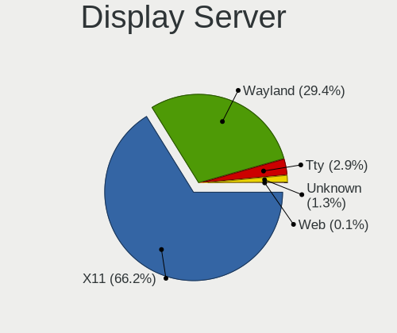
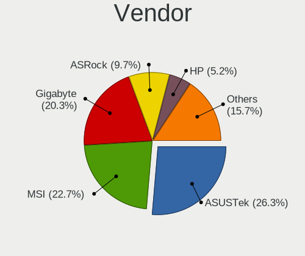
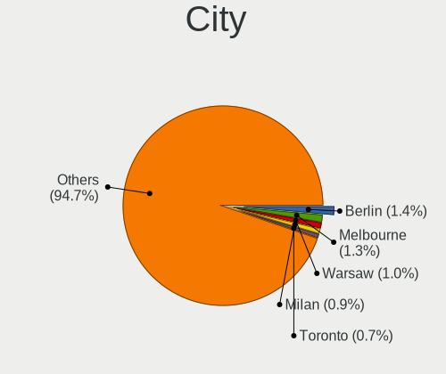
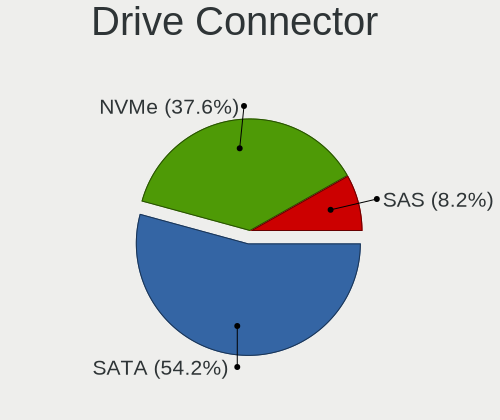
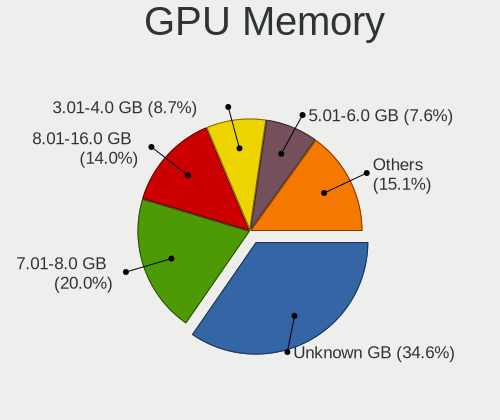
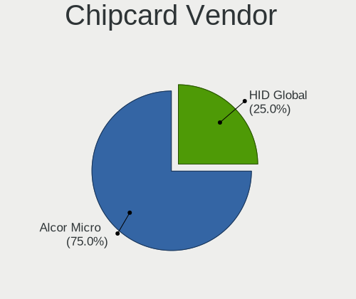

EndeavourOS - Tested Hardware & Statistics (Desktops)
-----------------------------------------------------

A project to collect tested hardware configurations for EndeavourOS.

Anyone can contribute to this report by the [hw-probe](https://github.com/linuxhw/hw-probe) tool:

    sudo -E hw-probe -all -upload

Please submit a probe of your configuration if it's not presented on the page or is rare.

Full-feature report is available here: https://linux-hardware.org/?view=trends

Contents
--------

* [ Test Cases ](#test-cases)

* [ System ](#system)
  - [ Kernel                   ](#kernel)
  - [ Kernel Family            ](#kernel-family)
  - [ Kernel Major Ver.        ](#kernel-major-ver)
  - [ Arch                     ](#arch)
  - [ DE                       ](#de)
  - [ Display Server           ](#display-server)
  - [ Display Manager          ](#display-manager)
  - [ OS Lang                  ](#os-lang)
  - [ Boot Mode                ](#boot-mode)
  - [ Filesystem               ](#filesystem)
  - [ Part. scheme             ](#part-scheme)
  - [ Dual Boot with Linux/BSD ](#dual-boot-with-linuxbsd)
  - [ Dual Boot (Win)          ](#dual-boot-win)

* [ Board ](#board)
  - [ Vendor                   ](#vendor)
  - [ Model                    ](#model)
  - [ Model Family             ](#model-family)
  - [ MFG Year                 ](#mfg-year)
  - [ Form Factor              ](#form-factor)
  - [ Secure Boot              ](#secure-boot)
  - [ Coreboot                 ](#coreboot)
  - [ RAM Size                 ](#ram-size)
  - [ RAM Used                 ](#ram-used)
  - [ Total Drives             ](#total-drives)
  - [ Has CD-ROM               ](#has-cd-rom)
  - [ Has Ethernet             ](#has-ethernet)
  - [ Has WiFi                 ](#has-wifi)
  - [ Has Bluetooth            ](#has-bluetooth)

* [ Location ](#location)
  - [ Country                  ](#country)
  - [ City                     ](#city)

* [ Drives ](#drives)
  - [ Drive Vendor             ](#drive-vendor)
  - [ Drive Model              ](#drive-model)
  - [ HDD Vendor               ](#hdd-vendor)
  - [ SSD Vendor               ](#ssd-vendor)
  - [ Drive Kind               ](#drive-kind)
  - [ Drive Connector          ](#drive-connector)
  - [ Drive Size               ](#drive-size)
  - [ Space Total              ](#space-total)
  - [ Space Used               ](#space-used)
  - [ Malfunc. Drives          ](#malfunc-drives)
  - [ Malfunc. Drive Vendor    ](#malfunc-drive-vendor)
  - [ Malfunc. HDD Vendor      ](#malfunc-hdd-vendor)
  - [ Malfunc. Drive Kind      ](#malfunc-drive-kind)
  - [ Failed Drives            ](#failed-drives)
  - [ Failed Drive Vendor      ](#failed-drive-vendor)
  - [ Drive Status             ](#drive-status)

* [ Storage controller ](#storage-controller)
  - [ Storage Vendor           ](#storage-vendor)
  - [ Storage Model            ](#storage-model)
  - [ Storage Kind             ](#storage-kind)

* [ Processor ](#processor)
  - [ CPU Vendor               ](#cpu-vendor)
  - [ CPU Model                ](#cpu-model)
  - [ CPU Model Family         ](#cpu-model-family)
  - [ CPU Cores                ](#cpu-cores)
  - [ CPU Sockets              ](#cpu-sockets)
  - [ CPU Threads              ](#cpu-threads)
  - [ CPU Op-Modes             ](#cpu-op-modes)
  - [ CPU Microcode            ](#cpu-microcode)
  - [ CPU Microarch            ](#cpu-microarch)

* [ Graphics ](#graphics)
  - [ GPU Vendor               ](#gpu-vendor)
  - [ GPU Model                ](#gpu-model)
  - [ GPU Combo                ](#gpu-combo)
  - [ GPU Driver               ](#gpu-driver)
  - [ GPU Memory               ](#gpu-memory)

* [ Monitor ](#monitor)
  - [ Monitor Vendor           ](#monitor-vendor)
  - [ Monitor Model            ](#monitor-model)
  - [ Monitor Resolution       ](#monitor-resolution)
  - [ Monitor Diagonal         ](#monitor-diagonal)
  - [ Monitor Width            ](#monitor-width)
  - [ Aspect Ratio             ](#aspect-ratio)
  - [ Monitor Area             ](#monitor-area)
  - [ Pixel Density            ](#pixel-density)
  - [ Multiple Monitors        ](#multiple-monitors)

* [ Network ](#network)
  - [ Net Controller Vendor    ](#net-controller-vendor)
  - [ Net Controller Model     ](#net-controller-model)
  - [ Wireless Vendor          ](#wireless-vendor)
  - [ Wireless Model           ](#wireless-model)
  - [ Ethernet Vendor          ](#ethernet-vendor)
  - [ Ethernet Model           ](#ethernet-model)
  - [ Net Controller Kind      ](#net-controller-kind)
  - [ Used Controller          ](#used-controller)
  - [ NICs                     ](#nics)
  - [ IPv6                     ](#ipv6)

* [ Bluetooth ](#bluetooth)
  - [ Bluetooth Vendor         ](#bluetooth-vendor)
  - [ Bluetooth Model          ](#bluetooth-model)

* [ Sound ](#sound)
  - [ Sound Vendor             ](#sound-vendor)
  - [ Sound Model              ](#sound-model)

* [ Memory ](#memory)
  - [ Memory Vendor            ](#memory-vendor)
  - [ Memory Model             ](#memory-model)
  - [ Memory Kind              ](#memory-kind)
  - [ Memory Form Factor       ](#memory-form-factor)
  - [ Memory Size              ](#memory-size)
  - [ Memory Speed             ](#memory-speed)

* [ Printers & scanners ](#printers--scanners)
  - [ Printer Vendor           ](#printer-vendor)
  - [ Printer Model            ](#printer-model)
  - [ Scanner Vendor           ](#scanner-vendor)
  - [ Scanner Model            ](#scanner-model)

* [ Camera ](#camera)
  - [ Camera Vendor            ](#camera-vendor)
  - [ Camera Model             ](#camera-model)

* [ Security ](#security)
  - [ Fingerprint Vendor       ](#fingerprint-vendor)
  - [ Fingerprint Model        ](#fingerprint-model)
  - [ Chipcard Vendor          ](#chipcard-vendor)
  - [ Chipcard Model           ](#chipcard-model)

* [ Unsupported ](#unsupported)
  - [ Unsupported Devices      ](#unsupported-devices)
  - [ Unsupported Device Types ](#unsupported-device-types)

Test Cases
----------

| Vendor     | Model                   | Probe                                                      | Date         |
|------------|-------------------------|------------------------------------------------------------|--------------|
| LattePanda | Alpha                   | [497e370fc3](https://linux-hardware.org/?probe=497e370fc3) | Dec 26, 2021 |
| LattePanda | Alpha                   | [442f08d351](https://linux-hardware.org/?probe=442f08d351) | Dec 24, 2021 |
| Gigabyte   | H110N-CF                | [17067982ca](https://linux-hardware.org/?probe=17067982ca) | Dec 23, 2021 |
| Unknown    | Intel X79               | [767fb84ac9](https://linux-hardware.org/?probe=767fb84ac9) | Dec 17, 2021 |
| ASUSTek    | Maximus VIII HERO       | [22ce2703b9](https://linux-hardware.org/?probe=22ce2703b9) | Nov 07, 2021 |
| Gigabyte   | X570 AORUS ULTRA        | [cef9098008](https://linux-hardware.org/?probe=cef9098008) | Oct 14, 2021 |
| Gigabyte   | X570 AORUS ULTRA        | [718bd26737](https://linux-hardware.org/?probe=718bd26737) | Oct 14, 2021 |
| Gigabyte   | B550 VISION D           | [e8a2ba9952](https://linux-hardware.org/?probe=e8a2ba9952) | Oct 03, 2021 |
| MSI        | G41M-P33 Combo          | [ec8e63e96e](https://linux-hardware.org/?probe=ec8e63e96e) | Oct 01, 2021 |
| MSI        | B450M PRO-VDH MAX       | [33cee010e8](https://linux-hardware.org/?probe=33cee010e8) | Sep 12, 2021 |
| MSI        | B450M PRO-VDH MAX       | [fe3d61f4d6](https://linux-hardware.org/?probe=fe3d61f4d6) | Aug 09, 2021 |
| MSI        | B450M PRO-VDH MAX       | [8e9d51a941](https://linux-hardware.org/?probe=8e9d51a941) | Aug 07, 2021 |
| HP         | 2B36                    | [62135f1e45](https://linux-hardware.org/?probe=62135f1e45) | May 19, 2021 |
| ASRock     | A300M-STX               | [fc96347868](https://linux-hardware.org/?probe=fc96347868) | May 12, 2021 |
| ASUSTek    | STRIX B250F GAMING      | [8276e1fb2f](https://linux-hardware.org/?probe=8276e1fb2f) | Apr 20, 2021 |
| ASUSTek    | K30AD_M31AD_M51AD_M32AD | [cf4d5786e5](https://linux-hardware.org/?probe=cf4d5786e5) | Apr 19, 2021 |
| Lenovo     | SHARKBAY NOK            | [0685ce717e](https://linux-hardware.org/?probe=0685ce717e) | Apr 16, 2021 |
| Gigabyte   | B450 AORUS M            | [d53c2a8b0e](https://linux-hardware.org/?probe=d53c2a8b0e) | Apr 11, 2021 |
| Dell       | 0080PM A00              | [efc9497e6d](https://linux-hardware.org/?probe=efc9497e6d) | Apr 08, 2021 |
| MSI        | X370 GAMING PRO CARBON  | [08f8da317e](https://linux-hardware.org/?probe=08f8da317e) | Apr 03, 2021 |
| Gigabyte   | Z390 GAMING SLI-CF      | [90f906f5f9](https://linux-hardware.org/?probe=90f906f5f9) | Mar 31, 2021 |
| Gigabyte   | Z390 GAMING SLI-CF      | [b2fa0502d0](https://linux-hardware.org/?probe=b2fa0502d0) | Mar 31, 2021 |
| MSI        | X370 GAMING PRO CARBON  | [7c5776953c](https://linux-hardware.org/?probe=7c5776953c) | Mar 15, 2021 |
| ASUSTek    | H81-PLUS                | [75fc956099](https://linux-hardware.org/?probe=75fc956099) | Feb 10, 2021 |
| ASUSTek    | Maximus VIII HERO       | [4d27980548](https://linux-hardware.org/?probe=4d27980548) | Dec 27, 2020 |
| ASUSTek    | Maximus VIII HERO       | [08895b552f](https://linux-hardware.org/?probe=08895b552f) | Dec 27, 2020 |
| HP         | 1905                    | [63771015f5](https://linux-hardware.org/?probe=63771015f5) | Dec 22, 2020 |
| Dell       | 0KRC95 A02              | [af91587001](https://linux-hardware.org/?probe=af91587001) | Nov 19, 2020 |
| Dell       | 0KRC95 A02              | [6471eccd57](https://linux-hardware.org/?probe=6471eccd57) | Nov 11, 2020 |
| Gigabyte   | H270-HD3-CF             | [fa6d538a50](https://linux-hardware.org/?probe=fa6d538a50) | Oct 31, 2020 |
| HP         | 8455                    | [0671b6f4da](https://linux-hardware.org/?probe=0671b6f4da) | Oct 27, 2020 |
| HP         | 8455                    | [e37d606b6b](https://linux-hardware.org/?probe=e37d606b6b) | Oct 26, 2020 |
| MSI        | MS-7366                 | [ada828f120](https://linux-hardware.org/?probe=ada828f120) | Sep 29, 2020 |
| ASUSTek    | P8P67 DELUXE            | [ba15c37977](https://linux-hardware.org/?probe=ba15c37977) | Sep 28, 2020 |
| MSI        | MS-7366                 | [9938e6501b](https://linux-hardware.org/?probe=9938e6501b) | Sep 24, 2020 |
| Gigabyte   | B450 AORUS M            | [34f1896f7e](https://linux-hardware.org/?probe=34f1896f7e) | Sep 23, 2020 |
| HP         | 1497                    | [7cb2cee563](https://linux-hardware.org/?probe=7cb2cee563) | Sep 19, 2020 |
| Biostar    | G31-M7 TE               | [0ae18cfc51](https://linux-hardware.org/?probe=0ae18cfc51) | May 05, 2020 |

System
------

Kernel
------

Version of the Linux kernel

| Version            | Desktops | Percent |
|--------------------|----------|---------|
| 5.8.10-arch1-1     | 2        | 6.9%    |
| 5.14.8-arch1-1     | 2        | 6.9%    |
| 5.11.15-arch1-2    | 2        | 6.9%    |
| 5.11.11-arch1-1    | 2        | 6.9%    |
| 5.9.6-zen1-1-zen   | 1        | 3.45%   |
| 5.9.2-arch1-1      | 1        | 3.45%   |
| 5.9.14-arch1-1     | 1        | 3.45%   |
| 5.9.1-arch1-1      | 1        | 3.45%   |
| 5.8.12-arch1-1     | 1        | 3.45%   |
| 5.6.10-arch1-1     | 1        | 3.45%   |
| 5.15.8-arch1-1     | 1        | 3.45%   |
| 5.15.10-arch1-1    | 1        | 3.45%   |
| 5.14.2-arch1-2     | 1        | 3.45%   |
| 5.14.15-arch1-1    | 1        | 3.45%   |
| 5.14.11-zen1-1-zen | 1        | 3.45%   |
| 5.13.8-arch1-1     | 1        | 3.45%   |
| 5.12.4-zen1-2-zen  | 1        | 3.45%   |
| 5.12.1-arch1-1     | 1        | 3.45%   |
| 5.11.6-arch1-1     | 1        | 3.45%   |
| 5.11.14-arch1-1    | 1        | 3.45%   |
| 5.11.12-arch1-1    | 1        | 3.45%   |
| 5.11.10-arch1-1    | 1        | 3.45%   |
| 5.10.88-2-lts      | 1        | 3.45%   |
| 5.10.14-arch1-1    | 1        | 3.45%   |
| Unknown            | 1        | 3.45%   |

Kernel Family
-------------

Linux kernel without a distro release

| Version | Desktops | Percent |
|---------|----------|---------|
| 5.8.10  | 2        | 6.9%    |
| 5.14.8  | 2        | 6.9%    |
| 5.11.15 | 2        | 6.9%    |
| 5.11.11 | 2        | 6.9%    |
| 5.9.6   | 1        | 3.45%   |
| 5.9.2   | 1        | 3.45%   |
| 5.9.14  | 1        | 3.45%   |
| 5.9.1   | 1        | 3.45%   |
| 5.8.12  | 1        | 3.45%   |
| 5.6.10  | 1        | 3.45%   |
| 5.15.8  | 1        | 3.45%   |
| 5.15.10 | 1        | 3.45%   |
| 5.14.2  | 1        | 3.45%   |
| 5.14.15 | 1        | 3.45%   |
| 5.14.11 | 1        | 3.45%   |
| 5.13.8  | 1        | 3.45%   |
| 5.12.4  | 1        | 3.45%   |
| 5.12.1  | 1        | 3.45%   |
| 5.11.6  | 1        | 3.45%   |
| 5.11.14 | 1        | 3.45%   |
| 5.11.12 | 1        | 3.45%   |
| 5.11.10 | 1        | 3.45%   |
| 5.10.88 | 1        | 3.45%   |
| 5.10.14 | 1        | 3.45%   |
| Unknown | 1        | 3.45%   |

Kernel Major Ver.
-----------------

Linux kernel major version

| Version | Desktops | Percent |
|---------|----------|---------|
| 5.11    | 7        | 25%     |
| 5.14    | 5        | 17.86%  |
| 5.9     | 4        | 14.29%  |
| 5.8     | 3        | 10.71%  |
| 5.15    | 2        | 7.14%   |
| 5.12    | 2        | 7.14%   |
| 5.10    | 2        | 7.14%   |
| 5.6     | 1        | 3.57%   |
| 5.13    | 1        | 3.57%   |
| Unknown | 1        | 3.57%   |

Arch
----

OS architecture (x86_64, i586, etc.)

| Name   | Desktops | Percent |
|--------|----------|---------|
| x86_64 | 25       | 100%    |

DE
--

Desktop Environment

| Name    | Desktops | Percent |
|---------|----------|---------|
| KDE     | 10       | 35.71%  |
| GNOME   | 7        | 25%     |
| XFCE    | 4        | 14.29%  |
| KDE5    | 3        | 10.71%  |
| sway    | 1        | 3.57%   |
| i3      | 1        | 3.57%   |
| Budgie  | 1        | 3.57%   |
| Unknown | 1        | 3.57%   |

Display Server
--------------

X11 or Wayland

| Name    | Desktops | Percent |
|---------|----------|---------|
| X11     | 24       | 88.89%  |
| Wayland | 3        | 11.11%  |

Display Manager
---------------

SDDM, LightDM, etc.

| Name    | Desktops | Percent |
|---------|----------|---------|
| Unknown | 24       | 96%     |
| SDDM    | 1        | 4%      |

OS Lang
-------

Language

| Lang    | Desktops | Percent |
|---------|----------|---------|
| en_US   | 10       | 40%     |
| it_IT   | 3        | 12%     |
| fr_FR   | 2        | 8%      |
| de_DE   | 2        | 8%      |
| sl_SI   | 1        | 4%      |
| pt_BR   | 1        | 4%      |
| es_MX   | 1        | 4%      |
| es_GT   | 1        | 4%      |
| es_AR   | 1        | 4%      |
| en_GB   | 1        | 4%      |
| en_DK   | 1        | 4%      |
| Unknown | 1        | 4%      |

Boot Mode
---------

EFI or BIOS

| Mode | Desktops | Percent |
|------|----------|---------|
| BIOS | 23       | 85.19%  |
| EFI  | 4        | 14.81%  |

Filesystem
----------

Type of filesystem

| Type  | Desktops | Percent |
|-------|----------|---------|
| Ext4  | 16       | 64%     |
| Btrfs | 9        | 36%     |

Part. scheme
------------

Scheme of partitioning

| Type    | Desktops | Percent |
|---------|----------|---------|
| Unknown | 23       | 92%     |
| GPT     | 2        | 8%      |

Dual Boot with Linux/BSD
------------------------

Hosting more than one Linux/BSD

| Dual boot | Desktops | Percent |
|-----------|----------|---------|
| No        | 25       | 100%    |

Dual Boot (Win)
---------------

Hosting Linux and Windows

| Dual boot | Desktops | Percent |
|-----------|----------|---------|
| No        | 23       | 92%     |
| Yes       | 2        | 8%      |

Board
-----

Vendor
------

Motherboard manufacturer

| Name                | Desktops | Percent |
|---------------------|----------|---------|
| Gigabyte Technology | 6        | 24%     |
| ASUSTek Computer    | 5        | 20%     |
| MSI                 | 4        | 16%     |
| Hewlett-Packard     | 3        | 12%     |
| Dell                | 2        | 8%      |
| Lenovo              | 1        | 4%      |
| LattePanda          | 1        | 4%      |
| Biostar             | 1        | 4%      |
| ASRock              | 1        | 4%      |
| Unknown             | 1        | 4%      |

Model
-----

Motherboard model

| Name                               | Desktops | Percent |
|------------------------------------|----------|---------|
| MSI MS-7A38                        | 1        | 4%      |
| MSI MS-7A32                        | 1        | 4%      |
| MSI MS-7592                        | 1        | 4%      |
| MSI MS-7366                        | 1        | 4%      |
| Lenovo ThinkCentre M93p 10AAS03T00 | 1        | 4%      |
| LattePanda Alpha                   | 1        | 4%      |
| HP Z230 Tower Workstation          | 1        | 4%      |
| HP Z2 Tower G4 Workstation         | 1        | 4%      |
| HP 700-502ng                       | 1        | 4%      |
| Gigabyte Z390 GAMING SLI           | 1        | 4%      |
| Gigabyte X570 AORUS ULTRA          | 1        | 4%      |
| Gigabyte H270-HD3                  | 1        | 4%      |
| Gigabyte H110N                     | 1        | 4%      |
| Gigabyte B550 VISION D             | 1        | 4%      |
| Gigabyte B450 AORUS M              | 1        | 4%      |
| Dell Wyse 7040                     | 1        | 4%      |
| Dell OptiPlex 7010                 | 1        | 4%      |
| Biostar G31-M7 TE                  | 1        | 4%      |
| ASUS STRIX B250F GAMING            | 1        | 4%      |
| ASUS P8P67 DELUXE                  | 1        | 4%      |
| ASUS Maximus VIII HERO             | 1        | 4%      |
| ASUS K30AD_M31AD_M51AD             | 1        | 4%      |
| ASUS All Series                    | 1        | 4%      |
| ASRock A300M-STX                   | 1        | 4%      |
| Unknown                            | 1        | 4%      |

Model Family
------------

Motherboard model prefix

| Name               | Desktops | Percent |
|--------------------|----------|---------|
| MSI MS-7A38        | 1        | 4%      |
| MSI MS-7A32        | 1        | 4%      |
| MSI MS-7592        | 1        | 4%      |
| MSI MS-7366        | 1        | 4%      |
| Lenovo ThinkCentre | 1        | 4%      |
| LattePanda Alpha   | 1        | 4%      |
| HP Z230            | 1        | 4%      |
| HP Z2              | 1        | 4%      |
| HP 700-502ng       | 1        | 4%      |
| Gigabyte Z390      | 1        | 4%      |
| Gigabyte X570      | 1        | 4%      |
| Gigabyte H270-HD3  | 1        | 4%      |
| Gigabyte H110N     | 1        | 4%      |
| Gigabyte B550      | 1        | 4%      |
| Gigabyte B450      | 1        | 4%      |
| Dell Wyse          | 1        | 4%      |
| Dell OptiPlex      | 1        | 4%      |
| Biostar G31-M7     | 1        | 4%      |
| ASUS STRIX         | 1        | 4%      |
| ASUS P8P67         | 1        | 4%      |
| ASUS Maximus       | 1        | 4%      |
| ASUS K30AD         | 1        | 4%      |
| ASUS All           | 1        | 4%      |
| ASRock A300M-STX   | 1        | 4%      |
| Unknown            | 1        | 4%      |

MFG Year
--------

Motherboard manufacture year

| Year | Desktops | Percent |
|------|----------|---------|
| 2019 | 7        | 28%     |
| 2017 | 4        | 16%     |
| 2021 | 3        | 12%     |
| 2015 | 2        | 8%      |
| 2014 | 2        | 8%      |
| 2013 | 2        | 8%      |
| 2018 | 1        | 4%      |
| 2016 | 1        | 4%      |
| 2012 | 1        | 4%      |
| 2009 | 1        | 4%      |
| 2007 | 1        | 4%      |

Form Factor
-----------

Physical design of the computer

| Name    | Desktops | Percent |
|---------|----------|---------|
| Desktop | 25       | 100%    |

Secure Boot
-----------

Enabled or disabled

| State    | Desktops | Percent |
|----------|----------|---------|
| Disabled | 25       | 100%    |

Coreboot
--------

Have coreboot on board

| Used | Desktops | Percent |
|------|----------|---------|
| No   | 25       | 100%    |

RAM Size
--------

Total RAM memory

| Size in GB  | Desktops | Percent |
|-------------|----------|---------|
| 16.01-24.0  | 7        | 28%     |
| 24.01-32.0  | 5        | 20%     |
| 4.01-8.0    | 3        | 12%     |
| 32.01-64.0  | 3        | 12%     |
| 3.01-4.0    | 3        | 12%     |
| 8.01-16.0   | 3        | 12%     |
| 64.01-256.0 | 1        | 4%      |

RAM Used
--------

Used RAM memory

| Used GB    | Desktops | Percent |
|------------|----------|---------|
| 2.01-3.0   | 8        | 27.59%  |
| 4.01-8.0   | 6        | 20.69%  |
| 1.01-2.0   | 6        | 20.69%  |
| 3.01-4.0   | 5        | 17.24%  |
| 16.01-24.0 | 2        | 6.9%    |
| 8.01-16.0  | 2        | 6.9%    |

Total Drives
------------

Number of drives on board

| Drives | Desktops | Percent |
|--------|----------|---------|
| 2      | 7        | 28%     |
| 4      | 6        | 24%     |
| 1      | 4        | 16%     |
| 3      | 3        | 12%     |
| 5      | 2        | 8%      |
| 7      | 1        | 4%      |
| 6      | 1        | 4%      |
| 0      | 1        | 4%      |

Has CD-ROM
----------

Has CD-ROM on board

| Presented | Desktops | Percent |
|-----------|----------|---------|
| No        | 17       | 68%     |
| Yes       | 8        | 32%     |

Has Ethernet
------------

Has Ethernet on board

| Presented | Desktops | Percent |
|-----------|----------|---------|
| Yes       | 25       | 100%    |

Has WiFi
--------

Has WiFi module

| Presented | Desktops | Percent |
|-----------|----------|---------|
| No        | 16       | 61.54%  |
| Yes       | 10       | 38.46%  |

Has Bluetooth
-------------

Has Bluetooth module

| Presented | Desktops | Percent |
|-----------|----------|---------|
| Yes       | 13       | 52%     |
| No        | 12       | 48%     |

Location
--------

Country
-------

Geographic location (country)

| Country     | Desktops | Percent |
|-------------|----------|---------|
| USA         | 6        | 24%     |
| Germany     | 6        | 24%     |
| Italy       | 3        | 12%     |
| France      | 2        | 8%      |
| UK          | 1        | 4%      |
| Slovenia    | 1        | 4%      |
| Netherlands | 1        | 4%      |
| Mexico      | 1        | 4%      |
| Guatemala   | 1        | 4%      |
| Denmark     | 1        | 4%      |
| Brazil      | 1        | 4%      |
| Argentina   | 1        | 4%      |

City
----

Geographic location (city)

| City                | Desktops | Percent |
|---------------------|----------|---------|
| Leipzig             | 2        | 7.69%   |
| Zapopan             | 1        | 3.85%   |
| West Haddon         | 1        | 3.85%   |
| Turin               | 1        | 3.85%   |
| Stuttgart           | 1        | 3.85%   |
| Sheboygan           | 1        | 3.85%   |
| Senonches           | 1        | 3.85%   |
| Sant'Agata de' Goti | 1        | 3.85%   |
| Salvador            | 1        | 3.85%   |
| Oldenburg           | 1        | 3.85%   |
| New Bedford         | 1        | 3.85%   |
| Monrovia            | 1        | 3.85%   |
| Ljubljana           | 1        | 3.85%   |
| Hoevelaken          | 1        | 3.85%   |
| Hamburg             | 1        | 3.85%   |
| Guatemala City      | 1        | 3.85%   |
| Germantown          | 1        | 3.85%   |
| Fuveau              | 1        | 3.85%   |
| Frankfurt am Main   | 1        | 3.85%   |
| Follo               | 1        | 3.85%   |
| Erie                | 1        | 3.85%   |
| Denton              | 1        | 3.85%   |
| Br??nderslev        | 1        | 3.85%   |
| Braak               | 1        | 3.85%   |
| Boca de la Zanja    | 1        | 3.85%   |

Drives
------

Drive Vendor
------------

Hard drive vendors

| Vendor              | Desktops | Drives | Percent |
|---------------------|----------|--------|---------|
| Samsung Electronics | 12       | 27     | 23.08%  |
| WDC                 | 10       | 20     | 19.23%  |
| Seagate             | 9        | 16     | 17.31%  |
| PHISON              | 4        | 5      | 7.69%   |
| Crucial             | 4        | 8      | 7.69%   |
| Toshiba             | 3        | 4      | 5.77%   |
| Kingston            | 3        | 6      | 5.77%   |
| Sandisk             | 2        | 3      | 3.85%   |
| JMicron             | 2        | 2      | 3.85%   |
| Realtek             | 1        | 1      | 1.92%   |
| Micron Technology   | 1        | 1      | 1.92%   |
| Hitachi             | 1        | 1      | 1.92%   |

Drive Model
-----------

Hard drive models

| Model                                    | Desktops | Percent |
|------------------------------------------|----------|---------|
| Samsung SSD 850 EVO 500GB                | 3        | 4.23%   |
| WDC WD10EZEX-60WN4A1 1TB                 | 2        | 2.82%   |
| WDC WD10EZEX-22MFCA0 1TB                 | 2        | 2.82%   |
| Toshiba THNSNJ256GCSU 256GB SSD          | 2        | 2.82%   |
| Seagate ST95005620AS 500GB               | 2        | 2.82%   |
| Seagate ST4000DM004-2CV104 4TB           | 2        | 2.82%   |
| Seagate ST2000DM006-2DM164 2TB           | 2        | 2.82%   |
| Seagate ST1000DM010-2EP102 1TB           | 2        | 2.82%   |
| Sandisk NVMe SSD Drive 500GB             | 2        | 2.82%   |
| Samsung SSD SM841 2.5 7mm 128GB          | 2        | 2.82%   |
| Samsung SSD 860 EVO 1TB                  | 2        | 2.82%   |
| Samsung SSD 840 EVO 250GB                | 2        | 2.82%   |
| Crucial CT500MX500SSD1 500GB             | 2        | 2.82%   |
| WDC WDS480G2G0B-00EPW0 480GB SSD         | 1        | 1.41%   |
| WDC WDS120G1G0A-00SS50 120GB SSD         | 1        | 1.41%   |
| WDC WD7500BPVT-75A1YT0 752GB             | 1        | 1.41%   |
| WDC WD5000AZLX-75K2TA0 500GB             | 1        | 1.41%   |
| WDC WD40EZRZ-00GXCB0 4TB                 | 1        | 1.41%   |
| WDC WD3200AAJS-00L7A0 320GB              | 1        | 1.41%   |
| WDC WD20PURZ-85GU6Y0 2TB                 | 1        | 1.41%   |
| WDC WD20EZRZ-00Z5HB0 2TB                 | 1        | 1.41%   |
| WDC WD10EZEX-75M2NA0 1TB                 | 1        | 1.41%   |
| WDC WD10EZEX-60M2NA0 1TB                 | 1        | 1.41%   |
| WDC WD10EZEX-08WN4A0 1TB                 | 1        | 1.41%   |
| WDC WD10EZEX-00BN5A0 1TB                 | 1        | 1.41%   |
| WDC WD10EACS-00D6B1 1TB                  | 1        | 1.41%   |
| Toshiba DT01ACA050 500GB                 | 1        | 1.41%   |
| Seagate ST500DM002-1BD142 500GB          | 1        | 1.41%   |
| Seagate ST2000DM001-1ER164 2TB           | 1        | 1.41%   |
| Seagate ST1000VM002-1CT162 1TB           | 1        | 1.41%   |
| Seagate Expansion Desk 5TB               | 1        | 1.41%   |
| Samsung SSD 970 PRO 512GB                | 1        | 1.41%   |
| Samsung SSD 970 EVO 500GB                | 1        | 1.41%   |
| Samsung SSD 870 QVO 1TB                  | 1        | 1.41%   |
| Samsung SSD 850 EVO mSATA 250GB          | 1        | 1.41%   |
| Samsung SSD 850 EVO 1TB                  | 1        | 1.41%   |
| Samsung SP2504C 250GB                    | 1        | 1.41%   |
| Samsung Portable SSD T5 500GB            | 1        | 1.41%   |
| Samsung NVMe SSD Drive 500GB             | 1        | 1.41%   |
| Samsung MZNTE512HMJH-000L2 512GB SSD     | 1        | 1.41%   |
| Samsung MZ7LN256HAJQ-000L2 256GB SSD     | 1        | 1.41%   |
| Realtek RTL9210B NVME 500GB              | 1        | 1.41%   |
| PHISON SSD 128GB PS3109-S9               | 1        | 1.41%   |
| Phison NVMe SSD Drive 2TB                | 1        | 1.41%   |
| Phison NVMe SSD Drive 240GB              | 1        | 1.41%   |
| Phison NVMe SSD Drive 1024GB             | 1        | 1.41%   |
| Micron MTFDDAK256MBF-1AN1ZABHA 256GB SSD | 1        | 1.41%   |
| Kingston SV300S37A120G 120GB SSD         | 1        | 1.41%   |
| Kingston SUV400S37240G 240GB SSD         | 1        | 1.41%   |
| Kingston SKC2000M81000G 1TB              | 1        | 1.41%   |
| Kingston SA400S37120G 120GB SSD          | 1        | 1.41%   |
| Kingston NVMe SSD Drive 1TB              | 1        | 1.41%   |
| JMicron Generic DISK00 2TB               | 1        | 1.41%   |
| JMicron Generic 250GB                    | 1        | 1.41%   |
| Hitachi HTS545025B9A300 250GB            | 1        | 1.41%   |
| Crucial CT480BX500SSD1 480GB             | 1        | 1.41%   |
| Crucial CT1000MX500SSD1 1TB              | 1        | 1.41%   |

HDD Vendor
----------

Hard disk drive vendors

| Vendor              | Desktops | Drives | Percent |
|---------------------|----------|--------|---------|
| WDC                 | 10       | 18     | 43.48%  |
| Seagate             | 9        | 16     | 39.13%  |
| Toshiba             | 1        | 1      | 4.35%   |
| Samsung Electronics | 1        | 2      | 4.35%   |
| JMicron             | 1        | 1      | 4.35%   |
| Hitachi             | 1        | 1      | 4.35%   |

SSD Vendor
----------

Solid state drive vendors

| Vendor              | Desktops | Drives | Percent |
|---------------------|----------|--------|---------|
| Samsung Electronics | 12       | 22     | 50%     |
| Crucial             | 4        | 8      | 16.67%  |
| Toshiba             | 2        | 3      | 8.33%   |
| Kingston            | 2        | 4      | 8.33%   |
| WDC                 | 1        | 2      | 4.17%   |
| PHISON              | 1        | 1      | 4.17%   |
| Micron Technology   | 1        | 1      | 4.17%   |
| JMicron             | 1        | 1      | 4.17%   |

Drive Kind
----------

HDD or SSD

| Kind | Desktops | Drives | Percent |
|------|----------|--------|---------|
| SSD  | 17       | 42     | 41.46%  |
| HDD  | 17       | 39     | 41.46%  |
| NVMe | 7        | 13     | 17.07%  |

Drive Connector
---------------

SATA, SAS, NVMe, etc.

| Type | Desktops | Drives | Percent |
|------|----------|--------|---------|
| SATA | 23       | 77     | 65.71%  |
| NVMe | 7        | 12     | 20%     |
| SAS  | 5        | 5      | 14.29%  |

Drive Size
----------

Size of hard drive

| Size in TB | Desktops | Drives | Percent |
|------------|----------|--------|---------|
| 0.01-0.5   | 18       | 39     | 43.9%   |
| 0.51-1.0   | 13       | 28     | 31.71%  |
| 1.01-2.0   | 6        | 8      | 14.63%  |
| 3.01-4.0   | 3        | 5      | 7.32%   |
| 4.01-10.0  | 1        | 1      | 2.44%   |

Space Total
-----------

Amount of disk space available on the file system

| Size in GB     | Desktops | Percent |
|----------------|----------|---------|
| 1001-2000      | 6        | 23.08%  |
| Unknown        | 5        | 19.23%  |
| 251-500        | 4        | 15.38%  |
| 101-250        | 4        | 15.38%  |
| 501-1000       | 3        | 11.54%  |
| 2001-3000      | 2        | 7.69%   |
| More than 3000 | 1        | 3.85%   |
| 51-100         | 1        | 3.85%   |

Space Used
----------

Amount of used disk space

| Used GB        | Desktops | Percent |
|----------------|----------|---------|
| 251-500        | 5        | 17.24%  |
| 1-20           | 5        | 17.24%  |
| 501-1000       | 5        | 17.24%  |
| Unknown        | 5        | 17.24%  |
| 1001-2000      | 3        | 10.34%  |
| 51-100         | 3        | 10.34%  |
| More than 3000 | 1        | 3.45%   |
| 21-50          | 1        | 3.45%   |
| 101-250        | 1        | 3.45%   |

Malfunc. Drives
---------------

Drive models with a malfunction

Zero info for selected period =(

Malfunc. Drive Vendor
---------------------

Vendors of faulty drives

Zero info for selected period =(

Malfunc. HDD Vendor
-------------------

Vendors of faulty HDD drives

Zero info for selected period =(

Malfunc. Drive Kind
-------------------

Kinds of faulty drives

Zero info for selected period =(

Failed Drives
-------------

Failed drive models

Zero info for selected period =(

Failed Drive Vendor
-------------------

Failed drive vendors

Zero info for selected period =(

Drive Status
------------

Number of failed and malfunc. drives

| Status   | Desktops | Drives | Percent |
|----------|----------|--------|---------|
| Detected | 21       | 82     | 84%     |
| Works    | 4        | 12     | 16%     |

Storage controller
------------------

Storage Vendor
--------------

Storage controller vendors

| Vendor                      | Desktops | Percent |
|-----------------------------|----------|---------|
| Intel                       | 17       | 47.22%  |
| AMD                         | 6        | 16.67%  |
| Phison Electronics          | 3        | 8.33%   |
| Sandisk                     | 2        | 5.56%   |
| Samsung Electronics         | 2        | 5.56%   |
| ASMedia Technology          | 2        | 5.56%   |
| Nvidia                      | 1        | 2.78%   |
| Marvell Technology Group    | 1        | 2.78%   |
| Kingston Technology Company | 1        | 2.78%   |
| JMicron Technology          | 1        | 2.78%   |

Storage Model
-------------

Storage controller models

| Model                                                                          | Desktops | Percent |
|--------------------------------------------------------------------------------|----------|---------|
| AMD FCH SATA Controller [AHCI mode]                                            | 4        | 9.52%   |
| Intel Q170/Q150/B150/H170/H110/Z170/CM236 Chipset SATA Controller [AHCI Mode]  | 3        | 7.14%   |
| Intel 8 Series/C220 Series Chipset Family 6-port SATA Controller 1 [AHCI mode] | 3        | 7.14%   |
| Sandisk WD Black SN750 / PC SN730 NVMe SSD                                     | 2        | 4.76%   |
| Samsung NVMe SSD Controller SM981/PM981/PM983                                  | 2        | 4.76%   |
| Intel SATA Controller [RAID mode]                                              | 2        | 4.76%   |
| Intel NM10/ICH7 Family SATA Controller [IDE mode]                              | 2        | 4.76%   |
| Intel 82801G (ICH7 Family) IDE Controller                                      | 2        | 4.76%   |
| Intel 200 Series PCH SATA controller [AHCI mode]                               | 2        | 4.76%   |
| ASMedia ASM1062 Serial ATA Controller                                          | 2        | 4.76%   |
| AMD 400 Series Chipset SATA Controller                                         | 2        | 4.76%   |
| Sandisk WD Black 2018/SN750 / PC SN720 NVMe SSD                                | 1        | 2.38%   |
| Phison E7 NVMe Controller                                                      | 1        | 2.38%   |
| Phison E18 PCIe4 NVMe Controller                                               | 1        | 2.38%   |
| Phison E12 NVMe Controller                                                     | 1        | 2.38%   |
| Nvidia MCP73 SATA Controller (IDE mode)                                        | 1        | 2.38%   |
| Nvidia MCP73 IDE Controller                                                    | 1        | 2.38%   |
| Marvell Group 88SE9128 PCIe SATA 6 Gb/s RAID controller with HyperDuo          | 1        | 2.38%   |
| Kingston Company KC2000 NVMe SSD                                               | 1        | 2.38%   |
| JMicron JMB362 SATA Controller                                                 | 1        | 2.38%   |
| Intel Cannon Lake PCH SATA AHCI Controller                                     | 1        | 2.38%   |
| Intel C600/X79 series chipset 6-Port SATA AHCI Controller                      | 1        | 2.38%   |
| Intel 9 Series Chipset Family SATA Controller [AHCI Mode]                      | 1        | 2.38%   |
| Intel 7 Series/C210 Series Chipset Family 6-port SATA Controller [AHCI mode]   | 1        | 2.38%   |
| Intel 6 Series/C200 Series Chipset Family 6 port Desktop SATA AHCI Controller  | 1        | 2.38%   |
| AMD X370 Series Chipset SATA Controller                                        | 1        | 2.38%   |
| AMD Starship/Matisse Chipset SATA Controller [AHCI mode]                       | 1        | 2.38%   |

Storage Kind
------------

Kind of storage controller (IDE, SATA, NVMe, SAS, ...)

| Kind | Desktops | Percent |
|------|----------|---------|
| SATA | 19       | 61.29%  |
| NVMe | 7        | 22.58%  |
| IDE  | 3        | 9.68%   |
| RAID | 2        | 6.45%   |

Processor
---------

CPU Vendor
----------

Processor vendors

| Vendor | Desktops | Percent |
|--------|----------|---------|
| Intel  | 19       | 76%     |
| AMD    | 6        | 24%     |

CPU Model
---------

Processor models

| Model                                       | Desktops | Percent |
|---------------------------------------------|----------|---------|
| Intel Core i7-4790 CPU @ 3.60GHz            | 2        | 8%      |
| Intel Core i5-7400 CPU @ 3.00GHz            | 2        | 8%      |
| AMD Ryzen 9 5900X 12-Core Processor         | 2        | 8%      |
| AMD Ryzen 5 3400G with Radeon Vega Graphics | 2        | 8%      |
| Intel Xeon CPU E5-1650 0 @ 3.20GHz          | 1        | 4%      |
| Intel Xeon CPU E3-1240 V2 @ 3.40GHz         | 1        | 4%      |
| Intel Pentium Dual-Core CPU E5400 @ 2.70GHz | 1        | 4%      |
| Intel Core m3-8100Y CPU @ 1.10GHz           | 1        | 4%      |
| Intel Core i7-6700K CPU @ 4.00GHz           | 1        | 4%      |
| Intel Core i7-3770K CPU @ 3.50GHz           | 1        | 4%      |
| Intel Core i5-9600K CPU @ 3.70GHz           | 1        | 4%      |
| Intel Core i5-8500 CPU @ 3.00GHz            | 1        | 4%      |
| Intel Core i5-6500TE CPU @ 2.30GHz          | 1        | 4%      |
| Intel Core i5-6500 CPU @ 3.20GHz            | 1        | 4%      |
| Intel Core i5-4570T CPU @ 2.90GHz           | 1        | 4%      |
| Intel Core i5-4460S CPU @ 2.90GHz           | 1        | 4%      |
| Intel Core 2 Quad CPU Q6600 @ 2.40GHz       | 1        | 4%      |
| Intel Core 2 Duo CPU E4500 @ 2.20GHz        | 1        | 4%      |
| Intel Celeron CPU G1840 @ 2.80GHz           | 1        | 4%      |
| AMD Ryzen 5 3600 6-Core Processor           | 1        | 4%      |
| AMD Ryzen 5 1600X Six-Core Processor        | 1        | 4%      |

CPU Model Family
----------------

Processor model prefix

| Model                   | Desktops | Percent |
|-------------------------|----------|---------|
| Intel Core i5           | 8        | 32%     |
| Intel Core i7           | 4        | 16%     |
| AMD Ryzen 5             | 4        | 16%     |
| Intel Xeon              | 2        | 8%      |
| AMD Ryzen 9             | 2        | 8%      |
| Intel Pentium Dual-Core | 1        | 4%      |
| Intel Core m3           | 1        | 4%      |
| Intel Core 2 Quad       | 1        | 4%      |
| Intel Core 2 Duo        | 1        | 4%      |
| Intel Celeron           | 1        | 4%      |

CPU Cores
---------

Number of processor cores

| Number | Desktops | Percent |
|--------|----------|---------|
| 4      | 13       | 52%     |
| 6      | 5        | 20%     |
| 2      | 5        | 20%     |
| 12     | 2        | 8%      |

CPU Sockets
-----------

Number of sockets

| Number | Desktops | Percent |
|--------|----------|---------|
| 1      | 25       | 100%    |

CPU Threads
-----------

Threads per core (Hyper-Threading)

| Number | Desktops | Percent |
|--------|----------|---------|
| 2      | 14       | 56%     |
| 1      | 11       | 44%     |

CPU Op-Modes
------------

CPU Operation Modes (32-bit, 64-bit)

| Op mode        | Desktops | Percent |
|----------------|----------|---------|
| 32-bit, 64-bit | 25       | 100%    |

CPU Microcode
-------------

Microcode number

| Number     | Desktops | Percent |
|------------|----------|---------|
| Unknown    | 20       | 74.07%  |
| 0x306a9    | 2        | 7.41%   |
| 0x906ea    | 1        | 3.7%    |
| 0x6fd      | 1        | 3.7%    |
| 0x506e3    | 1        | 3.7%    |
| 0x0a201009 | 1        | 3.7%    |
| 0x08108109 | 1        | 3.7%    |

CPU Microarch
-------------

Microarchitecture

| Name        | Desktops | Percent |
|-------------|----------|---------|
| KabyLake    | 5        | 20%     |
| Haswell     | 5        | 20%     |
| Skylake     | 3        | 12%     |
| Zen+        | 2        | 8%      |
| Zen 3       | 2        | 8%      |
| IvyBridge   | 2        | 8%      |
| Core        | 2        | 8%      |
| Zen 2       | 1        | 4%      |
| Zen         | 1        | 4%      |
| SandyBridge | 1        | 4%      |
| Penryn      | 1        | 4%      |

Graphics
--------

GPU Vendor
----------

Vendors of graphics cards

| Vendor | Desktops | Percent |
|--------|----------|---------|
| Nvidia | 12       | 46.15%  |
| AMD    | 8        | 30.77%  |
| Intel  | 6        | 23.08%  |

GPU Model
---------

Graphics card models

| Model                                                                       | Desktops | Percent |
|-----------------------------------------------------------------------------|----------|---------|
| Nvidia GP107 [GeForce GTX 1050 Ti]                                          | 3        | 11.54%  |
| AMD Ellesmere [Radeon RX 470/480/570/570X/580/580X/590]                     | 3        | 11.54%  |
| Intel Xeon E3-1200 v3/4th Gen Core Processor Integrated Graphics Controller | 2        | 7.69%   |
| AMD Picasso/Raven 2 [Radeon Vega Series / Radeon Vega Mobile Series]        | 2        | 7.69%   |
| AMD Navi 14 [Radeon RX 5500/5500M / Pro 5500M]                              | 2        | 7.69%   |
| Nvidia GP107GL [Quadro P400]                                                | 1        | 3.85%   |
| Nvidia GP107 [GeForce GTX 1050]                                             | 1        | 3.85%   |
| Nvidia GM107 [GeForce GTX 745]                                              | 1        | 3.85%   |
| Nvidia GK208B [GeForce GT 710]                                              | 1        | 3.85%   |
| Nvidia GF119 [NVS 310]                                                      | 1        | 3.85%   |
| Nvidia GF104 [GeForce GTX 460]                                              | 1        | 3.85%   |
| Nvidia GA104 [GeForce RTX 3060 Ti Lite Hash Rate]                           | 1        | 3.85%   |
| Nvidia GA102 [GeForce RTX 3080]                                             | 1        | 3.85%   |
| Nvidia G84 [GeForce 8600 GT]                                                | 1        | 3.85%   |
| Intel UHD Graphics 615                                                      | 1        | 3.85%   |
| Intel HD Graphics 530                                                       | 1        | 3.85%   |
| Intel 82G33/G31 Express Integrated Graphics Controller                      | 1        | 3.85%   |
| Intel 4 Series Chipset Integrated Graphics Controller                       | 1        | 3.85%   |
| AMD Navi 10 [Radeon RX 5600 OEM/5600 XT / 5700/5700 XT]                     | 1        | 3.85%   |

GPU Combo
---------

Combinations of graphics cards

| Name       | Desktops | Percent |
|------------|----------|---------|
| 1 x Nvidia | 12       | 48%     |
| 1 x AMD    | 8        | 32%     |
| 1 x Intel  | 5        | 20%     |

GPU Driver
----------

Free vs proprietary

| Driver      | Desktops | Percent |
|-------------|----------|---------|
| Free        | 15       | 60%     |
| Proprietary | 10       | 40%     |

GPU Memory
----------

Total video memory

| Size in GB | Desktops | Percent |
|------------|----------|---------|
| Unknown    | 14       | 51.85%  |
| 7.01-8.0   | 4        | 14.81%  |
| 1.01-2.0   | 4        | 14.81%  |
| 3.01-4.0   | 3        | 11.11%  |
| 8.01-16.0  | 1        | 3.7%    |
| 0.01-0.5   | 1        | 3.7%    |

Monitor
-------

Monitor Vendor
--------------

Monitor vendors

| Vendor               | Desktops | Percent |
|----------------------|----------|---------|
| Samsung Electronics  | 6        | 20%     |
| Dell                 | 5        | 16.67%  |
| AOC                  | 5        | 16.67%  |
| LG Electronics       | 2        | 6.67%   |
| Lenovo Group Limited | 2        | 6.67%   |
| Acer                 | 2        | 6.67%   |
| ViewSonic            | 1        | 3.33%   |
| Pixio                | 1        | 3.33%   |
| Philips              | 1        | 3.33%   |
| HPN                  | 1        | 3.33%   |
| Hewlett-Packard      | 1        | 3.33%   |
| Goldstar             | 1        | 3.33%   |
| Gateway              | 1        | 3.33%   |
| Unknown              | 1        | 3.33%   |

Monitor Model
-------------

Monitor models

| Model                                                                  | Desktops | Percent |
|------------------------------------------------------------------------|----------|---------|
| Samsung Electronics S24D590 SAM0B47 1920x1080 520x290mm 23.4-inch      | 2        | 5.88%   |
| AOC 24B1W AOC2401 1920x1080 521x293mm 23.5-inch                        | 2        | 5.88%   |
| ViewSonic VX2457 VSCB931 1920x1080 520x290mm 23.4-inch                 | 1        | 2.94%   |
| Samsung Electronics U28E590 SAM0C4D 3840x2160 607x345mm 27.5-inch      | 1        | 2.94%   |
| Samsung Electronics SyncMaster SAM02B6 1920x1200 518x324mm 24.1-inch   | 1        | 2.94%   |
| Samsung Electronics SMBX2350 SAM071D 1920x1080 509x286mm 23.0-inch     | 1        | 2.94%   |
| Samsung Electronics S24B300 SAM08B4 1920x1080 521x293mm 23.5-inch      | 1        | 2.94%   |
| Samsung Electronics LCD Monitor SAM0C26 1920x1080 1209x680mm 54.6-inch | 1        | 2.94%   |
| Samsung Electronics LCD Monitor LU28R55 9840x3840                      | 1        | 2.94%   |
| Samsung Electronics LCD Monitor LU28R55                                | 1        | 2.94%   |
| Pixio DP ICB270E 2560x1440 768x432mm 34.7-inch                         | 1        | 2.94%   |
| Philips PHL 243V5 PHLC0D1 1920x1080 521x293mm 23.5-inch                | 1        | 2.94%   |
| LG Electronics LCD Monitor LG HDR QHD 2560x1440                        | 1        | 2.94%   |
| LG Electronics LCD Monitor E1940 1360x768                              | 1        | 2.94%   |
| Lenovo Group Limited LCD Monitor LEN LT2452pwC 1920x1200               | 1        | 2.94%   |
| Lenovo Group Limited LCD Monitor L24q-10 2560x1440                     | 1        | 2.94%   |
| HPN LCD Monitor HP P244 1920x1080                                      | 1        | 2.94%   |
| Hewlett-Packard LCD Monitor 2009 1600x900                              | 1        | 2.94%   |
| Goldstar 27GL650F GSM5B71 1920x1080 530x300mm 24.0-inch                | 1        | 2.94%   |
| Gateway EV730 GWY1B6B 1280x1024 315x230mm 15.4-inch                    | 1        | 2.94%   |
| Dell U2414H DELA0A3 1920x1080 530x300mm 24.0-inch                      | 1        | 2.94%   |
| Dell U2412M DELA07B 1920x1200 518x324mm 24.1-inch                      | 1        | 2.94%   |
| Dell U2412M DELA07A 1920x1200 518x324mm 24.1-inch                      | 1        | 2.94%   |
| Dell SE198WFP DELF004 1440x900 408x255mm 18.9-inch                     | 1        | 2.94%   |
| Dell 1908FP DEL4026 1280x1024 376x301mm 19.0-inch                      | 1        | 2.94%   |
| AOC LCD Monitor 28E850                                                 | 1        | 2.94%   |
| AOC F19 AOC1900 1366x768 410x230mm 18.5-inch                           | 1        | 2.94%   |
| AOC 27G2G4 AOC2702 1920x1080 598x336mm 27.0-inch                       | 1        | 2.94%   |
| Acer LCD Monitor S241HL                                                | 1        | 2.94%   |
| Acer LCD Monitor E202HL 3520x1080                                      | 1        | 2.94%   |
| Acer K222HQL ACR03E1 1920x1080 477x268mm 21.5-inch                     | 1        | 2.94%   |
| Unknown                                                                | 1        | 2.94%   |

Monitor Resolution
------------------

Monitor screen resolution

| Resolution        | Desktops | Percent |
|-------------------|----------|---------|
| 1920x1080 (FHD)   | 10       | 31.25%  |
| 2560x1440 (QHD)   | 5        | 15.63%  |
| 1920x1200 (WUXGA) | 4        | 12.5%   |
| Unknown           | 3        | 9.38%   |
| 3840x2160 (4K)    | 2        | 6.25%   |
| 1280x1024 (SXGA)  | 2        | 6.25%   |
| 9840x3840         | 1        | 3.13%   |
| 3520x1080         | 1        | 3.13%   |
| 1600x900 (HD+)    | 1        | 3.13%   |
| 1440x900 (WXGA+)  | 1        | 3.13%   |
| 1366x768 (WXGA)   | 1        | 3.13%   |
| 1360x768          | 1        | 3.13%   |

Monitor Diagonal
----------------

Diagonal size in inches

| Inches  | Desktops | Percent |
|---------|----------|---------|
| Unknown | 9        | 29.03%  |
| 24      | 6        | 19.35%  |
| 23      | 6        | 19.35%  |
| 27      | 3        | 9.68%   |
| 19      | 2        | 6.45%   |
| 60      | 1        | 3.23%   |
| 34      | 1        | 3.23%   |
| 21      | 1        | 3.23%   |
| 18      | 1        | 3.23%   |
| 15      | 1        | 3.23%   |

Monitor Width
-------------

Physical width

| Width in mm | Desktops | Percent |
|-------------|----------|---------|
| 501-600     | 12       | 42.86%  |
| Unknown     | 9        | 32.14%  |
| 401-500     | 2        | 7.14%   |
| 701-800     | 1        | 3.57%   |
| 601-700     | 1        | 3.57%   |
| 351-400     | 1        | 3.57%   |
| 301-350     | 1        | 3.57%   |
| 1001-1500   | 1        | 3.57%   |

Aspect Ratio
------------

Proportional relationship between the width and the height

| Ratio   | Desktops | Percent |
|---------|----------|---------|
| 16/9    | 12       | 41.38%  |
| Unknown | 9        | 31.03%  |
| 16/10   | 6        | 20.69%  |
| 5/4     | 1        | 3.45%   |
| 4/3     | 1        | 3.45%   |

Monitor Area
------------

Area in inch

| Area in inch | Desktops | Percent |
|----------------|----------|---------|
| Unknown        | 9        | 29.03%  |
| 201-250        | 8        | 25.81%  |
| 251-300        | 5        | 16.13%  |
| 301-350        | 3        | 9.68%   |
| 151-200        | 2        | 6.45%   |
| More than 1000 | 1        | 3.23%   |
| 141-150        | 1        | 3.23%   |
| 111-120        | 1        | 3.23%   |
| 501-1000       | 1        | 3.23%   |

Pixel Density
-------------

Pixels per inch

| Density | Desktops | Percent |
|---------|----------|---------|
| 51-100  | 15       | 53.57%  |
| Unknown | 9        | 32.14%  |
| 101-120 | 2        | 7.14%   |
| 1-50    | 1        | 3.57%   |
| 121-160 | 1        | 3.57%   |

Multiple Monitors
-----------------

Total monitors connected

| Total | Desktops | Percent |
|-------|----------|---------|
| 1     | 20       | 80%     |
| 3     | 3        | 12%     |
| 2     | 2        | 8%      |

Network
-------

Net Controller Vendor
---------------------

Controller vendors

| Vendor                | Desktops | Percent |
|-----------------------|----------|---------|
| Intel                 | 15       | 42.86%  |
| Realtek Semiconductor | 12       | 34.29%  |
| Ralink Technology     | 2        | 5.71%   |
| Ralink                | 2        | 5.71%   |
| Nvidia                | 1        | 2.86%   |
| InterBiometrics       | 1        | 2.86%   |
| Exar                  | 1        | 2.86%   |
| ASIX Electronics      | 1        | 2.86%   |

Net Controller Model
--------------------

Controller models

| Model                                                             | Desktops | Percent |
|-------------------------------------------------------------------|----------|---------|
| Realtek RTL8111/8168/8411 PCI Express Gigabit Ethernet Controller | 9        | 23.08%  |
| Intel Wi-Fi 6 AX200                                               | 3        | 7.69%   |
| Intel I211 Gigabit Network Connection                             | 3        | 7.69%   |
| Intel Ethernet Connection (2) I219-V                              | 3        | 7.69%   |
| Realtek RTL810xE PCI Express Fast Ethernet controller             | 2        | 5.13%   |
| Ralink RT3062 Wireless 802.11n 2T/2R                              | 2        | 5.13%   |
| Intel Ethernet Connection I217-LM                                 | 2        | 5.13%   |
| Realtek RTL8821AE 802.11ac PCIe Wireless Network Adapter          | 1        | 2.56%   |
| Ralink RT5572 Wireless Adapter                                    | 1        | 2.56%   |
| Ralink RT2870 Wireless Adapter                                    | 1        | 2.56%   |
| Nvidia MCP73 Ethernet                                             | 1        | 2.56%   |
| InterBiometrics Dygma Shortcut Keyboard                           | 1        | 2.56%   |
| Intel Wireless-AC 9260                                            | 1        | 2.56%   |
| Intel Wireless 7260                                               | 1        | 2.56%   |
| Intel Ethernet Connection I217-V                                  | 1        | 2.56%   |
| Intel Ethernet Connection (7) I219-V                              | 1        | 2.56%   |
| Intel Ethernet Connection (7) I219-LM                             | 1        | 2.56%   |
| Intel Ethernet Connection (2) I219-LM                             | 1        | 2.56%   |
| Intel 82579V Gigabit Network Connection                           | 1        | 2.56%   |
| Intel 82579LM Gigabit Network Connection (Lewisville)             | 1        | 2.56%   |
| Exar XR21V1410 USB-UART IC                                        | 1        | 2.56%   |
| ASIX AX88772B                                                     | 1        | 2.56%   |

Wireless Vendor
---------------

Wireless vendors

| Vendor                | Desktops | Percent |
|-----------------------|----------|---------|
| Intel                 | 5        | 50%     |
| Ralink Technology     | 2        | 20%     |
| Ralink                | 2        | 20%     |
| Realtek Semiconductor | 1        | 10%     |

Wireless Model
--------------

Wireless models

| Model                                                    | Desktops | Percent |
|----------------------------------------------------------|----------|---------|
| Intel Wi-Fi 6 AX200                                      | 3        | 30%     |
| Ralink RT3062 Wireless 802.11n 2T/2R                     | 2        | 20%     |
| Realtek RTL8821AE 802.11ac PCIe Wireless Network Adapter | 1        | 10%     |
| Ralink RT5572 Wireless Adapter                           | 1        | 10%     |
| Ralink RT2870 Wireless Adapter                           | 1        | 10%     |
| Intel Wireless-AC 9260                                   | 1        | 10%     |
| Intel Wireless 7260                                      | 1        | 10%     |

Ethernet Vendor
---------------

Ethernet vendors

| Vendor                | Desktops | Percent |
|-----------------------|----------|---------|
| Intel                 | 14       | 51.85%  |
| Realtek Semiconductor | 11       | 40.74%  |
| Nvidia                | 1        | 3.7%    |
| ASIX Electronics      | 1        | 3.7%    |

Ethernet Model
--------------

Ethernet models

| Model                                                             | Desktops | Percent |
|-------------------------------------------------------------------|----------|---------|
| Realtek RTL8111/8168/8411 PCI Express Gigabit Ethernet Controller | 9        | 33.33%  |
| Intel I211 Gigabit Network Connection                             | 3        | 11.11%  |
| Intel Ethernet Connection (2) I219-V                              | 3        | 11.11%  |
| Realtek RTL810xE PCI Express Fast Ethernet controller             | 2        | 7.41%   |
| Intel Ethernet Connection I217-LM                                 | 2        | 7.41%   |
| Nvidia MCP73 Ethernet                                             | 1        | 3.7%    |
| Intel Ethernet Connection I217-V                                  | 1        | 3.7%    |
| Intel Ethernet Connection (7) I219-V                              | 1        | 3.7%    |
| Intel Ethernet Connection (7) I219-LM                             | 1        | 3.7%    |
| Intel Ethernet Connection (2) I219-LM                             | 1        | 3.7%    |
| Intel 82579V Gigabit Network Connection                           | 1        | 3.7%    |
| Intel 82579LM Gigabit Network Connection (Lewisville)             | 1        | 3.7%    |
| ASIX AX88772B                                                     | 1        | 3.7%    |

Net Controller Kind
-------------------

Ethernet, WiFi or modem

| Kind     | Desktops | Percent |
|----------|----------|---------|
| Ethernet | 25       | 67.57%  |
| WiFi     | 10       | 27.03%  |
| Modem    | 2        | 5.41%   |

Used Controller
---------------

Currently used network controller

| Kind     | Desktops | Percent |
|----------|----------|---------|
| Ethernet | 23       | 69.7%   |
| WiFi     | 10       | 30.3%   |

NICs
----

Total network controllers on board

| Total | Desktops | Percent |
|-------|----------|---------|
| 1     | 16       | 64%     |
| 2     | 8        | 32%     |
| 3     | 1        | 4%      |

IPv6
----

IPv6 vs IPv4

| Used | Desktops | Percent |
|------|----------|---------|
| No   | 20       | 76.92%  |
| Yes  | 6        | 23.08%  |

Bluetooth
---------

Bluetooth Vendor
----------------

Controller vendors

| Vendor                  | Desktops | Percent |
|-------------------------|----------|---------|
| Intel                   | 4        | 30.77%  |
| Cambridge Silicon Radio | 3        | 23.08%  |
| Realtek Semiconductor   | 2        | 15.38%  |
| ASUSTek Computer        | 2        | 15.38%  |
| IMC Networks            | 1        | 7.69%   |
| Broadcom                | 1        | 7.69%   |

Bluetooth Model
---------------

Controller models

| Model                                               | Desktops | Percent |
|-----------------------------------------------------|----------|---------|
| Intel AX200 Bluetooth                               | 3        | 23.08%  |
| Cambridge Silicon Radio Bluetooth Dongle (HCI mode) | 3        | 23.08%  |
| Realtek Bluetooth Radio                             | 2        | 15.38%  |
| Intel Wireless-AC 9260 Bluetooth Adapter            | 1        | 7.69%   |
| IMC Networks Bluetooth Radio                        | 1        | 7.69%   |
| Broadcom BCM20702A0 Bluetooth 4.0                   | 1        | 7.69%   |
| ASUS Broadcom BCM20702A0 Bluetooth                  | 1        | 7.69%   |
| ASUS Bluetooth Adapter                              | 1        | 7.69%   |

Sound
-----

Sound Vendor
------------

Sound card vendors

| Vendor                  | Desktops | Percent |
|-------------------------|----------|---------|
| Intel                   | 17       | 34.69%  |
| Nvidia                  | 12       | 24.49%  |
| AMD                     | 12       | 24.49%  |
| VIA Technologies        | 1        | 2.04%   |
| SteelSeries ApS         | 1        | 2.04%   |
| RODE Microphones        | 1        | 2.04%   |
| Logitech                | 1        | 2.04%   |
| Hewlett-Packard         | 1        | 2.04%   |
| GN Netcom               | 1        | 2.04%   |
| Creative Labs           | 1        | 2.04%   |
| BEHRINGER International | 1        | 2.04%   |

Sound Model
-----------

Sound card models

| Model                                                                       | Desktops | Percent |
|-----------------------------------------------------------------------------|----------|---------|
| Nvidia GP107GL High Definition Audio Controller                             | 5        | 9.43%   |
| Intel 8 Series/C220 Series Chipset High Definition Audio Controller         | 4        | 7.55%   |
| Intel 100 Series/C230 Series Chipset Family HD Audio Controller             | 3        | 5.66%   |
| AMD Starship/Matisse HD Audio Controller                                    | 3        | 5.66%   |
| AMD Navi 10 HDMI Audio                                                      | 3        | 5.66%   |
| AMD Ellesmere HDMI Audio [Radeon RX 470/480 / 570/580/590]                  | 3        | 5.66%   |
| Intel Xeon E3-1200 v3/4th Gen Core Processor HD Audio Controller            | 2        | 3.77%   |
| Intel Cannon Lake PCH cAVS                                                  | 2        | 3.77%   |
| Intel 200 Series PCH HD Audio                                               | 2        | 3.77%   |
| AMD Raven/Raven2/Fenghuang HDMI/DP Audio Controller                         | 2        | 3.77%   |
| AMD Family 17h (Models 10h-1fh) HD Audio Controller                         | 2        | 3.77%   |
| VIA Technologies VT1720/24 [Envy24PT/HT] PCI Multi-Channel Audio Controller | 1        | 1.89%   |
| SteelSeries ApS Arctis Pro Wireless                                         | 1        | 1.89%   |
| RODE Microphones RODE NT-USB                                                | 1        | 1.89%   |
| Nvidia MCP73 High Definition Audio                                          | 1        | 1.89%   |
| Nvidia GM107 High Definition Audio Controller [GeForce 940MX]               | 1        | 1.89%   |
| Nvidia GK208 HDMI/DP Audio Controller                                       | 1        | 1.89%   |
| Nvidia GF119 HDMI Audio Controller                                          | 1        | 1.89%   |
| Nvidia GF104 High Definition Audio Controller                               | 1        | 1.89%   |
| Nvidia GA104 High Definition Audio Controller                               | 1        | 1.89%   |
| Nvidia GA102 High Definition Audio Controller                               | 1        | 1.89%   |
| Logitech PRO                                                                | 1        | 1.89%   |
| Intel Sunrise Point-LP HD Audio                                             | 1        | 1.89%   |
| Intel NM10/ICH7 Family High Definition Audio Controller                     | 1        | 1.89%   |
| Intel C600/X79 series chipset High Definition Audio Controller              | 1        | 1.89%   |
| Intel 9 Series Chipset Family HD Audio Controller                           | 1        | 1.89%   |
| Intel 7 Series/C216 Chipset Family High Definition Audio Controller         | 1        | 1.89%   |
| Intel 6 Series/C200 Series Chipset Family High Definition Audio Controller  | 1        | 1.89%   |
| Hewlett-Packard S101 Speaker Bar                                            | 1        | 1.89%   |
| GN Netcom Jabra Link 380                                                    | 1        | 1.89%   |
| Creative Labs Sound Core3D [Sound Blaster Recon3D / Z-Series]               | 1        | 1.89%   |
| BEHRINGER International UMC404HD 192k                                       | 1        | 1.89%   |
| AMD Family 17h (Models 00h-0fh) HD Audio Controller                         | 1        | 1.89%   |

Memory
------

Memory Vendor
-------------

Memory module vendors

| Vendor  | Desktops | Percent |
|---------|----------|---------|
| Team    | 1        | 33.33%  |
| G.Skill | 1        | 33.33%  |
| Corsair | 1        | 33.33%  |

Memory Model
------------

Memory module models

| Model                                                     | Desktops | Percent |
|-----------------------------------------------------------|----------|---------|
| Team RAM TEAMGROUP-SD4-3200 16GB SODIMM DDR4 3200MT/s     | 1        | 33.33%  |
| G.Skill RAM F4-3600C16-16GTZNC 16384MB DIMM DDR4 3600MT/s | 1        | 33.33%  |
| Corsair RAM CMZ8GX3M2A1866C9 4GB DIMM DDR3 1867MT/s       | 1        | 33.33%  |

Memory Kind
-----------

Memory module kinds

| Kind | Desktops | Percent |
|------|----------|---------|
| DDR4 | 2        | 66.67%  |
| DDR3 | 1        | 33.33%  |

Memory Form Factor
------------------

Physical design of the memory module

| Name   | Desktops | Percent |
|--------|----------|---------|
| DIMM   | 2        | 66.67%  |
| SODIMM | 1        | 33.33%  |

Memory Size
-----------

Memory module size

| Size  | Desktops | Percent |
|-------|----------|---------|
| 32768 | 1        | 33.33%  |
| 16384 | 1        | 33.33%  |
| 4096  | 1        | 33.33%  |

Memory Speed
------------

Memory module speed

| Speed | Desktops | Percent |
|-------|----------|---------|
| 3600  | 1        | 33.33%  |
| 3200  | 1        | 33.33%  |
| 1867  | 1        | 33.33%  |

Printers & scanners
-------------------

Printer Vendor
--------------

Printer device vendors

| Vendor             | Desktops | Percent |
|--------------------|----------|---------|
| Brother Industries | 1        | 100%    |

Printer Model
-------------

Printer device models

| Model                  | Desktops | Percent |
|------------------------|----------|---------|
| Brother HL-2130 series | 1        | 100%    |

Scanner Vendor
--------------

Scanner device vendors

Zero info for selected period =(

Scanner Model
-------------

Scanner device models

Zero info for selected period =(

Camera
------

Camera Vendor
-------------

Camera device vendors

| Vendor     | Desktops | Percent |
|------------|----------|---------|
| Logitech   | 5        | 62.5%   |
| Microsoft  | 2        | 25%     |
| Sunplus IT | 1        | 12.5%   |

Camera Model
------------

Camera device models

| Model                              | Desktops | Percent |
|------------------------------------|----------|---------|
| Microsoft LifeCam HD-3000          | 2        | 25%     |
| Logitech Webcam C270               | 2        | 25%     |
| Logitech HD Pro Webcam C920        | 2        | 25%     |
| Sunplus IT AUKEY PC-LM1 USB Camera | 1        | 12.5%   |
| Logitech HD Webcam C525            | 1        | 12.5%   |

Security
--------

Fingerprint Vendor
------------------

Fingerprint sensor vendors

Zero info for selected period =(

Fingerprint Model
-----------------

Fingerprint sensor models

Zero info for selected period =(

Chipcard Vendor
---------------

Chipcard module vendors

| Vendor     | Desktops | Percent |
|------------|----------|---------|
| HID Global | 1        | 100%    |

Chipcard Model
--------------

Chipcard module models

| Model                    | Desktops | Percent |
|--------------------------|----------|---------|
| HID Global USB Reader V3 | 1        | 100%    |

Unsupported
-----------

Unsupported Devices
-------------------

Total unsupported devices on board

| Total | Desktops | Percent |
|-------|----------|---------|
| 0     | 22       | 84.62%  |
| 1     | 4        | 15.38%  |

Unsupported Device Types
------------------------

Types of unsupported devices

| Type         | Desktops | Percent |
|--------------|----------|---------|
| Net/ethernet | 1        | 33.33%  |
| Chipcard     | 1        | 33.33%  |
| Bluetooth    | 1        | 33.33%  |

