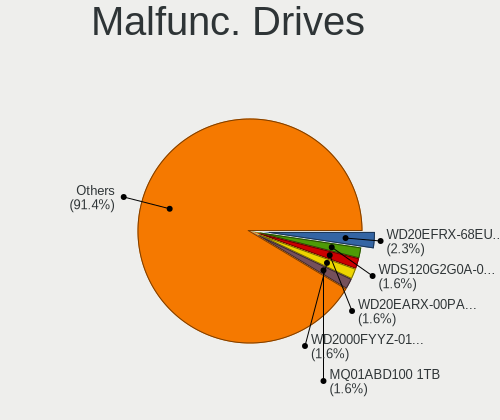
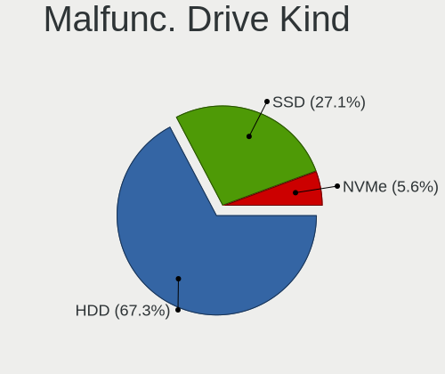
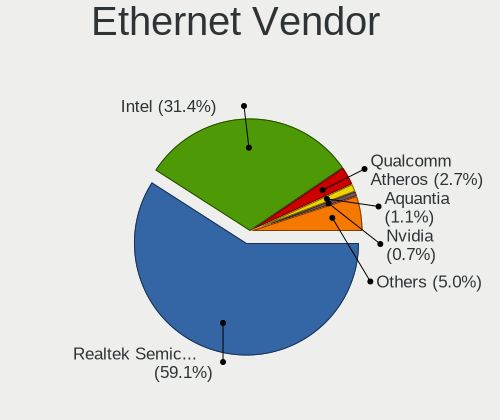
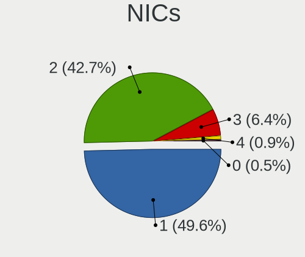
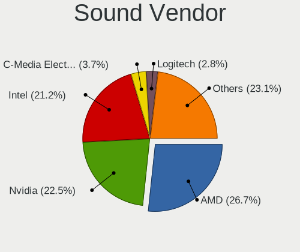
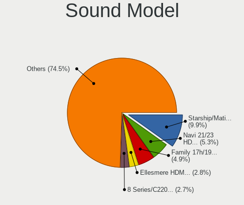

EndeavourOS - Tested Hardware & Statistics (Desktops)
-----------------------------------------------------

A project to collect tested hardware configurations for EndeavourOS.

Anyone can contribute to this report by the [hw-probe](https://github.com/linuxhw/hw-probe) tool:

    sudo -E hw-probe -all -upload

Please contribute! Especially if your hardware is rare.

Contents
--------

* [ Test Cases ](#test-cases)

* [ System ](#system)
  - [ OS                       ](#os)
  - [ OS Family                ](#os-family)
  - [ Kernel                   ](#kernel)
  - [ Kernel Family            ](#kernel-family)
  - [ Kernel Major Ver.        ](#kernel-major-ver)
  - [ Arch                     ](#arch)
  - [ DE                       ](#de)
  - [ Display Server           ](#display-server)
  - [ Display Manager          ](#display-manager)
  - [ OS Lang                  ](#os-lang)
  - [ Boot Mode                ](#boot-mode)
  - [ Filesystem               ](#filesystem)
  - [ Part. scheme             ](#part-scheme)
  - [ Dual Boot with Linux/BSD ](#dual-boot-with-linuxbsd)
  - [ Dual Boot (Win)          ](#dual-boot-win)

* [ Board ](#board)
  - [ Vendor                   ](#vendor)
  - [ Model                    ](#model)
  - [ Model Family             ](#model-family)
  - [ MFG Year                 ](#mfg-year)
  - [ Form Factor              ](#form-factor)
  - [ Secure Boot              ](#secure-boot)
  - [ Coreboot                 ](#coreboot)
  - [ RAM Size                 ](#ram-size)
  - [ RAM Used                 ](#ram-used)
  - [ Total Drives             ](#total-drives)
  - [ Has CD-ROM               ](#has-cd-rom)
  - [ Has Ethernet             ](#has-ethernet)
  - [ Has WiFi                 ](#has-wifi)
  - [ Has Bluetooth            ](#has-bluetooth)

* [ Location ](#location)
  - [ Country                  ](#country)
  - [ City                     ](#city)

* [ Drives ](#drives)
  - [ Drive Vendor             ](#drive-vendor)
  - [ Drive Model              ](#drive-model)
  - [ HDD Vendor               ](#hdd-vendor)
  - [ SSD Vendor               ](#ssd-vendor)
  - [ Drive Kind               ](#drive-kind)
  - [ Drive Connector          ](#drive-connector)
  - [ Drive Size               ](#drive-size)
  - [ Space Total              ](#space-total)
  - [ Space Used               ](#space-used)
  - [ Malfunc. Drives          ](#malfunc-drives)
  - [ Malfunc. Drive Vendor    ](#malfunc-drive-vendor)
  - [ Malfunc. HDD Vendor      ](#malfunc-hdd-vendor)
  - [ Malfunc. Drive Kind      ](#malfunc-drive-kind)
  - [ Failed Drives            ](#failed-drives)
  - [ Failed Drive Vendor      ](#failed-drive-vendor)
  - [ Drive Status             ](#drive-status)

* [ Storage controller ](#storage-controller)
  - [ Storage Vendor           ](#storage-vendor)
  - [ Storage Model            ](#storage-model)
  - [ Storage Kind             ](#storage-kind)

* [ Processor ](#processor)
  - [ CPU Vendor               ](#cpu-vendor)
  - [ CPU Model                ](#cpu-model)
  - [ CPU Model Family         ](#cpu-model-family)
  - [ CPU Cores                ](#cpu-cores)
  - [ CPU Sockets              ](#cpu-sockets)
  - [ CPU Threads              ](#cpu-threads)
  - [ CPU Op-Modes             ](#cpu-op-modes)
  - [ CPU Microcode            ](#cpu-microcode)
  - [ CPU Microarch            ](#cpu-microarch)

* [ Graphics ](#graphics)
  - [ GPU Vendor               ](#gpu-vendor)
  - [ GPU Model                ](#gpu-model)
  - [ GPU Combo                ](#gpu-combo)
  - [ GPU Driver               ](#gpu-driver)
  - [ GPU Memory               ](#gpu-memory)

* [ Monitor ](#monitor)
  - [ Monitor Vendor           ](#monitor-vendor)
  - [ Monitor Model            ](#monitor-model)
  - [ Monitor Resolution       ](#monitor-resolution)
  - [ Monitor Diagonal         ](#monitor-diagonal)
  - [ Monitor Width            ](#monitor-width)
  - [ Aspect Ratio             ](#aspect-ratio)
  - [ Monitor Area             ](#monitor-area)
  - [ Pixel Density            ](#pixel-density)
  - [ Multiple Monitors        ](#multiple-monitors)

* [ Network ](#network)
  - [ Net Controller Vendor    ](#net-controller-vendor)
  - [ Net Controller Model     ](#net-controller-model)
  - [ Wireless Vendor          ](#wireless-vendor)
  - [ Wireless Model           ](#wireless-model)
  - [ Ethernet Vendor          ](#ethernet-vendor)
  - [ Ethernet Model           ](#ethernet-model)
  - [ Net Controller Kind      ](#net-controller-kind)
  - [ Used Controller          ](#used-controller)
  - [ NICs                     ](#nics)
  - [ IPv6                     ](#ipv6)

* [ Bluetooth ](#bluetooth)
  - [ Bluetooth Vendor         ](#bluetooth-vendor)
  - [ Bluetooth Model          ](#bluetooth-model)

* [ Sound ](#sound)
  - [ Sound Vendor             ](#sound-vendor)
  - [ Sound Model              ](#sound-model)

* [ Memory ](#memory)
  - [ Memory Vendor            ](#memory-vendor)
  - [ Memory Model             ](#memory-model)
  - [ Memory Kind              ](#memory-kind)
  - [ Memory Form Factor       ](#memory-form-factor)
  - [ Memory Size              ](#memory-size)
  - [ Memory Speed             ](#memory-speed)

* [ Printers & scanners ](#printers--scanners)
  - [ Printer Vendor           ](#printer-vendor)
  - [ Printer Model            ](#printer-model)
  - [ Scanner Vendor           ](#scanner-vendor)
  - [ Scanner Model            ](#scanner-model)

* [ Camera ](#camera)
  - [ Camera Vendor            ](#camera-vendor)
  - [ Camera Model             ](#camera-model)

* [ Security ](#security)
  - [ Fingerprint Vendor       ](#fingerprint-vendor)
  - [ Fingerprint Model        ](#fingerprint-model)
  - [ Chipcard Vendor          ](#chipcard-vendor)
  - [ Chipcard Model           ](#chipcard-model)

* [ Unsupported ](#unsupported)
  - [ Unsupported Devices      ](#unsupported-devices)
  - [ Unsupported Device Types ](#unsupported-device-types)

Test Cases
----------

Total: 334

| Vendor     | Model                       | Probe                                                      | Date         |
|------------|-----------------------------|------------------------------------------------------------|--------------|
| MSI        | MEG Z490 UNIFY              | [b6af703e1a](https://linux-hardware.org/?probe=b6af703e1a) | Nov 28, 2022 |
| Lenovo     | SHARKBAY SDK0E50510 WIN     | [1deadcff69](https://linux-hardware.org/?probe=1deadcff69) | Nov 27, 2022 |
| HP         | 18E4                        | [d72a174606](https://linux-hardware.org/?probe=d72a174606) | Nov 26, 2022 |
| MSI        | MPG X570 GAMING PLUS        | [63521d3e8d](https://linux-hardware.org/?probe=63521d3e8d) | Nov 26, 2022 |
| HP         | 18E4                        | [4a4ac150b6](https://linux-hardware.org/?probe=4a4ac150b6) | Nov 24, 2022 |
| ASRock     | X570M Pro4                  | [2b2778b81a](https://linux-hardware.org/?probe=2b2778b81a) | Nov 24, 2022 |
| ASUSTek    | PRIME B460M-A               | [4ed396ae3f](https://linux-hardware.org/?probe=4ed396ae3f) | Nov 21, 2022 |
| HP         | 18E4                        | [ff954b29c9](https://linux-hardware.org/?probe=ff954b29c9) | Nov 21, 2022 |
| MSI        | B360 GAMING PLUS            | [6552f5cfc9](https://linux-hardware.org/?probe=6552f5cfc9) | Nov 18, 2022 |
| HP         | 18E4                        | [37dd18c268](https://linux-hardware.org/?probe=37dd18c268) | Nov 17, 2022 |
| HP         | 3397                        | [035eb81bdf](https://linux-hardware.org/?probe=035eb81bdf) | Nov 13, 2022 |
| HP         | 18E4                        | [be545cc91f](https://linux-hardware.org/?probe=be545cc91f) | Nov 13, 2022 |
| ASUSTek    | B85M-GAMER                  | [112508759b](https://linux-hardware.org/?probe=112508759b) | Nov 13, 2022 |
| MSI        | MPG X570 GAMING PLUS        | [31cae1e989](https://linux-hardware.org/?probe=31cae1e989) | Nov 04, 2022 |
| HP         | 18E4                        | [66463ac87d](https://linux-hardware.org/?probe=66463ac87d) | Nov 04, 2022 |
| HP         | 18E4                        | [1b1339be3d](https://linux-hardware.org/?probe=1b1339be3d) | Nov 02, 2022 |
| Gigabyte   | P55A-UD3                    | [cd300a0714](https://linux-hardware.org/?probe=cd300a0714) | Nov 01, 2022 |
| ASUSTek    | PRIME B560M-A               | [499932f589](https://linux-hardware.org/?probe=499932f589) | Nov 01, 2022 |
| ASRock     | B450M Pro4                  | [45a2f4473b](https://linux-hardware.org/?probe=45a2f4473b) | Nov 01, 2022 |
| HP         | 18E7                        | [d4a4ad62cb](https://linux-hardware.org/?probe=d4a4ad62cb) | Oct 29, 2022 |
| Acer       | Predator PO3-620            | [e737f3b4bd](https://linux-hardware.org/?probe=e737f3b4bd) | Oct 29, 2022 |
| HP         | 18E4                        | [9d0444b1b8](https://linux-hardware.org/?probe=9d0444b1b8) | Oct 28, 2022 |
| ASRock     | Z270 Killer SLI/ac          | [22ec61d307](https://linux-hardware.org/?probe=22ec61d307) | Oct 28, 2022 |
| Dell       | 040DDP A01                  | [cc0b502ddf](https://linux-hardware.org/?probe=cc0b502ddf) | Oct 25, 2022 |
| ASUSTek    | PRIME X570-PRO              | [3ab5922ddf](https://linux-hardware.org/?probe=3ab5922ddf) | Oct 25, 2022 |
| MSI        | MAG Z490 TOMAHAWK           | [aa4a86445a](https://linux-hardware.org/?probe=aa4a86445a) | Oct 25, 2022 |
| ASRock     | A320M-HDV R4.0              | [17a0e006d0](https://linux-hardware.org/?probe=17a0e006d0) | Oct 25, 2022 |
| Gigabyte   | P35C-DS3R                   | [c6966a0df9](https://linux-hardware.org/?probe=c6966a0df9) | Oct 25, 2022 |
| Gigabyte   | P35C-DS3R                   | [5b4ecfb7e9](https://linux-hardware.org/?probe=5b4ecfb7e9) | Oct 25, 2022 |
| Dell       | 042P49 A02                  | [d9590e8d45](https://linux-hardware.org/?probe=d9590e8d45) | Oct 24, 2022 |
| Medion     | B460H6-EM                   | [9023ea833f](https://linux-hardware.org/?probe=9023ea833f) | Oct 24, 2022 |
| HP         | 18E4                        | [dfbdab6987](https://linux-hardware.org/?probe=dfbdab6987) | Oct 21, 2022 |
| Gigabyte   | H87M-D3H                    | [bda1da1137](https://linux-hardware.org/?probe=bda1da1137) | Oct 20, 2022 |
| Lenovo     | 3111 SDK0J40697 WIN 3305... | [c8997eb831](https://linux-hardware.org/?probe=c8997eb831) | Oct 20, 2022 |
| ASUSTek    | Z170 PRO GAMING             | [01338c4f3c](https://linux-hardware.org/?probe=01338c4f3c) | Oct 19, 2022 |
| ASRock     | B450 Pro4                   | [d7784759fb](https://linux-hardware.org/?probe=d7784759fb) | Oct 19, 2022 |
| MSI        | Z390-A PRO                  | [d79e9be41b](https://linux-hardware.org/?probe=d79e9be41b) | Oct 18, 2022 |
| Gigabyte   | Z390 GAMING X-CF            | [09a4ac981b](https://linux-hardware.org/?probe=09a4ac981b) | Oct 17, 2022 |
| MSI        | B250M PRO-VD                | [28d9942c9f](https://linux-hardware.org/?probe=28d9942c9f) | Oct 17, 2022 |
| MSI        | MPG X570 GAMING PLUS        | [bf1677e47c](https://linux-hardware.org/?probe=bf1677e47c) | Oct 14, 2022 |
| ASUSTek    | PRIME B560M-A               | [c6f57791dc](https://linux-hardware.org/?probe=c6f57791dc) | Oct 12, 2022 |
| Gigabyte   | H81M-S2PV                   | [90661c40a3](https://linux-hardware.org/?probe=90661c40a3) | Oct 12, 2022 |
| HP         | 18E4                        | [6603067eba](https://linux-hardware.org/?probe=6603067eba) | Oct 10, 2022 |
| HP         | 18E4                        | [53c6bf7af4](https://linux-hardware.org/?probe=53c6bf7af4) | Oct 06, 2022 |
| MSI        | MPG X570 GAMING PLUS        | [75e1aeaff5](https://linux-hardware.org/?probe=75e1aeaff5) | Oct 02, 2022 |
| ASUSTek    | PRIME Z390-P                | [81ddb430e3](https://linux-hardware.org/?probe=81ddb430e3) | Sep 28, 2022 |
| MSI        | MPG X570 GAMING EDGE WIF... | [2c69225287](https://linux-hardware.org/?probe=2c69225287) | Sep 27, 2022 |
| ASRock     | B450M-HDV R4.0              | [479dfeae74](https://linux-hardware.org/?probe=479dfeae74) | Sep 25, 2022 |
| Huanan     | X99-8M-F V1.3               | [6e96f4620a](https://linux-hardware.org/?probe=6e96f4620a) | Sep 25, 2022 |
| Huanan     | X99-8M-F V1.3               | [acb677ddeb](https://linux-hardware.org/?probe=acb677ddeb) | Sep 25, 2022 |
| ASRock     | B450 Pro4                   | [fe99b8a461](https://linux-hardware.org/?probe=fe99b8a461) | Sep 25, 2022 |
| ASUSTek    | SABERTOOTH P67              | [164ad85233](https://linux-hardware.org/?probe=164ad85233) | Sep 23, 2022 |
| AZW        | SEi                         | [579b2be420](https://linux-hardware.org/?probe=579b2be420) | Sep 23, 2022 |
| Gigabyte   | GB-BRR7H-4800               | [d0f94bde46](https://linux-hardware.org/?probe=d0f94bde46) | Sep 21, 2022 |
| MSI        | MPG X570 GAMING PLUS        | [f4f33e2362](https://linux-hardware.org/?probe=f4f33e2362) | Sep 20, 2022 |
| ASUSTek    | SABERTOOTH P67              | [579f73fc88](https://linux-hardware.org/?probe=579f73fc88) | Sep 19, 2022 |
| MSI        | MPG B550 GAMING EDGE WIF... | [543fad9f1c](https://linux-hardware.org/?probe=543fad9f1c) | Sep 18, 2022 |
| HP         | 1998                        | [f3ef7a85fe](https://linux-hardware.org/?probe=f3ef7a85fe) | Sep 16, 2022 |
| MSI        | Z170A KRAIT GAMING 3X       | [bfcf5bab5f](https://linux-hardware.org/?probe=bfcf5bab5f) | Sep 12, 2022 |
| MSI        | MPG Z390M GAMING EDGE AC    | [20ead11e02](https://linux-hardware.org/?probe=20ead11e02) | Sep 10, 2022 |
| ASUSTek    | H170M-PLUS                  | [df80ca89ee](https://linux-hardware.org/?probe=df80ca89ee) | Sep 08, 2022 |
| Dell       | 0HMF7C A01                  | [292123f83b](https://linux-hardware.org/?probe=292123f83b) | Sep 03, 2022 |
| ASUSTek    | PRIME H310M-K               | [2fb52eb1a8](https://linux-hardware.org/?probe=2fb52eb1a8) | Sep 03, 2022 |
| MSI        | X570-A PRO                  | [4a7d6a9276](https://linux-hardware.org/?probe=4a7d6a9276) | Sep 01, 2022 |
| Gigabyte   | P55A-UD3                    | [297cab0eb2](https://linux-hardware.org/?probe=297cab0eb2) | Sep 01, 2022 |
| HP         | 18E7                        | [9344f12eea](https://linux-hardware.org/?probe=9344f12eea) | Aug 31, 2022 |
| ASUSTek    | Maximus IX HERO             | [782466213a](https://linux-hardware.org/?probe=782466213a) | Aug 19, 2022 |
| ASRock     | B550M Pro4                  | [9b5ba9f755](https://linux-hardware.org/?probe=9b5ba9f755) | Aug 18, 2022 |
| MSI        | A320M PRO-E                 | [2aa966d8af](https://linux-hardware.org/?probe=2aa966d8af) | Aug 14, 2022 |
| ASUSTek    | PRIME X570-P                | [94579c3a70](https://linux-hardware.org/?probe=94579c3a70) | Aug 13, 2022 |
| AZW        | U59                         | [33aea75ff4](https://linux-hardware.org/?probe=33aea75ff4) | Aug 07, 2022 |
| Gigabyte   | B550M AORUS PRO             | [7a5337e18d](https://linux-hardware.org/?probe=7a5337e18d) | Jul 28, 2022 |
| ASRock     | A320M-HDV R4.0              | [06dd902359](https://linux-hardware.org/?probe=06dd902359) | Jul 23, 2022 |
| MSI        | PRO Z690-A WIFI             | [00f490c5d0](https://linux-hardware.org/?probe=00f490c5d0) | Jul 22, 2022 |
| Gigabyte   | Z690 GAMING X DDR4          | [b3f65d7c35](https://linux-hardware.org/?probe=b3f65d7c35) | Jul 21, 2022 |
| ASUSTek    | TUF Gaming B550-PRO         | [d7e2758b93](https://linux-hardware.org/?probe=d7e2758b93) | Jul 20, 2022 |
| MSI        | MPG X570 GAMING PLUS        | [434edfc4cc](https://linux-hardware.org/?probe=434edfc4cc) | Jul 20, 2022 |
| Samsung    | DeskTop System              | [d0d33ec330](https://linux-hardware.org/?probe=d0d33ec330) | Jul 19, 2022 |
| Samsung    | DeskTop System              | [3af9bcc9cb](https://linux-hardware.org/?probe=3af9bcc9cb) | Jul 19, 2022 |
| ASUSTek    | TUF B450-PLUS GAMING        | [e8156cb24f](https://linux-hardware.org/?probe=e8156cb24f) | Jul 18, 2022 |
| Gigabyte   | B550 AORUS ELITE            | [85a02f5d41](https://linux-hardware.org/?probe=85a02f5d41) | Jul 15, 2022 |
| Gigabyte   | X470 AORUS GAMING 7 WIFI... | [e888c3e118](https://linux-hardware.org/?probe=e888c3e118) | Jul 08, 2022 |
| HP         | 158B                        | [1f3ebf7ecf](https://linux-hardware.org/?probe=1f3ebf7ecf) | Jul 07, 2022 |
| Gigabyte   | N3160TN                     | [b92830b100](https://linux-hardware.org/?probe=b92830b100) | Jul 03, 2022 |
| Gigabyte   | P55A-UD3                    | [36dcdacdb1](https://linux-hardware.org/?probe=36dcdacdb1) | Jul 01, 2022 |
| ASRock     | B450M Pro4                  | [5dd727cd5e](https://linux-hardware.org/?probe=5dd727cd5e) | Jul 01, 2022 |
| ASUSTek    | ROG Maximus Z690 HERO       | [73d9748926](https://linux-hardware.org/?probe=73d9748926) | Jun 29, 2022 |
| MSI        | MAG B550 TOMAHAWK           | [c84ca40dae](https://linux-hardware.org/?probe=c84ca40dae) | Jun 26, 2022 |
| Gigabyte   | B450 AORUS PRO WIFI-CF      | [834bed6eda](https://linux-hardware.org/?probe=834bed6eda) | Jun 21, 2022 |
| ASUSTek    | P8Z77-V                     | [16d7a07f8f](https://linux-hardware.org/?probe=16d7a07f8f) | Jun 20, 2022 |
| Dell       | 040DDP A01                  | [a4091a0526](https://linux-hardware.org/?probe=a4091a0526) | Jun 19, 2022 |
| MSI        | B450 GAMING PRO CARBON A... | [b0cc04798d](https://linux-hardware.org/?probe=b0cc04798d) | Jun 18, 2022 |
| Gigabyte   | B550M AORUS PRO-P           | [ab0ad88b31](https://linux-hardware.org/?probe=ab0ad88b31) | Jun 10, 2022 |
| ASUSTek    | SABERTOOTH X99              | [5c7a9690cf](https://linux-hardware.org/?probe=5c7a9690cf) | Jun 05, 2022 |
| ASUSTek    | H110M-E/M.2                 | [cb5ea65a1d](https://linux-hardware.org/?probe=cb5ea65a1d) | Jun 04, 2022 |
| MSI        | MPG X570 GAMING PLUS        | [4a055cff40](https://linux-hardware.org/?probe=4a055cff40) | Jun 02, 2022 |
| ASRock     | B450 Pro4                   | [394d112de5](https://linux-hardware.org/?probe=394d112de5) | May 31, 2022 |
| Gigabyte   | X470 AORUS GAMING 7 WIFI... | [8306cefd31](https://linux-hardware.org/?probe=8306cefd31) | May 28, 2022 |
| Gigabyte   | B550M AORUS PRO             | [0075e2d9df](https://linux-hardware.org/?probe=0075e2d9df) | May 28, 2022 |
| Dell       | 0K240Y A01                  | [4ef7645f2d](https://linux-hardware.org/?probe=4ef7645f2d) | May 28, 2022 |
| HP         | 0A08h                       | [86c65b6b1f](https://linux-hardware.org/?probe=86c65b6b1f) | May 21, 2022 |
| HP         | 0A08h                       | [18b2ce1297](https://linux-hardware.org/?probe=18b2ce1297) | May 21, 2022 |
| ASRock     | A320M/ac                    | [78ee9c8853](https://linux-hardware.org/?probe=78ee9c8853) | May 20, 2022 |
| HP         | 3647h                       | [eccb82bec8](https://linux-hardware.org/?probe=eccb82bec8) | May 20, 2022 |
| HP         | 8906 SMVB                   | [0bc568827c](https://linux-hardware.org/?probe=0bc568827c) | May 18, 2022 |
| ASUSTek    | ROG CROSSHAIR VIII IMPAC... | [a6a2ef59b0](https://linux-hardware.org/?probe=a6a2ef59b0) | May 11, 2022 |
| MSI        | B75MA-E33                   | [220e04a116](https://linux-hardware.org/?probe=220e04a116) | May 11, 2022 |
| ASUSTek    | P8H77-M                     | [9264c80f15](https://linux-hardware.org/?probe=9264c80f15) | May 05, 2022 |
| Lenovo     | 3111 SDK0J40697 WIN 3305... | [7354dedb38](https://linux-hardware.org/?probe=7354dedb38) | May 03, 2022 |
| ASRock     | B450 Pro4                   | [bcc65ca336](https://linux-hardware.org/?probe=bcc65ca336) | May 03, 2022 |
| ASRock     | B450 Pro4                   | [e40e784775](https://linux-hardware.org/?probe=e40e784775) | May 03, 2022 |
| ASRock     | AB350M Pro4                 | [1d4a595342](https://linux-hardware.org/?probe=1d4a595342) | May 02, 2022 |
| Gigabyte   | P55A-UD3                    | [b212517217](https://linux-hardware.org/?probe=b212517217) | May 01, 2022 |
| ASRock     | B450M Pro4                  | [79a3d8d3f6](https://linux-hardware.org/?probe=79a3d8d3f6) | May 01, 2022 |
| MSI        | MPG X570 GAMING PLUS        | [e45e120b35](https://linux-hardware.org/?probe=e45e120b35) | Apr 29, 2022 |
| ASUSTek    | TUF B450-PRO GAMING         | [4185312ca8](https://linux-hardware.org/?probe=4185312ca8) | Apr 27, 2022 |
| ASUSTek    | TUF B450-PRO GAMING         | [88248eb2e6](https://linux-hardware.org/?probe=88248eb2e6) | Apr 27, 2022 |
| Gigabyte   | B450M DS3H-CF               | [a7eeea4f7c](https://linux-hardware.org/?probe=a7eeea4f7c) | Apr 27, 2022 |
| ASRock     | B560 Pro4                   | [5fdc5a8e7b](https://linux-hardware.org/?probe=5fdc5a8e7b) | Apr 21, 2022 |
| ASUSTek    | PRIME H410M-E               | [583693a1a9](https://linux-hardware.org/?probe=583693a1a9) | Apr 17, 2022 |
| Gigabyte   | Z390 AORUS PRO-CF           | [1a48a9a11d](https://linux-hardware.org/?probe=1a48a9a11d) | Apr 13, 2022 |
| Gigabyte   | B450 AORUS ELITE            | [1ff04268cf](https://linux-hardware.org/?probe=1ff04268cf) | Apr 13, 2022 |
| ASRock     | B560 Pro4                   | [bbaa6e145b](https://linux-hardware.org/?probe=bbaa6e145b) | Apr 12, 2022 |
| Dell       | 0WMJ54 A01                  | [64ac971253](https://linux-hardware.org/?probe=64ac971253) | Apr 10, 2022 |
| ASUSTek    | PRIME Z390-A                | [0127833323](https://linux-hardware.org/?probe=0127833323) | Apr 03, 2022 |
| MSI        | B450M PRO-VDH PLUS          | [b8d47c54c3](https://linux-hardware.org/?probe=b8d47c54c3) | Apr 03, 2022 |
| MSI        | B450M PRO-VDH PLUS          | [53da5b2d7c](https://linux-hardware.org/?probe=53da5b2d7c) | Apr 03, 2022 |
| ASUSTek    | TUF Gaming B550-PLUS        | [a69ec475f7](https://linux-hardware.org/?probe=a69ec475f7) | Apr 03, 2022 |
| ASRock     | B450 Pro4                   | [f9c192cd71](https://linux-hardware.org/?probe=f9c192cd71) | Mar 29, 2022 |
| ASUSTek    | PRIME B450M-A               | [4a8c48df20](https://linux-hardware.org/?probe=4a8c48df20) | Mar 28, 2022 |
| Gigabyte   | B450 GAMING X               | [2d57761ba8](https://linux-hardware.org/?probe=2d57761ba8) | Mar 26, 2022 |
| Lenovo     | ThinkStation C20 426593U    | [50bcf21472](https://linux-hardware.org/?probe=50bcf21472) | Mar 23, 2022 |
| ASUSTek    | ROG STRIX B550-F GAMING     | [59bd959d3e](https://linux-hardware.org/?probe=59bd959d3e) | Mar 19, 2022 |
| ASUSTek    | STRIX Z270F GAMING          | [a0a0ba299e](https://linux-hardware.org/?probe=a0a0ba299e) | Mar 15, 2022 |
| Dell       | 0JP3NX A01                  | [e8f9fb7d24](https://linux-hardware.org/?probe=e8f9fb7d24) | Mar 09, 2022 |
| MSI        | B450M PRO-VDH PLUS          | [4b2fe6657c](https://linux-hardware.org/?probe=4b2fe6657c) | Mar 04, 2022 |
| Gigabyte   | P55A-UD3                    | [677fa0d0a3](https://linux-hardware.org/?probe=677fa0d0a3) | Mar 01, 2022 |
| ASRock     | B450M Pro4                  | [e81420b85c](https://linux-hardware.org/?probe=e81420b85c) | Mar 01, 2022 |
| MSI        | B75MA-P45                   | [35ad54efc7](https://linux-hardware.org/?probe=35ad54efc7) | Feb 26, 2022 |
| Dell       | 0KWVT8 A03                  | [f4bc34ce43](https://linux-hardware.org/?probe=f4bc34ce43) | Feb 23, 2022 |
| ASRock     | B450M Pro4                  | [4f87ec9849](https://linux-hardware.org/?probe=4f87ec9849) | Feb 19, 2022 |
| MSI        | MPG X570 GAMING PLUS        | [7ad21cbc90](https://linux-hardware.org/?probe=7ad21cbc90) | Feb 19, 2022 |
| ASRock     | B450M Pro4                  | [2bfd36f050](https://linux-hardware.org/?probe=2bfd36f050) | Feb 18, 2022 |
| Gigabyte   | B450 AORUS ELITE            | [a8c18662ff](https://linux-hardware.org/?probe=a8c18662ff) | Feb 10, 2022 |
| ASUSTek    | TUF Gaming X570-PLUS        | [c408e51e91](https://linux-hardware.org/?probe=c408e51e91) | Feb 08, 2022 |
| ASUSTek    | TUF Gaming X570-PRO         | [64e32a1354](https://linux-hardware.org/?probe=64e32a1354) | Feb 02, 2022 |
| HP         | 1905                        | [8014fae46e](https://linux-hardware.org/?probe=8014fae46e) | Feb 02, 2022 |
| ASUSTek    | P8H77-V                     | [467ff5e38f](https://linux-hardware.org/?probe=467ff5e38f) | Jan 31, 2022 |
| MSI        | B75MA-P45                   | [4108d2071b](https://linux-hardware.org/?probe=4108d2071b) | Jan 28, 2022 |
| ASUSTek    | ROG ZENITH EXTREME          | [5c5ac9fe1d](https://linux-hardware.org/?probe=5c5ac9fe1d) | Jan 26, 2022 |
| ASRock     | A320M-HD                    | [215b5c3802](https://linux-hardware.org/?probe=215b5c3802) | Jan 23, 2022 |
| MSI        | B150M ECO                   | [d484e899ef](https://linux-hardware.org/?probe=d484e899ef) | Jan 22, 2022 |
| HP         | 8643 SMVB                   | [56e21b8bd6](https://linux-hardware.org/?probe=56e21b8bd6) | Jan 22, 2022 |
| HP         | 8643 SMVB                   | [6586f2d78f](https://linux-hardware.org/?probe=6586f2d78f) | Jan 22, 2022 |
| ASUSTek    | TUF Gaming B560-PLUS WIF... | [3b7c230363](https://linux-hardware.org/?probe=3b7c230363) | Jan 21, 2022 |
| ASRock     | B550M Steel Legend          | [b09195fb3c](https://linux-hardware.org/?probe=b09195fb3c) | Jan 20, 2022 |
| ASUSTek    | TUF Gaming B560M-PLUS WI... | [211aac7b59](https://linux-hardware.org/?probe=211aac7b59) | Jan 18, 2022 |
| MSI        | Z170A GAMING M3             | [57e7500f2a](https://linux-hardware.org/?probe=57e7500f2a) | Jan 17, 2022 |
| MSI        | X370 XPOWER GAMING TITAN... | [e1f153a5e6](https://linux-hardware.org/?probe=e1f153a5e6) | Jan 14, 2022 |
| Gigabyte   | TRX40 AORUS MASTER          | [5ca44fe54c](https://linux-hardware.org/?probe=5ca44fe54c) | Jan 10, 2022 |
| ASUSTek    | Maximus VII GENE            | [0462560ab2](https://linux-hardware.org/?probe=0462560ab2) | Jan 10, 2022 |
| ASRock     | FM2A88X Pro3+               | [1cc054ed3f](https://linux-hardware.org/?probe=1cc054ed3f) | Jan 09, 2022 |
| Dell       | 0K240Y A01                  | [2542ffac8a](https://linux-hardware.org/?probe=2542ffac8a) | Jan 06, 2022 |
| MSI        | Z97 PC Mate                 | [2e5c796311](https://linux-hardware.org/?probe=2e5c796311) | Jan 06, 2022 |
| ASUSTek    | M5A99FX PRO R2.0            | [be76fa91bc](https://linux-hardware.org/?probe=be76fa91bc) | Jan 05, 2022 |
| ASUSTek    | P8Z77-V LX                  | [8e11cb731a](https://linux-hardware.org/?probe=8e11cb731a) | Jan 05, 2022 |
| ASUSTek    | ROG CROSSHAIR VIII DARK ... | [b58f7257b9](https://linux-hardware.org/?probe=b58f7257b9) | Jan 05, 2022 |
| ASUSTek    | ROG STRIX X370-F GAMING     | [aa4f09754b](https://linux-hardware.org/?probe=aa4f09754b) | Jan 04, 2022 |
| ASUSTek    | ROG STRIX X370-F GAMING     | [411cf580b4](https://linux-hardware.org/?probe=411cf580b4) | Jan 04, 2022 |
| Gigabyte   | B550 AORUS ELITE V2         | [c804b37a93](https://linux-hardware.org/?probe=c804b37a93) | Jan 04, 2022 |
| ASRock     | B450M Pro4                  | [9b8e2862e0](https://linux-hardware.org/?probe=9b8e2862e0) | Jan 04, 2022 |
| MSI        | Z490-A PRO                  | [ab40f6782f](https://linux-hardware.org/?probe=ab40f6782f) | Jan 04, 2022 |
| ASUSTek    | ROG STRIX Z370-F GAMING     | [d7f6228561](https://linux-hardware.org/?probe=d7f6228561) | Jan 04, 2022 |
| Positivo   | POS-PIH81DI                 | [c2f06752f5](https://linux-hardware.org/?probe=c2f06752f5) | Jan 04, 2022 |
| ASRock     | B450M Pro4                  | [5ce8d98461](https://linux-hardware.org/?probe=5ce8d98461) | Jan 04, 2022 |
| ASRock     | B450 Gaming-ITX/ac          | [4020ca9754](https://linux-hardware.org/?probe=4020ca9754) | Jan 04, 2022 |
| ASUSTek    | Z97-A                       | [1ebd581629](https://linux-hardware.org/?probe=1ebd581629) | Jan 01, 2022 |
| Gigabyte   | Z97X-Gaming 3               | [89d144f949](https://linux-hardware.org/?probe=89d144f949) | Dec 31, 2021 |
| ASRock     | B450 Steel Legend           | [9a67c15230](https://linux-hardware.org/?probe=9a67c15230) | Dec 31, 2021 |
| ASUSTek    | ROG STRIX B450-F GAMING     | [211b09522f](https://linux-hardware.org/?probe=211b09522f) | Dec 31, 2021 |
| LattePanda | Alpha                       | [497e370fc3](https://linux-hardware.org/?probe=497e370fc3) | Dec 26, 2021 |
| Biostar    | G31-M7 TE                   | [abb80ccd85](https://linux-hardware.org/?probe=abb80ccd85) | Dec 25, 2021 |
| LattePanda | Alpha                       | [442f08d351](https://linux-hardware.org/?probe=442f08d351) | Dec 24, 2021 |
| Gigabyte   | M68M-S2P                    | [c06c8838d2](https://linux-hardware.org/?probe=c06c8838d2) | Dec 24, 2021 |
| Acer       | Aspire XC-1660G V:1.1       | [c460e492aa](https://linux-hardware.org/?probe=c460e492aa) | Dec 23, 2021 |
| Gigabyte   | H110N-CF                    | [17067982ca](https://linux-hardware.org/?probe=17067982ca) | Dec 23, 2021 |
| MSI        | Z87-G41 PC Mate             | [aa7388fdd1](https://linux-hardware.org/?probe=aa7388fdd1) | Dec 21, 2021 |
| ASUSTek    | ROG STRIX X570-E GAMING     | [ac70723f1b](https://linux-hardware.org/?probe=ac70723f1b) | Dec 18, 2021 |
| ASUSTek    | ROG CROSSHAIR VIII DARK ... | [83e6ab3542](https://linux-hardware.org/?probe=83e6ab3542) | Dec 18, 2021 |
| Unknown    | Intel X79                   | [767fb84ac9](https://linux-hardware.org/?probe=767fb84ac9) | Dec 17, 2021 |
| Dell       | 0HD5W2 A01                  | [72329a4b56](https://linux-hardware.org/?probe=72329a4b56) | Dec 17, 2021 |
| Lenovo     | ThinkStation C20 426593U    | [8c9d779e45](https://linux-hardware.org/?probe=8c9d779e45) | Dec 14, 2021 |
| Lenovo     | ThinkStation C20 426593U    | [641af2bfa6](https://linux-hardware.org/?probe=641af2bfa6) | Dec 13, 2021 |
| ASUSTek    | ProArt X570-CREATOR WIFI    | [bdfec258d5](https://linux-hardware.org/?probe=bdfec258d5) | Dec 12, 2021 |
| ASUSTek    | ROG STRIX X570-E GAMING     | [9fce8b9430](https://linux-hardware.org/?probe=9fce8b9430) | Dec 12, 2021 |
| Gigabyte   | B550M AORUS PRO             | [d1e767dfde](https://linux-hardware.org/?probe=d1e767dfde) | Dec 11, 2021 |
| ASUSTek    | PRIME B350-PLUS             | [96e7ac029b](https://linux-hardware.org/?probe=96e7ac029b) | Dec 10, 2021 |
| Gigabyte   | X570 AORUS ELITE            | [78c796c1fc](https://linux-hardware.org/?probe=78c796c1fc) | Dec 02, 2021 |
| MSI        | B350 PC MATE                | [7fbe80215d](https://linux-hardware.org/?probe=7fbe80215d) | Nov 24, 2021 |
| Gigabyte   | B560M DS3H                  | [89ea080ce0](https://linux-hardware.org/?probe=89ea080ce0) | Nov 20, 2021 |
| ASUSTek    | Z87-DELUXE                  | [b858dc4d83](https://linux-hardware.org/?probe=b858dc4d83) | Nov 18, 2021 |
| Gigabyte   | B560M DS3H                  | [505925412f](https://linux-hardware.org/?probe=505925412f) | Nov 18, 2021 |
| Gigabyte   | Z77X-D3H                    | [be03431631](https://linux-hardware.org/?probe=be03431631) | Nov 15, 2021 |
| ASUSTek    | K30AD_M31AD_M51AD_M32AD     | [7ebeace900](https://linux-hardware.org/?probe=7ebeace900) | Nov 13, 2021 |
| ASUSTek    | ROG STRIX X570-E GAMING     | [dfe40a023a](https://linux-hardware.org/?probe=dfe40a023a) | Nov 12, 2021 |
| ASUSTek    | ROG STRIX X570-E GAMING     | [1336c9e31c](https://linux-hardware.org/?probe=1336c9e31c) | Nov 12, 2021 |
| Gigabyte   | GA-78LMT-USB3               | [1cfd4ee9f9](https://linux-hardware.org/?probe=1cfd4ee9f9) | Nov 11, 2021 |
| Lenovo     | ThinkStation C20 426593U    | [c9e5138184](https://linux-hardware.org/?probe=c9e5138184) | Nov 07, 2021 |
| ASUSTek    | Maximus VIII HERO           | [22ce2703b9](https://linux-hardware.org/?probe=22ce2703b9) | Nov 07, 2021 |
| Lenovo     | ThinkStation C20 426593U    | [5d0bad7c15](https://linux-hardware.org/?probe=5d0bad7c15) | Nov 06, 2021 |
| ASRock     | H310CM-DVS                  | [79e6ef3655](https://linux-hardware.org/?probe=79e6ef3655) | Oct 29, 2021 |
| ASRock     | H310CM-DVS                  | [6db3b9d661](https://linux-hardware.org/?probe=6db3b9d661) | Oct 29, 2021 |
| Gigabyte   | B450 GAMING X               | [cb03c494cb](https://linux-hardware.org/?probe=cb03c494cb) | Oct 15, 2021 |
| ASRock     | B550M Pro4                  | [87ab64b604](https://linux-hardware.org/?probe=87ab64b604) | Oct 14, 2021 |
| Gigabyte   | X570 AORUS ULTRA            | [cef9098008](https://linux-hardware.org/?probe=cef9098008) | Oct 14, 2021 |
| Gigabyte   | X570 AORUS ULTRA            | [718bd26737](https://linux-hardware.org/?probe=718bd26737) | Oct 14, 2021 |
| UMAX       | J42 Nano                    | [fd40a94769](https://linux-hardware.org/?probe=fd40a94769) | Oct 09, 2021 |
| Gigabyte   | B85M-HD3                    | [cc7d0245a7](https://linux-hardware.org/?probe=cc7d0245a7) | Oct 09, 2021 |
| Lenovo     | ThinkStation C20 426593U    | [849ca2da3d](https://linux-hardware.org/?probe=849ca2da3d) | Oct 06, 2021 |
| Gigabyte   | B550 VISION D               | [e8a2ba9952](https://linux-hardware.org/?probe=e8a2ba9952) | Oct 03, 2021 |
| MSI        | G41M-P33 Combo              | [ec8e63e96e](https://linux-hardware.org/?probe=ec8e63e96e) | Oct 01, 2021 |
| Gigabyte   | B250M-DS3H-CF               | [62558ba69c](https://linux-hardware.org/?probe=62558ba69c) | Sep 29, 2021 |
| Gigabyte   | H110M-S2-CF                 | [a20f426eed](https://linux-hardware.org/?probe=a20f426eed) | Sep 25, 2021 |
| Gigabyte   | B450M DS3H-CF               | [35cbc8e5b5](https://linux-hardware.org/?probe=35cbc8e5b5) | Sep 19, 2021 |
| Gigabyte   | B450M DS3H-CF               | [860fb3dc8c](https://linux-hardware.org/?probe=860fb3dc8c) | Sep 19, 2021 |
| Lenovo     | ThinkStation C20 426593U    | [8ffa4dd273](https://linux-hardware.org/?probe=8ffa4dd273) | Sep 18, 2021 |
| Lenovo     | ThinkStation C20 426593U    | [60555ce93d](https://linux-hardware.org/?probe=60555ce93d) | Sep 16, 2021 |
| MSI        | B450M PRO-VDH MAX           | [33cee010e8](https://linux-hardware.org/?probe=33cee010e8) | Sep 12, 2021 |
| Lenovo     | ThinkStation C20 426593U    | [c06b4b30a0](https://linux-hardware.org/?probe=c06b4b30a0) | Sep 10, 2021 |
| MSI        | B450-A PRO MAX              | [12cf057e04](https://linux-hardware.org/?probe=12cf057e04) | Sep 02, 2021 |
| Intel      | DH55HC AAE70933-504         | [2880661f42](https://linux-hardware.org/?probe=2880661f42) | Aug 30, 2021 |
| Lenovo     | ThinkStation C20 426593U    | [1c75e967eb](https://linux-hardware.org/?probe=1c75e967eb) | Aug 24, 2021 |
| HP         | 8906 SMVB                   | [ea16eee1c7](https://linux-hardware.org/?probe=ea16eee1c7) | Aug 24, 2021 |
| MSI        | B450 TOMAHAWK MAX           | [2e16baa112](https://linux-hardware.org/?probe=2e16baa112) | Aug 14, 2021 |
| Gigabyte   | P35-DS3R                    | [421cd7ce36](https://linux-hardware.org/?probe=421cd7ce36) | Aug 09, 2021 |
| MSI        | B450M PRO-VDH MAX           | [8e9d51a941](https://linux-hardware.org/?probe=8e9d51a941) | Aug 07, 2021 |
| Dell       | 0K240Y A01                  | [5cc92cb5ac](https://linux-hardware.org/?probe=5cc92cb5ac) | Aug 04, 2021 |
| ASUSTek    | ROG STRIX B550-I GAMING     | [816edfa4bb](https://linux-hardware.org/?probe=816edfa4bb) | Jul 25, 2021 |
| Gigabyte   | X399 AORUS PRO-CF           | [404eae69f4](https://linux-hardware.org/?probe=404eae69f4) | Jul 14, 2021 |
| Gigabyte   | GA-78LMT-S2P                | [f36328f6b3](https://linux-hardware.org/?probe=f36328f6b3) | Jul 12, 2021 |
| MSI        | MAG X570 TOMAHAWK WIFI      | [14b3d46ef8](https://linux-hardware.org/?probe=14b3d46ef8) | Jul 03, 2021 |
| ASUSTek    | P7H55D-M EVO                | [62f256e36e](https://linux-hardware.org/?probe=62f256e36e) | Jul 03, 2021 |
| ASUSTek    | ROG STRIX Z370-F GAMING     | [487ca6235b](https://linux-hardware.org/?probe=487ca6235b) | Jul 02, 2021 |
| Gigabyte   | Z97X-Gaming 5               | [625c876e08](https://linux-hardware.org/?probe=625c876e08) | Jun 30, 2021 |
| ASUSTek    | ROG STRIX B550-F GAMING     | [10c5bbf0f8](https://linux-hardware.org/?probe=10c5bbf0f8) | Jun 18, 2021 |
| ASUSTek    | F1A55-M LX                  | [9e7c39435d](https://linux-hardware.org/?probe=9e7c39435d) | Jun 13, 2021 |
| Gigabyte   | X570 I AORUS PRO WIFI       | [ed31182c51](https://linux-hardware.org/?probe=ed31182c51) | Jun 07, 2021 |
| Gigabyte   | B550 AORUS ELITE V2         | [585db3001d](https://linux-hardware.org/?probe=585db3001d) | May 19, 2021 |
| HP         | 2B36                        | [62135f1e45](https://linux-hardware.org/?probe=62135f1e45) | May 19, 2021 |
| ASUSTek    | ROG STRIX X570-E GAMING     | [fec75a202e](https://linux-hardware.org/?probe=fec75a202e) | May 19, 2021 |
| ASRock     | A300M-STX                   | [fc96347868](https://linux-hardware.org/?probe=fc96347868) | May 12, 2021 |
| Lenovo     | ThinkStation C20 426593U    | [dd68978e2b](https://linux-hardware.org/?probe=dd68978e2b) | Apr 28, 2021 |
| Lenovo     | ThinkStation C20 426593U    | [7ee064e334](https://linux-hardware.org/?probe=7ee064e334) | Apr 27, 2021 |
| ASUSTek    | STRIX B250F GAMING          | [8276e1fb2f](https://linux-hardware.org/?probe=8276e1fb2f) | Apr 20, 2021 |
| ASUSTek    | K30AD_M31AD_M51AD_M32AD     | [cf4d5786e5](https://linux-hardware.org/?probe=cf4d5786e5) | Apr 19, 2021 |
| Lenovo     | SHARKBAY NOK                | [0685ce717e](https://linux-hardware.org/?probe=0685ce717e) | Apr 16, 2021 |
| Gigabyte   | B550M AORUS PRO             | [a635a3acb3](https://linux-hardware.org/?probe=a635a3acb3) | Apr 13, 2021 |
| MSI        | B450 TOMAHAWK MAX           | [e08e82478f](https://linux-hardware.org/?probe=e08e82478f) | Apr 12, 2021 |
| Gigabyte   | B450 AORUS M                | [d53c2a8b0e](https://linux-hardware.org/?probe=d53c2a8b0e) | Apr 11, 2021 |
| Dell       | 0080PM A00                  | [efc9497e6d](https://linux-hardware.org/?probe=efc9497e6d) | Apr 08, 2021 |
| MSI        | MAG B550 TOMAHAWK           | [63e7ed5aa3](https://linux-hardware.org/?probe=63e7ed5aa3) | Apr 07, 2021 |
| Lenovo     | 36EB NOK                    | [2c6f4de8b9](https://linux-hardware.org/?probe=2c6f4de8b9) | Apr 06, 2021 |
| MSI        | X370 GAMING PRO CARBON      | [08f8da317e](https://linux-hardware.org/?probe=08f8da317e) | Apr 03, 2021 |
| Gigabyte   | Z390 GAMING SLI-CF          | [90f906f5f9](https://linux-hardware.org/?probe=90f906f5f9) | Mar 31, 2021 |
| Gigabyte   | Z390 GAMING SLI-CF          | [b2fa0502d0](https://linux-hardware.org/?probe=b2fa0502d0) | Mar 31, 2021 |
| Samsung    | DT_DM500T8A SAMSUNG_SW_R... | [dccf080cd2](https://linux-hardware.org/?probe=dccf080cd2) | Mar 26, 2021 |
| Lenovo     | 3111 SDK0J40697 WIN 3305... | [31baa57d40](https://linux-hardware.org/?probe=31baa57d40) | Mar 17, 2021 |
| MSI        | X370 GAMING PRO CARBON      | [7c5776953c](https://linux-hardware.org/?probe=7c5776953c) | Mar 15, 2021 |
| Gigabyte   | B550M AORUS PRO             | [41de0a7ee7](https://linux-hardware.org/?probe=41de0a7ee7) | Mar 08, 2021 |
| ASUSTek    | TUF Gaming X570-PLUS        | [f9b4d57c67](https://linux-hardware.org/?probe=f9b4d57c67) | Feb 18, 2021 |
| MSI        | Z87-G45 GAMING              | [67ca38a642](https://linux-hardware.org/?probe=67ca38a642) | Feb 12, 2021 |
| MSI        | Z87-G45 GAMING              | [e6937666ae](https://linux-hardware.org/?probe=e6937666ae) | Feb 11, 2021 |
| ASRock     | B550 Phantom Gaming 4       | [e11200bd19](https://linux-hardware.org/?probe=e11200bd19) | Feb 10, 2021 |
| ASUSTek    | H81-PLUS                    | [75fc956099](https://linux-hardware.org/?probe=75fc956099) | Feb 10, 2021 |
| MSI        | MAG X570 TOMAHAWK WIFI      | [cef326fa21](https://linux-hardware.org/?probe=cef326fa21) | Feb 08, 2021 |
| ASRock     | B550M Steel Legend          | [335242ec06](https://linux-hardware.org/?probe=335242ec06) | Jan 20, 2021 |
| ASUSTek    | PRIME X470-PRO              | [396227c9b5](https://linux-hardware.org/?probe=396227c9b5) | Jan 14, 2021 |
| Gigabyte   | X58A-UD3R                   | [3d8c62e8fe](https://linux-hardware.org/?probe=3d8c62e8fe) | Jan 04, 2021 |
| ASUSTek    | Z87-PRO                     | [2ab19967fa](https://linux-hardware.org/?probe=2ab19967fa) | Dec 30, 2020 |
| ASUSTek    | Maximus VIII HERO           | [4d27980548](https://linux-hardware.org/?probe=4d27980548) | Dec 27, 2020 |
| ASUSTek    | Maximus VIII HERO           | [08895b552f](https://linux-hardware.org/?probe=08895b552f) | Dec 27, 2020 |
| HP         | 1905                        | [63771015f5](https://linux-hardware.org/?probe=63771015f5) | Dec 22, 2020 |
| Gigabyte   | H110M-S2-CF                 | [93308d477a](https://linux-hardware.org/?probe=93308d477a) | Dec 18, 2020 |
| Gigabyte   | X58A-UD3R                   | [a138dbf3ac](https://linux-hardware.org/?probe=a138dbf3ac) | Dec 08, 2020 |
| ASUSTek    | TUF X470-PLUS GAMING        | [00dc0236a1](https://linux-hardware.org/?probe=00dc0236a1) | Dec 07, 2020 |
| Fujitsu    | D2778-B1 S26361-D2778-B1    | [0ffe9c1f28](https://linux-hardware.org/?probe=0ffe9c1f28) | Nov 27, 2020 |
| Lenovo     | 36EB SDK0J40700 WIN 3258... | [34e2c6b1de](https://linux-hardware.org/?probe=34e2c6b1de) | Nov 21, 2020 |
| Dell       | 0KRC95 A02                  | [af91587001](https://linux-hardware.org/?probe=af91587001) | Nov 19, 2020 |
| ASRock     | Z77 Extreme4                | [3de701fc00](https://linux-hardware.org/?probe=3de701fc00) | Nov 12, 2020 |
| ASRock     | Z77 Extreme4                | [64d986c0ec](https://linux-hardware.org/?probe=64d986c0ec) | Nov 12, 2020 |
| Dell       | 0KRC95 A02                  | [6471eccd57](https://linux-hardware.org/?probe=6471eccd57) | Nov 11, 2020 |
| ASUSTek    | ROG STRIX B550-F GAMING     | [7a14486580](https://linux-hardware.org/?probe=7a14486580) | Nov 04, 2020 |
| Gigabyte   | H270-HD3-CF                 | [fa6d538a50](https://linux-hardware.org/?probe=fa6d538a50) | Oct 31, 2020 |
| HP         | 8455                        | [0671b6f4da](https://linux-hardware.org/?probe=0671b6f4da) | Oct 27, 2020 |
| HP         | 8455                        | [e37d606b6b](https://linux-hardware.org/?probe=e37d606b6b) | Oct 26, 2020 |
| Dell       | 0G214D A00                  | [21319d118b](https://linux-hardware.org/?probe=21319d118b) | Oct 25, 2020 |
| MSI        | MS-7366                     | [ada828f120](https://linux-hardware.org/?probe=ada828f120) | Sep 29, 2020 |
| Dell       | 096JG8 A01                  | [a031f4a8a2](https://linux-hardware.org/?probe=a031f4a8a2) | Sep 29, 2020 |
| MSI        | B450 TOMAHAWK MAX           | [ee969068e8](https://linux-hardware.org/?probe=ee969068e8) | Sep 28, 2020 |
| ASUSTek    | ROG STRIX X570-E GAMING     | [a4e794299b](https://linux-hardware.org/?probe=a4e794299b) | Sep 28, 2020 |
| ASUSTek    | P8P67 DELUXE                | [ba15c37977](https://linux-hardware.org/?probe=ba15c37977) | Sep 28, 2020 |
| MSI        | MS-7366                     | [9938e6501b](https://linux-hardware.org/?probe=9938e6501b) | Sep 24, 2020 |
| Gigabyte   | B450 AORUS M                | [34f1896f7e](https://linux-hardware.org/?probe=34f1896f7e) | Sep 23, 2020 |
| Gigabyte   | B550M AORUS PRO             | [17e933a69c](https://linux-hardware.org/?probe=17e933a69c) | Sep 21, 2020 |
| HP         | 1497                        | [7cb2cee563](https://linux-hardware.org/?probe=7cb2cee563) | Sep 19, 2020 |
| Gigabyte   | B550M AORUS PRO             | [50a3035c47](https://linux-hardware.org/?probe=50a3035c47) | Sep 12, 2020 |
| ASUSTek    | ROG STRIX B550-F GAMING     | [3919584d23](https://linux-hardware.org/?probe=3919584d23) | Sep 06, 2020 |
| ASRock     | X470 Gaming-ITX/ac          | [028f3ba060](https://linux-hardware.org/?probe=028f3ba060) | Sep 03, 2020 |
| ASUSTek    | M5A97 R2.0                  | [662f61d283](https://linux-hardware.org/?probe=662f61d283) | Sep 03, 2020 |
| ASUSTek    | ROG CROSSHAIR VIII HERO     | [143c679f1a](https://linux-hardware.org/?probe=143c679f1a) | Sep 03, 2020 |
| ASUSTek    | ROG CROSSHAIR VIII HERO     | [2ab9b15cb6](https://linux-hardware.org/?probe=2ab9b15cb6) | Sep 03, 2020 |
| Gigabyte   | Z170-Gaming K3-CF           | [f70636a60c](https://linux-hardware.org/?probe=f70636a60c) | Sep 02, 2020 |
| ASUSTek    | Z87M-PLUS                   | [844cca1bee](https://linux-hardware.org/?probe=844cca1bee) | Aug 09, 2020 |
| ASUSTek    | PRIME X570-P                | [cb7a700ec4](https://linux-hardware.org/?probe=cb7a700ec4) | Aug 07, 2020 |
| Gigabyte   | B365M DS3H                  | [79c5cea1c1](https://linux-hardware.org/?probe=79c5cea1c1) | Jul 14, 2020 |
| Fujitsu    | D2778-B1 S26361-D2778-B1    | [54774ae912](https://linux-hardware.org/?probe=54774ae912) | Jul 14, 2020 |
| Fujitsu    | D2618-C1 S26361-D2618-C1    | [85295c522b](https://linux-hardware.org/?probe=85295c522b) | Jul 14, 2020 |
| Lenovo     | MAHOBAY NOK                 | [6e3c82fbca](https://linux-hardware.org/?probe=6e3c82fbca) | Jul 13, 2020 |
| ASUSTek    | Z87M-PLUS                   | [d0c246206e](https://linux-hardware.org/?probe=d0c246206e) | Jul 13, 2020 |
| MSI        | MPG X570 GAMING PLUS        | [5ed412893a](https://linux-hardware.org/?probe=5ed412893a) | Jul 12, 2020 |
| Gigabyte   | B365M DS3H                  | [8baccc57ec](https://linux-hardware.org/?probe=8baccc57ec) | Jul 12, 2020 |
| Gigabyte   | X570 AORUS MASTER           | [b81603bb8b](https://linux-hardware.org/?probe=b81603bb8b) | Jul 12, 2020 |
| MSI        | B450-A PRO MAX              | [22ee76b578](https://linux-hardware.org/?probe=22ee76b578) | Jun 29, 2020 |
| ASUSTek    | TUF Gaming X570-PLUS        | [eb81165361](https://linux-hardware.org/?probe=eb81165361) | May 31, 2020 |
| Biostar    | G31-M7 TE                   | [0ae18cfc51](https://linux-hardware.org/?probe=0ae18cfc51) | May 05, 2020 |
| Gigabyte   | B85M-D3H                    | [adba7e2f11](https://linux-hardware.org/?probe=adba7e2f11) | Apr 24, 2020 |
| ASUSTek    | PRIME A320M-K               | [0b8f4015fa](https://linux-hardware.org/?probe=0b8f4015fa) | Feb 19, 2020 |
| Gigabyte   | B450M S2H                   | [5a1d01743b](https://linux-hardware.org/?probe=5a1d01743b) | Feb 12, 2020 |
| ASUSTek    | PRIME A320M-K               | [32f5e3b842](https://linux-hardware.org/?probe=32f5e3b842) | Nov 21, 2019 |
| ASUSTek    | PRIME A320M-K               | [4d0de4b06b](https://linux-hardware.org/?probe=4d0de4b06b) | Nov 19, 2019 |
| ASUSTek    | PRIME A320M-K               | [791bd283a6](https://linux-hardware.org/?probe=791bd283a6) | Nov 18, 2019 |
| ASUSTek    | PRIME A320M-K               | [50ea35444e](https://linux-hardware.org/?probe=50ea35444e) | Nov 17, 2019 |
| ASUSTek    | PRIME A320M-K               | [42a25ee1f6](https://linux-hardware.org/?probe=42a25ee1f6) | Nov 08, 2019 |
| ASUSTek    | PRIME A320M-K               | [587cf1258f](https://linux-hardware.org/?probe=587cf1258f) | Nov 07, 2019 |

System
------

OS
--

Installed operating systems

| Name                | Desktops | Percent |
|---------------------|----------|---------|
| EndeavourOS Rolling | 179      | 74.9%   |
| EndeavourOS         | 60       | 25.1%   |

OS Family
---------

OS without a version

| Name        | Desktops | Percent |
|-------------|----------|---------|
| EndeavourOS | 237      | 100%    |

Kernel
------

Version of the Linux kernel

| Version            | Desktops | Percent |
|--------------------|----------|---------|
| 5.15.12-arch1-1    | 10       | 3.6%    |
| 5.7.7-arch1-1      | 6        | 2.16%   |
| 6.0.2-zen1-1-zen   | 5        | 1.8%    |
| 6.0.2-arch1-1      | 5        | 1.8%    |
| 5.17.5-arch1-1     | 5        | 1.8%    |
| 5.17.1-arch1-1     | 5        | 1.8%    |
| 5.16.2-arch1-1     | 5        | 1.8%    |
| 5.18.12-arch1-1    | 4        | 1.44%   |
| 5.15.74-1-lts      | 4        | 1.44%   |
| 5.15.7-arch1-1     | 4        | 1.44%   |
| 5.11.11-arch1-1    | 4        | 1.44%   |
| 6.0.9-arch1-1      | 3        | 1.08%   |
| 6.0.6-arch1-1      | 3        | 1.08%   |
| 5.19.10-arch1-1    | 3        | 1.08%   |
| 5.18.7-arch1-1     | 3        | 1.08%   |
| 5.18.5-arch1-1     | 3        | 1.08%   |
| 5.17.9-arch1-1     | 3        | 1.08%   |
| 5.16.16-arch1-1    | 3        | 1.08%   |
| 5.16.10-arch1-1    | 3        | 1.08%   |
| 5.15.8-arch1-1     | 3        | 1.08%   |
| 5.15.12-zen1-1-zen | 3        | 1.08%   |
| 5.15.10-arch1-1    | 3        | 1.08%   |
| 5.14.9-arch2-1     | 3        | 1.08%   |
| 5.14.8-arch1-1     | 3        | 1.08%   |
| 5.10.88-2-lts      | 3        | 1.08%   |
| 6.0.8-arch1-1      | 2        | 0.72%   |
| 6.0.6-zen1-1-zen   | 2        | 0.72%   |
| 5.9.14-arch1-1     | 2        | 0.72%   |
| 5.9.12-arch1-1     | 2        | 0.72%   |
| 5.9.1-arch1-1      | 2        | 0.72%   |
| 5.8.11-arch1-1     | 2        | 0.72%   |
| 5.8.10-arch1-1     | 2        | 0.72%   |
| 5.19.9-zen1-1-zen  | 2        | 0.72%   |
| 5.19.5-arch1-1     | 2        | 0.72%   |
| 5.19.13-zen1-1-zen | 2        | 0.72%   |
| 5.18.9-arch1-1     | 2        | 0.72%   |
| 5.18.6-arch1-1     | 2        | 0.72%   |
| 5.18.14-arch1-1    | 2        | 0.72%   |
| 5.17.8-arch1-1     | 2        | 0.72%   |
| 5.17.5-zen1-1-zen  | 2        | 0.72%   |

Kernel Family
-------------

Linux kernel without a distro release

| Version | Desktops | Percent |
|---------|----------|---------|
| 5.15.12 | 14       | 5.04%   |
| 6.0.2   | 10       | 3.6%    |
| 5.17.5  | 7        | 2.52%   |
| 5.7.7   | 6        | 2.16%   |
| 6.0.6   | 5        | 1.8%    |
| 5.19.9  | 5        | 1.8%    |
| 5.18.12 | 5        | 1.8%    |
| 5.17.1  | 5        | 1.8%    |
| 5.16.2  | 5        | 1.8%    |
| 5.16.16 | 5        | 1.8%    |
| 5.15.7  | 5        | 1.8%    |
| 6.0.9   | 4        | 1.44%   |
| 5.8.5   | 4        | 1.44%   |
| 5.18.5  | 4        | 1.44%   |
| 5.17.9  | 4        | 1.44%   |
| 5.15.74 | 4        | 1.44%   |
| 5.11.11 | 4        | 1.44%   |
| 5.10.88 | 4        | 1.44%   |
| 5.9.1   | 3        | 1.08%   |
| 5.19.5  | 3        | 1.08%   |
| 5.19.10 | 3        | 1.08%   |
| 5.18.7  | 3        | 1.08%   |
| 5.16.11 | 3        | 1.08%   |
| 5.16.10 | 3        | 1.08%   |
| 5.15.8  | 3        | 1.08%   |
| 5.15.13 | 3        | 1.08%   |
| 5.15.10 | 3        | 1.08%   |
| 5.14.9  | 3        | 1.08%   |
| 5.14.8  | 3        | 1.08%   |
| 5.12.15 | 3        | 1.08%   |
| 6.0.8   | 2        | 0.72%   |
| 6.0.5   | 2        | 0.72%   |
| 5.9.14  | 2        | 0.72%   |
| 5.9.12  | 2        | 0.72%   |
| 5.8.11  | 2        | 0.72%   |
| 5.8.10  | 2        | 0.72%   |
| 5.7.12  | 2        | 0.72%   |
| 5.19.13 | 2        | 0.72%   |
| 5.18.9  | 2        | 0.72%   |
| 5.18.6  | 2        | 0.72%   |

Kernel Major Ver.
-----------------

Linux kernel major version

| Version | Desktops | Percent |
|---------|----------|---------|
| 5.15    | 48       | 17.71%  |
| 5.18    | 26       | 9.59%   |
| 5.16    | 25       | 9.23%   |
| 6.0     | 24       | 8.86%   |
| 5.19    | 22       | 8.12%   |
| 5.17    | 21       | 7.75%   |
| 5.14    | 17       | 6.27%   |
| 5.10    | 15       | 5.54%   |
| 5.11    | 14       | 5.17%   |
| 5.9     | 13       | 4.8%    |
| 5.12    | 13       | 4.8%    |
| 5.8     | 10       | 3.69%   |
| 5.7     | 9        | 3.32%   |
| 5.13    | 7        | 2.58%   |
| 5.6     | 3        | 1.11%   |
| 5.5     | 2        | 0.74%   |
| 5.4     | 1        | 0.37%   |
| Unknown | 1        | 0.37%   |

Arch
----

OS architecture (x86_64, i586, etc.)

| Name   | Desktops | Percent |
|--------|----------|---------|
| x86_64 | 237      | 100%    |

DE
--

Desktop Environment

| Name            | Desktops | Percent |
|-----------------|----------|---------|
| KDE5            | 98       | 39.2%   |
| XFCE            | 46       | 18.4%   |
| GNOME           | 45       | 18%     |
| X-Cinnamon      | 13       | 5.2%    |
| i3              | 12       | 4.8%    |
| KDE             | 11       | 4.4%    |
| Budgie          | 6        | 2.4%    |
| Cinnamon        | 4        | 1.6%    |
| sway            | 3        | 1.2%    |
| LXQt            | 3        | 1.2%    |
| Unknown         | 3        | 1.2%    |
| MATE            | 2        | 0.8%    |
| jwm             | 1        | 0.4%    |
| herbstluftwm    | 1        | 0.4%    |
| GNOME Flashback | 1        | 0.4%    |
| awesome         | 1        | 0.4%    |

Display Server
--------------

X11 or Wayland

| Name    | Desktops | Percent |
|---------|----------|---------|
| X11     | 208      | 85.25%  |
| Wayland | 26       | 10.66%  |
| Tty     | 6        | 2.46%   |
| Unknown | 3        | 1.23%   |
| Web     | 1        | 0.41%   |

Display Manager
---------------

SDDM, LightDM, etc.

| Name    | Desktops | Percent |
|---------|----------|---------|
| LightDM | 71       | 29.1%   |
| Unknown | 68       | 27.87%  |
| SDDM    | 59       | 24.18%  |
| GDM     | 26       | 10.66%  |
| TDM     | 20       | 8.2%    |

OS Lang
-------

Language

| Lang    | Desktops | Percent |
|---------|----------|---------|
| en_US   | 109      | 45.8%   |
| de_DE   | 22       | 9.24%   |
| en_GB   | 16       | 6.72%   |
| it_IT   | 14       | 5.88%   |
| en_CA   | 10       | 4.2%    |
| ru_RU   | 8        | 3.36%   |
| pl_PL   | 6        | 2.52%   |
| en_DK   | 4        | 1.68%   |
| en_AG   | 4        | 1.68%   |
| pt_BR   | 3        | 1.26%   |
| nl_NL   | 3        | 1.26%   |
| nl_BE   | 3        | 1.26%   |
| fr_FR   | 3        | 1.26%   |
| es_AR   | 3        | 1.26%   |
| en_AU   | 3        | 1.26%   |
| Unknown | 3        | 1.26%   |
| es_MX   | 2        | 0.84%   |
| es_ES   | 2        | 0.84%   |
| en_IN   | 2        | 0.84%   |
| en_HK   | 2        | 0.84%   |
| tr_TR   | 1        | 0.42%   |
| sv_SE   | 1        | 0.42%   |
| sl_SI   | 1        | 0.42%   |
| pt_PT   | 1        | 0.42%   |
| hu_HU   | 1        | 0.42%   |
| fr_CA   | 1        | 0.42%   |
| fr_BE   | 1        | 0.42%   |
| es_GT   | 1        | 0.42%   |
| es_CR   | 1        | 0.42%   |
| eo      | 1        | 0.42%   |
| en_ZA   | 1        | 0.42%   |
| en_SG   | 1        | 0.42%   |
| en_FI   | 1        | 0.42%   |
| de_CH   | 1        | 0.42%   |
| de_AT   | 1        | 0.42%   |
| cs_CZ   | 1        | 0.42%   |

Boot Mode
---------

EFI or BIOS

| Mode | Desktops | Percent |
|------|----------|---------|
| EFI  | 136      | 56.67%  |
| BIOS | 104      | 43.33%  |

Filesystem
----------

Type of filesystem

| Type    | Desktops | Percent |
|---------|----------|---------|
| Ext4    | 165      | 69.33%  |
| Btrfs   | 68       | 28.57%  |
| Overlay | 2        | 0.84%   |
| XXX4    | 1        | 0.42%   |
| Xfs     | 1        | 0.42%   |
| F2fs    | 1        | 0.42%   |

Part. scheme
------------

Scheme of partitioning

| Type    | Desktops | Percent |
|---------|----------|---------|
| GPT     | 146      | 60.83%  |
| Unknown | 74       | 30.83%  |
| MBR     | 20       | 8.33%   |

Dual Boot with Linux/BSD
------------------------

Hosting more than one Linux/BSD

| Dual boot | Desktops | Percent |
|-----------|----------|---------|
| No        | 187      | 78.24%  |
| Yes       | 52       | 21.76%  |

Dual Boot (Win)
---------------

Hosting Linux and Windows

| Dual boot | Desktops | Percent |
|-----------|----------|---------|
| No        | 144      | 59.5%   |
| Yes       | 98       | 40.5%   |

Board
-----

Vendor
------

Motherboard manufacturer

| Name                | Desktops | Percent |
|---------------------|----------|---------|
| ASUSTek Computer    | 66       | 27.85%  |
| Gigabyte Technology | 50       | 21.1%   |
| MSI                 | 46       | 19.41%  |
| ASRock              | 25       | 10.55%  |
| Hewlett-Packard     | 15       | 6.33%   |
| Dell                | 11       | 4.64%   |
| Lenovo              | 7        | 2.95%   |
| Samsung Electronics | 2        | 0.84%   |
| Fujitsu             | 2        | 0.84%   |
| Biostar             | 2        | 0.84%   |
| AZW                 | 2        | 0.84%   |
| Acer                | 2        | 0.84%   |
| UMAX                | 1        | 0.42%   |
| Positivo            | 1        | 0.42%   |
| Medion              | 1        | 0.42%   |
| LattePanda          | 1        | 0.42%   |
| Intel               | 1        | 0.42%   |
| Huanan              | 1        | 0.42%   |
| Unknown             | 1        | 0.42%   |

Model
-----

Motherboard model

| Name                                | Desktops | Percent |
|-------------------------------------|----------|---------|
| MSI MS-7C37                         | 9        | 3.8%    |
| ASUS All Series                     | 7        | 2.95%   |
| ASUS ROG STRIX X570-E GAMING        | 4        | 1.69%   |
| ASRock B450 Pro4                    | 4        | 1.69%   |
| MSI MS-7C91                         | 3        | 1.27%   |
| MSI MS-7C02                         | 3        | 1.27%   |
| MSI MS-7A38                         | 3        | 1.27%   |
| Gigabyte B550M AORUS PRO            | 3        | 1.27%   |
| ASUS TUF Gaming X570-PLUS           | 3        | 1.27%   |
| ASRock B450M Pro4                   | 3        | 1.27%   |
| MSI MS-7C84                         | 2        | 0.84%   |
| MSI MS-7B86                         | 2        | 0.84%   |
| MSI MS-7850                         | 2        | 0.84%   |
| MSI MS-7798                         | 2        | 0.84%   |
| HP Z230 Tower Workstation           | 2        | 0.84%   |
| HP ProDesk 600 G1 SFF               | 2        | 0.84%   |
| Gigabyte H110M-S2                   | 2        | 0.84%   |
| Gigabyte B550 AORUS ELITE V2        | 2        | 0.84%   |
| Gigabyte B450M DS3H                 | 2        | 0.84%   |
| Gigabyte B450 AORUS ELITE           | 2        | 0.84%   |
| Dell OptiPlex 3020                  | 2        | 0.84%   |
| Biostar G31-M7 TE                   | 2        | 0.84%   |
| ASUS ROG CROSSHAIR VIII DARK HERO   | 2        | 0.84%   |
| ASUS PRIME X570-P                   | 2        | 0.84%   |
| ASUS K30AD_M31AD_M51AD              | 2        | 0.84%   |
| ASRock B550M Steel Legend           | 2        | 0.84%   |
| ASRock B550M Pro4                   | 2        | 0.84%   |
| UMAX J42 Nano                       | 1        | 0.42%   |
| Samsung DeskTop System              | 1        | 0.42%   |
| Samsung 500T8A/500S8A/500T9A/500S9A | 1        | 0.42%   |
| Positivo POS-PIH81DI                | 1        | 0.42%   |
| MSI MS-7D25                         | 1        | 0.42%   |
| MSI MS-7C80                         | 1        | 0.42%   |
| MSI MS-7C75                         | 1        | 0.42%   |
| MSI MS-7C71                         | 1        | 0.42%   |
| MSI MS-7B98                         | 1        | 0.42%   |
| MSI MS-7B85                         | 1        | 0.42%   |
| MSI MS-7B50                         | 1        | 0.42%   |
| MSI MS-7B22                         | 1        | 0.42%   |
| MSI MS-7A74                         | 1        | 0.42%   |

Model Family
------------

Motherboard model prefix

| Name                 | Desktops | Percent |
|----------------------|----------|---------|
| ASUS ROG             | 15       | 6.33%   |
| ASUS PRIME           | 13       | 5.49%   |
| ASUS TUF             | 11       | 4.64%   |
| MSI MS-7C37          | 9        | 3.8%    |
| Dell OptiPlex        | 8        | 3.38%   |
| ASUS All             | 7        | 2.95%   |
| ASRock B450          | 6        | 2.53%   |
| Gigabyte B450        | 5        | 2.11%   |
| Lenovo ThinkCentre   | 4        | 1.69%   |
| Gigabyte X570        | 4        | 1.69%   |
| Gigabyte B550M       | 4        | 1.69%   |
| Gigabyte B550        | 4        | 1.69%   |
| ASRock B550M         | 4        | 1.69%   |
| MSI MS-7C91          | 3        | 1.27%   |
| MSI MS-7C02          | 3        | 1.27%   |
| MSI MS-7A38          | 3        | 1.27%   |
| Gigabyte Z390        | 3        | 1.27%   |
| Gigabyte B450M       | 3        | 1.27%   |
| ASRock B450M         | 3        | 1.27%   |
| MSI MS-7C84          | 2        | 0.84%   |
| MSI MS-7B86          | 2        | 0.84%   |
| MSI MS-7850          | 2        | 0.84%   |
| MSI MS-7798          | 2        | 0.84%   |
| Lenovo IdeaCentre    | 2        | 0.84%   |
| HP Z230              | 2        | 0.84%   |
| HP ProDesk           | 2        | 0.84%   |
| HP Pavilion          | 2        | 0.84%   |
| HP EliteDesk         | 2        | 0.84%   |
| HP Compaq            | 2        | 0.84%   |
| Gigabyte Z97X-Gaming | 2        | 0.84%   |
| Gigabyte H110M-S2    | 2        | 0.84%   |
| Fujitsu CELSIUS      | 2        | 0.84%   |
| Biostar G31-M7       | 2        | 0.84%   |
| ASUS STRIX           | 2        | 0.84%   |
| ASUS P8Z77-V         | 2        | 0.84%   |
| ASUS Maximus         | 2        | 0.84%   |
| ASUS K30AD           | 2        | 0.84%   |
| UMAX J42             | 1        | 0.42%   |
| Samsung DeskTop      | 1        | 0.42%   |
| Samsung 500T8A       | 1        | 0.42%   |

MFG Year
--------

Motherboard manufacture year

| Year | Desktops | Percent |
|------|----------|---------|
| 2018 | 44       | 18.57%  |
| 2019 | 43       | 18.14%  |
| 2020 | 31       | 13.08%  |
| 2013 | 20       | 8.44%   |
| 2021 | 19       | 8.02%   |
| 2012 | 14       | 5.91%   |
| 2014 | 13       | 5.49%   |
| 2017 | 12       | 5.06%   |
| 2016 | 12       | 5.06%   |
| 2011 | 6        | 2.53%   |
| 2009 | 6        | 2.53%   |
| 2015 | 5        | 2.11%   |
| 2007 | 4        | 1.69%   |
| 2022 | 3        | 1.27%   |
| 2008 | 3        | 1.27%   |
| 2010 | 2        | 0.84%   |

Form Factor
-----------

Physical design of the computer

| Name    | Desktops | Percent |
|---------|----------|---------|
| Desktop | 237      | 100%    |

Secure Boot
-----------

Enabled or disabled

| State    | Desktops | Percent |
|----------|----------|---------|
| Disabled | 236      | 99.58%  |
| Enabled  | 1        | 0.42%   |

Coreboot
--------

Have coreboot on board

| Used | Desktops | Percent |
|------|----------|---------|
| No   | 237      | 100%    |

RAM Size
--------

Total RAM memory

| Size in GB  | Desktops | Percent |
|-------------|----------|---------|
| 16.01-24.0  | 94       | 39.17%  |
| 32.01-64.0  | 61       | 25.42%  |
| 8.01-16.0   | 36       | 15%     |
| 4.01-8.0    | 14       | 5.83%   |
| 24.01-32.0  | 12       | 5%      |
| 64.01-256.0 | 12       | 5%      |
| 3.01-4.0    | 10       | 4.17%   |
| 1.01-2.0    | 1        | 0.42%   |

RAM Used
--------

Used RAM memory

| Used GB    | Desktops | Percent |
|------------|----------|---------|
| 4.01-8.0   | 66       | 25.68%  |
| 2.01-3.0   | 54       | 21.01%  |
| 1.01-2.0   | 53       | 20.62%  |
| 3.01-4.0   | 46       | 17.9%   |
| 8.01-16.0  | 28       | 10.89%  |
| 0.51-1.0   | 5        | 1.95%   |
| 16.01-24.0 | 3        | 1.17%   |
| 24.01-32.0 | 2        | 0.78%   |

Total Drives
------------

Number of drives on board

| Drives | Desktops | Percent |
|--------|----------|---------|
| 2      | 70       | 28.57%  |
| 3      | 53       | 21.63%  |
| 1      | 46       | 18.78%  |
| 4      | 42       | 17.14%  |
| 5      | 23       | 9.39%   |
| 6      | 5        | 2.04%   |
| 7      | 3        | 1.22%   |
| 9      | 1        | 0.41%   |
| 8      | 1        | 0.41%   |
| 0      | 1        | 0.41%   |

Has CD-ROM
----------

Has CD-ROM on board

| Presented | Desktops | Percent |
|-----------|----------|---------|
| No        | 185      | 77.73%  |
| Yes       | 53       | 22.27%  |

Has Ethernet
------------

Has Ethernet on board

| Presented | Desktops | Percent |
|-----------|----------|---------|
| Yes       | 236      | 99.58%  |
| No        | 1        | 0.42%   |

Has WiFi
--------

Has WiFi module

| Presented | Desktops | Percent |
|-----------|----------|---------|
| Yes       | 124      | 51.88%  |
| No        | 115      | 48.12%  |

Has Bluetooth
-------------

Has Bluetooth module

| Presented | Desktops | Percent |
|-----------|----------|---------|
| No        | 126      | 52.28%  |
| Yes       | 115      | 47.72%  |

Location
--------

Country
-------

Geographic location (country)

| Country             | Desktops | Percent |
|---------------------|----------|---------|
| USA                 | 56       | 23.63%  |
| Germany             | 31       | 13.08%  |
| Italy               | 17       | 7.17%   |
| Canada              | 13       | 5.49%   |
| France              | 10       | 4.22%   |
| Belgium             | 9        | 3.8%    |
| Poland              | 8        | 3.38%   |
| Netherlands         | 8        | 3.38%   |
| UK                  | 6        | 2.53%   |
| Russia              | 6        | 2.53%   |
| Brazil              | 6        | 2.53%   |
| Austria             | 6        | 2.53%   |
| Sweden              | 4        | 1.69%   |
| Spain               | 4        | 1.69%   |
| Australia           | 4        | 1.69%   |
| Switzerland         | 3        | 1.27%   |
| Slovenia            | 3        | 1.27%   |
| Mexico              | 3        | 1.27%   |
| India               | 3        | 1.27%   |
| Denmark             | 3        | 1.27%   |
| Argentina           | 3        | 1.27%   |
| Turkey              | 2        | 0.84%   |
| Portugal            | 2        | 0.84%   |
| Norway              | 2        | 0.84%   |
| Hungary             | 2        | 0.84%   |
| Hong Kong           | 2        | 0.84%   |
| Finland             | 2        | 0.84%   |
| Czechia             | 2        | 0.84%   |
| Vietnam             | 1        | 0.42%   |
| Trinidad and Tobago | 1        | 0.42%   |
| Sri Lanka           | 1        | 0.42%   |
| South Korea         | 1        | 0.42%   |
| South Africa        | 1        | 0.42%   |
| Singapore           | 1        | 0.42%   |
| Serbia              | 1        | 0.42%   |
| Saudi Arabia        | 1        | 0.42%   |
| Malaysia            | 1        | 0.42%   |
| Lithuania           | 1        | 0.42%   |
| Jordan              | 1        | 0.42%   |
| Guatemala           | 1        | 0.42%   |

City
----

Geographic location (city)

| City              | Desktops | Percent |
|-------------------|----------|---------|
| Berlin            | 5        | 1.99%   |
| Leipzig           | 4        | 1.59%   |
| Turin             | 3        | 1.2%    |
| St Petersburg     | 3        | 1.2%    |
| Ottawa            | 3        | 1.2%    |
| Montreal          | 3        | 1.2%    |
| Zurich            | 2        | 0.8%    |
| Wroclaw           | 2        | 0.8%    |
| Warsaw            | 2        | 0.8%    |
| Tuen Mun          | 2        | 0.8%    |
| Toronto           | 2        | 0.8%    |
| Snohomish         | 2        | 0.8%    |
| Schiedam          | 2        | 0.8%    |
| Porth             | 2        | 0.8%    |
| North Little Rock | 2        | 0.8%    |
| Ljubljana         | 2        | 0.8%    |
| Istanbul          | 2        | 0.8%    |
| Houston           | 2        | 0.8%    |
| Hamburg           | 2        | 0.8%    |
| Geesteren         | 2        | 0.8%    |
| Barbentane        | 2        | 0.8%    |
| Amsterdam         | 2        | 0.8%    |
| Zuidlaren         | 1        | 0.4%    |
| Zapopan           | 1        | 0.4%    |
| Wimauma           | 1        | 0.4%    |
| Whiteville        | 1        | 0.4%    |
| Weybridge         | 1        | 0.4%    |
| Wevelgem          | 1        | 0.4%    |
| Westminster       | 1        | 0.4%    |
| West Haddon       | 1        | 0.4%    |
| Wasmes            | 1        | 0.4%    |
| Virar             | 1        | 0.4%    |
| Vilnius           | 1        | 0.4%    |
| Villanova         | 1        | 0.4%    |
| Villa Ballester   | 1        | 0.4%    |
| Vienna            | 1        | 0.4%    |
| Vicar             | 1        | 0.4%    |
| Union             | 1        | 0.4%    |
| Tubbergen         | 1        | 0.4%    |
| Toledo            | 1        | 0.4%    |

Drives
------

Drive Vendor
------------

Hard drive vendors

| Vendor                    | Desktops | Drives | Percent |
|---------------------------|----------|--------|---------|
| Samsung Electronics       | 102      | 175    | 19.17%  |
| WDC                       | 98       | 162    | 18.42%  |
| Seagate                   | 87       | 129    | 16.35%  |
| Kingston                  | 41       | 66     | 7.71%   |
| Crucial                   | 32       | 52     | 6.02%   |
| Toshiba                   | 21       | 28     | 3.95%   |
| SanDisk                   | 20       | 26     | 3.76%   |
| Hitachi                   | 13       | 14     | 2.44%   |
| Phison                    | 11       | 12     | 2.07%   |
| Intel                     | 8        | 10     | 1.5%    |
| Corsair                   | 7        | 7      | 1.32%   |
| A-DATA Technology         | 6        | 12     | 1.13%   |
| SPCC                      | 5        | 5      | 0.94%   |
| Micron Technology         | 5        | 7      | 0.94%   |
| China                     | 5        | 5      | 0.94%   |
| XPG                       | 4        | 4      | 0.75%   |
| PNY                       | 4        | 4      | 0.75%   |
| Intenso                   | 4        | 5      | 0.75%   |
| Unknown                   | 3        | 4      | 0.56%   |
| OCZ                       | 3        | 3      | 0.56%   |
| Micron/Crucial Technology | 3        | 4      | 0.56%   |
| Gigabyte Technology       | 3        | 4      | 0.56%   |
| Transcend                 | 2        | 3      | 0.38%   |
| SK hynix                  | 2        | 2      | 0.38%   |
| SABRENT                   | 2        | 3      | 0.38%   |
| Plextor                   | 2        | 3      | 0.38%   |
| Phison Electronics        | 2        | 2      | 0.38%   |
| Lexar                     | 2        | 2      | 0.38%   |
| Leven                     | 2        | 3      | 0.38%   |
| JMicron Technology        | 2        | 2      | 0.38%   |
| HGST                      | 2        | 2      | 0.38%   |
| ASMT                      | 2        | 4      | 0.38%   |
| USB3.1                    | 1        | 1      | 0.19%   |
| UMAX                      | 1        | 1      | 0.19%   |
| Timetec                   | 1        | 2      | 0.19%   |
| T-FORCE                   | 1        | 1      | 0.19%   |
| Silicon Motion            | 1        | 1      | 0.19%   |
| Realtek Semiconductor     | 1        | 1      | 0.19%   |
| Realtek                   | 1        | 1      | 0.19%   |
| Pioneer                   | 1        | 3      | 0.19%   |

Drive Model
-----------

Hard drive models

| Model                            | Desktops | Percent |
|----------------------------------|----------|---------|
| Seagate ST2000DM008-2FR102 2TB   | 18       | 2.79%   |
| Samsung SSD 860 EVO 1TB          | 11       | 1.71%   |
| Kingston SA400S37120G 120GB SSD  | 10       | 1.55%   |
| Crucial CT500MX500SSD1 500GB     | 10       | 1.55%   |
| WDC WD10EZEX-08WN4A0 1TB         | 9        | 1.4%    |
| Seagate ST4000DM004-2CV104 4TB   | 9        | 1.4%    |
| Samsung SSD 860 EVO 500GB        | 8        | 1.24%   |
| Samsung SSD 850 EVO 250GB        | 8        | 1.24%   |
| Samsung SSD 850 EVO 500GB        | 7        | 1.09%   |
| WDC WD10EZEX-00BN5A0 1TB         | 6        | 0.93%   |
| Seagate ST2000DM006-2DM164 2TB   | 6        | 0.93%   |
| Seagate ST1000DM010-2EP102 1TB   | 6        | 0.93%   |
| WDC WDS500G2B0A-00SM50 500GB SSD | 5        | 0.78%   |
| Samsung SSD 870 QVO 1TB          | 5        | 0.78%   |
| Kingston SA400S37240G 240GB SSD  | 5        | 0.78%   |
| Seagate ST1000DM003-1ER162 1TB   | 4        | 0.62%   |
| Seagate Expansion Desk 8TB       | 4        | 0.62%   |
| Samsung SSD 980 500GB            | 4        | 0.62%   |
| Samsung SSD 970 EVO Plus 500GB   | 4        | 0.62%   |
| Samsung SSD 970 EVO 500GB        | 4        | 0.62%   |
| Samsung SSD 860 EVO 250GB        | 4        | 0.62%   |
| Samsung NVMe SSD Drive 250GB     | 4        | 0.62%   |
| Samsung NVMe SSD Drive 1TB       | 4        | 0.62%   |
| Kingston SA400S37480G 480GB SSD  | 4        | 0.62%   |
| Kingston NVMe SSD Drive 1TB      | 4        | 0.62%   |
| Crucial CT240BX500SSD1 240GB     | 4        | 0.62%   |
| Crucial CT1000MX500SSD1 1TB      | 4        | 0.62%   |
| WDC WDS500G3X0C-00SJG0 500GB     | 3        | 0.47%   |
| WDC WDS120G2G0A-00JH30 120GB SSD | 3        | 0.47%   |
| WDC WDS100T2B0C-00PXH0 1TB       | 3        | 0.47%   |
| WDC WD40EZRZ-00GXCB0 4TB         | 3        | 0.47%   |
| WDC WD20EZRZ-00Z5HB0 2TB         | 3        | 0.47%   |
| WDC WD20EARS-42S0XB0 2TB         | 3        | 0.47%   |
| WDC WD10EZEX-22MFCA0 1TB         | 3        | 0.47%   |
| WDC WD10EZEX-00RKKA0 1TB         | 3        | 0.47%   |
| WDC WD1003FZEX-00K3CA0 1TB       | 3        | 0.47%   |
| Toshiba HDWD110 1TB              | 3        | 0.47%   |
| Toshiba DT01ACA050 500GB         | 3        | 0.47%   |
| Seagate ST2000DM001-1ER164 2TB   | 3        | 0.47%   |
| Seagate ST1000DM003-1CH162 1TB   | 3        | 0.47%   |

HDD Vendor
----------

Hard disk drive vendors

| Vendor              | Desktops | Drives | Percent |
|---------------------|----------|--------|---------|
| Seagate             | 86       | 128    | 40.57%  |
| WDC                 | 76       | 113    | 35.85%  |
| Toshiba             | 17       | 20     | 8.02%   |
| Hitachi             | 13       | 14     | 6.13%   |
| Samsung Electronics | 8        | 17     | 3.77%   |
| Unknown             | 2        | 2      | 0.94%   |
| HGST                | 2        | 2      | 0.94%   |
| ASMT                | 2        | 4      | 0.94%   |
| PI-041              | 1        | 1      | 0.47%   |
| Maxtor              | 1        | 1      | 0.47%   |
| Maxone              | 1        | 1      | 0.47%   |
| JMicron Technology  | 1        | 1      | 0.47%   |
| HPE                 | 1        | 1      | 0.47%   |
| ASMedia             | 1        | 1      | 0.47%   |

SSD Vendor
----------

Solid state drive vendors

| Vendor              | Desktops | Drives | Percent |
|---------------------|----------|--------|---------|
| Samsung Electronics | 70       | 99     | 31.67%  |
| Kingston            | 30       | 50     | 13.57%  |
| Crucial             | 28       | 40     | 12.67%  |
| WDC                 | 21       | 28     | 9.5%    |
| SanDisk             | 13       | 18     | 5.88%   |
| Micron Technology   | 5        | 7      | 2.26%   |
| China               | 5        | 5      | 2.26%   |
| Toshiba             | 4        | 6      | 1.81%   |
| Intenso             | 4        | 5      | 1.81%   |
| Intel               | 4        | 5      | 1.81%   |
| SPCC                | 3        | 3      | 1.36%   |
| PNY                 | 3        | 3      | 1.36%   |
| OCZ                 | 3        | 3      | 1.36%   |
| Corsair             | 3        | 3      | 1.36%   |
| Phison              | 2        | 2      | 0.9%    |
| Leven               | 2        | 3      | 0.9%    |
| Gigabyte Technology | 2        | 2      | 0.9%    |
| A-DATA Technology   | 2        | 2      | 0.9%    |
| UMAX                | 1        | 1      | 0.45%   |
| Transcend           | 1        | 1      | 0.45%   |
| Timetec             | 1        | 2      | 0.45%   |
| Plextor             | 1        | 2      | 0.45%   |
| Pioneer             | 1        | 3      | 0.45%   |
| Patriot             | 1        | 2      | 0.45%   |
| NGFF                | 1        | 1      | 0.45%   |
| Mushkin             | 1        | 1      | 0.45%   |
| LITEONIT            | 1        | 1      | 0.45%   |
| Lexar               | 1        | 1      | 0.45%   |
| LDLC                | 1        | 1      | 0.45%   |
| Kingmax             | 1        | 2      | 0.45%   |
| JMicron Technology  | 1        | 1      | 0.45%   |
| Imation             | 1        | 1      | 0.45%   |
| Hewlett-Packard     | 1        | 1      | 0.45%   |
| GOODRAM             | 1        | 1      | 0.45%   |
| Drevo               | 1        | 1      | 0.45%   |

Drive Kind
----------

HDD or SSD

| Kind    | Desktops | Drives | Percent |
|---------|----------|--------|---------|
| SSD     | 161      | 307    | 37.01%  |
| HDD     | 160      | 306    | 36.78%  |
| NVMe    | 110      | 178    | 25.29%  |
| Unknown | 4        | 5      | 0.92%   |

Drive Connector
---------------

SATA, SAS, NVMe, etc.

| Type | Desktops | Drives | Percent |
|------|----------|--------|---------|
| SATA | 213      | 586    | 60.86%  |
| NVMe | 110      | 174    | 31.43%  |
| SAS  | 27       | 36     | 7.71%   |

Drive Size
----------

Size of hard drive

| Size in TB | Desktops | Drives | Percent |
|------------|----------|--------|---------|
| 0.01-0.5   | 148      | 298    | 39.47%  |
| 0.51-1.0   | 116      | 168    | 30.93%  |
| 1.01-2.0   | 56       | 76     | 14.93%  |
| 3.01-4.0   | 24       | 37     | 6.4%    |
| 2.01-3.0   | 14       | 15     | 3.73%   |
| 4.01-10.0  | 14       | 16     | 3.73%   |
| 10.01-20.0 | 3        | 3      | 0.8%    |

Space Total
-----------

Amount of disk space available on the file system

| Size in GB     | Desktops | Percent |
|----------------|----------|---------|
| 1001-2000      | 57       | 23.27%  |
| More than 3000 | 44       | 17.96%  |
| 501-1000       | 35       | 14.29%  |
| 251-500        | 28       | 11.43%  |
| 101-250        | 28       | 11.43%  |
| 2001-3000      | 26       | 10.61%  |
| Unknown        | 16       | 6.53%   |
| 51-100         | 5        | 2.04%   |
| 1-20           | 4        | 1.63%   |
| 21-50          | 2        | 0.82%   |

Space Used
----------

Amount of used disk space

| Used GB        | Desktops | Percent |
|----------------|----------|---------|
| 501-1000       | 39       | 15.06%  |
| 1001-2000      | 35       | 13.51%  |
| 1-20           | 35       | 13.51%  |
| 251-500        | 33       | 12.74%  |
| 101-250        | 33       | 12.74%  |
| 51-100         | 24       | 9.27%   |
| 21-50          | 21       | 8.11%   |
| Unknown        | 16       | 6.18%   |
| More than 3000 | 14       | 5.41%   |
| 2001-3000      | 9        | 3.47%   |

Malfunc. Drives
---------------

Drive models with a malfunction

| Model                                                         | Desktops | Drives | Percent |
|---------------------------------------------------------------|----------|--------|---------|
| XPG GAMMIX S11 480GB                                          | 1        | 1      | 3.03%   |
| WDC WDS240G2G0A-00JH30 240GB SSD                              | 1        | 1      | 3.03%   |
| WDC WDS120G2G0A-00JH30 120GB SSD                              | 1        | 1      | 3.03%   |
| WDC WD5000AZRX-00A8LB0 500GB                                  | 1        | 1      | 3.03%   |
| WDC WD5000AVDS-63U7B1 500GB                                   | 1        | 1      | 3.03%   |
| WDC WD40EFRX-68WT0N0 4TB                                      | 1        | 2      | 3.03%   |
| WDC WD20EARX-00PASB0 2TB                                      | 1        | 1      | 3.03%   |
| WDC WD2003FZEX-00Z4SA0 2TB                                    | 1        | 1      | 3.03%   |
| WDC WD2002FYPS-01U1B0 2TB                                     | 1        | 1      | 3.03%   |
| WDC WD10EACS-00D6B1 1TB                                       | 1        | 1      | 3.03%   |
| Toshiba DT01ACA100 1TB                                        | 1        | 1      | 3.03%   |
| Seagate ST9320325AS 320GB                                     | 1        | 4      | 3.03%   |
| Seagate ST6000VX0023-2EF110 6TB                               | 1        | 1      | 3.03%   |
| Seagate ST500LM021-1KJ152 500GB                               | 1        | 1      | 3.03%   |
| Seagate ST3320620AS 320GB                                     | 1        | 1      | 3.03%   |
| Seagate ST2000DX002-2DV164 2TB                                | 1        | 1      | 3.03%   |
| Seagate ST1000LM024 HN-M101MBB 1TB                            | 1        | 2      | 3.03%   |
| Seagate ST1000DM003-1ER162 1TB                                | 1        | 2      | 3.03%   |
| Samsung Electronics SSD 970 EVO 500GB                         | 1        | 1      | 3.03%   |
| Samsung Electronics SSD 960 EVO 500GB                         | 1        | 1      | 3.03%   |
| Samsung Electronics SSD 840 Series 120GB                      | 1        | 1      | 3.03%   |
| Samsung Electronics NVMe SSD Controller SM981/PM981/PM983 1TB | 1        | 1      | 3.03%   |
| Samsung Electronics HD103SI 1TB                               | 1        | 1      | 3.03%   |
| OCZ VERTEX3 240GB SSD                                         | 1        | 1      | 3.03%   |
| Kingston SV300S37A120G 120GB SSD                              | 1        | 1      | 3.03%   |
| Hitachi HTS547575A9E384 752GB                                 | 1        | 1      | 3.03%   |
| Hitachi HTS545050A7E380 500GB                                 | 1        | 1      | 3.03%   |
| Hitachi HDT725025VLA380 250GB                                 | 1        | 1      | 3.03%   |
| Drevo X1 SSD 240GB                                            | 1        | 1      | 3.03%   |
| Crucial CT500MX500SSD1 500GB                                  | 1        | 5      | 3.03%   |
| Crucial CT1050MX300SSD1 1TB                                   | 1        | 1      | 3.03%   |
| Corsair Force LS SSD 120GB                                    | 1        | 1      | 3.03%   |
| ASMT ASM1156-PM 4TB                                           | 1        | 2      | 3.03%   |

Malfunc. Drive Vendor
---------------------

Vendors of faulty drives

| Vendor              | Desktops | Drives | Percent |
|---------------------|----------|--------|---------|
| WDC                 | 8        | 10     | 25.81%  |
| Seagate             | 6        | 12     | 19.35%  |
| Samsung Electronics | 5        | 5      | 16.13%  |
| Hitachi             | 3        | 3      | 9.68%   |
| Crucial             | 2        | 6      | 6.45%   |
| XPG                 | 1        | 1      | 3.23%   |
| Toshiba             | 1        | 1      | 3.23%   |
| OCZ                 | 1        | 1      | 3.23%   |
| Kingston            | 1        | 1      | 3.23%   |
| Drevo               | 1        | 1      | 3.23%   |
| Corsair             | 1        | 1      | 3.23%   |
| ASMT                | 1        | 2      | 3.23%   |

Malfunc. HDD Vendor
-------------------

Vendors of faulty HDD drives

| Vendor              | Desktops | Drives | Percent |
|---------------------|----------|--------|---------|
| WDC                 | 7        | 8      | 36.84%  |
| Seagate             | 6        | 12     | 31.58%  |
| Hitachi             | 3        | 3      | 15.79%  |
| Toshiba             | 1        | 1      | 5.26%   |
| Samsung Electronics | 1        | 1      | 5.26%   |
| ASMT                | 1        | 2      | 5.26%   |

Malfunc. Drive Kind
-------------------

Kinds of faulty drives

| Kind | Desktops | Drives | Percent |
|------|----------|--------|---------|
| HDD  | 19       | 27     | 61.29%  |
| SSD  | 8        | 13     | 25.81%  |
| NVMe | 4        | 4      | 12.9%   |

Failed Drives
-------------

Failed drive models

| Model                             | Desktops | Drives | Percent |
|-----------------------------------|----------|--------|---------|
| Seagate ST500DM002-1BC142 500GB   | 1        | 1      | 50%     |
| Samsung Electronics HD252HJ 250GB | 1        | 1      | 50%     |

Failed Drive Vendor
-------------------

Failed drive vendors

| Vendor              | Desktops | Drives | Percent |
|---------------------|----------|--------|---------|
| Seagate             | 1        | 1      | 50%     |
| Samsung Electronics | 1        | 1      | 50%     |

Drive Status
------------

Number of failed and malfunc. drives

| Status   | Desktops | Drives | Percent |
|----------|----------|--------|---------|
| Works    | 159      | 474    | 56.38%  |
| Detected | 92       | 276    | 32.62%  |
| Malfunc  | 29       | 44     | 10.28%  |
| Failed   | 2        | 2      | 0.71%   |

Storage controller
------------------

Storage Vendor
--------------

Storage controller vendors

| Vendor                         | Desktops | Percent |
|--------------------------------|----------|---------|
| Intel                          | 125      | 31.25%  |
| AMD                            | 108      | 27%     |
| Samsung Electronics            | 45       | 11.25%  |
| SanDisk                        | 24       | 6%      |
| ASMedia Technology             | 23       | 5.75%   |
| Phison Electronics             | 18       | 4.5%    |
| Kingston Technology Company    | 12       | 3%      |
| Micron/Crucial Technology      | 7        | 1.75%   |
| Marvell Technology Group       | 6        | 1.5%    |
| Realtek Semiconductor          | 5        | 1.25%   |
| JMicron Technology             | 5        | 1.25%   |
| Silicon Motion                 | 4        | 1%      |
| ADATA Technology               | 4        | 1%      |
| Nvidia                         | 3        | 0.75%   |
| Toshiba America Info Systems   | 2        | 0.5%    |
| SK hynix                       | 2        | 0.5%    |
| Transcend                      | 1        | 0.25%   |
| Solid State Storage Technology | 1        | 0.25%   |
| Seagate Technology             | 1        | 0.25%   |
| Micron Technology              | 1        | 0.25%   |
| LSI Logic / Symbios Logic      | 1        | 0.25%   |
| KIOXIA                         | 1        | 0.25%   |
| Broadcom / LSI                 | 1        | 0.25%   |

Storage Model
-------------

Storage controller models

| Model                                                                          | Desktops | Percent |
|--------------------------------------------------------------------------------|----------|---------|
| AMD FCH SATA Controller [AHCI mode]                                            | 69       | 14.94%  |
| AMD 400 Series Chipset SATA Controller                                         | 38       | 8.23%   |
| Samsung NVMe SSD Controller SM981/PM981/PM983                                  | 24       | 5.19%   |
| Intel 8 Series/C220 Series Chipset Family 6-port SATA Controller 1 [AHCI mode] | 24       | 5.19%   |
| ASMedia ASM1062 Serial ATA Controller                                          | 23       | 4.98%   |
| AMD 500 Series Chipset SATA Controller                                         | 19       | 4.11%   |
| Intel Q170/Q150/B150/H170/H110/Z170/CM236 Chipset SATA Controller [AHCI Mode]  | 12       | 2.6%    |
| Intel 7 Series/C210 Series Chipset Family 6-port SATA Controller [AHCI mode]   | 12       | 2.6%    |
| Intel 200 Series PCH SATA controller [AHCI mode]                               | 11       | 2.38%   |
| SanDisk WD Blue SN550 NVMe SSD                                                 | 10       | 2.16%   |
| Intel Cannon Lake PCH SATA AHCI Controller                                     | 10       | 2.16%   |
| Samsung NVMe SSD Controller 980                                                | 8        | 1.73%   |
| Phison E12 NVMe Controller                                                     | 8        | 1.73%   |
| SanDisk WD Black SN750 / PC SN730 NVMe SSD                                     | 7        | 1.52%   |
| Samsung NVMe SSD Controller SM961/PM961/SM963                                  | 7        | 1.52%   |
| Samsung NVMe SSD Controller PM9A1/PM9A3/980PRO                                 | 7        | 1.52%   |
| Phison E16 PCIe4 NVMe Controller                                               | 7        | 1.52%   |
| Intel SATA Controller [RAID mode]                                              | 7        | 1.52%   |
| SanDisk WD Black 2018/SN750 / PC SN720 NVMe SSD                                | 6        | 1.3%    |
| Kingston Company A2000 NVMe SSD                                                | 6        | 1.3%    |
| Intel 500 Series Chipset Family SATA AHCI Controller                           | 6        | 1.3%    |
| Micron/Crucial P2 NVMe PCIe SSD                                                | 5        | 1.08%   |
| Intel 9 Series Chipset Family SATA Controller [AHCI Mode]                      | 5        | 1.08%   |
| AMD FCH SATA Controller D                                                      | 5        | 1.08%   |
| Realtek Realtek Non-Volatile memory controller                                 | 4        | 0.87%   |
| Intel Comet Lake SATA AHCI Controller                                          | 4        | 0.87%   |
| ADATA XPG SX8200 Pro PCIe Gen3x4 M.2 2280 Solid State Drive                    | 4        | 0.87%   |
| Kingston Company Company Non-Volatile memory controller                        | 3        | 0.65%   |
| Kingston Company KC2000 NVMe SSD                                               | 3        | 0.65%   |
| JMicron JMB363 SATA/IDE Controller                                             | 3        | 0.65%   |
| Intel NM10/ICH7 Family SATA Controller [IDE mode]                              | 3        | 0.65%   |
| Intel Alder Lake-S PCH SATA Controller [AHCI Mode]                             | 3        | 0.65%   |
| Intel 82801JI (ICH10 Family) SATA AHCI Controller                              | 3        | 0.65%   |
| Intel 82801G (ICH7 Family) IDE Controller                                      | 3        | 0.65%   |
| Intel 6 Series/C200 Series Chipset Family 6 port Desktop SATA AHCI Controller  | 3        | 0.65%   |
| AMD X370 Series Chipset SATA Controller                                        | 3        | 0.65%   |
| AMD SB7x0/SB8x0/SB9x0 SATA Controller [AHCI mode]                              | 3        | 0.65%   |
| Silicon Motion SM2263EN/SM2263XT SSD Controller                                | 2        | 0.43%   |
| Silicon Motion SM2262/SM2262EN SSD Controller                                  | 2        | 0.43%   |
| Nvidia MCP73 SATA Controller (IDE mode)                                        | 2        | 0.43%   |

Storage Kind
------------

Kind of storage controller (IDE, SATA, NVMe, SAS, ...)

| Kind | Desktops | Percent |
|------|----------|---------|
| SATA | 215      | 60.22%  |
| NVMe | 110      | 30.81%  |
| IDE  | 19       | 5.32%   |
| RAID | 11       | 3.08%   |
| SAS  | 2        | 0.56%   |

Processor
---------

CPU Vendor
----------

Processor vendors

| Vendor | Desktops | Percent |
|--------|----------|---------|
| Intel  | 127      | 53.59%  |
| AMD    | 110      | 46.41%  |

CPU Model
---------

Processor models

| Model                                       | Desktops | Percent |
|---------------------------------------------|----------|---------|
| AMD Ryzen 5 5600X 6-Core Processor          | 13       | 5.49%   |
| AMD Ryzen 5 3600 6-Core Processor           | 13       | 5.49%   |
| AMD Ryzen 7 3700X 8-Core Processor          | 10       | 4.22%   |
| Intel Core i7-4790 CPU @ 3.60GHz            | 9        | 3.8%    |
| AMD Ryzen 9 3900X 12-Core Processor         | 7        | 2.95%   |
| Intel Core i5-6600K CPU @ 3.50GHz           | 5        | 2.11%   |
| AMD Ryzen 9 5900X 12-Core Processor         | 5        | 2.11%   |
| Intel Core i7-4790K CPU @ 4.00GHz           | 4        | 1.69%   |
| Intel Core i7-4770K CPU @ 3.50GHz           | 4        | 1.69%   |
| Intel Core i5-3570K CPU @ 3.40GHz           | 4        | 1.69%   |
| AMD Ryzen 7 5700G with Radeon Graphics      | 4        | 1.69%   |
| AMD Ryzen 7 3800X 8-Core Processor          | 4        | 1.69%   |
| AMD Ryzen 5 3600X 6-Core Processor          | 4        | 1.69%   |
| AMD Ryzen 5 3400G with Radeon Vega Graphics | 4        | 1.69%   |
| Intel Core i5-7400 CPU @ 3.00GHz            | 3        | 1.27%   |
| Intel Core 2 Quad CPU Q6600 @ 2.40GHz       | 3        | 1.27%   |
| AMD Ryzen 9 5950X 16-Core Processor         | 3        | 1.27%   |
| AMD Ryzen 7 5800X 8-Core Processor          | 3        | 1.27%   |
| AMD Ryzen 5 5600G with Radeon Graphics      | 3        | 1.27%   |
| Intel Core i9-9900K CPU @ 3.60GHz           | 2        | 0.84%   |
| Intel Core i7-8700K CPU @ 3.70GHz           | 2        | 0.84%   |
| Intel Core i7-7700K CPU @ 4.20GHz           | 2        | 0.84%   |
| Intel Core i7-6700K CPU @ 4.00GHz           | 2        | 0.84%   |
| Intel Core i7-10700K CPU @ 3.80GHz          | 2        | 0.84%   |
| Intel Core i5-9600K CPU @ 3.70GHz           | 2        | 0.84%   |
| Intel Core i5-7500 CPU @ 3.40GHz            | 2        | 0.84%   |
| Intel Core i5-6600 CPU @ 3.30GHz            | 2        | 0.84%   |
| Intel Core i5-6500 CPU @ 3.20GHz            | 2        | 0.84%   |
| Intel Core i5-3470 CPU @ 3.20GHz            | 2        | 0.84%   |
| Intel Core i3-8100 CPU @ 3.60GHz            | 2        | 0.84%   |
| Intel 12th Gen Core i5-12600K               | 2        | 0.84%   |
| AMD Ryzen 7 2700X Eight-Core Processor      | 2        | 0.84%   |
| AMD Ryzen 7 2700 Eight-Core Processor       | 2        | 0.84%   |
| AMD Ryzen 7 1700X Eight-Core Processor      | 2        | 0.84%   |
| AMD Ryzen 5 3600XT 6-Core Processor         | 2        | 0.84%   |
| AMD Ryzen 5 3500X 6-Core Processor          | 2        | 0.84%   |
| AMD Ryzen 5 1600 Six-Core Processor         | 2        | 0.84%   |
| AMD Ryzen 3 3200G with Radeon Vega Graphics | 2        | 0.84%   |
| Intel Xeon CPU X5675 @ 3.07GHz              | 1        | 0.42%   |
| Intel Xeon CPU W5580 @ 3.20GHz              | 1        | 0.42%   |

CPU Model Family
----------------

Processor model prefix

| Model                   | Desktops | Percent |
|-------------------------|----------|---------|
| AMD Ryzen 5             | 48       | 20.25%  |
| Intel Core i5           | 47       | 19.83%  |
| Intel Core i7           | 35       | 14.77%  |
| AMD Ryzen 7             | 30       | 12.66%  |
| AMD Ryzen 9             | 17       | 7.17%   |
| Intel Xeon              | 10       | 4.22%   |
| Intel Core i3           | 8        | 3.38%   |
| Other                   | 7        | 2.95%   |
| AMD Ryzen 3             | 5        | 2.11%   |
| Intel Celeron           | 4        | 1.69%   |
| Intel Core i9           | 3        | 1.27%   |
| Intel Core 2 Quad       | 3        | 1.27%   |
| Intel Core 2 Duo        | 3        | 1.27%   |
| AMD Ryzen Threadripper  | 3        | 1.27%   |
| AMD FX                  | 3        | 1.27%   |
| Intel Pentium           | 2        | 0.84%   |
| Intel Pentium Gold      | 1        | 0.42%   |
| Intel Pentium Dual-Core | 1        | 0.42%   |
| Intel Pentium Dual      | 1        | 0.42%   |
| Intel Core m3           | 1        | 0.42%   |
| Intel Core 2            | 1        | 0.42%   |
| AMD Phenom II X4        | 1        | 0.42%   |
| AMD Athlon X4           | 1        | 0.42%   |
| AMD Athlon II X4        | 1        | 0.42%   |
| AMD A8                  | 1        | 0.42%   |

CPU Cores
---------

Number of processor cores

| Number | Desktops | Percent |
|--------|----------|---------|
| 4      | 88       | 36.97%  |
| 6      | 63       | 26.47%  |
| 8      | 38       | 15.97%  |
| 2      | 20       | 8.4%    |
| 12     | 17       | 7.14%   |
| 16     | 5        | 2.1%    |
| 10     | 4        | 1.68%   |
| 3      | 2        | 0.84%   |
| 32     | 1        | 0.42%   |

CPU Sockets
-----------

Number of sockets

| Number | Desktops | Percent |
|--------|----------|---------|
| 1      | 234      | 98.32%  |
| 2      | 4        | 1.68%   |

CPU Threads
-----------

Threads per core (Hyper-Threading)

| Number | Desktops | Percent |
|--------|----------|---------|
| 2      | 168      | 70.89%  |
| 1      | 69       | 29.11%  |

CPU Op-Modes
------------

CPU Operation Modes (32-bit, 64-bit)

| Op mode        | Desktops | Percent |
|----------------|----------|---------|
| 32-bit, 64-bit | 237      | 100%    |

CPU Microcode
-------------

Microcode number

| Number     | Desktops | Percent |
|------------|----------|---------|
| Unknown    | 93       | 38.43%  |
| 0x08701021 | 24       | 9.92%   |
| 0x306c3    | 18       | 7.44%   |
| 0x0a201009 | 9        | 3.72%   |
| 0x506e3    | 8        | 3.31%   |
| 0x306a9    | 8        | 3.31%   |
| 0x08701013 | 8        | 3.31%   |
| 0x906ea    | 6        | 2.48%   |
| 0x906e9    | 6        | 2.48%   |
| 0x0a50000c | 6        | 2.48%   |
| 0x0a201016 | 5        | 2.07%   |
| 0xa0655    | 4        | 1.65%   |
| 0x0800820d | 4        | 1.65%   |
| 0x106a5    | 3        | 1.24%   |
| 0x08108109 | 3        | 1.24%   |
| 0x08001138 | 3        | 1.24%   |
| 0x08001137 | 3        | 1.24%   |
| 0xa0671    | 2        | 0.83%   |
| 0xa0653    | 2        | 0.83%   |
| 0x906ec    | 2        | 0.83%   |
| 0x6fd      | 2        | 0.83%   |
| 0x306f2    | 2        | 0.83%   |
| 0x106e5    | 2        | 0.83%   |
| 0x08101016 | 2        | 0.83%   |
| 0x906ed    | 1        | 0.41%   |
| 0x906eb    | 1        | 0.41%   |
| 0x90672    | 1        | 0.41%   |
| 0x706a8    | 1        | 0.41%   |
| 0x6fb      | 1        | 0.41%   |
| 0x6f6      | 1        | 0.41%   |
| 0x6f2      | 1        | 0.41%   |
| 0x406c4    | 1        | 0.41%   |
| 0x206c2    | 1        | 0.41%   |
| 0x206a7    | 1        | 0.41%   |
| 0x20652    | 1        | 0.41%   |
| 0x1067a    | 1        | 0.41%   |
| 0x0a50000b | 1        | 0.41%   |
| 0x0a20120a | 1        | 0.41%   |
| 0x08600103 | 1        | 0.41%   |
| 0x06000852 | 1        | 0.41%   |

CPU Microarch
-------------

Microarchitecture

| Name             | Desktops | Percent |
|------------------|----------|---------|
| Zen 2            | 47       | 19.75%  |
| Haswell          | 33       | 13.87%  |
| Zen 3            | 31       | 13.03%  |
| KabyLake         | 27       | 11.34%  |
| Zen+             | 13       | 5.46%   |
| Skylake          | 13       | 5.46%   |
| IvyBridge        | 13       | 5.46%   |
| Zen              | 12       | 5.04%   |
| CometLake        | 10       | 4.2%    |
| Core             | 7        | 2.94%   |
| Unknown          | 6        | 2.52%   |
| Nehalem          | 5        | 2.1%    |
| SandyBridge      | 4        | 1.68%   |
| Penryn           | 3        | 1.26%   |
| Westmere         | 2        | 0.84%   |
| Piledriver       | 2        | 0.84%   |
| Icelake          | 2        | 0.84%   |
| Steamroller      | 1        | 0.42%   |
| Silvermont       | 1        | 0.42%   |
| K10 Llano        | 1        | 0.42%   |
| K10              | 1        | 0.42%   |
| Goldmont plus    | 1        | 0.42%   |
| Excavator        | 1        | 0.42%   |
| Bulldozer        | 1        | 0.42%   |
| Alderlake Hybrid | 1        | 0.42%   |

Graphics
--------

GPU Vendor
----------

Vendors of graphics cards

| Vendor | Desktops | Percent |
|--------|----------|---------|
| Nvidia | 122      | 46.92%  |
| AMD    | 94       | 36.15%  |
| Intel  | 44       | 16.92%  |

GPU Model
---------

Graphics card models

| Model                                                                       | Desktops | Percent |
|-----------------------------------------------------------------------------|----------|---------|
| AMD Ellesmere [Radeon RX 470/480/570/570X/580/580X/590]                     | 26       | 9.85%   |
| Intel Xeon E3-1200 v3/4th Gen Core Processor Integrated Graphics Controller | 17       | 6.44%   |
| Nvidia GP107 [GeForce GTX 1050 Ti]                                          | 12       | 4.55%   |
| Nvidia GP104 [GeForce GTX 1070]                                             | 9        | 3.41%   |
| AMD Navi 10 [Radeon RX 5600 OEM/5600 XT / 5700/5700 XT]                     | 9        | 3.41%   |
| Nvidia GP106 [GeForce GTX 1060 6GB]                                         | 8        | 3.03%   |
| Nvidia GK208B [GeForce GT 710]                                              | 8        | 3.03%   |
| AMD Navi 22 [Radeon RX 6700/6700 XT/6750 XT / 6800M]                        | 8        | 3.03%   |
| AMD Navi 21 [Radeon RX 6800/6800 XT / 6900 XT]                              | 7        | 2.65%   |
| Nvidia TU106 [GeForce RTX 2060 Rev. A]                                      | 6        | 2.27%   |
| Nvidia GP104 [GeForce GTX 1080]                                             | 6        | 2.27%   |
| AMD Cezanne [Radeon Vega Series / Radeon Vega Mobile Series]                | 6        | 2.27%   |
| Nvidia GA104 [GeForce RTX 3070]                                             | 5        | 1.89%   |
| Nvidia GA102 [GeForce RTX 3080]                                             | 5        | 1.89%   |
| AMD Picasso/Raven 2 [Radeon Vega Series / Radeon Vega Mobile Series]        | 5        | 1.89%   |
| AMD Lexa PRO [Radeon 540/540X/550/550X / RX 540X/550/550X]                  | 5        | 1.89%   |
| Nvidia GM204 [GeForce GTX 970]                                              | 4        | 1.52%   |
| Nvidia GA104 [GeForce RTX 3060 Ti Lite Hash Rate]                           | 4        | 1.52%   |
| AMD Navi 23 [Radeon RX 6600/6600 XT/6600M]                                  | 4        | 1.52%   |
| Nvidia TU117 [GeForce GTX 1650]                                             | 3        | 1.14%   |
| Nvidia TU116 [GeForce GTX 1660]                                             | 3        | 1.14%   |
| Nvidia GK104 [GeForce GTX 760]                                              | 3        | 1.14%   |
| Nvidia GA104 [GeForce RTX 3060 Ti]                                          | 3        | 1.14%   |
| Intel HD Graphics 630                                                       | 3        | 1.14%   |
| Intel HD Graphics 530                                                       | 3        | 1.14%   |
| AMD Navi 14 [Radeon RX 5500/5500M / Pro 5500M]                              | 3        | 1.14%   |
| AMD Baffin [Radeon RX 550 640SP / RX 560/560X]                              | 3        | 1.14%   |
| Nvidia TU106 [GeForce RTX 2060 SUPER]                                       | 2        | 0.76%   |
| Nvidia TU104 [GeForce RTX 2080 SUPER]                                       | 2        | 0.76%   |
| Nvidia GP107 [GeForce GTX 1050]                                             | 2        | 0.76%   |
| Nvidia GP104 [GeForce GTX 1070 Ti]                                          | 2        | 0.76%   |
| Nvidia GP102 [GeForce GTX 1080 Ti]                                          | 2        | 0.76%   |
| Nvidia GM107 [GeForce GTX 750 Ti]                                           | 2        | 0.76%   |
| Nvidia G84 [GeForce 8600 GT]                                                | 2        | 0.76%   |
| Intel Xeon E3-1200 v2/3rd Gen Core processor Graphics Controller            | 2        | 0.76%   |
| Intel CometLake-S GT2 [UHD Graphics 630]                                    | 2        | 0.76%   |
| Intel CoffeeLake-S GT2 [UHD Graphics 630]                                   | 2        | 0.76%   |
| Intel AlderLake-S GT1                                                       | 2        | 0.76%   |
| Intel 4 Series Chipset Integrated Graphics Controller                       | 2        | 0.76%   |
| AMD Hawaii PRO [Radeon R9 290/390]                                          | 2        | 0.76%   |

GPU Combo
---------

Combinations of graphics cards

| Name           | Desktops | Percent |
|----------------|----------|---------|
| 1 x Nvidia     | 111      | 46.06%  |
| 1 x AMD        | 81       | 33.61%  |
| 1 x Intel      | 29       | 12.03%  |
| AMD + Nvidia   | 6        | 2.49%   |
| Intel + AMD    | 5        | 2.07%   |
| 2 x AMD        | 4        | 1.66%   |
| Intel + Nvidia | 4        | 1.66%   |
| 2 x Nvidia     | 1        | 0.41%   |

GPU Driver
----------

Free vs proprietary

| Driver      | Desktops | Percent |
|-------------|----------|---------|
| Free        | 135      | 56.96%  |
| Proprietary | 102      | 43.04%  |

GPU Memory
----------

Total video memory

| Size in GB | Desktops | Percent |
|------------|----------|---------|
| Unknown    | 79       | 32.51%  |
| 7.01-8.0   | 49       | 20.16%  |
| 3.01-4.0   | 32       | 13.17%  |
| 1.01-2.0   | 24       | 9.88%   |
| 5.01-6.0   | 20       | 8.23%   |
| 8.01-16.0  | 18       | 7.41%   |
| 0.51-1.0   | 10       | 4.12%   |
| 0.01-0.5   | 9        | 3.7%    |
| 2.01-3.0   | 1        | 0.41%   |
| 16.01-24.0 | 1        | 0.41%   |

Monitor
-------

Monitor Vendor
--------------

Monitor vendors

| Vendor               | Desktops | Percent |
|----------------------|----------|---------|
| Samsung Electronics  | 54       | 17.65%  |
| Dell                 | 32       | 10.46%  |
| Goldstar             | 27       | 8.82%   |
| AOC                  | 24       | 7.84%   |
| Acer                 | 24       | 7.84%   |
| Ancor Communications | 20       | 6.54%   |
| BenQ                 | 19       | 6.21%   |
| Hewlett-Packard      | 13       | 4.25%   |
| ASUSTek Computer     | 11       | 3.59%   |
| Iiyama               | 7        | 2.29%   |
| Vizio                | 6        | 1.96%   |
| Lenovo               | 6        | 1.96%   |
| ViewSonic            | 5        | 1.63%   |
| Philips              | 5        | 1.63%   |
| Gigabyte Technology  | 5        | 1.63%   |
| LG Electronics       | 3        | 0.98%   |
| Fujitsu Siemens      | 3        | 0.98%   |
| Eizo                 | 3        | 0.98%   |
| Valve                | 2        | 0.65%   |
| Sony                 | 2        | 0.65%   |
| Sceptre Tech         | 2        | 0.65%   |
| Lenovo Group Limited | 2        | 0.65%   |
| VOXICON              | 1        | 0.33%   |
| Unknown (XXX)        | 1        | 0.33%   |
| Unknown              | 1        | 0.33%   |
| UGD                  | 1        | 0.33%   |
| Toshiba              | 1        | 0.33%   |
| SAC                  | 1        | 0.33%   |
| RTK                  | 1        | 0.33%   |
| RS                   | 1        | 0.33%   |
| Planar               | 1        | 0.33%   |
| Pixio                | 1        | 0.33%   |
| Panasonic            | 1        | 0.33%   |
| Orion                | 1        | 0.33%   |
| NEC Computers        | 1        | 0.33%   |
| MSI                  | 1        | 0.33%   |
| Mi                   | 1        | 0.33%   |
| Insignia             | 1        | 0.33%   |
| Idek Iiyama          | 1        | 0.33%   |
| Hyundai ImageQuest   | 1        | 0.33%   |

Monitor Model
-------------

Monitor models

| Model                                                               | Desktops | Percent |
|---------------------------------------------------------------------|----------|---------|
| AOC Q27G2G4 AOC2702 2560x1440 597x336mm 27.0-inch                   | 5        | 1.54%   |
| Samsung Electronics S24D590 SAM0B47 1920x1080 521x293mm 23.5-inch   | 4        | 1.23%   |
| Goldstar LG ULTRAGEAR GSM5B7F 2560x1440 600x340mm 27.2-inch         | 4        | 1.23%   |
| Samsung Electronics S24F350 SAM0D20 1920x1080 521x293mm 23.5-inch   | 3        | 0.93%   |
| Samsung Electronics C27F390 SAM0D32 1920x1080 598x336mm 27.0-inch   | 3        | 0.93%   |
| Goldstar FULL HD GSM5B55 1920x1080 480x270mm 21.7-inch              | 3        | 0.93%   |
| Gigabyte Technology G27Q GBT2709 2560x1440 598x336mm 27.0-inch      | 3        | 0.93%   |
| AOC 24P1X AOC2401 1920x1200 518x324mm 24.1-inch                     | 3        | 0.93%   |
| Ancor Communications VS248 ACI2498 1920x1080 530x300mm 24.0-inch    | 3        | 0.93%   |
| Valve Index HMD VLV91A8                                             | 2        | 0.62%   |
| Sceptre Tech Sceptre L24 SPT098C 1920x1080 530x300mm 24.0-inch      | 2        | 0.62%   |
| Samsung Electronics SMS24A450 SAM083A 1920x1200 518x324mm 24.1-inch | 2        | 0.62%   |
| Samsung Electronics S24R65x SAM1023 1920x1080 527x296mm 23.8-inch   | 2        | 0.62%   |
| Samsung Electronics S24D330 SAM0D92 1920x1080 531x299mm 24.0-inch   | 2        | 0.62%   |
| Lenovo LEN L24e-20 LEN65DF 1920x1080 527x296mm 23.8-inch            | 2        | 0.62%   |
| Iiyama PL2792Q IVM6637 2560x1440 597x336mm 27.0-inch                | 2        | 0.62%   |
| Hewlett-Packard 24f HPN3545 1920x1080 527x296mm 23.8-inch           | 2        | 0.62%   |
| Goldstar LG ULTRAWIDE GSM59F1 2560x1080 670x280mm 28.6-inch         | 2        | 0.62%   |
| Gigabyte Technology M27Q GBT270D 2560x1440 596x335mm 26.9-inch      | 2        | 0.62%   |
| Dell U2412M DELA07B 1920x1200 518x324mm 24.1-inch                   | 2        | 0.62%   |
| Dell S2721DGF DEL41D9 2560x1440 597x336mm 27.0-inch                 | 2        | 0.62%   |
| BenQ RL2455 BNQ7F1C 1920x1080 531x298mm 24.0-inch                   | 2        | 0.62%   |
| BenQ GL2460 BNQ78CE 1920x1080 531x299mm 24.0-inch                   | 2        | 0.62%   |
| BenQ G2450H BNQ78AB 1920x1080 531x298mm 24.0-inch                   | 2        | 0.62%   |
| BenQ G2420HD BNQ7840 1920x1080 530x300mm 24.0-inch                  | 2        | 0.62%   |
| BenQ EL2870U BNQ7949 3840x2160 621x341mm 27.9-inch                  | 2        | 0.62%   |
| ASUSTek Computer VG289 AUS28BA 3840x2160 621x341mm 27.9-inch        | 2        | 0.62%   |
| AOC 2260WG5 AOC2260 1920x1080 477x268mm 21.5-inch                   | 2        | 0.62%   |
| Ancor Communications VS278 ACI27A1 1920x1080 598x336mm 27.0-inch    | 2        | 0.62%   |
| Ancor Communications VG248 ACI24E1 1920x1080 531x299mm 24.0-inch    | 2        | 0.62%   |
| Acer XB270HU ACR0408 2560x1440 598x336mm 27.0-inch                  | 2        | 0.62%   |
| Acer R251 ACR0505 1920x1080 553x309mm 24.9-inch                     | 2        | 0.62%   |
| VOXICON D32QO DUS3200 2560x1440 708x398mm 32.0-inch                 | 1        | 0.31%   |
| Vizio E43u-D2 VIZ1018 3840x2160 953x543mm 43.2-inch                 | 1        | 0.31%   |
| Vizio E370VL VIZ0070 1920x1080 820x461mm 37.0-inch                  | 1        | 0.31%   |
| Vizio E322AR VIZ0079 1360x768 700x400mm 31.7-inch                   | 1        | 0.31%   |
| Vizio E240AR VIZ0089 1360x768 477x268mm 21.5-inch                   | 1        | 0.31%   |
| Vizio D55x-G1 VIZ1033 3840x2160                                     | 1        | 0.31%   |
| Vizio D43f-F1 VIZ1027 1920x1080 940x529mm 42.5-inch                 | 1        | 0.31%   |
| ViewSonic VX2776 Series VSC3E32 1920x1080 598x336mm 27.0-inch       | 1        | 0.31%   |

Monitor Resolution
------------------

Monitor screen resolution

| Resolution         | Desktops | Percent |
|--------------------|----------|---------|
| 1920x1080 (FHD)    | 132      | 45.21%  |
| 2560x1440 (QHD)    | 43       | 14.73%  |
| 3840x2160 (4K)     | 36       | 12.33%  |
| 1280x1024 (SXGA)   | 11       | 3.77%   |
| 1920x1200 (WUXGA)  | 10       | 3.42%   |
| 1680x1050 (WSXGA+) | 8        | 2.74%   |
| Unknown            | 8        | 2.74%   |
| 1600x900 (HD+)     | 7        | 2.4%    |
| 3440x1440          | 5        | 1.71%   |
| 2560x1080          | 5        | 1.71%   |
| 1440x900 (WXGA+)   | 5        | 1.71%   |
| 1366x768 (WXGA)    | 4        | 1.37%   |
| 1360x768           | 3        | 1.03%   |
| 3840x1600          | 2        | 0.68%   |
| 3840x1080          | 2        | 0.68%   |
| 1920x540           | 2        | 0.68%   |
| 9840x3840          | 1        | 0.34%   |
| 4480x1440          | 1        | 0.34%   |
| 3840x1200          | 1        | 0.34%   |
| 3520x1080          | 1        | 0.34%   |
| 3200x1080          | 1        | 0.34%   |
| 2880x1700          | 1        | 0.34%   |
| 2560x1600          | 1        | 0.34%   |
| 1600x1200          | 1        | 0.34%   |
| 1024x768 (XGA)     | 1        | 0.34%   |

Monitor Diagonal
----------------

Diagonal size in inches

| Inches  | Desktops | Percent |
|---------|----------|---------|
| 24      | 68       | 22.52%  |
| 27      | 64       | 21.19%  |
| 23      | 30       | 9.93%   |
| 21      | 23       | 7.62%   |
| Unknown | 21       | 6.95%   |
| 31      | 16       | 5.3%    |
| 34      | 13       | 4.3%    |
| 19      | 12       | 3.97%   |
| 22      | 10       | 3.31%   |
| 20      | 5        | 1.66%   |
| 18      | 5        | 1.66%   |
| 54      | 4        | 1.32%   |
| 32      | 4        | 1.32%   |
| 17      | 4        | 1.32%   |
| 84      | 3        | 0.99%   |
| 72      | 2        | 0.66%   |
| 49      | 2        | 0.66%   |
| 37      | 2        | 0.66%   |
| 74      | 1        | 0.33%   |
| 69      | 1        | 0.33%   |
| 60      | 1        | 0.33%   |
| 52      | 1        | 0.33%   |
| 50      | 1        | 0.33%   |
| 48      | 1        | 0.33%   |
| 46      | 1        | 0.33%   |
| 42      | 1        | 0.33%   |
| 33      | 1        | 0.33%   |
| 28      | 1        | 0.33%   |
| 16      | 1        | 0.33%   |
| 15      | 1        | 0.33%   |
| 13      | 1        | 0.33%   |
| 10      | 1        | 0.33%   |

Monitor Width
-------------

Physical width

| Width in mm | Desktops | Percent |
|-------------|----------|---------|
| 501-600     | 138      | 48.76%  |
| 401-500     | 48       | 16.96%  |
| 601-700     | 24       | 8.48%   |
| Unknown     | 21       | 7.42%   |
| 701-800     | 18       | 6.36%   |
| 1001-1500   | 11       | 3.89%   |
| 1501-2000   | 7        | 2.47%   |
| 301-350     | 6        | 2.12%   |
| 351-400     | 5        | 1.77%   |
| 801-900     | 2        | 0.71%   |
| 201-300     | 2        | 0.71%   |
| 901-1000    | 1        | 0.35%   |

Aspect Ratio
------------

Proportional relationship between the width and the height

| Ratio   | Desktops | Percent |
|---------|----------|---------|
| 16/9    | 186      | 70.72%  |
| 16/10   | 32       | 12.17%  |
| Unknown | 18       | 6.84%   |
| 21/9    | 12       | 4.56%   |
| 5/4     | 8        | 3.04%   |
| 32/9    | 3        | 1.14%   |
| 6/5     | 2        | 0.76%   |
| 4/3     | 2        | 0.76%   |

Monitor Area
------------

Area in inch

| Area in inch | Desktops | Percent |
|----------------|----------|---------|
| 201-250        | 98       | 33.68%  |
| 301-350        | 64       | 21.99%  |
| 351-500        | 32       | 11%     |
| 251-300        | 23       | 7.9%    |
| Unknown        | 21       | 7.22%   |
| 151-200        | 18       | 6.19%   |
| More than 1000 | 15       | 5.15%   |
| 141-150        | 8        | 2.75%   |
| 501-1000       | 8        | 2.75%   |
| 71-80          | 1        | 0.34%   |
| 41-50          | 1        | 0.34%   |
| 131-140        | 1        | 0.34%   |
| 111-120        | 1        | 0.34%   |

Pixel Density
-------------

Pixels per inch

| Density       | Desktops | Percent |
|---------------|----------|---------|
| 51-100        | 159      | 60.23%  |
| 101-120       | 53       | 20.08%  |
| Unknown       | 21       | 7.95%   |
| 1-50          | 13       | 4.92%   |
| 121-160       | 9        | 3.41%   |
| 161-240       | 8        | 3.03%   |
| More than 240 | 1        | 0.38%   |

Multiple Monitors
-----------------

Total monitors connected

| Total | Desktops | Percent |
|-------|----------|---------|
| 1     | 163      | 67.92%  |
| 2     | 63       | 26.25%  |
| 3     | 12       | 5%      |
| 4     | 2        | 0.83%   |

Network
-------

Net Controller Vendor
---------------------

Controller vendors

| Vendor                                | Desktops | Percent |
|---------------------------------------|----------|---------|
| Realtek Semiconductor                 | 159      | 45.56%  |
| Intel                                 | 116      | 33.24%  |
| Qualcomm Atheros                      | 15       | 4.3%    |
| Broadcom                              | 9        | 2.58%   |
| Microsoft                             | 8        | 2.29%   |
| TP-Link                               | 5        | 1.43%   |
| Ralink Technology                     | 5        | 1.43%   |
| ASIX Electronics                      | 5        | 1.43%   |
| Ralink                                | 3        | 0.86%   |
| Aquantia                              | 3        | 0.86%   |
| Xiaomi                                | 2        | 0.57%   |
| Nvidia                                | 2        | 0.57%   |
| Microchip Technology                  | 2        | 0.57%   |
| Wilocity                              | 1        | 0.29%   |
| Samsung Electronics                   | 1        | 0.29%   |
| Qualcomm Atheros Communications       | 1        | 0.29%   |
| OPPO Electronics                      | 1        | 0.29%   |
| NetGear                               | 1        | 0.29%   |
| Motorola PCS                          | 1        | 0.29%   |
| MediaTek                              | 1        | 0.29%   |
| InterBiometrics                       | 1        | 0.29%   |
| Huawei Technologies                   | 1        | 0.29%   |
| Exar                                  | 1        | 0.29%   |
| Edimax Technology                     | 1        | 0.29%   |
| D-Link                                | 1        | 0.29%   |
| Broadcom Limited                      | 1        | 0.29%   |
| AVM                                   | 1        | 0.29%   |
| 802.11g Adapter [Linksys WUSB54GC v3] | 1        | 0.29%   |

Net Controller Model
--------------------

Controller models

| Model                                                             | Desktops | Percent |
|-------------------------------------------------------------------|----------|---------|
| Realtek RTL8111/8168/8411 PCI Express Gigabit Ethernet Controller | 115      | 27.71%  |
| Realtek RTL8125 2.5GbE Controller                                 | 30       | 7.23%   |
| Intel Wi-Fi 6 AX200                                               | 28       | 6.75%   |
| Intel I211 Gigabit Network Connection                             | 28       | 6.75%   |
| Intel Ethernet Connection (2) I219-V                              | 12       | 2.89%   |
| Intel Ethernet Connection (7) I219-V                              | 10       | 2.41%   |
| Intel Ethernet Connection I217-LM                                 | 9        | 2.17%   |
| Intel Wireless-AC 9260                                            | 8        | 1.93%   |
| Intel Ethernet Controller I225-V                                  | 7        | 1.69%   |
| Realtek RTL8821CE 802.11ac PCIe Wireless Network Adapter          | 5        | 1.2%    |
| Intel Wi-Fi 6 AX210/AX211/AX411 160MHz                            | 5        | 1.2%    |
| Realtek RTL8188EUS 802.11n Wireless Network Adapter               | 4        | 0.96%   |
| Realtek RTL8153 Gigabit Ethernet Adapter                          | 4        | 0.96%   |
| Realtek 802.11ac NIC                                              | 4        | 0.96%   |
| Intel Ethernet Connection I217-V                                  | 4        | 0.96%   |
| Intel Dual Band Wireless-AC 3168NGW [Stone Peak]                  | 4        | 0.96%   |
| Intel 82579LM Gigabit Network Connection (Lewisville)             | 4        | 0.96%   |
| ASIX AX88179 Gigabit Ethernet                                     | 4        | 0.96%   |
| TP-Link TL-WN722N v2/v3 [Realtek RTL8188EUS]                      | 3        | 0.72%   |
| Realtek RTL8192EU 802.11b/g/n WLAN Adapter                        | 3        | 0.72%   |
| Realtek RTL810xE PCI Express Fast Ethernet controller             | 3        | 0.72%   |
| Qualcomm Atheros Killer E220x Gigabit Ethernet Controller         | 3        | 0.72%   |
| Qualcomm Atheros AR9287 Wireless Network Adapter (PCI-Express)    | 3        | 0.72%   |
| Microsoft XBOX ACC                                                | 3        | 0.72%   |
| Microsoft Wireless XBox Controller Dongle                         | 3        | 0.72%   |
| Intel Tiger Lake PCH CNVi WiFi                                    | 3        | 0.72%   |
| Intel Ethernet Connection (2) I218-V                              | 3        | 0.72%   |
| Intel 82579V Gigabit Network Connection                           | 3        | 0.72%   |
| Broadcom BCM4360 802.11ac Wireless Network Adapter                | 3        | 0.72%   |
| Broadcom BCM4352 802.11ac Wireless Network Adapter                | 3        | 0.72%   |
| Xiaomi Mi/Redmi series (RNDIS)                                    | 2        | 0.48%   |
| Realtek RTL8821AE 802.11ac PCIe Wireless Network Adapter          | 2        | 0.48%   |
| Realtek RTL8812AE 802.11ac PCIe Wireless Network Adapter          | 2        | 0.48%   |
| Realtek RTL8192EE PCIe Wireless Network Adapter                   | 2        | 0.48%   |
| Realtek RTL8188EE Wireless Network Adapter                        | 2        | 0.48%   |
| Ralink RT3062 Wireless 802.11n 2T/2R                              | 2        | 0.48%   |
| Qualcomm Atheros Killer E2400 Gigabit Ethernet Controller         | 2        | 0.48%   |
| Qualcomm Atheros AR9462 Wireless Network Adapter                  | 2        | 0.48%   |
| Qualcomm Atheros AR8161 Gigabit Ethernet                          | 2        | 0.48%   |
| Microsoft Xbox 360 Wireless Adapter                               | 2        | 0.48%   |

Wireless Vendor
---------------

Wireless vendors

| Vendor                                | Desktops | Percent |
|---------------------------------------|----------|---------|
| Intel                                 | 64       | 47.06%  |
| Realtek Semiconductor                 | 29       | 21.32%  |
| Qualcomm Atheros                      | 8        | 5.88%   |
| Microsoft                             | 8        | 5.88%   |
| Broadcom                              | 7        | 5.15%   |
| Ralink Technology                     | 5        | 3.68%   |
| TP-Link                               | 4        | 2.94%   |
| Ralink                                | 3        | 2.21%   |
| Wilocity                              | 1        | 0.74%   |
| Qualcomm Atheros Communications       | 1        | 0.74%   |
| NetGear                               | 1        | 0.74%   |
| MediaTek                              | 1        | 0.74%   |
| Edimax Technology                     | 1        | 0.74%   |
| D-Link                                | 1        | 0.74%   |
| AVM                                   | 1        | 0.74%   |
| 802.11g Adapter [Linksys WUSB54GC v3] | 1        | 0.74%   |

Wireless Model
--------------

Wireless models

| Model                                                                                         | Desktops | Percent |
|-----------------------------------------------------------------------------------------------|----------|---------|
| Intel Wi-Fi 6 AX200                                                                           | 28       | 20.44%  |
| Intel Wireless-AC 9260                                                                        | 8        | 5.84%   |
| Realtek RTL8821CE 802.11ac PCIe Wireless Network Adapter                                      | 5        | 3.65%   |
| Intel Wi-Fi 6 AX210/AX211/AX411 160MHz                                                        | 5        | 3.65%   |
| Realtek RTL8188EUS 802.11n Wireless Network Adapter                                           | 4        | 2.92%   |
| Realtek 802.11ac NIC                                                                          | 4        | 2.92%   |
| Intel Dual Band Wireless-AC 3168NGW [Stone Peak]                                              | 4        | 2.92%   |
| TP-Link TL-WN722N v2/v3 [Realtek RTL8188EUS]                                                  | 3        | 2.19%   |
| Realtek RTL8192EU 802.11b/g/n WLAN Adapter                                                    | 3        | 2.19%   |
| Qualcomm Atheros AR9287 Wireless Network Adapter (PCI-Express)                                | 3        | 2.19%   |
| Microsoft XBOX ACC                                                                            | 3        | 2.19%   |
| Microsoft Wireless XBox Controller Dongle                                                     | 3        | 2.19%   |
| Intel Tiger Lake PCH CNVi WiFi                                                                | 3        | 2.19%   |
| Broadcom BCM4360 802.11ac Wireless Network Adapter                                            | 3        | 2.19%   |
| Broadcom BCM4352 802.11ac Wireless Network Adapter                                            | 3        | 2.19%   |
| Realtek RTL8821AE 802.11ac PCIe Wireless Network Adapter                                      | 2        | 1.46%   |
| Realtek RTL8812AE 802.11ac PCIe Wireless Network Adapter                                      | 2        | 1.46%   |
| Realtek RTL8192EE PCIe Wireless Network Adapter                                               | 2        | 1.46%   |
| Realtek RTL8188EE Wireless Network Adapter                                                    | 2        | 1.46%   |
| Ralink RT3062 Wireless 802.11n 2T/2R                                                          | 2        | 1.46%   |
| Qualcomm Atheros AR9462 Wireless Network Adapter                                              | 2        | 1.46%   |
| Microsoft Xbox 360 Wireless Adapter                                                           | 2        | 1.46%   |
| Intel Wireless 8260                                                                           | 2        | 1.46%   |
| Intel Wireless 7265                                                                           | 2        | 1.46%   |
| Intel Wireless 3165                                                                           | 2        | 1.46%   |
| Intel Dual Band Wireless-AC 3165 Plus Bluetooth                                               | 2        | 1.46%   |
| Intel Comet Lake PCH CNVi WiFi                                                                | 2        | 1.46%   |
| Intel Cannon Lake PCH CNVi WiFi                                                               | 2        | 1.46%   |
| Wilocity Wil6200 802.11ad Wireless Network Adapter                                            | 1        | 0.73%   |
| TP-Link Archer T1U 802.11a/n/ac Wireless Adapter [MediaTek MT7610U]                           | 1        | 0.73%   |
| Realtek RTL88x2bu [AC1200 Techkey]                                                            | 1        | 0.73%   |
| Realtek RTL8812AU 802.11a/b/g/n/ac 2T2R DB WLAN Adapter                                       | 1        | 0.73%   |
| Realtek RTL8192CE PCIe Wireless Network Adapter                                               | 1        | 0.73%   |
| Realtek RTL8188GU 802.11n WLAN Adapter (After Modeswitch)                                     | 1        | 0.73%   |
| Realtek RTL8187B Wireless 802.11g 54Mbps Network Adapter                                      | 1        | 0.73%   |
| Realtek Realtek 8812AU/8821AU 802.11ac WLAN Adapter [USB Wireless Dual-Band Adapter 2.4/5Ghz] | 1        | 0.73%   |
| Ralink RT5572 Wireless Adapter                                                                | 1        | 0.73%   |
| Ralink RT2870/RT3070 Wireless Adapter                                                         | 1        | 0.73%   |
| Ralink RT2870 Wireless Adapter                                                                | 1        | 0.73%   |
| Ralink MT7610U ("Archer T2U" 2.4G+5G WLAN Adapter                                             | 1        | 0.73%   |

Ethernet Vendor
---------------

Ethernet vendors

| Vendor                | Desktops | Percent |
|-----------------------|----------|---------|
| Realtek Semiconductor | 150      | 56.39%  |
| Intel                 | 89       | 33.46%  |
| Qualcomm Atheros      | 8        | 3.01%   |
| ASIX Electronics      | 5        | 1.88%   |
| Aquantia              | 3        | 1.13%   |
| Xiaomi                | 2        | 0.75%   |
| Nvidia                | 2        | 0.75%   |
| Broadcom              | 2        | 0.75%   |
| TP-Link               | 1        | 0.38%   |
| Samsung Electronics   | 1        | 0.38%   |
| OPPO Electronics      | 1        | 0.38%   |
| Motorola PCS          | 1        | 0.38%   |
| Broadcom Limited      | 1        | 0.38%   |

Ethernet Model
--------------

Ethernet models

| Model                                                             | Desktops | Percent |
|-------------------------------------------------------------------|----------|---------|
| Realtek RTL8111/8168/8411 PCI Express Gigabit Ethernet Controller | 115      | 42.12%  |
| Realtek RTL8125 2.5GbE Controller                                 | 30       | 10.99%  |
| Intel I211 Gigabit Network Connection                             | 28       | 10.26%  |
| Intel Ethernet Connection (2) I219-V                              | 12       | 4.4%    |
| Intel Ethernet Connection (7) I219-V                              | 10       | 3.66%   |
| Intel Ethernet Connection I217-LM                                 | 9        | 3.3%    |
| Intel Ethernet Controller I225-V                                  | 7        | 2.56%   |
| Realtek RTL8153 Gigabit Ethernet Adapter                          | 4        | 1.47%   |
| Intel Ethernet Connection I217-V                                  | 4        | 1.47%   |
| Intel 82579LM Gigabit Network Connection (Lewisville)             | 4        | 1.47%   |
| ASIX AX88179 Gigabit Ethernet                                     | 4        | 1.47%   |
| Realtek RTL810xE PCI Express Fast Ethernet controller             | 3        | 1.1%    |
| Qualcomm Atheros Killer E220x Gigabit Ethernet Controller         | 3        | 1.1%    |
| Intel Ethernet Connection (2) I218-V                              | 3        | 1.1%    |
| Intel 82579V Gigabit Network Connection                           | 3        | 1.1%    |
| Xiaomi Mi/Redmi series (RNDIS)                                    | 2        | 0.73%   |
| Qualcomm Atheros Killer E2400 Gigabit Ethernet Controller         | 2        | 0.73%   |
| Qualcomm Atheros AR8161 Gigabit Ethernet                          | 2        | 0.73%   |
| Intel Ethernet Connection (2) I219-LM                             | 2        | 0.73%   |
| Intel Ethernet Connection (14) I219-V                             | 2        | 0.73%   |
| Intel 82567LM-3 Gigabit Network Connection                        | 2        | 0.73%   |
| TP-Link UE300 10/100/1000 LAN (ethernet mode) [Realtek RTL8153]   | 1        | 0.37%   |
| Samsung Galaxy series, misc. (tethering mode)                     | 1        | 0.37%   |
| Realtek USB 10/100/1G/2.5G LAN                                    | 1        | 0.37%   |
| Realtek RTL-8110SC/8169SC Gigabit Ethernet                        | 1        | 0.37%   |
| Realtek Killer E2600 Gigabit Ethernet Controller                  | 1        | 0.37%   |
| Qualcomm Atheros AR8151 v2.0 Gigabit Ethernet                     | 1        | 0.37%   |
| OPPO SDM665-IDP _SN:18689828                                      | 1        | 0.37%   |
| Nvidia MCP73 Ethernet                                             | 1        | 0.37%   |
| Nvidia MCP61 Ethernet                                             | 1        | 0.37%   |
| Motorola PCS motorola one                                         | 1        | 0.37%   |
| Intel I210 Gigabit Network Connection                             | 1        | 0.37%   |
| Intel Ethernet Connection (7) I219-LM                             | 1        | 0.37%   |
| Intel 82578DC Gigabit Network Connection                          | 1        | 0.37%   |
| Intel 82574L Gigabit Network Connection                           | 1        | 0.37%   |
| Intel 82541PI Gigabit Ethernet Controller                         | 1        | 0.37%   |
| Broadcom NetXtreme BCM5752 Gigabit Ethernet PCI Express           | 1        | 0.37%   |
| Broadcom NetLink BCM5787 Gigabit Ethernet PCI Express             | 1        | 0.37%   |
| Broadcom Limited NetXtreme BCM5755 Gigabit Ethernet PCI Express   | 1        | 0.37%   |
| ASIX AX88772B                                                     | 1        | 0.37%   |

Net Controller Kind
-------------------

Ethernet, WiFi or modem

| Kind     | Desktops | Percent |
|----------|----------|---------|
| Ethernet | 236      | 64.84%  |
| WiFi     | 123      | 33.79%  |
| Modem    | 5        | 1.37%   |

Used Controller
---------------

Currently used network controller

| Kind     | Desktops | Percent |
|----------|----------|---------|
| Ethernet | 194      | 76.98%  |
| WiFi     | 58       | 23.02%  |

NICs
----

Total network controllers on board

| Total | Desktops | Percent |
|-------|----------|---------|
| 1     | 137      | 57.08%  |
| 2     | 82       | 34.17%  |
| 3     | 16       | 6.67%   |
| 4     | 4        | 1.67%   |
| 0     | 1        | 0.42%   |

IPv6
----

IPv6 vs IPv4

| Used | Desktops | Percent |
|------|----------|---------|
| No   | 187      | 77.27%  |
| Yes  | 55       | 22.73%  |

Bluetooth
---------

Bluetooth Vendor
----------------

Controller vendors

| Vendor                   | Desktops | Percent |
|--------------------------|----------|---------|
| Intel                    | 59       | 48.36%  |
| Cambridge Silicon Radio  | 21       | 17.21%  |
| Realtek Semiconductor    | 18       | 14.75%  |
| ASUSTek Computer         | 10       | 8.2%    |
| Broadcom                 | 7        | 5.74%   |
| IMC Networks             | 2        | 1.64%   |
| HTC (High Tech Computer) | 2        | 1.64%   |
| TP-Link                  | 1        | 0.82%   |
| Toshiba                  | 1        | 0.82%   |
| Dynex                    | 1        | 0.82%   |

Bluetooth Model
---------------

Controller models

| Model                                                                | Desktops | Percent |
|----------------------------------------------------------------------|----------|---------|
| Intel AX200 Bluetooth                                                | 26       | 21.31%  |
| Cambridge Silicon Radio Bluetooth Dongle (HCI mode)                  | 21       | 17.21%  |
| Realtek Bluetooth Radio                                              | 17       | 13.93%  |
| Intel Bluetooth wireless interface                                   | 9        | 7.38%   |
| Intel Wireless-AC 9260 Bluetooth Adapter                             | 7        | 5.74%   |
| Intel AX210 Bluetooth                                                | 5        | 4.1%    |
| Intel AX201 Bluetooth                                                | 5        | 4.1%    |
| Broadcom BCM20702A0 Bluetooth 4.0                                    | 5        | 4.1%    |
| ASUS Broadcom BCM20702A0 Bluetooth                                   | 5        | 4.1%    |
| Intel Wireless-AC 3168 Bluetooth                                     | 4        | 3.28%   |
| Intel Bluetooth 9460/9560 Jefferson Peak (JfP)                       | 2        | 1.64%   |
| IMC Networks Bluetooth Radio                                         | 2        | 1.64%   |
| HTC (High Tech Computer) Vive Hub Bluetooth 4.1 (Broadcom BCM920703) | 2        | 1.64%   |
| ASUS Bluetooth Device                                                | 2        | 1.64%   |
| TP-Link UB500 Adapter                                                | 1        | 0.82%   |
| Toshiba Atheros AR3012 Bluetooth                                     | 1        | 0.82%   |
| Realtek  Bluetooth 4.2 Adapter                                       | 1        | 0.82%   |
| Intel Bluetooth Device                                               | 1        | 0.82%   |
| Dynex Bluetooth 4.0 Adapter [Broadcom, 1.12, BCM20702A0]             | 1        | 0.82%   |
| Broadcom BCM43142 Bluetooth 4.0                                      | 1        | 0.82%   |
| Broadcom BCM2045 Bluetooth                                           | 1        | 0.82%   |
| ASUS Bluetooth Adapter                                               | 1        | 0.82%   |
| ASUS BCM20702A0                                                      | 1        | 0.82%   |
| ASUS 2045 Bluetooth 2.0 Device with trace filter                     | 1        | 0.82%   |

Sound
-----

Sound Vendor
------------

Sound card vendors

| Vendor                                          | Desktops | Percent |
|-------------------------------------------------|----------|---------|
| AMD                                             | 136      | 26.93%  |
| Intel                                           | 121      | 23.96%  |
| Nvidia                                          | 119      | 23.56%  |
| C-Media Electronics                             | 16       | 3.17%   |
| SteelSeries ApS                                 | 13       | 2.57%   |
| Logitech                                        | 11       | 2.18%   |
| Creative Labs                                   | 8        | 1.58%   |
| Texas Instruments                               | 7        | 1.39%   |
| JMTek                                           | 6        | 1.19%   |
| Sony                                            | 5        | 0.99%   |
| Razer USA                                       | 5        | 0.99%   |
| Kingston Technology                             | 5        | 0.99%   |
| Focusrite-Novation                              | 4        | 0.79%   |
| Blue Microphones                                | 4        | 0.79%   |
| Valve Software                                  | 3        | 0.59%   |
| RODE Microphones                                | 3        | 0.59%   |
| Thesycon Systemsoftware & Consulting            | 2        | 0.4%    |
| Sennheiser Communications                       | 2        | 0.4%    |
| Samson Technologies                             | 2        | 0.4%    |
| KTMicro                                         | 2        | 0.4%    |
| Creative Technology                             | 2        | 0.4%    |
| Corsair                                         | 2        | 0.4%    |
| Xilinx                                          | 1        | 0.2%    |
| VIA Technologies                                | 1        | 0.2%    |
| Trust                                           | 1        | 0.2%    |
| Solid State System                              | 1        | 0.2%    |
| Pro-Ject                                        | 1        | 0.2%    |
| Plantronics                                     | 1        | 0.2%    |
| No brand                                        | 1        | 0.2%    |
| Native Instruments                              | 1        | 0.2%    |
| NAD Electronics                                 | 1        | 0.2%    |
| Meizu                                           | 1        | 0.2%    |
| M-Audio                                         | 1        | 0.2%    |
| Licensed by Sony Computer Entertainment America | 1        | 0.2%    |
| iConnectivity                                   | 1        | 0.2%    |
| Hewlett-Packard                                 | 1        | 0.2%    |
| GYROCOM C&C                                     | 1        | 0.2%    |
| GN Netcom                                       | 1        | 0.2%    |
| Giga-Byte Technology                            | 1        | 0.2%    |
| Generalplus Technology                          | 1        | 0.2%    |

Sound Model
-----------

Sound card models

| Model                                                                                           | Desktops | Percent |
|-------------------------------------------------------------------------------------------------|----------|---------|
| AMD Starship/Matisse HD Audio Controller                                                        | 64       | 10.94%  |
| Intel 8 Series/C220 Series Chipset High Definition Audio Controller                             | 26       | 4.44%   |
| AMD Ellesmere HDMI Audio [Radeon RX 470/480 / 570/580/590]                                      | 26       | 4.44%   |
| AMD Navi 21/23 HDMI/DP Audio Controller                                                         | 21       | 3.59%   |
| Intel Xeon E3-1200 v3/4th Gen Core Processor HD Audio Controller                                | 18       | 3.08%   |
| Nvidia GP104 High Definition Audio Controller                                                   | 17       | 2.91%   |
| AMD Family 17h (Models 00h-0fh) HD Audio Controller                                             | 17       | 2.91%   |
| AMD Family 17h/19h HD Audio Controller                                                          | 16       | 2.74%   |
| Nvidia GP107GL High Definition Audio Controller                                                 | 15       | 2.56%   |
| Nvidia GA104 High Definition Audio Controller                                                   | 13       | 2.22%   |
| Intel 100 Series/C230 Series Chipset Family HD Audio Controller                                 | 13       | 2.22%   |
| Intel Cannon Lake PCH cAVS                                                                      | 12       | 2.05%   |
| Intel 200 Series PCH HD Audio                                                                   | 12       | 2.05%   |
| AMD Navi 10 HDMI Audio                                                                          | 12       | 2.05%   |
| Intel 7 Series/C216 Chipset Family High Definition Audio Controller                             | 11       | 1.88%   |
| Nvidia TU106 High Definition Audio Controller                                                   | 9        | 1.54%   |
| AMD Baffin HDMI/DP Audio [Radeon RX 550 640SP / RX 560/560X]                                    | 9        | 1.54%   |
| Nvidia GP106 High Definition Audio Controller                                                   | 8        | 1.37%   |
| Nvidia GK208 HDMI/DP Audio Controller                                                           | 8        | 1.37%   |
| AMD Renoir Radeon High Definition Audio Controller                                              | 8        | 1.37%   |
| Nvidia GK104 HDMI Audio Controller                                                              | 6        | 1.03%   |
| Nvidia GA102 High Definition Audio Controller                                                   | 6        | 1.03%   |
| Creative Labs CA0132 Sound Core3D [Sound Blaster Recon3D / Z-Series / Sound BlasterX AE-5 Plus] | 6        | 1.03%   |
| Texas Instruments PCM2902 Audio Codec                                                           | 5        | 0.85%   |
| SteelSeries ApS Arctis Pro Wireless                                                             | 5        | 0.85%   |
| Nvidia TU116 High Definition Audio Controller                                                   | 5        | 0.85%   |
| Intel 9 Series Chipset Family HD Audio Controller                                               | 5        | 0.85%   |
| AMD Raven/Raven2/Fenghuang HDMI/DP Audio Controller                                             | 5        | 0.85%   |
| Nvidia GM204 High Definition Audio Controller                                                   | 4        | 0.68%   |
| Nvidia GM107 High Definition Audio Controller [GeForce 940MX]                                   | 4        | 0.68%   |
| JMTek USB PnP Audio Device                                                                      | 4        | 0.68%   |
| Intel Tiger Lake-H HD Audio Controller                                                          | 4        | 0.68%   |
| Intel Comet Lake PCH-V cAVS                                                                     | 4        | 0.68%   |
| Intel Comet Lake PCH cAVS                                                                       | 4        | 0.68%   |
| C-Media Electronics USB Audio Device                                                            | 4        | 0.68%   |
| Blue Microphones Yeti Stereo Microphone                                                         | 4        | 0.68%   |
| Valve Software Valve VR Radio & HMD Mic                                                         | 3        | 0.51%   |
| SteelSeries ApS Arctis 7 wireless adapter                                                       | 3        | 0.51%   |
| Sony DualShock 4 [CUH-ZCT2x]                                                                    | 3        | 0.51%   |
| Nvidia TU107 GeForce GTX 1650 High Definition Audio Controller                                  | 3        | 0.51%   |

Memory
------

Memory Vendor
-------------

Memory module vendors

| Vendor              | Desktops | Percent |
|---------------------|----------|---------|
| G.Skill             | 38       | 19.69%  |
| Corsair             | 37       | 19.17%  |
| Kingston            | 23       | 11.92%  |
| Crucial             | 20       | 10.36%  |
| Samsung Electronics | 16       | 8.29%   |
| Unknown             | 12       | 6.22%   |
| SK hynix            | 9        | 4.66%   |
| Patriot             | 8        | 4.15%   |
| Team                | 7        | 3.63%   |
| Micron Technology   | 5        | 2.59%   |
| A-DATA Technology   | 3        | 1.55%   |
| Ramaxel Technology  | 2        | 1.04%   |
| GOODRAM             | 2        | 1.04%   |
| Golden Empire       | 2        | 1.04%   |
| Unknown             | 2        | 1.04%   |
| Unknown (ABCD)      | 1        | 0.52%   |
| Unknown (0x5846)    | 1        | 0.52%   |
| Strontium           | 1        | 0.52%   |
| PNY                 | 1        | 0.52%   |
| Neo Forza           | 1        | 0.52%   |
| GeIL                | 1        | 0.52%   |
| AMD                 | 1        | 0.52%   |

Memory Model
------------

Memory module models

| Model                                                     | Desktops | Percent |
|-----------------------------------------------------------|----------|---------|
| Corsair RAM CMK16GX4M2B3200C16 8GB DIMM DDR4 3600MT/s     | 9        | 4.11%   |
| Corsair RAM CMK16GX4M2B3000C15 8GB DIMM DDR4 3200MT/s     | 5        | 2.28%   |
| Kingston RAM KHX3200C16D4/8GX 8192MB DIMM DDR4 3600MT/s   | 4        | 1.83%   |
| G.Skill RAM F4-3600C16-16GTZNC 16384MB DIMM DDR4 3600MT/s | 3        | 1.37%   |
| Unknown RAM Module 2GB DIMM 800MT/s                       | 2        | 0.91%   |
| Team RAM TEAMGROUP-UD4-3200 16GB DIMM DDR4 3800MT/s       | 2        | 0.91%   |
| SK hynix RAM HMT41GU6AFR8C-PB 8GB DIMM DDR3 1600MT/s      | 2        | 0.91%   |
| SK hynix RAM HMT351U6CFR8C-PB 4096MB DIMM DDR3 1800MT/s   | 2        | 0.91%   |
| SK hynix RAM HMA851S6AFR6N-UH 4GB SODIMM DDR4 2667MT/s    | 2        | 0.91%   |
| Samsung RAM M378B5173BH0-CK0 4GB DIMM DDR3 1600MT/s       | 2        | 0.91%   |
| Samsung RAM M378B1G73DB0-CK0 8GB DIMM DDR3 2133MT/s       | 2        | 0.91%   |
| Samsung RAM M378A1K43CB2-CTD 8GB DIMM DDR4 3200MT/s       | 2        | 0.91%   |
| Samsung RAM M378A1K43CB2-CRC 8GB DIMM DDR4 3500MT/s       | 2        | 0.91%   |
| Samsung RAM M378A1G44AB0-CWE 8GB DIMM DDR4 3200MT/s       | 2        | 0.91%   |
| Patriot RAM PSD38G16002 8GB DIMM DDR3 1600MT/s            | 2        | 0.91%   |
| Patriot RAM PSD34G16002 4GB DIMM DDR3 1648MT/s            | 2        | 0.91%   |
| G.Skill RAM F4-3600C18-16GTZR 16GB DIMM DDR4 3600MT/s     | 2        | 0.91%   |
| G.Skill RAM F4-3600C17-16GTZKW 16GB DIMM DDR4 3600MT/s    | 2        | 0.91%   |
| G.Skill RAM F4-3600C16-16GVKC 16GB DIMM DDR4 3866MT/s     | 2        | 0.91%   |
| G.Skill RAM F4-3200C16-8GVKB 8GB DIMM DDR4 3866MT/s       | 2        | 0.91%   |
| G.Skill RAM F4-3200C16-8GIS 8GB DIMM DDR4 3200MT/s        | 2        | 0.91%   |
| G.Skill RAM F4-3200C16-16GVK 16GB DIMM DDR4 3600MT/s      | 2        | 0.91%   |
| G.Skill RAM F4-3200C16-16GIS 16GB DIMM DDR4 3600MT/s      | 2        | 0.91%   |
| G.Skill RAM F4-3000C16-8GISB 8GB DIMM DDR4 3200MT/s       | 2        | 0.91%   |
| Crucial RAM CT4G4DFS824A.C8FBD2 4096MB DIMM DDR4 2733MT/s | 2        | 0.91%   |
| Corsair RAM CMZ16GX3M2A1600C10 8GB DIMM DDR3 1600MT/s     | 2        | 0.91%   |
| Corsair RAM CMW32GX4M2C3200C16 16GB DIMM DDR4 3200MT/s    | 2        | 0.91%   |
| Corsair RAM CMK16GX4M2D3000C16 8GB DIMM DDR4 3200MT/s     | 2        | 0.91%   |
| A-DATA RAM DDR4 3200 8GB DIMM DDR4 3400MT/s               | 2        | 0.91%   |
| Unknown                                                   | 2        | 0.91%   |
| Unknown RAM Module 8GB DIMM DDR4 2667MT/s                 | 1        | 0.46%   |
| Unknown RAM Module 4GB DIMM DDR3 1600MT/s                 | 1        | 0.46%   |
| Unknown RAM Module 4GB DIMM 400MT/s                       | 1        | 0.46%   |
| Unknown RAM Module 4GB DIMM 1333MT/s                      | 1        | 0.46%   |
| Unknown RAM Module 2GB DIMM SDRAM                         | 1        | 0.46%   |
| Unknown RAM Module 2GB DIMM DDR3 1333MT/s                 | 1        | 0.46%   |
| Unknown RAM Module 2GB DIMM DDR 1333MT/s                  | 1        | 0.46%   |
| Unknown RAM Module 2GB DIMM 1333MT/s                      | 1        | 0.46%   |
| Unknown RAM Module 1GB DIMM DDR2                          | 1        | 0.46%   |
| Unknown RAM Module 1GB DIMM 800MT/s                       | 1        | 0.46%   |

Memory Kind
-----------

Memory module kinds

| Kind    | Desktops | Percent |
|---------|----------|---------|
| DDR4    | 115      | 67.25%  |
| DDR3    | 37       | 21.64%  |
| Unknown | 6        | 3.51%   |
| SDRAM   | 5        | 2.92%   |
| DDR2    | 4        | 2.34%   |
| LPDDR4  | 3        | 1.75%   |
| DDR     | 1        | 0.58%   |

Memory Form Factor
------------------

Physical design of the memory module

| Name    | Desktops | Percent |
|---------|----------|---------|
| DIMM    | 156      | 94.55%  |
| SODIMM  | 7        | 4.24%   |
| RIMM    | 1        | 0.61%   |
| FB-DIMM | 1        | 0.61%   |

Memory Size
-----------

Memory module size

| Size  | Desktops | Percent |
|-------|----------|---------|
| 8192  | 90       | 49.18%  |
| 16384 | 34       | 18.58%  |
| 4096  | 34       | 18.58%  |
| 2048  | 13       | 7.1%    |
| 32768 | 10       | 5.46%   |
| 1024  | 2        | 1.09%   |

Memory Speed
------------

Memory module speed

| Speed   | Desktops | Percent |
|---------|----------|---------|
| 3200    | 41       | 21.13%  |
| 3600    | 29       | 14.95%  |
| 1600    | 24       | 12.37%  |
| 1333    | 14       | 7.22%   |
| 2667    | 9        | 4.64%   |
| 2133    | 9        | 4.64%   |
| 2400    | 8        | 4.12%   |
| 3466    | 6        | 3.09%   |
| 3400    | 5        | 2.58%   |
| 3866    | 4        | 2.06%   |
| 3000    | 4        | 2.06%   |
| 800     | 4        | 2.06%   |
| 3800    | 3        | 1.55%   |
| 1867    | 3        | 1.55%   |
| 1800    | 3        | 1.55%   |
| 3733    | 2        | 1.03%   |
| 3500    | 2        | 1.03%   |
| 3333    | 2        | 1.03%   |
| 2733    | 2        | 1.03%   |
| 2666    | 2        | 1.03%   |
| 1648    | 2        | 1.03%   |
| Unknown | 2        | 1.03%   |
| 65535   | 1        | 0.52%   |
| 4333    | 1        | 0.52%   |
| 4000    | 1        | 0.52%   |
| 3151    | 1        | 0.52%   |
| 3134    | 1        | 0.52%   |
| 3066    | 1        | 0.52%   |
| 2933    | 1        | 0.52%   |
| 2800    | 1        | 0.52%   |
| 2267    | 1        | 0.52%   |
| 2048    | 1        | 0.52%   |
| 1280    | 1        | 0.52%   |
| 1066    | 1        | 0.52%   |
| 667     | 1        | 0.52%   |
| 400     | 1        | 0.52%   |

Printers & scanners
-------------------

Printer Vendor
--------------

Printer device vendors

| Vendor              | Desktops | Percent |
|---------------------|----------|---------|
| Brother Industries  | 3        | 60%     |
| Prolific Technology | 1        | 20%     |
| Pantum              | 1        | 20%     |

Printer Model
-------------

Printer device models

| Model                         | Desktops | Percent |
|-------------------------------|----------|---------|
| Prolific PL2305 Parallel Port | 1        | 20%     |
| Pantum P2500W series          | 1        | 20%     |
| Brother Printer               | 1        | 20%     |
| Brother HL-2130 series        | 1        | 20%     |
| Brother DCP-9015CDW           | 1        | 20%     |

Scanner Vendor
--------------

Scanner device vendors

Zero info for selected period =(

Scanner Model
-------------

Scanner device models

Zero info for selected period =(

Camera
------

Camera Vendor
-------------

Camera device vendors

| Vendor                        | Desktops | Percent |
|-------------------------------|----------|---------|
| Logitech                      | 34       | 45.95%  |
| Microsoft                     | 5        | 6.76%   |
| Microdia                      | 4        | 5.41%   |
| Valve Software                | 3        | 4.05%   |
| Hewlett-Packard               | 3        | 4.05%   |
| Sunplus Innovation Technology | 2        | 2.7%    |
| Xiaomi                        | 1        | 1.35%   |
| WCM_USB                       | 1        | 1.35%   |
| Trust                         | 1        | 1.35%   |
| Tobii Technology AB           | 1        | 1.35%   |
| Sunplus IT                    | 1        | 1.35%   |
| Sony                          | 1        | 1.35%   |
| SN0002                        | 1        | 1.35%   |
| SJ-180517-N                   | 1        | 1.35%   |
| Samsung Electronics           | 1        | 1.35%   |
| Realtek Semiconductor         | 1        | 1.35%   |
| Razer USA                     | 1        | 1.35%   |
| MacroSilicon                  | 1        | 1.35%   |
| LG Electronics                | 1        | 1.35%   |
| Lenovo                        | 1        | 1.35%   |
| Leap Motion                   | 1        | 1.35%   |
| KYE Systems (Mouse Systems)   | 1        | 1.35%   |
| Huawei Technologies           | 1        | 1.35%   |
| HTC (High Tech Computer)      | 1        | 1.35%   |
| GEMBIRD                       | 1        | 1.35%   |
| EVGA                          | 1        | 1.35%   |
| Creative Technology           | 1        | 1.35%   |
| Apple                         | 1        | 1.35%   |
| Unknown                       | 1        | 1.35%   |

Camera Model
------------

Camera device models

| Model                                                 | Desktops | Percent |
|-------------------------------------------------------|----------|---------|
| Logitech HD Pro Webcam C920                           | 9        | 12.16%  |
| Logitech Webcam C270                                  | 7        | 9.46%   |
| Logitech C922 Pro Stream Webcam                       | 4        | 5.41%   |
| Valve Software 3D Camera                              | 3        | 4.05%   |
| Logitech Webcam C310                                  | 3        | 4.05%   |
| Microsoft LifeCam HD-3000                             | 2        | 2.7%    |
| Microdia USB 2.0 Camera                               | 2        | 2.7%    |
| Logitech HD Webcam C615                               | 2        | 2.7%    |
| HP Webcam HD 2300                                     | 2        | 2.7%    |
| Xiaomi Mi/Redmi series (PTP + ADB)                    | 1        | 1.35%   |
| WCM_USB WEB CAM                                       | 1        | 1.35%   |
| Trust Full HD Webcam                                  | 1        | 1.35%   |
| Tobii AB EyeChip                                      | 1        | 1.35%   |
| Sunplus IT AUKEY PC-LM1 USB Camera                    | 1        | 1.35%   |
| Sunplus Canyon CNS-CWC5 Webcam                        | 1        | 1.35%   |
| Sunplus AAPDQT-0622-W                                 | 1        | 1.35%   |
| Sony CEVCECM                                          | 1        | 1.35%   |
| SN0002 HIK 1080P USB CAMERA                           | 1        | 1.35%   |
| SJ-180517-N 1080P Webcam                              | 1        | 1.35%   |
| Samsung Galaxy series, misc. (MTP mode)               | 1        | 1.35%   |
| Realtek Webcam                                        | 1        | 1.35%   |
| Razer USA Gaming Webcam [Kiyo]                        | 1        | 1.35%   |
| Microsoft LifeCam VX-5000                             | 1        | 1.35%   |
| Microsoft LifeCam VX-2000                             | 1        | 1.35%   |
| Microsoft LifeCam Cinema                              | 1        | 1.35%   |
| Microdia Webcam Vitade AF                             | 1        | 1.35%   |
| Microdia Hy-HD-Camera                                 | 1        | 1.35%   |
| MacroSilicon USB Video                                | 1        | 1.35%   |
| Logitech Webcam C600                                  | 1        | 1.35%   |
| Logitech Webcam C170                                  | 1        | 1.35%   |
| Logitech Webcam C110                                  | 1        | 1.35%   |
| Logitech Webcam B500                                  | 1        | 1.35%   |
| Logitech StreamCam                                    | 1        | 1.35%   |
| Logitech HD Webcam C525                               | 1        | 1.35%   |
| Logitech HD Webcam B910                               | 1        | 1.35%   |
| Logitech CrystalCam                                   | 1        | 1.35%   |
| Logitech BRIO                                         | 1        | 1.35%   |
| LG LM-X420xxx/G2/G3 Android Phone (MTP/download mode) | 1        | 1.35%   |
| Lenovo 500 RGB Camera                                 | 1        | 1.35%   |
| Leap Motion Controller                                | 1        | 1.35%   |

Security
--------

Fingerprint Vendor
------------------

Fingerprint sensor vendors

Zero info for selected period =(

Fingerprint Model
-----------------

Fingerprint sensor models

Zero info for selected period =(

Chipcard Vendor
---------------

Chipcard module vendors

| Vendor      | Desktops | Percent |
|-------------|----------|---------|
| HID Global  | 1        | 50%     |
| Alcor Micro | 1        | 50%     |

Chipcard Model
--------------

Chipcard module models

| Model                               | Desktops | Percent |
|-------------------------------------|----------|---------|
| HID Global USB Reader V3            | 1        | 50%     |
| Alcor Micro AU9540 Smartcard Reader | 1        | 50%     |

Unsupported
-----------

Unsupported Devices
-------------------

Total unsupported devices on board

| Total | Desktops | Percent |
|-------|----------|---------|
| 0     | 208      | 86.31%  |
| 1     | 29       | 12.03%  |
| 2     | 3        | 1.24%   |
| 3     | 1        | 0.41%   |

Unsupported Device Types
------------------------

Types of unsupported devices

| Type                  | Desktops | Percent |
|-----------------------|----------|---------|
| Net/wireless          | 7        | 20.59%  |
| Network               | 6        | 17.65%  |
| Net/ethernet          | 5        | 14.71%  |
| Graphics card         | 5        | 14.71%  |
| Sound                 | 2        | 5.88%   |
| Chipcard              | 2        | 5.88%   |
| Camera                | 2        | 5.88%   |
| Bluetooth             | 2        | 5.88%   |
| Unassigned class      | 1        | 2.94%   |
| Multimedia controller | 1        | 2.94%   |
| Dvb card              | 1        | 2.94%   |

