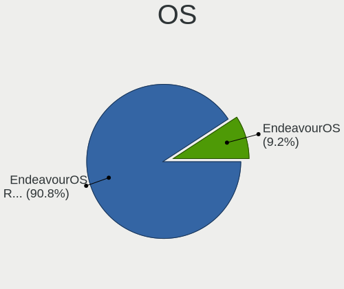
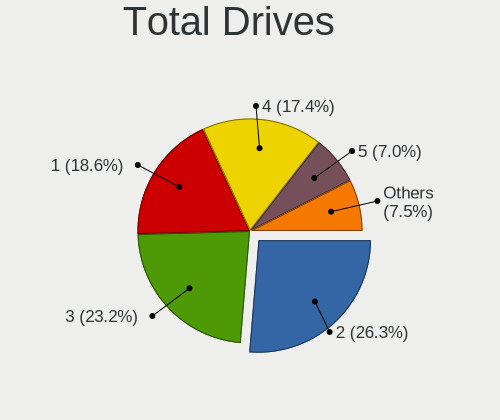
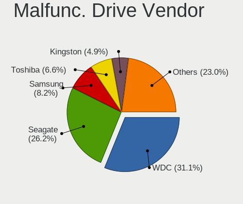
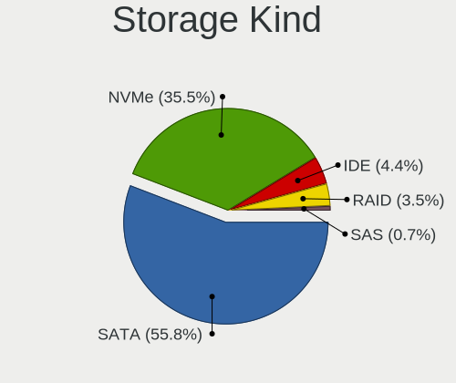
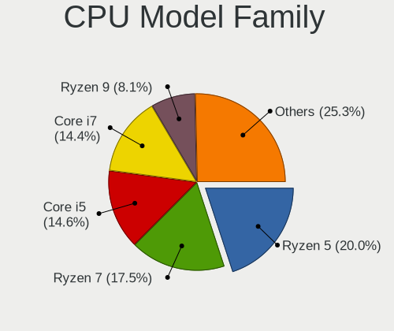
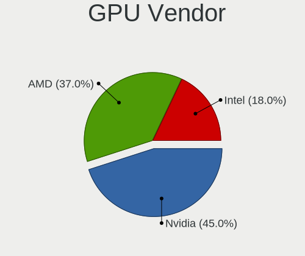
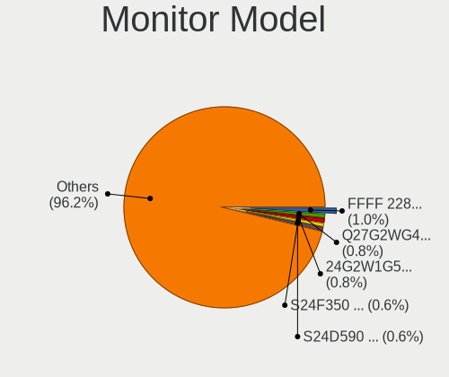
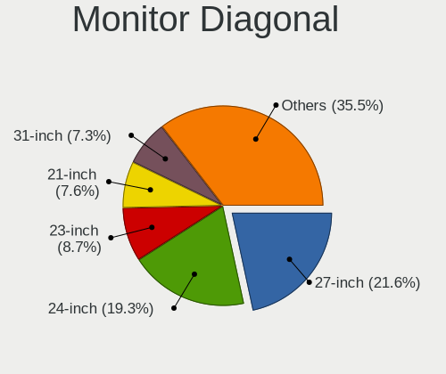
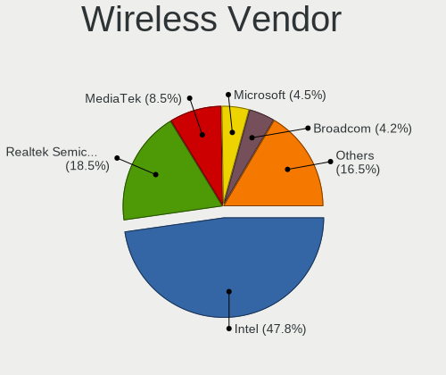
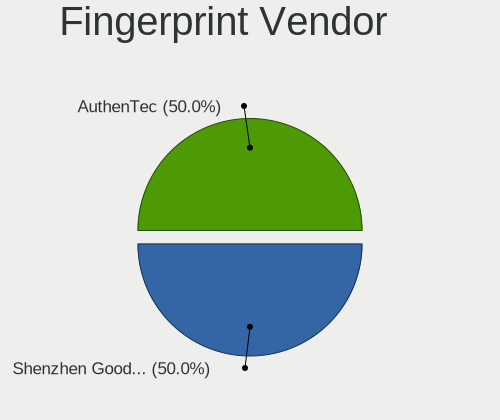

EndeavourOS - Tested Hardware & Statistics (Desktops)
-----------------------------------------------------

A project to collect tested hardware configurations for EndeavourOS.

Anyone can contribute to this report by the [hw-probe](https://github.com/linuxhw/hw-probe) tool:

    sudo -E hw-probe -all -upload

Please contribute! Especially if your hardware is rare.

Contents
--------

* [ Test Cases ](#test-cases)

* [ System ](#system)
  - [ OS                       ](#os)
  - [ OS Family                ](#os-family)
  - [ Kernel                   ](#kernel)
  - [ Kernel Family            ](#kernel-family)
  - [ Kernel Major Ver.        ](#kernel-major-ver)
  - [ Arch                     ](#arch)
  - [ DE                       ](#de)
  - [ Display Server           ](#display-server)
  - [ Display Manager          ](#display-manager)
  - [ OS Lang                  ](#os-lang)
  - [ Boot Mode                ](#boot-mode)
  - [ Filesystem               ](#filesystem)
  - [ Part. scheme             ](#part-scheme)
  - [ Dual Boot with Linux/BSD ](#dual-boot-with-linuxbsd)
  - [ Dual Boot (Win)          ](#dual-boot-win)

* [ Board ](#board)
  - [ Vendor                   ](#vendor)
  - [ Model                    ](#model)
  - [ Model Family             ](#model-family)
  - [ MFG Year                 ](#mfg-year)
  - [ Form Factor              ](#form-factor)
  - [ Secure Boot              ](#secure-boot)
  - [ Coreboot                 ](#coreboot)
  - [ RAM Size                 ](#ram-size)
  - [ RAM Used                 ](#ram-used)
  - [ Total Drives             ](#total-drives)
  - [ Has CD-ROM               ](#has-cd-rom)
  - [ Has Ethernet             ](#has-ethernet)
  - [ Has WiFi                 ](#has-wifi)
  - [ Has Bluetooth            ](#has-bluetooth)

* [ Location ](#location)
  - [ Country                  ](#country)
  - [ City                     ](#city)

* [ Drives ](#drives)
  - [ Drive Vendor             ](#drive-vendor)
  - [ Drive Model              ](#drive-model)
  - [ HDD Vendor               ](#hdd-vendor)
  - [ SSD Vendor               ](#ssd-vendor)
  - [ Drive Kind               ](#drive-kind)
  - [ Drive Connector          ](#drive-connector)
  - [ Drive Size               ](#drive-size)
  - [ Space Total              ](#space-total)
  - [ Space Used               ](#space-used)
  - [ Malfunc. Drives          ](#malfunc-drives)
  - [ Malfunc. Drive Vendor    ](#malfunc-drive-vendor)
  - [ Malfunc. HDD Vendor      ](#malfunc-hdd-vendor)
  - [ Malfunc. Drive Kind      ](#malfunc-drive-kind)
  - [ Failed Drives            ](#failed-drives)
  - [ Failed Drive Vendor      ](#failed-drive-vendor)
  - [ Drive Status             ](#drive-status)

* [ Storage controller ](#storage-controller)
  - [ Storage Vendor           ](#storage-vendor)
  - [ Storage Model            ](#storage-model)
  - [ Storage Kind             ](#storage-kind)

* [ Processor ](#processor)
  - [ CPU Vendor               ](#cpu-vendor)
  - [ CPU Model                ](#cpu-model)
  - [ CPU Model Family         ](#cpu-model-family)
  - [ CPU Cores                ](#cpu-cores)
  - [ CPU Sockets              ](#cpu-sockets)
  - [ CPU Threads              ](#cpu-threads)
  - [ CPU Op-Modes             ](#cpu-op-modes)
  - [ CPU Microcode            ](#cpu-microcode)
  - [ CPU Microarch            ](#cpu-microarch)

* [ Graphics ](#graphics)
  - [ GPU Vendor               ](#gpu-vendor)
  - [ GPU Model                ](#gpu-model)
  - [ GPU Combo                ](#gpu-combo)
  - [ GPU Driver               ](#gpu-driver)
  - [ GPU Memory               ](#gpu-memory)

* [ Monitor ](#monitor)
  - [ Monitor Vendor           ](#monitor-vendor)
  - [ Monitor Model            ](#monitor-model)
  - [ Monitor Resolution       ](#monitor-resolution)
  - [ Monitor Diagonal         ](#monitor-diagonal)
  - [ Monitor Width            ](#monitor-width)
  - [ Aspect Ratio             ](#aspect-ratio)
  - [ Monitor Area             ](#monitor-area)
  - [ Pixel Density            ](#pixel-density)
  - [ Multiple Monitors        ](#multiple-monitors)

* [ Network ](#network)
  - [ Net Controller Vendor    ](#net-controller-vendor)
  - [ Net Controller Model     ](#net-controller-model)
  - [ Wireless Vendor          ](#wireless-vendor)
  - [ Wireless Model           ](#wireless-model)
  - [ Ethernet Vendor          ](#ethernet-vendor)
  - [ Ethernet Model           ](#ethernet-model)
  - [ Net Controller Kind      ](#net-controller-kind)
  - [ Used Controller          ](#used-controller)
  - [ NICs                     ](#nics)
  - [ IPv6                     ](#ipv6)

* [ Bluetooth ](#bluetooth)
  - [ Bluetooth Vendor         ](#bluetooth-vendor)
  - [ Bluetooth Model          ](#bluetooth-model)

* [ Sound ](#sound)
  - [ Sound Vendor             ](#sound-vendor)
  - [ Sound Model              ](#sound-model)

* [ Memory ](#memory)
  - [ Memory Vendor            ](#memory-vendor)
  - [ Memory Model             ](#memory-model)
  - [ Memory Kind              ](#memory-kind)
  - [ Memory Form Factor       ](#memory-form-factor)
  - [ Memory Size              ](#memory-size)
  - [ Memory Speed             ](#memory-speed)

* [ Printers & scanners ](#printers--scanners)
  - [ Printer Vendor           ](#printer-vendor)
  - [ Printer Model            ](#printer-model)
  - [ Scanner Vendor           ](#scanner-vendor)
  - [ Scanner Model            ](#scanner-model)

* [ Camera ](#camera)
  - [ Camera Vendor            ](#camera-vendor)
  - [ Camera Model             ](#camera-model)

* [ Security ](#security)
  - [ Fingerprint Vendor       ](#fingerprint-vendor)
  - [ Fingerprint Model        ](#fingerprint-model)
  - [ Chipcard Vendor          ](#chipcard-vendor)
  - [ Chipcard Model           ](#chipcard-model)

* [ Unsupported ](#unsupported)
  - [ Unsupported Devices      ](#unsupported-devices)
  - [ Unsupported Device Types ](#unsupported-device-types)

Test Cases
----------

Total: 957

| Vendor        | Model                       | Probe                                                      | Date         |
|---------------|-----------------------------|------------------------------------------------------------|--------------|
| MSI           | MAG B550M MORTAR MAX WIF... | [f7c8a6c602](https://linux-hardware.org/?probe=f7c8a6c602) | Jan 05, 2025 |
| MSI           | A520M-A PRO                 | [89075d3dce](https://linux-hardware.org/?probe=89075d3dce) | Jan 03, 2025 |
| Lenovo        | SHARKBAY SDK0J40705 WIN ... | [39187b7cd2](https://linux-hardware.org/?probe=39187b7cd2) | Jan 03, 2025 |
| GEEKOM        | A7                          | [cc9ea8ad98](https://linux-hardware.org/?probe=cc9ea8ad98) | Jan 03, 2025 |
| MSI           | MPG Z490 GAMING EDGE WIF... | [88e26cdf08](https://linux-hardware.org/?probe=88e26cdf08) | Jan 02, 2025 |
| MSI           | MAG B650 TOMAHAWK WIFI      | [f3b82ea58b](https://linux-hardware.org/?probe=f3b82ea58b) | Jan 01, 2025 |
| Huanan        | X99-F8 GAMING V5.0          | [e1be4649fa](https://linux-hardware.org/?probe=e1be4649fa) | Dec 29, 2024 |
| GEEKOM        | A7                          | [d9be822a41](https://linux-hardware.org/?probe=d9be822a41) | Dec 28, 2024 |
| Gigabyte      | B550M DS3H                  | [01c866bd0e](https://linux-hardware.org/?probe=01c866bd0e) | Dec 21, 2024 |
| HP            | 3397                        | [624eec907f](https://linux-hardware.org/?probe=624eec907f) | Dec 20, 2024 |
| Dell          | 014GRG A00                  | [a68144eb72](https://linux-hardware.org/?probe=a68144eb72) | Dec 17, 2024 |
| MSI           | B450M MORTAR MAX            | [9ec24ce9ab](https://linux-hardware.org/?probe=9ec24ce9ab) | Dec 14, 2024 |
| MSI           | PRO B550M-VC WIFI           | [e874d8c2e3](https://linux-hardware.org/?probe=e874d8c2e3) | Dec 14, 2024 |
| Gigabyte      | B550 VISION D-P             | [21682474e3](https://linux-hardware.org/?probe=21682474e3) | Dec 12, 2024 |
| ASUSTek       | M4A785-M                    | [f39d1f9a14](https://linux-hardware.org/?probe=f39d1f9a14) | Dec 09, 2024 |
| AZW           | MINI S                      | [a193c5ec9c](https://linux-hardware.org/?probe=a193c5ec9c) | Dec 06, 2024 |
| AZW           | MINI S                      | [533e08a91e](https://linux-hardware.org/?probe=533e08a91e) | Dec 05, 2024 |
| ASUSTek       | TUF Gaming X570-PLUS        | [7e0582c034](https://linux-hardware.org/?probe=7e0582c034) | Dec 02, 2024 |
| ASRock        | A520M-HDV                   | [b29fed8a2b](https://linux-hardware.org/?probe=b29fed8a2b) | Nov 30, 2024 |
| Dell          | 0NW6H5 A00                  | [d2acba356a](https://linux-hardware.org/?probe=d2acba356a) | Nov 30, 2024 |
| ASUSTek       | ROG STRIX X570-E GAMING ... | [7e55f87677](https://linux-hardware.org/?probe=7e55f87677) | Nov 29, 2024 |
| Dell          | 014GRG A00                  | [9f1d4366ae](https://linux-hardware.org/?probe=9f1d4366ae) | Nov 29, 2024 |
| Gigabyte      | B550M AORUS ELITE           | [1c69901961](https://linux-hardware.org/?probe=1c69901961) | Nov 28, 2024 |
| ASUSTek       | M4A785-M                    | [737ff3d411](https://linux-hardware.org/?probe=737ff3d411) | Nov 28, 2024 |
| ASRock        | B650I Lightning WiFi        | [8fb4e1f11a](https://linux-hardware.org/?probe=8fb4e1f11a) | Nov 28, 2024 |
| MSI           | MPG Z390I GAMING EDGE AC    | [a931a49052](https://linux-hardware.org/?probe=a931a49052) | Nov 25, 2024 |
| ASRock        | B550M-HDV/AR                | [bea5bb0acc](https://linux-hardware.org/?probe=bea5bb0acc) | Nov 24, 2024 |
| MSI           | MPG X570 GAMING EDGE WIF... | [3a27b7af40](https://linux-hardware.org/?probe=3a27b7af40) | Nov 22, 2024 |
| Lenovo        | 3768 NO DPK                 | [853c2e946f](https://linux-hardware.org/?probe=853c2e946f) | Nov 21, 2024 |
| Unknown       | adnbsc01                    | [c1941e3d3c](https://linux-hardware.org/?probe=c1941e3d3c) | Nov 21, 2024 |
| HP            | 0B4Ch D                     | [a86441a182](https://linux-hardware.org/?probe=a86441a182) | Nov 20, 2024 |
| MSI           | MAG X570S TOMAHAWK MAX W... | [ac01b2a1d7](https://linux-hardware.org/?probe=ac01b2a1d7) | Nov 19, 2024 |
| Dell          | 014GRG A00                  | [1d7c479df7](https://linux-hardware.org/?probe=1d7c479df7) | Nov 19, 2024 |
| ASUSTek       | P8Z77-V LX                  | [803d07cb2b](https://linux-hardware.org/?probe=803d07cb2b) | Nov 18, 2024 |
| Gigabyte      | P67A-UD3-B3                 | [53d0e13e6d](https://linux-hardware.org/?probe=53d0e13e6d) | Nov 17, 2024 |
| MSI           | X470 GAMING PLUS MAX        | [325fe4ca32](https://linux-hardware.org/?probe=325fe4ca32) | Nov 17, 2024 |
| ASUSTek       | PRIME Z270-K                | [5812ed00f3](https://linux-hardware.org/?probe=5812ed00f3) | Nov 17, 2024 |
| MSI           | B560M PRO-VDH WIFI          | [4fe8b8ac1d](https://linux-hardware.org/?probe=4fe8b8ac1d) | Nov 16, 2024 |
| Gigabyte      | Z97X-Gaming 5               | [e55e051692](https://linux-hardware.org/?probe=e55e051692) | Nov 15, 2024 |
| MSI           | B450M-A PRO MAX             | [4bbab9f1b9](https://linux-hardware.org/?probe=4bbab9f1b9) | Nov 14, 2024 |
| HP            | 18E4                        | [f92165bb21](https://linux-hardware.org/?probe=f92165bb21) | Nov 14, 2024 |
| Gigabyte      | B650 AORUS ELITE AX V2      | [701e086dc6](https://linux-hardware.org/?probe=701e086dc6) | Nov 14, 2024 |
| ASRock        | X570 Phantom Gaming 4       | [eeaf3d5f73](https://linux-hardware.org/?probe=eeaf3d5f73) | Nov 13, 2024 |
| Gigabyte      | Z170MX-Gaming 5             | [8a47e4af0e](https://linux-hardware.org/?probe=8a47e4af0e) | Nov 10, 2024 |
| ASUSTek       | TUF Gaming B550M-PLUS       | [e46bef6af4](https://linux-hardware.org/?probe=e46bef6af4) | Nov 10, 2024 |
| Dell          | 014GRG A00                  | [3bf779ef79](https://linux-hardware.org/?probe=3bf779ef79) | Nov 10, 2024 |
| MSI           | MPG X570 GAMING EDGE WIF... | [14b9181db0](https://linux-hardware.org/?probe=14b9181db0) | Nov 09, 2024 |
| ASRock        | B550M Pro4                  | [d83cc9503a](https://linux-hardware.org/?probe=d83cc9503a) | Nov 09, 2024 |
| MSI           | 760GM-P23                   | [2729dc6c3e](https://linux-hardware.org/?probe=2729dc6c3e) | Nov 08, 2024 |
| HP            | 18E4                        | [f25610c188](https://linux-hardware.org/?probe=f25610c188) | Nov 07, 2024 |
| HP            | 8298                        | [ff6e607a99](https://linux-hardware.org/?probe=ff6e607a99) | Nov 05, 2024 |
| Acer          | Aspire M3420                | [fcaec1aa5d](https://linux-hardware.org/?probe=fcaec1aa5d) | Nov 04, 2024 |
| Huanan        | H81 V2.1                    | [c2ea66a759](https://linux-hardware.org/?probe=c2ea66a759) | Nov 03, 2024 |
| ASUSTek       | TUF Gaming X570-PLUS        | [c5506f592b](https://linux-hardware.org/?probe=c5506f592b) | Nov 02, 2024 |
| ASUSTek       | ROG CROSSHAIR X870E HERO    | [623459de8f](https://linux-hardware.org/?probe=623459de8f) | Nov 02, 2024 |
| ASRock        | B450 Gaming-ITX/ac          | [3139696c49](https://linux-hardware.org/?probe=3139696c49) | Nov 01, 2024 |
| ASUSTek       | TUF Gaming X570-PLUS        | [348a37f351](https://linux-hardware.org/?probe=348a37f351) | Nov 01, 2024 |
| MSI           | MAG B650M MORTAR WIFI       | [8c96dadaba](https://linux-hardware.org/?probe=8c96dadaba) | Oct 30, 2024 |
| ASRock        | B450M Pro4                  | [51a760c162](https://linux-hardware.org/?probe=51a760c162) | Oct 30, 2024 |
| Gigabyte      | H61M-DS2                    | [689b826b4c](https://linux-hardware.org/?probe=689b826b4c) | Oct 29, 2024 |
| Gigabyte      | B460M DS3H                  | [929c2648b4](https://linux-hardware.org/?probe=929c2648b4) | Oct 28, 2024 |
| ASRock        | B75 Pro3-M                  | [cfd685d227](https://linux-hardware.org/?probe=cfd685d227) | Oct 26, 2024 |
| HP            | 212B                        | [6369ec6e2a](https://linux-hardware.org/?probe=6369ec6e2a) | Oct 23, 2024 |
| ASRock        | B550M Pro4                  | [b274c1e19f](https://linux-hardware.org/?probe=b274c1e19f) | Oct 23, 2024 |
| ASUSTek       | PRIME X670E-PRO WIFI        | [91a21d18a4](https://linux-hardware.org/?probe=91a21d18a4) | Oct 22, 2024 |
| MSI           | B550-A PRO                  | [f193e74093](https://linux-hardware.org/?probe=f193e74093) | Oct 22, 2024 |
| Dell          | 0J3C2F A00                  | [8e6ea2aea5](https://linux-hardware.org/?probe=8e6ea2aea5) | Oct 20, 2024 |
| BESSTAR Te... | UM700                       | [4adb7c3490](https://linux-hardware.org/?probe=4adb7c3490) | Oct 19, 2024 |
| ASRock        | B650M-HDV/M.2               | [be17e54973](https://linux-hardware.org/?probe=be17e54973) | Oct 19, 2024 |
| MSI           | MAG B550M MORTAR WIFI       | [41cfa72ca8](https://linux-hardware.org/?probe=41cfa72ca8) | Oct 16, 2024 |
| Gigabyte      | 970A-DS3P                   | [fdadda176b](https://linux-hardware.org/?probe=fdadda176b) | Oct 16, 2024 |
| Lenovo        | 3102 SDK0J40697 WIN 3305... | [d8a7c8652a](https://linux-hardware.org/?probe=d8a7c8652a) | Oct 15, 2024 |
| Acer          | Aspire XC-605               | [eb244529f1](https://linux-hardware.org/?probe=eb244529f1) | Oct 15, 2024 |
| ASRock        | B450M Steel Legend          | [b5c565d986](https://linux-hardware.org/?probe=b5c565d986) | Oct 14, 2024 |
| Gigabyte      | B550I AORUS PRO AX          | [03de88019f](https://linux-hardware.org/?probe=03de88019f) | Oct 13, 2024 |
| ASRock        | B650M Pro RS WiFi           | [f84e73f4ac](https://linux-hardware.org/?probe=f84e73f4ac) | Oct 13, 2024 |
| MSI           | MPG X570 GAMING EDGE WIF... | [45e481e85a](https://linux-hardware.org/?probe=45e481e85a) | Oct 13, 2024 |
| ASUSTek       | M4A785-M                    | [b27e6f5028](https://linux-hardware.org/?probe=b27e6f5028) | Oct 12, 2024 |
| ASUSTek       | Rampage IV BLACK EDITION    | [2ec97504aa](https://linux-hardware.org/?probe=2ec97504aa) | Oct 12, 2024 |
| Biostar       | A320MH PRO                  | [7ec9d0a6fb](https://linux-hardware.org/?probe=7ec9d0a6fb) | Oct 11, 2024 |
| HP            | 18E4                        | [aba6068d59](https://linux-hardware.org/?probe=aba6068d59) | Oct 09, 2024 |
| Acer          | Aspire XC-605               | [a964210bf4](https://linux-hardware.org/?probe=a964210bf4) | Oct 08, 2024 |
| ASRock        | H310M-HDV                   | [b20cb44166](https://linux-hardware.org/?probe=b20cb44166) | Oct 08, 2024 |
| ASUSTek       | ROG STRIX Z390-F GAMING     | [9637b6cfad](https://linux-hardware.org/?probe=9637b6cfad) | Oct 02, 2024 |
| MSI           | MAG B650 TOMAHAWK WIFI      | [9bea800fea](https://linux-hardware.org/?probe=9bea800fea) | Oct 02, 2024 |
| MSI           | MPG Z390 GAMING EDGE AC     | [35eab42f7a](https://linux-hardware.org/?probe=35eab42f7a) | Oct 01, 2024 |
| MSI           | PRO B650M-B                 | [e2d4b7be2a](https://linux-hardware.org/?probe=e2d4b7be2a) | Oct 01, 2024 |
| ASRock        | B650M Pro RS WiFi           | [ec24629761](https://linux-hardware.org/?probe=ec24629761) | Sep 29, 2024 |
| HP            | 1998                        | [66cfdcc9ec](https://linux-hardware.org/?probe=66cfdcc9ec) | Sep 27, 2024 |
| Gigabyte      | X570 AORUS ELITE            | [fe92dee5b5](https://linux-hardware.org/?probe=fe92dee5b5) | Sep 25, 2024 |
| ASRock        | FM2A78M-HD+                 | [4376e816bd](https://linux-hardware.org/?probe=4376e816bd) | Sep 25, 2024 |
| ASRock        | B650M Pro RS WiFi           | [ba4fb8fc09](https://linux-hardware.org/?probe=ba4fb8fc09) | Sep 22, 2024 |
| Gigabyte      | Z390 AORUS PRO-CF           | [13a5f9277f](https://linux-hardware.org/?probe=13a5f9277f) | Sep 21, 2024 |
| Gigabyte      | Z390 AORUS PRO-CF           | [456f1a48d7](https://linux-hardware.org/?probe=456f1a48d7) | Sep 21, 2024 |
| ASRock        | B550M Steel Legend          | [727980ce56](https://linux-hardware.org/?probe=727980ce56) | Sep 19, 2024 |
| Dell          | 018D1Y A00                  | [a1f2dfcebf](https://linux-hardware.org/?probe=a1f2dfcebf) | Sep 18, 2024 |
| Medion        | MS-7800                     | [c1e96ba793](https://linux-hardware.org/?probe=c1e96ba793) | Sep 18, 2024 |
| HP            | 18E4                        | [9776d5aa4a](https://linux-hardware.org/?probe=9776d5aa4a) | Sep 18, 2024 |
| MSI           | B650 GAMING PLUS WIFI       | [4cc12cc658](https://linux-hardware.org/?probe=4cc12cc658) | Sep 16, 2024 |
| HP            | 1589                        | [3db889216b](https://linux-hardware.org/?probe=3db889216b) | Sep 15, 2024 |
| MSI           | X299 GAMING PRO CARBON      | [7a599068c6](https://linux-hardware.org/?probe=7a599068c6) | Sep 13, 2024 |
| ASRock        | B650 LiveMixer              | [b1f81df5c0](https://linux-hardware.org/?probe=b1f81df5c0) | Sep 13, 2024 |
| ASUSTek       | H170M-PLUS                  | [f7d4189909](https://linux-hardware.org/?probe=f7d4189909) | Sep 11, 2024 |
| Acer          | Aspire XC-605               | [95fc647266](https://linux-hardware.org/?probe=95fc647266) | Sep 11, 2024 |
| ASUSTek       | M4A78T-E                    | [934065b321](https://linux-hardware.org/?probe=934065b321) | Sep 09, 2024 |
| ASUSTek       | PRIME B650-PLUS             | [f06e818a57](https://linux-hardware.org/?probe=f06e818a57) | Sep 08, 2024 |
| Dell          | 02YYK5 A01                  | [9f186cbc12](https://linux-hardware.org/?probe=9f186cbc12) | Sep 08, 2024 |
| Gigabyte      | B650M AORUS ELITE AX        | [2ff077e477](https://linux-hardware.org/?probe=2ff077e477) | Sep 08, 2024 |
| MSI           | B450 TOMAHAWK MAX           | [3af340eed6](https://linux-hardware.org/?probe=3af340eed6) | Sep 07, 2024 |
| Gigabyte      | B550M DS3H                  | [f230dbe57b](https://linux-hardware.org/?probe=f230dbe57b) | Sep 07, 2024 |
| MSI           | PRO Z690-A DDR4             | [a903eb8d21](https://linux-hardware.org/?probe=a903eb8d21) | Sep 06, 2024 |
| Gigabyte      | 970A-DS3P                   | [4ab0f3a779](https://linux-hardware.org/?probe=4ab0f3a779) | Sep 06, 2024 |
| Win elemen... | M600                        | [c919e1cf58](https://linux-hardware.org/?probe=c919e1cf58) | Sep 05, 2024 |
| Win elemen... | M600                        | [49c3779835](https://linux-hardware.org/?probe=49c3779835) | Sep 05, 2024 |
| Acer          | Aspire XC-605               | [ebdeb3cda2](https://linux-hardware.org/?probe=ebdeb3cda2) | Sep 03, 2024 |
| HP            | 18E4                        | [cfd0218d87](https://linux-hardware.org/?probe=cfd0218d87) | Sep 03, 2024 |
| Google        | Teemo                       | [c1a3ad519d](https://linux-hardware.org/?probe=c1a3ad519d) | Aug 31, 2024 |
| ASUSTek       | TUF Gaming B550-PLUS        | [664fb0bf5c](https://linux-hardware.org/?probe=664fb0bf5c) | Aug 30, 2024 |
| MSI           | X299 GAMING PRO CARBON      | [b06f182483](https://linux-hardware.org/?probe=b06f182483) | Aug 30, 2024 |
| Dell          | 08NPPY A00                  | [73d12bedde](https://linux-hardware.org/?probe=73d12bedde) | Aug 29, 2024 |
| MSI           | MAG B650 TOMAHAWK WIFI      | [4bfb11dedc](https://linux-hardware.org/?probe=4bfb11dedc) | Aug 29, 2024 |
| MSI           | PRO B550M-VC WIFI           | [86652e28dc](https://linux-hardware.org/?probe=86652e28dc) | Aug 29, 2024 |
| ASUSTek       | PRIME Z690M-PLUS D4         | [f8a3607bca](https://linux-hardware.org/?probe=f8a3607bca) | Aug 28, 2024 |
| Gigabyte      | Z790 GAMING X AX            | [1ea143160c](https://linux-hardware.org/?probe=1ea143160c) | Aug 28, 2024 |
| Lenovo        | 32CB SDK0T76530 WIN 3556... | [5096c46f27](https://linux-hardware.org/?probe=5096c46f27) | Aug 26, 2024 |
| MSI           | B450 GAMING PLUS MAX        | [95dd6fefb6](https://linux-hardware.org/?probe=95dd6fefb6) | Aug 26, 2024 |
| Gigabyte      | Z790 GAMING X AX            | [fe3e647c59](https://linux-hardware.org/?probe=fe3e647c59) | Aug 25, 2024 |
| Gigabyte      | A320M-S2H-CF                | [a89f07f3eb](https://linux-hardware.org/?probe=a89f07f3eb) | Aug 24, 2024 |
| Dell          | 00V62H A00                  | [cbe8fe6bd7](https://linux-hardware.org/?probe=cbe8fe6bd7) | Aug 23, 2024 |
| Gigabyte      | B550M K                     | [5109fb6fa3](https://linux-hardware.org/?probe=5109fb6fa3) | Aug 22, 2024 |
| ASRock        | B450M Pro4                  | [855f97ce2a](https://linux-hardware.org/?probe=855f97ce2a) | Aug 22, 2024 |
| MSI           | B550-A PRO                  | [f364a0d615](https://linux-hardware.org/?probe=f364a0d615) | Aug 19, 2024 |
| ASRock        | B450M Pro4                  | [e9c182ce84](https://linux-hardware.org/?probe=e9c182ce84) | Aug 19, 2024 |
| Gigabyte      | X670 AORUS ELITE AX         | [69a7b8cff5](https://linux-hardware.org/?probe=69a7b8cff5) | Aug 19, 2024 |
| HP            | 18E4                        | [ea4ccb8656](https://linux-hardware.org/?probe=ea4ccb8656) | Aug 18, 2024 |
| Lenovo        | SHARKBAY NOK                | [e1547539b5](https://linux-hardware.org/?probe=e1547539b5) | Aug 18, 2024 |
| Acer          | Aspire XC-605               | [c8b697f0fe](https://linux-hardware.org/?probe=c8b697f0fe) | Aug 16, 2024 |
| MSI           | MAG X570 TOMAHAWK WIFI      | [94ac123c1d](https://linux-hardware.org/?probe=94ac123c1d) | Aug 12, 2024 |
| Acer          | Aspire XC-605               | [cf5cce2c3b](https://linux-hardware.org/?probe=cf5cce2c3b) | Aug 12, 2024 |
| Lenovo        | SHARKBAY NOK                | [252c8e2141](https://linux-hardware.org/?probe=252c8e2141) | Aug 12, 2024 |
| Lenovo        | SHARKBAY NOK                | [ffa9a817fa](https://linux-hardware.org/?probe=ffa9a817fa) | Aug 12, 2024 |
| MSI           | MPG Z590 GAMING CARBON W... | [f3441e7e7d](https://linux-hardware.org/?probe=f3441e7e7d) | Aug 11, 2024 |
| ASRock        | N68C-S UCC                  | [b3529de081](https://linux-hardware.org/?probe=b3529de081) | Aug 11, 2024 |
| MSI           | Z87-G41 PC Mate             | [8f5394ac30](https://linux-hardware.org/?probe=8f5394ac30) | Aug 11, 2024 |
| HP            | 18E4                        | [9517b72bdb](https://linux-hardware.org/?probe=9517b72bdb) | Aug 08, 2024 |
| Gigabyte      | AB350-Gaming 3-CF           | [94a925a890](https://linux-hardware.org/?probe=94a925a890) | Aug 07, 2024 |
| Gigabyte      | X570 AORUS ULTRA            | [f4ee436ce3](https://linux-hardware.org/?probe=f4ee436ce3) | Aug 06, 2024 |
| ASUSTek       | PRIME X670E-PRO WIFI        | [b142fe5011](https://linux-hardware.org/?probe=b142fe5011) | Aug 04, 2024 |
| ASUSTek       | ROG STRIX B550-F GAMING     | [5fa9b544f6](https://linux-hardware.org/?probe=5fa9b544f6) | Aug 04, 2024 |
| ASUSTek       | PRIME B550M-A               | [f44d3a410b](https://linux-hardware.org/?probe=f44d3a410b) | Aug 03, 2024 |
| ASUSTek       | PRIME X670E-PRO WIFI        | [ca761ed6b1](https://linux-hardware.org/?probe=ca761ed6b1) | Aug 02, 2024 |
| MSI           | B550-A PRO                  | [7ba698a628](https://linux-hardware.org/?probe=7ba698a628) | Aug 02, 2024 |
| Gigabyte      | Z490 VISION D               | [b3afd0b55b](https://linux-hardware.org/?probe=b3afd0b55b) | Aug 01, 2024 |
| ASUSTek       | PRIME Z490-A                | [52bf2e16ad](https://linux-hardware.org/?probe=52bf2e16ad) | Aug 01, 2024 |
| MSI           | B85M-E45                    | [0b7dfbd363](https://linux-hardware.org/?probe=0b7dfbd363) | Jul 29, 2024 |
| ASUSTek       | PRIME A320M-K               | [861b1da144](https://linux-hardware.org/?probe=861b1da144) | Jul 28, 2024 |
| Gigabyte      | X570 AORUS PRO WIFI         | [3c706bb452](https://linux-hardware.org/?probe=3c706bb452) | Jul 25, 2024 |
| ASRock        | H170M Pro4                  | [6cc1de4761](https://linux-hardware.org/?probe=6cc1de4761) | Jul 25, 2024 |
| Acer          | Aspire M3420                | [a71b59f797](https://linux-hardware.org/?probe=a71b59f797) | Jul 21, 2024 |
| ASUSTek       | PRIME H510M-A               | [2777674e71](https://linux-hardware.org/?probe=2777674e71) | Jul 21, 2024 |
| MSI           | MAG X570 TOMAHAWK WIFI      | [60e3b62d8e](https://linux-hardware.org/?probe=60e3b62d8e) | Jul 20, 2024 |
| MSI           | X470 GAMING PLUS            | [d055f66e73](https://linux-hardware.org/?probe=d055f66e73) | Jul 18, 2024 |
| ASUSTek       | PRIME B550M-A               | [c6bf3313ac](https://linux-hardware.org/?probe=c6bf3313ac) | Jul 17, 2024 |
| MSI           | B560M BOMBER                | [e3bca7b6c9](https://linux-hardware.org/?probe=e3bca7b6c9) | Jul 17, 2024 |
| Acer          | Aspire XC-605               | [0999261f4e](https://linux-hardware.org/?probe=0999261f4e) | Jul 16, 2024 |
| Gigabyte      | X570 AORUS ELITE WIFI       | [3521962d3c](https://linux-hardware.org/?probe=3521962d3c) | Jul 15, 2024 |
| MSI           | B85M-E45                    | [a8fab1c7ba](https://linux-hardware.org/?probe=a8fab1c7ba) | Jul 15, 2024 |
| ASUSTek       | PRIME H510M-A               | [4e22a1dd53](https://linux-hardware.org/?probe=4e22a1dd53) | Jul 15, 2024 |
| Gigabyte      | B550M AORUS PRO-P           | [04a5d0caff](https://linux-hardware.org/?probe=04a5d0caff) | Jul 14, 2024 |
| MSI           | MPG X570 GAMING PRO CARB... | [2f91ba2337](https://linux-hardware.org/?probe=2f91ba2337) | Jul 14, 2024 |
| ASUSTek       | ROG STRIX B450-F GAMING     | [6330f5f7b8](https://linux-hardware.org/?probe=6330f5f7b8) | Jul 14, 2024 |
| Intel         | DQ57TM AAE70931-402         | [3bcf3ce8b6](https://linux-hardware.org/?probe=3bcf3ce8b6) | Jul 13, 2024 |
| HP            | 18E4                        | [06c1b94fc6](https://linux-hardware.org/?probe=06c1b94fc6) | Jul 10, 2024 |
| AZW           | SER V1                      | [a7d37679b5](https://linux-hardware.org/?probe=a7d37679b5) | Jul 09, 2024 |
| ASUSTek       | TUF Gaming B650-PLUS WIF... | [8a9f0eadaf](https://linux-hardware.org/?probe=8a9f0eadaf) | Jul 06, 2024 |
| ASUSTek       | TUF Gaming X570-PLUS        | [4a8baf600b](https://linux-hardware.org/?probe=4a8baf600b) | Jul 05, 2024 |
| Gigabyte      | AB350-Gaming-CF             | [a72308c7e1](https://linux-hardware.org/?probe=a72308c7e1) | Jul 01, 2024 |
| Dell          | 09KPNV A01                  | [97d504f9d1](https://linux-hardware.org/?probe=97d504f9d1) | Jul 01, 2024 |
| Gigabyte      | X570 AORUS ELITE WIFI       | [8fbb67e632](https://linux-hardware.org/?probe=8fbb67e632) | Jun 28, 2024 |
| MSI           | MAG B550 TOMAHAWK           | [fb71d0793b](https://linux-hardware.org/?probe=fb71d0793b) | Jun 28, 2024 |
| ASUSTek       | PRIME X570-P                | [56c6fbbd6f](https://linux-hardware.org/?probe=56c6fbbd6f) | Jun 28, 2024 |
| HP            | 18E4                        | [7d01b714e6](https://linux-hardware.org/?probe=7d01b714e6) | Jun 25, 2024 |
| Foxconn       | 2ABF                        | [5d8cab03a9](https://linux-hardware.org/?probe=5d8cab03a9) | Jun 23, 2024 |
| MSI           | MAG B550 TOMAHAWK           | [30e1010723](https://linux-hardware.org/?probe=30e1010723) | Jun 20, 2024 |
| ASUSTek       | VM62                        | [98d599f76e](https://linux-hardware.org/?probe=98d599f76e) | Jun 20, 2024 |
| ASUSTek       | Z170-A                      | [183a029a81](https://linux-hardware.org/?probe=183a029a81) | Jun 18, 2024 |
| Gigabyte      | Z270-Gaming 3               | [57218bf21e](https://linux-hardware.org/?probe=57218bf21e) | Jun 18, 2024 |
| Gigabyte      | Z390 AORUS PRO-CF           | [92651b7bcb](https://linux-hardware.org/?probe=92651b7bcb) | Jun 15, 2024 |
| ASRock        | Z590 Phantom Gaming 4       | [d9f4927a1a](https://linux-hardware.org/?probe=d9f4927a1a) | Jun 15, 2024 |
| HP            | 3397                        | [0234ce0498](https://linux-hardware.org/?probe=0234ce0498) | Jun 14, 2024 |
| ASUSTek       | ROG STRIX B660-F GAMING ... | [3832c9f478](https://linux-hardware.org/?probe=3832c9f478) | Jun 14, 2024 |
| ASUSTek       | PRIME B550M-A               | [1877c173ae](https://linux-hardware.org/?probe=1877c173ae) | Jun 13, 2024 |
| ASUSTek       | TUF Gaming B550M-E WIFI     | [1fdc5d83ed](https://linux-hardware.org/?probe=1fdc5d83ed) | Jun 13, 2024 |
| Gigabyte      | B550 AORUS PRO AX           | [efba37c03f](https://linux-hardware.org/?probe=efba37c03f) | Jun 11, 2024 |
| Gigabyte      | Z390 DESIGNARE-CF           | [b6260ad0fc](https://linux-hardware.org/?probe=b6260ad0fc) | Jun 10, 2024 |
| ASUSTek       | TUF Gaming X570-PLUS        | [bbc1b63db8](https://linux-hardware.org/?probe=bbc1b63db8) | Jun 10, 2024 |
| ASUSTek       | ROG STRIX B450-F GAMING     | [82b1c95e79](https://linux-hardware.org/?probe=82b1c95e79) | Jun 09, 2024 |
| Apple         | Mac-F60DEB81FF30ACF6 Mac... | [fe179805ee](https://linux-hardware.org/?probe=fe179805ee) | Jun 09, 2024 |
| MSI           | PRO Z790-P WIFI             | [ef7b5e6d81](https://linux-hardware.org/?probe=ef7b5e6d81) | Jun 08, 2024 |
| MSI           | MPG B550 GAMING PLUS        | [00b5786246](https://linux-hardware.org/?probe=00b5786246) | Jun 08, 2024 |
| HP            | 18E4                        | [2de7534b5a](https://linux-hardware.org/?probe=2de7534b5a) | Jun 07, 2024 |
| Gigabyte      | Z390 DESIGNARE-CF           | [bea691795f](https://linux-hardware.org/?probe=bea691795f) | Jun 05, 2024 |
| ASUSTek       | PRIME Z790-A WIFI           | [b2f29f5cb7](https://linux-hardware.org/?probe=b2f29f5cb7) | Jun 04, 2024 |
| MSI           | MAG X570 TOMAHAWK WIFI      | [86d8db63a6](https://linux-hardware.org/?probe=86d8db63a6) | Jun 03, 2024 |
| ASRock        | X470 Gaming K4              | [e35ba417c8](https://linux-hardware.org/?probe=e35ba417c8) | Jun 02, 2024 |
| MSI           | PRO H410M-B                 | [b920153cc7](https://linux-hardware.org/?probe=b920153cc7) | Jun 02, 2024 |
| ASUSTek       | PRIME B550M-A               | [743e1de387](https://linux-hardware.org/?probe=743e1de387) | Jun 02, 2024 |
| ASUSTek       | ROG CROSSHAIR VIII DARK ... | [92033edd0d](https://linux-hardware.org/?probe=92033edd0d) | Jun 02, 2024 |
| Dell          | 05GD68 A00                  | [fd1a8edda4](https://linux-hardware.org/?probe=fd1a8edda4) | Jun 02, 2024 |
| GEEKOM        | Mini IT13                   | [3812c490f6](https://linux-hardware.org/?probe=3812c490f6) | Jun 01, 2024 |
| MSI           | Z370-A PRO                  | [25e41253a7](https://linux-hardware.org/?probe=25e41253a7) | May 31, 2024 |
| ASUSTek       | PRIME B560-PLUS             | [70ee11a840](https://linux-hardware.org/?probe=70ee11a840) | May 29, 2024 |
| MSI           | MPG Z390 GAMING PLUS        | [ac5d409e60](https://linux-hardware.org/?probe=ac5d409e60) | May 28, 2024 |
| MACHINIST     | E5-V2.82H V1.0              | [5d2991a10f](https://linux-hardware.org/?probe=5d2991a10f) | May 28, 2024 |
| ASRock        | B450M Pro4                  | [9d6f9a18c1](https://linux-hardware.org/?probe=9d6f9a18c1) | May 25, 2024 |
| ASUSTek       | PRIME B450-PLUS             | [b8700b7441](https://linux-hardware.org/?probe=b8700b7441) | May 24, 2024 |
| MSI           | B550-A PRO                  | [d04025e7cd](https://linux-hardware.org/?probe=d04025e7cd) | May 20, 2024 |
| ASUSTek       | PRIME B450-PLUS             | [5556bb1933](https://linux-hardware.org/?probe=5556bb1933) | May 20, 2024 |
| ASRock        | AB350 Pro4                  | [1a597ea65e](https://linux-hardware.org/?probe=1a597ea65e) | May 14, 2024 |
| ASRock        | X570 Taichi Razer Editio... | [f95ceb1a33](https://linux-hardware.org/?probe=f95ceb1a33) | May 13, 2024 |
| ASUSTek       | TUF Gaming A620M-PLUS WI... | [0fdd6d8d04](https://linux-hardware.org/?probe=0fdd6d8d04) | May 12, 2024 |
| MSI           | MPG B550 GAMING PLUS        | [f10e80787e](https://linux-hardware.org/?probe=f10e80787e) | May 12, 2024 |
| ASUSTek       | PRIME B360M-A               | [e08c31b9e2](https://linux-hardware.org/?probe=e08c31b9e2) | May 11, 2024 |
| ASUSTek       | PRIME Z590-A                | [a4ca86bd58](https://linux-hardware.org/?probe=a4ca86bd58) | May 11, 2024 |
| Dell          | 0VHWTR A01                  | [bac52cd94f](https://linux-hardware.org/?probe=bac52cd94f) | May 10, 2024 |
| Huanan        | X58 V1.0                    | [f4d5141ce0](https://linux-hardware.org/?probe=f4d5141ce0) | May 07, 2024 |
| ASUSTek       | TUF Gaming X570-PLUS        | [70346cc510](https://linux-hardware.org/?probe=70346cc510) | May 06, 2024 |
| Huanan        | X58 V1.0                    | [c55f67fac2](https://linux-hardware.org/?probe=c55f67fac2) | May 02, 2024 |
| Win elemen... | M600                        | [ed51b3e831](https://linux-hardware.org/?probe=ed51b3e831) | Apr 30, 2024 |
| Gigabyte      | B450M S2H                   | [28ce6a0f2e](https://linux-hardware.org/?probe=28ce6a0f2e) | Apr 29, 2024 |
| Gigabyte      | B450M S2H                   | [f96e09c9e1](https://linux-hardware.org/?probe=f96e09c9e1) | Apr 29, 2024 |
| ASRock        | Z490 Phantom Gaming 4       | [95011d3e78](https://linux-hardware.org/?probe=95011d3e78) | Apr 27, 2024 |
| MSI           | MAG B460M MORTAR            | [eaf2da7d85](https://linux-hardware.org/?probe=eaf2da7d85) | Apr 27, 2024 |
| MSI           | A320M-A PRO MAX             | [253984e9f3](https://linux-hardware.org/?probe=253984e9f3) | Apr 26, 2024 |
| ASUSTek       | PRIME B560M-A               | [886328abc3](https://linux-hardware.org/?probe=886328abc3) | Apr 25, 2024 |
| ASRock        | Z490 Phantom Gaming 4       | [887025a038](https://linux-hardware.org/?probe=887025a038) | Apr 21, 2024 |
| MSI           | PRO B650-P WIFI             | [a9259df109](https://linux-hardware.org/?probe=a9259df109) | Apr 19, 2024 |
| Gigabyte      | B650 GAMING X AX V2         | [bf309bc034](https://linux-hardware.org/?probe=bf309bc034) | Apr 16, 2024 |
| Gigabyte      | B650M GAMING X AX           | [7a62f23317](https://linux-hardware.org/?probe=7a62f23317) | Apr 14, 2024 |
| MSI           | X299 GAMING PRO CARBON      | [3ae56d9b16](https://linux-hardware.org/?probe=3ae56d9b16) | Apr 11, 2024 |
| MSI           | X299 GAMING PRO CARBON      | [cabbba0b48](https://linux-hardware.org/?probe=cabbba0b48) | Apr 10, 2024 |
| MSI           | A520M-A PRO                 | [bd3db073e2](https://linux-hardware.org/?probe=bd3db073e2) | Apr 09, 2024 |
| MSI           | A520M-A PRO                 | [c1bde6f19b](https://linux-hardware.org/?probe=c1bde6f19b) | Apr 09, 2024 |
| Gigabyte      | Z390 AORUS PRO-CF           | [3ef4683b94](https://linux-hardware.org/?probe=3ef4683b94) | Apr 07, 2024 |
| ASUSTek       | PRIME B250M-A               | [455bdd34ef](https://linux-hardware.org/?probe=455bdd34ef) | Apr 07, 2024 |
| ASUSTek       | TUF Gaming B550M-PLUS WI... | [a88186f61b](https://linux-hardware.org/?probe=a88186f61b) | Apr 07, 2024 |
| Gigabyte      | Z390 AORUS PRO-CF           | [5a9432f73b](https://linux-hardware.org/?probe=5a9432f73b) | Apr 06, 2024 |
| Gigabyte      | X570 AORUS PRO              | [e11774a346](https://linux-hardware.org/?probe=e11774a346) | Apr 05, 2024 |
| ASUSTek       | PRIME B450-PLUS             | [a3ff48e7a2](https://linux-hardware.org/?probe=a3ff48e7a2) | Apr 03, 2024 |
| MSI           | X299 GAMING PRO CARBON      | [03b2438836](https://linux-hardware.org/?probe=03b2438836) | Apr 02, 2024 |
| MSI           | X299 GAMING PRO CARBON      | [d39c4c71eb](https://linux-hardware.org/?probe=d39c4c71eb) | Apr 02, 2024 |
| Gigabyte      | Z390 GAMING X-CF            | [9baccdd577](https://linux-hardware.org/?probe=9baccdd577) | Apr 01, 2024 |
| Gigabyte      | B760M DS3H DDR4             | [3197b1f7d7](https://linux-hardware.org/?probe=3197b1f7d7) | Apr 01, 2024 |
| ASUSTek       | TUF Gaming X670E-PLUS WI... | [391458688f](https://linux-hardware.org/?probe=391458688f) | Mar 30, 2024 |
| ASUSTek       | TUF Gaming X670E-PLUS WI... | [d332c9a931](https://linux-hardware.org/?probe=d332c9a931) | Mar 30, 2024 |
| Dell          | 0K3CM7 A00                  | [eee46a93df](https://linux-hardware.org/?probe=eee46a93df) | Mar 29, 2024 |
| ASUSTek       | TUF Gaming B550M-E WIFI     | [8de5850e62](https://linux-hardware.org/?probe=8de5850e62) | Mar 29, 2024 |
| HP            | 18E4                        | [e47f65729a](https://linux-hardware.org/?probe=e47f65729a) | Mar 23, 2024 |
| Fujitsu       | D3222-A1 S26361-D3222-A1    | [c0ac754a59](https://linux-hardware.org/?probe=c0ac754a59) | Mar 23, 2024 |
| ASUSTek       | TUF Gaming Z790-PLUS WIF... | [d5b83394f2](https://linux-hardware.org/?probe=d5b83394f2) | Mar 19, 2024 |
| Gigabyte      | B650M AORUS ELITE AX        | [514b687126](https://linux-hardware.org/?probe=514b687126) | Mar 19, 2024 |
| Gigabyte      | B550I AORUS PRO AX          | [a9c78a7b8e](https://linux-hardware.org/?probe=a9c78a7b8e) | Mar 18, 2024 |
| ASRock        | B550M Steel Legend          | [a1762528fb](https://linux-hardware.org/?probe=a1762528fb) | Mar 17, 2024 |
| Gigabyte      | B450M S2H                   | [afedd5359e](https://linux-hardware.org/?probe=afedd5359e) | Mar 15, 2024 |
| Medion        | D3F3-EM2                    | [84c6998958](https://linux-hardware.org/?probe=84c6998958) | Mar 13, 2024 |
| ASUSTek       | PRIME A320M-K               | [08974481fa](https://linux-hardware.org/?probe=08974481fa) | Mar 13, 2024 |
| Medion        | D3F3-EM2                    | [919075a65c](https://linux-hardware.org/?probe=919075a65c) | Mar 12, 2024 |
| Gigabyte      | X470 AORUS ULTRA GAMING-... | [5e8ed44258](https://linux-hardware.org/?probe=5e8ed44258) | Mar 12, 2024 |
| MSI           | B450M BAZOOKA               | [b394a621cc](https://linux-hardware.org/?probe=b394a621cc) | Mar 08, 2024 |
| Gigabyte      | X570 AORUS ELITE WIFI       | [e61d5e2891](https://linux-hardware.org/?probe=e61d5e2891) | Mar 08, 2024 |
| MSI           | B75MA-E33                   | [ef665444e1](https://linux-hardware.org/?probe=ef665444e1) | Mar 07, 2024 |
| MSI           | MAG B550M MORTAR            | [31da1b6dc5](https://linux-hardware.org/?probe=31da1b6dc5) | Mar 06, 2024 |
| ASUSTek       | Z97M-PLUS/BR                | [1914f7d53a](https://linux-hardware.org/?probe=1914f7d53a) | Mar 05, 2024 |
| ASUSTek       | PRIME Z790-P WIFI           | [c2f4bb4ca1](https://linux-hardware.org/?probe=c2f4bb4ca1) | Mar 02, 2024 |
| ASUSTek       | PRIME A320M-K               | [4fa18e40f9](https://linux-hardware.org/?probe=4fa18e40f9) | Feb 29, 2024 |
| Dell          | 0WN7Y6 A01                  | [61d8f666ac](https://linux-hardware.org/?probe=61d8f666ac) | Feb 28, 2024 |
| ASUSTek       | PRIME B250M-A               | [9755250230](https://linux-hardware.org/?probe=9755250230) | Feb 27, 2024 |
| Gigabyte      | B550 GAMING X V2            | [82cb00dd96](https://linux-hardware.org/?probe=82cb00dd96) | Feb 27, 2024 |
| Dell          | 0VHWTR A01                  | [3606f71943](https://linux-hardware.org/?probe=3606f71943) | Feb 27, 2024 |
| Gigabyte      | B650 AORUS ELITE AX         | [3fb56d2a04](https://linux-hardware.org/?probe=3fb56d2a04) | Feb 25, 2024 |
| Gigabyte      | B550I AORUS PRO AX          | [3ee0f278e6](https://linux-hardware.org/?probe=3ee0f278e6) | Feb 22, 2024 |
| Gigabyte      | B550I AORUS PRO AX          | [9a1eb808e3](https://linux-hardware.org/?probe=9a1eb808e3) | Feb 22, 2024 |
| MSI           | MAG B550 TOMAHAWK           | [5b33fd0eb1](https://linux-hardware.org/?probe=5b33fd0eb1) | Feb 22, 2024 |
| HP            | 3397                        | [f136cefffa](https://linux-hardware.org/?probe=f136cefffa) | Feb 20, 2024 |
| ASUSTek       | ROG Maximus XI HERO         | [9b01704fd0](https://linux-hardware.org/?probe=9b01704fd0) | Feb 19, 2024 |
| Gigabyte      | B650 AORUS ELITE AX         | [c4b499381f](https://linux-hardware.org/?probe=c4b499381f) | Feb 16, 2024 |
| Gigabyte      | B650M GAMING X AX           | [843ade06e7](https://linux-hardware.org/?probe=843ade06e7) | Feb 16, 2024 |
| ASUSTek       | ROG CROSSHAIR VIII DARK ... | [3103ce546a](https://linux-hardware.org/?probe=3103ce546a) | Feb 14, 2024 |
| ASUSTek       | PRIME A320M-K               | [03140aeb75](https://linux-hardware.org/?probe=03140aeb75) | Feb 14, 2024 |
| MSI           | Z97 GAMING 5                | [1ee5263a83](https://linux-hardware.org/?probe=1ee5263a83) | Feb 11, 2024 |
| ASUSTek       | H81M-C                      | [c24c05480d](https://linux-hardware.org/?probe=c24c05480d) | Feb 11, 2024 |
| Gigabyte      | 970A-UD3P                   | [5f96eaea3b](https://linux-hardware.org/?probe=5f96eaea3b) | Feb 08, 2024 |
| MSI           | PRO Z790-A WIFI             | [40206d47e1](https://linux-hardware.org/?probe=40206d47e1) | Feb 07, 2024 |
| ASUSTek       | ROG STRIX B550-F GAMING     | [b026f0eff6](https://linux-hardware.org/?probe=b026f0eff6) | Feb 04, 2024 |
| ASRock        | X670E Pro RS                | [46e2d314c3](https://linux-hardware.org/?probe=46e2d314c3) | Feb 04, 2024 |
| Unknown       | Unknown                     | [c10ba324df](https://linux-hardware.org/?probe=c10ba324df) | Feb 04, 2024 |
| Intel         | DH61HO AAG62445-102         | [f6db94d707](https://linux-hardware.org/?probe=f6db94d707) | Feb 01, 2024 |
| Intel         | DH61HO AAG62445-102         | [4752f66f57](https://linux-hardware.org/?probe=4752f66f57) | Feb 01, 2024 |
| Biostar       | MCP6P3                      | [cbb6a42f28](https://linux-hardware.org/?probe=cbb6a42f28) | Jan 30, 2024 |
| Biostar       | MCP6P3                      | [55f83d7c17](https://linux-hardware.org/?probe=55f83d7c17) | Jan 30, 2024 |
| Apple         | Mac-F60DEB81FF30ACF6 Mac... | [033b656553](https://linux-hardware.org/?probe=033b656553) | Jan 30, 2024 |
| ASUSTek       | ROG Maximus XI HERO         | [5af523a874](https://linux-hardware.org/?probe=5af523a874) | Jan 29, 2024 |
| Gigabyte      | B550 AORUS ELITE V2         | [e79ecc48d8](https://linux-hardware.org/?probe=e79ecc48d8) | Jan 29, 2024 |
| Gigabyte      | B550 AORUS ELITE V2         | [0a4a1cabfc](https://linux-hardware.org/?probe=0a4a1cabfc) | Jan 29, 2024 |
| Gigabyte      | 970A-UD3P                   | [156193b673](https://linux-hardware.org/?probe=156193b673) | Jan 28, 2024 |
| HP            | 158A                        | [03d463519d](https://linux-hardware.org/?probe=03d463519d) | Jan 27, 2024 |
| ASUSTek       | TUF Gaming Z690-PLUS WIF... | [e691b608fb](https://linux-hardware.org/?probe=e691b608fb) | Jan 24, 2024 |
| MSI           | MPG X670E CARBON WIFI       | [8d46c388c2](https://linux-hardware.org/?probe=8d46c388c2) | Jan 22, 2024 |
| Gigabyte      | B250M-D3H-CF                | [03a6ed21ba](https://linux-hardware.org/?probe=03a6ed21ba) | Jan 22, 2024 |
| Gigabyte      | Z170X-Gaming 7              | [3d7c0f1d64](https://linux-hardware.org/?probe=3d7c0f1d64) | Jan 22, 2024 |
| Gigabyte      | B550I AORUS PRO AX          | [0d82cd43ff](https://linux-hardware.org/?probe=0d82cd43ff) | Jan 22, 2024 |
| Gigabyte      | B550I AORUS PRO AX          | [e47b62e5ed](https://linux-hardware.org/?probe=e47b62e5ed) | Jan 22, 2024 |
| ASUSTek       | M4N78-AM V2                 | [e8953a5a08](https://linux-hardware.org/?probe=e8953a5a08) | Jan 21, 2024 |
| ASUSTek       | TUF Gaming X570-PLUS        | [9b8ccd69ac](https://linux-hardware.org/?probe=9b8ccd69ac) | Jan 17, 2024 |
| Unknown       | X99                         | [7106b28d5f](https://linux-hardware.org/?probe=7106b28d5f) | Jan 16, 2024 |
| Unknown       | X99                         | [c4818c1229](https://linux-hardware.org/?probe=c4818c1229) | Jan 16, 2024 |
| MSI           | MAG Z790 TOMAHAWK WIFI      | [38fedf44ef](https://linux-hardware.org/?probe=38fedf44ef) | Jan 14, 2024 |
| Gigabyte      | B250M-DS3H-CF               | [7f3e95be9c](https://linux-hardware.org/?probe=7f3e95be9c) | Jan 14, 2024 |
| ASUSTek       | ROG STRIX B550-F GAMING ... | [c7e19dad56](https://linux-hardware.org/?probe=c7e19dad56) | Jan 14, 2024 |
| MSI           | B450M MORTAR MAX            | [bcd08b212b](https://linux-hardware.org/?probe=bcd08b212b) | Jan 13, 2024 |
| Gigabyte      | Z790 AORUS ELITE AX         | [0b0fb2477f](https://linux-hardware.org/?probe=0b0fb2477f) | Jan 13, 2024 |
| HP            | 806A                        | [ab302e2dd9](https://linux-hardware.org/?probe=ab302e2dd9) | Jan 11, 2024 |
| Gigabyte      | B450M DS3H-CF               | [f5226841b7](https://linux-hardware.org/?probe=f5226841b7) | Jan 11, 2024 |
| HP            | 18E4                        | [e89784f165](https://linux-hardware.org/?probe=e89784f165) | Jan 05, 2024 |
| ASUSTek       | TUF Gaming X570-PLUS        | [a4d59d675c](https://linux-hardware.org/?probe=a4d59d675c) | Jan 04, 2024 |
| ASUSTek       | PRIME X570-P                | [f7f3e0ddc9](https://linux-hardware.org/?probe=f7f3e0ddc9) | Jan 01, 2024 |
| Dell          | 0YXT71 A02                  | [e08ca6924a](https://linux-hardware.org/?probe=e08ca6924a) | Jan 01, 2024 |
| ASUSTek       | ROG STRIX B550-E GAMING     | [4fb6fd51a2](https://linux-hardware.org/?probe=4fb6fd51a2) | Jan 01, 2024 |
| Huanan        | X58 V1.0                    | [d13c9b1573](https://linux-hardware.org/?probe=d13c9b1573) | Dec 31, 2023 |
| HP            | 212B                        | [6afcd77ad6](https://linux-hardware.org/?probe=6afcd77ad6) | Dec 29, 2023 |
| Gigabyte      | X670 AORUS ELITE AX         | [da58685854](https://linux-hardware.org/?probe=da58685854) | Dec 25, 2023 |
| Gigabyte      | B460M GAMING HD             | [6669971369](https://linux-hardware.org/?probe=6669971369) | Dec 23, 2023 |
| ASUSTek       | TUF Gaming B650-PLUS WIF... | [a7194ce97c](https://linux-hardware.org/?probe=a7194ce97c) | Dec 23, 2023 |
| HP            | 8299                        | [7cb3e71107](https://linux-hardware.org/?probe=7cb3e71107) | Dec 23, 2023 |
| Huanan        | X58 V1.0                    | [ac62468ad1](https://linux-hardware.org/?probe=ac62468ad1) | Dec 21, 2023 |
| MSI           | MAG X570 TOMAHAWK WIFI      | [13b303a58b](https://linux-hardware.org/?probe=13b303a58b) | Dec 21, 2023 |
| MSI           | B85M-G43                    | [f2b41e4ce3](https://linux-hardware.org/?probe=f2b41e4ce3) | Dec 21, 2023 |
| Dell          | 0KV62T A00                  | [b6ca701110](https://linux-hardware.org/?probe=b6ca701110) | Dec 18, 2023 |
| ASUSTek       | STRIX Z270H GAMING          | [74584680bb](https://linux-hardware.org/?probe=74584680bb) | Dec 17, 2023 |
| Gigabyte      | B550M DS3H                  | [50ad2630fb](https://linux-hardware.org/?probe=50ad2630fb) | Dec 16, 2023 |
| MSI           | B550M PRO-VDH WIFI          | [06a409ecda](https://linux-hardware.org/?probe=06a409ecda) | Dec 15, 2023 |
| ASUSTek       | ROG STRIX X670E-E GAMING... | [726676ca8d](https://linux-hardware.org/?probe=726676ca8d) | Dec 13, 2023 |
| ASUSTek       | TUF Gaming B650-PLUS WIF... | [efe4c56706](https://linux-hardware.org/?probe=efe4c56706) | Dec 13, 2023 |
| ASUSTek       | G15DK                       | [b1fb7727ce](https://linux-hardware.org/?probe=b1fb7727ce) | Dec 13, 2023 |
| Gigabyte      | Z390 GAMING X-CF            | [34c5aec887](https://linux-hardware.org/?probe=34c5aec887) | Dec 12, 2023 |
| ASUSTek       | P8B75-M                     | [41f57147de](https://linux-hardware.org/?probe=41f57147de) | Dec 10, 2023 |
| MSI           | MAG Z390 TOMAHAWK           | [242f306b04](https://linux-hardware.org/?probe=242f306b04) | Dec 10, 2023 |
| Gigabyte      | Z170XP-SLI-CF               | [a51f4ce5e5](https://linux-hardware.org/?probe=a51f4ce5e5) | Dec 09, 2023 |
| ASUSTek       | ROG STRIX Z390-E GAMING     | [3bca387137](https://linux-hardware.org/?probe=3bca387137) | Dec 09, 2023 |
| Gigabyte      | B250M-DS3H-CF               | [dd7e60da66](https://linux-hardware.org/?probe=dd7e60da66) | Dec 09, 2023 |
| ASUSTek       | PRIME H510M-A               | [40fae6bc6c](https://linux-hardware.org/?probe=40fae6bc6c) | Dec 08, 2023 |
| Gigabyte      | B250M-DS3H-CF               | [1ce8dbd527](https://linux-hardware.org/?probe=1ce8dbd527) | Dec 08, 2023 |
| Acer          | Aspire TC-885 V:1.1         | [be2c5bcf98](https://linux-hardware.org/?probe=be2c5bcf98) | Dec 07, 2023 |
| ASUSTek       | P8Z77-V LX                  | [1ac83c7edd](https://linux-hardware.org/?probe=1ac83c7edd) | Dec 05, 2023 |
| MSI           | Z370 GAMING PRO CARBON      | [4b1c01f9b4](https://linux-hardware.org/?probe=4b1c01f9b4) | Dec 02, 2023 |
| ASUSTek       | PRIME B760M-A WIFI D4       | [707fd0c687](https://linux-hardware.org/?probe=707fd0c687) | Dec 02, 2023 |
| HP            | 3397                        | [a858c3e80b](https://linux-hardware.org/?probe=a858c3e80b) | Dec 01, 2023 |
| ASUSTek       | ROG STRIX X470-F GAMING     | [a803eec9f3](https://linux-hardware.org/?probe=a803eec9f3) | Nov 30, 2023 |
| MSI           | MAG X570 TOMAHAWK WIFI      | [36fb8bfcab](https://linux-hardware.org/?probe=36fb8bfcab) | Nov 27, 2023 |
| HP            | 3397                        | [ea69fd3531](https://linux-hardware.org/?probe=ea69fd3531) | Nov 25, 2023 |
| ASUSTek       | Z170M-PLUS                  | [5bbefae656](https://linux-hardware.org/?probe=5bbefae656) | Nov 25, 2023 |
| ASUSTek       | TUF Gaming X570-PLUS        | [bfb322c3dc](https://linux-hardware.org/?probe=bfb322c3dc) | Nov 24, 2023 |
| Gigabyte      | B450 AORUS ELITE            | [298883c961](https://linux-hardware.org/?probe=298883c961) | Nov 23, 2023 |
| Gigabyte      | B550M DS3H AC               | [a5406ad359](https://linux-hardware.org/?probe=a5406ad359) | Nov 20, 2023 |
| ASUSTek       | PRIME X670-P                | [03c5ac12be](https://linux-hardware.org/?probe=03c5ac12be) | Nov 20, 2023 |
| ASRock        | Z790M-ITX WiFi              | [2482b30a58](https://linux-hardware.org/?probe=2482b30a58) | Nov 19, 2023 |
| MSI           | B450M PRO-VDH PLUS          | [58e714af7e](https://linux-hardware.org/?probe=58e714af7e) | Nov 16, 2023 |
| MSI           | Z87-G43 GAMING              | [71786a484b](https://linux-hardware.org/?probe=71786a484b) | Nov 16, 2023 |
| MSI           | Z87-G43 GAMING              | [1cf432335c](https://linux-hardware.org/?probe=1cf432335c) | Nov 15, 2023 |
| MSI           | X470 GAMING PLUS MAX        | [0029d3638f](https://linux-hardware.org/?probe=0029d3638f) | Nov 12, 2023 |
| Gigabyte      | B450M DS3H-CF               | [03a619e930](https://linux-hardware.org/?probe=03a619e930) | Nov 11, 2023 |
| Unknown       | Unknown                     | [e4a09ae9d2](https://linux-hardware.org/?probe=e4a09ae9d2) | Nov 10, 2023 |
| Apple         | Mac-F60DEB81FF30ACF6 Mac... | [1aeeebf4b2](https://linux-hardware.org/?probe=1aeeebf4b2) | Nov 10, 2023 |
| ASUSTek       | H97-PRO GAMER               | [26f1a89e53](https://linux-hardware.org/?probe=26f1a89e53) | Nov 10, 2023 |
| ASUSTek       | TUF Gaming X570-PRO         | [2adf99d3df](https://linux-hardware.org/?probe=2adf99d3df) | Nov 09, 2023 |
| ASUSTek       | TUF Gaming Z690-PLUS WIF... | [d95fab9dc1](https://linux-hardware.org/?probe=d95fab9dc1) | Nov 04, 2023 |
| Apple         | Mac-F60DEB81FF30ACF6 Mac... | [b213aefe09](https://linux-hardware.org/?probe=b213aefe09) | Nov 03, 2023 |
| MSI           | MAG B550 TOMAHAWK           | [a08b1cfa29](https://linux-hardware.org/?probe=a08b1cfa29) | Nov 03, 2023 |
| MSI           | B450-A PRO MAX              | [5116fa401d](https://linux-hardware.org/?probe=5116fa401d) | Nov 01, 2023 |
| ASRock        | B450 Pro4 R2.0              | [c950f24711](https://linux-hardware.org/?probe=c950f24711) | Nov 01, 2023 |
| Gigabyte      | P55A-UD3                    | [6af2aaed4e](https://linux-hardware.org/?probe=6af2aaed4e) | Nov 01, 2023 |
| ASRock        | B450M Pro4                  | [0dc16901b7](https://linux-hardware.org/?probe=0dc16901b7) | Nov 01, 2023 |
| MSI           | Z270-A PRO                  | [b4e85014cc](https://linux-hardware.org/?probe=b4e85014cc) | Oct 31, 2023 |
| ASUSTek       | STRIX Z270I GAMING          | [62adc05f6a](https://linux-hardware.org/?probe=62adc05f6a) | Oct 31, 2023 |
| MSI           | PRO B550M-P GEN3            | [413254deb3](https://linux-hardware.org/?probe=413254deb3) | Oct 30, 2023 |
| Fujitsu       | D3430-U1 S26361-D3430-U1    | [0b62ec2df6](https://linux-hardware.org/?probe=0b62ec2df6) | Oct 30, 2023 |
| Gigabyte      | X570 AORUS MASTER           | [3f0259e17b](https://linux-hardware.org/?probe=3f0259e17b) | Oct 30, 2023 |
| ASUSTek       | PRIME H410M-R               | [c9a6bd4217](https://linux-hardware.org/?probe=c9a6bd4217) | Oct 29, 2023 |
| MSI           | H110M PRO-D                 | [96710ad70e](https://linux-hardware.org/?probe=96710ad70e) | Oct 28, 2023 |
| Gigabyte      | Z590 Gaming X               | [86bb741092](https://linux-hardware.org/?probe=86bb741092) | Oct 27, 2023 |
| MSI           | MAG B760 TOMAHAWK WIFI      | [db2952a9d8](https://linux-hardware.org/?probe=db2952a9d8) | Oct 27, 2023 |
| ASUSTek       | PRIME X670E-PRO WIFI        | [6cd6569138](https://linux-hardware.org/?probe=6cd6569138) | Oct 25, 2023 |
| ASUSTek       | Z170M-PLUS                  | [95b5ac0a0e](https://linux-hardware.org/?probe=95b5ac0a0e) | Oct 24, 2023 |
| ASUSTek       | PRIME X670E-PRO WIFI        | [8a67a1a41a](https://linux-hardware.org/?probe=8a67a1a41a) | Oct 24, 2023 |
| Gigabyte      | B550 AORUS ELITE V2         | [79ef1e4f2b](https://linux-hardware.org/?probe=79ef1e4f2b) | Oct 22, 2023 |
| ASUSTek       | TUF Gaming X570-PLUS        | [a5c33d9a5a](https://linux-hardware.org/?probe=a5c33d9a5a) | Oct 22, 2023 |
| ASRock        | B450M/ac R2.0               | [c1313fc22e](https://linux-hardware.org/?probe=c1313fc22e) | Oct 22, 2023 |
| Gigabyte      | B760 GAMING X AX DDR4       | [eb5de485aa](https://linux-hardware.org/?probe=eb5de485aa) | Oct 21, 2023 |
| ASUSTek       | PRIME H410M-R               | [e5362858a0](https://linux-hardware.org/?probe=e5362858a0) | Oct 20, 2023 |
| ASUSTek       | PRIME H410M-R               | [01544384cc](https://linux-hardware.org/?probe=01544384cc) | Oct 20, 2023 |
| Dell          | 0N4YC8 A00                  | [c01a27db62](https://linux-hardware.org/?probe=c01a27db62) | Oct 20, 2023 |
| Dell          | 0N4YC8 A00                  | [8fbbe4eec8](https://linux-hardware.org/?probe=8fbbe4eec8) | Oct 20, 2023 |
| Positivo      | POS-PIG43BC SIM             | [ded7e15a49](https://linux-hardware.org/?probe=ded7e15a49) | Oct 17, 2023 |
| Unknown       | Unknown                     | [172cfdcd26](https://linux-hardware.org/?probe=172cfdcd26) | Oct 16, 2023 |
| ASRock        | X470 Gaming K4              | [740122e9fa](https://linux-hardware.org/?probe=740122e9fa) | Oct 15, 2023 |
| MSI           | MPG B550 GAMING PLUS        | [bc47dea2fe](https://linux-hardware.org/?probe=bc47dea2fe) | Oct 14, 2023 |
| ASUSTek       | TUF Gaming X670E-PLUS WI... | [d44d655589](https://linux-hardware.org/?probe=d44d655589) | Oct 11, 2023 |
| Gigabyte      | Z390 DESIGNARE-CF           | [3df74e5b96](https://linux-hardware.org/?probe=3df74e5b96) | Oct 11, 2023 |
| ASUSTek       | Maximus VIII RANGER         | [e1dc170ad7](https://linux-hardware.org/?probe=e1dc170ad7) | Oct 09, 2023 |
| ASUSTek       | TUF Gaming X670E-PLUS WI... | [5089a21326](https://linux-hardware.org/?probe=5089a21326) | Oct 07, 2023 |
| ASUSTek       | PRIME A320M-K               | [2d73d7e286](https://linux-hardware.org/?probe=2d73d7e286) | Oct 06, 2023 |
| MSI           | MPG X570 GAMING PLUS        | [b992cbe7ae](https://linux-hardware.org/?probe=b992cbe7ae) | Oct 02, 2023 |
| MSI           | MPG X570 GAMING EDGE WIF... | [b5fcc0da7b](https://linux-hardware.org/?probe=b5fcc0da7b) | Oct 02, 2023 |
| ASUSTek       | TUF Gaming B550-PLUS        | [b8068a8e68](https://linux-hardware.org/?probe=b8068a8e68) | Oct 02, 2023 |
| ASUSTek       | PRIME A320M-K               | [cacc534be7](https://linux-hardware.org/?probe=cacc534be7) | Oct 02, 2023 |
| Positivo      | POS-PIH81DI                 | [0e67f3a0f3](https://linux-hardware.org/?probe=0e67f3a0f3) | Sep 29, 2023 |
| ASUSTek       | PRIME B450-PLUS             | [ed68f904fe](https://linux-hardware.org/?probe=ed68f904fe) | Sep 26, 2023 |
| ASUSTek       | PRIME B450-PLUS             | [e24beff974](https://linux-hardware.org/?probe=e24beff974) | Sep 26, 2023 |
| ASUSTek       | TUF Gaming X570-PRO         | [6677b81417](https://linux-hardware.org/?probe=6677b81417) | Sep 26, 2023 |
| ASUSTek       | TUF Gaming X570-PLUS        | [2b371179db](https://linux-hardware.org/?probe=2b371179db) | Sep 25, 2023 |
| ASUSTek       | Z170M-PLUS                  | [2bb252778b](https://linux-hardware.org/?probe=2bb252778b) | Sep 25, 2023 |
| Gigabyte      | B250M-D3H-CF                | [3a965cb7e3](https://linux-hardware.org/?probe=3a965cb7e3) | Sep 22, 2023 |
| ASUSTek       | PRIME B450M-A II            | [90c9ffe2e0](https://linux-hardware.org/?probe=90c9ffe2e0) | Sep 22, 2023 |
| Gigabyte      | X670 AORUS ELITE AX         | [7f327aca42](https://linux-hardware.org/?probe=7f327aca42) | Sep 21, 2023 |
| HP            | 212B                        | [f961d48c51](https://linux-hardware.org/?probe=f961d48c51) | Sep 20, 2023 |
| ASUSTek       | Z170M-PLUS                  | [2b913a2e83](https://linux-hardware.org/?probe=2b913a2e83) | Sep 19, 2023 |
| Dell          | 0M6C7G A00                  | [a93d60a237](https://linux-hardware.org/?probe=a93d60a237) | Sep 17, 2023 |
| ASUSTek       | PRIME H770-PLUS             | [c58fea9225](https://linux-hardware.org/?probe=c58fea9225) | Sep 16, 2023 |
| ASRock        | B450M/ac R2.0               | [804b890928](https://linux-hardware.org/?probe=804b890928) | Sep 15, 2023 |
| MSI           | MEG Z790 GODLIKE            | [ef63882e50](https://linux-hardware.org/?probe=ef63882e50) | Sep 15, 2023 |
| MSI           | MEG Z790 GODLIKE            | [688462f949](https://linux-hardware.org/?probe=688462f949) | Sep 15, 2023 |
| ASUSTek       | ROG Maximus XI EXTREME      | [37efc0526e](https://linux-hardware.org/?probe=37efc0526e) | Sep 09, 2023 |
| ASUSTek       | ROG Maximus XI EXTREME      | [035446631a](https://linux-hardware.org/?probe=035446631a) | Sep 09, 2023 |
| ASUSTek       | PRIME A320M-K               | [178d6df21a](https://linux-hardware.org/?probe=178d6df21a) | Sep 08, 2023 |
| ASRock        | B450M/ac R2.0               | [82266958be](https://linux-hardware.org/?probe=82266958be) | Sep 07, 2023 |
| Unknown       | Unknown                     | [a5506bdc30](https://linux-hardware.org/?probe=a5506bdc30) | Sep 07, 2023 |
| Acer          | Aspire GX-785               | [e33b7b35bf](https://linux-hardware.org/?probe=e33b7b35bf) | Sep 06, 2023 |
| ASUSTek       | ROG CROSSHAIR VIII HERO     | [fafd1b4cf2](https://linux-hardware.org/?probe=fafd1b4cf2) | Sep 06, 2023 |
| Gigabyte      | B550 AORUS ELITE V2         | [38aad324f2](https://linux-hardware.org/?probe=38aad324f2) | Sep 05, 2023 |
| ASUSTek       | PRIME X570-P                | [08dd85e58d](https://linux-hardware.org/?probe=08dd85e58d) | Sep 05, 2023 |
| MSI           | MAG B550M MORTAR            | [3ee4e0f848](https://linux-hardware.org/?probe=3ee4e0f848) | Sep 02, 2023 |
| Gigabyte      | P55A-UD3                    | [d8e4c2da1e](https://linux-hardware.org/?probe=d8e4c2da1e) | Sep 01, 2023 |
| ASRock        | B450M Pro4                  | [4725c2be8e](https://linux-hardware.org/?probe=4725c2be8e) | Sep 01, 2023 |
| MSI           | Z87-G45 GAMING              | [ce1e538f59](https://linux-hardware.org/?probe=ce1e538f59) | Sep 01, 2023 |
| ASUSTek       | M4A88TD-V EVO/USB3          | [578f5e581e](https://linux-hardware.org/?probe=578f5e581e) | Aug 31, 2023 |
| ASUSTek       | TUF Gaming B550-PLUS        | [0bf7d37cc9](https://linux-hardware.org/?probe=0bf7d37cc9) | Aug 30, 2023 |
| ASUSTek       | PRIME Z390-A                | [d238cd036a](https://linux-hardware.org/?probe=d238cd036a) | Aug 27, 2023 |
| ASUSTek       | TUF Gaming X570-PRO         | [01a0f80107](https://linux-hardware.org/?probe=01a0f80107) | Aug 27, 2023 |
| ASUSTek       | PRIME X370-PRO              | [95d23ba555](https://linux-hardware.org/?probe=95d23ba555) | Aug 27, 2023 |
| Unknown       | Unknown                     | [2bbc495ee5](https://linux-hardware.org/?probe=2bbc495ee5) | Aug 25, 2023 |
| HP            | 1589                        | [982f4f1442](https://linux-hardware.org/?probe=982f4f1442) | Aug 24, 2023 |
| ASUSTek       | ROG STRIX B350-F GAMING     | [34a96cbdc8](https://linux-hardware.org/?probe=34a96cbdc8) | Aug 24, 2023 |
| HP            | 18E4                        | [0235c76e04](https://linux-hardware.org/?probe=0235c76e04) | Aug 23, 2023 |
| ASUSTek       | ROG STRIX B350-F GAMING     | [71853f1c36](https://linux-hardware.org/?probe=71853f1c36) | Aug 20, 2023 |
| ASUSTek       | TUF Gaming X570-PLUS        | [e797880ede](https://linux-hardware.org/?probe=e797880ede) | Aug 19, 2023 |
| ASRock        | Z170 Gaming K4              | [867105e269](https://linux-hardware.org/?probe=867105e269) | Aug 18, 2023 |
| HP            | 18E4                        | [4fd89c22ae](https://linux-hardware.org/?probe=4fd89c22ae) | Aug 14, 2023 |
| HP            | 8055                        | [a4c4208546](https://linux-hardware.org/?probe=a4c4208546) | Aug 13, 2023 |
| Dell          | 08NPPY A00                  | [bdc11616d7](https://linux-hardware.org/?probe=bdc11616d7) | Aug 08, 2023 |
| ASRock        | B650 PG Lightning           | [bc55c09547](https://linux-hardware.org/?probe=bc55c09547) | Aug 06, 2023 |
| MSI           | X470 GAMING PLUS            | [0e79a19ed6](https://linux-hardware.org/?probe=0e79a19ed6) | Aug 06, 2023 |
| ASRock        | X570 Taichi                 | [34e27f60e0](https://linux-hardware.org/?probe=34e27f60e0) | Aug 05, 2023 |
| Gigabyte      | H77-DS3H                    | [4c677637c2](https://linux-hardware.org/?probe=4c677637c2) | Aug 04, 2023 |
| ASUSTek       | TUF Gaming X570-PRO         | [a08886d394](https://linux-hardware.org/?probe=a08886d394) | Aug 02, 2023 |
| ASUSTek       | ROG STRIX B450-F GAMING     | [fd9503645f](https://linux-hardware.org/?probe=fd9503645f) | Aug 01, 2023 |
| MSI           | X470 GAMING PLUS            | [9e892c6bc7](https://linux-hardware.org/?probe=9e892c6bc7) | Aug 01, 2023 |
| ASUSTek       | PRIME Z790-A WIFI           | [13a4427208](https://linux-hardware.org/?probe=13a4427208) | Jul 31, 2023 |
| MSI           | MPG B550 GAMING PLUS        | [351ebe5f4f](https://linux-hardware.org/?probe=351ebe5f4f) | Jul 24, 2023 |
| ASUSTek       | ROG STRIX B550-F GAMING     | [a179c222ea](https://linux-hardware.org/?probe=a179c222ea) | Jul 23, 2023 |
| ASUSTek       | ROG STRIX Z690-A GAMING ... | [32fbe34ce0](https://linux-hardware.org/?probe=32fbe34ce0) | Jul 18, 2023 |
| ASUSTek       | ROG STRIX Z370-E GAMING     | [25aef4eda4](https://linux-hardware.org/?probe=25aef4eda4) | Jul 18, 2023 |
| MSI           | B350 TOMAHAWK               | [d589d40102](https://linux-hardware.org/?probe=d589d40102) | Jul 15, 2023 |
| MSI           | B350 TOMAHAWK               | [7e0ff09c1f](https://linux-hardware.org/?probe=7e0ff09c1f) | Jul 15, 2023 |
| MSI           | B150M ECO                   | [84601cd9dc](https://linux-hardware.org/?probe=84601cd9dc) | Jul 14, 2023 |
| Gigabyte      | B550 VISION D-P             | [160af9ddfb](https://linux-hardware.org/?probe=160af9ddfb) | Jul 09, 2023 |
| ASUSTek       | TUF B450-PRO GAMING         | [33e4bac631](https://linux-hardware.org/?probe=33e4bac631) | Jul 05, 2023 |
| ASUSTek       | ROG STRIX B350-F GAMING     | [6df7cc5145](https://linux-hardware.org/?probe=6df7cc5145) | Jul 02, 2023 |
| Daten Tecn... | DH110MXV                    | [83dd07d2a7](https://linux-hardware.org/?probe=83dd07d2a7) | Jul 01, 2023 |
| Gigabyte      | P55A-UD3                    | [1ab74730be](https://linux-hardware.org/?probe=1ab74730be) | Jul 01, 2023 |
| ASRock        | B450M Pro4                  | [b5f1dc88df](https://linux-hardware.org/?probe=b5f1dc88df) | Jul 01, 2023 |
| ASUSTek       | TUF Gaming B550M-E WIFI     | [916b60f6f7](https://linux-hardware.org/?probe=916b60f6f7) | Jun 30, 2023 |
| MSI           | A320M PRO-VH                | [1a84c61bd4](https://linux-hardware.org/?probe=1a84c61bd4) | Jun 27, 2023 |
| MSI           | X570-A PRO                  | [f664b455eb](https://linux-hardware.org/?probe=f664b455eb) | Jun 26, 2023 |
| Gigabyte      | B550 AORUS ELITE V2         | [7ac67acfed](https://linux-hardware.org/?probe=7ac67acfed) | Jun 21, 2023 |
| MSI           | B450M PRO-VDH               | [ed8ee7af2c](https://linux-hardware.org/?probe=ed8ee7af2c) | Jun 19, 2023 |
| ASRock        | Z77 Extreme4                | [78207fbf49](https://linux-hardware.org/?probe=78207fbf49) | Jun 19, 2023 |
| MSI           | B350M MORTAR                | [1050576987](https://linux-hardware.org/?probe=1050576987) | Jun 14, 2023 |
| MSI           | B450 TOMAHAWK               | [e8ed28dba0](https://linux-hardware.org/?probe=e8ed28dba0) | Jun 14, 2023 |
| MSI           | B450 TOMAHAWK               | [507d8cc765](https://linux-hardware.org/?probe=507d8cc765) | Jun 13, 2023 |
| MSI           | B450M PRO-VDH MAX           | [c433d533f0](https://linux-hardware.org/?probe=c433d533f0) | Jun 11, 2023 |
| ASUSTek       | CM6850                      | [33579719ed](https://linux-hardware.org/?probe=33579719ed) | Jun 11, 2023 |
| Dell          | 0DWPVW A00                  | [ffad802816](https://linux-hardware.org/?probe=ffad802816) | Jun 10, 2023 |
| Huanan        | X99-F8 GAMING V2.0          | [a597fc235e](https://linux-hardware.org/?probe=a597fc235e) | Jun 09, 2023 |
| Huanan        | X99-F8 GAMING V2.0          | [6a368b8ecc](https://linux-hardware.org/?probe=6a368b8ecc) | Jun 09, 2023 |
| Dell          | 0D24M8 A00                  | [92fe930ecf](https://linux-hardware.org/?probe=92fe930ecf) | Jun 05, 2023 |
| ASUSTek       | H97-PRO                     | [bfe6623b23](https://linux-hardware.org/?probe=bfe6623b23) | Jun 03, 2023 |
| ASUSTek       | H97-PRO                     | [c3dae64ee6](https://linux-hardware.org/?probe=c3dae64ee6) | Jun 03, 2023 |
| MSI           | MEG X670E ACE               | [8bc281486e](https://linux-hardware.org/?probe=8bc281486e) | May 31, 2023 |
| Gigabyte      | B450 AORUS ELITE            | [2a36e1c1d5](https://linux-hardware.org/?probe=2a36e1c1d5) | May 26, 2023 |
| MSI           | B450 TOMAHAWK MAX           | [b7fbda70d3](https://linux-hardware.org/?probe=b7fbda70d3) | May 23, 2023 |
| HP            | 158A                        | [a605d12e2d](https://linux-hardware.org/?probe=a605d12e2d) | May 23, 2023 |
| HP            | 158A                        | [a1770c45b0](https://linux-hardware.org/?probe=a1770c45b0) | May 23, 2023 |
| Gigabyte      | Z790 UD AX                  | [0cba90ce8e](https://linux-hardware.org/?probe=0cba90ce8e) | May 23, 2023 |
| HP            | 18E4                        | [5601900c8b](https://linux-hardware.org/?probe=5601900c8b) | May 22, 2023 |
| HP            | 18E4                        | [7560196205](https://linux-hardware.org/?probe=7560196205) | May 16, 2023 |
| HP            | 18E4                        | [4dc91feab7](https://linux-hardware.org/?probe=4dc91feab7) | May 14, 2023 |
| Daten Tecn... | DH110MXV                    | [4fd655c0aa](https://linux-hardware.org/?probe=4fd655c0aa) | May 13, 2023 |
| MSI           | X470 GAMING PLUS            | [bc0dacd119](https://linux-hardware.org/?probe=bc0dacd119) | May 13, 2023 |
| HP            | 18E4                        | [2a528dc758](https://linux-hardware.org/?probe=2a528dc758) | May 10, 2023 |
| Lenovo        | SHARKBAY 0B98401 PRO        | [7a1ffd8bd2](https://linux-hardware.org/?probe=7a1ffd8bd2) | May 07, 2023 |
| HP            | 1589                        | [dd3e55b423](https://linux-hardware.org/?probe=dd3e55b423) | May 05, 2023 |
| MSI           | MPG B550 GAMING PLUS        | [8ff62a5045](https://linux-hardware.org/?probe=8ff62a5045) | May 05, 2023 |
| HP            | 18E4                        | [d1344e36dd](https://linux-hardware.org/?probe=d1344e36dd) | May 03, 2023 |
| MSI           | B350 TOMAHAWK               | [16ac84221b](https://linux-hardware.org/?probe=16ac84221b) | May 02, 2023 |
| Daten Tecn... | DH110MXV                    | [96402fa64a](https://linux-hardware.org/?probe=96402fa64a) | May 01, 2023 |
| Gigabyte      | P55A-UD3                    | [07324ae678](https://linux-hardware.org/?probe=07324ae678) | May 01, 2023 |
| ASRock        | B450M Pro4                  | [24363c23cf](https://linux-hardware.org/?probe=24363c23cf) | May 01, 2023 |
| HP            | 18E4                        | [da858ea464](https://linux-hardware.org/?probe=da858ea464) | Apr 30, 2023 |
| Gigabyte      | B365M D3H-CF                | [8c4352985e](https://linux-hardware.org/?probe=8c4352985e) | Apr 29, 2023 |
| Unknown       | Unknown                     | [c27abc2880](https://linux-hardware.org/?probe=c27abc2880) | Apr 17, 2023 |
| MSI           | MAG B650 TOMAHAWK WIFI      | [f6a652b68d](https://linux-hardware.org/?probe=f6a652b68d) | Apr 14, 2023 |
| MSI           | B450M-A PRO MAX             | [07353da9f6](https://linux-hardware.org/?probe=07353da9f6) | Apr 11, 2023 |
| Gigabyte      | B450 AORUS ELITE            | [59db7a4f11](https://linux-hardware.org/?probe=59db7a4f11) | Apr 10, 2023 |
| MSI           | MPG X570 GAMING PLUS        | [01cae1e152](https://linux-hardware.org/?probe=01cae1e152) | Apr 10, 2023 |
| HP            | 18E4                        | [54c681affc](https://linux-hardware.org/?probe=54c681affc) | Apr 10, 2023 |
| MSI           | PRO Z690-A DDR4             | [d1167f66b8](https://linux-hardware.org/?probe=d1167f66b8) | Apr 08, 2023 |
| MSI           | PRO Z690-A DDR4             | [a6c5efe560](https://linux-hardware.org/?probe=a6c5efe560) | Apr 07, 2023 |
| Gigabyte      | H87M-D3H                    | [b9c169025d](https://linux-hardware.org/?probe=b9c169025d) | Apr 05, 2023 |
| Gigabyte      | X570 AORUS ELITE            | [5012c822d7](https://linux-hardware.org/?probe=5012c822d7) | Apr 05, 2023 |
| Gigabyte      | X570 AORUS ELITE            | [33eb81c75e](https://linux-hardware.org/?probe=33eb81c75e) | Apr 05, 2023 |
| MSI           | X470 GAMING PLUS            | [d3a27ee996](https://linux-hardware.org/?probe=d3a27ee996) | Apr 03, 2023 |
| HP            | 18E4                        | [5d10e73e1d](https://linux-hardware.org/?probe=5d10e73e1d) | Mar 26, 2023 |
| Gigabyte      | X470 AORUS ULTRA GAMING-... | [a8d31fc431](https://linux-hardware.org/?probe=a8d31fc431) | Mar 26, 2023 |
| ASUSTek       | STRIX Z270I GAMING          | [4253088a92](https://linux-hardware.org/?probe=4253088a92) | Mar 25, 2023 |
| ASUSTek       | PRIME X670-P WIFI           | [5bd922e142](https://linux-hardware.org/?probe=5bd922e142) | Mar 23, 2023 |
| AZW           | GK35                        | [bd935978b7](https://linux-hardware.org/?probe=bd935978b7) | Mar 22, 2023 |
| MSI           | MAG X570S TORPEDO MAX       | [a3e8bcd9dd](https://linux-hardware.org/?probe=a3e8bcd9dd) | Mar 18, 2023 |
| AZW           | U59                         | [ce6bd37711](https://linux-hardware.org/?probe=ce6bd37711) | Mar 18, 2023 |
| MSI           | 760GMA-P34                  | [b43ea7bb6e](https://linux-hardware.org/?probe=b43ea7bb6e) | Mar 17, 2023 |
| ASUSTek       | ROG STRIX Z390-F GAMING     | [c6ef926aa6](https://linux-hardware.org/?probe=c6ef926aa6) | Mar 17, 2023 |
| ASUSTek       | PRIME H410M-E               | [d95b09eda0](https://linux-hardware.org/?probe=d95b09eda0) | Mar 17, 2023 |
| Unknown       | HX90                        | [51aca581e4](https://linux-hardware.org/?probe=51aca581e4) | Mar 11, 2023 |
| MSI           | B450I GAMING PLUS AC        | [bf6081f2af](https://linux-hardware.org/?probe=bf6081f2af) | Mar 09, 2023 |
| ASUSTek       | ROG STRIX B550-F GAMING     | [0fdb67b9d2](https://linux-hardware.org/?probe=0fdb67b9d2) | Mar 09, 2023 |
| ASUSTek       | ROG STRIX B550-F GAMING     | [2e48f233a0](https://linux-hardware.org/?probe=2e48f233a0) | Mar 09, 2023 |
| Dell          | 0KWVT8 A03                  | [af171db9dc](https://linux-hardware.org/?probe=af171db9dc) | Mar 08, 2023 |
| Dell          | 0GY6Y8 A02                  | [f363dca8ca](https://linux-hardware.org/?probe=f363dca8ca) | Mar 07, 2023 |
| HP            | 8860 A                      | [78c9aa9174](https://linux-hardware.org/?probe=78c9aa9174) | Mar 07, 2023 |
| HP            | 18E4                        | [a277b636c1](https://linux-hardware.org/?probe=a277b636c1) | Mar 05, 2023 |
| HP            | 18E4                        | [8e76736e7e](https://linux-hardware.org/?probe=8e76736e7e) | Mar 02, 2023 |
| Gigabyte      | P55A-UD3                    | [80dca547fc](https://linux-hardware.org/?probe=80dca547fc) | Mar 01, 2023 |
| ASRock        | B450M Pro4                  | [89fb184b09](https://linux-hardware.org/?probe=89fb184b09) | Mar 01, 2023 |
| HP            | 18E4                        | [cab6d807e9](https://linux-hardware.org/?probe=cab6d807e9) | Feb 27, 2023 |
| HP            | 18E4                        | [5c7c3413c9](https://linux-hardware.org/?probe=5c7c3413c9) | Feb 26, 2023 |
| MSI           | MPG B550 GAMING PLUS        | [ccff1403b0](https://linux-hardware.org/?probe=ccff1403b0) | Feb 24, 2023 |
| ASUSTek       | M32CD_A_F_K20CD_K31CD       | [576a0fc8f5](https://linux-hardware.org/?probe=576a0fc8f5) | Feb 23, 2023 |
| ASRock        | B460 Steel Legend           | [e8963c4e59](https://linux-hardware.org/?probe=e8963c4e59) | Feb 21, 2023 |
| MSI           | MPG X570 GAMING EDGE WIF... | [d5f5531b82](https://linux-hardware.org/?probe=d5f5531b82) | Feb 20, 2023 |
| ASUSTek       | PRIME Z390-P                | [09b0c2bf17](https://linux-hardware.org/?probe=09b0c2bf17) | Feb 17, 2023 |
| Gigabyte      | B450M S2H                   | [f594570a77](https://linux-hardware.org/?probe=f594570a77) | Feb 16, 2023 |
| ASUSTek       | BT6130                      | [b0693958a6](https://linux-hardware.org/?probe=b0693958a6) | Feb 15, 2023 |
| ASUSTek       | Maximus VII HERO            | [c84212b39c](https://linux-hardware.org/?probe=c84212b39c) | Feb 15, 2023 |
| MSI           | 760GMA-P34                  | [6c540405e8](https://linux-hardware.org/?probe=6c540405e8) | Feb 15, 2023 |
| Alienware     | 0VDT73 A00                  | [d8ed5d5e88](https://linux-hardware.org/?probe=d8ed5d5e88) | Feb 14, 2023 |
| ASUSTek       | ROG STRIX X570-E GAMING     | [820aa2bf49](https://linux-hardware.org/?probe=820aa2bf49) | Feb 13, 2023 |
| MSI           | X470 GAMING PLUS            | [debdb17904](https://linux-hardware.org/?probe=debdb17904) | Feb 12, 2023 |
| MSI           | 760GMA-P34                  | [05d11c4fe3](https://linux-hardware.org/?probe=05d11c4fe3) | Feb 12, 2023 |
| Dell          | 0Y5FXV A00                  | [692b7eab6b](https://linux-hardware.org/?probe=692b7eab6b) | Feb 08, 2023 |
| ASUSTek       | TUF Gaming Z790-PLUS WIF... | [43c3e4d160](https://linux-hardware.org/?probe=43c3e4d160) | Feb 06, 2023 |
| Gigabyte      | Z690 GAMING X DDR4          | [96847498e3](https://linux-hardware.org/?probe=96847498e3) | Feb 02, 2023 |
| Shenzhen M... | F7BFC                       | [ecf260f299](https://linux-hardware.org/?probe=ecf260f299) | Feb 01, 2023 |
| Gigabyte      | Z690 GAMING X DDR4          | [de7f0840d1](https://linux-hardware.org/?probe=de7f0840d1) | Feb 01, 2023 |
| ASUSTek       | PRIME B550M-A               | [4251ab2f9a](https://linux-hardware.org/?probe=4251ab2f9a) | Feb 01, 2023 |
| MSI           | MPG X570S CARBON MAX WIF... | [55b2bf8aea](https://linux-hardware.org/?probe=55b2bf8aea) | Jan 25, 2023 |
| Gigabyte      | B550 GAMING X V2            | [f1d22db1d7](https://linux-hardware.org/?probe=f1d22db1d7) | Jan 21, 2023 |
| ASUSTek       | PRIME Z690M-PLUS D4         | [2c44f8275e](https://linux-hardware.org/?probe=2c44f8275e) | Jan 17, 2023 |
| ASUSTek       | PRIME B460M-A               | [25cbbcfc98](https://linux-hardware.org/?probe=25cbbcfc98) | Jan 16, 2023 |
| Unknown       | Unknown                     | [2e40c15660](https://linux-hardware.org/?probe=2e40c15660) | Jan 15, 2023 |
| Gigabyte      | B650I AORUS ULTRA           | [154dafff1e](https://linux-hardware.org/?probe=154dafff1e) | Jan 15, 2023 |
| Gigabyte      | B650I AORUS ULTRA           | [ce588e0413](https://linux-hardware.org/?probe=ce588e0413) | Jan 14, 2023 |
| ASUSTek       | PRIME Z390-P                | [425fb5340d](https://linux-hardware.org/?probe=425fb5340d) | Jan 13, 2023 |
| MSI           | B450 GAMING PRO CARBON A... | [4fc1f3aff0](https://linux-hardware.org/?probe=4fc1f3aff0) | Jan 11, 2023 |
| MSI           | B450 TOMAHAWK               | [878c92decc](https://linux-hardware.org/?probe=878c92decc) | Jan 11, 2023 |
| HP            | 18E4                        | [600d82b264](https://linux-hardware.org/?probe=600d82b264) | Jan 11, 2023 |
| HP            | 18E4                        | [3386d53667](https://linux-hardware.org/?probe=3386d53667) | Jan 10, 2023 |
| HP            | 2179                        | [ad75cc2104](https://linux-hardware.org/?probe=ad75cc2104) | Jan 10, 2023 |
| Dell          | 0NRKPK A01                  | [f5bdf45b4a](https://linux-hardware.org/?probe=f5bdf45b4a) | Jan 08, 2023 |
| Dell          | 0J584C A00                  | [c18913a39e](https://linux-hardware.org/?probe=c18913a39e) | Jan 07, 2023 |
| Gigabyte      | B450M DS3H-CF               | [28ed8a48bd](https://linux-hardware.org/?probe=28ed8a48bd) | Jan 06, 2023 |
| Gigabyte      | B450M DS3H-CF               | [4947d17a2b](https://linux-hardware.org/?probe=4947d17a2b) | Jan 06, 2023 |
| ASRock        | AB350 Pro4                  | [b2dfc2437e](https://linux-hardware.org/?probe=b2dfc2437e) | Jan 06, 2023 |
| Intel         | DH61DL AAG14066-205         | [81431f1578](https://linux-hardware.org/?probe=81431f1578) | Jan 06, 2023 |
| ASUSTek       | TUF Gaming X570-PLUS        | [0c84118baf](https://linux-hardware.org/?probe=0c84118baf) | Jan 03, 2023 |
| ASRock        | B450M Pro4                  | [2d0530b779](https://linux-hardware.org/?probe=2d0530b779) | Jan 03, 2023 |
| MSI           | B250M PRO-VD                | [d94e8b5637](https://linux-hardware.org/?probe=d94e8b5637) | Jan 02, 2023 |
| ASUSTek       | M5A99X EVO R2.0             | [b613cd1179](https://linux-hardware.org/?probe=b613cd1179) | Jan 02, 2023 |
| Intel         | DH61DL AAG14066-205         | [8f923bc065](https://linux-hardware.org/?probe=8f923bc065) | Jan 01, 2023 |
| Gigabyte      | P55A-UD3                    | [6def847114](https://linux-hardware.org/?probe=6def847114) | Jan 01, 2023 |
| HP            | 18E4                        | [c83c8341e3](https://linux-hardware.org/?probe=c83c8341e3) | Jan 01, 2023 |
| MSI           | MPG B560I GAMING EDGE WI... | [20eb2d93e2](https://linux-hardware.org/?probe=20eb2d93e2) | Jan 01, 2023 |
| HP            | 18E4                        | [1b1eccbbe1](https://linux-hardware.org/?probe=1b1eccbbe1) | Dec 31, 2022 |
| Gigabyte      | H310M S2 x.x                | [9aba0ac647](https://linux-hardware.org/?probe=9aba0ac647) | Dec 30, 2022 |
| ASUSTek       | TUF Gaming B560M-PLUS       | [b38e3cc51e](https://linux-hardware.org/?probe=b38e3cc51e) | Dec 30, 2022 |
| ASUSTek       | TUF Gaming B560M-PLUS       | [adb13e2649](https://linux-hardware.org/?probe=adb13e2649) | Dec 29, 2022 |
| Gigabyte      | B150M-D2V DDR3-CF           | [cd90f1782c](https://linux-hardware.org/?probe=cd90f1782c) | Dec 26, 2022 |
| Gigabyte      | B150M-D2V DDR3-CF           | [78418bfaa6](https://linux-hardware.org/?probe=78418bfaa6) | Dec 25, 2022 |
| ASUSTek       | M5A78L/USB3                 | [348c431775](https://linux-hardware.org/?probe=348c431775) | Dec 23, 2022 |
| Gigabyte      | X570S AERO G                | [262a879a99](https://linux-hardware.org/?probe=262a879a99) | Dec 19, 2022 |
| HP            | 18E4                        | [26757adc9d](https://linux-hardware.org/?probe=26757adc9d) | Dec 15, 2022 |
| HP            | 18E4                        | [ba6bef79d5](https://linux-hardware.org/?probe=ba6bef79d5) | Dec 15, 2022 |
| Lenovo        | 3188 SDK0J40697 WIN 3305... | [de70f43070](https://linux-hardware.org/?probe=de70f43070) | Dec 14, 2022 |
| HP            | 18E4                        | [00f1e4a14a](https://linux-hardware.org/?probe=00f1e4a14a) | Dec 14, 2022 |
| MSI           | B75MA-E33                   | [65c6c18ffe](https://linux-hardware.org/?probe=65c6c18ffe) | Dec 12, 2022 |
| ASRock        | X300M-STX                   | [97691e3dca](https://linux-hardware.org/?probe=97691e3dca) | Dec 11, 2022 |
| MSI           | MAG B660M BAZOOKA DDR4      | [280f28a486](https://linux-hardware.org/?probe=280f28a486) | Dec 11, 2022 |
| HP            | 18E4                        | [418a689ae5](https://linux-hardware.org/?probe=418a689ae5) | Dec 10, 2022 |
| MSI           | B450M-A PRO MAX             | [46a6e9e722](https://linux-hardware.org/?probe=46a6e9e722) | Dec 07, 2022 |
| HP            | 18E4                        | [e897549786](https://linux-hardware.org/?probe=e897549786) | Dec 06, 2022 |
| HP            | 18E4                        | [b12969b62f](https://linux-hardware.org/?probe=b12969b62f) | Dec 06, 2022 |
| MSI           | MEG Z490 UNIFY              | [b6af703e1a](https://linux-hardware.org/?probe=b6af703e1a) | Nov 28, 2022 |
| Lenovo        | SHARKBAY SDK0E50510 WIN     | [1deadcff69](https://linux-hardware.org/?probe=1deadcff69) | Nov 27, 2022 |
| HP            | 18E4                        | [d72a174606](https://linux-hardware.org/?probe=d72a174606) | Nov 26, 2022 |
| MSI           | MPG X570 GAMING PLUS        | [63521d3e8d](https://linux-hardware.org/?probe=63521d3e8d) | Nov 26, 2022 |
| HP            | 18E4                        | [4a4ac150b6](https://linux-hardware.org/?probe=4a4ac150b6) | Nov 24, 2022 |
| ASRock        | X570M Pro4                  | [2b2778b81a](https://linux-hardware.org/?probe=2b2778b81a) | Nov 24, 2022 |
| ASUSTek       | PRIME B460M-A               | [4ed396ae3f](https://linux-hardware.org/?probe=4ed396ae3f) | Nov 21, 2022 |
| HP            | 18E4                        | [ff954b29c9](https://linux-hardware.org/?probe=ff954b29c9) | Nov 21, 2022 |
| MSI           | B360 GAMING PLUS            | [6552f5cfc9](https://linux-hardware.org/?probe=6552f5cfc9) | Nov 18, 2022 |
| HP            | 18E4                        | [37dd18c268](https://linux-hardware.org/?probe=37dd18c268) | Nov 17, 2022 |
| HP            | 3397                        | [035eb81bdf](https://linux-hardware.org/?probe=035eb81bdf) | Nov 13, 2022 |
| HP            | 18E4                        | [be545cc91f](https://linux-hardware.org/?probe=be545cc91f) | Nov 13, 2022 |
| ASUSTek       | B85M-GAMER                  | [112508759b](https://linux-hardware.org/?probe=112508759b) | Nov 13, 2022 |
| MSI           | MPG X570 GAMING PLUS        | [31cae1e989](https://linux-hardware.org/?probe=31cae1e989) | Nov 04, 2022 |
| HP            | 18E4                        | [66463ac87d](https://linux-hardware.org/?probe=66463ac87d) | Nov 04, 2022 |
| HP            | 18E4                        | [1b1339be3d](https://linux-hardware.org/?probe=1b1339be3d) | Nov 02, 2022 |
| Gigabyte      | P55A-UD3                    | [cd300a0714](https://linux-hardware.org/?probe=cd300a0714) | Nov 01, 2022 |
| ASUSTek       | PRIME B560M-A               | [499932f589](https://linux-hardware.org/?probe=499932f589) | Nov 01, 2022 |
| ASRock        | B450M Pro4                  | [45a2f4473b](https://linux-hardware.org/?probe=45a2f4473b) | Nov 01, 2022 |
| HP            | 18E7                        | [d4a4ad62cb](https://linux-hardware.org/?probe=d4a4ad62cb) | Oct 29, 2022 |
| Acer          | Predator PO3-620            | [e737f3b4bd](https://linux-hardware.org/?probe=e737f3b4bd) | Oct 29, 2022 |
| HP            | 18E4                        | [9d0444b1b8](https://linux-hardware.org/?probe=9d0444b1b8) | Oct 28, 2022 |
| ASRock        | Z270 Killer SLI/ac          | [22ec61d307](https://linux-hardware.org/?probe=22ec61d307) | Oct 28, 2022 |
| Dell          | 040DDP A01                  | [cc0b502ddf](https://linux-hardware.org/?probe=cc0b502ddf) | Oct 25, 2022 |
| ASUSTek       | PRIME X570-PRO              | [3ab5922ddf](https://linux-hardware.org/?probe=3ab5922ddf) | Oct 25, 2022 |
| MSI           | MAG Z490 TOMAHAWK           | [aa4a86445a](https://linux-hardware.org/?probe=aa4a86445a) | Oct 25, 2022 |
| ASRock        | A320M-HDV R4.0              | [17a0e006d0](https://linux-hardware.org/?probe=17a0e006d0) | Oct 25, 2022 |
| Gigabyte      | P35C-DS3R                   | [c6966a0df9](https://linux-hardware.org/?probe=c6966a0df9) | Oct 25, 2022 |
| Gigabyte      | P35C-DS3R                   | [5b4ecfb7e9](https://linux-hardware.org/?probe=5b4ecfb7e9) | Oct 25, 2022 |
| Dell          | 042P49 A02                  | [d9590e8d45](https://linux-hardware.org/?probe=d9590e8d45) | Oct 24, 2022 |
| Medion        | B460H6-EM                   | [9023ea833f](https://linux-hardware.org/?probe=9023ea833f) | Oct 24, 2022 |
| HP            | 18E4                        | [dfbdab6987](https://linux-hardware.org/?probe=dfbdab6987) | Oct 21, 2022 |
| Gigabyte      | H87M-D3H                    | [bda1da1137](https://linux-hardware.org/?probe=bda1da1137) | Oct 20, 2022 |
| Lenovo        | 3111 SDK0J40697 WIN 3305... | [c8997eb831](https://linux-hardware.org/?probe=c8997eb831) | Oct 20, 2022 |
| ASUSTek       | Z170 PRO GAMING             | [01338c4f3c](https://linux-hardware.org/?probe=01338c4f3c) | Oct 19, 2022 |
| ASRock        | B450 Pro4                   | [d7784759fb](https://linux-hardware.org/?probe=d7784759fb) | Oct 19, 2022 |
| MSI           | Z390-A PRO                  | [d79e9be41b](https://linux-hardware.org/?probe=d79e9be41b) | Oct 18, 2022 |
| Gigabyte      | Z390 GAMING X-CF            | [09a4ac981b](https://linux-hardware.org/?probe=09a4ac981b) | Oct 17, 2022 |
| MSI           | B250M PRO-VD                | [28d9942c9f](https://linux-hardware.org/?probe=28d9942c9f) | Oct 17, 2022 |
| MSI           | MPG X570 GAMING PLUS        | [bf1677e47c](https://linux-hardware.org/?probe=bf1677e47c) | Oct 14, 2022 |
| ASUSTek       | PRIME B560M-A               | [c6f57791dc](https://linux-hardware.org/?probe=c6f57791dc) | Oct 12, 2022 |
| Gigabyte      | H81M-S2PV                   | [90661c40a3](https://linux-hardware.org/?probe=90661c40a3) | Oct 12, 2022 |
| HP            | 18E4                        | [6603067eba](https://linux-hardware.org/?probe=6603067eba) | Oct 10, 2022 |
| HP            | 18E4                        | [53c6bf7af4](https://linux-hardware.org/?probe=53c6bf7af4) | Oct 06, 2022 |
| MSI           | MPG X570 GAMING PLUS        | [75e1aeaff5](https://linux-hardware.org/?probe=75e1aeaff5) | Oct 02, 2022 |
| ASUSTek       | PRIME Z390-P                | [81ddb430e3](https://linux-hardware.org/?probe=81ddb430e3) | Sep 28, 2022 |
| MSI           | MPG X570 GAMING EDGE WIF... | [2c69225287](https://linux-hardware.org/?probe=2c69225287) | Sep 27, 2022 |
| ASRock        | B450M-HDV R4.0              | [479dfeae74](https://linux-hardware.org/?probe=479dfeae74) | Sep 25, 2022 |
| Huanan        | X99-8M-F V1.3               | [6e96f4620a](https://linux-hardware.org/?probe=6e96f4620a) | Sep 25, 2022 |
| Huanan        | X99-8M-F V1.3               | [acb677ddeb](https://linux-hardware.org/?probe=acb677ddeb) | Sep 25, 2022 |
| ASRock        | B450 Pro4                   | [fe99b8a461](https://linux-hardware.org/?probe=fe99b8a461) | Sep 25, 2022 |
| ASUSTek       | SABERTOOTH P67              | [164ad85233](https://linux-hardware.org/?probe=164ad85233) | Sep 23, 2022 |
| AZW           | SEi                         | [579b2be420](https://linux-hardware.org/?probe=579b2be420) | Sep 23, 2022 |
| Gigabyte      | GB-BRR7H-4800               | [d0f94bde46](https://linux-hardware.org/?probe=d0f94bde46) | Sep 21, 2022 |
| MSI           | MPG X570 GAMING PLUS        | [f4f33e2362](https://linux-hardware.org/?probe=f4f33e2362) | Sep 20, 2022 |
| ASUSTek       | SABERTOOTH P67              | [579f73fc88](https://linux-hardware.org/?probe=579f73fc88) | Sep 19, 2022 |
| MSI           | MPG B550 GAMING EDGE WIF... | [543fad9f1c](https://linux-hardware.org/?probe=543fad9f1c) | Sep 18, 2022 |
| HP            | 1998                        | [f3ef7a85fe](https://linux-hardware.org/?probe=f3ef7a85fe) | Sep 16, 2022 |
| MSI           | Z170A KRAIT GAMING 3X       | [bfcf5bab5f](https://linux-hardware.org/?probe=bfcf5bab5f) | Sep 12, 2022 |
| MSI           | MPG Z390M GAMING EDGE AC    | [20ead11e02](https://linux-hardware.org/?probe=20ead11e02) | Sep 10, 2022 |
| ASUSTek       | H170M-PLUS                  | [df80ca89ee](https://linux-hardware.org/?probe=df80ca89ee) | Sep 08, 2022 |
| Dell          | 0HMF7C A01                  | [292123f83b](https://linux-hardware.org/?probe=292123f83b) | Sep 03, 2022 |
| ASUSTek       | PRIME H310M-K               | [2fb52eb1a8](https://linux-hardware.org/?probe=2fb52eb1a8) | Sep 03, 2022 |
| MSI           | X570-A PRO                  | [4a7d6a9276](https://linux-hardware.org/?probe=4a7d6a9276) | Sep 01, 2022 |
| Gigabyte      | P55A-UD3                    | [297cab0eb2](https://linux-hardware.org/?probe=297cab0eb2) | Sep 01, 2022 |
| HP            | 18E7                        | [9344f12eea](https://linux-hardware.org/?probe=9344f12eea) | Aug 31, 2022 |
| ASUSTek       | Maximus IX HERO             | [782466213a](https://linux-hardware.org/?probe=782466213a) | Aug 19, 2022 |
| ASRock        | B550M Pro4                  | [9b5ba9f755](https://linux-hardware.org/?probe=9b5ba9f755) | Aug 18, 2022 |
| MSI           | A320M PRO-E                 | [2aa966d8af](https://linux-hardware.org/?probe=2aa966d8af) | Aug 14, 2022 |
| ASUSTek       | PRIME X570-P                | [94579c3a70](https://linux-hardware.org/?probe=94579c3a70) | Aug 13, 2022 |
| AZW           | U59                         | [33aea75ff4](https://linux-hardware.org/?probe=33aea75ff4) | Aug 07, 2022 |
| Gigabyte      | B550M AORUS PRO             | [7a5337e18d](https://linux-hardware.org/?probe=7a5337e18d) | Jul 28, 2022 |
| ASRock        | A320M-HDV R4.0              | [06dd902359](https://linux-hardware.org/?probe=06dd902359) | Jul 23, 2022 |
| MSI           | PRO Z690-A WIFI             | [00f490c5d0](https://linux-hardware.org/?probe=00f490c5d0) | Jul 22, 2022 |
| Gigabyte      | Z690 GAMING X DDR4          | [b3f65d7c35](https://linux-hardware.org/?probe=b3f65d7c35) | Jul 21, 2022 |
| ASUSTek       | TUF Gaming B550-PRO         | [d7e2758b93](https://linux-hardware.org/?probe=d7e2758b93) | Jul 20, 2022 |
| MSI           | MPG X570 GAMING PLUS        | [434edfc4cc](https://linux-hardware.org/?probe=434edfc4cc) | Jul 20, 2022 |
| Samsung       | DeskTop System              | [d0d33ec330](https://linux-hardware.org/?probe=d0d33ec330) | Jul 19, 2022 |
| Samsung       | DeskTop System              | [3af9bcc9cb](https://linux-hardware.org/?probe=3af9bcc9cb) | Jul 19, 2022 |
| ASUSTek       | TUF B450-PLUS GAMING        | [e8156cb24f](https://linux-hardware.org/?probe=e8156cb24f) | Jul 18, 2022 |
| Gigabyte      | B550 AORUS ELITE            | [85a02f5d41](https://linux-hardware.org/?probe=85a02f5d41) | Jul 15, 2022 |
| Gigabyte      | X470 AORUS GAMING 7 WIFI... | [e888c3e118](https://linux-hardware.org/?probe=e888c3e118) | Jul 08, 2022 |
| HP            | 158B                        | [1f3ebf7ecf](https://linux-hardware.org/?probe=1f3ebf7ecf) | Jul 07, 2022 |
| Gigabyte      | N3160TN                     | [b92830b100](https://linux-hardware.org/?probe=b92830b100) | Jul 03, 2022 |
| Gigabyte      | P55A-UD3                    | [36dcdacdb1](https://linux-hardware.org/?probe=36dcdacdb1) | Jul 01, 2022 |
| ASRock        | B450M Pro4                  | [5dd727cd5e](https://linux-hardware.org/?probe=5dd727cd5e) | Jul 01, 2022 |
| ASUSTek       | ROG Maximus Z690 HERO       | [73d9748926](https://linux-hardware.org/?probe=73d9748926) | Jun 29, 2022 |
| MSI           | MAG B550 TOMAHAWK           | [c84ca40dae](https://linux-hardware.org/?probe=c84ca40dae) | Jun 26, 2022 |
| Gigabyte      | B450 AORUS PRO WIFI-CF      | [834bed6eda](https://linux-hardware.org/?probe=834bed6eda) | Jun 21, 2022 |
| MSI           | B450 TOMAHAWK               | [b9a8ce148e](https://linux-hardware.org/?probe=b9a8ce148e) | Jun 21, 2022 |
| ASUSTek       | P8Z77-V                     | [16d7a07f8f](https://linux-hardware.org/?probe=16d7a07f8f) | Jun 20, 2022 |
| Dell          | 040DDP A01                  | [a4091a0526](https://linux-hardware.org/?probe=a4091a0526) | Jun 19, 2022 |
| MSI           | B450 GAMING PRO CARBON A... | [b0cc04798d](https://linux-hardware.org/?probe=b0cc04798d) | Jun 18, 2022 |
| Gigabyte      | B550M AORUS PRO-P           | [ab0ad88b31](https://linux-hardware.org/?probe=ab0ad88b31) | Jun 10, 2022 |
| MSI           | B450 TOMAHAWK               | [ed5235f3f4](https://linux-hardware.org/?probe=ed5235f3f4) | Jun 09, 2022 |
| ASUSTek       | SABERTOOTH X99              | [5c7a9690cf](https://linux-hardware.org/?probe=5c7a9690cf) | Jun 05, 2022 |
| ASUSTek       | H110M-E/M.2                 | [cb5ea65a1d](https://linux-hardware.org/?probe=cb5ea65a1d) | Jun 04, 2022 |
| MSI           | MPG X570 GAMING PLUS        | [4a055cff40](https://linux-hardware.org/?probe=4a055cff40) | Jun 02, 2022 |
| ASRock        | B450 Pro4                   | [394d112de5](https://linux-hardware.org/?probe=394d112de5) | May 31, 2022 |
| Gigabyte      | X470 AORUS GAMING 7 WIFI... | [8306cefd31](https://linux-hardware.org/?probe=8306cefd31) | May 28, 2022 |
| Gigabyte      | B550M AORUS PRO             | [0075e2d9df](https://linux-hardware.org/?probe=0075e2d9df) | May 28, 2022 |
| Dell          | 0K240Y A01                  | [4ef7645f2d](https://linux-hardware.org/?probe=4ef7645f2d) | May 28, 2022 |
| HP            | 0A08h                       | [86c65b6b1f](https://linux-hardware.org/?probe=86c65b6b1f) | May 21, 2022 |
| HP            | 0A08h                       | [18b2ce1297](https://linux-hardware.org/?probe=18b2ce1297) | May 21, 2022 |
| ASRock        | A320M/ac                    | [78ee9c8853](https://linux-hardware.org/?probe=78ee9c8853) | May 20, 2022 |
| HP            | 3647h                       | [eccb82bec8](https://linux-hardware.org/?probe=eccb82bec8) | May 20, 2022 |
| HP            | 8906 SMVB                   | [0bc568827c](https://linux-hardware.org/?probe=0bc568827c) | May 18, 2022 |
| ASUSTek       | ROG CROSSHAIR VIII IMPAC... | [a6a2ef59b0](https://linux-hardware.org/?probe=a6a2ef59b0) | May 11, 2022 |
| MSI           | B75MA-E33                   | [220e04a116](https://linux-hardware.org/?probe=220e04a116) | May 11, 2022 |
| ASUSTek       | P8H77-M                     | [9264c80f15](https://linux-hardware.org/?probe=9264c80f15) | May 05, 2022 |
| Lenovo        | 3111 SDK0J40697 WIN 3305... | [7354dedb38](https://linux-hardware.org/?probe=7354dedb38) | May 03, 2022 |
| ASRock        | B450 Pro4                   | [bcc65ca336](https://linux-hardware.org/?probe=bcc65ca336) | May 03, 2022 |
| ASRock        | B450 Pro4                   | [e40e784775](https://linux-hardware.org/?probe=e40e784775) | May 03, 2022 |
| ASRock        | AB350M Pro4                 | [1d4a595342](https://linux-hardware.org/?probe=1d4a595342) | May 02, 2022 |
| Gigabyte      | P55A-UD3                    | [b212517217](https://linux-hardware.org/?probe=b212517217) | May 01, 2022 |
| ASRock        | B450M Pro4                  | [79a3d8d3f6](https://linux-hardware.org/?probe=79a3d8d3f6) | May 01, 2022 |
| MSI           | MPG X570 GAMING PLUS        | [e45e120b35](https://linux-hardware.org/?probe=e45e120b35) | Apr 29, 2022 |
| ASUSTek       | TUF B450-PRO GAMING         | [4185312ca8](https://linux-hardware.org/?probe=4185312ca8) | Apr 27, 2022 |
| ASUSTek       | TUF B450-PRO GAMING         | [88248eb2e6](https://linux-hardware.org/?probe=88248eb2e6) | Apr 27, 2022 |
| Gigabyte      | B450M DS3H-CF               | [a7eeea4f7c](https://linux-hardware.org/?probe=a7eeea4f7c) | Apr 27, 2022 |
| ASRock        | B560 Pro4                   | [5fdc5a8e7b](https://linux-hardware.org/?probe=5fdc5a8e7b) | Apr 21, 2022 |
| ASUSTek       | PRIME H410M-E               | [583693a1a9](https://linux-hardware.org/?probe=583693a1a9) | Apr 17, 2022 |
| Gigabyte      | Z390 AORUS PRO-CF           | [1a48a9a11d](https://linux-hardware.org/?probe=1a48a9a11d) | Apr 13, 2022 |
| Gigabyte      | B450 AORUS ELITE            | [1ff04268cf](https://linux-hardware.org/?probe=1ff04268cf) | Apr 13, 2022 |
| ASRock        | B560 Pro4                   | [bbaa6e145b](https://linux-hardware.org/?probe=bbaa6e145b) | Apr 12, 2022 |
| Dell          | 0WMJ54 A01                  | [64ac971253](https://linux-hardware.org/?probe=64ac971253) | Apr 10, 2022 |
| ASUSTek       | PRIME Z390-A                | [0127833323](https://linux-hardware.org/?probe=0127833323) | Apr 03, 2022 |
| MSI           | B450M PRO-VDH PLUS          | [b8d47c54c3](https://linux-hardware.org/?probe=b8d47c54c3) | Apr 03, 2022 |
| MSI           | B450M PRO-VDH PLUS          | [53da5b2d7c](https://linux-hardware.org/?probe=53da5b2d7c) | Apr 03, 2022 |
| ASUSTek       | TUF Gaming B550-PLUS        | [a69ec475f7](https://linux-hardware.org/?probe=a69ec475f7) | Apr 03, 2022 |
| ASRock        | B450 Pro4                   | [f9c192cd71](https://linux-hardware.org/?probe=f9c192cd71) | Mar 29, 2022 |
| ASUSTek       | PRIME B450M-A               | [4a8c48df20](https://linux-hardware.org/?probe=4a8c48df20) | Mar 28, 2022 |
| Gigabyte      | B450 GAMING X               | [2d57761ba8](https://linux-hardware.org/?probe=2d57761ba8) | Mar 26, 2022 |
| Lenovo        | ThinkStation C20 426593U    | [50bcf21472](https://linux-hardware.org/?probe=50bcf21472) | Mar 23, 2022 |
| ASUSTek       | ROG STRIX B550-F GAMING     | [59bd959d3e](https://linux-hardware.org/?probe=59bd959d3e) | Mar 19, 2022 |
| ASUSTek       | STRIX Z270F GAMING          | [a0a0ba299e](https://linux-hardware.org/?probe=a0a0ba299e) | Mar 15, 2022 |
| Dell          | 0JP3NX A01                  | [e8f9fb7d24](https://linux-hardware.org/?probe=e8f9fb7d24) | Mar 09, 2022 |
| MSI           | B450M PRO-VDH PLUS          | [4b2fe6657c](https://linux-hardware.org/?probe=4b2fe6657c) | Mar 04, 2022 |
| Gigabyte      | P55A-UD3                    | [677fa0d0a3](https://linux-hardware.org/?probe=677fa0d0a3) | Mar 01, 2022 |
| ASRock        | B450M Pro4                  | [e81420b85c](https://linux-hardware.org/?probe=e81420b85c) | Mar 01, 2022 |
| MSI           | B75MA-P45                   | [35ad54efc7](https://linux-hardware.org/?probe=35ad54efc7) | Feb 26, 2022 |
| Dell          | 0KWVT8 A03                  | [f4bc34ce43](https://linux-hardware.org/?probe=f4bc34ce43) | Feb 23, 2022 |
| ASRock        | B450M Pro4                  | [4f87ec9849](https://linux-hardware.org/?probe=4f87ec9849) | Feb 19, 2022 |
| MSI           | MPG X570 GAMING PLUS        | [7ad21cbc90](https://linux-hardware.org/?probe=7ad21cbc90) | Feb 19, 2022 |
| ASRock        | B450M Pro4                  | [2bfd36f050](https://linux-hardware.org/?probe=2bfd36f050) | Feb 18, 2022 |
| MSI           | B450 TOMAHAWK               | [63d492d4bb](https://linux-hardware.org/?probe=63d492d4bb) | Feb 16, 2022 |
| Gigabyte      | B450 AORUS ELITE            | [a8c18662ff](https://linux-hardware.org/?probe=a8c18662ff) | Feb 10, 2022 |
| ASUSTek       | TUF Gaming X570-PLUS        | [c408e51e91](https://linux-hardware.org/?probe=c408e51e91) | Feb 08, 2022 |
| ASUSTek       | TUF Gaming X570-PRO         | [64e32a1354](https://linux-hardware.org/?probe=64e32a1354) | Feb 02, 2022 |
| HP            | 1905                        | [8014fae46e](https://linux-hardware.org/?probe=8014fae46e) | Feb 02, 2022 |
| ASUSTek       | P8H77-V                     | [467ff5e38f](https://linux-hardware.org/?probe=467ff5e38f) | Jan 31, 2022 |
| MSI           | B75MA-P45                   | [4108d2071b](https://linux-hardware.org/?probe=4108d2071b) | Jan 28, 2022 |
| ASUSTek       | ROG ZENITH EXTREME          | [5c5ac9fe1d](https://linux-hardware.org/?probe=5c5ac9fe1d) | Jan 26, 2022 |
| ASRock        | A320M-HD                    | [215b5c3802](https://linux-hardware.org/?probe=215b5c3802) | Jan 23, 2022 |
| MSI           | B150M ECO                   | [d484e899ef](https://linux-hardware.org/?probe=d484e899ef) | Jan 22, 2022 |
| HP            | 8643 SMVB                   | [56e21b8bd6](https://linux-hardware.org/?probe=56e21b8bd6) | Jan 22, 2022 |
| HP            | 8643 SMVB                   | [6586f2d78f](https://linux-hardware.org/?probe=6586f2d78f) | Jan 22, 2022 |
| ASUSTek       | TUF Gaming B560-PLUS WIF... | [3b7c230363](https://linux-hardware.org/?probe=3b7c230363) | Jan 21, 2022 |
| ASRock        | B550M Steel Legend          | [b09195fb3c](https://linux-hardware.org/?probe=b09195fb3c) | Jan 20, 2022 |
| ASUSTek       | TUF Gaming B560M-PLUS WI... | [211aac7b59](https://linux-hardware.org/?probe=211aac7b59) | Jan 18, 2022 |
| MSI           | Z170A GAMING M3             | [57e7500f2a](https://linux-hardware.org/?probe=57e7500f2a) | Jan 17, 2022 |
| MSI           | X370 XPOWER GAMING TITAN... | [e1f153a5e6](https://linux-hardware.org/?probe=e1f153a5e6) | Jan 14, 2022 |
| Gigabyte      | TRX40 AORUS MASTER          | [5ca44fe54c](https://linux-hardware.org/?probe=5ca44fe54c) | Jan 10, 2022 |
| ASUSTek       | Maximus VII GENE            | [0462560ab2](https://linux-hardware.org/?probe=0462560ab2) | Jan 10, 2022 |
| ASRock        | FM2A88X Pro3+               | [1cc054ed3f](https://linux-hardware.org/?probe=1cc054ed3f) | Jan 09, 2022 |
| Dell          | 0K240Y A01                  | [2542ffac8a](https://linux-hardware.org/?probe=2542ffac8a) | Jan 06, 2022 |
| MSI           | Z97 PC Mate                 | [2e5c796311](https://linux-hardware.org/?probe=2e5c796311) | Jan 06, 2022 |
| ASUSTek       | M5A99FX PRO R2.0            | [be76fa91bc](https://linux-hardware.org/?probe=be76fa91bc) | Jan 05, 2022 |
| ASUSTek       | P8Z77-V LX                  | [8e11cb731a](https://linux-hardware.org/?probe=8e11cb731a) | Jan 05, 2022 |
| ASUSTek       | ROG CROSSHAIR VIII DARK ... | [b58f7257b9](https://linux-hardware.org/?probe=b58f7257b9) | Jan 05, 2022 |
| ASUSTek       | ROG STRIX X370-F GAMING     | [aa4f09754b](https://linux-hardware.org/?probe=aa4f09754b) | Jan 04, 2022 |
| ASUSTek       | ROG STRIX X370-F GAMING     | [411cf580b4](https://linux-hardware.org/?probe=411cf580b4) | Jan 04, 2022 |
| Gigabyte      | B550 AORUS ELITE V2         | [c804b37a93](https://linux-hardware.org/?probe=c804b37a93) | Jan 04, 2022 |
| ASRock        | B450M Pro4                  | [9b8e2862e0](https://linux-hardware.org/?probe=9b8e2862e0) | Jan 04, 2022 |
| MSI           | Z490-A PRO                  | [ab40f6782f](https://linux-hardware.org/?probe=ab40f6782f) | Jan 04, 2022 |
| ASUSTek       | ROG STRIX Z370-F GAMING     | [d7f6228561](https://linux-hardware.org/?probe=d7f6228561) | Jan 04, 2022 |
| Positivo      | POS-PIH81DI                 | [c2f06752f5](https://linux-hardware.org/?probe=c2f06752f5) | Jan 04, 2022 |
| ASRock        | B450M Pro4                  | [5ce8d98461](https://linux-hardware.org/?probe=5ce8d98461) | Jan 04, 2022 |
| ASRock        | B450 Gaming-ITX/ac          | [4020ca9754](https://linux-hardware.org/?probe=4020ca9754) | Jan 04, 2022 |
| ASUSTek       | Z97-A                       | [1ebd581629](https://linux-hardware.org/?probe=1ebd581629) | Jan 01, 2022 |
| Gigabyte      | Z97X-Gaming 3               | [89d144f949](https://linux-hardware.org/?probe=89d144f949) | Dec 31, 2021 |
| ASRock        | B450 Steel Legend           | [9a67c15230](https://linux-hardware.org/?probe=9a67c15230) | Dec 31, 2021 |
| ASUSTek       | ROG STRIX B450-F GAMING     | [211b09522f](https://linux-hardware.org/?probe=211b09522f) | Dec 31, 2021 |
| MSI           | B450 TOMAHAWK               | [c85d7c78e7](https://linux-hardware.org/?probe=c85d7c78e7) | Dec 28, 2021 |
| LattePanda    | Alpha                       | [497e370fc3](https://linux-hardware.org/?probe=497e370fc3) | Dec 26, 2021 |
| Biostar       | G31-M7 TE                   | [abb80ccd85](https://linux-hardware.org/?probe=abb80ccd85) | Dec 25, 2021 |
| LattePanda    | Alpha                       | [442f08d351](https://linux-hardware.org/?probe=442f08d351) | Dec 24, 2021 |
| Gigabyte      | M68M-S2P                    | [c06c8838d2](https://linux-hardware.org/?probe=c06c8838d2) | Dec 24, 2021 |
| Acer          | Aspire XC-1660G V:1.1       | [c460e492aa](https://linux-hardware.org/?probe=c460e492aa) | Dec 23, 2021 |
| Gigabyte      | H110N-CF                    | [17067982ca](https://linux-hardware.org/?probe=17067982ca) | Dec 23, 2021 |
| MSI           | Z87-G41 PC Mate             | [aa7388fdd1](https://linux-hardware.org/?probe=aa7388fdd1) | Dec 21, 2021 |
| ASUSTek       | ROG STRIX X570-E GAMING     | [ac70723f1b](https://linux-hardware.org/?probe=ac70723f1b) | Dec 18, 2021 |
| ASUSTek       | ROG CROSSHAIR VIII DARK ... | [83e6ab3542](https://linux-hardware.org/?probe=83e6ab3542) | Dec 18, 2021 |
| Unknown       | Intel X79                   | [767fb84ac9](https://linux-hardware.org/?probe=767fb84ac9) | Dec 17, 2021 |
| Dell          | 0HD5W2 A01                  | [72329a4b56](https://linux-hardware.org/?probe=72329a4b56) | Dec 17, 2021 |
| Lenovo        | ThinkStation C20 426593U    | [8c9d779e45](https://linux-hardware.org/?probe=8c9d779e45) | Dec 14, 2021 |
| Lenovo        | ThinkStation C20 426593U    | [641af2bfa6](https://linux-hardware.org/?probe=641af2bfa6) | Dec 13, 2021 |
| ASUSTek       | ProArt X570-CREATOR WIFI    | [bdfec258d5](https://linux-hardware.org/?probe=bdfec258d5) | Dec 12, 2021 |
| ASUSTek       | ROG STRIX X570-E GAMING     | [9fce8b9430](https://linux-hardware.org/?probe=9fce8b9430) | Dec 12, 2021 |
| Gigabyte      | B550M AORUS PRO             | [d1e767dfde](https://linux-hardware.org/?probe=d1e767dfde) | Dec 11, 2021 |
| ASUSTek       | PRIME B350-PLUS             | [96e7ac029b](https://linux-hardware.org/?probe=96e7ac029b) | Dec 10, 2021 |
| Gigabyte      | X570 AORUS ELITE            | [78c796c1fc](https://linux-hardware.org/?probe=78c796c1fc) | Dec 02, 2021 |
| MSI           | B350 PC MATE                | [7fbe80215d](https://linux-hardware.org/?probe=7fbe80215d) | Nov 24, 2021 |
| Gigabyte      | B560M DS3H                  | [89ea080ce0](https://linux-hardware.org/?probe=89ea080ce0) | Nov 20, 2021 |
| ASUSTek       | Z87-DELUXE                  | [b858dc4d83](https://linux-hardware.org/?probe=b858dc4d83) | Nov 18, 2021 |
| Gigabyte      | B560M DS3H                  | [505925412f](https://linux-hardware.org/?probe=505925412f) | Nov 18, 2021 |
| Gigabyte      | Z77X-D3H                    | [be03431631](https://linux-hardware.org/?probe=be03431631) | Nov 15, 2021 |
| ASUSTek       | K30AD_M31AD_M51AD_M32AD     | [7ebeace900](https://linux-hardware.org/?probe=7ebeace900) | Nov 13, 2021 |
| ASUSTek       | ROG STRIX X570-E GAMING     | [dfe40a023a](https://linux-hardware.org/?probe=dfe40a023a) | Nov 12, 2021 |
| ASUSTek       | ROG STRIX X570-E GAMING     | [1336c9e31c](https://linux-hardware.org/?probe=1336c9e31c) | Nov 12, 2021 |
| Gigabyte      | GA-78LMT-USB3               | [1cfd4ee9f9](https://linux-hardware.org/?probe=1cfd4ee9f9) | Nov 11, 2021 |
| Lenovo        | ThinkStation C20 426593U    | [c9e5138184](https://linux-hardware.org/?probe=c9e5138184) | Nov 07, 2021 |
| ASUSTek       | Maximus VIII HERO           | [22ce2703b9](https://linux-hardware.org/?probe=22ce2703b9) | Nov 07, 2021 |
| Lenovo        | ThinkStation C20 426593U    | [5d0bad7c15](https://linux-hardware.org/?probe=5d0bad7c15) | Nov 06, 2021 |
| ASRock        | H310CM-DVS                  | [79e6ef3655](https://linux-hardware.org/?probe=79e6ef3655) | Oct 29, 2021 |
| ASRock        | H310CM-DVS                  | [6db3b9d661](https://linux-hardware.org/?probe=6db3b9d661) | Oct 29, 2021 |
| Gigabyte      | B450 GAMING X               | [cb03c494cb](https://linux-hardware.org/?probe=cb03c494cb) | Oct 15, 2021 |
| ASRock        | B550M Pro4                  | [87ab64b604](https://linux-hardware.org/?probe=87ab64b604) | Oct 14, 2021 |
| Gigabyte      | X570 AORUS ULTRA            | [cef9098008](https://linux-hardware.org/?probe=cef9098008) | Oct 14, 2021 |
| Gigabyte      | X570 AORUS ULTRA            | [718bd26737](https://linux-hardware.org/?probe=718bd26737) | Oct 14, 2021 |
| UMAX          | J42 Nano                    | [fd40a94769](https://linux-hardware.org/?probe=fd40a94769) | Oct 09, 2021 |
| Gigabyte      | B85M-HD3                    | [cc7d0245a7](https://linux-hardware.org/?probe=cc7d0245a7) | Oct 09, 2021 |
| Lenovo        | ThinkStation C20 426593U    | [849ca2da3d](https://linux-hardware.org/?probe=849ca2da3d) | Oct 06, 2021 |
| Gigabyte      | B550 VISION D               | [e8a2ba9952](https://linux-hardware.org/?probe=e8a2ba9952) | Oct 03, 2021 |
| MSI           | G41M-P33 Combo              | [ec8e63e96e](https://linux-hardware.org/?probe=ec8e63e96e) | Oct 01, 2021 |
| Gigabyte      | B250M-DS3H-CF               | [62558ba69c](https://linux-hardware.org/?probe=62558ba69c) | Sep 29, 2021 |
| Gigabyte      | H110M-S2-CF                 | [a20f426eed](https://linux-hardware.org/?probe=a20f426eed) | Sep 25, 2021 |
| Gigabyte      | B450M DS3H-CF               | [35cbc8e5b5](https://linux-hardware.org/?probe=35cbc8e5b5) | Sep 19, 2021 |
| Gigabyte      | B450M DS3H-CF               | [860fb3dc8c](https://linux-hardware.org/?probe=860fb3dc8c) | Sep 19, 2021 |
| Lenovo        | ThinkStation C20 426593U    | [8ffa4dd273](https://linux-hardware.org/?probe=8ffa4dd273) | Sep 18, 2021 |
| Lenovo        | ThinkStation C20 426593U    | [60555ce93d](https://linux-hardware.org/?probe=60555ce93d) | Sep 16, 2021 |
| MSI           | B450M PRO-VDH MAX           | [33cee010e8](https://linux-hardware.org/?probe=33cee010e8) | Sep 12, 2021 |
| Lenovo        | ThinkStation C20 426593U    | [c06b4b30a0](https://linux-hardware.org/?probe=c06b4b30a0) | Sep 10, 2021 |
| MSI           | B450-A PRO MAX              | [12cf057e04](https://linux-hardware.org/?probe=12cf057e04) | Sep 02, 2021 |
| Intel         | DH55HC AAE70933-504         | [2880661f42](https://linux-hardware.org/?probe=2880661f42) | Aug 30, 2021 |
| Lenovo        | ThinkStation C20 426593U    | [1c75e967eb](https://linux-hardware.org/?probe=1c75e967eb) | Aug 24, 2021 |
| HP            | 8906 SMVB                   | [ea16eee1c7](https://linux-hardware.org/?probe=ea16eee1c7) | Aug 24, 2021 |
| MSI           | B450 TOMAHAWK MAX           | [2e16baa112](https://linux-hardware.org/?probe=2e16baa112) | Aug 14, 2021 |
| Gigabyte      | P35-DS3R                    | [421cd7ce36](https://linux-hardware.org/?probe=421cd7ce36) | Aug 09, 2021 |
| MSI           | B450M PRO-VDH MAX           | [8e9d51a941](https://linux-hardware.org/?probe=8e9d51a941) | Aug 07, 2021 |
| Dell          | 0K240Y A01                  | [5cc92cb5ac](https://linux-hardware.org/?probe=5cc92cb5ac) | Aug 04, 2021 |
| ASUSTek       | ROG STRIX B550-I GAMING     | [816edfa4bb](https://linux-hardware.org/?probe=816edfa4bb) | Jul 25, 2021 |
| Gigabyte      | X399 AORUS PRO-CF           | [404eae69f4](https://linux-hardware.org/?probe=404eae69f4) | Jul 14, 2021 |
| Gigabyte      | GA-78LMT-S2P                | [f36328f6b3](https://linux-hardware.org/?probe=f36328f6b3) | Jul 12, 2021 |
| MSI           | MAG X570 TOMAHAWK WIFI      | [14b3d46ef8](https://linux-hardware.org/?probe=14b3d46ef8) | Jul 03, 2021 |
| ASUSTek       | P7H55D-M EVO                | [62f256e36e](https://linux-hardware.org/?probe=62f256e36e) | Jul 03, 2021 |
| ASUSTek       | ROG STRIX Z370-F GAMING     | [487ca6235b](https://linux-hardware.org/?probe=487ca6235b) | Jul 02, 2021 |
| Gigabyte      | Z97X-Gaming 5               | [625c876e08](https://linux-hardware.org/?probe=625c876e08) | Jun 30, 2021 |
| ASUSTek       | ROG STRIX B550-F GAMING     | [10c5bbf0f8](https://linux-hardware.org/?probe=10c5bbf0f8) | Jun 18, 2021 |
| ASUSTek       | F1A55-M LX                  | [9e7c39435d](https://linux-hardware.org/?probe=9e7c39435d) | Jun 13, 2021 |
| Gigabyte      | X570 I AORUS PRO WIFI       | [ed31182c51](https://linux-hardware.org/?probe=ed31182c51) | Jun 07, 2021 |
| Gigabyte      | B550 AORUS ELITE V2         | [585db3001d](https://linux-hardware.org/?probe=585db3001d) | May 19, 2021 |
| HP            | 2B36                        | [62135f1e45](https://linux-hardware.org/?probe=62135f1e45) | May 19, 2021 |
| ASUSTek       | ROG STRIX X570-E GAMING     | [fec75a202e](https://linux-hardware.org/?probe=fec75a202e) | May 19, 2021 |
| ASRock        | A300M-STX                   | [fc96347868](https://linux-hardware.org/?probe=fc96347868) | May 12, 2021 |
| Lenovo        | ThinkStation C20 426593U    | [dd68978e2b](https://linux-hardware.org/?probe=dd68978e2b) | Apr 28, 2021 |
| Lenovo        | ThinkStation C20 426593U    | [7ee064e334](https://linux-hardware.org/?probe=7ee064e334) | Apr 27, 2021 |
| ASUSTek       | STRIX B250F GAMING          | [8276e1fb2f](https://linux-hardware.org/?probe=8276e1fb2f) | Apr 20, 2021 |
| ASUSTek       | K30AD_M31AD_M51AD_M32AD     | [cf4d5786e5](https://linux-hardware.org/?probe=cf4d5786e5) | Apr 19, 2021 |
| Lenovo        | SHARKBAY NOK                | [0685ce717e](https://linux-hardware.org/?probe=0685ce717e) | Apr 16, 2021 |
| Gigabyte      | B550M AORUS PRO             | [a635a3acb3](https://linux-hardware.org/?probe=a635a3acb3) | Apr 13, 2021 |
| MSI           | B450 TOMAHAWK MAX           | [e08e82478f](https://linux-hardware.org/?probe=e08e82478f) | Apr 12, 2021 |
| Gigabyte      | B450 AORUS M                | [d53c2a8b0e](https://linux-hardware.org/?probe=d53c2a8b0e) | Apr 11, 2021 |
| Dell          | 0080PM A00                  | [efc9497e6d](https://linux-hardware.org/?probe=efc9497e6d) | Apr 08, 2021 |
| MSI           | MAG B550 TOMAHAWK           | [63e7ed5aa3](https://linux-hardware.org/?probe=63e7ed5aa3) | Apr 07, 2021 |
| Lenovo        | 36EB NOK                    | [2c6f4de8b9](https://linux-hardware.org/?probe=2c6f4de8b9) | Apr 06, 2021 |
| MSI           | X370 GAMING PRO CARBON      | [08f8da317e](https://linux-hardware.org/?probe=08f8da317e) | Apr 03, 2021 |
| Gigabyte      | Z390 GAMING SLI-CF          | [90f906f5f9](https://linux-hardware.org/?probe=90f906f5f9) | Mar 31, 2021 |
| Gigabyte      | Z390 GAMING SLI-CF          | [b2fa0502d0](https://linux-hardware.org/?probe=b2fa0502d0) | Mar 31, 2021 |
| Samsung       | DT_DM500T8A SAMSUNG_SW_R... | [dccf080cd2](https://linux-hardware.org/?probe=dccf080cd2) | Mar 26, 2021 |
| Lenovo        | 3111 SDK0J40697 WIN 3305... | [31baa57d40](https://linux-hardware.org/?probe=31baa57d40) | Mar 17, 2021 |
| MSI           | X370 GAMING PRO CARBON      | [7c5776953c](https://linux-hardware.org/?probe=7c5776953c) | Mar 15, 2021 |
| Gigabyte      | B550M AORUS PRO             | [41de0a7ee7](https://linux-hardware.org/?probe=41de0a7ee7) | Mar 08, 2021 |
| ASUSTek       | TUF Gaming X570-PLUS        | [f9b4d57c67](https://linux-hardware.org/?probe=f9b4d57c67) | Feb 18, 2021 |
| MSI           | Z87-G45 GAMING              | [67ca38a642](https://linux-hardware.org/?probe=67ca38a642) | Feb 12, 2021 |
| MSI           | Z87-G45 GAMING              | [e6937666ae](https://linux-hardware.org/?probe=e6937666ae) | Feb 11, 2021 |
| ASRock        | B550 Phantom Gaming 4       | [e11200bd19](https://linux-hardware.org/?probe=e11200bd19) | Feb 10, 2021 |
| ASUSTek       | H81-PLUS                    | [75fc956099](https://linux-hardware.org/?probe=75fc956099) | Feb 10, 2021 |
| MSI           | MAG X570 TOMAHAWK WIFI      | [cef326fa21](https://linux-hardware.org/?probe=cef326fa21) | Feb 08, 2021 |
| ASRock        | B550M Steel Legend          | [335242ec06](https://linux-hardware.org/?probe=335242ec06) | Jan 20, 2021 |
| ASUSTek       | PRIME X470-PRO              | [396227c9b5](https://linux-hardware.org/?probe=396227c9b5) | Jan 14, 2021 |
| Gigabyte      | X58A-UD3R                   | [3d8c62e8fe](https://linux-hardware.org/?probe=3d8c62e8fe) | Jan 04, 2021 |
| ASUSTek       | Z87-PRO                     | [2ab19967fa](https://linux-hardware.org/?probe=2ab19967fa) | Dec 30, 2020 |
| ASUSTek       | Maximus VIII HERO           | [4d27980548](https://linux-hardware.org/?probe=4d27980548) | Dec 27, 2020 |
| ASUSTek       | Maximus VIII HERO           | [08895b552f](https://linux-hardware.org/?probe=08895b552f) | Dec 27, 2020 |
| HP            | 1905                        | [63771015f5](https://linux-hardware.org/?probe=63771015f5) | Dec 22, 2020 |
| Gigabyte      | H110M-S2-CF                 | [93308d477a](https://linux-hardware.org/?probe=93308d477a) | Dec 18, 2020 |
| Gigabyte      | X58A-UD3R                   | [a138dbf3ac](https://linux-hardware.org/?probe=a138dbf3ac) | Dec 08, 2020 |
| ASUSTek       | TUF X470-PLUS GAMING        | [00dc0236a1](https://linux-hardware.org/?probe=00dc0236a1) | Dec 07, 2020 |
| Fujitsu       | D2778-B1 S26361-D2778-B1    | [0ffe9c1f28](https://linux-hardware.org/?probe=0ffe9c1f28) | Nov 27, 2020 |
| Lenovo        | 36EB SDK0J40700 WIN 3258... | [34e2c6b1de](https://linux-hardware.org/?probe=34e2c6b1de) | Nov 21, 2020 |
| Dell          | 0KRC95 A02                  | [af91587001](https://linux-hardware.org/?probe=af91587001) | Nov 19, 2020 |
| ASRock        | Z77 Extreme4                | [3de701fc00](https://linux-hardware.org/?probe=3de701fc00) | Nov 12, 2020 |
| ASRock        | Z77 Extreme4                | [64d986c0ec](https://linux-hardware.org/?probe=64d986c0ec) | Nov 12, 2020 |
| Dell          | 0KRC95 A02                  | [6471eccd57](https://linux-hardware.org/?probe=6471eccd57) | Nov 11, 2020 |
| ASUSTek       | ROG STRIX B550-F GAMING     | [7a14486580](https://linux-hardware.org/?probe=7a14486580) | Nov 04, 2020 |
| Gigabyte      | H270-HD3-CF                 | [fa6d538a50](https://linux-hardware.org/?probe=fa6d538a50) | Oct 31, 2020 |
| HP            | 8455                        | [0671b6f4da](https://linux-hardware.org/?probe=0671b6f4da) | Oct 27, 2020 |
| HP            | 8455                        | [e37d606b6b](https://linux-hardware.org/?probe=e37d606b6b) | Oct 26, 2020 |
| Dell          | 0G214D A00                  | [21319d118b](https://linux-hardware.org/?probe=21319d118b) | Oct 25, 2020 |
| MSI           | MS-7366                     | [ada828f120](https://linux-hardware.org/?probe=ada828f120) | Sep 29, 2020 |
| Dell          | 096JG8 A01                  | [a031f4a8a2](https://linux-hardware.org/?probe=a031f4a8a2) | Sep 29, 2020 |
| MSI           | B450 TOMAHAWK MAX           | [ee969068e8](https://linux-hardware.org/?probe=ee969068e8) | Sep 28, 2020 |
| ASUSTek       | ROG STRIX X570-E GAMING     | [a4e794299b](https://linux-hardware.org/?probe=a4e794299b) | Sep 28, 2020 |
| ASUSTek       | P8P67 DELUXE                | [ba15c37977](https://linux-hardware.org/?probe=ba15c37977) | Sep 28, 2020 |
| MSI           | MS-7366                     | [9938e6501b](https://linux-hardware.org/?probe=9938e6501b) | Sep 24, 2020 |
| Gigabyte      | B450 AORUS M                | [34f1896f7e](https://linux-hardware.org/?probe=34f1896f7e) | Sep 23, 2020 |
| Gigabyte      | B550M AORUS PRO             | [17e933a69c](https://linux-hardware.org/?probe=17e933a69c) | Sep 21, 2020 |
| HP            | 1497                        | [7cb2cee563](https://linux-hardware.org/?probe=7cb2cee563) | Sep 19, 2020 |
| Gigabyte      | B550M AORUS PRO             | [50a3035c47](https://linux-hardware.org/?probe=50a3035c47) | Sep 12, 2020 |
| ASUSTek       | ROG STRIX B550-F GAMING     | [3919584d23](https://linux-hardware.org/?probe=3919584d23) | Sep 06, 2020 |
| ASRock        | X470 Gaming-ITX/ac          | [028f3ba060](https://linux-hardware.org/?probe=028f3ba060) | Sep 03, 2020 |
| ASUSTek       | M5A97 R2.0                  | [662f61d283](https://linux-hardware.org/?probe=662f61d283) | Sep 03, 2020 |
| ASUSTek       | ROG CROSSHAIR VIII HERO     | [143c679f1a](https://linux-hardware.org/?probe=143c679f1a) | Sep 03, 2020 |
| ASUSTek       | ROG CROSSHAIR VIII HERO     | [2ab9b15cb6](https://linux-hardware.org/?probe=2ab9b15cb6) | Sep 03, 2020 |
| Gigabyte      | Z170-Gaming K3-CF           | [f70636a60c](https://linux-hardware.org/?probe=f70636a60c) | Sep 02, 2020 |
| ASUSTek       | Z87M-PLUS                   | [844cca1bee](https://linux-hardware.org/?probe=844cca1bee) | Aug 09, 2020 |
| ASUSTek       | PRIME X570-P                | [cb7a700ec4](https://linux-hardware.org/?probe=cb7a700ec4) | Aug 07, 2020 |
| Gigabyte      | B365M DS3H                  | [79c5cea1c1](https://linux-hardware.org/?probe=79c5cea1c1) | Jul 14, 2020 |
| Fujitsu       | D2778-B1 S26361-D2778-B1    | [54774ae912](https://linux-hardware.org/?probe=54774ae912) | Jul 14, 2020 |
| Fujitsu       | D2618-C1 S26361-D2618-C1    | [85295c522b](https://linux-hardware.org/?probe=85295c522b) | Jul 14, 2020 |
| Lenovo        | MAHOBAY NOK                 | [6e3c82fbca](https://linux-hardware.org/?probe=6e3c82fbca) | Jul 13, 2020 |
| ASUSTek       | Z87M-PLUS                   | [d0c246206e](https://linux-hardware.org/?probe=d0c246206e) | Jul 13, 2020 |
| MSI           | MPG X570 GAMING PLUS        | [5ed412893a](https://linux-hardware.org/?probe=5ed412893a) | Jul 12, 2020 |
| Gigabyte      | B365M DS3H                  | [8baccc57ec](https://linux-hardware.org/?probe=8baccc57ec) | Jul 12, 2020 |
| Gigabyte      | X570 AORUS MASTER           | [b81603bb8b](https://linux-hardware.org/?probe=b81603bb8b) | Jul 12, 2020 |
| MSI           | B450-A PRO MAX              | [22ee76b578](https://linux-hardware.org/?probe=22ee76b578) | Jun 29, 2020 |
| ASUSTek       | TUF Gaming X570-PLUS        | [eb81165361](https://linux-hardware.org/?probe=eb81165361) | May 31, 2020 |
| Biostar       | G31-M7 TE                   | [0ae18cfc51](https://linux-hardware.org/?probe=0ae18cfc51) | May 05, 2020 |
| Gigabyte      | B85M-D3H                    | [adba7e2f11](https://linux-hardware.org/?probe=adba7e2f11) | Apr 24, 2020 |
| ASUSTek       | PRIME A320M-K               | [0b8f4015fa](https://linux-hardware.org/?probe=0b8f4015fa) | Feb 19, 2020 |
| Gigabyte      | B450M S2H                   | [5a1d01743b](https://linux-hardware.org/?probe=5a1d01743b) | Feb 12, 2020 |
| ASUSTek       | PRIME A320M-K               | [32f5e3b842](https://linux-hardware.org/?probe=32f5e3b842) | Nov 21, 2019 |
| ASUSTek       | PRIME A320M-K               | [4d0de4b06b](https://linux-hardware.org/?probe=4d0de4b06b) | Nov 19, 2019 |
| ASUSTek       | PRIME A320M-K               | [791bd283a6](https://linux-hardware.org/?probe=791bd283a6) | Nov 18, 2019 |
| ASUSTek       | PRIME A320M-K               | [50ea35444e](https://linux-hardware.org/?probe=50ea35444e) | Nov 17, 2019 |
| ASUSTek       | PRIME A320M-K               | [42a25ee1f6](https://linux-hardware.org/?probe=42a25ee1f6) | Nov 08, 2019 |
| ASUSTek       | PRIME A320M-K               | [587cf1258f](https://linux-hardware.org/?probe=587cf1258f) | Nov 07, 2019 |

...

See full list of test cases in the file [Test_Cases.md](</Dist/EndeavourOS/Desktop/Test_Cases.md>).

System
------

OS
--

Installed operating systems

| Name                | Desktops | Percent |
|---------------------|----------|---------|
| EndeavourOS Rolling | 593      | 90.81%  |
| EndeavourOS         | 60       | 9.19%   |

OS Family
---------

OS without a version

| Name        | Desktops | Percent |
|-------------|----------|---------|
| EndeavourOS | 649      | 100%    |

Kernel
------

Version of the Linux kernel

| Version          | Desktops | Percent |
|------------------|----------|---------|
| 6.9.9-arch1-1    | 11       | 1.39%   |
| 6.5.9-arch2-1    | 11       | 1.39%   |
| 6.10.6-arch1-1   | 11       | 1.39%   |
| 6.4.12-arch1-1   | 10       | 1.26%   |
| 5.15.12-arch1-1  | 10       | 1.26%   |
| 6.11.5-arch1-1   | 9        | 1.14%   |
| 6.6.7-arch1-1    | 8        | 1.01%   |
| 6.11.6-arch1-1   | 8        | 1.01%   |
| 6.10.10-arch1-1  | 8        | 1.01%   |
| 6.1.1-arch1-1    | 8        | 1.01%   |
| 6.9.3-arch1-1    | 6        | 0.76%   |
| 6.8.7-arch1-1    | 6        | 0.76%   |
| 6.6.1-arch1-1    | 6        | 0.76%   |
| 6.12.1-arch1-1   | 6        | 0.76%   |
| 5.7.7-arch1-1    | 6        | 0.76%   |
| 6.9.4-arch1-1    | 5        | 0.63%   |
| 6.8.2-arch2-1    | 5        | 0.63%   |
| 6.8.1-arch1-1    | 5        | 0.63%   |
| 6.7.0-arch3-1    | 5        | 0.63%   |
| 6.6.32-1-lts     | 5        | 0.63%   |
| 6.5.8-arch1-1    | 5        | 0.63%   |
| 6.5.7-arch1-1    | 5        | 0.63%   |
| 6.5.3-arch1-1    | 5        | 0.63%   |
| 6.3.9-arch1-1    | 5        | 0.63%   |
| 6.2.2-arch1-1    | 5        | 0.63%   |
| 6.10.8-arch1-1   | 5        | 0.63%   |
| 6.1.12-arch1-1   | 5        | 0.63%   |
| 6.0.2-zen1-1-zen | 5        | 0.63%   |
| 6.0.2-arch1-1    | 5        | 0.63%   |
| 5.17.5-arch1-1   | 5        | 0.63%   |
| 5.17.1-arch1-1   | 5        | 0.63%   |
| 5.16.2-arch1-1   | 5        | 0.63%   |
| 5.11.11-arch1-1  | 5        | 0.63%   |
| 6.7.8-arch1-1    | 4        | 0.51%   |
| 6.7.4-arch1-1    | 4        | 0.51%   |
| 6.6.6-arch1-1    | 4        | 0.51%   |
| 6.6.4-arch1-1    | 4        | 0.51%   |
| 6.6.10-arch1-1   | 4        | 0.51%   |
| 6.2.13-arch1-1   | 4        | 0.51%   |
| 6.12.7-arch1-1   | 4        | 0.51%   |

Kernel Family
-------------

Linux kernel without a distro release

| Version | Desktops | Percent |
|---------|----------|---------|
| 5.15.12 | 14       | 1.77%   |
| 6.9.9   | 12       | 1.52%   |
| 6.5.9   | 12       | 1.52%   |
| 6.4.12  | 12       | 1.52%   |
| 6.10.6  | 12       | 1.52%   |
| 6.11.5  | 11       | 1.39%   |
| 6.1.1   | 11       | 1.39%   |
| 6.11.6  | 10       | 1.26%   |
| 6.0.2   | 10       | 1.26%   |
| 6.9.3   | 9        | 1.14%   |
| 6.6.7   | 9        | 1.14%   |
| 6.5.3   | 9        | 1.14%   |
| 6.10.10 | 9        | 1.14%   |
| 6.8.7   | 8        | 1.01%   |
| 6.6.1   | 8        | 1.01%   |
| 6.7.4   | 7        | 0.88%   |
| 6.2.2   | 7        | 0.88%   |
| 6.12.1  | 7        | 0.88%   |
| 5.17.5  | 7        | 0.88%   |
| 6.8.2   | 6        | 0.76%   |
| 6.8.1   | 6        | 0.76%   |
| 6.7.0   | 6        | 0.76%   |
| 6.5.7   | 6        | 0.76%   |
| 6.12.7  | 6        | 0.76%   |
| 5.7.7   | 6        | 0.76%   |
| 6.9.4   | 5        | 0.63%   |
| 6.8.9   | 5        | 0.63%   |
| 6.7.8   | 5        | 0.63%   |
| 6.6.4   | 5        | 0.63%   |
| 6.6.32  | 5        | 0.63%   |
| 6.6.2   | 5        | 0.63%   |
| 6.6.10  | 5        | 0.63%   |
| 6.5.8   | 5        | 0.63%   |
| 6.5.4   | 5        | 0.63%   |
| 6.3.9   | 5        | 0.63%   |
| 6.3.1   | 5        | 0.63%   |
| 6.2.13  | 5        | 0.63%   |
| 6.2.10  | 5        | 0.63%   |
| 6.11.3  | 5        | 0.63%   |
| 6.11.2  | 5        | 0.63%   |

Kernel Major Ver.
-----------------

Linux kernel major version

| Version | Desktops | Percent |
|---------|----------|---------|
| 6.6     | 79       | 10.35%  |
| 5.15    | 53       | 6.95%   |
| 6.1     | 52       | 6.82%   |
| 6.9     | 47       | 6.16%   |
| 6.10    | 46       | 6.03%   |
| 6.11    | 42       | 5.5%    |
| 6.5     | 41       | 5.37%   |
| 6.7     | 36       | 4.72%   |
| 6.4     | 36       | 4.72%   |
| 6.0     | 32       | 4.19%   |
| 6.8     | 31       | 4.06%   |
| 5.18    | 28       | 3.67%   |
| 6.2     | 27       | 3.54%   |
| 5.16    | 25       | 3.28%   |
| 6.3     | 22       | 2.88%   |
| 5.19    | 22       | 2.88%   |
| 5.17    | 22       | 2.88%   |
| 6.12    | 17       | 2.23%   |
| 5.14    | 17       | 2.23%   |
| 5.10    | 15       | 1.97%   |
| 5.11    | 14       | 1.83%   |
| 5.9     | 13       | 1.7%    |
| 5.12    | 13       | 1.7%    |
| 5.8     | 10       | 1.31%   |
| 5.7     | 9        | 1.18%   |
| 5.13    | 7        | 0.92%   |
| 5.6     | 3        | 0.39%   |
| 5.5     | 2        | 0.26%   |
| 5.4     | 1        | 0.13%   |
| Unknown | 1        | 0.13%   |

Arch
----

OS architecture (x86_64, i586, etc.)

| Name   | Desktops | Percent |
|--------|----------|---------|
| x86_64 | 649      | 100%    |

DE
--

Desktop Environment

| Name            | Desktops | Percent |
|-----------------|----------|---------|
| KDE5            | 224      | 32.42%  |
| KDE6            | 100      | 14.47%  |
| GNOME           | 100      | 14.47%  |
| XFCE            | 93       | 13.46%  |
| KDE             | 38       | 5.5%    |
| i3              | 33       | 4.78%   |
| X-Cinnamon      | 28       | 4.05%   |
| Budgie          | 15       | 2.17%   |
| Unknown         | 14       | 2.03%   |
| Hyprland        | 13       | 1.88%   |
| Cinnamon        | 7        | 1.01%   |
| sway            | 6        | 0.87%   |
| MATE            | 4        | 0.58%   |
| LXQt            | 4        | 0.58%   |
| LXDE            | 2        | 0.29%   |
| Deepin          | 2        | 0.29%   |
| openbox         | 1        | 0.14%   |
| jwm             | 1        | 0.14%   |
| herbstluftwm    | 1        | 0.14%   |
| GNOME Flashback | 1        | 0.14%   |
| GNOME Classic   | 1        | 0.14%   |
| chadwm          | 1        | 0.14%   |
| bspwm           | 1        | 0.14%   |
| awesome         | 1        | 0.14%   |

Display Server
--------------

X11 or Wayland

| Name    | Desktops | Percent |
|---------|----------|---------|
| X11     | 450      | 66.18%  |
| Wayland | 200      | 29.41%  |
| Tty     | 20       | 2.94%   |
| Unknown | 9        | 1.32%   |
| Web     | 1        | 0.15%   |

Display Manager
---------------

SDDM, LightDM, etc.

| Name    | Desktops | Percent |
|---------|----------|---------|
| Unknown | 218      | 32.25%  |
| SDDM    | 209      | 30.92%  |
| LightDM | 174      | 25.74%  |
| GDM     | 50       | 7.4%    |
| TDM     | 20       | 2.96%   |
| LY-DM   | 3        | 0.44%   |
| LXDM    | 1        | 0.15%   |
| EMPTTY  | 1        | 0.15%   |

OS Lang
-------

Language

| Lang    | Desktops | Percent |
|---------|----------|---------|
| en_US   | 305      | 46.49%  |
| de_DE   | 58       | 8.84%   |
| en_GB   | 54       | 8.23%   |
| it_IT   | 45       | 6.86%   |
| en_CA   | 28       | 4.27%   |
| ru_RU   | 25       | 3.81%   |
| en_AU   | 15       | 2.29%   |
| es_ES   | 14       | 2.13%   |
| pl_PL   | 10       | 1.52%   |
| pt_BR   | 9        | 1.37%   |
| fr_FR   | 9        | 1.37%   |
| en_IN   | 8        | 1.22%   |
| Unknown | 7        | 1.07%   |
| sv_SE   | 6        | 0.91%   |
| es_MX   | 6        | 0.91%   |
| nl_NL   | 4        | 0.61%   |
| nl_BE   | 4        | 0.61%   |
| en_ZA   | 4        | 0.61%   |
| en_DK   | 4        | 0.61%   |
| en_AG   | 4        | 0.61%   |
| tr_TR   | 3        | 0.46%   |
| fi_FI   | 3        | 0.46%   |
| es_AR   | 3        | 0.46%   |
| de_AT   | 3        | 0.46%   |
| pt_PT   | 2        | 0.3%    |
| en_HK   | 2        | 0.3%    |
| zh_TW   | 1        | 0.15%   |
| zh_CN   | 1        | 0.15%   |
| sl_SI   | 1        | 0.15%   |
| ja_JP   | 1        | 0.15%   |
| is      | 1        | 0.15%   |
| hu_HU   | 1        | 0.15%   |
| fr_CA   | 1        | 0.15%   |
| fr_BE   | 1        | 0.15%   |
| es_UY   | 1        | 0.15%   |
| es_SV   | 1        | 0.15%   |
| es_GT   | 1        | 0.15%   |
| es_CR   | 1        | 0.15%   |
| es_CL   | 1        | 0.15%   |
| eo      | 1        | 0.15%   |

Boot Mode
---------

EFI or BIOS

| Mode | Desktops | Percent |
|------|----------|---------|
| EFI  | 370      | 55.81%  |
| BIOS | 293      | 44.19%  |

Filesystem
----------

Type of filesystem

| Type    | Desktops | Percent |
|---------|----------|---------|
| Ext4    | 452      | 68.28%  |
| Btrfs   | 188      | 28.4%   |
| Overlay | 9        | 1.36%   |
| Tmpfs   | 5        | 0.76%   |
| Xfs     | 3        | 0.45%   |
| F2fs    | 2        | 0.3%    |
| Zfs     | 1        | 0.15%   |
| XXX4    | 1        | 0.15%   |
| Unknown | 1        | 0.15%   |

Part. scheme
------------

Scheme of partitioning

| Type    | Desktops | Percent |
|---------|----------|---------|
| GPT     | 412      | 62.14%  |
| Unknown | 218      | 32.88%  |
| MBR     | 33       | 4.98%   |

Dual Boot with Linux/BSD
------------------------

Hosting more than one Linux/BSD

| Dual boot | Desktops | Percent |
|-----------|----------|---------|
| No        | 530      | 79.82%  |
| Yes       | 134      | 20.18%  |

Dual Boot (Win)
---------------

Hosting Linux and Windows

| Dual boot | Desktops | Percent |
|-----------|----------|---------|
| No        | 392      | 58.95%  |
| Yes       | 273      | 41.05%  |

Board
-----

Vendor
------

Motherboard manufacturer

| Name                                 | Desktops | Percent |
|--------------------------------------|----------|---------|
| ASUSTek Computer                     | 171      | 26.35%  |
| MSI                                  | 147      | 22.65%  |
| Gigabyte Technology                  | 132      | 20.34%  |
| ASRock                               | 63       | 9.71%   |
| Hewlett-Packard                      | 34       | 5.24%   |
| Dell                                 | 32       | 4.93%   |
| Lenovo                               | 14       | 2.16%   |
| Unknown                              | 9        | 1.39%   |
| Huanan                               | 5        | 0.77%   |
| AZW                                  | 5        | 0.77%   |
| Acer                                 | 5        | 0.77%   |
| Intel                                | 4        | 0.62%   |
| Fujitsu                              | 4        | 0.62%   |
| Biostar                              | 4        | 0.62%   |
| Medion                               | 3        | 0.46%   |
| Samsung Electronics                  | 2        | 0.31%   |
| Positivo                             | 2        | 0.31%   |
| GEEKOM                               | 2        | 0.31%   |
| Win element                          | 1        | 0.15%   |
| UMAX                                 | 1        | 0.15%   |
| Shenzhen Meigao Electronic Equipment | 1        | 0.15%   |
| MACHINIST                            | 1        | 0.15%   |
| LattePanda                           | 1        | 0.15%   |
| Google                               | 1        | 0.15%   |
| Foxconn                              | 1        | 0.15%   |
| Daten Tecnologia                     | 1        | 0.15%   |
| BESSTAR Tech                         | 1        | 0.15%   |
| Apple                                | 1        | 0.15%   |
| Alienware                            | 1        | 0.15%   |

Model
-----

Motherboard model

| Name                              | Desktops | Percent |
|-----------------------------------|----------|---------|
| MSI MS-7C37                       | 13       | 2%      |
| ASUS TUF Gaming X570-PLUS         | 11       | 1.69%   |
| ASUS All Series                   | 10       | 1.54%   |
| MSI MS-7C56                       | 9        | 1.39%   |
| Unknown                           | 9        | 1.39%   |
| ASRock B450M Pro4                 | 8        | 1.23%   |
| MSI MS-7A38                       | 7        | 1.08%   |
| MSI MS-7C91                       | 6        | 0.92%   |
| MSI MS-7C02                       | 6        | 0.92%   |
| Gigabyte B550 AORUS ELITE V2      | 6        | 0.92%   |
| MSI MS-7C84                       | 5        | 0.77%   |
| MSI MS-7C52                       | 5        | 0.77%   |
| Gigabyte B450M DS3H               | 5        | 0.77%   |
| Gigabyte B450 AORUS ELITE         | 5        | 0.77%   |
| ASUS ROG STRIX X570-E GAMING      | 5        | 0.77%   |
| ASUS ROG STRIX B550-F GAMING      | 5        | 0.77%   |
| MSI MS-7D75                       | 4        | 0.62%   |
| MSI MS-7C94                       | 4        | 0.62%   |
| MSI MS-7B86                       | 4        | 0.62%   |
| MSI MS-7B79                       | 4        | 0.62%   |
| HP Compaq Elite 8300 SFF          | 4        | 0.62%   |
| Gigabyte B450M S2H                | 4        | 0.62%   |
| ASUS TUF Gaming B550-PLUS         | 4        | 0.62%   |
| ASUS ROG STRIX B450-F GAMING      | 4        | 0.62%   |
| ASUS ROG CROSSHAIR VIII DARK HERO | 4        | 0.62%   |
| ASUS PRIME X570-P                 | 4        | 0.62%   |
| ASRock B550M Steel Legend         | 4        | 0.62%   |
| ASRock B450 Pro4                  | 4        | 0.62%   |
| MSI MS-7D25                       | 3        | 0.46%   |
| MSI MS-7C95                       | 3        | 0.46%   |
| MSI MS-7850                       | 3        | 0.46%   |
| HP Z420 Workstation               | 3        | 0.46%   |
| Gigabyte Z390 GAMING X            | 3        | 0.46%   |
| Gigabyte X670 AORUS ELITE AX      | 3        | 0.46%   |
| Gigabyte X570 AORUS ELITE         | 3        | 0.46%   |
| Gigabyte B550M DS3H               | 3        | 0.46%   |
| Gigabyte B550M AORUS PRO          | 3        | 0.46%   |
| Gigabyte B550I AORUS PRO AX       | 3        | 0.46%   |
| Dell OptiPlex 9020                | 3        | 0.46%   |
| Dell OptiPlex 7010                | 3        | 0.46%   |

Model Family
------------

Motherboard model prefix

| Name                 | Desktops | Percent |
|----------------------|----------|---------|
| ASUS PRIME           | 43       | 6.63%   |
| ASUS ROG             | 41       | 6.32%   |
| ASUS TUF             | 36       | 5.55%   |
| Dell OptiPlex        | 22       | 3.39%   |
| MSI MS-7C37          | 13       | 2%      |
| Gigabyte X570        | 12       | 1.85%   |
| Gigabyte B550        | 12       | 1.85%   |
| Gigabyte B550M       | 11       | 1.69%   |
| ASUS All             | 10       | 1.54%   |
| ASRock B450M         | 10       | 1.54%   |
| MSI MS-7C56          | 9        | 1.39%   |
| Gigabyte B450M       | 9        | 1.39%   |
| Unknown              | 9        | 1.39%   |
| Lenovo ThinkCentre   | 8        | 1.23%   |
| Gigabyte B450        | 8        | 1.23%   |
| MSI MS-7A38          | 7        | 1.08%   |
| HP EliteDesk         | 7        | 1.08%   |
| Gigabyte Z390        | 7        | 1.08%   |
| ASRock B550M         | 7        | 1.08%   |
| ASRock B450          | 7        | 1.08%   |
| MSI MS-7C91          | 6        | 0.92%   |
| MSI MS-7C02          | 6        | 0.92%   |
| HP Compaq            | 6        | 0.92%   |
| MSI MS-7C84          | 5        | 0.77%   |
| MSI MS-7C52          | 5        | 0.77%   |
| MSI MS-7D75          | 4        | 0.62%   |
| MSI MS-7C94          | 4        | 0.62%   |
| MSI MS-7B86          | 4        | 0.62%   |
| MSI MS-7B79          | 4        | 0.62%   |
| Gigabyte B650M       | 4        | 0.62%   |
| ASUS STRIX           | 4        | 0.62%   |
| Acer Aspire          | 4        | 0.62%   |
| MSI MS-7D25          | 3        | 0.46%   |
| MSI MS-7C95          | 3        | 0.46%   |
| MSI MS-7850          | 3        | 0.46%   |
| HP Z420              | 3        | 0.46%   |
| HP ProDesk           | 3        | 0.46%   |
| HP Pavilion          | 3        | 0.46%   |
| Gigabyte Z97X-Gaming | 3        | 0.46%   |
| Gigabyte Z790        | 3        | 0.46%   |

MFG Year
--------

Motherboard manufacture year

| Year | Desktops | Percent |
|------|----------|---------|
| 2020 | 98       | 15.1%   |
| 2018 | 91       | 14.02%  |
| 2019 | 89       | 13.71%  |
| 2022 | 60       | 9.24%   |
| 2021 | 54       | 8.32%   |
| 2012 | 44       | 6.78%   |
| 2013 | 38       | 5.86%   |
| 2017 | 34       | 5.24%   |
| 2014 | 27       | 4.16%   |
| 2016 | 26       | 4.01%   |
| 2023 | 22       | 3.39%   |
| 2015 | 20       | 3.08%   |
| 2011 | 14       | 2.16%   |
| 2009 | 11       | 1.69%   |
| 2010 | 7        | 1.08%   |
| 2024 | 5        | 0.77%   |
| 2008 | 5        | 0.77%   |
| 2007 | 4        | 0.62%   |

Form Factor
-----------

Physical design of the computer

| Name    | Desktops | Percent |
|---------|----------|---------|
| Desktop | 649      | 100%    |

Secure Boot
-----------

Enabled or disabled

| State    | Desktops | Percent |
|----------|----------|---------|
| Disabled | 638      | 98.15%  |
| Enabled  | 12       | 1.85%   |

Coreboot
--------

Have coreboot on board

| Used | Desktops | Percent |
|------|----------|---------|
| No   | 648      | 99.85%  |
| Yes  | 1        | 0.15%   |

RAM Size
--------

Total RAM memory

| Size in GB      | Desktops | Percent |
|-----------------|----------|---------|
| 32.01-64.0      | 220      | 33.49%  |
| 16.01-24.0      | 202      | 30.75%  |
| 8.01-16.0       | 69       | 10.5%   |
| 64.01-256.0     | 60       | 9.13%   |
| 24.01-32.0      | 49       | 7.46%   |
| 4.01-8.0        | 34       | 5.18%   |
| 3.01-4.0        | 17       | 2.59%   |
| 1.01-2.0        | 4        | 0.61%   |
| More than 256.0 | 1        | 0.15%   |
| Unknown         | 1        | 0.15%   |

RAM Used
--------

Used RAM memory

| Used GB    | Desktops | Percent |
|------------|----------|---------|
| 4.01-8.0   | 221      | 30.91%  |
| 2.01-3.0   | 130      | 18.18%  |
| 3.01-4.0   | 127      | 17.76%  |
| 8.01-16.0  | 102      | 14.27%  |
| 1.01-2.0   | 98       | 13.71%  |
| 16.01-24.0 | 19       | 2.66%   |
| 0.51-1.0   | 10       | 1.4%    |
| 24.01-32.0 | 6        | 0.84%   |
| 32.01-64.0 | 1        | 0.14%   |
| Unknown    | 1        | 0.14%   |

Total Drives
------------

Number of drives on board

| Drives | Desktops | Percent |
|--------|----------|---------|
| 2      | 180      | 26.32%  |
| 3      | 159      | 23.25%  |
| 1      | 127      | 18.57%  |
| 4      | 119      | 17.4%   |
| 5      | 48       | 7.02%   |
| 6      | 28       | 4.09%   |
| 7      | 8        | 1.17%   |
| 8      | 5        | 0.73%   |
| 9      | 4        | 0.58%   |
| 0      | 4        | 0.58%   |
| 10     | 2        | 0.29%   |

Has CD-ROM
----------

Has CD-ROM on board

| Presented | Desktops | Percent |
|-----------|----------|---------|
| No        | 520      | 79.39%  |
| Yes       | 135      | 20.61%  |

Has Ethernet
------------

Has Ethernet on board

| Presented | Desktops | Percent |
|-----------|----------|---------|
| Yes       | 647      | 99.69%  |
| No        | 2        | 0.31%   |

Has WiFi
--------

Has WiFi module

| Presented | Desktops | Percent |
|-----------|----------|---------|
| Yes       | 371      | 56.38%  |
| No        | 287      | 43.62%  |

Has Bluetooth
-------------

Has Bluetooth module

| Presented | Desktops | Percent |
|-----------|----------|---------|
| Yes       | 371      | 55.87%  |
| No        | 293      | 44.13%  |

Location
--------

Country
-------

Geographic location (country)

| Country      | Desktops | Percent |
|--------------|----------|---------|
| USA          | 155      | 23.66%  |
| Germany      | 83       | 12.67%  |
| Italy        | 54       | 8.24%   |
| Canada       | 31       | 4.73%   |
| Russia       | 28       | 4.27%   |
| UK           | 25       | 3.82%   |
| France       | 21       | 3.21%   |
| Sweden       | 19       | 2.9%    |
| Poland       | 19       | 2.9%    |
| Spain        | 18       | 2.75%   |
| Australia    | 18       | 2.75%   |
| Netherlands  | 16       | 2.44%   |
| Brazil       | 13       | 1.98%   |
| Belgium      | 13       | 1.98%   |
| Mexico       | 12       | 1.83%   |
| India        | 10       | 1.53%   |
| Turkey       | 8        | 1.22%   |
| Austria      | 8        | 1.22%   |
| Switzerland  | 6        | 0.92%   |
| Hungary      | 5        | 0.76%   |
| Finland      | 5        | 0.76%   |
| South Africa | 4        | 0.61%   |
| Serbia       | 4        | 0.61%   |
| Romania      | 4        | 0.61%   |
| Portugal     | 4        | 0.61%   |
| Norway       | 4        | 0.61%   |
| Denmark      | 4        | 0.61%   |
| Czechia      | 4        | 0.61%   |
| Chile        | 4        | 0.61%   |
| Slovenia     | 3        | 0.46%   |
| Indonesia    | 3        | 0.46%   |
| Croatia      | 3        | 0.46%   |
| Argentina    | 3        | 0.46%   |
| Slovakia     | 2        | 0.31%   |
| Malaysia     | 2        | 0.31%   |
| Luxembourg   | 2        | 0.31%   |
| Hong Kong    | 2        | 0.31%   |
| Greece       | 2        | 0.31%   |
| Estonia      | 2        | 0.31%   |
| Belarus      | 2        | 0.31%   |

City
----

Geographic location (city)

| City                  | Desktops | Percent |
|-----------------------|----------|---------|
| Berlin                | 10       | 1.42%   |
| Melbourne             | 9        | 1.28%   |
| Warsaw                | 7        | 1%      |
| Milan                 | 6        | 0.85%   |
| Toronto               | 5        | 0.71%   |
| Moscow                | 5        | 0.71%   |
| Madrid                | 5        | 0.71%   |
| Sydney                | 4        | 0.57%   |
| Stockholm             | 4        | 0.57%   |
| San Luis Potos City | 4        | 0.57%   |
| New York              | 4        | 0.57%   |
| Montreal              | 4        | 0.57%   |
| Mississauga           | 4        | 0.57%   |
| Leipzig               | 4        | 0.57%   |
| Istanbul              | 4        | 0.57%   |
| Houston               | 4        | 0.57%   |
| Hamburg               | 4        | 0.57%   |
| Frankfurt am Main     | 4        | 0.57%   |
| Amsterdam             | 4        | 0.57%   |
| Watertown             | 3        | 0.43%   |
| Turin                 | 3        | 0.43%   |
| St Petersburg         | 3        | 0.43%   |
| Seattle               | 3        | 0.43%   |
| Sao Paulo             | 3        | 0.43%   |
| Rome                  | 3        | 0.43%   |
| Ottawa                | 3        | 0.43%   |
| Oldenzaal             | 3        | 0.43%   |
| Munich                | 3        | 0.43%   |
| Bologna               | 3        | 0.43%   |
| Bengaluru             | 3        | 0.43%   |
| Belgrade              | 3        | 0.43%   |
| Aachen                | 3        | 0.43%   |
| Unknown               | 3        | 0.43%   |
| Zurich                | 2        | 0.28%   |
| Zapopan               | 2        | 0.28%   |
| Wroclaw               | 2        | 0.28%   |
| Waxahachie            | 2        | 0.28%   |
| Wakefield             | 2        | 0.28%   |
| Vienna                | 2        | 0.28%   |
| Tuen Mun              | 2        | 0.28%   |

Drives
------

Drive Vendor
------------

Hard drive vendors

| Vendor                      | Desktops | Drives | Percent |
|-----------------------------|----------|--------|---------|
| Samsung Electronics         | 275      | 495    | 17.85%  |
| Seagate                     | 228      | 358    | 14.8%   |
| WDC                         | 220      | 382    | 14.28%  |
| Kingston                    | 106      | 164    | 6.88%   |
| SanDisk                     | 92       | 129    | 5.97%   |
| Crucial                     | 85       | 122    | 5.52%   |
| Toshiba                     | 75       | 109    | 4.87%   |
| Phison Electronics          | 35       | 50     | 2.27%   |
| Micron/Crucial Technology   | 30       | 50     | 1.95%   |
| Intel                       | 30       | 45     | 1.95%   |
| Hitachi                     | 27       | 33     | 1.75%   |
| Kingston Technology Company | 19       | 23     | 1.23%   |
| SK hynix                    | 17       | 20     | 1.1%    |
| Unknown                     | 16       | 24     | 1.04%   |
| SPCC                        | 14       | 21     | 0.91%   |
| A-DATA Technology           | 14       | 23     | 0.91%   |
| Silicon Motion              | 13       | 17     | 0.84%   |
| China                       | 13       | 15     | 0.84%   |
| ADATA Technology            | 13       | 15     | 0.84%   |
| Phison                      | 12       | 13     | 0.78%   |
| HGST                        | 12       | 16     | 0.78%   |
| Intenso                     | 11       | 16     | 0.71%   |
| PNY                         | 9        | 9      | 0.58%   |
| Micron Technology           | 9        | 12     | 0.58%   |
| MAXIO Technology (Hangzhou) | 9        | 15     | 0.58%   |
| Patriot                     | 8        | 12     | 0.52%   |
| Corsair                     | 8        | 8      | 0.52%   |
| LITEON                      | 7        | 9      | 0.45%   |
| JMicron Technology          | 6        | 6      | 0.39%   |
| Gigabyte Technology         | 6        | 7      | 0.39%   |
| Transcend                   | 5        | 6      | 0.32%   |
| Realtek Semiconductor       | 5        | 5      | 0.32%   |
| KIOXIA                      | 5        | 5      | 0.32%   |
| XPG                         | 4        | 4      | 0.26%   |
| Team                        | 4        | 4      | 0.26%   |
| SABRENT                     | 4        | 12     | 0.26%   |
| OCZ                         | 4        | 4      | 0.26%   |
| Maxtor                      | 4        | 5      | 0.26%   |
| ASMT                        | 4        | 6      | 0.26%   |
| T-FORCE                     | 3        | 6      | 0.19%   |

Drive Model
-----------

Hard drive models

| Model                                                 | Desktops | Percent |
|-------------------------------------------------------|----------|---------|
| Samsung NVMe SSD Controller SM981/PM981/PM983 512GB   | 60       | 3.27%   |
| Seagate ST2000DM008-2FR102 2TB                        | 36       | 1.96%   |
| Samsung NVMe SSD Controller PM9A1/PM9A3/980PRO 512GB  | 24       | 1.31%   |
| Kingston SA400S37240G 240GB SSD                       | 23       | 1.25%   |
| Crucial CT500MX500SSD1 500GB                          | 23       | 1.25%   |
| Samsung SSD 860 EVO 500GB                             | 22       | 1.2%    |
| Samsung SSD 860 EVO 1TB                               | 22       | 1.2%    |
| Seagate ST4000DM004-2CV104 4TB                        | 19       | 1.03%   |
| WDC WD10EZEX-08WN4A0 1TB                              | 18       | 0.98%   |
| Samsung SSD 850 EVO 250GB                             | 18       | 0.98%   |
| Samsung SSD 870 EVO 1TB                               | 17       | 0.93%   |
| Micron/Crucial P2 NVMe PCIe SSD 500GB                 | 17       | 0.93%   |
| Seagate ST1000DM010-2EP102 1TB                        | 16       | 0.87%   |
| Samsung SSD 980 1TB                                   | 15       | 0.82%   |
| Samsung SSD 860 EVO 250GB                             | 14       | 0.76%   |
| Samsung SSD 850 EVO 500GB                             | 14       | 0.76%   |
| Phison E12 NVMe Controller 480GB                      | 14       | 0.76%   |
| Kingston SA400S37480G 480GB SSD                       | 13       | 0.71%   |
| Kingston SA400S37120G 120GB SSD                       | 13       | 0.71%   |
| Crucial CT1000MX500SSD1 1TB                           | 13       | 0.71%   |
| Toshiba DT01ACA100 1TB                                | 12       | 0.65%   |
| Phison E16 PCIe4 NVMe Controller 1TB                  | 12       | 0.65%   |
| Silicon Motion SM2263EN/SM2263XT SSD Controller 256GB | 11       | 0.6%    |
| Seagate ST2000DM006-2DM164 2TB                        | 11       | 0.6%    |
| Samsung SSD 870 QVO 1TB                               | 11       | 0.6%    |
| Crucial CT240BX500SSD1 240GB                          | 11       | 0.6%    |
| WDC WDS100T2B0A-00SM50 1TB SSD                        | 9        | 0.49%   |
| WDC WD10EZEX-00BN5A0 1TB                              | 9        | 0.49%   |
| Sandisk WD Blue SN550 NVMe SSD 256GB                  | 9        | 0.49%   |
| Sandisk WD Black SN750 / PC SN730 NVMe SSD 512GB      | 9        | 0.49%   |
| Samsung SSD 980 500GB                                 | 9        | 0.49%   |
| Seagate ST500DM002-1BD142 500GB                       | 8        | 0.44%   |
| Seagate ST1000DM003-1CH162 1TB                        | 8        | 0.44%   |
| Kingston Company SNV2S1000G 1TB                       | 8        | 0.44%   |
| Kingston SV300S37A120G 120GB SSD                      | 8        | 0.44%   |
| Crucial CT480BX500SSD1 480GB                          | 8        | 0.44%   |
| WDC WD20EZRZ-00Z5HB0 2TB                              | 7        | 0.38%   |
| Toshiba MQ01ABD100 1TB                                | 7        | 0.38%   |
| Toshiba HDWD110 1TB                                   | 7        | 0.38%   |
| Toshiba DT01ACA200 2TB                                | 7        | 0.38%   |

HDD Vendor
----------

Hard disk drive vendors

| Vendor              | Desktops | Drives | Percent |
|---------------------|----------|--------|---------|
| Seagate             | 223      | 343    | 40.18%  |
| WDC                 | 183      | 297    | 32.97%  |
| Toshiba             | 64       | 90     | 11.53%  |
| Hitachi             | 27       | 33     | 4.86%   |
| Samsung Electronics | 14       | 38     | 2.52%   |
| HGST                | 12       | 16     | 2.16%   |
| Unknown             | 7        | 7      | 1.26%   |
| SABRENT             | 4        | 12     | 0.72%   |
| Maxtor              | 4        | 5      | 0.72%   |
| JMicron Technology  | 3        | 3      | 0.54%   |
| ASMT                | 3        | 5      | 0.54%   |
| RSH-339             | 1        | 1      | 0.18%   |
| PI-041              | 1        | 1      | 0.18%   |
| Maxone              | 1        | 1      | 0.18%   |
| MaxDigital          | 1        | 2      | 0.18%   |
| Intenso             | 1        | 1      | 0.18%   |
| ICY BOX             | 1        | 1      | 0.18%   |
| HPE                 | 1        | 1      | 0.18%   |
| External            | 1        | 1      | 0.18%   |
| ASMedia             | 1        | 1      | 0.18%   |
| Apple               | 1        | 1      | 0.18%   |
| Unknown             | 1        | 1      | 0.18%   |

SSD Vendor
----------

Solid state drive vendors

| Vendor              | Desktops | Drives | Percent |
|---------------------|----------|--------|---------|
| Samsung Electronics | 164      | 240    | 28.52%  |
| Crucial             | 81       | 110    | 14.09%  |
| Kingston            | 75       | 117    | 13.04%  |
| WDC                 | 45       | 60     | 7.83%   |
| SanDisk             | 39       | 49     | 6.78%   |
| Intel               | 14       | 21     | 2.43%   |
| China               | 13       | 15     | 2.26%   |
| Toshiba             | 10       | 14     | 1.74%   |
| SPCC                | 10       | 17     | 1.74%   |
| A-DATA Technology   | 10       | 13     | 1.74%   |
| Intenso             | 9        | 13     | 1.57%   |
| PNY                 | 8        | 8      | 1.39%   |
| Patriot             | 8        | 12     | 1.39%   |
| SK hynix            | 7        | 8      | 1.22%   |
| LITEON              | 7        | 9      | 1.22%   |
| Micron Technology   | 6        | 9      | 1.04%   |
| Gigabyte Technology | 5        | 5      | 0.87%   |
| Team                | 4        | 4      | 0.7%    |
| OCZ                 | 4        | 4      | 0.7%    |
| Corsair             | 4        | 4      | 0.7%    |
| Transcend           | 3        | 3      | 0.52%   |
| Timetec             | 2        | 17     | 0.35%   |
| T-FORCE             | 2        | 2      | 0.35%   |
| Plextor             | 2        | 4      | 0.35%   |
| Phison              | 2        | 2      | 0.35%   |
| Netac               | 2        | 2      | 0.35%   |
| LITEONIT            | 2        | 2      | 0.35%   |
| Leven               | 2        | 3      | 0.35%   |
| KingSpec            | 2        | 2      | 0.35%   |
| Hewlett-Packard     | 2        | 5      | 0.35%   |
| GOODRAM             | 2        | 2      | 0.35%   |
| Apacer              | 2        | 2      | 0.35%   |
| Unknown             | 2        | 2      | 0.35%   |
| ZEB-SD26            | 1        | 1      | 0.17%   |
| UMAX                | 1        | 1      | 0.17%   |
| Super Talent        | 1        | 1      | 0.17%   |
| SPCC Sol            | 1        | 1      | 0.17%   |
| Seagate             | 1        | 10     | 0.17%   |
| Pioneer             | 1        | 3      | 0.17%   |
| OCZ-VERTEX3         | 1        | 2      | 0.17%   |

Drive Kind
----------

HDD or SSD

| Kind    | Desktops | Drives | Percent |
|---------|----------|--------|---------|
| SSD     | 416      | 827    | 33.68%  |
| HDD     | 408      | 861    | 33.04%  |
| NVMe    | 384      | 674    | 31.09%  |
| Unknown | 27       | 35     | 2.19%   |

Drive Connector
---------------

SATA, SAS, NVMe, etc.

| Type | Desktops | Drives | Percent |
|------|----------|--------|---------|
| SATA | 550      | 1609   | 54.24%  |
| NVMe | 381      | 657    | 37.57%  |
| SAS  | 83       | 131    | 8.19%   |

Drive Size
----------

Size of hard drive

| Size in TB | Desktops | Drives | Percent |
|------------|----------|--------|---------|
| 0.01-0.5   | 366      | 761    | 38.65%  |
| 0.51-1.0   | 293      | 485    | 30.94%  |
| 1.01-2.0   | 156      | 254    | 16.47%  |
| 3.01-4.0   | 63       | 96     | 6.65%   |
| 4.01-10.0  | 35       | 51     | 3.7%    |
| 2.01-3.0   | 26       | 30     | 2.75%   |
| 10.01-20.0 | 8        | 11     | 0.84%   |

Space Total
-----------

Amount of disk space available on the file system

| Size in GB     | Desktops | Percent |
|----------------|----------|---------|
| More than 3000 | 161      | 23.44%  |
| 1001-2000      | 128      | 18.63%  |
| 501-1000       | 112      | 16.3%   |
| 251-500        | 85       | 12.37%  |
| 101-250        | 84       | 12.23%  |
| 2001-3000      | 65       | 9.46%   |
| Unknown        | 27       | 3.93%   |
| 1-20           | 15       | 2.18%   |
| 51-100         | 7        | 1.02%   |
| 21-50          | 3        | 0.44%   |

Space Used
----------

Amount of used disk space

| Used GB        | Desktops | Percent |
|----------------|----------|---------|
| 501-1000       | 102      | 14.25%  |
| 1001-2000      | 97       | 13.55%  |
| 101-250        | 91       | 12.71%  |
| 251-500        | 79       | 11.03%  |
| 51-100         | 79       | 11.03%  |
| 1-20           | 77       | 10.75%  |
| 21-50          | 71       | 9.92%   |
| More than 3000 | 56       | 7.82%   |
| 2001-3000      | 37       | 5.17%   |
| Unknown        | 27       | 3.77%   |

Malfunc. Drives
---------------

Drive models with a malfunction

| Model                              | Desktops | Drives | Percent |
|------------------------------------|----------|--------|---------|
| WDC WD20EFRX-68EUZN0 2TB           | 3        | 5      | 2.34%   |
| WDC WDS120G2G0A-00JH30 120GB SSD   | 2        | 2      | 1.56%   |
| WDC WD20EARX-00PASB0 2TB           | 2        | 2      | 1.56%   |
| WDC WD2000FYYZ-01UL1B2 2TB         | 2        | 2      | 1.56%   |
| Toshiba MQ01ABD100 1TB             | 2        | 2      | 1.56%   |
| Toshiba DT01ACA100 1TB             | 2        | 2      | 1.56%   |
| Seagate ST500LT012-9WS142 500GB    | 2        | 3      | 1.56%   |
| Seagate ST500LT012-1DG142 500GB    | 2        | 2      | 1.56%   |
| Seagate ST500LM021-1KJ152 500GB    | 2        | 11     | 1.56%   |
| Seagate ST4000DM004-2CV104 4TB     | 2        | 2      | 1.56%   |
| Seagate ST4000DM000-1F2168 4TB     | 2        | 2      | 1.56%   |
| Seagate ST2000DM008-2FR102 2TB     | 2        | 2      | 1.56%   |
| Seagate ST1000LM024 HN-M101MBB 1TB | 2        | 3      | 1.56%   |
| Seagate ST1000DM003-1ER162 1TB     | 2        | 3      | 1.56%   |
| Samsung Electronics HD103SI 1TB    | 2        | 4      | 1.56%   |
| Kingston SV300S37A120G 120GB SSD   | 2        | 2      | 1.56%   |
| Crucial CT1050MX300SSD1 1050GB     | 2        | 2      | 1.56%   |
| ZEB-SD26 SSD 256G                  | 1        | 1      | 0.78%   |
| XPG GAMMIX S11 240GB               | 1        | 1      | 0.78%   |
| WDC WDS240G2G0A-00JH30 240GB SSD   | 1        | 1      | 0.78%   |
| WDC WDS100T2B0A-00SM50 1TB SSD     | 1        | 1      | 0.78%   |
| WDC WD6400AAKS-00A7B2 640GB        | 1        | 1      | 0.78%   |
| WDC WD5000LPCX-21VHAT0 500GB       | 1        | 1      | 0.78%   |
| WDC WD5000AZRX-00A8LB0 500GB       | 1        | 1      | 0.78%   |
| WDC WD5000AVDS-63U7B1 500GB        | 1        | 1      | 0.78%   |
| WDC WD5000AAKX-00ERMA0 500GB       | 1        | 1      | 0.78%   |
| WDC WD5000AAKS-00A7B0 500GB        | 1        | 1      | 0.78%   |
| WDC WD5000AADS-00L4B1 500GB        | 1        | 1      | 0.78%   |
| WDC WD40EZRZ-00WN9B0 4TB           | 1        | 1      | 0.78%   |
| WDC WD40EFRX-68WT0N0 4TB           | 1        | 2      | 0.78%   |
| WDC WD40EFRX-68N32N0 4TB           | 1        | 1      | 0.78%   |
| WDC WD30EZRX-00DC0B0 3TB           | 1        | 1      | 0.78%   |
| WDC WD2500AAJS-75M0A0 250GB        | 1        | 1      | 0.78%   |
| WDC WD20EZRX-00D8PB0 2TB           | 1        | 1      | 0.78%   |
| WDC WD20EURS-63S48Y0 2TB           | 1        | 1      | 0.78%   |
| WDC WD20EARS-42S0XB0 2TB           | 1        | 1      | 0.78%   |
| WDC WD2003FZEX-00Z4SA0 2TB         | 1        | 1      | 0.78%   |
| WDC WD2003FYYS-02W0B0 2TB          | 1        | 1      | 0.78%   |
| WDC WD2002FYPS-01U1B0 2TB          | 1        | 1      | 0.78%   |
| WDC WD1600AAJS-00PSA0 160GB        | 1        | 1      | 0.78%   |

Malfunc. Drive Vendor
---------------------

Vendors of faulty drives

| Vendor                      | Desktops | Drives | Percent |
|-----------------------------|----------|--------|---------|
| WDC                         | 38       | 46     | 31.15%  |
| Seagate                     | 32       | 51     | 26.23%  |
| Samsung Electronics         | 10       | 17     | 8.2%    |
| Toshiba                     | 8        | 9      | 6.56%   |
| Kingston                    | 6        | 6      | 4.92%   |
| Hitachi                     | 5        | 5      | 4.1%    |
| Crucial                     | 5        | 15     | 4.1%    |
| SanDisk                     | 2        | 2      | 1.64%   |
| Intel                       | 2        | 2      | 1.64%   |
| ZEB-SD26                    | 1        | 1      | 0.82%   |
| XPG                         | 1        | 1      | 0.82%   |
| Transcend                   | 1        | 1      | 0.82%   |
| Patriot                     | 1        | 1      | 0.82%   |
| OCZ                         | 1        | 1      | 0.82%   |
| Neo                         | 1        | 1      | 0.82%   |
| Micron Technology           | 1        | 1      | 0.82%   |
| Maxtor                      | 1        | 2      | 0.82%   |
| MAXIO Technology (Hangzhou) | 1        | 1      | 0.82%   |
| HGST                        | 1        | 3      | 0.82%   |
| Hewlett-Packard             | 1        | 4      | 0.82%   |
| Drevo                       | 1        | 1      | 0.82%   |
| Corsair                     | 1        | 1      | 0.82%   |
| ASMT                        | 1        | 2      | 0.82%   |

Malfunc. HDD Vendor
-------------------

Vendors of faulty HDD drives

| Vendor              | Desktops | Drives | Percent |
|---------------------|----------|--------|---------|
| WDC                 | 34       | 40     | 40.96%  |
| Seagate             | 32       | 51     | 38.55%  |
| Toshiba             | 7        | 8      | 8.43%   |
| Hitachi             | 5        | 5      | 6.02%   |
| Samsung Electronics | 2        | 4      | 2.41%   |
| Maxtor              | 1        | 2      | 1.2%    |
| HGST                | 1        | 3      | 1.2%    |
| ASMT                | 1        | 2      | 1.2%    |

Malfunc. Drive Kind
-------------------

Kinds of faulty drives

| Kind | Desktops | Drives | Percent |
|------|----------|--------|---------|
| HDD  | 72       | 115    | 67.29%  |
| SSD  | 29       | 48     | 27.1%   |
| NVMe | 6        | 11     | 5.61%   |

Failed Drives
-------------

Failed drive models

| Model                                            | Desktops | Drives | Percent |
|--------------------------------------------------|----------|--------|---------|
| Seagate ST500DM002-1BC142 500GB                  | 1        | 1      | 33.33%  |
| Samsung Electronics HD252HJ 250GB                | 1        | 1      | 33.33%  |
| Micron/Crucial Technology P2 NVMe PCIe SSD 500GB | 1        | 1      | 33.33%  |

Failed Drive Vendor
-------------------

Failed drive vendors

| Vendor                    | Desktops | Drives | Percent |
|---------------------------|----------|--------|---------|
| Seagate                   | 1        | 1      | 33.33%  |
| Samsung Electronics       | 1        | 1      | 33.33%  |
| Micron/Crucial Technology | 1        | 1      | 33.33%  |

Drive Status
------------

Number of failed and malfunc. drives

| Status   | Desktops | Drives | Percent |
|----------|----------|--------|---------|
| Works    | 426      | 1382   | 53.32%  |
| Detected | 272      | 838    | 34.04%  |
| Malfunc  | 98       | 174    | 12.27%  |
| Failed   | 3        | 3      | 0.38%   |

Storage controller
------------------

Storage Vendor
--------------

Storage controller vendors

| Vendor                         | Desktops | Percent |
|--------------------------------|----------|---------|
| AMD                            | 327      | 27.66%  |
| Intel                          | 315      | 26.65%  |
| Samsung Electronics            | 153      | 12.94%  |
| SanDisk                        | 75       | 6.35%   |
| ASMedia Technology             | 56       | 4.74%   |
| Phison Electronics             | 53       | 4.48%   |
| Kingston Technology Company    | 53       | 4.48%   |
| Micron/Crucial Technology      | 34       | 2.88%   |
| ADATA Technology               | 17       | 1.44%   |
| Silicon Motion                 | 16       | 1.35%   |
| SK hynix                       | 10       | 0.85%   |
| MAXIO Technology (Hangzhou)    | 10       | 0.85%   |
| Realtek Semiconductor          | 9        | 0.76%   |
| Marvell Technology Group       | 7        | 0.59%   |
| Nvidia                         | 6        | 0.51%   |
| JMicron Technology             | 6        | 0.51%   |
| Toshiba America Info Systems   | 5        | 0.42%   |
| KIOXIA                         | 5        | 0.42%   |
| Micron Technology              | 4        | 0.34%   |
| Solidigm                       | 3        | 0.25%   |
| Shenzhen Longsys Electronics   | 3        | 0.25%   |
| Seagate Technology             | 3        | 0.25%   |
| Transcend                      | 2        | 0.17%   |
| Nextorage                      | 2        | 0.17%   |
| LSI Logic / Symbios Logic      | 2        | 0.17%   |
| INNOGRIT                       | 2        | 0.17%   |
| Broadcom / LSI                 | 2        | 0.17%   |
| VIA Technologies               | 1        | 0.08%   |
| Solid State Storage Technology | 1        | 0.08%   |

Storage Model
-------------

Storage controller models

| Model                                                                          | Desktops | Percent |
|--------------------------------------------------------------------------------|----------|---------|
| AMD FCH SATA Controller [AHCI mode]                                            | 155      | 11.4%   |
| AMD 400 Series Chipset SATA Controller                                         | 86       | 6.32%   |
| Samsung NVMe SSD Controller SM981/PM981/PM983                                  | 80       | 5.88%   |
| AMD 500 Series Chipset SATA Controller                                         | 79       | 5.81%   |
| ASMedia ASM1061/ASM1062 Serial ATA Controller                                  | 50       | 3.68%   |
| Intel 8 Series/C220 Series Chipset Family 6-port SATA Controller 1 [AHCI mode] | 43       | 3.16%   |
| AMD 600 Series Chipset SATA Controller                                         | 38       | 2.79%   |
| Intel 200 Series PCH SATA controller [AHCI mode]                               | 35       | 2.57%   |
| Samsung NVMe SSD Controller PM9A1/PM9A3/980PRO                                 | 29       | 2.13%   |
| Samsung NVMe SSD Controller 980 (DRAM-less)                                    | 29       | 2.13%   |
| Intel Q170/Q150/B150/H170/H110/Z170/CM236 Chipset SATA Controller [AHCI Mode]  | 28       | 2.06%   |
| Intel Cannon Lake PCH SATA AHCI Controller                                     | 25       | 1.84%   |
| Intel 7 Series/C210 Series Chipset Family 6-port SATA Controller [AHCI mode]   | 23       | 1.69%   |
| Phison E12 NVMe Controller                                                     | 22       | 1.62%   |
| Micron/Crucial P2 [Nick P2] / P3 / P3 Plus NVMe PCIe SSD (DRAM-less)           | 20       | 1.47%   |
| Phison E16 PCIe4 NVMe Controller                                               | 19       | 1.4%    |
| Intel SATA Controller [RAID mode]                                              | 19       | 1.4%    |
| Intel Raptor Lake SATA AHCI Controller                                         | 18       | 1.32%   |
| Intel 500 Series Chipset Family SATA AHCI Controller                           | 18       | 1.32%   |
| SanDisk Ultra 3D / WD PC SN530, IX SN530, Blue SN550 NVMe SSD (DRAM-less)      | 17       | 1.25%   |
| SanDisk Extreme Pro / WD Black SN750 / PC SN730 / Red SN700 NVMe SSD           | 15       | 1.1%    |
| Kingston Company KC3000/FURY Renegade NVMe SSD [E18]                           | 14       | 1.03%   |
| Kingston Company NV2 NVMe SSD [SM2267XT] (DRAM-less)                           | 13       | 0.96%   |
| Silicon Motion SM2263EN/SM2263XT (DRAM-less) NVMe SSD Controllers              | 12       | 0.88%   |
| SanDisk Extreme Pro / WD Black 2018/SN750/PC SN720 NVMe SSD                    | 12       | 0.88%   |
| Samsung NVMe SSD Controller S4LV008[Pascal]                                    | 12       | 0.88%   |
| Intel Alder Lake-S PCH SATA Controller [AHCI Mode]                             | 12       | 0.88%   |
| AMD A320 Chipset SATA Controller [AHCI mode]                                   | 12       | 0.88%   |
| Kingston Company A2000 NVMe SSD [SM2263EN]                                     | 11       | 0.81%   |
| Sandisk WD Black SN850X NVMe SSD                                               | 10       | 0.74%   |
| Samsung NVMe SSD Controller SM961/PM961/SM963                                  | 10       | 0.74%   |
| Intel 9 Series Chipset Family SATA Controller [AHCI Mode]                      | 10       | 0.74%   |
| Intel Comet Lake SATA AHCI Controller                                          | 9        | 0.66%   |
| Intel 6 Series/C200 Series Chipset Family 6 port Desktop SATA AHCI Controller  | 9        | 0.66%   |
| AMD SB7x0/SB8x0/SB9x0 IDE Controller                                           | 9        | 0.66%   |
| AMD 300 Series Chipset SATA Controller                                         | 9        | 0.66%   |
| ADATA XPG SX8200 Pro PCIe Gen3x4 M.2 2280 Solid State Drive                    | 9        | 0.66%   |
| Kingston Company NV1 NVMe SSD [SM2263XT] (DRAM-less)                           | 8        | 0.59%   |
| Intel Volume Management Device NVMe RAID Controller                            | 8        | 0.59%   |
| Intel 400 Series Chipset Family SATA AHCI Controller                           | 8        | 0.59%   |

Storage Kind
------------

Kind of storage controller (IDE, SATA, NVMe, SAS, ...)

| Kind | Desktops | Percent |
|------|----------|---------|
| SATA | 599      | 55.82%  |
| NVMe | 381      | 35.51%  |
| IDE  | 47       | 4.38%   |
| RAID | 38       | 3.54%   |
| SAS  | 8        | 0.75%   |

Processor
---------

CPU Vendor
----------

Processor vendors

| Vendor  | Desktops | Percent |
|---------|----------|---------|
| AMD     | 336      | 51.69%  |
| Intel   | 313      | 48.15%  |
| Unknown | 1        | 0.15%   |

CPU Model
---------

Processor models

| Model                                       | Desktops | Percent |
|---------------------------------------------|----------|---------|
| AMD Ryzen 5 5600X 6-Core Processor          | 30       | 4.61%   |
| AMD Ryzen 5 3600 6-Core Processor           | 30       | 4.61%   |
| AMD Ryzen 7 3700X 8-Core Processor          | 23       | 3.53%   |
| AMD Ryzen 7 5800X 8-Core Processor          | 16       | 2.46%   |
| AMD Ryzen 9 5900X 12-Core Processor         | 14       | 2.15%   |
| Intel Core i7-4790 CPU @ 3.60GHz            | 13       | 2%      |
| AMD Ryzen 9 3900X 12-Core Processor         | 12       | 1.84%   |
| AMD Ryzen 7 5700X 8-Core Processor          | 12       | 1.84%   |
| AMD Ryzen 7 5700G with Radeon Graphics      | 12       | 1.84%   |
| AMD Ryzen 7 7700X 8-Core Processor          | 10       | 1.54%   |
| AMD Ryzen 5 5600G with Radeon Graphics      | 10       | 1.54%   |
| AMD Ryzen 9 5950X 16-Core Processor         | 9        | 1.38%   |
| Intel Core i9-9900K CPU @ 3.60GHz           | 8        | 1.23%   |
| Intel Core i7-10700K CPU @ 3.80GHz          | 8        | 1.23%   |
| Intel Core i5-6600K CPU @ 3.50GHz           | 8        | 1.23%   |
| AMD Ryzen 7 5800X3D 8-Core Processor        | 8        | 1.23%   |
| AMD Ryzen 5 1600 Six-Core Processor         | 8        | 1.23%   |
| Intel Core i7-7700 CPU @ 3.60GHz            | 7        | 1.08%   |
| Intel Core i7-6700K CPU @ 4.00GHz           | 7        | 1.08%   |
| Intel Core i5-3470 CPU @ 3.20GHz            | 7        | 1.08%   |
| AMD Ryzen 5 3600X 6-Core Processor          | 7        | 1.08%   |
| AMD Ryzen 5 3400G with Radeon Vega Graphics | 7        | 1.08%   |
| AMD Ryzen 7 7800X3D 8-Core Processor        | 6        | 0.92%   |
| AMD Ryzen 7 2700X Eight-Core Processor      | 6        | 0.92%   |
| AMD Ryzen 5 7600X 6-Core Processor          | 6        | 0.92%   |
| Intel Core i7-7700K CPU @ 4.20GHz           | 5        | 0.77%   |
| Intel Core i7-4790K CPU @ 4.00GHz           | 5        | 0.77%   |
| Intel Core i7-4770K CPU @ 3.50GHz           | 5        | 0.77%   |
| Intel Core i5-7400 CPU @ 3.00GHz            | 5        | 0.77%   |
| AMD Ryzen 9 7950X 16-Core Processor         | 5        | 0.77%   |
| AMD Ryzen 5 5600 6-Core Processor           | 5        | 0.77%   |
| AMD Ryzen 5 2600 Six-Core Processor         | 5        | 0.77%   |
| AMD Ryzen 3 2200G with Radeon Vega Graphics | 5        | 0.77%   |
| Intel Core i7-9700K CPU @ 3.60GHz           | 4        | 0.61%   |
| Intel Core i7-2600 CPU @ 3.40GHz            | 4        | 0.61%   |
| Intel Core i5-7500 CPU @ 3.40GHz            | 4        | 0.61%   |
| Intel Core i5-3570K CPU @ 3.40GHz           | 4        | 0.61%   |
| Intel 13th Gen Core i5-13600K               | 4        | 0.61%   |
| AMD Ryzen 7 3800X 8-Core Processor          | 4        | 0.61%   |
| AMD Ryzen 5 7600 6-Core Processor           | 4        | 0.61%   |

CPU Model Family
----------------

Processor model prefix

| Model                   | Desktops | Percent |
|-------------------------|----------|---------|
| AMD Ryzen 5             | 130      | 19.97%  |
| AMD Ryzen 7             | 114      | 17.51%  |
| Intel Core i5           | 95       | 14.59%  |
| Intel Core i7           | 94       | 14.44%  |
| AMD Ryzen 9             | 53       | 8.14%   |
| Other                   | 44       | 6.76%   |
| Intel Xeon              | 25       | 3.84%   |
| Intel Core i3           | 18       | 2.76%   |
| Intel Core i9           | 13       | 2%      |
| Intel Celeron           | 9        | 1.38%   |
| AMD Ryzen 3             | 9        | 1.38%   |
| AMD FX                  | 7        | 1.08%   |
| Intel Core 2 Duo        | 4        | 0.61%   |
| Intel Pentium           | 3        | 0.46%   |
| Intel Core 2 Quad       | 3        | 0.46%   |
| AMD Ryzen Threadripper  | 3        | 0.46%   |
| AMD Phenom II X6        | 3        | 0.46%   |
| AMD Athlon II X4        | 3        | 0.46%   |
| AMD A8                  | 3        | 0.46%   |
| Intel Pentium Dual-Core | 2        | 0.31%   |
| AMD Phenom II X4        | 2        | 0.31%   |
| AMD Athlon II X2        | 2        | 0.31%   |
| AMD Athlon              | 2        | 0.31%   |
| AMD A10                 | 2        | 0.31%   |
| Intel Pentium Gold      | 1        | 0.15%   |
| Intel Pentium Dual      | 1        | 0.15%   |
| Intel Core m3           | 1        | 0.15%   |
| Intel Core 2            | 1        | 0.15%   |
| AMD Ryzen 5 PRO         | 1        | 0.15%   |
| AMD Phenom II X2        | 1        | 0.15%   |
| AMD Athlon X4           | 1        | 0.15%   |
| AMD Athlon II X3        | 1        | 0.15%   |

CPU Cores
---------

Number of processor cores

| Number  | Desktops | Percent |
|---------|----------|---------|
| 4       | 189      | 28.99%  |
| 6       | 167      | 25.61%  |
| 8       | 154      | 23.62%  |
| 12      | 42       | 6.44%   |
| 2       | 42       | 6.44%   |
| 16      | 25       | 3.83%   |
| 10      | 11       | 1.69%   |
| 14      | 9        | 1.38%   |
| 24      | 5        | 0.77%   |
| 3       | 4        | 0.61%   |
| 32      | 1        | 0.15%   |
| 20      | 1        | 0.15%   |
| 5       | 1        | 0.15%   |
| Unknown | 1        | 0.15%   |

CPU Sockets
-----------

Number of sockets

| Number  | Desktops | Percent |
|---------|----------|---------|
| 1       | 643      | 98.77%  |
| 2       | 7        | 1.08%   |
| Unknown | 1        | 0.15%   |

CPU Threads
-----------

Threads per core (Hyper-Threading)

| Number  | Desktops | Percent |
|---------|----------|---------|
| 2       | 499      | 76.53%  |
| 1       | 152      | 23.31%  |
| Unknown | 1        | 0.15%   |

CPU Op-Modes
------------

CPU Operation Modes (32-bit, 64-bit)

| Op mode        | Desktops | Percent |
|----------------|----------|---------|
| 32-bit, 64-bit | 649      | 99.85%  |
| Unknown        | 1        | 0.15%   |

CPU Microcode
-------------

Microcode number

| Number     | Desktops | Percent |
|------------|----------|---------|
| Unknown    | 421      | 62.65%  |
| 0x08701021 | 34       | 5.06%   |
| 0x306c3    | 20       | 2.98%   |
| 0x0a20120a | 12       | 1.79%   |
| 0x0a201016 | 12       | 1.79%   |
| 0x0a201009 | 12       | 1.79%   |
| 0x08701013 | 11       | 1.64%   |
| 0x506e3    | 9        | 1.34%   |
| 0x0800820d | 9        | 1.34%   |
| 0x306a9    | 8        | 1.19%   |
| 0x0a50000c | 8        | 1.19%   |
| 0x906ea    | 7        | 1.04%   |
| 0x08108109 | 7        | 1.04%   |
| 0x08001138 | 7        | 1.04%   |
| 0x906e9    | 6        | 0.89%   |
| 0x0a601203 | 6        | 0.89%   |
| 0xa0655    | 5        | 0.74%   |
| 0x08701030 | 5        | 0.74%   |
| 0x08101016 | 5        | 0.74%   |
| 0xa0653    | 3        | 0.45%   |
| 0x90672    | 3        | 0.45%   |
| 0x106a5    | 3        | 0.45%   |
| 0x0a601206 | 3        | 0.45%   |
| 0x0a20120e | 3        | 0.45%   |
| 0x0a201204 | 3        | 0.45%   |
| 0x0a20102b | 3        | 0.45%   |
| 0x08001137 | 3        | 0.45%   |
| 0x06000852 | 3        | 0.45%   |
| 0xb0671    | 2        | 0.3%    |
| 0xa0671    | 2        | 0.3%    |
| 0x906ec    | 2        | 0.3%    |
| 0x906eb    | 2        | 0.3%    |
| 0x6fd      | 2        | 0.3%    |
| 0x306f2    | 2        | 0.3%    |
| 0x106e5    | 2        | 0.3%    |
| 0x0a50000d | 2        | 0.3%    |
| 0x0a201025 | 2        | 0.3%    |
| 0x906ed    | 1        | 0.15%   |
| 0x706a8    | 1        | 0.15%   |
| 0x706a1    | 1        | 0.15%   |

CPU Microarch
-------------

Microarchitecture

| Name             | Desktops | Percent |
|------------------|----------|---------|
| Zen 3            | 121      | 18.59%  |
| Zen 2            | 89       | 13.67%  |
| KabyLake         | 68       | 10.45%  |
| Haswell          | 64       | 9.83%   |
| Unknown          | 60       | 9.22%   |
| Skylake          | 32       | 4.92%   |
| Zen+             | 31       | 4.76%   |
| IvyBridge        | 30       | 4.61%   |
| Zen              | 27       | 4.15%   |
| CometLake        | 27       | 4.15%   |
| Alderlake Hybrid | 24       | 3.69%   |
| SandyBridge      | 18       | 2.76%   |
| K10              | 10       | 1.54%   |
| Piledriver       | 7        | 1.08%   |
| Icelake          | 7        | 1.08%   |
| Core             | 7        | 1.08%   |
| Penryn           | 6        | 0.92%   |
| Nehalem          | 6        | 0.92%   |
| Westmere         | 4        | 0.61%   |
| Goldmont plus    | 3        | 0.46%   |
| Bulldozer        | 3        | 0.46%   |
| Steamroller      | 2        | 0.31%   |
| Tremont          | 1        | 0.15%   |
| Silvermont       | 1        | 0.15%   |
| K10 Llano        | 1        | 0.15%   |
| Gracemont        | 1        | 0.15%   |
| Excavator        | 1        | 0.15%   |

Graphics
--------

GPU Vendor
----------

Vendors of graphics cards

| Vendor | Desktops | Percent |
|--------|----------|---------|
| Nvidia | 326      | 45.03%  |
| AMD    | 268      | 37.02%  |
| Intel  | 130      | 17.96%  |

GPU Model
---------

Graphics card models

| Model                                                                       | Desktops | Percent |
|-----------------------------------------------------------------------------|----------|---------|
| AMD Ellesmere [Radeon RX 470/480/570/570X/580/580X/590]                     | 47       | 6.15%   |
| Intel Xeon E3-1200 v3/4th Gen Core Processor Integrated Graphics Controller | 34       | 4.45%   |
| AMD Navi 22 [Radeon RX 6700/6700 XT/6750 XT / 6800M/6850M XT]               | 30       | 3.93%   |
| AMD Raphael                                                                 | 28       | 3.66%   |
| AMD Navi 23 [Radeon RX 6600/6600 XT/6600M]                                  | 24       | 3.14%   |
| AMD Navi 21 [Radeon RX 6800/6800 XT / 6900 XT]                              | 24       | 3.14%   |
| Nvidia GP107 [GeForce GTX 1050 Ti]                                          | 21       | 2.75%   |
| AMD Navi 10 [Radeon RX 5600 OEM/5600 XT / 5700/5700 XT]                     | 19       | 2.49%   |
| Nvidia GP106 [GeForce GTX 1060 6GB]                                         | 14       | 1.83%   |
| Nvidia GP104 [GeForce GTX 1070]                                             | 14       | 1.83%   |
| Nvidia TU106 [GeForce RTX 2060 Rev. A]                                      | 13       | 1.7%    |
| Nvidia GA106 [GeForce RTX 3060 Lite Hash Rate]                              | 13       | 1.7%    |
| AMD Navi 31 [Radeon RX 7900 XT/7900 XTX/7900 GRE/7900M]                     | 13       | 1.7%    |
| AMD Cezanne [Radeon Vega Series / Radeon Vega Mobile Series]                | 13       | 1.7%    |
| Nvidia GA104 [GeForce RTX 3060 Ti Lite Hash Rate]                           | 12       | 1.57%   |
| Intel HD Graphics 530                                                       | 12       | 1.57%   |
| Nvidia TU116 [GeForce GTX 1660 SUPER]                                       | 10       | 1.31%   |
| Nvidia GK208B [GeForce GT 710]                                              | 10       | 1.31%   |
| Intel HD Graphics 630                                                       | 10       | 1.31%   |
| AMD Navi 32 [Radeon RX 7700 XT / 7800 XT]                                   | 10       | 1.31%   |
| Nvidia TU104 [GeForce RTX 2070 SUPER]                                       | 9        | 1.18%   |
| Nvidia GP104 [GeForce GTX 1080]                                             | 9        | 1.18%   |
| Nvidia GA104 [GeForce RTX 3070]                                             | 9        | 1.18%   |
| Intel CoffeeLake-S GT2 [UHD Graphics 630]                                   | 9        | 1.18%   |
| AMD Picasso/Raven 2 [Radeon Vega Series / Radeon Vega Mobile Series]        | 8        | 1.05%   |
| AMD Lexa PRO [Radeon 540/540X/550/550X / RX 540X/550/550X]                  | 8        | 1.05%   |
| Nvidia TU116 [GeForce GTX 1660 Ti]                                          | 7        | 0.92%   |
| Nvidia GP102 [GeForce GTX 1080 Ti]                                          | 7        | 0.92%   |
| Nvidia GM204 [GeForce GTX 970]                                              | 7        | 0.92%   |
| Nvidia GA102 [GeForce RTX 3080]                                             | 7        | 0.92%   |
| Nvidia GA102 [GeForce RTX 3080 Lite Hash Rate]                              | 7        | 0.92%   |
| Intel Xeon E3-1200 v2/3rd Gen Core processor Graphics Controller            | 7        | 0.92%   |
| Intel AlderLake-S GT1                                                       | 7        | 0.92%   |
| Nvidia TU117 [GeForce GTX 1650]                                             | 6        | 0.79%   |
| Nvidia GP108 [GeForce GT 1030]                                              | 6        | 0.79%   |
| Nvidia GK104 [GeForce GTX 760]                                              | 6        | 0.79%   |
| Intel Raptor Lake-S GT1 [UHD Graphics 770]                                  | 6        | 0.79%   |
| Intel 2nd Generation Core Processor Family Integrated Graphics Controller   | 6        | 0.79%   |
| AMD Navi 14 [Radeon RX 5500/5500M / Pro 5500M]                              | 6        | 0.79%   |
| AMD Baffin [Radeon RX 550 640SP / RX 560/560X]                              | 6        | 0.79%   |

GPU Combo
---------

Combinations of graphics cards

| Name                     | Desktops | Percent |
|--------------------------|----------|---------|
| 1 x Nvidia               | 279      | 42.15%  |
| 1 x AMD                  | 211      | 31.87%  |
| 1 x Intel                | 79       | 11.93%  |
| 2 x AMD                  | 34       | 5.14%   |
| Intel + Nvidia           | 28       | 4.23%   |
| AMD + Nvidia             | 17       | 2.57%   |
| Intel + AMD              | 9        | 1.36%   |
| 2 x Nvidia               | 4        | 0.6%    |
| Intel + AMD + 1 x Nvidia | 1        | 0.15%   |

GPU Driver
----------

Free vs proprietary

| Driver      | Desktops | Percent |
|-------------|----------|---------|
| Free        | 373      | 56.86%  |
| Proprietary | 278      | 42.38%  |
| Unknown     | 5        | 0.76%   |

GPU Memory
----------

Total video memory

| Size in GB | Desktops | Percent |
|------------|----------|---------|
| Unknown    | 232      | 34.63%  |
| 7.01-8.0   | 134      | 20%     |
| 8.01-16.0  | 94       | 14.03%  |
| 3.01-4.0   | 58       | 8.66%   |
| 5.01-6.0   | 51       | 7.61%   |
| 1.01-2.0   | 51       | 7.61%   |
| 0.01-0.5   | 20       | 2.99%   |
| 16.01-24.0 | 14       | 2.09%   |
| 0.51-1.0   | 14       | 2.09%   |
| 2.01-3.0   | 2        | 0.3%    |

Monitor
-------

Monitor Vendor
--------------

Monitor vendors

| Vendor               | Desktops | Percent |
|----------------------|----------|---------|
| Samsung Electronics  | 133      | 15.36%  |
| Goldstar             | 94       | 10.85%  |
| Dell                 | 79       | 9.12%   |
| Acer                 | 64       | 7.39%   |
| AOC                  | 57       | 6.58%   |
| Ancor Communications | 48       | 5.54%   |
| BenQ                 | 44       | 5.08%   |
| ASUSTek Computer     | 43       | 4.97%   |
| Hewlett-Packard      | 42       | 4.85%   |
| ViewSonic            | 22       | 2.54%   |
| Philips              | 21       | 2.42%   |
| Lenovo               | 20       | 2.31%   |
| Gigabyte Technology  | 18       | 2.08%   |
| Unknown              | 14       | 1.62%   |
| MSI                  | 14       | 1.62%   |
| Iiyama               | 11       | 1.27%   |
| Vizio                | 9        | 1.04%   |
| LG Electronics       | 8        | 0.92%   |
| Sceptre Tech         | 6        | 0.69%   |
| Eizo                 | 6        | 0.69%   |
| Valve                | 5        | 0.58%   |
| SAC                  | 4        | 0.46%   |
| HUAWEI               | 4        | 0.46%   |
| Fujitsu Siemens      | 4        | 0.46%   |
| ___                  | 3        | 0.35%   |
| Mi                   | 3        | 0.35%   |
| Lenovo Group Limited | 3        | 0.35%   |
| HVR                  | 3        | 0.35%   |
| Gateway              | 3        | 0.35%   |
| Denver               | 3        | 0.35%   |
| Unknown              | 3        | 0.35%   |
| Vestel Elektronik    | 2        | 0.23%   |
| UGD                  | 2        | 0.23%   |
| Sony                 | 2        | 0.23%   |
| SKY                  | 2        | 0.23%   |
| SKG                  | 2        | 0.23%   |
| Panasonic            | 2        | 0.23%   |
| ONN                  | 2        | 0.23%   |
| NEC Computers        | 2        | 0.23%   |
| MiTAC                | 2        | 0.23%   |

Monitor Model
-------------

Monitor models

| Model                                                               | Desktops | Percent |
|---------------------------------------------------------------------|----------|---------|
| Unknown LCD Monitor FFFF 2288x1287 2550x2550mm 142.0-inch           | 9        | 0.97%   |
| AOC Q27G2WG4 AOC2702 2560x1440 597x336mm 27.0-inch                  | 7        | 0.76%   |
| AOC 24G2W1G5 AOC2402 1920x1080 527x296mm 23.8-inch                  | 7        | 0.76%   |
| Samsung Electronics S24F350 SAM0D20 1920x1080 521x293mm 23.5-inch   | 6        | 0.65%   |
| Samsung Electronics S24D590 SAM0B47 1920x1080 521x293mm 23.5-inch   | 6        | 0.65%   |
| Goldstar FULL HD GSM5B55 1920x1080 480x270mm 21.7-inch              | 6        | 0.65%   |
| Valve Index HMD VLV91A8                                             | 5        | 0.54%   |
| Goldstar ULTRAGEAR GSM5B7F 2560x1440 597x336mm 27.0-inch            | 5        | 0.54%   |
| Gigabyte Technology G27Q GBT2709 2560x1440 598x336mm 27.0-inch      | 5        | 0.54%   |
| AOC 27G1G4 AOC2701 1920x1080 598x336mm 27.0-inch                    | 5        | 0.54%   |
| Goldstar ULTRAWIDE GSM59F1 2560x1080 677x290mm 29.0-inch            | 4        | 0.43%   |
| Goldstar ULTRAGEAR GSM5BB4 2560x1440 597x336mm 27.0-inch            | 4        | 0.43%   |
| Goldstar IPS FULLHD GSM5AB8 1920x1080 480x270mm 21.7-inch           | 4        | 0.43%   |
| Goldstar HDR WFHD GSM7714 2560x1080 798x334mm 34.1-inch             | 4        | 0.43%   |
| Gigabyte Technology M27Q GBT270D 2560x1440 596x335mm 26.9-inch      | 4        | 0.43%   |
| Dell P2419H DELD0D9 1920x1080 527x296mm 23.8-inch                   | 4        | 0.43%   |
| ASUSTek Computer VG27AQL1A AUS2705 2560x1440 597x336mm 27.0-inch    | 4        | 0.43%   |
| AOC 24B1W1 AOC2401 1920x1080 527x296mm 23.8-inch                    | 4        | 0.43%   |
| AOC 2260WG5 AOC2260 1920x1080 477x268mm 21.5-inch                   | 4        | 0.43%   |
| Ancor Communications VS248 ACI2498 1920x1080 531x299mm 24.0-inch    | 4        | 0.43%   |
| Ancor Communications VG248 ACI24A4 1920x1080 531x299mm 24.0-inch    | 4        | 0.43%   |
| Acer AL2216W ACRADA1 1680x1050 474x296mm 22.0-inch                  | 4        | 0.43%   |
| ___ LCDTV16 ___3393 1920x1080                                       | 3        | 0.32%   |
| Unknown LCDTV16 3393 1920x1080 1600x900mm 72.3-inch                 | 3        | 0.32%   |
| Samsung Electronics LF24T35 SAM707D 1920x1080 528x297mm 23.9-inch   | 3        | 0.32%   |
| Samsung Electronics LC49G95T SAM7053 3840x1080 1193x336mm 48.8-inch | 3        | 0.32%   |
| Samsung Electronics LC32G7xT SAM7058 2560x1440 698x393mm 31.5-inch  | 3        | 0.32%   |
| Samsung Electronics C27F390 SAM0D32 1920x1080 600x340mm 27.2-inch   | 3        | 0.32%   |
| Samsung Electronics C24FG7x SAM0E43 1920x1080 532x304mm 24.1-inch   | 3        | 0.32%   |
| Iiyama PL2792Q IVM6637 2560x1440 597x336mm 27.0-inch                | 3        | 0.32%   |
| Goldstar ULTRAGEAR GSM5BD3 2560x1440 697x392mm 31.5-inch            | 3        | 0.32%   |
| Goldstar Ultra HD GSM5B09 3840x2160 600x340mm 27.2-inch             | 3        | 0.32%   |
| Goldstar 24GL600F GSM5B73 1920x1080 531x298mm 24.0-inch             | 3        | 0.32%   |
| Dell U2412M DELA07B 1920x1200 518x324mm 24.1-inch                   | 3        | 0.32%   |
| Dell U2412M DELA07A 1920x1200 518x324mm 24.1-inch                   | 3        | 0.32%   |
| Dell P190S DEL405B 1280x1024 376x301mm 19.0-inch                    | 3        | 0.32%   |
| BenQ ZOWIE XL LCD BNQ7F33 1920x1080 531x298mm 24.0-inch             | 3        | 0.32%   |
| BenQ ZOWIE XL LCD BNQ7F31 1920x1080 531x298mm 24.0-inch             | 3        | 0.32%   |
| ASUSTek Computer VG289 AUS28BA 3840x2160 621x341mm 27.9-inch        | 3        | 0.32%   |
| ASUSTek Computer VG27A AUS2722 2560x1440 597x336mm 27.0-inch        | 3        | 0.32%   |

Monitor Resolution
------------------

Monitor screen resolution

| Resolution         | Desktops | Percent |
|--------------------|----------|---------|
| 1920x1080 (FHD)    | 347      | 42.79%  |
| 2560x1440 (QHD)    | 141      | 17.39%  |
| 3840x2160 (4K)     | 114      | 14.06%  |
| 3440x1440          | 30       | 3.7%    |
| 1280x1024 (SXGA)   | 23       | 2.84%   |
| 1680x1050 (WSXGA+) | 22       | 2.71%   |
| 1920x1200 (WUXGA)  | 17       | 2.1%    |
| 2560x1080          | 16       | 1.97%   |
| Unknown            | 16       | 1.97%   |
| 1600x900 (HD+)     | 14       | 1.73%   |
| 1366x768 (WXGA)    | 13       | 1.6%    |
| 1440x900 (WXGA+)   | 11       | 1.36%   |
| 3840x1080          | 9        | 1.11%   |
| 2288x1287          | 9        | 1.11%   |
| 1920x540           | 4        | 0.49%   |
| 1024x768 (XGA)     | 4        | 0.49%   |
| 1600x1200          | 3        | 0.37%   |
| 1360x768           | 3        | 0.37%   |
| 3840x1600          | 2        | 0.25%   |
| 2560x1600          | 2        | 0.25%   |
| 2160x1200          | 2        | 0.25%   |
| 9840x3840          | 1        | 0.12%   |
| 7040x1440          | 1        | 0.12%   |
| 5760x1080          | 1        | 0.12%   |
| 4480x1440          | 1        | 0.12%   |
| 3840x2560          | 1        | 0.12%   |
| 3840x1200          | 1        | 0.12%   |
| 3520x1080          | 1        | 0.12%   |
| 3200x1080          | 1        | 0.12%   |
| 2880x1700          | 1        | 0.12%   |

Monitor Diagonal
----------------

Diagonal size in inches

| Inches  | Desktops | Percent |
|---------|----------|---------|
| 27      | 186      | 21.63%  |
| 24      | 166      | 19.3%   |
| 23      | 75       | 8.72%   |
| 21      | 65       | 7.56%   |
| 31      | 63       | 7.33%   |
| 34      | 50       | 5.81%   |
| Unknown | 48       | 5.58%   |
| 22      | 23       | 2.67%   |
| 19      | 23       | 2.67%   |
| 84      | 13       | 1.51%   |
| 20      | 12       | 1.4%    |
| 18      | 12       | 1.4%    |
| 32      | 11       | 1.28%   |
| 54      | 10       | 1.16%   |
| 17      | 10       | 1.16%   |
| 142     | 9        | 1.05%   |
| 40      | 9        | 1.05%   |
| 15      | 8        | 0.93%   |
| 72      | 7        | 0.81%   |
| 26      | 7        | 0.81%   |
| 48      | 4        | 0.47%   |
| 46      | 4        | 0.47%   |
| 42      | 4        | 0.47%   |
| 28      | 4        | 0.47%   |
| 25      | 4        | 0.47%   |
| 49      | 3        | 0.35%   |
| 35      | 3        | 0.35%   |
| 14      | 3        | 0.35%   |
| 69      | 2        | 0.23%   |
| 52      | 2        | 0.23%   |
| 37      | 2        | 0.23%   |
| 36      | 2        | 0.23%   |
| 33      | 2        | 0.23%   |
| 16      | 2        | 0.23%   |
| 74      | 1        | 0.12%   |
| 65      | 1        | 0.12%   |
| 64      | 1        | 0.12%   |
| 60      | 1        | 0.12%   |
| 58      | 1        | 0.12%   |
| 50      | 1        | 0.12%   |

Monitor Width
-------------

Physical width

| Width in mm    | Desktops | Percent |
|----------------|----------|---------|
| 501-600        | 359      | 45.56%  |
| 401-500        | 119      | 15.1%   |
| 601-700        | 81       | 10.28%  |
| 701-800        | 63       | 7.99%   |
| Unknown        | 48       | 6.09%   |
| 1001-1500      | 29       | 3.68%   |
| 1501-2000      | 23       | 2.92%   |
| 301-350        | 21       | 2.66%   |
| 801-900        | 15       | 1.9%    |
| 351-400        | 11       | 1.4%    |
| More than 2000 | 9        | 1.14%   |
| 201-300        | 5        | 0.63%   |
| 901-1000       | 5        | 0.63%   |

Aspect Ratio
------------

Proportional relationship between the width and the height

| Ratio   | Desktops | Percent |
|---------|----------|---------|
| 16/9    | 511      | 71.57%  |
| 16/10   | 65       | 9.1%    |
| 21/9    | 52       | 7.28%   |
| Unknown | 36       | 5.04%   |
| 5/4     | 20       | 2.8%    |
| 4/3     | 10       | 1.4%    |
| 1.00    | 9        | 1.26%   |
| 32/9    | 8        | 1.12%   |
| 6/5     | 2        | 0.28%   |
| 3/2     | 1        | 0.14%   |

Monitor Area
------------

Area in inch

| Area in inch | Desktops | Percent |
|----------------|----------|---------|
| 201-250        | 246      | 29.5%   |
| 301-350        | 192      | 23.02%  |
| 351-500        | 124      | 14.87%  |
| 251-300        | 57       | 6.83%   |
| More than 1000 | 49       | 5.88%   |
| 151-200        | 48       | 5.76%   |
| Unknown        | 48       | 5.76%   |
| 501-1000       | 33       | 3.96%   |
| 141-150        | 21       | 2.52%   |
| 101-110        | 9        | 1.08%   |
| 111-120        | 2        | 0.24%   |
| 81-90          | 1        | 0.12%   |
| 71-80          | 1        | 0.12%   |
| 61-70          | 1        | 0.12%   |
| 41-50          | 1        | 0.12%   |
| 131-140        | 1        | 0.12%   |

Pixel Density
-------------

Pixels per inch

| Density       | Desktops | Percent |
|---------------|----------|---------|
| 51-100        | 426      | 55.91%  |
| 101-120       | 182      | 23.88%  |
| Unknown       | 49       | 6.43%   |
| 121-160       | 48       | 6.3%    |
| 1-50          | 37       | 4.86%   |
| 161-240       | 19       | 2.49%   |
| More than 240 | 1        | 0.13%   |

Multiple Monitors
-----------------

Total monitors connected

| Total | Desktops | Percent |
|-------|----------|---------|
| 1     | 423      | 62.95%  |
| 2     | 197      | 29.32%  |
| 3     | 46       | 6.85%   |
| 4     | 4        | 0.6%    |
| 0     | 2        | 0.3%    |

Network
-------

Net Controller Vendor
---------------------

Controller vendors

| Vendor                          | Desktops | Percent |
|---------------------------------|----------|---------|
| Realtek Semiconductor           | 446      | 45.65%  |
| Intel                           | 322      | 32.96%  |
| MediaTek                        | 38       | 3.89%   |
| Qualcomm Atheros                | 31       | 3.17%   |
| Broadcom                        | 21       | 2.15%   |
| Microsoft                       | 18       | 1.84%   |
| TP-Link                         | 17       | 1.74%   |
| Aquantia                        | 8        | 0.82%   |
| Qualcomm Atheros Communications | 7        | 0.72%   |
| Ralink Technology               | 6        | 0.61%   |
| Nvidia                          | 5        | 0.51%   |
| D-Link                          | 5        | 0.51%   |
| ASIX Electronics                | 5        | 0.51%   |
| Xiaomi                          | 3        | 0.31%   |
| Samsung Electronics             | 3        | 0.31%   |
| Ralink                          | 3        | 0.31%   |
| OPPO Electronics                | 3        | 0.31%   |
| Oculus VR                       | 3        | 0.31%   |
| Broadcom Limited                | 3        | 0.31%   |
| Microchip Technology            | 2        | 0.2%    |
| Linksys                         | 2        | 0.2%    |
| Huawei Technologies             | 2        | 0.2%    |
| Google                          | 2        | 0.2%    |
| DisplayLink                     | 2        | 0.2%    |
| D-Link System                   | 2        | 0.2%    |
| AVM                             | 2        | 0.2%    |
| ASUSTek Computer                | 2        | 0.2%    |
| Wilocity                        | 1        | 0.1%    |
| Tenda                           | 1        | 0.1%    |
| Raspberry Pi                    | 1        | 0.1%    |
| Qualcomm                        | 1        | 0.1%    |
| NetXen Incorporated             | 1        | 0.1%    |
| NetGear                         | 1        | 0.1%    |
| Motorola PCS                    | 1        | 0.1%    |
| Mellanox Technologies           | 1        | 0.1%    |
| InterBiometrics                 | 1        | 0.1%    |
| IMC Networks                    | 1        | 0.1%    |
| Exar                            | 1        | 0.1%    |
| Edimax Technology               | 1        | 0.1%    |
| Belkin Components               | 1        | 0.1%    |

Net Controller Model
--------------------

Controller models

| Model                                                                  | Desktops | Percent |
|------------------------------------------------------------------------|----------|---------|
| Realtek RTL8111/8168/8211/8411 PCI Express Gigabit Ethernet Controller | 288      | 24.72%  |
| Realtek RTL8125 2.5GbE Controller                                      | 126      | 10.82%  |
| Intel Wi-Fi 6 AX200                                                    | 71       | 6.09%   |
| Intel I211 Gigabit Network Connection                                  | 57       | 4.89%   |
| Intel Ethernet Controller I225-V                                       | 35       | 3%      |
| Intel Wi-Fi 6E(802.11ax) AX210/AX1675* 2x2 [Typhoon Peak]              | 33       | 2.83%   |
| Intel Ethernet Connection (2) I219-V                                   | 27       | 2.32%   |
| Intel Ethernet Connection (7) I219-V                                   | 23       | 1.97%   |
| MediaTek MT7922 802.11ax PCI Express Wireless Network Adapter          | 19       | 1.63%   |
| Intel Wi-Fi 5(802.11ac) Wireless-AC 9x6x [Thunder Peak]                | 19       | 1.63%   |
| Intel 82579LM Gigabit Network Connection (Lewisville)                  | 19       | 1.63%   |
| Intel Ethernet Connection I217-LM                                      | 18       | 1.55%   |
| Intel Dual Band Wireless-AC 3168NGW [Stone Peak]                       | 15       | 1.29%   |
| Microsoft Xbox Wireless Adapter for Windows                            | 13       | 1.12%   |
| MediaTek MT7921K (RZ608) Wi-Fi 6E 80MHz                                | 13       | 1.12%   |
| Intel Raptor Lake-S PCH CNVi WiFi                                      | 13       | 1.12%   |
| Realtek RTL8821CE 802.11ac PCIe Wireless Network Adapter               | 8        | 0.69%   |
| Realtek RTL8188EUS 802.11n Wireless Network Adapter                    | 8        | 0.69%   |
| Qualcomm Atheros Killer E220x Gigabit Ethernet Controller              | 8        | 0.69%   |
| Broadcom BCM4360 802.11ac Dual Band Wireless Network Adapter           | 8        | 0.69%   |
| Realtek RTL8153 Gigabit Ethernet Adapter                               | 7        | 0.6%    |
| Intel Wireless 7265                                                    | 7        | 0.6%    |
| Intel Ethernet Controller I226-V                                       | 7        | 0.6%    |
| Realtek RTL8192EU 802.11b/g/n WLAN Adapter                             | 6        | 0.52%   |
| Realtek RTL8192EE PCIe Wireless Network Adapter                        | 6        | 0.52%   |
| Intel Ethernet Connection (2) I218-V                                   | 6        | 0.52%   |
| Intel Cannon Lake PCH CNVi WiFi                                        | 6        | 0.52%   |
| Realtek RTL88x2bu [AC1200 Techkey]                                     | 5        | 0.43%   |
| Realtek RTL8852CE PCIe 802.11ax Wireless Network Controller            | 5        | 0.43%   |
| Realtek RTL8812AE 802.11ac PCIe Wireless Network Adapter               | 5        | 0.43%   |
| Realtek RTL810xE PCI Express Fast Ethernet controller                  | 5        | 0.43%   |
| Realtek 802.11ac NIC                                                   | 5        | 0.43%   |
| Qualcomm Atheros AR9287 Wireless Network Adapter (PCI-Express)         | 5        | 0.43%   |
| Microsoft Xbox 360 Wireless Adapter                                    | 5        | 0.43%   |
| Intel Wireless 3165                                                    | 5        | 0.43%   |
| Intel Ethernet Connection (14) I219-V                                  | 5        | 0.43%   |
| Intel Comet Lake PCH CNVi WiFi                                         | 5        | 0.43%   |
| Intel Alder Lake-S PCH CNVi WiFi                                       | 5        | 0.43%   |
| Intel 82579V Gigabit Network Connection                                | 5        | 0.43%   |
| Intel 82574L Gigabit Network Connection                                | 5        | 0.43%   |

Wireless Vendor
---------------

Wireless vendors

| Vendor                                | Desktops | Percent |
|---------------------------------------|----------|---------|
| Intel                                 | 191      | 47.75%  |
| Realtek Semiconductor                 | 74       | 18.5%   |
| MediaTek                              | 34       | 8.5%    |
| Microsoft                             | 18       | 4.5%    |
| Broadcom                              | 17       | 4.25%   |
| TP-Link                               | 16       | 4%      |
| Qualcomm Atheros                      | 15       | 3.75%   |
| Qualcomm Atheros Communications       | 7        | 1.75%   |
| Ralink Technology                     | 6        | 1.5%    |
| D-Link                                | 5        | 1.25%   |
| Ralink                                | 3        | 0.75%   |
| Linksys                               | 2        | 0.5%    |
| AVM                                   | 2        | 0.5%    |
| ASUSTek Computer                      | 2        | 0.5%    |
| Wilocity                              | 1        | 0.25%   |
| Tenda                                 | 1        | 0.25%   |
| NetGear                               | 1        | 0.25%   |
| IMC Networks                          | 1        | 0.25%   |
| Edimax Technology                     | 1        | 0.25%   |
| D-Link System                         | 1        | 0.25%   |
| Broadcom Limited                      | 1        | 0.25%   |
| 802.11g Adapter [Linksys WUSB54GC v3] | 1        | 0.25%   |

Wireless Model
--------------

Wireless models

| Model                                                          | Desktops | Percent |
|----------------------------------------------------------------|----------|---------|
| Intel Wi-Fi 6 AX200                                            | 71       | 17.44%  |
| Intel Wi-Fi 6E(802.11ax) AX210/AX1675* 2x2 [Typhoon Peak]      | 33       | 8.11%   |
| Intel Wi-Fi 5(802.11ac) Wireless-AC 9x6x [Thunder Peak]        | 19       | 4.67%   |
| MediaTek MT7922 802.11ax PCI Express Wireless Network Adapter  | 17       | 4.18%   |
| Intel Dual Band Wireless-AC 3168NGW [Stone Peak]               | 15       | 3.69%   |
| Microsoft Xbox Wireless Adapter for Windows                    | 13       | 3.19%   |
| MediaTek MT7921K (RZ608) Wi-Fi 6E 80MHz                        | 13       | 3.19%   |
| Intel Raptor Lake-S PCH CNVi WiFi                              | 13       | 3.19%   |
| Realtek RTL8821CE 802.11ac PCIe Wireless Network Adapter       | 8        | 1.97%   |
| Realtek RTL8188EUS 802.11n Wireless Network Adapter            | 8        | 1.97%   |
| Broadcom BCM4360 802.11ac Dual Band Wireless Network Adapter   | 8        | 1.97%   |
| Intel Wireless 7265                                            | 7        | 1.72%   |
| Realtek RTL8192EU 802.11b/g/n WLAN Adapter                     | 6        | 1.47%   |
| Realtek RTL8192EE PCIe Wireless Network Adapter                | 6        | 1.47%   |
| Intel Cannon Lake PCH CNVi WiFi                                | 6        | 1.47%   |
| Realtek RTL88x2bu [AC1200 Techkey]                             | 5        | 1.23%   |
| Realtek RTL8852CE PCIe 802.11ax Wireless Network Controller    | 5        | 1.23%   |
| Realtek RTL8812AE 802.11ac PCIe Wireless Network Adapter       | 5        | 1.23%   |
| Realtek 802.11ac NIC                                           | 5        | 1.23%   |
| Qualcomm Atheros AR9287 Wireless Network Adapter (PCI-Express) | 5        | 1.23%   |
| Microsoft Xbox 360 Wireless Adapter                            | 5        | 1.23%   |
| Intel Wireless 3165                                            | 5        | 1.23%   |
| Intel Comet Lake PCH CNVi WiFi                                 | 5        | 1.23%   |
| Intel Alder Lake-S PCH CNVi WiFi                               | 5        | 1.23%   |
| Broadcom BCM4352 802.11ac Dual Band Wireless Network Adapter   | 5        | 1.23%   |
| TP-Link TL-WN722N v2/v3 [Realtek RTL8188EUS]                   | 4        | 0.98%   |
| Realtek RTL8821AE 802.11ac PCIe Wireless Network Adapter       | 4        | 0.98%   |
| Qualcomm Atheros AR9271 802.11n                                | 4        | 0.98%   |
| Intel Tiger Lake PCH CNVi WiFi                                 | 4        | 0.98%   |
| Realtek RTL8821CE PCIe 802.11ac Wireless Network Controller    | 3        | 0.74%   |
| Realtek RTL8812AU 802.11a/b/g/n/ac 2T2R DB WLAN Adapter        | 3        | 0.74%   |
| Realtek RTL8188EE Wireless Network Adapter                     | 3        | 0.74%   |
| Realtek RTL8188CUS 802.11n WLAN Adapter                        | 3        | 0.74%   |
| Qualcomm Atheros AR9462 Wireless Network Adapter               | 3        | 0.74%   |
| Intel Wireless 7260                                            | 3        | 0.74%   |
| Intel Dual Band Wireless-AC 3165 Plus Bluetooth                | 3        | 0.74%   |
| TP-Link TL-WN821N v5/v6 [RTL8192EU]                            | 2        | 0.49%   |
| TP-Link AC600 wireless Realtek RTL8811AU [Archer T2U Nano]     | 2        | 0.49%   |
| TP-Link 802.11ac WLAN Adapter                                  | 2        | 0.49%   |
| Realtek RTL8192CE PCIe Wireless Network Adapter                | 2        | 0.49%   |

Ethernet Vendor
---------------

Ethernet vendors

| Vendor                | Desktops | Percent |
|-----------------------|----------|---------|
| Realtek Semiconductor | 423      | 59.08%  |
| Intel                 | 225      | 31.42%  |
| Qualcomm Atheros      | 19       | 2.65%   |
| Aquantia              | 8        | 1.12%   |
| Nvidia                | 5        | 0.7%    |
| Broadcom              | 5        | 0.7%    |
| ASIX Electronics      | 5        | 0.7%    |
| Xiaomi                | 3        | 0.42%   |
| Samsung Electronics   | 3        | 0.42%   |
| OPPO Electronics      | 3        | 0.42%   |
| MediaTek              | 3        | 0.42%   |
| Google                | 2        | 0.28%   |
| DisplayLink           | 2        | 0.28%   |
| Broadcom Limited      | 2        | 0.28%   |
| TP-Link               | 1        | 0.14%   |
| Qualcomm              | 1        | 0.14%   |
| NetXen Incorporated   | 1        | 0.14%   |
| Motorola PCS          | 1        | 0.14%   |
| Mellanox Technologies | 1        | 0.14%   |
| Huawei Technologies   | 1        | 0.14%   |
| D-Link System         | 1        | 0.14%   |
| Belkin Components     | 1        | 0.14%   |

Ethernet Model
--------------

Ethernet models

| Model                                                                           | Desktops | Percent |
|---------------------------------------------------------------------------------|----------|---------|
| Realtek RTL8111/8168/8211/8411 PCI Express Gigabit Ethernet Controller          | 288      | 38.5%   |
| Realtek RTL8125 2.5GbE Controller                                               | 126      | 16.84%  |
| Intel I211 Gigabit Network Connection                                           | 57       | 7.62%   |
| Intel Ethernet Controller I225-V                                                | 35       | 4.68%   |
| Intel Ethernet Connection (2) I219-V                                            | 27       | 3.61%   |
| Intel Ethernet Connection (7) I219-V                                            | 23       | 3.07%   |
| Intel 82579LM Gigabit Network Connection (Lewisville)                           | 19       | 2.54%   |
| Intel Ethernet Connection I217-LM                                               | 18       | 2.41%   |
| Qualcomm Atheros Killer E220x Gigabit Ethernet Controller                       | 8        | 1.07%   |
| Realtek RTL8153 Gigabit Ethernet Adapter                                        | 7        | 0.94%   |
| Intel Ethernet Controller I226-V                                                | 7        | 0.94%   |
| Intel Ethernet Connection (2) I218-V                                            | 6        | 0.8%    |
| Realtek RTL810xE PCI Express Fast Ethernet controller                           | 5        | 0.67%   |
| Intel Ethernet Connection (14) I219-V                                           | 5        | 0.67%   |
| Intel 82579V Gigabit Network Connection                                         | 5        | 0.67%   |
| Intel 82574L Gigabit Network Connection                                         | 5        | 0.67%   |
| Realtek USB 10/100/1G/2.5G LAN                                                  | 4        | 0.53%   |
| Qualcomm Atheros Killer E2400 Gigabit Ethernet Controller                       | 4        | 0.53%   |
| Intel Ethernet Connection I217-V                                                | 4        | 0.53%   |
| Intel Ethernet Connection (5) I219-LM                                           | 4        | 0.53%   |
| ASIX AX88179 Gigabit Ethernet                                                   | 4        | 0.53%   |
| Xiaomi Mi/Redmi series (RNDIS)                                                  | 3        | 0.4%    |
| Samsung Galaxy series, misc. (tethering mode)                                   | 3        | 0.4%    |
| Realtek RTL8852BE PCIe 802.11ax Wireless Network Controller                     | 3        | 0.4%    |
| Realtek RTL8111/8168/8411 PCI Express Gigabit Ethernet Controller               | 3        | 0.4%    |
| Realtek Killer E2600 GbE Controller                                             | 3        | 0.4%    |
| OPPO OnePlus Nord 4                                                             | 3        | 0.4%    |
| Nvidia MCP61 Ethernet                                                           | 3        | 0.4%    |
| Intel Ethernet Connection (2) I219-LM                                           | 3        | 0.4%    |
| Aquantia AQtion AQC113CS NBase-T/IEEE 802.3an Ethernet Controller [Antigua 10G] | 3        | 0.4%    |
| Aquantia AQtion AQC107 NBase-T/IEEE 802.3an Ethernet Controller [Atlantic 10G]  | 3        | 0.4%    |
| Realtek RT8126 PCIe Ethernet Controller                                         | 2        | 0.27%   |
| Qualcomm Atheros Killer E2500 Gigabit Ethernet Controller                       | 2        | 0.27%   |
| Qualcomm Atheros AR8161 Gigabit Ethernet                                        | 2        | 0.27%   |
| Qualcomm Atheros AR8151 v2.0 Gigabit Ethernet                                   | 2        | 0.27%   |
| MediaTek MT7922 802.11ax PCI Express Wireless Network Adapter                   | 2        | 0.27%   |
| Intel I210 Gigabit Network Connection                                           | 2        | 0.27%   |
| Intel Ethernet Connection (7) I219-LM                                           | 2        | 0.27%   |
| Intel Ethernet Connection (2) I218-LM                                           | 2        | 0.27%   |
| Intel Ethernet Connection (11) I219-V                                           | 2        | 0.27%   |

Net Controller Kind
-------------------

Ethernet, WiFi or modem

| Kind     | Desktops | Percent |
|----------|----------|---------|
| Ethernet | 646      | 63.02%  |
| WiFi     | 369      | 36%     |
| Modem    | 9        | 0.88%   |
| Unknown  | 1        | 0.1%    |

Used Controller
---------------

Currently used network controller

| Kind     | Desktops | Percent |
|----------|----------|---------|
| Ethernet | 502      | 72.86%  |
| WiFi     | 187      | 27.14%  |

NICs
----

Total network controllers on board

| Total | Desktops | Percent |
|-------|----------|---------|
| 1     | 328      | 49.62%  |
| 2     | 282      | 42.66%  |
| 3     | 42       | 6.35%   |
| 4     | 6        | 0.91%   |
| 0     | 3        | 0.45%   |

IPv6
----

IPv6 vs IPv4

| Used | Desktops | Percent |
|------|----------|---------|
| No   | 480      | 71.96%  |
| Yes  | 187      | 28.04%  |

Bluetooth
---------

Bluetooth Vendor
----------------

Controller vendors

| Vendor                          | Desktops | Percent |
|---------------------------------|----------|---------|
| Intel                           | 177      | 45.62%  |
| Cambridge Silicon Radio         | 65       | 16.75%  |
| Realtek Semiconductor           | 35       | 9.02%   |
| MediaTek                        | 29       | 7.47%   |
| ASUSTek Computer                | 25       | 6.44%   |
| Broadcom                        | 14       | 3.61%   |
| TP-Link                         | 13       | 3.35%   |
| IMC Networks                    | 10       | 2.58%   |
| HTC (High Tech Computer)        | 4        | 1.03%   |
| Realtek                         | 3        | 0.77%   |
| Qualcomm Atheros Communications | 3        | 0.77%   |
| Foxconn / Hon Hai               | 3        | 0.77%   |
| Actions                         | 2        | 0.52%   |
| Toshiba                         | 1        | 0.26%   |
| Lite-On Technology              | 1        | 0.26%   |
| Edimax Technology               | 1        | 0.26%   |
| Dynex                           | 1        | 0.26%   |
| Apple                           | 1        | 0.26%   |

Bluetooth Model
---------------

Controller models

| Model                                                                | Desktops | Percent |
|----------------------------------------------------------------------|----------|---------|
| Intel AX200 Bluetooth                                                | 66       | 16.84%  |
| Cambridge Silicon Radio Bluetooth Dongle (HCI mode)                  | 65       | 16.58%  |
| Realtek Bluetooth Radio                                              | 30       | 7.65%   |
| Intel AX210 Bluetooth                                                | 30       | 7.65%   |
| MediaTek Wireless_Device                                             | 29       | 7.4%    |
| Intel Bluetooth wireless interface                                   | 21       | 5.36%   |
| Intel Wireless-AC 9260 Bluetooth Adapter                             | 18       | 4.59%   |
| Intel Wireless-AC 3168 Bluetooth                                     | 14       | 3.57%   |
| Intel AX201 Bluetooth                                                | 14       | 3.57%   |
| TP-Link TP-Link Bluetooth USB Adapter                                | 13       | 3.32%   |
| Intel AX211 Bluetooth                                                | 12       | 3.06%   |
| Broadcom BCM20702A0 Bluetooth 4.0                                    | 10       | 2.55%   |
| ASUS Broadcom BCM20702A0 Bluetooth                                   | 9        | 2.3%    |
| ASUS ASUS USB-BT500                                                  | 7        | 1.79%   |
| Intel Bluetooth 9460/9560 Jefferson Peak (JfP)                       | 6        | 1.53%   |
| IMC Networks Bluetooth Radio                                         | 6        | 1.53%   |
| Realtek Bluetooth 5.3 Radio                                          | 4        | 1.02%   |
| IMC Networks Wireless_Device                                         | 4        | 1.02%   |
| HTC (High Tech Computer) Vive Hub Bluetooth 4.1 (Broadcom BCM920703) | 4        | 1.02%   |
| Realtek Bluetooth Radio                                              | 3        | 0.77%   |
| Qualcomm Atheros  Bluetooth Device                                   | 3        | 0.77%   |
| Foxconn / Hon Hai Wireless_Device                                    | 3        | 0.77%   |
| Broadcom BCM2045 Bluetooth                                           | 2        | 0.51%   |
| ASUS Bluetooth Radio                                                 | 2        | 0.51%   |
| ASUS Bluetooth Device                                                | 2        | 0.51%   |
| ASUS BCM20702A0                                                      | 2        | 0.51%   |
| Actions general adapter                                              | 2        | 0.51%   |
| Toshiba Atheros AR3012 Bluetooth                                     | 1        | 0.26%   |
| Realtek  Bluetooth 4.2 Adapter                                       | 1        | 0.26%   |
| Lite-On Wireless_Device                                              | 1        | 0.26%   |
| Edimax Bluetooth Adapter                                             | 1        | 0.26%   |
| Dynex Bluetooth 4.0 Adapter [Broadcom, 1.12, BCM20702A0]             | 1        | 0.26%   |
| Broadcom HP Portable Bumble Bee                                      | 1        | 0.26%   |
| Broadcom BCM43142 Bluetooth 4.0                                      | 1        | 0.26%   |
| ASUS Qualcomm Bluetooth 4.1                                          | 1        | 0.26%   |
| ASUS Bluetooth Adapter                                               | 1        | 0.26%   |
| ASUS 2045 Bluetooth 2.0 Device with trace filter                     | 1        | 0.26%   |
| Apple Bluetooth Host Controller                                      | 1        | 0.26%   |

Sound
-----

Sound Vendor
------------

Sound card vendors

| Vendor                               | Desktops | Percent |
|--------------------------------------|----------|---------|
| AMD                                  | 383      | 26.67%  |
| Nvidia                               | 323      | 22.49%  |
| Intel                                | 305      | 21.24%  |
| C-Media Electronics                  | 53       | 3.69%   |
| Logitech                             | 40       | 2.79%   |
| SteelSeries ApS                      | 30       | 2.09%   |
| Kingston Technology                  | 21       | 1.46%   |
| Texas Instruments                    | 17       | 1.18%   |
| Razer USA                            | 17       | 1.18%   |
| Focusrite-Novation                   | 17       | 1.18%   |
| Creative Labs                        | 17       | 1.18%   |
| JMTek                                | 15       | 1.04%   |
| Micro Star International             | 14       | 0.97%   |
| Creative Technology                  | 12       | 0.84%   |
| Sony                                 | 9        | 0.63%   |
| Blue Microphones                     | 9        | 0.63%   |
| RODE Microphones                     | 8        | 0.56%   |
| ASUSTek Computer                     | 7        | 0.49%   |
| Valve Software                       | 6        | 0.42%   |
| KTMicro                              | 6        | 0.42%   |
| Corsair                              | 6        | 0.42%   |
| BEHRINGER International              | 6        | 0.42%   |
| Thesycon Systemsoftware & Consulting | 5        | 0.35%   |
| Hewlett-Packard                      | 5        | 0.35%   |
| Generalplus Technology               | 5        | 0.35%   |
| DSEA A/S                             | 5        | 0.35%   |
| Mark of the Unicorn                  | 4        | 0.28%   |
| GN Netcom                            | 4        | 0.28%   |
| Unknown                              | 4        | 0.28%   |
| XMOS                                 | 3        | 0.21%   |
| Trust                                | 3        | 0.21%   |
| Samson Technologies                  | 3        | 0.21%   |
| Realtek Semiconductor                | 3        | 0.21%   |
| Jieli Technology                     | 3        | 0.21%   |
| FiiO Electronics Technology          | 3        | 0.21%   |
| Elgato Systems                       | 3        | 0.21%   |
| Astro Gaming                         | 3        | 0.21%   |
| AKAI Professional M.I.               | 3        | 0.21%   |
| Yamaha                               | 2        | 0.14%   |
| VIA Technologies                     | 2        | 0.14%   |

Sound Model
-----------

Sound card models

| Model                                                                      | Desktops | Percent |
|----------------------------------------------------------------------------|----------|---------|
| AMD Starship/Matisse HD Audio Controller                                   | 170      | 9.86%   |
| AMD Navi 21/23 HDMI/DP Audio Controller                                    | 91       | 5.28%   |
| AMD Family 17h/19h/1ah HD Audio Controller                                 | 85       | 4.93%   |
| AMD Ellesmere HDMI Audio [Radeon RX 470/480 / 570/580/590]                 | 48       | 2.78%   |
| Intel 8 Series/C220 Series Chipset High Definition Audio Controller        | 46       | 2.67%   |
| AMD Family 17h (Models 00h-0fh) HD Audio Controller                        | 38       | 2.2%    |
| Intel 200 Series PCH HD Audio                                              | 37       | 2.15%   |
| Intel Xeon E3-1200 v3/4th Gen Core Processor HD Audio Controller           | 36       | 2.09%   |
| Nvidia GA104 High Definition Audio Controller                              | 35       | 2.03%   |
| AMD Rembrandt Radeon High Definition Audio Controller                      | 33       | 1.91%   |
| Intel Cannon Lake PCH cAVS                                                 | 30       | 1.74%   |
| Intel 100 Series/C230 Series Chipset Family HD Audio Controller            | 29       | 1.68%   |
| Nvidia GP104 High Definition Audio Controller                              | 28       | 1.62%   |
| AMD Renoir Radeon High Definition Audio Controller                         | 28       | 1.62%   |
| Nvidia TU116 High Definition Audio Controller                              | 26       | 1.51%   |
| Nvidia GP107GL High Definition Audio Controller                            | 26       | 1.51%   |
| AMD Navi 31 HDMI/DP Audio                                                  | 25       | 1.45%   |
| AMD Navi 10 HDMI Audio                                                     | 25       | 1.45%   |
| Nvidia GA102 High Definition Audio Controller                              | 24       | 1.39%   |
| Intel 7 Series/C216 Chipset Family High Definition Audio Controller        | 23       | 1.33%   |
| Nvidia TU106 High Definition Audio Controller                              | 21       | 1.22%   |
| Nvidia GA106 High Definition Audio Controller                              | 19       | 1.1%    |
| Nvidia TU104 HD Audio Controller                                           | 18       | 1.04%   |
| Nvidia GP106 High Definition Audio Controller                              | 18       | 1.04%   |
| Intel Raptor Lake High Definition Audio Controller                         | 18       | 1.04%   |
| AMD Baffin HDMI/DP Audio [Radeon RX 550 640SP / RX 560/560X]               | 16       | 0.93%   |
| Nvidia GK208 HDMI/DP Audio Controller                                      | 14       | 0.81%   |
| Micro Star International USB Audio                                         | 14       | 0.81%   |
| Texas Instruments PCM2902 Audio Codec                                      | 13       | 0.75%   |
| Kingston Technology HyperX 7.1 Audio                                       | 13       | 0.75%   |
| Intel Alder Lake-S HD Audio Controller                                     | 12       | 0.7%    |
| Intel 6 Series/C200 Series Chipset Family High Definition Audio Controller | 12       | 0.7%    |
| AMD SBx00 Azalia (Intel HDA)                                               | 12       | 0.7%    |
| AMD Raven/Raven2/Fenghuang HDMI/DP Audio Controller                        | 12       | 0.7%    |
| C-Media Electronics USB Audio Device                                       | 11       | 0.64%   |
| C-Media Electronics Audio Adapter (Unitek Y-247A)                          | 11       | 0.64%   |
| Nvidia GK104 HDMI Audio Controller                                         | 10       | 0.58%   |
| JMTek USB PnP Audio Device                                                 | 10       | 0.58%   |
| Intel Tiger Lake-H HD Audio Controller                                     | 10       | 0.58%   |
| Intel Comet Lake PCH-V cAVS                                                | 10       | 0.58%   |

Memory
------

Memory Vendor
-------------

Memory module vendors

| Vendor                                  | Desktops | Percent |
|-----------------------------------------|----------|---------|
| Corsair                                 | 120      | 23.76%  |
| G.Skill                                 | 88       | 17.43%  |
| Kingston                                | 74       | 14.65%  |
| Crucial                                 | 49       | 9.7%    |
| Samsung Electronics                     | 33       | 6.53%   |
| Unknown                                 | 24       | 4.75%   |
| SK hynix                                | 23       | 4.55%   |
| Team                                    | 14       | 2.77%   |
| Patriot                                 | 12       | 2.38%   |
| Micron Technology                       | 11       | 2.18%   |
| A-DATA Technology                       | 11       | 2.18%   |
| Unknown                                 | 9        | 1.78%   |
| Unifosa                                 | 2        | 0.4%    |
| Ramaxel Technology                      | 2        | 0.4%    |
| Neo Forza                               | 2        | 0.4%    |
| Nanya Technology                        | 2        | 0.4%    |
| GOODRAM                                 | 2        | 0.4%    |
| Golden Empire                           | 2        | 0.4%    |
| Elpida                                  | 2        | 0.4%    |
| AMD                                     | 2        | 0.4%    |
| Wilk Elektronik                         | 1        | 0.2%    |
| Wilk                                    | 1        | 0.2%    |
| Unknown (ABCD)                          | 1        | 0.2%    |
| Unknown (0x5846)                        | 1        | 0.2%    |
| Unknown (0x0DD5)                        | 1        | 0.2%    |
| Strontium                               | 1        | 0.2%    |
| Silicon Power Computer & Communications | 1        | 0.2%    |
| Silicon Power                           | 1        | 0.2%    |
| PNY                                     | 1        | 0.2%    |
| Patriot Memory (PDP Systems)            | 1        | 0.2%    |
| Patriot Memory                          | 1        | 0.2%    |
| OLOY                                    | 1        | 0.2%    |
| MAXSUN                                  | 1        | 0.2%    |
| KLEVV                                   | 1        | 0.2%    |
| Kingmax                                 | 1        | 0.2%    |
| HMD                                     | 1        | 0.2%    |
| GeIL                                    | 1        | 0.2%    |
| Essencore Limited                       | 1        | 0.2%    |
| Avant                                   | 1        | 0.2%    |
| Atermiter                               | 1        | 0.2%    |

Memory Model
------------

Memory module models

| Model                                                  | Desktops | Percent |
|--------------------------------------------------------|----------|---------|
| Corsair RAM CMK16GX4M2B3000C15 8GB DIMM DDR4 3600MT/s  | 15       | 2.64%   |
| Corsair RAM CMK16GX4M2B3200C16 8GB DIMM DDR4 3600MT/s  | 14       | 2.46%   |
| Unknown                                                | 9        | 1.58%   |
| Kingston RAM KHX3200C16D4/8GX 8GB DIMM DDR4 3733MT/s   | 7        | 1.23%   |
| Kingston RAM KF3200C16D4/16GX 16GB DIMM DDR4 3200MT/s  | 6        | 1.06%   |
| Corsair RAM CMK32GX4M2E3200C16 16GB DIMM DDR4 3534MT/s | 6        | 1.06%   |
| Corsair RAM CMK16GX4M2D3000C16 8GB DIMM DDR4 3200MT/s  | 6        | 1.06%   |
| G.Skill RAM F5-6000J3636F16G 16GB DIMM DDR5 6400MT/s   | 5        | 0.88%   |
| G.Skill RAM F4-3600C16-16GTZNC 16GB DIMM DDR4 3866MT/s | 5        | 0.88%   |
| G.Skill RAM F4-3200C16-8GVKB 8GB DIMM DDR4 4000MT/s    | 5        | 0.88%   |
| Team RAM TEAMGROUP-UD4-3200 8GB DIMM DDR4 3800MT/s     | 4        | 0.7%    |
| Kingston RAM KHX2400C15/8G 8GB DIMM DDR4 3400MT/s      | 4        | 0.7%    |
| Kingston RAM KF3200C16D4/8GX 8GB DIMM DDR4 3600MT/s    | 4        | 0.7%    |
| G.Skill RAM F4-3200C16-16GVK 16GB DIMM DDR4 3600MT/s   | 4        | 0.7%    |
| G.Skill RAM F4-3000C16-8GISB 8GB DIMM DDR4 3200MT/s    | 4        | 0.7%    |
| Corsair RAM CMW32GX4M2Z3600C18 16GB DIMM DDR4 3733MT/s | 4        | 0.7%    |
| Corsair RAM CMW32GX4M2C3200C16 16GB DIMM DDR4 3400MT/s | 4        | 0.7%    |
| Corsair RAM CMK32GX4M2B3200C16 16GB DIMM DDR4 3800MT/s | 4        | 0.7%    |
| A-DATA RAM DDR4 3200 8GB DIMM DDR4 3600MT/s            | 4        | 0.7%    |
| SK hynix RAM HMT451U6AFR8C-PB 4GB DIMM DDR3 1600MT/s   | 3        | 0.53%   |
| Samsung RAM M378A1K43CB2-CTD 8GB DIMM DDR4 3266MT/s    | 3        | 0.53%   |
| Samsung RAM M378A1K43CB2-CRC 8GB DIMM DDR4 3500MT/s    | 3        | 0.53%   |
| Samsung RAM M378A1G44AB0-CWE 8GB DIMM DDR4 3200MT/s    | 3        | 0.53%   |
| Patriot RAM 3200 C16 Series 4GB DIMM DDR4 3600MT/s     | 3        | 0.53%   |
| Micron RAM 8JTF51264AZ-1G6E1 4GB DIMM 1600MT/s         | 3        | 0.53%   |
| Kingston RAM KF3200C16D4/32GX 32GB DIMM DDR4 3933MT/s  | 3        | 0.53%   |
| G.Skill RAM F4-3600C18-8GTZRX 8GB DIMM DDR4 3600MT/s   | 3        | 0.53%   |
| G.Skill RAM F4-3600C18-16GTZR 16GB DIMM DDR4 3600MT/s  | 3        | 0.53%   |
| G.Skill RAM F4-3600C16-16GVKC 16GB DIMM DDR4 3866MT/s  | 3        | 0.53%   |
| G.Skill RAM F4-3200C16-8GIS 8GB DIMM DDR4 3200MT/s     | 3        | 0.53%   |
| G.Skill RAM F4-3200C16-16GIS 16GB DIMM DDR4 3600MT/s   | 3        | 0.53%   |
| Crucial RAM CT102464BD160B.C16 8GB DIMM DDR3 1600MT/s  | 3        | 0.53%   |
| Crucial RAM BL8G32C16U4BL.M8FE 8GB DIMM DDR4 3600MT/s  | 3        | 0.53%   |
| Corsair RAM CMW16GX4M2C3200C16 8GB DIMM DDR4 3733MT/s  | 3        | 0.53%   |
| Corsair RAM CMK32GX5M2D6000Z36 16GB DIMM DDR5 6000MT/s | 3        | 0.53%   |
| Unknown RAM Module 2GB DIMM 800MT/s                    | 2        | 0.35%   |
| Unknown RAM Module 16GB DIMM DDR4 3200MT/s             | 2        | 0.35%   |
| Unknown RAM 3600 C18 Series 16GB DIMM DDR4 2933MT/s    | 2        | 0.35%   |
| Team RAM TEAMGROUP-UD4-3600 16GB DIMM DDR4 3600MT/s    | 2        | 0.35%   |
| Team RAM TEAMGROUP-UD4-3200 8GB DIMM DDR4 3733MT/s     | 2        | 0.35%   |

Memory Kind
-----------

Memory module kinds

| Kind    | Desktops | Percent |
|---------|----------|---------|
| DDR4    | 306      | 67.7%   |
| DDR3    | 77       | 17.04%  |
| DDR5    | 44       | 9.73%   |
| Unknown | 9        | 1.99%   |
| SDRAM   | 6        | 1.33%   |
| DDR2    | 5        | 1.11%   |
| LPDDR4  | 3        | 0.66%   |
| DRAM    | 1        | 0.22%   |
| DDR     | 1        | 0.22%   |

Memory Form Factor
------------------

Physical design of the memory module

| Name    | Desktops | Percent |
|---------|----------|---------|
| DIMM    | 423      | 95.49%  |
| SODIMM  | 18       | 4.06%   |
| RIMM    | 1        | 0.23%   |
| FB-DIMM | 1        | 0.23%   |

Memory Size
-----------

Memory module size

| Size  | Desktops | Percent |
|-------|----------|---------|
| 8192  | 204      | 42.06%  |
| 16384 | 150      | 30.93%  |
| 4096  | 62       | 12.78%  |
| 32768 | 45       | 9.28%   |
| 2048  | 20       | 4.12%   |
| 49152 | 2        | 0.41%   |
| 1024  | 2        | 0.41%   |

Memory Speed
------------

Memory module speed

| Speed   | Desktops | Percent |
|---------|----------|---------|
| 3600    | 87       | 16.6%   |
| 3200    | 80       | 15.27%  |
| 1600    | 49       | 9.35%   |
| 2667    | 32       | 6.11%   |
| 1333    | 30       | 5.73%   |
| 2400    | 22       | 4.2%    |
| 3733    | 20       | 3.82%   |
| 3800    | 19       | 3.63%   |
| 4800    | 15       | 2.86%   |
| 2133    | 15       | 2.86%   |
| 3400    | 12       | 2.29%   |
| 6000    | 11       | 2.1%    |
| 6400    | 8        | 1.53%   |
| 3866    | 8        | 1.53%   |
| 3000    | 8        | 1.53%   |
| 4000    | 7        | 1.34%   |
| 3534    | 7        | 1.34%   |
| 1867    | 7        | 1.34%   |
| 5600    | 6        | 1.15%   |
| 2666    | 6        | 1.15%   |
| 1800    | 6        | 1.15%   |
| 3666    | 5        | 0.95%   |
| 3466    | 5        | 0.95%   |
| 800     | 5        | 0.95%   |
| 5200    | 4        | 0.76%   |
| 2800    | 4        | 0.76%   |
| 3933    | 3        | 0.57%   |
| 3500    | 3        | 0.57%   |
| 3266    | 3        | 0.57%   |
| 2933    | 2        | 0.38%   |
| 2733    | 2        | 0.38%   |
| 2000    | 2        | 0.38%   |
| 1866    | 2        | 0.38%   |
| 1648    | 2        | 0.38%   |
| 667     | 2        | 0.38%   |
| 400     | 2        | 0.38%   |
| Unknown | 2        | 0.38%   |
| 65535   | 1        | 0.19%   |
| 49926   | 1        | 0.19%   |
| 7000    | 1        | 0.19%   |

Printers & scanners
-------------------

Printer Vendor
--------------

Printer device vendors

| Vendor              | Desktops | Percent |
|---------------------|----------|---------|
| Brother Industries  | 9        | 45%     |
| Canon               | 3        | 15%     |
| Samsung Electronics | 2        | 10%     |
| Hewlett-Packard     | 2        | 10%     |
| Xerox               | 1        | 5%      |
| Prolific Technology | 1        | 5%      |
| Pantum              | 1        | 5%      |
| Maxxter             | 1        | 5%      |

Printer Model
-------------

Printer device models

| Model                                | Desktops | Percent |
|--------------------------------------|----------|---------|
| Brother Printer                      | 2        | 10%     |
| Xerox B210                           | 1        | 5%      |
| Samsung ML-331x Series Laser Printer | 1        | 5%      |
| Samsung Composite Device             | 1        | 5%      |
| Prolific PL2305 Parallel Port        | 1        | 5%      |
| Pantum P2500W series                 | 1        | 5%      |
| Maxxter Low Latency MIC              | 1        | 5%      |
| HP ENVY 5000 series                  | 1        | 5%      |
| HP ColorLaserJet M253-M254           | 1        | 5%      |
| Canon PIXMA MG2500 Series            | 1        | 5%      |
| Canon MF260 II Series                | 1        | 5%      |
| Canon iP4200                         | 1        | 5%      |
| Brother MFC-L2710DW series           | 1        | 5%      |
| Brother MFC-J4535DW                  | 1        | 5%      |
| Brother MFC-J1205W                   | 1        | 5%      |
| Brother HL-L2390DW                   | 1        | 5%      |
| Brother HL-2130 series               | 1        | 5%      |
| Brother DCP-9020CDW                  | 1        | 5%      |
| Brother DCP-9015CDW                  | 1        | 5%      |

Scanner Vendor
--------------

Scanner device vendors

Zero info for selected period =(

Scanner Model
-------------

Scanner device models

Zero info for selected period =(

Camera
------

Camera Vendor
-------------

Camera device vendors

| Vendor                        | Desktops | Percent |
|-------------------------------|----------|---------|
| Logitech                      | 78       | 39.59%  |
| Microsoft                     | 15       | 7.61%   |
| Microdia                      | 15       | 7.61%   |
| Sunplus Innovation Technology | 8        | 4.06%   |
| Valve Software                | 6        | 3.05%   |
| MacroSilicon                  | 5        | 2.54%   |
| Hewlett-Packard               | 5        | 2.54%   |
| Razer USA                     | 4        | 2.03%   |
| Samsung Electronics           | 3        | 1.52%   |
| Lenovo                        | 3        | 1.52%   |
| GEMBIRD                       | 3        | 1.52%   |
| Apple                         | 3        | 1.52%   |
| SunplusIT                     | 2        | 1.02%   |
| Realtek Semiconductor         | 2        | 1.02%   |
| Netchip Technology            | 2        | 1.02%   |
| KYE Systems (Mouse Systems)   | 2        | 1.02%   |
| Jieli Technology              | 2        | 1.02%   |
| Huawei Technologies           | 2        | 1.02%   |
| Generalplus Technology        | 2        | 1.02%   |
| Elgato Systems                | 2        | 1.02%   |
| Creative Technology           | 2        | 1.02%   |
| ARC International             | 2        | 1.02%   |
| YGTek                         | 1        | 0.51%   |
| Xiaomi                        | 1        | 0.51%   |
| WCM_USB                       | 1        | 0.51%   |
| WaveRider Communications      | 1        | 0.51%   |
| ValueHD                       | 1        | 0.51%   |
| Trust                         | 1        | 0.51%   |
| Tobii Technology AB           | 1        | 0.51%   |
| Sunplus IT                    | 1        | 0.51%   |
| Sony                          | 1        | 0.51%   |
| SN0002                        | 1        | 0.51%   |
| Remo Tech                     | 1        | 0.51%   |
| OPPO Electronics              | 1        | 0.51%   |
| Nikon                         | 1        | 0.51%   |
| Magic Control Technology      | 1        | 0.51%   |
| LG Electronics                | 1        | 0.51%   |
| Leap Motion                   | 1        | 0.51%   |
| icSpring                      | 1        | 0.51%   |
| HTC (High Tech Computer)      | 1        | 0.51%   |

Camera Model
------------

Camera device models

| Model                                             | Desktops | Percent |
|---------------------------------------------------|----------|---------|
| Logitech HD Pro Webcam C920                       | 24       | 12.12%  |
| Logitech Webcam C270                              | 14       | 7.07%   |
| Microsoft LifeCam HD-3000                         | 7        | 3.54%   |
| Logitech C922 Pro Stream Webcam                   | 7        | 3.54%   |
| Valve Software 3D Camera                          | 6        | 3.03%   |
| Microdia USB 2.0 Camera                           | 6        | 3.03%   |
| Logitech StreamCam                                | 6        | 3.03%   |
| Microdia Webcam Vitade AF                         | 5        | 2.53%   |
| Sunplus FULL HD webcam                            | 4        | 2.02%   |
| MacroSilicon USB Video                            | 4        | 2.02%   |
| Logitech BRIO 4K Stream Edition                   | 4        | 2.02%   |
| Samsung Galaxy series, misc. (MTP mode)           | 3        | 1.52%   |
| Microsoft LifeCam VX-5000                         | 3        | 1.52%   |
| Logitech Webcam C310                              | 3        | 1.52%   |
| Logitech Webcam C170                              | 3        | 1.52%   |
| Logitech HD Webcam C615                           | 3        | 1.52%   |
| Logitech BRIO Ultra HD Webcam                     | 3        | 1.52%   |
| Apple iPhone 5/5C/5S/6/SE/7/8/X/XR                | 3        | 1.52%   |
| Sunplus DICOTA 4K                                 | 2        | 1.01%   |
| Razer USA Razer Ripsaw HD - Game Capture Card     | 2        | 1.01%   |
| Microsoft LifeCam Cinema                          | 2        | 1.01%   |
| Microdia Streaming Camera W8GS                    | 2        | 1.01%   |
| Logitech CrystalCam                               | 2        | 1.01%   |
| KYE Systems (Mouse Systems) PC-LM1E Camera        | 2        | 1.01%   |
| Jieli USB PHY 2.0                                 | 2        | 1.01%   |
| Huawei HiCamera                                   | 2        | 1.01%   |
| HP HP Webcam HD 2300                              | 2        | 1.01%   |
| HP HP 320 FHD Webcam                              | 2        | 1.01%   |
| Generalplus GENERAL WEBCAM                        | 2        | 1.01%   |
| GEMBIRD Generic UVC 1.00 camera [AppoTech AX2311] | 2        | 1.01%   |
| ARC International Camera                          | 2        | 1.01%   |
| YGTek Webcam                                      | 1        | 0.51%   |
| Xiaomi Mi/Redmi series (PTP + ADB)                | 1        | 0.51%   |
| WCM_USB WEB CAM                                   | 1        | 0.51%   |
| WaveRider USB 2.0 Camera                          | 1        | 0.51%   |
| ValueHD HD Camera                                 | 1        | 0.51%   |
| Trust Trust Full HD Webcam                        | 1        | 0.51%   |
| Tobii AB EyeChip                                  | 1        | 0.51%   |
| SunplusIT USB 2.0 Camera                          | 1        | 0.51%   |
| SunplusIT Depstech webcam                         | 1        | 0.51%   |

Security
--------

Fingerprint Vendor
------------------

Fingerprint sensor vendors

| Vendor                     | Desktops | Percent |
|----------------------------|----------|---------|
| Shenzhen Goodix Technology | 1        | 50%     |
| AuthenTec                  | 1        | 50%     |

Fingerprint Model
-----------------

Fingerprint sensor models

| Model                               | Desktops | Percent |
|-------------------------------------|----------|---------|
| Shenzhen Goodix  Fingerprint Device | 1        | 50%     |
| AuthenTec AES1600                   | 1        | 50%     |

Chipcard Vendor
---------------

Chipcard module vendors

| Vendor      | Desktops | Percent |
|-------------|----------|---------|
| Alcor Micro | 3        | 75%     |
| HID Global  | 1        | 25%     |

Chipcard Model
--------------

Chipcard module models

| Model                               | Desktops | Percent |
|-------------------------------------|----------|---------|
| Alcor Micro AU9540 Smartcard Reader | 2        | 50%     |
| HID Global USB Reader V3            | 1        | 25%     |
| Alcor Micro Watchdata W 1981        | 1        | 25%     |

Unsupported
-----------

Unsupported Devices
-------------------

Total unsupported devices on board

| Total | Desktops | Percent |
|-------|----------|---------|
| 0     | 586      | 88.12%  |
| 1     | 69       | 10.38%  |
| 2     | 6        | 0.9%    |
| 3     | 2        | 0.3%    |
| 8     | 1        | 0.15%   |
| 4     | 1        | 0.15%   |

Unsupported Device Types
------------------------

Types of unsupported devices

| Type                     | Desktops | Percent |
|--------------------------|----------|---------|
| Net/wireless             | 17       | 20.24%  |
| Net/ethernet             | 13       | 15.48%  |
| Graphics card            | 11       | 13.1%   |
| Network                  | 7        | 8.33%   |
| Unassigned class         | 5        | 5.95%   |
| Camera                   | 5        | 5.95%   |
| Multimedia controller    | 4        | 4.76%   |
| Chipcard                 | 4        | 4.76%   |
| Sound                    | 3        | 3.57%   |
| Bluetooth                | 3        | 3.57%   |
| Storage/raid             | 2        | 2.38%   |
| Storage/nvme             | 2        | 2.38%   |
| Dvb card                 | 2        | 2.38%   |
| Communication controller | 2        | 2.38%   |
| Video                    | 1        | 1.19%   |
| Storage/ata              | 1        | 1.19%   |
| Storage                  | 1        | 1.19%   |
| Fingerprint reader       | 1        | 1.19%   |

