EndeavourOS - Tested Hardware & Statistics (Notebooks)
------------------------------------------------------

A project to collect tested hardware configurations for EndeavourOS.

Anyone can contribute to this report by the [hw-probe](https://github.com/linuxhw/hw-probe) tool:

    sudo -E hw-probe -all -upload

Please contribute! Especially if your hardware is rare.

Contents
--------

* [ Test Cases ](#test-cases)

* [ System ](#system)
  - [ OS                       ](#os)
  - [ OS Family                ](#os-family)
  - [ Kernel                   ](#kernel)
  - [ Kernel Family            ](#kernel-family)
  - [ Kernel Major Ver.        ](#kernel-major-ver)
  - [ Arch                     ](#arch)
  - [ DE                       ](#de)
  - [ Display Server           ](#display-server)
  - [ Display Manager          ](#display-manager)
  - [ OS Lang                  ](#os-lang)
  - [ Boot Mode                ](#boot-mode)
  - [ Filesystem               ](#filesystem)
  - [ Part. scheme             ](#part-scheme)
  - [ Dual Boot with Linux/BSD ](#dual-boot-with-linuxbsd)
  - [ Dual Boot (Win)          ](#dual-boot-win)

* [ Board ](#board)
  - [ Vendor                   ](#vendor)
  - [ Model                    ](#model)
  - [ Model Family             ](#model-family)
  - [ MFG Year                 ](#mfg-year)
  - [ Form Factor              ](#form-factor)
  - [ Secure Boot              ](#secure-boot)
  - [ Coreboot                 ](#coreboot)
  - [ RAM Size                 ](#ram-size)
  - [ RAM Used                 ](#ram-used)
  - [ Total Drives             ](#total-drives)
  - [ Has CD-ROM               ](#has-cd-rom)
  - [ Has Ethernet             ](#has-ethernet)
  - [ Has WiFi                 ](#has-wifi)
  - [ Has Bluetooth            ](#has-bluetooth)

* [ Location ](#location)
  - [ Country                  ](#country)
  - [ City                     ](#city)

* [ Drives ](#drives)
  - [ Drive Vendor             ](#drive-vendor)
  - [ Drive Model              ](#drive-model)
  - [ HDD Vendor               ](#hdd-vendor)
  - [ SSD Vendor               ](#ssd-vendor)
  - [ Drive Kind               ](#drive-kind)
  - [ Drive Connector          ](#drive-connector)
  - [ Drive Size               ](#drive-size)
  - [ Space Total              ](#space-total)
  - [ Space Used               ](#space-used)
  - [ Malfunc. Drives          ](#malfunc-drives)
  - [ Malfunc. Drive Vendor    ](#malfunc-drive-vendor)
  - [ Malfunc. HDD Vendor      ](#malfunc-hdd-vendor)
  - [ Malfunc. Drive Kind      ](#malfunc-drive-kind)
  - [ Failed Drives            ](#failed-drives)
  - [ Failed Drive Vendor      ](#failed-drive-vendor)
  - [ Drive Status             ](#drive-status)

* [ Storage controller ](#storage-controller)
  - [ Storage Vendor           ](#storage-vendor)
  - [ Storage Model            ](#storage-model)
  - [ Storage Kind             ](#storage-kind)

* [ Processor ](#processor)
  - [ CPU Vendor               ](#cpu-vendor)
  - [ CPU Model                ](#cpu-model)
  - [ CPU Model Family         ](#cpu-model-family)
  - [ CPU Cores                ](#cpu-cores)
  - [ CPU Sockets              ](#cpu-sockets)
  - [ CPU Threads              ](#cpu-threads)
  - [ CPU Op-Modes             ](#cpu-op-modes)
  - [ CPU Microcode            ](#cpu-microcode)
  - [ CPU Microarch            ](#cpu-microarch)

* [ Graphics ](#graphics)
  - [ GPU Vendor               ](#gpu-vendor)
  - [ GPU Model                ](#gpu-model)
  - [ GPU Combo                ](#gpu-combo)
  - [ GPU Driver               ](#gpu-driver)
  - [ GPU Memory               ](#gpu-memory)

* [ Monitor ](#monitor)
  - [ Monitor Vendor           ](#monitor-vendor)
  - [ Monitor Model            ](#monitor-model)
  - [ Monitor Resolution       ](#monitor-resolution)
  - [ Monitor Diagonal         ](#monitor-diagonal)
  - [ Monitor Width            ](#monitor-width)
  - [ Aspect Ratio             ](#aspect-ratio)
  - [ Monitor Area             ](#monitor-area)
  - [ Pixel Density            ](#pixel-density)
  - [ Multiple Monitors        ](#multiple-monitors)

* [ Network ](#network)
  - [ Net Controller Vendor    ](#net-controller-vendor)
  - [ Net Controller Model     ](#net-controller-model)
  - [ Wireless Vendor          ](#wireless-vendor)
  - [ Wireless Model           ](#wireless-model)
  - [ Ethernet Vendor          ](#ethernet-vendor)
  - [ Ethernet Model           ](#ethernet-model)
  - [ Net Controller Kind      ](#net-controller-kind)
  - [ Used Controller          ](#used-controller)
  - [ NICs                     ](#nics)
  - [ IPv6                     ](#ipv6)

* [ Bluetooth ](#bluetooth)
  - [ Bluetooth Vendor         ](#bluetooth-vendor)
  - [ Bluetooth Model          ](#bluetooth-model)

* [ Sound ](#sound)
  - [ Sound Vendor             ](#sound-vendor)
  - [ Sound Model              ](#sound-model)

* [ Memory ](#memory)
  - [ Memory Vendor            ](#memory-vendor)
  - [ Memory Model             ](#memory-model)
  - [ Memory Kind              ](#memory-kind)
  - [ Memory Form Factor       ](#memory-form-factor)
  - [ Memory Size              ](#memory-size)
  - [ Memory Speed             ](#memory-speed)

* [ Printers & scanners ](#printers--scanners)
  - [ Printer Vendor           ](#printer-vendor)
  - [ Printer Model            ](#printer-model)
  - [ Scanner Vendor           ](#scanner-vendor)
  - [ Scanner Model            ](#scanner-model)

* [ Camera ](#camera)
  - [ Camera Vendor            ](#camera-vendor)
  - [ Camera Model             ](#camera-model)

* [ Security ](#security)
  - [ Fingerprint Vendor       ](#fingerprint-vendor)
  - [ Fingerprint Model        ](#fingerprint-model)
  - [ Chipcard Vendor          ](#chipcard-vendor)
  - [ Chipcard Model           ](#chipcard-model)

* [ Unsupported ](#unsupported)
  - [ Unsupported Devices      ](#unsupported-devices)
  - [ Unsupported Device Types ](#unsupported-device-types)

Test Cases
----------

Total: 1942

| Vendor        | Model                       | Probe                                                      | Date         |
|---------------|-----------------------------|------------------------------------------------------------|--------------|
| ASUSTek       | GL502VSK                    | [54eeec2058](https://linux-hardware.org/?probe=54eeec2058) | Jan 03, 2026 |
| Dell          | Latitude 5320               | [468bcc1694](https://linux-hardware.org/?probe=468bcc1694) | Jan 03, 2026 |
| Acer          | Aspire A315-58G             | [60a98fdab8](https://linux-hardware.org/?probe=60a98fdab8) | Jan 02, 2026 |
| HP            | EliteBook 830 G7 Noteboo... | [19554cf8f4](https://linux-hardware.org/?probe=19554cf8f4) | Jan 02, 2026 |
| Notebook      | NS50_70MU                   | [8a5df1d66e](https://linux-hardware.org/?probe=8a5df1d66e) | Jan 01, 2026 |
| Lenovo        | ThinkPad T460 20FN0059US    | [f14be4982e](https://linux-hardware.org/?probe=f14be4982e) | Dec 30, 2025 |
| Lenovo        | ThinkPad L15 Gen 2a 20X7... | [825c4e3bdb](https://linux-hardware.org/?probe=825c4e3bdb) | Dec 27, 2025 |
| ASUSTek       | ROG Strix G16 G614PP_G61... | [0e5f4dff50](https://linux-hardware.org/?probe=0e5f4dff50) | Dec 27, 2025 |
| Gigabyte      | B550 GAMING X V2            | [2886f24585](https://linux-hardware.org/?probe=2886f24585) | Dec 26, 2025 |
| ASUSTek       | VivoBook 15_ASUS Laptop ... | [ca99068502](https://linux-hardware.org/?probe=ca99068502) | Dec 22, 2025 |
| Lenovo        | G500 20236                  | [246fb0f209](https://linux-hardware.org/?probe=246fb0f209) | Dec 21, 2025 |
| Acer          | Swift SF314-52G             | [5d60f2d70a](https://linux-hardware.org/?probe=5d60f2d70a) | Dec 21, 2025 |
| Acer          | Swift SF314-52G             | [932f33986c](https://linux-hardware.org/?probe=932f33986c) | Dec 21, 2025 |
| Samsung       | 960XGK                      | [b7677eb62c](https://linux-hardware.org/?probe=b7677eb62c) | Dec 18, 2025 |
| ASUSTek       | UX303UB                     | [55f3eb6345](https://linux-hardware.org/?probe=55f3eb6345) | Dec 12, 2025 |
| Lenovo        | Yoga Slim 7 14ILL10 83JX    | [ada5743b7b](https://linux-hardware.org/?probe=ada5743b7b) | Dec 11, 2025 |
| Unknown       | Unknown                     | [13651a45c9](https://linux-hardware.org/?probe=13651a45c9) | Dec 11, 2025 |
| HP            | Dragonfly Pro ONE           | [956a176e71](https://linux-hardware.org/?probe=956a176e71) | Dec 11, 2025 |
| HP            | OMEN Gaming Laptop 16-ap... | [3e9960f38d](https://linux-hardware.org/?probe=3e9960f38d) | Dec 11, 2025 |
| ASUSTek       | N73SV                       | [2003bab533](https://linux-hardware.org/?probe=2003bab533) | Dec 10, 2025 |
| Unknown       | Unknown                     | [7fb7dec025](https://linux-hardware.org/?probe=7fb7dec025) | Dec 10, 2025 |
| HP            | 340S G7 Notebook PC         | [dc5f33a501](https://linux-hardware.org/?probe=dc5f33a501) | Dec 10, 2025 |
| HP            | Victus by Gaming Laptop ... | [2c3f36ccc3](https://linux-hardware.org/?probe=2c3f36ccc3) | Dec 09, 2025 |
| ASUSTek       | VivoBook S15 X510UF         | [6c490fcc68](https://linux-hardware.org/?probe=6c490fcc68) | Dec 09, 2025 |
| Lenovo        | IdeaPad Slim 3 15IRH10R ... | [c877580b4b](https://linux-hardware.org/?probe=c877580b4b) | Dec 09, 2025 |
| ASUSTek       | ZenBook UX434DA_2nd33DA     | [505562ed52](https://linux-hardware.org/?probe=505562ed52) | Dec 09, 2025 |
| ASUSTek       | TUF Gaming B450-PLUS II     | [1b89a78700](https://linux-hardware.org/?probe=1b89a78700) | Dec 09, 2025 |
| Acer          | Aspire A515-56              | [f9694f2d35](https://linux-hardware.org/?probe=f9694f2d35) | Dec 07, 2025 |
| Lenovo        | ThinkPad T470p 20J6CTO1W... | [2d46208836](https://linux-hardware.org/?probe=2d46208836) | Dec 06, 2025 |
| Lenovo        | ThinkPad T470p 20J6CTO1W... | [20fa4a9e34](https://linux-hardware.org/?probe=20fa4a9e34) | Dec 06, 2025 |
| ASUSTek       | VivoBook_ASUSLaptop X571... | [4921e7016f](https://linux-hardware.org/?probe=4921e7016f) | Dec 06, 2025 |
| Acer          | Aspire A315-23              | [6628408ea3](https://linux-hardware.org/?probe=6628408ea3) | Dec 05, 2025 |
| Lenovo        | ThinkPad T470 20HES20M0A    | [c5321db2f1](https://linux-hardware.org/?probe=c5321db2f1) | Dec 04, 2025 |
| Standard      | Unknown                     | [e704f99bb6](https://linux-hardware.org/?probe=e704f99bb6) | Dec 03, 2025 |
| Lenovo        | IdeaPad 3 15ALC6 82MF       | [79a2040837](https://linux-hardware.org/?probe=79a2040837) | Dec 03, 2025 |
| HP            | ProBook 650 G1              | [058c9e0fe0](https://linux-hardware.org/?probe=058c9e0fe0) | Dec 02, 2025 |
| ASUSTek       | ASUS EXPERTBOOK P5405CSA    | [fe1fa1e6b2](https://linux-hardware.org/?probe=fe1fa1e6b2) | Dec 01, 2025 |
| ASUSTek       | Q500A                       | [290a71cb6a](https://linux-hardware.org/?probe=290a71cb6a) | Nov 30, 2025 |
| Lenovo        | Legion Pro 7 16IAX10H 83... | [1e5014502d](https://linux-hardware.org/?probe=1e5014502d) | Nov 30, 2025 |
| Dell          | Precision 5520              | [1b3985e58e](https://linux-hardware.org/?probe=1b3985e58e) | Nov 30, 2025 |
| Apple         | MacBookPro12,1              | [d0e89cf58c](https://linux-hardware.org/?probe=d0e89cf58c) | Nov 29, 2025 |
| ASUSTek       | ROG Zephyrus G16 GA605WV... | [76cf7085af](https://linux-hardware.org/?probe=76cf7085af) | Nov 29, 2025 |
| ASUSTek       | VivoBook_ASUSLaptop X415... | [95e0e72e5d](https://linux-hardware.org/?probe=95e0e72e5d) | Nov 27, 2025 |
| Framework     | Laptop 13 (AMD Ryzen 704... | [a1ca71ce0e](https://linux-hardware.org/?probe=a1ca71ce0e) | Nov 27, 2025 |
| Dell          | XPS 15 9570                 | [e70d5180c8](https://linux-hardware.org/?probe=e70d5180c8) | Nov 26, 2025 |
| ASUSTek       | ASUS Vivobook S 15 S5506... | [84887435a0](https://linux-hardware.org/?probe=84887435a0) | Nov 26, 2025 |
| HP            | 340S G7 Notebook PC         | [b7bf249b33](https://linux-hardware.org/?probe=b7bf249b33) | Nov 25, 2025 |
| Lenovo        | ThinkPad P14s Gen 6 AMD ... | [e767ecdee9](https://linux-hardware.org/?probe=e767ecdee9) | Nov 23, 2025 |
| Acer          | Nitro AN515-44              | [1358e88423](https://linux-hardware.org/?probe=1358e88423) | Nov 22, 2025 |
| HP            | ZBook Ultra G1a 14 inch ... | [ca36f346ec](https://linux-hardware.org/?probe=ca36f346ec) | Nov 20, 2025 |
| F-Plus Mob... | FLAPTOP r                   | [feb44b14b7](https://linux-hardware.org/?probe=feb44b14b7) | Nov 20, 2025 |
| F-Plus Mob... | FLAPTOP r                   | [5f7fee7cb7](https://linux-hardware.org/?probe=5f7fee7cb7) | Nov 20, 2025 |
| Dell          | Inspiron 5759               | [d389841c9a](https://linux-hardware.org/?probe=d389841c9a) | Nov 19, 2025 |
| Dell          | Precision 5520              | [b87f8c3eb0](https://linux-hardware.org/?probe=b87f8c3eb0) | Nov 19, 2025 |
| Dell          | XPS 15 9510                 | [444361394b](https://linux-hardware.org/?probe=444361394b) | Nov 15, 2025 |
| HP            | Pavilion Aero Laptop 13-... | [876bdbcb5b](https://linux-hardware.org/?probe=876bdbcb5b) | Nov 12, 2025 |
| Apple         | MacBookAir9,1               | [ad20c9de30](https://linux-hardware.org/?probe=ad20c9de30) | Nov 10, 2025 |
| Lenovo        | ThinkPad X1 Extreme 20MF... | [f1ca8ef6bc](https://linux-hardware.org/?probe=f1ca8ef6bc) | Nov 10, 2025 |
| Lenovo        | ThinkPad T550 20CK0007PG    | [af3c8c0598](https://linux-hardware.org/?probe=af3c8c0598) | Nov 10, 2025 |
| Acer          | Aspire E5-573G              | [0075a366d2](https://linux-hardware.org/?probe=0075a366d2) | Nov 09, 2025 |
| Acer          | Aspire A515-57              | [a5c136a422](https://linux-hardware.org/?probe=a5c136a422) | Nov 08, 2025 |
| Medion        | S6445 MD61489               | [d04b86dfb9](https://linux-hardware.org/?probe=d04b86dfb9) | Nov 07, 2025 |
| ASUSTek       | ASUS Vivobook S 16 M5606... | [7ac90fd77d](https://linux-hardware.org/?probe=7ac90fd77d) | Nov 07, 2025 |
| Lenovo        | ThinkPad T15 Gen 1 20S7S... | [238a1d6e91](https://linux-hardware.org/?probe=238a1d6e91) | Nov 04, 2025 |
| Samsung       | 950XED                      | [de6ce06a0d](https://linux-hardware.org/?probe=de6ce06a0d) | Nov 02, 2025 |
| HP            | Laptop 14s-fq0xxx           | [d15f5f82f6](https://linux-hardware.org/?probe=d15f5f82f6) | Nov 01, 2025 |
| HONOR         | BRN-HXXB                    | [61aafc9d05](https://linux-hardware.org/?probe=61aafc9d05) | Nov 01, 2025 |
| ASUSTek       | ROG Strix G614JV_G614JV     | [ffb5701d2c](https://linux-hardware.org/?probe=ffb5701d2c) | Oct 31, 2025 |
| Lenovo        | ThinkPad T490 20RYS07R00    | [7f991a43a5](https://linux-hardware.org/?probe=7f991a43a5) | Oct 29, 2025 |
| ASUSTek       | TP201SA                     | [ccd7f6ad72](https://linux-hardware.org/?probe=ccd7f6ad72) | Oct 28, 2025 |
| Lenovo        | ThinkPad T480 20L6S29D0H    | [e580e83796](https://linux-hardware.org/?probe=e580e83796) | Oct 27, 2025 |
| HP            | Pavilion Aero Laptop 13-... | [11ece2842c](https://linux-hardware.org/?probe=11ece2842c) | Oct 26, 2025 |
| ASUSTek       | ROG Strix G513QE_G513QE     | [f64b537f34](https://linux-hardware.org/?probe=f64b537f34) | Oct 25, 2025 |
| ASUSTek       | ROG Strix G614JV_G614JV     | [cd77401722](https://linux-hardware.org/?probe=cd77401722) | Oct 25, 2025 |
| Lenovo        | Yoga Slim 7 14ILL10 83JX    | [a3c04b45f1](https://linux-hardware.org/?probe=a3c04b45f1) | Oct 21, 2025 |
| HP            | EliteBook 745 G6            | [83a1710405](https://linux-hardware.org/?probe=83a1710405) | Oct 21, 2025 |
| Lenovo        | Legion Pro 7 16IAX10H 83... | [785fd2e9ba](https://linux-hardware.org/?probe=785fd2e9ba) | Oct 21, 2025 |
| ASUSTek       | VivoBook_ASUSLaptop K360... | [4c9c531788](https://linux-hardware.org/?probe=4c9c531788) | Oct 20, 2025 |
| Dell          | XPS 13 9300                 | [110aa421f7](https://linux-hardware.org/?probe=110aa421f7) | Oct 20, 2025 |
| Casper        | NIRVANA                     | [607aa1cad1](https://linux-hardware.org/?probe=607aa1cad1) | Oct 19, 2025 |
| Lenovo        | ThinkPad P14s Gen 4 21HF... | [739a158f26](https://linux-hardware.org/?probe=739a158f26) | Oct 18, 2025 |
| HP            | Pavilion Aero Laptop 13-... | [25d7c11215](https://linux-hardware.org/?probe=25d7c11215) | Oct 18, 2025 |
| Acer          | Aspire A514-54              | [8d48c0c604](https://linux-hardware.org/?probe=8d48c0c604) | Oct 18, 2025 |
| Lenovo        | V15 G4 IRU 83GL             | [e4597a1450](https://linux-hardware.org/?probe=e4597a1450) | Oct 16, 2025 |
| Alurin        | ALU-BAR-R757-000-156-N24    | [22026c5f14](https://linux-hardware.org/?probe=22026c5f14) | Oct 16, 2025 |
| HP            | Pavilion dv6                | [6e4ddff933](https://linux-hardware.org/?probe=6e4ddff933) | Oct 15, 2025 |
| Lenovo        | ThinkPad P14s Gen 6 21QT... | [970b473cac](https://linux-hardware.org/?probe=970b473cac) | Oct 14, 2025 |
| Shenzhen W... | Alder Lake N                | [3ffccd0702](https://linux-hardware.org/?probe=3ffccd0702) | Oct 14, 2025 |
| Lenovo        | Legion Pro 5 16IRX8 82WK    | [ae4f663948](https://linux-hardware.org/?probe=ae4f663948) | Oct 13, 2025 |
| ASUSTek       | ROG Zephyrus G14 GA401QM... | [c5a5144f2e](https://linux-hardware.org/?probe=c5a5144f2e) | Oct 12, 2025 |
| ASUSTek       | ROG Zephyrus G14 GA401QM... | [9cded3f81e](https://linux-hardware.org/?probe=9cded3f81e) | Oct 12, 2025 |
| ASUSTek       | ROG Strix G513QY_G513QY     | [f0f1082465](https://linux-hardware.org/?probe=f0f1082465) | Oct 11, 2025 |
| Lenovo        | ThinkPad X120e 0596RY9      | [32d179ed83](https://linux-hardware.org/?probe=32d179ed83) | Oct 11, 2025 |
| Lenovo        | ThinkPad X120e 0596RY9      | [b9efd64493](https://linux-hardware.org/?probe=b9efd64493) | Oct 11, 2025 |
| Casper        | NIRVANA                     | [ea49be36e3](https://linux-hardware.org/?probe=ea49be36e3) | Oct 09, 2025 |
| HP            | Pavilion Laptop 15-cw1xx... | [8df5a56476](https://linux-hardware.org/?probe=8df5a56476) | Oct 07, 2025 |
| Acer          | Aspire A514-54              | [baf292ce74](https://linux-hardware.org/?probe=baf292ce74) | Oct 06, 2025 |
| Lenovo        | ThinkPad W541 20EGS0N00H    | [1b06d325fb](https://linux-hardware.org/?probe=1b06d325fb) | Oct 06, 2025 |
| Lenovo        | ThinkPad P1 Gen 2 20QTCT... | [9e5abda9b0](https://linux-hardware.org/?probe=9e5abda9b0) | Oct 04, 2025 |
| ASUSTek       | ROG Strix G18 G814FP_G81... | [9b34c5b621](https://linux-hardware.org/?probe=9b34c5b621) | Oct 01, 2025 |
| Casper        | NIRVANA                     | [2ae58391e7](https://linux-hardware.org/?probe=2ae58391e7) | Sep 30, 2025 |
| Lenovo        | Legion 5 Pro 16ITH6H 82J... | [6c56078d61](https://linux-hardware.org/?probe=6c56078d61) | Sep 28, 2025 |
| ASUSTek       | ASUS TUF Gaming A15 FA50... | [ad86d534d5](https://linux-hardware.org/?probe=ad86d534d5) | Sep 27, 2025 |
| HP            | OMEN Laptop 15-en1xxx       | [a980b1c4a6](https://linux-hardware.org/?probe=a980b1c4a6) | Sep 27, 2025 |
| Lenovo        | ThinkPad X1 Carbon Gen 9... | [77a0499d43](https://linux-hardware.org/?probe=77a0499d43) | Sep 24, 2025 |
| Lenovo        | IdeaPad Gaming 3 15IHU6 ... | [3c6e1b5723](https://linux-hardware.org/?probe=3c6e1b5723) | Sep 23, 2025 |
| Samsung       | 960XGK                      | [4594659dc5](https://linux-hardware.org/?probe=4594659dc5) | Sep 23, 2025 |
| Lenovo        | Legion 5 15AHP10 83M0       | [d7e00df12e](https://linux-hardware.org/?probe=d7e00df12e) | Sep 22, 2025 |
| Alienware     | m15 R6                      | [341fa55109](https://linux-hardware.org/?probe=341fa55109) | Sep 20, 2025 |
| Google        | Akali360                    | [b883fc240c](https://linux-hardware.org/?probe=b883fc240c) | Sep 20, 2025 |
| Acer          | Aspire A514-54              | [dec445fce8](https://linux-hardware.org/?probe=dec445fce8) | Sep 20, 2025 |
| Dell          | Precision M6800             | [4ae51109ce](https://linux-hardware.org/?probe=4ae51109ce) | Sep 19, 2025 |
| Lenovo        | ThinkPad E16 Gen 1 21JTS... | [1a5ff5b64c](https://linux-hardware.org/?probe=1a5ff5b64c) | Sep 17, 2025 |
| Lenovo        | ThinkPad E16 Gen 1 21JTS... | [285873338b](https://linux-hardware.org/?probe=285873338b) | Sep 17, 2025 |
| HP            | ZBook 15u G2                | [ac0e9be286](https://linux-hardware.org/?probe=ac0e9be286) | Sep 16, 2025 |
| ASUSTek       | VivoBook_ASUSLaptop M140... | [3c3f171fc2](https://linux-hardware.org/?probe=3c3f171fc2) | Sep 16, 2025 |
| HP            | ZBook 15u G2                | [7d82099edc](https://linux-hardware.org/?probe=7d82099edc) | Sep 16, 2025 |
| Lenovo        | ThinkPad E14 Gen 5 21JR0... | [333f0d7d5c](https://linux-hardware.org/?probe=333f0d7d5c) | Sep 15, 2025 |
| Acer          | Aspire A514-54              | [b682b235b6](https://linux-hardware.org/?probe=b682b235b6) | Sep 10, 2025 |
| HP            | 245 14 inch G9 Notebook ... | [97447ee26b](https://linux-hardware.org/?probe=97447ee26b) | Sep 09, 2025 |
| Lenovo        | Legion 5 15IAX10 83F0       | [57cfb06dc7](https://linux-hardware.org/?probe=57cfb06dc7) | Sep 02, 2025 |
| Lenovo        | ThinkPad X1 Carbon Gen 1... | [b5dac02918](https://linux-hardware.org/?probe=b5dac02918) | Aug 31, 2025 |
| HP            | Pavilion Laptop 15-eh1xx... | [77b401a9ea](https://linux-hardware.org/?probe=77b401a9ea) | Aug 31, 2025 |
| Lenovo        | ThinkPad T520 4242A31       | [08f390e784](https://linux-hardware.org/?probe=08f390e784) | Aug 29, 2025 |
| Lenovo        | ThinkPad T14 Gen 1 20UD0... | [517cd4da15](https://linux-hardware.org/?probe=517cd4da15) | Aug 27, 2025 |
| HP            | Stream Laptop 14-ax0XX      | [7906bf0df5](https://linux-hardware.org/?probe=7906bf0df5) | Aug 27, 2025 |
| Lenovo        | ThinkPad P16 Gen 2 21FA0... | [f607ea28bc](https://linux-hardware.org/?probe=f607ea28bc) | Aug 24, 2025 |
| Lenovo        | ThinkPad T480s 20L8S2340... | [2062ecb643](https://linux-hardware.org/?probe=2062ecb643) | Aug 23, 2025 |
| ASUSTek       | VivoBook_ASUSLaptop S540... | [ffc243bd95](https://linux-hardware.org/?probe=ffc243bd95) | Aug 20, 2025 |
| ASUSTek       | ASUS BR1100CKA BR1100CKA... | [71c138a063](https://linux-hardware.org/?probe=71c138a063) | Aug 20, 2025 |
| ASUSTek       | ROG Zephyrus G14 GA403UI... | [2ad2e98b47](https://linux-hardware.org/?probe=2ad2e98b47) | Aug 18, 2025 |
| HONOR         | BRN-HXX                     | [0f5f01dd89](https://linux-hardware.org/?probe=0f5f01dd89) | Aug 16, 2025 |
| Acer          | Nitro AN515-54              | [bf2d7bd423](https://linux-hardware.org/?probe=bf2d7bd423) | Aug 14, 2025 |
| ASUSTek       | ASUS Vivobook S 16 M5606... | [a9d111fae9](https://linux-hardware.org/?probe=a9d111fae9) | Aug 11, 2025 |
| HP            | ProBook 6470b               | [163c985e8d](https://linux-hardware.org/?probe=163c985e8d) | Aug 09, 2025 |
| Lenovo        | ThinkPad P16v Gen 1 21FD... | [f27988749c](https://linux-hardware.org/?probe=f27988749c) | Aug 09, 2025 |
| HP            | EliteBook X G1a 14 inch ... | [8f924a931c](https://linux-hardware.org/?probe=8f924a931c) | Aug 08, 2025 |
| Lenovo        | ThinkPad T480 20L6S1AL00    | [b180f3cac4](https://linux-hardware.org/?probe=b180f3cac4) | Aug 08, 2025 |
| HP            | EliteBook 840 G7 Noteboo... | [a13b9660b9](https://linux-hardware.org/?probe=a13b9660b9) | Aug 07, 2025 |
| HP            | EliteBook 840 G7 Noteboo... | [7c61895b58](https://linux-hardware.org/?probe=7c61895b58) | Aug 07, 2025 |
| Lenovo        | ThinkPad T14 Gen 1 20S00... | [81ab831dae](https://linux-hardware.org/?probe=81ab831dae) | Aug 07, 2025 |
| COM1          | NBINF-O5-10R6               | [8f332d0ffe](https://linux-hardware.org/?probe=8f332d0ffe) | Aug 06, 2025 |
| HP            | ZBook Firefly 14 inch G1... | [6ef1427032](https://linux-hardware.org/?probe=6ef1427032) | Aug 06, 2025 |
| HP            | ProBook 445 14 inch G11 ... | [ef5c0cca17](https://linux-hardware.org/?probe=ef5c0cca17) | Aug 06, 2025 |
| COM1          | NBINF-O5-10R6               | [a515ef84d8](https://linux-hardware.org/?probe=a515ef84d8) | Aug 04, 2025 |
| HP            | ProBook 450 G7              | [ae934ce71a](https://linux-hardware.org/?probe=ae934ce71a) | Aug 03, 2025 |
| Lenovo        | Legion 5 Pro 16ARH7H 82R... | [aaa7d92252](https://linux-hardware.org/?probe=aaa7d92252) | Jul 30, 2025 |
| Lenovo        | Legion 5 Pro 16ARH7H 82R... | [08c762067a](https://linux-hardware.org/?probe=08c762067a) | Jul 30, 2025 |
| ASUSTek       | K56CB                       | [444ae2e842](https://linux-hardware.org/?probe=444ae2e842) | Jul 30, 2025 |
| Dell          | Inspiron 5402               | [72ca27f3c4](https://linux-hardware.org/?probe=72ca27f3c4) | Jul 29, 2025 |
| Lenovo        | ThinkPad T410 2522AC1       | [70a7cdafc7](https://linux-hardware.org/?probe=70a7cdafc7) | Jul 28, 2025 |
| Lenovo        | ThinkPad T480 20L5A01LCD    | [46999a6e0b](https://linux-hardware.org/?probe=46999a6e0b) | Jul 28, 2025 |
| Lenovo        | ThinkPad L14 Gen 1 20U6S... | [74b78c9273](https://linux-hardware.org/?probe=74b78c9273) | Jul 28, 2025 |
| Lenovo        | Yoga Pro 7 14ASP9 83HN      | [fb4800a184](https://linux-hardware.org/?probe=fb4800a184) | Jul 27, 2025 |
| Acer          | Aspire 5750G                | [bd706ab484](https://linux-hardware.org/?probe=bd706ab484) | Jul 23, 2025 |
| Dell          | Latitude 7400               | [d08378b583](https://linux-hardware.org/?probe=d08378b583) | Jul 22, 2025 |
| Lenovo        | ThinkPad T14 Gen 5 21MCC... | [569de110f8](https://linux-hardware.org/?probe=569de110f8) | Jul 21, 2025 |
| Gigabyte      | G6X9KG                      | [3eaf4a6b9f](https://linux-hardware.org/?probe=3eaf4a6b9f) | Jul 20, 2025 |
| ASUSTek       | X75VD1                      | [7040ee7889](https://linux-hardware.org/?probe=7040ee7889) | Jul 18, 2025 |
| Dell          | Precision 7520              | [8860a1b9d8](https://linux-hardware.org/?probe=8860a1b9d8) | Jul 16, 2025 |
| Lenovo        | ThinkBook 13s G2 ITL 20V... | [b0ccb4ad07](https://linux-hardware.org/?probe=b0ccb4ad07) | Jul 15, 2025 |
| HP            | Laptop 15-bs0xx             | [a1be8988bf](https://linux-hardware.org/?probe=a1be8988bf) | Jul 13, 2025 |
| HP            | EliteBook 840 G8 Noteboo... | [ff3baed7c0](https://linux-hardware.org/?probe=ff3baed7c0) | Jul 10, 2025 |
| HP            | Laptop 15-bs0xx             | [7023a17b65](https://linux-hardware.org/?probe=7023a17b65) | Jul 09, 2025 |
| Lenovo        | ThinkBook 13x G4 IMH 21K... | [608f2b65b0](https://linux-hardware.org/?probe=608f2b65b0) | Jul 08, 2025 |
| Lenovo        | ThinkPad T410 2522AC1       | [dd8379fe08](https://linux-hardware.org/?probe=dd8379fe08) | Jul 08, 2025 |
| Framework     | Laptop 16 (AMD Ryzen 704... | [c7a6fc8579](https://linux-hardware.org/?probe=c7a6fc8579) | Jul 07, 2025 |
| Acer          | Predator PTN16-51           | [6f2eddbc4c](https://linux-hardware.org/?probe=6f2eddbc4c) | Jul 06, 2025 |
| HP            | ProBook 650 G1              | [d533eb6b1c](https://linux-hardware.org/?probe=d533eb6b1c) | Jul 03, 2025 |
| HP            | ProBook x360 11 G1 EE       | [466f11d33b](https://linux-hardware.org/?probe=466f11d33b) | Jul 02, 2025 |
| Acer          | Aspire A515-57              | [32f208119e](https://linux-hardware.org/?probe=32f208119e) | Jul 01, 2025 |
| F-Plus Mob... | FLAPTOP r                   | [5277b8be63](https://linux-hardware.org/?probe=5277b8be63) | Jun 30, 2025 |
| F-Plus Mob... | FLAPTOP r                   | [a3cb8700f7](https://linux-hardware.org/?probe=a3cb8700f7) | Jun 30, 2025 |
| HP            | EliteBook 745 G6            | [493194af11](https://linux-hardware.org/?probe=493194af11) | Jun 30, 2025 |
| ASUSTek       | ASUS TUF Gaming F15 FX50... | [b69c10ea55](https://linux-hardware.org/?probe=b69c10ea55) | Jun 29, 2025 |
| MSI           | Modern 15 B11M              | [14e56fda2b](https://linux-hardware.org/?probe=14e56fda2b) | Jun 28, 2025 |
| Unknown       | Unknown                     | [e47aeb6a9a](https://linux-hardware.org/?probe=e47aeb6a9a) | Jun 26, 2025 |
| Dell          | Inspiron 5402               | [01df4b6e20](https://linux-hardware.org/?probe=01df4b6e20) | Jun 26, 2025 |
| Dell          | Inspiron 15 3525            | [d5677fffe0](https://linux-hardware.org/?probe=d5677fffe0) | Jun 25, 2025 |
| Lenovo        | ThinkPad T14 Gen 4 21K3C... | [d6535c154f](https://linux-hardware.org/?probe=d6535c154f) | Jun 25, 2025 |
| Lenovo        | ThinkPad T410 2522AC1       | [da12ab48e2](https://linux-hardware.org/?probe=da12ab48e2) | Jun 24, 2025 |
| Lenovo        | ThinkPad T14 Gen 5 21MCC... | [88c642d62c](https://linux-hardware.org/?probe=88c642d62c) | Jun 24, 2025 |
| Ultra         | UB52X                       | [d3bf007001](https://linux-hardware.org/?probe=d3bf007001) | Jun 23, 2025 |
| Dell          | Inspiron 5570               | [c5574f69f1](https://linux-hardware.org/?probe=c5574f69f1) | Jun 23, 2025 |
| HP            | Pavilion Laptop 15-cs0xx... | [29c0ba6a79](https://linux-hardware.org/?probe=29c0ba6a79) | Jun 22, 2025 |
| MSI           | PR201/PR321                 | [2a53daf9f2](https://linux-hardware.org/?probe=2a53daf9f2) | Jun 21, 2025 |
| Dell          | 14 Plus DB14255             | [94d88c17cc](https://linux-hardware.org/?probe=94d88c17cc) | Jun 21, 2025 |
| MSI           | Modern 15 A11M              | [94b1b61cc8](https://linux-hardware.org/?probe=94b1b61cc8) | Jun 19, 2025 |
| Dell          | Latitude E6420              | [14e122ceff](https://linux-hardware.org/?probe=14e122ceff) | Jun 19, 2025 |
| MSI           | Delta 15 A5EFK              | [3e03983de0](https://linux-hardware.org/?probe=3e03983de0) | Jun 19, 2025 |
| Framework     | Laptop 16 (AMD Ryzen 704... | [3906674539](https://linux-hardware.org/?probe=3906674539) | Jun 18, 2025 |
| Dell          | Latitude 5280               | [1686e5ea30](https://linux-hardware.org/?probe=1686e5ea30) | Jun 18, 2025 |
| Lenovo        | LOQ 15IRX9 83DV             | [b0a633f6a1](https://linux-hardware.org/?probe=b0a633f6a1) | Jun 17, 2025 |
| HP            | EliteBook X G1a 14 inch ... | [55269efc4f](https://linux-hardware.org/?probe=55269efc4f) | Jun 17, 2025 |
| ASUSTek       | ASUS TUF Gaming A17 FA70... | [dc905c2bd9](https://linux-hardware.org/?probe=dc905c2bd9) | Jun 17, 2025 |
| HP            | Pavilion Gaming Laptop 1... | [4e4ba4bc81](https://linux-hardware.org/?probe=4e4ba4bc81) | Jun 16, 2025 |
| ASUSTek       | X542UQ                      | [57c664ab63](https://linux-hardware.org/?probe=57c664ab63) | Jun 16, 2025 |
| HP            | OMEN by Laptop 16-b1xxx     | [6433ee9a04](https://linux-hardware.org/?probe=6433ee9a04) | Jun 15, 2025 |
| Acer          | Aspire A515-57              | [6112fb997e](https://linux-hardware.org/?probe=6112fb997e) | Jun 14, 2025 |
| Lenovo        | ThinkPad X230 23242B6       | [d019017577](https://linux-hardware.org/?probe=d019017577) | Jun 13, 2025 |
| ASRock        | B650E Taichi Lite           | [59a15c51fa](https://linux-hardware.org/?probe=59a15c51fa) | Jun 12, 2025 |
| Samsung       | 750XGK                      | [643885f43b](https://linux-hardware.org/?probe=643885f43b) | Jun 11, 2025 |
| ASUSTek       | K56CB                       | [840cf05f80](https://linux-hardware.org/?probe=840cf05f80) | Jun 10, 2025 |
| ASUSTek       | K56CB                       | [4afb08140d](https://linux-hardware.org/?probe=4afb08140d) | Jun 10, 2025 |
| ASUSTek       | ROG Zephyrus G14 GA403UI... | [95bc558383](https://linux-hardware.org/?probe=95bc558383) | Jun 09, 2025 |
| Acer          | Aspire A315-57G             | [c6867a6512](https://linux-hardware.org/?probe=c6867a6512) | Jun 09, 2025 |
| Lenovo        | ThinkPad T490s 20NXS1R80... | [86f369a94c](https://linux-hardware.org/?probe=86f369a94c) | Jun 08, 2025 |
| Fujitsu       | LIFEBOOK UH572              | [85dd4a730e](https://linux-hardware.org/?probe=85dd4a730e) | Jun 07, 2025 |
| ARCELIK       | GNB-1588-B1-i5              | [1a62b6d03c](https://linux-hardware.org/?probe=1a62b6d03c) | Jun 05, 2025 |
| Lenovo        | ThinkPad X280 20KFCTO1WW    | [d79ed1f1ac](https://linux-hardware.org/?probe=d79ed1f1ac) | Jun 04, 2025 |
| HP            | ProBook x360 11 G1 EE       | [d9c4f35e69](https://linux-hardware.org/?probe=d9c4f35e69) | Jun 04, 2025 |
| Dell          | Inspiron 5402               | [2006423c94](https://linux-hardware.org/?probe=2006423c94) | Jun 03, 2025 |
| Acer          | Aspire 5750G                | [880c433698](https://linux-hardware.org/?probe=880c433698) | Jun 03, 2025 |
| Acer          | Aspire 5750G                | [78682e7380](https://linux-hardware.org/?probe=78682e7380) | Jun 03, 2025 |
| HP            | EliteBook 845 G7 Noteboo... | [f1fa5568cf](https://linux-hardware.org/?probe=f1fa5568cf) | May 29, 2025 |
| Lenovo        | V17 G4 IRU 83A2             | [4e11f7afb1](https://linux-hardware.org/?probe=4e11f7afb1) | May 29, 2025 |
| Dell          | Precision M4800             | [cbd9c00913](https://linux-hardware.org/?probe=cbd9c00913) | May 29, 2025 |
| Dell          | Precision M4800             | [2e9e19707a](https://linux-hardware.org/?probe=2e9e19707a) | May 29, 2025 |
| HP            | ProBook x360 11 G1 EE       | [6320bfe935](https://linux-hardware.org/?probe=6320bfe935) | May 29, 2025 |
| MSI           | Cyborg 15 A12VF             | [e67d63e623](https://linux-hardware.org/?probe=e67d63e623) | May 27, 2025 |
| Lenovo        | ThinkPad T14 Gen 5 21MC0... | [bf04b6f963](https://linux-hardware.org/?probe=bf04b6f963) | May 27, 2025 |
| ASUSTek       | ASUS EXPERTBOOK P5405CSA    | [30bd62dc98](https://linux-hardware.org/?probe=30bd62dc98) | May 26, 2025 |
| HP            | Pavilion Gaming Laptop 1... | [5d0794c30f](https://linux-hardware.org/?probe=5d0794c30f) | May 23, 2025 |
| ASUSTek       | ROG Zephyrus G14 GA403UI... | [107ea46092](https://linux-hardware.org/?probe=107ea46092) | May 23, 2025 |
| Samsung       | 550XED                      | [b1f0412306](https://linux-hardware.org/?probe=b1f0412306) | May 23, 2025 |
| Lenovo        | ThinkPad T430 2349G7U       | [13315157e8](https://linux-hardware.org/?probe=13315157e8) | May 22, 2025 |
| Lenovo        | ThinkPad P16s Gen 2 21K9... | [3d4a1fcc76](https://linux-hardware.org/?probe=3d4a1fcc76) | May 22, 2025 |
| Lenovo        | ThinkPad T430 2349G7U       | [16052a1563](https://linux-hardware.org/?probe=16052a1563) | May 21, 2025 |
| Toshiba       | Satellite L70-B             | [cc162b9fdd](https://linux-hardware.org/?probe=cc162b9fdd) | May 20, 2025 |
| HONOR         | BRN-HXX                     | [5ead03b2f7](https://linux-hardware.org/?probe=5ead03b2f7) | May 19, 2025 |
| Acer          | Aspire A315-57G             | [d16a25fe9e](https://linux-hardware.org/?probe=d16a25fe9e) | May 19, 2025 |
| Samsung       | 930XDA                      | [b0c37f982a](https://linux-hardware.org/?probe=b0c37f982a) | May 18, 2025 |
| HP            | Pavilion Gaming Laptop 1... | [cb7c549859](https://linux-hardware.org/?probe=cb7c549859) | May 17, 2025 |
| Lenovo        | IdeaPad 5 15ALC05 82LN      | [8efd9e82a7](https://linux-hardware.org/?probe=8efd9e82a7) | May 14, 2025 |
| Samsung       | 930XDA                      | [258d3af7bf](https://linux-hardware.org/?probe=258d3af7bf) | May 14, 2025 |
| Lenovo        | Legion 5 Pro 16IAH7H 82R... | [982eea2bc0](https://linux-hardware.org/?probe=982eea2bc0) | May 13, 2025 |
| HP            | G70                         | [00470fd936](https://linux-hardware.org/?probe=00470fd936) | May 12, 2025 |
| Lenovo        | ThinkPad E14 20RA001HFR     | [500e3c207b](https://linux-hardware.org/?probe=500e3c207b) | May 12, 2025 |
| Avell         | A65i                        | [3aaa4932f4](https://linux-hardware.org/?probe=3aaa4932f4) | May 09, 2025 |
| ASUSTek       | ASUS TUF Gaming A16 FA61... | [e093605113](https://linux-hardware.org/?probe=e093605113) | May 08, 2025 |
| Lenovo        | Legion 5 15ARP8 83EF        | [11da9879dd](https://linux-hardware.org/?probe=11da9879dd) | May 07, 2025 |
| Lenovo        | Legion Y530-15ICH 81FV      | [16be0c082e](https://linux-hardware.org/?probe=16be0c082e) | May 07, 2025 |
| ASUSTek       | ASUS TUF Gaming A15 FA50... | [72cb249371](https://linux-hardware.org/?probe=72cb249371) | May 06, 2025 |
| Apple         | MacBookPro9,2               | [b91623ab68](https://linux-hardware.org/?probe=b91623ab68) | May 04, 2025 |
| ASUSTek       | ROG Zephyrus G14 GA403UI... | [b384d17be4](https://linux-hardware.org/?probe=b384d17be4) | May 03, 2025 |
| ASUSTek       | ASUS TUF Gaming A15 FA50... | [bed075d72c](https://linux-hardware.org/?probe=bed075d72c) | May 01, 2025 |
| Lenovo        | G50-70 20351                | [38995c7e13](https://linux-hardware.org/?probe=38995c7e13) | May 01, 2025 |
| HP            | Pavilion Laptop 15-cs3xx... | [6674dbbc12](https://linux-hardware.org/?probe=6674dbbc12) | Apr 30, 2025 |
| Lenovo        | IdeaPad 5 15ALC05 82LN      | [025ee35d1e](https://linux-hardware.org/?probe=025ee35d1e) | Apr 30, 2025 |
| HP            | Pavilion Laptop 15-cs3xx... | [c43c68b46b](https://linux-hardware.org/?probe=c43c68b46b) | Apr 29, 2025 |
| MSI           | WS75 9TL                    | [9ebf69be17](https://linux-hardware.org/?probe=9ebf69be17) | Apr 29, 2025 |
| HP            | Pavilion Laptop 15-cs3xx... | [6ba9d29e7e](https://linux-hardware.org/?probe=6ba9d29e7e) | Apr 29, 2025 |
| Toshiba       | Satellite L70-B             | [bb93a955ec](https://linux-hardware.org/?probe=bb93a955ec) | Apr 27, 2025 |
| Dell          | Vostro 15 3510              | [bf270dec95](https://linux-hardware.org/?probe=bf270dec95) | Apr 25, 2025 |
| TongFang      | GX5HRXL                     | [91b75ef702](https://linux-hardware.org/?probe=91b75ef702) | Apr 25, 2025 |
| TongFang      | GX5HRXL                     | [c36ecb35bc](https://linux-hardware.org/?probe=c36ecb35bc) | Apr 25, 2025 |
| Toshiba       | Satellite L70-B             | [c488ddf8e5](https://linux-hardware.org/?probe=c488ddf8e5) | Apr 24, 2025 |
| Lenovo        | IdeaPad Gaming 3 15IHU6 ... | [1f2f0fea8e](https://linux-hardware.org/?probe=1f2f0fea8e) | Apr 23, 2025 |
| Dell          | Inspiron 5570               | [1e6687a9cb](https://linux-hardware.org/?probe=1e6687a9cb) | Apr 21, 2025 |
| Lenovo        | ThinkPad T440s 20ARA12UM... | [8dd3a78d2b](https://linux-hardware.org/?probe=8dd3a78d2b) | Apr 19, 2025 |
| ASUSTek       | VivoBook_ASUSLaptop X150... | [cadf68aaaa](https://linux-hardware.org/?probe=cadf68aaaa) | Apr 17, 2025 |
| Lenovo        | IdeaPad 3 15IML05 81WB      | [0e90c83b3b](https://linux-hardware.org/?probe=0e90c83b3b) | Apr 16, 2025 |
| Lenovo        | IdeaPad 3 15IML05 81WB      | [0f0b7d76af](https://linux-hardware.org/?probe=0f0b7d76af) | Apr 16, 2025 |
| Dell          | Precision M4700             | [daf586b2cd](https://linux-hardware.org/?probe=daf586b2cd) | Apr 15, 2025 |
| ASRock        | X870E Nova WiFi             | [346d2f4dfd](https://linux-hardware.org/?probe=346d2f4dfd) | Apr 15, 2025 |
| HUAWEI        | HKD-WXX                     | [e727cd130d](https://linux-hardware.org/?probe=e727cd130d) | Apr 15, 2025 |
| PC Special... | Lafite Pro II 15            | [a49696e21b](https://linux-hardware.org/?probe=a49696e21b) | Apr 15, 2025 |
| Lenovo        | ThinkPad L14 Gen 2 20X2S... | [dc11257809](https://linux-hardware.org/?probe=dc11257809) | Apr 14, 2025 |
| Maibenben     | MaiBook X series            | [e60234aa28](https://linux-hardware.org/?probe=e60234aa28) | Apr 14, 2025 |
| Acer          | Nitro AN515-54              | [3fdf3a05b9](https://linux-hardware.org/?probe=3fdf3a05b9) | Apr 13, 2025 |
| HUAWEI        | HKD-WXX                     | [361a954e9b](https://linux-hardware.org/?probe=361a954e9b) | Apr 12, 2025 |
| Lenovo        | ThinkPad T450 20BV000DUS    | [7d35acf012](https://linux-hardware.org/?probe=7d35acf012) | Apr 12, 2025 |
| Lenovo        | Yoga Pro 7 14ASP9 83HN      | [57ea9fc676](https://linux-hardware.org/?probe=57ea9fc676) | Apr 12, 2025 |
| GPU Compan... | GWTC51427                   | [fc1e27d5c6](https://linux-hardware.org/?probe=fc1e27d5c6) | Apr 11, 2025 |
| Toshiba       | QOSMIO X500                 | [5e32477a86](https://linux-hardware.org/?probe=5e32477a86) | Apr 11, 2025 |
| Dell          | Precision 7510              | [c5b7c67bfa](https://linux-hardware.org/?probe=c5b7c67bfa) | Apr 10, 2025 |
| Samsung       | 960XGL                      | [bd361f24c1](https://linux-hardware.org/?probe=bd361f24c1) | Apr 10, 2025 |
| Lenovo        | ThinkPad T540p 20BEA03TP... | [96d78a77a1](https://linux-hardware.org/?probe=96d78a77a1) | Apr 10, 2025 |
| ASUSTek       | ASUS Zenbook S 14 UX5406... | [d3893a4b79](https://linux-hardware.org/?probe=d3893a4b79) | Apr 10, 2025 |
| Lenovo        | ThinkPad P16s Gen 2 21K9... | [7e6a27d37b](https://linux-hardware.org/?probe=7e6a27d37b) | Apr 05, 2025 |
| Acer          | Nitro AN515-58              | [df757e07f3](https://linux-hardware.org/?probe=df757e07f3) | Apr 04, 2025 |
| Google        | Beetley                     | [3630a44f7f](https://linux-hardware.org/?probe=3630a44f7f) | Apr 02, 2025 |
| Lenovo        | ThinkPad X1 Carbon Gen 1... | [bb902880f7](https://linux-hardware.org/?probe=bb902880f7) | Apr 01, 2025 |
| Lenovo        | ThinkPad T480 20L6S4KS00    | [a41482560d](https://linux-hardware.org/?probe=a41482560d) | Mar 31, 2025 |
| Dell          | Latitude 3580               | [0fd0fdba4d](https://linux-hardware.org/?probe=0fd0fdba4d) | Mar 31, 2025 |
| ARCELIK       | GNB-1588-B1-i5              | [74f367c701](https://linux-hardware.org/?probe=74f367c701) | Mar 30, 2025 |
| ARCELIK       | GNB-1588-B1-i5              | [1b19775501](https://linux-hardware.org/?probe=1b19775501) | Mar 30, 2025 |
| ARCELIK       | GNB-1588-B1-i5              | [c52da7acdb](https://linux-hardware.org/?probe=c52da7acdb) | Mar 29, 2025 |
| ASUSTek       | ASUS Vivobook S 16 M5606... | [3304fc14a2](https://linux-hardware.org/?probe=3304fc14a2) | Mar 29, 2025 |
| ASUSTek       | K55VD                       | [a389b56a5a](https://linux-hardware.org/?probe=a389b56a5a) | Mar 27, 2025 |
| ARCELIK       | GNB-1588-B1-i5              | [199851ca5a](https://linux-hardware.org/?probe=199851ca5a) | Mar 27, 2025 |
| Lenovo        | Legion 5 15IAH7H 82RB       | [13b0984011](https://linux-hardware.org/?probe=13b0984011) | Mar 26, 2025 |
| ASUSTek       | ASUS TUF Gaming A17 FA70... | [a0c4e8650b](https://linux-hardware.org/?probe=a0c4e8650b) | Mar 24, 2025 |
| HONOR         | BRN-FXXC                    | [2c6055f410](https://linux-hardware.org/?probe=2c6055f410) | Mar 23, 2025 |
| Lenovo        | LOQ 15IRX9 83DV             | [43a67e749f](https://linux-hardware.org/?probe=43a67e749f) | Mar 22, 2025 |
| Lenovo        | LOQ 15IRX9 83DV             | [49d7470d09](https://linux-hardware.org/?probe=49d7470d09) | Mar 22, 2025 |
| Dell          | XPS 15 9550                 | [7761b16ab8](https://linux-hardware.org/?probe=7761b16ab8) | Mar 21, 2025 |
| GPD           | G1619-04                    | [c52627c2de](https://linux-hardware.org/?probe=c52627c2de) | Mar 21, 2025 |
| Lenovo        | IdeaPad 330-15ARR 81D2      | [df5dbfc215](https://linux-hardware.org/?probe=df5dbfc215) | Mar 20, 2025 |
| Lenovo        | ThinkPad P50 20EQS02700     | [c4c9774f85](https://linux-hardware.org/?probe=c4c9774f85) | Mar 18, 2025 |
| Lenovo        | ThinkPad T14 Gen 1 20S1S... | [cd310546f1](https://linux-hardware.org/?probe=cd310546f1) | Mar 18, 2025 |
| Lenovo        | Legion 5 15IAH7H 82RB       | [d92ea18adb](https://linux-hardware.org/?probe=d92ea18adb) | Mar 15, 2025 |
| Dell          | Precision 7520              | [65cf3a433a](https://linux-hardware.org/?probe=65cf3a433a) | Mar 15, 2025 |
| Juana Mans... | SF20GM7                     | [d0d2226a06](https://linux-hardware.org/?probe=d0d2226a06) | Mar 13, 2025 |
| Lenovo        | ThinkPad 11e 5th Gen 20L... | [d9ac208b30](https://linux-hardware.org/?probe=d9ac208b30) | Mar 11, 2025 |
| HP            | ProBook x360 11 G1 EE       | [725deff15f](https://linux-hardware.org/?probe=725deff15f) | Mar 11, 2025 |
| HP            | ProBook x360 11 G1 EE       | [9b14979e9b](https://linux-hardware.org/?probe=9b14979e9b) | Mar 11, 2025 |
| Dell          | Precision M4700             | [4c72c424e4](https://linux-hardware.org/?probe=4c72c424e4) | Mar 10, 2025 |
| Dell          | Precision 7520              | [bbbf0ac185](https://linux-hardware.org/?probe=bbbf0ac185) | Mar 10, 2025 |
| Google        | Blooglet                    | [185ee421fd](https://linux-hardware.org/?probe=185ee421fd) | Mar 09, 2025 |
| Alienware     | m15 R7                      | [04981f30db](https://linux-hardware.org/?probe=04981f30db) | Mar 08, 2025 |
| ASUSTek       | VivoBook S15 X510UF         | [ecef71fa63](https://linux-hardware.org/?probe=ecef71fa63) | Mar 07, 2025 |
| Dell          | G5 5587                     | [1ee9561a63](https://linux-hardware.org/?probe=1ee9561a63) | Mar 07, 2025 |
| Lenovo        | IdeaPad 330-15ARR 81D2      | [6a582ec401](https://linux-hardware.org/?probe=6a582ec401) | Mar 05, 2025 |
| Lenovo        | Legion Slim 5 16APH8 82Y... | [a3a154cc4a](https://linux-hardware.org/?probe=a3a154cc4a) | Mar 04, 2025 |
| Lenovo        | Yoga Slim 7 14IMH9 83CV     | [80cf9e05ce](https://linux-hardware.org/?probe=80cf9e05ce) | Mar 03, 2025 |
| Apple         | MacBookPro15,1              | [77b64d99a9](https://linux-hardware.org/?probe=77b64d99a9) | Mar 02, 2025 |
| HP            | Victus by Gaming Laptop ... | [aaeb3b32a5](https://linux-hardware.org/?probe=aaeb3b32a5) | Mar 02, 2025 |
| Lenovo        | IdeaPad 3 17IIL05 81WF      | [eefc9fc2b6](https://linux-hardware.org/?probe=eefc9fc2b6) | Mar 01, 2025 |
| Dell          | Latitude 3580               | [f6a90cfdd3](https://linux-hardware.org/?probe=f6a90cfdd3) | Mar 01, 2025 |
| MSI           | Modern 14 B11MOU            | [221827b28a](https://linux-hardware.org/?probe=221827b28a) | Mar 01, 2025 |
| Lenovo        | Yoga Slim 7 Pro 14ARH7 8... | [589295a46b](https://linux-hardware.org/?probe=589295a46b) | Feb 26, 2025 |
| ASUSTek       | N73SV                       | [1da27cece4](https://linux-hardware.org/?probe=1da27cece4) | Feb 25, 2025 |
| Lenovo        | IdeaPad 320-15IKB 81BG      | [7dddd2628e](https://linux-hardware.org/?probe=7dddd2628e) | Feb 25, 2025 |
| ASUSTek       | TUF Gaming FX505GM_FX505... | [205b3a12b7](https://linux-hardware.org/?probe=205b3a12b7) | Feb 24, 2025 |
| Dell          | Inspiron 15 3511            | [c8446b6a30](https://linux-hardware.org/?probe=c8446b6a30) | Feb 24, 2025 |
| HP            | Victus by Gaming Laptop ... | [823f1017c7](https://linux-hardware.org/?probe=823f1017c7) | Feb 21, 2025 |
| Dell          | Inspiron 3520               | [13ba2a3f83](https://linux-hardware.org/?probe=13ba2a3f83) | Feb 21, 2025 |
| Dell          | Inspiron 3520               | [af053129bb](https://linux-hardware.org/?probe=af053129bb) | Feb 21, 2025 |
| Lenovo        | ThinkPad X1 Carbon Gen 1... | [aa3146a236](https://linux-hardware.org/?probe=aa3146a236) | Feb 21, 2025 |
| HP            | 250 15.6 inch G9 Noteboo... | [0086b6c104](https://linux-hardware.org/?probe=0086b6c104) | Feb 20, 2025 |
| ASUSTek       | ZenBook UX325EA_UX325EA     | [733f3f010b](https://linux-hardware.org/?probe=733f3f010b) | Feb 19, 2025 |
| ASUSTek       | ZenBook UX325EA_UX325EA     | [9be4c4eb27](https://linux-hardware.org/?probe=9be4c4eb27) | Feb 19, 2025 |
| Lenovo        | ThinkPad P14s Gen 4 21HG... | [207c8c56a3](https://linux-hardware.org/?probe=207c8c56a3) | Feb 19, 2025 |
| Lenovo        | Yoga Pro 7 14ASP9 83HN      | [56eeebb8df](https://linux-hardware.org/?probe=56eeebb8df) | Feb 19, 2025 |
| Lenovo        | ThinkPad T480s 20L8S3441... | [c2df102bc5](https://linux-hardware.org/?probe=c2df102bc5) | Feb 18, 2025 |
| GPD           | G1619-04                    | [5328fd045b](https://linux-hardware.org/?probe=5328fd045b) | Feb 18, 2025 |
| Lenovo        | Yoga Pro 7 14ASP9 83HN      | [acc2738977](https://linux-hardware.org/?probe=acc2738977) | Feb 16, 2025 |
| HP            | ENVY Laptop 17t-cw100       | [a5be544450](https://linux-hardware.org/?probe=a5be544450) | Feb 15, 2025 |
| HP            | ENVY Laptop 17t-cw100       | [1e57ba9862](https://linux-hardware.org/?probe=1e57ba9862) | Feb 15, 2025 |
| Lenovo        | ThinkPad T14s Gen 2i 20W... | [8b32881785](https://linux-hardware.org/?probe=8b32881785) | Feb 14, 2025 |
| Lenovo        | ThinkPad T14s Gen 2i 20W... | [e2e5b08b1e](https://linux-hardware.org/?probe=e2e5b08b1e) | Feb 14, 2025 |
| SiComputer    | Nauta 01W                   | [f51bf5b328](https://linux-hardware.org/?probe=f51bf5b328) | Feb 13, 2025 |
| Chuwi         | GemiBook                    | [96aa41eaa3](https://linux-hardware.org/?probe=96aa41eaa3) | Feb 11, 2025 |
| Lenovo        | ThinkPad T470 W10DG 20JN... | [c2f45c7c18](https://linux-hardware.org/?probe=c2f45c7c18) | Feb 10, 2025 |
| Lenovo        | ThinkPad P51 20HJS0E100     | [37d4e51f8f](https://linux-hardware.org/?probe=37d4e51f8f) | Feb 09, 2025 |
| HP            | Laptop 15s-fr2xxx           | [d4966e92db](https://linux-hardware.org/?probe=d4966e92db) | Feb 08, 2025 |
| Unknown       | MX16                        | [6ff325e393](https://linux-hardware.org/?probe=6ff325e393) | Feb 08, 2025 |
| HP            | Laptop 15s-eq2xxx           | [23d34bb1a5](https://linux-hardware.org/?probe=23d34bb1a5) | Feb 08, 2025 |
| HP            | Laptop 15s-eq2xxx           | [83595f1ee5](https://linux-hardware.org/?probe=83595f1ee5) | Feb 08, 2025 |
| Lenovo        | ThinkPad L15 Gen 1 20U8S... | [c0fff5733f](https://linux-hardware.org/?probe=c0fff5733f) | Feb 06, 2025 |
| Apple         | MacBookAir6,2               | [a2c3492ef7](https://linux-hardware.org/?probe=a2c3492ef7) | Feb 04, 2025 |
| Lenovo        | ThinkPad S3-S440 20AY001... | [a97228b6f0](https://linux-hardware.org/?probe=a97228b6f0) | Feb 03, 2025 |
| Lenovo        | LNVNB161216 SDK0T76530 W... | [739d3e0e68](https://linux-hardware.org/?probe=739d3e0e68) | Feb 02, 2025 |
| Acer          | Swift SF314-54              | [9e2d1c7885](https://linux-hardware.org/?probe=9e2d1c7885) | Feb 02, 2025 |
| Lenovo        | IdeaPad L340-15IRH Gamin... | [a58b2b244b](https://linux-hardware.org/?probe=a58b2b244b) | Feb 01, 2025 |
| HP            | Victus by Gaming Laptop ... | [59ce6bb0d2](https://linux-hardware.org/?probe=59ce6bb0d2) | Jan 31, 2025 |
| Samsung       | 550XED                      | [36a284f26a](https://linux-hardware.org/?probe=36a284f26a) | Jan 31, 2025 |
| Medion        | E15301                      | [6ed372ce0c](https://linux-hardware.org/?probe=6ed372ce0c) | Jan 29, 2025 |
| Lenovo        | ThinkPad L480 20LTS8CG00    | [5dea20d1d3](https://linux-hardware.org/?probe=5dea20d1d3) | Jan 28, 2025 |
| ASUSTek       | X550LD                      | [2239907620](https://linux-hardware.org/?probe=2239907620) | Jan 27, 2025 |
| ASUSTek       | X550LD                      | [03c069ab67](https://linux-hardware.org/?probe=03c069ab67) | Jan 27, 2025 |
| Toshiba       | QOSMIO X500                 | [2c45a19650](https://linux-hardware.org/?probe=2c45a19650) | Jan 24, 2025 |
| Acer          | Aspire 3820                 | [cc8c925ed3](https://linux-hardware.org/?probe=cc8c925ed3) | Jan 21, 2025 |
| Gigabyte      | B550 AORUS ELITE V2         | [21a1451a0b](https://linux-hardware.org/?probe=21a1451a0b) | Jan 21, 2025 |
| Lenovo        | V15 G2 ALC 82KD             | [4796c5f829](https://linux-hardware.org/?probe=4796c5f829) | Jan 17, 2025 |
| Lenovo        | V15 G2 ALC 82KD             | [178a924ec9](https://linux-hardware.org/?probe=178a924ec9) | Jan 17, 2025 |
| HP            | Laptop 15-db1xxx            | [58eba0296f](https://linux-hardware.org/?probe=58eba0296f) | Jan 14, 2025 |
| Dell          | Latitude E6320              | [9978ca794a](https://linux-hardware.org/?probe=9978ca794a) | Jan 13, 2025 |
| HP            | Pavilion g6                 | [160d31f502](https://linux-hardware.org/?probe=160d31f502) | Jan 12, 2025 |
| ASUSTek       | ASUS TUF Gaming F15 FX50... | [4aeb723afa](https://linux-hardware.org/?probe=4aeb723afa) | Jan 12, 2025 |
| Lenovo        | IdeaPad 330-15IKB 81DC      | [358e0ae6d0](https://linux-hardware.org/?probe=358e0ae6d0) | Jan 11, 2025 |
| TUXEDO        | InfinityBook Pro Gen7 (M... | [adc0de1aa4](https://linux-hardware.org/?probe=adc0de1aa4) | Jan 10, 2025 |
| HP            | ProBook 455 G7              | [ce6a9076f5](https://linux-hardware.org/?probe=ce6a9076f5) | Jan 08, 2025 |
| ASUSTek       | Adol_ADOLBOOK I1403ZA_AD... | [39e2ed2a61](https://linux-hardware.org/?probe=39e2ed2a61) | Jan 08, 2025 |
| Lenovo        | ThinkBook 15-IIL 20SM       | [62c61470d1](https://linux-hardware.org/?probe=62c61470d1) | Jan 06, 2025 |
| Dell          | Latitude E6230              | [255f27d863](https://linux-hardware.org/?probe=255f27d863) | Jan 06, 2025 |
| Lenovo        | IdeaPad S145-15API 81V7     | [1df5680b90](https://linux-hardware.org/?probe=1df5680b90) | Jan 05, 2025 |
| Unknown       | Unknown                     | [b681fbb66c](https://linux-hardware.org/?probe=b681fbb66c) | Jan 04, 2025 |
| Dell          | Latitude E6230              | [90371159c4](https://linux-hardware.org/?probe=90371159c4) | Jan 04, 2025 |
| Dell          | XPS 15 9530                 | [c03c2ac397](https://linux-hardware.org/?probe=c03c2ac397) | Jan 03, 2025 |
| ASUSTek       | VivoBook 14_ASUS Laptop ... | [54b1993e1c](https://linux-hardware.org/?probe=54b1993e1c) | Jan 02, 2025 |
| HP            | Pavilion g6                 | [d717116365](https://linux-hardware.org/?probe=d717116365) | Jan 01, 2025 |
| Lenovo        | IdeaPad 330-15ARR 81D2      | [7a8e2cd7ed](https://linux-hardware.org/?probe=7a8e2cd7ed) | Dec 30, 2024 |
| Lenovo        | IdeaPad 330-15ARR 81D2      | [104b0f2168](https://linux-hardware.org/?probe=104b0f2168) | Dec 30, 2024 |
| Lenovo        | IdeaPad Gaming 3 15ACH6 ... | [406ac061f4](https://linux-hardware.org/?probe=406ac061f4) | Dec 30, 2024 |
| MSI           | MS-7A34                     | [047f86697a](https://linux-hardware.org/?probe=047f86697a) | Dec 28, 2024 |
| HP            | EliteBook 8460p             | [4891753c29](https://linux-hardware.org/?probe=4891753c29) | Dec 28, 2024 |
| ASUSTek       | VivoBook_ASUSLaptop X515... | [c317540642](https://linux-hardware.org/?probe=c317540642) | Dec 24, 2024 |
| Google        | Beetley                     | [4bffa2af9d](https://linux-hardware.org/?probe=4bffa2af9d) | Dec 24, 2024 |
| Dell          | Latitude E6230              | [dbbf8b8c46](https://linux-hardware.org/?probe=dbbf8b8c46) | Dec 22, 2024 |
| Lenovo        | ThinkPad L15 Gen 3 21C30... | [95bcab10c4](https://linux-hardware.org/?probe=95bcab10c4) | Dec 22, 2024 |
| Lenovo        | LOQ 15AHP9 83DX             | [c4d33f738c](https://linux-hardware.org/?probe=c4d33f738c) | Dec 22, 2024 |
| Unknown       | Unknown                     | [8013360f66](https://linux-hardware.org/?probe=8013360f66) | Dec 17, 2024 |
| ASUSTek       | ASUS TUF Gaming A16 FA61... | [a05e5e0978](https://linux-hardware.org/?probe=a05e5e0978) | Dec 16, 2024 |
| Lenovo        | IdeaPad 330-15IKB 81DC      | [cdd64fe0e0](https://linux-hardware.org/?probe=cdd64fe0e0) | Dec 14, 2024 |
| Acer          | Aspire A317-53              | [7f47fbace4](https://linux-hardware.org/?probe=7f47fbace4) | Dec 13, 2024 |
| Google        | Swanky                      | [368716121b](https://linux-hardware.org/?probe=368716121b) | Dec 12, 2024 |
| ASUSTek       | ASUS Zenbook S 16 UM5606... | [fdf8620b1d](https://linux-hardware.org/?probe=fdf8620b1d) | Dec 10, 2024 |
| HP            | Laptop 15z-ef2xxx           | [ce2f4dd2fe](https://linux-hardware.org/?probe=ce2f4dd2fe) | Dec 09, 2024 |
| Dell          | XPS 9315                    | [4c96378b88](https://linux-hardware.org/?probe=4c96378b88) | Dec 09, 2024 |
| Apple         | MacBookPro11,1              | [61fbdd12f7](https://linux-hardware.org/?probe=61fbdd12f7) | Dec 08, 2024 |
| Dell          | Latitude E6230              | [e78b1b92fc](https://linux-hardware.org/?probe=e78b1b92fc) | Dec 04, 2024 |
| Lenovo        | ThinkPad T14s Gen 4 21F8... | [86b9eec1f0](https://linux-hardware.org/?probe=86b9eec1f0) | Dec 02, 2024 |
| Dell          | Latitude 7410               | [debd518311](https://linux-hardware.org/?probe=debd518311) | Dec 01, 2024 |
| Lenovo        | IdeaPad 3 14ALC6 82KT       | [687f99a0ed](https://linux-hardware.org/?probe=687f99a0ed) | Dec 01, 2024 |
| Dell          | Inspiron 3583               | [ae86d50011](https://linux-hardware.org/?probe=ae86d50011) | Nov 30, 2024 |
| Acer          | Aspire A515-56G             | [0dd2034460](https://linux-hardware.org/?probe=0dd2034460) | Nov 27, 2024 |
| Acer          | Aspire A515-56G             | [f73128061e](https://linux-hardware.org/?probe=f73128061e) | Nov 27, 2024 |
| Lenovo        | ThinkPad E15 Gen 4 21E60... | [15258f1ad9](https://linux-hardware.org/?probe=15258f1ad9) | Nov 27, 2024 |
| HP            | Victus by Gaming Laptop ... | [b7f5c28695](https://linux-hardware.org/?probe=b7f5c28695) | Nov 24, 2024 |
| HP            | OMEN by Gaming Laptop 16... | [424de7c996](https://linux-hardware.org/?probe=424de7c996) | Nov 24, 2024 |
| HP            | Laptop 14s-dq3xxx           | [4bb9d7ef12](https://linux-hardware.org/?probe=4bb9d7ef12) | Nov 24, 2024 |
| ASUSTek       | ASUS EXPERTBOOK L1500CDA... | [e65f68056f](https://linux-hardware.org/?probe=e65f68056f) | Nov 24, 2024 |
| Dell          | Latitude E6230              | [a32ccab459](https://linux-hardware.org/?probe=a32ccab459) | Nov 23, 2024 |
| ASUSTek       | X555LD                      | [ae073052ae](https://linux-hardware.org/?probe=ae073052ae) | Nov 23, 2024 |
| HP            | Victus by Laptop 16-e1xx... | [280d94072f](https://linux-hardware.org/?probe=280d94072f) | Nov 21, 2024 |
| HP            | Victus by Laptop 16-e1xx... | [00e3211d51](https://linux-hardware.org/?probe=00e3211d51) | Nov 21, 2024 |
| HP            | Victus by Laptop 16-e1xx... | [cfd782d9d8](https://linux-hardware.org/?probe=cfd782d9d8) | Nov 21, 2024 |
| Apple         | MacBookAir7,2               | [d2e169141a](https://linux-hardware.org/?probe=d2e169141a) | Nov 20, 2024 |
| Lenovo        | IdeaPad 330-15IKB 81DC      | [3fd82c3ca3](https://linux-hardware.org/?probe=3fd82c3ca3) | Nov 20, 2024 |
| Timi          | Redmi Book Pro 15 2022      | [be60b887e5](https://linux-hardware.org/?probe=be60b887e5) | Nov 19, 2024 |
| Lenovo        | IdeaPad 320S-15IKB 80X5     | [a75fff547e](https://linux-hardware.org/?probe=a75fff547e) | Nov 18, 2024 |
| Lenovo        | ThinkPad T14 Gen 5 21MCS... | [2d30a85677](https://linux-hardware.org/?probe=2d30a85677) | Nov 18, 2024 |
| HP            | ENVY 15                     | [5472e124bb](https://linux-hardware.org/?probe=5472e124bb) | Nov 17, 2024 |
| HP            | ENVY 15                     | [56f54e0128](https://linux-hardware.org/?probe=56f54e0128) | Nov 17, 2024 |
| MSI           | Katana 15 B13VFK            | [86a6249b00](https://linux-hardware.org/?probe=86a6249b00) | Nov 17, 2024 |
| Lenovo        | G40-30 80FY                 | [9228ef946e](https://linux-hardware.org/?probe=9228ef946e) | Nov 17, 2024 |
| SLIMBOOK      | PROX-AMD5                   | [25010cdc93](https://linux-hardware.org/?probe=25010cdc93) | Nov 16, 2024 |
| HONOR         | BRN-HXX                     | [076d979f1f](https://linux-hardware.org/?probe=076d979f1f) | Nov 15, 2024 |
| ASUSTek       | ASUS TUF Gaming A14 FA40... | [cd0cd38834](https://linux-hardware.org/?probe=cd0cd38834) | Nov 15, 2024 |
| Dell          | Vostro 14-3468              | [64e1ab6cf2](https://linux-hardware.org/?probe=64e1ab6cf2) | Nov 14, 2024 |
| Google        | Sasuke                      | [a2e298f62e](https://linux-hardware.org/?probe=a2e298f62e) | Nov 14, 2024 |
| Lenovo        | IdeaPad Gaming 3 15IHU6 ... | [c71e9a6fb2](https://linux-hardware.org/?probe=c71e9a6fb2) | Nov 12, 2024 |
| HP            | EliteBook 830 G8 Noteboo... | [6c93a82662](https://linux-hardware.org/?probe=6c93a82662) | Nov 12, 2024 |
| Apple         | MacBookPro15,2              | [f21bc8c54b](https://linux-hardware.org/?probe=f21bc8c54b) | Nov 12, 2024 |
| Lenovo        | Yoga Pro 7 14ASP9 83HN      | [c3249b5c41](https://linux-hardware.org/?probe=c3249b5c41) | Nov 12, 2024 |
| Dell          | Precision 5550              | [1f2d07fe7f](https://linux-hardware.org/?probe=1f2d07fe7f) | Nov 10, 2024 |
| ASUSTek       | VivoBook_ASUSLaptop X150... | [653af95fb0](https://linux-hardware.org/?probe=653af95fb0) | Nov 10, 2024 |
| UNOWHY        | Y13G012S4EI                 | [fa37732bbf](https://linux-hardware.org/?probe=fa37732bbf) | Nov 08, 2024 |
| HP            | Laptop 15t-dy200            | [236b796d32](https://linux-hardware.org/?probe=236b796d32) | Nov 07, 2024 |
| Framework     | Laptop 16 (AMD Ryzen 704... | [52347faca7](https://linux-hardware.org/?probe=52347faca7) | Nov 07, 2024 |
| HP            | Laptop 15-dy2xxx            | [fd4f8d9aa1](https://linux-hardware.org/?probe=fd4f8d9aa1) | Nov 06, 2024 |
| Lenovo        | ThinkPad T530 2429F37       | [6652f755d1](https://linux-hardware.org/?probe=6652f755d1) | Nov 05, 2024 |
| MSI           | Alpha 15 B5EEK              | [245e122c71](https://linux-hardware.org/?probe=245e122c71) | Nov 05, 2024 |
| MSI           | Alpha 15 B5EEK              | [8d6317b0ad](https://linux-hardware.org/?probe=8d6317b0ad) | Nov 05, 2024 |
| Lenovo        | ThinkPad T480s 20L7S0060... | [ebf7e20a00](https://linux-hardware.org/?probe=ebf7e20a00) | Nov 05, 2024 |
| ASUSTek       | ROG Zephyrus M16 GU604VY... | [2edc1cb664](https://linux-hardware.org/?probe=2edc1cb664) | Nov 04, 2024 |
| Lenovo        | IdeaPad 3 15ALC6 82MF       | [773b8e9b23](https://linux-hardware.org/?probe=773b8e9b23) | Nov 04, 2024 |
| Packard Be... | EasyNote TE69KB             | [a9167be106](https://linux-hardware.org/?probe=a9167be106) | Nov 04, 2024 |
| Lenovo        | IdeaPad 5 Pro 14ARH7 82S... | [ee9620d5e3](https://linux-hardware.org/?probe=ee9620d5e3) | Nov 03, 2024 |
| Lenovo        | G40-30 80FY                 | [328a342a15](https://linux-hardware.org/?probe=328a342a15) | Nov 03, 2024 |
| Apple         | MacBookPro10,2              | [e989c51a4a](https://linux-hardware.org/?probe=e989c51a4a) | Nov 02, 2024 |
| Apple         | MacBookPro6,1               | [a3b81fc716](https://linux-hardware.org/?probe=a3b81fc716) | Nov 02, 2024 |
| Apple         | MacBookPro10,2              | [8899f70eb4](https://linux-hardware.org/?probe=8899f70eb4) | Nov 02, 2024 |
| Dell          | Latitude 5490               | [d8b5b59d4e](https://linux-hardware.org/?probe=d8b5b59d4e) | Nov 01, 2024 |
| Lenovo        | ThinkPad T16 Gen 2 21K7C... | [b0ccea7382](https://linux-hardware.org/?probe=b0ccea7382) | Oct 30, 2024 |
| ASUSTek       | Vivobook Go E1504GA_E150... | [57f1a7f1de](https://linux-hardware.org/?probe=57f1a7f1de) | Oct 29, 2024 |
| HP            | EliteBook 840 G3            | [f65672133c](https://linux-hardware.org/?probe=f65672133c) | Oct 29, 2024 |
| ASUSTek       | ROG Strix G713PV_G713PV     | [efde307b1b](https://linux-hardware.org/?probe=efde307b1b) | Oct 27, 2024 |
| Lenovo        | Legion Y540-15IRH 81SX      | [4c16301925](https://linux-hardware.org/?probe=4c16301925) | Oct 27, 2024 |
| Acer          | Aspire E5-571G              | [2f3323097a](https://linux-hardware.org/?probe=2f3323097a) | Oct 26, 2024 |
| Dell          | Latitude 5411               | [54e539128d](https://linux-hardware.org/?probe=54e539128d) | Oct 24, 2024 |
| Lenovo        | 100w Gen 3 82HY             | [b62f9c00ac](https://linux-hardware.org/?probe=b62f9c00ac) | Oct 23, 2024 |
| ASUSTek       | ASUS Zenbook S 16 UM5606... | [50608db984](https://linux-hardware.org/?probe=50608db984) | Oct 23, 2024 |
| HP            | 250 G7 Notebook PC          | [e369fdf5bd](https://linux-hardware.org/?probe=e369fdf5bd) | Oct 20, 2024 |
| Lenovo        | ThinkPad E550 20DF0040US    | [3fb59bd2a6](https://linux-hardware.org/?probe=3fb59bd2a6) | Oct 17, 2024 |
| HP            | EliteBook 865 16 inch G1... | [4f3f40aa42](https://linux-hardware.org/?probe=4f3f40aa42) | Oct 16, 2024 |
| HP            | Pavilion Gaming Laptop 1... | [c3cf59acfe](https://linux-hardware.org/?probe=c3cf59acfe) | Oct 15, 2024 |
| HP            | Victus by Gaming Laptop ... | [25b6c78476](https://linux-hardware.org/?probe=25b6c78476) | Oct 14, 2024 |
| ASUSTek       | ROG Zephyrus G16 GA605WI... | [157d66f0e8](https://linux-hardware.org/?probe=157d66f0e8) | Oct 12, 2024 |
| Dell          | XPS 13 9300                 | [76d3595387](https://linux-hardware.org/?probe=76d3595387) | Oct 11, 2024 |
| Acer          | Aspire A315-51              | [f4c8183717](https://linux-hardware.org/?probe=f4c8183717) | Oct 11, 2024 |
| Lenovo        | IdeaPad Gaming 3 15IHU6 ... | [e9c7cab546](https://linux-hardware.org/?probe=e9c7cab546) | Oct 10, 2024 |
| Lenovo        | ThinkPad T480 20L6SA5R0U    | [bcada5cbe6](https://linux-hardware.org/?probe=bcada5cbe6) | Oct 10, 2024 |
| Lenovo        | ThinkPad P1 Gen 7 21KV00... | [6f853dcdba](https://linux-hardware.org/?probe=6f853dcdba) | Oct 10, 2024 |
| Lenovo        | ThinkPad T470 W10DG 20JN... | [47a7874878](https://linux-hardware.org/?probe=47a7874878) | Oct 09, 2024 |
| Lenovo        | ThinkPad P1 Gen 7 21KV00... | [8ae813aefc](https://linux-hardware.org/?probe=8ae813aefc) | Oct 09, 2024 |
| ASUSTek       | ASUS TUF Gaming A15 FA50... | [8428643c32](https://linux-hardware.org/?probe=8428643c32) | Oct 07, 2024 |
| ASUSTek       | ASUS TUF Gaming A15 FA50... | [d58ea9b2a0](https://linux-hardware.org/?probe=d58ea9b2a0) | Oct 07, 2024 |
| Lenovo        | Legion Y540-17IRH 81Q4      | [467a5965cf](https://linux-hardware.org/?probe=467a5965cf) | Oct 06, 2024 |
| HP            | Laptop 14s-dq3xxx           | [e93a1db49f](https://linux-hardware.org/?probe=e93a1db49f) | Oct 06, 2024 |
| Lenovo        | IdeaPad S340-14IWL          | [daf000bc67](https://linux-hardware.org/?probe=daf000bc67) | Oct 05, 2024 |
| Wiltronic     | IVIEW-Maximus-4G            | [2a1e298d14](https://linux-hardware.org/?probe=2a1e298d14) | Oct 04, 2024 |
| Dell          | Latitude 5490               | [2b877e3bfb](https://linux-hardware.org/?probe=2b877e3bfb) | Oct 04, 2024 |
| Lenovo        | ThinkPad T14 Gen 5 21MLC... | [49bb431bbf](https://linux-hardware.org/?probe=49bb431bbf) | Oct 04, 2024 |
| HP            | Notebook                    | [1abbebe60a](https://linux-hardware.org/?probe=1abbebe60a) | Oct 04, 2024 |
| Alienware     | m15 R6                      | [bf9be94be2](https://linux-hardware.org/?probe=bf9be94be2) | Oct 01, 2024 |
| DEXP          | C14-ICW300                  | [17de41cc9b](https://linux-hardware.org/?probe=17de41cc9b) | Sep 29, 2024 |
| ASUSTek       | VivoBook_ASUSLaptop X160... | [38566d1b64](https://linux-hardware.org/?probe=38566d1b64) | Sep 29, 2024 |
| Google        | Beetley                     | [328112e7a0](https://linux-hardware.org/?probe=328112e7a0) | Sep 29, 2024 |
| Lenovo        | Legion 5 Pro 16ACH6H 82J... | [645c999c2b](https://linux-hardware.org/?probe=645c999c2b) | Sep 28, 2024 |
| Dell          | Latitude 5490               | [5b8525625e](https://linux-hardware.org/?probe=5b8525625e) | Sep 28, 2024 |
| ASUSTek       | ROG Zephyrus G15 GA503RW... | [f7ef456d5b](https://linux-hardware.org/?probe=f7ef456d5b) | Sep 28, 2024 |
| Acer          | Aspire A315-55KG            | [7655bbabae](https://linux-hardware.org/?probe=7655bbabae) | Sep 28, 2024 |
| ASUSTek       | VivoBook_ASUSLaptop X160... | [7ee423575a](https://linux-hardware.org/?probe=7ee423575a) | Sep 27, 2024 |
| ASUSTek       | VivoBook_ASUSLaptop X415... | [90af0212ea](https://linux-hardware.org/?probe=90af0212ea) | Sep 27, 2024 |
| HP            | Victus by Gaming Laptop ... | [166b85b6e1](https://linux-hardware.org/?probe=166b85b6e1) | Sep 26, 2024 |
| Dell          | XPS 15 9550                 | [a8471713fe](https://linux-hardware.org/?probe=a8471713fe) | Sep 23, 2024 |
| Lenovo        | Legion 5 Pro 16ACH6H 82J... | [5354d8dedb](https://linux-hardware.org/?probe=5354d8dedb) | Sep 23, 2024 |
| HUAWEI        | HKD-WXX                     | [e56f38de19](https://linux-hardware.org/?probe=e56f38de19) | Sep 23, 2024 |
| Lenovo        | ThinkPad W530 2441CTO       | [34d51b5cc5](https://linux-hardware.org/?probe=34d51b5cc5) | Sep 22, 2024 |
| MECHREVO      | WUJIE14XA                   | [7c2e3b925b](https://linux-hardware.org/?probe=7c2e3b925b) | Sep 21, 2024 |
| Lenovo        | IdeaPad 1 15AMN7 82X5       | [b1d22b77a2](https://linux-hardware.org/?probe=b1d22b77a2) | Sep 20, 2024 |
| Acer          | Aspire A317-52              | [20714a3ecd](https://linux-hardware.org/?probe=20714a3ecd) | Sep 20, 2024 |
| Lenovo        | Legion R7000P APH8 82Y9     | [f257442aff](https://linux-hardware.org/?probe=f257442aff) | Sep 18, 2024 |
| Lenovo        | Yoga Pro 7 14ARP8 83AU      | [bdf7fe66b1](https://linux-hardware.org/?probe=bdf7fe66b1) | Sep 18, 2024 |
| Lenovo        | IdeaPad 330-15ARR 81D2      | [89afe04276](https://linux-hardware.org/?probe=89afe04276) | Sep 18, 2024 |
| Apple         | MacBookPro12,1              | [3a67e2619d](https://linux-hardware.org/?probe=3a67e2619d) | Sep 17, 2024 |
| Lenovo        | ThinkPad T480 20L6SA5R0U    | [ffe3da2a61](https://linux-hardware.org/?probe=ffe3da2a61) | Sep 17, 2024 |
| Lenovo        | IdeaPad 3 15IAU7 82RK       | [6fdb9480fd](https://linux-hardware.org/?probe=6fdb9480fd) | Sep 16, 2024 |
| Apple         | MacBookPro11,1              | [b57903987f](https://linux-hardware.org/?probe=b57903987f) | Sep 16, 2024 |
| PC Special... | Lafite Pro II 15            | [94ee57ec4e](https://linux-hardware.org/?probe=94ee57ec4e) | Sep 16, 2024 |
| HP            | Bloog                       | [049623a594](https://linux-hardware.org/?probe=049623a594) | Sep 15, 2024 |
| HP            | Bloog                       | [70b6c127f8](https://linux-hardware.org/?probe=70b6c127f8) | Sep 15, 2024 |
| Lenovo        | Legion Y540-17IRH 81Q4      | [5ad05846db](https://linux-hardware.org/?probe=5ad05846db) | Sep 15, 2024 |
| ASUSTek       | ASUS Vivobook S 16 M5606... | [fac034c3d1](https://linux-hardware.org/?probe=fac034c3d1) | Sep 12, 2024 |
| Lenovo        | ThinkPad T480 20L6S0RU00    | [2d015a707d](https://linux-hardware.org/?probe=2d015a707d) | Sep 11, 2024 |
| Lenovo        | ThinkPad P52s 20LCS2220G    | [9bfdfc3470](https://linux-hardware.org/?probe=9bfdfc3470) | Sep 10, 2024 |
| Dell          | Precision M6500             | [faf04e4b51](https://linux-hardware.org/?probe=faf04e4b51) | Sep 10, 2024 |
| ASUSTek       | VivoBook_ASUSLaptop K340... | [602105f7eb](https://linux-hardware.org/?probe=602105f7eb) | Sep 09, 2024 |
| Lenovo        | Yoga Slim 7 Pro 14ACH5 8... | [34e49e5b88](https://linux-hardware.org/?probe=34e49e5b88) | Sep 09, 2024 |
| ASUSTek       | VivoBook_ASUSLaptop K650... | [86c9d69829](https://linux-hardware.org/?probe=86c9d69829) | Sep 08, 2024 |
| Lenovo        | G580 20150                  | [9dc4c7e993](https://linux-hardware.org/?probe=9dc4c7e993) | Sep 08, 2024 |
| HP            | ProBook 450 G6              | [ae6d1d0e18](https://linux-hardware.org/?probe=ae6d1d0e18) | Sep 07, 2024 |
| HP            | Notebook                    | [07af724eaa](https://linux-hardware.org/?probe=07af724eaa) | Sep 07, 2024 |
| ASUSTek       | ASUS TUF Gaming A15 FA50... | [a3f60aea5d](https://linux-hardware.org/?probe=a3f60aea5d) | Sep 05, 2024 |
| HP            | ProBook 440 G10             | [a04d32ffaf](https://linux-hardware.org/?probe=a04d32ffaf) | Sep 04, 2024 |
| Acer          | Aspire E5-576               | [30f27b9de2](https://linux-hardware.org/?probe=30f27b9de2) | Sep 03, 2024 |
| Lenovo        | V14 G2 ITL 82NM             | [fb02fb7b4a](https://linux-hardware.org/?probe=fb02fb7b4a) | Sep 02, 2024 |
| Dell          | G15 5515                    | [20093fae28](https://linux-hardware.org/?probe=20093fae28) | Sep 01, 2024 |
| ASUSTek       | VivoBook S15 X510UF         | [15f7ce06e3](https://linux-hardware.org/?probe=15f7ce06e3) | Aug 31, 2024 |
| ASUSTek       | ASUS TUF Gaming F15 FX50... | [367519af2d](https://linux-hardware.org/?probe=367519af2d) | Aug 31, 2024 |
| Lenovo        | ThinkPad T480 20L6S0CG0G    | [8c4c7bf9de](https://linux-hardware.org/?probe=8c4c7bf9de) | Aug 29, 2024 |
| ASUSTek       | ASUS Zenbook S 16 UM5606... | [35e18a716a](https://linux-hardware.org/?probe=35e18a716a) | Aug 29, 2024 |
| HP            | Notebook                    | [b8467466ec](https://linux-hardware.org/?probe=b8467466ec) | Aug 28, 2024 |
| ASUSTek       | ASUS TUF Gaming A15 FA50... | [6ec3942431](https://linux-hardware.org/?probe=6ec3942431) | Aug 27, 2024 |
| ASUSTek       | VivoBook_ASUSLaptop K550... | [ac5e85a515](https://linux-hardware.org/?probe=ac5e85a515) | Aug 27, 2024 |
| ASUSTek       | VivoBook_ASUSLaptop M650... | [5962340f2c](https://linux-hardware.org/?probe=5962340f2c) | Aug 26, 2024 |
| ASUSTek       | ASUS Zenbook S 16 UM5606... | [c2243408f5](https://linux-hardware.org/?probe=c2243408f5) | Aug 25, 2024 |
| Schenker      | KEY16_17_SKE16_17E19_M19    | [89c1f791f8](https://linux-hardware.org/?probe=89c1f791f8) | Aug 25, 2024 |
| Schenker      | KEY16_17_SKE16_17E19_M19    | [c55f96a2be](https://linux-hardware.org/?probe=c55f96a2be) | Aug 25, 2024 |
| Lenovo        | ThinkPad P52s 20LCS2220G    | [81b43c4ec9](https://linux-hardware.org/?probe=81b43c4ec9) | Aug 23, 2024 |
| Lenovo        | ThinkPad P52s 20LCS2220G    | [fb1e07622d](https://linux-hardware.org/?probe=fb1e07622d) | Aug 23, 2024 |
| Lenovo        | ThinkBook 16p Gen 2 20YM    | [8ef0c5b8fb](https://linux-hardware.org/?probe=8ef0c5b8fb) | Aug 22, 2024 |
| HP            | ProBook 650 G1              | [b25190cfb5](https://linux-hardware.org/?probe=b25190cfb5) | Aug 20, 2024 |
| HP            | ProBook 650 G1              | [93df1964c8](https://linux-hardware.org/?probe=93df1964c8) | Aug 20, 2024 |
| Dell          | Latitude 3420               | [58699d02f4](https://linux-hardware.org/?probe=58699d02f4) | Aug 20, 2024 |
| Lenovo        | IdeaPad S145-14AST 81ST     | [eedbb9c65f](https://linux-hardware.org/?probe=eedbb9c65f) | Aug 19, 2024 |
| ASUSTek       | VivoBook_ASUSLaptop X150... | [25675e1c98](https://linux-hardware.org/?probe=25675e1c98) | Aug 19, 2024 |
| HP            | OMEN by Laptop 16-c0xxx     | [be116ff258](https://linux-hardware.org/?probe=be116ff258) | Aug 19, 2024 |
| ASUSTek       | ASUS TUF Gaming A17 FA70... | [b6500a958c](https://linux-hardware.org/?probe=b6500a958c) | Aug 19, 2024 |
| ASUSTek       | ASUS TUF Gaming F15 FX50... | [582e7cf94c](https://linux-hardware.org/?probe=582e7cf94c) | Aug 18, 2024 |
| Lenovo        | IdeaPad Pro 5 14AHP9 83D... | [42bb06547d](https://linux-hardware.org/?probe=42bb06547d) | Aug 17, 2024 |
| Lenovo        | ThinkPad X250 20CLS3320C    | [9860e65415](https://linux-hardware.org/?probe=9860e65415) | Aug 17, 2024 |
| Dell          | Precision 3581              | [ba1f860fda](https://linux-hardware.org/?probe=ba1f860fda) | Aug 16, 2024 |
| Dell          | Precision 3581              | [fab693cd72](https://linux-hardware.org/?probe=fab693cd72) | Aug 16, 2024 |
| Lenovo        | ThinkPad T480 20L6SJUS2J    | [0d0288358f](https://linux-hardware.org/?probe=0d0288358f) | Aug 16, 2024 |
| Apple         | MacBookAir6,1               | [87cc898879](https://linux-hardware.org/?probe=87cc898879) | Aug 14, 2024 |
| ASUSTek       | VivoBook_ASUSLaptop X515... | [456afcf47a](https://linux-hardware.org/?probe=456afcf47a) | Aug 14, 2024 |
| HONOR         | BRN-HXX                     | [ccc1bef90f](https://linux-hardware.org/?probe=ccc1bef90f) | Aug 12, 2024 |
| Dell          | Latitude 5285               | [2bc737eb6e](https://linux-hardware.org/?probe=2bc737eb6e) | Aug 12, 2024 |
| TUXEDO        | InfinityBook_S_14_v5        | [f45a4fb889](https://linux-hardware.org/?probe=f45a4fb889) | Aug 11, 2024 |
| Metabox       | Aer-X NV41RNC               | [d9ea6407d0](https://linux-hardware.org/?probe=d9ea6407d0) | Aug 10, 2024 |
| HP            | EliteBook 840 G4            | [681b90e3e4](https://linux-hardware.org/?probe=681b90e3e4) | Aug 09, 2024 |
| MSI           | Vector GP76HX 12UGS         | [2a9472f366](https://linux-hardware.org/?probe=2a9472f366) | Aug 09, 2024 |
| Dell          | Precision M4800             | [3ef180390c](https://linux-hardware.org/?probe=3ef180390c) | Aug 05, 2024 |
| Google        | Frostflow                   | [080f35a5b5](https://linux-hardware.org/?probe=080f35a5b5) | Aug 04, 2024 |
| ASUSTek       | ASUS TUF Gaming A16 FA61... | [8f5b94bb97](https://linux-hardware.org/?probe=8f5b94bb97) | Aug 02, 2024 |
| Lenovo        | Legion 5 Pro 16ACH6H 82J... | [8bbe8fd188](https://linux-hardware.org/?probe=8bbe8fd188) | Jul 29, 2024 |
| HP            | Pavilion Laptop 15-cs3xx... | [f378508c2e](https://linux-hardware.org/?probe=f378508c2e) | Jul 29, 2024 |
| Lenovo        | LOQ 16APH8 82XU             | [6959309c2f](https://linux-hardware.org/?probe=6959309c2f) | Jul 28, 2024 |
| Lenovo        | Legion 7 16ARHA7 82UH       | [c273d593fa](https://linux-hardware.org/?probe=c273d593fa) | Jul 27, 2024 |
| HP            | Laptop 15-fd0xxx            | [3fac36768f](https://linux-hardware.org/?probe=3fac36768f) | Jul 26, 2024 |
| Lenovo        | ThinkPad T14 Gen 5 21MLC... | [6765da588e](https://linux-hardware.org/?probe=6765da588e) | Jul 26, 2024 |
| HP            | EliteBook 840 G6            | [5769f3dbb8](https://linux-hardware.org/?probe=5769f3dbb8) | Jul 25, 2024 |
| ASUSTek       | ZenBook UX425EA_UX425EA     | [b431830472](https://linux-hardware.org/?probe=b431830472) | Jul 24, 2024 |
| Lenovo        | Legion 7 16ARHA7 82UH       | [442ac902f7](https://linux-hardware.org/?probe=442ac902f7) | Jul 23, 2024 |
| HP            | EliteBook 820 G3            | [1ee7a032d5](https://linux-hardware.org/?probe=1ee7a032d5) | Jul 23, 2024 |
| Lenovo        | ThinkPad T400 6475H65       | [3bee98fb60](https://linux-hardware.org/?probe=3bee98fb60) | Jul 20, 2024 |
| HP            | Pavilion Plus Laptop 14-... | [c38f999077](https://linux-hardware.org/?probe=c38f999077) | Jul 20, 2024 |
| Apple         | MacBookPro7,1               | [2a71582dde](https://linux-hardware.org/?probe=2a71582dde) | Jul 20, 2024 |
| Apple         | MacBookPro7,1               | [e741128eca](https://linux-hardware.org/?probe=e741128eca) | Jul 19, 2024 |
| ASUSTek       | ASUS TUF Gaming F15 FX50... | [2040d5317c](https://linux-hardware.org/?probe=2040d5317c) | Jul 19, 2024 |
| Samsung       | 940XFG                      | [bb64e4849f](https://linux-hardware.org/?probe=bb64e4849f) | Jul 19, 2024 |
| Lenovo        | IdeaPad Slim 7 14ITL05 8... | [01e1820480](https://linux-hardware.org/?probe=01e1820480) | Jul 18, 2024 |
| Google        | Frostflow                   | [324b85826d](https://linux-hardware.org/?probe=324b85826d) | Jul 17, 2024 |
| Lenovo        | Yoga Pro 9 16IRP8 83BY      | [0f214ed3c8](https://linux-hardware.org/?probe=0f214ed3c8) | Jul 16, 2024 |
| Lenovo        | Legion 5 Pro 16ARH7H 82R... | [980ffb054e](https://linux-hardware.org/?probe=980ffb054e) | Jul 16, 2024 |
| HUAWEI        | FRD-WX9                     | [460787d14f](https://linux-hardware.org/?probe=460787d14f) | Jul 16, 2024 |
| Lenovo        | LOQ 15APH8 82XT             | [80c4e78361](https://linux-hardware.org/?probe=80c4e78361) | Jul 14, 2024 |
| ASUSTek       | VivoBook S15 X510UF         | [fcfb359441](https://linux-hardware.org/?probe=fcfb359441) | Jul 13, 2024 |
| HP            | Laptop 15-dw3xxx            | [1b0125927d](https://linux-hardware.org/?probe=1b0125927d) | Jul 13, 2024 |
| Lenovo        | ThinkPad X395 20NMS0YG00    | [29d651bcd7](https://linux-hardware.org/?probe=29d651bcd7) | Jul 12, 2024 |
| Lenovo        | Legion 5 Pro 16ARH7H 82R... | [f02af6bf48](https://linux-hardware.org/?probe=f02af6bf48) | Jul 11, 2024 |
| Unknown       | Unknown                     | [d1b04fbe08](https://linux-hardware.org/?probe=d1b04fbe08) | Jul 11, 2024 |
| Dell          | Latitude E7440              | [ce9580d2cd](https://linux-hardware.org/?probe=ce9580d2cd) | Jul 11, 2024 |
| HP            | ProBook 650 G1              | [b7690b5cbe](https://linux-hardware.org/?probe=b7690b5cbe) | Jul 11, 2024 |
| Dell          | Latitude E7440              | [ece3b1cd3f](https://linux-hardware.org/?probe=ece3b1cd3f) | Jul 11, 2024 |
| HP            | Victus by Gaming Laptop ... | [8bc2731133](https://linux-hardware.org/?probe=8bc2731133) | Jul 10, 2024 |
| ASUSTek       | Vivobook Go E1404FA_E140... | [518640fca6](https://linux-hardware.org/?probe=518640fca6) | Jul 09, 2024 |
| HP            | ProBook 650 G1              | [287a9dd8fb](https://linux-hardware.org/?probe=287a9dd8fb) | Jul 09, 2024 |
| HP            | ProBook 650 G1              | [5e464ef65e](https://linux-hardware.org/?probe=5e464ef65e) | Jul 09, 2024 |
| HP            | Pavilion Gaming Laptop 1... | [b5c9dec75c](https://linux-hardware.org/?probe=b5c9dec75c) | Jul 08, 2024 |
| Lenovo        | Legion 5 15ACH6H 82JU       | [d70136d807](https://linux-hardware.org/?probe=d70136d807) | Jul 06, 2024 |
| Dell          | Inspiron 3583               | [431b927908](https://linux-hardware.org/?probe=431b927908) | Jul 05, 2024 |
| HONOR         | BMH-WCX9                    | [9ae4e94ba0](https://linux-hardware.org/?probe=9ae4e94ba0) | Jul 04, 2024 |
| HP            | ProBook 650 G1              | [f402ad896c](https://linux-hardware.org/?probe=f402ad896c) | Jul 04, 2024 |
| Acer          | Extensa 2540                | [c7b6cc0ba5](https://linux-hardware.org/?probe=c7b6cc0ba5) | Jul 03, 2024 |
| XIAOMI        | Redmi Book Pro 14 2024      | [1de2514e94](https://linux-hardware.org/?probe=1de2514e94) | Jul 03, 2024 |
| HP            | Laptop 15-dw3xxx            | [c62cef3df3](https://linux-hardware.org/?probe=c62cef3df3) | Jul 02, 2024 |
| Dell          | Inspiron 13-5368            | [be04495cbd](https://linux-hardware.org/?probe=be04495cbd) | Jul 02, 2024 |
| Dell          | XPS 15 9530                 | [0e2e9ad2f6](https://linux-hardware.org/?probe=0e2e9ad2f6) | Jul 02, 2024 |
| PC Special... | Lafite Pro III 15           | [9e1e4a1c57](https://linux-hardware.org/?probe=9e1e4a1c57) | Jul 01, 2024 |
| TUXEDO        | Stellaris Intel Gen4        | [eb1f783e76](https://linux-hardware.org/?probe=eb1f783e76) | Jul 01, 2024 |
| Toshiba       | Satellite C670-12E          | [1289b2755e](https://linux-hardware.org/?probe=1289b2755e) | Jun 30, 2024 |
| Lenovo        | ThinkPad P52 20M90000US     | [c61468a630](https://linux-hardware.org/?probe=c61468a630) | Jun 30, 2024 |
| XIAOMI        | Redmi Book Pro 16 2024      | [bd56e61a97](https://linux-hardware.org/?probe=bd56e61a97) | Jun 30, 2024 |
| Samsung       | 750XGK                      | [d6b19029b9](https://linux-hardware.org/?probe=d6b19029b9) | Jun 29, 2024 |
| Alienware     | m18 R2                      | [8e92a4eab4](https://linux-hardware.org/?probe=8e92a4eab4) | Jun 25, 2024 |
| Lenovo        | Legion Pro 5 16IRX8 82WK    | [9a362c23a9](https://linux-hardware.org/?probe=9a362c23a9) | Jun 25, 2024 |
| MSI           | Summit E16Flip A12UCT       | [3179a899d0](https://linux-hardware.org/?probe=3179a899d0) | Jun 22, 2024 |
| MSI           | Summit E16Flip A12UCT       | [abe30071da](https://linux-hardware.org/?probe=abe30071da) | Jun 22, 2024 |
| Lenovo        | Yoga Pro 9 16IMH9 83DN      | [b74a2d1e4d](https://linux-hardware.org/?probe=b74a2d1e4d) | Jun 22, 2024 |
| HP            | Pavilion Gaming Laptop 1... | [c054b11de9](https://linux-hardware.org/?probe=c054b11de9) | Jun 21, 2024 |
| ASUSTek       | TUF Gaming FX705GM_FX705... | [2befaa7447](https://linux-hardware.org/?probe=2befaa7447) | Jun 20, 2024 |
| Dell          | Latitude 7390 2-in-1        | [91f66dfd88](https://linux-hardware.org/?probe=91f66dfd88) | Jun 16, 2024 |
| Lenovo        | ThinkPad T460s 20F90044M... | [eb4143f8ad](https://linux-hardware.org/?probe=eb4143f8ad) | Jun 14, 2024 |
| ASUSTek       | ASUS TUF Dash F15 FX516P... | [d990233648](https://linux-hardware.org/?probe=d990233648) | Jun 14, 2024 |
| Apple         | MacBookAir4,1               | [a262fd329b](https://linux-hardware.org/?probe=a262fd329b) | Jun 13, 2024 |
| XIAOMI        | Redmi Book Pro 16 2024      | [a9a83d128b](https://linux-hardware.org/?probe=a9a83d128b) | Jun 13, 2024 |
| Lenovo        | ThinkPad X230 23257G6       | [faeb824333](https://linux-hardware.org/?probe=faeb824333) | Jun 13, 2024 |
| Lenovo        | Legion 5 Pro 16ACH6H 82J... | [10d3a7713d](https://linux-hardware.org/?probe=10d3a7713d) | Jun 12, 2024 |
| Dell          | XPS 15 9520                 | [b071282d63](https://linux-hardware.org/?probe=b071282d63) | Jun 12, 2024 |
| Lenovo        | B590 20206                  | [b1b26a1bd2](https://linux-hardware.org/?probe=b1b26a1bd2) | Jun 10, 2024 |
| Lenovo        | B590 20206                  | [f01af7f707](https://linux-hardware.org/?probe=f01af7f707) | Jun 10, 2024 |
| Acer          | Aspire E1-422               | [6693bdfdae](https://linux-hardware.org/?probe=6693bdfdae) | Jun 09, 2024 |
| HP            | EliteBook 830 G6            | [0ef368f1ea](https://linux-hardware.org/?probe=0ef368f1ea) | Jun 09, 2024 |
| Lenovo        | Yoga Pro 9 16IMH9 83DN      | [4422167339](https://linux-hardware.org/?probe=4422167339) | Jun 09, 2024 |
| Samsung       | 750XFG                      | [c581b9c2af](https://linux-hardware.org/?probe=c581b9c2af) | Jun 08, 2024 |
| Sony          | SVE14132CVB                 | [1d1b0f6b07](https://linux-hardware.org/?probe=1d1b0f6b07) | Jun 07, 2024 |
| Apple         | MacBookPro11,1              | [f4f6527719](https://linux-hardware.org/?probe=f4f6527719) | Jun 06, 2024 |
| Lenovo        | ThinkPad T14 Gen 5 21MLC... | [5b97cc5a5b](https://linux-hardware.org/?probe=5b97cc5a5b) | Jun 06, 2024 |
| HP            | ProBook 450 G8 Notebook ... | [49ff9c3519](https://linux-hardware.org/?probe=49ff9c3519) | Jun 06, 2024 |
| TUXEDO        | Gemini Gen2                 | [f209b92bf1](https://linux-hardware.org/?probe=f209b92bf1) | Jun 05, 2024 |
| Acer          | Aspire E1-572               | [115698b77b](https://linux-hardware.org/?probe=115698b77b) | Jun 04, 2024 |
| MECHREVO      | WUJIE15 PRO                 | [f5b1e09ec5](https://linux-hardware.org/?probe=f5b1e09ec5) | Jun 04, 2024 |
| ASUSTek       | PRIME B460-PLUS             | [38e8a9ab01](https://linux-hardware.org/?probe=38e8a9ab01) | Jun 04, 2024 |
| BANGHO        | MAX G0406                   | [ca29e81c69](https://linux-hardware.org/?probe=ca29e81c69) | Jun 04, 2024 |
| Lenovo        | ThinkPad T14s Gen 4 21F8... | [7457010c8e](https://linux-hardware.org/?probe=7457010c8e) | Jun 03, 2024 |
| TUXEDO        | Gemini Gen2                 | [0fe064115c](https://linux-hardware.org/?probe=0fe064115c) | Jun 03, 2024 |
| HUAWEI        | HN-WX9X                     | [7d82d481f1](https://linux-hardware.org/?probe=7d82d481f1) | Jun 03, 2024 |
| Lenovo        | Legion Y540-17IRH 81Q4      | [e92dbce7a4](https://linux-hardware.org/?probe=e92dbce7a4) | Jun 02, 2024 |
| HP            | EliteBook 655 15.6 inch ... | [146cbc190f](https://linux-hardware.org/?probe=146cbc190f) | May 30, 2024 |
| Lenovo        | ThinkBook 15-IIL 20SM       | [817aa72be2](https://linux-hardware.org/?probe=817aa72be2) | May 29, 2024 |
| MSI           | Modern 15 A11M              | [ae108a23cd](https://linux-hardware.org/?probe=ae108a23cd) | May 29, 2024 |
| Acer          | Swift SF314-51              | [35f5b4864e](https://linux-hardware.org/?probe=35f5b4864e) | May 25, 2024 |
| ASUSTek       | ASUS TUF Gaming F17 FX70... | [a639c86fe2](https://linux-hardware.org/?probe=a639c86fe2) | May 24, 2024 |
| HUAWEI        | VGHH-XX                     | [43d5bcfa6c](https://linux-hardware.org/?probe=43d5bcfa6c) | May 24, 2024 |
| Lenovo        | ThinkPad X1 Carbon Gen 8... | [571797d5ac](https://linux-hardware.org/?probe=571797d5ac) | May 23, 2024 |
| HP            | Laptop 14-bs0xx             | [ba3f755558](https://linux-hardware.org/?probe=ba3f755558) | May 23, 2024 |
| Lenovo        | ThinkPad T480s 20L8S02D0... | [8aa8a4fd34](https://linux-hardware.org/?probe=8aa8a4fd34) | May 22, 2024 |
| Unknown       | Unknown                     | [5b2ca64802](https://linux-hardware.org/?probe=5b2ca64802) | May 20, 2024 |
| HP            | Victus by Gaming Laptop ... | [b25ecef98d](https://linux-hardware.org/?probe=b25ecef98d) | May 19, 2024 |
| HP            | 250 G3                      | [5f0b7522a6](https://linux-hardware.org/?probe=5f0b7522a6) | May 19, 2024 |
| Acer          | Aspire A315-42              | [6ba070846f](https://linux-hardware.org/?probe=6ba070846f) | May 16, 2024 |
| Acer          | Aspire A315-42              | [5eb4902c19](https://linux-hardware.org/?probe=5eb4902c19) | May 16, 2024 |
| HP            | EliteBook 655 15.6 inch ... | [a41954f288](https://linux-hardware.org/?probe=a41954f288) | May 14, 2024 |
| Lenovo        | Legion Y540-17IRH 81Q4      | [773adf91ff](https://linux-hardware.org/?probe=773adf91ff) | May 13, 2024 |
| MSI           | Katana 15 B13VEK            | [7256a72122](https://linux-hardware.org/?probe=7256a72122) | May 13, 2024 |
| ASUSTek       | X550VL                      | [147e9cfbe5](https://linux-hardware.org/?probe=147e9cfbe5) | May 12, 2024 |
| Google        | Phaser                      | [0a1be3336e](https://linux-hardware.org/?probe=0a1be3336e) | May 12, 2024 |
| Maibenben     | MaiBook M                   | [14699589dd](https://linux-hardware.org/?probe=14699589dd) | May 11, 2024 |
| Dell          | Latitude 7390 2-in-1        | [da8dce5eff](https://linux-hardware.org/?probe=da8dce5eff) | May 11, 2024 |
| Lenovo        | ThinkPad E14 Gen 2 20T6S... | [eb9d3c539c](https://linux-hardware.org/?probe=eb9d3c539c) | May 08, 2024 |
| Lenovo        | ThinkPad T14 Gen 1 20UD0... | [0ef70379ee](https://linux-hardware.org/?probe=0ef70379ee) | May 07, 2024 |
| HUAWEI        | HLYL-WXX9                   | [71d1f5cdfb](https://linux-hardware.org/?probe=71d1f5cdfb) | May 07, 2024 |
| MSI           | Creator Z16 A12UET          | [edf6b45103](https://linux-hardware.org/?probe=edf6b45103) | May 06, 2024 |
| MSI           | Creator Z16 A12UET          | [2aea1cacac](https://linux-hardware.org/?probe=2aea1cacac) | May 06, 2024 |
| Lenovo        | IdeaPad Slim 3 15ABR8 82... | [c082a264d6](https://linux-hardware.org/?probe=c082a264d6) | May 06, 2024 |
| HP            | ZBook 15 G3                 | [486b46ac77](https://linux-hardware.org/?probe=486b46ac77) | May 05, 2024 |
| HP            | ZBook 15 G3                 | [74576596b1](https://linux-hardware.org/?probe=74576596b1) | May 05, 2024 |
| Unknown       | Unknown                     | [53c592f858](https://linux-hardware.org/?probe=53c592f858) | May 04, 2024 |
| Unknown       | Unknown                     | [3f7e899e58](https://linux-hardware.org/?probe=3f7e899e58) | May 04, 2024 |
| Lenovo        | IdeaPad 3 15IML05 81WB      | [9ea4c7559c](https://linux-hardware.org/?probe=9ea4c7559c) | May 04, 2024 |
| ASUSTek       | ROG Zephyrus M16 GU604VI... | [d22fed35ce](https://linux-hardware.org/?probe=d22fed35ce) | May 03, 2024 |
| ASUSTek       | TUF Gaming FX504GE_FX80G... | [6fb2e2c6d4](https://linux-hardware.org/?probe=6fb2e2c6d4) | May 03, 2024 |
| MSI           | GF63 Thin 10SCSR            | [ab0eadc507](https://linux-hardware.org/?probe=ab0eadc507) | May 02, 2024 |
| Dell          | Latitude E5550              | [5388266587](https://linux-hardware.org/?probe=5388266587) | May 02, 2024 |
| Lenovo        | IdeaPad S145-15IIL 82DJ     | [0656624c78](https://linux-hardware.org/?probe=0656624c78) | May 02, 2024 |
| XIAOMI        | Redmi Book Pro 14 2024      | [459594827a](https://linux-hardware.org/?probe=459594827a) | Apr 30, 2024 |
| ASUSTek       | ROG Zephyrus G14 GA403UI... | [c1bfbd0de5](https://linux-hardware.org/?probe=c1bfbd0de5) | Apr 28, 2024 |
| ASUSTek       | ExpertBook B9450FAV         | [ea600fc105](https://linux-hardware.org/?probe=ea600fc105) | Apr 27, 2024 |
| HP            | Victus by Gaming Laptop ... | [00f2fc6455](https://linux-hardware.org/?probe=00f2fc6455) | Apr 27, 2024 |
| Lenovo        | ThinkPad L580 20LW000UPB    | [ed17d0c6d4](https://linux-hardware.org/?probe=ed17d0c6d4) | Apr 24, 2024 |
| Lenovo        | ThinkPad P16s Gen 2 21HK... | [5e014cccd3](https://linux-hardware.org/?probe=5e014cccd3) | Apr 24, 2024 |
| Lenovo        | ThinkPad T470s W10DG 20J... | [a06bcc63e8](https://linux-hardware.org/?probe=a06bcc63e8) | Apr 24, 2024 |
| Acer          | Aspire A315-59G             | [0a16aa62ad](https://linux-hardware.org/?probe=0a16aa62ad) | Apr 23, 2024 |
| Dell          | XPS 15 9520                 | [359a02a8cb](https://linux-hardware.org/?probe=359a02a8cb) | Apr 23, 2024 |
| Lenovo        | Yoga Slim 7 14IMH9 83CV     | [c316cac3ed](https://linux-hardware.org/?probe=c316cac3ed) | Apr 22, 2024 |
| HP            | Laptop 15-dw0xxx            | [b69baa13a6](https://linux-hardware.org/?probe=b69baa13a6) | Apr 22, 2024 |
| Chuwi         | CoreBook X                  | [deafd4078a](https://linux-hardware.org/?probe=deafd4078a) | Apr 20, 2024 |
| Dell          | Latitude 7390 2-in-1        | [08a2cf2960](https://linux-hardware.org/?probe=08a2cf2960) | Apr 20, 2024 |
| ASUSTek       | ROG Zephyrus G14 GA401QM... | [a5bdfd5d15](https://linux-hardware.org/?probe=a5bdfd5d15) | Apr 20, 2024 |
| ASUSTek       | ROG Zephyrus G14 GA401QM... | [1a7bf4158b](https://linux-hardware.org/?probe=1a7bf4158b) | Apr 20, 2024 |
| Alienware     | m15 R7                      | [e3f2c4e9c3](https://linux-hardware.org/?probe=e3f2c4e9c3) | Apr 19, 2024 |
| HP            | 250 G7 Notebook PC          | [a52eb532e3](https://linux-hardware.org/?probe=a52eb532e3) | Apr 19, 2024 |
| ASUSTek       | ASUS TUF Gaming F15 FX50... | [4cec985734](https://linux-hardware.org/?probe=4cec985734) | Apr 18, 2024 |
| MECHREVO      | WUJIE14 PRO                 | [88a4e369a9](https://linux-hardware.org/?probe=88a4e369a9) | Apr 17, 2024 |
| HP            | Laptop 15-dw0xxx            | [f30fb8d67e](https://linux-hardware.org/?probe=f30fb8d67e) | Apr 16, 2024 |
| HP            | 250 G3                      | [954137cff4](https://linux-hardware.org/?probe=954137cff4) | Apr 15, 2024 |
| ASUSTek       | TUF Gaming FX504GE_FX80G... | [9826a53ffb](https://linux-hardware.org/?probe=9826a53ffb) | Apr 15, 2024 |
| Lenovo        | ThinkBook 15-IIL 20SM       | [0f31e777c7](https://linux-hardware.org/?probe=0f31e777c7) | Apr 15, 2024 |
| Alienware     | m15                         | [477ee79b04](https://linux-hardware.org/?probe=477ee79b04) | Apr 13, 2024 |
| Alienware     | m15                         | [9feac0d1be](https://linux-hardware.org/?probe=9feac0d1be) | Apr 13, 2024 |
| ASUSTek       | ROG Zephyrus M15 GU502LU... | [4623f15133](https://linux-hardware.org/?probe=4623f15133) | Apr 13, 2024 |
| Dell          | Latitude E6440              | [2474a0cb33](https://linux-hardware.org/?probe=2474a0cb33) | Apr 12, 2024 |
| HP            | ProBook 650 G1              | [aa6dfe532c](https://linux-hardware.org/?probe=aa6dfe532c) | Apr 12, 2024 |
| Acer          | Aspire 5920                 | [fc886ce6a0](https://linux-hardware.org/?probe=fc886ce6a0) | Apr 11, 2024 |
| ASUSTek       | ROG Zephyrus M16 GU604VI... | [d1322ccf2d](https://linux-hardware.org/?probe=d1322ccf2d) | Apr 10, 2024 |
| ASUSTek       | TUF Gaming FX504GE_FX80G... | [6cb6635cbb](https://linux-hardware.org/?probe=6cb6635cbb) | Apr 09, 2024 |
| ASUSTek       | ROG Zephyrus M16 GU603ZM... | [79e93906ae](https://linux-hardware.org/?probe=79e93906ae) | Apr 07, 2024 |
| Dell          | Latitude 5580               | [295ed34ace](https://linux-hardware.org/?probe=295ed34ace) | Apr 07, 2024 |
| ASUSTek       | VivoBook_ASUSLaptop X150... | [952d7591c9](https://linux-hardware.org/?probe=952d7591c9) | Apr 07, 2024 |
| HUAWEI        | NBLK-WAX9X                  | [02e385a043](https://linux-hardware.org/?probe=02e385a043) | Apr 06, 2024 |
| HP            | Pavilion 15                 | [39b89d2411](https://linux-hardware.org/?probe=39b89d2411) | Apr 06, 2024 |
| HP            | Pavilion Gaming Laptop 1... | [1bdceef448](https://linux-hardware.org/?probe=1bdceef448) | Apr 06, 2024 |
| HP            | Pavilion Gaming Laptop 1... | [df5337043e](https://linux-hardware.org/?probe=df5337043e) | Apr 06, 2024 |
| ASUSTek       | X550LD                      | [8684e69182](https://linux-hardware.org/?probe=8684e69182) | Apr 05, 2024 |
| ASUSTek       | ROG Zephyrus M16 GU604VI... | [f06c2345e5](https://linux-hardware.org/?probe=f06c2345e5) | Apr 05, 2024 |
| Acer          | Nitro AN515-54              | [1aaafcf056](https://linux-hardware.org/?probe=1aaafcf056) | Apr 05, 2024 |
| ASUSTek       | ROG Zephyrus M16 GU604VI... | [5abe3f3d6a](https://linux-hardware.org/?probe=5abe3f3d6a) | Apr 05, 2024 |
| Alienware     | m15 R7                      | [6952f403ab](https://linux-hardware.org/?probe=6952f403ab) | Apr 02, 2024 |
| HP            | 250 G3                      | [f57828a1b4](https://linux-hardware.org/?probe=f57828a1b4) | Apr 01, 2024 |
| Dell          | Inspiron 3493               | [ed7f522ffa](https://linux-hardware.org/?probe=ed7f522ffa) | Mar 30, 2024 |
| Infinix       | ZERO BOOK 13                | [cd91c5bb1e](https://linux-hardware.org/?probe=cd91c5bb1e) | Mar 28, 2024 |
| HP            | Laptop 15-dw0xxx            | [aec6aec9c6](https://linux-hardware.org/?probe=aec6aec9c6) | Mar 28, 2024 |
| Lenovo        | Legion 7 16IAX7 82TD        | [69037d2e91](https://linux-hardware.org/?probe=69037d2e91) | Mar 27, 2024 |
| Lenovo        | ThinkPad T460s 20FAS5LC0... | [59ae008766](https://linux-hardware.org/?probe=59ae008766) | Mar 27, 2024 |
| Dell          | Latitude 7390 2-in-1        | [754865d59a](https://linux-hardware.org/?probe=754865d59a) | Mar 26, 2024 |
| Casper        | EXCALIBUR G900              | [f5b2fe66ff](https://linux-hardware.org/?probe=f5b2fe66ff) | Mar 24, 2024 |
| Samsung       | 300E5EV/300E4EV/270E5EV/... | [42a2c2872a](https://linux-hardware.org/?probe=42a2c2872a) | Mar 23, 2024 |
| Lenovo        | ThinkPad L450 20DS0006BR    | [b6daa171f8](https://linux-hardware.org/?probe=b6daa171f8) | Mar 23, 2024 |
| Dell          | Latitude 7390 2-in-1        | [cc405a9498](https://linux-hardware.org/?probe=cc405a9498) | Mar 22, 2024 |
| Lenovo        | Yoga Slim 7 Pro 14IAH7 8... | [8573996655](https://linux-hardware.org/?probe=8573996655) | Mar 22, 2024 |
| ASUSTek       | X455LJ                      | [aa4f64e1b7](https://linux-hardware.org/?probe=aa4f64e1b7) | Mar 22, 2024 |
| Dell          | Latitude 7390 2-in-1        | [47e7170880](https://linux-hardware.org/?probe=47e7170880) | Mar 21, 2024 |
| HP            | Laptop 15-dw0xxx            | [5845560b28](https://linux-hardware.org/?probe=5845560b28) | Mar 21, 2024 |
| Razer         | Blade 14 - RZ09-0482        | [1c48b858c2](https://linux-hardware.org/?probe=1c48b858c2) | Mar 20, 2024 |
| Dell          | XPS 15 9520                 | [d9ffc0afaf](https://linux-hardware.org/?probe=d9ffc0afaf) | Mar 20, 2024 |
| HP            | Victus by Gaming Laptop ... | [03556f08ce](https://linux-hardware.org/?probe=03556f08ce) | Mar 19, 2024 |
| MSI           | Creator Z16 A12UET          | [3e3a98e47d](https://linux-hardware.org/?probe=3e3a98e47d) | Mar 16, 2024 |
| ASUSTek       | VivoBook 15_ASUS Laptop ... | [22d9bc5efb](https://linux-hardware.org/?probe=22d9bc5efb) | Mar 16, 2024 |
| ASUSTek       | ZenBook UX425EA_UX425EA     | [fb730fc344](https://linux-hardware.org/?probe=fb730fc344) | Mar 16, 2024 |
| ASUSTek       | VivoBook_ASUSLaptop X509... | [6e0b43ec0f](https://linux-hardware.org/?probe=6e0b43ec0f) | Mar 15, 2024 |
| Apple         | MacBookPro9,1               | [244a8aa50d](https://linux-hardware.org/?probe=244a8aa50d) | Mar 15, 2024 |
| ASUSTek       | ROG Strix G731GW_G731GW     | [046ddded98](https://linux-hardware.org/?probe=046ddded98) | Mar 14, 2024 |
| ASUSTek       | ROG Strix G731GW_G731GW     | [c1d5b681d3](https://linux-hardware.org/?probe=c1d5b681d3) | Mar 14, 2024 |
| PC Special... | Lafite Pro III 15           | [36af2d3967](https://linux-hardware.org/?probe=36af2d3967) | Mar 14, 2024 |
| Lenovo        | Legion S7 16ARHA7 82UG      | [a83e990b4e](https://linux-hardware.org/?probe=a83e990b4e) | Mar 13, 2024 |
| Lenovo        | ThinkPad E14 20RA001HMZ     | [6d944c4cae](https://linux-hardware.org/?probe=6d944c4cae) | Mar 13, 2024 |
| HUAWEI        | NDZ-WXX9                    | [b9a534289f](https://linux-hardware.org/?probe=b9a534289f) | Mar 12, 2024 |
| Alienware     | M17x                        | [073de6c7bd](https://linux-hardware.org/?probe=073de6c7bd) | Mar 12, 2024 |
| ASUSTek       | VivoBook_ASUSLaptop K350... | [b00732d7cc](https://linux-hardware.org/?probe=b00732d7cc) | Mar 09, 2024 |
| HP            | Pavilion Laptop 15-eh3xx... | [96df9c795f](https://linux-hardware.org/?probe=96df9c795f) | Mar 08, 2024 |
| Dell          | Latitude 7390 2-in-1        | [d2b1898b4b](https://linux-hardware.org/?probe=d2b1898b4b) | Mar 08, 2024 |
| Dell          | Precision 7540              | [e60d9106db](https://linux-hardware.org/?probe=e60d9106db) | Mar 07, 2024 |
| Dell          | XPS 15 9520                 | [c68539af0e](https://linux-hardware.org/?probe=c68539af0e) | Mar 07, 2024 |
| Dell          | Latitude 7280               | [1415cfc829](https://linux-hardware.org/?probe=1415cfc829) | Mar 07, 2024 |
| Lenovo        | ThinkPad P52s 20LCS1Q400    | [a09bbded94](https://linux-hardware.org/?probe=a09bbded94) | Mar 06, 2024 |
| Lenovo        | ThinkPad P52s 20LCS1Q400    | [5eeed0066e](https://linux-hardware.org/?probe=5eeed0066e) | Mar 06, 2024 |
| Dell          | Inspiron 7737               | [5077731ec5](https://linux-hardware.org/?probe=5077731ec5) | Mar 06, 2024 |
| HP            | Pavilion Plus Laptop 14-... | [a7108bda20](https://linux-hardware.org/?probe=a7108bda20) | Mar 05, 2024 |
| HP            | Pavilion Plus Laptop 14-... | [e14a9fae0a](https://linux-hardware.org/?probe=e14a9fae0a) | Mar 05, 2024 |
| Dell          | Latitude 7390               | [7eed1415ba](https://linux-hardware.org/?probe=7eed1415ba) | Mar 05, 2024 |
| HP            | OMEN Laptop 15-en1xxx       | [6fd9429f1c](https://linux-hardware.org/?probe=6fd9429f1c) | Mar 05, 2024 |
| Acer          | Swift SFG14-71T             | [bbd9abaffc](https://linux-hardware.org/?probe=bbd9abaffc) | Mar 04, 2024 |
| Dell          | Latitude 3430               | [4d7bfb4ee6](https://linux-hardware.org/?probe=4d7bfb4ee6) | Mar 03, 2024 |
| Lenovo        | Legion 5 Pro 16ACH6H 82J... | [230157b598](https://linux-hardware.org/?probe=230157b598) | Mar 03, 2024 |
| ASUSTek       | VivoBook_ASUSLaptop M350... | [438db8c531](https://linux-hardware.org/?probe=438db8c531) | Mar 02, 2024 |
| HP            | ProBook 450 G8              | [550ad596b6](https://linux-hardware.org/?probe=550ad596b6) | Mar 02, 2024 |
| ASUSTek       | ROG Strix G513IC_G513IC     | [f610fa6db2](https://linux-hardware.org/?probe=f610fa6db2) | Mar 01, 2024 |
| Google        | Omnigul                     | [e5222edfb9](https://linux-hardware.org/?probe=e5222edfb9) | Mar 01, 2024 |
| Dell          | Inspiron 5570               | [8be61470af](https://linux-hardware.org/?probe=8be61470af) | Feb 29, 2024 |
| Lenovo        | ThinkPad T14 Gen 3 21CGS... | [46c0e99842](https://linux-hardware.org/?probe=46c0e99842) | Feb 27, 2024 |
| Lenovo        | ThinkPad T14 Gen 3 21CF0... | [590a2951a0](https://linux-hardware.org/?probe=590a2951a0) | Feb 27, 2024 |
| Toshiba       | Satellite P55-A             | [105f469e59](https://linux-hardware.org/?probe=105f469e59) | Feb 26, 2024 |
| Lenovo        | ThinkPad X230 2325AS6       | [875ff13c8f](https://linux-hardware.org/?probe=875ff13c8f) | Feb 26, 2024 |
| ASUSTek       | ASUS TUF Gaming A15 FA50... | [9d91db67e1](https://linux-hardware.org/?probe=9d91db67e1) | Feb 26, 2024 |
| Acer          | Extensa 5620                | [80c455b66f](https://linux-hardware.org/?probe=80c455b66f) | Feb 26, 2024 |
| Dell          | XPS 15 9510                 | [398ee4b3fd](https://linux-hardware.org/?probe=398ee4b3fd) | Feb 25, 2024 |
| ASUSTek       | Vivobook Go E1404FA_E140... | [8104acd9fa](https://linux-hardware.org/?probe=8104acd9fa) | Feb 24, 2024 |
| Lenovo        | Legion Pro 5 16ARX8 82WM    | [b6158c1b82](https://linux-hardware.org/?probe=b6158c1b82) | Feb 23, 2024 |
| Sony          | SVF15218SNB                 | [1afb130e3a](https://linux-hardware.org/?probe=1afb130e3a) | Feb 22, 2024 |
| Acer          | TravelMate P215-53          | [6d5f85311e](https://linux-hardware.org/?probe=6d5f85311e) | Feb 21, 2024 |
| Lenovo        | Legion Slim 7 16APH8 82Y... | [b8151c46bb](https://linux-hardware.org/?probe=b8151c46bb) | Feb 20, 2024 |
| PC Special... | NV4XMB,ME,MZ                | [46d41dc4b2](https://linux-hardware.org/?probe=46d41dc4b2) | Feb 20, 2024 |
| PC Special... | NV4XMB,ME,MZ                | [dc9af46267](https://linux-hardware.org/?probe=dc9af46267) | Feb 20, 2024 |
| ASUSTek       | ROG Strix G513QM_G513QM     | [5db36e90e6](https://linux-hardware.org/?probe=5db36e90e6) | Feb 20, 2024 |
| Lenovo        | V15-ADA 82C7                | [916dfe2be8](https://linux-hardware.org/?probe=916dfe2be8) | Feb 19, 2024 |
| ASUSTek       | ROG Zephyrus G15 GA503RM    | [f6eb8bb7d3](https://linux-hardware.org/?probe=f6eb8bb7d3) | Feb 19, 2024 |
| Apple         | MacBookAir8,1               | [91de6d6520](https://linux-hardware.org/?probe=91de6d6520) | Feb 19, 2024 |
| I-life        | ZEDNOTE                     | [ceefa317d1](https://linux-hardware.org/?probe=ceefa317d1) | Feb 18, 2024 |
| Lenovo        | ThinkBook 15 G2 ITL 20VE    | [addc135693](https://linux-hardware.org/?probe=addc135693) | Feb 15, 2024 |
| MSI           | GP72M 7REX                  | [0bba140f23](https://linux-hardware.org/?probe=0bba140f23) | Feb 15, 2024 |
| MSI           | GP72M 7REX                  | [30a3b068c9](https://linux-hardware.org/?probe=30a3b068c9) | Feb 14, 2024 |
| Acer          | Swift SFX14-51G             | [038f3ddc2e](https://linux-hardware.org/?probe=038f3ddc2e) | Feb 14, 2024 |
| Acer          | Swift SF14-71T              | [be5a1a32c8](https://linux-hardware.org/?probe=be5a1a32c8) | Feb 13, 2024 |
| HP            | Laptop 15-dw0xxx            | [5b9367efbe](https://linux-hardware.org/?probe=5b9367efbe) | Feb 13, 2024 |
| HP            | Laptop 15-dw0xxx            | [c83de1da34](https://linux-hardware.org/?probe=c83de1da34) | Feb 13, 2024 |
| Dell          | Latitude E5520              | [3c94789c2b](https://linux-hardware.org/?probe=3c94789c2b) | Feb 11, 2024 |
| Dell          | Inspiron 7559               | [9f3df9cfa3](https://linux-hardware.org/?probe=9f3df9cfa3) | Feb 09, 2024 |
| Acer          | Predator PH315-51           | [5b0975c105](https://linux-hardware.org/?probe=5b0975c105) | Feb 09, 2024 |
| Lenovo        | IdeaPad C340-14API 81N6     | [1686f16b06](https://linux-hardware.org/?probe=1686f16b06) | Feb 08, 2024 |
| Lenovo        | V15 G2 ALC 82KD             | [5372f5846e](https://linux-hardware.org/?probe=5372f5846e) | Feb 08, 2024 |
| HP            | Stream Laptop 14-CB1xxx     | [36758fa351](https://linux-hardware.org/?probe=36758fa351) | Feb 08, 2024 |
| Dell          | XPS 13 7390                 | [d68f1566cc](https://linux-hardware.org/?probe=d68f1566cc) | Feb 07, 2024 |
| Lenovo        | ThinkBook 15-IIL 20SM       | [1125374dbc](https://linux-hardware.org/?probe=1125374dbc) | Feb 05, 2024 |
| Acer          | Nitro AN517-54              | [e29ea22904](https://linux-hardware.org/?probe=e29ea22904) | Feb 03, 2024 |
| Lenovo        | ThinkPad X230 2325SW9       | [e8681e8668](https://linux-hardware.org/?probe=e8681e8668) | Feb 03, 2024 |
| HP            | Pavilion Laptop 15-eh1xx... | [a538d10d4b](https://linux-hardware.org/?probe=a538d10d4b) | Feb 02, 2024 |
| ASUSTek       | K53BR                       | [bd5284a0e8](https://linux-hardware.org/?probe=bd5284a0e8) | Feb 02, 2024 |
| Schenker      | XMG PRO (Late 2021)         | [502d4a5570](https://linux-hardware.org/?probe=502d4a5570) | Feb 02, 2024 |
| MSI           | Prestige 13 AI Evo A1MG     | [abc18d1a9e](https://linux-hardware.org/?probe=abc18d1a9e) | Feb 02, 2024 |
| Schenker      | XMG PRO (Late 2021)         | [0bd25ae10e](https://linux-hardware.org/?probe=0bd25ae10e) | Feb 02, 2024 |
| ALTYK         | L14F-I5U16-N1               | [7cb618fcca](https://linux-hardware.org/?probe=7cb618fcca) | Feb 01, 2024 |
| ALTYK         | L14F-I5U16-N1               | [81274a6f09](https://linux-hardware.org/?probe=81274a6f09) | Feb 01, 2024 |
| Lenovo        | Legion 5 Pro 16IAH7H 82R... | [cbcf46b2fa](https://linux-hardware.org/?probe=cbcf46b2fa) | Jan 31, 2024 |
| Lenovo        | IdeaPad 3 14ALC6 82KT       | [40f306477e](https://linux-hardware.org/?probe=40f306477e) | Jan 31, 2024 |
| Lenovo        | ThinkPad T490 20N2005VMX    | [aecdf1facc](https://linux-hardware.org/?probe=aecdf1facc) | Jan 30, 2024 |
| Lenovo        | IdeaPad 730S-13IWL 81JB     | [c0c78e6476](https://linux-hardware.org/?probe=c0c78e6476) | Jan 29, 2024 |
| Lenovo        | ThinkBook 15 G3 ACL 21A4    | [ffc3c06598](https://linux-hardware.org/?probe=ffc3c06598) | Jan 29, 2024 |
| EVOO          | EG-LP6                      | [94916a68a1](https://linux-hardware.org/?probe=94916a68a1) | Jan 28, 2024 |
| System76      | Gazelle                     | [317f744565](https://linux-hardware.org/?probe=317f744565) | Jan 27, 2024 |
| System76      | Gazelle                     | [27bb9a725a](https://linux-hardware.org/?probe=27bb9a725a) | Jan 27, 2024 |
| Lenovo        | ThinkPad T470s 20HGS3AX0... | [c777cd17b5](https://linux-hardware.org/?probe=c777cd17b5) | Jan 26, 2024 |
| Monster       | ABRA A7 V13.3               | [08516ca0c2](https://linux-hardware.org/?probe=08516ca0c2) | Jan 26, 2024 |
| Acer          | Aspire A315-55G             | [c04d6bddfb](https://linux-hardware.org/?probe=c04d6bddfb) | Jan 24, 2024 |
| Lenovo        | Legion Y540-15IRH 81SX      | [f37a4265ba](https://linux-hardware.org/?probe=f37a4265ba) | Jan 23, 2024 |
| ASUSTek       | VivoBook_ASUSLaptop X512... | [73c0dd5770](https://linux-hardware.org/?probe=73c0dd5770) | Jan 23, 2024 |
| ASUSTek       | G2S                         | [534f9d0459](https://linux-hardware.org/?probe=534f9d0459) | Jan 22, 2024 |
| ASUSTek       | VivoBook_ASUSLaptop X512... | [dc6c66931e](https://linux-hardware.org/?probe=dc6c66931e) | Jan 22, 2024 |
| ASUSTek       | ASUS TUF Gaming F15 FX50... | [833af537d7](https://linux-hardware.org/?probe=833af537d7) | Jan 21, 2024 |
| HP            | ProBook 440 G5              | [1ad08b8198](https://linux-hardware.org/?probe=1ad08b8198) | Jan 21, 2024 |
| Framework     | Laptop (13th Gen Intel C... | [7f7ae7af9f](https://linux-hardware.org/?probe=7f7ae7af9f) | Jan 19, 2024 |
| ASUSTek       | VivoBook_ASUSLaptop X415... | [1427f84afd](https://linux-hardware.org/?probe=1427f84afd) | Jan 18, 2024 |
| Acer          | Nitro AN517-54              | [e736d57544](https://linux-hardware.org/?probe=e736d57544) | Jan 18, 2024 |
| Lenovo        | IdeaPad 5 14IIL05 81YH      | [817d6ac197](https://linux-hardware.org/?probe=817d6ac197) | Jan 18, 2024 |
| HP            | OMEN by Transcend Gaming... | [6690260fd8](https://linux-hardware.org/?probe=6690260fd8) | Jan 18, 2024 |
| Dell          | Inspiron 3583               | [e70de12740](https://linux-hardware.org/?probe=e70de12740) | Jan 18, 2024 |
| ASUSTek       | VivoBook_ASUSLaptop K660... | [89d8674908](https://linux-hardware.org/?probe=89d8674908) | Jan 18, 2024 |
| HP            | Laptop 15-dw0xxx            | [b17351aa59](https://linux-hardware.org/?probe=b17351aa59) | Jan 15, 2024 |
| Sony          | SVE1713X1EB                 | [43af98d3bc](https://linux-hardware.org/?probe=43af98d3bc) | Jan 14, 2024 |
| Dell          | Latitude E6420              | [78cffcaf30](https://linux-hardware.org/?probe=78cffcaf30) | Jan 14, 2024 |
| ASUSTek       | VivoBook_ASUSLaptop N760... | [e2058a8b66](https://linux-hardware.org/?probe=e2058a8b66) | Jan 14, 2024 |
| ASUSTek       | ASUS TUF Gaming A15 FA50... | [0823cf66ec](https://linux-hardware.org/?probe=0823cf66ec) | Jan 13, 2024 |
| Lenovo        | IdeaPad Gaming 3 15ACH6 ... | [49e9436217](https://linux-hardware.org/?probe=49e9436217) | Jan 13, 2024 |
| MSI           | MPG Z390 GAMING EDGE AC     | [4fc5db3901](https://linux-hardware.org/?probe=4fc5db3901) | Jan 13, 2024 |
| Dell          | Latitude E5470              | [a2211d635f](https://linux-hardware.org/?probe=a2211d635f) | Jan 10, 2024 |
| ASUSTek       | VivoBook_ASUSLaptop K660... | [14eff97de5](https://linux-hardware.org/?probe=14eff97de5) | Jan 10, 2024 |
| Dell          | Latitude 7280               | [de1f6a94e6](https://linux-hardware.org/?probe=de1f6a94e6) | Jan 08, 2024 |
| Dell          | G3 3579                     | [5c48d53216](https://linux-hardware.org/?probe=5c48d53216) | Jan 07, 2024 |
| Dell          | G3 3579                     | [6ee6a6d56a](https://linux-hardware.org/?probe=6ee6a6d56a) | Jan 07, 2024 |
| HP            | Pavilion Plus Laptop 14-... | [8118029878](https://linux-hardware.org/?probe=8118029878) | Jan 06, 2024 |
| Acer          | Nitro AN515-57              | [cd2d137285](https://linux-hardware.org/?probe=cd2d137285) | Jan 05, 2024 |
| Dell          | Inspiron 14 5425            | [a66f85e48e](https://linux-hardware.org/?probe=a66f85e48e) | Jan 03, 2024 |
| Lenovo        | ThinkPad L14 Gen 3 21C6S... | [ccc67d11a0](https://linux-hardware.org/?probe=ccc67d11a0) | Jan 03, 2024 |
| HP            | EliteBook 845 14 inch G1... | [abd73c6a90](https://linux-hardware.org/?probe=abd73c6a90) | Jan 03, 2024 |
| Sony          | SVE1713X1EB                 | [6c3167a5a7](https://linux-hardware.org/?probe=6c3167a5a7) | Jan 02, 2024 |
| Lenovo        | Legion 5 15ARH05H 82B1      | [502ebc99c3](https://linux-hardware.org/?probe=502ebc99c3) | Jan 02, 2024 |
| Sony          | SVE1713X1EB                 | [f9081b680a](https://linux-hardware.org/?probe=f9081b680a) | Jan 01, 2024 |
| ASUSTek       | PRIME X570-P                | [12b2d456ed](https://linux-hardware.org/?probe=12b2d456ed) | Dec 30, 2023 |
| MSI           | Prestige 15 A10SC           | [e61eb5428f](https://linux-hardware.org/?probe=e61eb5428f) | Dec 30, 2023 |
| ASUSTek       | PRIME X570-P                | [596a41673a](https://linux-hardware.org/?probe=596a41673a) | Dec 30, 2023 |
| ASUSTek       | ASUS TUF Gaming F15 FX50... | [2490d5b834](https://linux-hardware.org/?probe=2490d5b834) | Dec 30, 2023 |
| Dell          | Latitude 5580               | [3079edcb81](https://linux-hardware.org/?probe=3079edcb81) | Dec 29, 2023 |
| HUAWEI        | NBLK-WAX9X                  | [55340871af](https://linux-hardware.org/?probe=55340871af) | Dec 29, 2023 |
| ASUSTek       | VivoBook_ASUSLaptop X571... | [3b6d015d5a](https://linux-hardware.org/?probe=3b6d015d5a) | Dec 29, 2023 |
| Lenovo        | ThinkPad T480s 20L7S0060... | [485c94e992](https://linux-hardware.org/?probe=485c94e992) | Dec 29, 2023 |
| ASUSTek       | UL80VT                      | [d9e57db214](https://linux-hardware.org/?probe=d9e57db214) | Dec 28, 2023 |
| ASUSTek       | UL80VT                      | [8532e3dcca](https://linux-hardware.org/?probe=8532e3dcca) | Dec 28, 2023 |
| Lenovo        | ThinkPad E14 20RBS25S00     | [a1652ba789](https://linux-hardware.org/?probe=a1652ba789) | Dec 28, 2023 |
| GPD           | G1619-04                    | [f77175c08b](https://linux-hardware.org/?probe=f77175c08b) | Dec 26, 2023 |
| ASUSTek       | ASUS TUF Gaming F15 FX50... | [f58bf5fe4c](https://linux-hardware.org/?probe=f58bf5fe4c) | Dec 26, 2023 |
| Lenovo        | Yoga Pro 9 16IRP8 83BY      | [b08bd5ba2c](https://linux-hardware.org/?probe=b08bd5ba2c) | Dec 25, 2023 |
| Acer          | Swift SF314-51              | [a2f71698e2](https://linux-hardware.org/?probe=a2f71698e2) | Dec 25, 2023 |
| ASUSTek       | TUF Gaming FX504GD_FX80G... | [76b5abd1bd](https://linux-hardware.org/?probe=76b5abd1bd) | Dec 23, 2023 |
| Lenovo        | ThinkBook 15 G4 ABA 21DL    | [5aae7c7b5c](https://linux-hardware.org/?probe=5aae7c7b5c) | Dec 23, 2023 |
| Dell          | XPS 15 9520                 | [9fea6c876a](https://linux-hardware.org/?probe=9fea6c876a) | Dec 21, 2023 |
| Sony          | SVE1713X1EB                 | [dd67c36ae3](https://linux-hardware.org/?probe=dd67c36ae3) | Dec 21, 2023 |
| Dell          | Inspiron 15 3520            | [dac9572e21](https://linux-hardware.org/?probe=dac9572e21) | Dec 20, 2023 |
| Acer          | Swift SF314-57G             | [b822161722](https://linux-hardware.org/?probe=b822161722) | Dec 19, 2023 |
| Dell          | Inspiron 5570               | [55a83cf2cb](https://linux-hardware.org/?probe=55a83cf2cb) | Dec 19, 2023 |
| TUXEDO        | Aura 14 Gen3                | [bdc38bf0fd](https://linux-hardware.org/?probe=bdc38bf0fd) | Dec 19, 2023 |
| Lenovo        | ThinkBook 15-IIL 20SM       | [dec9660b8e](https://linux-hardware.org/?probe=dec9660b8e) | Dec 18, 2023 |
| HP            | ZBook Fury 15.6 inch G8 ... | [02ffa90273](https://linux-hardware.org/?probe=02ffa90273) | Dec 18, 2023 |
| HP            | Laptop 15-dw0xxx            | [185314f313](https://linux-hardware.org/?probe=185314f313) | Dec 17, 2023 |
| HP            | Laptop 15-dw0xxx            | [87d3b447bb](https://linux-hardware.org/?probe=87d3b447bb) | Dec 17, 2023 |
| Acer          | Aspire V5-573G              | [723eb61284](https://linux-hardware.org/?probe=723eb61284) | Dec 16, 2023 |
| HP            | Pavilion Laptop 15-cs3xx... | [2c4dba512d](https://linux-hardware.org/?probe=2c4dba512d) | Dec 16, 2023 |
| Acer          | Nitro AN715-51              | [279ade4fb0](https://linux-hardware.org/?probe=279ade4fb0) | Dec 16, 2023 |
| ASUSTek       | UX490UAR                    | [e8aa69b910](https://linux-hardware.org/?probe=e8aa69b910) | Dec 16, 2023 |
| ASUSTek       | VivoBook_ASUSLaptop M160... | [db30b82451](https://linux-hardware.org/?probe=db30b82451) | Dec 16, 2023 |
| Lenovo        | IdeaPad Gaming 3 15IHU6 ... | [7b209666a3](https://linux-hardware.org/?probe=7b209666a3) | Dec 16, 2023 |
| TUXEDO        | Pulse 15 Gen2               | [93fea0297b](https://linux-hardware.org/?probe=93fea0297b) | Dec 15, 2023 |
| Lenovo        | ThinkPad T470 W10DG 20JN... | [3d4b7d5e8b](https://linux-hardware.org/?probe=3d4b7d5e8b) | Dec 15, 2023 |
| Lenovo        | IdeaPad Gaming 3 15ACH6 ... | [8339b9aa1a](https://linux-hardware.org/?probe=8339b9aa1a) | Dec 13, 2023 |
| Universal ... | MONTENERO-C                 | [dcab78af9a](https://linux-hardware.org/?probe=dcab78af9a) | Dec 13, 2023 |
| Dell          | Inspiron 16 Plus 7630       | [25017a9de6](https://linux-hardware.org/?probe=25017a9de6) | Dec 13, 2023 |
| ASUSTek       | VivoBook_ASUSLaptop K660... | [6a742a5308](https://linux-hardware.org/?probe=6a742a5308) | Dec 13, 2023 |
| Lenovo        | ThinkPad W530 24382KU       | [b389060869](https://linux-hardware.org/?probe=b389060869) | Dec 12, 2023 |
| HP            | EliteBook 840 14 inch G1... | [17dd4245b8](https://linux-hardware.org/?probe=17dd4245b8) | Dec 11, 2023 |
| ASUSTek       | ASUS TUF Gaming F15 FX50... | [bc96bd94d2](https://linux-hardware.org/?probe=bc96bd94d2) | Dec 11, 2023 |
| ASUSTek       | ASUS TUF Gaming A15 FA50... | [e7b5bdd470](https://linux-hardware.org/?probe=e7b5bdd470) | Dec 09, 2023 |
| HP            | Pavilion Laptop 15-cs3xx... | [5e6fc96a08](https://linux-hardware.org/?probe=5e6fc96a08) | Dec 09, 2023 |
| Lenovo        | ThinkBook 15-IIL 20SM       | [b848110f65](https://linux-hardware.org/?probe=b848110f65) | Dec 08, 2023 |
| Acer          | Nitro AN515-52              | [7c4bc43db7](https://linux-hardware.org/?probe=7c4bc43db7) | Dec 06, 2023 |
| HP            | ProBook 650 G1              | [06fe795e93](https://linux-hardware.org/?probe=06fe795e93) | Dec 05, 2023 |
| Sony          | SVE1713X1EB                 | [3c8e9b9cc4](https://linux-hardware.org/?probe=3c8e9b9cc4) | Dec 04, 2023 |
| Lenovo        | ThinkPad T480 20L5004HUS    | [c0681fbe8a](https://linux-hardware.org/?probe=c0681fbe8a) | Dec 03, 2023 |
| Lenovo        | ThinkPad T480 20L5004HUS    | [54178ea597](https://linux-hardware.org/?probe=54178ea597) | Dec 03, 2023 |
| HP            | Laptop 15-dw0xxx            | [288b6a2f75](https://linux-hardware.org/?probe=288b6a2f75) | Dec 02, 2023 |
| Lenovo        | Legion 7 16ARHA7 82UH       | [5f31cddd2f](https://linux-hardware.org/?probe=5f31cddd2f) | Dec 01, 2023 |
| Lenovo        | ThinkPad L14 Gen 3 21C5C... | [6a029b4d87](https://linux-hardware.org/?probe=6a029b4d87) | Nov 30, 2023 |
| ASUSTek       | ASUS TUF Gaming F15 FX50... | [62b38954c4](https://linux-hardware.org/?probe=62b38954c4) | Nov 30, 2023 |
| Lenovo        | ThinkPad T14 Gen 1 20UES... | [ad9b9e5fd1](https://linux-hardware.org/?probe=ad9b9e5fd1) | Nov 30, 2023 |
| TUXEDO        | Pulse 15 Gen1               | [aca3298198](https://linux-hardware.org/?probe=aca3298198) | Nov 28, 2023 |
| Lenovo        | Yoga 3 Pro-1370 80HE        | [0dbf67ab6f](https://linux-hardware.org/?probe=0dbf67ab6f) | Nov 28, 2023 |
| Lenovo        | IdeaPad 110-15IBR 80T7      | [d5d85d7080](https://linux-hardware.org/?probe=d5d85d7080) | Nov 27, 2023 |
| HP            | EliteBook 745 G4            | [c3c18efc38](https://linux-hardware.org/?probe=c3c18efc38) | Nov 27, 2023 |
| Lenovo        | Yoga 3 Pro-1370 80HE        | [61a33862ad](https://linux-hardware.org/?probe=61a33862ad) | Nov 26, 2023 |
| HP            | EliteBook 745 G4            | [33d8baae78](https://linux-hardware.org/?probe=33d8baae78) | Nov 26, 2023 |
| ASUSTek       | ROG Strix G733PZ_G733PZ     | [a80073b9be](https://linux-hardware.org/?probe=a80073b9be) | Nov 25, 2023 |
| Lenovo        | ThinkPad T16 Gen 1 21BV0... | [06170c8841](https://linux-hardware.org/?probe=06170c8841) | Nov 25, 2023 |
| Acer          | Nitro AN515-54              | [261d00b9c1](https://linux-hardware.org/?probe=261d00b9c1) | Nov 25, 2023 |
| Acer          | Nitro AN515-54              | [fe4e9cf955](https://linux-hardware.org/?probe=fe4e9cf955) | Nov 25, 2023 |
| Lenovo        | IdeaPad Gaming 3 15ACH6 ... | [ac2895b3d7](https://linux-hardware.org/?probe=ac2895b3d7) | Nov 24, 2023 |
| Lenovo        | ThinkPad E14 20RA001HMZ     | [a58a5557e6](https://linux-hardware.org/?probe=a58a5557e6) | Nov 24, 2023 |
| Lenovo        | ThinkPad E14 20RA001HMZ     | [7cd9c24a07](https://linux-hardware.org/?probe=7cd9c24a07) | Nov 23, 2023 |
| Lenovo        | IdeaPad 5 Pro 14ITL6 82L... | [9d7f74829e](https://linux-hardware.org/?probe=9d7f74829e) | Nov 23, 2023 |
| HP            | EliteBook 6930p             | [6bc9169e34](https://linux-hardware.org/?probe=6bc9169e34) | Nov 23, 2023 |
| ASUSTek       | X751LD                      | [f41a7c6412](https://linux-hardware.org/?probe=f41a7c6412) | Nov 22, 2023 |
| ASUSTek       | ROG Flow X13 GV301QE_GV3... | [ce955eaeb4](https://linux-hardware.org/?probe=ce955eaeb4) | Nov 22, 2023 |
| ASUSTek       | ROG Flow X13 GV301QE_GV3... | [194465c3c5](https://linux-hardware.org/?probe=194465c3c5) | Nov 22, 2023 |
| Sony          | SVE1713X1EB                 | [a6efd4193b](https://linux-hardware.org/?probe=a6efd4193b) | Nov 21, 2023 |
| ASUSTek       | ROG Strix G513RC_G513RC     | [86845a8402](https://linux-hardware.org/?probe=86845a8402) | Nov 20, 2023 |
| Fujitsu       | FMVC06001                   | [122e4a9608](https://linux-hardware.org/?probe=122e4a9608) | Nov 20, 2023 |
| Lenovo        | ThinkPad E14 20RA001HMZ     | [b7e16888b9](https://linux-hardware.org/?probe=b7e16888b9) | Nov 20, 2023 |
| Apple         | MacBookAir6,2               | [9274d4e825](https://linux-hardware.org/?probe=9274d4e825) | Nov 20, 2023 |
| HP            | Pavilion Laptop 15-cs0xx... | [c3769c8a57](https://linux-hardware.org/?probe=c3769c8a57) | Nov 18, 2023 |
| TUXEDO        | Gemini Gen2                 | [43d1c51e23](https://linux-hardware.org/?probe=43d1c51e23) | Nov 17, 2023 |
| MSI           | GF65 Thin 10UE              | [04d65c8c40](https://linux-hardware.org/?probe=04d65c8c40) | Nov 15, 2023 |
| Lenovo        | ThinkPad E14 20RBS25S00     | [3be8e07c6c](https://linux-hardware.org/?probe=3be8e07c6c) | Nov 14, 2023 |
| ASUSTek       | VivoBook_ASUSLaptop K660... | [018253183e](https://linux-hardware.org/?probe=018253183e) | Nov 14, 2023 |
| Dell          | XPS 15 9570                 | [ed85cdf855](https://linux-hardware.org/?probe=ed85cdf855) | Nov 13, 2023 |
| Lenovo        | Legion 5 Pro 16ACH6H 82J... | [b299fd1fe9](https://linux-hardware.org/?probe=b299fd1fe9) | Nov 09, 2023 |
| Lenovo        | ThinkPad T430s 23553J2      | [d035513169](https://linux-hardware.org/?probe=d035513169) | Nov 09, 2023 |
| ASUSTek       | ROG Zephyrus G14 GA402XV... | [b8a00231d6](https://linux-hardware.org/?probe=b8a00231d6) | Nov 08, 2023 |
| Lenovo        | Legion 5 15ACH6A 82NW       | [16cf6c0ede](https://linux-hardware.org/?probe=16cf6c0ede) | Nov 08, 2023 |
| Medion        | P6681 MD60814               | [a17f8ffc19](https://linux-hardware.org/?probe=a17f8ffc19) | Nov 07, 2023 |
| Lenovo        | Legion 7 15IMH05 81YT       | [6f5721955b](https://linux-hardware.org/?probe=6f5721955b) | Nov 07, 2023 |
| Dell          | G7 7700                     | [0fc7811fdd](https://linux-hardware.org/?probe=0fc7811fdd) | Nov 07, 2023 |
| Lenovo        | IdeaPad 530S-14IKB 81EU     | [985ed440bf](https://linux-hardware.org/?probe=985ed440bf) | Nov 06, 2023 |
| HP            | Victus by Laptop 16-d1xx... | [1cf99ffe12](https://linux-hardware.org/?probe=1cf99ffe12) | Nov 05, 2023 |
| HP            | Victus by Laptop 16-d1xx... | [cf8911c5e0](https://linux-hardware.org/?probe=cf8911c5e0) | Nov 05, 2023 |
| HP            | ProBook 430 G1              | [451abee058](https://linux-hardware.org/?probe=451abee058) | Nov 05, 2023 |
| Lenovo        | Legion 5 Pro 16ACH6H 82J... | [db71fb65bf](https://linux-hardware.org/?probe=db71fb65bf) | Nov 03, 2023 |
| ASUSTek       | VivoBook_ASUSLaptop X571... | [b592d36d74](https://linux-hardware.org/?probe=b592d36d74) | Nov 03, 2023 |
| ASUSTek       | VivoBook_ASUSLaptop X571... | [da695062ba](https://linux-hardware.org/?probe=da695062ba) | Nov 03, 2023 |
| Lenovo        | IdeaPad 110-15ISK 80UD      | [de293a4621](https://linux-hardware.org/?probe=de293a4621) | Nov 03, 2023 |
| ASUSTek       | VivoBook_ASUSLaptop X509... | [b0c996ac38](https://linux-hardware.org/?probe=b0c996ac38) | Nov 02, 2023 |
| ASUSTek       | UX430UNR                    | [47abbeb9c1](https://linux-hardware.org/?probe=47abbeb9c1) | Nov 01, 2023 |
| MSI           | GV62 8RD                    | [d85cb220a0](https://linux-hardware.org/?probe=d85cb220a0) | Nov 01, 2023 |
| Lenovo        | ThinkPad T14s Gen 4 21F8... | [865e6764f2](https://linux-hardware.org/?probe=865e6764f2) | Nov 01, 2023 |
| Lenovo        | ThinkPad T14s Gen 4 21F8... | [bf87ba6b55](https://linux-hardware.org/?probe=bf87ba6b55) | Nov 01, 2023 |
| Lenovo        | ThinkPad T460p 20FXS0FS0... | [0b21a4419d](https://linux-hardware.org/?probe=0b21a4419d) | Nov 01, 2023 |
| Lenovo        | ThinkPad T460p 20FXS0FS0... | [757199e3cf](https://linux-hardware.org/?probe=757199e3cf) | Nov 01, 2023 |
| ASUSTek       | ASUS TUF Gaming A15 FA50... | [6c1c4ea069](https://linux-hardware.org/?probe=6c1c4ea069) | Oct 31, 2023 |
| Lenovo        | ThinkPad P15 Gen 1 20SUA... | [701a08bdb6](https://linux-hardware.org/?probe=701a08bdb6) | Oct 31, 2023 |
| HP            | Laptop 15-dw0xxx            | [55f41faf27](https://linux-hardware.org/?probe=55f41faf27) | Oct 31, 2023 |
| MSI           | Modern 15 A11M              | [43161bd5f4](https://linux-hardware.org/?probe=43161bd5f4) | Oct 30, 2023 |
| HP            | ProBook 650 G1              | [508c244637](https://linux-hardware.org/?probe=508c244637) | Oct 30, 2023 |
| HP            | 255 G6 Notebook PC          | [f19f70993f](https://linux-hardware.org/?probe=f19f70993f) | Oct 30, 2023 |
| Lenovo        | ThinkPad P15 Gen 1 20STC... | [448c3ca446](https://linux-hardware.org/?probe=448c3ca446) | Oct 30, 2023 |
| Lenovo        | ThinkPad E14 Gen 4 21ECS... | [c1d00eb91f](https://linux-hardware.org/?probe=c1d00eb91f) | Oct 29, 2023 |
| Lenovo        | Legion Y540-17IRH 81Q4      | [aaf303e411](https://linux-hardware.org/?probe=aaf303e411) | Oct 28, 2023 |
| Apple         | MacBookPro16,1              | [0e1711e674](https://linux-hardware.org/?probe=0e1711e674) | Oct 28, 2023 |
| Lenovo        | Legion Pro 7 16IRX8 82WR    | [e0dc47cf61](https://linux-hardware.org/?probe=e0dc47cf61) | Oct 28, 2023 |
| HP            | Dragonfly 13.5 inch G4 N... | [1f5d6e4141](https://linux-hardware.org/?probe=1f5d6e4141) | Oct 27, 2023 |
| HP            | ZBook 15 G3                 | [21bcc65553](https://linux-hardware.org/?probe=21bcc65553) | Oct 26, 2023 |
| Lenovo        | ThinkPad E14 Gen 5 21JR0... | [5aef96bd0e](https://linux-hardware.org/?probe=5aef96bd0e) | Oct 25, 2023 |
| Lenovo        | IdeaPad 3 14ITL6 82H7       | [9c37fcb5c9](https://linux-hardware.org/?probe=9c37fcb5c9) | Oct 24, 2023 |
| Lenovo        | ThinkPad T14s Gen 4 21F8... | [e2e4b18ec2](https://linux-hardware.org/?probe=e2e4b18ec2) | Oct 23, 2023 |
| HP            | Snappy                      | [2d0c13b032](https://linux-hardware.org/?probe=2d0c13b032) | Oct 21, 2023 |
| Lenovo        | ThinkPad E14 Gen 2 20T60... | [f103762ce5](https://linux-hardware.org/?probe=f103762ce5) | Oct 21, 2023 |
| Acer          | Aspire A315-23              | [147d6ad175](https://linux-hardware.org/?probe=147d6ad175) | Oct 21, 2023 |
| HP            | Snappy                      | [b8dc14dc5d](https://linux-hardware.org/?probe=b8dc14dc5d) | Oct 21, 2023 |
| Dell          | XPS 15 9520                 | [7deca235e3](https://linux-hardware.org/?probe=7deca235e3) | Oct 20, 2023 |
| Acer          | Aspire E5-523G              | [12b93b3f48](https://linux-hardware.org/?probe=12b93b3f48) | Oct 20, 2023 |
| Acer          | Aspire E5-523G              | [240879310d](https://linux-hardware.org/?probe=240879310d) | Oct 19, 2023 |
| Sony          | SVE1713X1EB                 | [ec015a6c9e](https://linux-hardware.org/?probe=ec015a6c9e) | Oct 19, 2023 |

...

See full list of test cases in the file [Test_Cases.md](</Dist/EndeavourOS/Notebook/Test_Cases.md>).

System
------

OS
--

Installed operating systems

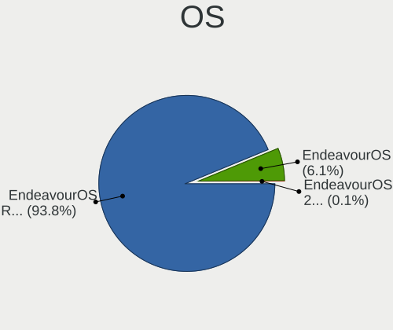

| Name                | Notebooks | Percent |
|---------------------|-----------|---------|
| EndeavourOS Rolling | 1298      | 93.79%  |
| EndeavourOS         | 85        | 6.14%   |
| EndeavourOS 23.1.0  | 1         | 0.07%   |

OS Family
---------

OS without a version

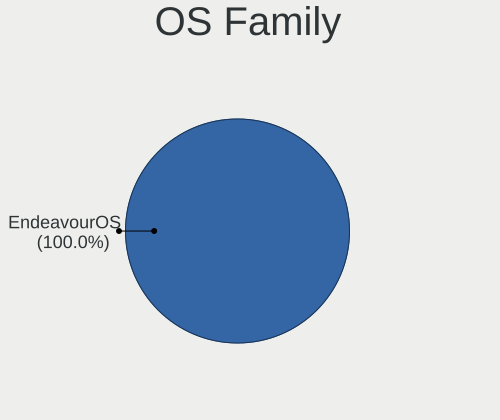

| Name        | Notebooks | Percent |
|-------------|-----------|---------|
| EndeavourOS | 1377      | 100%    |

Kernel
------

Version of the Linux kernel

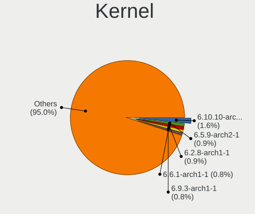

| Version         | Notebooks | Percent |
|-----------------|-----------|---------|
| 6.10.10-arch1-1 | 25        | 1.56%   |
| 6.5.9-arch2-1   | 15        | 0.94%   |
| 6.2.8-arch1-1   | 15        | 0.94%   |
| 6.6.1-arch1-1   | 13        | 0.81%   |
| 6.9.3-arch1-1   | 12        | 0.75%   |
| 6.6.7-arch1-1   | 12        | 0.75%   |
| 6.4.12-arch1-1  | 12        | 0.75%   |
| 6.17.9-arch1-1  | 12        | 0.75%   |
| 6.6.8-arch1-1   | 11        | 0.69%   |
| 6.17.8-arch1-1  | 11        | 0.69%   |
| 6.9.7-arch1-1   | 10        | 0.63%   |
| 6.8.7-arch1-1   | 10        | 0.63%   |
| 6.7.9-arch1-1   | 10        | 0.63%   |
| 6.14.6-arch1-1  | 10        | 0.63%   |
| 6.13.7-arch1-1  | 10        | 0.63%   |
| 6.11.6-arch1-1  | 10        | 0.63%   |
| 6.6.2-arch1-1   | 9         | 0.56%   |
| 6.3.9-arch1-1   | 9         | 0.56%   |
| 6.15.2-arch1-1  | 9         | 0.56%   |
| 6.13.2-arch1-1  | 9         | 0.56%   |
| 6.10.6-arch1-1  | 9         | 0.56%   |
| 6.5.5-arch1-1   | 8         | 0.5%    |
| 6.3.4-arch1-1   | 8         | 0.5%    |
| 6.2.10-arch1-1  | 8         | 0.5%    |
| 6.14.2-arch1-1  | 8         | 0.5%    |
| 6.12.10-arch1-1 | 8         | 0.5%    |
| 6.11.5-arch1-1  | 8         | 0.5%    |
| 6.11.1-arch1-1  | 8         | 0.5%    |
| 6.10.5-arch1-1  | 8         | 0.5%    |
| 5.19.7-arch1-1  | 8         | 0.5%    |
| 5.15.12-arch1-1 | 8         | 0.5%    |
| 6.8.9-arch1-2   | 7         | 0.44%   |
| 6.8.9-arch1-1   | 7         | 0.44%   |
| 6.8.5-arch1-1   | 7         | 0.44%   |
| 6.7.8-arch1-1   | 7         | 0.44%   |
| 6.7.4-arch1-1   | 7         | 0.44%   |
| 6.7.0-arch3-1   | 7         | 0.44%   |
| 6.5.3-arch1-1   | 7         | 0.44%   |
| 6.4.11-arch2-1  | 7         | 0.44%   |
| 6.3.1-arch1-1   | 7         | 0.44%   |

Kernel Family
-------------

Linux kernel without a distro release

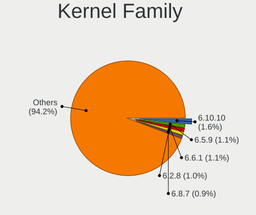

| Version | Notebooks | Percent |
|---------|-----------|---------|
| 6.10.10 | 26        | 1.63%   |
| 6.5.9   | 18        | 1.13%   |
| 6.6.1   | 17        | 1.06%   |
| 6.2.8   | 16        | 1%      |
| 6.8.7   | 15        | 0.94%   |
| 6.17.9  | 15        | 0.94%   |
| 6.8.9   | 14        | 0.88%   |
| 6.4.12  | 14        | 0.88%   |
| 6.3.1   | 14        | 0.88%   |
| 6.17.8  | 14        | 0.88%   |
| 6.9.3   | 13        | 0.81%   |
| 6.9.7   | 12        | 0.75%   |
| 6.6.8   | 12        | 0.75%   |
| 6.6.7   | 12        | 0.75%   |
| 6.4.11  | 12        | 0.75%   |
| 6.16.8  | 12        | 0.75%   |
| 6.14.2  | 12        | 0.75%   |
| 6.11.6  | 12        | 0.75%   |
| 6.6.2   | 11        | 0.69%   |
| 6.15.2  | 11        | 0.69%   |
| 6.14.6  | 11        | 0.69%   |
| 6.13.7  | 11        | 0.69%   |
| 5.15.12 | 11        | 0.69%   |
| 6.7.9   | 10        | 0.63%   |
| 6.7.8   | 10        | 0.63%   |
| 6.7.0   | 10        | 0.63%   |
| 6.5.5   | 10        | 0.63%   |
| 6.3.9   | 10        | 0.63%   |
| 6.3.4   | 10        | 0.63%   |
| 6.13.2  | 10        | 0.63%   |
| 6.10.6  | 10        | 0.63%   |
| 6.1.1   | 10        | 0.63%   |
| 6.0.2   | 10        | 0.63%   |
| 5.19.7  | 10        | 0.63%   |
| 5.13.13 | 10        | 0.63%   |
| 6.7.6   | 9         | 0.56%   |
| 6.4.3   | 9         | 0.56%   |
| 6.4.1   | 9         | 0.56%   |
| 6.12.10 | 9         | 0.56%   |
| 6.11.5  | 9         | 0.56%   |

Kernel Major Ver.
-----------------

Linux kernel major version

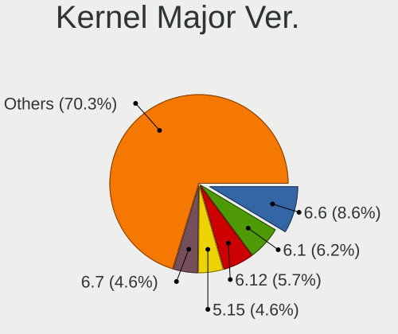

| Version | Notebooks | Percent |
|---------|-----------|---------|
| 6.6     | 132       | 8.59%   |
| 6.1     | 96        | 6.25%   |
| 6.12    | 88        | 5.73%   |
| 5.15    | 71        | 4.62%   |
| 6.7     | 70        | 4.55%   |
| 6.4     | 69        | 4.49%   |
| 6.2     | 69        | 4.49%   |
| 6.10    | 68        | 4.42%   |
| 6.5     | 62        | 4.03%   |
| 6.8     | 59        | 3.84%   |
| 6.13    | 54        | 3.51%   |
| 6.11    | 54        | 3.51%   |
| 6.3     | 53        | 3.45%   |
| 6.9     | 52        | 3.38%   |
| 5.19    | 52        | 3.38%   |
| 6.17    | 51        | 3.32%   |
| 6.0     | 47        | 3.06%   |
| 6.14    | 45        | 2.93%   |
| 6.15    | 42        | 2.73%   |
| 5.16    | 37        | 2.41%   |
| 6.16    | 33        | 2.15%   |
| 5.14    | 30        | 1.95%   |
| 5.17    | 29        | 1.89%   |
| 5.18    | 25        | 1.63%   |
| 5.13    | 24        | 1.56%   |
| 5.12    | 24        | 1.56%   |
| 5.9     | 21        | 1.37%   |
| 5.11    | 21        | 1.37%   |
| 5.10    | 20        | 1.3%    |
| 6.18    | 10        | 0.65%   |
| 5.8     | 9         | 0.59%   |
| 5.7     | 8         | 0.52%   |
| 5.4     | 6         | 0.39%   |
| 5.6     | 2         | 0.13%   |
| 4.19    | 2         | 0.13%   |
| 6.7.0   | 1         | 0.07%   |
| 5.17.1  | 1         | 0.07%   |

Arch
----

OS architecture (x86_64, i586, etc.)

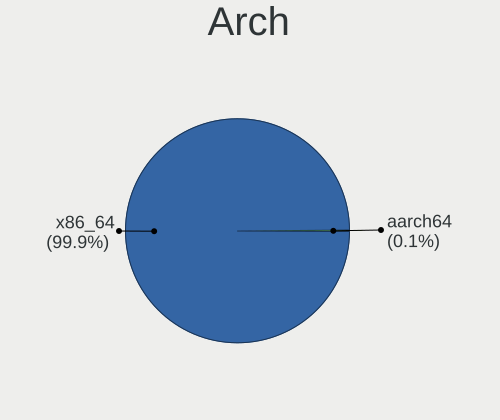

| Name    | Notebooks | Percent |
|---------|-----------|---------|
| x86_64  | 1376      | 99.93%  |
| aarch64 | 1         | 0.07%   |

DE
--

Desktop Environment

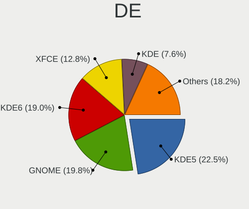

| Name            | Notebooks | Percent |
|-----------------|-----------|---------|
| KDE5            | 325       | 22.54%  |
| GNOME           | 286       | 19.83%  |
| KDE6            | 274       | 19%     |
| XFCE            | 185       | 12.83%  |
| KDE             | 110       | 7.63%   |
| i3              | 53        | 3.68%   |
| Hyprland        | 38        | 2.64%   |
| X-Cinnamon      | 34        | 2.36%   |
| Unknown         | 32        | 2.22%   |
| sway            | 21        | 1.46%   |
| Budgie          | 21        | 1.46%   |
| MATE            | 14        | 0.97%   |
| Cinnamon        | 11        | 0.76%   |
| LXQt            | 7         | 0.49%   |
| awesome         | 4         | 0.28%   |
| qtile           | 3         | 0.21%   |
| openbox         | 3         | 0.21%   |
| GNOME Flashback | 3         | 0.21%   |
| bspwm           | 3         | 0.21%   |
| LXDE            | 2         | 0.14%   |
| dwm             | 2         | 0.14%   |
| Deepin          | 2         | 0.14%   |
| xmonad          | 1         | 0.07%   |
| wayfire         | 1         | 0.07%   |
| sway:wlroots    | 1         | 0.07%   |
| Pantheon        | 1         | 0.07%   |
| niri            | 1         | 0.07%   |
| LeftWM          | 1         | 0.07%   |
| herbstluftwm    | 1         | 0.07%   |
| GNOME Classic   | 1         | 0.07%   |
| COSMIC          | 1         | 0.07%   |

Display Server
--------------

X11 or Wayland

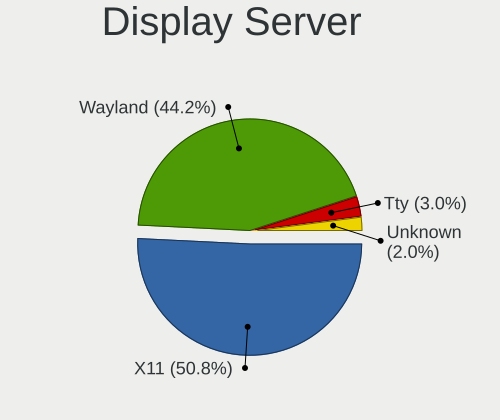

| Name    | Notebooks | Percent |
|---------|-----------|---------|
| X11     | 720       | 50.78%  |
| Wayland | 627       | 44.22%  |
| Tty     | 42        | 2.96%   |
| Unknown | 29        | 2.05%   |

Display Manager
---------------

SDDM, LightDM, etc.

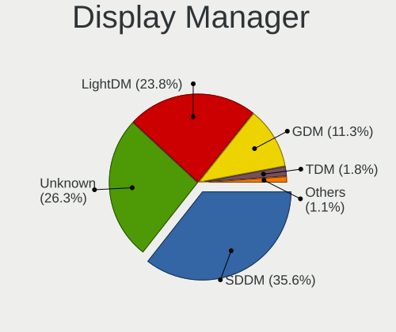

| Name        | Notebooks | Percent |
|-------------|-----------|---------|
| SDDM        | 503       | 35.6%   |
| Unknown     | 372       | 26.33%  |
| LightDM     | 336       | 23.78%  |
| GDM         | 160       | 11.32%  |
| TDM         | 26        | 1.84%   |
| LY-DM       | 6         | 0.42%   |
| GREETD      | 6         | 0.42%   |
| PLASMALOGIN | 1         | 0.07%   |
| Ly          | 1         | 0.07%   |
| LXDM        | 1         | 0.07%   |
| LEMURS      | 1         | 0.07%   |

OS Lang
-------

Language

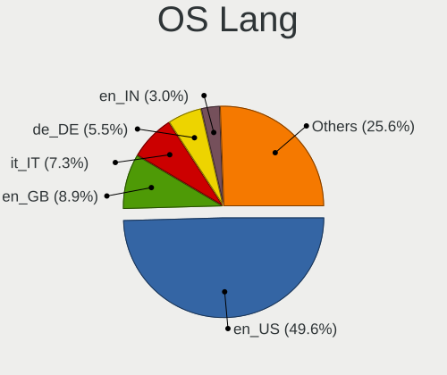

| Lang    | Notebooks | Percent |
|---------|-----------|---------|
| en_US   | 688       | 49.57%  |
| en_GB   | 124       | 8.93%   |
| it_IT   | 102       | 7.35%   |
| de_DE   | 77        | 5.55%   |
| en_IN   | 42        | 3.03%   |
| en_CA   | 40        | 2.88%   |
| ru_RU   | 38        | 2.74%   |
| fr_FR   | 29        | 2.09%   |
| es_ES   | 23        | 1.66%   |
| en_AU   | 20        | 1.44%   |
| pt_BR   | 18        | 1.3%    |
| Unknown | 18        | 1.3%    |
| tr_TR   | 17        | 1.22%   |
| pl_PL   | 15        | 1.08%   |
| nl_NL   | 10        | 0.72%   |
| es_MX   | 10        | 0.72%   |
| en_PH   | 10        | 0.72%   |
| fi_FI   | 8         | 0.58%   |
| es_AR   | 8         | 0.58%   |
| zh_CN   | 7         | 0.5%    |
| sv_SE   | 6         | 0.43%   |
| es_CL   | 6         | 0.43%   |
| en_NZ   | 6         | 0.43%   |
| pt_PT   | 5         | 0.36%   |
| en_DK   | 5         | 0.36%   |
| de_AT   | 5         | 0.36%   |
| cs_CZ   | 4         | 0.29%   |
| es_PE   | 3         | 0.22%   |
| en_ZA   | 3         | 0.22%   |
| en_SG   | 3         | 0.22%   |
| en_AG   | 3         | 0.22%   |
| uk_UA   | 2         | 0.14%   |
| ru_UA   | 2         | 0.14%   |
| hu_HU   | 2         | 0.14%   |
| es_CO   | 2         | 0.14%   |
| en_IL   | 2         | 0.14%   |
| en_IE   | 2         | 0.14%   |
| en_HK   | 2         | 0.14%   |
| C       | 2         | 0.14%   |
| sr_RS   | 1         | 0.07%   |

Boot Mode
---------

EFI or BIOS

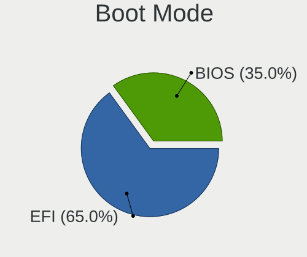

| Mode | Notebooks | Percent |
|------|-----------|---------|
| EFI  | 909       | 65.02%  |
| BIOS | 489       | 34.98%  |

Filesystem
----------

Type of filesystem

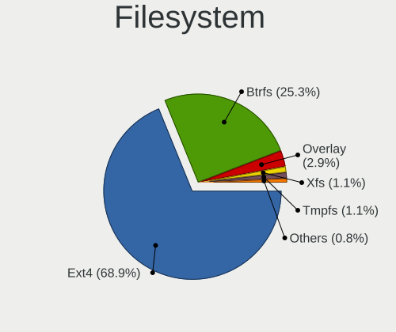

| Type    | Notebooks | Percent |
|---------|-----------|---------|
| Ext4    | 962       | 68.86%  |
| Btrfs   | 353       | 25.27%  |
| Overlay | 41        | 2.93%   |
| Xfs     | 15        | 1.07%   |
| Tmpfs   | 15        | 1.07%   |
| F2fs    | 5         | 0.36%   |
| Unknown | 4         | 0.29%   |
| Zfs     | 1         | 0.07%   |
| Ext2    | 1         | 0.07%   |

Part. scheme
------------

Scheme of partitioning

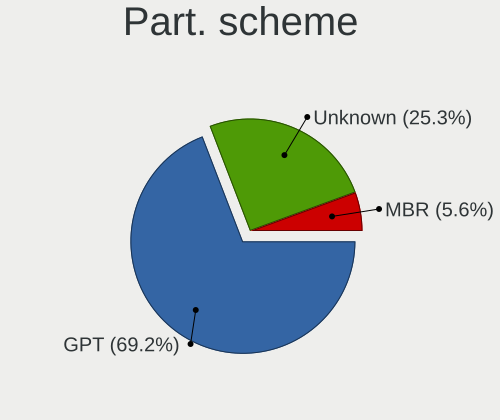

| Type    | Notebooks | Percent |
|---------|-----------|---------|
| GPT     | 964       | 69.15%  |
| Unknown | 352       | 25.25%  |
| MBR     | 78        | 5.6%    |

Dual Boot with Linux/BSD
------------------------

Hosting more than one Linux/BSD

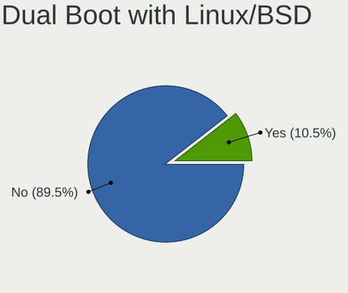

| Dual boot | Notebooks | Percent |
|-----------|-----------|---------|
| No        | 1245      | 89.5%   |
| Yes       | 146       | 10.5%   |

Dual Boot (Win)
---------------

Hosting Linux and Windows

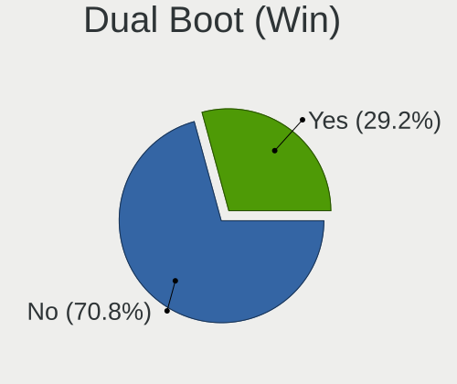

| Dual boot | Notebooks | Percent |
|-----------|-----------|---------|
| No        | 990       | 70.76%  |
| Yes       | 409       | 29.24%  |

Board
-----

Vendor
------

Motherboard manufacturer

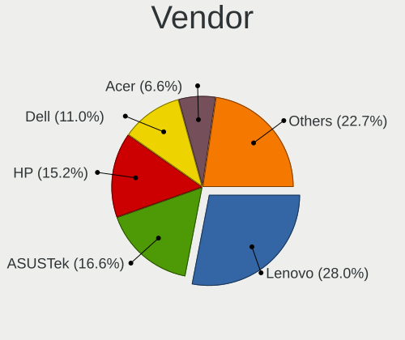

| Name                    | Notebooks | Percent |
|-------------------------|-----------|---------|
| Lenovo                  | 386       | 28.03%  |
| ASUSTek Computer        | 228       | 16.56%  |
| Hewlett-Packard         | 209       | 15.18%  |
| Dell                    | 151       | 10.97%  |
| Acer                    | 91        | 6.61%   |
| MSI                     | 48        | 3.49%   |
| Apple                   | 41        | 2.98%   |
| HUAWEI                  | 22        | 1.6%    |
| Google                  | 20        | 1.45%   |
| Samsung Electronics     | 15        | 1.09%   |
| Toshiba                 | 13        | 0.94%   |
| Timi                    | 12        | 0.87%   |
| TUXEDO                  | 11        | 0.8%    |
| Unknown                 | 9         | 0.65%   |
| Notebook                | 8         | 0.58%   |
| Sony                    | 7         | 0.51%   |
| Alienware               | 7         | 0.51%   |
| Gigabyte Technology     | 6         | 0.44%   |
| Framework               | 6         | 0.44%   |
| Schenker                | 5         | 0.36%   |
| HONOR                   | 5         | 0.36%   |
| PC Specialist           | 4         | 0.29%   |
| Packard Bell            | 4         | 0.29%   |
| Chuwi                   | 4         | 0.29%   |
| XIAOMI                  | 3         | 0.22%   |
| Razer                   | 3         | 0.22%   |
| Medion                  | 3         | 0.22%   |
| MECHREVO                | 3         | 0.22%   |
| Maibenben               | 3         | 0.22%   |
| GPD                     | 3         | 0.22%   |
| Fujitsu                 | 3         | 0.22%   |
| TrekStor                | 2         | 0.15%   |
| System76                | 2         | 0.15%   |
| Positivo                | 2         | 0.15%   |
| Casper                  | 2         | 0.15%   |
| ASRock                  | 2         | 0.15%   |
| Wiltronic               | 1         | 0.07%   |
| VIT                     | 1         | 0.07%   |
| UNOWHY                  | 1         | 0.07%   |
| Universal Exports Group | 1         | 0.07%   |

Model
-----

Motherboard model

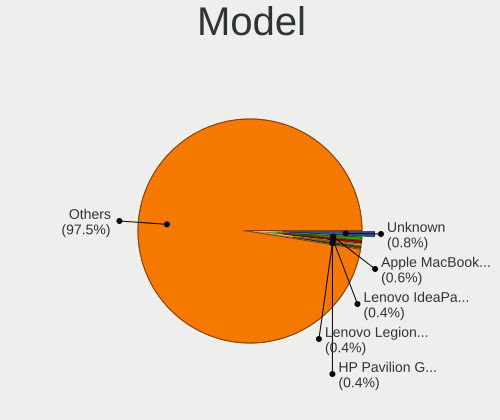

| Name                                        | Notebooks | Percent |
|---------------------------------------------|-----------|---------|
| Unknown                                     | 11        | 0.8%    |
| Apple MacBookAir7,2                         | 8         | 0.58%   |
| Lenovo IdeaPad Gaming 3 15ACH6 82K2         | 6         | 0.44%   |
| Lenovo Legion 5 Pro 16ARH7H 82RG            | 5         | 0.36%   |
| HP Pavilion Gaming Laptop 15-cx0xxx         | 5         | 0.36%   |
| Dell XPS 15 9520                            | 5         | 0.36%   |
| Lenovo Legion 5 Pro 16ACH6H 82JQ            | 4         | 0.29%   |
| Lenovo Legion 5 15ACH6H 82JU                | 4         | 0.29%   |
| HP Victus by Gaming Laptop 16-s0xxx         | 4         | 0.29%   |
| HP Victus by Gaming Laptop 15-fa1xxx        | 4         | 0.29%   |
| HP Notebook                                 | 4         | 0.29%   |
| HP EliteBook 745 G6                         | 4         | 0.29%   |
| HP 250 G7 Notebook PC                       | 4         | 0.29%   |
| Dell XPS 15 9530                            | 4         | 0.29%   |
| Dell Inspiron 5570                          | 4         | 0.29%   |
| ASUS ROG Zephyrus G14 GA401IV_GA401IV       | 4         | 0.29%   |
| Apple MacBookAir6,2                         | 4         | 0.29%   |
| Acer Nitro AN515-54                         | 4         | 0.29%   |
| MSI Modern 14 B5M                           | 3         | 0.22%   |
| Lenovo Yoga Slim 7 Pro 14ACH5 82MS          | 3         | 0.22%   |
| Lenovo ThinkPad X140e 20BL000BUS            | 3         | 0.22%   |
| Lenovo ThinkBook 15 G2 ITL 20VE             | 3         | 0.22%   |
| Lenovo IdeaPad 5 Pro 16ACH6 82L5            | 3         | 0.22%   |
| Lenovo IdeaPad 330-15ARR 81D2               | 3         | 0.22%   |
| Lenovo IdeaPad 3 15ITL6 82H8                | 3         | 0.22%   |
| Lenovo IdeaPad 3 14ALC6 82KT                | 3         | 0.22%   |
| HUAWEI KLVL-WXX9                            | 3         | 0.22%   |
| HUAWEI HLYL-WXX9                            | 3         | 0.22%   |
| HP Pavilion Laptop 15-eh1xxx                | 3         | 0.22%   |
| HP Pavilion Gaming Laptop 15-ec1xxx         | 3         | 0.22%   |
| HP Pavilion dv6                             | 3         | 0.22%   |
| HP Laptop 15s-eq2xxx                        | 3         | 0.22%   |
| HP Laptop 15-db0xxx                         | 3         | 0.22%   |
| HP 250 G3                                   | 3         | 0.22%   |
| Framework Laptop 16 (AMD Ryzen 7040 Series) | 3         | 0.22%   |
| Dell XPS 15 9570                            | 3         | 0.22%   |
| Dell Precision M4800                        | 3         | 0.22%   |
| Dell Latitude E6440                         | 3         | 0.22%   |
| Dell Latitude E5470                         | 3         | 0.22%   |
| Dell Inspiron 3583                          | 3         | 0.22%   |

Model Family
------------

Motherboard model prefix

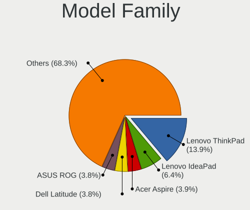

| Name                  | Notebooks | Percent |
|-----------------------|-----------|---------|
| Lenovo ThinkPad       | 191       | 13.87%  |
| Lenovo IdeaPad        | 88        | 6.39%   |
| Acer Aspire           | 54        | 3.92%   |
| Dell Latitude         | 52        | 3.78%   |
| ASUS ROG              | 52        | 3.78%   |
| ASUS VivoBook         | 48        | 3.49%   |
| Lenovo Legion         | 46        | 3.34%   |
| ASUS ASUS             | 42        | 3.05%   |
| HP EliteBook          | 41        | 2.98%   |
| HP Pavilion           | 39        | 2.83%   |
| Dell Inspiron         | 37        | 2.69%   |
| HP Laptop             | 29        | 2.11%   |
| Dell XPS              | 25        | 1.82%   |
| Lenovo Yoga           | 20        | 1.45%   |
| Dell Precision        | 20        | 1.45%   |
| HP ProBook            | 17        | 1.23%   |
| Lenovo ThinkBook      | 16        | 1.16%   |
| HP Victus             | 15        | 1.09%   |
| ASUS TUF              | 14        | 1.02%   |
| ASUS Zenbook          | 13        | 0.94%   |
| Acer Swift            | 13        | 0.94%   |
| Acer Nitro            | 13        | 0.94%   |
| MSI Modern            | 11        | 0.8%    |
| HP ZBook              | 11        | 0.8%    |
| Unknown               | 11        | 0.8%    |
| Toshiba Satellite     | 10        | 0.73%   |
| HP OMEN               | 10        | 0.73%   |
| HP 250                | 9         | 0.65%   |
| HP ENVY               | 8         | 0.58%   |
| Apple MacBookAir7     | 8         | 0.58%   |
| HP 255                | 7         | 0.51%   |
| Framework Laptop      | 6         | 0.44%   |
| MSI Prestige          | 5         | 0.36%   |
| Lenovo LOQ            | 5         | 0.36%   |
| Dell Vostro           | 5         | 0.36%   |
| Apple MacBookPro16    | 5         | 0.36%   |
| Apple MacBookAir6     | 5         | 0.36%   |
| Schenker XMG          | 4         | 0.29%   |
| Packard Bell EasyNote | 4         | 0.29%   |
| HP Notebook           | 4         | 0.29%   |

MFG Year
--------

Motherboard manufacture year

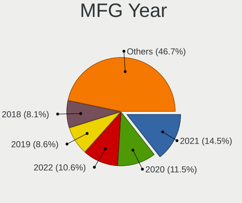

| Year    | Notebooks | Percent |
|---------|-----------|---------|
| 2021    | 199       | 14.45%  |
| 2020    | 159       | 11.55%  |
| 2022    | 146       | 10.6%   |
| 2019    | 118       | 8.57%   |
| 2018    | 112       | 8.13%   |
| 2023    | 110       | 7.99%   |
| 2017    | 83        | 6.03%   |
| 2024    | 66        | 4.79%   |
| 2013    | 62        | 4.5%    |
| 2015    | 54        | 3.92%   |
| 2012    | 53        | 3.85%   |
| 2016    | 52        | 3.78%   |
| 2014    | 45        | 3.27%   |
| 2011    | 32        | 2.32%   |
| 2008    | 22        | 1.6%    |
| 2025    | 20        | 1.45%   |
| 2010    | 19        | 1.38%   |
| 2009    | 9         | 0.65%   |
| 2006    | 8         | 0.58%   |
| 2007    | 7         | 0.51%   |
| Unknown | 1         | 0.07%   |

Form Factor
-----------

Physical design of the computer

| Name     | Notebooks | Percent |
|----------|-----------|---------|
| Notebook | 1377      | 100%    |

Secure Boot
-----------

Enabled or disabled

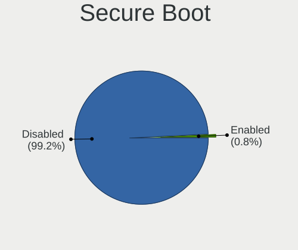

| State    | Notebooks | Percent |
|----------|-----------|---------|
| Disabled | 1367      | 99.2%   |
| Enabled  | 11        | 0.8%    |

Coreboot
--------

Have coreboot on board

| Used | Notebooks | Percent |
|------|-----------|---------|
| No   | 1353      | 98.26%  |
| Yes  | 24        | 1.74%   |

RAM Size
--------

Total RAM memory

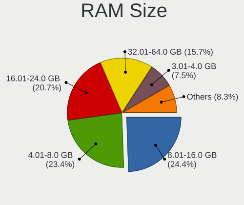

| Size in GB  | Notebooks | Percent |
|-------------|-----------|---------|
| 8.01-16.0   | 340       | 24.44%  |
| 4.01-8.0    | 325       | 23.36%  |
| 16.01-24.0  | 288       | 20.7%   |
| 32.01-64.0  | 218       | 15.67%  |
| 3.01-4.0    | 104       | 7.48%   |
| 24.01-32.0  | 62        | 4.46%   |
| 64.01-256.0 | 45        | 3.24%   |
| 1.01-2.0    | 5         | 0.36%   |
| 2.01-3.0    | 4         | 0.29%   |

RAM Used
--------

Used RAM memory

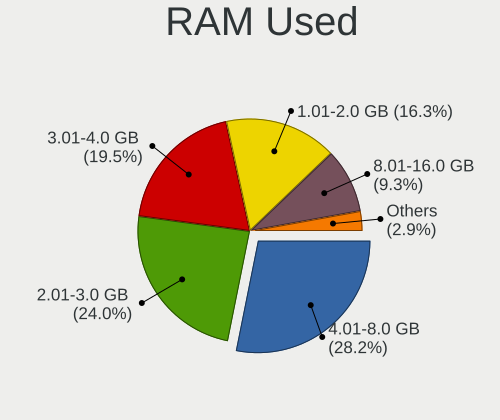

| Used GB    | Notebooks | Percent |
|------------|-----------|---------|
| 4.01-8.0   | 424       | 28.15%  |
| 2.01-3.0   | 361       | 23.97%  |
| 3.01-4.0   | 293       | 19.46%  |
| 1.01-2.0   | 245       | 16.27%  |
| 8.01-16.0  | 140       | 9.3%    |
| 0.51-1.0   | 26        | 1.73%   |
| 16.01-24.0 | 13        | 0.86%   |
| 24.01-32.0 | 2         | 0.13%   |
| 0.01-0.5   | 2         | 0.13%   |

Total Drives
------------

Number of drives on board

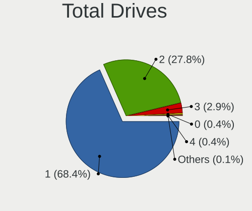

| Drives | Notebooks | Percent |
|--------|-----------|---------|
| 1      | 958       | 68.43%  |
| 2      | 389       | 27.79%  |
| 3      | 41        | 2.93%   |
| 0      | 6         | 0.43%   |
| 4      | 5         | 0.36%   |
| 6      | 1         | 0.07%   |

Has CD-ROM
----------

Has CD-ROM on board

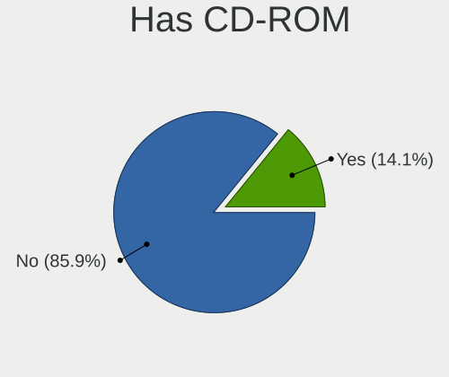

| Presented | Notebooks | Percent |
|-----------|-----------|---------|
| No        | 1186      | 85.88%  |
| Yes       | 195       | 14.12%  |

Has Ethernet
------------

Has Ethernet on board

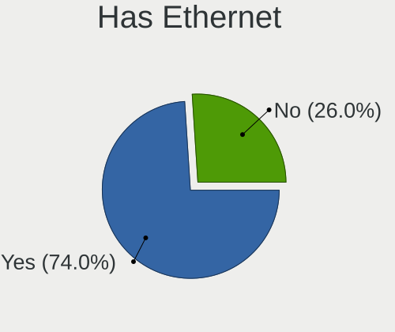

| Presented | Notebooks | Percent |
|-----------|-----------|---------|
| Yes       | 1008      | 72.73%  |
| No        | 378       | 27.27%  |

Has WiFi
--------

Has WiFi module

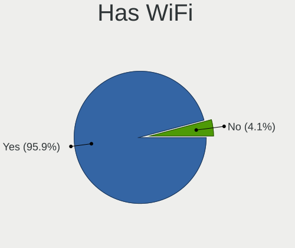

| Presented | Notebooks | Percent |
|-----------|-----------|---------|
| Yes       | 1321      | 95.86%  |
| No        | 57        | 4.14%   |

Has Bluetooth
-------------

Has Bluetooth module

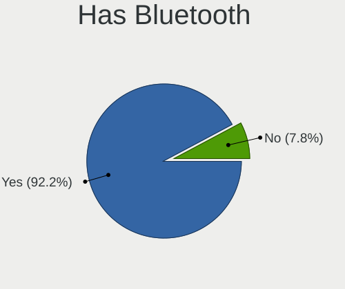

| Presented | Notebooks | Percent |
|-----------|-----------|---------|
| Yes       | 1276      | 92.2%   |
| No        | 108       | 7.8%    |

Location
--------

Country
-------

Geographic location (country)

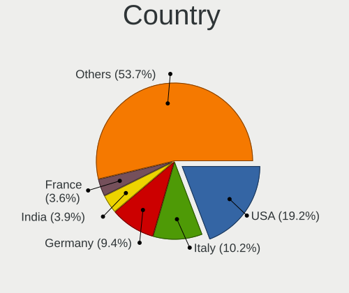

| Country     | Notebooks | Percent |
|-------------|-----------|---------|
| USA         | 267       | 19.22%  |
| Italy       | 142       | 10.22%  |
| Germany     | 130       | 9.36%   |
| India       | 54        | 3.89%   |
| France      | 50        | 3.6%    |
| Canada      | 48        | 3.46%   |
| Russia      | 46        | 3.31%   |
| UK          | 43        | 3.1%    |
| Poland      | 41        | 2.95%   |
| Brazil      | 39        | 2.81%   |
| Netherlands | 35        | 2.52%   |
| Turkey      | 33        | 2.38%   |
| Spain       | 30        | 2.16%   |
| Sweden      | 21        | 1.51%   |
| Australia   | 21        | 1.51%   |
| Finland     | 20        | 1.44%   |
| Austria     | 17        | 1.22%   |
| Romania     | 16        | 1.15%   |
| Switzerland | 15        | 1.08%   |
| Indonesia   | 14        | 1.01%   |
| Mexico      | 13        | 0.94%   |
| Argentina   | 13        | 0.94%   |
| Vietnam     | 12        | 0.86%   |
| Philippines | 12        | 0.86%   |
| Czechia     | 12        | 0.86%   |
| Portugal    | 11        | 0.79%   |
| Hungary     | 10        | 0.72%   |
| Slovakia    | 9         | 0.65%   |
| Colombia    | 9         | 0.65%   |
| Ukraine     | 8         | 0.58%   |
| China       | 8         | 0.58%   |
| New Zealand | 7         | 0.5%    |
| Chile       | 7         | 0.5%    |
| Bulgaria    | 7         | 0.5%    |
| Bangladesh  | 7         | 0.5%    |
| South Korea | 6         | 0.43%   |
| Serbia      | 6         | 0.43%   |
| Peru        | 6         | 0.43%   |
| Norway      | 6         | 0.43%   |
| Malaysia    | 6         | 0.43%   |

City
----

Geographic location (city)

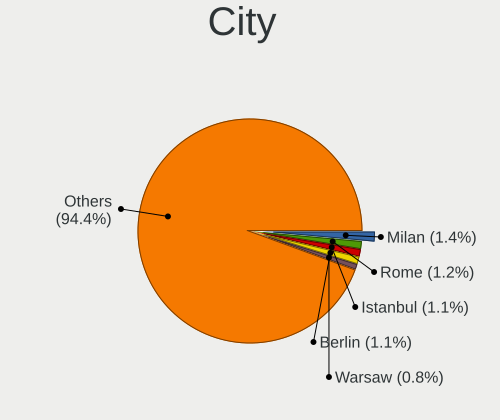

| City              | Notebooks | Percent |
|-------------------|-----------|---------|
| Milan             | 21        | 1.43%   |
| Rome              | 17        | 1.16%   |
| Istanbul          | 16        | 1.09%   |
| Berlin            | 16        | 1.09%   |
| Warsaw            | 12        | 0.82%   |
| Helsinki          | 12        | 0.82%   |
| Amsterdam         | 12        | 0.82%   |
| Vienna            | 11        | 0.75%   |
| Moscow            | 10        | 0.68%   |
| Florence          | 10        | 0.68%   |
| Sydney            | 9         | 0.61%   |
| Montreal          | 9         | 0.61%   |
| Frankfurt am Main | 9         | 0.61%   |
| St Petersburg     | 8         | 0.55%   |
| Prague            | 8         | 0.55%   |
| Milano            | 8         | 0.55%   |
| Delhi             | 8         | 0.55%   |
| Chennai           | 8         | 0.55%   |
| Bucharest         | 8         | 0.55%   |
| Toms River        | 7         | 0.48%   |
| Mesa              | 7         | 0.48%   |
| Hyderabad         | 7         | 0.48%   |
| Chicago           | 7         | 0.48%   |
| Budapest          | 7         | 0.48%   |
| Paris             | 6         | 0.41%   |
| Munich            | 6         | 0.41%   |
| Mannheim          | 6         | 0.41%   |
| Los Angeles       | 6         | 0.41%   |
| Ho Chi Minh City  | 6         | 0.41%   |
| Belgrade          | 6         | 0.41%   |
| Victoria          | 5         | 0.34%   |
| Turin             | 5         | 0.34%   |
| Singapore         | 5         | 0.34%   |
| Seattle           | 5         | 0.34%   |
| Rotterdam         | 5         | 0.34%   |
| Poznan            | 5         | 0.34%   |
| Portland          | 5         | 0.34%   |
| Melbourne         | 5         | 0.34%   |
| London            | 5         | 0.34%   |
| Lima              | 5         | 0.34%   |

Drives
------

Drive Vendor
------------

Hard drive vendors

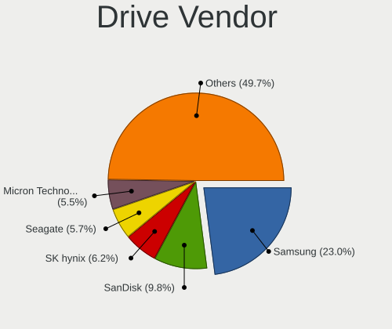

| Vendor                         | Notebooks | Drives | Percent |
|--------------------------------|-----------|--------|---------|
| Samsung Electronics            | 413       | 540    | 22.96%  |
| SanDisk                        | 177       | 207    | 9.84%   |
| SK hynix                       | 112       | 136    | 6.23%   |
| Seagate                        | 103       | 116    | 5.73%   |
| Micron Technology              | 99        | 115    | 5.5%    |
| WDC                            | 89        | 105    | 4.95%   |
| Kingston                       | 82        | 103    | 4.56%   |
| Unknown                        | 66        | 80     | 3.67%   |
| Intel                          | 60        | 67     | 3.34%   |
| Toshiba                        | 54        | 63     | 3%      |
| KIOXIA                         | 44        | 52     | 2.45%   |
| Crucial                        | 43        | 54     | 2.39%   |
| Phison Electronics             | 34        | 39     | 1.89%   |
| Apple                          | 33        | 38     | 1.83%   |
| Kingston Technology Company    | 30        | 35     | 1.67%   |
| Micron/Crucial Technology      | 28        | 31     | 1.56%   |
| HGST                           | 23        | 28     | 1.28%   |
| A-DATA Technology              | 20        | 23     | 1.11%   |
| Silicon Motion                 | 14        | 14     | 0.78%   |
| Hitachi                        | 12        | 15     | 0.67%   |
| MAXIO Technology (Hangzhou)    | 11        | 11     | 0.61%   |
| China                          | 11        | 12     | 0.61%   |
| Shenzhen Longsys Electronics   | 10        | 12     | 0.56%   |
| Phison                         | 9         | 9      | 0.5%    |
| Realtek Semiconductor          | 8         | 8      | 0.44%   |
| Patriot                        | 8         | 9      | 0.44%   |
| ADATA Technology               | 8         | 9      | 0.44%   |
| Yangtze Memory Technologies    | 7         | 7      | 0.39%   |
| Union Memory (Shenzhen)        | 7         | 7      | 0.39%   |
| SPCC                           | 7         | 11     | 0.39%   |
| Solid State Storage Technology | 7         | 11     | 0.39%   |
| LITEONIT                       | 7         | 8      | 0.39%   |
| JMicron Technology             | 7         | 8      | 0.39%   |
| Transcend                      | 6         | 8      | 0.33%   |
| Solid State Storage            | 6         | 8      | 0.33%   |
| KingSpec                       | 6         | 6      | 0.33%   |
| PNY                            | 5         | 6      | 0.28%   |
| Lenovo                         | 5         | 5      | 0.28%   |
| Team                           | 4         | 6      | 0.22%   |
| Realtek                        | 4         | 6      | 0.22%   |

Drive Model
-----------

Hard drive models

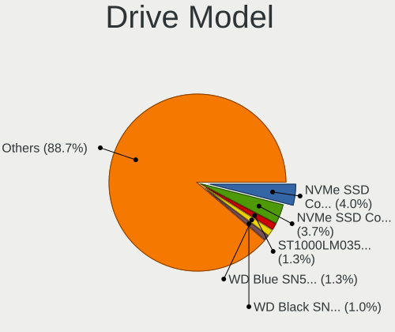

| Model                                                 | Notebooks | Percent |
|-------------------------------------------------------|-----------|---------|
| Samsung NVMe SSD Controller PM9A1/PM9A3/980PRO 1TB    | 74        | 3.97%   |
| Samsung NVMe SSD Controller SM981/PM981/PM983 1TB     | 69        | 3.7%    |
| Seagate ST1000LM035-1RK172 1TB                        | 24        | 1.29%   |
| Sandisk WD Blue SN550 NVMe SSD 1024GB                 | 24        | 1.29%   |
| Sandisk WD Black SN750 / PC SN730 NVMe SSD 500GB      | 19        | 1.02%   |
| Unknown MMC Card  64GB                                | 18        | 0.96%   |
| Intel SSDPEKNU512GZ 512GB                             | 17        | 0.91%   |
| Kingston SA400S37240G 240GB SSD                       | 16        | 0.86%   |
| Intel SSD 660P Series 512GB                           | 14        | 0.75%   |
| Samsung SSD 980 1TB                                   | 13        | 0.7%    |
| Silicon Motion SM2263EN/SM2263XT SSD Controller 512GB | 12        | 0.64%   |
| Kingston SA400S37480G 480GB SSD                       | 12        | 0.64%   |
| Samsung NVMe SSD Controller SM961/PM961/SM963 1024GB  | 11        | 0.59%   |
| Samsung MZVLQ512HBLU-00B00 512GB                      | 11        | 0.59%   |
| Phison PS5013 E13 NVMe Controller 500GB               | 11        | 0.59%   |
| Unknown MMC Card  128GB                               | 10        | 0.54%   |
| Samsung MZALQ512HBLU-00BL2 512GB                      | 10        | 0.54%   |
| HGST HTS721010A9E630 1TB                              | 10        | 0.54%   |
| Toshiba MQ01ABD100 1TB                                | 9         | 0.48%   |
| SK hynix HFM001TD3JX013N 1024GB                       | 9         | 0.48%   |
| Seagate ST500LT012-1DG142 500GB                       | 9         | 0.48%   |
| Sandisk WD Black SN850 1TB                            | 9         | 0.48%   |
| Samsung SSD 870 QVO 1TB                               | 9         | 0.48%   |
| Samsung SSD 860 EVO 1TB                               | 9         | 0.48%   |
| MAXIO (Hangzhou) NVMe SSD Controller MAP1202 2TB      | 9         | 0.48%   |
| Unknown MMC Card  32GB                                | 8         | 0.43%   |
| Toshiba XG6 NVMe SSD Controller 1024GB                | 8         | 0.43%   |
| Seagate ST1000LM049-2GH172 1TB                        | 8         | 0.43%   |
| Sandisk WD Blue SN500 / PC SN520 NVMe SSD 128GB       | 8         | 0.43%   |
| Samsung SSD 980 500GB                                 | 8         | 0.43%   |
| Samsung SSD 860 EVO 500GB                             | 8         | 0.43%   |
| Samsung SSD 860 EVO 250GB                             | 8         | 0.43%   |
| Phison E12 NVMe Controller 1TB                        | 8         | 0.43%   |
| Micron 2400_MTFDKBA512QFM 512GB                       | 8         | 0.43%   |
| Kingston OM8PCP3512F-AI1 512GB                        | 8         | 0.43%   |
| Crucial CT240BX500SSD1 240GB                          | 8         | 0.43%   |
| Apple ANS2 NVMe Controller 4TB                        | 8         | 0.43%   |
| Unknown MMC Card  16GB                                | 7         | 0.38%   |
| Samsung SSD 870 EVO 250GB                             | 7         | 0.38%   |
| Samsung NVMe SSD Drive 512GB                          | 7         | 0.38%   |

HDD Vendor
----------

Hard disk drive vendors

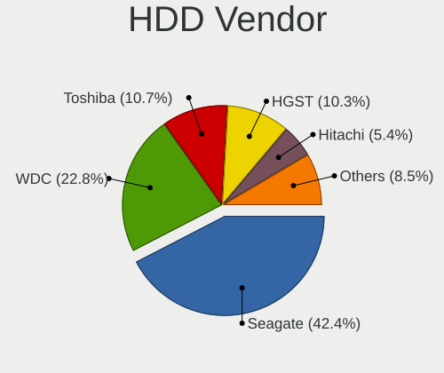

| Vendor              | Notebooks | Drives | Percent |
|---------------------|-----------|--------|---------|
| Seagate             | 95        | 107    | 42.41%  |
| WDC                 | 51        | 57     | 22.77%  |
| Toshiba             | 24        | 25     | 10.71%  |
| HGST                | 23        | 28     | 10.27%  |
| Hitachi             | 12        | 15     | 5.36%   |
| Unknown             | 4         | 4      | 1.79%   |
| JMicron Technology  | 3         | 3      | 1.34%   |
| Fujitsu             | 3         | 3      | 1.34%   |
| Maxone              | 2         | 2      | 0.89%   |
| ASMT                | 2         | 3      | 0.89%   |
| USB3.0              | 1         | 1      | 0.45%   |
| T-FORCE             | 1         | 2      | 0.45%   |
| Samsung Electronics | 1         | 1      | 0.45%   |
| Generic-            | 1         | 1      | 0.45%   |
| Apple               | 1         | 1      | 0.45%   |

SSD Vendor
----------

Solid state drive vendors

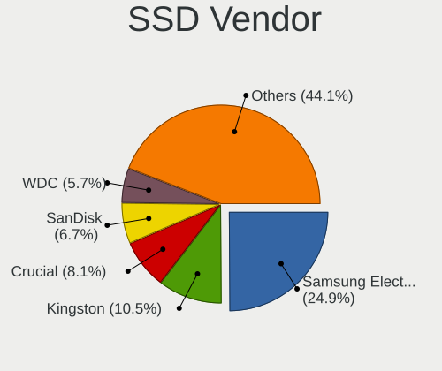

| Vendor              | Notebooks | Drives | Percent |
|---------------------|-----------|--------|---------|
| Samsung Electronics | 123       | 156    | 24.9%   |
| Kingston            | 52        | 64     | 10.53%  |
| Crucial             | 40        | 50     | 8.1%    |
| SanDisk             | 33        | 38     | 6.68%   |
| WDC                 | 28        | 36     | 5.67%   |
| Apple               | 20        | 20     | 4.05%   |
| SK hynix            | 19        | 28     | 3.85%   |
| A-DATA Technology   | 17        | 19     | 3.44%   |
| Micron Technology   | 13        | 17     | 2.63%   |
| China               | 11        | 12     | 2.23%   |
| Toshiba             | 8         | 10     | 1.62%   |
| SPCC                | 7         | 11     | 1.42%   |
| LITEONIT            | 7         | 8      | 1.42%   |
| Transcend           | 6         | 8      | 1.21%   |
| KingSpec            | 6         | 6      | 1.21%   |
| Intel               | 6         | 6      | 1.21%   |
| Patriot             | 5         | 5      | 1.01%   |
| Team                | 4         | 6      | 0.81%   |
| Seagate             | 4         | 4      | 0.81%   |
| PNY                 | 4         | 5      | 0.81%   |
| OCZ                 | 4         | 4      | 0.81%   |
| Intenso             | 4         | 6      | 0.81%   |
| Teclast             | 3         | 5      | 0.61%   |
| SABRENT             | 3         | 3      | 0.61%   |
| Mushkin             | 3         | 3      | 0.61%   |
| LITEON              | 3         | 4      | 0.61%   |
| KingFast            | 3         | 3      | 0.61%   |
| GOODRAM             | 3         | 3      | 0.61%   |
| Gigabyte Technology | 3         | 5      | 0.61%   |
| Emtec               | 3         | 3      | 0.61%   |
| Corsair             | 3         | 3      | 0.61%   |
| WDC WDS             | 2         | 2      | 0.4%    |
| V-GeN               | 2         | 2      | 0.4%    |
| TAMMUZ              | 2         | 6      | 0.4%    |
| StoreJet            | 2         | 2      | 0.4%    |
| Netac               | 2         | 3      | 0.4%    |
| Lexar               | 2         | 2      | 0.4%    |
| Hewlett-Packard     | 2         | 2      | 0.4%    |
| Zheino              | 1         | 1      | 0.2%    |
| WUXIN               | 1         | 1      | 0.2%    |

Drive Kind
----------

HDD or SSD

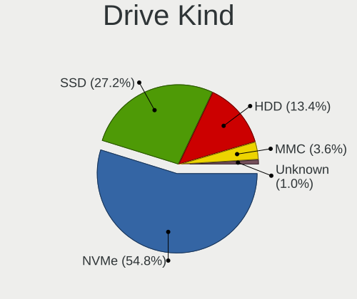

| Kind    | Notebooks | Drives | Percent |
|---------|-----------|--------|---------|
| NVMe    | 896       | 1224   | 54.8%   |
| SSD     | 445       | 606    | 27.22%  |
| HDD     | 219       | 253    | 13.39%  |
| MMC     | 59        | 71     | 3.61%   |
| Unknown | 16        | 17     | 0.98%   |

Drive Connector
---------------

SATA, SAS, NVMe, etc.

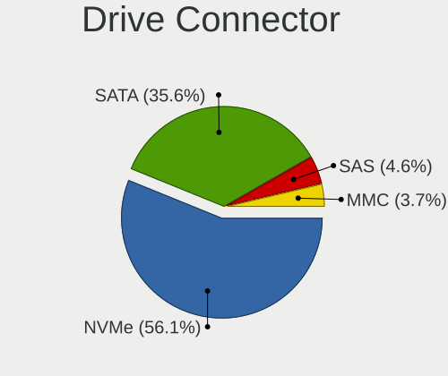

| Type | Notebooks | Drives | Percent |
|------|-----------|--------|---------|
| NVMe | 896       | 1213   | 56.14%  |
| SATA | 568       | 798    | 35.59%  |
| SAS  | 73        | 89     | 4.57%   |
| MMC  | 59        | 71     | 3.7%    |

Drive Size
----------

Size of hard drive

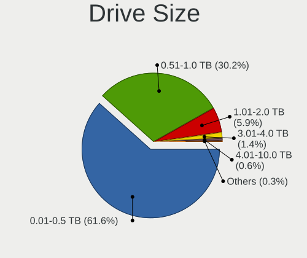

| Size in TB | Notebooks | Drives | Percent |
|------------|-----------|--------|---------|
| 0.01-0.5   | 408       | 559    | 61.63%  |
| 0.51-1.0   | 200       | 234    | 30.21%  |
| 1.01-2.0   | 39        | 50     | 5.89%   |
| 3.01-4.0   | 9         | 9      | 1.36%   |
| 4.01-10.0  | 4         | 5      | 0.6%    |
| 2.01-3.0   | 2         | 2      | 0.3%    |

Space Total
-----------

Amount of disk space available on the file system

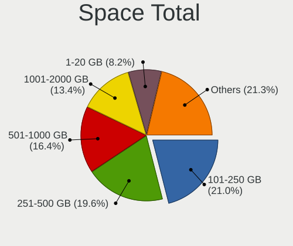

| Size in GB     | Notebooks | Percent |
|----------------|-----------|---------|
| 101-250        | 303       | 21.03%  |
| 251-500        | 283       | 19.64%  |
| 501-1000       | 237       | 16.45%  |
| 1001-2000      | 193       | 13.39%  |
| 1-20           | 118       | 8.19%   |
| More than 3000 | 87        | 6.04%   |
| Unknown        | 79        | 5.48%   |
| 51-100         | 64        | 4.44%   |
| 2001-3000      | 47        | 3.26%   |
| 21-50          | 30        | 2.08%   |

Space Used
----------

Amount of used disk space

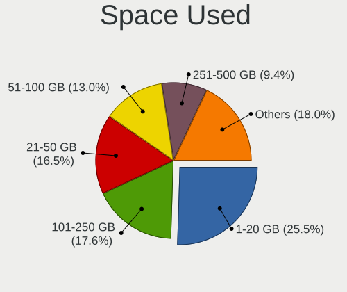

| Used GB        | Notebooks | Percent |
|----------------|-----------|---------|
| 1-20           | 381       | 25.48%  |
| 101-250        | 263       | 17.59%  |
| 21-50          | 247       | 16.52%  |
| 51-100         | 194       | 12.98%  |
| 251-500        | 141       | 9.43%   |
| 501-1000       | 96        | 6.42%   |
| Unknown        | 79        | 5.28%   |
| 1001-2000      | 58        | 3.88%   |
| More than 3000 | 17        | 1.14%   |
| 2001-3000      | 13        | 0.87%   |
| 0              | 6         | 0.4%    |

Malfunc. Drives
---------------

Drive models with a malfunction

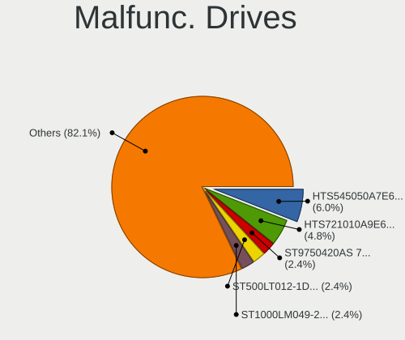

| Model                                    | Notebooks | Drives | Percent |
|------------------------------------------|-----------|--------|---------|
| HGST HTS545050A7E680 500GB               | 5         | 8      | 5.95%   |
| HGST HTS721010A9E630 1TB                 | 4         | 4      | 4.76%   |
| Seagate ST9750420AS 752GB                | 2         | 2      | 2.38%   |
| Seagate ST500LT012-1DG142 500GB          | 2         | 2      | 2.38%   |
| Seagate ST1000LM049-2GH172 1TB           | 2         | 2      | 2.38%   |
| Seagate ST1000LM035-1RK172 1TB           | 2         | 2      | 2.38%   |
| Samsung Electronics SSD 980 1TB          | 2         | 2      | 2.38%   |
| Hitachi HTS545050A7E380 500GB            | 2         | 2      | 2.38%   |
| China SSD 256GB                          | 2         | 2      | 2.38%   |
| WDC WD5000LPVT-22G33T0 500GB             | 1         | 1      | 1.19%   |
| WDC WD5000BPVT-60HXZT3 500GB             | 1         | 1      | 1.19%   |
| WDC WD10SPZX-24Z10T0 1TB                 | 1         | 1      | 1.19%   |
| WDC WD10SPCX-22HWST0 1TB                 | 1         | 1      | 1.19%   |
| WDC WD10JPVX-22JC3T0 1TB                 | 1         | 1      | 1.19%   |
| WDC WD Blue SA510 2.5 500GB              | 1         | 3      | 1.19%   |
| WDC PC SA530 SDASN8Y-256G-1006 256GB     | 1         | 1      | 1.19%   |
| Transcend TS240GMTS420S 240GB SSD        | 1         | 1      | 1.19%   |
| Toshiba THNSNK128GVN8 M.2 2280 128GB SSD | 1         | 1      | 1.19%   |
| Toshiba MQ01ABD100 1TB                   | 1         | 1      | 1.19%   |
| Toshiba MQ01ABD050 500GB                 | 1         | 2      | 1.19%   |
| Toshiba MK5055GSXF 500GB                 | 1         | 1      | 1.19%   |
| Toshiba MK2533GSG 250GB                  | 1         | 1      | 1.19%   |
| Toshiba KSG60ZMV256G M.2 2280 256GB SSD  | 1         | 1      | 1.19%   |
| SSSTC CV8-8E128-HP 128GB SSD             | 1         | 1      | 1.19%   |
| SK hynix SC308 SATA 128GB SSD            | 1         | 1      | 1.19%   |
| SK hynix SC210 2.5 7MM 256GB SSD         | 1         | 1      | 1.19%   |
| SK hynix PC711 HFS001TDE9X073N 1TB       | 1         | 1      | 1.19%   |
| SK hynix HFS512G39TND-N210A 512GB SSD    | 1         | 1      | 1.19%   |
| SK hynix HFS128G39TND-N210A 128GB SSD    | 1         | 1      | 1.19%   |
| SK hynix HFS128G32TND-N210A 128GB SSD    | 1         | 1      | 1.19%   |
| SK hynix BC711 HFM001TD3JX013N 1TB       | 1         | 1      | 1.19%   |
| Seagate ST95005620AS 500GB               | 1         | 1      | 1.19%   |
| Seagate ST9500325AS 500GB                | 1         | 1      | 1.19%   |
| Seagate ST9320325AS 320GB                | 1         | 1      | 1.19%   |
| Seagate ST500LX012-SSHD-8GB              | 1         | 1      | 1.19%   |
| Seagate ST500LT012-9WS142 500GB          | 1         | 1      | 1.19%   |
| Seagate ST320LT012-1DG14C 320GB          | 1         | 1      | 1.19%   |
| Seagate ST2000LX001-1RG174 2TB           | 1         | 1      | 1.19%   |
| Seagate ST2000LM007-1R8174 2TB           | 1         | 1      | 1.19%   |
| SanDisk SSD PLUS 240GB                   | 1         | 1      | 1.19%   |

Malfunc. Drive Vendor
---------------------

Vendors of faulty drives

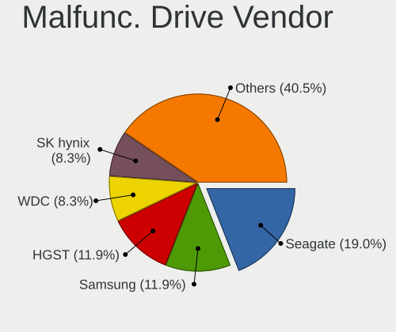

| Vendor              | Notebooks | Drives | Percent |
|---------------------|-----------|--------|---------|
| Seagate             | 16        | 16     | 19.05%  |
| Samsung Electronics | 10        | 10     | 11.9%   |
| HGST                | 10        | 13     | 11.9%   |
| WDC                 | 7         | 9      | 8.33%   |
| SK hynix            | 7         | 7      | 8.33%   |
| Toshiba             | 6         | 7      | 7.14%   |
| Intel               | 4         | 5      | 4.76%   |
| China               | 4         | 4      | 4.76%   |
| SanDisk             | 3         | 3      | 3.57%   |
| Hitachi             | 2         | 2      | 2.38%   |
| Apple               | 2         | 2      | 2.38%   |
| A-DATA Technology   | 2         | 2      | 2.38%   |
| Transcend           | 1         | 1      | 1.19%   |
| SSSTC               | 1         | 1      | 1.19%   |
| Phison Electronics  | 1         | 1      | 1.19%   |
| Patriot             | 1         | 1      | 1.19%   |
| Micron Technology   | 1         | 1      | 1.19%   |
| LITEONIT            | 1         | 1      | 1.19%   |
| Kingston            | 1         | 1      | 1.19%   |
| Intenso             | 1         | 2      | 1.19%   |
| Fujitsu             | 1         | 1      | 1.19%   |
| Crucial             | 1         | 1      | 1.19%   |
| Corsair             | 1         | 1      | 1.19%   |

Malfunc. HDD Vendor
-------------------

Vendors of faulty HDD drives

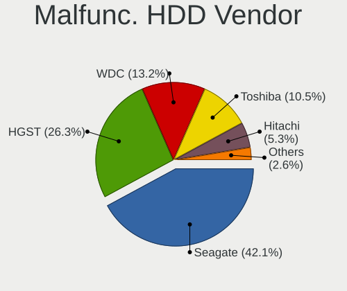

| Vendor  | Notebooks | Drives | Percent |
|---------|-----------|--------|---------|
| Seagate | 16        | 16     | 42.11%  |
| HGST    | 10        | 13     | 26.32%  |
| WDC     | 5         | 5      | 13.16%  |
| Toshiba | 4         | 5      | 10.53%  |
| Hitachi | 2         | 2      | 5.26%   |
| Fujitsu | 1         | 1      | 2.63%   |

Malfunc. Drive Kind
-------------------

Kinds of faulty drives

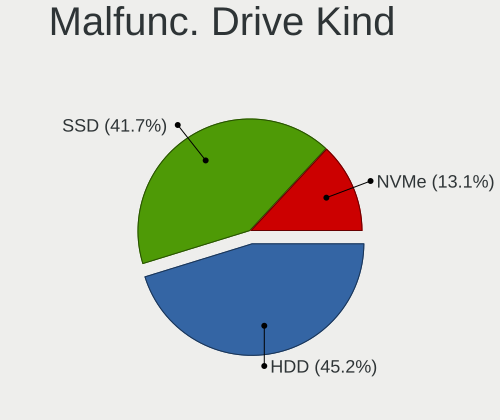

| Kind | Notebooks | Drives | Percent |
|------|-----------|--------|---------|
| HDD  | 38        | 42     | 45.24%  |
| SSD  | 35        | 38     | 41.67%  |
| NVMe | 11        | 12     | 13.1%   |

Failed Drives
-------------

Failed drive models

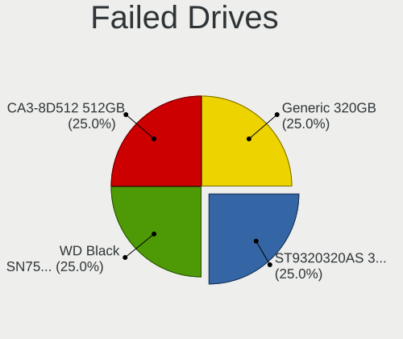

| Model                                            | Notebooks | Drives | Percent |
|--------------------------------------------------|-----------|--------|---------|
| Seagate ST9320320AS 320GB                        | 1         | 1      | 25%     |
| Sandisk WD Black SN750 / PC SN730 NVMe SSD 500GB | 1         | 1      | 25%     |
| LITEON CA3-8D512 512GB                           | 1         | 2      | 25%     |
| JMicron Technology Generic 320GB                 | 1         | 1      | 25%     |

Failed Drive Vendor
-------------------

Failed drive vendors

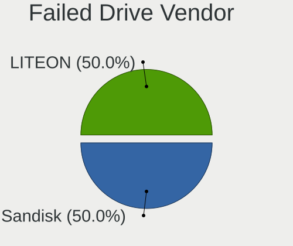

| Vendor             | Notebooks | Drives | Percent |
|--------------------|-----------|--------|---------|
| Seagate            | 1         | 1      | 25%     |
| Sandisk            | 1         | 1      | 25%     |
| LITEON             | 1         | 2      | 25%     |
| JMicron Technology | 1         | 1      | 25%     |

Drive Status
------------

Number of failed and malfunc. drives

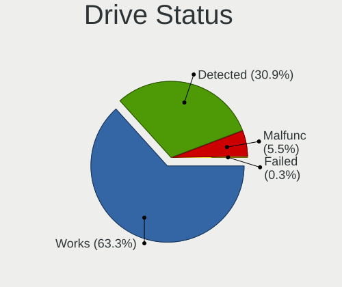

| Status   | Notebooks | Drives | Percent |
|----------|-----------|--------|---------|
| Works    | 941       | 1386   | 63.32%  |
| Detected | 459       | 688    | 30.89%  |
| Malfunc  | 82        | 92     | 5.52%   |
| Failed   | 4         | 5      | 0.27%   |

Storage controller
------------------

Storage Vendor
--------------

Storage controller vendors

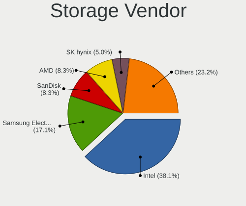

| Vendor                                  | Notebooks | Percent |
|-----------------------------------------|-----------|---------|
| Intel                                   | 694       | 38.09%  |
| Samsung Electronics                     | 311       | 17.07%  |
| SanDisk                                 | 152       | 8.34%   |
| AMD                                     | 151       | 8.29%   |
| SK hynix                                | 92        | 5.05%   |
| Micron Technology                       | 86        | 4.72%   |
| Kingston Technology Company             | 58        | 3.18%   |
| KIOXIA                                  | 47        | 2.58%   |
| Phison Electronics                      | 43        | 2.36%   |
| Micron/Crucial Technology               | 31        | 1.7%    |
| Toshiba America Info Systems            | 20        | 1.1%    |
| Solid State Storage Technology          | 15        | 0.82%   |
| Silicon Motion                          | 14        | 0.77%   |
| MAXIO Technology (Hangzhou)             | 12        | 0.66%   |
| Apple                                   | 12        | 0.66%   |
| Shenzhen Longsys Electronics            | 11        | 0.6%    |
| ADATA Technology                        | 11        | 0.6%    |
| Union Memory (Shenzhen)                 | 8         | 0.44%   |
| Realtek Semiconductor                   | 8         | 0.44%   |
| Yangtze Memory Technologies             | 7         | 0.38%   |
| Marvell Technology Group                | 5         | 0.27%   |
| Lenovo                                  | 5         | 0.27%   |
| Solidigm                                | 4         | 0.22%   |
| Seagate Technology                      | 3         | 0.16%   |
| JMicron Technology                      | 3         | 0.16%   |
| INNOGRIT                                | 3         | 0.16%   |
| Hosin Global Electronics                | 3         | 0.16%   |
| Shenzhen Unionmemory Information System | 2         | 0.11%   |
| Nvidia                                  | 2         | 0.11%   |
| Netac Technology                        | 2         | 0.11%   |
| Lite-On Technology                      | 2         | 0.11%   |
| ASMedia Technology                      | 2         | 0.11%   |
| O2 Micro                                | 1         | 0.05%   |
| Biwin Storage Technology                | 1         | 0.05%   |
| Unknown                                 | 1         | 0.05%   |

Storage Model
-------------

Storage controller models

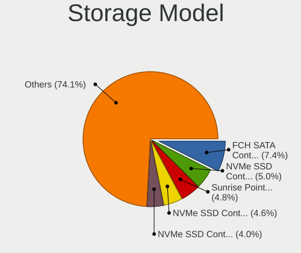

| Model                                                                          | Notebooks | Percent |
|--------------------------------------------------------------------------------|-----------|---------|
| AMD FCH SATA Controller [AHCI mode]                                            | 142       | 7.43%   |
| Samsung NVMe SSD Controller SM981/PM981/PM983                                  | 96        | 5.03%   |
| Intel Sunrise Point-LP SATA Controller [AHCI mode]                             | 91        | 4.76%   |
| Samsung NVMe SSD Controller 980 (DRAM-less)                                    | 88        | 4.61%   |
| Samsung NVMe SSD Controller PM9A1/PM9A3/980PRO                                 | 77        | 4.03%   |
| Intel Volume Management Device NVMe RAID Controller                            | 69        | 3.61%   |
| Intel 82801 Mobile SATA Controller [RAID mode]                                 | 59        | 3.09%   |
| Intel 7 Series Chipset Family 6-port SATA Controller [AHCI mode]               | 58        | 3.04%   |
| Intel Cannon Lake Mobile PCH SATA AHCI Controller                              | 48        | 2.51%   |
| SK hynix Gold P31/BC711/PC711 NVMe Solid State Drive                           | 41        | 2.15%   |
| Intel 8 Series SATA Controller 1 [AHCI mode]                                   | 40        | 2.09%   |
| Intel Tiger Lake-LP SATA Controller                                            | 30        | 1.57%   |
| SanDisk Ultra 3D / WD PC SN530, IX SN530, Blue SN550 NVMe SSD (DRAM-less)      | 29        | 1.52%   |
| SanDisk Extreme Pro / WD Black SN750 / PC SN730 / Red SN700 NVMe SSD           | 26        | 1.36%   |
| Intel Wildcat Point-LP SATA Controller [AHCI Mode]                             | 26        | 1.36%   |
| KIOXIA NVMe SSD Controller BG4 (DRAM-less)                                     | 23        | 1.2%    |
| Intel SSD 670p Series [Keystone Harbor]                                        | 23        | 1.2%    |
| Intel HM170/QM170 Chipset SATA Controller [AHCI Mode]                          | 23        | 1.2%    |
| SanDisk WD SN560/SN740/SN770/SN5000 NVMe SSD                                   | 22        | 1.15%   |
| Micron 2400 NVMe SSD (DRAM-less)                                               | 22        | 1.15%   |
| Intel SSD 660P Series                                                          | 21        | 1.1%    |
| Intel 6 Series/C200 Series Chipset Family 6 port Mobile SATA AHCI Controller   | 21        | 1.1%    |
| Intel Alder Lake-P SATA AHCI Controller                                        | 20        | 1.05%   |
| Intel 8 Series/C220 Series Chipset Family 6-port SATA Controller 1 [AHCI mode] | 20        | 1.05%   |
| Micron 2450 NVMe SSD [HendrixV] (DRAM-less)                                    | 18        | 0.94%   |
| Intel Comet Lake SATA AHCI Controller                                          | 18        | 0.94%   |
| Intel 82801IBM/IEM (ICH9M/ICH9M-E) 4 port SATA Controller [AHCI mode]          | 18        | 0.94%   |
| SK hynix Platinum P41/PC801 NVMe Solid State Drive                             | 17        | 0.89%   |
| Intel 400 Series Chipset Family SATA AHCI Controller                           | 17        | 0.89%   |
| Intel RST Volume Management Device Controller                                  | 16        | 0.84%   |
| Intel Q170/Q150/B150/H170/H110/Z170/CM236 Chipset SATA Controller [AHCI Mode]  | 15        | 0.79%   |
| Samsung NVMe SSD Controller PM9B1 (DRAM-less)                                  | 14        | 0.73%   |
| Intel Celeron/Pentium Silver Processor SATA Controller                         | 14        | 0.73%   |
| Samsung NVMe SSD Controller SM961/PM961/SM963                                  | 13        | 0.68%   |
| Phison PS5013-E13 PCIe3 NVMe Controller (DRAM-less)                            | 13        | 0.68%   |
| Kingston Company OM8PCP Design-In PCIe 3 NVMe SSD (DRAM-less)                  | 13        | 0.68%   |
| Silicon Motion SM2263EN/SM2263XT (DRAM-less) NVMe SSD Controllers              | 12        | 0.63%   |
| Samsung NVMe SSD Controller PM9C1a (DRAM-less)                                 | 12        | 0.63%   |
| Phison E12 NVMe Controller                                                     | 12        | 0.63%   |
| Micron 2210 NVMe SSD [Cobain]                                                  | 12        | 0.63%   |

Storage Kind
------------

Kind of storage controller (IDE, SATA, NVMe, SAS, ...)

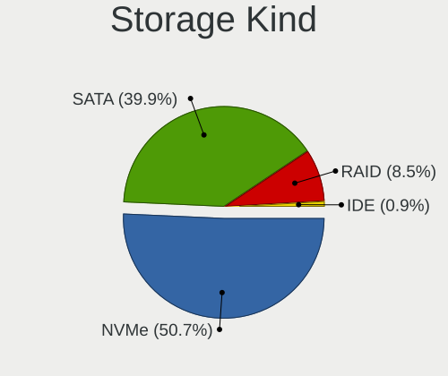

| Kind | Notebooks | Percent |
|------|-----------|---------|
| NVMe | 894       | 50.71%  |
| SATA | 704       | 39.93%  |
| RAID | 149       | 8.45%   |
| IDE  | 16        | 0.91%   |

Processor
---------

CPU Vendor
----------

Processor vendors

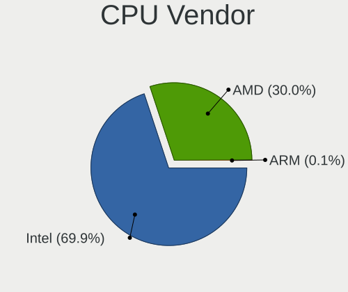

| Vendor | Notebooks | Percent |
|--------|-----------|---------|
| Intel  | 963       | 69.93%  |
| AMD    | 413       | 29.99%  |
| ARM    | 1         | 0.07%   |

CPU Model
---------

Processor models

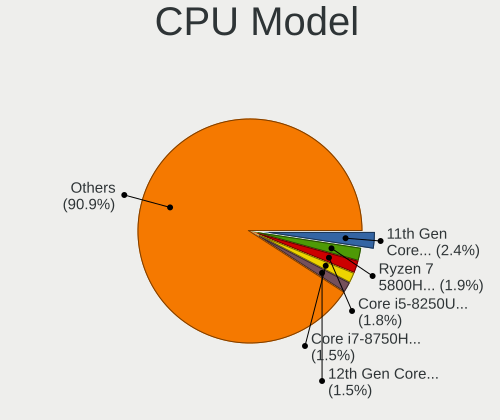

| Model                                         | Notebooks | Percent |
|-----------------------------------------------|-----------|---------|
| Intel 11th Gen Core i5-1135G7 @ 2.40GHz       | 33        | 2.39%   |
| AMD Ryzen 7 5800H with Radeon Graphics        | 26        | 1.89%   |
| Intel Core i5-8250U CPU @ 1.60GHz             | 25        | 1.81%   |
| Intel Core i7-8750H CPU @ 2.20GHz             | 21        | 1.52%   |
| Intel 12th Gen Core i7-12700H                 | 21        | 1.52%   |
| AMD Ryzen 5 3500U with Radeon Vega Mobile Gfx | 21        | 1.52%   |
| Intel Core i7-9750H CPU @ 2.60GHz             | 19        | 1.38%   |
| Intel Core i7-8550U CPU @ 1.80GHz             | 19        | 1.38%   |
| AMD Ryzen 5 5600H with Radeon Graphics        | 18        | 1.31%   |
| AMD Ryzen 5 5500U with Radeon Graphics        | 18        | 1.31%   |
| Intel 11th Gen Core i7-11800H @ 2.30GHz       | 17        | 1.23%   |
| AMD Ryzen 7 4800H with Radeon Graphics        | 17        | 1.23%   |
| Intel Core i7-10750H CPU @ 2.60GHz            | 16        | 1.16%   |
| Intel Core i5-10210U CPU @ 1.60GHz            | 16        | 1.16%   |
| Intel Core i5-8350U CPU @ 1.70GHz             | 14        | 1.02%   |
| Intel Core i5-7200U CPU @ 2.50GHz             | 14        | 1.02%   |
| Intel 11th Gen Core i7-1165G7 @ 2.80GHz       | 14        | 1.02%   |
| Intel Core i7-6700HQ CPU @ 2.60GHz            | 13        | 0.94%   |
| Intel Core i5-8265U CPU @ 1.60GHz             | 13        | 0.94%   |
| Intel Core i5-6300U CPU @ 2.40GHz             | 13        | 0.94%   |
| Intel Core i5-6200U CPU @ 2.30GHz             | 13        | 0.94%   |
| AMD Ryzen 7 5700U with Radeon Graphics        | 13        | 0.94%   |
| Intel Core Ultra 7 155H                       | 12        | 0.87%   |
| Intel Core i5-8300H CPU @ 2.30GHz             | 12        | 0.87%   |
| Intel Core i5-1035G1 CPU @ 1.00GHz            | 12        | 0.87%   |
| Intel Core i7-7700HQ CPU @ 2.80GHz            | 11        | 0.8%    |
| Intel Core i7-10510U CPU @ 1.80GHz            | 11        | 0.8%    |
| Intel 12th Gen Core i5-12500H                 | 11        | 0.8%    |
| AMD Ryzen 5 4600H with Radeon Graphics        | 11        | 0.8%    |
| AMD Ryzen 7 7840HS w/ Radeon 780M Graphics    | 10        | 0.73%   |
| AMD Ryzen 7 6800H with Radeon Graphics        | 10        | 0.73%   |
| Intel Celeron CPU N3060 @ 1.60GHz             | 9         | 0.65%   |
| Intel 11th Gen Core i3-1115G4 @ 3.00GHz       | 9         | 0.65%   |
| AMD Ryzen 7 PRO 4750U with Radeon Graphics    | 9         | 0.65%   |
| AMD Ryzen 7 3700U with Radeon Vega Mobile Gfx | 9         | 0.65%   |
| Intel Core i7-4510U CPU @ 2.00GHz             | 8         | 0.58%   |
| Intel Core i5-4210U CPU @ 1.70GHz             | 8         | 0.58%   |
| Intel Core i5-3320M CPU @ 2.60GHz             | 8         | 0.58%   |
| Intel 12th Gen Core i5-1235U                  | 8         | 0.58%   |
| AMD Ryzen 9 5900HX with Radeon Graphics       | 8         | 0.58%   |

CPU Model Family
----------------

Processor model prefix

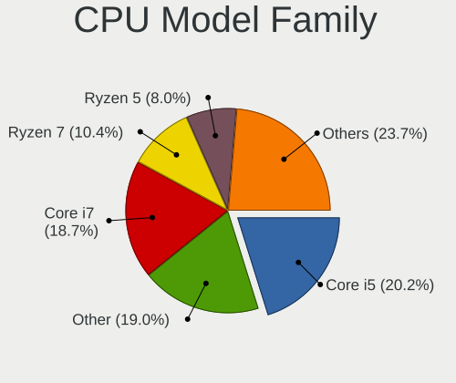

| Model                   | Notebooks | Percent |
|-------------------------|-----------|---------|
| Intel Core i5           | 278       | 20.17%  |
| Other                   | 262       | 19.01%  |
| Intel Core i7           | 258       | 18.72%  |
| AMD Ryzen 7             | 144       | 10.45%  |
| AMD Ryzen 5             | 110       | 7.98%   |
| Intel Core i3           | 53        | 3.85%   |
| Intel Celeron           | 46        | 3.34%   |
| AMD Ryzen 9             | 46        | 3.34%   |
| AMD Ryzen 7 PRO         | 31        | 2.25%   |
| Intel Core              | 30        | 2.18%   |
| Intel Core 2 Duo        | 22        | 1.6%    |
| AMD Ryzen 3             | 17        | 1.23%   |
| Intel Pentium           | 12        | 0.87%   |
| AMD Ryzen 5 PRO         | 12        | 0.87%   |
| AMD A4                  | 9         | 0.65%   |
| Intel Pentium Silver    | 6         | 0.44%   |
| Intel Xeon              | 5         | 0.36%   |
| Intel Core i9           | 5         | 0.36%   |
| AMD E2                  | 3         | 0.22%   |
| AMD E                   | 3         | 0.22%   |
| AMD Athlon              | 3         | 0.22%   |
| AMD A8                  | 3         | 0.22%   |
| AMD A10                 | 3         | 0.22%   |
| Intel Pentium Dual-Core | 2         | 0.15%   |
| Intel Core m3           | 2         | 0.15%   |
| Intel Atom              | 2         | 0.15%   |
| AMD E1                  | 2         | 0.15%   |
| AMD A6                  | 2         | 0.15%   |
| Intel Genuine           | 1         | 0.07%   |
| Intel Core m5           | 1         | 0.07%   |
| Intel Core M            | 1         | 0.07%   |
| Intel Core 2 Extreme    | 1         | 0.07%   |
| Intel Core 2            | 1         | 0.07%   |
| AMD PRO A10             | 1         | 0.07%   |
| AMD Athlon II           | 1         | 0.07%   |

CPU Cores
---------

Number of processor cores

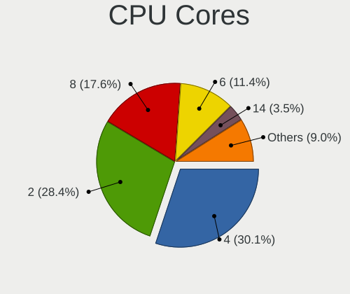

| Number | Notebooks | Percent |
|--------|-----------|---------|
| 4      | 415       | 30.12%  |
| 2      | 392       | 28.45%  |
| 8      | 242       | 17.56%  |
| 6      | 157       | 11.39%  |
| 14     | 48        | 3.48%   |
| 10     | 43        | 3.12%   |
| 12     | 42        | 3.05%   |
| 16     | 25        | 1.81%   |
| 24     | 11        | 0.8%    |
| 20     | 2         | 0.15%   |
| 1      | 1         | 0.07%   |

CPU Sockets
-----------

Number of sockets

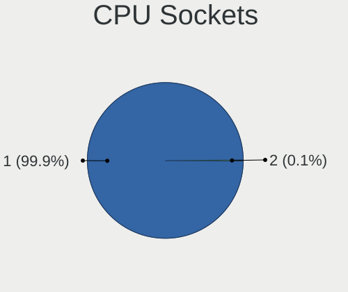

| Number | Notebooks | Percent |
|--------|-----------|---------|
| 1      | 1376      | 99.93%  |
| 2      | 1         | 0.07%   |

CPU Threads
-----------

Threads per core (Hyper-Threading)

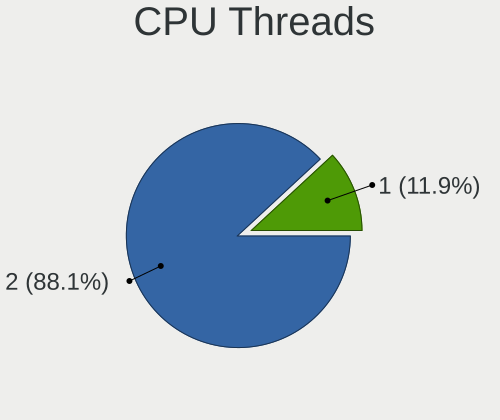

| Number | Notebooks | Percent |
|--------|-----------|---------|
| 2      | 1215      | 88.11%  |
| 1      | 164       | 11.89%  |

CPU Op-Modes
------------

CPU Operation Modes (32-bit, 64-bit)

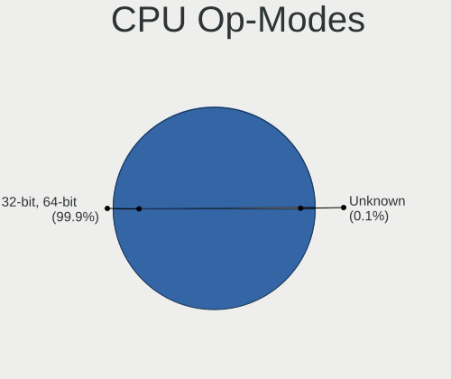

| Op mode        | Notebooks | Percent |
|----------------|-----------|---------|
| 32-bit, 64-bit | 1375      | 99.85%  |
| 64-bit         | 1         | 0.07%   |
| Unknown        | 1         | 0.07%   |

CPU Microcode
-------------

Microcode number

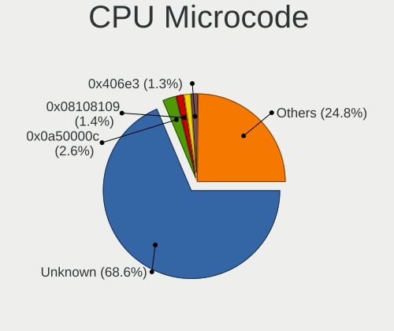

| Number     | Notebooks | Percent |
|------------|-----------|---------|
| Unknown    | 967       | 68.63%  |
| 0x0a50000c | 36        | 2.56%   |
| 0x08108109 | 20        | 1.42%   |
| 0x806ec    | 18        | 1.28%   |
| 0x406e3    | 18        | 1.28%   |
| 0x306a9    | 18        | 1.28%   |
| 0x806c1    | 17        | 1.21%   |
| 0x806ea    | 16        | 1.14%   |
| 0x0a404102 | 16        | 1.14%   |
| 0x08600106 | 16        | 1.14%   |
| 0x40651    | 15        | 1.06%   |
| 0x806e9    | 14        | 0.99%   |
| 0x0a50000d | 14        | 0.99%   |
| 0x08608103 | 14        | 0.99%   |
| 0x08600104 | 14        | 0.99%   |
| 0x906ea    | 13        | 0.92%   |
| 0x306c3    | 12        | 0.85%   |
| 0x08108102 | 11        | 0.78%   |
| 0x906a3    | 10        | 0.71%   |
| 0x906e9    | 9         | 0.64%   |
| 0x506e3    | 9         | 0.64%   |
| 0x306d4    | 9         | 0.64%   |
| 0x206a7    | 9         | 0.64%   |
| 0x1067a    | 8         | 0.57%   |
| 0xa0652    | 7         | 0.5%    |
| 0x706e5    | 7         | 0.5%    |
| 0x806d1    | 6         | 0.43%   |
| 0x406c4    | 6         | 0.43%   |
| 0x706a1    | 5         | 0.35%   |
| 0x20655    | 5         | 0.35%   |
| 0x0a404101 | 5         | 0.35%   |
| 0x06006705 | 5         | 0.35%   |
| 0x0a704104 | 3         | 0.21%   |
| 0x0a704103 | 3         | 0.21%   |
| 0x08600103 | 3         | 0.21%   |
| 0x0700010f | 3         | 0.21%   |
| 0x06006704 | 3         | 0.21%   |
| 0x0600611a | 3         | 0.21%   |
| 0x906ed    | 2         | 0.14%   |
| 0x906c0    | 2         | 0.14%   |

CPU Microarch
-------------

Microarchitecture

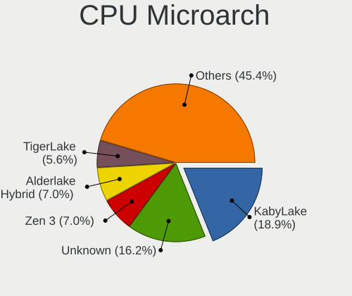

| Name               | Notebooks | Percent |
|--------------------|-----------|---------|
| KabyLake           | 261       | 18.93%  |
| Unknown            | 223       | 16.17%  |
| Zen 3              | 96        | 6.96%   |
| Alderlake Hybrid   | 96        | 6.96%   |
| TigerLake          | 77        | 5.58%   |
| Haswell            | 76        | 5.51%   |
| Skylake            | 67        | 4.86%   |
| Zen 2              | 63        | 4.57%   |
| IvyBridge          | 61        | 4.42%   |
| Zen+               | 57        | 4.13%   |
| Icelake            | 44        | 3.19%   |
| Broadwell          | 36        | 2.61%   |
| CometLake          | 32        | 2.32%   |
| SandyBridge        | 31        | 2.25%   |
| Silvermont         | 22        | 1.6%    |
| Penryn             | 21        | 1.52%   |
| Goldmont plus      | 20        | 1.45%   |
| Excavator          | 17        | 1.23%   |
| Westmere           | 14        | 1.02%   |
| Meteorlake Hybrid  | 11        | 0.8%    |
| Zen                | 8         | 0.58%   |
| Jaguar             | 8         | 0.58%   |
| Tremont            | 7         | 0.51%   |
| Lunarlake Hybrid   | 6         | 0.44%   |
| Core               | 6         | 0.44%   |
| Goldmont           | 5         | 0.36%   |
| Bobcat             | 4         | 0.29%   |
| Piledriver         | 3         | 0.22%   |
| Nehalem            | 3         | 0.22%   |
| Puma               | 2         | 0.15%   |
| K10                | 1         | 0.07%   |
| ArrowLake-H Hybrid | 1         | 0.07%   |

Graphics
--------

GPU Vendor
----------

Vendors of graphics cards

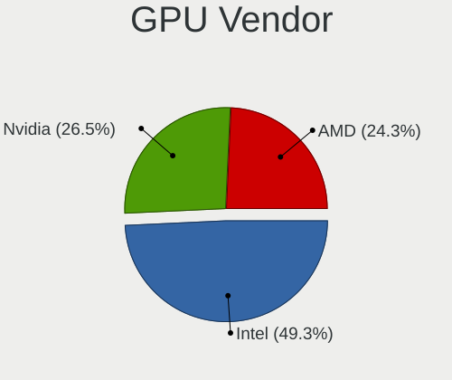

| Vendor | Notebooks | Percent |
|--------|-----------|---------|
| Intel  | 910       | 49.27%  |
| Nvidia | 489       | 26.48%  |
| AMD    | 448       | 24.26%  |

GPU Model
---------

Graphics card models

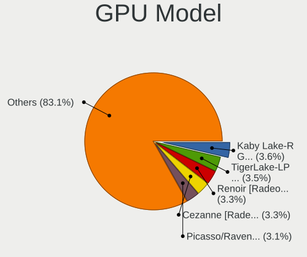

| Model                                                                                    | Notebooks | Percent |
|------------------------------------------------------------------------------------------|-----------|---------|
| Intel Kaby Lake-R GT2 [UHD Graphics 620]                                                 | 69        | 3.65%   |
| Intel TigerLake-LP GT2 [Iris Xe Graphics]                                                | 67        | 3.54%   |
| AMD Renoir [Radeon Vega Series / Radeon Vega Mobile Series]                              | 62        | 3.28%   |
| AMD Cezanne [Radeon Vega Series / Radeon Vega Mobile Series]                             | 62        | 3.28%   |
| AMD Picasso/Raven 2 [Radeon Vega Series / Radeon Vega Mobile Series]                     | 59        | 3.12%   |
| Intel CoffeeLake-H GT2 [UHD Graphics 630]                                                | 58        | 3.07%   |
| Intel 3rd Gen Core processor Graphics Controller                                         | 58        | 3.07%   |
| Intel Haswell-ULT Integrated Graphics Controller                                         | 49        | 2.59%   |
| AMD Rembrandt [Radeon 680M]                                                              | 46        | 2.43%   |
| Intel Alder Lake-P GT2 [Iris Xe Graphics]                                                | 43        | 2.27%   |
| Intel Skylake-U GT2 [HD Graphics 520]                                                    | 40        | 2.11%   |
| Nvidia GA106M [GeForce RTX 3060 Mobile / Max-Q]                                          | 36        | 1.9%    |
| Intel CometLake-U GT2 [UHD Graphics]                                                     | 36        | 1.9%    |
| Intel Kaby Lake-U GT2 [HD Graphics 620]                                                  | 35        | 1.85%   |
| AMD Lucienne                                                                             | 35        | 1.85%   |
| AMD Phoenix1                                                                             | 32        | 1.69%   |
| Nvidia TU117M [GeForce GTX 1650 Mobile / Max-Q]                                          | 30        | 1.59%   |
| Intel Raptor Lake-P [Iris Xe Graphics]                                                   | 30        | 1.59%   |
| Nvidia AD107M [GeForce RTX 4060 Max-Q / Mobile]                                          | 27        | 1.43%   |
| Intel WhiskeyLake-U GT2 [UHD Graphics 620]                                               | 27        | 1.43%   |
| Intel CometLake-H GT2 [UHD Graphics]                                                     | 27        | 1.43%   |
| Intel 2nd Generation Core Processor Family Integrated Graphics Controller                | 26        | 1.37%   |
| Intel Broadwell-U GT2 [HD Graphics 5500]                                                 | 24        | 1.27%   |
| Intel 4th Gen Core Processor Integrated Graphics Controller                              | 24        | 1.27%   |
| AMD Barcelo                                                                              | 24        | 1.27%   |
| Intel TigerLake-H GT1 [UHD Graphics]                                                     | 22        | 1.16%   |
| Nvidia GA107M [GeForce RTX 3050 Ti Mobile]                                               | 21        | 1.11%   |
| Nvidia GA107M [GeForce RTX 3050 Mobile]                                                  | 19        | 1%      |
| Nvidia TU116M [GeForce GTX 1660 Ti Mobile]                                               | 18        | 0.95%   |
| Nvidia AD106M [GeForce RTX 4070 Max-Q / Mobile]                                          | 18        | 0.95%   |
| Nvidia GP107M [GeForce GTX 1050 Mobile]                                                  | 17        | 0.9%    |
| Intel GeminiLake [UHD Graphics 600]                                                      | 17        | 0.9%    |
| Nvidia GP108M [GeForce MX150]                                                            | 16        | 0.85%   |
| Intel Meteor Lake-P [Intel Arc Graphics]                                                 | 16        | 0.85%   |
| Intel Kaby Lake-H GT2 [HD Graphics 630]                                                  | 16        | 0.85%   |
| Nvidia GP107M [GeForce GTX 1050 Ti Mobile]                                               | 15        | 0.79%   |
| Intel Skylake-H GT2 [HD Graphics 530]                                                    | 15        | 0.79%   |
| Intel Atom/Celeron/Pentium Processor x5-E8000/J3xxx/N3xxx Integrated Graphics Controller | 15        | 0.79%   |
| Intel Iris Plus Graphics G1 (Ice Lake)                                                   | 14        | 0.74%   |
| Intel Core Processor Integrated Graphics Controller                                      | 13        | 0.69%   |

GPU Combo
---------

Combinations of graphics cards

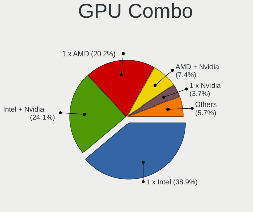

| Name                     | Notebooks | Percent |
|--------------------------|-----------|---------|
| 1 x Intel                | 536       | 38.87%  |
| Intel + Nvidia           | 333       | 24.15%  |
| 1 x AMD                  | 278       | 20.16%  |
| AMD + Nvidia             | 102       | 7.4%    |
| 1 x Nvidia               | 51        | 3.7%    |
| 2 x AMD                  | 37        | 2.68%   |
| Intel + AMD              | 31        | 2.25%   |
| 2 x Intel                | 8         | 0.58%   |
| Other                    | 2         | 0.15%   |
| Intel + AMD + 1 x Nvidia | 1         | 0.07%   |

GPU Driver
----------

Free vs proprietary

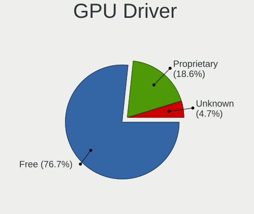

| Driver      | Notebooks | Percent |
|-------------|-----------|---------|
| Free        | 1069      | 76.69%  |
| Proprietary | 259       | 18.58%  |
| Unknown     | 66        | 4.73%   |

GPU Memory
----------

Total video memory

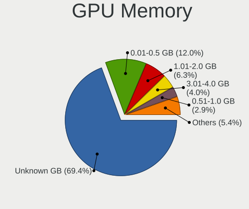

| Size in GB | Notebooks | Percent |
|------------|-----------|---------|
| Unknown    | 969       | 69.41%  |
| 0.01-0.5   | 167       | 11.96%  |
| 1.01-2.0   | 88        | 6.3%    |
| 3.01-4.0   | 56        | 4.01%   |
| 0.51-1.0   | 41        | 2.94%   |
| 7.01-8.0   | 32        | 2.29%   |
| 5.01-6.0   | 27        | 1.93%   |
| 8.01-16.0  | 8         | 0.57%   |
| 2.01-3.0   | 7         | 0.5%    |
| 24.01-32.0 | 1         | 0.07%   |

Monitor
-------

Monitor Vendor
--------------

Monitor vendors

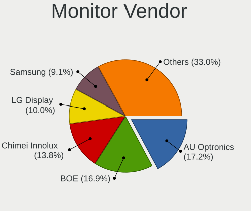

| Vendor                  | Notebooks | Percent |
|-------------------------|-----------|---------|
| AU Optronics            | 289       | 17.17%  |
| BOE                     | 284       | 16.87%  |
| Chimei Innolux          | 232       | 13.78%  |
| LG Display              | 169       | 10.04%  |
| Samsung Electronics     | 153       | 9.09%   |
| PANDA                   | 44        | 2.61%   |
| Apple                   | 41        | 2.44%   |
| Sharp                   | 40        | 2.38%   |
| Goldstar                | 40        | 2.38%   |
| Dell                    | 40        | 2.38%   |
| Lenovo                  | 39        | 2.32%   |
| Acer                    | 24        | 1.43%   |
| AOC                     | 22        | 1.31%   |
| CSO                     | 21        | 1.25%   |
| InfoVision              | 19        | 1.13%   |
| Hewlett-Packard         | 18        | 1.07%   |
| BenQ                    | 17        | 1.01%   |
| TMX                     | 14        | 0.83%   |
| Philips                 | 14        | 0.83%   |
| ASUSTek Computer        | 14        | 0.83%   |
| Ancor Communications    | 12        | 0.71%   |
| MSI                     | 10        | 0.59%   |
| CSW                     | 10        | 0.59%   |
| Pixio                   | 9         | 0.53%   |
| Chi Mei Optoelectronics | 9         | 0.53%   |
| Iiyama                  | 8         | 0.48%   |
| ViewSonic               | 7         | 0.42%   |
| Gigabyte Technology     | 7         | 0.42%   |
| CSOT                    | 6         | 0.36%   |
| Sony                    | 5         | 0.3%    |
| LG Philips              | 4         | 0.24%   |
| KDB                     | 4         | 0.24%   |
| JDI                     | 4         | 0.24%   |
| HKC                     | 4         | 0.24%   |
| Fujitsu Siemens         | 4         | 0.24%   |
| Vestel Elektronik       | 3         | 0.18%   |
| Toshiba                 | 3         | 0.18%   |
| TMA                     | 3         | 0.18%   |
| Vizio                   | 2         | 0.12%   |
| Unknown                 | 2         | 0.12%   |

Monitor Model
-------------

Monitor models

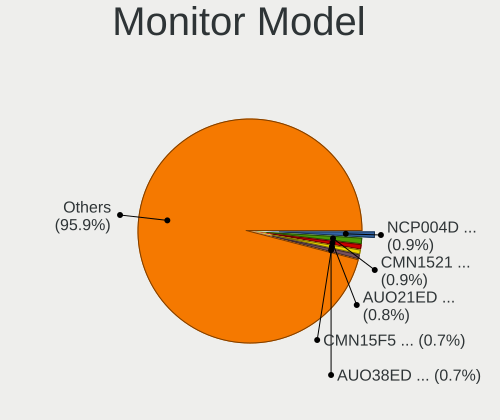

| Model                                                                 | Notebooks | Percent |
|-----------------------------------------------------------------------|-----------|---------|
| PANDA LCD Monitor NCP004D 1920x1080 344x194mm 15.5-inch               | 16        | 0.94%   |
| Chimei Innolux LCD Monitor CMN1521 1920x1080 344x193mm 15.5-inch      | 16        | 0.94%   |
| AU Optronics LCD Monitor AUO21ED 1920x1080 344x193mm 15.5-inch        | 13        | 0.77%   |
| Chimei Innolux LCD Monitor CMN15F5 1920x1080 344x193mm 15.5-inch      | 12        | 0.71%   |
| AU Optronics LCD Monitor AUO38ED 1920x1080 344x193mm 15.5-inch        | 12        | 0.71%   |
| Chimei Innolux LCD Monitor CMN14D4 1920x1080 309x173mm 13.9-inch      | 11        | 0.65%   |
| Pixio U29I WAM2900 2560x1080 690x260mm 29.0-inch                      | 9         | 0.53%   |
| Chimei Innolux LCD Monitor CMN14C9 1920x1080 309x173mm 13.9-inch      | 9         | 0.53%   |
| Apple Color LCD APP9CDF 1440x900 286x179mm 13.3-inch                  | 9         | 0.53%   |
| Chimei Innolux LCD Monitor CMN15E7 1920x1080 344x193mm 15.5-inch      | 8         | 0.47%   |
| Chimei Innolux LCD Monitor CMN14E5 1920x1080 309x173mm 13.9-inch      | 8         | 0.47%   |
| AU Optronics LCD Monitor AUO403D 1920x1080 309x174mm 14.0-inch        | 8         | 0.47%   |
| TMX TL156MDMP11-0 TMX1560 3200x2000 336x210mm 15.6-inch               | 7         | 0.41%   |
| LG Display LCD Monitor LGD0521 1920x1080 309x174mm 14.0-inch          | 7         | 0.41%   |
| Lenovo LCD Monitor LEN40BA 1920x1080 344x194mm 15.5-inch              | 7         | 0.41%   |
| InfoVision LCD Monitor IVO057D 1920x1080 309x174mm 14.0-inch          | 7         | 0.41%   |
| Chimei Innolux LCD Monitor CMN15E8 1920x1080 344x193mm 15.5-inch      | 7         | 0.41%   |
| Chimei Innolux LCD Monitor CMN15DB 1366x768 344x193mm 15.5-inch       | 7         | 0.41%   |
| AU Optronics LCD Monitor AUO499F 1920x1080 344x194mm 15.5-inch        | 7         | 0.41%   |
| Samsung Electronics LCD Monitor SEC5441 1280x800 331x207mm 15.4-inch  | 6         | 0.35%   |
| Samsung Electronics LCD Monitor SDC4171 2880x1800 302x189mm 14.0-inch | 6         | 0.35%   |
| AU Optronics LCD Monitor AUO243D 1920x1080 309x173mm 13.9-inch        | 6         | 0.35%   |
| AU Optronics LCD Monitor AUO123D 1920x1080 309x173mm 13.9-inch        | 6         | 0.35%   |
| Samsung Electronics LCD Monitor SDC4178 3200x2000 344x215mm 16.0-inch | 5         | 0.29%   |
| PANDA LCD Monitor NCP0035 1920x1080 344x194mm 15.5-inch               | 5         | 0.29%   |
| LG Display LCD Monitor LGD05E5 1920x1080 344x194mm 15.5-inch          | 5         | 0.29%   |
| LG Display LCD Monitor LGD04E8 1920x1080 382x215mm 17.3-inch          | 5         | 0.29%   |
| LG Display LCD Monitor LGD02D8 1366x768 277x156mm 12.5-inch           | 5         | 0.29%   |
| Goldstar FULL HD GSM5B55 1920x1080 480x270mm 21.7-inch                | 5         | 0.29%   |
| Chimei Innolux LCD Monitor CMN15DC 1366x768 344x193mm 15.5-inch       | 5         | 0.29%   |
| Chimei Innolux LCD Monitor CMN151E 1920x1080 344x193mm 15.5-inch      | 5         | 0.29%   |
| BOE LCD Monitor BOE0A9B 2560x1600 344x215mm 16.0-inch                 | 5         | 0.29%   |
| BOE LCD Monitor BOE0A1F 2560x1600 344x215mm 16.0-inch                 | 5         | 0.29%   |
| BOE LCD Monitor BOE06A5 1366x768 344x194mm 15.5-inch                  | 5         | 0.29%   |
| AU Optronics LCD Monitor AUO61ED 1920x1080 344x194mm 15.5-inch        | 5         | 0.29%   |
| Samsung Electronics LCD Monitor SDC4188 2880x1800 312x195mm 14.5-inch | 4         | 0.24%   |
| Samsung Electronics LCD Monitor SDC4161 1920x1080 344x194mm 15.5-inch | 4         | 0.24%   |
| PANDA LCD Monitor NCP002D 1920x1080 344x194mm 15.5-inch               | 4         | 0.24%   |
| LG Display LCD Monitor LGD06B3 1920x1200 336x210mm 15.6-inch          | 4         | 0.24%   |
| LG Display LCD Monitor LGD0590 1920x1080 344x194mm 15.5-inch          | 4         | 0.24%   |

Monitor Resolution
------------------

Monitor screen resolution

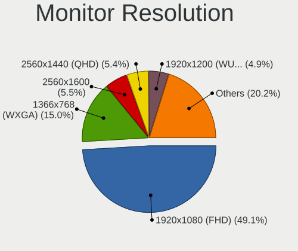

| Resolution         | Notebooks | Percent |
|--------------------|-----------|---------|
| 1920x1080 (FHD)    | 770       | 49.08%  |
| 1366x768 (WXGA)    | 235       | 14.98%  |
| 2560x1600          | 86        | 5.48%   |
| 2560x1440 (QHD)    | 84        | 5.35%   |
| 1920x1200 (WUXGA)  | 77        | 4.91%   |
| 3840x2160 (4K)     | 60        | 3.82%   |
| 2880x1800          | 50        | 3.19%   |
| 1440x900 (WXGA+)   | 25        | 1.59%   |
| 1600x900 (HD+)     | 21        | 1.34%   |
| 3440x1440          | 18        | 1.15%   |
| 2560x1080          | 17        | 1.08%   |
| 3200x2000          | 16        | 1.02%   |
| 1280x800 (WXGA)    | 16        | 1.02%   |
| 3840x2400          | 11        | 0.7%    |
| 2160x1440          | 11        | 0.7%    |
| Unknown            | 8         | 0.51%   |
| 1680x1050 (WSXGA+) | 7         | 0.45%   |
| 1280x1024 (SXGA)   | 7         | 0.45%   |
| 3072x1920          | 6         | 0.38%   |
| 3456x2160          | 5         | 0.32%   |
| 3200x1800 (QHD+)   | 5         | 0.32%   |
| 1360x768           | 5         | 0.32%   |
| 2240x1400          | 4         | 0.25%   |
| 3840x1080          | 3         | 0.19%   |
| 3000x2000          | 3         | 0.19%   |
| 2880x1920          | 3         | 0.19%   |
| 2880x1620          | 3         | 0.19%   |
| 2520x1680          | 3         | 0.19%   |
| 1920x1280          | 3         | 0.19%   |
| 2256x1504          | 2         | 0.13%   |
| 3840x1600          | 1         | 0.06%   |
| 3840x1100          | 1         | 0.06%   |
| 2288x1287          | 1         | 0.06%   |
| 1920x540           | 1         | 0.06%   |
| 1600x1200          | 1         | 0.06%   |

Monitor Diagonal
----------------

Diagonal size in inches

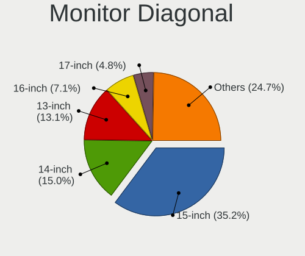

| Inches  | Notebooks | Percent |
|---------|-----------|---------|
| 15      | 594       | 35.23%  |
| 14      | 253       | 15.01%  |
| 13      | 221       | 13.11%  |
| 16      | 120       | 7.12%   |
| 17      | 81        | 4.8%    |
| 27      | 75        | 4.45%   |
| 24      | 59        | 3.5%    |
| 23      | 40        | 2.37%   |
| 31      | 34        | 2.02%   |
| 21      | 32        | 1.9%    |
| 12      | 29        | 1.72%   |
| 11      | 22        | 1.3%    |
| 34      | 17        | 1.01%   |
| 18      | 13        | 0.77%   |
| 29      | 10        | 0.59%   |
| Unknown | 10        | 0.59%   |
| 19      | 7         | 0.42%   |
| 54      | 6         | 0.36%   |
| 84      | 5         | 0.3%    |
| 40      | 5         | 0.3%    |
| 35      | 5         | 0.3%    |
| 32      | 5         | 0.3%    |
| 49      | 4         | 0.24%   |
| 20      | 4         | 0.24%   |
| 72      | 3         | 0.18%   |
| 28      | 3         | 0.18%   |
| 25      | 3         | 0.18%   |
| 22      | 3         | 0.18%   |
| 74      | 2         | 0.12%   |
| 63      | 2         | 0.12%   |
| 58      | 2         | 0.12%   |
| 42      | 2         | 0.12%   |
| 37      | 2         | 0.12%   |
| 26      | 2         | 0.12%   |
| 10      | 2         | 0.12%   |
| 142     | 1         | 0.06%   |
| 86      | 1         | 0.06%   |
| 65      | 1         | 0.06%   |
| 57      | 1         | 0.06%   |
| 52      | 1         | 0.06%   |

Monitor Width
-------------

Physical width

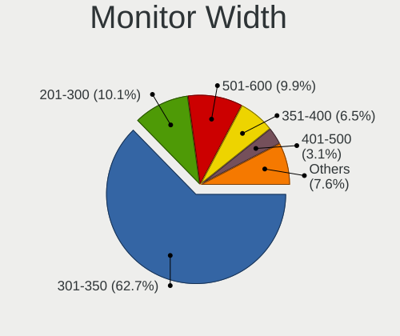

| Width in mm    | Notebooks | Percent |
|----------------|-----------|---------|
| 301-350        | 1045      | 62.69%  |
| 201-300        | 169       | 10.14%  |
| 501-600        | 165       | 9.9%    |
| 351-400        | 109       | 6.54%   |
| 401-500        | 52        | 3.12%   |
| 601-700        | 50        | 3%      |
| 701-800        | 24        | 1.44%   |
| 1001-1500      | 17        | 1.02%   |
| 801-900        | 12        | 0.72%   |
| 1501-2000      | 10        | 0.6%    |
| Unknown        | 10        | 0.6%    |
| 901-1000       | 2         | 0.12%   |
| More than 2000 | 1         | 0.06%   |
| 101-200        | 1         | 0.06%   |

Aspect Ratio
------------

Proportional relationship between the width and the height

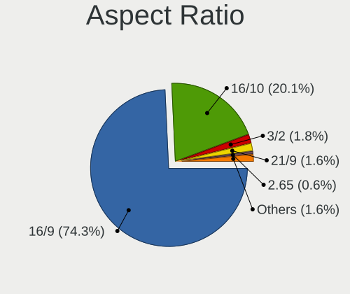

| Ratio   | Notebooks | Percent |
|---------|-----------|---------|
| 16/9    | 1088      | 74.27%  |
| 16/10   | 294       | 20.07%  |
| 3/2     | 27        | 1.84%   |
| 21/9    | 24        | 1.64%   |
| 2.65    | 9         | 0.61%   |
| Unknown | 7         | 0.48%   |
| 5/4     | 5         | 0.34%   |
| 32/9    | 3         | 0.2%    |
| 6/5     | 2         | 0.14%   |
| 4/3     | 2         | 0.14%   |
| 3.40    | 1         | 0.07%   |
| 1.00    | 1         | 0.07%   |
| 0.62    | 1         | 0.07%   |
| 0.56    | 1         | 0.07%   |

Monitor Area
------------

Area in inch²

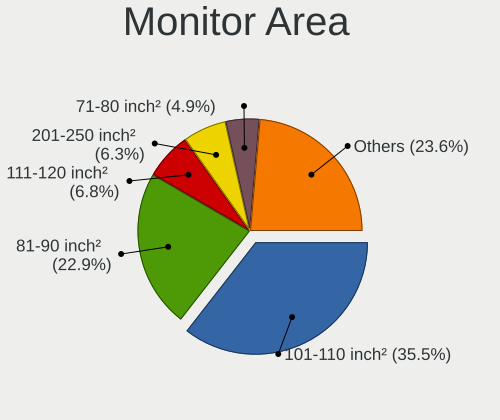

| Area in inch² | Notebooks | Percent |
|----------------|-----------|---------|
| 101-110        | 597       | 35.54%  |
| 81-90          | 384       | 22.86%  |
| 111-120        | 114       | 6.79%   |
| 201-250        | 106       | 6.31%   |
| 71-80          | 82        | 4.88%   |
| 301-350        | 78        | 4.64%   |
| 121-130        | 69        | 4.11%   |
| 351-500        | 62        | 3.69%   |
| 251-300        | 34        | 2.02%   |
| 61-70          | 27        | 1.61%   |
| More than 1000 | 24        | 1.43%   |
| 51-60          | 23        | 1.37%   |
| 151-200        | 17        | 1.01%   |
| 141-150        | 15        | 0.89%   |
| 501-1000       | 14        | 0.83%   |
| 131-140        | 11        | 0.65%   |
| 91-100         | 10        | 0.6%    |
| Unknown        | 10        | 0.6%    |
| 41-50          | 2         | 0.12%   |
| 1-40           | 1         | 0.06%   |

Pixel Density
-------------

Pixels per inch

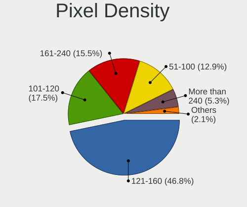

| Density       | Notebooks | Percent |
|---------------|-----------|---------|
| 121-160       | 771       | 46.76%  |
| 101-120       | 289       | 17.53%  |
| 161-240       | 255       | 15.46%  |
| 51-100        | 213       | 12.92%  |
| More than 240 | 87        | 5.28%   |
| 1-50          | 24        | 1.46%   |
| Unknown       | 10        | 0.61%   |

Multiple Monitors
-----------------

Total monitors connected

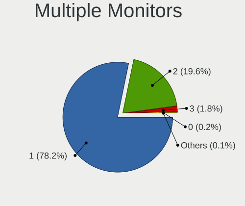

| Total | Notebooks | Percent |
|-------|-----------|---------|
| 1     | 1100      | 78.24%  |
| 2     | 276       | 19.63%  |
| 3     | 25        | 1.78%   |
| 0     | 3         | 0.21%   |
| 5     | 1         | 0.07%   |
| 4     | 1         | 0.07%   |

Network
-------

Net Controller Vendor
---------------------

Controller vendors

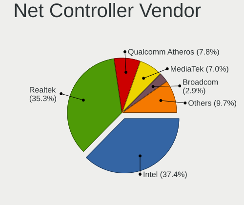

| Vendor                                 | Notebooks | Percent |
|----------------------------------------|-----------|---------|
| Intel                                  | 800       | 37.38%  |
| Realtek Semiconductor                  | 755       | 35.28%  |
| Qualcomm Atheros                       | 166       | 7.76%   |
| MediaTek                               | 149       | 6.96%   |
| Broadcom                               | 62        | 2.9%    |
| ASIX Electronics                       | 24        | 1.12%   |
| Broadcom Limited                       | 23        | 1.07%   |
| Qualcomm                               | 20        | 0.93%   |
| TP-Link                                | 11        | 0.51%   |
| Sierra Wireless                        | 10        | 0.47%   |
| Shenzhen Goodix Technology             | 9         | 0.42%   |
| Samsung Electronics                    | 9         | 0.42%   |
| Lenovo                                 | 9         | 0.42%   |
| DisplayLink                            | 9         | 0.42%   |
| D-Link                                 | 9         | 0.42%   |
| Cypress Semiconductor                  | 9         | 0.42%   |
| Hewlett-Packard                        | 7         | 0.33%   |
| Apple                                  | 7         | 0.33%   |
| Ralink                                 | 5         | 0.23%   |
| Qualcomm Technologies                  | 5         | 0.23%   |
| Google                                 | 5         | 0.23%   |
| OPPO Electronics                       | 4         | 0.19%   |
| Ericsson Business Mobile Networks      | 4         | 0.19%   |
| Xiaomi                                 | 3         | 0.14%   |
| Suzhou Motorcomm Electronic Technology | 3         | 0.14%   |
| ICS Advent                             | 3         | 0.14%   |
| OnePlus Technology (Shenzhen)          | 2         | 0.09%   |
| NetGear                                | 2         | 0.09%   |
| Microsoft                              | 2         | 0.09%   |
| Huawei Technologies                    | 2         | 0.09%   |
| Dell                                   | 2         | 0.09%   |
| Ralink Technology                      | 1         | 0.05%   |
| Quectel Wireless Solutions             | 1         | 0.05%   |
| Motorola PCS                           | 1         | 0.05%   |
| Marvell Technology Group               | 1         | 0.05%   |
| Linksys                                | 1         | 0.05%   |
| Fibocom                                | 1         | 0.05%   |
| Edimax Technology                      | 1         | 0.05%   |
| D-Link System                          | 1         | 0.05%   |
| Belkin Components                      | 1         | 0.05%   |

Net Controller Model
--------------------

Controller models

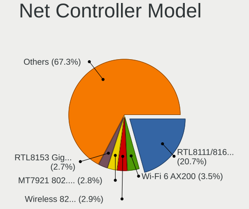

| Model                                                                  | Notebooks | Percent |
|------------------------------------------------------------------------|-----------|---------|
| Realtek RTL8111/8168/8211/8411 PCI Express Gigabit Ethernet Controller | 521       | 20.67%  |
| Intel Wi-Fi 6 AX200                                                    | 89        | 3.53%   |
| Intel Wireless 8265 / 8275                                             | 74        | 2.94%   |
| MediaTek MT7921 802.11ax PCIe Wireless Network Adapter [Filogic 330]   | 71        | 2.82%   |
| Realtek RTL8153 Gigabit Ethernet Adapter                               | 69        | 2.74%   |
| Intel Alder Lake-P PCH CNVi WiFi                                       | 67        | 2.66%   |
| Realtek RTL8821CE 802.11ac PCIe Wireless Network Adapter               | 58        | 2.3%    |
| Qualcomm Atheros QCA9377 802.11ac Wireless Network Adapter             | 56        | 2.22%   |
| Intel Wi-Fi 6 AX201                                                    | 54        | 2.14%   |
| Realtek RTL810xE PCI Express Fast Ethernet controller                  | 51        | 2.02%   |
| Realtek RTL8822CE 802.11ac PCIe Wireless Network Adapter               | 48        | 1.9%    |
| MediaTek MT7922 802.11ax PCI Express Wireless Network Adapter          | 42        | 1.67%   |
| Intel Wi-Fi 6E(802.11ax) AX210/AX1675* 2x2 [Typhoon Peak]              | 42        | 1.67%   |
| Intel Wireless 7265                                                    | 39        | 1.55%   |
| Intel Cannon Lake PCH CNVi WiFi                                        | 39        | 1.55%   |
| Intel Wireless 8260                                                    | 34        | 1.35%   |
| Intel Raptor Lake PCH CNVi WiFi                                        | 33        | 1.31%   |
| Intel Comet Lake PCH-LP CNVi WiFi                                      | 32        | 1.27%   |
| Intel 82579LM Gigabit Network Connection (Lewisville)                  | 31        | 1.23%   |
| Intel Wireless 7260                                                    | 29        | 1.15%   |
| Intel Ethernet Connection (4) I219-LM                                  | 28        | 1.11%   |
| Intel Comet Lake PCH CNVi WiFi                                         | 25        | 0.99%   |
| Realtek RTL8852BE PCIe 802.11ax Wireless Network Controller            | 24        | 0.95%   |
| Realtek RTL8125 2.5GbE Controller                                      | 21        | 0.83%   |
| Intel Centrino Advanced-N 6205 [Taylor Peak]                           | 21        | 0.83%   |
| ASIX AX88179 Gigabit Ethernet                                          | 21        | 0.83%   |
| Qualcomm Atheros AR9485 Wireless Network Adapter                       | 20        | 0.79%   |
| Qualcomm Atheros QCA6174 802.11ac Wireless Network Adapter             | 19        | 0.75%   |
| Qualcomm QCNFA765 Wireless Network Adapter                             | 18        | 0.71%   |
| Qualcomm Atheros QCA9565 / AR9565 Wireless Network Adapter             | 18        | 0.71%   |
| Intel Tiger Lake PCH CNVi WiFi                                         | 18        | 0.71%   |
| Intel Meteor Lake PCH CNVi WiFi                                        | 17        | 0.67%   |
| Intel Ethernet Connection I219-LM                                      | 17        | 0.67%   |
| Realtek RTL8852AE 802.11ax PCIe Wireless Network Adapter               | 16        | 0.63%   |
| Intel Cannon Point-LP CNVi [Wireless-AC]                               | 16        | 0.63%   |
| Broadcom Limited BCM4360 802.11ac Dual Band Wireless Network Adapter   | 16        | 0.63%   |
| Intel Wireless 3165                                                    | 15        | 0.6%    |
| Intel Wi-Fi 5(802.11ac) Wireless-AC 9x6x [Thunder Peak]                | 15        | 0.6%    |
| Intel Ice Lake-LP PCH CNVi WiFi                                        | 15        | 0.6%    |
| Intel Ethernet Connection (4) I219-V                                   | 15        | 0.6%    |

Wireless Vendor
---------------

Wireless vendors

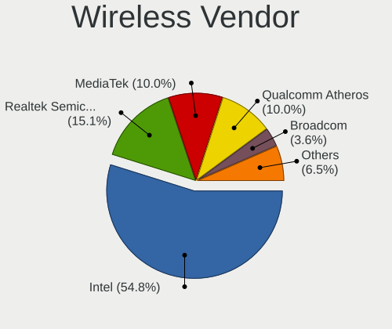

| Vendor                     | Notebooks | Percent |
|----------------------------|-----------|---------|
| Intel                      | 754       | 54.84%  |
| Realtek Semiconductor      | 207       | 15.05%  |
| MediaTek                   | 138       | 10.04%  |
| Qualcomm Atheros           | 137       | 9.96%   |
| Broadcom                   | 49        | 3.56%   |
| Broadcom Limited           | 22        | 1.6%    |
| Qualcomm                   | 18        | 1.31%   |
| TP-Link                    | 10        | 0.73%   |
| Sierra Wireless            | 10        | 0.73%   |
| D-Link                     | 8         | 0.58%   |
| Ralink                     | 5         | 0.36%   |
| Qualcomm Technologies      | 4         | 0.29%   |
| Microsoft                  | 2         | 0.15%   |
| Dell                       | 2         | 0.15%   |
| Ralink Technology          | 1         | 0.07%   |
| Quectel Wireless Solutions | 1         | 0.07%   |
| NetGear                    | 1         | 0.07%   |
| Linksys                    | 1         | 0.07%   |
| Fibocom                    | 1         | 0.07%   |
| Edimax Technology          | 1         | 0.07%   |
| D-Link System              | 1         | 0.07%   |
| Belkin Components          | 1         | 0.07%   |
| AVM                        | 1         | 0.07%   |

Wireless Model
--------------

Wireless models

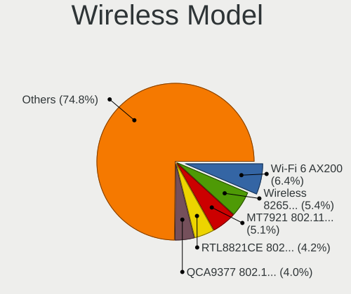

| Model                                                                | Notebooks | Percent |
|----------------------------------------------------------------------|-----------|---------|
| Intel Wi-Fi 6 AX200                                                  | 89        | 6.44%   |
| Intel Wireless 8265 / 8275                                           | 74        | 5.35%   |
| MediaTek MT7921 802.11ax PCIe Wireless Network Adapter [Filogic 330] | 71        | 5.13%   |
| Realtek RTL8821CE 802.11ac PCIe Wireless Network Adapter             | 58        | 4.19%   |
| Qualcomm Atheros QCA9377 802.11ac Wireless Network Adapter           | 56        | 4.05%   |
| Intel Wi-Fi 6 AX201                                                  | 54        | 3.9%    |
| Realtek RTL8822CE 802.11ac PCIe Wireless Network Adapter             | 48        | 3.47%   |
| Intel Alder Lake-P PCH CNVi WiFi                                     | 44        | 3.18%   |
| Intel Wi-Fi 6E(802.11ax) AX210/AX1675* 2x2 [Typhoon Peak]            | 42        | 3.04%   |
| Intel Wireless 7265                                                  | 39        | 2.82%   |
| Intel Cannon Lake PCH CNVi WiFi                                      | 39        | 2.82%   |
| MediaTek MT7922 802.11ax PCI Express Wireless Network Adapter        | 36        | 2.6%    |
| Intel Wireless 8260                                                  | 34        | 2.46%   |
| Intel Comet Lake PCH-LP CNVi WiFi                                    | 32        | 2.31%   |
| Intel Wireless 7260                                                  | 29        | 2.1%    |
| Intel Raptor Lake PCH CNVi WiFi                                      | 28        | 2.02%   |
| Intel Comet Lake PCH CNVi WiFi                                       | 25        | 1.81%   |
| Realtek RTL8852BE PCIe 802.11ax Wireless Network Controller          | 23        | 1.66%   |
| Intel Centrino Advanced-N 6205 [Taylor Peak]                         | 21        | 1.52%   |
| Qualcomm Atheros AR9485 Wireless Network Adapter                     | 20        | 1.45%   |
| Qualcomm Atheros QCA6174 802.11ac Wireless Network Adapter           | 19        | 1.37%   |
| Qualcomm QCNFA765 Wireless Network Adapter                           | 18        | 1.3%    |
| Qualcomm Atheros QCA9565 / AR9565 Wireless Network Adapter           | 18        | 1.3%    |
| Intel Tiger Lake PCH CNVi WiFi                                       | 18        | 1.3%    |
| Intel Meteor Lake PCH CNVi WiFi                                      | 17        | 1.23%   |
| Realtek RTL8852AE 802.11ax PCIe Wireless Network Adapter             | 16        | 1.16%   |
| Intel Cannon Point-LP CNVi [Wireless-AC]                             | 16        | 1.16%   |
| Broadcom Limited BCM4360 802.11ac Dual Band Wireless Network Adapter | 16        | 1.16%   |
| Intel Wireless 3165                                                  | 15        | 1.08%   |
| Intel Wi-Fi 5(802.11ac) Wireless-AC 9x6x [Thunder Peak]              | 15        | 1.08%   |
| Intel Ice Lake-LP PCH CNVi WiFi                                      | 15        | 1.08%   |
| Realtek RTL8822BE 802.11a/b/g/n/ac WiFi adapter                      | 14        | 1.01%   |
| Broadcom BCM43142 802.11b/g/n                                        | 14        | 1.01%   |
| Intel Dual Band Wireless-AC 3165 Plus Bluetooth                      | 12        | 0.87%   |
| Qualcomm Atheros AR9285 Wireless Network Adapter (PCI-Express)       | 11        | 0.8%    |
| Intel Wireless 3160                                                  | 11        | 0.8%    |
| Qualcomm Atheros AR9462 Wireless Network Adapter                     | 10        | 0.72%   |
| MediaTek MT7921K (RZ608) Wi-Fi 6E 80MHz                              | 10        | 0.72%   |
| Intel 700 Series Chipset CNVi WiFi                                   | 10        | 0.72%   |
| Realtek 802.11ac NIC                                                 | 9         | 0.65%   |

Ethernet Vendor
---------------

Ethernet vendors

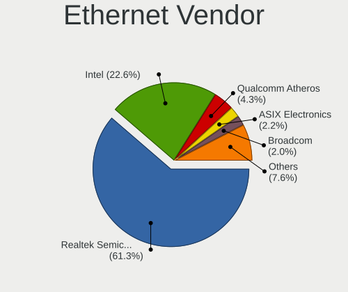

| Vendor                                 | Notebooks | Percent |
|----------------------------------------|-----------|---------|
| Realtek Semiconductor                  | 663       | 61.33%  |
| Intel                                  | 244       | 22.57%  |
| Qualcomm Atheros                       | 46        | 4.26%   |
| ASIX Electronics                       | 24        | 2.22%   |
| Broadcom                               | 22        | 2.04%   |
| MediaTek                               | 12        | 1.11%   |
| Samsung Electronics                    | 9         | 0.83%   |
| DisplayLink                            | 9         | 0.83%   |
| Cypress Semiconductor                  | 9         | 0.83%   |
| Apple                                  | 7         | 0.65%   |
| Lenovo                                 | 6         | 0.56%   |
| Google                                 | 5         | 0.46%   |
| OPPO Electronics                       | 4         | 0.37%   |
| Xiaomi                                 | 3         | 0.28%   |
| Suzhou Motorcomm Electronic Technology | 3         | 0.28%   |
| ICS Advent                             | 3         | 0.28%   |
| Hewlett-Packard                        | 3         | 0.28%   |
| TP-Link                                | 1         | 0.09%   |
| Qualcomm Technologies                  | 1         | 0.09%   |
| Qualcomm                               | 1         | 0.09%   |
| OnePlus Technology (Shenzhen)          | 1         | 0.09%   |
| NetGear                                | 1         | 0.09%   |
| Motorola PCS                           | 1         | 0.09%   |
| Marvell Technology Group               | 1         | 0.09%   |
| D-Link                                 | 1         | 0.09%   |
| Broadcom Limited                       | 1         | 0.09%   |

Ethernet Model
--------------

Ethernet models

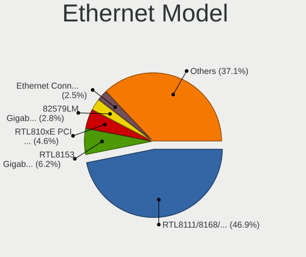

| Model                                                                  | Notebooks | Percent |
|------------------------------------------------------------------------|-----------|---------|
| Realtek RTL8111/8168/8211/8411 PCI Express Gigabit Ethernet Controller | 521       | 46.85%  |
| Realtek RTL8153 Gigabit Ethernet Adapter                               | 69        | 6.21%   |
| Realtek RTL810xE PCI Express Fast Ethernet controller                  | 51        | 4.59%   |
| Intel 82579LM Gigabit Network Connection (Lewisville)                  | 31        | 2.79%   |
| Intel Ethernet Connection (4) I219-LM                                  | 28        | 2.52%   |
| Intel Alder Lake-P PCH CNVi WiFi                                       | 23        | 2.07%   |
| Realtek RTL8125 2.5GbE Controller                                      | 21        | 1.89%   |
| ASIX AX88179 Gigabit Ethernet                                          | 21        | 1.89%   |
| Intel Ethernet Connection I219-LM                                      | 17        | 1.53%   |
| Intel Ethernet Connection (4) I219-V                                   | 15        | 1.35%   |
| Intel Ethernet Connection I217-LM                                      | 14        | 1.26%   |
| Intel Ethernet Connection I218-LM                                      | 11        | 0.99%   |
| Intel Ethernet Connection (3) I218-LM                                  | 9         | 0.81%   |
| Intel Ethernet Connection (2) I219-LM                                  | 9         | 0.81%   |
| Cypress USB Type-C Dock                                                | 9         | 0.81%   |
| Realtek Killer E2600 GbE Controller                                    | 8         | 0.72%   |
| Qualcomm Atheros QCA8171 Gigabit Ethernet                              | 8         | 0.72%   |
| Qualcomm Atheros Killer E2400 Gigabit Ethernet Controller              | 8         | 0.72%   |
| Qualcomm Atheros Killer E2500 Gigabit Ethernet Controller              | 7         | 0.63%   |
| Intel 82577LM Gigabit Network Connection                               | 7         | 0.63%   |
| Apple iBridge                                                          | 7         | 0.63%   |
| Samsung GT-I9070 (network tethering, USB debugging enabled)            | 6         | 0.54%   |
| Realtek RTL8152 Fast Ethernet Adapter                                  | 6         | 0.54%   |
| Qualcomm Atheros AR8161 Gigabit Ethernet                               | 6         | 0.54%   |
| MediaTek MT7922 802.11ax PCI Express Wireless Network Adapter          | 6         | 0.54%   |
| Intel 82567LM Gigabit Network Connection                               | 6         | 0.54%   |
| Qualcomm Atheros AR8151 v2.0 Gigabit Ethernet                          | 5         | 0.45%   |
| Intel Raptor Lake PCH CNVi WiFi                                        | 5         | 0.45%   |
| Intel Ethernet Connection (6) I219-V                                   | 5         | 0.45%   |
| Intel Ethernet Connection (6) I219-LM                                  | 5         | 0.45%   |
| Intel Ethernet Connection (5) I219-LM                                  | 5         | 0.45%   |
| Intel Ethernet Connection (10) I219-LM                                 | 5         | 0.45%   |
| Broadcom NetXtreme BCM5764M Gigabit Ethernet PCIe                      | 5         | 0.45%   |
| Intel Ethernet Connection (23) I219-LM                                 | 4         | 0.36%   |
| Intel Ethernet Connection (16) I219-V                                  | 4         | 0.36%   |
| Broadcom NetXtreme BCM57765 Gigabit Ethernet PCIe                      | 4         | 0.36%   |
| Xiaomi Mi/Redmi series (RNDIS)                                         | 3         | 0.27%   |
| Suzhou Motorcomm Electronic YT6801 Gigabit Ethernet Controller         | 3         | 0.27%   |
| Samsung Galaxy series, misc. (tethering mode)                          | 3         | 0.27%   |
| Realtek PCIe GbE Family Controller                                     | 3         | 0.27%   |

Net Controller Kind
-------------------

Ethernet, WiFi or modem

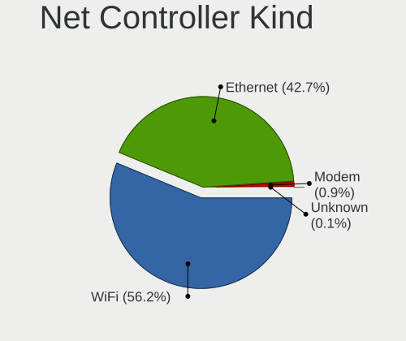

| Kind     | Notebooks | Percent |
|----------|-----------|---------|
| WiFi     | 1320      | 56.24%  |
| Ethernet | 1002      | 42.69%  |
| Modem    | 22        | 0.94%   |
| Unknown  | 3         | 0.13%   |

Used Controller
---------------

Currently used network controller

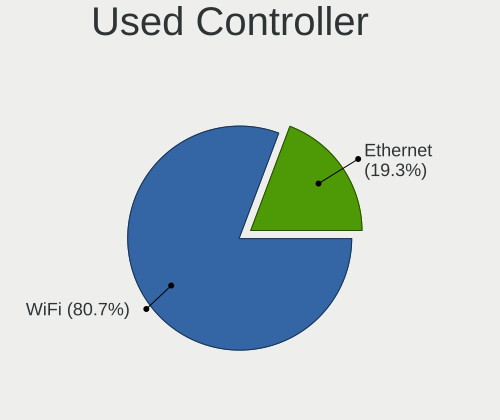

| Kind     | Notebooks | Percent |
|----------|-----------|---------|
| WiFi     | 1177      | 80.73%  |
| Ethernet | 281       | 19.27%  |

NICs
----

Total network controllers on board

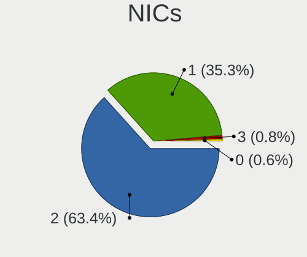

| Total | Notebooks | Percent |
|-------|-----------|---------|
| 2     | 873       | 63.35%  |
| 1     | 486       | 35.27%  |
| 3     | 11        | 0.8%    |
| 0     | 8         | 0.58%   |

IPv6
----

IPv6 vs IPv4

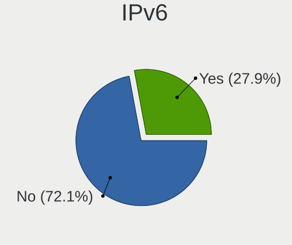

| Used | Notebooks | Percent |
|------|-----------|---------|
| No   | 1007      | 72.08%  |
| Yes  | 390       | 27.92%  |

Bluetooth
---------

Bluetooth Vendor
----------------

Controller vendors

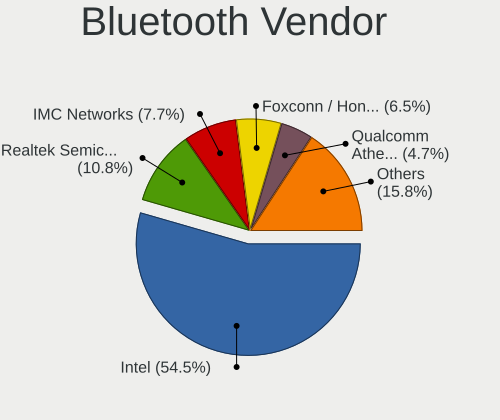

| Vendor                          | Notebooks | Percent |
|---------------------------------|-----------|---------|
| Intel                           | 708       | 54.46%  |
| Realtek Semiconductor           | 141       | 10.85%  |
| IMC Networks                    | 100       | 7.69%   |
| Foxconn / Hon Hai               | 85        | 6.54%   |
| Qualcomm Atheros Communications | 61        | 4.69%   |
| Lite-On Technology              | 52        | 4%      |
| Broadcom                        | 35        | 2.69%   |
| Apple                           | 28        | 2.15%   |
| MediaTek                        | 20        | 1.54%   |
| USI                             | 13        | 1%      |
| Cambridge Silicon Radio         | 12        | 0.92%   |
| Realtek                         | 10        | 0.77%   |
| Dell                            | 7         | 0.54%   |
| Toshiba                         | 6         | 0.46%   |
| Hewlett-Packard                 | 6         | 0.46%   |
| Ralink                          | 5         | 0.38%   |
| ASUSTek Computer                | 3         | 0.23%   |
| Opticis                         | 2         | 0.15%   |
| Foxconn International           | 2         | 0.15%   |
| TP-Link                         | 1         | 0.08%   |
| Micro Star International        | 1         | 0.08%   |
| Mercucys                        | 1         | 0.08%   |
| Alps Electric                   | 1         | 0.08%   |

Bluetooth Model
---------------

Controller models

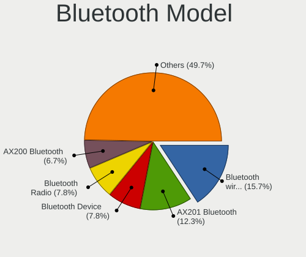

| Model                                               | Notebooks | Percent |
|-----------------------------------------------------|-----------|---------|
| Intel Bluetooth wireless interface                  | 205       | 15.75%  |
| Intel AX201 Bluetooth                               | 160       | 12.29%  |
| Intel Bluetooth Device                              | 102       | 7.83%   |
| Realtek Bluetooth Radio                             | 101       | 7.76%   |
| Intel AX200 Bluetooth                               | 87        | 6.68%   |
| Intel Bluetooth 9460/9560 Jefferson Peak (JfP)      | 86        | 6.61%   |
| IMC Networks Wireless_Device                        | 57        | 4.38%   |
| Intel AX210 Bluetooth                               | 40        | 3.07%   |
| Qualcomm Atheros  Bluetooth Device                  | 36        | 2.76%   |
| Foxconn / Hon Hai Wireless_Device                   | 36        | 2.76%   |
| Realtek  Bluetooth 4.2 Adapter                      | 27        | 2.07%   |
| IMC Networks Bluetooth Radio                        | 25        | 1.92%   |
| Foxconn / Hon Hai MediaTek Bluetooth Adapter        | 25        | 1.92%   |
| Lite-On Qualcomm Atheros QCA9377 Bluetooth          | 21        | 1.61%   |
| MediaTek Wireless_Device                            | 19        | 1.46%   |
| Apple Bluetooth USB Host Controller                 | 16        | 1.23%   |
| Intel Wireless-AC 9260 Bluetooth Adapter            | 14        | 1.08%   |
| Foxconn / Hon Hai Bluetooth Device                  | 14        | 1.08%   |
| USI Bluetooth Device                                | 13        | 1%      |
| Cambridge Silicon Radio Bluetooth Dongle (HCI mode) | 12        | 0.92%   |
| Realtek Bluetooth Radio                             | 10        | 0.77%   |
| IMC Networks Bluetooth Device                       | 10        | 0.77%   |
| Qualcomm Atheros AR3012 Bluetooth 4.0               | 9         | 0.69%   |
| Lite-On Bluetooth Device                            | 9         | 0.69%   |
| Intel Centrino Bluetooth Wireless Transceiver       | 9         | 0.69%   |
| Apple Bluetooth Host Controller                     | 9         | 0.69%   |
| Qualcomm Atheros QCA61x4 Bluetooth 4.0              | 8         | 0.61%   |
| Lite-On Wireless_Device                             | 8         | 0.61%   |
| Broadcom BCM20702 Bluetooth 4.0 [ThinkPad]          | 8         | 0.61%   |
| Realtek RTL8822BE Bluetooth 4.2 Adapter             | 7         | 0.54%   |
| Realtek RTL8821A Bluetooth                          | 6         | 0.46%   |
| Lite-On Atheros AR3012 Bluetooth                    | 6         | 0.46%   |
| Intel Wireless-AC 3168 Bluetooth                    | 6         | 0.46%   |
| Broadcom BCM2045B (BDC-2.1)                         | 6         | 0.46%   |
| Ralink RT3290 Bluetooth                             | 5         | 0.38%   |
| Qualcomm Atheros AR3011 Bluetooth                   | 4         | 0.31%   |
| Lite-On Bluetooth Radio                             | 4         | 0.31%   |
| Qualcomm Atheros AR9462 Bluetooth                   | 3         | 0.23%   |
| IMC Networks Bluetooth                              | 3         | 0.23%   |
| IMC Networks Atheros AR3012 Bluetooth 4.0 Adapter   | 3         | 0.23%   |

Sound
-----

Sound Vendor
------------

Sound card vendors

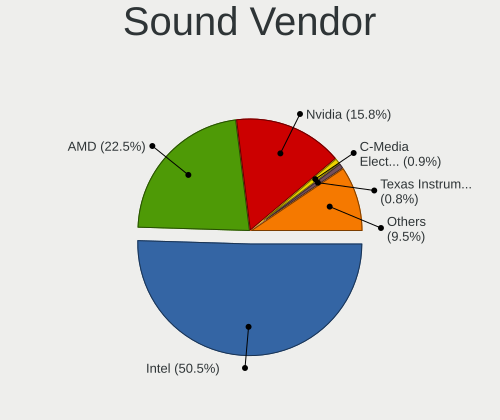

| Vendor                      | Notebooks | Percent |
|-----------------------------|-----------|---------|
| Intel                       | 956       | 50.48%  |
| AMD                         | 427       | 22.54%  |
| Nvidia                      | 300       | 15.84%  |
| C-Media Electronics         | 17        | 0.9%    |
| Texas Instruments           | 15        | 0.79%   |
| Sony                        | 12        | 0.63%   |
| Lenovo                      | 12        | 0.63%   |
| Logitech                    | 11        | 0.58%   |
| Apple                       | 9         | 0.48%   |
| Realtek Semiconductor       | 8         | 0.42%   |
| Hewlett-Packard             | 7         | 0.37%   |
| Focusrite-Novation          | 7         | 0.37%   |
| KORG                        | 6         | 0.32%   |
| JMTek                       | 6         | 0.32%   |
| Corsair                     | 6         | 0.32%   |
| AKAI                        | 5         | 0.26%   |
| Walmart                     | 4         | 0.21%   |
| Samson Technologies         | 4         | 0.21%   |
| Plantronics                 | 4         | 0.21%   |
| Generalplus Technology      | 4         | 0.21%   |
| Creative Technology         | 4         | 0.21%   |
| Razer USA                   | 3         | 0.16%   |
| Medeli Electronics          | 3         | 0.16%   |
| Kingston Technology         | 3         | 0.16%   |
| M-Audio                     | 2         | 0.11%   |
| KTMicro                     | 2         | 0.11%   |
| Jieli Technology            | 2         | 0.11%   |
| GYROCOM C&C                 | 2         | 0.11%   |
| FiiO Electronics Technology | 2         | 0.11%   |
| Conexant Systems            | 2         | 0.11%   |
| Audio-Technica              | 2         | 0.11%   |
| ASUSTek Computer            | 2         | 0.11%   |
| ASRock                      | 2         | 0.11%   |
| Arturia                     | 2         | 0.11%   |
| AKAI Professional M.I.      | 2         | 0.11%   |
| Unknown                     | 2         | 0.11%   |
| YZ Technology               | 1         | 0.05%   |
| XMOS                        | 1         | 0.05%   |
| Weltrend Semiconductor      | 1         | 0.05%   |
| USB Audio                   | 1         | 0.05%   |

Sound Model
-----------

Sound card models

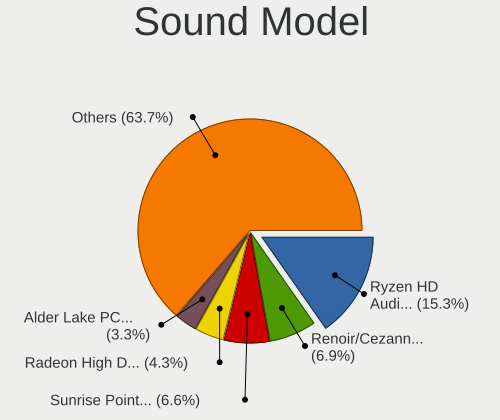

| Model                                                                      | Notebooks | Percent |
|----------------------------------------------------------------------------|-----------|---------|
| AMD Ryzen HD Audio Controller                                              | 365       | 15.28%  |
| AMD Renoir/Cezanne HDMI/DP Audio Controller                                | 165       | 6.91%   |
| Intel Sunrise Point-LP HD Audio                                            | 158       | 6.61%   |
| AMD Radeon High Definition Audio Controller                                | 102       | 4.27%   |
| Intel Alder Lake PCH-P High Definition Audio Controller                    | 78        | 3.26%   |
| Intel Tiger Lake-LP Smart Sound Technology Audio Controller                | 77        | 3.22%   |
| Intel 7 Series/C216 Chipset Family High Definition Audio Controller        | 64        | 2.68%   |
| Intel Cannon Lake PCH cAVS                                                 | 61        | 2.55%   |
| AMD Raven/Raven2/Fenghuang HDMI/DP Audio Controller                        | 59        | 2.47%   |
| Intel Haswell-ULT HD Audio Controller                                      | 49        | 2.05%   |
| Intel 8 Series HD Audio Controller                                         | 49        | 2.05%   |
| Intel Raptor Lake-P/U/H cAVS                                               | 41        | 1.72%   |
| Intel Comet Lake PCH-LP cAVS                                               | 38        | 1.59%   |
| Intel Wildcat Point-LP High Definition Audio Controller                    | 36        | 1.51%   |
| Intel Broadwell-U Audio Controller                                         | 36        | 1.51%   |
| Nvidia GA106 High Definition Audio Controller                              | 35        | 1.47%   |
| Nvidia AD107 High Definition Audio Controller                              | 33        | 1.38%   |
| Intel Comet Lake PCH cAVS                                                  | 29        | 1.21%   |
| Intel Ice Lake-LP Smart Sound Technology Audio Controller                  | 28        | 1.17%   |
| Intel Cannon Point-LP High Definition Audio Controller                     | 28        | 1.17%   |
| Intel 6 Series/C200 Series Chipset Family High Definition Audio Controller | 28        | 1.17%   |
| Intel 8 Series/C220 Series Chipset High Definition Audio Controller        | 27        | 1.13%   |
| Nvidia GA107 High Definition Audio Controller                              | 25        | 1.05%   |
| Intel Tiger Lake-H HD Audio Controller                                     | 23        | 0.96%   |
| Nvidia GA104 High Definition Audio Controller                              | 22        | 0.92%   |
| Intel Xeon E3-1200 v3/4th Gen Core Processor HD Audio Controller           | 22        | 0.92%   |
| Intel 100 Series/C230 Series Chipset Family HD Audio Controller            | 22        | 0.92%   |
| Nvidia TU107 GeForce GTX 1650 High Definition Audio Controller             | 21        | 0.88%   |
| Intel CM238 HD Audio Controller                                            | 21        | 0.88%   |
| Intel Meteor Lake-P HD Audio Controller                                    | 20        | 0.84%   |
| Intel Celeron/Pentium Silver Processor High Definition Audio               | 20        | 0.84%   |
| Nvidia TU116 High Definition Audio Controller                              | 19        | 0.8%    |
| Nvidia TU106 High Definition Audio Controller                              | 19        | 0.8%    |
| Intel 82801I (ICH9 Family) HD Audio Controller                             | 19        | 0.8%    |
| AMD Navi 21/23 HDMI/DP Audio Controller                                    | 18        | 0.75%   |
| Nvidia GP107GL High Definition Audio Controller                            | 17        | 0.71%   |
| Intel 5 Series/3400 Series Chipset High Definition Audio                   | 17        | 0.71%   |
| AMD Family 15h (Models 60h-6fh) Audio Controller                           | 16        | 0.67%   |
| Intel Raptor Lake High Definition Audio Controller                         | 15        | 0.63%   |
| AMD Kabini HDMI/DP Audio                                                   | 14        | 0.59%   |

Memory
------

Memory Vendor
-------------

Memory module vendors

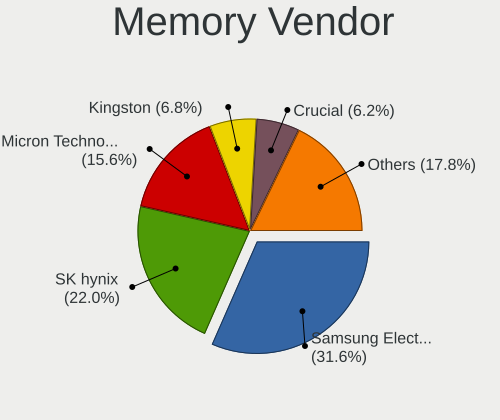

| Vendor              | Notebooks | Percent |
|---------------------|-----------|---------|
| Samsung Electronics | 395       | 31.57%  |
| SK hynix            | 275       | 21.98%  |
| Micron Technology   | 195       | 15.59%  |
| Kingston            | 85        | 6.79%   |
| Crucial             | 78        | 6.24%   |
| Unknown             | 38        | 3.04%   |
| Corsair             | 22        | 1.76%   |
| Ramaxel Technology  | 21        | 1.68%   |
| A-DATA Technology   | 18        | 1.44%   |
| Unknown             | 18        | 1.44%   |
| G.Skill             | 11        | 0.88%   |
| Team                | 10        | 0.8%    |
| Elpida              | 10        | 0.8%    |
| Unknown (ABCD)      | 9         | 0.72%   |
| Nanya Technology    | 6         | 0.48%   |
| Kllisre             | 6         | 0.48%   |
| Patriot             | 5         | 0.4%    |
| Teikon              | 3         | 0.24%   |
| Smart Brazil        | 3         | 0.24%   |
| Lexar               | 3         | 0.24%   |
| GOODRAM             | 3         | 0.24%   |
| Apacer              | 3         | 0.24%   |
| Transcend           | 2         | 0.16%   |
| Shenzhen Mic        | 2         | 0.16%   |
| Hikvision           | 2         | 0.16%   |
| ff                  | 2         | 0.16%   |
| 4ea5                | 2         | 0.16%   |
| Wilk                | 1         | 0.08%   |
| V-GeN               | 1         | 0.08%   |
| Unknown (0x0E9D)    | 1         | 0.08%   |
| Unknown (0x0C97)    | 1         | 0.08%   |
| Unknown (0B85)      | 1         | 0.08%   |
| Toshiba             | 1         | 0.08%   |
| Smart               | 1         | 0.08%   |
| Silicon Power       | 1         | 0.08%   |
| Shenzhen Longsys    | 1         | 0.08%   |
| Sesame              | 1         | 0.08%   |
| Qimonda             | 1         | 0.08%   |
| Neo Forza           | 1         | 0.08%   |
| Magnum Tech         | 1         | 0.08%   |

Memory Model
------------

Memory module models

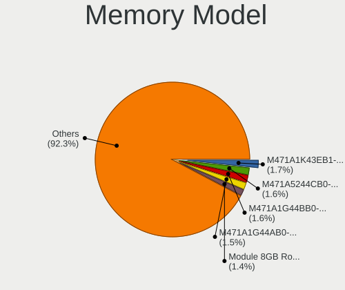

| Model                                                            | Notebooks | Percent |
|------------------------------------------------------------------|-----------|---------|
| Samsung RAM M471A1K43EB1-CWE 8GB SODIMM DDR4 3200MT/s            | 22        | 1.66%   |
| Samsung RAM M471A5244CB0-CTD 4GB SODIMM DDR4 3266MT/s            | 21        | 1.59%   |
| Samsung RAM M471A1G44BB0-CWE 8GB SODIMM DDR4 3200MT/s            | 21        | 1.59%   |
| Samsung RAM M471A1G44AB0-CWE 8GiB SODIMM DDR4 3200MT/s           | 20        | 1.51%   |
| Unknown                                                          | 18        | 1.36%   |
| SK hynix RAM HMA81GS6AFR8N-UH 8GB SODIMM DDR4 2667MT/s           | 17        | 1.29%   |
| Samsung RAM M471A1K43DB1-CWE 8GB SODIMM DDR4 3200MT/s            | 16        | 1.21%   |
| Samsung RAM M471A1G44AB0-CWE 8GB Row Of Chips DDR4 3200MT/s      | 15        | 1.13%   |
| SK hynix RAM HMAA1GS6CJR6N-XN 8GB SODIMM DDR4 3200MT/s           | 14        | 1.06%   |
| Micron RAM 4ATF1G64HZ-3G2E1 8GB SODIMM DDR4 3200MT/s             | 12        | 0.91%   |
| Samsung RAM M471B5173QH0-YK0 4GB SODIMM DDR3 1600MT/s            | 11        | 0.83%   |
| Samsung RAM M471A1K43CB1-CTD 8GB SODIMM DDR4 3200MT/s            | 11        | 0.83%   |
| Samsung RAM M425R1GB4BB0-CQKOL 8GB SODIMM DDR5 4800MT/s          | 11        | 0.83%   |
| Micron RAM 8ATF1G64HZ-3G2J1 8GB SODIMM DDR4 3200MT/s             | 11        | 0.83%   |
| SK hynix RAM HMA81GS6CJR8N-VK 8GB SODIMM DDR4 2667MT/s           | 10        | 0.76%   |
| Micron RAM 4ATF51264HZ-2G6E1 4GB SODIMM DDR4 2667MT/s            | 10        | 0.76%   |
| SK hynix RAM HMA81GS6JJR8N-VK 8GB SODIMM DDR4 2667MT/s           | 9         | 0.68%   |
| Samsung RAM M471B1G73QH0-YK0 8GB SODIMM DDR3 1600MT/s            | 9         | 0.68%   |
| Samsung RAM M471B1G73DB0-YK0 8GB SODIMM DDR3 1600MT/s            | 9         | 0.68%   |
| Samsung RAM M471A5244CB0-CRC 4GB SODIMM DDR4 2667MT/s            | 9         | 0.68%   |
| Unknown (ABCD) RAM 123456789012345678 2GB SODIMM LPDDR4 2400MT/s | 8         | 0.61%   |
| SK hynix RAM HMA851S6AFR6N-UH 4GB SODIMM DDR4 2667MT/s           | 8         | 0.61%   |
| Samsung RAM M471A5244CB0-CWE 4GB SODIMM DDR4 3200MT/s            | 8         | 0.61%   |
| Samsung RAM M471A1K43BB1-CRC 8GB SODIMM DDR4 2667MT/s            | 8         | 0.61%   |
| Micron RAM MTC4C10163S1SC48BA1 8GB SODIMM DDR5 4800MT/s          | 8         | 0.61%   |
| Micron RAM MT62F2G32D4DS-026 WT 8GiB SODIMM LPDDR5 7500MT/s      | 8         | 0.61%   |
| Micron RAM 4ATF1G64HZ-3G2E2 8GB SODIMM DDR4 3200MT/s             | 8         | 0.61%   |
| Unknown RAM Module 8GB SODIMM DDR3 1600MT/s                      | 7         | 0.53%   |
| SK hynix RAM Module 4GB SODIMM DDR3 1600MT/s                     | 7         | 0.53%   |
| SK hynix RAM HMT41GS6BFR8A-PB 8GB SODIMM DDR3 2667MT/s           | 7         | 0.53%   |
| SK hynix RAM HMCG78MEBSA092N 16GB SODIMM DDR5 4800MT/s           | 7         | 0.53%   |
| SK hynix RAM HMA851S6CJR6N-VK 4GB SODIMM DDR4 2667MT/s           | 7         | 0.53%   |
| SK hynix RAM HMA82GS6CJR8N-VK 16GB SODIMM DDR4 2667MT/s          | 7         | 0.53%   |
| Samsung RAM M471A5244CB0-CWE 4GB Row Of Chips DDR4 3200MT/s      | 7         | 0.53%   |
| Samsung RAM M471A1K43CB1-CRC 8GB SODIMM DDR4 8400MT/s            | 7         | 0.53%   |
| Micron RAM 8ATF1G64HZ-3G2R1 8GB SODIMM DDR4 3200MT/s             | 7         | 0.53%   |
| Micron RAM 4ATF1G64HZ-3G2F1 8GB SODIMM DDR4 3200MT/s             | 7         | 0.53%   |
| Team RAM TEAMGROUP-SD4-3200 16GB SODIMM DDR4 3200MT/s            | 6         | 0.45%   |
| SK hynix RAM HMT451S6BFR8A-PB 4GB SODIMM DDR3 1600MT/s           | 6         | 0.45%   |
| SK hynix RAM HMAB2GS6AMR6N-XN 16GB SODIMM DDR4 3200MT/s          | 6         | 0.45%   |

Memory Kind
-----------

Memory module kinds

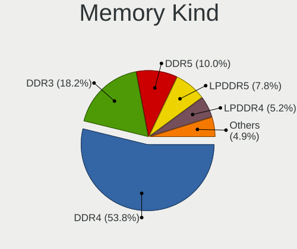

| Kind    | Notebooks | Percent |
|---------|-----------|---------|
| DDR4    | 564       | 53.82%  |
| DDR3    | 191       | 18.23%  |
| DDR5    | 105       | 10.02%  |
| LPDDR5  | 82        | 7.82%   |
| LPDDR4  | 55        | 5.25%   |
| LPDDR3  | 32        | 3.05%   |
| DDR2    | 13        | 1.24%   |
| SDRAM   | 5         | 0.48%   |
| Unknown | 1         | 0.1%    |

Memory Form Factor
------------------

Physical design of the memory module

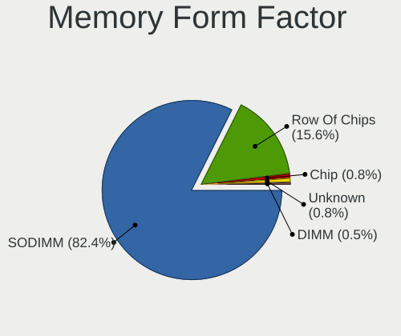

| Name         | Notebooks | Percent |
|--------------|-----------|---------|
| SODIMM       | 875       | 82.39%  |
| Row Of Chips | 166       | 15.63%  |
| Chip         | 8         | 0.75%   |
| Unknown      | 8         | 0.75%   |
| DIMM         | 5         | 0.47%   |

Memory Size
-----------

Memory module size

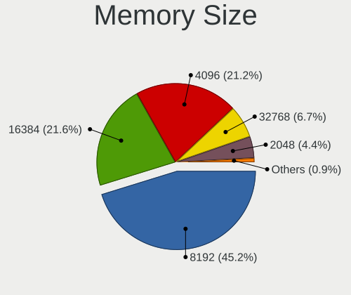

| Size  | Notebooks | Percent |
|-------|-----------|---------|
| 8192  | 521       | 45.23%  |
| 16384 | 249       | 21.61%  |
| 4096  | 244       | 21.18%  |
| 32768 | 77        | 6.68%   |
| 2048  | 51        | 4.43%   |
| 1024  | 6         | 0.52%   |
| 12288 | 2         | 0.17%   |
| 6144  | 2         | 0.17%   |

Memory Speed
------------

Memory module speed

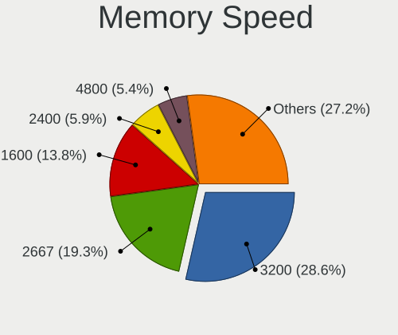

| Speed   | Notebooks | Percent |
|---------|-----------|---------|
| 3200    | 322       | 28.57%  |
| 2667    | 217       | 19.25%  |
| 1600    | 155       | 13.75%  |
| 2400    | 66        | 5.86%   |
| 4800    | 61        | 5.41%   |
| 5600    | 44        | 3.9%    |
| 2133    | 41        | 3.64%   |
| 6400    | 32        | 2.84%   |
| 7500    | 29        | 2.57%   |
| 4267    | 21        | 1.86%   |
| 3266    | 21        | 1.86%   |
| 1867    | 17        | 1.51%   |
| 1334    | 12        | 1.06%   |
| 8400    | 10        | 0.89%   |
| 8533    | 9         | 0.8%    |
| 1333    | 7         | 0.62%   |
| 667     | 7         | 0.62%   |
| Unknown | 7         | 0.62%   |
| 1067    | 6         | 0.53%   |
| 7467    | 5         | 0.44%   |
| 4266    | 4         | 0.35%   |
| 2933    | 4         | 0.35%   |
| 8000    | 3         | 0.27%   |
| 5500    | 3         | 0.27%   |
| 3733    | 3         | 0.27%   |
| 800     | 3         | 0.27%   |
| 7400    | 2         | 0.18%   |
| 4199    | 2         | 0.18%   |
| 2048    | 2         | 0.18%   |
| 1200    | 2         | 0.18%   |
| 1066    | 2         | 0.18%   |
| 5200    | 1         | 0.09%   |
| 3800    | 1         | 0.09%   |
| 3600    | 1         | 0.09%   |
| 3000    | 1         | 0.09%   |
| 2134    | 1         | 0.09%   |
| 1866    | 1         | 0.09%   |
| 1776    | 1         | 0.09%   |
| 1639    | 1         | 0.09%   |

Printers & scanners
-------------------

Printer Vendor
--------------

Printer device vendors

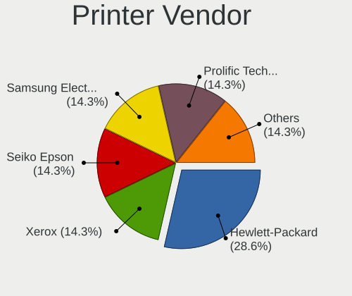

| Vendor              | Notebooks | Percent |
|---------------------|-----------|---------|
| Hewlett-Packard     | 2         | 28.57%  |
| Xerox               | 1         | 14.29%  |
| Seiko Epson         | 1         | 14.29%  |
| Samsung Electronics | 1         | 14.29%  |
| Prolific Technology | 1         | 14.29%  |
| PM                  | 1         | 14.29%  |

Printer Model
-------------

Printer device models

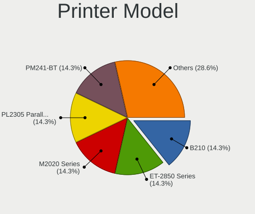

| Model                         | Notebooks | Percent |
|-------------------------------|-----------|---------|
| Xerox B210                    | 1         | 14.29%  |
| Seiko Epson ET-2850 Series    | 1         | 14.29%  |
| Samsung M2020 Series          | 1         | 14.29%  |
| Prolific PL2305 Parallel Port | 1         | 14.29%  |
| PM PM241-BT                   | 1         | 14.29%  |
| HP LaserJet 1160 series       | 1         | 14.29%  |
| HP DeskJet 2130 series        | 1         | 14.29%  |

Scanner Vendor
--------------

Scanner device vendors

Zero info for selected period =(

Scanner Model
-------------

Scanner device models

Zero info for selected period =(

Camera
------

Camera Vendor
-------------

Camera device vendors

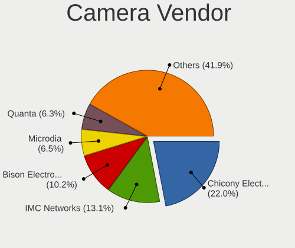

| Vendor                                 | Notebooks | Percent |
|----------------------------------------|-----------|---------|
| Chicony Electronics                    | 277       | 21.98%  |
| IMC Networks                           | 165       | 13.1%   |
| Bison Electronics                      | 128       | 10.16%  |
| Microdia                               | 82        | 6.51%   |
| Quanta                                 | 80        | 6.35%   |
| Realtek Semiconductor                  | 62        | 4.92%   |
| Luxvisions Innotech Limited            | 61        | 4.84%   |
| Sunplus Innovation Technology          | 58        | 4.6%    |
| Cheng Uei Precision Industry (Foxlink) | 43        | 3.41%   |
| Syntek                                 | 40        | 3.17%   |
| Sonix Technology                       | 39        | 3.1%    |
| Lite-On Technology                     | 36        | 2.86%   |
| Apple                                  | 30        | 2.38%   |
| Logitech                               | 25        | 1.98%   |
| Shinetech                              | 16        | 1.27%   |
| Suyin                                  | 15        | 1.19%   |
| SunplusIT                              | 10        | 0.79%   |
| Silicon Motion                         | 5         | 0.4%    |
| Ricoh                                  | 5         | 0.4%    |
| Primax Electronics                     | 5         | 0.4%    |
| Lenovo                                 | 5         | 0.4%    |
| kingcome                               | 5         | 0.4%    |
| icSpring                               | 5         | 0.4%    |
| Generalplus Technology                 | 5         | 0.4%    |
| Alcor Micro                            | 5         | 0.4%    |
| Shine-optics                           | 4         | 0.32%   |
| BillionPixels                          | 4         | 0.32%   |
| ShineOptics                            | 3         | 0.24%   |
| Samsung Electronics                    | 3         | 0.24%   |
| MacroSilicon                           | 3         | 0.24%   |
| Acer                                   | 3         | 0.24%   |
| Y Media                                | 2         | 0.16%   |
| Tripath Technology                     | 2         | 0.16%   |
| OPPO Electronics                       | 2         | 0.16%   |
| Jiangxi Shinetech Optical              | 2         | 0.16%   |
| Intel                                  | 2         | 0.16%   |
| Google                                 | 2         | 0.16%   |
| Trust                                  | 1         | 0.08%   |
| Sunplus IT                             | 1         | 0.08%   |
| Sony Ericsson Mobile Communications AB | 1         | 0.08%   |

Camera Model
------------

Camera device models

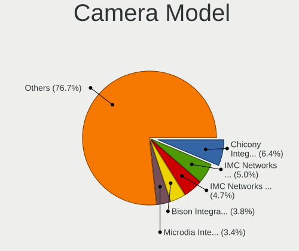

| Model                                                | Notebooks | Percent |
|------------------------------------------------------|-----------|---------|
| Chicony Integrated Camera                            | 81        | 6.4%    |
| IMC Networks USB2.0 HD UVC WebCam                    | 63        | 4.98%   |
| IMC Networks Integrated Camera                       | 60        | 4.74%   |
| Bison Integrated Camera                              | 48        | 3.79%   |
| Microdia Integrated_Webcam_HD                        | 43        | 3.4%    |
| Syntek Integrated Camera                             | 29        | 2.29%   |
| Sonix USB2.0 HD UVC WebCam                           | 26        | 2.05%   |
| Chicony HD WebCam                                    | 25        | 1.97%   |
| Realtek Integrated_Webcam_HD                         | 23        | 1.82%   |
| Luxvisions Innotech Limited Integrated Camera        | 22        | 1.74%   |
| Bison HD Webcam                                      | 19        | 1.5%    |
| Sunplus Integrated_Webcam_HD                         | 15        | 1.18%   |
| Chicony HP TrueVision HD Camera                      | 14        | 1.11%   |
| Apple iPhone 5/5C/5S/6/SE/7/8/X                      | 14        | 1.11%   |
| Sonix USB2.0 FHD UVC WebCam                          | 13        | 1.03%   |
| Quanta HD User Facing                                | 13        | 1.03%   |
| Lite-On Integrated Camera                            | 13        | 1.03%   |
| Bison BisonCam,NB Pro                                | 13        | 1.03%   |
| Quanta HP Wide Vision HD Camera                      | 12        | 0.95%   |
| Luxvisions Innotech Limited HP Wide Vision HD Camera | 11        | 0.87%   |
| Chicony HD User Facing                               | 11        | 0.87%   |
| Bison SunplusIT Integrated Camera                    | 11        | 0.87%   |
| Quanta USB2.0 HD UVC WebCam                          | 10        | 0.79%   |
| Quanta HD Webcam                                     | 10        | 0.79%   |
| Lite-On HP HD Camera                                 | 10        | 0.79%   |
| Chicony Integrated Camera (1280x720@30)              | 10        | 0.79%   |
| Chicony VGA WebCam                                   | 9         | 0.71%   |
| Chicony HP Wide Vision HD Camera                     | 9         | 0.71%   |
| Chicony HP HD Camera                                 | 9         | 0.71%   |
| Sunplus HD WebCam                                    | 8         | 0.63%   |
| Shinetech USB2.0 FHD UVC WebCam                      | 8         | 0.63%   |
| Quanta HP TrueVision HD Camera                       | 8         | 0.63%   |
| Quanta HP HD Camera                                  | 8         | 0.63%   |
| Luxvisions Innotech Limited Integrated RGB Camera    | 8         | 0.63%   |
| IMC Networks USB2.0 VGA UVC WebCam                   | 8         | 0.63%   |
| IMC Networks HD Camera                               | 8         | 0.63%   |
| Chicony USB2.0 HD UVC WebCam                         | 8         | 0.63%   |
| Chicony Chicony USB2.0 Camera                        | 8         | 0.63%   |
| Bison EasyCamera                                     | 8         | 0.63%   |
| Apple FaceTime HD Camera (Built-in)                  | 8         | 0.63%   |

Security
--------

Fingerprint Vendor
------------------

Fingerprint sensor vendors

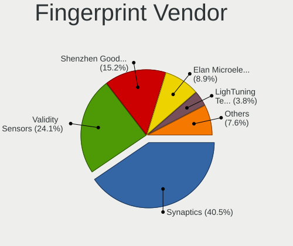

| Vendor                             | Notebooks | Percent |
|------------------------------------|-----------|---------|
| Synaptics                          | 96        | 40.51%  |
| Validity Sensors                   | 57        | 24.05%  |
| Shenzhen Goodix Technology         | 36        | 15.19%  |
| Elan Microelectronics              | 21        | 8.86%   |
| LighTuning Technology              | 9         | 3.8%    |
| Realtek USB2.0 Finger Print Bridge | 6         | 2.53%   |
| Upek                               | 5         | 2.11%   |
| Focal-systems.Corp                 | 3         | 1.27%   |
| AuthenTec                          | 3         | 1.27%   |
| Samsung Electronics                | 1         | 0.42%   |

Fingerprint Model
-----------------

Fingerprint sensor models

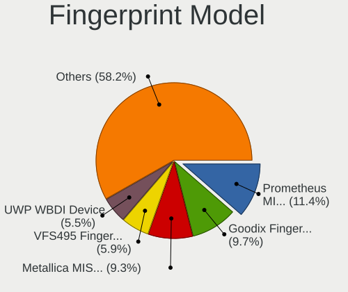

| Model                                                                      | Notebooks | Percent |
|----------------------------------------------------------------------------|-----------|---------|
| Synaptics Prometheus MIS Touch Fingerprint Reader                          | 27        | 11.39%  |
| Shenzhen Goodix  FingerPrint Device                                        | 23        | 9.7%    |
| Synaptics Metallica MIS Touch Fingerprint Reader                           | 22        | 9.28%   |
| Validity Sensors VFS495 Fingerprint Reader                                 | 14        | 5.91%   |
| Synaptics UWP WBDI Device                                                  | 13        | 5.49%   |
| Validity Sensors Synaptics WBDI                                            | 12        | 5.06%   |
| Elan ELAN:Fingerprint                                                      | 11        | 4.64%   |
| Shenzhen Goodix Fingerprint Reader                                         | 10        | 4.22%   |
| Elan ELAN:ARM-M4                                                           | 10        | 4.22%   |
| LighTuning EgisTec Touch Fingerprint Sensor                                | 8         | 3.38%   |
| Validity Sensors VFS5011 Fingerprint Reader                                | 7         | 2.95%   |
| Synaptics FS7604 Touch Fingerprint Sensor with PurePrint                   | 6         | 2.53%   |
| Realtek USB2.0 Finger Print Bridge FocalTech Fingerprint Device            | 6         | 2.53%   |
| Validity Sensors VFS7500 Touch Fingerprint Sensor                          | 5         | 2.11%   |
| Validity Sensors VFS 5011 fingerprint sensor                               | 5         | 2.11%   |
| Validity Sensors Swipe Fingerprint Sensor                                  | 5         | 2.11%   |
| Upek Biometric Touchchip/Touchstrip Fingerprint Sensor                     | 5         | 2.11%   |
| Synaptics WBDI Fingerprint Reader USB 086                                  | 5         | 2.11%   |
| Synaptics  FS7604 Touch Fingerprint Sensor with PurePrint                  | 4         | 1.69%   |
| Validity Sensors VFS491                                                    | 3         | 1.27%   |
| Synaptics UWP WBDI                                                         | 3         | 1.27%   |
| Synaptics  WBDI                                                            | 3         | 1.27%   |
| Synaptics Prometheus Fingerprint Reader                                    | 3         | 1.27%   |
| Synaptics Fingerprint reader [HP G6]                                       | 3         | 1.27%   |
| Shenzhen Goodix FingerPrint                                                | 3         | 1.27%   |
| Focal-systems.Corp FT9201Fingerprint.                                      | 3         | 1.27%   |
| Unknown                                                                    | 3         | 1.27%   |
| Validity Sensors VFS471 Fingerprint Reader                                 | 2         | 0.84%   |
| Validity Sensors Synaptics VFS7552 Touch Fingerprint Sensor with PurePrint | 2         | 0.84%   |
| Synaptics WBDI                                                             | 2         | 0.84%   |
| AuthenTec AES2810                                                          | 2         | 0.84%   |
| Validity Sensors VFS7552 Touch Fingerprint Sensor                          | 1         | 0.42%   |
| Validity Sensors Fingerprint scanner                                       | 1         | 0.42%   |
| Synaptics TouchPad                                                         | 1         | 0.42%   |
| Synaptics Metallica MOH Touch Fingerprint Reader                           | 1         | 0.42%   |
| Samsung Fingerprint Sensor Device - 730B                                   | 1         | 0.42%   |
| LighTuning ES603 Swipe Fingerprint Sensor                                  | 1         | 0.42%   |
| AuthenTec AES1660 Fingerprint Sensor                                       | 1         | 0.42%   |

Chipcard Vendor
---------------

Chipcard module vendors

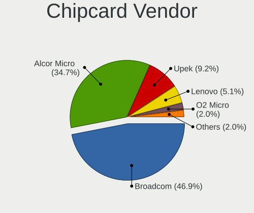

| Vendor      | Notebooks | Percent |
|-------------|-----------|---------|
| Broadcom    | 46        | 46.94%  |
| Alcor Micro | 34        | 34.69%  |
| Upek        | 9         | 9.18%   |
| Lenovo      | 5         | 5.1%    |
| O2 Micro    | 2         | 2.04%   |
| Yubico.com  | 1         | 1.02%   |
| Cherry      | 1         | 1.02%   |

Chipcard Model
--------------

Chipcard module models

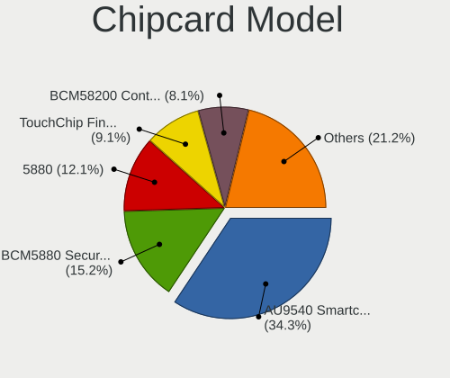

| Model                                                                        | Notebooks | Percent |
|------------------------------------------------------------------------------|-----------|---------|
| Alcor Micro AU9540 Smartcard Reader                                          | 34        | 34.34%  |
| Broadcom BCM5880 Secure Applications Processor                               | 15        | 15.15%  |
| Broadcom 5880                                                                | 12        | 12.12%  |
| Upek TouchChip Fingerprint Coprocessor (WBF advanced mode)                   | 9         | 9.09%   |
| Broadcom BCM58200 ControlVault 3 (FingerPrint sensor + Contacted SmartCard)  | 8         | 8.08%   |
| Broadcom BCM5880 Secure Applications Processor with fingerprint swipe sensor | 7         | 7.07%   |
| Lenovo Integrated Smart Card Reader                                          | 5         | 5.05%   |
| Broadcom 58200                                                               | 4         | 4.04%   |
| O2 Micro OZ776 CCID Smartcard Reader                                         | 2         | 2.02%   |
| Yubico.com Yubikey 4/5 U2F+CCID                                              | 1         | 1.01%   |
| Cherry SmartCard Reader Keyboard KC 1000 SC                                  | 1         | 1.01%   |
| Broadcom BCM5880 Secure Applications Processor with fingerprint touch sensor | 1         | 1.01%   |

Unsupported
-----------

Unsupported Devices
-------------------

Total unsupported devices on board

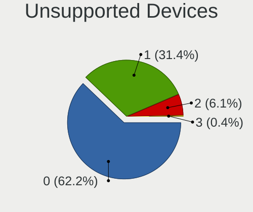

| Total | Notebooks | Percent |
|-------|-----------|---------|
| 0     | 877       | 62.15%  |
| 1     | 443       | 31.4%   |
| 2     | 86        | 6.09%   |
| 3     | 5         | 0.35%   |

Unsupported Device Types
------------------------

Types of unsupported devices

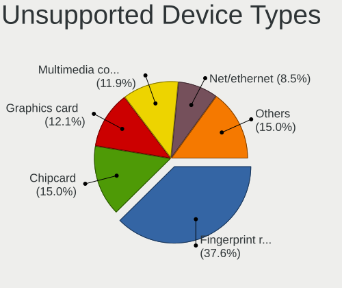

| Type                     | Notebooks | Percent |
|--------------------------|-----------|---------|
| Fingerprint reader       | 231       | 37.62%  |
| Chipcard                 | 92        | 14.98%  |
| Graphics card            | 74        | 12.05%  |
| Multimedia controller    | 73        | 11.89%  |
| Net/ethernet             | 52        | 8.47%   |
| Net/wireless             | 36        | 5.86%   |
| Camera                   | 18        | 2.93%   |
| Bluetooth                | 13        | 2.12%   |
| Communication controller | 7         | 1.14%   |
| Storage                  | 6         | 0.98%   |
| Card reader              | 5         | 0.81%   |
| Sound                    | 4         | 0.65%   |
| Modem                    | 2         | 0.33%   |
| Unassigned class         | 1         | 0.16%   |

