EndeavourOS - Tested Hardware & Statistics (Notebooks)
------------------------------------------------------

A project to collect tested hardware configurations for EndeavourOS.

Anyone can contribute to this report by the [hw-probe](https://github.com/linuxhw/hw-probe) tool:

    sudo -E hw-probe -all -upload

Please contribute! Especially if your hardware is rare.

Contents
--------

* [ Test Cases ](#test-cases)

* [ System ](#system)
  - [ OS                       ](#os)
  - [ OS Family                ](#os-family)
  - [ Kernel                   ](#kernel)
  - [ Kernel Family            ](#kernel-family)
  - [ Kernel Major Ver.        ](#kernel-major-ver)
  - [ Arch                     ](#arch)
  - [ DE                       ](#de)
  - [ Display Server           ](#display-server)
  - [ Display Manager          ](#display-manager)
  - [ OS Lang                  ](#os-lang)
  - [ Boot Mode                ](#boot-mode)
  - [ Filesystem               ](#filesystem)
  - [ Part. scheme             ](#part-scheme)
  - [ Dual Boot with Linux/BSD ](#dual-boot-with-linuxbsd)
  - [ Dual Boot (Win)          ](#dual-boot-win)

* [ Board ](#board)
  - [ Vendor                   ](#vendor)
  - [ Model                    ](#model)
  - [ Model Family             ](#model-family)
  - [ MFG Year                 ](#mfg-year)
  - [ Form Factor              ](#form-factor)
  - [ Secure Boot              ](#secure-boot)
  - [ Coreboot                 ](#coreboot)
  - [ RAM Size                 ](#ram-size)
  - [ RAM Used                 ](#ram-used)
  - [ Total Drives             ](#total-drives)
  - [ Has CD-ROM               ](#has-cd-rom)
  - [ Has Ethernet             ](#has-ethernet)
  - [ Has WiFi                 ](#has-wifi)
  - [ Has Bluetooth            ](#has-bluetooth)

* [ Location ](#location)
  - [ Country                  ](#country)
  - [ City                     ](#city)

* [ Drives ](#drives)
  - [ Drive Vendor             ](#drive-vendor)
  - [ Drive Model              ](#drive-model)
  - [ HDD Vendor               ](#hdd-vendor)
  - [ SSD Vendor               ](#ssd-vendor)
  - [ Drive Kind               ](#drive-kind)
  - [ Drive Connector          ](#drive-connector)
  - [ Drive Size               ](#drive-size)
  - [ Space Total              ](#space-total)
  - [ Space Used               ](#space-used)
  - [ Malfunc. Drives          ](#malfunc-drives)
  - [ Malfunc. Drive Vendor    ](#malfunc-drive-vendor)
  - [ Malfunc. HDD Vendor      ](#malfunc-hdd-vendor)
  - [ Malfunc. Drive Kind      ](#malfunc-drive-kind)
  - [ Failed Drives            ](#failed-drives)
  - [ Failed Drive Vendor      ](#failed-drive-vendor)
  - [ Drive Status             ](#drive-status)

* [ Storage controller ](#storage-controller)
  - [ Storage Vendor           ](#storage-vendor)
  - [ Storage Model            ](#storage-model)
  - [ Storage Kind             ](#storage-kind)

* [ Processor ](#processor)
  - [ CPU Vendor               ](#cpu-vendor)
  - [ CPU Model                ](#cpu-model)
  - [ CPU Model Family         ](#cpu-model-family)
  - [ CPU Cores                ](#cpu-cores)
  - [ CPU Sockets              ](#cpu-sockets)
  - [ CPU Threads              ](#cpu-threads)
  - [ CPU Op-Modes             ](#cpu-op-modes)
  - [ CPU Microcode            ](#cpu-microcode)
  - [ CPU Microarch            ](#cpu-microarch)

* [ Graphics ](#graphics)
  - [ GPU Vendor               ](#gpu-vendor)
  - [ GPU Model                ](#gpu-model)
  - [ GPU Combo                ](#gpu-combo)
  - [ GPU Driver               ](#gpu-driver)
  - [ GPU Memory               ](#gpu-memory)

* [ Monitor ](#monitor)
  - [ Monitor Vendor           ](#monitor-vendor)
  - [ Monitor Model            ](#monitor-model)
  - [ Monitor Resolution       ](#monitor-resolution)
  - [ Monitor Diagonal         ](#monitor-diagonal)
  - [ Monitor Width            ](#monitor-width)
  - [ Aspect Ratio             ](#aspect-ratio)
  - [ Monitor Area             ](#monitor-area)
  - [ Pixel Density            ](#pixel-density)
  - [ Multiple Monitors        ](#multiple-monitors)

* [ Network ](#network)
  - [ Net Controller Vendor    ](#net-controller-vendor)
  - [ Net Controller Model     ](#net-controller-model)
  - [ Wireless Vendor          ](#wireless-vendor)
  - [ Wireless Model           ](#wireless-model)
  - [ Ethernet Vendor          ](#ethernet-vendor)
  - [ Ethernet Model           ](#ethernet-model)
  - [ Net Controller Kind      ](#net-controller-kind)
  - [ Used Controller          ](#used-controller)
  - [ NICs                     ](#nics)
  - [ IPv6                     ](#ipv6)

* [ Bluetooth ](#bluetooth)
  - [ Bluetooth Vendor         ](#bluetooth-vendor)
  - [ Bluetooth Model          ](#bluetooth-model)

* [ Sound ](#sound)
  - [ Sound Vendor             ](#sound-vendor)
  - [ Sound Model              ](#sound-model)

* [ Memory ](#memory)
  - [ Memory Vendor            ](#memory-vendor)
  - [ Memory Model             ](#memory-model)
  - [ Memory Kind              ](#memory-kind)
  - [ Memory Form Factor       ](#memory-form-factor)
  - [ Memory Size              ](#memory-size)
  - [ Memory Speed             ](#memory-speed)

* [ Printers & scanners ](#printers--scanners)
  - [ Printer Vendor           ](#printer-vendor)
  - [ Printer Model            ](#printer-model)
  - [ Scanner Vendor           ](#scanner-vendor)
  - [ Scanner Model            ](#scanner-model)

* [ Camera ](#camera)
  - [ Camera Vendor            ](#camera-vendor)
  - [ Camera Model             ](#camera-model)

* [ Security ](#security)
  - [ Fingerprint Vendor       ](#fingerprint-vendor)
  - [ Fingerprint Model        ](#fingerprint-model)
  - [ Chipcard Vendor          ](#chipcard-vendor)
  - [ Chipcard Model           ](#chipcard-model)

* [ Unsupported ](#unsupported)
  - [ Unsupported Devices      ](#unsupported-devices)
  - [ Unsupported Device Types ](#unsupported-device-types)

Test Cases
----------

Total: 1121

| Vendor        | Model                       | Probe                                                      | Date         |
|---------------|-----------------------------|------------------------------------------------------------|--------------|
| ASUSTek       | K53BR                       | [bd5284a0e8](https://linux-hardware.org/?probe=bd5284a0e8) | Feb 02, 2024 |
| Schenker      | XMG PRO (Late 2021)         | [502d4a5570](https://linux-hardware.org/?probe=502d4a5570) | Feb 02, 2024 |
| MSI           | Prestige 13 AI Evo A1MG     | [abc18d1a9e](https://linux-hardware.org/?probe=abc18d1a9e) | Feb 02, 2024 |
| Schenker      | XMG PRO (Late 2021)         | [0bd25ae10e](https://linux-hardware.org/?probe=0bd25ae10e) | Feb 02, 2024 |
| ALTYK         | L14F-I5U16-N1               | [7cb618fcca](https://linux-hardware.org/?probe=7cb618fcca) | Feb 01, 2024 |
| ALTYK         | L14F-I5U16-N1               | [81274a6f09](https://linux-hardware.org/?probe=81274a6f09) | Feb 01, 2024 |
| Lenovo        | Legion 5 Pro 16IAH7H 82R... | [cbcf46b2fa](https://linux-hardware.org/?probe=cbcf46b2fa) | Jan 31, 2024 |
| Lenovo        | IdeaPad 3 14ALC6 82KT       | [40f306477e](https://linux-hardware.org/?probe=40f306477e) | Jan 31, 2024 |
| Lenovo        | ThinkPad T490 20N2005VMX    | [aecdf1facc](https://linux-hardware.org/?probe=aecdf1facc) | Jan 30, 2024 |
| Lenovo        | IdeaPad 730S-13IWL 81JB     | [c0c78e6476](https://linux-hardware.org/?probe=c0c78e6476) | Jan 29, 2024 |
| Lenovo        | ThinkBook 15 G3 ACL 21A4    | [ffc3c06598](https://linux-hardware.org/?probe=ffc3c06598) | Jan 29, 2024 |
| EVOO          | EG-LP6                      | [94916a68a1](https://linux-hardware.org/?probe=94916a68a1) | Jan 28, 2024 |
| System76      | Gazelle                     | [317f744565](https://linux-hardware.org/?probe=317f744565) | Jan 27, 2024 |
| System76      | Gazelle                     | [27bb9a725a](https://linux-hardware.org/?probe=27bb9a725a) | Jan 27, 2024 |
| Lenovo        | ThinkPad T470s 20HGS3AX0... | [c777cd17b5](https://linux-hardware.org/?probe=c777cd17b5) | Jan 26, 2024 |
| Monster       | ABRA A7 V13.3               | [08516ca0c2](https://linux-hardware.org/?probe=08516ca0c2) | Jan 26, 2024 |
| Acer          | Aspire A315-55G             | [c04d6bddfb](https://linux-hardware.org/?probe=c04d6bddfb) | Jan 24, 2024 |
| Lenovo        | Legion Y540-15IRH 81SX      | [f37a4265ba](https://linux-hardware.org/?probe=f37a4265ba) | Jan 23, 2024 |
| ASUSTek       | VivoBook_ASUSLaptop X512... | [73c0dd5770](https://linux-hardware.org/?probe=73c0dd5770) | Jan 23, 2024 |
| ASUSTek       | G2S                         | [534f9d0459](https://linux-hardware.org/?probe=534f9d0459) | Jan 22, 2024 |
| ASUSTek       | VivoBook_ASUSLaptop X512... | [dc6c66931e](https://linux-hardware.org/?probe=dc6c66931e) | Jan 22, 2024 |
| ASUSTek       | ASUS TUF Gaming F15 FX50... | [833af537d7](https://linux-hardware.org/?probe=833af537d7) | Jan 21, 2024 |
| HP            | ProBook 440 G5              | [1ad08b8198](https://linux-hardware.org/?probe=1ad08b8198) | Jan 21, 2024 |
| Framework     | Laptop (13th Gen Intel C... | [7f7ae7af9f](https://linux-hardware.org/?probe=7f7ae7af9f) | Jan 19, 2024 |
| ASUSTek       | VivoBook_ASUSLaptop X415... | [1427f84afd](https://linux-hardware.org/?probe=1427f84afd) | Jan 18, 2024 |
| Acer          | Nitro AN517-54              | [e736d57544](https://linux-hardware.org/?probe=e736d57544) | Jan 18, 2024 |
| Lenovo        | IdeaPad 5 14IIL05 81YH      | [817d6ac197](https://linux-hardware.org/?probe=817d6ac197) | Jan 18, 2024 |
| HP            | OMEN by Transcend Gaming... | [6690260fd8](https://linux-hardware.org/?probe=6690260fd8) | Jan 18, 2024 |
| Dell          | Inspiron 3583               | [e70de12740](https://linux-hardware.org/?probe=e70de12740) | Jan 18, 2024 |
| ASUSTek       | VivoBook_ASUSLaptop K660... | [89d8674908](https://linux-hardware.org/?probe=89d8674908) | Jan 18, 2024 |
| HP            | Laptop 15-dw0xxx            | [b17351aa59](https://linux-hardware.org/?probe=b17351aa59) | Jan 15, 2024 |
| Sony          | SVE1713X1EB                 | [43af98d3bc](https://linux-hardware.org/?probe=43af98d3bc) | Jan 14, 2024 |
| Dell          | Latitude E6420              | [78cffcaf30](https://linux-hardware.org/?probe=78cffcaf30) | Jan 14, 2024 |
| ASUSTek       | VivoBook_ASUSLaptop N760... | [e2058a8b66](https://linux-hardware.org/?probe=e2058a8b66) | Jan 14, 2024 |
| ASUSTek       | ASUS TUF Gaming A15 FA50... | [0823cf66ec](https://linux-hardware.org/?probe=0823cf66ec) | Jan 13, 2024 |
| Lenovo        | IdeaPad Gaming 3 15ACH6 ... | [49e9436217](https://linux-hardware.org/?probe=49e9436217) | Jan 13, 2024 |
| MSI           | MPG Z390 GAMING EDGE AC     | [4fc5db3901](https://linux-hardware.org/?probe=4fc5db3901) | Jan 13, 2024 |
| Dell          | Latitude E5470              | [a2211d635f](https://linux-hardware.org/?probe=a2211d635f) | Jan 10, 2024 |
| ASUSTek       | VivoBook_ASUSLaptop K660... | [14eff97de5](https://linux-hardware.org/?probe=14eff97de5) | Jan 10, 2024 |
| Dell          | Latitude 7280               | [de1f6a94e6](https://linux-hardware.org/?probe=de1f6a94e6) | Jan 08, 2024 |
| Dell          | G3 3579                     | [5c48d53216](https://linux-hardware.org/?probe=5c48d53216) | Jan 07, 2024 |
| Dell          | G3 3579                     | [6ee6a6d56a](https://linux-hardware.org/?probe=6ee6a6d56a) | Jan 07, 2024 |
| HP            | Pavilion Plus Laptop 14-... | [8118029878](https://linux-hardware.org/?probe=8118029878) | Jan 06, 2024 |
| Acer          | Nitro AN515-57              | [cd2d137285](https://linux-hardware.org/?probe=cd2d137285) | Jan 05, 2024 |
| Dell          | Inspiron 14 5425            | [a66f85e48e](https://linux-hardware.org/?probe=a66f85e48e) | Jan 03, 2024 |
| Lenovo        | ThinkPad L14 Gen 3 21C6S... | [ccc67d11a0](https://linux-hardware.org/?probe=ccc67d11a0) | Jan 03, 2024 |
| HP            | EliteBook 845 14 inch G1... | [abd73c6a90](https://linux-hardware.org/?probe=abd73c6a90) | Jan 03, 2024 |
| Sony          | SVE1713X1EB                 | [6c3167a5a7](https://linux-hardware.org/?probe=6c3167a5a7) | Jan 02, 2024 |
| Lenovo        | Legion 5 15ARH05H 82B1      | [502ebc99c3](https://linux-hardware.org/?probe=502ebc99c3) | Jan 02, 2024 |
| Sony          | SVE1713X1EB                 | [f9081b680a](https://linux-hardware.org/?probe=f9081b680a) | Jan 01, 2024 |
| ASUSTek       | PRIME X570-P                | [12b2d456ed](https://linux-hardware.org/?probe=12b2d456ed) | Dec 30, 2023 |
| MSI           | Prestige 15 A10SC           | [e61eb5428f](https://linux-hardware.org/?probe=e61eb5428f) | Dec 30, 2023 |
| ASUSTek       | PRIME X570-P                | [596a41673a](https://linux-hardware.org/?probe=596a41673a) | Dec 30, 2023 |
| ASUSTek       | ASUS TUF Gaming F15 FX50... | [2490d5b834](https://linux-hardware.org/?probe=2490d5b834) | Dec 30, 2023 |
| Dell          | Latitude 5580               | [3079edcb81](https://linux-hardware.org/?probe=3079edcb81) | Dec 29, 2023 |
| HUAWEI        | NBLK-WAX9X                  | [55340871af](https://linux-hardware.org/?probe=55340871af) | Dec 29, 2023 |
| ASUSTek       | VivoBook_ASUSLaptop X571... | [3b6d015d5a](https://linux-hardware.org/?probe=3b6d015d5a) | Dec 29, 2023 |
| Lenovo        | ThinkPad T480s 20L7S0060... | [485c94e992](https://linux-hardware.org/?probe=485c94e992) | Dec 29, 2023 |
| ASUSTek       | UL80VT                      | [d9e57db214](https://linux-hardware.org/?probe=d9e57db214) | Dec 28, 2023 |
| ASUSTek       | UL80VT                      | [8532e3dcca](https://linux-hardware.org/?probe=8532e3dcca) | Dec 28, 2023 |
| Lenovo        | ThinkPad E14 20RBS25S00     | [a1652ba789](https://linux-hardware.org/?probe=a1652ba789) | Dec 28, 2023 |
| GPD           | G1619-04                    | [f77175c08b](https://linux-hardware.org/?probe=f77175c08b) | Dec 26, 2023 |
| ASUSTek       | ASUS TUF Gaming F15 FX50... | [f58bf5fe4c](https://linux-hardware.org/?probe=f58bf5fe4c) | Dec 26, 2023 |
| Lenovo        | Yoga Pro 9 16IRP8 83BY      | [b08bd5ba2c](https://linux-hardware.org/?probe=b08bd5ba2c) | Dec 25, 2023 |
| Acer          | Swift SF314-51              | [a2f71698e2](https://linux-hardware.org/?probe=a2f71698e2) | Dec 25, 2023 |
| ASUSTek       | TUF Gaming FX504GD_FX80G... | [76b5abd1bd](https://linux-hardware.org/?probe=76b5abd1bd) | Dec 23, 2023 |
| Lenovo        | ThinkBook 15 G4 ABA 21DL    | [5aae7c7b5c](https://linux-hardware.org/?probe=5aae7c7b5c) | Dec 23, 2023 |
| Dell          | XPS 15 9520                 | [9fea6c876a](https://linux-hardware.org/?probe=9fea6c876a) | Dec 21, 2023 |
| Sony          | SVE1713X1EB                 | [dd67c36ae3](https://linux-hardware.org/?probe=dd67c36ae3) | Dec 21, 2023 |
| Dell          | Inspiron 15 3520            | [dac9572e21](https://linux-hardware.org/?probe=dac9572e21) | Dec 20, 2023 |
| Acer          | Swift SF314-57G             | [b822161722](https://linux-hardware.org/?probe=b822161722) | Dec 19, 2023 |
| Dell          | Inspiron 5570               | [55a83cf2cb](https://linux-hardware.org/?probe=55a83cf2cb) | Dec 19, 2023 |
| TUXEDO        | Aura 14 Gen3                | [bdc38bf0fd](https://linux-hardware.org/?probe=bdc38bf0fd) | Dec 19, 2023 |
| Lenovo        | ThinkBook 15-IIL 20SM       | [dec9660b8e](https://linux-hardware.org/?probe=dec9660b8e) | Dec 18, 2023 |
| HP            | ZBook Fury 15.6 inch G8 ... | [02ffa90273](https://linux-hardware.org/?probe=02ffa90273) | Dec 18, 2023 |
| HP            | Laptop 15-dw0xxx            | [185314f313](https://linux-hardware.org/?probe=185314f313) | Dec 17, 2023 |
| HP            | Laptop 15-dw0xxx            | [87d3b447bb](https://linux-hardware.org/?probe=87d3b447bb) | Dec 17, 2023 |
| Acer          | Aspire V5-573G              | [723eb61284](https://linux-hardware.org/?probe=723eb61284) | Dec 16, 2023 |
| HP            | Pavilion Laptop 15-cs3xx... | [2c4dba512d](https://linux-hardware.org/?probe=2c4dba512d) | Dec 16, 2023 |
| Acer          | Nitro AN715-51              | [279ade4fb0](https://linux-hardware.org/?probe=279ade4fb0) | Dec 16, 2023 |
| ASUSTek       | UX490UAR                    | [e8aa69b910](https://linux-hardware.org/?probe=e8aa69b910) | Dec 16, 2023 |
| ASUSTek       | VivoBook_ASUSLaptop M160... | [db30b82451](https://linux-hardware.org/?probe=db30b82451) | Dec 16, 2023 |
| Lenovo        | IdeaPad Gaming 3 15IHU6 ... | [7b209666a3](https://linux-hardware.org/?probe=7b209666a3) | Dec 16, 2023 |
| TUXEDO        | Pulse 15 Gen2               | [93fea0297b](https://linux-hardware.org/?probe=93fea0297b) | Dec 15, 2023 |
| Lenovo        | ThinkPad T470 W10DG 20JN... | [3d4b7d5e8b](https://linux-hardware.org/?probe=3d4b7d5e8b) | Dec 15, 2023 |
| Lenovo        | IdeaPad Gaming 3 15ACH6 ... | [8339b9aa1a](https://linux-hardware.org/?probe=8339b9aa1a) | Dec 13, 2023 |
| Universal ... | MONTENERO-C                 | [dcab78af9a](https://linux-hardware.org/?probe=dcab78af9a) | Dec 13, 2023 |
| Dell          | Inspiron 16 Plus 7630       | [25017a9de6](https://linux-hardware.org/?probe=25017a9de6) | Dec 13, 2023 |
| ASUSTek       | VivoBook_ASUSLaptop K660... | [6a742a5308](https://linux-hardware.org/?probe=6a742a5308) | Dec 13, 2023 |
| Lenovo        | ThinkPad W530 24382KU       | [b389060869](https://linux-hardware.org/?probe=b389060869) | Dec 12, 2023 |
| HP            | EliteBook 840 14 inch G1... | [17dd4245b8](https://linux-hardware.org/?probe=17dd4245b8) | Dec 11, 2023 |
| ASUSTek       | ASUS TUF Gaming F15 FX50... | [bc96bd94d2](https://linux-hardware.org/?probe=bc96bd94d2) | Dec 11, 2023 |
| ASUSTek       | ASUS TUF Gaming A15 FA50... | [e7b5bdd470](https://linux-hardware.org/?probe=e7b5bdd470) | Dec 09, 2023 |
| HP            | Pavilion Laptop 15-cs3xx... | [5e6fc96a08](https://linux-hardware.org/?probe=5e6fc96a08) | Dec 09, 2023 |
| Lenovo        | ThinkBook 15-IIL 20SM       | [b848110f65](https://linux-hardware.org/?probe=b848110f65) | Dec 08, 2023 |
| Acer          | Nitro AN515-52              | [7c4bc43db7](https://linux-hardware.org/?probe=7c4bc43db7) | Dec 06, 2023 |
| HP            | ProBook 650 G1              | [06fe795e93](https://linux-hardware.org/?probe=06fe795e93) | Dec 05, 2023 |
| Sony          | SVE1713X1EB                 | [3c8e9b9cc4](https://linux-hardware.org/?probe=3c8e9b9cc4) | Dec 04, 2023 |
| Lenovo        | ThinkPad T480 20L5004HUS    | [c0681fbe8a](https://linux-hardware.org/?probe=c0681fbe8a) | Dec 03, 2023 |
| Lenovo        | ThinkPad T480 20L5004HUS    | [54178ea597](https://linux-hardware.org/?probe=54178ea597) | Dec 03, 2023 |
| HP            | Laptop 15-dw0xxx            | [288b6a2f75](https://linux-hardware.org/?probe=288b6a2f75) | Dec 02, 2023 |
| Lenovo        | Legion 7 16ARHA7 82UH       | [5f31cddd2f](https://linux-hardware.org/?probe=5f31cddd2f) | Dec 01, 2023 |
| Lenovo        | ThinkPad L14 Gen 3 21C5C... | [6a029b4d87](https://linux-hardware.org/?probe=6a029b4d87) | Nov 30, 2023 |
| ASUSTek       | ASUS TUF Gaming F15 FX50... | [62b38954c4](https://linux-hardware.org/?probe=62b38954c4) | Nov 30, 2023 |
| Lenovo        | ThinkPad T14 Gen 1 20UES... | [ad9b9e5fd1](https://linux-hardware.org/?probe=ad9b9e5fd1) | Nov 30, 2023 |
| TUXEDO        | Pulse 15 Gen1               | [aca3298198](https://linux-hardware.org/?probe=aca3298198) | Nov 28, 2023 |
| Lenovo        | Yoga 3 Pro-1370 80HE        | [0dbf67ab6f](https://linux-hardware.org/?probe=0dbf67ab6f) | Nov 28, 2023 |
| Lenovo        | IdeaPad 110-15IBR 80T7      | [d5d85d7080](https://linux-hardware.org/?probe=d5d85d7080) | Nov 27, 2023 |
| HP            | EliteBook 745 G4            | [c3c18efc38](https://linux-hardware.org/?probe=c3c18efc38) | Nov 27, 2023 |
| Lenovo        | Yoga 3 Pro-1370 80HE        | [61a33862ad](https://linux-hardware.org/?probe=61a33862ad) | Nov 26, 2023 |
| HP            | EliteBook 745 G4            | [33d8baae78](https://linux-hardware.org/?probe=33d8baae78) | Nov 26, 2023 |
| ASUSTek       | ROG Strix G733PZ_G733PZ     | [a80073b9be](https://linux-hardware.org/?probe=a80073b9be) | Nov 25, 2023 |
| Lenovo        | ThinkPad T16 Gen 1 21BV0... | [06170c8841](https://linux-hardware.org/?probe=06170c8841) | Nov 25, 2023 |
| Acer          | Nitro AN515-54              | [261d00b9c1](https://linux-hardware.org/?probe=261d00b9c1) | Nov 25, 2023 |
| Acer          | Nitro AN515-54              | [fe4e9cf955](https://linux-hardware.org/?probe=fe4e9cf955) | Nov 25, 2023 |
| Lenovo        | IdeaPad Gaming 3 15ACH6 ... | [ac2895b3d7](https://linux-hardware.org/?probe=ac2895b3d7) | Nov 24, 2023 |
| Lenovo        | ThinkPad E14 20RA001HMZ     | [a58a5557e6](https://linux-hardware.org/?probe=a58a5557e6) | Nov 24, 2023 |
| Lenovo        | ThinkPad E14 20RA001HMZ     | [7cd9c24a07](https://linux-hardware.org/?probe=7cd9c24a07) | Nov 23, 2023 |
| Lenovo        | IdeaPad 5 Pro 14ITL6 82L... | [9d7f74829e](https://linux-hardware.org/?probe=9d7f74829e) | Nov 23, 2023 |
| HP            | EliteBook 6930p             | [6bc9169e34](https://linux-hardware.org/?probe=6bc9169e34) | Nov 23, 2023 |
| ASUSTek       | X751LD                      | [f41a7c6412](https://linux-hardware.org/?probe=f41a7c6412) | Nov 22, 2023 |
| ASUSTek       | ROG Flow X13 GV301QE_GV3... | [ce955eaeb4](https://linux-hardware.org/?probe=ce955eaeb4) | Nov 22, 2023 |
| ASUSTek       | ROG Flow X13 GV301QE_GV3... | [194465c3c5](https://linux-hardware.org/?probe=194465c3c5) | Nov 22, 2023 |
| Sony          | SVE1713X1EB                 | [a6efd4193b](https://linux-hardware.org/?probe=a6efd4193b) | Nov 21, 2023 |
| ASUSTek       | ROG Strix G513RC_G513RC     | [86845a8402](https://linux-hardware.org/?probe=86845a8402) | Nov 20, 2023 |
| Fujitsu       | FMVC06001                   | [122e4a9608](https://linux-hardware.org/?probe=122e4a9608) | Nov 20, 2023 |
| Lenovo        | ThinkPad E14 20RA001HMZ     | [b7e16888b9](https://linux-hardware.org/?probe=b7e16888b9) | Nov 20, 2023 |
| Apple         | MacBookAir6,2               | [9274d4e825](https://linux-hardware.org/?probe=9274d4e825) | Nov 20, 2023 |
| HP            | Pavilion Laptop 15-cs0xx... | [c3769c8a57](https://linux-hardware.org/?probe=c3769c8a57) | Nov 18, 2023 |
| TUXEDO        | Gemini Gen2                 | [43d1c51e23](https://linux-hardware.org/?probe=43d1c51e23) | Nov 17, 2023 |
| MSI           | GF65 Thin 10UE              | [04d65c8c40](https://linux-hardware.org/?probe=04d65c8c40) | Nov 15, 2023 |
| Lenovo        | ThinkPad E14 20RBS25S00     | [3be8e07c6c](https://linux-hardware.org/?probe=3be8e07c6c) | Nov 14, 2023 |
| ASUSTek       | VivoBook_ASUSLaptop K660... | [018253183e](https://linux-hardware.org/?probe=018253183e) | Nov 14, 2023 |
| Dell          | XPS 15 9570                 | [ed85cdf855](https://linux-hardware.org/?probe=ed85cdf855) | Nov 13, 2023 |
| Lenovo        | Legion 5 Pro 16ACH6H 82J... | [b299fd1fe9](https://linux-hardware.org/?probe=b299fd1fe9) | Nov 09, 2023 |
| Lenovo        | ThinkPad T430s 23553J2      | [d035513169](https://linux-hardware.org/?probe=d035513169) | Nov 09, 2023 |
| ASUSTek       | ROG Zephyrus G14 GA402XV... | [b8a00231d6](https://linux-hardware.org/?probe=b8a00231d6) | Nov 08, 2023 |
| Lenovo        | Legion 5 15ACH6A 82NW       | [16cf6c0ede](https://linux-hardware.org/?probe=16cf6c0ede) | Nov 08, 2023 |
| Medion        | P6681 MD60814               | [a17f8ffc19](https://linux-hardware.org/?probe=a17f8ffc19) | Nov 07, 2023 |
| Lenovo        | Legion 7 15IMH05 81YT       | [6f5721955b](https://linux-hardware.org/?probe=6f5721955b) | Nov 07, 2023 |
| Dell          | G7 7700                     | [0fc7811fdd](https://linux-hardware.org/?probe=0fc7811fdd) | Nov 07, 2023 |
| Lenovo        | IdeaPad 530S-14IKB 81EU     | [985ed440bf](https://linux-hardware.org/?probe=985ed440bf) | Nov 06, 2023 |
| HP            | Victus by Laptop 16-d1xx... | [1cf99ffe12](https://linux-hardware.org/?probe=1cf99ffe12) | Nov 05, 2023 |
| HP            | Victus by Laptop 16-d1xx... | [cf8911c5e0](https://linux-hardware.org/?probe=cf8911c5e0) | Nov 05, 2023 |
| HP            | ProBook 430 G1              | [451abee058](https://linux-hardware.org/?probe=451abee058) | Nov 05, 2023 |
| Lenovo        | Legion 5 Pro 16ACH6H 82J... | [db71fb65bf](https://linux-hardware.org/?probe=db71fb65bf) | Nov 03, 2023 |
| ASUSTek       | VivoBook_ASUSLaptop X571... | [b592d36d74](https://linux-hardware.org/?probe=b592d36d74) | Nov 03, 2023 |
| ASUSTek       | VivoBook_ASUSLaptop X571... | [da695062ba](https://linux-hardware.org/?probe=da695062ba) | Nov 03, 2023 |
| Lenovo        | IdeaPad 110-15ISK 80UD      | [de293a4621](https://linux-hardware.org/?probe=de293a4621) | Nov 03, 2023 |
| ASUSTek       | VivoBook_ASUSLaptop X509... | [b0c996ac38](https://linux-hardware.org/?probe=b0c996ac38) | Nov 02, 2023 |
| ASUSTek       | UX430UNR                    | [47abbeb9c1](https://linux-hardware.org/?probe=47abbeb9c1) | Nov 01, 2023 |
| MSI           | GV62 8RD                    | [d85cb220a0](https://linux-hardware.org/?probe=d85cb220a0) | Nov 01, 2023 |
| Lenovo        | ThinkPad T14s Gen 4 21F8... | [865e6764f2](https://linux-hardware.org/?probe=865e6764f2) | Nov 01, 2023 |
| Lenovo        | ThinkPad T14s Gen 4 21F8... | [bf87ba6b55](https://linux-hardware.org/?probe=bf87ba6b55) | Nov 01, 2023 |
| Lenovo        | ThinkPad T460p 20FXS0FS0... | [0b21a4419d](https://linux-hardware.org/?probe=0b21a4419d) | Nov 01, 2023 |
| Lenovo        | ThinkPad T460p 20FXS0FS0... | [757199e3cf](https://linux-hardware.org/?probe=757199e3cf) | Nov 01, 2023 |
| ASUSTek       | ASUS TUF Gaming A15 FA50... | [6c1c4ea069](https://linux-hardware.org/?probe=6c1c4ea069) | Oct 31, 2023 |
| Lenovo        | ThinkPad P15 Gen 1 20SUA... | [701a08bdb6](https://linux-hardware.org/?probe=701a08bdb6) | Oct 31, 2023 |
| HP            | Laptop 15-dw0xxx            | [55f41faf27](https://linux-hardware.org/?probe=55f41faf27) | Oct 31, 2023 |
| MSI           | Modern 15 A11M              | [43161bd5f4](https://linux-hardware.org/?probe=43161bd5f4) | Oct 30, 2023 |
| HP            | ProBook 650 G1              | [508c244637](https://linux-hardware.org/?probe=508c244637) | Oct 30, 2023 |
| HP            | 255 G6 Notebook PC          | [f19f70993f](https://linux-hardware.org/?probe=f19f70993f) | Oct 30, 2023 |
| Lenovo        | ThinkPad P15 Gen 1 20STC... | [448c3ca446](https://linux-hardware.org/?probe=448c3ca446) | Oct 30, 2023 |
| Lenovo        | ThinkPad E14 Gen 4 21ECS... | [c1d00eb91f](https://linux-hardware.org/?probe=c1d00eb91f) | Oct 29, 2023 |
| Lenovo        | Legion Y540-17IRH 81Q4      | [aaf303e411](https://linux-hardware.org/?probe=aaf303e411) | Oct 28, 2023 |
| Apple         | MacBookPro16,1              | [0e1711e674](https://linux-hardware.org/?probe=0e1711e674) | Oct 28, 2023 |
| Lenovo        | Legion Pro 7 16IRX8 82WR    | [e0dc47cf61](https://linux-hardware.org/?probe=e0dc47cf61) | Oct 28, 2023 |
| HP            | Dragonfly 13.5 inch G4 N... | [1f5d6e4141](https://linux-hardware.org/?probe=1f5d6e4141) | Oct 27, 2023 |
| HP            | ZBook 15 G3                 | [21bcc65553](https://linux-hardware.org/?probe=21bcc65553) | Oct 26, 2023 |
| Lenovo        | ThinkPad E14 Gen 5 21JR0... | [5aef96bd0e](https://linux-hardware.org/?probe=5aef96bd0e) | Oct 25, 2023 |
| Lenovo        | IdeaPad 3 14ITL6 82H7       | [9c37fcb5c9](https://linux-hardware.org/?probe=9c37fcb5c9) | Oct 24, 2023 |
| Lenovo        | ThinkPad T14s Gen 4 21F8... | [e2e4b18ec2](https://linux-hardware.org/?probe=e2e4b18ec2) | Oct 23, 2023 |
| HP            | Snappy                      | [2d0c13b032](https://linux-hardware.org/?probe=2d0c13b032) | Oct 21, 2023 |
| Lenovo        | ThinkPad E14 Gen 2 20T60... | [f103762ce5](https://linux-hardware.org/?probe=f103762ce5) | Oct 21, 2023 |
| Acer          | Aspire A315-23              | [147d6ad175](https://linux-hardware.org/?probe=147d6ad175) | Oct 21, 2023 |
| HP            | Snappy                      | [b8dc14dc5d](https://linux-hardware.org/?probe=b8dc14dc5d) | Oct 21, 2023 |
| Dell          | XPS 15 9520                 | [7deca235e3](https://linux-hardware.org/?probe=7deca235e3) | Oct 20, 2023 |
| Acer          | Aspire E5-523G              | [12b93b3f48](https://linux-hardware.org/?probe=12b93b3f48) | Oct 20, 2023 |
| Acer          | Aspire E5-523G              | [240879310d](https://linux-hardware.org/?probe=240879310d) | Oct 19, 2023 |
| Sony          | SVE1713X1EB                 | [ec015a6c9e](https://linux-hardware.org/?probe=ec015a6c9e) | Oct 19, 2023 |
| Dell          | XPS 15 9530                 | [e350eec913](https://linux-hardware.org/?probe=e350eec913) | Oct 19, 2023 |
| HP            | EliteBook 845 14 inch G1... | [5ee2d06317](https://linux-hardware.org/?probe=5ee2d06317) | Oct 15, 2023 |
| Lenovo        | ThinkPad E595 20NFCTO1WW    | [0d80ec0e27](https://linux-hardware.org/?probe=0d80ec0e27) | Oct 15, 2023 |
| Toshiba       | Satellite C855-1KF          | [1dbc7c0de3](https://linux-hardware.org/?probe=1dbc7c0de3) | Oct 15, 2023 |
| MSI           | GS63 Stealth 8RE            | [a83fe5a954](https://linux-hardware.org/?probe=a83fe5a954) | Oct 11, 2023 |
| MSI           | GS63 Stealth 8RE            | [5f9d5460fb](https://linux-hardware.org/?probe=5f9d5460fb) | Oct 11, 2023 |
| Dell          | XPS 15 9520                 | [04fbcfc11b](https://linux-hardware.org/?probe=04fbcfc11b) | Oct 10, 2023 |
| Dell          | Latitude 7420               | [4071bd53ce](https://linux-hardware.org/?probe=4071bd53ce) | Oct 10, 2023 |
| System76      | Gazelle                     | [1a40053c3e](https://linux-hardware.org/?probe=1a40053c3e) | Oct 07, 2023 |
| Acer          | Aspire 7730G                | [d48f861a2e](https://linux-hardware.org/?probe=d48f861a2e) | Oct 05, 2023 |
| HP            | ZBook 14u G4                | [1d14da7190](https://linux-hardware.org/?probe=1d14da7190) | Oct 05, 2023 |
| Lenovo        | Legion Pro 7 16IRX8 82WR    | [cc02a5e08e](https://linux-hardware.org/?probe=cc02a5e08e) | Oct 04, 2023 |
| ASUSTek       | VivoBook_ASUSLaptop X515... | [8e0792976d](https://linux-hardware.org/?probe=8e0792976d) | Oct 03, 2023 |
| Sony          | SVE1713X1EB                 | [ca5985274a](https://linux-hardware.org/?probe=ca5985274a) | Oct 02, 2023 |
| Razer         | Blade 15 Base Model (Lat... | [4e1788f184](https://linux-hardware.org/?probe=4e1788f184) | Oct 02, 2023 |
| Gigabyte      | AERO 15-X9                  | [35830807d4](https://linux-hardware.org/?probe=35830807d4) | Sep 30, 2023 |
| Timi          | Mi NoteBook Ultra           | [1c4b1aa68d](https://linux-hardware.org/?probe=1c4b1aa68d) | Sep 30, 2023 |
| Timi          | Mi NoteBook Ultra           | [988f015a89](https://linux-hardware.org/?probe=988f015a89) | Sep 30, 2023 |
| Lenovo        | ThinkPad E495 20NES07V00    | [935dc10f6b](https://linux-hardware.org/?probe=935dc10f6b) | Sep 30, 2023 |
| Dell          | Latitude 5410               | [d13c5769a3](https://linux-hardware.org/?probe=d13c5769a3) | Sep 30, 2023 |
| MSI           | GL73 8RE                    | [670f7351b5](https://linux-hardware.org/?probe=670f7351b5) | Sep 28, 2023 |
| Apple         | MacBookAir7,2               | [1543bac588](https://linux-hardware.org/?probe=1543bac588) | Sep 27, 2023 |
| ASUSTek       | Zenbook UM3402YAR_UM3402... | [b8b2b3ff7e](https://linux-hardware.org/?probe=b8b2b3ff7e) | Sep 26, 2023 |
| Acer          | Nitro AN515-45              | [94ce4b6306](https://linux-hardware.org/?probe=94ce4b6306) | Sep 25, 2023 |
| MSI           | GS63VR 6RF                  | [03a9aed3c9](https://linux-hardware.org/?probe=03a9aed3c9) | Sep 25, 2023 |
| Lenovo        | IdeaPad 720S-13IKB 81BV     | [7ea3152d65](https://linux-hardware.org/?probe=7ea3152d65) | Sep 25, 2023 |
| Dell          | G5 5505                     | [e9c461d44d](https://linux-hardware.org/?probe=e9c461d44d) | Sep 25, 2023 |
| Lenovo        | ThinkPad P14s Gen 4 21HF... | [cada97becf](https://linux-hardware.org/?probe=cada97becf) | Sep 25, 2023 |
| Acer          | Aspire A515-51              | [f6369d0be5](https://linux-hardware.org/?probe=f6369d0be5) | Sep 23, 2023 |
| ASUSTek       | Zenbook UX3402ZA_Q409ZA     | [2d1e14cb66](https://linux-hardware.org/?probe=2d1e14cb66) | Sep 23, 2023 |
| Lenovo        | IdeaPad 5 14ITL05 82FE      | [45f00aaf92](https://linux-hardware.org/?probe=45f00aaf92) | Sep 21, 2023 |
| ASUSTek       | VivoBook_ASUSLaptop N760... | [9fdc142c76](https://linux-hardware.org/?probe=9fdc142c76) | Sep 19, 2023 |
| Lenovo        | ThinkPad P14s Gen 4 21K5... | [d940deb0df](https://linux-hardware.org/?probe=d940deb0df) | Sep 19, 2023 |
| HP            | EliteBook 865 16 inch G9... | [5cab8957eb](https://linux-hardware.org/?probe=5cab8957eb) | Sep 18, 2023 |
| HP            | Dragonfly Pro               | [0c5d439504](https://linux-hardware.org/?probe=0c5d439504) | Sep 18, 2023 |
| Dell          | Latitude E5470              | [0602c2deb2](https://linux-hardware.org/?probe=0602c2deb2) | Sep 16, 2023 |
| HP            | Pavilion Gaming Laptop 1... | [aea37f693f](https://linux-hardware.org/?probe=aea37f693f) | Sep 15, 2023 |
| Dell          | Precision 7710              | [c954042e8b](https://linux-hardware.org/?probe=c954042e8b) | Sep 14, 2023 |
| Lenovo        | IdeaPad 3 15IIL05 81WE      | [2260bcd7af](https://linux-hardware.org/?probe=2260bcd7af) | Sep 12, 2023 |
| Sony          | SVE1713X1EB                 | [2284d8a2dd](https://linux-hardware.org/?probe=2284d8a2dd) | Sep 12, 2023 |
| MSI           | GL73 8RE                    | [dca28b0d09](https://linux-hardware.org/?probe=dca28b0d09) | Sep 12, 2023 |
| MSI           | GL73 8RE                    | [6c6c4a19ec](https://linux-hardware.org/?probe=6c6c4a19ec) | Sep 12, 2023 |
| HP            | 245 14 inch G9 Notebook ... | [e72c31a6fc](https://linux-hardware.org/?probe=e72c31a6fc) | Sep 11, 2023 |
| Acer          | Swift SF314-512             | [4628c4e630](https://linux-hardware.org/?probe=4628c4e630) | Sep 11, 2023 |
| Lenovo        | ThinkPad X1 Carbon 6th 2... | [6d8ac2101a](https://linux-hardware.org/?probe=6d8ac2101a) | Sep 10, 2023 |
| ASUSTek       | ROG Zephyrus G14 GA402RJ... | [16b6bd1d3d](https://linux-hardware.org/?probe=16b6bd1d3d) | Sep 09, 2023 |
| HP            | 255 G8 Notebook PC          | [bdd270eddd](https://linux-hardware.org/?probe=bdd270eddd) | Sep 09, 2023 |
| ASUSTek       | ZenBook UX325SA_UM325SA     | [5b0ce3438c](https://linux-hardware.org/?probe=5b0ce3438c) | Sep 08, 2023 |
| HP            | Elite Dragonfly 13.5 inc... | [6870581b7c](https://linux-hardware.org/?probe=6870581b7c) | Sep 08, 2023 |
| HP            | EliteBook 865 16 inch G9... | [872f12f24c](https://linux-hardware.org/?probe=872f12f24c) | Sep 08, 2023 |
| Lenovo        | IdeaPad 320-15ISK 80XH      | [d5430e9279](https://linux-hardware.org/?probe=d5430e9279) | Sep 08, 2023 |
| ASUSTek       | Zenbook UX3402ZA_Q409ZA     | [5b22cd283b](https://linux-hardware.org/?probe=5b22cd283b) | Sep 08, 2023 |
| HP            | Pavilion Laptop 15-eg3xx... | [003d136012](https://linux-hardware.org/?probe=003d136012) | Sep 07, 2023 |
| Lenovo        | ThinkPad P16s Gen 1 21BT... | [79ddc77f63](https://linux-hardware.org/?probe=79ddc77f63) | Sep 07, 2023 |
| Sony          | SVE1713X1EB                 | [f7c65dc902](https://linux-hardware.org/?probe=f7c65dc902) | Sep 05, 2023 |
| ASUSTek       | VivoBook_ASUSLaptop X409... | [cd1be324d4](https://linux-hardware.org/?probe=cd1be324d4) | Sep 05, 2023 |
| Sony          | SVE1513B1EW                 | [82fd19c99e](https://linux-hardware.org/?probe=82fd19c99e) | Sep 05, 2023 |
| MSI           | GS75 Stealth 8SG            | [fc603fc196](https://linux-hardware.org/?probe=fc603fc196) | Sep 05, 2023 |
| Lenovo        | ThinkPad E14 20RAS04C00     | [13b7789482](https://linux-hardware.org/?probe=13b7789482) | Sep 04, 2023 |
| HP            | EliteBook 845 14 inch G1... | [8a4af58adc](https://linux-hardware.org/?probe=8a4af58adc) | Sep 04, 2023 |
| ASUSTek       | N750JV                      | [f23cf01c1c](https://linux-hardware.org/?probe=f23cf01c1c) | Sep 02, 2023 |
| ASUSTek       | Zenbook UX3402ZA_UX3402Z... | [db2e607ae6](https://linux-hardware.org/?probe=db2e607ae6) | Sep 02, 2023 |
| ASUSTek       | Zenbook UX3402ZA_Q409ZA     | [b652970974](https://linux-hardware.org/?probe=b652970974) | Sep 01, 2023 |
| HP            | Pavilion Aero Laptop 13z... | [afa88a8a6a](https://linux-hardware.org/?probe=afa88a8a6a) | Sep 01, 2023 |
| MSI           | Modern 15 A5M               | [a6619c179c](https://linux-hardware.org/?probe=a6619c179c) | Aug 31, 2023 |
| Fujitsu       | LIFEBOOK U904               | [7cf4986142](https://linux-hardware.org/?probe=7cf4986142) | Aug 29, 2023 |
| Dell          | Inspiron 3542               | [320e8d218f](https://linux-hardware.org/?probe=320e8d218f) | Aug 28, 2023 |
| ASUSTek       | X550VXK                     | [897e4f89ec](https://linux-hardware.org/?probe=897e4f89ec) | Aug 27, 2023 |
| Lenovo        | IdeaPad 320-15ISK 80XH      | [657c08f61f](https://linux-hardware.org/?probe=657c08f61f) | Aug 27, 2023 |
| Sony          | SVE1713X1EB                 | [ab8f75bb84](https://linux-hardware.org/?probe=ab8f75bb84) | Aug 27, 2023 |
| Google        | Madoo                       | [6644bab363](https://linux-hardware.org/?probe=6644bab363) | Aug 26, 2023 |
| HP            | EliteBook 645 14 inch G9... | [d02a7851a6](https://linux-hardware.org/?probe=d02a7851a6) | Aug 25, 2023 |
| ASUSTek       | VivoBook_ASUSLaptop X350... | [3eea0be3b4](https://linux-hardware.org/?probe=3eea0be3b4) | Aug 24, 2023 |
| ASUSTek       | VivoBook_ASUSLaptop X350... | [53ba2f91cd](https://linux-hardware.org/?probe=53ba2f91cd) | Aug 24, 2023 |
| Dell          | Latitude E5470              | [637ccef7bd](https://linux-hardware.org/?probe=637ccef7bd) | Aug 24, 2023 |
| Lenovo        | ThinkPad T16 Gen 1 21BVC... | [816f3ce721](https://linux-hardware.org/?probe=816f3ce721) | Aug 24, 2023 |
| Lenovo        | IdeaPad 3 15ITL05 81X8      | [ef3454780b](https://linux-hardware.org/?probe=ef3454780b) | Aug 23, 2023 |
| HP            | 250 G4                      | [1eb6dc4c12](https://linux-hardware.org/?probe=1eb6dc4c12) | Aug 23, 2023 |
| Lenovo        | ThinkPad E495 20NES0KM00    | [783db5b84d](https://linux-hardware.org/?probe=783db5b84d) | Aug 23, 2023 |
| Dell          | XPS 15 9520                 | [26d59e1060](https://linux-hardware.org/?probe=26d59e1060) | Aug 23, 2023 |
| Dell          | XPS 15 9520                 | [d10b0c4ca0](https://linux-hardware.org/?probe=d10b0c4ca0) | Aug 23, 2023 |
| Sony          | SVE1713X1EB                 | [165cab2421](https://linux-hardware.org/?probe=165cab2421) | Aug 21, 2023 |
| MSI           | GL73 8RE                    | [6112b46746](https://linux-hardware.org/?probe=6112b46746) | Aug 21, 2023 |
| MSI           | GL73 8RE                    | [b883100fd3](https://linux-hardware.org/?probe=b883100fd3) | Aug 21, 2023 |
| MSI           | Katana 15 B13VGK            | [c21afd5e9f](https://linux-hardware.org/?probe=c21afd5e9f) | Aug 21, 2023 |
| ASUSTek       | ASUS TUF Gaming A15 FA50... | [b6aa75cb80](https://linux-hardware.org/?probe=b6aa75cb80) | Aug 20, 2023 |
| Packard Be... | EasyNote TJ66               | [7e5e1655a6](https://linux-hardware.org/?probe=7e5e1655a6) | Aug 20, 2023 |
| ASUSTek       | Zenbook UX3402ZA_Q409ZA     | [d6df464cc7](https://linux-hardware.org/?probe=d6df464cc7) | Aug 20, 2023 |
| ASUSTek       | Zenbook UX3402ZA_Q409ZA     | [471f5f6132](https://linux-hardware.org/?probe=471f5f6132) | Aug 20, 2023 |
| Lenovo        | IdeaPad 110-15AST 80TR      | [60385dd9f0](https://linux-hardware.org/?probe=60385dd9f0) | Aug 20, 2023 |
| HP            | EliteBook 865 16 inch G9... | [f99d3dca93](https://linux-hardware.org/?probe=f99d3dca93) | Aug 17, 2023 |
| HP            | EliteBook 865 16 inch G9... | [5ed6b3612a](https://linux-hardware.org/?probe=5ed6b3612a) | Aug 17, 2023 |
| ASUSTek       | TUF Gaming FX705DY_FX705... | [6e6a7171bf](https://linux-hardware.org/?probe=6e6a7171bf) | Aug 16, 2023 |
| Lenovo        | ThinkBook 16p Gen 2 20YM    | [1632c89b98](https://linux-hardware.org/?probe=1632c89b98) | Aug 13, 2023 |
| HP            | Victus by Laptop 16-e0xx... | [246c60a344](https://linux-hardware.org/?probe=246c60a344) | Aug 13, 2023 |
| Lenovo        | Legion 5 Pro 16ARH7H 82R... | [6cbef2a38d](https://linux-hardware.org/?probe=6cbef2a38d) | Aug 13, 2023 |
| Acer          | Aspire A317-53              | [17dacd99a6](https://linux-hardware.org/?probe=17dacd99a6) | Aug 12, 2023 |
| ASUSTek       | ROG Strix G513QY_G513QY     | [083e25221d](https://linux-hardware.org/?probe=083e25221d) | Aug 10, 2023 |
| Acer          | Aspire A317-53              | [5a2d81b438](https://linux-hardware.org/?probe=5a2d81b438) | Aug 09, 2023 |
| Dell          | Latitude E5570              | [cbcea81a37](https://linux-hardware.org/?probe=cbcea81a37) | Aug 06, 2023 |
| Toshiba       | PORTEGE R700                | [f0df061bb2](https://linux-hardware.org/?probe=f0df061bb2) | Aug 04, 2023 |
| Dell          | Vostro 3500                 | [5f63621af2](https://linux-hardware.org/?probe=5f63621af2) | Aug 04, 2023 |
| Lenovo        | IdeaPad Gaming 3 15ACH6 ... | [731ae84313](https://linux-hardware.org/?probe=731ae84313) | Aug 04, 2023 |
| Acer          | TravelMate P614-51-G2       | [33dd52a94f](https://linux-hardware.org/?probe=33dd52a94f) | Aug 03, 2023 |
| Dell          | Precision 3571              | [efa0df50dc](https://linux-hardware.org/?probe=efa0df50dc) | Aug 02, 2023 |
| ASUSTek       | VivoBook_ASUSLaptop N760... | [fc2f2f7f45](https://linux-hardware.org/?probe=fc2f2f7f45) | Aug 02, 2023 |
| Sony          | VPCSB1V9R                   | [8d809c3877](https://linux-hardware.org/?probe=8d809c3877) | Aug 02, 2023 |
| Lenovo        | Legion 5 15IMH05H 81Y6      | [46ca3ef1f4](https://linux-hardware.org/?probe=46ca3ef1f4) | Aug 01, 2023 |
| Acer          | Aspire A317-53              | [3f1af34e1b](https://linux-hardware.org/?probe=3f1af34e1b) | Aug 01, 2023 |
| Lenovo        | Yoga Pro 7 14ARP8 83AU      | [37be164783](https://linux-hardware.org/?probe=37be164783) | Aug 01, 2023 |
| ASUSTek       | VivoBook_ASUSLaptop N760... | [e24869945e](https://linux-hardware.org/?probe=e24869945e) | Aug 01, 2023 |
| ASUSTek       | VivoBook_ASUSLaptop N760... | [a2148fe49f](https://linux-hardware.org/?probe=a2148fe49f) | Aug 01, 2023 |
| HP            | OMEN Laptop 15-en0xxx       | [5d12cf34ca](https://linux-hardware.org/?probe=5d12cf34ca) | Jul 31, 2023 |
| Lenovo        | ThinkPad E14 20RBS25S00     | [ae14da63f3](https://linux-hardware.org/?probe=ae14da63f3) | Jul 30, 2023 |
| Lenovo        | Legion Y540-17IRH 81Q4      | [f1db906c7c](https://linux-hardware.org/?probe=f1db906c7c) | Jul 30, 2023 |
| HP            | EliteBook 845 G7 Noteboo... | [963eb3c0a8](https://linux-hardware.org/?probe=963eb3c0a8) | Jul 29, 2023 |
| HP            | EliteBook 2540p             | [cb13e61bae](https://linux-hardware.org/?probe=cb13e61bae) | Jul 28, 2023 |
| ASUSTek       | ROG Zephyrus G14 GA401QM... | [e08f65110d](https://linux-hardware.org/?probe=e08f65110d) | Jul 27, 2023 |
| Google        | Fleex                       | [977fa266d3](https://linux-hardware.org/?probe=977fa266d3) | Jul 27, 2023 |
| Lenovo        | ThinkPad E14 20RAS04C00     | [045470ba6d](https://linux-hardware.org/?probe=045470ba6d) | Jul 26, 2023 |
| MSI           | GL73 8RE                    | [7de233f9bd](https://linux-hardware.org/?probe=7de233f9bd) | Jul 26, 2023 |
| Dell          | XPS 15 9520                 | [24f65961ef](https://linux-hardware.org/?probe=24f65961ef) | Jul 26, 2023 |
| ASUSTek       | K53SD                       | [2cd6047230](https://linux-hardware.org/?probe=2cd6047230) | Jul 25, 2023 |
| HP            | ProBook 440 G2              | [85168259e3](https://linux-hardware.org/?probe=85168259e3) | Jul 25, 2023 |
| HP            | 250 G3                      | [5580b343bd](https://linux-hardware.org/?probe=5580b343bd) | Jul 24, 2023 |
| ASUSTek       | ROG Zephyrus G14 GA401QM... | [8b89c63576](https://linux-hardware.org/?probe=8b89c63576) | Jul 24, 2023 |
| MSI           | GL73 8RE                    | [86035a17da](https://linux-hardware.org/?probe=86035a17da) | Jul 24, 2023 |
| Sony          | SVE1713X1EB                 | [f2dfaee237](https://linux-hardware.org/?probe=f2dfaee237) | Jul 23, 2023 |
| Apple         | MacBookPro16,1              | [7f3a5aa8cd](https://linux-hardware.org/?probe=7f3a5aa8cd) | Jul 22, 2023 |
| Lenovo        | Legion Y540-17IRH 81Q4      | [2a3971e2fc](https://linux-hardware.org/?probe=2a3971e2fc) | Jul 21, 2023 |
| HP            | 245 G8 Notebook PC          | [788fc0bfc9](https://linux-hardware.org/?probe=788fc0bfc9) | Jul 21, 2023 |
| ASUSTek       | G551JK                      | [fed0cf1fce](https://linux-hardware.org/?probe=fed0cf1fce) | Jul 20, 2023 |
| Acer          | Aspire A515-47              | [9a705d5047](https://linux-hardware.org/?probe=9a705d5047) | Jul 20, 2023 |
| HP            | Pavilion dv6                | [cc73a658d1](https://linux-hardware.org/?probe=cc73a658d1) | Jul 19, 2023 |
| Sony          | SVE1713X1EB                 | [89340a2cf7](https://linux-hardware.org/?probe=89340a2cf7) | Jul 19, 2023 |
| Lenovo        | ThinkPad L14 Gen 2a 20X5... | [7733ed8a40](https://linux-hardware.org/?probe=7733ed8a40) | Jul 19, 2023 |
| Lenovo        | ThinkPad L14 Gen 2a 20X5... | [4bba49b11c](https://linux-hardware.org/?probe=4bba49b11c) | Jul 19, 2023 |
| Dell          | XPS 15 9570                 | [e6cf0622b0](https://linux-hardware.org/?probe=e6cf0622b0) | Jul 19, 2023 |
| ASUSTek       | ASUS TUF Gaming A15 FA50... | [69a47b22c4](https://linux-hardware.org/?probe=69a47b22c4) | Jul 18, 2023 |
| Lenovo        | IdeaPad 320-15ISK 80XH      | [ef2395800e](https://linux-hardware.org/?probe=ef2395800e) | Jul 16, 2023 |
| Teclast       | F7 Plus                     | [1c317224d2](https://linux-hardware.org/?probe=1c317224d2) | Jul 16, 2023 |
| HP            | Pavilion Laptop 15-eh1xx... | [52870865a4](https://linux-hardware.org/?probe=52870865a4) | Jul 15, 2023 |
| Maibenben     | MaiBook M                   | [44a9f08c5e](https://linux-hardware.org/?probe=44a9f08c5e) | Jul 15, 2023 |
| Notebook      | NH5x_7xRCx,RDx              | [9e8ab59ea8](https://linux-hardware.org/?probe=9e8ab59ea8) | Jul 14, 2023 |
| Lenovo        | ThinkPad T490s 20NYS4HL0... | [2213337296](https://linux-hardware.org/?probe=2213337296) | Jul 14, 2023 |
| OriginPC      | EVO16-S                     | [f3b1c85a1a](https://linux-hardware.org/?probe=f3b1c85a1a) | Jul 11, 2023 |
| Lenovo        | IdeaPad 5 14ITL05 82FE      | [fddf95e5c8](https://linux-hardware.org/?probe=fddf95e5c8) | Jul 11, 2023 |
| Lenovo        | IdeaPad S340-14API 81NB     | [94555c5887](https://linux-hardware.org/?probe=94555c5887) | Jul 10, 2023 |
| Lenovo        | ThinkPad A275 20KCS08C0K    | [9857dab3ab](https://linux-hardware.org/?probe=9857dab3ab) | Jul 08, 2023 |
| Sony          | SVE1713X1EB                 | [7fde9afaf1](https://linux-hardware.org/?probe=7fde9afaf1) | Jul 08, 2023 |
| Dell          | XPS 15 9530                 | [09ada263c3](https://linux-hardware.org/?probe=09ada263c3) | Jul 07, 2023 |
| Lenovo        | IdeaPad S340-14API 81NB     | [c5fcc4bcf0](https://linux-hardware.org/?probe=c5fcc4bcf0) | Jul 06, 2023 |
| Lenovo        | IdeaPad S340-14API 81NB     | [f05e91be82](https://linux-hardware.org/?probe=f05e91be82) | Jul 06, 2023 |
| ASUSTek       | X455LJ                      | [60c1acd1fc](https://linux-hardware.org/?probe=60c1acd1fc) | Jul 04, 2023 |
| Lenovo        | Yoga Slim 7 Pro 16IAH7 8... | [ad57a8dd50](https://linux-hardware.org/?probe=ad57a8dd50) | Jul 04, 2023 |
| HP            | EliteBook 8770w             | [8f298fa9aa](https://linux-hardware.org/?probe=8f298fa9aa) | Jul 04, 2023 |
| HP            | Laptop 15-db0xxx            | [0064c1c269](https://linux-hardware.org/?probe=0064c1c269) | Jul 03, 2023 |
| Lenovo        | IdeaPad S340-14API 81NB     | [f9e366002e](https://linux-hardware.org/?probe=f9e366002e) | Jul 03, 2023 |
| Lenovo        | Legion 5 Pro 16ARH7H 82R... | [c1a241c0a5](https://linux-hardware.org/?probe=c1a241c0a5) | Jul 03, 2023 |
| Dell          | Latitude E5470              | [0a50455c18](https://linux-hardware.org/?probe=0a50455c18) | Jul 02, 2023 |
| Lenovo        | Legion Y9000X IAH7 82TF     | [efb7d0f42a](https://linux-hardware.org/?probe=efb7d0f42a) | Jul 02, 2023 |
| Dell          | XPS L521X                   | [b80baf340c](https://linux-hardware.org/?probe=b80baf340c) | Jul 02, 2023 |
| HP            | Victus by Laptop 16-e0xx... | [cf9a80fbbc](https://linux-hardware.org/?probe=cf9a80fbbc) | Jul 01, 2023 |
| Lenovo        | IdeaPad 5 Pro 16ARH7 82S... | [287d7d6f60](https://linux-hardware.org/?probe=287d7d6f60) | Jun 29, 2023 |
| Lenovo        | IdeaPad S340-14API 81NB     | [f3cb4dc749](https://linux-hardware.org/?probe=f3cb4dc749) | Jun 29, 2023 |
| eMachines     | eME728                      | [37dc0ef617](https://linux-hardware.org/?probe=37dc0ef617) | Jun 29, 2023 |
| ASUSTek       | X455LJ                      | [c147d5716d](https://linux-hardware.org/?probe=c147d5716d) | Jun 27, 2023 |
| Google        | Sasuke                      | [d2b46a08a3](https://linux-hardware.org/?probe=d2b46a08a3) | Jun 25, 2023 |
| MSI           | GL73 8RE                    | [0b8ee3c470](https://linux-hardware.org/?probe=0b8ee3c470) | Jun 25, 2023 |
| Lenovo        | IdeaPad 3 14ADA05 81W0      | [e4b1fa692d](https://linux-hardware.org/?probe=e4b1fa692d) | Jun 25, 2023 |
| Dell          | Inspiron 3583               | [e0f5116d38](https://linux-hardware.org/?probe=e0f5116d38) | Jun 23, 2023 |
| Sony          | SVE1713X1EB                 | [8b346f7874](https://linux-hardware.org/?probe=8b346f7874) | Jun 17, 2023 |
| Apple         | MacBookPro16,2              | [2bcd63ec1e](https://linux-hardware.org/?probe=2bcd63ec1e) | Jun 17, 2023 |
| Lenovo        | IdeaPad 5 Pro 16ACH6 82L... | [bc3ba9b05e](https://linux-hardware.org/?probe=bc3ba9b05e) | Jun 15, 2023 |
| Dell          | Latitude E5570              | [43171e0f19](https://linux-hardware.org/?probe=43171e0f19) | Jun 14, 2023 |
| Sony          | SVE1513B1EW                 | [3528d095e0](https://linux-hardware.org/?probe=3528d095e0) | Jun 13, 2023 |
| ASUSTek       | VivoBook_ASUSLaptop X515... | [2db1bbb316](https://linux-hardware.org/?probe=2db1bbb316) | Jun 13, 2023 |
| ASUSTek       | ASUS TUF Gaming A15 FA50... | [21a8144a2e](https://linux-hardware.org/?probe=21a8144a2e) | Jun 13, 2023 |
| ASUSTek       | VivoBook_ASUSLaptop X515... | [3c7683dfc4](https://linux-hardware.org/?probe=3c7683dfc4) | Jun 11, 2023 |
| ASUSTek       | ASUS TUF Gaming A15 FA50... | [1d46e48d92](https://linux-hardware.org/?probe=1d46e48d92) | Jun 10, 2023 |
| Dell          | Latitude E6510              | [e7c1e59ac7](https://linux-hardware.org/?probe=e7c1e59ac7) | Jun 10, 2023 |
| Dell          | Inspiron 3583               | [2627421665](https://linux-hardware.org/?probe=2627421665) | Jun 09, 2023 |
| Sony          | SVE1713X1EB                 | [f1c10c92b3](https://linux-hardware.org/?probe=f1c10c92b3) | Jun 09, 2023 |
| Lenovo        | Legion Y540-17IRH 81Q4      | [ab95a219f5](https://linux-hardware.org/?probe=ab95a219f5) | Jun 09, 2023 |
| Lenovo        | IdeaPad 320-15ISK 80XH      | [2f0f8eb596](https://linux-hardware.org/?probe=2f0f8eb596) | Jun 09, 2023 |
| VIT           | P2402                       | [5ea93f652a](https://linux-hardware.org/?probe=5ea93f652a) | Jun 09, 2023 |
| Acer          | Aspire A315-51              | [9bcc99d434](https://linux-hardware.org/?probe=9bcc99d434) | Jun 08, 2023 |
| Acer          | Aspire A315-51              | [3013e9caf2](https://linux-hardware.org/?probe=3013e9caf2) | Jun 08, 2023 |
| Dell          | Vostro 1015                 | [3e38c53463](https://linux-hardware.org/?probe=3e38c53463) | Jun 07, 2023 |
| Dell          | Vostro 1015                 | [0e24e0ad6c](https://linux-hardware.org/?probe=0e24e0ad6c) | Jun 07, 2023 |
| Samsung       | 355V4C/356V4C/3445VC/354... | [33fb312b6d](https://linux-hardware.org/?probe=33fb312b6d) | Jun 05, 2023 |
| Sony          | SVE1713X1EB                 | [6a50598ca6](https://linux-hardware.org/?probe=6a50598ca6) | Jun 04, 2023 |
| ASUSTek       | TUF Gaming FX505DT_FX505... | [cadfadec0e](https://linux-hardware.org/?probe=cadfadec0e) | Jun 03, 2023 |
| Sony          | SVE1713X1EB                 | [fc0097b52f](https://linux-hardware.org/?probe=fc0097b52f) | Jun 03, 2023 |
| TUXEDO        | InfinityBook Pro 15 v5      | [1b01df33d2](https://linux-hardware.org/?probe=1b01df33d2) | Jun 03, 2023 |
| HP            | Laptop 15-db0xxx            | [04830d213f](https://linux-hardware.org/?probe=04830d213f) | Jun 03, 2023 |
| Acer          | Aspire E5-575G              | [c4cd05b00f](https://linux-hardware.org/?probe=c4cd05b00f) | Jun 01, 2023 |
| Lenovo        | IdeaPad 320-15ISK 80XH      | [3de415ea72](https://linux-hardware.org/?probe=3de415ea72) | Jun 01, 2023 |
| Lenovo        | ThinkBook 15 G2 ITL 20VE    | [c198463bc3](https://linux-hardware.org/?probe=c198463bc3) | May 31, 2023 |
| Lenovo        | Legion Y540-17IRH 81Q4      | [87d9c3f3a1](https://linux-hardware.org/?probe=87d9c3f3a1) | May 31, 2023 |
| Lenovo        | IdeaPad 510-15IKB 80SV      | [3b186c07a2](https://linux-hardware.org/?probe=3b186c07a2) | May 30, 2023 |
| ASUSTek       | GL553VD                     | [a1f825f4e5](https://linux-hardware.org/?probe=a1f825f4e5) | May 29, 2023 |
| Lenovo        | ThinkPad X230 23252UU       | [7819b88c10](https://linux-hardware.org/?probe=7819b88c10) | May 29, 2023 |
| Lenovo        | ThinkPad T480 20L5A00PCD    | [0b04d3bf20](https://linux-hardware.org/?probe=0b04d3bf20) | May 28, 2023 |
| ASUSTek       | X455LF                      | [b90c1083ca](https://linux-hardware.org/?probe=b90c1083ca) | May 28, 2023 |
| Lenovo        | ThinkBook 15 G2 ITL 20VE    | [574e88c4f3](https://linux-hardware.org/?probe=574e88c4f3) | May 28, 2023 |
| Acer          | Aspire E5-575G              | [af33101302](https://linux-hardware.org/?probe=af33101302) | May 28, 2023 |
| Sony          | SVE1713X1EB                 | [2695d0a6c8](https://linux-hardware.org/?probe=2695d0a6c8) | May 28, 2023 |
| Lenovo        | ThinkPad X1 Carbon 2nd 2... | [8621305f75](https://linux-hardware.org/?probe=8621305f75) | May 27, 2023 |
| Lenovo        | ThinkBook 15 G2 ITL 20VE    | [4362f979b8](https://linux-hardware.org/?probe=4362f979b8) | May 26, 2023 |
| Acer          | Aspire E5-573G              | [4c22ef876f](https://linux-hardware.org/?probe=4c22ef876f) | May 26, 2023 |
| Apple         | MacBookPro16,2              | [46cb91a74d](https://linux-hardware.org/?probe=46cb91a74d) | May 25, 2023 |
| Dell          | Inspiron 3583               | [7f5d36cc34](https://linux-hardware.org/?probe=7f5d36cc34) | May 23, 2023 |
| Lenovo        | Yoga 710-11IKB 80V6         | [a48977a871](https://linux-hardware.org/?probe=a48977a871) | May 22, 2023 |
| HP            | Laptop 14s-dk1xxx           | [d9f9d8c907](https://linux-hardware.org/?probe=d9f9d8c907) | May 22, 2023 |
| HUAWEI        | CREM-WXX9                   | [73dfd22efc](https://linux-hardware.org/?probe=73dfd22efc) | May 21, 2023 |
| ASUSTek       | N56VB                       | [b7655822d2](https://linux-hardware.org/?probe=b7655822d2) | May 19, 2023 |
| Acer          | Aspire A315-42G             | [1125a4111e](https://linux-hardware.org/?probe=1125a4111e) | May 19, 2023 |
| Dell          | Inspiron 3583               | [1edee9f902](https://linux-hardware.org/?probe=1edee9f902) | May 18, 2023 |
| Dell          | Inspiron 5577               | [e4bfe14f2d](https://linux-hardware.org/?probe=e4bfe14f2d) | May 13, 2023 |
| ASUSTek       | VivoBook_ASUSLaptop X415... | [35d056f8bd](https://linux-hardware.org/?probe=35d056f8bd) | May 11, 2023 |
| ASUSTek       | N56VB                       | [e914b76fef](https://linux-hardware.org/?probe=e914b76fef) | May 10, 2023 |
| Lenovo        | Legion 5 Pro 16ACH6 82JS    | [d764690667](https://linux-hardware.org/?probe=d764690667) | May 10, 2023 |
| HP            | Laptop 15s-eq2xxx           | [b81c403545](https://linux-hardware.org/?probe=b81c403545) | May 09, 2023 |
| Lenovo        | G560 0679                   | [a916fc6080](https://linux-hardware.org/?probe=a916fc6080) | May 08, 2023 |
| Timi          | TM1701                      | [c41d566374](https://linux-hardware.org/?probe=c41d566374) | May 07, 2023 |
| Lenovo        | Legion 5 15ACH6H 82JU       | [acd4c4af90](https://linux-hardware.org/?probe=acd4c4af90) | May 07, 2023 |
| Lenovo        | IdeaPad 3 15ITL6 82H8       | [7aeb31c7f1](https://linux-hardware.org/?probe=7aeb31c7f1) | May 05, 2023 |
| MSI           | Modern 14 B11MOL            | [d6bc185f4e](https://linux-hardware.org/?probe=d6bc185f4e) | May 05, 2023 |
| Dell          | Inspiron 5402               | [bac25fa124](https://linux-hardware.org/?probe=bac25fa124) | May 04, 2023 |
| Lenovo        | ThinkPad W530 24473F2       | [937dddbff0](https://linux-hardware.org/?probe=937dddbff0) | May 04, 2023 |
| Lenovo        | IdeaPad 5 Pro 16ACH6 82L... | [4aec6123b0](https://linux-hardware.org/?probe=4aec6123b0) | May 04, 2023 |
| Lenovo        | Legion 5 15ARH7H 82RD       | [9984dd7707](https://linux-hardware.org/?probe=9984dd7707) | May 03, 2023 |
| Notebook      | NS5x_NS7xPU                 | [c775137d4f](https://linux-hardware.org/?probe=c775137d4f) | May 02, 2023 |
| Apple         | MacBookAir7,2               | [1a343a4622](https://linux-hardware.org/?probe=1a343a4622) | Apr 30, 2023 |
| Dell          | Latitude 5580               | [556abc1561](https://linux-hardware.org/?probe=556abc1561) | Apr 30, 2023 |
| Dell          | Inspiron 15 3520            | [f767bfff00](https://linux-hardware.org/?probe=f767bfff00) | Apr 29, 2023 |
| Apple         | MacBookAir7,2               | [c1e0f0fa03](https://linux-hardware.org/?probe=c1e0f0fa03) | Apr 29, 2023 |
| Timi          | Redmi Book Pro 15 2022      | [a8adc86550](https://linux-hardware.org/?probe=a8adc86550) | Apr 28, 2023 |
| ASUSTek       | ASUS TUF Gaming A15 FA50... | [f1d5d361d5](https://linux-hardware.org/?probe=f1d5d361d5) | Apr 27, 2023 |
| MSI           | Modern 14 C7M               | [5946c9a0d2](https://linux-hardware.org/?probe=5946c9a0d2) | Apr 27, 2023 |
| Acer          | Aspire A515-45              | [496934207f](https://linux-hardware.org/?probe=496934207f) | Apr 25, 2023 |
| Acer          | Aspire A515-45              | [0466417666](https://linux-hardware.org/?probe=0466417666) | Apr 25, 2023 |
| Notebook      | NH5x_NH7xHP                 | [6f1c24d844](https://linux-hardware.org/?probe=6f1c24d844) | Apr 24, 2023 |
| Lenovo        | ThinkPad T480s 20L8S0ER0... | [47ac6239d5](https://linux-hardware.org/?probe=47ac6239d5) | Apr 24, 2023 |
| Lenovo        | ThinkPad T480s 20L8S0ER0... | [a05c41b44d](https://linux-hardware.org/?probe=a05c41b44d) | Apr 24, 2023 |
| Sony          | SVE1713X1EB                 | [b935ad65e3](https://linux-hardware.org/?probe=b935ad65e3) | Apr 22, 2023 |
| Apple         | MacBookAir7,2               | [17ae2e245a](https://linux-hardware.org/?probe=17ae2e245a) | Apr 22, 2023 |
| Notebook      | W65_W67RB                   | [f34e442b8b](https://linux-hardware.org/?probe=f34e442b8b) | Apr 22, 2023 |
| MSI           | GP60 2QE                    | [550a1cee3b](https://linux-hardware.org/?probe=550a1cee3b) | Apr 22, 2023 |
| ASUSTek       | ROG Strix G513IM_G513IM     | [00f7379c8f](https://linux-hardware.org/?probe=00f7379c8f) | Apr 21, 2023 |
| MSI           | Stealth 15M B12UE           | [d26a12b2e3](https://linux-hardware.org/?probe=d26a12b2e3) | Apr 21, 2023 |
| ASUSTek       | X55A                        | [c5386929ba](https://linux-hardware.org/?probe=c5386929ba) | Apr 17, 2023 |
| Lenovo        | ThinkPad T490 20N20008US    | [f365509651](https://linux-hardware.org/?probe=f365509651) | Apr 15, 2023 |
| HUAWEI        | HLYL-WXX9                   | [8eaac4a62d](https://linux-hardware.org/?probe=8eaac4a62d) | Apr 13, 2023 |
| HP            | EliteBook 840 G7 Noteboo... | [abf6dd7200](https://linux-hardware.org/?probe=abf6dd7200) | Apr 13, 2023 |
| Apple         | MacBookAir7,2               | [47f2ba894b](https://linux-hardware.org/?probe=47f2ba894b) | Apr 12, 2023 |
| ASUSTek       | VivoBook_ASUSLaptop X515... | [d9f95c9169](https://linux-hardware.org/?probe=d9f95c9169) | Apr 11, 2023 |
| Sony          | SVE1713X1EB                 | [ccf16cae6a](https://linux-hardware.org/?probe=ccf16cae6a) | Apr 10, 2023 |
| Lenovo        | ThinkPad T450 20BUS0QT04    | [90d7e2bb21](https://linux-hardware.org/?probe=90d7e2bb21) | Apr 09, 2023 |
| Lenovo        | IdeaPad 5 Pro 16ACH6 82L... | [ea22560713](https://linux-hardware.org/?probe=ea22560713) | Apr 09, 2023 |
| Acer          | Aspire E5-575               | [15d7d40bed](https://linux-hardware.org/?probe=15d7d40bed) | Apr 09, 2023 |
| Lenovo        | ThinkPad L14 Gen 3 21C6S... | [aee22ee8b3](https://linux-hardware.org/?probe=aee22ee8b3) | Apr 08, 2023 |
| HP            | 250 G4                      | [3e85d0e3ef](https://linux-hardware.org/?probe=3e85d0e3ef) | Apr 06, 2023 |
| HP            | Unknown                     | [0af30fd642](https://linux-hardware.org/?probe=0af30fd642) | Apr 06, 2023 |
| Sony          | SVE1713X1EB                 | [c31fccd9d8](https://linux-hardware.org/?probe=c31fccd9d8) | Apr 05, 2023 |
| HP            | ZBook 17 G2                 | [258f32d502](https://linux-hardware.org/?probe=258f32d502) | Apr 05, 2023 |
| MSI           | Modern 15 A11SBU            | [269c7d638e](https://linux-hardware.org/?probe=269c7d638e) | Apr 05, 2023 |
| Lenovo        | ThinkBook 13s G4 ARB 21A... | [546e8e3742](https://linux-hardware.org/?probe=546e8e3742) | Apr 04, 2023 |
| Dell          | Inspiron 5402               | [5035f094da](https://linux-hardware.org/?probe=5035f094da) | Apr 03, 2023 |
| Lenovo        | ThinkBook 16 G4+ ARA 21D... | [9ba99b597e](https://linux-hardware.org/?probe=9ba99b597e) | Apr 03, 2023 |
| Apple         | MacBookAir6,2               | [d64af320d7](https://linux-hardware.org/?probe=d64af320d7) | Apr 02, 2023 |
| Apple         | MacBookAir6,2               | [3400bd9412](https://linux-hardware.org/?probe=3400bd9412) | Apr 02, 2023 |
| Lenovo        | ThinkPad T495s 20QKS2R40... | [edb6e927bd](https://linux-hardware.org/?probe=edb6e927bd) | Apr 02, 2023 |
| PC Special... | Elimina Iv 17               | [0681af5346](https://linux-hardware.org/?probe=0681af5346) | Apr 01, 2023 |
| Lenovo        | ThinkPad T440 20B7S0JC0K    | [bfba694531](https://linux-hardware.org/?probe=bfba694531) | Apr 01, 2023 |
| Lenovo        | ThinkPad T440 20B7S0JC0K    | [4169f13182](https://linux-hardware.org/?probe=4169f13182) | Apr 01, 2023 |
| Lenovo        | ThinkPad X1 Carbon 2nd 2... | [016ddeab52](https://linux-hardware.org/?probe=016ddeab52) | Mar 31, 2023 |
| ASUSTek       | ZenBook UX425IA_UM425IA     | [3ac0a9cc94](https://linux-hardware.org/?probe=3ac0a9cc94) | Mar 31, 2023 |
| GPD           | G1621-02                    | [7d000ab41b](https://linux-hardware.org/?probe=7d000ab41b) | Mar 31, 2023 |
| Lenovo        | ThinkBook 15 G2 ITL 20VE    | [008eb6ad60](https://linux-hardware.org/?probe=008eb6ad60) | Mar 31, 2023 |
| Lenovo        | ThinkBook 15 G2 ITL 20VE    | [4dd142ab8f](https://linux-hardware.org/?probe=4dd142ab8f) | Mar 31, 2023 |
| Sony          | SVE1713X1EB                 | [8953aa2e04](https://linux-hardware.org/?probe=8953aa2e04) | Mar 30, 2023 |
| ASUSTek       | VivoBook_ASUSLaptop M140... | [d1295d9d1e](https://linux-hardware.org/?probe=d1295d9d1e) | Mar 30, 2023 |
| AWOW          | AL34                        | [19f60f27c8](https://linux-hardware.org/?probe=19f60f27c8) | Mar 29, 2023 |
| HP            | EliteBook 840 G5            | [65671e15cb](https://linux-hardware.org/?probe=65671e15cb) | Mar 28, 2023 |
| ASUSTek       | VivoBook_ASUSLaptop M740... | [c1f1d2bcc8](https://linux-hardware.org/?probe=c1f1d2bcc8) | Mar 28, 2023 |
| Sony          | SVE1713X1EB                 | [fa77641b57](https://linux-hardware.org/?probe=fa77641b57) | Mar 27, 2023 |
| HP            | Pavilion Laptop 15-eh2xx... | [d80388d7ef](https://linux-hardware.org/?probe=d80388d7ef) | Mar 27, 2023 |
| ASUSTek       | N76VM                       | [0a05b4b5ce](https://linux-hardware.org/?probe=0a05b4b5ce) | Mar 26, 2023 |
| Samsung       | 550XDA                      | [058982f7d8](https://linux-hardware.org/?probe=058982f7d8) | Mar 25, 2023 |
| ASUSTek       | VivoBook_ASUSLaptop S540... | [18cd806803](https://linux-hardware.org/?probe=18cd806803) | Mar 24, 2023 |
| Lenovo        | ThinkPad E15 Gen 4 21E6C... | [3042a430c0](https://linux-hardware.org/?probe=3042a430c0) | Mar 24, 2023 |
| HP            | EliteBook 850 G1            | [a27ad7df2d](https://linux-hardware.org/?probe=a27ad7df2d) | Mar 22, 2023 |
| GPD           | G1619-04                    | [c69bb703ae](https://linux-hardware.org/?probe=c69bb703ae) | Mar 21, 2023 |
| HP            | EliteBook 8460p             | [e0ec2e73be](https://linux-hardware.org/?probe=e0ec2e73be) | Mar 21, 2023 |
| Lenovo        | ThinkPad X1 Carbon 2nd 2... | [a0ebd92c60](https://linux-hardware.org/?probe=a0ebd92c60) | Mar 21, 2023 |
| Acer          | Swift SF315-52G             | [f6042580d0](https://linux-hardware.org/?probe=f6042580d0) | Mar 20, 2023 |
| Notebook      | N150ZU                      | [4b7d1e249f](https://linux-hardware.org/?probe=4b7d1e249f) | Mar 19, 2023 |
| HP            | 255 15.6 inch G9 Noteboo... | [b82aade579](https://linux-hardware.org/?probe=b82aade579) | Mar 19, 2023 |
| HP            | 255 15.6 inch G9 Noteboo... | [361ca1537d](https://linux-hardware.org/?probe=361ca1537d) | Mar 19, 2023 |
| Timi          | Xiaomi NoteBook Pro         | [a911c14f22](https://linux-hardware.org/?probe=a911c14f22) | Mar 19, 2023 |
| Samsung       | 550XDA                      | [5f14b733bb](https://linux-hardware.org/?probe=5f14b733bb) | Mar 19, 2023 |
| Lenovo        | ThinkPad X1 Carbon 2nd 2... | [6dda9bae81](https://linux-hardware.org/?probe=6dda9bae81) | Mar 18, 2023 |
| ASUSTek       | UX301LAA                    | [882d4d095b](https://linux-hardware.org/?probe=882d4d095b) | Mar 18, 2023 |
| Lenovo        | ThinkPad S1 Yoga 12 20DK... | [809d9ecb40](https://linux-hardware.org/?probe=809d9ecb40) | Mar 18, 2023 |
| Apple         | MacBookAir5,2               | [ae4d8ba68c](https://linux-hardware.org/?probe=ae4d8ba68c) | Mar 18, 2023 |
| Toshiba       | Satellite C55-C             | [9d2c56bf69](https://linux-hardware.org/?probe=9d2c56bf69) | Mar 17, 2023 |
| TUXEDO        | Aura 15 Gen1                | [066f0cd17b](https://linux-hardware.org/?probe=066f0cd17b) | Mar 15, 2023 |
| Lenovo        | ThinkPad X1 Carbon Gen 9... | [daa3d3869e](https://linux-hardware.org/?probe=daa3d3869e) | Mar 14, 2023 |
| Lenovo        | ThinkPad T430 23426QU       | [b588252431](https://linux-hardware.org/?probe=b588252431) | Mar 14, 2023 |
| Dell          | XPS 15 9520                 | [0f3b7bd317](https://linux-hardware.org/?probe=0f3b7bd317) | Mar 13, 2023 |
| ASUSTek       | TUF Gaming X570-PLUS        | [7f58d0d0a0](https://linux-hardware.org/?probe=7f58d0d0a0) | Mar 13, 2023 |
| ASUSTek       | TUF Gaming X570-PLUS        | [0c58b8ebad](https://linux-hardware.org/?probe=0c58b8ebad) | Mar 13, 2023 |
| Chuwi         | GemiBook Pro                | [fc04961aef](https://linux-hardware.org/?probe=fc04961aef) | Mar 11, 2023 |
| Dell          | Precision 7720              | [6132f690aa](https://linux-hardware.org/?probe=6132f690aa) | Mar 09, 2023 |
| ASUSTek       | VivoBook_ASUSLaptop S540... | [8a33917a89](https://linux-hardware.org/?probe=8a33917a89) | Mar 09, 2023 |
| ASUSTek       | VivoBook_ASUSLaptop S540... | [f4d71dcbd0](https://linux-hardware.org/?probe=f4d71dcbd0) | Mar 09, 2023 |
| Dell          | Precision 7720              | [e4a1149bcb](https://linux-hardware.org/?probe=e4a1149bcb) | Mar 08, 2023 |
| Timi          | TM1701                      | [3a94d06b73](https://linux-hardware.org/?probe=3a94d06b73) | Mar 07, 2023 |
| ASUSTek       | ROG Zephyrus Duo 16 GX65... | [54ad36532c](https://linux-hardware.org/?probe=54ad36532c) | Mar 07, 2023 |
| Lenovo        | IdeaPad Gaming 3 15ARH05... | [314cad4a2f](https://linux-hardware.org/?probe=314cad4a2f) | Mar 07, 2023 |
| HUAWEI        | NBLK-WAX9X                  | [be24c7e178](https://linux-hardware.org/?probe=be24c7e178) | Mar 07, 2023 |
| HP            | EliteBook 8460p             | [3519073f46](https://linux-hardware.org/?probe=3519073f46) | Mar 07, 2023 |
| Dell          | Latitude 5289               | [dcac5b8ebc](https://linux-hardware.org/?probe=dcac5b8ebc) | Mar 06, 2023 |
| Google        | Rammus                      | [0d905c6981](https://linux-hardware.org/?probe=0d905c6981) | Mar 05, 2023 |
| HP            | EliteBook 8570p             | [1ac55121cf](https://linux-hardware.org/?probe=1ac55121cf) | Mar 05, 2023 |
| Lenovo        | ThinkPad X1 Carbon 2nd 2... | [a4941ea70f](https://linux-hardware.org/?probe=a4941ea70f) | Mar 04, 2023 |
| Lenovo        | ThinkPad X1 Carbon 2nd 2... | [f27119aef2](https://linux-hardware.org/?probe=f27119aef2) | Mar 03, 2023 |
| HP            | EliteBook 8460p             | [83cb442ad5](https://linux-hardware.org/?probe=83cb442ad5) | Feb 27, 2023 |
| Lenovo        | Y50-70 20378                | [005749f4ef](https://linux-hardware.org/?probe=005749f4ef) | Feb 26, 2023 |
| Dell          | Inspiron N4010              | [612418b6e7](https://linux-hardware.org/?probe=612418b6e7) | Feb 25, 2023 |
| Medion        | Akoya E6412T                | [2915d1c409](https://linux-hardware.org/?probe=2915d1c409) | Feb 23, 2023 |
| HP            | Laptop 15s-eq2xxx           | [8a638dd3a7](https://linux-hardware.org/?probe=8a638dd3a7) | Feb 23, 2023 |
| ASUSTek       | X555LA                      | [e62c134a68](https://linux-hardware.org/?probe=e62c134a68) | Feb 22, 2023 |
| Apple         | MacBookPro14,1              | [f7f94aa827](https://linux-hardware.org/?probe=f7f94aa827) | Feb 22, 2023 |
| ASUSTek       | ROG Strix G712LWS_G712LW... | [05ce3a9038](https://linux-hardware.org/?probe=05ce3a9038) | Feb 20, 2023 |
| ASUSTek       | ROG Strix G712LWS_G712LW... | [661017eb0b](https://linux-hardware.org/?probe=661017eb0b) | Feb 20, 2023 |
| Lenovo        | ThinkPad T470 W10DG 20JN... | [f55697d9b3](https://linux-hardware.org/?probe=f55697d9b3) | Feb 19, 2023 |
| ASUSTek       | S551LN                      | [ff5df2cf03](https://linux-hardware.org/?probe=ff5df2cf03) | Feb 19, 2023 |
| HUAWEI        | BOM-WXX9                    | [6234395029](https://linux-hardware.org/?probe=6234395029) | Feb 18, 2023 |
| Chuwi         | GemiBook Pro                | [7af4d238e8](https://linux-hardware.org/?probe=7af4d238e8) | Feb 18, 2023 |
| Google        | Helios                      | [4505c27d12](https://linux-hardware.org/?probe=4505c27d12) | Feb 16, 2023 |
| HP            | EliteBook 8460p             | [6c7f73c4a5](https://linux-hardware.org/?probe=6c7f73c4a5) | Feb 16, 2023 |
| GPD           | G1621-02                    | [5d584fa1cf](https://linux-hardware.org/?probe=5d584fa1cf) | Feb 14, 2023 |
| HP            | Laptop 15s-fq4xxx           | [9d1c8bca14](https://linux-hardware.org/?probe=9d1c8bca14) | Feb 13, 2023 |
| ASUSTek       | ROG Zephyrus G15 GA503RM    | [9e0e0bef82](https://linux-hardware.org/?probe=9e0e0bef82) | Feb 13, 2023 |
| Acer          | Aspire A515-54G             | [632c139c4b](https://linux-hardware.org/?probe=632c139c4b) | Feb 12, 2023 |
| HP            | Compaq 6820s                | [6c67866714](https://linux-hardware.org/?probe=6c67866714) | Feb 12, 2023 |
| ASUSTek       | Zenbook UX5401ZAS_UX5401... | [0c6da36f9d](https://linux-hardware.org/?probe=0c6da36f9d) | Feb 11, 2023 |
| HP            | EliteBook 845 G7 Noteboo... | [059d515c3c](https://linux-hardware.org/?probe=059d515c3c) | Feb 09, 2023 |
| Lenovo        | IdeaPad 3 15ADA05 81W1      | [96d63ff41b](https://linux-hardware.org/?probe=96d63ff41b) | Feb 08, 2023 |
| Lenovo        | ThinkPad T495s 20QKS2LN0... | [4fdb5d662c](https://linux-hardware.org/?probe=4fdb5d662c) | Feb 08, 2023 |
| HP            | ZBook 15 G4                 | [f2a6af1f7e](https://linux-hardware.org/?probe=f2a6af1f7e) | Feb 06, 2023 |
| HP            | Setzer                      | [bd65b300ae](https://linux-hardware.org/?probe=bd65b300ae) | Feb 06, 2023 |
| HP            | ZBook 15 G4                 | [e523dbd162](https://linux-hardware.org/?probe=e523dbd162) | Feb 02, 2023 |
| Lenovo        | Legion 7 16ARHA7 82UH       | [bcaa2e6b1a](https://linux-hardware.org/?probe=bcaa2e6b1a) | Jan 30, 2023 |
| Dell          | Latitude 5400               | [80651273e4](https://linux-hardware.org/?probe=80651273e4) | Jan 29, 2023 |
| Dell          | Latitude 5400               | [eb97e73f08](https://linux-hardware.org/?probe=eb97e73f08) | Jan 29, 2023 |
| HP            | Laptop 15s-eq2xxx           | [096eede9c5](https://linux-hardware.org/?probe=096eede9c5) | Jan 28, 2023 |
| HP            | ZBook 15 G4                 | [3e957e185d](https://linux-hardware.org/?probe=3e957e185d) | Jan 28, 2023 |
| HP            | ZBook 15 G4                 | [849d901314](https://linux-hardware.org/?probe=849d901314) | Jan 28, 2023 |
| Toshiba       | Satellite L755              | [b15899ef80](https://linux-hardware.org/?probe=b15899ef80) | Jan 27, 2023 |
| Toshiba       | Satellite L755              | [357a0cd22d](https://linux-hardware.org/?probe=357a0cd22d) | Jan 27, 2023 |
| HUAWEI        | KLVC-WXX9                   | [8fa82c8684](https://linux-hardware.org/?probe=8fa82c8684) | Jan 26, 2023 |
| Dell          | Latitude E5410              | [22df8731a9](https://linux-hardware.org/?probe=22df8731a9) | Jan 26, 2023 |
| Google        | Magpie                      | [34506f260e](https://linux-hardware.org/?probe=34506f260e) | Jan 26, 2023 |
| HP            | Laptop 15s-eq2xxx           | [cb29f724a0](https://linux-hardware.org/?probe=cb29f724a0) | Jan 24, 2023 |
| ASUSTek       | ASUS TUF Gaming A17 FA70... | [ec369b35a4](https://linux-hardware.org/?probe=ec369b35a4) | Jan 24, 2023 |
| Lenovo        | IdeaPad 5 Pro 16ACH6 82L... | [56a9b7ad32](https://linux-hardware.org/?probe=56a9b7ad32) | Jan 24, 2023 |
| Lenovo        | ThinkPad X1 Carbon 3rd 2... | [be73748546](https://linux-hardware.org/?probe=be73748546) | Jan 24, 2023 |
| Lenovo        | ThinkPad X1 Carbon 3rd 2... | [7595deef91](https://linux-hardware.org/?probe=7595deef91) | Jan 24, 2023 |
| Dell          | XPS 13 9343                 | [f371c1c8b6](https://linux-hardware.org/?probe=f371c1c8b6) | Jan 23, 2023 |
| Gigabyte      | X570 AORUS PRO WIFI         | [76955052a7](https://linux-hardware.org/?probe=76955052a7) | Jan 22, 2023 |
| Acer          | Aspire E5-575G              | [1153793fd9](https://linux-hardware.org/?probe=1153793fd9) | Jan 22, 2023 |
| ASUSTek       | GL753VE                     | [10796ad8f6](https://linux-hardware.org/?probe=10796ad8f6) | Jan 21, 2023 |
| Positivo      | S14BW01                     | [241b637096](https://linux-hardware.org/?probe=241b637096) | Jan 21, 2023 |
| Positivo      | S14BW01                     | [c818b70b5b](https://linux-hardware.org/?probe=c818b70b5b) | Jan 21, 2023 |
| HP            | Laptop 15s-eq2xxx           | [bbc2c32eee](https://linux-hardware.org/?probe=bbc2c32eee) | Jan 19, 2023 |
| HP            | Pavilion x2 Detachable      | [8a13d31503](https://linux-hardware.org/?probe=8a13d31503) | Jan 19, 2023 |
| ASUSTek       | ROG Zephyrus G14 GA402RK... | [3967a4560b](https://linux-hardware.org/?probe=3967a4560b) | Jan 15, 2023 |
| Razer         | Blade 15 (2022) - RZ09-0... | [8b1ccef51d](https://linux-hardware.org/?probe=8b1ccef51d) | Jan 15, 2023 |
| Acer          | Aspire E5-575G              | [1681bdc38e](https://linux-hardware.org/?probe=1681bdc38e) | Jan 14, 2023 |
| Dell          | Precision M4800             | [c5deb205c7](https://linux-hardware.org/?probe=c5deb205c7) | Jan 14, 2023 |
| Lenovo        | ThinkBook 15 G2 ITL 20VE    | [c82f19c656](https://linux-hardware.org/?probe=c82f19c656) | Jan 10, 2023 |
| Lenovo        | ThinkPad E15 Gen 4 21E60... | [cef6a9db45](https://linux-hardware.org/?probe=cef6a9db45) | Jan 05, 2023 |
| Lenovo        | ThinkPad E15 Gen 4 21E60... | [8defa5d641](https://linux-hardware.org/?probe=8defa5d641) | Jan 05, 2023 |
| Dell          | XPS 9320                    | [8684c6d86b](https://linux-hardware.org/?probe=8684c6d86b) | Jan 04, 2023 |
| HP            | Pavilion Aero Laptop 13-... | [be6730b67b](https://linux-hardware.org/?probe=be6730b67b) | Jan 03, 2023 |
| Lenovo        | Legion 5 Pro 16ACH6H 82J... | [bc57a904f7](https://linux-hardware.org/?probe=bc57a904f7) | Jan 03, 2023 |
| Lenovo        | IdeaPad Gaming 3 15ACH6 ... | [1be42c9032](https://linux-hardware.org/?probe=1be42c9032) | Jan 02, 2023 |
| Toshiba       | EQUIUM A100                 | [424904034a](https://linux-hardware.org/?probe=424904034a) | Jan 01, 2023 |
| MSI           | Modern 15 A5M               | [e0cb4d278d](https://linux-hardware.org/?probe=e0cb4d278d) | Dec 31, 2022 |
| ASUSTek       | VivoBook_ASUSLaptop X512... | [ce45aaceaf](https://linux-hardware.org/?probe=ce45aaceaf) | Dec 29, 2022 |
| Lenovo        | Legion 5 15ACH6H 82JU       | [bb1b612416](https://linux-hardware.org/?probe=bb1b612416) | Dec 29, 2022 |
| Acer          | Swift SFX14-41G             | [e422b934d0](https://linux-hardware.org/?probe=e422b934d0) | Dec 29, 2022 |
| Lenovo        | IdeaPad 5 15ARE05 81YQ      | [b8099c7a94](https://linux-hardware.org/?probe=b8099c7a94) | Dec 28, 2022 |
| Lenovo        | IdeaPad S340-15API 81NC     | [0f15c0b801](https://linux-hardware.org/?probe=0f15c0b801) | Dec 28, 2022 |
| HP            | EliteBook 845 14 inch G9... | [475b76e98a](https://linux-hardware.org/?probe=475b76e98a) | Dec 28, 2022 |
| Lenovo        | Legion 5 15ACH6H 82JU       | [098390e03e](https://linux-hardware.org/?probe=098390e03e) | Dec 25, 2022 |
| Lenovo        | ThinkPad X230 2324KP1       | [628adc89bf](https://linux-hardware.org/?probe=628adc89bf) | Dec 24, 2022 |
| Lenovo        | ThinkPad T14 Gen 3 21CFC... | [244ad65a78](https://linux-hardware.org/?probe=244ad65a78) | Dec 24, 2022 |
| HP            | ProBook 450 G7              | [f47d3ce638](https://linux-hardware.org/?probe=f47d3ce638) | Dec 24, 2022 |
| Sony          | VGN-FW11E                   | [2d57afaa38](https://linux-hardware.org/?probe=2d57afaa38) | Dec 19, 2022 |
| HP            | 15                          | [cce5eb4078](https://linux-hardware.org/?probe=cce5eb4078) | Dec 19, 2022 |
| ASUSTek       | ZenBook UX325EA_UX325EA     | [54e81a596c](https://linux-hardware.org/?probe=54e81a596c) | Dec 18, 2022 |
| ASUSTek       | ZenBook UX325EA_UX325EA     | [0a486ca67b](https://linux-hardware.org/?probe=0a486ca67b) | Dec 18, 2022 |
| ASUSTek       | ASUS TUF Dash F15 FX516P... | [8c87fc340b](https://linux-hardware.org/?probe=8c87fc340b) | Dec 16, 2022 |
| HP            | Pavilion Gaming Laptop 1... | [57ecebdc0f](https://linux-hardware.org/?probe=57ecebdc0f) | Dec 15, 2022 |
| PC Special... | Elimina Iv 17               | [66a5d6dd6a](https://linux-hardware.org/?probe=66a5d6dd6a) | Dec 13, 2022 |
| Lenovo        | ThinkPad T480 20L5000UUS    | [2a1d9a153b](https://linux-hardware.org/?probe=2a1d9a153b) | Dec 11, 2022 |
| Lenovo        | ThinkBook 15 G3 ACL 21A4    | [6ae6d710b7](https://linux-hardware.org/?probe=6ae6d710b7) | Dec 10, 2022 |
| Lenovo        | ThinkBook 15 G3 ACL 21A4    | [b56f450d6d](https://linux-hardware.org/?probe=b56f450d6d) | Dec 10, 2022 |
| Lenovo        | IdeaPad Gaming 3 15ACH6 ... | [de42f36422](https://linux-hardware.org/?probe=de42f36422) | Dec 10, 2022 |
| ASUSTek       | ZenBook UX450FDX_UX480FD    | [ebf5cc9d6e](https://linux-hardware.org/?probe=ebf5cc9d6e) | Dec 06, 2022 |
| Lenovo        | Legion 5 Pro 16ARH7H 82R... | [a4bdd8b19d](https://linux-hardware.org/?probe=a4bdd8b19d) | Dec 05, 2022 |
| MSI           | GS75 Stealth 8SG            | [8741c9175e](https://linux-hardware.org/?probe=8741c9175e) | Dec 02, 2022 |
| MSI           | GS75 Stealth 8SG            | [c3b6dada9d](https://linux-hardware.org/?probe=c3b6dada9d) | Dec 02, 2022 |
| MSI           | GS75 Stealth 8SG            | [70be467762](https://linux-hardware.org/?probe=70be467762) | Dec 01, 2022 |
| Dell          | Inspiron 15-3567            | [eff3d877bc](https://linux-hardware.org/?probe=eff3d877bc) | Nov 30, 2022 |
| HP            | ENVY 17                     | [4a784f4642](https://linux-hardware.org/?probe=4a784f4642) | Nov 27, 2022 |
| Acer          | Aspire A517-52              | [3ce1a2c42a](https://linux-hardware.org/?probe=3ce1a2c42a) | Nov 27, 2022 |
| Lenovo        | ThinkPad T14 Gen 3 21CFC... | [4e7809f7f6](https://linux-hardware.org/?probe=4e7809f7f6) | Nov 27, 2022 |
| Lenovo        | ThinkPad E14 Gen 2 20T60... | [123efdf4df](https://linux-hardware.org/?probe=123efdf4df) | Nov 26, 2022 |
| Dell          | Inspiron 15-3567            | [f05943013c](https://linux-hardware.org/?probe=f05943013c) | Nov 25, 2022 |
| Lenovo        | ThinkPad T440s 20ARA12UM... | [5e1b88160e](https://linux-hardware.org/?probe=5e1b88160e) | Nov 25, 2022 |
| Acer          | TravelMate 5730             | [0200afcfb3](https://linux-hardware.org/?probe=0200afcfb3) | Nov 24, 2022 |
| Acer          | TravelMate 5730             | [077cd77583](https://linux-hardware.org/?probe=077cd77583) | Nov 24, 2022 |
| MSI           | Modern 14 B5M               | [18b7141401](https://linux-hardware.org/?probe=18b7141401) | Nov 22, 2022 |
| Dell          | Inspiron 15-3567            | [415fd12650](https://linux-hardware.org/?probe=415fd12650) | Nov 22, 2022 |
| Dell          | Inspiron 15-3567            | [aca01ed633](https://linux-hardware.org/?probe=aca01ed633) | Nov 21, 2022 |
| HP            | 15                          | [ab7c1e3bfd](https://linux-hardware.org/?probe=ab7c1e3bfd) | Nov 21, 2022 |
| ASUSTek       | TUF Gaming FX505DY_FX505... | [8e7aa30e4e](https://linux-hardware.org/?probe=8e7aa30e4e) | Nov 19, 2022 |
| HP            | EliteBook 840 G2            | [6c896ef17e](https://linux-hardware.org/?probe=6c896ef17e) | Nov 19, 2022 |
| HP            | Pavilion Gaming Laptop 1... | [0b0d1f6427](https://linux-hardware.org/?probe=0b0d1f6427) | Nov 19, 2022 |
| Apple         | MacBookPro16,2              | [8c63644200](https://linux-hardware.org/?probe=8c63644200) | Nov 14, 2022 |
| Lenovo        | ThinkPad E14 Gen 4 21ECS... | [7aeba8b69a](https://linux-hardware.org/?probe=7aeba8b69a) | Nov 10, 2022 |
| Acer          | Aspire A315-22              | [cde0b24cde](https://linux-hardware.org/?probe=cde0b24cde) | Nov 10, 2022 |
| Lenovo        | ThinkPad X250 20CLS3AJ00    | [ec16a4b3c5](https://linux-hardware.org/?probe=ec16a4b3c5) | Nov 09, 2022 |
| ASUSTek       | ASUS TUF Gaming A15 FA50... | [fba0c1a99c](https://linux-hardware.org/?probe=fba0c1a99c) | Nov 09, 2022 |
| Lenovo        | ThinkPad T14 Gen 3 21CFC... | [0527a7a983](https://linux-hardware.org/?probe=0527a7a983) | Nov 07, 2022 |
| Lenovo        | ThinkPad T520 42406AG       | [1038487513](https://linux-hardware.org/?probe=1038487513) | Nov 06, 2022 |
| Timi          | RedmiBook Pro 15            | [226d8de9bb](https://linux-hardware.org/?probe=226d8de9bb) | Nov 04, 2022 |
| Lenovo        | IdeaPad L340-15IRH Gamin... | [08a8e0079a](https://linux-hardware.org/?probe=08a8e0079a) | Nov 03, 2022 |
| Lenovo        | IdeaPad L340-15IRH Gamin... | [0235661dbe](https://linux-hardware.org/?probe=0235661dbe) | Nov 03, 2022 |
| ASUSTek       | ROG Zephyrus G15 GA502IU    | [9e1b981f01](https://linux-hardware.org/?probe=9e1b981f01) | Nov 03, 2022 |
| MSI           | Prestige 15 A11SCX          | [973b498b3f](https://linux-hardware.org/?probe=973b498b3f) | Nov 02, 2022 |
| HP            | Pavilion Gaming Laptop 1... | [690e088c8e](https://linux-hardware.org/?probe=690e088c8e) | Nov 02, 2022 |
| Lenovo        | ThinkPad T480 20L6S3H108    | [1ed803ae94](https://linux-hardware.org/?probe=1ed803ae94) | Nov 01, 2022 |
| Apple         | MacBookPro16,1              | [025e3e7e4e](https://linux-hardware.org/?probe=025e3e7e4e) | Nov 01, 2022 |
| Lenovo        | Yoga Slim 7 Pro 14ACH5 8... | [bd9909fff8](https://linux-hardware.org/?probe=bd9909fff8) | Oct 30, 2022 |
| MSI           | Prestige 14Evo A12M         | [5e32f7b38b](https://linux-hardware.org/?probe=5e32f7b38b) | Oct 28, 2022 |
| Lenovo        | ThinkPad T16 Gen 1 21BVC... | [ed6d5efa84](https://linux-hardware.org/?probe=ed6d5efa84) | Oct 28, 2022 |
| Lenovo        | ThinkPad T16 Gen 1 21BVC... | [6263763f01](https://linux-hardware.org/?probe=6263763f01) | Oct 27, 2022 |
| Lenovo        | IdeaPad 330S-15IKB 81F5     | [264d164669](https://linux-hardware.org/?probe=264d164669) | Oct 27, 2022 |
| HP            | Pavilion Laptop 14-ce0xx... | [7e1a95e569](https://linux-hardware.org/?probe=7e1a95e569) | Oct 26, 2022 |
| Acer          | Extensa 2540                | [367660309f](https://linux-hardware.org/?probe=367660309f) | Oct 26, 2022 |
| HP            | 650                         | [d7b73bebc7](https://linux-hardware.org/?probe=d7b73bebc7) | Oct 25, 2022 |
| HP            | 340S G7 Notebook PC         | [95707c7cd5](https://linux-hardware.org/?probe=95707c7cd5) | Oct 25, 2022 |
| Timi          | RedmiBook Pro 14S           | [f81e674faf](https://linux-hardware.org/?probe=f81e674faf) | Oct 21, 2022 |
| ASUSTek       | ROG Zephyrus G15 GA503RM... | [d6275970a0](https://linux-hardware.org/?probe=d6275970a0) | Oct 21, 2022 |
| HP            | Laptop 15-bs2xx             | [0fd75382e9](https://linux-hardware.org/?probe=0fd75382e9) | Oct 21, 2022 |
| Lenovo        | ThinkPad T14 Gen 3 21CFC... | [facb462239](https://linux-hardware.org/?probe=facb462239) | Oct 20, 2022 |
| MSI           | GE75 Raider 10SF            | [dd4102e2e7](https://linux-hardware.org/?probe=dd4102e2e7) | Oct 20, 2022 |
| Lenovo        | ThinkPad T14 Gen 3 21CFC... | [5e31cc470c](https://linux-hardware.org/?probe=5e31cc470c) | Oct 18, 2022 |
| HP            | Pavilion Gaming Laptop 1... | [00fece9d77](https://linux-hardware.org/?probe=00fece9d77) | Oct 18, 2022 |
| ASUSTek       | X441SA                      | [31e3f95d58](https://linux-hardware.org/?probe=31e3f95d58) | Oct 18, 2022 |
| Samsung       | 340XAA/350XAA/550XAA        | [0e827df91b](https://linux-hardware.org/?probe=0e827df91b) | Oct 18, 2022 |
| Google        | Liara                       | [8e2b131f8f](https://linux-hardware.org/?probe=8e2b131f8f) | Oct 14, 2022 |
| HP            | 340S G7 Notebook PC         | [1927ae6949](https://linux-hardware.org/?probe=1927ae6949) | Oct 12, 2022 |
| Lenovo        | V110-15AST 80TD             | [9d4b6fafb6](https://linux-hardware.org/?probe=9d4b6fafb6) | Oct 12, 2022 |
| ASUSTek       | S550CA                      | [261f171b10](https://linux-hardware.org/?probe=261f171b10) | Oct 12, 2022 |
| Samsung       | 340XAA/350XAA/550XAA        | [930887578f](https://linux-hardware.org/?probe=930887578f) | Oct 11, 2022 |
| Acer          | Aspire A315-22              | [07870a3cde](https://linux-hardware.org/?probe=07870a3cde) | Oct 11, 2022 |
| Acer          | Swift SF314-51              | [cfc56878f0](https://linux-hardware.org/?probe=cfc56878f0) | Oct 07, 2022 |
| Toshiba       | Satellite L500              | [90c1d12ca3](https://linux-hardware.org/?probe=90c1d12ca3) | Oct 07, 2022 |
| Packard Be... | EasyNote TJ65               | [bb815f037b](https://linux-hardware.org/?probe=bb815f037b) | Oct 06, 2022 |
| Samsung       | 340XAA/350XAA/550XAA        | [986a405690](https://linux-hardware.org/?probe=986a405690) | Oct 06, 2022 |
| HP            | 250 G4                      | [7c892fab7a](https://linux-hardware.org/?probe=7c892fab7a) | Oct 03, 2022 |
| HP            | 255 G8 Notebook PC          | [1a2e047ca1](https://linux-hardware.org/?probe=1a2e047ca1) | Oct 03, 2022 |
| MSI           | GF65 Thin 9SD               | [a761de487d](https://linux-hardware.org/?probe=a761de487d) | Oct 01, 2022 |
| HP            | Laptop 15-da0xxx            | [176695aa20](https://linux-hardware.org/?probe=176695aa20) | Sep 30, 2022 |
| Lenovo        | IdeaPad 310-15IKB 80TV      | [d547ed6f83](https://linux-hardware.org/?probe=d547ed6f83) | Sep 30, 2022 |
| Lenovo        | IdeaPad 310-15IKB 80TV      | [9781419cc1](https://linux-hardware.org/?probe=9781419cc1) | Sep 30, 2022 |
| MSI           | Modern 14 B5M               | [1914cf579b](https://linux-hardware.org/?probe=1914cf579b) | Sep 29, 2022 |
| ASUSTek       | GL753VE                     | [456ff5f9a7](https://linux-hardware.org/?probe=456ff5f9a7) | Sep 29, 2022 |
| HP            | EliteBook 745 G6            | [f9eecf6781](https://linux-hardware.org/?probe=f9eecf6781) | Sep 28, 2022 |
| HP            | Pavilion Laptop 15-eg2xx... | [658f9b891f](https://linux-hardware.org/?probe=658f9b891f) | Sep 27, 2022 |
| Apple         | MacBookPro8,1               | [c0d2617a28](https://linux-hardware.org/?probe=c0d2617a28) | Sep 27, 2022 |
| Lenovo        | ThinkBook 14p Gen 2 20YN    | [28631c9681](https://linux-hardware.org/?probe=28631c9681) | Sep 27, 2022 |
| Lenovo        | ThinkBook 14 G2 ITL Ub 2... | [2b3c66f0ee](https://linux-hardware.org/?probe=2b3c66f0ee) | Sep 24, 2022 |
| HP            | 250 G4                      | [5d4c56fe14](https://linux-hardware.org/?probe=5d4c56fe14) | Sep 23, 2022 |
| ASUSTek       | ASUS TUF Gaming A15 FA50... | [8e7a7a914c](https://linux-hardware.org/?probe=8e7a7a914c) | Sep 23, 2022 |
| ASUSTek       | TUF Gaming FX505GT_FX505... | [031f4bb4f1](https://linux-hardware.org/?probe=031f4bb4f1) | Sep 23, 2022 |
| Samsung       | 340XAA/350XAA/550XAA        | [d852d9e0dd](https://linux-hardware.org/?probe=d852d9e0dd) | Sep 22, 2022 |
| ASUSTek       | ROG Strix G513QY_G513QY     | [6f43da7fb4](https://linux-hardware.org/?probe=6f43da7fb4) | Sep 22, 2022 |
| ASUSTek       | GL553VD                     | [e6cb381fd2](https://linux-hardware.org/?probe=e6cb381fd2) | Sep 21, 2022 |
| ASUSTek       | G74Sx                       | [e8f0a018c9](https://linux-hardware.org/?probe=e8f0a018c9) | Sep 19, 2022 |
| Acer          | Aspire A515-41G             | [434b1869d7](https://linux-hardware.org/?probe=434b1869d7) | Sep 16, 2022 |
| MSI           | Summit E13FlipEvo A12MT     | [465e8d2c86](https://linux-hardware.org/?probe=465e8d2c86) | Sep 15, 2022 |
| Samsung       | 340XAA/350XAA/550XAA        | [13cd2039a1](https://linux-hardware.org/?probe=13cd2039a1) | Sep 15, 2022 |
| Lenovo        | ThinkPad T480 20L6S58700    | [9d9d51e924](https://linux-hardware.org/?probe=9d9d51e924) | Sep 14, 2022 |
| Acer          | Aspire A715-72G             | [60cbc2fb39](https://linux-hardware.org/?probe=60cbc2fb39) | Sep 14, 2022 |
| HUAWEI        | KLVL-WXX9                   | [98ae2af06f](https://linux-hardware.org/?probe=98ae2af06f) | Sep 14, 2022 |
| Gigabyte      | AORUS 15G XC                | [4b0e97e947](https://linux-hardware.org/?probe=4b0e97e947) | Sep 12, 2022 |
| ASUSTek       | ROG Zephyrus G14 GA402RK... | [fcf2ccb1d2](https://linux-hardware.org/?probe=fcf2ccb1d2) | Sep 12, 2022 |
| MSI           | Alpha 15 B5EEK              | [cf9447ce8c](https://linux-hardware.org/?probe=cf9447ce8c) | Sep 10, 2022 |
| Acer          | Aspire A315-22              | [82058771f7](https://linux-hardware.org/?probe=82058771f7) | Sep 09, 2022 |
| Timi          | TM1703                      | [5c30ece6ff](https://linux-hardware.org/?probe=5c30ece6ff) | Sep 08, 2022 |
| HP            | ProBook 450 G0              | [07dfc865cf](https://linux-hardware.org/?probe=07dfc865cf) | Sep 08, 2022 |
| Acer          | Aspire A315-22              | [49d54ac5c5](https://linux-hardware.org/?probe=49d54ac5c5) | Sep 07, 2022 |
| Lenovo        | ThinkPad T15 Gen 2i 20W4... | [cc40453955](https://linux-hardware.org/?probe=cc40453955) | Sep 06, 2022 |
| Timi          | TM1703                      | [fb7386017f](https://linux-hardware.org/?probe=fb7386017f) | Sep 06, 2022 |
| Lenovo        | ThinkPad X1 Carbon 6th 2... | [dd3b771e55](https://linux-hardware.org/?probe=dd3b771e55) | Sep 05, 2022 |
| HP            | ProBook 440 G8 Notebook ... | [e8887916fa](https://linux-hardware.org/?probe=e8887916fa) | Sep 05, 2022 |
| Dell          | Vostro 7620                 | [a75fed8b3f](https://linux-hardware.org/?probe=a75fed8b3f) | Sep 05, 2022 |
| Dell          | Vostro 7620                 | [cd613ebcd2](https://linux-hardware.org/?probe=cd613ebcd2) | Sep 05, 2022 |
| ASUSTek       | Zenbook UX5400EA_UX5400E... | [6ce8accfb1](https://linux-hardware.org/?probe=6ce8accfb1) | Sep 04, 2022 |
| HUAWEI        | NBLB-WAX9N                  | [0e4f12b377](https://linux-hardware.org/?probe=0e4f12b377) | Sep 04, 2022 |
| Lenovo        | ThinkPad X200T 7449G6G      | [2667cd1609](https://linux-hardware.org/?probe=2667cd1609) | Sep 03, 2022 |
| Lenovo        | IdeaPad 5 14ARE05 81YM      | [05221c6c18](https://linux-hardware.org/?probe=05221c6c18) | Sep 03, 2022 |
| ASUSTek       | X580VN                      | [fe8f1a7e6f](https://linux-hardware.org/?probe=fe8f1a7e6f) | Sep 03, 2022 |
| HP            | OMEN by Laptop 16z-c000     | [edc4a4ce85](https://linux-hardware.org/?probe=edc4a4ce85) | Sep 03, 2022 |
| Schenker      | XMG FUSION 15 (XFU15M22)    | [3a8cfc8781](https://linux-hardware.org/?probe=3a8cfc8781) | Sep 01, 2022 |
| HP            | OMEN by Laptop 16-b0xxx     | [94b00f5da5](https://linux-hardware.org/?probe=94b00f5da5) | Aug 27, 2022 |
| Google        | Peppy                       | [be4ecba4dc](https://linux-hardware.org/?probe=be4ecba4dc) | Aug 26, 2022 |
| Google        | Auron_Yuna                  | [de2984c01a](https://linux-hardware.org/?probe=de2984c01a) | Aug 26, 2022 |
| Lenovo        | Yoga Slim 7 Pro 14ACH5 8... | [788397e7ae](https://linux-hardware.org/?probe=788397e7ae) | Aug 22, 2022 |
| Lenovo        | ThinkPad X13 Gen 1 20UFS... | [6eadd1ec75](https://linux-hardware.org/?probe=6eadd1ec75) | Aug 17, 2022 |
| HUAWEI        | KLVL-WXX9                   | [b74ab22c1f](https://linux-hardware.org/?probe=b74ab22c1f) | Aug 16, 2022 |
| HP            | Elite x2 1012 G1            | [94fb37c745](https://linux-hardware.org/?probe=94fb37c745) | Aug 14, 2022 |
| Lenovo        | IdeaPad S540-15IWL GTX 8... | [b391d570ba](https://linux-hardware.org/?probe=b391d570ba) | Aug 12, 2022 |
| Apple         | MacBookPro14,2              | [9e297d5dde](https://linux-hardware.org/?probe=9e297d5dde) | Aug 11, 2022 |
| ASUSTek       | GL502VT                     | [5e95e514a4](https://linux-hardware.org/?probe=5e95e514a4) | Aug 11, 2022 |
| HP            | Elite x2 1012 G1            | [a76e460266](https://linux-hardware.org/?probe=a76e460266) | Aug 11, 2022 |
| ASUSTek       | ROG Zephyrus G14 GA401IV... | [d76760ffa4](https://linux-hardware.org/?probe=d76760ffa4) | Aug 11, 2022 |
| Dell          | Inspiron 5402               | [5373247b06](https://linux-hardware.org/?probe=5373247b06) | Aug 05, 2022 |
| Apple         | MacBookPro14,2              | [d1079f3fba](https://linux-hardware.org/?probe=d1079f3fba) | Aug 04, 2022 |
| Positivo      | S14BW01                     | [28c70dfa85](https://linux-hardware.org/?probe=28c70dfa85) | Aug 04, 2022 |
| HP            | EliteBook 745 G6            | [0bcc9863e3](https://linux-hardware.org/?probe=0bcc9863e3) | Jul 31, 2022 |
| Lenovo        | ThinkBook 14p Gen 2 20YN    | [b41ce610a4](https://linux-hardware.org/?probe=b41ce610a4) | Jul 22, 2022 |
| Lenovo        | Yoga Slim 7 14ARE05 82A2    | [dca2e009f0](https://linux-hardware.org/?probe=dca2e009f0) | Jul 20, 2022 |
| Acer          | Nitro AN515-43              | [4e33f5e902](https://linux-hardware.org/?probe=4e33f5e902) | Jul 19, 2022 |
| Lenovo        | ThinkPad T460p 20FXS0550... | [1a394fdf59](https://linux-hardware.org/?probe=1a394fdf59) | Jul 18, 2022 |
| Lenovo        | ThinkPad E595 20NF001HGE    | [9d3a54dbcf](https://linux-hardware.org/?probe=9d3a54dbcf) | Jul 17, 2022 |
| ASUSTek       | GL753VE                     | [df383e16e9](https://linux-hardware.org/?probe=df383e16e9) | Jul 07, 2022 |
| HP            | Laptop 14-fq1xxx            | [9aa0a38b17](https://linux-hardware.org/?probe=9aa0a38b17) | Jul 01, 2022 |
| HP            | Laptop 14-fq1xxx            | [b9b09609b8](https://linux-hardware.org/?probe=b9b09609b8) | Jul 01, 2022 |
| HUAWEI        | MACH-WX9                    | [329e3a150f](https://linux-hardware.org/?probe=329e3a150f) | Jun 30, 2022 |
| HONOR         | BBR-WAX9                    | [0cffb17bc7](https://linux-hardware.org/?probe=0cffb17bc7) | Jun 25, 2022 |
| Lenovo        | V330-14ARR 81B1             | [9816b1d616](https://linux-hardware.org/?probe=9816b1d616) | Jun 23, 2022 |
| Acer          | Aspire E5-575G              | [dc04d6eb1a](https://linux-hardware.org/?probe=dc04d6eb1a) | Jun 18, 2022 |
| ASUSTek       | N56VB                       | [a87c22baee](https://linux-hardware.org/?probe=a87c22baee) | Jun 16, 2022 |
| HUAWEI        | KLVL-WXX9                   | [999d96890c](https://linux-hardware.org/?probe=999d96890c) | Jun 16, 2022 |
| Dell          | Latitude XT                 | [6ca0e5ca92](https://linux-hardware.org/?probe=6ca0e5ca92) | Jun 14, 2022 |
| Dell          | Latitude E6440              | [63238f8fe9](https://linux-hardware.org/?probe=63238f8fe9) | Jun 09, 2022 |
| Acer          | Aspire A515-43              | [343315ec17](https://linux-hardware.org/?probe=343315ec17) | Jun 06, 2022 |
| ASUSTek       | GL753VE                     | [a96aa73dd6](https://linux-hardware.org/?probe=a96aa73dd6) | Jun 01, 2022 |
| Dell          | Latitude 5289               | [f9e3e0fa57](https://linux-hardware.org/?probe=f9e3e0fa57) | May 30, 2022 |
| Lenovo        | IdeaPad 3 15ITL6 82H8       | [53dc0937af](https://linux-hardware.org/?probe=53dc0937af) | May 26, 2022 |
| Sony          | VPCCA17FX                   | [4ced9d5222](https://linux-hardware.org/?probe=4ced9d5222) | May 26, 2022 |
| Dell          | Latitude E6510              | [52b94e68a9](https://linux-hardware.org/?probe=52b94e68a9) | May 23, 2022 |
| Timi          | A35S                        | [8278281113](https://linux-hardware.org/?probe=8278281113) | May 20, 2022 |
| Lenovo        | ThinkPad X270 20HMS12K00    | [c4e15012d5](https://linux-hardware.org/?probe=c4e15012d5) | May 15, 2022 |
| Dell          | Inspiron 3580               | [33dbac4352](https://linux-hardware.org/?probe=33dbac4352) | May 15, 2022 |
| HP            | Pavilion Laptop 15-eh0xx... | [5dea5cd6ff](https://linux-hardware.org/?probe=5dea5cd6ff) | May 14, 2022 |
| HP            | Notebook                    | [e672632acf](https://linux-hardware.org/?probe=e672632acf) | May 13, 2022 |
| Unknown       | Unknown                     | [fac14402be](https://linux-hardware.org/?probe=fac14402be) | May 11, 2022 |
| Acer          | Nitro AN515-45              | [34272a60d1](https://linux-hardware.org/?probe=34272a60d1) | May 10, 2022 |
| HP            | ProBook 440 G4              | [1f0811673a](https://linux-hardware.org/?probe=1f0811673a) | May 09, 2022 |
| Chuwi         | GemiBook Pro                | [b5145fe094](https://linux-hardware.org/?probe=b5145fe094) | May 08, 2022 |
| Lenovo        | V14 G2 ITL 82NM             | [6a3cbcae26](https://linux-hardware.org/?probe=6a3cbcae26) | May 06, 2022 |
| Acer          | Swift SF314-41              | [3dbf93ec7f](https://linux-hardware.org/?probe=3dbf93ec7f) | May 06, 2022 |
| ASUSTek       | ROG Zephyrus G15 GA503QS... | [c08f733706](https://linux-hardware.org/?probe=c08f733706) | May 05, 2022 |
| Lenovo        | Legion 5 15ACH6H 82JU       | [5838cd4268](https://linux-hardware.org/?probe=5838cd4268) | Apr 30, 2022 |
| ASUSTek       | X71Vn                       | [b31a7dce8b](https://linux-hardware.org/?probe=b31a7dce8b) | Apr 29, 2022 |
| ASUSTek       | VivoBook_ASUSLaptop X421... | [af3efcde26](https://linux-hardware.org/?probe=af3efcde26) | Apr 29, 2022 |
| HUAWEI        | MACH-WX9                    | [0199a1bcec](https://linux-hardware.org/?probe=0199a1bcec) | Apr 24, 2022 |
| Dell          | Latitude 7280               | [e64ba65609](https://linux-hardware.org/?probe=e64ba65609) | Apr 22, 2022 |
| Google        | Celes                       | [a1a2262b88](https://linux-hardware.org/?probe=a1a2262b88) | Apr 21, 2022 |
| ASUSTek       | ROG Zephyrus G14 GA401QH... | [5a58c1f799](https://linux-hardware.org/?probe=5a58c1f799) | Apr 18, 2022 |
| ASUSTek       | Zephyrus M GU502GV_GU502... | [10a97e42a3](https://linux-hardware.org/?probe=10a97e42a3) | Apr 17, 2022 |
| Google        | Candy                       | [77b6731597](https://linux-hardware.org/?probe=77b6731597) | Apr 17, 2022 |
| HP            | 250 G7 Notebook PC          | [2b3ac63766](https://linux-hardware.org/?probe=2b3ac63766) | Apr 16, 2022 |
| HP            | Laptop 14-dq4xxx            | [a892a2412c](https://linux-hardware.org/?probe=a892a2412c) | Apr 15, 2022 |
| Lenovo        | IdeaPad Gaming 3 15ARH05... | [8350598ef6](https://linux-hardware.org/?probe=8350598ef6) | Apr 15, 2022 |
| Dell          | Latitude E6540              | [939dbc38d3](https://linux-hardware.org/?probe=939dbc38d3) | Apr 15, 2022 |
| HP            | Pavilion Notebook           | [8ea3af9aca](https://linux-hardware.org/?probe=8ea3af9aca) | Apr 14, 2022 |
| HP            | Pavilion Notebook           | [e2a600db96](https://linux-hardware.org/?probe=e2a600db96) | Apr 14, 2022 |
| Acer          | Swift SF314-57G             | [b9b31b0528](https://linux-hardware.org/?probe=b9b31b0528) | Apr 14, 2022 |
| Dell          | XPS 15 7590                 | [d90283da2d](https://linux-hardware.org/?probe=d90283da2d) | Apr 13, 2022 |
| MSI           | Modern 15 A11M              | [c3202f68fc](https://linux-hardware.org/?probe=c3202f68fc) | Apr 13, 2022 |
| ILLEGEAR      | ROGUE                       | [441caeb4e6](https://linux-hardware.org/?probe=441caeb4e6) | Apr 12, 2022 |
| Packard Be... | EasyNote ENTG71BM           | [44520b705b](https://linux-hardware.org/?probe=44520b705b) | Apr 11, 2022 |
| TrekStor      | Notebook Slim S130          | [febbb5b9a2](https://linux-hardware.org/?probe=febbb5b9a2) | Apr 06, 2022 |
| ASUSTek       | ROG Zephyrus G15 GA503QR... | [3327822265](https://linux-hardware.org/?probe=3327822265) | Apr 06, 2022 |
| HP            | 250 G7 Notebook PC          | [9170392920](https://linux-hardware.org/?probe=9170392920) | Apr 04, 2022 |
| Lenovo        | IdeaPad 3 14ALC6 82KT       | [376167460b](https://linux-hardware.org/?probe=376167460b) | Apr 01, 2022 |
| ASUSTek       | X555LF                      | [35cceb0f0a](https://linux-hardware.org/?probe=35cceb0f0a) | Mar 31, 2022 |
| ASUSTek       | ROG Zephyrus G14 GA401IV... | [d895af2b46](https://linux-hardware.org/?probe=d895af2b46) | Mar 29, 2022 |
| Lenovo        | ThinkPad E15 Gen 2 20T80... | [ee491ed7f4](https://linux-hardware.org/?probe=ee491ed7f4) | Mar 29, 2022 |
| Lenovo        | ThinkPad E550 20DF0030US    | [921004463e](https://linux-hardware.org/?probe=921004463e) | Mar 23, 2022 |
| HP            | Laptop 15-bw0xx             | [3500cd92bf](https://linux-hardware.org/?probe=3500cd92bf) | Mar 19, 2022 |
| Acer          | Extensa 2520                | [f070f33060](https://linux-hardware.org/?probe=f070f33060) | Mar 19, 2022 |
| Acer          | Extensa 2520                | [f2003c1f90](https://linux-hardware.org/?probe=f2003c1f90) | Mar 19, 2022 |
| ASUSTek       | G752VT                      | [632814d6a3](https://linux-hardware.org/?probe=632814d6a3) | Mar 18, 2022 |
| Lenovo        | ThinkPad E550 20DF0030US    | [7e64ef177c](https://linux-hardware.org/?probe=7e64ef177c) | Mar 18, 2022 |
| Lenovo        | V330-14IKB 81B0             | [06a3e2150b](https://linux-hardware.org/?probe=06a3e2150b) | Mar 16, 2022 |
| Lenovo        | V330-14IKB 81B0             | [73e48f6dc4](https://linux-hardware.org/?probe=73e48f6dc4) | Mar 16, 2022 |
| Lenovo        | ThinkPad E550 20DF0030US    | [d742a1c2fa](https://linux-hardware.org/?probe=d742a1c2fa) | Mar 16, 2022 |
| Toshiba       | Satellite Pro C50-A-1E6     | [ad8e612da5](https://linux-hardware.org/?probe=ad8e612da5) | Mar 15, 2022 |
| Google        | Akemi                       | [6a52c103e9](https://linux-hardware.org/?probe=6a52c103e9) | Mar 14, 2022 |
| Dell          | Precision M6800             | [239dd5797a](https://linux-hardware.org/?probe=239dd5797a) | Mar 10, 2022 |
| ASUSTek       | G751JT                      | [32556e3c15](https://linux-hardware.org/?probe=32556e3c15) | Mar 09, 2022 |
| Unknown       | Unknown                     | [23c7cd9c12](https://linux-hardware.org/?probe=23c7cd9c12) | Mar 09, 2022 |
| Acer          | Aspire E5-575               | [bc5e48379d](https://linux-hardware.org/?probe=bc5e48379d) | Mar 07, 2022 |
| Lenovo        | ThinkPad Edge 0578BBA       | [cf314fb57a](https://linux-hardware.org/?probe=cf314fb57a) | Mar 07, 2022 |
| Dell          | Latitude E5430 non-vPro     | [2d2bd57c8b](https://linux-hardware.org/?probe=2d2bd57c8b) | Mar 06, 2022 |
| HP            | ZBook 17 G2                 | [d9773ef48d](https://linux-hardware.org/?probe=d9773ef48d) | Mar 06, 2022 |
| Lenovo        | ThinkPad E550 20DF0030US    | [d3cc5d36be](https://linux-hardware.org/?probe=d3cc5d36be) | Feb 27, 2022 |
| Eluktronic... | Prometheus XVII             | [0797cebf2d](https://linux-hardware.org/?probe=0797cebf2d) | Feb 26, 2022 |
| Dell          | Latitude 3420               | [fb586744c3](https://linux-hardware.org/?probe=fb586744c3) | Feb 22, 2022 |
| Lenovo        | ThinkPad T470 W10DG 20JN... | [655c17b9ff](https://linux-hardware.org/?probe=655c17b9ff) | Feb 20, 2022 |
| Radxa         | ROCK Pi X v1.4              | [dd6d9dc630](https://linux-hardware.org/?probe=dd6d9dc630) | Feb 19, 2022 |
| Lenovo        | ThinkPad E550 20DF0030US    | [973e1c8d91](https://linux-hardware.org/?probe=973e1c8d91) | Feb 19, 2022 |
| Acer          | Aspire E1-572G              | [c75a02af0d](https://linux-hardware.org/?probe=c75a02af0d) | Feb 18, 2022 |
| Lenovo        | IdeaPad Z510 20287          | [d98a594e28](https://linux-hardware.org/?probe=d98a594e28) | Feb 18, 2022 |
| Lenovo        | ThinkPad T440p 20AWS0U50... | [a114b7030f](https://linux-hardware.org/?probe=a114b7030f) | Feb 17, 2022 |
| Eluktronic... | Prometheus XVII             | [36436d1aff](https://linux-hardware.org/?probe=36436d1aff) | Feb 17, 2022 |
| HUAWEI        | HLYL-WXX9                   | [5c8d71134e](https://linux-hardware.org/?probe=5c8d71134e) | Feb 16, 2022 |
| ASUSTek       | UX490UA                     | [5e40078555](https://linux-hardware.org/?probe=5e40078555) | Feb 14, 2022 |
| Lenovo        | IdeaPad 3 15ITL6 82H8       | [2afbdea066](https://linux-hardware.org/?probe=2afbdea066) | Feb 13, 2022 |
| Lenovo        | ThinkBook 15 G2 ITL 20VE    | [f84892675f](https://linux-hardware.org/?probe=f84892675f) | Feb 12, 2022 |
| Lenovo        | ThinkPad E550 20DF0030US    | [dda932e1ae](https://linux-hardware.org/?probe=dda932e1ae) | Feb 11, 2022 |
| HP            | Pavilion Aero Laptop 13-... | [c79fe1743d](https://linux-hardware.org/?probe=c79fe1743d) | Feb 10, 2022 |
| Dell          | G3 3500                     | [92ee625013](https://linux-hardware.org/?probe=92ee625013) | Feb 09, 2022 |
| HP            | Pavilion 10 TS              | [1228be8404](https://linux-hardware.org/?probe=1228be8404) | Feb 08, 2022 |
| ASUSTek       | ROG Flow X13 GV301QH_GV3... | [f2719a9d26](https://linux-hardware.org/?probe=f2719a9d26) | Feb 07, 2022 |
| ASUSTek       | ROG Zephyrus M16 GU603HR... | [a39c608f4c](https://linux-hardware.org/?probe=a39c608f4c) | Feb 07, 2022 |
| Dell          | Latitude E4310              | [ef92697af7](https://linux-hardware.org/?probe=ef92697af7) | Feb 07, 2022 |
| Dell          | Latitude E6400              | [919eb44cc5](https://linux-hardware.org/?probe=919eb44cc5) | Feb 07, 2022 |
| Acer          | Aspire V5-471               | [9bbd70f06c](https://linux-hardware.org/?probe=9bbd70f06c) | Feb 06, 2022 |
| HP            | Pavilion dv7                | [28bb1241de](https://linux-hardware.org/?probe=28bb1241de) | Feb 06, 2022 |
| Notebook      | NH5x_7xDPx                  | [a43204a8d7](https://linux-hardware.org/?probe=a43204a8d7) | Feb 02, 2022 |
| HUAWEI        | MACH-WX9                    | [4998bf6630](https://linux-hardware.org/?probe=4998bf6630) | Feb 02, 2022 |
| HP            | Pavilion g6                 | [c2b7d7cdd1](https://linux-hardware.org/?probe=c2b7d7cdd1) | Feb 02, 2022 |
| Acer          | Aspire E1-572G              | [3deec16346](https://linux-hardware.org/?probe=3deec16346) | Feb 02, 2022 |
| HP            | 250 G7 Notebook PC          | [b8f0614b9c](https://linux-hardware.org/?probe=b8f0614b9c) | Feb 01, 2022 |
| HP            | Pavilion g6                 | [be25fc4f46](https://linux-hardware.org/?probe=be25fc4f46) | Feb 01, 2022 |
| Lenovo        | Yoga 700-14ISK 80QD         | [de0d67e8c4](https://linux-hardware.org/?probe=de0d67e8c4) | Jan 31, 2022 |
| HP            | Laptop 15-db0xxx            | [8c455b3274](https://linux-hardware.org/?probe=8c455b3274) | Jan 30, 2022 |
| Dell          | Inspiron 3542               | [1dfd5b5461](https://linux-hardware.org/?probe=1dfd5b5461) | Jan 23, 2022 |
| Lenovo        | ThinkPad E550 20DF0030US    | [cc0c86531b](https://linux-hardware.org/?probe=cc0c86531b) | Jan 22, 2022 |
| ASUSTek       | K45VD                       | [206ce8c174](https://linux-hardware.org/?probe=206ce8c174) | Jan 18, 2022 |
| ASUSTek       | K45VD                       | [6eafcfd89d](https://linux-hardware.org/?probe=6eafcfd89d) | Jan 18, 2022 |
| ASUSTek       | TUF Gaming FX505DT_FX505... | [caa528d6e0](https://linux-hardware.org/?probe=caa528d6e0) | Jan 15, 2022 |
| Acer          | Swift SF514-54T             | [dffa1b1708](https://linux-hardware.org/?probe=dffa1b1708) | Jan 14, 2022 |
| Acer          | Swift SF514-54T             | [cf529c7ad0](https://linux-hardware.org/?probe=cf529c7ad0) | Jan 14, 2022 |
| HUAWEI        | MACH-WX9                    | [1c3636c882](https://linux-hardware.org/?probe=1c3636c882) | Jan 11, 2022 |
| HUAWEI        | MACH-WX9                    | [2e91b4b88c](https://linux-hardware.org/?probe=2e91b4b88c) | Jan 10, 2022 |
| ASUSTek       | VivoBook_ASUSLaptop X515... | [568c503df0](https://linux-hardware.org/?probe=568c503df0) | Jan 07, 2022 |
| ASUSTek       | VivoBook_ASUSLaptop X515... | [fb627691ce](https://linux-hardware.org/?probe=fb627691ce) | Jan 07, 2022 |
| Lenovo        | ThinkPad X240 20AMA2F8MS    | [7b5c7a047a](https://linux-hardware.org/?probe=7b5c7a047a) | Jan 06, 2022 |
| Lenovo        | IdeaPad 330-15IKB 81DE      | [c22ba841f6](https://linux-hardware.org/?probe=c22ba841f6) | Jan 06, 2022 |
| Lenovo        | IdeaPad S340-15IIL 81WL     | [be129c3a7a](https://linux-hardware.org/?probe=be129c3a7a) | Jan 05, 2022 |
| Lenovo        | ThinkPad T560 20FJS4FV00    | [4bd9bb5f20](https://linux-hardware.org/?probe=4bd9bb5f20) | Jan 05, 2022 |
| MSI           | GP66 Leopard 10UH           | [e9689e292c](https://linux-hardware.org/?probe=e9689e292c) | Jan 05, 2022 |
| Dell          | Inspiron 5520               | [5ce6cac5cb](https://linux-hardware.org/?probe=5ce6cac5cb) | Jan 04, 2022 |
| Schenker      | XMG FUSION 15 (XFU15L19)    | [c10faa4e15](https://linux-hardware.org/?probe=c10faa4e15) | Jan 04, 2022 |
| ASUSTek       | N43SL                       | [8468a0ab83](https://linux-hardware.org/?probe=8468a0ab83) | Jan 04, 2022 |
| Lenovo        | ThinkPad E14 Gen 3 20Y70... | [d770cc3fe5](https://linux-hardware.org/?probe=d770cc3fe5) | Jan 04, 2022 |
| Timi          | A35S                        | [2dafd53d09](https://linux-hardware.org/?probe=2dafd53d09) | Jan 04, 2022 |
| HP            | EliteBook 2540p             | [12ce36d52f](https://linux-hardware.org/?probe=12ce36d52f) | Jan 03, 2022 |
| Acer          | Aspire A315-56              | [2edffdea76](https://linux-hardware.org/?probe=2edffdea76) | Jan 03, 2022 |
| Dell          | Inspiron 3542               | [a611e12778](https://linux-hardware.org/?probe=a611e12778) | Dec 31, 2021 |
| Dell          | Precision 5560              | [04cb5954e9](https://linux-hardware.org/?probe=04cb5954e9) | Dec 31, 2021 |
| Lenovo        | ThinkPad E480 20KQ000EBR    | [e4d3f29412](https://linux-hardware.org/?probe=e4d3f29412) | Dec 30, 2021 |
| Lenovo        | ThinkPad E550 20DF0030US    | [b608797946](https://linux-hardware.org/?probe=b608797946) | Dec 28, 2021 |
| HP            | Laptop 14-fq0xxx            | [756df875af](https://linux-hardware.org/?probe=756df875af) | Dec 23, 2021 |
| HP            | Laptop 14-fq0xxx            | [cd01eec1a8](https://linux-hardware.org/?probe=cd01eec1a8) | Dec 23, 2021 |
| HP            | Laptop 14-fq0xxx            | [4d153ddb81](https://linux-hardware.org/?probe=4d153ddb81) | Dec 23, 2021 |
| Lenovo        | Yoga Slim 7 Pro 14ACH5 8... | [deb1a17957](https://linux-hardware.org/?probe=deb1a17957) | Dec 23, 2021 |
| Lenovo        | Yoga Slim 7 Pro 14ACH5 8... | [ca89ed6eab](https://linux-hardware.org/?probe=ca89ed6eab) | Dec 23, 2021 |
| Lenovo        | ThinkPad E550 20DF0030US    | [384617e5a7](https://linux-hardware.org/?probe=384617e5a7) | Dec 22, 2021 |
| Lenovo        | ThinkPad E550 20DF0030US    | [8c9fc05c39](https://linux-hardware.org/?probe=8c9fc05c39) | Dec 22, 2021 |
| Unknown       | Unknown                     | [a1b24f9ab7](https://linux-hardware.org/?probe=a1b24f9ab7) | Dec 21, 2021 |
| Unknown       | Unknown                     | [0fb793d2a7](https://linux-hardware.org/?probe=0fb793d2a7) | Dec 21, 2021 |
| Lenovo        | IdeaPad 320-15ISK 80XH      | [7a6594a954](https://linux-hardware.org/?probe=7a6594a954) | Dec 19, 2021 |
| MSI           | Modern 14 B5M               | [3e8138c5b4](https://linux-hardware.org/?probe=3e8138c5b4) | Dec 18, 2021 |
| Lenovo        | ThinkPad T440s 20ARS0LU0... | [ab6c683160](https://linux-hardware.org/?probe=ab6c683160) | Dec 16, 2021 |
| Dell          | Inspiron 5558               | [16daa16444](https://linux-hardware.org/?probe=16daa16444) | Dec 16, 2021 |
| Acer          | Aspire 5250                 | [b4a48e5350](https://linux-hardware.org/?probe=b4a48e5350) | Dec 15, 2021 |
| HP            | 255 G7 Notebook PC          | [a34aa5357b](https://linux-hardware.org/?probe=a34aa5357b) | Dec 14, 2021 |
| Lenovo        | IdeaPad 3 15ALC6 82KU       | [93957ddac1](https://linux-hardware.org/?probe=93957ddac1) | Dec 13, 2021 |
| Lenovo        | V14 G2 ITL 82NM             | [939be3ba51](https://linux-hardware.org/?probe=939be3ba51) | Dec 10, 2021 |
| MSI           | Prestige 15 A10SC           | [706fc926ca](https://linux-hardware.org/?probe=706fc926ca) | Dec 08, 2021 |
| Dell          | Latitude 7480               | [480ad981d9](https://linux-hardware.org/?probe=480ad981d9) | Dec 07, 2021 |
| Unknown       | Unknown                     | [2070780ca9](https://linux-hardware.org/?probe=2070780ca9) | Dec 07, 2021 |
| Framework     | Laptop                      | [c1a31372f4](https://linux-hardware.org/?probe=c1a31372f4) | Dec 06, 2021 |
| ASUSTek       | ROG Zephyrus M16 GU603HR... | [41dec8d290](https://linux-hardware.org/?probe=41dec8d290) | Dec 04, 2021 |
| Lenovo        | ThinkPad X140e 20BL000BU... | [b49088935d](https://linux-hardware.org/?probe=b49088935d) | Dec 04, 2021 |
| Lenovo        | ThinkPad X140e 20BL000BU... | [7cdf0f8f44](https://linux-hardware.org/?probe=7cdf0f8f44) | Dec 04, 2021 |
| Apple         | MacBookAir6,2               | [c5ba70d401](https://linux-hardware.org/?probe=c5ba70d401) | Nov 24, 2021 |
| MSI           | Bravo 15 B5DD               | [fc7c1ff3c8](https://linux-hardware.org/?probe=fc7c1ff3c8) | Nov 24, 2021 |
| Unknown       | Unknown                     | [b862ee20d9](https://linux-hardware.org/?probe=b862ee20d9) | Nov 24, 2021 |
| Unknown       | Unknown                     | [0555569b70](https://linux-hardware.org/?probe=0555569b70) | Nov 24, 2021 |
| Lenovo        | ThinkBook 15-IIL 20SM       | [2b67e46016](https://linux-hardware.org/?probe=2b67e46016) | Nov 24, 2021 |
| ASUSTek       | ROG Zephyrus M16 GU603HR... | [d0d56860bb](https://linux-hardware.org/?probe=d0d56860bb) | Nov 24, 2021 |
| MSI           | GS63VR 6RF                  | [2d9061c72e](https://linux-hardware.org/?probe=2d9061c72e) | Nov 23, 2021 |
| ASUSTek       | ROG Zephyrus M16 GU603HR... | [85338e8b09](https://linux-hardware.org/?probe=85338e8b09) | Nov 23, 2021 |
| Apple         | MacBookAir7,2               | [df651ff7ad](https://linux-hardware.org/?probe=df651ff7ad) | Nov 23, 2021 |
| ASUSTek       | ROG Zephyrus G15 GA503QM... | [e6eb602b05](https://linux-hardware.org/?probe=e6eb602b05) | Nov 22, 2021 |
| HP            | 15 TS                       | [50a260e4dc](https://linux-hardware.org/?probe=50a260e4dc) | Nov 21, 2021 |
| ASUSTek       | TUF Gaming FX504GD_FX80G... | [a3d3e0eecd](https://linux-hardware.org/?probe=a3d3e0eecd) | Nov 20, 2021 |
| Dell          | XPS 13 9350                 | [ec54ffae7a](https://linux-hardware.org/?probe=ec54ffae7a) | Nov 18, 2021 |
| ASUSTek       | ROG Zephyrus G14 GA401IV... | [778d32ce4b](https://linux-hardware.org/?probe=778d32ce4b) | Nov 17, 2021 |
| Lenovo        | ThinkPad E15 20RD0011GE     | [9fc3f12603](https://linux-hardware.org/?probe=9fc3f12603) | Nov 16, 2021 |
| HUAWEI        | HN-WX9X                     | [22c7f120ab](https://linux-hardware.org/?probe=22c7f120ab) | Nov 13, 2021 |
| Lenovo        | ThinkPad L15 Gen 1 20U70... | [c11672a55e](https://linux-hardware.org/?probe=c11672a55e) | Nov 11, 2021 |
| ASUSTek       | G751JT                      | [d2d03753ee](https://linux-hardware.org/?probe=d2d03753ee) | Nov 09, 2021 |
| Lenovo        | ThinkPad T14 Gen 1 20S1S... | [e95d2fa980](https://linux-hardware.org/?probe=e95d2fa980) | Nov 05, 2021 |
| Lenovo        | Y520-15IKBN 80WK            | [85dff2829f](https://linux-hardware.org/?probe=85dff2829f) | Nov 03, 2021 |
| ASUSTek       | ASUS TUF Gaming A15 FA50... | [222ce004da](https://linux-hardware.org/?probe=222ce004da) | Nov 01, 2021 |
| ASUSTek       | G751JT                      | [b4c3816a33](https://linux-hardware.org/?probe=b4c3816a33) | Oct 30, 2021 |
| HUAWEI        | KLVL-WXX9                   | [3fcea4d382](https://linux-hardware.org/?probe=3fcea4d382) | Oct 29, 2021 |
| Acer          | Aspire E5-573G              | [cce67d37aa](https://linux-hardware.org/?probe=cce67d37aa) | Oct 28, 2021 |
| ASUSTek       | ASUS TUF Gaming F15 FX50... | [6a546c5681](https://linux-hardware.org/?probe=6a546c5681) | Oct 23, 2021 |
| ASUSTek       | ROG Zephyrus G14 GA401IV... | [689f9368f1](https://linux-hardware.org/?probe=689f9368f1) | Oct 23, 2021 |
| Apple         | MacBookPro16,2              | [7b3cdda6e2](https://linux-hardware.org/?probe=7b3cdda6e2) | Oct 20, 2021 |
| HP            | ENVY 6                      | [94471889b0](https://linux-hardware.org/?probe=94471889b0) | Oct 20, 2021 |
| Lenovo        | ThinkPad E15 Gen 2 20T80... | [ff566c77ce](https://linux-hardware.org/?probe=ff566c77ce) | Oct 17, 2021 |
| Lenovo        | ThinkPad T14 Gen 1 20S1S... | [2d3f367fa7](https://linux-hardware.org/?probe=2d3f367fa7) | Oct 17, 2021 |
| Apple         | MacBookPro16,2              | [6e745a1ec9](https://linux-hardware.org/?probe=6e745a1ec9) | Oct 17, 2021 |
| Dell          | Latitude E6410              | [68d7531397](https://linux-hardware.org/?probe=68d7531397) | Oct 17, 2021 |
| Apple         | MacBookPro16,2              | [8d0e93e90f](https://linux-hardware.org/?probe=8d0e93e90f) | Oct 16, 2021 |
| Lenovo        | Z50-70 20354                | [a852927b57](https://linux-hardware.org/?probe=a852927b57) | Oct 13, 2021 |
| Dell          | Precision M4400             | [bae8becab1](https://linux-hardware.org/?probe=bae8becab1) | Oct 11, 2021 |
| Google        | Kindred                     | [9420945432](https://linux-hardware.org/?probe=9420945432) | Oct 10, 2021 |
| Dell          | Latitude E4300              | [c486155f48](https://linux-hardware.org/?probe=c486155f48) | Oct 10, 2021 |
| Dell          | Latitude E4300              | [52e0d626fa](https://linux-hardware.org/?probe=52e0d626fa) | Oct 10, 2021 |
| Dell          | Latitude E6410              | [ebfe78c927](https://linux-hardware.org/?probe=ebfe78c927) | Oct 08, 2021 |
| Dell          | G3 3500                     | [b4e985bcba](https://linux-hardware.org/?probe=b4e985bcba) | Oct 08, 2021 |
| Lenovo        | ThinkBook 16p Gen 2 20YM    | [e570cc15cd](https://linux-hardware.org/?probe=e570cc15cd) | Oct 06, 2021 |
| Lenovo        | Z50-70 20354                | [beda62c6f4](https://linux-hardware.org/?probe=beda62c6f4) | Oct 05, 2021 |
| ASUSTek       | ASUS TUF Gaming A15 FA50... | [0923a8b728](https://linux-hardware.org/?probe=0923a8b728) | Oct 05, 2021 |
| Dell          | Precision M4400             | [ab43bad624](https://linux-hardware.org/?probe=ab43bad624) | Oct 04, 2021 |
| HP            | Pavilion Gaming Laptop 1... | [9c8bc954a7](https://linux-hardware.org/?probe=9c8bc954a7) | Oct 02, 2021 |
| Lenovo        | ThinkPad T470 W10DG 20JN... | [dc91b564a8](https://linux-hardware.org/?probe=dc91b564a8) | Sep 29, 2021 |
| Lenovo        | ThinkPad T14 Gen 1 20UD0... | [86c4b5769f](https://linux-hardware.org/?probe=86c4b5769f) | Sep 28, 2021 |
| Lenovo        | ThinkPad T14 Gen 1 20UD0... | [263233be76](https://linux-hardware.org/?probe=263233be76) | Sep 28, 2021 |
| HP            | Pavilion dv6                | [2a6a76f702](https://linux-hardware.org/?probe=2a6a76f702) | Sep 26, 2021 |
| Lenovo        | ThinkPad T480 20L6S3S500    | [067f3cf110](https://linux-hardware.org/?probe=067f3cf110) | Sep 26, 2021 |
| Lenovo        | ThinkPad T470 20HES2SF00    | [9cf10e22a6](https://linux-hardware.org/?probe=9cf10e22a6) | Sep 25, 2021 |
| Lenovo        | ThinkPad E460 20ET004LGE    | [b64e2c4a07](https://linux-hardware.org/?probe=b64e2c4a07) | Sep 25, 2021 |
| Dell          | Precision 3560              | [d9b527db16](https://linux-hardware.org/?probe=d9b527db16) | Sep 22, 2021 |
| Lenovo        | ThinkPad X1 Carbon 2nd 2... | [1e1e40ce8b](https://linux-hardware.org/?probe=1e1e40ce8b) | Sep 22, 2021 |
| Lenovo        | ThinkPad T14 Gen 2a 20XK... | [711e2e3960](https://linux-hardware.org/?probe=711e2e3960) | Sep 22, 2021 |
| Dell          | XPS 15 7590                 | [3a7231ce53](https://linux-hardware.org/?probe=3a7231ce53) | Sep 17, 2021 |
| ASUSTek       | ROG Zephyrus G15 GA503QR... | [8dfad66767](https://linux-hardware.org/?probe=8dfad66767) | Sep 16, 2021 |
| HP            | ENVY Laptop 13-ba0xxx       | [3e845646c9](https://linux-hardware.org/?probe=3e845646c9) | Sep 15, 2021 |
| Dynabook      | Satellite Pro C50-E-109     | [0fe0fa66d6](https://linux-hardware.org/?probe=0fe0fa66d6) | Sep 14, 2021 |
| Dynabook      | Satellite Pro C50-E-109     | [d5e170957e](https://linux-hardware.org/?probe=d5e170957e) | Sep 14, 2021 |
| Acer          | Nitro AN515-54              | [8f215120c2](https://linux-hardware.org/?probe=8f215120c2) | Sep 13, 2021 |
| AMI           | Intel                       | [49dd022241](https://linux-hardware.org/?probe=49dd022241) | Sep 10, 2021 |
| Razer         | Blade 15 Advanced Model ... | [0c83ae1e11](https://linux-hardware.org/?probe=0c83ae1e11) | Sep 10, 2021 |
| Lenovo        | Legion Y545 81Q6            | [167df4c15e](https://linux-hardware.org/?probe=167df4c15e) | Sep 09, 2021 |
| Dell          | Latitude E4310              | [34c3815468](https://linux-hardware.org/?probe=34c3815468) | Sep 02, 2021 |
| TrekStor      | Primebook P14               | [026e7277ee](https://linux-hardware.org/?probe=026e7277ee) | Sep 02, 2021 |
| HP            | Laptop 15s-fq2xxx           | [87b688768a](https://linux-hardware.org/?probe=87b688768a) | Sep 02, 2021 |
| Dell          | Precision M4400             | [289a2606bd](https://linux-hardware.org/?probe=289a2606bd) | Sep 02, 2021 |
| Apple         | MacBookAir7,2               | [581b1be43c](https://linux-hardware.org/?probe=581b1be43c) | Aug 30, 2021 |
| HP            | Pavilion Gaming Laptop 1... | [d3ab28e58e](https://linux-hardware.org/?probe=d3ab28e58e) | Aug 30, 2021 |
| Samsung       | 340XAA/350XAA/550XAA        | [24a34a526e](https://linux-hardware.org/?probe=24a34a526e) | Aug 28, 2021 |
| Lenovo        | IdeaPad 510S-14IKB 80UV     | [146390e85e](https://linux-hardware.org/?probe=146390e85e) | Aug 25, 2021 |
| ASUSTek       | G752VT                      | [23dea85a93](https://linux-hardware.org/?probe=23dea85a93) | Aug 24, 2021 |
| Dell          | Latitude E7440              | [0de5415ad7](https://linux-hardware.org/?probe=0de5415ad7) | Aug 22, 2021 |
| Dell          | Inspiron 5577               | [ae8d8171a7](https://linux-hardware.org/?probe=ae8d8171a7) | Aug 14, 2021 |
| Lenovo        | ThinkPad T14 Gen 1 20UD0... | [71645376f3](https://linux-hardware.org/?probe=71645376f3) | Aug 13, 2021 |
| Lenovo        | IdeaPad 320-15IKB Touch ... | [5d560f16cc](https://linux-hardware.org/?probe=5d560f16cc) | Aug 12, 2021 |
| Lenovo        | IdeaPad 320-15IKB Touch ... | [9be95b3419](https://linux-hardware.org/?probe=9be95b3419) | Aug 12, 2021 |
| HP            | EliteBook 745 G6            | [d3ed4611f3](https://linux-hardware.org/?probe=d3ed4611f3) | Aug 10, 2021 |
| Dell          | Inspiron 5570               | [9adf19d9c0](https://linux-hardware.org/?probe=9adf19d9c0) | Aug 10, 2021 |
| HP            | ENVY Laptop 13-aq1xxx       | [52118232ff](https://linux-hardware.org/?probe=52118232ff) | Aug 10, 2021 |
| Notebook      | W65_67SZ                    | [ddd6f26db4](https://linux-hardware.org/?probe=ddd6f26db4) | Aug 03, 2021 |
| Apple         | MacBookAir7,2               | [1ccf2e3d28](https://linux-hardware.org/?probe=1ccf2e3d28) | Jul 30, 2021 |
| Lenovo        | ThinkPad X220 Tablet 429... | [b5b8bac74a](https://linux-hardware.org/?probe=b5b8bac74a) | Jul 26, 2021 |
| Lenovo        | ThinkPad T440p 20AWS3UX0... | [12d6be24d7](https://linux-hardware.org/?probe=12d6be24d7) | Jul 25, 2021 |
| Apple         | MacBookAir7,2               | [a5959b657f](https://linux-hardware.org/?probe=a5959b657f) | Jul 24, 2021 |
| ASUSTek       | ROG Zephyrus G14 GA401II... | [f8f9bf0717](https://linux-hardware.org/?probe=f8f9bf0717) | Jul 22, 2021 |
| ASUSTek       | ROG Zephyrus G14 GA401II... | [7cdf389d4c](https://linux-hardware.org/?probe=7cdf389d4c) | Jul 22, 2021 |
| ASUSTek       | ROG Strix G731GT_GL731GT    | [4421b175f7](https://linux-hardware.org/?probe=4421b175f7) | Jul 16, 2021 |
| Acer          | Predator G9-792             | [e0f2c7b0c5](https://linux-hardware.org/?probe=e0f2c7b0c5) | Jul 12, 2021 |
| Acer          | Aspire A515-43              | [c79cfacd5e](https://linux-hardware.org/?probe=c79cfacd5e) | Jul 05, 2021 |
| Apple         | MacBookPro9,2               | [282a2e2926](https://linux-hardware.org/?probe=282a2e2926) | Jul 04, 2021 |
| Acer          | Nitro AN515-54              | [3be93cbc0c](https://linux-hardware.org/?probe=3be93cbc0c) | Jul 03, 2021 |
| Pine Micro... | Pine64 Pinebook Pro         | [fd48c4cd51](https://linux-hardware.org/?probe=fd48c4cd51) | Jul 02, 2021 |
| HP            | ENVY Laptop 13-ba0xxx       | [181cfa9437](https://linux-hardware.org/?probe=181cfa9437) | Jul 01, 2021 |
| Samsung       | 340XAA/350XAA/550XAA        | [a92028f13a](https://linux-hardware.org/?probe=a92028f13a) | Jul 01, 2021 |
| Lenovo        | ThinkPad T450s 20BW0007U... | [56a361debf](https://linux-hardware.org/?probe=56a361debf) | Jul 01, 2021 |
| Lenovo        | ThinkPad T450s 20BW0007U... | [431df4bc98](https://linux-hardware.org/?probe=431df4bc98) | Jul 01, 2021 |
| Dell          | G7 7588                     | [259694c4a1](https://linux-hardware.org/?probe=259694c4a1) | Jun 27, 2021 |
| Pine Micro... | Pine64 Pinebook Pro         | [d2f1ec957f](https://linux-hardware.org/?probe=d2f1ec957f) | Jun 27, 2021 |
| Lenovo        | ThinkPad X1 Carbon 2nd 2... | [4b70691f2e](https://linux-hardware.org/?probe=4b70691f2e) | Jun 27, 2021 |
| Lenovo        | ThinkPad X1 Carbon 2nd 2... | [397e22935b](https://linux-hardware.org/?probe=397e22935b) | Jun 25, 2021 |
| HP            | 255 G7 Notebook PC          | [2762be36c4](https://linux-hardware.org/?probe=2762be36c4) | Jun 14, 2021 |
| Lenovo        | ThinkPad X1 Carbon 4th 2... | [48bda0fbd3](https://linux-hardware.org/?probe=48bda0fbd3) | Jun 09, 2021 |
| Lenovo        | ThinkPad X1 Carbon 4th 2... | [117372a8ff](https://linux-hardware.org/?probe=117372a8ff) | Jun 05, 2021 |
| Lenovo        | ThinkPad T14 Gen 1 20UD0... | [6b6205bc5d](https://linux-hardware.org/?probe=6b6205bc5d) | May 31, 2021 |
| HP            | EliteBook Revolve 810       | [24758ed5b3](https://linux-hardware.org/?probe=24758ed5b3) | May 31, 2021 |
| Lenovo        | ThinkPad X1 Carbon 4th 2... | [cad013a6a5](https://linux-hardware.org/?probe=cad013a6a5) | May 31, 2021 |
| Lenovo        | ThinkPad T440s 20ARS3490... | [4c600416f9](https://linux-hardware.org/?probe=4c600416f9) | May 28, 2021 |
| ASUSTek       | K45DR                       | [b86bb4b6c9](https://linux-hardware.org/?probe=b86bb4b6c9) | May 27, 2021 |
| Lenovo        | ThinkPad X1 Carbon 2nd 2... | [99ab618bee](https://linux-hardware.org/?probe=99ab618bee) | May 25, 2021 |
| Schenker      | XMG NEO 15(E20, RTX 20xx... | [684dfb967f](https://linux-hardware.org/?probe=684dfb967f) | May 22, 2021 |
| Schenker      | XMG NEO 15(E20, RTX 20xx... | [c18360d17e](https://linux-hardware.org/?probe=c18360d17e) | May 22, 2021 |
| Lenovo        | IdeaPad Y510P 20217         | [c1b869c13a](https://linux-hardware.org/?probe=c1b869c13a) | May 22, 2021 |
| Acer          | Swift SF314-51              | [a666be1df5](https://linux-hardware.org/?probe=a666be1df5) | May 21, 2021 |
| Lenovo        | ThinkPad X140e 20BL000BU... | [457597b9d1](https://linux-hardware.org/?probe=457597b9d1) | May 21, 2021 |
| Lenovo        | IdeaPad Y510P 20217         | [e18030e5f0](https://linux-hardware.org/?probe=e18030e5f0) | May 20, 2021 |
| Lenovo        | ThinkPad T480 20L5S1S000    | [7e5dbc86b9](https://linux-hardware.org/?probe=7e5dbc86b9) | May 20, 2021 |
| Lenovo        | ThinkPad X1 Carbon 2nd 2... | [14b3851754](https://linux-hardware.org/?probe=14b3851754) | May 20, 2021 |

...

See full list of test cases in the file [Test_Cases.md](</Dist/EndeavourOS/Notebook/Test_Cases.md>).

System
------

OS
--

Installed operating systems

| Name                | Notebooks | Percent |
|---------------------|-----------|---------|
| EndeavourOS Rolling | 710       | 89.2%   |
| EndeavourOS         | 85        | 10.68%  |
| EndeavourOS 23.1.0  | 1         | 0.13%   |

OS Family
---------

OS without a version

| Name        | Notebooks | Percent |
|-------------|-----------|---------|
| EndeavourOS | 790       | 100%    |

Kernel
------

Version of the Linux kernel

| Version         | Notebooks | Percent |
|-----------------|-----------|---------|
| 6.5.9-arch2-1   | 15        | 1.66%   |
| 6.2.8-arch1-1   | 15        | 1.66%   |
| 6.6.1-arch1-1   | 13        | 1.44%   |
| 6.6.7-arch1-1   | 12        | 1.33%   |
| 6.4.12-arch1-1  | 12        | 1.33%   |
| 6.6.8-arch1-1   | 11        | 1.22%   |
| 6.6.2-arch1-1   | 9         | 1%      |
| 6.3.9-arch1-1   | 9         | 1%      |
| 6.5.5-arch1-1   | 8         | 0.89%   |
| 6.3.4-arch1-1   | 8         | 0.89%   |
| 6.2.10-arch1-1  | 8         | 0.89%   |
| 5.19.7-arch1-1  | 8         | 0.89%   |
| 5.15.12-arch1-1 | 8         | 0.89%   |
| 6.7.0-arch3-1   | 7         | 0.78%   |
| 6.5.3-arch1-1   | 7         | 0.78%   |
| 6.4.11-arch2-1  | 7         | 0.78%   |
| 6.3.1-arch1-1   | 7         | 0.78%   |
| 6.2.9-arch1-1   | 7         | 0.78%   |
| 6.1.12-arch1-1  | 7         | 0.78%   |
| 5.13.13-arch1-1 | 7         | 0.78%   |
| 6.6.4-arch1-1   | 6         | 0.67%   |
| 6.2.2-arch1-1   | 6         | 0.67%   |
| 6.2.13-arch1-1  | 6         | 0.67%   |
| 6.1.1-arch1-1   | 6         | 0.67%   |
| 6.0.9-arch1-1   | 6         | 0.67%   |
| 5.15.10-arch1-1 | 6         | 0.67%   |
| 6.5.7-arch1-1   | 5         | 0.55%   |
| 6.4.7-arch1-1   | 5         | 0.55%   |
| 6.4.3-arch1-2   | 5         | 0.55%   |
| 6.4.1-arch2-1   | 5         | 0.55%   |
| 6.2.12-arch1-1  | 5         | 0.55%   |
| 6.0.2-arch1-1   | 5         | 0.55%   |
| 6.0.12-arch1-1  | 5         | 0.55%   |
| 5.9.14-arch1-1  | 5         | 0.55%   |
| 5.19.13-arch1-1 | 5         | 0.55%   |
| 5.19.11-arch1-1 | 5         | 0.55%   |
| 5.18.16-arch1-1 | 5         | 0.55%   |
| 5.15.4-arch1-1  | 5         | 0.55%   |
| 6.6.9-arch1-1   | 4         | 0.44%   |
| 6.6.3-arch1-1   | 4         | 0.44%   |

Kernel Family
-------------

Linux kernel without a distro release

| Version | Notebooks | Percent |
|---------|-----------|---------|
| 6.5.9   | 18        | 2%      |
| 6.6.1   | 17        | 1.88%   |
| 6.2.8   | 16        | 1.77%   |
| 6.4.12  | 14        | 1.55%   |
| 6.3.1   | 14        | 1.55%   |
| 6.6.8   | 12        | 1.33%   |
| 6.6.7   | 12        | 1.33%   |
| 6.4.11  | 12        | 1.33%   |
| 6.6.2   | 11        | 1.22%   |
| 5.15.12 | 11        | 1.22%   |
| 6.7.0   | 10        | 1.11%   |
| 6.5.5   | 10        | 1.11%   |
| 6.3.9   | 10        | 1.11%   |
| 6.3.4   | 10        | 1.11%   |
| 6.1.1   | 10        | 1.11%   |
| 6.0.2   | 10        | 1.11%   |
| 5.19.7  | 10        | 1.11%   |
| 5.13.13 | 10        | 1.11%   |
| 6.4.3   | 9         | 1%      |
| 6.4.1   | 9         | 1%      |
| 6.1.12  | 9         | 1%      |
| 6.0.9   | 9         | 1%      |
| 6.4.7   | 8         | 0.89%   |
| 6.2.9   | 8         | 0.89%   |
| 6.2.10  | 8         | 0.89%   |
| 5.15.4  | 8         | 0.89%   |
| 6.6.4   | 7         | 0.78%   |
| 6.5.8   | 7         | 0.78%   |
| 6.5.3   | 7         | 0.78%   |
| 6.2.2   | 7         | 0.78%   |
| 6.2.13  | 7         | 0.78%   |
| 6.0.12  | 7         | 0.78%   |
| 5.19.13 | 7         | 0.78%   |
| 5.15.2  | 7         | 0.78%   |
| 5.12.13 | 7         | 0.78%   |
| 5.11.16 | 7         | 0.78%   |
| 6.7.2   | 6         | 0.67%   |
| 6.6.10  | 6         | 0.67%   |
| 6.5.7   | 6         | 0.67%   |
| 6.3.5   | 6         | 0.67%   |

Kernel Major Ver.
-----------------

Linux kernel major version

| Version | Notebooks | Percent |
|---------|-----------|---------|
| 6.1     | 94        | 10.83%  |
| 6.6     | 75        | 8.64%   |
| 5.15    | 72        | 8.29%   |
| 6.2     | 70        | 8.06%   |
| 6.4     | 69        | 7.95%   |
| 6.5     | 62        | 7.14%   |
| 6.3     | 52        | 5.99%   |
| 5.19    | 52        | 5.99%   |
| 6.0     | 46        | 5.3%    |
| 5.16    | 37        | 4.26%   |
| 5.14    | 30        | 3.46%   |
| 5.17    | 29        | 3.34%   |
| 5.18    | 24        | 2.76%   |
| 5.13    | 24        | 2.76%   |
| 5.12    | 24        | 2.76%   |
| 5.9     | 21        | 2.42%   |
| 5.11    | 21        | 2.42%   |
| 5.10    | 20        | 2.3%    |
| 6.7     | 18        | 2.07%   |
| 5.8     | 9         | 1.04%   |
| 5.7     | 8         | 0.92%   |
| 5.4     | 6         | 0.69%   |
| 5.6     | 2         | 0.23%   |
| 4.19    | 2         | 0.23%   |
| 5.17.1  | 1         | 0.12%   |

Arch
----

OS architecture (x86_64, i586, etc.)

| Name    | Notebooks | Percent |
|---------|-----------|---------|
| x86_64  | 789       | 99.87%  |
| aarch64 | 1         | 0.13%   |

DE
--

Desktop Environment

| Name            | Notebooks | Percent |
|-----------------|-----------|---------|
| KDE5            | 306       | 37.55%  |
| GNOME           | 192       | 23.56%  |
| XFCE            | 142       | 17.42%  |
| i3              | 32        | 3.93%   |
| X-Cinnamon      | 23        | 2.82%   |
| Budgie          | 19        | 2.33%   |
| Unknown         | 17        | 2.09%   |
| KDE             | 15        | 1.84%   |
| sway            | 12        | 1.47%   |
| Hyprland        | 12        | 1.47%   |
| MATE            | 10        | 1.23%   |
| Cinnamon        | 7         | 0.86%   |
| LXQt            | 5         | 0.61%   |
| qtile           | 3         | 0.37%   |
| openbox         | 3         | 0.37%   |
| GNOME Flashback | 3         | 0.37%   |
| bspwm           | 3         | 0.37%   |
| awesome         | 3         | 0.37%   |
| LXDE            | 2         | 0.25%   |
| Deepin          | 2         | 0.25%   |
| xmonad          | 1         | 0.12%   |
| LeftWM          | 1         | 0.12%   |
| GNOME Classic   | 1         | 0.12%   |
| dwm             | 1         | 0.12%   |

Display Server
--------------

X11 or Wayland

| Name    | Notebooks | Percent |
|---------|-----------|---------|
| X11     | 549       | 68.03%  |
| Wayland | 217       | 26.89%  |
| Tty     | 26        | 3.22%   |
| Unknown | 15        | 1.86%   |

Display Manager
---------------

SDDM, LightDM, etc.

| Name    | Notebooks | Percent |
|---------|-----------|---------|
| LightDM | 247       | 30.49%  |
| SDDM    | 223       | 27.53%  |
| Unknown | 199       | 24.57%  |
| GDM     | 109       | 13.46%  |
| TDM     | 26        | 3.21%   |
| GREETD  | 3         | 0.37%   |
| LY-DM   | 2         | 0.25%   |
| LEMURS  | 1         | 0.12%   |

OS Lang
-------

Language

| Lang    | Notebooks | Percent |
|---------|-----------|---------|
| en_US   | 399       | 50.19%  |
| it_IT   | 60        | 7.55%   |
| en_GB   | 60        | 7.55%   |
| de_DE   | 38        | 4.78%   |
| en_CA   | 31        | 3.9%    |
| en_IN   | 21        | 2.64%   |
| ru_RU   | 20        | 2.52%   |
| fr_FR   | 19        | 2.39%   |
| es_ES   | 12        | 1.51%   |
| en_AU   | 11        | 1.38%   |
| Unknown | 11        | 1.38%   |
| pt_BR   | 8         | 1.01%   |
| pl_PL   | 8         | 1.01%   |
| nl_NL   | 8         | 1.01%   |
| tr_TR   | 7         | 0.88%   |
| es_MX   | 7         | 0.88%   |
| fi_FI   | 6         | 0.75%   |
| es_AR   | 6         | 0.75%   |
| en_NZ   | 6         | 0.75%   |
| en_PH   | 5         | 0.63%   |
| sv_SE   | 4         | 0.5%    |
| en_DK   | 4         | 0.5%    |
| de_AT   | 4         | 0.5%    |
| zh_CN   | 3         | 0.38%   |
| pt_PT   | 3         | 0.38%   |
| ru_UA   | 2         | 0.25%   |
| hu_HU   | 2         | 0.25%   |
| es_CL   | 2         | 0.25%   |
| en_SG   | 2         | 0.25%   |
| en_IL   | 2         | 0.25%   |
| en_HK   | 2         | 0.25%   |
| en_AG   | 2         | 0.25%   |
| cs_CZ   | 2         | 0.25%   |
| uk_UA   | 1         | 0.13%   |
| sr_RS   | 1         | 0.13%   |
| nl_BE   | 1         | 0.13%   |
| ko_KR   | 1         | 0.13%   |
| id_ID   | 1         | 0.13%   |
| hr_HR   | 1         | 0.13%   |
| es_US   | 1         | 0.13%   |

Boot Mode
---------

EFI or BIOS

| Mode | Notebooks | Percent |
|------|-----------|---------|
| EFI  | 526       | 65.75%  |
| BIOS | 274       | 34.25%  |

Filesystem
----------

Type of filesystem

| Type    | Notebooks | Percent |
|---------|-----------|---------|
| Ext4    | 559       | 70.05%  |
| Btrfs   | 196       | 24.56%  |
| Overlay | 21        | 2.63%   |
| Xfs     | 11        | 1.38%   |
| Tmpfs   | 6         | 0.75%   |
| F2fs    | 2         | 0.25%   |
| Zfs     | 1         | 0.13%   |
| Ext2    | 1         | 0.13%   |
| Unknown | 1         | 0.13%   |

Part. scheme
------------

Scheme of partitioning

| Type    | Notebooks | Percent |
|---------|-----------|---------|
| GPT     | 543       | 68.05%  |
| Unknown | 195       | 24.44%  |
| MBR     | 60        | 7.52%   |

Dual Boot with Linux/BSD
------------------------

Hosting more than one Linux/BSD

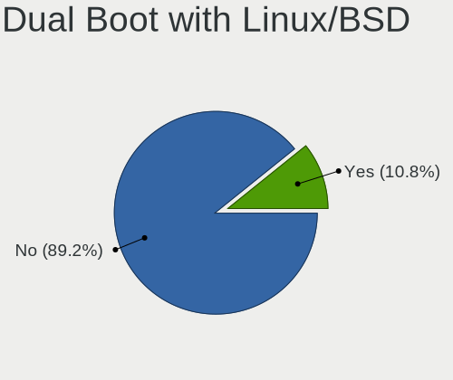

| Dual boot | Notebooks | Percent |
|-----------|-----------|---------|
| No        | 703       | 88.21%  |
| Yes       | 94        | 11.79%  |

Dual Boot (Win)
---------------

Hosting Linux and Windows

| Dual boot | Notebooks | Percent |
|-----------|-----------|---------|
| No        | 576       | 71.82%  |
| Yes       | 226       | 28.18%  |

Board
-----

Vendor
------

Motherboard manufacturer

| Name                    | Notebooks | Percent |
|-------------------------|-----------|---------|
| Lenovo                  | 219       | 27.72%  |
| ASUSTek Computer        | 127       | 16.08%  |
| Hewlett-Packard         | 123       | 15.57%  |
| Dell                    | 90        | 11.39%  |
| Acer                    | 54        | 6.84%   |
| MSI                     | 32        | 4.05%   |
| Apple                   | 23        | 2.91%   |
| HUAWEI                  | 15        | 1.9%    |
| Google                  | 12        | 1.52%   |
| Timi                    | 11        | 1.39%   |
| Toshiba                 | 9         | 1.14%   |
| TUXEDO                  | 7         | 0.89%   |
| Notebook                | 7         | 0.89%   |
| Sony                    | 5         | 0.63%   |
| Schenker                | 4         | 0.51%   |
| Samsung Electronics     | 4         | 0.51%   |
| Gigabyte Technology     | 4         | 0.51%   |
| Packard Bell            | 3         | 0.38%   |
| GPD                     | 3         | 0.38%   |
| Unknown                 | 3         | 0.38%   |
| TrekStor                | 2         | 0.25%   |
| System76                | 2         | 0.25%   |
| Razer                   | 2         | 0.25%   |
| Positivo                | 2         | 0.25%   |
| Fujitsu                 | 2         | 0.25%   |
| Framework               | 2         | 0.25%   |
| Chuwi                   | 2         | 0.25%   |
| VIT                     | 1         | 0.13%   |
| Universal Exports Group | 1         | 0.13%   |
| Teclast                 | 1         | 0.13%   |
| Shinelon Computer       | 1         | 0.13%   |
| Radxa                   | 1         | 0.13%   |
| Pine Microsystems       | 1         | 0.13%   |
| PC Specialist           | 1         | 0.13%   |
| OriginPC                | 1         | 0.13%   |
| Monster                 | 1         | 0.13%   |
| Medion                  | 1         | 0.13%   |
| Maibenben               | 1         | 0.13%   |
| ILLEGEAR                | 1         | 0.13%   |
| HONOR                   | 1         | 0.13%   |

Model
-----

Motherboard model

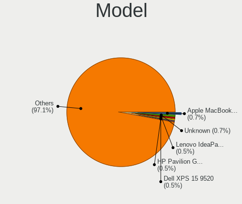

| Name                                  | Notebooks | Percent |
|---------------------------------------|-----------|---------|
| Apple MacBookAir7,2                   | 7         | 0.89%   |
| Lenovo IdeaPad Gaming 3 15ACH6 82K2   | 5         | 0.63%   |
| ASUS ROG Zephyrus G14 GA401IV_GA401IV | 4         | 0.51%   |
| Unknown                               | 4         | 0.51%   |
| MSI Modern 14 B5M                     | 3         | 0.38%   |
| Lenovo ThinkPad X140e 20BL000BUS      | 3         | 0.38%   |
| Lenovo ThinkBook 15 G2 ITL 20VE       | 3         | 0.38%   |
| Lenovo Legion 5 15ACH6H 82JU          | 3         | 0.38%   |
| Lenovo IdeaPad 5 Pro 16ACH6 82L5      | 3         | 0.38%   |
| Lenovo IdeaPad 3 15ITL6 82H8          | 3         | 0.38%   |
| HUAWEI KLVL-WXX9                      | 3         | 0.38%   |
| HP Pavilion Gaming Laptop 15-cx0xxx   | 3         | 0.38%   |
| HP Laptop 15-db0xxx                   | 3         | 0.38%   |
| Dell XPS 15 9520                      | 3         | 0.38%   |
| Dell Latitude E5470                   | 3         | 0.38%   |
| Dell Inspiron 3583                    | 3         | 0.38%   |
| Dell Inspiron 3542                    | 3         | 0.38%   |
| Apple MacBookPro16,2                  | 3         | 0.38%   |
| Apple MacBookAir6,2                   | 3         | 0.38%   |
| Acer Aspire E5-575G                   | 3         | 0.38%   |
| TUXEDO Pulse 15 Gen1                  | 2         | 0.25%   |
| Timi TM1701                           | 2         | 0.25%   |
| Timi A35S                             | 2         | 0.25%   |
| System76 Gazelle                      | 2         | 0.25%   |
| Samsung 340XAA/350XAA/550XAA          | 2         | 0.25%   |
| Positivo S14BW01                      | 2         | 0.25%   |
| MSI Prestige 15 A10SC                 | 2         | 0.25%   |
| MSI Modern 15 A5M                     | 2         | 0.25%   |
| Lenovo Yoga Slim 7 Pro 14ACH5 82MS    | 2         | 0.25%   |
| Lenovo ThinkPad T14 Gen 3 21CFCTO1WW  | 2         | 0.25%   |
| Lenovo ThinkPad T14 Gen 1 20UD0013MB  | 2         | 0.25%   |
| Lenovo ThinkPad E14 Gen 4 21ECS00000  | 2         | 0.25%   |
| Lenovo ThinkBook 16p Gen 2 20YM       | 2         | 0.25%   |
| Lenovo ThinkBook 15-IIL 20SM          | 2         | 0.25%   |
| Lenovo Legion 7 16ARHA7 82UH          | 2         | 0.25%   |
| Lenovo Legion 5 Pro 16ARH7H 82RG      | 2         | 0.25%   |
| Lenovo Legion 5 Pro 16ACH6H 82JQ      | 2         | 0.25%   |
| Lenovo IdeaPad S340-14API 81NB        | 2         | 0.25%   |
| Lenovo IdeaPad Gaming 3 15ARH05 82EY  | 2         | 0.25%   |
| Lenovo IdeaPad Flex-14API 81SS        | 2         | 0.25%   |

Model Family
------------

Motherboard model prefix

| Name                  | Notebooks | Percent |
|-----------------------|-----------|---------|
| Lenovo ThinkPad       | 103       | 13.04%  |
| Lenovo IdeaPad        | 61        | 7.72%   |
| ASUS ROG              | 32        | 4.05%   |
| Dell Latitude         | 31        | 3.92%   |
| Acer Aspire           | 31        | 3.92%   |
| Dell Inspiron         | 26        | 3.29%   |
| HP Pavilion           | 25        | 3.16%   |
| HP EliteBook          | 25        | 3.16%   |
| Lenovo Legion         | 22        | 2.78%   |
| ASUS VivoBook         | 22        | 2.78%   |
| HP Laptop             | 17        | 2.15%   |
| Lenovo ThinkBook      | 13        | 1.65%   |
| ASUS ASUS             | 13        | 1.65%   |
| Dell XPS              | 12        | 1.52%   |
| Lenovo Yoga           | 10        | 1.27%   |
| MSI Modern            | 9         | 1.14%   |
| Dell Precision        | 9         | 1.14%   |
| ASUS Zenbook          | 9         | 1.14%   |
| ASUS TUF              | 9         | 1.14%   |
| HP ProBook            | 8         | 1.01%   |
| Acer Swift            | 8         | 1.01%   |
| Acer Nitro            | 8         | 1.01%   |
| Toshiba Satellite     | 7         | 0.89%   |
| HP ZBook              | 7         | 0.89%   |
| HP 255                | 7         | 0.89%   |
| Apple MacBookAir7     | 7         | 0.89%   |
| HP ENVY               | 6         | 0.76%   |
| MSI Prestige          | 5         | 0.63%   |
| Apple MacBookPro16    | 5         | 0.63%   |
| Schenker XMG          | 4         | 0.51%   |
| HP OMEN               | 4         | 0.51%   |
| HP 250                | 4         | 0.51%   |
| Dell G3               | 4         | 0.51%   |
| Unknown               | 4         | 0.51%   |
| TUXEDO Pulse          | 3         | 0.38%   |
| Packard Bell EasyNote | 3         | 0.38%   |
| Notebook NH5x         | 3         | 0.38%   |
| HUAWEI KLVL-WXX9      | 3         | 0.38%   |
| HP Victus             | 3         | 0.38%   |
| Dell Vostro           | 3         | 0.38%   |

MFG Year
--------

Motherboard manufacture year

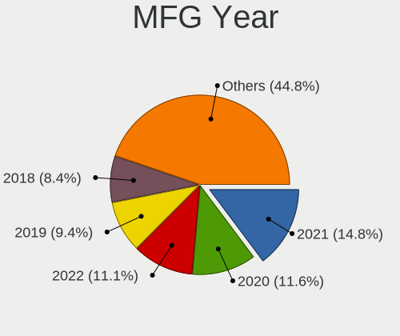

| Year    | Notebooks | Percent |
|---------|-----------|---------|
| 2021    | 122       | 15.44%  |
| 2020    | 103       | 13.04%  |
| 2022    | 84        | 10.63%  |
| 2019    | 83        | 10.51%  |
| 2018    | 66        | 8.35%   |
| 2017    | 56        | 7.09%   |
| 2016    | 41        | 5.19%   |
| 2013    | 39        | 4.94%   |
| 2015    | 33        | 4.18%   |
| 2023    | 32        | 4.05%   |
| 2014    | 32        | 4.05%   |
| 2012    | 31        | 3.92%   |
| 2011    | 21        | 2.66%   |
| 2010    | 14        | 1.77%   |
| 2008    | 13        | 1.65%   |
| 2007    | 11        | 1.39%   |
| 2009    | 8         | 1.01%   |
| Unknown | 1         | 0.13%   |

Form Factor
-----------

Physical design of the computer

| Name     | Notebooks | Percent |
|----------|-----------|---------|
| Notebook | 790       | 100%    |

Secure Boot
-----------

Enabled or disabled

| State    | Notebooks | Percent |
|----------|-----------|---------|
| Disabled | 789       | 99.87%  |
| Enabled  | 1         | 0.13%   |

Coreboot
--------

Have coreboot on board

| Used | Notebooks | Percent |
|------|-----------|---------|
| No   | 774       | 97.97%  |
| Yes  | 16        | 2.03%   |

RAM Size
--------

Total RAM memory

| Size in GB  | Notebooks | Percent |
|-------------|-----------|---------|
| 4.01-8.0    | 206       | 25.85%  |
| 8.01-16.0   | 197       | 24.72%  |
| 16.01-24.0  | 163       | 20.45%  |
| 32.01-64.0  | 101       | 12.67%  |
| 3.01-4.0    | 78        | 9.79%   |
| 24.01-32.0  | 25        | 3.14%   |
| 64.01-256.0 | 20        | 2.51%   |
| 1.01-2.0    | 4         | 0.5%    |
| 2.01-3.0    | 3         | 0.38%   |

RAM Used
--------

Used RAM memory

| Used GB    | Notebooks | Percent |
|------------|-----------|---------|
| 2.01-3.0   | 214       | 25.09%  |
| 4.01-8.0   | 209       | 24.5%   |
| 1.01-2.0   | 174       | 20.4%   |
| 3.01-4.0   | 163       | 19.11%  |
| 8.01-16.0  | 59        | 6.92%   |
| 0.51-1.0   | 25        | 2.93%   |
| 16.01-24.0 | 6         | 0.7%    |
| 0.01-0.5   | 2         | 0.23%   |
| 24.01-32.0 | 1         | 0.12%   |

Total Drives
------------

Number of drives on board

| Drives | Notebooks | Percent |
|--------|-----------|---------|
| 1      | 551       | 68.62%  |
| 2      | 221       | 27.52%  |
| 3      | 24        | 2.99%   |
| 4      | 4         | 0.5%    |
| 0      | 2         | 0.25%   |
| 6      | 1         | 0.12%   |

Has CD-ROM
----------

Has CD-ROM on board

| Presented | Notebooks | Percent |
|-----------|-----------|---------|
| No        | 651       | 82.3%   |
| Yes       | 140       | 17.7%   |

Has Ethernet
------------

Has Ethernet on board

| Presented | Notebooks | Percent |
|-----------|-----------|---------|
| Yes       | 585       | 73.68%  |
| No        | 209       | 26.32%  |

Has WiFi
--------

Has WiFi module

| Presented | Notebooks | Percent |
|-----------|-----------|---------|
| Yes       | 784       | 99.12%  |
| No        | 7         | 0.88%   |

Has Bluetooth
-------------

Has Bluetooth module

| Presented | Notebooks | Percent |
|-----------|-----------|---------|
| Yes       | 729       | 91.93%  |
| No        | 64        | 8.07%   |

Location
--------

Country
-------

Geographic location (country)

| Country     | Notebooks | Percent |
|-------------|-----------|---------|
| USA         | 158       | 19.8%   |
| Italy       | 84        | 10.53%  |
| Germany     | 65        | 8.15%   |
| Canada      | 33        | 4.14%   |
| India       | 29        | 3.63%   |
| UK          | 25        | 3.13%   |
| Russia      | 25        | 3.13%   |
| France      | 25        | 3.13%   |
| Poland      | 23        | 2.88%   |
| Netherlands | 23        | 2.88%   |
| Turkey      | 21        | 2.63%   |
| Brazil      | 19        | 2.38%   |
| Spain       | 17        | 2.13%   |
| Finland     | 16        | 2.01%   |
| Austria     | 12        | 1.5%    |
| Sweden      | 11        | 1.38%   |
| Australia   | 11        | 1.38%   |
| Mexico      | 10        | 1.25%   |
| Indonesia   | 9         | 1.13%   |
| Argentina   | 9         | 1.13%   |
| Vietnam     | 7         | 0.88%   |
| Romania     | 7         | 0.88%   |
| New Zealand | 7         | 0.88%   |
| Hungary     | 7         | 0.88%   |
| Ukraine     | 6         | 0.75%   |
| Switzerland | 6         | 0.75%   |
| Bangladesh  | 6         | 0.75%   |
| Portugal    | 5         | 0.63%   |
| Philippines | 5         | 0.63%   |
| Greece      | 5         | 0.63%   |
| Denmark     | 5         | 0.63%   |
| Belgium     | 5         | 0.63%   |
| Taiwan      | 4         | 0.5%    |
| Slovakia    | 4         | 0.5%    |
| Serbia      | 4         | 0.5%    |
| Malaysia    | 4         | 0.5%    |
| Kazakhstan  | 4         | 0.5%    |
| Hong Kong   | 4         | 0.5%    |
| Czechia     | 4         | 0.5%    |
| Colombia    | 4         | 0.5%    |

City
----

Geographic location (city)

| City              | Notebooks | Percent |
|-------------------|-----------|---------|
| Helsinki          | 11        | 1.32%   |
| Milan             | 10        | 1.2%    |
| St Petersburg     | 8         | 0.96%   |
| Rome              | 8         | 0.96%   |
| Montreal          | 8         | 0.96%   |
| Istanbul          | 8         | 0.96%   |
| Berlin            | 8         | 0.96%   |
| Amsterdam         | 8         | 0.96%   |
| Toms River        | 7         | 0.84%   |
| Warsaw            | 6         | 0.72%   |
| Mesa              | 6         | 0.72%   |
| Hyderabad         | 6         | 0.72%   |
| Frankfurt am Main | 6         | 0.72%   |
| Vienna            | 5         | 0.6%    |
| Victoria          | 5         | 0.6%    |
| Sydney            | 5         | 0.6%    |
| Portland          | 5         | 0.6%    |
| Moscow            | 5         | 0.6%    |
| Florence          | 5         | 0.6%    |
| Barberton         | 5         | 0.6%    |
| Turin             | 4         | 0.48%   |
| Paris             | 4         | 0.48%   |
| Milano            | 4         | 0.48%   |
| London            | 4         | 0.48%   |
| Hamburg           | 4         | 0.48%   |
| Delhi             | 4         | 0.48%   |
| Budapest          | 4         | 0.48%   |
| Belgrade          | 4         | 0.48%   |
| Auckland          | 4         | 0.48%   |
| Wroclaw           | 3         | 0.36%   |
| Singapore         | 3         | 0.36%   |
| Poznan            | 3         | 0.36%   |
| Naples            | 3         | 0.36%   |
| Melbourne         | 3         | 0.36%   |
| Mannheim          | 3         | 0.36%   |
| Manama            | 3         | 0.36%   |
| Madrid            | 3         | 0.36%   |
| Lima              | 3         | 0.36%   |
| Jacksonville      | 3         | 0.36%   |
| Ho Chi Minh City  | 3         | 0.36%   |

Drives
------

Drive Vendor
------------

Hard drive vendors

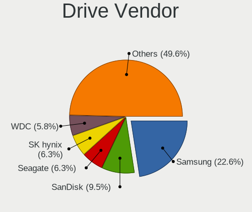

| Vendor                         | Notebooks | Drives | Percent |
|--------------------------------|-----------|--------|---------|
| Samsung Electronics            | 234       | 306    | 22.54%  |
| Sandisk                        | 96        | 110    | 9.25%   |
| Seagate                        | 74        | 81     | 7.13%   |
| WDC                            | 65        | 73     | 6.26%   |
| SK hynix                       | 65        | 77     | 6.26%   |
| Kingston                       | 49        | 58     | 4.72%   |
| Micron Technology              | 45        | 52     | 4.34%   |
| Unknown                        | 36        | 45     | 3.47%   |
| Toshiba                        | 36        | 42     | 3.47%   |
| Intel                          | 30        | 33     | 2.89%   |
| Crucial                        | 26        | 34     | 2.5%    |
| KIOXIA                         | 23        | 24     | 2.22%   |
| HGST                           | 21        | 26     | 2.02%   |
| Apple                          | 20        | 25     | 1.93%   |
| Phison Electronics             | 14        | 14     | 1.35%   |
| Kingston Technology Company    | 14        | 16     | 1.35%   |
| Micron/Crucial Technology      | 12        | 15     | 1.16%   |
| A-DATA Technology              | 12        | 14     | 1.16%   |
| Hitachi                        | 9         | 9      | 0.87%   |
| Phison                         | 8         | 8      | 0.77%   |
| MAXIO Technology (Hangzhou)    | 8         | 8      | 0.77%   |
| LITEONIT                       | 7         | 8      | 0.67%   |
| China                          | 7         | 7      | 0.67%   |
| Union Memory (Shenzhen)        | 5         | 5      | 0.48%   |
| Silicon Motion                 | 5         | 5      | 0.48%   |
| Transcend                      | 4         | 4      | 0.39%   |
| Realtek Semiconductor          | 4         | 4      | 0.39%   |
| Patriot                        | 4         | 4      | 0.39%   |
| OCZ                            | 4         | 4      | 0.39%   |
| Mushkin                        | 4         | 4      | 0.39%   |
| SSSTC                          | 3         | 3      | 0.29%   |
| SPCC                           | 3         | 3      | 0.29%   |
| Solid State Storage Technology | 3         | 5      | 0.29%   |
| Shenzhen Longsys Electronics   | 3         | 4      | 0.29%   |
| Realtek                        | 3         | 5      | 0.29%   |
| PNY                            | 3         | 4      | 0.29%   |
| LITEON                         | 3         | 5      | 0.29%   |
| Lenovo                         | 3         | 3      | 0.29%   |
| KingSpec                       | 3         | 3      | 0.29%   |
| KingFast                       | 3         | 3      | 0.29%   |

Drive Model
-----------

Hard drive models

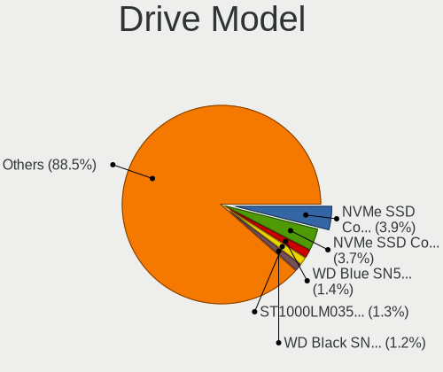

| Model                                                 | Notebooks | Percent |
|-------------------------------------------------------|-----------|---------|
| Samsung NVMe SSD Controller SM981/PM981/PM983 1TB     | 36        | 3.35%   |
| Samsung NVMe SSD Controller PM9A1/PM9A3/980PRO 2TB    | 31        | 2.88%   |
| Seagate ST1000LM035-1RK172 1TB                        | 19        | 1.77%   |
| Sandisk WD Black SN750 / PC SN730 NVMe SSD 512GB      | 14        | 1.3%    |
| Sandisk WD Blue SN550 NVMe SSD 512GB                  | 13        | 1.21%   |
| HGST HTS721010A9E630 1TB                              | 9         | 0.84%   |
| Sandisk WD Blue SN500 / PC SN520 NVMe SSD 512GB       | 8         | 0.74%   |
| Samsung MZALQ512HBLU-00BL2 512GB                      | 8         | 0.74%   |
| Kingston SA400S37240G 240GB SSD                       | 8         | 0.74%   |
| Unknown MMC Card  64GB                                | 7         | 0.65%   |
| Seagate ST500LT012-1DG142 500GB                       | 7         | 0.65%   |
| Samsung SSD 870 QVO 1TB                               | 7         | 0.65%   |
| Unknown MMC Card  16GB                                | 6         | 0.56%   |
| Unknown MMC Card  128GB                               | 6         | 0.56%   |
| Toshiba MQ01ABD100 1TB                                | 6         | 0.56%   |
| SK hynix HFM001TD3JX013N 1024GB                       | 6         | 0.56%   |
| Seagate ST1000LM049-2GH172 1TB                        | 6         | 0.56%   |
| Samsung NVMe SSD Drive 512GB                          | 6         | 0.56%   |
| MAXIO (Hangzhou) NVMe SSD Controller MAP1202 512GB    | 6         | 0.56%   |
| Kingston SA400S37480G 480GB SSD                       | 6         | 0.56%   |
| Kingston OM8PCP3512F-AI1 512GB                        | 6         | 0.56%   |
| Intel SSD 660P Series 1024GB                          | 6         | 0.56%   |
| Apple SSD SM0128G 121GB                               | 6         | 0.56%   |
| Unknown MMC Card  32GB                                | 5         | 0.47%   |
| Silicon Motion SM2263EN/SM2263XT SSD Controller 128GB | 5         | 0.47%   |
| Seagate ST1000LM024 HN-M101MBB 1TB                    | 5         | 0.47%   |
| Samsung SSD 980 500GB                                 | 5         | 0.47%   |
| Samsung SSD 980 1TB                                   | 5         | 0.47%   |
| Samsung SSD 970 EVO 500GB                             | 5         | 0.47%   |
| Samsung SSD 870 EVO 250GB                             | 5         | 0.47%   |
| Samsung SSD 860 EVO 500GB                             | 5         | 0.47%   |
| Samsung SSD 860 EVO 250GB                             | 5         | 0.47%   |
| Samsung SSD 860 EVO 1TB                               | 5         | 0.47%   |
| Samsung SSD 850 EVO 500GB                             | 5         | 0.47%   |
| Samsung MZVLQ512HBLU-00B00 512GB                      | 5         | 0.47%   |
| Samsung MZVLQ512HALU-00000 512GB                      | 5         | 0.47%   |
| Phison E12 NVMe Controller 1TB                        | 5         | 0.47%   |
| Micron 2450_MTFDKBA1T0TFK 1TB                         | 5         | 0.47%   |
| Micron 2400_MTFDKBA512QFM 512GB                       | 5         | 0.47%   |
| KIOXIA KBG40ZNV512G 512GB                             | 5         | 0.47%   |

HDD Vendor
----------

Hard disk drive vendors

| Vendor              | Notebooks | Drives | Percent |
|---------------------|-----------|--------|---------|
| Seagate             | 67        | 73     | 41.61%  |
| WDC                 | 37        | 40     | 22.98%  |
| HGST                | 21        | 26     | 13.04%  |
| Toshiba             | 16        | 17     | 9.94%   |
| Hitachi             | 9         | 9      | 5.59%   |
| Fujitsu             | 3         | 3      | 1.86%   |
| Unknown             | 2         | 2      | 1.24%   |
| Maxone              | 2         | 2      | 1.24%   |
| StoreJet            | 1         | 1      | 0.62%   |
| Samsung Electronics | 1         | 1      | 0.62%   |
| Generic-            | 1         | 1      | 0.62%   |
| ASMT                | 1         | 2      | 0.62%   |

SSD Vendor
----------

Solid state drive vendors

| Vendor              | Notebooks | Drives | Percent |
|---------------------|-----------|--------|---------|
| Samsung Electronics | 86        | 118    | 27.56%  |
| Kingston            | 29        | 34     | 9.29%   |
| Crucial             | 23        | 30     | 7.37%   |
| SanDisk             | 20        | 21     | 6.41%   |
| WDC                 | 17        | 21     | 5.45%   |
| SK hynix            | 12        | 16     | 3.85%   |
| Apple               | 12        | 12     | 3.85%   |
| A-DATA Technology   | 9         | 10     | 2.88%   |
| Micron Technology   | 7         | 8      | 2.24%   |
| LITEONIT            | 7         | 8      | 2.24%   |
| China               | 7         | 7      | 2.24%   |
| Toshiba             | 6         | 6      | 1.92%   |
| Intel               | 5         | 5      | 1.6%    |
| Transcend           | 4         | 4      | 1.28%   |
| Seagate             | 4         | 4      | 1.28%   |
| Patriot             | 4         | 4      | 1.28%   |
| OCZ                 | 4         | 4      | 1.28%   |
| SPCC                | 3         | 3      | 0.96%   |
| Mushkin             | 3         | 3      | 0.96%   |
| KingSpec            | 3         | 3      | 0.96%   |
| KingFast            | 3         | 3      | 0.96%   |
| Gigabyte Technology | 3         | 4      | 0.96%   |
| Corsair             | 3         | 3      | 0.96%   |
| WDC WDS             | 2         | 2      | 0.64%   |
| Teclast             | 2         | 4      | 0.64%   |
| Team                | 2         | 3      | 0.64%   |
| PNY                 | 2         | 3      | 0.64%   |
| Netac               | 2         | 3      | 0.64%   |
| LITEON              | 2         | 3      | 0.64%   |
| Hewlett-Packard     | 2         | 2      | 0.64%   |
| GOODRAM             | 2         | 2      | 0.64%   |
| Emtec               | 2         | 2      | 0.64%   |
| Zheino              | 1         | 1      | 0.32%   |
| WALTON              | 1         | 2      | 0.32%   |
| V-GeN               | 1         | 1      | 0.32%   |
| USB3.0              | 1         | 1      | 0.32%   |
| Unknown             | 1         | 2      | 0.32%   |
| TAMMUZ              | 1         | 4      | 0.32%   |
| SUNEAST             | 1         | 1      | 0.32%   |
| SSSTC               | 1         | 1      | 0.32%   |

Drive Kind
----------

HDD or SSD

| Kind    | Notebooks | Drives | Percent |
|---------|-----------|--------|---------|
| NVMe    | 472       | 624    | 49.68%  |
| SSD     | 276       | 380    | 29.05%  |
| HDD     | 158       | 177    | 16.63%  |
| MMC     | 35        | 43     | 3.68%   |
| Unknown | 9         | 9      | 0.95%   |

Drive Connector
---------------

SATA, SAS, NVMe, etc.

| Type | Notebooks | Drives | Percent |
|------|-----------|--------|---------|
| NVMe | 472       | 617    | 51.25%  |
| SATA | 370       | 516    | 40.17%  |
| SAS  | 44        | 57     | 4.78%   |
| MMC  | 35        | 43     | 3.8%    |

Drive Size
----------

Size of hard drive

| Size in TB | Notebooks | Drives | Percent |
|------------|-----------|--------|---------|
| 0.01-0.5   | 272       | 378    | 63.11%  |
| 0.51-1.0   | 133       | 146    | 30.86%  |
| 1.01-2.0   | 20        | 27     | 4.64%   |
| 3.01-4.0   | 4         | 4      | 0.93%   |
| 4.01-10.0  | 2         | 2      | 0.46%   |

Space Total
-----------

Amount of disk space available on the file system

| Size in GB     | Notebooks | Percent |
|----------------|-----------|---------|
| 101-250        | 191       | 23.32%  |
| 251-500        | 167       | 20.39%  |
| 501-1000       | 119       | 14.53%  |
| 1001-2000      | 112       | 13.68%  |
| 1-20           | 63        | 7.69%   |
| Unknown        | 50        | 6.11%   |
| More than 3000 | 38        | 4.64%   |
| 51-100         | 36        | 4.4%    |
| 2001-3000      | 23        | 2.81%   |
| 21-50          | 20        | 2.44%   |

Space Used
----------

Amount of used disk space

| Used GB        | Notebooks | Percent |
|----------------|-----------|---------|
| 1-20           | 228       | 26.79%  |
| 21-50          | 149       | 17.51%  |
| 101-250        | 148       | 17.39%  |
| 51-100         | 106       | 12.46%  |
| 251-500        | 78        | 9.17%   |
| Unknown        | 50        | 5.88%   |
| 501-1000       | 48        | 5.64%   |
| 1001-2000      | 29        | 3.41%   |
| 0              | 6         | 0.71%   |
| More than 3000 | 5         | 0.59%   |
| 2001-3000      | 4         | 0.47%   |

Malfunc. Drives
---------------

Drive models with a malfunction

| Model                                                           | Notebooks | Drives | Percent |
|-----------------------------------------------------------------|-----------|--------|---------|
| HGST HTS545050A7E680 500GB                                      | 5         | 8      | 8.62%   |
| HGST HTS721010A9E630 1TB                                        | 3         | 3      | 5.17%   |
| Seagate ST1000LM035-1RK172 1TB                                  | 2         | 2      | 3.45%   |
| Hitachi HTS545050A7E380 500GB                                   | 2         | 2      | 3.45%   |
| WDC WD5000LPVT-22G33T0 500GB                                    | 1         | 1      | 1.72%   |
| WDC WD5000BPVT-60HXZT3 500GB                                    | 1         | 1      | 1.72%   |
| WDC WD10SPZX-24Z10T0 1TB                                        | 1         | 1      | 1.72%   |
| WDC WD10SPCX-22HWST0 1TB                                        | 1         | 1      | 1.72%   |
| WDC WD10JPVX-22JC3T0 1TB                                        | 1         | 1      | 1.72%   |
| WDC PC SA530 SDASN8Y-256G-1006 256GB                            | 1         | 1      | 1.72%   |
| Transcend TS240GMTS420S 240GB SSD                               | 1         | 1      | 1.72%   |
| Toshiba THNSNK128GVN8 M.2 2280 128GB SSD                        | 1         | 1      | 1.72%   |
| Toshiba MQ01ABD100 1TB                                          | 1         | 1      | 1.72%   |
| Toshiba MQ01ABD050 500GB                                        | 1         | 2      | 1.72%   |
| Toshiba MK5055GSXF 500GB                                        | 1         | 1      | 1.72%   |
| Toshiba MK2533GSG 250GB                                         | 1         | 1      | 1.72%   |
| Toshiba KSG60ZMV256G M.2 2280 256GB SSD                         | 1         | 1      | 1.72%   |
| SSSTC CV8-8E128-HP 128GB                                        | 1         | 1      | 1.72%   |
| SK hynix SC308 SATA 128GB SSD                                   | 1         | 1      | 1.72%   |
| SK hynix PC711 HFS001TDE9X073N 1TB                              | 1         | 1      | 1.72%   |
| SK hynix HFS512G39TND-N210A 512GB SSD                           | 1         | 1      | 1.72%   |
| SK hynix HFS128G39TND-N210A 128GB SSD                           | 1         | 1      | 1.72%   |
| SK hynix HFS128G32TND-N210A 128GB SSD                           | 1         | 1      | 1.72%   |
| SK hynix BC711 HFM001TD3JX013N 1024GB                           | 1         | 1      | 1.72%   |
| Seagate ST9750420AS 752GB                                       | 1         | 1      | 1.72%   |
| Seagate ST9320325AS 320GB                                       | 1         | 1      | 1.72%   |
| Seagate ST500LX012-SSHD-8GB                                     | 1         | 1      | 1.72%   |
| Seagate ST500LT012-1DG142 500GB                                 | 1         | 1      | 1.72%   |
| Seagate ST2000LX001-1RG174 2TB                                  | 1         | 1      | 1.72%   |
| Seagate ST1000LM049-2GH172 1TB                                  | 1         | 1      | 1.72%   |
| SanDisk SSD PLUS 240GB                                          | 1         | 1      | 1.72%   |
| SanDisk SD8SNAT128G1002 128GB SSD                               | 1         | 1      | 1.72%   |
| Samsung Electronics SSD 980 1TB                                 | 1         | 1      | 1.72%   |
| Samsung Electronics SSD 970 EVO 500GB                           | 1         | 1      | 1.72%   |
| Samsung Electronics SSD 870 EVO 2TB                             | 1         | 1      | 1.72%   |
| Samsung Electronics NVMe SSD Controller SM961/PM961/SM963 256GB | 1         | 1      | 1.72%   |
| Samsung Electronics MZNLH128HBHQ-000H1 128GB SSD                | 1         | 1      | 1.72%   |
| Patriot P210 256GB SSD                                          | 1         | 1      | 1.72%   |
| LITEONIT LCT-512M3S 2.5 7mm 512GB SSD                           | 1         | 1      | 1.72%   |
| Kingston SNS4151S332GD 32GB SSD                                 | 1         | 1      | 1.72%   |

Malfunc. Drive Vendor
---------------------

Vendors of faulty drives

| Vendor              | Notebooks | Drives | Percent |
|---------------------|-----------|--------|---------|
| HGST                | 9         | 12     | 15.52%  |
| Seagate             | 8         | 8      | 13.79%  |
| WDC                 | 6         | 6      | 10.34%  |
| Toshiba             | 6         | 7      | 10.34%  |
| SK hynix            | 6         | 6      | 10.34%  |
| Samsung Electronics | 5         | 5      | 8.62%   |
| SanDisk             | 2         | 2      | 3.45%   |
| Intel               | 2         | 2      | 3.45%   |
| Hitachi             | 2         | 2      | 3.45%   |
| China               | 2         | 2      | 3.45%   |
| Apple               | 2         | 2      | 3.45%   |
| Transcend           | 1         | 1      | 1.72%   |
| SSSTC               | 1         | 1      | 1.72%   |
| Patriot             | 1         | 1      | 1.72%   |
| LITEONIT            | 1         | 1      | 1.72%   |
| Kingston            | 1         | 1      | 1.72%   |
| Fujitsu             | 1         | 1      | 1.72%   |
| Corsair             | 1         | 1      | 1.72%   |
| A-DATA Technology   | 1         | 1      | 1.72%   |

Malfunc. HDD Vendor
-------------------

Vendors of faulty HDD drives

| Vendor  | Notebooks | Drives | Percent |
|---------|-----------|--------|---------|
| HGST    | 9         | 12     | 31.03%  |
| Seagate | 8         | 8      | 27.59%  |
| WDC     | 5         | 5      | 17.24%  |
| Toshiba | 4         | 5      | 13.79%  |
| Hitachi | 2         | 2      | 6.9%    |
| Fujitsu | 1         | 1      | 3.45%   |

Malfunc. Drive Kind
-------------------

Kinds of faulty drives

| Kind | Notebooks | Drives | Percent |
|------|-----------|--------|---------|
| HDD  | 29        | 33     | 50%     |
| SSD  | 24        | 24     | 41.38%  |
| NVMe | 5         | 5      | 8.62%   |

Failed Drives
-------------

Failed drive models

| Model                                            | Notebooks | Drives | Percent |
|--------------------------------------------------|-----------|--------|---------|
| Seagate ST9320320AS 320GB                        | 1         | 1      | 33.33%  |
| Sandisk WD Black SN750 / PC SN730 NVMe SSD 512GB | 1         | 1      | 33.33%  |
| LITEON CA3-8D512 512GB                           | 1         | 2      | 33.33%  |

Failed Drive Vendor
-------------------

Failed drive vendors

| Vendor  | Notebooks | Drives | Percent |
|---------|-----------|--------|---------|
| Seagate | 1         | 1      | 33.33%  |
| Sandisk | 1         | 1      | 33.33%  |
| LITEON  | 1         | 2      | 33.33%  |

Drive Status
------------

Number of failed and malfunc. drives

| Status   | Notebooks | Drives | Percent |
|----------|-----------|--------|---------|
| Works    | 544       | 791    | 63.48%  |
| Detected | 253       | 376    | 29.52%  |
| Malfunc  | 57        | 62     | 6.65%   |
| Failed   | 3         | 4      | 0.35%   |

Storage controller
------------------

Storage Vendor
--------------

Storage controller vendors

| Vendor                         | Notebooks | Percent |
|--------------------------------|-----------|---------|
| Intel                          | 417       | 40.06%  |
| Samsung Electronics            | 165       | 15.85%  |
| AMD                            | 110       | 10.57%  |
| SanDisk                        | 85        | 8.17%   |
| SK hynix                       | 52        | 5%      |
| Micron Technology              | 38        | 3.65%   |
| Kingston Technology Company    | 34        | 3.27%   |
| KIOXIA                         | 26        | 2.5%    |
| Phison Electronics             | 23        | 2.21%   |
| Micron/Crucial Technology      | 15        | 1.44%   |
| Toshiba America Info Systems   | 11        | 1.06%   |
| MAXIO Technology (Hangzhou)    | 8         | 0.77%   |
| Apple                          | 8         | 0.77%   |
| Solid State Storage Technology | 7         | 0.67%   |
| Union Memory (Shenzhen)        | 6         | 0.58%   |
| ADATA Technology               | 6         | 0.58%   |
| Silicon Motion                 | 5         | 0.48%   |
| Realtek Semiconductor          | 4         | 0.38%   |
| Shenzhen Longsys Electronics   | 3         | 0.29%   |
| Seagate Technology             | 3         | 0.29%   |
| Lenovo                         | 3         | 0.29%   |
| JMicron Technology             | 3         | 0.29%   |
| Yangtze Memory Technologies    | 2         | 0.19%   |
| Marvell Technology Group       | 2         | 0.19%   |
| Lite-On Technology             | 2         | 0.19%   |
| Nvidia                         | 1         | 0.1%    |
| INNOGRIT                       | 1         | 0.1%    |
| Biwin Storage Technology       | 1         | 0.1%    |

Storage Model
-------------

Storage controller models

| Model                                                                          | Notebooks | Percent |
|--------------------------------------------------------------------------------|-----------|---------|
| AMD FCH SATA Controller [AHCI mode]                                            | 107       | 9.83%   |
| Samsung NVMe SSD Controller SM981/PM981/PM983                                  | 62        | 5.69%   |
| Intel Sunrise Point-LP SATA Controller [AHCI mode]                             | 62        | 5.69%   |
| Samsung NVMe SSD Controller 980 (DRAM-less)                                    | 49        | 4.5%    |
| Intel 82801 Mobile SATA Controller [RAID mode]                                 | 38        | 3.49%   |
| Samsung NVMe SSD Controller PM9A1/PM9A3/980PRO                                 | 34        | 3.12%   |
| Intel Volume Management Device NVMe RAID Controller                            | 31        | 2.85%   |
| Intel Cannon Lake Mobile PCH SATA AHCI Controller                              | 30        | 2.75%   |
| Intel 7 Series Chipset Family 6-port SATA Controller [AHCI mode]               | 29        | 2.66%   |
| Intel 8 Series SATA Controller 1 [AHCI mode]                                   | 28        | 2.57%   |
| SK hynix Gold P31/BC711/PC711 NVMe Solid State Drive                           | 27        | 2.48%   |
| Intel Tiger Lake-LP SATA Controller                                            | 19        | 1.74%   |
| SanDisk Extreme Pro / WD Black SN750 / PC SN730 / Red SN700 NVMe SSD           | 18        | 1.65%   |
| SanDisk Ultra 3D / WD Blue SN550 NVMe SSD                                      | 17        | 1.56%   |
| KIOXIA NVMe SSD Controller BG4 (DRAM-less)                                     | 17        | 1.56%   |
| Intel Wildcat Point-LP SATA Controller [AHCI Mode]                             | 17        | 1.56%   |
| Intel HM170/QM170 Chipset SATA Controller [AHCI Mode]                          | 17        | 1.56%   |
| Intel 8 Series/C220 Series Chipset Family 6-port SATA Controller 1 [AHCI mode] | 16        | 1.47%   |
| Intel 82801IBM/IEM (ICH9M/ICH9M-E) 4 port SATA Controller [AHCI mode]          | 15        | 1.38%   |
| Intel 6 Series/C200 Series Chipset Family 6 port Mobile SATA AHCI Controller   | 15        | 1.38%   |
| Intel SSD 660P Series                                                          | 13        | 1.19%   |
| Intel Comet Lake SATA AHCI Controller                                          | 13        | 1.19%   |
| Micron 2450 NVMe SSD [HendrixV] (DRAM-less)                                    | 11        | 1.01%   |
| Kingston Company OM8PCP Design-In PCIe 3 NVMe SSD (DRAM-less)                  | 11        | 1.01%   |
| Intel Q170/Q150/B150/H170/H110/Z170/CM236 Chipset SATA Controller [AHCI Mode]  | 10        | 0.92%   |
| Intel 400 Series Chipset Family SATA AHCI Controller                           | 10        | 0.92%   |
| SanDisk WD Blue SN500 / PC SN520 x2 M.2 2280 NVMe SSD                          | 9         | 0.83%   |
| Phison E12 NVMe Controller                                                     | 9         | 0.83%   |
| Samsung NVMe SSD Controller PM9B1 (DRAM-less)                                  | 8         | 0.73%   |
| Micron 2210 NVMe SSD [Cobain]                                                  | 8         | 0.73%   |
| Intel Celeron/Pentium Silver Processor SATA Controller                         | 8         | 0.73%   |
| Solid State Storage CL1-3D256-Q11 NVMe SSD M.2                                 | 7         | 0.64%   |
| SK hynix BC511 NVMe SSD                                                        | 7         | 0.64%   |
| Samsung S4LN058A01[SSUBX] AHCI SSD Controller (Apple slot)                     | 7         | 0.64%   |
| Intel SSD 670p Series [Keystone Harbor]                                        | 7         | 0.64%   |
| Intel Cannon Point-LP SATA Controller [AHCI Mode]                              | 7         | 0.64%   |
| Toshiba America Info Systems XG6 NVMe SSD Controller                           | 6         | 0.55%   |
| SK hynix Platinum P41/PC801 NVMe Solid State Drive                             | 6         | 0.55%   |
| SanDisk PC SN530 NVMe SSD (DRAM-less)                                          | 6         | 0.55%   |
| Samsung NVMe SSD Controller SM961/PM961/SM963                                  | 6         | 0.55%   |

Storage Kind
------------

Kind of storage controller (IDE, SATA, NVMe, SAS, ...)

| Kind | Notebooks | Percent |
|------|-----------|---------|
| NVMe | 471       | 46.22%  |
| SATA | 461       | 45.24%  |
| RAID | 76        | 7.46%   |
| IDE  | 11        | 1.08%   |

Processor
---------

CPU Vendor
----------

Processor vendors

| Vendor | Notebooks | Percent |
|--------|-----------|---------|
| Intel  | 545       | 68.99%  |
| AMD    | 244       | 30.89%  |
| ARM    | 1         | 0.13%   |

CPU Model
---------

Processor models

| Model                                         | Notebooks | Percent |
|-----------------------------------------------|-----------|---------|
| Intel Core i7-8550U CPU @ 1.80GHz             | 17        | 2.15%   |
| Intel 11th Gen Core i5-1135G7 @ 2.40GHz       | 17        | 2.15%   |
| AMD Ryzen 7 5800H with Radeon Graphics        | 16        | 2.03%   |
| AMD Ryzen 5 3500U with Radeon Vega Mobile Gfx | 16        | 2.03%   |
| Intel Core i5-8250U CPU @ 1.60GHz             | 14        | 1.77%   |
| Intel Core i7-9750H CPU @ 2.60GHz             | 13        | 1.65%   |
| Intel Core i7-8750H CPU @ 2.20GHz             | 13        | 1.65%   |
| AMD Ryzen 7 4800H with Radeon Graphics        | 13        | 1.65%   |
| AMD Ryzen 5 5600H with Radeon Graphics        | 12        | 1.52%   |
| Intel Core i7-10750H CPU @ 2.60GHz            | 11        | 1.39%   |
| Intel 12th Gen Core i7-12700H                 | 11        | 1.39%   |
| Intel 11th Gen Core i7-11800H @ 2.30GHz       | 11        | 1.39%   |
| AMD Ryzen 5 5500U with Radeon Graphics        | 11        | 1.39%   |
| Intel Core i7-6700HQ CPU @ 2.60GHz            | 10        | 1.27%   |
| Intel Core i5-6200U CPU @ 2.30GHz             | 10        | 1.27%   |
| Intel Core i5-10210U CPU @ 1.60GHz            | 10        | 1.27%   |
| Intel Core i7-7700HQ CPU @ 2.80GHz            | 9         | 1.14%   |
| Intel Core i5-8265U CPU @ 1.60GHz             | 9         | 1.14%   |
| Intel Core i5-7200U CPU @ 2.50GHz             | 9         | 1.14%   |
| Intel Core i5-6300U CPU @ 2.40GHz             | 9         | 1.14%   |
| Intel Core i7-10510U CPU @ 1.80GHz            | 8         | 1.01%   |
| Intel Core i5-8300H CPU @ 2.30GHz             | 8         | 1.01%   |
| Intel Core i5-4210U CPU @ 1.70GHz             | 8         | 1.01%   |
| Intel 11th Gen Core i7-1165G7 @ 2.80GHz       | 8         | 1.01%   |
| AMD Ryzen 7 PRO 4750U with Radeon Graphics    | 8         | 1.01%   |
| AMD Ryzen 7 6800H with Radeon Graphics        | 8         | 1.01%   |
| AMD Ryzen 7 5700U with Radeon Graphics        | 8         | 1.01%   |
| AMD Ryzen 5 4600H with Radeon Graphics        | 8         | 1.01%   |
| Intel Core i5-5200U CPU @ 2.20GHz             | 7         | 0.89%   |
| AMD Ryzen 5 5625U with Radeon Graphics        | 7         | 0.89%   |
| AMD Ryzen 9 5900HX with Radeon Graphics       | 6         | 0.76%   |
| AMD Ryzen 7 3700U with Radeon Vega Mobile Gfx | 6         | 0.76%   |
| Intel Core i7-8565U CPU @ 1.80GHz             | 5         | 0.63%   |
| Intel Core i7-6500U CPU @ 2.50GHz             | 5         | 0.63%   |
| Intel Core i7-4600U CPU @ 2.10GHz             | 5         | 0.63%   |
| Intel Core i5-9300H CPU @ 2.40GHz             | 5         | 0.63%   |
| Intel Core i5-7300U CPU @ 2.60GHz             | 5         | 0.63%   |
| Intel Core i5-1035G1 CPU @ 1.00GHz            | 5         | 0.63%   |
| Intel Celeron CPU N3060 @ 1.60GHz             | 5         | 0.63%   |
| Intel 11th Gen Core i3-1115G4 @ 3.00GHz       | 5         | 0.63%   |

CPU Model Family
----------------

Processor model prefix

| Model                   | Notebooks | Percent |
|-------------------------|-----------|---------|
| Intel Core i5           | 176       | 22.28%  |
| Intel Core i7           | 167       | 21.14%  |
| Other                   | 113       | 14.3%   |
| AMD Ryzen 7             | 83        | 10.51%  |
| AMD Ryzen 5             | 70        | 8.86%   |
| Intel Core i3           | 33        | 4.18%   |
| Intel Celeron           | 28        | 3.54%   |
| AMD Ryzen 9             | 24        | 3.04%   |
| AMD Ryzen 7 PRO         | 20        | 2.53%   |
| Intel Core 2 Duo        | 17        | 2.15%   |
| AMD Ryzen 3             | 11        | 1.39%   |
| AMD A4                  | 8         | 1.01%   |
| Intel Pentium           | 5         | 0.63%   |
| AMD Ryzen 5 PRO         | 4         | 0.51%   |
| AMD A8                  | 3         | 0.38%   |
| AMD A10                 | 3         | 0.38%   |
| Intel Xeon              | 2         | 0.25%   |
| Intel Core m3           | 2         | 0.25%   |
| Intel Atom              | 2         | 0.25%   |
| AMD E1                  | 2         | 0.25%   |
| AMD E                   | 2         | 0.25%   |
| AMD Athlon              | 2         | 0.25%   |
| Intel Pentium Silver    | 1         | 0.13%   |
| Intel Pentium Dual-Core | 1         | 0.13%   |
| Intel Genuine           | 1         | 0.13%   |
| Intel Core m5           | 1         | 0.13%   |
| Intel Core M            | 1         | 0.13%   |
| Intel Core i9           | 1         | 0.13%   |
| Intel Core 2 Extreme    | 1         | 0.13%   |
| Intel Core 2            | 1         | 0.13%   |
| Intel Core              | 1         | 0.13%   |
| AMD PRO A10             | 1         | 0.13%   |
| AMD E2                  | 1         | 0.13%   |
| AMD Athlon II           | 1         | 0.13%   |
| AMD A6                  | 1         | 0.13%   |

CPU Cores
---------

Number of processor cores

| Number | Notebooks | Percent |
|--------|-----------|---------|
| 2      | 257       | 32.53%  |
| 4      | 254       | 32.15%  |
| 8      | 138       | 17.47%  |
| 6      | 92        | 11.65%  |
| 14     | 21        | 2.66%   |
| 12     | 11        | 1.39%   |
| 10     | 10        | 1.27%   |
| 24     | 4         | 0.51%   |
| 16     | 2         | 0.25%   |
| 1      | 1         | 0.13%   |

CPU Sockets
-----------

Number of sockets

| Number | Notebooks | Percent |
|--------|-----------|---------|
| 1      | 789       | 99.87%  |
| 2      | 1         | 0.13%   |

CPU Threads
-----------

Threads per core (Hyper-Threading)

| Number | Notebooks | Percent |
|--------|-----------|---------|
| 2      | 688       | 86.98%  |
| 1      | 103       | 13.02%  |

CPU Op-Modes
------------

CPU Operation Modes (32-bit, 64-bit)

| Op mode        | Notebooks | Percent |
|----------------|-----------|---------|
| 32-bit, 64-bit | 788       | 99.75%  |
| 64-bit         | 1         | 0.13%   |
| Unknown        | 1         | 0.13%   |

CPU Microcode
-------------

Microcode number

| Number     | Notebooks | Percent |
|------------|-----------|---------|
| Unknown    | 380       | 47.09%  |
| 0x0a50000c | 36        | 4.46%   |
| 0x08108109 | 19        | 2.35%   |
| 0x806ec    | 18        | 2.23%   |
| 0x406e3    | 18        | 2.23%   |
| 0x306a9    | 17        | 2.11%   |
| 0x806ea    | 16        | 1.98%   |
| 0x806c1    | 16        | 1.98%   |
| 0x08600106 | 16        | 1.98%   |
| 0x40651    | 15        | 1.86%   |
| 0x806e9    | 14        | 1.73%   |
| 0x0a50000d | 14        | 1.73%   |
| 0x08600104 | 14        | 1.73%   |
| 0x906ea    | 13        | 1.61%   |
| 0x0a404102 | 13        | 1.61%   |
| 0x08608103 | 13        | 1.61%   |
| 0x306c3    | 12        | 1.49%   |
| 0x08108102 | 11        | 1.36%   |
| 0x906a3    | 10        | 1.24%   |
| 0x906e9    | 9         | 1.12%   |
| 0x506e3    | 9         | 1.12%   |
| 0x306d4    | 9         | 1.12%   |
| 0x206a7    | 9         | 1.12%   |
| 0x1067a    | 8         | 0.99%   |
| 0xa0652    | 7         | 0.87%   |
| 0x706e5    | 7         | 0.87%   |
| 0x806d1    | 6         | 0.74%   |
| 0x406c4    | 6         | 0.74%   |
| 0x706a1    | 5         | 0.62%   |
| 0x20655    | 5         | 0.62%   |
| 0x0a404101 | 5         | 0.62%   |
| 0x06006705 | 5         | 0.62%   |
| 0x0a704103 | 3         | 0.37%   |
| 0x08600103 | 3         | 0.37%   |
| 0x06006704 | 3         | 0.37%   |
| 0x0600611a | 3         | 0.37%   |
| 0x906ed    | 2         | 0.25%   |
| 0x906c0    | 2         | 0.25%   |
| 0x806eb    | 2         | 0.25%   |
| 0x706a8    | 2         | 0.25%   |

CPU Microarch
-------------

Microarchitecture

| Name              | Notebooks | Percent |
|-------------------|-----------|---------|
| KabyLake          | 163       | 20.63%  |
| Unknown           | 78        | 9.87%   |
| Zen 3             | 66        | 8.35%   |
| Haswell           | 52        | 6.58%   |
| Zen 2             | 48        | 6.08%   |
| Skylake           | 47        | 5.95%   |
| TigerLake         | 42        | 5.32%   |
| Zen+              | 41        | 5.19%   |
| Alderlake Hybrid  | 34        | 4.3%    |
| IvyBridge         | 33        | 4.18%   |
| Icelake           | 26        | 3.29%   |
| Broadwell         | 24        | 3.04%   |
| CometLake         | 22        | 2.78%   |
| SandyBridge       | 20        | 2.53%   |
| Penryn            | 17        | 2.15%   |
| Excavator         | 16        | 2.03%   |
| Silvermont        | 13        | 1.65%   |
| Westmere          | 11        | 1.39%   |
| Goldmont plus     | 10        | 1.27%   |
| Jaguar            | 6         | 0.76%   |
| Core              | 4         | 0.51%   |
| Tremont           | 3         | 0.38%   |
| Piledriver        | 3         | 0.38%   |
| Goldmont          | 3         | 0.38%   |
| Zen               | 2         | 0.25%   |
| Puma              | 2         | 0.25%   |
| Bobcat            | 2         | 0.25%   |
| Meteorlake Hybrid | 1         | 0.13%   |
| K10               | 1         | 0.13%   |

Graphics
--------

GPU Vendor
----------

Vendors of graphics cards

| Vendor | Notebooks | Percent |
|--------|-----------|---------|
| Intel  | 512       | 48.3%   |
| Nvidia | 277       | 26.13%  |
| AMD    | 271       | 25.57%  |

GPU Model
---------

Graphics card models

| Model                                                                                    | Notebooks | Percent |
|------------------------------------------------------------------------------------------|-----------|---------|
| AMD Renoir [Radeon RX Vega 6 (Ryzen 4000/5000 Mobile Series)]                            | 47        | 4.31%   |
| AMD Cezanne [Radeon Vega Series / Radeon Vega Mobile Series]                             | 43        | 3.94%   |
| AMD Picasso/Raven 2 [Radeon Vega Series / Radeon Vega Mobile Series]                     | 41        | 3.76%   |
| Intel UHD Graphics 620                                                                   | 39        | 3.58%   |
| Intel TigerLake-LP GT2 [Iris Xe Graphics]                                                | 36        | 3.3%    |
| Intel CoffeeLake-H GT2 [UHD Graphics 630]                                                | 36        | 3.3%    |
| Intel Haswell-ULT Integrated Graphics Controller                                         | 31        | 2.84%   |
| Intel 3rd Gen Core processor Graphics Controller                                         | 30        | 2.75%   |
| Intel Skylake GT2 [HD Graphics 520]                                                      | 28        | 2.57%   |
| AMD Rembrandt [Radeon 680M]                                                              | 27        | 2.48%   |
| Nvidia TU117M [GeForce GTX 1650 Mobile / Max-Q]                                          | 24        | 2.2%    |
| Intel HD Graphics 620                                                                    | 23        | 2.11%   |
| Intel Alder Lake-P GT2 [Iris Xe Graphics]                                                | 22        | 2.02%   |
| AMD Lucienne                                                                             | 22        | 2.02%   |
| Intel CometLake-U GT2 [UHD Graphics]                                                     | 21        | 1.93%   |
| Intel 4th Gen Core Processor Integrated Graphics Controller                              | 20        | 1.83%   |
| Nvidia GA106M [GeForce RTX 3060 Mobile / Max-Q]                                          | 19        | 1.74%   |
| Intel WhiskeyLake-U GT2 [UHD Graphics 620]                                               | 19        | 1.74%   |
| Intel CometLake-H GT2 [UHD Graphics]                                                     | 19        | 1.74%   |
| AMD Barcelo                                                                              | 17        | 1.56%   |
| Intel HD Graphics 5500                                                                   | 16        | 1.47%   |
| Intel 2nd Generation Core Processor Family Integrated Graphics Controller                | 16        | 1.47%   |
| Nvidia GP107M [GeForce GTX 1050 Mobile]                                                  | 14        | 1.28%   |
| Intel TigerLake-H GT1 [UHD Graphics]                                                     | 14        | 1.28%   |
| Nvidia TU116M [GeForce GTX 1660 Ti Mobile]                                               | 12        | 1.1%    |
| Nvidia GP108M [GeForce MX150]                                                            | 12        | 1.1%    |
| Nvidia GA107M [GeForce RTX 3050 Ti Mobile]                                               | 12        | 1.1%    |
| Intel HD Graphics 630                                                                    | 12        | 1.1%    |
| Intel HD Graphics 530                                                                    | 12        | 1.1%    |
| AMD Stoney [Radeon R2/R3/R4/R5 Graphics]                                                 | 12        | 1.1%    |
| Intel Core Processor Integrated Graphics Controller                                      | 10        | 0.92%   |
| Intel Atom/Celeron/Pentium Processor x5-E8000/J3xxx/N3xxx Integrated Graphics Controller | 10        | 0.92%   |
| Nvidia GA107M [GeForce RTX 3050 Mobile]                                                  | 9         | 0.83%   |
| Intel GeminiLake [UHD Graphics 600]                                                      | 9         | 0.83%   |
| Nvidia TU106M [GeForce RTX 2060 Mobile]                                                  | 8         | 0.73%   |
| Nvidia GP107M [GeForce GTX 1050 Ti Mobile]                                               | 8         | 0.73%   |
| Intel Raptor Lake-P [Iris Xe Graphics]                                                   | 8         | 0.73%   |
| Intel Iris Plus Graphics G7                                                              | 7         | 0.64%   |
| Intel Iris Plus Graphics G1 (Ice Lake)                                                   | 7         | 0.64%   |
| Intel HD Graphics 6000                                                                   | 7         | 0.64%   |

GPU Combo
---------

Combinations of graphics cards

| Name           | Notebooks | Percent |
|----------------|-----------|---------|
| 1 x Intel      | 288       | 36.41%  |
| Intel + Nvidia | 195       | 24.65%  |
| 1 x AMD        | 171       | 21.62%  |
| AMD + Nvidia   | 52        | 6.57%   |
| 1 x Nvidia     | 29        | 3.67%   |
| 2 x AMD        | 26        | 3.29%   |
| Intel + AMD    | 23        | 2.91%   |
| 2 x Intel      | 5         | 0.63%   |
| Other          | 2         | 0.25%   |

GPU Driver
----------

Free vs proprietary

| Driver      | Notebooks | Percent |
|-------------|-----------|---------|
| Free        | 595       | 74.94%  |
| Proprietary | 198       | 24.94%  |
| Unknown     | 1         | 0.13%   |

GPU Memory
----------

Total video memory

| Size in GB | Notebooks | Percent |
|------------|-----------|---------|
| Unknown    | 532       | 66.42%  |
| 0.01-0.5   | 104       | 12.98%  |
| 1.01-2.0   | 67        | 8.36%   |
| 3.01-4.0   | 35        | 4.37%   |
| 0.51-1.0   | 24        | 3%      |
| 7.01-8.0   | 15        | 1.87%   |
| 5.01-6.0   | 12        | 1.5%    |
| 2.01-3.0   | 7         | 0.87%   |
| 8.01-16.0  | 5         | 0.62%   |

Monitor
-------

Monitor Vendor
--------------

Monitor vendors

| Vendor                  | Notebooks | Percent |
|-------------------------|-----------|---------|
| AU Optronics            | 182       | 18.94%  |
| BOE                     | 145       | 15.09%  |
| Chimei Innolux          | 143       | 14.88%  |
| LG Display              | 105       | 10.93%  |
| Samsung Electronics     | 74        | 7.7%    |
| PANDA                   | 32        | 3.33%   |
| Dell                    | 26        | 2.71%   |
| Sharp                   | 24        | 2.5%    |
| Goldstar                | 23        | 2.39%   |
| Apple                   | 23        | 2.39%   |
| Lenovo                  | 19        | 1.98%   |
| AOC                     | 15        | 1.56%   |
| Acer                    | 13        | 1.35%   |
| TMX                     | 11        | 1.14%   |
| Philips                 | 11        | 1.14%   |
| CSO                     | 11        | 1.14%   |
| InfoVision              | 10        | 1.04%   |
| Ancor Communications    | 10        | 1.04%   |
| Hewlett-Packard         | 9         | 0.94%   |
| BenQ                    | 9         | 0.94%   |
| Iiyama                  | 6         | 0.62%   |
| Chi Mei Optoelectronics | 6         | 0.62%   |
| Pixio                   | 5         | 0.52%   |
| ASUSTek Computer        | 5         | 0.52%   |
| ViewSonic               | 4         | 0.42%   |
| JDI                     | 4         | 0.42%   |
| Toshiba                 | 3         | 0.31%   |
| Sony                    | 3         | 0.31%   |
| MSI                     | 3         | 0.31%   |
| LG Philips              | 3         | 0.31%   |
| Gigabyte Technology     | 3         | 0.31%   |
| InnoLux Display         | 2         | 0.21%   |
| HKC                     | 2         | 0.21%   |
| Vizio                   | 1         | 0.1%    |
| Vestel Elektronik       | 1         | 0.1%    |
| Unknown (XXX)           | 1         | 0.1%    |
| Unknown                 | 1         | 0.1%    |
| Sun                     | 1         | 0.1%    |
| RTK                     | 1         | 0.1%    |
| Panasonic               | 1         | 0.1%    |

Monitor Model
-------------

Monitor models

| Model                                                                 | Notebooks | Percent |
|-----------------------------------------------------------------------|-----------|---------|
| PANDA LCD Monitor NCP004D 1920x1080 344x194mm 15.5-inch               | 10        | 1.03%   |
| AU Optronics LCD Monitor AUO21ED 1920x1080 344x193mm 15.5-inch        | 9         | 0.93%   |
| AU Optronics LCD Monitor AUO403D 1920x1080 309x174mm 14.0-inch        | 8         | 0.83%   |
| AU Optronics LCD Monitor AUO38ED 1920x1080 344x193mm 15.5-inch        | 8         | 0.83%   |
| Chimei Innolux LCD Monitor CMN15F5 1920x1080 344x193mm 15.5-inch      | 7         | 0.72%   |
| Chimei Innolux LCD Monitor CMN15E8 1920x1080 344x193mm 15.5-inch      | 7         | 0.72%   |
| Chimei Innolux LCD Monitor CMN1521 1920x1080 344x193mm 15.5-inch      | 7         | 0.72%   |
| Apple Color LCD APP9CDF 1440x900 286x179mm 13.3-inch                  | 7         | 0.72%   |
| TMX TL156MDMP01-0 TMX1560 3200x2000 336x210mm 15.6-inch               | 5         | 0.52%   |
| Pixio U29I WAM2900 2560x1080 690x260mm 29.0-inch                      | 5         | 0.52%   |
| PANDA LCD Monitor NCP0035 1920x1080 309x174mm 14.0-inch               | 5         | 0.52%   |
| LG Display LCD Monitor LGD04E8 1920x1080 382x215mm 17.3-inch          | 5         | 0.52%   |
| Chimei Innolux LCD Monitor CMN15DC 1366x768 344x193mm 15.5-inch       | 5         | 0.52%   |
| Chimei Innolux LCD Monitor CMN15DB 1366x768 344x193mm 15.5-inch       | 5         | 0.52%   |
| Chimei Innolux LCD Monitor CMN14E5 1920x1080 309x173mm 13.9-inch      | 5         | 0.52%   |
| Chimei Innolux LCD Monitor CMN14D4 1920x1080 309x173mm 13.9-inch      | 5         | 0.52%   |
| Samsung Electronics LCD Monitor SEC5441 1366x768 344x194mm 15.5-inch  | 4         | 0.41%   |
| Samsung Electronics LCD Monitor SDC4171 2880x1800 302x189mm 14.0-inch | 4         | 0.41%   |
| PANDA LCD Monitor NCP002D 1920x1080 344x194mm 15.5-inch               | 4         | 0.41%   |
| LG Display LCD Monitor LGD02DC 1366x768 344x194mm 15.5-inch           | 4         | 0.41%   |
| Lenovo LCD Monitor LEN40BA 1920x1080 344x194mm 15.5-inch              | 4         | 0.41%   |
| InfoVision LCD Monitor IVO057D 1920x1080 309x174mm 14.0-inch          | 4         | 0.41%   |
| Chimei Innolux LCD Monitor CMN15D2 1920x1080 344x193mm 15.5-inch      | 4         | 0.41%   |
| Chimei Innolux LCD Monitor CMN151E 1920x1080 344x193mm 15.5-inch      | 4         | 0.41%   |
| Chimei Innolux LCD Monitor CMN14C9 1920x1080 309x173mm 13.9-inch      | 4         | 0.41%   |
| AU Optronics LCD Monitor AUOE48D 1920x1080 344x194mm 15.5-inch        | 4         | 0.41%   |
| AU Optronics LCD Monitor AUO573D 1920x1080 309x174mm 14.0-inch        | 4         | 0.41%   |
| AU Optronics LCD Monitor AUO243D 1920x1080 309x173mm 13.9-inch        | 4         | 0.41%   |
| Apple Color LCD APP9CF0 1440x900 290x180mm 13.4-inch                  | 4         | 0.41%   |
| TMX TL140ADXP01 TMX1481 2560x1600 301x188mm 14.0-inch                 | 3         | 0.31%   |
| Sharp LQ156M1JW03 SHP14C5 1920x1080 344x194mm 15.5-inch               | 3         | 0.31%   |
| Samsung Electronics LCD Monitor SDC4154 2880x1800 302x189mm 14.0-inch | 3         | 0.31%   |
| Samsung Electronics LC24RG50 SAM0F90 1920x1080 530x300mm 24.0-inch    | 3         | 0.31%   |
| LG Display LCD Monitor LGD065B 1920x1080 382x215mm 17.3-inch          | 3         | 0.31%   |
| LG Display LCD Monitor LGD0590 1920x1080 344x194mm 15.5-inch          | 3         | 0.31%   |
| LG Display LCD Monitor LGD057E 1920x1080 344x194mm 15.5-inch          | 3         | 0.31%   |
| LG Display LCD Monitor LGD0563 1920x1080 344x194mm 15.5-inch          | 3         | 0.31%   |
| LG Display LCD Monitor LGD0533 1920x1080 344x194mm 15.5-inch          | 3         | 0.31%   |
| LG Display LCD Monitor LGD0521 1920x1080 309x174mm 14.0-inch          | 3         | 0.31%   |
| Lenovo LCD Monitor LEN40B2 1920x1080 344x193mm 15.5-inch              | 3         | 0.31%   |

Monitor Resolution
------------------

Monitor screen resolution

| Resolution         | Notebooks | Percent |
|--------------------|-----------|---------|
| 1920x1080 (FHD)    | 464       | 52.08%  |
| 1366x768 (WXGA)    | 156       | 17.51%  |
| 2560x1440 (QHD)    | 43        | 4.83%   |
| 2560x1600          | 41        | 4.6%    |
| 3840x2160 (4K)     | 32        | 3.59%   |
| 1920x1200 (WUXGA)  | 23        | 2.58%   |
| 1440x900 (WXGA+)   | 22        | 2.47%   |
| 2880x1800          | 17        | 1.91%   |
| 2560x1080          | 10        | 1.12%   |
| 1600x900 (HD+)     | 10        | 1.12%   |
| 1280x800 (WXGA)    | 9         | 1.01%   |
| 3200x2000          | 7         | 0.79%   |
| 2160x1440          | 7         | 0.79%   |
| 3440x1440          | 6         | 0.67%   |
| 3840x2400          | 5         | 0.56%   |
| 1680x1050 (WSXGA+) | 5         | 0.56%   |
| 1280x1024 (SXGA)   | 5         | 0.56%   |
| 3200x1800 (QHD+)   | 4         | 0.45%   |
| 3456x2160          | 3         | 0.34%   |
| 3072x1920          | 3         | 0.34%   |
| 3000x2000          | 3         | 0.34%   |
| 1360x768           | 3         | 0.34%   |
| 3840x1080          | 2         | 0.22%   |
| 2256x1504          | 2         | 0.22%   |
| 2240x1400          | 2         | 0.22%   |
| 1920x1280          | 2         | 0.22%   |
| Unknown            | 2         | 0.22%   |
| 3840x1100          | 1         | 0.11%   |
| 2520x1680          | 1         | 0.11%   |
| 1600x1200          | 1         | 0.11%   |

Monitor Diagonal
----------------

Diagonal size in inches

| Inches  | Notebooks | Percent |
|---------|-----------|---------|
| 15      | 354       | 36.65%  |
| 13      | 142       | 14.7%   |
| 14      | 137       | 14.18%  |
| 17      | 54        | 5.59%   |
| 16      | 43        | 4.45%   |
| 27      | 42        | 4.35%   |
| 24      | 37        | 3.83%   |
| 23      | 26        | 2.69%   |
| 12      | 18        | 1.86%   |
| 31      | 16        | 1.66%   |
| 21      | 16        | 1.66%   |
| 11      | 12        | 1.24%   |
| 18      | 8         | 0.83%   |
| 34      | 7         | 0.72%   |
| 29      | 5         | 0.52%   |
| 19      | 5         | 0.52%   |
| 40      | 4         | 0.41%   |
| Unknown | 4         | 0.41%   |
| 54      | 3         | 0.31%   |
| 35      | 3         | 0.31%   |
| 20      | 3         | 0.31%   |
| 84      | 2         | 0.21%   |
| 74      | 2         | 0.21%   |
| 58      | 2         | 0.21%   |
| 49      | 2         | 0.21%   |
| 28      | 2         | 0.21%   |
| 25      | 2         | 0.21%   |
| 22      | 2         | 0.21%   |
| 10      | 2         | 0.21%   |
| 86      | 1         | 0.1%    |
| 72      | 1         | 0.1%    |
| 65      | 1         | 0.1%    |
| 57      | 1         | 0.1%    |
| 52      | 1         | 0.1%    |
| 46      | 1         | 0.1%    |
| 42      | 1         | 0.1%    |
| 37      | 1         | 0.1%    |
| 32      | 1         | 0.1%    |
| 26      | 1         | 0.1%    |
| 8       | 1         | 0.1%    |

Monitor Width
-------------

Physical width

| Width in mm | Notebooks | Percent |
|-------------|-----------|---------|
| 301-350     | 594       | 62.2%   |
| 201-300     | 100       | 10.47%  |
| 501-600     | 99        | 10.37%  |
| 351-400     | 69        | 7.23%   |
| 401-500     | 30        | 3.14%   |
| 601-700     | 26        | 2.72%   |
| 1001-1500   | 10        | 1.05%   |
| 801-900     | 8         | 0.84%   |
| 701-800     | 8         | 0.84%   |
| 1501-2000   | 5         | 0.52%   |
| Unknown     | 4         | 0.42%   |
| 101-200     | 1         | 0.1%    |
| 901-1000    | 1         | 0.1%    |

Aspect Ratio
------------

Proportional relationship between the width and the height

| Ratio   | Notebooks | Percent |
|---------|-----------|---------|
| 16/9    | 651       | 78.53%  |
| 16/10   | 132       | 15.92%  |
| 3/2     | 17        | 2.05%   |
| 21/9    | 11        | 1.33%   |
| 2.65    | 5         | 0.6%    |
| 5/4     | 3         | 0.36%   |
| 6/5     | 2         | 0.24%   |
| 4/3     | 2         | 0.24%   |
| Unknown | 2         | 0.24%   |
| 32/9    | 1         | 0.12%   |
| 3.40    | 1         | 0.12%   |
| 0.62    | 1         | 0.12%   |
| 0.56    | 1         | 0.12%   |

Monitor Area
------------

Area in inch

| Area in inch | Notebooks | Percent |
|----------------|-----------|---------|
| 101-110        | 356       | 37.04%  |
| 81-90          | 228       | 23.73%  |
| 201-250        | 65        | 6.76%   |
| 71-80          | 48        | 4.99%   |
| 121-130        | 46        | 4.79%   |
| 301-350        | 43        | 4.47%   |
| 111-120        | 39        | 4.06%   |
| 351-500        | 28        | 2.91%   |
| 251-300        | 18        | 1.87%   |
| 61-70          | 16        | 1.66%   |
| More than 1000 | 13        | 1.35%   |
| 51-60          | 13        | 1.35%   |
| 151-200        | 12        | 1.25%   |
| 131-140        | 9         | 0.94%   |
| 141-150        | 8         | 0.83%   |
| 501-1000       | 8         | 0.83%   |
| 91-100         | 4         | 0.42%   |
| Unknown        | 4         | 0.42%   |
| 41-50          | 2         | 0.21%   |
| 1-40           | 1         | 0.1%    |

Pixel Density
-------------

Pixels per inch

| Density       | Notebooks | Percent |
|---------------|-----------|---------|
| 121-160       | 457       | 48.41%  |
| 101-120       | 176       | 18.64%  |
| 51-100        | 131       | 13.88%  |
| 161-240       | 116       | 12.29%  |
| More than 240 | 47        | 4.98%   |
| 1-50          | 13        | 1.38%   |
| Unknown       | 4         | 0.42%   |

Multiple Monitors
-----------------

Total monitors connected

| Total | Notebooks | Percent |
|-------|-----------|---------|
| 1     | 627       | 77.79%  |
| 2     | 166       | 20.6%   |
| 3     | 11        | 1.36%   |
| 0     | 2         | 0.25%   |

Network
-------

Net Controller Vendor
---------------------

Controller vendors

| Vendor                            | Notebooks | Percent |
|-----------------------------------|-----------|---------|
| Intel                             | 467       | 37.88%  |
| Realtek Semiconductor             | 446       | 36.17%  |
| Qualcomm Atheros                  | 111       | 9%      |
| MediaTek                          | 64        | 5.19%   |
| Broadcom                          | 35        | 2.84%   |
| Broadcom Limited                  | 15        | 1.22%   |
| ASIX Electronics                  | 13        | 1.05%   |
| TP-Link                           | 9         | 0.73%   |
| Qualcomm                          | 8         | 0.65%   |
| D-Link                            | 8         | 0.65%   |
| Lenovo                            | 6         | 0.49%   |
| DisplayLink                       | 6         | 0.49%   |
| Sierra Wireless                   | 5         | 0.41%   |
| Cypress Semiconductor             | 5         | 0.41%   |
| Ralink                            | 4         | 0.32%   |
| Hewlett-Packard                   | 4         | 0.32%   |
| Apple                             | 4         | 0.32%   |
| Samsung Electronics               | 2         | 0.16%   |
| OPPO Electronics                  | 2         | 0.16%   |
| OnePlus Technology (Shenzhen)     | 2         | 0.16%   |
| ICS Advent                        | 2         | 0.16%   |
| Huawei Technologies               | 2         | 0.16%   |
| Ericsson Business Mobile Networks | 2         | 0.16%   |
| Quectel Wireless Solutions        | 1         | 0.08%   |
| Qualcomm Technologies             | 1         | 0.08%   |
| NetGear                           | 1         | 0.08%   |
| Microsoft                         | 1         | 0.08%   |
| Marvell Technology Group          | 1         | 0.08%   |
| Linksys                           | 1         | 0.08%   |
| Google                            | 1         | 0.08%   |
| Fibocom                           | 1         | 0.08%   |
| Dell                              | 1         | 0.08%   |
| D-Link System                     | 1         | 0.08%   |
| Belkin Components                 | 1         | 0.08%   |

Net Controller Model
--------------------

Controller models

| Model                                                                  | Notebooks | Percent |
|------------------------------------------------------------------------|-----------|---------|
| Realtek RTL8111/8168/8211/8411 PCI Express Gigabit Ethernet Controller | 308       | 21.07%  |
| Intel Wi-Fi 6 AX200                                                    | 64        | 4.38%   |
| Intel Wireless 8265 / 8275                                             | 41        | 2.8%    |
| Realtek RTL810xE PCI Express Fast Ethernet controller                  | 37        | 2.53%   |
| Qualcomm Atheros QCA9377 802.11ac Wireless Network Adapter             | 36        | 2.46%   |
| Realtek RTL8153 Gigabit Ethernet Adapter                               | 35        | 2.39%   |
| Realtek RTL8821CE 802.11ac PCIe Wireless Network Adapter               | 34        | 2.33%   |
| MediaTek MT7921 802.11ax PCI Express Wireless Network Adapter          | 32        | 2.19%   |
| Intel Alder Lake-P PCH CNVi WiFi                                       | 31        | 2.12%   |
| Intel Wi-Fi 6 AX201                                                    | 30        | 2.05%   |
| Realtek RTL8822CE 802.11ac PCIe Wireless Network Adapter               | 29        | 1.98%   |
| Intel Wireless 7265                                                    | 26        | 1.78%   |
| Intel Cannon Lake PCH CNVi WiFi                                        | 26        | 1.78%   |
| Intel Wireless 7260                                                    | 24        | 1.64%   |
| Intel Wireless 8260                                                    | 22        | 1.5%    |
| Intel Comet Lake PCH-LP CNVi WiFi                                      | 20        | 1.37%   |
| MediaTek MT7922 802.11ax PCI Express Wireless Network Adapter          | 18        | 1.23%   |
| Intel Wi-Fi 6E(802.11ax) AX210/AX1675* 2x2 [Typhoon Peak]              | 18        | 1.23%   |
| Intel 82579LM Gigabit Network Connection (Lewisville)                  | 18        | 1.23%   |
| Intel Comet Lake PCH CNVi WiFi                                         | 16        | 1.09%   |
| Qualcomm Atheros QCA6174 802.11ac Wireless Network Adapter             | 15        | 1.03%   |
| Qualcomm Atheros QCA9565 / AR9565 Wireless Network Adapter             | 14        | 0.96%   |
| Realtek RTL8125 2.5GbE Controller                                      | 12        | 0.82%   |
| Intel Wireless 3165                                                    | 12        | 0.82%   |
| Intel Ethernet Connection (4) I219-LM                                  | 12        | 0.82%   |
| Realtek RTL8852AE 802.11ax PCIe Wireless Network Adapter               | 11        | 0.75%   |
| Qualcomm Atheros AR9485 Wireless Network Adapter                       | 11        | 0.75%   |
| Intel Tiger Lake PCH CNVi WiFi                                         | 11        | 0.75%   |
| Intel Dual Band Wireless-AC 3165 Plus Bluetooth                        | 11        | 0.75%   |
| ASIX AX88179 Gigabit Ethernet                                          | 11        | 0.75%   |
| Realtek RTL8852BE PCIe 802.11ax Wireless Network Controller            | 10        | 0.68%   |
| Realtek RTL8822BE 802.11a/b/g/n/ac WiFi adapter                        | 10        | 0.68%   |
| Intel Raptor Lake PCH CNVi WiFi                                        | 10        | 0.68%   |
| Intel Ice Lake-LP PCH CNVi WiFi                                        | 10        | 0.68%   |
| Intel Ethernet Connection I219-LM                                      | 10        | 0.68%   |
| Intel Ethernet Connection I218-LM                                      | 10        | 0.68%   |
| Intel Centrino Advanced-N 6205 [Taylor Peak]                           | 10        | 0.68%   |
| Intel Cannon Point-LP CNVi [Wireless-AC]                               | 10        | 0.68%   |
| Broadcom Limited BCM4360 802.11ac Dual Band Wireless Network Adapter   | 10        | 0.68%   |
| Intel Wi-Fi 5(802.11ac) Wireless-AC 9x6x [Thunder Peak]                | 9         | 0.62%   |

Wireless Vendor
---------------

Wireless vendors

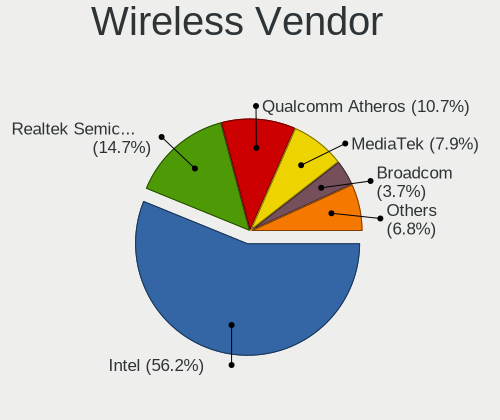

| Vendor                            | Notebooks | Percent |
|-----------------------------------|-----------|---------|
| Intel                             | 459       | 55.7%   |
| Realtek Semiconductor             | 127       | 15.41%  |
| Qualcomm Atheros                  | 93        | 11.29%  |
| MediaTek                          | 63        | 7.65%   |
| Broadcom                          | 27        | 3.28%   |
| Broadcom Limited                  | 14        | 1.7%    |
| TP-Link                           | 8         | 0.97%   |
| D-Link                            | 8         | 0.97%   |
| Qualcomm                          | 7         | 0.85%   |
| Sierra Wireless                   | 5         | 0.61%   |
| Ralink                            | 4         | 0.49%   |
| Quectel Wireless Solutions        | 1         | 0.12%   |
| Qualcomm Technologies             | 1         | 0.12%   |
| Microsoft                         | 1         | 0.12%   |
| Linksys                           | 1         | 0.12%   |
| Fibocom                           | 1         | 0.12%   |
| Ericsson Business Mobile Networks | 1         | 0.12%   |
| Dell                              | 1         | 0.12%   |
| D-Link System                     | 1         | 0.12%   |
| Belkin Components                 | 1         | 0.12%   |

Wireless Model
--------------

Wireless models

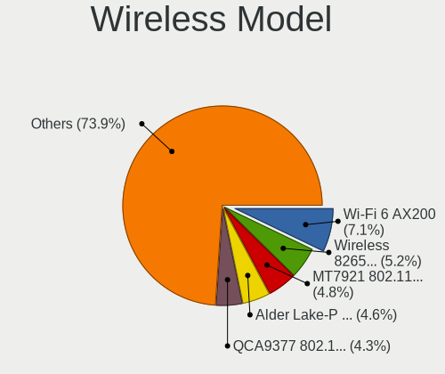

| Model                                                                | Notebooks | Percent |
|----------------------------------------------------------------------|-----------|---------|
| Intel Wi-Fi 6 AX200                                                  | 64        | 7.71%   |
| Intel Wireless 8265 / 8275                                           | 41        | 4.94%   |
| Qualcomm Atheros QCA9377 802.11ac Wireless Network Adapter           | 36        | 4.34%   |
| Realtek RTL8821CE 802.11ac PCIe Wireless Network Adapter             | 34        | 4.1%    |
| MediaTek MT7921 802.11ax PCI Express Wireless Network Adapter        | 32        | 3.86%   |
| Intel Alder Lake-P PCH CNVi WiFi                                     | 31        | 3.73%   |
| Intel Wi-Fi 6 AX201                                                  | 30        | 3.61%   |
| Realtek RTL8822CE 802.11ac PCIe Wireless Network Adapter             | 29        | 3.49%   |
| Intel Wireless 7265                                                  | 26        | 3.13%   |
| Intel Cannon Lake PCH CNVi WiFi                                      | 26        | 3.13%   |
| Intel Wireless 7260                                                  | 24        | 2.89%   |
| Intel Wireless 8260                                                  | 22        | 2.65%   |
| Intel Comet Lake PCH-LP CNVi WiFi                                    | 20        | 2.41%   |
| MediaTek MT7922 802.11ax PCI Express Wireless Network Adapter        | 18        | 2.17%   |
| Intel Wi-Fi 6E(802.11ax) AX210/AX1675* 2x2 [Typhoon Peak]            | 18        | 2.17%   |
| Intel Comet Lake PCH CNVi WiFi                                       | 16        | 1.93%   |
| Qualcomm Atheros QCA6174 802.11ac Wireless Network Adapter           | 15        | 1.81%   |
| Qualcomm Atheros QCA9565 / AR9565 Wireless Network Adapter           | 14        | 1.69%   |
| Intel Wireless 3165                                                  | 12        | 1.45%   |
| Realtek RTL8852AE 802.11ax PCIe Wireless Network Adapter             | 11        | 1.33%   |
| Qualcomm Atheros AR9485 Wireless Network Adapter                     | 11        | 1.33%   |
| Intel Tiger Lake PCH CNVi WiFi                                       | 11        | 1.33%   |
| Intel Dual Band Wireless-AC 3165 Plus Bluetooth                      | 11        | 1.33%   |
| Realtek RTL8852BE PCIe 802.11ax Wireless Network Controller          | 10        | 1.2%    |
| Realtek RTL8822BE 802.11a/b/g/n/ac WiFi adapter                      | 10        | 1.2%    |
| Intel Raptor Lake PCH CNVi WiFi                                      | 10        | 1.2%    |
| Intel Ice Lake-LP PCH CNVi WiFi                                      | 10        | 1.2%    |
| Intel Centrino Advanced-N 6205 [Taylor Peak]                         | 10        | 1.2%    |
| Intel Cannon Point-LP CNVi [Wireless-AC]                             | 10        | 1.2%    |
| Broadcom Limited BCM4360 802.11ac Dual Band Wireless Network Adapter | 10        | 1.2%    |
| Intel Wi-Fi 5(802.11ac) Wireless-AC 9x6x [Thunder Peak]              | 9         | 1.08%   |
| Qualcomm Atheros AR9462 Wireless Network Adapter                     | 8         | 0.96%   |
| Broadcom BCM43142 802.11b/g/n                                        | 8         | 0.96%   |
| Realtek RTL8821AE 802.11ac PCIe Wireless Network Adapter             | 7         | 0.84%   |
| Realtek 802.11ac NIC                                                 | 7         | 0.84%   |
| Qualcomm QCNFA765 Wireless Network Adapter                           | 7         | 0.84%   |
| Qualcomm Atheros AR9285 Wireless Network Adapter (PCI-Express)       | 7         | 0.84%   |
| MediaTek MT7921K (RZ608) Wi-Fi 6E 80MHz                              | 7         | 0.84%   |
| D-Link 802.11ac NIC                                                  | 7         | 0.84%   |
| Intel Wireless 3160                                                  | 6         | 0.72%   |

Ethernet Vendor
---------------

Ethernet vendors

| Vendor                        | Notebooks | Percent |
|-------------------------------|-----------|---------|
| Realtek Semiconductor         | 392       | 64.58%  |
| Intel                         | 127       | 20.92%  |
| Qualcomm Atheros              | 30        | 4.94%   |
| ASIX Electronics              | 13        | 2.14%   |
| Broadcom                      | 11        | 1.81%   |
| DisplayLink                   | 6         | 0.99%   |
| Cypress Semiconductor         | 5         | 0.82%   |
| Lenovo                        | 4         | 0.66%   |
| Apple                         | 4         | 0.66%   |
| Samsung Electronics           | 2         | 0.33%   |
| OPPO Electronics              | 2         | 0.33%   |
| ICS Advent                    | 2         | 0.33%   |
| TP-Link                       | 1         | 0.16%   |
| Qualcomm                      | 1         | 0.16%   |
| OnePlus Technology (Shenzhen) | 1         | 0.16%   |
| NetGear                       | 1         | 0.16%   |
| MediaTek                      | 1         | 0.16%   |
| Marvell Technology Group      | 1         | 0.16%   |
| Hewlett-Packard               | 1         | 0.16%   |
| Google                        | 1         | 0.16%   |
| Broadcom Limited              | 1         | 0.16%   |

Ethernet Model
--------------

Ethernet models

| Model                                                                  | Notebooks | Percent |
|------------------------------------------------------------------------|-----------|---------|
| Realtek RTL8111/8168/8211/8411 PCI Express Gigabit Ethernet Controller | 308       | 49.44%  |
| Realtek RTL810xE PCI Express Fast Ethernet controller                  | 37        | 5.94%   |
| Realtek RTL8153 Gigabit Ethernet Adapter                               | 35        | 5.62%   |
| Intel 82579LM Gigabit Network Connection (Lewisville)                  | 18        | 2.89%   |
| Realtek RTL8125 2.5GbE Controller                                      | 12        | 1.93%   |
| Intel Ethernet Connection (4) I219-LM                                  | 12        | 1.93%   |
| ASIX AX88179 Gigabit Ethernet                                          | 11        | 1.77%   |
| Intel Ethernet Connection I219-LM                                      | 10        | 1.61%   |
| Intel Ethernet Connection I218-LM                                      | 10        | 1.61%   |
| Intel Ethernet Connection I217-LM                                      | 9         | 1.44%   |
| Intel Ethernet Connection (4) I219-V                                   | 9         | 1.44%   |
| Realtek RTL8152 Fast Ethernet Adapter                                  | 6         | 0.96%   |
| Qualcomm Atheros Killer E2400 Gigabit Ethernet Controller              | 6         | 0.96%   |
| Intel Ethernet Connection (2) I219-LM                                  | 6         | 0.96%   |
| Intel 82577LM Gigabit Network Connection                               | 6         | 0.96%   |
| Intel 82567LM Gigabit Network Connection                               | 5         | 0.8%    |
| Cypress K38231_03                                                      | 5         | 0.8%    |
| Qualcomm Atheros QCA8171 Gigabit Ethernet                              | 4         | 0.64%   |
| Qualcomm Atheros Killer E2500 Gigabit Ethernet Controller              | 4         | 0.64%   |
| Qualcomm Atheros AR8161 Gigabit Ethernet                               | 4         | 0.64%   |
| Qualcomm Atheros AR8151 v2.0 Gigabit Ethernet                          | 4         | 0.64%   |
| Intel Ethernet Connection (3) I218-LM                                  | 4         | 0.64%   |
| Apple iBridge                                                          | 4         | 0.64%   |
| Realtek PCIe GbE Family Controller                                     | 3         | 0.48%   |
| Realtek Killer E2600 GbE Controller                                    | 3         | 0.48%   |
| Realtek Killer E2500 Gigabit Ethernet Controller                       | 3         | 0.48%   |
| Intel Ethernet Connection (6) I219-V                                   | 3         | 0.48%   |
| Intel Ethernet Connection (6) I219-LM                                  | 3         | 0.48%   |
| Intel Ethernet Connection (16) I219-V                                  | 3         | 0.48%   |
| Intel Ethernet Connection (16) I219-LM                                 | 3         | 0.48%   |
| DisplayLink Dell Universal Dock D6000                                  | 3         | 0.48%   |
| Broadcom NetXtreme BCM5764M Gigabit Ethernet PCIe                      | 3         | 0.48%   |
| Qualcomm Atheros Killer E220x Gigabit Ethernet Controller              | 2         | 0.32%   |
| Qualcomm Atheros AR8131 Gigabit Ethernet                               | 2         | 0.32%   |
| OPPO SM8350-IDP _SN:361A1B3C                                           | 2         | 0.32%   |
| Lenovo RTL8153 Gigabit Ethernet [ThinkPad OneLink Pro Dock]            | 2         | 0.32%   |
| Intel Ethernet Controller I225-V                                       | 2         | 0.32%   |
| Intel Ethernet Connection I219-V                                       | 2         | 0.32%   |
| Intel Ethernet Connection I217-V                                       | 2         | 0.32%   |
| Intel Ethernet Connection (5) I219-LM                                  | 2         | 0.32%   |

Net Controller Kind
-------------------

Ethernet, WiFi or modem

| Kind     | Notebooks | Percent |
|----------|-----------|---------|
| WiFi     | 784       | 57.14%  |
| Ethernet | 579       | 42.2%   |
| Modem    | 8         | 0.58%   |
| Unknown  | 1         | 0.07%   |

Used Controller
---------------

Currently used network controller

| Kind     | Notebooks | Percent |
|----------|-----------|---------|
| WiFi     | 708       | 84.29%  |
| Ethernet | 132       | 15.71%  |

NICs
----

Total network controllers on board

| Total | Notebooks | Percent |
|-------|-----------|---------|
| 2     | 520       | 65.74%  |
| 1     | 259       | 32.74%  |
| 3     | 7         | 0.88%   |
| 0     | 5         | 0.63%   |

IPv6
----

IPv6 vs IPv4

| Used | Notebooks | Percent |
|------|-----------|---------|
| No   | 614       | 76.56%  |
| Yes  | 188       | 23.44%  |

Bluetooth
---------

Bluetooth Vendor
----------------

Controller vendors

| Vendor                          | Notebooks | Percent |
|---------------------------------|-----------|---------|
| Intel                           | 406       | 54.5%   |
| Realtek Semiconductor           | 85        | 11.41%  |
| IMC Networks                    | 44        | 5.91%   |
| Foxconn / Hon Hai               | 44        | 5.91%   |
| Qualcomm Atheros Communications | 43        | 5.77%   |
| Lite-On Technology              | 32        | 4.3%    |
| Broadcom                        | 23        | 3.09%   |
| Apple                           | 15        | 2.01%   |
| Realtek                         | 8         | 1.07%   |
| MediaTek                        | 8         | 1.07%   |
| Cambridge Silicon Radio         | 7         | 0.94%   |
| USI                             | 5         | 0.67%   |
| Toshiba                         | 5         | 0.67%   |
| Ralink                          | 4         | 0.54%   |
| Hewlett-Packard                 | 4         | 0.54%   |
| Dell                            | 4         | 0.54%   |
| ASUSTek Computer                | 3         | 0.4%    |
| Opticis                         | 2         | 0.27%   |
| TP-Link                         | 1         | 0.13%   |
| Foxconn International           | 1         | 0.13%   |
| Alps Electric                   | 1         | 0.13%   |

Bluetooth Model
---------------

Controller models

| Model                                               | Notebooks | Percent |
|-----------------------------------------------------|-----------|---------|
| Intel Bluetooth wireless interface                  | 136       | 18.23%  |
| Intel AX201 Bluetooth                               | 84        | 11.26%  |
| Intel AX200 Bluetooth                               | 63        | 8.45%   |
| Realtek Bluetooth Radio                             | 60        | 8.04%   |
| Intel Bluetooth 9460/9560 Jefferson Peak (JfP)      | 51        | 6.84%   |
| Intel Bluetooth Device                              | 37        | 4.96%   |
| Foxconn / Hon Hai Wireless_Device                   | 29        | 3.89%   |
| Qualcomm Atheros  Bluetooth Device                  | 26        | 3.49%   |
| IMC Networks Wireless_Device                        | 19        | 2.55%   |
| Realtek  Bluetooth 4.2 Adapter                      | 18        | 2.41%   |
| Intel AX210 Bluetooth                               | 18        | 2.41%   |
| IMC Networks Bluetooth Radio                        | 15        | 2.01%   |
| Lite-On Qualcomm Atheros QCA9377 Bluetooth          | 14        | 1.88%   |
| Apple Bluetooth USB Host Controller                 | 11        | 1.47%   |
| Realtek Bluetooth Radio                             | 8         | 1.07%   |
| Intel Wireless-AC 9260 Bluetooth Adapter            | 8         | 1.07%   |
| Foxconn / Hon Hai Bluetooth Device                  | 8         | 1.07%   |
| Realtek RTL8822BE Bluetooth 4.2 Adapter             | 7         | 0.94%   |
| MediaTek Wireless_Device                            | 7         | 0.94%   |
| Lite-On Bluetooth Device                            | 7         | 0.94%   |
| Cambridge Silicon Radio Bluetooth Dongle (HCI mode) | 7         | 0.94%   |
| Qualcomm Atheros QCA61x4 Bluetooth 4.0              | 6         | 0.8%    |
| Qualcomm Atheros AR3012 Bluetooth 4.0               | 6         | 0.8%    |
| USI Bluetooth Device                                | 5         | 0.67%   |
| Intel Wireless-AC 3168 Bluetooth                    | 5         | 0.67%   |
| Intel Centrino Bluetooth Wireless Transceiver       | 5         | 0.67%   |
| IMC Networks Bluetooth Device                       | 5         | 0.67%   |
| Broadcom BCM20702 Bluetooth 4.0 [ThinkPad]          | 5         | 0.67%   |
| Ralink RT3290 Bluetooth                             | 4         | 0.54%   |
| Lite-On Wireless_Device                             | 4         | 0.54%   |
| Broadcom BCM2045B (BDC-2.1)                         | 4         | 0.54%   |
| Qualcomm Atheros AR9462 Bluetooth                   | 3         | 0.4%    |
| Lite-On Bluetooth Radio                             | 3         | 0.4%    |
| Lite-On Atheros AR3012 Bluetooth                    | 3         | 0.4%    |
| Broadcom HP Portable SoftSailing                    | 3         | 0.4%    |
| Toshiba BCM43142A0                                  | 2         | 0.27%   |
| Qualcomm Atheros AR3011 Bluetooth                   | 2         | 0.27%   |
| Opticis Bluetooth Radio                             | 2         | 0.27%   |
| IMC Networks Bluetooth                              | 2         | 0.27%   |
| IMC Networks Atheros AR3012 Bluetooth 4.0 Adapter   | 2         | 0.27%   |

Sound
-----

Sound Vendor
------------

Sound card vendors

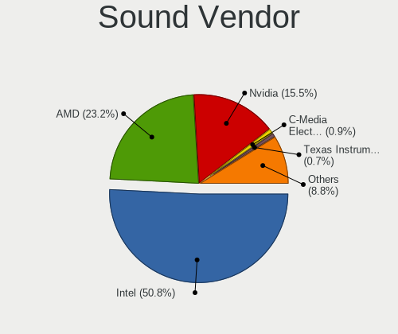

| Vendor                                          | Notebooks | Percent |
|-------------------------------------------------|-----------|---------|
| Intel                                           | 540       | 50.37%  |
| AMD                                             | 254       | 23.69%  |
| Nvidia                                          | 157       | 14.65%  |
| C-Media Electronics                             | 14        | 1.31%   |
| Texas Instruments                               | 10        | 0.93%   |
| Realtek Semiconductor                           | 7         | 0.65%   |
| Lenovo                                          | 6         | 0.56%   |
| KORG                                            | 6         | 0.56%   |
| Sony                                            | 5         | 0.47%   |
| Logitech                                        | 5         | 0.47%   |
| Corsair                                         | 5         | 0.47%   |
| Apple                                           | 5         | 0.47%   |
| AKAI                                            | 5         | 0.47%   |
| Hewlett-Packard                                 | 4         | 0.37%   |
| Focusrite-Novation                              | 4         | 0.37%   |
| Kingston Technology                             | 3         | 0.28%   |
| Generalplus Technology                          | 3         | 0.28%   |
| Creative Technology                             | 3         | 0.28%   |
| Samson Technologies                             | 2         | 0.19%   |
| Razer USA                                       | 2         | 0.19%   |
| JMTek                                           | 2         | 0.19%   |
| GYROCOM C&C                                     | 2         | 0.19%   |
| Anlya.cn                                        | 2         | 0.19%   |
| AKAI Professional M.I.                          | 2         | 0.19%   |
| YZ Technology                                   | 1         | 0.09%   |
| XMOS                                            | 1         | 0.09%   |
| USB Audio                                       | 1         | 0.09%   |
| Trust                                           | 1         | 0.09%   |
| Tenx Technology                                 | 1         | 0.09%   |
| Tdlasunnic                                      | 1         | 0.09%   |
| SteelSeries ApS                                 | 1         | 0.09%   |
| ROCCAT                                          | 1         | 0.09%   |
| Plantronics                                     | 1         | 0.09%   |
| NAD Electronics                                 | 1         | 0.09%   |
| Micro Star International                        | 1         | 0.09%   |
| M-Audio                                         | 1         | 0.09%   |
| Licensed by Sony Computer Entertainment America | 1         | 0.09%   |
| LG Electronics                                  | 1         | 0.09%   |
| FiiO Electronics Technology                     | 1         | 0.09%   |
| Dell                                            | 1         | 0.09%   |

Sound Model
-----------

Sound card models

| Model                                                                                             | Notebooks | Percent |
|---------------------------------------------------------------------------------------------------|-----------|---------|
| AMD Family 17h/19h HD Audio Controller                                                            | 205       | 14.91%  |
| AMD Renoir Radeon High Definition Audio Controller                                                | 116       | 8.44%   |
| Intel Sunrise Point-LP HD Audio                                                                   | 100       | 7.27%   |
| Intel Tiger Lake-LP Smart Sound Technology Audio Controller                                       | 42        | 3.05%   |
| AMD Raven/Raven2/Fenghuang HDMI/DP Audio Controller                                               | 39        | 2.84%   |
| Intel Cannon Lake PCH cAVS                                                                        | 38        | 2.76%   |
| Intel 7 Series/C216 Chipset Family High Definition Audio Controller                               | 35        | 2.55%   |
| Intel Alder Lake PCH-P High Definition Audio Controller                                           | 34        | 2.47%   |
| Intel Haswell-ULT HD Audio Controller                                                             | 31        | 2.25%   |
| Intel 8 Series HD Audio Controller                                                                | 31        | 2.25%   |
| AMD Rembrandt Radeon High Definition Audio Controller                                             | 30        | 2.18%   |
| Intel Wildcat Point-LP High Definition Audio Controller                                           | 24        | 1.75%   |
| Intel Broadwell-U Audio Controller                                                                | 24        | 1.75%   |
| Intel Comet Lake PCH-LP cAVS                                                                      | 23        | 1.67%   |
| Intel 8 Series/C220 Series Chipset High Definition Audio Controller                               | 21        | 1.53%   |
| Intel Comet Lake PCH cAVS                                                                         | 20        | 1.45%   |
| Nvidia GA106 High Definition Audio Controller                                                     | 19        | 1.38%   |
| Nvidia Audio device                                                                               | 19        | 1.38%   |
| Intel Cannon Point-LP High Definition Audio Controller                                            | 19        | 1.38%   |
| Intel Xeon E3-1200 v3/4th Gen Core Processor HD Audio Controller                                  | 18        | 1.31%   |
| Intel 6 Series/C200 Series Chipset Family High Definition Audio Controller                        | 18        | 1.31%   |
| Intel 82801I (ICH9 Family) HD Audio Controller                                                    | 16        | 1.16%   |
| Intel 100 Series/C230 Series Chipset Family HD Audio Controller                                   | 16        | 1.16%   |
| Nvidia TU107 GeForce GTX 1650 High Definition Audio Controller                                    | 15        | 1.09%   |
| AMD Family 15h (Models 60h-6fh) Audio Controller                                                  | 15        | 1.09%   |
| Nvidia TU106 High Definition Audio Controller                                                     | 14        | 1.02%   |
| Intel Tiger Lake-H HD Audio Controller                                                            | 14        | 1.02%   |
| Intel CM238 HD Audio Controller                                                                   | 14        | 1.02%   |
| Nvidia TU116 High Definition Audio Controller                                                     | 13        | 0.95%   |
| Nvidia GA104 High Definition Audio Controller                                                     | 13        | 0.95%   |
| Intel Ice Lake-LP Smart Sound Technology Audio Controller                                         | 13        | 0.95%   |
| Nvidia GP107GL High Definition Audio Controller                                                   | 12        | 0.87%   |
| AMD Kabini HDMI/DP Audio                                                                          | 12        | 0.87%   |
| AMD High Definition Audio Controller                                                              | 12        | 0.87%   |
| Intel 5 Series/3400 Series Chipset High Definition Audio                                          | 11        | 0.8%    |
| AMD Navi 21/23 HDMI/DP Audio Controller                                                           | 11        | 0.8%    |
| AMD FCH Azalia Controller                                                                         | 11        | 0.8%    |
| Intel Celeron/Pentium Silver Processor High Definition Audio                                      | 10        | 0.73%   |
| Intel Raptor Lake-P/U/H cAVS                                                                      | 9         | 0.65%   |
| Intel Atom/Celeron/Pentium Processor x5-E8000/J3xxx/N3xxx Series High Definition Audio Controller | 8         | 0.58%   |

Memory
------

Memory Vendor
-------------

Memory module vendors

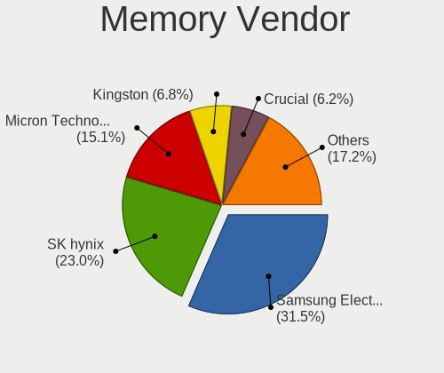

| Vendor              | Notebooks | Percent |
|---------------------|-----------|---------|
| Samsung Electronics | 235       | 32.24%  |
| SK hynix            | 169       | 23.18%  |
| Micron Technology   | 110       | 15.09%  |
| Kingston            | 46        | 6.31%   |
| Crucial             | 42        | 5.76%   |
| Unknown             | 23        | 3.16%   |
| Ramaxel Technology  | 15        | 2.06%   |
| A-DATA Technology   | 12        | 1.65%   |
| Corsair             | 10        | 1.37%   |
| G.Skill             | 8         | 1.1%    |
| Elpida              | 7         | 0.96%   |
| Unknown (ABCD)      | 6         | 0.82%   |
| Team                | 5         | 0.69%   |
| Unknown             | 5         | 0.69%   |
| Nanya Technology    | 4         | 0.55%   |
| Kllisre             | 4         | 0.55%   |
| Patriot             | 3         | 0.41%   |
| Teikon              | 2         | 0.27%   |
| Shenzhen Mic        | 2         | 0.27%   |
| Hikvision           | 2         | 0.27%   |
| GOODRAM             | 2         | 0.27%   |
| V-GeN               | 1         | 0.14%   |
| Unknown (0x0C97)    | 1         | 0.14%   |
| Transcend           | 1         | 0.14%   |
| Toshiba             | 1         | 0.14%   |
| Smart Brazil        | 1         | 0.14%   |
| Silicon Power       | 1         | 0.14%   |
| Sesame              | 1         | 0.14%   |
| Qimonda             | 1         | 0.14%   |
| Neo Forza           | 1         | 0.14%   |
| Magnum Tech         | 1         | 0.14%   |
| Lexar               | 1         | 0.14%   |
| Juhor               | 1         | 0.14%   |
| ff                  | 1         | 0.14%   |
| CSX                 | 1         | 0.14%   |
| Axiom               | 1         | 0.14%   |
| Apacer              | 1         | 0.14%   |
| 4ea5                | 1         | 0.14%   |

Memory Model
------------

Memory module models

| Model                                                               | Notebooks | Percent |
|---------------------------------------------------------------------|-----------|---------|
| Samsung RAM M471A5244CB0-CTD 4096MB SODIMM DDR4 3266MT/s            | 18        | 2.32%   |
| Samsung RAM M471A1K43EB1-CWE 8GB SODIMM DDR4 3200MT/s               | 14        | 1.81%   |
| Samsung RAM M471A1K43DB1-CWE 8GB SODIMM DDR4 3200MT/s               | 14        | 1.81%   |
| Samsung RAM M471A1G44AB0-CWE 8GB SODIMM DDR4 3200MT/s               | 13        | 1.68%   |
| Samsung RAM M471A1G44AB0-CWE 8GB Row Of Chips DDR4 3200MT/s         | 13        | 1.68%   |
| Samsung RAM M471A1G44BB0-CWE 8GB SODIMM DDR4 3200MT/s               | 11        | 1.42%   |
| SK hynix RAM HMAA1GS6CJR6N-XN 8GB SODIMM DDR4 3200MT/s              | 9         | 1.16%   |
| SK hynix RAM HMA81GS6AFR8N-UH 8GB SODIMM DDR4 2667MT/s              | 9         | 1.16%   |
| Micron RAM 4ATF1G64HZ-3G2E1 8GB SODIMM DDR4 3200MT/s                | 9         | 1.16%   |
| SK hynix RAM HMA81GS6JJR8N-VK 8GB SODIMM DDR4 2667MT/s              | 8         | 1.03%   |
| Micron RAM 8ATF1G64HZ-3G2J1 8GB SODIMM DDR4 3200MT/s                | 8         | 1.03%   |
| SK hynix RAM HMT41GS6BFR8A-PB 8GB SODIMM DDR3 1600MT/s              | 7         | 0.9%    |
| SK hynix RAM HMA851S6AFR6N-UH 4GB SODIMM DDR4 2667MT/s              | 7         | 0.9%    |
| Samsung RAM M471A5244CB0-CRC 4GB SODIMM DDR4 2667MT/s               | 7         | 0.9%    |
| Samsung RAM M471A1K43CB1-CTD 8GB SODIMM DDR4 2667MT/s               | 7         | 0.9%    |
| Micron RAM 4ATF1G64HZ-3G2E2 8GB SODIMM DDR4 3200MT/s                | 7         | 0.9%    |
| Unknown RAM Module 8GB SODIMM DDR3 1600MT/s                         | 6         | 0.77%   |
| Unknown (ABCD) RAM 123456789012345678 2048MB SODIMM LPDDR4 2400MT/s | 6         | 0.77%   |
| SK hynix RAM HMA81GS6CJR8N-VK 8GB SODIMM DDR4 2667MT/s              | 6         | 0.77%   |
| Samsung RAM M471B5173QH0-YK0 4096MB SODIMM DDR3 1600MT/s            | 6         | 0.77%   |
| Samsung RAM M471A1K43BB1-CRC 8GB SODIMM DDR4 2667MT/s               | 6         | 0.77%   |
| Micron RAM 4ATF51264HZ-2G6E1 4GB SODIMM DDR4 2667MT/s               | 6         | 0.77%   |
| SK hynix RAM Module 4GB SODIMM DDR3 1600MT/s                        | 5         | 0.65%   |
| SK hynix RAM HMT451S6AFR8A-PB 4GB SODIMM DDR3 1600MT/s              | 5         | 0.65%   |
| SK hynix RAM HMT41GS6AFR8A-PB 8GB SODIMM DDR3 1600MT/s              | 5         | 0.65%   |
| SK hynix RAM HMA851S6CJR6N-VK 4GB SODIMM DDR4 2667MT/s              | 5         | 0.65%   |
| Samsung RAM M471A5244CB0-CWE 4GB SODIMM DDR4 3200MT/s               | 5         | 0.65%   |
| Samsung RAM M471A5244CB0-CWE 4GB Row Of Chips DDR4 3200MT/s         | 5         | 0.65%   |
| Samsung RAM M471A1K43DB1-CTD 8GB SODIMM DDR4 2667MT/s               | 5         | 0.65%   |
| Unknown                                                             | 5         | 0.65%   |
| SK hynix RAM HMT451S6BFR8A-PB 4GB SODIMM DDR3 1600MT/s              | 4         | 0.52%   |
| SK hynix RAM HMT351S6EFR8A-PB 4096MB SODIMM DDR3 1600MT/s           | 4         | 0.52%   |
| SK hynix RAM HMAB2GS6AMR6N-XN 16GB SODIMM DDR4 3200MT/s             | 4         | 0.52%   |
| Samsung RAM M471B1G73QH0-YK0 8GB SODIMM DDR3 1600MT/s               | 4         | 0.52%   |
| Samsung RAM M471B1G73DB0-YK0 8GB SODIMM DDR3 1600MT/s               | 4         | 0.52%   |
| Samsung RAM M425R1GB4BB0-CQKOL 8GB SODIMM DDR5 4800MT/s             | 4         | 0.52%   |
| Micron RAM MTC4C10163S1SC48BA1 8GB SODIMM DDR5 4800MT/s             | 4         | 0.52%   |
| Micron RAM 4ATF51264HZ-3G2J1 4GB SODIMM DDR4 3200MT/s               | 4         | 0.52%   |
| Micron RAM 16KTF1G64HZ-1G6E1 8GB SODIMM DDR3 1600MT/s               | 4         | 0.52%   |
| Crucial RAM CT16G4SFRA32A.C8FE 16GB SODIMM DDR4 3200MT/s            | 4         | 0.52%   |

Memory Kind
-----------

Memory module kinds

| Kind    | Notebooks | Percent |
|---------|-----------|---------|
| DDR4    | 361       | 59.18%  |
| DDR3    | 123       | 20.16%  |
| LPDDR4  | 35        | 5.74%   |
| DDR5    | 34        | 5.57%   |
| LPDDR3  | 22        | 3.61%   |
| LPDDR5  | 20        | 3.28%   |
| DDR2    | 10        | 1.64%   |
| SDRAM   | 4         | 0.66%   |
| Unknown | 1         | 0.16%   |

Memory Form Factor
------------------

Physical design of the memory module

| Name         | Notebooks | Percent |
|--------------|-----------|---------|
| SODIMM       | 520       | 84.14%  |
| Row Of Chips | 84        | 13.59%  |
| Chip         | 7         | 1.13%   |
| Unknown      | 4         | 0.65%   |
| DIMM         | 3         | 0.49%   |

Memory Size
-----------

Memory module size

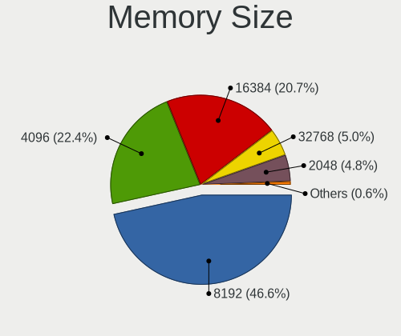

| Size  | Notebooks | Percent |
|-------|-----------|---------|
| 8192  | 317       | 47.38%  |
| 4096  | 154       | 23.02%  |
| 16384 | 128       | 19.13%  |
| 2048  | 34        | 5.08%   |
| 32768 | 32        | 4.78%   |
| 1024  | 4         | 0.6%    |

Memory Speed
------------

Memory module speed

| Speed   | Notebooks | Percent |
|---------|-----------|---------|
| 3200    | 200       | 30.49%  |
| 2667    | 133       | 20.27%  |
| 1600    | 105       | 16.01%  |
| 2400    | 43        | 6.55%   |
| 4800    | 29        | 4.42%   |
| 2133    | 29        | 4.42%   |
| 6400    | 18        | 2.74%   |
| 3266    | 18        | 2.74%   |
| 1867    | 10        | 1.52%   |
| 1334    | 10        | 1.52%   |
| 4267    | 9         | 1.37%   |
| 5600    | 7         | 1.07%   |
| 1333    | 5         | 0.76%   |
| 667     | 5         | 0.76%   |
| 4266    | 4         | 0.61%   |
| 1067    | 4         | 0.61%   |
| Unknown | 4         | 0.61%   |
| 2933    | 3         | 0.46%   |
| 800     | 3         | 0.46%   |
| 8400    | 2         | 0.3%    |
| 3733    | 2         | 0.3%    |
| 2048    | 2         | 0.3%    |
| 1066    | 2         | 0.3%    |
| 7500    | 1         | 0.15%   |
| 7400    | 1         | 0.15%   |
| 4199    | 1         | 0.15%   |
| 3600    | 1         | 0.15%   |
| 3000    | 1         | 0.15%   |
| 2134    | 1         | 0.15%   |
| 1776    | 1         | 0.15%   |
| 1639    | 1         | 0.15%   |
| 1200    | 1         | 0.15%   |

Printers & scanners
-------------------

Printer Vendor
--------------

Printer device vendors

| Vendor              | Notebooks | Percent |
|---------------------|-----------|---------|
| Xerox               | 1         | 20%     |
| Seiko Epson         | 1         | 20%     |
| Samsung Electronics | 1         | 20%     |
| Prolific Technology | 1         | 20%     |
| Hewlett-Packard     | 1         | 20%     |

Printer Model
-------------

Printer device models

| Model                         | Notebooks | Percent |
|-------------------------------|-----------|---------|
| Xerox B210                    | 1         | 20%     |
| Seiko Epson ET-2850 Series    | 1         | 20%     |
| Samsung M2020 Series          | 1         | 20%     |
| Prolific PL2305 Parallel Port | 1         | 20%     |
| HP DeskJet 2130 series        | 1         | 20%     |

Scanner Vendor
--------------

Scanner device vendors

Zero info for selected period =(

Scanner Model
-------------

Scanner device models

Zero info for selected period =(

Camera
------

Camera Vendor
-------------

Camera device vendors

| Vendor                                 | Notebooks | Percent |
|----------------------------------------|-----------|---------|
| Chicony Electronics                    | 162       | 22.31%  |
| IMC Networks                           | 111       | 15.29%  |
| Bison Electronics                      | 52        | 7.16%   |
| Microdia                               | 51        | 7.02%   |
| Quanta                                 | 42        | 5.79%   |
| Realtek Semiconductor                  | 38        | 5.23%   |
| Sunplus Innovation Technology          | 33        | 4.55%   |
| Cheng Uei Precision Industry (Foxlink) | 33        | 4.55%   |
| Acer                                   | 28        | 3.86%   |
| Luxvisions Innotech Limited            | 25        | 3.44%   |
| Lite-On Technology                     | 24        | 3.31%   |
| Syntek                                 | 23        | 3.17%   |
| Logitech                               | 19        | 2.62%   |
| Apple                                  | 19        | 2.62%   |
| Sonix Technology                       | 17        | 2.34%   |
| Suyin                                  | 9         | 1.24%   |
| Silicon Motion                         | 4         | 0.55%   |
| Lenovo                                 | 4         | 0.55%   |
| Alcor Micro                            | 4         | 0.55%   |
| Primax Electronics                     | 3         | 0.41%   |
| Tripath Technology                     | 2         | 0.28%   |
| Samsung Electronics                    | 2         | 0.28%   |
| Ricoh                                  | 2         | 0.28%   |
| MacroSilicon                           | 2         | 0.28%   |
| Intel                                  | 2         | 0.28%   |
| Generalplus Technology                 | 2         | 0.28%   |
| Y Media                                | 1         | 0.14%   |
| Trust                                  | 1         | 0.14%   |
| Sony Ericsson Mobile Communications AB | 1         | 0.14%   |
| ShineTech                              | 1         | 0.14%   |
| Pixart Imaging                         | 1         | 0.14%   |
| OPPO Electronics                       | 1         | 0.14%   |
| Microsoft                              | 1         | 0.14%   |
| LG Electronics                         | 1         | 0.14%   |
| GRANDSTREAM GUV3100                    | 1         | 0.14%   |
| Google                                 | 1         | 0.14%   |
| GEMBIRD                                | 1         | 0.14%   |
| BillionPixels                          | 1         | 0.14%   |
| ALi                                    | 1         | 0.14%   |

Camera Model
------------

Camera device models

| Model                                                        | Notebooks | Percent |
|--------------------------------------------------------------|-----------|---------|
| Chicony Integrated Camera                                    | 51        | 7.01%   |
| IMC Networks Integrated Camera                               | 43        | 5.91%   |
| IMC Networks USB2.0 HD UVC WebCam                            | 41        | 5.63%   |
| Microdia Integrated_Webcam_HD                                | 25        | 3.43%   |
| Chicony HD Webcam                                            | 25        | 3.43%   |
| Bison Integrated Camera                                      | 23        | 3.16%   |
| Syntek Integrated Camera                                     | 16        | 2.2%    |
| Realtek Integrated_Webcam_HD                                 | 15        | 2.06%   |
| Sonix USB2.0 HD UVC WebCam                                   | 12        | 1.65%   |
| Apple iPhone 5/5C/5S/6/SE/7/8/X/XR                           | 11        | 1.51%   |
| Bison BisonCam,NB Pro                                        | 10        | 1.37%   |
| Acer HD Webcam                                               | 10        | 1.37%   |
| Sunplus Integrated_Webcam_HD                                 | 8         | 1.1%    |
| Luxvisions Innotech Limited HP Wide Vision HD Camera         | 8         | 1.1%    |
| Lite-On Integrated Camera                                    | 8         | 1.1%    |
| Sunplus HD WebCam                                            | 7         | 0.96%   |
| Quanta USB2.0 HD UVC WebCam                                  | 7         | 0.96%   |
| Quanta HP TrueVision HD Camera                               | 7         | 0.96%   |
| Quanta HD User Facing                                        | 7         | 0.96%   |
| Chicony USB2.0 HD UVC WebCam                                 | 7         | 0.96%   |
| Quanta HP HD Camera                                          | 6         | 0.82%   |
| Microdia Integrated Webcam                                   | 6         | 0.82%   |
| IMC Networks ov9734_azurewave_camera                         | 6         | 0.82%   |
| Acer SunplusIT Integrated Camera                             | 6         | 0.82%   |
| Sonix USB2.0 FHD UVC WebCam                                  | 5         | 0.69%   |
| Logitech C920 PRO HD Webcam                                  | 5         | 0.69%   |
| Lite-On HP HD Camera                                         | 5         | 0.69%   |
| Chicony VGA WebCam                                           | 5         | 0.69%   |
| Chicony USB2.0 VGA UVC WebCam                                | 5         | 0.69%   |
| Chicony HP TrueVision HD Camera                              | 5         | 0.69%   |
| Chicony HD User Facing                                       | 5         | 0.69%   |
| Chicony EasyCamera                                           | 5         | 0.69%   |
| Cheng Uei Precision Industry (Foxlink) XiaoMi USB 2.0 Webcam | 5         | 0.69%   |
| Apple FaceTime HD Camera (Built-in)                          | 5         | 0.69%   |
| Acer Integrated Camera                                       | 5         | 0.69%   |
| Syntek Lenovo EasyCamera                                     | 4         | 0.55%   |
| Sunplus Asus Webcam                                          | 4         | 0.55%   |
| Realtek USB2.0 HD UVC WebCam                                 | 4         | 0.55%   |
| Quanta VGA WebCam                                            | 4         | 0.55%   |
| Quanta HD Webcam                                             | 4         | 0.55%   |

Security
--------

Fingerprint Vendor
------------------

Fingerprint sensor vendors

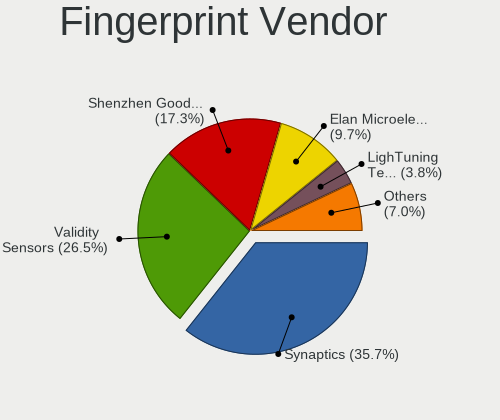

| Vendor                             | Notebooks | Percent |
|------------------------------------|-----------|---------|
| Synaptics                          | 48        | 33.33%  |
| Validity Sensors                   | 39        | 27.08%  |
| Shenzhen Goodix Technology         | 24        | 16.67%  |
| Elan Microelectronics              | 17        | 11.81%  |
| LighTuning Technology              | 7         | 4.86%   |
| Upek                               | 3         | 2.08%   |
| Realtek USB2.0 Finger Print Bridge | 3         | 2.08%   |
| AuthenTec                          | 2         | 1.39%   |
| Focal-systems.Corp                 | 1         | 0.69%   |

Fingerprint Model
-----------------

Fingerprint sensor models

| Model                                                                      | Notebooks | Percent |
|----------------------------------------------------------------------------|-----------|---------|
| Shenzhen Goodix  FingerPrint Device                                        | 17        | 11.81%  |
| Synaptics Prometheus MIS Touch Fingerprint Reader                          | 15        | 10.42%  |
| Validity Sensors VFS495 Fingerprint Reader                                 | 11        | 7.64%   |
| Elan ELAN:Fingerprint                                                      | 10        | 6.94%   |
| Synaptics Metallica MIS Touch Fingerprint Reader                           | 8         | 5.56%   |
| Validity Sensors Synaptics WBDI                                            | 7         | 4.86%   |
| Shenzhen Goodix Fingerprint Reader                                         | 7         | 4.86%   |
| Elan ELAN:ARM-M4                                                           | 7         | 4.86%   |
| LighTuning EgisTec Touch Fingerprint Sensor                                | 6         | 4.17%   |
| Synaptics FS7604 Touch Fingerprint Sensor with PurePrint                   | 5         | 3.47%   |
| Validity Sensors VFS5011 Fingerprint Reader                                | 4         | 2.78%   |
| Validity Sensors Swipe Fingerprint Sensor                                  | 4         | 2.78%   |
| Synaptics WBDI Fingerprint Reader USB 086                                  | 4         | 2.78%   |
| Validity Sensors VFS7500 Touch Fingerprint Sensor                          | 3         | 2.08%   |
| Validity Sensors VFS491                                                    | 3         | 2.08%   |
| Validity Sensors VFS 5011 fingerprint sensor                               | 3         | 2.08%   |
| Upek Biometric Touchchip/Touchstrip Fingerprint Sensor                     | 3         | 2.08%   |
| Synaptics UWP WBDI                                                         | 3         | 2.08%   |
| Synaptics  WBDI                                                            | 3         | 2.08%   |
| Realtek USB2.0 Finger Print Bridge FocalTech Fingerprint Device            | 3         | 2.08%   |
| Unknown                                                                    | 3         | 2.08%   |
| Validity Sensors Synaptics VFS7552 Touch Fingerprint Sensor with PurePrint | 2         | 1.39%   |
| Synaptics WBDI                                                             | 2         | 1.39%   |
| Synaptics UWP WBDI Device                                                  | 2         | 1.39%   |
| Validity Sensors VFS471 Fingerprint Reader                                 | 1         | 0.69%   |
| Validity Sensors Fingerprint scanner                                       | 1         | 0.69%   |
| Synaptics  FS7604 Touch Fingerprint Sensor with PurePrint                  | 1         | 0.69%   |
| Synaptics Metallica MOH Touch Fingerprint Reader                           | 1         | 0.69%   |
| Synaptics Fingerprint reader [HP G6]                                       | 1         | 0.69%   |
| LighTuning ES603 Swipe Fingerprint Sensor                                  | 1         | 0.69%   |
| Focal-systems.Corp FT9201Fingerprint.                                  | 1         | 0.69%   |
| AuthenTec AES2810                                                          | 1         | 0.69%   |
| AuthenTec AES1660 Fingerprint Sensor                                       | 1         | 0.69%   |

Chipcard Vendor
---------------

Chipcard module vendors

| Vendor      | Notebooks | Percent |
|-------------|-----------|---------|
| Broadcom    | 28        | 53.85%  |
| Alcor Micro | 13        | 25%     |
| Upek        | 4         | 7.69%   |
| Lenovo      | 4         | 7.69%   |
| O2 Micro    | 2         | 3.85%   |
| Cherry      | 1         | 1.92%   |

Chipcard Model
--------------

Chipcard module models

| Model                                                                        | Notebooks | Percent |
|------------------------------------------------------------------------------|-----------|---------|
| Alcor Micro AU9540 Smartcard Reader                                          | 13        | 24.53%  |
| Broadcom BCM5880 Secure Applications Processor                               | 11        | 20.75%  |
| Broadcom 5880                                                                | 9         | 16.98%  |
| Broadcom 58200                                                               | 6         | 11.32%  |
| Upek TouchChip Fingerprint Coprocessor (WBF advanced mode)                   | 4         | 7.55%   |
| Lenovo Integrated Smart Card Reader                                          | 4         | 7.55%   |
| Broadcom BCM5880 Secure Applications Processor with fingerprint swipe sensor | 3         | 5.66%   |
| O2 Micro OZ776 CCID Smartcard Reader                                         | 2         | 3.77%   |
| Cherry SmartCard Reader Keyboard KC 1000 SC                                  | 1         | 1.89%   |

Unsupported
-----------

Unsupported Devices
-------------------

Total unsupported devices on board

| Total | Notebooks | Percent |
|-------|-----------|---------|
| 0     | 481       | 59.31%  |
| 1     | 275       | 33.91%  |
| 2     | 52        | 6.41%   |
| 3     | 3         | 0.37%   |

Unsupported Device Types
------------------------

Types of unsupported devices

| Type                     | Notebooks | Percent |
|--------------------------|-----------|---------|
| Fingerprint reader       | 143       | 38.34%  |
| Chipcard                 | 48        | 12.87%  |
| Multimedia controller    | 44        | 11.8%   |
| Net/ethernet             | 43        | 11.53%  |
| Graphics card            | 40        | 10.72%  |
| Net/wireless             | 23        | 6.17%   |
| Camera                   | 13        | 3.49%   |
| Bluetooth                | 10        | 2.68%   |
| Storage                  | 3         | 0.8%    |
| Modem                    | 2         | 0.54%   |
| Communication controller | 2         | 0.54%   |
| Unassigned class         | 1         | 0.27%   |
| Card reader              | 1         | 0.27%   |

