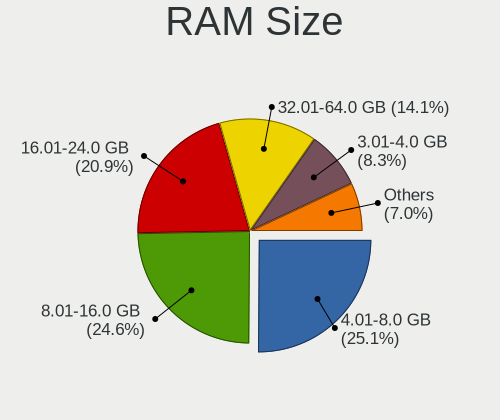
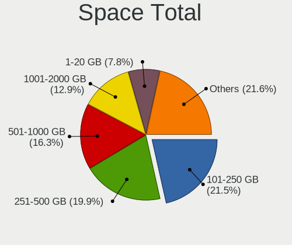
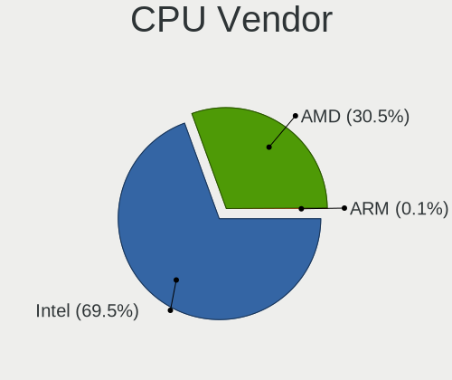
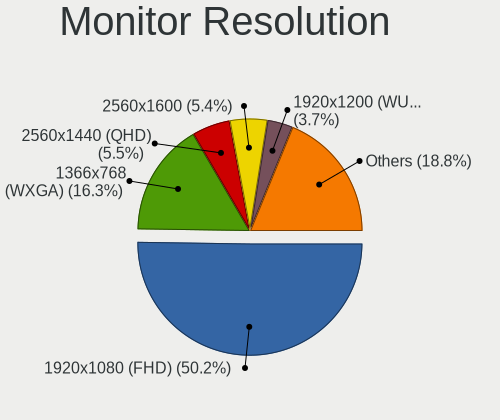
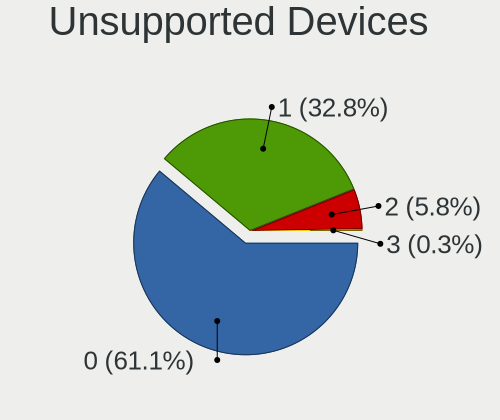

EndeavourOS - Tested Hardware & Statistics (Notebooks)
------------------------------------------------------

A project to collect tested hardware configurations for EndeavourOS.

Anyone can contribute to this report by the [hw-probe](https://github.com/linuxhw/hw-probe) tool:

    sudo -E hw-probe -all -upload

Please submit a probe of your configuration if it's not presented on the page or is rare.

Full-feature report is available here: https://linux-hardware.org/?view=trends

Contents
--------

* [ Test Cases ](#test-cases)

* [ System ](#system)
  - [ Kernel                   ](#kernel)
  - [ Kernel Family            ](#kernel-family)
  - [ Kernel Major Ver.        ](#kernel-major-ver)
  - [ Arch                     ](#arch)
  - [ DE                       ](#de)
  - [ Display Server           ](#display-server)
  - [ Display Manager          ](#display-manager)
  - [ OS Lang                  ](#os-lang)
  - [ Boot Mode                ](#boot-mode)
  - [ Filesystem               ](#filesystem)
  - [ Part. scheme             ](#part-scheme)
  - [ Dual Boot with Linux/BSD ](#dual-boot-with-linuxbsd)
  - [ Dual Boot (Win)          ](#dual-boot-win)

* [ Board ](#board)
  - [ Vendor                   ](#vendor)
  - [ Model                    ](#model)
  - [ Model Family             ](#model-family)
  - [ MFG Year                 ](#mfg-year)
  - [ Form Factor              ](#form-factor)
  - [ Secure Boot              ](#secure-boot)
  - [ Coreboot                 ](#coreboot)
  - [ RAM Size                 ](#ram-size)
  - [ RAM Used                 ](#ram-used)
  - [ Total Drives             ](#total-drives)
  - [ Has CD-ROM               ](#has-cd-rom)
  - [ Has Ethernet             ](#has-ethernet)
  - [ Has WiFi                 ](#has-wifi)
  - [ Has Bluetooth            ](#has-bluetooth)

* [ Location ](#location)
  - [ Country                  ](#country)
  - [ City                     ](#city)

* [ Drives ](#drives)
  - [ Drive Vendor             ](#drive-vendor)
  - [ Drive Model              ](#drive-model)
  - [ HDD Vendor               ](#hdd-vendor)
  - [ SSD Vendor               ](#ssd-vendor)
  - [ Drive Kind               ](#drive-kind)
  - [ Drive Connector          ](#drive-connector)
  - [ Drive Size               ](#drive-size)
  - [ Space Total              ](#space-total)
  - [ Space Used               ](#space-used)
  - [ Malfunc. Drives          ](#malfunc-drives)
  - [ Malfunc. Drive Vendor    ](#malfunc-drive-vendor)
  - [ Malfunc. HDD Vendor      ](#malfunc-hdd-vendor)
  - [ Malfunc. Drive Kind      ](#malfunc-drive-kind)
  - [ Failed Drives            ](#failed-drives)
  - [ Failed Drive Vendor      ](#failed-drive-vendor)
  - [ Drive Status             ](#drive-status)

* [ Storage controller ](#storage-controller)
  - [ Storage Vendor           ](#storage-vendor)
  - [ Storage Model            ](#storage-model)
  - [ Storage Kind             ](#storage-kind)

* [ Processor ](#processor)
  - [ CPU Vendor               ](#cpu-vendor)
  - [ CPU Model                ](#cpu-model)
  - [ CPU Model Family         ](#cpu-model-family)
  - [ CPU Cores                ](#cpu-cores)
  - [ CPU Sockets              ](#cpu-sockets)
  - [ CPU Threads              ](#cpu-threads)
  - [ CPU Op-Modes             ](#cpu-op-modes)
  - [ CPU Microcode            ](#cpu-microcode)
  - [ CPU Microarch            ](#cpu-microarch)

* [ Graphics ](#graphics)
  - [ GPU Vendor               ](#gpu-vendor)
  - [ GPU Model                ](#gpu-model)
  - [ GPU Combo                ](#gpu-combo)
  - [ GPU Driver               ](#gpu-driver)
  - [ GPU Memory               ](#gpu-memory)

* [ Monitor ](#monitor)
  - [ Monitor Vendor           ](#monitor-vendor)
  - [ Monitor Model            ](#monitor-model)
  - [ Monitor Resolution       ](#monitor-resolution)
  - [ Monitor Diagonal         ](#monitor-diagonal)
  - [ Monitor Width            ](#monitor-width)
  - [ Aspect Ratio             ](#aspect-ratio)
  - [ Monitor Area             ](#monitor-area)
  - [ Pixel Density            ](#pixel-density)
  - [ Multiple Monitors        ](#multiple-monitors)

* [ Network ](#network)
  - [ Net Controller Vendor    ](#net-controller-vendor)
  - [ Net Controller Model     ](#net-controller-model)
  - [ Wireless Vendor          ](#wireless-vendor)
  - [ Wireless Model           ](#wireless-model)
  - [ Ethernet Vendor          ](#ethernet-vendor)
  - [ Ethernet Model           ](#ethernet-model)
  - [ Net Controller Kind      ](#net-controller-kind)
  - [ Used Controller          ](#used-controller)
  - [ NICs                     ](#nics)
  - [ IPv6                     ](#ipv6)

* [ Bluetooth ](#bluetooth)
  - [ Bluetooth Vendor         ](#bluetooth-vendor)
  - [ Bluetooth Model          ](#bluetooth-model)

* [ Sound ](#sound)
  - [ Sound Vendor             ](#sound-vendor)
  - [ Sound Model              ](#sound-model)

* [ Memory ](#memory)
  - [ Memory Vendor            ](#memory-vendor)
  - [ Memory Model             ](#memory-model)
  - [ Memory Kind              ](#memory-kind)
  - [ Memory Form Factor       ](#memory-form-factor)
  - [ Memory Size              ](#memory-size)
  - [ Memory Speed             ](#memory-speed)

* [ Printers & scanners ](#printers--scanners)
  - [ Printer Vendor           ](#printer-vendor)
  - [ Printer Model            ](#printer-model)
  - [ Scanner Vendor           ](#scanner-vendor)
  - [ Scanner Model            ](#scanner-model)

* [ Camera ](#camera)
  - [ Camera Vendor            ](#camera-vendor)
  - [ Camera Model             ](#camera-model)

* [ Security ](#security)
  - [ Fingerprint Vendor       ](#fingerprint-vendor)
  - [ Fingerprint Model        ](#fingerprint-model)
  - [ Chipcard Vendor          ](#chipcard-vendor)
  - [ Chipcard Model           ](#chipcard-model)

* [ Unsupported ](#unsupported)
  - [ Unsupported Devices      ](#unsupported-devices)
  - [ Unsupported Device Types ](#unsupported-device-types)

Test Cases
----------

| Vendor        | Model                       | Probe                                                      | Date         |
|---------------|-----------------------------|------------------------------------------------------------|--------------|
| Dell          | Precision 5560              | [04cb5954e9](https://linux-hardware.org/?probe=04cb5954e9) | Dec 31, 2021 |
| Lenovo        | ThinkPad E480 20KQ000EBR    | [e4d3f29412](https://linux-hardware.org/?probe=e4d3f29412) | Dec 30, 2021 |
| Lenovo        | Yoga Slim 7 Pro 14ACH5 8... | [deb1a17957](https://linux-hardware.org/?probe=deb1a17957) | Dec 23, 2021 |
| Dell          | Inspiron 5558               | [16daa16444](https://linux-hardware.org/?probe=16daa16444) | Dec 16, 2021 |
| Acer          | Aspire 5250                 | [b4a48e5350](https://linux-hardware.org/?probe=b4a48e5350) | Dec 15, 2021 |
| Lenovo        | V14 G2 ITL 82NM             | [939be3ba51](https://linux-hardware.org/?probe=939be3ba51) | Dec 10, 2021 |
| Unknown       | Unknown                     | [2070780ca9](https://linux-hardware.org/?probe=2070780ca9) | Dec 07, 2021 |
| Unknown       | Unknown                     | [0555569b70](https://linux-hardware.org/?probe=0555569b70) | Nov 24, 2021 |
| Apple         | MacBookAir7,2               | [df651ff7ad](https://linux-hardware.org/?probe=df651ff7ad) | Nov 23, 2021 |
| HP            | 15 TS                       | [50a260e4dc](https://linux-hardware.org/?probe=50a260e4dc) | Nov 21, 2021 |
| ASUSTek       | TUF GAMING FX504GD_FX80G... | [a3d3e0eecd](https://linux-hardware.org/?probe=a3d3e0eecd) | Nov 20, 2021 |
| Dell          | Latitude E4300              | [c486155f48](https://linux-hardware.org/?probe=c486155f48) | Oct 10, 2021 |
| Dell          | Latitude E4300              | [52e0d626fa](https://linux-hardware.org/?probe=52e0d626fa) | Oct 10, 2021 |
| HP            | Pavilion dv6                | [2a6a76f702](https://linux-hardware.org/?probe=2a6a76f702) | Sep 26, 2021 |
| Dell          | Precision 3560              | [d9b527db16](https://linux-hardware.org/?probe=d9b527db16) | Sep 22, 2021 |
| Dynabook      | Satellite Pro C50-E-109     | [0fe0fa66d6](https://linux-hardware.org/?probe=0fe0fa66d6) | Sep 14, 2021 |
| Dynabook      | Satellite Pro C50-E-109     | [d5e170957e](https://linux-hardware.org/?probe=d5e170957e) | Sep 14, 2021 |
| Lenovo        | Legion Y545 81Q6            | [167df4c15e](https://linux-hardware.org/?probe=167df4c15e) | Sep 09, 2021 |
| Lenovo        | ThinkPad X220 Tablet 429... | [b5b8bac74a](https://linux-hardware.org/?probe=b5b8bac74a) | Jul 26, 2021 |
| ASUSTek       | ROG Zephyrus G14 GA401II... | [7cdf389d4c](https://linux-hardware.org/?probe=7cdf389d4c) | Jul 22, 2021 |
| ASUSTek       | ROG Strix G731GT_GL731GT    | [4421b175f7](https://linux-hardware.org/?probe=4421b175f7) | Jul 16, 2021 |
| Acer          | Nitro AN515-54              | [3be93cbc0c](https://linux-hardware.org/?probe=3be93cbc0c) | Jul 03, 2021 |
| Pine Micro... | Pine64 Pinebook Pro         | [fd48c4cd51](https://linux-hardware.org/?probe=fd48c4cd51) | Jul 02, 2021 |
| Pine Micro... | Pine64 Pinebook Pro         | [81ccc0c89d](https://linux-hardware.org/?probe=81ccc0c89d) | Jun 29, 2021 |
| Pine Micro... | Pine64 Pinebook Pro         | [d2f1ec957f](https://linux-hardware.org/?probe=d2f1ec957f) | Jun 27, 2021 |
| HP            | EliteBook Revolve 810       | [24758ed5b3](https://linux-hardware.org/?probe=24758ed5b3) | May 31, 2021 |
| Lenovo        | ThinkPad T440s 20ARS3490... | [4c600416f9](https://linux-hardware.org/?probe=4c600416f9) | May 28, 2021 |
| Notebook      | NS50MU                      | [8e08645823](https://linux-hardware.org/?probe=8e08645823) | May 19, 2021 |
| HP            | EliteBook 2170p             | [6e4a5f9c76](https://linux-hardware.org/?probe=6e4a5f9c76) | May 13, 2021 |
| TUXEDO        | Pulse 15 Gen1               | [ec0cb83241](https://linux-hardware.org/?probe=ec0cb83241) | May 10, 2021 |
| Lenovo        | ThinkPad T440s 20ARS3490... | [b3a5056cbf](https://linux-hardware.org/?probe=b3a5056cbf) | May 07, 2021 |
| ASUSTek       | ROG Strix G712LV_G712LV     | [365c656e4a](https://linux-hardware.org/?probe=365c656e4a) | May 05, 2021 |
| Lenovo        | ThinkPad T61 7659W1W        | [c366a3e7a2](https://linux-hardware.org/?probe=c366a3e7a2) | May 01, 2021 |
| HP            | Stream Laptop 14-CB1xxx     | [b27160a3cb](https://linux-hardware.org/?probe=b27160a3cb) | Apr 29, 2021 |
| Lenovo        | E31-80 80MX                 | [8aedfd9f4c](https://linux-hardware.org/?probe=8aedfd9f4c) | Apr 21, 2021 |
| Lenovo        | ThinkPad X140e 20BL000BU... | [eabc0fa5e5](https://linux-hardware.org/?probe=eabc0fa5e5) | Apr 21, 2021 |
| Lenovo        | IdeaPad Y700-15ISK 80NV     | [9e5b4c92f4](https://linux-hardware.org/?probe=9e5b4c92f4) | Apr 01, 2021 |
| Lenovo        | IdeaPad Y700-15ISK 80NV     | [269185aba1](https://linux-hardware.org/?probe=269185aba1) | Mar 28, 2021 |
| Dell          | Latitude 5300               | [efd4a051e5](https://linux-hardware.org/?probe=efd4a051e5) | Mar 23, 2021 |
| Gigabyte      | AERO 15XV8                  | [c4ecc96eae](https://linux-hardware.org/?probe=c4ecc96eae) | Feb 19, 2021 |
| Apple         | MacBookPro7,1               | [1bd84f7c03](https://linux-hardware.org/?probe=1bd84f7c03) | Feb 13, 2021 |
| ASUSTek       | GL503VM                     | [72f95227fd](https://linux-hardware.org/?probe=72f95227fd) | Feb 11, 2021 |
| ASUSTek       | GL503VM                     | [130e9bdb5c](https://linux-hardware.org/?probe=130e9bdb5c) | Feb 11, 2021 |
| ASUSTek       | VivoBook_ASUSLaptop X412... | [4f64a771ff](https://linux-hardware.org/?probe=4f64a771ff) | Feb 01, 2021 |
| ASUSTek       | VivoBook_ASUSLaptop X412... | [4d8f4f66c7](https://linux-hardware.org/?probe=4d8f4f66c7) | Jan 31, 2021 |
| ASUSTek       | ROG Zephyrus G15 GA502IV... | [929b0edb33](https://linux-hardware.org/?probe=929b0edb33) | Jan 11, 2021 |
| Lenovo        | IdeaPad 310-15ISK 80SM      | [6499961dbf](https://linux-hardware.org/?probe=6499961dbf) | Jan 09, 2021 |
| Lenovo        | IdeaPad 310-15ISK 80SM      | [2df429a577](https://linux-hardware.org/?probe=2df429a577) | Jan 06, 2021 |
| Lenovo        | IdeaPad FLEX-14API 81SS     | [f2b808bdd1](https://linux-hardware.org/?probe=f2b808bdd1) | Dec 24, 2020 |
| HP            | EliteBook Revolve 810       | [b6b29c8237](https://linux-hardware.org/?probe=b6b29c8237) | Dec 17, 2020 |
| Alienware     | 14                          | [3211a0e18d](https://linux-hardware.org/?probe=3211a0e18d) | Dec 12, 2020 |
| HP            | 255 G7 Notebook PC          | [75384533dc](https://linux-hardware.org/?probe=75384533dc) | Dec 06, 2020 |
| HP            | 255 G7 Notebook PC          | [7e7ad00d75](https://linux-hardware.org/?probe=7e7ad00d75) | Dec 01, 2020 |
| HP            | 255 G7 Notebook PC          | [7e75c8dc00](https://linux-hardware.org/?probe=7e75c8dc00) | Dec 01, 2020 |
| HP            | 255 G7 Notebook PC          | [2381ec1bad](https://linux-hardware.org/?probe=2381ec1bad) | Nov 30, 2020 |
| ASUSTek       | X550CL                      | [5315051a75](https://linux-hardware.org/?probe=5315051a75) | Nov 21, 2020 |
| Lenovo        | Legion Y530-15ICH 81FV      | [2a4a52111f](https://linux-hardware.org/?probe=2a4a52111f) | Nov 21, 2020 |
| ASUSTek       | ROG Zephyrus G14 GA401IV... | [1a46306857](https://linux-hardware.org/?probe=1a46306857) | Nov 16, 2020 |
| ASUSTek       | ROG Zephyrus G14 GA401IV... | [650cf712bb](https://linux-hardware.org/?probe=650cf712bb) | Nov 08, 2020 |
| ASUSTek       | ROG Zephyrus G14 GA401IV... | [9737ecaee9](https://linux-hardware.org/?probe=9737ecaee9) | Nov 06, 2020 |
| HP            | Laptop 14-dk1xxx            | [5cdfdbceae](https://linux-hardware.org/?probe=5cdfdbceae) | Oct 26, 2020 |
| HP            | Laptop 14-dk1xxx            | [130d636b9e](https://linux-hardware.org/?probe=130d636b9e) | Oct 26, 2020 |
| HUAWEI        | BOHK-WAX9X                  | [3e19ade739](https://linux-hardware.org/?probe=3e19ade739) | Oct 25, 2020 |
| Dell          | Inspiron 3493               | [502cfa6428](https://linux-hardware.org/?probe=502cfa6428) | Oct 15, 2020 |
| Dell          | Inspiron 3493               | [459870a593](https://linux-hardware.org/?probe=459870a593) | Oct 14, 2020 |
| Lenovo        | IdeaPad FLEX-14API 81SS     | [2abc472e43](https://linux-hardware.org/?probe=2abc472e43) | Oct 08, 2020 |
| Acer          | Aspire E5-573               | [89237e04fc](https://linux-hardware.org/?probe=89237e04fc) | Oct 04, 2020 |
| Dell          | G3 3579                     | [6853280510](https://linux-hardware.org/?probe=6853280510) | Sep 28, 2020 |
| Lenovo        | Yoga S740-14IIL 81RS        | [f12775338c](https://linux-hardware.org/?probe=f12775338c) | Sep 27, 2020 |
| Lenovo        | Yoga S740-14IIL 81RS        | [41b9e8cb16](https://linux-hardware.org/?probe=41b9e8cb16) | Sep 15, 2020 |
| Notebook      | W65KJ1_KK1                  | [924a887f7d](https://linux-hardware.org/?probe=924a887f7d) | Dec 09, 2019 |
| Dell          | Inspiron 7520               | [3477d2f29e](https://linux-hardware.org/?probe=3477d2f29e) | Sep 10, 2019 |
| Dell          | Inspiron 7520               | [80bdb92976](https://linux-hardware.org/?probe=80bdb92976) | Sep 10, 2019 |

System
------

Kernel
------

Version of the Linux kernel

| Version                | Notebooks | Percent |
|------------------------|-----------|---------|
| 5.9.14-arch1-1         | 2         | 3.85%   |
| 5.9.10-arch1-1         | 2         | 3.85%   |
| 5.11.16-arch1-1        | 2         | 3.85%   |
| 5.9.9-arch1-1          | 1         | 1.92%   |
| 5.9.8-arch1-1          | 1         | 1.92%   |
| 5.9.13-arch1-1         | 1         | 1.92%   |
| 5.9.11-arch2-1         | 1         | 1.92%   |
| 5.9.1-zen2-1-zen       | 1         | 1.92%   |
| 5.9.1-arch1-1          | 1         | 1.92%   |
| 5.9.0-arch1-1          | 1         | 1.92%   |
| 5.8.8-arch1-1          | 1         | 1.92%   |
| 5.8.7-zen1-1-zen-anbox | 1         | 1.92%   |
| 5.8.13-arch1-1         | 1         | 1.92%   |
| 5.8.12-arch1-1         | 1         | 1.92%   |
| 5.4.2-arch1-1          | 1         | 1.92%   |
| 5.15.8-arch1-1         | 1         | 1.92%   |
| 5.15.7-arch1-1         | 1         | 1.92%   |
| 5.15.6-zen2-1-zen      | 1         | 1.92%   |
| 5.15.6-arch2-1         | 1         | 1.92%   |
| 5.15.4-arch1-1         | 1         | 1.92%   |
| 5.15.2-zen1-1-zen      | 1         | 1.92%   |
| 5.15.2-arch1-1         | 1         | 1.92%   |
| 5.15.12-xanmod1-1      | 1         | 1.92%   |
| 5.15.11-arch2-1        | 1         | 1.92%   |
| 5.15.10-arch1-1        | 1         | 1.92%   |
| 5.14.6-zen1-1-zen      | 1         | 1.92%   |
| 5.14.3-arch1-1         | 1         | 1.92%   |
| 5.14.10-arch1-1        | 1         | 1.92%   |
| 5.13.4-xanmod1-1       | 1         | 1.92%   |
| 5.13.13-arch1-1        | 1         | 1.92%   |
| 5.13.0-1-MANJARO-ARM   | 1         | 1.92%   |
| 5.12.3-arch1-1         | 1         | 1.92%   |
| 5.12.14-arch1-1        | 1         | 1.92%   |
| 5.12.13-arch1-2        | 1         | 1.92%   |
| 5.12.13-1-MANJARO-ARM  | 1         | 1.92%   |
| 5.12.1-arch1-1         | 1         | 1.92%   |
| 5.11.8-arch1-1         | 1         | 1.92%   |
| 5.11.15-zen1-2-zen     | 1         | 1.92%   |
| 5.11.14-zen1-1-zen     | 1         | 1.92%   |
| 5.11.11-zen1-1-zen     | 1         | 1.92%   |
| 5.11.10-zen1-1-zen     | 1         | 1.92%   |
| 5.10.68-1-lts          | 1         | 1.92%   |
| 5.10.6-arch1-1         | 1         | 1.92%   |
| 5.10.4-arch2-1         | 1         | 1.92%   |
| 5.10.35-1-lts          | 1         | 1.92%   |
| 5.10.16-arch1-1        | 1         | 1.92%   |
| 5.10.15-arch1-1        | 1         | 1.92%   |
| 5.10.11-arch1-1        | 1         | 1.92%   |
| 4.19.71-1-lts          | 1         | 1.92%   |

Kernel Family
-------------

Linux kernel without a distro release

| Version | Notebooks | Percent |
|---------|-----------|---------|
| 5.9.14  | 2         | 3.85%   |
| 5.9.10  | 2         | 3.85%   |
| 5.9.1   | 2         | 3.85%   |
| 5.15.6  | 2         | 3.85%   |
| 5.15.2  | 2         | 3.85%   |
| 5.12.13 | 2         | 3.85%   |
| 5.11.16 | 2         | 3.85%   |
| 5.9.9   | 1         | 1.92%   |
| 5.9.8   | 1         | 1.92%   |
| 5.9.13  | 1         | 1.92%   |
| 5.9.11  | 1         | 1.92%   |
| 5.9.0   | 1         | 1.92%   |
| 5.8.8   | 1         | 1.92%   |
| 5.8.7   | 1         | 1.92%   |
| 5.8.13  | 1         | 1.92%   |
| 5.8.12  | 1         | 1.92%   |
| 5.4.2   | 1         | 1.92%   |
| 5.15.8  | 1         | 1.92%   |
| 5.15.7  | 1         | 1.92%   |
| 5.15.4  | 1         | 1.92%   |
| 5.15.12 | 1         | 1.92%   |
| 5.15.11 | 1         | 1.92%   |
| 5.15.10 | 1         | 1.92%   |
| 5.14.6  | 1         | 1.92%   |
| 5.14.3  | 1         | 1.92%   |
| 5.14.10 | 1         | 1.92%   |
| 5.13.4  | 1         | 1.92%   |
| 5.13.13 | 1         | 1.92%   |
| 5.13.0  | 1         | 1.92%   |
| 5.12.3  | 1         | 1.92%   |
| 5.12.14 | 1         | 1.92%   |
| 5.12.1  | 1         | 1.92%   |
| 5.11.8  | 1         | 1.92%   |
| 5.11.15 | 1         | 1.92%   |
| 5.11.14 | 1         | 1.92%   |
| 5.11.11 | 1         | 1.92%   |
| 5.11.10 | 1         | 1.92%   |
| 5.10.68 | 1         | 1.92%   |
| 5.10.6  | 1         | 1.92%   |
| 5.10.4  | 1         | 1.92%   |
| 5.10.35 | 1         | 1.92%   |
| 5.10.16 | 1         | 1.92%   |
| 5.10.15 | 1         | 1.92%   |
| 5.10.11 | 1         | 1.92%   |
| 4.19.71 | 1         | 1.92%   |

Kernel Major Ver.
-----------------

Linux kernel major version

| Version | Notebooks | Percent |
|---------|-----------|---------|
| 5.9     | 10        | 20%     |
| 5.15    | 10        | 20%     |
| 5.10    | 7         | 14%     |
| 5.11    | 6         | 12%     |
| 5.12    | 5         | 10%     |
| 5.8     | 4         | 8%      |
| 5.14    | 3         | 6%      |
| 5.13    | 3         | 6%      |
| 5.4     | 1         | 2%      |
| 4.19    | 1         | 2%      |

Arch
----

OS architecture (x86_64, i586, etc.)

| Name    | Notebooks | Percent |
|---------|-----------|---------|
| x86_64  | 47        | 97.92%  |
| aarch64 | 1         | 2.08%   |

DE
--

Desktop Environment

| Name       | Notebooks | Percent |
|------------|-----------|---------|
| GNOME      | 17        | 34%     |
| XFCE       | 13        | 26%     |
| KDE        | 7         | 14%     |
| X-Cinnamon | 4         | 8%      |
| KDE5       | 3         | 6%      |
| Unknown    | 3         | 6%      |
| MATE       | 1         | 2%      |
| LXQt       | 1         | 2%      |
| i3         | 1         | 2%      |

Display Server
--------------

X11 or Wayland

| Name    | Notebooks | Percent |
|---------|-----------|---------|
| X11     | 37        | 77.08%  |
| Wayland | 11        | 22.92%  |

Display Manager
---------------

SDDM, LightDM, etc.

| Name    | Notebooks | Percent |
|---------|-----------|---------|
| Unknown | 45        | 93.75%  |
| TDM     | 2         | 4.17%   |
| GDM     | 1         | 2.08%   |

OS Lang
-------

Language

| Lang    | Notebooks | Percent |
|---------|-----------|---------|
| en_US   | 20        | 41.67%  |
| it_IT   | 3         | 6.25%   |
| en_GB   | 3         | 6.25%   |
| en_CA   | 3         | 6.25%   |
| sv_SE   | 2         | 4.17%   |
| fr_FR   | 2         | 4.17%   |
| de_DE   | 2         | 4.17%   |
| tr_TR   | 1         | 2.08%   |
| ru_UA   | 1         | 2.08%   |
| pt_PT   | 1         | 2.08%   |
| pt_BR   | 1         | 2.08%   |
| pl_PL   | 1         | 2.08%   |
| nl_NL   | 1         | 2.08%   |
| hr_HR   | 1         | 2.08%   |
| es_ES   | 1         | 2.08%   |
| en_NZ   | 1         | 2.08%   |
| en_IN   | 1         | 2.08%   |
| en_DK   | 1         | 2.08%   |
| cs_CZ   | 1         | 2.08%   |
| Unknown | 1         | 2.08%   |

Boot Mode
---------

EFI or BIOS

| Mode | Notebooks | Percent |
|------|-----------|---------|
| BIOS | 40        | 81.63%  |
| EFI  | 9         | 18.37%  |

Filesystem
----------

Type of filesystem

| Type    | Notebooks | Percent |
|---------|-----------|---------|
| Ext4    | 34        | 70.83%  |
| Btrfs   | 13        | 27.08%  |
| Unknown | 1         | 2.08%   |

Part. scheme
------------

Scheme of partitioning

| Type    | Notebooks | Percent |
|---------|-----------|---------|
| Unknown | 46        | 93.88%  |
| GPT     | 2         | 4.08%   |
| MBR     | 1         | 2.04%   |

Dual Boot with Linux/BSD
------------------------

Hosting more than one Linux/BSD

| Dual boot | Notebooks | Percent |
|-----------|-----------|---------|
| No        | 47        | 97.92%  |
| Yes       | 1         | 2.08%   |

Dual Boot (Win)
---------------

Hosting Linux and Windows

| Dual boot | Notebooks | Percent |
|-----------|-----------|---------|
| No        | 47        | 95.92%  |
| Yes       | 2         | 4.08%   |

Board
-----

Vendor
------

Motherboard manufacturer

| Name                | Notebooks | Percent |
|---------------------|-----------|---------|
| Lenovo              | 14        | 29.17%  |
| Dell                | 8         | 16.67%  |
| Hewlett-Packard     | 7         | 14.58%  |
| ASUSTek Computer    | 7         | 14.58%  |
| Acer                | 3         | 6.25%   |
| TUXEDO              | 1         | 2.08%   |
| Pine Microsystems   | 1         | 2.08%   |
| Notebook            | 1         | 2.08%   |
| HUAWEI              | 1         | 2.08%   |
| Gigabyte Technology | 1         | 2.08%   |
| Dynabook            | 1         | 2.08%   |
| Apple               | 1         | 2.08%   |
| Alienware           | 1         | 2.08%   |
| Unknown             | 1         | 2.08%   |

Model
-----

Motherboard model

| Name                                   | Notebooks | Percent |
|----------------------------------------|-----------|---------|
| HP 255 G7 Notebook PC                  | 2         | 4.17%   |
| TUXEDO Pulse 15 Gen1                   | 1         | 2.08%   |
| Pine Microsystems Pine64 Pinebook Pro  | 1         | 2.08%   |
| Notebook W65KJ1_KK1                    | 1         | 2.08%   |
| Lenovo Yoga Slim 7 Pro 14ACH5 82MS     | 1         | 2.08%   |
| Lenovo Yoga S740-14IIL 81RS            | 1         | 2.08%   |
| Lenovo V14 G2 ITL 82NM                 | 1         | 2.08%   |
| Lenovo ThinkPad X220 Tablet 4294CT0    | 1         | 2.08%   |
| Lenovo ThinkPad X140e 20BL000BUS       | 1         | 2.08%   |
| Lenovo ThinkPad T61 7659W1W            | 1         | 2.08%   |
| Lenovo ThinkPad T440s 20ARS34900       | 1         | 2.08%   |
| Lenovo ThinkPad E480 20KQ000EBR        | 1         | 2.08%   |
| Lenovo Legion Y545 81Q6                | 1         | 2.08%   |
| Lenovo Legion Y530-15ICH 81FV          | 1         | 2.08%   |
| Lenovo IdeaPad Y700-15ISK 80NV         | 1         | 2.08%   |
| Lenovo IdeaPad FLEX-14API 81SS         | 1         | 2.08%   |
| Lenovo IdeaPad 310-15ISK 80SM          | 1         | 2.08%   |
| Lenovo E31-80 80MX                     | 1         | 2.08%   |
| HUAWEI BOHK-WAX9X                      | 1         | 2.08%   |
| HP Pavilion dv6                        | 1         | 2.08%   |
| HP Laptop 14-dk1xxx                    | 1         | 2.08%   |
| HP EliteBook Revolve 810               | 1         | 2.08%   |
| HP EliteBook 2170p                     | 1         | 2.08%   |
| HP 15 TS                               | 1         | 2.08%   |
| Gigabyte AERO 15XV8                    | 1         | 2.08%   |
| Dynabook Satellite Pro C50-E-109       | 1         | 2.08%   |
| Dell Precision 5560                    | 1         | 2.08%   |
| Dell Precision 3560                    | 1         | 2.08%   |
| Dell Latitude E4300                    | 1         | 2.08%   |
| Dell Latitude 5300                     | 1         | 2.08%   |
| Dell Inspiron 7520                     | 1         | 2.08%   |
| Dell Inspiron 5558                     | 1         | 2.08%   |
| Dell Inspiron 3493                     | 1         | 2.08%   |
| Dell G3 3579                           | 1         | 2.08%   |
| ASUS X550CL                            | 1         | 2.08%   |
| ASUS VivoBook_ASUSLaptop X412DA_X412DA | 1         | 2.08%   |
| ASUS TUF GAMING FX504GD_FX80GD         | 1         | 2.08%   |
| ASUS ROG Zephyrus G15 GA502IV_GA502IV  | 1         | 2.08%   |
| ASUS ROG Strix G731GT_GL731GT          | 1         | 2.08%   |
| ASUS ROG Strix G712LV_G712LV           | 1         | 2.08%   |
| ASUS GL503VM                           | 1         | 2.08%   |
| Apple MacBookAir7,2                    | 1         | 2.08%   |
| Alienware 14                           | 1         | 2.08%   |
| Acer Nitro AN515-54                    | 1         | 2.08%   |
| Acer Aspire E5-573                     | 1         | 2.08%   |
| Acer Aspire 5250                       | 1         | 2.08%   |
| Unknown                                | 1         | 2.08%   |

Model Family
------------

Motherboard model prefix

| Name                     | Notebooks | Percent |
|--------------------------|-----------|---------|
| Lenovo ThinkPad          | 5         | 10.42%  |
| Lenovo IdeaPad           | 3         | 6.25%   |
| Dell Inspiron            | 3         | 6.25%   |
| ASUS ROG                 | 3         | 6.25%   |
| Lenovo Yoga              | 2         | 4.17%   |
| Lenovo Legion            | 2         | 4.17%   |
| HP EliteBook             | 2         | 4.17%   |
| HP 255                   | 2         | 4.17%   |
| Dell Precision           | 2         | 4.17%   |
| Dell Latitude            | 2         | 4.17%   |
| Acer Aspire              | 2         | 4.17%   |
| TUXEDO Pulse             | 1         | 2.08%   |
| Pine Microsystems Pine64 | 1         | 2.08%   |
| Notebook W65KJ1          | 1         | 2.08%   |
| Lenovo V14               | 1         | 2.08%   |
| Lenovo E31-80            | 1         | 2.08%   |
| HUAWEI BOHK-WAX9X        | 1         | 2.08%   |
| HP Pavilion              | 1         | 2.08%   |
| HP Laptop                | 1         | 2.08%   |
| HP 15                    | 1         | 2.08%   |
| Gigabyte AERO            | 1         | 2.08%   |
| Dynabook Satellite       | 1         | 2.08%   |
| Dell G3                  | 1         | 2.08%   |
| ASUS X550CL              | 1         | 2.08%   |
| ASUS VivoBook            | 1         | 2.08%   |
| ASUS TUF                 | 1         | 2.08%   |
| ASUS GL503VM             | 1         | 2.08%   |
| Apple MacBookAir7        | 1         | 2.08%   |
| Alienware 14             | 1         | 2.08%   |
| Acer Nitro               | 1         | 2.08%   |
| Unknown                  | 1         | 2.08%   |

MFG Year
--------

Motherboard manufacture year

| Year    | Notebooks | Percent |
|---------|-----------|---------|
| 2019    | 12        | 25%     |
| 2021    | 11        | 22.92%  |
| 2020    | 7         | 14.58%  |
| 2014    | 5         | 10.42%  |
| 2011    | 4         | 8.33%   |
| 2018    | 3         | 6.25%   |
| 2017    | 3         | 6.25%   |
| 2016    | 2         | 4.17%   |
| Unknown | 1         | 2.08%   |

Form Factor
-----------

Physical design of the computer

| Name     | Notebooks | Percent |
|----------|-----------|---------|
| Notebook | 48        | 100%    |

Secure Boot
-----------

Enabled or disabled

| State    | Notebooks | Percent |
|----------|-----------|---------|
| Disabled | 48        | 100%    |

Coreboot
--------

Have coreboot on board

| Used | Notebooks | Percent |
|------|-----------|---------|
| No   | 48        | 100%    |

RAM Size
--------

Total RAM memory

| Size in GB  | Notebooks | Percent |
|-------------|-----------|---------|
| 4.01-8.0    | 16        | 33.33%  |
| 8.01-16.0   | 11        | 22.92%  |
| 16.01-24.0  | 9         | 18.75%  |
| 3.01-4.0    | 6         | 12.5%   |
| 32.01-64.0  | 4         | 8.33%   |
| 24.01-32.0  | 1         | 2.08%   |
| 64.01-256.0 | 1         | 2.08%   |

RAM Used
--------

Used RAM memory

| Used GB  | Notebooks | Percent |
|----------|-----------|---------|
| 1.01-2.0 | 21        | 41.18%  |
| 2.01-3.0 | 14        | 27.45%  |
| 4.01-8.0 | 9         | 17.65%  |
| 3.01-4.0 | 4         | 7.84%   |
| 0.51-1.0 | 3         | 5.88%   |

Total Drives
------------

Number of drives on board

| Drives | Notebooks | Percent |
|--------|-----------|---------|
| 1      | 28        | 56%     |
| 2      | 22        | 44%     |

Has CD-ROM
----------

Has CD-ROM on board

| Presented | Notebooks | Percent |
|-----------|-----------|---------|
| No        | 36        | 75%     |
| Yes       | 12        | 25%     |

Has Ethernet
------------

Has Ethernet on board

| Presented | Notebooks | Percent |
|-----------|-----------|---------|
| Yes       | 38        | 79.17%  |
| No        | 10        | 20.83%  |

Has WiFi
--------

Has WiFi module

| Presented | Notebooks | Percent |
|-----------|-----------|---------|
| Yes       | 47        | 97.92%  |
| No        | 1         | 2.08%   |

Has Bluetooth
-------------

Has Bluetooth module

| Presented | Notebooks | Percent |
|-----------|-----------|---------|
| Yes       | 45        | 93.75%  |
| No        | 3         | 6.25%   |

Location
--------

Country
-------

Geographic location (country)

| Country     | Notebooks | Percent |
|-------------|-----------|---------|
| USA         | 8         | 16.67%  |
| Germany     | 4         | 8.33%   |
| Italy       | 3         | 6.25%   |
| Canada      | 3         | 6.25%   |
| Brazil      | 3         | 6.25%   |
| Bahrain     | 3         | 6.25%   |
| Ukraine     | 2         | 4.17%   |
| UK          | 2         | 4.17%   |
| Sweden      | 2         | 4.17%   |
| Turkey      | 1         | 2.08%   |
| Spain       | 1         | 2.08%   |
| South Korea | 1         | 2.08%   |
| Slovenia    | 1         | 2.08%   |
| Russia      | 1         | 2.08%   |
| Romania     | 1         | 2.08%   |
| Portugal    | 1         | 2.08%   |
| Poland      | 1         | 2.08%   |
| New Zealand | 1         | 2.08%   |
| Netherlands | 1         | 2.08%   |
| Morocco     | 1         | 2.08%   |
| India       | 1         | 2.08%   |
| Greece      | 1         | 2.08%   |
| France      | 1         | 2.08%   |
| Finland     | 1         | 2.08%   |
| Denmark     | 1         | 2.08%   |
| Czechia     | 1         | 2.08%   |
| Croatia     | 1         | 2.08%   |

City
----

Geographic location (city)

| City            | Notebooks | Percent |
|-----------------|-----------|---------|
| Manama          | 3         | 6%      |
| S??o Paulo      | 2         | 4%      |
| Florence        | 2         | 4%      |
| Chicago         | 2         | 4%      |
| Berlin          | 2         | 4%      |
| Wellington      | 1         | 2%      |
| Vrbovec         | 1         | 2%      |
| Victoria        | 1         | 2%      |
| Turku           | 1         | 2%      |
| Toronto         | 1         | 2%      |
| Stockholm       | 1         | 2%      |
| Silverdale      | 1         | 2%      |
| Saeffle         | 1         | 2%      |
| Rognaix         | 1         | 2%      |
| Rogasovci       | 1         | 2%      |
| Prague          | 1         | 2%      |
| Odense          | 1         | 2%      |
| Novyy Rozdil    | 1         | 2%      |
| Norwich         | 1         | 2%      |
| New Iberia      | 1         | 2%      |
| Moscow          | 1         | 2%      |
| Montreal        | 1         | 2%      |
| Menlo Park      | 1         | 2%      |
| Marrakesh       | 1         | 2%      |
| Manaus          | 1         | 2%      |
| Kyiv            | 1         | 2%      |
| Kidbrooke       | 1         | 2%      |
| Jenison         | 1         | 2%      |
| Ioannina        | 1         | 2%      |
| Iasi            | 1         | 2%      |
| Gothenburg      | 1         | 2%      |
| Frankenthal     | 1         | 2%      |
| Flint           | 1         | 2%      |
| Ellensburg      | 1         | 2%      |
| Doetinchem      | 1         | 2%      |
| Dehradun        | 1         | 2%      |
| Bydgoszcz       | 1         | 2%      |
| Bothell         | 1         | 2%      |
| Bilbao          | 1         | 2%      |
| Bereguardo      | 1         | 2%      |
| Bad Zwischenahn | 1         | 2%      |
| Ansan-si        | 1         | 2%      |
| Ankara          | 1         | 2%      |
| Amarante        | 1         | 2%      |

Drives
------

Drive Vendor
------------

Hard drive vendors

| Vendor                         | Notebooks | Drives | Percent |
|--------------------------------|-----------|--------|---------|
| Samsung Electronics            | 14        | 18     | 20.29%  |
| WDC                            | 7         | 7      | 10.14%  |
| Unknown                        | 6         | 7      | 8.7%    |
| Seagate                        | 5         | 6      | 7.25%   |
| Sandisk                        | 4         | 4      | 5.8%    |
| Intel                          | 4         | 4      | 5.8%    |
| HGST                           | 3         | 3      | 4.35%   |
| Toshiba                        | 2         | 2      | 2.9%    |
| Solid State Storage Technology | 2         | 2      | 2.9%    |
| SK Hynix                       | 2         | 2      | 2.9%    |
| Micron Technology              | 2         | 2      | 2.9%    |
| LITEONIT                       | 2         | 3      | 2.9%    |
| Kingston                       | 2         | 2      | 2.9%    |
| Union Memory (Shenzhen)        | 1         | 1      | 1.45%   |
| Team                           | 1         | 2      | 1.45%   |
| Mushkin                        | 1         | 1      | 1.45%   |
| Micron/Crucial Technology      | 1         | 1      | 1.45%   |
| LITEON                         | 1         | 1      | 1.45%   |
| Lite-On                        | 1         | 1      | 1.45%   |
| KIOXIA                         | 1         | 1      | 1.45%   |
| KingDian                       | 1         | 1      | 1.45%   |
| JMicron                        | 1         | 1      | 1.45%   |
| Gigabyte Technology            | 1         | 1      | 1.45%   |
| FORESEE                        | 1         | 1      | 1.45%   |
| Crucial                        | 1         | 1      | 1.45%   |
| Apple                          | 1         | 1      | 1.45%   |
| A-DATA Technology              | 1         | 1      | 1.45%   |

Drive Model
-----------

Hard drive models

| Model                                        | Notebooks | Percent |
|----------------------------------------------|-----------|---------|
| Samsung NVMe SSD Drive 512GB                 | 3         | 4.29%   |
| Unknown MMC Card  64GB                       | 2         | 2.86%   |
| Solid State Storage NVMe SSD Drive 256GB     | 2         | 2.86%   |
| Seagate ST1000LM035-1RK172 1TB               | 2         | 2.86%   |
| Samsung SSD 860 EVO 1TB                      | 2         | 2.86%   |
| Samsung NVMe SSD Drive 1TB                   | 2         | 2.86%   |
| Samsung MZNLN256HAJQ-000H1 256GB SSD         | 2         | 2.86%   |
| Intel NVMe SSD Drive 512GB                   | 2         | 2.86%   |
| WDC WDS240G2G0A-00JH30 240GB SSD             | 1         | 1.43%   |
| WDC WD5000LPCX-24C6HT0 500GB                 | 1         | 1.43%   |
| WDC WD1600BEVT-22ZCT0 160GB                  | 1         | 1.43%   |
| WDC WD10SPZX-24Z10 1TB                       | 1         | 1.43%   |
| WDC WD10SPZX-21Z10T0 1TB                     | 1         | 1.43%   |
| WDC WD10JPVX-22JC3T0 1TB                     | 1         | 1.43%   |
| WDC WD10JPCX-24UE4T0 1TB                     | 1         | 1.43%   |
| Unknown SD/MMC/MS PRO 7GB                    | 1         | 1.43%   |
| Unknown MMC Card  7GB                        | 1         | 1.43%   |
| Unknown MMC Card  4GB                        | 1         | 1.43%   |
| Unknown MMC Card  128GB                      | 1         | 1.43%   |
| Union Memory (Shenzhen) NVMe SSD Drive 128GB | 1         | 1.43%   |
| Toshiba MK5061GSYN 500GB                     | 1         | 1.43%   |
| Toshiba KSG60ZMV256G M.2 2280 256GB SSD      | 1         | 1.43%   |
| Team T253E2001T 1024GB SSD                   | 1         | 1.43%   |
| SK Hynix NVMe SSD Drive 512GB                | 1         | 1.43%   |
| SK Hynix NVMe SSD Drive 1024GB               | 1         | 1.43%   |
| Seagate ST500LT012-1DG142 500GB              | 1         | 1.43%   |
| Seagate ST500LM000-1EJ162 500GB              | 1         | 1.43%   |
| Seagate ST1000LM049-2GH172 1TB               | 1         | 1.43%   |
| SanDisk SSD PLUS 480GB                       | 1         | 1.43%   |
| SanDisk SD9SN8W-128G-1006 128GB SSD          | 1         | 1.43%   |
| Sandisk NVMe SSD Drive 256GB                 | 1         | 1.43%   |
| Sandisk NVMe SSD Drive 1TB                   | 1         | 1.43%   |
| Samsung SSD 870 EVO 250GB                    | 1         | 1.43%   |
| Samsung SSD 860 EVO M.2 2TB                  | 1         | 1.43%   |
| Samsung SSD 860 EVO 500GB                    | 1         | 1.43%   |
| Samsung NVMe SSD Drive 250GB                 | 1         | 1.43%   |
| Samsung MZYTY256HDHP-000L2 256GB SSD         | 1         | 1.43%   |
| Samsung MZNTY128HDHP-000L2 128GB SSD         | 1         | 1.43%   |
| Mushkin MKNSSDCR240GB                        | 1         | 1.43%   |
| Micron/Crucial NVMe SSD Drive 500GB          | 1         | 1.43%   |
| Micron NVMe SSD Drive 512GB                  | 1         | 1.43%   |
| Micron MTFDDAK128MAM-1J1 128GB SSD           | 1         | 1.43%   |
| LITEONIT LMT-256M6M-HP 256GB SSD             | 1         | 1.43%   |
| LITEONIT LMS-32L6M mSATA 32GB SSD            | 1         | 1.43%   |
| LITEON CV6-8Q128 128GB SSD                   | 1         | 1.43%   |
| Lite-On NVMe SSD Drive 128GB                 | 1         | 1.43%   |
| KIOXIA NVMe SSD Drive 256GB                  | 1         | 1.43%   |
| Kingston SKC600256G 256GB SSD                | 1         | 1.43%   |
| Kingston NVMe SSD Drive 250GB                | 1         | 1.43%   |
| KingDian S180 60GB                           | 1         | 1.43%   |
| JMicron Tech 250GB                           | 1         | 1.43%   |
| Intel SSDPEKNW010T9 1TB                      | 1         | 1.43%   |
| Intel NVMe SSD Drive 1024GB                  | 1         | 1.43%   |
| HGST HTS725050A7E630 500GB                   | 1         | 1.43%   |
| HGST HTS541010B7E610 1TB                     | 1         | 1.43%   |
| HGST HTS541010A7E630 1TB                     | 1         | 1.43%   |
| Gigabyte GP-GSTFS31480GNTD 480GB             | 1         | 1.43%   |
| FORESEE 256GB SSD                            | 1         | 1.43%   |
| Crucial CT1000MX500SSD4 1TB                  | 1         | 1.43%   |
| Apple SSD SM0128G 121GB                      | 1         | 1.43%   |

HDD Vendor
----------

Hard disk drive vendors

| Vendor  | Notebooks | Drives | Percent |
|---------|-----------|--------|---------|
| WDC     | 6         | 6      | 37.5%   |
| Seagate | 5         | 6      | 31.25%  |
| HGST    | 3         | 3      | 18.75%  |
| Unknown | 1         | 1      | 6.25%   |
| Toshiba | 1         | 1      | 6.25%   |

SSD Vendor
----------

Solid state drive vendors

| Vendor              | Notebooks | Drives | Percent |
|---------------------|-----------|--------|---------|
| Samsung Electronics | 9         | 11     | 34.62%  |
| SanDisk             | 2         | 2      | 7.69%   |
| LITEONIT            | 2         | 3      | 7.69%   |
| WDC                 | 1         | 1      | 3.85%   |
| Toshiba             | 1         | 1      | 3.85%   |
| Team                | 1         | 2      | 3.85%   |
| Mushkin             | 1         | 1      | 3.85%   |
| Micron Technology   | 1         | 1      | 3.85%   |
| LITEON              | 1         | 1      | 3.85%   |
| Kingston            | 1         | 1      | 3.85%   |
| KingDian            | 1         | 1      | 3.85%   |
| Gigabyte Technology | 1         | 1      | 3.85%   |
| FORESEE             | 1         | 1      | 3.85%   |
| Crucial             | 1         | 1      | 3.85%   |
| Apple               | 1         | 1      | 3.85%   |
| A-DATA Technology   | 1         | 1      | 3.85%   |

Drive Kind
----------

HDD or SSD

| Kind    | Notebooks | Drives | Percent |
|---------|-----------|--------|---------|
| SSD     | 26        | 30     | 38.81%  |
| NVMe    | 19        | 23     | 28.36%  |
| HDD     | 16        | 17     | 23.88%  |
| MMC     | 5         | 6      | 7.46%   |
| Unknown | 1         | 1      | 1.49%   |

Drive Connector
---------------

SATA, SAS, NVMe, etc.

| Type | Notebooks | Drives | Percent |
|------|-----------|--------|---------|
| SATA | 37        | 46     | 58.73%  |
| NVMe | 19        | 23     | 30.16%  |
| MMC  | 5         | 6      | 7.94%   |
| SAS  | 2         | 2      | 3.17%   |

Drive Size
----------

Size of hard drive

| Size in TB | Notebooks | Drives | Percent |
|------------|-----------|--------|---------|
| 0.01-0.5   | 27        | 31     | 65.85%  |
| 0.51-1.0   | 12        | 13     | 29.27%  |
| 1.01-2.0   | 2         | 3      | 4.88%   |

Space Total
-----------

Amount of disk space available on the file system

| Size in GB     | Notebooks | Percent |
|----------------|-----------|---------|
| 101-250        | 16        | 32%     |
| 251-500        | 8         | 16%     |
| 501-1000       | 7         | 14%     |
| 1001-2000      | 6         | 12%     |
| 21-50          | 4         | 8%      |
| 51-100         | 4         | 8%      |
| Unknown        | 4         | 8%      |
| More than 3000 | 1         | 2%      |

Space Used
----------

Amount of used disk space

| Used GB | Notebooks | Percent |
|---------|-----------|---------|
| 1-20    | 17        | 34%     |
| 101-250 | 11        | 22%     |
| 21-50   | 9         | 18%     |
| 51-100  | 6         | 12%     |
| Unknown | 4         | 8%      |
| 251-500 | 3         | 6%      |

Malfunc. Drives
---------------

Drive models with a malfunction

Zero info for selected period =(

Malfunc. Drive Vendor
---------------------

Vendors of faulty drives

Zero info for selected period =(

Malfunc. HDD Vendor
-------------------

Vendors of faulty HDD drives

Zero info for selected period =(

Malfunc. Drive Kind
-------------------

Kinds of faulty drives

Zero info for selected period =(

Failed Drives
-------------

Failed drive models

Zero info for selected period =(

Failed Drive Vendor
-------------------

Failed drive vendors

Zero info for selected period =(

Drive Status
------------

Number of failed and malfunc. drives

| Status   | Notebooks | Drives | Percent |
|----------|-----------|--------|---------|
| Detected | 48        | 74     | 96%     |
| Works    | 2         | 3      | 4%      |

Storage controller
------------------

Storage Vendor
--------------

Storage controller vendors

| Vendor                         | Notebooks | Percent |
|--------------------------------|-----------|---------|
| Intel                          | 30        | 53.57%  |
| AMD                            | 8         | 14.29%  |
| Samsung Electronics            | 6         | 10.71%  |
| Solid State Storage Technology | 2         | 3.57%   |
| SK Hynix                       | 2         | 3.57%   |
| Sandisk                        | 2         | 3.57%   |
| Union Memory (Shenzhen)        | 1         | 1.79%   |
| Micron/Crucial Technology      | 1         | 1.79%   |
| Micron Technology              | 1         | 1.79%   |
| Lite-On Technology             | 1         | 1.79%   |
| KIOXIA                         | 1         | 1.79%   |
| Kingston Technology Company    | 1         | 1.79%   |

Storage Model
-------------

Storage controller models

| Model                                                                         | Notebooks | Percent |
|-------------------------------------------------------------------------------|-----------|---------|
| AMD FCH SATA Controller [AHCI mode]                                           | 7         | 11.48%  |
| Intel 82801 Mobile SATA Controller [RAID mode]                                | 6         | 9.84%   |
| Samsung NVMe SSD Controller SM981/PM981/PM983                                 | 5         | 8.2%    |
| Intel Sunrise Point-LP SATA Controller [AHCI mode]                            | 4         | 6.56%   |
| Intel Cannon Lake Mobile PCH SATA AHCI Controller                             | 4         | 6.56%   |
| Intel 7 Series Chipset Family 6-port SATA Controller [AHCI mode]              | 3         | 4.92%   |
| Solid State Storage Non-Volatile memory controller                            | 2         | 3.28%   |
| Intel SSD 660P Series                                                         | 2         | 3.28%   |
| Intel 8 Series SATA Controller 1 [AHCI mode]                                  | 2         | 3.28%   |
| Intel 6 Series/C200 Series Chipset Family 6 port Mobile SATA AHCI Controller  | 2         | 3.28%   |
| Union Memory (Shenzhen) Non-Volatile memory controller                        | 1         | 1.64%   |
| SK Hynix Non-Volatile memory controller                                       | 1         | 1.64%   |
| SK Hynix Gold P31 SSD                                                         | 1         | 1.64%   |
| Sandisk WD Blue SN550 NVMe SSD                                                | 1         | 1.64%   |
| Sandisk WD Black SN750 / PC SN730 NVMe SSD                                    | 1         | 1.64%   |
| Samsung Electronics SATA controller                                           | 1         | 1.64%   |
| Micron/Crucial P1 NVMe PCIe SSD                                               | 1         | 1.64%   |
| Micron Non-Volatile memory controller                                         | 1         | 1.64%   |
| Lite-On NVMe Controller                                                       | 1         | 1.64%   |
| KIOXIA Non-Volatile memory controller                                         | 1         | 1.64%   |
| Kingston Company A2000 NVMe SSD                                               | 1         | 1.64%   |
| Intel Wildcat Point-LP SATA Controller [AHCI Mode]                            | 1         | 1.64%   |
| Intel Volume Management Device NVMe RAID Controller                           | 1         | 1.64%   |
| Intel Tiger Lake-LP SATA Controller [AHCI mode]                               | 1         | 1.64%   |
| Intel Q170/Q150/B150/H170/H110/Z170/CM236 Chipset SATA Controller [AHCI Mode] | 1         | 1.64%   |
| Intel Non-Volatile memory controller                                          | 1         | 1.64%   |
| Intel Mobile PM965/GM965 PT IDER Controller                                   | 1         | 1.64%   |
| Intel Ice Lake-LP SATA Controller [AHCI mode]                                 | 1         | 1.64%   |
| Intel HM170/QM170 Chipset SATA Controller [AHCI Mode]                         | 1         | 1.64%   |
| Intel Atom Processor E3800 Series SATA AHCI Controller                        | 1         | 1.64%   |
| Intel 82801HM/HEM (ICH8M/ICH8M-E) SATA Controller [AHCI mode]                 | 1         | 1.64%   |
| Intel 82801HM/HEM (ICH8M/ICH8M-E) IDE Controller                              | 1         | 1.64%   |
| Intel 400 Series Chipset Family SATA AHCI Controller                          | 1         | 1.64%   |
| AMD SB7x0/SB8x0/SB9x0 SATA Controller [AHCI mode]                             | 1         | 1.64%   |

Storage Kind
------------

Kind of storage controller (IDE, SATA, NVMe, SAS, ...)

| Kind | Notebooks | Percent |
|------|-----------|---------|
| SATA | 33        | 56.9%   |
| NVMe | 18        | 31.03%  |
| RAID | 6         | 10.34%  |
| IDE  | 1         | 1.72%   |

Processor
---------

CPU Vendor
----------

Processor vendors

| Vendor | Notebooks | Percent |
|--------|-----------|---------|
| Intel  | 36        | 75%     |
| AMD    | 11        | 22.92%  |
| ARM    | 1         | 2.08%   |

CPU Model
---------

Processor models

| Model                                         | Notebooks | Percent |
|-----------------------------------------------|-----------|---------|
| Intel Core i7-9750H CPU @ 2.60GHz             | 2         | 4.17%   |
| Intel Core i7-8750H CPU @ 2.20GHz             | 2         | 4.17%   |
| Intel Core i5-8300H CPU @ 2.30GHz             | 2         | 4.17%   |
| Intel Core i5-6200U CPU @ 2.30GHz             | 2         | 4.17%   |
| AMD A4-9125 RADEON R3, 4 COMPUTE CORES 2C+2G  | 2         | 4.17%   |
| Intel Pentium CPU N3540 @ 2.16GHz             | 1         | 2.08%   |
| Intel Core i7-8550U CPU @ 1.80GHz             | 1         | 2.08%   |
| Intel Core i7-7700HQ CPU @ 2.80GHz            | 1         | 2.08%   |
| Intel Core i7-6700HQ CPU @ 2.60GHz            | 1         | 2.08%   |
| Intel Core i7-4600U CPU @ 2.10GHz             | 1         | 2.08%   |
| Intel Core i7-3632QM CPU @ 2.20GHz            | 1         | 2.08%   |
| Intel Core i7-10750H CPU @ 2.60GHz            | 1         | 2.08%   |
| Intel Core i7-1065G7 CPU @ 1.30GHz            | 1         | 2.08%   |
| Intel Core i5-9300H CPU @ 2.40GHz             | 1         | 2.08%   |
| Intel Core i5-8365U CPU @ 1.60GHz             | 1         | 2.08%   |
| Intel Core i5-7400 CPU @ 3.00GHz              | 1         | 2.08%   |
| Intel Core i5-5250U CPU @ 1.60GHz             | 1         | 2.08%   |
| Intel Core i5-4210M CPU @ 2.60GHz             | 1         | 2.08%   |
| Intel Core i5-3437U CPU @ 1.90GHz             | 1         | 2.08%   |
| Intel Core i5-3427U CPU @ 1.80GHz             | 1         | 2.08%   |
| Intel Core i5-2520M CPU @ 2.50GHz             | 1         | 2.08%   |
| Intel Core i5-1035G4 CPU @ 1.10GHz            | 1         | 2.08%   |
| Intel Core i3-8130U CPU @ 2.20GHz             | 1         | 2.08%   |
| Intel Core i3-5015U CPU @ 2.10GHz             | 1         | 2.08%   |
| Intel Core i3-4005U CPU @ 1.70GHz             | 1         | 2.08%   |
| Intel Core i3-3217U CPU @ 1.80GHz             | 1         | 2.08%   |
| Intel Core i3-2350M CPU @ 2.30GHz             | 1         | 2.08%   |
| Intel Core 2 Duo CPU T7100 @ 1.80GHz          | 1         | 2.08%   |
| Intel Core 2 Duo CPU P9400 @ 2.40GHz          | 1         | 2.08%   |
| Intel 11th Gen Core i7-1185G7 @ 3.00GHz       | 1         | 2.08%   |
| Intel 11th Gen Core i7-11850H @ 2.50GHz       | 1         | 2.08%   |
| Intel 11th Gen Core i7-1160G7 @ 1.20GHz       | 1         | 2.08%   |
| Intel 11th Gen Core i5-1135G7 @ 2.40GHz       | 1         | 2.08%   |
| ARM Processor                                 | 1         | 2.08%   |
| AMD Ryzen 9 5900HX with Radeon Graphics       | 1         | 2.08%   |
| AMD Ryzen 7 4800HS with Radeon Graphics       | 1         | 2.08%   |
| AMD Ryzen 7 4800H with Radeon Graphics        | 1         | 2.08%   |
| AMD Ryzen 7 3700U with Radeon Vega Mobile Gfx | 1         | 2.08%   |
| AMD Ryzen 5 3500U with Radeon Vega Mobile Gfx | 1         | 2.08%   |
| AMD Ryzen 3 3250U with Radeon Graphics        | 1         | 2.08%   |
| AMD Ryzen 3 3200U with Radeon Vega Mobile Gfx | 1         | 2.08%   |
| AMD E-300 APU with Radeon HD Graphics         | 1         | 2.08%   |
| AMD A4-5000 APU with Radeon HD Graphics       | 1         | 2.08%   |

CPU Model Family
----------------

Processor model prefix

| Model            | Notebooks | Percent |
|------------------|-----------|---------|
| Intel Core i5    | 13        | 27.08%  |
| Intel Core i7    | 11        | 22.92%  |
| Other            | 5         | 10.42%  |
| Intel Core i3    | 5         | 10.42%  |
| AMD Ryzen 7      | 3         | 6.25%   |
| AMD A4           | 3         | 6.25%   |
| Intel Core 2 Duo | 2         | 4.17%   |
| AMD Ryzen 3      | 2         | 4.17%   |
| Intel Pentium    | 1         | 2.08%   |
| AMD Ryzen 9      | 1         | 2.08%   |
| AMD Ryzen 5      | 1         | 2.08%   |
| AMD E            | 1         | 2.08%   |

CPU Cores
---------

Number of processor cores

| Number | Notebooks | Percent |
|--------|-----------|---------|
| 2      | 20        | 41.67%  |
| 4      | 19        | 39.58%  |
| 6      | 5         | 10.42%  |
| 8      | 4         | 8.33%   |

CPU Sockets
-----------

Number of sockets

| Number | Notebooks | Percent |
|--------|-----------|---------|
| 1      | 47        | 97.92%  |
| 2      | 1         | 2.08%   |

CPU Threads
-----------

Threads per core (Hyper-Threading)

| Number | Notebooks | Percent |
|--------|-----------|---------|
| 2      | 38        | 79.17%  |
| 1      | 10        | 20.83%  |

CPU Op-Modes
------------

CPU Operation Modes (32-bit, 64-bit)

| Op mode        | Notebooks | Percent |
|----------------|-----------|---------|
| 32-bit, 64-bit | 46        | 95.83%  |
| 64-bit         | 1         | 2.08%   |
| Unknown        | 1         | 2.08%   |

CPU Microcode
-------------

Microcode number

| Number     | Notebooks | Percent |
|------------|-----------|---------|
| Unknown    | 33        | 67.35%  |
| 0x906ea    | 3         | 6.12%   |
| 0x306a9    | 3         | 6.12%   |
| 0x706e5    | 2         | 4.08%   |
| 0x08108109 | 2         | 4.08%   |
| 0x906e9    | 1         | 2.04%   |
| 0x806ea    | 1         | 2.04%   |
| 0x40651    | 1         | 2.04%   |
| 0x306c3    | 1         | 2.04%   |
| 0x08108102 | 1         | 2.04%   |
| 0x06006705 | 1         | 2.04%   |

CPU Microarch
-------------

Microarchitecture

| Name        | Notebooks | Percent |
|-------------|-----------|---------|
| KabyLake    | 12        | 25%     |
| Zen+        | 4         | 8.33%   |
| IvyBridge   | 4         | 8.33%   |
| TigerLake   | 3         | 6.25%   |
| Skylake     | 3         | 6.25%   |
| Haswell     | 3         | 6.25%   |
| Zen 2       | 2         | 4.17%   |
| SandyBridge | 2         | 4.17%   |
| IceLake     | 2         | 4.17%   |
| Excavator   | 2         | 4.17%   |
| Broadwell   | 2         | 4.17%   |
| Unknown     | 2         | 4.17%   |
| Zen 3       | 1         | 2.08%   |
| Silvermont  | 1         | 2.08%   |
| Penryn      | 1         | 2.08%   |
| Jaguar      | 1         | 2.08%   |
| Core        | 1         | 2.08%   |
| CometLake   | 1         | 2.08%   |
| Bobcat      | 1         | 2.08%   |

Graphics
--------

GPU Vendor
----------

Vendors of graphics cards

| Vendor | Notebooks | Percent |
|--------|-----------|---------|
| Intel  | 35        | 54.69%  |
| Nvidia | 16        | 25%     |
| AMD    | 13        | 20.31%  |

GPU Model
---------

Graphics card models

| Model                                                                     | Notebooks | Percent |
|---------------------------------------------------------------------------|-----------|---------|
| Intel CoffeeLake-H GT2 [UHD Graphics 630]                                 | 7         | 10.77%  |
| Intel 3rd Gen Core processor Graphics Controller                          | 4         | 6.15%   |
| AMD Picasso/Raven 2 [Radeon Vega Series / Radeon Vega Mobile Series]      | 4         | 6.15%   |
| Nvidia GP107M [GeForce GTX 1050 Mobile]                                   | 2         | 3.08%   |
| Intel UHD Graphics 620                                                    | 2         | 3.08%   |
| Intel TigerLake-LP GT2 [Iris Xe Graphics]                                 | 2         | 3.08%   |
| Intel Skylake GT2 [HD Graphics 520]                                       | 2         | 3.08%   |
| Intel Haswell-ULT Integrated Graphics Controller                          | 2         | 3.08%   |
| Intel 2nd Generation Core Processor Family Integrated Graphics Controller | 2         | 3.08%   |
| AMD Stoney [Radeon R2/R3/R4/R5 Graphics]                                  | 2         | 3.08%   |
| AMD Renoir                                                                | 2         | 3.08%   |
| Nvidia TU117M [GeForce GTX 1650 Mobile / Max-Q]                           | 1         | 1.54%   |
| Nvidia TU117GLM [T1200 Laptop GPU]                                        | 1         | 1.54%   |
| Nvidia TU117GLM [Quadro T500 Mobile]                                      | 1         | 1.54%   |
| Nvidia TU116M [GeForce GTX 1660 Ti Mobile]                                | 1         | 1.54%   |
| Nvidia TU106M [GeForce RTX 2060 Mobile]                                   | 1         | 1.54%   |
| Nvidia TU106M [GeForce RTX 2060 Max-Q]                                    | 1         | 1.54%   |
| Nvidia GP108M [GeForce MX250]                                             | 1         | 1.54%   |
| Nvidia GP107M [GeForce GTX 1050 Ti Mobile]                                | 1         | 1.54%   |
| Nvidia GP107M [GeForce GTX 1050 3 GB Max-Q]                               | 1         | 1.54%   |
| Nvidia GP106M [GeForce GTX 1060 Mobile]                                   | 1         | 1.54%   |
| Nvidia GM108M [GeForce 920MX]                                             | 1         | 1.54%   |
| Nvidia GM107M [GeForce GTX 960M]                                          | 1         | 1.54%   |
| Nvidia GK107M [GeForce GT 750M]                                           | 1         | 1.54%   |
| Nvidia GF117M [GeForce 610M/710M/810M/820M / GT 620M/625M/630M/720M]      | 1         | 1.54%   |
| Intel WhiskeyLake-U GT2 [UHD Graphics 620]                                | 1         | 1.54%   |
| Intel TigerLake-H GT1 [UHD Graphics]                                      | 1         | 1.54%   |
| Intel Tiger Lake Iris Xe Graphics                                         | 1         | 1.54%   |
| Intel Mobile GM965/GL960 Integrated Graphics Controller (secondary)       | 1         | 1.54%   |
| Intel Mobile GM965/GL960 Integrated Graphics Controller (primary)         | 1         | 1.54%   |
| Intel Mobile 4 Series Chipset Integrated Graphics Controller              | 1         | 1.54%   |
| Intel Iris Plus Graphics G7                                               | 1         | 1.54%   |
| Intel Iris Plus Graphics G4 (Ice Lake)                                    | 1         | 1.54%   |
| Intel HD Graphics 630                                                     | 1         | 1.54%   |
| Intel HD Graphics 6000                                                    | 1         | 1.54%   |
| Intel HD Graphics 5500                                                    | 1         | 1.54%   |
| Intel HD Graphics 530                                                     | 1         | 1.54%   |
| Intel CometLake-H GT2 [UHD Graphics]                                      | 1         | 1.54%   |
| Intel Atom Processor Z36xxx/Z37xxx Series Graphics & Display              | 1         | 1.54%   |
| Intel 4th Gen Core Processor Integrated Graphics Controller               | 1         | 1.54%   |
| AMD Wrestler [Radeon HD 6310]                                             | 1         | 1.54%   |
| AMD Lexa PRO [Radeon 540/540X/550/550X / RX 540X/550/550X]                | 1         | 1.54%   |
| AMD Kabini [Radeon HD 8330]                                               | 1         | 1.54%   |
| AMD Chelsea LP [Radeon HD 7730M]                                          | 1         | 1.54%   |
| AMD Cezanne                                                               | 1         | 1.54%   |

GPU Combo
---------

Combinations of graphics cards

| Name           | Notebooks | Percent |
|----------------|-----------|---------|
| 1 x Intel      | 19        | 39.58%  |
| Intel + Nvidia | 14        | 29.17%  |
| 1 x AMD        | 10        | 20.83%  |
| Intel + AMD    | 2         | 4.17%   |
| Other          | 1         | 2.08%   |
| 1 x Nvidia     | 1         | 2.08%   |
| AMD + Nvidia   | 1         | 2.08%   |

GPU Driver
----------

Free vs proprietary

| Driver      | Notebooks | Percent |
|-------------|-----------|---------|
| Free        | 38        | 79.17%  |
| Proprietary | 9         | 18.75%  |
| Unknown     | 1         | 2.08%   |

GPU Memory
----------

Total video memory

| Size in GB | Notebooks | Percent |
|------------|-----------|---------|
| Unknown    | 39        | 79.59%  |
| 1.01-2.0   | 4         | 8.16%   |
| 3.01-4.0   | 2         | 4.08%   |
| 0.01-0.5   | 2         | 4.08%   |
| 2.01-3.0   | 1         | 2.04%   |
| 0.51-1.0   | 1         | 2.04%   |

Monitor
-------

Monitor Vendor
--------------

Monitor vendors

| Vendor                  | Notebooks | Percent |
|-------------------------|-----------|---------|
| AU Optronics            | 17        | 30.91%  |
| LG Display              | 8         | 14.55%  |
| Chimei Innolux          | 6         | 10.91%  |
| BOE                     | 4         | 7.27%   |
| Sharp                   | 3         | 5.45%   |
| Dell                    | 3         | 5.45%   |
| Sony                    | 2         | 3.64%   |
| Samsung Electronics     | 2         | 3.64%   |
| Philips                 | 2         | 3.64%   |
| Sun                     | 1         | 1.82%   |
| PANDA                   | 1         | 1.82%   |
| Lenovo                  | 1         | 1.82%   |
| InfoVision              | 1         | 1.82%   |
| CSO                     | 1         | 1.82%   |
| Chi Mei Optoelectronics | 1         | 1.82%   |
| Apple                   | 1         | 1.82%   |
| Acer                    | 1         | 1.82%   |

Monitor Model
-------------

Monitor models

| Model                                                                    | Notebooks | Percent |
|--------------------------------------------------------------------------|-----------|---------|
| Chimei Innolux LCD Monitor CMN15DB 1366x768 344x193mm 15.5-inch          | 2         | 3.64%   |
| Sun SCEI MONITOR SCE0301 1920x1080 522x294mm 23.6-inch                   | 1         | 1.82%   |
| Sony TV SNYA301 1920x1080 1600x900mm 72.3-inch                           | 1         | 1.82%   |
| Sony BW8 MS_9001 1600x2560 113x181mm 8.4-inch                            | 1         | 1.82%   |
| Sharp LQ156M1JW16 SHP14F4 1920x1080 344x194mm 15.5-inch                  | 1         | 1.82%   |
| Sharp LQ156M1JW01 SHP14C3 1920x1080 344x194mm 15.5-inch                  | 1         | 1.82%   |
| Sharp LCD Monitor SHP1516 3840x2400 336x210mm 15.6-inch                  | 1         | 1.82%   |
| Samsung Electronics LCD Monitor SEC5448 1920x1080 344x194mm 15.5-inch    | 1         | 1.82%   |
| Samsung Electronics LCD Monitor SEC3953 1366x768 256x144mm 11.6-inch     | 1         | 1.82%   |
| Philips PHL 436M6VBP PHLC179 3840x2160 941x529mm 42.5-inch               | 1         | 1.82%   |
| Philips PHL 276E8V PHLC18F 3840x2160 597x336mm 27.0-inch                 | 1         | 1.82%   |
| PANDA LCD Monitor NCP0035 1920x1080 309x174mm 14.0-inch                  | 1         | 1.82%   |
| LG Display LCD Monitor LGD0683 1920x1080 344x194mm 15.5-inch             | 1         | 1.82%   |
| LG Display LCD Monitor LGD065B 1920x1080 382x215mm 17.3-inch             | 1         | 1.82%   |
| LG Display LCD Monitor LGD05E5 1920x1080 344x194mm 15.5-inch             | 1         | 1.82%   |
| LG Display LCD Monitor LGD05C0 1920x1080 344x194mm 15.5-inch             | 1         | 1.82%   |
| LG Display LCD Monitor LGD053F 1920x1080 344x194mm 15.5-inch             | 1         | 1.82%   |
| LG Display LCD Monitor LGD0533 1920x1080 344x194mm 15.5-inch             | 1         | 1.82%   |
| LG Display LCD Monitor LGD02DC 1366x768 344x194mm 15.5-inch              | 1         | 1.82%   |
| LG Display LCD Monitor LGD02D8 1366x768 277x156mm 12.5-inch              | 1         | 1.82%   |
| Lenovo LCD Monitor LEN4033 1440x900 304x190mm 14.1-inch                  | 1         | 1.82%   |
| InfoVision LCD Monitor IVO0533 1366x768 293x164mm 13.2-inch              | 1         | 1.82%   |
| Dell U2412M DELA07B 1920x1200 518x324mm 24.1-inch                        | 1         | 1.82%   |
| Dell ST2420L DELA068 1920x1080 531x299mm 24.0-inch                       | 1         | 1.82%   |
| Dell 2208WFP DEL403C 1680x1050 473x296mm 22.0-inch                       | 1         | 1.82%   |
| CSO LCD Monitor CSO1402 2880x1800 302x188mm 14.0-inch                    | 1         | 1.82%   |
| Chimei Innolux LCD Monitor CMN15F4 1920x1080 344x193mm 15.5-inch         | 1         | 1.82%   |
| Chimei Innolux LCD Monitor CMN15DC 1366x768 344x193mm 15.5-inch          | 1         | 1.82%   |
| Chimei Innolux LCD Monitor CMN14C3 1366x768 309x173mm 13.9-inch          | 1         | 1.82%   |
| Chimei Innolux LCD Monitor CMN1492 1366x768 309x173mm 13.9-inch          | 1         | 1.82%   |
| Chi Mei Optoelectronics LCD Monitor CMO15A2 1366x768 344x193mm 15.5-inch | 1         | 1.82%   |
| BOE LCD Monitor BOE084D 1920x1080 344x193mm 15.5-inch                    | 1         | 1.82%   |
| BOE LCD Monitor BOE07F6 1920x1080 309x174mm 14.0-inch                    | 1         | 1.82%   |
| BOE LCD Monitor BOE07B5 1366x768 309x173mm 13.9-inch                     | 1         | 1.82%   |
| BOE LCD Monitor BOE06F2 1920x1080 309x173mm 13.9-inch                    | 1         | 1.82%   |
| AU Optronics LCD Monitor AUOF390 1366x768 309x173mm 13.9-inch            | 1         | 1.82%   |
| AU Optronics LCD Monitor AUO713C 1366x768 309x173mm 13.9-inch            | 1         | 1.82%   |
| AU Optronics LCD Monitor AUO60ED 1920x1080 344x193mm 15.5-inch           | 1         | 1.82%   |
| AU Optronics LCD Monitor AUO5A3D 1920x1080 309x174mm 14.0-inch           | 1         | 1.82%   |
| AU Optronics LCD Monitor AUO562D 1920x1080 293x165mm 13.2-inch           | 1         | 1.82%   |
| AU Optronics LCD Monitor AUO5024 1280x800 286x178mm 13.3-inch            | 1         | 1.82%   |
| AU Optronics LCD Monitor AUO479D 1920x1080 382x215mm 17.3-inch           | 1         | 1.82%   |
| AU Optronics LCD Monitor AUO45ED 1920x1080 344x193mm 15.5-inch           | 1         | 1.82%   |
| AU Optronics LCD Monitor AUO41EC 1366x768 340x190mm 15.3-inch            | 1         | 1.82%   |
| AU Optronics LCD Monitor AUO315C 1366x768 260x140mm 11.6-inch            | 1         | 1.82%   |
| AU Optronics LCD Monitor AUO305C 1366x768 256x144mm 11.6-inch            | 1         | 1.82%   |
| AU Optronics LCD Monitor AUO2A3C 1366x768 309x173mm 13.9-inch            | 1         | 1.82%   |
| AU Optronics LCD Monitor AUO28ED 1920x1080 344x193mm 15.5-inch           | 1         | 1.82%   |
| AU Optronics LCD Monitor AUO21ED 1920x1080 344x194mm 15.5-inch           | 1         | 1.82%   |
| AU Optronics LCD Monitor AUO20EC 1366x768 344x193mm 15.5-inch            | 1         | 1.82%   |
| AU Optronics LCD Monitor AUO12EC 1366x768 344x193mm 15.5-inch            | 1         | 1.82%   |
| AU Optronics LCD Monitor AUO10EC 1366x768 340x190mm 15.3-inch            | 1         | 1.82%   |
| Apple Color LCD APP9CF0 1440x900 290x180mm 13.4-inch                     | 1         | 1.82%   |
| Acer GN276HL ACR052D 1920x1080 598x336mm 27.0-inch                       | 1         | 1.82%   |

Monitor Resolution
------------------

Monitor screen resolution

| Resolution         | Notebooks | Percent |
|--------------------|-----------|---------|
| 1920x1080 (FHD)    | 24        | 44.44%  |
| 1366x768 (WXGA)    | 20        | 37.04%  |
| 3840x2160 (4K)     | 2         | 3.7%    |
| 1440x900 (WXGA+)   | 2         | 3.7%    |
| 3840x2400          | 1         | 1.85%   |
| 2880x1800          | 1         | 1.85%   |
| 2560x1600          | 1         | 1.85%   |
| 1920x1200 (WUXGA)  | 1         | 1.85%   |
| 1680x1050 (WSXGA+) | 1         | 1.85%   |
| 1280x800 (WXGA)    | 1         | 1.85%   |

Monitor Diagonal
----------------

Diagonal size in inches

| Inches | Notebooks | Percent |
|--------|-----------|---------|
| 15     | 24        | 43.64%  |
| 13     | 10        | 18.18%  |
| 14     | 5         | 9.09%   |
| 11     | 3         | 5.45%   |
| 27     | 2         | 3.64%   |
| 24     | 2         | 3.64%   |
| 17     | 2         | 3.64%   |
| 72     | 1         | 1.82%   |
| 57     | 1         | 1.82%   |
| 42     | 1         | 1.82%   |
| 22     | 1         | 1.82%   |
| 18     | 1         | 1.82%   |
| 12     | 1         | 1.82%   |
| 8      | 1         | 1.82%   |

Monitor Width
-------------

Physical width

| Width in mm | Notebooks | Percent |
|-------------|-----------|---------|
| 301-350     | 35        | 63.64%  |
| 201-300     | 8         | 14.55%  |
| 501-600     | 4         | 7.27%   |
| 401-500     | 2         | 3.64%   |
| 351-400     | 2         | 3.64%   |
| 1501-2000   | 1         | 1.82%   |
| 101-200     | 1         | 1.82%   |
| 1001-1500   | 1         | 1.82%   |
| 901-1000    | 1         | 1.82%   |

Aspect Ratio
------------

Proportional relationship between the width and the height

| Ratio | Notebooks | Percent |
|-------|-----------|---------|
| 16/9  | 41        | 83.67%  |
| 16/10 | 7         | 14.29%  |
| 0.62  | 1         | 2.04%   |

Monitor Area
------------

Area in inch

| Area in inch | Notebooks | Percent |
|----------------|-----------|---------|
| 101-110        | 24        | 43.64%  |
| 81-90          | 12        | 21.82%  |
| 71-80          | 3         | 5.45%   |
| 51-60          | 3         | 5.45%   |
| More than 1000 | 2         | 3.64%   |
| 301-350        | 2         | 3.64%   |
| 201-250        | 2         | 3.64%   |
| 121-130        | 2         | 3.64%   |
| 61-70          | 1         | 1.82%   |
| 1-40           | 1         | 1.82%   |
| 251-300        | 1         | 1.82%   |
| 141-150        | 1         | 1.82%   |
| 501-1000       | 1         | 1.82%   |

Pixel Density
-------------

Pixels per inch

| Density       | Notebooks | Percent |
|---------------|-----------|---------|
| 121-160       | 25        | 45.45%  |
| 101-120       | 18        | 32.73%  |
| 51-100        | 5         | 9.09%   |
| More than 240 | 3         | 5.45%   |
| 1-50          | 2         | 3.64%   |
| 161-240       | 2         | 3.64%   |

Multiple Monitors
-----------------

Total monitors connected

| Total | Notebooks | Percent |
|-------|-----------|---------|
| 1     | 38        | 79.17%  |
| 2     | 10        | 20.83%  |

Network
-------

Net Controller Vendor
---------------------

Controller vendors

| Vendor                | Notebooks | Percent |
|-----------------------|-----------|---------|
| Realtek Semiconductor | 33        | 41.77%  |
| Intel                 | 30        | 37.97%  |
| Qualcomm Atheros      | 9         | 11.39%  |
| Hewlett-Packard       | 2         | 2.53%   |
| D-Link                | 2         | 2.53%   |
| MEDIATEK              | 1         | 1.27%   |
| Broadcom Limited      | 1         | 1.27%   |
| Broadcom              | 1         | 1.27%   |

Net Controller Model
--------------------

Controller models

| Model                                                             | Notebooks | Percent |
|-------------------------------------------------------------------|-----------|---------|
| Realtek RTL8111/8168/8411 PCI Express Gigabit Ethernet Controller | 26        | 28.57%  |
| Qualcomm Atheros QCA9377 802.11ac Wireless Network Adapter        | 4         | 4.4%    |
| Intel Cannon Lake PCH CNVi WiFi                                   | 4         | 4.4%    |
| Realtek RTL8821CE 802.11ac PCIe Wireless Network Adapter          | 3         | 3.3%    |
| Realtek RTL810xE PCI Express Fast Ethernet controller             | 3         | 3.3%    |
| Intel Wireless 8265 / 8275                                        | 3         | 3.3%    |
| Intel Wi-Fi 6 AX201                                               | 3         | 3.3%    |
| Intel Wi-Fi 6 AX200                                               | 3         | 3.3%    |
| Intel 82579LM Gigabit Network Connection (Lewisville)             | 3         | 3.3%    |
| Qualcomm Atheros AR9485 Wireless Network Adapter                  | 2         | 2.2%    |
| Intel Wireless 7260                                               | 2         | 2.2%    |
| Intel Dual Band Wireless-AC 3165 Plus Bluetooth                   | 2         | 2.2%    |
| Intel Centrino Advanced-N 6235                                    | 2         | 2.2%    |
| HP un2430 Mobile Broadband Module                                 | 2         | 2.2%    |
| D-Link 802.11ac NIC                                               | 2         | 2.2%    |
| Realtek RTL8852AE 802.11ax PCIe Wireless Network Adapter          | 1         | 1.1%    |
| Realtek RTL8822CE 802.11ac PCIe Wireless Network Adapter          | 1         | 1.1%    |
| Realtek RTL8822BE 802.11a/b/g/n/ac WiFi adapter                   | 1         | 1.1%    |
| Realtek RTL8188EUS 802.11n Wireless Network Adapter               | 1         | 1.1%    |
| Realtek RTL8153 Gigabit Ethernet Adapter                          | 1         | 1.1%    |
| Qualcomm Atheros QCA9565 / AR9565 Wireless Network Adapter        | 1         | 1.1%    |
| Qualcomm Atheros QCA6174 802.11ac Wireless Network Adapter        | 1         | 1.1%    |
| Qualcomm Atheros Killer E220x Gigabit Ethernet Controller         | 1         | 1.1%    |
| Qualcomm Atheros AR8152 v2.0 Fast Ethernet                        | 1         | 1.1%    |
| MEDIATEK MT7630e 802.11bgn Wireless Network Adapter               | 1         | 1.1%    |
| Intel Wireless 3165                                               | 1         | 1.1%    |
| Intel Wireless 3160                                               | 1         | 1.1%    |
| Intel Tiger Lake PCH CNVi WiFi                                    | 1         | 1.1%    |
| Intel PRO/Wireless 5100 AGN [Shiloh] Network Connection           | 1         | 1.1%    |
| Intel PRO/Wireless 3945ABG [Golan] Network Connection             | 1         | 1.1%    |
| Intel Ice Lake-LP PCH CNVi WiFi                                   | 1         | 1.1%    |
| Intel Ethernet Connection I218-LM                                 | 1         | 1.1%    |
| Intel Ethernet Connection (13) I219-LM                            | 1         | 1.1%    |
| Intel Dual Band Wireless-AC 3168NGW [Stone Peak]                  | 1         | 1.1%    |
| Intel Comet Lake PCH CNVi WiFi                                    | 1         | 1.1%    |
| Intel Centrino Wireless-N 2230                                    | 1         | 1.1%    |
| Intel Centrino Advanced-N 6205 [Taylor Peak]                      | 1         | 1.1%    |
| Intel Cannon Point-LP CNVi [Wireless-AC]                          | 1         | 1.1%    |
| Intel 82567LM Gigabit Network Connection                          | 1         | 1.1%    |
| Intel 82566MM Gigabit Network Connection                          | 1         | 1.1%    |
| Broadcom Limited BCM4360 802.11ac Wireless Network Adapter        | 1         | 1.1%    |
| Broadcom BCM4313 802.11bgn Wireless Network Adapter               | 1         | 1.1%    |

Wireless Vendor
---------------

Wireless vendors

| Vendor                | Notebooks | Percent |
|-----------------------|-----------|---------|
| Intel                 | 30        | 61.22%  |
| Qualcomm Atheros      | 8         | 16.33%  |
| Realtek Semiconductor | 6         | 12.24%  |
| D-Link                | 2         | 4.08%   |
| MEDIATEK              | 1         | 2.04%   |
| Broadcom Limited      | 1         | 2.04%   |
| Broadcom              | 1         | 2.04%   |

Wireless Model
--------------

Wireless models

| Model                                                      | Notebooks | Percent |
|------------------------------------------------------------|-----------|---------|
| Qualcomm Atheros QCA9377 802.11ac Wireless Network Adapter | 4         | 8%      |
| Intel Cannon Lake PCH CNVi WiFi                            | 4         | 8%      |
| Realtek RTL8821CE 802.11ac PCIe Wireless Network Adapter   | 3         | 6%      |
| Intel Wireless 8265 / 8275                                 | 3         | 6%      |
| Intel Wi-Fi 6 AX201                                        | 3         | 6%      |
| Intel Wi-Fi 6 AX200                                        | 3         | 6%      |
| Qualcomm Atheros AR9485 Wireless Network Adapter           | 2         | 4%      |
| Intel Wireless 7260                                        | 2         | 4%      |
| Intel Dual Band Wireless-AC 3165 Plus Bluetooth            | 2         | 4%      |
| Intel Centrino Advanced-N 6235                             | 2         | 4%      |
| D-Link 802.11ac NIC                                        | 2         | 4%      |
| Realtek RTL8852AE 802.11ax PCIe Wireless Network Adapter   | 1         | 2%      |
| Realtek RTL8822CE 802.11ac PCIe Wireless Network Adapter   | 1         | 2%      |
| Realtek RTL8822BE 802.11a/b/g/n/ac WiFi adapter            | 1         | 2%      |
| Realtek RTL8188EUS 802.11n Wireless Network Adapter        | 1         | 2%      |
| Qualcomm Atheros QCA9565 / AR9565 Wireless Network Adapter | 1         | 2%      |
| Qualcomm Atheros QCA6174 802.11ac Wireless Network Adapter | 1         | 2%      |
| MEDIATEK MT7630e 802.11bgn Wireless Network Adapter        | 1         | 2%      |
| Intel Wireless 3165                                        | 1         | 2%      |
| Intel Wireless 3160                                        | 1         | 2%      |
| Intel Tiger Lake PCH CNVi WiFi                             | 1         | 2%      |
| Intel PRO/Wireless 5100 AGN [Shiloh] Network Connection    | 1         | 2%      |
| Intel PRO/Wireless 3945ABG [Golan] Network Connection      | 1         | 2%      |
| Intel Ice Lake-LP PCH CNVi WiFi                            | 1         | 2%      |
| Intel Dual Band Wireless-AC 3168NGW [Stone Peak]           | 1         | 2%      |
| Intel Comet Lake PCH CNVi WiFi                             | 1         | 2%      |
| Intel Centrino Wireless-N 2230                             | 1         | 2%      |
| Intel Centrino Advanced-N 6205 [Taylor Peak]               | 1         | 2%      |
| Intel Cannon Point-LP CNVi [Wireless-AC]                   | 1         | 2%      |
| Broadcom Limited BCM4360 802.11ac Wireless Network Adapter | 1         | 2%      |
| Broadcom BCM4313 802.11bgn Wireless Network Adapter        | 1         | 2%      |

Ethernet Vendor
---------------

Ethernet vendors

| Vendor                | Notebooks | Percent |
|-----------------------|-----------|---------|
| Realtek Semiconductor | 30        | 76.92%  |
| Intel                 | 7         | 17.95%  |
| Qualcomm Atheros      | 2         | 5.13%   |

Ethernet Model
--------------

Ethernet models

| Model                                                             | Notebooks | Percent |
|-------------------------------------------------------------------|-----------|---------|
| Realtek RTL8111/8168/8411 PCI Express Gigabit Ethernet Controller | 26        | 66.67%  |
| Realtek RTL810xE PCI Express Fast Ethernet controller             | 3         | 7.69%   |
| Intel 82579LM Gigabit Network Connection (Lewisville)             | 3         | 7.69%   |
| Realtek RTL8153 Gigabit Ethernet Adapter                          | 1         | 2.56%   |
| Qualcomm Atheros Killer E220x Gigabit Ethernet Controller         | 1         | 2.56%   |
| Qualcomm Atheros AR8152 v2.0 Fast Ethernet                        | 1         | 2.56%   |
| Intel Ethernet Connection I218-LM                                 | 1         | 2.56%   |
| Intel Ethernet Connection (13) I219-LM                            | 1         | 2.56%   |
| Intel 82567LM Gigabit Network Connection                          | 1         | 2.56%   |
| Intel 82566MM Gigabit Network Connection                          | 1         | 2.56%   |

Net Controller Kind
-------------------

Ethernet, WiFi or modem

| Kind     | Notebooks | Percent |
|----------|-----------|---------|
| WiFi     | 47        | 54.02%  |
| Ethernet | 38        | 43.68%  |
| Modem    | 2         | 2.3%    |

Used Controller
---------------

Currently used network controller

| Kind     | Notebooks | Percent |
|----------|-----------|---------|
| WiFi     | 47        | 63.51%  |
| Ethernet | 26        | 35.14%  |
| Modem    | 1         | 1.35%   |

NICs
----

Total network controllers on board

| Total | Notebooks | Percent |
|-------|-----------|---------|
| 2     | 36        | 75%     |
| 1     | 10        | 20.83%  |
| 3     | 1         | 2.08%   |
| 0     | 1         | 2.08%   |

IPv6
----

IPv6 vs IPv4

| Used | Notebooks | Percent |
|------|-----------|---------|
| No   | 41        | 85.42%  |
| Yes  | 7         | 14.58%  |

Bluetooth
---------

Bluetooth Vendor
----------------

Controller vendors

| Vendor                          | Notebooks | Percent |
|---------------------------------|-----------|---------|
| Intel                           | 28        | 62.22%  |
| Realtek Semiconductor           | 5         | 11.11%  |
| Qualcomm Atheros Communications | 4         | 8.89%   |
| Broadcom                        | 3         | 6.67%   |
| Lite-On Technology              | 2         | 4.44%   |
| Realtek                         | 1         | 2.22%   |
| Foxconn / Hon Hai               | 1         | 2.22%   |
| Apple                           | 1         | 2.22%   |

Bluetooth Model
---------------

Controller models

| Model                                            | Notebooks | Percent |
|--------------------------------------------------|-----------|---------|
| Intel Bluetooth Device                           | 14        | 31.11%  |
| Intel Bluetooth wireless interface               | 7         | 15.56%  |
| Qualcomm Atheros  Bluetooth Device               | 4         | 8.89%   |
| Realtek  Bluetooth 4.2 Adapter                   | 3         | 6.67%   |
| Intel Centrino Bluetooth Wireless Transceiver    | 3         | 6.67%   |
| Intel AX200 Bluetooth                            | 3         | 6.67%   |
| Realtek RTL8822BE Bluetooth 4.2 Adapter          | 1         | 2.22%   |
| Realtek Bluetooth Radio                          | 1         | 2.22%   |
| Realtek Bluetooth Radio                          | 1         | 2.22%   |
| Lite-On Qualcomm Atheros QCA9377 Bluetooth       | 1         | 2.22%   |
| Lite-On Atheros AR3012 Bluetooth                 | 1         | 2.22%   |
| Intel Wireless-AC 3168 Bluetooth                 | 1         | 2.22%   |
| Foxconn / Hon Hai BT                             | 1         | 2.22%   |
| Broadcom BCM2070 Bluetooth 2.1 + EDR             | 1         | 2.22%   |
| Broadcom BCM2045B (BDC-2.1)                      | 1         | 2.22%   |
| Broadcom BCM2045B (BDC-2) [Bluetooth Controller] | 1         | 2.22%   |
| Apple Bluetooth USB Host Controller              | 1         | 2.22%   |

Sound
-----

Sound Vendor
------------

Sound card vendors

| Vendor              | Notebooks | Percent |
|---------------------|-----------|---------|
| Intel               | 36        | 61.02%  |
| AMD                 | 11        | 18.64%  |
| Nvidia              | 9         | 15.25%  |
| Tdlasunnic          | 1         | 1.69%   |
| Samson Technologies | 1         | 1.69%   |
| Corsair             | 1         | 1.69%   |

Sound Model
-----------

Sound card models

| Model                                                                      | Notebooks | Percent |
|----------------------------------------------------------------------------|-----------|---------|
| Intel Cannon Lake PCH cAVS                                                 | 7         | 9.33%   |
| AMD Family 17h (Models 10h-1fh) HD Audio Controller                        | 7         | 9.33%   |
| Intel Sunrise Point-LP HD Audio                                            | 4         | 5.33%   |
| Intel 7 Series/C216 Chipset Family High Definition Audio Controller        | 4         | 5.33%   |
| AMD Raven/Raven2/Fenghuang HDMI/DP Audio Controller                        | 4         | 5.33%   |
| Nvidia GP107GL High Definition Audio Controller                            | 3         | 4%      |
| Intel Tiger Lake-LP Smart Sound Technology Audio Controller                | 3         | 4%      |
| AMD Renoir Radeon High Definition Audio Controller                         | 3         | 4%      |
| Nvidia TU106 High Definition Audio Controller                              | 2         | 2.67%   |
| Intel Wildcat Point-LP High Definition Audio Controller                    | 2         | 2.67%   |
| Intel Ice Lake-LP Smart Sound Technology Audio Controller                  | 2         | 2.67%   |
| Intel Haswell-ULT HD Audio Controller                                      | 2         | 2.67%   |
| Intel Broadwell-U Audio Controller                                         | 2         | 2.67%   |
| Intel 8 Series HD Audio Controller                                         | 2         | 2.67%   |
| Intel 6 Series/C200 Series Chipset Family High Definition Audio Controller | 2         | 2.67%   |
| Intel 100 Series/C230 Series Chipset Family HD Audio Controller            | 2         | 2.67%   |
| AMD High Definition Audio Controller                                       | 2         | 2.67%   |
| AMD Family 15h (Models 60h-6fh) Audio Controller                           | 2         | 2.67%   |
| Tdlasunnic Sharkoon Mobile DAC                                             | 1         | 1.33%   |
| Samson Technologies GoMic compact condenser mic                            | 1         | 1.33%   |
| Nvidia TU116 High Definition Audio Controller                              | 1         | 1.33%   |
| Nvidia TU107 GeForce GTX 1650 High Definition Audio Controller             | 1         | 1.33%   |
| Nvidia GP106 High Definition Audio Controller                              | 1         | 1.33%   |
| Nvidia GK107 HDMI Audio Controller                                         | 1         | 1.33%   |
| Intel Xeon E3-1200 v3/4th Gen Core Processor HD Audio Controller           | 1         | 1.33%   |
| Intel USB PnP Sound Device                                                 | 1         | 1.33%   |
| Intel Tiger Lake-H HD Audio Controller                                     | 1         | 1.33%   |
| Intel Comet Lake PCH cAVS                                                  | 1         | 1.33%   |
| Intel CM238 HD Audio Controller                                            | 1         | 1.33%   |
| Intel Cannon Point-LP High Definition Audio Controller                     | 1         | 1.33%   |
| Intel Atom Processor Z36xxx/Z37xxx Series High Definition Audio Controller | 1         | 1.33%   |
| Intel 82801I (ICH9 Family) HD Audio Controller                             | 1         | 1.33%   |
| Intel 82801H (ICH8 Family) HD Audio Controller                             | 1         | 1.33%   |
| Intel 8 Series/C220 Series Chipset High Definition Audio Controller        | 1         | 1.33%   |
| Corsair HS60 PRO Surround USB Sound Adapter                                | 1         | 1.33%   |
| AMD SBx00 Azalia (Intel HDA)                                               | 1         | 1.33%   |
| AMD Kabini HDMI/DP Audio                                                   | 1         | 1.33%   |
| AMD FCH Azalia Controller                                                  | 1         | 1.33%   |

Memory
------

Memory Vendor
-------------

Memory module vendors

| Vendor              | Notebooks | Percent |
|---------------------|-----------|---------|
| Samsung Electronics | 1         | 33.33%  |
| Micron Technology   | 1         | 33.33%  |
| A-DATA Technology   | 1         | 33.33%  |

Memory Model
------------

Memory module models

| Model                                                    | Notebooks | Percent |
|----------------------------------------------------------|-----------|---------|
| Samsung RAM M471A5244BB0-CPB 4096MB SODIMM DDR4 2400MT/s | 1         | 33.33%  |
| Micron RAM 8ATF1G64HZ-2G6E1 8GB SODIMM DDR4 2667MT/s     | 1         | 33.33%  |
| A-DATA RAM Module 16GB SODIMM DDR4 3200MT/s              | 1         | 33.33%  |

Memory Kind
-----------

Memory module kinds

| Kind | Notebooks | Percent |
|------|-----------|---------|
| DDR4 | 3         | 100%    |

Memory Form Factor
------------------

Physical design of the memory module

| Name   | Notebooks | Percent |
|--------|-----------|---------|
| SODIMM | 3         | 100%    |

Memory Size
-----------

Memory module size

| Size  | Notebooks | Percent |
|-------|-----------|---------|
| 8192  | 2         | 66.67%  |
| 16384 | 1         | 33.33%  |

Memory Speed
------------

Memory module speed

| Speed | Notebooks | Percent |
|-------|-----------|---------|
| 3200  | 1         | 33.33%  |
| 2667  | 1         | 33.33%  |
| 2400  | 1         | 33.33%  |

Printers & scanners
-------------------

Printer Vendor
--------------

Printer device vendors

| Vendor          | Notebooks | Percent |
|-----------------|-----------|---------|
| Hewlett-Packard | 1         | 100%    |

Printer Model
-------------

Printer device models

| Model                  | Notebooks | Percent |
|------------------------|-----------|---------|
| HP DeskJet 2130 series | 1         | 100%    |

Scanner Vendor
--------------

Scanner device vendors

Zero info for selected period =(

Scanner Model
-------------

Scanner device models

Zero info for selected period =(

Camera
------

Camera Vendor
-------------

Camera device vendors

| Vendor                                 | Notebooks | Percent |
|----------------------------------------|-----------|---------|
| Chicony Electronics                    | 11        | 30.56%  |
| IMC Networks                           | 5         | 13.89%  |
| Microdia                               | 4         | 11.11%  |
| Syntek                                 | 3         | 8.33%   |
| Realtek Semiconductor                  | 3         | 8.33%   |
| Suyin                                  | 2         | 5.56%   |
| Quanta                                 | 2         | 5.56%   |
| Lite-On Technology                     | 2         | 5.56%   |
| Acer                                   | 2         | 5.56%   |
| Intel                                  | 1         | 2.78%   |
| Cheng Uei Precision Industry (Foxlink) | 1         | 2.78%   |

Camera Model
------------

Camera device models

| Model                                                       | Notebooks | Percent |
|-------------------------------------------------------------|-----------|---------|
| Realtek Integrated_Webcam_HD                                | 3         | 8.33%   |
| Chicony Integrated Camera                                   | 3         | 8.33%   |
| Lite-On HP Webcam                                           | 2         | 5.56%   |
| IMC Networks USB2.0 HD UVC WebCam                           | 2         | 5.56%   |
| IMC Networks Integrated Camera                              | 2         | 5.56%   |
| Chicony HD Webcam                                           | 2         | 5.56%   |
| Syntek Lenovo EasyCamera                                    | 1         | 2.78%   |
| Syntek Integrated Camera                                    | 1         | 2.78%   |
| Syntek EasyCamera                                           | 1         | 2.78%   |
| Suyin Integrated_Webcam_HD                                  | 1         | 2.78%   |
| Suyin HP TrueVision HD Integrated Webcam                    | 1         | 2.78%   |
| Quanta USB2.0 HD UVC WebCam                                 | 1         | 2.78%   |
| Quanta HP TrueVision HD Camera                              | 1         | 2.78%   |
| Microdia Webcam Vitade AF                                   | 1         | 2.78%   |
| Microdia Laptop_Integrated_Webcam_FHD                       | 1         | 2.78%   |
| Microdia Integrated_Webcam_HD                               | 1         | 2.78%   |
| Microdia HP Integrated Webcam                               | 1         | 2.78%   |
| Intel RealSense 3D Camera (Front F200)                      | 1         | 2.78%   |
| IMC Networks ov9734_azurewave_camera                        | 1         | 2.78%   |
| Chicony WebCam                                              | 1         | 2.78%   |
| Chicony USB2.0 Camera                                       | 1         | 2.78%   |
| Chicony Lenovo Integrated Camera (0.3MP)                    | 1         | 2.78%   |
| Chicony HP Truevision HD                                    | 1         | 2.78%   |
| Chicony HP HD Webcam [Fixed]                                | 1         | 2.78%   |
| Chicony HD User Facing                                      | 1         | 2.78%   |
| Cheng Uei Precision Industry (Foxlink) HP HD Webcam [Fixed] | 1         | 2.78%   |
| Acer SunplusIT Integrated Camera                            | 1         | 2.78%   |
| Acer Integrated Camera                                      | 1         | 2.78%   |

Security
--------

Fingerprint Vendor
------------------

Fingerprint sensor vendors

| Vendor                     | Notebooks | Percent |
|----------------------------|-----------|---------|
| Synaptics                  | 2         | 40%     |
| Validity Sensors           | 1         | 20%     |
| Upek                       | 1         | 20%     |
| Shenzhen Goodix Technology | 1         | 20%     |

Fingerprint Model
-----------------

Fingerprint sensor models

| Model                                                  | Notebooks | Percent |
|--------------------------------------------------------|-----------|---------|
| Validity Sensors VFS5011 Fingerprint Reader            | 1         | 20%     |
| Upek Biometric Touchchip/Touchstrip Fingerprint Sensor | 1         | 20%     |
| Synaptics Metallica MOH Touch Fingerprint Reader       | 1         | 20%     |
| Shenzhen Goodix  Fingerprint Device                    | 1         | 20%     |
| Unknown                                                | 1         | 20%     |

Chipcard Vendor
---------------

Chipcard module vendors

| Vendor      | Notebooks | Percent |
|-------------|-----------|---------|
| Broadcom    | 3         | 75%     |
| Alcor Micro | 1         | 25%     |

Chipcard Model
--------------

Chipcard module models

| Model                                          | Notebooks | Percent |
|------------------------------------------------|-----------|---------|
| Broadcom 58200                                 | 2         | 50%     |
| Broadcom BCM5880 Secure Applications Processor | 1         | 25%     |
| Alcor Micro AU9540 Smartcard Reader            | 1         | 25%     |

Unsupported
-----------

Unsupported Devices
-------------------

Total unsupported devices on board

| Total | Notebooks | Percent |
|-------|-----------|---------|
| 0     | 27        | 55.1%   |
| 1     | 15        | 30.61%  |
| 2     | 7         | 14.29%  |

Unsupported Device Types
------------------------

Types of unsupported devices

| Type                  | Notebooks | Percent |
|-----------------------|-----------|---------|
| Multimedia controller | 9         | 33.33%  |
| Net/ethernet          | 6         | 22.22%  |
| Fingerprint reader    | 5         | 18.52%  |
| Chipcard              | 4         | 14.81%  |
| Graphics card         | 2         | 7.41%   |
| Bluetooth             | 1         | 3.7%    |

