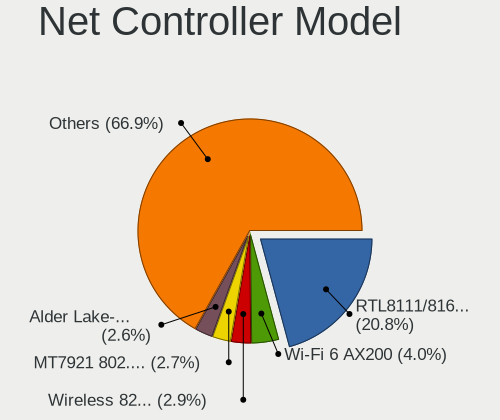

EndeavourOS - Tested Hardware & Statistics (Notebooks)
------------------------------------------------------

A project to collect tested hardware configurations for EndeavourOS.

Anyone can contribute to this report by the [hw-probe](https://github.com/linuxhw/hw-probe) tool:

    sudo -E hw-probe -all -upload

Please contribute! Especially if your hardware is rare.

Contents
--------

* [ Test Cases ](#test-cases)

* [ System ](#system)
  - [ OS                       ](#os)
  - [ OS Family                ](#os-family)
  - [ Kernel                   ](#kernel)
  - [ Kernel Family            ](#kernel-family)
  - [ Kernel Major Ver.        ](#kernel-major-ver)
  - [ Arch                     ](#arch)
  - [ DE                       ](#de)
  - [ Display Server           ](#display-server)
  - [ Display Manager          ](#display-manager)
  - [ OS Lang                  ](#os-lang)
  - [ Boot Mode                ](#boot-mode)
  - [ Filesystem               ](#filesystem)
  - [ Part. scheme             ](#part-scheme)
  - [ Dual Boot with Linux/BSD ](#dual-boot-with-linuxbsd)
  - [ Dual Boot (Win)          ](#dual-boot-win)

* [ Board ](#board)
  - [ Vendor                   ](#vendor)
  - [ Model                    ](#model)
  - [ Model Family             ](#model-family)
  - [ MFG Year                 ](#mfg-year)
  - [ Form Factor              ](#form-factor)
  - [ Secure Boot              ](#secure-boot)
  - [ Coreboot                 ](#coreboot)
  - [ RAM Size                 ](#ram-size)
  - [ RAM Used                 ](#ram-used)
  - [ Total Drives             ](#total-drives)
  - [ Has CD-ROM               ](#has-cd-rom)
  - [ Has Ethernet             ](#has-ethernet)
  - [ Has WiFi                 ](#has-wifi)
  - [ Has Bluetooth            ](#has-bluetooth)

* [ Location ](#location)
  - [ Country                  ](#country)
  - [ City                     ](#city)

* [ Drives ](#drives)
  - [ Drive Vendor             ](#drive-vendor)
  - [ Drive Model              ](#drive-model)
  - [ HDD Vendor               ](#hdd-vendor)
  - [ SSD Vendor               ](#ssd-vendor)
  - [ Drive Kind               ](#drive-kind)
  - [ Drive Connector          ](#drive-connector)
  - [ Drive Size               ](#drive-size)
  - [ Space Total              ](#space-total)
  - [ Space Used               ](#space-used)
  - [ Malfunc. Drives          ](#malfunc-drives)
  - [ Malfunc. Drive Vendor    ](#malfunc-drive-vendor)
  - [ Malfunc. HDD Vendor      ](#malfunc-hdd-vendor)
  - [ Malfunc. Drive Kind      ](#malfunc-drive-kind)
  - [ Failed Drives            ](#failed-drives)
  - [ Failed Drive Vendor      ](#failed-drive-vendor)
  - [ Drive Status             ](#drive-status)

* [ Storage controller ](#storage-controller)
  - [ Storage Vendor           ](#storage-vendor)
  - [ Storage Model            ](#storage-model)
  - [ Storage Kind             ](#storage-kind)

* [ Processor ](#processor)
  - [ CPU Vendor               ](#cpu-vendor)
  - [ CPU Model                ](#cpu-model)
  - [ CPU Model Family         ](#cpu-model-family)
  - [ CPU Cores                ](#cpu-cores)
  - [ CPU Sockets              ](#cpu-sockets)
  - [ CPU Threads              ](#cpu-threads)
  - [ CPU Op-Modes             ](#cpu-op-modes)
  - [ CPU Microcode            ](#cpu-microcode)
  - [ CPU Microarch            ](#cpu-microarch)

* [ Graphics ](#graphics)
  - [ GPU Vendor               ](#gpu-vendor)
  - [ GPU Model                ](#gpu-model)
  - [ GPU Combo                ](#gpu-combo)
  - [ GPU Driver               ](#gpu-driver)
  - [ GPU Memory               ](#gpu-memory)

* [ Monitor ](#monitor)
  - [ Monitor Vendor           ](#monitor-vendor)
  - [ Monitor Model            ](#monitor-model)
  - [ Monitor Resolution       ](#monitor-resolution)
  - [ Monitor Diagonal         ](#monitor-diagonal)
  - [ Monitor Width            ](#monitor-width)
  - [ Aspect Ratio             ](#aspect-ratio)
  - [ Monitor Area             ](#monitor-area)
  - [ Pixel Density            ](#pixel-density)
  - [ Multiple Monitors        ](#multiple-monitors)

* [ Network ](#network)
  - [ Net Controller Vendor    ](#net-controller-vendor)
  - [ Net Controller Model     ](#net-controller-model)
  - [ Wireless Vendor          ](#wireless-vendor)
  - [ Wireless Model           ](#wireless-model)
  - [ Ethernet Vendor          ](#ethernet-vendor)
  - [ Ethernet Model           ](#ethernet-model)
  - [ Net Controller Kind      ](#net-controller-kind)
  - [ Used Controller          ](#used-controller)
  - [ NICs                     ](#nics)
  - [ IPv6                     ](#ipv6)

* [ Bluetooth ](#bluetooth)
  - [ Bluetooth Vendor         ](#bluetooth-vendor)
  - [ Bluetooth Model          ](#bluetooth-model)

* [ Sound ](#sound)
  - [ Sound Vendor             ](#sound-vendor)
  - [ Sound Model              ](#sound-model)

* [ Memory ](#memory)
  - [ Memory Vendor            ](#memory-vendor)
  - [ Memory Model             ](#memory-model)
  - [ Memory Kind              ](#memory-kind)
  - [ Memory Form Factor       ](#memory-form-factor)
  - [ Memory Size              ](#memory-size)
  - [ Memory Speed             ](#memory-speed)

* [ Printers & scanners ](#printers--scanners)
  - [ Printer Vendor           ](#printer-vendor)
  - [ Printer Model            ](#printer-model)
  - [ Scanner Vendor           ](#scanner-vendor)
  - [ Scanner Model            ](#scanner-model)

* [ Camera ](#camera)
  - [ Camera Vendor            ](#camera-vendor)
  - [ Camera Model             ](#camera-model)

* [ Security ](#security)
  - [ Fingerprint Vendor       ](#fingerprint-vendor)
  - [ Fingerprint Model        ](#fingerprint-model)
  - [ Chipcard Vendor          ](#chipcard-vendor)
  - [ Chipcard Model           ](#chipcard-model)

* [ Unsupported ](#unsupported)
  - [ Unsupported Devices      ](#unsupported-devices)
  - [ Unsupported Device Types ](#unsupported-device-types)

Test Cases
----------

Total: 465

| Vendor        | Model                       | Probe                                                      | Date         |
|---------------|-----------------------------|------------------------------------------------------------|--------------|
| MSI           | GF65 Thin 9SD               | [a761de487d](https://linux-hardware.org/?probe=a761de487d) | Oct 01, 2022 |
| HP            | Laptop 15-da0xxx            | [176695aa20](https://linux-hardware.org/?probe=176695aa20) | Sep 30, 2022 |
| Lenovo        | IdeaPad 310-15IKB 80TV      | [d547ed6f83](https://linux-hardware.org/?probe=d547ed6f83) | Sep 30, 2022 |
| Lenovo        | IdeaPad 310-15IKB 80TV      | [9781419cc1](https://linux-hardware.org/?probe=9781419cc1) | Sep 30, 2022 |
| MSI           | Modern 14 B5M               | [1914cf579b](https://linux-hardware.org/?probe=1914cf579b) | Sep 29, 2022 |
| ASUSTek       | GL753VE                     | [456ff5f9a7](https://linux-hardware.org/?probe=456ff5f9a7) | Sep 29, 2022 |
| HP            | EliteBook 745 G6            | [f9eecf6781](https://linux-hardware.org/?probe=f9eecf6781) | Sep 28, 2022 |
| HP            | Pavilion Laptop 15-eg2xx... | [658f9b891f](https://linux-hardware.org/?probe=658f9b891f) | Sep 27, 2022 |
| Apple         | MacBookPro8,1               | [c0d2617a28](https://linux-hardware.org/?probe=c0d2617a28) | Sep 27, 2022 |
| Lenovo        | ThinkBook 14p Gen 2 20YN    | [28631c9681](https://linux-hardware.org/?probe=28631c9681) | Sep 27, 2022 |
| Lenovo        | ThinkBook 14 G2 ITL Ub 2... | [2b3c66f0ee](https://linux-hardware.org/?probe=2b3c66f0ee) | Sep 24, 2022 |
| HP            | 250 G4                      | [5d4c56fe14](https://linux-hardware.org/?probe=5d4c56fe14) | Sep 23, 2022 |
| ASUSTek       | ASUS TUF Gaming A15 FA50... | [8e7a7a914c](https://linux-hardware.org/?probe=8e7a7a914c) | Sep 23, 2022 |
| ASUSTek       | TUF Gaming FX505GT_FX505... | [031f4bb4f1](https://linux-hardware.org/?probe=031f4bb4f1) | Sep 23, 2022 |
| Samsung       | 340XAA/350XAA/550XAA        | [d852d9e0dd](https://linux-hardware.org/?probe=d852d9e0dd) | Sep 22, 2022 |
| ASUSTek       | ROG Strix G513QY_G513QY     | [6f43da7fb4](https://linux-hardware.org/?probe=6f43da7fb4) | Sep 22, 2022 |
| ASUSTek       | GL553VD                     | [e6cb381fd2](https://linux-hardware.org/?probe=e6cb381fd2) | Sep 21, 2022 |
| ASUSTek       | G74Sx                       | [e8f0a018c9](https://linux-hardware.org/?probe=e8f0a018c9) | Sep 19, 2022 |
| Acer          | Aspire A515-41G             | [434b1869d7](https://linux-hardware.org/?probe=434b1869d7) | Sep 16, 2022 |
| MSI           | Summit E13FlipEvo A12MT     | [465e8d2c86](https://linux-hardware.org/?probe=465e8d2c86) | Sep 15, 2022 |
| Samsung       | 340XAA/350XAA/550XAA        | [13cd2039a1](https://linux-hardware.org/?probe=13cd2039a1) | Sep 15, 2022 |
| Lenovo        | ThinkPad T480 20L6S58700    | [9d9d51e924](https://linux-hardware.org/?probe=9d9d51e924) | Sep 14, 2022 |
| Acer          | Aspire A715-72G             | [60cbc2fb39](https://linux-hardware.org/?probe=60cbc2fb39) | Sep 14, 2022 |
| HUAWEI        | KLVL-WXX9                   | [98ae2af06f](https://linux-hardware.org/?probe=98ae2af06f) | Sep 14, 2022 |
| Gigabyte      | AORUS 15G XC                | [4b0e97e947](https://linux-hardware.org/?probe=4b0e97e947) | Sep 12, 2022 |
| ASUSTek       | ROG Zephyrus G14 GA402RK... | [fcf2ccb1d2](https://linux-hardware.org/?probe=fcf2ccb1d2) | Sep 12, 2022 |
| MSI           | Alpha 15 B5EEK              | [cf9447ce8c](https://linux-hardware.org/?probe=cf9447ce8c) | Sep 10, 2022 |
| Acer          | Aspire A315-22              | [82058771f7](https://linux-hardware.org/?probe=82058771f7) | Sep 09, 2022 |
| Timi          | TM1703                      | [5c30ece6ff](https://linux-hardware.org/?probe=5c30ece6ff) | Sep 08, 2022 |
| HP            | ProBook 450 G0              | [07dfc865cf](https://linux-hardware.org/?probe=07dfc865cf) | Sep 08, 2022 |
| Acer          | Aspire A315-22              | [49d54ac5c5](https://linux-hardware.org/?probe=49d54ac5c5) | Sep 07, 2022 |
| Lenovo        | ThinkPad T15 Gen 2i 20W4... | [cc40453955](https://linux-hardware.org/?probe=cc40453955) | Sep 06, 2022 |
| Timi          | TM1703                      | [fb7386017f](https://linux-hardware.org/?probe=fb7386017f) | Sep 06, 2022 |
| Lenovo        | ThinkPad X1 Carbon 6th 2... | [dd3b771e55](https://linux-hardware.org/?probe=dd3b771e55) | Sep 05, 2022 |
| HP            | ProBook 440 G8 Notebook ... | [e8887916fa](https://linux-hardware.org/?probe=e8887916fa) | Sep 05, 2022 |
| Dell          | Vostro 7620                 | [a75fed8b3f](https://linux-hardware.org/?probe=a75fed8b3f) | Sep 05, 2022 |
| Dell          | Vostro 7620                 | [cd613ebcd2](https://linux-hardware.org/?probe=cd613ebcd2) | Sep 05, 2022 |
| ASUSTek       | Zenbook UX5400EA_UX5400E... | [6ce8accfb1](https://linux-hardware.org/?probe=6ce8accfb1) | Sep 04, 2022 |
| HUAWEI        | NBLB-WAX9N                  | [0e4f12b377](https://linux-hardware.org/?probe=0e4f12b377) | Sep 04, 2022 |
| Lenovo        | ThinkPad X200T 7449G6G      | [2667cd1609](https://linux-hardware.org/?probe=2667cd1609) | Sep 03, 2022 |
| Lenovo        | IdeaPad 5 14ARE05 81YM      | [05221c6c18](https://linux-hardware.org/?probe=05221c6c18) | Sep 03, 2022 |
| ASUSTek       | X580VN                      | [fe8f1a7e6f](https://linux-hardware.org/?probe=fe8f1a7e6f) | Sep 03, 2022 |
| HP            | OMEN by Laptop 16z-c000     | [edc4a4ce85](https://linux-hardware.org/?probe=edc4a4ce85) | Sep 03, 2022 |
| Schenker      | XMG FUSION 15 (XFU15M22)    | [3a8cfc8781](https://linux-hardware.org/?probe=3a8cfc8781) | Sep 01, 2022 |
| HP            | OMEN by Laptop 16-b0xxx     | [94b00f5da5](https://linux-hardware.org/?probe=94b00f5da5) | Aug 27, 2022 |
| Google        | Peppy                       | [be4ecba4dc](https://linux-hardware.org/?probe=be4ecba4dc) | Aug 26, 2022 |
| Google        | Auron_Yuna                  | [de2984c01a](https://linux-hardware.org/?probe=de2984c01a) | Aug 26, 2022 |
| Lenovo        | Yoga Slim 7 Pro 14ACH5 8... | [788397e7ae](https://linux-hardware.org/?probe=788397e7ae) | Aug 22, 2022 |
| Lenovo        | ThinkPad X13 Gen 1 20UFS... | [6eadd1ec75](https://linux-hardware.org/?probe=6eadd1ec75) | Aug 17, 2022 |
| HUAWEI        | KLVL-WXX9                   | [b74ab22c1f](https://linux-hardware.org/?probe=b74ab22c1f) | Aug 16, 2022 |
| HP            | Elite x2 1012 G1            | [94fb37c745](https://linux-hardware.org/?probe=94fb37c745) | Aug 14, 2022 |
| Lenovo        | IdeaPad S540-15IWL GTX 8... | [b391d570ba](https://linux-hardware.org/?probe=b391d570ba) | Aug 12, 2022 |
| Apple         | MacBookPro14,2              | [9e297d5dde](https://linux-hardware.org/?probe=9e297d5dde) | Aug 11, 2022 |
| ASUSTek       | GL502VT                     | [5e95e514a4](https://linux-hardware.org/?probe=5e95e514a4) | Aug 11, 2022 |
| HP            | Elite x2 1012 G1            | [a76e460266](https://linux-hardware.org/?probe=a76e460266) | Aug 11, 2022 |
| ASUSTek       | ROG Zephyrus G14 GA401IV... | [d76760ffa4](https://linux-hardware.org/?probe=d76760ffa4) | Aug 11, 2022 |
| Dell          | Inspiron 5402               | [5373247b06](https://linux-hardware.org/?probe=5373247b06) | Aug 05, 2022 |
| Apple         | MacBookPro14,2              | [d1079f3fba](https://linux-hardware.org/?probe=d1079f3fba) | Aug 04, 2022 |
| Positivo      | S14BW01                     | [28c70dfa85](https://linux-hardware.org/?probe=28c70dfa85) | Aug 04, 2022 |
| HP            | EliteBook 745 G6            | [0bcc9863e3](https://linux-hardware.org/?probe=0bcc9863e3) | Jul 31, 2022 |
| Lenovo        | ThinkBook 14p Gen 2 20YN    | [b41ce610a4](https://linux-hardware.org/?probe=b41ce610a4) | Jul 22, 2022 |
| Lenovo        | Yoga Slim 7 14ARE05 82A2    | [dca2e009f0](https://linux-hardware.org/?probe=dca2e009f0) | Jul 20, 2022 |
| Acer          | Nitro AN515-43              | [4e33f5e902](https://linux-hardware.org/?probe=4e33f5e902) | Jul 19, 2022 |
| Lenovo        | ThinkPad T460p 20FXS0550... | [1a394fdf59](https://linux-hardware.org/?probe=1a394fdf59) | Jul 18, 2022 |
| Lenovo        | ThinkPad E595 20NF001HGE    | [9d3a54dbcf](https://linux-hardware.org/?probe=9d3a54dbcf) | Jul 17, 2022 |
| ASUSTek       | GL753VE                     | [df383e16e9](https://linux-hardware.org/?probe=df383e16e9) | Jul 07, 2022 |
| HP            | Laptop 14-fq1xxx            | [9aa0a38b17](https://linux-hardware.org/?probe=9aa0a38b17) | Jul 01, 2022 |
| HP            | Laptop 14-fq1xxx            | [b9b09609b8](https://linux-hardware.org/?probe=b9b09609b8) | Jul 01, 2022 |
| HUAWEI        | MACH-WX9                    | [329e3a150f](https://linux-hardware.org/?probe=329e3a150f) | Jun 30, 2022 |
| HONOR         | BBR-WAX9                    | [0cffb17bc7](https://linux-hardware.org/?probe=0cffb17bc7) | Jun 25, 2022 |
| Lenovo        | V330-14ARR 81B1             | [9816b1d616](https://linux-hardware.org/?probe=9816b1d616) | Jun 23, 2022 |
| MSI           | B450 TOMAHAWK               | [b9a8ce148e](https://linux-hardware.org/?probe=b9a8ce148e) | Jun 21, 2022 |
| Acer          | Aspire E5-575G              | [dc04d6eb1a](https://linux-hardware.org/?probe=dc04d6eb1a) | Jun 18, 2022 |
| ASUSTek       | N56VB                       | [a87c22baee](https://linux-hardware.org/?probe=a87c22baee) | Jun 16, 2022 |
| HUAWEI        | KLVL-WXX9                   | [999d96890c](https://linux-hardware.org/?probe=999d96890c) | Jun 16, 2022 |
| Dell          | Latitude XT                 | [6ca0e5ca92](https://linux-hardware.org/?probe=6ca0e5ca92) | Jun 14, 2022 |
| MSI           | B450 TOMAHAWK               | [ed5235f3f4](https://linux-hardware.org/?probe=ed5235f3f4) | Jun 09, 2022 |
| Dell          | Latitude E6440              | [63238f8fe9](https://linux-hardware.org/?probe=63238f8fe9) | Jun 09, 2022 |
| Acer          | Aspire A515-43              | [343315ec17](https://linux-hardware.org/?probe=343315ec17) | Jun 06, 2022 |
| ASUSTek       | GL753VE                     | [a96aa73dd6](https://linux-hardware.org/?probe=a96aa73dd6) | Jun 01, 2022 |
| Dell          | Latitude 5289               | [f9e3e0fa57](https://linux-hardware.org/?probe=f9e3e0fa57) | May 30, 2022 |
| Lenovo        | IdeaPad 3 15ITL6 82H8       | [53dc0937af](https://linux-hardware.org/?probe=53dc0937af) | May 26, 2022 |
| Sony          | VPCCA17FX                   | [4ced9d5222](https://linux-hardware.org/?probe=4ced9d5222) | May 26, 2022 |
| Dell          | Latitude E6510              | [52b94e68a9](https://linux-hardware.org/?probe=52b94e68a9) | May 23, 2022 |
| Timi          | A35S                        | [8278281113](https://linux-hardware.org/?probe=8278281113) | May 20, 2022 |
| Lenovo        | ThinkPad X270 20HMS12K00    | [c4e15012d5](https://linux-hardware.org/?probe=c4e15012d5) | May 15, 2022 |
| Dell          | Inspiron 3580               | [33dbac4352](https://linux-hardware.org/?probe=33dbac4352) | May 15, 2022 |
| HP            | Pavilion Laptop 15-eh0xx... | [5dea5cd6ff](https://linux-hardware.org/?probe=5dea5cd6ff) | May 14, 2022 |
| HP            | Notebook                    | [e672632acf](https://linux-hardware.org/?probe=e672632acf) | May 13, 2022 |
| Unknown       | Unknown                     | [fac14402be](https://linux-hardware.org/?probe=fac14402be) | May 11, 2022 |
| Acer          | Nitro AN515-45              | [34272a60d1](https://linux-hardware.org/?probe=34272a60d1) | May 10, 2022 |
| HP            | ProBook 440 G4              | [1f0811673a](https://linux-hardware.org/?probe=1f0811673a) | May 09, 2022 |
| Chuwi         | GemiBook Pro                | [b5145fe094](https://linux-hardware.org/?probe=b5145fe094) | May 08, 2022 |
| Lenovo        | V14 G2 ITL 82NM             | [6a3cbcae26](https://linux-hardware.org/?probe=6a3cbcae26) | May 06, 2022 |
| Acer          | Swift SF314-41              | [3dbf93ec7f](https://linux-hardware.org/?probe=3dbf93ec7f) | May 06, 2022 |
| ASUSTek       | ROG Zephyrus G15 GA503QS... | [c08f733706](https://linux-hardware.org/?probe=c08f733706) | May 05, 2022 |
| Lenovo        | Legion 5 15ACH6H 82JU       | [5838cd4268](https://linux-hardware.org/?probe=5838cd4268) | Apr 30, 2022 |
| ASUSTek       | X71Vn                       | [b31a7dce8b](https://linux-hardware.org/?probe=b31a7dce8b) | Apr 29, 2022 |
| ASUSTek       | VivoBook_ASUSLaptop X421... | [af3efcde26](https://linux-hardware.org/?probe=af3efcde26) | Apr 29, 2022 |
| HUAWEI        | MACH-WX9                    | [0199a1bcec](https://linux-hardware.org/?probe=0199a1bcec) | Apr 24, 2022 |
| Dell          | Latitude 7280               | [e64ba65609](https://linux-hardware.org/?probe=e64ba65609) | Apr 22, 2022 |
| Google        | Celes                       | [a1a2262b88](https://linux-hardware.org/?probe=a1a2262b88) | Apr 21, 2022 |
| ASUSTek       | ROG Zephyrus G14 GA401QH... | [5a58c1f799](https://linux-hardware.org/?probe=5a58c1f799) | Apr 18, 2022 |
| ASUSTek       | Zephyrus M GU502GV_GU502... | [10a97e42a3](https://linux-hardware.org/?probe=10a97e42a3) | Apr 17, 2022 |
| Google        | Candy                       | [77b6731597](https://linux-hardware.org/?probe=77b6731597) | Apr 17, 2022 |
| HP            | 250 G7 Notebook PC          | [2b3ac63766](https://linux-hardware.org/?probe=2b3ac63766) | Apr 16, 2022 |
| HP            | Laptop 14-dq4xxx            | [a892a2412c](https://linux-hardware.org/?probe=a892a2412c) | Apr 15, 2022 |
| Lenovo        | IdeaPad Gaming 3 15ARH05... | [8350598ef6](https://linux-hardware.org/?probe=8350598ef6) | Apr 15, 2022 |
| Dell          | Latitude E6540              | [939dbc38d3](https://linux-hardware.org/?probe=939dbc38d3) | Apr 15, 2022 |
| HP            | Pavilion Notebook           | [8ea3af9aca](https://linux-hardware.org/?probe=8ea3af9aca) | Apr 14, 2022 |
| HP            | Pavilion Notebook           | [e2a600db96](https://linux-hardware.org/?probe=e2a600db96) | Apr 14, 2022 |
| Acer          | Swift SF314-57G             | [b9b31b0528](https://linux-hardware.org/?probe=b9b31b0528) | Apr 14, 2022 |
| Dell          | XPS 15 7590                 | [d90283da2d](https://linux-hardware.org/?probe=d90283da2d) | Apr 13, 2022 |
| MSI           | Modern 15 A11M              | [c3202f68fc](https://linux-hardware.org/?probe=c3202f68fc) | Apr 13, 2022 |
| ILLEGEAR      | ROGUE                       | [441caeb4e6](https://linux-hardware.org/?probe=441caeb4e6) | Apr 12, 2022 |
| Packard Be... | EasyNote ENTG71BM           | [44520b705b](https://linux-hardware.org/?probe=44520b705b) | Apr 11, 2022 |
| TrekStor      | Notebook Slim S130          | [febbb5b9a2](https://linux-hardware.org/?probe=febbb5b9a2) | Apr 06, 2022 |
| ASUSTek       | ROG Zephyrus G15 GA503QR... | [3327822265](https://linux-hardware.org/?probe=3327822265) | Apr 06, 2022 |
| HP            | 250 G7 Notebook PC          | [9170392920](https://linux-hardware.org/?probe=9170392920) | Apr 04, 2022 |
| Lenovo        | IdeaPad 3 14ALC6 82KT       | [376167460b](https://linux-hardware.org/?probe=376167460b) | Apr 01, 2022 |
| ASUSTek       | X555LF                      | [35cceb0f0a](https://linux-hardware.org/?probe=35cceb0f0a) | Mar 31, 2022 |
| ASUSTek       | ROG Zephyrus G14 GA401IV... | [d895af2b46](https://linux-hardware.org/?probe=d895af2b46) | Mar 29, 2022 |
| Lenovo        | ThinkPad E15 Gen 2 20T80... | [ee491ed7f4](https://linux-hardware.org/?probe=ee491ed7f4) | Mar 29, 2022 |
| Lenovo        | ThinkPad E550 20DF0030US    | [921004463e](https://linux-hardware.org/?probe=921004463e) | Mar 23, 2022 |
| HP            | Laptop 15-bw0xx             | [3500cd92bf](https://linux-hardware.org/?probe=3500cd92bf) | Mar 19, 2022 |
| Acer          | Extensa 2520                | [f070f33060](https://linux-hardware.org/?probe=f070f33060) | Mar 19, 2022 |
| Acer          | Extensa 2520                | [f2003c1f90](https://linux-hardware.org/?probe=f2003c1f90) | Mar 19, 2022 |
| ASUSTek       | G752VT                      | [632814d6a3](https://linux-hardware.org/?probe=632814d6a3) | Mar 18, 2022 |
| Lenovo        | ThinkPad E550 20DF0030US    | [7e64ef177c](https://linux-hardware.org/?probe=7e64ef177c) | Mar 18, 2022 |
| Lenovo        | V330-14IKB 81B0             | [06a3e2150b](https://linux-hardware.org/?probe=06a3e2150b) | Mar 16, 2022 |
| Lenovo        | V330-14IKB 81B0             | [73e48f6dc4](https://linux-hardware.org/?probe=73e48f6dc4) | Mar 16, 2022 |
| Lenovo        | ThinkPad E550 20DF0030US    | [d742a1c2fa](https://linux-hardware.org/?probe=d742a1c2fa) | Mar 16, 2022 |
| Toshiba       | Satellite Pro C50-A-1E6     | [ad8e612da5](https://linux-hardware.org/?probe=ad8e612da5) | Mar 15, 2022 |
| Google        | Akemi                       | [6a52c103e9](https://linux-hardware.org/?probe=6a52c103e9) | Mar 14, 2022 |
| Dell          | Precision M6800             | [239dd5797a](https://linux-hardware.org/?probe=239dd5797a) | Mar 10, 2022 |
| ASUSTek       | G751JT                      | [32556e3c15](https://linux-hardware.org/?probe=32556e3c15) | Mar 09, 2022 |
| Unknown       | Unknown                     | [23c7cd9c12](https://linux-hardware.org/?probe=23c7cd9c12) | Mar 09, 2022 |
| Acer          | Aspire E5-575               | [bc5e48379d](https://linux-hardware.org/?probe=bc5e48379d) | Mar 07, 2022 |
| Lenovo        | ThinkPad Edge 0578BBA       | [cf314fb57a](https://linux-hardware.org/?probe=cf314fb57a) | Mar 07, 2022 |
| Dell          | Latitude E5430 non-vPro     | [2d2bd57c8b](https://linux-hardware.org/?probe=2d2bd57c8b) | Mar 06, 2022 |
| HP            | ZBook 17 G2                 | [d9773ef48d](https://linux-hardware.org/?probe=d9773ef48d) | Mar 06, 2022 |
| Lenovo        | ThinkPad E550 20DF0030US    | [d3cc5d36be](https://linux-hardware.org/?probe=d3cc5d36be) | Feb 27, 2022 |
| Eluktronic... | Prometheus XVII             | [0797cebf2d](https://linux-hardware.org/?probe=0797cebf2d) | Feb 26, 2022 |
| Dell          | Latitude 3420               | [fb586744c3](https://linux-hardware.org/?probe=fb586744c3) | Feb 22, 2022 |
| Lenovo        | ThinkPad T470 W10DG 20JN... | [655c17b9ff](https://linux-hardware.org/?probe=655c17b9ff) | Feb 20, 2022 |
| Radxa         | ROCK Pi X v1.4              | [dd6d9dc630](https://linux-hardware.org/?probe=dd6d9dc630) | Feb 19, 2022 |
| Lenovo        | ThinkPad E550 20DF0030US    | [973e1c8d91](https://linux-hardware.org/?probe=973e1c8d91) | Feb 19, 2022 |
| Acer          | Aspire E1-572G              | [c75a02af0d](https://linux-hardware.org/?probe=c75a02af0d) | Feb 18, 2022 |
| Lenovo        | IdeaPad Z510 20287          | [d98a594e28](https://linux-hardware.org/?probe=d98a594e28) | Feb 18, 2022 |
| Lenovo        | ThinkPad T440p 20AWS0U50... | [a114b7030f](https://linux-hardware.org/?probe=a114b7030f) | Feb 17, 2022 |
| Eluktronic... | Prometheus XVII             | [36436d1aff](https://linux-hardware.org/?probe=36436d1aff) | Feb 17, 2022 |
| HUAWEI        | HLYL-WXX9                   | [5c8d71134e](https://linux-hardware.org/?probe=5c8d71134e) | Feb 16, 2022 |
| MSI           | B450 TOMAHAWK               | [63d492d4bb](https://linux-hardware.org/?probe=63d492d4bb) | Feb 16, 2022 |
| ASUSTek       | UX490UA                     | [5e40078555](https://linux-hardware.org/?probe=5e40078555) | Feb 14, 2022 |
| Lenovo        | IdeaPad 3 15ITL6 82H8       | [2afbdea066](https://linux-hardware.org/?probe=2afbdea066) | Feb 13, 2022 |
| Lenovo        | ThinkBook 15 G2 ITL 20VE    | [f84892675f](https://linux-hardware.org/?probe=f84892675f) | Feb 12, 2022 |
| Lenovo        | ThinkPad E550 20DF0030US    | [dda932e1ae](https://linux-hardware.org/?probe=dda932e1ae) | Feb 11, 2022 |
| HP            | Pavilion Aero Laptop 13-... | [c79fe1743d](https://linux-hardware.org/?probe=c79fe1743d) | Feb 10, 2022 |
| Dell          | G3 3500                     | [92ee625013](https://linux-hardware.org/?probe=92ee625013) | Feb 09, 2022 |
| HP            | Pavilion 10 TS              | [1228be8404](https://linux-hardware.org/?probe=1228be8404) | Feb 08, 2022 |
| ASUSTek       | ROG Flow X13 GV301QH_GV3... | [f2719a9d26](https://linux-hardware.org/?probe=f2719a9d26) | Feb 07, 2022 |
| ASUSTek       | ROG Zephyrus M16 GU603HR... | [a39c608f4c](https://linux-hardware.org/?probe=a39c608f4c) | Feb 07, 2022 |
| Dell          | Latitude E4310              | [ef92697af7](https://linux-hardware.org/?probe=ef92697af7) | Feb 07, 2022 |
| Dell          | Latitude E6400              | [919eb44cc5](https://linux-hardware.org/?probe=919eb44cc5) | Feb 07, 2022 |
| Acer          | Aspire V5-471               | [9bbd70f06c](https://linux-hardware.org/?probe=9bbd70f06c) | Feb 06, 2022 |
| HP            | Pavilion dv7                | [28bb1241de](https://linux-hardware.org/?probe=28bb1241de) | Feb 06, 2022 |
| Notebook      | NH5x_7xDPx                  | [a43204a8d7](https://linux-hardware.org/?probe=a43204a8d7) | Feb 02, 2022 |
| HUAWEI        | MACH-WX9                    | [4998bf6630](https://linux-hardware.org/?probe=4998bf6630) | Feb 02, 2022 |
| HP            | Pavilion g6                 | [c2b7d7cdd1](https://linux-hardware.org/?probe=c2b7d7cdd1) | Feb 02, 2022 |
| Acer          | Aspire E1-572G              | [3deec16346](https://linux-hardware.org/?probe=3deec16346) | Feb 02, 2022 |
| HP            | 250 G7 Notebook PC          | [b8f0614b9c](https://linux-hardware.org/?probe=b8f0614b9c) | Feb 01, 2022 |
| HP            | Pavilion g6                 | [be25fc4f46](https://linux-hardware.org/?probe=be25fc4f46) | Feb 01, 2022 |
| Lenovo        | Yoga 700-14ISK 80QD         | [de0d67e8c4](https://linux-hardware.org/?probe=de0d67e8c4) | Jan 31, 2022 |
| HP            | Laptop 15-db0xxx            | [8c455b3274](https://linux-hardware.org/?probe=8c455b3274) | Jan 30, 2022 |
| Dell          | Inspiron 3542               | [1dfd5b5461](https://linux-hardware.org/?probe=1dfd5b5461) | Jan 23, 2022 |
| Lenovo        | ThinkPad E550 20DF0030US    | [cc0c86531b](https://linux-hardware.org/?probe=cc0c86531b) | Jan 22, 2022 |
| ASUSTek       | K45VD                       | [206ce8c174](https://linux-hardware.org/?probe=206ce8c174) | Jan 18, 2022 |
| ASUSTek       | K45VD                       | [6eafcfd89d](https://linux-hardware.org/?probe=6eafcfd89d) | Jan 18, 2022 |
| ASUSTek       | TUF Gaming FX505DT_FX505... | [caa528d6e0](https://linux-hardware.org/?probe=caa528d6e0) | Jan 15, 2022 |
| Acer          | Swift SF514-54T             | [dffa1b1708](https://linux-hardware.org/?probe=dffa1b1708) | Jan 14, 2022 |
| Acer          | Swift SF514-54T             | [cf529c7ad0](https://linux-hardware.org/?probe=cf529c7ad0) | Jan 14, 2022 |
| HUAWEI        | MACH-WX9                    | [1c3636c882](https://linux-hardware.org/?probe=1c3636c882) | Jan 11, 2022 |
| HUAWEI        | MACH-WX9                    | [2e91b4b88c](https://linux-hardware.org/?probe=2e91b4b88c) | Jan 10, 2022 |
| ASUSTek       | VivoBook_ASUSLaptop X515... | [568c503df0](https://linux-hardware.org/?probe=568c503df0) | Jan 07, 2022 |
| ASUSTek       | VivoBook_ASUSLaptop X515... | [fb627691ce](https://linux-hardware.org/?probe=fb627691ce) | Jan 07, 2022 |
| Lenovo        | ThinkPad X240 20AMA2F8MS    | [7b5c7a047a](https://linux-hardware.org/?probe=7b5c7a047a) | Jan 06, 2022 |
| Lenovo        | IdeaPad 330-15IKB 81DE      | [c22ba841f6](https://linux-hardware.org/?probe=c22ba841f6) | Jan 06, 2022 |
| Lenovo        | IdeaPad S340-15IIL 81WL     | [be129c3a7a](https://linux-hardware.org/?probe=be129c3a7a) | Jan 05, 2022 |
| Lenovo        | ThinkPad T560 20FJS4FV00    | [4bd9bb5f20](https://linux-hardware.org/?probe=4bd9bb5f20) | Jan 05, 2022 |
| MSI           | GP66 Leopard 10UH           | [e9689e292c](https://linux-hardware.org/?probe=e9689e292c) | Jan 05, 2022 |
| Dell          | Inspiron 5520               | [5ce6cac5cb](https://linux-hardware.org/?probe=5ce6cac5cb) | Jan 04, 2022 |
| Schenker      | XMG FUSION 15 (XFU15L19)    | [c10faa4e15](https://linux-hardware.org/?probe=c10faa4e15) | Jan 04, 2022 |
| ASUSTek       | N43SL                       | [8468a0ab83](https://linux-hardware.org/?probe=8468a0ab83) | Jan 04, 2022 |
| Lenovo        | ThinkPad E14 Gen 3 20Y70... | [d770cc3fe5](https://linux-hardware.org/?probe=d770cc3fe5) | Jan 04, 2022 |
| Timi          | A35S                        | [2dafd53d09](https://linux-hardware.org/?probe=2dafd53d09) | Jan 04, 2022 |
| HP            | EliteBook 2540p             | [12ce36d52f](https://linux-hardware.org/?probe=12ce36d52f) | Jan 03, 2022 |
| Acer          | Aspire A315-56              | [2edffdea76](https://linux-hardware.org/?probe=2edffdea76) | Jan 03, 2022 |
| Dell          | Inspiron 3542               | [a611e12778](https://linux-hardware.org/?probe=a611e12778) | Dec 31, 2021 |
| Dell          | Precision 5560              | [04cb5954e9](https://linux-hardware.org/?probe=04cb5954e9) | Dec 31, 2021 |
| Lenovo        | ThinkPad E480 20KQ000EBR    | [e4d3f29412](https://linux-hardware.org/?probe=e4d3f29412) | Dec 30, 2021 |
| MSI           | B450 TOMAHAWK               | [c85d7c78e7](https://linux-hardware.org/?probe=c85d7c78e7) | Dec 28, 2021 |
| Lenovo        | ThinkPad E550 20DF0030US    | [b608797946](https://linux-hardware.org/?probe=b608797946) | Dec 28, 2021 |
| HP            | Laptop 14-fq0xxx            | [756df875af](https://linux-hardware.org/?probe=756df875af) | Dec 23, 2021 |
| HP            | Laptop 14-fq0xxx            | [cd01eec1a8](https://linux-hardware.org/?probe=cd01eec1a8) | Dec 23, 2021 |
| HP            | Laptop 14-fq0xxx            | [4d153ddb81](https://linux-hardware.org/?probe=4d153ddb81) | Dec 23, 2021 |
| Lenovo        | Yoga Slim 7 Pro 14ACH5 8... | [deb1a17957](https://linux-hardware.org/?probe=deb1a17957) | Dec 23, 2021 |
| Lenovo        | Yoga Slim 7 Pro 14ACH5 8... | [ca89ed6eab](https://linux-hardware.org/?probe=ca89ed6eab) | Dec 23, 2021 |
| Lenovo        | ThinkPad E550 20DF0030US    | [384617e5a7](https://linux-hardware.org/?probe=384617e5a7) | Dec 22, 2021 |
| Lenovo        | ThinkPad E550 20DF0030US    | [8c9fc05c39](https://linux-hardware.org/?probe=8c9fc05c39) | Dec 22, 2021 |
| Unknown       | Unknown                     | [a1b24f9ab7](https://linux-hardware.org/?probe=a1b24f9ab7) | Dec 21, 2021 |
| Unknown       | Unknown                     | [0fb793d2a7](https://linux-hardware.org/?probe=0fb793d2a7) | Dec 21, 2021 |
| Lenovo        | IdeaPad 320-15ISK 80XH      | [7a6594a954](https://linux-hardware.org/?probe=7a6594a954) | Dec 19, 2021 |
| MSI           | Modern 14 B5M               | [3e8138c5b4](https://linux-hardware.org/?probe=3e8138c5b4) | Dec 18, 2021 |
| Lenovo        | ThinkPad T440s 20ARS0LU0... | [ab6c683160](https://linux-hardware.org/?probe=ab6c683160) | Dec 16, 2021 |
| Dell          | Inspiron 5558               | [16daa16444](https://linux-hardware.org/?probe=16daa16444) | Dec 16, 2021 |
| Acer          | Aspire 5250                 | [b4a48e5350](https://linux-hardware.org/?probe=b4a48e5350) | Dec 15, 2021 |
| HP            | 255 G7 Notebook PC          | [a34aa5357b](https://linux-hardware.org/?probe=a34aa5357b) | Dec 14, 2021 |
| Lenovo        | IdeaPad 3 15ALC6 82KU       | [93957ddac1](https://linux-hardware.org/?probe=93957ddac1) | Dec 13, 2021 |
| Lenovo        | V14 G2 ITL 82NM             | [939be3ba51](https://linux-hardware.org/?probe=939be3ba51) | Dec 10, 2021 |
| MSI           | Prestige 15 A10SC           | [706fc926ca](https://linux-hardware.org/?probe=706fc926ca) | Dec 08, 2021 |
| Dell          | Latitude 7480               | [480ad981d9](https://linux-hardware.org/?probe=480ad981d9) | Dec 07, 2021 |
| Unknown       | Unknown                     | [2070780ca9](https://linux-hardware.org/?probe=2070780ca9) | Dec 07, 2021 |
| Framework     | Laptop                      | [c1a31372f4](https://linux-hardware.org/?probe=c1a31372f4) | Dec 06, 2021 |
| ASUSTek       | ROG Zephyrus M16 GU603HR... | [41dec8d290](https://linux-hardware.org/?probe=41dec8d290) | Dec 04, 2021 |
| Lenovo        | ThinkPad X140e 20BL000BU... | [b49088935d](https://linux-hardware.org/?probe=b49088935d) | Dec 04, 2021 |
| Lenovo        | ThinkPad X140e 20BL000BU... | [7cdf0f8f44](https://linux-hardware.org/?probe=7cdf0f8f44) | Dec 04, 2021 |
| Apple         | MacBookAir6,2               | [c5ba70d401](https://linux-hardware.org/?probe=c5ba70d401) | Nov 24, 2021 |
| MSI           | Bravo 15 B5DD               | [fc7c1ff3c8](https://linux-hardware.org/?probe=fc7c1ff3c8) | Nov 24, 2021 |
| Unknown       | Unknown                     | [b862ee20d9](https://linux-hardware.org/?probe=b862ee20d9) | Nov 24, 2021 |
| Unknown       | Unknown                     | [0555569b70](https://linux-hardware.org/?probe=0555569b70) | Nov 24, 2021 |
| Lenovo        | ThinkBook 15-IIL 20SM       | [2b67e46016](https://linux-hardware.org/?probe=2b67e46016) | Nov 24, 2021 |
| ASUSTek       | ROG Zephyrus M16 GU603HR... | [d0d56860bb](https://linux-hardware.org/?probe=d0d56860bb) | Nov 24, 2021 |
| MSI           | GS63VR 6RF                  | [2d9061c72e](https://linux-hardware.org/?probe=2d9061c72e) | Nov 23, 2021 |
| ASUSTek       | ROG Zephyrus M16 GU603HR... | [85338e8b09](https://linux-hardware.org/?probe=85338e8b09) | Nov 23, 2021 |
| Apple         | MacBookAir7,2               | [df651ff7ad](https://linux-hardware.org/?probe=df651ff7ad) | Nov 23, 2021 |
| ASUSTek       | ROG Zephyrus G15 GA503QM... | [e6eb602b05](https://linux-hardware.org/?probe=e6eb602b05) | Nov 22, 2021 |
| HP            | 15 TS                       | [50a260e4dc](https://linux-hardware.org/?probe=50a260e4dc) | Nov 21, 2021 |
| ASUSTek       | TUF Gaming FX504GD_FX80G... | [a3d3e0eecd](https://linux-hardware.org/?probe=a3d3e0eecd) | Nov 20, 2021 |
| Dell          | XPS 13 9350                 | [ec54ffae7a](https://linux-hardware.org/?probe=ec54ffae7a) | Nov 18, 2021 |
| ASUSTek       | ROG Zephyrus G14 GA401IV... | [778d32ce4b](https://linux-hardware.org/?probe=778d32ce4b) | Nov 17, 2021 |
| Lenovo        | ThinkPad E15 20RD0011GE     | [9fc3f12603](https://linux-hardware.org/?probe=9fc3f12603) | Nov 16, 2021 |
| HUAWEI        | HN-WX9X                     | [22c7f120ab](https://linux-hardware.org/?probe=22c7f120ab) | Nov 13, 2021 |
| Lenovo        | ThinkPad L15 Gen 1 20U70... | [c11672a55e](https://linux-hardware.org/?probe=c11672a55e) | Nov 11, 2021 |
| ASUSTek       | G751JT                      | [d2d03753ee](https://linux-hardware.org/?probe=d2d03753ee) | Nov 09, 2021 |
| Lenovo        | ThinkPad T14 Gen 1 20S1S... | [e95d2fa980](https://linux-hardware.org/?probe=e95d2fa980) | Nov 05, 2021 |
| Lenovo        | Y520-15IKBN 80WK            | [85dff2829f](https://linux-hardware.org/?probe=85dff2829f) | Nov 03, 2021 |
| ASUSTek       | ASUS TUF Gaming A15 FA50... | [222ce004da](https://linux-hardware.org/?probe=222ce004da) | Nov 01, 2021 |
| ASUSTek       | G751JT                      | [b4c3816a33](https://linux-hardware.org/?probe=b4c3816a33) | Oct 30, 2021 |
| HUAWEI        | KLVL-WXX9                   | [3fcea4d382](https://linux-hardware.org/?probe=3fcea4d382) | Oct 29, 2021 |
| Acer          | Aspire E5-573G              | [cce67d37aa](https://linux-hardware.org/?probe=cce67d37aa) | Oct 28, 2021 |
| ASUSTek       | ASUS TUF Gaming F15 FX50... | [6a546c5681](https://linux-hardware.org/?probe=6a546c5681) | Oct 23, 2021 |
| ASUSTek       | ROG Zephyrus G14 GA401IV... | [689f9368f1](https://linux-hardware.org/?probe=689f9368f1) | Oct 23, 2021 |
| Apple         | MacBookPro16,2              | [7b3cdda6e2](https://linux-hardware.org/?probe=7b3cdda6e2) | Oct 20, 2021 |
| HP            | ENVY 6                      | [94471889b0](https://linux-hardware.org/?probe=94471889b0) | Oct 20, 2021 |
| Lenovo        | ThinkPad E15 Gen 2 20T80... | [ff566c77ce](https://linux-hardware.org/?probe=ff566c77ce) | Oct 17, 2021 |
| Lenovo        | ThinkPad T14 Gen 1 20S1S... | [2d3f367fa7](https://linux-hardware.org/?probe=2d3f367fa7) | Oct 17, 2021 |
| Apple         | MacBookPro16,2              | [6e745a1ec9](https://linux-hardware.org/?probe=6e745a1ec9) | Oct 17, 2021 |
| Dell          | Latitude E6410              | [68d7531397](https://linux-hardware.org/?probe=68d7531397) | Oct 17, 2021 |
| Apple         | MacBookPro16,2              | [8d0e93e90f](https://linux-hardware.org/?probe=8d0e93e90f) | Oct 16, 2021 |
| Lenovo        | Z50-70 20354                | [a852927b57](https://linux-hardware.org/?probe=a852927b57) | Oct 13, 2021 |
| Dell          | Precision M4400             | [bae8becab1](https://linux-hardware.org/?probe=bae8becab1) | Oct 11, 2021 |
| Google        | Kindred                     | [9420945432](https://linux-hardware.org/?probe=9420945432) | Oct 10, 2021 |
| Dell          | Latitude E4300              | [c486155f48](https://linux-hardware.org/?probe=c486155f48) | Oct 10, 2021 |
| Dell          | Latitude E4300              | [52e0d626fa](https://linux-hardware.org/?probe=52e0d626fa) | Oct 10, 2021 |
| Dell          | Latitude E6410              | [ebfe78c927](https://linux-hardware.org/?probe=ebfe78c927) | Oct 08, 2021 |
| Dell          | G3 3500                     | [b4e985bcba](https://linux-hardware.org/?probe=b4e985bcba) | Oct 08, 2021 |
| Lenovo        | ThinkBook 16p Gen 2 20YM    | [e570cc15cd](https://linux-hardware.org/?probe=e570cc15cd) | Oct 06, 2021 |
| Lenovo        | Z50-70 20354                | [beda62c6f4](https://linux-hardware.org/?probe=beda62c6f4) | Oct 05, 2021 |
| ASUSTek       | ASUS TUF Gaming A15 FA50... | [0923a8b728](https://linux-hardware.org/?probe=0923a8b728) | Oct 05, 2021 |
| Dell          | Precision M4400             | [ab43bad624](https://linux-hardware.org/?probe=ab43bad624) | Oct 04, 2021 |
| HP            | Pavilion Gaming Laptop 1... | [9c8bc954a7](https://linux-hardware.org/?probe=9c8bc954a7) | Oct 02, 2021 |
| Lenovo        | ThinkPad T470 W10DG 20JN... | [dc91b564a8](https://linux-hardware.org/?probe=dc91b564a8) | Sep 29, 2021 |
| Lenovo        | ThinkPad T14 Gen 1 20UD0... | [86c4b5769f](https://linux-hardware.org/?probe=86c4b5769f) | Sep 28, 2021 |
| Lenovo        | ThinkPad T14 Gen 1 20UD0... | [263233be76](https://linux-hardware.org/?probe=263233be76) | Sep 28, 2021 |
| HP            | Pavilion dv6                | [2a6a76f702](https://linux-hardware.org/?probe=2a6a76f702) | Sep 26, 2021 |
| Lenovo        | ThinkPad T480 20L6S3S500    | [067f3cf110](https://linux-hardware.org/?probe=067f3cf110) | Sep 26, 2021 |
| Lenovo        | ThinkPad T470 20HES2SF00    | [9cf10e22a6](https://linux-hardware.org/?probe=9cf10e22a6) | Sep 25, 2021 |
| Lenovo        | ThinkPad E460 20ET004LGE    | [b64e2c4a07](https://linux-hardware.org/?probe=b64e2c4a07) | Sep 25, 2021 |
| Dell          | Precision 3560              | [d9b527db16](https://linux-hardware.org/?probe=d9b527db16) | Sep 22, 2021 |
| Lenovo        | ThinkPad X1 Carbon 2nd 2... | [1e1e40ce8b](https://linux-hardware.org/?probe=1e1e40ce8b) | Sep 22, 2021 |
| Lenovo        | ThinkPad T14 Gen 2a 20XK... | [711e2e3960](https://linux-hardware.org/?probe=711e2e3960) | Sep 22, 2021 |
| Dell          | XPS 15 7590                 | [3a7231ce53](https://linux-hardware.org/?probe=3a7231ce53) | Sep 17, 2021 |
| ASUSTek       | ROG Zephyrus G15 GA503QR... | [8dfad66767](https://linux-hardware.org/?probe=8dfad66767) | Sep 16, 2021 |
| HP            | ENVY Laptop 13-ba0xxx       | [3e845646c9](https://linux-hardware.org/?probe=3e845646c9) | Sep 15, 2021 |
| Dynabook      | Satellite Pro C50-E-109     | [0fe0fa66d6](https://linux-hardware.org/?probe=0fe0fa66d6) | Sep 14, 2021 |
| Dynabook      | Satellite Pro C50-E-109     | [d5e170957e](https://linux-hardware.org/?probe=d5e170957e) | Sep 14, 2021 |
| Acer          | Nitro AN515-54              | [8f215120c2](https://linux-hardware.org/?probe=8f215120c2) | Sep 13, 2021 |
| AMI           | Intel                       | [49dd022241](https://linux-hardware.org/?probe=49dd022241) | Sep 10, 2021 |
| Razer         | Blade 15 Advanced Model ... | [0c83ae1e11](https://linux-hardware.org/?probe=0c83ae1e11) | Sep 10, 2021 |
| Lenovo        | Legion Y545 81Q6            | [167df4c15e](https://linux-hardware.org/?probe=167df4c15e) | Sep 09, 2021 |
| Dell          | Latitude E4310              | [34c3815468](https://linux-hardware.org/?probe=34c3815468) | Sep 02, 2021 |
| TrekStor      | Primebook P14               | [026e7277ee](https://linux-hardware.org/?probe=026e7277ee) | Sep 02, 2021 |
| HP            | Laptop 15s-fq2xxx           | [87b688768a](https://linux-hardware.org/?probe=87b688768a) | Sep 02, 2021 |
| Dell          | Precision M4400             | [289a2606bd](https://linux-hardware.org/?probe=289a2606bd) | Sep 02, 2021 |
| Apple         | MacBookAir7,2               | [581b1be43c](https://linux-hardware.org/?probe=581b1be43c) | Aug 30, 2021 |
| HP            | Pavilion Gaming Laptop 1... | [d3ab28e58e](https://linux-hardware.org/?probe=d3ab28e58e) | Aug 30, 2021 |
| Samsung       | 340XAA/350XAA/550XAA        | [24a34a526e](https://linux-hardware.org/?probe=24a34a526e) | Aug 28, 2021 |
| Lenovo        | IdeaPad 510S-14IKB 80UV     | [146390e85e](https://linux-hardware.org/?probe=146390e85e) | Aug 25, 2021 |
| ASUSTek       | G752VT                      | [23dea85a93](https://linux-hardware.org/?probe=23dea85a93) | Aug 24, 2021 |
| Dell          | Latitude E7440              | [0de5415ad7](https://linux-hardware.org/?probe=0de5415ad7) | Aug 22, 2021 |
| Dell          | Inspiron 5577               | [ae8d8171a7](https://linux-hardware.org/?probe=ae8d8171a7) | Aug 14, 2021 |
| Lenovo        | ThinkPad T14 Gen 1 20UD0... | [71645376f3](https://linux-hardware.org/?probe=71645376f3) | Aug 13, 2021 |
| Lenovo        | IdeaPad 320-15IKB Touch ... | [5d560f16cc](https://linux-hardware.org/?probe=5d560f16cc) | Aug 12, 2021 |
| Lenovo        | IdeaPad 320-15IKB Touch ... | [9be95b3419](https://linux-hardware.org/?probe=9be95b3419) | Aug 12, 2021 |
| HP            | EliteBook 745 G6            | [d3ed4611f3](https://linux-hardware.org/?probe=d3ed4611f3) | Aug 10, 2021 |
| Dell          | Inspiron 5570               | [9adf19d9c0](https://linux-hardware.org/?probe=9adf19d9c0) | Aug 10, 2021 |
| HP            | ENVY Laptop 13-aq1xxx       | [52118232ff](https://linux-hardware.org/?probe=52118232ff) | Aug 10, 2021 |
| Notebook      | W65_67SZ                    | [ddd6f26db4](https://linux-hardware.org/?probe=ddd6f26db4) | Aug 03, 2021 |
| Apple         | MacBookAir7,2               | [1ccf2e3d28](https://linux-hardware.org/?probe=1ccf2e3d28) | Jul 30, 2021 |
| Lenovo        | ThinkPad X220 Tablet 429... | [b5b8bac74a](https://linux-hardware.org/?probe=b5b8bac74a) | Jul 26, 2021 |
| Lenovo        | ThinkPad T440p 20AWS3UX0... | [12d6be24d7](https://linux-hardware.org/?probe=12d6be24d7) | Jul 25, 2021 |
| Apple         | MacBookAir7,2               | [a5959b657f](https://linux-hardware.org/?probe=a5959b657f) | Jul 24, 2021 |
| ASUSTek       | ROG Zephyrus G14 GA401II... | [f8f9bf0717](https://linux-hardware.org/?probe=f8f9bf0717) | Jul 22, 2021 |
| ASUSTek       | ROG Zephyrus G14 GA401II... | [7cdf389d4c](https://linux-hardware.org/?probe=7cdf389d4c) | Jul 22, 2021 |
| ASUSTek       | ROG Strix G731GT_GL731GT    | [4421b175f7](https://linux-hardware.org/?probe=4421b175f7) | Jul 16, 2021 |
| Acer          | Predator G9-792             | [e0f2c7b0c5](https://linux-hardware.org/?probe=e0f2c7b0c5) | Jul 12, 2021 |
| Acer          | Aspire A515-43              | [c79cfacd5e](https://linux-hardware.org/?probe=c79cfacd5e) | Jul 05, 2021 |
| Apple         | MacBookPro9,2               | [282a2e2926](https://linux-hardware.org/?probe=282a2e2926) | Jul 04, 2021 |
| Acer          | Nitro AN515-54              | [3be93cbc0c](https://linux-hardware.org/?probe=3be93cbc0c) | Jul 03, 2021 |
| Pine Micro... | Pine64 Pinebook Pro         | [fd48c4cd51](https://linux-hardware.org/?probe=fd48c4cd51) | Jul 02, 2021 |
| HP            | ENVY Laptop 13-ba0xxx       | [181cfa9437](https://linux-hardware.org/?probe=181cfa9437) | Jul 01, 2021 |
| Samsung       | 340XAA/350XAA/550XAA        | [a92028f13a](https://linux-hardware.org/?probe=a92028f13a) | Jul 01, 2021 |
| Lenovo        | ThinkPad T450s 20BW0007U... | [56a361debf](https://linux-hardware.org/?probe=56a361debf) | Jul 01, 2021 |
| Lenovo        | ThinkPad T450s 20BW0007U... | [431df4bc98](https://linux-hardware.org/?probe=431df4bc98) | Jul 01, 2021 |
| Dell          | G7 7588                     | [259694c4a1](https://linux-hardware.org/?probe=259694c4a1) | Jun 27, 2021 |
| Pine Micro... | Pine64 Pinebook Pro         | [d2f1ec957f](https://linux-hardware.org/?probe=d2f1ec957f) | Jun 27, 2021 |
| Lenovo        | ThinkPad X1 Carbon 2nd 2... | [4b70691f2e](https://linux-hardware.org/?probe=4b70691f2e) | Jun 27, 2021 |
| Lenovo        | ThinkPad X1 Carbon 2nd 2... | [397e22935b](https://linux-hardware.org/?probe=397e22935b) | Jun 25, 2021 |
| HP            | 255 G7 Notebook PC          | [2762be36c4](https://linux-hardware.org/?probe=2762be36c4) | Jun 14, 2021 |
| Lenovo        | ThinkPad X1 Carbon 4th 2... | [48bda0fbd3](https://linux-hardware.org/?probe=48bda0fbd3) | Jun 09, 2021 |
| Lenovo        | ThinkPad X1 Carbon 4th 2... | [117372a8ff](https://linux-hardware.org/?probe=117372a8ff) | Jun 05, 2021 |
| Lenovo        | ThinkPad T14 Gen 1 20UD0... | [6b6205bc5d](https://linux-hardware.org/?probe=6b6205bc5d) | May 31, 2021 |
| HP            | EliteBook Revolve 810       | [24758ed5b3](https://linux-hardware.org/?probe=24758ed5b3) | May 31, 2021 |
| Lenovo        | ThinkPad X1 Carbon 4th 2... | [cad013a6a5](https://linux-hardware.org/?probe=cad013a6a5) | May 31, 2021 |
| Lenovo        | ThinkPad T440s 20ARS3490... | [4c600416f9](https://linux-hardware.org/?probe=4c600416f9) | May 28, 2021 |
| ASUSTek       | K45DR                       | [b86bb4b6c9](https://linux-hardware.org/?probe=b86bb4b6c9) | May 27, 2021 |
| Lenovo        | ThinkPad X1 Carbon 2nd 2... | [99ab618bee](https://linux-hardware.org/?probe=99ab618bee) | May 25, 2021 |
| Schenker      | XMG NEO 15(E20, RTX 20xx... | [684dfb967f](https://linux-hardware.org/?probe=684dfb967f) | May 22, 2021 |
| Schenker      | XMG NEO 15(E20, RTX 20xx... | [c18360d17e](https://linux-hardware.org/?probe=c18360d17e) | May 22, 2021 |
| Lenovo        | IdeaPad Y510P 20217         | [c1b869c13a](https://linux-hardware.org/?probe=c1b869c13a) | May 22, 2021 |
| Acer          | Swift SF314-51              | [a666be1df5](https://linux-hardware.org/?probe=a666be1df5) | May 21, 2021 |
| Lenovo        | ThinkPad X140e 20BL000BU... | [457597b9d1](https://linux-hardware.org/?probe=457597b9d1) | May 21, 2021 |
| Lenovo        | IdeaPad Y510P 20217         | [e18030e5f0](https://linux-hardware.org/?probe=e18030e5f0) | May 20, 2021 |
| Lenovo        | ThinkPad T480 20L5S1S000    | [7e5dbc86b9](https://linux-hardware.org/?probe=7e5dbc86b9) | May 20, 2021 |
| Lenovo        | ThinkPad X1 Carbon 2nd 2... | [14b3851754](https://linux-hardware.org/?probe=14b3851754) | May 20, 2021 |
| Notebook      | NS50MU                      | [8e08645823](https://linux-hardware.org/?probe=8e08645823) | May 19, 2021 |
| Lenovo        | ThinkPad P51 20HHCT01WW     | [3f42eaf28b](https://linux-hardware.org/?probe=3f42eaf28b) | May 19, 2021 |
| MSI           | GE72 6QD                    | [7637f1ad9c](https://linux-hardware.org/?probe=7637f1ad9c) | May 19, 2021 |
| Lenovo        | ThinkPad X140e 20BL000BU... | [634c63d316](https://linux-hardware.org/?probe=634c63d316) | May 15, 2021 |
| Lenovo        | ThinkPad X140e 20BL000BU... | [17af51e9b1](https://linux-hardware.org/?probe=17af51e9b1) | May 14, 2021 |
| HP            | EliteBook 2170p             | [6e4a5f9c76](https://linux-hardware.org/?probe=6e4a5f9c76) | May 13, 2021 |
| Lenovo        | ThinkPad X1 Carbon 2nd 2... | [9048b606d2](https://linux-hardware.org/?probe=9048b606d2) | May 13, 2021 |
| Lenovo        | ThinkPad X1 Carbon 2nd 2... | [f02e90a00f](https://linux-hardware.org/?probe=f02e90a00f) | May 11, 2021 |
| TUXEDO        | Pulse 15 Gen1               | [ec0cb83241](https://linux-hardware.org/?probe=ec0cb83241) | May 10, 2021 |
| Lenovo        | ThinkPad T440s 20ARS3490... | [b3a5056cbf](https://linux-hardware.org/?probe=b3a5056cbf) | May 07, 2021 |
| ASUSTek       | ROG Strix G712LV_G712LV     | [365c656e4a](https://linux-hardware.org/?probe=365c656e4a) | May 05, 2021 |
| Lenovo        | ThinkPad X1 Carbon 2nd 2... | [fca3b0c89b](https://linux-hardware.org/?probe=fca3b0c89b) | May 03, 2021 |
| Lenovo        | ThinkPad X1 Carbon 2nd 2... | [9e8b256742](https://linux-hardware.org/?probe=9e8b256742) | May 03, 2021 |
| Lenovo        | ThinkPad X140e 20BL000BU... | [e7cd00034c](https://linux-hardware.org/?probe=e7cd00034c) | May 02, 2021 |
| Lenovo        | ThinkPad X140e 20BL000BU... | [39f6decf99](https://linux-hardware.org/?probe=39f6decf99) | May 02, 2021 |
| HP            | 255 G4                      | [9070448ace](https://linux-hardware.org/?probe=9070448ace) | May 01, 2021 |
| Lenovo        | ThinkPad T61 7659W1W        | [c366a3e7a2](https://linux-hardware.org/?probe=c366a3e7a2) | May 01, 2021 |
| Lenovo        | ThinkPad X140e 20BL000BU... | [3d3ef81b3b](https://linux-hardware.org/?probe=3d3ef81b3b) | Apr 29, 2021 |
| HP            | Stream Laptop 14-CB1xxx     | [d90f10abcd](https://linux-hardware.org/?probe=d90f10abcd) | Apr 29, 2021 |
| HP            | Stream Laptop 14-CB1xxx     | [b27160a3cb](https://linux-hardware.org/?probe=b27160a3cb) | Apr 29, 2021 |
| Acer          | Extensa 2510                | [1f257d3f4e](https://linux-hardware.org/?probe=1f257d3f4e) | Apr 25, 2021 |
| Lenovo        | E31-80 80MX                 | [8aedfd9f4c](https://linux-hardware.org/?probe=8aedfd9f4c) | Apr 21, 2021 |
| Lenovo        | ThinkPad X140e 20BL000BU... | [764390758a](https://linux-hardware.org/?probe=764390758a) | Apr 21, 2021 |
| Lenovo        | ThinkPad X140e 20BL000BU... | [eabc0fa5e5](https://linux-hardware.org/?probe=eabc0fa5e5) | Apr 21, 2021 |
| Lenovo        | ThinkPad X140e 20BL000BU... | [fae6227cfc](https://linux-hardware.org/?probe=fae6227cfc) | Apr 19, 2021 |
| Toshiba       | Satellite P750              | [d248a5f049](https://linux-hardware.org/?probe=d248a5f049) | Apr 11, 2021 |
| Lenovo        | IdeaPad 330-15IKB 81DE      | [2c17afdb0a](https://linux-hardware.org/?probe=2c17afdb0a) | Apr 08, 2021 |
| Dell          | Inspiron 5391               | [80bf268441](https://linux-hardware.org/?probe=80bf268441) | Apr 08, 2021 |
| Lenovo        | IdeaPad Y700-15ISK 80NV     | [9e5b4c92f4](https://linux-hardware.org/?probe=9e5b4c92f4) | Apr 01, 2021 |
| Toshiba       | Satellite L50D-B            | [6fdb3a7d9e](https://linux-hardware.org/?probe=6fdb3a7d9e) | Mar 31, 2021 |
| Lenovo        | IdeaPad Y700-15ISK 80NV     | [269185aba1](https://linux-hardware.org/?probe=269185aba1) | Mar 28, 2021 |
| Dell          | G7 7588                     | [95e0518b2c](https://linux-hardware.org/?probe=95e0518b2c) | Mar 25, 2021 |
| Dell          | Latitude 5300               | [efd4a051e5](https://linux-hardware.org/?probe=efd4a051e5) | Mar 23, 2021 |
| Lenovo        | ThinkPad L460 20FV002EBR    | [f19448d66f](https://linux-hardware.org/?probe=f19448d66f) | Mar 19, 2021 |
| Lenovo        | ThinkPad T520 4239CTO       | [e03adb0720](https://linux-hardware.org/?probe=e03adb0720) | Mar 17, 2021 |
| Lenovo        | ThinkPad X140e 20BL000BU... | [13dfc4a9af](https://linux-hardware.org/?probe=13dfc4a9af) | Mar 17, 2021 |
| Dell          | G5 5505                     | [e8e38279d3](https://linux-hardware.org/?probe=e8e38279d3) | Mar 11, 2021 |
| Lenovo        | ThinkPad X140e 20BL000BU... | [062dfb8010](https://linux-hardware.org/?probe=062dfb8010) | Mar 09, 2021 |
| Lenovo        | ThinkPad X140e 20BL000BU... | [eec4ef3dce](https://linux-hardware.org/?probe=eec4ef3dce) | Mar 07, 2021 |
| Lenovo        | ThinkPad X140e 20BL000BU... | [bd3a730b32](https://linux-hardware.org/?probe=bd3a730b32) | Mar 03, 2021 |
| HP            | Laptop 15-da0xxx            | [88635c9f76](https://linux-hardware.org/?probe=88635c9f76) | Feb 23, 2021 |
| Gigabyte      | AERO 15XV8                  | [c4ecc96eae](https://linux-hardware.org/?probe=c4ecc96eae) | Feb 19, 2021 |
| Apple         | MacBookPro7,1               | [93115f0746](https://linux-hardware.org/?probe=93115f0746) | Feb 14, 2021 |
| Apple         | MacBookPro7,1               | [1bd84f7c03](https://linux-hardware.org/?probe=1bd84f7c03) | Feb 13, 2021 |
| HP            | ZBook 15                    | [dc1d23b1c6](https://linux-hardware.org/?probe=dc1d23b1c6) | Feb 12, 2021 |
| ASUSTek       | GL503VM                     | [72f95227fd](https://linux-hardware.org/?probe=72f95227fd) | Feb 11, 2021 |
| ASUSTek       | GL503VM                     | [130e9bdb5c](https://linux-hardware.org/?probe=130e9bdb5c) | Feb 11, 2021 |
| Lenovo        | ThinkPad X140e 20BL000BU... | [43bb3ec644](https://linux-hardware.org/?probe=43bb3ec644) | Feb 08, 2021 |
| Lenovo        | ThinkPad X140e 20BL000BU... | [5856d93198](https://linux-hardware.org/?probe=5856d93198) | Feb 07, 2021 |
| HP            | ENVY Notebook               | [4f20314e69](https://linux-hardware.org/?probe=4f20314e69) | Feb 02, 2021 |
| ASUSTek       | VivoBook_ASUSLaptop X412... | [4f64a771ff](https://linux-hardware.org/?probe=4f64a771ff) | Feb 01, 2021 |
| ASUSTek       | VivoBook_ASUSLaptop X412... | [4d8f4f66c7](https://linux-hardware.org/?probe=4d8f4f66c7) | Jan 31, 2021 |
| ASUSTek       | ROG Zephyrus G14 GA401IV... | [311f54d837](https://linux-hardware.org/?probe=311f54d837) | Jan 28, 2021 |
| Lenovo        | IdeaPad 520-15IKB 81BF      | [a0c3014b22](https://linux-hardware.org/?probe=a0c3014b22) | Jan 17, 2021 |
| Lenovo        | ThinkPad T510 4384FF3       | [9fd64a3945](https://linux-hardware.org/?probe=9fd64a3945) | Jan 11, 2021 |
| ASUSTek       | ROG Zephyrus G15 GA502IV... | [929b0edb33](https://linux-hardware.org/?probe=929b0edb33) | Jan 11, 2021 |
| Lenovo        | IdeaPad 310-15ISK 80SM      | [6499961dbf](https://linux-hardware.org/?probe=6499961dbf) | Jan 09, 2021 |
| Lenovo        | IdeaPad 310-15ISK 80SM      | [2df429a577](https://linux-hardware.org/?probe=2df429a577) | Jan 06, 2021 |
| Lenovo        | IdeaPad Flex-14API 81SS     | [f2b808bdd1](https://linux-hardware.org/?probe=f2b808bdd1) | Dec 24, 2020 |
| MSI           | GL75 Leopard 10SDK          | [8b792fe096](https://linux-hardware.org/?probe=8b792fe096) | Dec 23, 2020 |
| HP            | Laptop 15-db1xxx            | [c7807b04ff](https://linux-hardware.org/?probe=c7807b04ff) | Dec 20, 2020 |
| HP            | EliteBook Revolve 810       | [b6b29c8237](https://linux-hardware.org/?probe=b6b29c8237) | Dec 17, 2020 |
| Apple         | MacBookAir4,2               | [a3ebd820e2](https://linux-hardware.org/?probe=a3ebd820e2) | Dec 17, 2020 |
| Alienware     | 14                          | [3211a0e18d](https://linux-hardware.org/?probe=3211a0e18d) | Dec 12, 2020 |
| HP            | 255 G7 Notebook PC          | [75384533dc](https://linux-hardware.org/?probe=75384533dc) | Dec 06, 2020 |
| Dell          | Precision M6600             | [c3eafadf96](https://linux-hardware.org/?probe=c3eafadf96) | Dec 05, 2020 |
| HP            | 255 G7 Notebook PC          | [7e7ad00d75](https://linux-hardware.org/?probe=7e7ad00d75) | Dec 01, 2020 |
| HP            | 255 G7 Notebook PC          | [7e75c8dc00](https://linux-hardware.org/?probe=7e75c8dc00) | Dec 01, 2020 |
| HP            | 255 G7 Notebook PC          | [2381ec1bad](https://linux-hardware.org/?probe=2381ec1bad) | Nov 30, 2020 |
| MSI           | GT80S 6QE                   | [a938950688](https://linux-hardware.org/?probe=a938950688) | Nov 28, 2020 |
| MSI           | GT80S 6QE                   | [a07d34dcff](https://linux-hardware.org/?probe=a07d34dcff) | Nov 28, 2020 |
| Dell          | Precision M6600             | [990be59736](https://linux-hardware.org/?probe=990be59736) | Nov 21, 2020 |
| ASUSTek       | X550CL                      | [5315051a75](https://linux-hardware.org/?probe=5315051a75) | Nov 21, 2020 |
| Lenovo        | Legion Y530-15ICH 81FV      | [2a4a52111f](https://linux-hardware.org/?probe=2a4a52111f) | Nov 21, 2020 |
| Acer          | Aspire V3-575G              | [56c2638b77](https://linux-hardware.org/?probe=56c2638b77) | Nov 18, 2020 |
| ASUSTek       | ROG Zephyrus G14 GA401IV... | [1a46306857](https://linux-hardware.org/?probe=1a46306857) | Nov 16, 2020 |
| ASUSTek       | ROG Zephyrus G14 GA401IV... | [9737ecaee9](https://linux-hardware.org/?probe=9737ecaee9) | Nov 06, 2020 |
| Timi          | TM1607                      | [dbe64c3d75](https://linux-hardware.org/?probe=dbe64c3d75) | Nov 02, 2020 |
| Lenovo        | IdeaPad Yoga 13 20175       | [518c70a58e](https://linux-hardware.org/?probe=518c70a58e) | Nov 02, 2020 |
| HP            | Laptop 14-dk1xxx            | [5cdfdbceae](https://linux-hardware.org/?probe=5cdfdbceae) | Oct 26, 2020 |
| HP            | Laptop 14-dk1xxx            | [130d636b9e](https://linux-hardware.org/?probe=130d636b9e) | Oct 26, 2020 |
| HUAWEI        | BOHK-WAX9X                  | [3e19ade739](https://linux-hardware.org/?probe=3e19ade739) | Oct 25, 2020 |
| HP            | Notebook                    | [fe4c2b1ca0](https://linux-hardware.org/?probe=fe4c2b1ca0) | Oct 25, 2020 |
| Lenovo        | ThinkPad T14 Gen 1 20UDC... | [1e6190a4f2](https://linux-hardware.org/?probe=1e6190a4f2) | Oct 21, 2020 |
| Dell          | Inspiron 7559               | [d3265c616b](https://linux-hardware.org/?probe=d3265c616b) | Oct 21, 2020 |
| Dell          | Inspiron 7559               | [01f75c41ed](https://linux-hardware.org/?probe=01f75c41ed) | Oct 20, 2020 |
| Dell          | Inspiron 3493               | [502cfa6428](https://linux-hardware.org/?probe=502cfa6428) | Oct 15, 2020 |
| Dell          | Inspiron 3493               | [459870a593](https://linux-hardware.org/?probe=459870a593) | Oct 14, 2020 |
| ASUSTek       | GL702ZC                     | [c90edc1b80](https://linux-hardware.org/?probe=c90edc1b80) | Oct 12, 2020 |
| Lenovo        | IdeaPad Flex-14API 81SS     | [2abc472e43](https://linux-hardware.org/?probe=2abc472e43) | Oct 08, 2020 |
| Acer          | Aspire E5-573               | [89237e04fc](https://linux-hardware.org/?probe=89237e04fc) | Oct 04, 2020 |
| Unknown       | Unknown                     | [e50c3910d9](https://linux-hardware.org/?probe=e50c3910d9) | Oct 02, 2020 |
| Lenovo        | IdeaPad 320-15AST 80XV      | [4ec2f0a6cc](https://linux-hardware.org/?probe=4ec2f0a6cc) | Sep 29, 2020 |
| Dell          | G3 3579                     | [6853280510](https://linux-hardware.org/?probe=6853280510) | Sep 28, 2020 |
| Lenovo        | Yoga S740-14IIL 81RS        | [f12775338c](https://linux-hardware.org/?probe=f12775338c) | Sep 27, 2020 |
| Lenovo        | Yoga S740-14IIL 81RS        | [41b9e8cb16](https://linux-hardware.org/?probe=41b9e8cb16) | Sep 15, 2020 |
| Acer          | TravelMate P633-M           | [a7fdf21400](https://linux-hardware.org/?probe=a7fdf21400) | Sep 11, 2020 |
| Dell          | Latitude E6440              | [ddd1e2f728](https://linux-hardware.org/?probe=ddd1e2f728) | Sep 03, 2020 |
| ASUSTek       | UX310UA                     | [90e38ace34](https://linux-hardware.org/?probe=90e38ace34) | Sep 03, 2020 |
| HP            | EliteBook 840 G5            | [c020f92165](https://linux-hardware.org/?probe=c020f92165) | Aug 30, 2020 |
| Lenovo        | IdeaPad 5 15ARE05 81YQ      | [82736e9fa5](https://linux-hardware.org/?probe=82736e9fa5) | Aug 23, 2020 |
| Dell          | Latitude E6430              | [8dab7d4223](https://linux-hardware.org/?probe=8dab7d4223) | Aug 15, 2020 |
| Lenovo        | IdeaPad S145-15IKB 81XM     | [935afc3dde](https://linux-hardware.org/?probe=935afc3dde) | Jul 27, 2020 |
| Lenovo        | ThinkPad X240 20AMS2QDOC    | [fd00cb49a3](https://linux-hardware.org/?probe=fd00cb49a3) | Jul 27, 2020 |
| Lenovo        | ThinkPad X240 20AMS2QDOC    | [4830a55da9](https://linux-hardware.org/?probe=4830a55da9) | Jul 27, 2020 |
| Dell          | Latitude 7400               | [69e41d5126](https://linux-hardware.org/?probe=69e41d5126) | Jul 20, 2020 |
| Dell          | Latitude 7400               | [42561b6e01](https://linux-hardware.org/?probe=42561b6e01) | Jul 20, 2020 |
| Dell          | Latitude 7400               | [606ef1afa8](https://linux-hardware.org/?probe=606ef1afa8) | Jul 17, 2020 |
| Lenovo        | ThinkPad E595 20NFS0TD00    | [7fbac3cf0a](https://linux-hardware.org/?probe=7fbac3cf0a) | Jul 16, 2020 |
| Lenovo        | ThinkPad T460 20FMS2J000    | [ed0f57c08d](https://linux-hardware.org/?probe=ed0f57c08d) | Jul 14, 2020 |
| ASUSTek       | TUF Gaming FA506II_FA506... | [fc1d360821](https://linux-hardware.org/?probe=fc1d360821) | Jun 29, 2020 |
| Dell          | Inspiron 5559               | [a2e2a6cf66](https://linux-hardware.org/?probe=a2e2a6cf66) | May 12, 2020 |
| Lenovo        | G505s 20255                 | [21f31cf2d0](https://linux-hardware.org/?probe=21f31cf2d0) | Apr 21, 2020 |
| HP            | EliteBook 8770w             | [44b687a5ef](https://linux-hardware.org/?probe=44b687a5ef) | Jan 31, 2020 |
| HP            | EliteBook 830 G6            | [c4078ad25e](https://linux-hardware.org/?probe=c4078ad25e) | Jan 25, 2020 |
| Acer          | Aspire ES1-520              | [12a0136c2d](https://linux-hardware.org/?probe=12a0136c2d) | Jan 20, 2020 |
| Shinelon C... | W65KJ1_KK1                  | [924a887f7d](https://linux-hardware.org/?probe=924a887f7d) | Dec 09, 2019 |
| Lenovo        | IdeaPad Flex-14API 81SS     | [d5c741f8df](https://linux-hardware.org/?probe=d5c741f8df) | Dec 08, 2019 |
| Dell          | Inspiron 7520               | [3477d2f29e](https://linux-hardware.org/?probe=3477d2f29e) | Sep 10, 2019 |
| Dell          | Inspiron 7520               | [80bdb92976](https://linux-hardware.org/?probe=80bdb92976) | Sep 10, 2019 |

System
------

OS
--

Installed operating systems

| Name                | Notebooks | Percent |
|---------------------|-----------|---------|
| EndeavourOS Rolling | 254       | 74.49%  |
| EndeavourOS         | 87        | 25.51%  |

OS Family
---------

OS without a version

| Name        | Notebooks | Percent |
|-------------|-----------|---------|
| EndeavourOS | 337       | 100%    |

Kernel
------

Version of the Linux kernel

| Version            | Notebooks | Percent |
|--------------------|-----------|---------|
| 5.15.12-arch1-1    | 8         | 2.14%   |
| 5.13.13-arch1-1    | 7         | 1.88%   |
| 5.15.10-arch1-1    | 6         | 1.61%   |
| 5.9.14-arch1-1     | 5         | 1.34%   |
| 5.19.11-arch1-1    | 5         | 1.34%   |
| 5.18.16-arch1-1    | 5         | 1.34%   |
| 5.15.4-arch1-1     | 5         | 1.34%   |
| 5.9.1-arch1-1      | 4         | 1.07%   |
| 5.7.8-arch1-1      | 4         | 1.07%   |
| 5.19.7-arch1-1     | 4         | 1.07%   |
| 5.19.6-zen1-1-zen  | 4         | 1.07%   |
| 5.17.9-arch1-1     | 4         | 1.07%   |
| 5.17.5-arch1-1     | 4         | 1.07%   |
| 5.17.1-arch1-1     | 4         | 1.07%   |
| 5.16.8-arch1-1     | 4         | 1.07%   |
| 5.16.4-arch1-1     | 4         | 1.07%   |
| 5.16.10-arch1-1    | 4         | 1.07%   |
| 5.15.2-arch1-1     | 4         | 1.07%   |
| 5.14.9-arch2-1     | 4         | 1.07%   |
| 5.12.14-arch1-1    | 4         | 1.07%   |
| 5.11.16-arch1-1    | 4         | 1.07%   |
| 5.11.11-arch1-1    | 4         | 1.07%   |
| 5.9.8-arch1-1      | 3         | 0.8%    |
| 5.9.10-arch1-1     | 3         | 0.8%    |
| 5.19.9-zen1-1-zen  | 3         | 0.8%    |
| 5.19.3-arch1-1     | 3         | 0.8%    |
| 5.18.3-arch1-1     | 3         | 0.8%    |
| 5.18.12-arch1-1    | 3         | 0.8%    |
| 5.17.3-arch1-1     | 3         | 0.8%    |
| 5.16.14-arch1-1    | 3         | 0.8%    |
| 5.16.13-arch1-1    | 3         | 0.8%    |
| 5.15.6-zen2-1-zen  | 3         | 0.8%    |
| 5.15.11-arch2-1    | 3         | 0.8%    |
| 5.14.6-arch1-1     | 3         | 0.8%    |
| 5.14.14-arch1-1    | 3         | 0.8%    |
| 5.12.13-arch1-2    | 3         | 0.8%    |
| 5.11.16-zen1-1-zen | 3         | 0.8%    |
| 5.10.15-arch1-1    | 3         | 0.8%    |
| 5.9.2-arch1-1      | 2         | 0.54%   |
| 5.7.10-arch1-1     | 2         | 0.54%   |

Kernel Family
-------------

Linux kernel without a distro release

| Version | Notebooks | Percent |
|---------|-----------|---------|
| 5.15.12 | 11        | 2.95%   |
| 5.13.13 | 10        | 2.68%   |
| 5.15.4  | 8         | 2.14%   |
| 5.15.2  | 7         | 1.88%   |
| 5.12.13 | 7         | 1.88%   |
| 5.11.16 | 7         | 1.88%   |
| 5.19.7  | 6         | 1.61%   |
| 5.19.6  | 6         | 1.61%   |
| 5.19.11 | 6         | 1.61%   |
| 5.17.5  | 6         | 1.61%   |
| 5.17.1  | 6         | 1.61%   |
| 5.15.10 | 6         | 1.61%   |
| 5.14.9  | 6         | 1.61%   |
| 5.9.14  | 5         | 1.34%   |
| 5.9.1   | 5         | 1.34%   |
| 5.19.9  | 5         | 1.34%   |
| 5.18.16 | 5         | 1.34%   |
| 5.18.12 | 5         | 1.34%   |
| 5.17.3  | 5         | 1.34%   |
| 5.16.8  | 5         | 1.34%   |
| 5.16.4  | 5         | 1.34%   |
| 5.15.6  | 5         | 1.34%   |
| 5.11.11 | 5         | 1.34%   |
| 5.7.8   | 4         | 1.07%   |
| 5.17.9  | 4         | 1.07%   |
| 5.16.14 | 4         | 1.07%   |
| 5.16.10 | 4         | 1.07%   |
| 5.14.6  | 4         | 1.07%   |
| 5.14.14 | 4         | 1.07%   |
| 5.13.4  | 4         | 1.07%   |
| 5.12.5  | 4         | 1.07%   |
| 5.12.14 | 4         | 1.07%   |
| 5.9.8   | 3         | 0.8%    |
| 5.9.10  | 3         | 0.8%    |
| 5.19.4  | 3         | 0.8%    |
| 5.19.3  | 3         | 0.8%    |
| 5.19.12 | 3         | 0.8%    |
| 5.18.3  | 3         | 0.8%    |
| 5.16.5  | 3         | 0.8%    |
| 5.16.13 | 3         | 0.8%    |

Kernel Major Ver.
-----------------

Linux kernel major version

| Version | Notebooks | Percent |
|---------|-----------|---------|
| 5.15    | 63        | 17.36%  |
| 5.19    | 41        | 11.29%  |
| 5.16    | 37        | 10.19%  |
| 5.14    | 30        | 8.26%   |
| 5.17    | 29        | 7.99%   |
| 5.18    | 24        | 6.61%   |
| 5.13    | 24        | 6.61%   |
| 5.12    | 24        | 6.61%   |
| 5.9     | 21        | 5.79%   |
| 5.11    | 21        | 5.79%   |
| 5.10    | 20        | 5.51%   |
| 5.8     | 9         | 2.48%   |
| 5.7     | 8         | 2.2%    |
| 5.4     | 6         | 1.65%   |
| 5.6     | 2         | 0.55%   |
| 4.19    | 2         | 0.55%   |
| 6.0     | 1         | 0.28%   |
| 5.17.1  | 1         | 0.28%   |

Arch
----

OS architecture (x86_64, i586, etc.)

| Name    | Notebooks | Percent |
|---------|-----------|---------|
| x86_64  | 336       | 99.7%   |
| aarch64 | 1         | 0.3%    |

DE
--

Desktop Environment

| Name            | Notebooks | Percent |
|-----------------|-----------|---------|
| KDE5            | 103       | 29.68%  |
| GNOME           | 91        | 26.22%  |
| XFCE            | 73        | 21.04%  |
| X-Cinnamon      | 13        | 3.75%   |
| KDE             | 10        | 2.88%   |
| i3              | 9         | 2.59%   |
| Budgie          | 9         | 2.59%   |
| Unknown         | 8         | 2.31%   |
| Cinnamon        | 7         | 2.02%   |
| MATE            | 4         | 1.15%   |
| sway            | 3         | 0.86%   |
| LXQt            | 3         | 0.86%   |
| GNOME Flashback | 3         | 0.86%   |
| Deepin          | 2         | 0.58%   |
| bspwm           | 2         | 0.58%   |
| awesome         | 2         | 0.58%   |
| qtile           | 1         | 0.29%   |
| openbox         | 1         | 0.29%   |
| LXDE            | 1         | 0.29%   |
| LeftWM          | 1         | 0.29%   |
| Hyprland        | 1         | 0.29%   |

Display Server
--------------

X11 or Wayland

| Name    | Notebooks | Percent |
|---------|-----------|---------|
| X11     | 246       | 71.72%  |
| Wayland | 80        | 23.32%  |
| Tty     | 10        | 2.92%   |
| Unknown | 7         | 2.04%   |

Display Manager
---------------

SDDM, LightDM, etc.

| Name    | Notebooks | Percent |
|---------|-----------|---------|
| LightDM | 102       | 29.48%  |
| Unknown | 84        | 24.28%  |
| SDDM    | 77        | 22.25%  |
| GDM     | 57        | 16.47%  |
| TDM     | 26        | 7.51%   |

OS Lang
-------

Language

| Lang    | Notebooks | Percent |
|---------|-----------|---------|
| en_US   | 174       | 51.63%  |
| en_GB   | 29        | 8.61%   |
| en_CA   | 14        | 4.15%   |
| it_IT   | 13        | 3.86%   |
| de_DE   | 11        | 3.26%   |
| fr_FR   | 10        | 2.97%   |
| en_IN   | 9         | 2.67%   |
| en_AU   | 6         | 1.78%   |
| Unknown | 5         | 1.48%   |
| tr_TR   | 4         | 1.19%   |
| ru_RU   | 4         | 1.19%   |
| pt_BR   | 4         | 1.19%   |
| fi_FI   | 4         | 1.19%   |
| en_PH   | 4         | 1.19%   |
| en_NZ   | 4         | 1.19%   |
| sv_SE   | 3         | 0.89%   |
| pl_PL   | 3         | 0.89%   |
| nl_NL   | 3         | 0.89%   |
| es_MX   | 3         | 0.89%   |
| es_ES   | 3         | 0.89%   |
| es_AR   | 3         | 0.89%   |
| en_DK   | 3         | 0.89%   |
| ru_UA   | 2         | 0.59%   |
| pt_PT   | 2         | 0.59%   |
| en_AG   | 2         | 0.59%   |
| sr_RS   | 1         | 0.3%    |
| nl_BE   | 1         | 0.3%    |
| id_ID   | 1         | 0.3%    |
| hu_HU   | 1         | 0.3%    |
| hr_HR   | 1         | 0.3%    |
| es_US   | 1         | 0.3%    |
| es_PY   | 1         | 0.3%    |
| en_ZA   | 1         | 0.3%    |
| en_MY   | 1         | 0.3%    |
| en_IL   | 1         | 0.3%    |
| en_HK   | 1         | 0.3%    |
| de_AT   | 1         | 0.3%    |
| cs_CZ   | 1         | 0.3%    |
| C       | 1         | 0.3%    |
| an_ES   | 1         | 0.3%    |

Boot Mode
---------

EFI or BIOS

| Mode | Notebooks | Percent |
|------|-----------|---------|
| EFI  | 230       | 67.45%  |
| BIOS | 111       | 32.55%  |

Filesystem
----------

Type of filesystem

| Type    | Notebooks | Percent |
|---------|-----------|---------|
| Ext4    | 246       | 72.57%  |
| Btrfs   | 82        | 24.19%  |
| Overlay | 6         | 1.77%   |
| Xfs     | 2         | 0.59%   |
| F2fs    | 1         | 0.29%   |
| Ext2    | 1         | 0.29%   |
| Unknown | 1         | 0.29%   |

Part. scheme
------------

Scheme of partitioning

| Type    | Notebooks | Percent |
|---------|-----------|---------|
| GPT     | 226       | 66.28%  |
| Unknown | 90        | 26.39%  |
| MBR     | 25        | 7.33%   |

Dual Boot with Linux/BSD
------------------------

Hosting more than one Linux/BSD

| Dual boot | Notebooks | Percent |
|-----------|-----------|---------|
| No        | 304       | 89.94%  |
| Yes       | 34        | 10.06%  |

Dual Boot (Win)
---------------

Hosting Linux and Windows

| Dual boot | Notebooks | Percent |
|-----------|-----------|---------|
| No        | 248       | 72.51%  |
| Yes       | 94        | 27.49%  |

Board
-----

Vendor
------

Motherboard manufacturer

| Name                | Notebooks | Percent |
|---------------------|-----------|---------|
| Lenovo              | 92        | 27.3%   |
| ASUSTek Computer    | 50        | 14.84%  |
| Hewlett-Packard     | 48        | 14.24%  |
| Dell                | 45        | 13.35%  |
| Acer                | 25        | 7.42%   |
| MSI                 | 14        | 4.15%   |
| Apple               | 12        | 3.56%   |
| HUAWEI              | 9         | 2.67%   |
| Google              | 5         | 1.48%   |
| Timi                | 4         | 1.19%   |
| Toshiba             | 3         | 0.89%   |
| Schenker            | 3         | 0.89%   |
| Unknown             | 3         | 0.89%   |
| TrekStor            | 2         | 0.59%   |
| Samsung Electronics | 2         | 0.59%   |
| Notebook            | 2         | 0.59%   |
| Gigabyte Technology | 2         | 0.59%   |
| TUXEDO              | 1         | 0.3%    |
| Sony                | 1         | 0.3%    |
| Shinelon Computer   | 1         | 0.3%    |
| Razer               | 1         | 0.3%    |
| Radxa               | 1         | 0.3%    |
| Positivo            | 1         | 0.3%    |
| Pine Microsystems   | 1         | 0.3%    |
| Packard Bell        | 1         | 0.3%    |
| ILLEGEAR            | 1         | 0.3%    |
| HONOR               | 1         | 0.3%    |
| Framework           | 1         | 0.3%    |
| Eluktronics         | 1         | 0.3%    |
| Dynabook            | 1         | 0.3%    |
| Chuwi               | 1         | 0.3%    |
| AMI                 | 1         | 0.3%    |
| Alienware           | 1         | 0.3%    |

Model
-----

Motherboard model

| Name                                  | Notebooks | Percent |
|---------------------------------------|-----------|---------|
| ASUS ROG Zephyrus G14 GA401IV_GA401IV | 4         | 1.19%   |
| Apple MacBookAir7,2                   | 4         | 1.19%   |
| Lenovo ThinkPad X140e 20BL000BUS      | 3         | 0.89%   |
| HUAWEI KLVL-WXX9                      | 3         | 0.89%   |
| Unknown                               | 3         | 0.89%   |
| Timi A35S                             | 2         | 0.59%   |
| Samsung 340XAA/350XAA/550XAA          | 2         | 0.59%   |
| MSI Modern 14 B5M                     | 2         | 0.59%   |
| Lenovo Yoga Slim 7 Pro 14ACH5 82MS    | 2         | 0.59%   |
| Lenovo ThinkPad T14 Gen 1 20UD0013MB  | 2         | 0.59%   |
| Lenovo IdeaPad Flex-14API 81SS        | 2         | 0.59%   |
| Lenovo IdeaPad 330-15IKB 81DE         | 2         | 0.59%   |
| Lenovo IdeaPad 3 15ITL6 82H8          | 2         | 0.59%   |
| HUAWEI MACH-WX9                       | 2         | 0.59%   |
| HP Pavilion Gaming Laptop 15-cx0xxx   | 2         | 0.59%   |
| HP Notebook                           | 2         | 0.59%   |
| HP Laptop 15-da0xxx                   | 2         | 0.59%   |
| HP ENVY Laptop 13-ba0xxx              | 2         | 0.59%   |
| HP EliteBook 745 G6                   | 2         | 0.59%   |
| HP 255 G7 Notebook PC                 | 2         | 0.59%   |
| HP 250 G7 Notebook PC                 | 2         | 0.59%   |
| Dell XPS 15 7590                      | 2         | 0.59%   |
| Dell Latitude E6440                   | 2         | 0.59%   |
| Dell Inspiron 3542                    | 2         | 0.59%   |
| Dell G7 7588                          | 2         | 0.59%   |
| Dell G3 3500                          | 2         | 0.59%   |
| ASUS ROG Zephyrus M16 GU603HR_GU603HR | 2         | 0.59%   |
| ASUS ROG Zephyrus G15 GA503QR_GA503QR | 2         | 0.59%   |
| ASUS GL753VE                          | 2         | 0.59%   |
| ASUS G752VT                           | 2         | 0.59%   |
| Apple MacBookPro14,2                  | 2         | 0.59%   |
| Acer Aspire A515-43                   | 2         | 0.59%   |
| TUXEDO Pulse 15 Gen1                  | 1         | 0.3%    |
| TrekStor Primebook P14                | 1         | 0.3%    |
| TrekStor Notebook Slim S130           | 1         | 0.3%    |
| Toshiba Satellite Pro C50-A-1E6       | 1         | 0.3%    |
| Toshiba Satellite P750                | 1         | 0.3%    |
| Toshiba Satellite L50D-B              | 1         | 0.3%    |
| Timi TM1703                           | 1         | 0.3%    |
| Timi TM1607                           | 1         | 0.3%    |

Model Family
------------

Motherboard model prefix

| Name               | Notebooks | Percent |
|--------------------|-----------|---------|
| Lenovo ThinkPad    | 47        | 13.95%  |
| Lenovo IdeaPad     | 25        | 7.42%   |
| ASUS ROG           | 18        | 5.34%   |
| Dell Latitude      | 17        | 5.04%   |
| Acer Aspire        | 15        | 4.45%   |
| Dell Inspiron      | 13        | 3.86%   |
| HP Pavilion        | 10        | 2.97%   |
| HP Laptop          | 9         | 2.67%   |
| HP EliteBook       | 8         | 2.37%   |
| Lenovo Yoga        | 5         | 1.48%   |
| Lenovo ThinkBook   | 5         | 1.48%   |
| HP ENVY            | 5         | 1.48%   |
| Dell Precision     | 5         | 1.48%   |
| ASUS TUF           | 4         | 1.19%   |
| Apple MacBookAir7  | 4         | 1.19%   |
| Acer Swift         | 4         | 1.19%   |
| Toshiba Satellite  | 3         | 0.89%   |
| Schenker XMG       | 3         | 0.89%   |
| MSI Modern         | 3         | 0.89%   |
| Lenovo Legion      | 3         | 0.89%   |
| HUAWEI KLVL-WXX9   | 3         | 0.89%   |
| HP 255             | 3         | 0.89%   |
| HP 250             | 3         | 0.89%   |
| Dell XPS           | 3         | 0.89%   |
| Dell G3            | 3         | 0.89%   |
| ASUS VivoBook      | 3         | 0.89%   |
| ASUS ASUS          | 3         | 0.89%   |
| Unknown            | 3         | 0.89%   |
| Timi A35S          | 2         | 0.59%   |
| Samsung 340XAA     | 2         | 0.59%   |
| HUAWEI MACH-WX9    | 2         | 0.59%   |
| HP ProBook         | 2         | 0.59%   |
| HP OMEN            | 2         | 0.59%   |
| HP Notebook        | 2         | 0.59%   |
| Dell G7            | 2         | 0.59%   |
| ASUS GL753VE       | 2         | 0.59%   |
| ASUS G752VT        | 2         | 0.59%   |
| Apple MacBookPro14 | 2         | 0.59%   |
| Acer Nitro         | 2         | 0.59%   |
| Acer Extensa       | 2         | 0.59%   |

MFG Year
--------

Motherboard manufacture year

| Year    | Notebooks | Percent |
|---------|-----------|---------|
| 2021    | 53        | 15.73%  |
| 2020    | 51        | 15.13%  |
| 2018    | 36        | 10.68%  |
| 2019    | 35        | 10.39%  |
| 2017    | 27        | 8.01%   |
| 2015    | 25        | 7.42%   |
| 2013    | 24        | 7.12%   |
| 2016    | 21        | 6.23%   |
| 2012    | 14        | 4.15%   |
| 2014    | 13        | 3.86%   |
| 2011    | 13        | 3.86%   |
| 2022    | 9         | 2.67%   |
| 2010    | 6         | 1.78%   |
| 2008    | 6         | 1.78%   |
| 2009    | 2         | 0.59%   |
| 2007    | 1         | 0.3%    |
| Unknown | 1         | 0.3%    |

Form Factor
-----------

Physical design of the computer

| Name     | Notebooks | Percent |
|----------|-----------|---------|
| Notebook | 337       | 100%    |

Secure Boot
-----------

Enabled or disabled

| State    | Notebooks | Percent |
|----------|-----------|---------|
| Disabled | 337       | 100%    |

Coreboot
--------

Have coreboot on board

| Used | Notebooks | Percent |
|------|-----------|---------|
| No   | 332       | 98.52%  |
| Yes  | 5         | 1.48%   |

RAM Size
--------

Total RAM memory

| Size in GB  | Notebooks | Percent |
|-------------|-----------|---------|
| 4.01-8.0    | 110       | 32.54%  |
| 8.01-16.0   | 81        | 23.96%  |
| 16.01-24.0  | 72        | 21.3%   |
| 3.01-4.0    | 40        | 11.83%  |
| 32.01-64.0  | 25        | 7.4%    |
| 24.01-32.0  | 6         | 1.78%   |
| 64.01-256.0 | 2         | 0.59%   |
| 1.01-2.0    | 2         | 0.59%   |

RAM Used
--------

Used RAM memory

| Used GB    | Notebooks | Percent |
|------------|-----------|---------|
| 2.01-3.0   | 99        | 27.2%   |
| 1.01-2.0   | 98        | 26.92%  |
| 4.01-8.0   | 66        | 18.13%  |
| 3.01-4.0   | 63        | 17.31%  |
| 0.51-1.0   | 19        | 5.22%   |
| 8.01-16.0  | 14        | 3.85%   |
| 16.01-24.0 | 2         | 0.55%   |
| 0.01-0.5   | 2         | 0.55%   |
| 24.01-32.0 | 1         | 0.27%   |

Total Drives
------------

Number of drives on board

| Drives | Notebooks | Percent |
|--------|-----------|---------|
| 1      | 237       | 69.1%   |
| 2      | 93        | 27.11%  |
| 3      | 9         | 2.62%   |
| 4      | 2         | 0.58%   |
| 0      | 2         | 0.58%   |

Has CD-ROM
----------

Has CD-ROM on board

| Presented | Notebooks | Percent |
|-----------|-----------|---------|
| No        | 265       | 78.4%   |
| Yes       | 73        | 21.6%   |

Has Ethernet
------------

Has Ethernet on board

| Presented | Notebooks | Percent |
|-----------|-----------|---------|
| Yes       | 260       | 76.7%   |
| No        | 79        | 23.3%   |

Has WiFi
--------

Has WiFi module

| Presented | Notebooks | Percent |
|-----------|-----------|---------|
| Yes       | 334       | 98.82%  |
| No        | 4         | 1.18%   |

Has Bluetooth
-------------

Has Bluetooth module

| Presented | Notebooks | Percent |
|-----------|-----------|---------|
| Yes       | 308       | 90.86%  |
| No        | 31        | 9.14%   |

Location
--------

Country
-------

Geographic location (country)

| Country     | Notebooks | Percent |
|-------------|-----------|---------|
| USA         | 77        | 22.65%  |
| Germany     | 19        | 5.59%   |
| Italy       | 18        | 5.29%   |
| France      | 15        | 4.41%   |
| India       | 14        | 4.12%   |
| Canada      | 13        | 3.82%   |
| UK          | 12        | 3.53%   |
| Brazil      | 12        | 3.53%   |
| Netherlands | 11        | 3.24%   |
| Poland      | 10        | 2.94%   |
| Finland     | 9         | 2.65%   |
| Turkey      | 7         | 2.06%   |
| Russia      | 7         | 2.06%   |
| Sweden      | 6         | 1.76%   |
| Spain       | 6         | 1.76%   |
| Australia   | 6         | 1.76%   |
| Argentina   | 6         | 1.76%   |
| Mexico      | 5         | 1.47%   |
| Indonesia   | 5         | 1.47%   |
| Ukraine     | 4         | 1.18%   |
| Romania     | 4         | 1.18%   |
| Philippines | 4         | 1.18%   |
| New Zealand | 4         | 1.18%   |
| Hong Kong   | 4         | 1.18%   |
| Belgium     | 4         | 1.18%   |
| Vietnam     | 3         | 0.88%   |
| Portugal    | 3         | 0.88%   |
| Norway      | 3         | 0.88%   |
| Greece      | 3         | 0.88%   |
| Denmark     | 3         | 0.88%   |
| Bahrain     | 3         | 0.88%   |
| Austria     | 3         | 0.88%   |
| Slovenia    | 2         | 0.59%   |
| Singapore   | 2         | 0.59%   |
| Serbia      | 2         | 0.59%   |
| Malaysia    | 2         | 0.59%   |
| Georgia     | 2         | 0.59%   |
| Czechia     | 2         | 0.59%   |
| Croatia     | 2         | 0.59%   |
| Colombia    | 2         | 0.59%   |

City
----

Geographic location (city)

| City              | Notebooks | Percent |
|-------------------|-----------|---------|
| Toms River        | 7         | 2%      |
| Helsinki          | 6         | 1.71%   |
| Montreal          | 5         | 1.43%   |
| Amsterdam         | 5         | 1.43%   |
| Victoria          | 4         | 1.14%   |
| Sydney            | 4         | 1.14%   |
| Barberton         | 4         | 1.14%   |
| Paris             | 3         | 0.86%   |
| Moscow            | 3         | 0.86%   |
| Manama            | 3         | 0.86%   |
| London            | 3         | 0.86%   |
| Jacksonville      | 3         | 0.86%   |
| Florence          | 3         | 0.86%   |
| Central           | 3         | 0.86%   |
| Berlin            | 3         | 0.86%   |
| Warsaw            | 2         | 0.57%   |
| Villa Ballester   | 2         | 0.57%   |
| Turku             | 2         | 0.57%   |
| Tulsa             | 2         | 0.57%   |
| Sterling          | 2         | 0.57%   |
| St Petersburg     | 2         | 0.57%   |
| Singapore         | 2         | 0.57%   |
| Portland          | 2         | 0.57%   |
| Oldenburg         | 2         | 0.57%   |
| Mrida           | 2         | 0.57%   |
| Mannheim          | 2         | 0.57%   |
| Lyon              | 2         | 0.57%   |
| Lille             | 2         | 0.57%   |
| K'alak'i T'bilisi | 2         | 0.57%   |
| Istanbul          | 2         | 0.57%   |
| Ho Chi Minh City  | 2         | 0.57%   |
| Hendon            | 2         | 0.57%   |
| Frankfurt am Main | 2         | 0.57%   |
| Fortaleza         | 2         | 0.57%   |
| Espoo             | 2         | 0.57%   |
| Elk Grove         | 2         | 0.57%   |
| Edmonton          | 2         | 0.57%   |
| Dsseldorf       | 2         | 0.57%   |
| Dronten           | 2         | 0.57%   |
| Dortmund          | 2         | 0.57%   |

Drives
------

Drive Vendor
------------

Hard drive vendors

| Vendor                         | Notebooks | Drives | Percent |
|--------------------------------|-----------|--------|---------|
| Samsung Electronics            | 98        | 126    | 22.27%  |
| Seagate                        | 39        | 41     | 8.86%   |
| WDC                            | 37        | 44     | 8.41%   |
| SK hynix                       | 30        | 32     | 6.82%   |
| SanDisk                        | 27        | 29     | 6.14%   |
| Kingston                       | 23        | 27     | 5.23%   |
| Toshiba                        | 19        | 21     | 4.32%   |
| HGST                           | 15        | 17     | 3.41%   |
| Intel                          | 14        | 18     | 3.18%   |
| Unknown                        | 13        | 18     | 2.95%   |
| Micron Technology              | 12        | 12     | 2.73%   |
| Crucial                        | 10        | 11     | 2.27%   |
| Apple                          | 9         | 11     | 2.05%   |
| KIOXIA                         | 7         | 7      | 1.59%   |
| A-DATA Technology              | 7         | 8      | 1.59%   |
| Phison                         | 6         | 6      | 1.36%   |
| LITEONIT                       | 4         | 5      | 0.91%   |
| China                          | 4         | 4      | 0.91%   |
| Transcend                      | 3         | 3      | 0.68%   |
| Phison Electronics             | 3         | 3      | 0.68%   |
| Hitachi                        | 3         | 3      | 0.68%   |
| WDC WDS                        | 2         | 2      | 0.45%   |
| SSSTC                          | 2         | 2      | 0.45%   |
| Solid State Storage Technology | 2         | 3      | 0.45%   |
| PNY                            | 2         | 2      | 0.45%   |
| Mushkin                        | 2         | 2      | 0.45%   |
| Micron/Crucial Technology      | 2         | 2      | 0.45%   |
| Maxone                         | 2         | 2      | 0.45%   |
| LITEON                         | 2         | 3      | 0.45%   |
| Lenovo                         | 2         | 2      | 0.45%   |
| Kingston Technology Company    | 2         | 2      | 0.45%   |
| KingSpec                       | 2         | 2      | 0.45%   |
| HFS256G3                       | 2         | 2      | 0.45%   |
| Gigabyte Technology            | 2         | 3      | 0.45%   |
| Fujitsu                        | 2         | 2      | 0.45%   |
| Zheino                         | 1         | 1      | 0.23%   |
| XPG                            | 1         | 1      | 0.23%   |
| V-GeN                          | 1         | 1      | 0.23%   |
| USB3.0                         | 1         | 1      | 0.23%   |
| Union Memory (Shenzhen)        | 1         | 1      | 0.23%   |

Drive Model
-----------

Hard drive models

| Model                                               | Notebooks | Percent |
|-----------------------------------------------------|-----------|---------|
| Seagate ST1000LM035-1RK172 1TB                      | 11        | 2.4%    |
| HGST HTS721010A9E630 1TB                            | 8         | 1.74%   |
| Seagate ST500LT012-1DG142 500GB                     | 6         | 1.31%   |
| Samsung NVMe SSD Drive 512GB                        | 6         | 1.31%   |
| Samsung NVMe SSD Controller SM981/PM981/PM983 256GB | 6         | 1.31%   |
| SK hynix HFM001TD3JX013N 1024GB                     | 5         | 1.09%   |
| Samsung SSD 860 EVO 250GB                           | 5         | 1.09%   |
| Seagate ST1000LM049-2GH172 1TB                      | 4         | 0.87%   |
| Samsung SSD 970 EVO 500GB                           | 4         | 0.87%   |
| Samsung SSD 870 EVO 250GB                           | 4         | 0.87%   |
| Samsung SSD 860 EVO 1TB                             | 4         | 0.87%   |
| Samsung SSD 850 EVO 500GB                           | 4         | 0.87%   |
| Kingston SA400S37240G 240GB SSD                     | 4         | 0.87%   |
| Kingston OM8PCP3512F-AI1 512GB                      | 4         | 0.87%   |
| Apple SSD SM0128G 121GB                             | 4         | 0.87%   |
| WDC WDS500G2B0A-00SM50 500GB SSD                    | 3         | 0.65%   |
| WDC WD10SPZX-24Z10 1TB                              | 3         | 0.65%   |
| WDC WD10JPVX-22JC3T0 1TB                            | 3         | 0.65%   |
| Transcend TS240GMTS420S 240GB SSD                   | 3         | 0.65%   |
| Seagate ST1000LM024 HN-M101MBB 1TB                  | 3         | 0.65%   |
| SanDisk NVMe SSD Drive 256GB                        | 3         | 0.65%   |
| Samsung SSD 870 QVO 1TB                             | 3         | 0.65%   |
| Samsung SSD 860 EVO 500GB                           | 3         | 0.65%   |
| Samsung NVMe SSD Drive 1TB                          | 3         | 0.65%   |
| Samsung MZVLQ512HBLU-00B00 512GB                    | 3         | 0.65%   |
| Samsung MZVLQ512HALU-00000 512GB                    | 3         | 0.65%   |
| KIOXIA KBG40ZNV512G 512GB                           | 3         | 0.65%   |
| Intel NVMe SSD Drive 512GB                          | 3         | 0.65%   |
| WDC WDS 500G2B0B-00YS70 500GB SSD                   | 2         | 0.44%   |
| Unknown SD/MMC/MS PRO 2GB                           | 2         | 0.44%   |
| Unknown MMC Card  64GB                              | 2         | 0.44%   |
| Unknown MMC Card  128GB                             | 2         | 0.44%   |
| Toshiba MQ04ABF100 1TB                              | 2         | 0.44%   |
| Toshiba MQ01ABD100 1TB                              | 2         | 0.44%   |
| Toshiba KSG60ZMV256G M.2 2280 256GB SSD             | 2         | 0.44%   |
| Toshiba KBG40ZNT512G MEMORY 512GB                   | 2         | 0.44%   |
| Solid State Storage NVMe SSD Drive 256GB            | 2         | 0.44%   |
| SK hynix SKHynix_HFS512GDE9X084N 512GB              | 2         | 0.44%   |
| SK hynix SKHynix_HFS512GD9TNI-L2B0B 512GB           | 2         | 0.44%   |
| SK hynix HFS128G39TND-N210A 128GB SSD               | 2         | 0.44%   |

HDD Vendor
----------

Hard disk drive vendors

| Vendor              | Notebooks | Drives | Percent |
|---------------------|-----------|--------|---------|
| Seagate             | 36        | 37     | 40.91%  |
| WDC                 | 17        | 19     | 19.32%  |
| HGST                | 15        | 17     | 17.05%  |
| Toshiba             | 8         | 8      | 9.09%   |
| Hitachi             | 3         | 3      | 3.41%   |
| Unknown             | 2         | 2      | 2.27%   |
| Maxone              | 2         | 2      | 2.27%   |
| Fujitsu             | 2         | 2      | 2.27%   |
| USB3.0              | 1         | 1      | 1.14%   |
| Samsung Electronics | 1         | 1      | 1.14%   |
| Generic-            | 1         | 1      | 1.14%   |

SSD Vendor
----------

Solid state drive vendors

| Vendor              | Notebooks | Drives | Percent |
|---------------------|-----------|--------|---------|
| Samsung Electronics | 49        | 62     | 30.25%  |
| Kingston            | 16        | 20     | 9.88%   |
| SanDisk             | 12        | 12     | 7.41%   |
| WDC                 | 9         | 11     | 5.56%   |
| Crucial             | 8         | 8      | 4.94%   |
| SK hynix            | 7         | 7      | 4.32%   |
| Apple               | 6         | 6      | 3.7%    |
| A-DATA Technology   | 5         | 6      | 3.09%   |
| Toshiba             | 4         | 4      | 2.47%   |
| LITEONIT            | 4         | 5      | 2.47%   |
| China               | 4         | 4      | 2.47%   |
| Transcend           | 3         | 3      | 1.85%   |
| Micron Technology   | 3         | 3      | 1.85%   |
| Intel               | 3         | 5      | 1.85%   |
| WDC WDS             | 2         | 2      | 1.23%   |
| Mushkin             | 2         | 2      | 1.23%   |
| KingSpec            | 2         | 2      | 1.23%   |
| Gigabyte Technology | 2         | 3      | 1.23%   |
| Zheino              | 1         | 1      | 0.62%   |
| V-GeN               | 1         | 1      | 0.62%   |
| Unknown             | 1         | 2      | 0.62%   |
| Teclast             | 1         | 3      | 0.62%   |
| Team                | 1         | 2      | 0.62%   |
| StoreJet            | 1         | 1      | 0.62%   |
| SPCC                | 1         | 1      | 0.62%   |
| Seagate             | 1         | 1      | 0.62%   |
| PNY                 | 1         | 1      | 0.62%   |
| Patriot             | 1         | 1      | 0.62%   |
| OCZ                 | 1         | 1      | 0.62%   |
| Netac               | 1         | 1      | 0.62%   |
| LITEON              | 1         | 1      | 0.62%   |
| KingFast            | 1         | 1      | 0.62%   |
| KingDian            | 1         | 1      | 0.62%   |
| KINGBANK            | 1         | 1      | 0.62%   |
| GOODRAM             | 1         | 1      | 0.62%   |
| FORESEE             | 1         | 1      | 0.62%   |
| CT480BX5            | 1         | 1      | 0.62%   |
| Corsair             | 1         | 1      | 0.62%   |
| AS201               | 1         | 1      | 0.62%   |

Drive Kind
----------

HDD or SSD

| Kind    | Notebooks | Drives | Percent |
|---------|-----------|--------|---------|
| NVMe    | 164       | 205    | 40.1%   |
| SSD     | 141       | 190    | 34.47%  |
| HDD     | 86        | 93     | 21.03%  |
| MMC     | 11        | 15     | 2.69%   |
| Unknown | 7         | 7      | 1.71%   |

Drive Connector
---------------

SATA, SAS, NVMe, etc.

| Type | Notebooks | Drives | Percent |
|------|-----------|--------|---------|
| SATA | 195       | 266    | 50.13%  |
| NVMe | 164       | 203    | 42.16%  |
| SAS  | 19        | 26     | 4.88%   |
| MMC  | 11        | 15     | 2.83%   |

Drive Size
----------

Size of hard drive

| Size in TB | Notebooks | Drives | Percent |
|------------|-----------|--------|---------|
| 0.01-0.5   | 146       | 195    | 64.32%  |
| 0.51-1.0   | 75        | 82     | 33.04%  |
| 1.01-2.0   | 6         | 6      | 2.64%   |

Space Total
-----------

Amount of disk space available on the file system

| Size in GB     | Notebooks | Percent |
|----------------|-----------|---------|
| 101-250        | 94        | 27.17%  |
| 251-500        | 79        | 22.83%  |
| 501-1000       | 53        | 15.32%  |
| 1001-2000      | 41        | 11.85%  |
| Unknown        | 22        | 6.36%   |
| 51-100         | 16        | 4.62%   |
| More than 3000 | 14        | 4.05%   |
| 1-20           | 12        | 3.47%   |
| 21-50          | 8         | 2.31%   |
| 2001-3000      | 7         | 2.02%   |

Space Used
----------

Amount of used disk space

| Used GB        | Notebooks | Percent |
|----------------|-----------|---------|
| 1-20           | 87        | 24.17%  |
| 21-50          | 64        | 17.78%  |
| 101-250        | 64        | 17.78%  |
| 51-100         | 53        | 14.72%  |
| 251-500        | 34        | 9.44%   |
| Unknown        | 22        | 6.11%   |
| 501-1000       | 17        | 4.72%   |
| 1001-2000      | 12        | 3.33%   |
| 2001-3000      | 3         | 0.83%   |
| More than 3000 | 2         | 0.56%   |
| 0              | 2         | 0.56%   |

Malfunc. Drives
---------------

Drive models with a malfunction

| Model                                            | Notebooks | Drives | Percent |
|--------------------------------------------------|-----------|--------|---------|
| HGST HTS721010A9E630 1TB                         | 3         | 3      | 10.71%  |
| Hitachi HTS545050A7E380 500GB                    | 2         | 2      | 7.14%   |
| HGST HTS545050A7E680 500GB                       | 2         | 2      | 7.14%   |
| WDC WD5000LPVT-22G33T0 500GB                     | 1         | 1      | 3.57%   |
| WDC WD10SPZX-24Z10T0 1TB                         | 1         | 1      | 3.57%   |
| WDC WD10JPVX-22JC3T0 1TB                         | 1         | 1      | 3.57%   |
| WDC PC SA530 SDASN8Y-256G-1006 256GB SSD         | 1         | 1      | 3.57%   |
| Transcend TS240GMTS420S 240GB SSD                | 1         | 1      | 3.57%   |
| Toshiba MK5055GSXF 500GB                         | 1         | 1      | 3.57%   |
| Toshiba KSG60ZMV256G M.2 2280 256GB SSD          | 1         | 1      | 3.57%   |
| SK hynix SC308 SATA 128GB SSD                    | 1         | 1      | 3.57%   |
| SK hynix HFS512G39TND-N210A 512GB SSD            | 1         | 1      | 3.57%   |
| SK hynix HFS128G39TND-N210A 128GB SSD            | 1         | 1      | 3.57%   |
| Seagate ST500LX012-SSHD-8GB                      | 1         | 1      | 3.57%   |
| Seagate ST500LT012-1DG142 500GB                  | 1         | 1      | 3.57%   |
| Seagate ST1000LM049-2GH172 1TB                   | 1         | 1      | 3.57%   |
| SanDisk SSD PLUS 240GB                           | 1         | 1      | 3.57%   |
| Samsung Electronics SSD 980 1TB                  | 1         | 1      | 3.57%   |
| Samsung Electronics SSD 970 EVO 500GB            | 1         | 1      | 3.57%   |
| Samsung Electronics MZNLH128HBHQ-000H1 128GB SSD | 1         | 1      | 3.57%   |
| Kingston SNS4151S332GD 32GB SSD                  | 1         | 1      | 3.57%   |
| Intel SSDSCKKF256H6 SATA 256GB                   | 1         | 1      | 3.57%   |
| Fujitsu MHZ2320BH G2 320GB                       | 1         | 1      | 3.57%   |
| Apple SSD SM256C 256GB                           | 1         | 1      | 3.57%   |

Malfunc. Drive Vendor
---------------------

Vendors of faulty drives

| Vendor              | Notebooks | Drives | Percent |
|---------------------|-----------|--------|---------|
| HGST                | 5         | 5      | 17.86%  |
| WDC                 | 4         | 4      | 14.29%  |
| SK hynix            | 3         | 3      | 10.71%  |
| Seagate             | 3         | 3      | 10.71%  |
| Samsung Electronics | 3         | 3      | 10.71%  |
| Toshiba             | 2         | 2      | 7.14%   |
| Hitachi             | 2         | 2      | 7.14%   |
| Transcend           | 1         | 1      | 3.57%   |
| SanDisk             | 1         | 1      | 3.57%   |
| Kingston            | 1         | 1      | 3.57%   |
| Intel               | 1         | 1      | 3.57%   |
| Fujitsu             | 1         | 1      | 3.57%   |
| Apple               | 1         | 1      | 3.57%   |

Malfunc. HDD Vendor
-------------------

Vendors of faulty HDD drives

| Vendor  | Notebooks | Drives | Percent |
|---------|-----------|--------|---------|
| HGST    | 5         | 5      | 33.33%  |
| WDC     | 3         | 3      | 20%     |
| Seagate | 3         | 3      | 20%     |
| Hitachi | 2         | 2      | 13.33%  |
| Toshiba | 1         | 1      | 6.67%   |
| Fujitsu | 1         | 1      | 6.67%   |

Malfunc. Drive Kind
-------------------

Kinds of faulty drives

| Kind | Notebooks | Drives | Percent |
|------|-----------|--------|---------|
| HDD  | 15        | 15     | 53.57%  |
| SSD  | 11        | 11     | 39.29%  |
| NVMe | 2         | 2      | 7.14%   |

Failed Drives
-------------

Failed drive models

| Model                  | Notebooks | Drives | Percent |
|------------------------|-----------|--------|---------|
| LITEON CA3-8D512 512GB | 1         | 2      | 100%    |

Failed Drive Vendor
-------------------

Failed drive vendors

| Vendor | Notebooks | Drives | Percent |
|--------|-----------|--------|---------|
| LITEON | 1         | 2      | 100%    |

Drive Status
------------

Number of failed and malfunc. drives

| Status   | Notebooks | Drives | Percent |
|----------|-----------|--------|---------|
| Works    | 225       | 315    | 61.64%  |
| Detected | 111       | 165    | 30.41%  |
| Malfunc  | 28        | 28     | 7.67%   |
| Failed   | 1         | 2      | 0.27%   |

Storage controller
------------------

Storage Vendor
--------------

Storage controller vendors

| Vendor                         | Notebooks | Percent |
|--------------------------------|-----------|---------|
| Intel                          | 197       | 47.7%   |
| Samsung Electronics            | 56        | 13.56%  |
| AMD                            | 47        | 11.38%  |
| SanDisk                        | 24        | 5.81%   |
| SK hynix                       | 22        | 5.33%   |
| Phison Electronics             | 10        | 2.42%   |
| KIOXIA                         | 10        | 2.42%   |
| Micron Technology              | 9         | 2.18%   |
| Kingston Technology Company    | 9         | 2.18%   |
| Toshiba America Info Systems   | 4         | 0.97%   |
| Solid State Storage Technology | 4         | 0.97%   |
| Micron/Crucial Technology      | 4         | 0.97%   |
| ADATA Technology               | 4         | 0.97%   |
| Apple                          | 3         | 0.73%   |
| Seagate Technology             | 2         | 0.48%   |
| Lite-On Technology             | 2         | 0.48%   |
| Lenovo                         | 2         | 0.48%   |
| Union Memory (Shenzhen)        | 1         | 0.24%   |
| Nvidia                         | 1         | 0.24%   |
| Marvell Technology Group       | 1         | 0.24%   |
| JMicron Technology             | 1         | 0.24%   |

Storage Model
-------------

Storage controller models

| Model                                                                          | Notebooks | Percent |
|--------------------------------------------------------------------------------|-----------|---------|
| AMD FCH SATA Controller [AHCI mode]                                            | 44        | 10.28%  |
| Intel Sunrise Point-LP SATA Controller [AHCI mode]                             | 38        | 8.88%   |
| Samsung NVMe SSD Controller SM981/PM981/PM983                                  | 31        | 7.24%   |
| Intel 82801 Mobile SATA Controller [RAID mode]                                 | 22        | 5.14%   |
| Samsung NVMe SSD Controller 980                                                | 16        | 3.74%   |
| Intel 8 Series SATA Controller 1 [AHCI mode]                                   | 13        | 3.04%   |
| Intel 7 Series Chipset Family 6-port SATA Controller [AHCI mode]               | 13        | 3.04%   |
| Intel HM170/QM170 Chipset SATA Controller [AHCI Mode]                          | 12        | 2.8%    |
| Intel Cannon Lake Mobile PCH SATA AHCI Controller                              | 12        | 2.8%    |
| SK hynix Gold P31 SSD                                                          | 11        | 2.57%   |
| KIOXIA NVMe SSD Controller BG4                                                 | 10        | 2.34%   |
| Micron Non-Volatile memory controller                                          | 9         | 2.1%    |
| Intel 8 Series/C220 Series Chipset Family 6-port SATA Controller 1 [AHCI mode] | 9         | 2.1%    |
| Intel 6 Series/C200 Series Chipset Family 6 port Mobile SATA AHCI Controller   | 9         | 2.1%    |
| Intel Volume Management Device NVMe RAID Controller                            | 7         | 1.64%   |
| Intel SSD 660P Series                                                          | 7         | 1.64%   |
| SanDisk WD Blue SN550 NVMe SSD                                                 | 6         | 1.4%    |
| SanDisk WD Black SN750 / PC SN730 NVMe SSD                                     | 6         | 1.4%    |
| Kingston Company Company Non-Volatile memory controller                        | 6         | 1.4%    |
| Intel Wildcat Point-LP SATA Controller [AHCI Mode]                             | 6         | 1.4%    |
| Intel Tiger Lake-LP SATA Controller                                            | 6         | 1.4%    |
| SK hynix Non-Volatile memory controller                                        | 5         | 1.17%   |
| SanDisk Non-Volatile memory controller                                         | 5         | 1.17%   |
| Phison E12 NVMe Controller                                                     | 5         | 1.17%   |
| Intel 82801IBM/IEM (ICH9M/ICH9M-E) 4 port SATA Controller [AHCI mode]          | 5         | 1.17%   |
| Intel 400 Series Chipset Family SATA AHCI Controller                           | 5         | 1.17%   |
| Solid State Storage Non-Volatile memory controller                             | 4         | 0.93%   |
| SanDisk WD Black 2018/SN750 / PC SN720 NVMe SSD                                | 4         | 0.93%   |
| Samsung NVMe SSD Controller PM9A1/PM9A3/980PRO                                 | 4         | 0.93%   |
| Samsung Electronics SATA controller                                            | 4         | 0.93%   |
| Intel Q170/Q150/B150/H170/H110/Z170/CM236 Chipset SATA Controller [AHCI Mode]  | 4         | 0.93%   |
| Intel Ice Lake-LP SATA Controller [AHCI mode]                                  | 4         | 0.93%   |
| Intel Comet Lake SATA AHCI Controller                                          | 4         | 0.93%   |
| Intel Celeron/Pentium Silver Processor SATA Controller                         | 4         | 0.93%   |
| Intel 5 Series/3400 Series Chipset 6 port SATA AHCI Controller                 | 4         | 0.93%   |
| Toshiba America Info Systems XG6 NVMe SSD Controller                           | 3         | 0.7%    |
| SK hynix BC511                                                                 | 3         | 0.7%    |
| SK hynix BC501 NVMe Solid State Drive                                          | 3         | 0.7%    |
| Phison PS5013 E13 NVMe Controller                                              | 3         | 0.7%    |
| Micron/Crucial P1 NVMe PCIe SSD                                                | 3         | 0.7%    |

Storage Kind
------------

Kind of storage controller (IDE, SATA, NVMe, SAS, ...)

| Kind | Notebooks | Percent |
|------|-----------|---------|
| SATA | 215       | 52.31%  |
| NVMe | 162       | 39.42%  |
| RAID | 30        | 7.3%    |
| IDE  | 4         | 0.97%   |

Processor
---------

CPU Vendor
----------

Processor vendors

| Vendor | Notebooks | Percent |
|--------|-----------|---------|
| Intel  | 242       | 71.81%  |
| AMD    | 94        | 27.89%  |
| ARM    | 1         | 0.3%    |

CPU Model
---------

Processor models

| Model                                         | Notebooks | Percent |
|-----------------------------------------------|-----------|---------|
| Intel Core i7-6700HQ CPU @ 2.60GHz            | 9         | 2.67%   |
| Intel Core i5-6200U CPU @ 2.30GHz             | 8         | 2.37%   |
| Intel 11th Gen Core i5-1135G7 @ 2.40GHz       | 8         | 2.37%   |
| Intel Core i7-8550U CPU @ 1.80GHz             | 7         | 2.08%   |
| Intel Core i5-8250U CPU @ 1.60GHz             | 7         | 2.08%   |
| Intel Core i7-9750H CPU @ 2.60GHz             | 6         | 1.78%   |
| Intel Core i7-7700HQ CPU @ 2.80GHz            | 6         | 1.78%   |
| Intel Core i7-10510U CPU @ 1.80GHz            | 6         | 1.78%   |
| AMD Ryzen 7 PRO 4750U with Radeon Graphics    | 6         | 1.78%   |
| AMD Ryzen 7 5800H with Radeon Graphics        | 6         | 1.78%   |
| AMD Ryzen 7 4800H with Radeon Graphics        | 6         | 1.78%   |
| AMD Ryzen 5 3500U with Radeon Vega Mobile Gfx | 6         | 1.78%   |
| Intel Core i7-8750H CPU @ 2.20GHz             | 5         | 1.48%   |
| Intel Core i7-4600U CPU @ 2.10GHz             | 5         | 1.48%   |
| Intel Core i5-6300U CPU @ 2.40GHz             | 5         | 1.48%   |
| Intel 11th Gen Core i7-11800H @ 2.30GHz       | 5         | 1.48%   |
| Intel Core i7-6500U CPU @ 2.50GHz             | 4         | 1.19%   |
| Intel Core i7-10750H CPU @ 2.60GHz            | 4         | 1.19%   |
| Intel Core i5-8300H CPU @ 2.30GHz             | 4         | 1.19%   |
| Intel Core i5-7200U CPU @ 2.50GHz             | 4         | 1.19%   |
| AMD Ryzen 9 5900HX with Radeon Graphics       | 4         | 1.19%   |
| Intel Core i7-10870H CPU @ 2.20GHz            | 3         | 0.89%   |
| Intel Core i5-9300H CPU @ 2.40GHz             | 3         | 0.89%   |
| Intel Core i5-8265U CPU @ 1.60GHz             | 3         | 0.89%   |
| Intel Core i5-7300U CPU @ 2.60GHz             | 3         | 0.89%   |
| Intel Core i5-5350U CPU @ 1.80GHz             | 3         | 0.89%   |
| Intel Core i5-5200U CPU @ 2.20GHz             | 3         | 0.89%   |
| Intel Core i5-4310M CPU @ 2.70GHz             | 3         | 0.89%   |
| Intel Core i5-1035G1 CPU @ 1.00GHz            | 3         | 0.89%   |
| Intel Core i5-10210U CPU @ 1.60GHz            | 3         | 0.89%   |
| Intel Core i3-8130U CPU @ 2.20GHz             | 3         | 0.89%   |
| Intel Celeron N4000 CPU @ 1.10GHz             | 3         | 0.89%   |
| Intel 11th Gen Core i7-1165G7 @ 2.80GHz       | 3         | 0.89%   |
| AMD Ryzen 9 5900HS with Radeon Graphics       | 3         | 0.89%   |
| AMD Ryzen 9 4900HS with Radeon Graphics       | 3         | 0.89%   |
| AMD Ryzen 7 5800HS with Radeon Graphics       | 3         | 0.89%   |
| AMD Ryzen 7 5700U with Radeon Graphics        | 3         | 0.89%   |
| AMD Ryzen 7 3700U with Radeon Vega Mobile Gfx | 3         | 0.89%   |
| AMD Ryzen 5 5600H with Radeon Graphics        | 3         | 0.89%   |
| AMD Ryzen 5 5500U with Radeon Graphics        | 3         | 0.89%   |

CPU Model Family
----------------

Processor model prefix

| Model                | Notebooks | Percent |
|----------------------|-----------|---------|
| Intel Core i5        | 88        | 26.11%  |
| Intel Core i7        | 84        | 24.93%  |
| Other                | 28        | 8.31%   |
| AMD Ryzen 7          | 28        | 8.31%   |
| AMD Ryzen 5          | 22        | 6.53%   |
| Intel Core i3        | 19        | 5.64%   |
| Intel Celeron        | 13        | 3.86%   |
| AMD Ryzen 9          | 11        | 3.26%   |
| AMD Ryzen 7 PRO      | 8         | 2.37%   |
| Intel Core 2 Duo     | 7         | 2.08%   |
| AMD A4               | 7         | 2.08%   |
| AMD Ryzen 3          | 4         | 1.19%   |
| AMD A8               | 3         | 0.89%   |
| Intel Pentium        | 2         | 0.59%   |
| AMD E1               | 2         | 0.59%   |
| AMD A10              | 2         | 0.59%   |
| Intel Xeon           | 1         | 0.3%    |
| Intel Core m5        | 1         | 0.3%    |
| Intel Core m3        | 1         | 0.3%    |
| Intel Core 2 Extreme | 1         | 0.3%    |
| Intel Atom           | 1         | 0.3%    |
| AMD Ryzen 5 PRO      | 1         | 0.3%    |
| AMD E                | 1         | 0.3%    |
| AMD Athlon II        | 1         | 0.3%    |
| AMD Athlon           | 1         | 0.3%    |

CPU Cores
---------

Number of processor cores

| Number | Notebooks | Percent |
|--------|-----------|---------|
| 2      | 129       | 38.28%  |
| 4      | 121       | 35.91%  |
| 8      | 54        | 16.02%  |
| 6      | 30        | 8.9%    |
| 14     | 2         | 0.59%   |
| 10     | 1         | 0.3%    |

CPU Sockets
-----------

Number of sockets

| Number | Notebooks | Percent |
|--------|-----------|---------|
| 1      | 336       | 99.7%   |
| 2      | 1         | 0.3%    |

CPU Threads
-----------

Threads per core (Hyper-Threading)

| Number | Notebooks | Percent |
|--------|-----------|---------|
| 2      | 287       | 85.16%  |
| 1      | 50        | 14.84%  |

CPU Op-Modes
------------

CPU Operation Modes (32-bit, 64-bit)

| Op mode        | Notebooks | Percent |
|----------------|-----------|---------|
| 32-bit, 64-bit | 335       | 99.41%  |
| 64-bit         | 1         | 0.3%    |
| Unknown        | 1         | 0.3%    |

CPU Microcode
-------------

Microcode number

| Number     | Notebooks | Percent |
|------------|-----------|---------|
| Unknown    | 94        | 27.49%  |
| 0x406e3    | 16        | 4.68%   |
| 0x0a50000c | 15        | 4.39%   |
| 0x806ec    | 14        | 4.09%   |
| 0x306a9    | 13        | 3.8%    |
| 0x906ea    | 12        | 3.51%   |
| 0x806ea    | 12        | 3.51%   |
| 0x40651    | 11        | 3.22%   |
| 0x306c3    | 11        | 3.22%   |
| 0x806e9    | 10        | 2.92%   |
| 0x506e3    | 9         | 2.63%   |
| 0x08600104 | 9         | 2.63%   |
| 0x806c1    | 8         | 2.34%   |
| 0x08600106 | 8         | 2.34%   |
| 0x08108109 | 8         | 2.34%   |
| 0x906e9    | 7         | 2.05%   |
| 0xa0652    | 6         | 1.75%   |
| 0x806d1    | 6         | 1.75%   |
| 0x706e5    | 6         | 1.75%   |
| 0x306d4    | 6         | 1.75%   |
| 0x206a7    | 6         | 1.75%   |
| 0x08108102 | 5         | 1.46%   |
| 0x706a1    | 4         | 1.17%   |
| 0x1067a    | 4         | 1.17%   |
| 0x406c4    | 3         | 0.88%   |
| 0x20655    | 3         | 0.88%   |
| 0x08608103 | 3         | 0.88%   |
| 0x06006705 | 3         | 0.88%   |
| 0x906ed    | 2         | 0.58%   |
| 0x806eb    | 2         | 0.58%   |
| 0x0a50000b | 2         | 0.58%   |
| 0x08600103 | 2         | 0.58%   |
| 0x08600102 | 2         | 0.58%   |
| 0x07000110 | 2         | 0.58%   |
| 0x0700010f | 2         | 0.58%   |
| 0x906c0    | 1         | 0.29%   |
| 0x906a4    | 1         | 0.29%   |
| 0x906a3    | 1         | 0.29%   |
| 0x706a8    | 1         | 0.29%   |
| 0x506c9    | 1         | 0.29%   |

CPU Microarch
-------------

Microarchitecture

| Name             | Notebooks | Percent |
|------------------|-----------|---------|
| KabyLake         | 77        | 22.85%  |
| Skylake          | 31        | 9.2%    |
| Zen 2            | 28        | 8.31%   |
| Haswell          | 27        | 8.01%   |
| Zen 3            | 21        | 6.23%   |
| Zen+             | 17        | 5.04%   |
| IvyBridge        | 17        | 5.04%   |
| TigerLake        | 14        | 4.15%   |
| IceLake          | 14        | 4.15%   |
| SandyBridge      | 10        | 2.97%   |
| Broadwell        | 10        | 2.97%   |
| Unknown          | 10        | 2.97%   |
| CometLake        | 9         | 2.67%   |
| Silvermont       | 8         | 2.37%   |
| Penryn           | 7         | 2.08%   |
| Excavator        | 7         | 2.08%   |
| Westmere         | 6         | 1.78%   |
| Jaguar           | 6         | 1.78%   |
| Goldmont plus    | 5         | 1.48%   |
| Zen              | 2         | 0.59%   |
| Puma             | 2         | 0.59%   |
| Piledriver       | 2         | 0.59%   |
| Alderlake Hybrid | 2         | 0.59%   |
| Tremont          | 1         | 0.3%    |
| K10              | 1         | 0.3%    |
| Goldmont         | 1         | 0.3%    |
| Core             | 1         | 0.3%    |
| Bobcat           | 1         | 0.3%    |

Graphics
--------

GPU Vendor
----------

Vendors of graphics cards

| Vendor | Notebooks | Percent |
|--------|-----------|---------|
| Intel  | 226       | 50.67%  |
| Nvidia | 116       | 26.01%  |
| AMD    | 104       | 23.32%  |

GPU Model
---------

Graphics card models

| Model                                                                                    | Notebooks | Percent |
|------------------------------------------------------------------------------------------|-----------|---------|
| AMD Renoir                                                                               | 27        | 5.88%   |
| AMD Cezanne                                                                              | 21        | 4.58%   |
| Intel UHD Graphics 620                                                                   | 19        | 4.14%   |
| Intel Skylake GT2 [HD Graphics 520]                                                      | 19        | 4.14%   |
| Intel CoffeeLake-H GT2 [UHD Graphics 630]                                                | 18        | 3.92%   |
| AMD Picasso/Raven 2 [Radeon Vega Series / Radeon Vega Mobile Series]                     | 17        | 3.7%    |
| Intel 3rd Gen Core processor Graphics Controller                                         | 16        | 3.49%   |
| Intel Haswell-ULT Integrated Graphics Controller                                         | 14        | 3.05%   |
| Intel TigerLake-LP GT2 [Iris Xe Graphics]                                                | 12        | 2.61%   |
| Intel 4th Gen Core Processor Integrated Graphics Controller                              | 12        | 2.61%   |
| Intel CometLake-U GT2 [UHD Graphics]                                                     | 11        | 2.4%    |
| Intel HD Graphics 620                                                                    | 10        | 2.18%   |
| Nvidia TU117M [GeForce GTX 1650 Mobile / Max-Q]                                          | 9         | 1.96%   |
| Intel CometLake-H GT2 [UHD Graphics]                                                     | 8         | 1.74%   |
| Intel 2nd Generation Core Processor Family Integrated Graphics Controller                | 8         | 1.74%   |
| Intel WhiskeyLake-U GT2 [UHD Graphics 620]                                               | 7         | 1.53%   |
| Intel TigerLake-H GT1 [UHD Graphics]                                                     | 7         | 1.53%   |
| Intel HD Graphics 630                                                                    | 7         | 1.53%   |
| Intel HD Graphics 530                                                                    | 7         | 1.53%   |
| Nvidia TU116M [GeForce GTX 1660 Ti Mobile]                                               | 6         | 1.31%   |
| Nvidia GP107M [GeForce GTX 1050 Mobile]                                                  | 6         | 1.31%   |
| Nvidia GA106M [GeForce RTX 3060 Mobile / Max-Q]                                          | 6         | 1.31%   |
| Intel HD Graphics 5500                                                                   | 6         | 1.31%   |
| AMD Lucienne                                                                             | 6         | 1.31%   |
| Nvidia GP108M [GeForce MX150]                                                            | 5         | 1.09%   |
| Nvidia GP107M [GeForce GTX 1050 Ti Mobile]                                               | 5         | 1.09%   |
| Nvidia GM204M [GeForce GTX 970M]                                                         | 5         | 1.09%   |
| Intel GeminiLake [UHD Graphics 600]                                                      | 5         | 1.09%   |
| Intel Core Processor Integrated Graphics Controller                                      | 5         | 1.09%   |
| Intel Atom/Celeron/Pentium Processor x5-E8000/J3xxx/N3xxx Integrated Graphics Controller | 5         | 1.09%   |
| AMD Stoney [Radeon R2/R3/R4/R5 Graphics]                                                 | 5         | 1.09%   |
| Nvidia TU106M [GeForce RTX 2060 Max-Q]                                                   | 4         | 0.87%   |
| Nvidia GP108M [GeForce MX250]                                                            | 4         | 0.87%   |
| Nvidia GP106M [GeForce GTX 1060 Mobile]                                                  | 4         | 0.87%   |
| Nvidia GM108M [GeForce 940M]                                                             | 4         | 0.87%   |
| Nvidia GA104M [GeForce RTX 3070 Mobile / Max-Q]                                          | 4         | 0.87%   |
| Intel Iris Plus Graphics G1 (Ice Lake)                                                   | 4         | 0.87%   |
| Intel HD Graphics 6000                                                                   | 4         | 0.87%   |
| AMD Topaz XT [Radeon R7 M260/M265 / M340/M360 / M440/M445 / 530/535 / 620/625 Mobile]    | 4         | 0.87%   |
| Nvidia GM108M [GeForce 920MX]                                                            | 3         | 0.65%   |

GPU Combo
---------

Combinations of graphics cards

| Name           | Notebooks | Percent |
|----------------|-----------|---------|
| 1 x Intel      | 131       | 38.87%  |
| Intel + Nvidia | 85        | 25.22%  |
| 1 x AMD        | 68        | 20.18%  |
| 1 x Nvidia     | 16        | 4.75%   |
| AMD + Nvidia   | 14        | 4.15%   |
| 2 x AMD        | 12        | 3.56%   |
| Intel + AMD    | 10        | 2.97%   |
| Other          | 1         | 0.3%    |

GPU Driver
----------

Free vs proprietary

| Driver      | Notebooks | Percent |
|-------------|-----------|---------|
| Free        | 255       | 75.67%  |
| Proprietary | 81        | 24.04%  |
| Unknown     | 1         | 0.3%    |

GPU Memory
----------

Total video memory

| Size in GB | Notebooks | Percent |
|------------|-----------|---------|
| Unknown    | 228       | 66.67%  |
| 0.01-0.5   | 47        | 13.74%  |
| 1.01-2.0   | 26        | 7.6%    |
| 3.01-4.0   | 15        | 4.39%   |
| 0.51-1.0   | 10        | 2.92%   |
| 7.01-8.0   | 6         | 1.75%   |
| 2.01-3.0   | 6         | 1.75%   |
| 5.01-6.0   | 3         | 0.88%   |
| 8.01-16.0  | 1         | 0.29%   |

Monitor
-------

Monitor Vendor
--------------

Monitor vendors

| Vendor                  | Notebooks | Percent |
|-------------------------|-----------|---------|
| AU Optronics            | 82        | 20%     |
| LG Display              | 56        | 13.66%  |
| Chimei Innolux          | 56        | 13.66%  |
| BOE                     | 52        | 12.68%  |
| Samsung Electronics     | 31        | 7.56%   |
| Sharp                   | 13        | 3.17%   |
| PANDA                   | 12        | 2.93%   |
| Apple                   | 12        | 2.93%   |
| Goldstar                | 11        | 2.68%   |
| Dell                    | 10        | 2.44%   |
| Lenovo                  | 9         | 2.2%    |
| Philips                 | 6         | 1.46%   |
| InfoVision              | 6         | 1.46%   |
| Acer                    | 6         | 1.46%   |
| BenQ                    | 4         | 0.98%   |
| AOC                     | 4         | 0.98%   |
| Ancor Communications    | 4         | 0.98%   |
| ViewSonic               | 3         | 0.73%   |
| Sony                    | 3         | 0.73%   |
| Hewlett-Packard         | 3         | 0.73%   |
| CSO                     | 3         | 0.73%   |
| Chi Mei Optoelectronics | 3         | 0.73%   |
| JDI                     | 2         | 0.49%   |
| Iiyama                  | 2         | 0.49%   |
| ASUSTek Computer        | 2         | 0.49%   |
| Vizio                   | 1         | 0.24%   |
| Unknown                 | 1         | 0.24%   |
| Toshiba                 | 1         | 0.24%   |
| TMX                     | 1         | 0.24%   |
| Sun                     | 1         | 0.24%   |
| Sceptre Tech            | 1         | 0.24%   |
| RTK                     | 1         | 0.24%   |
| Pixio                   | 1         | 0.24%   |
| Panasonic               | 1         | 0.24%   |
| LG Philips              | 1         | 0.24%   |
| InnoLux Display         | 1         | 0.24%   |
| HKC                     | 1         | 0.24%   |
| Gigabyte Technology     | 1         | 0.24%   |
| DENON                   | 1         | 0.24%   |
| CPT                     | 1         | 0.24%   |

Monitor Model
-------------

Monitor models

| Model                                                                  | Notebooks | Percent |
|------------------------------------------------------------------------|-----------|---------|
| AU Optronics LCD Monitor AUO38ED 1920x1080 344x193mm 15.5-inch         | 6         | 1.45%   |
| LG Display LCD Monitor LGD04E8 1920x1080 382x215mm 17.3-inch           | 5         | 1.21%   |
| Apple Color LCD APP9CDF 1440x900 286x179mm 13.3-inch                   | 5         | 1.21%   |
| Sharp LQ156M1JW03 SHP14C5 1920x1080 344x194mm 15.5-inch                | 3         | 0.73%   |
| Samsung Electronics LCD Monitor SEC5441 1366x768 353x198mm 15.9-inch   | 3         | 0.73%   |
| LG Display LCD Monitor LGD0521 1920x1080 309x174mm 14.0-inch           | 3         | 0.73%   |
| Lenovo LCD Monitor LEN40BA 1920x1080 344x194mm 15.5-inch               | 3         | 0.73%   |
| Goldstar FULL HD GSM5B55 1920x1080 480x270mm 21.7-inch                 | 3         | 0.73%   |
| Chimei Innolux LCD Monitor CMN15DC 1366x768 344x193mm 15.5-inch        | 3         | 0.73%   |
| Chimei Innolux LCD Monitor CMN15DB 1366x768 344x193mm 15.5-inch        | 3         | 0.73%   |
| Chimei Innolux LCD Monitor CMN14C9 1920x1080 309x173mm 13.9-inch       | 3         | 0.73%   |
| Chimei Innolux LCD Monitor CMN14B1 1920x1080 308x173mm 13.9-inch       | 3         | 0.73%   |
| BOE LCD Monitor BOE0973 2560x1440 344x194mm 15.5-inch                  | 3         | 0.73%   |
| BOE LCD Monitor BOE06A5 1366x768 344x194mm 15.5-inch                   | 3         | 0.73%   |
| AU Optronics LCD Monitor AUO573D 1920x1080 309x174mm 14.0-inch         | 3         | 0.73%   |
| AU Optronics LCD Monitor AUO403D 1920x1080 309x174mm 14.0-inch         | 3         | 0.73%   |
| AU Optronics LCD Monitor AUO315C 1366x768 256x144mm 11.6-inch          | 3         | 0.73%   |
| AU Optronics LCD Monitor AUO21ED 1920x1080 344x193mm 15.5-inch         | 3         | 0.73%   |
| Sharp LQ140M1JW46 SHP14F1 1920x1080 309x174mm 14.0-inch                | 2         | 0.48%   |
| Samsung Electronics S24F350 SAM0D20 1920x1080 521x293mm 23.5-inch      | 2         | 0.48%   |
| Samsung Electronics LCD Monitor SDCA029 3840x2160 344x194mm 15.5-inch  | 2         | 0.48%   |
| Samsung Electronics LCD Monitor SDC4C48 1920x1080 344x194mm 15.5-inch  | 2         | 0.48%   |
| Samsung Electronics LCD Monitor SDC4150 3456x2160 336x210mm 15.6-inch  | 2         | 0.48%   |
| Samsung Electronics LCD Monitor SAM0E35 1920x1080 1210x680mm 54.6-inch | 2         | 0.48%   |
| PANDA LCD Monitor NCP0050 1920x1080 309x174mm 14.0-inch                | 2         | 0.48%   |
| PANDA LCD Monitor NCP004D 1920x1080 344x194mm 15.5-inch                | 2         | 0.48%   |
| PANDA LCD Monitor NCP0035 1920x1080 309x174mm 14.0-inch                | 2         | 0.48%   |
| LG Display LCD Monitor LGD065B 1920x1080 382x215mm 17.3-inch           | 2         | 0.48%   |
| LG Display LCD Monitor LGD05E5 1920x1080 344x194mm 15.5-inch           | 2         | 0.48%   |
| LG Display LCD Monitor LGD0563 1920x1080 344x194mm 15.5-inch           | 2         | 0.48%   |
| LG Display LCD Monitor LGD053F 1920x1080 344x194mm 15.5-inch           | 2         | 0.48%   |
| LG Display LCD Monitor LGD0533 1920x1080 344x194mm 15.5-inch           | 2         | 0.48%   |
| LG Display LCD Monitor LGD02DC 1366x768 344x194mm 15.5-inch            | 2         | 0.48%   |
| JDI LCD Monitor JDI422A 3000x2000 293x196mm 13.9-inch                  | 2         | 0.48%   |
| InfoVision LCD Monitor IVO8584 1920x1080 294x165mm 13.3-inch           | 2         | 0.48%   |
| Dell ST2420L DELA068 1920x1080 531x299mm 24.0-inch                     | 2         | 0.48%   |
| Chimei Innolux P140ZKA-BZ1 CMN8C03 2160x1440 296x197mm 14.0-inch       | 2         | 0.48%   |
| Chimei Innolux LCD Monitor CMN15E8 1920x1080 344x193mm 15.5-inch       | 2         | 0.48%   |
| Chimei Innolux LCD Monitor CMN15BF 1366x768 344x194mm 15.5-inch        | 2         | 0.48%   |
| Chimei Innolux LCD Monitor CMN1521 1920x1080 344x193mm 15.5-inch       | 2         | 0.48%   |

Monitor Resolution
------------------

Monitor screen resolution

| Resolution         | Notebooks | Percent |
|--------------------|-----------|---------|
| 1920x1080 (FHD)    | 201       | 52.07%  |
| 1366x768 (WXGA)    | 87        | 22.54%  |
| 2560x1440 (QHD)    | 20        | 5.18%   |
| 3840x2160 (4K)     | 15        | 3.89%   |
| 1440x900 (WXGA+)   | 10        | 2.59%   |
| 1920x1200 (WUXGA)  | 7         | 1.81%   |
| 2560x1600          | 6         | 1.55%   |
| 1280x800 (WXGA)    | 6         | 1.55%   |
| 2880x1800          | 5         | 1.3%    |
| 2160x1440          | 5         | 1.3%    |
| 2560x1080          | 3         | 0.78%   |
| 3840x1080          | 2         | 0.52%   |
| 3456x2160          | 2         | 0.52%   |
| 3440x1440          | 2         | 0.52%   |
| 3000x2000          | 2         | 0.52%   |
| 1680x1050 (WSXGA+) | 2         | 0.52%   |
| 1600x900 (HD+)     | 2         | 0.52%   |
| 1280x1024 (SXGA)   | 2         | 0.52%   |
| 3840x2400          | 1         | 0.26%   |
| 3200x1800 (QHD+)   | 1         | 0.26%   |
| 2256x1504          | 1         | 0.26%   |
| 2240x1400          | 1         | 0.26%   |
| 1920x1280          | 1         | 0.26%   |
| 1360x768           | 1         | 0.26%   |
| Unknown            | 1         | 0.26%   |

Monitor Diagonal
----------------

Diagonal size in inches

| Inches  | Notebooks | Percent |
|---------|-----------|---------|
| 15      | 153       | 37.14%  |
| 13      | 76        | 18.45%  |
| 14      | 46        | 11.17%  |
| 17      | 24        | 5.83%   |
| 27      | 20        | 4.85%   |
| 24      | 14        | 3.4%    |
| 12      | 10        | 2.43%   |
| 23      | 9         | 2.18%   |
| 21      | 8         | 1.94%   |
| 11      | 8         | 1.94%   |
| 18      | 7         | 1.7%    |
| 16      | 7         | 1.7%    |
| 34      | 4         | 0.97%   |
| 31      | 3         | 0.73%   |
| 54      | 2         | 0.49%   |
| 49      | 2         | 0.49%   |
| 26      | 2         | 0.49%   |
| 25      | 2         | 0.49%   |
| 22      | 2         | 0.49%   |
| 84      | 1         | 0.24%   |
| 72      | 1         | 0.24%   |
| 65      | 1         | 0.24%   |
| 57      | 1         | 0.24%   |
| 46      | 1         | 0.24%   |
| 42      | 1         | 0.24%   |
| 40      | 1         | 0.24%   |
| 29      | 1         | 0.24%   |
| 28      | 1         | 0.24%   |
| 19      | 1         | 0.24%   |
| 10      | 1         | 0.24%   |
| 8       | 1         | 0.24%   |
| Unknown | 1         | 0.24%   |

Monitor Width
-------------

Physical width

| Width in mm | Notebooks | Percent |
|-------------|-----------|---------|
| 301-350     | 236       | 57.56%  |
| 201-300     | 59        | 14.39%  |
| 501-600     | 47        | 11.46%  |
| 351-400     | 30        | 7.32%   |
| 401-500     | 17        | 4.15%   |
| 1001-1500   | 6         | 1.46%   |
| 601-700     | 5         | 1.22%   |
| 701-800     | 4         | 0.98%   |
| 1501-2000   | 2         | 0.49%   |
| 801-900     | 1         | 0.24%   |
| 101-200     | 1         | 0.24%   |
| 901-1000    | 1         | 0.24%   |
| Unknown     | 1         | 0.24%   |

Aspect Ratio
------------

Proportional relationship between the width and the height

| Ratio   | Notebooks | Percent |
|---------|-----------|---------|
| 16/9    | 294       | 83.29%  |
| 16/10   | 38        | 10.76%  |
| 3/2     | 10        | 2.83%   |
| 21/9    | 4         | 1.13%   |
| 4/3     | 2         | 0.57%   |
| 5/4     | 1         | 0.28%   |
| 32/9    | 1         | 0.28%   |
| 2.65    | 1         | 0.28%   |
| 0.62    | 1         | 0.28%   |
| Unknown | 1         | 0.28%   |

Monitor Area
------------

Area in inch

| Area in inch | Notebooks | Percent |
|----------------|-----------|---------|
| 101-110        | 155       | 37.9%   |
| 81-90          | 94        | 22.98%  |
| 71-80          | 30        | 7.33%   |
| 201-250        | 27        | 6.6%    |
| 301-350        | 22        | 5.38%   |
| 121-130        | 21        | 5.13%   |
| 61-70          | 8         | 1.96%   |
| 51-60          | 8         | 1.96%   |
| 351-500        | 8         | 1.96%   |
| 251-300        | 7         | 1.71%   |
| 141-150        | 7         | 1.71%   |
| More than 1000 | 6         | 1.47%   |
| 111-120        | 5         | 1.22%   |
| 501-1000       | 4         | 0.98%   |
| 131-140        | 3         | 0.73%   |
| 41-50          | 1         | 0.24%   |
| 1-40           | 1         | 0.24%   |
| 151-200        | 1         | 0.24%   |
| Unknown        | 1         | 0.24%   |

Pixel Density
-------------

Pixels per inch

| Density       | Notebooks | Percent |
|---------------|-----------|---------|
| 121-160       | 187       | 46.4%   |
| 101-120       | 95        | 23.57%  |
| 51-100        | 52        | 12.9%   |
| 161-240       | 44        | 10.92%  |
| More than 240 | 17        | 4.22%   |
| 1-50          | 7         | 1.74%   |
| Unknown       | 1         | 0.25%   |

Multiple Monitors
-----------------

Total monitors connected

| Total | Notebooks | Percent |
|-------|-----------|---------|
| 1     | 267       | 77.62%  |
| 2     | 74        | 21.51%  |
| 3     | 3         | 0.87%   |

Network
-------

Net Controller Vendor
---------------------

Controller vendors

| Vendor                            | Notebooks | Percent |
|-----------------------------------|-----------|---------|
| Intel                             | 204       | 37.92%  |
| Realtek Semiconductor             | 199       | 36.99%  |
| Qualcomm Atheros                  | 53        | 9.85%   |
| Broadcom                          | 19        | 3.53%   |
| MediaTek                          | 16        | 2.97%   |
| TP-Link                           | 7         | 1.3%    |
| D-Link                            | 6         | 1.12%   |
| Broadcom Limited                  | 6         | 1.12%   |
| ASIX Electronics                  | 6         | 1.12%   |
| Hewlett-Packard                   | 4         | 0.74%   |
| Sierra Wireless                   | 2         | 0.37%   |
| Lenovo                            | 2         | 0.37%   |
| DisplayLink                       | 2         | 0.37%   |
| Samsung Electronics               | 1         | 0.19%   |
| Ralink                            | 1         | 0.19%   |
| NetGear                           | 1         | 0.19%   |
| Linksys                           | 1         | 0.19%   |
| ICS Advent                        | 1         | 0.19%   |
| Huawei Technologies               | 1         | 0.19%   |
| Google                            | 1         | 0.19%   |
| Fibocom                           | 1         | 0.19%   |
| Ericsson Business Mobile Networks | 1         | 0.19%   |
| Cypress Semiconductor             | 1         | 0.19%   |
| Belkin Components                 | 1         | 0.19%   |
| Apple                             | 1         | 0.19%   |

Net Controller Model
--------------------

Controller models

| Model                                                             | Notebooks | Percent |
|-------------------------------------------------------------------|-----------|---------|
| Realtek RTL8111/8168/8411 PCI Express Gigabit Ethernet Controller | 134       | 20.9%   |
| Intel Wi-Fi 6 AX200                                               | 36        | 5.62%   |
| Realtek RTL810xE PCI Express Fast Ethernet controller             | 21        | 3.28%   |
| Intel Wireless 8265 / 8275                                        | 18        | 2.81%   |
| Qualcomm Atheros QCA9377 802.11ac Wireless Network Adapter        | 17        | 2.65%   |
| Intel Wireless 7260                                               | 17        | 2.65%   |
| Realtek RTL8153 Gigabit Ethernet Adapter                          | 16        | 2.5%    |
| Realtek RTL8821CE 802.11ac PCIe Wireless Network Adapter          | 14        | 2.18%   |
| Intel Wireless 7265                                               | 13        | 2.03%   |
| Intel Cannon Lake PCH CNVi WiFi                                   | 12        | 1.87%   |
| Intel Wireless 8260                                               | 11        | 1.72%   |
| Intel Comet Lake PCH-LP CNVi WiFi                                 | 11        | 1.72%   |
| MediaTek MT7921 802.11ax PCI Express Wireless Network Adapter     | 10        | 1.56%   |
| Realtek RTL8822CE 802.11ac PCIe Wireless Network Adapter          | 9         | 1.4%    |
| Qualcomm Atheros QCA6174 802.11ac Wireless Network Adapter        | 9         | 1.4%    |
| Intel Wi-Fi 6 AX201                                               | 9         | 1.4%    |
| Intel Wireless 3165                                               | 8         | 1.25%   |
| Intel Dual Band Wireless-AC 3165 Plus Bluetooth                   | 8         | 1.25%   |
| Qualcomm Atheros QCA9565 / AR9565 Wireless Network Adapter        | 7         | 1.09%   |
| Intel Wi-Fi 6 AX210/AX211/AX411 160MHz                            | 7         | 1.09%   |
| Intel Ethernet Connection I217-LM                                 | 7         | 1.09%   |
| Intel Comet Lake PCH CNVi WiFi                                    | 7         | 1.09%   |
| Intel 82579LM Gigabit Network Connection (Lewisville)             | 7         | 1.09%   |
| Qualcomm Atheros Killer E2400 Gigabit Ethernet Controller         | 6         | 0.94%   |
| Qualcomm Atheros AR9485 Wireless Network Adapter                  | 6         | 0.94%   |
| Intel Ethernet Connection I218-LM                                 | 6         | 0.94%   |
| D-Link 802.11ac NIC                                               | 6         | 0.94%   |
| Broadcom BCM43142 802.11b/g/n                                     | 6         | 0.94%   |
| TP-Link 802.11ac NIC                                              | 5         | 0.78%   |
| Realtek RTL8822BE 802.11a/b/g/n/ac WiFi adapter                   | 5         | 0.78%   |
| Intel Ice Lake-LP PCH CNVi WiFi                                   | 5         | 0.78%   |
| Intel Ethernet Connection (4) I219-LM                             | 5         | 0.78%   |
| Intel Centrino Advanced-N 6235                                    | 5         | 0.78%   |
| Intel 82577LM Gigabit Network Connection                          | 5         | 0.78%   |
| Broadcom Limited BCM4360 802.11ac Wireless Network Adapter        | 5         | 0.78%   |
| ASIX AX88179 Gigabit Ethernet                                     | 5         | 0.78%   |
| Realtek RTL8852AE 802.11ax PCIe Wireless Network Adapter          | 4         | 0.62%   |
| Realtek RTL8152 Fast Ethernet Adapter                             | 4         | 0.62%   |
| Realtek 802.11ac NIC                                              | 4         | 0.62%   |
| Qualcomm Atheros AR9462 Wireless Network Adapter                  | 4         | 0.62%   |

Wireless Vendor
---------------

Wireless vendors

| Vendor                            | Notebooks | Percent |
|-----------------------------------|-----------|---------|
| Intel                             | 203       | 57.02%  |
| Realtek Semiconductor             | 49        | 13.76%  |
| Qualcomm Atheros                  | 47        | 13.2%   |
| MediaTek                          | 16        | 4.49%   |
| Broadcom                          | 16        | 4.49%   |
| TP-Link                           | 6         | 1.69%   |
| D-Link                            | 6         | 1.69%   |
| Broadcom Limited                  | 6         | 1.69%   |
| Sierra Wireless                   | 2         | 0.56%   |
| Ralink                            | 1         | 0.28%   |
| Linksys                           | 1         | 0.28%   |
| Fibocom                           | 1         | 0.28%   |
| Ericsson Business Mobile Networks | 1         | 0.28%   |
| Belkin Components                 | 1         | 0.28%   |

Wireless Model
--------------

Wireless models

| Model                                                          | Notebooks | Percent |
|----------------------------------------------------------------|-----------|---------|
| Intel Wi-Fi 6 AX200                                            | 36        | 9.97%   |
| Intel Wireless 8265 / 8275                                     | 18        | 4.99%   |
| Qualcomm Atheros QCA9377 802.11ac Wireless Network Adapter     | 17        | 4.71%   |
| Intel Wireless 7260                                            | 17        | 4.71%   |
| Realtek RTL8821CE 802.11ac PCIe Wireless Network Adapter       | 14        | 3.88%   |
| Intel Wireless 7265                                            | 13        | 3.6%    |
| Intel Cannon Lake PCH CNVi WiFi                                | 12        | 3.32%   |
| Intel Wireless 8260                                            | 11        | 3.05%   |
| Intel Comet Lake PCH-LP CNVi WiFi                              | 11        | 3.05%   |
| MediaTek MT7921 802.11ax PCI Express Wireless Network Adapter  | 10        | 2.77%   |
| Realtek RTL8822CE 802.11ac PCIe Wireless Network Adapter       | 9         | 2.49%   |
| Qualcomm Atheros QCA6174 802.11ac Wireless Network Adapter     | 9         | 2.49%   |
| Intel Wi-Fi 6 AX201                                            | 9         | 2.49%   |
| Intel Wireless 3165                                            | 8         | 2.22%   |
| Intel Dual Band Wireless-AC 3165 Plus Bluetooth                | 8         | 2.22%   |
| Qualcomm Atheros QCA9565 / AR9565 Wireless Network Adapter     | 7         | 1.94%   |
| Intel Wi-Fi 6 AX210/AX211/AX411 160MHz                         | 7         | 1.94%   |
| Intel Comet Lake PCH CNVi WiFi                                 | 7         | 1.94%   |
| Qualcomm Atheros AR9485 Wireless Network Adapter               | 6         | 1.66%   |
| D-Link 802.11ac NIC                                            | 6         | 1.66%   |
| Broadcom BCM43142 802.11b/g/n                                  | 6         | 1.66%   |
| TP-Link 802.11ac NIC                                           | 5         | 1.39%   |
| Realtek RTL8822BE 802.11a/b/g/n/ac WiFi adapter                | 5         | 1.39%   |
| Intel Ice Lake-LP PCH CNVi WiFi                                | 5         | 1.39%   |
| Intel Centrino Advanced-N 6235                                 | 5         | 1.39%   |
| Broadcom Limited BCM4360 802.11ac Wireless Network Adapter     | 5         | 1.39%   |
| Realtek RTL8852AE 802.11ax PCIe Wireless Network Adapter       | 4         | 1.11%   |
| Realtek 802.11ac NIC                                           | 4         | 1.11%   |
| Qualcomm Atheros AR9462 Wireless Network Adapter               | 4         | 1.11%   |
| Intel Wireless 3160                                            | 4         | 1.11%   |
| Intel Tiger Lake PCH CNVi WiFi                                 | 4         | 1.11%   |
| Intel Centrino Ultimate-N 6300                                 | 4         | 1.11%   |
| Intel Cannon Point-LP CNVi [Wireless-AC]                       | 4         | 1.11%   |
| Realtek RTL8723DE Wireless Network Adapter                     | 3         | 0.83%   |
| Realtek RTL8723BE PCIe Wireless Network Adapter                | 3         | 0.83%   |
| Qualcomm Atheros AR9285 Wireless Network Adapter (PCI-Express) | 3         | 0.83%   |
| MediaTek MT7921K (RZ608) Wi-Fi 6E 80MHz                        | 3         | 0.83%   |
| Intel PRO/Wireless 5100 AGN [Shiloh] Network Connection        | 3         | 0.83%   |
| Intel Centrino Advanced-N 6200                                 | 3         | 0.83%   |
| Realtek RTL8821AE 802.11ac PCIe Wireless Network Adapter       | 2         | 0.55%   |

Ethernet Vendor
---------------

Ethernet vendors

| Vendor                | Notebooks | Percent |
|-----------------------|-----------|---------|
| Realtek Semiconductor | 178       | 65.68%  |
| Intel                 | 55        | 20.3%   |
| Qualcomm Atheros      | 14        | 5.17%   |
| Broadcom              | 6         | 2.21%   |
| ASIX Electronics      | 6         | 2.21%   |
| Lenovo                | 2         | 0.74%   |
| DisplayLink           | 2         | 0.74%   |
| TP-Link               | 1         | 0.37%   |
| Samsung Electronics   | 1         | 0.37%   |
| NetGear               | 1         | 0.37%   |
| ICS Advent            | 1         | 0.37%   |
| Hewlett-Packard       | 1         | 0.37%   |
| Google                | 1         | 0.37%   |
| Cypress Semiconductor | 1         | 0.37%   |
| Apple                 | 1         | 0.37%   |

Ethernet Model
--------------

Ethernet models

| Model                                                             | Notebooks | Percent |
|-------------------------------------------------------------------|-----------|---------|
| Realtek RTL8111/8168/8411 PCI Express Gigabit Ethernet Controller | 134       | 48.55%  |
| Realtek RTL810xE PCI Express Fast Ethernet controller             | 21        | 7.61%   |
| Realtek RTL8153 Gigabit Ethernet Adapter                          | 16        | 5.8%    |
| Intel Ethernet Connection I217-LM                                 | 7         | 2.54%   |
| Intel 82579LM Gigabit Network Connection (Lewisville)             | 7         | 2.54%   |
| Qualcomm Atheros Killer E2400 Gigabit Ethernet Controller         | 6         | 2.17%   |
| Intel Ethernet Connection I218-LM                                 | 6         | 2.17%   |
| Intel Ethernet Connection (4) I219-LM                             | 5         | 1.81%   |
| Intel 82577LM Gigabit Network Connection                          | 5         | 1.81%   |
| ASIX AX88179 Gigabit Ethernet                                     | 5         | 1.81%   |
| Realtek RTL8152 Fast Ethernet Adapter                             | 4         | 1.45%   |
| Intel Ethernet Connection I219-LM                                 | 4         | 1.45%   |
| Intel Ethernet Connection (4) I219-V                              | 4         | 1.45%   |
| Intel 82567LM Gigabit Network Connection                          | 4         | 1.45%   |
| Realtek RTL8125 2.5GbE Controller                                 | 3         | 1.09%   |
| Realtek Realtek Ethernet controller                               | 3         | 1.09%   |
| Realtek Killer E2500 Gigabit Ethernet Controller                  | 2         | 0.72%   |
| Qualcomm Atheros QCA8171 Gigabit Ethernet                         | 2         | 0.72%   |
| Qualcomm Atheros AR8151 v2.0 Gigabit Ethernet                     | 2         | 0.72%   |
| Lenovo RTL8153 Gigabit Ethernet [ThinkPad OneLink Pro Dock]       | 2         | 0.72%   |
| Intel Ethernet Controller I225-V                                  | 2         | 0.72%   |
| Intel Ethernet Connection I219-V                                  | 2         | 0.72%   |
| Broadcom NetXtreme BCM57765 Gigabit Ethernet PCIe                 | 2         | 0.72%   |
| TP-Link UE300 10/100/1000 LAN (ethernet mode) [Realtek RTL8153]   | 1         | 0.36%   |
| Samsung Galaxy series, misc. (tethering mode)                     | 1         | 0.36%   |
| Qualcomm Atheros QCA8172 Fast Ethernet                            | 1         | 0.36%   |
| Qualcomm Atheros Killer E220x Gigabit Ethernet Controller         | 1         | 0.36%   |
| Qualcomm Atheros AR8161 Gigabit Ethernet                          | 1         | 0.36%   |
| Qualcomm Atheros AR8152 v2.0 Fast Ethernet                        | 1         | 0.36%   |
| NetGear LB1120-100NAS                                             | 1         | 0.36%   |
| Intel Ethernet Connection (6) I219-LM                             | 1         | 0.36%   |
| Intel Ethernet Connection (5) I219-LM                             | 1         | 0.36%   |
| Intel Ethernet Connection (3) I218-V                              | 1         | 0.36%   |
| Intel Ethernet Connection (3) I218-LM                             | 1         | 0.36%   |
| Intel Ethernet Connection (2) I219-LM                             | 1         | 0.36%   |
| Intel Ethernet Connection (13) I219-V                             | 1         | 0.36%   |
| Intel Ethernet Connection (13) I219-LM                            | 1         | 0.36%   |
| Intel Ethernet Connection (10) I219-V                             | 1         | 0.36%   |
| Intel 82566MM Gigabit Network Connection                          | 1         | 0.36%   |
| ICS Advent DM9601 Fast Ethernet Adapter                           | 1         | 0.36%   |

Net Controller Kind
-------------------

Ethernet, WiFi or modem

| Kind     | Notebooks | Percent |
|----------|-----------|---------|
| WiFi     | 334       | 56.13%  |
| Ethernet | 257       | 43.19%  |
| Modem    | 4         | 0.67%   |

Used Controller
---------------

Currently used network controller

| Kind     | Notebooks | Percent |
|----------|-----------|---------|
| WiFi     | 300       | 82.87%  |
| Ethernet | 62        | 17.13%  |

NICs
----

Total network controllers on board

| Total | Notebooks | Percent |
|-------|-----------|---------|
| 2     | 227       | 67.36%  |
| 1     | 100       | 29.67%  |
| 3     | 6         | 1.78%   |
| 0     | 4         | 1.19%   |

IPv6
----

IPv6 vs IPv4

| Used | Notebooks | Percent |
|------|-----------|---------|
| No   | 269       | 78.89%  |
| Yes  | 72        | 21.11%  |

Bluetooth
---------

Bluetooth Vendor
----------------

Controller vendors

| Vendor                          | Notebooks | Percent |
|---------------------------------|-----------|---------|
| Intel                           | 183       | 57.91%  |
| Realtek Semiconductor           | 34        | 10.76%  |
| Qualcomm Atheros Communications | 22        | 6.96%   |
| Lite-On Technology              | 14        | 4.43%   |
| IMC Networks                    | 13        | 4.11%   |
| Broadcom                        | 13        | 4.11%   |
| Foxconn / Hon Hai               | 10        | 3.16%   |
| Apple                           | 9         | 2.85%   |
| Realtek                         | 4         | 1.27%   |
| MediaTek                        | 3         | 0.95%   |
| Dell                            | 3         | 0.95%   |
| Toshiba                         | 2         | 0.63%   |
| Cambridge Silicon Radio         | 2         | 0.63%   |
| TP-Link                         | 1         | 0.32%   |
| Ralink                          | 1         | 0.32%   |
| Foxconn International           | 1         | 0.32%   |
| ASUSTek Computer                | 1         | 0.32%   |

Bluetooth Model
---------------

Controller models

| Model                                               | Notebooks | Percent |
|-----------------------------------------------------|-----------|---------|
| Intel Bluetooth wireless interface                  | 77        | 24.29%  |
| Intel AX200 Bluetooth                               | 36        | 11.36%  |
| Intel AX201 Bluetooth                               | 29        | 9.15%   |
| Intel Bluetooth 9460/9560 Jefferson Peak (JfP)      | 24        | 7.57%   |
| Realtek Bluetooth Radio                             | 21        | 6.62%   |
| Qualcomm Atheros  Bluetooth Device                  | 13        | 4.1%    |
| Realtek  Bluetooth 4.2 Adapter                      | 10        | 3.15%   |
| Intel AX210 Bluetooth                               | 7         | 2.21%   |
| IMC Networks Wireless_Device                        | 7         | 2.21%   |
| Apple Bluetooth USB Host Controller                 | 6         | 1.89%   |
| Lite-On Qualcomm Atheros QCA9377 Bluetooth          | 5         | 1.58%   |
| Intel Centrino Bluetooth Wireless Transceiver       | 5         | 1.58%   |
| Realtek Bluetooth Radio                             | 4         | 1.26%   |
| Lite-On Bluetooth Device                            | 4         | 1.26%   |
| Foxconn / Hon Hai Wireless_Device                   | 4         | 1.26%   |
| Foxconn / Hon Hai Bluetooth Device                  | 4         | 1.26%   |
| Realtek RTL8822BE Bluetooth 4.2 Adapter             | 3         | 0.95%   |
| Qualcomm Atheros QCA61x4 Bluetooth 4.0              | 3         | 0.95%   |
| Qualcomm Atheros AR3012 Bluetooth 4.0               | 3         | 0.95%   |
| MediaTek Wireless_Device                            | 3         | 0.95%   |
| Lite-On Atheros AR3012 Bluetooth                    | 3         | 0.95%   |
| IMC Networks Bluetooth Radio                        | 3         | 0.95%   |
| Broadcom BCM2045B (BDC-2.1)                         | 3         | 0.95%   |
| Qualcomm Atheros AR9462 Bluetooth                   | 2         | 0.63%   |
| Intel Wireless-AC 9260 Bluetooth Adapter            | 2         | 0.63%   |
| Intel Wireless-AC 3168 Bluetooth                    | 2         | 0.63%   |
| Intel Bluetooth Device                              | 2         | 0.63%   |
| Cambridge Silicon Radio Bluetooth Dongle (HCI mode) | 2         | 0.63%   |
| Broadcom BCM43142A0 Bluetooth 4.0                   | 2         | 0.63%   |
| Apple Bluetooth Host Controller                     | 2         | 0.63%   |
| TP-Link UB500 Adapter                               | 1         | 0.32%   |
| Toshiba BCM43142A0                                  | 1         | 0.32%   |
| Toshiba Atheros AR3012 Bluetooth                    | 1         | 0.32%   |
| Ralink RT3290 Bluetooth                             | 1         | 0.32%   |
| Qualcomm Atheros AR3011 Bluetooth                   | 1         | 0.32%   |
| Lite-On Bluetooth Radio                             | 1         | 0.32%   |
| Lite-On Atheros Bluetooth                           | 1         | 0.32%   |
| IMC Networks Bluetooth Device                       | 1         | 0.32%   |
| IMC Networks Bluetooth                              | 1         | 0.32%   |
| IMC Networks Atheros AR3012 Bluetooth 4.0 Adapter   | 1         | 0.32%   |

Sound
-----

Sound Vendor
------------

Sound card vendors

| Vendor                                          | Notebooks | Percent |
|-------------------------------------------------|-----------|---------|
| Intel                                           | 240       | 53.1%   |
| AMD                                             | 95        | 21.02%  |
| Nvidia                                          | 66        | 14.6%   |
| C-Media Electronics                             | 8         | 1.77%   |
| Texas Instruments                               | 5         | 1.11%   |
| Realtek Semiconductor                           | 4         | 0.88%   |
| Lenovo                                          | 4         | 0.88%   |
| KORG                                            | 4         | 0.88%   |
| AKAI                                            | 4         | 0.88%   |
| Corsair                                         | 3         | 0.66%   |
| Logitech                                        | 2         | 0.44%   |
| Creative Technology                             | 2         | 0.44%   |
| XMOS                                            | 1         | 0.22%   |
| Tdlasunnic                                      | 1         | 0.22%   |
| SteelSeries ApS                                 | 1         | 0.22%   |
| Sony                                            | 1         | 0.22%   |
| Samson Technologies                             | 1         | 0.22%   |
| NAD Electronics                                 | 1         | 0.22%   |
| Micro Star International                        | 1         | 0.22%   |
| M-Audio                                         | 1         | 0.22%   |
| Licensed by Sony Computer Entertainment America | 1         | 0.22%   |
| Kingston Technology                             | 1         | 0.22%   |
| JMTek                                           | 1         | 0.22%   |
| Generalplus Technology                          | 1         | 0.22%   |
| Focusrite-Novation                              | 1         | 0.22%   |
| Apple                                           | 1         | 0.22%   |
| AKAI Professional M.I.                          | 1         | 0.22%   |

Sound Model
-----------

Sound card models

| Model                                                                                             | Notebooks | Percent |
|---------------------------------------------------------------------------------------------------|-----------|---------|
| AMD Family 17h/19h HD Audio Controller                                                            | 71        | 12.2%   |
| Intel Sunrise Point-LP HD Audio                                                                   | 53        | 9.11%   |
| AMD Renoir Radeon High Definition Audio Controller                                                | 50        | 8.59%   |
| Intel Cannon Lake PCH cAVS                                                                        | 18        | 3.09%   |
| Intel 7 Series/C216 Chipset Family High Definition Audio Controller                               | 17        | 2.92%   |
| AMD Raven/Raven2/Fenghuang HDMI/DP Audio Controller                                               | 17        | 2.92%   |
| Intel Tiger Lake-LP Smart Sound Technology Audio Controller                                       | 14        | 2.41%   |
| Intel Haswell-ULT HD Audio Controller                                                             | 14        | 2.41%   |
| Intel 8 Series HD Audio Controller                                                                | 14        | 2.41%   |
| Intel 8 Series/C220 Series Chipset High Definition Audio Controller                               | 13        | 2.23%   |
| Intel Xeon E3-1200 v3/4th Gen Core Processor HD Audio Controller                                  | 11        | 1.89%   |
| Intel Comet Lake PCH-LP cAVS                                                                      | 11        | 1.89%   |
| Intel 100 Series/C230 Series Chipset Family HD Audio Controller                                   | 11        | 1.89%   |
| Intel Wildcat Point-LP High Definition Audio Controller                                           | 10        | 1.72%   |
| Intel Broadwell-U Audio Controller                                                                | 10        | 1.72%   |
| Intel 6 Series/C200 Series Chipset Family High Definition Audio Controller                        | 10        | 1.72%   |
| AMD Kabini HDMI/DP Audio                                                                          | 10        | 1.72%   |
| AMD FCH Azalia Controller                                                                         | 10        | 1.72%   |
| Intel Comet Lake PCH cAVS                                                                         | 9         | 1.55%   |
| Intel CM238 HD Audio Controller                                                                   | 8         | 1.37%   |
| Nvidia TU116 High Definition Audio Controller                                                     | 7         | 1.2%    |
| Nvidia GP107GL High Definition Audio Controller                                                   | 7         | 1.2%    |
| Intel Tiger Lake-H HD Audio Controller                                                            | 7         | 1.2%    |
| Intel Ice Lake-LP Smart Sound Technology Audio Controller                                         | 7         | 1.2%    |
| Intel Cannon Point-LP High Definition Audio Controller                                            | 7         | 1.2%    |
| AMD Family 15h (Models 60h-6fh) Audio Controller                                                  | 7         | 1.2%    |
| Nvidia TU107 GeForce GTX 1650 High Definition Audio Controller                                    | 6         | 1.03%   |
| Nvidia TU106 High Definition Audio Controller                                                     | 6         | 1.03%   |
| Nvidia GA106 High Definition Audio Controller                                                     | 6         | 1.03%   |
| Nvidia GA104 High Definition Audio Controller                                                     | 6         | 1.03%   |
| Intel 82801I (ICH9 Family) HD Audio Controller                                                    | 6         | 1.03%   |
| Intel 5 Series/3400 Series Chipset High Definition Audio                                          | 6         | 1.03%   |
| Nvidia GM204 High Definition Audio Controller                                                     | 5         | 0.86%   |
| Intel Celeron/Pentium Silver Processor High Definition Audio                                      | 5         | 0.86%   |
| AMD High Definition Audio Controller                                                              | 5         | 0.86%   |
| Nvidia GP106 High Definition Audio Controller                                                     | 4         | 0.69%   |
| KORG nanoKONTROL2 MIDI Controller                                                                 | 4         | 0.69%   |
| Intel Atom/Celeron/Pentium Processor x5-E8000/J3xxx/N3xxx Series High Definition Audio Controller | 4         | 0.69%   |
| C-Media Electronics Audio Adapter (Unitek Y-247A)                                                 | 4         | 0.69%   |
| AMD Navi 21/23 HDMI/DP Audio Controller                                                           | 4         | 0.69%   |

Memory
------

Memory Vendor
-------------

Memory module vendors

| Vendor              | Notebooks | Percent |
|---------------------|-----------|---------|
| Samsung Electronics | 98        | 32.89%  |
| SK hynix            | 70        | 23.49%  |
| Micron Technology   | 47        | 15.77%  |
| Kingston            | 14        | 4.7%    |
| Unknown             | 13        | 4.36%   |
| Crucial             | 10        | 3.36%   |
| A-DATA Technology   | 9         | 3.02%   |
| Ramaxel Technology  | 6         | 2.01%   |
| Corsair             | 6         | 2.01%   |
| Unknown (ABCD)      | 4         | 1.34%   |
| G.Skill             | 4         | 1.34%   |
| Elpida              | 3         | 1.01%   |
| Team                | 2         | 0.67%   |
| Shenzhen Mic        | 2         | 0.67%   |
| Nanya Technology    | 2         | 0.67%   |
| V-GeN               | 1         | 0.34%   |
| Teikon              | 1         | 0.34%   |
| Smart Brazil        | 1         | 0.34%   |
| Sesame              | 1         | 0.34%   |
| Patriot             | 1         | 0.34%   |
| Magnum Tech         | 1         | 0.34%   |
| Kllisre             | 1         | 0.34%   |
| Unknown             | 1         | 0.34%   |

Memory Model
------------

Memory module models

| Model                                                            | Notebooks | Percent |
|------------------------------------------------------------------|-----------|---------|
| Samsung RAM M471A5244CB0-CTD 4GB SODIMM DDR4 3266MT/s            | 11        | 3.42%   |
| Samsung RAM M471A1K43DB1-CWE 8192MB SODIMM DDR4 3200MT/s         | 8         | 2.48%   |
| Samsung RAM M471A1G44AB0-CWE 8GB Row Of Chips DDR4 3200MT/s      | 7         | 2.17%   |
| Micron RAM 4ATF1G64HZ-3G2E2 8GB SODIMM DDR4 3200MT/s             | 7         | 2.17%   |
| Unknown RAM Module 8GB SODIMM DDR3 1600MT/s                      | 6         | 1.86%   |
| Samsung RAM M471A5244CB0-CRC 4GB SODIMM DDR4 2667MT/s            | 6         | 1.86%   |
| Micron RAM 4ATF1G64HZ-3G2E1 8192MB SODIMM DDR4 3200MT/s          | 6         | 1.86%   |
| Samsung RAM M471B5173QH0-YK0 4GB SODIMM DDR3 1600MT/s            | 5         | 1.55%   |
| Samsung RAM M471A1G44AB0-CWE 8GB SODIMM DDR4 3200MT/s            | 5         | 1.55%   |
| Unknown (ABCD) RAM 123456789012345678 1GB SODIMM LPDDR4 2400MT/s | 4         | 1.24%   |
| SK hynix RAM HMT451S6AFR8A-PB 4GB SODIMM DDR3 1600MT/s           | 4         | 1.24%   |
| SK hynix RAM HMT41GS6BFR8A-PB 8192MB SODIMM DDR3 1600MT/s        | 4         | 1.24%   |
| SK hynix RAM HMAB2GS6AMR6N-XN 16GB SODIMM DDR4 3200MT/s          | 4         | 1.24%   |
| SK hynix RAM HMA81GS6JJR8N-VK 8GB SODIMM DDR4 2667MT/s           | 4         | 1.24%   |
| Samsung RAM M471A1K43CB1-CTD 8GB SODIMM DDR4 2667MT/s            | 4         | 1.24%   |
| Micron RAM 8ATF1G64HZ-3G2J1 8GB SODIMM DDR4 3200MT/s             | 4         | 1.24%   |
| Micron RAM 4ATF51264HZ-2G6E1 4GB SODIMM DDR4 2667MT/s            | 4         | 1.24%   |
| SK hynix RAM Module 4GB SODIMM DDR3 1600MT/s                     | 3         | 0.93%   |
| SK hynix RAM HMA851S6CJR6N-VK 4GB SODIMM DDR4 2667MT/s           | 3         | 0.93%   |
| SK hynix RAM HMA81GS6CJR8N-VK 8192MB SODIMM DDR4 2667MT/s        | 3         | 0.93%   |
| SK hynix RAM HMA81GS6AFR8N-UH 8192MB SODIMM DDR4 2667MT/s        | 3         | 0.93%   |
| Samsung RAM M471A1K43CB1-CRC 8GB SODIMM DDR4 2667MT/s            | 3         | 0.93%   |
| Samsung RAM M471A1G43DB0-CPB 8GB SODIMM DDR4 2400MT/s            | 3         | 0.93%   |
| Unknown RAM Module 4GB SODIMM DDR4 2667MT/s                      | 2         | 0.62%   |
| SK hynix RAM Module 4GB Row Of Chips LPDDR4 3733MT/s             | 2         | 0.62%   |
| SK hynix RAM HMT451S6MFR8C-PB 4GB SODIMM DDR3 1600MT/s           | 2         | 0.62%   |
| SK hynix RAM HMT425S6AFR6A-PB 2GB SODIMM DDR3 1600MT/s           | 2         | 0.62%   |
| SK hynix RAM HMT41GS6AFR8A-PB 8GB SODIMM DDR3 1600MT/s           | 2         | 0.62%   |
| SK hynix RAM HMT41GS6AFR8A-PB 8192MB SODIMM DDR3 1600MT/s        | 2         | 0.62%   |
| SK hynix RAM HMP351S6AFR8C-S6 4096MB SODIMM DDR2 800MT/s         | 2         | 0.62%   |
| SK hynix RAM HMAA1GS6CMR6N-XN 8GB SODIMM DDR4 3200MT/s           | 2         | 0.62%   |
| SK hynix RAM HMA851S6DJR6N-XN 4GB SODIMM DDR4 3200MT/s           | 2         | 0.62%   |
| SK hynix RAM HMA41GS6AFR8N-TF 8GB SODIMM DDR4 2667MT/s           | 2         | 0.62%   |
| Shenzhen Mic RAM MG8A3200C21WE-SA 16GB SODIMM DDR4 3200MT/s      | 2         | 0.62%   |
| Samsung RAM M471B5773DH0-CH9 2GB SODIMM DDR3 1600MT/s            | 2         | 0.62%   |
| Samsung RAM M471B5173EB0-YK0 4GB SODIMM DDR3 1600MT/s            | 2         | 0.62%   |
| Samsung RAM M471B1G73EB0-YK0 8GB SODIMM DDR3 1600MT/s            | 2         | 0.62%   |
| Samsung RAM M471B1G73DB0-YK0 8GB SODIMM DDR3 1600MT/s            | 2         | 0.62%   |
| Samsung RAM M471A5244CB0-CWE 4GB SODIMM DDR4 3200MT/s            | 2         | 0.62%   |
| Samsung RAM M471A5244BB0-CPB 4GB SODIMM DDR4 2400MT/s            | 2         | 0.62%   |

Memory Kind
-----------

Memory module kinds

| Kind   | Notebooks | Percent |
|--------|-----------|---------|
| DDR4   | 152       | 60.56%  |
| DDR3   | 73        | 29.08%  |
| LPDDR4 | 12        | 4.78%   |
| LPDDR3 | 10        | 3.98%   |
| DDR2   | 3         | 1.2%    |
| DDR5   | 1         | 0.4%    |

Memory Form Factor
------------------

Physical design of the memory module

| Name         | Notebooks | Percent |
|--------------|-----------|---------|
| SODIMM       | 226       | 87.6%   |
| Row Of Chips | 24        | 9.3%    |
| Chip         | 5         | 1.94%   |
| DIMM         | 2         | 0.78%   |
| Unknown      | 1         | 0.39%   |

Memory Size
-----------

Memory module size

| Size  | Notebooks | Percent |
|-------|-----------|---------|
| 8192  | 125       | 45.79%  |
| 4096  | 92        | 33.7%   |
| 16384 | 38        | 13.92%  |
| 2048  | 14        | 5.13%   |
| 32768 | 4         | 1.47%   |

Memory Speed
------------

Memory module speed

| Speed   | Notebooks | Percent |
|---------|-----------|---------|
| 3200    | 74        | 27.72%  |
| 1600    | 64        | 23.97%  |
| 2667    | 59        | 22.1%   |
| 2400    | 19        | 7.12%   |
| 2133    | 13        | 4.87%   |
| 3266    | 11        | 4.12%   |
| 1867    | 6         | 2.25%   |
| 1334    | 6         | 2.25%   |
| 4800    | 2         | 0.75%   |
| 4266    | 2         | 0.75%   |
| 3733    | 2         | 0.75%   |
| 1333    | 2         | 0.75%   |
| 800     | 2         | 0.75%   |
| 4267    | 1         | 0.37%   |
| 3000    | 1         | 0.37%   |
| 1067    | 1         | 0.37%   |
| 667     | 1         | 0.37%   |
| Unknown | 1         | 0.37%   |

Printers & scanners
-------------------

Printer Vendor
--------------

Printer device vendors

| Vendor              | Notebooks | Percent |
|---------------------|-----------|---------|
| Prolific Technology | 1         | 50%     |
| Hewlett-Packard     | 1         | 50%     |

Printer Model
-------------

Printer device models

| Model                         | Notebooks | Percent |
|-------------------------------|-----------|---------|
| Prolific PL2305 Parallel Port | 1         | 50%     |
| HP DeskJet 2130 series        | 1         | 50%     |

Scanner Vendor
--------------

Scanner device vendors

Zero info for selected period =(

Scanner Model
-------------

Scanner device models

Zero info for selected period =(

Camera
------

Camera Vendor
-------------

Camera device vendors

| Vendor                                 | Notebooks | Percent |
|----------------------------------------|-----------|---------|
| Chicony Electronics                    | 72        | 24.32%  |
| IMC Networks                           | 47        | 15.88%  |
| Acer                                   | 28        | 9.46%   |
| Microdia                               | 24        | 8.11%   |
| Realtek Semiconductor                  | 17        | 5.74%   |
| Cheng Uei Precision Industry (Foxlink) | 17        | 5.74%   |
| Sunplus Innovation Technology          | 13        | 4.39%   |
| Lite-On Technology                     | 13        | 4.39%   |
| Quanta                                 | 12        | 4.05%   |
| Apple                                  | 10        | 3.38%   |
| Syntek                                 | 9         | 3.04%   |
| Logitech                               | 7         | 2.36%   |
| Luxvisions Innotech Limited            | 5         | 1.69%   |
| Suyin                                  | 3         | 1.01%   |
| Silicon Motion                         | 3         | 1.01%   |
| Lenovo                                 | 3         | 1.01%   |
| Sonix Technology                       | 2         | 0.68%   |
| Primax Electronics                     | 2         | 0.68%   |
| Intel                                  | 2         | 0.68%   |
| Alcor Micro                            | 2         | 0.68%   |
| Ricoh                                  | 1         | 0.34%   |
| MacroSilicon                           | 1         | 0.34%   |
| GRANDSTREAM GUV3100                    | 1         | 0.34%   |
| Google                                 | 1         | 0.34%   |
| ALi                                    | 1         | 0.34%   |

Camera Model
------------

Camera device models

| Model                                            | Notebooks | Percent |
|--------------------------------------------------|-----------|---------|
| Chicony Integrated Camera                        | 21        | 7.07%   |
| IMC Networks Integrated Camera                   | 20        | 6.73%   |
| Chicony HD WebCam                                | 16        | 5.39%   |
| IMC Networks USB2.0 HD UVC WebCam                | 15        | 5.05%   |
| Microdia Integrated_Webcam_HD                    | 10        | 3.37%   |
| Acer Integrated Camera                           | 10        | 3.37%   |
| Realtek Integrated_Webcam_HD                     | 6         | 2.02%   |
| Syntek Integrated Camera                         | 5         | 1.68%   |
| Microdia Integrated Webcam                       | 5         | 1.68%   |
| Chicony USB2.0 HD UVC WebCam                     | 5         | 1.68%   |
| Apple iPhone5/5C/5S/6                            | 5         | 1.68%   |
| Acer HD Webcam                                   | 5         | 1.68%   |
| Sunplus HD WebCam                                | 4         | 1.35%   |
| Lite-On Integrated Camera                        | 4         | 1.35%   |
| Lite-On HP Webcam                                | 4         | 1.35%   |
| Chicony VGA WebCam                               | 4         | 1.35%   |
| Cheng Uei Precision Industry (Foxlink) HD Camera | 4         | 1.35%   |
| Acer EasyCamera                                  | 4         | 1.35%   |
| Syntek Lenovo EasyCamera                         | 3         | 1.01%   |
| Sunplus Integrated_Webcam_HD                     | 3         | 1.01%   |
| Quanta HP HD Camera                              | 3         | 1.01%   |
| Luxvisions Innotech Limited Integrated Camera    | 3         | 1.01%   |
| IMC Networks ov9734_azurewave_camera             | 3         | 1.01%   |
| Chicony HP Wide Vision HD Camera                 | 3         | 1.01%   |
| Chicony HP Webcam                                | 3         | 1.01%   |
| Chicony EasyCamera                               | 3         | 1.01%   |
| Acer SunplusIT Integrated Camera                 | 3         | 1.01%   |
| Sunplus ASUS USB2.0 Webcam                       | 2         | 0.67%   |
| Sonix USB2.0 HD UVC WebCam                       | 2         | 0.67%   |
| Silicon Motion Web Camera                        | 2         | 0.67%   |
| Realtek USB2.0 HD UVC WebCam                     | 2         | 0.67%   |
| Quanta HP TrueVision HD Camera                   | 2         | 0.67%   |
| Microdia Webcam Vitade AF                        | 2         | 0.67%   |
| Microdia Dell Integrated HD Webcam               | 2         | 0.67%   |
| Logitech C920 PRO HD Webcam                      | 2         | 0.67%   |
| Lite-On HP Wide Vision HD Camera                 | 2         | 0.67%   |
| Intel RealSense 3D Camera (Front F200)           | 2         | 0.67%   |
| IMC Networks XiaoMi Webcam                       | 2         | 0.67%   |
| IMC Networks HD Camera                           | 2         | 0.67%   |
| Chicony Lenovo Integrated Camera (0.3MP)         | 2         | 0.67%   |

Security
--------

Fingerprint Vendor
------------------

Fingerprint sensor vendors

| Vendor                     | Notebooks | Percent |
|----------------------------|-----------|---------|
| Synaptics                  | 20        | 32.79%  |
| Validity Sensors           | 16        | 26.23%  |
| Shenzhen Goodix Technology | 11        | 18.03%  |
| Elan Microelectronics      | 7         | 11.48%  |
| LighTuning Technology      | 5         | 8.2%    |
| Upek                       | 1         | 1.64%   |
| AuthenTec                  | 1         | 1.64%   |

Fingerprint Model
-----------------

Fingerprint sensor models

| Model                                                                      | Notebooks | Percent |
|----------------------------------------------------------------------------|-----------|---------|
| Synaptics Prometheus MIS Touch Fingerprint Reader                          | 7         | 11.48%  |
| Shenzhen Goodix Fingerprint Reader                                         | 6         | 9.84%   |
| Unknown                                                                    | 6         | 9.84%   |
| Shenzhen Goodix  FingerPrint Device                                        | 5         | 8.2%    |
| Elan ELAN:Fingerprint                                                      | 5         | 8.2%    |
| Validity Sensors VFS5011 Fingerprint Reader                                | 4         | 6.56%   |
| Validity Sensors Synaptics WBDI                                            | 4         | 6.56%   |
| LighTuning EgisTec Touch Fingerprint Sensor                                | 4         | 6.56%   |
| Synaptics Metallica MIS Touch Fingerprint Reader                           | 3         | 4.92%   |
| Validity Sensors VFS7500 Touch Fingerprint Sensor                          | 2         | 3.28%   |
| Validity Sensors VFS495 Fingerprint Reader                                 | 2         | 3.28%   |
| Synaptics  WBDI                                                            | 2         | 3.28%   |
| Elan ELAN:ARM-M4                                                           | 2         | 3.28%   |
| Validity Sensors VFS491                                                    | 1         | 1.64%   |
| Validity Sensors VFS 5011 fingerprint sensor                               | 1         | 1.64%   |
| Validity Sensors Synaptics VFS7552 Touch Fingerprint Sensor with PurePrint | 1         | 1.64%   |
| Validity Sensors Swipe Fingerprint Sensor                                  | 1         | 1.64%   |
| Upek Biometric Touchchip/Touchstrip Fingerprint Sensor                     | 1         | 1.64%   |
| Synaptics  VFS7552 Touch Fingerprint Sensor with PurePrint                 | 1         | 1.64%   |
| Synaptics Metallica MOH Touch Fingerprint Reader                           | 1         | 1.64%   |
| LighTuning ES603 Swipe Fingerprint Sensor                                  | 1         | 1.64%   |
| AuthenTec AES2810                                                          | 1         | 1.64%   |

Chipcard Vendor
---------------

Chipcard module vendors

| Vendor      | Notebooks | Percent |
|-------------|-----------|---------|
| Broadcom    | 15        | 55.56%  |
| Alcor Micro | 10        | 37.04%  |
| O2 Micro    | 1         | 3.7%    |
| Lenovo      | 1         | 3.7%    |

Chipcard Model
--------------

Chipcard module models

| Model                                                                        | Notebooks | Percent |
|------------------------------------------------------------------------------|-----------|---------|
| Alcor Micro AU9540 Smartcard Reader                                          | 10        | 35.71%  |
| Broadcom BCM5880 Secure Applications Processor                               | 9         | 32.14%  |
| Broadcom BCM5880 Secure Applications Processor with fingerprint swipe sensor | 3         | 10.71%  |
| Broadcom 58200                                                               | 3         | 10.71%  |
| O2 Micro OZ776 CCID Smartcard Reader                                         | 1         | 3.57%   |
| Lenovo Integrated Smart Card Reader                                          | 1         | 3.57%   |
| Broadcom 5880                                                                | 1         | 3.57%   |

Unsupported
-----------

Unsupported Devices
-------------------

Total unsupported devices on board

| Total | Notebooks | Percent |
|-------|-----------|---------|
| 0     | 193       | 55.62%  |
| 1     | 124       | 35.73%  |
| 2     | 29        | 8.36%   |
| 3     | 1         | 0.29%   |

Unsupported Device Types
------------------------

Types of unsupported devices

| Type                     | Notebooks | Percent |
|--------------------------|-----------|---------|
| Fingerprint reader       | 61        | 34.46%  |
| Net/ethernet             | 31        | 17.51%  |
| Chipcard                 | 26        | 14.69%  |
| Multimedia controller    | 19        | 10.73%  |
| Graphics card            | 16        | 9.04%   |
| Net/wireless             | 10        | 5.65%   |
| Camera                   | 6         | 3.39%   |
| Bluetooth                | 5         | 2.82%   |
| Storage                  | 1         | 0.56%   |
| Modem                    | 1         | 0.56%   |
| Communication controller | 1         | 0.56%   |

